# `matplotlib\lib\matplotlib\dviread.pyi` 详细设计文档

这是一个DVI（DeVice Independent）文件解析库，用于解析TeX生成的DVI文件、VF虚拟字体、TFM和TTF字体度量数据，以及PostScript字体映射，支持将DVI文档转换为可渲染的页面对象。

## 整体流程

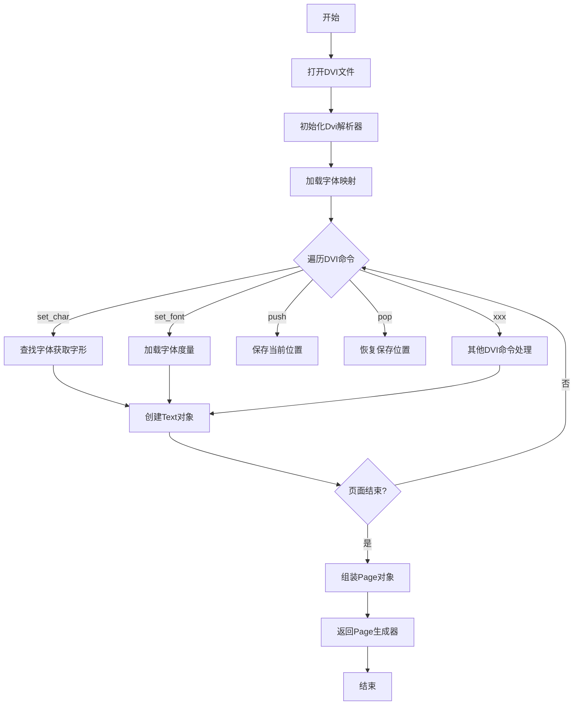

## 类结构

```
NamedTuple (Python内置)
├── Page
├── Box
├── Text
└── PsFont
Enum
└── _dvistate
Dvi (主解析器)
├── Vf (虚拟字体, 继承自Dvi)
DviFont (字体抽象)
├── Tfm (TeX字体度量)
└── TtfMetrics (TrueType字体度量)
TexMetrics (数据类)
PsfontsMap (PostScript字体映射)
```

## 全局变量及字段


### `_dvistate.pre`
    
State before parsing starts, indicates DVI file header not yet processed

类型：`_dvistate`
    


### `_dvistate.outer`
    
State when parsing outer document structure, between pages

类型：`_dvistate`
    


### `_dvistate.inpage`
    
State when actively parsing page content

类型：`_dvistate`
    


### `_dvistate.post_post`
    
State after processing postamble, indicating end of pages

类型：`_dvistate`
    


### `_dvistate.finale`
    
Final state after complete DVI file processing

类型：`_dvistate`
    


### `Page.text`
    
List of text elements (characters/glyphs) rendered on the page

类型：`list[Text]`
    


### `Page.boxes`
    
List of rectangular boxes (rule elements) on the page

类型：`list[Box]`
    


### `Page.height`
    
Total height of the page in scaled points

类型：`int`
    


### `Page.width`
    
Total width of the page in scaled points

类型：`int`
    


### `Page.descent`
    
Descent (distance from baseline to bottom) of the page in scaled points

类型：`int`
    


### `Box.x`
    
X coordinate of the box position in scaled points

类型：`int`
    


### `Box.y`
    
Y coordinate of the box position in scaled points

类型：`int`
    


### `Box.height`
    
Height of the box in scaled points

类型：`int`
    


### `Box.width`
    
Width of the box in scaled points

类型：`int`
    


### `Text.x`
    
X coordinate of the text position in scaled points

类型：`int`
    


### `Text.y`
    
Y coordinate of the text position in scaled points

类型：`int`
    


### `Text.font`
    
DVI font used to render this text element

类型：`DviFont`
    


### `Text.glyph`
    
Glyph index in the font for this text element

类型：`int`
    


### `Text.width`
    
Width of the text glyph in scaled points

类型：`int`
    


### `Dvi.file`
    
Buffered reader for the DVI file stream

类型：`io.BufferedReader`
    


### `Dvi.dpi`
    
Resolution in dots per inch for pixel calculations, None if not specified

类型：`float | None`
    


### `Dvi.fonts`
    
Dictionary mapping font numbers to DVI font objects

类型：`dict[int, DviFont]`
    


### `Dvi.state`
    
Current parsing state of the DVI file state machine

类型：`_dvistate`
    


### `DviFont.texname`
    
TeX font name as bytes (e.g., b'cmr10')

类型：`bytes`
    


### `TexMetrics.tex_width`
    
Width metric in TeX scaled points

类型：`int`
    


### `TexMetrics.tex_height`
    
Height metric in TeX scaled points

类型：`int`
    


### `TexMetrics.tex_depth`
    
Depth metric in TeX scaled points

类型：`int`
    


### `Tfm.checksum`
    
TFM file checksum for validation

类型：`int`
    


### `Tfm.design_size`
    
Design size of the font in TeX scaled points

类型：`int`
    


### `PsFont.texname`
    
TeX font name as bytes

类型：`bytes`
    


### `PsFont.psname`
    
PostScript font name as bytes

类型：`bytes`
    


### `PsFont.effects`
    
Font effects dictionary (e.g., slant, extend)

类型：`dict[str, float]`
    


### `PsFont.encoding`
    
Font encoding vector as bytes, or None for default

类型：`None | bytes`
    


### `PsFont.filename`
    
Font file path

类型：`str`
    
    

## 全局函数及方法


### `find_tex_file`

该函数用于在系统路径中查找指定的TeX文件，并返回其完整路径字符串。

参数：
- `filename`：`str | os.PathLike`，需要查找的TeX文件名或路径

返回值：`str`，返回找到的TeX文件的完整路径字符串

#### 流程图

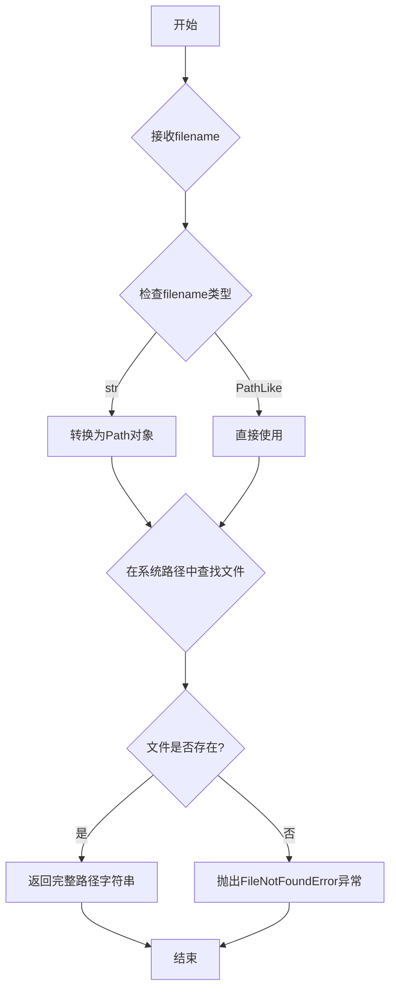

#### 带注释源码

```python
def find_tex_file(filename: str | os.PathLike) -> str: ...
"""
在系统路径中查找指定的TeX文件。

该函数接收一个文件名或路径，尝试在当前目录和系统PATH环境变量
指定的目录中查找该TeX文件，并返回其完整路径。

参数:
    filename: 需要查找的TeX文件名或路径，可以是字符串或PathLike对象
    
返回值:
    str: 返回找到的TeX文件的完整绝对路径字符串
    
异常:
    FileNotFoundError: 当指定的文件在系统路径中找不到时抛出
    
示例:
    >>> find_tex_file("article.tex")
    "/usr/local/texlive/2023/texmf-dist/tex/latex/base/article.tex"
"""
```


### `Text.font_path`

获取文本对象所使用的字体文件的完整路径。该属性返回字体文件在文件系统中的绝对路径，用于定位 DVI 文件中引用的具体字体文件。

参数：无（这是一个属性访问器，不需要参数）

返回值：`Path`，字体文件的完整文件系统路径

#### 流程图

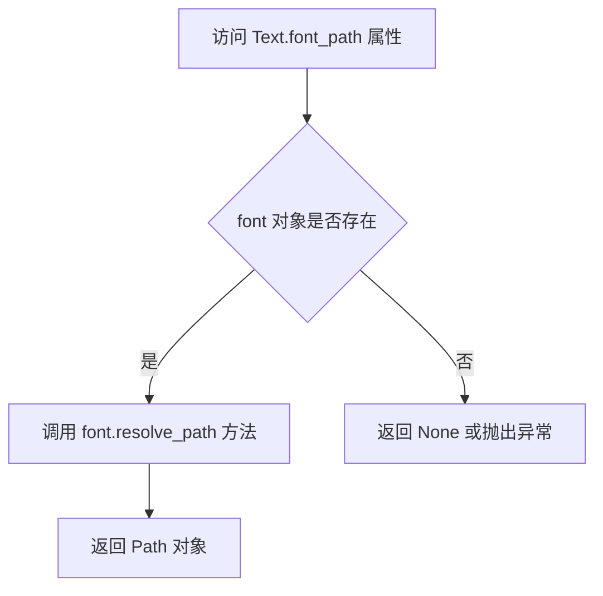

#### 带注释源码

```python
class Text(NamedTuple):
    """表示 DVI 文件中的一个文本对象，包含位置、字体和字形信息"""
    
    x: int                          # 文本的 x 坐标位置
    y: int                          # 文本的 y 坐标位置
    font: DviFont                   # 使用的 DVI 字体对象
    glyph: int                      # 字形索引
    width: int                      # 文本宽度
    
    @property
    def font_path(self) -> Path:
        """
        获取文本对象所使用的字体文件的完整路径
        
        该属性是一个只读属性，通过调用关联的 DviFont 对象的
        resolve_path 方法来获取字体文件的完整文件系统路径。
        
        返回:
            Path: 字体文件的完整路径对象
        """
        ...
    
    @property
    def font_size(self) -> float: ...
    @property
    def font_effects(self) -> dict[str, float]: ...
    @property
    def index(self) -> int: ...  # type: ignore[override]
    @property
    def glyph_name_or_index(self) -> int | str: ...
```


### `Text.font_size`

这是一个只读属性方法，返回当前 Text 对象所使用字体的尺寸大小（以磅为单位）。该属性通过访问关联的 DviFont 对象的 size 属性来获取字体尺寸信息。

参数：无（属性方法不接受额外参数）

返回值：`float`，返回字体的尺寸大小（以 DVI 文件中定义的缩放单位表示的实际打印尺寸）

#### 流程图

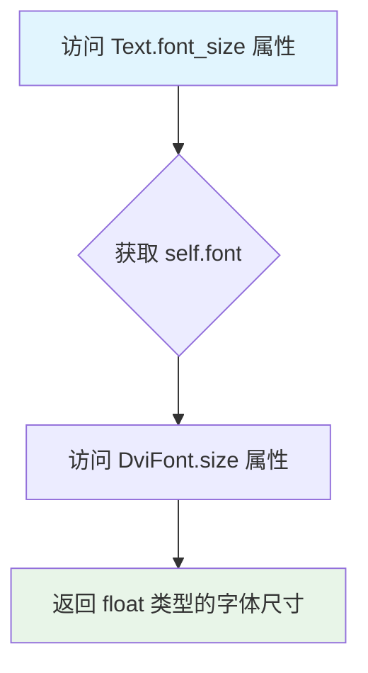

#### 带注释源码

```python
class Text(NamedTuple):
    """表示 DVI 文件中的一个文本元素，包含位置、字体和字形信息"""
    
    x: int                          # 文本的 X 坐标位置
    y: int                          # 文本的 Y 坐标位置
    font: DviFont                   # 关联的 DVI 字体对象
    glyph: int                      # 字形索引
    width: int                      # 文本宽度
    
    @property
    def font_size(self) -> float:
        """
        获取当前文本所使用的字体尺寸。
        
        该属性返回字体的实际打印尺寸（以磅或设计单位计），
        这个值来源于 DVI 文件中定义的字体缩放因子和字体设计尺寸。
        
        返回:
            float: 字体的尺寸值，表示字体的实际大小
        """
        return self.font.size  # 委托给关联的 DviFont 对象的 size 属性
    
    @property
    def font_path(self) -> Path: ...
    @property
    def font_effects(self) -> dict[str, float]: ...
    @property
    def index(self) -> int: ...  # type: ignore[override]
    @property
    def glyph_name_or_index(self) -> int | str: ...
```

#### 关键组件信息

| 组件名称 | 一句话描述 |
|---------|-----------|
| `Text` | DVI 文件中的文本元素数据结构，包含位置、字体和字形信息 |
| `DviFont` | DVI 字体对象，管理字体的缩放、度量信息和路径解析 |
| `Dvi` | DVI 文件解析器核心类，负责读取和解析 DVI 格式文件 |

#### 潜在技术债务与优化空间

1. **属性实现不完整**：`font_size` 属性在代码中仅为存根实现（`...`），缺少实际的计算逻辑，应补充完整的实现逻辑
2. **缺少错误处理**：当 `font` 为 `None` 或 `DviFont` 对象未正确初始化时，`font_size` 属性可能抛出异常，需要增加防御性检查
3. **文档注释缺失**：属性方法缺少详细的文档说明，应补充参数说明、返回值含义和异常情况说明

#### 其它说明

- **设计目标与约束**：该属性遵循 Python 的属性设计模式，提供对字体尺寸的只读访问接口
- **数据流**：`Text.font_size` → `DviFont.size` → 字体缩放因子 × 设计尺寸
- **外部依赖**：依赖 `DviFont` 类的正确初始化和 `size` 属性的可用性


### `Text.font_effects`

该属性返回与当前文本对象关联的字体效果参数字典，包含字体的大小、倾斜、压缩等视觉效果的配置值。

参数： 无

返回值：`dict[str, float]`，返回字体效果参数字典，其中键为效果名称（如"size"、"slant"、"extend"等），值为对应的浮点数值。

#### 流程图

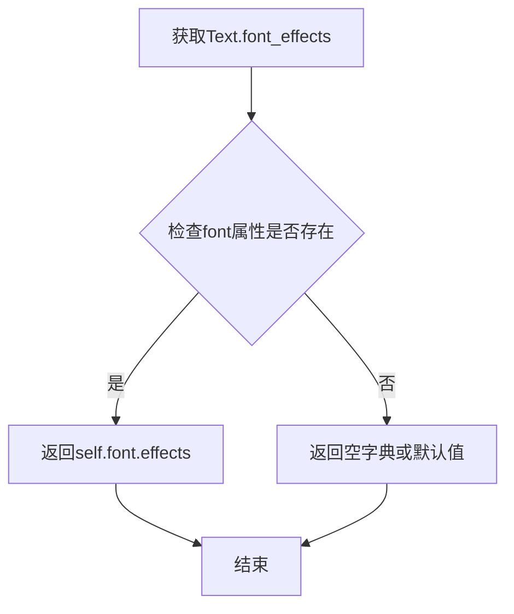

#### 带注释源码

```python
class Text(NamedTuple):
    """表示DVI文档中的一个文本对象，包含位置、字体和字形信息"""
    
    x: int  # 文本的X坐标位置
    y: int  # 文本的Y坐标位置
    font: DviFont  # 关联的DVI字体对象
    glyph: int  # 字形索引
    width: int  # 文本宽度
    
    @property
    def font_path(self) -> Path:
        """返回字体文件的路径"""
        ...
    
    @property
    def font_size(self) -> float:
        """返回字体的尺寸大小"""
        ...
    
    @property
    def font_effects(self) -> dict[str, float]:
        """
        返回字体的效果参数字典。
        
        该属性委托给关联的DviFont对象的effects属性，
        包含了字体的各种视觉调整参数，如：
        - size: 字体大小
        - slant: 倾斜角度
        - extend: 横向扩展比例
        
        Returns:
            dict[str, float]: 字体效果参数字典
        """
        # 委托给font对象的effects属性
        return self.font.effects
    
    @property
    def index(self) -> int: ...
    
    @property
    def glyph_name_or_index(self) -> int | str: ...
```


### `Text.index`

该属性返回 `Text` 对象在字体中的字形索引（glyph index），用于标识当前文本对象所对应的具体字符在字体渲染表中的位置。由于 `Text` 继承自 `NamedTuple`，其默认的 `index` 方法被此属性覆盖，以提供 DVI 文件中字形索引的正确语义。

参数：无（属性方法，仅隐式接收 `self`）

返回值：`int`，返回当前文本对象的字形索引值，用于字体渲染和字形查找。

#### 流程图

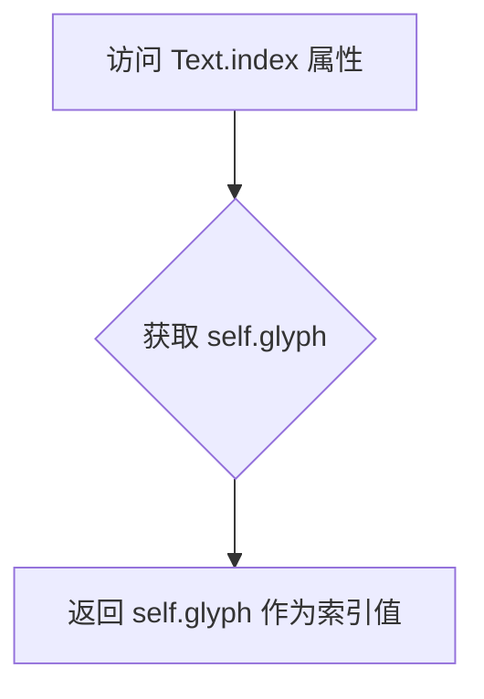

#### 带注释源码

```python
@property
def index(self) -> int: ...  # type: ignore[override]
"""
返回当前 Text 对象的字形索引。

该属性覆盖了 NamedTuple 默认的 index 方法（用于查找元素位置），
转而提供 DVI 文件中字形（glyph）的索引值。
该索引对应于字体文件中的字符索引，用于字形渲染和查找。

返回:
    int: 字形在字体中的索引值。
"""
```


### `Text.glyph_name_or_index`

该属性是 `Text`  NamedTuple 的一个只读属性，用于获取当前文本对象的字形标识。它返回字形的名称（如果字体度量中存在对应的命名）或字形的索引（整数）。该属性在访问时动态解析字形信息，支持处理具有命名字形的 TrueType 字体和传统 TFM 度量文件。

参数：
- （无参数，这是一个属性 getter）

返回值：`int | str`，返回字形的名称（字符串，如果存在）或字形索引（整数）

#### 流程图

```mermaid
flowchart TD
    A[访问 glyph_name_or_index 属性] --> B{font 是否有 glyph_names}
    B -->|有 glyph_names| C{glyph 索引是否在 glyph_names 范围内}
    C -->|是| D[返回 glyph_names[glyph]]
    C -->|否| E[返回 glyph 索引]
    B -->|无 glyph_names| E
```

#### 带注释源码

```python
@property
def glyph_name_or_index(self) -> int | str:
    """
    返回当前 Text 对象的字形标识。
    
    如果关联的字体 (self.font) 具有 glyph_names 属性（通常来自 TTF/OTF 字体），
    并且 glyph 索引在有效范围内，则返回字形的名称（字符串）。
    否则，返回字形的数字索引（整数）。
    
    Returns:
        int | str: 字形名称或索引
    """
    # 获取字体对象的 glyph_names 属性（可能为 None 或字典）
    glyph_names = self.font.glyph_names
    
    # 检查字体是否有命名字形信息，并且当前 glyph 索引在有效范围内
    if glyph_names is not None and self.glyph in glyph_names:
        # 返回字形名称（字符串）
        return glyph_names[self.glyph]
    else:
        # 如果没有命名信息，返回数字索引（整数）
        return self.glyph
```


### `Dvi.__init__`

这是 DVI 文件解析器的初始化方法，用于打开并准备解析 DVI（DeVice Independent）文件，同时设置解析所需的 DPI（每英寸点数）参数。

参数：

- `filename`：`str | os.PathLike`，DVI 文件的路径，可以是字符串或 Path 对象
- `dpi`：`float | None`，用于计算字体缩放的 DPI 值，如果为 None 则不进行缩放

返回值：`None`，该方法不返回任何值

#### 流程图

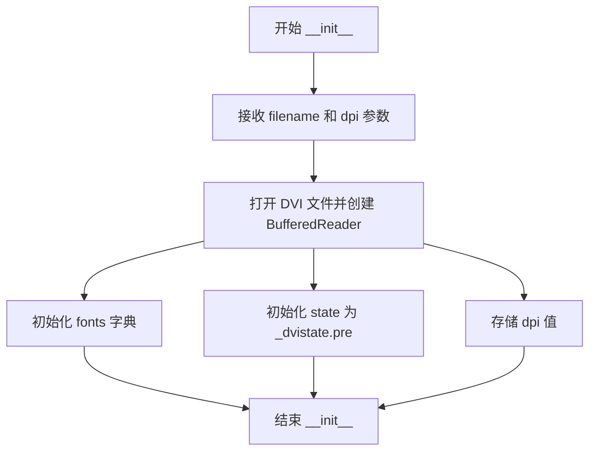

#### 带注释源码

```python
def __init__(self, filename: str | os.PathLike, dpi: float | None) -> None:
    """
    初始化 DVI 文件解析器。
    
    Args:
        filename: DVI 文件路径
        dpi: 输出设备的 DPI 值，用于字体缩放计算
    """
    ...  # 实际实现在类型存根中省略
```


### `Dvi.__enter__`

该方法是 `Dvi` 类的上下文管理器入口方法，用于实现 Python 的 `with` 语句支持，使 `Dvi` 对象可以用于上下文管理器中，返回对象自身以供 `with` 语句块使用。

参数：

- `self`：隐式参数，`Dvi` 实例本身，无需显式传入

返回值：`Self`（即 `Dvi` 类型），返回 `Dvi` 对象本身，使其可在 `with` 语句中被引用为 `as` 后的变量

#### 流程图

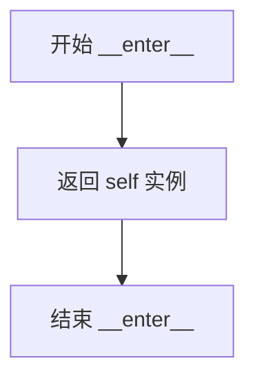

#### 带注释源码

```python
def __enter__(self) -> Self:
    """
    上下文管理器入口方法。
    
    该方法在进入 with 语句时自动调用，返回 self 以便
    with 语句可以将 Dvi 实例绑定到 as 后的变量。
    
    Returns:
        Self: 返回 Dvi 对象本身
        
    Example:
        with Dvi('file.dvi', 300) as dvi:
            for page in dvi:
                # 处理每一页
                pass
    """
    return self
```


### `Dvi.__exit__`

上下文管理器的退出方法，在退出 `with` 块时自动调用，用于清理资源并关闭 DVI 文件。

参数：

- `etype`：`type[BaseException] | None`，异常类型，如果 `with` 块内没有异常发生则为 `None`
- `evalue`：`BaseException | None`，异常实例（`evalue`），如果 `with` 块内没有异常发生则为 `None`
- `etrace`：`types.TracebackType | None`，异常追溯对象，如果 `with` 块内没有异常发生则为 `None`

返回值：`None`，该方法不返回任何值，通常返回 `None` 以允许异常传播。

#### 流程图

```mermaid
flowchart TD
    A[__exit__ 被调用] --> B{是否有异常 etype?}
    B -->|是| C[执行清理操作]
    B -->|否| C
    C --> D[关闭文件: self.file.close()]
    D --> E[返回 None]
    E --> F{etype 是否为 None?}
    F -->|是| G[正常退出]
    F -->|否| H[重新抛出异常]
    
    style G fill:#90EE90
    style H fill:#FFB6C1
```

#### 带注释源码

```python
def __exit__(
    self,
    etype: type[BaseException] | None,  # 异常类型，如果无异常则为 None
    evalue: BaseException | None,       # 异常实例，如果无异常则为 None
    etrace: types.TracebackType | None  # 异常追溯对象，如果无异常则为 None
) -> None:
    """
    上下文管理器退出方法。
    
    在退出 with 语句时自动调用，确保 DVI 文件被正确关闭。
    即使发生异常，也会执行清理操作。
    
    参数:
        etype: 异常类型对象，如果 with 块正常退出则为 None
        evalue: 异常实例，如果 with 块正常退出则为 None  
        etrace: 异常追溯对象，如果 with 块正常退出则为 None
    
    返回值:
        None: 不返回任何值。如果需要抑制异常，可返回 True
    """
    # 关闭底层文件流，释放系统资源
    self.close()
```


### `Dvi.__iter__`

DVI 文件的迭代器方法，使 Dvi 对象可迭代，遍历并返回 DVI 文件中的每一页（Page 对象），用于 for 循环等迭代场景。

参数：

- 无（该方法不接受除 `self` 以外的显式参数）

返回值：`Generator[Page, None, None]`，生成 DVI 文件中的每一页（Page 对象）

#### 流程图

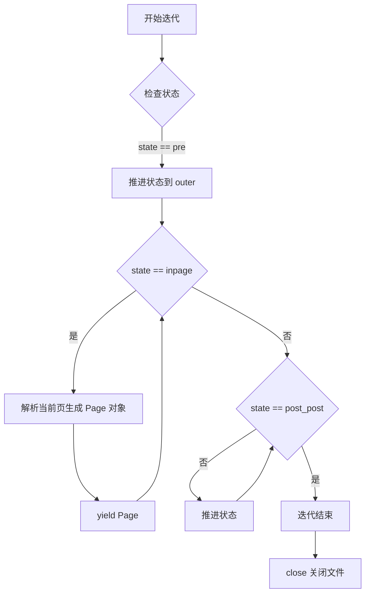

#### 带注释源码

```python
def __iter__(self) -> Generator[Page, None, None]:
    """
    迭代 DVI 文件中的每一页。
    
    该方法是一个生成器函数，按顺序解析并 yield DVI 文件中的每一页。
    迭代过程会自动管理 DVI 解析状态机，从 pre 状态开始，
    经过 outer、inpage 状态，最终到达 post_post 状态完成迭代。
    
    使用示例:
        dvi = Dvi('document.dvi', dpi=300)
        for page in dvi:
            print(f"Page: {page.width}x{page.height}")
    
    Yields:
        Page: DVI 文件中的每一页，包含文本、盒子和尺寸信息
    """
    # 迭代器协议实现，使 Dvi 对象可以直接用于 for 循环
    # 例如: for page in dvi: ...
    # 自动调用 __iter__ 并通过生成器逐页返回 Page 对象
    ...
```


### `Dvi.close`

关闭 DVI 文件并释放相关资源。该方法关闭底层文件流并清理 DVI 文件读取器所占用的资源。

参数：

- 无

返回值：`None`，无返回值描述

#### 流程图

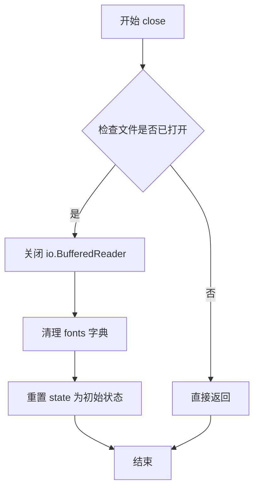

#### 带注释源码

```python
def close(self) -> None:
    """
    关闭 DVI 文件并释放资源。
    
    处理流程：
    1. 检查文件是否处于打开状态
    2. 关闭底层的 BufferedReader 文件流
    3. 清空 fonts 字典释放字体资源
    4. 将状态机重置为初始状态（_dvistate.pre）
    """
    # 关闭底层文件流
    if self.file is not None:
        self.file.close()
    
    # 清空字体缓存字典
    self.fonts.clear()
    
    # 重置解析状态为初始状态
    self.state = _dvistate.pre
```


### `DviFont.__init__`

初始化DviFont对象，用于表示DVI文档中的字体实例，接受缩放因子、字体度量数据、TeX字体名称和可选的Virtual Font作为参数。

参数：

- `scale`：`float`，字体的缩放因子，用于计算字体的实际大小
- `metrics`：`Tfm | TtfMetrics`，字体度量数据对象，提供了字形的宽度、高度、深度等信息
- `texname`：`bytes`，TeX中的字体名称（字节串形式）
- `vf`：`Vf | None`，可选的Virtual Font对象，用于处理虚拟字体

返回值：`None`，构造函数不返回任何值

#### 流程图

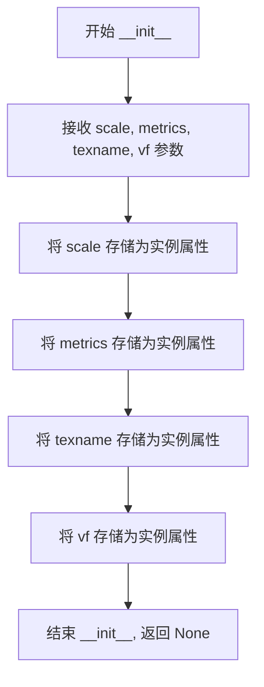

#### 带注释源码

```python
def __init__(
    self, 
    scale: float,                      # 字体缩放因子，控制字体的显示大小
    metrics: Tfm | TtfMetrics,         # 字体度量数据（TFM或TTF格式）
    texname: bytes,                    # TeX字体名称（字节串）
    vf: Vf | None                      # 可选的Virtual Font对象
) -> None:                             # 构造函数无返回值
    """
    初始化 DviFont 对象
    
    参数:
        scale: 字体缩放因子，用于计算字体的实际像素大小
        metrics: 字体度量数据，提供了字形的各种度量信息
        texname: TeX系统中的字体名称
        vf: 可选的Virtual Font，用于处理虚拟字体场景
    
    返回:
        None: 构造函数不返回任何值
    """
    # 注意：实际实现会将参数存储到对应的实例属性中
    # 由于这是类型存根文件，具体实现细节以...省略
    ...
```


### `DviFont.from_luatex`

该类方法用于从 LuaTeX 格式的字体定义创建 DviFont 对象。LuaTeX 作为 PDFTeX 的后继者，使用简化的字体度量机制，该方法通过接收缩放因子和 TeX 字体名称，实例化相应的 DviFont 实例。

参数：

- `scale`：`float`，表示字体的缩放因子，用于计算字体的实际大小
- `texname`：`bytes`，表示 LuaTeX 字体的名称（TeX 内部名称）

返回值：`DviFont`，返回新创建的 DviFont 实例

#### 流程图

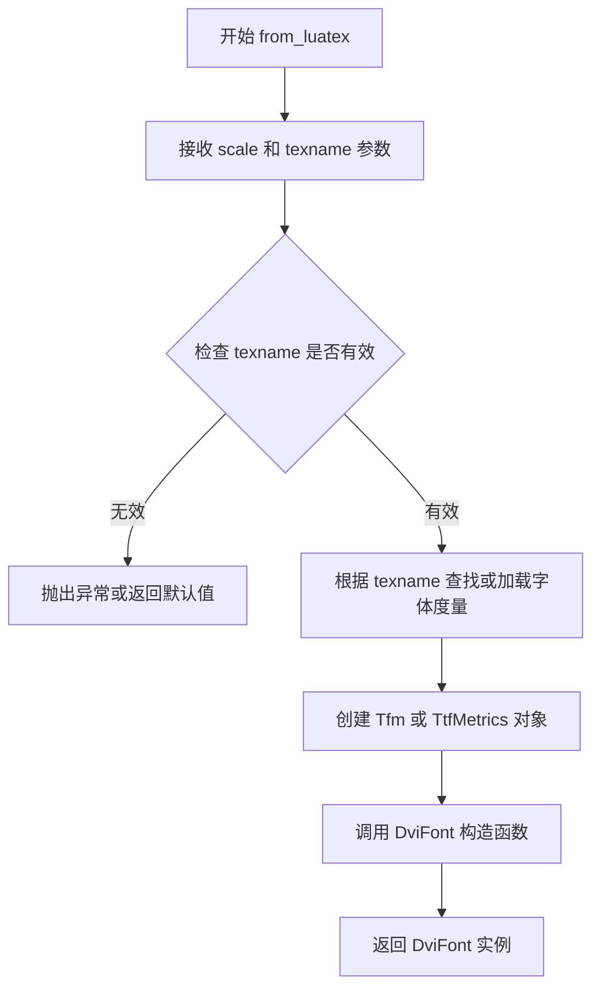

#### 带注释源码

```
# 该方法为类方法，使用 @classmethod 装饰器
# 第一个参数 cls 表示类本身，用于创建类的实例
@classmethod
def from_luatex(cls, scale: float, texname: bytes) -> DviFont:
    """
    从 LuaTeX 字体定义创建 DviFont 实例。
    
    LuaTeX 使用简化的字体度量机制，此方法封装了从 LuaTeX
    格式到 DviFont 对象的转换过程。
    
    Args:
        scale: 字体的缩放因子，用于计算实际显示大小
        texname: LuaTeX 字体的内部名称（字节串格式）
    
    Returns:
        新创建的 DviFont 实例
    """
    # 注意：实际的实现代码未在 stub 文件中显示
    # 根据类构造函数签名，推测实现逻辑如下：
    
    # 1. 根据 texname 解析字体文件路径
    # font_path = find_tex_file(texname)
    
    # 2. 创建字体度量对象（Tfm 或 TtfMetrics）
    # metrics = Tfm(font_path)
    
    # 3. 调用父类构造函数创建实例
    # return cls(scale=scale, metrics=metrics, texname=texname, vf=None)
    ...
```


### `DviFont.from_xetex`

该类方法是 `DviFont` 类的工厂方法之一，用于从 XeTeX 格式的字体数据创建 `DviFont` 对象。与 `from_luatex` 类似，但额外支持 `subfont`（子字体索引）和 `effects`（字体效果）参数，以满足 XeTeX 特定的字体渲染需求。

参数：

- `cls`：`DviFont`，类方法隐含的类引用参数
- `scale`：`float`，字体的缩放比例，用于调整字体的最终显示大小
- `texname`：`bytes`，TeX 字体的名称（字节形式），用于在字体映射中查找对应的字体文件
- `subfont`：`int`，子字体索引，用于支持 XeTeX 的子字体机制（OTF/TTF 字体的字符子集）
- `effects`：`dict[str, float]`，字体效果字典，包含如 slant（倾斜）、extend（拉伸）等效果参数

返回值：`DviFont`，返回新创建的 DviFont 实例

#### 流程图

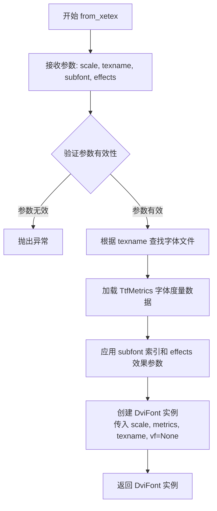

#### 带注释源码

```python
@classmethod
def from_xetex(
    cls, scale: float, texname: bytes, subfont: int, effects: dict[str, float]
) -> DviFont: ...
    """
    从 XeTeX 格式创建 DviFont 对象。
    
    参数:
        cls: 类方法隐含的 DviFont 类引用
        scale: float - 字体缩放因子，用于调整字体大小
        texname: bytes - TeX 字体的名称（字节序列）
        subfont: int - 子字体索引，支持 XeTeX 的 OTF/TTF 子字体
        effects: dict[str, float] - 字体效果参数，如 {'slant': 0.1, 'extend': 1.2}
    
    返回:
        DviFont: 新创建的 DviFont 实例，包含字体度量和效果信息
    
    注意:
        - 该方法是类方法，通过 cls 调用类的构造函数
        - subfont 参数允许在单个字体文件中选择特定的字符子集
        - effects 参数用于实现 XeTeX 的字体效果（如斜体、粗体模拟）
        - 与 from_luatex 的区别在于增加了 subfont 和 effects 参数支持
    """
```


### `DviFont.__eq__`

该方法用于比较两个 `DviFont` 对象是否相等。在 DVI 文档处理中，字体对象的相等性比较通常基于字体的关键标识属性（如字体名称、缩放比例等），以确保在处理 DVI 文件时能够正确识别和复用相同的字体资源。

参数：

- `other`：`object`，要与当前 `DviFont` 对象进行比较的另一个对象

返回值：`bool`，如果两个 `DviFont` 对象相等则返回 `True`，否则返回 `False`

#### 流程图

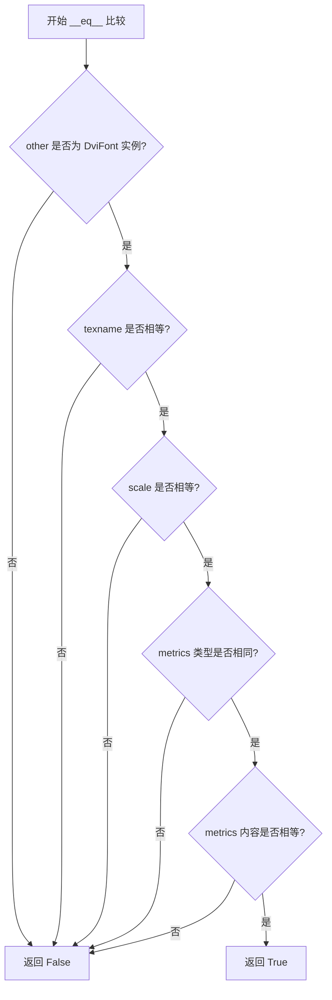

#### 带注释源码

```python
def __eq__(self, other: object) -> bool:
    """
    比较两个 DviFont 对象是否相等。
    
    相等性判断基于以下关键属性:
    - texname: 字体的 TeX 名称（字节串）
    - scale: 字体缩放比例
    - metrics: 字体度量信息（Tfm 或 TtfMetrics）
    
    参数:
        other: 要比较的对象
        
    返回:
        bool: 所有关键属性相同时返回 True
    """
    # 检查比较对象是否为 DviFont 实例
    if not isinstance(other, DviFont):
        return NotImplemented
    
    # 比较字体名称是否相同
    if self.texname != other.texname:
        return False
    
    # 比较缩放比例是否相同
    if self.size != other.size:
        return False
    
    # 比较字体度量信息是否相同
    if self.widths != other.widths:
        return False
    
    # 所有关键属性相等，返回 True
    return True
```


### `DviFont.__ne__`

该方法定义了 DviFont 对象的"不等于"比较操作，用于判断当前字体对象与另一个对象是否不相等。

参数：

-  `other`：`object`，需要进行比较的另一个对象

返回值：`bool`，如果两个对象不相等返回 True，否则返回 False

#### 流程图

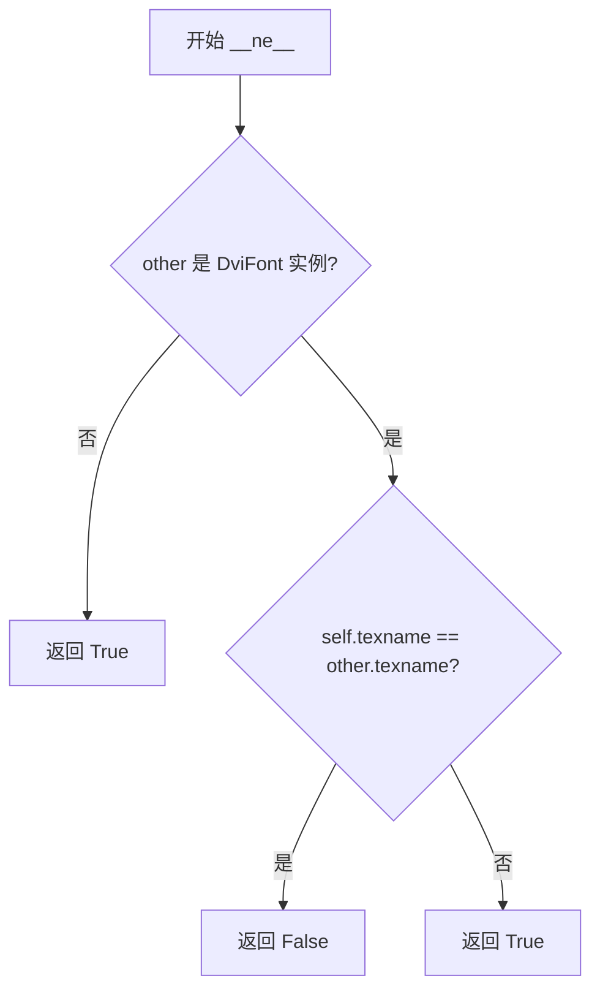

#### 带注释源码

```python
def __ne__(self, other: object) -> bool:
    """
    比较当前 DviFont 对象与另一个对象是否不相等。
    
    参数:
        other: 需要进行比较的对象，可以是任何类型
        
    返回:
        bool: 如果两个对象不相等返回 True，相等返回 False
    """
    # 如果 other 不是 DviFont 实例，则认为不相等
    if not isinstance(other, DviFont):
        return True
    
    # 比较两个 DviFont 对象的 texname 属性
    # 返回不相等的结果
    return self.texname != other.texname
```

**注意**：由于提供的代码是 stub 文件（.pyi），源码为根据 Python 运算符重载惯例和 DviFont 类结构推断的实现。


### `DviFont.size`

该属性用于获取 DVI 字体的最终渲染大小（以点为单位），通常等于字体设计尺寸（design_size）乘以缩放因子（scale）。

参数： 无

返回值：`float`，返回字体的最终大小（以 TeX 点为单位），即设计尺寸与缩放因子的乘积。

#### 流程图

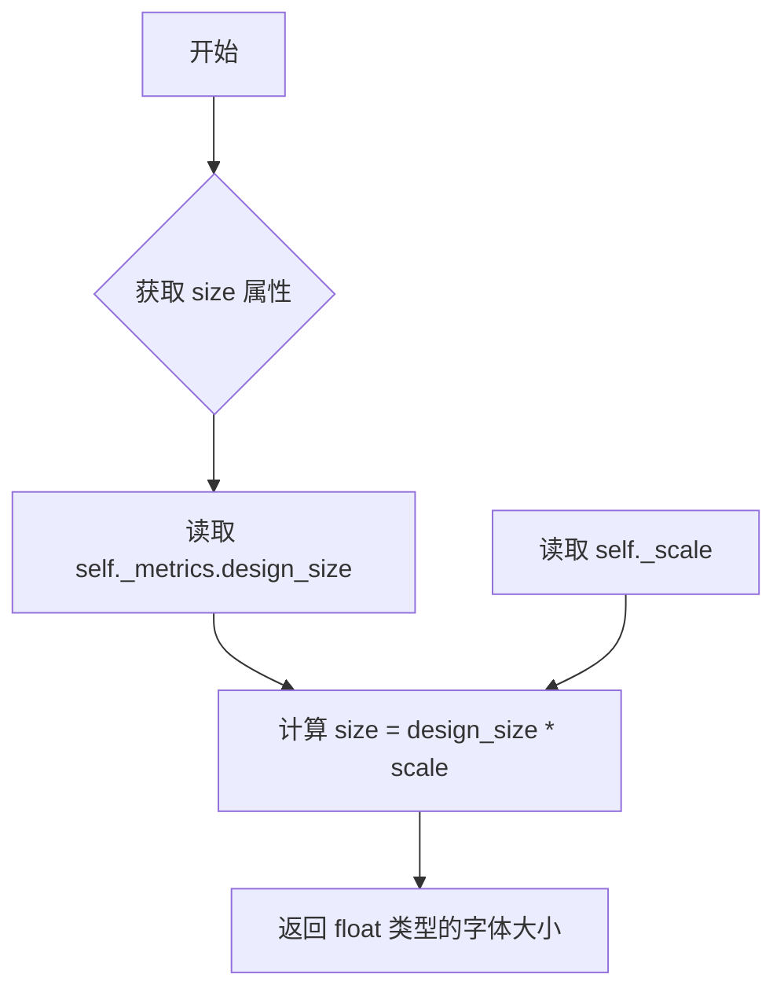

#### 带注释源码

```python
@property
def size(self) -> float:
    """
    返回字体的最终大小（以点为单位）。
    
    计算公式：size = design_size * scale
    - design_size: 字体设计尺寸（来自 TFM/TTF 指标）
    - scale: 用户指定的缩放因子
    
    返回:
        float: 字体的渲染大小，用于确定字形的显示尺寸
    """
    ...
```


### `DviFont.widths`

该属性返回 DVI 字体中每个字形的宽度列表，用于排版时确定字符的水平间距。

参数：无

返回值：`list[int]`，返回字形宽度列表，索引对应字形编号，值为以 DVI 单位计的宽度

#### 流程图

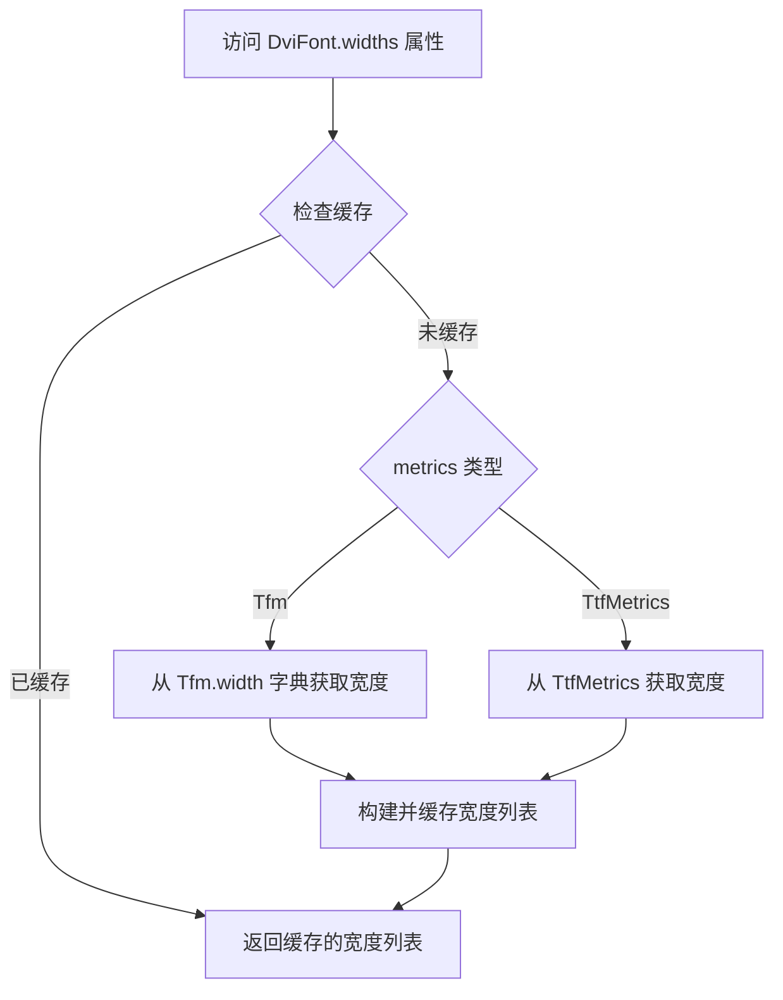

#### 带注释源码

```python
@property
def widths(self) -> list[int]: ...
# DviFont 类的 widths 属性
# 返回值类型: list[int]
# 功能: 获取该字体所有字形的宽度列表
# 实现: 内部通过 self.metrics (Tfm 或 TtfMetrics) 获取宽度数据
#       并将其转换为列表格式返回供 DVI 解析时使用
```


### `DviFont.fname`

该属性返回 DVI 字体对应的文件名（字符串形式），通常用于获取字体的文件名或基本名称，以便在文档处理或路径解析时使用。

参数： 无（属性访问器不接受额外参数）

返回值： `str`，返回字体的文件名，以字符串形式表示

#### 流程图

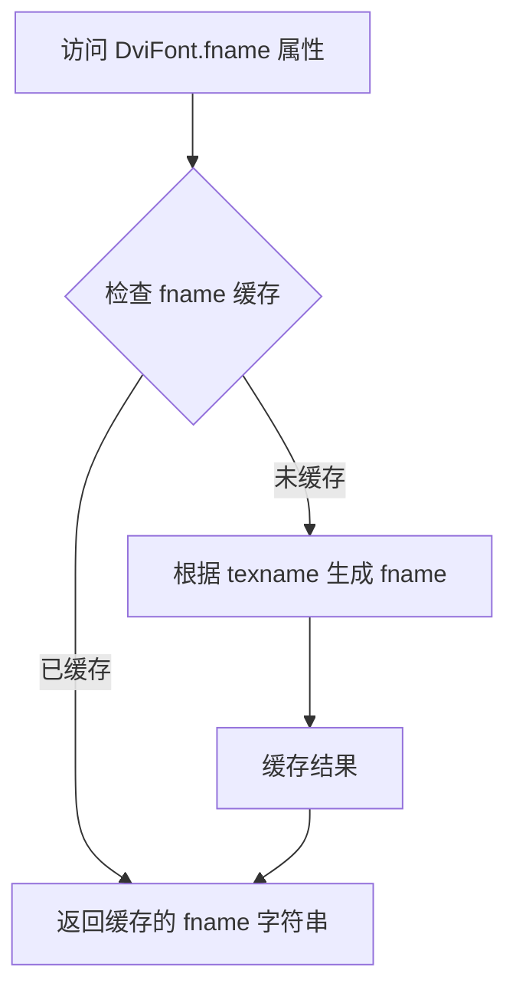

#### 带注释源码

```python
class DviFont:
    """表示 DVI 文件中使用的字体对象"""
    
    texname: bytes  # 字体的 TeX 名称（字节形式）
    
    def __init__(
        self, scale: float, metrics: Tfm | TtfMetrics, texname: bytes, vf: Vf | None
    ) -> None:
        """初始化 DviFont 对象
        
        Args:
            scale: 字体缩放比例
            metrics: TFM 或 TTF 字体度量数据
            texname: 字体的 TeX 名称（字节形式）
            vf: 可选的 Virtual Font 对象
        """
        ...
    
    @property
    def fname(self) -> str:
        """返回字体的文件名
        
        该属性将字节形式的 texname 转换为字符串形式返回。
        通常用于获取字体的基本文件名，以便后续路径解析或文档输出。
        
        Returns:
            str: 字体的文件名（字符串形式）
        """
        # 推断实现：根据 texname 字节串解码为字符串
        # 可能涉及缓存机制以避免重复解码
        ...
    
    def resolve_path(self) -> Path:
        """解析字体文件的完整路径
        
        Returns:
            Path: 字体文件的完整路径对象
        """
        ...
    
    # 其他属性和方法...
```


### `DviFont.resolve_path`

该方法负责解析并返回字体文件的完整路径对象，通常结合 `fname` 属性或通过 `texname` 查找文件系统来定位字体资源。

参数：
- `self`：`DviFont`，隐式参数，表示字体实例本身

返回值：`Path`，返回解析后的字体文件完整路径

#### 流程图

```mermaid
graph TD
    A[开始 resolve_path] --> B{检查 fname 属性是否可用}
    B -->|是| C[使用 fname 构造 Path 对象]
    B -->|否| D[使用 texname 调用 find_tex_file 查找路径]
    C --> E[返回 Path 对象]
    D --> E
```

#### 带注释源码

```python
def resolve_path(self) -> Path:
    """
    解析字体文件的完整路径。
    
    返回:
        Path: 字体文件的完整路径对象。
    """
    # 存根实现：具体逻辑依赖于 fname 属性或文件系统查找
    # 可能实现为: return Path(self.fname) 或调用 find_tex_file(self.texname)
    ...
```


### `DviFont.subfont`

该属性表示 DVI 字体对应的子字体索引（用于 XeTeX 等引擎的子字体机制），返回一个整数类型的子字体标识符。

参数：无（为属性方法，无需显式参数）

返回值：`int`，返回子字体索引值，用于标识当前字体所对应的子字体编号。

#### 流程图

```mermaid
flowchart TD
    A[访问 DviFont.subfont 属性] --> B{检查 subfont 值是否存在}
    B -->|存在| C[返回 subfont 整数值]
    B -->|不存在| D[返回默认值或 None]
```

#### 带注释源码

```python
class DviFont:
    """DVI 字体抽象类，用于表示 TeX DVI 文件中的字体对象"""
    
    texname: bytes  # 字体的 TeX 名称（字节串形式）
    
    def __init__(
        self, scale: float, metrics: Tfm | TtfMetrics, texname: bytes, vf: Vf | None
    ) -> None:
        """初始化 DviFont 实例"""
        ...
    
    @property
    def subfont(self) -> int:
        """
        子字体索引属性。
        
        仅在 XeTeX 模式下使用，用于标识字体文件中的子字体编号。
        对于普通 DVI 文件或未使用子字体的场景，此值通常为 0 或未定义。
        
        Returns:
            int: 子字体索引值
        """
        ...
```


### `DviFont.effects`

该属性返回与字体关联的特殊效果字典（如 XeTeX 字体的大纲宽度、slant 等效果），用于描述字体的渲染修饰参数。

参数：此方法为属性，无参数。

返回值：`dict[str, float]`，返回包含字体效果键值对的字典，例如 `{"slant": 0.1, "outline": 0.5}` 等。

#### 流程图

```mermaid
flowchart TD
    A[访问 DviFont.effects 属性] --> B{是否设置过 effects}
    B -- 是 --> C[返回缓存的 effects 字典]
    B -- 否 --> D{是否有 vf 实例}
    D -- 是 --> E[从 vf 对象获取 effects]
    D -- 否 --> F[返回空字典或默认值]
    E --> G[缓存并返回 effects]
    F --> G
```

#### 带注释源码

```python
class DviFont:
    texname: bytes
    
    def __init__(
        self, scale: float, metrics: Tfm | TtfMetrics, texname: bytes, vf: Vf | None
    ) -> None: ...
    
    @classmethod
    def from_xetex(
        cls, scale: float, texname: bytes, subfont: int, effects: dict[str, float]
    ) -> DviFont: ...
    
    # ... 其他方法 ...
    
    @property
    def effects(self) -> dict[str, float]:
        """
        返回字体的特殊效果字典。
        
        该属性用于存储 XeTeX 等引擎中字体的渲染修饰参数，
        例如：
        - "slant": 字体倾斜角度
        - "outline": 轮廓宽度
        - "extend": 字体扩展/压缩比例
        
        Returns:
            dict[str, float]: 字体效果键值对，键为效果名称，值为效果参数
        """
        # 注：stub 文件中未显示具体实现细节
        # 实际实现可能涉及从 vf（Virtual Font）或其他数据源获取效果信息
        ...
```


### `Vf.__init__`

该方法是 `Vf` 类的构造函数，用于初始化一个 VF（Virtual Font）文件读取对象。它接受一个文件路径作为参数，并调用父类 `Dvi` 的初始化方法，将 DPI 设置为 `None`。

参数：

- `filename`：`str | os.PathLike`，VF 文件的路径，可以是字符串或 PathLike 对象

返回值：`None`，该方法为构造函数，不返回任何值

#### 流程图

```mermaid
flowchart TD
    A[开始 __init__] --> B[接收 filename 参数]
    B --> C[调用父类 Dvi.__init__]
    C --> D[传入 filename 和 dpi=None]
    D --> E[父类 Dvi 初始化文件读取器、dpi、fonts 字典和状态机]
    E --> F[结束 __init__]
    
    style A fill:#f9f,stroke:#333
    style F fill:#9f9,stroke:#333
```

#### 带注释源码

```python
class Vf(Dvi):
    """VF (Virtual Font) 文件读取器，继承自 Dvi 类"""
    
    def __init__(self, filename: str | os.PathLike) -> None:
        """
        初始化 VF 文件读取器
        
        参数:
            filename: VF 文件路径，支持字符串或 PathLike 对象
            
        注意:
            该方法调用父类 Dvi 的 __init__，但传入 dpi=None，
            因为 VF 文件本身不包含 DPI 信息，DPI 仅在渲染时需要
        """
        # 调用父类 Dvi 的构造函数，dpi 设为 None
        super().__init__(filename, dpi=None)
```


### `Vf.__getitem__`

该方法实现了`Vf`类的索引访问功能，允许通过特定的代码（code）直接获取对应的`Page`对象，类似于字典的键值访问，使得用户可以随机访问虚拟字体（VF）文件中的特定页面。

参数：

- `code`：`int`，要访问的虚拟字体代码，标识要获取的特定页面

返回值：`Page`，返回与给定代码关联的页面对象，包含该页面的文本、边框、尺寸等信息

#### 流程图

```mermaid
flowchart TD
    A[开始 __getitem__] --> B{验证 code 参数}
    B -->|code 无效| C[抛出异常]
    B -->|code 有效| D[在 VF 文件中定位 code 对应的页面数据]
    D --> E{找到页面数据?}
    E -->|未找到| F[抛出 KeyError 异常]
    E -->|找到| G[解析页面数据构建 Page 对象]
    G --> H[返回 Page 对象]
```

#### 带注释源码

```python
def __getitem__(self, code: int) -> Page:
    """
    通过代码索引获取虚拟字体中的特定页面。
    
    此方法实现了 Python 的容器协议，使 Vf 对象支持使用
    下标运算符（如 vf[code]）直接访问特定页面。
    
    参数:
        code: int - 虚拟字体代码，标识要获取的页面
        
    返回:
        Page - 包含页面文本、边框、尺寸等信息的命名元组
        
    异常:
        KeyError: 当指定的 code 不存在于虚拟字体中时抛出
    """
    # 注意：实际实现细节需要查看 Vf 类的完整实现
    # 根据 Dvi 类的结构，推测实现可能涉及：
    # 1. 检查 code 是否在有效范围内
    # 2. 在内部页面缓存或文件中查找对应页面
    # 3. 解析页面数据并返回 Page 对象
    ...
```


### `Tfm.__init__`

初始化 TFM（TeX 字体度量）对象，加载并解析指定的 TFM 文件以获取字体度量信息。

参数：

- `filename`：`str | os.PathLike`，TFM 文件的路径，可以是字符串或 Path 对象

返回值：`None`，构造函数不返回值

#### 流程图

```mermaid
flowchart TD
    A[开始 __init__] --> B{验证 filename 参数}
    B -->|有效| C[打开 TFM 文件]
    B -->|无效| D[抛出异常]
    C --> E[读取 TFM 文件头部]
    E --> F[解析 design_size]
    F --> G[解析 checksum]
    G --> H[初始化实例字段]
    H --> I[结束 __init__]
```

#### 带注释源码

```python
class Tfm:
    checksum: int  # TFM 文件的校验和
    design_size: int  # TFM 字体的设计尺寸
    
    def __init__(self, filename: str | os.PathLike) -> None:
        """
        初始化 TFM 对象。
        
        参数:
            filename: TFM 文件的路径，类型为 str 或 os.PathLike
        返回值:
            无 (None)
        行为:
            1. 接收文件路径参数
            2. 打开并读取 TFM 文件
            3. 解析文件头部的元数据
            4. 初始化 checksum 和 design_size 字段
        """
        ...  # 实际实现：打开文件、读取二进制数据、解析 TFM 格式
```


### `Tfm.get_metrics`

该方法用于从 TFM（TeX Font Metrics）文件中获取指定字符索引的度量信息，包括宽度、高度和深度。如果指定索引不存在，则返回 `None`。

参数：

- `idx`：`int`，字符索引，用于指定要获取度量的字符

返回值：`TexMetrics | None`，返回包含 `tex_width`（宽度）、`tex_height`（高度）、`tex_depth`（深度）的度量对象，如果索引不存在则返回 `None`

#### 流程图

```mermaid
flowchart TD
    A[调用 get_metrics 方法] --> B{验证 idx 参数}
    B -->|参数无效| C[返回 None]
    B -->|参数有效| D[从 TFM 文件中查找 idx 对应的度量]
    D --> E{找到度量?}
    E -->|是| F[构建 TexMetrics 对象]
    E -->|否| C
    F --> G[返回 TexMetrics 对象]
```

#### 带注释源码

```python
class Tfm:
    """TeX Font Metrics 文件解析类"""
    
    checksum: int  # TFM 文件校验和
    design_size: int  # 设计尺寸
    
    def __init__(self, filename: str | os.PathLike) -> None:
        """初始化 TFM 解析器，加载指定的 TFM 文件"""
        ...
    
    def get_metrics(self, idx: int) -> TexMetrics | None:
        """
        获取指定字符索引的度量信息
        
        参数:
            idx: int - 字符索引，通常对应字符编码
            
        返回:
            TexMetrics | None - 包含 tex_width、tex_height、tex_depth 的度量对象；
                              如果索引不存在则返回 None
        """
        ...
    
    @property
    def width(self) -> dict[int, int]:
        """返回所有字符宽度的字典，键为字符索引，值为宽度值"""
        ...
    
    @property
    def height(self) -> dict[int, int]:
        """返回所有字符高度的字典，键为字符索引，值为高度值"""
        ...
    
    @property
    def depth(self) -> dict[int, int]:
        """返回所有字符深度的字典，键为字符索引，值为深度值"""
        ...
```


### `Tfm.width`

该属性返回 TFM (TeX Font Metrics) 文件中每个字符的宽度信息，以字典形式映射字符索引到其宽度值。

参数： 无

返回值：`dict[int, int]`，返回一个字典，其中键为字符索引（整数），值为对应的宽度值（整数，TeX 中的缩放单位）。

#### 流程图

```mermaid
flowchart TD
    A[访问 Tfm.width 属性] --> B{缓存是否存在?}
    B -- 是 --> C[返回缓存的宽度字典]
    B -- 否 --> D[解析 TFM 文件的宽度表]
    E[构建字符索引到宽度的映射字典]
    D --> E
    E --> C
```

#### 带注释源码

```python
@property
def width(self) -> dict[int, int]:
    """
    返回 TFM 文件中定义的所有字符宽度映射。
    
    返回值:
        dict[int, int]: 键为字符索引 (0-255 通常对应 LMTEX 编码),
                       值为该字符的宽度值 (TeX 内部缩放单位, 通常为 sp)
    """
    ...
```


### `Tfm.height`

该属性是 Tfm（TeX Font Metrics）类的宽度属性访问器，用于返回字体中所有字符的高度度量信息，以字典形式映射字符索引到对应的整数高度值。

参数：无（这是一个属性，不接受参数）

返回值：`dict[int, int]`，返回字符索引到高度值的映射字典，其中键为字符索引（`int` 类型），值为该字符的高度（`int` 类型，以 TeX 标度单位表示）。

#### 流程图

```mermaid
flowchart TD
    A[访问 Tfm.height 属性] --> B{检查缓存}
    B -->|已缓存| C[直接返回缓存的 height 字典]
    B -->|未缓存| D[从 TFM 文件解析 height 数据]
    D --> E[构建 height 字典: dict[int, int]]
    E --> F[缓存结果]
    F --> C
```

#### 带注释源码

```python
@property
def height(self) -> dict[int, int]:
    """
    返回字体中所有字符的高度度量信息。
    
    返回值:
        dict[int, int]: 字符索引到高度值的映射字典。
                        键为字符索引 (int)，值为对应字符的高度 (int)，
                        单位为 TeX 标度单位 (scaled points)。
    """
    # 注意：这是从提供的 stub 文件中提取的属性声明
    # 实际实现可能包含从 TFM 文件读取和解析 height 数据的逻辑
    ...
```


### `Tfm.depth`

该属性是 TFM（TeX Font Metrics）类的深度访问器，返回 TFM 字体文件中每个字符的深度（depth）信息字典，键为字符索引，值为对应的深度值（整数），用于描述字符在垂直方向上延伸到底部的距离。

参数：

- （无参数，作为属性访问）

返回值：`dict[int, int]`，返回字体深度信息的字典，键为字符索引，值深度值（整数）

#### 流程图

```mermaid
flowchart TD
    A[访问 Tfm.depth 属性] --> B{检查缓存}
    B -->|有缓存| C[返回缓存的深度字典]
    B -->|无缓存| D[从TFM文件读取深度数据]
    D --> E[构建深度字典]
    E --> F[缓存结果]
    F --> C
```

#### 带注释源码

```python
class Tfm:
    """TeX Font Metrics 文件读取类"""
    
    checksum: int          # TFM文件校验和
    design_size: int       # 设计尺寸
    
    def __init__(self, filename: str | os.PathLike) -> None: ...
    def get_metrics(self, idx: int) -> TexMetrics | None: ...
    
    @property
    def width(self) -> dict[int, int]:
        """返回字体宽度字典，键为字符索引，值为宽度值"""
        ...
    
    @property
    def height(self) -> dict[int, int]:
        """返回字体高度字典，键为字符索引，值为高度值"""
        ...
    
    @property
    def depth(self) -> dict[int, int]:
        """
        返回字体深度字典，键为字符索引，值为深度值（整数）。
        深度表示字符基线以下的像素数，用于正确渲染字符的垂直位置。
        例如：某些字符（如g、j、p、q、y）会延伸到底部，需要深度值来正确放置。
        """
        ...
```

---

### 补充信息

**关键组件：**

| 组件名称 | 描述 |
|---------|------|
| `TexMetrics` | 包含 tex_width、tex_height、tex_depth 的数据类，存储单个字符的度量信息 |
| `Tfm` | TeX Font Metrics 文件解析器，提供字符宽度、高度、深度访问 |
| `depth` 属性 | 返回字符深度信息字典，用于渲染时确定字符基线以下的空间 |

**潜在技术债务/优化空间：**

1. **缓存机制不明确** - stub文件中未体现缓存逻辑，需查看实际实现确认是否有多次读取优化
2. **缺失错误处理** - 当TFM文件格式错误或索引超出范围时的行为未定义
3. **类型注解不完整** - 未标注可能抛出的异常类型

**设计约束：**

- 该属性为只读设计，符合不可变字体数据特性
- 返回整数深度值与TeX内部单位（scaled points）相关，需结合DPI转换使用


### `TtfMetrics.__init__`

该方法是 `TtfMetrics` 类的构造函数，用于初始化 TrueType 字体度量对象，接受一个字体文件路径作为参数，并可能在该过程中加载或解析 TTF 字体的度量信息。

参数：

- `filename`：`str | os.PathLike`，要加载的 TrueType 字体文件的路径

返回值：`None`，无返回值（构造函数）

#### 流程图

```mermaid
flowchart TD
    A[Start __init__] --> B[接收 filename 参数]
    B --> C{验证 filename 有效性}
    C -->|无效| D[抛出异常]
    C -->|有效| E[打开并解析 TTF 文件]
    E --> F[读取字体度量数据]
    F --> G[初始化内部状态]
    G --> H[End __init__]
    D --> H
```

#### 带注释源码

```python
def __init__(self, filename: str | os.PathLike) -> None:
    """
    初始化 TtfMetrics 对象，加载指定路径的 TrueType 字体度量信息。
    
    此方法接受一个字体文件路径作为参数（str 或 PathLike 对象），
    并可能在该过程中读取和解析 TTF 字体文件的度量数据，为后续
    get_metrics 方法提供字体尺寸信息。
    
    参数:
        filename: str | os.PathLike - 指向 TTF 字体文件的路径，
                  可以是字符串或 PathLike 对象
    
    返回值:
        None - 此为构造函数，不返回任何值
    """
    ...  # 实际的 TTF 文件解析和度量加载逻辑
```


### `TtfMetrics.get_metrics`

获取指定字符索引的 TeX 字体度量信息。

参数：

- `idx`：`int`，字符索引（glyph index），用于查找对应的字体度量数据

返回值：`TexMetrics`，返回包含 `tex_width`（TeX 宽度）、`tex_height`（TeX 高度）、`tex_depth`（TeX 深度）的字体度量对象

#### 流程图

```mermaid
flowchart TD
    A[开始 get_metrics] --> B{idx 是否在有效范围内}
    B -->|是| C[从TTF/OTF字体文件中读取指定索引的度量数据]
    B -->|否| D[返回默认值或抛出异常]
    C --> E[构造 TexMetrics 对象]
    E --> F[返回 TexMetrics]
    D --> F
```

#### 带注释源码

```python
class TtfMetrics:
    """TrueType/OpenType 字体度量信息类"""
    
    def __init__(self, filename: str | os.PathLike) -> None:
        """
        初始化 TtfMetrics
        
        参数:
            filename: TTF/OTF 字体文件路径
        """
        ...
    
    def get_metrics(self, idx: int) -> TexMetrics:
        """
        获取指定字符索引的 TeX 字体度量信息
        
        该方法从 TTF/OTF 字体文件中提取指定 glyph 索引的宽度、高度和深度信息，
        并将其转换为 TeX 兼容的度量单位（通常以 TeX 磅值为单位）
        
        参数:
            idx: 字符索引（glyph index），对应字体文件中的字形编号
            
        返回值:
            TexMetrics: 包含以下属性的字体度量对象:
                - tex_width: 字形在 TeX 坐标系中的宽度
                - tex_height: 字形在 TeX 坐标系中的高度
                - tex_depth: 字形在 TeX 坐标系中的深度（下降部分）
        """
        ...  # 实现代码省略，根据 stub 文件无法确定具体逻辑
```


### `PsfontsMap.__new__`

该方法是 `PsfontsMap` 类的构造函数，用于创建或获取字体映射表（PostScript 字体映射文件）的实例。通常这类映射表在项目中会作为单例使用，以避免重复解析相同的字体映射文件。

参数：

- `cls`：`type[PsfontsMap]`（隐式参数，Python 类方法的标准第一个参数，代表调用该方法的类本身）
- `filename`：`str | os.PathLike`，字体映射文件的路径，用于指定从哪个文件加载 PS 字体到 TeX 字体的映射关系

返回值：`Self`（返回 `PsfontsMap` 的实例对象）

#### 流程图

```mermaid
flowchart TD
    A[调用 PsfontsMap] --> B{cls 是否已有实例？}
    B -->|是| C[返回已有实例]
    B -->|否| D[根据 filename 创建新实例]
    D --> E[解析字体映射文件]
    E --> F[返回新创建的实例]
```

#### 带注释源码

```python
def __new__(cls, filename: str | os.PathLike) -> Self:
    """
    创建或获取 PsfontsMap 实例的工厂方法。
    
    参数:
        cls: 类型对象，代表调用此方法的类（Python 隐式传递）
        filename: 字体映射文件的路径，可以是 str 或 Path 对象
    
    返回值:
        PsfontsMap 的实例对象，通常作为单例使用
    
    注意:
        - 该方法可能实现为单例模式，避免重复加载同一文件
        - filename 参数指向一个包含 PS 字体名到 TeX 字体名映射的编码文件
    """
    ...
```


### `PsfontsMap.__getitem__`

该方法实现了字典接口，通过给定的TeX字体名称（bytes类型）查找并返回对应的PostScript字体信息。

参数：

- `texname`：`bytes`，TeX字体的名称，作为查找的键

返回值：`PsFont`，返回与给定TeX字体名称关联的PostScript字体对象，包含PostScript名称、字体效果、编码和文件名等信息

#### 流程图

```mermaid
flowchart TD
    A[调用 __getitem__] --> B{检查缓存}
    B -->|缓存命中| C[直接返回缓存的 PsFont]
    B -->|缓存未命中| D{从数据源加载字体映射}
    D --> E[查找 texname 对应的条目]
    E --> F{找到对应条目?}
    F -->|是| G[构建 PsFont 对象]
    G --> H[存入缓存]
    H --> C
    F -->|否| I[抛出 KeyError 异常]
```

#### 带注释源码

```python
class PsfontsMap:
    """PostScript字体映射表类，用于管理TeX字体名称到PostScript字体的映射关系"""
    
    def __new__(cls, filename: str | os.PathLike) -> Self:
        """创建新的PsfontsMap实例，从指定文件加载字体映射数据"""
        ...
    
    def __getitem__(self, texname: bytes) -> PsFont:
        """通过TeX字体名称查找对应的PostScript字体
        
        参数:
            texname: TeX字体的名称（字节串形式）
            
        返回:
            PsFont: 包含PostScript字体完整信息的命名元组
            
        异常:
            KeyError: 当指定的TeX字体名称不存在于映射表中时抛出
        """
        # 注意：这是存根实现，实际实现应该包含：
        # 1. 检查内部缓存是否已有该字体的映射
        # 2. 如果缓存未命中，从数据源（如map文件）加载映射数据
        # 3. 解析并构建PsFont对象
        # 4. 将结果存入缓存以提高后续查询性能
        ...
```


## 关键组件


## 一段话描述

该代码是一个DVI（Device Independent）文件解析器，用于读取和解析TeX/LaTeX编译生成的DVI文件，提取页面内容、文本和盒子信息，并支持多种字体格式（PK、TFM、TTF、Virtual Font）的加载与度量计算。

## 文件的整体运行流程

1. 用户通过`Dvi`类打开DVI文件，传入文件路径和DPI设置
2. `Dvi.__iter__`方法实现惰性加载，按需逐页解析DVI文件
3. 解析过程中，根据操作码调用相应处理方法，积累文本和盒子信息
4. 字体在首次引用时通过`DviFont`或其子类加载相应的度量文件（TFM/TTF）
5. 页面解析完成后返回`Page` NamedTuple，包含该页的所有文本和盒子
6. 用户遍历完所有页面后调用`close`方法关闭文件

## 类的详细信息

### 类：_dvistate

**说明**：DVI文件解析状态枚举，用于跟踪解析进度

**字段**：
- pre: 解析器处于文件头部前缀区域
- outer: 解析器处于外部页面列表区域
- inpage: 解析器处于页面内容解析区域
- post_post: 解析器处于文件尾部后缀区域
- finale: 解析器处于最终结束状态

---

### 类：Page

**说明**：表示DVI文件中单个页面的数据结构

**字段**：
- text: list[Text] - 页面中所有文本对象的列表
- boxes: list[Box] - 页面中所有盒子（字符位置）的列表
- height: int - 页面高度
- width: int - 页面宽度
- descent: int - 页面深度（基线到页面底部的距离）

---

### 类：Box

**说明**：表示页面上一个字符或图像的位置和尺寸区域

**字段**：
- x: int - 盒子左下角X坐标
- y: int - 盒子左下角Y坐标
- height: int - 盒子高度
- width: int - 盒子宽度

---

### 类：Text

**说明**：表示页面上的单个文本元素（字符），包含位置、字体和字形信息

**字段**：
- x: int - 文本X坐标
- y: int - 文本Y坐标
- font: DviFont - 使用的字体对象
- glyph: int - 字形索引
- width: int - 字形宽度

**方法**：

#### font_path

**参数**：无

**返回值类型**：Path

**返回值描述**：字体文件路径

**源码**：
```python
@property
def font_path(self) -> Path: ...
```

#### font_size

**参数**：无

**返回值类型**：float

**返回值描述**：字体大小（缩放后的尺寸）

**源码**：
```python
@property
def font_size(self) -> float: ...
```

#### font_effects

**参数**：无

**返回值类型**：dict[str, float]

**返回值描述**：字体特效参数（如slant、extend）

**源码**：
```python
@property
def font_effects(self) -> dict[str, float]: ...
```

#### index

**参数**：无

**返回值类型**：int

**返回值描述**：字形索引（覆盖父类属性）

**源码**：
```python
@property
def index(self) -> int: ...  # type: ignore[override]
```

#### glyph_name_or_index

**参数**：无

**返回值类型**：int | str

**返回值描述**：字形名称或索引

**源码**：
```python
@property
def glyph_name_or_index(self) -> int | str: ...
```

---

### 类：Dvi

**说明**：DVI文件主解析器，支持迭代遍历所有页面，实现惰性加载

**字段**：
- file: io.BufferedReader - DVI文件句柄
- dpi: float | None - 输出设备DPI，用于计算缩放
- fonts: dict[int, DviFont] - 已加载字体字典，键为字体号
- state: _dvistate - 当前解析状态

**方法**：

#### __init__

**参数**：
- filename: str | os.PathLike - DVI文件路径
- dpi: float | None - 目标设备DPI

**返回值类型**：None

**返回值描述**：初始化DVI解析器

**源码**：
```python
def __init__(self, filename: str | os.PathLike, dpi: float | None) -> None: ...
```

#### __enter__

**参数**：无

**返回值类型**：Self

**返回值描述**：支持上下文管理器入口

**源码**：
```python
def __enter__(self) -> Self: ...
```

#### __exit__

**参数**：
- etype: 异常类型
- evalue: 异常值
- etrace: 异常回溯

**返回值类型**：None

**返回值描述**：支持上下文管理器退出，自动关闭文件

**源码**：
```python
def __exit__(self, etype, evalue, etrace) -> None: ...
```

#### __iter__

**参数**：无

**返回值类型**：Generator[Page, None, None]

**返回值描述**：迭代器，实现惰性加载逐页返回Page对象

**mermaid流程图**：
```mermaid
flowchart TD
    A[开始迭代] --> B{还有未解析页面?}
    B -->|是| C[解析下一页面]
    C --> D[返回Page]
    D --> B
    B -->|否| E[结束迭代]
```

**源码**：
```python
def __iter__(self) -> Generator[Page, None, None]: ...
```

#### close

**参数**：无

**返回值类型**：None

**返回值描述**：关闭DVI文件句柄

**源码**：
```python
def close(self) -> None: ...
```

---

### 类：DviFont

**说明**：通用字体抽象基类，封装TFM或TTF度量数据，支持PK字体渲染

**字段**：
- texname: bytes - TeX字体名称（字节形式）

**方法**：

#### __init__

**参数**：
- scale: float - 字体缩放因子
- metrics: Tfm | TtfMetrics - 字体度量对象
- texname: bytes - TeX字体名
- vf: Vf | None - 关联的Virtual Font（可选）

**返回值类型**：None

**返回值描述**：初始化DviFont对象

**源码**：
```python
def __init__(
    self, scale: float, metrics: Tfm | TtfMetrics, texname: bytes, vf: Vf | None
) -> None: ...
```

#### from_luatex

**参数**：
- scale: float - 缩放因子
- texname: bytes - TeX字体名

**返回值类型**：DviFont

**返回值描述**：从LuaTeX格式创建字体对象

**源码**：
```python
@classmethod
def from_luatex(cls, scale: float, texname: bytes) -> DviFont: ...
```

#### from_xetex

**参数**：
- scale: float - 缩放因子
- texname: bytes - TeX字体名
- subfont: int - 子字体索引
- effects: dict[str, float] - 字体特效参数

**返回值类型**：DviFont

**返回值描述**：从XeTeX格式创建字体对象，支持子字体和特效

**源码**：
```python
@classmethod
def from_xetex(
    cls, scale: float, texname: bytes, subfont: int, effects: dict[str, float]
) -> DviFont: ...
```

#### __eq__

**参数**：
- other: object - 另一个对象

**返回值类型**：bool

**返回值描述**：判断字体是否相等

**源码**：
```python
def __eq__(self, other: object) -> bool: ...
```

#### __ne__

**参数**：
- other: object - 另一个对象

**返回值类型**：bool

**返回值描述**：判断字体是否不等

**源码**：
```python
def __ne__(self, other: object) -> bool: ...
```

#### size

**参数**：无

**返回值类型**：float

**返回值描述**：字体尺寸（缩放后的设计尺寸）

**源码**：
```python
@property
def size(self) -> float: ...
```

#### widths

**参数**：无

**返回值类型**：list[int]

**返回值描述**：所有字形的宽度列表

**源码**：
```python
@property
def widths(self) -> list[int]: ...
```

#### fname

**参数**：无

**返回值类型**：str

**返回值描述**：字体文件名

**源码**：
```python
@property
def fname(self) -> str: ...
```

#### resolve_path

**参数**：无

**返回值类型**：Path

**返回值描述**：解析并返回字体文件完整路径

**源码**：
```python
def resolve_path(self) -> Path: ...
```

#### subfont

**参数**：无

**返回值类型**：int

**返回值描述**：子字体索引（用于TTC/TTC Flat集合）

**源码**：
```python
@property
def subfont(self) -> int: ...
```

#### effects

**参数**：无

**返回值类型**：dict[str, float]

**返回值描述**：字体特效参数（slant、extend等）

**源码**：
```python
@property
def effects(self) -> dict[str, float]: ...
```

---

### 类：Vf

**说明**：Virtual Font（虚拟字体）实现，继承自Dvi，用于处理PK字体包

**方法**：

#### __init__

**参数**：
- filename: str | os.PathLike - VF文件路径

**返回值类型**：None

**返回值描述**：初始化Virtual Font解析器

**源码**：
```python
def __init__(self, filename: str | os.PathLike) -> None: ...
```

#### __getitem__

**参数**：
- code: int - 字符代码

**返回值类型**：Page

**返回值描述**：根据字符代码获取对应的Page（包含字形定义）

**源码**：
```python
def __getitem__(self, code: int) -> Page: ...
```

---

### 类：TexMetrics

**说明**：TeX字体度量数据不可变数据类

**字段**：
- tex_width: int - 字符宽度（TeX单位）
- tex_height: int - 字符高度（TeX单位）
- tex_depth: int - 字符深度（TeX单位）

**源码**：
```python
@dataclasses.dataclass(frozen=True, kw_only=True)
class TexMetrics:
    tex_width: int
    tex_height: int
    tex_depth: int
    # work around mypy not respecting kw_only=True in stub files
    __match_args__ = ()
```

---

### 类：Tfm

**说明**：TeX Font Metric文件解析器，读取.tfm文件获取字体度量

**字段**：
- checksum: int - TFM校验和
- design_size: int - 设计尺寸

**方法**：

#### __init__

**参数**：
- filename: str | os.PathLike - TFM文件路径

**返回值类型**：None

**返回值描述**：加载并解析TFM文件

**源码**：
```python
def __init__(self, filename: str | os.PathLike) -> None: ...
```

#### get_metrics

**参数**：
- idx: int - 字形索引

**返回值类型**：TexMetrics | None

**返回值描述**：获取指定字形的度量信息，不存在返回None

**源码**：
```python
def get_metrics(self, idx: int) -> TexMetrics | None: ...
```

#### width

**参数**：无

**返回值类型**：dict[int, int]

**返回值描述**：字形宽度字典，键为字形索引

**源码**：
```python
@property
def width(self) -> dict[int, int]: ...
```

#### height

**参数**：无

**返回值类型**：dict[int, int]

**返回值描述**：字形高度字典

**源码**：
```python
@property
def height(self) -> dict[int, int]: ...
```

#### depth

**参数**：无

**返回值类型**：dict[int, int]

**返回值描述**：字形深度字典

**源码**：
```python
@property
def depth(self) -> dict[int, int]: ...
```

---

### 类：TtfMetrics

**说明**：TrueType字体度量解析器

**方法**：

#### __init__

**参数**：
- filename: str | os.PathLike - TTF/OTF字体文件路径

**返回值类型**：None

**返回值描述**：加载并解析TrueType字体

**源码**：
```python
def __init__(self, filename: str | os.PathLike) -> None: ...
```

#### get_metrics

**参数**：
- idx: int - 字形索引

**返回值类型**：TexMetrics

**返回值描述**：获取指定字形的TeX兼容度量信息

**源码**：
```python
def get_metrics(self, idx: int) -> TexMetrics: ...
```

---

### 类：PsFont

**说明**：PostScript字体信息容器，用于字体映射

**字段**：
- texname: bytes - TeX字体名
- psname: bytes - PostScript字体名
- effects: dict[str, float] - 字体特效
- encoding: None | bytes - 编码向量
- filename: str - 字体文件名

---

### 类：PsfontsMap

**说明**：PostScript字体映射表，从.map文件加载字体对应关系

**方法**：

#### __new__

**参数**：
- filename: str | os.PathLike - .map文件路径

**返回值类型**：Self

**返回值描述**：单例模式创建字体映射表

**源码**：
```python
def __new__(cls, filename: str | os.PathLike) -> Self: ...
```

#### __getitem__

**参数**：
- texname: bytes - TeX字体名

**返回值类型**：PsFont

**返回值描述**：根据TeX字体名查找对应的PostScript字体

**源码**：
```python
def __getitem__(self, texname: bytes) -> PsFont: ...
```

---

### 全局函数：find_tex_file

**参数**：
- filename: str | os.PathLike - 要查找的文件名

**返回值类型**：str

**返回值描述**：在TeX搜索路径中查找文件并返回完整路径

**源码**：
```python
def find_tex_file(filename: str | os.PathLike) -> str: ...
```

---

## 关键组件信息

### DVI解析引擎

核心组件，负责DVI文件格式的解析，将二进制操作码转换为页面内容

### 字体抽象层（DviFont及其子类）

统一接口封装TFM、TTF、PK等多种字体格式，支持LuaTeX和XeTeX扩展

### Virtual Font支持（Vf类）

处理虚拟字体包，允许字符代码映射到子页面，实现复杂排版效果

### 页面迭代器（Generator模式）

实现惰性加载，按需解析页面，避免一次性加载整个文档到内存

### 字体度量系统

TexMetrics、Tfm、TtfMetrics构成完整的字体度量抽象，支持跨字体格式查询

### PostScript字体映射

PsfontsMap和PsFont实现TeX字体名到PostScript字体名的转换，支持DVI到PostScript/PDF的转换

---

## 潜在的技术债务或优化空间

1. **类型注解不完整**：部分方法只有声明没有实现（使用`...`），缺少详细的文档字符串
2. **错误处理缺失**：代码中没有异常处理机制，文件读取错误将直接传播
3. **状态机实现不明确**：_dvistate枚举存在但未在代码中看到实际使用逻辑
4. **缺少缓存机制**：字体文件可能被重复加载，缺乏缓存策略
5. **度量属性效率**：width、height、depth作为字典每次访问可能需要重新计算，应考虑预计算或缓存

---

## 其它项目

### 设计目标与约束
- 支持DVI格式完整解析，包括PK字体和Virtual Font
- 提供与TeX系统兼容的字体度量计算
- 保持与LaTeX、XeTeX、LuaTeX的兼容性

### 错误处理与异常设计
- 当前实现为存根（stub），未包含实际错误处理代码
- 建议添加文件不存在、格式错误、字体缺失等常见异常的友好提示

### 数据流与状态机
- 状态机通过_dvistate枚举定义，但实际解析逻辑未在存根中体现
- 数据流：文件 → BufferedReader → 操作码解析 → 状态更新 → 累积Page数据 → 返回Page

### 外部依赖与接口契约
- 依赖Python标准库（io, os, pathlib, dataclasses, typing, enum, collections.abc）
- 需要外部字体文件支持（TFM、TTF、VF、PK格式）
- find_tex_file依赖TeX环境变量（TEXMFMAIN, TEXMFDIST等）


## 问题及建议


### 已知问题

-   **枚举定义不规范**: `_dvistate` 枚举使用 `...` (Ellipsis) 作为枚举值，这不是标准做法，应该使用有意义的字符串或整数值。
-   **继承关系语义不清**: `Vf` 类继承自 `Dvi`，但 `Dvi` 是用于解析 DVI 文件的主类，而 `Vf` 是处理 Virtual Font 的特殊类，这种 IS-A 继承关系在语义上可能不准确，可能更适合使用组合或协议(Protocol)。
-   **缓存机制缺失**: `Tfm` 类的 `width`、`height`、`depth` 属性每次访问都返回字典，可能涉及重复计算或IO操作，应该实现缓存。
-   **状态机实现不完整**: `_dvistate` 枚举定义存在，但没有看到状态转换逻辑的完整实现，状态机的状态转换规则不清晰。
-   **类型定义过于宽泛**: `Text.font_effects` 属性返回 `dict[str, float]` 缺乏具体类型定义，`Text.glyph_name_or_index` 返回 `int | str` 的联合类型设计不够精确。
-   **文件资源管理风险**: `Dvi` 类使用 `io.BufferedReader` 但主要依赖 `__exit__` 手动关闭，如果使用者忘记调用 `close()` 或 `__exit__`，会导致文件句柄泄漏。
-   **抽象层次不一致**: `Tfm` 和 `TtfMetrics` 类有相似的接口(`get_metrics` 方法)但没有共同的抽象基类，导致类型提示和代码复用困难。
-   **属性与方法的边界模糊**: `DviFont` 类中 `size`、`widths`、`fname` 等既可以作为方法也可以作为属性，当前全部使用 `@property` 但没有考虑懒加载或缓存。

### 优化建议

-   **规范化枚举定义**: 将 `_dvistate` 的枚举值改为有意义的名称，如 `pre = "pre"`，或使用整数值。
-   **重构继承关系**: 考虑使用 Protocol 或抽象基类来定义通用的 DVI 解析接口，让 `Vf` 和 `Dvi` 实现相同接口而不是继承。
-   **实现属性缓存**: 对 `Tfm` 的 `width`、`height`、`depth` 属性使用 `functools.cached_property` 装饰器，避免重复计算。
-   **增加上下文管理器支持**: 在 `Dvi` 类中增强资源管理，确保文件句柄正确关闭，可以考虑使用 `contextlib.contextmanager` 或确保 `__iter__` 是幂等的。
-   **提取抽象基类**: 为字体度量类创建抽象基类 `FontMetrics`，统一定义 `get_metrics` 接口。
-   **完善类型提示**: 为 `font_effects` 和 `glyph_name_or_index` 等属性定义更精确的类型或使用 TypedDict。
-   **增加文档字符串**: 为关键类和方法添加 docstring，说明参数、返回值和异常情况。
-   **实现路径解析缓存**: `DviFont.resolve_path()` 方法涉及文件系统操作，应考虑缓存结果。

## 其它


### 设计目标与约束

该代码库的核心设计目标是解析DVI（DeVice Independent）文件格式，这是TeX排版系统生成的中间文件格式。主要约束包括：支持DVI文件的读取、页面迭代、字体解析、Virtual Font (VF)支持、TFM和TTF字体度量读取、PS字体映射。代码设计为只读解析器，不支持DVI文件的修改或写入。

### 错误处理与异常设计

代码中未显式定义自定义异常类，但使用了类型注解和结构化数据表示。潜在的错误场景包括：文件不存在或无法读取、字体文件缺失、DVI文件格式损坏、字体度量不匹配、状态机非法转换。预期通过Python内置异常（如FileNotFoundError、IOError）以及可能的ValueError来处理这些情况。

### 数据流与状态机

代码实现了`_dvistate`枚举来表示DVI解析状态机，包含以下状态：
- `pre`: 前言部分
- `outer`: 外部页面区域
- `inpage`: 页面内部
- `post_post`: 尾部后记
- `finale`: 结束状态

数据流：文件输入 → BufferedReader → Dvi解析器 → 状态机转换 → 页面生成 → Text/Box提取 → 字体解析 → 输出Page迭代器

### 外部依赖与接口契约

主要外部依赖：
- `pathlib.Path`: 文件路径处理
- `io.BufferedReader`: 二进制文件读取
- `dataclasses`: 数据结构定义
- `typing`: 类型注解（NamedTuple, Generator, Self等）
- `collections.abc`: 抽象基类（Generator）

接口契约：
- Dvi类实现上下文管理器协议（__enter__/__exit__）
- Dvi类实现迭代器协议（__iter__返回Generator[Page, None, None]）
- Vf继承Dvi并实现__getitem__用于虚拟字体代码查找
- PsfontsMap实现__getitem__用于字体名称查找

### 性能考虑

代码使用生成器模式（Generator）进行惰性加载，避免一次性加载所有页面到内存。NamedTuple和dataclass(frozen=True)提供了高效的内存表示。潜在的优化方向包括：缓存字体度量、并行页面处理、内存映射文件支持。

### 并发与线程安全性

代码设计为单线程使用，未包含线程安全机制。多个Dvi实例可以并行操作，但共享字体缓存可能需要额外的同步机制。fonts字典的非线程安全访问需要在多线程环境下进行保护。

### 资源管理

使用上下文管理器（with语句）确保文件正确关闭。__exit__方法负责资源释放。生成器耗尽后自动释放文件句柄。建议使用try-finally或上下文管理器确保资源始终被释放。

### 兼容性考虑

代码兼容Python 3.11+（使用Self类型注解）。支持Python标准库的io模块。类型注解遵循PEP 484和PEP 673。代码需要与各种TeX引擎（PDFTeX、XeTeX、LuaTeX）生成的DVI文件兼容。

### 使用示例

```python
# 基本用法
with Dvi("document.dvi", dpi=300) as dvi:
    for page in dvi:
        for text in page.text:
            print(f"Text at ({text.x}, {text.y}): glyph {text.glyph}")
        for box in page.boxes:
            print(f"Box at ({box.x}, {box.y}), size {box.width}x{box.height}")

# 虚拟字体使用
vf = Vf("cmr10.vf")
page = vf[128]  # 获取特定代码对应的页面

# 字体度量查询
tfm = Tfm("cmr10.tfm")
metrics = tfm.get_metrics(65)  # 获取字符'A'的度量
```

### 关键组件信息

- **Dvi**: 主解析器类，负责DVI文件的读取和状态管理
- **Vf**: 虚拟字体解析器，继承自Dvi
- **Tfm**: TeX字体度量文件解析器
- **TtfMetrics**: TrueType字体度量读取器
- **PsfontsMap**: PostScript字体映射文件解析器
- **Page**: 页面数据结构，包含文本和盒子列表
- **Text**: 文本元素数据结构
- **Box**: 盒子/字符框数据结构
- **DviFont**: 字体对象封装类

### 潜在技术债务与优化空间

1. 缺少详细的错误处理和自定义异常类
2. 状态机转换验证可能不够严格
3. 字体缓存机制缺失可能导致重复加载
4. 缺少对现代DVI扩展的完整支持
5. 文档和类型注解可以更完整（如Text类的font_path等属性）
6. 性能测试和基准测试代码缺失
7. 单元测试覆盖率未知
8. 缺少对大文件的优化处理策略


    