# `matplotlib\lib\matplotlib\figure.pyi` 详细设计文档

This file contains the implementation of the Figure class, which is the base class for all figures in the Matplotlib library. It provides methods for creating and manipulating figures, including adding axes, legends, and other elements.

## 整体流程

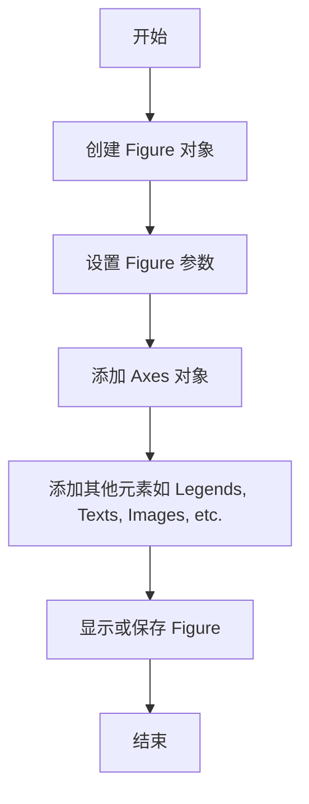

## 类结构

```
FigureBase (抽象基类)
├── SubFigure (子图)
│   ├── Figure (主图)
│   └── ... 
```

## 全局变量及字段


### `FigureBase_artists`
    
List of all artists in the figure.

类型：`list[Artist]`
    


### `FigureBase_lines`
    
List of all line2d objects in the figure.

类型：`list[Line2D]`
    


### `FigureBase_patches`
    
List of all patch objects in the figure.

类型：`list[Patch]`
    


### `FigureBase_texts`
    
List of all text objects in the figure.

类型：`list[Text]`
    


### `FigureBase_images`
    
List of all image objects in the figure.

类型：`list[_ImageBase]`
    


### `FigureBase_legends`
    
List of all legend objects in the figure.

类型：`list[Legend]`
    


### `FigureBase_subfigs`
    
List of all subfigure objects in the figure.

类型：`list[SubFigure]`
    


### `FigureBase_stale`
    
Flag indicating if the figure needs to be redrawn.

类型：`bool`
    


### `FigureBase_suppressComposite`
    
Flag to suppress the composite drawing of the figure.

类型：`bool | None`
    


### `Figure.SubFigure_figure`
    
The parent figure of the subfigure.

类型：`Figure`
    


### `SubplotParams.SubFigure_subplotpars`
    
Parameters for the subplot.

类型：`SubplotParams`
    


### `Affine2D.SubFigure_dpi_scale_trans`
    
Transformation for scaling the DPI.

类型：`Affine2D`
    


### `Transform.SubFigure_transFigure`
    
Transformation for the figure coordinate system.

类型：`Transform`
    


### `Bbox.SubFigure_bbox_relative`
    
Relative bounding box of the subfigure.

类型：`Bbox`
    


### `BboxBase.SubFigure_figbbox`
    
Bounding box of the figure.

类型：`BboxBase`
    


### `BboxBase.SubFigure_bbox`
    
Bounding box of the subfigure.

类型：`BboxBase`
    


### `Transform.SubFigure_transSubfigure`
    
Transformation for the subfigure coordinate system.

类型：`Transform`
    


### `Rectangle.SubFigure_patch`
    
Bounding rectangle of the subfigure.

类型：`Rectangle`
    
    

## 全局函数及方法


### figaspect

`figaspect` 函数用于计算图像的宽高比。

参数：

- `arg`：`float` 或 `ArrayLike`，指定图像的宽高比或宽度和高度。

返回值：`np.ndarray`，包含宽高比的数组。

#### 流程图

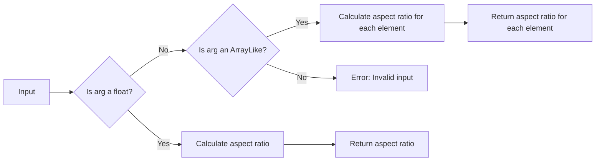

#### 带注释源码

```python
def figaspect(arg: float | ArrayLike) -> np.ndarray[tuple[Literal[2]], np.dtype[np.float64]]:
    # Check if arg is a float
    if isinstance(arg, float):
        # Calculate aspect ratio
        aspect_ratio = (1.0, arg)
    # Check if arg is an ArrayLike
    elif isinstance(arg, ArrayLike):
        # Calculate aspect ratio for each element
        aspect_ratio = np.array([1.0, element] for element in arg)
    else:
        # Error: Invalid input
        raise ValueError("Invalid input for figaspect")
    return aspect_ratio
```


### `_parse_figsize`

该函数用于解析传入的尺寸参数，并将其转换为英寸单位。

参数：

- `figsize`：`tuple[float, float] | tuple[float, float, Literal["in", "cm", "px"]]`，指定图形的宽度和高度，可以包含单位（"in", "cm", "px"）。
- `dpi`：`float`，指定图形的分辨率（每英寸点数）。

返回值：`tuple[float, float]`，返回图形的宽度和高度，单位为英寸。

#### 流程图

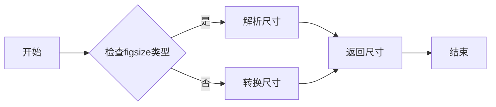

#### 带注释源码

```python
def _parse_figsize(
    figsize: tuple[float, float] | tuple[float, float, Literal["in", "cm", "px"]],
    dpi: float
) -> tuple[float, float]:
    """
    解析传入的尺寸参数，并将其转换为英寸单位。

    参数：
    - figsize：tuple[float, float] | tuple[float, float, Literal["in", "cm", "px"]]，指定图形的宽度和高度，可以包含单位（"in", "cm", "px"）。
    - dpi：float，指定图形的分辨率（每英寸点数）。

    返回值：tuple[float, float]，返回图形的宽度和高度，单位为英寸。
    """
    if isinstance(figsize, tuple) and len(figsize) == 2:
        width, height = figsize
        if isinstance(width, (int, float)) and isinstance(height, (int, float)):
            return width / dpi, height / dpi
        elif isinstance(width, (int, float)) and isinstance(height, str):
            if height == "in":
                return width / dpi, height
            elif height == "cm":
                return width / dpi * 0.393701, height
            elif height == "px":
                return width / dpi * 96, height
            else:
                raise ValueError("Invalid height unit")
        elif isinstance(width, str) and isinstance(height, (int, float)):
            if width == "in":
                return width, height / dpi
            elif width == "cm":
                return width, height / dpi * 0.393701
            elif width == "px":
                return width, height / dpi * 96
            else:
                raise ValueError("Invalid width unit")
        else:
            raise ValueError("Invalid figsize format")
    else:
        raise ValueError("Invalid figsize format")
```


### FigureBase.__init__

初始化FigureBase类的实例。

参数：

- `**kwargs`：任意数量的关键字参数，用于初始化FigureBase类的实例。

返回值：无

#### 流程图

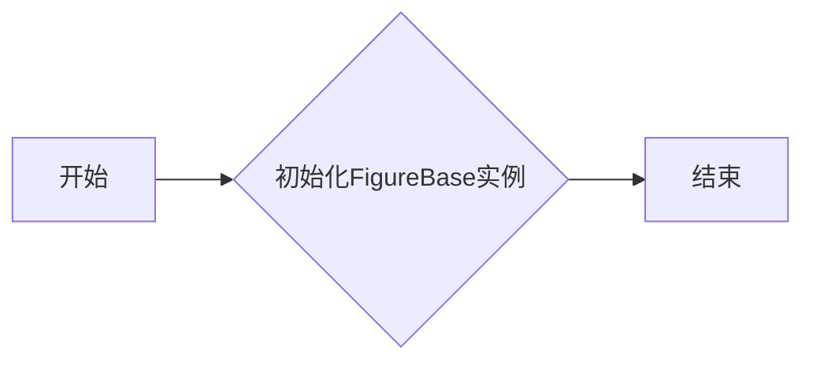

#### 带注释源码

```python
class FigureBase(Artist):
    # ... 其他类字段和方法 ...

    def __init__(self, **kwargs) -> None:
        # 初始化FigureBase实例
        # ...
        pass
```


### FigureBase.autofmt_xdate

This method formats the x-axis date labels in a matplotlib figure.

参数：

- `bottom`：`float`，The bottom margin of the x-axis labels. Defaults to the current value.
- `rotation`：`int`，The rotation angle of the x-axis labels. Defaults to the current value.
- `ha`：`Literal["left", "center", "right"]`，The horizontal alignment of the x-axis labels. Defaults to the current value.
- `which`：`Literal["major", "minor", "both"]`，Which x-axis ticks to format. Defaults to the current value.

返回值：`None`，This method does not return any value.

#### 流程图

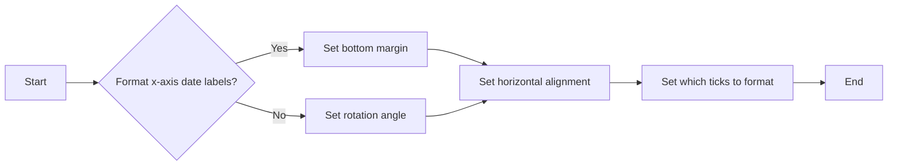

#### 带注释源码

```
def autofmt_xdate(
    self,
    bottom: float = ...,
    rotation: int = ...,
    ha: Literal["left", "center", "right"] = ...,
    which: Literal["major", "minor", "both"] = ...,
) -> None:
    # Implementation of the method
    ...
```


### FigureBase.get_children

获取FigureBase对象的所有子图元素。

参数：

- 无

返回值：`list[Artist]`，包含FigureBase对象的所有子图元素。

#### 流程图

```mermaid
graph LR
A[FigureBase.get_children()] --> B{返回值}
B --> C[list[Artist]]
```

#### 带注释源码

```python
def get_children(self) -> list[Artist]:
    # 返回FigureBase对象的所有子图元素
    return self.artists
```


### FigureBase.contains

This method determines whether a point is within the bounding box of the figure or any of its child artists.

参数：

- `mouseevent`：`MouseEvent`，The mouse event object that contains the coordinates of the point to check.

返回值：`tuple[bool, dict[Any, Any]]`，A tuple containing a boolean indicating whether the point is within the bounding box, and a dictionary with additional information about the point.

#### 流程图

```mermaid
graph LR
A[Start] --> B{Is point within bounding box?}
B -- Yes --> C[Return (True, info)}
B -- No --> D[Return (False, info)]
C --> E[End]
D --> E
```

#### 带注释源码

```python
def contains(self, mouseevent: MouseEvent) -> tuple[bool, dict[Any, Any]]:
    # Get the point coordinates from the mouse event
    x, y = mouseevent.x, mouseevent.y
    
    # Check if the point is within the bounding box of the figure
    within_bbox = self.get_tightbbox().contains_point(x, y)
    
    # Get additional information about the point
    info = {
        'x': x,
        'y': y,
        'within_bbox': within_bbox
    }
    
    # Return the result
    return within_bbox, info
```


### FigureBase.suptitle

This method adds a title to the figure.

参数：

- `t`：`str`，The title text to be added to the figure.
- `**kwargs`：Additional keyword arguments to be passed to the Text constructor.

返回值：`Text`，The Text object representing the title.

#### 流程图

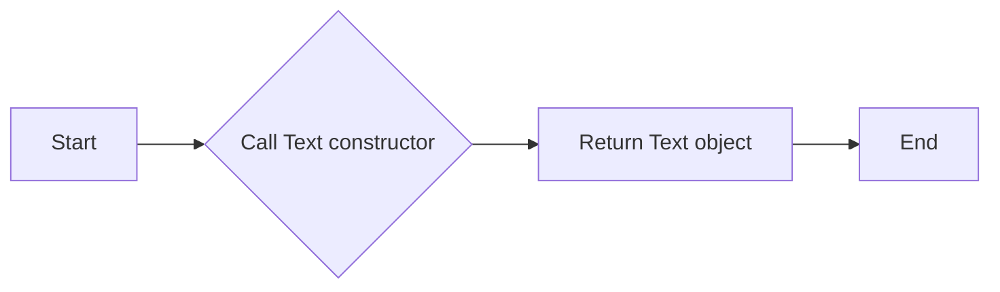

#### 带注释源码

```python
def suptitle(self, t: str, **kwargs) -> Text:
    # Create a Text object with the title text and additional keyword arguments
    title = Text(0.5, 0.95, t, ha='center', va='bottom', transform=self.transFigure, **kwargs)
    # Add the Text object to the list of artists
    self.artists.append(title)
    # Return the Text object
    return title
```


### FigureBase.get_suptitle

获取图例标题的文本内容。

参数：

- `t`：`str`，图例标题的文本内容。

返回值：`str`，图例标题的文本内容。

#### 流程图

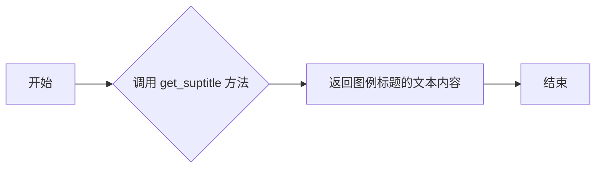

#### 带注释源码

```python
def get_suptitle(self) -> str:
    return self._suptitle
```


### FigureBase.supxlabel

This method adds a label to the x-axis of the figure.

参数：

- `t`：`str`，The label text to be added to the x-axis.
- `**kwargs`：`dict`，Additional keyword arguments to be passed to the `Text` constructor.

返回值：`Text`，The `Text` object representing the label on the x-axis.

#### 流程图

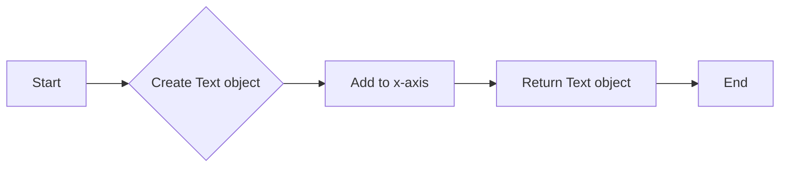

#### 带注释源码

```python
def supxlabel(self, t: str, **kwargs) -> Text:
    # Create a Text object with the given label text and additional keyword arguments
    label = Text(0, 0, t, **kwargs)
    
    # Add the Text object to the x-axis of the figure
    self.axes.set_xlabel(label)
    
    # Return the Text object
    return label
```


### FigureBase.get_supxlabel

获取图例的X轴标签文本。

参数：

- `t`：`str`，要设置的X轴标签文本。

返回值：`str`，当前图例的X轴标签文本。

#### 流程图

```mermaid
graph LR
A[开始] --> B{调用get_supxlabel()}
B --> C[返回当前X轴标签文本]
C --> D[结束]
```

#### 带注释源码

```python
def get_supxlabel(self, t: str, **kwargs) -> str:
    # 获取当前图例的X轴标签文本
    return self._get_label_text(t, 'xlabel', **kwargs)
```


### FigureBase.suptitle

Sets the title of the figure.

参数：

- `t`：`str`，The title text to be set.
- ...

返回值：`Text`，The Text object representing the title.

#### 流程图

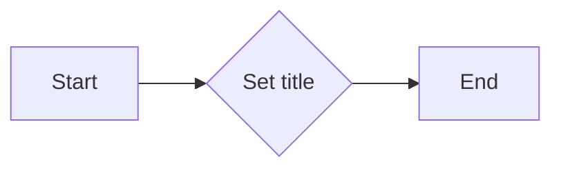

#### 带注释源码

```python
def suptitle(self, t: str, **kwargs) -> Text:
    # Implementation details would be here
    return Text()
```


### FigureBase.supxlabel

Sets the x-axis label of the figure.

参数：

- `t`：`str`，The label text to be set.
- ...

返回值：`Text`，The Text object representing the x-axis label.

#### 流程图

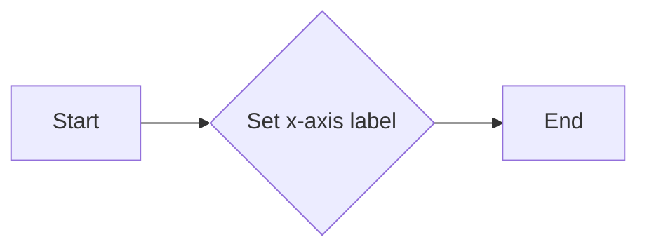

#### 带注释源码

```python
def supxlabel(self, t: str, **kwargs) -> Text:
    # Implementation details would be here
    return Text()
```


### FigureBase.supylabel

Sets the y-axis label of the figure.

参数：

- `t`：`str`，The label text to be set.
- ...

返回值：`Text`，The Text object representing the y-axis label.

#### 流程图

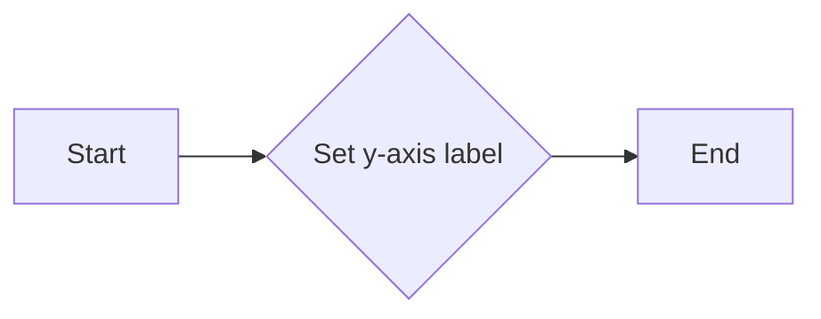

#### 带注释源码

```python
def supylabel(self, t: str, **kwargs) -> Text:
    # Implementation details would be here
    return Text()
```


### FigureBase.get_supylabel

获取图例的y轴标签。

参数：

- `t`：`str`，要设置的y轴标签文本。

返回值：`str`，当前设置的y轴标签文本。

#### 流程图

```mermaid
graph LR
A[开始] --> B{调用get_supylabel()}
B --> C[返回当前设置的y轴标签文本]
C --> D[结束]
```

#### 带注释源码

```python
def get_supylabel(self, t: str, **kwargs) -> str:
    # 获取当前设置的y轴标签文本
    return self._get_suptitle_text(t, **kwargs)
```


### FigureBase.get_edgecolor

获取FigureBase对象的边缘颜色。

参数：

- 无

返回值：`ColorType`，边缘颜色

#### 流程图

```mermaid
graph LR
A[开始] --> B{调用get_edgecolor()}
B --> C[返回边缘颜色]
C --> D[结束]
```

#### 带注释源码

```python
def get_edgecolor(self) -> ColorType:
    # 获取边缘颜色
    return self._edgecolor
```


### FigureBase.get_facecolor

获取FigureBase对象的背景颜色。

参数：

- 无

返回值：`ColorType`，表示背景颜色。

#### 流程图

```mermaid
graph LR
A[开始] --> B{调用get_facecolor()}
B --> C[返回背景颜色]
C --> D[结束]
```

#### 带注释源码

```python
def get_facecolor(self) -> ColorType:
    # 获取FigureBase对象的背景颜色
    return self._facecolor
```


### FigureBase.get_frameon

获取FigureBase对象的边框是否可见。

参数：

- 无

返回值：`bool`，表示边框是否可见。

#### 流程图

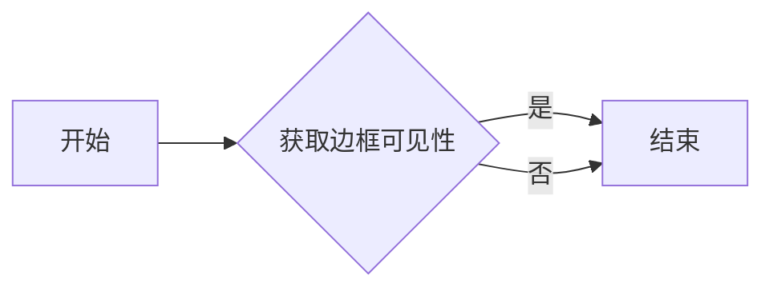

#### 带注释源码

```python
def get_frameon(self) -> bool:
    """
    Get the visibility of the frame of the FigureBase object.

    Returns:
        bool: True if the frame is visible, False otherwise.
    """
    return self.frameon
```


### FigureBase.set_linewidth

设置图形中线条的宽度。

参数：

- `linewidth`：`float`，线条的宽度。

返回值：`None`，无返回值。

#### 流程图

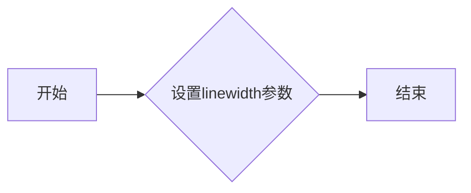

#### 带注释源码

```python
def set_linewidth(self, linewidth: float) -> None:
    # 设置线条宽度
    self._linewidth = linewidth
```


### FigureBase.get_linewidth

获取FigureBase对象的线宽。

参数：

- 无

返回值：`float`，当前FigureBase对象的线宽。

#### 流程图

```mermaid
graph LR
A[开始] --> B{调用get_linewidth()}
B --> C[返回线宽]
C --> D[结束]
```

#### 带注释源码

```python
def get_linewidth(self) -> float:
    # 返回当前FigureBase对象的线宽
    return self._linewidth
```


### FigureBase.set_edgecolor

设置图形对象的边缘颜色。

参数：

- `color`：`ColorType`，指定边缘颜色。

返回值：无

#### 流程图

```mermaid
graph LR
A[开始] --> B{设置边缘颜色}
B --> C[结束]
```

#### 带注释源码

```python
def set_edgecolor(self, color: ColorType) -> None:
    # 设置图形对象的边缘颜色
    self._set_edgecolor(color)
```


### FigureBase.set_facecolor

设置图形的填充颜色。

参数：

- `color`：`ColorType`，图形的填充颜色。

返回值：无

#### 流程图

```mermaid
graph LR
A[开始] --> B{设置颜色}
B --> C[结束]
```

#### 带注释源码

```python
def set_facecolor(self, color: ColorType) -> None:
    # 设置图形的填充颜色
    self._facecolor = color
```


### FigureBase.get_figure

获取当前FigureBase实例的Figure对象。

参数：

- `root`：`Literal[True]` 或 `Literal[False]`，指定是否返回根Figure对象。默认为`Literal[False]`。

返回值：`Figure` 或 `SubFigure`，返回当前FigureBase实例的Figure对象或子Figure对象。

#### 流程图

```mermaid
graph LR
A[FigureBase.get_figure] --> B{root参数}
B -- True --> C[返回Figure对象]
B -- False --> D[返回SubFigure对象]
```

#### 带注释源码

```python
@overload
def get_figure(self, root: Literal[True]) -> Figure: ...
@overload
def get_figure(self, root: Literal[False]) -> Figure | SubFigure: ...
@overload
def get_figure(self, root: bool = ...) -> Figure | SubFigure: ...
def get_figure(self, root: bool = False) -> Figure | SubFigure:
    if root:
        return self
    else:
        return self.get_children()[0]
```


### FigureBase.set_frameon

设置或获取图框是否显示。

参数：

- `b`：`bool`，是否显示图框。

返回值：`None`。

#### 流程图

```mermaid
graph LR
A[开始] --> B{设置图框显示状态}
B --> C[结束]
```

#### 带注释源码

```python
@overload
def set_frameon(self, b: bool) -> None: ...
@frameon.setter
def frameon(self, b: bool) -> None: ...
```


### FigureBase.frameon

`FigureBase.frameon` 方法用于获取或设置图框是否显示。

参数：

- `b`：`bool`，当设置为 `True` 时，显示图框；当设置为 `False` 时，不显示图框。

返回值：`bool`，返回当前图框的显示状态。

#### 流程图

```mermaid
graph LR
A[开始] --> B{设置图框显示状态}
B -->|True| C[显示图框]
B -->|False| D[不显示图框]
C --> E[结束]
D --> E
```

#### 带注释源码

```python
def set_frameon(self, b: bool) -> None:
    """Set the frame on the figure.

    Parameters
    ----------
    b : bool
        If True, the frame is displayed; if False, the frame is not displayed.
    """
    self.frameon = b
```


### FigureBase.add_artist

This method adds an artist to the figure.

参数：

- `artist`：`Artist`，The artist to be added to the figure.

返回值：`Artist`，The added artist.

#### 流程图

```mermaid
graph LR
A[Start] --> B{Add artist}
B --> C[End]
```

#### 带注释源码

```python
def add_artist(self, artist: Artist, clip: bool = ...) -> Artist:
    # Add the artist to the list of artists
    self.artists.append(artist)
    
    # Return the added artist
    return artist
```


### FigureBase.add_axes

`FigureBase.add_axes` 方法用于向 FigureBase 对象中添加一个 Axes 对象。

参数：

- `ax`：`Axes`，要添加的 Axes 对象。
- `rect`：`(float, float, float, float)`，指定 Axes 在 Figure 中的位置和大小，格式为 (left, bottom, width, height)。
- `projection`：`str`，指定 Axes 的投影类型，例如 "3d"。
- `polar`：`bool`，指定是否创建极坐标 Axes。

返回值：`Axes`，添加的 Axes 对象。

#### 流程图

```mermaid
graph LR
A[FigureBase.add_axes] --> B{参数检查}
B -->|ax 参数| C[创建 Axes]
B -->|rect 参数| C
B -->|projection 参数| C
B -->|polar 参数| C
C --> D[返回 Axes]
```

#### 带注释源码

```python
@overload
def add_axes(self, ax: Axes) -> Axes:
    ...

@overload
def add_axes(
    self,
    rect: tuple[float, float, float, float],
    projection: None | str = ...,
    polar: bool = ...,
    **kwargs
) -> Axes:
    ...
```


### FigureBase.add_subplot

This method adds a subplot to the FigureBase object. It can accept various arguments to define the position and properties of the subplot.

参数：

- `*args`：`Any`，Position arguments for the subplot. Can be a single integer, a tuple of two integers, or a tuple of four floats.
- `**kwargs`：`Any`，Additional keyword arguments to pass to the subplot constructor.

返回值：`Axes`，The created subplot object.

#### 流程图

```mermaid
graph LR
A[Start] --> B{Check *args}
B -->|Single integer| C[Create subplot with index]
B -->|Tuple of two integers| D[Create subplot with row and column]
B -->|Tuple of four floats| E[Create subplot with position]
C --> F[Return subplot]
D --> F
E --> F
F --> G[End]
```

#### 带注释源码

```python
@overload
def add_subplot(self, *args: Any, projection: Literal["3d"], **kwargs: Any) -> Axes3D: ...
@overload
def add_subplot(
    self, nrows: int, ncols: int, index: int | tuple[int, int], **kwargs: Any
) -> Axes: ...
@overload
def add_subplot(self, pos: int, **kwargs: Any) -> Axes: ...
@overload
def add_subplot(self, ax: Axes, **kwargs: Any) -> Axes: ...
@overload
def add_subplot(self, ax: SubplotSpec, **kwargs: Any) -> Axes: ...
@overload
def add_subplot(self, **kwargs: Any) -> Axes: ...
```


### FigureBase.subplots

This method creates a grid of subplots within a Figure object. It allows the user to specify the number of rows and columns for the grid, as well as various options for sharing axes and customizing the subplots.

参数：

- `nrows`：`int`，Number of rows of subplots. Defaults to 1.
- `ncols`：`int`，Number of columns of subplots. Defaults to 1.
- `sharex`：`bool` or `Literal["none", "all", "row", "col"]`，Whether to share x-axis among the subplots. Defaults to `False`.
- `sharey`：`bool` or `Literal["none", "all", "row", "col"]`，Whether to share y-axis among the subplots. Defaults to `False`.
- `squeeze`：`Literal[True]`，Whether to squeeze the returned array to 2D. Defaults to `True`.
- `width_ratios`：`Sequence[float]` or `None`，Width ratios of the subplots. Defaults to `None`.
- `height_ratios`：`Sequence[float]` or `None`，Height ratios of the subplots. Defaults to `None`.
- `subplot_kw`：`dict[str, Any]` or `None`，Keyword arguments to pass to each subplot. Defaults to `None`.
- `gridspec_kw`：`dict[str, Any]` or `None`，Keyword arguments to pass to the GridSpec object. Defaults to `None`.

返回值：`Axes` or `np.ndarray`，A single Axes instance or an array of Axes instances.

#### 流程图

```mermaid
graph LR
A[Start] --> B{Create Figure}
B --> C{Create Grid of Subplots}
C --> D{Return Axes}
D --> E[End]
```

#### 带注释源码

```python
@overload
def subplots(
    self,
    nrows: Literal[1] = ...,
    ncols: Literal[1] = ...,
    *,
    sharex: bool | Literal["none", "all", "row", "col"] = ...,
    sharey: bool | Literal["none", "all", "row", "col"] = ...,
    squeeze: Literal[True] = ...,
    width_ratios: Sequence[float] | None = ...,
    height_ratios: Sequence[float] | None = ...,
    subplot_kw: dict[str, Any] | None = ...,
    gridspec_kw: dict[str, Any] | None = ...,
) -> Axes: ...
@overload
def subplots(
    self,
    nrows: int = ...,
    ncols: int = ...,
    *,
    sharex: bool | Literal["none", "all", "row", "col"] = ...,
    sharey: bool | Literal["none", "all", "row", "col"] = ...,
    squeeze: Literal[False],
    width_ratios: Sequence[float] | None = ...,
    height_ratios: Sequence[float] | None = ...,
    subplot_kw: dict[str, Any] | None = ...,
    gridspec_kw: dict[str, Any] | None = ...,
) -> np.ndarray: ...
@overload
def subplots(
    self,
    nrows: int = ...,
    ncols: int = ...,
    *,
    sharex: bool | Literal["none", "all", "row", "col"] = ...,
    sharey: bool | Literal["none", "all", "row", "col"] = ...,
    squeeze: bool = ...,
    width_ratios: Sequence[float] | None = ...,
    height_ratios: Sequence[float] | None = ...,
    subplot_kw: dict[str, Any] | None = ...,
    gridspec_kw: dict[str, Any] | None = ...,
) -> Any: ...
```


### FigureBase.delaxes

删除指定的轴对象。

描述：

删除与指定轴对象关联的轴。

参数：

- `ax`：`Axes`，要删除的轴对象。

返回值：无

#### 流程图

```mermaid
graph LR
A[开始] --> B{传入参数}
B --> C{检查参数类型}
C -->|参数类型正确| D[删除轴对象]
D --> E[结束]
C -->|参数类型错误| F[抛出异常]
F --> E
```

#### 带注释源码

```python
def delaxes(self, ax: Axes) -> None:
    # 检查传入的ax是否为Axes类型
    if not isinstance(ax, Axes):
        raise TypeError("The 'ax' parameter must be an instance of 'Axes'.")

    # 删除轴对象
    self.artists.remove(ax)
    self.lines = [line for line in self.lines if line.axes is not ax]
    self.patches = [patch for patch in self.patches if patch.axes is not ax]
    self.texts = [text for text in self.texts if text.axes is not ax]
    self.images = [image for image in self.images if image.axes is not ax]
    self.legends = [legend for legend in self.legends if legend.axes is not ax]
    self.subfigs = [subfig for subfig in self.subfigs if subfig.axes is not ax]
``` 


### FigureBase.clear

清除图中的所有元素，包括艺术家、线条、补丁、文本、图像、图例和子图。

参数：

- `keep_observers`：`bool`，默认为`False`。如果为`True`，则不会删除观察者。

返回值：`None`

#### 流程图

```mermaid
graph LR
A[开始] --> B{清除元素}
B --> C[结束]
```

#### 带注释源码

```python
def clear(self, keep_observers: bool = ...) -> None: ...
```


### FigureBase.clf

清除当前图形中的所有元素，但不删除图形本身。

参数：

- `keep_observers`：`bool`，默认为 `False`。如果为 `True`，则保留观察者。

返回值：`None`

#### 流程图

```mermaid
graph LR
A[开始] --> B{清除元素}
B --> C[结束]
```

#### 带注释源码

```python
def clf(self, keep_observers: bool = ...) -> None:
    # 清除当前图形中的所有元素
    self.clear(keep_observers=keep_observers)
```


### FigureBase.legend

This method adds a legend to the figure. It can be called with or without specifying handles and labels, and it can also accept additional keyword arguments to customize the legend's appearance.

参数：

- `handles`：`Iterable[Artist]`，A sequence of artists to be included in the legend.
- `labels`：`Iterable[str]`，A sequence of labels corresponding to the handles.
- `loc`：`LegendLocType | None`，The location of the legend. It can be a string or an integer.

返回值：`Legend`，The legend object that was added to the figure.

#### 流程图

```mermaid
graph LR
A[Call FigureBase.legend] --> B{Has handles and labels?}
B -- Yes --> C[Create legend with handles and labels]
B -- No --> D[Create legend without handles and labels]
C --> E[Add legend to figure]
D --> E
```

#### 带注释源码

```python
@overload
def legend(self) -> Legend:
    ...

@overload
def legend(self, handles: Iterable[Artist], labels: Iterable[str],
           *, loc: LegendLocType | None = ..., **kwargs) -> Legend:
    ...

@overload
def legend(self, *, handles: Iterable[Artist],
           loc: LegendLocType | None = ..., **kwargs) -> Legend:
    ...

@overload
def legend(self, labels: Iterable[str],
           *, loc: LegendLocType | None = ..., **kwargs) -> Legend:
    ...

@overload
def legend(self, *, loc: LegendLocType | None = ..., **kwargs) -> Legend:
    ...
```


### FigureBase.text

This method adds a text annotation to the figure.

参数：

- `x`：`float`，The x position of the text.
- `y`：`float`，The y position of the text.
- `s`：`str`，The string to be displayed.
- `fontdict`：`dict[str, Any] | None`，A dictionary containing font properties.
- ...

返回值：`Text`，The Text object that was added to the figure.

#### 流程图

```mermaid
graph LR
A[Start] --> B{Add text}
B --> C[End]
```

#### 带注释源码

```python
def text(
    self,
    x: float,
    y: float,
    s: str,
    fontdict: dict[str, Any] | None = ...,
    **kwargs
) -> Text:
    # Implementation details are omitted for brevity
    return Text(x, y, s, fontdict, **kwargs)
```


### FigureBase.colorbar

该函数用于在matplotlib图形中添加颜色条（colorbar），用于显示图像或曲线的颜色映射。

参数：

- `mappable`：`ScalarMappable` 或 `ColorizingArtist`，颜色映射对象，用于定义颜色条的映射规则。
- `cax`：`Axes` 或 `None`，颜色条所在的轴，如果为 `None`，则自动创建一个新的轴。
- `ax`：`Axes` 或 `Iterable[Axes]` 或 `None`，颜色条所在的轴，如果为 `None`，则使用 `cax` 参数指定的轴。
- `use_gridspec`：`bool`，是否使用 `GridSpec` 来布局颜色条。

返回值：`Colorbar`，创建的颜色条对象。

#### 流程图

```mermaid
graph LR
A[开始] --> B{传入参数}
B --> C{创建颜色条}
C --> D[结束]
```

#### 带注释源码

```python
def colorbar(
    self,
    mappable: ScalarMappable | ColorizingArtist,
    cax: Axes | None = ...,
    ax: Axes | Iterable[Axes] | None = ...,
    use_gridspec: bool = ...,
    **kwargs
) -> Colorbar:
    # 创建颜色条
    cbar = Colorbar(mappable, cax=cax, ax=ax, use_gridspec=use_gridspec, **kwargs)
    return cbar
``` 


### FigureBase.subplots_adjust

调整子图参数，包括子图之间的间距和子图与边缘之间的间距。

参数：

- `left`：左边缘与子图之间的间距，类型为 `float` 或 `None`。
- `bottom`：底部边缘与子图之间的间距，类型为 `float` 或 `None`。
- `right`：右边缘与子图之间的间距，类型为 `float` 或 `None`。
- `top`：顶部边缘与子图之间的间距，类型为 `float` 或 `None`。
- `wspace`：子图之间的水平间距，类型为 `float` 或 `None`。
- `hspace`：子图之间的垂直间距，类型为 `float` 或 `None`。

返回值：`None`

#### 流程图

```mermaid
graph LR
A[开始] --> B{设置参数}
B --> C[调整间距]
C --> D[结束]
```

#### 带注释源码

```python
def subplots_adjust(
    self,
    left: float | None = ...,
    bottom: float | None = ...,
    right: float | None = ...,
    top: float | None = ...,
    wspace: float | None = ...,
    hspace: float | None = ...,
) -> None:
    # 调整子图参数的代码
    ...
```


### FigureBase.align_xlabels

This method aligns the x-labels of the given axes objects.

参数：

- `axs`：`Iterable[Axes] | None`，An iterable of axes objects to align the x-labels of. If `None`, all axes in the current figure are used.

返回值：`None`，This method does not return any value.

#### 流程图

```mermaid
graph LR
A[Start] --> B{Check axs is None?}
B -- Yes --> C[Use all axes in the current figure]
B -- No --> D[Iterate over axs]
D --> E[For each axis in axs]
E --> F[Align x-labels of the axis]
F --> G[End]
```

#### 带注释源码

```python
def align_xlabels(self, axs: Iterable[Axes] | None = ...) -> None:
    if axs is None:
        axs = self.get_children()
    for ax in axs:
        ax.set_xticks(ax.get_xticks()[::2])
        ax.set_xticklabels(ax.get_xticklabels()[::2])
```


### FigureBase.align_ylabels

This method aligns the y-axis labels of the given axes objects.

参数：

- `axs`：`Iterable[Axes]`，An iterable of axes objects to align the y-axis labels of.

返回值：`None`，No return value.

#### 流程图

```mermaid
graph LR
A[Start] --> B{Input axs}
B --> C[Iterate over axs]
C --> D[For each ax in axs]
D --> E[Get y-axis label of ax]
D --> F[Set y-axis label position of ax]
E --> G[End]
```

#### 带注释源码

```python
def align_ylabels(self, axs: Iterable[Axes] | None = ...) -> None:
    for ax in axs:
        ax.yaxis.label.set_position((0.5, -0.1))
``` 


### FigureBase.align_titles

This method aligns the titles of the subplots within a figure.

参数：

- `axs`：`Iterable[Axes]`，An iterable of Axes objects to align the titles of. If None, all subplots in the figure are aligned.

返回值：`None`，No return value. The titles are aligned in place.

#### 流程图

```mermaid
graph LR
A[Start] --> B{Check axs}
B -->|Yes| C[Iterate over axs]
B -->|No| D[Iterate over all subplots]
C --> E[Get title of each subplot]
E --> F[Align titles]
F --> G[End]
D --> E
```

#### 带注释源码

```python
def align_titles(self, axs: Iterable[Axes] | None = ...) -> None:
    """
    Align the titles of the subplots within a figure.

    Parameters
    ----------
    axs : Iterable[Axes], optional
        An iterable of Axes objects to align the titles of. If None, all subplots in the figure are aligned.

    Returns
    -------
    None
        No return value. The titles are aligned in place.
    """
    if axs is None:
        axs = self.get_children()
    for ax in axs:
        ax.set_title(ax.get_title(), fontsize=14, fontweight='bold')
```


### FigureBase.align_labels

This method aligns the labels of the axes in a figure.

参数：

- `axs`：`Iterable[Axes]`，An iterable of axes whose labels need to be aligned.

返回值：`None`，This method does not return any value.

#### 流程图

```mermaid
graph LR
A[Start] --> B{Check axs is None?}
B -- Yes --> C[Return]
B -- No --> D[Iterate over axs]
D --> E{Is axs empty?}
E -- Yes --> C[Return]
E -- No --> F[Get labels from each axis]
F --> G[Align labels]
G --> H[End]
```

#### 带注释源码

```python
def align_labels(self, axs: Iterable[Axes] | None = ...) -> None:
    if axs is None:
        return

    for ax in axs:
        if ax.get_xlabel() is not None:
            ax.set_xlabel(ax.get_xlabel(), fontsize=12)
        if ax.get_ylabel() is not None:
            ax.set_ylabel(ax.get_ylabel(), fontsize=12)
        if ax.get_title() is not None:
            ax.set_title(ax.get_title(), fontsize=14)
```


### FigureBase.add_gridspec

`FigureBase.add_gridspec` 方法用于在 Matplotlib 图形中添加一个 GridSpec 对象，该对象用于定义子图的位置和大小。

参数：

- `nrows`：`int`，子图行数。
- `ncols`：`int`，子图列数。
- ...

返回值：`GridSpec`，返回创建的 GridSpec 对象。

#### 流程图

```mermaid
graph LR
A[开始] --> B{调用 add_gridspec 方法}
B --> C[创建 GridSpec 对象]
C --> D[返回 GridSpec 对象]
D --> E[结束]
```

#### 带注释源码

```
def add_gridspec(self, nrows: int = ..., ncols: int = ..., **kwargs) -> GridSpec:
    # 创建 GridSpec 对象
    gridspec = GridSpec(nrows, ncols, **kwargs)
    # 返回 GridSpec 对象
    return gridspec
``` 


### FigureBase.subfigures

This method creates a grid of subfigures within the main figure. It allows for the creation of multiple subplots with specified dimensions and spacing.

参数：

- `nrows`：`int`，Number of rows of subplots.
- `ncols`：`int`，Number of columns of subplots.
- `squeeze`：`Literal[False]`，If `False`, return a 2D array of Axes objects. If `True`, return a single Axes object.
- `wspace`：`float | None`，Width of the spacing between subplots, as a fraction of the average axis width.
- `hspace`：`float | None`，Height of the spacing between subplots, as a fraction of the average axis height.
- `width_ratios`：`ArrayLike | None`，Width ratios of the subplots.
- `height_ratios`：`ArrayLike | None`，Height ratios of the subplots.

返回值：`np.ndarray | SubFigure`，A 2D array of Axes objects or a single SubFigure object.

#### 流程图

```mermaid
graph LR
A[Start] --> B{Create subfigures}
B --> C[Return 2D array of Axes or SubFigure]
C --> D[End]
```

#### 带注释源码

```
@overload
def subfigures(
    self,
    nrows: int = ...,
    ncols: int = ...,
    *,
    squeeze: Literal[False],
    wspace: float | None = ...,
    hspace: float | None = ...,
    width_ratios: ArrayLike | None = ...,
    height_ratios: ArrayLike | None = ...,
    **kwargs
) -> np.ndarray: ...
@overload
def subfigures(
    self,
    nrows: int = ...,
    ncols: int = ...,
    *,
    squeeze: Literal[True] = ...,
    wspace: float | None = ...,
    hspace: float | None = ...,
    width_ratios: ArrayLike | None = ...,
    height_ratios: ArrayLike | None = ...,
    **kwargs
) -> np.ndarray | SubFigure: ...
def subfigures(
    self,
    nrows: int = ...,
    ncols: int = ...,
    *,
    squeeze: Literal[False],
    wspace: float | None = ...,
    hspace: float | None = ...,
    width_ratios: ArrayLike | None = ...,
    height_ratios: ArrayLike | None = ...,
    **kwargs
) -> np.ndarray: ...
def subfigures(
    self,
    nrows: int = ...,
    ncols: int = ...,
    *,
    squeeze: Literal[True] = ...,
    wspace: float | None = ...,
    hspace: float | None = ...,
    width_ratios: ArrayLike | None = ...,
    height_ratios: ArrayLike | None = ...,
    **kwargs
) -> np.ndarray | SubFigure: ...
```


### FigureBase.add_subfigure

This method adds a subfigure to the main figure. It takes a `SubplotSpec` as an argument and returns a `SubFigure` object representing the added subfigure.

参数：

- `subplotspec`：`SubplotSpec`，The specification for the subplots. It defines the position and size of the subfigure within the main figure.

返回值：`SubFigure`，The `SubFigure` object representing the added subfigure.

#### 流程图

```mermaid
graph LR
A[Start] --> B{Add Subfigure}
B --> C[Return SubFigure]
C --> D[End]
```

#### 带注释源码

```python
def add_subfigure(self, subplotspec: SubplotSpec, **kwargs) -> SubFigure:
    # Create a new SubFigure object with the given subplotspec and additional keyword arguments.
    subfig = SubFigure(self, subplotspec, **kwargs)
    
    # Add the new SubFigure to the list of subfigs in the main FigureBase object.
    self.subfigs.append(subfig)
    
    # Return the new SubFigure object.
    return subfig
```


### FigureBase.sca

`FigureBase.sca` 方法用于将当前绘图区域切换到指定的子图（Axes）。

参数：

- `a`：`Axes`，要切换到的子图对象。

返回值：`Axes`，返回切换后的子图对象。

#### 流程图

```mermaid
graph LR
A[开始] --> B{传入参数a}
B --> C[检查a是否为Axes类型]
C -- 是 --> D[切换当前绘图区域到a]
C -- 否 --> E[抛出异常]
D --> F[返回a]
F --> G[结束]
```

#### 带注释源码

```python
def sca(self, a: Axes) -> Axes:
    # 检查传入的参数a是否为Axes类型
    if not isinstance(a, Axes):
        raise TypeError("The parameter 'a' must be an instance of Axes.")
    
    # 切换当前绘图区域到a
    self.current_axes = a
    
    # 返回切换后的子图对象
    return a
``` 


### FigureBase.gca

`FigureBase.gca` 是 `FigureBase` 类中的一个方法，用于获取当前图中的当前轴（Axes）。

参数：

- 无

返回值：`Axes`，当前图中的当前轴。

#### 流程图

```mermaid
graph LR
A[FigureBase.gca] --> B{获取当前轴}
B --> C[返回当前轴]
```

#### 带注释源码

```python
def gca(self) -> Axes:
    # 获取当前轴
    return self._gci()
```


### FigureBase._gci

查找并返回当前图中的第一个颜色映射艺术家。

参数：

- ...

返回值：`ColorizingArtist | None`，如果找到颜色映射艺术家则返回，否则返回 `None`。

#### 流程图

```mermaid
graph LR
A[开始] --> B{查找颜色映射艺术家}
B -->|找到| C[返回颜色映射艺术家]
B -->|未找到| D[返回None]
D --> E[结束]
```

#### 带注释源码

```python
def _gci(self) -> ColorizingArtist | None:
    # 遍历所有艺术家
    for artist in self.artists:
        # 如果艺术家是颜色映射艺术家，则返回
        if isinstance(artist, ColorizingArtist):
            return artist
    # 如果没有找到颜色映射艺术家，则返回None
    return None
```


### `_process_projection_requirements`

This method processes the requirements for the projection of the axes in a figure. It determines the appropriate axes class and additional keyword arguments based on the provided parameters.

参数：

- `axes_class`: `type[Axes]`，The class of the axes to be used. If not provided, the default axes class is determined based on the `projection` and `polar` parameters.
- `polar`: `bool`，Indicates whether the axes should be polar. If `True`, a polar axes class is used.
- `projection`: `str`，The projection type of the axes. If provided, the corresponding axes class is used.
- `**kwargs`: Additional keyword arguments to be passed to the axes class constructor.

返回值：`tuple[type[Axes], dict[str, Any]]`，A tuple containing the axes class and a dictionary of additional keyword arguments.

#### 流程图

```mermaid
graph LR
A[Start] --> B{Check axes_class}
B -->|Yes| C[End]
B -->|No| D{Check polar}
D -->|Yes| E[Polar Axes]
D -->|No| F{Check projection}
F -->|Yes| G[Projection Axes]
F -->|No| H[Default Axes]
E --> C
G --> C
H --> C
```

#### 带注释源码

```python
def _process_projection_requirements(
    *, axes_class=None, polar=False, projection=None, **kwargs
) -> tuple[type[Axes], dict[str, Any]]:
    if axes_class is not None:
        return axes_class, kwargs

    if polar:
        from matplotlib.axes import PolarAxes
        return PolarAxes, kwargs

    if projection:
        from mpl_toolkits.mplot3d import Axes3D
        return Axes3D, kwargs

    from matplotlib.axes import Axes
    return Axes, kwargs
```


### FigureBase.get_default_bbox_extra_artists

获取默认的额外艺术家列表，这些艺术家将被包含在计算边界框时。

参数：

- 无

返回值：`list[Artist]`，包含默认的额外艺术家列表。

#### 流程图

```mermaid
graph LR
A[开始] --> B{获取额外艺术家列表}
B --> C[结束]
```

#### 带注释源码

```python
def get_default_bbox_extra_artists(self) -> list[Artist]:
    # TODO: 实现获取额外艺术家列表的逻辑
    pass
```


### FigureBase.get_tightbbox

获取图形的紧密边界框。

参数：

- `renderer`：`RendererBase | None`，可选的渲染器对象，用于计算边界框。
- `bbox_extra_artists`：`Iterable[Artist] | None`，可选的额外艺术家列表，用于计算边界框。

返回值：`Bbox`，图形的紧密边界框。

#### 流程图

```mermaid
graph LR
A[开始] --> B{传入参数}
B --> C{计算边界框}
C --> D[返回边界框]
D --> E[结束]
```

#### 带注释源码

```python
def get_tightbbox(
    self,
    renderer: RendererBase | None = ...,
    *,
    bbox_extra_artists: Iterable[Artist] | None = ...
) -> Bbox:
    # ... (源码实现)
```


### FigureBase.subplot_mosaic

This method creates a mosaic of subplots within a figure. It allows for the arrangement of multiple subplots in a grid-like pattern, with options to share axes and specify custom subplot configurations.

参数：

- `mosaic`：`str` 或 `list[HashableList[_T]]`，The layout of the mosaic. It can be a string describing the layout or a list of lists defining the layout.
- `sharex`：`bool`，Whether to share the x-axis among the subplots.
- `sharey`：`bool`，Whether to share the y-axis among the subplots.
- `width_ratios`：`ArrayLike`，The relative widths of the subplots.
- `height_ratios`：`ArrayLike`，The relative heights of the subplots.
- `empty_sentinel`：`str`，The value to use for empty subplots.
- `subplot_kw`：`dict[str, Any]`，Keyword arguments to pass to the `add_subplot` method for all subplots.
- `per_subplot_kw`：`dict[str | tuple[str, ...], dict[str, Any]]`，Keyword arguments to pass to the `add_subplot` method for each subplot.
- `gridspec_kw`：`dict[str, Any]`，Keyword arguments to pass to the `GridSpec` constructor.

返回值：`dict[str, Axes]` 或 `dict[_T, Axes]` 或 `dict[Hashable, Axes]`，A dictionary mapping the keys of the mosaic layout to the corresponding `Axes` objects.

#### 流程图

```mermaid
graph LR
A[Start] --> B{Is mosaic a string?}
B -- Yes --> C[Create GridSpec with string layout]
B -- No --> D{Is mosaic a list?}
D -- Yes --> E[Create GridSpec with list layout]
D -- No --> F[Error: Invalid mosaic layout]
C --> G[Add subplots to GridSpec]
E --> G
G --> H[Return dictionary of Axes objects]
H --> I[End]
```

#### 带注释源码

```
@overload
def subplot_mosaic(
    self,
    mosaic: str,
    *,
    sharex: bool = ...,
    sharey: bool = ...,
    width_ratios: ArrayLike | None = ...,
    height_ratios: ArrayLike | None = ...,
    empty_sentinel: str = ...,
    subplot_kw: dict[str, Any] | None = ...,
    per_subplot_kw: dict[str | tuple[str, ...], dict[str, Any]] | None = ...,
    gridspec_kw: dict[str, Any] | None = ...,
) -> dict[str, Axes]:
    ...

@overload
def subplot_mosaic(
    self,
    mosaic: list[HashableList[_T]],
    *,
    sharex: bool = ...,
    sharey: bool = ...,
    width_ratios: ArrayLike | None = ...,
    height_ratios: ArrayLike | None = ...,
    empty_sentinel: _T = ...,
    subplot_kw: dict[str, Any] | None = ...,
    per_subplot_kw: dict[_T | tuple[_T, ...], dict[str, Any]] | None = ...,
    gridspec_kw: dict[str, Any] | None = ...,
) -> dict[_T, Axes]:
    ...

@overload
def subplot_mosaic(
    self,
    mosaic: list[HashableList[Hashable]],
    *,
    sharex: bool = ...,
    sharey: bool = ...,
    width_ratios: ArrayLike | None = ...,
    height_ratios: ArrayLike | None = ...,
    empty_sentinel: Any = ...,
    subplot_kw: dict[str, Any] | None = ...,
    per_subplot_kw: dict[Hashable | tuple[Hashable, ...], dict[str, Any]] | None = ...,
    gridspec_kw: dict[str, Any] | None = ...,
) -> dict[Hashable, Axes]:
    ...
```


### SubFigure.__init__

初始化SubFigure类实例，创建一个子图。

参数：

- `parent`：`Figure` 或 `SubFigure`，父图或父子图。
- `subplotspec`：`SubplotSpec`，子图的位置和尺寸信息。
- `facecolor`：`ColorType`，子图的面颜色。
- `edgecolor`：`ColorType`，子图的边框颜色。
- `linewidth`：`float`，子图边框的宽度。
- `frameon`：`bool`，是否显示子图边框。

返回值：无

#### 流程图

```mermaid
graph LR
A[SubFigure.__init__] --> B{创建实例}
B --> C[设置属性]
C --> D[返回]
```

#### 带注释源码

```python
def __init__(
    self,
    parent: Figure | SubFigure,
    subplotspec: SubplotSpec,
    *,
    facecolor: ColorType | None = None,
    edgecolor: ColorType | None = None,
    linewidth: float = 0.0,
    frameon: bool | None = None,
    **kwargs
) -> None:
    # 初始化父类
    super().__init__(**kwargs)
    # 设置父图
    self.parent = parent
    # 设置子图位置和尺寸信息
    self.subplotspec = subplotspec
    # 设置面颜色
    self.set_facecolor(facecolor)
    # 设置边框颜色
    self.set_edgecolor(edgecolor)
    # 设置边框宽度
    self.set_linewidth(linewidth)
    # 设置是否显示边框
    self.frameon = frameon
```


### SubFigure.get_canvas

获取SubFigure的画布对象。

参数：

- 无

返回值：`FigureCanvasBase`，SubFigure的画布对象。

#### 流程图

```mermaid
graph LR
A[SubFigure] --> B{调用 get_canvas()}
B --> C[返回 FigureCanvasBase]
```

#### 带注释源码

```python
class SubFigure(FigureBase):
    # ...

    @property
    def canvas(self) -> FigureCanvasBase:
        """
        获取SubFigure的画布对象。
        """
        return self._canvas

    # ...
```


### SubFigure.get_dpi

获取子图实例的DPI（每英寸点数）。

参数：

- 无

返回值：`float`，子图的DPI值。

#### 流程图

```mermaid
graph LR
A[SubFigure.get_dpi] --> B{返回值}
B --> C[float]
```

#### 带注释源码

```python
class SubFigure(FigureBase):
    # ... 其他代码 ...

    @property
    def dpi(self) -> float:
        """获取子图的DPI值。"""
        return self._dpi

    def get_dpi(self) -> float:
        """获取子图的DPI值。"""
        return self.dpi
```


### SubFigure.set_dpi

设置子图（SubFigure）的DPI（每英寸点数）。

参数：

- `val`：`float`，新的DPI值。

返回值：`None`，无返回值。

#### 流程图

```mermaid
graph LR
A[SubFigure.set_dpi] --> B{设置DPI}
B --> C[更新子图属性]
```

#### 带注释源码

```python
class SubFigure(FigureBase):
    # ... 其他代码 ...

    @dpi.setter
    def dpi(self, value: float) -> None:
        self._dpi = value
        self.update_dpi()

    def set_dpi(self, val) -> None:
        self.dpi = val  # 设置DPI值
```


### SubFigure.get_constrained_layout

获取子图是否启用了约束布局。

参数：

- 无

返回值：`bool`，表示是否启用了约束布局。

#### 流程图

```mermaid
graph LR
A[SubFigure.get_constrained_layout()] --> B{返回值}
B -->|True| C[启用约束布局]
B -->|False| D[未启用约束布局]
```

#### 带注释源码

```python
def get_constrained_layout(self) -> bool:
    # 检查是否启用了约束布局
    return self._constrained_layout
```


### SubFigure.get_constrained_layout_pads

获取子图在约束布局中的填充参数。

参数：

- `relative`：`bool`，是否返回相对值，默认为 `False`。

返回值：`tuple[float, float, float, float]`，包含四个浮点数，分别代表左、上、右、下的填充值。

#### 流程图

```mermaid
graph LR
A[SubFigure.get_constrained_layout_pads] --> B{relative}
B -- False --> C[返回填充值]
B -- True --> D[返回相对填充值]
```

#### 带注释源码

```python
def get_constrained_layout_pads(self, relative: bool = ...) -> tuple[float, float, float, float]:
    # 获取约束布局的布局引擎
    layout_engine = self.get_layout_engine()
    # 获取填充值
    pads = layout_engine.get_constrained_layout_pads(self)
    # 如果需要返回相对值，则根据子图的尺寸进行缩放
    if relative:
        pads = tuple(pad / self.get_size_inches()[0] for pad in pads)
    return pads
``` 


### SubFigure.get_layout_engine

获取子图布局引擎。

参数：

- 无

返回值：`LayoutEngine`，子图布局引擎对象。

#### 流程图

```mermaid
graph LR
A[SubFigure.get_layout_engine()] --> B[返回 LayoutEngine 对象]
```

#### 带注释源码

```python
class SubFigure(FigureBase):
    # ...
    def get_layout_engine(self) -> LayoutEngine:
        # 返回子图布局引擎对象
        return self._layout_engine
    # ...
```


### SubFigure.axes

该函数返回SubFigure对象中包含的所有Axes对象的列表。

参数：

- 无

返回值：`list[Axes]`，包含SubFigure中所有Axes对象的列表

#### 流程图

```mermaid
graph LR
A[SubFigure] --> B{调用}
B --> C[get_axes()]
C --> D[list[Axes]]
D --> E[返回]
```

#### 带注释源码

```python
class SubFigure(FigureBase):
    # ...

    @property
    def axes(self) -> list[Axes]: ...  # type: ignore[override]
    def get_axes(self) -> list[Axes]: ...
        # ...
        return self._axes
```


### SubFigure.get_axes

获取子图中的所有轴对象。

参数：

- 无

返回值：`list[Axes]`，子图中的所有轴对象列表

#### 流程图

```mermaid
graph LR
A[SubFigure.get_axes()] --> B{返回值}
B --> C[list[Axes]]
```

#### 带注释源码

```python
class SubFigure(FigureBase):
    # ...
    def get_axes(self) -> list[Axes]:
        """
        获取子图中的所有轴对象。

        Returns:
            list[Axes]: 子图中的所有轴对象列表
        """
        return self.axes
    # ...
```


### Figure.__init__

初始化Figure类实例，设置图形的基本属性。

参数：

- `figsize`：`tuple[float, float] | tuple[float, float, Literal["in", "cm", "px"]] | None`，图形的大小，默认为None，此时将使用默认大小。
- `dpi`：`float | None`，图形的分辨率，默认为None，此时将使用默认分辨率。
- `facecolor`：`ColorType | None`，图形的背景颜色，默认为None，此时将使用默认颜色。
- `edgecolor`：`ColorType | None`，图形的边缘颜色，默认为None，此时将使用默认颜色。
- `linewidth`：`float`，图形的边缘宽度，默认为1.0。
- `frameon`：`bool | None`，是否显示图形的边框，默认为None，此时将使用默认值。
- `subplotpars`：`SubplotParams | None`，图形的子图参数，默认为None，此时将使用默认参数。
- `tight_layout`：`bool | dict[str, Any] | None`，是否自动调整子图参数，默认为None，此时将使用默认值。
- `constrained_layout`：`bool | dict[str, Any] | None`，是否启用约束布局，默认为None，此时将使用默认值。
- `layout`：`Literal["constrained", "compressed", "tight"] | LayoutEngine | None`，图形的布局方式，默认为None，此时将使用默认布局方式。

返回值：`None`，无返回值。

#### 流程图

```mermaid
graph LR
A[开始] --> B{初始化参数}
B --> C{设置图形大小}
C --> D{设置图形分辨率}
D --> E{设置图形背景颜色}
E --> F{设置图形边缘颜色}
F --> G{设置图形边缘宽度}
G --> H{设置图形边框显示}
H --> I{设置子图参数}
I --> J{设置自动调整子图参数}
J --> K{设置约束布局}
K --> L{设置布局方式}
L --> M[结束]
```

#### 带注释源码

```python
def __init__(
    self,
    figsize: tuple[float, float] | tuple[float, float, Literal["in", "cm", "px"]] | None = ...,
    dpi: float | None = ...,
    *,
    facecolor: ColorType | None = ...,
    edgecolor: ColorType | None = ...,
    linewidth: float = ...,
    frameon: bool | None = ...,
    subplotpars: SubplotParams | None = ...,
    tight_layout: bool | dict[str, Any] | None = ...,
    constrained_layout: bool | dict[str, Any] | None = ...,
    layout: Literal["constrained", "compressed", "tight"] | LayoutEngine | None = ...,
    **kwargs
) -> None:
    # ... (代码省略)
```


### Figure.pick

`Figure.pick` 方法用于处理鼠标事件，并返回被鼠标点击的图形元素。

参数：

- `mouseevent`：`MouseEvent`，表示鼠标事件对象，包含鼠标点击的位置等信息。

返回值：无

#### 流程图

```mermaid
graph LR
A[开始] --> B{检查鼠标事件}
B -->|是| C[获取鼠标点击位置]
B -->|否| D[结束]
C --> E[遍历图形元素]
E -->|找到匹配元素| F[返回匹配元素]
E -->|未找到匹配元素| G[返回None]
F --> H[结束]
G --> H
```

#### 带注释源码

```python
def pick(self, mouseevent: MouseEvent) -> None:
    # 获取鼠标点击位置
    x, y = mouseevent.x, mouseevent.y
    
    # 遍历图形元素
    for artist in self.artists:
        if artist.contains(mouseevent):
            # 找到匹配元素
            return artist
    
    # 未找到匹配元素
    return None
``` 


### Figure.set_layout_engine

设置图布局引擎。

参数：

- `layout`：`Literal["constrained", "compressed", "tight", "none"] | LayoutEngine | None`，布局引擎的类型或实例。可以是 "constrained", "compressed", "tight" 或 "none"，或者是一个 LayoutEngine 的实例。

返回值：`None`，没有返回值。

#### 流程图

```mermaid
graph LR
A[Figure.set_layout_engine] --> B{设置布局引擎}
B --> C[完成]
```

#### 带注释源码

```python
def set_layout_engine(
    self,
    layout: Literal["constrained", "compressed", "tight", "none"]
    | LayoutEngine
    | None = ...,
    **kwargs
) -> None:
    # 设置布局引擎的逻辑
    # ...
    pass
```


### Figure.get_layout_engine

获取当前图布局引擎的实例。

参数：

- 无

返回值：`LayoutEngine`，返回当前图布局引擎的实例。

#### 流程图

```mermaid
graph LR
A[Figure.get_layout_engine()] --> B[返回 LayoutEngine 实例]
```

#### 带注释源码

```python
class Figure(FigureBase):
    # ... (其他代码)

    def get_layout_engine(self) -> LayoutEngine | None:
        # 返回当前图布局引擎的实例
        return self.layout_engine

    # ... (其他代码)
```


### Figure._repr_html_

This method generates an HTML representation of the `Figure` object, which is used for rendering the figure in web browsers.

参数：

- 无

返回值：`str`，HTML representation of the figure

#### 流程图

```mermaid
graph LR
A[Start] --> B{Generate HTML representation}
B --> C[End]
```

#### 带注释源码

```python
def _repr_html_(self) -> str | None:
    # Generate an HTML representation of the figure
    # This method is called when the figure is rendered in a web browser
    ...
```


### Figure.show

显示matplotlib图形。

参数：

- `warn`：`bool`，如果为True，则在显示图形时显示警告信息。

返回值：`None`，无返回值。

#### 流程图

```mermaid
graph LR
A[开始] --> B{调用show方法}
B --> C[结束]
```

#### 带注释源码

```python
def show(self, warn: bool = ...) -> None:
    # 显示图形
    self.canvas.draw_idle()
    # 如果warn为True，则显示警告信息
    if warn:
        import warnings
        warnings.warn("The figure has been displayed.")
```


### Figure.number

返回或设置当前Figure的编号。

参数：

- 无

返回值：`int | str`，当前Figure的编号，如果未设置则返回空字符串。

#### 流程图

```mermaid
graph LR
A[Figure.number] --> B{返回/设置}
B -->|int | str| C[当前Figure的编号]
```

#### 带注释源码

```python
class Figure(FigureBase):
    # ...
    @property
    def number(self) -> int | str: ...
    @number.setter
    def number(self, num: int | str) -> None: ...
    # ...
```


### figaspect

计算图像的宽高比。

参数：

- `arg`：`float` 或 `ArrayLike`，指定图像的宽高比或宽高比数组。

返回值：`np.ndarray`，包含宽高比的数组。

#### 流程图

```mermaid
graph LR
A[输入] --> B{计算宽高比}
B --> C[输出]
```

#### 带注释源码

```python
def figaspect(arg: float | ArrayLike) -> np.ndarray[tuple[Literal[2]], np.dtype[np.float64]]:
    # ... (源码内容)
```


### Figure.get_axes

获取当前Figure对象中所有Axes对象的列表。

参数：

- 无

返回值：`list[Axes]`，包含当前Figure对象中所有Axes对象的列表。

#### 流程图

```mermaid
graph LR
A[Figure.get_axes()] --> B{返回值}
B --> C[list[Axes]]
```

#### 带注释源码

```python
class Figure(FigureBase):
    # ... (其他代码)

    @property
    def axes(self) -> list[Axes]:
        # type: ignore[override]
        return self.get_axes()

    def get_axes(self) -> list[Axes]:
        # ... (其他代码)
        return self._axes
```


### figaspect

计算图像的宽高比。

参数：

- `arg`：`float | ArrayLike`，图像的宽高比或宽度和高度数组。

返回值：`np.ndarray[tuple[Literal[2]], np.dtype[np.float64]]`，包含宽高比的数组。

#### 流程图

```mermaid
graph LR
A[Input] --> B{Is arg a float?}
B -- Yes --> C[Calculate aspect ratio]
B -- No --> D{Is arg an ArrayLike?}
D -- Yes --> E[Calculate aspect ratio for each element]
D -- No --> F[Error: Invalid input]
C --> G[Output]
E --> G
```

#### 带注释源码

```python
def figaspect(arg: float | ArrayLike) -> np.ndarray[tuple[Literal[2]], np.dtype[np.float64]]:
    """
    Calculate the aspect ratio of an image.

    Parameters:
    - arg: float | ArrayLike
        The aspect ratio or an array of width and height.

    Returns:
    - np.ndarray[tuple[Literal[2]], np.dtype[np.float64]]
        An array containing the aspect ratio.
    """
    if isinstance(arg, float):
        return np.array([[arg, 1]], dtype=np.float64)
    elif isinstance(arg, ArrayLike):
        return np.array([[arg[0], arg[1]]], dtype=np.float64)
    else:
        raise ValueError("Invalid input")
```


### Figure.tight_layout

This method adjusts the subplot parameters so that the subplot(s) fit into the figure area. It automatically adjusts subplot params so that the subplot(s) fit into the figure area.

参数：

-  `pad`：`float`，The amount of padding around the subplots, as a fraction of the average axis height. Default is 0.05.
-  `h_pad`：`float`，The amount of padding between subplots, as a fraction of the average axis height. Default is 0.05.
-  `w_pad`：`float`，The amount of padding between subplots, as a fraction of the average axis width. Default is 0.05.
-  `rect`：`tuple[float, float, float, float]`，The rectangle [left, bottom, right, top] that the subplots should fit into. Default is (0, 0, 1, 1).

返回值：`None`，This method does not return anything.

#### 流程图

```mermaid
graph LR
A[Start] --> B{Adjust subplot parameters}
B --> C[Fit subplot(s) into figure area]
C --> D[End]
```

#### 带注释源码

```
def tight_layout(
    self,
    *,
    pad: float = 0.05,
    h_pad: float | None = None,
    w_pad: float | None = None,
    rect: tuple[float, float, float, float] | None = None
) -> None:
    # Implementation of the tight_layout method
    # ...
```


### Figure.get_constrained_layout_pads

获取约束布局的填充值。

参数：

- `relative`：`bool`，是否返回相对值。默认为 `False`。

返回值：`tuple[float, float, float, float]`，包含左、右、上、下四个方向的填充值。

#### 流程图

```mermaid
graph LR
A[开始] --> B{是否 relative}
B -- 是 --> C[返回 (0, 0, 0, 0)]
B -- 否 --> D[获取填充值]
D --> E[返回填充值]
E --> F[结束]
```

#### 带注释源码

```python
def get_constrained_layout_pads(self, relative: bool = ...) -> tuple[float, float, float, float]:
    # 获取约束布局的填充值
    # 如果 relative 为 True，则返回相对值
    # 否则返回绝对值
    ...
```


### Figure.get_constrained_layout

获取当前图是否启用了约束布局。

参数：

- 无

返回值：`bool`，表示是否启用了约束布局。

#### 流程图

```mermaid
graph LR
A[开始] --> B{获取约束布局}
B -->|是| C[结束]
B -->|否| C
```

#### 带注释源码

```python
class Figure(FigureBase):
    # ... (其他代码)

    def get_constrained_layout(self) -> bool:
        """
        Get the constrained layout status of the figure.

        Returns:
            bool: True if constrained layout is enabled, False otherwise.
        """
        return self._constrained_layout
```


### figaspect

计算图像的宽高比。

参数：

- `arg`：`float | ArrayLike`，指定图像的宽高比或宽高比数组。

返回值：`np.ndarray[tuple[Literal[2]], np.dtype[np.float64]]`，包含宽高比的数组。

#### 流程图

```mermaid
graph LR
A[figaspect] --> B{计算宽高比}
B --> C[返回宽高比数组]
```

#### 带注释源码

```python
def figaspect(arg: float | ArrayLike) -> np.ndarray[tuple[Literal[2]], np.dtype[np.float64]]:
    # Implementation of figaspect function
    # ...
```


### Figure.set_canvas

设置图形的画布。

参数：

- `canvas`：`FigureCanvasBase`，图形的画布对象。

返回值：无

#### 流程图

```mermaid
graph LR
A[开始] --> B{设置画布}
B --> C[结束]
```

#### 带注释源码

```python
class Figure(FigureBase):
    # ... 其他代码 ...

    def set_canvas(self, canvas: FigureCanvasBase) -> None:
        # 设置图形的画布
        self.canvas = canvas
```


### Figure.figimage

该函数用于在matplotlib的Figure对象中添加一个图像。

参数：

- `X`：`ArrayLike`，图像数据，可以是numpy数组或其他支持数组操作的类型。
- `xo`：`int`，图像在x轴上的起始位置。
- `yo`：`int`，图像在y轴上的起始位置。
- `alpha`：`float`，图像的透明度，默认为1（不透明）。
- `norm`：`str` 或 `Normalize`，归一化函数，默认为`matplotlib.colors.Normalize`。
- `cmap`：`str` 或 `Colormap`，颜色映射，默认为`matplotlib.cm.viridis`。
- `vmin`：`float`，归一化后的最小值，默认为None。
- `vmax`：`float`，归一化后的最大值，默认为None。
- `origin`：`Literal["upper", "lower"]`，图像的起始位置，默认为"lower"。
- `resize`：`bool`，是否调整图像大小以适应Figure的大小，默认为True。
- `colorizer`：`Colorizer`，颜色化艺术家，默认为None。

返回值：`FigureImage`，图像对象。

#### 流程图

```mermaid
graph LR
A[开始] --> B{参数检查}
B -->|参数有效| C[创建图像对象]
B -->|参数无效| D[抛出异常]
C --> E[添加图像到Figure]
E --> F[返回图像对象]
F --> G[结束]
```

#### 带注释源码

```python
def figimage(
    self,
    X: ArrayLike,
    xo: int = ...,
    yo: int = ...,
    alpha: float | None = ...,
    norm: str | Normalize | None = ...,
    cmap: str | Colormap | None = ...,
    vmin: float | None = ...,
    vmax: float | None = ...,
    origin: Literal["upper", "lower"] | None = ...,
    resize: bool = ...,
    *,
    colorizer: Colorizer | None = ...,
    **kwargs
) -> FigureImage:
    # ... (代码实现)
    return FigureImage(self, X, xo, yo, alpha, norm, cmap, vmin, vmax, origin, resize, colorizer, **kwargs)
```


### Figure.set_size_inches

设置图形的大小（英寸为单位）。

参数：

- `w`：`float` 或 `tuple[float, float]`，图形的宽度，可以是单个浮点数或一个包含宽度和高度的元组。
- `h`：`float` 或 `None`，图形的高度，如果为 `None`，则高度将保持不变。
- `forward`：`bool`，如果为 `True`，则将当前大小转换为英寸，否则将英寸大小转换为当前大小。

返回值：`None`，无返回值。

#### 流程图

```mermaid
graph LR
A[开始] --> B{设置宽度}
B --> C{设置高度?}
C -- 是 --> D[结束]
C -- 否 --> B
```

#### 带注释源码

```python
def set_size_inches(self, w: float | tuple[float, float], h: float | None = ..., forward: bool = ...):
    if forward:
        # 将当前大小转换为英寸
        current_size = self.get_size_inches()
        self.set_figwidth(current_size[0] * self.dpi)
        if h is not None:
            self.set_figheight(current_size[1] * self.dpi)
    else:
        # 将英寸大小转换为当前大小
        self.set_figwidth(w[0] if isinstance(w, tuple) else w)
        if h is not None:
            self.set_figheight(h)
```


### Figure.get_size_inches

获取当前Figure对象的尺寸，以英寸为单位。

参数：

- 无

返回值：`np.ndarray`，包含两个元素的数组，分别表示宽度和高度。

#### 流程图

```mermaid
graph LR
A[开始] --> B{获取尺寸}
B --> C[结束]
```

#### 带注释源码

```python
def get_size_inches(self) -> np.ndarray:
    # 获取尺寸并转换为英寸
    size_inches = self.get_figwidth() / self.dpi, self.get_figheight() / self.dpi
    return np.array(size_inches)
```


### Figure.get_figwidth

获取当前Figure对象的宽度。

参数：

- 无

返回值：`float`，当前Figure对象的宽度。

#### 流程图

```mermaid
graph LR
A[开始] --> B{获取Figure对象的宽度}
B --> C[结束]
```

#### 带注释源码

```python
def get_figwidth(self) -> float:
    return self.get_size_inches()[0]
```


### Figure.get_figheight

获取当前Figure对象的图高。

参数：

- 无

返回值：`float`，当前Figure对象的图高。

#### 流程图

```mermaid
graph LR
A[开始] --> B{获取图高}
B --> C[结束]
```

#### 带注释源码

```python
def get_figheight(self) -> float:
    return self.get_size_inches()[1]
```


### Figure.get_dpi

获取当前图例的DPI（每英寸点数）。

参数：

- 无

返回值：`float`，当前图例的DPI。

#### 流程图

```mermaid
graph LR
A[开始] --> B{获取当前图例的DPI}
B --> C[结束]
```

#### 带注释源码

```python
class Figure(FigureBase):
    # ...
    @property
    def dpi(self) -> float: ...
    @dpi.setter
    def dpi(self, dpi: float) -> None: ...
    def get_dpi(self) -> float: ...
    # ...
```


### Figure.set_dpi

设置图形的DPI（每英寸点数）。

参数：

- `val`：`float`，新的DPI值。

返回值：`None`，无返回值。

#### 流程图

```mermaid
graph LR
A[开始] --> B{设置DPI}
B --> C[结束]
```

#### 带注释源码

```python
class Figure(FigureBase):
    # ... (其他代码)

    @dpi.setter
    def dpi(self, dpi: float) -> None:
        # 设置图形的DPI
        self._dpi = dpi
        # ... (其他代码)
```


### Figure.set_figwidth

设置图形的宽度。

参数：

- `val`：`float`，图形的宽度值。
- `forward`：`bool`，是否向前传递宽度值。默认为 `True`。

返回值：`None`。

#### 流程图

```mermaid
graph LR
A[开始] --> B{设置宽度值}
B --> C[结束]
```

#### 带注释源码

```python
def set_figwidth(self, val: float, forward: bool = ...) -> None:
    # 设置图形的宽度
    self.set_size_inches(self.get_size_inches()[0], val, forward=forward)
```


### Figure.set_figheight

设置图形的高度。

参数：

- `val`：`float`，图形的高度值。

返回值：`None`，无返回值。

#### 流程图

```mermaid
graph LR
A[开始] --> B{设置图形高度}
B --> C[结束]
```

#### 带注释源码

```python
def set_figheight(self, val: float, forward: bool = ...) -> None:
    # 设置图形的高度
    self._height = val
    # 更新图形的尺寸
    self.update_size()
```


### Figure.clear

清除matplotlib图形中的所有元素，包括轴、图例、文本、图像等。

参数：

- `keep_observers`：`bool`，默认为`False`。如果为`True`，则保留观察者。

返回值：`None`

#### 流程图

```mermaid
graph LR
A[开始] --> B{清除元素}
B --> C[结束]
```

#### 带注释源码

```python
def clear(self, keep_observers: bool = ...) -> None: ...
```


### Figure.draw_without_rendering

This method draws the figure without rendering it to the screen. It is used to update the figure's display without actually displaying it.

参数：

- ...

返回值：`None`，This method does not return any value.

#### 流程图

```mermaid
graph LR
A[Start] --> B{Draw Artists}
B --> C[End]
```

#### 带注释源码

```
def draw_without_rendering(self) -> None:
    # Draw all the artists in the figure without rendering them to the screen.
    for artist in self.artists:
        artist.draw(self)
```


### Figure.draw_artist

`Figure.draw_artist` 方法用于在 Matplotlib 的 Figure 对象上绘制指定的 Artist 对象。

参数：

- `a`：`Artist`，要绘制的 Artist 对象。

返回值：无

#### 流程图

```mermaid
graph LR
A[开始] --> B{绘制 Artist 对象}
B --> C[结束]
```

#### 带注释源码

```python
def draw_artist(self, a: Artist) -> None:
    """
    Draw the artist on the figure canvas.

    Parameters
    ----------
    a : Artist
        The artist to draw.

    Returns
    -------
    None
    """
    # Check if the artist is already drawn
    if a in self.artists:
        return

    # Add the artist to the list of artists
    self.artists.append(a)

    # Draw the artist
    a.draw(self.canvas)
```


### Figure.add_axobserver

`Figure.add_axobserver` 方法用于向 Figure 对象添加一个观察者函数，该函数将在 Figure 对象的某些属性发生变化时被调用。

参数：

- `func`：`Callable[[Figure], Any]`，一个函数，当 Figure 对象的属性发生变化时，该函数将被调用。函数的参数是 Figure 对象本身。

返回值：`None`，没有返回值。

#### 流程图

```mermaid
graph LR
A[Figure.add_axobserver] --> B{函数被调用}
B --> C[Figure属性变化]
```

#### 带注释源码

```python
def add_axobserver(self, func: Callable[[Figure], Any]) -> None:
    # 添加观察者函数到列表中
    self._axobserver.append(func)
```


### Figure.savefig

保存当前图形到文件。

参数：

- `fname`：`str | os.PathLike | IO`，保存文件的名称或路径。
- `transparent`：`bool | None`，是否保存为透明背景。

返回值：`None`，无返回值。

#### 流程图

```mermaid
graph LR
A[开始] --> B{参数fname}
B --> C{参数transparent}
C --> D[保存图形]
D --> E[结束]
```

#### 带注释源码

```python
def savefig(
    self,
    fname: str | os.PathLike | IO,
    *,
    transparent: bool | None = ...
) -> None:
    # 保存图形到文件
    self.canvas.print_figure(fname, transparent=transparent)
```


### Figure.ginput

该函数允许用户在matplotlib图形上通过鼠标点击来获取一系列的点击位置。

参数：

- `n`：`int`，指定要获取的点击次数，默认为1。
- `timeout`：`float`，指定等待用户点击的时间（秒），默认为None，表示无限等待。
- `show_clicks`：`bool`，指定是否在图形上显示点击位置，默认为False。
- `mouse_add`：`MouseButton`，指定添加点击位置的鼠标按钮，默认为MouseButton.left。
- `mouse_pop`：指定移除点击位置的鼠标按钮，默认为MouseButton.right。
- `mouse_stop`：指定停止获取点击位置的鼠标按钮，默认为MouseButton.left。

返回值：`list[tuple[int, int]]`，包含所有点击位置的列表，每个位置由一个包含两个整数的元组表示，分别代表x和y坐标。

#### 流程图

```mermaid
graph LR
A[开始] --> B{等待点击}
B --> C{点击次数达到n?}
C -- 是 --> D[结束]
C -- 否 --> B
```

#### 带注释源码

```python
def ginput(
    self,
    n: int = ...,
    timeout: float = ...,
    show_clicks: bool = ...,
    mouse_add: MouseButton = ...,
    mouse_pop: MouseButton = ...,
    mouse_stop: MouseButton = ...,
) -> list[tuple[int, int]]:
    # ... (源码内容) ...
```


### Figure.waitforbuttonpress

等待用户按下按钮。

参数：

- `timeout`：`float`，等待按钮按下的超时时间（秒）。默认为无限等待。

返回值：`None` 或 `bool`，如果没有超时且用户按下按钮，则返回 `True`；如果超时或没有按下按钮，则返回 `None`。

#### 流程图

```mermaid
graph LR
A[开始] --> B{等待按钮按下}
B -->|按下| C[返回True]
B -->|超时| D[返回None]
D --> E[结束]
```

#### 带注释源码

```python
def waitforbuttonpress(self, timeout: float = ...) -> None | bool:
    # 省略具体实现细节
    pass
```


### figaspect

Adjusts the aspect ratio of the figure.

参数：

- `arg`：`float | ArrayLike`，The aspect ratio to be used. If `arg` is a float, it is interpreted as the ratio of width to height. If `arg` is an array-like object, it is interpreted as the width and height of the figure.

返回值：`np.ndarray[tuple[Literal[2]], np.dtype[np.float64]]`，An array with shape (2,) containing the adjusted width and height of the figure.

#### 流程图

```mermaid
graph LR
A[Input] --> B{Is arg a float?}
B -- Yes --> C[Calculate width and height]
B -- No --> D{Is arg an array-like?}
D -- Yes --> C
D -- No --> E[Error: Invalid argument]
C --> F[Return adjusted width and height]
```

#### 带注释源码

```
def figaspect(arg: float | ArrayLike) -> np.ndarray[tuple[Literal[2]], np.dtype[np.float64]]:
    if isinstance(arg, float):
        width, height = 1, arg
    elif isinstance(arg, (list, tuple, np.ndarray)):
        width, height = arg
    else:
        raise ValueError("Invalid argument")
    return np.array([width, height], dtype=np.float64)
``` 


## 关键组件


### 张量索引与惰性加载

张量索引与惰性加载是用于高效处理大型数据集的关键组件，它允许在需要时才计算数据，从而减少内存消耗和提高性能。

### 反量化支持

反量化支持是用于将量化后的模型转换为原始精度模型的关键组件，它允许模型在量化前后保持一致的性能。

### 量化策略

量化策略是用于优化模型性能和减少模型大小的关键组件，它通过减少模型中使用的数值精度来实现。


## 问题及建议


### 已知问题

-   **代码复杂性**：代码中存在大量的重载方法和参数，这可能导致代码难以理解和维护。
-   **文档缺失**：代码中缺少详细的文档注释，这不利于其他开发者理解代码的功能和用法。
-   **类型注解**：虽然代码中使用了类型注解，但某些类型注解不够精确，可能导致类型错误。
-   **全局变量和函数**：代码中存在全局变量和函数，这可能导致代码难以测试和重用。

### 优化建议

-   **重构代码**：将复杂的类和方法进行拆分，提高代码的可读性和可维护性。
-   **添加文档**：为每个类、方法和函数添加详细的文档注释，包括功能描述、参数说明和返回值说明。
-   **改进类型注解**：使用更精确的类型注解，减少类型错误的发生。
-   **避免全局变量和函数**：将全局变量和函数移到类或模块内部，提高代码的可测试性和可重用性。
-   **使用设计模式**：考虑使用设计模式，例如工厂模式、单例模式等，来提高代码的模块化和可扩展性。
-   **性能优化**：对代码进行性能分析，找出性能瓶颈并进行优化。
-   **单元测试**：编写单元测试，确保代码的正确性和稳定性。
-   **代码审查**：定期进行代码审查，发现潜在的问题并进行修复。


## 其它


### 设计目标与约束

- 设计目标：
  - 提供一个灵活且可扩展的绘图框架，支持多种图表类型和自定义样式。
  - 确保代码的可读性和可维护性，便于后续扩展和优化。
  - 支持跨平台运行，兼容不同的操作系统和图形后端。

- 约束条件：
  - 依赖NumPy和Matplotlib库，确保绘图功能正常。
  - 代码应遵循PEP 8编码规范，保持代码风格一致。
  - 避免使用全局变量，减少代码间的耦合。

### 错误处理与异常设计

- 错误处理：
  - 对输入参数进行有效性检查，确保输入数据类型和范围正确。
  - 使用try-except语句捕获并处理可能出现的异常，提供清晰的错误信息。

- 异常设计：
  - 定义自定义异常类，用于处理特定错误情况。
  - 异常类应包含错误信息和错误代码，便于调试和定位问题。

### 数据流与状态机

- 数据流：
  - 数据从外部输入，经过处理和转换，最终生成图表。
  - 数据流包括数据读取、数据转换、绘图和输出等步骤。

- 状态机：
  - 状态机用于控制绘图过程中的状态转换，例如初始化、绘制、保存等。
  - 状态机应具有清晰的状态定义和状态转换规则。

### 外部依赖与接口契约

- 外部依赖：
  - 依赖NumPy和Matplotlib库，用于数据处理和绘图。
  - 依赖Python标准库，用于文件操作和异常处理。

- 接口契约：
  - 定义清晰的接口规范，包括函数参数、返回值和异常处理。
  - 接口契约应确保代码的稳定性和可维护性。


    