# `matplotlib\lib\matplotlib\font_manager.py` 详细设计文档

A Matplotlib module for finding, managing, and using fonts across platforms. It provides a FontManager singleton that discovers system fonts, caches their properties, and offers findfont functionality to locate the best matching TrueType (TTF) or Adobe Font Metrics (AFM) font based on FontProperties specifications.

## 整体流程

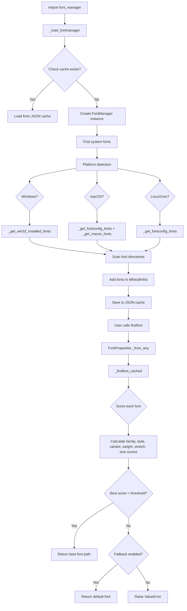

## 类结构

```
FontEntry (dataclass)
FontProperties
_JSONEncoder (JSON encoder)
FontManager (singleton)
```

## 全局变量及字段


### `font_scalings`
    
Font size scaling values for relative size keywords like 'large', 'small', etc.

类型：`dict`
    


### `stretch_dict`
    
Font stretch mappings from string names to numeric values (100-900)

类型：`dict`
    


### `weight_dict`
    
Font weight mappings from string names to numeric values (100-900)

类型：`dict`
    


### `_weight_regexes`
    
Weight regex patterns for extracting font weight from PostScript font info

类型：`list`
    


### `font_family_aliases`
    
Generic font family aliases like 'serif', 'sans-serif', 'monospace', etc.

类型：`set`
    


### `_HOME`
    
User home directory path

类型：`Path`
    


### `MSFolders`
    
Windows registry path for shell folders

类型：`str`
    


### `MSFontDirectories`
    
Windows system font directories in registry

类型：`list`
    


### `MSUserFontDirectories`
    
Windows user-specific font directories

类型：`list`
    


### `X11FontDirectories`
    
X11 font search paths on Linux/Unix systems

类型：`list`
    


### `OSXFontDirectories`
    
macOS system and user font directories

类型：`list`
    


### `fontManager`
    
Singleton FontManager instance shared across matplotlib backends

类型：`FontManager`
    


### `findfont`
    
Alias to fontManager.findfont for convenient font lookup

类型：`function`
    


### `get_font_names`
    
Alias to fontManager.get_font_names to get available font names

类型：`function`
    


### `FontEntry.fname`
    
Font file path

类型：`str`
    


### `FontEntry.name`
    
Font family name

类型：`str`
    


### `FontEntry.style`
    
Font style (normal/italic/oblique)

类型：`str`
    


### `FontEntry.variant`
    
Font variant (normal/small-caps)

类型：`str`
    


### `FontEntry.weight`
    
Font weight value or name

类型：`str | int`
    


### `FontEntry.stretch`
    
Font stretch/width setting

类型：`str`
    


### `FontEntry.size`
    
Font size specification

类型：`str`
    


### `FontProperties._family`
    
Font family names list for fallback matching

类型：`list`
    


### `FontProperties._slant`
    
Font style/italic setting

类型：`str`
    


### `FontProperties._variant`
    
Font variant like small-caps

类型：`str`
    


### `FontProperties._weight`
    
Font weight numeric value (0-1000)

类型：`int`
    


### `FontProperties._stretch`
    
Font stretch numeric value (0-1000)

类型：`int`
    


### `FontProperties._size`
    
Font size in points

类型：`float`
    


### `FontProperties._file`
    
Explicit font file path if set

类型：`str`
    


### `FontProperties._math_fontfamily`
    
Font family for math text rendering

类型：`str`
    


### `FontManager.__version__`
    
Font manager version number for cache compatibility

类型：`str`
    


### `FontManager._version`
    
Internal version tracking

类型：`str`
    


### `FontManager.__default_weight`
    
Default font weight for new fonts

类型：`str`
    


### `FontManager.default_size`
    
Default font size in points

类型：`float`
    


### `FontManager.defaultFamily`
    
Default font families by type (ttf/afm)

类型：`dict`
    


### `FontManager.afmlist`
    
List of cached AFM font FontEntry objects

类型：`list`
    


### `FontManager.ttflist`
    
List of cached TTF font FontEntry objects

类型：`list`
    
    

## 全局函数及方法


### `_normalize_weight`

将字体粗细（weight）规范化为整数值的函数。如果输入已经是整数类型，则直接返回；否则从 `weight_dict` 字典中查找对应的整数粗细值。

参数：

- `weight`：`int` 或 `str`，字体粗细值。可以是数值（如 400、700）或字符串名称（如 'normal'、'bold'）

返回值：`int`，规范化后的字体粗细整数值

#### 流程图


#### 带注释源码

```python
def _normalize_weight(weight):
    """
    将字体粗细规范化为整数。

    Parameters
    ----------
    weight : int or str
        字体粗细值，可以是整数（如 400、700）或字符串名称
        （如 'normal', 'bold', 'medium' 等）。

    Returns
    -------
    int
        规范化的整数粗细值。
    """
    # 如果 weight 已经是整数类型（Integral），直接返回
    # 否则从 weight_dict 字典中查找对应的整数值
    return weight if isinstance(weight, Integral) else weight_dict[weight]
```


### `get_fontext_synonyms`

获取给定文件扩展名的同义词文件扩展名列表。

参数：

- `fontext`：`str`，要查找同义词的文件扩展名（如 'ttf'、'otf'、'afm' 等）

返回值：`list[str]`，返回给定文件扩展名的同义词扩展名列表

#### 流程图

```mermaid
flowchart TD
    A[开始] --> B{输入 fontext}
    B --> C{'afm'?}
    C -->|是| D[返回 ['afm']]
    C -->|否| E{'otf'?}
    E -->|是| F[返回 ['otf', 'ttc', 'ttf']]
    E -->|否| G{'ttc'?}
    G -->|是| H[返回 ['otf', 'ttc', 'ttf']]
    G -->|否| I{'ttf'?}
    I -->|是| J[返回 ['otf', 'ttc', 'ttf']]
    I -->|否| K[抛出 KeyError]
    D --> L[结束]
    F --> L
    H --> L
    J --> L
    K --> L
```

#### 带注释源码

```python
def get_fontext_synonyms(fontext):
    """
    Return a list of file extensions that are synonyms for
    the given file extension *fileext*.
    
    Parameters
    ----------
    fontext : str
        The file extension to look up synonyms for. Must be one of:
        'afm', 'otf', 'ttc', or 'ttf'.
    
    Returns
    -------
    list[str]
        A list of file extensions that are synonyms for the given extension.
        
        - 'afm' -> ['afm']
        - 'otf' -> ['otf', 'ttc', 'ttf']
        - 'ttc' -> ['otf', 'ttc', 'ttf']
        - 'ttf' -> ['otf', 'ttc', 'ttf']
    
    Raises
    ------
    KeyError
        If *fontext* is not one of the recognized extensions.
    
    Examples
    --------
    >>> get_fontext_synonyms('ttf')
    ['otf', 'ttc', 'ttf']
    >>> get_fontext_synonyms('afm')
    ['afm']
    """
    # 使用字典映射，根据输入的文件扩展名返回其同义词列表
    # 'ttf', 'otf', 'ttc' 互为同义词，都代表 TrueType/OpenType 字体
    # 'afm' 是 Adobe Font Metrics 格式，独立的文件类型
    return {
        'afm': ['afm'],
        'otf': ['otf', 'ttc', 'ttf'],
        'ttc': ['otf', 'ttc', 'ttf'],
        'ttf': ['otf', 'ttc', 'ttf'],
    }[fontext]
```


### `list_fonts`

该函数用于递归地在指定目录中查找匹配所提供扩展名的所有字体文件，并返回这些字体文件的完整路径列表。

参数：

- `directory`：`str` 或 `path-like`，要搜索字体文件的根目录路径
- `extensions`：`List[str]`，字体文件扩展名列表（如 `['ttf', 'otf']`），不需要包含点号

返回值：`List[str]`，返回匹配扩展名的所有字体文件的完整路径列表

#### 流程图


#### 带注释源码

```python
def list_fonts(directory, extensions):
    """
    Return a list of all fonts matching any of the extensions, found
    recursively under the directory.
    """
    # 为每个扩展名添加点号前缀，确保格式统一（例如 'ttf' -> '.ttf'）
    extensions = ["." + ext for ext in extensions]
    # 使用列表推导式构建结果列表
    # os.walk 会忽略访问错误，这与 Path.glob 不同
    return [os.path.join(dirpath, filename)
            for dirpath, _, filenames in os.walk(directory)
            for filename in filenames
            if Path(filename).suffix.lower() in extensions]
```


### `win32FontDirectory`

该函数用于获取 Windows 操作系统中用户指定的字体目录路径。它通过读取 Windows 注册表 `HKEY_CURRENT_USER\Software\Microsoft\Windows\CurrentVersion\Explorer\Shell Folders\Fonts` 键来获取用户自定义的字体安装目录，如果注册表键不存在或读取失败，则回退到系统默认的 `%WINDIR%\Fonts` 目录。

参数： 无（该函数不接受任何参数）

返回值：`str`，返回 Windows 字体目录的绝对路径字符串。

#### 流程图

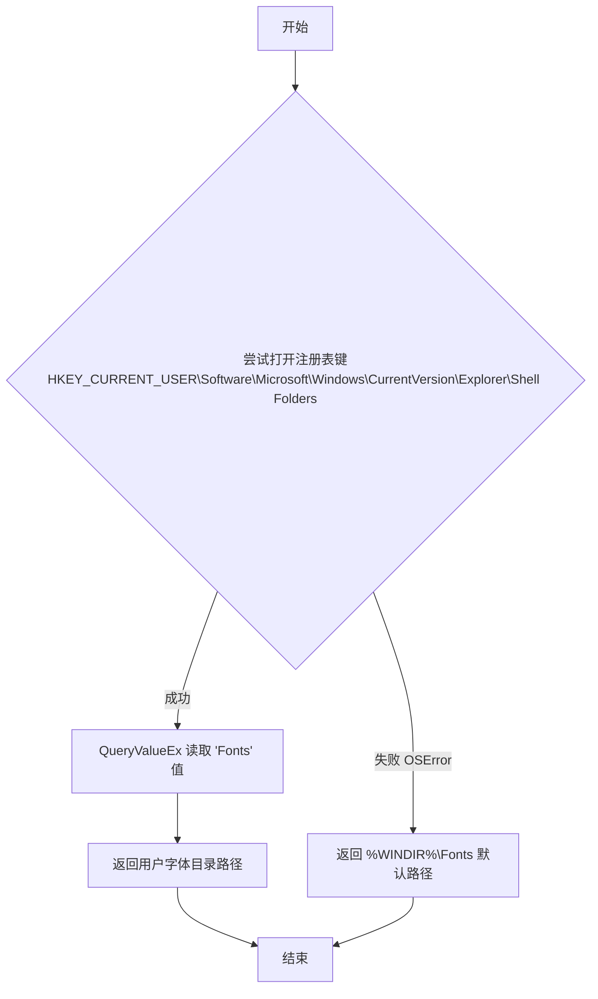

#### 带注释源码

```python
def win32FontDirectory():
    r"""
    Return the user-specified font directory for Win32.  This is
    looked up from the registry key ::

      \\HKEY_CURRENT_USER\Software\Microsoft\Windows\CurrentVersion\Explorer\Shell Folders\Fonts

    If the key is not found, ``%WINDIR%\Fonts`` will be returned.
    """  # noqa: E501
    # 导入 Windows 注册表模块，用于访问系统注册表
    import winreg
    try:
        # 尝试打开当前用户的注册表键 MSFolders
        # MSFolders 定义为 r'Software\Microsoft\Windows\CurrentVersion\Explorer\Shell Folders'
        with winreg.OpenKey(winreg.HKEY_CURRENT_USER, MSFolders) as user:
            # 查询 'Fonts' 键的值，返回值为 (value, type) 元组
            # 取索引 [0] 获取实际的值（字体目录路径）
            return winreg.QueryValueEx(user, 'Fonts')[0]
    except OSError:
        # 如果注册表键不存在或读取失败，捕获 OSError 异常
        # 回退到系统默认的字体目录：%WINDIR%\Fonts
        # os.environ['WINDIR'] 获取 Windows 系统目录（通常是 C:\Windows）
        return os.path.join(os.environ['WINDIR'], 'Fonts')
```


### `_get_win32_installed_fonts`

该函数用于列出 Windows 注册表中已安装的字体路径，通过读取系统和用户级别的注册表键来获取字体文件位置，并返回一组已解析的字体文件路径。

参数： 无

返回值：`Set[Path]`，返回包含所有已安装字体文件路径的集合，路径已被解析为绝对路径。

#### 流程图

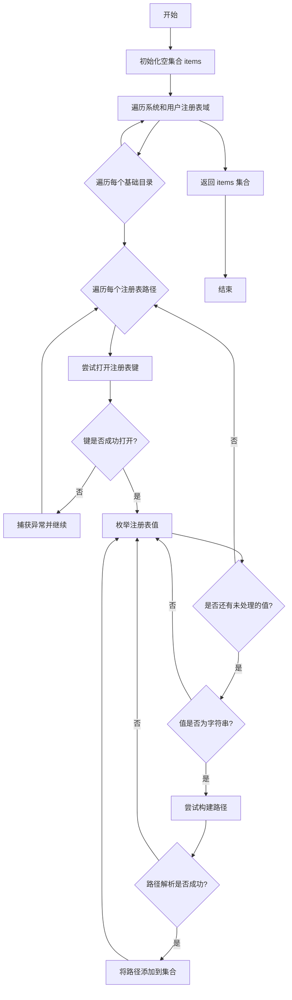

#### 带注释源码

```python
def _get_win32_installed_fonts():
    """List the font paths known to the Windows registry."""
    import winreg  # 导入 Windows 注册表模块
    items = set()  # 初始化结果集合，使用 set 自动去重
    
    # 定义要搜索的注册表域和对应的基础目录
    # HKEY_LOCAL_MACHINE: 系统级字体（需要使用 win32FontDirectory() 获取系统字体目录）
    # HKEY_CURRENT_USER: 用户级字体（使用预定义的 MSUserFontDirectories）
    for domain, base_dirs in [
            (winreg.HKEY_LOCAL_MACHINE, [win32FontDirectory()]),  # System.
            (winreg.HKEY_CURRENT_USER, MSUserFontDirectories),  # User.
    ]:
        # 遍历每个基础目录
        for base_dir in base_dirs:
            # 遍历预定义的注册表路径（字体信息存储位置）
            for reg_path in MSFontDirectories:
                try:
                    # 打开指定的注册表键
                    with winreg.OpenKey(domain, reg_path) as local:
                        # 枚举注册表中的所有值
                        # QueryInfoKey 返回 (子键数, 值数, 最后修改时间)
                        for j in range(winreg.QueryInfoKey(local)[1]):
                            # value 可能包含字体文件名或绝对路径
                            key, value, tp = winreg.EnumValue(local, j)
                            # 只处理字符串类型的值
                            if not isinstance(value, str):
                                continue
                            try:
                                # 如果 value 已经是绝对路径，则不会改变
                                # 否则，将其与 base_dir 组合并解析为绝对路径
                                path = Path(base_dir, value).resolve()
                            except RuntimeError:
                                # 忽略无效条目，不抛出异常
                                continue
                            # 将解析后的路径添加到集合中
                            items.add(path)
                except (OSError, MemoryError):
                    # 忽略访问错误或内存错误，继续处理下一个注册表路径
                    continue
    
    # 返回所有找到的字体路径集合
    return items
```


### `_get_fontconfig_fonts`

该函数是一个全局缓存函数，用于通过 fontconfig 的 `fc-list` 命令获取系统已安装的字体路径列表，并返回 `Path` 对象列表。它使用 `@cache` 装饰器缓存结果以避免重复调用系统命令。

参数：无

返回值：`List[Path]`，返回系统字体文件的路径列表，如果查询失败或 fontconfig 版本不支持则返回空列表。

#### 流程图

```mermaid
flowchart TD
    A[开始] --> B{检查 fc-list 是否支持 --format}
    B -->|支持| C[执行 fc-list --format=%{file}\n]
    B -->|不支持| D[记录警告并返回空列表]
    C --> E{命令执行成功?}
    E -->|是| F[解析输出为 Path 对象列表]
    E -->|否| G[捕获异常并返回空列表]
    F --> H[返回 Path 对象列表]
    D --> H
    G --> H
```

#### 带注释源码

```python
@cache
def _get_fontconfig_fonts():
    """Cache and list the font paths known to ``fc-list``."""
    try:
        # 检查 fc-list 命令是否支持 --format 选项
        # fontconfig 2.7 引入了 --format 选项
        if b'--format' not in subprocess.check_output(['fc-list', '--help']):
            _log.warning(  # fontconfig 2.7 implemented --format.
                'Matplotlib needs fontconfig>=2.7 to query system fonts.')
            return []
        # 执行 fc-list 命令获取字体文件路径
        # %{file} 格式符返回字体文件的完整路径
        out = subprocess.check_output(['fc-list', '--format=%{file}\\n'])
    except (OSError, subprocess.CalledProcessError):
        # 捕获 OSError（命令不存在）和 CalledProcessError（命令执行失败）
        return []
    # 将字节输出按行分割，转换为 Path 对象列表
    # os.fsdecode 处理字节编码问题，确保跨平台兼容性
    return [Path(os.fsdecode(fname)) for fname in out.split(b'\n')]
```


### `_get_macos_fonts`

该函数是一个缓存的模块级函数，用于通过 macOS 系统工具 `system_profiler` 获取系统中已安装的字体路径列表。

参数：
- 该函数无参数

返回值：`List[Path]`，返回 macOS 系统中已安装的字体文件路径列表（Path 对象）

#### 流程图


#### 带注释源码

```python
@cache
def _get_macos_fonts():
    """
    Cache and list the font paths known to ``system_profiler SPFontsDataType``.
    
    该函数使用 functools.cache 装饰器进行结果缓存，避免重复执行系统命令。
    通过 macOS 的 system_profiler 工具获取系统字体信息。
    """
    try:
        # 执行 system_profiler 命令获取字体数据
        # -xml: 输出 XML 格式的 plist
        # SPFontsDataType: 指定获取字体信息数据类型
        d, = plistlib.loads(
            subprocess.check_output(["system_profiler", "-xml", "SPFontsDataType"]))
    except (OSError, subprocess.CalledProcessError, plistlib.InvalidFileException):
        # 捕获三种可能的异常:
        # - OSError: system_profiler 命令不存在或执行失败
        # - CalledProcessError: 命令返回非零退出码
        # - InvalidFileException: 解析 plist 数据失败
        return []
    
    # 从解析后的 plist 数据中提取字体路径
    # d["_items"] 是一个包含所有字体信息的列表
    # 每个 entry 都是一个字典，包含 font 的元数据
    return [Path(entry["path"]) for entry in d["_items"]]
```


### `findSystemFonts`

搜索指定字体路径中的字体。如果未提供路径，将使用标准的系统路径列表，以及fontconfig（如果已安装并可用）跟踪的字体列表。默认返回TrueType字体列表，也可选择AFM字体。

参数：
- `fontpaths`：`str | list[str] | None`，要搜索的字体路径。如果为`None`，则使用系统默认路径（Windows注册表、fontconfig、macOS等）
- `fontext`：`str`，字体扩展名，默认为`'ttf'`（也支持`'afm'`）

返回值：`list[str]`，找到的字体文件路径列表

#### 流程图

```mermaid
flowchart TD
    A[开始 findSystemFonts] --> B{fontpaths 是否为 None?}
    B -->|是| C{平台是 win32?}
    C -->|是| D[调用 _get_win32_installed_fonts]
    C -->|否| E{平台是 darwin?}
    D --> G[fontpaths = []]
    E -->|是| F1[调用 _get_fontconfig_fonts]
    F1 --> F2[调用 _get_macos_fonts]
    F2 --> F3[fontpaths = X11FontDirectories + OSXFontDirectories]
    E -->|否| F4[调用 _get_fontconfig_fonts]
    F4 --> F5[fontpaths = X11FontDirectories]
    F3 --> H[过滤 installed_fonts]
    F5 --> H
    B -->|否| I{fontpaths 是字符串?}
    I -->|是| J[转换为列表]
    I -->|否| K[保持原样]
    J --> L[遍历 fontpaths]
    K --> L
    H --> M[更新 fontfiles]
    L --> M
    M --> N[返回存在的字体文件]
    N --> O[结束]
```

#### 带注释源码

```python
def findSystemFonts(fontpaths=None, fontext='ttf'):
    """
    Search for fonts in the specified font paths.  If no paths are
    given, will use a standard set of system paths, as well as the
    list of fonts tracked by fontconfig if fontconfig is installed and
    available.  A list of TrueType fonts are returned by default with
    AFM fonts as an option.
    """
    # 初始化结果集合，使用set去重
    fontfiles = set()
    # 获取字体扩展名的同义词（如'ttf'对应['otf', 'ttc', 'ttf']）
    fontexts = get_fontext_synonyms(fontext)

    # 如果未指定字体路径，则使用系统默认路径
    if fontpaths is None:
        if sys.platform == 'win32':
            # Windows: 从注册表获取已安装字体
            installed_fonts = _get_win32_installed_fonts()
            fontpaths = []  # 不再额外搜索其他路径
        else:
            # 非Windows: 使用fontconfig获取字体
            installed_fonts = _get_fontconfig_fonts()
            if sys.platform == 'darwin':
                # macOS: 额外添加系统字体目录
                installed_fonts += _get_macos_fonts()
                fontpaths = [*X11FontDirectories, *OSXFontDirectories]
            else:
                # Linux: 使用X11字体目录
                fontpaths = X11FontDirectories
        
        # 过滤已安装字体，只保留指定扩展名的
        fontfiles.update(str(path) for path in installed_fonts
                         if path.suffix.lower()[1:] in fontexts)

    # 如果fontpaths是单个字符串，转换为列表
    elif isinstance(fontpaths, str):
        fontpaths = [fontpaths]

    # 遍历用户指定的路径，搜索字体文件
    for path in fontpaths:
        # 使用os.path.abspath获取绝对路径
        # list_fonts递归搜索目录下所有匹配扩展名的文件
        fontfiles.update(map(os.path.abspath, list_fonts(path, fontexts)))

    # 过滤返回存在的文件，去除不存在的路径
    return [fname for fname in fontfiles if os.path.exists(fname)]
```


### `ttfFontProperty`

从TrueType字体文件（TTF）中提取字体属性信息，并将其封装为`FontEntry`对象返回。该函数通过解析字体的SFNT表、样式标志和PostScript字体信息来推断字体的样式、变体、权重、拉伸和大小等属性。

参数：

- `font`：`FT2Font`，TrueType字体文件对象，从中提取字体属性信息

返回值：`FontEntry`，包含提取的字体属性（文件名、名称、样式、变体、权重、拉伸、大小）

#### 流程图

```mermaid
flowchart TD
    A[开始: 传入FT2Font对象] --> B[获取font.family_name作为name]
    B --> C[获取SFNT表信息]
    C --> D[构建mac_key和ms_key用于查询]
    D --> E[查询mac平台和microsoft平台的名称表]
    E --> F[解码获取sfnt2和sfnt4字符串]
    F --> G{判断样式: sfnt4包含'oblique'?}
    G -->|是| H[style = 'oblique']
    G -->|否| I{判断样式: sfnt4包含'italic'?}
    I -->|是| J[style = 'italic']
    I -->|否| K{sfnt2包含'regular'?}
    K -->|是| L[style = 'normal']
    K -->|否| M{font.style_flags包含ITALIC?}
    M -->|是| J
    M -->|否| L
    H --> N{判断变体: name为'capitals'或'small-caps'?}
    J --> N
    L --> N
    N -->|是| O[variant = 'small-caps']
    N -->|否| P[variant = 'normal']
    O --> Q[获取styles列表]
    P --> Q
    Q --> R[定义get_weight内部函数]
    R --> S{获取OS/2表重量?}
    S -->|成功| T[返回OS/2重量]
    S -->|失败| U{获取PostScript字体信息重量?}
    U -->|成功| V[使用正则匹配返回重量]
    U -->|否| W{遍历styles匹配正则?}
    W -->|匹配成功| T
    W -->|不匹配| X{style_flags包含BOLD?}
    X -->|是| Y[返回700]
    X -->|否| Z[返回500]
    T --> AA[weight = int(get_weight())]
    V --> AA
    Y --> AA
    Z --> AA
    AA --> AB{判断拉伸: sfnt4包含'narrow/condensed/cond'?}
    AB -->|是| AC[stretch = 'condensed']
    AB -->|否| AD{sfnt4包含'demi cond'?}
    AD -->|是| AE[stretch = 'semi-condensed']
    AD -->|否| AF{sfnt4包含'wide/expanded/extended'?}
    AF -->|是| AG[stretch = 'expanded']
    AF -->|否| AH[stretch = 'normal']
    AC --> AI{检查字体是否可伸缩}
    AE --> AI
    AG --> AI
    AH --> AI
    AI -->|不可伸缩| AJ[抛出NotImplementedError]
    AI -->|可伸缩| AK[size = 'scalable']
    AJ --> AL[结束: 返回FontEntry]
    AK --> AL
    
    style AL fill:#90EE90
    style AJ fill:#FFB6C1
```

#### 带注释源码

```python
def ttfFontProperty(font):
    """
    Extract information from a TrueType font file.

    Parameters
    ----------
    font : `.FT2Font`
        The TrueType font file from which information will be extracted.

    Returns
    -------
    `FontEntry`
        The extracted font properties.

    """
    # 1. 获取字体的家族名称
    name = font.family_name

    # Styles are: italic, oblique, and normal (default)
    # 定义用于查询SFNT表的键
    sfnt = font.get_sfnt()
    mac_key = (1,  # platform: macintosh
               0,  # id: roman
               0)  # langid: english
    ms_key = (3,  # platform: microsoft
              1,  # id: unicode_cs
              0x0409)  # langid: english_united_states

    # 2. 获取名称表中的样式信息
    # These tables are actually mac_roman-encoded, but mac_roman support may be
    # missing in some alternative Python implementations and we are only going
    # to look for ASCII substrings, where any ASCII-compatible encoding works
    # - or big-endian UTF-16, since important Microsoft fonts use that.
    # 从mac和microsoft平台获取名称表，优先尝试latin-1编码，失败则尝试UTF-16 BE
    sfnt2 = (sfnt.get((*mac_key, 2), b'').decode('latin-1').lower() or
             sfnt.get((*ms_key, 2), b'').decode('utf_16_be').lower())
    sfnt4 = (sfnt.get((*mac_key, 4), b'').decode('latin-1').lower() or
             sfnt.get((*ms_key, 4), b'').decode('utf_16_be').lower())

    # 3. 判断字体样式
    if sfnt4.find('oblique') >= 0:
        style = 'oblique'
    elif sfnt4.find('italic') >= 0:
        style = 'italic'
    elif sfnt2.find('regular') >= 0:
        style = 'normal'
    # 检查FT2Font的样式标志
    elif ft2font.StyleFlags.ITALIC in font.style_flags:
        style = 'italic'
    else:
        style = 'normal'

    # 4. 判断字体变体（目前未充分测试）
    # Variants are: small-caps and normal (default)
    if name.lower() in ['capitals', 'small-caps']:
        variant = 'small-caps'
    else:
        variant = 'normal'

    # 5. 确定字体权重 - 算法来自fontconfig 2.13.1的FcFreeTypeQueryFaceInternal
    # 定义子表索引
    wws_subfamily = 22           # WWS子家族
    typographic_subfamily = 16  # 印刷子家族
    font_subfamily = 2           # 字体子家族
    
    # 从多个子表获取样式名称
    styles = [
        sfnt.get((*mac_key, wws_subfamily), b'').decode('latin-1'),
        sfnt.get((*mac_key, typographic_subfamily), b'').decode('latin-1'),
        sfnt.get((*mac_key, font_subfamily), b'').decode('latin-1'),
        sfnt.get((*ms_key, wws_subfamily), b'').decode('utf-16-be'),
        sfnt.get((*ms_key, typographic_subfamily), b'').decode('utf-16-be'),
        sfnt.get((*ms_key, font_subfamily), b'').decode('utf-16-be'),
    ]
    # 过滤空值，如果都为空则使用style_name
    styles = [*filter(None, styles)] or [font.style_name]

    def get_weight():  # From fontconfig's FcFreeTypeQueryFaceInternal.
        # 方法1: 尝试从OS/2表获取重量
        os2 = font.get_sfnt_table("OS/2")
        if os2 and os2["version"] != 0xffff:
            return os2["usWeightClass"]
        
        # 方法2: 尝试从PostScript字体信息获取重量
        try:
            ps_font_info_weight = (
                font.get_ps_font_info()["weight"].replace(" ", "") or "")
        except ValueError:
            pass
        else:
            # 使用正则表达式匹配
            for regex, weight in _weight_regexes:
                if re.fullmatch(regex, ps_font_info_weight, re.I):
                    return weight
        
        # 方法3: 从样式名称中推断重量
        for style in styles:
            style = style.replace(" ", "")
            for regex, weight in _weight_regexes:
                if re.search(regex, style, re.I):
                    return weight
        
        # 方法4: 检查BOLD标志
        if ft2font.StyleFlags.BOLD in font.style_flags:
            return 700  # "bold"
        
        # 默认值
        return 500  # "medium", not "regular"!

    # 将权重转换为整数
    weight = int(get_weight())

    # 6. 判断字体拉伸/宽度
    # Stretch can be absolute and relative
    # Absolute stretches are: ultra-condensed, extra-condensed, condensed,
    #   semi-condensed, normal, semi-expanded, expanded, extra-expanded,
    #   and ultra-expanded.
    # Relative stretches are: wider, narrower
    # Child value is: inherit
    if any(word in sfnt4 for word in ['narrow', 'condensed', 'cond']):
        stretch = 'condensed'
    elif 'demi cond' in sfnt4:
        stretch = 'semi-condensed'
    elif any(word in sfnt4 for word in ['wide', 'expanded', 'extended']):
        stretch = 'expanded'
    else:
        stretch = 'normal'

    # 7. 判断字体大小
    # Sizes can be absolute and relative.
    # Absolute sizes are: xx-small, x-small, small, medium, large, x-large,
    #   and xx-large.
    # Relative sizes are: larger, smaller
    # Length value is an absolute font size, e.g., 12pt
    # Percentage values are in 'em's.  Most robust specification.
    if not font.scalable:
        raise NotImplementedError("Non-scalable fonts are not supported")
    size = 'scalable'

    # 8. 返回FontEntry对象
    return FontEntry(font.fname, name, style, variant, weight, stretch, size)
```


### `afmFontProperty`

该函数用于从 AFM（Adobe Font Metrics）字体文件中提取字体属性信息，并返回一个 `FontEntry` 对象。该函数是 `FontManager` 加载和管理 AFM 字体时的核心辅助函数，负责解析 AFM 字体文件的元数据（如字体家族名称、样式、变体、粗细、宽度拉伸和尺寸）。

参数：

- `fontpath`：`str`，对应 font 参数的字体文件路径
- `font`：`AFM`，AFM 字体文件对象，用于从中提取字体属性信息

返回值：`FontEntry`，包含提取的字体属性（文件路径、家族名称、样式、变体、粗细、拉伸和尺寸）

#### 流程图

```mermaid
flowchart TD
    A[开始: afmFontProperty] --> B[获取字体家族名称: name = font.get_familyname]
    B --> C[获取字体名称并转小写: fontname = font.get_fontname.lower]
    C --> D{font.get_angle != 0 或 'italic' in name.lower}
    D -->|是| E[style = 'italic']
    D -->|否| F{'oblique' in name.lower}
    F -->|是| G[style = 'oblique']
    F -->|否| H[style = 'normal']
    E --> I{name.lower in ['capitals', 'small-caps']}
    G --> I
    H --> I
    I -->|是| J[variant = 'small-caps']
    I -->|否| K[variant = 'normal']
    J --> L[weight = font.get_weight.lower]
    K --> L
    L --> M{weight in weight_dict}
    M -->|否| N[weight = 'normal']
    M -->|是| O[保持weight不变]
    N --> P
    O --> P{'demi cond' in fontname}
    P -->|是| Q[stretch = 'semi-condensed']
    P -->|否| R{any word in fontname for word in ['narrow', 'cond']}
    R -->|是| S[stretch = 'condensed']
    R -->|否| T{any word in fontname for word in ['wide', 'expanded', 'extended']}
    T -->|是| U[stretch = 'expanded']
    T -->|否| V[stretch = 'normal']
    Q --> W[size = 'scalable']
    S --> W
    U --> W
    V --> W
    W --> X[返回 FontEntry]
```

#### 带注释源码

```python
def afmFontProperty(fontpath, font):
    """
    Extract information from an AFM font file.

    Parameters
    ----------
    fontpath : str
        The filename corresponding to *font*.
    font : AFM
        The AFM font file from which information will be extracted.

    Returns
    -------
    `FontEntry`
        The extracted font properties.
    """

    # 获取字体家族名称
    name = font.get_familyname()
    # 获取字体名称并转换为小写，用于后续字符串匹配
    fontname = font.get_fontname().lower()

    #  Styles are: italic, oblique, and normal (default)
    # 判断字体样式：如果字体角度非0（倾斜），或名称中包含'italic'，则为italic样式
    if font.get_angle() != 0 or 'italic' in name.lower():
        style = 'italic'
    elif 'oblique' in name.lower():
        style = 'oblique'
    else:
        style = 'normal'

    #  Variants are: small-caps and normal (default)
    # !!!!  Untested
    # 判断字体变体：如果名称为'capitals'或'small-caps'，则为小写字母变体
    if name.lower() in ['capitals', 'small-caps']:
        variant = 'small-caps'
    else:
        variant = 'normal'

    # 获取字体粗细，并转换为小写
    weight = font.get_weight().lower()
    # 如果粗细值不在预定义字典中，则默认为'normal'
    if weight not in weight_dict:
        weight = 'normal'

    #  Stretch can be absolute and relative
    #  Absolute stretches are: ultra-condensed, extra-condensed, condensed,
    #    semi-condensed, normal, semi-expanded, expanded, extra-expanded,
    #    and ultra-expanded.
    #  Relative stretches are: wider, narrower
    #  Child value is: inherit
    # 判断字体宽度拉伸
    if 'demi cond' in fontname:
        stretch = 'semi-condensed'
    elif any(word in fontname for word in ['narrow', 'cond']):
        stretch = 'condensed'
    elif any(word in fontname for word in ['wide', 'expanded', 'extended']):
        stretch = 'expanded'
    else:
        stretch = 'normal'

    #  Sizes can be absolute and relative.
    #  Absolute sizes are: xx-small, x-small, small, medium, large, x-large,
    #    and xx-large.
    #  Relative sizes are: larger, smaller
    #  Length value is an absolute font size, e.g., 12pt
    #  Percentage values are in 'em's.  Most robust specification.

    #  All AFM fonts are apparently scalable.
    #  AFM字体均为可缩放字体
    size = 'scalable'

    # 返回包含所有字体属性的FontEntry对象
    return FontEntry(fontpath, name, style, variant, weight, stretch, size)
```


### `_cleanup_fontproperties_init`

该函数是一个装饰器，用于限制 `FontProperties.__init__` 的调用签名，只接受单一位置参数或纯关键字参数。它会对不符合推荐调用方式的情况发出弃用警告，以确保未来能过渡到更严格的签名规范。

参数：

-  `init_method`：Callable，被装饰的 `__init__` 方法，用于初始化 `FontProperties` 实例

返回值：Callable装饰后的 `__init__` 方法包装器

#### 流程图

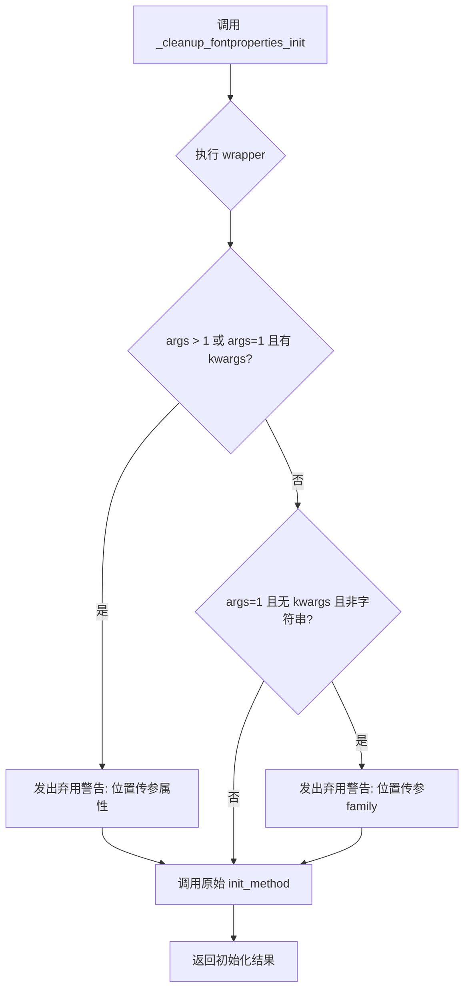

#### 带注释源码

```python
def _cleanup_fontproperties_init(init_method):
    """
    一个装饰器，用于限制调用签名为单一位置参数或纯关键字参数。

    我们仍然接受但不推荐其他调用方式。

    当弃用期结束后，可以切换签名为::
        __init__(self, pattern=None, /, *, family=None, style=None, ...)
    加上运行时检查 pattern 不能与关键字参数同时使用。
    这将最终支持两种调用方式::
        FontProperties(pattern)
        FontProperties(family=..., size=..., ...)
    """
    @functools.wraps(init_method)  # 保留原函数的元信息
    def wrapper(self, *args, **kwargs):
        # 情况1: 多个位置参数 或 1个位置参数+关键字参数
        if len(args) > 1 or len(args) == 1 and kwargs:
            # 注意: 这两种情况之前是作为单独属性处理的
            # 因此这里不提及 font properties 的情况
            _api.warn_deprecated(
                "3.10",
                message="Passing individual properties to FontProperties() "
                        "positionally was deprecated in Matplotlib %(since)s and "
                        "will be removed in %(removal)s. Please pass all properties "
                        "via keyword arguments."
            )
        
        # 情况2: 单个非字符串参数 -> 明显是 family 而非 pattern
        if len(args) == 1 and not kwargs and not cbook.is_scalar_or_string(args[0]):
            # 情况: font-family 列表作为单一参数传递
            _api.warn_deprecated(
                "3.10",
                message="Passing family as positional argument to FontProperties() "
                        "was deprecated in Matplotlib %(since)s and will be removed "
                        "in %(removal)s. Please pass family names as keyword"
                        "argument."
            )
        
        # 注意: 单字符串参数的情况
        # 之前一直被解释为 pattern。如果给出了不兼容 pattern 的 family 字符串，
        # 我们已经会抛出异常。因此这种情况不需要警告。
        
        # 调用原始初始化方法
        return init_method(self, *args, **kwargs)

    return wrapper
```


### `_json_decode`

该函数是 JSON 反序列化的对象钩子（object hook），用于在加载 JSON 数据时将字典转换为对应的 `FontManager` 或 `FontEntry` 对象，支持自定义类的反序列化。

参数：

- `o`：`dict`，从 JSON 文件中读取的字典对象，包含待反序列化的数据

返回值：`any`，返回反序列化后的对象。如果字典中不包含 `__class__` 字段，则返回原始字典；如果是 `FontManager` 类，则返回 `FontManager` 实例；如果是 `FontEntry` 类，则返回 `FontEntry` 实例。

#### 流程图

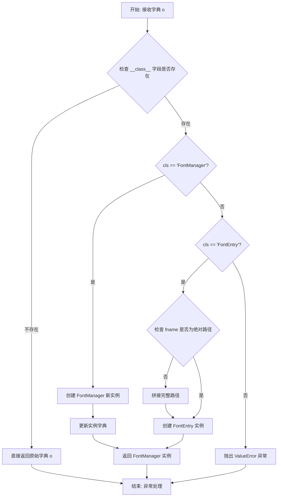

#### 带注释源码

```python
def _json_decode(o):
    """
    JSON object hook for deserialization.
    
    将 JSON 字典转换为对应的 Python 对象。
    支持 FontManager 和 FontEntry 两种类型的反序列化。
    
    Parameters
    ----------
    o : dict
        从 JSON 加载的字典对象，可能包含 __class__ 字段来标识类型。
    
    Returns
    -------
    any
        反序列化后的对象：
        - 如果没有 __class__ 字段，返回原始字典
        - 如果是 'FontManager'，返回 FontManager 实例
        - 如果是 'FontEntry'，返回 FontEntry 实例
        - 其他情况抛出 ValueError
    """
    # 从字典中弹出 __class__ 字段，获取要反序列化的类名
    cls = o.pop('__class__', None)
    
    # 如果没有类信息，直接返回原始字典
    if cls is None:
        return o
    
    # 处理 FontManager 类的反序列化
    elif cls == 'FontManager':
        # 使用 __new__ 创建新实例（不调用 __init__）
        r = FontManager.__new__(FontManager)
        # 直接更新实例字典，快速恢复对象状态
        r.__dict__.update(o)
        return r
    
    # 处理 FontEntry 类的反序列化
    elif cls == 'FontEntry':
        # 如果 fname 不是绝对路径，说明是 Matplotlib 打包的字体
        # 需要拼接完整的数据路径
        if not os.path.isabs(o['fname']):
            o['fname'] = os.path.join(mpl.get_data_path(), o['fname'])
        # 使用字典解包创建 FontEntry 实例
        r = FontEntry(**o)
        return r
    
    # 不支持的类类型，抛出异常
    else:
        raise ValueError("Don't know how to deserialize __class__=%s" % cls)
```


### `json_dump`

将 FontManager 数据以 JSON 格式转储到指定的文件中。

参数：

- `data`：`FontManager`，需要序列化保存的 FontManager 实例
- `filename`：str 或 Path-like，输出 JSON 文件的路径

返回值：`None`，无返回值（操作结果通过日志记录）

#### 流程图

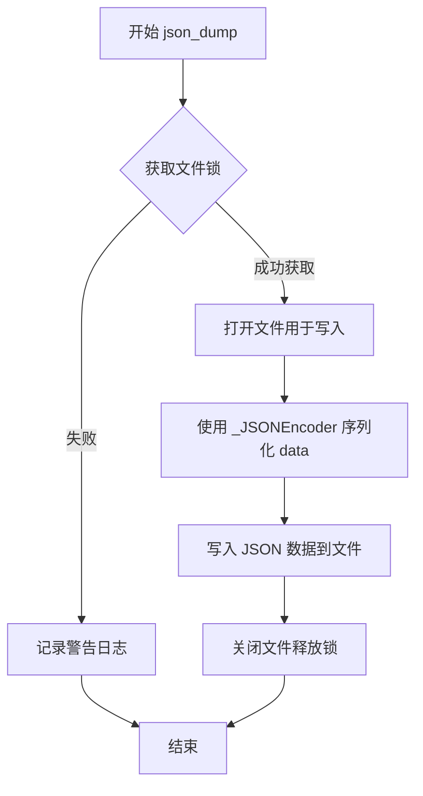

#### 带注释源码

```python
def json_dump(data, filename):
    """
    Dump `FontManager` *data* as JSON to the file named *filename*.

    See Also
    --------
    json_load

    Notes
    -----
    File paths that are children of the Matplotlib data path (typically, fonts
    shipped with Matplotlib) are stored relative to that data path (to remain
    valid across virtualenvs).

    This function temporarily locks the output file to prevent multiple
    processes from overwriting one another's output.
    """
    # 使用 cbook._lock_path 获取文件锁，防止多进程并发写入冲突
    # with 语句确保锁在代码块执行完毕后自动释放
    try:
        with cbook._lock_path(filename), open(filename, 'w') as fh:
            # 使用自定义的 _JSONEncoder 进行序列化
            # indent=2 使输出的 JSON 文件格式美观，便于阅读
            json.dump(data, fh, cls=_JSONEncoder, indent=2)
    except OSError as e:
        # 如果发生 OSError（如权限问题、磁盘空间不足等），记录警告但不让异常向上传播
        _log.warning('Could not save font_manager cache %s', e)
```


### `json_load`

从指定的JSON文件加载并反序列化为 `FontManager` 对象。

参数：

-  `filename`：字符串，要加载的 JSON 文件路径

返回值：字体管理器对象（`FontManager`），从 JSON 文件中反序列化得到的字体管理器实例

#### 流程图

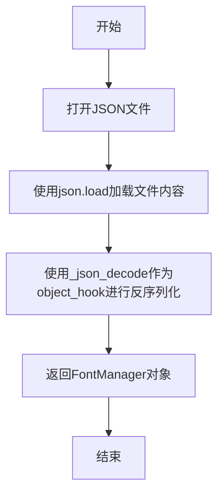

#### 带注释源码

```python
def json_load(filename):
    """
    Load a `FontManager` from the JSON file named *filename*.

    See Also
    --------
    json_dump
    """
    # 打开指定路径的JSON文件，使用上下文管理器确保文件正确关闭
    with open(filename) as fh:
        # 使用json.load加载文件内容，object_hook参数指定了自定义的反序列化函数
        # _json_decode函数会根据JSON中存储的__class__字段来正确重建FontManager或FontEntry对象
        return json.load(fh, object_hook=_json_decode)
```


### `is_opentype_cff_font`

检测给定字体文件是否为嵌入在 OpenType 包装器中的 PostScript 紧凑字体格式（CFF）字体。

参数：

- `filename`：`str` 或 `Path`，要检查的字体文件路径

返回值：`bool`，如果字体是 OTF CFF 格式则返回 `True`，否则返回 `False`

#### 流程图

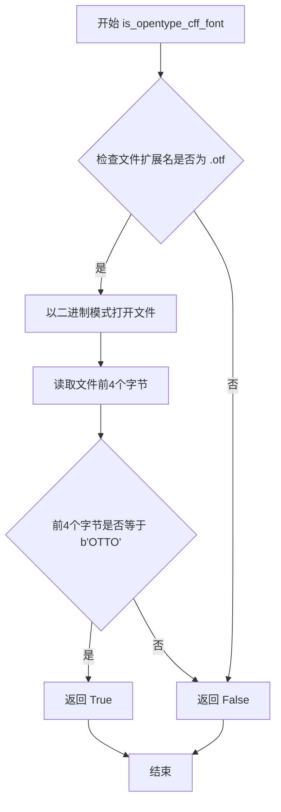

#### 带注释源码

```python
@lru_cache  # 使用 LRU 缓存装饰器，避免重复检查相同文件
def is_opentype_cff_font(filename):
    """
    Return whether the given font is a Postscript Compact Font Format Font
    embedded in an OpenType wrapper.  Used by the PostScript and PDF backends
    that cannot subset these fonts.
    """
    # 使用 splitext 获取文件扩展名并转换为小写
    if os.path.splitext(filename)[1].lower() == '.otf':
        # 如果是 .otf 扩展名，以二进制模式打开文件
        with open(filename, 'rb') as fd:
            # 读取文件前 4 个字节，OTF CFF 字体以 "OTTO" 标记开头
            return fd.read(4) == b"OTTO"
    else:
        # 非 .otf 扩展名直接返回 False
        return False
```


### `_get_font`

获取具有回退功能的 FT2Font 对象（带缓存）

参数：

- `font_filepaths`：可迭代对象（str、Path、bytes 的列表）或单个 str/Path/bytes，字体文件路径列表
- `hinting_factor`：int，字形提示因子
- `_kerning_factor`：int，关键字参数，字距调整因子
- `thread_id`：int，关键字参数，线程 ID，用于防止多线程时的段错误
- `enable_last_resort`：bool，关键字参数，是否启用最后的 Resort 字体

返回值：`ft2font.FT2Font`，返回配置了回退字体的 FT2Font 对象

#### 流程图


#### 带注释源码

```python
@lru_cache(64)
def _get_font(font_filepaths, hinting_factor, *, _kerning_factor, thread_id,
              enable_last_resort):
    """
    获取具有回退功能的 FT2Font 对象。
    
    Parameters
    ----------
    font_filepaths : Iterable[str, Path, bytes], str, Path, bytes
        字体文件路径列表。如果传入单个路径，则作为只有一个元素的列表处理。
        当需要查找字形时，会按顺序尝试回退列表中的字体。
    hinting_factor : int
        字体提示因子，控制字形的抗锯齿程度。
    _kerning_factor : int
        字距调整因子，控制字符之间的间距。
    thread_id : int
        当前线程 ID，用于缓存键以防止多线程环境下的段错误。
    enable_last_resort : bool
        是否启用 Last Resort 字体，确保始终能够渲染某些字形。
    
    Returns
    -------
    ft2font.FT2Font
        配置了回退字体的 FT2Font 对象。
    """
    # 将输入的 font_filepaths 转换为元组并解析第一个路径和回退路径
    first_fontpath, *rest = font_filepaths
    
    # 为所有回退路径创建 FT2Font 对象列表
    fallback_list = [
        ft2font.FT2Font(fpath, hinting_factor, _kerning_factor=_kerning_factor)
        for fpath in rest
    ]
    
    # 获取 Last Resort 字体的绝对路径
    last_resort_path = _cached_realpath(
        cbook._get_data_path('fonts', 'ttf', 'LastResortHE-Regular.ttf'))
    
    try:
        # 检查 last_resort 字体是否已在回退列表中
        last_resort_index = font_filepaths.index(last_resort_path)
    except ValueError:
        last_resort_index = -1
        # 如果 last_resort 不在列表中且启用标志为真，则添加它
        # 这样可以确保始终有字形可渲染
        if enable_last_resort:
            fallback_list.append(
                ft2font.FT2Font(last_resort_path, hinting_factor,
                                _kerning_factor=_kerning_factor,
                                _warn_if_used=True))
            last_resort_index = len(fallback_list)
    
    # 创建主字体对象，传入回退列表和字距调整因子
    font = ft2font.FT2Font(
        first_fontpath, hinting_factor,
        _fallback_list=fallback_list,
        _kerning_factor=_kerning_factor
    )
    
    # 确保使用正确的字符映射
    # FreeType 默认选择 Unicode 字符映射，但 Windows 上该映射为空
    if last_resort_index == 0:
        font.set_charmap(0)
    elif last_resort_index > 0:
        fallback_list[last_resort_index - 1].set_charmap(0)
    
    return font
```


### `_cached_realpath`

该函数是一个带有 LRU 缓存的路径解析工具函数，用于将给定的文件路径解析为绝对路径并缓存结果，从而避免在 PDF/PS 输出中因使用不同相对路径导致同一字体被重复嵌入。

参数：

- `path`：`str | Path | bytes`，需要解析的文件路径

返回值：`str`，解析后的绝对路径

#### 流程图

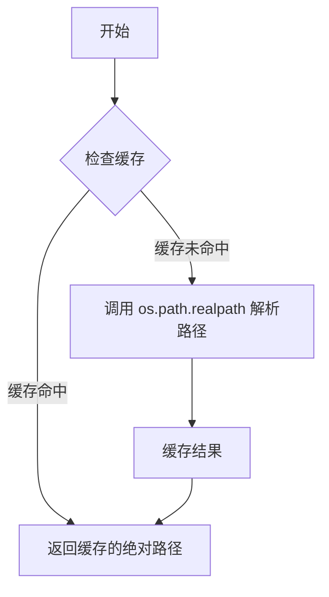

#### 带注释源码

```python
@lru_cache(64)
def _cached_realpath(path):
    # Resolving the path avoids embedding the font twice in pdf/ps output if a
    # single font is selected using two different relative paths.
    return os.path.realpath(path)
```


### `get_font`

获取与给定文件路径列表对应的 FT2Font 对象。

参数：

- `font_filepaths`：参数类型为 `Iterable[str, Path, bytes] | str | Path | bytes`，字体文件的相对或绝对路径。如果传递单个字符串、字节或 Path 对象，则将其视为仅包含该条目的列表。如果传递多个文件路径，返回的 FT2Font 对象将按给定顺序回退查找所需的字形。
- `hinting_factor`：参数类型为 `int | float | None`（从函数签名推导），用于控制字体的 hinting 因子。默认值为 `None`。

返回值：`.ft2font.FT2Font`，返回加载的 FT2Font 对象。

#### 流程图

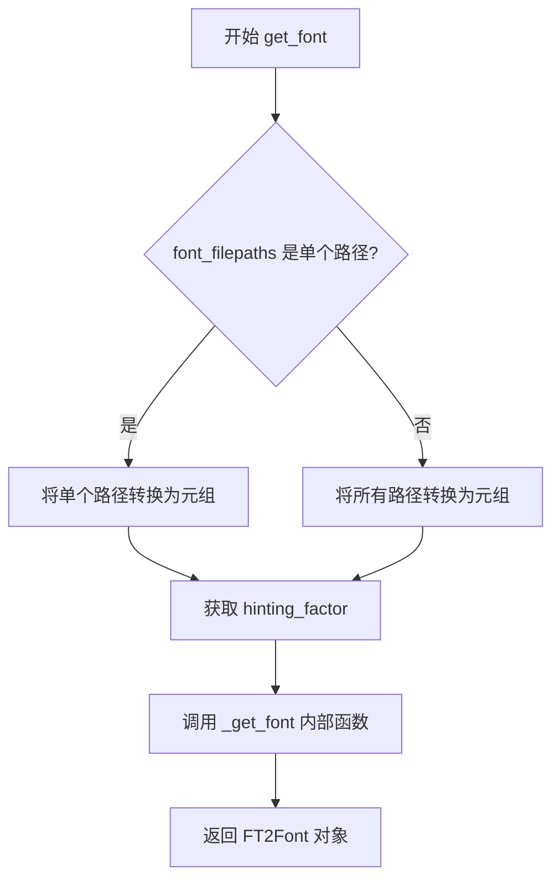

#### 带注释源码

```
def get_font(font_filepaths, hinting_factor=None):
    """
    Get an `.ft2font.FT2Font` object given a list of file paths.

    Parameters
    ----------
    font_filepaths : Iterable[str, Path, bytes], str, Path, bytes
        Relative or absolute paths to the font files to be used.

        If a single string, bytes, or `pathlib.Path`, then it will be treated
        as a list with that entry only.

        If more than one filepath is passed, then the returned FT2Font object
        will fall back through the fonts, in the order given, to find a needed
        glyph.

    Returns
    -------
    `.ft2font.FT2Font`

    """
    # 判断传入的是单个路径还是多个路径
    # 如果是单个字符串、Path对象或bytes，则转换为单元素元组
    if isinstance(font_filepaths, (str, Path, bytes)):
        paths = (_cached_realpath(font_filepaths),)
    else:
        # 多个路径时，对每个路径调用 _cached_realpath 进行规范化处理
        paths = tuple(_cached_realpath(fname) for fname in font_filepaths)

    # 如果未指定 hinting_factor，则从 rcParams 中获取默认值
    hinting_factor = mpl._val_or_rc(hinting_factor, 'text.hinting_factor')

    # 调用内部缓存函数 _get_font 来获取 FT2Font 对象
    # 传递多个参数：路径元组、hinting_factor、kerning_factor、线程ID和last_resort开关
    return _get_font(
        # 必须转换为元组以便缓存
        paths,
        hinting_factor,
        _kerning_factor=mpl.rcParams['text.kerning_factor'],
        # 同样需要在线程ID上进行键控，以防止多线程出现段错误
        thread_id=threading.get_ident(),
        enable_last_resort=mpl.rcParams['font.enable_last_resort'],
    )
```


### `_load_fontmanager`

该函数是模块级函数，用于加载或创建 FontManager 单例实例。如果启用缓存且缓存文件存在且版本匹配，则从缓存加载；否则创建新的 FontManager 实例并写入缓存。

参数：

- `try_read_cache`：`bool`，是否尝试从缓存读取字体管理器实例，默认为 True

返回值：`FontManager`，返回加载或新创建的 FontManager 实例

#### 流程图

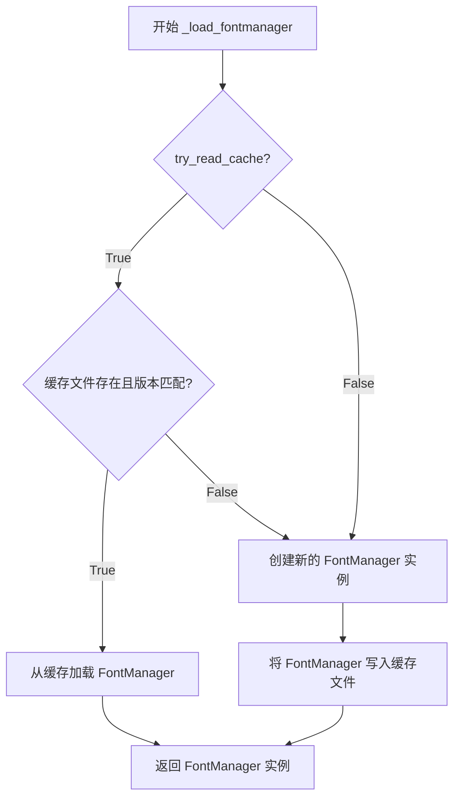

#### 带注释源码

```python
@lru_cache
def _load_fontmanager(*, try_read_cache=True):
    """
    加载或创建 FontManager 实例。
    
    该函数尝试从缓存文件加载已序列化的 FontManager，如果缓存不存在、
    不可用或版本不匹配，则创建新的 FontManager 实例并写入缓存。
    
    Parameters
    ----------
    try_read_cache : bool, default True
        是否尝试从缓存读取。如果为 False，将直接创建新的 FontManager 实例。
    
    Returns
    -------
    FontManager
        加载的或新创建的 FontManager 单例实例。
    """
    # 构建缓存文件路径，使用 FontManager 的版本号命名缓存文件
    fm_path = Path(
        mpl.get_cachedir(), f"fontlist-v{FontManager.__version__}.json")
    
    # 如果允许读取缓存，尝试从 JSON 文件加载
    if try_read_cache:
        try:
            fm = json_load(fm_path)  # 尝试加载缓存文件
        except Exception:
            pass  # 加载失败，忽略异常
        else:
            # 检查缓存的 FontManager 版本是否与当前版本匹配
            if getattr(fm, "_version", object()) == FontManager.__version__:
                _log.debug("Using fontManager instance from %s", fm_path)
                return fm  # 版本匹配，返回缓存的实例
    
    # 缓存不存在、不可用或版本不匹配，创建新的 FontManager 实例
    fm = FontManager()
    
    # 将新实例写入缓存文件，供下次使用
    json_dump(fm, fm_path)
    _log.info("generated new fontManager")
    
    return fm
```


### `FontEntry._repr_html_`

该方法用于在 Jupyter Notebook 等支持 HTML 渲染的环境中以图像形式展示 FontEntry 对象的字体预览。它通过调用 `_repr_png_` 方法生成字体的 PNG 图像，并将图像数据转换为 Base64 编码的 Data URL 格式，最后返回一个包含该图像的 HTML `` 标签。

参数：无需参数（仅使用实例属性）

返回值：`str`，返回包含 Base64 编码 PNG 图像的 HTML `` 标签字符串

#### 流程图

```mermaid
flowchart TD
    A[调用 _repr_html_] --> B[调用 _repr_png_ 获取 PNG 字节流]
    B --> C[使用 base64.b64encode 将 PNG 字节流编码为 Base64]
    C --> D[调用 .decode 转换为字符串]
    D --> E[构建 HTML img 标签: data:image/png;base64, {b64字符串}]
    E --> F[返回 HTML 字符串]
```

#### 带注释源码

```python
def _repr_html_(self) -> str:
    """
    Generate an HTML representation of the FontEntry for Jupyter notebooks.
    
    Returns:
        str: An HTML  tag containing a base64-encoded PNG preview of the font.
    """
    # Step 1: Call _repr_png_ to generate the PNG image data
    # This method creates a Figure, renders the font name on it,
    # and returns the image as bytes
    png_stream = self._repr_png_()
    
    # Step 2: Encode the PNG bytes to base64
    # b64encode returns bytes, so we need to decode to get a string
    png_b64 = b64encode(png_stream).decode()
    
    # Step 3: Return an HTML img tag with the base64-encoded image
    # The src attribute uses the data URL scheme for inline images
    return f""
```


### `FontEntry._repr_png_`

该方法生成字体条目的 PNG 格式图像表示。它通过创建一个 matplotlib Figure 对象，使用字体条目中指定的字体文件（如果有）在图上渲染字体名称，然后将 Figure 保存为 PNG 格式的字节流返回。

参数：

- `self`：`FontEntry` 实例，隐式参数，表示调用该方法的字体条目对象本身

返回值：`bytes`，PNG 格式的图像字节流，可用于在 Jupyter Notebook 等环境中直接显示字体预览

#### 流程图

```mermaid
flowchart TD
    A[开始] --> B[从 matplotlib.figure 导入 Figure]
    --> C[创建新 Figure 对象]
    --> D{self.fname 是否为空?}
    -->|是| E[font_path = None]
    --> G
    -->|否| F[font_path = Path(self.fname)]
    --> G[使用 fig.text 在位置 0,0 渲染 self.name]
    --> H[创建 BytesIO 缓冲区]
    --> I[调用 fig.savefig 保存为 PNG]
    --> J[返回缓冲区中的字节数据]
    --> K[结束]
```

#### 带注释源码

```python
def _repr_png_(self) -> bytes:
    """
    Generate a PNG representation of this font entry.

    Returns
    -------
    bytes
        PNG-encoded image data representing the font.
    """
    # Circular import: matplotlib.figure imports font_manager,
    # so we import Figure here to avoid circular dependency.
    from matplotlib.figure import Figure
    
    # Create a new Figure instance for rendering
    fig = Figure()
    
    # Determine font path: use the font file path if specified,
    # otherwise None to use the default font
    font_path = Path(self.fname) if self.fname != '' else None
    
    # Render the font name at position (0, 0) using the specified font
    fig.text(0, 0, self.name, font=font_path)
    
    # Save the figure to a BytesIO buffer in PNG format
    with BytesIO() as buf:
        # bbox_inches='tight' crops the figure to the content
        # transparent=True makes the background transparent
        fig.savefig(buf, bbox_inches='tight', transparent=True)
        # Return the PNG bytes from the buffer
        return buf.getvalue()
```


### FontProperties.__init__

该方法是 `FontProperties` 类的初始化方法，用于创建和配置字体属性对象。它接受多个可选参数来设置字体族、样式、变体、粗细、拉伸大小、尺寸和数学字体系列，并通过一系列 setter 方法将参数值存储到对象属性中。如果仅提供 `family` 字符串参数且其他参数均为 None，则将其解析为 fontconfig 模式。

参数：

- `family`：`str | list[str] | None`，字体家族名称，可以是单个名称、名称列表或使用 rcParams 默认值
- `style`：`str | None`，字体样式，可选值为 'normal'、'italic' 或 'oblique'
- `variant`：`str | None`，字体变体，可选值为 'normal' 或 'small-caps'
- `weight`：`int | str | None`，字体粗细，可以是数值(0-1000)或字符串(如 'normal'、'bold')
- `stretch`：`int | str | None`，字体拉伸，可以是数值(0-1000)或字符串(如 'normal'、'condensed')
- `size`：`float | str | None`，字体大小，可以是浮点数或相对值(如 'medium'、'large')
- `fname`：`str | Path | None`，字体文件路径，如果设置则忽略其他属性
- `math_fontfamily`：`str | None`，数学字体家族，用于渲染数学文本

返回值：`None`，构造函数无返回值

#### 流程图

```mermaid
flowchart TD
    A[开始 __init__] --> B[调用 set_family 设置字体家族]
    B --> C[调用 set_style 设置字体样式]
    C --> D[调用 set_variant 设置字体变体]
    D --> E[调用 set_weight 设置字体粗细]
    E --> F[调用 set_stretch 设置字体拉伸]
    F --> G[调用 set_file 设置字体文件路径]
    G --> H[调用 set_size 设置字体大小]
    H --> I[调用 set_math_fontfamily 设置数学字体家族]
    I --> J{family 是字符串且其他参数都为 None?}
    J -->|是| K[调用 set_fontconfig_pattern 解析 fontconfig 模式]
    J -->|否| L[结束]
    K --> L
    
    B -.-> M[mpl._val_or_rc 从参数或 rcParams 获取值]
    C -.-> M
    D -.-> M
    E -.-> M
    F -.-> M
    H -.-> M
    I -.-> M
```

#### 带注释源码

```python
@_cleanup_fontproperties_init
def __init__(self, family=None, style=None, variant=None, weight=None,
             stretch=None, size=None,
             fname=None,  # 如果设置，则使用硬编码的字体文件名
             math_fontfamily=None):
    # 使用 setter 方法设置各个属性，这些方法会处理默认值和验证逻辑
    self.set_family(family)           # 设置字体家族
    self.set_style(style)             # 设置字体样式
    self.set_variant(variant)         # 设置字体变体
    self.set_weight(weight)           # 设置字体粗细
    self.set_stretch(stretch)         # 设置字体拉伸
    self.set_file(fname)              # 设置字体文件路径
    self.set_size(size)               # 设置字体大小
    self.set_math_fontfamily(math_fontfamily)  # 设置数学字体家族
    
    # 判断 family 是否为 fontconfig 模式字符串
    # 条件：family 是字符串类型，且 style/variant/weight/stretch/size/fname 都为 None
    # 这种情况下才将 family 视为 fontconfig 模式进行解析
    if (isinstance(family, str)
            and style is None and variant is None and weight is None
            and stretch is None and size is None and fname is None):
        # 即使在这种情况下，也需要先调用其他 setter 设置 rcParams 默认值
        # 然后再解析 fontconfig 模式来覆盖部分属性
        self.set_fontconfig_pattern(family)
```


### FontProperties._from_any

这是一个类方法，用于从多种不同类型的输入构造 `FontProperties` 对象。它提供了灵活的构造函数，支持从 `FontProperties` 实例、`None`、文件路径、字体配置模式字符串或字典创建字体属性对象。

参数：

- `arg`：`Any`，可以是 `FontProperties` 实例、`None`、`os.PathLike`（路径对象）、`str`（字体配置模式）或 `dict`（关键字参数字典）

返回值：`FontProperties`，返回一个新构造的 `FontProperties` 实例

#### 流程图

```mermaid
flowchart TD
    A[开始] --> B{arg is None?}
    B -->|Yes| C[返回 cls()]
    B -->|No| D{arg 是 FontProperties 类?}
    D -->|Yes| E[直接返回 arg]
    D -->|No| F{arg 是 os.PathLike?}
    F -->|Yes| G[返回 cls&#40;fname=arg&#41;]
    F -->|No| H{arg 是 str?}
    H -->|Yes| I[返回 cls&#40;arg&#41;]
    H -->|No| J[返回 cls&#42;&#42;arg]
    C --> Z[结束]
    E --> Z
    G --> Z
    I --> Z
    J --> Z
```

#### 带注释源码

```python
@classmethod
def _from_any(cls, arg):
    """
    Generic constructor which can build a `.FontProperties` from any of the
    following:

    - a `.FontProperties`: it is passed through as is;
    - `None`: a `.FontProperties` using rc values is used;
    - an `os.PathLike`: it is used as path to the font file;
    - a `str`: it is parsed as a fontconfig pattern;
    - a `dict`: it is passed as ``**kwargs`` to `.FontProperties`.
    """
    # 如果传入 None，返回使用 rc 默认值的 FontProperties 实例
    if arg is None:
        return cls()
    # 如果已经是 FontProperties 实例，直接返回（避免重复创建）
    elif isinstance(arg, cls):
        return arg
    # 如果是路径对象（os.PathLike），使用 fname 参数创建
    elif isinstance(arg, os.PathLike):
        return cls(fname=arg)
    # 如果是字符串，解析为字体配置模式
    elif isinstance(arg, str):
        return cls(arg)
    # 否则假设是字典，解包为关键字参数
    else:
        return cls(**arg)
```


### `FontProperties.__hash__`

该方法计算 `FontProperties` 对象的哈希值，通过将所有字体属性（family、slant、variant、weight、stretch、size、file、math_fontfamily）收集到一个元组中，然后对该元组进行哈希运算。这使得 `FontProperties` 对象可以用作字典的键或集合中的元素，支持对象相等性比较和缓存机制。

参数：

- `self`：`FontProperties`，隐式参数，表示当前字体属性对象本身

返回值：`int`，返回对象的哈希值，用于字典键或集合操作

#### 流程图

```mermaid
flowchart TD
    A[开始 __hash__] --> B[获取 family 属性并转为 tuple]
    --> C[获取 slant/style 属性]
    --> D[获取 variant 属性]
    --> E[获取 weight 属性]
    --> F[获取 stretch 属性]
    --> G[获取 size 属性]
    --> H[获取 file 属性]
    --> I[获取 math_fontfamily 属性]
    --> J[将所有属性组成元组 l]
    --> K[计算 hash(l)]
    --> L[返回哈希值]
```

#### 带注释源码

```python
def __hash__(self):
    """
    计算 FontProperties 对象的哈希值。
    
    该方法将所有字体属性收集到一个元组中，然后对该元组进行哈希运算。
    这使得 FontProperties 对象可以用作字典的键或集合中的元素，
    支持基于属性的相等性比较（参见 __eq__ 方法）。
    """
    # 收集所有关键字体属性：
    # - get_family(): 字体家族列表
    # - get_slant()/get_style(): 字体样式（normal/italic/oblique）
    # - get_variant(): 字体变体（normal/small-caps）
    # - get_weight(): 字体权重（数值或字符串）
    # - get_stretch(): 字体拉伸度
    # - get_size(): 字体大小
    # - get_file(): 字体文件路径
    # - get_math_fontfamily(): 数学字体家族
    l = (tuple(self.get_family()),   # 家族转为 tuple 以支持哈希
         self.get_slant(),            # 获取斜体样式
         self.get_variant(),          # 获取变体
         self.get_weight(),           # 获取权重
         self.get_stretch(),          # 获取拉伸度
         self.get_size(),             # 获取大小
         self.get_file(),             # 获取文件路径
         self.get_math_fontfamily()) # 获取数学字体家族
    
    # 对包含所有属性的元组进行哈希运算
    # 这确保具有相同属性的 FontProperties 对象具有相同的哈希值
    return hash(l)
```


### FontProperties.__eq__

该方法用于比较两个 `FontProperties` 对象是否相等。通过比较两个对象的哈希值来确定相等性，如果哈希值相同则认为两个对象相等。

参数：

- `self`：`FontProperties`，当前 `FontProperties` 实例（隐式参数）
- `other`：`object`，要与当前对象进行比较的其他对象

返回值：`bool`，如果两个 `FontProperties` 对象的哈希值相等则返回 `True`，否则返回 `False`

#### 流程图

```mermaid
flowchart TD
    A[开始比较 __eq__] --> B{hash(self) == hash(other)?}
    B -->|是| C[返回 True]
    B -->|否| D[返回 False]
```

#### 带注释源码

```python
def __eq__(self, other):
    """
    比较两个 FontProperties 对象是否相等。

    参数
    ----------
    other : object
        要与当前 FontProperties 对象进行比较的对象。

    返回值
    -------
    bool
        如果两个对象的哈希值相等返回 True，否则返回 False。
    """
    return hash(self) == hash(other)
```


### `FontProperties.__str__`

返回FontProperties对象的字符串表示形式，即fontconfig模式字符串。

参数：

- `self`：`FontProperties`，隐式参数，表示当前FontProperties实例

返回值：`str`，返回fontconfig模式的字符串表示，可用于通过fontconfig的`fc-match`工具查找字体

#### 流程图

```mermaid
flowchart TD
    A[FontProperties.__str__ 被调用] --> B[调用 self.get_fontconfig_pattern]
    B --> C[调用 generate_fontconfig_pattern]
    C --> D[生成并返回fontconfig模式字符串]
```

#### 带注释源码

```python
def __str__(self):
    """
    返回FontProperties的字符串表示。

    该方法返回fontconfig模式的字符串形式，用于描述
    字体的所有属性（family, style, variant, weight, stretch, size等）。
    这使得FontProperties对象可以方便地用于需要字符串参数的场景。

    Returns
    -------
    str
        fontconfig模式的字符串表示
    """
    return self.get_fontconfig_pattern()
```


### FontProperties.get_family

返回字体家族名称列表，包括具体字体名称或通用字体家族名称，按优先级顺序排列。

参数：
- （无参数）

返回值：`list`，返回存储在 FontProperties 中的字体家族列表，可能是具体的字体名称或通用家族名称（如 'serif', 'sans-serif' 等）。

#### 流程图

```mermaid
flowchart TD
    A[开始] --> B[直接返回 self._family]
    B --> C[结束]
```

#### 带注释源码

```python
def get_family(self):
    """
    Return a list of individual font family names or generic family names.

    The font families or generic font families (which will be resolved
    from their respective rcParams when searching for a matching font) in
    the order of preference.
    """
    # 直接返回内部属性 _family，该属性在 set_family 方法中被设置
    # 如果传入的是字符串，会被转换为单元素列表
    # 如果传入 None，会使用 rcParams['font.family'] 的默认值
    return self._family
```


### `FontProperties.get_name`

该方法用于获取与当前字体属性最匹配的字体名称。它通过查找最接近的字体文件，然后获取该字体的家族名称来实现。

参数：

- 无（仅包含隐式参数 `self`）

返回值：`str`，返回与字体属性最匹配的 TrueType 字体的家族名称（family name）。

#### 流程图

```mermaid
flowchart TD
    A[开始 get_name] --> B[调用 findfont self 获取最佳字体路径]
    B --> C[调用 get_font font_path 获取字体对象]
    C --> D[获取 font.family_name 属性]
    D --> E[返回字体家族名称字符串]
```

#### 带注释源码

```python
def get_name(self):
    """
    Return the name of the font that best matches the font properties.
    """
    # 使用 FontManager 的 findfont 方法查找与当前字体属性最匹配的字体文件路径
    # findfont 会根据 family、style、variant、weight、stretch、size 等属性进行评分
    # 返回最接近匹配结果的字体文件路径（字符串）
    font_path = findfont(self)
    
    # 使用 _get_font 函数加载字体文件，返回 ft2font.FT2Font 对象
    # 该对象封装了 FreeType 字体库的访问接口
    font = get_font(font_path)
    
    # 从字体对象中获取家族名称（family_name）
    # 这是字体本身的官方名称，如 'DejaVu Sans'、'Arial' 等
    return font.family_name
```


### FontProperties.get_style

获取字体样式属性。

参数：

- （无参数）

返回值：`str`，返回字体样式，值为 'normal'、'italic' 或 'oblique'。

#### 流程图

```mermaid
flowchart TD
    A[开始 get_style] --> B[返回 self._slant 属性值]
    B --> C[结束]
```

#### 带注释源码

```python
def get_style(self):
    """
    Return the font style.  Values are: 'normal', 'italic' or 'oblique'.
    """
    return self._slant
```

---

**补充说明**：

- 该方法是 `FontProperties` 类的 getter 方法，用于获取之前通过 `set_style()` 方法设置的字体样式。
- 内部实际上返回的是 `_slant` 属性（由于历史原因，样式值存储在 `_slant` 字段中）。
- 样式值在 `set_style()` 方法中被验证，只接受 'normal'、'italic' 或 'oblique' 三个合法值。
- 该方法是一个只读访问器，不接受任何参数。


### `FontProperties.get_variant`

获取字体的变体属性（variant），返回当前设置的字体变体值。

参数： 无（`self` 为隐式参数）

返回值：`str`，返回字体的变体样式，值为 `'normal'`（正常）或 `'small-caps'`（小型大写字母）。

#### 流程图

```mermaid
flowchart TD
    A[开始] --> B[返回 self._variant]
    B --> C[结束]
```

#### 带注释源码

```python
def get_variant(self):
    """
    Return the font variant.  Values are: 'normal' or 'small-caps'.
    """
    return self._variant
```

---

**补充说明**：

- **所属类**：`FontProperties`
- **方法类型**：实例方法（getter）
- **内部字段**：`self._variant`，通过 `set_variant()` 方法设置，值只能是 `'normal'` 或 `'small-caps'` 两者之一
- **调用关系**：通常在字体匹配算法（如 `FontManager._findfont_cached`）中被调用，用于计算字体相似度分数（`score_variant`）


### FontProperties.get_weight

获取字体的权重值。返回字体权重，可以是数值（0-1000范围内的整数）或预定义的权重名称字符串（如'light'、'normal'、'bold'等）。

参数： 无（该方法不接受任何参数，self为隐式参数）

返回值： `int | str`，返回字体权重值，可以是整数（0-1000）或字符串（如'normal'、'bold'等）

#### 流程图

```mermaid
flowchart TD
    A[开始 get_weight] --> B{检查self._weight是否存在}
    B -->|是| C[返回self._weight]
    B -->|否| D[返回默认值或错误]
    C --> E[结束]
    D --> E
```

#### 带注释源码

```python
def get_weight(self):
    """
    获取字体权重。

    可选值为：范围0-1000的数值，或以下字符串之一：
    'light', 'normal', 'regular', 'book', 'medium', 'roman',
    'semibold', 'demibold', 'demi', 'bold', 'heavy', 'extra bold', 'black'

    返回值
    -------
    int 或 str
        字体权重值
    """
    # 直接返回内部存储的_weight属性
    # _weight在set_weight方法中被设置，可以是整数或字符串
    return self._weight
```


### `FontProperties.get_stretch`

获取字体的拉伸（stretch）或宽度属性。

参数：

- （无参数，仅 `self`）

返回值：`int | str`，返回字体的拉伸/宽度值，可以是字符串（如 `'normal'`, `'condensed'`, `'expanded'` 等）或对应的整数值（0-1000）。

#### 流程图

```mermaid
flowchart TD
    A[开始 get_stretch] --> B[返回 self._stretch]
    B --> C[结束]
```

#### 带注释源码

```python
def get_stretch(self):
    """
    Return the font stretch or width.  Options are: 'ultra-condensed',
    'extra-condensed', 'condensed', 'semi-condensed', 'normal',
    'semi-expanded', 'expanded', 'extra-expanded', 'ultra-expanded'.
    """
    return self._stretch
```


### `FontProperties.get_size`

该方法是 `FontProperties` 类的简单访问器方法，用于获取之前设置的字体大小值。

参数： 无

返回值：`float`，返回字体大小数值（以磅为单位）。

#### 流程图

```mermaid
graph TD
    A[开始: 调用 get_size] --> B{检查 self._size}
    B -->|已设置| C[返回 self._size]
    C --> D[结束]
    
    style A fill:#f9f,stroke:#333
    style C fill:#9f9,stroke:#333
    style D fill:#9f9,stroke:#333
```

#### 带注释源码

```python
def get_size(self):
    """
    Return the font size.
    
    Returns
    -------
    float
        The font size in points. This value is set by calling
        :meth:`set_size` during initialization or by explicitly
        setting the size property. The value is always converted
        to a float, with a minimum of 1.0 point.
    """
    return self._size
```

**说明：** 该方法是 `FontProperties` 类中最简单的方法之一，属于典型的 getter 访问器。它直接返回实例属性 `_size`，该属性在对象初始化时通过 `set_size()` 方法设置。`set_size()` 方法会负责将输入的尺寸值（可能是相对值如 'large' 或绝对值如 12）转换为浮点数形式的磅值。因此，`get_size()` 返回的类型始终为 `float`。


### `FontProperties.get_file`

获取与当前字体属性关联的字体文件名。

参数：

- （无参数，实例方法）

返回值：`Optional[str]`，返回关联字体的文件名，如果未设置则返回 `None`。

#### 流程图

```mermaid
flowchart TD
    A[开始 get_file] --> B{self._file 是否为 None}
    B -->|是| C[返回 None]
    B -->|否| D[返回 self._file]
    C --> E[结束]
    D --> E
```

#### 带注释源码

```python
def get_file(self):
    """
    Return the filename of the associated font.
    """
    # 直接返回内部存储的 _file 属性
    # _file 可以是以下值：
    # - None: 当未通过 set_file() 设置时
    # - str: 通过 set_file() 设置的文件路径
    return self._file
```


### `FontProperties.get_fontconfig_pattern`

获取一个适合使用 fontconfig 的 `fc-match` 工具查找字体的 fontconfig 模式字符串。该方法不依赖 fontconfig，只是借用了其模式语法来表示字体属性。

参数：

- `self`：`FontProperties` 实例，隐式参数，表示当前的字体属性对象

返回值：`str`，返回生成的 fontconfig 模式字符串，可用于使用 fontconfig 的 `fc-match` 工具查找字体

#### 流程图

```mermaid
flowchart TD
    A[开始: 调用 get_fontconfig_pattern] --> B[调用 generate_fontconfig_pattern]
    B --> C{传入 self 字体属性对象}
    C --> D[generate_fontconfig_pattern 解析 FontProperties 对象]
    D --> E[生成对应的 fontconfig 模式字符串]
    E --> F[返回字符串格式的 fontconfig 模式]
    F --> G[结束]
```

#### 带注释源码

```python
def get_fontconfig_pattern(self):
    """
    Get a fontconfig_ pattern_ suitable for looking up the font as
    specified with fontconfig's ``fc-match`` utility.

    This support does not depend on fontconfig; we are merely borrowing its
    pattern syntax for use here.
    """
    # 调用 generate_fontconfig_pattern 函数，传入当前 FontProperties 实例
    # 该函数位于 matplotlib._fontconfig_pattern 模块中
    # 将 FontProperties 对象转换为 fontconfig 格式的字符串
    return generate_fontconfig_pattern(self)
```


### FontProperties.get_math_fontfamily

获取当前字体属性对象中设置的数学文本字体系列名称。

参数：

- 无（仅包含隐式参数 `self`）

返回值：`str`，返回用于渲染数学文本的字体系列名称。如果未显式设置，则默认使用 matplotlib 配置参数 `mathtext.fontset` 所指定的字体系列。

#### 流程图

```mermaid
flowchart TD
    A[调用 get_math_fontfamily] --> B{检查 _math_fontfamily 是否已设置}
    B -->|已设置| C[返回 self._math_fontfamily]
    B -->|未设置| D[返回 rcParams['mathtext.fontset'] 的默认值]
    C --> E[结束]
    D --> E
```

#### 带注释源码

```python
def get_math_fontfamily(self):
    """
    Return the name of the font family used for math text.

    The default font is :rc:`mathtext.fontset`.
    """
    # 直接返回内部属性 _math_fontfamily
    # 该属性在对象初始化时通过 set_math_fontfamily 方法设置
    # 如果未显式设置，则默认为 rcParams['mathtext.fontset']
    return self._math_fontfamily
```

#### 关联信息

| 项目 | 说明 |
|------|------|
| 所属类 | `FontProperties` |
| 配对Setter | `FontProperties.set_math_fontfamily` |
| 内部属性 | `_math_fontfamily` |
| 默认值来源 | `mpl.rcParams['mathtext.fontset']` |
| 有效取值 | `'dejavusans'`, `'dejavuserif'`, `'cm'`, `'stix'`, `'stixsans'`, `'custom'` |


### `FontProperties.set_family`

该方法用于设置字体的字体族（font family），可以接受单个字体名称、字体族别名（如 'serif'、'sans-serif' 等）或字体名称列表，并将其存储到实例的 `_family` 属性中。

参数：

- `family`：`str | list[str] | None`，字体族名称。可以是单个字体名称字符串、字体族别名（'serif'、'sans-serif'、'cursive'、'fantasy'、'monospace'）、字体名称列表，或 `None`（使用 rcParams 默认值）

返回值：`None`，该方法无返回值，仅修改实例状态

#### 流程图

```mermaid
flowchart TD
    A[开始 set_family] --> B{检查 family 是否为 None}
    B -->|是| C[调用 mpl._val_or_rc 获取默认值]
    B -->|否| D{检查 family 是否为字符串}
    C --> E{检查转换后的 family 类型}
    D -->|是| F[将字符串转换为列表]
    D -->|否| E
    F --> E{检查转换后的 family 类型}
    E -->|是列表| G[直接赋值给 self._family]
    E -->|不是列表| H[抛出类型错误]
    G --> I[结束]
    H --> I
```

#### 带注释源码

```python
def set_family(self, family):
    """
    Change the font family.  Can be either an alias (generic name
    is CSS parlance), such as: 'serif', 'sans-serif', 'cursive',
    'fantasy', or 'monospace', a real font name or a list of real
    font names.  Real font names are not supported when
    :rc:`text.usetex` is `True`. Default: :rc:`font.family`
    """
    # 如果 family 为 None，则从 rcParams 获取默认值 'font.family'
    # 否则使用传入的值
    family = mpl._val_or_rc(family, 'font.family')
    
    # 如果是单个字符串，转换为列表以保持一致性
    # 支持的格式：'serif', ['serif', 'sans-serif'], 'Arial' 等
    if isinstance(family, str):
        family = [family]
    
    # 将处理后的字体族列表存储到实例属性
    # _family 用于后续的字体匹配查找
    self._family = family
```


### FontProperties.set_style

设置字体的样式（斜体、正体或倾斜体）。

参数：
-  `style`：`str`，字体样式，可选值为 `'normal'`、`'italic'` 或 `'oblique'`，默认值从 `:rc:`font.style`` 获取

返回值：`None`，无返回值

#### 流程图

```mermaid
flowchart TD
    A[开始 set_style] --> B{获取 style 参数值}
    B --> C[调用 mpl._val_or_rc 获取实际值]
    C --> D{验证 style 是否合法}
    D -->|合法| E[将样式值赋给 self._slant]
    D -->|不合法| F[抛出 ValueError 异常]
    E --> G[结束]
    F --> G
```

#### 带注释源码

```python
def set_style(self, style):
    """
    Set the font style.

    Parameters
    ----------
    style : {'normal', 'italic', 'oblique'}, default: :rc:`font.style`
    """
    # 使用 matplotlib 的 _val_or_rc 函数获取 style 参数的值
    # 如果 style 为 None，则使用 rcParams['font.style'] 的默认值
    style = mpl._val_or_rc(style, 'font.style')
    
    # 使用 _api.check_in_list 验证 style 参数是否在允许的列表中
    # 允许的值为 'normal', 'italic', 'oblique'
    _api.check_in_list(['normal', 'italic', 'oblique'], style=style)
    
    # 验证通过后，将样式值存储到实例属性 _slant 中
    self._slant = style
```


### FontProperties.set_variant

设置字体变体（variant）为 'normal' 或 'small-caps'，该方法用于指定字体是否为小型大写字母变体。

参数：

- `variant`：`str`，字体变体选项，值为 `'normal'` 或 `'small-caps'`，默认为 :rc:`font.variant`

返回值：`None`，无返回值（setter 方法）

#### 流程图

```mermaid
flowchart TD
    A[开始 set_variant] --> B{获取 variant 参数}
    B --> C{mpl._val_or_rc<br/>获取参数值或回退到rcParams}
    C --> D{_api.check_in_list<br/>验证 variant 是否为有效选项}
    D -->|有效| E[设置 self._variant = variant]
    D -->|无效| F[抛出 ValueError 异常]
    E --> G[结束]
    F --> G
```

#### 带注释源码

```python
def set_variant(self, variant):
    """
    Set the font variant.

    Parameters
    ----------
    variant : {'normal', 'small-caps'}, default: :rc:`font.variant`
    """
    # 使用 mpl._val_or_rc 获取 variant 值
    # 如果 variant 为 None，则回退到 rcParams['font.variant'] 的值
    variant = mpl._val_or_rc(variant, 'font.variant')
    
    # 验证 variant 是否为有效选项之一：'normal' 或 'small-caps'
    # 如果无效，会抛出 ValueError 异常
    _api.check_in_list(['normal', 'small-caps'], variant=variant)
    
    # 将验证后的 variant 值存储到实例属性 _variant 中
    self._variant = variant
```


### FontProperties.set_weight

设置字体的粗细（权重）属性。

参数：

- `weight`：`int` 或 `str`，字体的粗细值。可以是整数值（0-1000），或者是字符串（如 'normal'、'bold'、'light' 等）

返回值：`None`，无返回值，该方法直接修改实例的 `_weight` 属性

#### 流程图

```mermaid
flowchart TD
    A[开始 set_weight] --> B[获取 weight 值<br/>mpl._val_or_rc]
    B --> C{weight 是否在<br/>weight_dict 中?}
    C -->|是| D[设置 self._weight = weight]
    D --> E[返回]
    C -->|否| F{尝试将 weight<br/>转换为 int}
    F -->|成功| G{0 <= weight <= 1000?}
    G -->|是| H[设置 self._weight = weight]
    H --> E
    G -->|否| I[抛出 ValueError]
    F -->|失败| I
    I --> J[结束]
    E --> J
```

#### 带注释源码

```python
def set_weight(self, weight):
    """
    Set the font weight.

    Parameters
    ----------
    weight : int or {'ultralight', 'light', 'normal', 'regular', 'book', \
'medium', 'roman', 'semibold', 'demibold', 'demi', 'bold', 'heavy', \
'extra bold', 'black'}, default: :rc:`font.weight`
        If int, must be in the range  0-1000.
    """
    # 首先尝试从参数或 rcParams 获取 weight 值
    # 如果 weight 为 None，则使用 rcParams['font.weight'] 的默认值
    weight = mpl._val_or_rc(weight, 'font.weight')
    
    # 检查 weight 是否为预定义的字符串权重值（如 'normal', 'bold' 等）
    if weight in weight_dict:
        self._weight = weight
        return
    
    # 如果不是预定义字符串，尝试将其转换为整数
    try:
        weight = int(weight)
    except ValueError:
        # 转换失败，说明传入的值既不是有效字符串也不是有效整数
        pass
    else:
        # 转换成功，检查是否在有效范围内 (0-1000)
        if 0 <= weight <= 1000:
            self._weight = weight
            return
    
    # 如果以上条件都不满足，抛出 ValueError 异常
    raise ValueError(f"{weight=} is invalid")
```


### `FontProperties.set_stretch`

设置字体的拉伸（stretch）或宽度属性。

参数：

- `stretch`：int 或 str，字体拉伸值，可以是字符串（如 'ultra-condensed'、'extra-condensed'、'condensed'、'semi-condensed'、'normal'、'semi-expanded'、'expanded'、'extra-expanded'、'ultra-expanded'）或整数（范围 0-1000），默认值为 :rc:`font.stretch`

返回值：None，此方法无返回值（返回类型为 None）

#### 流程图

```mermaid
flowchart TD
    A[开始 set_stretch] --> B{stretch in stretch_dict?}
    B -->|是| C[设置 self._stretch = stretch]
    C --> D[返回]
    B -->|否| E{能否转换为 int?}
    E -->|是| F{0 <= stretch <= 1000?}
    F -->|是| G[设置 self._stretch = stretch]
    G --> D
    E -->|否| H[抛出 ValueError]
    F -->|否| H
    H --> I[结束]
    D --> I
```

#### 带注释源码

```python
def set_stretch(self, stretch):
    """
    Set the font stretch or width.

    Parameters
    ----------
    stretch : int or {'ultra-condensed', 'extra-condensed', 'condensed', \
'semi-condensed', 'normal', 'semi-expanded', 'expanded', 'extra-expanded', \
'ultra-expanded'}, default: :rc:`font.stretch`
        If int, must be in the range  0-1000.
    """
    # 使用 mpl._val_or_rc 获取 stretch 值，如果为 None 则使用 rcParams 中的默认值
    stretch = mpl._val_or_rc(stretch, 'font.stretch')
    
    # 首先检查 stretch 是否为预定义的字符串值（如 'normal', 'condensed' 等）
    if stretch in stretch_dict:
        self._stretch = stretch  # 直接设置字符串值
        return
    
    # 如果不是预定义字符串，尝试将其转换为整数
    try:
        stretch = int(stretch)
    except ValueError:
        pass  # 转换失败，不是有效的字符串也不是有效的整数
    else:
        # 转换成功，检查是否在有效范围内 (0-1000)
        if 0 <= stretch <= 1000:
            self._stretch = stretch  # 设置整数值的拉伸
            return
    
    # 如果以上条件都不满足，抛出 ValueError 异常
    raise ValueError(f"{stretch=} is invalid")
```


### `FontProperties.set_size`

设置字体大小，支持绝对值（浮点数，单位为磅）和相对值（如 'xx-small', 'x-small', 'small', 'medium', 'large', 'x-large', 'xx-large'），并确保最终字体大小不低于 1.0 磅。

参数：

- `self`：`FontProperties`，FontProperties 实例本身
- `size`：`float` 或 `str`，字体大小。浮点数表示绝对字体大小（磅），字符串值表示相对于默认字体大小的相对大小

返回值：`None`，无返回值（修改实例属性 `_size`）

#### 流程图

```mermaid
flowchart TD
    A[开始 set_size] --> B{size 是否为 None}
    B -->|是| C[使用 rcParams['font.size'] 作为默认值]
    B -->|否| D{size 能否转为 float}
    D -->|能| E[直接使用 float 值]
    D -->|否| F{size 是否在 font_scalings 中}
    F -->|是| G[获取缩放比例 scale]
    G --> H[size = scale × FontManager.get_default_size]
    F -->|否| I[抛出 ValueError 异常]
    E --> J{size < 1.0}
    H --> J
    J -->|是| K[将 size 设为 1.0 并记录日志]
    J -->|否| L[设置 self._size = size]
    K --> L
    I --> M[结束]
    C --> L
    L --> N[结束]
```

#### 带注释源码

```python
def set_size(self, size):
    """
    Set the font size.

    Parameters
    ----------
    size : float or {'xx-small', 'x-small', 'small', 'medium', \
'large', 'x-large', 'xx-large'}, default: :rc:`font.size`
        If a float, the font size in points. The string values denote
        sizes relative to the default font size.
    """
    # 首先使用 mpl._val_or_rc 获取值：
    # 如果 size 不为 None，直接使用其值
    # 如果 size 为 None，则使用 rcParams['font.size'] 作为默认值
    size = mpl._val_or_rc(size, 'font.size')
    
    # 尝试将 size 转换为浮点数（处理绝对大小，如 12.0）
    try:
        size = float(size)
    except ValueError:
        # 如果转换失败，说明 size 是相对大小字符串（如 'large', 'small'）
        try:
            # 从 font_scalings 字典获取对应的缩放比例
            scale = font_scalings[size]
        except KeyError as err:
            # size 既不是有效数字也不是有效相对大小，抛出错误
            raise ValueError(
                "Size is invalid. Valid font size are "
                + ", ".join(map(str, font_scalings))) from err
        else:
            # 相对大小 = 缩放比例 × 默认字体大小
            size = scale * FontManager.get_default_size()
    
    # FreeType 不允许字体大小小于 1.0 磅，进行最小值限制
    if size < 1.0:
        _log.info('Fontsize %1.2f < 1.0 pt not allowed by FreeType. '
                  'Setting fontsize = 1 pt', size)
        size = 1.0
    
    # 将处理后的 size 值保存到实例属性 _size
    self._size = size
```


### `FontProperties.set_file`

设置要使用的字体文件名。在这种情况下，所有其他属性都将被忽略。

参数：

- `file`：`Optional[Union[str, Path]]`，字体文件的路径，可以是字符串或 Path 对象，当为 None 时表示不指定特定字体文件

返回值：`None`，无返回值（该方法直接修改对象状态）

#### 流程图

```mermaid
flowchart TD
    A[开始 set_file] --> B{file 是否为 None?}
    B -->|是| C[设置 self._file = None]
    B -->|否| D[使用 os.fspath 转换 file 并赋值给 self._file]
    C --> E[结束]
    D --> E
```

#### 带注释源码

```python
def set_file(self, file):
    """
    Set the filename of the fontfile to use.  In this case, all
    other properties will be ignored.
    """
    # 如果 file 不为 None，则使用 os.fspath 将其转换为文件系统路径字符串
    # os.fspath 可以接受 str、Path 或任何实现了 __fspath__ 协议的对象
    # 如果 file 为 None，则将 _file 设置为 None，表示不指定特定字体文件
    self._file = os.fspath(file) if file is not None else None
```


### FontProperties.set_fontconfig_pattern

设置字体属性通过解析 fontconfig 模式字符串。该方法不依赖于实际的 fontconfig 库，而是借用其模式语法来设置字体的各种属性。

参数：

- `pattern`：`str`，fontconfig 模式的字符串，用于指定字体属性（如 family、style、weight 等）

返回值：`None`，该方法无返回值，直接修改 FontProperties 实例的内部状态

#### 流程图

```mermaid
flowchart TD
    A[开始 set_fontconfig_pattern] --> B[调用 parse_fontconfig_pattern 解析 pattern]
    B --> C[遍历解析后的键值对 items]
    C --> D{判断 val 是否为列表}
    D -->|是| E[取列表第一个元素 val[0]]
    D -->|否| F[使用原始值 val]
    E --> G[构建 setter 方法名 'set_' + key]
    F --> G
    G --> H[通过 getattr 获取当前对象的 setter 方法]
    H --> I[调用 setter 方法设置属性]
    I --> C
    C --> J{遍历完成?}
    J -->|否| C
    J -->|是| K[结束]
```

#### 带注释源码

```python
def set_fontconfig_pattern(self, pattern):
    """
    Set the properties by parsing a fontconfig_ *pattern_.

    This support does not depend on fontconfig; we are merely borrowing its
    pattern syntax for use here.

    Parameters
    ----------
    pattern : str
        A fontconfig pattern string that specifies font properties.
        Example: 'sans-serif:style=italic:weight=bold'
    """
    # 调用 parse_fontconfig_pattern 函数将字符串模式解析为字典
    # 返回格式如 {'family': ['sans-serif'], 'style': 'italic', 'weight': 'bold'}
    for key, val in parse_fontconfig_pattern(pattern).items():
        # 检查解析出的值是否为列表类型
        # fontconfig 模式中某些属性可能返回列表（如 family 可能返回多个字体）
        if type(val) is list:
            # 如果是列表，取第一个元素作为值
            # 例如 family 可能返回 ['Arial', 'Helvetica']，取第一个 'Arial'
            getattr(self, "set_" + key)(val[0])
        else:
            # 如果不是列表，直接使用该值调用对应的 setter 方法
            # 例如 style='italic' -> 调用 self.set_style('italic')
            getattr(self, "set_" + key)(val)
```


### `FontProperties.set_math_fontfamily`

该方法用于设置数学模式下文本的字体家族。如果未显式设置，则默认使用 `mathtext.fontset` rcParams 配置的值。方法内部会对传入的字体家族进行有效性验证，确保其在允许的字体集合范围内。

参数：

- `fontfamily`：`str`，数学模式文本使用的字体家族名称。允许的字体集合定义在 matplotlibrc 配置文件中。若为 `None`，则自动使用 rcParams['mathtext.fontset'] 的默认值。

返回值：`None`，该方法为 setter 方法，直接修改实例属性 `_math_fontfamily`，无返回值。

#### 流程图

```mermaid
flowchart TD
    A[开始 set_math_fontfamily] --> B{fontfamily is None?}
    B -->|Yes| C[从 rcParams 获取 mathtext.fontset]
    B -->|No| D[获取有效的字体集合]
    D --> E[使用 _api.check_in_list 验证 fontfamily]
    E --> F{验证通过?}
    F -->|No| G[抛出 ValueError 异常]
    F -->|Yes| H[设置 self._math_fontfamily]
    C --> H
    H --> I[结束]
    G --> I
```

#### 带注释源码

```python
def set_math_fontfamily(self, fontfamily):
    """
    Set the font family for text in math mode.

    If not set explicitly, :rc:`mathtext.fontset` will be used.

    Parameters
    ----------
    fontfamily : str
        The name of the font family.

        Available font families are defined in the
        :ref:`default matplotlibrc file <customizing-with-matplotlibrc-files>`.

    See Also
    --------
    .text.Text.get_math_fontfamily
    """
    # 如果未指定字体家族，则使用 rcParams 中的默认值
    if fontfamily is None:
        fontfamily = mpl.rcParams['mathtext.fontset']
    else:
        # 获取 mathtext.fontset 验证器的有效值集合
        valid_fonts = _validators['mathtext.fontset'].valid.values()
        # _check_in_list() 验证参数 math_fontfamily 是否在有效集合中
        # 类似于传递给 rcParams['mathtext.fontset'] 的验证方式
        _api.check_in_list(valid_fonts, math_fontfamily=fontfamily)
    # 将验证后的字体家族赋值给实例属性
    self._math_fontfamily = fontfamily
```


### `FontProperties.copy`

该方法返回一个 `FontProperties` 对象的浅拷贝，用于在需要修改字体属性而不影响原始对象时创建副本。

参数：- `self`：`FontProperties`，隐式参数，表示当前字体属性对象

返回值：`FontProperties`，返回原对象的浅拷贝

#### 流程图

```mermaid
flowchart TD
    A[开始 copy 方法] --> B{调用 copy.copy}
    B --> C[创建 self 的浅拷贝]
    C --> D[返回拷贝的 FontProperties 对象]
    D --> E[结束]
```

#### 带注释源码

```python
def copy(self):
    """
    返回当前 FontProperties 对象的副本。
    
    这是一个浅拷贝操作，使用 Python 标准库中的 copy.copy 函数。
    复制后的对象与原始对象具有相同的字体属性配置，但它们是独立的对象，
    修改其中一个不会影响另一个。
    
    Returns
    -------
    FontProperties
        当前对象的浅拷贝。
    """
    return copy.copy(self)
```


### `_JSONEncoder.default`

该方法是 `_JSONEncoder` 类的核心序列化方法，负责将 `FontManager` 和 `FontEntry` 对象转换为可 JSON 序列化的字典格式，同时保留类信息以便反序列化时重建对象。

参数：

- `self`：`_JSONEncoder` 实例，隐式参数，用于访问对象状态
- `o`：`任意类型 (Any)`，需要被 JSON 序列化的对象

返回值：`dict`，返回包含对象属性的字典，或者调用父类的 `default` 方法处理不支持的类型

#### 流程图

```mermaid
flowchart TD
    A[开始: default 方法] --> B{检查 o 是否为 FontManager}
    B -->|是| C[将 o.__dict__ 转换为字典<br/>添加 __class__='FontManager']
    C --> D[返回字典]
    B -->|否| E{检查 o 是否为 FontEntry}
    E -->|是| F[将 o.__dict__ 转换为字典<br/>添加 __class__='FontEntry']
    F --> G{尝试将 fname 转换为相对于<br/>mpl.get_data_path() 的路径}
    G -->|成功| H[更新 d['fname'] 为相对路径]
    H --> I[返回字典]
    G -->|失败| I
    E -->|否| J[调用父类的 default 方法]
    J --> K[结束]
    D --> K
    I --> K
```

#### 带注释源码

```python
def default(self, o):
    """
    自定义 JSON 序列化方法，将特定对象转换为可 JSON 序列化的格式。

    Parameters
    ----------
    o : 任意类型
        需要被 JSON 序列化的对象。

    Returns
    -------
    dict
        包含对象属性的字典，可以被 JSON 序列化。
        对于 FontManager 和 FontEntry，字典中包含 __class__ 键
        以便在反序列化时重建正确的对象类型。

    Raises
    ------
    TypeError
        如果 o 不是支持的对象类型，且父类方法也無法處理，
        则抛出 TypeError（来自 json.JSONEncoder.default）。
    """
    # 检查对象是否为 FontManager 实例
    if isinstance(o, FontManager):
        # 将对象的 __dict__ 转换为字典，并添加类名标记
        # __class__ 键用于在 json_load 时重建 FontManager 对象
        return dict(o.__dict__, __class__='FontManager')
    
    # 检查对象是否为 FontEntry 实例
    elif isinstance(o, FontEntry):
        # 同样将对象属性转换为字典
        d = dict(o.__dict__, __class__='FontEntry')
        try:
            # 尝试将字体文件路径转换为相对于 Matplotlib 数据路径的相对路径
            # 这样可以在虚拟环境中保持路径有效性
            d["fname"] = str(Path(d["fname"]).relative_to(mpl.get_data_path()))
        except ValueError:
            # 如果路径转换失败（如路径不在数据路径下），保持原路径不变
            pass
        return d
    
    # 对于不支持的对象类型，调用父类的 default 方法
    # 这会抛出标准的 TypeError
    else:
        return super().default(o)
```


### FontManager.__init__

这是 FontManager 类的构造函数，负责初始化字体管理器实例。在初始化过程中，它会扫描系统中已安装的字体以及 Matplotlib 自带的字体，构建字体缓存列表，并设置默认字体家族。

参数：

- `size`：`int | None`，可选，指定默认字体大小
- `weight`：`str`，默认为 `'normal'`，指定默认字体粗细

返回值：`None`，构造函数无返回值

#### 流程图

```mermaid
flowchart TD
    A[FontManager.__init__ 开始] --> B[设置版本号 _version]
    B --> C[设置默认字体大小 default_size]
    C --> D[设置默认字体粗细 __default_weight]
    D --> E[构建字体路径列表 paths]
    E --> F[初始化默认字体家族 defaultFamily]
    F --> G[初始化空字体列表 afmlist 和 ttflist]
    G --> H[启动 5 秒延迟警告定时器]
    H --> I[遍历字体类型: afm, ttf]
    I --> J[调用 findSystemFonts 查找系统字体]
    J --> K[对每个字体路径调用 addfont]
    K --> L{字体加载是否成功?}
    L -->|是| M[将字体属性添加到列表]
    L -->|否| N[记录失败日志]
    M --> O{还有更多字体?}
    O -->|是| K
    O -->|否| P{还有更多字体类型?}
    N --> O
    P -->|是| I
    P -->|否| Q[取消定时器]
    Q --> R[FontManager.__init__ 结束]
```

#### 带注释源码

```python
def __init__(self, size=None, weight='normal'):
    """
    初始化 FontManager 实例。

    Parameters
    ----------
    size : int | None, optional
        默认字体大小。
    weight : str, default: 'normal'
        默认字体粗细。
    """
    # 设置当前版本号，用于缓存管理
    self._version = self.__version__

    # 保存默认字体粗细（使用双下划线前缀表示私有属性）
    self.__default_weight = weight
    # 保存默认字体大小
    self.default_size = size

    # 构建 Matplotlib 内置字体的搜索路径
    # 包含 ttf（TrueType）、afm（Adobe Font Metrics）和 pdfcorefonts 目录
    paths = [cbook._get_data_path('fonts', subdir)
             for subdir in ['ttf', 'afm', 'pdfcorefonts']]
    _log.debug('font search path %s', paths)

    # 设置默认字体家族映射
    # TTF 字体默认使用 DejaVu Sans，AFM 字体默认使用 Helvetica
    self.defaultFamily = {
        'ttf': 'DejaVu Sans',
        'afm': 'Helvetica'}

    # 初始化空列表用于存储 AFM 和 TTF 字体属性
    self.afmlist = []
    self.ttflist = []

    # 延迟警告机制：字体缓存构建可能需要较长时间
    # 在后台启动 5 秒定时器，如果 5 秒后仍在执行则发出警告
    timer = threading.Timer(5, lambda: _log.warning(
        'Matplotlib is building the font cache; this may take a moment.'))
    timer.start()
    try:
        # 遍历两种字体类型：AFM 和 TTF
        for fontext in ["afm", "ttf"]:
            # 查找 Matplotlib 内置字体和系统字体
            for path in [*findSystemFonts(paths, fontext=fontext),
                         *findSystemFonts(fontext=fontext)]:
                try:
                    # 将字体添加到管理器缓存
                    self.addfont(path)
                except OSError as exc:
                    # 记录无法打开字体文件的错误
                    _log.info("Failed to open font file %s: %s", path, exc)
                except Exception as exc:
                    # 记录无法提取字体属性的错误
                    _log.info("Failed to extract font properties from %s: "
                              "%s", path, exc)
    finally:
        # 无论成功或失败，都取消定时器
        timer.cancel()
```


### `FontManager.addfont`

该方法用于将自定义字体文件添加到 FontManager 的字体缓存中，使其可以在不安装到操作系统的情况下被 Matplotlib 使用。方法通过文件扩展名自动判断字体类型（AFM 或 TTF/OTF），然后提取字体属性并添加到相应的字体列表中，最后清除字体查找缓存以确保新字体立即可用。

参数：

- `path`：`str` 或 `path-like`，要添加的字体文件路径，可以是绝对路径或相对路径

返回值：`None`，无返回值（该方法直接修改 FontManager 的内部状态）

#### 流程图

```mermaid
flowchart TD
    A[开始 addfont] --> B{传入的 path}
    B -->|path-like 对象| C[os.fsdecode 转换为字符串]
    B -->|已经是字符串| D{检查文件扩展名}
    C --> D
    
    D -->|扩展名为 .afm| E[以二进制模式打开 AFM 文件]
    D -->|其他扩展名| F[使用 FT2Font 打开字体文件]
    
    E --> G[调用 afmFontProperty 提取属性]
    F --> H[调用 ttfFontProperty 提取属性]
    
    G --> I[将 FontEntry 添加到 afmlist]
    H --> J[将 FontEntry 添加到 ttflist]
    
    I --> K[清除 _findfont_cached 缓存]
    J --> K
    
    K --> L[结束 addfont]
```

#### 带注释源码

```python
def addfont(self, path):
    """
    Cache the properties of the font at *path* to make it available to the
    `FontManager`.  The type of font is inferred from the path suffix.

    Parameters
    ----------
    path : str or path-like

    Notes
    -----
    This method is useful for adding a custom font without installing it in
    your operating system. See the `FontManager` singleton instance for
    usage and caveats about this function.
    """
    # Convert to string in case of a path as
    # afmFontProperty and FT2Font expect this
    # 将 path 转换为字符串，因为 afmFontProperty 和 FT2Font 方法期望字符串类型的路径
    path = os.fsdecode(path)
    
    # 根据文件扩展名判断字体类型
    # 如果是 .afm 文件，使用 AFM 字体处理方式
    if Path(path).suffix.lower() == ".afm":
        # 以二进制读取模式打开 AFM 字体文件
        with open(path, "rb") as fh:
            # 解析 AFM 字体文件
            font = _afm.AFM(fh)
        # 从 AFM 字体中提取字体属性
        prop = afmFontProperty(path, font)
        # 将提取的字体属性添加到 AFM 字体列表中
        self.afmlist.append(prop)
    else:
        # 其他所有字体文件（TTF, OTF, TTC）都视为 TrueType 字体
        # 使用 FreeType 打开字体文件
        font = ft2font.FT2Font(path)
        # 从 TrueType 字体中提取字体属性
        prop = ttfFontProperty(font)
        # 将提取的字体属性添加到 TrueType 字体列表中
        self.ttflist.append(prop)
    
    # 清除字体查找缓存，确保新添加的字体立即可用于查找
    # 否则可能会返回旧的缓存结果
    self._findfont_cached.cache_clear()
```


### `FontManager.defaultFont`

这是一个属性（property），用于获取默认字体字典，返回包含不同字体类型（TTF和AFM）对应的默认字体文件路径。

参数：

- （无参数，这是一个属性而非方法）

返回值：`dict`，返回一个字典，键为字体扩展名（'ttf'或'afm'），值为对应的默认字体文件路径。

#### 流程图

```mermaid
flowchart TD
    A[访问 defaultFont 属性] --> B{缓存中是否有结果?}
    B -->|否| C[遍历 self.defaultFamily]
    C --> D[对每个 ext 和 family 调用 findfont]
    D --> E[构建字典 {ext: font_path}]
    E --> F[返回结果字典]
    B -->|是| F
```

#### 带注释源码

```python
@property
def defaultFont(self):
    # 延迟求值：调用 findfont 并缓存结果，以避免将 venv 路径包含在 JSON 序列化中。
    # self.defaultFamily 包含默认字体映射：{'ttf': 'DejaVu Sans', 'afm': 'Helvetica'}
    # 对于每个字体扩展名，使用 findfont 方法查找对应的字体文件路径
    return {ext: self.findfont(family, fontext=ext)
            for ext, family in self.defaultFamily.items()}
```


### `FontManager.get_default_weight`

获取当前字体管理器的默认字体粗细值。

参数： 无

返回值： `str`，返回默认的字体粗细值（默认为 'normal'）

#### 流程图

```mermaid
graph TD
    A[开始] --> B[获取 self.__default_weight]
    B --> C[返回默认值]
    C --> D[结束]
```

#### 带注释源码

```python
def get_default_weight(self):
    """
    Return the default font weight.
    
    该方法返回 FontManager 实例的默认字体粗细值。
    默认值在 FontManager 初始化时通过构造函数参数设置，
    初始值为 'normal'（对应数值 400）。
    
    Returns
    -------
    str
        默认的字体粗细值，常见值包括：
        'ultralight', 'light', 'normal', 'regular', 'book',
        'medium', 'roman', 'semibold', 'demibold', 'demi',
        'bold', 'heavy', 'extra bold', 'black'
    """
    return self.__default_weight
```


### FontManager.get_default_size

该方法是一个静态方法，用于获取 Matplotlib 的默认字体大小。它直接返回 `rcParams` 配置中的 `font.size` 值，该值通常是一个浮点数或整数，表示默认字体的大小（以磅为单位）。

参数：无参数

返回值：`float` 或 `int`，返回默认字体大小（单位为磅）

#### 流程图

```mermaid
flowchart TD
    A[开始 get_default_size] --> B[直接访问 mpl.rcParams['font.size']]
    B --> C[返回配置中的默认字体大小值]
    C --> D[结束]
```

#### 带注释源码

```python
@staticmethod
def get_default_size():
    """
    Return the default font size.
    """
    # 该静态方法直接返回 matplotlib 全局配置中的 font.size 参数值
    # 该值通常是一个数值（float 或 int），表示默认字体大小（单位为磅）
    # 默认值通常在 matplotlibrc 文件中配置，常见值为 10.0
    return mpl.rcParams['font.size']
```


### `FontManager.set_default_weight`

设置默认字体粗细（weight），该值用于在没有明确指定字体粗细时使用。

参数：

- `weight`：`str | int`，字体粗细值。字符串可为 'ultralight', 'light', 'normal', 'regular', 'book', 'medium', 'roman', 'semibold', 'demibold', 'demi', 'bold', 'heavy', 'extra bold', 'black' 之一；整数须在 0-1000 范围内。初始值为 'normal'。

返回值：`None`，无返回值，仅修改实例内部状态。

#### 流程图

```mermaid
graph TD
    A[开始 set_default_weight] --> B{检查 weight 是否有效}
    B -->|有效| C[设置 self.__default_weight = weight]
    B -->|无效| D[抛出 ValueError]
    C --> E[结束]
    D --> E
```

#### 带注释源码

```python
def set_default_weight(self, weight):
    """
    Set the default font weight.  The initial value is 'normal'.
    """
    # 直接将传入的 weight 参数赋值给私有实例变量 __default_weight
    # 该变量会在 get_default_weight() 方法中被返回
    # 并在 FontProperties 中作为默认值使用
    self.__default_weight = weight
```


### `FontManager._expand_aliases`

该方法用于将字体家族别名（如 'sans' 或 'sans serif'）展开为完整的字体家族名称，并从 Matplotlib 的 rcParams 配置中获取对应的字体列表。

参数：

- `family`：`str`，需要展开的字体家族名称（可以是别名如 'sans'、'sans serif'，或者是完整的字体家族名称如 'serif'、'monospace' 等）

返回值：`str`，返回从 `mpl.rcParams['font.' + family]` 获取的字体家族列表（字符串形式）

#### 流程图

```mermaid
flowchart TD
    A[开始 _expand_aliases] --> B{family in ('sans', 'sans serif')?}
    B -->|是| C[将 family 设为 'sans-serif']
    B -->|否| D[保持 family 不变]
    C --> E[返回 mpl.rcParams['font.' + family]]
    D --> E
    E[结束]
```

#### 带注释源码

```python
@staticmethod
def _expand_aliases(family):
    """
    将字体家族别名展开为完整的字体家族名称，并从 rcParams 获取对应的字体列表。
    
    Parameters
    ----------
    family : str
        需要展开的字体家族名称。可以是：
        - 别名：'sans', 'sans serif'
        - 完整名称：'serif', 'sans-serif', 'cursive', 'fantasy', 'monospace'
    
    Returns
    -------
    str
        从 mpl.rcParams['font.' + family] 获取的字体家族列表字符串。
        例如：如果 family='serif'，返回 rcParams['font.serif'] 的值。
    """
    # 处理常见的简写别名
    if family in ('sans', 'sans serif'):
        # 将简写展开为完整的字体家族名称
        family = 'sans-serif'
    
    # 从 Matplotlib 的 rcParams 配置中获取对应字体家族的字体列表
    # 这里的 key 会是 'font.serif', 'font.sans-serif', 'font.monospace' 等
    return mpl.rcParams['font.' + family]
```


### `FontManager.score_family`

该方法用于计算字体家族列表与目标字体家族名称之间的匹配分数。分数范围为0.0（完美匹配）到1.0（完全不匹配），用于字体选择算法中的相似度计算。

参数：

- `families`：`list` 或 `tuple` 或 `str`，要匹配的字体家族列表，也可以是单个家族名称
- `family2`：`str`，目标字体家族名称（待匹配的字体）

返回值：`float`，匹配分数（0.0表示完美匹配，1.0表示无匹配）

#### 流程图

```mermaid
flowchart TD
    A[开始 score_family] --> B{检查 families 类型}
    B -->|不是 list/tuple| C[将 families 转换为列表]
    B -->|是 list/tuple| D{列表长度为 0?}
    C --> E[标准化: family2 lowercase]
    D -->|是| F[返回 1.0]
    D -->|否| E
    E --> G[计算步长 step = 1 / len]
    G --> H[遍历 families 枚举]
    H --> I{当前 family1 是别名?}
    I -->|是| J[获取别名对应的实际家族列表]
    J --> K{family2 在选项中?}
    K -->|是| L[计算索引 idx]
    L --> M[返回 (i + idx/len) * step]
    K -->|否| N[继续下一个]
    I -->|否| O{family1 == family2?}
    O -->|是| P[返回 i * step]
    O -->|否| N
    N --> Q{还有更多家族?}
    Q -->|是| H
    Q -->|否| R[返回 1.0]
    M --> S[结束]
    P --> S
    F --> S
    R --> S
```

#### 带注释源码

```python
def score_family(self, families, family2):
    """
    Return a match score between the list of font families in
    *families* and the font family name *family2*.

    An exact match at the head of the list returns 0.0.

    A match further down the list will return between 0 and 1.

    No match will return 1.0.
    """
    # 如果 families 不是列表或元组，则将其包装为列表
    if not isinstance(families, (list, tuple)):
        families = [families]
    # 如果列表为空，直接返回 1.0（无匹配）
    elif len(families) == 0:
        return 1.0
    
    # 将目标家族名转换为小写进行不区分大小写的比较
    family2 = family2.lower()
    
    # 计算步长，用于标准化分数
    # 列表中每增加一个位置，分数增加 step
    step = 1 / len(families)
    
    # 遍历所有要匹配的字体家族
    for i, family1 in enumerate(families):
        # 标准化为小写
        family1 = family1.lower()
        
        # 检查是否为通用字体别名（如 sans-serif, serif 等）
        if family1 in font_family_aliases:
            # 获取该别名对应的实际字体家族列表
            # _expand_aliases 会返回 rcParams 中的实际配置
            options = [*map(str.lower, self._expand_aliases(family1))]
            
            # 如果目标家族在选项列表中
            if family2 in options:
                # 计算在别名扩展列表中的索引位置
                idx = options.index(family2)
                # 综合评分：列表位置 + 别名匹配位置
                return (i + (idx / len(options))) * step
        
        # 普通家族名直接比较
        elif family1 == family2:
            # 分数应该根据在列表中的位置加权
            # 列表越靠前，分数越低（越匹配）
            return i * step
    
    # 没有找到任何匹配
    return 1.0
```


### `FontManager.score_style`

该方法用于计算两个字体样式之间的匹配分数，是字体匹配算法的一部分。它评估 `style1` 和 `style2` 之间的相似度，返回一个介于 0.0 到 1.0 之间的分数：精确匹配返回 0.0，italic 和 oblique 互相匹配返回 0.1，其他情况返回 1.0。

参数：

- `style1`：`str`，第一个字体样式（如 'normal'、'italic' 或 'oblique'）
- `style2`：`str`，第二个字体样式（如 'normal'、'italic' 或 'oblique'）

返回值：`float`，匹配分数（0.0 表示精确匹配，0.1 表示 italic/oblique 之间的匹配，1.0 表示不匹配）

#### 流程图

```mermaid
flowchart TD
    A[开始 score_style] --> B{style1 == style2?}
    B -->|是| C[返回 0.0]
    B -->|否| D{style1 和 style2 属于<br/>('italic', 'oblique')?}
    D -->|是| E[返回 0.1]
    D -->|否| F[返回 1.0]
    C --> G[结束]
    E --> G
    F --> G
```

#### 带注释源码

```python
def score_style(self, style1, style2):
    """
    Return a match score between *style1* and *style2*.

    An exact match returns 0.0.

    A match between 'italic' and 'oblique' returns 0.1.

    No match returns 1.0.

    Parameters
    ----------
    style1 : str
        The first font style to compare (e.g., 'normal', 'italic', 'oblique').
    style2 : str
        The second font style to compare (e.g., 'normal', 'italic', 'oblique').

    Returns
    -------
    float
        A score between 0.0 and 1.0:
        - 0.0: Exact match (identical styles)
        - 0.1: Partial match (italic ↔ oblique)
        - 1.0: No match (e.g., 'normal' ↔ 'italic')
    """
    # Case 1: Exact match - identical styles are considered perfect match
    if style1 == style2:
        return 0.0
    # Case 2: Partial match - italic and oblique are treated as similar styles
    # This reflects the CSS specification where both are slanted variants
    elif (style1 in ('italic', 'oblique')
          and style2 in ('italic', 'oblique')):
        return 0.1
    # Case 3: No match - styles are incompatible (e.g., normal vs italic)
    return 1.0
```


### FontManager.score_variant

该方法用于评估两个字体变体属性之间的匹配程度，返回一个介于0.0到1.0之间的分数。当两个变体属性完全相同时返回0.0，表示完美匹配；否则返回1.0，表示不匹配。

参数：

- `variant1`：`str`，第一个字体变体属性值（'normal' 或 'small-caps'）
- `variant2`：`str`，第二个字体变体属性值（'normal' 或 'small-caps'）

返回值：`float`，匹配分数（0.0表示完全匹配，1.0表示不匹配）

#### 流程图

```mermaid
flowchart TD
    A[开始 score_variant] --> B{variant1 == variant2?}
    B -->|是| C[返回 0.0]
    B -->|否| D[返回 1.0]
    C --> E[结束]
    D --> E
```

#### 带注释源码

```python
def score_variant(self, variant1, variant2):
    """
    Return a match score between *variant1* and *variant2*.

    An exact match returns 0.0, otherwise 1.0.
    
    Parameters
    ----------
    variant1 : str
        第一个字体变体属性值，通常为 'normal' 或 'small-caps'
    variant2 : str
        第二个字体变体属性值，通常为 'normal' 或 'small-caps'
    
    Returns
    -------
    float
        匹配分数：0.0 表示完全匹配，1.0 表示不匹配
    """
    # 如果两个变体属性完全相同，返回0.0表示完美匹配
    if variant1 == variant2:
        return 0.0
    # 否则返回1.0表示完全不匹配
    else:
        return 1.0
```


### FontManager.score_stretch

该方法用于计算两个字体宽度值之间的匹配分数。它首先尝试将输入的宽度值转换为整数，如果失败则从预定义的 `stretch_dict` 字典中查找对应的数值，最后返回两者差异的绝对值并归一化到 0.0 到 1.0 之间。

参数：

- `stretch1`：int 或 str，第一个字体的宽度值，可以是整数（0-1000）或 CSS 宽度名称（如 'condensed', 'normal', 'expanded' 等）
- `stretch2`：int 或 str，第二个字体的宽度值，可以是整数（0-1000）或 CSS 宽度名称

返回值：float，返回 0.0 到 1.0 之间的匹配分数，0.0 表示完全匹配，1.0 表示最不匹配

#### 流程图

```mermaid
flowchart TD
    A[开始 score_stretch] --> B{stretch1 是否能转为 int}
    B -->|是| C[stretchval1 = int(stretch1)]
    B -->|否| D{stretch1 是否在 stretch_dict 中}
    D -->|是| E[stretchval1 = stretch_dict[stretch1]]
    D -->|否| F[stretchval1 = 500 默认值]
    C --> G{stretch2 是否能转为 int}
    E --> G
    F --> G
    G -->|是| H[stretchval2 = int(stretch2)]
    G -->|否| I{stretch2 是否在 stretch_dict 中}
    H --> J[计算差值并归一化]
    I -->|是| K[stretchval2 = stretch_dict[stretch2]]
    I -->|否| L[stretchval2 = 500 默认值]
    K --> J
    L --> J
    J --> M[返回 abs(stretchval1 - stretchval2) / 1000.0]
```

#### 带注释源码

```python
def score_stretch(self, stretch1, stretch2):
    """
    Return a match score between *stretch1* and *stretch2*.

    The result is the absolute value of the difference between the
    CSS numeric values of *stretch1* and *stretch2*, normalized
    between 0.0 and 1.0.
    """
    # 尝试将 stretch1 转换为整数
    try:
        stretchval1 = int(stretch1)
    except ValueError:
        # 如果转换失败，从 stretch_dict 字典中查找对应的数值
        # stretch_dict 映射 CSS 宽度名称到数值 (100-900)
        # 如果未找到则使用默认值 500 ('normal')
        stretchval1 = stretch_dict.get(stretch1, 500)
    
    # 尝试将 stretch2 转换为整数
    try:
        stretchval2 = int(stretch2)
    except ValueError:
        # 如果转换失败，从 stretch_dict 字典中查找对应的数值
        # 如果未找到则使用默认值 500 ('normal')
        stretchval2 = stretch_dict.get(stretch2, 500)
    
    # 计算两个宽度值的差异，并归一化到 0.0-1.0 范围
    # 差值为 0 时返回 0.0（完全匹配）
    # 差值为 1000 时返回 1.0（最不匹配）
    return abs(stretchval1 - stretchval2) / 1000.0
```


### `FontManager.score_weight`

该方法用于计算两个字体权重值之间的匹配分数，返回值范围为 0.0（完全匹配）到 1.0（完全不匹配）。如果两个权重值都是字符串且相同，则返回 0.0；否则返回基于 CSS 数值差异标准化的分数。

参数：

- `weight1`：`str | int`，第一个字体权重值，可以是字符串（如 'normal'、'bold'）或数值
- `weight2`：`str | int`，第二个字体权重值，可以是字符串（如 'normal'、'bold'）或数值

返回值：`float`，匹配分数，范围 0.0 到 1.0，其中 0.0 表示完全匹配，1.0 表示完全不匹配

#### 流程图

```mermaid
flowchart TD
    A[开始 score_weight] --> B{weight1 和 weight2 字符串相等?}
    B -->|是| C[返回 0.0]
    B -->|否| D[_normalize_weight(weight1)]
    D --> E[_normalize_weight(weight2)]
    E --> F[计算差值: 0.95 * abs(w1 - w2) / 1000 + 0.05]
    F --> G[返回计算结果]
```

#### 带注释源码

```python
def score_weight(self, weight1, weight2):
    """
    Return a match score between *weight1* and *weight2*.

    The result is 0.0 if both weight1 and weight 2 are given as strings
    and have the same value.

    Otherwise, the result is the absolute value of the difference between
    the CSS numeric values of *weight1* and *weight2*, normalized between
    0.05 and 1.0.
    """
    # exact match of the weight names, e.g. weight1 == weight2 == "regular"
    # 使用 cbook._str_equal 进行安全的字符串比较，避免类型不匹配
    if cbook._str_equal(weight1, weight2):
        return 0.0
    # 将权重值转换为标准化的数值（如果是字符串则从 weight_dict 查找）
    w1 = _normalize_weight(weight1)
    w2 = _normalize_weight(weight2)
    # 计算归一化分数：差值除以 1000（CSS 权重范围），乘以 0.95 后加 0.05
    # 这样确保即使最小差值也有 0.05 的分数，最大差值为 1.0
    return 0.95 * (abs(w1 - w2) / 1000) + 0.05
```


### FontManager.score_size

该方法用于计算两个字体大小之间的匹配分数，用于字体搜索的相似度评估。如果字体大小为 'scalable'（可缩放），则返回 0.0 表示完美匹配；否则返回基于字体大小差异的归一化分数（0.0-1.0 之间）。

参数：

- `size1`：`float` 或 `str`，用户请求的字体大小，可以是数值（如 12.0）或相对大小字符串（如 'medium', 'large'）
- `size2`：`float` 或 `str`，字体文件中的字体大小，可以是数值或 'scalable'

返回值：`float`，匹配分数，范围 0.0（完美匹配）到 1.0（完全不匹配）

#### 流程图

```mermaid
flowchart TD
    A["开始: score_size(size1, size2)"] --> B{size2 == 'scalable'?}
    B -->|Yes| C[返回 0.0]
    B -->|No| D{能否将 size1 转为 float?}
    D -->|Yes| E[sizeval1 = float(size1)]
    D -->|No| F[sizeval1 = default_size * font_scalings[size1]]
    E --> G{能否将 size2 转为 float?}
    F --> G
    G -->|No| H[返回 1.0]
    G -->|Yes| I[sizeval2 = float(size2)]
    I --> J[返回 abs(sizeval1 - sizeval2) / 72]
    C --> K["结束"]
    H --> K
    J --> K
```

#### 带注释源码

```python
def score_size(self, size1, size2):
    """
    Return a match score between *size1* and *size2*.

    If *size2* (the size specified in the font file) is 'scalable', this
    function always returns 0.0, since any font size can be generated.

    Otherwise, the result is the absolute distance between *size1* and
    *size2*, normalized so that the usual range of font sizes (6pt -
    72pt) will lie between 0.0 and 1.0.
    """
    # 如果字体大小为 'scalable'，表示可以任意缩放，返回完美匹配分数 0.0
    if size2 == 'scalable':
        return 0.0
    
    # 尝试将 size1 转换为浮点数（用户指定的绝对大小）
    try:
        sizeval1 = float(size1)
    except ValueError:
        # 如果 size1 是相对大小字符串（如 'medium', 'large'），
        # 则使用默认字体大小乘以相应的缩放比例
        sizeval1 = self.default_size * font_scalings[size1]
    
    # 尝试将 size2 转换为浮点数（字体文件中的大小）
    try:
        sizeval2 = float(size2)
    except ValueError:
        # 如果 size2 无法转换为数值（例如也是相对大小字符串），
        # 返回最差匹配分数 1.0
        return 1.0
    
    # 计算两个大小值的绝对差，并除以 72 进行归一化
    # 这样 6pt 到 72pt 的常用字体大小范围会映射到 0.0 到 1.0 之间
    return abs(sizeval1 - sizeval2) / 72
```


### FontManager.findfont

该方法是字体管理器的核心查找功能，用于根据指定的字体属性在系统字体列表中寻找最佳匹配的字体文件路径。通过计算字体家族、样式、变体、权重、拉伸和大小等属性的相似度得分，选择得分最高的字体返回。

参数：

- `prop`：`str` 或 `FontProperties`，要搜索的字体属性，可以是 FontProperties 对象或 fontconfig 模式字符串
- `fontext`：`str`，默认值为 `'ttf'`，字体文件扩展名，'ttf' 表示 TrueType 和 OpenType 字体，'afm' 表示 Adobe Font Metrics
- `directory`：`str`，可选值，如果指定则仅搜索此目录及其子目录
- `fallback_to_default`：`bool`，默认值为 `True`，是否在查找失败时回退到默认字体家族
- `rebuild_if_missing`：`bool`，默认值为 `True`，是否在字体文件不存在时重建字体缓存并重新搜索

返回值：`str`，最佳匹配字体的文件路径

#### 流程图

```mermaid
flowchart TD
    A[开始 findfont] --> B{收集 rcParams 相关信息}
    B --> C[调用 _findfont_cached 方法]
    C --> D{_findfont_cached 执行}
    
    D --> E{检查 prop 是否有直接文件路径}
    E -->|是| F[直接返回文件路径]
    E -->|否| G{选择字体列表}
    
    G -->|fontext == 'afm'| H[使用 afmlist]
    G -->|其他| I[使用 ttflist]
    
    H --> J[遍历字体列表计算匹配得分]
    I --> J
    
    J --> K{计算相似度得分}
    K --> L[family*10 + style + variant + weight + stretch + size]
    
    J --> M{寻找最佳匹配}
    M -->|找到且得分<10| N[返回最佳字体路径]
    M -->|未找到或得分>=10| O{fallback_to_default?}
    
    O -->|是| P[使用默认字体重新查找]
    O -->|否| Q[抛出异常或返回异常信息]
    
    N --> R{检查文件是否存在}
    R -->|文件存在| S[返回规范化的文件路径]
    R -->|文件不存在| T{rebuild_if_missing?}
    
    T -->|是| U[重建字体缓存并重新查找]
    T -->|否| V[返回异常信息]
    U --> A
    
    P --> A
```

#### 带注释源码

```python
def findfont(self, prop, fontext='ttf', directory=None,
             fallback_to_default=True, rebuild_if_missing=True):
    """
    Find the path to the font file most closely matching the given font properties.

    Parameters
    ----------
    prop : str or `~matplotlib.font_manager.FontProperties`
        The font properties to search for. This can be either a
        `.FontProperties` object or a string defining a
        `fontconfig patterns`_.

    fontext : {'ttf', 'afm'}, default: 'ttf'
        The extension of the font file:

        - 'ttf': TrueType and OpenType fonts (.ttf, .ttc, .otf)
        - 'afm': Adobe Font Metrics (.afm)

    directory : str, optional
        If given, only search this directory and its subdirectories.

    fallback_to_default : bool
        If True, will fall back to the default font family (usually
        "DejaVu Sans" or "Helvetica") if the first lookup hard-fails.

    rebuild_if_missing : bool
        Whether to rebuild the font cache and search again if the first
        match appears to point to a nonexisting font (i.e., the font cache
        contains outdated entries).

    Returns
    -------
    str
        The filename of the best matching font.

    Notes
    -----
    This performs a nearest neighbor search.  Each font is given a
    similarity score to the target font properties.  The first font with
    the highest score is returned.  If no matches below a certain
    threshold are found, the default font (usually DejaVu Sans) is
    returned.

    The result is cached, so subsequent lookups don't have to
    perform the O(n) nearest neighbor search.

    See the `W3C Cascading Style Sheet, Level 1
    <http://www.w3.org/TR/1998/REC-CSS2-19980512/>`_ documentation
    for a description of the font finding algorithm.

    .. _fontconfig patterns:
       https://www.freedesktop.org/software/fontconfig/fontconfig-user.html
    """
    # 收集相关的 rcParams 配置，用于传递给缓存函数
    # 这样可以防止在 rcParam 更改后使用过时的缓存条目
    rc_params = [mpl.rcParams[f"font.{key}"] for key in [
        "family", "style", "variant", "weight", "stretch", "size",
        "serif", "sans-serif", "cursive", "fantasy", "monospace"]]
    # 将列表转换为元组，使其可哈希以便作为缓存键使用
    rc_params = tuple(tuple(e) if isinstance(e, list) else e
                      for e in rc_params)
    
    # 调用缓存的查找方法，传入所有参数包括 rc_params
    ret = self._findfont_cached(
        prop, fontext, directory, fallback_to_default, rebuild_if_missing,
        rc_params)
    
    # 如果返回的是异常信息对象，则将其转换为实际的异常抛出
    if isinstance(ret, cbook._ExceptionInfo):
        raise ret.to_exception()
    
    # 返回最终的文件路径结果
    return ret
```


### `FontManager.get_font_names`

返回当前 FontManager 中所有可用的字体名称列表。

参数：

- 该方法无参数（除隐式参数 `self`）

返回值：`list[str]`，返回可用的字体名称列表（去重后的字体名称）

#### 流程图

```mermaid
flowchart TD
    A[开始] --> B[获取 self.ttflist]
    B --> C[遍历 ttflist 中的每个 FontEntry]
    C --> D[提取每个 font.name]
    D --> E[使用集合 {font.name for font in self.ttflist} 去重]
    E --> F[list() 转换为列表]
    F --> G[返回字体名称列表]
```

#### 带注释源码

```python
def get_font_names(self):
    """
    Return the list of available fonts.
    
    Returns
    -------
    list[str]
        A list of unique font names from the TrueType font list (ttflist).
    """
    # 从 ttflist 中提取所有字体的 name 属性
    # 使用集合推导式 {font.name for font in self.ttflist} 去重
    # 最后转换为 list 返回
    return list({font.name for font in self.ttflist})
```


### `FontManager._find_fonts_by_props`

该方法用于根据给定的字体属性查找多个最匹配的字体文件路径。它是 `findfont` 方法的扩展版本，`findfont` 只返回单个最匹配的字体，而该方法返回一个字体路径列表。

参数：

- `prop`：`str` 或 `FontProperties`，要搜索的字体属性，可以是 `FontProperties` 对象或定义字体配置的字符串模式
- `fontext`：`{'ttf', 'afm'}`，默认为 `'ttf'`，字体文件扩展名类型
- `directory`：`str`，可选，如果指定，则仅在此目录及其子目录中搜索
- `fallback_to_default`：`bool`，默认为 `True`，当找不到任何字体时是否回退到默认字体系列
- `rebuild_if_missing`：`bool`，默认为 `True`，是否在字体缓存过期时重建缓存并重新搜索

返回值：`list[str]`，找到的字体文件路径列表

#### 流程图

```mermaid
flowchart TD
    A[开始 _find_fonts_by_props] --> B[将 prop 转换为 FontProperties 对象]
    B --> C[初始化空列表 fpaths]
    D{遍历 prop 的每个字体家族} --> D
    D --> E[复制 prop 属性并设置当前家族]
    E --> F[调用 findfont 查找字体]
    F --> G{查找成功?}
    G -->|是| H[将路径添加到 fpaths]
    G -->|否| I{是通用家族别名?}
    I -->|是| J[记录警告日志]
    I -->|否| K[记录警告日志]
    H --> L[继续遍历下一个家族]
    J --> L
    K --> L
    L --> D
    D --> M{fpaths 为空?}
    M -->|是| N{fallback_to_default?}
    M -->|否| P[返回 fpaths]
    N -->|是| O[获取默认字体家族并查找]
    O --> Q[将默认字体路径添加到 fpaths]
    Q --> P
    N -->|否| R[抛出 ValueError 异常]
    R --> S[结束]
    P --> S
```

#### 带注释源码

```python
def _find_fonts_by_props(self, prop, fontext='ttf', directory=None,
                         fallback_to_default=True, rebuild_if_missing=True):
    """
    Find the paths to the font files most closely matching the given properties.

    Parameters
    ----------
    prop : str or `~matplotlib.font_manager.FontProperties`
        The font properties to search for. This can be either a
        `.FontProperties` object or a string defining a
        `fontconfig patterns`_.

    fontext : {'ttf', 'afm'}, default: 'ttf'
        The extension of the font file:

        - 'ttf': TrueType and OpenType fonts (.ttf, .ttc, .otf)
        - 'afm': Adobe Font Metrics (.afm)

    directory : str, optional
        If given, only search this directory and its subdirectories.

    fallback_to_default : bool
        If True, will fall back to the default font family (usually
        "DejaVu Sans" or "Helvetica") if none of the families were found.

    rebuild_if_missing : bool
        Whether to rebuild the font cache and search again if the first
        match appears to point to a nonexisting font (i.e., the font cache
        contains outdated entries).

    Returns
    -------
    list[str]
        The paths of the fonts found.

    Notes
    -----
    This is an extension/wrapper of the original findfont API, which only
    returns a single font for given font properties. Instead, this API
    returns a list of filepaths of multiple fonts which closely match the
    given font properties.  Since this internally uses the original API,
    there's no change to the logic of performing the nearest neighbor
    search.  See `findfont` for more details.
    """

    # 将输入的 prop 参数转换为 FontProperties 对象，确保统一处理
    prop = FontProperties._from_any(prop)

    # 用于存储找到的字体文件路径
    fpaths = []
    
    # 遍历属性中的每个字体家族，尝试为每个家族查找匹配的字体
    for family in prop.get_family():
        # 复制当前属性对象并设置当前要查找的字体家族
        cprop = prop.copy()
        cprop.set_family(family)  # set current prop's family

        try:
            # 尝试查找字体，设置不自动回退到默认字体
            fpaths.append(
                self.findfont(
                    cprop, fontext, directory,
                    fallback_to_default=False,  # don't fallback to default
                    rebuild_if_missing=rebuild_if_missing,
                )
            )
        except ValueError:
            # 如果找不到字体且是通用家族别名，记录警告
            if family in font_family_aliases:
                _log.warning(
                    "findfont: Generic family %r not found because "
                    "none of the following families were found: %s",
                    family, ", ".join(self._expand_aliases(family))
                )
            else:
                # 记录普通字体家族未找到的警告
                _log.warning("findfont: Font family %r not found.", family)

    # 仅当没有找到其他字体且启用 fallback_to_default 时添加默认字体
    if not fpaths:
        if fallback_to_default:
            # 获取指定字体类型的默认字体家族
            dfamily = self.defaultFamily[fontext]
            cprop = prop.copy()
            cprop.set_family(dfamily)
            # 查找默认字体并添加到结果列表
            fpaths.append(
                self.findfont(
                    cprop, fontext, directory,
                    fallback_to_default=True,
                    rebuild_if_missing=rebuild_if_missing,
                )
            )
        else:
            # 没有找到任何字体且不允许回退到默认字体，抛出异常
            raise ValueError("Failed to find any font, and fallback "
                             "to the default font was disabled")

    # 返回找到的所有字体文件路径列表
    return fpaths
```


### `FontManager._findfont_cached`

该方法是 `FontManager` 类的核心字体查找方法，被 `findfont` 公有方法调用。它采用了 LRU 缓存机制来优化性能，负责根据传入的字体属性（Family, Style, Weight 等）在字体列表中找到最匹配的字体文件路径。该方法内部处理了直接文件路径引用、模糊匹配、默认字体回退以及字体缓存重建等复杂逻辑。

参数：

- `prop`：`str` 或 `FontProperties`，需要进行匹配的字体属性对象或字体配置字符串。
- `fontext`：`str`，字体文件类型，值为 `'ttf'` (TrueType) 或 `'afm'` (Adobe Font Metrics)。
- `directory`：`str` 或 `None`，可选的搜索目录。如果指定，则只查找该目录下的字体。
- `fallback_to_default`：`bool`，当找不到匹配字体时，是否允许回退到系统默认字体（如 DejaVu Sans）。
- `rebuild_if_missing`：`bool`，当找到的字体路径指向不存在的文件时，是否触发字体缓存重建。
- `rc_params`：`tuple`，一个包含字体相关 rcParams 配置的元组，用于作为缓存键，以确保修改 matplotlib 配置后能获取到最新的字体。

返回值：`str` 或 `cbook._ExceptionInfo`，成功时返回最佳匹配字体的文件路径（字符串）；失败时返回一个封装了 `ValueError` 的 `_ExceptionInfo` 对象（由调用方 `findfont` 负责抛出异常）。

#### 流程图

```mermaid
graph TD
    A[开始 _findfont_cached] --> B{检查 prop 是否有直接文件路径};
    B -- 是 --> C[直接返回文件路径];
    B -- 否 --> D[根据 fontext 选择字体列表 ttflist 或 afmlist];
    D --> E[遍历字体列表计算匹配分数];
    E --> F{找到最佳匹配且分数 < 10.0};
    F -- 否 --> G{启用了 fallback_to_default?};
    G -- 是 --> H[设置默认字体属性并递归调用 findfont];
    H --> I[返回默认字体结果];
    G -- 否 --> J[返回 _ExceptionInfo 包装的 ValueError];
    F -- 是 --> K{检查字体文件是否存在};
    K -- 不存在 --> L{启用了 rebuild_if_missing?};
    L -- 是 --> M[重新加载 FontManager 并更新当前实例];
    M --> N[递归调用 findfont 重试];
    L -- 否 --> O[返回 _ExceptionInfo 包装的 ValueError];
    K -- 存在 --> P[_cached_realpath 处理路径];
    P --> Q[返回最终路径];
```

#### 带注释源码

```python
@lru_cache(1024)
def _findfont_cached(self, prop, fontext, directory, fallback_to_default,
                     rebuild_if_missing, rc_params):
    """
    核心字体查找逻辑，包含缓存机制。
    """
    # 1. 将输入属性统一转换为 FontProperties 对象
    prop = FontProperties._from_any(prop)

    # 2. 检查是否直接指定了字体文件路径（硬编码路径）
    fname = prop.get_file()
    if fname is not None:
        return fname

    # 3. 根据字体类型选择对应的字体库存列表
    if fontext == 'afm':
        fontlist = self.afmlist
    else:
        fontlist = self.ttflist

    best_score = 1e64
    best_font = None

    _log.debug('findfont: Matching %s.', prop)
    # 4. 遍历字体库，寻找最近匹配（Nearest Neighbor Search）
    for font in fontlist:
        # 如果指定了 directory，则跳过不在该目录下的字体
        if (directory is not None and
                Path(directory) not in Path(font.fname).parents):
            continue
        
        # 计算综合匹配分数：Family(权重10) + Style + Variant + Weight + Stretch + Size
        score = (self.score_family(prop.get_family(), font.name) * 10
                 + self.score_style(prop.get_style(), font.style)
                 + self.score_variant(prop.get_variant(), font.variant)
                 + self.score_weight(prop.get_weight(), font.weight)
                 + self.score_stretch(prop.get_stretch(), font.stretch)
                 + self.score_size(prop.get_size(), font.size))
        
        _log.debug('findfont: score(%s) = %s', font, score)
        if score < best_score:
            best_score = score
            best_font = font
        # 完美匹配，提前终止搜索
        if score == 0:
            break

    # 5. 权重警告处理
    if best_font is not None and (_normalize_weight(prop.get_weight()) !=
                                  _normalize_weight(best_font.weight)):
        _log.warning('findfont: Failed to find font weight %s, now using %s.',
                     prop.get_weight(), best_font.weight)

    # 6. 判断是否匹配成功或需要回退
    if best_font is None or best_score >= 10.0:
        if fallback_to_default:
            # 日志记录并尝试查找默认字体
            _log.warning(...)
            # ... (日志处理默认字体族) ...
            
            # 构造默认字体属性，递归调用自身（注意：这里调用的是 findfont，会再次进入 _findfont_cached）
            default_prop = prop.copy()
            default_prop.set_family(self.defaultFamily[fontext])
            return self.findfont(default_prop, fontext, directory,
                                 fallback_to_default=False)
        else:
            # 返回异常对象而不是抛出，以便缓存"未找到"的结果
            return cbook._ExceptionInfo(
                ValueError,
                f"Failed to find font {prop}, and fallback to the default font was "
                f"disabled"
            )
    else:
        _log.debug('findfont: Matching %s to %s (%r) with score of %f.',
                   prop, best_font.name, best_font.fname, best_score)
        result = best_font.fname

    # 7. 处理文件缺失（缓存过时的情况）
    if not os.path.isfile(result):
        if rebuild_if_missing:
            _log.info('findfont: Found a missing font file.  Rebuilding cache.')
            # 强制重新加载 FontManager
            new_fm = _load_fontmanager(try_read_cache=False)
            # 用新实例的数据更新当前实例
            vars(self).update(vars(new_fm))
            # 重试查找，禁用二次重建以防无限递归
            return self.findfont(
                prop, fontext, directory, rebuild_if_missing=False)
        else:
            return cbook._ExceptionInfo(ValueError, "No valid font could be found")

    # 8. 返回绝对路径
    return _cached_realpath(result)
```

## 关键组件


### FontManager (字体管理器)

**核心功能概述**：FontManager是matplotlib的全局字体管理单例，负责发现、缓存和管理系统字体，提供字体属性匹配和查找功能，支持TTF/AFM字体格式，通过最近邻算法根据FontProperties查找最匹配的字体文件。

### FontProperties (字体属性类)

**核心功能概述**：FontProperties类用于存储和操作CSS风格的字体属性（family、style、variant、stretch、weight、size、math_fontfamily），支持从字体配置文件模式解析属性，并提供getter/setter方法管理各属性值。

### FontEntry (字体条目数据类)

**核心功能概述**：FontEntry是一个不可变数据类，用于存储提取的字体属性信息（文件名、名称、样式、变体、粗细、拉伸、大小），并支持HTML渲染预览。

### findSystemFonts (系统字体查找函数)

**核心功能概述**：findSystemFonts函数搜索指定路径或系统默认路径下的所有字体文件，支持TTF和AFM格式，利用平台特定方法（Windows注册表、fontconfig、macOS system_profiler）发现已安装字体。

### ttfFontProperty (TTF字体属性提取函数)

**核心功能概述**：ttfFontProperty从TrueType字体文件中提取CSS兼容的字体属性（名称、样式、变体、粗细、拉伸、大小），通过解析SFNT表和PostScript字体信息进行智能推断。

### _findfont_cached (缓存字体查找方法)

**核心功能概述**：_findfont_cached是FontManager的缓存查找方法，通过评分算法计算目标属性与候选字体的匹配度，使用LRU缓存优化性能，支持回退到默认字体。

### 字体缓存机制 (JSON序列化/反序列化)

**核心功能概述**：通过json_dump和json_load函数实现FontManager的JSON持久化，将字体列表和属性序列化到缓存文件，支持跨虚拟环境复用，包含路径相对化处理。


## 问题及建议


### 已知问题

-   代码顶部 KNOWN ISSUES 明确指出：文档不完整、字体变体（variant）未经测试、字体拉伸（stretch）不完整、字体大小（size）不完整、默认字体算法需要改进和测试、setWeights 函数需要改进、'light' 是无效的权重值应移除
-   `weight_dict` 中包含 'light' (值为 200)，但 `_weight_regexes` 中也有 'light' (值为 300)，两者数值不一致，且注释要求 "Needs to come *after* demi/semilight"，存在逻辑冲突
-   `ttfFontProperty` 函数中 variant 字段被标记为 "!!!! Untested"，未经验证的代码逻辑可能被用于生产环境
-   `FontManager.addfont` 方法添加的字体不会持久化在缓存中，每次导入 Matplotlib 都需要重新调用该方法，使用不够便捷
-   `_get_win32_installed_fonts` 函数使用 `Path.resolve()` 但仅捕获 RuntimeError，可能遗漏其他路径解析异常（如循环符号链接）
-   `FontManager._findfont_cached` 方法中使用 `vars(self).update(vars(new_fm))` 直接替换实例状态，这种 "偷梁换柱" 的方式可能破坏外部对实例的引用
-   `findSystemFonts` 函数在 Windows 平台直接使用注册表路径，而其他平台额外追加 X11/OSX 标准路径，逻辑不一致可能导致跨平台行为差异
-   `get_weight` 内部函数定义了与外部作用域变量同名的 `style` 变量（来自 for 循环），存在变量遮蔽风险
-   `score_weight` 函数使用硬编码的魔术数字 0.95 和 0.05 计算权重，缺乏解释性

### 优化建议

-   移除 `weight_dict` 中的 'light' 条目或统一与 `_weight_regexes` 中的数值定义，消除二义性
-   为 variant、stretch、size 相关功能补充单元测试，确保关键路径代码经过验证
-   考虑为 `addfont` 添加持久化选项，或在文档中明确说明需每次导入时调用的限制
-   将 `_get_win32_installed_fonts` 中的异常处理扩展为捕获更广泛的 OSError 类型
-   重构 `_findfont_cached` 中的实例更新逻辑，采用更显式的方法如重建缓存或通知机制
-   统一 `findSystemFonts` 的跨平台路径处理逻辑，确保一致的字体搜索行为
-   为 `get_weight` 内部函数中的循环变量使用更明确的命名，避免与外部变量混淆
-   将 `score_weight` 中的魔术数字提取为具名常量，提升代码可读性

## 其它


### 设计目标与约束

本模块的设计目标是提供一个跨平台的字体查找、管理和使用机制，支持TrueType（TTF）和Adobe Font Metrics（AFM）两种字体格式。核心约束包括：字体缓存机制需兼容不同操作系统路径（Windows、macOS、Linux），字体查找算法需遵循W3C CSS1规范，支持字体属性（family、style、variant、weight、stretch、size）的灵活配置，需支持从系统路径和自定义路径加载字体，且字体缓存文件需支持跨虚拟环境迁移。

### 错误处理与异常设计

模块采用分层异常处理策略。操作系统路径访问错误（如`Path.home()`）使用try-except捕获并提供备用方案（`Path(os.devnull)`）。注册表访问错误（Windows字体）使用`OSError`和`MemoryError`捕获并继续遍历。字体文件解析错误在`addfont`方法中捕获`OSError`和通用`Exception`，分别记录日志后继续处理。字体缓存缺失时通过`rebuild_if_missing`参数控制是否重建缓存。无效字体属性值（如weight、stretch超出范围）抛出`ValueError`并携带明确错误信息。缓存序列化/反序列化失败时静默降级到重新生成缓存。

### 数据流与状态机

模块数据流分为三个阶段：初始化阶段→查询阶段→缓存阶段。初始化阶段：`_load_fontmanager()`检查缓存文件是否存在且版本匹配，匹配则直接加载，否则创建`FontManager`实例并扫描系统字体目录，将字体属性序列化到JSON缓存。查询阶段：`findfont()`接收`FontProperties`或字符串模式，调用`_findfont_cached()`使用LRU缓存（1024条目），内部通过评分函数计算每个字体与目标属性的相似度，选择得分最低（最匹配）的字体返回。缓存更新阶段：`addfont()`动态添加字体后调用`_findfont_cached.cache_clear()`清空缓存。

### 外部依赖与接口契约

本模块依赖以下外部组件：`matplotlib._api`提供API兼容性和装饰器支持，`matplotlib._afm`解析AFM字体文件，`matplotlib.ft2font`提供FreeType字体绑定，`matplotlib.cbook`提供通用工具函数和数据路径管理，`matplotlib.rcsetup`提供字体相关配置验证器。外部接口包括：`fontManager`单例对象全局共享，`findfont()`函数作为`fontManager.findfont`的别名导出，`get_font()`函数返回`FT2Font`对象供渲染后端使用，`json_dump()/json_load()`提供缓存序列化接口。

### 性能优化与缓存策略

模块采用多级缓存策略优化性能：字体列表缓存（`_get_fontconfig_fonts()`、`_get_macos_fonts()`使用`@cache`装饰器），字体文件路径解析缓存（`_cached_realpath()`，64条目），字体查找结果缓存（`_findfont_cached()`，1024条目），字体对象缓存（`_get_font()`，64条目）。字体扫描采用延迟初始化：初始化时注册5秒定时器显示"building font cache"警告，实际扫描在后台线程执行。评分算法中family匹配权重为10倍以确保优先级，匹配到精确得分（0.0）时提前终止遍历。

### 线程安全性设计

模块需支持多线程环境下的字体查找。`_get_font()`函数缓存键包含`thread_id`（`threading.get_ident()`），确保不同线程使用独立的缓存条目避免冲突。`FontManager._findfont_cached()`方法使用`@lru_cache`装饰器，配合线程ID作为缓存键参数实现线程安全。字体文件路径解析`_cached_realpath()`同样使用`@lru_cache`。针对`os.fork()`场景，模块注册`after_in_child`回调在子进程中清空`_get_font`缓存，避免FreeType库对象跨进程使用导致的段错误。

### 平台兼容性实现

模块针对不同操作系统实现差异化字体查找策略：Windows平台通过注册表`HKEY_LOCAL_MACHINE`和`HKEY_CURRENT_USER`获取系统字体路径，用户字体目录从`AppData/Local`和`AppData/Roaming`获取；macOS平台使用`system_profiler SPFontsDataType`获取字体列表；Linux和其他Unix系统优先使用`fc-list`（fontconfig），失败时回退到X11字体目录列表（`/usr/share/fonts`、`/usr/local/share/fonts`等）。字体属性标准化方面，style检测支持italic/oblique/normal，stretch映射CSS数值（100-900），weight映射遵循fontconfig的`FcFreeTypeQueryFaceInternal`算法。

### 配置管理与默认值

模块通过matplotlib的rcParams系统管理默认配置项：字体族（`font.family`，默认`['sans-serif']`）、样式（`font.style`，默认`normal`）、变体（`font.variant`，默认`normal`）、拉伸（`font.stretch`，默认`normal`）、权重（`font.weight`，默认`normal`）、大小（`font.size`，默认`10`）。默认字体通过`FontManager.defaultFamily`指定：TTF为`DejaVu Sans`，AFM为`Helvetica`。数学字体族通过`mathtext.fontset`配置。缓存版本号（`FontManager.__version__`）用于检测格式变更并触发缓存重建。

### 可扩展性设计

模块支持多种扩展机制：动态添加字体通过`FontManager.addfont()`方法实现，用于在不安装到系统的情况下使用自定义字体；字体属性支持字符串模式（fontconfig语法）和关键字参数两种构造方式；`FontProperties._from_any()`提供从多种输入（None、现有对象、文件路径、字符串模式、字典）构造实例的灵活性；`_find_fonts_by_props()`方法返回匹配属性的多个字体路径而非单一路径，支持字体回退链构建。JSON序列化通过`_JSONEncoder`支持`FontManager`和`FontEntry`的自定义序列化，存储相对路径以保持虚拟环境兼容性。

### 版本历史与缓存格式

`FontManager.__version__ = '3.11.0a1'`标识缓存格式版本。缓存文件命名格式为`fontlist-v{version}.json`，存储在matplotlib缓存目录。缓存内容包括：`FontManager`实例的`ttflist`和`afmlist`（FontEntry列表），每个FontEntry包含fname、name、style、variant、weight、stretch、size属性。 shipped with matplotlib的字体路径存储为相对于`mpl.get_data_path()`的相对路径以保持跨环境可移植性。

### 安全考虑

模块处理用户可控的字体路径输入需注意：字体文件打开使用`rb`模式防止代码执行；路径解析使用`os.fsdecode()`确保跨平台编码安全；字体文件存在性检查（`os.path.isfile()`）在返回路径前验证；注册表值解析使用`isinstance(value, str)`过滤非字符串条目防止类型混淆；缓存文件加载使用JSON安全解析防止反序列化漏洞。


    