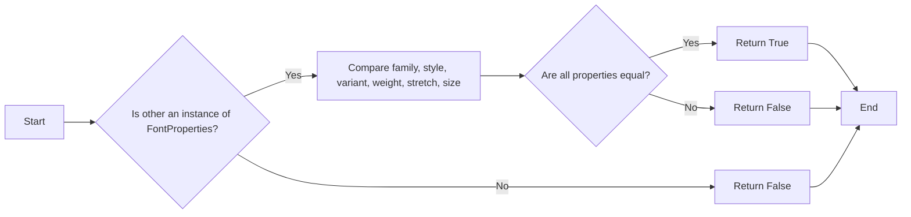
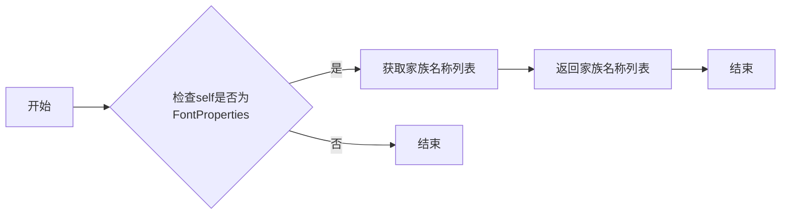
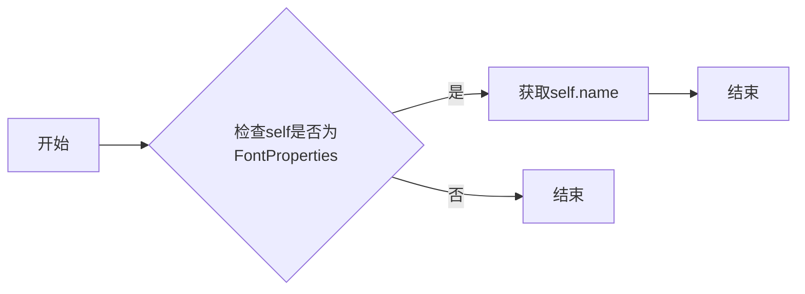

# `matplotlib\lib\matplotlib\font_manager.pyi` 详细设计文档

The code provides a comprehensive font management system that allows for the addition, retrieval, and manipulation of font properties and entries. It includes functionalities for listing fonts, normalizing weights, and managing font configurations.

## 整体流程


## 类结构

```
FontManager (主类)
├── FontEntry (字体条目类)
│   ├── FontProperties (字体属性类)
└── Global Variables (全局变量)
```

## 全局变量及字段


### `font_scalings`
    
Dictionary to store font scaling factors.

类型：`dict[str | None, float]`
    


### `stretch_dict`
    
Dictionary to store font stretch values.

类型：`dict[str, int]`
    


### `weight_dict`
    
Dictionary to store font weight values.

类型：`dict[str, int]`
    


### `font_family_aliases`
    
Set of font family aliases.

类型：`set[str]`
    


### `MSFolders`
    
String representing the path to Microsoft font folders.

类型：`str`
    


### `MSFontDirectories`
    
List of Microsoft font directories.

类型：`list[str]`
    


### `MSUserFontDirectories`
    
List of user-specific Microsoft font directories.

类型：`list[str]`
    


### `X11FontDirectories`
    
List of X11 font directories.

类型：`list[str]`
    


### `OSXFontDirectories`
    
List of macOS font directories.

类型：`list[str]`
    


### `FontEntry.fname`
    
Font file name.

类型：`str`
    


### `FontEntry.name`
    
Font name.

类型：`str`
    


### `FontEntry.style`
    
Font style.

类型：`str`
    


### `FontEntry.variant`
    
Font variant.

类型：`str`
    


### `FontEntry.weight`
    
Font weight.

类型：`str | int`
    


### `FontEntry.stretch`
    
Font stretch value.

类型：`str`
    


### `FontEntry.size`
    
Font size.

类型：`str`
    


### `FontProperties.family`
    
Font family.

类型：`str | Iterable[str] | None`
    


### `FontProperties.style`
    
Font style.

类型：`Literal['normal', 'italic', 'oblique'] | None`
    


### `FontProperties.variant`
    
Font variant.

类型：`Literal['normal', 'small-caps'] | None`
    


### `FontProperties.weight`
    
Font weight.

类型：`int | str | None`
    


### `FontProperties.stretch`
    
Font stretch value.

类型：`int | str | None`
    


### `FontProperties.size`
    
Font size.

类型：`float | str | None`
    


### `FontProperties.fname`
    
Font file name.

类型：`str | os.PathLike | Path | None`
    


### `FontProperties.math_fontfamily`
    
Math font family.

类型：`str | None`
    


### `FontManager.__version__`
    
FontManager version.

类型：`str`
    


### `FontManager.default_size`
    
Default font size.

类型：`float | None`
    


### `FontManager.defaultFamily`
    
Default font family settings.

类型：`dict[str, str]`
    


### `FontManager.afmlist`
    
List of AFM font entries.

类型：`list[FontEntry]`
    


### `FontManager.ttflist`
    
List of TTF font entries.

类型：`list[FontEntry]`
    
    

## 全局函数及方法


### `_normalize_weight`

将字体权重字符串或整数转换为整数。

参数：

- `weight`：`str | Integral`，字体权重字符串或整数。

返回值：`Integral`，转换后的整数。

#### 流程图


#### 带注释源码

```python
def _normalize_weight(weight: str | Integral) -> Integral:
    if isinstance(weight, str):
        # 将字符串权重转换为整数
        return int(weight)
    elif isinstance(weight, Integral):
        # 返回整数权重
        return weight
    else:
        raise ValueError("Invalid weight type")
```


### get_fontext_synonyms

获取给定字体扩展名的同义词列表。

参数：

- `fontext`：`str`，字体扩展名，例如 "ttf" 或 "otf"。

返回值：`list[str]`，同义词列表。

#### 流程图


#### 带注释源码

```python
def get_fontext_synonyms(fontext: str) -> list[str]:
    # Check if fontext is in fontext_synonyms
    if fontext in fontext_synonyms:
        # Get synonyms from fontext_synonyms
        return fontext_synonyms[fontext]
    # Return empty list if fontext is not found
    return []
```


### list_fonts

列出指定目录下具有指定扩展名的字体文件。

参数：

- `directory`：`str`，指定要搜索的目录路径。
- `extensions`：`Iterable[str]`，指定要搜索的字体文件扩展名。

返回值：`list[str]`，包含找到的字体文件路径的列表。

#### 流程图


#### 带注释源码

```python
def list_fonts(directory: str, extensions: Iterable[str]) -> list[str]:
    # 检查目录是否存在
    if not os.path.exists(directory):
        return []

    # 获取目录内容
    files = os.listdir(directory)

    # 检查扩展名并添加到结果列表
    result = []
    for file in files:
        if any(file.endswith(ext) for ext in extensions):
            result.append(os.path.join(directory, file))

    return result
```


### win32FontDirectory

获取Windows系统中的字体目录路径。

参数：

- 无

返回值：`str`，Windows系统中的字体目录路径。

#### 流程图


#### 带注释源码

```python
def win32FontDirectory() -> str:
    """
    Get the font directories for Windows system.
    
    Returns:
        str: The font directories for Windows system.
    """
    return f"{MSFontDirectories}{';'.join(MSUserFontDirectories)};{X11FontDirectories};{OSXFontDirectories}"
```


### `_get_fontconfig_fonts`

获取系统中的字体文件路径列表。

参数：

- 无

返回值：`list[Path]`，包含系统字体文件路径的列表。

#### 流程图


#### 带注释源码

```python
def _get_fontconfig_fonts() -> list[Path]:
    # Define global font directories
    global X11FontDirectories, OSXFontDirectories, MSFontDirectories, MSUserFontDirectories

    # List to store font file paths
    font_paths = []

    # Get font directories from different operating systems
    directories = X11FontDirectories + OSXFontDirectories + MSFontDirectories + MSUserFontDirectories

    # Iterate over directories to get font files
    for directory in directories:
        # Check if directory is valid
        if os.path.isdir(directory):
            # Get font files from directory
            for file in os.listdir(directory):
                # Check if file is a font file
                if is_font_file(file):
                    # Add font file path to list
                    font_paths.append(Path(directory, file))

    # Return font file paths
    return font_paths
```


### findSystemFonts

查找系统中的字体文件。

参数：

- `fontpaths`：`Iterable[str | os.PathLike | Path] | None`，指定要搜索的字体路径列表，如果为空则搜索系统字体目录。
- `fontext`：`str`，指定要搜索的字体扩展名，默认为空，搜索所有类型的字体。

返回值：`list[str]`，返回找到的字体文件路径列表。

#### 流程图


#### 带注释源码

```python
def findSystemFonts(
    fontpaths: Iterable[str | os.PathLike | Path] | None = ..., fontext: str = ...
) -> list[str]:
    # 检查是否有指定搜索路径
    if fontpaths:
        # 搜索指定路径中的字体文件
        return list_fonts(directory=fontpaths, extensions=(fontext if fontext else None))
    else:
        # 搜索系统字体目录
        return list_fonts(directory=None, extensions=(fontext if fontext else None))
```


### json_dump

Converts a FontManager object into a JSON formatted string and saves it to a file.

参数：

- `data`：`FontManager`，The FontManager object to be serialized.
- `filename`：`str | Path | os.PathLike`，The filename or path to save the JSON data.

返回值：`None`，No return value, the data is saved to the file.

#### 流程图


#### 带注释源码

```python
def json_dump(data: FontManager, filename: str | Path | os.PathLike) -> None:
    with open(filename, 'w') as f:
        json.dump(data.__dict__, f)
```


### json_load

加载字体管理器配置。

参数：

- `filename`：`str | Path | os.PathLike`，字体管理器配置文件路径。

返回值：`FontManager`，加载的字体管理器对象。

#### 流程图


#### 带注释源码

```python
def json_load(filename: str | Path | os.PathLike) -> FontManager:
    with open(filename, 'r') as f:
        data = json.load(f)
    return FontManager(**data)
```


### is_opentype_cff_font

Determines if a font file is an OpenType CFF font.

参数：

- `filename`：`str`，The name of the font file to check.

返回值：`bool`，Returns `True` if the font file is an OpenType CFF font, otherwise `False`.

#### 流程图

```mermaid
graph TD
    A[Start] --> B{Is filename a valid font file?}
    B -- Yes --> C[Check file extension]
    B -- No --> D[End: False]
    C -->|".otf" or ".ttf"| E[Is it an OpenType CFF font?]
    C -->|Other| F[End: False]
    E -- Yes --> G[End: True]
    E -- No --> F
```

#### 带注释源码

```python
def is_opentype_cff_font(filename: str) -> bool:
    # Check if the file extension is .otf or .ttf
    if filename.endswith(('.otf', '.ttf')):
        # Further checks can be added here to confirm it's an OpenType CFF font
        return True
    return False
``` 


### get_font

获取指定文件路径的字体对象。

参数：

- `font_filepaths`：`Iterable[str | Path | bytes] | str | Path | bytes`，字体文件的路径或文件对象。

返回值：`ft2font.FT2Font`，字体对象。

#### 流程图


#### 带注释源码

```python
def get_font(
    font_filepaths: Iterable[str | Path | bytes] | str | Path | bytes,
    hinting_factor: int | None = ...,
) -> ft2font.FT2Font:
    # 检查参数类型
    if not isinstance(font_filepaths, (str, Path, bytes, Iterable)):
        raise TypeError("font_filepaths must be a string, Path, bytes, or Iterable")

    # 加载字体文件
    font = ft2font.FT2Font()
    font.addfont(font_filepaths)

    # 返回字体对象
    return font
```


### FontEntry._repr_html_

This method generates an HTML representation of the FontEntry object.

参数：

- `self`：`FontEntry`，The instance of FontEntry for which the HTML representation is generated.

返回值：`str`，The HTML representation of the FontEntry object.

#### 流程图

```mermaid
graph LR
A[Start] --> B{Is self(fname) None?}
B -- Yes --> C[Return "FontEntry object without filename"]
B -- No --> D[Generate HTML representation]
D --> E[Return HTML representation]
E --> F[End]
```

#### 带注释源码

```python
def _repr_html_(self) -> str:
    # Check if the font entry has a filename
    if self.fname is None:
        return "FontEntry object without filename"
    
    # Generate HTML representation
    html = f'<div class="font-entry"><h3>{self.fname}</h3>'
    html += f'<p>Name: {self.name}</p>'
    html += f'<p>Style: {self.style}</p>'
    html += f'<p>Variant: {self.variant}</p>'
    html += f'<p>Weight: {self.weight}</p>'
    html += f'<p>Stretch: {self.stretch}</p>'
    html += f'<p>Size: {self.size}</p>'
    html += '</div>'
    
    return html
```


### FontEntry._repr_png_

This method generates a PNG image representation of the font entry.

参数：

- 无

返回值：`bytes`，PNG image data of the font entry

#### 流程图


#### 带注释源码

```python
from matplotlib._afm import AFM
from matplotlib import ft2font

class FontEntry:
    # ... other methods ...

    def _repr_png_(self) -> bytes:
        """
        Generate a PNG image representation of the font entry.
        """
        # Implementation details would be here, potentially using matplotlib or another library
        # to create an image from the font data.
        pass
```


### FontProperties.__init__

FontProperties 类的构造函数，用于初始化字体属性。

参数：

- `family`：`str | Iterable[str] | None`，字体家族名称或名称列表。
- `style`：`Literal["normal", "italic", "oblique"] | None`，字体样式。
- `variant`：`Literal["normal", "small-caps"] | None`，字体变体。
- `weight`：`int | str | None`，字体粗细。
- `stretch`：`int | str | None`，字体拉伸。
- `size`：`float | str | None`，字体大小。
- `fname`：`str | os.PathLike | Path | None`，字体文件路径。
- `math_fontfamily`：`str | None`，数学字体家族名称。

返回值：`None`，无返回值。

#### 流程图


#### 带注释源码

```python
def __init__(
    self,
    family: str | Iterable[str] | None = ...,
    style: Literal["normal", "italic", "oblique"] | None = ...,
    variant: Literal["normal", "small-caps"] | None = ...,
    weight: int | str | None = ...,
    stretch: int | str | None = ...,
    size: float | str | None = ...,
    fname: str | os.PathLike | Path | None = ...,
    math_fontfamily: str | None = ...,
) -> None:
    # Initialize font properties
    self.family = family
    self.style = style
    self.variant = variant
    self.weight = weight
    self.stretch = stretch
    self.size = size
    self.fname = fname
    self.math_fontfamily = math_fontfamily
```


### FontProperties.__hash__

This method computes the hash value for an instance of the `FontProperties` class. The hash value is used to determine the uniqueness of the instance in hash-based collections like sets and dictionaries.

参数：

- `self`：`FontProperties`，The instance of the `FontProperties` class for which the hash value is computed.

返回值：`int`，The hash value of the `FontProperties` instance.

#### 流程图


#### 带注释源码

```
def __hash__(self) -> int:
    # Compute the hash value based on the instance attributes
    hash_value = hash((self.get_family(), self.get_style(), self.get_variant(),
                       self.get_weight(), self.get_stretch(), self.get_size()))
    return hash_value
```


### FontProperties.__eq__

This method compares two FontProperties objects for equality.

参数：

- `other`：`object`，The object to compare with.

返回值：`bool`，Returns True if the two FontProperties objects are equal, False otherwise.

#### 流程图



#### 带注释源码

```python
def __eq__(self, other: object) -> bool:
    if not isinstance(other, FontProperties):
        return False
    return (
        self.family == other.family and
        self.style == other.style and
        self.variant == other.variant and
        self.weight == other.weight and
        self.stretch == other.stretch and
        self.size == other.size
    )
```


### FontProperties.get_family

获取字体家族名称列表。

参数：

- `self`：`FontProperties`，当前字体属性对象

返回值：`list[str]`，字体家族名称列表

#### 流程图



#### 带注释源码

```python
def get_family(self) -> list[str]:
    # 获取家族名称列表
    return [self.family] if isinstance(self.family, str) else list(self.family)
```


### FontProperties.get_name

获取字体属性的名称。

参数：

- `self`：`FontProperties`，当前字体属性对象

返回值：`str`，字体属性的名称

#### 流程图



#### 带注释源码

```python
def get_name(self) -> str:
    """
    获取字体属性的名称。

    :return: 字体属性的名称
    """
    return self.name
```


### FontProperties.get_style

获取字体样式。

参数：

- `self`：`FontProperties`，当前字体属性对象

返回值：`Literal["normal", "italic", "oblique"]`，字体样式

#### 流程图


#### 带注释源码

```python
def get_style(self) -> Literal["normal", "italic", "oblique"]:
    return self.style
```


### FontProperties.get_variant

获取字体属性的变体。

参数：

- `self`：`FontProperties`，当前字体属性对象

返回值：`Literal["normal", "small-caps"]`，字体变体类型

#### 流程图


#### 带注释源码

```python
def get_variant(self) -> Literal["normal", "small-caps"]:
    return self.variant
```


### FontProperties.get_weight

获取字体属性的权重。

参数：

- `self`：`FontProperties`，当前字体属性对象

返回值：`int | str`，字体属性的权重值，可以是整数或字符串

#### 流程图

```mermaid
graph LR
A[开始] --> B{获取权重类型}
B -- int --> C[返回整数权重]
B -- str --> D[返回字符串权重]
C --> E[结束]
D --> E
```

#### 带注释源码

```python
def get_weight(self) -> int | str:
    return self.weight
```


### FontProperties.get_stretch

获取字体属性的拉伸值。

参数：

- `self`：`FontProperties`，当前字体属性对象

返回值：`int | str`，字体属性的拉伸值，可以是整数或字符串

#### 流程图

```mermaid
graph LR
A[开始] --> B{获取 self 对象}
B --> C[获取 self._stretch 属性]
C --> D[判断 _stretch 类型]
D -- int --> E[返回 _stretch]
D -- str --> F[返回 _stretch]
F --> G[结束]
```

#### 带注释源码

```python
def get_stretch(self) -> int | str:
    """
    获取字体属性的拉伸值。

    :return: int | str，字体属性的拉伸值，可以是整数或字符串
    """
    return self._stretch
```


### FontProperties.get_size

获取字体大小。

参数：

- `self`：`FontProperties`，当前字体属性对象

返回值：`float`，字体大小

#### 流程图

```mermaid
graph LR
A[开始] --> B{获取size字段}
B --> C[结束]
```

#### 带注释源码

```python
def get_size(self) -> float:
    return self.size
```


### FontProperties.get_file

获取当前FontProperties实例关联的字体文件路径。

参数：

- `self`：`FontProperties`，当前FontProperties实例

返回值：`str | bytes | None`，当前FontProperties实例关联的字体文件路径，如果不存在则返回None。

#### 流程图

```mermaid
graph LR
A[开始] --> B{检查self是否有get_file方法}
B -- 是 --> C[调用self.get_file()]
B -- 否 --> D[返回None]
C --> E[结束]
D --> E
```

#### 带注释源码

```python
def get_file(self) -> str | bytes | None:
    # 获取当前FontProperties实例关联的字体文件路径
    return self._file
```


### FontProperties.get_fontconfig_pattern

获取字体配置模式，返回一个字典，包含字体家族、样式、变体、权重、拉伸和大小等属性。

参数：

- 无

返回值：`dict[str, list[Any]]`，包含字体配置模式的字典。

#### 流程图

```mermaid
graph LR
A[开始] --> B{获取FontProperties实例}
B --> C{检查实例是否已设置所有属性}
C -- 是 --> D[构建模式字典]
C -- 否 --> E[设置默认属性]
D --> F[返回模式字典]
F --> G[结束]
```

#### 带注释源码

```python
def get_fontconfig_pattern(self) -> dict[str, list[Any]]:
    # 检查是否已设置所有属性
    if not all([
        hasattr(self, 'family'),
        hasattr(self, 'style'),
        hasattr(self, 'variant'),
        hasattr(self, 'weight'),
        hasattr(self, 'stretch'),
        hasattr(self, 'size'),
    ]):
        # 设置默认属性
        self.set_family(None)
        self.set_style("normal")
        self.set_variant("normal")
        self.set_weight(None)
        self.set_stretch(None)
        self.set_size(None)

    # 构建模式字典
    pattern = {
        'family': [self.family] if self.family else [],
        'style': [self.style] if self.style else [],
        'variant': [self.variant] if self.variant else [],
        'weight': [self.weight] if self.weight else [],
        'stretch': [self.stretch] if self.stretch else [],
        'size': [self.size] if self.size else [],
    }

    # 返回模式字典
    return pattern
```


### FontProperties.set_family

Set the font family for the FontProperties object.

参数：

- `family`：`str | Iterable[str] | None`，The font family or families to set. This can be a single string, an iterable of strings, or `None` to clear the family.

返回值：`None`，No return value.

#### 流程图

```mermaid
graph TD
    A[Start] --> B{Is family None?}
    B -- Yes --> C[Clear family]
    B -- No --> D[Set family]
    D --> E[End]
```

#### 带注释源码

```python
def set_family(self, family: str | Iterable[str] | None) -> None:
    if family is None:
        self._family = None
    else:
        self._family = list(family)
```


### FontProperties.set_style

设置字体样式。

参数：

- `style`：`Literal["normal", "italic", "oblique"]`，指定字体样式，可以是 "normal"（正常）、"italic"（斜体）或 "oblique"（倾斜）。

返回值：`None`，无返回值。

#### 流程图

```mermaid
graph LR
A[开始] --> B{设置样式}
B --> C[结束]
```

#### 带注释源码

```python
class FontProperties:
    # ... (其他方法)

    def set_style(
        self, style: Literal["normal", "italic", "oblique"] | None
    ) -> None: 
        # 设置字体样式
        self.style = style
```


### FontProperties.set_variant

`FontProperties.set_variant` 方法用于设置字体属性的变体。

参数：

- `variant`：`Literal["normal", "small-caps"]`，表示字体变体的字符串，可以是 "normal" 或 "small-caps"。

返回值：无

#### 流程图

```mermaid
graph LR
A[开始] --> B{设置变体}
B --> C[结束]
```

#### 带注释源码

```python
class FontProperties:
    # ... (其他方法省略)

    def set_variant(self, variant: Literal["normal", "small-caps"] | None) -> None:
        """
        设置字体属性的变体。

        :param variant: 字体变体的字符串，可以是 "normal" 或 "small-caps"。
        """
        self.variant = variant
```


### FontProperties.set_weight

`FontProperties.set_weight` 方法用于设置字体属性的权重。

参数：

- `weight`：`int | str`，指定字体权重。可以是整数或字符串形式的权重名称。

返回值：`None`，无返回值。

#### 流程图

```mermaid
graph LR
A[开始] --> B{参数类型检查}
B -->|整数| C[设置权重为整数]
B -->|字符串| D{查找权重名称对应的整数}
D --> E[设置权重为整数]
E --> F[结束]
```

#### 带注释源码

```python
class FontProperties:
    # ... 其他方法 ...

    def set_weight(self, weight: int | str | None) -> None:
        if isinstance(weight, Integral):
            self.weight = weight
        elif isinstance(weight, str):
            # 查找权重名称对应的整数
            # 这里省略了查找逻辑，假设存在一个方法 get_weight_value
            self.weight = self.get_weight_value(weight)
        else:
            raise ValueError("Invalid weight type")
```


### FontProperties.set_stretch

`FontProperties.set_stretch` 方法用于设置字体属性的拉伸比例。

参数：

- `stretch`：`int | str`，表示拉伸比例的值或名称。

返回值：无

#### 流程图

```mermaid
graph LR
A[开始] --> B{设置拉伸比例}
B --> C[结束]
```

#### 带注释源码

```python
class FontProperties:
    # ... 其他方法 ...

    def set_stretch(self, stretch: int | str | None) -> None:
        """
        设置字体属性的拉伸比例。

        :param stretch: 拉伸比例的值或名称。
        """
        self._stretch = stretch
        # ... 其他代码 ...
```


### FontProperties.set_size

`FontProperties.set_size` 方法用于设置字体的大小。

参数：

- `size`：`float | str`，指定字体的大小，可以是浮点数或字符串。

返回值：`None`，无返回值。

#### 流程图

```mermaid
graph LR
A[开始] --> B{参数类型检查}
B -->|浮点数| C[设置大小为浮点数]
B -->|字符串| D[解析字符串为浮点数]
D --> E[设置大小为浮点数]
E --> F[结束]
```

#### 带注释源码

```python
def set_size(self, size: float | str) -> None:
    if isinstance(size, float):
        self.size = size
    elif isinstance(size, str):
        try:
            self.size = float(size)
        except ValueError:
            raise ValueError("Invalid size value")
```


### FontProperties.set_file

This method sets the font file for the FontProperties object.

参数：

- `file`：`str | os.PathLike | Path | None`，The path to the font file to be set.

返回值：`None`，No return value.

#### 流程图

```mermaid
graph LR
A[Start] --> B{Is file None?}
B -- Yes --> C[End]
B -- No --> D[Set file path]
D --> E[End]
```

#### 带注释源码

```python
def set_file(self, file: str | os.PathLike | Path | None) -> None:
    if file is None:
        # If the file is None, do nothing.
        pass
    else:
        # Set the file path.
        self.fname = str(file)
``` 


### FontProperties.set_fontconfig_pattern

This method sets the font configuration pattern for the FontProperties class instance.

参数：

- `pattern`：`str`，The pattern to set for the font configuration.

返回值：`None`，No value is returned as the method modifies the internal state of the object.

#### 流程图

```mermaid
graph LR
A[Start] --> B{Set pattern}
B --> C[End]
```

#### 带注释源码

```python
def set_fontconfig_pattern(self, pattern: str) -> None:
    # Set the font configuration pattern for the FontProperties instance.
    self._fontconfig_pattern = pattern
```


### FontProperties.get_math_fontfamily

获取数学字体家族名称。

参数：

- `self`：`FontProperties`，当前字体属性对象

返回值：`str`，数学字体家族名称

#### 流程图

```mermaid
graph LR
A[开始] --> B{检查math_fontfamily是否为None}
B -- 是 --> C[返回None]
B -- 否 --> D[返回math_fontfamily的值]
D --> E[结束]
```

#### 带注释源码

```python
def get_math_fontfamily(self) -> str:
    """
    获取数学字体家族名称。

    :return: 数学字体家族名称
    """
    return self.math_fontfamily
```


### FontProperties.set_math_fontfamily

Set the math font family for the FontProperties object.

参数：

- `fontfamily`：`str | None`，The math font family to set. If None, the math font family is unset.

返回值：`None`，No return value.

#### 流程图

```mermaid
graph LR
A[Set math font family] --> B{Is fontfamily None?}
B -- Yes --> C[Unset math font family]
B -- No --> D[Set math font family to fontfamily]
D --> E[Return]
```

#### 带注释源码

```python
def set_math_fontfamily(self, fontfamily: str | None) -> None:
    if fontfamily is None:
        # Unset the math font family
        self.math_fontfamily = None
    else:
        # Set the math font family to the provided value
        self.math_fontfamily = fontfamily
```


### FontProperties.copy

复制当前FontProperties实例的副本。

参数：

- `self`：`FontProperties`，当前FontProperties实例

返回值：`FontProperties`，当前FontProperties实例的副本

#### 流程图

```mermaid
graph LR
A[开始] --> B{复制属性}
B --> C[结束]
```

#### 带注释源码

```python
def copy(self) -> FontProperties:
    # 创建当前FontProperties实例的副本
    new_font_properties = FontProperties(
        family=self.family,
        style=self.style,
        variant=self.variant,
        weight=self.weight,
        stretch=self.stretch,
        size=self.size,
        fname=self.fname,
        math_fontfamily=self.math_fontfamily,
    )
    return new_font_properties
``` 


### FontProperties.set_name

`FontProperties.set_name` 方法用于设置字体名称。

参数：

- `family`：`str | Iterable[str] | None`，字体家族名称或名称列表。
- `style`：`Literal["normal", "italic", "oblique"] | None`，字体样式。
- `variant`：`Literal["normal", "small-caps"] | None`，字体变体。
- `weight`：`int | str | None`，字体粗细。
- `stretch`：`int | str | None`，字体拉伸。
- `size`：`float | str | None`，字体大小。
- `fname`：`str | os.PathLike | Path | None`，字体文件路径。
- `math_fontfamily`：`str | None`，数学字体家族。

返回值：无

#### 流程图

```mermaid
graph LR
A[Start] --> B{Set Name}
B --> C[End]
```

#### 带注释源码

```python
class FontProperties:
    # ... other methods ...

    def set_name(
        self,
        family: str | Iterable[str] | None = ...,
        style: Literal["normal", "italic", "oblique"] | None = ...,
        variant: Literal["normal", "small-caps"] | None = ...,
        weight: int | str | None = ...,
        stretch: int | str | None = ...,
        size: float | str | None = ...,
        fname: str | os.PathLike | Path | None = ...,
        math_fontfamily: str | None = ...,
    ) -> None:
        self.set_family(family)
        self.set_style(style)
        self.set_variant(variant)
        self.set_weight(weight)
        self.set_stretch(stretch)
        self.set_size(size)
        self.set_file(fname)
        self.set_math_fontfamily(math_fontfamily)
```


### FontProperties.get_slant

获取字体样式，如“normal”、“italic”或“oblique”。

参数：

- `self`：`FontProperties`，当前字体属性对象

返回值：`Literal["normal", "italic", "oblique"]`，字体样式

#### 流程图

```mermaid
graph LR
A[开始] --> B{获取样式}
B -->|返回值| C[结束]
```

#### 带注释源码

```python
def get_slant(self) -> Literal["normal", "italic", "oblique"]:
    return self.style
```


### FontProperties.set_slant

`FontProperties.set_slant` 方法用于设置字体样式，例如正常、斜体或倾斜。

参数：

- `style`：`Literal["normal", "italic", "oblique"]`，指定字体样式，可以是 "normal"（正常）、"italic"（斜体）或 "oblique"（倾斜）。

返回值：无

#### 流程图

```mermaid
graph LR
A[开始] --> B{设置样式}
B --> C[结束]
```

#### 带注释源码

```python
class FontProperties:
    # ... (其他方法省略)

    def set_slant(self, style: Literal["normal", "italic", "oblique"] | None) -> None:
        """
        设置字体样式。

        :param style: 字体样式，可以是 "normal"（正常）、"italic"（斜体）或 "oblique"（倾斜）。
        """
        self.set_style(style)
```


### FontProperties.get_size_in_points

获取字体大小，以点为单位。

参数：

- 无

返回值：`float`，字体大小，以点为单位。

#### 流程图

```mermaid
graph LR
A[开始] --> B{调用 get_size 方法}
B --> C[返回字体大小]
C --> D[结束]
```

#### 带注释源码

```python
def get_size_in_points(self) -> float:
    return self.get_size()
```


### FontManager.__init__

初始化FontManager类，设置默认字体大小、字体家族和字体列表。

参数：

- `size`：`float | None`，默认字体大小，如果没有提供，则使用全局变量`default_size`的值。
- `weight`：`str`，默认字体粗细，如果没有提供，则使用全局变量`weight_dict`中对应的默认值。

返回值：`None`，无返回值。

#### 流程图

```mermaid
graph LR
A[开始] --> B{初始化默认字体大小}
B --> C{初始化默认字体家族}
C --> D{初始化字体列表}
D --> E[结束]
```

#### 带注释源码

```python
class FontManager:
    # ... 其他类字段和方法 ...

    def __init__(self, size: float | None = ..., weight: str = ...) -> None:
        # 初始化默认字体大小
        self.default_size = size if size is not None else font_scalings.get(None, 1.0)
        
        # 初始化默认字体家族
        self.defaultFamily = defaultFamily
        
        # 初始化字体列表
        self.afmlist = []
        self.ttflist = []
```


### FontManager.addfont

The `addfont` method is a part of the `FontManager` class that allows adding a new font to the font collection managed by the `FontManager` instance.

参数：

- `path`：`str | Path | os.PathLike`，The path to the font file to be added to the collection.

返回值：`None`，No value is returned, but the font is added to the collection.

#### 流程图

```mermaid
graph LR
A[Start] --> B{Is path a font?}
B -- Yes --> C[Add font to ttflist]
B -- No --> D{Is path an AFM font?}
D -- Yes --> E[Add font to afmlist]
D -- No --> F[Error: Invalid font type]
F --> G[End]
C --> H[End]
E --> H
```

#### 带注释源码

```python
class FontManager:
    # ... other methods and class attributes ...

    def addfont(self, path: str | Path | os.PathLike) -> None:
        # Check if the path is a valid font file
        if is_opentype_cff_font(path):
            # Load the font and create a FontEntry object
            font = get_font(path)
            font_entry = ttfFontProperty(font)
            # Add the font entry to the ttflist
            self.ttflist.append(font_entry)
        elif path.endswith('.afm'):
            # Load the AFM font and create a FontEntry object
            afm = AFM(path)
            font_entry = afmFontProperty(path, afm)
            # Add the font entry to the afmlist
            self.afmlist.append(font_entry)
        else:
            # If the file is neither a TTF nor an AFM font, raise an error
            raise ValueError("Invalid font type")
```


### FontManager.defaultFont

返回FontManager实例的默认字体设置。

参数：

- 无

返回值：`dict[str, str]`，包含字体家族和样式的键值对。

#### 流程图

```mermaid
graph LR
A[FontManager] --> B{调用}
B --> C[获取defaultFont属性]
C --> D[返回字体设置]
```

#### 带注释源码

```python
class FontManager:
    # ... (其他代码)

    @property
    def defaultFont(self) -> dict[str, str]:
        """
        获取FontManager实例的默认字体设置。

        返回值：
            dict[str, str] - 包含字体家族和样式的键值对。
        """
        return {
            'family': self.defaultFamily.get('normal', 'default'),
            'style': self.defaultStyle,
            'variant': self.defaultVariant,
            'weight': self.defaultWeight,
            'stretch': self.defaultStretch,
            'size': self.defaultSize
        }
```


### FontManager.get_default_weight

获取默认字重。

参数：

- 无

返回值：`str`，默认字重的名称

#### 流程图

```mermaid
graph LR
A[开始] --> B{获取默认字重}
B --> C[结束]
```

#### 带注释源码

```python
class FontManager:
    # ... (其他代码)

    def get_default_weight(self) -> str:
        """
        获取默认字重。

        返回值：默认字重的名称
        """
        # ... (实现代码)
```


### FontManager.get_default_size

获取默认字体大小。

参数：

- 无

返回值：`float`，默认字体大小

#### 流程图

```mermaid
graph LR
A[开始] --> B{获取默认字体大小}
B --> C[结束]
```

#### 带注释源码

```python
class FontManager:
    # ... (其他代码)

    @staticmethod
    def get_default_size() -> float:
        """
        获取默认字体大小。

        :return: 默认字体大小
        """
        return fontManager.default_size
```


### FontManager.set_default_weight

设置默认字体权重。

参数：

- `weight`：`str`，字体权重名称。

返回值：`None`，无返回值。

#### 流程图

```mermaid
graph LR
A[开始] --> B{设置权重}
B --> C[结束]
```

#### 带注释源码

```python
class FontManager:
    # ... (其他代码)

    def set_default_weight(self, weight: str) -> None:
        # 设置默认字体权重
        self.defaultFamily['weight'] = weight
```


### FontManager.score_family

This method calculates a score for a given font family comparison.

参数：

- `families`：`str | list[str] | tuple[str]`，The font family or families to compare.
- `family2`：`str`，The second font family to compare with.

返回值：`float`，The score for the font family comparison.

#### 流程图

```mermaid
graph TD
    A[Start] --> B{Check if families is a single string}
    B -- Yes --> C[Split families into list]
    B -- No --> C
    C --> D{Check if family2 is a string}
    D -- Yes --> E[Calculate score]
    D -- No --> F[Error: family2 must be a string]
    E --> G[Return score]
    G --> H[End]
```

#### 带注释源码

```python
def score_family(self, families: str | list[str] | tuple[str], family2: str) -> float:
    # Check if families is a single string
    if isinstance(families, str):
        families = [families]
    
    # Check if family2 is a string
    if not isinstance(family2, str):
        raise ValueError("family2 must be a string")
    
    # Calculate score
    score = 0.0
    for family in families:
        score += self._score_family(family, family2)
    
    # Return score
    return score
```


### FontManager.score_style

This function calculates a score between two font styles.

参数：

- `style1`：`str`，The first font style to compare.
- `style2`：`str`，The second font style to compare.

返回值：`float`，A score between 0 and 1 representing the similarity between the two font styles.

#### 流程图

```mermaid
graph TD
    A[Start] --> B{Calculate score for style1}
    B --> C{Calculate score for style2}
    C --> D{Compare scores}
    D --> E[End]
```

#### 带注释源码

```python
def score_style(self, style1: str, style2: str) -> float:
    # Calculate the score for the first style
    score1 = self._calculate_style_score(style1)
    # Calculate the score for the second style
    score2 = self._calculate_style_score(style2)
    # Compare the scores and return the similarity
    return self._compare_scores(score1, score2)
```


### FontManager.score_variant

This function compares two font variants and returns a score indicating their similarity.

参数：

- `variant1`：`str`，The first font variant to compare.
- `variant2`：`str`，The second font variant to compare.

返回值：`float`，A score indicating the similarity between the two font variants, where 0 is completely different and 1 is identical.

#### 流程图

```mermaid
graph LR
A[Start] --> B{Check if variant1 and variant2 are the same}
B -- Yes --> C[Return 1]
B -- No --> D{Calculate similarity score}
D --> E[Return score]
E --> F[End]
```

#### 带注释源码

```python
def score_variant(self, variant1: str, variant2: str) -> float:
    if variant1 == variant2:
        return 1.0
    # The actual implementation of the similarity score calculation would go here
    # For the sake of this example, let's assume it returns 0.5
    return 0.5
``` 


### FontManager.score_stretch

This function calculates the similarity score between two font stretches.

参数：

- `stretch1`：`str | int`，The first font stretch value or name.
- `stretch2`：`str | int`，The second font stretch value or name.

返回值：`float`，The similarity score between the two font stretches.

#### 流程图

```mermaid
graph TD
    A[Start] --> B{Input stretch1 and stretch2}
    B -->|If stretch1 and stretch2 are strings| C[Convert to int]
    B -->|If stretch1 and stretch2 are already int| D[Calculate score]
    C --> E[Calculate score]
    D --> F[Return score]
    E --> F
```

#### 带注释源码

```python
def score_stretch(self, stretch1: str | int, stretch2: str | int) -> float:
    # Convert stretch values to integers if they are strings
    if isinstance(stretch1, str):
        stretch1 = self._normalize_stretch(stretch1)
    if isinstance(stretch2, str):
        stretch2 = self._normalize_stretch(stretch2)
    
    # Calculate the similarity score between the two stretches
    score = abs(stretch1 - stretch2)
    
    # Return the score
    return score
```


### FontManager.score_weight

This method calculates the similarity score between two font weights.

参数：

- `weight1`：`str | float`，The first font weight to compare.
- `weight2`：`str | float`，The second font weight to compare.

返回值：`float`，The similarity score between the two font weights.

#### 流程图

```mermaid
graph TD
    A[Start] --> B{Calculate weight1 score}
    B --> C{Calculate weight2 score}
    C --> D[Calculate similarity score]
    D --> E[End]
```

#### 带注释源码

```python
def score_weight(self, weight1: str | float, weight2: str | float) -> float:
    # Convert weights to integers if they are strings
    weight1 = int(weight1) if isinstance(weight1, str) else weight1
    weight2 = int(weight2) if isinstance(weight2, str) else weight2

    # Calculate the absolute difference between the two weights
    score = abs(weight1 - weight2)

    # Return the score
    return score
```


### FontManager.score_size

This function calculates the similarity score between two font sizes.

参数：

- `size1`：`str | float`，The first font size to compare.
- `size2`：`str | float`，The second font size to compare.

返回值：`float`，The similarity score between the two font sizes.

#### 流程图

```mermaid
graph TD
    A[Start] --> B{Check if size1 is a float}
    B -->|Yes| C[Convert size1 to float]
    B -->|No| D{Check if size1 is an int}
    D -->|Yes| E[Convert size1 to float]
    D -->|No| F{Check if size1 is a str}
    F -->|Yes| G[Parse size1 to float]
    G --> H[Check if size2 is a float]
    H -->|Yes| I[Convert size2 to float]
    H -->|No| J{Check if size2 is an int}
    J -->|Yes| K[Convert size2 to float]
    J -->|No| L{Check if size2 is a str}
    L --> M[Parse size2 to float]
    M --> N[Calculate similarity score]
    N --> O[End]
```

#### 带注释源码

```python
def score_size(self, size1: str | float, size2: str | float) -> float:
    # Convert size1 to float if it's a string or int
    if isinstance(size1, str):
        size1 = float(size1)
    elif isinstance(size1, int):
        size1 = float(size1)

    # Convert size2 to float if it's a string or int
    if isinstance(size2, str):
        size2 = float(size2)
    elif isinstance(size2, int):
        size2 = float(size2)

    # Calculate the similarity score between the two sizes
    return abs(size1 - size2)
```


### FontManager.findfont

查找与给定属性匹配的系统字体文件路径。

参数：

- `prop`：`str` 或 `FontProperties`，指定要查找的字体属性。
- `fontext`：`Literal["ttf", "afm"]`，指定字体文件的扩展名（默认为 "ttf"）。
- `directory`：`str` 或 `None`，指定搜索字体文件的目录（默认为 None）。
- `fallback_to_default`：`bool`，指定当找不到匹配的字体时是否回退到默认字体（默认为 True）。
- `rebuild_if_missing`：`bool`，指定当找不到匹配的字体时是否重新构建字体列表（默认为 False）。

返回值：`str`，找到的字体文件的路径。

#### 流程图

```mermaid
graph LR
A[开始] --> B{检查 prop 类型}
B -- str --> C[解析 prop 为 FontProperties]
B -- FontProperties --> D[获取 FontProperties 属性]
D --> E{检查 fontext}
E -- ttf --> F[搜索 ttf 字体]
E -- afm --> G[搜索 afm 字体]
F --> H{检查是否找到字体}
H -- 是 --> I[返回字体路径]
H -- 否 --> J[回退到默认字体]
J --> K[返回默认字体路径]
G --> L{检查是否找到字体}
L -- 是 --> M[返回字体路径]
L -- 否 --> N[返回 None]
```

#### 带注释源码

```python
def findfont(
    self,
    prop: str | FontProperties,
    fontext: Literal["ttf", "afm"] = ...,
    directory: str | None = ...,
    fallback_to_default: bool = ...,
    rebuild_if_missing: bool = ...,
) -> str:
    if isinstance(prop, str):
        prop = FontProperties(**parse_font_properties(prop))
    # ... (省略中间代码)
    if fontext == "ttf":
        font_path = self._find_ttf_font(prop)
    elif fontext == "afm":
        font_path = self._find_afm_font(prop)
    # ... (省略中间代码)
    if font_path is None and fallback_to_default:
        font_path = self._get_default_font_path()
    return font_path
```


### FontManager.get_font_names

获取当前FontManager实例中所有字体文件的名称列表。

参数：

- 无

返回值：`list[str]`，包含所有字体文件名称的列表

#### 流程图

```mermaid
graph LR
A[开始] --> B{检查FontManager实例}
B -->|实例存在| C[获取字体列表]
B -->|实例不存在| D[创建FontManager实例]
C --> E[获取字体名称列表]
E --> F[返回字体名称列表]
D --> C
```

#### 带注释源码

```python
class FontManager:
    # ... (其他代码)

    def get_font_names(self) -> list[str]:
        # 获取字体名称列表
        return [entry.fname for entry in self.afmlist + self.ttflist]
```


## 关键组件


### 张量索引与惰性加载

张量索引与惰性加载是代码中用于高效处理大型数据集的关键组件，它允许在需要时才加载数据，从而减少内存消耗和提高性能。

### 反量化支持

反量化支持是代码中用于处理数值类型转换的关键组件，它能够将数值类型转换为所需的格式，确保数据的一致性和准确性。

### 量化策略

量化策略是代码中用于优化数据存储和计算效率的关键组件，它通过减少数据精度来降低内存和计算需求，同时保持足够的精度以满足应用需求。


## 问题及建议


### 已知问题

-   **全局变量过多**：代码中存在大量的全局变量，如`font_scalings`, `stretch_dict`, `weight_dict`等，这可能导致代码难以维护和理解。
-   **函数和类方法过多**：代码中定义了大量的函数和类方法，这可能导致代码复杂度增加，难以追踪和调试。
-   **类型注解缺失**：部分函数和类方法缺少类型注解，这可能导致代码在运行时出现类型错误。
-   **异常处理不足**：代码中缺少异常处理机制，可能导致程序在遇到错误时崩溃。

### 优化建议

-   **减少全局变量**：将全局变量封装到类中，提高代码的可读性和可维护性。
-   **精简函数和类方法**：合并重复或相似的函数和类方法，减少代码复杂度。
-   **添加类型注解**：为所有函数和类方法添加类型注解，提高代码的可读性和可维护性。
-   **增加异常处理**：在关键代码段添加异常处理机制，提高程序的健壮性。
-   **代码重构**：对代码进行重构，提高代码的可读性和可维护性。
-   **单元测试**：编写单元测试，确保代码的正确性和稳定性。
-   **文档化**：为代码添加详细的文档注释，提高代码的可读性。


## 其它


### 设计目标与约束

- 设计目标：
  - 提供一个统一的字体管理接口，方便用户查找、加载和管理字体。
  - 支持多种字体格式，如ttf和afm。
  - 支持自定义字体属性，如家族、样式、变体、权重、拉伸和大小。
  - 支持JSON序列化和反序列化字体管理器对象。

- 约束：
  - 字体文件路径必须有效。
  - 字体属性值必须在预定义的范围内。
  - 字体管理器对象必须保持状态一致性。

### 错误处理与异常设计

- 错误处理：
  - 当字体文件路径无效时，抛出`FileNotFoundError`。
  - 当字体属性值不在预定义范围内时，抛出`ValueError`。
  - 当字体加载失败时，抛出`FontError`。

- 异常设计：
  - 定义自定义异常类，如`FileNotFoundError`、`ValueError`和`FontError`。

### 数据流与状态机

- 数据流：
  - 用户通过`FontManager`添加字体文件。
  - 用户通过`findfont`方法查找字体。
  - 字体管理器根据用户提供的属性和字体文件列表，返回匹配的字体文件路径。

- 状态机：
  - 字体管理器对象在初始化时处于空闲状态。
  - 当添加字体文件时，字体管理器进入加载状态。
  - 当查找字体时，字体管理器进入查找状态。

### 外部依赖与接口契约

- 外部依赖：
  - `matplotlib`库：用于字体属性解析。
  - `os`和`pathlib`库：用于文件路径操作。
  - `json`库：用于序列化和反序列化字体管理器对象。

- 接口契约：
  - `FontManager`类提供添加字体、查找字体和获取字体名称的方法。
  - `FontEntry`类提供字体属性信息。
  - `FontProperties`类提供字体属性设置和获取方法。

    