# `matplotlib\lib\matplotlib\gridspec.py` 详细设计文档

The code defines a class `GridSpec` that provides a grid layout for placing subplots within a figure in the Matplotlib library. It allows users to specify the number of rows and columns, as well as the relative widths and heights of the subplots.

## 整体流程

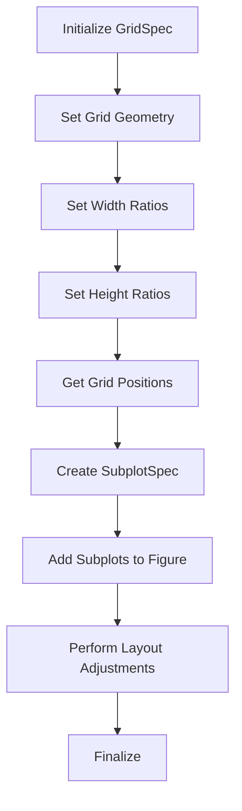

## 类结构

```
GridSpecBase (抽象基类)
├── GridSpec (具体实现类)
│   ├── GridSpecFromSubplotSpec (具体实现类)
│   └── SubplotSpec (具体实现类)
└── SubplotParams (具体实现类)
```

## 全局变量及字段


### `_log`
    
Logger instance for logging purposes.

类型：`logging.getLogger`
    


### `GridSpecBase._nrows`
    
Number of rows in the grid.

类型：`int`
    


### `GridSpecBase._ncols`
    
Number of columns in the grid.

类型：`int`
    


### `GridSpecBase._row_height_ratios`
    
Relative heights of the rows.

类型：`array-like`
    


### `GridSpecBase._col_width_ratios`
    
Relative widths of the columns.

类型：`array-like`
    


### `GridSpec.left`
    
Left edge of the subplots as a fraction of the figure width.

类型：`float`
    


### `GridSpec.bottom`
    
Bottom edge of the subplots as a fraction of the figure height.

类型：`float`
    


### `GridSpec.right`
    
Right edge of the subplots as a fraction of the figure width.

类型：`float`
    


### `GridSpec.top`
    
Top edge of the subplots as a fraction of the figure height.

类型：`float`
    


### `GridSpec.wspace`
    
Width of the padding between subplots as a fraction of the average Axes width.

类型：`float`
    


### `GridSpec.hspace`
    
Height of the padding between subplots as a fraction of the average Axes height.

类型：`float`
    


### `GridSpec.figure`
    
Parent figure instance.

类型：`matplotlib.figure.Figure`
    


### `GridSpecFromSubplotSpec._wspace`
    
Width of the padding between subplots as a fraction of the average Axes width.

类型：`float`
    


### `GridSpecFromSubplotSpec._hspace`
    
Height of the padding between subplots as a fraction of the average Axes height.

类型：`float`
    


### `GridSpecFromSubplotSpec._subplot_spec`
    
SubplotSpec from which the layout parameters are inherited.

类型：`SubplotSpec`
    


### `GridSpecFromSubplotSpec._row_height_ratios`
    
Relative heights of the rows.

类型：`array-like`
    


### `GridSpecFromSubplotSpec._col_width_ratios`
    
Relative widths of the columns.

类型：`array-like`
    


### `SubplotSpec._gridspec`
    
GridSpec to which the subplot belongs.

类型：`GridSpec`
    


### `SubplotSpec.num1`
    
Index of the first row of the subplot.

类型：`int`
    


### `SubplotSpec.num2`
    
Index of the last row of the subplot.

类型：`int`
    


### `SubplotParams.left`
    
Left edge of the subplots as a fraction of the figure width.

类型：`float`
    


### `SubplotParams.bottom`
    
Bottom edge of the subplots as a fraction of the figure height.

类型：`float`
    


### `SubplotParams.right`
    
Right edge of the subplots as a fraction of the figure width.

类型：`float`
    


### `SubplotParams.top`
    
Top edge of the subplots as a fraction of the figure height.

类型：`float`
    


### `SubplotParams.wspace`
    
Width of the padding between subplots as a fraction of the average Axes width.

类型：`float`
    


### `SubplotParams.hspace`
    
Height of the padding between subplots as a fraction of the average Axes height.

类型：`float`
    
    

## 全局函数及方法


### GridSpecBase.__init__

This method initializes a `GridSpecBase` object, which specifies the geometry of the grid where a subplot will be placed.

参数：

- `nrows`：`int`，指定网格的行数。
- `ncols`：`int`，指定网格的列数。
- `width_ratios`：`array-like`，可选，指定列的相对宽度。默认情况下，所有列的宽度相同。
- `height_ratios`：`array-like`，可选，指定行的相对高度。默认情况下，所有行的宽度相同。

返回值：无

#### 流程图

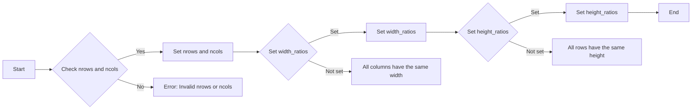

#### 带注释源码

```python
def __init__(self, nrows, ncols, height_ratios=None, width_ratios=None):
    if not isinstance(nrows, Integral) or nrows <= 0:
        raise ValueError(
            f"Number of rows must be a positive integer, not {nrows!r}")
    if not isinstance(ncols, Integral) or ncols <= 0:
        raise ValueError(
            f"Number of columns must be a positive integer, not {ncols!r}")
    self._nrows, self._ncols = nrows, ncols
    self.set_height_ratios(height_ratios)
    self.set_width_ratios(width_ratios)
```


### GridSpecBase.__repr__

This method returns a string representation of the `GridSpecBase` instance.

参数：

- `self`：`GridSpecBase` 实例，表示当前对象

返回值：`str`，表示 `GridSpecBase` 实例的字符串表示形式

#### 流程图

```mermaid
graph LR
A[Start] --> B{Is self.__class__.__name__ equal to "GridSpecBase"?}
B -- Yes --> C[Format string with class name, nrows, ncols, and optionals]
B -- No --> D[Format string with class name, nrows, ncols, and optionals]
C --> E[End]
D --> E
```

#### 带注释源码

```python
def __repr__(self):
    height_arg = (f', height_ratios={self._row_height_ratios!r}'
                  if len(set(self._row_height_ratios)) != 1 else '')
    width_arg = (f', width_ratios={self._col_width_ratios!r}'
                 if len(set(self._col_width_ratios)) != 1 else '')
    return '{clsname}({nrows}, {ncols}{optionals})'.format(
        clsname=self.__class__.__name__,
        nrows=self._nrows,
        ncols=self._ncols,
        optionals=height_arg + width_arg,
    )
```


### GridSpecBase.get_geometry

Return a tuple containing the number of rows and columns in the grid.

参数：

- 无

返回值：`tuple`，包含行数和列数的元组

#### 流程图

```mermaid
graph LR
A[Start] --> B{Return (nrows, ncols)}
B --> C[End]
```

#### 带注释源码

```python
def get_geometry(self):
    """
    Return a tuple containing the number of rows and columns in the grid.
    """
    return self._nrows, self._ncols
```


### GridSpecBase.get_subplot_params

This method returns the `.SubplotParams` for the `GridSpec`.

参数：

- `figure`：`matplotlib.figure.Figure`，The figure the grid should be applied to. The subplot parameters (margins and spacing between subplots) are taken from *fig*.

返回值：`matplotlib.gridspec.SubplotParams`，The `.SubplotParams` for the GridSpec.

#### 流程图

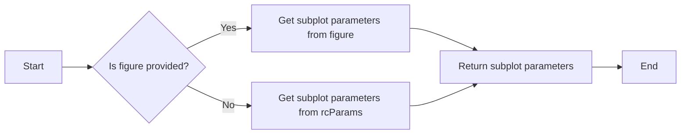

#### 带注释源码

```python
def get_subplot_params(self, figure=None):
    """
    Return the `.SubplotParams` for the GridSpec.

    In order of precedence the values are taken from

    - non-None attributes of the GridSpec
    - the provided *figure*
    - :rc:`figure.subplot.*`

    Note that the ``figure`` attribute of the GridSpec is always ignored.
    """
    if figure is None:
        kw = {k: mpl.rcParams["figure.subplot."+k]
              for k in self._AllowedKeys}
        subplotpars = SubplotParams(**kw)
    else:
        subplotpars = copy.copy(figure.subplotpars)

    subplotpars.update(**{k: getattr(self, k) for k in self._AllowedKeys})

    return subplotpars
```


### GridSpecBase.new_subplotspec

Create and return a `.SubplotSpec` instance.

参数：

- `loc`：`(int, int)`，The position of the subplot in the grid as `(row_index, column_index)`.
- `rowspan`：`int`，The number of rows the subplot should span in the grid. Default is 1.
- `colspan`：`int`，The number of columns the subplot should span in the grid. Default is 1.

返回值：`.SubplotSpec`，The created `.SubplotSpec` instance.

#### 流程图

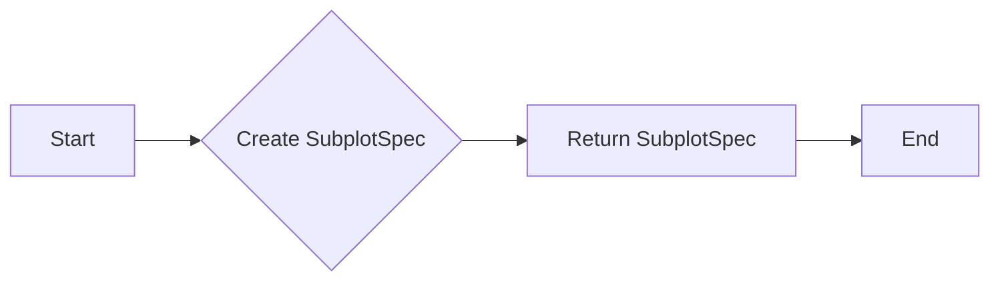

#### 带注释源码

```python
def new_subplotspec(self, loc, rowspan=1, colspan=1):
    """
    Create and return a `.SubplotSpec` instance.

    Parameters
    ----------
    loc : (int, int)
        The position of the subplot in the grid as
        ``(row_index, column_index)``.
    rowspan, colspan : int, default: 1
        The number of rows and columns the subplot should span in the grid.
    """
    loc1, loc2 = loc
    subplotspec = self[loc1:loc1+rowspan, loc2:loc2+colspan]
    return subplotspec
```


### GridSpecBase.set_width_ratios

Set the relative widths of the columns.

参数：

- `width_ratios`：`array-like of length *ncols*`， Defines the relative widths of the columns. Each column gets a relative width of ``width_ratios[i] / sum(width_ratios)``. If not given, all columns will have the same width.

返回值：`None`，No return value, the method modifies the instance directly.

#### 流程图

```mermaid
graph LR
A[Start] --> B{Check if width_ratios is None?}
B -- Yes --> C[Set width_ratios to [1, 1, ..., 1] (same width for all columns)]
B -- No --> D{Check if length of width_ratios is equal to ncols?}
D -- No --> E[Throw ValueError]
D -- Yes --> F[Set _col_width_ratios to width_ratios]
F --> G[End]
```

#### 带注释源码

```python
def set_width_ratios(self, width_ratios):
    """
    Set the relative widths of the columns.

    *width_ratios* must be of length *ncols*. Each column gets a relative
    width of ``width_ratios[i] / sum(width_ratios)``.
    """
    if width_ratios is None:
        width_ratios = [1] * self._ncols
    elif len(width_ratios) != self._ncols:
        raise ValueError('Expected the given number of width ratios to '
                         'match the number of columns of the grid')
    self._col_width_ratios = width_ratios
```


### GridSpecBase.get_width_ratios

返回列的相对宽度比例。

参数：

- 无

返回值：`array-like of length *ncols*`，包含列的相对宽度比例。

#### 流程图

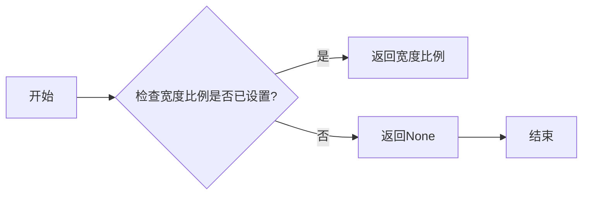

#### 带注释源码

```python
def get_width_ratios(self):
    """
    Return the width ratios.

    This is *None* if no width ratios have been set explicitly.
    """
    return self._col_width_ratios
```


### GridSpecBase.set_height_ratios

Set the relative heights of the rows.

参数：

- `height_ratios`：`array-like`， Defines the relative heights of the rows. Each row gets a relative height of ``height_ratios[i] / sum(height_ratios)``. If not given, all rows will have the same height.

返回值：`None`，No return value, the method modifies the instance directly.

#### 流程图

```mermaid
graph LR
A[Start] --> B{Check if height_ratios is None?}
B -- Yes --> C[Set height_ratios to [1, 1, ..., 1] (nrows times)]
B -- No --> D{Check if len(height_ratios) == nrows?}
D -- Yes --> E[Set _row_height_ratios to height_ratios]
D -- No --> F[Throw ValueError]
F --> G[End]
C --> G
E --> G
```

#### 带注释源码

```python
def set_height_ratios(self, height_ratios):
    """
    Set the relative heights of the rows.

    *height_ratios* must be of length *nrows*. Each row gets a relative
    height of ``height_ratios[i] / sum(height_ratios)``.
    """
    if height_ratios is None:
        height_ratios = [1] * self._nrows
    elif len(height_ratios) != self._nrows:
        raise ValueError('Expected the given number of height ratios to '
                         'match the number of rows of the grid')
    self._row_height_ratios = height_ratios
```


### GridSpecBase.get_height_ratios

返回指定 `GridSpec` 的行高度比例。

参数：

- 无

返回值：`list`，包含行高度比例的列表。

#### 流程图

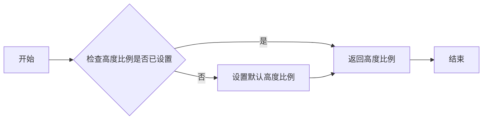

#### 带注释源码

```python
def get_height_ratios(self):
    """
    Return the height ratios.

    This is *None* if no height ratios have been set explicitly.
    """
    return self._row_height_ratios
```


### GridSpecBase.get_grid_positions

Return the positions of the grid cells in figure coordinates.

参数：

- `fig`：`matplotlib.figure.Figure`，The figure the grid should be applied to. The subplot parameters (margins and spacing between subplots) are taken from *fig*.

返回值：`bottoms, tops, lefts, rights`：`array`，The bottom, top, left, right positions of the grid cells in figure coordinates.

#### 流程图

```mermaid
graph LR
A[Start] --> B{Get nrows and ncols}
B --> C{Calculate cell heights}
C --> D{Calculate cell widths}
D --> E{Calculate cell heights (separators)}
D --> F{Calculate cell widths (separators)}
E --> G{Calculate accumulated heights}
F --> H{Calculate accumulated widths}
H --> I{Calculate figure tops and bottoms}
H --> J{Calculate figure lefts and rights}
J --> K[End]
```

#### 带注释源码

```python
def get_grid_positions(self, fig):
    """
    Return the positions of the grid cells in figure coordinates.

    Parameters
    ----------
    fig : `~matplotlib.figure.Figure`
        The figure the grid should be applied to. The subplot parameters
        (margins and spacing between subplots) are taken from *fig*.

    Returns
    -------
    bottoms, tops, lefts, rights : array
        The bottom, top, left, right positions of the grid cells in
        figure coordinates.
    """
    nrows, ncols = self.get_geometry()
    subplot_params = self.get_subplot_params(fig)
    left = subplot_params.left
    right = subplot_params.right
    bottom = subplot_params.bottom
    top = subplot_params.top
    wspace = subplot_params.wspace
    hspace = subplot_params.hspace
    tot_width = right - left
    tot_height = top - bottom

    # calculate accumulated heights of columns
    cell_h = tot_height / (nrows + hspace*(nrows-1))
    sep_h = hspace * cell_h
    norm = cell_h * nrows / sum(self._row_height_ratios)
    cell_heights = [r * norm for r in self._row_height_ratios]
    sep_heights = [0] + ([sep_h] * (nrows-1))
    cell_hs = np.cumsum(np.column_stack([sep_heights, cell_heights]).flat)

    # calculate accumulated widths of rows
    cell_w = tot_width / (ncols + wspace*(ncols-1))
    sep_w = wspace * cell_w
    norm = cell_w * ncols / sum(self._col_width_ratios)
    cell_widths = [r * norm for r in self._col_width_ratios]
    sep_widths = [0] + ([sep_w] * (ncols-1))
    cell_ws = np.cumsum(np.column_stack([sep_widths, cell_widths]).flat)

    fig_tops, fig_bottoms = (top - cell_hs).reshape((-1, 2)).T
    fig_lefts, fig_rights = (left + cell_ws).reshape((-1, 2)).T
    return fig_bottoms, fig_tops, fig_lefts, fig_rights
``` 


### GridSpecBase.__getitem__

该函数用于从`GridSpecBase`实例中创建并返回一个`.SubplotSpec`实例。

#### 参数

- `key`：`int`或`tuple`，指定子图在网格中的位置。如果是单个整数，则表示子图占据网格中的单个单元格。如果是元组，则表示子图占据从第一个单元格到第二个单元格（包含）的单元格范围。

#### 返回值

- `.SubplotSpec`：表示子图位置的`.SubplotSpec`实例。

#### 流程图

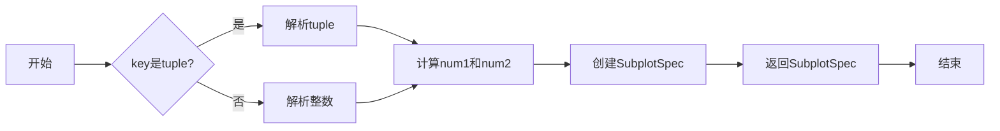

#### 带注释源码

```python
def __getitem__(self, key):
    """Create and return a `.SubplotSpec` instance."""
    nrows, ncols = self.get_geometry()

    def _normalize(key, size, axis):  # Includes last index.
        orig_key = key
        if isinstance(key, slice):
            start, stop, _ = key.indices(size)
            if stop > start:
                return start, stop - 1
            raise IndexError("GridSpec slice would result in no space "
                             "allocated for subplot")
        else:
            if key < 0:
                key = key + size
            if 0 <= key < size:
                return key, key
            elif axis is not None:
                raise IndexError(f"index {orig_key} is out of bounds for "
                                 f"axis {axis} with size {size}")
            else:  # flat index
                raise IndexError(f"index {orig_key} is out of bounds for "
                                 f"GridSpec with size {size}")

    if isinstance(key, tuple):
        try:
            k1, k2 = key
        except ValueError as err:
            raise ValueError("Unrecognized subplot spec") from err
        num1, num2 = np.ravel_multi_index(
            [_normalize(k1, nrows, 0), _normalize(k2, ncols, 1)],
            (nrows, ncols))
    else:  # Single key
        num1, num2 = _normalize(key, nrows * ncols, None)

    return SubplotSpec(self, num1, num2)
```

### GridSpecBase.subplots

该函数用于将指定 `GridSpec` 的所有子图添加到其父图中。

参数：

- `sharex`：`str`，默认为 `False`。指定子图共享 x 轴的方式，可以是 `"all"`, `"row"`, `"col"`, `"none"` 或 `False`。
- `sharey`：`str`，默认为 `False`。指定子图共享 y 轴的方式，可以是 `"all"`, `"row"`, `"col"`, `"none"` 或 `False`。
- `squeeze`：`bool`，默认为 `True`。如果子图数量为 1，则返回单个子图而不是数组。

返回值：`numpy.ndarray`，包含所有添加的子图。

#### 流程图

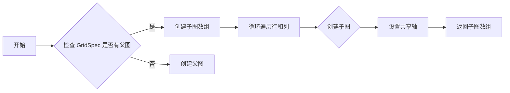

#### 带注释源码

```python
def subplots(self, *, sharex=False, sharey=False, squeeze=True,
                 subplot_kw=None):
    """
    Add all subplots specified by this `GridSpec` to its parent figure.

    See `.Figure.subplots` for detailed documentation.
    """

    figure = self.figure

    if figure is None:
        raise ValueError("GridSpec.subplots() only works for GridSpecs "
                         "created with a parent figure")

    if not isinstance(sharex, str):
        sharex = "all" if sharex else "none"
    if not isinstance(sharey, str):
        sharey = "all" if sharey else "none"

    _api.check_in_list(["all", "row", "col", "none", False, True],
                           sharex=sharex, sharey=sharey)
    if subplot_kw is None:
        subplot_kw = {}
    # don't mutate kwargs passed by user...
    subplot_kw = subplot_kw.copy()

    # Create array to hold all Axes.
    axarr = np.empty((self._nrows, self._ncols), dtype=object)
    for row in range(self._nrows):
        for col in range(self._ncols):
            shared_with = {"none": None, "all": axarr[0, 0],
                           "row": axarr[row, 0], "col": axarr[0, col]}
            subplot_kw["sharex"] = shared_with[sharex]
            subplot_kw["sharey"] = shared_with[sharey]
            axarr[row, col] = figure.add_subplot(
                self[row, col], **subplot_kw)

    # turn off redundant tick labeling
    if sharex in ["col", "all"]:
        for ax in axarr.flat:
            ax._label_outer_xaxis(skip_non_rectangular_axes=True)
    if sharey in ["row", "all"]:
        for ax in axarr.flat:
            ax._label_outer_yaxis(skip_non_rectangular_axes=True)

    if squeeze:
        # Discarding unneeded dimensions that equal 1.  If we only have one
        # subplot, just return it instead of a 1-element array.
        return axarr.item() if axarr.size == 1 else axarr.squeeze()
    else:
        # Returned axis array will be always 2-d, even if nrows=ncols=1.
        return axarr
```

### GridSpecBase.tight_layout

#### 描述

`GridSpecBase.tight_layout` 方法用于调整子图参数，以便在给定的矩形区域内（通常是整个图形）放置子图，包括标题、标签和图例等，从而避免重叠。

#### 参数

- `figure`：`matplotlib.figure.Figure`，图形对象。
- `renderer`：`matplotlib._pylab_helpers.RendererBase` 子类，可选，用于渲染图形的渲染器。
- `pad`：`float`，子图边缘与图形边缘之间的填充，以字体大小为分数。
- `h_pad`：`float`，相邻子图边缘之间的填充（高度），默认为 `pad`。
- `w_pad`：`float`，相邻子图边缘之间的填充（宽度），默认为 `pad`。
- `rect`：`tuple`，(left, bottom, right, top) 形式的矩形，在归一化图形坐标中，整个子图区域（包括标签）将适合其中。默认为 `None`，即整个图形。

#### 返回值

无返回值。

#### 流程图

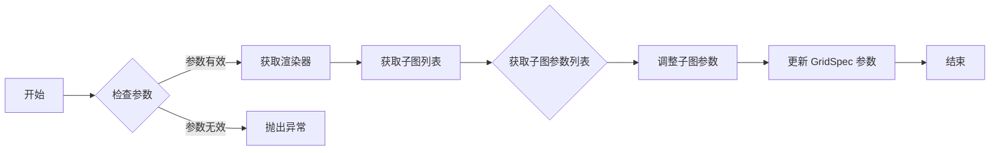

#### 带注释源码

```python
def tight_layout(self, figure, renderer=None,
                 pad=1.08, h_pad=None, w_pad=None, rect=None):
    """
    Adjust subplot parameters to give specified padding.

    Parameters
    ----------
    figure : `.Figure`
        The figure.
    renderer :  `.RendererBase` subclass, optional
        The renderer to be used.
    pad : float
        Padding between the figure edge and the edges of subplots, as a
        fraction of the font-size.
    h_pad, w_pad : float, optional
        Padding (height/width) between edges of adjacent subplots.
        Defaults to *pad*.
    rect : tuple (left, bottom, right, top), default: None
        (left, bottom, right, top) rectangle in normalized figure
        coordinates that the whole subplots area (including labels) will
        fit into. Default (None) is the whole figure.
    """
    if renderer is None:
        renderer = figure._get_renderer()
    kwargs = _tight_layout.get_tight_layout_figure(
        figure, figure.axes,
        _tight_layout.get_subplotspec_list(figure.axes, grid_spec=self),
        renderer, pad=pad, h_pad=h_pad, w_pad=w_pad, rect=rect)
    if kwargs:
        self.update(**kwargs)
```

### GridSpec.__init__

该函数初始化一个 `GridSpec` 对象，用于定义一个网格布局，其中可以放置多个子图。

#### 参数

- `nrows`：`int`，网格的行数。
- `ncols`：`int`，网格的列数。
- `width_ratios`：`array-like`，可选，定义列的相对宽度。每个列的相对宽度为 `width_ratios[i] / sum(width_ratios)`。如果未提供，所有列将具有相同的宽度。
- `height_ratios`：`array-like`，可选，定义行的相对高度。每个行的相对高度为 `height_ratios[i] / sum(height_ratios)`。如果未提供，所有行将具有相同的高度。

#### 返回值

无返回值。

#### 流程图

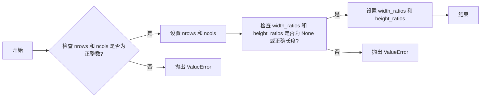

#### 带注释源码

```python
def __init__(self, nrows, ncols, width_ratios=None, height_ratios=None):
    if not isinstance(nrows, Integral) or nrows <= 0:
        raise ValueError(
            f"Number of rows must be a positive integer, not {nrows!r}")
    if not isinstance(ncols, Integral) or ncols <= 0:
        raise ValueError(
            f"Number of columns must be a positive integer, not {ncols!r}")
    self._nrows, self._ncols = nrows, ncols
    self.set_height_ratios(height_ratios)
    self.set_width_ratios(width_ratios)
```


### GridSpec.update

更新网格的子图参数。

参数：

- `left`：`float or None`，子图左边缘相对于图宽的比例。如果设置为 `None`，则使用默认值。
- `bottom`：`float or None`，子图底部边缘相对于图高的比例。如果设置为 `None`，则使用默认值。
- `right`：`float or None`，子图右边缘相对于图宽的比例。如果设置为 `None`，则使用默认值。
- `top`：`float or None`，子图顶部边缘相对于图高的比例。如果设置为 `None`，则使用默认值。
- `wspace`：`float or None`，子图之间的水平间距，以平均子图宽度为单位的比例。如果设置为 `None`，则使用默认值。
- `hspace`：`float or None`，子图之间的垂直间距，以平均子图高度为单位的比例。如果设置为 `None`，则使用默认值。

返回值：`None`，该方法不返回任何值。

#### 流程图

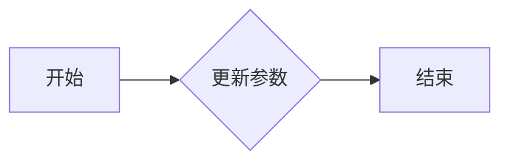

#### 带注释源码

```python
def update(self, *, left=_UNSET, bottom=_UNSET, right=_UNSET, top=_UNSET,
           wspace=_UNSET, hspace=_UNSET):
    """
    Update the subplot parameters of the grid.

    Parameters that are not explicitly given are not changed. Setting a
    parameter to *None* resets it to :rc:`figure.subplot.*`.

    Parameters
    ----------
    left, right, top, bottom : float or None, optional
        Extent of the subplots as a fraction of figure width or height.
    wspace, hspace : float or None, optional
        Spacing between the subplots as a fraction of the average subplot
        width / height.
    """
    if left is not _UNSET:
        self.left = left
    if bottom is not _UNSET:
        self.bottom = bottom
    if right is not _UNSET:
        self.right = right
    if top is not _UNSET:
        self.top = top
    if wspace is not _UNSET:
        self.wspace = wspace
    if hspace is not _UNSET:
        self.hspace = hspace
```


### GridSpec.get_subplot_params

该函数返回GridSpec的子图参数。

#### 参数

- `figure`：`matplotlib.figure.Figure`，可选。用于从提供的图获取子图参数。

#### 返回值

- `SubplotParams`：包含子图参数的字典。

#### 流程图

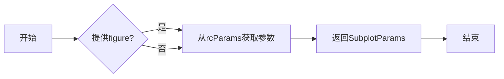

#### 带注释源码

```python
def get_subplot_params(self, figure=None):
    """
    Return the `.SubplotParams` for the GridSpec.

    In order of precedence the values are taken from

    - non-*None* attributes of the GridSpec
    - the provided *figure*
    - :rc:`figure.subplot.*`

    Note that the ``figure`` attribute of the GridSpec is always ignored.
    """
    if figure is None:
        kw = {k: mpl.rcParams["figure.subplot."+k]
              for k in self._AllowedKeys}
        subplotpars = SubplotParams(**kw)
    else:
        subplotpars = copy.copy(figure.subplotpars)

    subplotpars.update(**{k: getattr(self, k) for k in self._AllowedKeys})

    return subplotpars
```

### GridSpec.locally_modified_subplot_params

该函数返回一个列表，包含在GridSpec中显式设置的子图参数名称。

#### 参数

- 无

#### 返回值

- `list`，包含显式设置的子图参数名称

#### 流程图

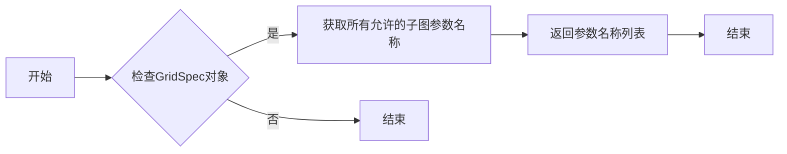

#### 带注释源码

```python
def locally_modified_subplot_params(self):
    """
    Return a list of the names of the subplot parameters explicitly set
    in the GridSpec.

    This is a subset of the attributes of `.SubplotParams`.
    """
    return [k for k in self._AllowedKeys if getattr(self, k)]
```

### GridSpec.tight_layout

调整子图参数以提供指定的填充。

参数：

- `figure`：`.Figure`，要调整的图形。
- `renderer`：`.RendererBase`子类，可选，要使用的渲染器。
- `pad`：浮点数，图边缘和子图边缘之间的填充，以字体大小为分数。
- `h_pad`，`w_pad`：浮点数，可选，相邻子图边缘之间的填充（高度/宽度）。默认为`pad`。
- `rect`：元组（左，底，右，顶），可选，规范化图坐标中整个子图区域（包括标签）将适合的（左，底，右，顶）矩形。默认（None）是整个图。

返回值：无

#### 流程图

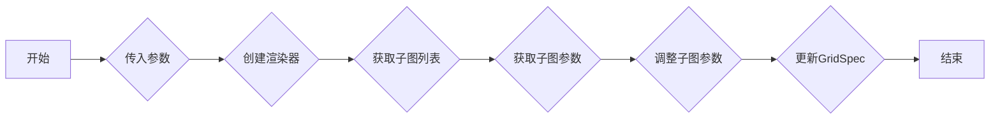

#### 带注释源码

```python
def tight_layout(self, figure, renderer=None,
                 pad=1.08, h_pad=None, w_pad=None, rect=None):
    """
    Adjust subplot parameters to give specified padding.

    Parameters
    ----------
    figure : `.Figure`
        The figure.
    renderer :  `.RendererBase` subclass, optional
        The renderer to be used.
    pad : float
        Padding between the figure edge and the edges of subplots, as a
        fraction of the font-size.
    h_pad, w_pad : float, optional
        Padding (height/width) between edges of adjacent subplots.
        Defaults to *pad*.
    rect : tuple (left, bottom, right, top), default: None
        (left, bottom, right, top) rectangle in normalized figure
        coordinates that the whole subplots area (including labels) will
        fit into. Default (None) is the whole figure.
    """
    if renderer is None:
        renderer = figure._get_renderer()
    kwargs = _tight_layout.get_tight_layout_figure(
        figure, figure.axes,
        _tight_layout.get_subplotspec_list(figure.axes, grid_spec=self),
        renderer, pad=pad, h_pad=h_pad, w_pad=w_pad, rect=rect)
    if kwargs:
        self.update(**kwargs)
```


### GridSpecFromSubplotSpec.__init__

This method initializes a `GridSpecFromSubplotSpec` instance, which is a subclass of `GridSpecBase`. It sets up the grid layout parameters based on a given `SubplotSpec`.

参数：

- `nrows`：`int`，指定网格的行数。
- `ncols`：`int`，指定网格的列数。
- `subplot_spec`：`SubplotSpec`，指定从哪个 `SubplotSpec` 继承布局参数。
- `wspace`：`float`，可选，指定子图之间的水平间距，以子图平均宽度为单位的分数。
- `hspace`：`float`，可选，指定子图之间的垂直间距，以子图平均高度为单位的分数。
- `height_ratios`：`array-like`，可选，指定行的相对高度。
- `width_ratios`：`array-like`，可选，指定列的相对宽度。

返回值：无

#### 流程图

```mermaid
graph LR
A[Start] --> B{Initialize GridSpecFromSubplotSpec}
B --> C{Set nrows and ncols}
C --> D{Set subplot_spec}
D --> E{Set wspace and hspace (if provided)}
E --> F{Set height_ratios (if provided)}
F --> G{Set width_ratios (if provided)}
G --> H[End]
```

#### 带注释源码

```python
def __init__(self, nrows, ncols,
                 subplot_spec,
                 wspace=None, hspace=None,
                 height_ratios=None, width_ratios=None):
    self._wspace = wspace
    self._hspace = hspace
    if isinstance(subplot_spec, SubplotSpec):
        self._subplot_spec = subplot_spec
    else:
        raise TypeError(
                            "subplot_spec must be type SubplotSpec, "
                            "usually from GridSpec, or axes.get_subplotspec.")
    self.figure = self._subplot_spec.get_gridspec().figure
    super().__init__(nrows, ncols,
                     width_ratios=width_ratios,
                     height_ratios=height_ratios)
```


### GridSpecFromSubplotSpec.get_subplot_params

This method returns a dictionary of subplot layout parameters for the GridSpec instance.

参数：

- `figure`：`matplotlib.figure.Figure`，The figure the grid should be applied to. The subplot parameters (margins and spacing between subplots) are taken from *fig*.

返回值：`matplotlib.gridspec.SubplotParams`，A dictionary of subplot layout parameters.

#### 流程图

```mermaid
graph LR
A[Start] --> B{Check figure}
B -->|figure is None| C[Use rcParams]
B -->|figure is not None| D[Copy figure.subplotpars]
C --> E[Create SubplotParams]
D --> E
E --> F[Return SubplotParams]
F --> G[End]
```

#### 带注释源码

```python
def get_subplot_params(self, figure=None):
    """Return the `.SubplotParams` for the GridSpec.

    In order of precedence the values are taken from

    - non-*None* attributes of the GridSpec
    - the provided *figure*
    - :rc:`figure.subplot.*`

    Note that the ``figure`` attribute of the GridSpec is always ignored.
    """
    if figure is None:
        kw = {k: mpl.rcParams["figure.subplot."+k]
              for k in self._AllowedKeys}
        subplotpars = SubplotParams(**kw)
    else:
        subplotpars = copy.copy(figure.subplotpars)

    subplotpars.update(**{k: getattr(self, k) for k in self._AllowedKeys})

    return subplotpars
``` 


### GridSpecFromSubplotSpec.get_topmost_subplotspec

返回与指定 `GridSpec` 相关的最高级别的 `SubplotSpec` 实例。

参数：

- 无

返回值：`SubplotSpec`，返回与指定 `GridSpec` 相关的最高级别的 `SubplotSpec` 实例。

#### 流程图

```mermaid
graph LR
A[GridSpecFromSubplotSpec] --> B{get_topmost_subplotspec()}
B --> C[SubplotSpec]
```

#### 带注释源码

```python
class GridSpecFromSubplotSpec(GridSpecBase):
    # ...
    def get_topmost_subplotspec(self):
        """
        Return the topmost `.SubplotSpec` instance associated with the subplot.
        """
        return self._subplot_spec.get_topmost_subplotspec()
```


### SubplotSpec.__init__

该函数用于初始化一个 `SubplotSpec` 对象，它表示在 `GridSpec` 中一个子图的位置。

#### 参数

- `gridspec`：`GridSpec` 对象，表示子图所在的网格。
- `num1`：整数，表示子图在网格中的起始行索引。
- `num2`：整数，可选，表示子图在网格中的结束行索引。

#### 返回值

无返回值。

#### 流程图

```mermaid
graph LR
A[SubplotSpec.__init__] --> B{gridspec}
B --> C{num1}
B --> D{num2}
```

#### 带注释源码

```python
def __init__(self, gridspec, num1, num2=None):
    self._gridspec = gridspec
    self.num1 = num1
    self.num2 = num2
```


### SubplotSpec.__repr__

This method returns a string representation of the `SubplotSpec` object, which represents the location of a subplot within a `GridSpec`.

参数：

- `gridspec`：`GridSpec`，The `GridSpec` instance that the subplot is part of.
- `num1`：`int`，The starting index of the subplot within the `GridSpec`.
- `num2`：`int`，The ending index of the subplot within the `GridSpec`. If `None`, the subplot spans from `num1` to the end of the row or column.

返回值：`str`，A string representation of the `SubplotSpec` object.

#### 流程图

```mermaid
graph LR
A[SubplotSpec.__repr__] --> B{gridspec}
B --> C{num1}
B --> D{num2}
D --> E[Return string representation]
```

#### 带注释源码

```python
def __repr__(self):
    return (f"{self.get_gridspec()}["
            f"{self.rowspan.start}:{self.rowspan.stop}, "
            f"{self.colspan.start}:{self.colspan.stop}]")
```


### SubplotSpec.get_gridspec

该函数用于获取与指定 `SubplotSpec` 相关联的 `GridSpec` 实例。

#### 参数

- `self`：当前 `SubplotSpec` 实例。

#### 返回值

- `GridSpec`：与当前 `SubplotSpec` 相关联的 `GridSpec` 实例。

#### 流程图

```mermaid
graph LR
A[SubplotSpec.get_gridspec] --> B{获取GridSpec}
B --> C[返回GridSpec]
```

#### 带注释源码

```python
def get_gridspec(self):
    """
    Return the GridSpec associated with this SubplotSpec.
    """
    return self._gridspec
```

### SubplotSpec.get_geometry

该函数返回子图在 `GridSpec` 中的几何形状。

参数：

- `self`：`SubplotSpec` 对象，表示子图的位置。

返回值：`(n_rows, n_cols, start, stop)`，其中 `n_rows` 和 `n_cols` 分别表示子图的行数和列数，`start` 和 `stop` 分别表示子图在 `GridSpec` 中的起始和结束索引（包含结束索引）。

#### 流程图

```mermaid
graph LR
A[SubplotSpec.get_geometry] --> B{获取GridSpec}
B --> C{获取GridSpec的几何形状}
C --> D{返回(n_rows, n_cols, start, stop)}
```

#### 带注释源码

```python
def get_geometry(self):
    """
    Return the subplot geometry as tuple ``(n_rows, n_cols, start, stop)``.

    The indices *start* and *stop* define the range of the subplot within
    the `GridSpec`. *stop* is inclusive (i.e. for a single cell ``start == stop``).
    """
    rows, cols = self.get_gridspec().get_geometry()
    return rows, cols, self.num1, self.num2
```

### SubplotSpec.rowspan

#### 描述

`SubplotSpec.rowspan` 属性返回一个 `range` 对象，表示该子图跨越的行数。

#### 参数

- 无

#### 返回值

- `range`：表示子图跨越的行数的范围。

#### 流程图

```mermaid
classDiagram
    SubplotSpec <<interface>>
    SubplotSpec.rowspan : range
    SubplotSpec --|> range : get_rowspan()
```

#### 带注释源码

```python
class SubplotSpec:
    # ...

    @property
    def rowspan(self):
        """The rows spanned by this subplot, as a `range` object."""
        ncols = self.get_gridspec().ncols
        return range(self.num1 // ncols, self.num2 // ncols + 1)
```

### SubplotSpec.new_subplotspec

**描述**

`SubplotSpec.new_subplotspec` 方法用于创建一个新的 `SubplotSpec` 实例，该实例表示在 `GridSpec` 中指定位置和跨度的子图。

**参数**

- `loc`：一个包含两个整数的元组，表示子图在网格中的位置，格式为 `(行索引, 列索引)`。
- `rowspan`：一个整数，表示子图在行方向上跨越的行数，默认为 1。
- `colspan`：一个整数，表示子图在列方向上跨越的列数，默认为 1。

**返回值**

- `SubplotSpec`：一个新的 `SubplotSpec` 实例，表示创建的子图。

**流程图**

```mermaid
graph LR
A[SubplotSpec.new_subplotspec] --> B{创建新的SubplotSpec}
B --> C[返回新的SubplotSpec]
```

#### 带注释源码

```python
def new_subplotspec(self, loc, rowspan=1, colspan=1):
    """
    Create and return a `.SubplotSpec` instance.

    Parameters
    ----------
    loc : (int, int)
        The position of the subplot in the grid as
        ``(row_index, column_index)``.
    rowspan, colspan : int, default: 1
        The number of rows and columns the subplot should span in the grid.
    """
    loc1, loc2 = loc
    subplotspec = self[loc1:loc1+rowspan, loc2:loc2+colspan]
    return subplotspec
```


### SubplotSpec.is_first_row

判断当前子图是否位于第一行。

参数：

- 无

返回值：`bool`，如果子图位于第一行则返回 `True`，否则返回 `False`

#### 流程图

```mermaid
graph LR
A[判断是否位于第一行] -->|是| B{返回 True}
A -->|否| C{返回 False}
```

#### 带注释源码

```python
def is_first_row(self):
    return self.rowspan.start == 0
```


### SubplotSpec.is_last_row

该函数用于判断一个子图是否位于其所在 `GridSpec` 的最后一行。

#### 参数

- 无

#### 返回值

- `bool`，如果子图位于最后一行则返回 `True`，否则返回 `False`

#### 流程图

```mermaid
graph LR
A[SubplotSpec.is_last_row()] --> B{判断}
B -- 是 --> C[返回 True]
B -- 否 --> D[返回 False]
```

#### 带注释源码

```python
def is_last_row(self):
    """
    Return True if this subplot is in the last row of its GridSpec.
    """
    return self.rowspan.stop == self.get_gridspec().nrows
```


### SubplotSpec.is_first_col

判断当前子图是否位于第一列。

参数：

- 无

返回值：`bool`，如果子图位于第一列则返回 `True`，否则返回 `False`

#### 流程图

```mermaid
graph LR
A[判断是否位于第一列] -->|是| B{返回 True}
A -->|否| C{返回 False}
```

#### 带注释源码

```python
def is_first_col(self):
    return self.colspan.start == 0
```


### SubplotSpec.is_last_col

该函数用于判断一个子图是否位于其所在 `GridSpec` 的最后一列。

#### 参数

- 无

#### 返回值

- `bool`，如果子图位于最后一列则返回 `True`，否则返回 `False`

#### 流程图

```mermaid
graph LR
A[SubplotSpec.is_last_col()] --> B{子图位于最后一列?}
B -- 是 --> C[返回 True]
B -- 否 --> D[返回 False]
```

#### 带注释源码

```python
def is_last_col(self):
    """
    Return True if this subplot is in the last column of its GridSpec.
    """
    return self.colspan.stop == self.get_gridspec().ncols
```

### SubplotSpec.get_position

该函数用于获取子图在图中的位置。

参数：

- `figure`：`matplotlib.figure.Figure`，当前图对象。

返回值：`matplotlib.transforms.Bbox`，子图的位置，包括左、下、右、上边界。

#### 流程图

```mermaid
graph LR
A[SubplotSpec.get_position] --> B{获取GridSpec}
B --> C{获取GridSpec的几何信息}
C --> D{获取子图在GridSpec中的位置}
D --> E{计算子图的位置}
E --> F[返回Bbox对象]
```

#### 带注释源码

```python
def get_position(self, figure):
    """
    Update the subplot position from ``figure.subplotpars``.
    """
    gridspec = self.get_gridspec()
    nrows, ncols = gridspec.get_geometry()
    rows, cols = np.unravel_index([self.num1, self.num2], (nrows, ncols))
    fig_bottoms, fig_tops, fig_lefts, fig_rights = \
        gridspec.get_grid_positions(figure)

    fig_bottom = fig_bottoms[rows].min()
    fig_top = fig_tops[rows].max()
    fig_left = fig_lefts[cols].min()
    fig_right = fig_rights[cols].max()
    return Bbox.from_extents(fig_left, fig_bottom, fig_right, fig_top)
```

### SubplotSpec.get_topmost_subplotspec

该函数返回与子图关联的最高级别的 `SubplotSpec` 实例。

#### 参数

- 无

#### 返回值

- `SubplotSpec`：返回与子图关联的最高级别的 `SubplotSpec` 实例。

#### 流程图

```mermaid
graph LR
A[SubplotSpec] --> B{get_topmost_subplotspec()}
B --> C[返回最高级别的 SubplotSpec]
```

#### 带注释源码

```python
def get_topmost_subplotspec(self):
    """
    Return the topmost `SubplotSpec` instance associated with the subplot.
    """
    gridspec = self.get_gridspec()
    if hasattr(gridspec, "get_topmost_subplotspec"):
        return gridspec.get_topmost_subplotspec()
    else:
        return self
```


### SubplotSpec.__eq__

Two SubplotSpecs are considered equal if they refer to the same position(s) in the same `GridSpec`.

参数：

- `other`：`SubplotSpec`，The other `SubplotSpec` to compare with.

返回值：`bool`，True if the two `SubplotSpec` instances refer to the same position(s) in the same `GridSpec`, False otherwise.

#### 流程图

```mermaid
graph LR
A[SubplotSpec.__eq__] --> B{other is None?}
B -- Yes --> C[Return False]
B -- No --> D[Compare gridspec]
D -- Same? --> E[Compare num1]
E -- Same? --> F[Compare num2]
F -- Same? --> G[Return True]
F -- No --> H[Return False]
```

#### 带注释源码

```python
def __eq__(self, other):
    """
    Two SubplotSpecs are considered equal if they refer to the same
    position(s) in the same `GridSpec`.
    """
    # other may not even have the attributes we are checking.
    return ((self._gridspec, self.num1, self.num2)
            == (getattr(other, "_gridspec", object()),
                getattr(other, "num1", object()),
                getattr(other, "num2", object())))
```


### SubplotSpec.__hash__

This method computes the hash value for a `SubplotSpec` instance. It is used to uniquely identify a `SubplotSpec` based on its position within a `GridSpec`.

参数：

- `self`：`SubplotSpec`，当前实例

返回值：`int`，返回一个整数哈希值

#### 流程图

```mermaid
graph LR
A[SubplotSpec.__hash__] --> B{获取_gridspec()}
B --> C{获取(num1, num2)}
C --> D[计算哈希值]
D --> E{返回哈希值}
```

#### 带注释源码

```python
def __hash__(self):
    return hash((self._gridspec, self.num1, self.num2))
```


### SubplotSpec.subgridspec

该函数用于在给定的SubplotSpec中创建一个新的GridSpec，从而在子图内部进行更细粒度的布局。

#### 参数

- `nrows`：`int`，新GridSpec的行数。
- `ncols`：`int`，新GridSpec的列数。
- `**kwargs`：其他参数，将传递给`GridSpecFromSubplotSpec`构造函数。

#### 返回值

- `GridSpecFromSubplotSpec`：创建的新GridSpec。

#### 流程图

```mermaid
graph LR
A[SubplotSpec] --> B{调用subgridspec()}
B --> C[创建GridSpecFromSubplotSpec]
C --> D[返回新GridSpec]
```

#### 带注释源码

```python
def subgridspec(self, nrows, ncols, **kwargs):
    """
    Create a GridSpec within this subplot.

    The created `.GridSpecFromSubplotSpec` will have this `SubplotSpec` as
    a parent.

    Parameters
    ----------
    nrows : int
        Number of rows in grid.

    ncols : int
        Number of columns in grid.

    Returns
    -------
    `.GridSpecFromSubplotSpec`

    Other Parameters
    ----------------
    **kwargs
        All other parameters are passed to `.GridSpecFromSubplotSpec`.

    See Also
    --------
    matplotlib.pyplot.subplots

    Examples
    --------
    Adding three subplots in the space occupied by a single subplot::

        fig = plt.figure()
        gs0 = fig.add_gridspec(3, 1)
        ax1 = fig.add_subplot(gs0[0])
        ax2 = fig.add_subplot(gs0[1])
        gssub = gs0[2].subgridspec(1, 3)
        for i in range(3):
            fig.add_subplot(gssub[0, i])
    """
    return GridSpecFromSubplotSpec(nrows, ncols, self, **kwargs)
```

### SubplotParams.__init__

#### 描述

`SubplotParams.__init__` 方法用于初始化 `SubplotParams` 类的实例，该类用于定义子图在图中的位置参数。

#### 参数

- `left`：`float`，可选。子图左侧边缘的位置，以图宽的分数表示。
- `bottom`：`float`，可选。子图底部边缘的位置，以图高的分数表示。
- `right`：`float`，可选。子图右侧边缘的位置，以图宽的分数表示。
- `top`：`float`，可选。子图顶部边缘的位置，以图高的分数表示。
- `wspace`：`float`，可选。子图之间的宽度填充，以平均轴宽的分数表示。
- `hspace`：`float`，可选。子图之间的高度填充，以平均轴高的分数表示。

#### 返回值

无返回值。

#### 流程图

```mermaid
graph LR
A[SubplotParams.__init__] --> B{参数}
B --> C{left}
B --> D{bottom}
B --> E{right}
B --> F{top}
B --> G{wspace}
B --> H{hspace}
```

#### 带注释源码

```python
class SubplotParams:
    """
    Parameters defining the positioning of a subplots grid in a figure.
    """

    def __init__(self, left=None, bottom=None, right=None, top=None,
                 wspace=None, hspace=None):
        """
        Defaults are given by :rc:`figure.subplot.[name]`.

        Parameters
        ----------
        left : float, optional
            The position of the left edge of the subplots,
            as a fraction of the figure width.
        right : float, optional
            The position of the right edge of the subplots,
            as a fraction of the figure width.
        bottom : float, optional
            The position of the bottom edge of the subplots,
            as a fraction of the figure height.
        top : float, optional
            The position of the top edge of the subplots,
            as a fraction of the figure height.
        wspace : float, optional
            The width of the padding between subplots,
            as a fraction of the average Axes width.
        hspace : float, optional
            The height of the padding between subplots,
            as a fraction of the average Axes height.
        """
        for key in ["left", "bottom", "right", "top", "wspace", "hspace"]:
            setattr(self, key, mpl.rcParams[f"figure.subplot.{key}"])
        self.update(left, bottom, right, top, wspace, hspace)
```

### GridSpec.update

#### 描述

`GridSpec.update` 方法用于更新 GridSpec 的子图参数，包括左、右、底、顶、宽间距和高度间距。如果未明确提供参数，则不会更改，并且将重置为默认的 rcParams 值。

#### 参数

- `left`：`float or None`，子图左边缘的位置，以图宽的分数表示。
- `right`：`float or None`，子图右边缘的位置，以图宽的分数表示。
- `bottom`：`float or None`，子图底边缘的位置，以图高的分数表示。
- `top`：`float or None`，子图顶边缘的位置，以图高的分数表示。
- `wspace`：`float or None`，子图之间的宽度间距，以平均轴宽的分数表示。
- `hspace`：`float or None`，子图之间的高度间距，以平均轴高的分数表示。

#### 返回值

无返回值。

#### 流程图

```mermaid
graph LR
A[开始] --> B{参数 left}
B -->|是| C[更新 left]
B -->|否| D{参数 right}
D -->|是| E[更新 right]
D -->|否| F{参数 bottom}
F -->|是| G[更新 bottom]
F -->|否| H{参数 top}
H -->|是| I[更新 top]
H -->|否| J{参数 wspace}
J -->|是| K[更新 wspace]
J -->|否| L{参数 hspace}
L -->|是| M[更新 hspace]
L -->|否| N[结束]
```

#### 带注释源码

```python
def update(self, *, left=_UNSET, bottom=_UNSET, right=_UNSET, top=_UNSET,
           wspace=_UNSET, hspace=_UNSET):
    """
    Update the subplot parameters of the grid.

    Parameters that are not explicitly given are not changed. Setting a
    parameter to *None* resets it to :rc:`figure.subplot.*`.

    Parameters
    ----------
    left, right, top, bottom : float or None, optional
        Extent of the subplots as a fraction of figure width or height.
    wspace, hspace : float or None, optional
        Spacing between the subplots as a fraction of the average subplot
        width / height.
    """
    if left is not _UNSET:
        self.left = left
    if bottom is not _UNSET:
        self.bottom = bottom
    if right is not _UNSET:
        self.right = right
    if top is not _UNSET:
        self.top = top
    if wspace is not _UNSET:
        self.wspace = wspace
    if hspace is not _UNSET:
        self.hspace = hspace
```


### SubplotParams.reset

Restore the subplot positioning parameters to the default rcParams values.

参数：

- ...

返回值：无

#### 流程图

```mermaid
graph LR
A[Start] --> B[Reset parameters to default rcParams values]
B --> C[End]
```

#### 带注释源码

```python
def reset(self):
    """Restore the subplot positioning parameters to the default rcParams values"""
    for key in self.to_dict():
        setattr(self, key, mpl.rcParams[f'figure.subplot.{key}'])
```


### SubplotParams.to_dict

#### 描述

`SubplotParams.to_dict` 方法用于返回一个包含所有子图参数的字典副本。

#### 参数

- 无

#### 返回值

- `dict`：包含所有子图参数的字典。

#### 流程图

```mermaid
graph LR
A[SubplotParams.to_dict()] --> B{返回}
B --> C[dict]
```

#### 带注释源码

```python
def to_dict(self):
    """Return a copy of the subplot parameters as a dict."""
    return self.__dict__.copy()
```

## 关键组件


### 张量索引与惰性加载

张量索引与惰性加载是代码中用于高效访问和操作大型数据集的关键组件。它允许在数据集被完全加载到内存之前，仅对所需的部分进行操作，从而节省内存和提高性能。

### 反量化支持

反量化支持是代码中用于处理量化数据的关键组件。它允许将量化数据转换回原始精度，以便进行进一步的分析和处理。

### 量化策略

量化策略是代码中用于优化数据存储和计算效率的关键组件。它通过减少数据表示的精度来减少内存使用和计算时间，同时保持足够的精度以满足应用需求。


## 问题及建议


### 已知问题

-   **代码复杂度**：代码中存在大量的类和方法，这可能导致代码难以理解和维护。
-   **文档不足**：代码注释较少，缺乏详细的文档说明，这不利于其他开发者理解和使用代码。
-   **性能问题**：代码中存在一些计算密集型的操作，例如计算网格位置，这可能导致性能问题。
-   **异常处理**：代码中缺乏异常处理机制，当输入参数不正确时，可能导致程序崩溃。

### 优化建议

-   **重构代码**：将复杂的类和方法拆分成更小的、更易于管理的部分，以提高代码的可读性和可维护性。
-   **增加文档**：为代码添加详细的注释和文档，以便其他开发者理解和使用代码。
-   **优化性能**：对计算密集型的操作进行优化，例如使用更高效的算法或数据结构。
-   **增加异常处理**：在代码中添加异常处理机制，以防止程序因输入参数错误而崩溃。
-   **单元测试**：编写单元测试以确保代码的正确性和稳定性。


## 其它


### 设计目标与约束

- 设计目标：
  - 提供一个灵活的网格布局系统，允许用户在图形中放置多个子图。
  - 支持多种布局选项，包括行和列的相对高度和宽度。
  - 与matplotlib的其他功能（如`pyplot.subplots`）兼容。
- 约束：
  - 必须与matplotlib的现有API兼容。
  - 必须高效，以处理大型图形和大量子图。

### 错误处理与异常设计

- 错误处理：
  - 对于无效的参数值，抛出`ValueError`。
  - 对于不支持的参数组合，抛出`TypeError`。
- 异常设计：
  - 使用`try-except`块捕获和处理可能发生的异常。
  - 提供清晰的错误消息，帮助用户诊断问题。

### 数据流与状态机

- 数据流：
  - 用户通过`GridSpec`类创建网格布局。
  - 用户通过索引访问`SubplotSpec`实例。
  - 用户通过`SubplotSpec`实例添加子图。
- 状态机：
  - `GridSpec`类在初始化时设置网格布局。
  - `SubplotSpec`类在初始化时设置子图位置。
  - 用户可以通过`SubplotSpec`实例修改子图参数。

### 外部依赖与接口契约

- 外部依赖：
  - matplotlib库。
- 接口契约：
  - `GridSpec`类提供创建和修改网格布局的接口。
  - `SubplotSpec`类提供访问和修改子图位置的接口。
  - `SubplotParams`类提供访问和修改子图参数的接口。

    