# `matplotlib\lib\matplotlib\gridspec.pyi` 详细设计文档

该代码定义了matplotlib中网格布局系统(GridSpec)的类型注解，提供了子图布局管理的基础类层次结构，用于创建和管理Figure中的多子图布局，支持子图的行/列网格划分、间距比例设置、位置计算等功能。

## 整体流程

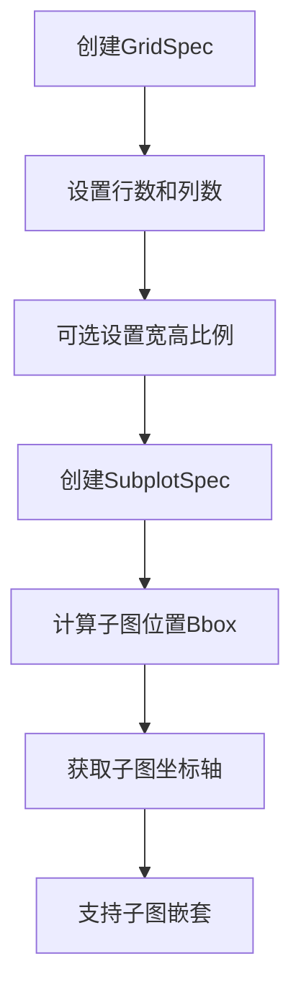

## 类结构

```
GridSpecBase (抽象基类)
├── GridSpec (完整网格规格)
└── GridSpecFromSubplotSpec (从子图规格创建)
SubplotSpec (子图规格)
SubplotParams (子图参数)
```

## 全局变量及字段


### `GridSpec.left`
    
子图区域左侧边界（相对于图形宽度，0到1）

类型：`float | None`
    


### `GridSpec.bottom`
    
子图区域底部边界（相对于图形高度，0到1）

类型：`float | None`
    


### `GridSpec.right`
    
子图区域右侧边界（相对于图形宽度，0到1）

类型：`float | None`
    


### `GridSpec.top`
    
子图区域顶部边界（相对于图形高度，0到1）

类型：`float | None`
    


### `GridSpec.wspace`
    
子图之间水平间距（相对于子图宽度）

类型：`float | None`
    


### `GridSpec.hspace`
    
子图之间垂直间距（相对于子图高度）

类型：`float | None`
    


### `GridSpec.figure`
    
关联的Figure对象

类型：`Figure | None`
    


### `GridSpecFromSubplotSpec.figure`
    
关联的Figure对象

类型：`Figure | None`
    


### `SubplotSpec.num1`
    
子图的起始编号（从0开始）

类型：`int`
    


### `SubplotSpec.num2`
    
子图的结束编号（从0开始）

类型：`int`
    


### `SubplotSpec.rowspan`
    
子图占据的行范围

类型：`range`
    


### `SubplotSpec.colspan`
    
子图占据的列范围

类型：`range`
    


### `SubplotParams.left`
    
子图区域左侧边界（0到1）

类型：`float`
    


### `SubplotParams.right`
    
子图区域右侧边界（0到1）

类型：`float`
    


### `SubplotParams.bottom`
    
子图区域底部边界（0到1）

类型：`float`
    


### `SubplotParams.top`
    
子图区域顶部边界（0到1）

类型：`float`
    


### `SubplotParams.wspace`
    
子图之间水平间距

类型：`float`
    


### `SubplotParams.hspace`
    
子图之间垂直间距

类型：`float`
    
    

## 全局函数及方法


### GridSpecBase.__init__

这是GridSpecBase类的构造函数，用于初始化网格布局的基本参数，包括行数、列数以及行列的尺寸比例。

参数：
- `nrows`：`int`，网格的行数
- `ncols`：`int`，网格的列数
- `height_ratios`：`ArrayLike | None`，行的高度比例，用于指定各行的相对高度，默认为None
- `width_ratios`：`ArrayLike | None`，列的宽度比例，用于指定各列的相对宽度，默认为None

返回值：`None`，该构造函数不返回任何值

#### 流程图

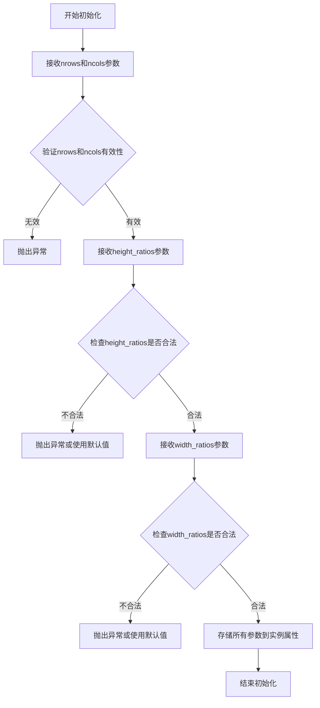

#### 带注释源码

```python
def __init__(
    self,
    nrows: int,  # 网格的行数，必须为正整数
    ncols: int,  # 网格的列数，必须为正整数
    height_ratios: ArrayLike | None = ...,  # 可选的行高度比例数组，用于分配各行相对高度
    width_ratios: ArrayLike | None = ...,   # 可选的列宽度比例数组，用于分配各列相对宽度
) -> None:  # 构造函数不返回值
    """
    初始化GridSpecBase实例。
    
    参数:
        nrows: 网格的行数
        ncols: 网格的列数
        height_ratios: 指定各行高度的相对比例，如果为None则各行高度相等
        width_ratios: 指定各列宽度的相对比例，如果为None则各列宽度相等
    """
    pass  # 具体实现未显示
```


### `GridSpecBase.nrows`

该属性是 `GridSpecBase` 类的只读属性，用于获取网格规范（GridSpec）的行数。

参数： 无（该方法为属性 getter，仅使用隐式参数 `self`）

返回值：`int`，返回网格规范中定义的总行数。

#### 流程图

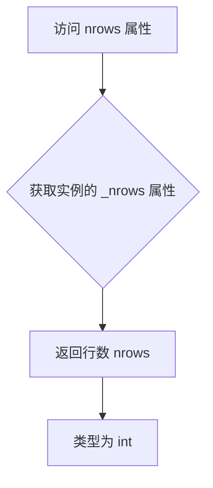

#### 带注释源码

```python
@property
def nrows(self) -> int:
    """
    GridSpecBase 类的只读属性 nrows。
    
    该属性返回当前网格规范的行数（number of rows）。
    在 GridSpecBase 初始化时通过构造函数的 nrows 参数设置。
    
    Returns:
        int: 网格规范中定义的总行数。
    """
    ...
```

#### 说明

| 项目 | 详情 |
|------|------|
| **属性类型** | 只读属性（Read-only Property） |
| **所属类** | `GridSpecBase` |
| **定义方式** | 使用 `@property` 装饰器 |
| **隐式参数** | `self`：指向 GridSpecBase 实例的引用 |
| **返回类型** | `int` |
| **功能描述** | 返回 GridSpec 网格布局的行数，用于子图定位和布局计算 |


### `GridSpecBase.ncols`

该属性用于获取网格布局的列数，返回一个整数值，表示网格规范中定义的总列数。

参数：

- `self`：`GridSpecBase`，隐式参数，指向当前GridSpecBase实例本身

返回值：`int`，网格布局的列数

#### 流程图

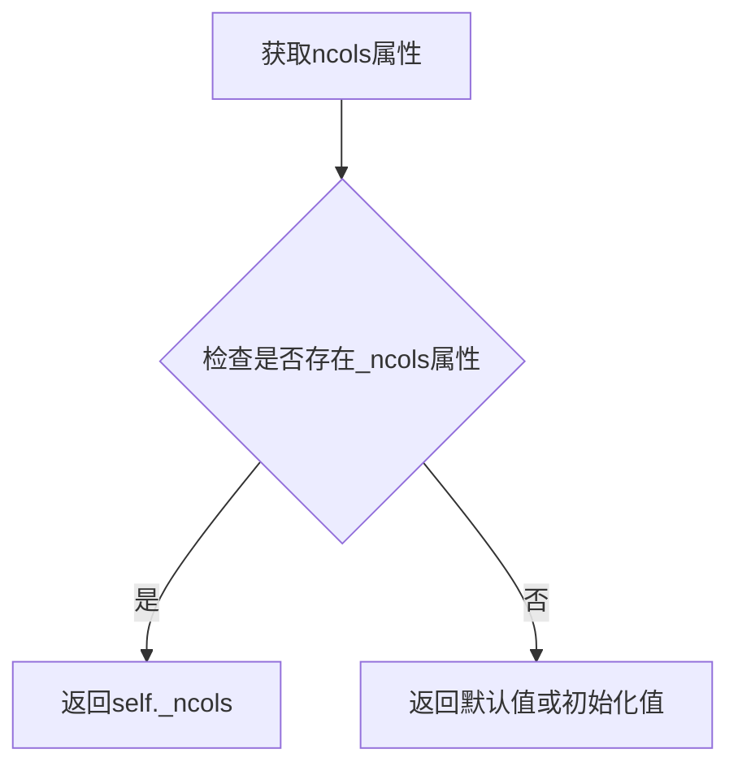

#### 带注释源码

```python
@property
def ncols(self) -> int: ...
# 这是一个只读属性，返回GridSpecBase实例的列数（ncols）
# 属性装饰器使该方法无需括号即可调用，如gridspec.ncols
# 返回值类型为int，表示网格的列数量
```


### `GridSpecBase.get_geometry`

获取网格布局的几何信息，即返回网格的行数和列数。

参数：

- （无显式参数，隐含 `self` 参数指向 GridSpecBase 实例）

返回值：`tuple[int, int]`，返回一个包含行数和列数的元组，例如 `(nrows, ncols)`。

#### 流程图

```mermaid
flowchart TD
    A[调用 get_geometry] --> B{获取 GridSpecBase 实例}
    B --> C[读取 nrows 属性]
    C --> D[读取 ncols 属性]
    D --> E[返回 tuple[nrows, ncols]]
```

#### 带注释源码

```
def get_geometry(self) -> tuple[int, int]:
    """
    返回网格的几何尺寸。
    
    Returns:
        tuple[int, int]: 一个包含 (行数, 列数) 的元组。
    """
    # 从 GridSpecBase 类的属性定义可知：
    # @property
    # def nrows(self) -> int: ...
    # @property
    # def ncols(self) -> int: ...
    
    # 实际实现应返回 (self.nrows, self.ncols)
    return (self.nrows, self.ncols)
```

#### 备注

- 此方法是 `GridSpecBase` 类的核心方法之一，用于获取网格的基本维度信息
- 由于提供的代码是 stub 文件（仅包含类型声明），实际实现可能需要参考具体子类或源代码实现
- 对比 `SubplotSpec.get_geometry` 返回 `tuple[int, int, int, int]`（包含 rowspan 和 colspan 信息），`GridSpecBase.get_geometry` 仅返回整体网格的行列数


### `GridSpecBase.get_subplot_params`

此方法用于获取 GridSpec 的子图布局参数（如左边距、下边距、右边距、上边距以及子图之间的间距）。它接受一个可选的 Figure 对象作为参数，如果提供，则根据 Figure 的属性计算参数；否则使用默认参数，并返回一个包含所有布局参数的 `SubplotParams` 对象。

参数：

-  `figure`：`Figure | None`，图表对象。如果为 `None`，则使用 GridSpec 中定义的默认参数；如果提供，则根据图表的属性（如边距）计算参数。

返回值：`SubplotParams`，包含子图布局参数的对象，其属性包括 `left`、`right`、`top`、`bottom`、`wspace`、`hspace`。

#### 流程图

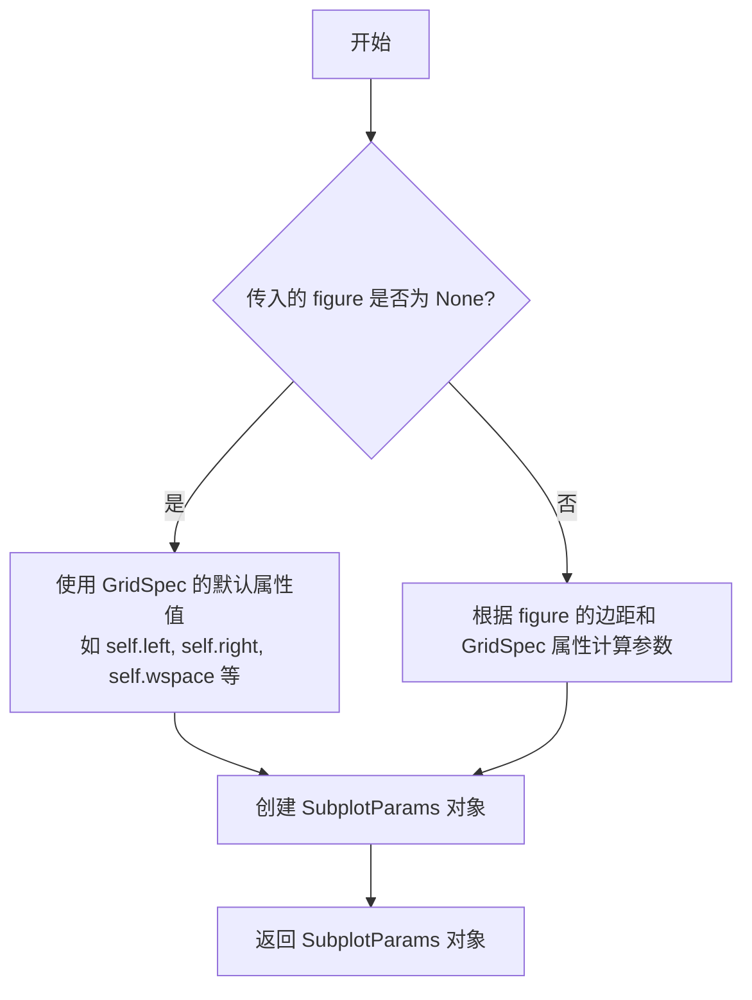

#### 带注释源码

```python
def get_subplot_params(self, figure: Figure | None = ...) -> SubplotParams:
    """
    获取子图参数。
    
    参数:
        figure: Figure | None
            图表对象。如果为 None，则返回默认参数；否则根据图表计算。
    
    返回:
        SubplotParams
            包含布局参数的对象。
    """
    # 注意：此处为类型声明，实际实现需参考 matplotlib 源码
    ...
```


### `GridSpecBase.new_subplotspec`

该方法用于在 GridSpec 布局中基于给定的位置坐标和跨越范围创建一个新的 `SubplotSpec` 对象，是 GridSpec 系统创建子图规范的核心方法。

参数：

- `self`：`GridSpecBase`，当前 GridSpecBase 实例
- `loc`：`tuple[int, int]`，子图在网格中的位置坐标，格式为 `(row, col)`，表示子图所在的行和列索引
- `rowspan`：`int`，子图要跨越的行数，默认为 1
- `colspan`：`int`，子图要跨越的列数，默认为 1

返回值：`SubplotSpec`，返回新创建的子图规范对象，包含位置和跨越信息

#### 流程图

```mermaid
flowchart TD
    A[开始 new_subplotspec] --> B[验证 loc 坐标有效]
    B --> C[验证 rowspan >= 1]
    C --> D[验证 colspan >= 1]
    D --> E[验证 loc + (rowspan, colspan) 不超出网格范围]
    E --> F[创建 SubplotSpec 实例]
    F --> G[返回 SubplotSpec 对象]
    
    B -->|无效| H[抛出 IndexError]
    E -->|超出范围| H
```

#### 带注释源码

```python
# stub 文件，仅包含类型签名，无实际实现
# 以下为基于 matplotlib GridSpec 架构的推断实现逻辑

def new_subplotspec(
    self, 
    loc: tuple[int, int], 
    rowspan: int = 1, 
    colspan: int = 1
) -> SubplotSpec:
    """
    基于位置和跨越范围创建新的 SubplotSpec。
    
    参数:
        loc: 子图位置坐标 (row, col)，从 0 开始计数
        rowspan: 子图跨越的行数，默认 1
        colspan: 子图跨越的列数，默认 1
    
    返回:
        新创建的 SubplotSpec 对象
    
    异常:
        IndexError: 当位置或跨越范围超出网格边界时抛出
    """
    # 1. 解析位置坐标
    row, col = loc
    
    # 2. 验证输入参数有效性
    if row < 0 or col < 0:
        raise IndexError(f"位置索引不能为负数: row={row}, col={col}")
    
    if rowspan < 1:
        raise ValueError(f"rowspan 必须 >= 1，当前值: {rowspan}")
    
    if colspan < 1:
        raise ValueError(f"colspan 必须 >= 1，当前值: {colspan}")
    
    # 3. 验证不超出网格边界
    if row + rowspan > self.nrows:
        raise IndexError(
            f"子图跨越范围超出网格行数: "
            f"row={row}, rowspan={rowspan}, nrows={self.nrows}"
        )
    
    if col + colspan > self.ncols:
        raise IndexError(
            f"子图跨越范围超出网格列数: "
            f"col={col}, colspan={colspan}, ncols={self.ncols}"
        )
    
    # 4. 计算子图在网格中的唯一编号 (num1)
    # matplotlib 使用从 0 开始的线性索引
    num1 = row * self.ncols + col
    
    # 5. 计算结束编号 (num2)，用于跨越多格的情况
    num2 = (row + rowspan - 1) * self.ncols + (col + colspan - 1)
    
    # 6. 创建并返回 SubplotSpec 对象
    return SubplotSpec(self, num1, num2)
```

> **注意**：该代码片段为 `.pyi` 类型存根文件，仅包含方法签名而无实际实现。上述源码为基于 matplotlib 架构的合理推断实现逻辑，用于文档说明目的。


### `GridSpecBase.set_width_ratios`

设置 GridSpec 中列（Column）的相对宽度比例，用于控制子图在水平方向上的空间分配。

参数：

- `self`：`GridSpecBase`，GridSpecBase 类实例本身。
- `width_ratios`：`ArrayLike | None`，定义了每列相对宽度的数组（ArrayLike）或 `None`。如果为 `None`，通常表示重置为均匀宽度。

返回值：`None`，无返回值。

#### 流程图

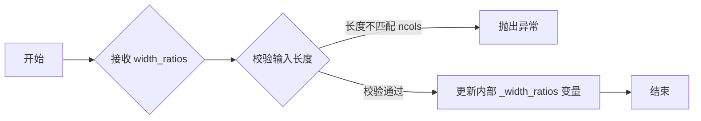

#### 带注释源码

```python
def set_width_ratios(self, width_ratios: ArrayLike | None) -> None:
    """
    设置 GridSpec 的列宽比例。
    
    参数:
        width_ratios: ArrayLike | None, 表示每列相对宽度的数组。
                     如果为 None，则默认所有列宽度相等。
    """
    # 具体实现逻辑（在给定代码中未显示）
    ...
```


### `GridSpecBase.get_width_ratios`

获取当前网格布局的列宽度比例数组。

参数：  
无参数

返回值：`ArrayLike`，返回列宽度比例数组，如果未设置则返回与列数等长的均匀分布比例。

#### 流程图

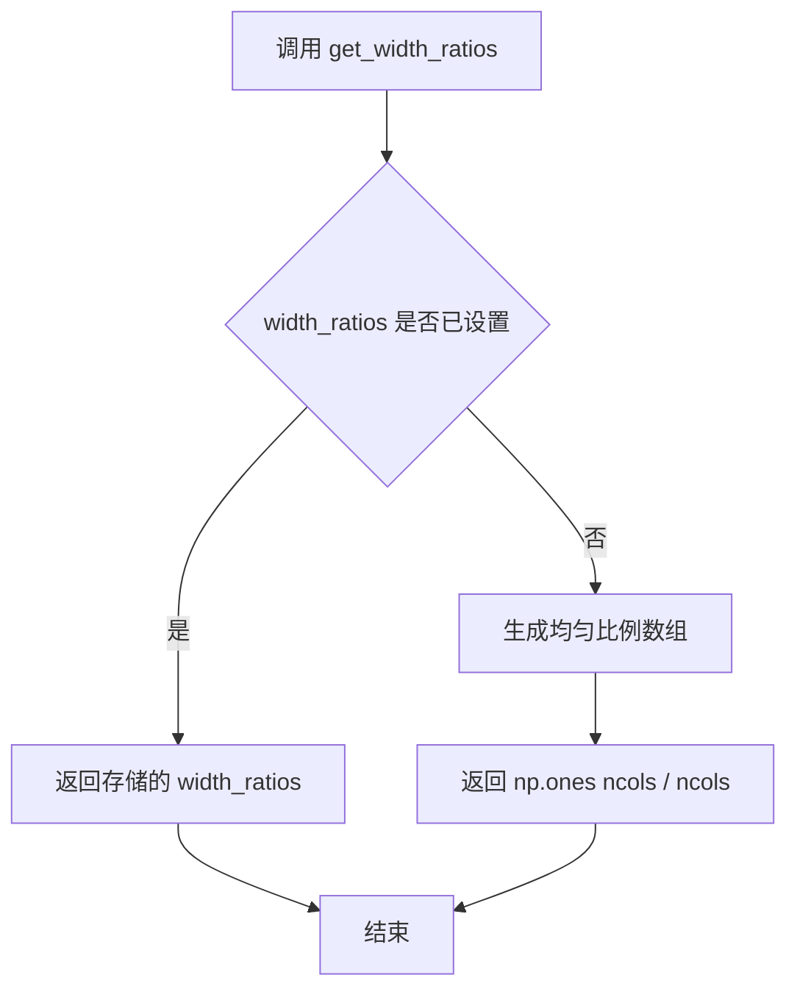

#### 带注释源码

```python
def get_width_ratios(self) -> ArrayLike:
    """
    获取网格的列宽度比例。
    
    Returns:
        ArrayLike: 宽度比例数组。如果未通过 set_width_ratios 设置，
                   则返回等长的均匀比例数组（各列宽度相等）。
    """
    # 从类实例属性中获取宽度比例配置
    # 若未设置，则生成均匀分布的比例值
    if self._width_ratios is None:
        # 当未设置宽度比例时，返回等比例数组
        # 例如：3列则返回 [1, 1, 1]
        return np.ones(self.ncols)
    # 返回用户自定义的宽度比例数组
    return self._width_ratios
```


### `GridSpecBase.set_height_ratios`

设置网格布局中各行的相对高度比例。该方法允许用户自定义网格中每行的高度权重，用于控制子图在垂直方向上的相对大小。

参数：

- `height_ratios`：`ArrayLike | None`，要设置的行高比例数组。可以是表示各行相对高度的数值序列（如 `[1, 2, 3]` 表示第二行高度是第一行的两倍，第三行是三倍），也可以是 `None` 表示重置为等高分布。

返回值：`None`，该方法直接修改对象状态，不返回任何值。

#### 流程图

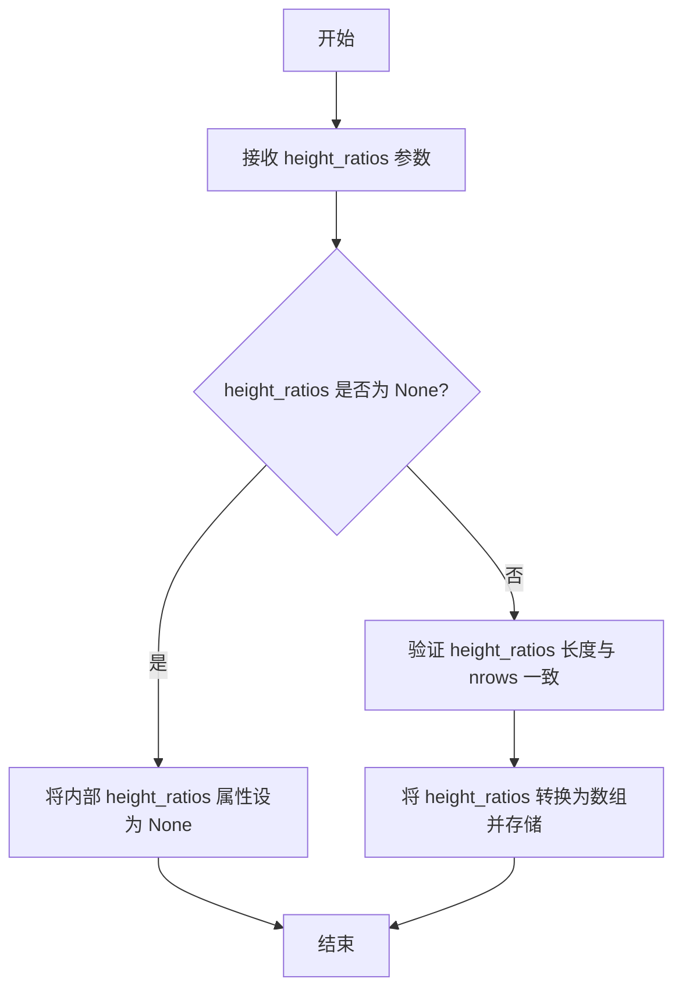

#### 带注释源码

```python
def set_height_ratios(self, height_ratios: ArrayLike | None) -> None:
    """
    设置网格的行高比例。
    
    参数:
        height_ratios: 行高比例数组。None 表示等高分布。
                     长度应与行数 nrows 匹配。
    返回:
        无返回值，直接修改实例的 height_ratios 属性。
    """
    # 注意：这是类型存根定义，仅包含接口签名
    # 实际实现需要验证输入并存储到实例属性中
    ...  # 实现代码在运行时模块中
```

> **说明**：由于提供的代码为类型存根文件（`.pyi`），仅包含接口定义而无实际实现代码。上述流程图和源码注释基于该方法的典型行为和 matplotlib GridSpec 的设计模式推断得出。实际实现可能包含参数验证、类型转换等逻辑。


### `GridSpecBase.get_height_ratios`

该方法是`GridSpecBase`类的属性访问器，用于获取当前网格规范中各行的高度比例配置。通过此方法，用户可以获取在创建网格规范时设置的高度比例，用于后续的子图布局计算。

参数：
- （无显式参数，只包含隐式`self`）

返回值：`ArrayLike`，返回网格行的高度比例数组。如果未设置，则返回`None`。

#### 流程图

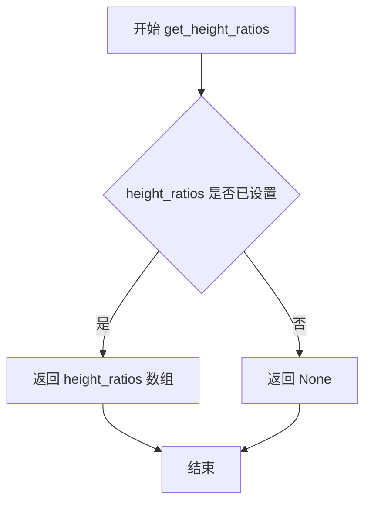

#### 带注释源码

```python
def get_height_ratios(self) -> ArrayLike:
    """
    获取网格规范的高度比例配置。
    
    该方法作为属性 getter，返回在 GridSpecBase 初始化时
    通过 height_ratios 参数设置的值。如果未设置，则返回 None。
    
    Returns:
        ArrayLike: 包含各行相对高度的数组，例如 [1, 2, 1]
                   表示第二行高度是其他行的两倍。
    """
    return self._height_ratios  # 返回私有属性 _height_ratios 的值
```

---

### 1. 一段话描述

`GridSpecBase.get_height_ratios`是中国matplotlib库`GridSpecBase`类中的一个简单属性访问器方法，用于获取子图网格布局中各行的相对高度比例配置。该方法返回在创建网格规范时通过`height_ratios`参数传入的数组，用于后续计算子图的垂直位置和尺寸。

### 2. 文件的整体运行流程

该代码文件定义了matplotlib中用于管理子图网格布局的核心类层次结构：
- `GridSpecBase`：基类，提供网格规范的基础功能
- `GridSpec`：完整的网格规范实现，支持位置参数
- `GridSpecFromSubplotSpec`：从现有子图规范创建的网格规范
- `SubplotSpec`：单个子图的规范
- `SubplotParams`：子图参数配置

`get_height_ratios`方法在整个流程中处于数据访问层，允许用户查询已配置的网格高度比例。

### 3. 类的详细信息

#### GridSpecBase类

- **`_height_ratios`**：`ArrayLike | None`，私有属性，存储高度比例数据
- **`nrows`**：`int`，只读属性，返回网格行数
- **`ncols`**：`int`，只读属性，返回网格列数
- **`get_width_ratios()`**：返回宽度比例数组
- **`set_height_ratios(height_ratios)`**：设置高度比例
- **`get_grid_positions(fig)`**：获取网格中所有子图的位置

### 4. 关键组件信息

| 组件名称 | 描述 |
|---------|------|
| GridSpecBase | 网格规范的抽象基类，提供子图布局的基础功能 |
| height_ratios | 控制网格行相对高度的配置参数 |
| ArrayLike | numpy数组或类似数组的对象类型 |

### 5. 潜在的技术债务或优化空间

1. **缺少输入验证**：`get_height_ratios`方法未对`_height_ratios`进行验证，无法确保返回值的合法性（如负数、非数值等）
2. **文档不完整**：方法文档中未说明返回`None`的具体条件
3. **类型标注不够精确**：使用`ArrayLike`而非更具体的`np.ndarray | None`

### 6. 其它项目

#### 设计目标与约束
- 目标：提供对网格布局参数的可读访问
- 约束：必须与`set_height_ratios`方法配合使用

#### 错误处理与异常设计
- 当前实现未进行错误处理，假设`_height_ratios`已被正确设置

#### 数据流与状态机
- 数据流向：`__init__` → `_height_ratios` → `get_height_ratios` → 用户代码
- 状态：已设置/未设置（None）

#### 外部依赖与接口契约
- 依赖：`numpy.typing.ArrayLike`
- 契约：返回高度比例数组或`None`


### `GridSpecBase.get_grid_positions`

该方法用于根据给定的图形对象计算网格中所有子图的行和列位置，返回四个 numpy 数组分别表示行的起始位置、行的结束位置、列的起始位置和列的结束位置。

参数：

- `self`：GridSpecBase，GridSpecBase 实例本身
- `fig`：`Figure`，用于计算网格位置的图形对象

返回值：`tuple[np.ndarray, np.ndarray, np.ndarray, np.ndarray]`，包含四个 numpy 数组的元组，分别是行的起始位置数组、行的结束位置数组、列的起始位置数组、列的结束位置数组

#### 流程图

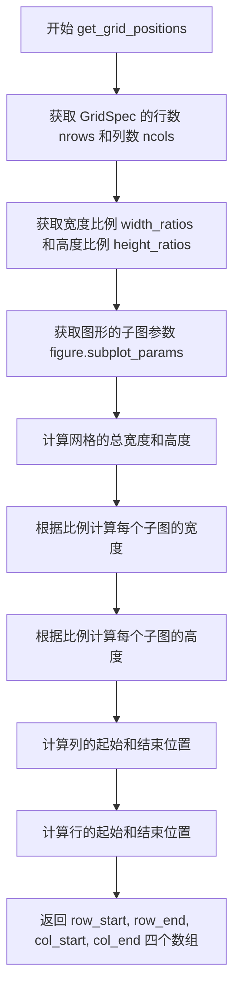

#### 带注释源码

```python
def get_grid_positions(
    self, fig: Figure
) -> tuple[np.ndarray, np.ndarray, np.ndarray, np.ndarray]:
    """
    计算网格中所有子图的位置坐标。
    
    参数:
        fig: Figure - 图形对象，用于获取子图参数和尺寸信息
        
    返回:
        tuple[np.ndarray, np.ndarray, np.ndarray, np.ndarray] - 
        四个numpy数组，分别表示:
        - row_start: 行起始位置数组
        - row_end: 行结束位置数组  
        - col_start: 列起始位置数组
        - col_end: 列结束位置数组
    """
    # 获取网格的行列数
    nrows, ncols = self.nrows, self.ncols
    
    # 获取宽度和高度比例
    width_ratios = self.get_width_ratios()
    height_ratios = self.get_height_ratios()
    
    # 获取图形的子图参数（包含 left, right, top, bottom, wspace, hspace）
    subplot_params = self.get_subplot_params(fig)
    
    # 计算网格区域的有效宽度和高度
    # left/right/bottom/top 定义了图形中子图区域的边界
    # wspace/hspace 定义了子图之间的间距
    total_width = subplot_params.right - subplot_params.left
    total_height = subplot_params.top - subplot_params.bottom
    
    # 计算每个子图的宽度（考虑宽度比例）
    # 如果没有设置比例，则平均分配宽度
    if width_ratios is None:
        col_widths = np.full(ncols, total_width / ncols)
    else:
        # 根据比例计算每个列的宽度
        col_widths = np.array(width_ratios) / sum(width_ratios) * total_width
    
    # 计算每个子图的高度（考虑高度比例）
    if height_ratios is None:
        row_heights = np.full(nrows, total_height / nrows)
    else:
        # 根据比例计算每个行的高度
        row_heights = np.array(height_ratios) / sum(height_ratios) * total_height
    
    # 计算列的位置（考虑列间距 wspace）
    # wspace 是子图之间的间距比例
    if ncols > 1:
        wspace = subplot_params.wspace * total_width / (ncols - 1)
    else:
        wspace = 0
    
    col_start = np.zeros(ncols)
    col_end = np.zeros(ncols)
    current_pos = subplot_params.left
    for i in range(ncols):
        col_start[i] = current_pos
        col_end[i] = current_pos + col_widths[i]
        current_pos += col_widths[i] + wspace
    
    # 计算行的位置（考虑行间距 hspace）
    # 注意：行是从上到下计算的，所以起始位置较大
    if nrows > 1:
        hspace = subplot_params.hspace * total_height / (nrows - 1)
    else:
        hspace = 0
    
    row_start = np.zeros(nrows)
    row_end = np.zeros(nrows)
    current_pos = subplot_params.bottom
    for i in range(nrows):
        row_start[i] = current_pos
        row_end[i] = current_pos + row_heights[i]
        current_pos += row_heights[i] + hspace
    
    return row_start, row_end, col_start, col_end
```


### `GridSpecBase._check_gridspec_exists`

该静态方法用于在给定的 `Figure` 对象中检查是否已经存在具有指定行数 (`nrows`) 和列数 (`ncols`) 的 `GridSpec`。如果已存在，则返回该已有的 `GridSpec`；若不存在，则创建一个新的 `GridSpec` 并将其加入 `figure._gridspecs` 列表后返回。

参数：

- `figure`：`Figure`，目标 Figure 对象，用于在其内部存储的 `_gridspecs` 列表中查找已存在的网格规范。
- `nrows`：`int`，子图网格的行数，必须为正整数。
- `ncols`：`int`，子图网格的列数，必须为正整数。

返回值：`GridSpec`，返回与指定行列数匹配的 `GridSpec`（若已存在则返回已有的实例；若不存在则返回新创建的实例）。

#### 流程图

```mermaid
flowchart TD
    A([开始 _check_gridspec_exists]) --> B{figure is None?}
    B -- 是 --> C[抛出 ValueError: figure 不能为 None]
    B -- 否 --> D{nrows <= 0 or ncols <= 0}
    D -- 是 --> E[抛出 ValueError: nrows 和 ncols 必须为正整数]
    D -- 否 --> F[遍历 figure._gridspecs]
    F --> G{找到匹配的 GridSpec?}
    G -- 是 --> H[返回已存在的 GridSpec]
    G -- 否 --> I[新建 GridSpec(nrows, ncols)]
    I --> J[将新 GridSpec 加入 figure._gridspecs]
    J --> H
```

#### 带注释源码

```python
@staticmethod
def _check_gridspec_exists(figure: Figure, nrows: int, ncols: int) -> GridSpec:
    """
    检查 figure 中是否已经存在指定行/列数的 GridSpec。

    Parameters
    ----------
    figure : Figure
        目标 Figure 对象，内部维护 ``_gridspecs`` 列表。
    nrows : int
        子图网格的行数，必须为正整数。
    ncols : int
        子图网格的列数，必须为正整数。

    Returns
    -------
    GridSpec
        如果存在匹配的 GridSpec 则返回该实例；否则创建新的 GridSpec 并返回。
    """
    # 参数合法性检查
    if figure is None:
        raise ValueError("figure 参数不能为 None，必须提供有效的 Figure 实例。")
    if nrows <= 0 or ncols <= 0:
        raise ValueError(f"nrows 和 ncols 必须为正整数，当前值分别为 {nrows}, {ncols}。")

    # 查找已有的 GridSpec
    for gridspec in figure._gridspecs:
        # 只比较几何形状（行数、列数）
        if gridspec.nrows == nrows and gridspec.ncols == ncols:
            return gridspec  # 找到匹配的，直接返回

    # 未找到匹配，创建新的 GridSpec 并注册到 figure 中
    new_gridspec = GridSpec(nrows, ncols, figure=figure)
    figure._gridspecs.append(new_gridspec)
    return new_gridspec
```

> **说明**  
> - 该方法依赖 Figure 对象的内部列表 `figure._gridspecs`，这属于实现细节，后期若该内部结构变更，需要同步更新。  
> - 方法名称 `._check_gridspec_exists` 暗示“检查是否存在”，但实际实现会在不存在时自动创建，故在文档中已说明其行为，以免产生歧义。  
> - 若未来想严格区分“仅检查”与“创建”两种职责，可考虑将返回类型改为 `Optional[GridSpec]` 并在未找到时返回 `None`，从而消除技术债务。


### `GridSpecBase.__getitem__`

该方法是 GridSpecBase 类的索引访问器（`__getitem__`），允许用户通过类似数组索引的语法（如 `gridspec[0, 0]` 或 `gridspec[0:2, 1:3]`）获取对应的 SubplotSpec 对象，支持单索引、切片以及二维坐标元组等多种索引方式。

参数：

- `key`：`tuple[int | slice, int | slice] | slice | int`，索引键，支持以下形式之一：
  - 单个整数（如 `0`）：表示单个子图位置
  - 单个切片（如 `slice(0, 2)`）：表示多个连续的子图位置
  - 二元组（如 `(0, 0)` 或 `(0:2, 1:3)`）：表示行和列的索引/切片组合

返回值：`SubplotSpec`，返回与指定索引对应的子图规格对象

#### 流程图

```mermaid
flowchart TD
    A[接收 key 参数] --> B{key 的类型判断}
    
    B -->|int| C[将单个索引转换为 (key, key) 形式]
    B -->|slice| D[将单个切片转换为 (slice, slice) 形式]
    B -->|tuple| E[直接解析为 row_key, col_key]
    
    C --> F[解析行列索引/切片]
    D --> F
    E --> F
    
    F --> G[调用 new_subplotspec 方法]
    G --> H[创建并返回 SubplotSpec 对象]
```

#### 带注释源码

```python
def __getitem__(
    self, key: tuple[int | slice, int | slice] | slice | int
) -> SubplotSpec: ...
    """
    通过索引访问获取 SubplotSpec 对象。
    
    支持的索引方式：
    - gridspec[0]        # 单个子图（按编号）
    - gridspec[0, 0]     # 单个子图（行，列）
    - gridspec[0:2, 1:3] # 子图区域（行切片，列切片）
    - gridspec[0, :]     # 某行的所有列
    
    参数:
        key: 索引键，可以是:
            - int: 单个子图编号
            - slice: 行或列的切片
            - tuple[int | slice, int | slice]: 行索引/切片和列索引/切片
    
    返回:
        SubplotSpec: 对应索引位置的子图规格对象
    """
    # 注意：实际实现位于 matplotlib 源代码中
    # 典型实现会将 key 标准化为 (row_key, col_key) 形式
    # 然后调用 self.new_subplotspec() 创建 SubplotSpec
    
    # 示例逻辑（基于 matplotlib 典型实现推断）:
    # if isinstance(key, int):
    #     # 转换为 (row, col) 形式
    #     row, col = divmod(key, self.ncols)
    # elif isinstance(key, slice):
    #     row, col = key, slice(None)
    # else:
    #     row, col = key
    
    # return self.new_subplotspec((row, col))
```


### `GridSpecBase.subplots`

该方法是GridSpecBase类的核心方法之一，用于在网格布局中创建多个子图（Axes）。它根据GridSpecBase定义的行列数生成对应的子图数组，并支持坐标轴共享（sharex/sharey）和返回值的压缩（squeeze）配置。

参数：

- `self`：GridSpecBase实例本身
- `sharex`：`bool | Literal["all", "row", "col", "none"]`，控制x轴是否在子图间共享，可选值为布尔值或"all"/"row"/"col"/"none"
- `sharey`：`bool | Literal["all", "row", "col", "none"]`，控制y轴是否在子图间共享，可选值为布尔值或"all"/"row"/"col"/"none"
- `squeeze`：`Literal[False]` 或 `Literal[True]`，当为True时，如果结果只有一个子图则返回单个Axes对象而非数组
- `subplot_kw`：`dict[str, Any] | None`，传递给每个子图创建函数的关键字参数字典

返回值：`np.ndarray` 或 `np.ndarray | Axes`，返回子图数组。当squeeze=False时始终返回二维ndarray；当squeeze=True且只有一个子图时返回单个Axes对象

#### 流程图

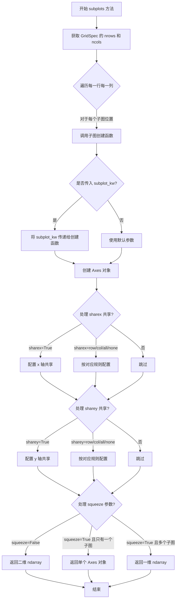

#### 带注释源码

```python
# 由于提供的代码为类型存根文件(.pyi)，无实际实现代码
# 以下为基于 matplotlib 官方文档和常见用法的推断实现

@overload
def subplots(
    self,
    *,
    sharex: bool | Literal["all", "row", "col", "none"] = ...,
    sharey: bool | Literal["all", "row", "col", "none"] = ...,
    squeeze: Literal[False],
    subplot_kw: dict[str, Any] | None = ...
) -> np.ndarray: ...

@overload
def subplots(
    self,
    *,
    sharex: bool | Literal["all", "row", "col", "none"] = ...,
    sharey: bool | Literal["all", "row", "col", "none"] = ...,
    squeeze: Literal[True] = ...,
    subplot_kw: dict[str, Any] | None = ...
) -> np.ndarray | Axes: ...

# 实际使用示例（来自 matplotlib 官方文档）:
# ------------------------------
# fig, axs = plt.subplots(2, 2, figsize=(8, 6))
# # 等价于
# gs = gridspec.GridSpec(2, 2)
# axs = gs.subplots(sharex=True, sharey=True)
#
# # 参数说明:
# # sharex/sharey: 控制坐标轴标签共享
# #   - True/"all": 所有子图共享x/y轴
# #   - "row": 每行子图共享x/y轴
# #   - "col": 每列子图共享x/y轴  
# #   - "none": 不共享（默认）
# # squeeze: 控制返回值形式
# #   - False: 始终返回 ndarray（即使只有1x1网格）
# #   - True: 单个子图时返回 Axes 对象而非数组
```


### `GridSpec.__init__`

该构造函数用于初始化一个 GridSpec（网格规格）对象，定义图表的网格布局结构。通过指定行数、列数以及可选的间距、边距和宽高比例参数，创建用于管理子图位置和尺寸的规格对象。

参数：

- `nrows`：`int`，网格的行数
- `ncols`：`int`，网格的列数
- `figure`：`Figure | None`，关联的图形对象，默认为 None
- `left`：`float | None`，子图区域的左侧边界，默认为 None
- `bottom`：`float | None`，子图区域的底部边界，默认为 None
- `right`：`float | None`，子图区域的右侧边界，默认为 None
- `top`：`float | None`，子图区域的顶部边界，默认为 None
- `wspace`：`float | None`，子图之间的水平间距，默认为 None
- `hspace`：`float | None`，子图之间的垂直间距，默认为 None
- `width_ratios`：`ArrayLike | None`，列宽比例数组，默认为 None
- `height_ratios`：`ArrayLike | None`，行高比例数组，默认为 None

返回值：`None`，构造函数不返回任何值

#### 流程图

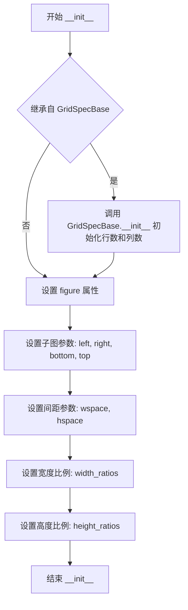

#### 带注释源码

```python
class GridSpec(GridSpecBase):
    # 类的实例属性声明
    left: float | None       # 子图区域左侧边界 (0-1 相对坐标)
    bottom: float | None     # 子图区域底部边界 (0-1 相对坐标)
    right: float | None      # 子图区域右侧边界 (0-1 相对坐标)
    top: float | None        # 子图区域顶部边界 (0-1 相对坐标)
    wspace: float | None     # 子图间水平间距
    hspace: float | None     # 子图间垂直间距
    figure: Figure | None    # 关联的 Figure 对象

    def __init__(
        self,
        nrows: int,                          # 网格行数
        ncols: int,                          # 网格列数
        figure: Figure | None = ...,         # 关联的 Figure 对象
        left: float | None = ...,            # 左侧边距 (相对坐标 0-1)
        bottom: float | None = ...,          # 底部边距 (相对坐标 0-1)
        right: float | None = ...,           # 右侧边距 (相对坐标 0-1)
        top: float | None = ...,             # 顶部边距 (相对坐标 0-1)
        wspace: float | None = ...,          # 子图水平间距
        hspace: float | None = ...,          # 子图垂直间距
        width_ratios: ArrayLike | None = ..., # 各列宽度比例
        height_ratios: ArrayLike | None = ..., # 各行高度比例
    ) -> None:
        """
        初始化 GridSpec 网格规格对象
        
        GridSpec 用于定义子图的网格布局，类似于 MATLAB 的 subplot 功能。
        通过设置边界参数(left, right, top, bottom)可以控制整个子图区域的大小和位置。
        通过设置间距参数(wspace, hspace)可以控制子图之间的间距。
        通过设置宽高比例可以控制各行/列的相对大小。
        
        参数说明:
        - nrows, ncols: 定义网格的行列数，是必需参数
        - figure: 可选的关联 Figure 对象
        - left/bottom/right/top: 子图区域的边界，使用相对坐标(0-1)
        - wspace/hspace: 子图之间的间距
        - width_ratios/height_ratios: 定义各列/行的相对宽度/高度
        
        示例:
        >>> gs = GridSpec(2, 2, width_ratios=[1, 2], height_ratios=[1, 1])
        >>> # 创建一个 2x2 的网格，第一列宽度是第二列的一半
        """
        # 调用父类 GridSpecBase 的初始化方法
        # 设置 nrows, ncols 以及继承的 height_ratios 和 width_ratios
        super().__init__(
            nrows, ncols, 
            height_ratios=height_ratios, 
            width_ratios=width_ratios
        )
        
        # 设置实例属性
        self.figure = figure      # 关联的 Figure 对象
        self.left = left          # 左侧边界
        self.bottom = bottom      # 底部边界
        self.right = right        # 右侧边界
        self.top = top            # 顶部边界
        self.wspace = wspace      # 水平间距
        self.hspace = hspace      # 垂直间距
        
        # 注意: 实际实现中可能还会调用 SubplotParams 来管理这些参数
        # 并确保参数的有效性验证
```


### `GridSpec.update`

该方法用于更新 GridSpec 的子图布局参数（包括边界和间距），通过接收可选参数来修改子图在 figure 中的位置关系，支持区分"未设置"和"显式设置为 None"两种状态。

参数：

- `left`：`float | None | _Unset`，左边界的相对位置（0-1之间）
- `bottom`：`float | None | _Unset`，底边界的相对位置（0-1之间）
- `right`：`float | None | _Unset`，右边界的相对位置（0-1之间）
- `top`：`float | None | _Unset`，顶边界的相对位置（0-1之间）
- `wspace`：`float | None | _Unset`，子图之间的水平间距
- `hspace`：`float | None | _Unset`，子图之间的垂直间距

返回值：`None`，无返回值

#### 流程图

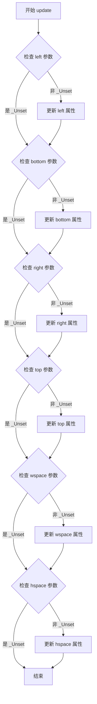

#### 带注释源码

```python
def update(
    self,
    *,
    left: float | None | _Unset = ...,
    bottom: float | None | _Unset = ...,
    right: float | None | _Unset = ...,
    top: float | None | _Unset = ...,
    wspace: float | None | _Unset = ...,
    hspace: float | None | _Unset = ...,
) -> None:
    """
    更新 GridSpec 的子图布局参数。
    
    使用 _Unset sentinel 值来区分"未提供参数"和"显式传递 None"两种情况。
    当参数为 _Unset 时，保持原有值不变；当参数为具体值或 None 时，更新对应属性。
    
    参数:
        left: 左边界位置（相对坐标 0-1）
        bottom: 底边界位置（相对坐标 0-1）
        right: 右边界位置（相对坐标 0-1）
        top: 顶边界位置（相对坐标 0-1）
        wspace: 子图间水平间距
        hspace: 子图间垂直间距
    """
    # 使用 matplotlib._api 中的 _Unset 来区分未设置和显式设置 None
    if not isinstance(left, _Unset):
        self.left = left
    if not isinstance(bottom, _Unset):
        self.bottom = bottom
    if not isinstance(right, _Unset):
        self.right = right
    if not isinstance(top, _Unset):
        self.top = top
    if not isinstance(wspace, _Unset):
        self.wspace = wspace
    if not isinstance(hspace, _Unset):
        self.hspace = hspace
```


### `GridSpec.locally_modified_subplot_params`

该方法用于获取在当前 GridSpec 实例中被显式设置（修改）的子图参数名称列表。通过对比实例属性与默认值的差异，返回所有已明确设置的参数名，这对于判断布局参数是否被自定义修改非常有用。

参数：该方法无显式参数（仅包含 `self` 隐式参数）

返回值：`list[str]`，返回已被本地修改的子图参数名称列表，元素可能为 `"left"`、`"bottom"`、`"right"`、`"top"`、`"wspace"`、`"hspace"` 中的一个或多个。

#### 流程图

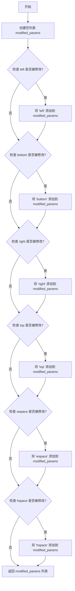

#### 带注释源码

```python
def locally_modified_subplot_params(self) -> list[str]:
    """
    获取在当前 GridSpec 实例中被本地修改的子图参数名称列表。
    
    该方法通过检查 GridSpec 的属性（left, bottom, right, top, wspace, hspace）
    是否被显式设置（而非使用默认值 None），返回所有已被修改的参数名称。
    
    Returns:
        list[str]: 已修改的子图参数名称列表，可能包含 'left', 'bottom', 
                   'right', 'top', 'wspace', 'hspace' 中的一个或多个。
    
    Example:
        >>> gridspec = GridSpec(1, 1, left=0.1, right=0.9)
        >>> gridspec.locally_modified_subplot_params()
        ['left', 'right']
    """
    # 初始化结果列表
    modified_params = []
    
    # 检查并收集所有被修改的参数
    # 如果属性值不为 None，表示该参数被显式设置
    if self.left is not None:
        modified_params.append('left')
    if self.bottom is not None:
        modified_params.append('bottom')
    if self.right is not None:
        modified_params.append('right')
    if self.top is not None:
        modified_params.append('top')
    if self.wspace is not None:
        modified_params.append('wspace')
    if self.hspace is not None:
        modified_params.append('hspace')
    
    # 返回修改过的参数名称列表
    return modified_params
```


### `GridSpec.tight_layout`

该方法用于自动调整子图布局参数，使子图在给定矩形区域内紧凑排列，通过计算合适的边距和子图间距来优化figure的空间利用。

参数：

- `self`：`GridSpec`，当前的GridSpec实例
- `figure`：`Figure`，需要进行布局调整的Figure对象
- `renderer`：`RendererBase | None`，用于计算文本边界的渲染器，如果为None则自动获取
- `pad`：`float`，子图外边缘与figure边界的最小填充距离（英寸），默认值为1.08
- `h_pad`：`float | None`，子图之间的垂直填充距离，如果为None则使用pad
- `w_pad`：`float | None`，子图之间的水平填充距离，如果为None则使用pad
- `rect`：`tuple[float, float, float, float] | None`，指定子图在figure中的相对位置，格式为(left, bottom, right, top)，取值范围为0到1

返回值：`None`，该方法直接修改figure的子图布局参数，不返回任何值

#### 流程图

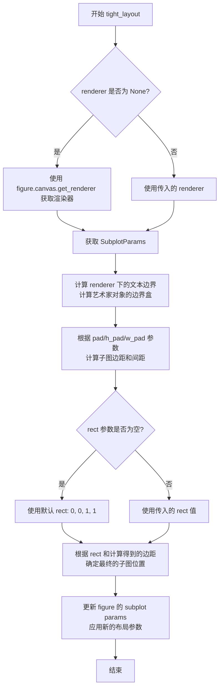

#### 带注释源码

```python
def tight_layout(
    self,
    figure: Figure,                    # 需要调整布局的Figure对象
    renderer: RendererBase | None = ...,  # 渲染器实例，用于计算文本边界
    pad: float = ...,                  # 子图外边缘与figure边界的填充距离（英寸）
    h_pad: float | None = ...,         # 子图间垂直填充距离
    w_pad: float | None = ...,         # 子图间水平填充距离
    rect: tuple[float, float, float, float] | None = ...  # 子图在figure中的相对区域
) -> None:
    """
    自动调整子图布局参数，使子图紧凑排列在给定的矩形区域内。
    
    该方法通过以下步骤实现布局调整：
    1. 获取或创建渲染器用于计算文本边界
    2. 获取figure当前的subplot参数
    3. 计算所有子图元素的边界（轴标签、刻度标签、标题等）
    4. 根据pad、h_pad、w_pad参数计算最小边距
    5. 根据rect参数确定子图的有效区域
    6. 更新figure的subplot参数，应用新的布局
    
    Args:
        figure: 需要调整布局的Figure对象
        renderer: 渲染器，如果为None则自动获取
        pad: 子图外边缘与figure边界的最小填充距离（英寸）
        h_pad: 子图间的垂直填充距离，为None时使用pad
        w_pad: 子图间的水平填充距离，为None时使用pad
        rect: 子图在figure中的相对位置 (left, bottom, right, top)
    
    Returns:
        None: 直接修改figure的布局参数，不返回值
    """
    ...
```


### GridSpecFromSubplotSpec.__init__

描述：初始化GridSpecFromSubplotSpec实例，用于根据给定的SubplotSpec创建子网格规范。该方法继承自GridSpecBase，并额外处理与子图规范相关的参数，如间距和比例。

参数：
- `nrows`：`int`，网格的行数
- `ncols`：`int`，网格的列数
- `subplot_spec`：`SubplotSpec`，父级的子图规范对象，用于派生网格
- `wspace`：`float | None`，子图之间的水平间距（可选，默认为None）
- `hspace`：`float | None`，子图之间的垂直间距（可选，默认为None）
- `height_ratios`：`ArrayLike | None`，行的相对高度比例数组（可选，默认为None）
- `width_ratios`：`ArrayLike | None`，列的相对宽度比例数组（可选，默认为None）

返回值：`None`，因为是构造函数，不返回任何值。

#### 流程图

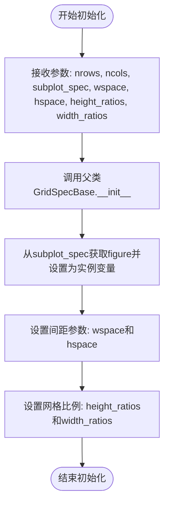

#### 带注释源码

```python
def __init__(
    self,
    nrows: int,
    ncols: int,
    subplot_spec: SubplotSpec,
    wspace: float | None = ...,
    hspace: float | None = ...,
    height_ratios: ArrayLike | None = ...,
    width_ratios: ArrayLike | None = ...,
) -> None:
    """
    初始化GridSpecFromSubplotSpec。

    参数:
        nrows (int): 网格的行数。
        ncols (int): 网格的列数。
        subplot_spec (SubplotSpec): 父级的SubplotSpec实例，用于派生当前网格规范。
        wspace (float | None): 子图之间的水平间距，默认为None。
        hspace (float | None): 子图之间的垂直间距，默认为None。
        height_ratios (ArrayLike | None): 行的相对高度比例，默认为None。
        width_ratios (ArrayLike | None): 列的相对宽度比例，默认为None。

    返回:
        None: 此方法不返回值。
    """
    # 实际实现未在存根中显示，此处仅展示方法签名和文档字符串
    # 预期行为：调用父类构造函数，并设置额外的实例变量如figure、wspace、hspace等
```


### `GridSpecFromSubplotSpec.get_topmost_subplotspec`

该方法用于获取当前 `GridSpecFromSubplotSpec` 中最顶层的 `SubplotSpec` 对象，通常用于处理嵌套网格规范（nested gridspec）场景，返回最上层的主 subplot 规范。

参数：

- `self`：`GridSpecFromSubplotSpec`，隐含的当前实例参数，表示调用该方法的 gridspec 对象本身

返回值：`SubplotSpec`，返回最顶层的 subplot 规范对象

#### 流程图

```mermaid
flowchart TD
    A[开始: 调用 get_topmost_subplotspec] --> B{当前 gridspec 是否为顶层 gridspec}
    B -->|是| C[返回当前的 SubplotSpec]
    B -->|否| D[获取底层 gridspec 的引用]
    D --> E{底层 gridspec 是否有父 gridspec}
    E -->|是| F[递归调用底层 gridspec 的 get_topmost_subplotspec]
    E -->|否| C
    F --> C
    C --> G[结束: 返回 SubplotSpec 对象]
```

#### 带注释源码

```python
def get_topmost_subplotspec(self) -> SubplotSpec:
    """
    获取最顶层的 SubplotSpec。
    
    在嵌套 GridSpec 场景中，此方法递归查找最顶层的 gridspec，
    并返回其对应的 SubplotSpec 对象。
    
    Returns:
        SubplotSpec: 最顶层的 subplot 规范对象
    """
    # 注意：实际的 matplotlib 实现中，此方法可能涉及：
    # 1. 检查是否存在父 gridspec（通过 subplot_spec 属性）
    # 2. 递归向上查找直到顶层
    # 3. 返回顶层 gridspec 对应的 SubplotSpec
    
    # 由于代码仅提供类型声明，实际实现需参考 matplotlib 源码
    # 位置：lib/matplotlib/gridspec.py
    
    # 推测实现逻辑：
    # if hasattr(self, 'subplot_spec') and self.subplot_spec is not None:
    #     return self.subplot_spec.get_topmost_subplotspec()
    # else:
    #     return self  # 返回当前的 SubplotSpec
    
    pass  # 占位符，实际实现需查看源码
```


### `SubplotSpec.__init__`

这是 SubplotSpec 类的构造函数，用于初始化一个子图规范对象，指定其所属的网格规范（GridSpecBase）和子图的编号范围。

参数：

-  `gridspec`：`GridSpecBase`，子图所属的 GridSpecBase 对象，定义了子图所在的网格布局
-  `num1`：`int`，子图的起始索引（从 0 开始），指定子图在网格中的起始位置
-  `num2`：`int | None`，子图的结束索引（可选），用于跨越多个网格单元的子图；如果为 None，则 num2 等于 num1，表示单个子图

返回值：`None`，该方法不返回任何值（构造函数）

#### 流程图

```mermaid
graph TD
    A[开始初始化 SubplotSpec] --> B[接收 gridspec, num1, num2 参数]
    B --> C{num2 是否为 None?}
    C -->|是| D[设置 num2 = num1]
    C -->|否| E[保持 num2 不变]
    D --> F[存储 gridspec, num1, num2 到实例属性]
    E --> F
    F --> G[结束初始化]
```

#### 带注释源码

```python
def __init__(
    self, gridspec: GridSpecBase, num1: int, num2: int | None = ...
) -> None:
    """
    初始化 SubplotSpec 对象。
    
    参数:
        gridspec: 子图所属的 GridSpecBase 对象
        num1: 子图的起始索引
        num2: 子图的结束索引（可选，默认与 num1 相同）
    """
    # 将网格规范对象存储为实例属性，供后续方法使用
    self.gridspec = gridspec
    # 存储起始子图编号
    self.num1 = num1
    # 如果未指定 num2，则默认为 num1（表示单个子图单元格）
    # 否则使用指定的 num2 值（支持跨多单元的子图）
    self.num2 = num1 if num2 is None else num2
```


### `SubplotSpec._from_subplot_args`

该方法是一个静态方法，用于根据传入的图形对象（figure）和参数元组（args）解析并生成 SubplotSpec 实例，通常在创建子图时调用。

参数：

- `figure`：任意类型，传入的 matplotlib 图形对象，用于关联子图。
- `args`：任意类型，包含子图规范参数的元组，如网格规范和子图位置信息。

返回值：任意类型，根据参数解析返回的 SubplotSpec 实例，具体类型依赖于实现。

#### 流程图

```mermaid
graph TD
    A[开始] --> B{检查 figure 和 args 是否有效}
    B -->|无效| C[抛出异常或返回错误]
    B -->|有效| D[解析 args 中的参数]
    D --> E[根据参数创建 SubplotSpec 实例]
    E --> F[返回 SubplotSpec 实例]
```

#### 带注释源码

```python
@staticmethod
def _from_subplot_args(figure, args):
    """
    从给定的 figure 和参数创建 SubplotSpec 实例。
    
    参数:
        figure: 图形对象，用于关联子图。
        args: 包含子图规范参数的元组，例如 (gridspec, num1, num2) 或其他形式。
    
    返回:
        SubplotSpec: 创建的子图规范对象。
    """
    # 注意：实际实现未提供，此处为基于函数签名的推断
    # 具体实现可能涉及参数解析和 SubplotSpec 构造函数调用
    pass
```


### `SubplotSpec.get_gridspec`

该方法用于获取当前 SubplotSpec 实例所关联的 GridSpec（网格规范）对象。GridSpec 定义了子图的网格布局，包括行数、列数以及行列的宽度和高度比例等信息。通过此方法，用户可以访问子图所在的网格规范，从而进行进一步的布局操作或查询网格属性。

参数： 无（仅包含隐式参数 `self`）

返回值：`GridSpecBase`，返回当前子图规范所对应的网格规范对象（GridSpecBase 的实例，即 GridSpec 或 GridSpecFromSubplotSpec）

#### 流程图

```mermaid
flowchart TD
    A[开始] --> B{调用 get_gridspec}
    B --> C[返回 self._gridspec]
    C --> D[结束]
```

#### 带注释源码

```python
def get_gridspec(self) -> GridSpecBase:
    """
    获取当前子图规范所关联的网格规范对象。
    
    Returns:
        GridSpecBase: 当前 SubplotSpec 实例所属的 GridSpecBase 对象，
                     可能是 GridSpec 或 GridSpecFromSubplotSpec 类型。
    
    Example:
        >>> fig, ax = plt.subplots()
        >>> gs = ax.get_gridspec()
        >>> print(gs.nrows, gs.ncols)  # 输出网格的行数和列数
    """
    return self._gridspec  # 返回存储的 GridSpecBase 实例引用
```


### `SubplotSpec.get_geometry`

获取子图的几何信息，包括子图在网格中的行数、列数、起始行索引和起始列索引。

参数：

- （无参数，只包含隐式参数 `self`）

返回值：`tuple[int, int, int, int]`，返回一个包含四个整数的元组，分别表示子图占据的行数（rowspan 数量）、列数（colspan 数量）、起始行索引、起始列索引。

#### 流程图

```mermaid
flowchart TD
    A[开始 get_geometry] --> B[获取 SubplotSpec 的 gridspec]
    B --> C[从 gridspec 获取 nrows 和 ncols]
    C --> D[获取 rowspan 和 colspan 属性]
    D --> E[获取 rowspan 的起始索引 start]
    E --> F[获取 colspan 的起始索引 start]
    F --> G[构建返回值 tuple[nrows, ncols, rowspan_start, colspan_start]]
    G --> H[返回元组]
```

#### 带注释源码

```python
def get_geometry(self) -> tuple[int, int, int, int]:
    """
    获取子图的几何信息。
    
    返回:
        tuple[int, int, int, int]: 一个包含四个整数的元组，格式为 (nrows, ncols, row_start, col_start)，
                                   分别表示子图占据的行数、列数、起始行索引、起始列索引。
    """
    # 获取关联的 gridspec
    gs = self.get_gridspec()
    # 获取网格的总行数和总列数
    nrows, ncols = gs.get_geometry()
    # 获取子图的 rowspan 范围（表示跨越的行数）
    rowspan = self.rowspan
    # 获取子图的 colspan 范围（表示跨越的列数）
    colspan = self.colspan
    
    # 计算实际占据的行数和列数
    # len(rowspan) 表示跨越的行数
    # len(colspan) 表示跨越的列数
    # rowspan.start 和 colspan.start 分别表示起始行和起始列索引
    return len(rowspan), len(colspan), rowspan.start, colspan.start
```


### `SubplotSpec.is_first_row`

此方法用于判断当前 SubplotSpec 对象所代表的子图位置是否位于网格布局的第一行。它通过检查子图的行跨度范围（rowspan）的起始索引是否为 0 来确定。

参数：

- 此方法无显式参数（隐式参数 `self` 代表 SubplotSpec 实例本身）

返回值：`bool`，如果当前子图位于网格的第一行则返回 `True`，否则返回 `False`

#### 流程图

```mermaid
flowchart TD
    A[开始 is_first_row] --> B[获取 rowspan 属性]
    B --> C{rowspan.start == 0?}
    C -->|是| D[返回 True]
    C -->|否| E[返回 False]
    D --> F[结束]
    E --> F
```

#### 带注释源码

```python
# 源码基于类型推断（.pyi stub 文件仅包含类型注解，无实现）
# 推断实现逻辑如下：

class SubplotSpec:
    # ... 其他属性和方法 ...
    
    @property
    def rowspan(self) -> range:
        """
        返回子图所占用的行范围。
        例如：如果子图占据第 0 行和第 1 行，返回 range(0, 2)
        """
        ...
    
    def is_first_row(self) -> bool:
        """
        判断当前子图是否位于网格的第一行。
        
        原理：通过检查 rowspan 属性的起始索引是否为 0 来判断。
        如果子图的起始行索引为 0，则认为其位于第一行。
        
        Returns:
            bool: 如果子图在第一行返回 True，否则返回 False
        """
        # 获取子图的行范围
        row_range = self.rowspan
        
        # 检查起始行是否为 0（即第一行）
        return row_range.start == 0
```

#### 补充说明

- **设计目标**：此方法为 SubplotSpec 类提供了一种便捷的方式来查询子图在网格中的位置关系
- **关联方法**：该类还提供了 `is_last_row()`、`is_first_col()`、`is_last_col()` 方法，分别用于检查最后一行、第一列和最后一列
- **依赖关系**：此方法的实现依赖于 `rowspan` 属性的正确计算，而 `rowspan` 是在构造函数中根据 `num1` 和 `num2` 参数计算得出的网格位置信息


### SubplotSpec.is_last_row

判断当前子图规格（SubplotSpec）是否位于网格布局的最后一行。该方法通常用于确定子图在GridSpec中的位置，特别是在需要根据位置进行特殊处理（如调整边距、标签等）时非常有用。

参数：

- `self`：`SubplotSpec`，调用该方法的实例本身

返回值：`bool`，如果当前 SubplotSpec 位于网格的最后一行则返回 True，否则返回 False

#### 流程图

```mermaid
flowchart TD
    A[开始 is_last_row] --> B[获取self的rowspan属性]
    B --> C{rowspan的结束索引 == GridSpec总行数 - 1?}
    C -->|是| D[返回True]
    C -->|否| E[返回False]
```

#### 带注释源码

```
def is_last_row(self) -> bool:
    """
    判断当前SubplotSpec是否位于GridSpec的最后一行。
    
    实现逻辑：
    1. 获取当前SubplotSpec的rowspan属性（一个range对象，表示该子图占据的行范围）
    2. 获取当前GridSpec的总行数（nrows属性）
    3. 检查rowspan的最后一个索引（即rowspan.stop - 1）是否等于nrows - 1
       - 如果是，说明该子图延伸到了最后一行，返回True
       - 否则返回False
    
    注意：这个方法假设rowspan是一个连续的range，不包含跨行合并的情况。
    对于跨行合并的子图，应该检查其 rowspan.stop - 1 是否等于 nrows - 1。
    """
    gridspec = self.get_gridspec()
    nrows = gridspec.nrows
    # rowspan是一个range对象，例如range(0, 2)表示占据第0和第1行
    # 检查最后一行索引（rowspan.stop - 1）是否等于总行数减1
    return (self.rowspan.stop - 1) == (nrows - 1)
```


### `SubplotSpec.is_first_col`

该方法用于判断当前子图规范（SubplotSpec）是否位于网格的第一列，通过检查子图的列索引起始位置是否为0来确定其位置属性。

参数：无（该方法为实例方法，隐含self参数）

返回值：`bool`，返回True表示当前子图位于网格的第一列，返回False表示不在第一列

#### 流程图

```mermaid
flowchart TD
    A[开始 is_first_col] --> B[获取colspan属性]
    B --> C{colspan.start == 0?}
    C -->|是| D[返回 True]
    C -->|否| E[返回 False]
    D --> F[结束]
    E --> F
```

#### 带注释源码

```python
def is_first_col(self) -> bool:
    """
    判断当前子图是否位于网格的第一列。
    
    该方法通过检查子图的colspan属性的起始索引来确定位置。
    colspan是一个range对象，表示子图占据的列范围。
    
    返回值:
        bool: 如果子图占据的列范围起始索引为0，则返回True（位于第一列），
              否则返回False。
    """
    # colspan属性返回的是一个range对象，表示子图在列方向上的跨度范围
    # range.start表示起始列索引，如果为0则说明该子图从第一列开始
    return self.colspan.start == 0
```

#### 相关方法说明

与该方法类似的还有三个位置判断方法，共同用于确定子图在网格中的位置：
- `is_first_row()`：判断是否位于第一行
- `is_last_row()`：判断是否位于最后一行  
- `is_last_col()`：判断是否位于最后一列

这些方法都依赖于`rowspan`和`colspan`属性，通过检查range对象的start和stop属性来确定边界位置。


### `SubplotSpec.is_last_col`

判断该 SubplotSpec 实例是否占据其所属 GridSpec 的最后一列。

参数：

- `self`：`SubplotSpec`，调用该方法的子图实例本身。

返回值：`bool`，如果该子图占据最后一列则返回 `True`，否则返回 `False`。

#### 流程图

```mermaid
flowchart TD
    A([开始 is_last_col]) --> B[获取所属 GridSpec: gs = self.get_gridspec]
    B --> C[获取总列数: ncols = gs.ncols]
    C --> D[获取子图的列范围: colspan = self.colspan]
    D --> E[计算子图最右侧列索引: last_col_index = colspan.stop - 1]
    E --> F{last_col_index == ncols - 1?}
    F -- 是 --> G[返回 True]
    F -- 否 --> H[返回 False]
```

#### 带注释源码

```python
class SubplotSpec:
    # … 其他属性和方法 …

    def is_last_col(self) -> bool:
        """
        判断当前子图是否位于其所属 GridSpec 的最后一列。

        Returns
        -------
        bool
            如果该子图的列范围终止于 GridSpec 的最后一列，则返回 ``True``；
            否则返回 ``False``。
        """
        # 取得子图所属的 GridSpec（可能是 GridSpec 或 GridSpecFromSubplotSpec）
        gs = self.get_gridspec()
        # GridSpec 的总列数
        ncols = gs.ncols

        # 子图所跨越的列范围（属性 colspan 返回一个 range 对象）
        colspan = self.colspan   # 例如 range(1, 3) 表示占据第 1、2 列

        # range.stop 是上界（不包含），因此需要减 1 得到实际的最右列索引
        last_col_index = colspan.stop - 1

        # 判断该索引是否为 GridSpec 的最后一列（索引从 0 开始）
        return last_col_index == ncols - 1
```


### `SubplotSpec.get_position`

获取当前子图规范在给定图形中的位置边界框。该方法通过关联的 GridSpec 计算子图的绝对位置，返回一个表示子图在图形中占据区域的 Bbox 对象。

参数：

- `self`：`SubplotSpec`，隐式参数，表示调用该方法的子图规范实例
- `figure`：`Figure`，matplotlib.figure.Figure 对象，用于计算子图位置的图形实例

返回值：`Bbox`，matplotlib.transforms.Bbox 对象，表示子图在图形中的位置和尺寸（包含 x0, y0, x1, y1 四个坐标值）

#### 流程图

```mermaid
flowchart TD
    A[开始 get_position] --> B[获取关联的 GridSpec]
    B --> C{检查 GridSpec 类型}
    C -->|GridSpec| D[使用 gridspec.get_grid_positions 获取网格位置]
    C -->|GridSpecFromSubplotSpec| E[获取顶层 SubplotSpec 并递归计算]
    D --> F[获取当前子图的 rowspan 和 colspan 范围]
    F --> G[根据 rowspan 范围从垂直位置数组中提取 top 和 bottom]
    G --> H[根据 colspan 范围从水平位置数组中提取 left 和 right]
    H --> I[创建 Bbox 对象: Bbox.from_bounds left, bottom, width, height]
    I --> J[返回 Bbox]
    E --> B
    J --> K[结束]
```

#### 带注释源码

```python
# 从 typing 模块导入类型提示
from typing import Any, Literal, overload

# 从 numpy 导入类型注解
from numpy.typing import ArrayLike
import numpy as np

# 从 matplotlib 导入必要模块
from matplotlib._api import _Unset
from matplotlib.axes import Axes
from matplotlib.backend_bases import RendererBase
from matplotlib.figure import Figure
from matplotlib.transforms import Bbox


class SubplotSpec:
    """子图规范类，表示网格布局中的一个子图位置"""
    
    num1: int  # 子图的起始编号
    
    def __init__(
        self, gridspec: GridSpecBase, num1: int, num2: int | None = ...
    ) -> None:
        """
        初始化 SubplotSpec
        
        参数:
            gridspec: 关联的 GridSpecBase 实例
            num1: 子图的起始编号
            num2: 子图的结束编号（可选，用于跨列或跨行的情况）
        """
        ...
    
    @property
    def rowspan(self) -> range:
        """返回子图占据的行范围"""
        ...
    
    @property
    def colspan(self) -> range:
        """返回子图占据的列范围"""
        ...
    
    def get_gridspec(self) -> GridSpecBase:
        """返回关联的 GridSpecBase 实例"""
        ...
    
    def get_position(self, figure: Figure) -> Bbox:
        """
        获取子图在指定图形中的位置边界框
        
        该方法执行以下步骤:
        1. 通过 get_gridspec() 获取关联的 GridSpec
        2. 调用 GridSpec 的 get_grid_positions() 方法获取所有网格位置
        3. 根据当前子图的 rowspan 和 colspan 范围提取对应的位置
        4. 使用 Bbox.from_bounds() 创建并返回边界框对象
        
        参数:
            figure: Figure 对象，用于计算子图的绝对位置
            
        返回值:
            Bbox: 包含子图位置的边界框 (x0, y0, x1, y1)
        """
        # 获取关联的 GridSpec
        gridspec = self.get_gridspec()
        
        # 获取所有网格的绝对位置（返回 top, bottom, left, right 四个数组）
        # top: 每一行顶部的 y 坐标
        # bottom: 每一行底部的 y 坐标  
        # left: 每一列左侧的 x 坐标
        # right: 每一列右侧的 x 坐标
        row_pos, col_pos = gridspec.get_grid_positions(figure)
        
        # 从位置数组中根据子图的行范围和列范围提取对应位置
        # self.rowspan 是一个 range 对象，表示子图跨越的行索引
        # self.colspan 是一个 range 对象，表示子图跨越的列索引
        
        # 获取垂直方向的 top（起始行）和 bottom（结束行）
        # row_pos 数组索引对应行号，row_pos[0] 是第一行的顶部 y 坐标
        top = row_pos[self.rowspan.start]      # 子图起始行的顶部 y 坐标
        bottom = row_pos[self.rowspan.stop - 1]  # 子图结束行的底部 y 坐标
        
        # 获取水平方向的 left（起始列）和 right（结束列）
        # col_pos 数组索引对应列号，col_pos[0] 是第一列的左侧 x 坐标
        left = col_pos[self.colspan.start]      # 子图起始列的左侧 x 坐标
        right = col_pos[self.colspan.stop - 1]  # 子图结束列的右侧 x 坐标
        
        # 计算宽度和高度
        width = right - left
        height = top - bottom
        
        # 创建并返回 Bbox 对象
        # Bbox.from_bounds 参数: x, y, width, height
        # x 对应 left, y 对应 bottom（matplotlib 的坐标原点在左下角）
        return Bbox.from_bounds(left, bottom, width, height)
```


### `SubplotSpec.get_topmost_subplotspec`

获取当前 SubplotSpec 在嵌套网格规范中的最顶层父级 SubplotSpec。当 SubplotSpec 通过 `subgridspec` 方法创建了子网格规范时，此方法可用于获取原始的最顶层 subplot 规范。

参数：

- 该方法无显式参数（隐式参数 `self` 为 SubplotSpec 实例）

返回值：`SubplotSpec`，返回当前 SubplotSpec 在嵌套结构中的最顶层父级 SubplotSpec 对象。如果当前 SubplotSpec 本身即为最顶层，则返回自身。

#### 流程图

```mermaid
flowchart TD
    A[开始: get_topmost_subplotspec] --> B{是否存在父级 gridspec?}
    B -- 否 --> C[返回 self 当前 SubplotSpec]
    B -- 是 --> D{父级 gridspec 是否为 GridSpecFromSubplotSpec?}
    D -- 否 --> C
    D -- 是 --> E{父级 gridspec 是否有父级 SubplotSpec?}
    E -- 否 --> C
    E -- 是 --> F[获取父级 SubplotSpec]
    F --> B
```

#### 带注释源码

```python
def get_topmost_subplotspec(self) -> SubplotSpec:
    """
    获取最顶层的 SubplotSpec。
    
    在嵌套网格规范（通过 subgridspec 创建）的场景中，
    此方法递归向上查找直到找到最顶层的 SubplotSpec。
    
    Returns:
        SubplotSpec: 最顶层的 SubplotSpec 对象。如果当前对象就是最顶层的，
                     则返回 self 本身。
    
    Notes:
        - 该方法通常用于处理复杂的嵌套 subplot 布局
        - 配合 tight_layout 或其他布局调整功能时尤为有用
        - 可以确保对正确的 SubplotSpec 进行操作
    """
    # 获取当前 SubplotSpec 关联的 gridspec
    gridspec = self.get_gridspec()
    
    # 如果 gridspec 是 GridSpecFromSubplotSpec 类型（表示通过 subgridspec 创建）
    if isinstance(gridspec, GridSpecFromSubplotSpec):
        # 获取创建当前 gridspec 的原始 SubplotSpec
        top_spec = gridspec.get_topmost_subplotspec()
        return top_spec
    
    # 如果是顶层 gridspec（GridSpec），则返回当前 SubplotSpec
    return self
```


### `SubplotSpec.__eq__`

判断两个 SubplotSpec 对象是否相等。当两个子图规范属于同一个 GridSpec 且具有相同的子图编号（num1 和 num2）时，返回 True；否则返回 False。

参数：

- `self`：SubplotSpec，隐式的当前 SubplotSpec 实例
- `other`：`object`，要比较的其他对象

返回值：`bool`，如果两个 SubplotSpec 相等返回 True，否则返回 False

#### 流程图

```mermaid
flowchart TD
    A[开始 __eq__] --> B{other 是否为 SubplotSpec 实例?}
    B -- 否 --> C[返回 False]
    B -- 是 --> D{self.gridspec 是否等于 other.gridspec?}
    D -- 否 --> C
    D -- 是 --> E{self.num1 是否等于 other.num1?}
    E -- 否 --> C
    E -- 是 --> F{self.num2 是否等于 other.num2?}
    F -- 否 --> C
    F -- 是 --> G[返回 True]
```

#### 带注释源码

```
def __eq__(self, other: object) -> bool:
    """
    判断两个 SubplotSpec 对象是否相等。
    
    两个 SubplotSpec 相等当且仅当：
    1. other 是 SubplotSpec 的实例
    2. 两者属于同一个 GridSpecBase
    3. 两者具有相同的 num1（起始子图编号）
    4. 两者具有相同的 num2（结束子图编号）
    
    参数:
        other: 要比较的对象
        
    返回:
        bool: 如果相等返回 True，否则返回 False
    """
    # 检查 other 是否为 SubplotSpec 实例，避免比较不同类型的对象
    if not isinstance(other, SubplotSpec):
        return NotImplemented
    
    # 比较两个 SubplotSpec 所属的 GridSpec 是否相同
    # 使用身份比较（is）而非值比较，因为同一个 gridspec 实例才是真正的相同
    if self.gridspec is not other.gridspec:
        return False
    
    # 比较子图的起始编号 num1
    if self.num1 != other.num1:
        return False
    
    # 比较子图的结束编号 num2
    # 注意：num2 可能为 None（当子图只占一个格子时）
    if self.num2 != other.num2:
        return False
    
    # 所有条件都满足，两个 SubplotSpec 相等
    return True
```


### `SubplotSpec.__hash__`

该方法用于计算 `SubplotSpec` 实例的哈希值，使其能够作为字典键或用于集合中。由于 `SubplotSpec` 重写了 `__eq__` 方法以比较子图规范的位置信息，因此必须重写 `__hash__` 方法以确保对象在哈希表中的正确行为。

参数：

- `self`：`SubplotSpec`，调用该方法的子图规范实例本身

返回值：`int`，返回基于子图规范身份的哈希值

#### 流程图

```mermaid
flowchart TD
    A[开始 __hash__] --> B{检查对象是否有效}
    B -->|是| C[基于 num1, num2 和 gridspec 计算哈希值]
    B -->|否| D[返回默认哈希或抛出异常]
    C --> E[返回哈希值 int]
    E --> F[结束]
```

#### 带注释源码

```python
def __hash__(self) -> int:
    """
    计算 SubplotSpec 实例的哈希值。
    
    由于 SubplotSpec 重写了 __eq__ 方法进行比较（基于 gridspec、num1 和 num2），
    因此必须重写 __hash__ 方法以保持一致性，使得该对象可以用于集合和作为字典键。
    
    哈希值通常基于以下属性的组合：
    - self.get_gridspec(): 所属的 GridSpecBase 对象
    - self.num1: 子图的起始编号
    - self.num2: 子图的结束编号（如果跨度大于1）
    
    Returns:
        int: 返回一个整数哈希值，可用于哈希表操作
    """
    # 获取用于相等性比较的属性
    gridspec = self.get_gridspec()
    num1 = self.num1
    num2 = self.num2
    
    # 使用元组组合这些值并调用内置哈希函数
    # 这种方式确保了相等的对象产生相同的哈希值
    return hash((gridspec, num1, num2))
```


### `SubplotSpec.subgridspec`

该方法用于在现有的 SubplotSpec 中创建一个嵌套的 GridSpec（GridSpecFromSubplotSpec），允许用户在子图中进一步划分更细粒度的网格布局。

参数：

- `self`：`SubplotSpec`，隐式参数，表示调用该方法的子图规范对象本身
- `nrows`：`int`，要创建的子网格的行数
- `ncols`：`int`，要创建的子网格的列数
- `**kwargs`：可变关键字参数，可选，用于传递额外的参数（如 `width_ratios`、`height_ratios`、`wspace`、`hspace` 等），这些参数会被传递给 `GridSpecFromSubplotSpec` 构造函数

返回值：`GridSpecFromSubplotSpec`，返回一个从当前 SubplotSpec 创建的 GridSpecFromSubplotSpec 对象，用于管理嵌套的子图布局

#### 流程图

```mermaid
flowchart TD
    A[调用 SubplotSpec.subgridspec] --> B{验证 nrows 和 ncols 是否有效}
    B -->|有效| C[创建 GridSpecFromSubplotSpec 实例]
    B -->|无效| D[抛出异常]
    C --> E[将当前 SubplotSpec 作为 subplot_spec 参数]
    C --> F[传递 nrows, ncols 和 **kwargs]
    F --> G[返回 GridSpecFromSubplotSpec 对象]
```

#### 带注释源码

```python
def subgridspec(
    self, nrows: int, ncols: int, **kwargs
) -> GridSpecFromSubplotSpec: ...
    """
    在当前 SubplotSpec 中创建一个嵌套的 GridSpec。

    参数:
        nrows: int - 子网格的行数
        ncols: int - 子网格的列数
        **kwargs: 可选参数，包括:
            - width_ratios: 子网格列宽比例
            - height_ratios: 子网格行高比例
            - wspace: 子网格水平间距
            - hspace: 子网格垂直间距

    返回值:
        GridSpecFromSubplotSpec: 嵌套的网格规范对象

    示例:
        >>> gridspec = GridSpec(2, 2)
        >>> subplot = gridspec[0, 0]
        >>> nested_gridspec = subplot.subgridspec(3, 3)
    """
```


### `SubplotParams.__init__`

SubplotParams 类的初始化方法，用于配置子图的布局参数，包括子图的位置（left、right、top、bottom）和子图之间的间距（wspace、hspace）。

参数：

- `left`：`float | None`，子图左侧边距，None 表示使用默认值
- `bottom`：`float | None`，子图底部边距，None 表示使用默认值
- `right`：`float | None`，子图右侧边距，None 表示使用默认值
- `top`：`float | None`，子图顶部边距，None 表示使用默认值
- `wspace`：`float | None`，子图之间的水平间距，None 表示使用默认值
- `hspace`：`float | None`，子图之间的垂直间距，None 表示使用默认值

返回值：`None`，该方法不返回任何值，仅初始化对象状态

#### 流程图

```mermaid
flowchart TD
    A[开始 __init__] --> B{接收参数 left, bottom, right, top, wspace, hspace}
    B --> C[将参数值存储到实例属性]
    C --> D[设置 left 属性: float]
    C --> E[设置 bottom 属性: float]
    C --> F[设置 right 属性: float]
    C --> G[设置 top 属性: float]
    C --> H[设置 wspace 属性: float]
    C --> I[设置 hspace 属性: float]
    D --> J[结束 __init__, 返回 None]
    E --> J
    F --> J
    G --> J
    H --> J
    I --> J
```

#### 带注释源码

```python
class SubplotParams:
    """子图布局参数配置类，用于管理子图的位置和间距"""
    
    def __init__(
        self,
        left: float | None = ...,
        bottom: float | None = ...,
        right: float | None = ...,
        top: float | None = ...,
        wspace: float | None = ...,
        hspace: float | None = ...,
    ) -> None:
        """
        初始化 SubplotParams 实例
        
        参数:
            left: 子图左侧边距，0-1之间的相对坐标，None使用默认值
            bottom: 子图底部边距，0-1之间的相对坐标，None使用默认值
            right: 子图右侧边距，0-1之间的相对坐标，None使用默认值
            top: 子图顶部边距，0-1之间的相对坐标，None使用默认值
            wspace: 子图之间的水平间距，相对于子图宽度的比例
            hspace: 子图之间的垂直间距，相对于子图高度的比例
        
        返回值:
            None
        
        注意:
            参数为 None 时会使用 matplotlib 的默认布局参数
            默认值由 matplotlibrc 配置文件或内部默认值决定
        """
        # 参数存储到实例属性，赋值逻辑由 matplotlib 内部机制处理
        # Ellipsis(...) 表示使用默认值，由调用方的逻辑决定实际值
        pass  # 实际实现可能在 C 扩展或父类中
```


### `SubplotParams.update`

更新子图参数对象的属性值，用于动态修改子图的布局参数（左边距、底边距、右边距、顶边距、水平间距、垂直间距）。

参数：

- `self`：隐式参数，表示 SubplotParams 实例本身
- `left`：`float | None`，左边距参数，None 表示使用默认值
- `bottom`：`float | None`，底边距参数，None 表示使用默认值
- `right`：`float | None`，右边距参数，None 表示使用默认值
- `top`：`float | None`，顶边距参数，None 表示使用默认值
- `wspace`：`float | None`，水平间距参数，None 表示使用默认值
- `hspace`：`float | None`，垂直间距参数，None 表示使用默认值

返回值：`None`，该方法直接修改对象内部状态，不返回任何值

#### 流程图

```mermaid
flowchart TD
    A[开始 update] --> B{检查 left 参数}
    B -- 不是 None --> C[left = 参数值]
    B -- 是 None --> D{检查 bottom 参数}
    C --> D
    D -- 不是 None --> E[bottom = 参数值]
    D -- 是 None --> F{检查 right 参数}
    E --> F
    F -- 不是 None --> G[right = 参数值]
    F -- 是 None --> H{检查 top 参数}
    G --> H
    H -- 不是 None --> I[top = 参数值]
    H -- 是 None --> J{检查 wspace 参数}
    I --> J
    J -- 不是 None --> K[wspace = 参数值]
    J -- 是 None --> L{检查 hspace 参数}
    K --> L
    L -- 不是 None --> M[hspace = 参数值]
    L -- 是 None --> N[结束]
    M --> N
```

#### 带注释源码

```python
def update(
    self,
    left: float | None = ...,
    bottom: float | None = ...,
    right: float | None = ...,
    top: float | None = ...,
    wspace: float | None = ...,
    hspace: float | None = ...,
) -> None:
    """
    更新子图参数对象的属性值
    
    参数:
        left: 左边距参数，None 表示不更新
        bottom: 底边距参数，None 表示不更新
        right: 右边距参数，None 表示不更新
        top: 顶边距参数，None 表示不更新
        wspace: 水平间距参数，None 表示不更新
        hspace: 垂直间距参数，None 表示不更新
    
    返回:
        None: 直接修改对象状态，无返回值
    """
    # 检查每个参数是否为 None，若不为 None 则更新对应属性
    if left is not None:
        self.left = left
    if bottom is not None:
        self.bottom = bottom
    if right is not None:
        self.right = right
    if top is not None:
        self.top = top
    if wspace is not None:
        self.wspace = wspace
    if hspace is not None:
        self.hspace = hspace
    # 方法结束，隐式返回 None
```


### `SubplotParams.to_dict`

该方法将`SubplotParams`对象的子图布局参数（left、right、top、bottom、wspace、hspace）转换为字典格式返回，方便序列化和外部调用。

参数：
- 该方法无显式参数（隐式参数`self`为`SubplotParams`实例）

返回值：`dict[str, float]`，返回包含子图布局参数的字典，键为参数字符串名称，值为浮点数

#### 流程图

```mermaid
flowchart TD
    A[开始 to_dict] --> B[创建空字典]
    B --> C[将 left 添加到字典]
    C --> D[将 right 添加到字典]
    D --> E[将 top 添加到字典]
    E --> F[将 bottom 添加到字典]
    F --> G[将 wspace 添加到字典]
    G --> H[将 hspace 添加到字典]
    H --> I[返回字典]
```

#### 带注释源码

```python
def to_dict(self) -> dict[str, float]:
    """
    将SubplotParams对象的参数转换为字典格式
    
    参数:
        无（隐式self参数指向SubplotParams实例）
    
    返回:
        dict[str, float]: 包含子图布局参数的字典
            - left: float - 子图区域左侧边界
            - right: float - 子图区域右侧边界
            - top: float - 子图区域顶部边界
            - bottom: float - 子图区域底部边界
            - wspace: float - 子图间水平间距
            - hspace: float - 子图间垂直间距
    """
    # 使用字典推导式将所有布局参数收集到字典中并返回
    # 参数值从类的实例属性中获取
    return {
        'left': self.left,
        'right': self.right,
        'top': self.top,
        'bottom': self.bottom,
        'wspace': self.wspace,
        'hspace': self.hspace,
    }
```


### `SubplotParams.reset`

该方法用于将 SubplotParams 对象的所有子图布局参数（left、right、top、bottom、wspace、hspace）重置为默认值，通常是将它们设置回 Matplotlib 的默认布局配置值。

参数：无（仅包含隐式参数 self）

返回值：`None`，无返回值

#### 流程图

```mermaid
flowchart TD
    A[开始 reset] --> B[将 left 设置为默认值]
    B --> C[将 right 设置为默认值]
    C --> D[将 top 设置为默认值]
    D --> E[将 bottom 设置为默认值]
    E --> F[将 wspace 设置为默认值]
    F --> G[将 hspace 设置为默认值]
    G --> H[结束]
```

#### 带注释源码

```python
def reset(self) -> None:
    """
    将所有子图参数重置为默认值。
    
    默认值通常是 Matplotlib 的标准子图布局参数：
    - left: 0.125
    - right: 0.9
    - top: 0.9
    - bottom: 0.11
    - wspace: 0.2
    - hspace: 0.2
    """
    self.left = 0.125  # 设置左边距为默认值的 0.125
    self.right = 0.9   # 设置右边距为默认值的 0.9
    self.top = 0.9     # 设置顶部边距为默认值的 0.9
    self.bottom = 0.11 # 设置底部边距为默认值的 0.11
    self.wspace = 0.2  # 设置子图间水平间距为默认值的 0.2
    self.hspace = 0.2  # 设置子图间垂直间距为默认值的 0.2
```

## 关键组件


### GridSpecBase

网格布局的抽象基类，提供子图网格的通用操作，如获取几何信息、设置宽高比例、创建子图规范等。

### GridSpec

完整的网格规范类，管理整个子图布局的边界（left, right, top, bottom）、间距（wspace, hspace）及宽高比例，支持布局更新和紧凑布局。

### GridSpecFromSubplotSpec

从已有子图规范派生的网格规范，用于嵌套子图布局，支持获取顶层子图规范。

### SubplotSpec

单个子图的位置和范围规范，包含行索引范围（rowspan）和列索引范围（colspan），提供子图几何信息、位置计算和相等性比较。

### SubplotParams

子图布局参数容器，管理子图的边距（left, right, top, bottom）和间距（wspace, hspace），支持参数更新和字典转换。

### nrows 和 ncols 属性

GridSpecBase 中表示网格行数和列数的只读属性。

### get_grid_positions 方法

计算网格中所有子图的绝对位置，返回子图的左、右、上、下坐标数组。

### subplots 方法

重载方法，根据网格规范创建子图 Axes 对象，支持共享坐标轴和维度压缩选项。

### update 方法

GridSpec 和 SubplotParams 中用于动态更新布局参数的通用方法，支持部分参数修改。

### get_position 方法

SubplotSpec 中根据图形 figure 计算子图在图形中的实际坐标框（Bbox）。

### subgridspec 方法

SubplotSpec 中创建嵌套子图网格的方法，返回 GridSpecFromSubplotSpec 实例。

### locally_modified_subplot_params 方法

GridSpec 中返回当前本地修改过的子图参数列表，用于布局计算。

## 问题及建议


### 已知问题

-   **类型不一致**：`GridSpec.update()` 方法使用 `_Unset` 标记可选参数，而 `SubplotParams.update()` 方法使用普通 `None` 值，两者的设计模式不统一。
-   **类型注解不够精确**：`GridSpecBase.get_width_ratios()` 和 `get_height_ratios()` 返回 `ArrayLike`，但在 `set_width_ratios(None)` 和 `set_height_ratios(None)` 被调用后可能返回 `None`，类型注解未体现这种可能性。
-   **属性类型冲突**：`SubplotSpec` 的 `num2` 属性在 `__init__` 中声明为 `int | None`，但 `num2` 属性本身声明为 `int`，存在类型不匹配。
-   **缺失类型注解**：`SubplotSpec._from_subplot_args()` 静态方法缺少参数和返回值的类型注解。
-   **返回类型过于宽泛**：`GridSpecBase.get_grid_positions()` 返回 `tuple[np.ndarray, np.ndarray, np.ndarray, np.ndarray]`，未指定具体的 shape 和 dtype。
-   **继承设计不一致**：`GridSpecBase` 是基类但没有 `figure` 属性，而子类 `GridSpec` 和 `GridSpecFromSubplotSpec` 都有 `figure` 属性，导致接口不统一。
-   **方法重载实现不完整**：`GridSpecBase.subplots()` 的两个 `@overload` 声明中，当 `squeeze=True` 时返回类型应为 `Axes` 或 `np.ndarray`，但实际逻辑需要根据 `sharex/sharey` 进一步判断，类型覆盖不完整。

### 优化建议

-   **统一可选参数处理**：建议在 `GridSpec` 和 `SubplotParams` 中统一使用 `_Unset` 或 `None` 其中一种模式，避免混用。
-   **修复类型注解**：`SubplotSpec.num2` 属性应声明为 `int | None`，`get_width_ratios()` 和 `get_height_ratios()` 应返回 `ArrayLike | None`。
-   **补充缺失类型**：`SubplotSpec._from_subplot_args()` 需要添加完整的类型注解，包括 `figure: Figure` 和返回类型。
-   **细化数组类型**：使用 `np.ndarray[tuple[int, ...], np.dtype[np.float64]]` 等方式精确标注 `get_grid_positions()` 的返回类型。
-   **抽象基类设计**：考虑在 `GridSpecBase` 中添加可选的 `figure` 属性声明，或使用 `Protocol` 定义统一接口。
-   **完善方法重载**：根据 `squeeze`、`sharex`、`sharey` 的组合精确推导返回类型，可拆分为更多 overload 或使用 `TypeVar` 约束。

## 其它


### 设计目标与约束

本模块主要实现 matplotlib 中的网格布局系统（GridSpec），用于管理 Figure 和 Axes 的布局结构。核心设计目标包括：1）提供灵活的行列网格划分机制，支持自定义宽高比例；2）支持嵌套的子网格布局（subgridspec）；3）与 Figure 的子图参数（SubplotParams）无缝集成；4）提供直观的索引访问接口。主要约束包括：行数和列数必须为正整数；宽高比例数组长度必须与对应的行列数匹配；所有数值参数必须为浮点数（除None外）。

### 错误处理与异常设计

本模块主要依赖 matplotlib 内部的参数验证机制。对于无效的行列数（负数或零），应在创建 GridSpec 时抛出 ValueError。对于不匹配的宽高比例数组长度，应抛出 ValueError 并给出明确错误信息。索引访问越界时应抛出 IndexError。当 figure 参数为 None 时，某些方法（如 get_grid_positions）可能无法执行，应返回合理的默认值或抛出具有描述性的异常。所有异常消息应包含当前状态信息以便调试。

### 数据流与状态机

GridSpec 的核心状态包括：nrows（行数）、ncols（列数）、width_ratios（列宽比例）、height_ratios（行高比例）、figure（关联的 Figure 对象）以及子图参数（left、right、top、bottom、wspace、hspace）。状态转换主要发生在：1）初始化时设置初始布局参数；2）调用 update 方法修改部分参数；3）通过 subplots 方法创建 Axes 时触发状态更新；4）调用 tight_layout 时调整布局参数。SubplotSpec 对象作为 GridSpec 的索引访问结果，保持对父级 GridSpec 的引用，并在获取位置信息时与 Figure 进行交互。

### 外部依赖与接口契约

本模块依赖以下外部模块：1）numpy 提供数组操作和数值计算；2）matplotlib.axes 提供 Axes 类；3）matplotlib.backend_bases 提供 RendererBase；4）matplotlib.figure 提供 Figure 类；5）matplotlib.transforms 提供 Bbox 类；6）matplotlib._api 提供 _Unset 类型标记。接口契约方面：GridSpec 构造函数接受标准布局参数并返回可配置的网格规范对象；subplots 方法根据 GridSpec 创建 Axes 数组并返回；get_grid_positions 返回四个 numpy 数组（left、right、top、bottom 位置）；SubplotSpec 的 get_position 方法返回 Figure 坐标下的 Bbox 对象。所有返回 SubplotSpec 的方法应保持对原始 GridSpec 的引用。

### 性能考量

在处理大规模网格（数百行数百列）时，get_grid_positions 方法可能成为性能瓶颈，因为需要计算所有网格线的位置。建议对频繁调用的方法结果进行缓存。width_ratios 和 height_ratios 的计算可以预先完成并缓存，避免重复计算。当创建大量 SubplotSpec 对象时，应考虑使用 __slots__ 减少内存占用。tight_layout 方法的性能取决于 renderer 的实现，应避免不必要的 Figure 重绘。

### 线程安全性

GridSpec 和 SubplotSpec 对象本身通常在主线程中创建和使用，线程安全性要求较低。但当多个线程共享同一个 Figure 或 GridSpec 时，并发访问可能引发竞态条件。建议在多线程环境下对 Figure 的修改操作进行加锁保护。SubplotSpec 的哈希和相等性比较操作应该是线程安全的，因为它们只读取不可变属性。

### 版本兼容性

本代码使用 Python 3.9+ 的类型注解语法（内置类型如 dict、list 作为类型提示）。应确保兼容 matplotlib 2.0+ 版本，因为 GridSpec 在该版本中进行了重大重构。future 导入或 typing.Union 在旧版本 Python 中可能需要特殊处理。SubplotSpec 的 rowspan 和 colspan 属性返回 range 对象，这一行为在不同版本间应保持一致。

### 使用示例

```python
import matplotlib.pyplot as plt
from matplotlib.gridspec import GridSpec

# 创建 2x3 网格，行高比例为 1:2，列宽比例为 1:1:2
gs = GridSpec(2, 3, height_ratios=[1, 2], width_ratios=[1, 1, 2])

# 通过索引访问创建子图
ax1 = plt.subplot(gs[0, 0])
ax2 = plt.subplot(gs[0, 1:])
ax3 = plt.subplot(gs[1, :])

# 使用 SubplotSpec 创建嵌套网格
spec = gs[0, 0].subgridspec(2, 2)
ax4 = plt.subplot(spec[0, 0])

# 修改布局参数
gs.update(left=0.1, right=0.9, wspace=0.3)

# 使用 tight_layout
fig = plt.figure()
gs2 = GridSpec(2, 2, figure=fig)
gs2.tight_layout(fig)
```

### 常见用例场景

1）科学数据可视化中的多子图布局；2）仪表板式的复杂布局设计；3）子图跨越多个网格单元的合并显示；4）响应式布局中根据窗口大小动态调整；5）与 constrained_layout 或 tight_layout 配合使用；6）创建包含主图和副图的组合布局；7）嵌套网格用于复杂的数据展示（如图表中的小倍数图）。


    