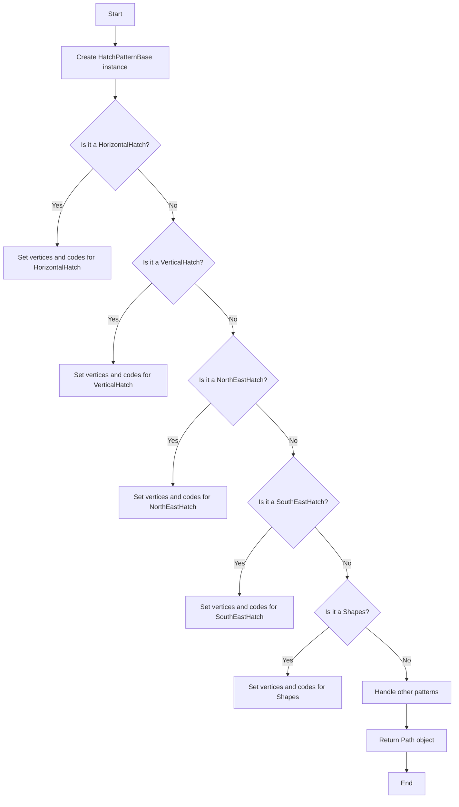
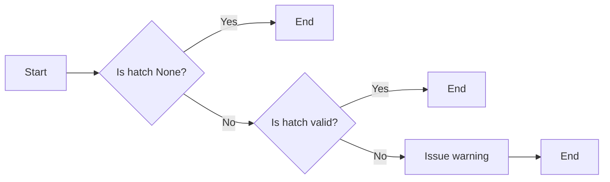
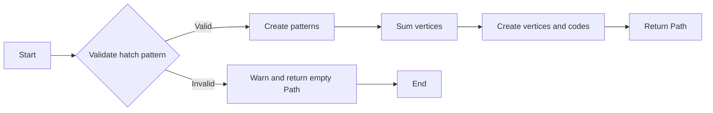
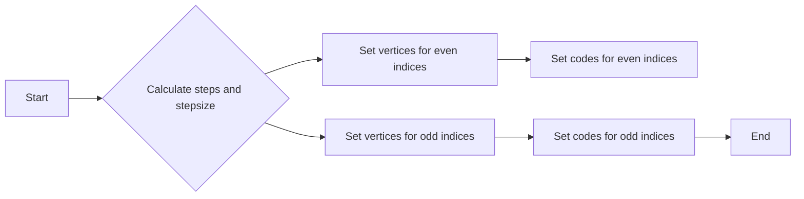
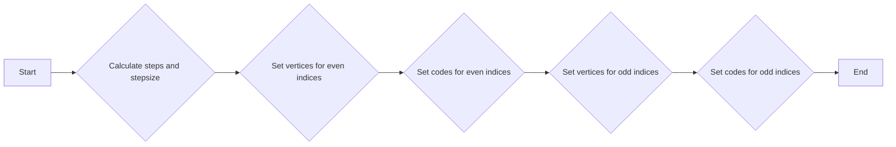
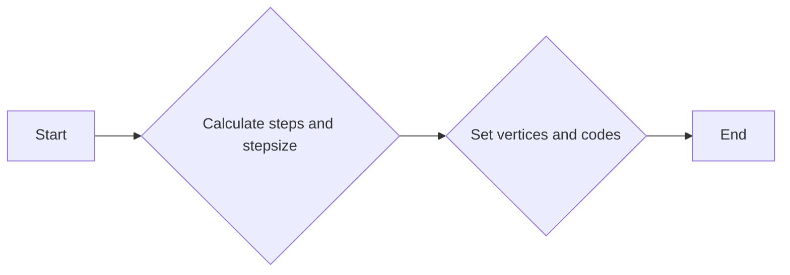
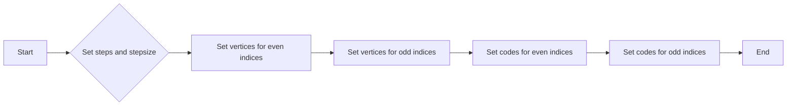
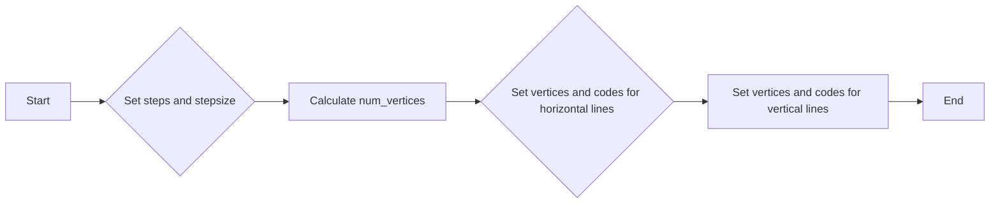

# `matplotlib\lib\matplotlib\hatch.py` 详细设计文档

This module defines a set of classes for generating hatch patterns used in matplotlib for visualizing data with different line patterns.

## 整体流程



## 类结构

```
HatchPatternBase (抽象基类)
├── HorizontalHatch
│   ├── VerticalHatch
│   ├── NorthEastHatch
│   ├── SouthEastHatch
│   ├── Shapes
│   │   ├── Circles
│   │   │   ├── SmallCircles
│   │   │   ├── LargeCircles
│   │   │   └── SmallFilledCircles
│   │   └── Stars
```

## 全局变量及字段


### `_hatch_types`
    
List of all available hatch pattern classes.

类型：`list of classes`
    


### `density`
    
Number of lines per unit square for hatch patterns.

类型：`int`
    


### `vertices`
    
Array of vertices for the hatch pattern.

类型：`numpy array`
    


### `codes`
    
Array of codes for the hatch pattern, indicating the path to be drawn.

类型：`numpy array`
    


### `steps`
    
Array of steps for creating the hatch pattern.

类型：`numpy array`
    


### `stepsize`
    
Step size for creating the hatch pattern.

类型：`float`
    


### `cursor`
    
Cursor position for appending vertices and codes to the final arrays.

类型：`int`
    


### `pattern`
    
Instance of a hatch pattern class.

类型：`HatchPatternBase instance`
    


### `vertices_chunk`
    
Chunk of vertices for a specific hatch pattern.

类型：`numpy array`
    


### `codes_chunk`
    
Chunk of codes for a specific hatch pattern.

类型：`numpy array`
    


### `vertices_parts`
    
List of vertex parts for the shapes hatch pattern.

类型：`list of numpy arrays`
    


### `codes_parts`
    
List of code parts for the shapes hatch pattern.

类型：`list of numpy arrays`
    


### `row_pos`
    
Position of the row in the shapes hatch pattern.

类型：`float`
    


### `col_pos`
    
Position of the column in the shapes hatch pattern.

类型：`float`
    


### `shape_vertices`
    
Vertices for the shape in the shapes hatch pattern.

类型：`numpy array`
    


### `shape_codes`
    
Codes for the shape in the shapes hatch pattern.

类型：`numpy array`
    


### `path`
    
Path object representing the hatch pattern.

类型：`Path`
    


### `valid_hatch_patterns`
    
Set of valid hatch pattern characters.

类型：`set`
    


### `invalids`
    
Set of invalid hatch pattern characters found in the input hatch pattern.

类型：`set`
    


### `valid`
    
String of valid hatch pattern characters.

类型：`string`
    


### `invalids`
    
String of invalid hatch pattern characters found in the input hatch pattern.

类型：`string`
    


### `message`
    
Warning message to be displayed if invalid hatch pattern characters are found.

类型：`string`
    


### `HatchPatternBase.num_vertices`
    
Number of vertices in the hatch pattern.

类型：`int`
    


### `HorizontalHatch.num_lines`
    
Number of lines in the horizontal hatch pattern.

类型：`int`
    


### `HorizontalHatch.num_vertices`
    
Number of vertices in the horizontal hatch pattern.

类型：`int`
    


### `VerticalHatch.num_lines`
    
Number of lines in the vertical hatch pattern.

类型：`int`
    


### `VerticalHatch.num_vertices`
    
Number of vertices in the vertical hatch pattern.

类型：`int`
    


### `NorthEastHatch.num_lines`
    
Number of lines in the north-east hatch pattern.

类型：`int`
    


### `NorthEastHatch.num_vertices`
    
Number of vertices in the north-east hatch pattern.

类型：`int`
    


### `SouthEastHatch.num_lines`
    
Number of lines in the south-east hatch pattern.

类型：`int`
    


### `SouthEastHatch.num_vertices`
    
Number of vertices in the south-east hatch pattern.

类型：`int`
    


### `Shapes.num_shapes`
    
Number of shapes in the shapes hatch pattern.

类型：`int`
    


### `Shapes.num_vertices`
    
Number of vertices in the shapes hatch pattern.

类型：`int`
    


### `Shapes.filled`
    
Flag indicating if the shapes hatch pattern is filled.

类型：`bool`
    


### `Circles.shape_vertices`
    
Vertices for the circle shape in the circles hatch pattern.

类型：`numpy array`
    


### `Circles.shape_codes`
    
Codes for the circle shape in the circles hatch pattern.

类型：`numpy array`
    


### `SmallCircles.size`
    
Size of the small circle in the small circles hatch pattern.

类型：`float`
    


### `SmallCircles.num_rows`
    
Number of rows of small circles in the small circles hatch pattern.

类型：`int`
    


### `LargeCircles.size`
    
Size of the large circle in the large circles hatch pattern.

类型：`float`
    


### `LargeCircles.num_rows`
    
Number of rows of large circles in the large circles hatch pattern.

类型：`int`
    


### `SmallFilledCircles.size`
    
Size of the small filled circle in the small filled circles hatch pattern.

类型：`float`
    


### `SmallFilledCircles.num_rows`
    
Number of rows of small filled circles in the small filled circles hatch pattern.

类型：`int`
    


### `Stars.size`
    
Size of the star in the stars hatch pattern.

类型：`float`
    


### `Stars.num_rows`
    
Number of rows of stars in the stars hatch pattern.

类型：`int`
    


### `Stars.shape_vertices`
    
Vertices for the star shape in the stars hatch pattern.

类型：`numpy array`
    


### `Stars.shape_codes`
    
Codes for the star shape in the stars hatch pattern.

类型：`numpy array`
    
    

## 全局函数及方法


### `_validate_hatch_pattern`

This function validates the hatch pattern string to ensure it contains only valid hatch symbols.

参数：

- `hatch`：`str`，The hatch pattern string to validate.

返回值：`None`，No action is returned, but a warning is issued if the hatch pattern is invalid.

#### 流程图



#### 带注释源码

```python
def _validate_hatch_pattern(hatch):
    valid_hatch_patterns = set(r'-+|/\xXoO.*')
    if hatch is not None:
        invalids = set(hatch).difference(valid_hatch_patterns)
        if invalids:
            valid = ''.join(sorted(valid_hatch_patterns))
            invalids = ''.join(sorted(invalids))
            _api.warn_deprecated(
                '3.4',
                removal='3.11',
                message=f'hatch must consist of a string of "{valid}" or '
                        'None, but found the following invalid values '
                        f'"{invalids}". Passing invalid values is deprecated '
                        'since %(since)s and will become an error in %(removal)s.'
            )
```


### get_path

Given a hatch specifier, *hatchpattern*, generates a Path to render the hatch in a unit square. The *density* parameter specifies the number of lines per unit square.

参数：

- `hatchpattern`：`str`，The hatch specifier string that defines the pattern to be rendered.
- `density`：`int`，The number of lines per unit square. Default is 6.

返回值：`matplotlib.path.Path`，A Path object representing the hatch pattern in a unit square.

#### 流程图



#### 带注释源码

```python
def get_path(hatchpattern, density=6):
    """
    Given a hatch specifier, *hatchpattern*, generates Path to render
    the hatch in a unit square.  *density* is the number of lines per
    unit square.
    """
    density = int(density)

    patterns = [hatch_type(hatchpattern, density) for hatch_type in _hatch_types]
    num_vertices = sum([pattern.num_vertices for pattern in patterns])

    if num_vertices == 0:
        return Path(np.empty((0, 2)))

    vertices = np.empty((num_vertices, 2))
    codes = np.empty(num_vertices, Path.code_type)

    cursor = 0
    for pattern in patterns:
        if pattern.num_vertices != 0:
            vertices_chunk = vertices[cursor:cursor + pattern.num_vertices]
            codes_chunk = codes[cursor:cursor + pattern.num_vertices]
            pattern.set_vertices_and_codes(vertices_chunk, codes_chunk)
            cursor += pattern.num_vertices

    return Path(vertices, codes)
```


### HorizontalHatch.set_vertices_and_codes

This method sets the vertices and codes for a horizontal hatch pattern.

参数：

- `vertices`：`numpy.ndarray`，The array to store the vertices of the hatch pattern.
- `codes`：`numpy.ndarray`，The array to store the codes for the vertices of the hatch pattern.

返回值：`None`，This method does not return any value.

#### 流程图


#### 带注释源码

```python
def set_vertices_and_codes(self, vertices, codes):
    steps, stepsize = np.linspace(0.0, 1.0, self.num_lines, False,
                                  retstep=True)
    steps += stepsize / 2.
    vertices[0::2, 0] = 0.0
    vertices[0::2, 1] = steps
    vertices[1::2, 0] = 1.0
    vertices[1::2, 1] = steps
    codes[0::2] = Path.MOVETO
    codes[1::2] = Path.LINETO
```

### VerticalHatch.set_vertices_and_codes

This method sets the vertices and codes for a vertical hatch pattern.

参数：

- `vertices`：`numpy.ndarray`，The array to store the vertices of the hatch pattern.
- `codes`：`numpy.ndarray`，The array to store the codes for the vertices of the hatch pattern.

返回值：`None`，This method does not return any value.

#### 流程图


#### 带注释源码

```python
def set_vertices_and_codes(self, vertices, codes):
    steps, stepsize = np.linspace(0.0, 1.0, self.num_lines, False,
                                  retstep=True)
    steps += stepsize / 2.
    vertices[0::2, 0] = steps
    vertices[0::2, 1] = 0.0
    vertices[1::2, 0] = steps
    vertices[1::2, 1] = 1.0
    codes[0::2] = Path.MOVETO
    codes[1::2] = Path.LINETO
```

### NorthEastHatch.set_vertices_and_codes

This method sets the vertices and codes for a north-east hatch pattern.

参数：

- `vertices`：`numpy.ndarray`，The array to store the vertices of the hatch pattern.
- `codes`：`numpy.ndarray`，The array to store the codes for the vertices of the hatch pattern.

返回值：`None`，This method does not return any value.

#### 流程图


#### 带注释源码

```python
def set_vertices_and_codes(self, vertices, codes):
    steps = np.linspace(-0.5, 0.5, self.num_lines + 1)
    vertices[0::2, 0] = 0.0 + steps
    vertices[0::2, 1] = 0.0 - steps
    vertices[1::2, 0] = 1.0 + steps
    vertices[1::2, 1] = 1.0 - steps
    codes[0::2] = Path.MOVETO
    codes[1::2] = Path.LINETO
```

### SouthEastHatch.set_vertices_and_codes

This method sets the vertices and codes for a south-east hatch pattern.

参数：

- `vertices`：`numpy.ndarray`，The array to store the vertices of the hatch pattern.
- `codes`：`numpy.ndarray`，The array to store the codes for the vertices of the hatch pattern.

返回值：`None`，This method does not return any value.

#### 流程图


#### 带注释源码

```python
def set_vertices_and_codes(self, vertices, codes):
    steps = np.linspace(-0.5, 0.5, self.num_lines + 1)
    vertices[0::2, 0] = 0.0 + steps
    vertices[0::2, 1] = 1.0 + steps
    vertices[1::2, 0] = 1.0 + steps
    vertices[1::2, 1] = 0.0 + steps
    codes[0::2] = Path.MOVETO
    codes[1::2] = Path.LINETO
```

### Shapes.set_vertices_and_codes

This method sets the vertices and codes for a shape hatch pattern.

参数：

- `vertices`：`numpy.ndarray`，The array to store the vertices of the hatch pattern.
- `codes`：`numpy.ndarray`，The array to store the codes for the vertices of the hatch pattern.

返回值：`None`，This method does not return any value.

#### 流程图


#### 带注释源码

```python
def set_vertices_and_codes(self, vertices, codes):
    offset = 1.0 / self.num_rows
    shape_vertices = self.shape_vertices * offset * self.size
    shape_codes = self.shape_codes
    if not self.filled:
        shape_vertices = np.concatenate(  # Forward, then backward.
            [shape_vertices, shape_vertices[::-1] * 0.9])
        shape_codes = np.concatenate([shape_codes, shape_codes])
    vertices_parts = []
    codes_parts = []
    for row in range(self.num_rows + 1):
        if row % 2 == 0:
            cols = np.linspace(0, 1, self.num_rows + 1)
        else:
            cols = np.linspace(offset / 2, 1 - offset / 2, self.num_rows)
        row_pos = row * offset
        for col_pos in cols:
            vertices_parts.append(shape_vertices + [col_pos, row_pos])
            codes_parts.append(shape_codes)
    np.concatenate(vertices_parts, out=vertices)
    np.concatenate(codes_parts, out=codes)
```

### Circles.set_vertices_and_codes

This method sets the vertices and codes for a circle hatch pattern.

参数：

- `vertices`：`numpy.ndarray`，The array to store the vertices of the hatch pattern.
- `codes`：`numpy.ndarray`，The array to store the codes for the vertices of the hatch pattern.

返回值：`None`，This method does not return any value.

#### 流程图


#### 带注释源码

```python
def set_vertices_and_codes(self, vertices, codes):
    offset = 1.0 / self.num_rows
    shape_vertices = self.shape_vertices * offset * self.size
    shape_codes = self.shape_codes
    if not self.filled:
        shape_vertices = np.concatenate(  # Forward, then backward.
            [shape_vertices, shape_vertices[::-1] * 0.9])
        shape_codes = np.concatenate([shape_codes, shape_codes])
    vertices_parts = []
    codes_parts = []
    for row in range(self.num_rows + 1):
        if row % 2 == 0:
            cols = np.linspace(0, 1, self.num_rows + 1)
        else:
            cols = np.linspace(offset / 2, 1 - offset / 2, self.num_rows)
        row_pos = row * offset
        for col_pos in cols:
            vertices_parts.append(shape_vertices + [col_pos, row_pos])
            codes_parts.append(shape_codes)
    np.concatenate(vertices_parts, out=vertices)
    np.concatenate(codes_parts, out=codes)
```

### SmallCircles.set_vertices_and_codes

This method sets the vertices and codes for a small circle hatch pattern.

参数：

- `vertices`：`numpy.ndarray`，The array to store the vertices of the hatch pattern.
- `codes`：`numpy.ndarray`，The array to store the codes for the vertices of the hatch pattern.

返回值：`None`，This method does not return any value.

#### 流程图


#### 带注释源码

```python
def set_vertices_and_codes(self, vertices, codes):
    offset = 1.0 / self.num_rows
    shape_vertices = self.shape_vertices * offset * self.size
    shape_codes = self.shape_codes
    if not self.filled:
        shape_vertices = np.concatenate(  # Forward, then backward.
            [shape_vertices, shape_vertices[::-1] * 0.9])
        shape_codes = np.concatenate([shape_codes, shape_codes])
    vertices_parts = []
    codes_parts = []
    for row in range(self.num_rows + 1):
        if row % 2 == 0:
            cols = np.linspace(0, 1, self.num_rows + 1)
        else:
            cols = np.linspace(offset / 2, 1 - offset / 2, self.num_rows)
        row_pos = row * offset
        for col_pos in cols:
            vertices_parts.append(shape_vertices + [col_pos, row_pos])
            codes_parts.append(shape_codes)
    np.concatenate(vertices_parts, out=vertices)
    np.concatenate(codes_parts, out=codes)
```

### LargeCircles.set_vertices_and_codes

This method sets the vertices and codes for a large circle hatch pattern.

参数：

- `vertices`：`numpy.ndarray`，The array to store the vertices of the hatch pattern.
- `codes`：`numpy.ndarray`，The array to store the codes for the vertices of the hatch pattern.

返回值：`None`，This method does not return any value.

#### 流程图


#### 带注释源码

```python
def set_vertices_and_codes(self, vertices, codes):
    offset = 1.0 / self.num_rows
    shape_vertices = self.shape_vertices * offset * self.size
    shape_codes = self.shape_codes
    if not self.filled:
        shape_vertices = np.concatenate(  # Forward, then backward.
            [shape_vertices, shape_vertices[::-1] * 0.9])
        shape_codes = np.concatenate([shape_codes, shape_codes])
    vertices_parts = []
    codes_parts = []
    for row in range(self.num_rows + 1):
        if row % 2 == 0:
            cols = np.linspace(0, 1, self.num_rows + 1)
        else:
            cols = np.linspace(offset / 2, 1 - offset / 2, self.num_rows)
        row_pos = row * offset
        for col_pos in cols:
            vertices_parts.append(shape_vertices + [col_pos, row_pos])
            codes_parts.append(shape_codes)
    np.concatenate(vertices_parts, out=vertices)
    np.concatenate(codes_parts, out=codes)
```

### SmallFilledCircles.set_vertices_and_codes

This method sets the vertices and codes for a small filled circle hatch pattern.

参数：

- `vertices`：`numpy.ndarray`，The array to store the vertices of the hatch pattern.
- `codes`：`numpy.ndarray`，The array to store the codes for the vertices of the hatch pattern.

返回值：`None`，This method does not return any value.

#### 流程图


#### 带注释源码

```python
def set_vertices_and_codes(self, vertices, codes):
    offset = 1.0 / self.num_rows
    shape_vertices = self.shape_vertices * offset * self.size
    shape_codes = self.shape_codes
    if not self.filled:
        shape_vertices = np.concatenate(  # Forward, then backward.
            [shape_vertices, shape_vertices[::-1] * 0.9])
        shape_codes = np.concatenate([shape_codes, shape_codes])
    vertices_parts = []
    codes_parts = []
    for row in range(self.num_rows + 1):
        if row % 2 == 0:
            cols = np.linspace(0, 1, self.num_rows + 1)
        else:
            cols = np.linspace(offset / 2, 1 - offset / 2, self.num_rows)
        row_pos = row * offset
        for col_pos in cols:
            vertices_parts.append(shape_vertices + [col_pos, row_pos])
            codes_parts.append(shape_codes)
    np.concatenate(vertices_parts, out=vertices)
    np.concatenate(codes_parts, out=codes)
```

### Stars.set_vertices_and_codes

This method sets the vertices and codes for a star hatch pattern.

参数：

- `vertices`：`numpy.ndarray`，The array to store the vertices of the hatch pattern.
- `codes`：`numpy.ndarray`，The array to store the codes for the vertices of the hatch pattern.

返回值：`None`，This method does not return any value.

#### 流程图


#### 带注释源码

```python
def set_vertices_and_codes(self, vertices, codes):
    offset = 1.0 / self.num_rows
    shape_vertices = self.shape_vertices * offset * self.size
    shape_codes = self.shape_codes
    if not self.filled:
        shape_vertices = np.concatenate(  # Forward, then backward.
            [shape_vertices, shape_vertices[::-1] * 0.9])
        shape_codes = np.concatenate([shape_codes, shape_codes])
    vertices_parts = []
    codes_parts = []
    for row in range(self.num_rows + 1):
        if row % 2 == 0:
            cols = np.linspace(0, 1, self.num_rows + 1)
        else:
            cols = np.linspace(offset / 2, 1 - offset / 2, self.num_rows)
        row_pos = row * offset
        for col_pos in cols:
            vertices_parts.append(shape_vertices + [col_pos, row_pos])
            codes_parts.append(shape_codes)
    np.concatenate(vertices_parts, out=vertices)
    np.concatenate(codes_parts, out=codes)
```


### HorizontalHatch.set_vertices_and_codes

This method sets the vertices and codes for the horizontal hatch pattern.

参数：

- `vertices`：`numpy.ndarray`，The array to store the vertices of the hatch pattern.
- `codes`：`numpy.ndarray`，The array to store the codes for the vertices.

返回值：`None`，This method does not return any value.

#### 流程图



#### 带注释源码

```python
def set_vertices_and_codes(self, vertices, codes):
    steps, stepsize = np.linspace(0.0, 1.0, self.num_lines, False,
                                  retstep=True)
    steps += stepsize / 2.
    vertices[0::2, 0] = 0.0
    vertices[0::2, 1] = steps
    vertices[1::2, 0] = 1.0
    vertices[1::2, 1] = steps
    codes[0::2] = Path.MOVETO
    codes[1::2] = Path.LINETO
```


### VerticalHatch.set_vertices_and_codes

This method sets the vertices and codes for a vertical hatch pattern.

参数：

- `vertices`：`numpy.ndarray`，The array to store the vertices of the hatch pattern.
- `codes`：`numpy.ndarray`，The array to store the codes for the vertices of the hatch pattern.

返回值：`None`，This method does not return any value.

#### 流程图



#### 带注释源码

```python
def set_vertices_and_codes(self, vertices, codes):
    steps, stepsize = np.linspace(0.0, 1.0, self.num_lines, False,
                                  retstep=True)
    steps += stepsize / 2.
    vertices[0::2, 0] = steps
    vertices[0::2, 1] = 0.0
    vertices[1::2, 0] = steps
    vertices[1::2, 1] = 1.0
    codes[0::2] = Path.MOVETO
    codes[1::2] = Path.LINETO
```


### NorthEastHatch.set_vertices_and_codes

This method sets the vertices and codes for a NorthEast hatch pattern.

参数：

- `vertices`：`numpy.ndarray`，The array where the vertices of the hatch pattern will be stored.
- `codes`：`numpy.ndarray`，The array where the codes for the vertices will be stored.

返回值：`None`，This method does not return a value.

#### 流程图


#### 带注释源码

```python
def set_vertices_and_codes(self, vertices, codes):
    steps, stepsize = np.linspace(0.0, 1.0, self.num_lines + 1)
    steps += stepsize / 2.
    vertices[0::2, 0] = 0.0 + steps
    vertices[0::2, 1] = 0.0 - steps
    vertices[1::2, 0] = 1.0 + steps
    vertices[1::2, 1] = 1.0 - steps
    codes[0::2] = Path.MOVETO
    codes[1::2] = Path.LINETO
```


### SouthEastHatch.set_vertices_and_codes

This method sets the vertices and codes for the SouthEastHatch pattern.

参数：

- `vertices`：`numpy.ndarray`，The array where the vertices will be stored.
- `codes`：`numpy.ndarray`，The array where the codes will be stored.

返回值：`None`，This method does not return a value.

#### 流程图



#### 带注释源码

```python
def set_vertices_and_codes(self, vertices, codes):
    steps, stepsize = np.linspace(0.0, 1.0, self.num_lines + 1, False, retstep=True)
    steps += stepsize / 2.
    vertices[0::2, 0] = 0.0 + steps
    vertices[0::2, 1] = 1.0 + steps
    vertices[1::2, 0] = 1.0 + steps
    vertices[1::2, 1] = 0.0 + steps
    codes[0::2] = Path.MOVETO
    codes[1::2] = Path.LINETO
```


### set_vertices_and_codes

`set_vertices_and_codes` 是 `Shapes` 类中的一个方法，用于设置顶点坐标和路径代码。

#### 描述

该方法用于根据给定的顶点数组和路径代码数组，设置 `vertices` 和 `codes` 属性。它通过计算步长和位置，将形状的顶点坐标和路径代码分配到这两个数组中。

#### 参数

- `vertices`：`numpy.ndarray`，形状为 `(num_vertices, 2)`，用于存储顶点坐标。
- `codes`：`numpy.ndarray`，形状为 `(num_vertices,)`，用于存储路径代码。

#### 返回值

- 无返回值。

#### 流程图


#### 带注释源码

```python
def set_vertices_and_codes(self, vertices, codes):
    # Calculate steps and stepsize
    steps, stepsize = np.linspace(0.0, 1.0, self.num_lines, False, retstep=True)
    steps += stepsize / 2.

    # Set vertices
    vertices[0::2, 0] = 0.0
    vertices[0::2, 1] = steps
    vertices[1::2, 0] = 1.0
    vertices[1::2, 1] = steps

    # Set codes
    codes[0::2] = Path.MOVETO
    codes[1::2] = Path.LINETO
```


### Circles.set_vertices_and_codes

This method sets the vertices and codes for the hatch pattern of circles.

参数：

- `vertices`：`numpy.ndarray`，The array to store the vertices of the hatch pattern.
- `codes`：`numpy.ndarray`，The array to store the codes for the vertices.

返回值：`None`，This method does not return any value.

#### 流程图



#### 带注释源码

```python
def set_vertices_and_codes(self, vertices, codes):
    steps, stepsize = np.linspace(0.0, 1.0, self.num_lines, False,
                                  retstep=True)
    steps += stepsize / 2.
    vertices[0::2, 0] = 0.0
    vertices[0::2, 1] = steps
    vertices[1::2, 0] = 1.0
    vertices[1::2, 1] = steps
    codes[0::2] = Path.MOVETO
    codes[1::2] = Path.LINETO
```


### SmallCircles.set_vertices_and_codes

This method sets the vertices and codes for the small circles hatch pattern.

参数：

- `vertices`：`numpy.ndarray`，The array where the vertices will be stored.
- `codes`：`numpy.ndarray`，The array where the codes will be stored.

返回值：`None`，This method does not return a value.

#### 流程图



#### 带注释源码

```python
def set_vertices_and_codes(self, vertices, codes):
    steps, stepsize = np.linspace(0.0, 1.0, self.num_lines, False,
                                  retstep=True)
    steps += stepsize / 2.
    vertices[0::2, 0] = 0.0
    vertices[0::2, 1] = steps
    vertices[1::2, 0] = 1.0
    vertices[1::2, 1] = steps
    codes[0::2] = Path.MOVETO
    codes[1::2] = Path.LINETO
```


### LargeCircles.set_vertices_and_codes

This method sets the vertices and codes for the large circles hatch pattern.

参数：

- `vertices`：`numpy.ndarray`，The array where the vertices will be stored.
- `codes`：`numpy.ndarray`，The array where the codes will be stored.

返回值：`None`，This method does not return a value.

#### 流程图

```mermaid
graph LR
A[Start] --> B{Set steps and stepsize}
B --> C[Calculate number of lines and vertices]
C --> D[Set vertices and codes for large circles]
D --> E[End]
```

#### 带注释源码

```python
def set_vertices_and_codes(self, vertices, codes):
    steps, stepsize = np.linspace(0.0, 1.0, self.num_lines, False,
                                  retstep=True)
    steps += stepsize / 2.
    vertices[0::2, 0] = 0.0
    vertices[0::2, 1] = steps
    vertices[1::2, 0] = 1.0
    vertices[1::2, 1] = steps
    codes[0::2] = Path.MOVETO
    codes[1::2] = Path.LINETO
```


### SmallFilledCircles.set_vertices_and_codes

This method sets the vertices and codes for the hatch pattern of SmallFilledCircles.

参数：

- `vertices`：`numpy.ndarray`，The array to store the vertices of the hatch pattern.
- `codes`：`numpy.ndarray`，The array to store the codes for the vertices.

返回值：`None`，This method does not return any value.

#### 流程图

```mermaid
graph LR
A[Start] --> B{Set steps and stepsize}
B --> C[Set vertices for even indices]
C --> D[Set vertices for odd indices]
D --> E[Set codes for even indices]
E --> F[Set codes for odd indices]
F --> G[End]
```

#### 带注释源码

```python
def set_vertices_and_codes(self, vertices, codes):
    steps, stepsize = np.linspace(0.0, 1.0, self.num_lines, False,
                                  retstep=True)
    steps += stepsize / 2.
    vertices[0::2, 0] = 0.0
    vertices[0::2, 1] = steps
    vertices[1::2, 0] = 1.0
    vertices[1::2, 1] = steps
    codes[0::2] = Path.MOVETO
    codes[1::2] = Path.LINETO
```


### Stars.set_vertices_and_codes

**描述**

`set_vertices_and_codes` 方法是 `Stars` 类的一个方法，用于设置路径的顶点坐标和代码。该方法根据传入的顶点数组和代码数组，计算并填充这些数组，以生成一个表示特定 hatch 模式的路径。

**参数**

- `vertices`：`numpy.ndarray`，用于存储路径顶点的数组。
- `codes`：`numpy.ndarray`，用于存储路径代码的数组。

**返回值**

- 无返回值。

#### 流程图

```mermaid
graph LR
A[Start] --> B{Calculate steps and stepsize}
B --> C{Set vertices[0::2, 0] = 0.0}
C --> D{Set vertices[0::2, 1] = steps}
D --> E{Set vertices[1::2, 0] = 1.0}
E --> F{Set vertices[1::2, 1] = steps}
F --> G{Set codes[0::2] = Path.MOVETO}
G --> H{Set codes[1::2] = Path.LINETO}
H --> I[End]
```

#### 带注释源码

```python
def set_vertices_and_codes(self, vertices, codes):
    steps, stepsize = np.linspace(0.0, 1.0, self.num_lines, False,
                                  retstep=True)
    steps += stepsize / 2.
    vertices[0::2, 0] = 0.0
    vertices[0::2, 1] = steps
    vertices[1::2, 0] = 1.0
    vertices[1::2, 1] = steps
    codes[0::2] = Path.MOVETO
    codes[1::2] = Path.LINETO
```

## 关键组件


### 张量索引与惰性加载

张量索引与惰性加载是代码中用于高效处理和访问大型数据结构（如张量）的关键组件。它允许在需要时才计算或加载数据，从而减少内存消耗和提高性能。

### 反量化支持

反量化支持是代码中用于处理和优化量化操作的关键组件。它允许在量化过程中进行反向操作，以便在需要时恢复原始数据。

### 量化策略

量化策略是代码中用于优化数据表示和存储的关键组件。它通过减少数据精度来减少内存消耗和提高处理速度。


## 问题及建议


### 已知问题

-   **代码重复**：`HatchPatternBase` 类及其子类 `HorizontalHatch`, `VerticalHatch`, `NorthEastHatch`, `SouthEastHatch`, `SmallCircles`, `LargeCircles`, `SmallFilledCircles`, `Stars` 都有相似的 `set_vertices_and_codes` 方法，但每个方法的具体实现细节不同。这可能导致代码维护困难，如果需要修改这些方法，需要在多个地方进行修改。
-   **全局变量**：`_hatch_types` 是一个全局变量，它定义了所有可用的 hatch 类型。这可能导致代码的可测试性和可维护性降低，因为全局变量可能会在代码的其他部分被意外修改。
-   **硬编码**：代码中存在一些硬编码的值，例如 `Path.MOVETO`, `Path.LINETO`, `Path.CLOSEPOLY` 和 `Path.code_type`。如果这些值在未来的版本中发生变化，代码可能需要修改。
-   **异常处理**：代码中没有明显的异常处理机制。如果发生错误，例如传递无效的 hatch 模式，代码可能会崩溃。

### 优化建议

-   **使用继承和抽象类**：将 `set_vertices_and_codes` 方法提取到一个单独的类中，并让所有 hatch 类型类继承自这个类。这样可以减少代码重复，并使代码更易于维护。
-   **使用配置文件**：将 `_hatch_types` 存储在一个配置文件中，而不是作为全局变量。这样可以提高代码的可测试性和可维护性。
-   **避免硬编码**：将硬编码的值替换为可配置的参数或常量。这样可以提高代码的灵活性和可维护性。
-   **添加异常处理**：添加异常处理机制来捕获和处理潜在的错误，例如无效的 hatch 模式。这样可以提高代码的健壮性和用户体验。
-   **代码重构**：考虑使用设计模式，如工厂模式，来创建 hatch 对象。这样可以提高代码的可扩展性和可维护性。


## 其它


### 设计目标与约束

- 设计目标：
  - 提供一个模块，用于生成各种填充图案。
  - 支持多种图案类型，如水平、垂直、东北向、西南向、圆形、星形等。
  - 允许用户自定义图案密度。
  - 与matplotlib库集成，以便在图表中应用图案。

- 约束：
  - 必须使用numpy库进行数值计算。
  - 必须使用matplotlib库进行路径生成和渲染。
  - 图案生成过程应高效，以适应实时图表渲染的需求。

### 错误处理与异常设计

- 错误处理：
  - 当输入的填充模式包含无效字符时，应抛出异常。
  - 当密度参数不是整数时，应抛出异常。

- 异常设计：
  - 使用自定义异常类来处理特定错误情况。
  - 异常信息应提供足够的信息，以便用户了解错误原因。

### 数据流与状态机

- 数据流：
  - 用户输入填充模式字符串和密度。
  - 模块根据输入生成相应的图案路径。
  - 图案路径用于matplotlib图表的填充。

- 状态机：
  - 模块没有明确的状态机，但图案生成过程可以视为一系列状态转换。
  - 状态包括初始化、计算路径点、设置路径代码等。

### 外部依赖与接口契约

- 外部依赖：
  - numpy库：用于数值计算。
  - matplotlib库：用于路径生成和渲染。

- 接口契约：
  - `get_path`函数是模块的主要接口，它接受填充模式字符串和密度，返回图案路径。
  - `HatchPatternBase`类及其子类定义了图案生成接口。

    