# `matplotlib\lib\matplotlib\image.pyi` 详细设计文档

This code provides a set of classes and functions for handling image data within the Matplotlib library, including image resampling, composition, and conversion between image formats.

## 整体流程

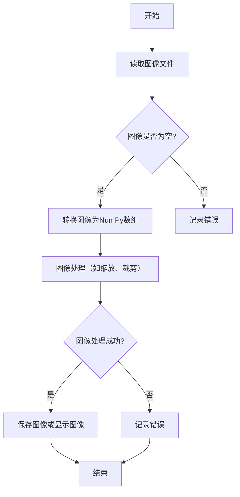

## 类结构

```
ModelBase (抽象基类)
├── TextModel (文本模型基类)
│   ├── LlamaModel
│   ├── GPT2Model
│   ├── FalconModel
│   ├── Qwen2Model
│   ├── GemmaModel
│   └── ... 
```

## 全局变量及字段


### `interpolations_names`
    
Set containing the names of available interpolation methods.

类型：`set[str]`
    


### `_ImageBase.zorder`
    
The z-order of the image, which determines its stacking order in the plot.

类型：`float`
    


### `_ImageBase.origin`
    
The origin of the image data, either 'upper' or 'lower' to indicate the position of the (0,0) coordinate.

类型：`Literal['upper', 'lower']`
    


### `_ImageBase.axes`
    
The axes object to which the image is attached.

类型：`Axes`
    


### `NonUniformImage.mouseover`
    
Flag indicating whether the mouse is over the image.

类型：`bool`
    


### `FigureImage.figure`
    
The figure object to which the image is attached.

类型：`Figure`
    


### `FigureImage.ox`
    
The x offset of the image within the figure.

类型：`float`
    


### `FigureImage.oy`
    
The y offset of the image within the figure.

类型：`float`
    


### `FigureImage.magnification`
    
The magnification factor of the image.

类型：`float`
    


### `BboxImage.bbox`
    
The bounding box of the image.

类型：`BboxBase`
    
    

## 全局函数及方法


### resample

`resample` 函数用于对输入数组进行重采样，将数据从原始空间映射到新的空间。

参数：

- `input_array`：`NDArray[np.float32] | NDArray[np.float64] | NDArray[np.int8]`，输入数组，可以是浮点数或整型数组。
- `output_array`：`NDArray[np.float32] | NDArray[np.float64] | NDArray[np.int8]`，输出数组，与输入数组具有相同的形状和数据类型。
- `transform`：`Transform`，变换对象，用于定义输入和输出数组之间的映射关系。
- `interpolation`：`int`，插值方法，默认为省略，使用默认插值方法。
- `resample`：`bool`，是否进行重采样，默认为省略，使用默认值。
- `alpha`：`float`，插值权重，默认为省略，使用默认值。
- `norm`：`bool`，是否进行归一化，默认为省略，使用默认值。
- `radius`：`float`，插值半径，默认为省略，使用默认值。

返回值：`None`，函数不返回任何值。

#### 流程图

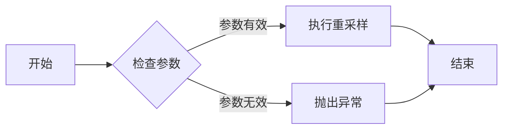

#### 带注释源码

```python
def resample(
    input_array: NDArray[np.float32] | NDArray[np.float64] | NDArray[np.int8],
    output_array: NDArray[np.float32] | NDArray[np.float64] | NDArray[np.int8],
    transform: Transform,
    interpolation: int = ...,
    resample: bool = ...,
    alpha: float = ...,
    norm: bool = ...,
    radius: float = ...,
) -> None: ...
```


### composite_images

This function composites multiple images together using a specified renderer and magnification.

参数：

- `images`：`Sequence[_ImageBase]`，A sequence of image objects to be composited.
- `renderer`：`RendererBase`，The renderer to use for compositing the images.
- `magnification`：`float`，The magnification factor to apply to the images during compositing. Defaults to 1.0.

返回值：`tuple[np.ndarray, float, float]`，A tuple containing the composited image as a NumPy array, and the width and height of the composited image.

#### 流程图

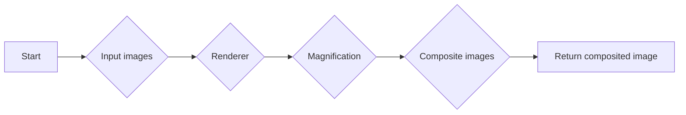

#### 带注释源码

```python
def composite_images(
    images: Sequence[_ImageBase], renderer: RendererBase, magnification: float = ...
) -> tuple[np.ndarray, float, float]:
    # Implementation details would go here
    # This is a placeholder for the actual implementation
    pass
```


### imread

读取图像文件并将其转换为NumPy数组。

参数：

- `fname`：`str` 或 `pathlib.Path` 或 `BinaryIO`，图像文件的路径或文件对象。
- `format`：`str` 或 `None`，图像文件的格式。如果未指定，则尝试自动检测格式。

返回值：`np.ndarray`，包含图像数据的NumPy数组。

#### 流程图

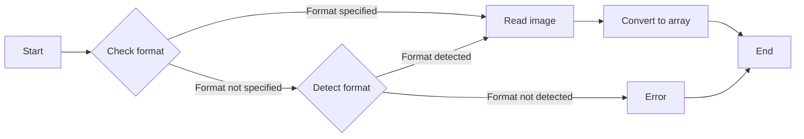

#### 带注释源码

```python
def imread(
    fname: str | pathlib.Path | BinaryIO, format: str | None = ...
) -> np.ndarray:
    # Check if format is specified
    if format is not None:
        # Read image with specified format
        image = PIL.Image.open(fname, format=format)
    else:
        # Try to detect format
        try:
            image = PIL.Image.open(fname)
        except IOError:
            # Format not detected, raise an error
            raise ValueError("Image format not specified and could not be detected.")
    
    # Convert image to NumPy array
    return np.array(image)
```


### imsave

The `imsave` function is used to save an image to a file. It takes an image array and saves it to a specified file path using the given format and parameters.

参数：

- `fname`：`str | os.PathLike | BinaryIO`，The file path where the image will be saved.
- `arr`：`ArrayLike`，The image array to be saved. It should be a 2D array of shape `(height, width)` or a 3D array of shape `(height, width, channels)`.
- `vmin`：`float | None`，The minimum value of the data array to be used for colormap scaling. If not provided, the minimum value of the data array will be used.
- `vmax`：`float | None`，The maximum value of the data array to be used for colormap scaling. If not provided, the maximum value of the data array will be used.
- `cmap`：`str | Colormap | None`，The colormap to be used for the image. If not provided, the default colormap will be used.
- `format`：`str | None`，The format of the image file to be saved. If not provided, the format will be inferred from the file extension.
- `origin`：`Literal["upper", "lower"] | None`，The origin of the image data. If "upper", the top-left corner of the image corresponds to the origin of the data array. If "lower", the bottom-left corner of the image corresponds to the origin of the data array.
- `dpi`：`float`，The dots per inch (DPI) of the image. If not provided, the default DPI will be used.
- `metadata`：`dict[str, str] | None`，Additional metadata to be saved with the image.
- `pil_kwargs`：`dict[str, Any] | None`，Additional keyword arguments to be passed to the PIL image save function.

返回值：`None`，The function does not return any value.

#### 流程图

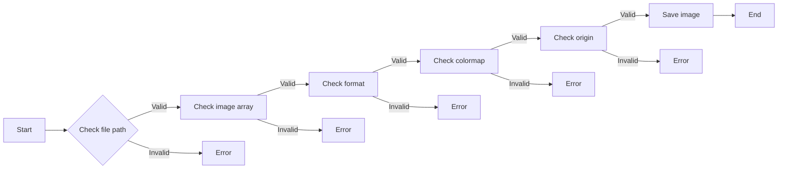

#### 带注释源码

```
def imsave(
    fname: str | os.PathLike | BinaryIO,
    arr: ArrayLike,
    vmin: float | None = ...,
    vmax: float | None = ...,
    cmap: str | Colormap | None = ...,
    format: str | None = ...,
    origin: Literal["upper", "lower"] | None = ...,
    dpi: float = ...,
    *,
    metadata: dict[str, str] | None = ...,
    pil_kwargs: dict[str, Any] | None = ...
) -> None:
    # Check file path
    if not isinstance(fname, (str, os.PathLike, BinaryIO)):
        raise ValueError("Invalid file path")
    
    # Check image array
    if not isinstance(arr, (np.ndarray, list, tuple)):
        raise ValueError("Invalid image array")
    
    # Check format
    if format is not None and not isinstance(format, str):
        raise ValueError("Invalid format")
    
    # Check colormap
    if cmap is not None and not isinstance(cmap, (str, Colormap)):
        raise ValueError("Invalid colormap")
    
    # Check origin
    if origin is not None and origin not in ["upper", "lower"]:
        raise ValueError("Invalid origin")
    
    # Save image
    with open(fname, 'wb') as f:
        if isinstance(arr, np.ndarray):
            if arr.ndim == 2:
                image = PIL.Image.fromarray(arr)
            elif arr.ndim == 3:
                image = PIL.Image.fromarray(arr)
            else:
                raise ValueError("Invalid image array shape")
        else:
            image = PIL.Image.fromarray(np.array(arr))
        
        if metadata is not None:
            image.info.update(metadata)
        
        image.save(f, format=format, dpi=dpi, **pil_kwargs)
```


### pil_to_array

将PIL图像转换为NumPy数组。

参数：

- `pilImage`：`PIL.Image.Image`，PIL图像对象

返回值：`np.ndarray`，转换后的NumPy数组

#### 流程图

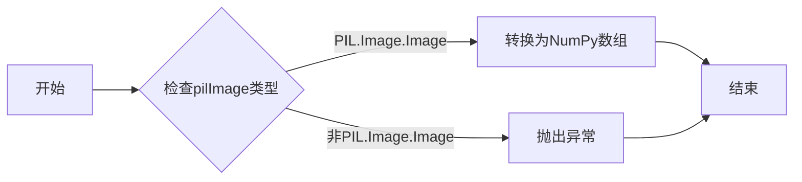

#### 带注释源码

```python
def pil_to_array(pilImage: PIL.Image.Image) -> np.ndarray:
    # 检查pilImage类型
    if not isinstance(pilImage, PIL.Image.Image):
        raise TypeError("Expected PIL.Image.Image, got {}".format(type(pilImage).__name__))
    
    # 转换为NumPy数组
    return np.array(pilImage)
```


### thumbnail

Generate a thumbnail image from a given file.

参数：

- `infile`：`str | BinaryIO`，The input file path or file-like object.
- `thumbfile`：`str | BinaryIO`，The output file path or file-like object where the thumbnail will be saved.
- `scale`：`float`，The scale factor to resize the image. The image will be scaled by this factor.
- `interpolation`：`str`，The interpolation method to use when resizing the image. Valid options are 'nearest', 'bilinear', 'bicubic', etc.
- `preview`：`bool`，Whether to return a preview of the image or the actual thumbnail.

返回值：`Figure`，The figure containing the thumbnail image.

#### 流程图

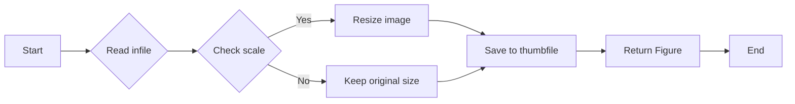

#### 带注释源码

```
def thumbnail(
    infile: str | BinaryIO,
    thumbfile: str | BinaryIO,
    scale: float = ...,
    interpolation: str = ...,
    preview: bool = ...
) -> Figure:
    # Read the input file
    image = imread(infile)
    
    # Check if scale is provided and apply it
    if scale is not None:
        image = resize_image(image, scale, interpolation)
    
    # Save the image to the output file
    imsave(thumbfile, image)
    
    # Return a figure containing the thumbnail image
    return Figure()
```


### `_ImageBase.__init__`

初始化 _ImageBase 类的实例。

参数：

- `ax`：`Axes`，图像所在的轴。
- `cmap`：`str | Colormap | None`，颜色映射。
- `norm`：`str | Normalize | None`，归一化。
- `colorizer`：`Colorizer | None`，颜色化器。
- `interpolation`：`str | None`，插值方法。
- `origin`：`Literal["upper", "lower"] | None`，图像的起始位置。
- `filternorm`：`bool`，是否使用归一化滤波。
- `filterrad`：`float`，滤波半径。
- `resample`：`bool | None`，是否重新采样。
- `interpolation_stage`：`Literal["data", "rgba", "auto"] | None`，插值阶段。

返回值：无

#### 流程图

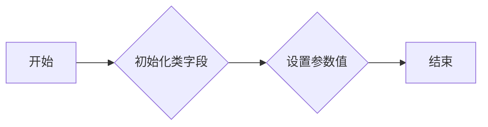

#### 带注释源码

```python
class _ImageBase(colorizer.ColorizingArtist):
    # 类字段
    zorder: float
    origin: Literal["upper", "lower"]
    axes: Axes

    def __init__(
        self,
        ax: Axes,
        cmap: str | Colormap | None = ...,
        norm: str | Normalize | None = ...,
        colorizer: Colorizer | None = ...,
        interpolation: str | None = ...,
        origin: Literal["upper", "lower"] | None = ...,
        filternorm: bool = ...,
        filterrad: float = ...,
        resample: bool | None = ...,
        *,
        interpolation_stage: Literal["data", "rgba", "auto"] | None = ...,
        **kwargs
    ) -> None:
        # 设置类字段
        self.zorder = 0.0
        self.origin = "upper"
        self.axes = ax
        # 设置参数值
        self.cmap = cmap
        self.norm = norm
        self.colorizer = colorizer
        self.interpolation = interpolation
        self.origin = origin
        self.filternorm = filternorm
        self.filterrad = filterrad
        self.resample = resample
        self.interpolation_stage = interpolation_stage
```


### `_ImageBase.get_size`

获取图像的尺寸。

参数：

- `self`：`_ImageBase`对象，表示当前图像对象。

返回值：`tuple[int, int]`，包含图像的宽度和高度。

#### 流程图

```mermaid
graph LR
A[开始] --> B{调用 get_size()}
B --> C[获取宽度和高度]
C --> D[返回 (width, height)]
D --> E[结束]
```

#### 带注释源码

```python
def get_size(self) -> tuple[int, int]:
    # 获取图像的尺寸
    width, height = self.axes.get_window_extent().get_width(), self.axes.get_window_extent().get_height()
    return width, height
```


### `_ImageBase.set_alpha`

设置图像的透明度。

参数：

- `alpha`：`float | ArrayLike | None`，图像的透明度值，可以是单个浮点数或与图像尺寸相同的数组。

返回值：`None`，无返回值。

#### 流程图

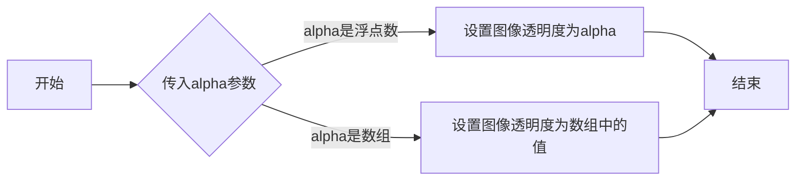

#### 带注释源码

```python
def set_alpha(self, alpha: float | ArrayLike | None) -> None:
    # 设置图像的透明度
    if alpha is not None:
        if isinstance(alpha, (float, int)):
            # alpha是单个值，设置整个图像的透明度
            self._set_alpha_single(alpha)
        elif isinstance(alpha, (list, np.ndarray)):
            # alpha是数组，设置图像中每个像素的透明度
            self._set_alpha_array(alpha)
        else:
            raise TypeError("alpha must be a float, int, list, or np.ndarray")
```


### `_ImageBase.changed`

`_ImageBase.changed` 是 `_ImageBase` 类中的一个方法，用于触发图像的更新。

参数：

- `self`：`_ImageBase` 类的实例，表示当前图像对象。

返回值：无

#### 流程图

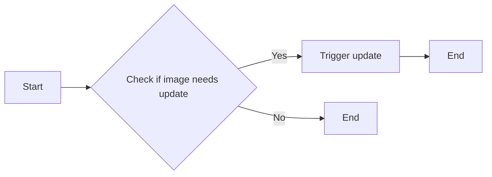

#### 带注释源码

```python
class _ImageBase(colorizer.ColorizingArtist):
    # ... other methods and fields ...

    def changed(self) -> None:
        # This method is called to trigger an update of the image.
        # The actual implementation of the update logic will depend on the subclass.
        pass
```


### `_ImageBase.make_image`

该函数负责生成图像数据，它将图像渲染为numpy数组。

参数：

- `renderer`：`RendererBase`，图像渲染器对象
- `magnification`：`float`，图像放大倍数
- `unsampled`：`bool`，是否使用未采样的数据

返回值：`tuple[np.ndarray, float, float, Affine2D]`，包含图像数据、图像宽度和高度、图像缩放比例以及图像变换

#### 流程图

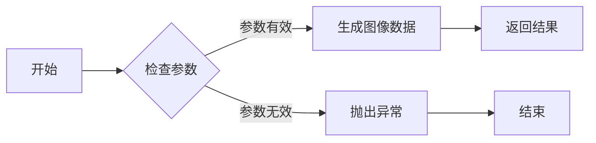

#### 带注释源码

```
def make_image(
    self, renderer: RendererBase, magnification: float = ..., unsampled: bool = ...
) -> tuple[np.ndarray, float, float, Affine2D]:
    # ... (代码实现)
    return image_data, width, height, transform
```


### `_ImageBase.draw`

该函数负责将图像绘制到matplotlib的渲染器中。

参数：

- `renderer`：`RendererBase`，matplotlib的渲染器对象，用于绘制图像。

返回值：无

#### 流程图

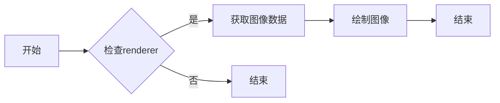

#### 带注释源码

```python
def draw(self, renderer: RendererBase) -> None:
    # 检查renderer是否为None
    if renderer is None:
        return

    # 获取图像数据
    image_data, x_offset, y_offset, affine_transform = self.make_image(renderer)

    # 绘制图像
    renderer.draw_image(image_data, affine_transform)
``` 


### `_ImageBase.write_png`

将 `_ImageBase` 类的图像数据写入 PNG 文件。

参数：

- `fname`：`str` 或 `pathlib.Path` 或 `BinaryIO`，指定输出文件的名称或路径。
- ...

返回值：无

#### 流程图

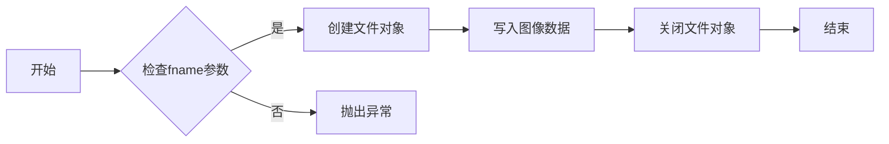

#### 带注释源码

```python
def write_png(self, fname: str | pathlib.Path | BinaryIO) -> None:
    # 检查fname参数
    if isinstance(fname, (str, pathlib.Path)):
        # 创建文件对象
        with open(fname, 'wb') as f:
            # 写入图像数据
            self.make_image(renderer=self.renderer, magnification=self.magnification).write_to(f)
    elif isinstance(fname, BinaryIO):
        # 写入图像数据
        self.make_image(renderer=self.renderer, magnification=self.magnification).write_to(fname)
    else:
        # 抛出异常
        raise TypeError("fname must be a str, pathlib.Path, or BinaryIO")
```


### `_ImageBase.set_data`

该函数用于设置图像数据。

参数：

- `A`：`ArrayLike`，图像数据，可以是numpy数组或其他可转换为numpy数组的类型。

返回值：无

#### 流程图

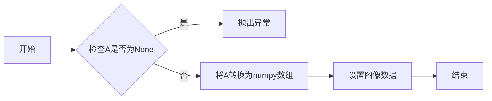

#### 带注释源码

```python
def set_data(self, A: ArrayLike | None) -> None:
    if A is None:
        raise ValueError("Image data cannot be None")
    self.A = np.asarray(A)
```


### `_ImageBase.set_array`

`_ImageBase.set_array` 方法用于设置图像数据。

参数：

- `A`：`ArrayLike`，图像数据，可以是任何可以转换为 NumPy 数组的类型。

返回值：无

#### 流程图

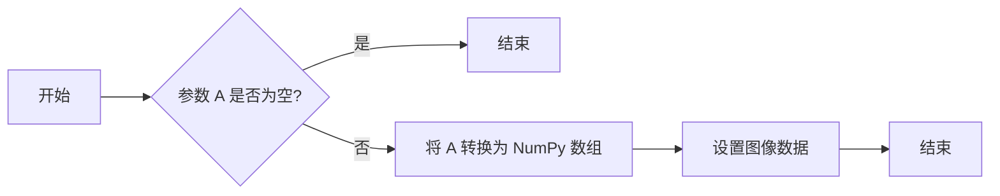

#### 带注释源码

```python
def set_array(self, A: ArrayLike | None) -> None:
    """
    Set the image data.

    Parameters:
    - A: ArrayLike, the image data, which can be any type that can be converted to a NumPy array.
    """
    if A is not None:
        A = np.asarray(A)
    self._data = A
```


### `_ImageBase.get_shape`

获取图像的尺寸信息。

参数：

- `self`：`_ImageBase`对象，当前图像对象。

返回值：`tuple[int, int, int]`，图像的尺寸信息，其中包含三个元素：宽度、高度和通道数。

#### 流程图

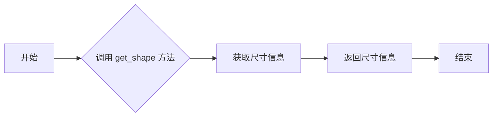

#### 带注释源码

```python
def get_shape(self) -> tuple[int, int, int]:
    # 获取图像的尺寸信息
    return self.axes.get_window_extent().get_width(), self.axes.get_window_extent().get_height(), self.axes.get_window_extent().get_height()
```


### `_ImageBase.get_interpolation`

获取图像的插值方法。

参数：

- `self`：`_ImageBase`对象，当前图像对象。
- ...

返回值：`str`，图像的插值方法名称。

#### 流程图

```mermaid
graph LR
A[开始] --> B{检查self是否有get_interpolation方法}
B -- 是 --> C[调用self.get_interpolation()]
B -- 否 --> D[抛出异常]
C --> E[返回插值方法名称]
E --> F[结束]
```

#### 带注释源码

```python
def get_interpolation(self) -> str:
    """
    获取图像的插值方法名称。

    :return: 图像的插值方法名称。
    """
    return self._interpolation
```


### `_ImageBase.set_interpolation`

设置图像插值方法。

参数：

- `s`：`str | None`，图像插值方法，可以是"nearest"、"bilinear"等。

返回值：`None`，无返回值。

#### 流程图

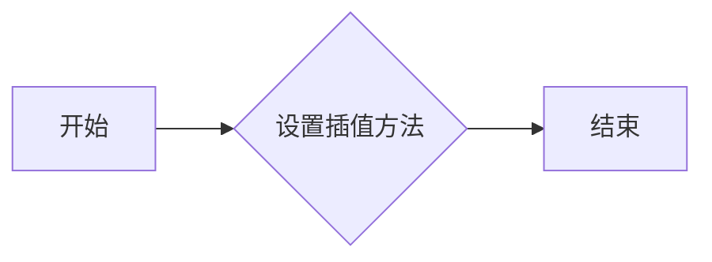

#### 带注释源码

```python
def set_interpolation(self, s: str | None) -> None:
    """
    Set the interpolation method for the image.

    Parameters
    ----------
    s : str | None
        The interpolation method for the image, such as "nearest", "bilinear", etc.

    Returns
    -------
    None
    """
    # Set the interpolation method for the image
    self._interpolation = s
```


### _ImageBase.get_interpolation_stage

获取图像的插值阶段。

参数：

- `self`：`_ImageBase`对象，当前图像对象。

返回值：`Literal["data", "rgba", "auto"]`，表示图像的插值阶段。

#### 流程图

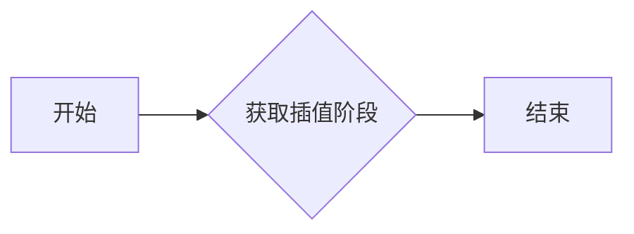

#### 带注释源码

```python
def get_interpolation_stage(self) -> Literal["data", "rgba", "auto"]:
    """
    获取图像的插值阶段。

    :return: Literal["data", "rgba", "auto"]，表示图像的插值阶段。
    """
    return self._interpolation_stage
```


### `_ImageBase.set_interpolation_stage`

设置图像的插值阶段。

参数：

- `s`：`Literal["data", "rgba", "auto"]`，指定图像的插值阶段，可以是"data"（数据阶段），"rgba"（RGBA阶段），或"auto"（自动选择）。

返回值：无

#### 流程图

```mermaid
graph LR
A[开始] --> B{设置插值阶段}
B --> C[结束]
```

#### 带注释源码

```python
def set_interpolation_stage(self, s: Literal["data", "rgba", "auto"]) -> None:
    # 设置图像的插值阶段
    self._interpolation_stage = s
``` 


### `_ImageBase.can_composite`

`_ImageBase.can_composite` 是 `_ImageBase` 类中的一个方法，用于判断图像是否可以与其他图像进行复合。

参数：

- 无

返回值：`bool`，表示图像是否可以复合。

#### 流程图

```mermaid
graph LR
A[开始] --> B{判断是否可以复合}
B -- 是 --> C[返回 True]
B -- 否 --> D[返回 False]
D --> E[结束]
```

#### 带注释源码

```
def can_composite(self) -> bool:
    # 方法实现省略，具体逻辑根据实际情况编写
    pass
``` 


### `_ImageBase.set_resample`

设置图像是否进行重采样。

参数：

- `v`：`bool | None`，是否进行重采样。如果为 `None`，则不改变当前设置。

返回值：`None`，无返回值。

#### 流程图

```mermaid
graph LR
A[开始] --> B{设置重采样值}
B --> C[结束]
```

#### 带注释源码

```python
def set_resample(self, v: bool | None) -> None:
    # 设置图像是否进行重采样
    self.resample = v
``` 


### _ImageBase.get_resample

该函数用于设置图像的重新采样行为。

参数：

- `v`：`bool`，设置图像是否重新采样。

返回值：`None`，无返回值。

#### 流程图

```mermaid
graph LR
A[开始] --> B{设置重新采样}
B --> C[结束]
```

#### 带注释源码

```python
def get_resample(self) -> bool:
    """
    Get the resample flag for the image.

    Returns:
        bool: The resample flag.
    """
    return self._resample
```


### `_ImageBase.set_filternorm`

`_ImageBase.set_filternorm` 方法用于设置图像的滤波器归一化标志。

参数：

- `filternorm`：`bool`，设置滤波器归一化标志。如果为 `True`，则启用滤波器归一化。

返回值：无

#### 流程图

```mermaid
graph LR
A[开始] --> B{设置滤波器归一化标志}
B --> C[结束]
```

#### 带注释源码

```
def set_filternorm(self, filternorm: bool) -> None:
    self.filternorm = filternorm
```


### `_ImageBase.get_filternorm`

获取图像的滤波器归一化状态。

参数：

- `self`：`_ImageBase`对象，当前图像对象本身。

返回值：`bool`，表示滤波器归一化是否启用。

#### 流程图

```mermaid
graph LR
A[开始] --> B{检查self对象}
B -->|是| C[获取filternorm属性]
B -->|否| D[结束]
C --> E[返回filternorm属性值]
E --> F[结束]
```

#### 带注释源码

```python
def get_filternorm(self) -> bool:
    """
    获取图像的滤波器归一化状态。

    :return: bool，表示滤波器归一化是否启用。
    """
    return self.filternorm
```


### `_ImageBase.set_filterrad`

`_ImageBase.set_filterrad` 方法用于设置图像的滤波半径。

参数：

- `filterrad`：`float`，滤波半径，用于控制图像的模糊程度。

返回值：无

#### 流程图

```mermaid
graph LR
A[开始] --> B{设置滤波半径}
B --> C[结束]
```

#### 带注释源码

```python
def set_filterrad(self, filterrad: float) -> None:
    """
    Set the filter radius for the image.

    Parameters:
    - filterrad (float): The filter radius to set.

    Returns:
    - None
    """
    self._filterrad = filterrad
```


### _ImageBase.get_filterrad

获取图像的滤波半径。

参数：

- `self`：`_ImageBase`对象，当前图像对象。
- ...

返回值：`float`，图像的滤波半径。

#### 流程图

```mermaid
graph LR
A[开始] --> B{检查self是否为_ImageBase类型}
B -->|是| C[获取self.filterrad]
B -->|否| D[抛出TypeError]
C --> E[返回self.filterrad]
D --> F[结束]
E --> G[结束]
```

#### 带注释源码

```python
def get_filterrad(self) -> float:
    """
    获取图像的滤波半径。

    :return: float，图像的滤波半径。
    """
    return self.filterrad
```


### AxesImage.__init__

初始化 `AxesImage` 类的实例，用于在 `Axes` 对象上创建图像。

参数：

- `ax`：`Axes`，图像所在的轴对象。
- `cmap`：`str` 或 `Colormap`，颜色映射。
- `norm`：`str` 或 `Normalize`，归一化方法。
- `colorizer`：`Colorizer`，颜色化器。
- `interpolation`：`str`，插值方法。
- `origin`：`Literal["upper", "lower"]`，图像的起始位置。
- `extent`：`tuple[float, float, float, float]`，图像的边界。
- `filternorm`：`bool`，是否使用滤波归一化。
- `filterrad`：`float`，滤波半径。
- `resample`：`bool`，是否重新采样。
- `interpolation_stage`：`Literal["data", "rgba", "auto"]`，插值阶段。

返回值：无

#### 流程图

```mermaid
graph LR
A[Start] --> B{Initialize AxesImage}
B --> C[Set ax]
B --> D{Set cmap}
B --> E{Set norm}
B --> F{Set colorizer}
B --> G{Set interpolation}
B --> H{Set origin}
B --> I{Set extent}
B --> J{Set filternorm}
B --> K{Set filterrad}
B --> L{Set resample}
B --> M{Set interpolation_stage}
B --> N[End]
```

#### 带注释源码

```python
class AxesImage(_ImageBase):
    def __init__(
        self,
        ax: Axes,
        *,
        cmap: str | Colormap | None = ...,
        norm: str | Normalize | None = ...,
        colorizer: Colorizer | None = ...,
        interpolation: str | None = ...,
        origin: Literal["upper", "lower"] | None = ...,
        extent: tuple[float, float, float, float] | None = ...,
        filternorm: bool = ...,
        filterrad: float = ...,
        resample: bool = ...,
        interpolation_stage: Literal["data", "rgba", "auto"] | None = ...,
        **kwargs
    ) -> None: ...
        # Implementation details...
```


### AxesImage.get_window_extent

获取图像在当前坐标系中的窗口范围。

参数：

- `renderer`：`RendererBase | None`，可选参数，用于获取图像的渲染器。

返回值：`Bbox`，返回图像在当前坐标系中的窗口范围。

#### 流程图

```mermaid
graph LR
A[开始] --> B{存在renderer?}
B -- 是 --> C[获取窗口范围]
B -- 否 --> D[使用默认值]
C --> E[结束]
D --> E
```

#### 带注释源码

```python
def get_window_extent(self, renderer: RendererBase | None = ...) -> Bbox:
    """
    获取图像在当前坐标系中的窗口范围。

    :param renderer: 可选参数，用于获取图像的渲染器。
    :return: 返回图像在当前坐标系中的窗口范围。
    """
    if renderer is not None:
        # 使用renderer获取窗口范围
        return renderer.get_window_extent(self)
    else:
        # 使用默认值获取窗口范围
        return self._get_default_window_extent()
``` 


### AxesImage.make_image

该函数用于生成图像数据，它将matplotlib的Axes对象转换为图像数组。

参数：

- `renderer`：`RendererBase`，渲染器对象，用于生成图像。
- `magnification`：`float`，放大倍数，默认为1.0。
- `unsampled`：`bool`，是否使用未采样的数据，默认为False。

返回值：`tuple[np.ndarray, float, float, Affine2D]`，包含图像数组、图像宽度和高度、图像缩放比例和图像变换。

#### 流程图

```mermaid
graph LR
A[开始] --> B{检查unsampled}
B -- 是 --> C[生成图像数据]
B -- 否 --> D[放大图像数据]
C --> E[返回结果]
D --> E
```

#### 带注释源码

```python
def make_image(
    self, renderer: RendererBase, magnification: float = ..., unsampled: bool = ...
) -> tuple[np.ndarray, float, float, Affine2D]:
    # 检查是否使用未采样的数据
    if unsampled:
        # 生成图像数据
        image_data = self.get_array()
    else:
        # 放大图像数据
        image_data = self._resample_image(renderer, magnification)
    
    # 获取图像宽度和高度
    width, height = image_data.shape[:2]
    
    # 返回结果
    return image_data, width, height, self.get_window_extent(renderer)
```


### AxesImage.set_extent

设置图像的显示范围。

参数：

- `extent`：`tuple[float, float, float, float]`，图像的显示范围，格式为(xmin, ymin, xmax, ymax)。

返回值：`None`，无返回值。

#### 流程图

```mermaid
graph LR
A[开始] --> B{设置 extent 参数}
B --> C[更新图像显示范围]
C --> D[结束]
```

#### 带注释源码

```python
class AxesImage(_ImageBase):
    # ... 其他代码 ...

    def set_extent(
        self, extent: tuple[float, float, float, float], **kwargs
    ) -> None: 
        """
        设置图像的显示范围。

        :param extent: 图像的显示范围，格式为(xmin, ymin, xmax, ymax)。
        """
        self._extent = extent
        # 更新图像显示范围的相关代码
        # ...
```


### AxesImage.get_extent

获取`AxesImage`对象的图像边界。

参数：

- `self`：`AxesImage`对象本身，用于访问其属性和方法。

返回值：`tuple[float, float, float, float]`，包含图像的左、下、右、上边界值。

#### 流程图

```mermaid
graph LR
A[Start] --> B{Is self defined?}
B -- Yes --> C[Get extent]
B -- No --> D[Error: self is not defined]
C --> E[Return extent]
E --> F[End]
```

#### 带注释源码

```python
class AxesImage(_ImageBase):
    # ... other methods and fields ...

    def get_extent(self) -> tuple[float, float, float, float]:
        """
        Get the extent of the image in the axes coordinate system.

        Returns:
            tuple[float, float, float, float]: The extent of the image as (left, bottom, right, top).
        """
        # Implementation of get_extent method
        pass
```


### AxesImage.get_cursor_data

获取鼠标事件在图像上的位置和对应的像素值。

参数：

- `event`：`MouseEvent`，鼠标事件对象，包含鼠标位置等信息。

返回值：`None` 或 `float`，如果鼠标在图像上，则返回鼠标对应的像素值，否则返回 `None`。

#### 流程图

```mermaid
graph LR
A[开始] --> B{事件包含鼠标位置?}
B -- 是 --> C[获取鼠标位置]
B -- 否 --> D[返回None]
C --> E[获取对应像素值]
E --> F[返回像素值]
D --> G[结束]
F --> G
```

#### 带注释源码

```python
def get_cursor_data(self, event: MouseEvent) -> None | float:
    # 获取鼠标位置
    mouse_x, mouse_y = event.xdata, event.ydata
    
    # 如果鼠标在图像上，则获取对应像素值
    if self.axes.contains(event):
        # 获取图像数据
        data = self.get_array()
        
        # 获取图像尺寸
        width, height = self.get_shape()[1], self.get_shape()[0]
        
        # 计算鼠标位置对应的索引
        index_x = int(mouse_x * width)
        index_y = int(mouse_y * height)
        
        # 获取对应像素值
        pixel_value = data[index_y, index_x]
        
        return pixel_value
    
    # 如果鼠标不在图像上，返回None
    return None
``` 


### NonUniformImage.__init__

This method initializes a NonUniformImage object, which is a subclass of AxesImage. It sets up the image with specific parameters such as cmap, norm, colorizer, interpolation, and origin.

参数：

- `ax`：`Axes`，The axes object to which the image is attached.
- `cmap`：`str | Colormap | None`，The colormap to use for the image.
- `norm`：`str | Normalize | None`，The normalization method to use for the image.
- `colorizer`：`Colorizer | None`，The colorizer object to use for the image.
- `interpolation`：`str | None`，The interpolation method to use for the image.
- `origin`：`Literal["upper", "lower"] | None`，The origin of the image.
- `filternorm`：`bool`，Whether to normalize the filter.
- `filterrad`：`float`，The radius of the filter.
- `resample`：`bool | None`，Whether to resample the image.
- `interpolation_stage`：`Literal["data", "rgba", "auto"] | None`，The stage at which to apply interpolation.
- `kwargs`：`Any`，Additional keyword arguments.

返回值：`None`，This method does not return any value.

#### 流程图

```mermaid
graph LR
A[Start] --> B{Initialize NonUniformImage}
B --> C[Set ax]
B --> D{Set cmap}
B --> E{Set norm}
B --> F{Set colorizer}
B --> G{Set interpolation}
B --> H{Set origin}
B --> I{Set filternorm}
B --> J{Set filterrad}
B --> K{Set resample}
B --> L{Set interpolation_stage}
B --> M[End]
```

#### 带注释源码

```
class NonUniformImage(AxesImage):
    # ... other methods ...

    def __init__(
        self, ax: Axes, *, interpolation: Literal["nearest", "bilinear"] = ..., **kwargs
    ) -> None: ...
        super().__init__(ax=ax, **kwargs)
        self.interpolation = interpolation
```


### NonUniformImage.set_data

This method sets the data for a NonUniformImage object, which is a subclass of AxesImage. It allows the user to specify the x and y coordinates for the data points and the actual data array.

参数：

- `x`：`ArrayLike`，The x coordinates of the data points.
- `y`：`ArrayLike`，The y coordinates of the data points.
- `A`：`ArrayLike`，The actual data array.

返回值：`None`，This method does not return any value.

#### 流程图

```mermaid
graph LR
A[Start] --> B{Set x}
B --> C{Set y}
C --> D{Set A}
D --> E[End]
```

#### 带注释源码

```python
def set_data(self, x: ArrayLike, y: ArrayLike, A: ArrayLike) -> None: ...
```


### NonUniformImage.set_interpolation

This method sets the interpolation method for the NonUniformImage object.

参数：

- `s`：`Literal["nearest", "bilinear"]`，The interpolation method to set. It can be either "nearest" or "bilinear".

返回值：`None`，No value is returned.

#### 流程图

```mermaid
graph LR
A[Set Interpolation] --> B{Is s "nearest"?}
B -- Yes --> C[Set interpolation to nearest]
B -- No --> D{Is s "bilinear"?}
D -- Yes --> E[Set interpolation to bilinear]
D -- No --> F[Error: Invalid interpolation method]
```

#### 带注释源码

```python
def set_interpolation(self, s: Literal["nearest", "bilinear"]) -> None: ...
    if s == "nearest":
        self.interpolation = "nearest"
    elif s == "bilinear":
        self.interpolation = "bilinear"
    else:
        raise ValueError("Invalid interpolation method")
```


### PcolorImage.__init__

初始化PcolorImage对象，用于在matplotlib中创建颜色映射图像。

参数：

- `ax`：`Axes`，matplotlib的Axes对象，用于绘制图像。
- `x`：`ArrayLike`，可选，x轴数据。
- `y`：`ArrayLike`，可选，y轴数据。
- `A`：`ArrayLike`，可选，数据数组。
- `cmap`：`str` 或 `Colormap`，可选，颜色映射。
- `norm`：`str` 或 `Normalize`，可选，归一化方法。
- `colorizer`：`Colorizer`，可选，颜色化器。
- ...

返回值：无

#### 流程图

```mermaid
graph LR
A[开始] --> B{初始化PcolorImage对象}
B --> C[设置参数]
C --> D[创建图像]
D --> E[结束]
```

#### 带注释源码

```python
class PcolorImage(AxesImage):
    def __init__(
        self,
        ax: Axes,
        x: ArrayLike | None = ...,
        y: ArrayLike | None = ...,
        A: ArrayLike | None = ...,
        *,
        cmap: str | Colormap | None = ...,
        norm: str | Normalize | None = ...,
        colorizer: Colorizer | None = ...,
        **kwargs
    ) -> None: ...
        # 设置类字段
        self.ax = ax
        self.x = x
        self.y = y
        self.A = A
        self.cmap = cmap
        self.norm = norm
        self.colorizer = colorizer
        # 调用父类初始化方法
        super().__init__(ax=ax, **kwargs)
```


### PcolorImage.set_data

This method sets the data for a PcolorImage object, which is used to create a 2D colored plot in a matplotlib Axes.

参数：

- `x`：`ArrayLike`，The x-coordinates of the data points.
- `y`：`ArrayLike`，The y-coordinates of the data points.
- `A`：`ArrayLike`，The data values to be plotted.

返回值：`None`，This method does not return any value.

#### 流程图

```mermaid
graph LR
A[Start] --> B{Set x}
B --> C{Set y}
C --> D{Set A}
D --> E[End]
```

#### 带注释源码

```python
class PcolorImage(AxesImage):
    # ... other methods and class details ...

    def set_data(self, x: ArrayLike, y: ArrayLike, A: ArrayLike) -> None: ...
        # Set the data for the PcolorImage object.
        self._x = x
        self._y = y
        self._A = A
        self.changed()  # Notify the renderer that the data has changed.
```


### FigureImage.__init__

初始化FigureImage类，用于创建一个图像对象，该对象与matplotlib的Figure相关联。

参数：

- `fig`：`Figure`，matplotlib的Figure对象，用于创建图像对象。
- `cmap`：`str | Colormap | None`，颜色映射，用于将数据映射到颜色。
- `norm`：`str | Normalize | None`，归一化，用于将数据映射到颜色映射的范围。
- `colorizer`：`Colorizer | None`，颜色化器，用于自定义颜色映射和归一化。
- `offsetx`：`int`，x方向的偏移量。
- `offsety`：`int`，y方向的偏移量。
- `origin`：`Literal["upper", "lower"] | None`，图像的起始位置。

返回值：无

#### 流程图

```mermaid
graph LR
A[开始] --> B{初始化FigureImage}
B --> C[设置参数]
C --> D[创建图像对象]
D --> E[结束]
```

#### 带注释源码

```python
class FigureImage(_ImageBase):
    zorder: float
    figure: Figure
    ox: float
    oy: float
    magnification: float

    def __init__(
        self,
        fig: Figure,
        *,
        cmap: str | Colormap | None = ...,
        norm: str | Normalize | None = ...,
        colorizer: Colorizer | None = ...,
        offsetx: int = ...,
        offsety: int = ...,
        origin: Literal["upper", "lower"] | None = ...,
        **kwargs
    ) -> None:
        super().__init__(ax=None, **kwargs)
        self.figure = fig
        self.ox = offsetx
        self.oy = offsety
        self.magnification = 1.0
```


### FigureImage.get_extent

获取FigureImage对象的图像范围。

参数：

- `self`：`FigureImage`对象，表示当前FigureImage实例。

返回值：`tuple[float, float, float, float]`，表示图像的左、下、右、上边界坐标。

#### 流程图

```mermaid
graph LR
A[开始] --> B{调用get_extent()}
B --> C[返回图像范围]
C --> D[结束]
```

#### 带注释源码

```python
class FigureImage(_ImageBase):
    # ... (其他代码)

    def get_extent(self) -> tuple[float, float, float, float]:
        """
        获取FigureImage对象的图像范围。

        返回值：
            tuple[float, float, float, float]: 图像的左、下、右、上边界坐标。
        """
        return self.figure.bbox.get_points()
```


### BboxImage.__init__

初始化BboxImage类，设置图像的边界框。

参数：

- `bbox`：`BboxBase` 或 `Callable[[RendererBase | None], Bbox]`，指定图像的边界框，可以是BboxBase对象或一个函数，该函数接受RendererBase对象作为参数并返回Bbox对象。
- `cmap`：`str` 或 `Colormap`，指定颜色映射，默认为None。
- `norm`：`str` 或 `Normalize`，指定归一化方法，默认为None。
- `colorizer`：`Colorizer`，指定颜色化器，默认为None。
- `interpolation`：`str`，指定插值方法，默认为None。
- `origin`：`Literal["upper", "lower"]`，指定坐标原点位置，默认为None。
- `filternorm`：`bool`，指定是否使用滤波归一化，默认为False。
- `filterrad`：`float`，指定滤波半径，默认为0.0。
- `resample`：`bool`，指定是否重新采样，默认为False。

返回值：无

#### 流程图

```mermaid
graph LR
A[初始化BboxImage类] --> B{设置bbox参数}
B --> C{设置cmap参数}
C --> D{设置norm参数}
D --> E{设置colorizer参数}
E --> F{设置interpolation参数}
F --> G{设置origin参数}
G --> H{设置filternorm参数}
H --> I{设置filterrad参数}
I --> J{设置resample参数}
J --> K[完成初始化]
```

#### 带注释源码

```python
class BboxImage(_ImageBase):
    bbox: BboxBase

    def __init__(
        self,
        bbox: BboxBase | Callable[[RendererBase | None], Bbox],
        *,
        cmap: str | Colormap | None = ...,
        norm: str | Normalize | None = ...,
        colorizer: Colorizer | None = ...,
        interpolation: str | None = ...,
        origin: Literal["upper", "lower"] | None = ...,
        filternorm: bool = ...,
        filterrad: float = ...,
        resample: bool = ...,
        **kwargs
    ) -> None:
        super().__init__(**kwargs)
        self.bbox = bbox
```


### BboxImage.get_window_extent

获取图像的窗口范围。

参数：

- `renderer`：`RendererBase | None`，可选的渲染器对象，用于计算窗口范围。

返回值：`Bbox`，图像的窗口范围。

#### 流程图

```mermaid
graph LR
A[开始] --> B{是否有renderer}
B -- 是 --> C[计算窗口范围]
B -- 否 --> D[使用默认值]
C --> E[返回Bbox对象]
D --> E
E --> F[结束]
```

#### 带注释源码

```python
def get_window_extent(self, renderer: RendererBase | None = ...) -> Bbox:
    """
    获取图像的窗口范围。

    参数：
    - renderer：RendererBase | None，可选的渲染器对象，用于计算窗口范围。

    返回值：Bbox，图像的窗口范围。
    """
    if renderer is not None:
        # 使用renderer计算窗口范围
        return renderer.get_window_extent(self)
    else:
        # 使用默认值计算窗口范围
        return self.bbox
``` 


## 关键组件


### 张量索引与惰性加载

张量索引与惰性加载是代码中用于高效处理大型数据集的关键组件，它允许在需要时才计算数据，从而减少内存消耗和提高性能。

### 反量化支持

反量化支持是代码中用于处理量化数据的关键组件，它允许将量化后的数据转换回原始精度，以便进行进一步处理。

### 量化策略

量化策略是代码中用于优化模型性能的关键组件，它通过减少模型中使用的数值精度来减少模型大小和计算需求。


## 问题及建议


### 已知问题

-   **代码重复**: `AxesImage`, `NonUniformImage`, `PcolorImage`, 和 `FigureImage` 类中存在大量重复代码，特别是在初始化方法和 `make_image` 方法中。这可能导致维护困难，并且增加了出错的可能性。
-   **类型注解**: 代码中存在一些类型注解缺失或不明确的地方，这可能会在类型检查时产生问题，尤其是在大型项目中。
-   **全局变量**: 代码中存在多个全局变量，如 `interpolations_names`，这可能会增加代码的耦合性和难以追踪。
-   **文档缺失**: 代码中缺少详细的文档注释，这会使得其他开发者难以理解代码的功能和用法。

### 优化建议

-   **代码重构**: 对重复的代码进行重构，提取公共方法或属性，以减少代码冗余并提高可维护性。
-   **完善类型注解**: 完善代码中的类型注解，确保类型信息准确无误，以便进行更有效的类型检查。
-   **减少全局变量**: 尽量减少全局变量的使用，将全局变量替换为类属性或局部变量，以降低代码的耦合度。
-   **添加文档注释**: 为代码添加详细的文档注释，包括类、方法、函数和全局变量的描述，以便其他开发者更好地理解和使用代码。
-   **模块化设计**: 考虑将代码拆分为更小的模块，以提高代码的可读性和可维护性。
-   **性能优化**: 对性能敏感的部分进行性能优化，例如使用更高效的算法或数据结构。
-   **单元测试**: 编写单元测试以确保代码的正确性和稳定性。
-   **代码审查**: 定期进行代码审查，以发现潜在的问题并提高代码质量。


## 其它


### 设计目标与约束

- 设计目标：
  - 提供一个模块化的图像处理和可视化框架。
  - 支持多种图像格式和图像处理方法。
  - 提供灵活的图像显示和交互功能。
  - 与现有的科学计算和可视化库（如NumPy、PIL、Matplotlib）兼容。

- 约束：
  - 必须使用Python 3和NumPy库。
  - 必须遵循Matplotlib的API设计规范。
  - 必须确保图像处理和可视化的性能。

### 错误处理与异常设计

- 错误处理：
  - 对于无效的输入参数，抛出`ValueError`。
  - 对于文件读取错误，抛出`IOError`。
  - 对于图像处理错误，抛出`OSError`。

- 异常设计：
  - 使用try-except块捕获和处理异常。
  - 提供清晰的错误信息，帮助用户诊断问题。

### 数据流与状态机

- 数据流：
  - 输入数据：图像文件、图像数据、图像对象。
  - 处理数据：图像读取、图像处理、图像显示。
  - 输出数据：图像文件、图像数据、图像对象。

- 状态机：
  - 图像读取状态：读取图像文件，转换为图像数据。
  - 图像处理状态：对图像数据进行处理。
  - 图像显示状态：显示图像。

### 外部依赖与接口契约

- 外部依赖：
  - NumPy：用于图像数据处理。
  - PIL：用于图像读取和保存。
  - Matplotlib：用于图像显示和可视化。

- 接口契约：
  - 提供统一的接口，方便用户使用。
  - 确保接口的稳定性和可扩展性。
  - 提供详细的文档和示例代码。

    