# `matplotlib\lib\matplotlib\inset.py` 详细设计文档

The InsetIndicator class is designed to draw rectangles and connectors on a plot to highlight areas of interest, with optional connections to an inset Axes.

## 整体流程

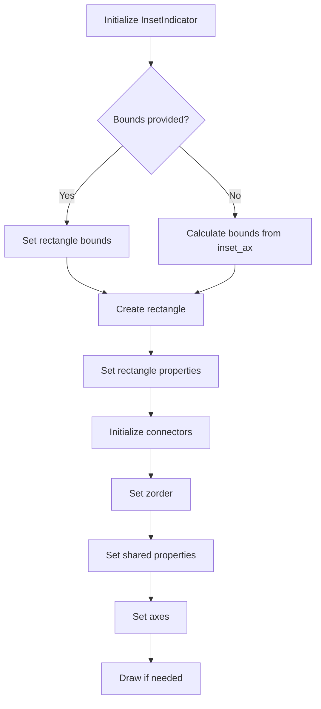

## 类结构

```
InsetIndicator (Artist)
├── _rectangle (Rectangle)
│   ├── x, y, width, height (float)
│   ├── clip_on (bool)
│   └── ...
├── _connectors (list of ConnectionPatch)
│   ├── xyA, xyB (tuple of float)
│   ├── coordsA, coordsB (Transform)
│   └── ...
├── _auto_update_bounds (bool)
├── _inset_ax (Axes)
└── ... 
```

## 全局变量及字段


### `_shared_properties`
    
Tuple containing shared properties between the rectangle and connectors.

类型：`tuple`
    


### `_rectangle`
    
The rectangle patch representing the indicator frame.

类型：`matplotlib.patches.Rectangle`
    


### `_connectors`
    
List of connection patches connecting the indicator frame to the inset Axes.

类型：`list`
    


### `_auto_update_bounds`
    
Flag indicating whether the bounds should be automatically updated from the inset Axes.

类型：`bool`
    


### `_inset_ax`
    
The optional inset Axes to draw connecting lines to.

类型：`matplotlib.axes.Axes`
    


### `InsetIndicator._rectangle`
    
The rectangle patch representing the indicator frame.

类型：`matplotlib.patches.Rectangle`
    


### `InsetIndicator._connectors`
    
List of connection patches connecting the indicator frame to the inset Axes.

类型：`list`
    


### `InsetIndicator._auto_update_bounds`
    
Flag indicating whether the bounds should be automatically updated from the inset Axes.

类型：`bool`
    


### `InsetIndicator._inset_ax`
    
The optional inset Axes to draw connecting lines to.

类型：`matplotlib.axes.Axes`
    
    

## 全局函数及方法


### `__getitem__`

This method is deprecated and returns the rectangle and connectors of the InsetIndicator artist.

参数：

- `key`：`int`，指定要返回的元素，0 表示 rectangle，1 表示 connectors。

返回值：`list`，包含 rectangle 和 connectors。

#### 流程图

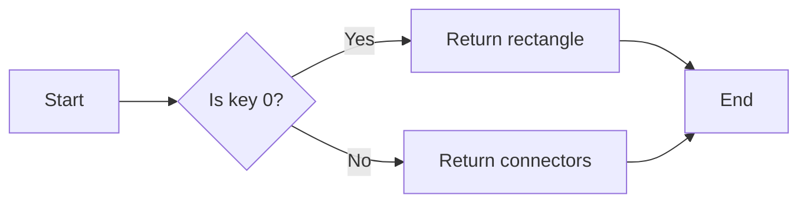

#### 带注释源码

```python
@_api.deprecated(
    '3.10',
    message=('Since Matplotlib 3.10 indicate_inset_[zoom] returns a single '
             'InsetIndicator artist with a rectangle property and a connectors '
             'property.  From 3.12 it will no longer be possible to unpack the '
             'return value into two elements.'))
def __getitem__(self, key):
    return [self._rectangle, self.connectors][key]
```


### InsetIndicator.__init__

This method initializes an instance of the `InsetIndicator` class, which is used to highlight an area of interest on a plot by drawing a rectangle and optionally connecting it to an inset Axes.

参数：

- `bounds`：`[x0, y0, width, height]`，可选。矩形标记的左下角坐标和其宽度和高度。如果不设置，则从 `inset_ax` 的数据限制中计算边界，必须提供 `inset_ax`。
- `inset_ax`：`~.axes.Axes`，可选。一个可选的插入 Axes，用于绘制连接到指示器的线条。将绘制两条线条连接指示器框到插入 Axes，选择角落以避免与指示器框重叠。
- `zorder`：`float`，默认：4.99。矩形和连接线条的绘制顺序。默认值 4.99 低于插入 Axes 的默认级别。
- `**kwargs`：其他关键字参数传递给 `.Rectangle` 补丁。

返回值：无

#### 流程图

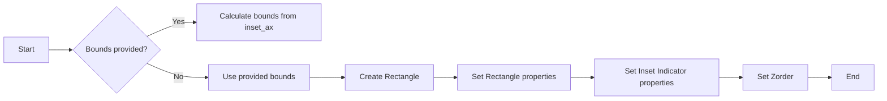

#### 带注释源码

```python
def __init__(self, bounds=None, inset_ax=None, zorder=None, **kwargs):
    """
    Parameters
    ----------
    bounds : [x0, y0, width, height], optional
        Lower-left corner of rectangle to be marked, and its width
        and height.  If not set, the bounds will be calculated from the
        data limits of inset_ax, which must be supplied.

    inset_ax : `~.axes.Axes`, optional
        An optional inset Axes to draw connecting lines to.  Two lines are
        drawn connecting the indicator box to the inset Axes on corners
        chosen so as to not overlap with the indicator box.

    zorder : float, default: 4.99
        Drawing order of the rectangle and connector lines.  The default,
        4.99, is just below the default level of inset Axes.

    **kwargs
        Other keyword arguments are passed on to the `.Rectangle` patch.
    """
    if bounds is None and inset_ax is None:
        raise ValueError("At least one of bounds or inset_ax must be supplied")

    self._inset_ax = inset_ax

    if bounds is None:
        # Work out bounds from inset_ax
        self._auto_update_bounds = True
        bounds = self._bounds_from_inset_ax()
    else:
        self._auto_update_bounds = False

    x, y, width, height = bounds

    self._rectangle = Rectangle((x, y), width, height, clip_on=False, **kwargs)

    # Connector positions cannot be calculated till the artist has been added
    # to an axes, so just make an empty list for now.
    self._connectors = []

    super().__init__()
    self.set_zorder(zorder)

    # Initial style properties for the artist should match the rectangle.
    for prop in _shared_properties:
        setattr(self, f'_{prop}', artist.getp(self._rectangle, prop))
```


### InsetIndicator._shared_setter

Helper function to set the same style property on the artist and its children.

参数：

- `prop`：`str`，The name of the style property to set.
- `val`：`any`，The value to set for the style property.

返回值：`None`，No return value.

#### 流程图

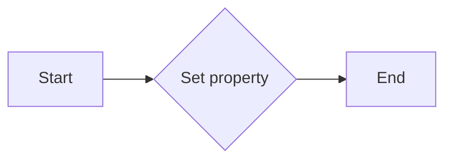

#### 带注释源码

```python
def _shared_setter(self, prop, val):
    """
    Helper function to set the same style property on the artist and its children.
    """
    setattr(self, f'_{prop}', val)
    artist.setp([self._rectangle, *self._connectors], prop, val)
```


### InsetIndicator.set_alpha

Sets the alpha value for the rectangle and the connectors.

参数：

- `alpha`：`float`，The alpha value for the rectangle and the connectors.

返回值：`None`，No return value.

#### 流程图

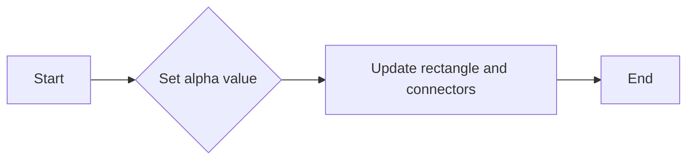

#### 带注释源码

```python
def set_alpha(self, alpha):
    # docstring inherited
    self._shared_setter('alpha', alpha)
```


### InsetIndicator.set_edgecolor

Set the edge color of the rectangle and the connectors.

参数：

- `color`：`:mpltype:`color` or None`，The edge color of the rectangle and the connectors.

返回值：`None`，No return value.

#### 流程图

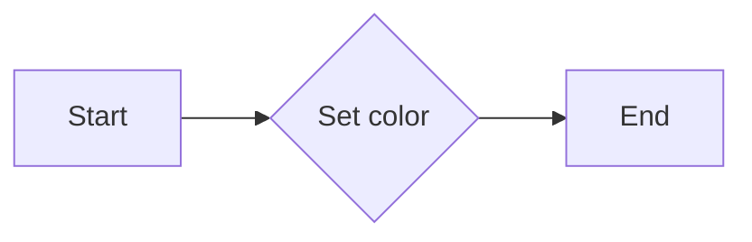

#### 带注释源码

```python
def set_edgecolor(self, color):
    """
    Set the edge color of the rectangle and the connectors.

    Parameters
    ----------
    color : :mpltype:`color` or None
    """
    self._shared_setter('edgecolor', color)
```


### InsetIndicator.set_color

Set the edgecolor of the rectangle and the connectors, and the facecolor for the rectangle.

参数：

- `c`：`color`，The color to set for the edge and face of the rectangle and the connectors.

返回值：无

#### 流程图

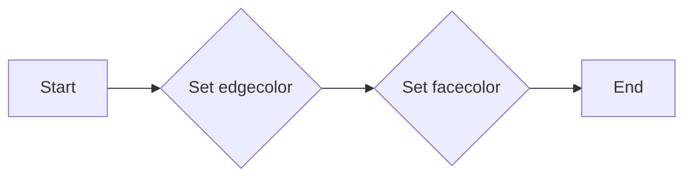

#### 带注释源码

```python
def set_color(self, c):
    """
    Set the edgecolor of the rectangle and the connectors, and the
    facecolor for the rectangle.

    Parameters
    ----------
    c : :mpltype:`color`
    """
    self._shared_setter('edgecolor', c)
    self._shared_setter('facecolor', c)
```


### InsetIndicator.set_linewidth

Set the linewidth in points of the rectangle and the connectors.

参数：

- `w`：`float or None`，The linewidth in points of the rectangle and the connectors.

返回值：`None`，No return value.

#### 流程图

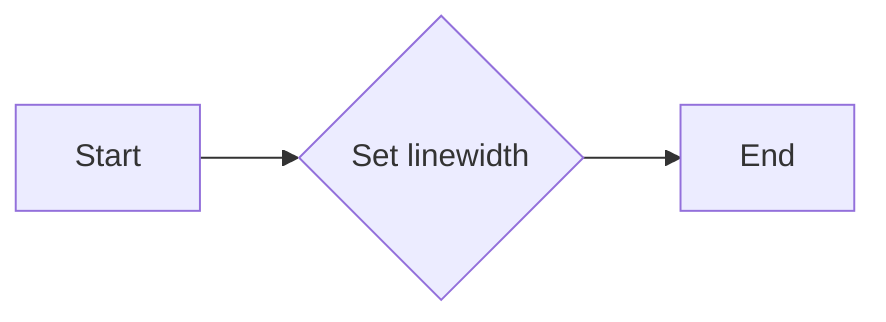

#### 带注释源码

```python
def set_linewidth(self, w):
    """
    Set the linewidth in points of the rectangle and the connectors.

    Parameters
    ----------
    w : float or None
    """
    self._shared_setter('linewidth', w)
```


### InsetIndicator.set_linestyle

Set the linestyle of the rectangle and the connectors.

参数：

- `ls`：`{'-', '--', '-.', ':', '', ...} or (offset, on-off-seq)`，The linestyle of the rectangle and the connectors. Possible values include solid line, dashed line, dash-dotted line, dotted line, and no line.

返回值：无

#### 流程图

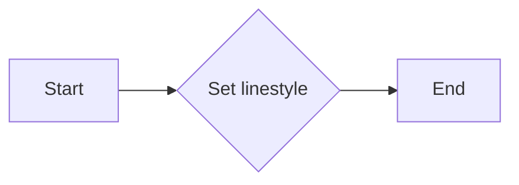

#### 带注释源码

```python
def set_linestyle(self, ls):
    """
    Set the linestyle of the rectangle and the connectors.

    Parameters
    ----------
    ls : {'-', '--', '-.', ':', '', ...} or (offset, on-off-seq)
        Possible values:

        - A string:

          =======================================================  ================
          linestyle                                                description
          =======================================================  ================
          ``'-'`` or ``'solid'``                                   solid line
          ``'--'`` or ``'dashed'``                                 dashed line
          ``'-.'`` or ``'dashdot'``                                dash-dotted line
          ``':'`` or ``'dotted'``                                  dotted line
          ``''`` or ``'none'`` (discouraged: ``'None'``, ``' '``)  draw nothing
          =======================================================  ================

        - A tuple describing the start position and lengths of dashes and spaces:

              (offset, onoffseq)

          where

          - *offset* is a float specifying the offset (in points); i.e. how much
            is the dash pattern shifted.
          - *onoffseq* is a sequence of on and off ink in points. There can be
            arbitrary many pairs of on and off values.

          Example: The tuple ``(0, (10, 5, 1, 5))`` means that the pattern starts
          at the beginning of the line. It draws a 10 point long dash,
          then a 5 point long space, then a 1 point long dash, followed by a 5 point
          long space, and then the pattern repeats.

        For examples see :doc:`/gallery/lines_bars_and_markers/linestyles`.
    """
    self._shared_setter('linestyle', ls)
```


### InsetIndicator._bounds_from_inset_ax

This method calculates the bounds for the rectangle based on the limits of the provided inset Axes.

参数：

- `self`：`InsetIndicator`对象，当前实例
- `_inset_ax`：`Axes`对象，提供边界信息的内嵌轴

返回值：`tuple`，包含边界值 `(x0, y0, width, height)`

#### 流程图

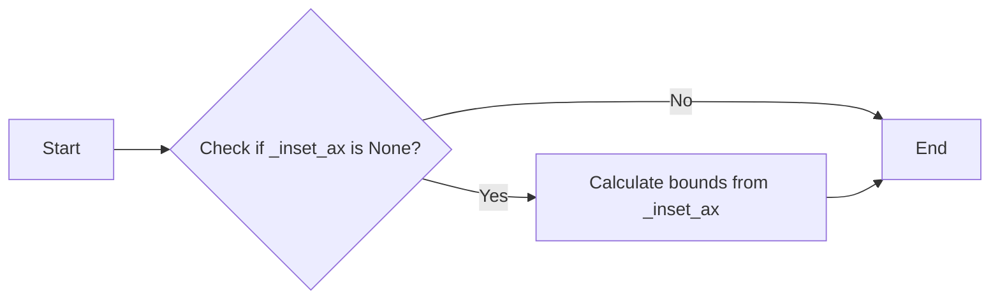

#### 带注释源码

```python
def _bounds_from_inset_ax(self):
    xlim = self._inset_ax.get_xlim()
    ylim = self._inset_ax.get_ylim()
    return (xlim[0], ylim[0], xlim[1] - xlim[0], ylim[1] - ylim[0])
``` 


### InsetIndicator._update_connectors

This method updates the connectors of the InsetIndicator object, which are lines connecting the indicator rectangle to an optional inset Axes.

参数：

- `self`：`InsetIndicator`，The InsetIndicator object itself.

返回值：`None`，This method does not return any value.

#### 流程图

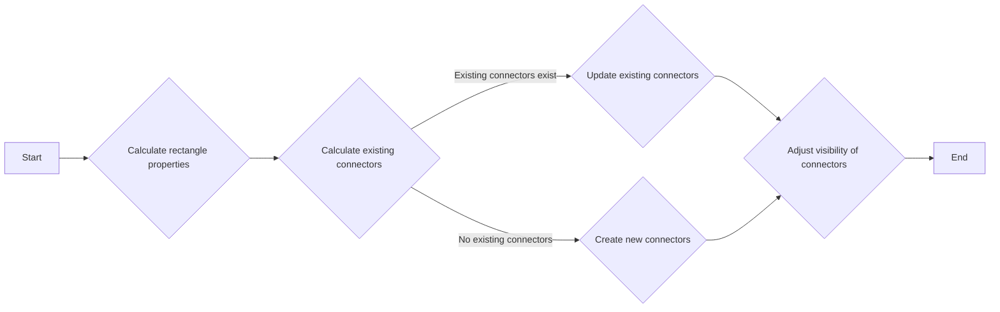

#### 带注释源码

```python
def _update_connectors(self):
    (x, y) = self._rectangle.get_xy()
    width = self._rectangle.get_width()
    height = self._rectangle.get_height()

    existing_connectors = self._connectors or [None] * 4

    # connect the inset_axes to the rectangle
    for xy_inset_ax, existing in zip([(0, 0), (0, 1), (1, 0), (1, 1)],
                                         existing_connectors):
        # inset_ax positions are in axes coordinates
        # The 0, 1 values define the four edges if the inset_ax
        # lower_left, upper_left, lower_right upper_right.
        ex, ey = xy_inset_ax
        if self.axes.xaxis.get_inverted():
            ex = 1 - ex
        if self.axes.yaxis.get_inverted():
            ey = 1 - ey
        xy_data = x + ex * width, y + ey * height
        if existing is None:
            # Create new connection patch with styles inherited from the
            # parent artist.
            p = ConnectionPatch(
                xyA=xy_inset_ax, coordsA=self._inset_ax.transAxes,
                xyB=xy_data, coordsB=self.rectangle.get_data_transform(),
                arrowstyle="-",
                edgecolor=self._edgecolor, alpha=self.get_alpha(),
                linestyle=self._linestyle, linewidth=self._linewidth)
            self._connectors.append(p)
        else:
            # Only update positioning of existing connection patch.  We
            # do not want to override any style settings made by the user.
            existing.xy1 = xy_inset_ax
            existing.xy2 = xy_data
            existing.coords1 = self._inset_ax.transAxes
            existing.coords2 = self.rectangle.get_data_transform()

    if existing is None:
        # decide which two of the lines to keep visible....
        pos = self._inset_ax.get_position()
        bboxins = pos.transformed(self.get_figure(root=False).transSubfigure)
        rectbbox = transforms.Bbox.from_bounds(x, y, width, height).transformed(
            self._rectangle.get_transform())
        x0 = rectbbox.x0 < bboxins.x0
        x1 = rectbbox.x1 < bboxins.x1
        y0 = rectbbox.y0 < bboxins.y0
        y1 = rectbbox.y1 < bboxins.y1
        self._connectors[0].set_visible(x0 ^ y0)
        self._connectors[1].set_visible(x0 == y1)
        self._connectors[2].set_visible(x1 == y0)
        self._connectors[3].set_visible(x1 ^ y1)
```


### InsetIndicator.draw

This method draws the rectangle and connector lines for the InsetIndicator artist.

参数：

- `renderer`：`matplotlib.backends.backend_agg.FigureCanvasAggRenderer`，The renderer object used to draw the artist.

返回值：`None`，This method does not return any value.

#### 流程图

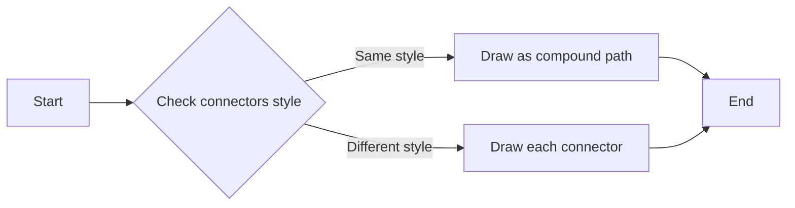

#### 带注释源码

```python
def draw(self, renderer):
    # Figure out which connectors have the same style as the box, so should
    # be drawn as a single path.
    conn_same_style = []

    # Figure out which connectors have the same style as the box, so should
    # be drawn as a single path.
    for conn in self.connectors or []:
        if conn.get_visible():
            drawn = False
            for s in _shared_properties:
                if artist.getp(self._rectangle, s) != artist.getp(conn, s):
                    # Draw this connector by itself
                    conn.draw(renderer)
                    drawn = True
                    break

            if not drawn:
                # Connector has same style as box.
                conn_same_style.append(conn)

    if conn_same_style:
        # Since at least one connector has the same style as the rectangle, draw
        # them as a compound path.
        artists = [self._rectangle] + conn_same_style
        paths = [a.get_transform().transform_path(a.get_path()) for a in artists]
        path = Path.make_compound_path(*paths)

        # Create a temporary patch to draw the path.
        p = PathPatch(path)
        p.update_from(self._rectangle)
        p.set_transform(transforms.IdentityTransform())
        p.draw(renderer)

        return

    # Just draw the rectangle
    self._rectangle.draw(renderer)
```


### InsetIndicator.__getitem__

This method returns the rectangle or connectors of the InsetIndicator object based on the provided key.

参数：

- `key`：`int`，指定返回的对象索引，0 表示 rectangle，1 表示 connectors。

返回值：`list`，包含 rectangle 和 connectors 的列表。

#### 流程图

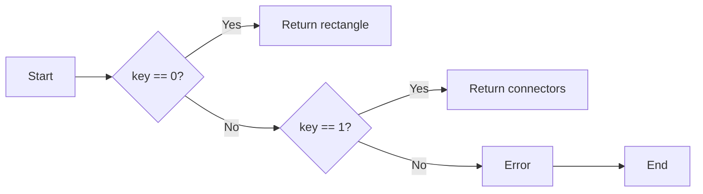

#### 带注释源码

```python
@_api.deprecated(
    '3.10',
    message=('Since Matplotlib 3.10 indicate_inset_[zoom] returns a single '
             'InsetIndicator artist with a rectangle property and a connectors '
             'property.  From 3.12 it will no longer be possible to unpack the '
             'return value into two elements.'))
def __getitem__(self, key):
    return [self._rectangle, self.connectors][key]
``` 


## 关键组件


### InsetIndicator

An artist to highlight an area of interest.

### bounds

[x0, y0, width, height]

Lower-left corner of rectangle to be marked, and its width and height.

### inset_ax

`~.axes.Axes`

An optional inset Axes to draw connecting lines to.

### zorder

float

Drawing order of the rectangle and connector lines.

### _rectangle

`.Rectangle`

The indicator frame.

### _connectors

4-tuple of `.patches.ConnectionPatch` or None

The four connector lines connecting to (lower_left, upper_left, lower_right, upper_right) corners of *inset_ax*.

### _auto_update_bounds

bool

Flag to indicate if the bounds should be automatically updated.

### _edgecolor

:mpltype:`color`

Edge color of the rectangle and the connectors.

### _linestyle

{'-', '--', '-.', ':', '', ...} or (offset, on-off-seq)

Linestyle of the rectangle and the connectors.

### _linewidth

float or None

Linewidth in points of the rectangle and the connectors.

### _shared_properties

('alpha', 'edgecolor', 'linestyle', 'linewidth')

Shared properties between the rectangle and the connectors.

### _bounds_from_inset_ax

None

Work out bounds from inset_ax.

### _update_connectors

None

Update connector positions and styles.

### set_alpha

None

Set the alpha of the rectangle and the connectors.

### set_edgecolor

None

Set the edge color of the rectangle and the connectors.

### set_color

None

Set the edgecolor of the rectangle and the connectors, and the facecolor for the rectangle.

### set_linewidth

None

Set the linewidth in points of the rectangle and the connectors.

### set_linestyle

None

Set the linestyle of the rectangle and the connectors.

### draw

None

Draw the rectangle and the connectors.

### __getitem__

None

Return the rectangle or the connectors.


## 问题及建议


### 已知问题

-   **代码复杂度**：`InsetIndicator` 类的代码相对复杂，包含多个私有方法和属性，这可能会增加维护难度。
-   **性能问题**：在 `_update_connectors` 方法中，存在多次调用 `get_xlim`、`get_ylim` 和 `get_position` 等方法，这些方法可能会影响性能，尤其是在处理大量数据时。
-   **代码重复**：`_shared_setter` 方法在设置多个属性时存在代码重复，可以考虑使用更通用的方法来减少重复代码。

### 优化建议

-   **简化代码结构**：考虑将一些私有方法和属性移到类外部，或者使用更清晰的命名来减少代码的复杂性。
-   **优化性能**：在 `_update_connectors` 方法中，可以缓存一些计算结果，避免重复计算，例如缓存 `get_xlim`、`get_ylim` 和 `get_position` 的结果。
-   **减少代码重复**：使用更通用的方法来设置多个属性，例如使用字典来存储属性和值，然后遍历字典来设置属性，这样可以减少代码重复并提高代码的可读性。
-   **文档和注释**：增加对类方法和全局函数的详细文档和注释，以便其他开发者更好地理解代码的功能和用法。
-   **异常处理**：在代码中添加异常处理，以处理可能出现的错误情况，例如在设置属性时传入无效的参数。


## 其它


### 设计目标与约束

- 设计目标：
  - 提供一个类 `InsetIndicator`，用于在图表中突出显示感兴趣的区域。
  - 支持与 `.Axes.indicate_inset` 和 `.Axes.indicate_inset_zoom` 的集成。
  - 允许用户自定义矩形和连接线的样式。
  - 确保与 Matplotlib 的其他组件兼容。

- 约束：
  - 必须使用 Matplotlib 库中的现有组件和功能。
  - 必须遵循 Matplotlib 的设计原则和编码标准。
  - 必须确保代码的可读性和可维护性。

### 错误处理与异常设计

- 错误处理：
  - 当 `bounds` 和 `inset_ax` 都未提供时，抛出 `ValueError`。
  - 当尝试访问未初始化的属性时，抛出 `AttributeError`。

- 异常设计：
  - 使用 `try-except` 块捕获和处理可能发生的异常。
  - 提供清晰的错误消息，帮助用户诊断问题。

### 数据流与状态机

- 数据流：
  - 用户通过 `__init__` 方法提供 `bounds` 和 `inset_ax` 参数。
  - `bounds` 用于创建矩形，`inset_ax` 用于创建连接线。
  - `set_alpha`、`set_edgecolor`、`set_color`、`set_linewidth` 和 `set_linestyle` 方法用于设置样式属性。

- 状态机：
  - `InsetIndicator` 类没有明确的状态机，但它的行为取决于其属性和方法。

### 外部依赖与接口契约

- 外部依赖：
  - Matplotlib 库：用于创建和绘制图形。
  - artist 模块：用于处理图形元素。
  - transforms 模块：用于转换坐标。

- 接口契约：
  - `InsetIndicator` 类必须遵循 Matplotlib 的接口契约。
  - 所有方法都必须有清晰的文档字符串，描述其功能和参数。
  - 类的公共接口必须保持稳定，避免不兼容的更改。

    