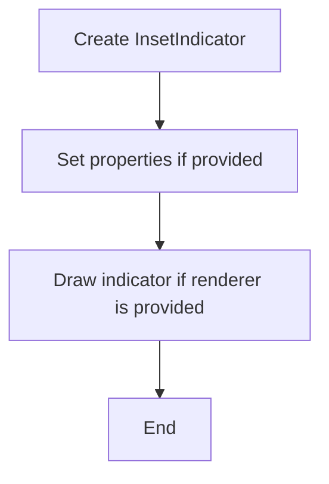
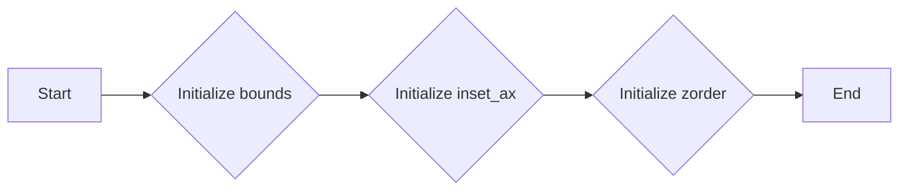
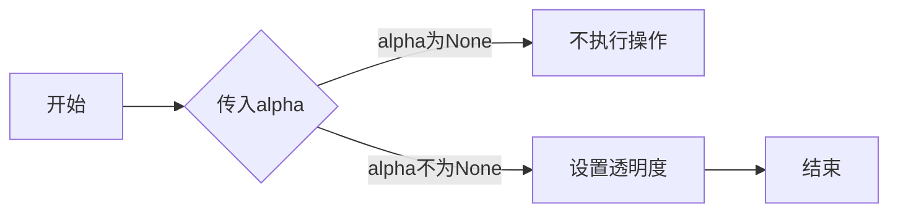
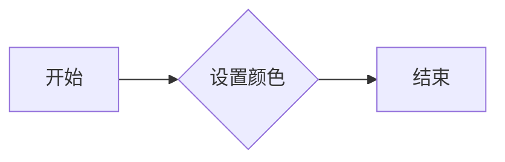
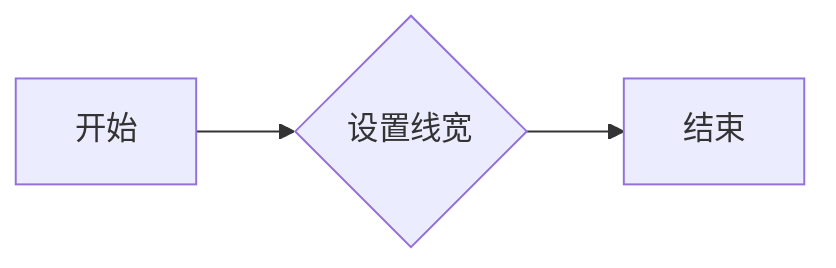
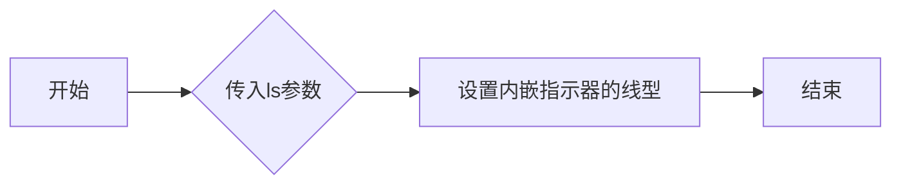
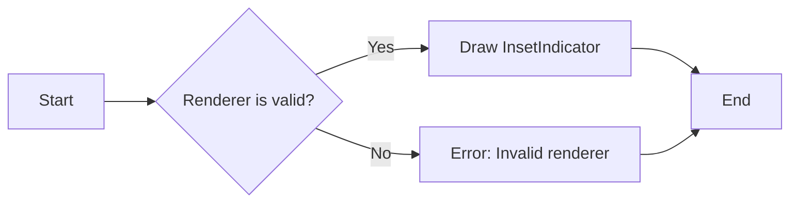

# `matplotlib\lib\matplotlib\inset.pyi` 详细设计文档

The code defines an InsetIndicator class that represents an indicator within an inset axis in a plot, providing methods to set properties like color, alpha, and line style.

## 整体流程



## 类结构

```
InsetIndicator (Concrete Class)
```

## 全局变量及字段


### `bounds`
    
The bounding box of the indicator, represented as a tuple of four floats.

类型：`tuple[float, float, float, float] | None`
    


### `inset_ax`
    
The axes object that the indicator is inset into.

类型：`Axes | None`
    


### `zorder`
    
The z-order of the indicator.

类型：`float | None`
    


### `rectangle`
    
The rectangle shape of the indicator.

类型：`Rectangle`
    


### `connectors`
    
The connectors of the indicator, represented as a tuple of ConnectionPatch objects.

类型：`tuple[ConnectionPatch, ConnectionPatch, ConnectionPatch, ConnectionPatch] | None`
    


### `InsetIndicator.bounds`
    
The bounding box of the indicator, represented as a tuple of four floats.

类型：`tuple[float, float, float, float] | None`
    


### `InsetIndicator.inset_ax`
    
The axes object that the indicator is inset into.

类型：`Axes | None`
    


### `InsetIndicator.zorder`
    
The z-order of the indicator.

类型：`float | None`
    


### `InsetIndicator.rectangle`
    
The rectangle shape of the indicator.

类型：`Rectangle`
    


### `InsetIndicator.connectors`
    
The connectors of the indicator, represented as a tuple of ConnectionPatch objects.

类型：`tuple[ConnectionPatch, ConnectionPatch, ConnectionPatch, ConnectionPatch] | None`
    
    

## 全局函数及方法


### InsetIndicator.__init__

The `__init__` method initializes an instance of the `InsetIndicator` class, setting up its properties and configurations.

参数：

- `bounds`：`tuple[float, float, float, float] | None`，The bounding box of the indicator, specified as a tuple of four floats (x_min, y_min, x_max, y_max).
- `inset_ax`：`Axes | None`，The axes object to which the indicator is attached.
- `zorder`：`float | None`，The z-order of the indicator.
- `**kwargs`：Additional keyword arguments for further customization.

返回值：`None`，No return value.

#### 流程图



#### 带注释源码

```
def __init__(
    self,
    bounds: tuple[float, float, float, float] | None = ...,
    inset_ax: Axes | None = ...,
    zorder: float | None = ...,
    **kwargs
) -> None:
    # Initialize the base class
    super().__init__()
    
    # Set the bounds of the indicator
    self.bounds = bounds
    
    # Set the axes object to which the indicator is attached
    self.inset_ax = inset_ax
    
    # Set the z-order of the indicator
    self.zorder = zorder
    
    # Additional keyword arguments for further customization
    for key, value in kwargs.items():
        setattr(self, key, value)
```


### InsetIndicator.set_alpha

该函数用于设置内嵌指示器的透明度。

参数：

- `alpha`：`float | None`，指定透明度值，范围从0（完全透明）到1（完全不透明）。如果为None，则不改变当前透明度。

返回值：`None`，该函数没有返回值。

#### 流程图



#### 带注释源码

```
def set_alpha(self, alpha: float | None) -> None:
    # 如果alpha为None，则不执行任何操作
    if alpha is None:
        return
    
    # 设置透明度
    self._alpha = alpha
```


### InsetIndicator.set_edgecolor

设置内嵌指示器的边缘颜色。

参数：

- `color`：`ColorType`，指定边缘颜色。

返回值：无

#### 流程图



#### 带注释源码

```python
def set_edgecolor(self, color: ColorType | None) -> None:
    # 设置内嵌指示器的边缘颜色
    self._edgecolor = color
```


### InsetIndicator.set_color

设置内嵌指示器的颜色。

参数：

- `c`：`ColorType`，指定内嵌指示器的颜色。

返回值：无

#### 流程图


#### 带注释源码

```python
def set_color(self, c: ColorType | None) -> None:
    # 设置内嵌指示器的颜色
    self._color = c
```


### InsetIndicator.set_linewidth

设置内嵌指示器的线宽。

参数：

- `w`：`float`，指定线宽的大小。

返回值：`None`，此方法没有返回值。

#### 流程图



#### 带注释源码

```python
def set_linewidth(self, w: float | None) -> None:
    # 设置内嵌指示器的线宽
    self._linewidth = w
```


### InsetIndicator.set_linestyle

设置内嵌指示器的线型。

参数：

- `ls`：`LineStyleType`，指定内嵌指示器的线型。

返回值：无

#### 流程图



#### 带注释源码

```python
def set_linestyle(self, ls: LineStyleType | None) -> None:
    # 设置内嵌指示器的线型
    self._linestyle = ls
```


### InsetIndicator.draw

`draw` 方法是 `InsetIndicator` 类的一个实例方法，用于将指示器绘制到给定的渲染器上。

参数：

- `renderer`：`RendererBase`，表示用于绘制的渲染器实例。

返回值：`None`，该方法不返回任何值。

#### 流程图



#### 带注释源码

```
def draw(self, renderer: RendererBase) -> None:
    # 检查渲染器是否有效
    if not isinstance(renderer, RendererBase):
        raise ValueError("Invalid renderer provided")

    # 绘制指示器
    renderer.draw(self)
```


## 关键组件


### 张量索引与惰性加载

张量索引与惰性加载机制允许在处理大型数据集时，只加载和处理需要的数据部分，从而提高内存使用效率和计算速度。

### 反量化支持

反量化支持使得模型可以在不同的量化级别上进行训练和推理，以适应不同的硬件和性能需求。

### 量化策略

量化策略定义了如何将浮点数转换为固定点数，以及如何处理量化误差，以优化模型的性能和资源使用。


## 问题及建议


### 已知问题

-   **代码注释缺失**：代码中缺少必要的注释，使得理解代码功能和逻辑变得困难。
-   **类型注解不完整**：部分方法参数和返回值的类型注解缺失，这可能导致在使用时出现类型错误。
-   **默认参数值使用省略号**：`...` 用于默认参数值，这在某些情况下可能导致代码难以阅读和维护。
-   **类方法未实现**：`__init__` 方法中定义了多个参数，但未实现具体的初始化逻辑。

### 优化建议

-   **添加代码注释**：为每个类、方法和重要代码块添加注释，以提高代码的可读性和可维护性。
-   **完善类型注解**：为所有方法参数和返回值添加类型注解，确保代码的类型安全。
-   **避免使用省略号**：使用具体的默认值代替省略号，以便于代码的阅读和维护。
-   **实现类方法**：实现 `__init__` 方法中的逻辑，确保类能够正确初始化。
-   **考虑使用更具体的默认参数**：例如，对于 `zorder` 参数，可以考虑提供一个默认值，如 `zorder=1`，而不是使用 `...`。
-   **检查 `draw` 方法实现**：确保 `draw` 方法能够正确地将 `InsetIndicator` 绘制到给定的 `renderer` 上。
-   **考虑使用继承**：如果 `InsetIndicator` 类的功能与 `artist.Artist` 类相似，可以考虑使用继承来减少代码重复。
-   **单元测试**：编写单元测试来验证 `InsetIndicator` 类的功能，确保代码的正确性和稳定性。
-   **文档化**：为类和方法编写文档字符串，描述其功能、参数和返回值。


## 其它


### 设计目标与约束

- 设计目标：确保 `InsetIndicator` 类能够正确地绘制内嵌指示器，并能够与外部系统（如渲染器）进行交互。
- 约束：类应遵循面向对象的原则，保持良好的封装性，同时确保与现有代码库的兼容性。

### 错误处理与异常设计

- 错误处理：在设置属性时，如果传入的参数类型不正确或超出预期范围，应抛出相应的异常。
- 异常设计：定义自定义异常类，如 `InvalidParameterError`，用于处理无效参数的情况。

### 数据流与状态机

- 数据流：类内部的数据流应清晰，确保每个属性和方法的输入输出明确。
- 状态机：`InsetIndicator` 类没有明显的状态转换，因此不需要状态机设计。

### 外部依赖与接口契约

- 外部依赖：`InsetIndicator` 类依赖于 `artist`、`axes`、`backend_bases`、`patches` 和 `typing` 模块。
- 接口契约：确保 `RendererBase` 接口定义了必要的渲染方法，`Axes` 类提供了必要的属性和方法来设置内嵌指示器的边界。


    