# `matplotlib\lib\matplotlib\layout_engine.py` 详细设计文档

This code defines a base class for Matplotlib layout engines and provides implementations for two specific layout engines: TightLayoutEngine and ConstrainedLayoutEngine.

## 整体流程

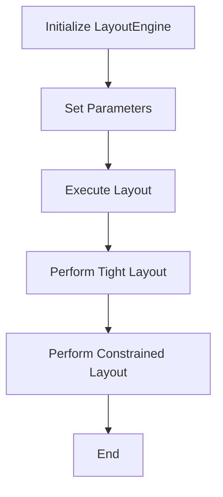

## 类结构

```
LayoutEngine (抽象基类)
├── PlaceHolderLayoutEngine (占位符布局引擎)
│   ├── TightLayoutEngine (紧布局引擎)
│   └── ConstrainedLayoutEngine (约束布局引擎)
```

## 全局变量及字段


### `None`
    
Represents the absence of a value.

类型：`NoneType`
    


### `_params`
    
Holds the parameters for the layout engine.

类型：`dict`
    


### `_adjust_compatible`
    
Indicates if the layout engine is compatible with `~.Figure.subplots_adjust`.

类型：`bool`
    


### `_colorbar_gridspec`
    
Indicates if the layout engine creates colorbars using a gridspec.

类型：`bool`
    


### `_compress`
    
Indicates whether to shift Axes to remove white space between them.

类型：`bool`
    


### `LayoutEngine._params`
    
Holds the parameters for the layout engine.

类型：`dict`
    


### `PlaceHolderLayoutEngine._adjust_compatible`
    
Indicates if the layout engine is compatible with `~.Figure.subplots_adjust`.

类型：`bool`
    


### `PlaceHolderLayoutEngine._colorbar_gridspec`
    
Indicates if the layout engine creates colorbars using a gridspec.

类型：`bool`
    


### `TightLayoutEngine._params`
    
Holds the parameters for the tight_layout engine.

类型：`dict`
    


### `ConstrainedLayoutEngine._params`
    
Holds the parameters for the constrained_layout engine.

类型：`dict`
    


### `ConstrainedLayoutEngine._compress`
    
Indicates whether to shift Axes to remove white space between them.

类型：`bool`
    
    

## 全局函数及方法


### get_subplotspec_list

获取给定轴的子图规格列表。

参数：

- `axes`：`Axes`，包含子图的轴对象

返回值：`list`，包含子图规格的列表

#### 流程图

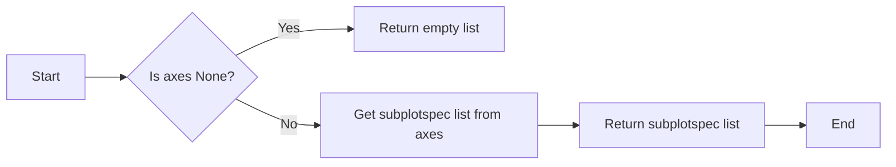

#### 带注释源码

```python
def get_subplotspec_list(axes):
    """
    Get the subplotspec list from the given axes.

    Parameters
    ----------
    axes : Axes
        The axes object containing the subplots.

    Returns
    -------
    list
        A list of subplotspecs.
    """
    # Get the subplotspec list from the axes
    subplotspec_list = axes.get_subplotspec().get_subplotspec_list()
    return subplotspec_list
```


### get_tight_layout_figure

This function is used to calculate the subplot parameters for the tight_layout geometry management.

参数：

- `fig`：`matplotlib.figure.Figure`，The figure to perform layout on.
- `axes`：`matplotlib.axes.Axes`，The axes to layout.
- `subplotspec_list`：`list`，The list of subplotspecs for the axes.
- `renderer`：`matplotlib.backends.backend_agg.FigureCanvasAgg`，The renderer for the figure.
- `pad`：`float`，Padding between the figure edge and the edges of subplots, as a fraction of the font size.
- `h_pad`：`float`，Padding (height) between edges of adjacent subplots.
- `w_pad`：`float`，Padding (width) between edges of adjacent subplots.
- `rect`：`tuple`，Rectangle in normalized figure coordinates that the subplots (including labels) will fit into.

返回值：`dict`，The calculated subplot parameters.

#### 流程图

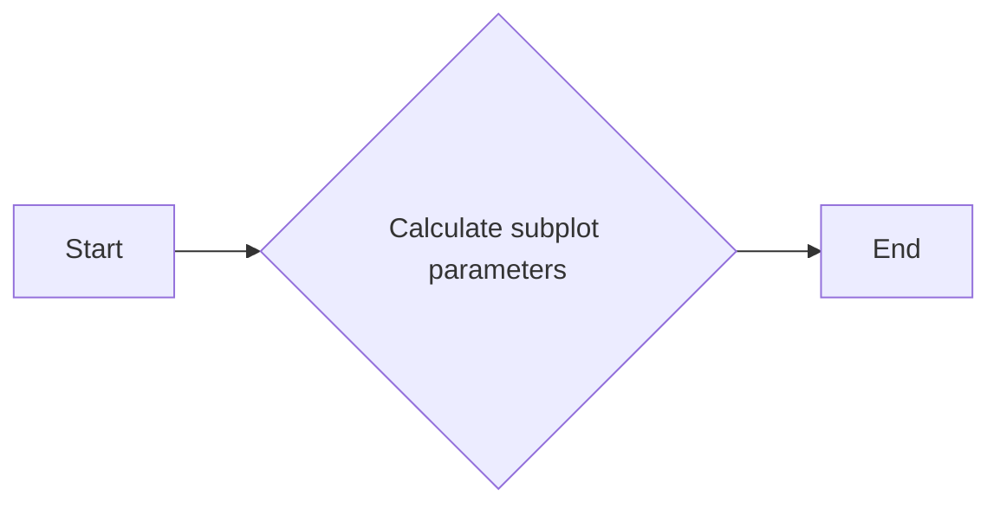

#### 带注释源码

```python
def get_tight_layout_figure(fig, axes, subplotspec_list, renderer,
                           pad=1.08, h_pad=None, w_pad=None, rect=(0, 0, 1, 1)):
    info = self._params
    renderer = fig._get_renderer()
    with getattr(renderer, "_draw_disabled", nullcontext)():
        kwargs = get_tight_layout_figure(
            fig, fig.axes, get_subplotspec_list(fig.axes), renderer,
            pad=info['pad'], h_pad=info['h_pad'], w_pad=info['w_pad'],
            rect=info['rect'])
    if kwargs:
        fig.subplots_adjust(**kwargs)
```


### do_constrained_layout

This function performs constrained_layout on a given figure, adjusting the positions and sizes of axes to fit within the specified padding and spacing.

参数：

- `fig`：`matplotlib.figure.Figure`，The figure to perform layout on.
- `w_pad`：`float`，Padding around the Axes elements in inches. Defaults to the value specified in the `figure.constrained_layout.w_pad` rcParam.
- `h_pad`：`float`，Padding around the Axes elements in inches. Defaults to the value specified in the `figure.constrained_layout.h_pad` rcParam.
- `wspace`：`float`，Fraction of the figure to dedicate to space between the axes. Defaults to the value specified in the `figure.constrained_layout.wspace` rcParam.
- `hspace`：`float`，Fraction of the figure to dedicate to space between the axes. Defaults to the value specified in the `figure.constrained_layout.hspace` rcParam.
- `rect`：`tuple` of 4 floats，Rectangle in figure coordinates to perform constrained layout in (left, bottom, width, height), each from 0-1. Defaults to (0, 0, 1, 1).
- `compress`：`bool`，Whether to shift Axes so that white space in between them is removed. Defaults to `False`.

返回值：`None`，This function does not return a value.

#### 流程图

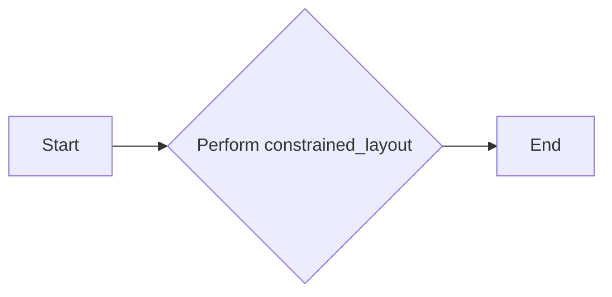

#### 带注释源码

```python
def do_constrained_layout(fig, w_pad=None, h_pad=None, wspace=None, hspace=None, rect=None, compress=False):
    """
    Perform constrained_layout on a given figure.

    Parameters
    ----------
    fig : matplotlib.figure.Figure
        The figure to perform layout on.
    w_pad : float, optional
        Padding around the Axes elements in inches. Defaults to the value specified in the `figure.constrained_layout.w_pad` rcParam.
    h_pad : float, optional
        Padding around the Axes elements in inches. Defaults to the value specified in the `figure.constrained_layout.h_pad` rcParam.
    wspace : float, optional
        Fraction of the figure to dedicate to space between the axes. Defaults to the value specified in the `figure.constrained_layout.wspace` rcParam.
    hspace : float, optional
        Fraction of the figure to dedicate to space between the axes. Defaults to the value specified in the `figure.constrained_layout.hspace` rcParam.
    rect : tuple of 4 floats, optional
        Rectangle in figure coordinates to perform constrained layout in (left, bottom, width, height), each from 0-1. Defaults to (0, 0, 1, 1).
    compress : bool, optional
        Whether to shift Axes so that white space in between them is removed. Defaults to `False`.

    """
    width, height = fig.get_size_inches()
    w_pad = w_pad / width if w_pad is not None else mpl.rcParams['figure.constrained_layout.w_pad']
    h_pad = h_pad / height if h_pad is not None else mpl.rcParams['figure.constrained_layout.h_pad']
    wspace = wspace if wspace is not None else mpl.rcParams['figure.constrained_layout.wspace']
    hspace = hspace if hspace is not None else mpl.rcParams['figure.constrained_layout.hspace']
    rect = rect if rect is not None else (0, 0, 1, 1)

    fig.set_size_inches(width, height)
    fig.subplots_adjust(left=rect[0], bottom=rect[1], right=rect[2], top=rect[3], w_pad=w_pad, h_pad=h_pad, wspace=wspace, hspace=hspace)
    fig.tight_layout()
    if compress:
        fig.subplots_adjust(compress=True)
```


### LayoutEngine.__init__

This method initializes a new instance of the `LayoutEngine` class.

参数：

- `**kwargs`：任意数量的关键字参数，用于初始化布局引擎的参数。

返回值：无

#### 流程图

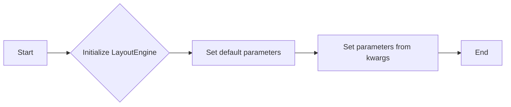

#### 带注释源码

```python
def __init__(self, **kwargs):
    super().__init__(**kwargs)
    self._params = {}
```


### PlaceHolderLayoutEngine.__init__

This method initializes a new instance of the `PlaceHolderLayoutEngine` class, which is a subclass of `LayoutEngine`.

参数：

- `adjust_compatible`：布尔值，指示布局引擎是否与 `subplots_adjust` 兼容。
- `colorbar_gridspec`：布尔值，指示布局引擎是否使用 `gridspec` 方法创建颜色条。
- `**kwargs`：任意数量的关键字参数，用于初始化布局引擎的参数。

返回值：无

#### 流程图

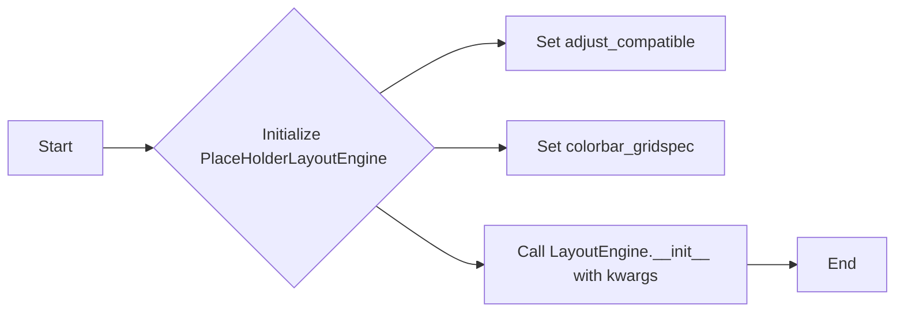

#### 带注释源码

```python
def __init__(self, adjust_compatible, colorbar_gridspec, **kwargs):
    self._adjust_compatible = adjust_compatible
    self._colorbar_gridspec = colorbar_gridspec
    super().__init__(**kwargs)
```


### TightLayoutEngine.__init__

This method initializes a new instance of the `TightLayoutEngine` class, which is a subclass of `LayoutEngine`.

参数：

- `pad`：浮点数，默认为 1.08，表示子图边缘与图边缘之间的填充，作为字体大小的分数。
- `h_pad`：浮点数，表示相邻子图边缘之间的填充（高度）。
- `w_pad`：浮点数，表示相邻子图边缘之间的填充（宽度）。
- `rect`：元组 (left, bottom, right, top)，表示子图（包括标签）将适合的矩形，在归一化图坐标中。
- `**kwargs`：任意数量的关键字参数，用于初始化布局引擎的参数。

返回值：无

#### 流程图

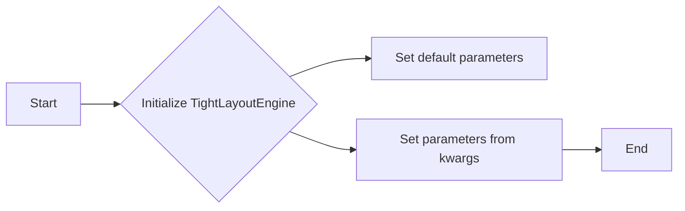

#### 带注释源码

```python
def __init__(self, *, pad=1.08, h_pad=None, w_pad=None, rect=(0, 0, 1, 1), **kwargs):
    super().__init__(**kwargs)
    for td in ['pad', 'h_pad', 'w_pad', 'rect']:
        # initialize these in case None is passed in above:
        self._params[td] = None
    self.set(pad=pad, h_pad=h_pad, w_pad=w_pad, rect=rect)
```


### ConstrainedLayoutEngine.__init__

This method initializes a new instance of the `ConstrainedLayoutEngine` class, which is a subclass of `LayoutEngine`.

参数：

- `h_pad`：浮点数，表示围绕轴元素的内边距（英寸）。
- `w_pad`：浮点数，表示围绕轴元素的内边距（英寸）。
- `hspace`：浮点数，表示分配给轴之间空间的分数。
- `wspace`：浮点数，表示分配给轴之间空间的分数。
- `rect`：包含 4 个浮点数的元组，表示在图坐标中执行约束布局的矩形（左，下，宽，高），每个从 0 到 1。
- `compress`：布尔值，表示是否将轴移动以移除它们之间的空白。
- `**kwargs`：任意数量的关键字参数，用于初始化布局引擎的参数。

返回值：无

#### 流程图

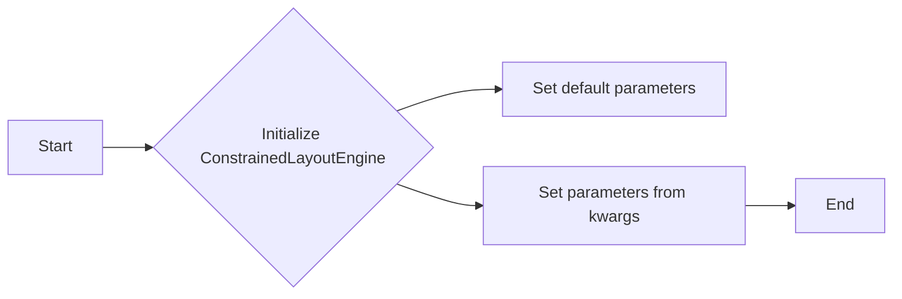

#### 带注释源码

```python
def __init__(self, *, h_pad=None, w_pad=None, hspace=None, wspace=None, rect=(0, 0, 1, 1), compress=False, **kwargs):
    super().__init__(**kwargs)
    # set the defaults:
    self.set(w_pad=mpl.rcParams['figure.constrained_layout.w_pad'],
             h_pad=mpl.rcParams['figure.constrained_layout.h_pad'],
             wspace=mpl.rcParams['figure.constrained_layout.wspace'],
             hspace=mpl.rcParams['figure.constrained_layout.hspace'],
             rect=(0, 0, 1, 1))
    # set anything that was passed in (None will be ignored):
    self.set(w_pad=w_pad, h_pad=h_pad, wspace=wspace, hspace=hspace,
             rect=rect)
    self._compress = compress
```


### LayoutEngine.set

Set the parameters for the layout engine.

参数：

- `pad`：`float`，Padding between the figure edge and the edges of subplots, as a fraction of the font size.
- `w_pad`：`float`，Padding (width) between edges of adjacent subplots. Defaults to *pad*.
- `h_pad`：`float`，Padding (height) between edges of adjacent subplots. Defaults to *pad*.
- `rect`：`tuple` (left, bottom, right, top)，Rectangle in normalized figure coordinates that the subplots (including labels) will fit into.

返回值：`None`，No return value, the parameters are set directly on the layout engine instance.

#### 流程图

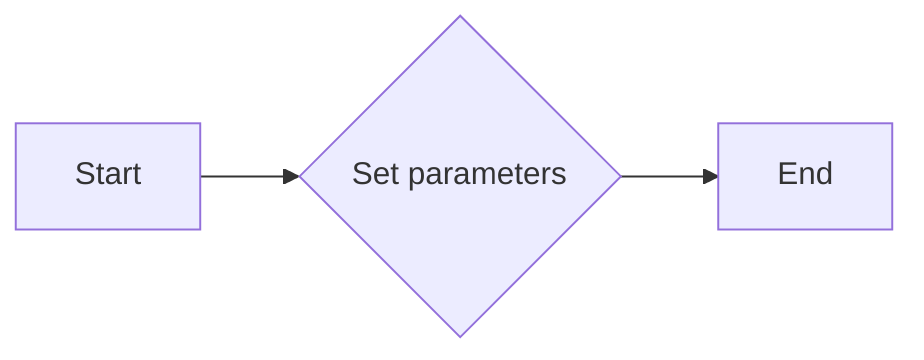

#### 带注释源码

```python
def set(self, *, pad=None, w_pad=None, h_pad=None, rect=None):
    """
    Set the pads for tight_layout.

    Parameters
    ----------
    pad : float
        Padding between the figure edge and the edges of subplots, as a
        fraction of the font size.
    w_pad, h_pad : float
        Padding (width/height) between edges of adjacent subplots.
        Defaults to *pad*.
    rect : tuple (left, bottom, right, top)
        rectangle in normalized figure coordinates that the subplots
        (including labels) will fit into.
    """
    for td in self.set.__kwdefaults__:
        if locals()[td] is not None:
            self._params[td] = locals()[td]
```


### LayoutEngine.get

Return a copy of the parameters for the layout engine.

参数：

-  `self`：`LayoutEngine`，The instance of the layout engine.

返回值：`dict`，A copy of the parameters for the layout engine.

#### 流程图

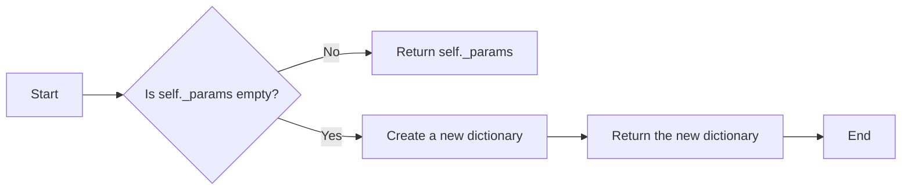

#### 带注释源码

```python
def get(self):
    """
    Return copy of the parameters for the layout engine.
    """
    return dict(self._params)
```


### LayoutEngine.execute

This method executes the layout on the figure given by `fig`.

参数：

- `fig`：`matplotlib.figure.Figure`，The figure to perform layout on.

返回值：`None`，No return value, the layout is applied directly to the figure.

#### 流程图

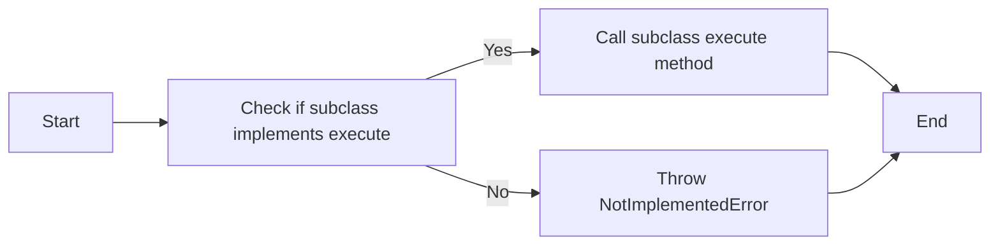

#### 带注释源码

```python
def execute(self, fig):
    """
    Execute the layout on the figure given by *fig*.
    """
    # subclasses must implement this.
    raise NotImplementedError
```


### PlaceHolderLayoutEngine.__init__

This method initializes a `PlaceHolderLayoutEngine` instance, setting up the initial parameters for the layout engine.

参数：

- `adjust_compatible`：`bool`，Determines if the layout engine is compatible with `~.Figure.subplots_adjust`.
- `colorbar_gridspec`：`bool`，Determines if the layout engine creates colorbars using a gridspec.

返回值：`None`，This method does not return any value.

#### 流程图

```mermaid
graph LR
A[Start] --> B{Initialize PlaceHolderLayoutEngine}
B --> C[Set adjust_compatible]
C --> D[Set colorbar_gridspec]
D --> E[Call super().__init__(**kwargs)]
E --> F[End]
```

#### 带注释源码

```python
def __init__(self, adjust_compatible, colorbar_gridspec, **kwargs):
    self._adjust_compatible = adjust_compatible
    self._colorbar_gridspec = colorbar_gridspec
    super().__init__(**kwargs)
```


### PlaceHolderLayoutEngine.execute

This method does nothing, acting as a placeholder when the user removes a layout engine to ensure an incompatible `.LayoutEngine` cannot be set later.

参数：

- `fig`：`matplotlib.figure.Figure`，The figure to perform layout on.

返回值：`None`，No action is taken, and no value is returned.

#### 流程图


#### 带注释源码

```python
def execute(self, fig):
    """
    Do nothing.
    """
    return
```


### TightLayoutEngine.__init__

初始化 `TightLayoutEngine` 类的实例。

参数：

- `pad`：`float`，默认值为 1.08，表示图边缘和子图边缘之间的填充，以字体大小为分数。
- `h_pad`：`float`，可选，表示相邻子图边缘之间的填充（高度）。
- `w_pad`：`float`，可选，表示相邻子图边缘之间的填充（宽度）。
- `rect`：`tuple`，默认值为 `(0, 0, 1, 1)`，表示子图（包括标签）将适应的规范化图坐标中的矩形。

返回值：无

#### 流程图

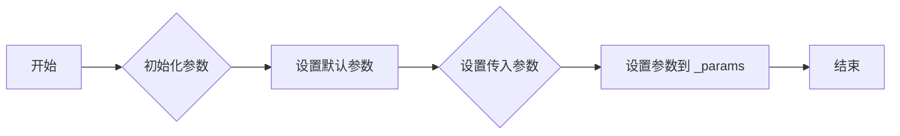

#### 带注释源码

```python
def __init__(self, *, pad=1.08, h_pad=None, w_pad=None,
             rect=(0, 0, 1, 1), **kwargs):
    super().__init__(**kwargs)
    for td in ['pad', 'h_pad', 'w_pad', 'rect']:
        # initialize these in case None is passed in above:
        self._params[td] = None
    self.set(pad=pad, h_pad=h_pad, w_pad=w_pad, rect=rect)
```


### TightLayoutEngine.execute

This method executes the tight_layout geometry management on the given figure.

参数：

- `fig`：`matplotlib.figure.Figure`，The figure to perform layout on.

返回值：`None`，No return value, the layout is applied directly to the figure.

#### 流程图

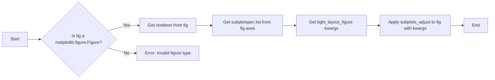

#### 带注释源码

```python
def execute(self, fig):
    """
    Execute tight_layout.

    This decides the subplot parameters given the padding that
    will allow the Axes labels to not be covered by other labels
    and Axes.

    Parameters
    ----------
    fig : `.Figure` to perform layout on.

    See Also
    --------
    .figure.Figure.tight_layout
    .pyplot.tight_layout
    """
    info = self._params
    renderer = fig._get_renderer()
    with getattr(renderer, "_draw_disabled", nullcontext)():
        kwargs = get_tight_layout_figure(
            fig, fig.axes, get_subplotspec_list(fig.axes), renderer,
            pad=info['pad'], h_pad=info['h_pad'], w_pad=info['w_pad'],
            rect=info['rect'])
    if kwargs:
        fig.subplots_adjust(**kwargs)
```


### TightLayoutEngine.set

This method sets the parameters for the `TightLayoutEngine` layout engine.

参数：

- `pad`：`float`，Padding between the figure edge and the edges of subplots, as a fraction of the font size.
- `w_pad`：`float`，Padding (width) between edges of adjacent subplots. Defaults to *pad*.
- `h_pad`：`float`，Padding (height) between edges of adjacent subplots. Defaults to *pad*.
- `rect`：`tuple` (left, bottom, right, top)，Rectangle in normalized figure coordinates that the subplots (including labels) will fit into.

返回值：`None`，This method does not return any value.

#### 流程图

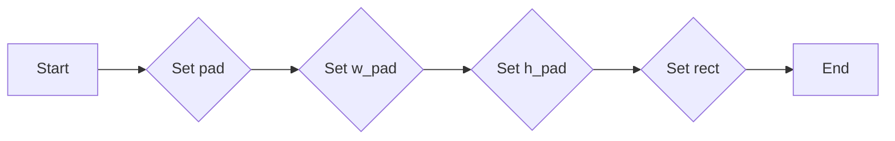

#### 带注释源码

```python
def set(self, *, pad=None, w_pad=None, h_pad=None, rect=None):
    """
    Set the pads for tight_layout.

    Parameters
    ----------
    pad : float
        Padding between the figure edge and the edges of subplots, as a
        fraction of the font size.
    w_pad, h_pad : float
        Padding (width/height) between edges of adjacent subplots.
        Defaults to *pad*.
    rect : tuple (left, bottom, right, top)
        rectangle in normalized figure coordinates that the subplots
        (including labels) will fit into.
    """
    for td in self.set.__kwdefaults__:
        if locals()[td] is not None:
            self._params[td] = locals()[td]
```


### ConstrainedLayoutEngine.__init__

This method initializes the `ConstrainedLayoutEngine` class, setting up the initial parameters for constrained layout.

参数：

- `h_pad`：`float`，Padding around the Axes elements in inches. Default to `:rc:`figure.constrained_layout.h_pad`.
- `w_pad`：`float`，Padding around the Axes elements in inches. Default to `:rc:`figure.constrained_layout.w_pad`.
- `hspace`：`float`，Fraction of the figure to dedicate to space between the axes. Default to `:rc:`figure.constrained_layout.hspace`.
- `wspace`：`float`，Fraction of the figure to dedicate to space between the axes. Default to `:rc:`figure.constrained_layout.wspace`.
- `rect`：`tuple of 4 floats`，Rectangle in figure coordinates to perform constrained layout in (left, bottom, width, height), each from 0-1.
- `compress`：`bool`，Whether to shift Axes so that white space in between them is removed.

返回值：`None`，This method does not return any value.

#### 流程图

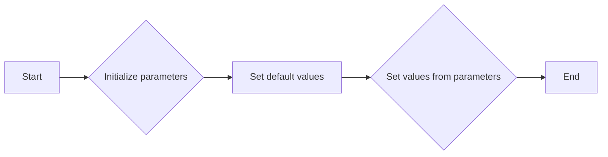

#### 带注释源码

```python
def __init__(self, *, h_pad=None, w_pad=None,
                 hspace=None, wspace=None, rect=(0, 0, 1, 1),
                 compress=False, **kwargs):
    super().__init__(**kwargs)
    # set the defaults:
    self.set(w_pad=mpl.rcParams['figure.constrained_layout.w_pad'],
             h_pad=mpl.rcParams['figure.constrained_layout.h_pad'],
             wspace=mpl.rcParams['figure.constrained_layout.wspace'],
             hspace=mpl.rcParams['figure.constrained_layout.hspace'],
             rect=(0, 0, 1, 1))
    # set anything that was passed in (None will be ignored):
    self.set(w_pad=w_pad, h_pad=h_pad, wspace=wspace, hspace=hspace,
             rect=rect)
    self._compress = compress
```


### ConstrainedLayoutEngine.execute

This method performs constrained_layout on the given figure, adjusting the positions and sizes of Axes elements to optimize the layout.

参数：

- `fig`：`matplotlib.figure.Figure`，The figure to perform layout on.

返回值：`None`，No return value, the layout is applied directly to the figure.

#### 流程图

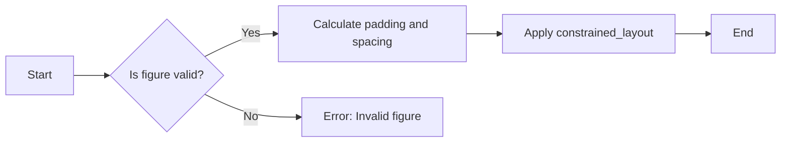

#### 带注释源码

```python
def execute(self, fig):
    """
    Perform constrained_layout and move and resize Axes accordingly.

    Parameters
    ----------
    fig : `.Figure` to perform layout on.
    """
    width, height = fig.get_size_inches()
    # pads are relative to the current state of the figure...
    w_pad = self._params['w_pad'] / width
    h_pad = self._params['h_pad'] / height

    return do_constrained_layout(fig, w_pad=w_pad, h_pad=h_pad,
                                 wspace=self._params['wspace'],
                                 hspace=self._params['hspace'],
                                 rect=self._params['rect'],
                                 compress=self._compress)
```


### ConstrainedLayoutEngine.set

This method sets the parameters for the `ConstrainedLayoutEngine` layout engine.

参数：

- `h_pad`：`float`，Padding around the Axes elements in inches. Defaults to `:rc:`figure.constrained_layout.h_pad`.
- `w_pad`：`float`，Padding around the Axes elements in inches. Defaults to `:rc:`figure.constrained_layout.w_pad`.
- `hspace`：`float`，Fraction of the figure to dedicate to space between the axes. Defaults to `:rc:`figure.constrained_layout.hspace`.
- `wspace`：`float`，Fraction of the figure to dedicate to space between the axes. Defaults to `:rc:`figure.constrained_layout.wspace`.
- `rect`：`tuple of 4 floats`，Rectangle in figure coordinates to perform constrained layout in (left, bottom, width, height), each from 0-1.

返回值：`None`，This method does not return any value.

#### 流程图


#### 带注释源码

```python
def set(self, *, h_pad=None, w_pad=None, hspace=None, wspace=None, rect=None):
    """
    Set the pads for constrained_layout.

    Parameters
    ----------
    h_pad, w_pad : float
        Padding around the Axes elements in inches.
        Default to :rc:`figure.constrained_layout.h_pad` and
        :rc:`figure.constrained_layout.w_pad`.
    hspace, wspace : float
        Fraction of the figure to dedicate to space between the
        axes.  These are evenly spread between the gaps between the Axes.
        A value of 0.2 for a three-column layout would have a space
        of 0.1 of the figure width between each column.
        If h/wspace < h/w_pad, then the pads are used instead.
        Default to :rc:`figure.constrained_layout.hspace` and
        :rc:`figure.constrained_layout.wspace`.
    rect : tuple of 4 floats
        Rectangle in figure coordinates to perform constrained layout in
        (left, bottom, width, height), each from 0-1.
    """
    for td in self.set.__kwdefaults__:
        if locals()[td] is not None:
            self._params[td] = locals()[td]
```


## 关键组件


### 张量索引与惰性加载

张量索引与惰性加载是用于高效处理大型数据集的关键技术，它允许在需要时才计算或加载数据，从而减少内存消耗和提高性能。

### 反量化支持

反量化支持是针对量化模型进行优化的一种技术，它允许模型在量化过程中保持较高的精度，从而在保证模型性能的同时减少模型大小和加速推理。

### 量化策略

量化策略是用于将浮点数模型转换为低精度整数模型的过程，它包括选择合适的量化位宽和量化方法，以平衡模型精度和性能。常见的量化策略包括全局量化、通道量化、层量化等。


## 问题及建议


### 已知问题

-   **代码重复**：`TightLayoutEngine` 和 `ConstrainedLayoutEngine` 类中的 `set` 方法有大量重复代码，用于设置和获取布局参数。这可以通过创建一个辅助方法或使用继承来减少。
-   **缺乏文档**：某些方法和属性缺少详细的文档说明，这可能会给其他开发者带来理解上的困难。
-   **异常处理**：代码中没有明显的异常处理机制，如果出现错误，可能会导致程序崩溃或不可预测的行为。

### 优化建议

-   **代码重构**：将 `TightLayoutEngine` 和 `ConstrainedLayoutEngine` 中的重复代码提取到一个单独的方法中，并通过继承来复用。
-   **增加文档**：为所有方法和属性添加详细的文档说明，包括参数、返回值和异常情况。
-   **异常处理**：在关键操作中添加异常处理，确保在出现错误时能够优雅地处理异常，并提供有用的错误信息。
-   **单元测试**：编写单元测试来验证每个类的方法和属性是否按预期工作，这有助于确保代码的稳定性和可靠性。
-   **性能优化**：对于 `execute` 方法，考虑优化性能，特别是在处理大型图形时。


## 其它


### 设计目标与约束

- 设计目标：
  - 提供灵活的布局引擎，允许用户自定义布局策略。
  - 支持多种布局引擎，如TightLayoutEngine和ConstrainedLayoutEngine。
  - 确保布局引擎与Matplotlib的其它功能兼容，如colorbars和subplots_adjust。

- 约束：
  - 布局引擎必须在绘制图之前设置，以确保布局正确。
  - 布局引擎应尽可能高效，以避免影响绘图性能。

### 错误处理与异常设计

- 错误处理：
  - 当用户尝试设置不兼容的布局引擎时，应抛出异常。
  - 当布局引擎的参数设置不正确时，应抛出异常。

- 异常设计：
  - 使用自定义异常类来处理布局相关的错误。
  - 异常信息应提供足够的信息，以便用户了解错误原因。

### 数据流与状态机

- 数据流：
  - 用户创建图实例时，可以选择布局引擎。
  - 在绘制图之前，布局引擎的execute方法被调用以应用布局。

- 状态机：
  - 布局引擎在执行过程中可能处于不同的状态，如设置参数、执行布局等。

### 外部依赖与接口契约

- 外部依赖：
  - Matplotlib库，特别是Figure和Axes类。

- 接口契约：
  - LayoutEngine类定义了布局引擎必须实现的接口。
  - 每个布局引擎都必须实现execute方法，以执行布局。


    