# `matplotlib\lib\matplotlib\layout_engine.pyi` 详细设计文档

The code defines a set of classes for managing the layout of matplotlib figures, including placeholders for default layouts and engines that enforce constraints on the figure layout.

## 整体流程

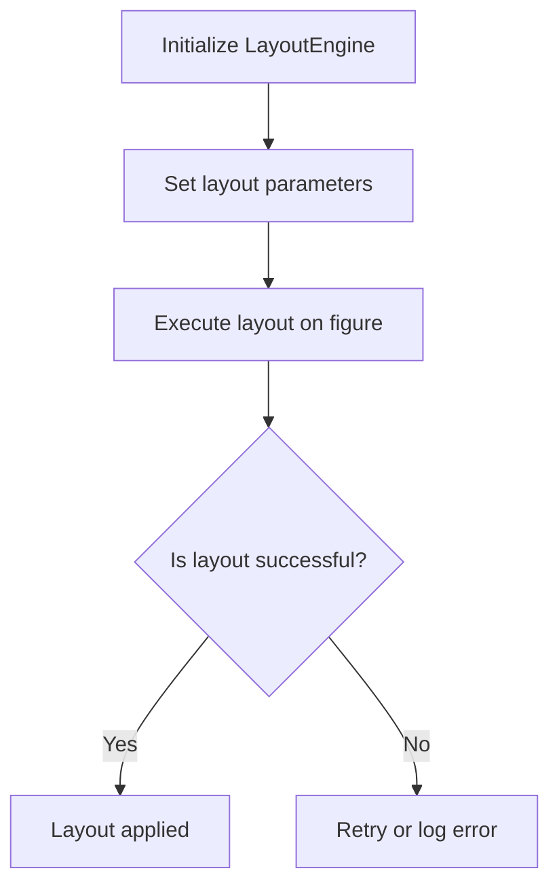

## 类结构

```
LayoutEngine (抽象基类)
├── PlaceHolderLayoutEngine (继承自 LayoutEngine)
│   ├── TightLayoutEngine (继承自 LayoutEngine)
│   └── ConstrainedLayoutEngine (继承自 LayoutEngine)
```

## 全局变量及字段


### `None`
    
Represents the absence of a value.

类型：`NoneType`
    


### `Any`
    
Type alias for the type of any type.

类型：`typing.Any`
    


### `Figure`
    
A figure object that contains all the plot elements.

类型：`matplotlib.figure.Figure`
    


### `float`
    
A floating-point number.

类型：`float`
    


### `tuple`
    
A tuple is a collection which is ordered and unchangeable.

类型：`tuple`
    


### `bool`
    
A boolean value, either True or False.

类型：`bool`
    


### `PlaceHolderLayoutEngine.adjust_compatible`
    
Indicates whether the layout is compatible with the adjust parameter.

类型：`bool`
    


### `PlaceHolderLayoutEngine.colorbar_gridspec`
    
Indicates whether the colorbar should be included in the gridspec layout.

类型：`bool`
    


### `TightLayoutEngine.pad`
    
The padding between the edges of the figure and the subplots.

类型：`float`
    


### `TightLayoutEngine.h_pad`
    
The padding between the subplots on the horizontal axis.

类型：`float | None`
    


### `TightLayoutEngine.w_pad`
    
The padding between the subplots on the vertical axis.

类型：`float | None`
    


### `TightLayoutEngine.rect`
    
The rectangle that defines the region of the figure to be used for the subplots.

类型：`tuple[float, float, float, float]`
    


### `ConstrainedLayoutEngine.h_pad`
    
The padding between the subplots on the horizontal axis.

类型：`float | None`
    


### `ConstrainedLayoutEngine.w_pad`
    
The padding between the subplots on the vertical axis.

类型：`float | None`
    


### `ConstrainedLayoutEngine.hspace`
    
The space between the subplots on the horizontal axis.

类型：`float | None`
    


### `ConstrainedLayoutEngine.wspace`
    
The space between the subplots on the vertical axis.

类型：`float | None`
    


### `ConstrainedLayoutEngine.rect`
    
The rectangle that defines the region of the figure to be used for the subplots.

类型：`tuple[float, float, float, float]`
    


### `ConstrainedLayoutEngine.compress`
    
Indicates whether to compress the subplots to fit the figure area.

类型：`bool`
    
    

## 全局函数及方法


### `TightLayoutEngine.execute`

将图表布局调整为紧凑模式。

参数：

- `fig`：`Figure`，matplotlib中的图表对象，用于执行布局。

返回值：`None`，无返回值。

#### 流程图

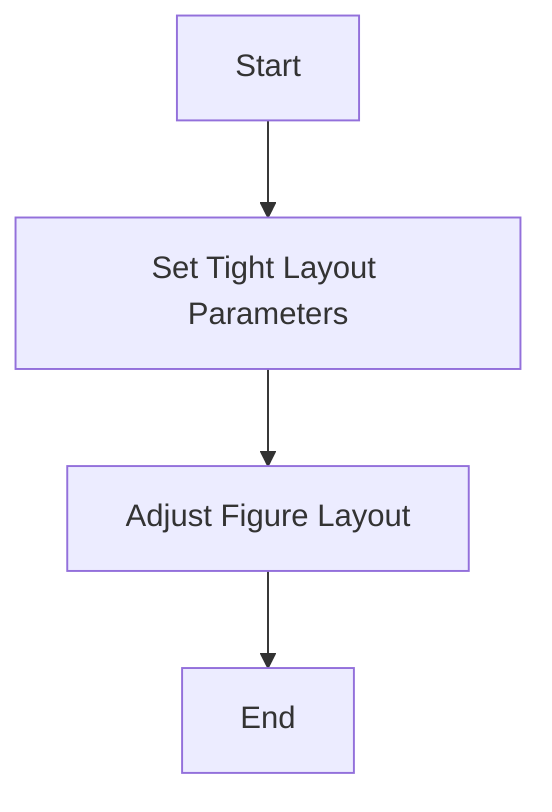

#### 带注释源码

```
class TightLayoutEngine(LayoutEngine):
    # ... (其他代码)

    def execute(self, fig: Figure) -> None:
        # 执行紧凑布局
        fig.tight_layout()
```


### TightLayoutEngine.set

设置布局引擎的参数。

参数：

- `pad`：`float | None`，可选参数，设置内边距。
- `w_pad`：`float | None`，可选参数，设置水平内边距。
- `h_pad`：`float | None`，可选参数，设置垂直内边距。
- `rect`：`tuple[float, float, float, float] | None`，可选参数，设置布局矩形区域。

返回值：`None`，无返回值。

#### 流程图

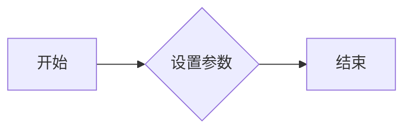

#### 带注释源码

```python
class TightLayoutEngine(LayoutEngine):
    # ... 其他代码 ...

    def set(
        self,
        *,
        pad: float | None = ...,
        w_pad: float | None = ...,
        h_pad: float | None = ...,
        rect: tuple[float, float, float, float] | None = ...
    ) -> None:
        # 设置内边距
        if pad is not None:
            self.pad = pad
        # 设置水平内边距
        if w_pad is not None:
            self.w_pad = w_pad
        # 设置垂直内边距
        if h_pad is not None:
            self.h_pad = h_pad
        # 设置布局矩形区域
        if rect is not None:
            self.rect = rect
```


### LayoutEngine.get

获取布局引擎的配置信息。

参数：

- 无

返回值：`dict[str, Any]`，包含布局引擎的配置信息。

#### 流程图

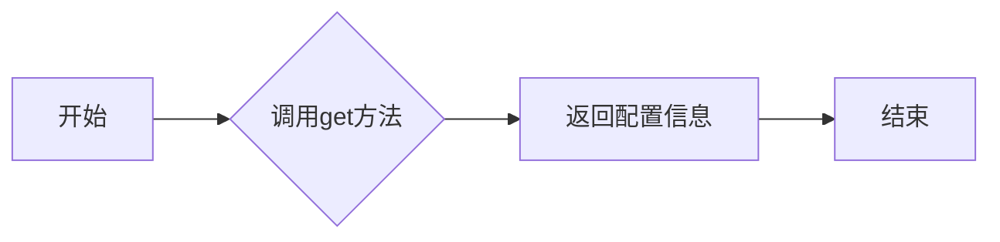

#### 带注释源码

```python
class LayoutEngine:
    # ... 其他方法 ...

    def get(self) -> dict[str, Any]:
        # 返回布局引擎的配置信息
        return {
            # 这里可以添加具体的配置信息
        }
```


### LayoutEngine.execute

The `LayoutEngine.execute` method is responsible for applying the layout configuration to a given matplotlib figure.

参数：

- `fig`：`Figure`，The matplotlib figure to which the layout configuration will be applied.

返回值：`None`，This method does not return any value.

#### 流程图

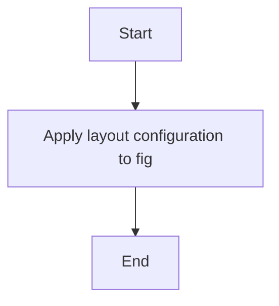

#### 带注释源码

```
def execute(self, fig: Figure) -> None:
    # Apply the layout configuration to the given figure
    # This is a placeholder for the actual layout logic
    pass
```

### PlaceHolderLayoutEngine.execute

The `PlaceHolderLayoutEngine.execute` method is a subclass of `LayoutEngine.execute` and is responsible for applying the layout configuration to a given matplotlib figure, similar to its superclass.

参数：

- `fig`：`Figure`，The matplotlib figure to which the layout configuration will be applied.

返回值：`None`，This method does not return any value.

#### 流程图


#### 带注释源码

```
def execute(self, fig: Figure) -> None:
    # Apply the layout configuration to the given figure
    # This is a placeholder for the actual layout logic
    super().execute(fig)
```

### TightLayoutEngine.execute

The `TightLayoutEngine.execute` method is a subclass of `LayoutEngine.execute` and is responsible for applying a tight layout configuration to a given matplotlib figure.

参数：

- `fig`：`Figure`，The matplotlib figure to which the tight layout configuration will be applied.

返回值：`None`，This method does not return any value.

#### 流程图

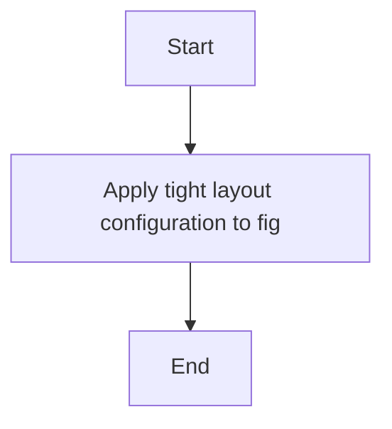

#### 带注释源码

```
def execute(self, fig: Figure) -> None:
    # Apply a tight layout configuration to the given figure
    # This is a placeholder for the actual layout logic
    pass
```

### ConstrainedLayoutEngine.execute

The `ConstrainedLayoutEngine.execute` method is a subclass of `LayoutEngine.execute` and is responsible for applying a constrained layout configuration to a given matplotlib figure.

参数：

- `fig`：`Figure`，The matplotlib figure to which the constrained layout configuration will be applied.

返回值：`None`，This method does not return any value.

#### 流程图

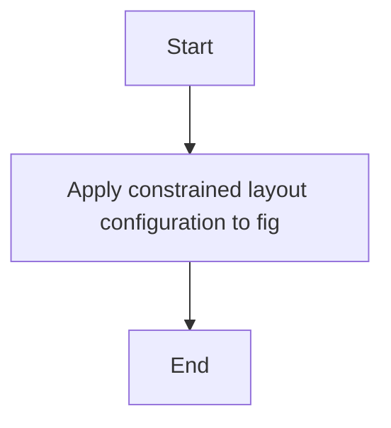

#### 带注释源码

```
def execute(self, fig: Figure) -> None:
    # Apply a constrained layout configuration to the given figure
    # This is a placeholder for the actual layout logic
    pass
```


### PlaceHolderLayoutEngine.execute

该函数用于执行占位符布局引擎的布局操作。

参数：

- `fig`：`Figure`，matplotlib中的Figure对象，表示绘图区域。

返回值：`None`，无返回值。

#### 流程图

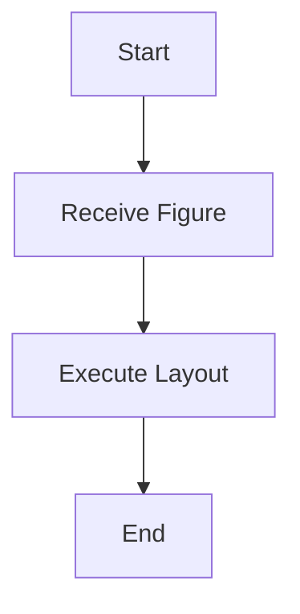

#### 带注释源码

```
class PlaceHolderLayoutEngine(LayoutEngine):
    # ...

    def execute(self, fig: Figure) -> None:
        # 执行占位符布局引擎的布局操作
        # 此处为示例，实际操作可能为空或设置默认布局
        pass
``` 


### TightLayoutEngine.set

`TightLayoutEngine.set` 方法用于设置 `TightLayoutEngine` 类的布局参数。

参数：

- `pad`：`float | None`，设置布局的填充距离。
- `w_pad`：`float | None`，设置布局的宽度填充距离。
- `h_pad`：`float | None`，设置布局的高度填充距离。
- `rect`：`tuple[float, float, float, float] | None`，设置布局的矩形区域。

返回值：`None`，无返回值。

#### 流程图

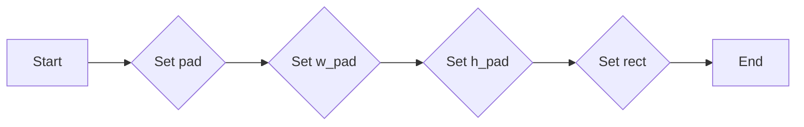

#### 带注释源码

```
def set(
    self,
    *,
    pad: float | None = ...,
    w_pad: float | None = ...,
    h_pad: float | None = ...,
    rect: tuple[float, float, float, float] | None = ...
) -> None:
    # Set the padding for the layout
    self.pad = pad
    # Set the width padding for the layout
    self.w_pad = w_pad
    # Set the height padding for the layout
    self.h_pad = h_pad
    # Set the rectangular area for the layout
    self.rect = rect
```


### TightLayoutEngine.execute

该函数负责执行布局引擎的布局操作，将给定的matplotlib Figure对象进行布局调整。

参数：

- `fig`：`Figure`，matplotlib的Figure对象，表示要布局的图形。

返回值：`None`，该函数不返回任何值。

#### 流程图

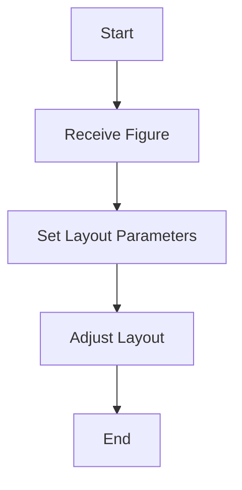

#### 带注释源码

```
class TightLayoutEngine(LayoutEngine):
    # ... (其他代码)

    def execute(self, fig: Figure) -> None:
        # 调用父类的方法来设置布局参数
        self.set(pad=self.pad, h_pad=self.h_pad, w_pad=self.w_pad, rect=self.rect)
        
        # 执行布局调整
        # ... (布局调整的代码)
        
        # 布局调整完成后，没有返回值
        # ...
``` 


### ConstrainedLayoutEngine.set

`ConstrainedLayoutEngine.set` 方法用于设置 ConstrainedLayoutEngine 对象的布局参数。

参数：

- `h_pad`：`float | None`，水平间距，如果为 None，则使用默认值。
- `w_pad`：`float | None`，垂直间距，如果为 None，则使用默认值。
- `hspace`：`float | None`，子图之间的水平间距，如果为 None，则使用默认值。
- `wspace`：`float | None`，子图之间的垂直间距，如果为 None，则使用默认值。
- `rect`：`tuple[float, float, float, float] | None`，子图占据的矩形区域，如果为 None，则使用默认值。

返回值：`None`，无返回值。

#### 流程图


#### 带注释源码

```
class ConstrainedLayoutEngine(LayoutEngine):
    # ... 其他代码 ...

    def set(
        self,
        *,
        h_pad: float | None = ...,
        w_pad: float | None = ...,
        hspace: float | None = ...,
        wspace: float | None = ...,
        rect: tuple[float, float, float, float] | None = ...
    ) -> None:
        # 设置布局参数
        self.h_pad = h_pad
        self.w_pad = w_pad
        self.hspace = hspace
        self.wspace = wspace
        self.rect = rect
```


### ConstrainedLayoutEngine.execute

该函数负责执行布局引擎的约束布局逻辑，根据给定的参数调整matplotlib图形的布局。

参数：

- `fig`：`Figure`，matplotlib图形对象，用于应用布局约束。

返回值：`None`，该函数不返回任何值。

#### 流程图

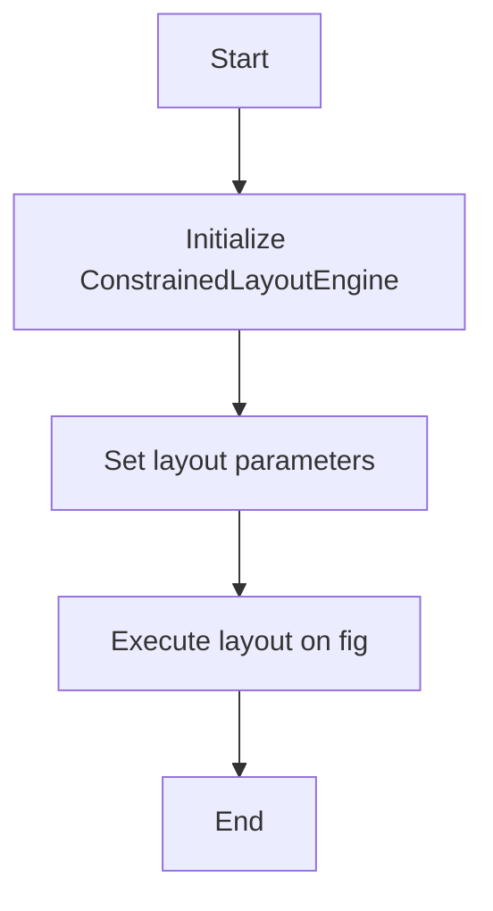

#### 带注释源码

```
class ConstrainedLayoutEngine(LayoutEngine):
    # ... (其他代码)

    def execute(self, fig: Figure) -> None:
        # 应用布局约束到给定的matplotlib图形对象
        # ...
        pass
```


## 关键组件


### 张量索引与惰性加载

张量索引与惰性加载是处理大型数据集时提高性能的关键技术，它允许在需要时才计算数据，从而减少内存消耗和提高处理速度。

### 反量化支持

反量化支持是优化计算过程的一种技术，它通过将量化后的数据转换回原始精度，以减少量化误差并提高计算精度。

### 量化策略

量化策略是优化计算资源使用的一种方法，它通过将数据表示为更小的数值范围来减少内存和计算需求，从而提高效率。


## 问题及建议


### 已知问题

-   **代码复用性低**：`LayoutEngine` 类及其子类 `PlaceHolderLayoutEngine`、`TightLayoutEngine` 和 `ConstrainedLayoutEngine` 都有相似的 `execute` 和 `set` 方法实现，但每个子类都有不同的参数。这可能导致代码维护困难，因为每个子类的实现细节都需要单独管理。
-   **参数默认值过多**：在 `TightLayoutEngine` 和 `ConstrainedLayoutEngine` 的构造函数中，有很多参数带有默认值，这可能导致在使用时容易忘记设置某些参数，从而影响布局结果。
-   **异常处理缺失**：代码中没有显示异常处理机制，如果在使用过程中出现错误，可能会导致程序崩溃或不可预期的行为。

### 优化建议

-   **使用继承和抽象类**：考虑将 `LayoutEngine` 设计为一个抽象类，并定义一些抽象方法，这样子类可以继承并实现这些方法，从而提高代码复用性。
-   **简化参数设置**：提供一个统一的参数设置方法，例如使用字典或配置对象来管理布局参数，这样可以减少参数的默认值，并使参数设置更加清晰。
-   **添加异常处理**：在关键操作中添加异常处理，确保在出现错误时能够给出清晰的错误信息，并采取适当的恢复措施。
-   **文档和注释**：为每个类和方法添加详细的文档和注释，说明其用途、参数和返回值，这有助于其他开发者理解和使用代码。
-   **单元测试**：编写单元测试来验证每个类和方法的正确性，确保代码的质量和稳定性。


## 其它


### 设计目标与约束

- 设计目标：提供灵活的布局引擎，支持多种布局方式，并能够适应不同的图形和图表需求。
- 约束条件：确保布局引擎与matplotlib兼容，并能够高效地处理大量数据。

### 错误处理与异常设计

- 异常处理：在方法中捕获并处理可能出现的异常，如参数类型错误、matplotlib图形对象错误等。
- 错误日志：记录错误信息，便于问题追踪和调试。

### 数据流与状态机

- 数据流：布局引擎接收matplotlib图形对象作为输入，根据配置参数生成布局。
- 状态机：布局引擎在执行过程中可能经历不同的状态，如初始化、设置参数、执行布局等。

### 外部依赖与接口契约

- 外部依赖：依赖于matplotlib库，需要确保matplotlib库的版本兼容性。
- 接口契约：定义布局引擎的接口规范，确保与其他模块的交互一致性。

### 测试用例与覆盖率

- 测试用例：编写测试用例，覆盖所有类方法和全局函数的功能。
- 覆盖率：确保代码覆盖率达到一定标准，提高代码质量。

### 性能优化与资源管理

- 性能优化：对关键代码进行性能优化，提高布局引擎的执行效率。
- 资源管理：合理管理资源，避免内存泄漏和资源浪费。

### 安全性与合规性

- 安全性：确保代码的安全性，防止潜在的安全漏洞。
- 合规性：遵守相关法律法规，确保代码的合规性。

### 维护与更新策略

- 维护策略：定期更新代码，修复已知问题，添加新功能。
- 更新策略：遵循版本控制规范，确保代码的版本一致性。

### 文档与帮助

- 文档：编写详细的文档，包括代码说明、使用方法、示例等。
- 帮助：提供在线帮助文档，方便用户查阅和使用。

### 用户反馈与支持

- 用户反馈：收集用户反馈，了解用户需求，改进产品。
- 支持服务：提供技术支持，解决用户在使用过程中遇到的问题。


    