# `matplotlib\lib\matplotlib\legend.pyi` 详细设计文档

This code defines a DraggableLegend class that allows the legend of a matplotlib plot to be moved and resized by the user.

## 整体流程

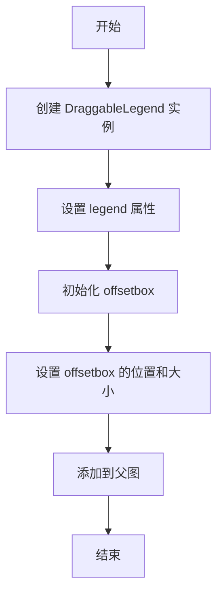

## 类结构

```
DraggableLegend (继承自 DraggableOffsetBox)
├── Legend (继承自 Artist)
│   ├── 图形和文本属性
│   ├── 事件处理
│   └── 其他辅助方法
```

## 全局变量及字段


### `legend`
    
The legend object associated with the DraggableLegend.

类型：`Legend`
    


### `use_blit`
    
Whether to use blitting for rendering the legend.

类型：`bool`
    


### `update`
    
The update mode for the legend position or bounding box.

类型：`Literal['loc', 'bbox']`
    


### `Legend.codes`
    
A dictionary mapping legend codes to integer values.

类型：`dict[str, int]`
    


### `Legend.zorder`
    
The z-order of the legend.

类型：`float`
    


### `Legend.prop`
    
The font properties of the legend text.

类型：`FontProperties`
    


### `Legend.texts`
    
The text objects representing the legend labels.

类型：`list[Text]`
    


### `Legend.legend_handles`
    
The list of legend handles (artists).

类型：`list[Artist | None]`
    


### `Legend.numpoints`
    
The number of points to use for markers in the legend.

类型：`int`
    


### `Legend.markerscale`
    
The scale factor for the markers in the legend.

类型：`float`
    


### `Legend.scatterpoints`
    
The number of points to use for scatter plots in the legend.

类型：`int`
    


### `Legend.borderpad`
    
The padding around the legend border.

类型：`float`
    


### `Legend.labelspacing`
    
The spacing between legend labels.

类型：`float`
    


### `Legend.handlelength`
    
The length of the legend handles.

类型：`float`
    


### `Legend.handleheight`
    
The height of the legend handles.

类型：`float`
    


### `Legend.handletextpad`
    
The padding between the legend handle and text.

类型：`float`
    


### `Legend.borderaxespad`
    
The padding between the legend and the axes.

类型：`float`
    


### `Legend.columnspacing`
    
The spacing between columns in the legend.

类型：`float`
    


### `Legend.shadow`
    
Whether to draw a shadow behind the legend.

类型：`bool`
    


### `Legend.isaxes`
    
Whether the legend is an axes object.

类型：`bool`
    


### `Legend.axes`
    
The axes object associated with the legend.

类型：`Axes`
    


### `Legend.parent`
    
The parent axes or figure object of the legend.

类型：`Axes | Figure`
    


### `Legend.legendPatch`
    
The bounding box patch of the legend.

类型：`FancyBboxPatch`
    
    

## 全局函数及方法


### DraggableLegend.__init__

初始化DraggableLegend类，设置图例的属性和状态。

参数：

- `legend`：`Legend`，传入的图例对象，用于初始化DraggableLegend。
- `use_blit`：`bool`，是否使用blit模式进行更新，默认为省略，即使用默认值。
- `update`：`Literal["loc", "bbox"]`，更新图例的位置或边界框，默认为省略，即使用默认值。

返回值：`None`，无返回值。

#### 流程图

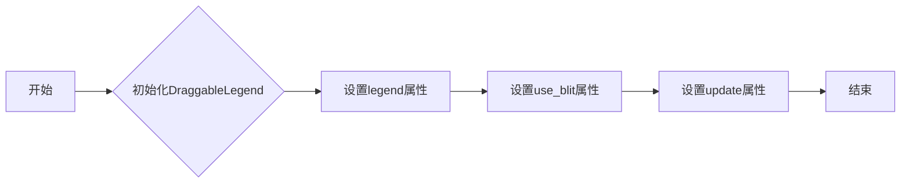

#### 带注释源码

```python
from matplotlib.axes import Axes
from matplotlib.artist import Artist
from matplotlib.backend_bases import MouseEvent
from matplotlib.figure import Figure
from matplotlib.font_manager import FontProperties
from matplotlib.legend_handler import HandlerBase
from matplotlib.lines import Line2D
from matplotlib.offsetbox import (
    DraggableOffsetBox,
)
from matplotlib.patches import FancyBboxPatch, Patch, Rectangle
from matplotlib.text import Text
from matplotlib.transforms import (
    BboxBase,
    Transform,
)
from matplotlib.typing import ColorType, LegendLocType


class DraggableLegend(DraggableOffsetBox):
    legend: Legend
    def __init__(
        self, legend: Legend, use_blit: bool = ..., update: Literal["loc", "bbox"] = ...
    ) -> None:
        # 初始化父类
        super().__init__()
        # 设置图例属性
        self.legend = legend
        # 设置use_blit属性
        self.use_blit = use_blit
        # 设置update属性
        self.update = update
        # 其他初始化代码...
```


### DraggableLegend.finalize_offset

`finalize_offset` 方法是 `DraggableLegend` 类的一个方法，用于完成拖动图例的偏移量最终化。

参数：

- 无

返回值：`None`，无返回值

#### 流程图

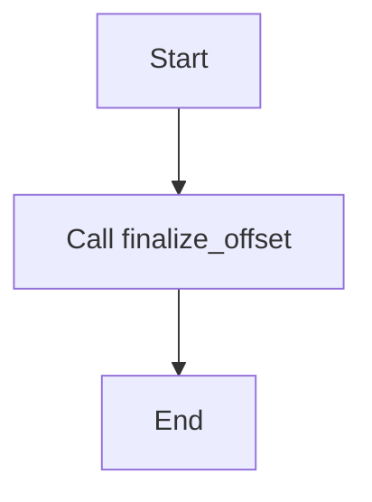

#### 带注释源码

```
class DraggableLegend(DraggableOffsetBox):
    # ... (其他代码)

    def finalize_offset(self) -> None:
        # ... (方法实现)
```

由于源码中未提供 `finalize_offset` 方法的具体实现，因此无法提供具体的源码内容。


### Legend.__init__

初始化 `Legend` 类的实例，创建一个图例对象。

参数：

- `parent`：`Axes` 或 `Figure`，图例的父对象。
- `handles`：`Iterable[Artist | tuple[Artist, ...]]`，图例中包含的元素。
- `labels`：`Iterable[str]`，与 `handles` 对应的标签。
- `loc`：`LegendLocType` 或 `None`，图例的位置。
- `numpoints`：`int` 或 `None`，图例中点的数量。
- `markerscale`：`float` 或 `None`，图例中标记的缩放比例。
- `markerfirst`：`bool`，是否将标记放在标签之前。
- `reverse`：`bool`，是否反转 `handles` 和 `labels` 的顺序。
- `scatterpoints`：`int` 或 `None`，散点图图例中点的数量。
- `scatteryoffsets`：`Iterable[float]` 或 `None`，散点图图例中点的偏移量。
- `prop`：`FontProperties` 或 `dict[str, Any]` 或 `None`，图例文本的属性。
- `fontsize`：`float` 或 `str` 或 `None`，图例文本的字体大小。
- `labelcolor`：`ColorType` 或 `Iterable[ColorType]` 或 `Literal["linecolor", "markerfacecolor", "mfc", "markeredgecolor", "mec"]` 或 `None`，图例标签的颜色。
- `borderpad`：`float` 或 `None`，图例边框的填充。
- `labelspacing`：`float` 或 `None`，图例标签之间的间距。
- `handlelength`：`float` 或 `None`，图例手柄的长度。
- `handleheight`：`float` 或 `None`，图例手柄的高度。
- `handletextpad`：`float` 或 `None`，图例手柄和文本之间的间距。
- `borderaxespad`：`float` 或 `None`，图例边框和轴之间的间距。
- `columnspacing`：`float` 或 `None`，图例列之间的间距。
- `ncols`：`int`，图例列的数量。
- `mode`：`Literal["expand"]` 或 `None`，图例的显示模式。
- `fancybox`：`bool` 或 `None`，是否使用方框。
- `shadow`：`bool` 或 `dict[str, Any]` 或 `None`，是否显示阴影。
- `title`：`str` 或 `None`，图例的标题。
- `title_fontsize`：`float` 或 `None`，图例标题的字体大小。
- `framealpha`：`float` 或 `None`，图例边框的透明度。
- `edgecolor`：`Literal["inherit"]` 或 `ColorType` 或 `None`，图例边框的颜色。
- `facecolor`：`Literal["inherit"]` 或 `ColorType` 或 `None`，图例边框的填充颜色。
- `linewidth`：`float` 或 `None`，图例边框的线宽。
- `bbox_to_anchor`：`BboxBase` 或 `tuple[float, float]` 或 `tuple[float, float, float, float]` 或 `None`，图例的锚点框。
- `bbox_transform`：`Transform` 或 `None`，图例锚点框的转换。
- `frameon`：`bool` 或 `None`，是否显示边框。
- `handler_map`：`dict[Artist | type, HandlerBase]` 或 `None`，图例处理器的映射。
- `title_fontproperties`：`FontProperties` 或 `dict[str, Any]` 或 `None`，图例标题的字体属性。
- `alignment`：`Literal["center", "left", "right"]`，图例的对齐方式。
- `ncol`：`int`，图例列的数量。
- `draggable`：`bool`，图例是否可拖动。

返回值：无

#### 流程图

```mermaid
classDiagram
    Legend <|-- Artist
    Legend {
        codes
        zorder
        prop
        texts
        legend_handles
        numpoints
        markerscale
        scatterpoints
        borderpad
        labelspacing
        handlelength
        handleheight
        handletextpad
        borderaxespad
        columnspacing
        shadow
        isaxes
        axes
        parent
        legendPatch
        __init__(parent: Axes | Figure, handles: Iterable[Artist | tuple[Artist, ...]], labels: Iterable[str], ...)
        contains(mouseevent: MouseEvent): tuple[bool, dict[Any, Any]]
        set_ncols(ncols: int): None
        @classmethod get_default_handler_map(cls): dict[type, HandlerBase]
        @classmethod set_default_handler_map(cls, handler_map: dict[type, HandlerBase]): None
        @classmethod update_default_handler_map(cls, handler_map: dict[type, HandlerBase]): None
        get_legend_handler_map(self): dict[type, HandlerBase]
        get_legend_handler(legend_handler_map: dict[type, HandlerBase], orig_handle: Any): HandlerBase | None
        get_children(self): list[Artist]
        get_frame(self): Rectangle
        get_lines(self): list[Line2D]
        get_patches(self): list[Patch]
        get_texts(self): list[Text]
        set_alignment(alignment: Literal["center", "left", "right"]): None
        get_alignment(self): Literal["center", "left", "right"]
        set_loc(loc: LegendLocType | None = ...): None
        set_title(title: str, prop: FontProperties | str | pathlib.Path | None = ...): None
        get_title(self): Text
        get_frame_on(self): bool
        set_frame_on(b: bool): None
        draw_frame = set_frame_on
        get_bbox_to_anchor(self): BboxBase
        set_bbox_to_anchor(bbox: BboxBase | tuple[float, float] | tuple[float, float, float, float] | None, transform: Transform | None = ...): None
        @overload set_draggable(state: Literal[True], use_blit: bool = ..., update: Literal["loc", "bbox"] = ...): DraggableLegend
        @overload set_draggable(state: Literal[False], use_blit: bool = ..., update: Literal["loc", "bbox"] = ...): None
        get_draggable(self): bool
    }
```

#### 带注释源码

```python
class Legend(Artist):
    # ... (其他类字段和方法)

    def __init__(
        self,
        parent: Axes | Figure,
        handles: Iterable[Artist | tuple[Artist, ...]],
        labels: Iterable[str],
        *,
        loc: LegendLocType | None = ...,
        numpoints: int | None = ...,
        markerscale: float | None = ...,
        markerfirst: bool = ...,
        reverse: bool = ...,
        scatterpoints: int | None = ...,
        scatteryoffsets: Iterable[float] | None = ...,
        prop: FontProperties | dict[str, Any] | None = ...,
        fontsize: float | str | None = ...,
        labelcolor: ColorType
        | Iterable[ColorType]
        | Literal["linecolor", "markerfacecolor", "mfc", "markeredgecolor", "mec"]
        | None = ...,
        borderpad: float | None = ...,
        labelspacing: float | None = ...,
        handlelength: float | None = ...,
        handleheight: float | None = ...,
        handletextpad: float | None = ...,
        borderaxespad: float | None = ...,
        columnspacing: float | None = ...,
        ncols: int = ...,
        mode: Literal["expand"] | None = ...,
        fancybox: bool | None = ...,
        shadow: bool | dict[str, Any] | None = ...,
        title: str | None = ...,
        title_fontsize: float | None = ...,
        framealpha: float | None = ...,
        edgecolor: Literal["inherit"] | ColorType | None = ...,
        facecolor: Literal["inherit"] | ColorType | None = ...,
        linewidth: float | None = ...,
        bbox_to_anchor: BboxBase
        | tuple[float, float]
        | tuple[float, float, float, float]
        | None = ...,
        bbox_transform: Transform | None = ...,
        frameon: bool | None = ...,
        handler_map: dict[Artist | type, HandlerBase] | None = ...,
        title_fontproperties: FontProperties | dict[str, Any] | None = ...,
        alignment: Literal["center", "left", "right"] = ...,
        ncol: int = ...,
        draggable: bool = ...
    ) -> None:
        # ... (初始化代码)
```


### Legend.contains

This method determines whether a point is within the bounding box of the legend.

参数：

- `mouseevent`：`MouseEvent`，The mouse event object that contains the point to check.

返回值：`tuple[bool, dict[Any, Any]]`，A tuple containing a boolean indicating whether the point is within the legend, and a dictionary with additional information about the point.

#### 流程图

```mermaid
graph LR
A[Start] --> B{Is point within legend bounding box?}
B -- Yes --> C[Return (True, info)}
B -- No --> D[Return (False, info)]
C --> E[End]
D --> E
```

#### 带注释源码

```
def contains(self, mouseevent: MouseEvent) -> tuple[bool, dict[Any, Any]]:
    # Check if the point is within the bounding box of the legend
    point = mouseevent.xdata, mouseevent.ydata
    within_bbox = self.legendPatch.contains_point(point)
    
    # Return the result and additional information
    info = {'point': point}
    return within_bbox, info
``` 


### Legend.set_ncols

设置图例的列数。

参数：

- `ncols`：`int`，指定图例的列数。

返回值：`None`，无返回值。

#### 流程图

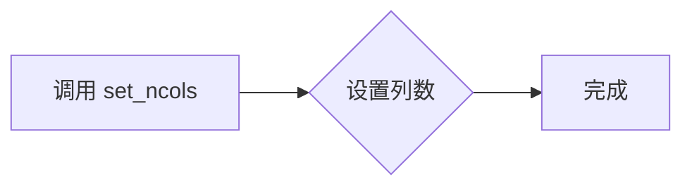

#### 带注释源码

```
def set_ncols(self, ncols: int) -> None:
    # 设置图例的列数
    self.ncol = ncols
```


### Legend.get_default_handler_map

获取默认的处理器映射。

参数：

- 无

返回值：`dict[type, HandlerBase]`，默认处理器映射，用于将艺术家类型映射到相应的处理器。

#### 流程图

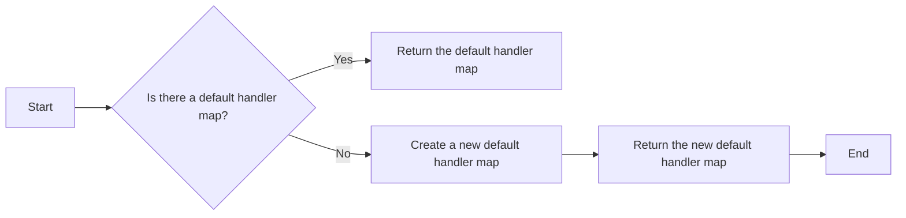

#### 带注释源码

```python
@classmethod
def get_default_handler_map(cls) -> dict[type, HandlerBase]:
    # Check if there is a default handler map
    if cls._default_handler_map is None:
        # Create a new default handler map if it doesn't exist
        cls._default_handler_map = {}
    # Return the default handler map
    return cls._default_handler_map
```


### Legend.set_default_handler_map

This method sets the default handler map for the Legend class in the matplotlib library. It allows for customizing how different types of artists are handled when displayed in a legend.

参数：

- `handler_map`：`dict[type, HandlerBase]`，A dictionary mapping artist types to handler classes that will be used to handle these artists in the legend.

返回值：`None`，This method does not return any value.

#### 流程图

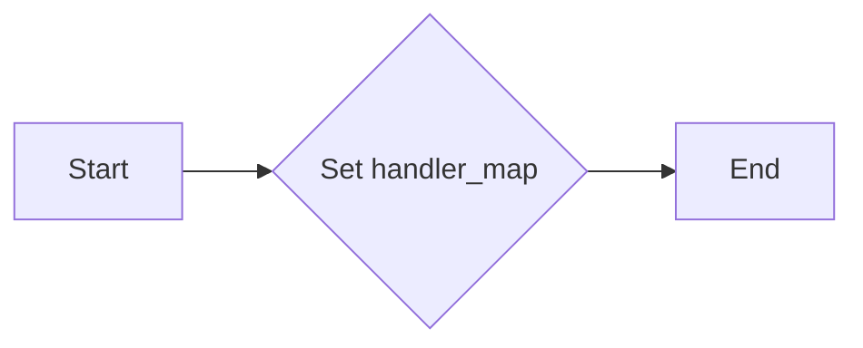

#### 带注释源码

```
@classmethod
def set_default_handler_map(cls, handler_map: dict[type, HandlerBase]) -> None:
    """
    Set the default handler map for the Legend class.

    Parameters
    ----------
    handler_map : dict[type, HandlerBase]
        A dictionary mapping artist types to handler classes that will be used to handle these artists in the legend.

    Returns
    -------
    None
    """
    cls._default_handler_map = handler_map
```


### Legend.update_default_handler_map

更新默认的处理器映射。

参数：

- `handler_map`：`dict[type, HandlerBase]`，处理器映射，用于将特定类型的艺术家与处理器关联。

返回值：无

#### 流程图

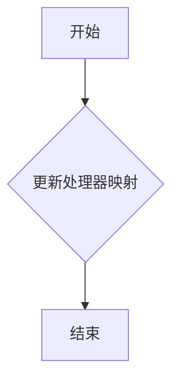

#### 带注释源码

```
@classmethod
def update_default_handler_map(cls, handler_map: dict[type, HandlerBase]) -> None:
    cls._default_handler_map = handler_map
```


### Legend.get_legend_handler_map

获取图例处理器的映射。

参数：

- 无

返回值：`dict[type, HandlerBase]`，图例处理器的映射，用于将不同的艺术家类型映射到相应的处理器。

#### 流程图

```mermaid
graph LR
A[开始] --> B{调用 get_legend_handler_map()}
B --> C[返回处理器映射]
C --> D[结束]
```

#### 带注释源码

```
def get_legend_handler_map(self) -> dict[type, HandlerBase]:
    # 返回图例处理器的映射
    return self.handler_map
```


### Legend.get_legend_handler

获取与给定原始处理程序对应的处理程序。

参数：

- `legend_handler_map`：`dict[type, HandlerBase]`，包含与艺术家类型关联的处理程序的映射。
- `orig_handle`：`Any`，原始处理程序。

返回值：`HandlerBase | None`，与原始处理程序对应的处理程序，如果没有找到则返回 `None`。

#### 流程图

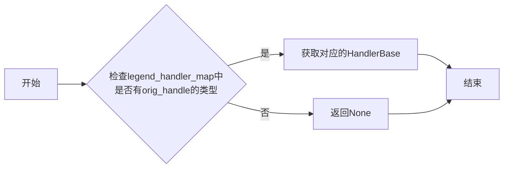

#### 带注释源码

```python
@staticmethod
def get_legend_handler(
    legend_handler_map: dict[type, HandlerBase], orig_handle: Any
) -> HandlerBase | None:
    """
    获取与给定原始处理程序对应的处理程序。

    :param legend_handler_map: dict[type, HandlerBase]，包含与艺术家类型关联的处理程序的映射。
    :param orig_handle: Any，原始处理程序。
    :return: HandlerBase | None，与原始处理程序对应的处理程序，如果没有找到则返回 None。
    """
    return legend_handler_map.get(type(orig_handle))
```


### Legend.get_children

获取图例中的所有子元素。

参数：

- 无

返回值：`list[Artist]`，包含图例中的所有子元素。

#### 流程图

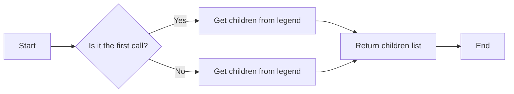

#### 带注释源码

```python
def get_children(self) -> list[Artist]:
    # Return the list of all children in the legend.
    return self.legend_handles
```


### Legend.get_frame

获取图例的矩形边界框。

参数：

- 无

返回值：`Rectangle`，图例的矩形边界框。

#### 流程图

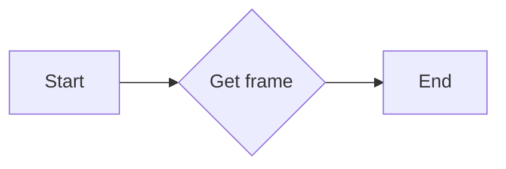

#### 带注释源码

```python
def get_frame(self) -> Rectangle:
    # Return the bounding box of the legend as a Rectangle.
    return self.legendPatch.get_window_extent().transformed(self.axes.transAxes)
```


### Legend.get_lines

获取图例中所有线条对象的列表。

参数：

- 无

返回值：`list[Line2D]`，图例中所有线条对象的列表。

#### 流程图

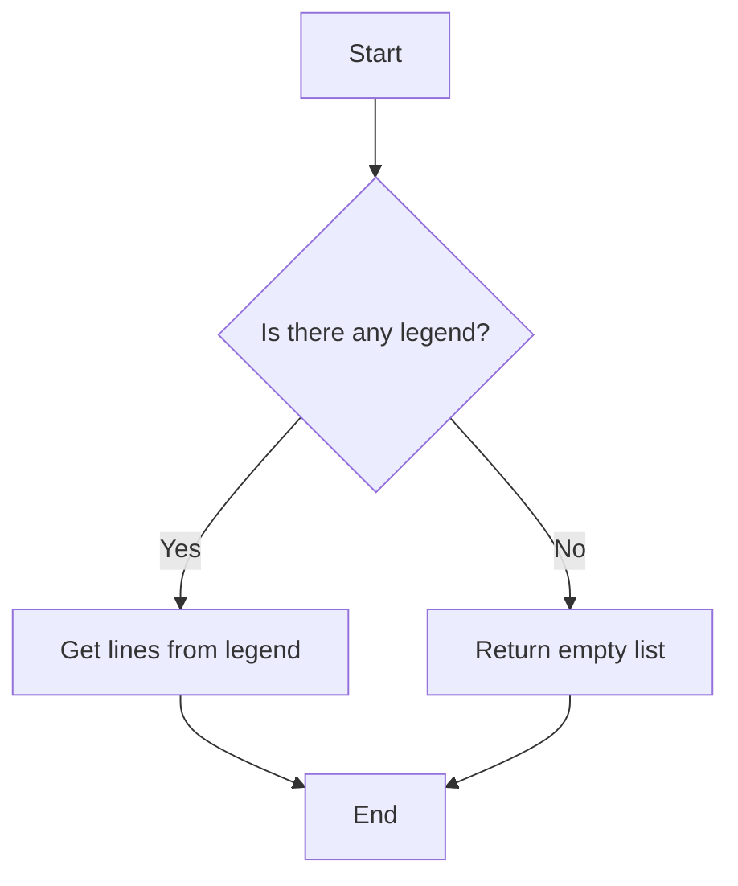

#### 带注释源码

```python
def get_lines(self) -> list[Line2D]:
    """
    Get the list of Line2D objects from the legend.

    Returns:
        list[Line2D]: The list of Line2D objects in the legend.
    """
    return [handle for handle in self.legend_handles if isinstance(handle, Line2D)]
```


### Legend.get_patches

获取图例中的所有Patch对象。

参数：

- 无

返回值：`list[Patch]`，包含图例中的所有Patch对象。

#### 流程图

```mermaid
graph LR
A[开始] --> B{调用get_patches()}
B --> C[结束]
```

#### 带注释源码

```python
def get_patches(self) -> list[Patch]:
    """
    获取图例中的所有Patch对象。

    :return: list[Patch]，包含图例中的所有Patch对象。
    """
    return self.legend_handles
```


### Legend.get_texts

获取图例中的文本列表。

参数：

- 无

返回值：`list[Text]`，图例中的文本对象列表。

#### 流程图

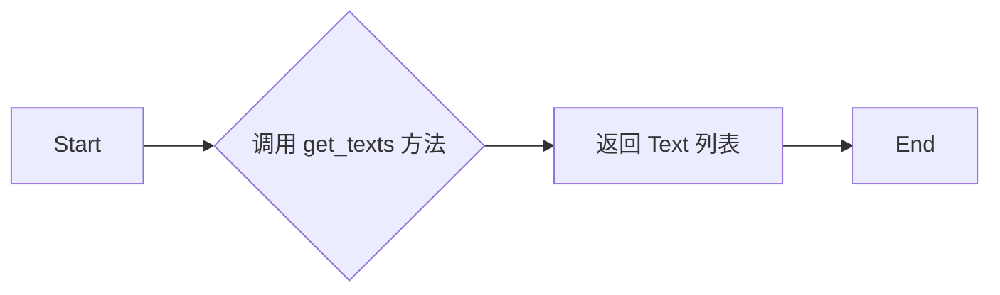

#### 带注释源码

```python
def get_texts(self) -> list[Text]:
    """
    获取图例中的文本列表。

    Returns:
        list[Text]: 图例中的文本对象列表。
    """
    return self.texts
```


### Legend.set_alignment

设置图例的对齐方式。

参数：

- `alignment`：`Literal["center", "left", "right"]`，指定图例的对齐方式，可以是“center”（居中）、“left”（左对齐）或“right”（右对齐）。

返回值：无

#### 流程图

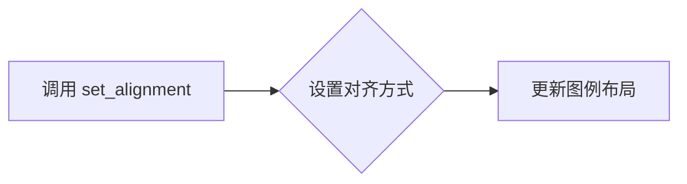

#### 带注释源码

```
def set_alignment(self, alignment: Literal["center", "left", "right"]) -> None:
    # 设置图例的对齐方式
    self.alignment = alignment
    # 更新图例布局
    self.update_layout()
``` 


### Legend.get_alignment

获取图例的对齐方式。

参数：

- 无

返回值：`Literal["center", "left", "right"]`，图例的对齐方式。

#### 流程图

```mermaid
graph LR
A[get_alignment] --> B{返回值}
B --> C[Literal["center", "left", "right"]]
```

#### 带注释源码

```
def get_alignment(self) -> Literal["center", "left", "right"]:
    # 返回图例的对齐方式
    return self.alignment
```


### Legend.set_loc

设置图例的位置。

参数：

- `loc`：`LegendLocType`，指定图例的位置。

返回值：无

#### 流程图

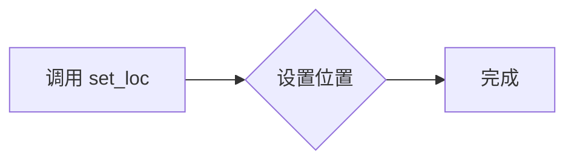

#### 带注释源码

```python
def set_loc(self, loc: LegendLocType | None = ...) -> None:
    # 设置图例的位置
    self.legendPatch.set_xy(self.get_bbox_to_anchor())
    # 更新图例的位置
    self.axes.add_patch(self.legendPatch)
```


### Legend.set_title

设置图例的标题。

参数：

- `title`：`str`，图例的标题文本。
- `prop`：`FontProperties` 或 `str` 或 `pathlib.Path` 或 `None`，用于设置标题的字体属性。

返回值：无

#### 流程图


#### 带注释源码

```python
def set_title(self, title: str, prop: FontProperties | str | pathlib.Path | None = ...):
    # 设置图例的标题
    self.title.set_text(title)
    # 如果提供了字体属性，则更新标题的字体
    if prop is not None:
        self.title.set_fontproperties(prop)
```


### Legend.get_title

获取图例的标题文本。

参数：

- `self`：`Legend`，当前图例对象

返回值：`Text`，图例标题文本对象

#### 流程图

```mermaid
graph LR
A[Legend.get_title] --> B{返回值}
B --> C[Text]
```

#### 带注释源码

```python
def get_title(self) -> Text:
    """
    获取图例的标题文本。

    Returns:
        Text: 图例标题文本对象
    """
    return self.title
```


### Legend.get_frame_on

返回一个布尔值，指示图例是否显示边框。

参数：

- 无

返回值：`bool`，指示图例是否显示边框。

#### 流程图

```mermaid
graph TD
    A[Start] --> B[Check if legend has frame on]
    B -->|Yes| C[Return True]
    B -->|No| D[Return False]
    D --> E[End]
```

#### 带注释源码

```
def get_frame_on(self) -> bool:
    """
    Return a boolean indicating whether the legend has a frame on.
    """
    return self.frameon
```


### Legend.set_frame_on

设置图例的边框是否显示。

参数：

- `b`：`bool`，表示是否显示边框。

返回值：`None`，无返回值。

#### 流程图

```mermaid
graph TD
    A[开始] --> B{设置边框显示状态}
    B --> C[结束]
```

#### 带注释源码

```python
def set_frame_on(self, b: bool) -> None:
    self.frameon = b
```


### Legend.draw_frame

`draw_frame` 是 `Legend` 类的一个方法，它用于设置图例的边框是否显示。

参数：

- 无

返回值：`None`，无返回值

#### 流程图

```mermaid
graph TD
    A[Start] --> B{Is frame on?}
    B -- Yes --> C[Set frame on to True]
    B -- No --> D[Set frame on to False]
    D --> E[End]
```

#### 带注释源码

```
def draw_frame(self) -> None:
    # This method is an alias for set_frame_on, which sets the frame of the legend.
    self.set_frame_on(True)
``` 


### Legend.get_bbox_to_anchor

获取或设置图例的锚点边界框。

参数：

- `bbox`：`BboxBase` 或 `tuple[float, float, float, float]`，指定锚点边界框的位置和大小。
- `transform`：`Transform`，指定边界框的转换。

返回值：`BboxBase`，返回图例的锚点边界框。

#### 流程图

```mermaid
graph LR
A[Legend.get_bbox_to_anchor] --> B{参数}
B --> C{BboxBase 或 tuple}
C --> D{返回值}
D --> E{BboxBase}
```

#### 带注释源码

```python
def get_bbox_to_anchor(self) -> BboxBase:
    """
    Get the bounding box anchor for the legend.
    
    Returns:
        BboxBase: The bounding box anchor for the legend.
    """
    return self._bbox_to_anchor
```


### Legend.set_bbox_to_anchor

设置图例的锚点位置。

参数：

- `bbox`：`BboxBase` 或 `tuple[float, float]` 或 `tuple[float, float, float, float]`，指定图例的锚点位置，可以是 `BboxBase` 对象、左上角坐标的元组、左上角和右下角坐标的元组，或者左上角、右下角、宽度、高度的元组。
- `transform`：`Transform` 或 `None`，指定 `bbox` 的转换，默认为 `None`。

返回值：无

#### 流程图

```mermaid
graph LR
A[调用 set_bbox_to_anchor] --> B{设置 bbox}
B --> C[更新图例位置]
```

#### 带注释源码

```python
def set_bbox_to_anchor(
    self,
    bbox: BboxBase | tuple[float, float] | tuple[float, float, float, float] | None,
    transform: Transform | None = None
) -> None:
    # 设置图例的锚点位置
    self._bbox_to_anchor = bbox
    # 更新图例位置
    self.update_bbox()
``` 


### Legend.set_draggable

设置图例是否可拖动。

参数：

- `state`：`Literal[True]` 或 `Literal[False]`，指定图例是否可拖动。
- `use_blit`：`bool`，指定是否使用blit技术来优化绘图性能。
- `update`：`Literal["loc", "bbox"]`，指定更新图例的位置或边界框。

返回值：`DraggableLegend` 或 `None`，当`state`为`True`时返回`DraggableLegend`对象，否则返回`None`。

#### 流程图

```mermaid
graph LR
A[调用set_draggable] --> B{state为True?}
B -- 是 --> C[创建DraggableLegend对象]
B -- 否 --> D[返回None]
C --> E[设置图例可拖动]
```

#### 带注释源码

```
def set_draggable(
    self,
    state: Literal[True],
    use_blit: bool = ...,
    update: Literal["loc", "bbox"] = ...,
) -> DraggableLegend:
    if state:
        draggable_legend = DraggableLegend(self, use_blit=use_blit, update=update)
        self.legendPatch.set draggable=True
        return draggable_legend
    else:
        self.legendPatch.set draggable=False
        return None
``` 


### Legend.get_draggable

该函数用于设置或获取图例是否可拖动的状态。

参数：

- `state`：`Literal[True] | Literal[False]`，指定图例是否可拖动。
- `use_blit`：`bool`，指定是否使用blit更新图例位置。
- `update`：`Literal["loc", "bbox"]`，指定更新图例位置的方式。

返回值：`DraggableLegend` 或 `None`，当设置图例为可拖动时返回`DraggableLegend`实例，否则返回`None`。

#### 流程图

```mermaid
graph LR
A[输入参数] --> B{设置或获取}
B -->|设置| C[设置图例为可拖动]
B -->|获取| D[返回图例是否可拖动]
C --> E[返回DraggableLegend实例]
D --> F[返回True或False]
```

#### 带注释源码

```
def get_draggable(
    self,
    state: Literal[True],
    use_blit: bool = ...,
    update: Literal["loc", "bbox"] = ...
) -> DraggableLegend:
    if state:
        draggable_legend = DraggableLegend(self, use_blit=use_blit, update=update)
        return draggable_legend
    else:
        return None
```

## 关键组件


### 张量索引与惰性加载

张量索引与惰性加载是代码中用于高效处理大型数据集的关键组件，它允许在需要时才计算数据，从而减少内存消耗和提高性能。

### 反量化支持

反量化支持是代码中用于处理量化数据的关键组件，它能够将量化后的数据转换回原始数据，以便进行进一步处理。

### 量化策略

量化策略是代码中用于优化数据表示和存储的关键组件，它通过减少数据精度来减少内存使用，同时保持足够的精度以避免性能损失。


## 问题及建议


### 已知问题

-   **代码复杂性**：代码中包含大量的类和方法，这可能导致代码难以理解和维护。
-   **参数过多**：在`Legend`类的构造函数中，存在大量的参数，这可能导致使用时出错，并增加了学习成本。
-   **文档缺失**：代码中缺少详细的文档注释，这不利于其他开发者理解代码的功能和用法。

### 优化建议

-   **重构代码**：将复杂的类和方法拆分成更小的、更易于管理的部分，以提高代码的可读性和可维护性。
-   **简化参数**：减少`Legend`类构造函数中的参数数量，或者提供默认值，以简化使用过程。
-   **添加文档**：为每个类和方法添加详细的文档注释，包括参数描述、返回值描述和功能概述，以帮助其他开发者理解代码。
-   **单元测试**：编写单元测试以确保代码的正确性和稳定性。
-   **代码审查**：定期进行代码审查，以发现潜在的问题并提高代码质量。
-   **使用设计模式**：考虑使用设计模式来提高代码的可扩展性和可重用性。


## 其它


### 设计目标与约束

- 设计目标：
  - 提供一个可拖动的图例组件，允许用户在图表上自由移动图例。
  - 确保图例的样式和布局与原始图例保持一致。
  - 提供灵活的配置选项，允许用户自定义图例的位置、样式和交互行为。

- 约束条件：
  - 必须使用matplotlib库中的类和方法。
  - 不能修改matplotlib库的源代码。
  - 必须兼容matplotlib库的现有功能。

### 错误处理与异常设计

- 错误处理：
  - 当用户尝试设置无效的图例位置或样式时，应抛出异常。
  - 当matplotlib库的方法调用失败时，应捕获异常并给出相应的错误信息。

- 异常设计：
  - 定义自定义异常类，用于处理特定的错误情况。
  - 使用try-except语句捕获和处理异常。

### 数据流与状态机

- 数据流：
  - 用户通过调用`set_draggable`方法启用或禁用图例的拖动功能。
  - 当用户拖动图例时，更新图例的位置。

- 状态机：
  - 图例的状态包括：不可拖动、可拖动。
  - 状态转换由用户交互触发。

### 外部依赖与接口契约

- 外部依赖：
  - matplotlib库。

- 接口契约：
  - `DraggableLegend`类应提供`set_draggable`方法，用于启用或禁用图例的拖动功能。
  - `Legend`类应提供`contains`方法，用于检测鼠标事件是否在图例区域内。
  - `Artist`类应提供`draw`方法，用于绘制图例。


    