# `matplotlib\lib\matplotlib\lines.pyi` 详细设计文档

The code defines a Line2D class for plotting lines in a 2D space, with various styling options such as line width, style, color, marker, and fill style. It also includes methods for setting and getting line properties, handling mouse events, and managing the line's data.

## 整体流程

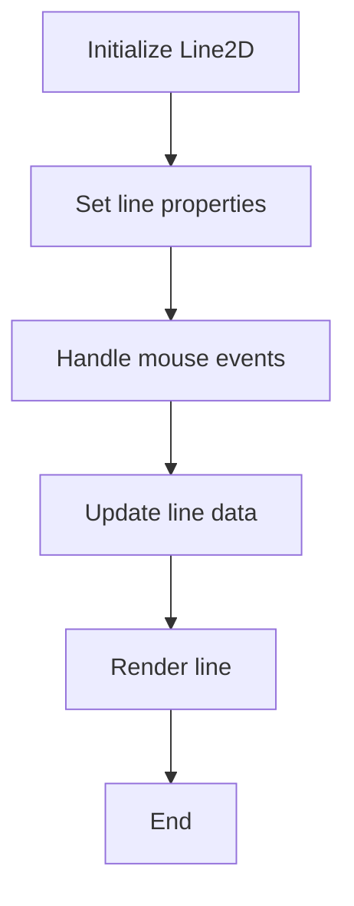

## 类结构

```
Line2D (Class)
├── AxLine (Class)
└── VertexSelector (Class)
```

## 全局变量及字段


### `lineStyles`
    
A dictionary mapping line style names to their corresponding string representations.

类型：`dict[str, str]`
    


### `lineMarkers`
    
A dictionary mapping marker identifiers to their corresponding string representations.

类型：`dict[str | int, str]`
    


### `drawStyles`
    
A dictionary mapping draw style names to their corresponding string representations.

类型：`dict[str, str]`
    


### `fillStyles`
    
A tuple containing valid fill styles for the line.

类型：`tuple[FillStyleType, ...]`
    


### `Line2D.lineStyles`
    
A dictionary mapping line style names to their corresponding string representations.

类型：`dict[str, str]`
    


### `Line2D.drawStyles`
    
A dictionary mapping draw style names to their corresponding string representations.

类型：`dict[str, str]`
    


### `Line2D.drawStyleKeys`
    
A list of keys for the draw styles dictionary.

类型：`list[str]`
    


### `Line2D.markers`
    
A dictionary mapping marker identifiers to their corresponding string representations.

类型：`dict[str | int, str]`
    


### `Line2D.filled_markers`
    
A tuple containing identifiers for filled markers.

类型：`tuple[str, ...]`
    


### `Line2D.fillStyles`
    
A tuple containing valid fill styles for the line.

类型：`tuple[str, ...]`
    


### `Line2D.zorder`
    
The z-order of the line.

类型：`float`
    


### `Line2D.ind_offset`
    
An offset for the index of the line.

类型：`float`
    


### `Line2D.pickradius`
    
The pick radius for the line.

类型：`float`
    


### `Line2D.stale`
    
A flag indicating whether the line data is stale.

类型：`bool`
    


### `Line2D.cid`
    
The canvas ID associated with the line.

类型：`int`
    


### `Line2D.ind`
    
A set of indices associated with the line.

类型：`set[int]`
    


### `AxLine.xy1`
    
The first point of the line in xy coordinates.

类型：`tuple[float, float]`
    


### `AxLine.xy2`
    
The second point of the line in xy coordinates, if provided.

类型：`tuple[float, float] | None`
    


### `AxLine.slope`
    
The slope of the line, if provided.

类型：`float | None`
    


### `VertexSelector.axes`
    
The axes associated with the vertex selector.

类型：`Axes`
    


### `VertexSelector.line`
    
The line associated with the vertex selector.

类型：`Line2D`
    


### `VertexSelector.cid`
    
The canvas ID associated with the vertex selector.

类型：`int`
    


### `VertexSelector.ind`
    
A set of indices associated with the vertex selector.

类型：`set[int]`
    
    

## 全局函数及方法


### segment_hits

This function calculates the number of hits for each segment between two sets of points and a set of radii.

参数：

- cx：`ArrayLike`，The x-coordinates of the center points.
- cy：`ArrayLike`，The y-coordinates of the center points.
- x：`ArrayLike`，The x-coordinates of the points to check.
- y：`ArrayLike`，The y-coordinates of the points to check.
- radius：`ArrayLike`，The radii of the segments.

返回值：`ArrayLike`，An array of the same length as `x` and `y`, where each element is the number of hits for the corresponding segment.

#### 流程图

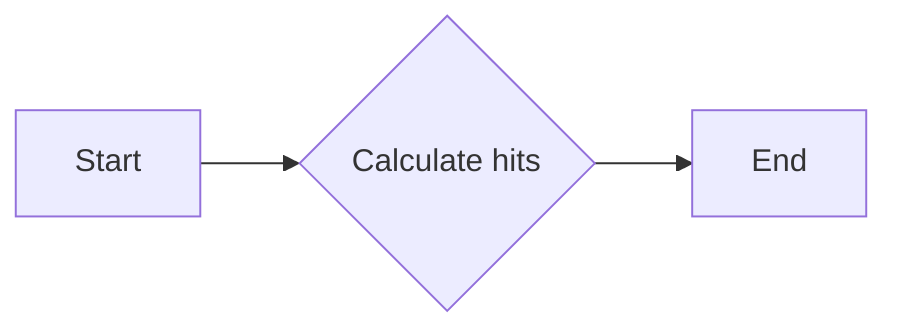

#### 带注释源码

```
def segment_hits(
    cx: ArrayLike, cy: ArrayLike, x: ArrayLike, y: ArrayLike, radius: ArrayLike
) -> ArrayLike:
    # Your code here
    ...
```


### Line2D.__init__

初始化Line2D对象，设置线条的各种属性。

参数：

- `xdata`：`ArrayLike`，线条的x坐标数据。
- `ydata`：`ArrayLike`，线条的y坐标数据。
- `linewidth`：`float | None`，线条的宽度。
- `linestyle`：`LineStyleType | None`，线条的样式。
- `color`：`ColorType | None`，线条的颜色。
- `gapcolor`：`ColorType | None`，线条间隙的颜色。
- `marker`：`MarkerType | None`，线条的标记。
- `markersize`：`float | None`，标记的大小。
- `markeredgewidth`：`float | None`，标记边缘的宽度。
- `markeredgecolor`：`ColorType | None`，标记边缘的颜色。
- `markerfacecolor`：`ColorType | None`，标记面的颜色。
- `markerfacecoloralt`：`ColorType`，标记面的备选颜色。
- `fillstyle`：`FillStyleType | None`，填充样式。
- `antialiased`：`bool | None`，是否启用抗锯齿。
- `dash_capstyle``：`CapStyleType | None`，虚线的端点样式。
- `solid_capstyle`：`CapStyleType | None`，实线的端点样式。
- `dash_joinstyle`：`JoinStyleType | None`，虚线的连接样式。
- `solid_joinstyle`：`JoinStyleType | None`，实线的连接样式。
- `pickradius`：`float`，选择半径。
- `drawstyle`：`DrawStyleType | None`，绘制样式。
- `markevery`：`MarkEveryType | None`，标记间隔。

返回值：`None`，无返回值。

#### 流程图

```mermaid
graph LR
A[初始化Line2D对象] --> B{设置xdata}
B --> C{设置ydata}
C --> D{设置linewidth}
D --> E{设置linestyle}
E --> F{设置color}
F --> G{设置gapcolor}
G --> H{设置marker}
H --> I{设置markersize}
I --> J{设置markeredgewidth}
J --> K{设置markeredgecolor}
K --> L{设置markerfacecolor}
L --> M{设置markerfacecoloralt}
M --> N{设置fillstyle}
N --> O{设置antialiased}
O --> P{设置dash_capstyle}
P --> Q{设置solid_capstyle}
Q --> R{设置dash_joinstyle}
R --> S{设置solid_joinstyle}
S --> T{设置pickradius}
T --> U{设置drawstyle}
U --> V{设置markevery}
V --> W[完成初始化]
```

#### 带注释源码

```
def __init__(
    self,
    xdata: ArrayLike,
    ydata: ArrayLike,
    *,
    linewidth: float | None = ...,
    linestyle: LineStyleType | None = ...,
    color: ColorType | None = ...,
    gapcolor: ColorType | None = ...,
    marker: MarkerType | None = ...,
    markersize: float | None = ...,
    markeredgewidth: float | None = ...,
    markeredgecolor: ColorType | None = ...,
    markerfacecolor: ColorType | None = ...,
    markerfacecoloralt: ColorType = ...,
    fillstyle: FillStyleType | None = ...,
    antialiased: bool | None = ...,
    dash_capstyle: CapStyleType | None = ...,
    solid_capstyle: CapStyleType | None = ...,
    dash_joinstyle: JoinStyleType | None = ...,
    solid_joinstyle: JoinStyleType | None = ...,
    pickradius: float = ...,
    drawstyle: DrawStyleType | None = ...,
    markevery: MarkEveryType | None = ...,
    **kwargs
) -> None:
    # 设置xdata
    self.xdata = xdata
    # 设置ydata
    self.ydata = ydata
    # 设置linewidth
    self.linewidth = linewidth
    # 设置linestyle
    self.linestyle = linestyle
    # 设置color
    self.color = color
    # 设置gapcolor
    self.gapcolor = gapcolor
    # 设置marker
    self.marker = marker
    # 设置markersize
    self.markersize = markersize
    # 设置markeredgewidth
    self.markeredgewidth = markeredgewidth
    # 设置markeredgecolor
    self.markeredgecolor = markeredgecolor
    # 设置markerfacecolor
    self.markerfacecolor = markerfacecolor
    # 设置markerfacecoloralt
    self.markerfacecoloralt = markerfacecoloralt
    # 设置fillstyle
    self.fillstyle = fillstyle
    # 设置antialiased
    self.antialiased = antialiased
    # 设置dash_capstyle
    self.dash_capstyle = dash_capstyle
    # 设置solid_capstyle
    self.solid_capstyle = solid_capstyle
    # 设置dash_joinstyle
    self.dash_joinstyle = dash_joinstyle
    # 设置solid_joinstyle
    self.solid_joinstyle = solid_joinstyle
    # 设置pickradius
    self.pickradius = pickradius
    # 设置drawstyle
    self.drawstyle = drawstyle
    # 设置markevery
    self.markevery = markevery
```


### Line2D.contains

This method determines whether a point is inside the bounding box of a Line2D object.

参数：

- `mouseevent`：`MouseEvent`，The MouseEvent object that contains the coordinates of the point to check.

返回值：`tuple[bool, dict]`，A tuple containing a boolean indicating whether the point is inside the bounding box, and a dictionary with additional information.

#### 流程图

```mermaid
graph LR
A[Start] --> B{Is point inside bounding box?}
B -- Yes --> C[Return (True, info)}
B -- No --> D[Return (False, info)]
C --> E[End]
D --> E
```

#### 带注释源码

```
def contains(self, mouseevent: MouseEvent) -> tuple[bool, dict]:
    # Extract the x and y coordinates from the MouseEvent
    x, y = mouseevent.xdata, mouseevent.ydata
    
    # Calculate the bounding box of the Line2D
    bbox = self.get_bbox()
    
    # Check if the point is inside the bounding box
    inside = bbox.contains_point(x, y)
    
    # Return the result and additional information
    return inside, {'x': x, 'y': y}
```


### Line2D.get_pickradius

获取线2D对象的拾取半径。

参数：

- 无

返回值：`float`，线2D对象的拾取半径。

#### 流程图

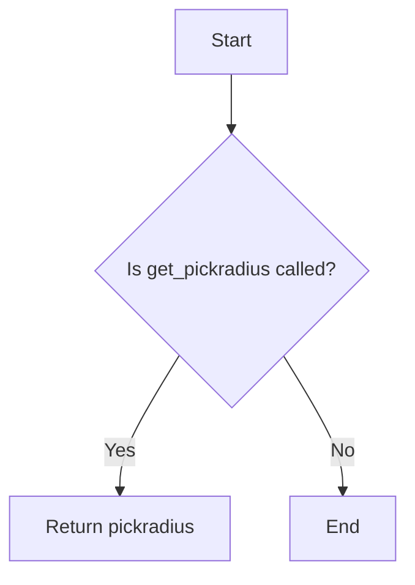

#### 带注释源码

```
def get_pickradius(self) -> float:
    """
    Return the pick radius for the line2d object.
    """
    return self.pickradius
```


### Line2D.set_pickradius

设置线2D对象的拾取半径。

参数：

- `pickradius`：`float`，设置线2D对象的拾取半径。

返回值：`None`，无返回值。

#### 流程图

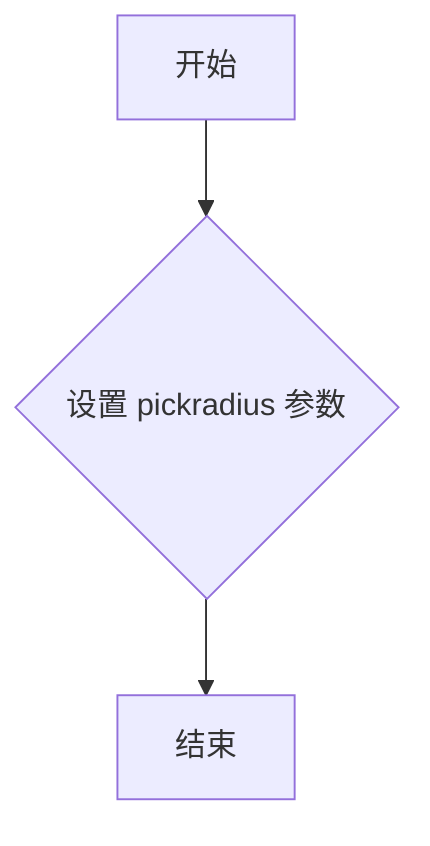

#### 带注释源码

```python
def set_pickradius(self, pickradius: float) -> None:
    """
    Set the pick radius for the Line2D object.

    :param pickradius: float, the pick radius to set for the Line2D object.
    """
    self.pickradius = pickradius
```


### Line2D.set_fillstyle

设置线段的填充样式。

参数：

- `fs`：`FillStyleType`，指定线段的填充样式。

返回值：无

#### 流程图

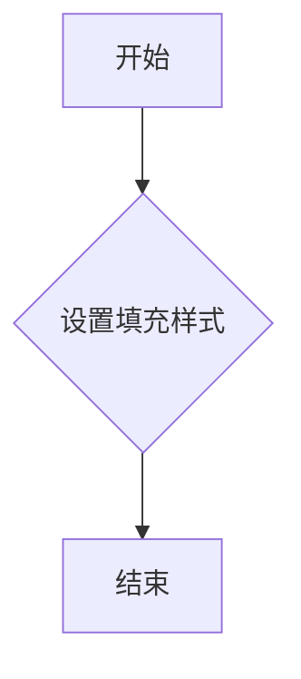

#### 带注释源码

```python
def set_fillstyle(self, fs: FillStyleType) -> None:
    """
    Set the fill style for the line segment.

    Parameters:
    - fs: FillStyleType, the fill style to set for the line segment.
    """
    self.fillstyle = fs
```


### Line2D.set_markevery

设置线型中标记点的间隔。

参数：

- `every`：`MarkEveryType`，标记点的间隔，可以是整数、浮点数或字符串。

返回值：无

#### 流程图

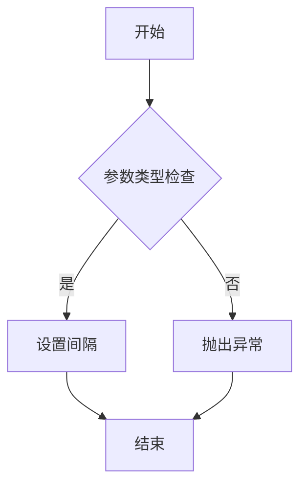

#### 带注释源码

```python
def set_markevery(self, every: MarkEveryType) -> None:
    """
    Set the interval at which markers are placed on the line.

    Parameters
    ----------
    every : MarkEveryType
        The interval at which markers are placed on the line.

    Returns
    -------
    None
    """
    # Check if the parameter is of the correct type
    if not isinstance(every, (int, float, str)):
        raise TypeError("Invalid type for 'every'. Expected int, float, or str.")

    # Set the interval
    self.markevery = every
``` 


### Line2D.get_markevery

获取线对象中标记的间隔。

参数：

- `self`：`Line2D`，当前线对象

返回值：`MarkEveryType`，标记的间隔类型

#### 流程图

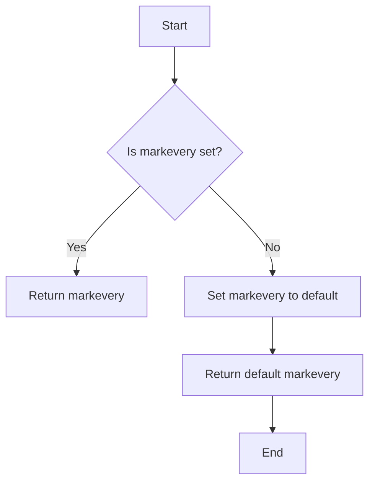

#### 带注释源码

```python
def get_markevery(self) -> MarkEveryType:
    """
    Get the interval at which markers are placed on the line.
    
    Returns:
        MarkEveryType: The interval type for markers.
    """
    return self._get_markevery()
```


### Line2D.set_picker

设置Line2D对象的picker函数。

参数：

- `p`：`None | bool | float | Callable[[Artist, MouseEvent], tuple[bool, dict]]`，指定picker函数。如果为`None`，则禁用picker；如果为`bool`，则启用或禁用picker；如果为`float`，则设置picker半径；如果为`Callable`，则指定一个函数，该函数接收Artist对象和MouseEvent对象作为参数，并返回一个包含布尔值和字典的元组。

返回值：`None`，无返回值。

#### 流程图

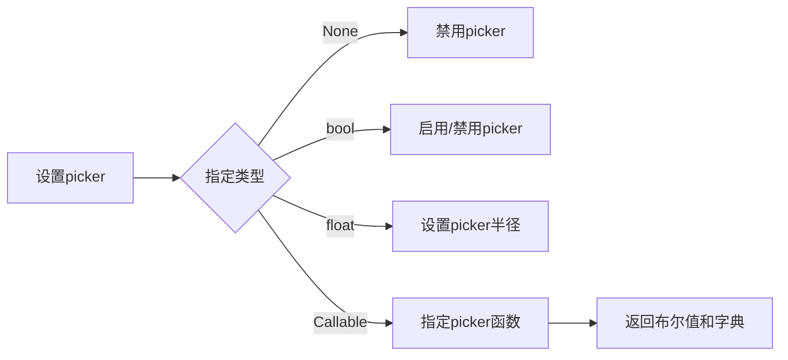

#### 带注释源码

```python
def set_picker(
    self, p: None | bool | float | Callable[[Artist, MouseEvent], tuple[bool, dict]]
) -> None:
    if p is None:
        self._picker = None
    elif isinstance(p, bool):
        self._picker = p
    elif isinstance(p, float):
        self._picker = p
    elif callable(p):
        self._picker = p
    else:
        raise TypeError("Invalid picker type")
```


### Line2D.get_bbox

获取线段对象的边界框。

参数：

- 无

返回值：`Bbox`，边界框对象，包含边界框的左、上、右、下坐标。

#### 流程图

```mermaid
graph LR
A[开始] --> B{调用get_bbox()}
B --> C[返回Bbox对象]
C --> D[结束]
```

#### 带注释源码

```python
class Line2D(Artist):
    # ... 其他代码 ...

    def get_bbox(self) -> Bbox:
        # 获取线段对象的边界框
        # 返回边界框对象，包含边界框的左、上、右、下坐标
        pass
```


### Line2D.set_data

`Line2D.set_data` 方法用于设置 Line2D 对象的数据。

参数：

- `x`：`ArrayLike`，x 轴数据
- `y`：`ArrayLike`，y 轴数据

返回值：`None`，无返回值

#### 流程图

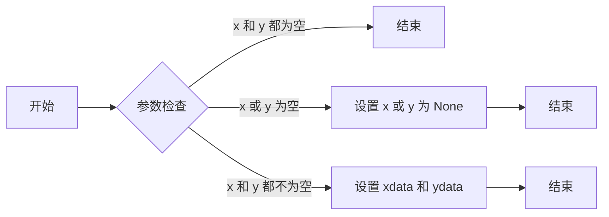

#### 带注释源码

```python
@overload
def set_data(self, args: ArrayLike) -> None:
    ...

@overload
def set_data(self, x: ArrayLike, y: ArrayLike) -> None:
    ...
    self.xdata = x
    self.ydata = y
    ...
```


### Line2D.recache_always

This method is a part of the Line2D class and is used to force the recaching of the line's properties, regardless of whether they have changed or not.

参数：

-  `*`：无参数

返回值：`None`，无返回值

#### 流程图

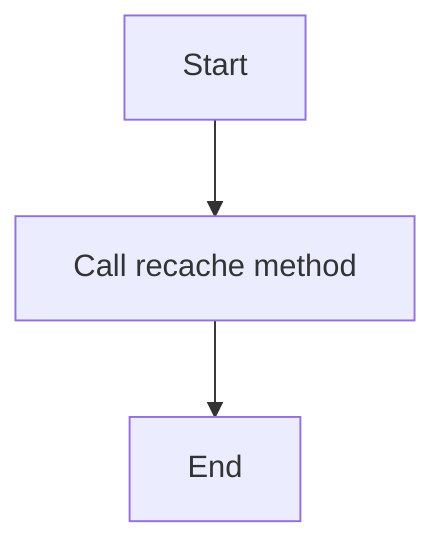

#### 带注释源码

```
def recache_always(self) -> None:
    """
    Force the recaching of the line's properties, regardless of whether they have changed or not.
    """
    self.recache(True)
```


### Line2D.recache

This method is used to recache the Line2D object, which involves updating its internal state and potentially regenerating any cached representations.

参数：

- `always`：`bool`，If set to True, the recache operation will always be performed regardless of whether the object is stale or not.

返回值：`None`，This method does not return any value.

#### 流程图

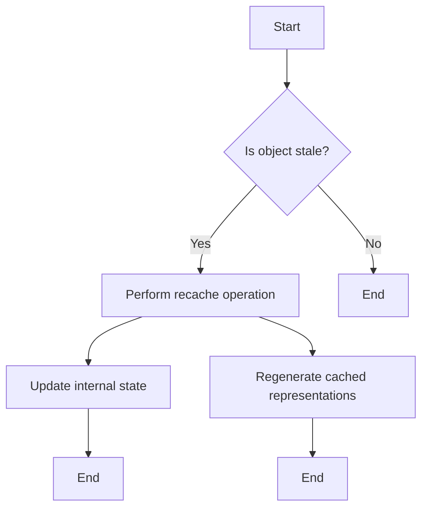

#### 带注释源码

```
def recache(self, always: bool = ...) -> None:
    # Check if the object is stale or if the recache operation should always be performed
    if self.stale or always:
        # Perform the recache operation
        self.recache_always()
```


### Line2D.get_antialiased

获取线段的抗锯齿属性。

参数：

- 无

返回值：`bool`，表示线段是否启用抗锯齿。

#### 流程图

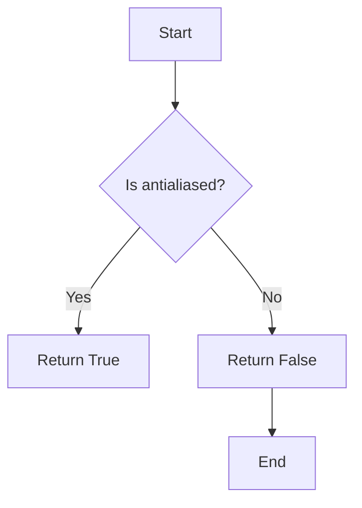

#### 带注释源码

```python
def get_antialiased(self) -> bool:
    """
    Get the antialiased property of the line segment.

    Returns:
        bool: True if antialiased is enabled, False otherwise.
    """
    return self._antialiased
```


### Line2D.get_color

获取Line2D对象的颜色。

参数：

- 无

返回值：`ColorType`，返回Line2D对象的颜色。

#### 流程图

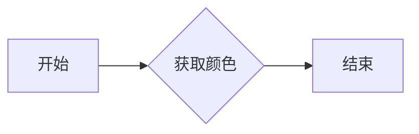

#### 带注释源码

```python
def get_color(self) -> ColorType:
    # 获取Line2D对象的颜色
    return self.color
```


### Line2D.get_drawstyle

获取Line2D对象的绘制样式。

参数：

- 无

返回值：`DrawStyleType`，返回当前Line2D对象的绘制样式。

#### 流程图

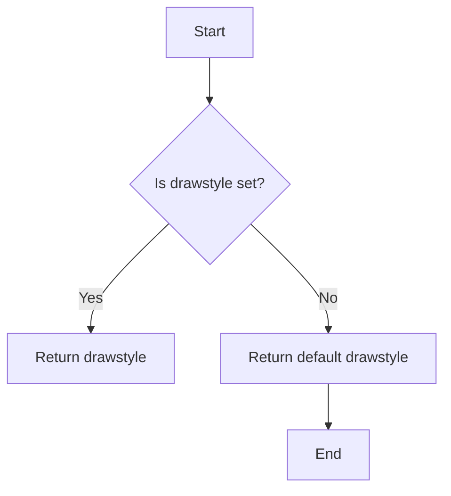

#### 带注释源码

```python
def get_drawstyle(self) -> DrawStyleType:
    """
    Get the drawstyle of the line.

    Returns:
        DrawStyleType: The drawstyle of the line.
    """
    return self.drawStyleType
```


### Line2D.get_gapcolor

获取线段之间的间隙颜色。

参数：

- 无

返回值：`ColorType`，线段之间的间隙颜色。

#### 流程图

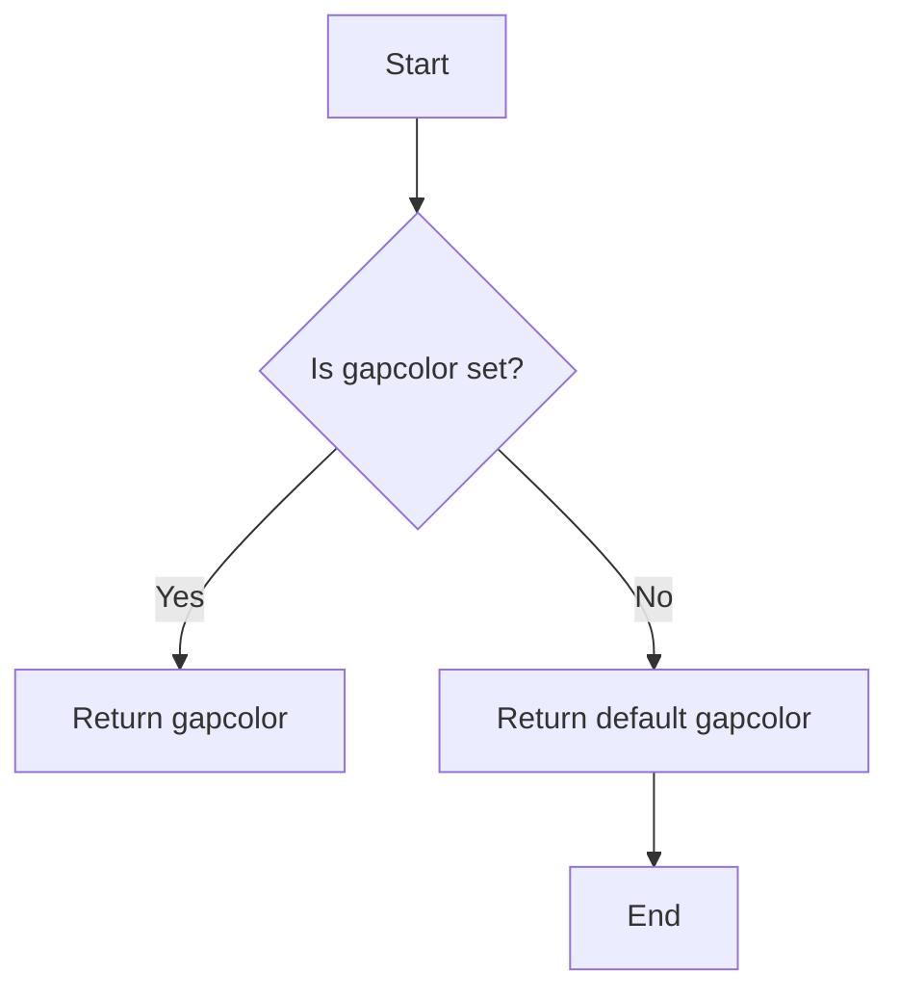

#### 带注释源码

```python
def get_gapcolor(self) -> ColorType:
    """
    Get the gap color for the line segments.

    Returns:
        ColorType: The gap color for the line segments.
    """
    return self.gapcolor
```


### Line2D.get_linestyle

获取线段的样式。

参数：

- 无

返回值：`LineStyleType`，线段的样式，例如实线、虚线等。

#### 流程图

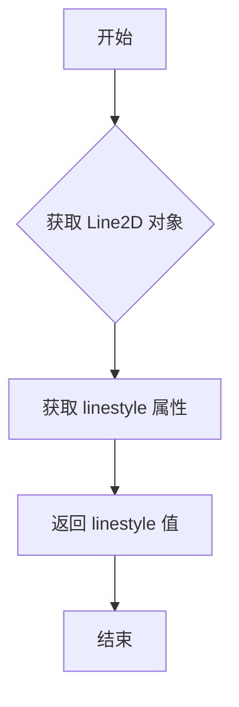

#### 带注释源码

```python
def get_linestyle(self) -> LineStyleType:
    """
    Get the linestyle of the line segment.

    Returns:
        LineStyleType: The linestyle of the line segment.
    """
    return self._get_line_property('linestyle')
```


### Line2D.get_linewidth

获取线宽。

参数：

- 无

返回值：`float`，线的宽度。

#### 流程图

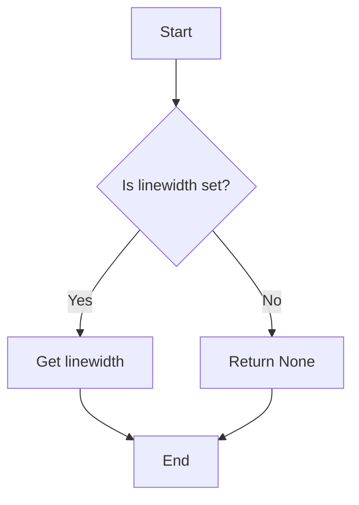

#### 带注释源码

```python
def get_linewidth(self) -> float:
    """
    Get the linewidth of the line.

    Returns:
        float: The linewidth of the line.
    """
    return self._get_property('linewidth', float)
```


### Line2D.get_marker

获取Line2D对象的标记样式。

参数：

- `self`：`Line2D`对象，当前Line2D对象实例。

返回值：`MarkerType`，标记样式。

#### 流程图

```mermaid
graph LR
A[Start] --> B{Is marker set?}
B -- Yes --> C[Return marker]
B -- No --> D[Return default marker]
D --> E[End]
```

#### 带注释源码

```python
def get_marker(self) -> MarkerType:
    """
    Get the marker style of the line.

    Returns:
        MarkerType: The marker style of the line.
    """
    return self.markers.get(self.marker, ' ')
```


### Line2D.get_markeredgecolor

获取线2D对象的标记边缘颜色。

参数：

- 无

返回值：`ColorType`，标记边缘的颜色。

#### 流程图

```mermaid
graph TD
    A[Start] --> B{Is get_markeredgecolor called?}
    B -- Yes --> C[Return markeredgecolor]
    B -- No --> D[End]
```

#### 带注释源码

```python
def get_markeredgecolor(self) -> ColorType:
    """
    Get the edge color of the marker for this line.

    Returns:
        ColorType: The edge color of the marker.
    """
    return self.markeredgecolor
```


### Line2D.get_markeredgewidth

获取线标记的边缘宽度。

参数：

- 无

返回值：`float`，线标记的边缘宽度。

#### 流程图

```mermaid
graph TD
    A[Start] --> B{Is there a markedge width?}
    B -- Yes --> C[Return markedge width]
    B -- No --> D[Return default markedge width]
    D --> E[End]
```

#### 带注释源码

```python
def get_markeredgewidth(self) -> float:
    """
    Get the width of the edge of the marker.
    
    Returns:
        float: The width of the edge of the marker.
    """
    return self._get_property('markeredgewidth', default=1.0)
```


### Line2D.get_markerfacecolor

获取线2D对象的标记面颜色。

参数：

- `self`：`Line2D`，当前线2D对象

返回值：`ColorType`，标记面颜色

#### 流程图

```mermaid
graph TD
    A[Start] --> B{Is self defined?}
    B -- Yes --> C[Return self.markerfacecolor]
    B -- No --> D[Return self.markerfacecoloralt]
    D --> E[End]
```

#### 带注释源码

```python
def get_markerfacecolor(self) -> ColorType:
    """
    Get the marker face color of the line.

    Returns:
        ColorType: The marker face color.
    """
    return self.markerfacecolor
```


### Line2D.get_markerfacecoloralt

获取线2D对象的备用标记面颜色。

参数：

- 无

返回值：`ColorType`，备用标记面颜色

#### 流程图

```mermaid
graph TD
    A[Start] --> B{Is markerfacecoloralt set?}
    B -- Yes --> C[Return markerfacecoloralt]
    B -- No --> D[Return default color]
    D --> E[End]
```

#### 带注释源码

```python
def get_markerfacecoloralt(self) -> ColorType:
    """
    Return the alternative marker face color for the line.
    """
    return self.markerfacecoloralt
```


### Line2D.get_markersize

获取线2D对象的标记大小。

参数：

- `self`：`Line2D`，当前线2D对象

返回值：`float`，标记大小

#### 流程图

```mermaid
graph TD
    A[Start] --> B{Is self defined?}
    B -- Yes --> C[Get markersize]
    B -- No --> D[Return None]
    C --> E[End]
    D --> E
```

#### 带注释源码

```python
def get_markersize(self) -> float:
    """
    Get the markersize of the line2d object.

    Returns:
        float: The markersize of the line2d object.
    """
    return self.markersize
```


### Line2D.get_data

获取Line2D对象的x和y数据。

参数：

- `orig`：`bool`，默认为`False`。如果为`True`，则返回原始数据，否则返回缓存的副本。

返回值：`tuple[ArrayLike, ArrayLike]`，包含x和y数据的元组。

#### 流程图

```mermaid
graph LR
A[开始] --> B{传入参数}
B --> C{返回值}
C --> D[结束]
```

#### 带注释源码

```python
def get_data(self, orig: bool = ...) -> tuple[ArrayLike, ArrayLike]:
    # 如果传入orig为True，则返回原始数据
    if orig:
        return self._xdata, self._ydata
    # 否则返回缓存的副本
    return self._cached_data.get_data()
```


### Line2D.get_xdata

获取线2D对象的x数据。

参数：

- `orig`：`bool`，默认为`False`。如果为`True`，则返回原始数据，否则返回经过变换的数据。

返回值：`ArrayLike`，x数据。

#### 流程图

```mermaid
graph LR
A[开始] --> B{传入参数}
B --> C{返回x数据}
C --> D[结束]
```

#### 带注释源码

```python
def get_xdata(self, orig: bool = False) -> ArrayLike:
    """
    Get the x data of the Line2D object.

    Parameters:
        orig: bool, default False. If True, return the original data, otherwise return the transformed data.

    Returns:
        ArrayLike: The x data.
    """
    if orig:
        return self._xdata
    else:
        return self._transformed_xdata
```


### Line2D.get_ydata

获取线2D对象的y数据。

参数：

- `orig`：`bool`，默认为`True`。如果为`True`，则返回原始数据；如果为`False`，则返回已应用变换的数据。

返回值：`ArrayLike`，线2D对象的y数据。

#### 流程图

```mermaid
graph TD
    A[Start] --> B{Is orig True?}
    B -- Yes --> C[Return ydata]
    B -- No --> D[Apply transformations to ydata]
    D --> C
    C --> E[End]
```

#### 带注释源码

```python
def get_ydata(self, orig: bool = True) -> ArrayLike:
    """
    Get the y data of the Line2D object.

    Parameters:
    - orig: bool, default True. If True, return the original data; if False, return the data after applying transformations.

    Returns:
    - ArrayLike: The y data of the Line2D object.
    """
    if orig:
        return self._ydata
    else:
        # Apply transformations to ydata
        # ...
        return transformed_ydata
```


### Line2D.get_path

获取Line2D对象的路径信息。

参数：

- 无

返回值：`Path`，Line2D对象的路径信息。

#### 流程图

```mermaid
graph LR
A[开始] --> B{调用get_path()}
B --> C[返回Path对象]
C --> D[结束]
```

#### 带注释源码

```python
class Line2D(Artist):
    # ... 其他代码 ...

    def get_path(self) -> Path:
        """
        返回Line2D对象的路径信息。
        """
        # ... 实现代码 ...
```


### Line2D.get_xydata

获取线对象的数据点。

参数：

- 无

返回值：`ArrayLike`，线对象的数据点。

#### 流程图

```mermaid
graph TD
    A[Start] --> B{Is get_xydata called?}
    B -- Yes --> C[Return data points]
    B -- No --> D[End]
```

#### 带注释源码

```python
def get_xydata(self) -> ArrayLike:
    """
    Return the data points of the line.

    Returns:
        ArrayLike: The data points of the line.
    """
    return self.get_data()
```


### Line2D.set_antialiased

Set the antialiasing flag for the line.

参数：

- `b`：`bool`，A boolean value indicating whether antialiasing should be enabled (`True`) or disabled (`False`).

返回值：`None`，This method does not return a value.

#### 流程图

```mermaid
graph TD
    A[Start] --> B{Set antialiased flag to b}
    B --> C[End]
```

#### 带注释源码

```python
def set_antialiased(self, b: bool) -> None:
    """
    Set the antialiasing flag for the line.

    Parameters
    ----------
    b : bool
        A boolean value indicating whether antialiasing should be enabled (True) or disabled (False).

    Returns
    -------
    None
    """
    self._antialiased = b
```


### Line2D.set_color

设置Line2D对象的颜色。

参数：

- `color`：`ColorType`，指定线的颜色。

返回值：无

#### 流程图

```mermaid
graph LR
A[开始] --> B{设置颜色}
B --> C[结束]
```

#### 带注释源码

```python
def set_color(self, color: ColorType) -> None:
    # 设置Line2D对象的颜色
    self.color = color
```


### Line2D.set_drawstyle

设置线段的绘制样式。

参数：

- `drawstyle`：`DrawStyleType | None`，指定线段的绘制样式，可以是预定义的样式或自定义样式。

返回值：无

#### 流程图

```mermaid
graph TD
    A[开始] --> B{参数类型检查}
    B -->|是| C[设置drawStyles字典]
    B -->|否| D[抛出异常]
    C --> E[结束]
    D --> E
```

#### 带注释源码

```python
def set_drawstyle(self, drawstyle: DrawStyleType | None) -> None:
    """
    Set the drawing style for the line segment.

    Parameters:
        drawstyle (DrawStyleType | None): The drawing style to set for the line segment.

    Returns:
        None
    """
    if drawstyle is not None:
        self.drawStyles[self.name] = str(drawstyle)
    else:
        self.drawStyles.pop(self.name, None)
``` 


### Line2D.set_gapcolor

设置线段之间的间隙颜色。

参数：

- `gapcolor`：`ColorType`，指定线段之间的间隙颜色。

返回值：无

#### 流程图

```mermaid
graph LR
A[开始] --> B{参数检查}
B -->|参数有效| C[设置间隙颜色]
B -->|参数无效| D[抛出异常]
C --> E[结束]
D --> E
```

#### 带注释源码

```python
def set_gapcolor(self, gapcolor: ColorType | None) -> None:
    # 检查参数是否有效
    if gapcolor is not None:
        # 设置间隙颜色
        self._gapcolor = gapcolor
    else:
        # 抛出异常
        raise ValueError("gapcolor cannot be None")
``` 


### Line2D.set_linewidth

设置线宽。

参数：

- `w`：`float`，线宽的值。

返回值：`None`，无返回值。

#### 流程图

```mermaid
graph TD
    A[开始] --> B{设置线宽}
    B --> C[结束]
```

#### 带注释源码

```python
def set_linewidth(self, w: float) -> None:
    """
    Set the linewidth of the line.

    Parameters
    ----------
    w : float
        The linewidth of the line.

    Returns
    -------
    None
    """
    self._linewidth = w
    self._update()
```


### Line2D.set_linestyle

设置线段的样式。

参数：

- `ls`：`LineStyleType`，指定线段的样式，可以是实线、虚线、点线等。

返回值：无

#### 流程图

```mermaid
graph LR
A[开始] --> B{参数类型检查}
B -->|通过| C[设置线段样式]
B -->|失败| D[抛出异常]
C --> E[结束]
D --> E
```

#### 带注释源码

```python
def set_linestyle(self, ls: LineStyleType) -> None:
    # 检查参数类型
    if not isinstance(ls, LineStyleType):
        raise TypeError("Invalid linestyle type")

    # 设置线段样式
    self._set_line_style(ls)
```


### Line2D.set_marker

设置线段的标记样式。

参数：

- `marker`：`MarkerType`，指定标记的类型，可以是预定义的标记或自定义标记。

返回值：无

#### 流程图

```mermaid
graph LR
A[开始] --> B{设置标记类型}
B --> C[结束]
```

#### 带注释源码

```python
def set_marker(self, marker: MarkerType) -> None:
    # 设置标记样式
    self.markers[self._get_marker_index(marker)] = marker
```


### Line2D.set_markeredgecolor

设置线2D对象的标记边缘颜色。

参数：

- `ec`：`ColorType`，标记边缘颜色。可以是颜色名称、颜色代码或颜色序列。

返回值：无

#### 流程图

```mermaid
graph TD
    A[开始] --> B{参数类型检查}
    B -->|通过| C[设置标记边缘颜色]
    C --> D[结束]
    B -->|失败| E[抛出异常]
    E --> D
```

#### 带注释源码

```python
def set_markeredgecolor(self, ec: ColorType | None) -> None:
    """
    Set the edge color of the marker for this line.

    Parameters
    ----------
    ec : ColorType, optional
        The edge color of the marker. It can be a color name, color code, or a sequence of colors.

    Returns
    -------
    None
    """
    # Check if the parameter is valid
    if ec is not None:
        # Set the marker edge color
        self.markeredgecolor = ec
    else:
        # If the parameter is None, remove the marker edge color
        self.markeredgecolor = None
``` 


### Line2D.set_markerfacecolor

设置线2D对象的标记面颜色。

参数：

- `color`：`ColorType`，标记的面颜色。

返回值：无

#### 流程图

```mermaid
graph LR
A[开始] --> B{设置标记面颜色}
B --> C[结束]
```

#### 带注释源码

```python
def set_markerfacecolor(self, color: ColorType) -> None:
    # 设置标记面颜色
    self.markerfacecolor = color
```


### Line2D.set_markerfacecoloralt

设置线段的标记面颜色。

参数：

- `fc`：`ColorType`，标记面颜色。

返回值：无

#### 流程图

```mermaid
graph TD
    A[开始] --> B{参数检查}
    B -->|参数有效| C[设置标记面颜色]
    B -->|参数无效| D[抛出异常]
    C --> E[结束]
    D --> E
```

#### 带注释源码

```python
def set_markerfacecoloralt(self, fc: ColorType) -> None:
    # 检查参数类型
    if not isinstance(fc, ColorType):
        raise TypeError("fc must be a ColorType")
    
    # 设置标记面颜色
    self.markerfacecoloralt = fc
```


### Line2D.set_markeredgewidth

设置线标记的边缘宽度。

参数：

- `ew`：`float`，标记边缘的宽度。

返回值：`None`，无返回值。

#### 流程图

```mermaid
graph TD
    A[开始] --> B{参数类型检查}
    B -- float --> C[设置标记边缘宽度]
    C --> D[结束]
```

#### 带注释源码

```python
def set_markeredgewidth(self, ew: float | None) -> None:
    """
    Set the edge width of the marker.

    Parameters
    ----------
    ew : float or None
        The edge width of the marker.

    Returns
    -------
    None
    """
    self.markeredgewidth = ew
```


### Line2D.set_markersize

设置线段的标记大小。

参数：

- `sz`：`float`，标记的大小。

返回值：`None`，无返回值。

#### 流程图

```mermaid
graph TD
    A[开始] --> B{参数 sz 为 None?}
    B -- 是 --> C[结束]
    B -- 否 --> D[设置标记大小为 sz]
    D --> E[结束]
```

#### 带注释源码

```python
def set_markersize(self, sz: float) -> None:
    """
    Set the marker size for the line segments.

    :param sz: float, the size of the marker.
    """
    self.markersize = sz
```


### set_xdata

`set_xdata` 方法用于设置 Line2D 对象的 x 轴数据。

参数：

- `x`：`ArrayLike`，新的 x 轴数据。

返回值：无

#### 流程图

```mermaid
graph TD
    A[Start] --> B{Is x ArrayLike?}
    B -- Yes --> C[Set xdata]
    B -- No --> D[Error]
    C --> E[End]
    D --> E
```

#### 带注释源码

```python
def set_xdata(self, x: ArrayLike) -> None:
    # Check if x is of type ArrayLike
    if not isinstance(x, ArrayLike):
        raise TypeError("x must be of type ArrayLike")

    # Set the xdata attribute of the Line2D object
    self.xdata = x
``` 


### Line2D.set_ydata

`Line2D.set_ydata` 方法用于设置 Line2D 对象的 y 数据。

参数：

- `y: ArrayLike`：新的 y 数据，类型为 ArrayLike，表示可以接受任何可以转换为 NumPy 数组的类型。

返回值：无

#### 流程图

```mermaid
graph LR
A[开始] --> B{参数检查}
B -->|参数有效| C[设置 y 数据]
B -->|参数无效| D[抛出异常]
C --> E[结束]
D --> E
```

#### 带注释源码

```python
def set_ydata(self, y: ArrayLike) -> None:
    # 检查 y 参数是否为 ArrayLike 类型
    if not isinstance(y, ArrayLike):
        raise TypeError("y must be an ArrayLike type")

    # 设置 y 数据
    self._ydata = y
```


### Line2D.set_dashes

设置线段的虚线样式。

参数：

- `seq`：`Sequence[float] | tuple[None, None]`，指定虚线样式的序列，其中每个元素表示线段和间隙的长度。如果为 `None`，则表示线段或间隙的长度为 0。

返回值：`None`，无返回值。

#### 流程图

```mermaid
graph LR
A[开始] --> B{参数类型检查}
B -->|是| C[设置虚线样式]
B -->|否| D[抛出异常]
C --> E[结束]
D --> E
```

#### 带注释源码

```python
def set_dashes(self, seq: Sequence[float] | tuple[None, None]) -> None:
    """
    Set the dash style for the line segments.

    Parameters
    ----------
    seq : Sequence[float] | tuple[None, None]
        The sequence of lengths for the dashes and gaps. If None, the length of the dash or gap is 0.

    Returns
    -------
    None
    """
    # Check if the parameter is a sequence or a tuple with two None values
    if isinstance(seq, (Sequence, tuple)) and len(seq) == 2 and all(v is None for v in seq):
        self._dash_pattern = None
    elif isinstance(seq, Sequence):
        self._dash_pattern = tuple(seq)
    else:
        raise TypeError("seq must be a sequence or a tuple with two None values")
```


### Line2D.update_from

更新当前Line2D实例的属性，使其与另一个Artist实例的属性相匹配。

参数：

- `other`：`Artist`，另一个Artist实例，其属性将被复制到当前Line2D实例。

返回值：`None`，没有返回值。

#### 流程图

```mermaid
graph TD
    A[Start] --> B[Check if other is an instance of Artist]
    B -->|Yes| C[Iterate over other's attributes]
    C -->|Yes| D[Set current Line2D's attribute to other's attribute]
    D --> E[End]
    B -->|No| F[Error: other is not an instance of Artist]
    F --> E
```

#### 带注释源码

```python
def update_from(self, other: Artist) -> None:
    # Iterate over other's attributes
    for attr in dir(other):
        # Skip built-in attributes and methods
        if not attr.startswith('__') and not callable(getattr(other, attr)):
            # Set current Line2D's attribute to other's attribute
            setattr(self, attr, getattr(other, attr))
``` 


### Line2D.set_dash_joinstyle

设置线段连接处的样式。

参数：

- `s`：`JoinStyleType`，指定连接处的样式，可以是 "miter"、"round" 或 "bevel"。

返回值：无

#### 流程图

```mermaid
graph LR
A[开始] --> B{参数 s 是否为 JoinStyleType 类型?}
B -- 是 --> C[设置 dash_joinstyle 为 s]
B -- 否 --> D[抛出异常]
C --> E[结束]
D --> E
```

#### 带注释源码

```python
def set_dash_joinstyle(self, s: JoinStyleType) -> None:
    """
    Set the join style for the line segments.

    Parameters:
    - s: JoinStyleType, the join style to set for the line segments.

    Returns:
    - None
    """
    if not isinstance(s, JoinStyleType):
        raise ValueError("s must be of type JoinStyleType")
    self.dash_joinstyle = s
``` 


### Line2D.set_solid_joinstyle

设置线段连接处的样式。

参数：

- `s`：`JoinStyleType`，指定连接处的样式，可以是 "miter"、"round" 或 "bevel"。

返回值：无

#### 流程图

```mermaid
graph LR
A[开始] --> B{设置连接样式}
B --> C[结束]
```

#### 带注释源码

```python
def set_solid_joinstyle(self, s: JoinStyleType) -> None:
    """
    Set the join style for the line segments.

    Parameters
    ----------
    s : JoinStyleType
        The join style for the line segments, which can be "miter", "round", or "bevel".

    Returns
    -------
    None
    """
    self.solid_joinstyle = s
```


### Line2D.get_dash_joinstyle

获取线段连接处的样式。

参数：

- 无

返回值：`Literal["miter", "round", "bevel"]`，表示线段连接处的样式，可以是“miter”（斜接）、“round”（圆角）或“bevel”（斜角）。

#### 流程图

```mermaid
graph LR
A[开始] --> B{获取dash_joinstyle}
B --> C[结束]
```

#### 带注释源码

```
def get_dash_joinstyle(self) -> Literal["miter", "round", "bevel"]:
    return self._dash_joinstyle
```


### Line2D.get_solid_joinstyle

获取线段的实心连接样式。

参数：

- 无

返回值：`Literal["miter", "round", "bevel"]`，表示线段的实心连接样式。

#### 流程图

```mermaid
graph TD
    A[Start] --> B{获取实心连接样式}
    B --> C[End]
```

#### 带注释源码

```python
def get_solid_joinstyle(self) -> Literal["miter", "round", "bevel"]:
    """
    Get the solid join style of the line segment.

    Returns:
        Literal["miter", "round", "bevel"]: The solid join style of the line segment.
    """
    return self._solid_joinstyle
```


### Line2D.set_dash_capstyle

设置线段的端点样式。

参数：

- `s`：`CapStyleType`，指定端点样式，可以是 "butt", "projecting", 或 "round"。

返回值：无

#### 流程图

```mermaid
graph TD
    A[开始] --> B{设置端点样式}
    B --> C[结束]
```

#### 带注释源码

```python
def set_dash_capstyle(self, s: CapStyleType) -> None:
    """
    Set the cap style for the dashes of the line.

    Parameters
    ----------
    s : CapStyleType
        The cap style to use for the dashes. It can be "butt", "projecting", or "round".

    Returns
    -------
    None
    """
    self._capstyle = s
```


### Line2D.set_solid_capstyle

设置线段的实心端点样式。

参数：

- `s`：`CapStyleType`，指定端点样式的类型。

返回值：无

#### 流程图

```mermaid
graph LR
A[开始] --> B{设置端点样式}
B --> C[结束]
```

#### 带注释源码

```python
def set_solid_capstyle(self, s: CapStyleType) -> None:
    self.solid_capstyle = s
```


### Line2D.get_dash_capstyle

获取线段的端点样式。

参数：

- `s`：`CapStyleType`，指定端点样式的类型。

返回值：`Literal["butt", "projecting", "round"]`，表示端点样式的类型。

#### 流程图

```mermaid
graph LR
A[输入] --> B{检查s类型}
B -- "CapStyleType" --> C[返回端点样式]
B -- "其他" --> D[抛出异常]
```

#### 带注释源码

```python
def get_dash_capstyle(self, s: CapStyleType) -> Literal["butt", "projecting", "round"]:
    """
    Get the cap style for the dash segments of the line.

    Parameters
    ----------
    s : CapStyleType
        The type of cap style to get.

    Returns
    -------
    Literal["butt", "projecting", "round"]
        The cap style of the dash segments.
    """
    return self._get_capstyle("dash_capstyle", s)
```


### Line2D.get_solid_capstyle

获取线段的实心端点样式。

参数：

- 无

返回值：`CapStyleType`，返回线段的实心端点样式。

#### 流程图

```mermaid
graph TD
    A[Start] --> B{Get solid_capstyle}
    B --> C[End]
```

#### 带注释源码

```
def get_solid_capstyle(self) -> CapStyleType:
    return self._solid_capstyle
```


### Line2D.is_dashed

判断线段是否为虚线样式。

参数：

- 无

返回值：`bool`，表示线段是否为虚线样式。

#### 流程图

```mermaid
graph TD
    A[开始] --> B{判断 Line2D 的 linestyle 字段}
    B -- 是 --> C[返回 True]
    B -- 否 --> D[返回 False]
    C --> E[结束]
    D --> E
```

#### 带注释源码

```
def is_dashed(self) -> bool:
    """
    判断线段是否为虚线样式。

    Returns:
        bool: 线段是否为虚线样式。
    """
    return self.lineStyles.get(self.linestyle) == 'dashed'
``` 


### AxLine.__init__

初始化AxLine对象，设置线段的起点、终点和斜率。

参数：

- `xy1`：`tuple[float, float]`，线段的起点坐标。
- `xy2`：`tuple[float, float] | None`，线段的终点坐标，默认为None。
- `slope`：`float | None`，线段的斜率，默认为None。

返回值：`None`，无返回值。

#### 流程图

```mermaid
graph TD
    A[开始] --> B{设置起点}
    B --> C{设置终点}
    C --> D{设置斜率}
    D --> E[结束]
```

#### 带注释源码

```python
class AxLine(Line2D):
    def __init__(
        self,
        xy1: tuple[float, float],
        xy2: tuple[float, float] | None = None,
        slope: float | None = None,
        **kwargs
    ) -> None:
        super().__init__(**kwargs)
        self.xy1 = xy1
        self.xy2 = xy2
        self.slope = slope
``` 


### `AxLine.get_xy1`

获取线段的起点坐标。

参数：

- `self`：`AxLine`对象，表示当前线段对象。

返回值：`tuple[float, float] | None`，表示线段的起点坐标，如果没有设置则返回`None`。

#### 流程图

```mermaid
graph LR
A[开始] --> B{检查xy1是否为None}
B -- 是 --> C[返回None]
B -- 否 --> D[返回xy1]
D --> E[结束]
```

#### 带注释源码

```python
class AxLine(Line2D):
    # ... 其他代码 ...

    def get_xy1(self) -> tuple[float, float] | None:
        """
        获取线段的起点坐标。
        """
        return self.xy1
```


### AxLine.get_xy2

获取AxLine对象的第二个坐标点。

参数：

- `self`：`AxLine`对象，表示当前AxLine实例。

返回值：`tuple[float, float] | None`，表示第二个坐标点，如果不存在则返回None。

#### 流程图

```mermaid
graph LR
A[开始] --> B{检查xy2是否存在}
B -- 是 --> C[返回xy2]
B -- 否 --> D[返回None]
D --> E[结束]
```

#### 带注释源码

```python
class AxLine(Line2D):
    # ... 其他代码 ...

    def get_xy2(self) -> tuple[float, float] | None:
        """
        获取AxLine对象的第二个坐标点。

        :return: tuple[float, float] | None，表示第二个坐标点，如果不存在则返回None。
        """
        return self.xy2
```


### AxLine.get_slope

获取AxLine对象的斜率。

参数：

- 无

返回值：`float`，表示AxLine对象的斜率。

#### 流程图

```mermaid
graph LR
A[开始] --> B{获取斜率}
B --> C[结束]
```

#### 带注释源码

```python
class AxLine(Line2D):
    # ... 其他方法 ...

    def get_slope(self) -> float:
        """
        获取AxLine对象的斜率。

        :return: float，表示AxLine对象的斜率。
        """
        # 假设斜率已经计算并存储在实例变量中
        return self._slope
```


### set_xy1

`set_xy1` 方法用于设置 AxLine 对象的起始坐标点。

参数：

- `xy1`：`tuple[float, float]`，表示起始坐标点的 x 和 y 值。

返回值：`None`，该方法不返回任何值。

#### 流程图

```mermaid
graph LR
A[开始] --> B{参数 xy1 是否为 tuple}
B -- 是 --> C[设置 xy1 为传入的坐标点]
B -- 否 --> D[抛出异常]
C --> E[结束]
D --> E
```

#### 带注释源码

```python
class AxLine(Line2D):
    # ... 其他代码 ...

    def set_xy1(self, xy1: tuple[float, float]) -> None:
        # 检查 xy1 是否为 tuple
        if not isinstance(xy1, tuple) or len(xy1) != 2:
            raise ValueError("xy1 must be a tuple of two floats")
        
        # 设置 xy1 为传入的坐标点
        self.xy1 = xy1
```


### AxLine.set_xy2

设置AxLine对象的第二个端点坐标。

参数：

- `xy2`：`tuple[float, float]`，指定第二个端点的坐标，格式为(x, y)。

返回值：`None`，无返回值。

#### 流程图

```mermaid
graph TD
    A[开始] --> B{设置xy2}
    B --> C[结束]
```

#### 带注释源码

```python
class AxLine(Line2D):
    # ... 其他代码 ...

    def set_xy2(self, xy2: tuple[float, float]) -> None:
        # 设置第二个端点坐标
        self.xy2 = xy2
```


### AxLine.set_slope

设置AxLine对象的斜率。

参数：

- `slope`：`float`，斜率值，用于设置线的斜率。

返回值：`None`，无返回值。

#### 流程图

```mermaid
graph TD
    A[开始] --> B{设置斜率}
    B --> C[结束]
```

#### 带注释源码

```python
class AxLine(Line2D):
    # ... 其他代码 ...

    def set_slope(self, slope: float) -> None:
        # 设置线的斜率
        self.slope = slope
```


### VertexSelector.__init__

初始化VertexSelector类，为选定的线对象设置交互。

参数：

- `line`：`Line2D`，选定的线对象，用于交互操作。

返回值：无

#### 流程图

```mermaid
classDiagram
    VertexSelector <|-- Line2D
    VertexSelector {
        +axes: Axes
        +line: Line2D
        +cid: int
        +ind: set[int]
    }
    VertexSelector {
        -__init__(line: Line2D)
    }
```

#### 带注释源码

```python
class VertexSelector:
    # ...
    def __init__(self, line: Line2D) -> None:
        self.axes = line.axes  # 获取线对象的axes属性
        self.line = line       # 设置选定的线对象
        self.cid = None        # 初始化cid属性，用于事件绑定
        self.ind = set()       # 初始化ind属性，用于存储选中的顶点索引
        # ...
```


### VertexSelector.process_selected

处理选中的顶点。

参数：

- `ind`：`Sequence[int]`，选中的顶点索引序列。
- `xs`：`ArrayLike`，选中的顶点X坐标数组。
- `ys`：`ArrayLike`，选中的顶点Y坐标数组。

返回值：`None`，无返回值。

#### 流程图

```mermaid
graph TD
    A[开始] --> B{处理选中的顶点}
    B --> C[结束]
```

#### 带注释源码

```python
class VertexSelector:
    # ... (其他代码)

    def process_selected(
        self, ind: Sequence[int], xs: ArrayLike, ys: ArrayLike
    ) -> None:
        # 处理选中的顶点
        # ... (具体实现)
```


### VertexSelector.onpick

该函数处理鼠标点击事件，用于选择图中的顶点。

参数：

- `event`：`Any`，鼠标事件对象，包含有关鼠标点击的信息。

返回值：无

#### 流程图

```mermaid
graph TD
    A[开始] --> B{事件类型}
    B -- "鼠标点击" --> C[获取点击位置]
    C --> D[获取选中顶点]
    D --> E[处理选中顶点]
    E --> F[结束]
```

#### 带注释源码

```python
class VertexSelector:
    # ... (其他代码)

    def onpick(self, event: Any) -> None:
        # 获取点击位置
        x, y = event.xdata, event.ydata
        
        # 获取选中顶点
        selected_vertices = self.line.contains(event)
        
        # 处理选中顶点
        if selected_vertices[0]:
            self.process_selected(selected_vertices[1]['ind'], x, y)
```


## 关键组件


### 张量索引与惰性加载

张量索引与惰性加载是代码中用于高效处理和访问大型数据集的关键组件。它允许在需要时才计算或加载数据，从而减少内存消耗和提高性能。

### 反量化支持

反量化支持是代码中用于处理和转换量化数据的关键组件。它允许将量化数据转换回原始精度，以便进行进一步处理或分析。

### 量化策略

量化策略是代码中用于优化数据表示和存储的关键组件。它通过减少数据精度来减少内存消耗和提高处理速度，同时保持足够的精度以满足应用需求。


## 问题及建议


### 已知问题

-   **代码重复**：`lineStyles`, `lineMarkers`, `drawStyles`, `fillStyles` 在多个地方定义，可能导致维护困难。
-   **参数过多**：`Line2D` 类的构造函数接受大量参数，可能导致初始化复杂且难以理解。
-   **类型注解缺失**：部分方法没有提供类型注解，这可能会影响代码的可读性和可维护性。
-   **潜在的性能问题**：`contains` 方法可能存在性能问题，因为它需要处理多个数组操作。

### 优化建议

-   **合并全局变量**：将 `lineStyles`, `lineMarkers`, `drawStyles`, `fillStyles` 合并到一个配置文件或模块中，以减少代码重复。
-   **简化参数**：考虑将一些常用的参数组合成默认值，或者使用工厂方法来简化 `Line2D` 类的构造过程。
-   **添加类型注解**：为所有方法添加类型注解，以提高代码的可读性和可维护性。
-   **优化 `contains` 方法**：考虑使用更高效的数据结构或算法来优化 `contains` 方法的性能。

## 其它


### 设计目标与约束

- 设计目标：
  - 提供一个灵活且可扩展的绘图类，用于在图形界面中绘制线段。
  - 支持多种样式和属性，如线型、颜色、标记等。
  - 允许用户自定义绘制行为，如拾取、交互等。
- 约束：
  - 遵循matplotlib的绘图规范和接口。
  - 优化性能，确保在复杂图形中也能高效绘制。

### 错误处理与异常设计

- 错误处理：
  - 对于无效的输入参数，抛出异常。
  - 对于不支持的操作，返回错误信息。
- 异常设计：
  - 使用自定义异常类，以便于识别和处理特定错误。

### 数据流与状态机

- 数据流：
  - 用户输入数据（如坐标、样式等）。
  - 类内部处理数据，生成绘制指令。
  - 绘制指令传递给图形界面进行绘制。
- 状态机：
  - 类内部维护状态，如绘制状态、交互状态等。
  - 根据用户操作和系统事件改变状态。

### 外部依赖与接口契约

- 外部依赖：
  - matplotlib库，用于图形绘制。
  - numpy库，用于数据处理。
- 接口契约：
  - 绘图类应提供统一的接口，方便用户使用。
  - 接口应具有良好的可扩展性，支持自定义绘制行为。

    