# `matplotlib\lib\matplotlib\markers.pyi` 详细设计文档

The code defines a class `MarkerStyle` for handling marker styles in graphical representations, including marker types, fill styles, and transformations.

## 整体流程

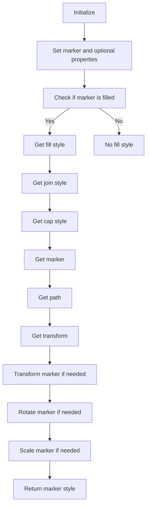

## 类结构

```
MarkerStyle (类)
├── markers (字典)
│   ├── str | int: str
│   └── ...
├── filled_markers (元组)
│   ├── str
│   └── ...
├── fillstyles (元组)
│   ├── FillStyleType
│   └── ...
└── ... (其他属性和方法)
```

## 全局变量及字段


### `TICKLEFT`
    
The position of the left tick mark.

类型：`int`
    


### `TICKRIGHT`
    
The position of the right tick mark.

类型：`int`
    


### `TICKUP`
    
The position of the up tick mark.

类型：`int`
    


### `TICKDOWN`
    
The position of the down tick mark.

类型：`int`
    


### `CARETLEFT`
    
The position of the left caret.

类型：`int`
    


### `CARETRIGHT`
    
The position of the right caret.

类型：`int`
    


### `CARETUP`
    
The position of the up caret.

类型：`int`
    


### `CARETDOWN`
    
The position of the down caret.

类型：`int`
    


### `CARETLEFTBASE`
    
The base position of the left caret.

类型：`int`
    


### `CARETRIGHTBASE`
    
The base position of the right caret.

类型：`int`
    


### `CARETUPBASE`
    
The base position of the up caret.

类型：`int`
    


### `CARETDOWNBASE`
    
The base position of the down caret.

类型：`int`
    


### `MarkerStyle.markers`
    
A dictionary mapping marker identifiers to marker styles.

类型：`dict[str | int, str]`
    


### `MarkerStyle.filled_markers`
    
A tuple of filled marker styles.

类型：`tuple[str, ...]`
    


### `MarkerStyle.fillstyles`
    
A tuple of fill styles available for markers.

类型：`tuple[FillStyleType, ...]`
    
    

## 全局函数及方法


### MarkerStyle.__init__

初始化MarkerStyle对象，允许设置标记样式、填充样式、变换、线帽样式和线连接样式。

参数：

- `marker`：`str | ArrayLike | Path | MarkerStyle`，标记样式，可以是字符串、数组、路径或MarkerStyle对象。
- `fillstyle`：`FillStyleType | None`，填充样式，可以是FillStyleType枚举值或None。
- `transform`：`Transform | None`，变换，可以是Transform对象或None。
- `capstyle`：`CapStyleType | None`，线帽样式，可以是CapStyleType枚举值或None。
- `joinstyle`：`JoinStyleType | None`，线连接样式，可以是JoinStyleType枚举值或None。

返回值：`None`，无返回值。

#### 流程图

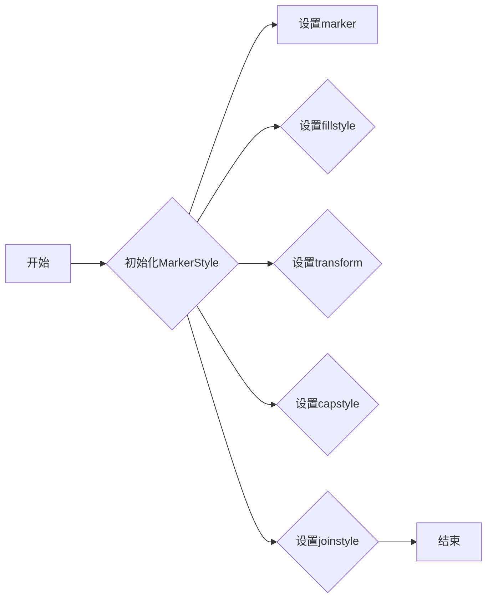

#### 带注释源码

```
def __init__(
    self,
    marker: str | ArrayLike | Path | MarkerStyle,
    fillstyle: FillStyleType | None = ...,
    transform: Transform | None = ...,
    capstyle: CapStyleType | None = ...,
    joinstyle: JoinStyleType | None = ...,
) -> None:
    # 设置marker
    self.markers = { ... }
    # 设置fillstyle
    self.fillstyles = { ... }
    # 设置transform
    self.transform = ...
    # 设置capstyle
    self.capstyle = ...
    # 设置joinstyle
    self.joinstyle = ...
```


### MarkerStyle.__bool__

判断MarkerStyle对象是否为真。

参数：

- 无

返回值：`bool`，如果MarkerStyle对象包含有效数据则为True，否则为False。

#### 流程图

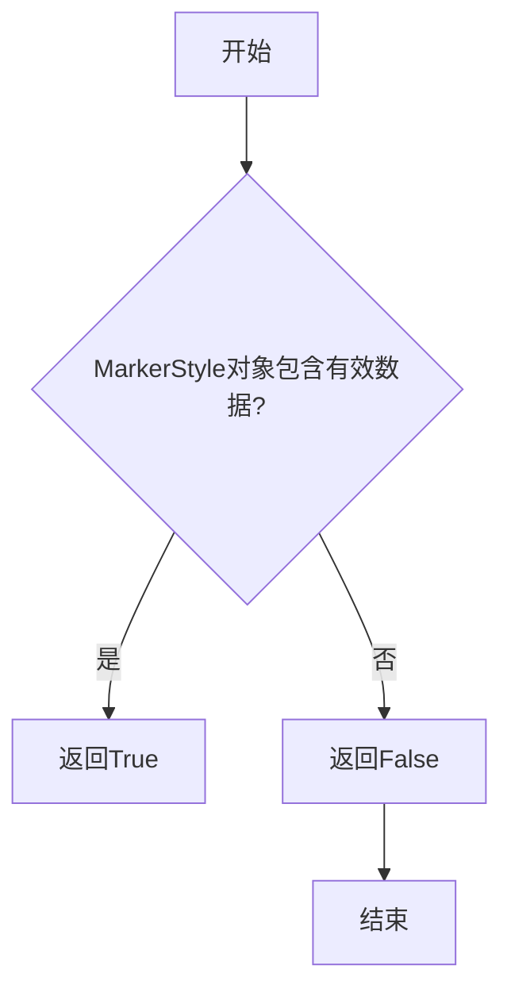

#### 带注释源码

```
def __bool__(self) -> bool:
    # 判断MarkerStyle对象是否包含有效数据
    return bool(self.markers) and bool(self.filled_markers) and bool(self.fillstyles)
``` 


### MarkerStyle.is_filled

判断MarkerStyle对象是否填充。

参数：

- 无

返回值：`bool`，表示是否填充

#### 流程图

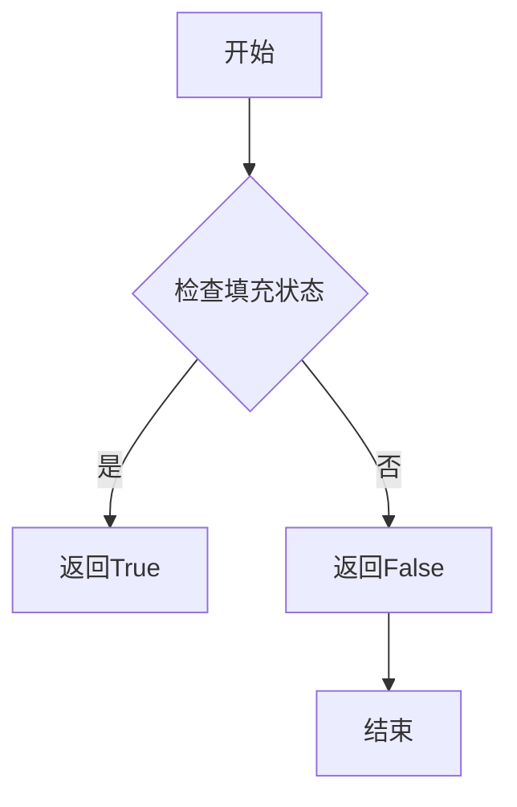

#### 带注释源码

```
def is_filled(self) -> bool:
    # 检查filled_markers中是否包含当前标记
    return self.marker in self.filled_markers
```


### MarkerStyle.get_fillstyle

获取当前MarkerStyle对象的填充样式。

参数：

- 无

返回值：`FillStyleType`，返回当前MarkerStyle对象的填充样式。

#### 流程图

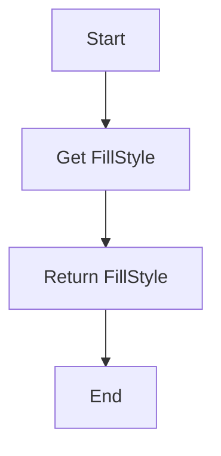

#### 带注释源码

```
def get_fillstyle(self) -> FillStyleType:
    # Return the fill style of the current MarkerStyle object
    return self.fillstyles[0]
```


### MarkerStyle.get_joinstyle

获取当前MarkerStyle对象的连接样式。

参数：

- 无

返回值：`Literal["miter", "round", "bevel"]`，连接样式的字符串表示，可以是"miter"、"round"或"bevel"。

#### 流程图

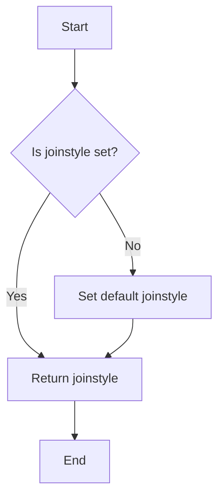

#### 带注释源码

```
def get_joinstyle(self) -> Literal["miter", "round", "bevel"]:
    """
    Get the join style of the MarkerStyle object.

    Returns:
        Literal["miter", "round", "bevel"]: The join style of the MarkerStyle object.
    """
    return self.joinstyle
```


### MarkerStyle.get_capstyle

获取当前MarkerStyle对象的capstyle属性。

参数：

- 无

返回值：`CapStyleType`，返回当前MarkerStyle对象的capstyle属性值。

#### 流程图

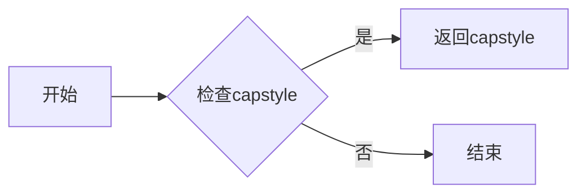

#### 带注释源码

```
def get_capstyle(self) -> Literal["butt", "projecting", "round"]:
    """
    获取当前MarkerStyle对象的capstyle属性。
    
    :return: 返回当前MarkerStyle对象的capstyle属性值。
    """
    return self.capstyle
```


### MarkerStyle.get_marker

获取当前MarkerStyle对象的标记样式。

参数：

-  `self`：`MarkerStyle`，当前MarkerStyle对象

返回值：`str | ArrayLike | Path | None`，标记样式，如果未设置则返回None。

#### 流程图

```mermaid
graph LR
A[开始] --> B{检查self是否有get_marker方法}
B -->|是| C[调用self.get_marker()]
B -->|否| D[返回None]
C --> E[结束]
D --> E
```

#### 带注释源码

```python
def get_marker(self) -> str | ArrayLike | Path | None:
    """
    获取当前MarkerStyle对象的标记样式。
    """
    return self.marker
```


### MarkerStyle.get_path

获取当前MarkerStyle对象的路径。

参数：

-  `self`：`MarkerStyle`，当前MarkerStyle对象

返回值：`Path`，返回当前MarkerStyle对象的路径

#### 流程图

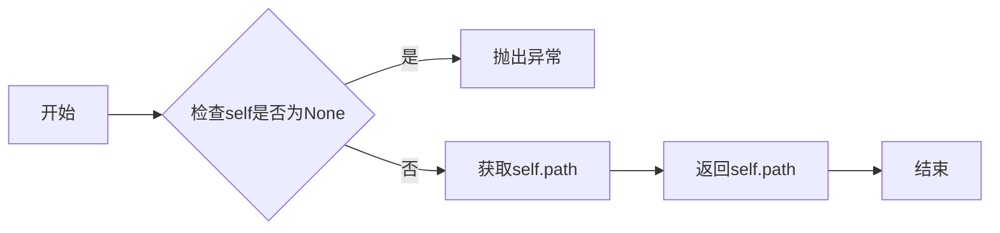

#### 带注释源码

```python
from .path import Path

class MarkerStyle:
    # ... (其他类字段和方法)

    def get_path(self) -> Path:
        """
        获取当前MarkerStyle对象的路径。

        :return: Path 当前MarkerStyle对象的路径
        """
        return self.path
```


### MarkerStyle.get_transform

获取当前MarkerStyle对象的变换。

参数：

- `self`：`MarkerStyle`，当前MarkerStyle对象

返回值：`Transform`，变换对象

#### 流程图

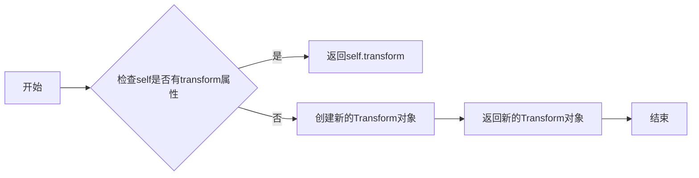

#### 带注释源码

```python
def get_transform(self) -> Transform:
    # 如果self有transform属性，则返回该属性
    if hasattr(self, 'transform'):
        return self.transform
    # 否则，创建一个新的Transform对象并返回
    else:
        return Transform()
``` 


### MarkerStyle.get_alt_path

获取标记样式的替代路径。

参数：

- 无

返回值：`Path | None`，替代路径对象，如果没有设置则返回 `None`。

#### 流程图

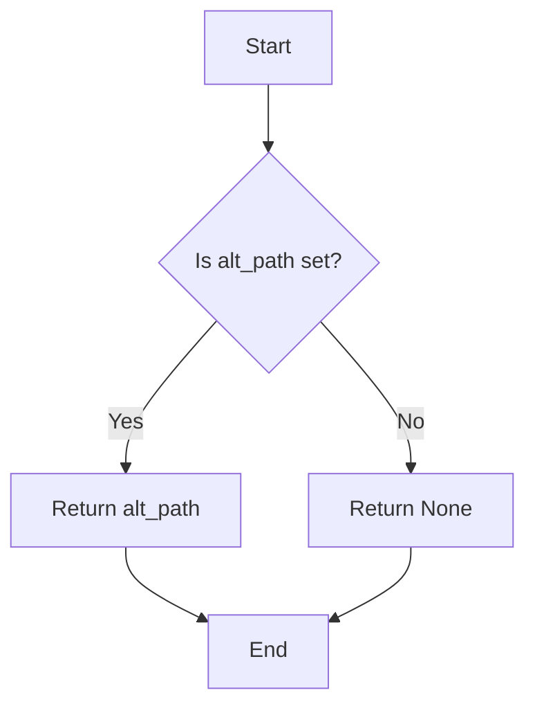

#### 带注释源码

```
def get_alt_path(self) -> Path | None:
    # Return the alternative path if it is set, otherwise return None
    return self.alt_path
```


### MarkerStyle.get_alt_transform

获取当前MarkerStyle对象的替代变换。

参数：

- 无

返回值：`Transform`，返回一个变换对象，表示替代变换。

#### 流程图

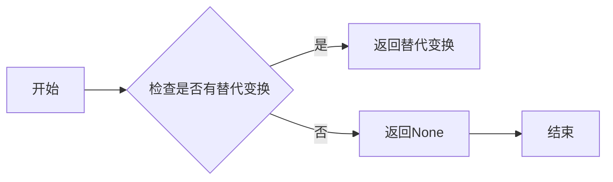

#### 带注释源码

```
def get_alt_transform(self) -> Transform:
    # 检查是否有替代变换
    if self._alt_transform is not None:
        # 返回替代变换
        return self._alt_transform
    # 如果没有替代变换，返回None
    return None
``` 


### MarkerStyle.get_snap_threshold

获取标记样式的捕捉阈值。

参数：

-  `self`：`MarkerStyle`，当前标记样式的实例

返回值：`float | None`，捕捉阈值，如果没有设置则返回 `None`

#### 流程图


#### 带注释源码

```python
def get_snap_threshold(self) -> float | None:
    # 检查是否有捕捉阈值
    if hasattr(self, '_snap_threshold'):
        # 返回捕捉阈值
        return self._snap_threshold
    # 如果没有设置捕捉阈值，返回None
    return None
```


### `MarkerStyle.get_user_transform`

获取与当前MarkerStyle关联的用户定义的变换。

参数：

- 无

返回值：`Transform | None`，如果存在用户定义的变换，则返回Transform对象，否则返回None。

#### 流程图

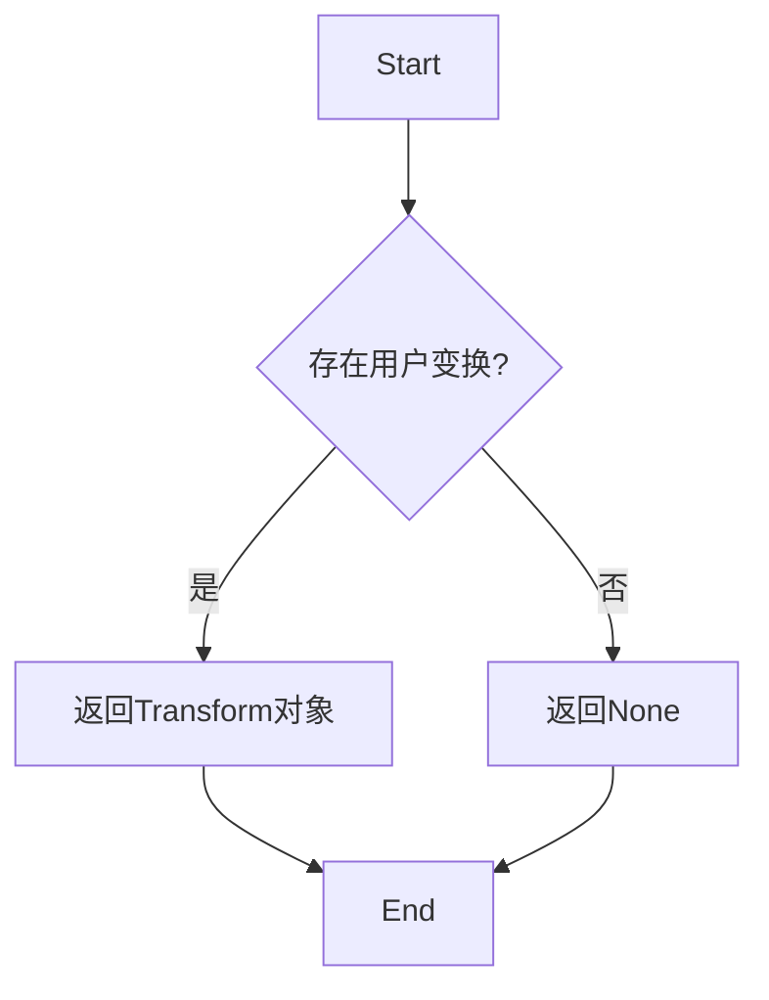

#### 带注释源码

```python
def get_user_transform(self) -> Transform | None:
    """
    获取与当前MarkerStyle关联的用户定义的变换。
    
    :return: Transform对象或None
    """
    return self.transform
```


### MarkerStyle.transformed

该函数用于将MarkerStyle对象应用一个Affine2D变换，并返回一个新的MarkerStyle对象。

参数：

- `transform`：`Affine2D`，表示要应用的两个维度的仿射变换。

返回值：`MarkerStyle`，表示应用了变换的新MarkerStyle对象。

#### 流程图

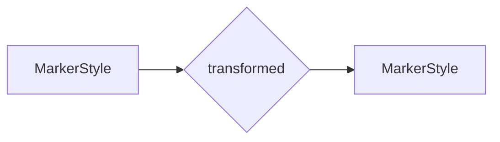

#### 带注释源码

```
def transformed(self, transform: Affine2D) -> MarkerStyle:
    # 创建一个新的MarkerStyle对象，其transform属性为当前对象的transform与传入的transform的复合
    new_marker_style = MarkerStyle(
        marker=self.marker,
        fillstyle=self.fillstyle,
        transform=self.transform * transform,
        capstyle=self.capstyle,
        joinstyle=self.joinstyle,
    )
    return new_marker_style
```


### MarkerStyle.rotated

旋转标记样式。

参数：

- `deg`：`float | None`，可选，以度为单位的角度，用于旋转标记。
- `rad`：`float | None`，可选，以弧度为单位的角度，用于旋转标记。

返回值：`MarkerStyle`，返回一个新的标记样式实例，其已根据提供的角度旋转。

#### 流程图

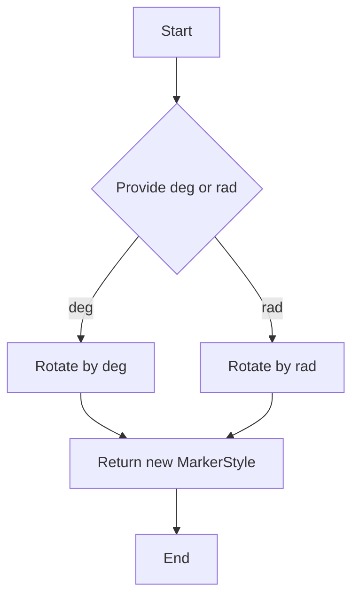

#### 带注释源码

```
def rotated(
    self, *, deg: float | None = ..., rad: float | None = ...
) -> MarkerStyle:
    # Check if either deg or rad is provided
    if deg is not None or rad is not None:
        # Create a new Transform instance with the rotation
        rotation_transform = Transform(rotation=deg if deg is not None else rad)
        # Apply the rotation transform to the marker style
        return self.transformed(rotation_transform)
    else:
        # Return the current marker style if no rotation is provided
        return self
```


### MarkerStyle.scaled

`MarkerStyle.scaled` 方法用于缩放标记样式。

参数：

- `sx`：`float`，缩放因子，用于水平缩放。
- `sy`：`float` 或 `None`，缩放因子，用于垂直缩放。如果为 `None`，则与 `sx` 相同。

返回值：`MarkerStyle`，缩放后的标记样式。

#### 流程图


#### 带注释源码

```
def scaled(self, sx: float, sy: float | None = ...) -> MarkerStyle:
    # 创建一个新的MarkerStyle实例，应用缩放变换
    new_marker_style = MarkerStyle(
        marker=self.get_marker(),
        fillstyle=self.get_fillstyle(),
        transform=self.get_transform().scaled(sx, sy),
        capstyle=self.get_capstyle(),
        joinstyle=self.get_joinstyle(),
    )
    return new_marker_style
```


## 关键组件


### 张量索引与惰性加载

张量索引与惰性加载是用于高效处理大型数据集的关键组件，它允许在需要时才计算数据，从而减少内存消耗和提高性能。

### 反量化支持

反量化支持是用于处理量化数据的关键组件，它允许在量化与去量化之间进行转换，确保数据在量化过程中的准确性和可逆性。

### 量化策略

量化策略是用于优化模型性能的关键组件，它决定了如何将浮点数转换为固定点数，从而减少计算资源消耗并提高推理速度。


## 问题及建议


### 已知问题

-   **全局变量定义过多**：代码中定义了多个常量，如TICKLEFT, TICKRIGHT等，这些常量可能可以通过类属性或类方法来管理，以减少全局变量的使用。
-   **类型注解缺失**：部分方法如`get_fillstyle`、`get_joinstyle`、`get_capstyle`等缺少返回值的类型注解。
-   **方法参数默认值使用...**：`__init__`方法中使用了`...`作为默认值，这在类型注解中是不允许的，应该使用具体的默认值或移除默认值。

### 优化建议

-   **重构全局变量**：将全局变量转换为类属性或类方法，以增强代码的可读性和可维护性。
-   **补充类型注解**：为所有方法添加完整的类型注解，包括参数和返回值。
-   **移除或替换默认值中的...**：对于`__init__`方法中的默认值，使用具体的默认值或移除默认值，并确保类型注解正确。
-   **考虑使用继承**：如果`MarkerStyle`类具有多个相似的方法，可以考虑使用继承来减少代码重复。
-   **文档化**：为每个类和方法添加详细的文档字符串，说明其功能和用法。
-   **单元测试**：为每个类和方法编写单元测试，以确保代码的正确性和稳定性。


## 其它


### 设计目标与约束

- 设计目标：确保代码模块化、可扩展性和易于维护。
- 约束：遵循Python编程规范，使用类型注解提高代码可读性和健壮性。

### 错误处理与异常设计

- 异常处理：使用try-except块捕获和处理潜在的错误。
- 错误类型：定义自定义异常类以处理特定错误情况。

### 数据流与状态机

- 数据流：数据从输入参数传递到类方法，并通过返回值输出。
- 状态机：类方法可能包含内部状态转换，如`transformed`和`rotated`。

### 外部依赖与接口契约

- 外部依赖：依赖`path`、`transforms`模块和`numpy`库。
- 接口契约：定义清晰的接口和参数类型，确保与其他模块的兼容性。


    