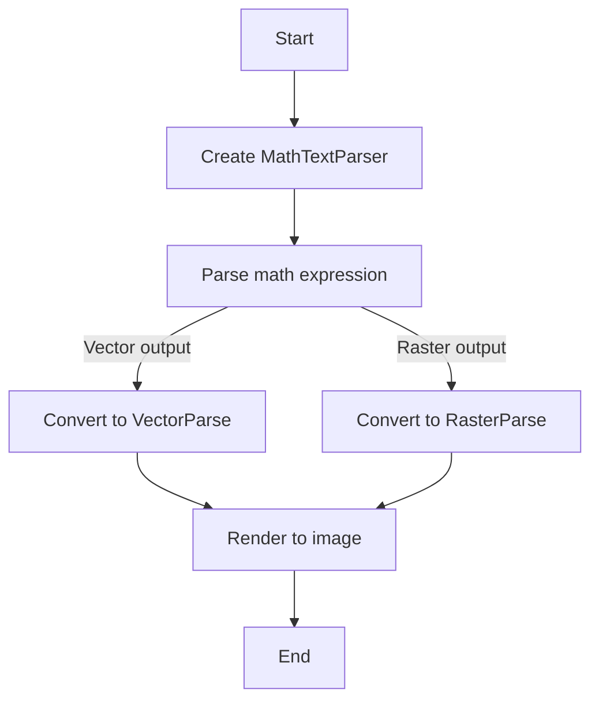
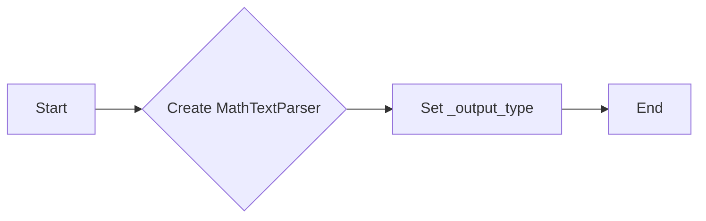
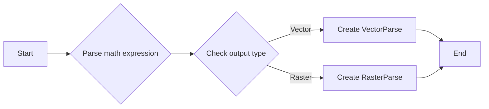
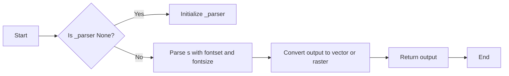

# `matplotlib\lib\matplotlib\mathtext.py` 详细设计文档

This module provides functionality to parse TeX math syntax and render it to a Matplotlib backend, supporting various fonts and output formats.

## 整体流程



## 类结构

```
MathTextParser (主类)
├── _parser (全局变量)
│   ├── _font_type_mapping (全局变量)
│   └── _output_type (类字段)
└── _parse_cached (类方法)
```

## 全局变量及字段


### `_log`
    
Logger for the module.

类型：`logging.Logger`
    


### `_api`
    
Internal API module of Matplotlib.

类型：`module`
    


### `_mathtext`
    
Internal mathtext module of Matplotlib.

类型：`module`
    


### `LoadFlags`
    
Flags for loading fonts.

类型：`enum`
    


### `FontProperties`
    
Font properties class.

类型：`matplotlib.font_manager.FontProperties`
    


### `RasterParse`
    
Class for rasterizing math expressions.

类型：`class`
    


### `VectorParse`
    
Class for vectorizing math expressions.

类型：`class`
    


### `get_unicode_index`
    
Function to get Unicode index for a character.

类型：`function`
    


### `_font_type_mapping`
    
Mapping of font types to font classes.

类型：`dict`
    


### `_output_type`
    
Type of output (vector or raster).

类型：`str`
    


### `MathTextParser._parser`
    
Parser instance for math expressions.

类型：`matplotlib._mathtext.Parser`
    


### `MathTextParser._font_type_mapping`
    
Mapping of font types to font classes.

类型：`dict`
    


### `MathTextParser._output_type`
    
Type of output (vector or raster).

类型：`str`
    


### `MathTextParser._parser`
    
Parser instance for math expressions.

类型：`matplotlib._mathtext.Parser`
    


### `MathTextParser._font_type_mapping`
    
Mapping of font types to font classes.

类型：`dict`
    


### `MathTextParser._output_type`
    
Type of output (vector or raster).

类型：`str`
    
    

## 全局函数及方法


### math_to_image

Given a math expression, renders it in a closely-clipped bounding box to an image file.

参数：

- `s`：`str`，A math expression. The math portion must be enclosed in dollar signs.
- `filename_or_obj`：`str or path-like or file-like`，Where to write the image data.
- `prop`：`.FontProperties`，The size and style of the text. Optional.
- `dpi`：`float`，The output dpi. If not set, the dpi is determined as for `.Figure.savefig`. Optional.
- `format`：`str`，The output format, e.g., 'svg', 'pdf', 'ps' or 'png'. If not set, the format is determined as for `.Figure.savefig`. Optional.
- `color`：`str`，Foreground color, defaults to :rc:`text.color`. Optional.

返回值：`depth`：`int`，The depth of the rendered text in the bounding box.

#### 流程图


#### 带注释源码

```python
def math_to_image(s, filename_or_obj, prop=None, dpi=None, format=None,
                  *, color=None):
    """
    Given a math expression, renders it in a closely-clipped bounding
    box to an image file.

    Parameters
    ----------
    s : str
        A math expression.  The math portion must be enclosed in dollar signs.
    filename_or_obj : str or path-like or file-like
        Where to write the image data.
    prop : `.FontProperties`, optional
        The size and style of the text.
    dpi : float, optional
        The output dpi.  If not set, the dpi is determined as for
        `.Figure.savefig`.
    format : str, optional
        The output format, e.g., 'svg', 'pdf', 'ps' or 'png'.  If not set, the
        format is determined as for `.Figure.savefig`.
    color : str, optional
        Foreground color, defaults to :rc:`text.color`.

    Returns
    -------
    depth : int
        The depth of the rendered text in the bounding box.
    """
    parser = MathTextParser('path')
    width, height, depth, _, _ = parser.parse(s, dpi=72, prop=prop)

    fig = figure.Figure(figsize=(width / 72.0, height / 72.0))
    fig.text(0, depth/height, s, fontproperties=prop, color=color)
    fig.savefig(filename_or_obj, dpi=dpi, format=format)

    return depth
```


### MathTextParser.__init__

Create a MathTextParser for the given backend *output*.

参数：

- `output`：`{"path", "agg"}`，指定输出类型，可以是 "path" 或 "agg"。

返回值：无

#### 流程图



#### 带注释源码

```python
def __init__(self, output):
    """
    Create a MathTextParser for the given backend *output*.

    Parameters
    ----------
    output : {"path", "agg"}
        Whether to return a `VectorParse` ("path") or a
        `RasterParse` ("agg", or its synonym "macosx").
    """
    self._output_type = _api.getitem_checked(
        {"path": "vector", "agg": "raster", "macosx": "raster"},
        output=output.lower())
```


### MathTextParser.parse

Parse the given math expression and render it to a vector or raster output.

参数：

- `s`：`str`，The math expression to parse.
- `dpi`：`float`，The resolution of the output in dots per inch.
- `prop`：`FontProperties`，The font properties to use for the math expression.
- `antialiased`：`bool`，Whether to use antialiasing for the output.

返回值：`VectorParse` 或 `RasterParse`，The parsed and rendered math expression.

#### 流程图



#### 带注释源码

```python
def parse(self, s, dpi=72, prop=None, *, antialiased=None):
    """
    Parse the given math expression *s* at the given *dpi*.  If *prop* is
    provided, it is a `.FontProperties` object specifying the "default"
    font to use in the math expression, used for all non-math text.

    The results are cached, so multiple calls to `parse`
    with the same expression should be fast.

    Depending on the *output* type, this returns either a `VectorParse` or
    a `RasterParse`.
    """
    # lru_cache can't decorate parse() directly because prop is
    # mutable, so we key the cache using an internal copy (see
    # Text._get_text_metrics_with_cache for a similar case); likewise,
    # we need to check the mutable state of the text.antialiased and
    # text.hinting rcParams.
    prop = prop.copy() if prop is not None else None
    antialiased = mpl._val_or_rc(antialiased, 'text.antialiased')
    from matplotlib.backends import backend_agg
    load_glyph_flags = {
        "vector": LoadFlags.NO_HINTING,
        "raster": backend_agg.get_hinting_flag(),
    }[self._output_type]
    return self._parse_cached(s, dpi, prop, antialiased, load_glyph_flags)
```


### MathTextParser._parse_cached

This method is responsible for parsing the given math expression and returning the output in either vector or raster format based on the specified output type.

参数：

- `s`：`str`，The math expression to be parsed.
- `dpi`：`float`，The dots per inch for the output.
- `prop`：`FontProperties`，The font properties object specifying the font size and style.
- `antialiased`：`bool`，Whether to enable antialiasing.
- `load_glyph_flags`：`int`，Flags to control how glyphs are loaded.

返回值：`VectorParse` 或 `RasterParse`，The parsed output in the specified format.

#### 流程图



#### 带注释源码

```python
@functools.lru_cache(50)
def _parse_cached(self, s, dpi, prop, antialiased, load_glyph_flags):
    if prop is None:
        prop = FontProperties()
    fontset_class = _api.getitem_checked(
        self._font_type_mapping, fontset=prop.get_math_fontfamily())
    fontset = fontset_class(prop, load_glyph_flags)
    fontsize = prop.get_size_in_points()

    if self._parser is None:  # Cache the parser globally.
        self.__class__._parser = _mathtext.Parser()

    box = self._parser.parse(s, fontset, fontsize, dpi)
    output = _mathtext.ship(box)
    if self._output_type == "vector":
        return output.to_vector()
    elif self._output_type == "raster":
        return output.to_raster(antialiased=antialiased)
``` 


## 关键组件


### 张量索引与惰性加载

张量索引与惰性加载是用于在解析数学表达式时，对表达式中的各个部分进行索引和延迟加载，以提高性能和效率。

### 反量化支持

反量化支持允许在解析数学表达式时，对表达式中的变量进行反量化处理，以便在后续的渲染过程中能够正确地处理这些变量。

### 量化策略

量化策略是指在解析数学表达式时，对表达式中的数值进行量化处理，以便在后续的渲染过程中能够正确地处理这些数值。


## 问题及建议


### 已知问题

-   **缓存策略**: `_parse_cached` 方法使用了 `lru_cache` 来缓存结果，但只缓存了字符串 `s` 和 `dpi`，没有考虑 `prop` 和 `antialiased` 的变化。如果 `prop` 或 `antialiased` 发生变化，缓存可能不会正确地反映最新的渲染结果。
-   **字体加载**: `_font_type_mapping` 中定义了多种字体类型，但缺乏对字体加载失败的处理。如果指定的字体不可用，代码可能不会优雅地处理这种情况。
-   **异常处理**: 代码中没有明确的异常处理机制。如果解析或渲染过程中出现错误，可能会导致程序崩溃或产生不可预见的输出。
-   **代码重复**: `math_to_image` 函数中，`parser.parse(s, dpi=72, prop=prop)` 被重复调用，这可能导致不必要的性能开销。

### 优化建议

-   **改进缓存策略**: 考虑将 `prop` 和 `antialiased` 也纳入缓存键，以确保缓存能够正确地反映所有输入参数的变化。
-   **增加字体加载错误处理**: 在加载字体时添加异常处理，确保在字体不可用时能够给出明确的错误信息，并允许用户选择备选字体。
-   **添加异常处理**: 在关键操作（如解析和渲染）中添加异常处理，确保在出现错误时能够优雅地处理异常，并提供有用的错误信息。
-   **减少代码重复**: 将 `parser.parse(s, dpi=72, prop=prop)` 的调用移到单独的函数中，以减少代码重复并提高可读性。
-   **性能优化**: 考虑使用更高效的字体加载和渲染方法，以减少渲染时间并提高性能。
-   **文档和注释**: 增加代码的文档和注释，以提高代码的可读性和可维护性。


## 其它


### 设计目标与约束

- 设计目标：
  - 解析TeX数学语法子集。
  - 将解析后的数学表达式渲染为Matplotlib后端支持的格式。
  - 支持多种字体类型，包括Bakoma、DejaVu、STIX等。
  - 提供灵活的输出选项，包括矢量图和位图。
- 约束：
  - 代码应与Matplotlib紧密集成。
  - 代码应具有良好的可扩展性和可维护性。
  - 代码应遵循Matplotlib的API规范。

### 错误处理与异常设计

- 错误处理：
  - 当解析TeX表达式时，如果遇到无效的语法，应抛出异常。
  - 当渲染数学表达式时，如果遇到字体加载失败等问题，应记录错误并返回错误信息。
- 异常设计：
  - 定义自定义异常类，如`MathTextParsingError`和`MathTextRenderingError`。
  - 使用try-except语句捕获和处理异常。

### 数据流与状态机

- 数据流：
  - 输入：TeX数学表达式字符串。
  - 处理：解析表达式，生成数学图形。
  - 输出：数学图形的矢量图或位图。
- 状态机：
  - 解析状态机：根据TeX语法解析表达式。
  - 渲染状态机：根据输出类型（矢量图或位图）渲染数学图形。

### 外部依赖与接口契约

- 外部依赖：
  - Matplotlib：用于渲染数学图形。
  - pyparsing：用于解析TeX表达式。
- 接口契约：
  - `MathTextParser`类提供解析和渲染数学表达式的接口。
  - `math_to_image`函数提供将数学表达式渲染为图像的接口。


    