# `matplotlib\lib\matplotlib\path.py` 详细设计文档

This module provides a `Path` class for handling polylines in Matplotlib, including methods for creating, manipulating, and rendering paths.

## 整体流程

```mermaid
graph TD
    A[Create Path] --> B[Set Vertices and Codes]
    B --> C[Check Codes and Vertices]
    C -->|Codes are None| D[Set MOVETO and LINETO Codes]
    C -->|Codes are valid| E[Use Provided Codes]
    E --> F[Update Path Values]
    F --> G[Make Path Read-Only if Required]
    G --> H[Return Path]
    H --> I[Iterate Segments]
    I -->|Transform Required| J[Apply Transform]
    J --> K[Remove Nans if Required]
    K -->|Clip Required| L[Clip Path]
    L -->|Snap Required| M[Snap Path]
    M --> N[Return Segments]
    N --> O[Iterate Bezier Curves]
    O --> P[Return Bezier Curves]
    P --> Q[Clean Path]
    Q --> R[Apply Cleanup Parameters]
    R --> S[Return Cleaned Path]
    S --> T[Transform Path]
    T --> U[Return Transformed Path]
    U --> V[Check Point Containment]
    V --> W[Apply Transform if Required]
    W --> X[Check Point Containment]
    X --> Y[Return Containment Result]
    Y --> Z[Check Points Containment]
    Z --> AA[Apply Transform if Required]
    AA --> AB[Check Points Containment]
    AB --> AC[Return Containment Results]
    AC --> AD[Check Path Containment]
    AD --> AE[Apply Transform if Required]
    AE --> AF[Check Path Containment]
    AF --> AG[Return Containment Result]
    AG --> AH[Get Extents]
    AH --> AI[Apply Transform if Required]
    AI --> AJ[Get Extents]
    AJ --> AK[Return Extents]
    AK --> AL[Interpolate Path]
    AL --> AM[Apply Interpolation Steps]
    AM --> AN[Return Interpolated Path]
    AN --> AO[Convert to Polygons]
    AO --> AP[Apply Transform if Required]
    AP --> AQ[Convert to Polygons]
    AQ --> AR[Return Polygons]
    AR --> AS[Clip to Bbox]
    AS --> AT[Apply Clip Parameters]
    AT --> AU[Return Clipped Path]
```

## 类结构

```
Path (主要类)
├── BezierSegment (辅助类)
```

## 全局变量及字段


### `code_type`
    
The type used for path codes.

类型：`numpy.uint8`
    


### `STOP`
    
The code for the end of the entire path.

类型：`numpy.uint8`
    


### `MOVETO`
    
The code for moving the pen to a new location.

类型：`numpy.uint8`
    


### `LINETO`
    
The code for drawing a line to a new location.

类型：`numpy.uint8`
    


### `CURVE3`
    
The code for drawing a quadratic Bézier curve.

类型：`numpy.uint8`
    


### `CURVE4`
    
The code for drawing a cubic Bézier curve.

类型：`numpy.uint8`
    


### `CLOSEPOLY`
    
The code for closing a polygonal path.

类型：`numpy.uint8`
    


### `NUM_VERTICES_FOR_CODE`
    
A dictionary mapping path codes to the number of vertices they expect.

类型：`dict`
    


### `Path._vertices`
    
The vertices of the path.

类型：`(N, 2) array-like`
    


### `Path._codes`
    
The codes for the path segments.

类型：`array-like or None`
    


### `Path._interpolation_steps`
    
The number of interpolation steps for the path.

类型：`int`
    


### `Path._readonly`
    
Whether the path is read-only.

类型：`bool`
    


### `Path._should_simplify`
    
Whether the path should be simplified.

类型：`bool`
    


### `Path._simplify_threshold`
    
The threshold for simplifying the path.

类型：`float`
    
    

## 全局函数及方法

### _to_unmasked_float_array

#### 描述

`_to_unmasked_float_array` 函数将输入转换为无掩码的浮点数组。它接受一个数组、掩码数组或序列，并返回一个浮点数组，其中掩码值被转换为 NaN。

#### 参数

- `vertices`：`array-like`，输入数组、掩码数组或序列。
- `mask`：可选的 `array-like`，掩码数组。

#### 返回值

- `numpy.ndarray`：转换后的浮点数组。

#### 流程图

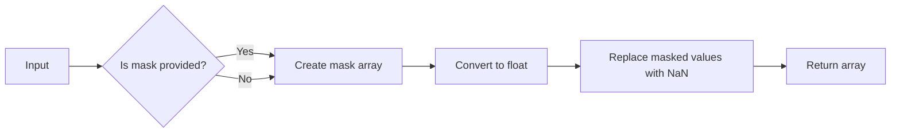

#### 带注释源码

```python
def _to_unmasked_float_array(vertices, mask=None):
    """
    Convert input to an unmasked float array.

    Parameters
    ----------
    vertices : array-like
        Input array, masked array, or sequence.
    mask : array-like, optional
        Mask array.

    Returns
    -------
    numpy.ndarray
        Converted float array.
    """
    vertices = np.asarray(vertices)
    if mask is not None:
        mask = np.asarray(mask)
        vertices[mask] = np.nan
    return vertices.astype(float)
```


### simple_linear_interpolation

This function performs linear interpolation between points in a 1D array.

参数：

- `vertices`：`numpy.ndarray`，The 1D array of vertices to interpolate.
- `steps`：`int`，The number of segments in the new path for each in the original.

返回值：`numpy.ndarray`，The interpolated vertices.

#### 流程图

```mermaid
graph LR
A[Start] --> B{Is steps == 1?}
B -- Yes --> C[Return vertices]
B -- No --> D{Is codes is not None?}
D -- Yes --> E{Is MOVETO in codes[1:]?}
E -- Yes --> F[Create compound path]
F --> G[Return interpolated path]
D -- No --> H{Is codes is None?}
H -- Yes --> I{Is closed?}
I -- Yes --> J[Add CLOSEPOLY code]
J --> K[Interpolate vertices]
K --> L[Return interpolated path]
H -- No --> M[Interpolate vertices]
M --> L
```

#### 带注释源码

```python
def simple_linear_interpolation(vertices, steps):
    if steps == 1 or len(self) == 0:
        return self

    if self.codes is not None and self.MOVETO in self.codes[1:]:
        return self.make_compound_path(
            *(p.interpolated(steps) for p in self._iter_connected_components()))

    if self.codes is not None and self.CLOSEPOLY in self.codes and not np.all(
            self.vertices[self.codes == self.CLOSEPOLY] == self.vertices[0]):
        vertices = self.vertices.copy()
        vertices[self.codes == self.CLOSEPOLY] = vertices[0]
    else:
        vertices = self.vertices

    vertices = simple_linear_interpolation(vertices, steps)
    codes = self.codes
    if codes is not None:
        new_codes = np.full((len(codes) - 1) * steps + 1, Path.LINETO,
                            dtype=self.code_type)
        new_codes[0::steps] = codes
    else:
        new_codes = None
    return Path(vertices, new_codes)
```


### get_path_collection_extents

Get bounding box of a `.PathCollection`\s internal objects.

参数：

- `master_transform`：`~matplotlib.transforms.Transform`，Global transformation applied to all paths.
- `paths`：list of `Path`，A sequence of `Path` objects.
- `transforms`：list of `~matplotlib.transforms.Affine2DBase`，If non-empty, this overrides *master_transform*.
- `offsets`：(N, 2) array-like，Offset values for each path.
- `offset_transform`：`~matplotlib.transforms.Affine2DBase`，Transform applied to the offsets before offsetting the path.

返回值：`matplotlib.transforms.Bbox`，Bounding box that encapsulates all of the paths and transformations.

#### 流程图

```mermaid
graph LR
A[get_path_collection_extents] --> B{master_transform}
B --> C{paths}
C --> D{transforms}
D --> E{offsets}
E --> F{offset_transform}
F --> G{get_path_collection_extents()}
G --> H[matplotlib.transforms.Bbox]
```

#### 带注释源码

```python
def get_path_collection_extents(
        master_transform, paths, transforms, offsets, offset_transform):
    from .transforms import Bbox
    if len(paths) == 0:
        raise ValueError("No paths provided")
    if len(offsets) == 0:
        raise ValueError("No offsets provided")
    extents, minpos = _path.get_path_collection_extents(
        master_transform, paths, np.atleast_3d(transforms),
        offsets, offset_transform)
    return Bbox.from_extents(*extents, minpos=minpos)
```


### Path.__init__

This method initializes a new `Path` instance with the given vertices and codes.

参数：

- `vertices`：`(N, 2) array-like`，The path vertices, as an array, masked array or sequence of pairs. Masked values, if any, will be converted to NaNs, which are then handled correctly by the Agg PathIterator and other consumers of path data, such as `iter_segments`.
- `codes`：`array-like or None`，N-length array of integers representing the codes of the path. If not None, codes must be the same length as vertices. If None, *vertices* will be treated as a series of line segments.
- `_interpolation_steps`：`int`，Used as a hint to certain projections, such as Polar, that this path should be linearly interpolated immediately before drawing. This attribute is primarily an implementation detail and is not intended for public use.
- `closed`：`bool`，If *codes* is None and closed is True, vertices will be treated as line segments of a closed polygon. Note that the last vertex will then be ignored (as the corresponding code will be set to `CLOSEPOLY`).
- `readonly`：`bool`，Makes the path behave in an immutable way and sets the vertices and codes as read-only arrays.

返回值：`None`，This method does not return any value.

#### 流程图

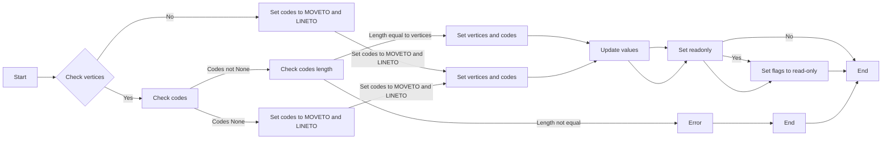

#### 带注释源码

```python
def __init__(self, vertices, codes=None, _interpolation_steps=1,
                 closed=False, readonly=False):
    vertices = _to_unmasked_float_array(vertices)
    _api.check_shape((None, 2), vertices=vertices)

    if codes is not None and len(vertices):
        codes = np.asarray(codes, self.code_type)
        if codes.ndim != 1 or len(codes) != len(vertices):
            raise ValueError("'codes' must be a 1D list or array with the "
                             "same length of 'vertices'. "
                             f"Your vertices have shape {vertices.shape} "
                             f"but your codes have shape {codes.shape}")
        if len(codes) and codes[0] != self.MOVETO:
            raise ValueError("The first element of 'code' must be equal "
                             f"to 'MOVETO' ({self.MOVETO}).  "
                             f"Your first code is {codes[0]}")
    elif closed and len(vertices):
        codes = np.empty(len(vertices), dtype=self.code_type)
        codes[0] = self.MOVETO
        codes[1:-1] = self.LINETO
        codes[-1] = self.CLOSEPOLY

    self._vertices = vertices
    self._codes = codes
    self._interpolation_steps = _interpolation_steps
    self._update_values()

    if readonly:
        self._vertices.flags.writeable = False
        if self._codes is not None:
            self._codes.flags.writeable = False
        self._readonly = True
    else:
        self._readonly = False
```


### Path._fast_from_codes_and_verts

This method creates a `Path` instance without the expense of calling the constructor.

参数：

- `verts`：`array-like`，The path vertices, as an array, masked array or sequence of pairs.
- `codes`：`array`，N-length array of integers representing the codes of the path.
- `internals_from`：`Path` or `None`，If not `None`, another `Path` from which the attributes ``should_simplify``, ``simplify_threshold``, and ``interpolation_steps`` will be copied.  Note that ``readonly`` is never copied, and always set to ``False`` by this constructor.

返回值：`Path`，A new `Path` instance with the given vertices and codes.

#### 流程图

```mermaid
graph LR
A[Start] --> B{Create new Path instance}
B --> C[Set vertices to _to_unmasked_float_array(verts)]
C --> D{Set codes to codes if codes is not None}
D --> E{Set _readonly to False}
E --> F{If internals_from is not None}
F --> G{Copy should_simplify, simplify_threshold, and interpolation_steps from internals_from}
G --> H{Return pth}
H --> I[End]
F --> I
```

#### 带注释源码

```python
@classmethod
def _fast_from_codes_and_verts(cls, verts, codes, internals_from=None):
    """
    Create a Path instance without the expense of calling the constructor.

    Parameters
    ----------
    verts : array-like
        The path vertices, as an array, masked array or sequence of pairs.
    codes : array
        N-length array of integers representing the codes of the path.
    internals_from : Path or None
        If not None, another `Path` from which the attributes
        ``should_simplify``, ``simplify_threshold``, and
        ``interpolation_steps`` will be copied.  Note that ``readonly`` is
        never copied, and always set to ``False`` by this constructor.

    Returns
    -------
    Path
        A new `Path` instance with the given vertices and codes.
    """
    pth = cls.__new__(cls)
    pth._vertices = _to_unmasked_float_array(verts)
    pth._codes = codes
    pth._readonly = False
    if internals_from is not None:
        pth._should_simplify = internals_from._should_simplify
        pth._simplify_threshold = internals_from._simplify_threshold
        pth._interpolation_steps = internals_from._interpolation_steps
    else:
        pth._should_simplify = True
        pth._simplify_threshold = mpl.rcParams['path.simplify_threshold']
        pth._interpolation_steps = 1
    return pth
``` 


### Path._create_closed

Create a closed polygonal path going through the given vertices.

参数：

- `vertices`：`array-like`，The vertices of the polygon to be created. The vertices should not end with an entry for the CLOSEPATH; this entry is added by `_create_closed`.

返回值：`Path`，A closed polygonal path with the given vertices.

#### 流程图

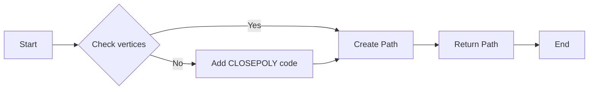

#### 带注释源码

```python
@classmethod
def _create_closed(cls, vertices):
    """
    Create a closed polygonal path going through *vertices*.

    Unlike ``Path(..., closed=True)``, *vertices* should **not** end with
    an entry for the CLOSEPATH; this entry is added by `._create_closed`.
    """
    v = _to_unmasked_float_array(vertices)
    return cls(np.concatenate([v, v[:1]]), closed=True)
```


### Path._update_values

This method updates the internal values of the Path object, such as the simplify threshold and whether the path should be simplified.

#### 参数

- None

#### 返回值

- None

#### 流程图

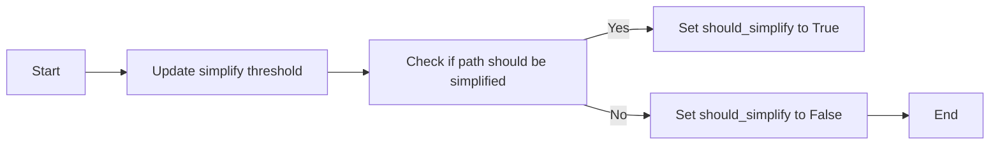

#### 带注释源码

```python
def _update_values(self):
    self._simplify_threshold = mpl.rcParams['path.simplify_threshold']
    self._should_simplify = (
        self._simplify_threshold > 0 and
        mpl.rcParams['path.simplify'] and
        len(self._vertices) >= 128 and
        (self._codes is None or np.all(self._codes <= Path.LINETO))
    )
```


### Path.vertices

`Path.vertices` 是 `Path` 类的一个属性，它返回路径的顶点数组。

参数：

- 无

返回值：

- `(N, 2) array`：路径的顶点数组，其中 N 是顶点的数量，每个顶点是一个包含两个浮点数的数组，分别代表 x 和 y 坐标。

#### 流程图

```mermaid
classDiagram
    Path <<class>>
    Path : +vertices : (N, 2) array
    Path : +__init__(vertices, codes=None, _interpolation_steps=1, closed=False, readonly=False)
    Path : +copy()
    Path : +deepcopy(memo=None)
    Path : +iter_segments(transform=None, remove_nans=True, clip=None, snap=False, stroke_width=1.0, simplify=None, curves=True, sketch=None)
    Path : +iter_bezier(**kwargs)
    Path : +cleaned(transform=None, remove_nans=False, clip=None, *, simplify=False, curves=False, stroke_width=1.0, snap=False, sketch=None)
    Path : +transformed(transform)
    Path : +contains_point(point, transform=None, radius=0.0)
    Path : +contains_points(points, transform=None, radius=0.0)
    Path : +contains_path(path, transform=None)
    Path : +get_extents(transform=None, **kwargs)
    Path : +intersects_path(other, filled=True)
    Path : +intersects_bbox(bbox, filled=True)
    Path : +interpolated(steps)
    Path : +to_polygons(transform=None, width=0, height=0, closed_only=True)
    Path : +unit_rectangle()
    Path : +unit_regular_polygon(numVertices)
    Path : +unit_regular_star(numVertices, innerCircle=0.5)
    Path : +unit_regular_asterisk(numVertices)
    Path : +unit_circle()
    Path : +circle(center=(0., 0.), radius=1., readonly=False)
    Path : +unit_circle_righthalf()
    Path : +arc(theta1, theta2, n=None, is_wedge=False)
    Path : +wedge(theta1, theta2, n=None)
    Path : +hatch(hatchpattern, density=6)
    Path : +clip_to_bbox(bbox, inside=True)
```

#### 带注释源码

```python
@property
def vertices(self):
    """The vertices of the `Path` as an (N, 2) array."""
    return self._vertices
```


### Path.codes

Path.codes 是 Matplotlib 库中 Path 类的一个属性，它返回一个表示路径代码的 1D 数组。每个代码对应于路径中的一个操作，如移动到新位置、绘制直线或曲线等。

#### 参数

- 无

#### 返回值

- `numpy.uint8` 数组：表示路径代码的数组。

#### 流程图

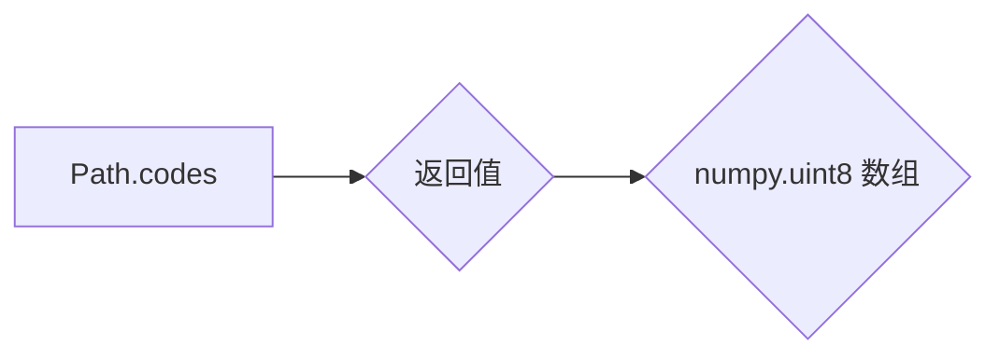

#### 带注释源码

```python
@property
def codes(self):
    """
    The list of codes in the `Path` as a 1D array.

    Each code is one of `STOP`, `MOVETO`, `LINETO`, `CURVE3`, `CURVE4` or
    `CLOSEPOLY`.  For codes that correspond to more than one vertex
    (`CURVE3` and `CURVE4`), that code will be repeated so that the length
    of `vertices` and `codes` is always the same.
    """
    return self._codes
```

### 关键组件信息

- **Path**: 表示一系列可能的断开、可能的闭合、直线和曲线段。
- **vertices**: 一个 (N, 2) 的浮点数组，表示路径的顶点。
- **codes**: 一个 N 长度的 `numpy.uint8` 数组，表示路径代码，或 None。


### Path.simplify_threshold

The `simplify_threshold` property of the `Path` class sets the fraction of a pixel difference below which vertices will be simplified out.

参数：

- `threshold`：`float`，The fraction of a pixel difference below which vertices will be simplified out.

返回值：`float`，The current simplify threshold.

#### 流程图

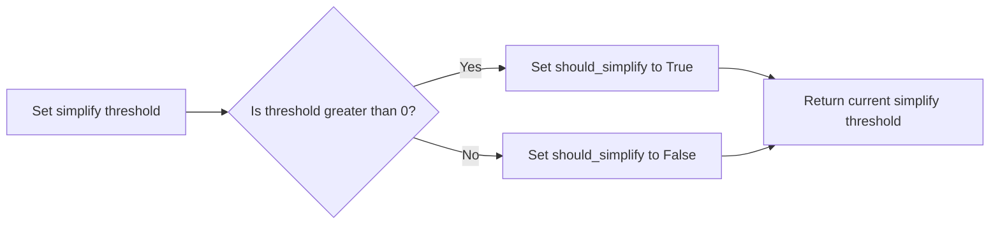

#### 带注释源码

```python
@property
def simplify_threshold(self):
    """
    The fraction of a pixel difference below which vertices will
    be simplified out.
    """
    return self._simplify_threshold

@simplify_threshold.setter
def simplify_threshold(self, threshold):
    self._simplify_threshold = threshold
```


### Path.should_simplify

`Path.should_simplify` 是 `Path` 类的一个属性，用于确定路径的顶点数组是否应该被简化。

参数：

- 无

返回值：`bool`，表示路径的顶点数组是否应该被简化。

#### 流程图

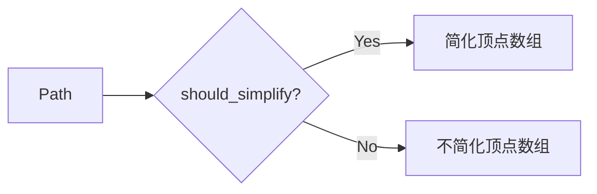

#### 带注释源码

```python
@property
def should_simplify(self):
    """
    `True` if the vertices array should be simplified.
    """
    return self._should_simplify

@should_simplify.setter
def should_simplify(self, should_simplify):
    self._should_simplify = should_simplify
```


### Path.readonly

This method sets the path to be read-only, making the vertices and codes arrays immutable.

参数：

- `readonly`：`bool`，If set to True, the path will be made read-only. This makes the vertices and codes arrays immutable.

返回值：`None`，This method does not return any value.

#### 流程图

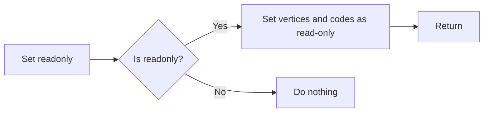

#### 带注释源码

```python
def __init__(self, vertices, codes=None, _interpolation_steps=1,
                 closed=False, readonly=False):
    # ... other code ...
    if readonly:
        self._vertices.flags.writeable = False
        if self._codes is not None:
            self._codes.flags.writeable = False
        self._readonly = True
    else:
        self._readonly = False
```


### Path.copy

Return a shallow copy of the `Path`, which will share the vertices and codes with the source `Path`.

参数：

-  `self`：`Path`，源 `Path` 对象

返回值：`Path`，浅拷贝的 `Path` 对象，与源 `Path` 共享顶点和代码

#### 流程图

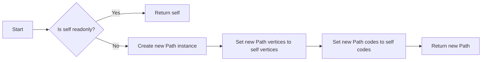

#### 带注释源码

```python
def copy(self):
    """
    Return a shallow copy of the `Path`, which will share the
    vertices and codes with the source `Path`.
    """
    return copy.copy(self)
```


### Path.__deepcopy__

Return a deepcopy of the `Path`. The `Path` will not be readonly, even if the source `Path` is.

参数：

- `memo`：`dict`，optional，A dictionary to use for memoizing, passed to `copy.deepcopy`.

返回值：`Path`，A deep copy of the `Path`, but not readonly.

#### 流程图


#### 带注释源码

```python
def __deepcopy__(self, memo=None):
    """
    Return a deepcopy of the `Path`.  The `Path` will not be
    readonly, even if the source `Path` is.
    """
    # Deepcopying arrays (vertices, codes) strips the writeable=False flag.
    cls = type(self)
    memo[id(self)] = p = cls.__new__(cls)

    for k, v in self.__dict__.items():
        setattr(p, k, copy.deepcopy(v, memo))

    p._readonly = False
    return p
```


### `Path.__deepcopy__`

Return a deepcopy of the `Path`. The `Path` will not be readonly, even if the source `Path` is.

参数：

- `memo`：`dict`，optional，A dictionary to use for memoizing, passed to `copy.deepcopy`.

返回值：`Path`，A deep copy of the `Path`, but not readonly.

#### 流程图


#### 带注释源码

```python
def __deepcopy__(self, memo=None):
    """
    Return a deepcopy of the `Path`.  The `Path` will not be
    readonly, even if the source `Path` is.
    """
    # Deepcopying arrays (vertices, codes) strips the writeable=False flag.
    cls = type(self)
    memo[id(self)] = p = cls.__new__(cls)

    for k, v in self.__dict__.items():
        setattr(p, k, copy.deepcopy(v, memo))

    p._readonly = False
    return p
```


### Path.make_compound_path_from_polys

This method creates a compound `Path` object to draw a number of polygons with equal numbers of sides.

参数：

- XY：`(numpolys, numsides, 2)` 数组，表示多个多边形的顶点坐标。

返回值：`Path`，一个复合路径对象，用于绘制多个具有相等边数的多边形。

#### 流程图

```mermaid
graph LR
A[Start] --> B{Create empty verts and codes arrays}
B --> C{Initialize numpolys, numsides, two}
C --> D{Check if two != 2}
D -- Yes --> E{Calculate stride}
D -- No --> F{Error: Invalid XY shape}
E --> G{Calculate nverts}
G --> H{Initialize verts with zeros}
H --> I{Initialize codes with LINETO}
I --> J{Set codes[0::stride] to MOVETO}
J --> K{Set codes[numsides::stride] to CLOSEPOLY}
K --> L{Loop through range(numsides)}
L --> M{Set verts[i::stride] to XY[:, i]}
M --> N{Return Path(verts, codes)}
N --> O[End]
```

#### 带注释源码

```python
@classmethod
    def make_compound_path_from_polys(cls, XY):
        """
        Make a compound `Path` object to draw a number of polygons with equal
        numbers of sides.

        Parameters
        ----------
        XY : (numpolys, numsides, 2) array
        """
        # for each poly: 1 for the MOVETO, (numsides-1) for the LINETO, 1 for
        # the CLOSEPOLY; the vert for the closepoly is ignored but we still
        # need it to keep the codes aligned with the vertices
        numpolys, numsides, two = XY.shape
        if two != 2:
            raise ValueError("The third dimension of 'XY' must be 2")
        stride = numsides + 1
        nverts = numpolys * stride
        verts = np.zeros((nverts, 2))
        codes = np.full(nverts, cls.LINETO, dtype=cls.code_type)
        codes[0::stride] = cls.MOVETO
        codes[numsides::stride] = cls.CLOSEPOLY
        for i in range(numsides):
            verts[i::stride] = XY[:, i]
        return cls(verts, codes)
``` 


### Path.make_compound_path

Concatenate a list of `Path`s into a single `Path`, removing all `STOP`s.

#### 参数

- `*args`：可变数量的 `Path` 对象列表。

#### 返回值

- `Path`：一个由输入 `Path` 对象组成的复合 `Path`。

#### 返回值描述

返回的 `Path` 对象包含所有输入 `Path` 对象的顶点和代码，其中所有 `STOP` 代码都被移除。

#### 流程图

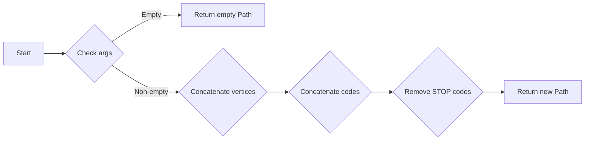

#### 带注释源码

```python
@classmethod
    def make_compound_path(cls, *args):
        r"""
        Concatenate a list of `Path`\s into a single `Path`, removing all `STOP`s.
        """
        if not args:
            return Path(np.empty([0, 2], dtype=np.float32))
        vertices = np.concatenate([path.vertices for path in args])
        codes = np.empty(len(vertices), dtype=cls.code_type)
        i = 0
        for path in args:
            size = len(path.vertices)
            if path.codes is None:
                if size:
                    codes[i] = cls.MOVETO
                    codes[i+1:i+size] = cls.LINETO
            else:
                codes[i:i+size] = path.codes
            i += size
        not_stop_mask = codes != cls.STOP  # Remove STOPs, as internal STOPs are a bug.
        return cls(vertices[not_stop_mask], codes[not_stop_mask])
```


### Path.__repr__

This method returns a string representation of the `Path` object.

参数：

- `self`：`Path`对象，表示当前路径

返回值：`str`，表示路径的字符串表示形式，格式为`Path(vertices, codes)`

#### 流程图

```mermaid
graph LR
A[Start] --> B{Is self._vertices empty?}
B -- Yes --> C[Return "Path([])"]
B -- No --> D[Is self._codes empty?]
D -- Yes --> E[Return "Path(vertices)"]
D -- No --> F[Return "Path(vertices, codes)"]
F --> G[End]
```

#### 带注释源码

```python
def __repr__(self):
    return f"Path({self.vertices!r}, {self.codes!r})"
```


### Path.__len__

返回路径中顶点的数量。

#### 描述

`__len__` 方法是 Python 的内置方法，用于获取对象的长度。在 `Path` 类中，它返回路径中顶点的数量。

#### 参数

- 无

#### 返回值

- `int`：路径中顶点的数量。

#### 流程图

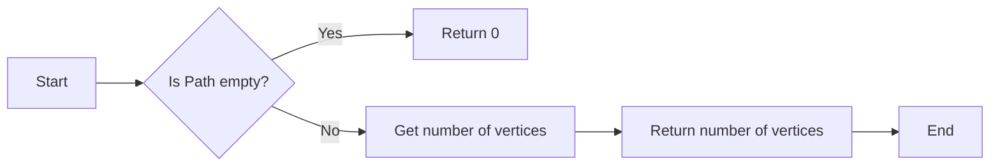

#### 带注释源码

```python
def __len__(self):
    return len(self.vertices)
```


### Path.iter_segments

Iterate over all curve segments in the path.

参数：

- `transform`：`None` 或 `~matplotlib.transforms.Transform`，可选。如果非 `None`，则应用给定的仿射变换到路径上。
- `remove_nans`：`bool`，可选。是否从路径中删除所有 `NaN` 并使用 `MOVETO` 命令跳过它们。
- `clip`：`None` 或 `(float, float, float, float)`，可选。如果非 `None`，则必须是一个四元组 `(x1, y1, x2, y2)`，定义一个矩形，在该矩形内剪辑路径。
- `snap`：`None` 或 `bool`，可选。如果为 `True`，则将所有节点捕捉到像素上；如果为 `False`，则不捕捉它们。如果为 `None`，则如果路径仅包含平行于 x 或 y 轴的段，并且段数不超过 1024，则捕捉它们。
- `stroke_width`：`float`，可选。绘制笔划的宽度（用于路径捕捉）。
- `simplify`：`None` 或 `bool`，可选。是否通过删除不影响外观的顶点来简化路径。如果为 `None`，则使用 `should_simplify` 属性。另请参阅 `path.simplify` 和 `path.simplify_threshold`。
- `curves`：`bool`，可选。如果为 `True`，则返回曲线段。如果为 `False`，则将所有曲线转换为线段。
- `sketch`：`None` 或 `sequence`，可选。如果非 `None`，则必须是一个形式为 `(scale, length, randomness)` 的 3 元组，表示草图参数。

返回值：`iterable`，迭代器，每次迭代返回一个包含 `(vertices, code)` 的元组，其中 `vertices` 是 1-3 个坐标对的序列，`code` 是 `Path` 代码。

#### 流程图

```mermaid
graph LR
A[Start] --> B{transform?}
B -- Yes --> C[Apply transform]
B -- No --> C
C --> D{remove_nans?}
D -- Yes --> E[Remove NaNs]
D -- No --> E
E --> F{clip?}
F -- Yes --> G[Clip path]
F -- No --> G
G --> H{snap?}
H -- Yes --> I[Snap nodes]
H -- No --> I
I --> J{simplify?}
J -- Yes --> K[Simplify path]
J -- No --> K
K --> L{curves?}
L -- Yes --> M[Iterate over segments]
L -- No --> M
M --> N[End]
```

#### 带注释源码

```python
def iter_segments(self, transform=None, remove_nans=True, clip=None,
                  snap=False, stroke_width=1.0, simplify=None,
                  curves=True, sketch=None):
    if not len(self):
        return

    cleaned = self.cleaned(transform=transform,
                           remove_nans=remove_nans, clip=clip,
                           snap=snap, stroke_width=stroke_width,
                           simplify=simplify, curves=curves,
                           sketch=sketch)

    # Cache these object lookups for performance in the loop.
    NUM_VERTICES_FOR_CODE = self.NUM_VERTICES_FOR_CODE
    STOP = self.STOP

    vertices = iter(cleaned.vertices)
    codes = iter(cleaned.codes)
    for curr_vertices, code in zip(vertices, codes):
        if code == STOP:
            break
        extra_vertices = NUM_VERTICES_FOR_CODE[code] - 1
        if extra_vertices:
            for i in range(extra_vertices):
                next(codes)
                curr_vertices = np.append(curr_vertices, next(vertices))
        yield curr_vertices, code
```


### Path.iter_bezier

Iterates over each Bézier curve (lines included) in a `Path`.

参数：

- **kwargs**：Forwarded to `.iter_segments`.

返回值：`~matplotlib.bezier.BezierSegment`，The Bézier curves that make up the current path. Note in particular that freestanding points are Bézier curves of order 0, and lines are Bézier curves of order 1 (with two control points).

#### 流程图

```mermaid
graph LR
A[Start] --> B{Is code MOVETO?}
B -- Yes --> C[Set first vertex as BezierSegment]
B -- No --> D{Is code LINETO?}
D -- Yes --> E[Set current vertex as BezierSegment]
D -- No --> F{Is code CURVE3?}
F -- Yes --> G[Set control point and endpoint as BezierSegment]
F -- No --> H{Is code CURVE4?}
H -- Yes --> I[Set control points and endpoint as BezierSegment]
H -- No --> J{Is code CLOSEPOLY?}
J -- Yes --> K[Set start and end vertex as BezierSegment]
J -- No --> L[Invalid code]
L --> M[End]
```

#### 带注释源码

```python
def iter_bezier(self, **kwargs):
    """
    Iterate over each Bézier curve (lines included) in a `Path`.

    Parameters
    ----------
    **kwargs
        Forwarded to `.iter_segments`.

    Yields
    ------
    B : `~matplotlib.bezier.BezierSegment`
        The Bézier curves that make up the current path. Note in particular
        that freestanding points are Bézier curves of order 0, and lines
        are Bézier curves of order 1 (with two control points).
    code : `~matplotlib.path.Path.code_type`
        The code describing what kind of curve is being returned.
        `MOVETO`, `LINETO`, `CURVE3`, and `CURVE4` correspond to
        Bézier curves with 1, 2, 3, and 4 control points (respectively).
        `CLOSEPOLY` is a `LINETO` with the control points correctly
        chosen based on the start/end points of the current stroke.
    """
    first_vert = None
    prev_vert = None
    for verts, code in self.iter_segments(**kwargs):
        if first_vert is None:
            if code != Path.MOVETO:
                raise ValueError("Malformed path, must start with MOVETO.")
        if code == Path.MOVETO:  # a point is like "CURVE1"
            first_vert = verts
            yield BezierSegment(np.array([first_vert])), code
        elif code == Path.LINETO:  # "CURVE2"
            yield BezierSegment(np.array([prev_vert, verts])), code
        elif code == Path.CURVE3:
            yield BezierSegment(np.array([prev_vert, verts[:2],
                                          verts[2:]])), code
        elif code == Path.CURVE4:
            yield BezierSegment(np.array([prev_vert, verts[:2],
                                          verts[2:4], verts[4:]])), code
        elif code == Path.CLOSEPOLY:
            yield BezierSegment(np.array([prev_vert, first_vert])), code
        elif code == Path.STOP:
            return
        else:
            raise ValueError(f"Invalid Path.code_type: {code}")
        prev_vert = verts[-2:]
``` 


### Path._iter_connected_components

This method returns subpaths split at MOVETOs.

参数：

- 无

返回值：`Path`，返回分割后的子路径列表

#### 流程图

```mermaid
graph LR
A[Start] --> B{Is codes None?}
B -- Yes --> C[Return self]
B -- No --> D[Find MOVETO indices]
D --> E[Create subpaths]
E --> F[Return subpaths]
F --> G[End]
```

#### 带注释源码

```python
def _iter_connected_components(self):
    """Return subpaths split at MOVETOs."""
    if self.codes is None:
        yield self
    else:
        idxs = np.append((self.codes == Path.MOVETO).nonzero()[0], len(self.codes))
        for sl in map(slice, idxs, idxs[1:]):
            yield Path._fast_from_codes_and_verts(
                self.vertices[sl], self.codes[sl], self)
```


### Path.cleaned

Return a new `Path` with vertices and codes cleaned according to the parameters.

参数：

- `transform`：`None` 或 `~matplotlib.transforms.Transform`，可选
  If not None, the given affine transformation will be applied to the path.
- `remove_nans`：`False` 或 `True`，可选
  Whether to remove all NaNs from the path and skip over them using MOVETO commands.
- `clip`：`None` 或 `(float, float, float, float)`，可选
  If not None, must be a four-tuple (x1, y1, x2, y2) defining a rectangle in which to clip the path.
- `simplify`：`False` 或 `True`，可选
  Whether to simplify the path by removing vertices that do not affect its appearance. If None, use the `should_simplify` attribute. See also `:rc:path.simplify` and `:rc:path.simplify_threshold`.
- `curves`：`False` 或 `True`，可选
  If True, curve segments will be returned as curve segments. If False, all curves will be converted to line segments.
- `stroke_width`：`float`，可选
  The width of the stroke being drawn (used for path snapping).
- `snap`：`False` 或 `True`，可选
  If True, snap all nodes to pixels; if False, don't snap them. If None, snap if the path contains only segments parallel to the x or y axes, and no more than 1024 of them.
- `sketch`：`None` 或 `sequence`，可选
  If not None, must be a 3-tuple of the form (scale, length, randomness), representing the sketch parameters.

返回值：`Path`，A new `Path` with vertices and codes cleaned according to the parameters.

#### 流程图

```mermaid
graph LR
A[Start] --> B[Apply transform]
B --> C{Remove NaNs?}
C -- Yes --> D[Clip path]
C -- No --> E[Apply simplify]
E --> F{Convert curves?}
F -- Yes --> G[Convert to line segments]
F -- No --> H[Return cleaned path]
G --> H
D --> H
```

#### 带注释源码

```python
def cleaned(self, transform=None, remove_nans=False, clip=None,
            *, simplify=False, curves=False,
            stroke_width=1.0, snap=False, sketch=None):
    """
    Return a new `Path` with vertices and codes cleaned according to the
    parameters.
    """
    vertices, codes = _path.cleanup_path(
        self, transform, remove_nans, clip, snap, stroke_width, simplify,
        curves, sketch)
    pth = Path._fast_from_codes_and_verts(vertices, codes, self)
    if not simplify:
        pth._should_simplify = False
    return pth
```


### Path.transformed

Return a transformed copy of the path.

参数：

- `transform`：`~matplotlib.transforms.Transform`，The affine transformation to apply to the path.

返回值：`Path`，The transformed copy of the path.

#### 流程图

```mermaid
graph LR
A[Start] --> B{Apply transform}
B --> C[Return transformed path]
C --> D[End]
```

#### 带注释源码

```python
def transformed(self, transform):
    """
    Return a transformed copy of the path.

    See Also
    --------
    matplotlib.transforms.TransformedPath
        A specialized path class that will cache the transformed result and
        automatically update when the transform changes.
    """
    return Path(transform.transform(self.vertices), self.codes,
                self._interpolation_steps)
```


### Path.contains_point

Return whether the area enclosed by the path contains the given point.

参数：

- point：`(float, float)`，The point (x, y) to check.
- transform：`~matplotlib.transforms.Transform`，optional，If not ``None``，*point* will be compared to ``self`` transformed by *transform*; i.e. for a correct check, *transform* should transform the path into the coordinate system of *point*.
- radius：`float`，default: 0，Additional margin on the path in coordinates of *point*. The path is extended tangentially by *radius/2*; i.e. if you would draw the path with a linewidth of *radius*, all points on the line would still be considered to be contained in the area. Conversely, negative values shrink the area: Points on the imaginary line will be considered outside the area.

返回值：`bool`，Whether the area enclosed by the path contains the given point.

#### 流程图

```mermaid
graph LR
A[Start] --> B{Transform point?}
B -- Yes --> C[Transform point]
B -- No --> D[Check point in path]
C --> D
D -- Yes --> E[Return True]
D -- No --> F[Return False]
E --> G[End]
F --> G
```

#### 带注释源码

```python
def contains_point(self, point, transform=None, radius=0.0):
    """
    Return whether the area enclosed by the path contains the given point.

    The path is always treated as closed; i.e. if the last code is not
    `CLOSEPOLY` an implicit segment connecting the last vertex to the first
    vertex is assumed.

    Parameters
    ----------
    point : (float, float)
        The point (x, y) to check.
    transform : `~matplotlib.transforms.Transform`, optional
        If not ``None``, *point* will be compared to ``self`` transformed
        by *transform*; i.e. for a correct check, *transform* should
        transform the path into the coordinate system of *point*.
    radius : float, default: 0
        Additional margin on the path in coordinates of *point*.
        The path is extended tangentially by *radius/2*; i.e. if you would
        draw the path with a linewidth of *radius*, all points on the line
        would still be considered to be contained in the area. Conversely,
        negative values shrink the area: Points on the imaginary line
        will be considered outside the area.

    Returns
    -------
    bool

    Notes
    -----
    The current algorithm has some limitations:

    - The result is undefined for points exactly at the boundary
      (i.e. at the path shifted by *radius/2*).
    - The result is undefined if there is no enclosed area, i.e. all
      vertices are on a straight line.
    - If bounding lines start to cross each other due to *radius* shift,
      the result is not guaranteed to be correct.
    """
    if transform is not None:
        transform = transform.frozen()
    # `point_in_path` does not handle nonlinear transforms, so we
    # transform the path ourselves.  If *transform* is affine, letting
    # `point_in_path` handle the transform avoids allocating an extra
    # buffer.
    if transform and not transform.is_affine:
        self = transform.transform_path(self)
        transform = None
    return _path.point_in_path(point[0], point[1], radius, self, transform)
```


### Path.contains_points

Return whether the area enclosed by the path contains the given points.

参数：

- points：`(N, 2)` 数组，要检查的点。列包含 x 和 y 值。
- transform：`~matplotlib.transforms.Transform`，可选
  如果不是 `None`，则将 *points* 与通过 *transform* 变换后的 `self` 进行比较；即为了正确检查，*transform* 应该将路径变换到 *points* 的坐标系中。
- radius：`float`，默认：0
  在 *point* 坐标系中路径的额外边缘。路径以 *radius/2* 的切向扩展；即如果您用 *radius* 绘制路径，则所有在直线上的点都将被认为是包含在区域内的。相反，负值会缩小区域：在想象中的线上的点将被认为是区域外部的。

返回值：长度为 N 的布尔数组

#### 流程图

```mermaid
graph LR
A[Start] --> B{Check transform}
B -- Yes --> C[Transform points]
B -- No --> D[Check radius]
D -- Yes --> E[Check if point in path]
D -- No --> F[Return True]
E -- Yes --> G[Return True]
E -- No --> H[Return False]
F --> I[End]
G --> I
H --> I
```

#### 带注释源码

```python
def contains_points(self, points, transform=None, radius=0.0):
    """
    Return whether the area enclosed by the path contains the given points.

    The path is always treated as closed; i.e. if the last code is not
    `CLOSEPOLY` an implicit segment connecting the last vertex to the first
    vertex is assumed.

    Parameters
    ----------
    points : (N, 2) array
        The points to check. Columns contain x and y values.
    transform : `~matplotlib.transforms.Transform`, optional
        If not ``None``, *points* will be compared to ``self`` transformed
        by *transform*; i.e. for a correct check, *transform* should
        transform the path into the coordinate system of *points*.
    radius : float, default: 0
        Additional margin on the path in coordinates of *points*.
        The path is extended tangentially by *radius/2*; i.e. if you would
        draw the path with a linewidth of *radius*, all points on the line
        would still be considered to be contained in the area. Conversely,
        negative values shrink the area: Points on the imaginary line
        will be considered outside the area.

    Returns
    -------
    length-N bool array

    Notes
    -----
    The current algorithm has some limitations:

    - The result is undefined for points exactly at the boundary
      (i.e. at the path shifted by *radius/2*).
    - The result is undefined if there is no enclosed area, i.e. all
      vertices are on a straight line.
    - If bounding lines start to cross each other due to *radius* shift,
      the result is not guaranteed to be correct.
    """
    if transform is not None:
        transform = transform.frozen()
    # `point_in_path` does not handle nonlinear transforms, so we
    # transform the path ourselves.  If *transform* is affine, letting
    # `point_in_path` handle the transform avoids allocating an extra
    # buffer.
    if transform and not transform.is_affine:
        self = transform.transform_path(self)
        transform = None
    result = _path.points_in_path(points, radius, self, transform)
    return result.astype('bool')
```


### Path.contains_path

Return whether this (closed) path completely contains the given path.

参数：

- `path`：`Path`，The path to check for containment.
- `transform`：`Transform`，If not `None`, the path will be transformed by `transform` before checking for containment.

返回值：`bool`，`True` if this path completely contains the given path, otherwise `False`.

#### 流程图

```mermaid
graph LR
A[Start] --> B{Transform path?}
B -- Yes --> C[Transform path]
B -- No --> C
C --> D{Check containment}
D -- Yes --> E[Return True]
D -- No --> F[Return False]
E --> G[End]
F --> G
```

#### 带注释源码

```python
def contains_path(self, path, transform=None):
    """
    Return whether this (closed) path completely contains the given path.

    If *transform* is not ``None``, the path will be transformed before
    checking for containment.
    """
    if transform is not None:
        transform = transform.frozen()
    return _path.path_in_path(self, None, path, transform)
```


### Path.get_extents

Get Bbox of the path.

参数：

- `transform`：`~matplotlib.transforms.Transform`，optional，Transform to apply to path before computing extents, if any.
- `**kwargs`：Forwarded to `.iter_bezier`.

返回值：`matplotlib.transforms.Bbox`，The extents of the path Bbox([[xmin, ymin], [xmax, ymax]])

#### 流程图

```mermaid
graph LR
A[Start] --> B[Apply transform if provided]
B --> C{Is codes None?}
C -- Yes --> D[Get vertices]
C -- No --> E[Iterate over bezier]
E --> F[Get xys]
F --> G[Create Bbox]
G --> H[Return Bbox]
H --> I[End]
```

#### 带注释源码

```python
def get_extents(self, transform=None, **kwargs):
    """
    Get Bbox of the path.

    Parameters
    ----------
    transform : ~matplotlib.transforms.Transform, optional
        Transform to apply to path before computing extents, if any.
    **kwargs
        Forwarded to .iter_bezier.

    Returns
    -------
    matplotlib.transforms.Bbox
        The extents of the path Bbox([[xmin, ymin], [xmax, ymax]])
    """
    from .transforms import Bbox
    if transform is not None:
        self = transform.transform_path(self)
    if self.codes is None:
        xys = self.vertices
    elif len(np.intersect1d(self.codes, [Path.CURVE3, Path.CURVE4])) == 0:
        # Optimization for the straight line case.
        # Instead of iterating through each curve, consider
        # each line segment's end-points
        # (recall that STOP and CLOSEPOLY vertices are ignored)
        xys = self.vertices[np.isin(self.codes,
                                    [Path.MOVETO, Path.LINETO])]
    else:
        xys = []
        for curve, code in self.iter_bezier(**kwargs):
            # places where the derivative is zero can be extrema
            _, dzeros = curve.axis_aligned_extrema()
            # as can the ends of the curve
            xys.append(curve([0, *dzeros, 1]))
        xys = np.concatenate(xys)
    if len(xys):
        return Bbox([xys.min(axis=0), xys.max(axis=0)])
    else:
        return Bbox.null()
```


### Path.intersects_path

Return whether if this path intersects another given path.

参数：

- `other`：`Path`，The other path to check for intersection with the current path.
- `filled`：`bool`，If True, then this also returns True if one path completely encloses the other (i.e., the paths are treated as filled).

返回值：`bool`，If True, the paths intersect; otherwise, they do not.

#### 流程图

```mermaid
graph LR
A[Start] --> B{Check filled?}
B -- Yes --> C[Check if one path encloses the other]
B -- No --> D[Check if paths intersect]
C -- Yes --> E[Return True]
C -- No --> D
D -- Yes --> E[Return True]
D -- No --> F[Return False]
F --> G[End]
```

#### 带注释源码

```python
def intersects_path(self, other, filled=True):
    """
    Return whether if this path intersects another given path.

    If *filled* is True, then this also returns True if one path completely
    encloses the other (i.e., the paths are treated as filled).
    """
    return _path.path_intersects_path(self, other, filled)
```


### Path.intersects_bbox

This method checks whether the given path intersects a specified bounding box.

参数：

- `bbox`：`~.transforms.Bbox`，The bounding box to check for intersection with the path. The bounding box is always considered filled.
- `filled`：`bool`，If `True`, then this also returns `True` if the path completely encloses the `.Bbox` (i.e., the path is treated as filled). Defaults to `True`.

返回值：`bool`，`True` if the path intersects the bounding box, `False` otherwise.

#### 流程图

```mermaid
graph LR
A[Start] --> B{Check filled?}
B -- Yes --> C[Check intersection]
B -- No --> D[Check containment]
C --> E{Intersection?}
E -- Yes --> F[Return True]
E -- No --> G[Return False]
D --> H{Containment?}
H -- Yes --> I[Return True]
H -- No --> J[Return False]
F --> K[End]
G --> K
I --> K
J --> K
```

#### 带注释源码

```python
def intersects_bbox(self, bbox, filled=True):
    """
    Return whether this path intersects a given ~.transforms.Bbox.

    If *filled* is True, then this also returns True if the path completely
    encloses the `.Bbox` (i.e., the path is treated as filled).

    The bounding box is always considered filled.
    """
    return _path.path_intersects_rectangle(
        self, bbox.x0, bbox.y0, bbox.x1, bbox.y1, filled)
```


### Path.interpolated

Return a new path with each segment divided into *steps* parts.

参数：

- steps：int，The number of segments in the new path for each in the original.

返回值：Path，The interpolated path.

#### 流程图

```mermaid
graph LR
A[Start] --> B[Check if steps == 1 or len(self) == 0]
B -->|Yes| C[Return self]
B -->|No| D[Check if codes is not None and MOVETO in self.codes[1:]]
D -->|Yes| E[Return make_compound_path(*p.interpolated(steps) for p in self._iter_connected_components())]
D -->|No| F[Check if codes is not None and CLOSEPOLY in self.codes and not np.all(self.vertices[self.codes == self.CLOSEPOLY] == self.vertices[0])]
F -->|Yes| G[Set vertices = self.vertices.copy()]
F -->|No| G[Set vertices = self.vertices]
G --> H[Set codes = self.codes]
H --> I[Set vertices = simple_linear_interpolation(vertices, steps)]
I --> J[Set new_codes = np.full((len(codes) - 1) * steps + 1, Path.LINETO, dtype=self.code_type)]
J --> K[Set new_codes[0::steps] = codes]
K --> L[Return Path(vertices, new_codes)]
```

#### 带注释源码

```python
def interpolated(self, steps):
    """
    Return a new path with each segment divided into *steps* parts.

    Codes other than `LINETO`, `MOVETO`, and `CLOSEPOLY` are not handled correctly.

    Parameters
    ----------
    steps : int
        The number of segments in the new path for each in the original.

    Returns
    -------
    Path
        The interpolated path.
    """
    if steps == 1 or len(self) == 0:
        return self

    if self.codes is not None and self.MOVETO in self.codes[1:]:
        return self.make_compound_path(
            *(p.interpolated(steps) for p in self._iter_connected_components()))

    if self.codes is not None and self.CLOSEPOLY in self.codes and not np.all(
            self.vertices[self.codes == self.CLOSEPOLY] == self.vertices[0]):
        vertices = self.vertices.copy()
        vertices[self.codes == self.CLOSEPOLY] = vertices[0]
    else:
        vertices = self.vertices

    vertices = simple_linear_interpolation(vertices, steps)
    codes = self.codes
    if codes is not None:
        new_codes = np.full((len(codes) - 1) * steps + 1, Path.LINETO,
                            dtype=self.code_type)
        new_codes[0::steps] = codes
    else:
        new_codes = None
    return Path(vertices, new_codes)
```


### Path.to_polygons

Convert this path to a list of polygons or polylines.

参数：

- `transform`：`None` 或 `~matplotlib.transforms.Transform`，可选
  If not None, the given affine transformation will be applied to the path.
- `width`：`0` 或 `float`，可选
  If both `width` and `height` are non-zero then the lines will be simplified so that vertices outside of (0, 0), (width, height) will be clipped.
- `height`：`0` 或 `float`，可选
  If both `width` and `height` are non-zero then the lines will be simplified so that vertices outside of (0, 0), (width, height) will be clipped.
- `closed_only`：`True` 或 `False`，可选
  If `True` (default), only closed polygons, with the last point being the same as the first point, will be returned.  Any unclosed polylines in the path will be explicitly closed.  If `False`, any unclosed polygons in the path will be returned as unclosed polygons, and the closed polygons will be returned explicitly closed by setting the last point to the same as the first point.

返回值：`list`，A list of polygons or polylines.  Each polygon/polyline is an (N, 2) array of vertices.  In other words, each polygon has no `MOVETO` instructions or curves.

#### 流程图

```mermaid
graph LR
A[Start] --> B{Apply transform?}
B -- Yes --> C[Transform vertices]
B -- No --> D[Keep vertices]
C --> E[Apply width and height?]
E -- Yes --> F[Clip vertices]
E -- No --> G[Keep vertices]
F --> H[Apply closed_only?]
H -- Yes --> I[Close polygons]
H -- No --> J[Keep polygons]
I --> K[End]
J --> K
D --> G
```

#### 带注释源码

```python
def to_polygons(self, transform=None, width=0, height=0, closed_only=True):
    """
    Convert this path to a list of polygons or polylines.  Each
    polygon/polyline is an (N, 2) array of vertices.  In other words,
    each polygon has no `MOVETO` instructions or curves.  This
    is useful for displaying in backends that do not support
    compound paths or Bézier curves.

    If *width* and *height* are both non-zero then the lines will
    be simplified so that vertices outside of (0, 0), (width,
    height) will be clipped.

    The resulting polygons will be simplified if the
    :attr:`Path.should_simplify` attribute of the path is `True`.

    If *closed_only* is `True` (default), only closed polygons,
    with the last point being the same as the first point, will be
    returned.  Any unclosed polylines in the path will be
    explicitly closed.  If *closed_only* is `False`, any unclosed
    polygons in the path will be returned as unclosed polygons,
    and the closed polygons will be returned explicitly closed by
    setting the last point to the same as the first point.
    """
    if len(self.vertices) == 0:
        return []

    if transform is not None:
        transform = transform.frozen()

    if self.codes is None and (width == 0 or height == 0):
        vertices = self.vertices
        if closed_only:
            if len(vertices) < 3:
                return []
            elif np.any(vertices[0] != vertices[-1]):
                vertices = [*vertices, vertices[0]]

        if transform is None:
            return [vertices]
        else:
            return [transform.transform(vertices)]

    # Deal with the case where there are curves and/or multiple
    # subpaths (using extension code)
    return _path.convert_path_to_polygons(
        self, transform, width, height, closed_only)
```


### Path.unit_rectangle

Return a `Path` instance of the unit rectangle from (0, 0) to (1, 1).

参数：

- 无

返回值：`Path`，一个表示单位矩形的 `Path` 实例。

#### 流程图

```mermaid
graph LR
A[Start] --> B{Is _unit_rectangle None?}
B -- Yes --> C[Create _unit_rectangle]
B -- No --> D[Return _unit_rectangle]
C --> D
D --> E[End]
```

#### 带注释源码

```python
@classmethod
def unit_rectangle(cls):
    """
    Return a `Path` instance of the unit rectangle from (0, 0) to (1, 1).
    """
    if cls._unit_rectangle is None:
        cls._unit_rectangle = cls([[0, 0], [1, 0], [1, 1], [0, 1], [0, 0]],
                                  closed=True, readonly=True)
    return cls._unit_rectangle
```


### Path.unit_regular_polygon

Return a `Path` instance for a unit regular polygon with the given *numVertices* such that the circumscribing circle has radius 1.0, centered at (0, 0).

参数：

- `numVertices`：`int`，The number of vertices of the polygon.

返回值：`Path`，A `Path` instance representing the unit regular polygon.

#### 流程图

```mermaid
graph LR
A[Start] --> B{Check numVertices <= 16?}
B -- Yes --> C[Create path from cache]
B -- No --> D[Calculate vertices]
D --> E[Create path]
E --> F[Return path]
```

#### 带注释源码

```python
@classmethod
def unit_regular_polygon(cls, numVertices):
    """
    Return a :class:`Path` instance for a unit regular polygon with the
    given *numVertices* such that the circumscribing circle has radius 1.0,
    centered at (0, 0).
    """
    if numVertices <= 16:
        path = cls._unit_regular_polygons.get(numVertices)
    else:
        path = None
    if path is None:
        theta = ((2 * np.pi / numVertices) * np.arange(numVertices + 1)
                 # This initial rotation is to make sure the polygon always
                 # "points-up".
                 + np.pi / 2)
        verts = np.column_stack((np.cos(theta), np.sin(theta)))
        path = cls(verts, closed=True, readonly=True)
        if numVertices <= 16:
            cls._unit_regular_polygons[numVertices] = path
    return path
```


### Path.unit_regular_star

Return a `Path` for a unit regular star with the given `numVertices` and radius of 1.0, centered at (0, 0).

参数：

- `numVertices`：`int`，The number of vertices of the star.
- `innerCircle`：`float`，The radius of the inner circle of the star. Default is 0.5.

返回值：`Path`，The `Path` instance representing the regular star.

#### 流程图

```mermaid
graph LR
A[Start] --> B{Check if numVertices <= 16}
B -- Yes --> C[Check if path exists in _unit_regular_stars]
C -- Yes --> D[Return existing path]
C -- No --> E[Calculate theta]
E --> F[Calculate r]
F --> G[Calculate verts]
G --> H[Create Path]
H --> I[Return Path]
I --> J[End]
```

#### 带注释源码

```python
@classmethod
    def unit_regular_star(cls, numVertices, innerCircle=0.5):
        """
        Return a :class:`Path` for a unit regular star with the given
        numVertices and radius of 1.0, centered at (0, 0).
        """
        if numVertices <= 16:
            path = cls._unit_regular_stars.get((numVertices, innerCircle))
        else:
            path = None
        if path is None:
            ns2 = numVertices * 2
            theta = (2*np.pi/ns2 * np.arange(ns2 + 1))
            # This initial rotation is to make sure the polygon always
            # "points-up"
            theta += np.pi / 2.0
            r = np.ones(ns2 + 1)
            r[1::2] = innerCircle
            verts = (r * np.vstack((np.cos(theta), np.sin(theta)))).T
            path = cls(verts, closed=True, readonly=True)
            if numVertices <= 16:
                cls._unit_regular_stars[(numVertices, innerCircle)] = path
        return path
```


### Path.unit_regular_asterisk

Return a `Path` for a unit regular asterisk with the given numVertices and radius of 1.0, centered at (0, 0).

参数：

- `numVertices`：`int`，The number of vertices of the asterisk.
- ...

返回值：`Path`，A `Path` instance representing the unit regular asterisk.

#### 流程图

```mermaid
graph LR
A[Start] --> B{Check if numVertices <= 16?}
B -- Yes --> C[Create path from cache]
B -- No --> D[Create path]
D --> E[Calculate theta]
E --> F[Calculate vertices]
F --> G[Create Path instance]
G --> H[Return Path instance]
```

#### 带注释源码

```python
@classmethod
def unit_regular_asterisk(cls, numVertices):
    """
    Return a :class:`Path` for a unit regular asterisk with the given
    numVertices and radius of 1.0, centered at (0, 0).
    """
    if numVertices <= 16:
        path = cls._unit_regular_stars.get((numVertices, innerCircle))
    else:
        path = None
    if path is None:
        ns2 = numVertices * 2
        theta = (2*np.pi/ns2 * np.arange(ns2 + 1))
        # This initial rotation is to make sure the polygon always
        # "points-up"
        theta += np.pi / 2.0
        r = np.ones(ns2 + 1)
        r[1::2] = innerCircle
        verts = (r * np.vstack((np.cos(theta), np.sin(theta)))).T
        path = cls(verts, closed=True, readonly=True)
        if numVertices <= 16:
            cls._unit_regular_stars[(numVertices, innerCircle)] = path
    return path
```


### Path.unit_circle

Return the readonly `Path` of the unit circle.

参数：

- 无

返回值：`Path`，返回一个表示单位圆的只读 `Path` 实例。

#### 流程图

```mermaid
graph LR
A[Start] --> B{Is _unit_circle None?}
B -- Yes --> C[Create _unit_circle]
B -- No --> D[Return _unit_circle]
C --> D
D --> E[End]
```

#### 带注释源码

```python
@classmethod
def unit_circle(cls):
    """
    Return the readonly :class:`Path` of the unit circle.

    For most cases, :func:`Path.circle` will be what you want.
    """
    if cls._unit_circle is None:
        cls._unit_circle = cls.circle(center=(0, 0), radius=1,
                                      readonly=True)
    return cls._unit_circle
```


### Path.unit_circle_righthalf

Return a `Path` of the right half of a unit circle.

参数：

- 无

返回值：`Path`，The `Path` instance representing the right half of a unit circle.

#### 流程图

```mermaid
graph LR
A[Start] --> B[Define vertices and codes]
B --> C[Create Path instance]
C --> D[Return Path instance]
D --> E[End]
```

#### 带注释源码

```python
@classmethod
def unit_circle_righthalf(cls):
    """
    Return a `Path` of the right half of a unit circle.
    """
    if cls._unit_circle_righthalf is None:
        # Define vertices and codes for the right half of the unit circle
        vertices = np.array(
            [[0.0, -1.0],
             [MAGIC, -1.0],
             [SQRTHALF-MAGIC45, -SQRTHALF-MAGIC45],
             [SQRTHALF, -SQRTHALF],
             [SQRTHALF+MAGIC45, -SQRTHALF+MAGIC45],
             [1.0, -MAGIC],
             [1.0, 0.0],
             [1.0, MAGIC],
             [SQRTHALF+MAGIC45, SQRTHALF-MAGIC45],
             [SQRTHALF, SQRTHALF],
             [SQRTHALF-MAGIC45, SQRTHALF+MAGIC45],
             [MAGIC, 1.0],
             [0.0, 1.0],
             [0.0, -1.0]],

            float)

        codes = np.full(14, cls.CURVE4, dtype=cls.code_type)
        codes[0] = cls.MOVETO
        codes[-1] = cls.CLOSEPOLY

        # Create Path instance
        cls._unit_circle_righthalf = cls(vertices, codes, readonly=True)

    # Return Path instance
    return cls._unit_circle_righthalf
``` 


### Path.arc

This method returns a `Path` for the unit circle arc from angles `theta1` to `theta2` (in degrees).

参数：

- `theta1`：`float`，起始角度，单位为度。
- `theta2`：`float`，结束角度，单位为度。
- `n`：`int`，可选，指定弧线分段数。如果为 `None`，则根据 `theta1` 和 `theta2` 之间的差值自动确定。
- `is_wedge`：`bool`，可选，指定是否为扇形。默认为 `False`。

返回值：`Path`，表示单位圆弧的路径。

#### 流程图

```mermaid
graph LR
A[Start] --> B{theta1 and theta2?}
B -- Yes --> C{theta2 > theta1 + 360?}
B -- No --> C
C -- Yes --> D{Unwrap theta2}
C -- No --> D
D --> E{Calculate n}
E --> F{n is None?}
F -- Yes --> G{Calculate n based on theta1 and theta2}
F -- No --> G
G --> H{Calculate deta}
H --> I{Calculate alpha}
I --> J{Calculate steps}
J --> K{Calculate cos_eta and sin_eta}
K --> L{Calculate xA, yA, xA_dot, yA_dot}
L --> M{Calculate xB, yB, xB_dot, yB_dot}
M --> N{Create vertices and codes}
N --> O[End]
```

#### 带注释源码

```python
@classmethod
def arc(cls, theta1, theta2, n=None, is_wedge=False):
    """
    Return a `Path` for the unit circle arc from angles *theta1* to *theta2* (in degrees).

    *theta2* is unwrapped to produce the shortest arc within 360 degrees.
    That is, if *theta2* > *theta1* + 360, the arc will be from *theta1* to *theta2* - 360 and not a full circle plus some extra overlap.

    If *n* is provided, it is the number of spline segments to make.
    If *n* is not provided, the number of spline segments is
    determined based on the delta between *theta1* and *theta2*.

    See `Path.arc` for the reference on the approximation used.
    """
    halfpi = np.pi * 0.5

    eta1 = theta1
    eta2 = theta2 - 360 * np.floor((theta2 - theta1) / 360)
    # Ensure 2pi range is not flattened to 0 due to floating-point errors,
    # but don't try to expand existing 0 range.
    if theta2 != theta1 and eta2 <= eta1:
        eta2 += 360
    eta1, eta2 = np.deg2rad([eta1, eta2])

    # number of curve segments to make
    if n is None:
        n = int(2 ** np.ceil((eta2 - eta1) / halfpi))
    if n < 1:
        raise ValueError("n must be >= 1 or None")

    deta = (eta2 - eta1) / n
    t = np.tan(0.5 * deta)
    alpha = np.sin(deta) * (np.sqrt(4.0 + 3.0 * t * t) - 1) / 3.0

    steps = np.linspace(eta1, eta2, n + 1, True)
    cos_eta = np.cos(steps)
    sin_eta = np.sin(steps)

    xA = cos_eta[:-1]
    yA = sin_eta[:-1]
    xA_dot = -yA
    yA_dot = xA

    xB = cos_eta[1:]
    yB = sin_eta[1:]
    xB_dot = -yB
    yB_dot = xB

    if is_wedge:
        length = n * 3 + 4
        vertices = np.zeros((length, 2), float)
        codes = np.full(length, cls.CURVE4, dtype=cls.code_type)
        vertices[1] = [xA[0], yA[0]]
        codes[0:2] = [cls.MOVETO, cls.LINETO]
        codes[-2:] = [cls.LINETO, cls.CLOSEPOLY]
        vertex_offset = 2
        end = length - 2
    else:
        length = n * 3 + 1
        vertices = np.empty((length, 2), float)
        codes = np.full(length, cls.CURVE

### Path.wedge

#### 描述

`Path.wedge` 方法用于创建一个单位圆的扇形路径。该扇形由角度 `theta1` 和 `theta2` 定义，其中 `theta1` 是扇形的起始角度，`theta2` 是扇形的结束角度。`theta2` 被调整为在 360 度范围内产生最短的扇形。如果 `theta2` 大于 `theta1` 加 360 度，则扇形将从 `theta1` 到 `theta2` 减去 360 度，而不是完整的圆加上一些重叠。

#### 参数

- `theta1`：`float`，扇形的起始角度（以度为单位）。
- `theta2`：`float`，扇形的结束角度（以度为单位）。
- `n`：`int`，可选，用于指定创建的弧段数量。如果未提供，则根据 `theta1` 和 `theta2` 之间的差异确定。
- `is_wedge`：`bool`，可选，如果为 `True`，则创建一个扇形，否则创建一个弧形。

#### 返回值

- `Path`：表示扇形的路径对象。

#### 流程图

```mermaid
graph LR
A[Start] --> B{theta2 > theta1 + 360?}
B -- Yes --> C[theta2 = theta2 - 360]
B -- No --> C
C --> D{n provided?}
D -- Yes --> E[Create n segments]
D -- No --> F[Calculate n segments]
E --> G[Create vertices and codes]
F --> G
G --> H[Return Path]
H --> I[End]
```

#### 带注释源码

```python
@classmethod
def wedge(cls, theta1, theta2, n=None):
    """
    Return a `Path` for the unit circle wedge from angles *theta1* to
    *theta2* (in degrees).

    *theta2* is unwrapped to produce the shortest wedge within 360 degrees.
    That is, if *theta2* > *theta1* + 360, the wedge will be from *theta1*
    to *theta2* - 360 and not a full circle plus some extra overlap.

    If *n* is provided, it is the number of spline segments to make.
    If *n* is not provided, the number of spline segments is
    determined based on the delta between *theta1* and *theta2*.

    See `Path.arc` for the reference on the approximation used.
    """
    halfpi = np.pi * 0.5

    eta1 = theta1
    eta2 = theta2 - 360 * np.floor((theta2 - theta1) / 360)
    # Ensure 2pi range is not flattened to 0 due to floating-point errors,
    # but don't try to expand existing 0 range.
    if theta2 != theta1 and eta2 <= eta1:
        eta2 += 360
    eta1, eta2 = np.deg2rad([eta1, eta2])

    # number of curve segments to make
    if n is None:
        n = int(2 ** np.ceil((eta2 - eta1) / halfpi))
    if n < 1:
        raise ValueError("n must be >= 1 or None")

    deta = (eta2 - eta1) / n
    t = np.tan(0.5 * deta)
    alpha = np.sin(deta) * (np.sqrt(4.0 + 3.0 * t * t) - 1) / 3.0

    steps = np.linspace(eta1, eta2, n + 1, True)
    cos_eta = np.cos(steps)
    sin_eta = np.sin(steps)

    xA = cos_eta[:-1]
    yA = sin_eta[:-1]
    xA_dot = -yA
    yA_dot = xA

    xB = cos_eta[1:]
    yB = sin_eta[1:]
    xB_dot = -yB
    yB_dot = xB

    if is_wedge:
        length = n * 3 + 4
        vertices = np.zeros((length, 2), float)
        codes = np.full(length, cls.CURVE4, dtype=cls.code_type)
        vertices[1] = [xA[0], yA[0]]
        codes[0:2] = [cls.MOVETO, cls.LINETO]
        codes[-2:] = [cls.LINETO, cls.CLOSEPOLY]
        vertex_offset = 2
        end = length - 2
    else:
        length = n * 3 + 1
        vertices = np.empty


### hatch(hatchpattern, density=6)

Given a hatch specifier, *hatchpattern*, generates a `Path` that can be used in a repeated hatching pattern.  *density* is the number of lines per unit square.

参数：

- hatchpattern：`str`，指定 hatch 模式的字符串，例如 "///" 或 "|||"
- density：`int`，默认为 6，指定每单位平方的线数

返回值：`Path`，用于重复填充的路径

#### 流程图

```mermaid
graph LR
A[Start] --> B{Get hatch pattern}
B --> C{Get path from hatch pattern}
C --> D[End]
```

#### 带注释源码

```python
@staticmethod
@lru_cache(8)
def hatch(hatchpattern, density=6):
    """
    Given a hatch specifier, *hatchpattern*, generates a `Path` that
    can be used in a repeated hatching pattern.  *density* is the
    number of lines per unit square.
    """
    from matplotlib.hatch import get_path
    return (get_path(hatchpattern, density)
            if hatchpattern is not None else None)
```


### Path.clip_to_bbox

Clips the path to the given bounding box.

参数：

- `bbox`：`(float, float, float, float)`，The bounding box in which to clip the path. It must be a four-tuple (x1, y1, x2, y2).
- `inside`：`bool`，If `True`, clip to the inside of the box, otherwise to the outside of the box.

返回值：`Path`，The clipped path.

#### 流程图

```mermaid
graph LR
A[Start] --> B{Clip to bbox}
B --> C{Return clipped path}
C --> D[End]
```

#### 带注释源码

```python
def clip_to_bbox(self, bbox, inside=True):
    """
    Clip the path to the given bounding box.

    The path must be made up of one or more closed polygons.  This
    algorithm will not behave correctly for unclosed paths.

    If *inside* is `True`, clip to the inside of the box, otherwise
    to the outside of the box.
    """
    verts = _path.clip_path_to_rect(self, bbox, inside)
    paths = [Path(poly) for poly in verts]
    return self.make_compound_path(*paths)
```


## 关键组件


### 张量索引与惰性加载

张量索引与惰性加载是处理大型数据集时常用的技术，它允许在需要时才加载和计算数据，从而减少内存消耗和提高效率。

### 反量化支持

反量化支持是指将量化后的数据转换回原始数据类型的过程，这对于在量化模型中恢复精度和进行调试非常重要。

### 量化策略

量化策略是指将浮点数数据转换为固定点数表示的方法，这可以减少模型的存储和计算需求，但可能会降低模型的精度。量化策略包括全局量化、局部量化、对称量化和非对称量化等。


## 问题及建议


### 已知问题

-   **性能问题**：`Path` 类中的 `iter_segments` 方法在处理大量路径段时可能会遇到性能瓶颈，尤其是在进行路径简化或裁剪操作时。
-   **代码可读性**：`Path` 类的构造函数和属性设置方法中存在大量的参数和默认值，这可能会降低代码的可读性和可维护性。
-   **异常处理**：`Path` 类中的一些方法（如 `contains_point` 和 `contains_points`）在处理特殊情况（如点恰好位于路径边界上）时可能会抛出异常，这可能会影响程序的健壮性。

### 优化建议

-   **性能优化**：可以考虑使用更高效的数据结构和算法来处理路径简化、裁剪和迭代操作，例如使用空间分割技术来减少需要处理的路径段数量。
-   **代码重构**：对 `Path` 类的构造函数和属性设置方法进行重构，简化参数和默认值，提高代码的可读性和可维护性。
-   **异常处理**：改进 `Path` 类中方法的异常处理机制，例如通过返回特殊值或抛出更具体的异常来处理特殊情况。
-   **文档完善**：完善 `Path` 类的文档，包括每个方法和属性的详细说明、参数和返回值的类型、示例代码等，以提高代码的可读性和易用性。
-   **单元测试**：编写更全面的单元测试来覆盖 `Path` 类的各种功能和边界情况，以确保代码的稳定性和可靠性。


## 其它


### 设计目标与约束

- 设计目标：
  - 提供一个灵活且高效的路径处理模块，用于Matplotlib中的矢量绘图。
  - 支持多种路径操作，如绘制、简化、裁剪、包含性检查等。
  - 提供多种预定义路径，如单位矩形、单位圆、单位正多边形等。
  - 与Matplotlib的其它模块和后端兼容。

- 约束：
  - 路径数据存储在numpy数组中，以提高性能。
  - 路径操作应尽可能高效，以适应Matplotlib的绘图需求。
  - 路径操作应保持向后兼容性。

### 错误处理与异常设计

- 当输入数据不符合要求时，抛出异常。
- 当路径操作失败时，抛出异常。
- 异常信息应清晰明了，便于用户定位问题。

### 数据流与状态机

- 数据流：
  - 用户创建路径对象，并设置路径数据。
  - 用户调用路径操作方法，如绘制、简化、裁剪等。
  - 路径操作方法处理路径数据，并返回结果。

- 状态机：
  - 路径对象的状态包括：可读、可写、简化、裁剪等。
  - 路径操作方法根据路径对象的状态，执行相应的操作。

### 外部依赖与接口契约

- 外部依赖：
  - NumPy：用于路径数据的存储和处理。
  - Matplotlib：用于路径的绘制和显示。

- 接口契约：
  - 路径对象提供一系列方法，用于路径操作。
  - 路径操作方法接受明确的输入参数，并返回明确的输出结果。
  - 路径操作方法遵循Matplotlib的命名规范和设计原则。

    