# `matplotlib\lib\matplotlib\patheffects.pyi` 详细设计文档

This code defines a set of classes and functions for rendering path effects in matplotlib, such as strokes, shadows, and ticks.

## 整体流程

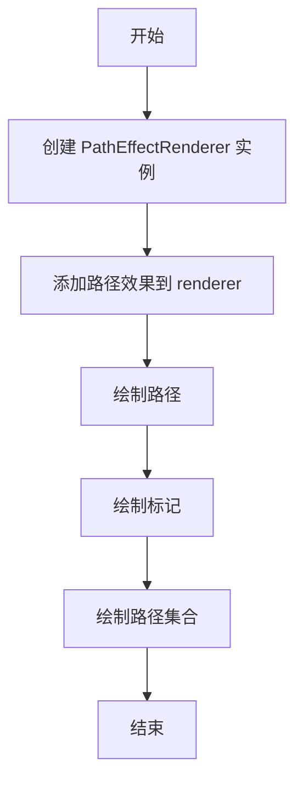

## 类结构

```
AbstractPathEffect (抽象基类)
├── PathEffectRenderer (渲染器)
│   ├── Normal
│   ├── Stroke
│   ├── withStroke
│   ├── SimplePatchShadow
│   ├── withSimplePatchShadow
│   ├── SimpleLineShadow
│   ├── PathPatchEffect
│   └── TickedStroke
│       └── withTickedStroke
```

## 全局变量及字段


### `offset`
    
The offset for the path effect.

类型：`tuple[float, float]`
    


### `rgbFace`
    
The color for the face of the path.

类型：`ColorType | None`
    


### `shadow_rgbFace`
    
The color for the shadow of the patch.

类型：`ColorType | None`
    


### `alpha`
    
The alpha value for the shadow or line shadow.

类型：`float | None`
    


### `rho`
    
The rho value for the shadow or line shadow.

类型：`float`
    


### `spacing`
    
The spacing between ticks in the ticked stroke.

类型：`float`
    


### `angle`
    
The angle of the ticks in the ticked stroke.

类型：`float`
    


### `length`
    
The length of the ticks in the ticked stroke.

类型：`float`
    


### `path_effects`
    
The collection of path effects to apply.

类型：`Iterable[AbstractPathEffect]`
    


### `renderer`
    
The renderer to use for drawing.

类型：`RendererBase`
    


### `patch`
    
The patch to apply the effect to.

类型：`Patch`
    


### `AbstractPathEffect.offset`
    
The offset for the path effect.

类型：`tuple[float, float]`
    


### `PathEffectRenderer.path_effects`
    
The collection of path effects to apply.

类型：`Iterable[AbstractPathEffect]`
    


### `PathEffectRenderer.renderer`
    
The renderer to use for drawing.

类型：`RendererBase`
    


### `Normal.offset`
    
The offset for the path effect.

类型：`tuple[float, float]`
    


### `Stroke.offset`
    
The offset for the path effect.

类型：`tuple[float, float]`
    


### `withStroke.offset`
    
The offset for the path effect.

类型：`tuple[float, float]`
    


### `SimplePatchShadow.offset`
    
The offset for the path effect.

类型：`tuple[float, float]`
    


### `SimplePatchShadow.shadow_rgbFace`
    
The color for the shadow of the patch.

类型：`ColorType | None`
    


### `SimplePatchShadow.alpha`
    
The alpha value for the shadow or line shadow.

类型：`float | None`
    


### `SimplePatchShadow.rho`
    
The rho value for the shadow or line shadow.

类型：`float`
    


### `withSimplePatchShadow.offset`
    
The offset for the path effect.

类型：`tuple[float, float]`
    


### `withSimplePatchShadow.shadow_rgbFace`
    
The color for the shadow of the patch.

类型：`ColorType | None`
    


### `withSimplePatchShadow.alpha`
    
The alpha value for the shadow or line shadow.

类型：`float | None`
    


### `withSimplePatchShadow.rho`
    
The rho value for the shadow or line shadow.

类型：`float`
    


### `SimpleLineShadow.offset`
    
The offset for the path effect.

类型：`tuple[float, float]`
    


### `SimpleLineShadow.shadow_color`
    
The color for the shadow of the line shadow.

类型：`ColorType`
    


### `SimpleLineShadow.alpha`
    
The alpha value for the shadow or line shadow.

类型：`float`
    


### `SimpleLineShadow.rho`
    
The rho value for the shadow or line shadow.

类型：`float`
    


### `PathPatchEffect.patch`
    
The patch to apply the effect to.

类型：`Patch`
    


### `TickedStroke.offset`
    
The offset for the path effect.

类型：`tuple[float, float]`
    


### `TickedStroke.spacing`
    
The spacing between ticks in the ticked stroke.

类型：`float`
    


### `TickedStroke.angle`
    
The angle of the ticks in the ticked stroke.

类型：`float`
    


### `TickedStroke.length`
    
The length of the ticks in the ticked stroke.

类型：`float`
    


### `withTickedStroke.offset`
    
The offset for the path effect.

类型：`tuple[float, float]`
    


### `withTickedStroke.spacing`
    
The spacing between ticks in the ticked stroke.

类型：`float`
    


### `withTickedStroke.angle`
    
The angle of the ticks in the ticked stroke.

类型：`float`
    


### `withTickedStroke.length`
    
The length of the ticks in the ticked stroke.

类型：`float`
    
    

## 全局函数及方法


### AbstractPathEffect.draw_path

This method is responsible for drawing a path with an effect applied to it.

参数：

- `renderer`：`RendererBase`，The renderer object that is used to draw the path.
- `gc`：`GraphicsContextBase`，The graphics context object that contains the drawing state.
- `tpath`：`Path`，The path to be drawn.
- `affine`：`Transform`，The transformation matrix that is applied to the path.
- `rgbFace`：`ColorType | None`，The color to use for the face of the path. If None, the default color is used.

返回值：`None`，This method does not return any value.

#### 流程图

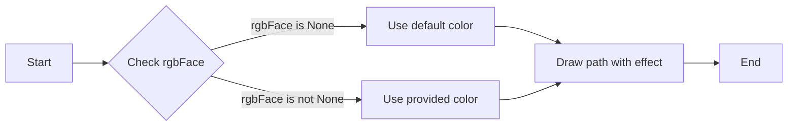

#### 带注释源码

```
def draw_path(self, renderer: RendererBase, gc: GraphicsContextBase, tpath: Path, affine: Transform, rgbFace: ColorType | None = ...):
    # Check if rgbFace is provided
    if rgbFace is None:
        # Use default color
        pass
    else:
        # Use provided color
        pass
    
    # Draw the path with the effect
    renderer.draw_path(gc, tpath, affine, rgbFace)
```


### PathEffectRenderer.copy_with_path_effect

复制当前PathEffectRenderer实例，并应用新的路径效果。

参数：

- `path_effects`：`Iterable[AbstractPathEffect]`，新的路径效果列表。

返回值：`PathEffectRenderer`，返回一个新的PathEffectRenderer实例，具有新的路径效果。

#### 流程图

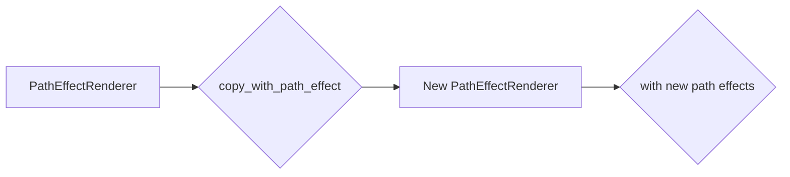

#### 带注释源码

```python
def copy_with_path_effect(self, path_effects: Iterable[AbstractPathEffect]) -> PathEffectRenderer:
    # 创建一个新的PathEffectRenderer实例
    new_renderer = PathEffectRenderer(path_effects, self)
    return new_renderer
```


### PathEffectRenderer.draw_path

This method is responsible for drawing a path with the specified effects applied to it.

参数：

- `gc`：`GraphicsContextBase`，The graphics context used for rendering.
- `tpath`：`Path`，The path to be drawn.
- `affine`：`Transform`，The affine transformation to apply to the path.
- `rgbFace`：`ColorType | None`，The color to use for the face of the path. If None, the default color is used.

返回值：`None`，This method does not return any value.

#### 流程图

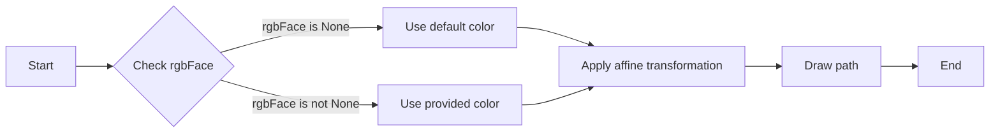

#### 带注释源码

```python
def draw_path(self, gc: GraphicsContextBase, tpath: Path, affine: Transform, rgbFace: ColorType | None = ...):
    # Check if rgbFace is provided, if not use the default color
    if rgbFace is None:
        # Use the default color
        pass
    else:
        # Use the provided color
        pass

    # Apply the affine transformation to the path
    transformed_path = affine.transform_path(tpath)

    # Draw the path with the applied effects
    gc.draw_path(transformed_path)
```


### PathEffectRenderer.draw_markers

This method is responsible for drawing markers on a path in a matplotlib figure.

参数：

- `gc`：`GraphicsContextBase`，The graphics context used for rendering.
- `marker_path`：`Path`，The path of the marker to be drawn.
- `marker_trans`：`Transform`，The transformation applied to the marker path.
- `path`：`Path`，The path on which the markers are to be drawn.
- `*args`：Variable length argument list.
- `**kwargs`： Arbitrary keyword arguments.

返回值：`None`，This method does not return any value.

#### 流程图

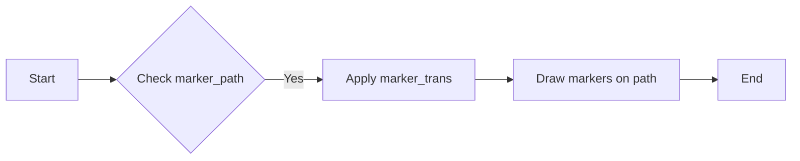

#### 带注释源码

```python
def draw_markers(
    self,
    gc: GraphicsContextBase,
    marker_path: Path,
    marker_trans: Transform,
    path: Path,
    *args,
    **kwargs
) -> None:
    # Apply the transformation to the marker path
    transformed_marker_path = marker_trans.transform_path(marker_path)
    
    # Draw the markers on the path
    for segment in transformed_marker_path.vertices:
        gc.draw_marker(segment, *args, **kwargs)
```


### PathEffectRenderer.draw_path_collection

This method is responsible for drawing a collection of paths on the graphics context.

参数：

- `gc`：`GraphicsContextBase`，The graphics context on which to draw the paths.
- `master_transform`：`Transform`，The transformation to apply to the paths before drawing.
- `paths`：`Sequence[Path]`，The sequence of paths to draw.

返回值：`None`，This method does not return any value.

#### 流程图

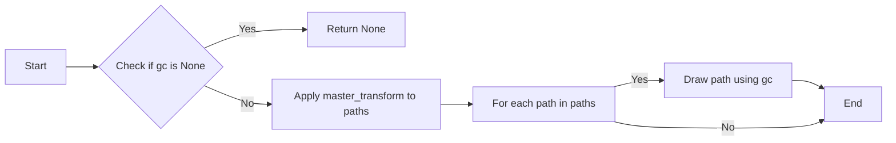

#### 带注释源码

```python
def draw_path_collection(self, gc: GraphicsContextBase, master_transform: Transform, paths: Sequence[Path], *args, **kwargs) -> None:
    if gc is None:
        return None
    
    # Apply master_transform to paths
    transformed_paths = [master_transform.transform_path(path) for path in paths]
    
    # For each path in paths
    for path in transformed_paths:
        # Draw path using gc
        gc.draw_path(path)
``` 


### PathEffectRenderer.__getattribute__

该函数是一个特殊方法，用于重写默认的属性获取行为。它允许在`PathEffectRenderer`类中自定义属性访问逻辑。

参数：

- `name`：`str`，要获取的属性的名称。

返回值：`Any`，返回获取的属性值。

#### 流程图

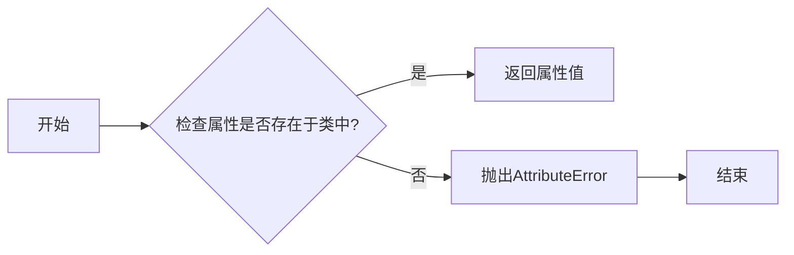

#### 带注释源码

```python
def __getattribute__(self, name: str) -> Any:
    # 获取属性值
    result = object.__getattribute__(self, name)
    # 返回属性值
    return result
```


### Normal.draw_path

`Normal.draw_path` 是一个类方法，它属于 `Normal` 类，用于绘制路径。

参数：

- `renderer`：`RendererBase`，渲染器对象，用于执行绘图操作。
- `gc`：`GraphicsContextBase`，图形上下文对象，用于存储绘图状态。
- `tpath`：`Path`，路径对象，表示要绘制的路径。
- `affine`：`Transform`，仿射变换对象，用于转换路径坐标。
- `rgbFace`：`ColorType` 或 `None`，颜色对象，用于设置路径的颜色。

返回值：`None`，该方法不返回任何值。

#### 流程图

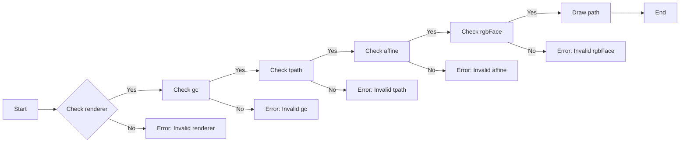

#### 带注释源码

```
def draw_path(
    self,
    renderer: RendererBase,
    gc: GraphicsContextBase,
    tpath: Path,
    affine: Transform,
    rgbFace: ColorType | None = ...
) -> None:
    # Method implementation goes here
    pass
```

由于源码中未提供具体的实现细节，以上仅为方法签名和流程图的描述。


### Stroke.draw_path

`Stroke.draw_path` 是 `Stroke` 类的一个方法，用于绘制路径。

参数：

- `renderer`：`RendererBase`，渲染器对象，用于执行绘图操作。
- `gc`：`GraphicsContextBase`，图形上下文对象，用于存储绘图状态。
- `tpath`：`Path`，路径对象，表示要绘制的路径。
- `affine`：`Transform`，仿射变换对象，用于转换路径坐标。
- `rgbFace`：`ColorType`，可选，表示路径的颜色。

返回值：`None`，该方法不返回任何值。

#### 流程图


#### 带注释源码

```python
def draw_path(self, renderer: RendererBase, gc: GraphicsContextBase, tpath: Path, affine: Transform, rgbFace: ColorType) -> None:
    # Check if renderer is valid
    if not isinstance(renderer, RendererBase):
        raise ValueError("Invalid renderer")
    
    # Check if gc is valid
    if not isinstance(gc, GraphicsContextBase):
        raise ValueError("Invalid gc")
    
    # Check if tpath is valid
    if not isinstance(tpath, Path):
        raise ValueError("Invalid tpath")
    
    # Check if affine is valid
    if not isinstance(affine, Transform):
        raise ValueError("Invalid affine")
    
    # Check if rgbFace is valid
    if rgbFace is not None and not isinstance(rgbFace, ColorType):
        raise ValueError("Invalid rgbFace")
    
    # Draw the path
    renderer.draw_path(gc, tpath, affine, rgbFace)
```


### withStroke.draw_path

The `draw_path` method is a part of the `withStroke` class, which is a subclass of `AbstractPathEffect`. This method is responsible for drawing a path with a stroke effect on a given renderer.

参数：

- `renderer`：`RendererBase`，The renderer object that is used to draw the path.
- `gc`：`GraphicsContextBase`，The graphics context object that contains the drawing state.
- `tpath`：`Path`，The path object that represents the shape to be drawn.
- `affine`：`Transform`，The transformation matrix that is applied to the path.
- `rgbFace`：`ColorType`，The color to use for the face of the path.

返回值：`None`，This method does not return any value.

#### 流程图

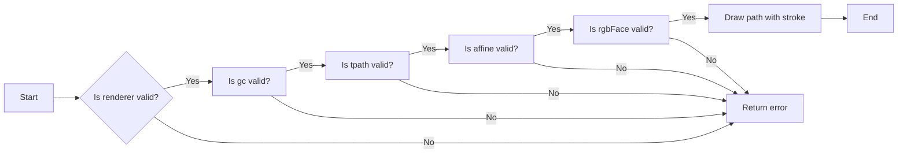

#### 带注释源码

```python
def draw_path(self, renderer: RendererBase, gc: GraphicsContextBase, tpath: Path, affine: Transform, rgbFace: ColorType) -> None:
    # Check if the renderer, gc, tpath, affine, and rgbFace are valid
    if not renderer or not gc or not tpath or not affine or rgbFace is None:
        return  # Return early if any of the parameters are invalid

    # Draw the path with the stroke effect
    renderer.draw_path(gc, tpath, affine, rgbFace)
```


### SimplePatchShadow.draw_path

This method is responsible for drawing a shadow effect on a path in a graphical context.

参数：

- `renderer`：`RendererBase`，The renderer object that handles the graphical operations.
- `gc`：`GraphicsContextBase`，The graphics context object where the drawing operations are performed.
- `tpath`：`Path`，The path object that represents the shape to be drawn.
- `affine`：`Transform`，The transformation matrix that applies to the path.
- `rgbFace`：`ColorType`，The color to use for the shadow.

返回值：`None`，This method does not return any value.

#### 流程图


#### 带注释源码

```python
def draw_path(self, renderer: RendererBase, gc: GraphicsContextBase, tpath: Path, affine: Transform, rgbFace: ColorType) -> None:
    # Check if the renderer is valid
    if not renderer:
        raise ValueError("Renderer is not valid")
    
    # Check if the graphics context is valid
    if not gc:
        raise ValueError("Graphics context is not valid")
    
    # Check if the path is valid
    if not tpath:
        raise ValueError("Path is not valid")
    
    # Check if the affine transformation is valid
    if not affine:
        raise ValueError("Affine transformation is not valid")
    
    # Check if the color is valid
    if not rgbFace:
        raise ValueError("Color is not valid")
    
    # Draw the shadow on the path using the graphics context and the path
    gc.draw_path(tpath, affine, rgbFace)
```


### `withSimplePatchShadow.draw_path`

`withSimplePatchShadow` 类的 `draw_path` 方法用于绘制带有阴影的路径。

参数：

- `renderer`：`RendererBase`，渲染器对象，用于执行绘图操作。
- `gc`：`GraphicsContextBase`，图形上下文对象，用于存储绘图状态。
- `tpath`：`Path`，路径对象，表示要绘制的路径。
- `affine`：`Transform`，仿射变换对象，用于转换路径坐标。
- `rgbFace`：`ColorType`，可选，表示路径的颜色。

返回值：`None`，该方法不返回任何值。

#### 流程图

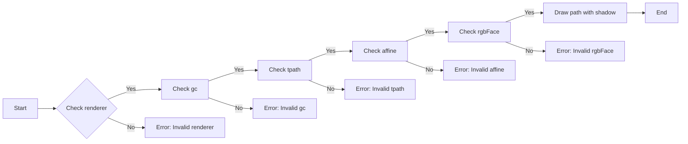

#### 带注释源码

```python
def draw_path(self, renderer: RendererBase, gc: GraphicsContextBase, tpath: Path, affine: Transform, rgbFace: ColorType) -> None:
    # Check if renderer is valid
    if not isinstance(renderer, RendererBase):
        raise ValueError("Invalid renderer")
    
    # Check if gc is valid
    if not isinstance(gc, GraphicsContextBase):
        raise ValueError("Invalid gc")
    
    # Check if tpath is valid
    if not isinstance(tpath, Path):
        raise ValueError("Invalid tpath")
    
    # Check if affine is valid
    if not isinstance(affine, Transform):
        raise ValueError("Invalid affine")
    
    # Check if rgbFace is valid
    if rgbFace is not None and not isinstance(rgbFace, ColorType):
        raise ValueError("Invalid rgbFace")
    
    # Draw path with shadow
    # (Drawing logic here)
    pass
``` 


### SimpleLineShadow.draw_path

SimpleLineShadow 类的 draw_path 方法用于绘制带有阴影的线条。

参数：

- `renderer`：`RendererBase`，渲染器对象，用于执行绘图操作。
- `gc`：`GraphicsContextBase`，图形上下文对象，用于存储绘图状态。
- `tpath`：`Path`，路径对象，表示要绘制的线条。
- `affine`：`Transform`，仿射变换对象，用于转换路径坐标。
- `rgbFace`：`ColorType`，可选，线条的颜色。

返回值：`None`，该方法不返回任何值。

#### 流程图


#### 带注释源码

```python
def draw_path(self, renderer: RendererBase, gc: GraphicsContextBase, tpath: Path, affine: Transform, rgbFace: ColorType) -> None:
    # Check if renderer is valid
    if not isinstance(renderer, RendererBase):
        raise ValueError("Invalid renderer")
    
    # Check if gc is valid
    if not isinstance(gc, GraphicsContextBase):
        raise ValueError("Invalid gc")
    
    # Check if tpath is valid
    if not isinstance(tpath, Path):
        raise ValueError("Invalid tpath")
    
    # Check if affine is valid
    if not isinstance(affine, Transform):
        raise ValueError("Invalid affine")
    
    # Check if rgbFace is valid
    if rgbFace is not None and not isinstance(rgbFace, ColorType):
        raise ValueError("Invalid rgbFace")
    
    # Draw the path with shadow
    # (Drawing logic here)
    pass
```


### PathPatchEffect.draw_path

This method is responsible for drawing a path with a patch effect applied to it.

参数：

- `renderer`：`RendererBase`，The renderer object that is used to draw the path.
- `gc`：`GraphicsContextBase`，The graphics context object that contains the drawing state.
- `tpath`：`Path`，The path object that represents the shape to be drawn.
- `affine`：`Transform`，The transformation matrix that is applied to the path.
- `rgbFace`：`ColorType | None`，The color to use for the face of the patch.

返回值：`None`，This method does not return any value.

#### 流程图

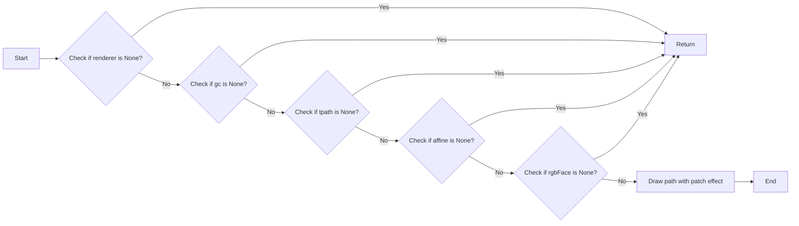

#### 带注释源码

```python
def draw_path(self, renderer: RendererBase, gc: GraphicsContextBase, tpath: Path, affine: Transform, rgbFace: ColorType) -> None:
    # Check if any of the required parameters are None
    if renderer is None or gc is None or tpath is None or affine is None or rgbFace is None:
        return

    # Draw the path with the patch effect
    # (The actual drawing logic is not shown here as it depends on the specific implementation of the patch effect)
    # ...
```


### TickedStroke.draw_path

The `draw_path` method of the `TickedStroke` class is responsible for drawing a path with ticks at specified intervals and angles.

参数：

- `renderer`：`RendererBase`，The renderer object used to draw the path.
- `gc`：`GraphicsContextBase`，The graphics context object used for drawing.
- `tpath`：`Path`，The path object to be drawn.
- `affine`：`Transform`，The affine transformation applied to the path.
- `rgbFace`：`ColorType`，The color to use for the face of the path.

返回值：`None`，This method does not return any value.

#### 流程图

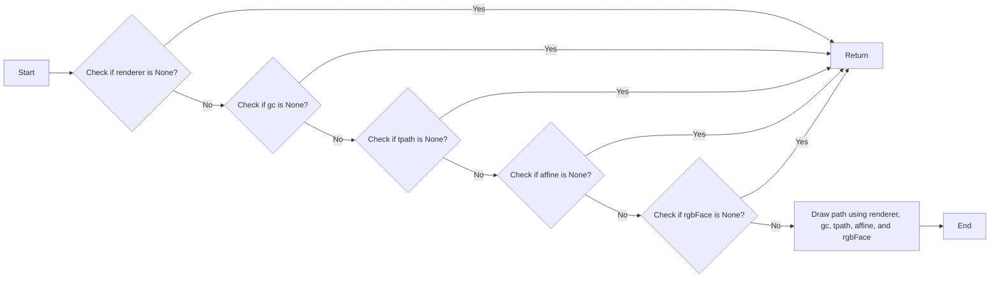

#### 带注释源码

```python
def draw_path(self, renderer: RendererBase, gc: GraphicsContextBase, tpath: Path, affine: Transform, rgbFace: ColorType) -> None:
    # Check if any of the required parameters are None
    if renderer is None or gc is None or tpath is None or affine is None or rgbFace is None:
        return

    # Draw the path using the provided parameters
    renderer.draw_path(gc, tpath, affine, rgbFace)
```


### withTickedStroke.draw_path

This method draws a path with a ticked stroke effect, which adds ticks at specified intervals along the path.

参数：

- `renderer`：`RendererBase`，The renderer object used for drawing.
- `gc`：`GraphicsContextBase`，The graphics context object used for drawing.
- `tpath`：`Path`，The path to be drawn.
- `affine`：`Transform`，The affine transformation applied to the path.
- `rgbFace`：`ColorType`，The color to use for the face of the path.

返回值：`None`，This method does not return any value.

#### 流程图

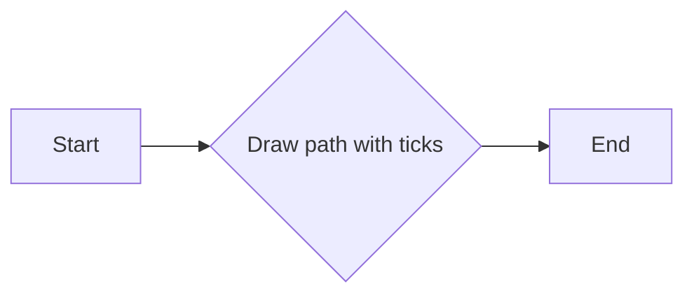

#### 带注释源码

```python
def draw_path(self, renderer: RendererBase, gc: GraphicsContextBase, tpath: Path, affine: Transform, rgbFace: ColorType) -> None:
    # Implementation of the draw_path method with ticked stroke effect
    # ...
```


## 关键组件


### 张量索引与惰性加载

张量索引与惰性加载是代码中处理数据结构的核心组件，它允许对大型数据集进行高效访问，同时延迟计算直到实际需要时。

### 反量化支持

反量化支持是代码中用于处理数值类型转换的组件，它确保数值在量化过程中保持准确性和一致性。

### 量化策略

量化策略是代码中用于优化数值表示和存储的组件，它通过减少数值的精度来减少内存使用，同时保持足够的精度以满足应用需求。


## 问题及建议


### 已知问题

-   **类型注解缺失**：代码中存在类型注解缺失的情况，例如 `rgbFace` 在 `Stroke` 和 `SimplePatchShadow` 类中未提供类型注解。
-   **方法覆盖**：`draw_path` 方法在多个子类中被覆盖，但未提供明确的类型注解，可能导致类型检查错误。
-   **默认参数值**：`offset` 参数在多个类中默认值为省略号 `...`，这可能导致初始化时出现错误，因为省略号不是有效的默认参数值。
-   **代码重复**：`draw_path` 方法在多个子类中具有相似的实现，这可能导致维护困难。

### 优化建议

-   **添加类型注解**：为所有参数和返回值添加类型注解，确保代码的可读性和可维护性。
-   **统一方法实现**：考虑将 `draw_path` 方法的实现提取到一个单独的类或模块中，以减少代码重复。
-   **修正默认参数值**：将 `offset` 参数的默认值更改为有效的默认值，例如 `(0.0, 0.0)`。
-   **代码重构**：对代码进行重构，以减少重复和增加代码的可读性。
-   **文档化**：为每个类和方法添加详细的文档注释，说明其功能和参数。


## 其它


### 设计目标与约束

- 设计目标：
  - 提供一个模块化的路径效果渲染器，能够对matplotlib图形进行装饰。
  - 支持多种路径效果，如描边、阴影、标记等。
  - 确保渲染器与matplotlib渲染引擎兼容。

- 约束条件：
  - 必须使用matplotlib的现有API和类。
  - 不能修改matplotlib的内部实现。
  - 需要考虑性能，确保渲染过程高效。

### 错误处理与异常设计

- 错误处理：
  - 对于无效的参数，抛出`ValueError`。
  - 对于不支持的渲染器，抛出`NotImplementedError`。

- 异常设计：
  - 使用try-except块捕获和处理可能发生的异常。
  - 提供清晰的错误信息，帮助用户诊断问题。

### 数据流与状态机

- 数据流：
  - 用户定义路径效果，通过`PathEffectRenderer`进行渲染。
  - `PathEffectRenderer`将路径效果应用到matplotlib图形上。

- 状态机：
  - `PathEffectRenderer`在初始化时设置状态，根据路径效果进行渲染。
  - 每个路径效果类在`draw_path`方法中定义其渲染逻辑。

### 外部依赖与接口契约

- 外部依赖：
  - matplotlib库，特别是`RendererBase`、`GraphicsContextBase`、`Path`、`Patch`和`Transform`类。

- 接口契约：
  - `AbstractPathEffect`类定义了所有路径效果必须实现的接口。
  - `PathEffectRenderer`类实现了matplotlib的`RendererBase`接口，并提供了额外的路径效果渲染功能。


    