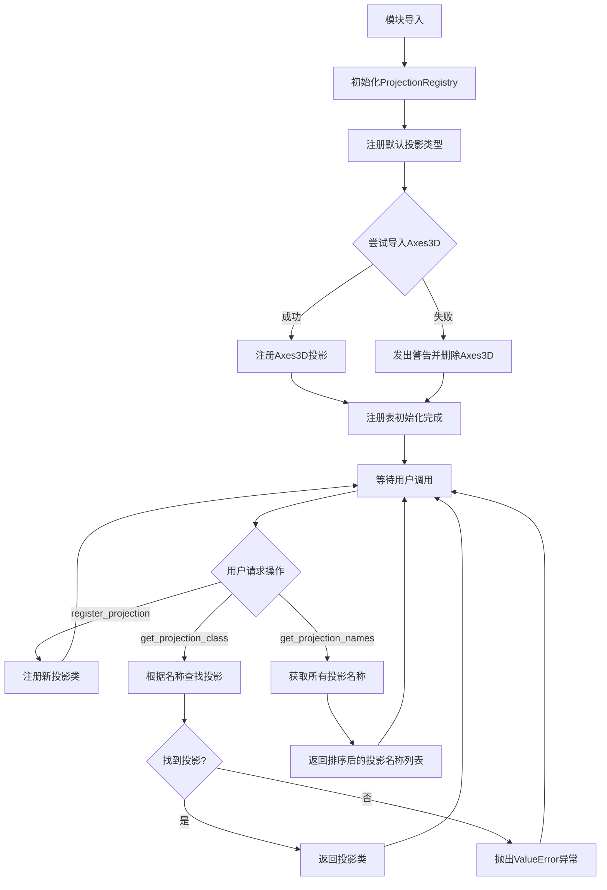
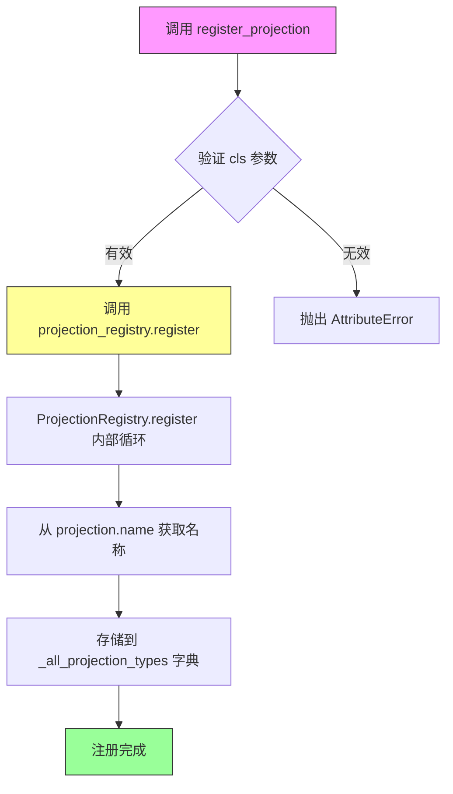
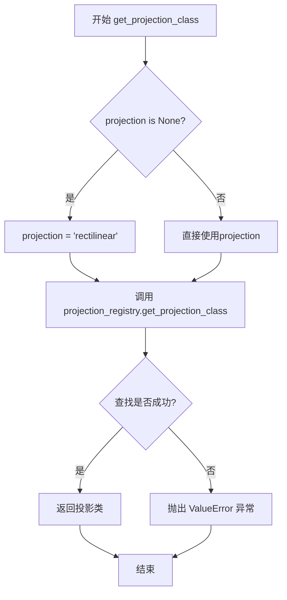
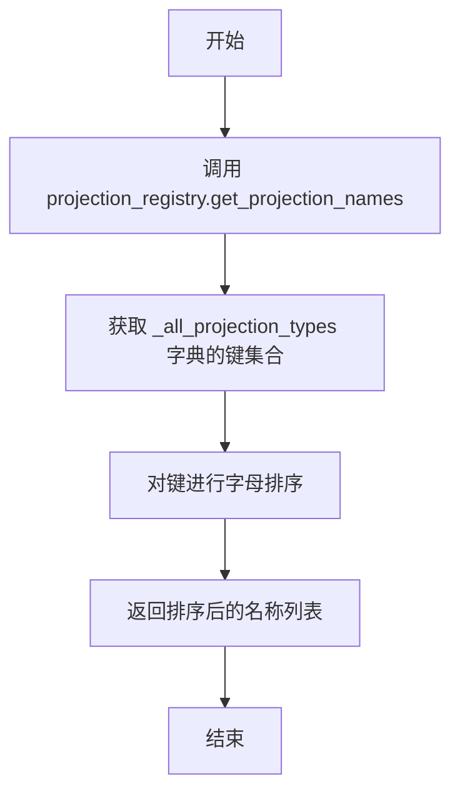
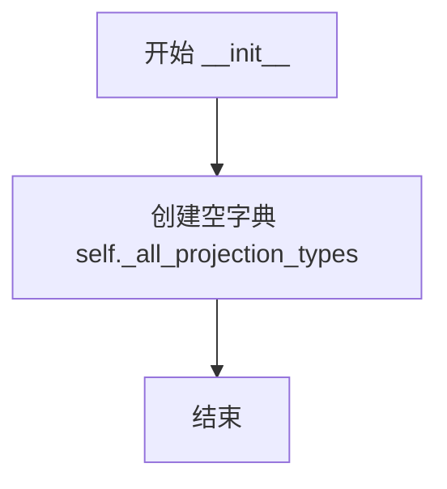
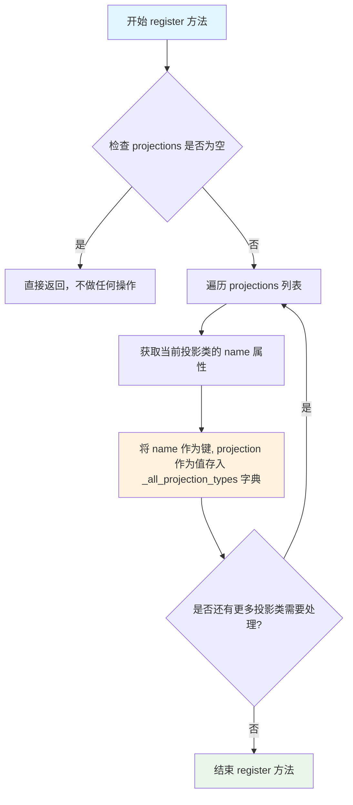
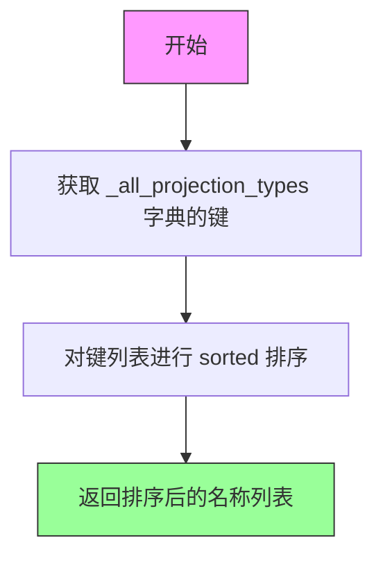

# `matplotlib\lib\matplotlib\projections\__init__.py` 详细设计文档

该模块是Matplotlib投影系统的核心组件，提供了一个投影注册表(ProjectionRegistry)来管理和维护各种坐标投影类型（如直角坐标、极坐标、地理坐标等），支持通过名称动态查找和注册新的投影，并提供从数据空间到屏幕空间的坐标转换能力。

## 整体流程



## 类结构

```
ProjectionRegistry (投影注册表类)
├── __init__ (构造函数)
├── register (注册投影方法)
├── get_projection_class (获取投影类方法)
└── get_projection_names (获取投影名称方法)

全局实例: projection_registry

全局函数:
├── register_projection
├── get_projection_class
└── get_projection_names
```

## 全局变量及字段


### `projection_registry`
    
全局投影注册表实例，用于管理所有可用的投影类型

类型：`ProjectionRegistry`
    


### `Axes3D`
    
3D坐标轴类（如果可用）

类型：`type or None`
    


### `get_projection_names`
    
获取所有已注册的投影名称的函数

类型：`function`
    


### `ProjectionRegistry._all_projection_types`
    
存储投影名称到投影类的映射字典

类型：`dict`
    
    

## 全局函数及方法


### `register_projection`

注册新的投影类到全局注册表，使其可以通过名称在 `fig.add_subplot(projection="name")` 中使用。

参数：

- `cls`：`type`，要注册的投影类，必须具有 `name` 属性作为投影标识符

返回值：`None`，无返回值，仅执行注册操作

#### 流程图



#### 带注释源码

```python
def register_projection(cls):
    """
    Register a projection class to the global registry.
    
    This function allows user-defined projection classes to be registered
    so they can be used by name in matplotlib's figure creation, e.g.:
    ``fig.add_subplot(projection="my_projection_name")``
    
    The class must have a ``name`` class attribute that serves as the
    unique identifier for the projection.
    
    Parameters
    ----------
    cls : type
        The projection class to register. Must be a subclass of Axes
        and must have a ``name`` class attribute (str).
    
    Returns
    -------
    None
    
    Examples
    --------
    >>> class MyAxes(Axes):
    ...     name = 'my_projection'
    >>> register_projection(MyAxes)
    >>> fig.add_subplot(projection='my_projection')
    """
    # 调用全局 projection_registry 实例的 register 方法
    # 该方法会将 cls 添加到 _all_projection_types 字典中
    # 键为 cls.name，值为 cls 本身
    projection_registry.register(cls)
```

---

### 1. 核心功能概述

该模块提供了 matplotlib 中非可分离变换（从数据空间到屏幕空间）的投影注册与管理机制。核心功能包括：定义 `ProjectionRegistry` 类管理所有投影类、提供 `register_projection` 函数注册自定义投影、通过 `get_projection_class` 和 `get_projection_names` 查询已注册的投影。

---

### 2. 文件整体运行流程

```
模块导入
    │
    ├─→ 导入 axes, _docstring 及子模块 geo/polar 中的预定义投影
    │
    ├─→ 尝试导入 Axes3D（3D 投影，可能因多版本 matplotlib 失败）
    │
    ├─→ 创建全局 ProjectionRegistry 实例: projection_registry
    │
    ├─→ 注册内置投影类 (Axes, PolarAxes, AitoffAxes, HammerAxes, LambertAxes, MollweideAxes)
    │
    ├─→ 如果 Axes3D 可用，也注册它
    │
    └─→ 定义模块级函数:
        - register_projection: 注册自定义投影
        - get_projection_class: 按名称获取投影类
        - get_projection_names: 获取所有投影名称
```

---

### 3. 类的详细信息

#### `ProjectionRegistry`

投影注册表类，管理所有可用的投影类。

**类字段：**

| 字段名 | 类型 | 描述 |
|--------|------|------|
| `_all_projection_types` | `dict` | 存储投影名称到投影类的映射字典 |

**类方法：**

##### `__init__`

初始化注册表，创建空字典存储投影类型。

- 参数：无
- 返回值：`None`

##### `register`

```python
def register(self, *projections):
    """Register a new set of projections."""
    for projection in projections:
        name = projection.name
        self._all_projection_types[name] = projection
```

- 参数：
  - `*projections`：可变数量的投影类参数
- 返回值：`None`

##### `get_projection_class`

```python
def get_projection_class(self, name):
    """Get a projection class from its *name*."""
    return self._all_projection_types[name]
```

- 参数：
  - `name`：`str`，投影名称
- 返回值：投影类对象

##### `get_projection_names`

```python
def get_projection_names(self):
    """Return the names of all projections currently registered."""
    return sorted(self._all_projection_types)
```

- 参数：无
- 返回值：`list[str]`，排序后的投影名称列表

---

### 4. 全局变量和全局函数详细信息

#### 全局变量

| 变量名 | 类型 | 描述 |
|--------|------|------|
| `projection_registry` | `ProjectionRegistry` | 全局投影注册表实例 |

#### 全局函数

##### `register_projection`

如上所述。

##### `get_projection_class`

```python
def get_projection_class(projection=None):
    """
    Get a projection class from its name.

    If *projection* is None, a standard rectilinear projection is returned.
    """
    if projection is None:
        projection = 'rectilinear'

    try:
        return projection_registry.get_projection_class(projection)
    except KeyError as err:
        raise ValueError("Unknown projection %r" % projection) from err
```

- 参数：
  - `projection`：`str` 或 `None`，投影名称，默认为 None 返回 rectilinear
- 返回值：投影类对象
- 异常：`ValueError` 当投影名称不存在时

##### `get_projection_names`

```python
get_projection_names = projection_registry.get_projection_names
```

- 参数：无
- 返回值：`list[str]`
- 描述：模块级别名，直接调用注册表方法

---

### 5. 关键组件信息

| 组件名 | 描述 |
|--------|------|
| `ProjectionRegistry` | 投影类注册中心，管理所有可用投影的名称到类映射 |
| `projection_registry` | 全局单例注册表实例 |
| `register_projection` | 用户自定义投影注册的入口函数 |
| `Axes3D` 条件导入 | 3D 投影的特殊处理，可能因多版本冲突失败 |

---

### 6. 潜在的技术债务或优化空间

1. **Axes3D 静默删除**：从命名空间中删除 `Axes3D` 可能导致后续代码引用时出现难以追踪的错误，应考虑明确的警告或配置机制。

2. **缺少投影类验证**：`register_projection` 未验证输入类是否真正是 Axes 子类或是否具有有效的 `name` 属性，可能导致运行时错误。

3. **无反注册机制**：提供 `unregister_projection` 会增加灵活性，尤其在插件/扩展场景中。

4. **错误处理不够友好**：当投影类缺少 `name` 属性时，错误信息不够明确。

---

### 7. 其它项目

#### 设计目标与约束

- **目标**：支持自定义投影注册，使 matplotlib 能通过名称识别和使用用户定义的坐标变换
- **约束**：注册的投影类必须具有 `name` 类属性作为唯一标识符

#### 错误处理与异常设计

- `KeyError` → `ValueError`：在 `get_projection_class` 中转换，提供更友好的错误信息
- `AttributeError`：当投影类缺少 `name` 属性时自然抛出

#### 数据流与状态机

```
用户定义投影类 (有 name 属性)
    ↓
调用 register_projection(cls)
    ↓
projection_registry.register(cls)
    ↓
_all_projection_types[name] = cls
    ↓
后续可通过 get_projection_class(name) 检索
```

#### 外部依赖与接口契约

- 依赖 `matplotlib.axes.Axes` 作为投影基类
- 依赖 `.geo` 和 `.polar` 子模块中的预定义投影
- 可选的 `mpl_toolkits.mplot3d` 3D 投影支持


### `get_projection_class`

根据投影名称获取对应的投影类，如果未指定投影则返回默认的rectilinear投影。

参数：

- `projection`：`str | None`，投影名称，None时默认为'rectilinear'

返回值：`type`，投影类（Axes子类），返回对应的投影类型类

#### 流程图



#### 带注释源码

```python
def get_projection_class(projection=None):
    """
    Get a projection class from its name.

    If *projection* is None, a standard rectilinear projection is returned.
    """
    # 如果未指定投影名称，默认使用'rectilinear'（笛卡尔坐标系）
    if projection is None:
        projection = 'rectilinear'

    try:
        # 通过注册表获取投影类
        return projection_registry.get_projection_class(projection)
    except KeyError as err:
        # 捕获KeyError并转换为更明确的ValueError
        raise ValueError("Unknown projection %r" % projection) from err
```


### get_projection_names

返回所有已注册投影的名称列表。该函数是模块级别的便捷函数，直接委托给 `ProjectionRegistry` 实例的同名方法，返回当前系统中所有已注册的投影名称（按字母顺序排序）。

参数：

- 无

返回值：`list[str]`，返回按字母顺序排序的所有已注册投影名称列表。

#### 流程图



#### 带注释源码

```python
# 模块级别的函数定义，直接引用 projection_registry 实例的方法
# 这是个便捷函数，让用户可以直接调用而不需要导入 registry 实例
get_projection_names = projection_registry.get_projection_names


# 下面是 ProjectionRegistry 类中对应的方法实现：

class ProjectionRegistry:
    """A mapping of registered projection names to projection classes."""

    def __init__(self):
        # 初始化空字典，用于存储投影名称到投影类的映射
        self._all_projection_types = {}

    def register(self, *projections):
        """Register a new set of projections."""
        for projection in projections:
            # 获取投影类的 name 属性作为注册键
            name = projection.name
            self._all_projection_types[name] = projection

    def get_projection_class(self, name):
        """Get a projection class from its *name*."""
        return self._all_projection_types[name]

    def get_projection_names(self):
        """Return the names of all projections currently registered."""
        # 返回所有投影名称的排序列表
        # _all_projection_types 是字典，sorted() 返回排序后的键列表
        return sorted(self._all_projection_types)
```


### `ProjectionRegistry.__init__`

初始化投影注册表，创建一个空的字典来存储所有可用的投影类型。

参数：

- `self`：隐式参数，ProjectionRegistry 实例本身，无需额外描述

返回值：`None`，无返回值，仅进行实例初始化

#### 流程图



#### 带注释源码

```python
def __init__(self):
    """
    初始化投影注册表。
    
    创建一个空的字典用于存储所有注册的投影类型。
    字典的键为投影名称，值为对应的投影类。
    """
    # 初始化一个空字典，用于存储投影名称到投影类的映射
    # 格式: { 'projection_name': ProjectionClass }
    self._all_projection_types = {}
```


### ProjectionRegistry.register

注册新的投影类型，将投影类及其名称添加到注册表中。

参数：

- `*projections`：`投影类（可变参数）`，要注册的投影类，支持传入一个或多个投影类，每个投影类必须具有 `name` 属性

返回值：`None`，无返回值，将投影类注册到内部字典中

#### 流程图



#### 带注释源码

```python
def register(self, *projections):
    """Register a new set of projections."""
    # 遍历传入的所有投影类
    for projection in projections:
        # 通过投影类的 name 类属性获取投影的唯一标识名称
        name = projection.name
        # 将投影类存储到内部字典中，键为投影名称，值为投影类本身
        self._all_projection_types[name] = projection
```


### `ProjectionRegistry.get_projection_class`

根据给定的投影名称（`name`），从 `ProjectionRegistry` 实例内部的投影类型注册表（字典）中检索并返回对应的投影类（Axes 子类）。如果名称不存在，将抛出 `KeyError`。

参数：

-  `name`：`str`，投影的唯一标识名称（例如 'rectilinear', 'polar'）。

返回值：`type`，返回与该名称关联的 Axes 子类（投影类）。

#### 流程图

```mermaid
flowchart TD
    A[开始: 输入 name] --> B{字典查找 _all_projection_types[name]}
    B -- 找到 --> C[返回: 投影类 Type]
    B -- 未找到 --> D[抛出: KeyError]
    C --> E[结束]
    D --> E
```

#### 带注释源码

```python
def get_projection_class(self, name):
    """Get a projection class from its *name*.
    
    参数:
        name (str): 投影的注册名称。
        
    返回:
        type: 对应的 Axes 子类。
        
    异常:
        KeyError: 如果名称未在注册表中注册。
    """
    # 直接通过键(key)访问字典。
    # Python 字典的 [] 访问方式在键不存在时会自动抛出 KeyError。
    return self._all_projection_types[name]
```


### `ProjectionRegistry.get_projection_names`

获取所有已注册的投影名称，并按字母顺序排序返回。

参数：

- 无显式参数（`self` 为隐式参数，表示 ProjectionRegistry 实例本身）

返回值：`list[str]`，返回所有已注册投影的名称列表（按字母顺序排序）

#### 流程图



#### 带注释源码

```python
def get_projection_names(self):
    """Return the names of all projections currently registered."""
    # self._all_projection_types 是一个字典，键为投影名称，值为投影类
    # sorted() 函数对字典的键（投影名称）进行字母排序
    # 返回一个排序后的列表
    return sorted(self._all_projection_types)
```

## 关键组件


### ProjectionRegistry

用于存储和管理所有已注册投影名称与投影类之间映射的注册中心类。

### projection_registry

全局单例实例，负责维护所有可用投影的注册表。

### register_projection

将新的投影类注册到全局投影注册表中，使其可通过名称进行访问。

### get_projection_class

根据投影名称获取对应的投影类，若未指定则返回默认的rectilinear投影。

### get_projection_names

返回所有当前已注册投影的名称列表。

### AitoffAxes / HammerAxes / LambertAxes / MollweideAxes

地理坐标系的投影类，用于绘制不同类型的全球地图投影。

### PolarAxes

极坐标投影类，用于绘制极坐标图和雷达图。

### Axes3D

三维坐标轴投影类，用于绘制三维图表。


## 问题及建议


### 已知问题

-   **全局状态缺乏线程安全**：`projection_registry` 作为全局单例，在多线程环境下并发访问 `register()` 和 `get_projection_class()` 方法时存在竞态条件风险
-   **Axes3D 条件导入的副作用**：使用 `del Axes3D` 删除变量会改变模块命名空间状态，可能导致后续代码行为不一致
-   **错误处理粒度不足**：`get_projection_class` 仅捕获 KeyError 转换为 ValueError，缺乏对其他异常（如 TypeError）的处理
-   **缺少类型注解**：整个模块没有任何类型提示（Type Hints），影响代码可维护性和 IDE 支持
-   **投影名称验证缺失**：`register()` 方法不验证投影名称的有效性（如空字符串、特殊字符），可能导致注册无效投影
-   **register_projection 无返回值确认**：函数不返回注册结果，无法确认是否注册成功
-   **隐式外部依赖**：`_docstring.interpd` 的使用缺乏空值检查，依赖顺序不明确

### 优化建议

-   **添加线程安全机制**：使用 `threading.Lock` 保护 `ProjectionRegistry` 的所有修改操作
-   **改进 Axes3D 处理**：使用 `__getattr__` 动态处理 3D 投影的可用性，或提供明确的配置选项
-   **完善类型注解**：为所有函数参数、返回值及类属性添加类型提示
-   **增加输入验证**：在 `register()` 方法中添加投影名称的格式验证
-   **增强错误处理**：扩展异常捕获类型，提供更详细的错误上下文信息
-   **返回注册状态**：修改 `register_projection` 使其返回布尔值或抛出明确的异常
-   **解耦文档依赖**：将 `_docstring.interpd` 的使用延迟到实际需要时或提供备选方案

## 其它


### 设计目标与约束

该模块的设计目标是建立一个可扩展的投影注册机制，允许matplotlib用户注册和使用自定义的坐标轴投影。核心约束包括：投影类必须具有name属性；3D投影为可选依赖；投影名称必须唯一；支持参数化投影对象。

### 整体运行流程

模块初始化时自动创建ProjectionRegistry单例，并注册内置投影（Rectilinear、Polar、Aitoff、Hammer、Lambert、Mollweide以及可选的3D投影）。当用户调用`register_projection()`时，新投影被添加到注册表中。获取投影时通过`get_projection_class()`查询，若不存在则抛出ValueError。模块还提供`get_projection_names()`返回所有已注册投影名称。

### 类详细信息

#### ProjectionRegistry类

该类是投影注册表的核心容器，负责存储和管理所有已注册的投影类型。

### 类字段

**_all_projection_types**
类型: dict
描述: 存储投影名称到投影类映射的字典

### 类方法

**__init__**
参数: 无
返回值: 无
描述: 初始化投影注册表，创建空的投影类型字典

**register**
参数: *projections - 可变数量的投影类
返回值: 无
描述: 将一个或多个投影类注册到注册表中，自动提取投影的name属性作为键

**get_projection_class**
参数: name - 投影名称字符串
返回值: 投影类
描述: 根据投影名称从注册表中获取对应的投影类，若不存在则抛出KeyError

**get_projection_names**
参数: 无
返回值: list
描述: 返回所有已注册投影名称的排序列表

### 全局变量

**projection_registry**
类型: ProjectionRegistry
描述: 模块级的投影注册表单例实例

### 全局函数

**register_projection**
参数: cls - 要注册的投影类
返回值: 无
描述: 将指定的投影类注册到全局投影注册表中

**get_projection_class**
参数: projection - 投影名称字符串，默认为None
返回值: 投影类
描述: 根据名称获取投影类，若projection为None则返回'rectilinear'投影，若不存在则抛出ValueError

**get_projection_names**
参数: 无
返回值: list
描述: 返回投影注册表中所有投影名称的排序列表

### 关键组件信息

**ProjectionRegistry**: 投影注册中心，管理所有投影类型的注册和查询
**projection_registry**: 全局单例实例，提供模块级访问入口
**Axes3D**: 3D坐标轴投影，可选依赖
**PolarAxes, AitoffAxes, HammerAxes, LambertAxes, MollweideAxes**: 内置专业投影实现

### 错误处理与异常设计

模块处理两类主要错误：1) 当Axes3D导入失败时，发出警告并将其设为None，后续不会注册；2) 当请求的投影名称不存在时，get_projection_class抛出ValueError并包含原始KeyError作为原因异常。register方法不进行重复检查，后注册的同名投影会覆盖已有投影。

### 外部依赖与接口契约

模块依赖matplotlib.axes模块提供基础坐标轴类，依赖geo和polar子模块提供地理和极坐标投影，依赖_docstring模块处理文档字符串。投影类必须满足以下契约：具有name类属性标识投影名称；继承自axes.Axes；实现从数据坐标到显示坐标的变换及其逆变换。

### 潜在的技术债务或优化空间

1. register方法缺少投影类验证机制，应检查cls是否具有name属性和继承自正确基类
2. 重复投影名称注册采用静默覆盖策略，可能导致意外行为
3. Axes3D的导入异常处理过于宽泛，可能掩盖真正的导入错误
4. 缺少投影注销功能，无法动态移除已注册的投影
5. get_projection_class的异常处理可以提供更友好的错误提示，包括列出可用投影名称
6. 缺少线程安全保护，在多线程环境下并发访问注册表可能存在问题
7. 投影的lazy loading机制未实现，所有投影在模块加载时都会被导入

    