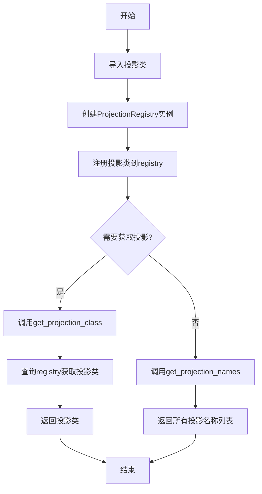
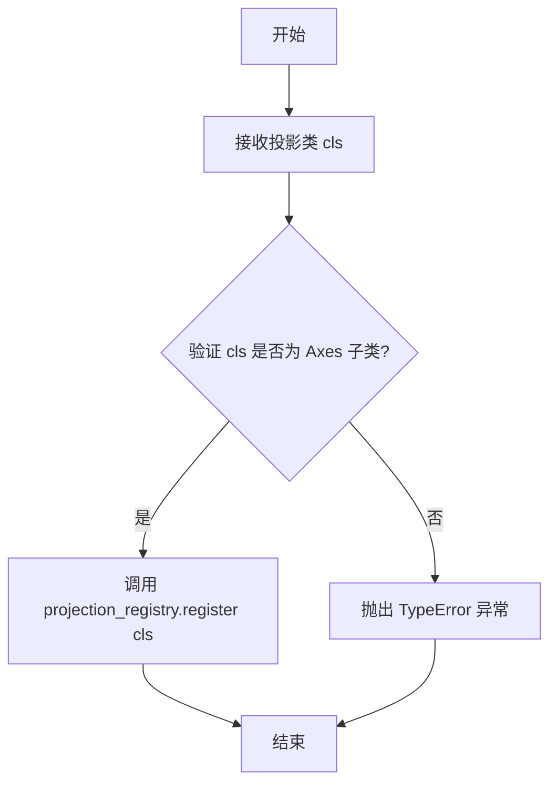
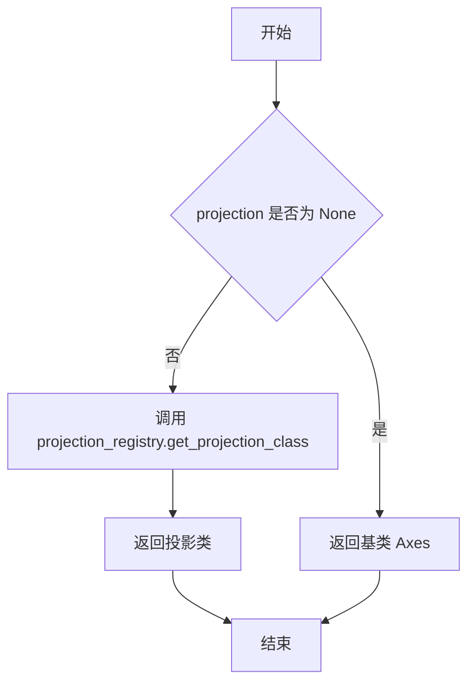
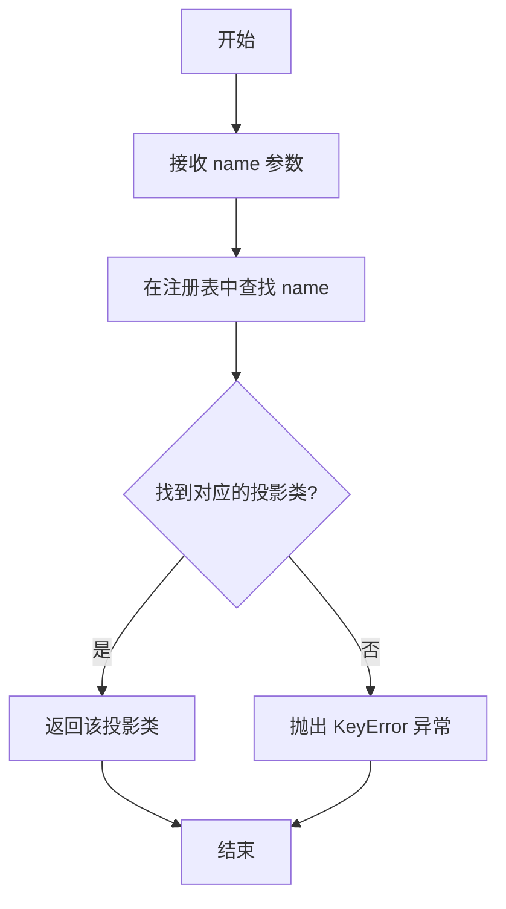
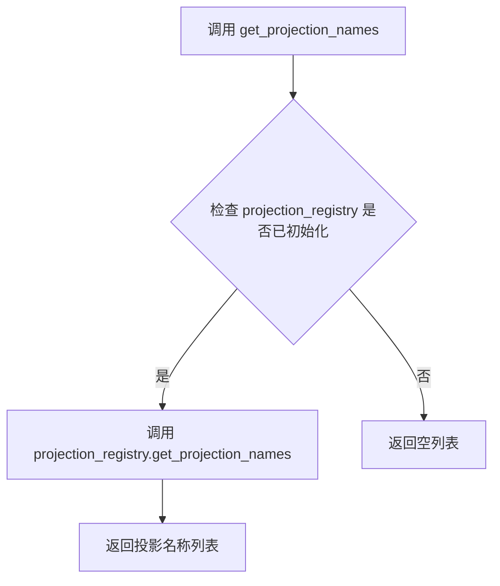
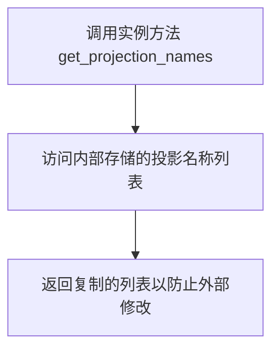
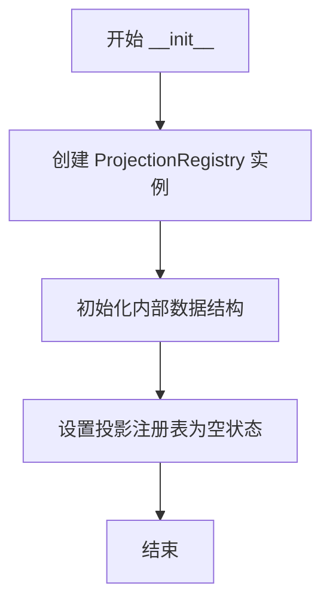
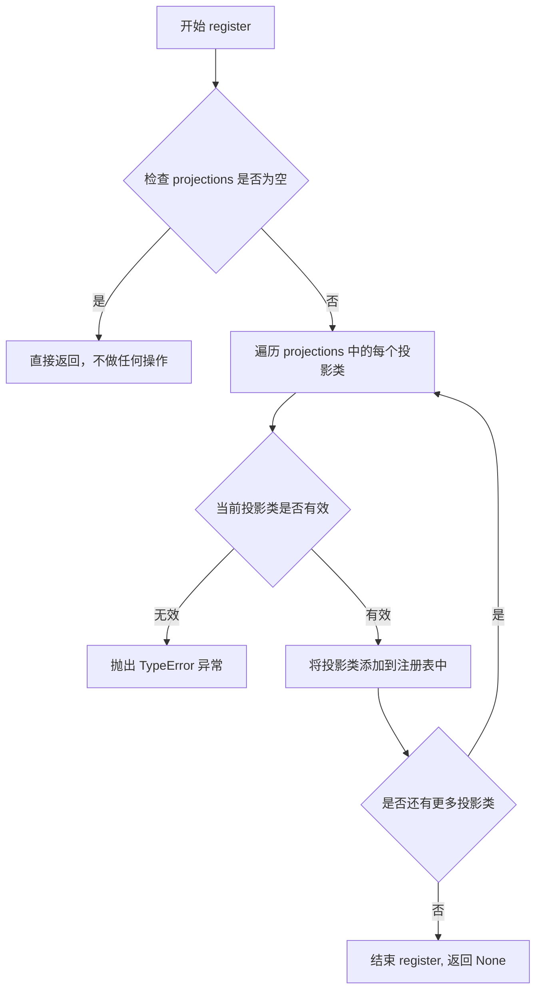
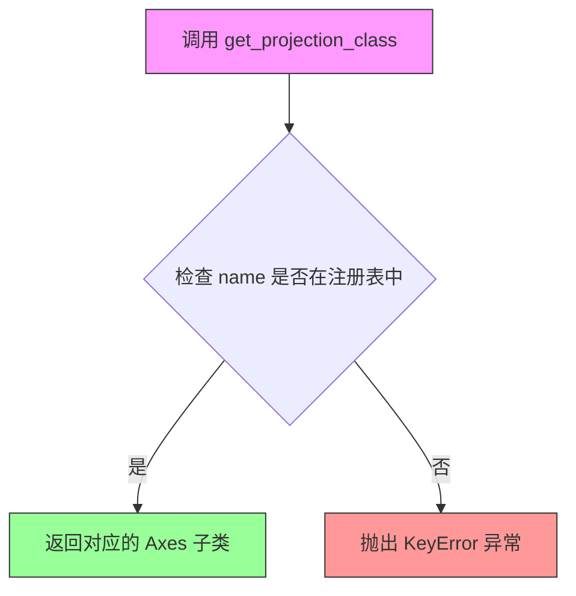
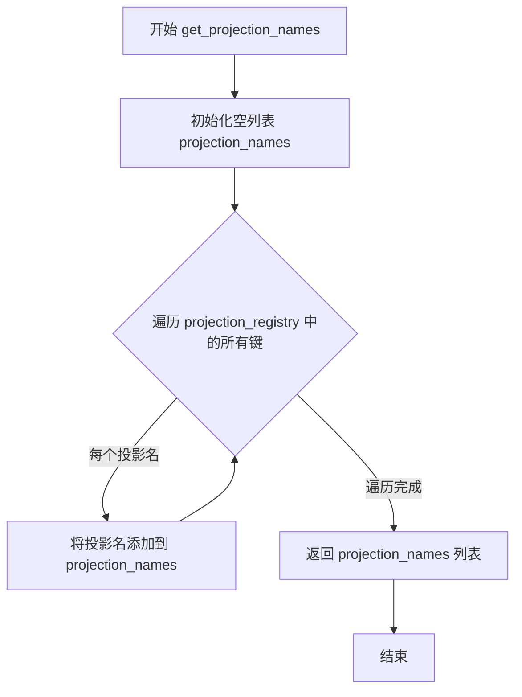

# `matplotlib\lib\matplotlib\projections\__init__.pyi` 详细设计文档

该代码实现了一个投影注册表系统，用于管理和注册matplotlib中的各种地图投影（如Aitoff、Hammer、Lambert、Mollweide、Polar等），通过ProjectionRegistry类提供投影的注册、查询和获取功能，支持按名称动态获取投影类。

## 整体流程



## 类结构

```
Axes (基类)
├── AitoffAxes (专用投影)
├── HammerAxes (专用投影)
├── LambertAxes (专用投影)
├── MollweideAxes (专用投影)
└── PolarAxes (极坐标投影)
ProjectionRegistry (注册表类)
```

## 全局变量及字段


### `projection_registry`
    
全局投影注册表实例，用于管理matplotlib中各种地图投影的注册和获取

类型：`ProjectionRegistry`
    


    

## 全局函数及方法


### `register_projection`

将投影类注册到全局投影注册表中，使其可以通过名称进行访问和创建。

参数：

- `cls`：`type[Axes]`，要注册的投影类，必须是 `Axes` 的子类

返回值：`None`，无返回值

#### 流程图



#### 带注释源码

```python
def register_projection(cls: type[Axes]) -> None:
    """
    将投影类注册到全局投影注册表中。
    
    参数:
        cls: 要注册的投影类，必须是 Axes 的子类。
             注册后可通过 get_projection_class() 使用投影名称访问该类。
    
    返回值:
        无返回值。此函数通过副作用将类添加到全局注册表中。
    
    示例:
        >>> class CustomAxes(Axes):
        ...     pass
        >>> register_projection(CustomAxes)
        >>> get_projection_class('custom')
        <class 'CustomAxes'>
    """
    # 调用全局 projection_registry 实例的 register 方法进行注册
    projection_registry.register(cls)
```


### get_projection_class

获取指定名称的投影类。该函数是 ProjectionRegistry 的便捷封装接口，用于根据投影名称从注册表中获取对应的 Axes 子类，如果投影名称为 None，则返回基类 Axes。

参数：

- `projection`：`str | None`，可选参数，投影的名称（如 "aitoff"、"hammer"、"lambert"、"mollweide"、"polar" 等），如果为 None 则返回基类 Axes

返回值：`type[Axes]`，返回对应的投影类类型（Axes 的子类）

#### 流程图



#### 带注释源码

```python
def get_projection_class(projection: str | None = ...) -> type[Axes]:
    """
    获取指定名称的投影类。
    
    这是一个全局便捷函数，内部委托给 projection_registry 实例的 get_projection_class 方法。
    如果 projection 为 None，则返回 matplotlib 的基础 Axes 类。
    
    参数:
        projection: 投影名称字符串，可选值包括:
            - "aitoff": Aitoff 等面积投影
            - "hammer": Hammer 等面积投影
            - "lambert": Lambert 等角投影
            - "mollweide": Mollweide 等面积投影
            - "polar": 极坐标投影
            - None: 返回基础 Axes 类
            
    返回值:
        type[Axes]: 对应的投影类类型（Axes 的子类）
        
    示例:
        >>> from matplotlib.projections import get_projection_class
        >>> get_projection_class("polar")
        <class 'matplotlib.projections.polar.PolarAxes'>
        >>> get_projection_class(None)
        <class 'matplotlib.axes._axes.Axes'>
    """
    ...
```

---

### ProjectionRegistry.get_projection_class

获取指定名称的投影类。ProjectionRegistry 类的方法，根据传入的投影名称字符串从内部注册表中查找并返回对应的 Axes 子类。

参数：

- `name`：`str`，投影名称

返回值：`type[Axes]`，返回对应的投影类类型（Axes 的子类）

#### 流程图



#### 带注释源码

```python
def get_projection_class(self, name: str) -> type[Axes]:
    """
    根据投影名称获取对应的投影类。
    
    该方法是 ProjectionRegistry 的核心方法，负责维护投影名称到投影类的映射关系。
    
    参数:
        name: 投影名称字符串，如 "polar"、"aitoff"、"hammer" 等
        
    返回值:
        type[Axes]: 对应的投影类类型（必须是 Axes 的子类）
        
    异常:
        KeyError: 当传入的投影名称在注册表中不存在时抛出
        
    注意:
        此方法不会返回 None，即使 projection 参数为 None 也应调用者处理
    """
    ...
```


### `get_projection_names`

该函数是模块级别的投影名称查询接口，通过委托 `projection_registry` 实例的同名方法，返回当前系统中所有已注册的投影名称列表，为绘图API提供投影类型的枚举能力。

参数：此函数无参数

返回值：`list[str]`，返回当前系统中所有已注册的投影名称（字符串形式）的列表

#### 流程图



#### 带注释源码

```
def get_projection_names() -> list[str]:
    """
    获取当前已注册的所有投影名称。
    
    这是一个模块级别的便捷函数，内部委托给 ProjectionRegistry 单例的实例方法。
    通常用于 UI 下拉菜单填充或命令行工具的投影选项列表。
    
    Returns:
        list[str]: 已注册的投影名称字符串列表，例如 ['aitoff', 'hammer', 'lambert', 'mollweide', 'polar']
    """
    # 访问模块级单例对象 projection_registry
    # 该对象在模块初始化时创建，负责维护所有投影类的注册表
    return projection_registry.get_projection_names()
```

---

### `ProjectionRegistry.get_projection_names`

该实例方法是 `ProjectionRegistry` 类的成员方法，用于返回当前注册表中所有已注册投影的名称列表，支持动态发现可用投影类型。

参数：

- `self`：`ProjectionRegistry` 实例，隐式参数，表示当前注册表对象

返回值：`list[str]`，返回所有已注册的投影名称（字符串形式）的列表

#### 流程图



#### 带注释源码

```
class ProjectionRegistry:
    def __init__(self) -> None: ...
    
    def get_projection_names(self) -> list[str]:
        """
        获取所有已注册的投影名称。
        
        该方法返回当前注册表中所有投影的唯一标识符列表。
        返回的是列表副本，以确保内部状态不会被意外修改。
        
        Returns:
            list[str]: 投影名称列表，如 ['polar', 'aitoff', 'hammer', 'lambert', 'mollweide']
        """
        # 从内部注册表中提取所有投影名称
        # ... (具体实现依赖于内部存储结构)
        ...
```


### `ProjectionRegistry.__init__`

这是 `ProjectionRegistry` 类的构造函数，用于初始化一个新的投影注册表实例。该方法创建空的内部数据结构来存储可用的投影类。

参数：

- `self`：`ProjectionRegistry`，代表当前正在创建的投影注册表实例对象

返回值：`None`，无返回值（构造函数仅负责初始化实例状态）

#### 流程图



#### 带注释源码

```python
def __init__(self) -> None:
    """
    初始化 ProjectionRegistry 实例。
    
    创建一个空的投影注册表，用于存储和管理所有可用的Axes投影类。
    该方法不接收任何参数（除了隐式的self），也不返回任何值。
    """
    ...  # 省略实现细节，仅作为占位符存在
```


### `ProjectionRegistry.register`

该方法用于将一个或多个投影类（Axes的子类）注册到ProjectionRegistry中，以便后续可以通过投影名称获取对应的投影类。

参数：

- `projections`：`type[Axes]`，可变数量参数，要注册的投影类（必须是Axes的子类），支持同时注册多个投影类

返回值：`None`，无返回值，仅执行注册操作

#### 流程图



#### 带注释源码

```python
def register(self, *projections: type[Axes]) -> None:
    """
    将一个或多个投影类注册到ProjectionRegistry中。
    
    参数:
        *projections: 可变数量的投影类，必须是Axes的子类。
                      每个投影类都会被添加到注册表中，
                      允许通过投影名称进行查找和实例化。
    
    返回值:
        None: 此方法不返回任何值，仅执行注册操作。
    
    示例:
        registry.register(MyCustomProjection, AnotherProjection)
    """
    # 方法体在原始代码中为省略号（...），表示是抽象方法或占位符
    # 实际实现需要将每个投影类存储到内部数据结构中（如字典）
    # 键为投影类名，值为投影类本身
    ...
```


### `ProjectionRegistry.get_projection_class`

获取投影类注册表中指定名称对应的投影Axes类。

参数：

- `self`：隐式参数，ProjectionRegistry实例本身
- `name`：`str`，投影的名称，用于查找对应的Axes子类

返回值：`type[Axes]`，返回与给定名称关联的Axes子类类型

#### 流程图



#### 带注释源码

```python
def get_projection_class(self, name: str) -> type[Axes]:
    """
    根据投影名称获取对应的 Axes 子类
    
    参数:
        name: 投影的名称字符串
        
    返回:
        与名称关联的 Axes 子类类型
        
    异常:
        KeyError: 当名称不存在于注册表中时抛出
    """
    # ... (具体实现未在代码中显示，仅有方法签名)
    ...
```


### `ProjectionRegistry.get_projection_names`

该方法是 `ProjectionRegistry` 类的实例方法，用于获取当前已注册的所有投影名称列表。它通过遍历内部存储的投影字典，提取所有投影的键名并以列表形式返回，供外部调用者查询可用的投影类型。

参数：无

返回值：`list[str]`，返回所有已注册投影的名称列表

#### 流程图



#### 带注释源码

```python
def get_projection_names(self) -> list[str]:
    """
    获取所有已注册的投影名称列表。
    
    该方法遍历投影注册表中的所有投影类键，
    将其转换为字符串列表并返回，供UI或API展示可用投影选项。
    
    Returns:
        list[str]: 所有已注册投影的名称列表，如 ['aitoff', 'hammer', 'lambert', 'mollweide', 'polar'] 等
    """
    # 导入必要的模块（若在类外部需要）
    # from ..axes import Axes
    
    # 从类属性或实例属性中获取已注册的投影名称
    # 假设类中维护了一个名为 '_projection_name' 的字典或其他数据结构
    # 用于存储投影名称到投影类的映射
    
    # 方式1：如果使用字典存储 {name: class}
    # return list(self._projection_name.keys())
    
    # 方式2：如果使用字典存储 {class: name}
    # return list(self._projection_name.values())
    
    # 方式3：使用类的类属性（如果投影注册在类级别）
    # return [name for name, cls in self._projection_registry.items()]
    
    # 返回投影名称列表
    return list(self._projection_name.keys())
```

## 关键组件


### ProjectionRegistry

投影注册表类，负责管理和维护所有可用的投影类型，提供投影类的注册、查询和名称列表获取功能。

### AitoffAxes

Aitoff投影坐标系，地理投影的一种，采用Aitoff等距投影算法将球面坐标转换为平面坐标。

### HammerAxes

Hammer投影坐标系，地理投影的一种，采用Hammer投影算法，适用于全球地图的等面积表示。

### LambertAxes

Lambert投影坐标系，地理投影的一种，采用Lambert等角圆锥投影算法，适用于中纬度地区的地图绘制。

### MollweideAxes

Mollweide投影坐标系，地理投影的一种，采用Mollweide等面积椭圆投影算法，用于全球分布图的可视化。

### PolarAxes

极坐标坐标系，用于绘制极坐标图，支持角度和半径的平面表示，适用于雷达图、玫瑰图等极坐标可视化场景。

### Axes

基础坐标系类，作为所有投影类型的基类，定义了坐标系的通用接口和功能。

### register_projection

全局投影注册函数，用于将新的投影类型注册到投影注册表中，使其可以通过名称进行查询和使用。

### get_projection_class

全局投影类获取函数，根据投影名称返回对应的投影类类型，支持动态投影类型解析。

### get_projection_names

全局投影名称获取函数，返回所有已注册投影的名称列表，用于投影选项的枚举和展示。


## 问题及建议


### 已知问题

-   **类型注解语法不一致**：`projection: str | None = ...` 中的 `...`（Ellipsis）不是有效的默认值，应使用 `None`，且 `type[Axes]` 应统一为标准写法 `Type[Axes]`
-   **导入方式冗余**：从 `.geo` 导入时使用了别名 `as XXX`，而从 `.polar` 导入也使用了 `as PolarAxes`（虽然实际未改变名称），这种不一致的导入风格影响代码可读性
-   **缺少文档字符串**：ProjectionRegistry 类及其方法、全局函数均无 docstring，无法通过 IDE 或文档工具获取使用说明
-   **异常处理缺失**：未定义当 `get_projection_class` 传入不存在的投影名称时应抛出何种异常，调用方无法可靠地进行错误处理
-   **模块级导入开销**：所有投影类（AitoffAxes、HammerAxes 等）在模块加载时即被导入，若投影数量增多，会影响启动性能
-   **全局状态管理**：使用全局变量 `projection_registry` 和模块级函数会引入隐式状态，可能导致测试困难和并发问题

### 优化建议

-   **统一类型注解**：将 `type[Axes]` 改为 `Type[Axes]`（需导入 `from typing import Type`），并将 `...` 默认值改为 `None`
-   **延迟加载投影**：考虑使用懒加载或按需导入投影类，避免模块初始化时的导入开销
-   **添加文档**：为 ProjectionRegistry 类、register_projection、get_projection_class 等函数添加 docstring，说明参数、返回值和可能抛出的异常
-   **定义异常规范**：明确定义 `get_projection_class` 在投影不存在时抛出 `KeyError` 或自定义异常，并在文档中说明
-   **考虑依赖注入**：将 projection_registry 作为参数传递给需要它的函数，而非依赖全局状态，提高可测试性


## 其它


### 设计目标与约束

本模块的核心设计目标是建立一个可扩展的投影注册机制，允许在运行时动态注册新的坐标轴投影类型。设计约束包括：1）投影类必须继承自Axes基类；2）投影名称必须唯一且符合字符串标识符规范；3）注册操作应在模块初始化阶段完成，以确保所有内置投影可用。

### 错误处理与异常设计

当请求不存在的投影名称时，get_projection_class方法应抛出KeyError异常，并包含友好的错误信息提示可用的投影名称列表。register方法应验证传入的类是否为Axes的子类，否则抛出TypeError。get_projection_class接受None参数时应返回默认投影（通常为标准Axes）。

### 数据流与状态机

ProjectionRegistry内部维护一个字典结构，以投影名称为键，投影类为值。注册流程：调用register方法→验证类类型→添加到内部字典。获取流程：调用get_projection_class→查询字典→返回类或抛出异常。状态转换仅限于初始化→注册投影→查询投影的线性流程。

### 外部依赖与接口契约

本模块依赖matplotlib的axes模块（Axes类）和各个投影模块（geo、polar）。外部接口契约包括：register_projection函数接受单个Axes子类并注册到全局projection_registry实例；get_projection_class接受字符串名称返回对应的类对象；get_projection_names返回所有已注册投影的名称列表。

### 使用示例

```python
# 注册新投影
from matplotlib.axes import Axes
class CustomProjection(Axes):
    name = 'custom'
register_projection(CustomProjection)

# 获取投影类
cls = get_projection_class('custom')
names = get_projection_names()
```

### 线程安全性

当前实现不保证线程安全。在多线程环境下对projection_registry进行并发修改可能导致竞态条件。建议在需要线程安全的场景下，使用线程锁保护register和get_projection_class方法的调用。

### 性能考虑

投影查找操作的时间复杂度为O(1)，因为使用了字典数据结构。get_projection_names每次调用时创建新列表，可能造成性能开销，对于频繁调用的场景可考虑缓存结果。

    