# `matplotlib\lib\matplotlib\projections\geo.py` 详细设计文档

该文件实现了matplotlib的地理投影系统，提供GeoAxes基类及Aitoff、Hammer、Mollweide、Lambert等多种地图投影 axes，支持将经纬度坐标转换为可视化坐标，并提供网格线、刻度格式化等功能。

## 整体流程

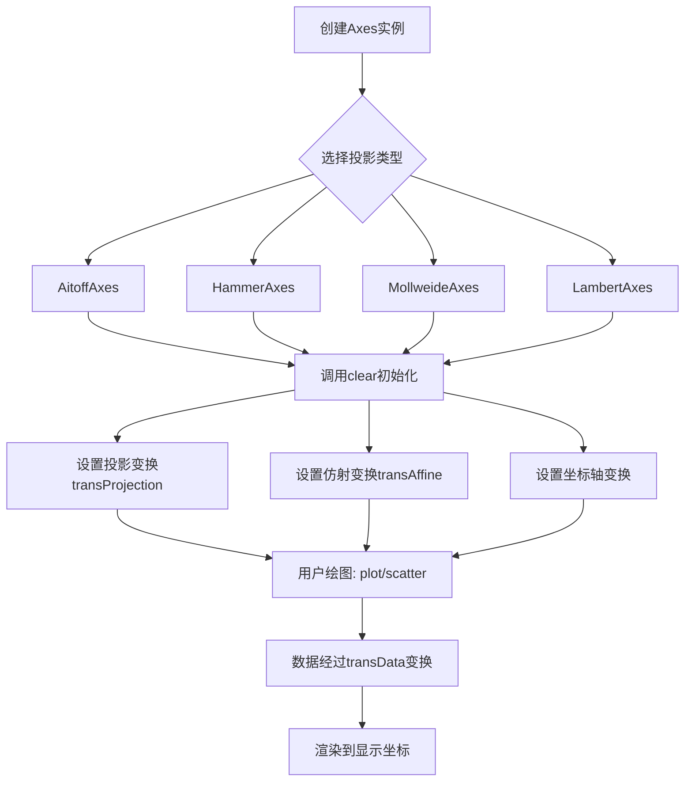

## 类结构

```
GeoAxes (地理投影抽象基类)
├── ThetaFormatter (内部类: 角度格式化器)
├── _GeoTransform (基础变换抽象类)
├── AitoffAxes
│   ├── AitoffTransform
│   └── InvertedAitoffTransform
├── HammerAxes
│   ├── HammerTransform
│   └── InvertedHammerTransform
├── MollweideAxes
│   ├── MollweideTransform
│   └── InvertedMollweideTransform
└── LambertAxes
    ├── LambertTransform
    └── InvertedLambertTransform
```

## 全局变量及字段


### `np`
    
NumPy库，用于数值计算

类型：`module`
    


### `mpl`
    
Matplotlib主库

类型：`module`
    


### `_api`
    
Matplotlib内部API模块

类型：`module`
    


### `Axes`
    
Matplotlib坐标轴基类

类型：`class`
    


### `maxis`
    
Matplotlib轴模块

类型：`module`
    


### `Circle`
    
Matplotlib圆形补丁类

类型：`class`
    


### `Path`
    
Matplotlib路径类

类型：`class`
    


### `mspines`
    
Matplotlib脊柱模块

类型：`module`
    


### `Formatter`
    
Matplotlib格式化器基类

类型：`class`
    


### `NullLocator`
    
Matplotlib空定位器

类型：`class`
    


### `FixedLocator`
    
Matplotlib固定定位器

类型：`class`
    


### `NullFormatter`
    
Matplotlib空格式化器

类型：`class`
    


### `Affine2D`
    
二维仿射变换类

类型：`class`
    


### `BboxTransformTo`
    
边界框变换类

类型：`class`
    


### `Transform`
    
Matplotlib变换基类

类型：`class`
    


### `GeoAxes.xaxis`
    
X轴对象

类型：`XAxis`
    


### `GeoAxes.yaxis`
    
Y轴对象

类型：`YAxis`
    


### `GeoAxes.spines`
    
脊柱字典

类型：`dict`
    


### `GeoAxes.transProjection`
    
投影变换

类型：`Transform`
    


### `GeoAxes.transAffine`
    
仿射变换

类型：`Affine2D`
    


### `GeoAxes.transAxes`
    
坐标轴变换

类型：`Transform`
    


### `GeoAxes.transData`
    
完整数据变换

类型：`Transform`
    


### `GeoAxes._xaxis_pretransform`
    
X轴预变换

类型：`Affine2D`
    


### `GeoAxes._xaxis_transform`
    
X轴变换

类型：`Transform`
    


### `GeoAxes._xaxis_text1_transform`
    
X轴文本1变换

类型：`Transform`
    


### `GeoAxes._xaxis_text2_transform`
    
X轴文本2变换

类型：`Transform`
    


### `GeoAxes._yaxis_transform`
    
Y轴变换

类型：`Transform`
    


### `GeoAxes._yaxis_text1_transform`
    
Y轴文本1变换

类型：`Transform`
    


### `GeoAxes._yaxis_text2_transform`
    
Y轴文本2变换

类型：`Transform`
    


### `GeoAxes._longitude_cap`
    
经度截止值

类型：`float`
    


### `GeoAxes.ThetaFormatter._round_to`
    
舍入精度

类型：`float`
    


### `_GeoTransform._resolution`
    
插值分辨率

类型：`int`
    


### `_GeoTransform.input_dims`
    
输入维度

类型：`int`
    


### `_GeoTransform.output_dims`
    
输出维度

类型：`int`
    


### `AitoffAxes.name`
    
投影名称='aitoff'

类型：`str`
    


### `AitoffAxes._longitude_cap`
    
经度截止值

类型：`float`
    


### `HammerAxes.name`
    
投影名称='hammer'

类型：`str`
    


### `HammerAxes._longitude_cap`
    
经度截止值

类型：`float`
    


### `MollweideAxes.name`
    
投影名称='mollweide'

类型：`str`
    


### `MollweideAxes._longitude_cap`
    
经度截止值

类型：`float`
    


### `LambertAxes.name`
    
投影名称='lambert'

类型：`str`
    


### `LambertAxes._longitude_cap`
    
经度截止值

类型：`float`
    


### `LambertAxes._center_longitude`
    
中心经度

类型：`float`
    


### `LambertAxes._center_latitude`
    
中心纬度

类型：`float`
    


### `LambertAxes.LambertTransform._center_longitude`
    
中心经度

类型：`float`
    


### `LambertAxes.LambertTransform._center_latitude`
    
中心纬度

类型：`float`
    


### `LambertAxes.InvertedLambertTransform._center_longitude`
    
中心经度

类型：`float`
    


### `LambertAxes.InvertedLambertTransform._center_latitude`
    
中心纬度

类型：`float`
    
    

## 全局函数及方法


### `GeoAxes._init_axis`

该方法在 `GeoAxes` 对象中初始化 X 轴和 Y 轴，并将 Y 轴注册到 `geo` 脊柱，以便在地理投影中正确绘制网格。

参数：

- `self`：`GeoAxes`，调用此方法的 `GeoAxes` 实例本身。

返回值：`None`，此方法不返回任何值，仅在实例内部完成轴的创建和注册。

#### 流程图

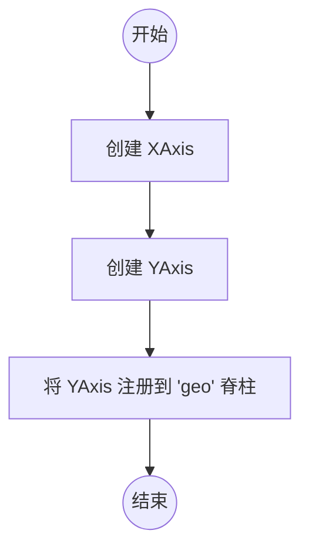

#### 带注释源码

```python
def _init_axis(self):
    # 为当前地理坐标轴创建 X 轴 (XAxis) 对象，clear=False 表示不清除已有设置
    self.xaxis = maxis.XAxis(self, clear=False)
    # 为当前地理坐标轴创建 Y 轴 (YAxis) 对象，clear=False 表示不清除已有设置
    self.yaxis = maxis.YAxis(self, clear=False)
    # 将 Y 轴注册到 'geo' 脊柱，以便在绘制时能够正确显示经线/纬线
    self.spines['geo'].register_axis(self.yaxis)
```


### `GeoAxes.clear`

该方法用于重置地理投影坐标轴的状态，设置经纬度网格、刻度定位器和坐标轴范围，继承自Axes基类的clear方法并进行了地理投影特定的初始化配置。

参数：

- `self`：GeoAxes实例，隐式参数，表示调用该方法的地理坐标轴对象本身

返回值：`None`，无返回值，该方法直接修改对象状态

#### 流程图

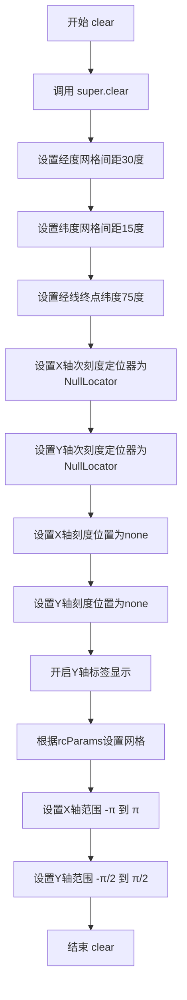

#### 带注释源码

```python
def clear(self):
    # docstring inherited - 继承父类Axes的clear方法文档字符串
    super().clear()  # 调用父类Axes的clear方法，重置基础状态

    # 设置经度网格线之间的间隔为30度
    self.set_longitude_grid(30)
    # 设置纬度网格线之间的间隔为15度
    self.set_latitude_grid(15)
    # 设置经度网格线在纬度达到75度时终止
    self.set_longitude_grid_ends(75)
    
    # 为X轴（经度轴）设置次刻度定位器为空定位器，不显示次刻度
    self.xaxis.set_minor_locator(NullLocator())
    # 为Y轴（纬度轴）设置次刻度定位器为空定位器，不显示次刻度
    self.yaxis.set_minor_locator(NullLocator())
    
    # 设置X轴刻度位置为'none'，即不显示X轴刻度
    self.xaxis.set_ticks_position('none')
    # 设置Y轴刻度位置为'none'，即不显示Y轴刻度
    self.yaxis.set_ticks_position('none')
    
    # 开启Y轴的第一个标签显示（label1On=True）
    # 注释：为什么需要手动开启Y轴标签，而X轴标签默认是开启的？
    self.yaxis.set_tick_params(label1On=True)

    # 根据matplotlib.rcParams中的'axes.grid'配置绘制网格
    self.grid(mpl.rcParams['axes.grid'])

    # 设置X轴（经度）范围为-π到π（弧度制，对应-180°到180°）
    Axes.set_xlim(self, -np.pi, np.pi)
    # 设置Y轴（纬度）范围为-π/2到π/2（弧度制，对应-90°到90°）
    Axes.set_ylim(self, -np.pi / 2.0, np.pi / 2.0)
```


### `GeoAxes._set_lim_and_transforms`

该方法负责初始化地理坐标轴的变换矩阵和数据范围，设置投影变换、仿射变换、坐标轴变换以及经纬度刻度标签的变换，是地理投影坐标轴初始化的核心步骤。

参数：

- `self`：GeoAxes 实例，隐式参数，表示当前地理坐标轴对象

返回值：`None`，该方法直接修改对象属性，不返回任何值

#### 流程图

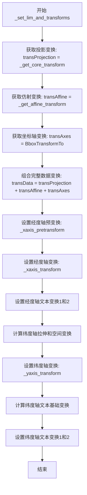

#### 带注释源码

```python
def _set_lim_and_transforms(self):
    """
    设置地理坐标轴的变换矩阵和限制。
    该方法初始化所有必要的坐标变换，用于将地理坐标（经纬度）
    转换为显示坐标。
    """
    # 获取投影变换（可能为非线性变换），用于将已缩放的数据映射到投影空间
    # self.RESOLUTION 控制插值精度，默认为75
    self.transProjection = self._get_core_transform(self.RESOLUTION)

    # 获取仿射变换，处理从投影空间到标准化的设备坐标的转换
    self.transAffine = self._get_affine_transform()

    # 获取坐标轴边界框变换，将标准化坐标转换为axes坐标
    self.transAxes = BboxTransformTo(self.bbox)

    # 完整的数据变换栈 -- 从数据空间一直转换到显示坐标
    # 变换顺序：投影 -> 仿射 -> 坐标轴
    self.transData = \
        self.transProjection + \
        self.transAffine + \
        self.transAxes

    # ========== 经度轴（X轴）变换设置 ==========
    # 经度轴预变换：处理经度范围（-180到180度，即-pi到pi）
    self._xaxis_pretransform = \
        Affine2D() \
        .scale(1, self._longitude_cap * 2) \
        .translate(0, -self._longitude_cap)
    
    # 经度轴变换：经度刻度在线上的位置
    self._xaxis_transform = \
        self._xaxis_pretransform + \
        self.transData
    
    # 经度轴文本变换1：下方标签（刻度在下方）
    self._xaxis_text1_transform = \
        Affine2D().scale(1, 0) + \
        self.transData + \
        Affine2D().translate(0, 4)
    
    # 经度轴文本变换2：上方标签（刻度在上方）
    self._xaxis_text2_transform = \
        Affine2D().scale(1, 0) + \
        self.transData + \
        Affine2D().translate(0, -4)

    # ========== 纬度轴（Y轴）变换设置 ==========
    # 纬度轴拉伸：将纬度范围（-90到90度，即-pi/2到pi/2）映射到单位空间
    yaxis_stretch = Affine2D().scale(np.pi * 2, 1).translate(-np.pi, 0)
    # 纬度轴空间：为标签留出额外空间
    yaxis_space = Affine2D().scale(1, 1.1)
    
    # 纬度轴变换：纬度刻度在线上的位置
    self._yaxis_transform = \
        yaxis_stretch + \
        self.transData
    
    # 纬度轴文本基础变换
    yaxis_text_base = \
        yaxis_stretch + \
        self.transProjection + \
        (yaxis_space +
         self.transAffine +
         self.transAxes)
    
    # 纬度轴文本变换1：左侧标签
    self._yaxis_text1_transform = \
        yaxis_text_base + \
        Affine2D().translate(-8, 0)
    
    # 纬度轴文本变换2：右侧标签
    self._yaxis_text2_transform = \
        yaxis_text_base + \
        Affine2D().translate(8, 0)
```


### `GeoAxes._get_affine_transform`

该方法计算并返回一个仿射变换（Affine2D），用于将地理坐标（经纬度弧度）映射到显示坐标（0-1范围内的归一化坐标），通过获取核心变换在特定点（π, 0）和（0, π/2）处的变换结果来确定x和y方向的缩放比例，从而保证地理坐标能够正确适配到图形区域。

参数：

- `self`：`GeoAxes`，调用此方法的类实例本身

返回值：`Affine2D`，返回一个仿射变换对象，包含缩放和平移操作，将地理坐标映射到显示坐标

#### 流程图

```mermaid
flowchart TD
    A[开始 _get_affine_transform] --> B[获取核心变换: transform = self._get_core_transform(1)]
    B --> C[计算x方向缩放: transform.transform((π, 0))]
    C --> D[提取xscale值]
    D --> E[计算y方向缩放: transform.transform((0, π/2))]
    E --> F[提取yscale值]
    F --> G[构建Affine2D变换: scale(0.5/xscale, 0.5/yscale) + translate(0.5, 0.5)]
    G --> H[返回变换对象]
```

#### 带注释源码

```python
def _get_affine_transform(self):
    """
    计算用于将地理坐标映射到显示坐标的仿射变换。
    
    该方法通过获取核心变换在特定地理点上的变换结果，
    来确定x和y方向的缩放比例，从而确保经纬度范围
    (-π到π, -π/2到π/2) 能够正确映射到显示区域(0-1)。
    """
    # 获取分辨率为1的核心地理投影变换
    transform = self._get_core_transform(1)
    
    # 计算经度方向(π, 0)的变换结果，获取x方向缩放因子
    xscale, _ = transform.transform((np.pi, 0))
    
    # 计算纬度方向(0, π/2)的变换结果，获取y方向缩放因子
    _, yscale = transform.transform((0, np.pi/2))
    
    # 构建并返回仿射变换：
    # 1. scale: 将坐标缩放到0.5/xscale和0.5/yscale（使范围映射到0.5）
    # 2. translate: 将原点平移到(0.5, 0.5)，使坐标范围居中在0-1之间
    return Affine2D() \
        .scale(0.5 / xscale, 0.5 / yscale) \
        .translate(0.5, 0.5)
```


### `GeoAxes.get_xaxis_transform`

获取地理投影Axes的X轴变换对象，用于将数据坐标转换为显示坐标。

参数：

- `which`：`str`，可选参数，指定要获取的变换类型，取值为 `'tick1'`、`'tick2'` 或 `'grid'`，默认为 `'grid'`

返回值：`Transform`，返回X轴的变换对象（`self._xaxis_transform`），该变换将数据坐标（经度弧度）转换为显示坐标，用于绘制X轴（经度）刻度。

#### 流程图

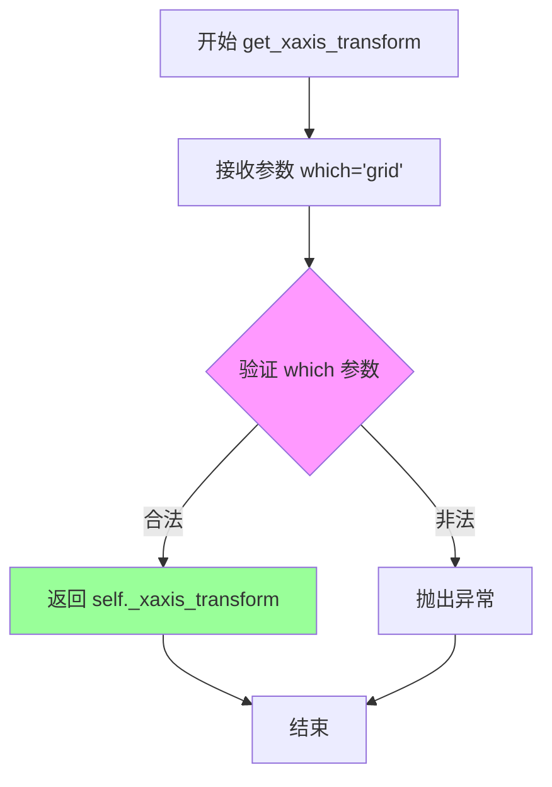

#### 带注释源码

```python
def get_xaxis_transform(self, which='grid'):
    """
    获取X轴的变换对象。
    
    参数:
        which : str, optional
            指定变换的用途，可选值为 'tick1'、'tick2' 或 'grid'。
            默认为 'grid'，用于网格线。
    
    返回:
        Transform
            X轴的坐标变换对象，用于将数据空间（弧度）转换到显示空间。
    """
    # 使用 _api.check_in_list 验证 which 参数是否在允许的列表中
    # 如果 which 不在 ['tick1', 'tick2', 'grid'] 中，会抛出 ValueError
    _api.check_in_list(['tick1', 'tick2', 'grid'], which=which)
    
    # 返回预计算的 X 轴变换对象
    # 该变换在 _set_lim_and_transforms 方法中构建，组合了：
    # 1. 投影变换 (transProjection) - 地理投影
    # 2. 仿射变换 (transAffine) - 缩放和平移
    # 3. 坐标轴变换 (transAxes) - 到显示坐标的转换
    # 4. 经度预变换 (_xaxis_pretransform) - 处理经度范围
    return self._xaxis_transform
```


### `GeoAxes.get_xaxis_text1_transform`

该方法返回X轴文本（刻度标签）的变换矩阵及其对齐方式，用于在地理投影中正确放置X轴（经度）标签的位置。

参数：

- `pad`：`float` 或 `int`，虽然声明了参数但在方法体中未使用，通常用于指定文本与轴之间的间距

返回值：`tuple`，返回一个包含三个元素的元组：
  - 第一个元素为 `Transform` 类型（`Affine2D` 组合变换），用于将数据坐标转换为显示坐标
  - 第二个元素为 `str` 类型（值为 `'bottom'`），指定垂直对齐方式
  - 第三个元素为 `str` 类型（值为 `'center'`），指定水平对齐方式

#### 流程图

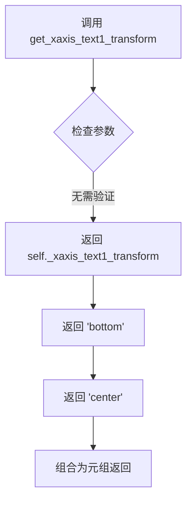

#### 带注释源码

```python
def get_xaxis_text1_transform(self, pad):
    """
    获取X轴文本（刻度标签）的变换矩阵和对齐方式。
    
    Parameters
    ----------
    pad : float or int
        文本与轴之间的间距（此参数在实现中未使用）
    
    Returns
    -------
    tuple
        包含以下元素的元组：
        - Transform: X轴文本的仿射变换矩阵
        - str: 垂直对齐方式 ('bottom')
        - str: 水平对齐方式 ('center')
    """
    # 返回预计算的X轴文本变换、底部对齐和居中对齐
    # self._xaxis_text1_transform 在 _set_lim_and_transforms 中被设置为：
    # Affine2D().scale(1, 0) + self.transData + Affine2D().translate(0, 4)
    # 其中 scale(1, 0) 将Y坐标压缩为0，translate(0, 4) 将文本向上偏移4个像素
    return self._xaxis_text1_transform, 'bottom', 'center'
```


### `GeoAxes.get_xaxis_text2_transform`

该方法用于获取地理投影坐标系（GeoAxes）中 X 轴（经度轴）的次要刻度标签（即“text2”，通常对应轴的上侧）的坐标变换矩阵、垂直对齐方式和水平对齐方式。它主要服务于经度刻度文字在投影后的坐标转换。

参数：

-  `pad`：`float`，用于指定刻度标签与轴之间的间距（Matplotlib 标准接口参数）。**注意**：在当前的 `GeoAxes` 实现中，此参数被忽略，变换位移是硬编码的（`translate(0, -4)`）。

返回值：`tuple`，返回一个包含三个元素的元组。
-  `Transform`：变换对象（`Affine2D` 组合变换），负责将数据坐标（经度）转换为显示坐标。
-  `str`：垂直对齐方式，此处返回 `'top'`。
-  `str`：水平对齐方式，此处返回 `'center'`。

#### 流程图

```mermaid
graph LR
    A[调用 get_xaxis_text2_transform] --> B{接收参数 pad}
    B --> C[获取实例属性 self._xaxis_text2_transform]
    C --> D[返回元组 \n(transform, 'top', 'center')]
    D --> E[结束]
```

#### 带注释源码

```python
def get_xaxis_text2_transform(self, pad):
    """
    获取 X 轴次要刻度文本（顶部标签）的变换矩阵和对齐方式。

    参数:
        pad (float): 文本与轴之间的距离（此参数在地理投影中未使用，硬编码为 -4）。

    返回:
        tuple: 包含 (变换对象, 垂直对齐 'top', 水平对齐 'center') 的元组。
    """
    # 返回预计算的 _xaxis_text2_transform 和对齐参数
    # _xaxis_text2_transform 是在 _set_lim_and_transforms 中构建的 Affine2D 组合变换
    return self._xaxis_text2_transform, 'top', 'center'


# --- 相关上下文代码：变换的初始化 ---
# (位于 _set_lim_and_transforms 方法中)

# 这是用于经度刻度（X轴）的变换栈
# 1. scale(1, 0): 将坐标投影到 y=0 的线上（即赤道/中心纬线）
# 2. + transData: 完整的坐标变换（投影+仿射+坐标系）
# 3. + translate(0, -4): 向下/向上偏移 4 个像素点，用于避开轴线
self._xaxis_text2_transform = \
    Affine2D().scale(1, 0) + \
    self.transData + \
    Affine2D().translate(0, -4) # -4 表示在显示坐标系中向下偏移
```


### `GeoAxes.get_yaxis_transform`

获取Y轴的变换对象，用于将数据坐标转换为显示坐标。此方法返回一个与地理投影相关的Y轴变换，支持获取网格线、刻度线1或刻度线2的变换。

参数：

- `which`：`str`，可选参数，默认值为`'grid'`。指定要获取的Y轴变换类型。必须是`'tick1'`、`'tick2'`或`'grid'`之一。`'tick1'`对应底部刻度线，`'tick2'`对应顶部刻度线，`'grid'`对应网格线。

返回值：`Transform`，返回Y轴的变换对象（`self._yaxis_transform`），该对象是将数据坐标（经纬度）转换为显示坐标的变换链。

#### 流程图

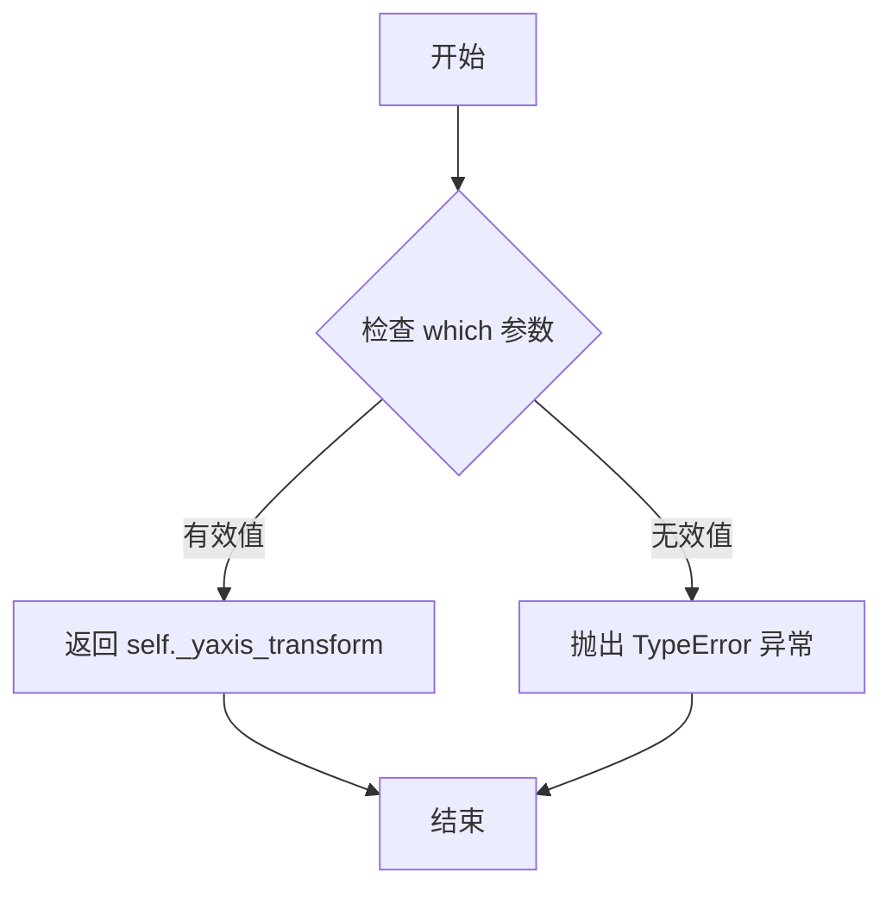

#### 带注释源码

```python
def get_yaxis_transform(self, which='grid'):
    """
    获取Y轴的变换对象。
    
    参数
    ----------
    which : str, optional
        指定要获取的Y轴变换类型。必须是 'tick1', 'tick2' 或 'grid' 之一。
        默认值为 'grid'。
        
    返回
    -------
    Transform
        Y轴变换对象，用于将数据坐标转换为显示坐标。
    """
    # 使用_api.check_in_list验证which参数是否在允许的列表中
    # 允许的值为：'tick1'（底部刻度）、'tick2'（顶部刻度）、'grid'（网格线）
    _api.check_in_list(['tick1', 'tick2', 'grid'], which=which)
    
    # 返回Y轴变换对象
    # 该变换在_set_lim_and_transforms方法中构建
    # 包含：yaxis_stretch（缩放）+ transData（投影+仿射+轴变换）
    return self._yaxis_transform
```


### `GeoAxes.get_yaxis_text1_transform`

该方法用于获取Y轴（纬度轴）文本标签的主要变换矩阵，用于将数据坐标转换为显示坐标，并确定文本的对齐方式。

参数：

- `pad`：`float` 或 `int`，文本标签与轴之间的间距（虽然在此实现中未直接使用，但作为API保留）

返回值：`tuple`，返回一个三元组 `(transform, va, ha)`，其中：
- `transform`：`matplotlib.transforms.Transform` 对象，Y轴文本的仿射变换矩阵
- `va`：`str`，垂直对齐方式（始终为 `'center'`）
- `ha`：`str`，水平对齐方式（始终为 `'right'`）

#### 流程图

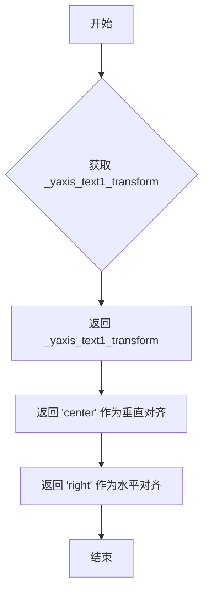

#### 带注释源码

```python
def get_yaxis_text1_transform(self, pad):
    """
    获取Y轴文本标签的主要变换矩阵。

    此方法返回用于渲染Y轴（纬度轴）刻度标签的变换矩阵和对其方式。
    它返回预计算的 _yaxis_text1_transform，结合了投影变换、仿射变换
    和平移操作，用于将地理坐标（纬度）转换为显示坐标。

    参数:
        pad: float 或 int, 文本标签与轴之间的间距。
             在此实现中未直接使用，但保留以保持API一致性。

    返回:
        tuple: 包含三个元素的元组:
            - transform: Transform对象，Y轴文本的变换矩阵
            - va: str, 垂直对齐方式 ('center')
            - ha: str, 水平对齐方式 ('right')
    """
    return self._yaxis_text1_transform, 'center', 'right'
```

**补充说明**：

- `_yaxis_text1_transform` 在 `_set_lim_and_transforms()` 方法中被初始化，它组合了多个变换：
  - `yaxis_stretch`：缩放和平移以适应经度范围
  - `transProjection`：地理投影变换
  - `yaxis_space`：额外的空间缩放
  - `transAffine`：仿射变换
  - `transAxes`：坐标轴变换
  - `Affine2D().translate(-8, 0)`：额外的水平平移（向左8个单位）

- 此方法与 `get_yaxis_text2_transform` 配合使用，后者返回 `'left'` 作为水平对齐，用于显示在轴的另一侧。


### `GeoAxes.get_yaxis_text2_transform`

该方法用于获取 Y 轴次要（外侧）刻度标签的坐标变换及对齐方式，主要用于地理投影中纬度轴外侧刻度文本的定位。

参数：

- `pad`：`float`，用于调整刻度标签与轴之间的间距（当前实现中该参数未被使用，保留此参数以保持 API 兼容性）

返回值：`tuple[Transform, str, str]`，返回包含仿射变换对象、水平对齐方式和垂直对齐方式的三元组。其中第一个元素为 `_yaxis_text2_transform`（Affine2D 变换对象），第二个元素为水平对齐 `'center'`，第三个元素为垂直对齐 `'left'`。

#### 流程图

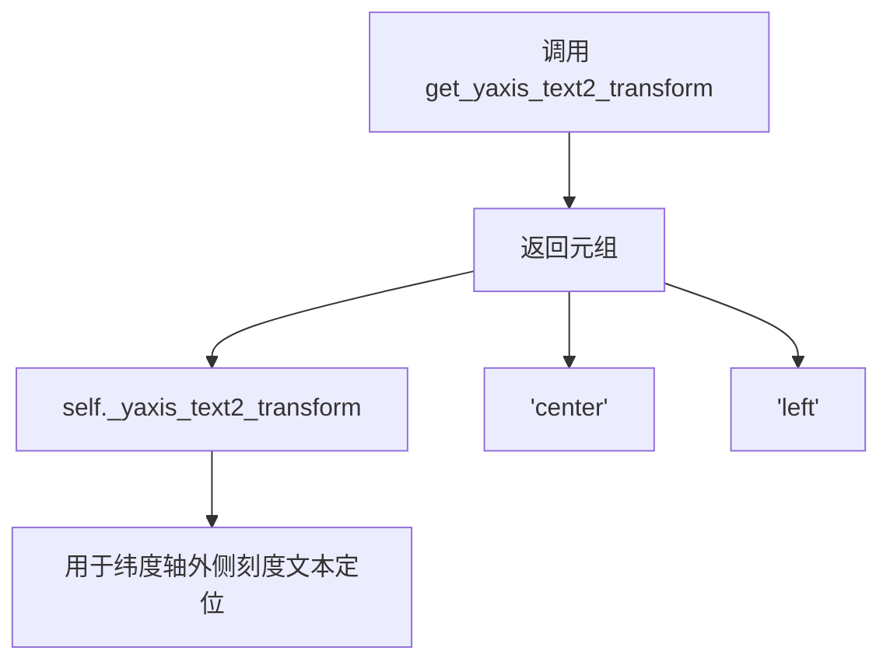

#### 带注释源码

```python
def get_yaxis_text2_transform(self, pad):
    """
    获取 Y 轴次要（外侧）刻度标签的变换矩阵和对齐方式。

    参数:
        pad: float, 刻度标签与轴之间的间距（当前版本未使用）

    返回值:
        tuple: 包含以下三个元素的元组:
            - self._yaxis_text2_transform: Affine2D 变换对象
            - 'center': 水平对齐方式
            - 'left': 垂直对齐方式
    """
    # 返回预定义的 Y 轴外侧文本变换及对齐参数
    # _yaxis_text2_transform 在 _set_lim_and_transforms 方法中定义
    # 由 yaxis_text_base + Affine2D().translate(8, 0) 组成
    return self._yaxis_text2_transform, 'center', 'left'
```


### `GeoAxes._gen_axes_patch`

该方法用于生成地理坐标轴的图形补丁（patch），返回一个圆心位于坐标轴中心、半径为0.5的圆形补丁对象，作为地理投影坐标轴的可视化边界。

参数： 无

返回值：`matplotlib.patches.Circle`，返回一个圆心在 (0.5, 0.5)、半径为 0.5 的圆形补丁对象，用于定义地理坐标轴的可见区域形状。

#### 流程图

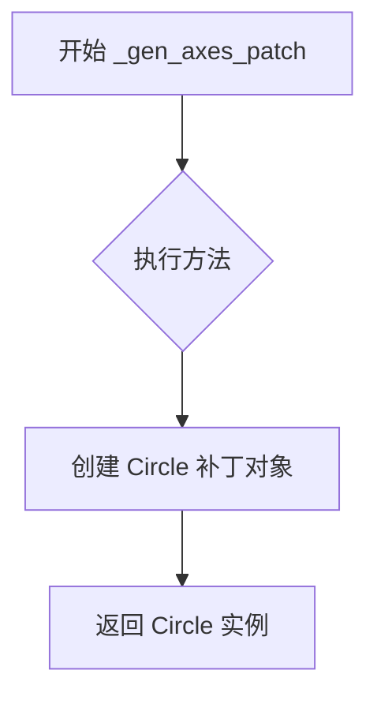

#### 带注释源码

```python
def _gen_axes_patch(self):
    """
    生成地理坐标轴的补丁对象。
    
    该方法返回一个圆形补丁，用于定义地理投影坐标轴的边界。
    圆形被用作地理投影的标准边界形状，因为大多数地理投影
    （如 Mollweide、Hammer、Aitoff 等）都使用圆形边界。
    
    参数:
        无 (仅包含 self 隐式参数)
    
    返回值:
        Circle: 圆心在 (0.5, 0.5)，半径为 0.5 的圆形补丁对象
    """
    return Circle((0.5, 0.5), 0.5)  # 创建并返回一个圆形补丁
```

---

#### 额外信息

**关键组件信息：**

- **Circle**：matplotlib 的补丁类，用于绘制圆形形状的几何图形。

**技术债务与优化空间：**

- 该方法硬编码了圆心坐标和半径值，缺乏灵活性。如果需要支持椭圆或其他形状的地理投影，可能需要将此逻辑抽象为可配置的形式。
- 目前所有地理投影（GeoAxes 的子类）都使用相同的圆形边界，无法区分不同投影类型的边界特性。

**设计约束：**

- 该方法是 `GeoAxes` 类的抽象接口实现之一，与 `_gen_axes_spines` 方法配合使用，共同定义坐标轴的外观。
- 返回的圆形补丁坐标（0.5, 0.5, 0.5）是归一化的坐标空间，与 matplotlib 的 axes 坐标系一致。


### `GeoAxes._gen_axes_spines`

该方法用于生成地理坐标轴的边框（spines），返回一个包含 'geo' 键的字典，其值为使用 circular_spine 创建的圆形边框对象，用于在地理投影中绘制圆形的坐标区域。

参数：

- `self`：`GeoAxes`，调用该方法的地理坐标轴实例本身

返回值：`dict`，返回一个键为 `'geo'`、值为 `Spine` 对象的字典，用于定义地理投影的圆形边框

#### 流程图

```mermaid
flowchart TD
    A[开始 _gen_axes_spines] --> B[创建圆形边框]
    B --> C[调用 mspines.Spine.circular_spine]
    C --> D[传入 self 作为坐标轴实例]
    D --> E[传入中心点坐标 (0.5, 0.5)]
    E --> F[传入半径 0.5]
    F --> G[构建返回字典]
    G --> H[键为 'geo', 值为 Spine 对象]
    H --> I[返回字典]
    I --> J[结束]
```

#### 带注释源码

```python
def _gen_axes_spines(self):
    """
    生成地理坐标轴的边框（spines）。
    
    Returns
    -------
    dict
        包含地理坐标轴边框的字典，键为 'geo'，值为 Spine 对象。
    """
    # 使用 matplotlib.spines.Spine.circular_spine 创建一个圆形边框
    # 参数说明：
    #   self: 当前的 GeoAxes 实例
    #   (0.5, 0.5): 边框的中心点坐标（归一化坐标系中）
    #   0.5: 边框的半径（归一化坐标系中）
    # 返回的 Spine 对象将用于绘制地理投影的圆形边界
    return {'geo': mspines.Spine.circular_spine(self, (0.5, 0.5), 0.5)}
```


### `GeoAxes.set_yscale`

该方法用于设置地理坐标轴的y轴比例尺，但目前仅支持线性比例尺（'linear'）。如果尝试使用其他比例尺类型，将抛出 `NotImplementedError` 异常。这反映了地理投影库在非线性能方面的一个限制。

参数：

- `*args`：`可变位置参数`，第一个元素应为比例尺类型字符串（如 'linear'）
- `**kwargs`：`可变关键字参数`，用于传递其他与比例尺相关的配置参数

返回值：`None`，该方法不返回任何值

#### 流程图

```mermaid
graph TD
    A[开始 set_yscale] --> B{检查 args[0] == 'linear'?}
    B -- 是 --> C[方法正常结束]
    B -- 否 --> D[抛出 NotImplementedError]
    D --> E[异常处理/终止]
```

#### 带注释源码

```python
def set_yscale(self, *args, **kwargs):
    """
    设置y轴的比例尺类型。
    
    参数:
        *args: 可变位置参数，第一个元素应为比例尺类型字符串
        **kwargs: 可变关键字参数，用于传递其他配置选项
    
    返回:
        None
    
    异常:
        NotImplementedError: 当尝试设置非 'linear' 比例尺时抛出
    """
    # 检查第一个位置参数是否为 'linear'
    if args[0] != 'linear':
        # 地理投影目前仅支持线性比例尺
        raise NotImplementedError
```


### `GeoAxes.set_xscale`

该方法用于设置地理坐标轴的 x 轴比例尺。在 GeoAxes 类中，`set_xscale` 是 `set_yscale` 的别名，两者实现完全相同。由于地理投影的特殊性，该方法仅支持线性比例尺（'linear'），若尝试使用其他比例尺类型（如 'log'、'symlog' 等），则会抛出 `NotImplementedError` 异常。这是地理投影轴的设计约束，旨在确保投影数学运算的一致性。

参数：

- `self`：`GeoAxes`，GeoAxes 实例本身
- `*args`：可变位置参数，接受比例尺类型字符串（如 'linear'）
- `**kwargs`：可变关键字参数，接受其他绘图参数

返回值：`None`，该方法直接修改对象状态，不返回任何值

#### 流程图

```mermaid
flowchart TD
    A[开始 set_xscale] --> B{args[0] == 'linear'?}
    B -->|是| C[设置线性比例尺]
    B -->|否| D[raise NotImplementedError]
    C --> E[结束]
    D --> E
```

#### 带注释源码

```python
def set_yscale(self, *args, **kwargs):
    """
    设置 y 轴的比例尺类型。
    
    对于地理投影轴，仅支持线性比例尺。
    这是因为地理投影的数学变换依赖于线性坐标空间。
    
    参数:
        *args: 可变位置参数，第一个参数应为比例尺类型字符串
        **kwargs: 可变关键字参数，用于传递额外的比例尺配置选项
    
    异常:
        NotImplementedError: 当尝试使用非线性比例尺时抛出
    """
    # 检查传入的比例尺类型是否为 'linear'
    if args[0] != 'linear':
        # 地理投影不支持非线性比例尺，抛出未实现异常
        raise NotImplementedError

# 将 set_xscale 方法设置为 set_yscale 的别名
# 使得 x 轴和 y 轴都不能使用非线性比例尺
set_xscale = set_yscale
```


### `GeoAxes.set_xlim`

设置地理投影的 x 轴限制，但在此类中不受支持，会抛出 `TypeError` 异常并建议使用 Cartopy 库。

参数：

- `self`：`GeoAxes`，GeoAxes 实例本身（隐含参数）
- `*args`：`tuple`，可变位置参数（此处不使用，仅为保持接口兼容）
- `**kwargs`：`dict`，可变关键字参数（此处不使用，仅为保持接口兼容）

返回值：`None`，无返回值（该方法总是抛出异常）

#### 流程图

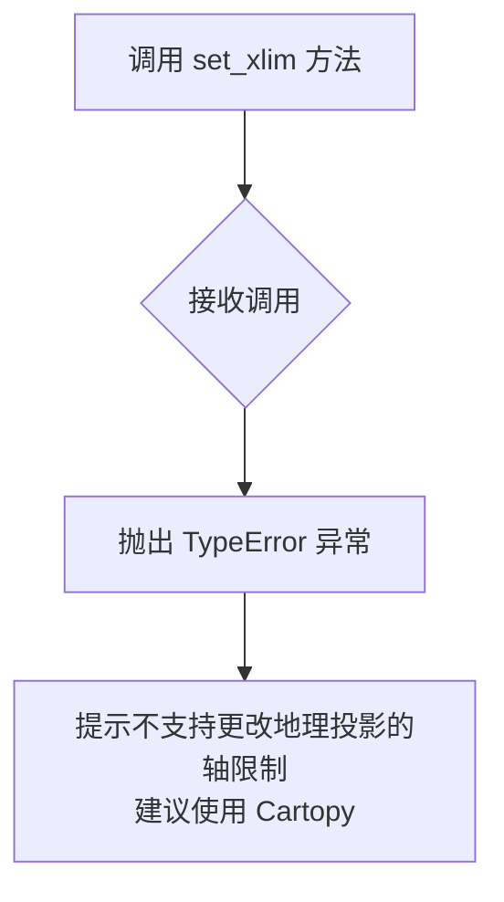

#### 带注释源码

```python
def set_xlim(self, *args, **kwargs):
    """
    设置地理投影的 x 轴限制。
    
    注意：此方法在 GeoAxes 类中不被支持，因为地理投影
    具有固定的坐标范围（经度：-π 到 π，纬度：-π/2 到 π/2）。
    尝试更改这些限制没有意义，且可能破坏投影的正确性。
    
    参数:
        *args: 可变位置参数（不接受任何实际参数）
        **kwargs: 可变关键字参数（不接受任何实际参数）
    
    异常:
        TypeError: 总是抛出，表示不支持更改轴限制
    
    示例:
        >>> ax = projection='aitoff'
        >>> ax.set_xlim(-np.pi, np.pi)  # 这将抛出 TypeError
    """
    # 抛出异常告知用户此操作不支持，并建议使用 Cartopy 库
    # Cartopy 是一个更专业的地理制图库，支持更灵活的投影配置
    raise TypeError("Changing axes limits of a geographic projection is "
                    "not supported.  Please consider using Cartopy.")
```


### `GeoAxes.set_ylim`

该方法是 `GeoAxes` 类中的 `set_ylim` 函数，它是 `set_xlim` 的别名，用于设置地理投影的y轴 limits（纬度限制）。但由于地理投影的特殊性，该方法不被支持，会抛出 `TypeError` 异常，建议用户使用 Cartopy 库。

参数：

-  `*args`：可变位置参数，接受任意参数，但不支持更改地理投影的轴限制
-  `**kwargs`：可变关键字参数，接受任意关键字参数，但不支持更改地理投影的轴限制

返回值：无返回值（该方法总是抛出异常）

#### 流程图

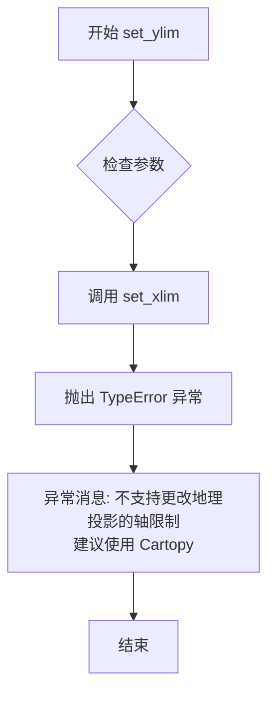

#### 带注释源码

```python
def set_xlim(self, *args, **kwargs):
    """
    Not supported. Please consider using Cartopy.
    
    此方法用于设置地理投影的x轴（经度）限制，但由于地理投影
    的坐标系是固定的（经度范围通常是 -π 到 π，纬度范围是 -π/2 到 π/2），
    因此不支持用户自定义修改。如果用户尝试调用此方法，将抛出 TypeError 异常，
    并建议使用 Cartopy 库来实现自定义的地理投影。
    
    参数:
        *args: 可变位置参数，接受任意参数但会被忽略
        **kwargs: 可变关键字参数，接受任意关键字参数但会被忽略
    
    异常:
        TypeError: 总是抛出此异常，表示不支持更改地理投影的轴限制
    """
    raise TypeError("Changing axes limits of a geographic projection is "
                    "not supported.  Please consider using Cartopy.")

# set_ylim 是 set_xlim 的别名，两者实现完全相同
# 都是用于设置轴限制，但都不支持（会抛出异常）
set_ylim = set_xlim
```


### `GeoAxes.set_xbound`

设置地理坐标轴的 x 轴范围，但该操作在 GeoAxes 中不被支持，会抛出 TypeError 异常，建议使用 Cartopy 库。

参数：

- `self`：`GeoAxes`，调用该方法的地理坐标轴实例。
- `*args`：可变位置参数，接受设置 x 轴范围的参数（但实际不支持）。
- `**kwargs`：可变关键字参数，接受设置 x 轴范围的关键字参数（但实际不支持）。

返回值：无（该方法总是抛出异常，没有返回值）。

#### 流程图

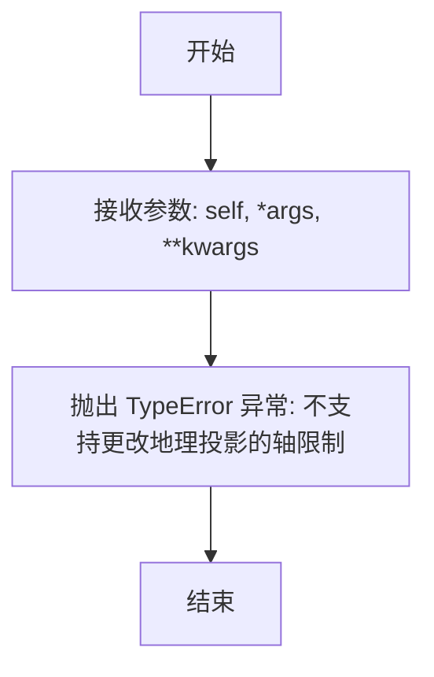

#### 带注释源码

```python
def set_xlim(self, *args, **kwargs):
    """Not supported. Please consider using Cartopy."""
    raise TypeError("Changing axes limits of a geographic projection is "
                    "not supported.  Please consider using Cartopy.")

# set_xbound 是 set_xlim 的别名，因此实现相同
set_xbound = set_xlim
```


### `GeoAxes.set_ybound`

该方法是 `GeoAxes` 类的一个别名，实际指向 `set_ylim`（而 `set_ylim` 又指向 `set_xlim`），用于设置 Y 轴的显示范围。然而，由于地理投影的轴限制是固定的，该方法会抛出 `TypeError` 异常，禁止用户更改轴限制并建议使用 Cartopy 库。

参数：

- `*args`：可变位置参数，传递给底层 `set_ylim`（实际为 `set_xlim`），但在当前实现中不会被使用，因为方法会直接抛出异常。
- `**kwargs`：可变关键字参数，传递给底层 `set_ylim`（实际为 `set_xlim`），同样不会被使用。

返回值：`None`，该方法没有返回值，始终抛出异常。

#### 流程图

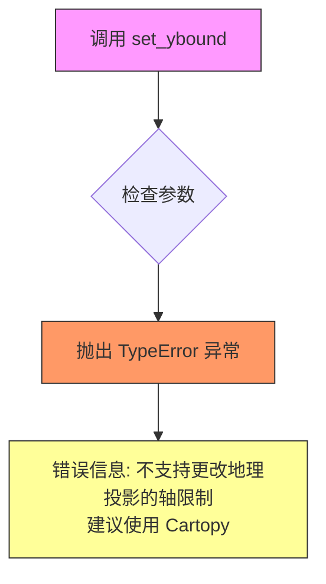

#### 带注释源码

```python
# set_ybound 是 set_ylim 的别名
# set_ylim 又是 set_xlim 的别名
# 因此调用 set_ybound 实际上调用的是 set_xlim

set_xlim = set_xlim  # 这里的 set_xlim 是下面定义的函数
set_xbound = set_xlim
set_ybound = set_ylim  # set_ybound 指向 set_ylim

def set_xlim(self, *args, **kwargs):
    """
    设置 X 轴的显示范围。
    
    注意：对于地理投影，不支持更改轴限制。
    
    参数:
        *args: 可变位置参数（实际不使用）
        **kwargs: 可变关键字参数（实际不使用）
    
    返回值:
        无（始终抛出 TypeError 异常）
    
    异常:
        TypeError: 当尝试更改地理投影的轴限制时抛出
    """
    # 不支持更改轴限制，抛出异常并建议使用 Cartopy
    raise TypeError("Changing axes limits of a geographic projection is "
                    "not supported.  Please consider using Cartopy.")
```


### `GeoAxes.invert_xaxis`

尝试反转x轴，但在地理投影中不支持，会抛出TypeError异常。

参数：该方法不接受任何参数（除隐式的`self`）。

返回值：`None`，方法总是抛出异常，没有实际返回值。

#### 流程图

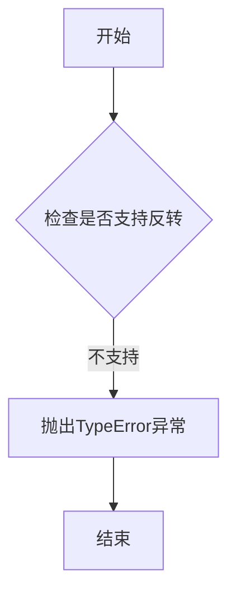

#### 带注释源码

```python
def invert_xaxis(self):
    """
    反转x轴的方法。
    
    此方法在地理投影中不支持，因为地理投影的轴范围是固定的，
    不能像普通坐标轴那样反转。调用此方法会抛出TypeError异常，
    建议用户使用Cartopy库来进行更高级的地理投影操作。
    """
    # 抛出类型错误异常，表明不支持此操作，并提供替代建议
    raise TypeError("Changing axes limits of a geographic projection is "
                    "not supported.  Please consider using Cartopy.")
```


### `GeoAxes.invert_yaxis`

该方法用于反转 Y 轴（地理坐标中的纬度轴），但在 GeoAxes 类中明确禁止此操作，因为地理投影的轴范围是固定的。调用此方法会抛出 TypeError 异常，建议用户使用 Cartopy 库来处理可变轴范围的地理投影。

参数：

- `self`：`GeoAxes`，调用该方法的 GeoAxes 实例本身

返回值：`NoneType`，该方法不返回任何值，会直接抛出 TypeError 异常

#### 流程图

```mermaid
flowchart TD
    A[调用 invert_yaxis 方法] --> B{方法调用}
    B --> C[抛出 TypeError 异常]
    C --> D["错误信息: 'Changing axes limits of a geographic projection is not supported. Please consider using Cartopy.'"]
    D --> E[异常向上传播到调用者]
```

#### 带注释源码

```python
# invert_yaxis 是 invert_xaxis 的别名
# 这意味着 invert_yaxis 和 invert_xaxis 实现完全相同
invert_yaxis = invert_xaxis

# 以下是 invert_xaxis 的实现（被别名引用）：
def invert_xaxis(self):
    """
    Not supported. Please consider using Cartopy.
    
    此方法用于反转 X 轴（地理坐标中的经度轴），但在地理投影中不支持。
    地理投影的轴范围是固定的（经度: -π 到 π，纬度: -π/2 到 π/2），
    因此不允许通过 invert_xaxis 或 invert_yaxis 来反转轴。
    
    参数:
        self: GeoAxes 实例
        
    返回:
        无返回值
        
    异常:
        TypeError: 总是抛出此异常，表明操作不支持
    """
    # 抛出类型错误，明确告知用户地理投影不支持此操作
    # 并建议使用 Cartopy 库作为替代方案
    raise TypeError("Changing axes limits of a geographic projection is "
                    "not supported.  Please consider using Cartopy.")
```


### `GeoAxes.format_coord`

该方法用于将地理坐标（经度和纬度）从弧度单位转换为带度数符号的可读字符串格式，并自动添加N/S（北/南）和E/W（东/西）方向标识。

参数：

- `lon`：`float`，经度值，单位为弧度（radians）
- `lat`：`float`，纬度值，单位为弧度（radians）

返回值：`str`，格式化后的坐标字符串，格式为“纬度°方向, 经度°方向”（例如："45.0°N, 120.0°E"）

#### 流程图

```mermaid
flowchart TD
    A[开始 format_coord] --> B[将弧度转换为度数<br/>np.rad2deg]
    B --> C{lat >= 0}
    C -->|是| D[ns = 'N']
    C -->|否| E[ns = 'S']
    D --> F{lon >= 0}
    E --> F
    F -->|是| G[ew = 'E']
    F -->|否| H[ew = 'W']
    G --> I[返回格式化字符串<br/>abs(lat)°ns, abs(lon)°ew]
    H --> I
```

#### 带注释源码

```python
def format_coord(self, lon, lat):
    """Return a format string formatting the coordinate."""
    # 将输入的弧度值转换为度数
    # numpy的rad2deg函数将弧度转换为角度
    lon, lat = np.rad2deg([lon, lat])
    
    # 根据纬度的正负决定显示N（北）或S（南）
    # 如果纬度大于等于0，则为北纬；否则为南纬
    ns = 'N' if lat >= 0.0 else 'S'
    
    # 根据经度的正负决定显示E（东）或W（西）
    # 如果经度大于等于0，则为东经；否则为西经
    ew = 'E' if lon >= 0.0 else 'W'
    
    # 格式化输出字符串
    # 使用绝对值处理负数经纬度，度数符号使用Unicode度符号\N{DEGREE SIGN}
    # 格式示例: "45.0°N, 120.0°E"
    return ('%f\N{DEGREE SIGN}%s, %f\N{DEGREE SIGN}%s'
            % (abs(lat), ns, abs(lon), ew))
```


### `GeoAxes.set_longitude_grid`

设置经度网格之间的度数，用于配置地理投影坐标轴的经度刻度间隔。

参数：

- `self`：`GeoAxes`，隐式的类实例引用
- `degrees`：`float` 或 `int`，经度网格之间的度数间隔

返回值：`None`，该方法无返回值，直接修改 x 轴的定位器和格式化器

#### 流程图

```mermaid
flowchart TD
    A[开始 set_longitude_grid] --> B[计算网格点序列]
    B --> C[使用 np.arange 生成从 -180+degrees 到 180 的度数数组]
    C --> D[跳过 -180 和 180 这两个固定边界点]
    D --> E[将度数转换为弧度]
    E --> F[创建 FixedLocator 设置经度主刻度位置]
    G[创建 ThetaFormatter 设置经度主刻度标签格式]
    F --> H[配置 xaxis 的主定位器]
    G --> I[配置 xaxis 的主格式化器]
    H --> J[结束]
    I --> J
```

#### 带注释源码

```python
def set_longitude_grid(self, degrees):
    """
    Set the number of degrees between each longitude grid.
    """
    # 计算网格点序列：从 -180 + degrees 开始，到 180 结束，步长为 degrees
    # 跳过 -180 和 180，因为这两个点是固定的经度边界
    grid = np.arange(-180 + degrees, 180, degrees)
    
    # 将网格度数转换为弧度，并设置为 x 轴的主定位器（刻度位置）
    self.xaxis.set_major_locator(FixedLocator(np.deg2rad(grid)))
    
    # 创建 ThetaFormatter 实例来格式化刻度标签（弧度转度并添加°符号）
    # 传入 degrees 参数用于控制舍入精度
    self.xaxis.set_major_formatter(self.ThetaFormatter(degrees))
```


### `GeoAxes.set_latitude_grid`

设置纬度网格线之间的度数间隔，用于控制地理投影中纬线（水平线）的显示密度。

参数：

- `degrees`：`float` 或 `int`，表示纬度网格线之间的度数间隔

返回值：`None`，无返回值，该方法直接修改对象的内部状态

#### 流程图

```mermaid
graph TD
    A[开始 set_latitude_grid] --> B[计算网格点数组]
    B --> C[使用 np.arange 生成从 -90+degrees 到 90 的网格点<br/>跳过 -90 和 90 极点]
    C --> D[将角度转换为弧度<br/>使用 np.deg2rad]
    D --> E[设置 yaxis 主定位器<br/>FixedLocator]
    E --> F[创建 ThetaFormatter 实例<br/>传入 degrees 参数]
    F --> G[设置 yaxis 主格式化器]
    G --> H[结束]
```

#### 带注释源码

```python
def set_latitude_grid(self, degrees):
    """
    Set the number of degrees between each latitude grid.
    """
    # 使用 numpy 的 arange 生成网格点数组
    # 范围从 -90 + degrees 开始，到 90 结束（不包含 90）
    # 这样可以跳过北极 (-90) 和南极 (90) 这两个固定边界
    grid = np.arange(-90 + degrees, 90, degrees)
    
    # 将角度转换为弧度，因为 matplotlib 内部使用弧度进行计算
    # 使用 FixedLocator 设置主刻度定位器，精确控制网格线位置
    self.yaxis.set_major_locator(FixedLocator(np.deg2rad(grid)))
    
    # 创建 ThetaFormatter 实例用于格式化刻度标签
    # ThetaFormatter 会将弧度转换为度数并添加度符号
    self.yaxis.set_major_formatter(self.ThetaFormatter(degrees))
```


### `GeoAxes.set_longitude_grid_ends`

该方法用于设置经度网格线停止绘制的纬度边界，通过修改内部保存的经度_cap值并重置X轴预变换矩阵的缩放和平移参数，使经度网格线在指定的纬度范围内绘制。

参数：

- `degrees`：`float` 或 `int`，表示纬度度数，用于确定经度网格线在南北方向上的绘制范围

返回值：`None`，该方法直接修改对象内部状态，不返回任何值

#### 流程图

```mermaid
flowchart TD
    A[开始 set_longitude_grid_ends] --> B[将 degrees 转换为弧度]
    B --> C[存储到 self._longitude_cap]
    C --> D[清除 _xaxis_pretransform 变换]
    D --> E[应用缩放变换: scale(1.0, _longitude_cap \* 2.0)]
    E --> F[应用平移变换: translate(0.0, -_longitude_cap)]
    F --> G[结束]
```

#### 带注释源码

```python
def set_longitude_grid_ends(self, degrees):
    """
    Set the latitude(s) at which to stop drawing the longitude grids.
    """
    # 将输入的度数转换为弧度，并存储为内部属性 _longitude_cap
    # 这个值决定了经度网格线在纬度方向上的延伸范围
    self._longitude_cap = np.deg2rad(degrees)
    
    # 获取 x 轴预变换对象，并进行以下操作：
    # 1. clear() - 清除之前的变换矩阵
    # 2. scale(1.0, self._longitude_cap * 2.0) - 在 Y 方向上缩放
    #    缩放因子为 _longitude_cap 的两倍，这样网格线可以延伸到
    #    从 -_longitude_cap 到 +_longitude_cap 的范围
    # 3. translate(0.0, -self._longitude_cap) - 平移变换
    #    将变换原点向下移动 _longitude_cap，使网格线正确对齐
    self._xaxis_pretransform \
        .clear() \
        .scale(1.0, self._longitude_cap * 2.0) \
        .translate(0.0, -self._longitude_cap)
```


### `GeoAxes.get_data_ratio`

该方法用于返回地理投影坐标系中数据本身的宽高比（aspect ratio）。对于地理投影，由于经度和纬度的范围是固定的（-π到π和-π/2到π/2），数据本身在两个方向上的比例是相等的，因此返回固定值1.0。

参数：

- `self`：`GeoAxes` 实例，表示调用该方法的地理坐标轴对象本身（隐式参数，无需显式传入）

返回值：`float`，返回数据宽高比，固定为 `1.0`，表示数据在经度和纬度方向上是等比例的

#### 流程图

```mermaid
flowchart TD
    A[开始 get_data_ratio] --> B[直接返回浮点数 1.0]
    B --> C[结束]
```

#### 带注释源码

```python
def get_data_ratio(self):
    """
    Return the aspect ratio of the data itself.
    
    对于地理投影（如Aitoff、Hammer、Mollweide等），
    数据的经度范围是 -π 到 π（2π 弧度）
    数据的纬度范围是 -π/2 到 π/2（π 弧度）
    虽然实际弧度长度不同，但在投影空间中，
    数据被标准化处理，因此数据本身的宽高比视为 1.0
    """
    return 1.0
```


### `GeoAxes.can_zoom`

判断当前地理坐标轴是否支持交互式缩放框功能。由于地理投影的特殊性，该方法始终返回 False，表示不支持交互式缩放。

参数：该方法没有参数。

返回值：`bool`，始终返回 `False`，表示地理坐标轴不支持交互式缩放功能。

#### 流程图

```mermaid
flowchart TD
    A[开始 can_zoom] --> B{检查是否支持缩放}
    B -->|不支持| C[返回 False]
    C --> D[结束]
    
    style A fill:#f9f,color:#000
    style C fill:#ff6b6b,color:#000
    style D fill:#f9f,color:#000
```

#### 带注释源码

```python
def can_zoom(self):
    """
    Return whether this Axes supports the zoom box button functionality.

    This Axes object does not support interactive zoom box.
    """
    # 地理投影坐标系不支持交互式缩放框功能
    # 因为地理投影有固定的数据范围限制
    return False
```


### `GeoAxes.can_pan`

该方法用于判断当前地理坐标轴是否支持交互式平移（pan）或缩放（zoom）功能。由于GeoAxes是地理投影的抽象基类，具体的投影实现（如AitoffAxes、HammerAxes等）不支持交互式平移/缩放，因此该方法返回False。

参数：

- （无参数，self为实例方法隐含参数）

返回值：`bool`，返回False，表示GeoAxes对象不支持交互式平移/缩放功能

#### 流程图

```mermaid
flowchart TD
    A[can_pan调用] --> B{返回False}
    B --> C[表示不支持交互式pan/zoom]
```

#### 带注释源码

```python
def can_pan(self):
    """
    Return whether this Axes supports the pan/zoom button functionality.

    This Axes object does not support interactive pan/zoom.
    """
    return False
```


### `GeoAxes.start_pan`

该方法用于启动交互式平移操作，但由于地理投影（Geographic projections）不支持交互式平移/缩放功能，此方法目前为空实现（pass），作为接口占位符存在。

参数：

- `self`：`GeoAxes`，GeoAxes 类实例本身
- `x`：`float`，鼠标事件在数据坐标下的 x 坐标
- `y`：`float`，鼠标事件在数据坐标下的 y 坐标
- `button`：`int` 或 `str`，触发平移操作的鼠标按钮标识（如 1=左键，2=中键，3=右键）

返回值：`None`，无返回值

#### 流程图

```mermaid
flowchart TD
    A[开始 start_pan] --> B{检查是否可平移}
    B -->|can_pan 返回 False| C[直接返回]
    B -->|can_pan 返回 True| D[执行平移初始化]
    D --> E[结束]
    C --> E
```

*注：由于 `can_pan()` 方法返回 `False`，实际流程总是直接返回，不执行任何平移操作。*

#### 带注释源码

```python
def start_pan(self, x, y, button):
    """
    Start panning operation.
    
    This method is a placeholder for the pan/zoom functionality.
    GeoAxes (geographic projections) do not support interactive 
    panning as indicated by the can_pan() method returning False.
    
    Parameters
    ----------
    x : float
        The x coordinate of the mouse event in data coordinates.
    y : float
        The y coordinate of the mouse event in data coordinates.
    button : int or str
        The mouse button that was pressed to initiate the pan.
        Typically: 1 = left button, 2 = middle button, 3 = right button.
    
    Returns
    -------
    None
        This method does nothing as geographic projections do not
        support interactive panning.
    """
    pass  # 空实现，地理投影不支持交互式平移
```


### `GeoAxes.end_pan`

处理地理投影坐标轴的交互式平移结束操作。由于地理投影不支持交互式平移/缩放（`can_pan()` 返回 `False`），此方法为空操作占位符，用于保持接口一致性。

参数：

- （无显式参数，仅包含隐式 `self`）

返回值：`None`，无返回值（Python 隐式返回 None）

#### 流程图

```mermaid
flowchart TD
    A[开始 end_pan] --> B[直接返回]
    B --> C[结束]
```

#### 带注释源码

```python
def end_pan(self):
    """
    End the interactive panning.
    
    Since geographic projections do not support interactive pan/zoom
    (can_pan() returns False), this method is a no-op placeholder.
    """
    pass
```


### `GeoAxes.drag_pan`

处理地理坐标轴的拖动平移交互操作。该方法为抽象方法，当前为空实现（pass），不支持交互式平移功能。根据 `can_pan` 方法返回 `False` 可知，地理投影坐标轴不提供交互式平移支持。

参数：

- `button`：整数型（int），表示触发拖动平移的鼠标按钮（通常 1 为左键，2 为中键，3 为右键）
- `key`：字符串型（str），表示拖动时按下的键盘修饰键（如 'shift'、'ctrl' 等，无修饰键时为 None）
- `x`：浮点型（float），表示鼠标事件触发时的屏幕 x 坐标（相对于 Axes 坐标）
- `y`：浮点型（float），表示鼠标事件触发时的屏幕 y 坐标（相对于 Axes 坐标）

返回值：`None`（无返回值），该方法为空实现

#### 流程图

```mermaid
flowchart TD
    A[开始 drag_pan] --> B{检查是否支持平移}
    B -->|不支持| C[空操作 pass]
    C --> D[结束]
    
    style C fill:#f9f,stroke:#333
    style D fill:#f9f,stroke:#333
```

#### 带注释源码

```python
def drag_pan(self, button, key, x, y):
    """
    Handle mouse button drag events to pan the projection.
    
    This is an abstract method that should be overridden by subclasses
    that support interactive panning. Currently, GeoAxes does not support
    panning as indicated by can_pan() returning False.
    
    Parameters
    ----------
    button : int
        The mouse button number (1: left, 2: middle, 3: right).
    key : str or None
        The modifier key pressed ('shift', 'ctrl', 'alt', etc.) or None.
    x : float
        The x coordinate of the mouse event in display space.
    y : float
        The y coordinate of the mouse event in display space.
    """
    pass
```


### `GeoAxes.ThetaFormatter.__init__`

这是 `ThetaFormatter` 类的构造函数，用于初始化格式化器的四舍五入精度参数。

参数：

- `round_to`：`float`，可选参数，默认为 1.0，表示四舍五入的精度（最小刻度间隔）

返回值：`None`，该方法为构造函数，不返回任何值

#### 流程图

```mermaid
flowchart TD
    A[开始 __init__] --> B{传入 round_to 参数}
    B -->|提供值| C[使用提供的值]
    B -->|使用默认值| D[使用 1.0]
    C --> E[self._round_to = round_to]
    D --> E
    E --> F[结束]
```

#### 带注释源码

```python
def __init__(self, round_to=1.0):
    """
    初始化 ThetaFormatter 实例。

    Parameters
    ----------
    round_to : float, optional
        四舍五入的精度，默认为 1.0。即theta值将以指定度数为间隔进行四舍五入。
    """
    # 将精度参数存储为实例属性，供 __call__ 方法在格式化时使用
    self._round_to = round_to
```


### `GeoAxes.ThetaFormatter.__call__`

该方法是 `ThetaFormatter` 类的核心调用接口，作为地理坐标轴（GeoAxes）的角度格式化器。它接收以弧度为单位的数值，将其转换为度数，根据初始化时设定的精度（`round_to`）进行四舍五入，并格式化为带有度符号（°）的字符串返回。

参数：

-   `x`：`float`，待格式化的数值，通常为弧度制的角度。
-   `pos`：`int` 或 `None`，刻度的位置索引，通常在此格式化器中未使用。

返回值：`str`，格式化后的字符串，例如 "30°"。

#### 流程图

```mermaid
graph TD
    A([开始 __call__]) --> B[输入: x (弧度值), pos]
    B --> C{判断 pos}
    C -->|通常不使用| D[调用 np.rad2deg(x) 将弧度转为角度]
    D --> E[计算: round(角度 / self._round_to) * self._round_to]
    E --> F[格式化字符串: f"{degrees:0.0f}"]
    F --> G[拼接度符号: \N{DEGREE SIGN}]
    G --> H([返回格式化字符串])
```

#### 带注释源码

```python
class ThetaFormatter(Formatter):
    """
    用于格式化 theta 刻度标签。
    将原始的弧度单位转换为度数并添加度符号。
    """
    def __init__(self, round_to=1.0):
        # 初始化四舍五入的步长，例如设为 15.0 表示每 15 度一个刻度
        self._round_to = round_to

    def __call__(self, x, pos=None):
        """
        格式化输入的弧度值。

        参数:
            x: float, 弧度值。
            pos: int, 刻度位置 (未使用)。

        返回:
            str, 格式化后的度数字符串。
        """
        # 1. 将弧度转换为 degrees
        # 2. 根据 self._round_to 进行四舍五入以对齐网格
        degrees = round(np.rad2deg(x) / self._round_to) * self._round_to
        
        # 3. 格式化为整数形式 (0 位小数)
        # 4. 拼接 Unicode 度符号 (°)
        return f"{degrees:0.0f}\N{DEGREE SIGN}"
```


### `_GeoTransform.__init__`

用于创建地理变换对象，初始化分辨率参数，用于在曲线路径中间插值。

参数：

- `resolution`：`int`，表示在每个输入线段之间进行插值的步数，用于近似曲线在弯曲空间中的路径。

返回值：`None`，构造函数不返回值，仅初始化对象状态。

#### 流程图

```mermaid
graph TD
    A[开始 __init__] --> B[调用父类 Transform 的 __init__]
    B --> C[将 resolution 存储到 self._resolution]
    D[结束 __init__]
```

#### 带注释源码

```python
def __init__(self, resolution):
    """
    Create a new geographical transform.

    Resolution is the number of steps to interpolate between each input
    line segment to approximate its path in curved space.
    """
    super().__init__()          # 调用父类 Transform 的构造函数进行初始化
    self._resolution = resolution  # 存储插值分辨率参数
```


### `_GeoTransform.__str__`

该方法是 `_GeoTransform` 类的字符串表示方法，用于返回对象的可读字符串描述，包含类名和分辨率信息。

参数：

- `self`：`_GeoTransform` 实例，调用该方法的对象本身

返回值：`str`，返回对象的字符串表示，格式为`类名(分辨率)`，例如 `AitoffTransform(75)`

#### 流程图

```mermaid
flowchart TD
    A[开始 __str__] --> B[获取类型名称: type(self).__name__]
    B --> C[获取分辨率值: self._resolution]
    C --> D[格式化字符串: 类名分辨率]
    D --> E[返回字符串]
```

#### 带注释源码

```python
def __str__(self):
    """
    返回地理变换对象的字符串表示形式。
    
    该方法重写了基类的 __str__ 魔术方法，提供人类可读的
    对象描述信息，便于调试和日志输出。
    
    Returns:
        str: 格式为 "类名(分辨率)" 的字符串，例如 "AitoffTransform(75)"
    """
    # 使用 type(self).__name__ 获取当前实例的实际类名
    # 这样可以正确处理子类（如 AitoffTransform, HammerTransform 等）
    # self._resolution 保存了插值分辨率参数
    return f"{type(self).__name__}({self._resolution})"
```


### `_GeoTransform.transform_path_non_affine`

该方法是非仿射地理变换的核心路径处理方法，负责将输入的路径对象进行插值处理后再执行变换，最后返回变换后的新路径对象。它是地理投影变换链中的关键环节，用于处理曲线路径的离散化表示。

参数：

- `self`：隐式参数，`_GeoTransform` 实例本身
- `path`：`Path`，要变换的输入路径对象，包含顶点和路径代码

返回值：`Path`，变换后的新路径对象，包含变换后的顶点和原始路径代码

#### 流程图

```mermaid
flowchart TD
    A[开始 transform_path_non_affine] --> B[调用 path.interpolated resolution]
    B --> C{插值结果}
    C -->|成功| D[获取插值后路径的顶点 vertices]
    D --> E[调用 self.transform 变换顶点]
    E --> F[使用变换后顶点和原始代码创建新 Path]
    F --> G[返回新 Path 对象]
    C -->|失败| H[抛出异常]
```

#### 带注释源码

```python
def transform_path_non_affine(self, path):
    # docstring inherited
    # 使用指定的分辨率对输入路径进行插值处理
    # 将曲线路段分解为更小的直线段来近似表示曲线
    ipath = path.interpolated(self._resolution)
    
    # 对插值后路径的顶点应用变换（非仿射变换）
    # transform 方法会调用子类的 transform_non_affine 方法
    # 然后将变换后的顶点与原始路径代码结合创建新路径
    return Path(self.transform(ipath.vertices), ipath.codes)
```


### `AitoffAxes.__init__`

AitoffAxes类的构造函数，负责初始化Aitoff投影坐标轴。该方法设置经度覆盖范围、调用父类初始化、配置坐标轴宽高比并清空画布。

参数：

- `*args`：可变位置参数，传递给父类GeoAxes的初始化参数
- `**kwargs`：可变关键字参数，传递给父类GeoAxes的初始化参数

返回值：`None`，构造函数无返回值

#### 流程图

```mermaid
flowchart TD
    A[开始 __init__] --> B[设置 self._longitude_cap = π/2.0]
    B --> C[调用 super().__init__(*args, **kwargs)]
    C --> D[调用 self.set_aspect 0.5, adjustable='box', anchor='C']
    D --> E[调用 self.clear]
    E --> F[结束]
```

#### 带注释源码

```python
def __init__(self, *args, **kwargs):
    # 设置经度覆盖范围为90度（π/2.0弧度）
    # 用于控制经线网格的绘制范围
    self._longitude_cap = np.pi / 2.0
    
    # 调用父类GeoAxes的初始化方法
    # 继承Axes的基本功能
    super().__init__(*args, **kwargs)
    
    # 设置坐标轴的宽高比为0.5
    # adjustable='box' 表示调整框来保持比例
    # anchor='C' 表示以中心点为锚点
    self.set_aspect(0.5, adjustable='box', anchor='C')
    
    # 清空并初始化坐标轴
    # 设置网格、刻度等默认属性
    self.clear()
```


### AitoffAxes._get_core_transform

这是一个方法，用于获取 Aitoff 投影的核心变换对象。它接受一个分辨率参数，并返回一个 AitoffTransform 实例。

参数：

-  `resolution`：`int`，表示投影的分辨率，用于控制变换的精度。

返回值：`AitoffTransform`，返回 Aitoff 投影的变换对象。

#### 流程图

```mermaid
graph LR
    A[开始] --> B[输入 resolution 参数]
    B --> C[创建 AitoffTransform 实例]
    C --> D[返回 AitoffTransform 对象]
    D --> E[结束]
```

#### 带注释源码

```
def _get_core_transform(self, resolution):
    """
    获取 Aitoff 投影的核心变换。

    参数：
        resolution：int，表示投影的分辨率。

    返回值：
        AitoffTransform：变换对象。
    """
    return self.AitoffTransform(resolution)
```


### `AitoffAxes.AitoffTransform.transform_non_affine`

该方法实现了Aitoff投影的正向转换功能，将地理坐标系中的经纬度坐标转换为Aitoff投影平面上的笛卡尔坐标（x, y），基于Aitoff投影的数学公式计算投影结果。

参数：

- `values`：`numpy.ndarray`，输入的经纬度坐标数组，形状为 (n, 2)，其中第一列为经度（longitude），第二列为纬度（latitude），单位为弧度

返回值：`numpy.ndarray`，转换后的投影平面坐标数组，形状为 (n, 2)，包含对应的 x 和 y 坐标值

#### 流程图

```mermaid
flowchart TD
    A[输入: values 经纬度数组] --> B[values.T 转置取值]
    B --> C[longitude = values[:, 0]<br/>latitude = values[:, 1]]
    C --> D[half_long = longitude / 2.0<br/>计算半经度]
    D --> E[cos_latitude = np.cos(latitude)<br/>计算纬度余弦值]
    E --> F[alpha = np.arccos<br/>cos_latitude * np.cos(half_long)<br/>计算中心角alpha]
    F --> G[sinc_alpha = np.sinc<br/>alpha / np.pi<br/>计算归一化sinc值]
    G --> H[x = cos_latitude * np.sin<br/>half_long / sinc_alpha<br/>计算投影x坐标]
    H --> I[y = np.sin(latitude)<br/>/ sinc_alpha<br/>计算投影y坐标]
    I --> J[np.column_stack<br/>[x, y] 组合输出]
    J --> K[返回投影坐标数组]
```

#### 带注释源码

```python
def transform_non_affine(self, values):
    # docstring inherited
    # 将输入数组values按列转置，分别提取经度和纬度
    # values 形状为 (n, 2)，第一列是经度longitude，第二列是纬度latitude
    longitude, latitude = values.T

    # Pre-compute some values
    # 计算半经度（ longitude/2 ），这是Aitoff投影公式中的关键参数
    half_long = longitude / 2.0
    # 计算纬度的余弦值，用于后续多个三角函数计算
    cos_latitude = np.cos(latitude)

    # 计算中心角 alpha，使用反余弦函数
    # alpha = arccos(cos(latitude) * cos(longitude/2))
    # 这是Aitoff投影将球面坐标映射到平面的核心计算
    alpha = np.arccos(cos_latitude * np.cos(half_long))
    # 计算归一化的 sinc 函数值: sinc(x) = sin(pi*x) / (pi*x)
    # 这里使用 numpy 的 sinc 函数，所以需要除以 pi
    # 当 alpha=0 时，sinc_alpha=1，避免除零错误
    sinc_alpha = np.sinc(alpha / np.pi)  # np.sinc is sin(pi*x)/(pi*x).

    # 计算投影后的 x 坐标
    # x = (cos(latitude) * sin(longitude/2)) / sinc(alpha)
    x = (cos_latitude * np.sin(half_long)) / sinc_alpha
    # 计算投影后的 y 坐标
    # y = sin(latitude) / sinc(alpha)
    y = np.sin(latitude) / sinc_alpha
    # 将 x 和 y 坐标列合并为二维数组返回
    return np.column_stack([x, y])
```


### `AitoffAxes.AitoffTransform.inverted`

该方法用于获取 Aitoff 投影的逆变换对象。逆变换将二维投影平面上的坐标转换回原始的地理经纬度坐标。它通过实例化并返回 `AitoffAxes.InvertedAitoffTransform` 类来实现，该类封装了逆变换的数学逻辑。

参数：

- `self`：`AitoffTransform` 类型，调用此方法的 AitoffTransform 实例，隐式传递。

返回值：`AitoffAxes.InvertedAitoffTransform` 类型，返回一个逆变换对象，用于将投影坐标反向映射到地理坐标。

#### 流程图

```mermaid
flowchart TD
    A[开始] --> B[创建InvertedAitoffTransform实例]
    B --> C[将当前分辨率传入实例]
    C --> D[返回该逆变换实例]
    D --> E[结束]
```

#### 带注释源码

```python
def inverted(self):
    # 继承自父类的文档字符串，说明此方法返回变换的逆变换
    # 创建一个新的InvertedAitoffTransform实例，传入当前变换的分辨率
    return AitoffAxes.InvertedAitoffTransform(self._resolution)
```


### AitoffAxes.InvertedAitoffTransform.transform_non_affine

这是Aitoff投影的逆变换方法，用于将Aitoff投影坐标转换回原始的经纬度坐标（地理坐标系）。由于逆变换的数学实现较为复杂，当前版本直接返回NaN值作为占位符。

参数：

- `values`：`numpy.ndarray`，要转换的Aitoff投影坐标数组，形状为(n, 2)，其中每行包含[x, y]投影坐标

返回值：`numpy.ndarray`，返回与输入形状相同的数组，其中所有值都被设置为NaN（表示逆变换未实现）

#### 流程图

```mermaid
flowchart TD
    A[接收投影坐标 values] --> B{检查输入维度}
    B -->|2维数组| C[提取x, y坐标]
    B -->|非2维| D[抛出异常]
    C --> E[执行逆变换数学计算]
    E --> F[返回经纬度坐标]
    
    E -.-> G[当前实现: 返回全NaN数组]
    F --> H[输出结果]
    
    style G fill:#ffcccc
    style H fill:#ccffcc
```

#### 带注释源码

```python
def transform_non_affine(self, values):
    """
    逆变换：将Aitoff投影坐标转换回地理坐标（经纬度）。
    
    注意：当前实现尚未完成数学计算，直接返回NaN值。
    这是因为Aitoff投影的逆变换数学公式较为复杂，
    需要求解超越方程。开发者已标注TODO注释。
    """
    # docstring inherited
    # MGDTODO: Math is hard ;(
    # 逆变换数学公式需要：
    # 1. 从x, y坐标求解角度alpha
    # 2. 再从alpha求解经度longitude和纬度latitude
    # 具体公式可参考地图学文献
    
    # 当前实现：返回与输入形状相同的NaN数组
    # 表示该方法尚未实现逆变换功能
    return np.full_like(values, np.nan)
```


### `AitoffAxes.InvertedAitoffTransform.inverted`

该方法是 Aitoff 等面积投影的逆变换类的成员方法，用于返回对应的正向 Aitoff 变换对象，从而实现坐标变换的可逆性。

参数：无

返回值：`AitoffAxes.AitoffTransform`，返回与当前逆变换相对应的正向 Aitoff 变换对象

#### 流程图

```mermaid
flowchart TD
    A[方法入口] --> B[获取self._resolution]
    B --> C[创建AitoffTransform对象]
    C --> D[返回AitoffTransform对象]
```

#### 带注释源码

```python
def inverted(self):
    # docstring inherited
    # 返回对应的正向Aitoff变换，实现坐标变换的可逆性
    # 通过self._resolution保持当前逆变换的分辨率设置
    return AitoffAxes.AitoffTransform(self._resolution)
```


### HammerAxes.__init__

HammerAxes类的初始化方法，用于设置Hammer投影（一种等面积地图投影）的坐标轴属性，包括经度覆盖范围、宽高比和清空画布。

参数：

- `*args`：可变位置参数，传递给父类GeoAxes的初始化参数
- `**kwargs`：可变关键字参数，传递给父类GeoAxes的初始化参数

返回值：`None`，无返回值（隐式返回None）

#### 流程图

```mermaid
flowchart TD
    A[开始 __init__] --> B[设置 self._longitude_cap = np.pi / 2.0]
    B --> C[调用 super().__init__(*args, **kwargs)]
    C --> D[调用 self.set_aspect设置纵横比]
    D --> E[调用 self.clear初始化坐标轴]
    E --> F[结束]
```

#### 带注释源码

```python
def __init__(self, *args, **kwargs):
    """
    HammerAxes类的初始化方法。
    
    参数:
        *args: 可变位置参数，传递给父类GeoAxes
        **kwargs: 可变关键字参数，传递给父类GeoAxes
    """
    # 设置经度覆盖范围为90度（弧度制）
    # Hammer投影的经度范围从-π到π，但两端被截断
    self._longitude_cap = np.pi / 2.0
    
    # 调用父类GeoAxes的初始化方法
    # GeoAxes继承自Axes，Axes继承自matplotlib的BaseAxes
    super().__init__(*args, **kwargs)
    
    # 设置坐标轴的宽高比为0.5
    # adjustable='box'表示调整整个axes盒子的大小
    # anchor='C'表示在中心点锚定
    self.set_aspect(0.5, adjustable='box', anchor='C')
    
    # 调用clear方法初始化坐标轴的显示属性
    # 包括设置网格、经纬度范围、刻度定位器等
    self.clear()
```


### `HammerAxes._get_core_transform`

该方法用于获取 Hammer 投影的核心变换对象，根据传入的分辨率参数返回对应的 HammerTransform 实例，用于将地理坐标（经纬度）转换为 Hammer 投影平面坐标。

参数：

- `resolution`：`int`，分辨率参数，指定在曲线空间中逼近每条输入线段所需的插值步数。

返回值：`HammerAxes.HammerTransform`，返回配置了指定分辨率的 Hammer 投影变换对象。

#### 流程图

```mermaid
flowchart TD
    A[开始 _get_core_transform] --> B[接收 resolution 参数]
    B --> C[创建 HammerTransform 实例]
    C --> D[传入 resolution 参数]
    D --> E[返回 HammerTransform 对象]
```

#### 带注释源码

```python
def _get_core_transform(self, resolution):
    """
    获取 Hammer 投影的核心变换对象。

    参数:
        resolution (int): 插值分辨率，用于在曲线空间中逼近每条输入线段。

    返回值:
        HammerTransform: 配置了指定分辨率的 Hammer 投影变换对象。
    """
    # 根据分辨率创建并返回 HammerTransform 实例
    # 该变换负责将地理坐标（经纬度）转换为 Hammer 投影坐标
    return self.HammerTransform(resolution)
```


### `HammerAxes.HammerTransform.transform_non_affine`

该方法实现Hammer投影的非仿射变换部分，将地理坐标系（经度、纬度）转换为Hammer投影平面坐标系。

参数：

- `self`：`HammerTransform` 实例，Hammer投影变换对象，包含分辨率信息 `_resolution`
- `values`：`numpy.ndarray`，二维数组，每行包含一个点的经度和纬度坐标（弧度制），形状为 (n, 2)

返回值：`numpy.ndarray`，二维数组，转换后的平面坐标 (x, y)，形状与输入相同

#### 流程图

```mermaid
flowchart TD
    A[输入 values 数组] --> B[values.T 转置提取经纬度]
    B --> C[longitude = values.T[0]<br/>latitude = values.T[1]]
    C --> D[计算 half_long = longitude / 2.0]
    C --> E[计算 cos_latitude = np.cos(latitude)]
    D --> F[计算 sqrt2 = np.sqrt(2.0)]
    E --> F
    F --> G[计算 alpha = sqrt(1 + cos_latitude * cos(half_long))]
    G --> H[计算 x = (2 * sqrt2) * cos_latitude * sin(half_long) / alpha]
    G --> I[计算 y = sqrt2 * sin(latitude) / alpha]
    H --> J[返回 np.column_stack([x, y])]
    I --> J
```

#### 带注释源码

```python
def transform_non_affine(self, values):
    # docstring inherited
    # 从输入数组中提取经度和纬度
    # values 是形状为 (n, 2) 的 numpy 数组，每行 [经度, 纬度]
    longitude, latitude = values.T
    
    # 将经度除以2，得到半经度（用于Hammer投影公式）
    half_long = longitude / 2.0
    
    # 计算纬度的余弦值
    cos_latitude = np.cos(latitude)
    
    # 计算常数 sqrt(2)，Hammer投影公式中多次用到
    sqrt2 = np.sqrt(2.0)
    
    # 计算alpha值：sqrt(1 + cos(纬度) * cos(半经度))
    # 这是Hammer投影公式中的归一化因子
    alpha = np.sqrt(1.0 + cos_latitude * np.cos(half_long))
    
    # 计算转换后的x坐标
    # x = (2 * sqrt(2)) * cos(纬度) * sin(半经度) / alpha
    x = (2.0 * sqrt2) * (cos_latitude * np.sin(half_long)) / alpha
    
    # 计算转换后的y坐标
    # y = sqrt(2) * sin(纬度) / alpha
    y = (sqrt2 * np.sin(latitude)) / alpha
    
    # 将x和y坐标列合并为二维数组返回
    return np.column_stack([x, y])
```


### `HammerAxes.HammerTransform.inverted`

该方法是 Hammer 投影的正向变换类的逆变换方法，用于返回对应的逆变换类（InvertedHammerTransform）的实例，使得投影坐标与地理坐标（经纬度）之间可以相互转换。

参数： 无（仅包含隐式参数 `self`）

返回值：`HammerAxes.InvertedHammerTransform`，返回 Hammer 投影的逆变换实例，用于将 Hammer 投影平面上的坐标转换回原始的经纬度坐标。

#### 流程图

```mermaid
graph TD
    A[开始] --> B[创建 InvertedHammerTransform 实例]
    B --> C[传入 self._resolution 分辨率参数]
    C --> D[返回 InvertedHammerTransform 实例]
    D --> E[结束]
```

#### 带注释源码

```python
def inverted(self):
    # docstring inherited
    # 返回 Hammer 投影的逆变换类 InvertedHammerTransform 的实例
    # 该逆变换用于将 Hammer 投影平面上的坐标转换回地理坐标（经纬度）
    # self._resolution 表示插值分辨率，用于路径近似
    return HammerAxes.InvertedHammerTransform(self._resolution)
```


### `HammerAxes.InvertedHammerTransform.transform_non_affine`

该方法是Hammer投影的逆变换实现，负责将二维投影平面上的坐标(x, y)转换回球面坐标系中的经纬度坐标(longitude, latitude)。这是Hammer投影坐标变换流程中的核心逆变换环节。

参数：

- `self`：`InvertedHammerTransform`实例，隐式参数
- `values`：`numpy.ndarray`，输入的投影平面坐标，形状为(n, 2)，其中第一列为x坐标，第二列为y坐标

返回值：`numpy.ndarray`，形状为(n, 2)的经纬度数组，第一列为经度(longitude)，第二列为纬度(latitude)，单位为弧度

#### 流程图

```mermaid
flowchart TD
    A[开始 transform_non_affine] --> B[输入values: numpy.ndarray]
    B --> C[values.T转置分解为x, y]
    C --> D[计算中间变量z = sqrt(1 - (x/4)² - (y/2)²)]
    D --> E[计算经度: longitude = 2 * arctan(z*x / 2*(2*z²-1))]
    E --> F[计算纬度: latitude = arcsin(y*z)]
    F --> G[np.column_stack合并为经纬度数组]
    G --> H[返回结果数组]
```

#### 带注释源码

```python
def transform_non_affine(self, values):
    """
    逆Hammer投影变换：将投影平面坐标转换回球面经纬度坐标
    
    参数:
        values: numpy.ndarray，形状为(n, 2)的坐标数组
               - 第一列: x坐标（投影后的水平坐标）
               - 第二列: y坐标（投影后的垂直坐标）
    
    返回:
        numpy.ndarray，形状为(n, 2)的经纬度数组
        - 第一列: longitude 经度（弧度）
        - 第二列: latitude 纬度（弧度）
    """
    # 将输入数组转置并解包为x, y坐标
    # values.T 的形状变为 (2, n)，然后取第一行赋给x，第二行赋给y
    x, y = values.T
    
    # 计算中间变量z，用于后续经纬度计算
    # 这是基于Hammer投影的几何性质推导出的中间计算值
    # z代表投影点与原点连线与xy平面的夹角相关信息
    z = np.sqrt(1 - (x / 4) ** 2 - (y / 2) ** 2)
    
    # 计算经度(longitude)
    # 使用Hammer逆变换的数学公式，通过arctan函数将x坐标映射回经度
    # 单位为弧度，范围通常在[-π, π]
    longitude = 2 * np.arctan((z * x) / (2 * (2 * z ** 2 - 1)))
    
    # 计算纬度(latitude)
    # 通过arcsin函数将y坐标映射回纬度
    # 单位为弧度，范围在[-π/2, π/2]
    latitude = np.arcsin(y*z)
    
    # 将计算得到的经度和纬度列合并为二维数组返回
    # 返回格式为(n, 2)，与输入格式一致
    return np.column_stack([longitude, latitude])
```


### `HammerAxes.InvertedHammerTransform.inverted`

该方法是 Hammer 投影的逆转换器（从投影坐标转换回地理坐标）的工厂方法，返回对应的正向 Hammer 转换器对象，实现坐标变换的可逆操作。

参数： 无

返回值：`HammerAxes.HammerTransform`，返回对应分辨率的 Hammer 正向转换器对象

#### 流程图

```mermaid
flowchart TD
    A[开始 inverted 方法] --> B{无参数输入}
    B --> C[返回 HammerAxes.HammerTransform 实例]
    C --> D[使用 self._resolution 作为参数]
    D --> E[结束]
```

#### 带注释源码

```python
def inverted(self):
    # docstring inherited
    # 返回对应的正向 Hammer 变换，实现逆变换到正变换的切换
    return HammerAxes.HammerTransform(self._resolution)
```


### `MollweideAxes.__init__`

该方法是 `MollweideAxes` 类的构造函数，用于初始化 Mollweide 投影坐标轴。它设置了经度范围的极值，调用父类初始化，并配置坐标轴的宽高比和清除状态。

参数：

- `*args`：可变位置参数，传递给父类 `GeoAxes.__init__`，用于配置底层 `Axes` 对象。
- `**kwargs`：可变关键字参数，传递给父类 `GeoAxes.__init__`，用于自定义坐标轴属性。

返回值：`None`，因为 `__init__` 方法不返回任何值。

#### 流程图

```mermaid
graph TD
    A[开始 __init__] --> B[设置 self._longitude_cap = np.pi / 2.0]
    B --> C[调用父类 GeoAxes.__init__ with *args, **kwargs]
    C --> D[调用 self.set_aspect 0.5, adjustable='box', anchor='C']
    D --> E[调用 self.clear 初始化坐标轴状态]
    E --> F[结束]
```

#### 带注释源码

```python
def __init__(self, *args, **kwargs):
    # 设置经度范围的极值（弧度），此处为 pi/2（90度）
    # 用于控制经度网格线的端点
    self._longitude_cap = np.pi / 2.0
    # 调用父类 GeoAxes 的初始化方法，传递所有参数
    # 父类会完成 Axes 的基本初始化工作
    super().__init__(*args, **kwargs)
    # 设置坐标轴的宽高比为 0.5，box 可调，锚点为中心
    # 这对于 Mollweide 投影（椭圆形状）很重要
    self.set_aspect(0.5, adjustable='box', anchor='C')
    # 调用 clear 方法初始化坐标轴的各种属性
    # 包括设置网格、刻度、轴限制等
    self.clear()
```


### `MollweideAxes._get_core_transform`

该方法返回 Mollweide 投影的核心坐标变换对象，用于将地理坐标（经度、纬度）转换为 Mollweide 投影平面坐标。

参数：

- `resolution`：`int`，投影的分辨率，指定在每个线段之间插值的步数，用于近似曲线在弯曲空间中的路径

返回值：`MollweideTransform`，Mollweide 投影的坐标变换对象，用于执行非仿射的地理坐标到投影坐标的转换

#### 流程图

```mermaid
graph TD
    A[开始] --> B[输入 resolution 参数]
    B --> C[创建 MollweideTransform 实例]
    C --> D[返回 MollweideTransform 对象]
    
    subgraph GeoAxes._set_lim_and_transforms
    E[调用 _get_core_transform] --> D
    end
    
    subgraph 数据变换流程
    F[输入: 经度/纬度坐标] --> G[transProjection 变换]
    G --> H[transAffine 变换]
    H --> I[transAxes 变换]
    I --> J[输出: 显示坐标]
    end
```

#### 带注释源码

```python
def _get_core_transform(self, resolution):
    """
    返回 Mollweide 投影的核心变换对象。
    
    参数:
        resolution: int, 插值分辨率，用于在曲线空间中近似路径
    返回:
        MollweideTransform: 执行 Mollweide 投影的变换对象
    """
    return self.MollweideTransform(resolution)
```


### `MollweideAxes.MollweideTransform.transform_non_affine`

该函数实现了Mollweide投影的正向转换，将地理坐标（经度、纬度）转换为Mollweide投影的笛卡尔坐标（x, y）。对于远离极点的区域使用牛顿-拉夫森迭代法求解辅助角θ，对于极点附近（5度以内）的区域使用泰勒级数近似解，以处理极点处的奇异性问题。

参数：

- `self`：`MollweideTransform` 实例，方法的调用者，包含分辨率信息 `_resolution`
- `values`：`numpy.ndarray`，形状为 (n, 2) 的数组，每行包含 [经度, 纬度] 弧度值

返回值：`numpy.ndarray`，形状为 (n, 2) 的数组，每行包含转换后的 [x, y] 坐标

#### 流程图

```mermaid
flowchart TD
    A[开始 transform_non_affine] --> B[接收经纬度数组 values]
    B --> C[分解数组: longitude, latitude = values.T]
    C --> D[计算 clat = π/2 - |latitude|]
    D --> E[判断区域: ihigh = clat < 0.087<br/>ilow = ~ihigh]
    E --> F{ilow.any?}
    F -->|Yes| G[牛顿-拉夫森迭代]
    G --> H[初始化 theta = 2.0 * latitude[ilow]<br/>pi_sin_l = π * sin(latitude[ilow])]
    H --> I[迭代计算 delta]
    I --> J{delta > 0.001?}
    J -->|Yes| K[更新 theta]
    K --> I
    J -->|No| L[保存结果 aux[ilow] = theta/2]
    L --> M
    F -->|No| M
    M --> N{ihigh.any?}
    N -->|Yes| O[泰勒级数近似]
    O --> P[计算 e = clat[ihigh]<br/>d = 0.5 * (3π·e²)^(1/3)]
    P --> Q[aux[ihigh] = (π/2 - d) * sign(latitude[ihigh])]
    Q --> R
    N -->|No| R
    R --> S[计算输出坐标 xy]
    S --> T[xy[:, 0] = 2√2/π * longitude * cos(aux)]
    T --> U[xy[:, 1] = √2 * sin(aux)]
    U --> V[返回 xy 数组]
```

#### 带注释源码

```python
def transform_non_affine(self, values):
    """
    Transform forward Mollweide projection.
    
    将地理坐标（经度、纬度）转换为Mollweide投影的笛卡尔坐标。
    使用牛顿-拉夫森迭代求解辅助角θ，对于极点附近使用泰勒级数近似。
    
    参数:
        values: numpy.ndarray，形状为 (n, 2)，每行 [经度, 纬度] 弧度
    
    返回:
        numpy.ndarray，形状为 (n, 2)，每行 [x, y] 投影坐标
    """
    # 内部函数：计算牛顿迭代的修正量delta
    # theta: 当前辅助角估计
    # pi_sin_l: 预计算的 π * sin(latitude)
    def d(theta):
        # 推导自 Mollweide 投影方程:
        # 2θ + sin(2θ) = π * sin(latitude)
        # 迭代公式: theta_new = theta - f(theta)/f'(theta)
        delta = (-(theta + np.sin(theta) - pi_sin_l)
                 / (1 + np.cos(theta)))
        # 返回修正量和收敛标志（|delta| > 0.001 表示未收敛）
        return delta, np.abs(delta) > 0.001

    # 从输入数组解包经度和纬度
    # values.T 将 (n, 2) 转换为 (2, n)，然后解包为两个 (n,) 数组
    longitude, latitude = values.T

    # 计算每个点到最近极点的角度（弧度）
    # clat = π/2 - |latitude|，当 latitude 接近 ±π/2 时，clat 接近 0
    clat = np.pi/2 - np.abs(latitude)
    
    # 标记接近极点的点（5度 ≈ 0.087弧度以内）
    # 这些点需要特殊处理，因为牛顿迭代在极点附近不收敛
    ihigh = clat < 0.087  # within 5 degrees of the poles
    ilow = ~ihigh  # 远离极点的点
    
    # 创建输出数组，存储辅助角θ
    aux = np.empty(latitude.shape, dtype=float)

    # 分支1：处理远离极点的点（使用牛顿-拉夫森迭代）
    if ilow.any():  
        # 预计算目标值 π * sin(latitude)
        pi_sin_l = np.pi * np.sin(latitude[ilow])
        # 初始猜测：theta ≈ 2 * latitude
        theta = 2.0 * latitude[ilow]
        # 第一次迭代
        delta, large_delta = d(theta)
        # 迭代直到所有点都收敛（delta < 0.001）
        while np.any(large_delta):
            # 只更新未收敛的点
            theta[large_delta] += delta[large_delta]
            delta, large_delta = d(theta)
        # 保存结果：θ = theta / 2
        aux[ilow] = theta / 2

    # 分支2：处理接近极点的点（使用泰勒级数近似）
    if ihigh.any():  
        # 计算到极点的距离 e
        e = clat[ihigh]
        # 泰勒级数近似：d ≈ 0.5 * (3πe²)^(1/3)
        d = 0.5 * (3 * np.pi * e**2) ** (1.0/3)
        # 根据纬度符号决定方向
        aux[ihigh] = (np.pi/2 - d) * np.sign(latitude[ihigh])

    # 计算最终的Mollweide投影坐标
    xy = np.empty(values.shape, dtype=float)
    # x = (2√2/π) * longitude * cos(θ)
    # 缩放因子 (2√2/π) 用于将经度映射到 [-2√2, 2√2] 范围
    xy[:, 0] = (2.0 * np.sqrt(2.0) / np.pi) * longitude * np.cos(aux)
    # y = √2 * sin(θ)
    # 缩放因子 √2 用于将纬度映射到 [-√2, √2] 范围
    xy[:, 1] = np.sqrt(2.0) * np.sin(aux)

    return xy
```


### `MollweideAxes.MollweideTransform.inverted`

该方法是 Mollweide（摩尔威德）投影的正向变换类的反演方法，用于返回对应的逆变换类（InvertedMollweideTransform）的实例，从而实现坐标的双向转换。

参数：

- 无显式参数（隐式参数 `self` 为 `MollweideTransform` 实例）

返回值：`MollweideAxes.InvertedMollweideTransform`，返回 Mollweide 投影的逆变换对象，用于将投影后的平面坐标转换回原始的经纬度坐标

#### 流程图

```mermaid
flowchart TD
    A[开始] --> B{获取 self._resolution}
    B --> C[创建 InvertedMollweideTransform 实例]
    C --> D[返回逆变换实例]
    D --> E[结束]
```

#### 带注释源码

```python
def inverted(self):
    # docstring inherited
    # 返回 Mollweide 投影的逆变换类实例
    # InvertedMollweideTransform 负责将投影平面坐标 (x, y)
    # 转换回地理坐标 (longitude, latitude)
    return MollweideAxes.InvertedMollweideTransform(self._resolution)
```


### `MollweideAxes.InvertedMollweideTransform.transform_non_affine`

该函数实现了Mollweide投影的逆转换，将平面坐标(x, y)转换为地理经纬度坐标(longitude, latitude)。它是MollweideAxes类中InvertedMollweideTransform内部类的核心方法，基于Mollweide投影的数学逆变换公式（参考MathWorld上的方程7和8）进行坐标反算。

参数：

- `self`：`InvertedMollweideTransform`，Mollweide投影的逆变换类实例，包含_resolution等属性
- `values`：`numpy.ndarray`，待转换的平面坐标数组，形状为(n, 2)，其中第一列为x坐标，第二列为y坐标

返回值：`numpy.ndarray`，转换后的地理坐标数组，形状为(n, 2)，其中第一列为经度(longitude)，第二列为纬度(latitude)，单位为弧度

#### 流程图

```mermaid
flowchart TD
    A[开始 transform_non_affine] --> B[从values中提取x, y坐标]
    B --> C[计算theta = arcsin y / sqrt2]
    D[计算longitude = pi / 2sqrt2 * x / costheta]
    E[计算latitude = arcsin 2theta + sin2theta / pi]
    C --> D
    D --> E
    E --> F[将longitude和latitude组合成列向量]
    F --> G[返回转换后的地理坐标数组]
```

#### 带注释源码

```python
def transform_non_affine(self, values):
    # docstring inherited
    # 从输入的平面坐标数组中分别提取x坐标和y坐标
    # values.T 是转置操作，将(n, 2)的数组转换为(2, n)的数组，便于分别提取x和y
    x, y = values.T
    
    # 根据MathWorld上Mollweide投影的逆变换方程(7, 8)进行计算
    # 参考: https://mathworld.wolfram.com/MollweideProjection.html
    
    # 第一步：计算辅助角theta
    # theta = arcsin(y / sqrt(2))
    # 这是通过y坐标求解辅助角的过程
    theta = np.arcsin(y / np.sqrt(2))
    
    # 第二步：计算经度(longitude)
    # longitude = (pi / (2 * sqrt(2))) * x / cos(theta)
    # 将x坐标从投影平面转换到经度值
    longitude = (np.pi / (2 * np.sqrt(2))) * x / np.cos(theta)
    
    # 第三步：计算纬度(latitude)
    # latitude = arcsin((2*theta + sin(2*theta)) / pi)
    # 使用Mollweide投影的逆变换方程计算纬度
    latitude = np.arcsin((2 * theta + np.sin(2 * theta)) / np.pi)
    
    # 最后：将经度和纬度组合成列向量形式返回
    # np.column_stack将两个一维数组组合成(n, 2)的二维数组
    # 每行代表一个点的(经度, 纬度)坐标
    return np.column_stack([longitude, latitude])
```


### `MollweideAxes.InvertedMollweideTransform.inverted`

该方法用于返回 Mollweide 投影的正向变换（`MollweideTransform`），实现地理坐标变换的可逆性。

参数：

- `self`：隐式参数，`InvertedMollweideTransform` 实例本身

返回值：`MollweideAxes.MollweideTransform`，返回对应的正向 Mollweide 变换对象，用于将地理坐标（经纬度）转换为投影坐标（x, y）

#### 流程图

```mermaid
flowchart TD
    A[调用 inverted 方法] --> B[获取当前分辨率 self._resolution]
    B --> C[创建 MollweideTransform 实例]
    C --> D[返回正向变换对象]
```

#### 带注释源码

```python
def inverted(self):
    """
    Return the corresponding forward transform for this inverted transform.

    This method implements the inverse transformation interface required by
    matplotlib's Transform class. It returns the forward MollweideTransform
    that can convert geographic coordinates (longitude, latitude) back to
    projected coordinates (x, y).

    Returns
    -------
    MollweideTransform
        The forward Mollweide transform with the same resolution.
    """
    # docstring inherited
    return MollweideAxes.MollweideTransform(self._resolution)
```


### `LambertAxes.__init__`

LambertAxes 类的初始化方法，用于创建 Lambert 等面积投影的地理坐标轴。该方法设置投影的中心经纬度坐标，配置坐标轴的纵横比，并初始化地理投影的相关参数。

参数：

-  `self`：隐式参数，表示 LambertAxes 实例本身
-  `*args`：可变位置参数，传递给父类 GeoAxes 的参数
-  `center_longitude`：`float`，可选参数，投影的中心经度（默认为 0，表示本初子午线）
-  `center_latitude`：`float`，可选参数，投影的中心纬度（默认为 0，表示赤道）
-  `**kwargs`：可变关键字参数，传递给父类 GeoAxes 的参数

返回值：`None`，该方法仅初始化对象状态，不返回任何值

#### 流程图

```mermaid
flowchart TD
    A[开始 __init__] --> B[设置 _longitude_cap = π/2]
    B --> C[设置 _center_longitude = center_longitude]
    C --> D[设置 _center_latitude = center_latitude]
    D --> E[调用父类 __init__]
    E --> F[设置纵横比为 'equal']
    F --> G[调用 clear 方法]
    G --> H[结束]
```

#### 带注释源码

```python
def __init__(self, *args, center_longitude=0, center_latitude=0, **kwargs):
    """
    初始化 LambertAxes 实例。
    
    Parameters
    ----------
    *args : positional arguments
        传递给父类 GeoAxes 的位置参数。
    center_longitude : float, optional
        投影的中心经度（弧度制），默认为 0。
    center_latitude : float, optional
        投影的中心纬度（弧度制），默认为 0。
    **kwargs : keyword arguments
        传递给父类 GeoAxes 的关键字参数。
    """
    # 设置经度覆盖的阈值（弧度），表示经线在极点处结束的角度
    self._longitude_cap = np.pi / 2
    
    # 存储投影的中心经纬度，用于后续的坐标变换
    self._center_longitude = center_longitude
    self._center_latitude = center_latitude
    
    # 调用父类 GeoAxes 的初始化方法，完成基础设置
    super().__init__(*args, **kwargs)
    
    # 设置坐标轴的纵横比为 'equal'，确保地图投影不被扭曲
    # adjustable='box' 允许调整 Axes 框的大小
    # anchor='C' 设置锚点在中心位置
    self.set_aspect('equal', adjustable='box', anchor='C')
    
    # 调用 clear 方法初始化坐标轴的显示属性
    # 这会设置网格线、刻度等
    self.clear()
```


### `LambertAxes.clear`

该方法是Lambert等面积投影坐标轴的清空方法，继承自GeoAxes类并重写了父类的clear方法。它首先调用父类的clear方法完成基础初始化，然后设置y轴的主要格式化器为NullFormatter()，以隐藏y轴的刻度标签（因为Lambert投影通常只需要显示经度刻度）。

参数：

- 无显式参数（除self隐含参数外）

返回值：`None`，无返回值（方法执行完成后更新对象状态）

#### 流程图

```mermaid
flowchart TD
    A[开始 clear 方法] --> B[调用父类 GeoAxes.clear 方法]
    B --> C[设置 yaxis 的主要格式化器为 NullFormatter]
    C --> D[结束]
```

#### 带注释源码

```python
def clear(self):
    # 继承自父类的文档字符串
    # docstring inherited
    
    # 调用父类 GeoAxes 的 clear 方法
    # 执行基础初始化工作，包括：
    # - 设置经度网格线间隔为30度
    # - 设置纬度网格线间隔为15度
    # - 设置经度网格线终点纬度为75度
    # - 设置x轴和y轴的次要定位器为NullLocator()
    # - 设置x轴和y轴的刻度位置为'none'
    # - 开启y轴的标签显示
    # - 根据rcParams设置网格
    # - 设置x轴范围为[-π, π]
    # - 设置y轴范围为[-π/2, π/2]
    super().clear()
    
    # 设置y轴的主要格式化器为NullFormatter()
    # NullFormatter不会显示任何刻度标签
    # 这是因为Lambert投影是等面积投影，主要需要显示经度(水平)方向的刻度
    # 纬度(垂直)方向的刻度标签由投影本身决定，不需要显示
    self.yaxis.set_major_formatter(NullFormatter())
```


### `LambertAxes._get_core_transform`

该方法是 Lambert 等面积投影坐标系的核心转换方法，负责创建并返回 Lambert 投影变换对象，用于将地理坐标（经度、纬度）转换为 Lambert 等面积投影的笛卡尔坐标。

参数：

- `resolution`：`int`，表示插值步数，用于在曲线空间中近似每条输入线段的路径精度

返回值：`LambertAxes.LambertTransform`，返回 Lambert 正投影变换对象

#### 流程图

```mermaid
flowchart TD
    A[调用 _get_core_transform] --> B[接收 resolution 参数]
    B --> C[从实例获取中心经度 _center_longitude]
    C --> D[从实例获取中心纬度 _center_latitude]
    D --> E[创建 LambertTransform 实例]
    E --> F[传入 center_longitude, center_latitude, resolution]
    F --> G[返回 LambertTransform 对象]
```

#### 带注释源码

```python
def _get_core_transform(self, resolution):
    """
    获取 Lambert 投影的核心变换对象。

    此方法创建一个 LambertTransform 实例，用于将地理坐标
    (经度、纬度) 转换为 Lambert 等面积投影的笛卡尔坐标。

    参数:
        resolution: int
            插值步数，控制曲线变换的精度。数值越大，曲线越平滑。

    返回:
        LambertTransform: 
            Lambert 正投影变换对象，包含投影计算逻辑。
    """
    return self.LambertTransform(
        self._center_longitude,  # 投影中心经度
        self._center_latitude,   # 投影中心纬度
        resolution               # 变换分辨率/精度
    )
```


### `LambertAxes._get_affine_transform`

该方法用于获取 Lambert 等面积投影的仿射变换矩阵，通过缩放和平移操作将投影坐标映射到axes坐标系统中。

参数：无（仅包含隐式参数 `self`）

返回值：`Affine2D`，返回一个二维仿射变换对象，先将坐标缩放为原来的 0.25 倍，然后平移到 (0.5, 0.5) 的位置。

#### 流程图

```mermaid
flowchart TD
    A[开始] --> B[创建 Affine2D 变换实例]
    B --> C[调用 scale 方法: 缩放 0.25]
    C --> D[调用 translate 方法: 平移 0.5, 0.5]
    D --> E[返回变换对象]
    E --> F[结束]
```

#### 带注释源码

```python
def _get_affine_transform(self):
    """
    获取 Lambert 投影的仿射变换。
    
    该变换将 Lambert 投影的坐标范围 [-2, 2] x [-2, 2] 
    映射到 axes 的归一化坐标范围 [0, 1] x [0, 1]。
    
    变换过程：
    1. 缩放: 将坐标乘以 0.25，使范围从 [-2, 2] 变为 [-0.5, 0.5]
    2. 平移: 将坐标加上 (0.5, 0.5)，使范围从 [-0.5, 0.5] 变为 [0, 1]
    
    Returns
    -------
    Affine2D
        组合了缩放和平移的仿射变换矩阵
    """
    return Affine2D() \      # 创建二维仿射变换对象
        .scale(0.25) \       # 缩放变换: 将坐标范围映射到 [-0.5, 0.5]
        .translate(0.5, 0.5) # 平移变换: 将坐标范围映射到 [0, 1]
```


### `LambertAxes.LambertTransform.__init__`

该方法是 Lambert 等面积投影变换类的构造函数，用于初始化 Lambert 投影的地理变换对象，设置中心经纬度坐标和分辨率等参数。

参数：

- `center_longitude`：数值类型（float），中心经度，用于定义投影的中心经线
- `center_latitude`：数值类型（float），中心纬度，用于定义投影的中心纬线
- `resolution`：整数类型（int），插值分辨率，定义在曲线上插值的步数

返回值：`None`，无返回值（构造函数）

#### 流程图

```mermaid
flowchart TD
    A[开始 __init__] --> B[调用父类 _GeoTransform.__init__ 传入 resolution]
    B --> C[设置实例属性 self._center_longitude]
    C --> D[设置实例属性 self._center_latitude]
    D --> E[结束]
```

#### 带注释源码

```python
def __init__(self, center_longitude, center_latitude, resolution):
    """
    Create a new Lambert transform.  Resolution is the number of steps
    to interpolate between each input line segment to approximate its
    path in curved Lambert space.
    """
    # 调用父类 _GeoTransform 的初始化方法，设置分辨率
    _GeoTransform.__init__(self, resolution)
    # 存储中心经度，用于后续的坐标转换计算
    self._center_longitude = center_longitude
    # 存储中心纬度，用于后续的坐标转换计算
    self._center_latitude = center_latitude
```


### `LambertAxes.LambertTransform.transform_non_affine`

该函数实现了Lambert等面积方位投影（Lambert Azimuthal Equal-Area Projection）的正向转换，将地理坐标（经度、纬度）转换为投影后的平面坐标（x, y）。这是matplotlib中用于绘制Lambert投影的关键转换方法，通过数学公式将球面坐标映射到二维平面，同时保持面积比例。

参数：

- `self`：隐式参数，LambertTransform实例本身，包含中心经纬度等投影参数
- `values`：`numpy.ndarray`，需要转换的经纬度坐标数组，形状为(n, 2)，其中第一列是经度（弧度），第二列是纬度（弧度）

返回值：`numpy.ndarray`，转换后的平面坐标数组，形状为(n, 2)，第一列是x坐标，第二列是y坐标

#### 流程图

```mermaid
flowchart TD
    A[开始 transform_non_affine] --> B[接收经纬度数组 values]
    B --> C[从 values.T 提取 longitude 和 latitude]
    C --> D[获取中心经纬度 clong, clat]
    D --> E[计算 cos_lat, sin_lat]
    E --> F[计算经度差 diff_long = longitude - clong]
    F --> G[计算 cos_diff_long]
    G --> H[计算 inner_k = 1 + sin(clat)*sin_lat + cos(clat)*cos_lat*cos_diff_long]
    H --> I[使用 np.maximum 防止除零问题, 设置最小值为 1e-15]
    I --> J[计算 k = sqrt(2 / inner_k)]
    J --> K[计算 x = k * cos_lat * sin(diff_long)]
    K --> L[计算 y = k * (cos(clat)*sin_lat - sin(clat)*cos_lat*cos_diff_long)]
    L --> M[返回 np.column_stack([x, y])]
    M --> N[结束]
```

#### 带注释源码

```python
def transform_non_affine(self, values):
    # docstring inherited
    # 从输入数组中提取经度和纬度
    # values.T 转置后，第一行是所有经度，第二行是所有纬度
    longitude, latitude = values.T
    
    # 获取投影的中心经度和纬度（该投影的原点）
    clong = self._center_longitude
    clat = self._center_latitude
    
    # 计算纬度的三角函数值
    cos_lat = np.cos(latitude)
    sin_lat = np.sin(latitude)
    
    # 计算输入点经度与中心经度的差值
    diff_long = longitude - clong
    cos_diff_long = np.cos(diff_long)
    
    # 计算内部参数 k 的核心表达式
    # 这是Lambert投影公式中的关键部分
    # 使用 np.maximum 防止当表达式接近0时出现除零错误
    # 1e-15 是一个很小的正数，确保分母不为零
    inner_k = np.maximum(  # Prevent divide-by-zero problems
        1 + np.sin(clat)*sin_lat + np.cos(clat)*cos_lat*cos_diff_long,
        1e-15)
    
    # 计算缩放因子 k
    # 这是Lambert等面积投影的核心：k = sqrt(2 / (1 + sin(φ0)sin(φ) + cos(φ0)cos(φ)cos(Δλ)))
    # 其中 φ0 是中心纬度，φ 是当前点纬度，Δλ 是经度差
    k = np.sqrt(2 / inner_k)
    
    # 计算投影后的 x 坐标
    # x = k * cos(φ) * sin(Δλ)
    x = k * cos_lat*np.sin(diff_long)
    
    # 计算投影后的 y 坐标
    # y = k * (cos(φ0)*sin(φ) - sin(φ0)*cos(φ)*cos(Δλ))
    y = k * (np.cos(clat)*sin_lat - np.sin(clat)*cos_lat*cos_diff_long)
    
    # 将 x 和 y 坐标组合成二维数组并返回
    # 返回形状与输入相同的 (n, 2) 数组
    return np.column_stack([x, y])
```

#### 核心数学公式说明

该方法实现了Lambert等面积方位投影的公式：

$$k = \sqrt{\frac{2}{1 + \sin(\phi_0)\sin(\phi) + \cos(\phi_0)\cos(\phi)\cos(\Delta\lambda)}}$$

$$x = k \cdot \cos(\phi) \cdot \sin(\Delta\lambda)$$

$$y = k \cdot (\cos(\phi_0)\sin(\phi) - \sin(\phi_0)\cos(\phi)\cos(\Delta\lambda))$$

其中：
- $\phi$ 是纬度，$\phi_0$ 是中心纬度
- $\lambda$ 是经度，$\lambda_0$ 是中心经度
- $\Delta\lambda = \lambda - \lambda_0$ 是经度差


### LambertAxes.LambertTransform.inverted

该方法实现了 Lambert azimuthal 等面积投影的正向变换的逆变换，返回对应的逆变换类 `InvertedLambertTransform` 的实例，用于将投影后的坐标转换回原始的经纬度坐标。

参数：此方法无显式参数（仅包含 `self`）

返回值：`LambertAxes.InvertedLambertTransform`，返回 Lambert 投影的逆变换对象，用于将投影平面坐标转换回地理坐标（经纬度）。

#### 流程图

```mermaid
flowchart TD
    A[调用 inverted 方法] --> B{获取当前变换的中心参数}
    B --> C[提取 center_longitude]
    B --> D[提取 center_latitude]
    B --> E[提取 resolution]
    C --> F[创建 InvertedLambertTransform 实例]
    D --> F
    E --> F
    F --> G[返回逆变换对象]
```

#### 带注释源码

```python
def inverted(self):
    # docstring inherited
    # 返回 Lambert 投影的逆变换对象
    # 该方法实现了 Transform 基类定义的接口
    # 用于将投影后的 (x, y) 坐标转换回原始的 (longitude, latitude) 坐标
    return LambertAxes.InvertedLambertTransform(
        self._center_longitude,  # 投影中心经度
        self._center_latitude,    # 投影中心纬度
        self._resolution)         # 分辨率参数
```


### `LambertAxes.InvertedLambertTransform.__init__`

这是 `LambertAxes` 类的内部类 `InvertedLambertTransform` 的初始化方法，用于创建兰伯特等面积投影的逆变换对象，初始化中心经纬度坐标和分辨率参数。

参数：

- `center_longitude`：`float`，投影的中心经度（单位：弧度）
- `center_latitude`：`float`，投影的中心纬度（单位：弧度）
- `resolution`：`int`，插值步数，用于在曲线上近似路径的精细程度

返回值：`None`（`__init__` 方法无返回值）

#### 流程图

```mermaid
graph TD
    A[开始 __init__] --> B[调用父类 _GeoTransform.__init__ with resolution]
    B --> C[设置实例变量 self._center_longitude]
    C --> D[设置实例变量 self._center_latitude]
    D --> E[结束]
```

#### 带注释源码

```python
def __init__(self, center_longitude, center_latitude, resolution):
    """
    初始化兰伯特逆变换对象。
    
    参数:
        center_longitude: 投影的中心经度（弧度）
        center_latitude: 投影的中心纬度（弧度）
        resolution: 插值分辨率，控制曲线近似精度
    """
    # 调用父类 _GeoTransform 的初始化方法，设置分辨率
    _GeoTransform.__init__(self, resolution)
    
    # 存储中心经度到实例变量
    self._center_longitude = center_longitude
    
    # 存储中心纬度到实例变量
    self._center_latitude = center_latitude
```


### `LambertAxes.InvertedLambertTransform.transform_non_affine`

该方法是 Lambert 等面积投影的逆变换实现，负责将投影平面上的笛卡尔坐标 (x, y) 转换回地理坐标（经度 longitude 和纬度 latitude）。它接收投影后的坐标值，提取中心点参数，计算极坐标距离和角度，然后通过球面三角公式逆推得到原始的经纬度坐标。

参数：

- `self`：`InvertedLambertTransform`，隐式参数，表示当前的逆变换实例，包含中心经纬度信息
- `values`：`numpy.ndarray`，二维数组，每行表示一个投影点坐标 (x, y)

返回值：`numpy.ndarray`，二维数组，每行表示对应的地理坐标 (longitude, latitude)

#### 流程图

```mermaid
graph TD
    A[开始] --> B[从values中提取x, y坐标]
    B --> C[获取中心经纬度clong, clat]
    C --> D[计算极坐标距离p = max/hypot(x, y, 1e-9]
    D --> E[计算角c = 2 \* arcsin(0.5 \* p)]
    E --> F[计算sin_c和cos_c]
    F --> G[计算纬度latitude = arcsin(cos_c\*sin(clat) + y\*sin_c\*cos(clat)/p)]
    G --> H[计算经度longitude = clong + arctan(x\*sin_c / (p\*cos(clat)\*cos_c - y\*sin(clat)\*sin_c))]
    H --> I[返回经纬度数组column_stack([longitude, latitude])]
    I --> J[结束]
```

#### 带注释源码

```python
def transform_non_affine(self, values):
    # docstring inherited
    # 从输入的投影坐标数组中转置提取x和y坐标
    x, y = values.T
    
    # 获取当前投影的中心经度和纬度
    clong = self._center_longitude
    clat = self._center_latitude
    
    # 计算点到中心的极坐标距离（模长）
    # 使用1e-9作为最小值防止除零错误
    p = np.maximum(np.hypot(x, y), 1e-9)
    
    # 计算角度c，这是逆变换中的关键参数
    # 对应原变换中的k值的关系
    c = 2 * np.arcsin(0.5 * p)
    
    # 预先计算sin和cos值以提高效率
    sin_c = np.sin(c)
    cos_c = np.cos(c)
    
    # 计算纬度：使用球面三角形公式
    # 基于中心纬度clat和点(x,y)相对于中心的极坐标
    latitude = np.arcsin(cos_c * np.sin(clat) +
                         ((y * sin_c * np.cos(clat)) / p))
    
    # 计算经度：同样基于球面三角关系
    # 注意：这里使用atan2的变体来处理角度计算
    longitude = clong + np.arctan(
        (x * sin_c) / (p * np.cos(clat) * cos_c - y * np.sin(clat) * sin_c))
    
    # 将计算得到的经度和纬度组合成二维数组返回
    return np.column_stack([longitude, latitude])
```


### `LambertAxes.InvertedLambertTransform.inverted`

该方法是 Lambert 等面积投影的逆变换的工厂方法，用于返回对应的正向 Lambert 变换器，从而实现坐标的双向转换。

参数：

- 无显式参数（继承自 `_GeoTransform` 基类，通过 `self` 访问实例属性）

返回值：`LambertAxes.LambertTransform`，返回与当前逆变换对应的正向 Lambert 变换器实例

#### 流程图

```mermaid
flowchart TD
    A[开始 inverted 方法] --> B[获取中心经度 center_longitude]
    B --> C[获取中心纬度 center_latitude]
    C --> D[获取分辨率 resolution]
    D --> E[创建 LambertTransform 实例]
    E --> F[返回 LambertTransform 对象]
```

#### 带注释源码

```python
def inverted(self):
    # docstring inherited
    # 创建并返回对应的正向 Lambert 变换器
    # 这实现了变换器的可逆性：逆变换的 inverted() 返回正向变换
    return LambertAxes.LambertTransform(
        self._center_longitude,  # 中心经度
        self._center_latitude,   # 中心纬度
        self._resolution)        # 分辨率
```

## 关键组件


### GeoAxes

地理投影的抽象基类，提供了经纬度坐标系的axes实现，支持网格线设置、坐标格式化、投影变换等核心功能。

### _GeoTransform

地理变换的基类，继承自Transform，提供了路径插值和变换接口，支持不同的投影分辨率设置。

### ThetaFormatter

经纬度刻度标签格式化器，将弧度转换为度并添加度符号，支持自定义四舍五入精度。

### AitoffAxes / AitoffTransform

Aitoff等面积投影实现，将经纬度坐标转换为Aitoff投影坐标，支持正向和反向变换。

### HammerAxes / HammerTransform

Hammer投影实现（又称Hammer-Aitoff投影），提供等面积的经纬度到投影坐标的转换。

### MollweideAxes / MollweideTransform

Mollweide投影实现，使用椭圆经线逼近进行坐标变换，支持正向和反向变换，包含牛顿-拉夫森迭代求解。

### LambertAxes / LambertTransform

Lambert等面积方位投影实现，支持自定义中心经纬度，提供了正向和反向的坐标变换数学公式。

### transProjection / transAffine / transData

坐标变换栈的核心组件，分别负责投影变换、仿射变换和完整的数据到显示坐标的转换。

### _longitude_cap / _xaxis_pretransform

经度网格末端处理机制，控制经线在特定纬度停止绘制，配合预变换实现经度刻度的正确布局。

### set_longitude_grid / set_latitude_grid

网格间距设置方法，支持自定义经纬度方向的网格密度，使用FixedLocator控制刻度位置。

### format_coord

坐标格式化方法，将弧度坐标转换为带N/S/E/W标识的度分秒格式字符串。


## 问题及建议


### 已知问题

-   **Inverse Transform 未完整实现**: `AitoffAxes.InvertedAitoffTransform.transform_non_affine` 方法直接返回全 `nan` 值，注释 "MGDTODO: Math is hard ;(" 表明该数学逆变换尚未实现。
-   **大量重复代码**: `AitoffAxes`, `HammerAxes`, `MollweideAxes`, `LambertAxes` 四个子类在 `__init__` 方法中重复执行相同的初始化逻辑（设置 `_longitude_cap`、调用父类 `__init__`、设置 aspect、调用 `clear`），违反 DRY 原则。
-   **ThetaFormatter 依赖未显式声明**: 代码使用 `\N{DEGREE SIGN}` 但未在文件顶部导入 `DEGREE` 常量（可能依赖 matplotlib 全局配置），存在潜在的导入错误风险。
-   **硬编码配置值**: 经纬度网格间隔（30度、15度）、`_longitude_cap` 默认值（75度）、RESOLUTION（75）等均硬编码在类中，降低了可配置性。
-   **空实现的交互方法**: `start_pan`, `end_pan`, `drag_pan` 方法为空实现，但 `can_pan` 和 `can_zoom` 返回 `False`，设计上存在不一致（既然不支持交互操作，为何保留这些空方法）。
-   **set_xlim/set_ylim 错误提示不一致**: 提示 "Please consider using Cartopy" 但代码本身是 matplotlib 投影实现，错误信息可能误导用户。
-   **LambertAxes 设计不一致**: `LambertAxes` 接受 `center_longitude` 和 `center_latitude` 参数，而其他投影类（Aitoff、Hammer、Mollweide）不支持这种参数化，接口设计不统一。

### 优化建议

-   **实现 Aitoff 逆变换**: 完成 `InvertedAitoffTransform.transform_non_affine` 的数学实现，或移除该类并抛出 `NotImplementedError`。
-   **提取公共父类或 Mixin**: 将四个投影子类共用的 `__init__` 逻辑提取到 `GeoAxes` 基类或使用 Mixin，减少代码重复。
-   **参数化配置**: 将硬编码的网格间隔、RESOLUTION 等值提取为类属性或构造函数参数，提高可配置性。
-   **清理空方法**: 如果不支持交互操作，移除 `start_pan`, `end_pan`, `drag_pan` 等空方法，或在文档中明确说明其为保留接口。
-   **统一错误信息**: 修正 `set_xlim` 等方法的错误提示，避免提及外部库 Cartopy（除非提供明确的迁移路径）。
-   **统一投影接口**: 考虑为所有投影类添加可选的中心经纬度参数，或为 `LambertAxes` 添加文档说明其特殊性。
-   **显式导入依赖**: 确认 `DEGREE` 符号的导入方式，确保代码在不同环境下的一致性。

## 其它


### 设计目标与约束

本模块的设计目标是为matplotlib提供一套完整的地理投影Axes类，支持Aitoff、Hammer、Mollweide和Lambert四种常用的地图投影方式。约束条件包括：不允许通过set_xlim/set_ylim修改axes的显示范围（强制固定为地理坐标系的完整范围），不支持交互式缩放和平移功能，不支持非线性的y轴缩放。

### 错误处理与异常设计

代码中的异常处理主要包含三个方面：1) NotImplementedError - 当调用set_yscale/set_xscale设置非线性坐标时抛出；2) TypeError - 当尝试修改axes的limit（set_xlim/set_ylim/set_xbound/set_ybound/invert_xaxis/invert_yaxis）时抛出，提示用户使用Cartopy库；3) _api.check_in_list用于验证get_xaxis_transform和get_yaxis_transform的which参数合法性。

### 数据流与状态机

数据转换流程遵循matplotlib的transform层次结构：原始数据坐标 → transProjection（投影变换）→ transAffine（仿射变换）→ transAxes（到显示坐标的变换）。对于经纬度坐标，首先通过_get_core_transform获取投影变换，然后通过_get_affine_transform获取仿射变换参数，最终组合成完整的transData变换栈。坐标轴的刻度位置和文本位置有各自独立的变换链（_xaxis_transform、_xaxis_text1_transform、_xaxis_text2_transform等）。

### 外部依赖与接口契约

本模块依赖以下外部包：numpy提供数值计算能力，matplotlib.axes提供基础Axes类，matplotlib.axis提供坐标轴实现，matplotlib.patches提供Circle图形，matplotlib.path提供Path类，matplotlib.spines提供Spine实现，matplotlib.transforms提供坐标变换类。接口契约包括：子类必须实现_get_core_transform方法返回对应的Transform对象，name类属性必须唯一标识投影类型，_get_affine_transform可选择性重写以自定义仿射变换。

### 坐标系统说明

本模块涉及两种坐标系统的转换：地理坐标系统（经度：-π到π弧度，纬度：-π/2到π/2弧度）和投影坐标系统（各投影方式不同的二维平面坐标）。ThetaFormatter负责将弧度转换为带度数符号的字符串表示。format_coord方法将经纬度坐标格式化为可读的字符串格式（包含N/S/E/W方向指示）。

### 扩展性与插件机制

GeoAxes类作为抽象基类，定义了投影Axes的标准接口。通过继承GeoAxes并实现name类属性和_get_core_transform方法，可以创建新的地图投影。AitoffAxes、HammerAxes、MollweideAxes和LambertAxes都遵循这一模式。_GeoTransform类提供了基础的非仿射变换实现，子类只需实现transform_non_affine和inverted方法即可。

### 性能考量

RESOLUTION常量（默认75）控制路径插值的精细程度，较高的值会产生更平滑的曲线但增加计算开销。MollweideTransform中针对极点区域（纬度接近±90°）使用了特殊的近似算法（泰勒展开）来避免Newton-Raphson迭代的数值不稳定问题。LambertTransform中使用1e-15的epsilon值防止除零错误。

### 版本兼容性说明

代码使用了numpy的np.sinc函数（注意：numpy的sinc是sin(πx)/(πx)，与数学定义sin(x)/x不同）和np.column_stack等API。_api.check_in_list是matplotlib 3.1+的内部API。DEGREE SIGN（°）字符需要字体支持。

### 配置参数

主要可配置参数包括：set_longitude_grid设置经度网格间隔，set_latitude_grid设置纬度网格间隔，set_longitude_grid_ends设置经度网格的终止纬度。LambertAxes额外支持center_longitude和center_latitude参数来指定投影中心点。各投影类在__init__中设置不同的aspect比例（Aitoff/Hammer/Mollweide为0.5，Lambert为'equal'）。

    