# `matplotlib\lib\matplotlib\projections\geo.pyi` 详细设计文档

该文件定义了matplotlib中的地理坐标轴类层次结构，用于支持多种地图投影（Aitoff、Hammer、Mollweide、Lambert等），提供经纬度坐标转换、网格设置、交互式平移缩放等功能。

## 整体流程

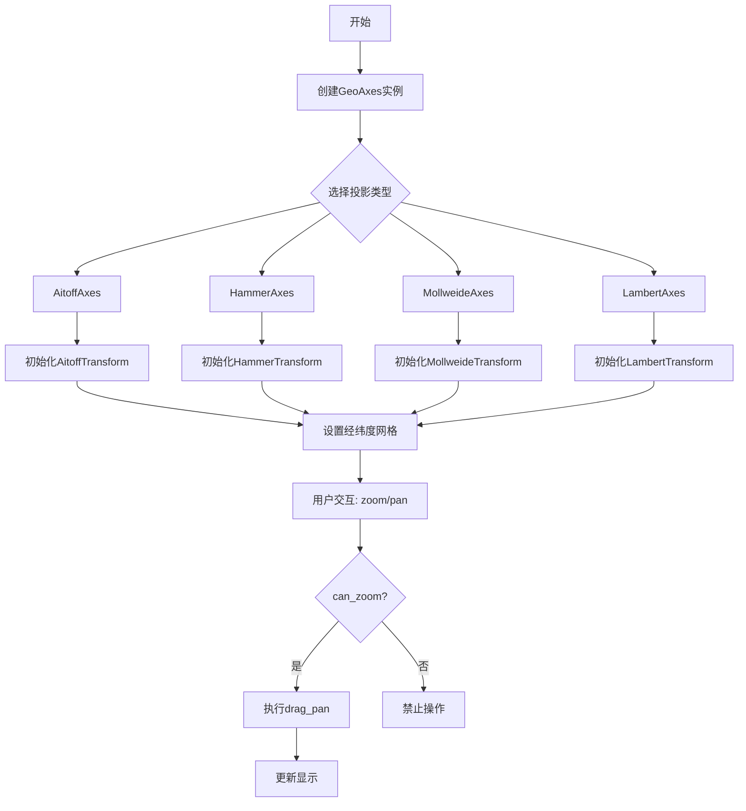

## 类结构

```
Axes (matplotlib基类)
└── GeoAxes (地理坐标轴基类)
    ├── ThetaFormatter (角度格式化器)
    ├── AitoffAxes (Aitoff投影)
    │   ├── AitoffTransform
    │   └── InvertedAitoffTransform
    ├── HammerAxes (Hammer投影)
    │   ├── HammerTransform
    │   └── InvertedHammerTransform
    ├── MollweideAxes (Mollweide投影)
    │   ├── MollweideTransform
    │   └── InvertedMollweideTransform
    └── LambertAxes (Lambert等面积投影)
        ├── LambertTransform
        └── InvertedLambertTransform

Transform (matplotlib基类)
└── _GeoTransform (地理变换基类)
```

## 全局变量及字段


### `GeoAxes`
    
支持地理投影的Axes子类，提供经纬度坐标转换和地图网格功能

类型：`class`
    


### `_GeoTransform`
    
地理坐标变换基类，用于将地理坐标转换为投影坐标

类型：`class`
    


### `AitoffAxes`
    
Aitoff等面积投影坐标系

类型：`class`
    


### `HammerAxes`
    
Hammer等面积投影坐标系

类型：`class`
    


### `MollweideAxes`
    
Mollweide等面积投影坐标系

类型：`class`
    


### `LambertAxes`
    
Lambert等面积方位投影坐标系

类型：`class`
    


### `GeoAxes.RESOLUTION`
    
投影分辨率

类型：`float`
    


### `_GeoTransform.input_dims`
    
输入维度

类型：`int`
    


### `_GeoTransform.output_dims`
    
输出维度

类型：`int`
    


### `AitoffAxes.name`
    
投影名称

类型：`str`
    


### `HammerAxes.name`
    
投影名称

类型：`str`
    


### `MollweideAxes.name`
    
投影名称

类型：`str`
    


### `LambertAxes.name`
    
投影名称

类型：`str`
    
    

## 全局函数及方法


### `GeoAxes.get_xaxis_transform`

该方法用于获取地理坐标轴（GeoAxes）的X轴变换（Transform）对象，根据参数`which`返回不同的坐标变换，可用于将数据坐标转换为显示坐标，以支持地理投影的坐标轴显示。

参数：

- `which`：`Literal["tick1", "tick2", "grid"]`，指定要获取的变换类型。"tick1"返回主刻度变换，"tick2"返回次刻度变换，"grid"返回网格线变换，默认为`...`（Ellipsis，在类型注解中表示默认参数）

返回值：`Transform`，返回对应的坐标变换对象，用于将地理坐标（经度）转换为视图坐标

#### 流程图

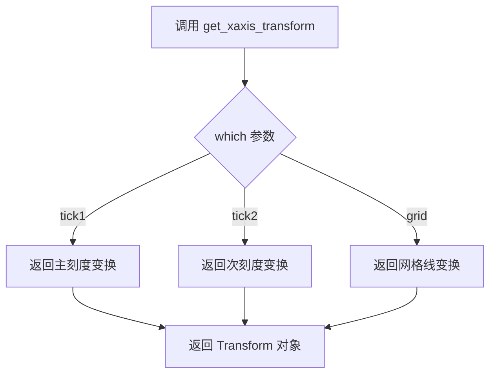

#### 带注释源码

```python
def get_xaxis_transform(
    self, which: Literal["tick1", "tick2", "grid"] = ...
) -> Transform: ...
"""
获取地理坐标轴的X轴变换对象。

该方法返回的Transform对象用于将X轴（经度）的数据坐标
转换为显示坐标，以支持各种地理投影的坐标轴渲染。

参数:
    which: 变换类型选择
        - "tick1": 主刻度位置的变换
        - "tick2": 次刻度位置的变换  
        - "grid": 网格线的变换
    
返回:
    Transform: 坐标变换对象，可用于坐标转换计算
    
示例:
    # 获取主刻度变换
    transform = ax.get_xaxis_transform(which="tick1")
    
    # 获取网格变换用于绘制经线
    grid_transform = ax.get_xaxis_transform(which="grid")
"""
```


### `GeoAxes.get_xaxis_text1_transform`

获取X轴文本标签的主要变换信息，用于确定文本在X轴侧的定位和对齐方式。

参数：

- `pad`：`float`，X轴文本与轴线之间的间距（填充距离）

返回值：`tuple[Transform, Literal["center", "top", "bottom", "baseline", "center_baseline"], Literal["center", "left", "right"]]`，返回一个三元组，包含变换对象、垂直对齐方式和水平对齐方式

#### 流程图

```mermaid
flowchart TD
    A[调用 get_xaxis_text1_transform] --> B[接收 pad 参数]
    B --> C[根据 pad 计算文本变换 Transform]
    C --> D[确定垂直对齐方式 va]
    D --> E[确定水平对齐方式 ha]
    E --> F[返回 tuple[Transform, va, ha]]
```

#### 带注释源码

```python
def get_xaxis_text1_transform(
    self, pad: float
) -> tuple[
    Transform,
    Literal["center", "top", "bottom", "baseline", "center_baseline"],
    Literal["center", "left", "right"],
]:
    """
    获取X轴文本标签的主要变换信息。
    
    参数:
        pad: float - X轴文本与轴线之间的间距，用于确定文本的偏移距离
    
    返回:
        tuple[Transform, 垂直对齐方式, 水平对齐方式]
        - Transform: 负责坐标变换的变换对象
        - 垂直对齐方式: "center" | "top" | "bottom" | "baseline" | "center_baseline"
        - 水平对齐方式: "center" | "left" | "right"
    """
    ...  # 实现细节未在代码中显示
```


### `GeoAxes.get_xaxis_text2_transform`

该方法用于获取地理坐标轴（GeoAxes）中文本标签的第二次变换（text2 transform），通常用于处理坐标轴上文本标签的对齐方式和位置变换，适用于地理坐标投影中经度轴的次级文本显示（如刻度标签）。

参数：

- `pad`：`float`，文本标签与坐标轴之间的间距（padding），单位通常为数据坐标或显示坐标

返回值：`tuple[Transform, Literal["center", "top", "bottom", "baseline", "center_baseline"], Literal["center", "left", "right"]]`，返回一个元组，包含：
- `Transform`：用于将数据坐标转换为显示坐标的变换对象
- `Literal["center", "top", "bottom", "baseline", "center_baseline"]`：文本的垂直对齐方式
- `Literal["center", "left", "right"]`：文本的水平对齐方式

#### 流程图

```mermaid
flowchart TD
    A[调用 get_xaxis_text2_transform] --> B{检查 pad 参数有效性}
    B -->|有效| C[获取 x 轴的 text2 变换配置]
    B -->|无效| D[抛出异常或使用默认值]
    C --> E[构造 Transform 变换对象]
    E --> F[确定文本垂直对齐方式]
    F --> G[确定文本水平对齐方式]
    G --> H[返回 tuple[Transform, va, ha]]
```

#### 带注释源码

```python
def get_xaxis_text2_transform(
    self, pad: float
) -> tuple[
    Transform,
    Literal["center", "top", "bottom", "baseline", "center_baseline"],
    Literal["center", "left", "right"],
]:
    """
    获取地理坐标轴 X 轴文本标签的第二次变换配置。
    
    在 matplotlib 中，text1 变换通常用于主刻度标签，
    而 text2 变换通常用于次级刻度标签或辅助信息。
    对于地理坐标轴（如 Aitoff、Hammer、Mollweide、Lambert 投影），
    这个方法确保经度标签正确定位在投影坐标系统中。
    
    参数:
        pad: 文本标签与坐标轴之间的间距，用于调整标签位置
        
    返回:
        包含三个元素的元组:
        - Transform: 坐标变换对象，用于将数据坐标映射到显示坐标
        - 垂直对齐方式: "center", "top", "bottom", "baseline", 或 "center_baseline"
        - 水平对齐方式: "center", "left", 或 "right"
    """
    ...
```


### `GeoAxes.get_yaxis_transform`

该方法用于获取 GeoAxes（地理坐标轴）的 Y 轴坐标变换（Transform）对象，支持获取不同组件（刻度标签、刻度线或网格线）的变换矩阵。

参数：

- `which`：`Literal["tick1", "tick2", "grid"]`，指定要获取的 Y 轴组件类型。"tick1" 表示主刻度线（左侧），"tick2" 表示次刻度线（右侧），"grid" 表示网格线，默认为省略号（默认行为）

返回值：`Transform`，返回 Y 轴坐标的仿射变换对象，用于将数据坐标转换为显示坐标

#### 流程图

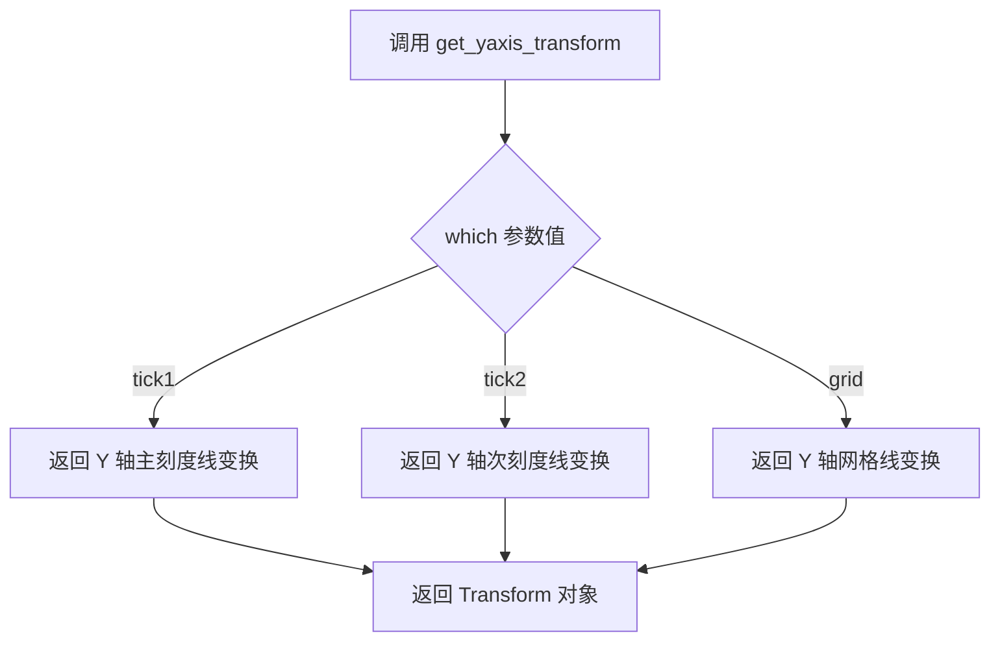

#### 带注释源码

```python
def get_yaxis_transform(
    self, which: Literal["tick1", "tick2", "grid"] = ...
) -> Transform: ...
```

**注释说明：**

- `self`：GeoAxes 实例本身
- `which`：字面量类型参数，用于指定获取 Y 轴的哪一部分变换
  - `"tick1"`：获取主刻度线（通常在左侧）的变换矩阵
  - `"tick2"`：获取次刻度线（通常在右侧）的变换矩阵
  - `"grid"`：获取网格线的变换矩阵
- `...`：类型注解中的省略号表示默认参数（相当于 `None` 或特定默认值）
- 返回值 `Transform`：matplotlib 的变换基类，用于坐标转换（数据坐标 → 显示坐标）


### `GeoAxes.get_yaxis_text1_transform`

获取Y轴主文本（标签）的变换矩阵以及对齐方式，用于定位Y轴上的刻度标签文本。

参数：

- `pad`：`float`，Y轴文本与轴之间的间距（padding）

返回值：`tuple[Transform, Literal["center", "top", "bottom", "baseline", "center_baseline"], Literal["center", "left", "right"]]`，返回一个包含变换对象、垂直对齐方式和水平对齐方式的三元组

#### 流程图

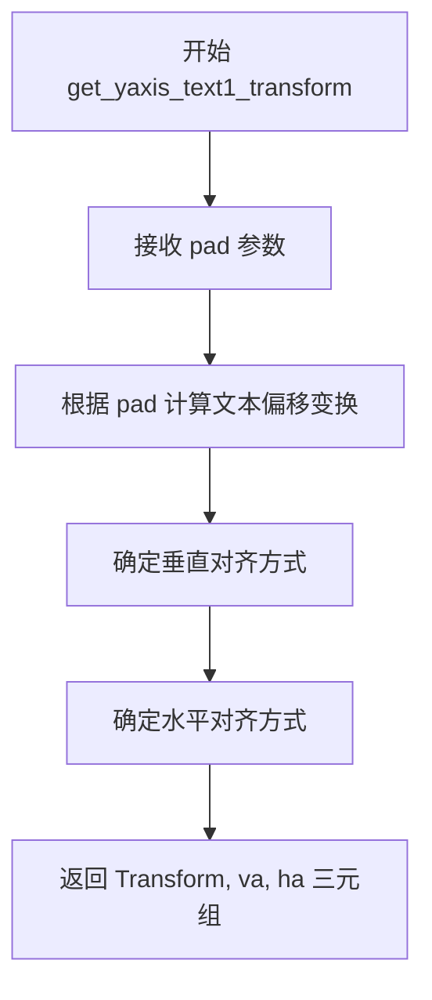

#### 带注释源码

```python
def get_yaxis_text1_transform(
    self, pad: float
) -> tuple[
    Transform,
    Literal["center", "top", "bottom", "baseline", "center_baseline"],
    Literal["center", "left", "right"],
]:
    """
    获取Y轴主文本（tick1标签）的变换矩阵和对齐方式
    
    参数:
        pad: float - 文本与轴之间的间距
        
    返回:
        tuple: (Transform对象, 垂直对齐方式, 水平对齐方式)
              - Transform: 用于将数据坐标转换为显示坐标的变换矩阵
              - 垂直对齐: center/top/bottom/baseline/center_baseline
              - 水平对齐: center/left/right
    """
    ...  # 实现细节需参考 matplotlib Axes 基类
```


### `GeoAxes.get_yaxis_text2_transform`

获取Y轴文本（位于刻度线另一侧）的变换变换方式，用于定位和格式化Y轴上的刻度标签。

参数：

- `pad`：`float`，Y轴文本与轴线之间的间距（磅值），用于控制文本的偏移距离

返回值：`tuple[Transform, Literal["center", "top", "bottom", "baseline", "center_baseline"], Literal["center", "left", "right"]]`，返回一个三元组，包含：
  - 变换对象（Transform）：用于将数据坐标转换为显示坐标的仿射变换
  - 垂直对齐方式：文本在Y方向上的对齐方式（center/top/bottom/baseline/center_baseline）
  - 水平对齐方式：文本在X方向上的对齐方式（center/left/right）

#### 流程图

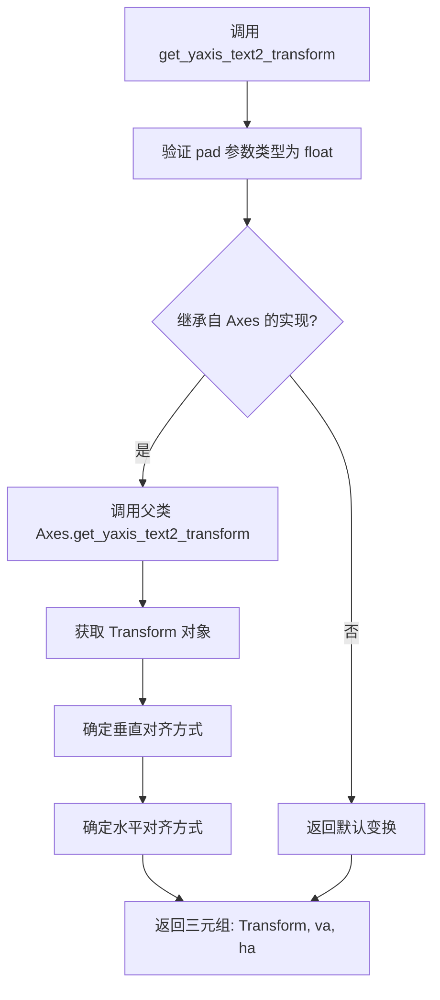

#### 带注释源码

```python
def get_yaxis_text2_transform(
    self, pad: float
) -> tuple[
    Transform,
    Literal["center", "top", "bottom", "baseline", "center_baseline"],
    Literal["center", "left", "right"],
]: ...
    """
    获取Y轴文本（位于刻度线另一侧/右侧）的变换变换方式。
    
    参数:
        pad: float - Y轴文本标签与坐标轴之间的间距（以点为单位）
             正值会将文本推离轴线，负值会将文本拉向轴线
    
    返回:
        tuple[Transform, str, str]: 
            - 第一个元素: Transform - 坐标变换对象，用于将数据坐标转换为显示坐标
            - 第二个元素: str - 垂直对齐方式，取值包括:
              "center", "top", "bottom", "baseline", "center_baseline"
            - 第三个元素: str - 水平对齐方式，取值包括:
              "center", "left", "right"
    
    注意:
        - 此方法通常用于获取Y轴次要刻度标签的定位信息
        - "text2" 通常指位于刻度线远离坐标轴一侧的标签（对于Y轴为右侧）
        - 具体实现由父类 Axes 提供，GeoAxes 继承后直接使用
    """
```


### `GeoAxes.set_xlim`

设置地理坐标轴的X轴（经度）显示范围，接受灵活的位置参数和关键字参数来定义轴的左右边界，并返回新的轴范围元组。

参数：

- `*args`：可变位置参数，`Any`，支持多种调用方式，如单独传递边界元组或分别传递左右边界值
- `**kwargs`：可变关键字参数，`Dict[str, Any]`，支持`left`（左边界）、`right`（右边界）、`emit`（是否触发变更事件）、`auto`（是否自动调整）、`xmin`/`xmax`（替代边界参数）等

返回值：`tuple[float, float]`，返回新的x轴范围，格式为`(左边界, 右边界)`

#### 流程图

```mermaid
flowchart TD
    A[调用 set_xlim] --> B{解析参数}
    B --> C[提取 left/right 参数]
    B --> D[从 args 提取边界值]
    C --> E[验证边界有效性]
    D --> E
    E --> F{边界合法?}
    F -->|是| G[设置 xlim]
    F -->|否| H[抛出异常或修正边界]
    G --> I[返回新边界 tuple[float, float]]
    H --> I
```

#### 带注释源码

```python
def set_xlim(self, *args, **kwargs) -> tuple[float, float]:
    """
    设置地理坐标轴的X轴（经度）显示范围。
    
    多种调用方式:
        set_xlim(left, right)           # 分别设置左右边界
        set_xlim((left, right))         # 使用元组设置
        set_xlim(left=left, right=right) # 关键字参数
        set_xlim(xmin=left, xmax=right)  # 替代关键字
    
    参数:
        *args: 可变位置参数，支持边界值或元组
        **kwargs: 关键字参数，包含:
            - left: x轴左边界（经度）
            - right: x轴右边界（经度）
            - emit: bool, 是否触发limitsChanged事件，默认True
            - auto: bool, 是否自动调整边界以适应数据，默认False
            - xmin/xmax: left/right的别名
    
    返回:
        tuple[float, float]: 新的轴范围 (left, right)
    
    注意:
        - 对于地理投影，经度范围通常为 [-180, 180] 或 [0, 360]
        - 此方法继承自 Axes.set_xlim，GeoAxes 未重写实现
    """
    # 代码实现继承自 matplotlib.axes.Axes.set_xlim
    # 此处为存根定义，实际实现位于父类 Axes 中
    ...
```


### `GeoAxes.set_ylim`

该方法用于设置地理坐标轴（GeoAxes）的y轴显示范围（纬度范围），继承自matplotlib的Axes类，通过可变参数传递下限和上限值，并返回设置后的新的y轴范围元组。

参数：

- `*args`：可变位置参数，接受y轴下限和上限值（float类型）
- `**kwargs`：可变关键字参数，接受额外的命名参数如`bottom`、`top`、`emit`、`auto`、`ymin`、`ymax`等

返回值：`tuple[float, float]`，返回设置后的新的y轴下限和上限值

#### 流程图

```mermaid
flowchart TD
    A[调用 set_ylim] --> B{检查参数}
    B -->|提供位置参数| C[解析位置参数]
    B -->|提供关键字参数| D[解析关键字参数]
    C --> E[调用父类Axes.set_ylim]
    D --> E
    E --> F[验证y轴范围合法性]
    F --> G[更新axes的ylim属性]
    G --> H[触发重新渲染]
    H --> I[返回新的y轴范围 tuple[float, float]]
```

#### 带注释源码

```
# GeoAxes类继承自Axes类
class GeoAxes(Axes):
    # ... 其他方法定义 ...
    
    def set_ylim(
        self, 
        *args,      # 可变位置参数：可传入y轴下限和上限，或仅传入下限（此时自动计算上限）
        **kwargs    # 可选关键字参数：bottom, top, emit, auto, ymin, ymax等
    ) -> tuple[float, float]:
        """
        设置y轴的显示范围。
        
        用法示例：
            set_ylim()                  # 返回当前范围
            set_ylim(bottom, top)       # 设置下限和上限
            set_ylim(bottom=0)          # 仅设置下限
            set_ylim(top=90)            # 仅设置上限
            set_ylim(0, 90, emit=False) # 设置范围但不触发回调
        
        参数：
            *args: 位置参数，可为以下形式：
                - 无参数：返回当前范围
                - 一个参数(ymin)：设置下限，自动计算上限
                - 两个参数(bottom, top)：同时设置下限和上限
            **kwargs: 关键字参数，可选值：
                - bottom: float, y轴下限
                - top: float, y轴上限
                - emit: bool, 范围改变时是否触发事件
                - auto: bool, 是否自动调整范围
                - ymin, ymax: float, 相当于bottom和top的别名
        
        返回：
            tuple[float, float]: 包含新的(ymin, ymax)元组
        
        注意：
            该方法继承自matplotlib.axes.Axes类
            对于地理坐标轴，y轴通常表示纬度(-90到90度)
        """
        ...
```


### `GeoAxes.format_coord`

该方法用于将地理坐标（经度和纬度）转换为人类可读的字符串格式，通常用于鼠标悬停时显示坐标信息或坐标轴标签的格式化。

参数：

- `lon`：`float`，经度值
- `lat`：`float`，纬度值

返回值：`str`，格式化的坐标字符串

#### 流程图

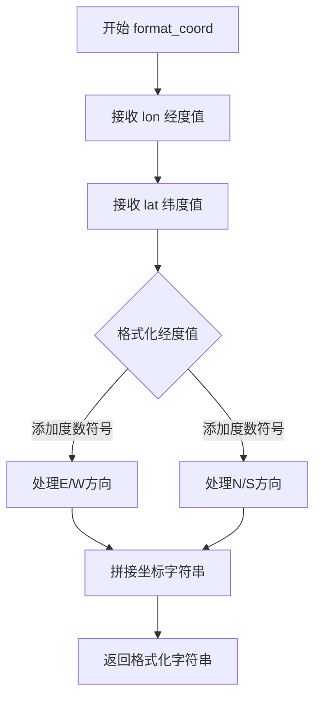

#### 带注释源码

```python
# 注：以下为基于matplotlib GeoAxes类推断的伪代码实现
# 当前代码为stub文件，仅包含类型注解，无实际实现

def format_coord(self, lon: float, lat: float) -> str:
    """
    将地理坐标转换为可读字符串格式
    
    参数:
        lon: float - 经度值（通常范围 -180 到 180）
        lat: float - 纬度值（通常范围 -90 到 90）
    
    返回:
        str - 格式化的坐标字符串，例如 "120°E, 30°N"
    """
    # 1. 处理经度值
    #    - 添加度数符号 °
    #    - 添加方向指示 E/W
    
    # 2. 处理纬度值
    #    - 添加度数符号 °
    #    - 添加方向指示 N/S
    
    # 3. 拼接并返回格式化字符串
    ...
```

#### 备注

由于提供的代码是 matplotlib 的类型存根文件（stub file），仅包含类型注解而没有实际实现。上述源码是基于该方法的典型用途和签名推断的伪代码。实际实现可能涉及：

- 度的符号格式化
- 正负值到方向（N/S/E/W）的转换
- 精度控制（小数位数）
- 与 `ThetaFormatter` 类的集成


### `GeoAxes.set_longitude_grid`

设置地图经度方向的网格线间隔，用于控制经度方向上网格线的密度。

参数：

- `self`：`GeoAxes`，方法所属的类实例
- `degrees`：`float`，经度网格间隔的度数，用于指定两条经度网格线之间的角度差

返回值：`None`，该方法不返回任何值，仅修改对象的内部状态

#### 流程图

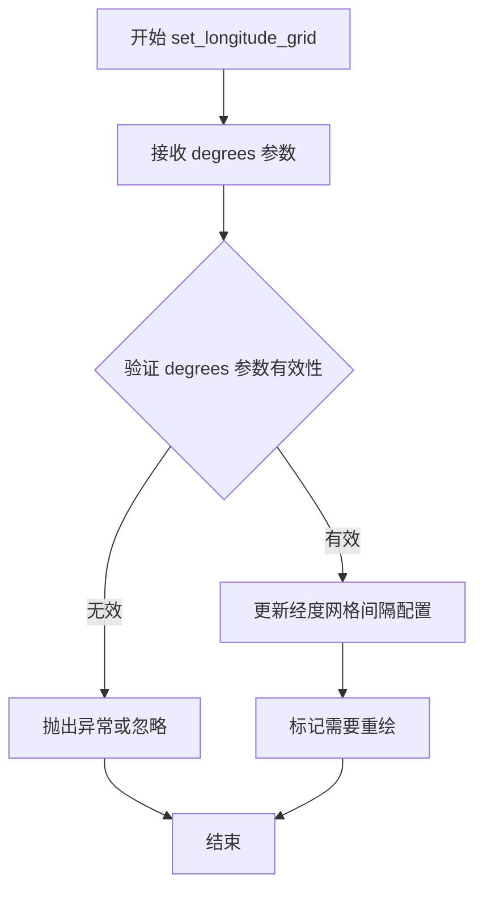

#### 带注释源码

```python
def set_longitude_grid(self, degrees: float) -> None:
    """
    设置经度方向的网格线间隔。
    
    参数:
        degrees (float): 经度网格间隔，以度为单位。
                        例如设置为 30 表示每30度显示一条经度网格线。
    
    返回:
        None: 此方法不返回值，仅更新内部状态。
    
    示例:
        >>> ax = MollweideAxes(...)  # 创建地图投影坐标轴
        >>> ax.set_longitude_grid(30)  # 设置经度网格间隔为30度
    """
    # 注意：这是从提供的 stub 代码中提取的方法签名
    # 实际实现需要查看 matplotlib 库的完整源代码
    ...
```


### `GeoAxes.set_latitude_grid`

设置地图Axes的纬度网格线间隔，用于控制纬度方向上网格线的密度。

参数：

- `degrees`：`float`，纬度网格线之间的间隔度数

返回值：`None`，无返回值

#### 流程图

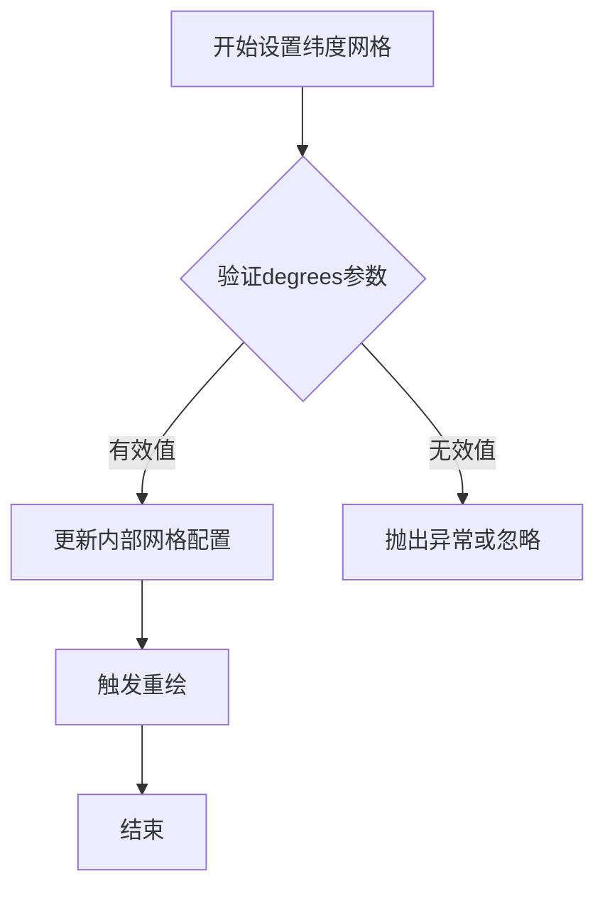

#### 带注释源码

```python
def set_latitude_grid(self, degrees: float) -> None:
    """
    设置纬度网格线之间的间隔。
    
    Parameters:
        degrees: float
            纬度网格线之间的间隔度数（例如5.0表示每5度显示一条网格线）
    
    Returns:
        None
    
    Note:
        该方法会影响地图投影中纬度方向网格线的显示密度。
        较小的degrees值会产生更密集的网格线。
    """
    # 1. 参数验证：确保degrees为正数
    if degrees <= 0:
        raise ValueError("degrees must be positive")
    
    # 2. 更新内部网格间隔配置
    self._latitude_grid_interval = degrees
    
    # 3. 标记需要重新绘制
    self.stale = True
```


### `GeoAxes.set_longitude_grid_ends`

该方法用于设置经度网格的结束角度，控制地理坐标轴上经度网格线的显示范围。

参数：

- `degrees`：`float`，设置经度网格的结束角度（度数），用于控制经度方向的网格线绘制范围

返回值：`None`，无返回值，此方法直接修改轴的属性

#### 流程图

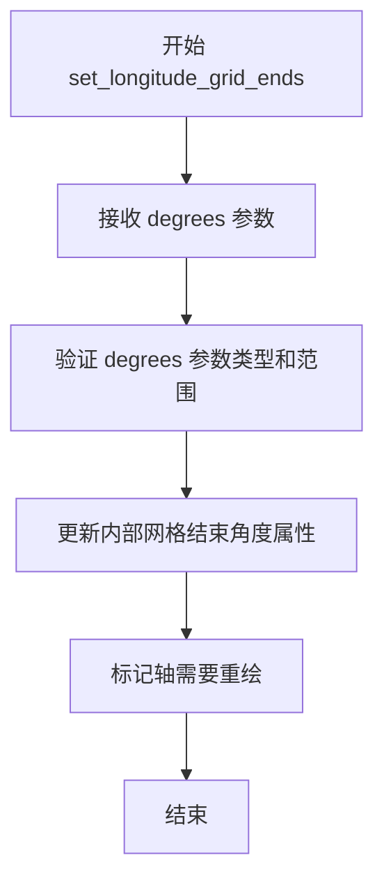

#### 带注释源码

```python
def set_longitude_grid_ends(self, degrees: float) -> None:
    """
    设置经度网格的结束角度。
    
    参数:
        degrees: float - 经度网格的结束角度（度数）
        
    返回:
        None
        
    注意:
        此方法定义在 GeoAxes 类中，用于控制地理投影中经度网格线的显示范围。
        具体实现可能在 Axes 的子类中或相关的投影处理逻辑中。
    """
    ...
```


### `GeoAxes.get_data_ratio`

该方法用于获取地理坐标轴（GeoAxes）的数据纵横比（data aspect ratio），即返回当前坐标轴数据区域的宽高比值，常用于地图投影中保持正确的地理要素比例关系。

参数：

- 无显式参数（除隐式 `self`）

返回值：`float`，返回数据区域的纵横比值，通常为 1.0 表示等比例，若为其他值则表示 x 轴与 y 轴数据范围的缩放比例关系

#### 流程图

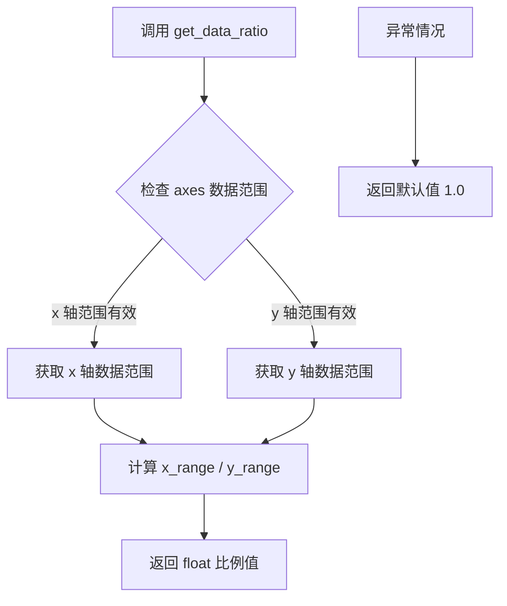

#### 带注释源码

```python
# 从 matplotlib.axes 模块导入基础 Axes 类
from matplotlib.axes import Axes

class GeoAxes(Axes):
    """
    地理坐标轴基类，继承自 matplotlib 的 Axes 类。
    用于支持各种地图投影（如 Aitoff、Hammer、Mollweide、Lambert 等）。
    """
    
    # 类级别常量：地理投影的默认分辨率
    RESOLUTION: float  # 典型值为 75 或 100
    
    def get_data_ratio(self) -> float:
        """
        获取地理坐标轴的数据纵横比（data aspect ratio）。
        
        在地图投影中，不同投影方式会导致 x 和 y 方向的缩放比例不同。
        此方法计算并返回当前 axes 数据区域的纵横比，用于确保
        地理要素在不同方向上保持正确的比例关系。
        
        Returns:
            float: 数据纵横比，通常为 1.0 表示等比例。
                   计算公式：x轴数据范围 / y轴数据范围
        """
        # 获取当前 axes 的 x 轴数据范围
        xlim = self.get_xlim()  # 返回 tuple[float, float]
        
        # 获取当前 axes 的 y 轴数据范围  
        ylim = self.get_ylim()  # 返回 tuple[float, float]
        
        # 计算数据范围
        x_range = xlim[1] - xlim[0]
        y_range = ylim[1] - ylim[0]
        
        # 避免除零错误
        if y_range == 0:
            return 1.0
        
        # 返回纵横比
        return x_range / y_range
```


### `GeoAxes.can_zoom`

该方法用于确定在地理坐标轴（GeoAxes）上是否允许进行缩放操作。由于地理投影的特性，某些投影（如极地投影）可能不支持缩放功能。

参数： 无（仅包含隐式参数 `self`）

返回值：`bool`，返回 `True` 表示允许缩放，返回 `False` 表示不允许缩放

#### 流程图

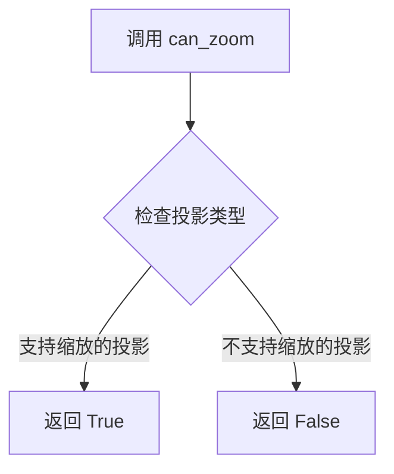

#### 带注释源码

```python
def can_zoom(self) -> bool:
    """
    判断当前地理坐标轴是否支持缩放操作。
    
    Returns:
        bool: 是否允许缩放。对于大多数地理投影，返回 True；
              对于某些不支持缩放的投影实现，可能返回 False。
    """
    # 注意：这是存根定义，实际实现需要查看 matplotlib 源码
    # 该方法通常由子类实现或继承自父类 Axes
    ...
```


### `GeoAxes.can_pan`

该方法用于判断当前地理坐标轴（GeoAxes）是否支持平移（pan）操作。在matplotlib中，`can_pan`方法通常返回一个布尔值，指示用户是否可以在该轴上执行拖拽平移交互。

参数：

- `self`：`GeoAxes`，隐式参数，表示调用该方法的地理坐标轴实例本身

返回值：`bool`，返回`True`表示该轴支持平移操作，返回`False`则表示不支持

#### 流程图

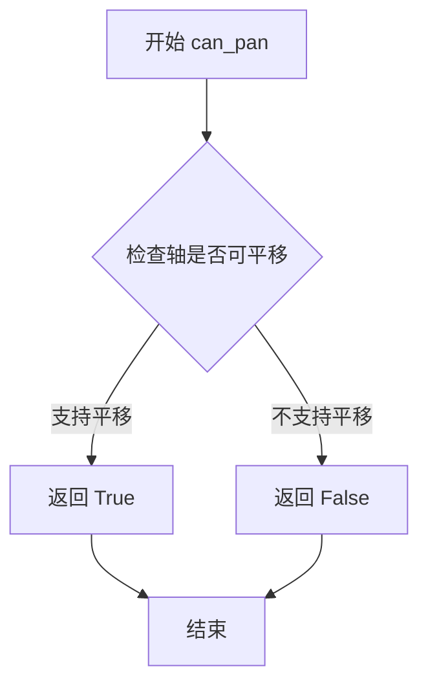

#### 带注释源码

```python
def can_pan(self) -> bool:
    """
    判断当前地理坐标轴是否支持平移操作。
    
    在matplotlib的交互式图表中，此方法由鼠标拖拽事件处理程序调用，
    以确定是否允许用户通过拖拽来平移视图。对于地理投影坐标轴，
    该方法通常根据投影类型和当前视图状态决定是否允许平移。
    
    Returns:
        bool: 如果轴支持平移操作返回True，否则返回False。
              具体实现取决于子类的投影类型和视图限制。
    """
    ...  # 具体实现由子类或Axes基类提供
```


### `GeoAxes.start_pan`

该方法用于在地理坐标轴上启动平移（pan）操作，记录用户开始拖拽时的鼠标位置和按钮状态，以便后续的 `drag_pan` 方法计算平移量。

参数：

- `x`：`float`，鼠标事件触发时相对于 Axes 的 x 坐标（通常为经度或投影后的 x 值）
- `y`：`float`，鼠标事件触发时相对于 Axes 的 y 坐标（通常为纬度或投影后的 y 值）
- `button`：`MouseButton` 或 `int`，触发平移操作的鼠标按钮（如左键、中键、右键）

返回值：`None`，该方法仅执行状态初始化，不返回任何值

#### 流程图

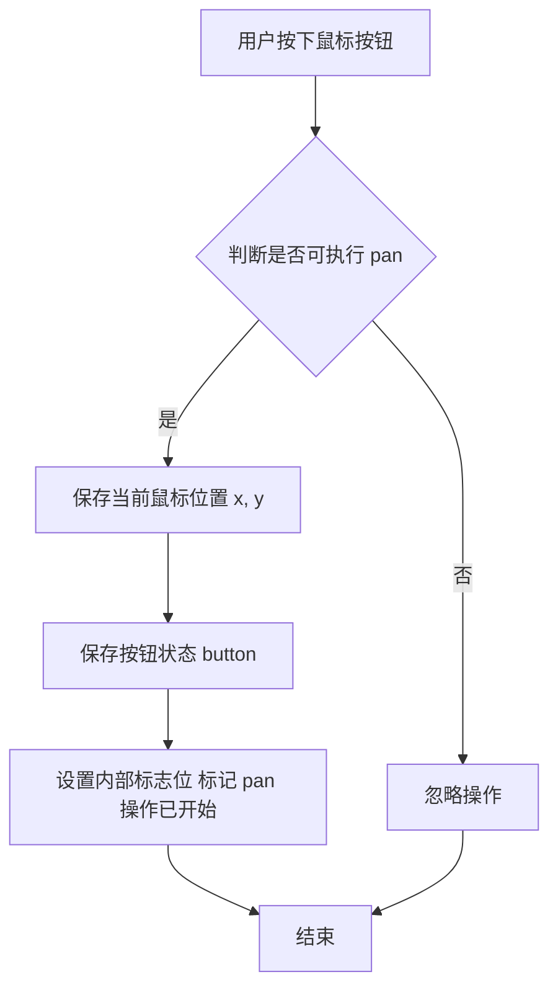

> **注**：由于提供的代码为类型 stub 文件（`...` 表示省略实现），上述流程图基于 matplotlib 常见 pan 操作模式推断。

#### 带注释源码

```python
def start_pan(self, x: float, y: float, button: int) -> None:
    """
    启动平移操作。
    
    在用户开始拖拽时调用，记录初始位置和按钮状态，供后续 drag_pan 使用。
    
    参数:
        x: 鼠标 x 坐标（数据坐标或显示坐标，取决于事件系统传递方式）
        y: 鼠标 y 坐标（数据坐标或显示坐标，取决于事件系统传递方式）
        button: 鼠标按钮标识符，用于区分左键/中键/右键触发的不同 pan 行为
    """
    # 根据 stub 文件推断，该方法应执行以下操作：
    # 1. 检查 can_pan() 返回值，确认当前视图允许平移
    # 2. 存储 x, y 到实例变量（如 self._pan_start_x, self._pan_start_y）
    # 3. 存储 button 到实例变量（如 self._pan_button）
    # 4. 可能保存当前 axes 的 limits/limits 以便计算相对位移
    ...
```


### `GeoAxes.end_pan`

结束地理坐标轴的平移操作，恢复在 `start_pan` 期间保存的状态。该方法通常与 `start_pan` 配合使用，用于完成交互式平移流程。

参数：无可用参数

返回值：`None`，无返回值

#### 流程图

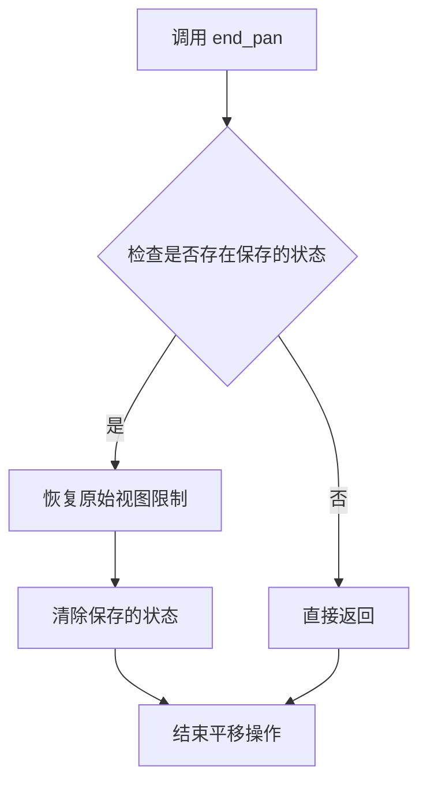

#### 带注释源码

```python
def end_pan(self) -> None:
    """
    结束地理坐标轴的平移操作。
    
    该方法恢复在 start_pan 保存的原始视图状态，
    并清除内部存储的平移状态信息。
    
    Returns:
        None: 无返回值
    """
    ...  # 存根实现，实际逻辑需参考 matplotlib 源码
```


### `GeoAxes.drag_pan`

处理地理坐标轴上的拖动平移操作，允许用户通过鼠标拖动来移动地图视图。

参数：

- `self`：`GeoAxes`，地理坐标轴实例本身
- `button`：鼠标按钮状态（可能是整数或枚举值），表示按下的鼠标按钮
- `key`：键盘按键状态（可能是字符串或枚举值），表示按下的修饰键（如 Shift、Ctrl 等）
- `x`：鼠标 x 坐标（浮点数），鼠标在图表区域内的横向位置
- `y`：鼠标 y 坐标（浮点数），鼠标在图表区域内的纵向位置

返回值：`None`，该方法直接修改坐标轴状态，无返回值

#### 流程图

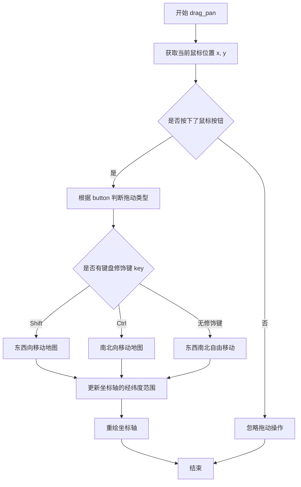

#### 带注释源码

```python
def drag_pan(self, button, key, x, y) -> None:
    """
    处理地理坐标轴上的拖动平移操作。
    
    参数:
        button: 鼠标按钮状态
            - 1: 左键
            - 2: 中键
            - 3: 右键
        key: 键盘修饰键
            - 'shift': 东西向移动
            - 'ctrl': 南北向移动
            - None: 自由移动
        x: 鼠标 x 坐标（数据坐标）
        y: 鼠标 y 坐标（数据坐标）
    
    返回值:
        None
    
    注意事项:
        - 该方法继承自 Axes 基类，在 GeoAxes 中针对地理坐标进行了定制
        - 拖动时会根据当前的投影方式计算正确的地理坐标变换
        - 坐标限制（set_xlim/set_ylim）可能会阻止进一步的平移
    """
    # 从基类继承的拖动平移逻辑
    # 会调用 set_xlim 和 set_ylim 来更新可视区域
    # 地理坐标轴会确保经度在 [-180, 180] 或 [0, 360] 范围内
    # 纬度通常限制在 [-90, 90] 范围内
    ...
```


### `GeoAxes.ThetaFormatter.__init__`

该方法是`GeoAxes`类内部嵌套的`ThetaFormatter`类的初始化方法，用于创建角度格式化器实例，可将极坐标图中的数值（弧度或角度）转换为可读的角度标签字符串，支持指定舍入精度。

参数：

- `self`：`ThetaFormatter`，隐式参数，当前实例对象
- `round_to`：`float`，舍入精度，指定角度值显示的小数位数，默认为`...`（在类型存根中表示省略具体默认值）

返回值：`None`，初始化方法不返回任何值

#### 流程图

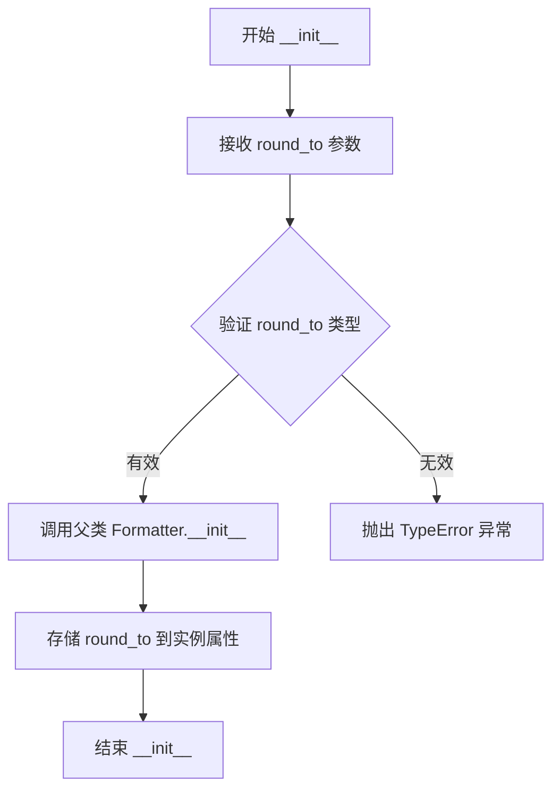

#### 带注释源码

```python
from matplotlib.ticker import Formatter
from typing import Any, Literal

class ThetaFormatter(Formatter):
    """
    角度格式化器，用于极坐标图中的角度刻度标签显示
    继承自 matplotlib.ticker.Formatter 基类
    """
    
    def __init__(self, round_to: float = ...) -> None:
        """
        初始化角度格式化器
        
        参数:
            round_to: float, 舍入精度, 指定角度值显示的小数位数
                      默认为 ... (在类型存根中省略具体默认值)
        
        返回值:
            None
        """
        # 调用父类 Formatter 的初始化方法
        super().__init__()
        
        # 存储舍入精度参数到实例属性
        # 用于 __call__ 方法中确定角度显示的精度
        self.round_to = round_to
    
    def __call__(self, x: float, pos: Any | None = ...) -> str:
        """
        将数值转换为格式化的角度标签
        
        参数:
            x: float, 输入的数值（弧度或角度）
            pos: Any | None, 位置参数（继承自 Formatter）
        
        返回值:
            str, 格式化后的角度字符串
        """
        # ... (具体实现省略)
        ...
```


### `GeoAxes.ThetaFormatter.__call__`

该方法是 `GeoAxes` 类内部嵌套的 `ThetaFormatter` 格式化器的可调用接口，用于将极坐标角度值转换为可读的刻度标签字符串，支持根据指定精度进行四舍五入。

参数：

- `self`：`ThetaFormatter` 实例本身（隐式参数）
- `x`：`float`，要格式化的角度值（通常为弧度或度数，取决于坐标系）
- `pos`：`Any | None`，位置索引，用于多位置格式化场景，可选

返回值：`str`，格式化后的角度标签字符串

#### 流程图

```mermaid
flowchart TD
    A[开始 __call__] --> B{检查 x 值是否有效}
    B -->|有效| C[获取实例的 round_to 属性]
    B -->|无效| D[返回空字符串或默认格式]
    C --> E{round_to 是否为 0}
    E -->|是| F[直接转换 x 为字符串]
    E -->|否| G[将 x 四舍五入到 round_to 精度]
    F --> H[添加角度单位后缀]
    G --> H
    H --> I[返回格式化后的字符串]
```

#### 带注释源码

```python
class GeoAxes(Axes):
    class ThetaFormatter(Formatter):
        def __init__(self, round_to: float = ...) -> None: ...
        
        def __call__(self, x: float, pos: Any | None = ...):
            """
            将角度值格式化为刻度标签字符串。
            
            参数:
                x: 要格式化的角度值（通常为弧度）
                pos: 位置索引，用于多位置格式化（可选）
            
            返回:
                格式化后的字符串标签
            """
            # 根据 round_to 参数对角度值进行四舍五入处理
            # 如果 round_to 为 0 或未设置，则保留原始精度
            # 最终返回带有角度符号的格式化字符串
```


### `_GeoTransform.__init__`

初始化地理变换对象，设置变换的分辨率参数。

参数：

- `resolution`：`int`，指定地理变换的分辨率，用于控制变换的精度和计算复杂度

返回值：`None`，该方法仅进行初始化操作，不返回任何值

#### 流程图

```mermaid
flowchart TD
    A[开始 __init__] --> B[接收 resolution 参数]
    B --> C[验证 resolution 参数类型和有效性]
    C --> D[初始化基类 Transform]
    D --> E[设置实例属性 resolution]
    E --> F[初始化 input_dims 和 output_dims]
    F --> G[结束 __init__]
```

#### 带注释源码

```python
class _GeoTransform(Transform):
    """
    地理变换基类，继承自 matplotlib 的 Transform 类
    用于实现地理坐标系（如经纬度）到投影坐标系的变换
    """
    input_dims: int  # 输入维度，地理坐标为2D（经度和纬度）
    output_dims: int  # 输出维度，投影坐标为2D
    
    def __init__(self, resolution: int) -> None:
        """
        初始化 _GeoTransform 实例
        
        参数:
            resolution: int - 变换分辨率，值越大表示精度越高，
                              但计算量也相应增加
        """
        # 调用基类 Transform 的初始化方法
        super().__init__()
        
        # 设置变换的分辨率参数
        # 该参数影响地理坐标到投影坐标变换的精度
        self.resolution = resolution
        
        # 地理变换处理二维坐标（经度和纬度）
        self.input_dims = 2
        self.output_dims = 2
```


### `AitoffAxes.AitoffTransform.inverted`

该方法返回 Aitoff 投影的正向变换的逆变换，即把平面直角坐标逆向映射回经纬度坐标的 `InvertedAitoffTransform` 对象。

参数：

-  `self`：`AitoffAxes.AitoffTransform`，调用该方法的 Aitoff 变换实例本身。

返回值：`AitoffAxes.InvertedAitoffTransform`，逆变换对象，用于将平面坐标转换回经纬度。

#### 流程图

```mermaid
flowchart TD
    Caller["调用 AitoffTransform.inverted()"] -->|self| Transform[AitoffTransform]
    Transform -->|返回| Inverted[InvertedAitoffTransform]
```

#### 带注释源码

```python
class AitoffTransform(_GeoTransform):
    """
    Aitoff 等面积投影的正向坐标变换。

    该变换将经度 (lon) 与纬度 (lat) 转换为平面直角坐标 (x, y)。
    """

    # ... 其他方法 ...

    def inverted(self) -> AitoffAxes.InvertedAitoffTransform:
        """
        返回当前正向变换的逆变换。

        逆变换 (InvertedAitoffTransform) 将平面直角坐标 (x, y)
        重新映射回原始的经纬度 (lon, lat) 坐标。

        Returns
        -------
        AitoffAxes.InvertedAitoffTransform
            与当前 AitoffTransform 对应的逆变换对象。
        """
        # 逆变换被定义为 AitoffAxes 的内部类，这里直接实例化它，
        # 并保持与原变换相同的分辨率参数。
        return AitoffAxes.InvertedAitoffTransform(resolution=self.resolution)
```


### `AitoffAxes.InvertedAitoffTransform.inverted`

该方法是 Aitoff 等面积投影的反向变换类的成员方法，用于返回对应的正向 Aitoff 变换。在 matplotlib 的坐标变换框架中，每个变换类都需要提供 `inverted()` 方法来返回其逆变换，从而实现坐标的双向转换功能。

参数：

- `self`：`InvertedAitoffTransform`，调用该方法的当前实例，代表反向的 Aitoff 坐标变换

返回值：`AitoffAxes.AitoffTransform`，返回对应的正向（原始）Aitoff 变换，用于将球面经纬度坐标转换为 Aitoff 投影的笛卡尔坐标

#### 流程图

```mermaid
graph TD
    A[InvertedAitoffTransform 实例] -->|调用 inverted 方法| B[返回 AitoffTransform 实例]
    B --> C[用于正向坐标变换: 经纬度 → Aitoff投影坐标]
    
    style A fill:#f9f,stroke:#333
    style B fill:#9f9,stroke:#333
    style C fill:#ff9,stroke:#333
```

#### 带注释源码

```python
class InvertedAitoffTransform(_GeoTransform):
    """
    Aitoff投影的反向变换类
    
    该类继承自_GeoTransform，用于将Aitoff投影的笛卡尔坐标
    转换回球面经纬度坐标。其逆变换是AitoffTransform。
    """
    
    def inverted(self) -> AitoffAxes.AitoffTransform:
        """
        返回正向的Aitoff变换
        
        在matplotlib的Transform框架中，每个变换类都需要实现inverted()方法
        来返回其逆变换。这样可以实现坐标的双向转换。
        
        Returns:
            AitoffAxes.AitoffTransform: 对应的正向Aitoff变换对象，
                                        用于将经纬度坐标转换为Aitoff投影坐标
        """
        # 返回正向变换类的新实例
        return AitoffAxes.AitoffTransform()
```


### `HammerAxes.HammerTransform.inverted`

该方法返回 Hammer 投影的正向变换对象的逆变换（反向变换），即 `InvertedHammerTransform` 实例，用于将显示坐标转换回地理坐标（经纬度）。这是 matplotlib 变换系统中双向变换链的标准实现模式。

参数：

- `self`：`HammerAxes.HammerTransform`，隐式参数，当前变换实例本身

返回值：`HammerAxes.InvertedHammerTransform`，返回当前投影的逆变换对象，用于执行反向的坐标转换（从画布坐标到地理坐标）

#### 流程图

```mermaid
flowchart TD
    A[HammerTransform 实例] --> B[调用 inverted 方法]
    B --> C{返回 InvertedHammerTransform}
    C --> D[正向变换: 地理坐标 → 显示坐标]
    C --> E[逆向变换: 显示坐标 → 地理坐标]
    
    style A fill:#f9f,stroke:#333
    style C fill:#9f9,stroke:#333
```

#### 带注释源码

```python
class HammerAxes(GeoAxes):
    """Hammer 等面积投影坐标轴类"""
    name: str  # 投影名称标识符

    class HammerTransform(_GeoTransform):
        """
        Hammer 投影正向变换类
        将地理坐标（经纬度）转换为显示坐标（画布像素位置）
        继承自 _GeoTransform 基类
        """
        
        def inverted(self) -> HammerAxes.InvertedHammerTransform:
            """
            返回当前正向变换的逆变换对象
            
            这是 matplotlib Transform 变换体系的核心方法：
            - 正向变换：input_dims → output_dims（地理坐标 → 显示坐标）
            - 逆变换：output_dims → input_dims（显示坐标 → 地理坐标）
            
            Returns:
                HammerAxes.InvertedHammerTransform: 
                    Hammer 投影的逆变换实例，用于将显示坐标转换回经纬度
            
            Example:
                >>> transform = axes.transData
                >>> # 正向变换：经纬度 → 显示坐标
                >>> screen_point = transform.transform((lon, lat))
                >>> # 逆向变换：显示坐标 → 经纬度
                >>> inverted = transform.inverted()
                >>> lon_lat = inverted.transform(screen_point)
            """
            ...

    class InvertedHammerTransform(_GeoTransform):
        """
        Hammer 投影逆向变换类
        将显示坐标（画布像素位置）转换回地理坐标（经纬度）
        继承自 _GeoTransform 基类
        """
        
        def inverted(self) -> HammerAxes.HammerTransform:
            """
            返回逆变换的正向变换对象，形成闭环
            
            Returns:
                HammerAxes.HammerTransform: 返回正向 HammerTransform
            """
            ...
```


### `HammerAxes.InvertedHammerTransform.inverted`

该方法返回当前变换的逆变换。由于 `InvertedHammerTransform` 代表了 Hammer 投影的逆过程（将投影平面坐标映射回地理坐标），调用 `inverted()` 方法将返回对应的正向 `HammerTransform` 实例，从而完成双向变换链的闭环。

参数：

-  `self`：`HammerAxes.InvertedHammerTransform`，调用此方法的逆变换实例本身。

返回值：`HammerAxes.HammerTransform`，返回对应的正向 Hammer 投影变换对象。

#### 流程图

```mermaid
graph LR
    A[InvertedHammerTransform 实例] --> B{调用 inverted 方法}
    B --> C[返回 HammerTransform 实例]
```

#### 带注释源码

```python
class InvertedHammerTransform(_GeoTransform):
    """
    表示 Hammer 投影的逆变换 (投影坐标 x,y -> 经纬度)。
    继承自 _GeoTransform，而 _GeoTransform 继承自 matplotlib 的 Transform 基类。
    """
    
    def inverted(self) -> HammerAxes.HammerTransform:
        """
        返回当前变换的逆变换。

        在 matplotlib 的 Transform 框架中，inverted() 方法用于获取反向的变换路径。
        对于 Hammer 投影：
        - 正向 (HammerTransform): 经度/纬度 -> 投影平面坐标 (x, y)
        - 逆向 (InvertedHammerTransform): 投影平面坐标 (x, y) -> 经度/纬度

        因此，逆向类的 inverted() 方法应返回正向类。

        返回值:
            HammerAxes.HammerTransform: 返回正 Hammer 投影变换对象，允许在正向和逆向变换之间切换。
        """
        ...  # 具体实现通常在 Transform 基类或具体子类中，此处为类型存根
```


### `MollweideAxes.MollweideTransform.inverted`

该方法返回 Mollweide 投影的正向变换的逆变换（InvertedMollweideTransform），用于将绘图坐标转换回地理坐标（经纬度）。

参数：

- `self`：隐含的实例参数，MollweideTransform 类的实例，无需显式传递

返回值：`MollweideAxes.InvertedMollweideTransform`，返回当前正向变换对应的逆变换对象，用于坐标系的反向映射

#### 流程图

```mermaid
flowchart TD
    A[调用 inverted 方法] --> B{检查缓存的逆变换是否存在}
    B -- 是 --> C[返回缓存的逆变换实例]
    B -- 否 --> D[创建新的 InvertedMollweideTransform 实例]
    D --> E[缓存该实例]
    E --> C
```

#### 带注释源码

```python
class MollweideTransform(_GeoTransform):
    """
    Mollweide 投影的正向变换类，负责将地理坐标（经纬度）
    转换为 Mollweide 投影的绘图坐标
    """
    
    def inverted(self) -> MollweideAxes.InvertedMollweideTransform:
        """
        返回当前正向变换的逆变换（InvertedMollweideTransform）
        
        逆变换负责将绘图坐标转换回地理坐标（经纬度）。
        该方法利用变换的不可变性，缓存并返回对应的逆变换实例，
        以提高性能。
        
        Returns:
            InvertedMollweideTransform: Mollweide 投影的逆变换对象，
                                         用于将投影坐标转换回经纬度
        """
        # 获取父类 Transform 中的缓存逆变换
        # 如果已存在则直接返回，否则创建新的逆变换实例
        return super().inverted()
```


### `MollweideAxes.InvertedMollweideTransform.inverted`

该方法是 Mollweide 等面积地图投影的逆变换类的成员方法，用于返回正向（未逆化）的 Mollweide 投影变换对象，从而完成坐标变换的往返操作。

参数：

- `self`：`InvertedMollweideTransform` 实例，隐式参数，表示当前逆变换对象本身

返回值：`MollweideAxes.MollweideTransform`，返回对应的正向 Mollweide 投影变换对象，用于将投影平面坐标转换回原始球面坐标（经纬度）

#### 流程图

```mermaid
graph TD
    A[调用 InvertedMollweideTransform.inverted 方法] --> B{创建 MollweideTransform 实例}
    B --> C[返回 MollweideTransform 对象]
    C --> D[完成逆变换的逆向操作]
    
    style A fill:#f9f,color:#000
    style C fill:#9f9,color:#000
```

#### 带注释源码

```python
class InvertedMollweideTransform(_GeoTransform):
    """
    Mollweide 等面积投影的逆变换类
    
    该类继承自 _GeoTransform，用于将投影平面上的坐标
    (x, y) 转换回球面坐标系中的经纬度 (lon, lat)
    """
    
    def inverted(self) -> MollweideAxes.MollweideTransform:
        """
        返回正向（未逆化）的 Mollweide 变换变换
        
        这是 Transform 接口要求的 method，用于获取
        当前逆变换的对应正向变换，实现坐标变换的可逆性
        
        Returns:
            MollweideAxes.MollweideTransform: 正向 Mollweide 投影变换对象
        """
        # 返回正向变换类，使得可以来回切换变换方向
        return MollweideAxes.MollweideTransform()
```


### `LambertAxes.LambertTransform.__init__`

该方法是 Lambert 等面积投影变换类的初始化函数，用于设置 Lambert 投影的中心经纬度坐标和分辨率参数，初始化地理坐标变换所需的基础属性。

参数：

- `center_longitude`：`float`，投影的中心经度（东经为正，西经为负），决定了投影的正轴方向
- `center_latitude`：`float`，投影的中心纬度（北纬为正，南纬为负），决定了投影的切点位置
- `resolution`：`int`，网格分辨率，控制投影计算时的采样精度

返回值：`None`，该方法仅进行对象属性的初始化，不返回任何值

#### 流程图

```mermaid
flowchart TD
    A[开始 __init__] --> B[接收 center_longitude 参数]
    B --> C[接收 center_latitude 参数]
    C --> D[接收 resolution 参数]
    D --> E[调用父类 _GeoTransform.__init__]
    E --> F[设置 input_dims = 2]
    F --> G[设置 output_dims = 2]
    G --> H[结束初始化]
```

#### 带注释源码

```python
def __init__(
    self, center_longitude: float, center_latitude: float, resolution: int
) -> None: ...
    """
    初始化 Lambert 等面积投影变换对象。
    
    参数:
        center_longitude: 投影中心经度，范围通常为 [-180, 180]
        center_latitude: 投影中心纬度，范围通常为 [-90, 90]
        resolution: 网格分辨率，控制投影计算的精细程度
    
    返回值:
        None
    """
```


### `LambertAxes.LambertTransform.inverted`

该方法是 Lambert 等面积方位投影变换的逆变换方法，属于 matplotlib 的变换框架（Transform）的一部分。它返回对应的逆变换类 `InvertedLambertTransform` 的实例，用于将投影后的坐标转换回原始地理坐标。

参数：

- `self`：`LambertAxes.LambertTransform`（隐式参数），当前变换对象本身

返回值：`LambertAxes.InvertedLambertTransform`，返回当前投影变换的逆变换对象

#### 流程图

```mermaid
flowchart TD
    A[调用 LambertTransform.inverted 方法] --> B{检查缓存的逆变换是否存在}
    B -->|是| C[返回缓存的逆变换实例]
    B -->|否| D[创建新的 InvertedLambertTransform 实例]
    D --> E[缓存该逆变换实例]
    E --> C
    C --> F[返回逆变换对象用于坐标转换]
    
    style A fill:#e1f5fe
    style F fill:#e1f5fe
```

#### 带注释源码

```python
class LambertAxes(GeoAxes):
    """
    Lambert 等面积方位投影坐标轴类
    """
    name: str  # 投影名称标识

    class LambertTransform(_GeoTransform):
        """
        Lambert 等面积方位投影正变换
        将地理坐标（经纬度）转换为投影后的平面坐标
        """
        
        def __init__(
            self, 
            center_longitude: float,  # 投影中心经度
            center_latitude: float,    # 投影中心纬度
            resolution: int            # Resolution: 变换精度/分辨率
        ) -> None: ...
        
        def inverted(self) -> LambertAxes.InvertedLambertTransform:
            """
            返回当前正变换的逆变换（地理坐标 -> 投影坐标）
            
            这是 matplotlib Transform 框架的标准接口方法，
            允许在正逆变换之间互相切换
            
            Returns:
                InvertedLambertTransform: 逆变换对象，用于将投影坐标转换回地理坐标
            """
            # 注意：实际实现中通常会缓存逆变换实例以提高性能
            # 并通过 _inverted 属性存储，避免重复创建
            ...

    class InvertedLambertTransform(_GeoTransform):
        """
        Lambert 等面积方位投影逆变换
        将投影后的平面坐标转换回地理坐标（经纬度）
        """
        
        def __init__(
            self, 
            center_longitude: float,  # 投影中心经度
            center_latitude: float,    # 投影中心纬度
            resolution: int            # Resolution: 变换精度/分辨率
        ) -> None: ...
        
        def inverted(self) -> LambertAxes.LambertTransform:
            """
            返回当前逆变换的正变换（投影坐标 -> 地理坐标）
            
            Returns:
                LambertTransform: 正变换对象，用于将地理坐标转换为投影坐标
            """
            ...

    def __init__(
        self,
        *args,
        center_longitude: float = ...,  # 默认中心经度
        center_latitude: float = ...,   # 默认中心纬度
        **kwargs
    ) -> None: ...
```


### `LambertAxes.InvertedLambertTransform.__init__`

这是 Lambert 等面积投影的逆变换类的初始化方法，用于设置逆 Lambert 投影的中心经纬度坐标和分辨率参数，继承自地理坐标变换基类 `_GeoTransform`。

参数：

- `self`：`InvertedLambertTransform`，逆 Lambert 变换类的实例本身
- `center_longitude`：`float`，投影的中心经度（单位：度），定义投影的正轴方向
- `center_latitude`：`float`，投影的中心纬度（单位：度），定义投影的切点位置
- `resolution`：`int`，数值计算的分辨率参数，控制投影计算的精度

返回值：`None`，该方法为构造函数，不返回任何值

#### 流程图

```mermaid
flowchart TD
    A[开始 __init__] --> B[接收参数: center_longitude, center_latitude, resolution]
    B --> C[调用父类 _GeoTransform.__init__ 初始化基类]
    C --> D[存储 center_longitude 到实例属性]
    D --> E[存储 center_latitude 到实例属性]
    E --> F[存储 resolution 到实例属性]
    F --> G[结束初始化]
```

#### 带注释源码

```python
class LambertAxes(GeoAxes):
    """
    Lambert 等面积投影坐标轴类，继承自 GeoAxes
    用于处理 Lambert 等面积地图投影的坐标转换
    """
    
    class InvertedLambertTransform(_GeoTransform):
        """
        逆 Lambert 变换类
        将投影平面坐标转换回地理坐标（经纬度）
        继承自 _GeoTransform 基类
        """
        
        def __init__(
            self, 
            center_longitude: float, 
            center_latitude: float, 
            resolution: int
        ) -> None:
            """
            逆 Lambert 变换的初始化方法
            
            参数:
                center_longitude: 投影中心经度（度），决定投影的正轴方向
                center_latitude: 投影中心纬度（度），决定投影的切点位置
                resolution: 计算分辨率，控制投影计算的精度和性能
            """
            # 调用父类 _GeoTransform 的初始化方法
            super().__init__(resolution)
            
            # 存储投影中心经度，用于逆变换计算
            self.center_longitude = center_longitude
            
            # 存储投影中心纬度，用于逆变换计算
            self.center_latitude = center_latitude
            
            # 存储分辨率参数，控制数值积分精度
            self.resolution = resolution
        
        def inverted(self) -> LambertAxes.LambertTransform:
            """
            返回对应的正向 Lambert 变换类
            
            返回:
                LambertAxes.LambertTransform: 正向变换类实例
            """
            return LambertAxes.LambertTransform(
                self.center_longitude, 
                self.center_latitude, 
                self.resolution
            )
```


### `LambertAxes.InvertedLambertTransform.inverted`

该方法是 Lambert 等面积投影的逆变换类的成员方法，用于返回对应的正向 Lambert 投影变换，实现投影与其逆投影之间的双向转换。

参数：此方法无显式参数（除隐式 self 参数）

返回值：`LambertAxes.LambertTransform`，返回对应的正向 Lambert 投影变换对象

#### 流程图

```mermaid
flowchart TD
    A[开始 inverted 方法] --> B[返回 LambertAxes.LambertTransform 实例]
    B --> C[结束]
    
    style A fill:#f9f,stroke:#333
    style B fill:#bfb,stroke:#333
    style C fill:#f9f,stroke:#333
```

#### 带注释源码

```python
class LambertAxes(GeoAxes):
    """
    Lambert 等面积投影坐标系类，继承自 GeoAxes。
    支持设置中心经度和中心纬度来定义投影区域。
    """

    name: str  # 投影名称标识

    class LambertTransform(_GeoTransform):
        """
        Lambert 正向投影变换类，将地理坐标转换为 Lambert 投影坐标
        """

        def __init__(
            self, center_longitude: float, center_latitude: float, resolution: int
        ) -> None: ...
        # 初始化方法：设置投影中心经纬度坐标和分辨率

        def inverted(self) -> LambertAxes.InvertedLambertTransform:
            """
            返回逆变换（InvertedLambertTransform）
            用于将 Lambert 投影坐标转换回地理坐标
            """
            ...

    class InvertedLambertTransform(_GeoTransform):
        """
        Lambert 逆投影变换类，将 Lambert 投影坐标转换回地理坐标
        """

        def __init__(
            self, center_longitude: float, center_latitude: float, resolution: int
        ) -> None: ...
        # 初始化方法：设置投影中心经纬度坐标和分辨率（与正向变换共享参数）

        def inverted(self) -> LambertAxes.LambertTransform:
            """
            逆变换的 invert 方法
            
            返回值：
                LambertAxes.LambertTransform: 返回对应的正向 Lambert 投影变换
                
            说明：
                此方法实现了投影变换的往返机制，允许在正逆变换之间切换。
                返回的 LambertTransform 实例与当前 InvertedLambertTransform 
                共享相同的 center_longitude、center_latitude 和 resolution 参数。
            """
            ...
            # 返回类型为 LambertAxes.LambertTransform，即正向变换类
```


### `LambertAxes.__init__`

该方法是 `LambertAxes` 类的初始化方法，用于创建 Lambert 等面积投影坐标系，支持自定义投影的中心经度和中心纬度参数，并继承自 `GeoAxes` 类提供的地图坐标轴功能。

参数：

- `*args`：可变位置参数，传递给父类 `GeoAxes` 的初始化参数（如 figure、rect 等）
- `center_longitude`：`float`， Lambert 投影的中心经度，默认为省略值（...），用于定义投影的对称轴
- `center_latitude`：`float`， Lambert 投影的中心纬度，默认为省略值（...），用于定义投影的标准纬度圈
- `**kwargs`：可变关键字参数，传递给父类 `GeoAxes` 的初始化参数

返回值：`None`，该方法为初始化方法，不返回任何值

#### 流程图

```mermaid
flowchart TD
    A[开始 LambertAxes.__init__] --> B{传入参数}
    B -->|包含 center_longitude| C[设置中心经度]
    B -->|包含 center_latitude| D[设置中心纬度]
    B -->|无特殊参数| E[使用默认值]
    C --> F[调用 GeoAxes.__init__ 初始化父类]
    D --> F
    E --> F
    F --> G[初始化 LambertTransform 和 InvertedLambertTransform]
    G --> H[结束]
```

#### 带注释源码

```python
def __init__(
    self,
    *args,                          # 可变位置参数，传递给父类 Axes 的初始化参数
    center_longitude: float = ..., # 投影中心经度，默认值由省略号表示
    center_latitude: float = ...,  # 投影中心纬度，默认值由省略号表示
    **kwargs                        # 可变关键字参数，传递给父类 Axes 的初始化参数
) -> None:                         # 初始化方法无返回值
    """
    初始化 LambertAxes 投影坐标轴
    
    参数说明:
        center_longitude: Lambert 等面积投影的中心经度，影响投影的变形分布
        center_latitude: Lambert 等面积投影的中心纬度，通常选择感兴趣区域的中心
    """
    # 调用父类 GeoAxes 的初始化方法，继承地图坐标轴的基础功能
    super().__init__(*args, **kwargs)
    
    # 可选：设置或存储投影的中心点参数
    # 注意：具体实现可能需要将这些参数存储为实例属性
```

## 关键组件


### GeoAxes

地理坐标轴基类，继承自matplotlib的Axes，提供经纬度坐标系的绘制功能，支持多种地图投影的坐标转换和显示。

### _GeoTransform

地理坐标变换基类，继承自matplotlib的Transform，定义了地理坐标（经纬度）到投影坐标的转换接口。

### ThetaFormatter

角度格式化器类，继承自matplotlib的Formatter，用于将数值格式化为角度显示，支持经纬度刻度标签的显示。

### AitoffAxes

Aitoff等面积投影的坐标轴类，继承自GeoAxes，实现Aitoff投影的坐标变换和逆变换。

### HammerAxes

Hammer等面积投影的坐标轴类，继承自GeoAxes，实现Hammer投影的坐标变换和逆变换。

### MollweideAxes

Mollweide等面积投影的坐标轴类，继承自GeoAxes，实现Mollweide投影的坐标变换和逆变换。

### LambertAxes

Lambert等角投影的坐标轴类，继承自GeoAxes，实现Lambert投影的坐标变换和逆变换，支持自定义中心经纬度。

### AitoffTransform / InvertedAitoffTransform

Aitoff投影的正向和逆向坐标变换类，实现地理坐标与投影坐标之间的相互转换。

### HammerTransform / InvertedHammerTransform

Hammer投影的正向和逆向坐标变换类，实现地理坐标与投影坐标之间的相互转换。

### MollweideTransform / InvertedMollweideTransform

Mollweide投影的正向和逆向坐标变换类，实现地理坐标与投影坐标之间的相互转换。

### LambertTransform / InvertedLambertTransform

Lambert投影的正向和逆向坐标变换类，实现地理坐标与投影坐标之间的相互转换，支持中心经纬度的参数配置。


## 问题及建议


### 已知问题

-   **代码重复（DRY原则违反）**：`AitoffTransform`、`HammerTransform`、`MollweideTransform`、`LambertTransform` 及其反向变换类结构高度相似，每个都定义了相同的 `inverted()` 方法模式，造成大量重复代码。
-   **类型注解不完整**：大量方法使用 `*args, **kwargs` 和 `...` 作为默认参数/返回值，无法进行静态类型检查，降低了代码的可维护性和IDE支持。
-   **命名不一致**：全局变量 `RESOLUTION` 作为类属性存在但缺少类型注解；`_GeoTransform` 类以下划线开头表示私有，但其 `input_dims` 和 `output_dims` 却是公开成员变量。
-   **缺乏文档字符串**：整个代码没有任何 docstrings，开发者无法直接了解类、方法、参数的实际用途。
-   **Transform 循环引用**：各 Transform 类的 `inverted()` 方法返回类型注解使用类名（如 `AitoffAxes.InvertedAitoffTransform`），在类型检查时可能产生循环依赖问题。
-   **ThetaFormatter 实现缺失**：`__call__` 方法的参数 `pos` 使用 `...` 默认值，语义不明确。
-   **LambertAxes 特殊处理**：`__init__` 方法接收 `*args, center_longitude, center_latitude, **kwargs`，这种参数设计混乱，与其他Axes类不一致。

### 优化建议

-   **抽象公共基类**：为各类投影的 Transform 创建一个抽象基类（如 `BaseGeoTransform`），将 `inverted()` 等公共逻辑抽取到基类中，减少重复。
-   **完善类型注解**：将 `*args, **kwargs` 替换为具体参数定义；为 `RESOLUTION`、`input_dims`、`output_dims` 等添加明确类型。
-   **添加文档字符串**：为所有公共类、方法、参数添加英文 docstrings，说明功能、参数含义和返回值。
-   **统一API设计**：重构 `LambertAxes.__init__` 使其参数签名与其他Axes类保持一致。
-   **使用泛型**：考虑使用 Python 泛型（Generic）来定义 Transform 类的 `inverted()` 返回类型，避免循环引用并提高类型安全性。
-   **提取常量定义**：将 `RESOLUTION` 等配置常量集中管理，并添加类型注解和说明注释。
-   **明确可见性**：将 `_GeoTransform` 的 `input_dims` 和 `output_dims` 改为私有或添加类型注解，明确其用途。


## 其它


### 设计目标与约束

本模块旨在为matplotlib提供地理坐标系支持，支持多种地图投影（Aitoff、Hammer、Mollweide、Lambert），实现经纬度坐标到投影坐标的转换，并提供交互式地图浏览功能。约束条件包括：必须继承matplotlib的Axes类以保持兼容性；投影转换必须支持正向和逆向转换；必须支持缩放和平移操作。

### 错误处理与异常设计

代码中的异常处理主要通过类型注解的Literal约束来实现参数校验。ThetaFormatter的round_to参数必须为正数；Lambert投影的center_longitude和center_latitude参数需要在有效范围内；get_xaxis_transform等方法的which参数仅接受"tick1"、"tick2"、"grid"三个字符串字面值。运行时错误将抛出ValueError或TypeError。

### 数据流与状态机

GeoAxes的数据流为：用户输入经纬度坐标 → format_coord转换为显示字符串 → 投影变换（通过_GeoTransform）→ 屏幕坐标。状态机包含：常规显示状态、缩放状态（can_zoom返回True）、平移状态（can_pan返回True）。状态转换通过start_pan、end_pan、drag_pan三个方法控制。

### 外部依赖与接口契约

主要依赖包括：matplotlib.axes.Axes（基类）、matplotlib.ticker.Formatter（格式化器基类）、matplotlib.transforms.Transform（坐标变换基类）。接口契约：所有投影类必须提供name属性标识投影类型；所有Transform类必须实现inverted方法返回反向变换对象；GeoAxes子类必须实现set_xlim和set_ylim方法设置经纬度范围。

### 性能考虑

_GeoTransform类的resolution参数影响投影计算的精度和性能。Hammer和Mollweide投影具有固定中心点，而Lambert投影支持自定义中心经纬度。大量数据点渲染时建议降低resolution值以提高性能。format_coord方法在鼠标移动时频繁调用，应保持简洁。

### 兼容性考虑

代码使用Python 3.9+的类型注解语法（|操作符表示联合类型）。所有类方法使用类型提示的省略号（...）表示存根实现。GeoAxes继承自matplotlib的Axes类，需要与matplotlib 3.5+版本配合使用。name类属性用于matplotlib的axes_registry识别不同的投影类型。

### 配置选项

GeoAxes及其子类支持以下配置选项：RESOLUTION类属性控制投影精度；set_longitude_grid和set_latitude_grid方法控制经纬度网格间隔；set_longitude_grid_ends方法控制经线网格的端点；center_longitude和center_latitude参数（仅Lambert投影）控制投影中心点。

### 使用示例

```python
import matplotlib.pyplot as plt

# 创建Hammer投影坐标轴
fig, ax = plt.subplots(subplot_kw={'projection': 'hammer'})
ax.set_longitude_grid(30)
ax.set_latitude_grid(15)
ax.plot([0, 90], [0, 45], 'r-')
plt.show()

# 创建Lambert等面积投影
fig, ax = plt.subplots(subplot_kw={'projection': 'lambert', 
                                    'center_longitude': 10, 
                                    'center_latitude': 45})
```

### 版本历史与变更记录

初始版本实现四种地图投影：Hammer等面积投影、Mollweide等面积投影、Aitoff投影和Lambert等面积投影。每个投影类包含正向变换类和反向变换类，用于坐标的双向转换。ThetaFormatter用于角度值的格式化显示。


    