# `matplotlib\lib\matplotlib\projections\polar.py` 详细设计文档

这是Matplotlib的极坐标（Polar）投影实现，提供了完整的极坐标轴系支持，包括极坐标变换（PolarTransform）、角度/半径轴（ThetaAxis/RadialAxis）、刻度定位器、格式化器以及交互式平移缩放功能，将(theta, r)极坐标数据转换为笛卡尔坐标进行绘制。

## 整体流程

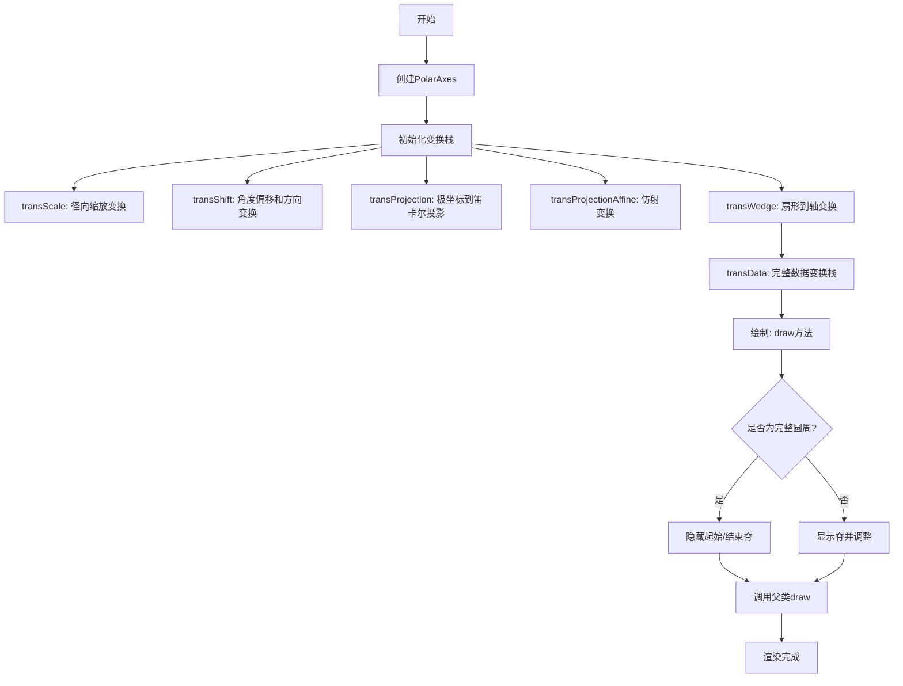

## 类结构

```
Transform (matplotlib.base)
├── PolarTransform
├── PolarAffine
├── InvertedPolarTransform
└── _ThetaShift
Axes (matplotlib.axes)
└── PolarAxes
    ├── ThetaAxis (extends XAxis)
    │   └── ThetaTick (extends XTick)
    └── RadialAxis (extends YAxis)
        └── RadialTick (extends YTick)
Supporting Classes:
├── ThetaFormatter (Formatter)
├── ThetaLocator (Locator)
├── RadialLocator (Locator)
├── _AxisWrapper
└── _WedgeBbox (Bbox)
```

## 全局变量及字段


### `math`
    
Standard Python math module for mathematical functions

类型：`module`
    


### `types`
    
Standard Python types module for dynamic type creation

类型：`module`
    


### `numpy as np`
    
NumPy library for numerical array operations

类型：`module`
    


### `matplotlib as mpl`
    
Matplotlib visualization library

类型：`module`
    


### `_api`
    
Matplotlib internal API utilities

类型：`module`
    


### `cbook`
    
Matplotlib common book utilities

类型：`module`
    


### `Axes`
    
Base axes class for all chart types

类型：`class`
    


### `maxis (matplotlib.axis)`
    
Matplotlib axis module containing axis classes

类型：`module`
    


### `mmarkers (matplotlib.markers)`
    
Matplotlib markers module for marker definitions

类型：`module`
    


### `mpatches (matplotlib.patches)`
    
Matplotlib patches module for shape patches

类型：`module`
    


### `Path`
    
Matplotlib path class for vector graphics paths

类型：`class`
    


### `mticker (matplotlib.ticker)`
    
Matplotlib ticker module for tick formatting and locating

类型：`module`
    


### `mtransforms (matplotlib.transforms)`
    
Matplotlib transforms module for coordinate transformations

类型：`module`
    


### `Spine`
    
Matplotlib spine class for axis spines

类型：`class`
    


### `PolarTransform._axis`
    
The associated Axis for getting minimum radial limit

类型：`Axis or None`
    


### `PolarTransform._use_rmin`
    
Whether to subtract minimum radial axis limit before transformation

类型：`bool`
    


### `PolarTransform._scale_transform`
    
Scaling transform for the radial axis data

类型：`Transform or None`
    


### `PolarTransform.input_dims`
    
Number of input dimensions (2 for 2D polar coordinates)

类型：`int`
    


### `PolarTransform.output_dims`
    
Number of output dimensions (2 for 2D Cartesian coordinates)

类型：`int`
    


### `PolarAffine._scale_transform`
    
Scaling transform to remove radial view limit scaling

类型：`Transform`
    


### `PolarAffine._limits`
    
View limits bounding box for radial axis

类型：`BboxBase`
    


### `PolarAffine._mtx`
    
Cached affine transformation matrix

类型：`ndarray or None`
    


### `InvertedPolarTransform._axis`
    
The associated Axis for adding minimum radial limit

类型：`Axis or None`
    


### `InvertedPolarTransform._use_rmin`
    
Whether to add minimum radial axis limit after transformation

类型：`bool`
    


### `InvertedPolarTransform.input_dims`
    
Number of input dimensions (2 for 2D Cartesian coordinates)

类型：`int`
    


### `InvertedPolarTransform.output_dims`
    
Number of output dimensions (2 for 2D polar coordinates)

类型：`int`
    


### `_AxisWrapper._axis`
    
The wrapped Axis object for degree-radian conversion

类型：`Axis`
    


### `ThetaLocator.base`
    
Base locator for theta tick locations

类型：`Locator`
    


### `ThetaLocator.axis`
    
Wrapped axis with degree-radian conversion

类型：`_AxisWrapper`
    


### `ThetaTick._text1_translate`
    
Translation transform for primary tick label

类型：`ScaledTranslation`
    


### `ThetaTick._text2_translate`
    
Translation transform for secondary tick label

类型：`ScaledTranslation`
    


### `ThetaAxis.axis_name`
    
Read-only name identifying the theta axis

类型：`str`
    


### `ThetaAxis._tick_class`
    
Tick class used for theta axis ticks

类型：`type`
    


### `RadialLocator.base`
    
Base locator for radial tick locations

类型：`Locator`
    


### `RadialLocator._axes`
    
The axes this locator is associated with

类型：`Axes or None`
    


### `_ThetaShift.axes`
    
The owning Axes for determining theta limits

类型：`Axes`
    


### `_ThetaShift.mode`
    
Shift mode ('min', 'max', or 'rlabel')

类型：`str`
    


### `_ThetaShift.pad`
    
Padding to apply in points

类型：`float`
    


### `RadialAxis.axis_name`
    
Read-only name identifying the radial axis

类型：`str`
    


### `RadialAxis._tick_class`
    
Tick class used for radial axis ticks

类型：`type`
    


### `_WedgeBbox._center`
    
Center coordinates of the wedge

类型：`tuple`
    


### `_WedgeBbox._viewLim`
    
View limits bounding box

类型：`Bbox`
    


### `_WedgeBbox._originLim`
    
Origin limits bounding box for wedge origin

类型：`Bbox`
    


### `PolarAxes.name`
    
Identifier name for polar projection ('polar')

类型：`str`
    


### `PolarAxes._default_theta_offset`
    
Default offset for theta zero position in radians

类型：`float`
    


### `PolarAxes._default_theta_direction`
    
Default direction for theta increase (1 or -1)

类型：`int`
    


### `PolarAxes._default_rlabel_position`
    
Default theta position for radius labels in radians

类型：`float`
    


### `PolarAxes._originViewLim`
    
View limits with lockable radial origin

类型：`LockableBbox`
    


### `PolarAxes._direction`
    
Transform for theta direction scaling

类型：`Affine2D`
    


### `PolarAxes._theta_offset`
    
Transform for theta offset translation

类型：`Affine2D`
    


### `PolarAxes.transShift`
    
Combined direction and offset transform

类型：`Transform`
    


### `PolarAxes._realViewLim`
    
View limits after accounting for orientation and offset

类型：`TransformedBbox`
    


### `PolarAxes.transScale`
    
Wrapper for radial axis scaling transform

类型：`TransformWrapper`
    


### `PolarAxes.axesLim`
    
Bounding box around the wedge region

类型：`_WedgeBbox`
    


### `PolarAxes.transWedge`
    
Transform from wedge bbox to axes coordinates

类型：`BboxTransformFrom`
    


### `PolarAxes.transAxes`
    
Transform from axes bbox to figure coordinates

类型：`BboxTransformTo`
    


### `PolarAxes.transProjection`
    
Polar to Cartesian projection transform

类型：`PolarTransform`
    


### `PolarAxes.transProjectionAffine`
    
Affine part of polar projection

类型：`PolarAffine`
    


### `PolarAxes.transData`
    
Complete data transformation stack to display coordinates

类型：`Transform`
    


### `PolarAxes._xaxis_transform`
    
Transform for theta-axis ticks

类型：`Transform`
    


### `PolarAxes._xaxis_text_transform`
    
Transform for theta-axis tick labels

类型：`Transform`
    


### `PolarAxes._yaxis_transform`
    
Transform for radial-axis ticks

类型：`Transform`
    


### `PolarAxes._r_label_position`
    
Transform for radial label position

类型：`Affine2D`
    


### `PolarAxes._yaxis_text_transform`
    
Transform for radial-axis tick labels

类型：`TransformWrapper`
    


### `PolarAxes._pan_start`
    
State storage for interactive panning

类型：`SimpleNamespace or None`
    
    

## 全局函数及方法


### `_is_full_circle_deg`

该函数是一个全局辅助函数，用于判断给定的角度范围（最小角度和最大角度）是否构成完整的圆（360度）。由于浮点数运算存在精度误差，函数使用了一个极小的阈值（`1e-12`）来进行容差判断。

参数：

- `thetamin`：`float`，扇区的最小 theta 角度（单位：度）。
- `thetamax`：`float`，扇区的最大 theta 角度（单位：度）。

返回值：`bool`，如果角度差值约等于 360 度则返回 `True`，否则返回 `False`。

#### 流程图

```mermaid
graph TD
    A[输入: thetamin, thetamax] --> B[计算差值: delta = abs(thetamax - thetamin)]
    B --> C[计算与360的偏差: diff = abs(delta - 360.0)]
    C --> D{偏差是否小于阈值 1e-12?}
    D -- 是 --> E[返回 True]
    D -- 否 --> F[返回 False]
```

#### 带注释源码

```python
def _is_full_circle_deg(thetamin, thetamax):
    """
    Determine if a wedge (in degrees) spans the full circle.

    The condition is derived from :class:`~matplotlib.patches.Wedge`.
    """
    # 计算最大与最小角度的绝对差值
    delta = abs(thetamax - thetamin)
    # 计算该差值与360度的绝对差值
    # 使用 1e-12 作为容差，以处理浮点数精度问题
    return abs(delta - 360.0) < 1e-12
```


### `_is_full_circle_rad`

判断给定的 theta 范围（弧度）是否覆盖完整的圆（360度）。该函数通过计算角度范围的绝对差值与 2π 的接近程度来确定是否为完整圆，使用很小的容差值（1.74e-14）来处理浮点数精度问题。

参数：

- `thetamin`：`float`，theta 最小值（弧度）
- `thetamax`：`float`，theta 最大值（弧度）

返回值：`bool`，如果角度范围覆盖完整圆则返回 `True`，否则返回 `False`

#### 流程图

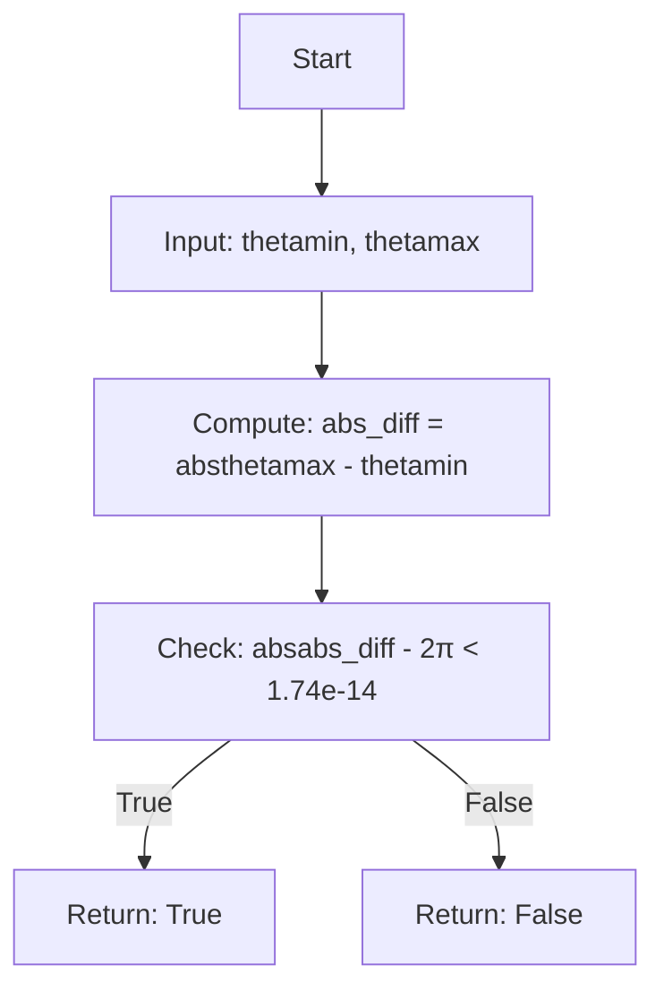

#### 带注释源码

```python
def _is_full_circle_rad(thetamin, thetamax):
    """
    Determine if a wedge (in radians) spans the full circle.

    The condition is derived from :class:`~matplotlib.patches.Wedge`.
    """
    # 计算角度范围的绝对差值
    # Compute the absolute difference between max and min theta values
    abs_diff = abs(thetamax - thetamin)
    
    # 检查差值是否接近 2π（完整圆的弧度值）
    # 使用很小的容差 1.74e-14 来处理浮点数精度问题
    # Check if the difference is approximately 2π (full circle in radians)
    # Using a small tolerance (1.74e-14) to handle floating-point precision
    return abs(abs_diff - 2 * np.pi) < 1.74e-14
```


### PolarTransform.__init__

初始化极坐标变换对象，设置极坐标到笛卡尔坐标转换的基础参数。

参数：

- `axis`：`~matplotlib.axis.Axis`，可选，与此变换关联的轴，用于获取最小径向限制
- `use_rmin`：`bool`，可选，如果为 `True`，则在转换为笛卡尔坐标前减去最小径向轴限制，此时 *axis* 必须指定
- `scale_transform`：`~matplotlib.transforms.Transform`，可选，径向轴的缩放变换

返回值：`None`，无返回值（`__init__` 方法隐式返回 `None`）

#### 流程图

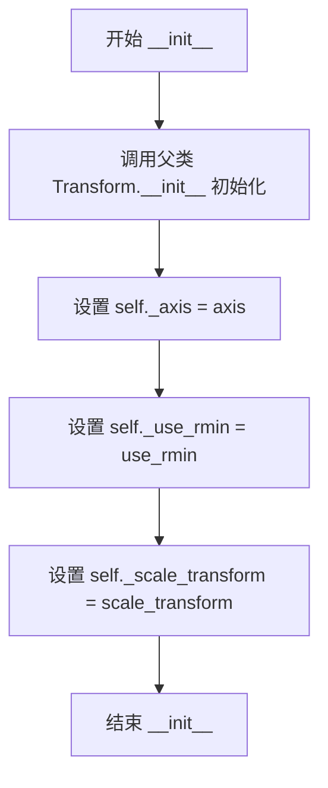

#### 带注释源码

```python
def __init__(self, axis=None, use_rmin=True, *, scale_transform=None):
    """
    Parameters
    ----------
    axis : `~matplotlib.axis.Axis`, optional
        Axis associated with this transform. This is used to get the
        minimum radial limit.
    use_rmin : `bool`, optional
        If ``True``, subtract the minimum radial axis limit before
        transforming to Cartesian coordinates. *axis* must also be
        specified for this to take effect.
    """
    # 调用父类 Transform 的初始化方法，完成基类初始化
    super().__init__()
    
    # 存储关联的轴对象，用于后续获取径向限制
    self._axis = axis
    
    # 存储是否使用最小径向限制的标志
    self._use_rmin = use_rmin
    
    # 存储径向轴的缩放变换（如对数缩放）
    self._scale_transform = scale_transform
```


### `PolarTransform._get_rorigin`

获取经过径向缩放变换后的原点半径值（r-origin），用于在极坐标变换时处理非零原点的径向轴。

参数：

- （无显式参数，仅使用实例属性 `self._axis` 和 `self._scale_transform`）

返回值：`float`，经过径向缩放变换后的原点半径值（y 坐标分量）

#### 流程图

```mermaid
flowchart TD
    A[开始 _get_rorigin] --> B[获取 self._axis.get_rorigin]
    B --> C[构造坐标点 (0, rorigin)]
    C --> D[调用 self._scale_transform.transform 进行坐标变换]
    D --> E[提取返回值的第二个分量 [1]]
    F[返回 float 类型的 rorigin 值]
    E --> F
```

#### 带注释源码

```python
def _get_rorigin(self):
    # 获取经过径向缩放变换后的原点半径值
    # 此方法用于在极坐标变换时获取径向轴的最小值/原点
    # 在 transform_non_affine 中会使用此值来调整半径
    #
    # 变换流程：
    # 1. 获取轴的原始原点半径 (通过 self._axis.get_rorigin())
    # 2. 构造点 (0, rorigin)，其中 0 表示角度/theta 维度
    # 3. 应用径向缩放变换（如对数缩放等非线性变换）
    # 4. 返回变换后的半径值（第二个分量，即索引 [1]）
    return self._scale_transform.transform(
        (0, self._axis.get_rorigin()))[1]
```


### `PolarTransform.transform_non_affine`

该方法实现了极坐标到笛卡尔坐标的非仿射变换，将极坐标系统中的角度θ和半径r转换为标准的x、y Cartesian坐标。在转换过程中，如果设置了最小半径（use_rmin=True）且存在关联的坐标轴，则会先减去最小半径原点，并对负半径值进行处理（转换为NaN），最后通过三角函数计算得到坐标。

参数：

- `values`：`numpy.ndarray`，极坐标值，形状为 (n, 2)，其中第一列为角度θ（弧度），第二列为半径r

返回值：`numpy.ndarray`，转换后的笛卡尔坐标，形状为 (n, 2)，其中第一列为x坐标，第二列为y坐标

#### 流程图

```mermaid
flowchart TD
    A[开始 transform_non_affine] --> B[接收极坐标 values]
    B --> C[提取 theta 和 r]
    C --> D{use_rmin=True 且 axis 存在?}
    D -->|是| E[计算 rorigin]
    E --> F[r = (r - rorigin) * rsign]
    D -->|否| G[跳过半径调整]
    F --> H[处理负值: r = where(r >= 0, r, nan)]
    G --> H
    H --> I[计算 x = r * cos(theta)]
    I --> J[计算 y = r * sin(theta)]
    J --> K[返回 column_stack([x, y])]
    K --> L[结束]
```

#### 带注释源码

```python
def transform_non_affine(self, values):
    # docstring inherited
    # 从输入数组中转置提取 theta（角度）和 r（半径）
    # values 预期形状为 (n, 2)，即 n 个点的极坐标
    theta, r = np.transpose(values)
    
    # 如果启用最小半径处理且存在关联的坐标轴
    # 则需要对半径进行偏移调整
    if self._use_rmin and self._axis is not None:
        # 获取经过缩放变换后的最小半径原点
        r = (r - self._get_rorigin()) * self._axis.get_rsign()
    
    # 处理负半径值：将负值替换为 NaN
    # 这确保了无效的半径值不会导致后续计算出错
    r = np.where(r >= 0, r, np.nan)
    
    # 将极坐标转换为笛卡尔坐标
    # x = r * cos(theta)
    # y = r * sin(theta)
    # 使用 column_stack 保持输出为 (n, 2) 形状的数组
    return np.column_stack([r * np.cos(theta), r * np.sin(theta)])
```


### `PolarTransform.transform_path_non_affine`

该方法将极坐标路径（非仿射变换）转换为笛卡尔坐标路径。它通过遍历路径的每个线段，判断是绘制直线、圆弧还是进行插值，并相应地调用`transform_non_affine`方法完成坐标转换，最终返回转换后的新路径对象。

参数：

- `path`：`Path`，极坐标（theta, r）路径对象，需要被转换为笛卡尔坐标路径

返回值：`Path`，转换后的笛卡尔坐标（x, y）路径对象

#### 流程图

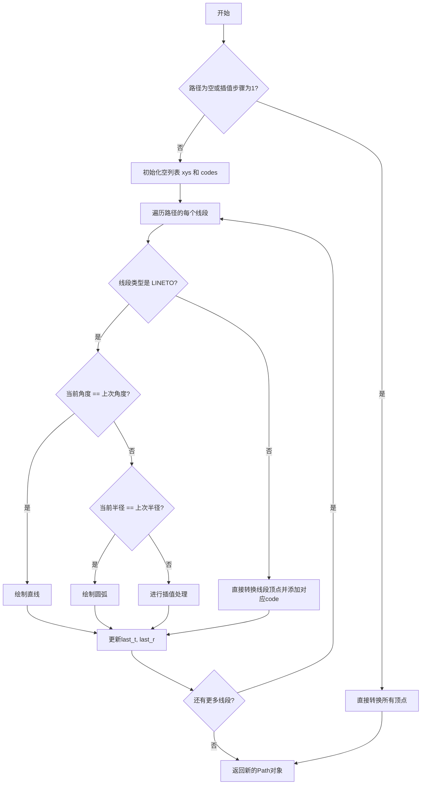

#### 带注释源码

```python
def transform_path_non_affine(self, path):
    """
    将极坐标路径转换为笛卡尔坐标路径（非仿射部分）。
    
    Parameters
    ----------
    path : Path
        极坐标 (theta, r) 路径对象
    
    Returns
    -------
    Path
        转换后的笛卡尔坐标 (x, y) 路径对象
    """
    # 如果路径为空或不需要插值，直接转换所有顶点并返回
    if not len(path) or path._interpolation_steps == 1:
        return Path(self.transform_non_affine(path.vertices), path.codes)
    
    # 初始化存储转换后坐标和路径码的列表
    xys = []
    codes = []
    # 记录上一个线段的结束点（角度和半径）
    last_t = last_r = None
    
    # 遍历路径的每个线段
    for trs, c in path.iter_segments():
        # 将线段数据重塑为 (N, 2) 形状
        trs = trs.reshape((-1, 2))
        
        # 处理直线类型（LINETO）
        if c == Path.LINETO:
            # 获取当前线段的起点（角度和半径）
            (t, r), = trs
            
            # 情况1：角度相同 -> 绘制直线
            if t == last_t:
                xys.extend(self.transform_non_affine(trs))
                codes.append(Path.LINETO)
            
            # 情况2：半径相同 -> 绘制圆弧
            elif r == last_r:
                # 使用 Path.arc() 生成圆弧，但需要手动处理角度展开
                last_td, td = np.rad2deg([last_t, t])
                
                # 如果使用 rmin，需要调整半径
                if self._use_rmin and self._axis is not None:
                    r = ((r - self._get_rorigin())
                         * self._axis.get_rsign())
                
                # 正向绘制圆弧（角度递增）
                if last_td <= td:
                    # 处理跨越360度的情况
                    while td - last_td > 360:
                        arc = Path.arc(last_td, last_td + 360)
                        xys.extend(arc.vertices[1:] * r)
                        codes.extend(arc.codes[1:])
                        last_td += 360
                    # 绘制剩余角度的圆弧
                    arc = Path.arc(last_td, td)
                    xys.extend(arc.vertices[1:] * r)
                    codes.extend(arc.codes[1:])
                else:
                    # 反向绘制圆弧（角度递减）
                    while last_td - td > 360:
                        arc = Path.arc(last_td - 360, last_td)
                        xys.extend(arc.vertices[::-1][1:] * r)
                        codes.extend(arc.codes[1:])
                        last_td -= 360
                    arc = Path.arc(td, last_td)
                    xys.extend(arc.vertices[::-1][1:] * r)
                    codes.extend(arc.codes[1:])
            
            # 情况3：角度和半径都不同 -> 进行线性插值
            else:
                # 使用 simple_linear_interpolation 在两点之间插入中间点
                trs = cbook.simple_linear_interpolation(
                    np.vstack([(last_t, last_r), trs]),
                    path._interpolation_steps)[1:]
                xys.extend(self.transform_non_affine(trs))
                codes.extend([Path.LINETO] * len(trs))
        
        # 处理非直线类型（如 MOVETO, CLOSEPOLY 等）
        else:
            xys.extend(self.transform_non_affine(trs))
            codes.extend([c] * len(trs))
        
        # 更新上一个线段的结束点
        last_t, last_r = trs[-1]
    
    # 返回转换后的新路径对象
    return Path(xys, codes)
```


### `PolarTransform.inverted`

获取极坐标变换的逆变换，将笛卡尔坐标映射回极坐标（θ, r）。

参数：

- （无参数，除 self 外）

返回值：`PolarAxes.InvertedPolarTransform`，返回逆极坐标变换对象，用于将笛卡尔坐标 (x, y) 转换回极坐标 (θ, r)，同时保留原始变换的轴和 rmin 配置。

#### 流程图

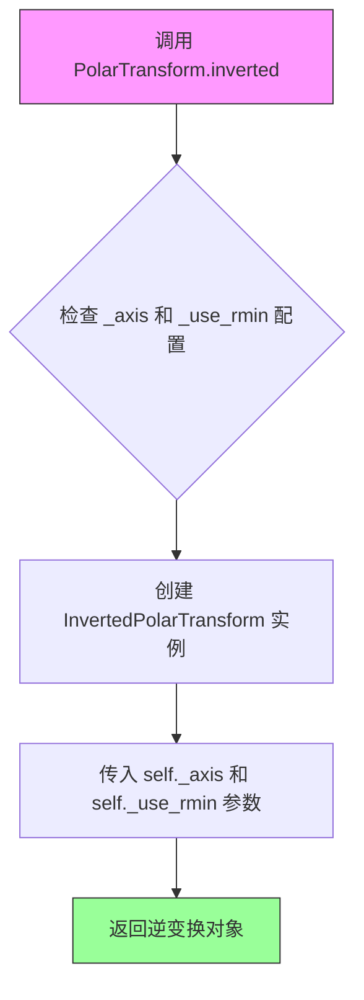

#### 带注释源码

```python
def inverted(self):
    # docstring inherited
    # 返回当前极坐标变换的逆变换
    # 逆变换将笛卡尔坐标 (x, y) 映射回极坐标 (θ, r)
    return PolarAxes.InvertedPolarTransform(self._axis, self._use_rmin)
```


### `PolarAffine.__init__`

这是 `PolarAffine` 类的构造函数，用于初始化极坐标仿射变换对象。该类负责极坐标投影的仿射部分，将输出缩放使得最大半径位于Axes圆的边缘，原点映射到(0.5, 0.5)。

参数：

- `scale_transform`：`Transform`，数据缩放变换，用于移除径向视图限制的任何缩放（如对数缩放）
- `limits`：`BboxBase`，数据的视图限制，仅使用其边界中的y限制（用于半径限制）

返回值：`None`，构造函数无返回值

#### 流程图

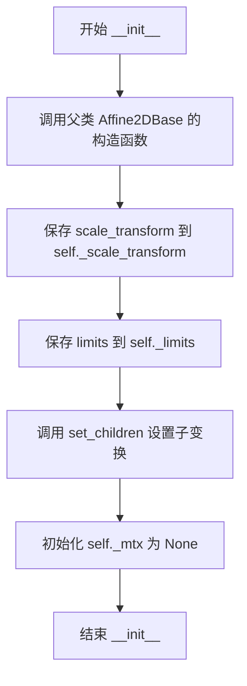

#### 带注释源码

```python
def __init__(self, scale_transform, limits):
    """
    Parameters
    ----------
    scale_transform : `~matplotlib.transforms.Transform`
        Scaling transform for the data. This is used to remove any scaling
        from the radial view limits.
    limits : `~matplotlib.transforms.BboxBase`
        View limits of the data. The only part of its bounds that is used
        is the y limits (for the radius limits).
    """
    # 调用父类 Affine2DBase 的初始化方法
    super().__init__()
    
    # 保存缩放变换对象，用于后续计算矩阵时去除径向数据的缩放
    self._scale_transform = scale_transform
    
    # 保存视图限制对象，用于获取径向的最小和最大限制
    self._limits = limits
    
    # 设置子变换，使当前变换依赖于这些子变换
    # 当子变换发生变化时，当前变换会被标记为无效
    self.set_children(scale_transform, limits)
    
    # 初始化变换矩阵为 None，在 get_matrix 中会进行惰性计算
    self._mtx = None
```


### PolarAffine.get_matrix

获取极坐标仿射变换矩阵。该方法计算并返回将极坐标数据映射到轴坐标的仿射变换矩阵，如果矩阵无效则重新计算。

参数：

- （无参数，仅使用实例属性）

返回值：`numpy.ndarray`，极坐标仿射变换矩阵（2x3 或 3x3 的变换矩阵）

#### 流程图

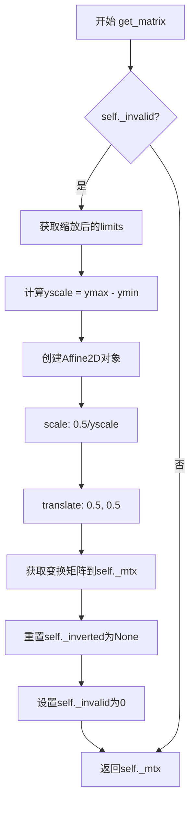

#### 带注释源码

```python
def get_matrix(self):
    # docstring inherited
    # 检查缓存的矩阵是否无效（如limits或scale_transform已更改）
    if self._invalid:
        # 使用scale_transform变换limits，获取实际的数据范围
        # 例如：如果使用log缩尺，limits会被转换回线性空间
        limits_scaled = self._limits.transformed(self._scale_transform)
        
        # 计算径向的缩放比例（y轴方向的范围）
        yscale = limits_scaled.ymax - limits_scaled.ymin
        
        # 创建新的仿射变换：
        # 1. scale: 将半径缩放到[0,1]范围，然后乘以0.5使得最大半径在0.5处
        # 2. translate: 将原点从(0,0)平移到(0.5,0.5)（轴的中心）
        affine = mtransforms.Affine2D() \
            .scale(0.5 / yscale) \
            .translate(0.5, 0.5)
        
        # 获取变换矩阵并缓存
        self._mtx = affine.get_matrix()
        
        # 标记逆变换为None（需要重新计算）
        self._inverted = None
        
        # 重置无效标志
        self._invalid = 0
    
    # 返回缓存的变换矩阵
    return self._mtx
```


### `InvertedPolarTransform.__init__`

初始化逆极坐标变换对象，用于将笛卡尔坐标空间的 x 和 y 映射回极坐标系的 theta 和 r。

参数：

-  `axis`：`~matplotlib.axis.Axis`，可选 - 与此变换关联的轴。用于获取最小径向限制。
-  `use_rmin`：`bool`，可选 - 如果为 `True`，在从笛卡尔坐标转换后添加最小径向轴限制。此时 *axis* 也必须被指定才能生效。

返回值：`None`，无返回值（构造函数）

#### 流程图

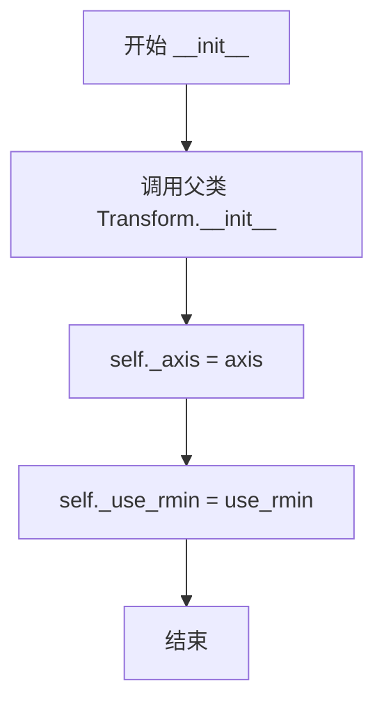

#### 带注释源码

```python
def __init__(self, axis=None, use_rmin=True):
    """
    Parameters
    ----------
    axis : `~matplotlib.axis.Axis`, optional
        Axis associated with this transform. This is used to get the
        minimum radial limit.
    use_rmin : `bool`, optional
        If ``True``, add the minimum radial axis limit after
        transforming from Cartesian coordinates. *axis* must also be
        specified for this to take effect.
    """
    # 调用父类 mtransforms.Transform 的初始化方法
    super().__init__()
    # 存储关联的轴对象，用于获取最小径向限制
    self._axis = axis
    # 存储是否使用最小径向限制的标志
    self._use_rmin = use_rmin
```


### InvertedPolarTransform.transform_non_affine

该方法实现 **逆极坐标变换**（Inverse Polar Transform），负责将笛卡尔平面坐标 *(x, y)* 转换为极坐标 *(θ, r)*，其中 *θ* 为弧度角（映射到 **[0, 2π)** 区间），*r* 为到原点的距离。若配置了 `use_rmin` 并且提供了坐标轴对象，还会把 *r* 调整到以径向原点为基准的坐标系中。

参数：

- `values`：`array-like`（通常为 `numpy.ndarray`），形状为 **(N, 2)**，表示 N 个点的笛卡尔坐标，每行 `[x, y]`。

返回值：`numpy.ndarray`，形状为 **(N, 2)**，每行为 `[θ, r]`，其中 `θ` 为弧度角（范围 `[0, 2π)`），`r` 为径向距离（已根据需要加上径向原点偏移并乘以径向符号）。

#### 流程图

```mermaid
flowchart TD
    A[输入 values (x, y)] --> B[解包 x, y = values.T]
    B --> C[计算 r = np.hypot(x, y)]
    C --> D[计算 theta = np.arctan2(y, x) % (2π)]
    D --> E{self._use_rmin and self._axis is not None?}
    E -->|是| F[r = (r + self._axis.get_rorigin()) * self._axis.get_rsign()]
    E -->|否| G[跳过 r 的额外调整]
    F --> H[返回 np.column_stack([theta, r])]
    G --> H
```

#### 带注释源码

```python
def transform_non_affine(self, values):
    """
    将笛卡尔坐标 (x, y) 逆变换为极坐标 (θ, r)。

    Parameters
    ----------
    values : array-like, shape (N, 2)
        输入的二维笛卡尔坐标，每行为 [x, y]。

    Returns
    -------
    numpy.ndarray, shape (N, 2)
        变换后的极坐标，每行为 [θ, r]，θ 为弧度角，范围 [0, 2π)。
    """
    # 1. 提取 x、y 坐标
    x, y = values.T

    # 2. 计算径向距离 r = sqrt(x^2 + y^2)
    r = np.hypot(x, y)

    # 3. 计算角度 θ = atan2(y, x)，并把结果映射到 [0, 2π)
    theta = np.arctan2(y, x) % (2 * np.pi)

    # 4. 若配置了 use_rmin 并且提供了 axis，则对 r 进行原点偏移和符号调整
    if self._use_rmin and self._axis is not None:
        r += self._axis.get_rorigin()   # 加上径向原点偏移
        r *= self._axis.get_rsign()      # 乘以径向方向符号

    # 5. 将 (θ, r) 按列拼接返回
    return np.column_stack([theta, r])
```

--- 

**备注**  
- 该方法仅处理 **非仿射** 部分（极坐标转换），后续的仿射缩放、平移由 `PolarAffine` 完成。  
- `theta` 通过取模 `% (2*np.pi)` 确保角度始终落在 `[0, 2π)` 区间，适用于环形图、雷达图等极坐标可视化。  
- 若 `use_rmin=True` 且提供了 `_axis`，则会在返回前把 `r` 调整为相对于极轴原点的值，这与 `PolarTransform.transform_non_affine` 中的对称处理相对应。  

**潜在的技术债务或优化空间**  
1. **数值精度**：对极大或极小的 `r` 进行 `np.hypot` 时可能出现数值上溢/下溢，可考虑使用 `np.sqrt(x*x + y*y)` 并加上适当的缩放。  
2. **向量化与内存**：返回的 `np.column_stack` 会创建新数组，若在极坐标绘图中频繁调用，可考虑原地操作或使用内存视图降低复制开销。  
3. **错误检查**：当前实现未对输入维度做显式校验，若传入非 2‑D 数组会抛出不够友好的错误信息，可加入形状检查并提供更明确的异常提示。  

--- 

**其它项目**  
- **设计目标**：在不依赖外部仿射变换的情况下，实现从笛卡尔坐标到极坐标的可逆映射，并支持径向原点的灵活配置。  
- **约束**：输入必须是二维数组，每行对应一个点的 (x, y)；输出保持相同的点数，只是坐标系统改变。  
- **错误处理**：若 `axis` 为 `None` 但 `use_rmin=True`，会跳过半径调整（等同于普通极坐标变换），避免异常。  
- **数据流**：该方法被 `PolarAxes` 的 `transProjection`（`PolarTransform`）的逆变换调用，常见于坐标回溯、鼠标交互和坐标轴标签定位等场景。  
- **外部依赖**：仅依赖 `numpy`，以及 `matplotlib.transforms.Transform` 基类提供的基本接口。  

--- 

*以上文档遵循您要求的结构和细节层次，可直接嵌入设计说明或技术手册中。*


### InvertedPolarTransform.inverted

该方法是 `InvertedPolarTransform` 类的成员方法，用于返回逆变换。它创建并返回一个 `PolarTransform` 对象，该对象可以将极坐标（theta, r）转换回笛卡尔坐标（x, y），从而实现双向坐标变换。

参数：无（仅使用实例属性 `self._axis` 和 `self._use_rmin`）

返回值：`PolarTransform`，返回对应的正向极坐标变换对象，用于将极坐标映射回笛卡尔坐标

#### 流程图

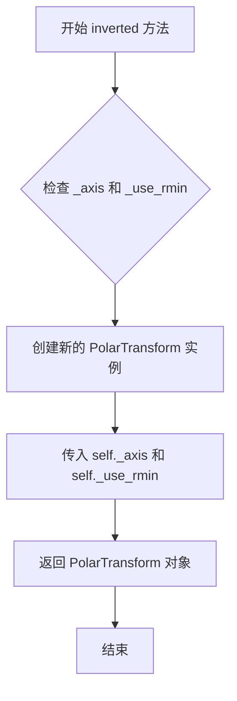

#### 带注释源码

```python
def inverted(self):
    # docstring inherited
    # 返回对应的正向极坐标变换 PolarTransform
    # 该方法实现了变换的反向操作，将极坐标 (theta, r) 转换回笛卡尔坐标 (x, y)
    # 参数:
    #     无（使用实例属性 self._axis 和 self._use_rmin）
    # 返回值:
    #     PolarTransform: 正向极坐标变换对象
    return PolarAxes.PolarTransform(self._axis, self._use_rmin)
```


### ThetaFormatter.__call__

该方法是ThetaFormatter类的核心功能实现，负责将极坐标中的弧度值转换为带有度数符号的字符串格式，用于极坐标图的theta轴刻度标签。

参数：

- `x`：`float`，输入的弧度值（theta值）
- `pos`：`int` 或 `None`，刻度位置索引（可选参数，用于多刻度标签场景）

返回值：`str`，格式化后的角度字符串，包含度数符号（如"90.0°"）

#### 流程图

```mermaid
flowchart TD
    A[开始 __call__] --> B[获取axis的视图区间<br/>self.axis.get_view_interval]
    B --> C[计算视角范围差值<br/>d = rad2degabs(vmax - vmin)]
    C --> D[计算所需小数位数<br/>digits = max(-intlog10d - 1.5, 0)]
    D --> E[将弧度转换为角度<br/>np.rad2degx]
    E --> F[格式化字符串<br/>f'{value:0.{digits}f}°']
    F --> G[返回格式化后的角度字符串]
```

#### 带注释源码

```python
def __call__(self, x, pos=None):
    """
    将theta值（弧度）格式化为带度数符号的字符串。
    
    Parameters
    ----------
    x : float
        输入的theta值，单位为弧度
    pos : int or None, optional
        刻度位置索引，用于多刻度标签场景
    
    Returns
    -------
    str
        格式化后的角度字符串，包含度数符号
    """
    # 获取axis的视图区间（vmin, vmax）
    vmin, vmax = self.axis.get_view_interval()
    
    # 计算视角范围（度），用于确定小数精度
    d = np.rad2deg(abs(vmax - vmin))
    
    # 根据视角范围计算所需的小数位数
    # 视角越广，需要的小数位数越少
    digits = max(-int(np.log10(d) - 1.5), 0)
    
    # 将弧度值转换为角度，并格式化为字符串
    # 添加度数符号（°）
    return f"{np.rad2deg(x):0.{digits}f}\N{DEGREE SIGN}"
```


### `_AxisWrapper.get_view_interval`

获取包装轴的视图间隔（即可视范围），并将其从弧度转换为度数返回。

参数：

-  `self`：`_AxisWrapper`，调用此方法的实例本身。

返回值：`numpy.ndarray`，返回视图间隔 (vmin, vmax)，单位为度。

#### 流程图

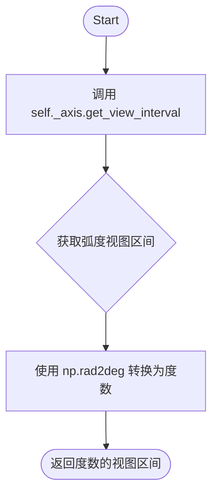

#### 带注释源码

```python
def get_view_interval(self):
    """
    获取视图间隔（度）。

    返回
    -------
    numpy.ndarray
        视图间隔 (vmin, vmax)，单位为度。
    """
    # 获取底层轴（弧度制）的视图间隔，
    # 并将其转换为度数后返回。
    return np.rad2deg(self._axis.get_view_interval())
```


### `_AxisWrapper.set_view_interval`

该方法用于设置 Theta 轴（角度轴）的视图区间。由于底层 Axis 存储的是弧度值，而 Theta 轴使用角度值，因此该方法将输入的角度值（度）转换为弧度后再设置到底层 Axis 上。

参数：

- `vmin`：`float`，视图区间的最小值（角度制）
- `vmax`：`float`，视图区间的最大值（角度制）

返回值：`None`，无返回值

#### 流程图

```mermaid
flowchart TD
    A[开始 set_view_interval] --> B[输入 vmin, vmax (角度值)]
    B --> C{检查参数有效性}
    C -->|有效| D[调用 np.deg2rad 转换 vmin 和 vmax 为弧度]
    C -->|无效| E[抛出异常]
    D --> F[使用星号解包转换后的元组]
    F --> G[调用 self._axis.set_view_interval 传递弧度值]
    G --> H[结束]
```

#### 带注释源码

```python
def set_view_interval(self, vmin, vmax):
    """
    设置 Theta 轴的视图区间（角度制）。

    由于底层 Axis 内部使用弧度存储角度值，此方法将输入的
    角度值（度）转换为弧度后再传递给底层 Axis。

    Parameters
    ----------
    vmin : float
        视图区间的最小值（角度制）。
    vmax : float
        视图区间的最大值（角度制）。
    """
    # 将角度值转换为弧度值，然后解包为两个参数传递
    # np.deg2rad((vmin, vmax)) 返回一个包含两个弧度值的元组
    # * 操作符将元组解包为两个独立的参数
    self._axis.set_view_interval(*np.deg2rad((vmin, vmax)))
```


### `_AxisWrapper.get_minpos`

获取Theta轴（角度轴）的最小正数据位置，并将单位从弧度转换为度。

参数： 无

返回值：`float` 或 `numpy.ndarray`，返回Theta轴数据区间的最小正位置（度）

#### 流程图

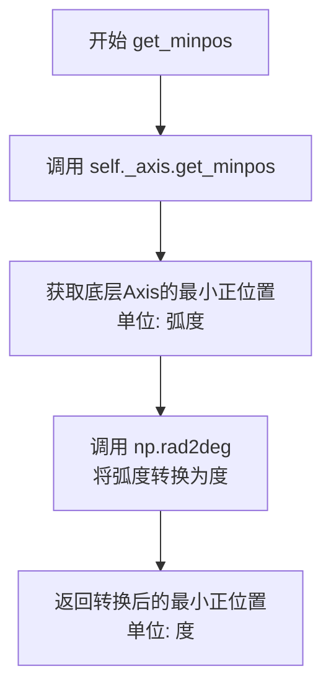

#### 带注释源码

```python
def get_minpos(self):
    """
    获取Theta轴的最小正数据位置（度）。

    此方法是 '_AxisWrapper' 类的包装方法，用于将底层Axis对象
    （ThetaAxis）的最小正位置从弧度转换为度。因为PolarAxes的
    ThetaAxis使用角度（度）作为显示单位，但底层数据仍以弧度存储，
    所以需要进行单位转换。

    Returns
    -------
    float or ndarray
        最小正数据位置，单位为度。
    """
    # 调用底层Axis对象的get_minpos方法，获取弧度单位的最小正位置
    # 然后使用np.rad2deg将其转换为度
    return np.rad2deg(self._axis.get_minpos())
```


### `_AxisWrapper.get_data_interval`

获取底层轴的数据区间，并将返回值的角度单位从弧度转换为度数。

参数：

- 无（仅包含隐式参数 `self`）

返回值：`numpy.ndarray`，返回以度为单位的底层轴数据区间

#### 流程图

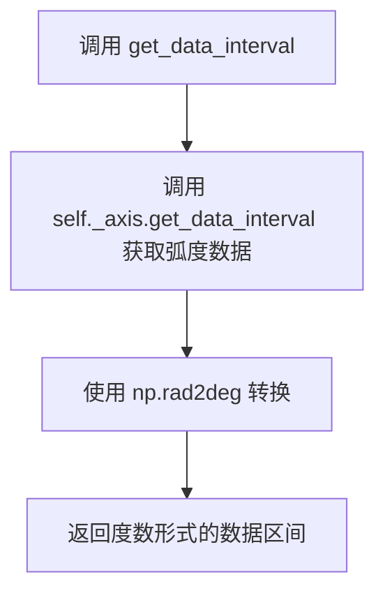

#### 带注释源码

```python
def get_data_interval(self):
    """
    获取底层轴的数据区间，并将角度从弧度转换为度。
    
    Returns
    -------
    numpy.ndarray
        以度为单位的数据区间 [vmin, vmax]
    """
    return np.rad2deg(self._axis.get_data_interval())
```

---

#### 补充说明

**函数功能**：
`_AxisWrapper.get_data_interval` 是一个包装器方法，用于将底层轴（存储在弧度单位中）的数据区间转换为度数表示。这个类是 matplotlib 极坐标系统中 Theta 轴（角度轴）的数据抽象层，用于在内部保持弧度计算的同时，对外提供度数的友好接口。

**设计目的**：
- 提供角度单位的转换抽象
- 使 theta 轴的数据区间能够以度为单位进行查询
- 保持与 matplotlib 其他组件（如视图区间）的一致性接口


### `_AxisWrapper.set_data_interval`

设置数据区间，将角度值从度数转换为弧度后传递给底层axis对象。

参数：

- `vmin`：`float`，数据区间的最小值（度数）
- `vmax`：`float`，数据区间的最大值（度数）

返回值：`None`，无返回值

#### 流程图

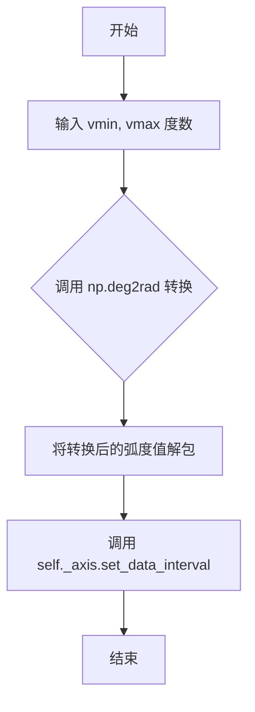

#### 带注释源码

```python
def set_data_interval(self, vmin, vmax):
    """
    Set the data interval for the axis.
    
    Parameters
    ----------
    vmin : float
        Minimum value of the data interval in degrees.
    vmax : float
        Maximum value of the data interval in degrees.
    """
    # 将输入的度数转换为弧度，然后解包传递给底层axis的set_data_interval方法
    # np.deg2rad 将角度从度数转换为弧度制
    # *操作符用于解包元组，将(vmin_rad, vmax_rad)转换为两个独立的参数
    self._axis.set_data_interval(*np.deg2rad((vmin, vmax)))
```


### `_AxisWrapper.get_tick_space`

获取底层轴的刻度空间。该方法直接委托给被包装的轴对象，用于确定可用的刻度空间。

参数： 无

返回值：`int`，返回底层轴的刻度空间大小

#### 流程图

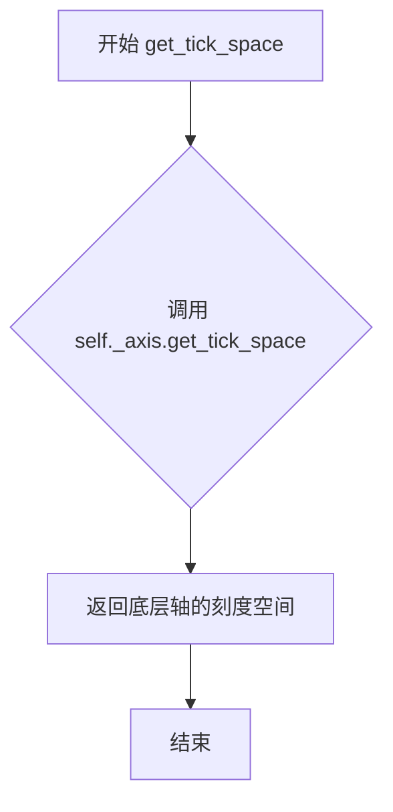

#### 带注释源码

```python
def get_tick_space(self):
    """
    获取底层轴的刻度空间。
    
    该方法直接委托给被包装的轴对象，用于确定可用的刻度空间。
    在 _AxisWrapper 中，作为角度轴的包装器，此方法允许 ThetaLocator
    正确计算 theta 方向的刻度空间。
    
    Returns
    -------
    int
        底层轴的刻度空间大小
    """
    return self._axis.get_tick_space()
```


### `ThetaLocator.__init__`

该方法是 `ThetaLocator` 类的构造函数，用于初始化角度定位器。它接收一个基础的定位器对象，并将其包装在一个 `_AxisWrapper` 中，以便处理角度（theta）轴的坐标转换（度到弧度的转换）。

参数：

- `base`：`mticker.Locator`，基础定位器对象，用于确定 theta 刻度的位置

返回值：`None`，构造函数不返回任何值

#### 流程图

```mermaid
flowchart TD
    A[开始 __init__] --> B[接收 base 参数]
    B --> C[将 base 赋值给 self.base]
    D[创建 _AxisWrapper] --> E[获取 self.base.axis]
    E --> F[将 self.base.axis 包装为 _AxisWrapper]
    F --> G[将包装后的 axis 赋值给 self.axis]
    G --> H[将包装后的 axis 也赋值给 self.base.axis]
    H --> I[结束 __init__]
```

#### 带注释源码

```python
def __init__(self, base):
    """
    Initialize the ThetaLocator with a base locator.

    Parameters
    ----------
    base : mticker.Locator
        The base locator used for tick location.
    """
    # 保存基础定位器对象
    self.base = base
    
    # 创建一个 _AxisWrapper 来包装基础定位器的 axis 属性
    # _AxisWrapper 会将角度从弧度转换为度（用于视图限制）
    # 同时将度转换回弧度（用于数据限制）
    self.axis = self.base.axis = _AxisWrapper(self.base.axis)
```


### `ThetaLocator.set_axis`

该方法用于设置 `ThetaLocator` 实例关联的坐标轴。它通过 `_AxisWrapper` 将原始的角度（度数）坐标轴包装成一个代理对象，以实现角度与弧度之间的单位转换，并将该包装后的轴传递给底层的 `base` 定位器。

参数：

-  `axis`：`matplotlib.axis.Axis`，极坐标图的角度（Theta）轴对象。

返回值：`None`，该方法为void类型，直接修改对象内部状态。

#### 流程图

```mermaid
graph TD
    A[Start] --> B[Input: axis]
    B --> C[创建 _AxisWrapper 对象]
    C --> D[将 axis 包装为 _AxisWrapper 实例]
    D --> E[更新 self.axis]
    E --> F[调用 self.base.set_axis]
    F --> G[将包装后的 axis 传递给 base 定位器]
    G --> H[End]
```

#### 带注释源码

```python
class ThetaLocator(mticker.Locator):
    """
    Used to locate theta ticks.
    ...
    """

    def __init__(self, base):
        self.base = base
        self.axis = self.base.axis = _AxisWrapper(self.base.axis)

    def set_axis(self, axis):
        """
        Set the axis for the locator.

        Parameters
        ----------
        axis : matplotlib.axis.Axis
            The axis to associate with this locator.
        """
        # 1. 将传入的 axis (通常为角度/度数制) 包装为 _AxisWrapper
        #    _AxisWrapper 会将 get_view_interval 等调用的返回值转换为弧度，
        #    以便底层的 base 定位器可以使用标准弧度值工作。
        self.axis = _AxisWrapper(axis)
        
        # 2. 同时更新底层 base 定位器的 axis 属性，
        #    确保整个定位器链都使用这个包装后的 axis。
        self.base.set_axis(self.axis)
```


### ThetaLocator.__call__

该方法是非侵入式的theta刻度定位器，用于在极坐标图中确定theta轴（角度）的刻度位置。当视图跨越完整圆周时，返回均匀分布的8个刻度（每45度）；否则委托给基础定位器计算刻度。

参数：

- 该方法无显式参数（隐式参数`self`为ThetaLocator实例）

返回值：`numpy.ndarray`，以弧度为单位的theta刻度位置数组

#### 流程图

```mermaid
flowchart TD
    A[开始 __call__] --> B[获取视图区间 lim = self.axis.get_view_interval]
    B --> C{视图是否跨越完整圆周?}
    C -->|是| D[计算圆周刻度: np.deg2rad(min(lim)) + np.arange(8) * 2π/8]
    C -->|否| E[调用基础定位器: self.base()]
    D --> F[转换为弧度返回]
    E --> G[将结果转换为弧度返回]
    F --> H[返回刻度数组]
    G --> H
```

#### 带注释源码

```python
def __call__(self):
    """
    返回theta刻度位置（弧度）。
    
    如果视图区间跨越完整的360度，则返回均匀分布的8个刻度点；
    否则委托给基础定位器计算刻度位置。
    
    Returns
    -------
    numpy.ndarray
        弧度单位的theta刻度位置数组
    """
    # 获取当前视图的theta范围（角度）
    lim = self.axis.get_view_interval()
    
    # 检查视图是否跨越完整圆周（360度）
    if _is_full_circle_deg(lim[0], lim[1]):
        # 对于完整圆周，返回8个均匀分布的刻度（每45度一个）
        # 从视图的最小角度开始
        return np.deg2rad(min(lim)) + np.arange(8) * 2 * np.pi / 8
    else:
        # 对于非完整圆周，使用基础定位器计算刻度
        # 并将结果从角度转换为弧度
        return np.deg2rad(self.base())
```


### ThetaLocator.view_limits

该方法用于调整θ轴（角度轴）的视图范围限制。它接收弧度制的视图边界，将其转换为角度制后委托给基础定位器的view_limits方法处理，然后再转换回弧度制返回，以确保角度刻度的正确放置。

参数：

- `vmin`：`float`，视图的最小值（弧度制）
- `vmax`：`float`，视图的最大值（弧度制）

返回值：`tuple[float, float]`，调整后的视图限制（弧度制），返回的是经过基础定位器处理后的视图边界

#### 流程图

```mermaid
flowchart TD
    A["开始: view_limits(vmin, vmax)"] --> B["将vmin和vmax从弧度转换为角度<br/>np.rad2deg((vmin, vmax))"]
    B --> C["调用base.view_limits处理角度制的vmin和vmax"]
    C --> D["将返回的角度制结果转换回弧度制<br/>np.deg2rad(result)"]
    D --> E["返回弧度制的视图限制"]
    
    B --> B1["输入: vmin, vmax (弧度)"]
    C --> C1["基础定位器处理"]
    D --> D1["输出: (vmin, vmax) 弧度"]
```

#### 带注释源码

```python
def view_limits(self, vmin, vmax):
    """
    Adjust the view limits for the theta axis.
    
    This method converts the input view limits from radians to degrees,
    delegates to the base locator's view_limits method, and then converts
    the result back to radians.
    
    Parameters
    ----------
    vmin : float
        The minimum view limit in radians.
    vmax : float
        The maximum view limit in radians.
    
    Returns
    -------
    tuple[float, float]
        The adjusted view limits in radians.
    """
    # Convert input view limits from radians to degrees
    # This is necessary because the underlying base locator operates in degrees
    vmin, vmax = np.rad2deg((vmin, vmax))
    
    # Delegate to the base locator's view_limits method to handle
    # the actual limit adjustment logic (e.g., handling singular cases,
    # ensuring proper spacing, etc.)
    # The base locator works with degree values
    result = self.base.view_limits(vmin, vmax)
    
    # Convert the result back to radians since the caller expects
    # radian values for the theta axis
    return np.deg2rad(result)
```


### ThetaTick.__init__

这是ThetaTick类的初始化方法，用于创建极坐标图的theta轴（角度轴）刻度线对象。该方法继承自XTick类，并额外设置文本平移变换以支持刻度标签的精确旋转和定位。

参数：

- `axes`：`matplotlib.axes.Axes`，极坐标轴对象，用于获取图形和创建变换
- `*args`：可变位置参数，传递给父类XTick的额外位置参数
- `**kwargs`：可变关键字参数，传递给父类XTick的额外关键字参数

返回值：`None`，该方法为构造函数，不返回任何值

#### 流程图

```mermaid
flowchart TD
    A[开始 __init__] --> B[创建 _text1_translate ScaledTranslation]
    B --> C[创建 _text2_translate ScaledTranslation]
    C --> D[调用父类 XTick.__init__]
    D --> E[设置 label1 的 rotation_mode 和 transform]
    E --> F[设置 label2 的 rotation_mode 和 transform]
    F --> G[结束 __init__]
```

#### 带注释源码

```python
def __init__(self, axes, *args, **kwargs):
    """
    初始化 ThetaTick 对象。
    
    Parameters
    ----------
    axes : matplotlib.axes.Axes
        极坐标轴对象，用于获取图形和创建变换。
    *args : tuple
        传递给父类 XTick 的额外位置参数。
    **kwargs : dict
        传递给父类 XTick 的额外关键字参数。
    """
    # 创建第一个文本标签的平移变换对象
    # 使用 ScaledTranslation 实现基于 DPI 缩放的平移
    self._text1_translate = mtransforms.ScaledTranslation(
        0, 0, axes.get_figure(root=False).dpi_scale_trans)
    
    # 创建第二个文本标签的平移变换对象
    # 两个标签分别用于刻度线的两侧
    self._text2_translate = mtransforms.ScaledTranslation(
        0, 0, axes.get_figure(root=False).dpi_scale_trans)
    
    # 调用父类 XTick 的初始化方法
    # 完成刻度线、刻度标签等基本属性的设置
    super().__init__(axes, *args, **kwargs)
    
    # 配置第一个刻度标签的变换：
    # rotation_mode='anchor' 使旋转基于锚点进行
    # 将基础变换与平移变换组合，实现标签的精确定位
    self.label1.set(
        rotation_mode='anchor',
        transform=self.label1.get_transform() + self._text1_translate)
    
    # 配置第二个刻度标签的变换（用于另一侧的标签）
    self.label2.set(
        rotation_mode='anchor',
        transform=self.label2.get_transform() + self._text2_translate)
```


### `ThetaTick._apply_params`

该方法是ThetaTick类的成员方法，继承自XTick类，用于在应用参数时确保标签的变换（transform）正确设置，特别是确保文本平移（_text1_translate和_text2_translate）被正确应用到标签的变换中，以维持极坐标图中刻度标签的正确位置和旋转。

参数：

- `**kwargs`：可变关键字参数，表示要应用的各种参数（如位置、旋转等），参数类型和数量取决于父类XTick的_apply_params方法的要求。

返回值：`None`，该方法不返回任何值，主要作用是更新对象的内部状态。

#### 流程图

```mermaid
flowchart TD
    A[开始 _apply_params] --> B[调用父类 super()._apply_params\*\*kwargs]
    B --> C[获取 label1 的当前变换]
    C --> D{变换中是否包含 _text1_translate?}
    D -->|否| E[将 _text1_translate 添加到 label1 的变换中]
    D -->|是| F[获取 label2 的当前变换]
    E --> F
    F --> G{变换中是否包含 _text2_translate?}
    G -->|否| H[将 _text2_translate 添加到 label2 的变换中]
    G -->|是| I[结束]
    H --> I
```

#### 带注释源码

```python
def _apply_params(self, **kwargs):
    """
    Apply parameters to the tick, ensuring label transforms are correct.
    
    This method overrides the parent class method to ensure that the
    custom text translations (_text1_translate and _text2_translate) are
    preserved in the label transforms, which are essential for proper
    positioning of theta-axis tick labels in polar plots.
    
    Parameters
    ----------
    **kwargs : dict
        Keyword arguments to be passed to the parent class method.
        These typically include parameters for tick positioning and
        appearance.
    """
    # 首先调用父类的_apply_params方法来处理标准的参数应用
    # 这是必要的，因为父类方法可能包含重要的初始化逻辑
    super()._apply_params(**kwargs)
    
    # 确保label1的变换是正确的；有时候这个变换会被重置
    # 获取label1当前的变换矩阵
    trans = self.label1.get_transform()
    
    # 检查当前变换是否已经包含了_text1_translate分支
    # contains_branch方法用于检查变换链中是否包含指定的变换
    if not trans.contains_branch(self._text1_translate):
        # 如果不包含，则将_text1_translate添加到现有的变换中
        # 这确保了标签文本能够正确地根据DPI进行缩放和定位
        self.label1.set_transform(trans + self._text1_translate)
    
    # 对label2进行相同的处理，确保第二个标签的变换也是正确的
    trans = self.label2.get_transform()
    if not trans.contains_branch(self._text2_translate):
        self.label2.set_transform(trans + self._text2_translate)
```


### ThetaTick._update_padding

该方法用于更新 theta 轴刻度标签的填充偏移量，根据刻度的角度位置调整标签的内边距，确保标签在极坐标图中准确定位。

参数：

- `pad`：`float`，刻度标签的基础填充值（以点为单位）
- `angle`：`float`，刻度的角度位置（弧度制）

返回值：`None`，无返回值（该方法直接修改对象内部状态）

#### 流程图

```mermaid
flowchart TD
    A[开始 _update_padding] --> B[计算 padx = pad * cos(angle) / 72]
    B --> C[计算 pady = pad * sin(angle) / 72]
    C --> D[设置 self._text1_translate._t = (padx, pady)]
    D --> E[调用 self._text1_translate.invalidate]
    E --> F[设置 self._text2_translate._t = (-padx, -pady)]
    F --> G[调用 self._text2_translate.invalidate]
    G --> H[结束]
```

#### 带注释源码

```python
def _update_padding(self, pad, angle):
    """
    更新 theta 轴刻度标签的填充偏移量。

    Parameters
    ----------
    pad : float
        刻度标签的基础填充值（以点为单位）。
    angle : float
        刻度的角度位置（弧度制）。
    """
    # 计算水平方向的填充偏移量（转换为坐标系单位，除以72转换为英寸）
    padx = pad * np.cos(angle) / 72
    # 计算垂直方向的填充偏移量
    pady = pad * np.sin(angle) / 72
    
    # 更新第一个文本标签（label1）的平移变换
    self._text1_translate._t = (padx, pady)
    # 使第一个文本标签的变换缓存失效，触发重新计算
    self._text1_translate.invalidate()
    
    # 更新第二个文本标签（label2）的平移变换（方向相反）
    self._text2_translate._t = (-padx, -pady)
    # 使第二个文本标签的变换缓存失效
    self._text2_translate.invalidate()
```


### ThetaTick.update_position

该方法用于更新极坐标图中θ轴刻度线的位置和角度，包括调整刻度线标记的旋转角度、标签文本的旋转角度以及标签的内边距，确保刻度线在视觉上与极坐标轴的弧线 spine 垂直。

参数：

- `loc`：`float`，刻度的位置值（以弧度为单位），表示该刻度在θ轴上的位置

返回值：`None`，该方法直接修改对象的内部状态，不返回任何值

#### 流程图

```mermaid
flowchart TD
    A[开始 update_position] --> B[调用父类方法 super().update_position loc]
    B --> C[获取 axes 和计算 angle]
    C --> D[计算 text_angle 和调整 angle]
    D --> E{检查 tick1line 标记类型}
    E -->|TICKUP 或 \| | F[创建旋转缩放变换]
    E -->|TICKDOWN | G[创建翻转旋转变换]
    E -->|其他 | H[保持原变换不变]
    F --> I[应用变换到 tick1line]
    G --> I
    H --> I
    I --> J{检查 tick2line 标记类型}
    J -->|TICKUP 或 \| | K[创建旋转缩放变换]
    J -->|TICKDOWN | L[创建翻转旋转变换]
    J -->|其他 | M[保持原变换不变]
    K --> N[应用变换到 tick2line]
    L --> N
    M --> N
    N --> O{检查 _labelrotation 模式}
    O -->|default | P[直接使用 user_angle]
    O -->|其他 | Q[调整 text_angle 范围]
    P --> R[设置标签旋转角度]
    Q --> R
    R --> S[计算并应用额外填充]
    S --> T[结束]
```

#### 带注释源码

```python
def update_position(self, loc):
    """
    Update the position of the tick.
    
    Parameters
    ----------
    loc : float
        The position of the tick in radians.
    """
    # 调用父类的 update_position 方法进行基础位置更新
    super().update_position(loc)
    
    # 获取所属的 axes 对象
    axes = self.axes
    
    # 计算刻度的角度：位置 * 方向 + 偏移量
    angle = loc * axes.get_theta_direction() + axes.get_theta_offset()
    
    # 将弧度转换为角度，并调整到 0-360 范围，然后减去 90 度
    # 这样可以使标签垂直于弧线 spine
    text_angle = np.rad2deg(angle) % 360 - 90
    
    # 调整角度以用于标记旋转（减去 90 度使标记垂直于半径）
    angle -= np.pi / 2

    # 处理第一个刻度线（tick1line）的标记变换
    marker = self.tick1line.get_marker()
    if marker in (mmarkers.TICKUP, '|'):
        # 向上标记：创建缩放为(1,1)的旋转变换
        trans = mtransforms.Affine2D().scale(1, 1).rotate(angle)
    elif marker == mmarkers.TICKDOWN:
        # 向下标记：创建缩放为(1,-1)的旋转变换（垂直翻转）
        trans = mtransforms.Affine2D().scale(1, -1).rotate(angle)
    else:
        # 自定义标记：不修改其变换
        trans = self.tick1line._marker._transform
    # 应用变换到第一个刻度线的标记
    self.tick1line._marker._transform = trans

    # 处理第二个刻度线（tick2line）的标记变换，逻辑同上
    marker = self.tick2line.get_marker()
    if marker in (mmarkers.TICKUP, '|'):
        trans = mtransforms.Affine2D().scale(1, 1).rotate(angle)
    elif marker == mmarkers.TICKDOWN:
        trans = mtransforms.Affine2D().scale(1, -1).rotate(angle)
    else:
        trans = self.tick2line._marker._transform
    self.tick2line._marker._transform = trans

    # 处理标签旋转角度
    mode, user_angle = self._labelrotation
    if mode == 'default':
        # 默认模式：直接使用用户指定的角度
        text_angle = user_angle
    else:
        # 自动模式或其他模式：调整角度范围并应用用户角度
        if text_angle > 90:
            text_angle -= 180
        elif text_angle < -90:
            text_angle += 180
        text_angle += user_angle
    
    # 应用旋转角度到两个标签
    self.label1.set_rotation(text_angle)
    self.label2.set_rotation(text_angle)

    # 计算额外的填充距离
    # 这个额外的填充有助于保持与之前版本的外观一致，
    # 同时也是因为标签是锚定在中心所需的
    pad = self._pad + 7
    
    # 更新标签的内边距，使用调整后的角度
    self._update_padding(pad,
                         self._loc * axes.get_theta_direction() +
                         axes.get_theta_offset())
```


### ThetaAxis._wrap_locator_formatter

该方法用于配置Theta轴（角度轴）的主刻度定位器和格式化器，确保极坐标图的Theta轴能够正确显示角度刻度值。

参数：

- 该方法没有显式参数（隐式参数为 `self`，表示调用此方法的 ThetaAxis 实例）

返回值：`None`，该方法直接修改对象状态，不返回任何值

#### 流程图

```mermaid
flowchart TD
    A[开始 _wrap_locator_formatter] --> B[获取当前主定位器]
    B --> C[使用 ThetaLocator 包装当前定位器]
    C --> D[设置为主定位器: set_major_locator]
    E[创建 ThetaFormatter 实例]
    D --> F[设置为主格式化器: set_major_formatter]
    E --> F
    F --> G[设置 isDefault_majloc = True]
    G --> H[设置 isDefault_majfmt = True]
    H --> I[结束]
```

#### 带注释源码

```python
def _wrap_locator_formatter(self):
    """
    配置Theta轴的主刻度定位器和格式化器。
    
    该方法将当前的主定位器包装在ThetaLocator中，以支持角度的特殊处理
    （如处理完整圆周的情况），并使用ThetaFormatter将弧度转换为带度符号的角度标签。
    """
    # 获取当前的主定位器（例如AutoLocator），然后用ThetaLocator包装它
    # ThetaLocator会在视角涵盖完整圆周时自动调整刻度位置
    self.set_major_locator(ThetaLocator(self.get_major_locator()))
    
    # 设置ThetaFormatter作为主格式化器，用于将弧度值转换为角度值并添加度符号
    self.set_major_formatter(ThetaFormatter())
    
    # 标记major locator为默认状态，以便在重置时能够恢复
    self.isDefault_majloc = True
    
    # 标记major formatter为默认状态，以便在重置时能够恢复
    self.isDefault_majfmt = True
```


### ThetaAxis.clear

该方法用于清除并重新配置θ轴（角度轴）的状态。首先调用父类的清除方法，然后设置刻度位置为无，最后通过`_wrap_locator_formatter()`方法设置角度专用的定位器和格式化器。

参数：此方法无显式参数（隐式参数`self`为`ThetaAxis`实例）

返回值：`None`，该方法直接修改对象状态，不返回任何值

#### 流程图

```mermaid
graph TD
    A[开始 ThetaAxis.clear] --> B[调用 super().clear]
    B --> C[调用 self.set_ticks_position('none')]
    C --> D[调用 self._wrap_locator_formatter]
    D --> E[结束]
```

#### 带注释源码

```
def clear(self):
    # 继承自父类的清除方法，执行XAxis的标准清除逻辑
    super().clear()
    
    # 设置刻度位置为'none'，即不显示θ轴的刻度线
    self.set_ticks_position('none')
    
    # 调用内部方法，设置角度专用的定位器和格式化器
    # 这会配置ThetaLocator和ThetaFormatter来处理角度数据
    self._wrap_locator_formatter()
```


### `ThetaAxis._set_scale`

该方法负责设置极坐标轴（Theta Axis）的比例尺（Scale）。在极坐标图中，Theta 轴（角度轴）通常仅支持线性（Linear）刻度，因为非线性刻度在角度表示上没有实际意义或难以解释。该方法在调用父类方法设置基本线性比例后，还会自定义刻度定位器（Locator），以确保刻度出现在常见的角度倍数上（如 15°, 30°, 45° 等），并重新包装格式器以支持角度制显示。

参数：

- `value`：`str`，要设置的轴比例尺类型（通常为 'linear'）。如果是其他值（如 'log'），将抛出异常。
- `**kwargs`：`dict`，传递给父类 `_set_scale` 方法的其他关键字参数。

返回值：`None`，该方法直接修改轴的状态，不返回任何值。

#### 流程图

```mermaid
flowchart TD
    A[开始 _set_scale] --> B{value == 'linear'?}
    B -- 否 --> C[抛出 NotImplementedError]
    B -- 是 --> D[调用父类 super()._set_scale 设置基础比例]
    D --> E[获取当前的主刻度定位器]
    E --> F[设置定位器的 steps 参数为 [1, 1.5, 3, 4.5, 9, 10]]
    F --> G[调用 _wrap_locator_formatter 包装角度定位器和格式器]
    G --> H[结束]
```

#### 带注释源码

```python
def _set_scale(self, value, **kwargs):
    """
    Set the scale of the theta axis.

    Parameters
    ----------
    value : str
        The scale type. Must be 'linear' for polar plots.
    **kwargs
        Additional arguments passed to the parent class.
    """
    # 极坐标图的 theta 轴通常不支持非线性缩放（例如对数刻度）。
    # 如果尝试设置非 'linear' 的值，则抛出未实现错误。
    if value != 'linear':
        raise NotImplementedError(
            "The xscale cannot be set on a polar plot")
    
    # 调用父类 (XAxis) 的 _set_scale 方法，执行实际的缩放设置逻辑。
    # 这通常会设置内部的 _scale 对象。
    super()._set_scale(value, **kwargs)
    
    # LinearScale.set_default_locators_and_formatters 默认会将主刻度定位器
    # 设置为 AutoLocator。我们在此处自定义它。
    # 设置 steps=[1, 1.5, 3, 4.5, 9, 10] 可以确保刻度出现在
    # 常见的角度倍数上（例如 0, 15, 30, 45, 90 度等，基于视图范围）。
    self.get_major_locator().set_params(steps=[1, 1.5, 3, 4.5, 9, 10])
    
    # 调用内部方法，重新包装定位器和格式器。
    # 这会将定位器转换为 ThetaLocator 以处理弧度<->角度的转换，
    # 并将格式器设置为 ThetaFormatter 以显示度数符号。
    self._wrap_locator_formatter()
```


### `ThetaAxis._copy_tick_props`

该方法用于复制源刻度的属性到目标刻度，并在父类复制操作的基础上额外处理文本变换，以确保极坐标图中刻度标签的填充（padding）能正确工作。

参数：

- `src`：源刻度对象（`ThetaTick` 或 `XTick`），待复制属性的来源刻度，若为 `None` 则直接返回
- `dest`：目标刻度对象（`ThetaTick` 或 `XTick`），属性复制目标，若为 `None` 则直接返回

返回值：`None`，该方法无返回值，直接修改目标刻度对象的属性

#### 流程图

```mermaid
flowchart TD
    A[开始 _copy_tick_props] --> B{检查 src 或 dest 是否为 None}
    B -->|是| C[直接返回]
    B -->|否| D[调用父类 XAxis._copy_tick_props 复制基础属性]
    D --> E[获取 dest 的第一个文本变换 _get_text1_transform]
    E --> F[将文本变换与 _text1_translate 组合后设置给 dest.label1]
    F --> G[获取 dest 的第二个文本变换 _get_text2_transform]
    G --> H[将文本变换与 _text2_translate 组合后设置给 dest.label2]
    H --> I[结束]
```

#### 带注释源码

```python
def _copy_tick_props(self, src, dest):
    """Copy the props from src tick to dest tick."""
    # 如果源刻度或目标刻度为 None，直接返回，避免后续操作报错
    if src is None or dest is None:
        return
    # 调用父类 XAxis 的方法，复制基础刻度属性（如线条样式、标记等）
    super()._copy_tick_props(src, dest)

    # 确保刻度变换是独立的，这样 padding 才能正确工作
    # 获取目标刻度的主标签（label1）的变换矩阵
    trans = dest._get_text1_transform()[0]
    # 将文本变换与目标刻度的 _text1_translate（用于 DPI 缩放）组合
    # 确保主标签的变换独立，不受其他刻度影响
    dest.label1.set_transform(trans + dest._text1_translate)
    
    # 同样处理次标签（label2）
    trans = dest._get_text2_transform()[0]
    dest.label2.set_transform(trans + dest._text2_translate)
```


### RadialLocator.__init__

这是 `RadialLocator` 类的构造函数，用于初始化径向刻度定位器。它接收一个基础定位器和一个可选的（已废弃的）axes 参数，并将它们存储为实例属性。

参数：

- `base`：`mticker.Locator`，基础定位器，用于处理除确保刻度为正以外的所有任务
- `axes`：`~matplotlib.axis.Axis`，可选参数（自 3.11 版本起废弃），关联的轴对象

返回值：`None`，构造函数不返回任何值

#### 流程图

```mermaid
flowchart TD
    A[开始 __init__] --> B[接收 base 和 axes 参数]
    B --> C[将 base 赋值给 self.base]
    C --> D[将 axes 赋值给 self._axes]
    D --> E[结束]
```

#### 带注释源码

```python
@_api.delete_parameter("3.11", "axes")
def __init__(self, base, axes=None):
    """
    初始化 RadialLocator 实例。

    Parameters
    ----------
    base : `~matplotlib.ticker.Locator`
        基础定位器，用于处理除确保刻度为正以外的所有任务。
    axes : `~matplotlib.axis.Axis`, optional
        （已废弃）关联的轴对象。
    """
    # 存储基础定位器
    self.base = base
    # 存储轴对象（已废弃）
    self._axes = axes
```


### RadialLocator.set_axis

设置径向定位器的轴对象，将轴信息传递给底层的基础定位器。

参数：

- `axis`：`~matplotlib.axis.Axis`，要设置的轴对象，用于底层基础定位器的轴设置

返回值：`None`，该方法为void类型，不返回任何值

#### 流程图

```mermaid
flowchart TD
    A[开始 set_axis] --> B{axis 是否为 None}
    B -->|否| C[调用 self.base.set_axis]
    C --> D[结束]
    B -->|是| C
```

#### 带注释源码

```python
def set_axis(self, axis):
    """
    Set the axis for the radial locator.

    This method delegates the axis setting to the underlying base locator,
    allowing the base locator to properly configure its axis reference.

    Parameters
    ----------
    axis : matplotlib.axis.Axis
        The axis to be set for the base locator.
    """
    self.base.set_axis(axis)
```


### RadialLocator.__call__

定位径向坐标轴的刻度位置。当视图为完整圆形且非环形视图时，确保所有刻度严格大于径向原点（rorigin）；其他情况委托给基类定位器处理。

参数：

- 无显式参数（隐式参数 `self` 为 `RadialLocator` 实例）

返回值：`list` 或类似可迭代对象，返回计算得到的径向刻度位置值列表

#### 流程图

```mermaid
flowchart TD
    A[开始 __call__] --> B[获取 self.base.axis.axes]
    B --> C{视图是否为完整圆形<br/>_is_full_circle_rad?}
    C -->|否| F[返回 self.base 的结果]
    C -->|是| D[计算 rorigin = ax.get_rorigin \* ax.get_rsign]
    D --> E{ax.get_rmin <= rorigin?}
    E -->|否| F
    E -->|是| G[过滤刻度: 仅保留 tick > rorigin]
    G --> H[返回过滤后的刻度列表]
    F --> I[返回 self.base 的结果]
```

#### 带注释源码

```python
def __call__(self):
    """
    返回径向轴的刻度位置。

    此方法首先检查当前视图是否为完整圆形且非环形视图。
    如果是，则确保返回的刻度都大于径向原点（rorigin），
    以保持与先前版本一致的行为。

    Returns
    -------
    array-like
        刻度位置值数组
    """
    # 获取基础定位器所绑定的轴所属的 Axes 对象
    ax = self.base.axis.axes
    
    # 检查 theta 方向视图范围是否为完整圆形（2π 弧度）
    if _is_full_circle_rad(*ax.viewLim.intervalx):
        # 计算径向原点，考虑方向符号
        rorigin = ax.get_rorigin() * ax.get_rsign()
        
        # 如果最小径向限制小于等于径向原点，则过滤刻度
        # 只保留严格大于径向原点的刻度值
        if ax.get_rmin() <= rorigin:
            return [tick for tick in self.base() if tick > rorigin]
    
    # 对于非完整圆形视图或其他情况，直接委托给基础定位器
    return self.base()
```


### `RadialLocator._zero_in_bounds`

该方法用于判断零值是否在径向轴的刻度有效范围内。它通过调用基础标度的 `limit_range_for_scale` 方法来确定零是否在有效范围内。

参数：无（仅使用 `self` 实例）

返回值：`bool`，如果零在有效范围内则返回 `True`，否则返回 `False`

#### 流程图

```mermaid
flowchart TD
    A[开始 _zero_in_bounds] --> B[获取基础标度]
    B --> C[调用 limit_range_for_scale 方法]
    C --> D[参数: 0, 1, 1e-5]
    D --> E[获取返回的 vmin, vmax]
    E --> F{vmin == 0?}
    F -->|是| G[返回 True]
    F -->|否| H[返回 False]
```

#### 带注释源码

```python
def _zero_in_bounds(self):
    """
    Return True if zero is within the valid values for the
    scale of the radial axis.
    """
    # 调用基础标度的 limit_range_for_scale 方法
    # 参数: 传入0作为测试值, 1作为范围, 1e-5作为容差
    # 该方法会返回经过标度处理后的有效范围
    vmin, vmax = self.base.axis._scale.limit_range_for_scale(0, 1, 1e-5)
    
    # 如果处理后的最小值vmin等于0,说明零在有效范围内
    return vmin == 0
```


### `RadialLocator.nonsingular`

该方法用于确保径向轴的视图限制不会出现奇异性（当 vmin 或 vmax 为无穷大或无效时），通过检查零点是否在有效范围内来处理初始视图限制，并委托给基础定位器处理其他情况。

参数：

- `vmin`：`float`，视图的最小径向值（r 坐标）
- `vmax`：`float`，视图的最大径向值（r 坐标）

返回值：`tuple[float, float]`，返回处理后的 (vmin, vmax) 视图限制元组

#### 流程图

```mermaid
flowchart TD
    A[开始 nonsingular] --> B{调用 _zero_in_bounds}
    B -->|返回 True| C{(vmin, vmax) == (-np.inf, np.inf)?}
    B -->|返回 False| D[调用 self.base.nonsingular]
    C -->|是| E[返回 (0, 1)]
    C -->|否| D
    D --> F[返回 base定位器的结果]
    E --> G[结束]
    F --> G
```

#### 带注释源码

```python
def nonsingular(self, vmin, vmax):
    # docstring inherited
    # 检查零点是否在径向轴的有效范围内
    if self._zero_in_bounds() and (vmin, vmax) == (-np.inf, np.inf):
        # Initial view limits
        # 当视图范围为默认的 (-inf, inf) 初始状态时，
        # 返回 (0, 1) 作为合理的初始视图限制
        return (0, 1)
    else:
        # 对于其他情况，委托给基础定位器处理
        return self.base.nonsingular(vmin, vmax)
```


### `RadialLocator.view_limits`

该方法用于计算径向坐标轴的视图限制，处理底层的定位器并确保零点在有效范围内，同时处理可能的反转情况。

参数：

- `vmin`：`float`，视图下限值
- `vmax`：`float`，视图上限值

返回值：`tuple[float, float]`，返回处理后的视图限制元组 (vmin, vmax)

#### 流程图

```mermaid
flowchart TD
    A[开始 view_limits] --> B[调用 self.base.view_limits vmin, vmax]
    B --> C{self._zero_in_bounds 且 vmax > vmin?}
    C -->|是| D[vmin = min0, vmin]
    C -->|否| E[跳过调整]
    D --> F[调用 mtransforms._nonsingular vmin, vmax]
    E --> F
    F --> G[返回处理后的 vmin, vmax]
```

#### 带注释源码

```python
def view_limits(self, vmin, vmax):
    """
    计算径向轴的视图限制。
    
    Parameters
    ----------
    vmin : float
        视图下限值
    vmax : float
        视图上限值
        
    Returns
    -------
    tuple[float, float]
        处理后的视图限制 (vmin, vmax)
    """
    # 首先调用底层定位器的 view_limits 方法获取初步限制
    vmin, vmax = self.base.view_limits(vmin, vmax)
    
    # 检查零点是否在有效范围内且视图未反转
    if self._zero_in_bounds() and vmax > vmin:
        # 允许反转的 r/y 轴限制，确保 vmin 不小于 0
        vmin = min(0, vmin)
    
    # 使用 mtransforms._nonsingular 处理无穷大和 NaN 值
    return mtransforms._nonsingular(vmin, vmax)
```


### `_ThetaShift.__init__`

该方法用于初始化 `_ThetaShift` 类，该类是 `ScaledTranslation` 的子类，用于根据轴的 theta 限制创建径向刻度的填充偏移量。它接收极坐标轴对象、填充值和模式参数，初始化变换矩阵以实现刻度标签的定位。

参数：

- `axes`：`matplotlib.axes.Axes`，拥有此变换的 Axes 对象，用于确定角度限制
- `pad`：`float`，要应用的填充值，以点（points）为单位
- `mode`：`str`，填充模式，可选值为 `'min'`（从起始位置偏移）、`'max'`（从结束位置偏移）或 `'rlabel'`（使用径向标签位置偏移）

返回值：`None`，该方法为构造函数，不返回任何值

#### 流程图

```mermaid
flowchart TD
    A[开始 __init__] --> B[调用父类 ScaledTranslation 初始化<br/>super().__init__ pad, pad, dpi_scale_trans]
    --> C[设置子节点<br/>set_children axes._realViewLim]
    --> D[存储 axes 属性<br/>self.axes = axes]
    --> E[存储 mode 属性<br/>self.mode = mode]
    --> F[存储 pad 属性<br/>self.pad = pad]
    --> G[结束]
```

#### 带注释源码

```python
def __init__(self, axes, pad, mode):
    """
    Initialize the ThetaShift transform.

    Parameters
    ----------
    axes : matplotlib.axes.Axes
        The owning Axes; used to determine limits.
    pad : float
        The padding to apply, in points.
    mode : {'min', 'max', 'rlabel'}
        Whether to shift away from the start ('min') or the end ('max')
        of the axes, or using the rlabel position ('rlabel').
    """
    # 调用父类 ScaledTranslation 的构造函数
    # 传入 pad 值作为 x 和 y 方向的偏移量
    # 使用 axes 的 figure 的 dpi_scale_trans 作为变换
    super().__init__(pad, pad, axes.get_figure(root=False).dpi_scale_trans)
    
    # 设置子节点依赖，用于跟踪 axes._realViewLim 的变化
    # 这样当视图限制改变时，变换会重新计算
    self.set_children(axes._realViewLim)
    
    # 存储对 axes 对象的引用，用于后续获取角度信息
    self.axes = axes
    
    # 存储填充模式：'min', 'max', 或 'rlabel'
    # 决定偏移量的计算方式
    self.mode = mode
    
    # 存储填充值（以点为单位）
    # 后续在 get_matrix 中会转换为坐标偏移
    self.pad = pad
```


### `_ThetaShift.get_matrix`

该方法根据极坐标轴的 theta 限制计算径向刻度标签的平移偏移量，通过不同的模式（'min'、'max'、'rlabel'）确定角度，并结合填充值计算最终的平移向量。

参数：无（该方法使用实例属性 `self.mode`、`self.pad`、`self.axes`）

返回值：`numpy.ndarray`，2x3 仿射变换矩阵，返回父类 `ScaledTranslation` 的变换矩阵

#### 流程图

```mermaid
flowchart TD
    A[开始 get_matrix] --> B{_invalid 标志为真?}
    B -->|是| C{mode == 'rlabel'?}
    B -->|否| H[调用父类 get_matrix]
    C -->|是| D[计算 angle: deg2rad<br/>rlabel_position * theta_direction<br/>+ theta_offset - π/2]
    C -->|否| E{mode == 'min'?}
    E -->|是| F[angle = realViewLim.xmin - π/2]
    E -->|否| G[angle = realViewLim.xmax + π/2]
    D --> I[计算 _t: pad * cos(angle) / 72<br/>pad * sin(angle) / 72]
    F --> I
    G --> I
    I --> H
    H --> J[返回矩阵]
```

#### 带注释源码

```python
def get_matrix(self):
    """
    计算径向刻度标签的平移矩阵。

    根据当前的平移模式（mode）计算角度，
    然后将填充值（pad）转换为以角度为方向的平移向量。
    """
    # 检查缓存是否无效（_invalid 标志在矩阵需要重新计算时为真）
    if self._invalid:
        # 根据不同的模式确定角度
        if self.mode == 'rlabel':
            # 使用径向标签位置计算角度
            angle = (
                np.deg2rad(self.axes.get_rlabel_position()
                           * self.axes.get_theta_direction())
                + self.axes.get_theta_offset()
                - np.pi / 2  # 旋转90度使标签垂直于径向
            )
        elif self.mode == 'min':
            # 从 theta 最小值处开始偏移
            angle = self.axes._realViewLim.xmin - np.pi / 2
        elif self.mode == 'max':
            # 从 theta 最大值处开始偏移
            angle = self.axes._realViewLim.xmax + np.pi / 2
        
        # 将填充值（点）转换为坐标偏移
        # 除以72将点数转换为英寸（假设72 DPI）
        self._t = (
            self.pad * np.cos(angle) / 72,
            self.pad * np.sin(angle) / 72
        )
    
    # 调用父类方法获取变换矩阵
    return super().get_matrix()
```


### RadialTick.__init__

初始化一个径向刻度对象，该类是 `YTick` 的子类，用于在极坐标图中显示径向轴刻度。构造函数通过调用父类初始化器并设置标签的旋转模式为锚点模式，使刻度标签能够正确地垂直于脊线排列。

参数：

- `*args`：可变位置参数，传递给父类 `YTick` 的位置参数
- `**kwargs`：可变关键字参数，传递给父类 `YTick` 的关键字参数

返回值：`None`，构造函数不返回任何值

#### 流程图

```mermaid
flowchart TD
    A[开始 RadialTick.__init__] --> B[调用 super().__init__(*args, **kwargs)]
    B --> C[设置 self.label1 的旋转模式为 'anchor']
    C --> D[设置 self.label2 的旋转模式为 'anchor']
    D --> E[结束]
```

#### 带注释源码

```python
def __init__(self, *args, **kwargs):
    """
    初始化径向刻度对象。
    
    参数
    ----------
    *args : 可变位置参数
        传递给父类 YTick 的位置参数。
    **kwargs : 可变关键字参数
        传递给父类 YTick 的关键字参数。
    """
    # 调用父类 YTick 的初始化方法，完成刻度对象的基本初始化
    # 包括刻度线、刻度标签等属性的设置
    super().__init__(*args, **kwargs)
    
    # 设置第一个刻度标签的旋转模式为 'anchor'
    # 'anchor' 模式表示标签将根据旋转角度自动调整对齐方式
    # 这对于径向刻度标签的正确显示至关重要
    self.label1.set_rotation_mode('anchor')
    
    # 设置第二个刻度标签的旋转模式为 'anchor'
    # 第二个标签用于显示在轴的另一侧
    self.label2.set_rotation_mode('anchor')
```


### `RadialTick._determine_anchor`

该方法用于确定径向刻度标签的水平和垂直对齐方式。它根据旋转模式（自动或手动）、角度值以及刻度是位于起始边还是结束边来计算最合适的对齐方式，确保标签在极坐标图中正确对齐到刻度位置。

参数：

- `mode`：`str`，指定标签旋转模式，`'auto'` 表示自动根据角度旋转，`'manual'` 或其他值表示手动设置
- `angle`：`float`，刻度角度（已标准化为相对于脊柱角度减90度），单位为度，范围通常在 -90 到 270 之间
- `start`：`bool`，指示当前处理的刻度是位于起始边（`True`）还是结束边（`False`）

返回值：`tuple[str, str]`，返回包含水平对齐（horizontal alignment）和垂直对齐（vertical alignment）的元组，例如 `('left', 'center')`

#### 流程图

```mermaid
flowchart TD
    A[开始 _determine_anchor] --> B{mode == 'auto'?}
    B -->|Yes| C{start?}
    B -->|No| D{start?}
    
    C -->|Yes| E{-90 ≤ angle ≤ 90?}
    C -->|No| F{-90 ≤ angle ≤ 90?}
    
    E -->|Yes| G[返回 ('left', 'center')]
    E -->|No| H[返回 ('right', 'center')]
    F -->|Yes| I[返回 ('right', 'center')]
    F -->|No| J[返回 ('left', 'center')]
    
    D -->|Yes| K{angle 范围判断}
    D -->|No| L{angle 范围判断}
    
    K --> M{angle < -68.5}
    K --> N{-68.5 ≤ angle < -23.5}
    K --> O{-23.5 ≤ angle < 22.5}
    K --> P{22.5 ≤ angle < 67.5}
    K --> Q{67.5 ≤ angle < 112.5}
    K --> R{112.5 ≤ angle < 157.5}
    K --> S{157.5 ≤ angle < 202.5}
    K --> T{202.5 ≤ angle < 247.5}
    K --> U{angle ≥ 247.5}
    
    M --> V[('center', 'top')]
    N --> W[('left', 'top')]
    O --> X[('left', 'center')]
    P --> Y[('left', 'bottom')]
    Q --> Z[('center', 'bottom')]
    R --> AA[('right', 'bottom')]
    S --> AB[('right', 'center')]
    T --> AC[('right', 'top')]
    U --> AD[('center', 'top')]
    
    L --> AE{angle < -68.5}
    L --> AF{-68.5 ≤ angle < -23.5}
    L --> AG{-23.5 ≤ angle < 22.5}
    L --> AH{22.5 ≤ angle < 67.5}
    L --> AI{67.5 ≤ angle < 112.5}
    L --> AJ{112.5 ≤ angle < 157.5}
    L --> AK{157.5 ≤ angle < 202.5}
    L --> AL{202.5 ≤ angle < 247.5}
    L --> AM{angle ≥ 247.5}
    
    AE --> AN[('center', 'bottom')]
    AF --> AO[('right', 'bottom')]
    AG --> AP[('right', 'center')]
    AH --> AQ[('right', 'top')]
    AI --> AR[('center', 'top')]
    AJ --> AS[('left', 'top')]
    AK --> AT[('left', 'center')]
    AL --> AU[('left', 'bottom')]
    AM --> AV[('center', 'bottom')]
```

#### 带注释源码

```python
def _determine_anchor(self, mode, angle, start):
    """
    Determine the alignment of the radial tick label.
    
    Parameters
    ----------
    mode : str
        The rotation mode, either 'auto' or a manual setting.
        When 'auto', the alignment is determined based on the angle.
    angle : float
        The tick angle in degrees. Note that this angle is already
        adjusted by -90 degrees from the normalized spine angle
        because it's used for tick & text setup.
    start : bool
        True if this is the start (first) tick, False for the end tick.
        This affects which side of the tick the label appears on.
    
    Returns
    -------
    tuple
        A (horizontal_alignment, vertical_alignment) pair.
    """
    # Note: angle is the (spine angle - 90) because it's used for the tick
    # & text setup, so all numbers below are -90 from (normed) spine angle.
    
    if mode == 'auto':
        # Auto mode: simpler logic based on angle quadrant
        if start:
            # For start tick: label on the inside (towards center)
            if -90 <= angle <= 90:
                # Top half of circle: left align to tick
                return 'left', 'center'
            else:
                # Bottom half of circle: right align to tick
                return 'right', 'center'
        else:
            # For end tick: label on the outside (away from center)
            if -90 <= angle <= 90:
                # Top half of circle: right align to tick
                return 'right', 'center'
            else:
                # Bottom half of circle: left align to tick
                return 'left', 'center'
    else:
        # Manual mode: more granular control with 45-degree segments
        if start:
            # Start tick with manual rotation
            if angle < -68.5:
                return 'center', 'top'
            elif angle < -23.5:
                return 'left', 'top'
            elif angle < 22.5:
                return 'left', 'center'
            elif angle < 67.5:
                return 'left', 'bottom'
            elif angle < 112.5:
                return 'center', 'bottom'
            elif angle < 157.5:
                return 'right', 'bottom'
            elif angle < 202.5:
                return 'right', 'center'
            elif angle < 247.5:
                return 'right', 'top'
            else:
                return 'center', 'top'
        else:
            # End tick with manual rotation (mirrored logic)
            if angle < -68.5:
                return 'center', 'bottom'
            elif angle < -23.5:
                return 'right', 'bottom'
            elif angle < 22.5:
                return 'right', 'center'
            elif angle < 67.5:
                return 'right', 'top'
            elif angle < 112.5:
                return 'center', 'top'
            elif angle < 157.5:
                return 'left', 'top'
            elif angle < 202.5:
                return 'left', 'center'
            elif angle < 247.5:
                return 'left', 'bottom'
            else:
                return 'center', 'bottom'
```


### RadialTick.update_position

该方法负责更新径向刻度线的位置和角度，确保刻度线和标签正确地垂直于极坐标轴的弧线，并根据轴的限制进行旋转。

参数：

- `loc`：`float`，刻度的位置值（径向坐标）

返回值：`None`，该方法直接修改对象的属性，不返回任何值

#### 流程图

```mermaid
flowchart TD
    A[开始 update_position] --> B[调用父类 update_position]
    B --> C[获取 axes, thetamin, thetamax, direction, offset_rad]
    C --> D{是否完整圆?}
    D -->|是| E[angle = rlabel_position * direction + offset - 90]
    D -->|否| F[angle = thetamin * direction + offset - 90]
    E --> G[tick_angle = 0]
    F --> H{tick_angle = deg2rad}
    H -->|direction > 0| I[tick_angle = deg2rad(angle)]
    H -->|direction <= 0| J[tick_angle = deg2rad(angle + 180)]
    G --> K[计算 text_angle]
    I --> K
    J --> K
    K --> L[根据 labelrotation 模式调整 text_angle]
    L --> M{是否完整圆?}
    M -->|是| N[使用默认 ha, va]
    M -->|否| O[调用 _determine_anchor]
    N --> P[设置 label1 的 ha, va, rotation]
    O --> P
    P --> Q{处理 tick1line 标记变换}
    Q --> R{tick1line marker 类型}
    R -->|TICKLEFT| S[创建旋转变换]
    R -->|'_'| T[创建旋转90度变换]
    R -->|TICKRIGHT| U[创建缩放+旋转变换]
    R -->|其他| V[使用原有变换]
    S --> W[应用变换到 tick1line]
    T --> W
    U --> W
    V --> W
    W --> X{是否完整圆?}
    X -->|是| Y[隐藏 label2 和 tick2line]
    X -->|否| Z[计算 thetamax 对应的 angle 和 tick_angle]
    Y --> AA[设置 label2 的 ha, va, rotation]
    Z --> AB[应用 tick2line 标记变换]
    AA --> AB
    AB --> AC[结束]
```

#### 带注释源码

```python
def update_position(self, loc):
    """
    Update the position of the tick.

    Parameters
    ----------
    loc : float
        The location of the tick.
    """
    # 调用父类方法更新基本位置
    super().update_position(loc)
    
    # 获取极坐标轴的属性
    axes = self.axes
    thetamin = axes.get_thetamin()  # 最小角度（度）
    thetamax = axes.get_thetamax()  # 最大角度（度）
    direction = axes.get_theta_direction()  # 角度方向（1或-1）
    offset_rad = axes.get_theta_offset()  # 角度偏移（弧度）
    offset = np.rad2deg(offset_rad)  # 转换为度
    full = _is_full_circle_deg(thetamin, thetamax)  # 检查是否绘制完整圆

    # 根据是否完整圆计算角度
    if full:
        # 完整圆：使用rlabel位置作为参考
        angle = (axes.get_rlabel_position() * direction +
                 offset) % 360 - 90
        tick_angle = 0
    else:
        # 非完整圆：使用最小角度作为参考
        angle = (thetamin * direction + offset) % 360 - 90
        if direction > 0:
            tick_angle = np.deg2rad(angle)
        else:
            tick_angle = np.deg2rad(angle + 180)
    
    # 计算文本角度（-90到90之间）
    text_angle = (angle + 90) % 180 - 90
    mode, user_angle = self._labelrotation
    if mode == 'auto':
        text_angle += user_angle
    else:
        text_angle = user_angle

    # 确定标签对齐方式
    if full:
        ha = self.label1.get_horizontalalignment()
        va = self.label1.get_verticalalignment()
    else:
        ha, va = self._determine_anchor(mode, angle, direction > 0)
    
    # 应用到第一个标签
    self.label1.set_horizontalalignment(ha)
    self.label1.set_verticalalignment(va)
    self.label1.set_rotation(text_angle)

    # 处理第一个刻度线的标记变换
    marker = self.tick1line.get_marker()
    if marker == mmarkers.TICKLEFT:
        trans = mtransforms.Affine2D().rotate(tick_angle)
    elif marker == '_':
        trans = mtransforms.Affine2D().rotate(tick_angle + np.pi / 2)
    elif marker == mmarkers.TICKRIGHT:
        trans = mtransforms.Affine2D().scale(-1, 1).rotate(tick_angle)
    else:
        # 不修改自定义刻度线标记
        trans = self.tick1line._marker._transform
    self.tick1line._marker._transform = trans

    # 处理完整圆情况下的第二个标签/刻度线
    if full:
        self.label2.set_visible(False)
        self.tick2line.set_visible(False)
    
    # 计算最大角度处的属性
    angle = (thetamax * direction + offset) % 360 - 90
    if direction > 0:
        tick_angle = np.deg2rad(angle)
    else:
        tick_angle = np.deg2rad(angle + 180)
    text_angle = (angle + 90) % 180 - 90
    mode, user_angle = self._labelrotation
    if mode == 'auto':
        text_angle += user_angle
    else:
        text_angle = user_angle

    # 设置第二个标签的属性
    ha, va = self._determine_anchor(mode, angle, direction < 0)
    self.label2.set_ha(ha)
    self.label2.set_va(va)
    self.label2.set_rotation(text_angle)

    # 处理第二个刻度线的标记变换
    marker = self.tick2line.get_marker()
    if marker == mmarkers.TICKLEFT:
        trans = mtransforms.Affine2D().rotate(tick_angle)
    elif marker == '_':
        trans = mtransforms.Affine2D().rotate(tick_angle + np.pi / 2)
    elif marker == mmarkers.TICKRIGHT:
        trans = mtransforms.Affine2D().scale(-1, 1).rotate(tick_angle)
    else:
        # 不修改自定义刻度线标记
        trans = self.tick2line._marker._transform
    self.tick2line._marker._transform = trans
```


### `RadialAxis.__init__`

初始化极坐标图的径向轴，重写 YAxis 的某些属性以提供径向轴的特殊处理。它调用父类构造函数，并在 sticky_edges 中添加零值边缘，以防止径向刻度低于原点。

参数：

- `*args`：`tuple`，可变位置参数，传递给父类 YAxis 的构造函数
- `**kwargs`：`dict`，可变关键字参数，传递给父类 YAxis 的构造函数

返回值：`None`，此方法不返回值，而是直接修改对象本身

#### 流程图

```mermaid
flowchart TD
    A[开始 __init__] --> B[调用 super().__init__(*args, **kwargs)]
    B --> C[将 0 添加到 self.sticky_edges.y]
    C --> D[结束]
```

#### 带注释源码

```python
def __init__(self, *args, **kwargs):
    """
    初始化径向轴。

    Parameters
    ----------
    *args : tuple
        传递给父类 YAxis 构造器的位置参数。
    **kwargs : dict
        传递给父类 YAxis 构造器的关键字参数。
    """
    # 调用父类 YAxis 的初始化方法
    super().__init__(*args, **kwargs)
    # 在 sticky_edges 的 y 轴上添加 0 值边缘
    # 这可以防止径向刻度延伸到原点以下
    self.sticky_edges.y.append(0)
```


### `RadialAxis.set_major_locator`

该方法用于设置径向轴的主刻度定位器。如果传入的定位器不是 RadialLocator 实例，会自动将其包装为 RadialLocator，以确保径向轴的刻度定位功能正常工作。

参数：

- `locator`：`Any`（或 `matplotlib.ticker.Locator`），用于确定径向轴主刻度位置的对象

返回值：`None`，无返回值

#### 流程图

```mermaid
flowchart TD
    A[开始 set_major_locator] --> B{locator 是否为 RadialLocator 实例?}
    B -->|是| C[直接使用 locator]
    B -->|否| D[将 locator 包装为 RadialLocator]
    D --> C
    C --> E[调用父类 YAxis.set_major_locator]
    E --> F[结束]
```

#### 带注释源码

```python
def set_major_locator(self, locator):
    """
    Set the major locator for the radial axis.
    
    This method overrides the parent class's set_major_locator to ensure
    that the locator is wrapped in a RadialLocator, which handles radial
    axis tick positioning correctly.
    
    Parameters
    ----------
    locator : Locator
        The locator object to use for positioning major ticks on the radial axis.
        This can be any matplotlib ticker locator (e.g., AutoLocator, MaxNLocator, etc.).
        If it is not already a RadialLocator, it will be wrapped in one.
    """
    # Check if the provided locator is already a RadialLocator instance
    if not isinstance(locator, RadialLocator):
        # If not, wrap it in a RadialLocator to ensure proper radial axis behavior
        # RadialLocator delegates to the base locator but adds radial-specific logic
        locator = RadialLocator(locator)
    
    # Call the parent class (YAxis) method to set the major locator
    super().set_major_locator(locator)
```


### RadialAxis.clear

清除径向轴的状态，将刻度位置设置为 'none'。

参数：
- 无显式参数（继承自父类）

返回值：`None`，无返回值描述

#### 流程图

```mermaid
flowchart TD
    A[开始 clear] --> B[调用父类 YAxis.clear]
    B --> C[设置刻度位置为'none': self.set_ticks_position('none')]
    C --> D[结束]
```

#### 带注释源码

```python
def clear(self):
    # 继承自父类的文档字符串
    # 调用父类 YAxis 的 clear 方法清除轴的默认状态
    super().clear()
    
    # 设置刻度位置为 'none'，这意味着刻度线将不会显示在径向轴上
    # 这是因为在极坐标图中，径向刻度线通常通过其他方式（如网格线）显示
    self.set_ticks_position('none')
```


### `_WedgeBbox.__init__`

初始化 `_WedgeBbox` 对象，用于将极坐标 (theta, r) 坐标系的 Wedge 边界框转换为 Axes 边界框。

参数：

- `center`：`tuple(float, float)`，Wedge 的中心点坐标
- `viewLim`：`matplotlib.transforms.Bbox`，确定 Wedge 边界的边界框
- `originLim`：`matplotlib.transforms.Bbox`，确定 Wedge 原点的边界框（如果与 viewLim 不同）
- `**kwargs`：任意关键字参数，传递给父类 `Bbox` 的额外参数

返回值：`None`，构造函数无返回值

#### 流程图

```mermaid
flowchart TD
    A[开始 __init__] --> B[调用父类 Bbox.__init__<br/>初始化单位边界框 [[0, 0], [1, 1]]]
    B --> C[设置 self._center = center<br/>保存 Wedge 中心点]
    C --> D[设置 self._viewLim = viewLim<br/>保存视图限制边界框]
    D --> E[设置 self._originLim = originLim<br/>保存原点限制边界框]
    E --> F[调用 set_children<br/>建立父子依赖关系]
    F --> G[结束 __init__]
```

#### 带注释源码

```python
def __init__(self, center, viewLim, originLim, **kwargs):
    """
    初始化 _WedgeBbox 对象，用于将 (theta, r) 坐标系的 Wedge 边界框
    转换为 Axes 边界框。

    Parameters
    ----------
    center : (float, float)
        Wedge 的中心点坐标
    viewLim : `~matplotlib.transforms.Bbox`
        确定 Wedge 边界的边界框
    originLim : `~matplotlib.transforms.Bbox`
        确定 Wedge 原点的边界框，如果与 viewLim 不同
    **kwargs
        传递给父类的额外关键字参数
    """
    # 调用父类 Bbox 的构造函数，初始化一个单位边界框 [[0, 0], [1, 1]]
    # 这个初始边界框会在 get_points() 中根据实际参数计算后被覆盖
    super().__init__([[0, 0], [1, 1]], **kwargs)
    
    # 保存 Wedge 的中心点坐标
    self._center = center
    
    # 保存视图限制边界框，用于确定 Wedge 的角度和半径范围
    self._viewLim = viewLim
    
    # 保存原点限制边界框，用于确定径向原点的位置
    self._originLim = originLim
    
    # 设置子节点依赖关系，确保当 viewLim 或 originLim 发生变化时，
    # 当前 Bbox 会收到失效通知并重新计算
    self.set_children(viewLim, originLim)
```


### `_WedgeBbox.get_points`

该方法用于将极坐标（theta, r）的 wedge 边界框转换为 Axes 坐标系下的矩形边界框。它首先获取视图限制的点，然后根据角度和半径的缩放关系计算合适的边界框，并确保最终边界框具有相等的宽高比。

参数：

- 该方法无显式参数（继承自父类 `mtransforms.Bbox` 的行为）

返回值：`numpy.ndarray`，返回变换后的二维边界框点集，形状为 (2, 2)，包含左下角和右上角坐标

#### 流程图

```mermaid
flowchart TD
    A[开始 get_points] --> B{self._invalid 为 True?}
    B -->|是| C[获取 viewLim 的点并复制]
    C --> D[将角度从弧度转换为度数]
    D --> E{points[0, 0] > points[1, 0]?}
    E -->|是| F[反转角度顺序]
    E -->|否| G[跳过反转]
    F --> G
    G --> H[从 originLim.y0 减去径向偏移]
    H --> I[计算径向缩放因子 rscale]
    I --> J[应用径向缩放]
    J --> K[计算 wedge 宽度]
    K --> L[创建 Wedge 补丁对象]
    L --> M[从 wedge 路径更新边界框]
    M --> N{宽度 > 高度?}
    N -->|是| O[调整高度使宽高相等]
    N -->|否| P{高度 > 宽度?}
    P -->|是| Q[调整宽度使宽高相等]
    P -->|否| R[设置 _invalid 为 0]
    O --> R
    Q --> R
    B -->|否| S[直接返回 _points]
    R --> S
    S --> T[结束]
```

#### 带注释源码

```
def get_points(self):
    # docstring inherited
    if self._invalid:
        # 1. 获取视图限制的点（theta, r）
        points = self._viewLim.get_points().copy()
        
        # 2. 将角度从弧度转换为度数（Wedge 使用度数）
        points[:, 0] *= 180 / np.pi
        
        # 3. 如果起始角度大于结束角度，则反转角度顺序
        if points[0, 0] > points[1, 0]:
            points[:, 0] = points[::-1, 0]

        # 4. 基于原点半径调整径向范围
        points[:, 1] -= self._originLim.y0

        # 5. 计算径向缩放因子，使最大半径映射到 0.5（ axes 的一半）
        rscale = 0.5 / points[1, 1]
        points[:, 1] *= rscale
        
        # 6. 计算 wedge 宽度，取实际径向范围和 0.5 的较小值
        width = min(points[1, 1] - points[0, 1], 0.5)

        # 7. 创建 Wedge 补丁对象，用于生成边界框路径
        wedge = mpatches.Wedge(self._center, points[1, 1],  # 中心，最大半径
                               points[0, 0], points[1, 0],   # 起始和结束角度
                               width=width)                  # wedge 宽度
        self.update_from_path(wedge.get_path())

        # 8. 确保边界框具有相等的宽高比（正方形）
        w, h = self._points[1] - self._points[0]
        deltah = max(w - h, 0) / 2
        deltaw = max(h - w, 0) / 2
        self._points += np.array([[-deltaw, -deltah], [deltaw, deltah]])

        # 9. 标记边界框已更新
        self._invalid = 0

    return self._points
```


### PolarAxes.__init__

这是PolarAxes类的构造函数，用于初始化极坐标轴对象。它设置了极坐标图的默认参数（如theta偏移、方向和半径标签位置），并配置了轴的属性如边角处理和纵横比。

参数：

- `*args`：可变位置参数，传递给父类Axes的初始化参数
- `theta_offset`：`float`，默认值0，theta轴零点的偏移量（弧度制）
- `theta_direction`：`int` 或 `str`，默认值1，theta增长的方向（1或"counterclockwise"表示逆时针，-1或"clockwise"表示顺时针）
- `rlabel_position`：`float`，默认值22.5，半径标签的角位置（角度制）
- `**kwargs`：可变关键字参数，传递给父类Axes的初始化参数

返回值：`None`，构造函数不返回任何值

#### 流程图

```mermaid
flowchart TD
    A[开始 __init__] --> B[保存默认theta_offset到self._default_theta_offset]
    B --> C[保存默认theta_direction到self._default_theta_direction]
    C --> D[将rlabel_position转换为弧度<br/>保存到self._default_rlabel_position]
    D --> E[调用父类Axes.__init__]
    E --> F[设置self.use_sticky_edges = True]
    F --> G[设置self.set_aspect<br/>'equal', adjustable='box', anchor='C']
    G --> H[调用self.clear初始化]
    I[结束 __init__]
```

#### 带注释源码

```python
def __init__(self, *args,
             theta_offset=0, theta_direction=1, rlabel_position=22.5,
             **kwargs):
    """
    初始化PolarAxes实例。
    
    Parameters
    ----------
    *args : tuple
        可变位置参数，传递给父类Axes的初始化参数
    theta_offset : float, optional
        theta轴零点的偏移量（弧度制），默认值为0
    theta_direction : int or str, optional
        theta增长的方向，默认值为1。
        可选值：1或'counterclockwise'（逆时针），-1或'clockwise'（顺时针）
    rlabel_position : float, optional
        半径标签的角位置（角度制），默认值为22.5度
    **kwargs : dict
        可变关键字参数，传递给父类Axes的初始化参数
    """
    # docstring inherited
    # 保存默认theta偏移量（弧度）到实例变量
    self._default_theta_offset = theta_offset
    
    # 保存默认theta方向（1=逆时针，-1=顺时针）
    self._default_theta_direction = theta_direction
    
    # 将rlabel_position从度数转换为弧度并保存
    self._default_rlabel_position = np.deg2rad(rlabel_position)
    
    # 调用父类Axes的初始化方法，完成基础axes的初始化
    super().__init__(*args, **kwargs)
    
    # 启用粘性边缘，在绘制数据时不扩展轴范围
    self.use_sticky_edges = True
    
    # 设置轴的纵横比为相等，框可调整，锚点在中心
    self.set_aspect('equal', adjustable='box', anchor='C')
    
    # 调用clear方法完成axes的清理和初始化配置
    self.clear()
```


### `PolarAxes.clear`

该方法重置极坐标轴的所有属性和状态，包括调用父类的clear方法，设置标题位置，隐藏极坐标系的起始和结束脊（spines），配置角度范围和网格显示，以及初始化径向原点和角度偏移/方向等极坐标特有的属性。

参数：

- `self`：PolarAxes实例，隐含的实例参数，表示调用该方法的极坐标轴对象本身

返回值：`None`，该方法不返回任何值，只是修改对象状态

#### 流程图

```mermaid
flowchart TD
    A[开始 clear 方法] --> B[调用父类 Axes.clear]
    B --> C[设置标题y位置为1.05]
    C --> D{获取 start spine}
    D -->|存在| E[隐藏 start spine]
    D -->|不存在| F{获取 end spine}
    E --> F
    F -->|存在| G[隐藏 end spine]
    F -->|不存在| H[设置x轴范围 0 到 2π]
    G --> H
    H --> I[根据配置绘制网格]
    I --> J{获取 inner spine}
    J -->|存在| K[隐藏 inner spine]
    J -->|不存在| L[设置径向原点为None]
    K --> L
    L --> M[设置角度偏移为默认值]
    M --> N[设置角度方向为默认值]
    N --> O[结束 clear 方法]
```

#### 带注释源码

```python
def clear(self):
    """
    清除极坐标轴的所有内容并重置为初始状态。
    
    该方法继承自 Axes 类，并针对极坐标系的特殊需求进行了定制化配置。
    """
    # 调用父类 Axes 的 clear 方法，重置基本属性
    super().clear()

    # 设置标题的垂直位置，使其位于极坐标图的上方
    self.title.set_y(1.05)

    # 获取并隐藏 'start' 脊（用于标记角度起始位置的边框）
    start = self.spines.get('start', None)
    if start:
        start.set_visible(False)
    
    # 获取并隐藏 'end' 脊（用于标记角度结束位置的边框）
    end = self.spines.get('end', None)
    if end:
        end.set_visible(False)
    
    # 设置角度轴的范围为 0 到 2π（完整圆周）
    self.set_xlim(0.0, 2 * np.pi)

    # 根据配置绘制极坐标网格线
    self.grid(mpl.rcParams['polaraxes.grid'])
    
    # 获取并隐藏 'inner' 脊（内圆边框）
    inner = self.spines.get('inner', None)
    if inner:
        inner.set_visible(False)

    # 重置径向原点为 None（从0开始）
    self.set_rorigin(None)
    
    # 恢复角度偏移为初始化时的默认值
    self.set_theta_offset(self._default_theta_offset)
    
    # 恢复角度方向为初始化时的默认值（逆时针）
    self.set_theta_direction(self._default_theta_direction)
```


### `PolarAxes._init_axis`

该方法负责初始化极坐标Axes的x轴（Theta轴）和y轴（Radial轴），并将y轴注册到极坐标图的 spines（脊线）上，以便正确渲染极坐标图。

参数：

- `self`：`PolarAxes`，极坐标轴对象实例，方法的调用者

返回值：`None`，该方法不返回任何值，仅进行对象属性的初始化和注册操作

#### 流程图

```mermaid
flowchart TD
    A[开始 _init_axis] --> B[创建 ThetaAxis 实例]
    B --> C[创建 RadialAxis 实例]
    C --> D[将 yaxis 注册到 'polar' spine]
    E{是否存在 inner_spine?}
    D --> E
    E -->|是| F[将 yaxis 注册到 inner spine]
    E -->|否| G[结束]
    F --> G
```

#### 带注释源码

```python
def _init_axis(self):
    # 此方法从 __init__ 中移出，因为不可分离的坐标轴不使用它
    # 初始化Theta轴（角度轴），设置 clear=False 避免重复清空
    self.xaxis = ThetaAxis(self, clear=False)
    # 初始化Radial轴（径向轴），设置 clear=False 避免重复清空
    self.yaxis = RadialAxis(self, clear=False)
    # 将径向轴注册到 'polar' 脊线上，使其参与坐标轴变换
    self.spines['polar'].register_axis(self.yaxis)
    # 获取内部脊线（可能不存在，取决于子类实现）
    inner_spine = self.spines.get('inner', None)
    if inner_spine is not None:
        # 子类可能没有内部脊线，因此需要检查后再注册
        inner_spine.register_axis(self.yaxis)
```


### `PolarAxes._set_lim_and_transforms`

该方法负责初始化极坐标轴的所有坐标变换和视图限制，包括角度方向和偏移、极坐标投影、仿射变换、数据到显示坐标的完整变换链，以及坐标轴刻度文本的定位变换。

参数：

- 该方法没有显式参数（隐式参数为 `self`，即 `PolarAxes` 实例本身）

返回值：`None`，该方法直接修改对象属性，不返回任何值

#### 流程图

```mermaid
flowchart TD
    A[开始 _set_lim_and_transforms] --> B[创建 _originViewLim: LockableBbox]
    B --> C[创建 _direction: Affine2D 缩放]
    C --> D[创建 _theta_offset: Affine2D 平移]
    D --> E[组合 transShift = _direction + _theta_offset]
    E --> F[创建 _realViewLim: TransformedBbox]
    F --> G[创建 transScale: TransformWrapper + IdentityTransform]
    G --> H[创建 axesLim: _WedgeBbox]
    H --> I[创建 transWedge: BboxTransformFrom]
    I --> J[创建 transAxes: BboxTransformTo]
    J --> K[创建 transProjection: PolarTransform]
    K --> L[创建 transProjectionAffine: PolarAffine]
    L --> M[组合 transData 完整变换链]
    M --> N[创建 _xaxis_transform]
    N --> O[创建 _xaxis_text_transform]
    O --> P[创建 _yaxis_transform]
    P --> Q[创建 _r_label_position 和 _yaxis_text_transform]
    Q --> R[结束]
```

#### 带注释源码

```python
def _set_lim_and_transforms(self):
    """
    设置极坐标轴的视图限制和坐标变换。
    
    此方法初始化了PolarAxes所需的各种变换，包括：
    - 角度方向和偏移变换
    - 极坐标到笛卡尔坐标的投影变换
    - 从数据坐标到显示坐标的完整变换链
    """
    # 视图限制，用于在用户指定备用原点时锁定最小半径
    self._originViewLim = mtransforms.LockableBbox(self.viewLim)

    # 处理角度偏移和方向
    # _direction: 控制角度方向（顺时针/逆时针）
    self._direction = mtransforms.Affine2D() \
        .scale(self._default_theta_direction, 1.0)
    # _theta_offset: 控制零角度的位置偏移
    self._theta_offset = mtransforms.Affine2D() \
        .translate(self._default_theta_offset, 0.0)
    # transShift: 组合方向和偏移的变换
    self.transShift = self._direction + self._theta_offset
    
    # 经过方向和偏移调整后的视图边界
    self._realViewLim = mtransforms.TransformedBbox(self.viewLim,
                                                    self.transShift)

    # 用于分别对x和y轴进行缩放的变换
    # 假设这部分将包含非线性组件（如对数缩放）
    self.transScale = mtransforms.TransformWrapper(
        mtransforms.IdentityTransform())

    # 将视图边界缩放到围绕所选扇形的边界框
    # 如果不是绘制完整圆，这可能比通常的单位轴矩形更小
    self.axesLim = _WedgeBbox((0.5, 0.5),
                              self._realViewLim, self._originViewLim)

    # 将扇形缩放以填充轴
    self.transWedge = mtransforms.BboxTransformFrom(self.axesLim)

    # 将轴缩放以填充图形
    self.transAxes = mtransforms.BboxTransformTo(self.bbox)

    # 对（已缩放的）数据的（可能非线性）投影
    # 此变换知道rmin（最小半径）
    self.transProjection = self.PolarTransform(
        self,
        scale_transform=self.transScale
    )
    # 添加对rorigin的依赖
    self.transProjection.set_children(self._originViewLim)

    # 数据的仿射变换，通常用于限制轴的范围
    self.transProjectionAffine = self.PolarAffine(self.transScale,
                                                  self._originViewLim)

    # 完整的数据变换栈 -- 从数据到显示坐标
    #
    # 1. 移除径向轴的任何缩放（例如对数缩放）
    # 2. 在theta方向上平移数据
    # 3. 将数据从极坐标投影到笛卡尔坐标
    #    （原点在同一位置）
    # 4. 缩放和平移笛卡尔坐标到轴坐标
    #    （此时原点移动到轴的左下角）
    # 5. 移动并缩放以填充轴
    # 6. 从轴坐标转换到图形坐标
    self.transData = (
        self.transScale +
        self.transShift +
        self.transProjection +
        (
            self.transProjectionAffine +
            self.transWedge +
            self.transAxes
        )
    )

    # 这是theta轴刻度的变换
    # 等同于transData，只是r==0.0和r==1.0始终在轴圆的边缘
    self._xaxis_transform = (
        mtransforms.blended_transform_factory(
            mtransforms.IdentityTransform(),
            mtransforms.BboxTransformTo(self.viewLim)) +
        self.transData)
    
    # theta标签沿半径方向翻转，默认文本在外部
    flipr_transform = mtransforms.Affine2D() \
        .translate(0.0, -0.5) \
        .scale(1.0, -1.0) \
        .translate(0.0, 0.5)
    self._xaxis_text_transform = flipr_transform + self._xaxis_transform

    # 这是r轴刻度的变换
    # 缩放theta轴，使网格线从0.0到1.0现在从thetamin到thetamax
    self._yaxis_transform = (
        mtransforms.blended_transform_factory(
            mtransforms.BboxTransformTo(self.viewLim),
            mtransforms.IdentityTransform()) +
        self.transData)
    
    # r轴标签以一定角度放置并在r方向上填充
    self._r_label_position = mtransforms.Affine2D() \
        .translate(self._default_rlabel_position, 0.0)
    self._yaxis_text_transform = mtransforms.TransformWrapper(
        self._r_label_position + self.transData)
```


### `PolarAxes.get_xaxis_transform`

该方法用于获取极坐标系的X轴（Theta轴）变换对象，支持获取网格线、刻度线1或刻度线2的变换。主要对传入的`which`参数进行有效性验证，然后返回预定义的`_xaxis_transform`变换对象。

参数：

- `which`：`str`，可选参数，指定要获取的变换类型。必须是`'tick1'`、`'tick2'`或`'grid'`之一，默认为`'grid'`。

返回值：`matplotlib.transforms.Transform`，返回X轴（Theta轴）的变换对象。

#### 流程图

```mermaid
flowchart TD
    A[开始 get_xaxis_transform] --> B{检查 which 参数}
    B -->|有效选项| C[返回 self._xaxis_transform]
    B -->|无效选项| D[抛出异常]
    C --> E[结束]
    D --> E
    
    subgraph _xaxis_transform 构成
    F[IdentityTransform] --> G[blended_transform_factory]
    H[BboxTransformTo] --> G
    G --> I[+ transData]
    end
```

#### 带注释源码

```python
def get_xaxis_transform(self, which='grid'):
    """
    获取极坐标系的X轴（Theta轴）变换对象。

    Parameters
    ----------
    which : str, optional
        指定要获取的变换类型。必须是以下选项之一：
        - 'tick1': 获取第一个刻度线的变换
        - 'tick2': 获取第二个刻度线的变换
        - 'grid': 获取网格线的变换（默认）

    Returns
    -------
    matplotlib.transforms.Transform
        X轴（Theta轴）的变换对象。这是一个混合变换，结合了：
        1. IdentityTransform（用于theta方向）
        2. BboxTransformTo(self.viewLim)（用于将单位坐标映射到视图限制）
        3. transData（完整的数据变换栈）
    """
    # 使用API检查函数验证which参数是否为有效选项
    # 如果无效，会抛出TypeError或ValueError异常
    _api.check_in_list(['tick1', 'tick2', 'grid'], which=which)
    
    # 返回预定义的X轴变换对象
    # 这个变换在_set_lim_and_transforms方法中被构建
    return self._xaxis_transform
```

#### 补充说明

**变换对象构成（来自`_set_lim_and_transforms`方法）：**

```python
# 构建xaxis_transform的代码
self._xaxis_transform = (
    mtransforms.blended_transform_factory(
        mtransforms.IdentityTransform(),  # X方向（theta）使用恒等变换
        mtransforms.BboxTransformTo(self.viewLim)) +  # Y方向（r）映射到视图限制
    self.transData)  # 加上完整的数据变换栈
```

**设计目标：**
- 提供统一的接口获取不同类型的X轴变换
- 参数验证确保使用时的安全性
- 返回的变换用于将数据坐标转换为显示坐标

**潜在优化空间：**
- 当前实现对'tick1'和'tick2'返回相同的变换（都返回`_xaxis_transform`），可以考虑区分处理
- 可以缓存变换结果以提高频繁调用时的性能


### `PolarAxes.get_xaxis_text1_transform`

获取极坐标图的 X 轴（Theta 轴）主文本标签的变换方式和对齐参数。该方法用于确定 theta 轴上主标签（tick1）的显示位置、变换矩阵以及水平和垂直对齐方式。

参数：

- `pad`：`float`，theta 轴文本的填充距离（以点为单位），用于计算文本与刻度线的间距。

返回值：`tuple[matplotlib.transforms.Transform, str, str]`，返回包含三个元素的元组：
  - 第一个元素为变换对象（`self._xaxis_text_transform`），定义了文本的坐标变换；
  - 第二个元素为水平对齐方式（`'center'`）；
  - 第三个元素为垂直对齐方式（`'center'`）。

#### 流程图

```mermaid
flowchart TD
    A[开始 get_xaxis_text1_transform] --> B[接收 pad 参数]
    B --> C[直接返回 self._xaxis_text_transform]
    C --> D[返回水平对齐 'center']
    D --> E[返回垂直对齐 'center']
    E --> F[返回元组 transform, 'center', 'center']
```

#### 带注释源码

```python
def get_xaxis_text1_transform(self, pad):
    """
    获取 theta 轴主文本标签的变换和对齐方式。

    Parameters
    ----------
    pad : float
        文本标签与刻度线之间的填充距离（单位：点）。

    Returns
    -------
    tuple
        包含 (transform, horizontal_alignment, vertical_alignment) 的元组。
        - transform: 应用于文本标签的变换对象
        - horizontal_alignment: 水平对齐方式 ('center')
        - vertical_alignment: 垂直对齐方式 ('center')
    """
    # 直接返回预定义的文本变换和居中对齐方式
    # pad 参数在此方法中未使用，但在其他类似的 text transform 方法中被使用
    return self._xaxis_text_transform, 'center', 'center'
```


### `PolarAxes.get_xaxis_text2_transform`

获取极坐标图中 x 轴（theta 轴）第二文本标签的变换配置，用于确定刻度标签的定位和对齐方式。

参数：

-  `pad`：`float`，刻度标签与轴之间的间距（以点为单位），用于控制标签的偏移距离

返回值：`tuple`，返回一个包含三个元素的元组：
  - 变换对象（`matplotlib.transforms.Transform`），用于将数据坐标转换为显示坐标
  - 水平对齐方式（`str`），固定为 `'center'`
  - 垂直对齐方式（`str`），固定为 `'center'`

#### 流程图

```mermaid
flowchart TD
    A[调用 get_xaxis_text2_transform] --> B{检查 pad 参数}
    B -->|有效| C[返回 _xaxis_text_transform]
    C --> D[水平对齐: center]
    D --> E[垂直对齐: center]
    B -->|无效| F[抛出异常]
```

#### 带注释源码

```python
def get_xaxis_text2_transform(self, pad):
    """
    获取 theta 轴第二文本标签的变换配置。

    此方法返回用于定位和渲染 theta 轴外侧刻度标签的变换信息。
    在极坐标图中，theta 轴的标签通常位于圆的外侧。

    参数
    ----------
    pad : float
        刻度标签与轴之间的间距（磅）。此参数在当前实现中未被使用，
        但保留此参数以保持接口一致性。

    返回
    -------
    tuple
        包含三个元素的元组:
        - transform: 坐标变换对象
        - horizontal alignment: 水平对齐方式 ('center')
        - vertical alignment: 垂直对齐方式 ('center')
    """
    # 返回预定义的 x 轴文本变换、水平居中对齐和垂直居中对齐
    return self._xaxis_text_transform, 'center', 'center'
```


### `PolarAxes.get_yaxis_transform`

获取极坐标图的径向(y)轴变换转换器，用于定位刻度标签或网格线。

参数：

- `which`：`str`，可选参数，指定获取哪种变换，可选值为 'tick1'、'tick2' 或 'grid'，默认为 'grid'

返回值：`~matplotlib.transforms.Transform`，返回对应的坐标变换对象

#### 流程图

```mermaid
flowchart TD
    A[开始 get_yaxis_transform] --> B{which in ('tick1', 'tick2')?}
    B -->|是| C[返回 self._yaxis_text_transform]
    B -->|否| D{which == 'grid'?}
    D -->|是| E[返回 self._yaxis_transform]
    D -->|否| F[抛出异常 check_in_list]
    C --> G[结束]
    E --> G
    F --> G
```

#### 带注释源码

```python
def get_yaxis_transform(self, which='grid'):
    """
    获取极坐标图的径向轴变换器。

    Parameters
    ----------
    which : {'tick1', 'tick2', 'grid'}, default: 'grid'
        指定获取哪种变换：
        - 'tick1': 获取第一组刻度标签的变换
        - 'tick2': 获取第二组刻度标签的变换
        - 'grid': 获取网格线的变换

    Returns
    -------
    transform : `~matplotlib.transforms.Transform`
        极坐标变换对象，用于将数据坐标转换为显示坐标
    """
    # 检查which参数是否为'tick1'或'tick2'
    if which in ('tick1', 'tick2'):
        # 返回文本标签的变换（包含位置偏移和旋转）
        return self._yaxis_text_transform
    # 检查which参数是否为'grid'
    elif which == 'grid':
        # 返回网格线的变换（标准的轴变换）
        return self._yaxis_transform
    else:
        # 参数不合法，抛出API检查异常
        _api.check_in_list(['tick1', 'tick2', 'grid'], which=which)
```


### `PolarAxes.get_yaxis_text1_transform`

该方法用于获取极坐标轴（y轴/径向轴）文本标签的变换矩阵和对齐方式，根据theta方向和视图范围来确定标签的显示位置和排列方式。

参数：

- `pad`：`float`，标签与轴之间的间距（以磅为单位）

返回值：`tuple`，包含三个元素：
- 第一个元素为`matplotlib.transforms.Transform`类型，表示应用到文本标签的变换矩阵
- 第二个元素为`str`类型，表示文本的垂直对齐方式（'center'或'bottom'）
- 第三个元素为`str`类型，表示文本的水平对齐方式（'left'、'right'或'center'）

#### 流程图

```mermaid
flowchart TD
    A[开始 get_yaxis_text1_transform] --> B[获取 theta 范围<br/>thetamin, thetamax = _realViewLim.intervalx]
    B --> C{是否为完整圆<br/>_is_full_circle_rad?}
    C -->|是| D[返回 _yaxis_text_transform<br/>'bottom', 'left']
    C -->|否| E{theta方向<br/>get_theta_direction > 0?}
    E -->|是| F[设置 halign='left'<br/>创建 _ThetaShift(pad, 'min')]
    E -->|否| G[设置 halign='right'<br/>创建 _ThetaShift(pad, 'max')]
    F --> H[返回 _yaxis_text_transform + pad_shift<br/>'center', halign]
    G --> H
```

#### 带注释源码

```python
def get_yaxis_text1_transform(self, pad):
    """
    获取y轴（径向轴）文本标签的变换和对齐方式。
    
    Parameters
    ----------
    pad : float
        标签与轴之间的间距（磅）。
    
    Returns
    -------
    tuple
        (transform, va, ha) 元组，包含：
        - transform: 应用于文本标签的变换对象
        - va: 垂直对齐方式
        - ha: 水平对齐方式
    """
    # 获取当前theta视图范围（弧度）
    thetamin, thetamax = self._realViewLim.intervalx
    
    # 如果视图覆盖完整圆（2π弧度）
    if _is_full_circle_rad(thetamin, thetamax):
        # 完整圆时，标签放在底部左侧
        return self._yaxis_text_transform, 'bottom', 'left'
    # 非完整圆，根据theta方向决定
    elif self.get_theta_direction() > 0:
        # 逆时针方向：标签左对齐，使用'min'模式偏移
        halign = 'left'
        pad_shift = _ThetaShift(self, pad, 'min')
    else:
        # 顺时针方向：标签右对齐，使用'max'模式偏移
        halign = 'right'
        pad_shift = _ThetaShift(self, pad, 'max')
    
    # 返回组合变换和对齐方式
    return self._yaxis_text_transform + pad_shift, 'center', halign
```


### PolarAxes.get_yaxis_text2_transform

获取极坐标图中径向轴（y轴）第二个文本标签的变换矩阵、垂直对齐方式和水平对齐方式。该方法根据theta轴的方向（顺时针或逆时针）决定标签的水平和垂直对齐方式，并应用相应的填充偏移变换。

参数：

- `pad`：`float`，标签周围的填充距离（以点为单位），用于控制标签与轴之间的间距

返回值：`tuple`，包含三个元素：
- 第一个元素：变换矩阵（`~matplotlib.transforms.TransformWrapper`），文本标签的坐标变换
- 第二个元素：垂直对齐方式（`str`），固定为`'center'`
- 第三个元素：水平对齐方式（`str`），根据theta方向为`'right'`或`'left'`

#### 流程图

```mermaid
flowchart TD
    A[开始 get_yaxis_text2_transform] --> B{theta方向 > 0?}
    B -->|是| C[设置 halign = 'right']
    B -->|否| D[设置 halign = 'left']
    C --> E[创建 _ThetaShift, mode='max']
    D --> F[创建 _ThetaShift, mode='min']
    E --> G[返回变换 + pad_shift, 'center', halign]
    F --> G
```

#### 带注释源码

```python
def get_yaxis_text2_transform(self, pad):
    """
    获取极坐标图中径向轴第二个文本标签的变换信息。
    
    该方法根据theta轴的方向决定标签的对齐方式和偏移方向。
    当theta方向为正（逆时针）时，标签右对齐；为负（顺时针）时，左对齐。
    
    Parameters
    ----------
    pad : float
        标签周围的填充距离（以点为单位），用于控制标签与轴之间的间距
    
    Returns
    -------
    tuple
        包含(变换矩阵, 垂直对齐方式, 水平对齐方式)的元组
    """
    # 检查theta方向：>0表示逆时针，<0表示顺时针
    if self.get_theta_direction() > 0:
        # 逆时针方向：标签右对齐，使用'max'模式偏移
        halign = 'right'
        pad_shift = _ThetaShift(self, pad, 'max')
    else:
        # 顺时针方向：标签左对齐，使用'min'模式偏移
        halign = 'left'
        pad_shift = _ThetaShift(self, pad, 'min')
    
    # 返回组合变换、垂直居中对齐和水平对齐方式
    return self._yaxis_text_transform + pad_shift, 'center', halign
```


### PolarAxes.draw

该方法是PolarAxes类的绘制方法，负责渲染极坐标图形。它首先更新视图限制，然后根据当前的theta和r轴范围计算并设置Wedge补丁的几何属性（中心、半径、角度），处理脊柱（spines）和y轴文本变换的可见性，最后调用父类的draw方法完成渲染。

参数：

- `renderer`：`matplotlib.backend_bases.RendererBase`，渲染器对象，用于将图形绘制到输出设备

返回值：`None`，该方法不返回值，直接在渲染器上绘制图形

#### 流程图

```mermaid
flowchart TD
    A[开始 draw 方法] --> B[调用 _unstale_viewLim 更新视图限制]
    B --> C[获取 theta 角度范围 thetamin, thetamax 并转换为度数]
    C --> D{检查 thetamin > thetamax}
    D -->|是| E[交换 thetamin 和 thetamax]
    D -->|否| F[继续]
    E --> F
    F --> G[获取 r 轴变换并计算 rmin, rmax]
    G --> H{检查 patch 是否为 Wedge 实例}
    H -->|是| I[计算并设置 Wedge 中心点]
    I --> J[设置 theta1 和 theta2]
    J --> K[计算半径和宽度]
    K --> L[设置 patch 的 radius 和 width]
    L --> M[计算 inner_width 并设置 inner spine 可见性]
    H -->|否| N[跳过 Wedge 相关设置]
    M --> N
    N --> O[计算脊柱可见性 visible]
    O --> P{检查是否为完整圆]
    P -->|是| Q[visible = False]
    P -->|否| R[visible = True]
    Q --> S[设置 start/end spine 可见性]
    R --> S
    S --> T{检查是否需要更新 yaxis_text_transform]
    T -->|是| U[更新变换并重置 yaxis]
    T -->|否| V[继续]
    U --> V
    V --> W[调用父类 draw 方法]
    W --> X[结束]
```

#### 带注释源码

```python
def draw(self, renderer):
    """
    Draw the PolarAxes to the given renderer.
    
    This method handles the rendering of polar plots, including:
    - Updating view limits
    - Configuring the Wedge patch geometry
    - Managing spine visibility
    - Updating axis text transforms
    - Calling the parent Axes draw method
    """
    # 更新可能过时的视图限制，确保使用最新的数据范围
    self._unstale_viewLim()
    
    # 获取 theta 轴的角度范围（弧度→度数转换）
    thetamin, thetamax = np.rad2deg(self._realViewLim.intervalx)
    
    # 确保 thetamin <= thetamax，处理角度回绕情况
    if thetamin > thetamax:
        thetamin, thetamax = thetamax, thetamin
    
    # 获取径向轴的变换，并计算实际的 r 范围
    # 应用 rscale_tr 变换和 rorigin 偏移
    rscale_tr = self.yaxis.get_transform()
    rmin, rmax = ((rscale_tr.transform(self._realViewLim.intervaly) -
                   rscale_tr.transform(self.get_rorigin())) *
                  self.get_rsign())
    
    # 如果 patch 是 Wedge 类型（PolarAxes 的默认情况）
    if isinstance(self.patch, mpatches.Wedge):
        # 兼容性处理：子类可能覆盖 patch 为非 Wedge 类型
        
        # 计算 Wedge 的中心点（从 transWedge 变换获取）
        center = self.transWedge.transform((0.5, 0.5))
        self.patch.set_center(center)
        self.patch.set_theta1(thetamin)
        self.patch.set_theta2(thetamax)

        # 计算半径：从变换后的边缘点减去中心点
        edge, _ = self.transWedge.transform((1, 0))
        radius = edge - center[0]
        
        # 计算 Wedge 宽度，考虑 rmin/rmax 比例
        width = min(radius * (rmax - rmin) / rmax, radius)
        self.patch.set_radius(radius)
        self.patch.set_width(width)

        # 处理内部脊柱的可见性
        inner_width = radius - width
        inner = self.spines.get('inner', None)
        if inner:
            inner.set_visible(inner_width != 0.0)

    # 确定脊柱和文本的可见性
    # 完整圆时隐藏 start/end 脊柱
    visible = not _is_full_circle_deg(thetamin, thetamax)
    
    # 获取脊柱对象（可能被子类覆盖）
    start = self.spines.get('start', None)
    end = self.spines.get('end', None)
    if start:
        start.set_visible(visible)
    if end:
        end.set_visible(visible)
    
    # 根据可见性选择正确的 y 轴文本变换
    if visible:
        yaxis_text_transform = self._yaxis_transform
    else:
        # 完整圆时使用 rlabel 位置变换
        yaxis_text_transform = self._r_label_position + self.transData
    
    # 如果变换改变了，重置 y 轴刻度并设置裁剪路径
    if self._yaxis_text_transform != yaxis_text_transform:
        self._yaxis_text_transform.set(yaxis_text_transform)
        self.yaxis.reset_ticks()
        self.yaxis.set_clip_path(self.patch)

    # 调用父类 Axes 的 draw 方法完成渲染
    super().draw(renderer)
```


### `PolarAxes._gen_axes_patch`

该方法用于生成极坐标轴的背景补丁（patch），返回一个楔形（Wedge）对象作为极坐标轴的绘图区域边界。

参数：

- `self`：`PolarAxes` 实例，极坐标轴类本身

返回值：`mpatches.Wedge`，返回一个楔形补丁对象，中心点为 (0.5, 0.5)，半径为 0.5，角度范围为 0° 到 360°（完整圆）

#### 流程图

```mermaid
flowchart TD
    A[开始 _gen_axes_patch] --> B[创建 Wedge 对象]
    B --> C[中心点: (0.5, 0.5)]
    B --> D[半径: 0.5]
    B --> E[起始角度: 0.0 度]
    B --> F[结束角度: 360.0 度]
    C --> G[返回 mpatches.Wedge 实例]
    D --> G
    E --> G
    F --> G
```

#### 带注释源码

```python
def _gen_axes_patch(self):
    """
    生成极坐标轴的补丁对象。
    
    Returns
    -------
    mpatches.Wedge
        一个完整的圆形楔形，作为极坐标轴的背景区域。
        楔形中心位于 (0.5, 0.5)，半径为 0.5，完整覆盖 0-360 度。
    """
    # 创建并返回一个 Wedge 对象：
    # 参数说明：
    # (0.5, 0.5) - 楔形的中心点坐标（归一化坐标系中）
    # 0.5        - 楔形的半径
    # 0.0        - 起始角度（度）
    # 360.0      - 结束角度（度），360.0 表示完整圆
    return mpatches.Wedge((0.5, 0.5), 0.5, 0.0, 360.0)
```


### `PolarAxes._gen_axes_spines`

该方法重写了基类的对应函数，用于生成极坐标图的边框（Spines）。它创建了四个 `Spine` 对象（'polar'、'start'、'end'、'inner'），分别代表外圈圆弧、起始方向边、结束方向边和内圈圆弧，并配置了对应的坐标变换。

参数：

- `self`：`PolarAxes`，极坐标轴对象实例。

返回值：`dict`，包含四个 `Spine` 对象的字典，键名为 'polar', 'start', 'end', 'inner'。

#### 流程图

```mermaid
graph TD
    A[Start] --> B[Create 'polar' Spine: Arc from 0 to 360 degrees]
    B --> C[Create 'start' Spine: Linear spine on the left]
    C --> D[Create 'end' Spine: Linear spine on the right]
    D --> E[Create 'inner' Spine: Arc at radius 0.0]
    E --> F[Set transform for 'polar' & 'inner': transWedge + transAxes]
    F --> G[Set transform for 'start' & 'end': _yaxis_transform]
    G --> H[Return spines dictionary]
```

#### 带注释源码

```python
def _gen_axes_spines(self):
    # 定义一个字典来存储极坐标轴的四个边框
    spines = {
        # 'polar' 代表图表的外圈轮廓，使用圆弧类型的 Spine，中心 (0.5, 0.5)，半径 0.5，角度 0 到 360
        'polar': Spine.arc_spine(self, 'top', (0.5, 0.5), 0.5, 0, 360),
        
        # 'start' 代表 theta=0 的方向线，使用线性 Spine，位置 'left'
        'start': Spine.linear_spine(self, 'left'),
        
        # 'end' 代表 theta=max 的方向线，使用线性 Spine，位置 'right'
        'end': Spine.linear_spine(self, 'right'),
        
        # 'inner' 代表图表的内圈轮廓（原点处），使用圆弧 Spine，半径为 0.0
        'inner': Spine.arc_spine(self, 'bottom', (0.5, 0.5), 0.0, 0, 360),
    }
    # 为 'polar' 和 'inner' 设置从极坐标数据到显示坐标的变换组合
    spines['polar'].set_transform(self.transWedge + self.transAxes)
    spines['inner'].set_transform(self.transWedge + self.transAxes)
    
    # 为 'start' 和 'end' 设置 Y 轴（径向）相关的变换
    spines['start'].set_transform(self._yaxis_transform)
    spines['end'].set_transform(self._yaxis_transform)
    
    # 返回构造好的 spines 字典
    return spines
```


### `PolarAxes.set_thetamax`

设置极坐标图的 theta 轴（角度方向）的最大角度限制。

参数：

- `thetamax`：`float`，需要设置的最大 theta 角度值，以度为单位。

返回值：`None`，该方法直接修改对象状态，无返回值。

#### 流程图

```mermaid
graph TD
    A[Start] --> B[Input: thetamax in degrees]
    B --> C[Convert to radians: np.deg2rad]
    C --> D[Set self.viewLim.x1 to radian value]
    D --> E[End]
```

#### 带注释源码

```python
def set_thetamax(self, thetamax):
    """Set the maximum theta limit in degrees."""
    # 将角度值转换为弧度，并设置为视图限制的最大x值
    # self.viewLim 是继承自 Axes 的视图限制对象（Bbox类型）
    # x1 属性表示视图范围的最大边界（角度方向）
    self.viewLim.x1 = np.deg2rad(thetamax)
```


### `PolarAxes.get_thetamax`

获取极坐标轴的最大角度限制（Theta最大值），以度为单位返回。该方法内部将视图限制对象中存储的弧度值转换为角度值，是访问极坐标图表 Theta 轴上限的便捷接口。

参数：此方法无参数

返回值：`float`，返回当前极坐标视图的最大 Theta 限制值（角度制）

#### 流程图

```mermaid
flowchart TD
    A[调用 get_thetamax] --> B{self.viewLim 存在?}
    B -->|是| C[获取 self.viewLim.xmax]
    B -->|否| D[返回默认值或错误]
    C --> E[调用 np.rad2deg 将弧度转换为角度]
    E --> F[返回角度值]
```

#### 带注释源码

```python
def get_thetamax(self):
    """Return the maximum theta limit in degrees."""
    # 访问父类 Axes 的 viewLim 属性的 xmax（弧度制）
    # 使用 numpy 的 rad2deg 函数将其转换为角度制
    return np.rad2deg(self.viewLim.xmax)
```

---

**补充说明**：
- **相关方法**：`get_thetamin()`（获取最小Theta限制）、`set_thetamax()`（设置最大Theta限制）
- **设计意图**：提供度数单位的角度限制访问接口，隐藏内部的弧度存储形式
- **潜在优化空间**：可考虑添加缓存机制避免频繁转换（但由于计算极简单，当前实现已足够高效）


### `PolarAxes.set_thetamin`

设置极坐标轴的最小 theta 限制（角度值），该方法将输入的度数转换为弧度并存储到视图限制中。

参数：

- `thetamin`：`float`，需要设置的最小 theta 限制值，单位为度（degrees）

返回值：`None`，无返回值，此方法直接修改对象的内部状态

#### 流程图

```mermaid
flowchart TD
    A[开始 set_thetamin] --> B[接收 thetamin 参数<br/>类型: float<br/>单位: 度]
    B --> C[调用 np.deg2rad 将度数转换为弧度]
    C --> D[将转换后的弧度值赋给 self.viewLim.x0]
    E[结束 set_thetamin]
```

#### 带注释源码

```python
def set_thetamin(self, thetamin):
    """Set the minimum theta limit in degrees."""
    # 将输入的度数转换为弧度，并设置为视图限制的最小值
    # viewLim.x0 表示 X 轴（theta 方向）视图范围的最小值
    self.viewLim.x0 = np.deg2rad(thetamin)
```


### `PolarAxes.get_thetamin`

获取极坐标轴的最小 theta（角度）限制。

参数：

- 无（仅使用 `self`）

返回值：`float`，最小 theta 限制的角度值（度）

#### 流程图

```mermaid
graph TD
    A[开始 get_thetamin] --> B[获取 self.viewLim.xmin]
    B --> C[调用 np.rad2deg 转换为角度]
    C --> D[返回角度值]
```

#### 带注释源码

```python
def get_thetamin(self):
    """
    Get the minimum theta limit in degrees.
    
    Returns
    -------
    float
        The minimum theta limit in degrees.
    """
    # viewLim.xmin 是内部存储的弧度值
    # 使用 np.rad2deg 将弧度转换为度数后返回
    return np.rad2deg(self.viewLim.xmin)
```


### `PolarAxes.set_thetalim`

设置极坐标轴的 theta（角度）轴的最小和最大限制值，支持以弧度或度数为单位设置角度范围。

参数：

- `*args`：可变位置参数，接受 `(minval, maxval)` 形式的角度限制（弧度值）
- `**kwargs`：关键字参数，支持以下选项：
  - `thetamin`：`float`，角度最小值（度）
  - `thetamax`：`float`，角度最大值（度）
  - 其他参数传递给 `set_xlim` 方法

返回值：`tuple`，返回设置后的 `(thetamin, thetamax)` 角度值（度）

#### 流程图

```mermaid
flowchart TD
    A[开始 set_thetalim] --> B[获取当前 x 轴限制 orig_lim]
    B --> C{kwargs 中是否有 thetamin?}
    C -->|是| D[将 thetamin 转换为弧度赋值给 xmin]
    C -->|否| E{kwargs 中是否有 thetamax?}
    D --> E
    E -->|是| F[将 thetamax 转换为弧度赋值给 xmax]
    E -->|否| G[调用 set_xlim 传递 args 和 kwargs]
    F --> G
    G --> H[获取新限制 new_min, new_max]
    H --> I{abs(new_max - new_min) > 2π?}
    I -->|是| J[恢复原始限制并抛出 ValueError]
    I -->|否| K[返回弧度转度数的元组]
    J --> L[结束]
    K --> L
```

#### 带注释源码

```python
def set_thetalim(self, *args, **kwargs):
    r"""
    Set the minimum and maximum theta values.

    Can take the following signatures:

    - ``set_thetalim(minval, maxval)``: Set the limits in radians.
    - ``set_thetalim(thetamin=minval, thetamax=maxval)``: Set the limits
      in degrees.

    where minval and maxval are the minimum and maximum limits. Values are
    wrapped in to the range :math:`[0, 2\pi]` (in radians), so for example
    it is possible to do ``set_thetalim(-np.pi / 2, np.pi / 2)`` to have
    an axis symmetric around 0. A ValueError is raised if the absolute
    angle difference is larger than a full circle.
    """
    # 获取当前 x 轴（theta 轴）的限制，用于可能的回滚操作
    orig_lim = self.get_xlim()  # in radians
    
    # 处理 thetamin 关键字参数：如果提供了，则将其从度数转换为弧度
    # 并映射到 set_xlim 使用的 xmin 参数
    if 'thetamin' in kwargs:
        kwargs['xmin'] = np.deg2rad(kwargs.pop('thetamin'))
    
    # 处理 thetamax 关键字参数：如果提供了，则将其从度数转换为弧度
    # 并映射到 set_xlim 使用的 xmax 参数
    if 'thetamax' in kwargs:
        kwargs['xmax'] = np.deg2rad(kwargs.pop('thetamax'))
    
    # 调用父类的 set_xlim 方法设置新的限制
    # set_xlim 会处理各种参数组合（位置参数、关键字参数等）
    new_min, new_max = self.set_xlim(*args, **kwargs)
    
    # 验证角度范围：绝对角度差不能超过一个完整圆（2π）
    # 注意：虽然文档说值会被包装到 [0, 2π] 范围，但这里检查的是范围宽度
    if abs(new_max - new_min) > 2 * np.pi:
        # 如果超出范围，恢复原始限制
        self.set_xlim(orig_lim)  # un-accept the change
        # 抛出 ValueError 异常
        raise ValueError("The angle range must be less than a full circle")
    
    # 返回转换回度数的新限制值（始终返回度数）
    return tuple(np.rad2deg((new_min, new_max)))
```


### `PolarAxes.set_theta_offset`

设置极坐标图中0度角的位置偏移量（以弧度为单位）。

参数：

- `offset`：`float`，要设置的theta轴偏移量（弧度）

返回值：`None`，此方法直接修改对象的内部状态，不返回任何值。

#### 流程图

```mermaid
flowchart TD
    A[开始 set_theta_offset] --> B[获取内部变换矩阵]
    B --> C[将 offset 写入矩阵的 mtx[0, 2] 位置]
    C --> D[调用 invalidate 标记矩阵无效]
    D --> E[结束]
```

#### 带注释源码

```python
def set_theta_offset(self, offset):
    """
    Set the offset for the location of 0 in radians.
    """
    # 获取内部存储的theta偏移变换矩阵
    mtx = self._theta_offset.get_matrix()
    # 将offset值写入矩阵的第0行第2列（x方向的平移量）
    mtx[0, 2] = offset
    # 使该变换失效，标记为需要重新计算
    self._theta_offset.invalidate()
```


### PolarAxes.get_theta_offset

获取极坐标图中 **theta 零点** 的偏移量（以弧度表示），即当前 0° 方向相对于原始东向的旋转角度。

参数：

- （无，仅有 `self`）

返回值：

- `float` – 当前 theta 轴零点的偏移量，单位为弧度。

#### 流程图

```mermaid
graph TD
    A[调用 get_theta_offset] --> B[获取内部 _theta_offset 的变换矩阵]
    B --> C[取出矩阵第0行第2列元素]
    C --> D[返回该元素作为偏移量]
```

#### 带注释源码

```python
def get_theta_offset(self):
    """
    Get the offset for the location of 0 in radians.

    Returns
    -------
    float
        The offset (in radians) of the theta=0 position.
    """
    # _theta_offset 是 PolarAxes 初始化时创建的 Affine2D 变换对象，
    # 用来记录 theta 方向的平移（旋转）偏移。其矩阵的 [0, 2] 元素即为
    # 沿 theta (x) 轴的平移量，单位为弧度。
    return self._theta_offset.get_matrix()[0, 2]
```


### `PolarAxes.set_theta_zero_location`

设置极坐标图中 theta（角度）零点的位置。

参数：

- `loc`：`str`，角度零点的位置，可选值为 "N"、"NW"、"W"、"SW"、"S"、"SE"、"E" 或 "NE"
- `offset`：`float`，默认值为 0.0，从指定位置开始的偏移角度（度）

返回值：`float`，返回 `set_theta_offset` 的返回值

#### 流程图

```mermaid
flowchart TD
    A[开始 set_theta_zero_location] --> B{检查 loc 是否有效}
    B -->|有效| C[从 mapping 获取 loc 对应的弧度值]
    B -->|无效| D[抛出 KeyError]
    C --> E[将 offset 从度转换为弧度]
    E --> F[计算总偏移量: mapping[loc] + rad_offset]
    F --> G[调用 set_theta_offset 设置角度偏移]
    G --> H[返回 set_theta_offset 的结果]
```

#### 带注释源码

```python
def set_theta_zero_location(self, loc, offset=0.0):
    """
    Set the location of theta's zero.

    This simply calls `set_theta_offset` with the correct value in radians.

    Parameters
    ----------
    loc : str
        May be one of "N", "NW", "W", "SW", "S", "SE", "E", or "NE".
    offset : float, default: 0
        An offset in degrees to apply from the specified *loc*. **Note:**
        this offset is *always* applied counter-clockwise regardless of
        the direction setting.
    """
    # 定义8个方向到弧度的映射
    # N: 北(90度), NW: 西北(135度), W: 西(180度), SW: 西南(225度)
    # S: 南(270度), SE: 东南(315度), E: 东(0度), NE: 东北(45度)
    mapping = {
        'N': np.pi * 0.5,      # 90度 -> 弧度
        'NW': np.pi * 0.75,    # 135度 -> 弧度
        'W': np.pi,            # 180度 -> 弧度
        'SW': np.pi * 1.25,    # 225度 -> 弧度
        'S': np.pi * 1.5,      # 270度 -> 弧度
        'SE': np.pi * 1.75,    # 315度 -> 弧度
        'E': 0,                # 0度 -> 弧度
        'NE': np.pi * 0.25}    # 45度 -> 弧度
    
    # 计算最终偏移量：基础方向弧度 + 用户指定偏移量（度转弧度）
    # 并调用 set_theta_offset 完成设置
    return self.set_theta_offset(mapping[loc] + np.deg2rad(offset))
```


### `PolarAxes.set_theta_direction`

该方法用于设置极坐标图中角度 $\theta$（Theta）的递增方向。它通过直接操作内部仿射变换矩阵（Affine Transformation Matrix）来改变坐标系的朝向，从而实现顺时针或逆时针作图。

参数：

-  `direction`：`int` 或 `str`，方向参数。接受值包括：
    -  `-1` 或字符串 `'clockwise'`：表示 Theta 沿顺时针方向增加。
    -  `1` 或字符串 `'counterclockwise'` / `'anticlockwise'`：表示 Theta 沿逆时针方向增加。

返回值：`None`，无返回值（该方法直接修改对象状态）。

#### 流程图

```mermaid
graph TD
    A[开始 set_theta_direction] --> B[获取 self._direction 的变换矩阵]
    B --> C{判断 direction 参数}
    
    C -->|direction in [-1, 'clockwise']| D[设置 mtx[0, 0] = -1]
    D --> G[调用 self._direction.invalidate]
    
    C -->|direction in [1, 'counterclockwise', 'anticlockwise']| E[设置 mtx[0, 0] = 1]
    E --> G
    
    C -->|其他非法值| F[抛出 _api.check_in_list 异常]
    F --> H[结束]
    
    G --> H
```

#### 带注释源码

```python
def set_theta_direction(self, direction):
    """
    Set the direction in which theta increases.

    clockwise, -1:
       Theta increases in the clockwise direction

    counterclockwise, anticlockwise, 1:
       Theta increases in the counterclockwise direction
    """
    # 1. 获取内部存储的方向变换矩阵 (Affine2D)
    # _direction 是一个 Affine2D 对象，专门用于处理 Theta 方向的缩放
    mtx = self._direction.get_matrix()
    
    # 2. 根据参数修改矩阵中的 X 轴缩放因子 (mtx[0, 0])
    # 在仿射变换中，mtx[0,0] 对应 X 方向的缩放。
    # 1 表示正向（逆时针），-1 表示反向（顺时针）
    if direction in ('clockwise', -1):
        mtx[0, 0] = -1
    elif direction in ('counterclockwise', 'anticlockwise', 1):
        mtx[0, 0] = 1
    else:
        # 3. 参数校验：如果不是合法值，抛出明确的 API 错误
        _api.check_in_list(
            [-1, 1, 'clockwise', 'counterclockwise', 'anticlockwise'],
            direction=direction)
            
    # 4. 使变换失效
    # 调用 invalidate 通知 Matplotlib 该变换已被修改，需要重新计算
    self._direction.invalidate()
```


### `PolarAxes.get_theta_direction`

该方法用于获取极坐标图中角度（theta）的增长方向。它通过访问内部变换矩阵来返回表示方向的整数值（1 表示逆时针，-1 表示顺时针）。

参数：(None)

返回值：`int`，返回 `1` 表示逆时针（counterclockwise），返回 `-1` 表示顺时针（clockwise）。

#### 流程图

```mermaid
graph TD
    A[开始: 调用 get_theta_direction] --> B[获取内部属性 self._direction]
    B --> C[调用 self._direction.get_matrix]
    C --> D[提取矩阵元素 mtx[0, 0]]
    D --> E{判断方向值}
    E -->|1.0| F[返回: 1 (逆时针)]
    E -->|-1.0| G[返回: -1 (顺时针)]
```

#### 带注释源码

```python
def get_theta_direction(self):
    """
    Get the direction in which theta increases.

    -1:
       Theta increases in the clockwise direction

    1:
       Theta increases in the counterclockwise direction
    """
    # self._direction 是一个 Affine2D 对象，初始化时通过 scale(direction, 1.0) 设置。
    # 矩阵结构为 [[scale_x, 0, translate_x], [0, 1, 0], [0, 0, 1]]。
    # 因此 scale_x 存储在矩阵的 [0][0] 位置。
    # 1 表示不翻转（逆时针），-1 表示翻转（顺时针）。
    return self._direction.get_matrix()[0, 0]
```


### PolarAxes.set_rmax

设置极坐标轴的外 radial 限制（最大半径值）。

参数：

- `rmax`：`float`，外 radial 限制值

返回值：`None`，无返回值，该方法直接修改对象内部状态（`self.viewLim.y1`）

#### 流程图

```mermaid
graph TD
    A[开始 set_rmax] --> B[接收 rmax 参数]
    B --> C[直接设置 self.viewLim.y1 = rmax]
    C --> D[结束]
    
    style A fill:#f9f,stroke:#333
    style D fill:#9f9,stroke:#333
```

#### 带注释源码

```python
def set_rmax(self, rmax):
    """
    Set the outer radial limit.

    Parameters
    ----------
    rmax : float
        外 radial 限制值，定义了极坐标图中从中心到最外圈的距离
    """
    # 直接修改视图限制的 y1 上限值
    # viewLim 是一个 Bbox 对象，y1 表示其 y 轴的上边界
    # 这会更新极坐标图的径向范围的外边界
    self.viewLim.y1 = rmax
```


### PolarAxes.get_rmax

获取极坐标Axes的外半径限制值。

参数： 无

返回值：`float`，外半径限制（Outer radial limit）。

#### 流程图

```mermaid
flowchart TD
    A[开始 get_rmax] --> B[获取 self.viewLim.ymax]
    B --> C[返回 ymax 值]
    C --> D[结束]
```

#### 带注释源码

```python
def get_rmax(self):
    """
    Returns
    -------
    float
        Outer radial limit.
    """
    # 获取视图限制对象中的y轴最大值，即外半径限制
    return self.viewLim.ymax
```


### `PolarAxes.set_rmin`

该方法用于设置极坐标图的内部（最小）径向限制，通过修改视图_limits的y0属性来实现。

参数：

- `rmin`：`float`，要设置的内部径向限制值

返回值：`None`，无返回值，该方法直接修改对象的内部状态

#### 流程图

```mermaid
flowchart TD
    A[开始 set_rmin] --> B{检查 rmin 参数}
    B -->|有效| C[设置 self.viewLim.y0 = rmin]
    C --> D[结束]
```

#### 带注释源码

```python
def set_rmin(self, rmin):
    """
    Set the inner radial limit.

    Parameters
    ----------
    rmin : float
        The inner radial limit to set.
    """
    # 将传入的 rmin 值直接赋值给视图限制的 y0 坐标
    # viewLim 是一个 Bbox 对象，y0 表示其下边界（即最小径向值）
    self.viewLim.y0 = rmin
```


### `PolarAxes.get_rmin`

获取极坐标Axes的内心径向限制（内半径）。

参数：

- 该方法无参数

返回值：`float`，内心径向限制的值。

#### 流程图

```mermaid
flowchart TD
    A[开始] --> B[获取 self.viewLim.ymin]
    B --> C[返回 ymin 值]
    C --> D[结束]
```

#### 带注释源码

```python
def get_rmin(self):
    """
    Returns
    -------
    float
        The inner radial limit.
    """
    return self.viewLim.ymin
```


### `PolarAxes.set_rorigin`

该方法用于设置极坐标图的径向原点（radial origin），即径向轴的起始点位置。通过修改 `_originViewLim` 的 `locked_y0` 属性来更新径向原点的值。

参数：

- `rorigin`：`float`，径向原点的值

返回值：`None`，无返回值（该方法为 setter 方法，直接修改对象状态）

#### 流程图

```mermaid
graph TD
    A[开始 set_rorigin] --> B[接收 rorigin 参数]
    B --> C[将 rorigin 值赋给 self._originViewLim.locked_y0]
    C --> D[结束方法]
```

#### 带注释源码

```python
def set_rorigin(self, rorigin):
    """
    Update the radial origin.

    Parameters
    ----------
    rorigin : float
    """
    # _originViewLim 是一个 LockableBbox 对象，用于存储视图限制
    # locked_y0 属性表示视图下限（y0）的锁定值
    # 通过设置 locked_y0，可以控制径向轴的起始点
    self._originViewLim.locked_y0 = rorigin
```


### `PolarAxes.get_rorigin`

该方法用于获取极坐标系的径向原点（radial origin）值，即径向轴的起始点位置。

参数： 无（该方法为无参方法）

返回值：`float`，返回径向原点的值。

#### 流程图

```mermaid
graph TD
    A[开始] --> B[获取self._originViewLim.y0]
    B --> C[返回float类型值]
```

#### 带注释源码

```python
def get_rorigin(self):
    """
    Returns
    -------
    float
        The radial origin.
    """
    # 从内部管理的LockableBbox对象中获取y0坐标，即径向原点值
    return self._originViewLim.y0
```


### `PolarAxes.get_rsign`

该方法用于计算并返回极坐标轴径向（r方向）的符号（方向）。它通过计算外径限制（`rmax`）与径向原点（`rorigin`）之间的差值来确定方向。如果外径大于原点，返回正数（+1），表示径向向外；如果外径小于原点（例如径向反转），返回负数（-1）。

参数：
-  无显式参数（仅包含 `self`）

返回值：`numpy.int8` 或 `int`，返回 `np.sign(rmax - rorigin)` 的结果（通常为 +1, -1 或 0）。

#### 流程图

```mermaid
flowchart TD
    A([Start get_rsign]) --> B[获取 self._originViewLim]
    B --> C[提取 y1 即 rmax]
    C --> D[提取 y0 即 rorigin]
    D --> E[计算差值: diff = y1 - y0]
    E --> F[计算符号: result = np.sign(diff)]
    F --> G([Return result])
```

#### 带注释源码

```python
def get_rsign(self):
    """
    计算径向轴的方向符号。

    Returns
    -------
    int
        径向方向的值。如果外径 (rmax) 大于径向原点 (rorigin)，返回 1；
        如果外径小于径向原点（轴反转），返回 -1。
    """
    # _originViewLim 是一个 LockableBbox，其 y1 属性对应视图限制的最大值 (rmax)，
    # y0 属性对应被锁定的径向原点 (rorigin，通过 set_rorigin 设置)。
    return np.sign(self._originViewLim.y1 - self._originViewLim.y0)
```


### `PolarAxes.set_rlim`

设置极坐标图的径向轴（r轴）的视图范围限制。该方法是对`Axes.set_ylim`的封装，同时支持`rmin`和`rmax`作为`bottom`和`top`的别名参数。

参数：

- `bottom`：`float` 或 `None`，径向轴的底部（内侧）限制值
- `top`：`float` 或 `None`，径向轴的顶部（外侧）限制值
- `emit`：`bool`，默认为 `True`，当限制改变后是否触发事件通知
- `auto`：`bool`，默认为 `False`，是否允许自动调整视图范围
- `**kwargs`：可变关键字参数，支持 `rmin`（作为 `bottom` 的别名）和 `rmax`（作为 `top` 的别名）

返回值：返回 `tuple`，具体类型取决于父类 `set_ylim` 的返回，通常为新的视图限制元组 `(bottom, top)`

#### 流程图

```mermaid
flowchart TD
    A[开始 set_rlim] --> B{kwargs 中是否有 rmin?}
    B -->|是| C{bottom 是否为 None?}
    C -->|是| D[将 kwargs 中的 rmin 赋值给 bottom]
    C -->|否| E[抛出 ValueError: 不能同时提供 positional bottom 和 kwarg rmin]
    D --> F{kwargs 中是否有 rmax?}
    B -->|否| F
    F -->|是| G{top 是否为 None?}
    G -->|是| H[将 kwargs 中的 rmax 赋值给 top]
    G -->|否| I[抛出 ValueError: 不能同时提供 positional top 和 kwarg rmax]
    H --> J[调用 self.set_ylim]
    I --> J
    E --> J
    F -->|否| J
    J --> K[返回 set_ylim 的结果]
    K --> L[结束]
```

#### 带注释源码

```python
def set_rlim(self, bottom=None, top=None, *,
             emit=True, auto=False, **kwargs):
    """
    Set the radial axis view limits.

    This function behaves like `.Axes.set_ylim`, but additionally supports
    *rmin* and *rmax* as aliases for *bottom* and *top*.

    See Also
    --------
    .Axes.set_ylim
    """
    # 处理 kwargs 中的 rmin 参数
    if 'rmin' in kwargs:
        if bottom is None:
            # 如果底部限制未提供，则使用 rmin 作为底部限制
            bottom = kwargs.pop('rmin')
        else:
            # 如果同时提供了 bottom 和 rmin，抛出错误
            raise ValueError('Cannot supply both positional "bottom"'
                             'argument and kwarg "rmin"')
    # 处理 kwargs 中的 rmax 参数
    if 'rmax' in kwargs:
        if top is None:
            # 如果顶部限制未提供，则使用 rmax 作为顶部限制
            top = kwargs.pop('rmax')
        else:
            # 如果同时提供了 top 和 rmax，抛出错误
            raise ValueError('Cannot supply both positional "top"'
                             'argument and kwarg "rmax"')
    # 调用父类的 set_ylim 方法完成实际的限制设置
    return self.set_ylim(bottom=bottom, top=top, emit=emit, auto=auto,
                         **kwargs)
```


### `PolarAxes.get_rlabel_position`

获取极坐标图中半径标签（rlabel）的角度位置（以度为单位）。

参数：

- （无额外参数，`self`为实例引用）

返回值：`float`，半径标签的theta位置，以度为单位。

#### 流程图

```mermaid
flowchart TD
    A[开始 get_rlabel_position] --> B[获取 self._r_label_position 变换矩阵]
    B --> C[从矩阵中提取平移值: matrix[0, 2]]
    C --> D{判断 use_rmin 设置}
    D -->|使用rmin| E[调用 _get_rorigin 获取原点偏移]
    D -->|不使用rmin| F[跳过原点偏移]
    E --> G[计算: r = r - r_origin * rsign]
    F --> H[将弧度值转换为度数: np.rad2deg]
    G --> H
    H --> I[返回角度值]
```

#### 带注释源码

```python
def get_rlabel_position(self):
    """
    获取极坐标图中半径标签的theta位置（以度为单位）。
    
    该方法从内部变换矩阵中提取平移值，并将弧度转换为度。
    _r_label_position 是一个 Affine2D 变换，用于控制半径标签的显示位置。
    
    Returns
    -------
    float
        半径标签的theta位置，以度为单位。
    """
    # 从变换矩阵中提取平移分量（索引[0, 2]表示x方向的平移）
    # 矩阵结构: [[scale_x, shear_x, translate_x],
    #           [shear_y, scale_y, translate_y],
    #           [0, 0, 1]]
    # _r_label_position 存储的是弧度值
    radian_value = self._r_label_position.get_matrix()[0, 2]
    
    # 将弧度转换为度数并返回
    return np.rad2deg(radian_value)
```


### `PolarAxes.set_rlabel_position`

该方法用于更新极坐标图中半径标签的角位置，通过清除原有的变换并应用新的平移变换来实现标签位置的调整。

参数：

- `value`：`number`，角度值，表示半径标签在极坐标图中的角位置（单位为度）

返回值：`None`，该方法无返回值，仅修改对象的内部状态

#### 流程图

```mermaid
flowchart TD
    A[开始 set_rlabel_position] --> B{接收参数 value}
    B --> C[将 value 从度数转换为弧度]
    C --> D[清除 _r_label_position 的当前变换]
    D --> E[应用新的平移变换: translate rad2deg, 0.0]
    E --> F[结束]
    
    style A fill:#f9f,stroke:#333
    style F fill:#f9f,stroke:#333
```

#### 带注释源码

```python
def set_rlabel_position(self, value):
    """
    Update the theta position of the radius labels.

    Parameters
    ----------
    value : number
        The angular position of the radius labels in degrees.
    """
    # 清除 _r_label_position 变换矩阵的现有内容
    # _r_label_position 是一个 Affine2D 变换对象，用于控制半径标签的theta位置
    self._r_label_position.clear().translate(np.deg2rad(value), 0.0)
    # 将角度值从度数转换为弧度，并应用水平平移变换
    # 第一个参数是弧度制的角度偏移量，第二个参数0.0表示径向不做平移
```


### `PolarAxes.set_rscale`

设置径向轴（y轴）的比例尺。该方法是`Axes.set_yscale`的别名，用于在极坐标系统中支持径向轴的缩放（如对数缩放）。

参数：

- `*args`：可变位置参数，传递给基类`Axes.set_yscale`
- `**kwargs`：可变关键字参数，传递给基类`Axes.set_yscale`

返回值：返回类型取决于`Axes.set_yscale`的返回值，通常为`None`，用于设置轴的比例尺

#### 流程图

```mermaid
flowchart TD
    A[调用 PolarAxes.set_rscale] --> B[将参数传递给 Axes.set_yscale]
    B --> C[执行基类的 y 轴比例设置逻辑]
    C --> D[返回结果]
```

#### 带注释源码

```python
def set_rscale(self, *args, **kwargs):
    """
    设置径向轴的比例尺。
    
    该方法是 Axes.set_yscale 的别名，专门用于极坐标系统中的径向轴。
    支持设置各种比例类型，如 'linear', 'log', 'symlog', 'logit' 等。
    
    Parameters
    ----------
    *args : tuple
        可变位置参数，直接传递给 Axes.set_yscale
    **kwargs : dict
        可变关键字参数，直接传递给 Axes.set_yscale
        常用的参数包括：
        - scale : str, 比例类型 ('linear', 'log', 'symlog', 'logit' 等)
        
    Returns
    -------
    Any
        返回 Axes.set_yscale 的返回值
    """
    return Axes.set_yscale(self, *args, **kwargs)
```


### `PolarAxes.set_rticks`

设置极坐标图的径向（r轴）刻度位置。该方法是 `Axes.set_yticks` 的别名，专门用于在极坐标图中设置径向刻度。

参数：

- `self`：`PolarAxes`，调用此方法的极坐标轴对象本身
- `*args`：可变位置参数，传递给底层的 `set_yticks`，通常是要设置的径向刻度值列表
- `**kwargs`：可变关键字参数，传递给底层的 `set_yticks`，如 `labels`（刻度标签）等

返回值：取决于 `Axes.set_yticks` 的返回值，通常返回刻度位置列表或 `None`

#### 流程图

```mermaid
flowchart TD
    A[调用 PolarAxes.set_rticks] --> B{传入参数}
    B --> C[调用 Axes.set_yticks self, *args, **kwargs]
    C --> D{处理参数}
    D --> E[设置径向轴刻度位置]
    E --> F[返回结果]
    F --> G[结束]
    
    style A fill:#f9f,color:#333
    style C fill:#ff9,color:#333
    style E fill:#9ff,color:#333
```

#### 带注释源码

```python
def set_rticks(self, *args, **kwargs):
    """
    设置极坐标图的径向刻度。
    
    该方法是 Axes.set_yticks 的别名，专门用于在极坐标系中设置径向（r）轴的刻度位置。
    在极坐标图中，径向轴对应于 y 轴，因此直接调用 Axes 的 set_yticks 方法来实现功能。
    
    Parameters
    ----------
    *args : float 或 list
        径向刻度的位置值。例如：set_rticks([0.5, 1.0, 1.5])
    **kwargs : dict
        传递给 Axis.set_ticks 的关键字参数，如 labels（刻度标签）等
    
    Returns
    -------
    返回值取决于 Axes.set_yticks，通常是刻度位置列表或 None
    """
    # 直接调用父类 Axes 的 set_yticks 方法
    # 在极坐标中，径向（r）轴被视为 y 轴
    return Axes.set_yticks(self, *args, **kwargs)
```


### PolarAxes.set_thetagrids

该方法用于在极坐标图中设置theta（角度）网格线。它接受角度值、可选的标签和格式字符串，然后配置x轴刻度并返回网格线和刻度标签。

参数：

- `self`：`PolarAxes`，极坐标轴实例
- `angles`：元组（tuple）of floats，角度值，单位为度，表示theta网格线的角度位置
- `labels`：元组（tuple）of strings 或 None，可选参数，用于在每个theta网格线处显示的标签。如果为None，将使用默认的ThetaFormatter
- `fmt`：str 或 None，格式字符串，用于`matplotlib.ticker.FormatStrFormatter`。例如'%f'。注意：这里使用的角度是弧度制
- `**kwargs`：可变关键字参数，用于设置标签的`.Text`属性

返回值：元组（tuple），包含两个列表：
- 第一个元素：list of `.lines.Line2D`，theta网格线
- 第二个元素：list of `.text.Text`，刻度标签

#### 流程图

```mermaid
flowchart TD
    A[开始 set_thetagrids] --> B[将 angles 转换为单位数据]
    B --> C[将角度从度转换为弧度: np.deg2rad]
    C --> D[调用 set_xticks 设置角度刻度位置]
    D --> E{labels 是否不为 None?}
    E -->|是| F[调用 set_xticklabels 设置标签]
    E -->|否| G{fmt 是否不为 None?}
    F --> H[更新所有刻度标签的属性]
    G -->|是| I[使用 FormatStrFormatter 设置格式]
    G -->|否| H
    I --> H
    H --> J[返回网格线和刻度标签]
    J --> K[结束]
```

#### 带注释源码

```python
def set_thetagrids(self, angles, labels=None, fmt=None, **kwargs):
    """
    设置极坐标图中的theta网格线。

    参数
    ----------
    angles : 元组，包含浮点数，单位为度
        theta网格线的角度。

    labels : 包含字符串的元组或 None
        每个theta网格线处使用的标签。如果为None，
        将使用 `.projections.polar.ThetaFormatter`。

    fmt : str 或 None
        用于 `matplotlib.ticker.FormatStrFormatter` 的格式字符串。
        例如 '%f'。注意这里使用的角度是弧度制。

    返回值
    -------
    lines : `.lines.Line2D` 列表
        theta网格线。

    labels : `.text.Text` 列表
        刻度标签。

    其他参数
    ----------
    **kwargs
        *kwargs* 是标签的可选 `.Text` 属性。

        .. 警告::

            这只会设置当前刻度的属性。
            刻度不能保证持久存在。各种操作
            可能会创建、删除和修改 Tick 实例。如果您继续
            操作图形（包括在显示的图形上平移/缩放），
            这些设置可能会丢失。

            如果可以的话，请改用 `.set_tick_params`。

    参见
    --------
    .PolarAxes.set_rgrids
    .Axis.get_gridlines
    .Axis.get_ticklabels
    """

    # 确保考虑单位化的数据
    # 将角度从用户单位转换为数据单位
    angles = self.convert_yunits(angles)
    
    # 将角度从度转换为弧度（Matplotlib内部使用弧度）
    angles = np.deg2rad(angles)
    
    # 设置x轴（theta轴）的刻度位置
    self.set_xticks(angles)
    
    # 如果提供了自定义标签，设置刻度标签
    if labels is not None:
        self.set_xticklabels(labels)
    # 如果没有标签但提供了格式字符串，使用指定的格式
    elif fmt is not None:
        self.xaxis.set_major_formatter(mticker.FormatStrFormatter(fmt))
    
    # 遍历所有刻度标签，使用kwargs更新其属性
    for t in self.xaxis.get_ticklabels():
        t._internal_update(kwargs)
    
    # 返回网格线和刻度标签
    return self.xaxis.get_ticklines(), self.xaxis.get_ticklabels()
```


### PolarAxes.set_rgrids

该方法用于在极坐标图中设置径向网格线（radial gridlines），即围绕原点的同心圆。它通过配置y轴（径向轴）的刻度、刻度标签和标签位置来实现。

参数：

-  `radii`：`tuple with floats`，径向网格线的半径值元组
-  `labels`：`tuple with strings or None`，每个径向网格线要显示的标签文本，None时使用默认的ScalarFormatter
-  `angle`：`float`，半径标签的角位置（以度为单位）
-  `fmt`：`str or None`，用于格式化标签的格式字符串（如'%f'）
-  `**kwargs`：可选的Text属性，用于自定义标签样式

返回值：`tuple`，包含两个列表——第一个是径向网格线（Line2D列表），第二个是刻度标签（Text列表）

#### 流程图

```mermaid
flowchart TD
    A[set_rgrids 开始] --> B[convert_xunits: 转换radii单位]
    B --> C[np.asarray: 转换为numpy数组]
    C --> D[set_yticks: 设置径向刻度位置]
    D --> E{labels != None?}
    E -->|是| F[set_yticklabels: 设置刻度标签]
    E -->|否| G{fmt != None?}
    G -->|是| H[set_major_formatter: 设置格式化器]
    G -->|否| I[angle == None?]
    F --> I
    H --> I
    I -->|是| J[get_rlabel_position: 获取当前标签位置]
    I -->|否| K[使用传入的angle]
    J --> K
    K --> L[set_rlabel_position: 设置标签角位置]
    L --> M[遍历yaxis.get_ticklabels]
    M --> N[_internal_update: 应用kwargs到每个标签]
    N --> O{还有更多标签?}
    O -->|是| M
    O -->|否| P[get_gridlines + get_ticklabels]
    P --> Q[返回lines和labels元组]
```

#### 带注释源码

```python
def set_rgrids(self, radii, labels=None, angle=None, fmt=None, **kwargs):
    """
    Set the radial gridlines on a polar plot.

    Parameters
    ----------
    radii : tuple with floats
        The radii for the radial gridlines

    labels : tuple with strings or None
        The labels to use at each radial gridline. The
        `matplotlib.ticker.ScalarFormatter` will be used if None.

    angle : float
        The angular position of the radius labels in degrees.

    fmt : str or None
        Format string used in `matplotlib.ticker.FormatStrFormatter`.
        For example '%f'.

    Returns
    -------
    lines : list of `.lines.Line2D`
        The radial gridlines.

    labels : list of `.text.Text`
        The tick labels.

    Other Parameters
    ----------------
    **kwargs
        *kwargs* are optional `.Text` properties for the labels.

        .. warning::

            This only sets the properties of the current ticks.
            Ticks are not guaranteed to be persistent. Various operations
            can create, delete and modify the Tick instances. There is an
            imminent risk that these settings can get lost if you work on
            the figure further (including also panning/zooming on a
            displayed figure).

            Use `.set_tick_params` instead if possible.

    See Also
    --------
    .PolarAxes.set_thetagrids
    .Axis.get_gridlines
    .Axis.get_ticklabels
    """
    # Make sure we take into account unitized data
    # 处理数据单位转换（如需要）
    radii = self.convert_xunits(radii)
    # 转换为numpy数组以便后续处理
    radii = np.asarray(radii)

    # 设置径向轴（y轴）的刻度位置
    self.set_yticks(radii)
    
    # 如果提供了显式标签，则设置刻度标签
    if labels is not None:
        self.set_yticklabels(labels)
    # 否则如果提供了格式字符串，则设置格式化器
    elif fmt is not None:
        self.yaxis.set_major_formatter(mticker.FormatStrFormatter(fmt))
    
    # 确定半径标签的角位置
    if angle is None:
        # 未指定则使用当前的标签位置
        angle = self.get_rlabel_position()
    # 更新标签的角位置
    self.set_rlabel_position(angle)
    
    # 应用额外的文本属性到每个刻度标签
    for t in self.yaxis.get_ticklabels():
        t._internal_update(kwargs)
    
    # 返回网格线和刻度标签
    return self.yaxis.get_gridlines(), self.yaxis.get_ticklabels()
```


### `PolarAxes.format_coord`

该方法用于在极坐标Axes中格式化鼠标悬停或事件位置的坐标信息，将极坐标（theta, r）转换为人类可读的字符串格式显示，包含角度（以π弧度和角度制表示）和半径值。

参数：

- `theta`：`float`，极坐标中的角度（弧度）
- `r`：`float`，极坐标中的半径值

返回值：`str`，格式化的坐标字符串，包含θ值（以π弧度和角度制）和r值

#### 流程图

```mermaid
flowchart TD
    A[开始: format_coord theta, r] --> B[将theta, r转换为屏幕坐标 screen_xy]
    B --> C[生成3x3邻域网格屏幕坐标 screen_xys]
    C --> D[反变换回数据坐标 ts, rs]
    D --> E[计算角度差 delta_t]
    E --> F[将角度转换为半圈和度数单位]
    F --> G[计算半径差 delta_r]
    G --> H[处理负角度: theta += 2π]
    H --> I[转换为半圈和度数]
    I --> J{self.fmt_xdata 是否为 None?}
    J -->|是| K[使用 format_sig 格式化 theta 和 r]
    J -->|否| L[使用 format_xdata/format_ydata 自定义格式]
    K --> M[返回默认格式字符串: θ=...π (...°), r=...]
    L --> M
```

#### 带注释源码

```python
def format_coord(self, theta, r):
    """
    Format the coordinate for display in the polar axes.
    
    This method is called by matplotlib to format the coordinate string
    shown in the toolbar when the mouse hovers over the axes.
    """
    # docstring inherited
    
    # Step 1: Transform the data coordinates (theta, r) to screen coordinates
    screen_xy = self.transData.transform((theta, r))
    
    # Step 2: Create a 3x3 grid of points around the current position
    # This is used to calculate the "delta" (uncertainty) in the coordinate
    # values for determining significant figures
    screen_xys = screen_xy + np.stack(
        np.meshgrid([-1, 0, 1], [-1, 0, 1])).reshape((2, -1)).T
    
    # Step 3: Transform the grid points back to data coordinates
    ts, rs = self.transData.inverted().transform(screen_xys).T
    
    # Step 4: Calculate the angular delta, handling wrap-around at 2π
    # Using modular arithmetic to find the maximum angular difference
    delta_t = abs((ts - theta + np.pi) % (2 * np.pi) - np.pi).max()
    
    # Step 5: Convert angular delta to different units
    delta_t_halfturns = delta_t / np.pi      # in terms of π (half turns)
    delta_t_degrees = delta_t_halfturns * 180  # in degrees
    
    # Step 6: Calculate the radial delta (max difference in radius)
    delta_r = abs(rs - r).max()
    
    # Step 7: Normalize theta to [0, 2π) range if negative
    if theta < 0:
        theta += 2 * np.pi
    
    # Step 8: Convert theta to different units
    theta_halfturns = theta / np.pi          # in terms of π (half turns)
    theta_degrees = theta_halfturns * 180   # in degrees

    # Helper function to format values with appropriate precision
    # See ScalarFormatter.format_data_short. For r, use #g-formatting
    # (as for linear axes), but for theta, use f-formatting as scientific
    # notation doesn't make sense and the trailing dot is ugly.
    def format_sig(value, delta, opt, fmt):
        """
        Format a value with appropriate precision based on delta.
        
        Parameters:
        - value: the actual value to format
        - delta: the uncertainty/delta used to determine precision
        - opt: option character for format string
        - fmt: format type ('f' for fixed, 'g' for general)
        """
        # For "f", only count digits after decimal point.
        prec = (max(0, -math.floor(math.log10(delta))) if fmt == "f" else
                cbook._g_sig_digits(value, delta))
        return f"{value:-{opt}.{prec}{fmt}}"

    # Step 9: Format the r value
    # Check if user provided custom formatter for y-data (r)
    if self.fmt_ydata is None:
        # Use #g formatting (shows trailing zeros for clarity)
        r_label = format_sig(r, delta_r, "#", "g")
    else:
        # Use user-provided formatter
        r_label = self.format_ydata(r)

    # Step 10: Format and return the coordinate string
    if self.fmt_xdata is None:
        # Default format: θ=X.XXπ (XXX°), r=X.XX
        return ('\N{GREEK SMALL LETTER THETA}={}\N{GREEK SMALL LETTER PI} '
                '({}\N{DEGREE SIGN}), r={}').format(
                format_sig(theta_halfturns, delta_t_halfturns, "", "f"),
                format_sig(theta_degrees, delta_t_degrees, "", "f"),
                r_label
            )
    else:
        # User-defined format for x-data (theta)
        return '\N{GREEK SMALL LETTER THETA}={}, r={}'.format(
                    self.format_xdata(theta),
                    r_label
                    )
```


### `PolarAxes.get_data_ratio`

此方法用于获取极坐标轴（`PolarAxes`）所显示数据自身的宽高比（Aspect Ratio）。在极坐标绘图中，由于数据从极坐标 $(r, \theta)$ 映射到笛卡尔坐标 $(x, y)$ 时，$x$ 和 $y$ 的缩放是由半径 $r$ 决定的，且圆形是极坐标图的核心特征，因此为了保证数据在视觉上不发生变形，该方法被重写为始终返回 `1.0`。

参数：

- `self`：`PolarAxes`，调用此方法的极坐标轴实例本身。

返回值：`float`，始终返回 `1.0`，表示数据的高宽比为 1:1。

#### 流程图

```mermaid
graph TD
    A([调用 get_data_ratio]) --> B{返回常数}
    B -->|1.0| C([返回 1.0])
    C --> D([结束])
```

#### 带注释源码

```python
def get_data_ratio(self):
    """
    Return the aspect ratio of the data itself.  For a polar plot,
    this should always be 1.0
    """
    return 1.0
```


### `PolarAxes.can_zoom`

该方法用于判断极坐标轴是否支持缩放框按钮功能。在极坐标投影中，由于其特殊的坐标系结构（角度和半径），缩放操作会破坏极坐标的语义，因此返回False禁用缩放功能。

参数：无

返回值：`bool`，返回False，表示极坐标轴不支持缩放框功能。

#### 流程图

```mermaid
flowchart TD
    A[开始 can_zoom] --> B{检查是否为极坐标轴}
    B -->|是| C[返回 False]
    B -->|否| D[返回 True]
    C --> E[结束]
    D --> E
```

#### 带注释源码

```python
def can_zoom(self):
    """
    Return whether this Axes supports the zoom box button functionality.

    A polar Axes does not support zoom boxes.
    """
    # 极坐标轴不支持缩放框功能，因此直接返回False
    # 这意味着用户无法在极坐标图上使用鼠标拖拽来创建缩放区域
    # 缩放操作会改变极坐标的角度和半径的语义关系
    return False
```


### `PolarAxes.can_pan`

判断极坐标轴是否支持平移/缩放功能。在极坐标轴中，平移和缩放由同一个按钮执行：平移沿方位角方向，缩放沿径向方向。

参数：

- 该方法无参数（除 self 外）

返回值：`bool`，返回 `True` 表示极坐标轴支持 pan/zoom 功能

#### 流程图

```mermaid
flowchart TD
    A[开始] --> B{极坐标轴支持平移/缩放?}
    B -->|是| C[返回 True]
    C --> D[结束]
    
    style B fill:#f9f,stroke:#333
    style C fill:#9f9,stroke:#333
```

#### 带注释源码

```python
def can_pan(self):
    """
    Return whether this Axes supports the pan/zoom button functionality.

    For a polar Axes, this is slightly misleading. Both panning and
    zooming are performed by the same button. Panning is performed
    in azimuth while zooming is done along the radial.
    """
    # 极坐标轴支持交互式平移和缩放功能
    # 虽然方法名为 can_pan，但实际上同时支持平移（方位角方向）
    # 和缩放（径向方向），通过不同的鼠标按钮触发
    return True
```


### `PolarAxes.start_pan`

该方法用于初始化极坐标轴的交互式平移（pan）或缩放（zoom）操作。它根据鼠标按下的键（button）和当前鼠标位置，计算并确定当前的交互模式（是拖动极坐标角度标签还是进行径向缩放），并保存当前的视图变换状态以供后续的 `drag_pan` 方法使用。

参数：

- `x`：`float`，鼠标事件触发时的屏幕 x 坐标（像素坐标）。
- `y`：`float`，鼠标事件触发时的屏幕 y 坐标（像素坐标）。
- `button`：`int`，鼠标按键标识。通常 `1` 代表左键（用于拖动标签），`3` 代表右键（用于缩放）。

返回值：`None`，该方法直接修改对象状态，不返回值。

#### 流程图

```mermaid
flowchart TD
    A[开始 start_pan] --> B[获取当前 rlabel 角度 angle]
    B --> C{判断 button}
    C -->|button == 1| D[计算鼠标在数据坐标系下的坐标 t, r]
    D --> E{判断 t 是否在 angle 附近 epsilon}
    E -->|是| F[mode = 'drag_r_labels']
    E -->|否| G[mode = '']
    C -->|button == 3| H[mode = 'zoom']
    F --> I[保存状态到 _pan_start]
    G --> I
    H --> I
    I --> J[结束]
```

#### 带注释源码

```python
def start_pan(self, x, y, button):
    """
    Start_pan 功能：
    1. 获取当前的 rlabel (半径标签) 角度位置。
    2. 根据鼠标按键判断交互模式：
       - 左键 (button=1): 检查鼠标位置是否靠近 rlabel 角度，若是则进入 'drag_r_labels' 模式。
       - 右键 (button=3): 进入 'zoom' 模式。
    3. 使用 SimpleNamespace 保存当前的视图变换 (transData)、视图极限 (rmax)、鼠标位置 (x, y) 及模式 (mode)，供后续拖拽使用。
    """
    # 获取半径标签的当前角度，并转换为弧度
    angle = np.deg2rad(self.get_rlabel_position())
    
    # 初始化模式为空字符串
    mode = ''
    
    # 如果按下的是左键 (button=1)
    if button == 1:
        # 设置一个很小的角度阈值 epsilon (约 4 度)
        epsilon = np.pi / 45.0
        
        # 将屏幕坐标 (x, y) 反变换为数据坐标 (theta, r)
        t, r = self.transData.inverted().transform((x, y))
        
        # 如果鼠标的 theta 角度接近 rlabel 的角度，则进入拖动标签模式
        if angle - epsilon <= t <= angle + epsilon:
            mode = 'drag_r_labels'
            
    # 如果按下的是右键 (button=3)
    elif button == 3:
        mode = 'zoom'

    # 将初始状态保存到 self._pan_start 中
    self._pan_start = types.SimpleNamespace(
        rmax=self.get_rmax(),                       # 保存当前的最大半径
        trans=self.transData.frozen(),              # 保存当前的数据变换矩阵（冻结）
        trans_inverse=self.transData.inverted().frozen(), # 保存逆变换矩阵
        r_label_angle=self.get_rlabel_position(),   # 保存当前的标签角度
        x=x,                                        # 记录起始鼠标 x 坐标
        y=y,                                        # 记录起始鼠标 y 坐标
        mode=mode                                   # 记录当前交互模式
    )
```


### `PolarAxes.end_pan`

该方法用于结束PolarAxes的交互式平移操作，清理在`start_pan`方法中保存的平移状态数据。

参数：无

返回值：`None`，无返回值

#### 流程图

```mermaid
flowchart TD
    A[结束平移操作] --> B{检查是否存在_pan_start属性}
    B -->|存在| C[删除self._pan_start属性]
    B -->|不存在| D[无操作]
    C --> E[方法结束]
    D --> E
```

#### 带注释源码

```python
def end_pan(self):
    """
    End the interactive panning operation.

    This method is called when the user releases the mouse button
    after a pan operation. It cleans up the internal state that was
    stored during `start_pan`.
    """
    del self._pan_start  # 删除平移开始时保存的状态信息，释放内存
```


### `PolarAxes.drag_pan`

该方法实现了极坐标图的双向交互功能：既可以拖动半径标签（drag_r_labels模式），也可以通过拖动实现缩放（zoom模式）。它根据鼠标事件计算坐标变换，动态调整rlabel位置或最大半径值。

参数：

- `button`：int，表示鼠标按钮（1为左键，3为右键）
- `key`：str，按键修饰符（如ctrl、shift等）
- `x`：float，鼠标事件的x坐标（屏幕坐标）
- `y`：float，鼠标事件的y坐标（屏幕坐标）

返回值：`None`，无返回值

#### 流程图

```mermaid
flowchart TD
    A[开始 drag_pan] --> B[获取保存的 pan 状态 p]
    B --> C{p.mode == 'drag_r_labels'?}
    C -->|Yes| D[使用逆变换转换坐标]
    D --> E[计算 theta 角度变化 dt]
    E --> F[设置新的 rlabel 位置]
    F --> G[获取 y 轴文本变换参数]
    G --> H[遍历所有 majorTicks 和 minorTicks]
    H --> I[更新 tick 标签的对齐方式]
    C -->|No| J{p.mode == 'zoom'?}
    J -->|Yes| K[使用逆变换转换坐标]
    K --> L[计算缩放比例 scale = r / startr]
    L --> M[设置新的 rmax]
    J -->|No| N[结束]
    I --> N
    M --> N
```

#### 带注释源码

```python
def drag_pan(self, button, key, x, y):
    """
    Handle interactive panning of the polar axes.
    
    This method is called during mouse drag operations. It supports two modes:
    - 'drag_r_labels': Dragging rotates the radial labels around the circle
    - 'zoom': Dragging radially zooms in/out by scaling the r-axis
    
    Parameters
    ----------
    button : int
        The mouse button number (1 for left, 3 for right)
    key : str
        Keyboard modifier key (e.g., 'ctrl', 'shift')
    x : float
        Current mouse x position in display coordinates
    y : float
        Current mouse y position in display coordinates
    """
    # Retrieve the pan state saved during start_pan
    p = self._pan_start

    if p.mode == 'drag_r_labels':
        # Mode 1: Dragging radial labels (theta rotation)
        
        # Transform both start and current positions from display coords
        # back to data coordinates (theta, r)
        (startt, startr), (t, r) = p.trans_inverse.transform(
            [(p.x, p.y), (x, y)])

        # Calculate the delta theta (in degrees)
        # This determines how much the labels should rotate
        dt = np.rad2deg(startt - t)
        
        # Update the rlabel position by subtracting the delta
        self.set_rlabel_position(p.r_label_angle - dt)

        # Get the current text transform parameters for y-axis labels
        # These may need adjustment after rotation
        trans, vert1, horiz1 = self.get_yaxis_text1_transform(0.0)
        trans, vert2, horiz2 = self.get_yaxis_text2_transform(0.0)
        
        # Update all tick labels to ensure proper alignment after rotation
        for t in self.yaxis.majorTicks + self.yaxis.minorTicks:
            t.label1.set_va(vert1)  # vertical alignment
            t.label1.set_ha(horiz1)  # horizontal alignment
            t.label2.set_va(vert2)
            t.label2.set_ha(horiz2)

    elif p.mode == 'zoom':
        # Mode 2: Zooming by dragging radially
        
        # Transform positions to data coordinates
        (startt, startr), (t, r) = p.trans_inverse.transform(
            [(p.x, p.y), (x, y)])

        # Calculate radial scale factor based on movement
        # Moving outward = zoom in, moving inward = zoom out
        scale = r / startr
        
        # Apply scaling to the maximum radius
        self.set_rmax(p.rmax / scale)
```

## 关键组件


### PolarTransform

极坐标变换类，负责将极坐标(theta, r)转换为笛卡尔坐标(x, y)。支持径向最小值处理(path._interpolation_steps > 1时自动将固定半径的路径段转换为圆弧)、负值处理为NaN、以及通过axis获取rorigin进行原点偏移。

### PolarAffine

极坐标仿射变换类，处理极坐标投影的仿射部分。将最大半径缩放到Axes圆的边界，并将原点映射到(0.5, 0.5)。根据径向视图限制的y轴范围进行缩放和平移变换。

### InvertedPolarTransform

逆极坐标变换类，将笛卡尔坐标(x, y)转换回极坐标(theta, r)。使用np.hypot计算半径，np.arctan2计算角度，并支持rorigin的逆向处理。

### ThetaFormatter

theta轴刻度标签格式化器，将弧度转换为度数并添加度符号。根据视图范围自动确定显示的小数位数。

### ThetaLocator

theta轴刻度定位器，在视图覆盖完整圆周时返回每45度的默认位置，其他情况委托给基础定位器。

### ThetaTick

theta轴刻度类，继承自XTick。提供角度刻度的特殊处理，包括基于刻度位置的旋转以确保刻度垂直于弧线 spine，以及自动旋转标签使其平行于 spine。

### ThetaAxis

theta轴类，继承自XAxis。为角度轴提供特殊处理，覆盖刻度定位器和格式化器的设置，以及比例尺设置。

### RadialLocator

半径轴刻度定位器，确保所有刻度为严格正值。处理完整圆周非环形视图的边界情况，并处理零值边界。

### RadialTick

半径轴刻度类，继承自YTick。提供径向刻度的特殊处理，包括基于轴限制的旋转和锚点确定，以正确垂直于spine，并处理标签对齐。

### RadialAxis

半径轴类，继承自YAxis。为径向轴提供特殊处理，设置粘性边缘包括0，处理主定位器为RadialLocator。

### _ThetaShift

基于axes theta限制的填充偏移变换类，用于创建径向刻度的填充。支持'min'、'max'和'rlabel'三种模式来确定偏移方向。

### _WedgeBbox

楔形边界框类，将(theta, r)楔形Bbox转换为Axes边界框。处理角度和径向限制的缩放，生成Wedge的边界框并确保等宽高比。

### PolarAxes

极坐标坐标轴类，继承自Axes。实现极坐标投影，支持theta偏移和方向设置、径向原点和限制、网格、 spines管理、交互式平移和缩放等功能。

### _AxisWrapper

轴包装器类，用于在ThetaLocator中包装axis，将角度单位从弧度转换为度，以便ThetaLocator能够正确处理角度范围。

### _is_full_circle_deg / _is_full_circle_rad

辅助函数，用于判断给定的角度范围(度或弧度)是否覆盖完整圆周。


## 问题及建议


### 已知问题

-   **硬编码的数值常量**：代码中多处使用硬编码的数值常量（如 `_is_full_circle_deg` 中的 `1e-12`，`_is_full_circle_rad` 中的 `1.74e-14`），缺乏明确的语义解释，影响可维护性。
-   **重复代码模式**：`ThetaTick.update_position` 和 `RadialTick.update_position` 中存在大量重复的 marker transform 处理逻辑，可提取为共享方法。
-   **副作用依赖**：多个方法依赖于内部状态的修改（如 `set_children`、`invalidate` 等），导致方法调用顺序敏感，增加调试难度。
-   **边界条件处理**：`transform_path_non_affine` 方法中处理角度包裹的逻辑复杂，循环中可能存在边界情况处理不完善的问题（如 `while td - last_td > 360` 的多圈情况）。
-   **API 兼容性问题**：部分方法使用 `@_api.delete_parameter` 标记废弃参数，但保留参数可能与未来版本冲突。
-   **类型注解缺失**：整个代码中没有使用类型注解（Type Hints），降低代码的可读性和静态分析能力。
-   **过度使用内部 API**：大量使用 `matplotlib` 内部模块（`_api`, `cbook` 等），增加了与 Matplotlib 未来版本的不兼容风险。

### 优化建议

-   **提取魔法数字**：将硬编码的数值常量定义为类常量或模块级常量，并添加明确的注释说明其含义和来源。
-   **重构重复逻辑**：将 `ThetaTick` 和 `RadialTick` 中关于 marker transform 的共同逻辑提取为基类方法或工具函数，减少代码重复。
-   **引入类型注解**：为所有方法添加类型注解，提升代码可读性和 IDE 支持。
-   **简化边界处理**：将 `transform_path_non_affine` 中的角度包裹逻辑封装为独立方法，并增加单元测试覆盖边界情况。
-   **减少副作用**：考虑使用不可变数据模式或明确记录方法的状态修改行为，提高代码的可测试性。
-   **文档补充**：为复杂算法（如 arc 转换、角度规范化）补充文档字符串和示例，提升代码可维护性。

## 其它


### 设计目标与约束

本模块旨在为matplotlib提供极坐标投影功能，支持在极坐标系下绘制图表。设计目标包括：1）实现θ（角度）和r（半径）到笛卡尔坐标的转换；2）支持非圆形视图（如半圆、四分之一圆）；3）提供与标准笛卡尔坐标轴一致的交互体验；4）支持径向和角度方向的缩放。约束条件包括：不支持xscale设置（非线性缩放仅应用于径向轴）、不支持zoom box功能、θ轴仅支持线性刻度。

### 错误处理与异常设计

代码中的错误处理主要包括：1）`PolarTransform.transform_non_affine`中对负半径值返回NaN而非抛出异常；2）`_set_scale`方法在设置非linear scale时抛出`NotImplementedError`；3）`set_thetalim`方法在角度范围超过360度时抛出`ValueError`；4）`set_theta_direction`方法对无效方向参数使用`_api.check_in_list`进行验证；5）`set_rlim`方法对同时提供位置参数和kwargs的情况进行冲突检测并抛出`ValueError`。

### 数据流与状态机

数据转换流程如下：原始数据 → `transScale`（移除径向缩放如对数缩放）→ `transShift`（应用θ偏移和方向）→ `transProjection`（极坐标到笛卡尔转换）→ `transProjectionAffine`（仿射变换限制范围）→ `transWedge`（ wedge 缩放到 axes 区域）→ `transAxes`（ axes 到 figure 坐标）→ 显示坐标。状态变化包括：theta limits 决定视图范围、rorigin 决定径向原点位置、theta_offset 决定0度位置、theta_direction 决定角度增加方向。

### 外部依赖与接口契约

主要依赖包括：1）`matplotlib.transforms`模块提供基础变换类；2）`matplotlib.axis`提供轴和刻度基类；3）`matplotlib.patches.Wedge`用于绘制饼图；4）`matplotlib.spines.Spine`用于绘制边框；5）`numpy`用于数值计算；6）`matplotlib.ticker`模块提供刻度定位和格式化。接口契约：`PolarAxes`继承自`Axes`，提供`name='polar'`标识；变换类继承自`mtransforms.Transform`或`mtransforms.Affine2DBase`；轴类继承自`maxis.XAxis`和`maxis.YAxis`。

### 关键配置参数

关键配置包括：1）`theta_offset`：0度位置的偏移量（弧度），默认0；2）`theta_direction`：角度增加方向，1为逆时针，-1为顺时针；3）`rlabel_position`：径向标签的θ位置（度），默认22.5；4）`use_rmin`：是否使用最小径向限制；5）`scale_transform`：径向方向的缩放变换（如对数缩放）。这些参数可通过`PolarAxes`构造函数或相关setter方法设置。

### 线程安全与并发考虑

本模块不是线程安全的，因为matplotlib的axes对象通常与特定的figure绑定并在主线程中使用。变换对象（Transform）包含缓存矩阵（_mtx），在多线程环境下共享同一个PolarAxes实例可能导致状态不一致。设计建议：每个线程使用独立的axes实例，或在绘制时进行适当的锁定。

### 性能优化空间

性能关键点：1）`transform_path_non_affine`方法中路径插值和弧线生成的计算量较大，可考虑缓存优化；2）`_WedgeBbox.get_points`方法在每次调用时重新计算路径，可添加缓存；3）`PolarAffine.get_matrix`中使用缓存矩阵避免重复计算；4）对于大数据集，路径插值步数（_interpolation_steps）影响性能，建议在文档中说明。优化建议：对频繁访问的属性添加缓存、使用`__slots__`减少内存开销。

### 版本兼容性

代码使用了`@_api.delete_parameter`装饰器标记即将废弃的参数（`RadialLocator.__init__`的`axes`参数）。Python版本要求至少3.9+（使用类型注解语法）。与matplotlib主版本的兼容性：通过`PolarAxes`类属性动态注册变换和格式化器类，允许子类覆盖默认实现。

### 使用示例与典型场景

典型用法：```python
import matplotlib.pyplot as plt
fig, ax = plt.subplots(subplot_kw={'projection': 'polar'})
theta = np.linspace(0, 2*np.pi, 100)
r = np.abs(np.sin(2*theta) * np.cos(2*theta))
ax.plot(theta, r)
ax.set_rmax(1)
ax.set_rlabel_position(45)
plt.show()
```支持的特殊场景：雷达图（通过子类化覆盖PolarTransform）、极坐标柱状图、极坐标热力图。

### 安全考虑

本模块不直接处理用户输入的代码执行，主要安全考虑在于：1）通过`set_thetalim`防止角度范围设置过大导致计算溢出；2）数值计算中使用numpy的nan处理负半径；3）路径变换中的数组操作已在numpy层面防护。无需额外的输入 sanitization。


    