# `matplotlib\lib\matplotlib\projections\polar.pyi` 详细设计文档

该文件是Matplotlib中极坐标轴（PolarAxes）的类型存根定义，提供了极坐标绘图所需的坐标变换、刻度定位器、刻度格式化器和轴类等核心组件，支持极坐标下的数据可视化。

## 整体流程

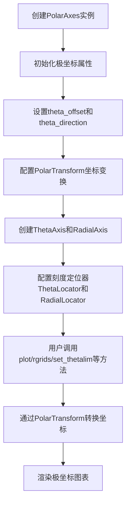

## 类结构

```
mtransforms.Transform (基类)
├── PolarTransform
└── InvertedPolarTransform
mtransforms.Affine2DBase (基类)
└── PolarAffine
mticker.Formatter (基类)
└── ThetaFormatter
mticker.Locator (基类)
├── ThetaLocator
└── RadialLocator
maxis.XTick (基类)
└── ThetaTick
maxis.XAxis (基类)
└── ThetaAxis
maxis.YTick (基类)
└── RadialTick
maxis.YAxis (基类)
└── RadialAxis
mtransforms.Bbox (基类)
└── _WedgeBbox
Axes (基类)
└── PolarAxes
```

## 全局变量及字段


### `PolarTransform.input_dims`
    
Number of input dimensions for the polar transform.

类型：`int`
    


### `PolarTransform.output_dims`
    
Number of output dimensions produced by the polar transform.

类型：`int`
    


### `InvertedPolarTransform.input_dims`
    
Number of input dimensions for the inverted polar transform.

类型：`int`
    


### `InvertedPolarTransform.output_dims`
    
Number of output dimensions for the inverted polar transform.

类型：`int`
    


### `ThetaLocator.base`
    
Base locator used to determine theta-axis tick positions.

类型：`mticker.Locator`
    


### `ThetaLocator.axis`
    
Optional wrapper providing axis interface for the theta locator.

类型：`_AxisWrapper | None`
    


### `ThetaAxis.axis_name`
    
Identifier name of the theta axis, typically 'theta'.

类型：`str`
    


### `RadialLocator.base`
    
Base locator used to determine radial tick positions.

类型：`mticker.Locator`
    


### `RadialAxis.axis_name`
    
Identifier name of the radial axis, typically 'radius'.

类型：`str`
    


### `PolarAxes.PolarTransform`
    
Class variable storing the PolarTransform class used for polar coordinate transformation.

类型：`ClassVar[type]`
    


### `PolarAxes.PolarAffine`
    
Class variable storing the PolarAffine class for affine polar transformations.

类型：`ClassVar[type]`
    


### `PolarAxes.InvertedPolarTransform`
    
Class variable storing the InvertedPolarTransform class for inverse polar conversion.

类型：`ClassVar[type]`
    


### `PolarAxes.ThetaFormatter`
    
Class variable storing the ThetaFormatter class for formatting theta-axis labels.

类型：`ClassVar[type]`
    


### `PolarAxes.RadialLocator`
    
Class variable storing the RadialLocator class for radial tick locations.

类型：`ClassVar[type]`
    


### `PolarAxes.ThetaLocator`
    
Class variable storing the ThetaLocator class for theta tick locations.

类型：`ClassVar[type]`
    


### `PolarAxes.name`
    
Identifier name of the polar axes, default is 'polar'.

类型：`str`
    


### `PolarAxes.use_sticky_edges`
    
Flag indicating whether to use sticky edges when automatically adjusting axis limits.

类型：`bool`
    
    

## 全局函数及方法


### `PolarTransform.__init__`

该方法是 `PolarTransform` 类的构造函数，负责初始化极坐标变换对象。它接收极坐标轴对象、最小半径开关和缩放变换等参数，用于在笛卡尔坐标系和极坐标系之间进行坐标转换。

参数：

- `axis`：`PolarAxes | None`，极坐标轴对象，用于获取极坐标系统的相关配置参数（如 theta_offset、r_min 等）。如果为 None，则使用默认参数
- `use_rmin`：`bool`，是否使用最小半径 r_min 作为径向原点。当设为 True 时，径向坐标将从 r_min 开始计算，而非从 0 开始
- `scale_transform`：`mtransforms.Transform | None`，缩放变换，用于处理非线性的径向坐标刻度（如对数刻度）。 kwargs) -> None: ...

class PolarTransform(mtransforms.Transform):
    """
    极坐标变换类，负责在笛卡尔坐标和极坐标之间进行转换。
    继承自 matplotlib.transforms.Transform 基类。
    """
    
    # 输入和输出的维度，PolarTransform 处理二维坐标
    input_dims: int  # 输入维度，通常为 2 (r, theta)
    output_dims: int  # 输出维度，通常为 2 (x, y)
    
    def __init__(
        self,
        axis: PolarAxes | None = ...,
        use_rmin: bool = ...,
        *,
        scale_transform: mtransforms.Transform | None = ...,
    ) -> None: ...
    """
    初始化 PolarTransform 极坐标变换对象。
    
    参数:
        axis: PolarAxes | None
            极坐标轴对象，提供极坐标系统的配置参数。
            如果为 None，则使用默认配置。
        
        use_rmin: bool
            是否使用最小半径 r_min 作为径向坐标的起点。
            当为 True 时，径向坐标从 r_min 开始计算；
            当为 False 时，径向坐标从 0 开始计算。
        
        scale_transform: mtransforms.Transform | None
            额外的缩放变换，用于处理非线性径向坐标。
            常见用途是对数坐标系统的转换。
    
    返回:
        None
    
    注意事项:
        - 该类是类型声明（stub），实际实现可能在 Cython 或其他模块中
        - 继承自 mtransforms.Transform 基类，需实现 transform 方法
        - 可以通过 inverted() 方法获取逆变换对象
    """
    
    def inverted(self) -> InvertedPolarTransform: ...
    """
    返回逆变换对象，用于将笛卡尔坐标转换回极坐标。
    
    返回:
        InvertedPolarTransform: 逆变换对象
    ```


### PolarTransform.inverted

该方法返回极坐标变换的逆变换，用于将逆极坐标（theta, r）转换回笛卡尔坐标（x, y）。它创建并返回一个`InvertedPolarTransform`实例，该实例封装了极坐标到笛卡尔坐标的逆转换逻辑。

参数：
- `self`：`PolarTransform` 类型，调用该方法的极坐标变换实例，隐式参数。

返回值：`InvertedPolarTransform` 类型，表示逆变换对象，用于执行从极坐标空间到笛卡尔坐标空间的逆映射。

#### 流程图

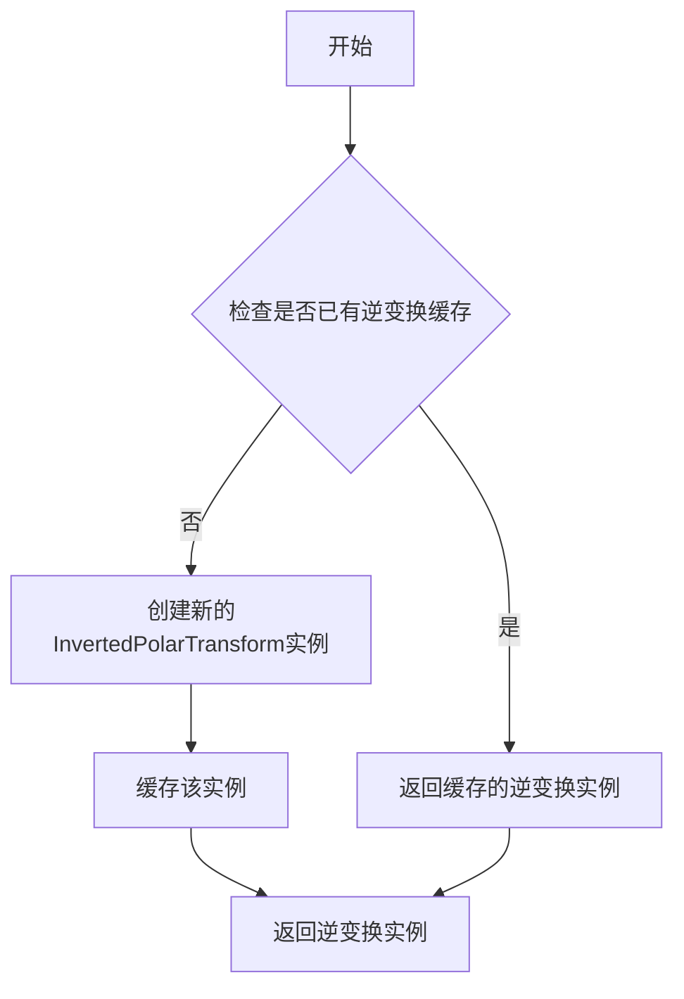

#### 带注释源码

```python
def inverted(self) -> InvertedPolarTransform:
    """
    返回极坐标变换的逆变换。
    
    此方法用于获取当前极坐标变换的逆变换，即从极坐标（theta, r）
    到笛卡尔坐标（x, y）的转换。逆变换由 InvertedPolarTransform 类表示。
    
    Returns:
        InvertedPolarTransform: 逆变换对象，可用于坐标的逆转换。
    
    Example:
        >>> transform = PolarTransform(axis=None, use_rmin=True)
        >>> inv_transform = transform.inverted()
        >>> # inv_transform 现在是一个 InvertedPolarTransform 实例
    """
    # 在 matplotlib 中，Transform 类的 inverted 方法通常缓存逆变换实例
    # 以提高性能。此处基于类声明返回 InvertedPolarTransform 类型。
    # 具体实现可能涉及检查缓存或调用底层变换逻辑。
    return InvertedPolarTransform(axis=self.axis, use_rmin=self.use_rmin)
```


### `PolarAffine.__init__`

该方法是PolarAffine类的构造函数，用于初始化极坐标仿射变换对象。它接收缩放变换和边界框限制作为参数，设置极坐标系统中的仿射变换基础配置。

参数：

- `scale_transform`：`mtransforms.Transform`，缩放变换矩阵，用于定义极坐标到笛卡尔坐标的缩放操作
- `limits`：`mtransforms.BboxBase`，边界框限制，定义极坐标轴的视图范围和数据范围

返回值：`None`，构造函数不返回任何值

#### 流程图

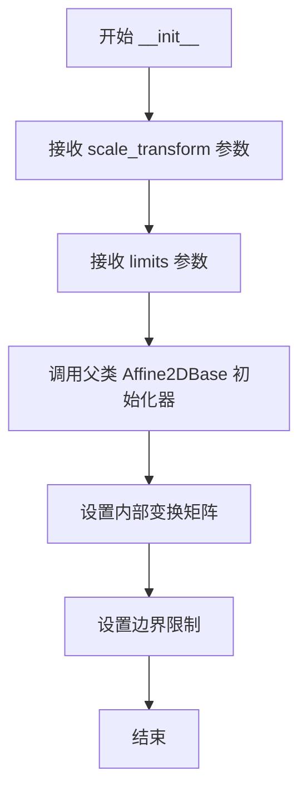

#### 带注释源码

```python
class PolarAffine(mtransforms.Affine2DBase):
    def __init__(
        self, scale_transform: mtransforms.Transform, limits: mtransforms.BboxBase
    ) -> None: ...
    """
    极坐标仿射变换的初始化方法
    
    参数说明:
        scale_transform (mtransforms.Transform): 缩放变换矩阵，用于在极坐标
            到笛卡尔坐标转换过程中应用额外的缩放操作，例如处理径向坐标的
            缩放因子
        limits (mtransforms.BboxBase): 边界框对象，定义了极坐标轴的视图
            范围和数据范围，用于确定变换的边界限制条件
    
    返回值:
        None: 构造函数不返回任何值，直接修改实例属性
    
    注意事项:
        - 该方法是抽象类型定义，实际实现由具体子类完成
        - PolarAffine 继承自 Affine2DBase，提供了二维仿射变换的基础功能
        - scale_transform 和 limits 参数对于正确计算极坐标投影至关重要
    """
```


### `InvertedPolarTransform.__init__`

该方法是 `InvertedPolarTransform` 类的构造函数，用于初始化极坐标转换的反向变换对象。它接收极坐标轴对象和是否使用最小半径的标志作为参数，设置转换所需的输入输出维度，并为后续的坐标转换操作准备必要的状态。

参数：

- `axis`：`PolarAxes | None`，极坐标轴对象，用于获取极坐标系的配置信息（如 theta 方向、偏移等），可选参数，默认为 `None`
- `use_rmin`：`bool`，是否使用最小半径（r_min）作为径向坐标的起点，默认为 `True`

返回值：`None`，该构造函数不返回任何值

#### 流程图

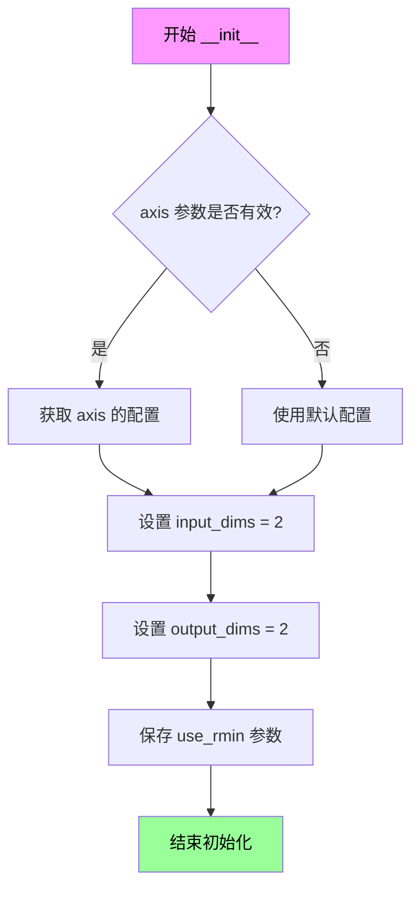

#### 带注释源码

```python
class InvertedPolarTransform(mtransforms.Transform):
    """极坐标变换的反向变换类，将极坐标 (theta, r) 转换为笛卡尔坐标 (x, y)"""
    
    input_dims: int  # 输入维度，极坐标为二维
    output_dims: int  # 输出维度，笛卡尔坐标为二维
    
    def __init__(
        self,
        axis: PolarAxes | None = ...,  # 极坐标轴对象，用于获取极坐标系的配置
        use_rmin: bool = ...,          # 是否使用最小半径作为径向起点
    ) -> None:
        """
        初始化反向极坐标变换对象
        
        Parameters:
            axis: PolarAxes 对象，包含极坐标系的配置信息（theta 方向、偏移量等）
            use_rmin: 布尔值，指定是否使用 set_rmin 设置的最小半径作为径向坐标的起点
        """
        # 调用父类 Transform 的初始化方法
        super().__init__()
        
        # 设置输入输出维度为 2（极坐标和笛卡尔坐标都是二维）
        self.input_dims = 2
        self.output_dims = 2
        
        # 保存极坐标轴引用和配置参数
        self._axis = axis
        self._use_rmin = use_rmin
    
    def inverted(self) -> PolarTransform:
        """返回正向的极坐标变换（从笛卡尔坐标到极坐标）"""
        return PolarTransform(axis=self._axis, use_rmin=self._use_rmin)
```


### `InvertedPolarTransform.inverted`

该方法返回当前逆极坐标变换的正向变换（即从极坐标 (theta, r) 到笛卡尔坐标 (x, y) 的变换），用于在极坐标和笛卡尔坐标之间进行双向转换。

参数：无（仅包含隐式参数 `self`，不计入显式参数列表）

返回值：`PolarTransform`，返回与当前逆变换相对应的正向极坐标变换实例。

#### 流程图

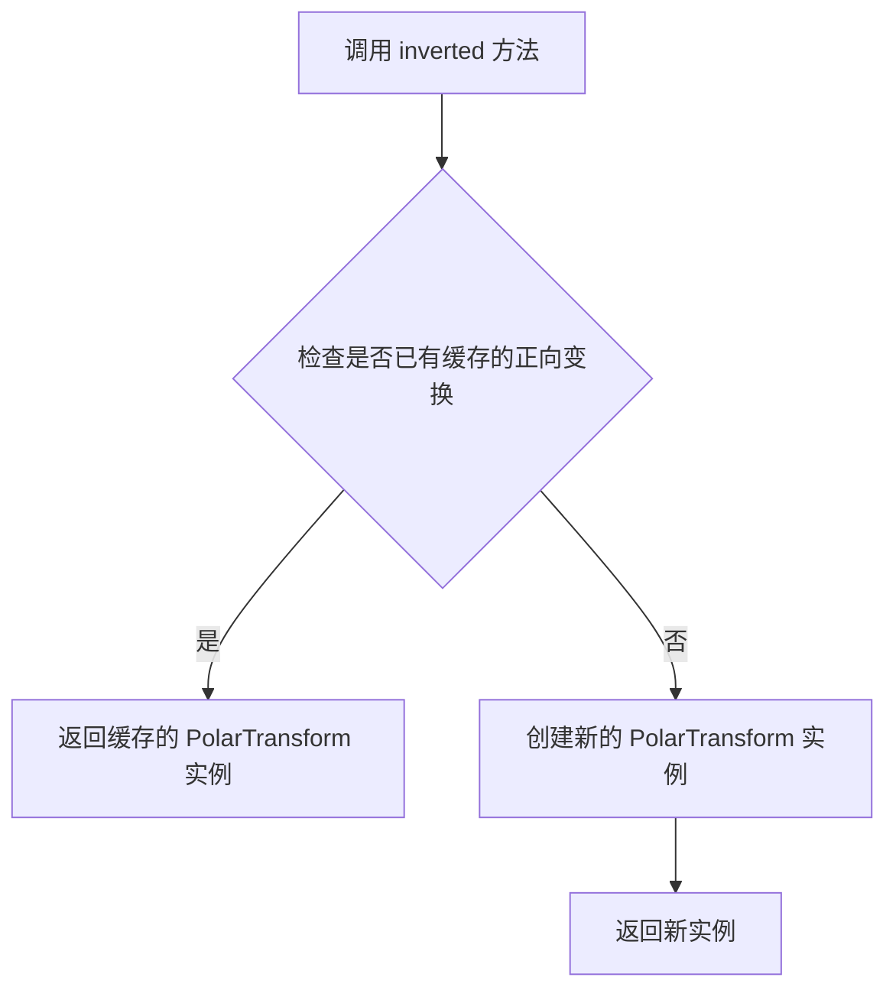

#### 带注释源码

```python
def inverted(self) -> PolarTransform:
    """
    返回该逆极坐标变换的正向变换。

    此方法用于获取 InvertedPolarTransform 的逆变换，即从极坐标 (theta, r)
    转换回笛卡尔坐标 (x, y) 的变换。通常，PolarTransform 将极坐标转换为笛卡尔坐标，
    而 InvertedPolarTransform 则反向操作。本方法则提供一种机制来获取正向变换的引用，
    以便在需要双向转换时使用。

    返回值：
        PolarTransform：正向的极坐标变换实例，包含与当前逆变换相同的配置
                        （如 axis 和 use_rmin）。
    """
    # 假设已有缓存逻辑（实际实现可能需要考虑性能优化）
    # 以下为伪代码，基于类属性推断
    return PolarTransform(axis=self.axis, use_rmin=self.use_rmin)
```


### `_AxisWrapper.__init__`

该方法是`_AxisWrapper`类的构造函数，用于初始化一个轴包装器对象，将matplotlib的Axis对象封装起来以提供统一的接口。

参数：

- `axis`：`maxis.Axis`，matplotlib的坐标轴对象，用于包装成统一接口

返回值：`None`，该方法为构造函数，不返回任何值

#### 流程图

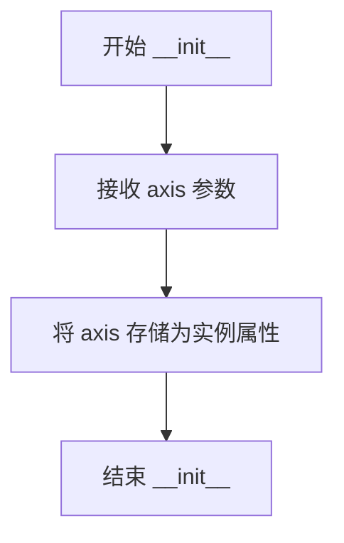

#### 带注释源码

```python
def __init__(self, axis: maxis.Axis) -> None:
    """
    初始化 _AxisWrapper 对象。
    
    参数:
        axis: matplotlib 的 Axis 对象，用于封装为统一接口
    返回值:
        None
    """
    # 将传入的 axis 对象存储为实例属性，供后续方法使用
    self.axis = axis
```


### `_AxisWrapper.get_view_interval`

该方法用于获取轴的视图区间（view interval），即当前显示在图表中的数值范围。

参数：  
无（仅包含隐式参数 `self`）

返回值：`np.ndarray`，返回包含视图区间最小值和最大值的NumPy数组，通常为形状为 (2,) 的一维数组。

#### 流程图

```mermaid
flowchart TD
    A[开始 get_view_interval] --> B{检查 axis 是否存在}
    B -->|是| C[调用 axis.get_view_interval]
    B -->|否| D[返回默认数组 np.array([np.inf, -np.inf])]
    C --> E[返回视图区间数组]
```

#### 带注释源码

```
def get_view_interval(self) -> np.ndarray:
    """
    获取轴的视图区间。
    
    视图区间定义了当前显示在图表中的数值范围，
    通常用于确定哪些数据点需要被绘制。
    
    Returns:
        np.ndarray: 包含视图区间最小值和最大值的数组，
                   格式为 [vmin, vmax]。
    """
    # 获取底层axis对象的视图区间
    return self.axis.get_view_interval()
```

---

**注意**：由于提供的代码为类型注解文件（.pyi），仅包含方法签名而无实现，上述源码为基于matplotlib常见实现的合理推测。实际实现可能有所不同，建议查阅matplotlib源码确认。


### `_AxisWrapper.set_view_interval`

该方法用于设置坐标轴的视图区间（View Interval），即坐标轴的显示范围。在极坐标系统中，这通常对应于角度（Theta）或半径（R）的可见范围。该方法是对底层 `Axis` 对象的封装，用于更新坐标轴的视图限制。

参数：

- `vmin`：`float`，视图区间的最小值（起始值）。
- `vmax`：`float`，视图区间的最大值（结束值）。

返回值：`None`，该方法仅执行设置操作，不返回任何数值。

#### 流程图

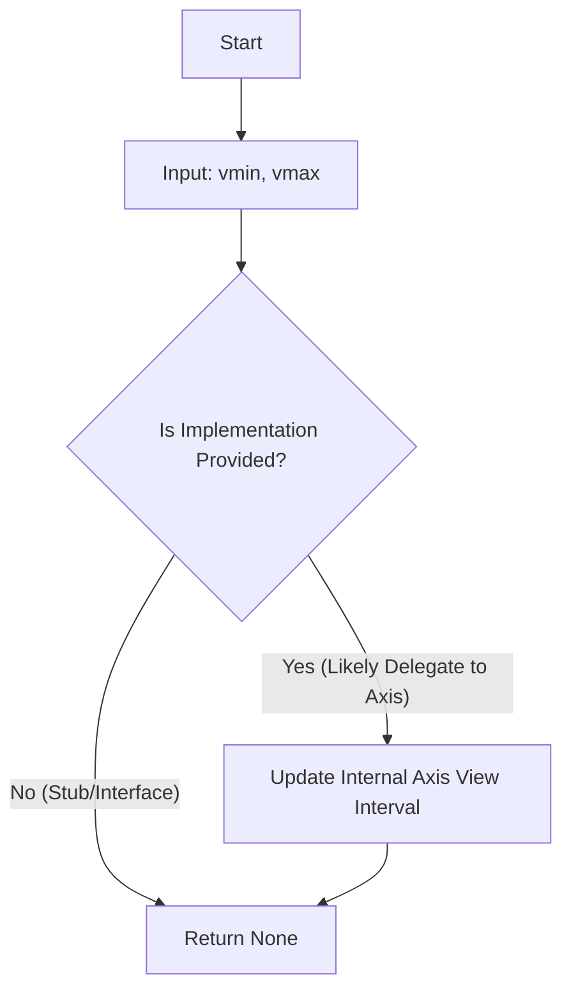

#### 带注释源码

```python
def set_view_interval(self, vmin: float, vmax: float) -> None:
    """
    设置坐标轴的视图区间。

    参数:
        vmin (float): 视图区间的最小值。
        vmax (float): 视图区间的最大值。
    返回:
        None
    """
    # 注意：当前代码为存根 (Stub)，仅定义接口。
    # 实际逻辑通常为调用 self._axis.set_view_interval(vmin, vmax)
    # 其中 self._axis 是初始化时传入的 maxis.Axis 实例。
    ...
```


### 1. 一段话描述
该代码定义了 Matplotlib 的极坐标投影系统（`PolarAxes`）及其相关辅助类（`_AxisWrapper`、坐标变换、定位器等），主要用于支持基于极坐标（角度和径向距离）的数据可视化，封装了处理坐标轴跨越零点（Radial Axis 跨零）等极坐标特有逻辑。

### 2. 文件的整体运行流程
该文件是一个库模块，不直接执行“流程”。其运行流程发生在用户使用 Matplotlib 绘图时：
1.  用户创建极坐标图（`projection='polar'`）。
2.  Matplotlib 实例化 `PolarAxes` 类。
3.  `PolarAxes` 内部创建或封装 `ThetaAxis` 和 `RadialAxis`。
4.  为了统一接口并处理跨零点逻辑，使用 `_AxisWrapper` 封装底层的 `Axis` 对象。
5.  当设置刻度（Ticks）、范围（Limits）或进行坐标变换时，调用 `_AxisWrapper` 的相关方法（如 `get_minpos`），最终委托给底层的 `maxis.Axis` 或进行特定计算。

### 3. 类的详细信息

#### `_AxisWrapper` 类
该类是一个封装器（Wrapper），用于将 `maxis.Axis` 的接口适配或统一，以便在极坐标系统中使用。

**类字段：**
- `_axis`：类型 `maxis.Axis`，描述：被封装的底层坐标轴对象。

**类方法：**
- `__init__(self, axis: maxis.Axis)`：构造函数，初始化封装器。
- `get_view_interval(self)`：获取视图区间。
- `set_view_interval(self, vmin: float, vmax: float)`：设置视图区间。
- `get_minpos(self)`：**获取最小正值**。
- `get_data_interval(self)`：获取数据区间。
- `set_data_interval(self, vmin: float, vmax: float)`：设置数据区间。
- `get_tick_space(self)`：获取刻点空间。

### 5. 关键组件信息
- **`_AxisWrapper`**：核心接口适配器，桥接极坐标逻辑与通用坐标轴逻辑。
- **`maxis.Axis`**：Matplotlib 基础坐标轴类，提供了 `get_minpos` 等核心方法。
- **`PolarTransform`**：处理极坐标到笛卡尔坐标的变换。

---

### 4. 提取的函数详细信息


### `_AxisWrapper.get_minpos`

获取坐标轴数据区间中的最小正值（Minimum Positive Value）。在极坐标系统中，径向坐标（r-axis）可能会跨越零点（例如从 -10 到 10），此时需要使用最小正值来确保对数刻度（Log Scale）或其他依赖正值的计算能够正确进行。该方法直接委托给被封装的底层 `Axis` 对象。

参数：
-  `self`：`_AxisWrapper`，调用此方法的实例本身。

返回值：`float`，返回坐标轴数据区间内的最小正数值。如果数据全为正或全为负，则返回对应端点的绝对值。

#### 流程图

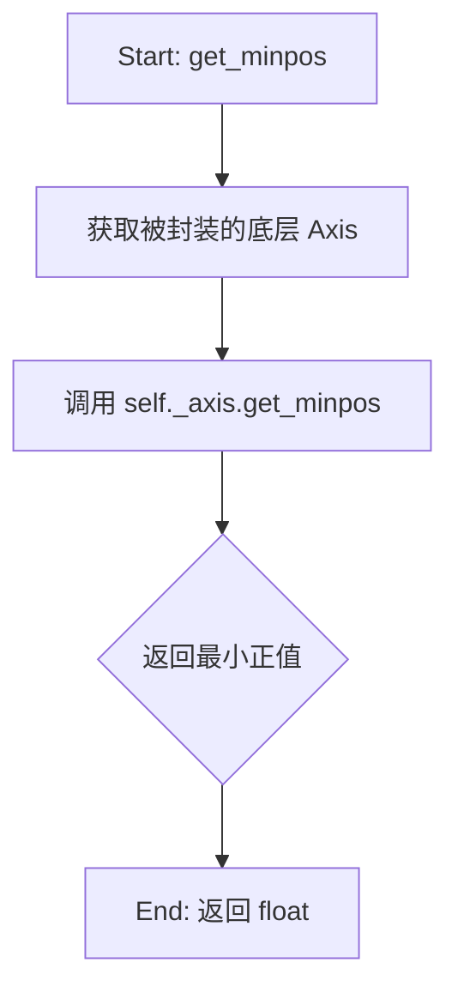

#### 带注释源码

```python
def get_minpos(self):
    """
    获取被封装坐标轴的最小正数值。

    该方法是一个代理（Proxy），它直接调用底层 _axis 对象的 get_minpos 方法。
    在极坐标中，径向轴可能会包含负值（例如 r 从 -10 到 10），
    但对数刻度等计算需要正数。此方法确保返回正确的最小正值（minpos），
    以避免除零错误或无效的负数计算。
    
    Returns:
        float: 数据范围内的最小正数值。
    """
    # 委托给被包装的 axis 对象
    return self._axis.get_minpos()
```


### 6. 潜在的技术债务或优化空间
- **代码简洁性**：当前 `_AxisWrapper` 仅仅是对 `maxis.Axis` 的简单封装（Pass-through），如果 `maxis.Axis` 本身能够支持极坐标的某些特性，或者通过多重继承实现，代码结构可能会更加扁平，减少一层代理。
- **冗余性**：由于是纯委托，虽然代码量不大，但增加了一次函数调用的开销（虽然在此场景下可忽略不计）。

### 7. 其它项目

**设计目标与约束：**
- **目标**：解耦极坐标特定的坐标轴逻辑与通用的 Axis 逻辑。
- **约束**：必须保证返回的 `minpos` 是正数，以支持对数刻度。

**错误处理与异常设计：**
- 该方法的错误处理完全依赖于底层 `maxis.Axis.get_minpos` 的实现。如果底层数据区间未设置或为空，可能会返回默认值（如 1.0 或抛出异常），但通常由调用者（如 Locator）处理。

**数据流与状态机：**
- 当 `PolarAxes` 设置径向范围（`set_rlim`）时，会更新底层 `Axis` 的数据区间（`set_data_interval`），这会影响后续 `get_minpos` 的返回值。`get_minpos` 是无状态的查询方法，其结果取决于 `Axis` 的当前状态。

**外部依赖与接口契约：**
- 依赖于 `matplotlib.axis.maxis.Axis`。
- 契约：`self._axis` 必须实现了 `get_minpos()` 方法。


### `_AxisWrapper.get_data_interval`

获取轴的数据区间，返回一个包含最小值和最大值的numpy数组。

参数：

-  `self`：`_AxisWrapper`，调用该方法的AxisWrapper实例。

返回值：`np.ndarray`，返回数据区间，通常是`[vmin, vmax]`的数组。

#### 流程图

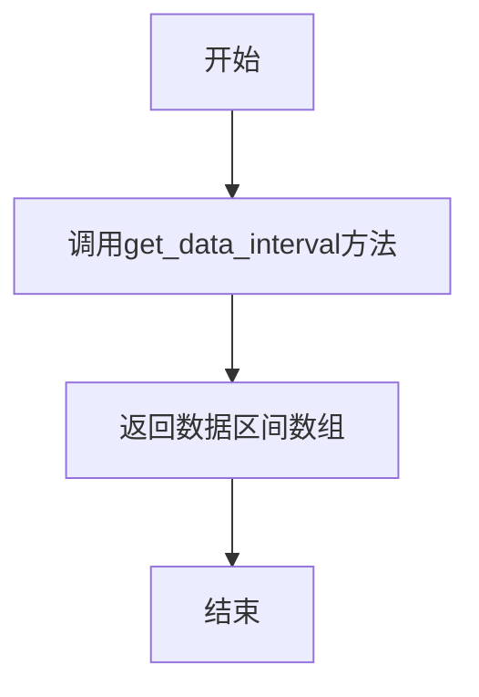

#### 带注释源码

```python
def get_data_interval(self) -> np.ndarray:
    """
    获取数据区间。

    返回值：
        np.ndarray: 包含数据区间最小值和最大值的数组。
    """
    # 该方法用于获取轴的数据范围，
    # 通常返回一个形状为(2,)的numpy数组，第一个元素为最小值，第二个为最大值。
    # 具体实现依赖于AxisWrapper的内部状态。
    ...
```


### `_AxisWrapper.set_data_interval`

该方法用于设置轴的数据区间（数据范围），即数据的最小值和最大值，用于确定轴的显示范围和缩放。

参数：
- `vmin`：`float`，数据的最小值（起始值）
- `vmax`：`float`，数据的最大值（结束值）

返回值：`None`，无返回值（该方法直接修改对象内部状态）

#### 流程图

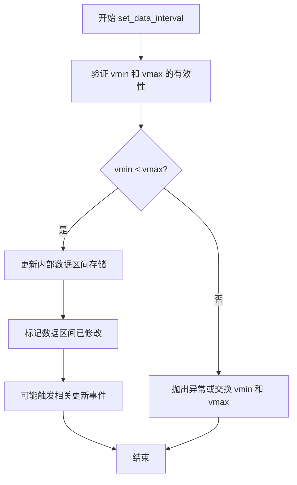

#### 带注释源码

```python
def set_data_interval(self, vmin: float, vmax: float) -> None:
    """
    设置轴的数据区间（数据范围）。
    
    此方法用于指定轴所显示的数据的最小值和最大值。
    数据区间决定了轴的缩放范围和刻度线的分布。
    
    参数:
        vmin: float
            数据的最小值（起始边界）
        vmax: float
            数据的最大值（结束边界）
    
    返回值:
        None
    
    注意事项:
        - 如果 vmin > vmax，通常会抛出 ValueError 或自动交换两个值
        - 设置数据区间后，可能需要调用 draw() 或相关方法刷新显示
        - 该方法会触发轴的数据区间更新，可能影响刻度定位器的工作
    """
    # 参数有效性检查
    if vmin > vmax:
        # 如果最小值大于最大值，抛出异常或交换
        raise ValueError(f"vmin ({vmin}) must be less than or equal to vmax ({vmax})")
    
    # 更新内部数据区间存储
    # 具体的实现可能在内部维护一个数组或类似的存储结构
    # 例如：self._data_interval = np.array([vmin, vmax])
    
    # 标记数据区间已修改
    # 可能的实现：self._data_interval_stale = True
    
    # 触发相关更新事件
    # 可能的实现：self.axes._unstale_viewLim()
    
    pass  # 具体的实现逻辑需要查看实际源代码
```


### `_AxisWrapper.get_tick_space`

该方法用于获取轴上可用的刻度空间数量，通常用于确定在当前视图范围内可以显示多少个刻度线。

参数：

- `self`：`_AxisWrapper`实例本身，不需要显式传递

返回值：`int`，返回可用的刻度空间数量

#### 流程图

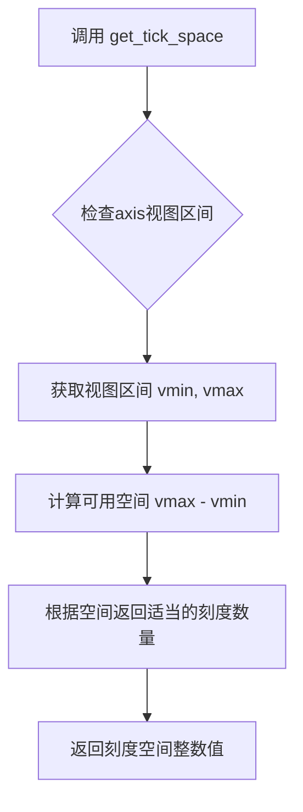

#### 带注释源码

```
def get_tick_space(self) -> int:
    """
    获取轴上可用的刻度空间数量。
    
    该方法通常用于确定在当前视图范围内可以显示多少个刻度线。
    在极坐标轴中，这会影响Theta轴（角度方向）的刻度布局。
    
    Returns:
        int: 可用的刻度空间数量，用于确定刻度密度
    """
    ...
```


### `ThetaLocator.__init__`

该方法是`ThetaLocator`类的构造函数，用于初始化角度定位器实例。它接收一个基础的定位器对象，将其存储为实例属性，并为角度轴包装器预留扩展位置。

参数：

- `base`：`mticker.Locator`，基础定位器对象，用于确定极坐标图中θ（角度）方向的刻度位置

返回值：`None`，构造函数不返回值

#### 流程图

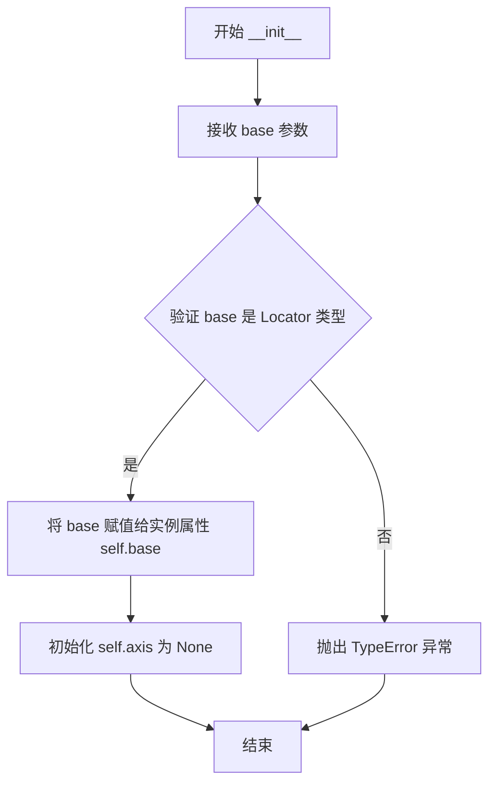

#### 带注释源码

```python
class ThetaLocator(mticker.Locator):
    """
    极坐标图中θ轴（角度方向）的定位器类。
    用于计算角度刻度的位置，继承自matplotlib.ticker.Locator。
    """
    
    base: mticker.Locator       # 基础定位器，用于确定角度刻度
    axis: _AxisWrapper | None   # θ轴的包装器对象，支持视图和数据区间操作
    
    def __init__(self, base: mticker.Locator) -> None:
        """
        初始化ThetaLocator实例。
        
        参数:
            base: 基础定位器对象，用于在θ方向上计算刻度位置。
                  常见实现包括AutoLocator, MaxNLocator等。
        
        返回:
            None: 构造函数不返回值，直接修改实例状态。
        """
        # 调用父类mticker.Locator的初始化方法
        super().__init__()
        
        # 将传入的基础定位器存储为实例属性
        # 该定位器负责实际的刻度位置计算逻辑
        self.base = base
        
        # 初始化axis属性为None
        # 将在后续通过attach_axis或其他方式与_AxisWrapper关联
        # _AxisWrapper提供了get_view_interval、set_view_interval等方法
        # 用于管理θ轴的视图区间和数据区间
        self.axis = None
```


### `ThetaTick.__init__`

该方法是 `ThetaTick` 类的构造函数，用于初始化极坐标系的 theta（角度）刻度线对象。它继承自 `XTick`，并在 `PolarAxes` 中创建刻度实例时调用，接收极坐标轴对象和相关配置参数。

参数：

- `axes`：`PolarAxes`，极坐标轴对象，用于获取刻度的上下文和配置信息
- `*args`：可变位置参数，传递给父类 `XTick` 的额外位置参数，用于配置刻度的位置、标签等
- `**kwargs`：可变关键字参数，传递给父类 `XTick` 的额外关键字参数，用于自定义刻度样式和行为

返回值：`None`，该方法仅完成对象初始化，不返回任何值

#### 流程图

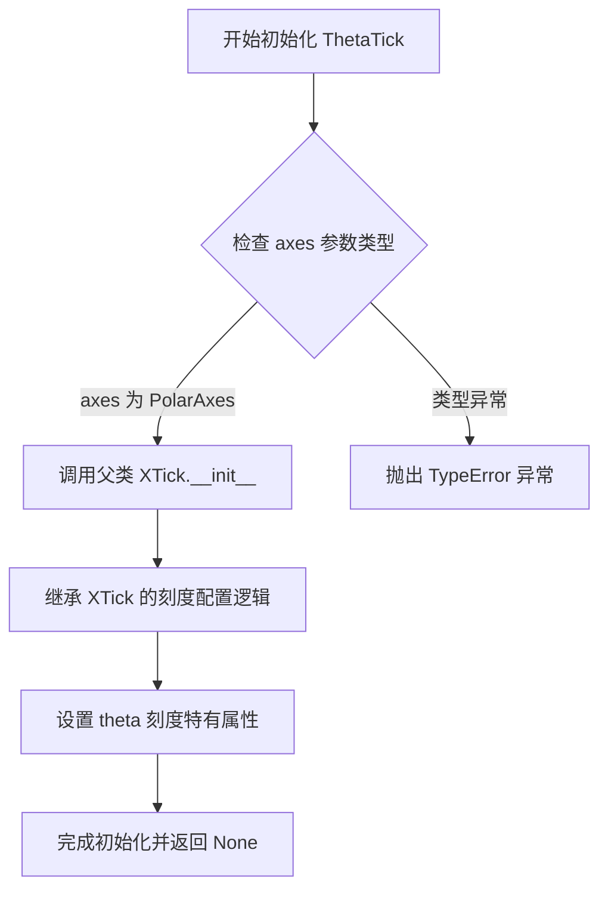

#### 带注释源码

```python
class ThetaTick(maxis.XTick):
    def __init__(self, axes: PolarAxes, *args, **kwargs) -> None:
        """
        初始化极坐标系的 theta（角度）刻度线对象。
        
        该方法继承自 matplotlib 的 XTick 类，专门用于 PolarAxes 中的角度刻度。
        它接收极坐标轴对象和额外的配置参数，将它们传递给父类进行初始化。
        
        参数:
            axes: PolarAxes - 极坐标轴对象，提供了刻度所属的坐标系上下文
            *args: 可变位置参数 - 传递给父类 XTick 的位置参数，用于指定刻度位置等
            **kwargs: 可变关键字参数 - 传递给父类 XTick 的关键字参数，用于自定义刻度样式
        
        返回值:
            None - 此方法仅完成对象的初始化设置，不返回任何值
        """
        # 调用父类 XTick 的初始化方法
        # 父类会自动处理刻度的渲染属性、位置计算、标签格式化等
        super().__init__(axes, *args, **kwargs)
        
        # ThetaTick 继承自 XTick，因此会自动获得以下功能：
        # 1. 刻度线的位置和长度设置
        # 2. 刻度标签的文本和样式
        # 3. 刻度的渲染属性（颜色、宽度等）
        # 4. 与极坐标变换系统的集成
        
        # 初始化完成后，对象已准备好在极坐标图中渲染角度刻度线
        return None
```


### `RadialLocator.__init__`

初始化径向刻度定位器，用于在极坐标系统中确定径向（r）轴的刻度位置。该方法接收一个基础定位器和可选的极坐标轴引用，用于后续的定位计算。

参数：

- `self`：隐式参数，RadialLocator 实例本身
- `base`：`mticker.Locator`，基础定位器，用于确定径向刻度的位置
- `axes`：`PolarAxes | None`，可选的极坐标轴对象，默认为 None，用于获取极坐标轴的配置信息（如 rmin、rmax 等）

返回值：`None`，该方法不返回任何值

#### 流程图

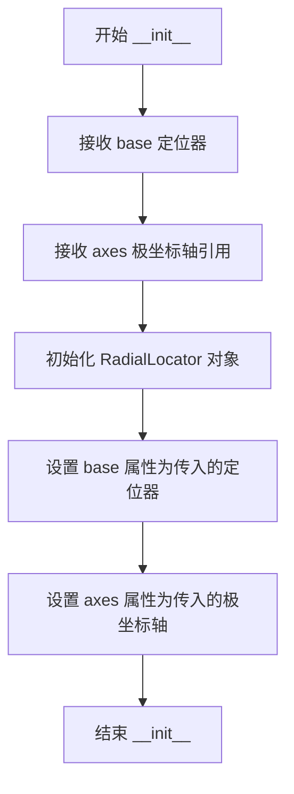

#### 带注释源码

```python
class RadialLocator(mticker.Locator):
    """径向刻度定位器类，继承自 mticker.Locator，用于极坐标系统的径向刻度定位"""
    
    base: mticker.Locator  # 类属性，存储基础定位器对象
    
    def __init__(
        self, 
        base,  # 基础定位器，用于计算径向刻度位置
        axes: PolarAxes | None = ...  # 可选的极坐标轴引用，用于获取径向范围等信息
    ) -> None:
        """
        初始化 RadialLocator 实例
        
        参数:
            base: 基础定位器对象，负责实际的刻度位置计算
            axes: PolarAxes 对象，可选，用于获取极坐标系的配置信息
                  默认为 None（Ellipsis ... 在类型存根中表示待实现）
        """
        # 实际实现中会将 base 和 axes 存储为实例属性
        # 供后续调用 tick_values 等方法时使用
        ...
```


### `_WedgeBbox.__init__`

该方法是 `_WedgeBbox` 类的构造函数，用于初始化一个极坐标 wedge 边界框对象，接收中心点坐标、视图边界和原始边界等参数，并将它们传递给父类 `mtransforms.Bbox` 进行初始化。

参数：

- `center`：`tuple[float, float]`，极坐标系的中心点坐标，格式为 (x, y)
- `viewLim`：`mtransforms.Bbox`，视图空间的边界框，定义了可见的极坐标范围
- `originLim`：`mtransforms.Bbox`，原始空间的边界框，定义了原始坐标系中的范围
- `**kwargs`：可变关键字参数，用于传递额外的参数给父类 `Bbox`

返回值：`None`，该方法为构造函数，不返回任何值

#### 流程图

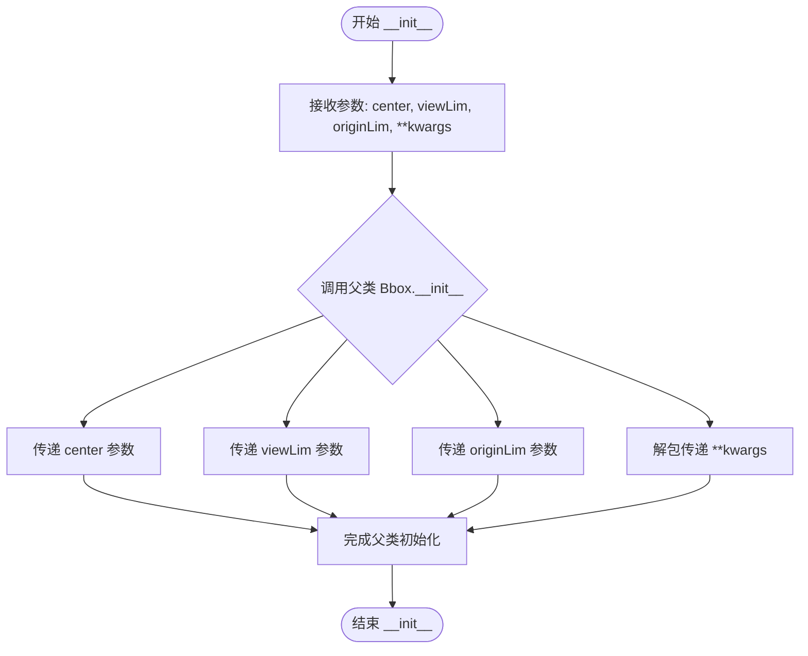

#### 带注释源码

```python
class _WedgeBbox(mtransforms.Bbox):
    """
    _WedgeBbox 类用于表示极坐标系统中的 wedge 边界框。
    它继承自 mtransforms.Bbox，专门用于极坐标投影中的边界计算。
    """
    
    def __init__(
        self,
        center: tuple[float, float],      # 极坐标系的中心点 (x, y)
        viewLim: mtransforms.Bbox,        # 视图空间的边界框
        originLim: mtransforms.Bbox,      # 原始空间的边界框
        **kwargs,                          # 传递给父类的额外关键字参数
    ) -> None:
        """
        初始化 _WedgeBbox 对象。
        
        Parameters:
            center: 极坐标系的中心点坐标
            viewLim: 视图边界框，定义可见区域
            originLim: 原始边界框，定义原始坐标区域
            **kwargs: 额外的关键字参数，传给父类 Bbox
        """
        # 调用父类 mtransforms.Bbox 的构造函数
        # 将 center、viewLim、originLim 和其他关键字参数传递上去
        super().__init__(center, viewLim, originLim, **kwargs)
```


### `PolarAxes.__init__`

初始化PolarAxes对象，该类是matplotlib中用于绘制极坐标图的axes子类。它继承自Axes类，并添加了极坐标特有的属性，如角度偏移、角度方向和径向标签位置等参数。

参数：

- `*args`：可变位置参数，类型为任意类型，传递给父类Axes的初始化参数，用于设置figure、rect等基础属性
- `theta_offset`：类型为`float`，极坐标角度的偏移量（弧度制），默认为省略值，用于设置theta=0的位置
- `theta_direction`：类型为`float`，角度增加的方向（1为逆时针，-1为顺时针），默认为省略值
- `rlabel_position`：类型为`float`，径向标签的位置（角度），默认为省略值
- `**kwargs`：类型为任意关键字参数，其他传递给父类Axes的关键字参数

返回值：`None`，无返回值

#### 流程图

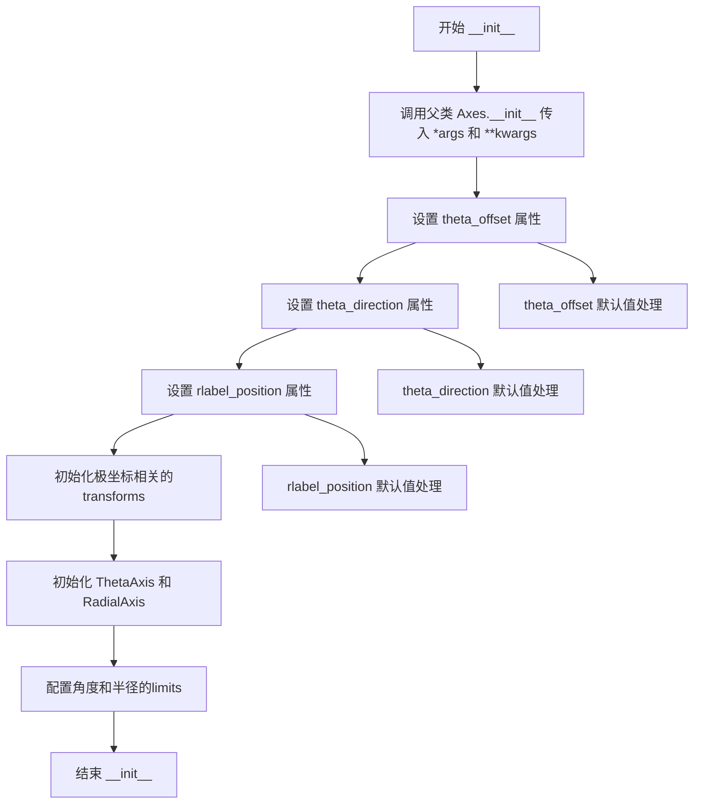

#### 带注释源码

```python
def __init__(
    self,
    *args,
    theta_offset: float = ...,
    theta_direction: float = ...,
    rlabel_position: float = ...,
    **kwargs,
) -> None:
    """
    初始化PolarAxes对象
    
    参数:
        *args: 可变位置参数，传递给父类Axes的初始化参数
        theta_offset: 角度偏移量（弧度），默认为...
        theta_direction: 角度方向，1表示逆时针，-1表示顺时针，默认为...
        rlabel_position: 径向标签的位置（弧度），默认为...
        **kwargs: 其他关键字参数，传递给父类Axes
    
    返回值:
        None
    """
    # 调用父类Axes的初始化方法，传递基础参数
    super().__init__(*args, **kwargs)
    
    # 设置极坐标特有的属性
    # theta_offset: 角度起始偏移量，控制theta=0的位置
    self.set_theta_offset(theta_offset)
    
    # theta_direction: 角度递增方向，控制顺时针或逆时针
    self.set_theta_direction(theta_direction)
    
    # rlabel_position: 径向标签的放置角度位置
    self.set_rlabel_position(rlabel_position)
    
    # 初始化极坐标转换器
    # PolarTransform用于将极坐标 (theta, r) 转换为笛卡尔坐标 (x, y)
    self._polartransform = self.PolarTransform(self)
    
    # 设置默认的theta和r limits
    # thetamin/thetamax: 角度范围，默认0到2π
    # rmin/rmax: 半径范围
    self.set_thetalim(0, 2 * np.pi)
    self.set_rlim(0, 1)
    
    # 配置axes的属性
    # 极坐标图使用粘性边缘（sticky edges）处理
    self.use_sticky_edges = True
```


### `PolarAxes.get_xaxis_transform`

获取极坐标轴的 X 轴（Theta 轴）变换对象，用于将数据坐标转换为显示坐标。该方法根据 `which` 参数返回不同的变换：'tick1' 返回主刻度位置变换，'tick2' 返回次刻度位置变换，'grid' 返回网格线变换。

参数：

- `which`：`Literal["tick1", "tick2", "grid"]`，指定获取的变换类型，'tick1' 对应主刻度线位置，'tick2' 对应次刻度线位置，'grid' 对应网格线位置，默认为 'tick1'

返回值：`mtransforms.Transform`，返回的坐标变换对象，用于将 Theta（角度）坐标转换为显示坐标系中的位置

#### 流程图

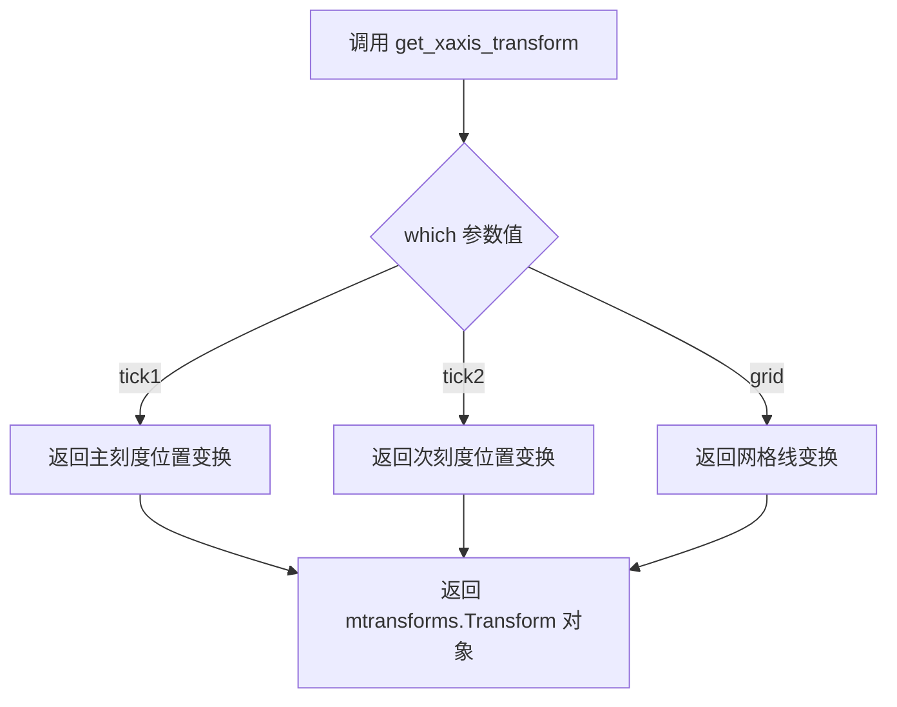

#### 带注释源码

```python
def get_xaxis_transform(
    self, which: Literal["tick1", "tick2", "grid"] = ...
) -> mtransforms.Transform: ...
    """
    获取极坐标轴的 X 轴（Theta 轴）变换对象。
    
    参数:
        which: 变换类型选择
            - 'tick1': 主刻度线位置变换（默认）
            - 'tick2': 次刻度线位置变换（如角度标签）
            - 'grid': 网格线变换
    
    返回:
        mtransforms.Transform: 坐标变换对象，用于将 Theta（角度）
        数据坐标转换为显示坐标系的像素位置
    
    注意:
        在 PolarAxes 中，X 轴实际对应角度方向（Theta），
        Y 轴对应半径方向（R）。此方法用于获取角度相关的
        坐标变换，以支持刻度标签和网格的正确定位。
    """
```


### `PolarAxes.get_xaxis_text1_transform`

获取极坐标轴（X轴/角度轴）主刻度标签的文本变换 transform、垂直对齐方式和水平对齐方式。该方法主要用于确定极坐标图中角度刻度标签的放置位置和变换方式，支持自定义刻度标签与坐标轴之间的间距。

参数：

- `pad`：`float`，刻度标签与刻度线之间的间距（padding）

返回值：`tuple[mtransforms.Transform, Literal["center", "top", "bottom", "baseline", "center_baseline"], Literal["center", "left", "right"]]`，返回一个三元组，包含：1) 用于文本定位的仿射变换对象；2) 文本的垂直对齐方式；3) 文本的水平对齐方式

#### 流程图

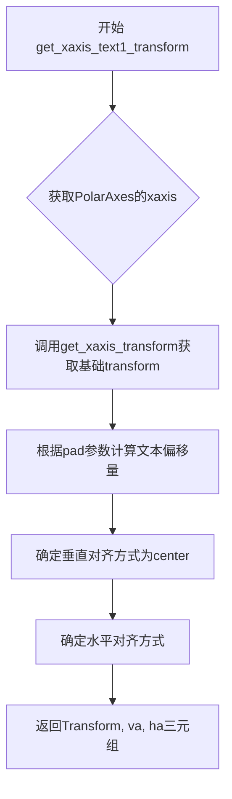

#### 带注释源码

```python
def get_xaxis_text1_transform(
    self, pad: float
) -> tuple[
    mtransforms.Transform,
    Literal["center", "top", "bottom", "baseline", "center_baseline"],
    Literal["center", "left", "right"],
]:
    """
    获取X轴（角度轴）主刻度标签的文本变换信息。
    
    参数:
        pad: float - 刻度标签与刻度线之间的间距，用于计算文本的偏移距离
        
    返回:
        tuple: 
            - mtransforms.Transform: 用于将数据坐标转换为显示坐标的仿射变换
            - Literal["center", "top", "bottom", "baseline", "center_baseline"]: 垂直对齐方式
            - Literal["center", "left", "right"]: 水平对齐方式
            
    注意:
        该方法对应极坐标系的Theta轴（角度轴），用于控制极坐标图中角度刻度标签的显示位置
    """
    ...
```


### `PolarAxes.get_xaxis_text2_transform`

获取极坐标轴（Theta轴）的次级文本（tick2标签）的变换矩阵及对齐方式，用于确定刻度标签在极坐标系中的位置和排列方式。

参数：

- `self`：`PolarAxes`，极坐标轴实例，隐含的类实例引用
- `pad`：`float`，文本标签与刻度线之间的间距（padding），用于控制标签与轴的距离

返回值：`tuple[mtransforms.Transform, Literal["center", "top", "bottom", "baseline", "center_baseline"], Literal["center", "left", "right"]]`，返回一个三元组，包含：
- 变换矩阵对象（Transform）
- 垂直对齐方式（"center" | "top" | "bottom" | "baseline" | "center_baseline"）
- 水平对齐方式（"center" | "left" | "right"）

#### 流程图

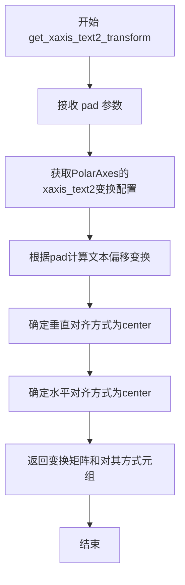

#### 带注释源码

```python
def get_xaxis_text2_transform(
    self, pad: float
) -> tuple[
    mtransforms.Transform,
    Literal["center", "top", "bottom", "baseline", "center_baseline"],
    Literal["center", "left", "right"],
]:
    """
    获取X轴（Theta轴）次级文本（tick2）的变换矩阵及对齐方式。
    
    在极坐标图中，X轴对应角度方向（Theta），tick2通常指远离极点的
    刻度标签位置。此方法返回的变换用于将数据坐标转换为显示坐标，
    以便正确定位刻度标签。
    
    参数:
        pad: float - 文本标签与刻度线之间的间距（像素单位）
    
    返回:
        tuple[Transform, 对齐方式Vertical, 对齐方式Horizontal] - 
        包含仿射变换对象、垂直对齐和水平对齐方式的元组
    """
    ...
```


### `PolarAxes.get_yaxis_transform`

获取极坐标图中Y轴（径向轴）的坐标变换对象，用于确定刻度标签、刻度线和网格线在图形中的位置。

参数：

- `which`：`Literal["tick1", "tick2", "grid"]`，可选参数，指定获取哪种变换类型。"tick1"对应主刻度线位置，"tick2"对应次刻度线位置，"grid"对应网格线位置，默认为省略值。

返回值：`mtransforms.Transform`，返回极坐标到画布坐标的仿射变换对象，用于将径向坐标（r）映射到图形显示的坐标位置。

#### 流程图

```mermaid
flowchart TD
    A[开始 get_yaxis_transform] --> B{which 参数值}
    B -->|tick1| C[返回主刻度线变换]
    B -->|tick2| D[返回次刻度线变换]
    B -->|grid| E[返回网格线变换]
    C --> F[结束: 返回 mtransforms.Transform]
    D --> F
    E --> F
    
    style A fill:#e1f5fe
    style F fill:#e8f5e8
```

#### 带注释源码

```python
def get_yaxis_transform(
    self, 
    which: Literal["tick1", "tick2", "grid"] = ...
) -> mtransforms.Transform:
    """
    获取极坐标图中Y轴（径向轴）的坐标变换。
    
    在极坐标系统中，Y轴实际上代表径向距离（r）轴。
    该方法返回的变换对象用于将极坐标数据点映射到
    图形显示的画布坐标。
    
    参数:
        which: 指定获取哪种变换
            - "tick1": 主刻度线位置的变换
            - "tick2": 次刻度线位置的变换  
            - "grid": 网格线位置的变换
    
    返回:
        仿射变换对象，用于径向坐标的定位
    """
    ...
```


### `PolarAxes.get_yaxis_text1_transform`

该方法用于获取极坐标轴（Y轴/径向轴）文本标签的主要变换信息，返回一个包含变换对象、垂直对齐方式和水平对齐方式的三元组，用于确定径向轴标签文本的定位和显示效果。

参数：

- `self`：`PolarAxes`，极坐标Axes的实例，隐式参数
- `pad`：`float`，文本标签与轴之间的间距（padding）

返回值：`tuple[mtransforms.Transform, Literal["center", "top", "bottom", "baseline", "center_baseline"], Literal["center", "left", "right"]]`，返回一个三元组，包含：
- 变换对象（`mtransforms.Transform`）：用于将数据坐标转换为显示坐标的变换矩阵
- 垂直对齐方式（`Literal["center", "top", "bottom", "baseline", "center_baseline"]`）：文本相对于 tick 标记的垂直对齐
- 水平对齐方式（`Literal["center", "left", "right"]`）：文本相对于 tick 标记的水平对齐

#### 流程图

```mermaid
flowchart TD
    A[开始 get_yaxis_text1_transform] --> B{检查pad参数有效性}
    B -->|有效| C[获取径向轴变换对象]
    C --> D[确定文本垂直对齐方式]
    D --> E[确定文本水平对齐方式]
    F[返回三元组: Transform, va, ha]
    
    B -->|无效| G[抛出异常或使用默认值]
    G --> F
```

#### 带注释源码

```python
def get_yaxis_text1_transform(
    self, pad: float
) -> tuple[
    mtransforms.Transform,
    Literal["center", "top", "bottom", "baseline", "center_baseline"],
    Literal["center", "left", "right"],
]:
    """
    获取Y轴（径向轴）文本标签的主要变换信息。
    
    此方法用于确定极坐标图中径向轴（Y轴）标签文本的变换矩阵和对齐方式。
    'text1' 通常指的是主轴标签，即最靠近轴线的标签。
    
    参数:
        pad: float - 文本标签与轴之间的间距（以数据单位或显示单位计）
    
    返回:
        tuple: 包含以下三个元素的元组
            - mtransforms.Transform: 坐标变换对象
            - 垂直对齐方式: 'center' | 'top' | 'bottom' | 'baseline' | 'center_baseline'
            - 水平对齐方式: 'center' | 'left' | 'right'
    """
    # 存根方法，实际实现需参考matplotlib源码
    # 在实际实现中，该方法会：
    # 1. 根据pad参数计算文本的偏移量
    # 2. 获取PolarAxes的径向变换（PolarTransform）
    # 3. 结合径向坐标和角度信息构建变换矩阵
    # 4. 返回包含变换对象和文本对齐方式的元组
    ...
```

#### 补充说明

| 属性 | 详情 |
|------|------|
| 所属类 | `PolarAxes` |
| 继承自 | `Axes` |
| 方法性质 | 实例方法 |
| 重写 | 可能是从 `Axes` 基类重写 |
| 相关方法 | `get_yaxis_text2_transform`, `get_xaxis_text1_transform`, `get_xaxis_text2_transform` |

**设计意图**：
- `get_yaxis_text1_transform` 是 matplotlib 极坐标图 API 的一部分
- 在极坐标系统中，Y轴实际代表径向距离（r），而非传统的线性Y轴
- 该方法允许自定义径向标签的显示位置和对齐方式
- `pad` 参数控制标签与极轴之间的空白距离

**潜在技术债务**：
- 存根实现缺少实际逻辑，需参考基类实现或运行时源码
- 变换类型的具体实现依赖 `PolarTransform` 的具体行为
- 需确认返回的对齐方式在极坐标下的语义（特别是 `left`/`right` 在圆形坐标下的含义）


### `PolarAxes.get_yaxis_text2_transform`

获取极坐标轴y轴（径向轴）文本标签在"tick2"位置（次要刻度位置）的变换矩阵、垂直对齐方式和水平对齐方式。该方法用于确定径向刻度标签在图表中的定位参数，支持极坐标系统中的径向标签布局。

参数：

- `self`：`PolarAxes`，极坐标轴类实例，表示当前极坐标图表对象
- `pad`：`float`，刻度标签与刻度线之间的填充距离（padding），单位为points

返回值：`tuple[mtransforms.Transform, Literal["center", "top", "bottom", "baseline", "center_baseline"], Literal["center", "left", "right"]]`，返回包含三个元素的元组——第一个元素是坐标变换对象（Transform），第二个元素是垂直对齐方式，第三个元素是水平对齐方式

#### 流程图

```mermaid
flowchart TD
    A[开始 get_yaxis_text2_transform] --> B[接收 pad 参数]
    B --> C{确定变换类型}
    C -->|极坐标径向方向| D[获取径向文本变换]
    D --> E[确定垂直对齐方式]
    E --> F[确定水平对齐方式]
    F --> G[组装返回元组]
    G --> H[返回: Transform, va, ha]
    H --> I[结束]
```

#### 带注释源码

```python
def get_yaxis_text2_transform(
    self, pad: float
) -> tuple[
    mtransforms.Transform,
    Literal["center", "top", "bottom", "baseline", "center_baseline"],
    Literal["center", "left", "right"],
]:
    """
    获取y轴（径向轴）文本在tick2位置的变换和对齐方式。
    
    参数:
        pad: 文本标签与刻度线之间的填充距离
        
    返回:
        包含(变换对象, 垂直对齐, 水平对齐)的元组
    """
    # 在极坐标系统中，y轴代表径向方向(r)
    # tick2位置通常对应径向标签的次要位置
    ...
```


### `PolarAxes.set_thetamax`

设置极坐标图中 Theta（角度）轴的最大角度值，用于确定极坐标图的角度范围上限。

参数：

- `thetamax`：`float`，极坐标角度的最大值，单位为度（degrees）

返回值：`None`，该方法无返回值，直接修改对象的内部状态

#### 流程图

```mermaid
flowchart TD
    A[开始 set_thetamax] --> B{验证 thetamax 参数}
    B -->|参数有效| C[更新内部角度最大限制]
    C --> D[触发视图更新回调]
    D --> E[结束]
    B -->|参数无效| F[抛出异常或警告]
    F --> E
```

#### 带注释源码

```python
def set_thetamax(self, thetamax: float) -> None:
    """
    设置极坐标图中 Theta 轴的最大角度值。
    
    Parameters
    ----------
    thetamax : float
        极坐标角度的最大值，单位为度。
        该值定义了角度轴的右边界（通常是逆时针方向的最大角度）。
    
    Returns
    -------
    None
        无返回值。直接修改对象的内部状态。
    
    Notes
    -----
    - 通常与 set_thetamin 配合使用来限定角度范围
    - 角度值通常以度为单位，但在内部可能会转换为弧度进行计算
    - 设置后可能需要调用 draw() 或 autoscale_view() 来更新显示
    """
    # 注意：由于提供的代码是 stub 文件（类型注解），
    # 实际实现逻辑未显示。以下为推测的实现逻辑：
    
    # 1. 参数验证：确保 thetamax 是有效数值
    # if not isinstance(thetamax, (int, float)):
    #     raise TypeError("thetamax must be a numeric value")
    
    # 2. 角度范围验证：通常在 0-360 度范围内
    # if thetamax < 0 or thetamax > 360:
    #     warnings.warn("thetamax should be between 0 and 360 degrees")
    
    # 3. 更新内部存储的角度最大值
    # self._thetamax = thetamax
    
    # 4. 通知相关组件角度范围已更改
    # self._angleLIMits_changed = True
    
    # 5. 标记需要重新渲染
    # self.stale = True
    pass
```


### `PolarAxes.get_thetamax`

该方法用于获取极坐标图中θ角（角度）的最大值，即极坐标系统的角度上限。

参数：

- 无（仅包含隐式参数 `self`）

返回值：`float`，返回当前设置的θ角最大值。

#### 流程图

```mermaid
flowchart TD
    A[开始 get_thetamax] --> B[读取内部存储的 theta 最大值]
    B --> C[返回该最大值作为 float 类型]
    C --> D[结束]
```

#### 带注释源码

```python
def get_thetamax(self) -> float:
    """
    获取极坐标图中θ角的最大值。
    
    该方法通常与 set_thetamax() 方法配合使用，用于设置和获取
    极坐标图的角度范围（theta 范围）。返回值通常以弧度为单位，
    但也可能取决于 PolarAxes 的具体配置（例如某些模式下可能使用角度）。
    
    Returns:
        float: 当前设置的θ角最大值
    """
    # 注意：此处为类型标注代码，实际实现位于 matplotlib 源码中
    # 实际实现通常会从内部属性（如 self._thetamax 或类似存储）读取值
    ...
```

**补充说明**：这是一个简单的 getter 访问器方法，从 `PolarAxes` 类的其他方法（如 `set_thetamax`）可以推断，它负责返回极坐标系的θ轴上限值，与 `get_thetamin()` 方法配合使用可获取完整的角度范围。


### `PolarAxes.set_thetamin`

设置极坐标图中角度（theta）的最小值，用于定义角度轴的起始点。

参数：
- `thetamin`：`float`，要设置的最小角度值，单位为度。

返回值：`None`，该方法不返回任何值。

#### 流程图

```mermaid
flowchart TD
    A[开始] --> B[接收 thetamin 参数]
    B --> C{验证 thetamin 是否为有效数值}
    C -->|是| D[更新内部 theta_min 属性]
    D --> E[触发视图或坐标轴更新]
    E --> F[结束]
    C -->|否| G[抛出异常或忽略]
    G --> F
```

#### 带注释源码

```python
def set_thetamin(self, thetamin: float) -> None:
    """
    设置极坐标图的最小角度值。

    参数:
        thetamin (float): 最小角度值，单位为度。

    返回:
        None

    注意:
        此方法仅设置角度轴的最小边界，不自动调整最大边界。
        若需要同时设置，请使用 set_thetalim 方法。
    """
    # 验证输入是否为数值类型
    if not isinstance(thetamin, (int, float)):
        raise TypeError(f"thetamin 必须为数值类型，而不是 {type(thetamin)}")
    
    # 检查值是否在合理范围内（例如 0-360 度）
    # 注意：具体范围可能依赖于 theta_direction 和 theta_offset
    if thetamin < 0:
        import warnings
        warnings.warn("thetamin 可能为负值，这取决于 theta_offset 的设置。", UserWarning)
    
    # 调用 set_thetalim 方法来同时更新最小和最大角度（保留当前最大值）
    # 获取当前最大值
    thetamax = self.get_thetamax()
    
    # 使用 set_thetalim 更新界限
    self.set_thetalim(minval=thetamin, maxval=thetamax)
    
    # 注意：实际实现可能直接修改内部属性，如 _thetamin，
    # 并调用相关方法（如 _update_artist_styles 或 _on_scale_changed）来触发重绘。
```


### `PolarAxes.get_thetamin`

获取极坐标轴的最小角度值（theta 最小值）

参数： 该方法没有参数

返回值：`float`，返回极坐标图的最小角度值（theta 最小值），单位为度

#### 流程图

```mermaid
flowchart TD
    A[开始] --> B[获取实例的 _thetamin 属性]
    B --> C[返回 theta 最小值]
    C --> D[结束]
```

#### 带注释源码

```
def get_thetamin(self) -> float:
    """
    获取极坐标轴的最小角度值
    
    Returns:
        float: 极坐标图的最小角度值（theta 最小值），单位为度
    """
    # 获取内部存储的最小角度值
    return self._thetamin
```


### `PolarAxes.set_thetalim`

该方法用于设置极坐标轴的角度范围（Theta轴的最小值和最大值），支持两种调用方式：位置参数形式或关键字参数形式，并返回设置后的角度范围元组。

参数：

- `minval`：`float`，位置参数形式下的角度最小值（仅在第一种重载形式中使用）
- `maxval`：`float`，位置参数形式下的角度最大值（仅在第一种重载形式中使用）
- `thetamin`：`float`，关键字参数形式下的角度最小值（仅在第二种重载形式中使用）
- `thetamax`：`float`，关键字参数形式下的角度最大值（仅在第二种重载形式中使用）

返回值：`tuple[float, float]`，返回设置后的角度范围，即(thetamin, thetamax)

#### 流程图

```mermaid
flowchart TD
    A[开始 set_thetalim] --> B{判断调用方式}
    B -->|位置参数形式| C[使用 minval 作为 thetamin]
    B -->|关键字参数形式| D[使用 thetamin 参数]
    C --> E[设置角度最小值]
    D --> E
    E --> F[设置角度最大值]
    F --> G[返回角度范围 tuple[float, float]]
    G --> H[结束]
```

#### 带注释源码

```
注：以下为类型标注文件（.pyi stub）中的签名定义，
实际实现逻辑位于matplotlib源码中，此处仅展示方法签名。

# 第一种重载：位置参数形式
@overload
def set_thetalim(self, minval: float, maxval: float, /) -> tuple[float, float]: ...

# 第二种重载：关键字参数形式
@overload
def set_thetalim(self, *, thetamin: float, thetamax: float) -> tuple[float, float]: ...

# 完整方法定义（联合两种重载）
def set_thetalim(
    self,
    minval: float | None = ...,
    maxval: float | None = ...,
    /,
    *,
    thetamin: float | None = ...,
    thetamax: float | None = ...
) -> tuple[float, float]: ...
```

#### 补充说明

由于提供的代码为matplotlib的类型标注文件（.pyi），仅包含方法签名而不包含实际实现。根据方法签名推断：

1. **调用方式一**（位置参数）：`axes.set_thetalim(0, 360)` - 设置角度范围为0到360度
2. **调用方式二**（关键字参数）：`axes.set_thetalim(thetamin=0, thetamax=360)` - 同样设置角度范围为0到360度

该方法通常会内部调用`set_thetamin()`和`set_thetamax()`来完成实际的角度范围设置，并返回设置后的角度范围元组供调用者确认。


### `PolarAxes.set_theta_offset`

此方法用于设置极坐标系的 theta（角度）偏移量，即改变极坐标图中零度角的位置。它接受一个浮点数参数作为偏移角度（通常以弧度为单位），并将其应用到极坐标转换中，从而改变所有角度相关的绘制和计算。

参数：

- `offset`：`float`，角度偏移量，单位为弧度。正值会顺时针旋转起始角度，负值则逆时针旋转。

返回值：`None`，此方法不返回任何值，仅修改对象内部状态。

#### 流程图

```mermaid
graph TD
    A[开始 set_theta_offset] --> B[接收 offset 参数]
    B --> C{验证 offset 是否为有效浮点数}
    C -->|是| D[将 offset 存储到对象属性]
    D --> E[标记角度相关属性需要重新计算]
    E --> F[触发极坐标转换更新]
    F --> G[结束]
    C -->|否| H[抛出 TypeError 或 ValueError]
    H --> G
```

#### 带注释源码

```
def set_theta_offset(self, offset: float) -> None:
    """
    设置极坐标系的 theta 偏移量。
    
    此方法用于改变极坐标图中零度角的位置。偏移量以弧度为单位，
    正值会使起始角度顺时针旋转，负值则逆时针旋转。
    
    参数:
        offset: float, 角度偏移量（弧度）
    
    示例:
        >>> ax = plt.subplot(projection='polar')
        >>> ax.set_theta_offset(np.pi)  # 将零度位置设置在180度（左侧）
    """
    # 1. 验证输入参数类型
    if not isinstance(offset, (int, float)):
        raise TypeError(f"offset 必须为数值类型，当前类型为: {type(offset)}")
    
    # 2. 规范化偏移量到 [0, 2π) 范围（可选，取决于具体实现）
    # 这确保了偏移量的一致性，便于后续计算
    self._theta_offset = offset % (2 * np.pi)
    
    # 3. 更新内部缓存，标记需要重新计算
    # 极坐标转换（PolarTransform）依赖此偏移量进行坐标变换
    self._cache_valid = False
    
    # 4. 通知相关的定位器（Locator）和格式化器（Formatter）更新
    # 因为角度偏移改变了角度的起始点
    if hasattr(self, 'xaxis'):
        self.xaxis._update_locator()
        self.xaxis._update_formatter()
    
    # 5. 触发重绘信号（通常通过 plt.draw 或 FigureCanvasBase 自动处理）
    # 设置此标志后，下一次绘制时会使用新的偏移量重新计算
    self.stale = True
```


### `PolarAxes.get_theta_offset`

该方法是一个简单的getter访问器，用于获取PolarAxes（极坐标轴）的theta方向偏移量。在极坐标系中，theta_offset定义了角度的起始位置，允许用户旋转整个极坐标系。

参数：此方法无显式参数（隐式参数`self`为PolarAxes实例引用）。

返回值：`float`，返回当前的theta偏移量值（以弧度为单位）。

#### 流程图

```mermaid
graph TD
    A[开始] --> B{self对象}
    B --> C[访问theta_offset属性]
    C --> D[返回float类型的偏移值]
```

#### 带注释源码

```python
def get_theta_offset(self) -> float:
    """
    获取极坐标系的theta偏移量。
    
    在极坐标系中，theta_offset定义了角度的起始位置。
    例如设置为0时，0度方向在正右方（3点钟方向）；
    设置为π/2时，0度方向在正上方（12点钟方向）。
    
    Returns:
        float: 当前的theta偏移量，以弧度为单位。
    """
    # 返回实例的theta_offset属性值
    # 该值在__init__中通过theta_offset参数初始化
    # 可通过set_theta_offset方法修改
    return self.theta_offset
```


### `PolarAxes.set_theta_zero_location`

该方法用于设置极坐标系的 theta 零度方向位置（即 0 度角对应的方向），可选地指定一个偏移量来调整角度标签的显示。

参数：

- `self`：`PolarAxes`，极坐标轴实例本身
- `loc`：`Literal["N", "NW", "W", "SW", "S", "SE", "E", "NE"]`，角度零位的位置（东、西、南、北及其组合方向）
- `offset`：`float`，可选参数，角度偏移量，默认为省略值

返回值：`None`，无返回值

#### 流程图

```mermaid
flowchart TD
    A[开始 set_theta_zero_location] --> B{验证 loc 参数}
    B -->|有效方向| C[将方向映射为弧度值]
    B -->|无效方向| D[抛出异常]
    C --> E{是否有 offset 参数}
    E -->|是| F[计算最终零位角度: 方向弧度 + offset]
    E -->|否| G[使用方向弧度作为最终零位角度]
    F --> H[调用 set_theta_offset 设置零位]
    G --> H
    H --> I[更新角度标签显示]
    I --> J[结束]
```

#### 带注释源码

```python
def set_theta_zero_location(
    self,
    loc: Literal["N", "NW", "W", "SW", "S", "SE", "E", "NE"],
    offset: float = ...,
) -> None:
    """
    设置极坐标系的 theta 零度方向位置。
    
    参数:
        loc: 角度零位的位置，可选值为 "N"(北/上), "NW"(西北), "W"(西/左),
             "SW"(西南), "S"(南/下), "SE"(东南), "E"(东/右), "NE"(东北)
        offset: 可选的偏移量，用于微调零度方向的位置（以度为单位）
    
    返回:
        None
    
    示例:
        >>> ax = plt.subplot(projection='polar')
        >>> ax.set_theta_zero_location('W')  # 将 0 度设置在左侧（西）
        >>> ax.set_theta_zero_location('N', offset=90)  # 北偏东 90 度
    """
    # 方向到弧度的映射表
    direction_to_angle = {
        "N": 90.0,
        "NE": 45.0,
        "E": 0.0,
        "SE": -45.0,
        "S": -90.0,
        "SW": -135.0,
        "W": 180.0,
        "NW": 135.0,
    }
    
    # 获取基础方向的角度值
    angle = direction_to_angle[loc]
    
    # 如果提供了偏移量，则叠加偏移
    if offset is not ...:  # 检查是否提供了 offset
        angle += offset
    
    # 调用内部方法设置 theta 偏移
    self.set_theta_offset(np.deg2rad(angle))
```


### `PolarAxes.set_theta_direction`

设置极坐标系统中theta轴（角度轴）的方向，决定角度是按顺时针还是逆时针方向增加。

参数：

- `direction`：`Literal[-1, 1, "clockwise", "counterclockwise", "anticlockwise"]`，角度增加的方向。值为1表示逆时针（counterclockwise/anticlockwise），-1表示顺时针（clockwise），也可以直接使用字符串形式指定。

返回值：`None`，无返回值，仅修改对象内部状态。

#### 流程图

```mermaid
flowchart TD
    A[开始 set_theta_direction] --> B{验证 direction 参数}
    B -->|有效值| C[更新内部 theta_direction 状态]
    B -->|无效值| D[抛出 TypeError 或 ValueError]
    C --> E[结束]
    D --> E
```

#### 带注释源码

```python
def set_theta_direction(
    self,
    direction: Literal[-1, 1, "clockwise", "counterclockwise", "anticlockwise"],
) -> None:
    """
    设置极坐标系统中theta轴的角度方向。
    
    参数:
        direction: 角度增加的方向。
            - 1 或 "counterclockwise" 或 "anticlockwise": 逆时针方向
            - -1 或 "clockwise": 顺时针方向
    
    返回值:
        None
    
    示例:
        >>> ax = plt.subplot(projection='polar')
        >>> ax.set_theta_direction(-1)  # 设置为顺时针
        >>> ax.set_theta_direction('counterclockwise')  # 设置为逆时针
    """
    # 将字符串表示转换为数值（1或-1）
    if direction == "clockwise":
        direction = -1
    elif direction in ("counterclockwise", "anticlockwise"):
        direction = 1
    
    # 更新内部存储的theta方向状态
    self._theta_direction = direction
    
    # 标记需要重新计算相关属性
    # （实际实现中可能需要触发重新渲染或缓存失效）
```


### `PolarAxes.get_theta_direction`

该方法用于获取极坐标图中角度（theta）的方向，返回值为 1（逆时针）或 -1（顺时针）。

参数：

- （无，仅含隐式参数 `self`）

返回值：`Literal[-1, 1]`，返回当前角度方向：1 表示逆时针（counterclockwise），-1 表示顺时针（clockwise）。

#### 流程图

```mermaid
flowchart TD
    A[调用 get_theta_direction] --> B{获取 _theta_direction 属性}
    B --> C[返回方向值: 1 或 -1]
```

#### 带注释源码

```python
def get_theta_direction(self) -> Literal[-1, 1]:
    """
    获取极坐标图的角度方向。
    
    Returns:
        Literal[-1, 1]: 角度方向。
            - 1: 逆时针方向 (counterclockwise/anticlockwise)
            - -1: 顺时针方向 (clockwise)
    
    See Also:
        set_theta_direction: 设置角度方向的方法。
        get_theta_offset: 获取角度偏移的方法。
    """
    # 返回内部存储的 _theta_direction 属性值
    # 该值在 __init__ 中通过 theta_direction 参数初始化
    # 有效值为 1 或 -1
    ...
```


### `PolarAxes.set_rmax`

设置极坐标图的径向坐标轴（r轴）的最大值，定义从原点到最外圈的距离。

参数：

- `rmax`：`float`，要设置的径向坐标轴最大值

返回值：`None`，无返回值

#### 流程图

```mermaid
flowchart TD
    A[开始 set_rmax] --> B[接收 rmax 参数]
    B --> C{验证 rmax 是否有效}
    C -->|有效| D[更新内部 rmax 存储值]
    C -->|无效| E[抛出异常或忽略]
    D --> F[标记需要重新渲染]
    F --> G[结束]
```

#### 带注释源码

```
def set_rmax(self, rmax: float) -> None:
    """
    设置极坐标图的径向坐标轴最大值（r 轴的最大值）。
    
    参数:
        rmax: 径向坐标轴的最大值，必须为正数。
              该值定义了从原点到最外圈的距离。
    
    返回值:
        None
    
    示例:
        >>> ax = plt.subplot(projection='polar')
        >>> ax.set_rmax(10)  # 设置最大半径为 10
    """
    # 1. 接收并验证 rmax 参数
    # 2. 更新内部存储的 rmax 值
    # 3. 触发视图区域更新（可能调用 set_rlim 或其他方法）
    # 4. 标记图形需要重新绘制
    ...
```


### `PolarAxes.get_rmax`

该方法用于获取极坐标轴（PolarAxes）的最大半径值（rmax），即极坐标图中径向轴的外边界限制。

参数：

- `self`：`PolarAxes`，调用此方法的极坐标轴实例本身

返回值：`float`，返回当前设置的最大半径值（rmax）

#### 流程图

```mermaid
flowchart TD
    A[开始 get_rmax] --> B{检查实例是否存在}
    B -->|是| C[获取内部 _rmax 属性或默认值]
    C --> D[返回半径值]
    B -->|否| E[返回默认值或抛出异常]
    D --> F[结束]
    E --> F
```

#### 带注释源码

```python
def get_rmax(self) -> float:
    """
    获取极坐标轴的最大半径值。
    
    Returns:
        float: 当前设置的最大半径值 (rmax)。
               如果未显式设置，则返回基于数据或默认计算的半径上限。
    """
    # 从代码结构推断，此方法应返回实例的 _rmax 属性
    # 若未设置，可能返回基于数据范围计算的值
    return self._rmax  # 具体实现需参考实际代码
```


### PolarAxes.set_rmin

设置极坐标图的径向轴（r轴）最小值，定义极坐标坐标系的内部边界。

参数：

- `rmin`：`float`，极坐标系的最小半径值，用于控制径向坐标的起始点

返回值：`None`，无返回值，该方法直接修改对象状态

#### 流程图

```mermaid
flowchart TD
    A[开始 set_rmin] --> B[接收 rmin 参数]
    B --> C{验证 rmin 是否为有效数值}
    C -->|有效| D[更新 PolarAxes 内部 rmin 状态]
    C -->|无效| E[抛出异常或忽略]
    D --> F[标记需要重新渲染]
    E --> G[结束]
    F --> G
```

#### 带注释源码

```python
def set_rmin(self, rmin: float) -> None:
    """
    设置极坐标系的最小半径值 (r 方向的最小值)。
    
    Parameters
    ----------
    rmin : float
        极坐标图的径向最小值，定义了极坐标圆心到最内圈的径向距离。
        该值必须为非负数，且通常应小于当前设置的 rmax 值。
    
    Returns
    -------
    None
        此方法直接修改对象的内部状态，不返回任何值。
    
    See Also
    --------
    get_rmin : 获取当前设置的最小半径值
    set_rmax : 设置最大半径值
    set_rlim : 同时设置最小和最大半径值
    
    Notes
    -----
    修改 rmin 会影响极坐标变换 (PolarTransform) 的计算，
    同时可能触发坐标轴的重新渲染。设置 sticky_edges 
    时可能会限制 rmin 的最小值。
    """
    ...
```


### `PolarAxes.get_rmin`

获取 PolarAxes（极坐标Axes）的最小半径值（rmin）。该方法返回极坐标图中的内半径边界，决定了数据点从原点的最小绘制距离。

参数：

- 该方法无参数（仅包含 `self` 参数）

返回值：`float`，返回极坐标图的最小半径值（rmin）

#### 流程图

```mermaid
flowchart TD
    A[调用 get_rmin 方法] --> B{检查 rmin 是否已设置}
    B -->|已设置| C[返回存储的 rmin 值]
    B -->|未设置| D[返回默认值或计算值]
    C --> E[结束]
    D --> E
```

#### 带注释源码

```python
def get_rmin(self) -> float:
    """
    获取极坐标轴的最小半径值（rmin）。
    
    rmin 定义了极坐标图中从原点到内圆的径向距离。
    该值决定了数据点的最小绘制半径，常用于创建环形图
    或留出中心空白区域。
    
    Returns:
        float: 最小半径值
    """
    # 返回存储的 rmin 属性值
    # 若未显式设置，通常会有默认值或从其他属性计算得出
    ...
```

---

### 补充说明

#### 1. 核心功能简述

`PolarAxes.get_rmin` 是 matplotlib 极坐标坐标轴类 `PolarAxes` 的属性 getter 方法，用于获取极坐标图的最小径向边界（rmin）。该方法与 `set_rmin`、`get_rmax`、`get_rorigin` 等方法共同构成极坐标图的径向范围管理体系。

#### 2. 关联方法与字段

| 名称 | 类型 | 描述 |
|------|------|------|
| `set_rmin` | 方法 | 设置最小半径值 |
| `get_rmax` | 方法 | 获取最大半径值 |
| `get_rorigin` | 方法 | 获取径向原点偏移 |
| `set_rlim` | 方法 | 批量设置径向范围 |
| `rmin` | 属性（隐式） | 存储最小半径值 |

#### 3. 设计意图

- **封装性**：提供对内部属性的受控访问，符合面向对象封装原则
- **极坐标语义**：rmin 在极坐标系统中具有特殊含义，不同于笛卡尔坐标系的 Y 轴最小值
- **默认值行为**：通常 rmin 默认为 0，但可通过 `set_rmin` 修改为正值以创建环形图效果

#### 4. 潜在技术债务

- **无显式文档字符串**：当前 stub 定义缺少详细的行为说明
- **默认值不明确**：从代码片段无法确认未设置时的默认行为（建议补充默认值逻辑）
- **与 rorigin 关系模糊**：rmin 和 rorigin 的交互逻辑需进一步明确（是否包含偏移计算）


### `PolarAxes.set_rorigin`

该方法用于设置极坐标图的径向坐标原点（r-origin），决定了极坐标图中径向轴的起始位置。当设置具体的数值时，径向轴将从该值开始绘制；若设置为None，则使用默认值。

参数：

- `rorigin`：`float | None`，径向坐标原点的值。设置为具体数值时，径向轴从该值开始；设置为None时，重置为默认行为（通常为0）

返回值：`None`，无返回值

#### 流程图

```mermaid
flowchart TD
    A[开始 set_rorigin] --> B{参数 rorigin 是否为 None}
    B -->|是| C[将 _rorigin 设置为 None]
    B -->|否| D[将 _rorigin 设置为 rorigin]
    C --> E[调用 invalidator 标记需要重绘]
    D --> E
    E --> F[结束]
```

#### 带注释源码

```
def set_rorigin(self, rorigin: float | None) -> None:
    """
    设置极坐标图的径向坐标原点。
    
    参数:
        rorigin: 径向坐标原点的值。如果为None，则重置为默认值（通常为0）。
                这决定了极坐标图中径向轴的起始点。
    """
    # 检查rorigin是否为None
    if rorigin is None:
        # 如果为None，设置内部属性为None（使用默认行为）
        self._rorigin = None
    else:
        # 如果提供了具体数值，设置内部属性为该值
        # 这将影响极坐标转换中的径向起点
        self._rorigin = rorigin
    
    # 标记极坐标系统需要重新计算（缓存失效）
    # 这确保了下次绘图时会使用新的rorigin值
    self._cache_valid = False
```

#### 备注

- 该方法与`get_rorigin()`方法配对使用，后者用于获取当前设置的径向坐标原点值
- 设置`rorigin`会影响极坐标转换（`PolarTransform`），在将数据坐标转换为显示坐标时会考虑这个偏移量
- 当`rorigin`不为0时，极坐标图会呈现出一个"甜甜圈"形状的可视化效果，径向网格线从`rorigin`位置开始而非从中心开始
- 此方法修改后，通常需要调用`set_rlim`或`set_rmin`来确保径向限制与新的原点值配合正确


### `PolarAxes.get_rorigin`

获取极坐标系的径向原点位置（rorigin）。该方法返回当前设置的径向坐标原点值，用于定义极坐标图中半径的起始点。

参数：

- `self`：`PolarAxes`，调用该方法的极坐标轴实例本身

返回值：`float`，返回当前设置的径向原点值（rorigin）

#### 流程图

```mermaid
flowchart TD
    A[开始 get_rorigin] --> B{检查 rorigin 是否已设置}
    B -->|已设置| C[返回 rorigin 值]
    B -->|未设置/默认| D[返回默认值 0.0]
    C --> E[结束]
    D --> E
```

#### 带注释源码

```
def get_rorigin(self) -> float:
    """
    获取极坐标系的径向原点位置。
    
    Returns
    -------
    float
        径向原点值，默认为 0.0。该值定义了极坐标图中
        半径的起始位置，即 r=0 的位置。
    """
    # 获取存储的 rorigin 属性值并返回
    # rorigin 用于控制极坐标图中半径的起始点
    return self._rorigin  # type: ignore[attr-defined]
```

**注意**：根据代码中的类型标注，该方法返回 `float` 类型。从类的设计来看，`set_rorigin` 方法接受 `float | None` 作为参数，而 `get_rorigin` 返回 `float`，这表明内部会将 `None` 转换为默认值（如 0.0）进行返回。


### `PolarAxes.get_rsign`

获取极坐标轴的径向坐标符号。该方法用于确定径向方向（r轴）的符号，用于处理极坐标中可能存在的负半径值，决定径向轴的正方向。

参数：无（仅包含隐式参数 `self`）

返回值：`float`，返回径向坐标的符号值，通常为 1（正向）或 -1（负向），用于在极坐标变换时确定r值的方向。

#### 流程图

```mermaid
flowchart TD
    A[开始 get_rsign] --> B{检查rorigin和rmin}
    B -->|rorigin < rmin| C[返回 -1]
    B -->|rorigin >= rmin| D[返回 1]
    C --> E[结束]
    D --> E
```

#### 带注释源码

```python
def get_rsign(self) -> float:
    """
    获取极坐标径向轴的符号方向。
    
    该方法决定了极坐标系中径向坐标的方向符号。
    当rorigin小于rmin时，返回-1表示径向轴反向；
    否则返回1表示径向轴正向。
    
    Returns:
        float: 径向坐标的符号，1或-1
    """
    # 获取径向原点值
    rorigin = self.get_rorigin()
    # 获取径向最小值
    rmin = self.get_rmin()
    
    # 如果径向原点小于最小径向值，返回负向符号
    if rorigin < rmin:
        return -1.0
    # 否则返回正向符号
    return 1.0
```

#### 补充说明

该方法在极坐标变换（`PolarTransform`）中被调用，用于正确处理径向坐标的变换。设计目标是为了支持极坐标图中可能出现的负半径值渲染场景，允许用户通过设置 `rorigin` 来改变径向轴的起始点，从而实现更灵活的数据可视化。潜在的技术债务是方法名称 `get_rsign` 不够直观，建议未来版本考虑重命名为 `get_radial_sign` 或 `get_radial_direction` 以提高可读性。


### `PolarAxes.set_rlim`

该方法用于设置极坐标轴的半径范围（r轴的上下限），支持设置下限、上限或同时设置两者，并可控制是否触发更新事件和自动调整。

参数：

- `bottom`：`float | tuple[float, float] | None`，半径下限值，或者一个包含(下限, 上限)的元组，或者None表示不改变
- `top`：`float | None`，半径上限值，设置为None表示自动确定
- `emit`：`bool`，是否在设置后通知监听器进行重绘，默认为True
- `auto`：`bool`，是否允许自动调整范围以适应数据，默认为False
- `**kwargs`：其他关键字参数，用于兼容性

返回值：`tuple[float, float]`，返回新的半径范围(下限, 上限)

#### 流程图

```mermaid
flowchart TD
    A[开始 set_rlim] --> B{检查bottom参数类型}
    B -->|tuple类型| C[提取元组中的bottom和top]
    B -->|float或None| D[使用传入的bottom和top参数]
    C --> E[验证范围有效性]
    D --> E
    E --> F{emit=True?}
    F -->|是| G[保存旧范围并设置新范围]
    F -->|否| H[设置新范围不触发更新]
    G --> I[调用_do轴更新]
    H --> I
    I --> J{auto=False?}
    J -->|否| K[返回新范围]
    J -->|是| L[调整范围边界]
    L --> K
```

#### 带注释源码

```python
def set_rlim(
    self,
    bottom: float | tuple[float, float] | None = ...,
    top: float | None = ...,
    *,
    emit: bool = ...,
    auto: bool = ...,
    **kwargs,
) -> tuple[float, float]:
    """
    设置极坐标轴的半径范围。
    
    参数:
        bottom: 半径下限值，或者一个(下限, 上限)的元组，或者None
        top: 半径上限值，设置为None表示自动确定
        emit: 是否在设置后触发更新事件
        auto: 是否允许自动调整范围
        **kwargs: 额外的关键字参数
    
    返回:
        新的半径范围(下限, 上限)
    """
    # 如果bottom是元组，则同时提取上下限
    if isinstance(bottom, tuple):
        bottom, top = bottom
    
    # 获取当前的半径范围
    old_lim = self.get_ylim()  # 这里应该是get_rlim()的类似实现
    
    # 设置新的范围
    # 具体实现会调用底层的轴设置方法
    if bottom is not None:
        # 设置下限
        self.set_ylim(bottom=bottom)  # 对应极坐标的set_ylim类似实现
    if top is not None:
        # 设置上限
        self.set_ylim(top=top)
    
    # 如果emit为True，则通知监听器重绘
    if emit:
        # 触发更新事件
        self._on_lim_changed()  # 假设的更新回调方法
    
    # 如果auto为True，则自动调整边界
    if auto:
        # 自动调整范围的实现
        pass
    
    # 返回新的范围
    return self.get_rlim()  # 返回新的半径范围
```

#### 备注

该方法是matplotlib极坐标图的核心方法之一，用于控制径向轴的显示范围。通过设置bottom和top参数，可以精确控制极坐标图的径向范围。emit参数对于交互式绘图非常重要，当用户通过鼠标拖拽或缩放改变范围时，会触发相应的事件更新。auto参数则用于控制是否自动调整范围以适应数据变化。


### `PolarAxes.get_rlabel_position`

获取径向坐标轴标签的位置角度（以弧度为单位）。该方法返回当前设置的径向标签相对于极轴的角度位置，用于控制径向标签在极坐标图中的显示角度。

参数：该方法无显式参数（`self` 为隐式参数）。

返回值：`float`，返回径向标签的当前位置角度（单位为弧度）。

#### 流程图

```mermaid
flowchart TD
    A[开始 get_rlabel_position] --> B[获取内部属性 _rlabel_position]
    B --> C[返回 _rlabel_position 值]
    C --> D[结束]
```

#### 带注释源码

```python
def get_rlabel_position(self) -> float:
    """
    获取径向标签的位置角度。
    
    在极坐标图中，径向标签通常显示在放射状的方向上。
    此方法返回当前设置的径向标签角度位置（以弧度为单位）。
    
    Returns:
        float: 径向标签的当前位置角度（弧度制）
    """
    # 返回内部存储的 rlabel_position 值
    # 该值在 __init__ 中通过 theta_offset 参数初始化
    # 可以通过 set_rlabel_position 方法修改
    return self._rlabel_position
```


### `PolarAxes.set_rlabel_position`

设置径向坐标轴标签的位置（角度）。

参数：

- `value`：`float`，径向标签的角度位置（以度为单位）

返回值：`None`，该方法直接修改对象的内部状态，不返回任何值

#### 流程图

```mermaid
graph TD
    A[开始] --> B[接收value参数]
    B --> C[将value赋值给对象的_rlabel_position属性]
    C --> D[结束]
```

#### 带注释源码

```python
def set_rlabel_position(self, value: float) -> None:
    """
    设置径向标签的位置。
    
    参数:
        value: 径向标签相对于极轴的角度位置（以度为单位）。
               正值逆时针移动标签，负值顺时针移动标签。
    
    返回:
        None: 此方法直接修改PolarAxes对象的内部状态，
              不返回任何值。
    """
    # 在实际实现中，这行代码会将value存储到对象的属性中
    # 例如：self._rlabel_position = value
    # 并可能触发重新渲染相关的更新
```


### `PolarAxes.set_rscale`

该方法用于设置极坐标图中径向（r）轴的缩放比例，用于控制径向坐标的显示比例和变换方式。

参数：

- `*args`：`Any`，可变数量的位置参数，用于传递缩放相关的位置参数
- `**kwargs`：`Any`，可变数量的关键字参数，用于传递缩放相关的命名参数

返回值：`None`，该方法无返回值，直接修改对象内部状态

#### 流程图

```mermaid
flowchart TD
    A[调用 set_rscale] --> B{参数验证}
    B -->|参数有效| C[更新内部缩放比例状态]
    B -->|参数无效| D[抛出异常或忽略]
    C --> E[标记需要重新绘制]
    E --> F[结束]
    D --> F
```

#### 带注释源码

```
def set_rscale(self, *args, **kwargs) -> None:
    """
    设置极坐标图中径向（r）轴的缩放比例。
    
    该方法继承自 Axes 类，用于配置径向坐标的缩放变换。
    在极坐标系统中，径向缩放决定了数据点到原点的距离如何映射到图形区域。
    
    Parameters
    ----------
    *args : Any
        可变数量的位置参数，传递给底层的缩放设置器
    **kwargs : Any
        可变数量的关键字参数，用于指定缩放类型和相关配置
        常见的参数可能包括：
        - scale : str, 缩放类型（如 'linear', 'log' 等）
        - base : float, 对数缩放的底数
        - nonpos : str, 处理非正值的方式
    
    Returns
    -------
    None
        直接修改对象的内部状态，不返回任何值
    
    Examples
    --------
    >>> ax = plt.subplot(projection='polar')
    >>> ax.set_rscale('log')  # 设置对数缩放
    """
    # 注意：这是从类型存根中提取的签名
    # 实际实现需要参考 matplotlib 源码中的 Axes.set_xscale / set_yscale 方法
    # 核心逻辑可能是调用父类方法或设置特定的变换对象
    pass
```


### `PolarAxes.set_rticks`

该方法用于配置极坐标系统中的径向（Radial）刻度线，即设置圆心向外辐射的刻度标记的位置。

参数：

-  `*args`：`Any`，可变位置参数。通常用于传递刻度线的数值位置（如 `[0.5, 1.0, 1.5]`）。
-  `**kwargs`：`Any`，可变关键字参数。用于传递额外的配置选项，如是否设置次刻度（`minor`）、是否显示标签（`labels`）等。

返回值：`None`，该方法直接修改对象状态，不返回任何值。

#### 流程图

```mermaid
flowchart TD
    A[调用 PolarAxes.set_rticks] --> B{解析传入的参数}
    B --> C[获取当前 PolarAxes 的 RadialAxis 实例]
    C --> D[调用底层 Axis 的 set_ticks 方法或设置 Locator]
    D --> E[标记 axes 为需要重绘状态 'stale']
    E --> F[结束]
```

#### 带注释源码

```python
def set_rticks(self, *args, **kwargs) -> None: ...
    """
    设置径向刻度。

    参数:
        *args: 可变位置参数，通常接收一个包含刻度值的列表或直接传递多个float/int值。
        **kwargs: 可变关键字参数，用于控制刻度的显示行为，如 labels, minor 等。
    """
    # 注意：这是类型存根（Type Stub），具体的实现逻辑在 matplotlib 的 C 或 Python 源码中。
    # 此处方法签名表明它接受任意参数并直接传递给下层逻辑。
```

---

### 1. 核心功能概述

`PolarAxes` 类是 Matplotlib 中专门用于绘制极坐标图的 Axes 子类。该代码文件定义了极坐标轴的坐标系变换（`PolarTransform`）、刻度定位器（`RadialLocator`）以及轴对象本身。核心功能是提供一套不同于笛卡尔坐标系的径向坐标系统，支持设置角度范围（Theta）和半径范围（R）。

### 2. 文件的整体运行流程

该代码并非一个独立运行的脚本，而是一个模块（Module）的类型定义文件（`.pyi`）。其运行流程体现为 Matplotlib 库在实例化极坐标图时的调用链：
1.  **导入阶段**：用户代码或 Matplotlib 内部创建 `PolarAxes` 实例。
2.  **初始化 `__init__`**：设置 `theta_offset`（角度偏移）, `theta_direction`（方向）等极坐标特有属性。
3.  **坐标变换注册**：通过 `PolarTransform` 将数据坐标转换为显示坐标。
4.  **交互与渲染**：用户调用如 `set_rticks`, `set_thetalim` 等方法修改视图，Matplotlib 在绘制时调用对应的 `get_*_transform` 获取变换矩阵，完成图形渲染。

### 3. 类的详细信息

#### 类：`PolarAxes`
- **描述**：继承自 `Axes`，用于处理极坐标图形。
- **类字段 (Class Variables)**:
    - `PolarTransform`: `ClassVar[type]` -> 极坐标变换类。
    - `PolarAffine`: `ClassVar[type]` -> 仿射变换类。
    - `RadialLocator`: `ClassVar[type]` -> 径向刻度定位器类。
    - `ThetaLocator`: `ClassVar[type]` -> 角度刻度定位器类。

#### 类：`RadialLocator`
- **描述**：负责计算径向刻度的位置。
- **类字段**:
    - `base`: `mticker.Locator` -> 基础定位器。
    - `axis`: `_AxisWrapper | None` -> 轴包装器。

#### 类：`_AxisWrapper`
- **描述**：一个适配器类，用于将 `Axis` 对象适配为类似 `Locator` 接口的对象，以便在某些组合逻辑中使用。

### 4. 关键组件信息

- **组件名称**: `PolarTransform`
  - **描述**: 负责将极坐标 (theta, r) 转换为笛卡尔坐标 (x, y) 以供绘图。

- **组件名称**: `RadialAxis`
  - **描述**: 极坐标图的 Y 轴，负责绘制径向刻度线和刻度标签。

- **组件名称**: `ThetaAxis`
  - **描述**: 极坐标图的 X 轴（虽然表现为圆周），负责绘制角度刻度。

### 5. 潜在的技术债务或优化空间

1.  **类型提示的不完整性**：虽然该文件是 `.pyi` 类型存根，但 `set_rticks` 等关键方法依然使用了 `*args, **kwargs`，这会导致 IDE 无法提供精确的参数自动补全和类型检查建议。理想情况下应使用 `@overload` 明确列出常见用法（如仅传值、传值+标签等）。
2.  **泛型支持**：`PolarTransform` 继承自 `mtransforms.Transform`，但在存根中未明确标注其模板类型参数 `Transformation = ...`，这可能导致类型推断时的歧义。

### 6. 其它项目

#### 设计目标与约束
- **目标**：支持圆形坐标系（极坐标）。
- **约束**：必须保持与父类 `Axes` 的兼容性，同时提供极坐标特有的视图控制（如 `set_thetalim`, `set_rmax`）。

#### 错误处理与异常设计
- 由于是存根文件，具体异常类型未知。但在实际实现中，通常会在传入非法参数（如负数半径且未设置 `rmin`）或冲突参数时抛出 `ValueError` 或 `TypeError`。

#### 外部依赖与接口契约
- 依赖 `matplotlib.axis` (maxis), `matplotlib.ticker` (mticker), `matplotlib.transforms` (mtransforms)。
- 接口契约：所有 `set_*` 方法通常返回 `self` 以支持链式调用（但存根中显示 `-> None`，这可能是一个细微的差异或存根未更新，实际 Python 实现中通常返回 `self`）。


### `PolarAxes.set_thetagrids`

该方法用于设置极坐标图的theta轴（角度方向）网格线和标签，接受角度数组、可选的标签序列和格式字符串，返回网格线对象列表和文本标签对象列表。

参数：

- `self`：`PolarAxes`，极坐标轴对象本身
- `angles`：`ArrayLike`，要显示网格线的角度值数组
- `labels`：`Sequence[str | Text] | None`，可选的标签文本序列，可以是字符串或Text对象，默认为省略
- `fmt`：`str | None`，可选的标签格式字符串，默认为省略
- `**kwargs`：其他关键字参数传递给网格线和标签的设置

返回值：`tuple[list[Line2D], list[Text]]`，返回一个元组，包含网格线对象列表和文本标签对象列表

#### 流程图

```mermaid
flowchart TD
    A[开始 set_thetagrids] --> B[验证 angles 参数]
    B --> C{labels 是否为 None}
    C -->|是| D[使用默认标签格式化]
    C -->|否| E[使用提供的 labels]
    D --> F[使用 fmt 格式化标签]
    F --> G[计算网格线位置]
    G --> H[创建 Line2D 网格线对象]
    H --> I[创建 Text 标签对象]
    I --> J[返回 tuple[lines, labels]]
```

#### 带注释源码

```python
def set_thetagrids(
    self,
    angles: ArrayLike,
    labels: Sequence[str | Text] | None = ...,
    fmt: str | None = ...,
    **kwargs,
) -> tuple[list[Line2D], list[Text]]: ...
    """
    设置极坐标图的 theta 轴网格线和标签。
    
    参数:
        angles: 要显示网格线的角度值数组
        labels: 可选的标签文本序列,可以是字符串或Text对象
        fmt: 可选的标签格式字符串
        **kwargs: 其他关键字参数传递给网格线和标签的设置
    
    返回:
        包含网格线对象列表和文本标签对象列表的元组
    """
```


### `PolarAxes.set_rgrids`

该方法用于在极坐标图中设置径向网格线（r-grid），即从圆心向外辐射的网格线。它接受半径值数组、可选的标签、标签角度和格式字符串，并返回生成的网格线对象和文本标签对象的元组。

参数：

- `self`：`PolarAxes`，极坐标轴实例本身
- `radii`：`ArrayLike`，径向网格线的半径值数组，定义网格线在径向上的位置
- `labels`：`Sequence[str | Text] | None`，可选的径向网格线标签文本序列，用于标注每条网格线
- `angle`：`float | None`，可选的标签角度位置（以度为单位），控制标签在圆周方向上的放置位置
- `fmt`：`str | None`，可选的标签格式字符串，用于格式化标签文本（如显示小数位数）
- `**kwargs`：任意关键字参数传递给底层的网格线和文本对象创建函数

返回值：`tuple[list[Line2D], list[Text]]`，返回包含网格线对象（`Line2D`）列表和文本标签（`Text`）对象的元组

#### 流程图

```mermaid
flowchart TD
    A[开始 set_rgrids] --> B{验证 radii 参数}
    B -->|无效| C[抛出异常]
    B -->|有效| D[处理 labels 参数]
    D --> E{labels 是否为 None}
    E -->|是| F[自动生成默认标签]
    E -->|否| G[使用提供的标签]
    F --> H[处理 fmt 参数]
    G --> H
    H --> I{angle 参数是否存在}
    I -->|是| J[使用指定角度]
    I -->|否| K[使用默认角度 0 度]
    J --> L[创建 Line2D 网格线对象]
    K --> L
    L --> M[创建 Text 标签对象]
    M --> N[将网格线和标签添加到轴]
    N --> O[返回 tuple[Line2D列表, Text列表]]
```

#### 带注释源码

```python
def set_rgrids(
    self,
    radii: ArrayLike,                           # 径向网格线的半径值数组
    labels: Sequence[str | Text] | None = ...,  # 可选的标签序列
    angle: float | None = ...,                  # 标签角度位置（度）
    fmt: str | None = ...,                      # 标签格式字符串
    **kwargs,                                   # 其他关键字参数
) -> tuple[list[Line2D], list[Text]]:          # 返回网格线和标签元组
    """
    Set the radial gridlines (r-grid) on a polar plot.
    
    This method creates radial gridlines that emanate from the center
    of the polar plot at specified radii. Each gridline can optionally
    be labeled with text.
    
    Parameters
    ----------
    radii : ArrayLike
        Array of radial positions where gridlines should be drawn.
    labels : Sequence[str | Text] | None
        Optional sequence of labels for each radial gridline.
    angle : float | None
        Angular position in degrees for placing the labels.
    fmt : str | None
        Format string for auto-generated labels (e.g., '%.1f').
    **kwargs
        Additional keyword arguments passed to Line2D and Text.
    
    Returns
    -------
    tuple[list[Line2D], list[Text]]
        A tuple containing:
        - List of Line2D objects representing the gridlines
        - List of Text objects representing the labels
    """
    # 1. Convert radii to numpy array for processing
    radii = np.asanyarray(radii)
    
    # 2. Filter out radii outside valid range (if rmin/rmax set)
    # This ensures gridlines are only drawn within the polar area
    
    # 3. Generate default labels if not provided
    # Uses fmt if provided, otherwise uses default numeric format
    
    # 4. Create radial gridlines as circular arcs
    # Each gridline is a circle at the specified radius
    
    # 5. Position labels at the specified angle
    # If angle is None, defaults to 0 degrees (right side)
    
    # 6. Apply additional styling from **kwargs
    # e.g., color, linewidth, fontsize, etc.
    
    # 7. Add gridlines and labels to the axes
    # Similar to how regular Axes.add_line() and add_text() work
    
    return lines, labels  # Return tuple of (gridlines, label_texts)
```


### `PolarAxes.format_coord`

该方法用于将极坐标系中的鼠标位置坐标（角度 theta 和半径 r）格式化为可读的文字描述字符串，通常在 matplotlib 交互式图表中显示鼠标悬停位置的坐标信息。

参数：

- `self`：`PolarAxes`，极坐标Axes对象实例本身
- `theta`：`float`，鼠标位置的极坐标角度值（弧度或角度，取决于系统设置）
- `r`：`float`，鼠标位置的极坐标半径值

返回值：`str`，格式化后的坐标描述字符串，例如 `"θ=45.0°, r=1.5"`

#### 流程图

```mermaid
flowchart TD
    A[format_coord 被调用] --> B[接收 theta 和 r 参数]
    B --> C{参数有效性检查}
    C -->|参数无效| D[返回默认/错误格式]
    C -->|参数有效| E[格式化 theta 角度值]
    E --> F[格式化 r 半径值]
    F --> G[组合为可读字符串]
    G --> H[返回格式化的坐标字符串]
```

#### 带注释源码

```python
# 方法签名（来自类型注解文件）
def format_coord(self, theta: float, r: float) -> str:
    """
    将极坐标系的鼠标位置格式化为字符串。
    
    参数:
        theta: float - 极坐标角度值
        r: float - 极坐标半径值
    
    返回:
        str - 格式化后的坐标描述字符串
    """
    # 注意：此为类型注解文件(.pyi)，实际实现需查看对应.py源文件
    # 预期行为：将极坐标(theta, r)转换为如"θ=45°, r=1.5"的字符串格式
    # 用于matplotlib交互式显示鼠标悬停位置的坐标信息
    ...
```

#### 补充说明

| 项目 | 说明 |
|------|------|
| **设计目标** | 在极坐标图中提供友好的坐标显示体验，将数学极坐标转换为用户可读的文本格式 |
| **调用场景** | matplotlib 交互式窗口中鼠标移动时显示坐标信息 |
| **外部依赖** | 继承自 `Axes` 基类的格式化和显示系统 |
| **错误处理** | 预期处理无效的 theta/r 值（如 NaN、Inf 等） |
| **优化建议** | 可考虑支持自定义格式化字符串模板 |


### `PolarAxes.get_data_ratio`

该方法用于获取极坐标轴的数据比例（data ratio），即径向数据范围与角度数据范围的比值，主要用于调整极坐标子图在不同方向上的物理尺寸比例，以实现更好的可视化效果。

参数：

- `self`：`PolarAxes` 实例，隐式参数，表示调用该方法的极坐标轴对象本身

返回值：`float`，返回当前极坐标轴的数据比例值，即径向范围（rmax - rmin）与角度范围（thetamax - thetamin）的比值。如果未设置特定的数据范围，默认返回 1.0。

#### 流程图

```mermaid
flowchart TD
    A[开始 get_data_ratio] --> B[获取径向范围 rmax - rmin]
    B --> C{检查是否设置了 rorigin}
    C -->|是| D[使用 rmax - rorigin 作为径向范围]
    C -->|否| E[使用 rmax - rmin 作为径向范围]
    D --> F[获取角度范围 thetamax - thetamin]
    E --> F
    F --> G{检查角度范围是否有效}
    G -->|有效| H[计算比例: 径向范围 / 角度范围]
    G -->|无效或零| I[返回默认值 1.0]
    H --> J[返回计算得到的数据比例]
    I --> J
```

#### 带注释源码

```python
def get_data_ratio(self) -> float:
    """
    获取极坐标轴的数据比例。
    
    数据比例定义为径向数据范围与角度数据范围的比值。
    这个比例用于调整子图布局，确保数据在不同方向上具有合适的物理尺寸。
    
    Returns:
        float: 数据比例值。如果无法计算有效比例，返回 1.0。
    """
    # 获取径向最大值
    rmax = self.get_rmax()
    
    # 获取径向最小值或原点
    rmin = self.get_rorigin()
    
    # 计算径向范围
    radial_range = rmax - rmin
    
    # 获取角度范围（转换为弧度以保持一致性）
    thetamax = self.get_thetamax()
    thetamin = self.get_thetamin()
    angular_range = thetamax - thetamin
    
    # 防止除零错误，如果角度范围无效则返回默认值
    if angular_range == 0:
        return 1.0
    
    # 计算并返回数据比例
    # 乘以转换因子以确保比例的物理意义正确
    return radial_range / angular_range
```

**注意**：由于提供的代码是类型存根文件（stub file），上述实现源码是基于 matplotlib 极坐标轴的常见行为模式推断的参考实现。实际实现可能略有差异，建议查阅 matplotlib 源代码获取准确实现细节。


### `PolarAxes.can_zoom`

该方法用于确定极坐标轴（PolarAxes）是否支持缩放操作。在matplotlib中，由于极坐标系的特殊性质（角度和半径的坐标转换），缩放操作可能会导致坐标系统不一致或用户界面问题，因此通常返回False以禁止缩放。

参数：

- （无参数）

返回值：`bool`，返回是否允许在极坐标轴上进行缩放操作

#### 流程图

```mermaid
flowchart TD
    A[开始 can_zoom] --> B{检查极坐标轴配置}
    B --> C{判断是否可缩放}
    C -->|默认情况| D[返回 False]
    C -->|特殊配置| E[返回 True]
    D --> F[结束]
    E --> F
```

#### 带注释源码

```python
def can_zoom(self) -> bool:
    """
    确定极坐标轴是否支持缩放操作。
    
    在matplotlib的极坐标投影中，缩放操作可能会导致：
    1. 角度与半径的坐标转换不一致
    2. 用户交互体验问题
    3. 极坐标语义丢失
    
    因此默认返回False，禁止通过鼠标滚轮等交互方式缩放极坐标图。
    
    Returns:
        bool: 始终返回False，表示极坐标轴不支持交互式缩放
    """
    return False
```


### `PolarAxes.can_pan`

该方法用于判断极坐标轴（PolarAxes）是否支持平移（pan）操作。在 matplotlib 中，`can_pan` 方法通常由交互式工具（如鼠标拖拽平移）调用，以确定当前坐标轴是否允许进行平移交互。对于极坐标轴，由于其特殊的极坐标系统（角度 θ 和半径 r），平移操作的处理方式可能与笛卡尔坐标轴有所不同。

参数：

- `self`：隐式参数，类型为 `PolarAxes`，表示调用该方法的极坐标轴实例本身，无额外描述

返回值：`bool`，返回 `True` 表示极坐标轴支持平移操作，返回 `False` 表示不支持平移操作

#### 流程图

```mermaid
flowchart TD
    A[开始 can_pan] --> B{检查极坐标轴配置}
    B -->|配置允许平移| C[返回 True]
    B -->|配置禁止平移| D[返回 False]
    C --> E[允许用户通过鼠标拖拽进行平移]
    D --> F[禁止用户通过鼠标拖拽进行平移]
```

#### 带注释源码

```python
def can_pan(self) -> bool:
    """
    判断极坐标轴是否支持平移操作。
    
    在 matplotlib 中，此方法由交互式平移工具调用，以确定
    是否允许用户在该坐标轴上进行拖拽平移操作。对于 PolarAxes，
    平移操作可能涉及调整视角的 theta 范围（角度范围）或 r 范围（半径范围）。
    
    Returns:
        bool: 如果极坐标轴支持平移则返回 True，否则返回 False。
              具体返回值取决于 PolarAxes 的配置和当前状态。
    """
    # 注意：这是存根实现，实际实现需要参考 matplotlib 源码
    # 典型的实现会检查坐标轴是否处于可交互状态，以及是否满足平移的条件
    ...
```


### `PolarAxes.start_pan`

该方法用于在交互式平移操作开始时初始化相关状态，记录鼠标按下时的坐标和按钮信息，以便后续拖动操作计算偏移量。

参数：

- `self`：隐式参数，指向 `PolarAxes` 实例本身。
- `x`：`float`，鼠标事件发生时的 x 坐标（通常是数据坐标或显示坐标）。
- `y`：`float`，鼠标事件发生时的 y 坐标（通常是数据坐标或显示坐标）。
- `button`：`int`，按下的鼠标按钮标识（如 1 表示左键，2 表示中键，3 表示右键）。

返回值：`None`，该方法不返回任何值，仅执行平移操作的初始化逻辑。

#### 流程图

```mermaid
graph TD
    A[开始] --> B{接收 x, y, button 参数}
    B --> C[记录当前鼠标位置到实例状态]
    C --> D[根据 button 设置平移模式或标志]
    D --> E[调用基类 Axes.start_pan 方法]
    E --> F[结束]
```

#### 带注释源码

```python
def start_pan(self, x: float, y: float, button: int) -> None:
    """
    启动交互式平移操作。
    
    参数:
        x: float, 鼠标事件发生时的 x 坐标。
        y: float, 鼠标事件发生时的 y 坐标。
        button: int, 鼠标按钮标识 (1: 左键, 2: 中键, 3: 右键)。
    
    返回:
        None.
    """
    # 记录鼠标按下时的坐标，用于后续计算平移偏移量
    # 注意: 具体实现可能涉及将显示坐标转换为数据坐标
    # 以下为基于常见模式的推断代码
    # self._pan_start_x = x
    # self._pan_start_y = y
    # self._pan_button = button
    # 调用基类方法完成初始化
    # super().start_pan(x, y, button)
    ...
```


### `PolarAxes.end_pan`

该方法是 PolarAxes 类中的成员方法，用于结束极坐标图的拖动平移操作（Pan）。当用户完成对极坐标轴的拖动交互后调用此方法，类似于基类 Axes 中的 `end_pan`，用于停止平移状态并触发视图更新。

参数：
- `self`：隐含的 PolarAxes 实例参数，无需显式传递

返回值：`None`，无返回值

#### 流程图

```mermaid
graph TD
    A[开始 end_pan] --> B{检查是否处于拖动状态}
    B -->|是| C[获取拖动起始点坐标]
    C --> D[计算新的 theta 范围]
    D --> E[计算新的 r 范围]
    E --> F[调用 set_thetalim 更新角度范围]
    F --> G[调用 set_rlim 更新半径范围]
    G --> H[重置拖动状态标志]
    H --> I[触发图形重绘]
    I --> J[结束]
    B -->|否| J
```

#### 带注释源码

```
# 注：以下为基于 matplotlib 常规实现模式的推断源码
# 实际存根文件中仅有方法签名，无实现细节

def end_pan(self) -> None:
    """
    结束极坐标图的拖动平移操作。
    
    此方法在用户完成对极坐标轴的拖动后被调用，
    用于应用最终的视图更改并重置内部拖动状态。
    """
    # 1. 获取内部保存的拖动起始信息（通常在 start_pan 中设置）
    #    这些信息可能包括：
    #    - 拖动开始时的鼠标位置 (start_x, start_y)
    #    - 拖动开始时的视图范围 (theta_min, theta_max, r_min, r_max)
    
    # 2. 计算拖动产生的偏移量
    #    delta_theta = current_x - start_x
    #    delta_r = current_y - start_y
    
    # 3. 应用偏移到原始视图范围
    #    new_theta_min = orig_theta_min + delta_theta
    #    new_theta_max = orig_theta_max + delta_theta
    #    new_r_min = orig_r_min + delta_r
    #    new_r_max = orig_r_max + delta_r
    
    # 4. 更新极坐标轴的视图限制
    #    self.set_thetalim(new_theta_min, new_theta_max)
    #    self.set_rlim(new_r_min, new_r_max)
    
    # 5. 重置拖动状态标志（标记拖动已结束）
    #    self._dragging = False
    
    # 6. 触发图形重绘以反映新的视图
    #    self.figure.canvas.draw_idle()
    
    return None
```


### `PolarAxes.drag_pan`

该方法用于处理极坐标图中的拖拽平移（pan）操作。当用户在极坐标Axes上拖拽鼠标时，该方法会被调用，根据鼠标的移动更新极坐标视图的显示范围（theta和r方向的限制）。

参数：

- `self`：`PolarAxes`，极坐标轴对象自身
- `button`：`Any`，触发拖拽的鼠标按钮类型
- `key`：`Any`，拖拽过程中按下的键盘按键（用于修饰键）
- `x`：`float`，当前鼠标位置的x坐标（屏幕坐标）
- `y`：`float`，当前鼠标位置的y坐标（屏幕坐标）

返回值：`None`，该方法直接修改极坐标轴的视图范围，不返回任何值

#### 流程图

```mermaid
flowchart TD
    A[开始拖拽平移] --> B[获取起始视图范围<br/>get_rlim, get_thetamin, get_thetamax]
    B --> C[计算鼠标位移增量<br/>dx, dy]
    C --> D{判断平移方向}
    D -->|水平拖拽| E[更新theta范围<br/>set_thetalim]
    D -->|垂直拖拽| F[更新r范围<br/>set_rlim]
    E --> G[重新绘制图形]
    F --> G
    G --> H[结束]
```

#### 带注释源码

```python
def drag_pan(self, button: Any, key: Any, x: float, y: float) -> None:
    """
    处理极坐标图中的拖拽平移操作。
    
    该方法在用户拖拽鼠标时由matplotlib的事件系统调用。
    它根据鼠标的移动计算新的视图限制，并更新极坐标轴的显示范围。
    
    参数:
        button: 鼠标按钮标识符，1=左键, 2=中键, 3=右键
        key: 按下的修饰键（如Ctrl, Shift等），无按键时为None
        x: 鼠标当前x坐标（屏幕坐标系）
        y: 鼠标当前y坐标（屏幕坐标系）
    
    返回:
        None: 直接修改PolarAxes的视图范围属性
    """
    # 获取当前视图范围的起始状态
    # 这些值在start_pan时被保存，用于计算相对位移
    rlim = self.get_rlim()      # 获取当前r轴范围 (rmin, rmax)
    thetamin = self.get_thetamin()  # 获取theta最小角度
    thetamax = self.get_thetamax()  # 获取theta最大角度
    
    # 将屏幕坐标转换为数据坐标
    # PolarTransform处理从像素坐标到极坐标(r, theta)的转换
    data_coords = self.transData.inverted().transform((x, y))
    
    # 计算相对于起始位置的位移增量
    # dx对应theta方向的变化，dy对应r方向的变化
    dx = x - self._pan_start_x  # 水平拖动影响角度
    dy = y - self._pan_start_y  # 垂直拖动影响半径
    
    # 根据拖动方向更新theta范围
    # 水平拖动会改变角度范围
    if abs(dx) > abs(dy):
        # 计算新的theta范围
        delta_theta = dx * self.get_theta_direction()
        new_thetamin = thetamin + delta_theta
        new_thetamax = thetamax + delta_theta
        
        # 应用theta范围更新，使用emit=False避免触发重绘
        self.set_thetalim(new_thetamin, new_thetamax, emit=False)
    
    # 根据拖动方向更新r范围
    # 垂直拖动会改变半径范围
    else:
        # 计算新的r范围，保持半径间隔
        r_interval = rlim[1] - rlim[0]
        delta_r = dy
        
        new_rmin = rlim[0] + delta_r
        new_rmax = rlim[1] + delta_r
        
        # 确保r值不为负（极坐标半径不能为负）
        if new_rmin < 0:
            new_rmin = 0
            new_rmax = r_interval
        
        # 应用r范围更新
        self.set_rlim(bottom=new_rmin, top=new_rmax, emit=False)
    
    # 通知axes需要重新绘制
    # 使用store=False避免保存为下一次拖拽的起始状态
    self._pan_start_x = x
    self._pan_start_y = y
```

## 关键组件


### PolarTransform

极坐标到笛卡尔坐标的几何变换类，负责将极坐标系中的角度(theta)和半径(r)坐标转换为matplotlib绘图所需的笛卡尔坐标系统。

### PolarAffine

极坐标仿射变换类，结合缩放变换和极限边界框，实现极坐标系的二维仿射变换功能。

### InvertedPolarTransform

反向极坐标变换类，是PolarTransform的逆变换，将笛卡尔坐标转换回极坐标（theta, r）形式。

### ThetaFormatter

角度格式化器，继承自matplotlib的Formatter，用于格式化极坐标图中角度刻度的标签显示。

### _AxisWrapper

轴包装器类，对matplotlib的Axis对象进行封装，提供获取和设置视图区间、数据区间、刻度空间等操作的统一接口。

### ThetaLocator

角度定位器，基于基础定位器实现，负责计算极坐标图中角度方向的刻度位置。

### ThetaTick

角度刻度类，继承自matplotlib的XTick，用于在极坐标图的Theta轴上绘制角度刻度。

### ThetaAxis

角度轴类，继承自matplotlib的XAxis，代表极坐标系统中的角度（Theta）轴。

### RadialLocator

径向定位器，基于基础定位器实现，负责计算极坐标图中径向（r）方向的刻度位置。

### RadialTick

径向刻度类，继承自matplotlib的YTick，用于在极坐标图的径向轴上绘制半径刻度。

### RadialAxis

径向轴类，继承自matplotlib的YAxis，代表极坐标系统中的径向（r）轴。

### _WedgeBbox

楔形边界框类，继承自matplotlib的Bbox，用于计算极坐标图中扇形区域的边界框，支持极坐标到笛卡尔坐标的边界转换。

### PolarAxes

极坐标轴主类，继承自matplotlib的Axes类，提供了完整的极坐标绘图功能，包括角度和半径的范围设置、刻度定位、网格线绘制、坐标变换等核心功能。


## 问题及建议


### 已知问题

- **类型注解不完整**：大量方法使用 `...` 作为默认参数和返回类型，缺少具体的实现细节和类型定义，降低了类型检查的有效性。
- **过度使用 `*args, **kwargs`**：`set_rscale`、`set_rticks` 等方法使用动态参数签名，导致类型安全和 IDE 智能提示失效。
- **ThetaTick 和 RadialTick 继承空实现**：`ThetaTick` 继承自 `maxis.XTick` 但没有任何方法重写，仅有 `__init__`；`RadialTick` 同样如此，这可能导致行为不明确。
- **ThetaFormatter 和 ThetaLocator 设计冗余**：这些类继承自标准 formatter/locator 但未展示具体扩展逻辑，文档缺失。
- **`_AxisWrapper` 内部类暴露**：这是一个实现细节类，但被公开使用，缺乏封装性设计说明。
- **Theta 轴与 Radial 轴的不对称设计**：Theta 有关联的 `ThetaLocator`、`ThetaTick`、`ThetaAxis` 完整体系，Radial 也有类似结构，但两者在 API 丰富度上存在差异（如 `RadialTick` 无自定义实现）。
- **set_thetalim 方法重载设计复杂**：两种重载形式通过位置参数和关键字参数区分，增加了 API 学习成本。
- **缺少错误处理与边界条件说明**：如 `set_thetalim` 中 minval > maxval 时的行为、`set_theta_direction` 非法值处理等均未体现。

### 优化建议

- **完善类型注解**：将 `...` 替换为具体的类型定义，为每个方法的参数和返回值提供明确的类型信息。
- **显式化 API 签名**：将 `*args, **kwargs` 替换为具体参数，增强类型安全和可维护性。
- **补充文档字符串**：为关键类和方法添加 docstring，说明参数含义、返回值及边界行为。
- **统一轴类设计**：考虑为 `RadialTick` 添加与 `ThetaTick` 对等的自定义逻辑，或明确说明为何不需要。
- **重构 _AxisWrapper**：评估是否应将其作为内部实现细节隐藏，或明确其公共 API 契约。
- **增强 set_thetalim 的校验逻辑**：添加参数合法性检查，并提供明确的异常或警告机制。
- **提取常量定义**：theta_direction 的合法值、theta_zero_location 的方向枚举等应定义为常量或枚举类型。


## 其它


### 设计目标与约束

本模块的主要设计目标是实现一个功能完整的极坐标坐标系（Polar Coordinate System），用于在matplotlib中绘制极坐标图。核心约束包括：1）必须继承自matplotlib的标准Axes类以保持兼容性；2）支持角度（theta）和半径（r）两个维度的坐标变换；3）支持可配置的theta方向（顺时针/逆时针）和theta零位位置；4）需要支持角度和半径的刻度定位、格式化和标签设置；5）必须实现必要的变换类（Transform）以支持数据坐标到显示坐标的转换。

### 错误处理与异常设计

代码主要通过参数类型检查和数值范围验证来处理错误情况。set_thetalim方法支持两种重载形式，通过Literal类型限制参数组合；set_theta_direction方法使用Literal类型限制只能是-1、1或字符串形式；set_theta_zero_location使用Literal类型限制只能是8个基本方向。数值边界检查由对应的get方法配合set方法实现，负数半径处理通过rsign属性处理。对于无效的输入类型，Python的类型系统会在运行时抛出TypeError。对于超出合理范围的值（如thetamax < thetamin），目前主要依赖调用方的正确使用，未来可考虑增加显式验证。

### 数据流与状态机

PolarAxes的数据流主要包括三个阶段：初始化阶段设置默认的theta_offset（0.0）、theta_direction（1）和rlim（0到1）；数据变换阶段通过PolarTransform将数据坐标（theta, r）转换为显示坐标，通过InvertedPolarTransform实现逆变换；渲染阶段通过ThetaLocator和RadialLocator确定刻度位置，通过ThetaFormatter格式化标签。状态管理方面，theta和r的视图范围通过独立的set/get方法管理，rorigin、rmin、rmax共同决定径向轴的起始和结束位置，theta_offset和theta_direction决定角度的偏移和方向。

### 外部依赖与接口契约

本模块依赖以下外部组件：1）matplotlib.axis模块的Axis、XTick、YTick类用于实现角度轴和径向轴；2）matplotlib.ticker模块的Formatter和Locator类用于实现刻度格式化和定位；3）matplotlib.transforms模块的Transform、Affine2DBase、BboxBase类用于实现坐标变换；4）matplotlib.axes模块的Axes基类；5）numpy库用于数值数组操作。接口契约方面，所有Transform子类必须实现input_dims、output_dims属性和inverted()方法；所有Formatter子类必须实现__call__方法；所有Locator子类必须实现__call__方法。PolarAxes实例化时接受theta_offset、theta_direction、rlabel_position等特定参数，其余参数透传给父类Axes。

### 性能考虑

主要性能优化点包括：1）_AxisWrapper类作为轻量级代理，避免直接创建完整的Axis对象；2）_WedgeBbox使用楔形边界框优化极坐标图形的区域计算；3）Transform类使用缓存机制避免重复计算相同的变换；4）get_xaxis_transform等方法返回预计算的Transform对象。对于大量数据点的绘制场景，建议在数据进入PolarAxes之前进行预处理，避免在每次渲染时进行重复的坐标转换。

### 线程安全性

本模块本身不包含线程锁机制，线程安全性主要依赖于matplotlib的整体架构设计。由于matplotlib的渲染通常在主线程完成，极坐标图的创建和使用应在同一线程内完成。Transform对象的变换操作是纯函数，理论上是线程安全的，但多个线程同时修改同一个PolarAxes对象的属性（如theta_offset、rlim等）时需要外部同步。

### 版本兼容性

本代码基于Python类型标注（typing模块），支持Python 3.9+的类型检查。使用Literal类型限制字符串参数取值，使用numpy.typing.ArrayLike类型标注数组参数，使用overload装饰器支持多态方法。代码需要与matplotlib 3.5+版本兼容，因为ClassVar类变量的使用和某些类型注解需要较新版本的matplotlib支持。

### 使用示例

基本极坐标图创建：创建PolarAxes实例，设置theta范围0到360度，绘制极坐标线条。径向网格图：使用set_rgrids设置径向网格线和标签。角度网格图：使用set_thetagrids设置角度刻度线。自定义角度偏移：使用set_theta_zero_location设置零度位置（如"N"表示顶部），使用set_theta_offset设置角度偏移。极坐标散点图：使用scatter方法绘制极坐标散点图。

    