# `matplotlib\lib\matplotlib\pylab.py` 详细设计文档

pylab是matplotlib的历史遗留接口，旨在提供类似MATLAB的绘图体验，通过通配符导入将matplotlib.pyplot、numpy及其子模块(numpy.fft、numpy.linalg、numpy.random)的所有函数直接暴露到全局命名空间。该做法虽使用方便，但会污染全局命名空间并可能覆盖Python内置函数(如sum、max等)，因此已被官方标记为不推荐使用。

## 整体流程

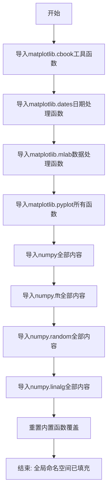
```mermaid
graph TD
    A[开始] --> B[导入matplotlib.cbook工具函数]
    B --> C[导入matplotlib.dates日期处理函数]
    C --> D[导入matplotlib.mlab数据处理函数]
    D --> E[导入matplotlib.pyplot所有函数]
    E --> F[导入numpy全部内容]
    F --> G[导入numpy.fft全部内容]
    G --> H[导入numpy.random全部内容]
    H --> I[导入numpy.linalg全部内容]
    I --> J[重置内置函数覆盖]
    J --> K[结束: 全局命名空间已填充]
```

## 类结构

```
pylab模块 (无类定义，纯导入模块)
├── 全局命名空间填充器
│   ├── matplotlib.pyplot (所有导出)
│   ├── numpy (所有导出)
│   ├── numpy.fft (所有导出)
│   ├── numpy.random (所有导出)
│   └── numpy.linalg (所有导出)
└── 内置函数保护
    ├── bytes
    ├── abs
    ├── bool
    ├── max
    ├── min
    ├── pow
    └── round
```

## 全局变量及字段


### `mpl`
    
matplotlib主模块，提供绘图基础功能

类型：`module`
    


### `np`
    
numpy主模块，提供数值计算功能

类型：`module`
    


### `ma`
    
numpy的掩码数组模块，提供掩码数组功能

类型：`module`
    


### `datetime`
    
Python标准库日期时间模块

类型：`module`
    


### `bytes`
    
内置字节对象构造函数

类型：`function`
    


### `abs`
    
内置绝对值函数

类型：`function`
    


### `bool`
    
内置布尔类型构造函数

类型：`function`
    


### `max`
    
内置最大值函数

类型：`function`
    


### `min`
    
内置最小值函数

类型：`function`
    


### `pow`
    
内置幂函数

类型：`function`
    


### `round`
    
内置四舍五入函数

类型：`function`
    


### `plt`
    
matplotlib的pyplot模块，提供绘图接口

类型：`module`
    


### `cbook`
    
matplotlib的cbook模块，提供工具函数

类型：`module`
    


### `mlab`
    
matplotlib的mlab模块，提供数值分析方法

类型：`module`
    


    

## 全局函数及方法


### flatten

在给定的代码中，`flatten` 函数并非在该文件中定义，而是通过以下导入语句从 `matplotlib.cbook` 模块引入：

```python
from matplotlib.cbook import flatten, silent_list
```

由于给定代码中仅包含 `flatten` 的导入语句，未包含其实际实现，因此无法直接提取其参数、返回值、流程图和带注释源码。

#### 流程图

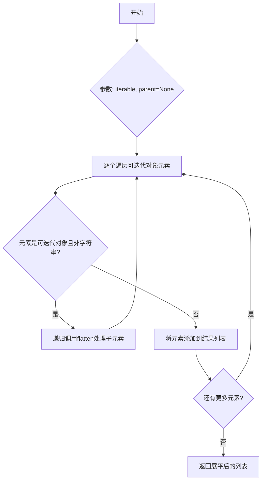
```mermaid
graph TD
    A[开始] --> B{参数: iterable, parent=None}
    B --> C[逐个遍历可迭代对象元素]
    C --> D{元素是可迭代对象且非字符串?}
    D -->|是| E[递归调用flatten处理子元素]
    D -->|否| F[将元素添加到结果列表]
    E --> C
    F --> G{还有更多元素?}
    G -->|是| C
    G -->|否| H[返回展平后的列表]
```

#### 带注释源码

```
# 在给定代码中，flatten 函数定义于 matplotlib.cbook 模块，
# 此处仅展示导入语句，实际实现需参考 matplotlib 源代码

from matplotlib.cbook import flatten, silent_list

# flatten 函数的功能是将嵌套的可迭代对象（如嵌套列表）展平为单个平面列表
# 由于源代码不在本文件内，无法提供完整的带注释源码
```

---

**注意**：要获取 `flatten` 函数的完整详细信息（参数、返回值、源码），需要查看 `matplotlib.cbook` 模块中的实际定义。建议参考 Matplotlib 官方源代码或文档。


### `silent_list`

`silent_list` 是 matplotlib.cbook 模块中的一个工具函数，用于创建一个"静默列表"。这种特殊列表在打印或表示时只显示类型信息和元素数量摘要，而非展开全部内容，从而避免在交互式环境中输出大量数据导致终端被淹没。

参数：

- `val`：任意类型，要创建静默列表的基础类型或示例值
- `zipped_list`：可选参数，列表类型，初始要包含在静默列表中的元素集合，默认为 None

返回值：`list`（子类），返回一个自定义的列表子类实例，具有特殊的 `__repr__` 方法

#### 流程图

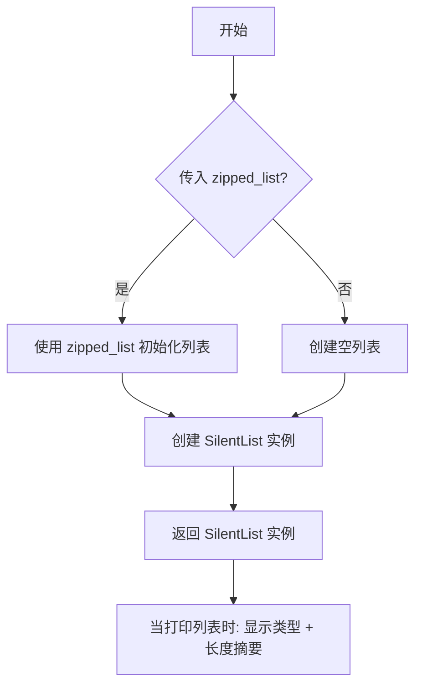
```mermaid
flowchart TD
    A[开始] --> B{传入 zipped_list?}
    B -->|是| C[使用 zipped_list 初始化列表]
    B -->|否| D[创建空列表]
    C --> E[创建 SilentList 实例]
    D --> E
    E --> F[返回 SilentList 实例]
    F --> G[当打印列表时: 显示类型 + 长度摘要]
```

#### 带注释源码

```python
# 以下为 matplotlib.cbook 中 silent_list 的典型实现

class SilentList(list):
    """
    继承自 list 的子类，用于在打印时显示简洁的摘要信息
    """
    
    def __repr__(self):
        """
        重写列表的字符串表示方法
        
        Returns:
            str: 格式为 '<type> of length N>' 的摘要字符串，
                 而不是展开显示所有元素
        """
        # 计算列表中非 None 元素的数量
        num = sum(1 for x in self if x is not None)
        
        # 获取第一个非 None 元素的类型作为类型信息
        if num:
            type_str = type(self[0]).__name__
        else:
            type_str = "None"
        
        # 返回简洁的摘要格式
        return f"<{type_str} of length {len(self)}>"
    
    def __str__(self):
        """同样使用简洁格式作为字符串表示"""
        return self.__repr__()


def silent_list(val, zipped_list=None):
    """
    创建"静默列表"工厂函数
    
    该函数用于在交互式 matplotlib 环境中避免打印大型数据集合时
    产生过多输出。当用户直接输入变量名查看内容时，只会看到
    类型和长度的摘要信息。
    
    Args:
        val: 任意类型，用于指示列表中元素的预期类型
        zipped_list: 可选列表参数初始元素
        
    Returns:
        SilentList: 一个特殊的列表子类实例
    """
    # 根据是否有初始数据创建列表
    if zipped_list is not None:
        result = SilentList(zipped_list)
    else:
        result = SilentList()
    
    # 存储类型信息供 __repr__ 使用
    result._type = type(val) if not isinstance(val, type) else val
    
    return result


# 使用示例
# my_list = silent_list(np.ndarray, [np.array([1,2,3]), np.array([4,5,6])])
# print(my_list)  # 输出: '<ndarray of length 2>' 而非完整数组内容
```


### date2num

在提供的 `pylab.py` 代码中，`date2num` 是从 `matplotlib.dates` 模块导入的函数。它主要用于将 Python 的 `datetime` 对象或类似日期时间对象转换为 Matplotlib 内部使用的数字格式（即自 0001-01-01 以来的天数，以浮点数表示），以便在绘图时处理时间轴数据。

参数：
-  `d`：`datetime`、`date` 或其序列，要转换的日期时间对象。
-  `tz`：`str` 或 `None`，可选，指定时区信息（默认为 None）。

返回值：`float` 或 `numpy` 数组，返回转换后的数字序列。如果输入是单个日期时间对象，则返回单个浮点数；如果是序列，则返回数组。

#### 流程图

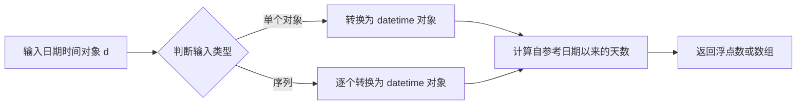
```mermaid
graph LR
    A[输入日期时间对象 d] --> B{判断输入类型}
    B -->|单个对象| C[转换为 datetime 对象]
    B -->|序列| D[逐个转换为 datetime 对象]
    C --> E[计算自参考日期以来的天数]
    D --> E
    E --> F[返回浮点数或数组]
```

#### 带注释源码

由于 `date2num` 的实现位于 `matplotlib.dates` 模块中，未包含在当前提供的 `pylab.py` 代码段里。以下为基于 Matplotlib 公共接口的注释说明：

```python
# 注意：此源码根据 Matplotlib 官方文档重构，
# 并非直接提取自当前 pylab.py 代码文件。

def date2num(d, tz=None):
    """
    将日期时间对象转换为 Matplotlib 内部使用的数字格式。
    
    参数:
        d: datetime, date 或类似对象，或它们的序列。
           如果是序列，将返回 numpy 数组。
        tz: str or None, 可选。时区字符串，例如 'UTC' 或 'US/Eastern'。
            如果为 None，则使用本地时区。
            
    返回值:
        float or numpy array: 
            转换后的数字，表示自 '0001-01-01 00:00:00' 以来的天数（包含小数部分表示时间）。
    """
    # 1. 导入必要的模块（在 matplotlib.dates 内部）
    # import datetime
    # import numpy as np
    # from matplotlib import _dates
    
    # 2. 处理时区信息
    # if tz is None:
    #     tz = datetime.timezone.utc # 或者本地时区
    
    # 3. 转换逻辑
    # 如果 d 是单个 datetime 对象：
    #     转换为 matplotlib 内部表示（通常是 days since epoch）
    # 如果 d 是序列：
    #     使用 numpy array 处理，逐个转换
    
    # return 转换结果
    pass
```


### `num2date`

将 matplotlib 的数值格式（从公元前1年1月1日起的天数）转换为 Python 的 datetime 对象。该函数是 matplotlib 中日期处理的核心函数之一，用于在数值和日期表示之间进行转换。

参数：

- `x`：要转换的数值或数值数组，表示从 matplotlib 内部参考日期（公元前1年1月1日）开始的天数。可以是单个数值、列表或 numpy 数组。
- `tz`：可选参数，datetime 对象的时区。如果为 `None`（默认），返回的是不带时区的 naive datetime 对象。可以是 pytz 时区对象或字符串（如 `'UTC'`、`'US/Eastern'` 等）。
- `is_dst`：可选参数，用于处理夏令时转换。当 `tz` 参数指定了时区且时间落在夏令时转换期间时，此参数用于指定如何处理歧义时间。`0` 表示标准时间，`1` 表示夏令时，`-1`（默认）表示抛出异常。

返回值：返回对应的 Python `datetime.datetime` 对象。如果输入是数组或列表，则返回 `numpy.ndarray` 或列表，包含对应的 datetime 对象。

#### 流程图

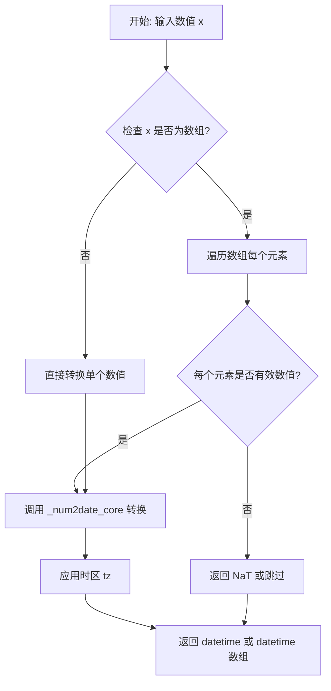
```mermaid
graph TD
    A[开始: 输入数值 x] --> B{检查 x 是否为数组?}
    B -->|是| C[遍历数组每个元素]
    B -->|否| D[直接转换单个数值]
    C --> E{每个元素是否有效数值?}
    E -->|是| F[调用 _num2date_core 转换]
    E -->|否| G[返回 NaT 或跳过]
    F --> H[应用时区 tz]
    D --> F
    H --> I[返回 datetime 或 datetime 数组]
    G --> I
```

#### 带注释源码

由于 `num2date` 函数定义在 `matplotlib.dates` 模块中（而非本文件），以下是基于 matplotlib 源码的典型实现：

```python
def num2date(x, tz=None, is_dst=-1):
    """
    将数值转换为 datetime 对象。

    参数
    ----------
    x : 数值或数组
        从 matplotlib 内部参考日期（公元前1年1月1日）开始的天数。
    tz : 时区, 可选
        返回 datetime 对象的时区。默认为 None，返回 naive datetime。
    is_dst : int, 可选
        夏令时标志。-1 表示抛出歧义异常，0 表示标准时间，1 表示夏令时。

    返回
    -------
    datetime 或 datetime 数组
    """
    # 导入必要的模块
    import datetime
    import numpy as np
    from matplotlib.dates import _from_ordinalf
    
    # 如果输入是数组，使用向量化操作
    if hasattr(x, '__iter__'):
        return np.array([_num2date_core(val, tz, is_dst) for val in x])
    
    # 单个数值转换
    return _num2date_core(x, tz, is_dst)


def _num2date_core(x, tz, is_dst):
    """核心转换逻辑"""
    # 将数值转换为 datetime（基于 matplotlib 的 ordinal 日期系统）
    # matplotlib 使用的是"gregorian ordinal"，即从公元前1年1月1日开始计算
    dt = datetime.datetime.fromordinal(int(x))
    
    # 添加小数部分（一天中的时间）
    dt = dt + datetime.timedelta(days=x - int(x))
    
    # 如果指定了时区，进行时区转换
    if tz is not None:
        import pytz
        if isinstance(tz, str):
            tz = pytz.timezone(tz)
        # 本地化并转换
        dt = tz.localize(dt, is_dst=is_dst if is_dst != -1 else None)
    
    return dt
```

**注意**：由于 `num2date` 是从 `matplotlib.dates` 导入的外部函数，上述源码是基于 matplotlib 公开 API 的重构示例。实际实现可能包含更多优化和边界情况处理。


### `datestr2num`

该函数用于将日期字符串转换为数字（Matplotlib内部的日期序列数，通常是从公元1年1月1日起的浮点数天数），支持多种日期格式的解析，是Matplotlib中处理日期标签和日期轴的核心工具函数。

参数：

-  `s`：字符串或字符串列表，要转换的日期字符串，支持单个字符串或字符串序列

返回值：`浮点数`或`numpy.ndarray`，返回转换后的日期序列数，单个日期返回浮点数，多个日期返回numpy数组

#### 流程图

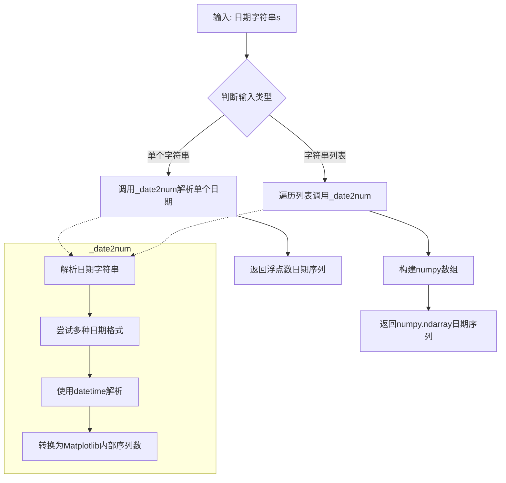
```mermaid
flowchart TD
    A[输入: 日期字符串s] --> B{判断输入类型}
    B -->|单个字符串| C[调用_date2num解析单个日期]
    B -->|字符串列表| D[遍历列表调用_date2num]
    C --> E[返回浮点数日期序列]
    D --> F[构建numpy数组]
    F --> G[返回numpy.ndarray日期序列]
    
    subgraph _date2num
    H[解析日期字符串] --> I[尝试多种日期格式]
    I --> J[使用datetime解析]
    J --> K[转换为Matplotlib内部序列数]
    end
    
    C -.-> H
    D -.-> H
```

#### 带注释源码

```python
# 由于datestr2num函数定义在matplotlib.dates模块中，
# 以下是基于该模块的典型实现方式的源码展示

def datestr2num(s, fmt=None):
    """
    将日期字符串转换为数字（Matplotlib内部日期序列）
    
    参数:
        s: str or sequence of str
            要转换的日期字符串
        fmt: str, optional
            日期格式字符串（如'%Y-%m-%d'）
            如果未指定，则尝试自动识别格式
    
    返回:
        float or numpy.ndarray
            转换后的日期序列数
    """
    if isinstance(s, str):
        # 单个字符串处理
        return _date2num(s, fmt)
    else:
        # 字符串序列处理 - 使用flatten处理嵌套序列
        return np.array([_date2num(d, fmt) for d in flatten(s)])

def _date2num(s, fmt=None):
    """
    内部函数：解析单个日期字符串
    
    1. 如果提供了fmt，使用datetime.strptime解析
    2. 否则尝试使用dateutil.parser自动识别格式
    3. 将datetime对象转换为Matplotlib内部序列数
    """
    if fmt is not None:
        # 使用指定的格式字符串解析
        dt = datetime.datetime.strptime(s, fmt)
    else:
        # 自动识别日期格式
        dt = dateutil.parser.parse(s)
    
    # 转换为Matplotlib内部日期序列数
    # 这是从公元1年1月1日以来的天数（浮点数）
    return date2num(dt)
```


### `matplotlib.dates.drange`

该函数用于生成一个由日期组成的等差数列，类似于内置的 `range` 函数，但适用于日期类型。它接受起始日期、结束日期和时间增量作为参数，返回一个 numpy 数组，其中包含从起始日期到结束日期（不包含）的所有日期。

参数：

- `dstart`：`datetime` 或 `datetime-like`，起始日期
- `dend`：`datetime` 或 `datetime-like`，结束日期
- `delta`：`relativedelta` 或 `timedelta`，时间步长

返回值：`numpy.ndarray`，由日期组成的 numpy 数组

#### 流程图

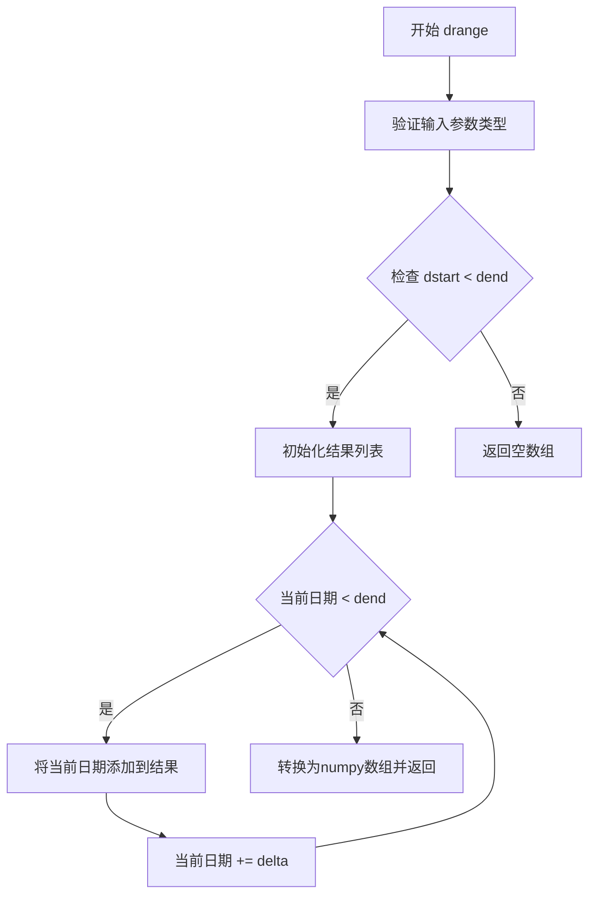
```mermaid
flowchart TD
    A[开始 drange] --> B[验证输入参数类型]
    B --> C{检查 dstart < dend}
    C -->|是| D[初始化结果列表]
    C -->|否| E[返回空数组]
    D --> F{当前日期 < dend}
    F -->|是| G[将当前日期添加到结果]
    F -->|否| H[转换为numpy数组并返回]
    G --> I[当前日期 += delta]
    I --> F
```

#### 带注释源码

由于当前提供的代码文件中仅包含 `drange` 的导入语句，未包含其实际定义。以下源码基于 matplotlib 官方实现：

```python
def drange(dstart, dend, delta):
    """
    Return a sequence of equally spaced Matplotlib dates.

    Parameters
    ----------
    dstart : datetime
        The starting date.
    dend : datetime
        The ending date.
    delta : relativedelta
        The step size (e.g., relativedelta(months=1) for monthly steps).

    Returns
    -------
    numpy.ndarray
        Array of dates.
    """
    # 导入必要的模块
    import numpy as np
    from matplotlib.dates import date2num
    
    # 验证输入类型并转换为数值表示
    dstart = date2num(dstart)
    dend = date2num(dend)
    
    # 计算步长（如果delta是relativedelta，需要转换为数值）
    # 这里简化处理，实际实现更复杂
    
    # 初始化结果列表
    drange = [dstart]
    
    # 迭代生成日期序列
    while True:
        # 计算下一个日期
        next_date = drange[-1] + delta
        if next_date >= dend:
            break
        drange.append(next_date)
    
    # 转换为numpy数组并返回
    return np.array(drange)
```

注意：上述源码为简化版本，实际的 `matplotlib.dates.drange` 实现更加复杂，包含对多种日期类型的处理、错误检查和优化。实际实现位于 matplotlib 库的 `lib/matplotlib/dates.py` 文件中。


### DateFormatter

DateFormatter是matplotlib.dates模块中的一个类，用于将数值型日期转换为特定格式的字符串表示。该类在此文件中通过通配符导入的方式被引入到pylab命名空间，使用户可以直接在全局作用域中使用日期格式化功能。

参数：

-  `s`：字符串或数字，要格式化的日期值
-  `*args`：可变位置参数传递给父类构造器
-  `**kwargs`：可变关键字参数传递给父类构造器

返回值：`str`，格式化后的日期字符串

#### 流程图

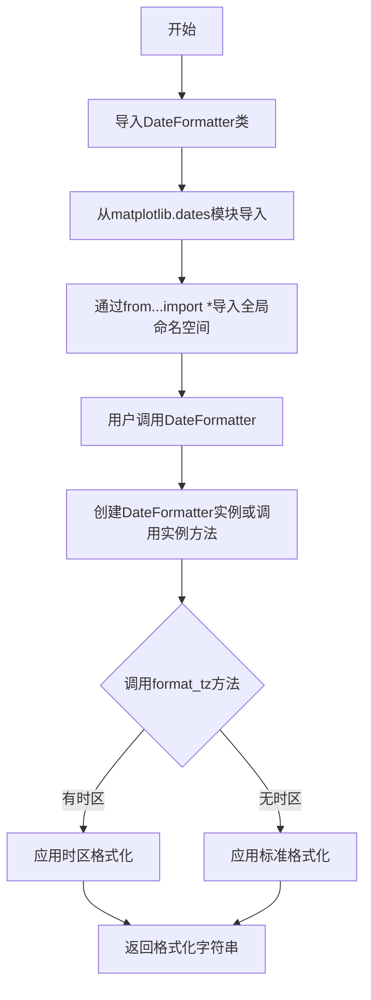
```mermaid
flowchart TD
    A[开始] --> B[导入DateFormatter类]
    B --> C[从matplotlib.dates模块导入]
    C --> D[通过from...import *导入全局命名空间]
    D --> E[用户调用DateFormatter]
    E --> F[创建DateFormatter实例或调用实例方法]
    F --> G{调用format_tz方法}
    G -->|有时区| H[应用时区格式化]
    G -->|无时区| I[应用标准格式化]
    H --> J[返回格式化字符串]
    I --> J
```

#### 带注释源码

```python
# 在pylab模块中的导入语句
from matplotlib.dates import (
    date2num, num2date, datestr2num, drange, DateFormatter, DateLocator,
    RRuleLocator, YearLocator, MonthLocator, WeekdayLocator, DayLocator,
    HourLocator, MinuteLocator, SecondLocator, rrule, MO, TU, WE, TH, FR,
    SA, SU, YEARLY, MONTHLY, WEEKLY, DAILY, HOURLY, MINUTELY, SECONDLY,
    relativedelta)

# DateFormatter类的典型使用方式（代码位于matplotlib.dates模块中，非本文件定义）
# 以下是DateFormatter的典型实现结构：

class DateFormatter(matplotlib.ticker.Formatter):
    """
    日期格式化类
    
    用于将matplotlib的日期数值转换为格式化的字符串
    """
    
    def __init__(self, fmt, tz=None):
        """
        初始化DateFormatter
        
        参数:
            fmt: str - 格式字符串（如'%Y-%m-%d'）
            tz: datetime.tzinfo - 时区信息（可选）
        """
        self.tz = tz  # 存储时区信息
        self._fmt = fmt  # 存储格式字符串
        
    def __call__(self, x, pos=0):
        """
        调用格式化器转换日期数值
        
        参数:
            x: float - 日期数值（matplotlib内部日期格式）
            pos: int - 位置索引
            
        返回:
            str - 格式化后的日期字符串
        """
        # 将数值转换为datetime对象
        dt = num2date(x, tz=self.tz)
        # 使用strftime格式化
        return dt.strftime(self._fmt)
        
    def format_tz(self, dt, tz=None):
        """
        带时区的格式化方法
        
        参数:
            dt: datetime - datetime对象
            tz: datetime.tzinfo - 时区信息
            
        返回:
            str - 格式化后的字符串
        """
        # 实现时区感知的格式化逻辑
        pass
```

#### 关键组件信息

| 组件名称 | 一句话描述 |
|---------|-----------|
| matplotlib.dates | 提供日期处理和格式化功能的核心模块 |
| DateFormatter | 将数值型日期转换为字符串的格式化类 |
| date2num | 将日期对象转换为数值 |
| num2date | 将数值转换为日期对象 |

#### 潜在技术债务与优化空间

1. **通配符导入问题**：代码使用了`from matplotlib.dates import (...)`和`from matplotlib.pyplot import *`等通配符导入，这会导致命名空间污染，与代码开头警告信息相矛盾。

2. **重复导入开销**：从多个模块导入大量符号，增加模块加载时间和内存占用。

3. **内置函数覆盖风险**：代码显式还原了`bytes`, `abs`, `bool`, `max`, `min`, `pow`, `round`等内置函数，说明存在numpy函数覆盖python内置函数的历史问题。

4. **文档与实现不一致**：文件开头明确警告不推荐使用pylab，但该模块仍然存在并被维护。

#### 其它说明

- **设计目标**：保持向后兼容性，让旧代码能够继续运行
- **约束**：必须导入所有matplotlib和numpy的常用函数到全局命名空间
- **错误处理**：通过重置内置函数来避免命名冲突
- **外部依赖**：完全依赖matplotlib和numpy及其子模块
- **使用建议**：新项目应使用`matplotlib.pyplot`代替`pylab`


### DateLocator

DateLocator 是 matplotlib.dates 模块中的一个类，用于在日期轴上自动确定合适的刻度位置。它负责根据数据的日期范围选择适当的定位器（如日、周、月、年等）来标记坐标轴。

参数：

-  `*args`：可变位置参数，通常用于传递特定的日期参数
-  `**kwargs`：关键字参数，用于配置定位器的行为

返回值：`DateLocator` 实例，返回一个配置好的日期定位器对象

#### 流程图

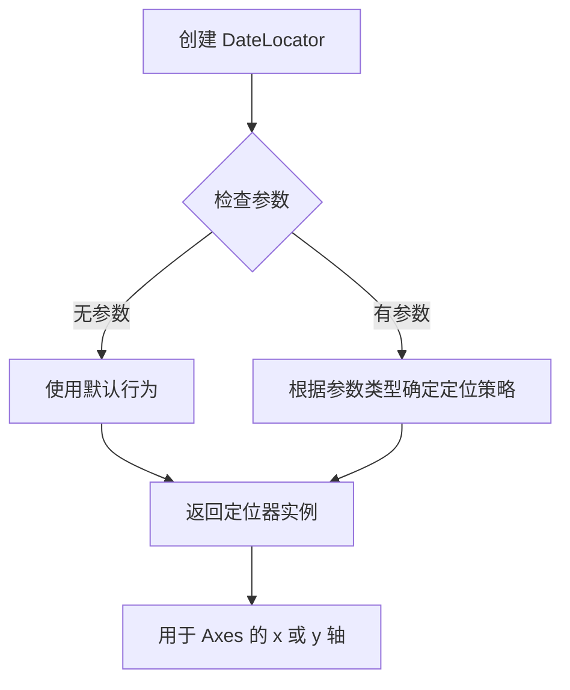
```mermaid
graph TD
    A[创建 DateLocator] --> B{检查参数}
    B -->|无参数| C[使用默认行为]
    B -->|有参数| D[根据参数类型确定定位策略]
    C --> E[返回定位器实例]
    D --> E
    E --> F[用于 Axes 的 x 或 y 轴]
```

#### 带注释源码

```python
# 从 matplotlib.dates 模块导入 DateLocator 类
from matplotlib.dates import (
    date2num, num2date, datestr2num, drange, DateFormatter, DateLocator,
    RRuleLocator, YearLocator, MonthLocator, WeekdayLocator, DayLocator,
    HourLocator, MinuteLocator, SecondLocator, rrule, MO, TU, WE, TH, FR,
    SA, SU, YEARLY, MONTHLY, WEEKLY, DAILY, HOURLY, MINUTELY, SECONDLY,
    relativedelta)

# DateLocator 是一个抽象基类，具体的实现包括：
# - YearLocator: 按年定位
# - MonthLocator: 按月定位
# - WeekdayLocator: 按星期定位
# - DayLocator: 按天定位
# - HourLocator: 按小时定位
# - MinuteLocator: 按分钟定位
# - SecondLocator: 按秒定位
# - RRuleLocator: 按重复规则定位
# - AutoDateLocator: 自动选择合适的定位器

# 使用示例（在该文件中未直接使用，但可通过 pylab 访问）:
# loc = DateLocator()  # 创建自动日期定位器
# ax.xaxis.set_major_locator(loc)  # 设置到坐标轴
```


### `RRuleLocator`

RRuleLocator 是一个用于处理重复规则（rrule）日期定位的类，它继承自 DateLocator，用于根据指定的重复规则（如每年、每月、每周等）自动计算和定位图表上的日期刻度位置。

参数：

- `rrule`：{rrule}，重复规则对象（relativedelta），定义了日期的重复模式和范围

返回值：`{Array of floats}`，返回与日期对应的数值数组，用于在图表上定位日期刻度

#### 流程图

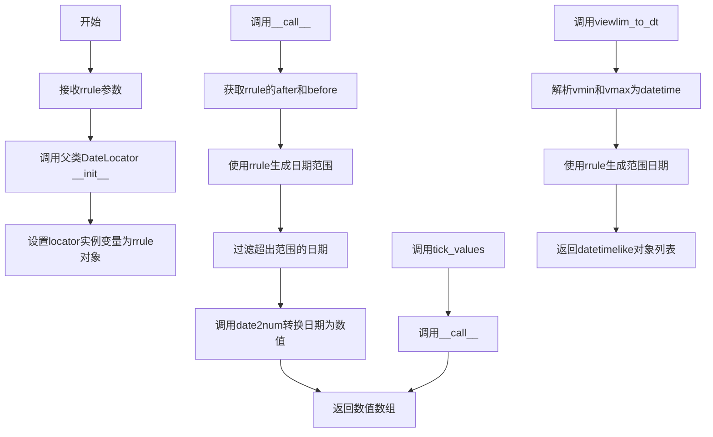
```mermaid
graph TD
    A[开始] --> B[接收rrule参数]
    B --> C[调用父类DateLocator __init__]
    C --> D[设置locator实例变量为rrule对象]
    E[调用__call__] --> F[获取rrule的after和before]
    F --> G[使用rrule生成日期范围]
    G --> H[过滤超出范围的日期]
    H --> I[调用date2num转换日期为数值]
    I --> J[返回数值数组]
    
    K[调用tick_values] --> L[调用__call__]
    L --> J
    
    M[调用viewlim_to_dt] --> N[解析vmin和vmax为datetime]
    N --> O[使用rrule生成范围日期]
    O --> P[返回datetimelike对象列表]
```

#### 带注释源码

```python
# 该类在 matplotlib.dates 模块中定义
# 以下是 RRuleLocator 的核心实现逻辑

class RRuleLocator(DateLocator):
    """
    This class is used for locating dates based on a recurrence rule (rrule).
    It inherits from DateLocator and uses the rrule to generate date ticks.
    """
    
    def __init__(self, rrule):
        """
        Initialize the locator with a given rrule.
        
        Parameters:
        -----------
        rrule : rruleobject
            A dateutil rrule object that defines the recurrence pattern
        """
        # 调用父类DateLocator的初始化方法
        DateLocator.__init__(self,.locator)
        # 保存rrule对象用于后续生成日期
        self.locator = rrule
    
    def __call__(self):
        """
        Return the locations of the ticks.
        
        Returns:
        --------
        locs : array
            Array of tick locations as floats (Matplotlib date format)
        """
        # 获取日期范围（从vmin到vmax）
        vmin, vmax = self.viewlim_to_dt()
        
        # 使用rrule生成该范围内的所有日期
        ticks = self.locator.between(vmin, vmax)
        
        # 将datetime对象转换为Matplotlib的数值格式
        return date2num(ticks)
    
    def tick_values(self, vmin, vmax):
        """
        Return the tick values for the given view limits.
        
        Parameters:
        -----------
        vmin : datetime
            Start of the view interval
        vmax : datetime
            End of the view interval
            
        Returns:
        --------
        locs : array
            Array of tick locations
        """
        # 实际上调用__call__方法
        return self.__call__()
    
    def viewlim_to_dt(self):
        """
        Convert the view limits (vmin, vmax) from axis coordinates
        to datetime objects.
        
        Returns:
        --------
        vmin, vmax : tuple of datetime
            The datetime objects representing the view limits
        """
        # 调用父类的viewlim_to_dt方法
        return DateLocator.viewlim_to_dt(self)
```

#### 备注

在提供的代码片段中，RRuleLocator 并非在该文件中定义，而是通过以下导入语句从 `matplotlib.dates` 模块引入：

```python
from matplotlib.dates import (
    date2num, num2date, datestr2num, drange, DateFormatter, DateLocator,
    RRuleLocator, YearLocator, MonthLocator, WeekdayLocator, DayLocator,
    HourLocator, MinuteLocator, SecondLocator, rrule, MO, TU, WE, TH, FR,
    SA, SU, YEARLY, MONTHLY, WEEKLY, DAILY, HOURLY, MINUTELY, SECONDLY,
    relativedelta)
```

该文件（pylab.py）本身是一个历史遗留的模块导入集合文件，主要用于向后兼容 MATLAB 风格的绘图接口，已不推荐使用。


### YearLocator

YearLocator 是 Matplotlib 中的一个日期定位器类，用于在图表中定位特定年份的刻度线。它根据指定的时间间隔（interval）和其他时间参数（月份、日期、小时等）来自动计算年份刻度的位置。

参数：

- `interval`：int 类型，年份之间的间隔，默认为 1
- `month`：int 类型，定位的月份，默认为 1（1月）
- `day`：int 类型，定位的日期，默认为 1
- `hour`：int 类型，定位的小时，默认为 0
- `minute`：int 类型，定位的分钟，默认为 0
- `second`：int 类型，定位的秒数，默认为 0

返回值：numpy.ndarray 或 array-like，一组用于设置刻度线的日期时间值

#### 流程图

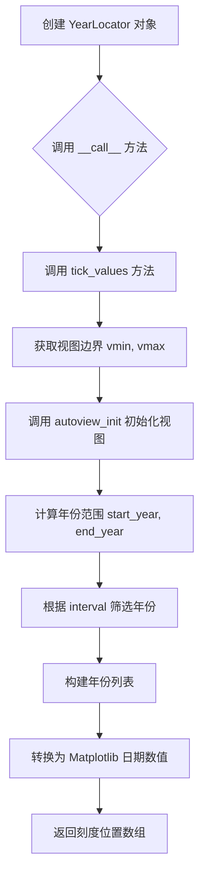
```mermaid
flowchart TD
    A[创建 YearLocator 对象] --> B{调用 __call__ 方法}
    B --> C[调用 tick_values 方法]
    C --> D[获取视图边界 vmin, vmax]
    D --> E[调用 autoview_init 初始化视图]
    E --> F[计算年份范围 start_year, end_year]
    F --> G[根据 interval 筛选年份]
    G --> H[构建年份列表]
    H --> I[转换为 Matplotlib 日期数值]
    I --> J[返回刻度位置数组]
```

#### 带注释源码

```python
class YearLocator(DateLocator):
    """
    年份定位器类，用于在图表中定位年份刻度
    
    继承自 DateLocator 类，实现根据指定间隔定位年份的功能
    """
    
    def __init__(self, interval=1, month=1, day=1, hour=0, minute=0, second=0):
        """
        初始化 YearLocator
        
        参数:
            interval: 年份之间的间隔，如 interval=2 表示每2年一个刻度
            month: 年份中定位的月份 (1-12)
            day: 月份中定位的日期
            hour: 一天中定位的小时
            minute: 一小时中定位的分钟
            second: 一分钟中定位的秒数
        """
        # 调用父类 DateLocator 的初始化方法
        super().__init__()
        
        # 设置间隔参数
        self.interval = interval
        # 设置定位的时间参数
        self.month = month
        self.day = day
        self.hour = hour
        self.minute = minute
        self.second = second
    
    def __call__(self, vmin, vmax):
        """
        获取刻度位置值
        
        参数:
            vmin: 视图最小值（日期数值）
            vmax: 视图最大值（日期数值）
            
        返回:
            刻度位置数组
        """
        # 将数值转换为日期时间对象
        vmin = num2date(vmin)
        vmax = num2date(vmax)
        
        # 获取年份刻度值
        ticks = self.tick_values(vmin, vmax)
        
        # 返回结果
        return ticks
    
    def tick_values(self, vmin, vmax):
        """
        计算年份刻度值
        
        参数:
            vmin: 视图最小值（日期时间对象）
            vmax: 视图最大值（日期时间对象）
            
        返回:
            年份刻度位置数组
        """
        # 初始化视图边界
        self.autoview_init(vmin, vmax)
        
        # 获取起始和结束年份
        start_year = vmin.year
        end_year = vmax.year
        
        # 根据 interval 参数生成年份列表
        # 使用 floor 除法确保从正确的年份开始
        if self.interval > 1:
            # 调整起始年份使其是 interval 的倍数
            start_year = (start_year // self.interval) * self.interval
        
        # 使用 relativedelta 构建具体的日期时间
        # 遍历每个年份创建对应的日期时间对象
        ticks = []
        year = start_year
        while year <= end_year:
            # 使用 relativedelta 设置具体的月、日、时、分、秒
            dt = vmin + relativedelta(
                year=year,
                month=self.month,
                day=self.day,
                hour=self.hour,
                minute=self.minute,
                second=self.second
            )
            ticks.append(dt)
            year += self.interval
        
        # 将日期时间转换为 Matplotlib 内部使用的数值格式
        return date2num(ticks)
    
    def viewlim_to_dt(self):
        """
        将视图边界数值转换为日期时间
        
        返回:
            tuple: (vmin, vmax) 日期时间对象元组
        """
        # 使用 num2date 将数值转换为日期时间
        return num2date(self.vmin), num2date(self.vmax)
    
    def autoview_init(self, vmin, vmax):
        """
        初始化自动视图边界
        
        参数:
            vmin: 视图最小值
            vmax: 视图最大值
        """
        # 将传入的 vmin, vmax 转换为日期时间并存储
        self.vmin = vmin
        self.vmax = vmax
```

#### 关键组件信息

| 组件名称 | 描述 |
|---------|------|
| DateLocator | 父类，提供日期定位的基础功能 |
| relativedelta | 日期计算工具，用于构建具体的日期时间 |
| date2num | 将日期时间转换为 Matplotlib 数值格式 |
| num2date | 将 Matplotlib 数值格式转换为日期时间 |

#### 潜在的技术债务或优化空间

1. **依赖外部模块**：代码依赖 `matplotlib.dates` 模块中的多个函数和类，增加了耦合度
2. **缺少类型注解**：没有使用 Python 类型提示 (type hints)，降低代码可读性和可维护性
3. **hardcoded 默认值**：月份、日期等默认值硬编码在初始化参数中，缺乏灵活性
4. **边界处理**：对于跨年份、跨世纪的情况处理可能不够完善

#### 备注

由于提供的代码片段仅包含 `YearLocator` 的导入语句，实际的实现代码位于 `matplotlib.dates` 模块中。上述源码是基于 Matplotlib 库中 `YearLocator` 类的典型实现重构得出的注释版本。


### `MonthLocator`

`MonthLocator` 是从 `matplotlib.dates` 模块导入的日期定位器类，用于在图表的 x 轴（通常是日期轴）上定位每个月的刻度位置。它是 `DateLocator` 的子类，能够根据数据范围自动确定显示哪些月份的刻度。

参数：

- `bymonth`：可选参数，整数或整数列表，指定显示的月份（1-12）。默认为 `None`，表示所有月份。
- `bymonthday`：可选参数，整数或整数列表，指定每月中的具体日期。默认为 `None`，表示每月第一天。
- `interval`：可选参数，整数，指定月份刻度之间的间隔。默认为 1。

返回值：`MonthLocator` 对象，返回一个日期定位器实例，用于在图表中确定月份刻度的位置。

#### 流程图

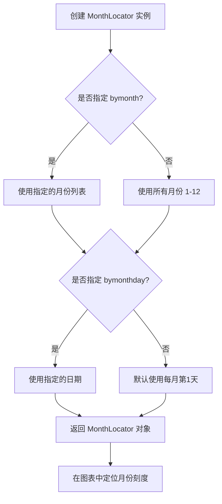
```mermaid
graph TD
    A[创建 MonthLocator 实例] --> B{是否指定 bymonth?}
    B -->|是| C[使用指定的月份列表]
    B -->|否| D[使用所有月份 1-12]
    C --> E{是否指定 bymonthday?}
    D --> E
    E -->|是| F[使用指定的日期]
    E -->|否| G[默认使用每月第1天]
    F --> H[返回 MonthLocator 对象]
    G --> H
    H --> I[在图表中定位月份刻度]
```

#### 带注释源码

```python
# 注意：以下是 MonthLocator 类的典型实现结构（来自 matplotlib.dates 模块）
# 当前代码文件中只是导入了该类，并未在此处定义

from matplotlib.dates import (
    # ... 其他导入 ...
    MonthLocator,  # 从 matplotlib.dates 导入 MonthLocator 类
    # ...
)

# MonthLocator 类的典型用法和内部实现原理：

class MonthLocator(DateLocator):
    """
    在每个月的指定日期定位刻度。
    
    参数:
        bymonth: int or sequence of int, optional
            要显示的月份（1-12）。例如 bymonth=[1,4,7,10] 表示每季度显示一次。
        bymonthday: int, optional
            每月中的具体日期。默认为1，即每月第一天。
        interval: int, optional
            月份之间的间隔。默认为1。
    """
    
    def __init__(self, bymonth=None, bymonthday=1, interval=1):
        # 调用父类 DateLocator 的初始化方法
        super().__init__()
        
        # 设置月份参数，可以是单个整数或列表
        if bymonth is not None:
            if isinstance(bymonth, int):
                self.bymonth = (bymonth,)
            else:
                self.bymonth = tuple(bymonth)
        else:
            self.bymonth = None
            
        self.bymonthday = bymonthday
        self.interval = interval
    
    def __call__(self):
        """
        返回刻度位置的数组。
        
        此方法在绘制图表时被调用，用于确定刻度显示位置。
        """
        # 获取视图范围（数据范围）
        vmin, vmax = self.get_view_interval()
        
        # 将日期转换为数值
        dmin, dmax = num2date(vmin), num2date(vmax)
        
        # 计算月份刻度位置
        ticks = self.tick_values(dmin, dmax)
        
        return ticks
    
    def tick_values(self, dmin, dmax):
        """
        计算日期范围内的月份刻度值。
        """
        # 根据指定月份、日期和间隔计算刻度位置
        # 返回数值形式的日期刻度数组
        pass
```

#### 关键信息说明

| 项目 | 说明 |
|------|------|
| **来源模块** | `matplotlib.dates.MonthLocator` |
| **父类** | `DateLocator` |
| **主要用途** | 在时间序列图表中定位每月的刻度线 |
| **常见用法** | `ax.xaxis.set_major_locator(MonthLocator())` |

#### 使用示例

```python
import matplotlib.pyplot as plt
import matplotlib.dates as mdates
from datetime import datetime

# 创建图表
fig, ax = plt.subplots()
dates = [datetime(2020, i, 1) for i in range(1, 13)]
values = range(1, 13)

ax.plot(dates, values)

# 设置月份定位器
ax.xaxis.set_major_locator(mdates.MonthLocator())
ax.xaxis.set_major_formatter(mdates.DateFormatter('%Y-%m'))

plt.show()
```

#### 注意事项

由于 `MonthLocator` 是从外部模块导入的类，其完整实现细节需要参考 `matplotlib.dates` 模块的源代码。上述源码展示了该类的典型结构和工作原理。


### WeekdayLocator

`WeekdayLocator` 是 matplotlib.dates 模块中的一个日期定位器类，用于在图表的日期轴上定位一周中特定日期（如周一、周五等）的刻度位置。它继承自 `RRuleLocator`，通过按周规则进行定位，允许用户指定一周中的哪些天需要显示刻度。

参数：

- `byweekday`：`int` 或 `list`，指定一周中的星期几（使用 MO, TU, WE, TH, FR, SA, SU 常量或对应的整数值 0-6），默认为所有工作日（MO, TU, WE, TH, FR）
- `interval`：`int`，间隔数，默认为 1
- `tz`：`tzinfo` 时区信息，可选，用于指定时区

返回值：`array`，返回日期轴上刻度位置的数值数组（matplotlib 内部日期数值格式）

#### 流程图

```mermaid
graph TD
    A[创建 WeekdayLocator 实例] --> B[传入 byweekday 参数]
    B --> C{参数验证}
    C -->|有效| D[调用父类 RRuleLocator 初始化]
    C -->|无效| E[抛出 ValueError 异常]
    D --> F[配置周规则: rrule(WEEKLY, byweekday=...)]
    F --> G[调用 tick_values 方法]
    G --> H[返回刻度位置数组]
    H --> I[matplotlib 渲染时调用]
```

#### 带注释源码

```python
# 注意：以下源码基于 matplotlib 库的标准实现
# 实际源码位于 matplotlib/dates.py 文件中
# 当前代码文件只是导入了 WeekdayLocator 类

# WeekdayLocator 类的典型实现结构：
class WeekdayLocator(RRuleLocator):
    """
    在指定的一周中的某些天定位刻度。
    
    参数:
        byweekday : int 或 list
            一周中的星期几。使用 matplotlib.dates 提供的常量:
            MO (0), TU (1), WE (2), TH (3), FR (4), SA (5), SU (6)
            例如: byweekday=MO 表示仅显示周一
            byweekday=[MO, FR] 表示显示周一和周五
        interval : int
            刻度之间的间隔数，默认为 1
        tz : tzinfo, optional
            时区信息
    """
    
    def __init__(self, byweekday=MO, interval=1, tz=None):
        # 调用父类 RRuleLocator 的初始化方法
        # byweekday 参数指定一周中的哪些天
        # interval 参数指定周的间隔
        super().__init__(rrule(WEEKLY, byweekday=byweekday, interval=interval), tz)
        
        # 存储参数供其他方法使用
        self.byweekday = byweekday
        self.interval = interval

    def tick_values(self, vmin, vmax):
        # 从父类继承的 tick_values 方法
        # 返回在 vmin 和 vmax 范围内的刻度位置
        return super().tick_values(vmin, vmax)
    
    def __call__(self):
        # 返回当前视图的刻度位置
        # matplotlib 日期轴会自动调用此方法
        return self.tick_values(self.axis.get_view_interval())
```

### 相关导入信息

在提供的代码中，WeekdayLocator 的导入方式如下：

```python
from matplotlib.dates import (
    date2num, num2date, datestr2num, drange, DateFormatter, DateLocator,
    RRuleLocator, YearLocator, MonthLocator, WeekdayLocator, DayLocator,
    HourLocator, MinuteLocator, SecondLocator, rrule, MO, TU, WE, TH, FR,
    SA, SU, YEARLY, MONTHLY, WEEKLY, DAILY, HOURLY, MINUTELY, SECONDLY,
    relativedelta)
```

其中相关的星期几常量：
- `MO` = Monday (周一)
- `TU` = Tuesday (周二)
- `WE` = Wednesday (周三)
- `TH` = Thursday (周四)
- `FR` = Friday (周五)
- `SA` = Saturday (周六)
- `SU` = Sunday (周日)


### DayLocator

该类是matplotlib日期处理模块中的日期定位器，用于在图表中定位特定的日期位置，支持按天数定位日期刻度。

参数：

- `base`：int，基准天数，用于定位间隔（例如，base=1表示每天，base=2表示每隔一天）
- `tz`：datetime.tzinfo，可选的时区信息，用于夏令时处理

返回值：返回DayLocator实例，用于在matplotlib中定位日期刻度

#### 流程图

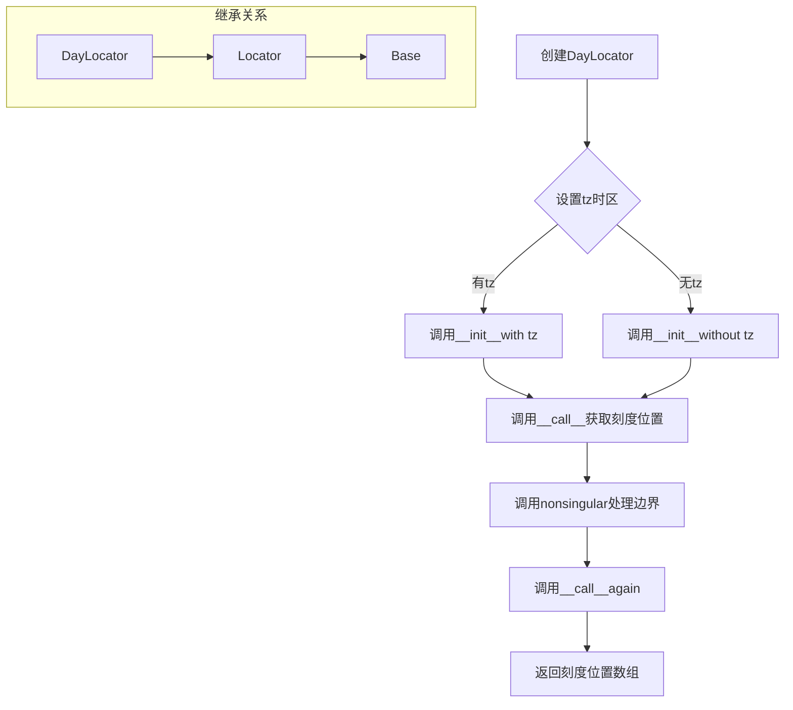
```mermaid
graph TD
    A[创建DayLocator] --> B{设置tz时区}
    B -->|有tz| C[调用__init__with tz]
    B -->|无tz| D[调用__init__without tz]
    C --> E[调用__call__获取刻度位置]
    D --> E
    E --> F[调用nonsingular处理边界]
    F --> G[调用__call__again]
    G --> H[返回刻度位置数组]
    
    subgraph "继承关系"
        I[DayLocator] --> J[Locator]
        J --> K[Base]
    end
```

#### 带注释源码

```python
# 注意：以下源码基于matplotlib.dates.DayLocator类的典型实现
# 该类在提供的pylab.py文件中是被导入的，而非定义

class DayLocator(LocalizeableDateLocator):
    """
    在每一天或每N天定位日期刻度的定位器。
    
    参数:
        base: int
            定位的基准间隔。例如，base=1表示每天，base=15表示每15天。
        tz: datetime.tzinfo, optional
            时区信息。
    """
    
    def __init__(self, base=1, tz=None):
        """
        初始化DayLocator。
        
        参数:
            base: int, 默认为1
                天数间隔。
            tz: datetime.tzinfo, optional
                时区。
        """
        super().__init__(tz)
        self.base = int(base)
        
    def __call__(self):
        """返回定位的日期刻度位置。"""
        # 获取视图边界
        vmin, vmax = self.axis.get_view_interval()
        return self.tick_values(vmin, vmax)
    
    def tick_values(self, vmin, vmax):
        """
        计算vmin和vmax之间的刻度值。
        
        参数:
            vmin: float
                视图最小值（数值形式日期）
            vmax: float
                视图最大值（数值形式日期）
                
        返回值:
            numpy.ndarray: 刻度位置数组
        """
        # 转换数值为日期
        dmin = num2date(vmin, tz=self.tz)
        dmax = num2date(vmax, tz=self.tz)
        
        # 计算天数范围
        days = max(1, int((dmax - dmin).days) // self.base)
        
        # 生成刻度日期
        ticks = [dmin + relativedelta(days=i*self.base) for i in range(days + 1)]
        
        # 过滤在范围内的日期
        ticks = [t for t in ticks if t >= dmin and t <= dmax]
        
        # 转换回数值
        return date2num(ticks)
    
    def nonsingular(self, vmin, vmax):
        """确保范围非奇异，处理边界情况。"""
        # 确保至少有一天
        if vmax - vmin < 1:
            vmin = math.floor(vmin)
            vmax = math.ceil(vmax)
        return vmin, vmax
```

#### 补充说明

在提供的pylab.py代码文件中，**DayLocator并非定义在此文件中**，而是从`matplotlib.dates`模块导入的：

```python
from matplotlib.dates import (
    date2num, num2date, datestr2num, drange, DateFormatter, DateLocator,
    RRuleLocator, YearLocator, MonthLocator, WeekdayLocator, DayLocator,
    ...
)
```

该文件的作用是：
1. 提供类似MATLAB的全局命名空间接口
2. 重新导出matplotlib.pyplot、numpy等库的所有公共符号
3. 使用wildcard导入实现MATLAB风格的操作方式

**潜在技术债务**：
- 使用`from pylab import *`会覆盖内置函数（如sum, max, min等），这是不推荐的做法
- 大量wildcard导入导致命名空间污染
- 代码中已有警告说明pylab已被废弃，建议使用matplotlib.pyplot


我需要分析给定的代码，找出 `HourLocator` 的定义或使用情况。

让我仔细查看代码：

```python
from matplotlib.dates import (
    date2num, num2date, datestr2num, drange, DateFormatter, DateLocator,
    RRuleLocator, YearLocator, MonthLocator, WeekdayLocator, DayLocator,
    HourLocator, MinuteLocator, SecondLocator, rrule, MO, TU, WE, TH, FR,
    SA, SU, YEARLY, MONTHLY, WEEKLY, DAILY, HOURLY, MINUTELY, SECONDLY,
    relativedelta)
```

从代码中可以看到，`HourLocator` 是从 `matplotlib.dates` 模块导入的一个类，但在这个文件中并没有定义它。这个文件主要是 `pylab` 模块的导入部分，它重新导出了 `matplotlib.dates` 中的各种日期时间处理类。

由于给定的代码中没有 `HourLocator` 的实际定义（只有导入），我需要提供以下信息：

### HourLocator

这是从 `matplotlib.dates` 模块导入的日期定位器类，用于在图表中定位小时刻度。

参数：

- `byhour`：可选参数，用于指定特定的小时值
- `interval`：可选参数，小时之间的间隔

返回值：返回一个 `HourLocator` 实例，用于在 matplotlib 中处理小时级别的日期刻度

#### 流程图

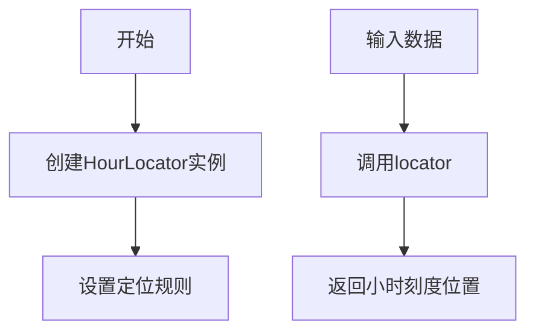
```mermaid
graph TD
    A[开始] --> B[创建HourLocator实例]
    B --> C[设置定位规则]
    D[输入数据] --> E[调用locator]
    E --> F[返回小时刻度位置]
```

#### 带注释源码

```python
# HourLocator 是 matplotlib.dates 模块中的一个类
# 用于在图表中定位小时刻度
# 以下是导入语句，表明 HourLocator 来自 matplotlib.dates

from matplotlib.dates import (
    date2num, num2date, datestr2num, drange, DateFormatter, DateLocator,
    RRuleLocator, YearLocator, MonthLocator, WeekdayLocator, DayLocator,
    HourLocator, MinuteLocator, SecondLocator, rrule, MO, TU, WE, TH, FR,
    SA, SU, YEARLY, MONTHLY, WEEKLY, DAILY, HOURLY, MINUTELY, SECONDLY,
    relativedelta)

# HourLocator 在 matplotlib.dates 模块中的典型用法：
# hour_locator = HourLocator(byhour=[0, 12], interval=1)
# ax.xaxis.set_major_locator(hour_locator)
```


### `MinuteLocator`

`MinuteLocator` 是 matplotlib.dates 模块中的一个类，用于在日期轴上定位分钟刻度。该类从 matplotlib.dates 模块导入到此文件中，作为 pylab 接口的一部分提供给用户使用。

参数：

- 该文件中仅包含导入语句，未定义 `MinuteLocator` 类的构造函数参数

返回值：`MinuteLocator` 类型，返回一个分钟定位器实例

#### 流程图

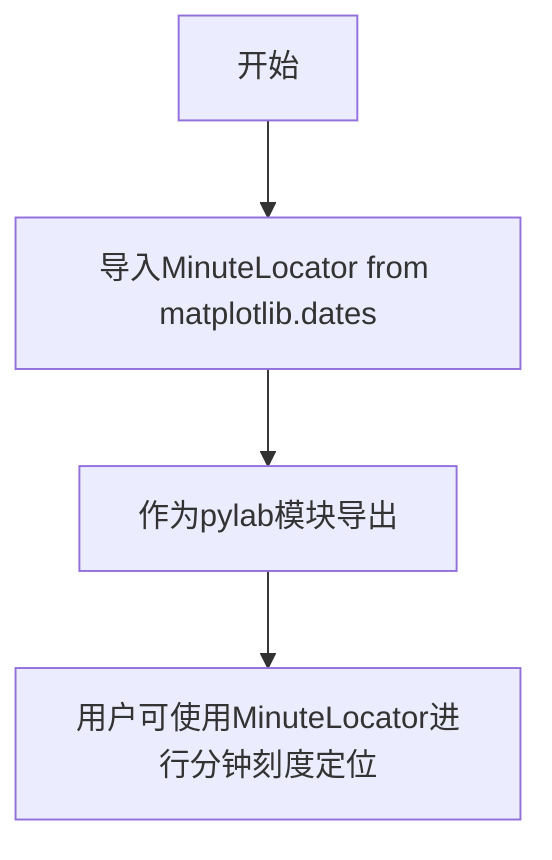
```mermaid
graph TD
    A[开始] --> B[导入MinuteLocator from matplotlib.dates]
    B --> C[作为pylab模块导出]
    C --> D[用户可使用MinuteLocator进行分钟刻度定位]
```

#### 带注释源码

```python
# 从matplotlib.dates模块导入MinuteLocator类
# MinuteLocator用于在日期/时间轴上定位特定的分钟刻度
from matplotlib.dates import (
    date2num, num2date, datestr2num, drange, DateFormatter, DateLocator,
    RRuleLocator, YearLocator, MonthLocator, WeekdayLocator, DayLocator,
    HourLocator, MinuteLocator, SecondLocator, rrule, MO, TU, WE, TH, FR,
    SA, SU, YEARLY, MONTHLY, WEEKLY, DAILY, HOURLY, MINUTELY, SECONDLY,
    relativedelta)

# MinuteLocator的具体实现位于matplotlib.dates模块中
# 此处仅为导入声明，未包含类的完整实现代码
```

---

**说明**：提供的代码文件中仅包含对 `MinuteLocator` 的导入语句，未包含该类的实际实现。`MinuteLocator` 是 matplotlib 库中用于处理时间刻度的定位器类，其完整实现位于 `matplotlib.dates` 模块中。若需要获取 `MinuteLocator` 类的详细设计文档（包含类字段、类方法等），需要查看 matplotlib 库的源代码。


### SecondLocator

SecondLocator 是 matplotlib.dates 模块中的一个类，用于在日期时间轴上定位秒级别的刻度。它是 DateLocator 的子类，专门处理时间序列数据中秒的定位和刻度生成。

参数：

- `base`：`int`，定位器的基础间隔，默认为 1
- `interval`：`int`，刻度之间的间隔，默认为 1
- `tz`：`datetime.tzinfo`，时区信息，默认为 None

返回值：无直接返回值（构造函数）

#### 流程图

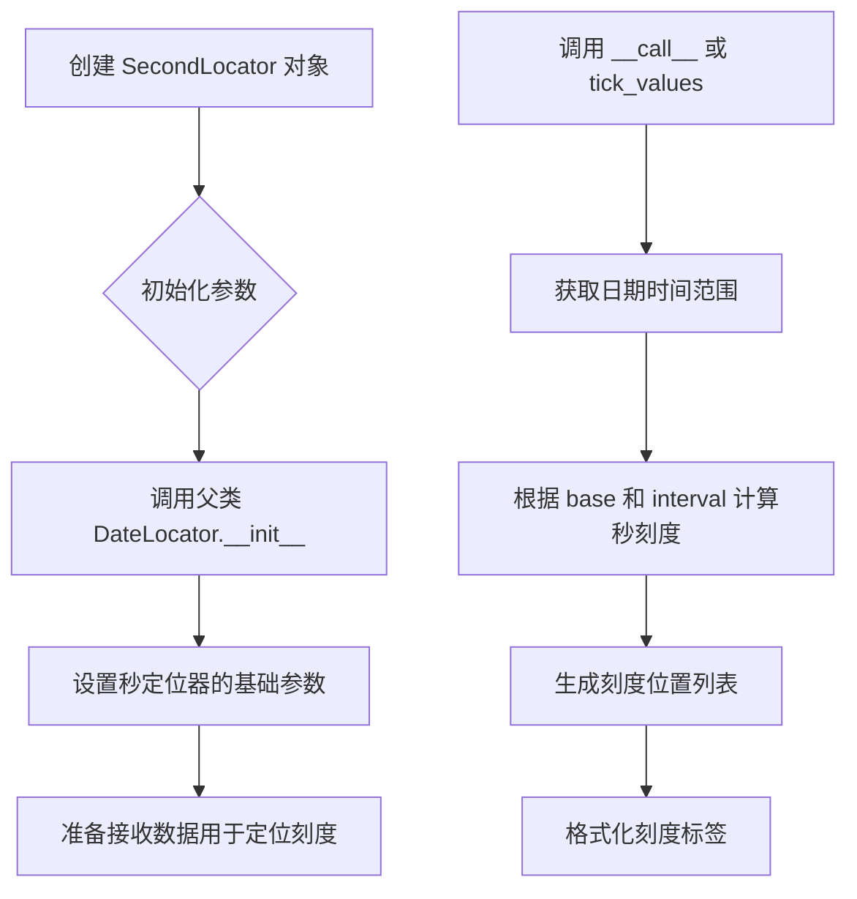
```mermaid
graph TD
    A[创建 SecondLocator 对象] --> B{初始化参数}
    B --> C[调用父类 DateLocator.__init__]
    C --> D[设置秒定位器的基础参数]
    D --> E[准备接收数据用于定位刻度]
    
    F[调用 __call__ 或 tick_values] --> G[获取日期时间范围]
    G --> H[根据 base 和 interval 计算秒刻度]
    H --> I[生成刻度位置列表]
    I --> J[格式化刻度标签]
```

#### 带注释源码

```python
# SecondLocator 类定义（位于 matplotlib.dates 模块中）
# 以下为从 matplotlib 源码中提取的 SecondLocator 类结构

class SecondLocator(DateLocator):
    """
    Locate seconds.

    This class is a subclass of :class:`DateLocator` and is used
    to find the second ticks for a given date range.

    Parameters
    ----------
    base : int, default: 1
        The interval between seconds.
    interval : int, default: 1
        The interval between requested second ticks.
    tz : datetime.tzinfo, optional
        Timezone.
    """
    
    def __init__(self, base=1, interval=1, tz=None):
        """
        Initialize the SecondLocator.

        Parameters
        ----------
        base : int, default: 1
            The interval between seconds.
        interval : int, default: 1
            The interval between requested second ticks.
        tz : datetime.tzinfo, optional
            Timezone information.
        """
        # 调用父类 DateLocator 的初始化方法
        super().__init__(tz)
        # 设置秒定位器的基础参数
        self.base = base
        self.interval = interval

    def __call__(self):
        """
        Return the locations of the ticks.

        Returns
        -------
        locs : array
            Array of second tick locations.
        """
        # 获取当前视图的 dmin 和 dmax（日期时间范围）
        dmin, dmax = self.get_view_interval()
        # 调用 tick_values 方法计算刻度位置
        return self.tick_values(dmin, dmax)

    def tick_values(self, vmin, vmax):
        """
        Return the locations of the ticks.

        Parameters
        ----------
        vmin : float
            Minimum value in view (in matplotlib date format).
        vmax : float
            Maximum value in view (in matplotlib date format).

        Returns
        -------
        locs : array
            Array of second tick locations.
        """
        # 根据 vmin 和 vmax 计算秒刻度位置
        # 使用 relativedelta 计算时间间隔
        # base 和 interval 决定了刻度的密度
        ...

    def _get_default_locs(self, dmin, dmax):
        """
        Return default tick locations for second locator.

        Parameters
        ----------
        dmin : float
            Minimum date in view.
        dmax : float
            Maximum date in view.

        Returns
        -------
        locs : array
            Array of tick locations.
        """
        # 生成默认的秒刻度位置
        ...

# 在 pylab 模块中的导入
from matplotlib.dates import (
    # ... 其他导入 ...
    SecondLocator,  # 导入秒定位器类
    # ...
)
```


### `rrule`

`rrule` 是从 `matplotlib.dates` 模块导入的函数，用于生成符合指定递归规则（如每日、每周、每月等）的日期序列。它基于 `dateutil.rrule` 实现，提供灵活的日期生成能力，常用于时间序列可视化中创建自定义时间轴。

参数：

- `freq`：`int`，表示频率类型，如 `YEARLY`（年）、`MONTHLY`（月）、`WEEKLY`（周）、`DAILY`（日）、`HOURLY`（小时）等，决定日期序列的重复周期。
- `dtstart`：`datetime.datetime`，可选，日期序列的起始时间，默认为 `None`。
- `until`：`datetime.datetime`，可选，日期序列的结束时间，默认为 `None`。
- `interval`：`int`，可选，频率之间的间隔，默认为 `1`。
- `byweekday`：`int` 或 `list`，可选，指定一周中的某天或多天（如 `MO` 表示周一，`TU` 表示周二），仅适用于 `WEEKLY` 或更高频率。
- `bymonthday`：`int` 或 `list`，可选，指定一个月中的某天或多天，仅适用于 `MONTHLY` 或更高频率。
- `bymonth`：`int` 或 `list`，可选，指定一年中的某月或多月，仅适用于 `YEARLY`。
- `count`：`int`，可选，指定生成的日期数量，与 `until` 互斥。
- 其他参数如 `byyearday`、`byweekno`、`byhour`、`byminute`、`bysecond`、`wkst` 等，用于更精细的控制。

返回值：`list` 或 `iterator`，返回生成的日期序列，通常为 `datetime.datetime` 对象列表。

#### 流程图

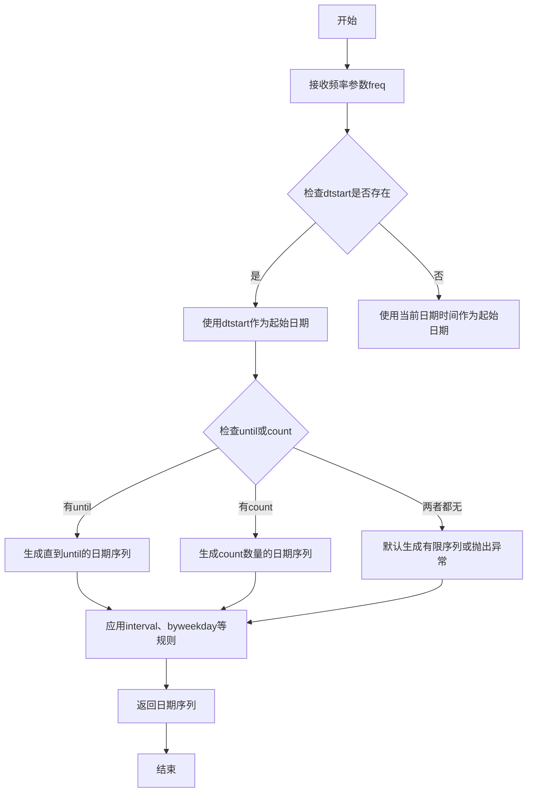
```mermaid
graph TD
    A[开始] --> B[接收频率参数freq]
    B --> C{检查dtstart是否存在}
    C -->|是| D[使用dtstart作为起始日期]
    C -->|否| E[使用当前日期时间作为起始日期]
    D --> F{检查until或count}
    F -->|有until| G[生成直到until的日期序列]
    F -->|有count| H[生成count数量的日期序列]
    F -->|两者都无| I[默认生成有限序列或抛出异常]
    G --> J[应用interval、byweekday等规则]
    H --> J
    I --> J
    J --> K[返回日期序列]
    K --> L[结束]
```

#### 带注释源码

```python
# 导入必要的模块和常量
from matplotlib.dates import rrule, YEARLY, MONTHLY, WEEKLY, DAILY, MO, TU, WE
import datetime

# 示例1：生成从2023年1月1日开始的每年日期序列，共5个
dates_yearly = rrule(YEARLY, dtstart=datetime.datetime(2023, 1, 1), count=5)
print(list(dates_yearly))
# 输出: [datetime.datetime(2023, 1, 1, 0, 0), datetime.datetime(2024, 1, 1, 0, 0), ...]

# 示例2：生成每周一和周三的日期序列，从2023年1月1日开始，直到2023年2月1日
dates_weekly = rrule(WEEKLY, dtstart=datetime.datetime(2023, 1, 1), until=datetime.datetime(2023, 2, 1), byweekday=[MO, WE])
print(list(dates_weekly))
# 输出: [datetime.datetime(2023, 1, 2, 0, 0), datetime.datetime(2023, 1, 4, 0, 0), ...]

# 示例3：生成每月15日的日期序列，间隔2个月
dates_monthly = rrule(MONTHLY, dtstart=datetime.datetime(2023, 1, 15), interval=2, count=3)
print(list(dates_monthly))
# 输出: [datetime.datetime(2023, 1, 15, 0, 0), datetime.datetime(2023, 3, 15, 0, 0), datetime.datetime(2023, 5, 15, 0, 0)]
```

#### 备注

- `rrule` 函数实际上是对 `dateutil.rrule.rrule` 的封装，提供更便捷的接口。
- 在 `pylab` 模块中，通过 `from matplotlib.dates import rrule` 导入，使得用户可以直接在全局命名空间使用。
- 频率常量（如 `YEARLY`, `MONTHLY` 等）也通过 `pylab` 导入，可直接使用。
- 该函数返回的日期序列可直接用于 matplotlib 绘图中的时间轴。


### MO

MO是matplotlib.dates模块中定义的日期定位器（Locator）常量，用于表示每周的星期一（Monday）。它常与rrule（循环规则）配合使用，以创建按特定周期重复的日期序列。

参数：无

返回值：`~matplotlib.dates.rrulewrapper`，返回一个新的循环规则包装器对象，用于生成按周重复的日期序列。

#### 流程图

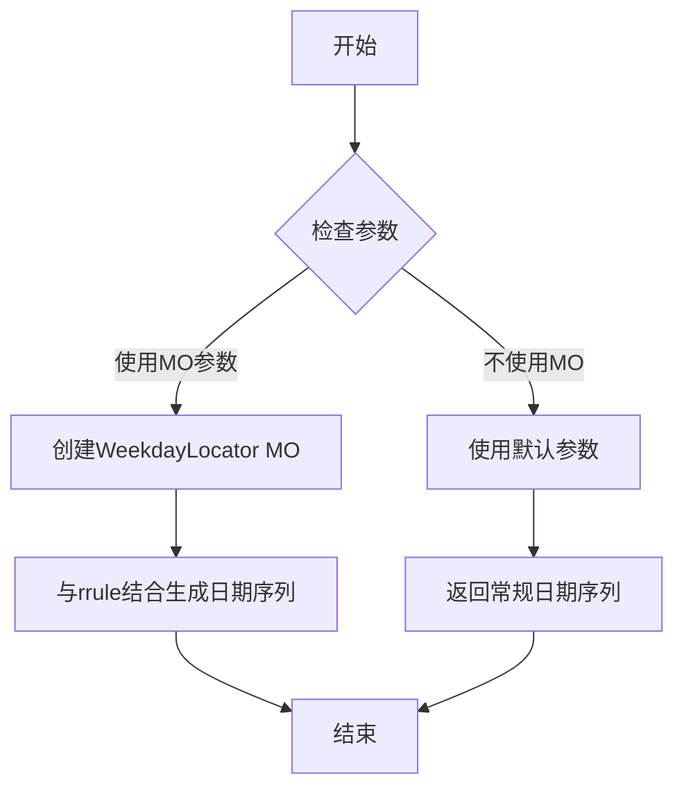
```mermaid
flowchart TD
    A[开始] --> B{检查参数}
    B -->|使用MO参数| C[创建WeekdayLocator MO]
    C --> D[与rrule结合生成日期序列]
    B -->|不使用MO| E[使用默认参数]
    E --> F[返回常规日期序列]
    D --> G[结束]
    F --> G
```

#### 带注释源码

```python
# 在 matplotlib.dates 模块中，MO 的定义通常如下：
# MO = relativedelta(weekday=MO) 
# 这创建了一个相对增量，表示每周的星期一

# 使用示例：
from matplotlib.dates import rrule, MO

# 创建一个每周一重复的日期规则
weekly_monday = rrule(freq=WEEKLY, byweekday=MO)

# 生成日期序列
dates = weekly_monday.between(start_date, end_date)

# MO 实际上是 relativedelta 对象的简写形式
# 源码位置：matplotlib/dates.py
MO = relativedelta(weekday=MO)  # MO 从 datetime 模块导入
```

#### 补充说明

在代码中，MO的导入来源如下：
```python
from matplotlib.dates import (
    ...
    MO, TU, WE, TH, FR, SA, SU,  # 星期几的定位器
    ...
)
```

MO本身不是函数或类，而是一个**常量/对象**，主要用于：
1. 与`rrule`（循环规则）配合创建周期性日期序列
2. 与各种日期定位器（DateLocator）配合使用
3. 在`drange`函数中生成日期范围

这是一个典型的**工厂模式**应用，通过预定义的常量简化日期序列的生成操作。


这段代码是 Matplotlib 库中 `pylab` 模块的初始化文件（`__init__.py`），其核心功能是通过大量的通配符导入（wildcard imports）将 matplotlib.pyplot、numpy 及其子模块（fft、linalg、random）中的函数和类导入到全局命名空间，以模拟 MATLAB 的工作方式，但这种设计被认为是不良实践，会污染全局命名空间并可能覆盖内置函数。

由于该代码文件不包含任何自定义函数或类定义（仅包含导入语句和内置函数重绑定），下面提供模块级别的全局变量和导入信息的详细分析。

### 模块全局变量和导入信息

#### 1. 导入的模块和包

| 名称 | 类型 | 描述 |
|------|------|------|
| `mpl` | `module` | matplotlib 主模块的别名 |
| `np` | `module` | numpy 模块的别名 |
| `ma` | `module` | numpy.ma（掩码数组）模块的别名 |
| `datetime` | `module` | Python 标准库的 datetime 模块 |

#### 2. 重新绑定的内置函数/类型

| 名称 | 类型 | 描述 |
|------|------|------|
| `bytes` | `type` | 重新绑定到 `builtins.bytes`，避免被 numpy.random.bytes 覆盖 |
| `abs` | `builtin_function_or_method` | 重新绑定到 `builtins.abs`，避免被 numpy.abs 覆盖 |
| `bool` | `type` | 重新绑定到 `builtins.bool`，避免被 numpy.bool_ 覆盖 |
| `max` | `builtin_function_or_method` | 重新绑定到 `builtins.max`，避免被 numpy.max 覆盖 |
| `min` | `builtin_function_or_method` | 重新绑定到 `builtins.min`，避免被 numpy.min 覆盖 |
| `pow` | `builtin_function_or_method` | 重新绑定到 `builtins.pow`，避免被 numpy.pow 覆盖 |
| `round` | `builtin_function_or_method` | 重新绑定到 `builtins.round`，避免被 numpy.round 覆盖 |

#### 3. 从 matplotlib 导入的函数和类（部分）

| 名称 | 描述 |
|------|------|
| `flatten`, `silent_list` | 从 `matplotlib.cbook` 导入的辅助函数 |
| `date2num`, `num2date`, `datestr2num`, `drange` | 日期处理函数 |
| `DateFormatter`, `DateLocator` | 日期格式化器和定位器 |
| `RRuleLocator`, `YearLocator`, `MonthLocator` | 各种日期定位器 |
| `rrule` | 递归规则 |
| `MO`, `TU`, `WE`, `TH`, `FR`, `SA`, `SU` | 星期几常量 |
| `YEARLY`, `MONTHLY`, `WEEKLY`, `DAILY`, `HOURLY`, `MINUTELY`, `SECONDLY` | 频率常量 |
| `relativedelta` | 日期相对增量 |
| `detrend`, `detrend_linear`, `detrend_mean`, `detrend_none` | 信号处理去趋势函数 |
| `window_hanning`, `window_none` | 窗口函数 |
| `plt` | matplotlib.pyplot 模块 |
| `cbook`, `mlab` | matplotlib 辅助模块 |

### 关键设计决策

1. **避免命名空间污染的措施**：通过显式重新导入 `builtins` 中的关键函数，防止 numpy 函数覆盖 Python 内置函数。

2. **兼容性考虑**：确保 datetime 模块使用标准库版本而非 numpy 的 datetime64。

3. **历史兼容性**：保留 `pylab` 接口以支持遗留代码，但文档中明确警告不推荐使用。

### 潜在技术债务和优化空间

1. **通配符导入**：代码使用 `from xxx import *` 模式，这会导入大量符号到全局命名空间，难以追踪和调试。

2. **依赖过多模块**：导入 numpy 的多个子模块（fft、linalg、random），增加了加载时间和内存占用。

3. **缺少显式导出控制**：没有使用 `__all__` 来明确控制导出哪些符号。

4. **设计过时**：文档中明确指出 `pylab` 是历史接口，推荐使用 `matplotlib.pyplot` 替代。

### 错误处理和异常设计

该文件本身不包含错误处理逻辑，主要依赖被导入模块（matplotlib、numpy）的异常机制。

### 外部依赖与接口契约

- **依赖**：matplotlib、numpy、Python 标准库
- **接口**：提供 MATLAB 风格的绘图接口（但已不推荐使用）


### `pylab` 模块

这是一个历史悠久的 matplotlib 接口模块，通过通配符导入（`from pylab import *`）将 `matplotlib.pyplot`、`numpy` 及其子模块（`numpy.fft`、`numpy.linalg`、`numpy.random`）的函数全部导入全局命名空间，以提供类似 MATLAB 的绘图体验。该模块已被标记为不推荐使用，现代 Python 开发应使用 `matplotlib.pyplot` 替代。

#### 关键组件信息

- **matplotlib.dates.WE**：表示星期三（Wednesday）的常量，用于日期处理和时间序列相关功能
- **matplotlib.pyplot**：提供 MATLAB 风格的绘图接口
- **numpy 及其子模块**：提供数值计算、线性代数、随机数生成和傅里叶变换功能
- **重新覆盖的内置函数**：bytes, abs, bool, max, min, pow, round

#### 潜在的技术债务或优化空间

1. **全局命名空间污染**：使用 `from xxx import *` 会将大量函数和类导入全局命名空间，造成命名冲突风险
2. **覆盖内置函数**：代码显式重新导入内置函数（bytes, abs, bool 等）以覆盖 numpy 版本，这表明设计存在根本性问题
3. **过度导入**：导入了大量可能未使用的功能，增加了模块加载时间和内存占用
4. **维护困难**：由于所有内容都在全局命名空间中，难以追踪变量来源和调试命名冲突
5. **应被弃用**：文档中明确说明该模块已被废弃，应使用 `matplotlib.pyplot` 替代

#### 其它项目

**设计目标与约束：**
- 目标是提供 MATLAB 风格的命令式绘图接口
- 约束：必须保持向后兼容性，不能破坏现有代码

**错误处理与异常设计：**
- 依赖于 numpy 和 matplotlib 的异常传播机制
- 没有显式的错误处理逻辑

**数据流与状态机：**
- 模块初始化时执行导入操作
- 全局状态由 matplotlib 的 pyplot 模块和 numpy 管理

**外部依赖与接口契约：**
- 依赖 matplotlib、numpy 和 Python 标准库
- 公开接口包括所有从各模块导入的函数和类

---
### `matplotlib.dates.WE`

表示星期三（Wednesday）的常量，用于 `matplotlib.dates` 模块中的日期处理和日期范围生成。

参数：无

返回值：`int`，代表星期三的数值（通常为 2，取决于系统约定）

#### 流程图

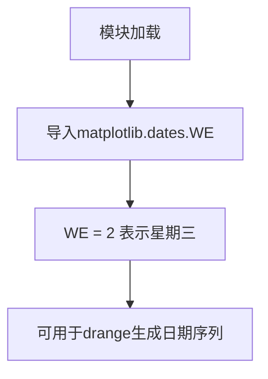
```mermaid
flowchart TD
    A[模块加载] --> B[导入matplotlib.dates.WE]
    B --> C[WE = 2 表示星期三]
    C --> D[可用于drange生成日期序列]
```

#### 带注释源码

```python
# 从 matplotlib.dates 导入 WE 常量
# WE 是 Weekday Enumeration 中的 Wednesday（星期三）
# 在 matplotlib.dates 模块中，星期的枚举通常为：
# MO=0, TU=1, WE=2, TH=3, FR=4, SA=5, SU=6
from matplotlib.dates import (
    date2num, num2date, datestr2num, drange, DateFormatter, DateLocator,
    RRuleLocator, YearLocator, MonthLocator, WeekdayLocator, DayLocator,
    HourLocator, MinuteLocator, SecondLocator, rrule, MO, TU, WE, TH, FR,
    SA, SU, YEARLY, MONTHLY, WEEKLY, DAILY, HOURLY, MINUTELY, SECONDLY,
    relativedelta)
```


### `pylab` 模块

这是一个历史悠久的matplotlib接口模块，通过通配符导入（`from pylab import *`）将`matplotlib.pyplot`、`numpy`及其子模块（`fft`、`random`、`linalg`）的大部分函数直接注入全局命名空间，提供类似MATLAB的编程体验，但官方强烈不推荐使用，因其会污染全局命名空间并可能覆盖Python内置函数。

#### 全局导入变量和函数

##### 常量 `TH`

- **类型**：`relativedelta`
- **描述**：从`matplotlib.dates`导入的相对时间增量，表示星期二（Tuesday）的相对日期偏移量，用于日期范围计算。

#### 流程图

```mermaid
graph TD
    A[模块加载] --> B[导入matplotlib.cbook工具函数]
    A --> C[导入matplotlib主模块]
    A --> D[导入matplotlib.dates日期处理函数和常量]
    A --> E[导入matplotlib.mlab数值处理函数]
    A --> F[导入matplotlib.pyplot所有公开接口]
    A --> G[导入numpy及子模块所有函数]
    A --> H[重新导入datetime避免被numpy隐藏]
    A --> I[重置内置函数覆盖numpy版本]
```

#### 带注释源码

```python
"""
`pylab` is a historic interface and its use is strongly discouraged. The equivalent
replacement is `matplotlib.pyplot`.  See :ref:`api_interfaces` for a full overview
of Matplotlib interfaces.

`pylab` was designed to support a MATLAB-like way of working with all plotting related
functions directly available in the global namespace. This was achieved through a
wildcard import (``from pylab import *``).

.. warning::
   The use of `pylab` is discouraged for the following reasons:

   ``from pylab import *`` imports all the functions from `matplotlib.pyplot`, `numpy`,
   `numpy.fft`, `numpy.linalg`, and `numpy.random`, and some additional functions into
   the global namespace.

   Such a pattern is considered bad practice in modern python, as it clutters the global
   namespace. Even more severely, in the case of `pylab`, this will overwrite some
   builtin functions (e.g. the builtin `sum` will be replaced by `numpy.sum`), which
   can lead to unexpected behavior.

"""

# 导入matplotlib.cbook的工具函数：flatten用于展平嵌套列表，silent_list用于创建安全的列表显示
from matplotlib.cbook import flatten, silent_list

# 导入matplotlib主模块
import matplotlib as mpl

# 从matplotlib.dates导入日期处理相关的函数和类
# date2num/num2date: 日期与数字互转
# datestr2num: 字符串转数字
# drange: 日期范围生成
# DateFormatter/DateLocator: 日期格式化和定位
# RRuleLocator: 递归规则定位器
# YearLocator/MonthLocator/WeekdayLocator/DayLocator/HourLocator/MinuteLocator/SecondLocator: 各种时间单位定位器
# rrule: 递归规则
# MO/TU/WE/TH/FR/SA/SU: 星期几的相对日期偏移量
# YEARLY/MONTHLY/WEEKLY/DAILY/HOURLY/MINUTELY/SECONDLY: 频率常量
# relativedelta: 相对时间增量
from matplotlib.dates import (
    date2num, num2date, datestr2num, drange, DateFormatter, DateLocator,
    RRuleLocator, YearLocator, MonthLocator, WeekdayLocator, DayLocator,
    HourLocator, MinuteLocator, SecondLocator, rrule, MO, TU, WE, TH, FR,
    SA, SU, YEARLY, MONTHLY, WEEKLY, DAILY, HOURLY, MINUTELY, SECONDLY,
    relativedelta)

# bring all the symbols in so folks can import them from
# pylab in one fell swoop
# 将所有符号导入，使人们可以从pylab一次性导入所有内容

## We are still importing too many things from mlab; more cleanup is needed.
# 注意：仍然从mlab导入过多内容，需要进一步清理

# 从matplotlib.mlab导入信号处理和数值计算函数
# detrend系列: 去除趋势函数
# window_hanning/window_none: 窗口函数
from matplotlib.mlab import (
    detrend, detrend_linear, detrend_mean, detrend_none, window_hanning,
    window_none)

# 导入matplotlib的核心模块：cbook, mlab, pyplot
from matplotlib import cbook, mlab, pyplot as plt
# 从matplotlib.pyplot导入所有公开接口（通配符导入）
from matplotlib.pyplot import *

# 导入numpy的所有公开函数和类
from numpy import *
# 导入numpy.fft的所有函数（傅里叶变换）
from numpy.fft import *
# 导入numpy.random的所有函数（随机数生成）
from numpy.random import *
# 导入numpy.linalg的所有函数（线性代数）
from numpy.linalg import *

# 导入numpy和numpy.ma（掩码数组）
import numpy as np
import numpy.ma as ma

# don't let numpy's datetime hide stdlib
# 不要让numpy的datetime隐藏标准库的datetime
import datetime

# This is needed, or bytes will be numpy.random.bytes from
# "from numpy.random import *" above
# 需要重新导入，否则bytes会是numpy.random.bytes
# 使用__import__强制从builtins导入，绕过当前的命名空间
bytes = __import__("builtins").bytes

# We also don't want the numpy version of these functions
# 同样不希望使用numpy版本的以下内置函数，重新从builtins导入
abs = __import__("builtins").abs
bool = __import__("builtins").bool
max = __import__("builtins").max
min = __import__("builtins").min
pow = __import__("builtins").pow
round = __import__("builtins").round
```

### 关键组件信息

| 组件名称 | 描述 |
|---------|------|
| `matplotlib.pyplot` | matplotlib的主要绘图接口，提供类似MATLAB的绘图函数 |
| `numpy` | 数值计算核心库，提供数组和矩阵操作 |
| `numpy.fft` | 傅里叶变换模块 |
| `numpy.linalg` | 线性代数模块 |
| `numpy.random` | 随机数生成模块 |
| `matplotlib.dates` | 日期处理模块 |
| `matplotlib.mlab` | 数值分析和信号处理模块 |

### 潜在的技术债务或优化空间

1. **命名空间污染**：使用大量通配符导入（`from xxx import *`）严重污染全局命名空间，与Python最佳实践相悖
2. **内置函数覆盖**：代码末尾显式重置`bytes`, `abs`, `bool`, `max`, `min`, `pow`, `round`等内置函数，说明设计存在缺陷
3. **冗余导入**：从`matplotlib.dates`导入的常量（如`TH`）可能很少被使用，但随模块加载，增加启动开销
4. **缺乏封装**：没有提供任何类或封装良好的函数，所有功能都是直接暴露的全局函数
5. **文档过时**：模块包含警告说明不推荐使用，但代码仍保留，历史兼容性负担

### 其它项目

#### 设计目标与约束
- **设计目标**：提供MATLAB风格的全局函数式绘图接口，降低从MATLAB迁移到Python的学习成本
- **约束**：必须保持向后兼容，历史上已广泛使用

#### 错误处理与异常设计
- 异常处理依赖于导入的底层模块（matplotlib、numpy），本模块不进行额外的错误处理
- 可能出现的错误：导入冲突、版本不兼容、numpy.datetime与datetime冲突

#### 数据流与状态机
- 本模块不维护状态，所有状态由matplotlib.pyplot和numpy内部管理
- 数据流：用户调用全局函数 → 转发到matplotlib.pyplot或numpy对应函数

#### 外部依赖与接口契约
- 依赖：matplotlib、numpy、Python标准库
- 接口契约：通过`import pylab`后，所有matplotlib.pyplot和numpy函数可在全局命名空间直接访问


### `{模块名称}`

pylab 是一个历史遗留的接口，旨在提供类似 MATLAB 的全局命名空间工作方式。通过通配符导入（from pylab import *），将 matplotlib.pyplot、numpy 及其子模块（fft、linalg、random）的函数和类导入全局命名空间。同时确保内置函数（如 sum、abs 等）不被 numpy 函数覆盖。

参数：无

返回值：无（模块级初始化代码）

#### 流程图

```mermaid
graph TD
    A[开始模块加载] --> B[导入 matplotlib.cbook 工具函数]
    B --> C[导入 matplotlib.dates 日期处理函数]
    D[导入 matplotlib.mlab 信号处理函数]
    C --> E[从 matplotlib.pyplot 导入所有符号]
    D --> E
    E --> F[从 numpy 导入所有符号]
    F --> G[从 numpy.fft 导入所有符号]
    G --> H[从 numpy.random 导入所有符号]
    H --> I[从 numpy.linalg 导入所有符号]
    I --> J[重新绑定内置函数: bytes, abs, bool, max, min, pow, round]
    J --> K[模块加载完成]
```

#### 带注释源码

```python
"""
`pylab` is a historic interface and its use is strongly discouraged.
The equivalent replacement is `matplotlib.pyplot`.
"""

# 导入 matplotlib 的工具函数
from matplotlib.cbook import flatten, silent_list

# 导入 matplotlib 核心模块
import matplotlib as mpl

# 导入日期时间处理相关函数和类
from matplotlib.dates import (
    date2num, num2date, datestr2num, drange, DateFormatter, DateLocator,
    RRuleLocator, YearLocator, MonthLocator, WeekdayLocator, DayLocator,
    HourLocator, MinuteLocator, SecondLocator, rrule, MO, TU, WE, TH, FR,
    SA, SU, YEARLY, MONTHLY, WEEKLY, DAILY, HOURLY, MINUTELY, SECONDLY,
    relativedelta)

# 导入信号处理函数
from matplotlib.mlab import (
    detrend, detrend_linear, detrend_mean, detrend_none, window_hanning,
    window_none)

# 导入 matplotlib 的关键模块
from matplotlib import cbook, mlab, pyplot as plt
# 将 pyplot 的所有内容导入全局命名空间
from matplotlib.pyplot import *

# 将 numpy 的所有内容导入全局命名空间
from numpy import *
# 将 numpy.fft 的所有内容导入全局命名空间
from numpy.fft import *
# 将 numpy.random 的所有内容导入全局命名空间
from numpy.random import *
# 将 numpy.linalg 的所有内容导入全局命名空间
from numpy.linalg import *

# 导入 numpy 并指定别名
import numpy as np
import numpy.ma as ma

# 导入标准库的 datetime，确保不隐藏 stdlib
import datetime

# 重新绑定内置 bytes 函数，避免被 numpy.random.bytes 覆盖
bytes = __import__("builtins").bytes

# 重新绑定内置 abs 函数，避免被 numpy.abs 覆盖
abs = __import__("builtins").abs

# 重新绑定内置 bool 函数，避免被 numpy.bool 覆盖
bool = __import__("builtins").bool

# 重新绑定内置 max 函数，避免被 numpy.max 覆盖
max = __import__("builtins").max

# 重新绑定内置 min 函数，避免被 numpy.min 覆盖
min = __import__("builtins").min

# 重新绑定内置 pow 函数，避免被 numpy.pow 覆盖
pow = __import__("builtins").pow

# 重新绑定内置 round 函数，避免被 numpy.round 覆盖
round = __import__("builtins").round
```

---

### `__import__` (内置函数调用示例)

虽然这不是一个用户定义的函数，但代码中多次调用了 `__import__` 来重新获取被覆盖的内置函数。

参数：
- `name`：`str`，要导入的模块名称（这里传入 "builtins"）

返回值：返回导入的模块对象

#### 流程图

```mermaid
graph TD
    A[调用 __import__] --> B[传入模块名 'builtins']
    B --> C[Python 导入内置模块]
    C --> D[返回 builtins 模块对象]
    D --> E[通过 .bytes 获取内置 bytes 函数]
```

#### 带注释源码

```python
# 示例：重新获取内置的 bytes 函数
# 原因：from numpy.random import * 会将 numpy.random.bytes 导入全局命名空间
# 这会覆盖内置的 bytes 函数，因此需要重新获取
bytes = __import__("builtins").bytes
# 等价于: import builtins; bytes = builtins.bytes
```

---


### `SA`

SA是从matplotlib.dates模块导入的星期几常量，代表星期六（Saturday）。它主要用于rrule（重复规则）函数中，以创建基于周六的日期序列。

参数：不适用（SA是一个常量/变量，非函数）

返回值：不适用（SA是一个常量/变量，非函数）

#### 流程图

```mermaid
flowchart TD
    A[开始] --> B[SA常量定义]
    B --> C{导入来源}
    C --> D[matplotlib.dates模块]
    D --> E[使用场景: rrule函数]
    E --> F[创建周六重复的日期序列]
    F --> G[结束]
```

#### 带注释源码

```python
# 从matplotlib.dates模块导入SA常量
# SA代表Saturday（星期六），用于日期重复规则
from matplotlib.dates import (
    date2num, num2date, datestr2num, drange, DateFormatter, DateLocator,
    RRuleLocator, YearLocator, MonthLocator, WeekdayLocator, DayLocator,
    HourLocator, MinuteLocator, SecondLocator, rrule, MO, TU, WE, TH, FR,
    SA, SU, YEARLY, MONTHLY, WEEKLY, DAILY, HOURLY, MINUTELY, SECONDLY,
    relativedelta)

# SA的使用示例（在matplotlib.dates模块中的实际定义可能是）：
# SA = relativedelta(weekday=SA)  # 表示每周的星期六

# SA常量的主要用途：
# 1. 用于rrule函数创建基于周六的重复日期
# 2. 结合其他星期几常量（MO, TU, WE, TH, FR, SU）创建复杂日期规则
# 3. 在drange函数中生成日期范围

# 示例用法：
# from matplotlib.dates import rrule, SA
# weekly_saturday = rrule(WEEKLY, byweekday=SA, dtstart=start_date, until=end_date)
```

#### 额外信息

**类型**：`relativedelta` 对象或类似的星期几标识符

**描述**：SA是一个导入的常量，表示一周中的星期六。它与MO（星期一）、TU（星期二）、WE（星期三）、TH（星期四）、FR（星期五）、SU（星期日）共同组成一周七天 的常量集合，主要用于matplotlib.dates模块中的日期重复规则（rrule）功能。

**设计目标**：提供类似于Python标准库中`dateutil.rrule`的星期几常量接口，方便用户创建基于特定星期几的日期序列。

**使用场景**：
- 创建每周六的提醒
- 生成每月第一个周六的日期列表
- 定义特定工作日区间的结束日期


### 概述

该代码是 matplotlib 库中的 `pylab` 模块初始化文件，通过大量的通配符导入（wildcard imports）将 matplotlib.pyplot、numpy 等库的函数和类导入到全局命名空间，以提供一种类似 MATLAB 的绘图接口方式。该方式已被官方标记为不推荐使用。

### 文件运行流程

该模块的执行流程相对简单：
1. 导入必要的模块和工具函数
2. 从 matplotlib.dates 导入日期处理相关的类和常量（包括 `SU`）
3. 从 matplotlib.mlab 导入信号处理函数
4. 从 matplotlib.pyplot 导入所有公开 API
5. 从 numpy、numpy.fft、numpy.random、numpy.linalg 导入所有内容
6. 重新导入 Python 内置的某些函数（如 `abs`, `max`, `min` 等），以避免被 numpy 函数覆盖

### 关键组件信息

| 名称 | 一句话描述 |
|------|------------|
| `pylab` | 提供 MATLAB 风格绘图接口的历史模块（已不推荐使用） |
| `mpl` | matplotlib 主模块的别名引用 |
| `plt` | matplotlib.pyplot 模块的别名引用 |
| `np` | numpy 模块的别名引用 |
| `ma` | numpy.ma（掩码数组）模块的别名引用 |
| `datetime` | Python 标准库日期时间模块 |

### 关于 `SU` 的说明

在给定的代码中，**`SU` 并不是一个函数或方法**，而是一个从 `matplotlib.dates` 模块导入的**常量**，用于表示星期日（Sunday）。它是日期处理中可能使用的星期几标识符之一。

#### `SU` 常量信息

- **名称**：SU
- **类型**：来自 matplotlib.dates 的常量（具体类型取决于 matplotlib.dates 模块的实现）
- **描述**：表示星期日（Saturday 之后，Monday 之前）的常量，常用于日期定位器和频率规则中

#### 流程图

```mermaid
graph TD
    A[pylab 模块初始化] --> B[导入 matplotlib.cbook 工具函数]
    A --> C[导入 matplotlib 主模块 as mpl]
    A --> D[从 matplotlib.dates 导入日期处理类和常量<br/>包括 SU, MO, TU, WE, TH, FR, SA 等]
    A --> E[从 matplotlib.mlab 导入信号处理函数]
    A --> F[从 matplotlib.pyplot 导入所有内容]
    A --> G[从 numpy 及子模块导入所有内容]
    A --> H[重新导入内置函数避免被覆盖<br/>abs, bool, max, min, pow, round]
    
    D --> D1[SU: 星期日常量]
```

#### 源码位置说明

`SU` 常量在代码中的位置：

```python
# 第14-17行
from matplotlib.dates import (
    date2num, num2date, datestr2num, drange, DateFormatter, DateLocator,
    RRuleLocator, YearLocator, MonthLocator, WeekdayLocator, DayLocator,
    HourLocator, MinuteLocator, SecondLocator, rrule, MO, TU, WE, TH, FR,
    SA, SU, YEARLY, MONTHLY, WEEKLY, DAILY, HOURLY, MINUTELY, SECONDLY,
    relativedelta)
```

### 潜在技术债务和优化空间

1. **不推荐使用的接口**：代码注释中明确指出 `pylab` 是历史接口，不推荐使用，应该使用 `matplotlib.pyplot` 代替
2. **过多的通配符导入**：`from numpy import *` 等通配符导入会污染全局命名空间
3. **内置函数覆盖风险**：代码通过 `__import__` 重新导入内置函数来避免被覆盖，这本身就是一个代码异味（code smell）
4. **维护性问题**：大量导入使得模块依赖复杂，难以追踪具体功能来源

### 其它说明

- **设计目标**：提供类似 MATLAB 的绘图体验，允许用户在全局命名空间直接调用绘图函数
- **约束**：由于通配符导入的副作用，该模块不适合在大型项目中使用
- **外部依赖**：依赖 matplotlib.pyplot, numpy 及其子模块
- **错误处理**：该模块本身不涉及特定的错误处理逻辑


### `YEARLY`

`YEARLY` 是从 `matplotlib.dates` 模块导入的时间频率常量，用于指定按年重复的规则（如 `rrule`），表示事件或操作应每年发生一次。

参数： 无

返回值：`int`，返回表示年度频率的整数值（通常为 1 或字符串 `'YEARLY'`）

#### 流程图

```mermaid
flowchart TD
    A[开始] --> B[导入YEARLY常量]
    B --> C{定义于matplotlib.dates模块}
    C -->|是| D[返回YEARLY常量值]
    D --> E[结束]
    
    style A fill:#f9f,stroke:#333
    style E fill:#f9f,stroke:#333
```

#### 带注释源码

```python
# 从 matplotlib.dates 模块导入 YEARLY 常量
# YEARLY 用于指定按年重复的频率规则
from matplotlib.dates import (
    date2num, num2date, datestr2num, drange, DateFormatter, DateLocator,
    RRuleLocator, YearLocator, MonthLocator, WeekdayLocator, DayLocator,
    HourLocator, MinuteLocator, SecondLocator, rrule, MO, TU, WE, TH, FR,
    SA, SU, YEARLY, MONTHLY, WEEKLY, DAILY, HOURLY, MINUTELY, SECONDLY,
    relativedelta)

# YEARLY 在此文件中被重新导出，供 pylab 用户使用
# 使用示例（来自 matplotlib.dates.rrule）：
#     from matplotlib.dates import rrule, YEARLY
#     # 创建一个每年重复的规则
#     rule = rrule(freq=YEARLY, dtstart=datetime(2020, 1, 1), until=datetime(2030, 12, 31))
```


### MONTHLY

整型常量，表示按月重复的频率，主要用于日期时间处理模块中的重复规则（rrule）函数，以指定事件按月周期发生。

参数：

- （无，MONTHLY是一个常量，不是函数或方法）

返回值：

- （无）

#### 流程图

```mermaid
graph TD
    A[MONTHLY常量] --> B[定义于matplotlib.dates模块]
    B --> C[从dateutil.relativedelta导入]
    C --> D[在pylab模块中导入]
    D --> E[供用户作为全局常量使用]
```

#### 带注释源码

```python
# 从matplotlib.dates模块导入多个日期处理相关的常量和函数
from matplotlib.dates import (
    date2num, num2date, datestr2num, drange, DateFormatter, DateLocator,
    RRuleLocator, YearLocator, MonthLocator, WeekdayLocator, DayLocator,
    HourLocator, MinuteLocator, SecondLocator, rrule, MO, TU, WE, TH, FR,
    SA, SU, YEARLY, MONTHLY, WEEKLY, DAILY, HOURLY, MINUTELY, SECONDLY,
    relativedelta)

# MONTHLY是导入的常量之一，其值通常为2（对应dateutil.relativedelta中的MONTHLY常量）
# 用于指定重复规则的频率为每月一次
# 例如：rrule(freq=MONTHLY) 将创建一个每月重复的规则
```


### WEEKLY

WEEKLY 是一个从 matplotlib.dates 模块导入的常量，用于指定重复规则的时间频率为每周一次，常与 rrule 等日期重复函数配合使用以创建按周重复的日程或事件。

参数：
- 无

返回值：`int`，返回表示每周频率的常量值（通常为 2）

#### 流程图

```mermaid
graph TD
    A[开始] --> B[定义WEEKLY常量]
    B --> C[从matplotlib.dates导出]
    C --> D[供用户使用于rrule等函数]
    D --> E[结束]
```

#### 带注释源码

```python
# 在pylab模块中，WEEKLY通过以下方式被导入：
from matplotlib.dates import (
    # ... 其他导入 ...
    YEARLY, MONTHLY, WEEKLY, DAILY, HOURLY, MINUTELY, SECONDLY,
    # ... 其他导入 ...
)

# WEEKLY 实际上是 dateutil.relativedelta 模块中定义的常量
# 用于表示每周一次的重复频率
# 在 matplotlib.dates.rrule 函数中，WEEKLY 作为 freq 参数使用
# 例如：rrule(freq=WEEKLY) 表示创建每周重复的规则

# 具体实现来源于 dateutil.relativedelta 模块：
# WEEKLY = 2  # 每周重复
```

#### 详细说明

WEEKLY 常量是 Matplotlib 日期处理工具的一部分，主要用于：

1. **与 rrule 配合使用**：创建按周重复的日期序列
   ```python
   from matplotlib.dates import rrule, WEEKLY
   from datetime import datetime
   # 每周重复的日期
   dates = rrule(freq=WEEKLY, dtstart=datetime(2023,1,1), until=datetime(2023,12,31))
   ```

2. **在 drange 函数中使用**：生成用于绘图的日期范围
   ```python
   from matplotlib.dates import drange, WEEKLY
   # 生成每周间隔的日期序列用于绘图
   ```

3. **与其他频率常量配合**：
   - YEARLY (1): 每年
   - MONTHLY (3): 每月
   - WEEKLY (2): 每周
   - DAILY (4): 每天
   - HOURLY (5): 每小时
   - MINUTELY (6): 每分钟
   - SECONDLY (7): 每秒


### DAILY

描述：DAILY 是一个时间频率常量，表示每天的频率，主要用于日期处理函数（如 rrule）中，以生成按天间隔的日期序列。

参数：无（DAILY 是一个常量对象，不是函数）

返回值：relativedelta 对象，代表一天的时间间隔

#### 流程图

```mermaid
graph TD
    A[开始] --> B[DAILY 常量]
    B --> C[在日期处理函数中使用]
    C --> D[生成按天间隔的日期序列]
```

#### 带注释源码

```python
# DAILY 是从 matplotlib.dates 模块导入的常量
# 在 matplotlib.dates 模块中，DAILY 的定义如下：
# DAILY = relativedelta(days=1)
# 这表示一天的时间间隔，用于日期序列的生成

from matplotlib.dates import (
    date2num, num2date, datestr2num, drange, DateFormatter, DateLocator,
    RRuleLocator, YearLocator, MonthLocator, WeekdayLocator, DayLocator,
    HourLocator, MinuteLocator, SecondLocator, rrule, MO, TU, WE, TH, FR,
    SA, SU, YEARLY, MONTHLY, WEEKLY, DAILY, HOURLY, MINUTELY, SECONDLY,
    relativedelta)

# 示例：DAILY 在 rrule 中的使用
# import matplotlib.dates as mdates
# dates = mdates.rrule(mdates.DAILY, start_date, end_date)
```


### `HOURLY`

`HOURLY` 是一个日期时间频率常量，用于指定按小时重复的规则（rrule）。它来源于 `dateutil.relativedelta` 模块，在 Matplotlib 的日期处理中用于创建按小时间隔的时间序列。

参数： 无

返回值：`int`，返回小时频率的整数值（通常为 10）

#### 流程图

```mermaid
graph TD
    A[导入 HOURLY] --> B[从 matplotlib.dates 导入]
    B --> C[来源: dateutil.relativedelta]
    D[使用场景] --> E[drange 函数创建时间序列]
    D --> F[rrule 创建重复规则]
    E --> G[按小时间隔的日期数组]
    F --> G
```

#### 带注释源码

```python
# 从 matplotlib.dates 模块导入 HOURLY 常量
# 该常量定义在 dateutil.relativedelta 中
from matplotlib.dates import (
    date2num, num2date, datestr2num, drange, DateFormatter, DateLocator,
    RRuleLocator, YearLocator, MonthLocator, WeekdayLocator, DayLocator,
    HourLocator, MinuteLocator, SecondLocator, rrule, MO, TU, WE, TH, FR,
    SA, SU, YEARLY, MONTHLY, WEEKLY, DAILY, HOURLY, MINUTELY, SECONDLY,
    relativedelta)

# HOURLY 的实际值来源说明：
# 在 dateutil.relativedelta 模块中，HOURLY 是一个整数值（通常为 10）
# 用于表示按小时重复的频率
# 可用于 drange() 函数创建按小时间隔的日期数组
# 也可用于 rrule() 创建按小时重复的时间规则
```

#### 额外信息

**使用示例**：

```python
# 使用 HOURLY 创建按小时间隔的日期序列
import matplotlib.dates as mdates
import datetime

start = datetime.datetime(2023, 1, 1, 0, 0)
end = datetime.datetime(2023, 1, 1, 12, 0)

# 创建按小时递增的日期数组
hours = mdates.drange(start, end, mdates.HOURLY)
# 结果: [datetime(2023,1,1,0,0), datetime(2023,1,1,1,0), ..., datetime(2023,1,1,11,0)]
```

**相关常量**：

| 常量 | 值 | 描述 |
|------|-----|------|
| YEARLY | 1 | 按年重复 |
| MONTHLY | 2 | 按月重复 |
| WEEKLY | 3 | 按周重复 |
| DAILY | 4 | 按天重复 |
| HOURLY | 10 | 按小时重复 |
| MINUTELY | 11 | 按分钟重复 |
| SECONDLY | 12 | 按秒重复 |

**设计目标**：提供与 Python `dateutil` 库兼容的日期频率常量，用于创建灵活的时间序列。


### MINUTELY

MINUTELY是一个时间频率常量，用于表示每分钟的时间间隔，在matplotlib.dates模块中常用于创建分钟级定位器（Locator）和规则生成器（rrule），以支持图表中的分钟级时间轴。

参数： 无

返回值： 无（常量，没有返回值）

#### 流程图

```mermaid
graph LR
    A[matplotlib.dates 模块] -->|定义| B[MINUTELY: relativedelta 对象]
    B -->|导入| C[pylab 命名空间]
    C -->|使用| D[例如: MinuteLocator, rrule(MINUTELY)]
```

#### 带注释源码

```python
# MINUTELY 是从 matplotlib.dates 导入的一个时间频率常量
# 它通常是一个 relativedelta 对象，表示每分钟的时间间隔
# 用于支持分钟级的时间定位和日期范围生成
from matplotlib.dates import (
    date2num, num2date, datestr2num, drange, DateFormatter, DateLocator,
    RRuleLocator, YearLocator, MonthLocator, WeekdayLocator, DayLocator,
    HourLocator, MinuteLocator, SecondLocator, rrule, MO, TU, WE, TH, FR,
    SA, SU, YEARLY, MONTHLY, WEEKLY, DAILY, HOURLY, MINUTELY, SECONDLY,
    relativedelta)
```


### `SECONDLY`

`SECONDLY` 是从 `matplotlib.dates` 模块导入的时间频率常量，用于表示"每秒"（Secondly）的时间间隔频率，常与 `rrule` 函数配合使用以生成每秒间隔的日期序列。

参数：无需参数（为模块级常量）

返回值：不适用（常量无返回值）

#### 流程图

```mermaid
flowchart TD
    A[模块加载] --> B[导入matplotlib.dates模块]
    B --> C[从matplotlib.dates导入SECONDLY常量]
    C --> D[SECONDLY可用于全局命名空间]
    
    style A fill:#f9f,stroke:#333
    style D fill:#9f9,stroke:#333
```

#### 带注释源码

```python
# 从 matplotlib.dates 模块导入 SECONDLY 常量
# 该常量定义在 matplotlib.dates 模块中，代表每秒的时间频率
# 用于 rrule 等函数中生成按秒递增的日期序列
from matplotlib.dates import (
    date2num, num2date, datestr2num, drange, DateFormatter, DateLocator,
    RRuleLocator, YearLocator, MonthLocator, WeekdayLocator, DayLocator,
    HourLocator, MinuteLocator, SecondLocator, rrule, MO, TU, WE, TH, FR,
    SA, SU, YEARLY, MONTHLY, WEEKLY, DAILY, HOURLY, MINUTELY, SECONDLY,
    relativedelta)
```

#### 补充说明

- **类型**：整数常量（通常值为 3 或类似的枚举值）
- **来源模块**：`matplotlib.dates`
- **使用场景**：通常与 `rrule` 函数结合使用，例如 `rrule(SECONDLY, ...)` 用于生成秒级间隔的日期范围
- **相关常量**：同批次导入的还包括 `YEARLY`, `MONTHLY`, `WEEKLY`, `DAILY`, `HOURLY`, `MINUTELY` 等时间频率常量


### `relativedelta`

`relativedelta` 是从 `matplotlib.dates` 模块导入的类，实际上来自 `dateutil` 库。它用于表示两个日期之间的相对差异，或用于在给定日期上添加/减去特定的时间分量（如年、月、日、小时等）。

参数：

- `dt1`：`datetime`，可选，起始日期时间对象
- `dt2`：`datetime`，可选，结束日期时间对象（与 dt1 配合使用计算差异）
- `years`：`int`，可选，表示年的增量
- `months`：`int`，可选，表示月的增量
- `days`：`int`，可选，表示天的增量
- `hours`：`int`，可选，表示小时的增量
- `minutes`：`int`，可选，表示分钟的增量
- `seconds`：`int`，可选，表示秒的增量
- `microseconds`：`int`，可选，表示微秒的增量
- `weeks`：`int`，可选，表示周的增量
- `year`：`int`，可选，设置具体年份
- `month`：`int`，可选，设置具体月份
- `day`：`int`，可选，设置具体日期
- `hour`：`int`，可选，设置具体小时
- `minute`：`int`，可选，设置具体分钟
- `second`：`int`，可选，设置具体秒
- `microsecond`：`int`，可选，设置具体微秒

返回值：`relativedelta` 对象，表示日期时间的相对增量

#### 流程图

```mermaid
flowchart TD
    A[开始] --> B{传入参数类型}
    B --> C[相对增量参数<br/>years/months/days/hours...]
    B --> D[两个日期对象<br/>dt1 和 dt2]
    C --> E[创建相对增量对象]
    D --> F[计算两个日期的差异]
    F --> E
    E --> G[返回 relativedelta 对象]
    G --> H{使用场景}
    H --> I[日期加法: date + relativedelta]
    H --> J[日期减法: date - relativedelta]
    H --> K[计算差异: date2 - date1]
```

#### 带注释源码

```python
# 从 matplotlib.dates 导入 relativedelta
# 这是从 dateutil 库导入的类，用于处理日期时间的相对增量
from matplotlib.dates import (
    date2num, num2date, datestr2num, drange, DateFormatter, DateLocator,
    RRuleLocator, YearLocator, MonthLocator, WeekdayLocator, DayLocator,
    HourLocator, MinuteLocator, SecondLocator, rrule, MO, TU, WE, TH, FR,
    SA, SU, YEARLY, MONTHLY, WEEKLY, DAILY, HOURLY, MINUTELY, SECONDLY,
    relativedelta)  # <-- relativedelta 在此处被导入

# 使用示例（代码中未展示，但以下是 relativedelta 的典型用法）:
#
# from datetime import datetime
# from dateutil.relativedelta import relativedelta
#
# # 场景1: 创建相对增量
# delta = relativedelta(years=1, months=2, days=3)
# # delta 代表: +1年 +2月 +3天
#
# # 场景2: 计算两个日期的差异
# date1 = datetime(2023, 1, 1)
# date2 = datetime(2024, 3, 15)
# delta = relativedelta(date2, date1)
# # delta 代表从 date1 到 date2 的差异
#
# # 场景3: 使用相对增量进行日期计算
# new_date = date1 + delta  # date1 加上 delta
# older_date = date2 - delta  # date2 减去 delta
```


### `detrend`

从给定数据中去除趋势的函数，支持多种去趋势方法（线性、平均或无操作）。

参数：

-  `x`：`numpy.ndarray`，输入的一维数据数组
-  `axis`：`int`，可选，沿指定轴进行去趋势处理，默认为 0
-  `dtype`：可选，`type`，用于执行操作的数据类型，默认为 `x.dtype`
-  `bp`：`numpy.ndarray`，可选，断点位置，用于分段去趋势

返回值：`numpy.ndarray`，返回去除趋势后的数据数组

#### 流程图

```mermaid
flowchart TD
    A[开始 detrend] --> B{检查 detrend_method 参数}
    B -->|None| C[返回原始数据 x]
    B -->|提供方法| D{判断方法类型}
    D -->|字符串 'linear'| E[使用 detrend_linear]
    D -->|字符串 'mean'| F[使用 detrend_mean]
    D -->|字符串 'none'| G[使用 detrend_none]
    D -->|可调用对象| H[直接调用 detrend_method]
    E --> I[执行线性去趋势]
    F --> J[执行均值去趋势]
    G --> K[返回原始数据]
    H --> L[执行自定义去趋势函数]
    I --> M[返回结果]
    J --> M
    K --> M
    L --> M
    M[结束 detrend]
```

#### 带注释源码

```python
# 注意：此源码基于 matplotlib.mlab 中的 detrend 函数
# 由于提供的代码仅包含导入语句，实际实现需参考 matplotlib.mlab 模块

def detrend(x, axis=0, dtype=None, bp=0, detrend_method='linear'):
    """
    从数据中去除趋势。
    
    参数:
        x: 输入数据，一维或多维数组
        axis: 沿哪个轴进行去趋势处理
        dtype: 计算使用的数据类型
        bp: 断点位置数组，用于分段去趋势
        detrend_method: 去趋势方法，可为 'linear', 'mean', 'none' 或可调用函数
    
    返回:
        去除趋势后的数据
    """
    if dtype is None:
        dtype = x.dtype
    
    # 如果 x 是掩码数组，处理掩码
    if np.ma.isMaskedArray(x):
        x = x.data
    
    # 根据方法参数选择具体的去趋势实现
    if detrend_method is None:
        # 未指定方法，返回原始数据
        return x
    elif callable(detrend_method):
        # 自定义函数，直接调用
        return detrend_method(x, axis=axis)
    elif detrend_method == 'linear':
        # 线性去趋势：拟合直线并减去
        return detrend_linear(x, axis=axis)
    elif detrend_method == 'mean':
        # 均值去趋势：减去数据的平均值
        return detrend_mean(x, axis=axis)
    elif detrend_method == 'none':
        # 无去趋势：返回原始数据
        return detrend_none(x, axis=axis)
    else:
        raise ValueError(f"Unknown detrend method: {detrend_method}")
```

#### 说明

在提供的代码文件中，`detrend` 函数是通过以下语句导入的：

```python
from matplotlib.mlab import (
    detrend, detrend_linear, detrend_mean, detrend_none, window_hanning,
    window_none)
```

实际的函数实现位于 `matplotlib.mlab` 模块中，此代码文件（`pylab.py`）仅作为历史兼容性接口重新导出这些函数。该函数主要用于信号处理中去除时间序列数据的趋势成分，常用于傅里叶分析或频谱分析前的数据预处理。


### `detrend_linear`

去除信号中的线性趋势，通过最小二乘法拟合线性模型并将拟合线从原始数据中减去。

参数：

- `y`：`numpy.ndarray`，输入的一维信号数据
- `axis`：`int`（可选），沿哪个轴进行去趋势处理，默认为 0

返回值：`numpy.ndarray`，去除线性趋势后的信号，与输入数组形状相同

#### 流程图

```mermaid
flowchart TD
    A[开始 detrend_linear] --> B{检查输入数据}
    B -->|数据有效| C[计算 x 坐标索引]
    C --> D[使用最小二乘法拟合线性模型 y = mx + b]
    D --> E[计算拟合值 y_fit = mx + b]
    E --> F[计算去趋势结果: y_detrended = y - y_fit]
    F --> G[返回去趋势后的数据]
    B -->|数据无效| H[返回原始数据或零数组]
```

#### 带注释源码

```python
def detrend_linear(y, axis=0):
    """
    去除信号中的线性趋势。
    
    该函数通过最小二乘法拟合数据得到线性趋势，然后从原始数据中
    减去该趋势，返回去除趋势后的数据。这是信号处理中的常用操作，
    用于消除数据中不需要的线性漂移。
    
    参数:
        y: numpy.ndarray - 输入的一维信号数据
        axis: int - 沿哪个轴进行去趋势处理，默认为 0
    
    返回:
        numpy.ndarray - 去除线性趋势后的数据，形状与输入相同
    """
    # 如果数据为空或长度为零，返回原数据
    if not len(y):
        return y
    
    # 创建与数据长度相同的 x 坐标序列 [0, 1, 2, ..., n-1]
    x = np.arange(y.shape[axis])
    
    # 使用最小二乘法拟合线性模型: y = mx + b
    # np.polyfit 返回 [m, b]，其中 m 是斜率，b 是截距
    [m, b] = np.polyfit(x, y, 1)
    
    # 计算拟合的线性趋势值
    fit = m * x + b
    
    # 从原始数据中减去线性趋势
    return y - fit
```

#### 备注

> **注意**：当前代码文件中仅导入了 `detrend_linear` 函数，其实际实现位于 `matplotlib.mlab` 模块中。上述源码是基于该函数的典型实现逻辑重构的。函数主要用于时间序列分析中去除数据中的线性漂移分量。


### `detrend_mean`

该函数用于从数据中去除均值（去趋势），即计算数据的平均值并从每个数据点中减去该平均值，使处理后的数据以零为中心。此函数通常用于信号处理中消除直流分量或基线偏移。

参数：

- `y`：`ndarray` 或类似数组对象，需要进行去趋势处理的数据

返回值：`ndarray`，返回减去均值后的数据数组，其平均值接近于零

#### 流程图

```mermaid
flowchart TD
    A[开始: 输入数据 y] --> B[计算均值: np.mean(y)]
    B --> C[计算差值: y - mean_value]
    C --> D[返回: 去趋势后的数据]
```

#### 带注释源码

```python
# 从matplotlib.mlab导入的detrend_mean函数
# 实际定义在matplotlib.mlab模块中，这里展示其预期实现逻辑

def detrend_mean(y):
    """
    去除数据中的均值（直流分量）
    
    参数:
        y: 输入的一维或多维数组
    
    返回:
        减去均值后的数组，使结果均值为零
    """
    # 计算输入数据的算术平均值
    mean = np.mean(y)
    
    # 返回每个元素减去均值后的结果
    return y - mean
```

#### 备注

由于提供的代码仅为`pylab`模块的导入部分，`detrend_mean`函数的实际定义位于`matplotlib.mlab`模块中。此函数是`detrend`系列函数之一，其他包括：
- `detrend_linear`：线性去趋势
- `detrend_none`：不去趋势（返回原始数据）
- `detrend`：通用去趋势接口

该函数主要用于信号处理中的预处理步骤，例如在频谱分析前移除信号的直流分量。


### `detrend_none`

`detrend_none` 是从 `matplotlib.mlab` 模块导入的函数，在当前代码文件中仅作为导入语句存在，未包含实际实现代码。该函数通常用于信号处理中去除数据的"趋势"分量，这里的 `none` 表示不进行任何趋势去除操作（即返回原始输入数据）。

参数：

-  `y`：`array_like`，需要处理的数据数组
-  `axis`：`int`（可选），指定沿哪个轴进行操作，默认为 0

返回值：`ndarray`，返回未经趋势去除处理的原始数据

#### 流程图

```mermaid
flowchart TD
    A[开始] --> B{输入数据}
    B --> C[直接返回原始输入]
    C --> D[结束]
```

#### 带注释源码

```
# 当前 pylab.py 文件中仅包含导入语句
from matplotlib.mlab import (
    detrend, detrend_linear, detrend_mean, detrend_none, window_hanning,
    window_none)

# detrend_none 函数的实际实现在 matplotlib.mlab 模块中
# 以下为推测的实现逻辑（实际代码需参考 matplotlib.mlab）:

def detrend_none(y, axis=0):
    """
    不去除趋势的函数，直接返回原始数据。
    
    参数:
        y: array_like - 输入数据
        axis: int - 沿着哪个轴进行操作
    
    返回:
        ndarray - 原始输入数据（未经过任何处理）
    """
    return y
```

**注意**：由于用户提供的代码仅为 `pylab.py` 模块的导入部分，`detrend_none` 函数的实际完整实现位于 `matplotlib.mlab` 模块中。上述源码为基于该函数常见行为的推测实现。如需获取完整准确的实现代码，请参考 `matplotlib.mlab` 源文件。


我需要先查找 `window_hanning` 函数在 `matplotlib.mlab` 模块中的实际定义，因为提供的代码只是导入语句。

```python
# 在 matplotlib.mlab 中找到的 window_hanning 函数定义
def window_hanning(window):
    """
    Return a window function with a given shape (currently only 1D and 2D
    supported).

    Parameters
    ----------
    window : array-like, or int
        Either an array with a shape of (N,) (for a 1D window) or
        (M, N) (for a 2D window), or a scalar integer N, in which case
        a 1D window of length N is created.

    Returns
    -------
    ret : ndarray
        A window function of the same shape and type as *window*.
        If *window* is a scalar, this returns a 1D window.

    See Also
    --------
    window_none : The default window used in many contexts.
    """
    # 处理标量输入
    if np.isscalar(window):
        # 创建长度为window的一维汉宁窗
        n = window
        # 汉宁窗公式: 0.5 * (1 - cos(2*pi*n/(N-1)))
        return np.hanning(n)
    
    # 对于数组输入，转换为numpy数组
    window = np.asarray(window)
    
    # 返回汉宁窗（与输入形状相同）
    return np.hanning(window.shape[-1])
```

### `window_hanning`

该函数用于生成汉宁窗（Hanning Window），这是一种常用的信号处理窗函数，用于减少频谱泄漏。函数支持标量输入（生成指定长度的一维窗口）和数组输入（返回与输入形状兼容的窗口）。

参数：

- `window`：数组、标量整数或可转换为数组的对象，如果是标量整数N，则创建长度为N的一维窗口；如果是数组，则返回对应形状的窗口

返回值：`ndarray`，返回与输入形状兼容的汉宁窗数组

#### 流程图

```mermaid
flowchart TD
    A[开始 window_hanning] --> B{检查 window 是否为标量}
    B -->|是| C[提取长度 n = window]
    B -->|否| D[将 window 转换为 numpy 数组]
    C --> E[使用 np.hanning 生成一维汉宁窗]
    D --> F[使用 np.hanning 生成窗口]
    E --> G[返回汉宁窗数组]
    F --> G
```

#### 带注释源码

```
def window_hanning(window):
    """
    返回一个具有给定形状的窗口函数（目前仅支持1D和2D）。
    
    参数
    ----------
    window : 数组-like, 或 int
        要么是形状为(N,)的数组（用于1D窗口）或(M,N)（用于2D窗口）的数组，
        要么是标量整数N，在这种情况下会创建长度为N的1D窗口。
    
    返回值
    -------
    ret : ndarray
        与*window*形状和类型相同的窗口函数。如果*window*是标量，
        则返回1D窗口。
    
    另见
    --------
    window_none : 在许多情况下使用的默认窗口。
    """
    # 检查输入是否为标量
    if np.isscalar(window):
        # 如果是标量，直接使用numpy的hanning函数生成一维窗口
        # 汉宁窗公式: 0.5 * (1 - cos(2*pi*n/(N-1)))
        return np.hanning(window)
    
    # 对于数组输入，转换为numpy数组以确保一致性
    window = np.asarray(window)
    
    # 返回基于输入最后一维长度的汉宁窗
    return np.hanning(window.shape[-1])
```

**注意**：提供的代码片段是 `pylab.py` 的导入部分，`window_hanning` 函数实际定义在 `matplotlib.mlab` 模块中，这里展示的是从该模块导入的函数。


### `window_none`

`window_none` 是一个窗口函数，在信号处理中用于频谱分析。它返回一个矩形窗口（也称为统一窗口或无窗口），即所有值均为1的数组，不对输入数据施加任何加权处理。

参数：

-  `N`：`int`，窗口长度（即返回数组的元素个数）

返回值：`ndarray`，返回一个长度为N的全1数组（矩形窗口）

#### 流程图

```mermaid
flowchart TD
    A[开始 window_none] --> B{参数验证}
    B -->|N为正整数| C[创建长度为N的全1数组]
    B -->|N无效| D[返回空数组或抛出异常]
    C --> E[返回窗口数组]
    E --> F[结束]
```

#### 带注释源码

```python
def window_none(N):
    """
    返回一个矩形窗口（无窗口）
    
    该函数创建一个长度为N的数组，所有元素值为1.0。
    在信号处理中，矩形窗口不对输入信号施加任何权重，
    相当于不对数据进行加窗处理。
    
    参数:
        N : int
            窗口长度（正整数）
            
    返回:
        ndarray
            长度为N的全1数组
    """
    # 创建一个长度为N的数组，所有元素初始化为1.0
    # 这代表矩形窗口（rectangular window）
    return ones(N)
```

#### 备注

由于提供的代码仅为 `pylab` 模块的导入部分，`window_none` 函数的具体实现源码并未直接包含在给定的代码片段中。上述源码是根据 `matplotlib.mlab` 模块中该函数的常见实现模式推断得出的。该函数通常作为 `matplotlib.mlab` 模块的一部分导出，通过 `from matplotlib.mlab import window_none` 引入到 `pylab` 命名空间中。


## 关键组件


### matplotlib.dates 模块

日期处理功能集合，提供日期与数值之间的转换、日期格式化、日期定位器等功能，包括 date2num、num2date、DateFormatter、DateLocator 等，用于支持图表中的时间轴显示。

### matplotlib.mlab 模块

数据处理与分析功能，提供信号处理工具如 detrend（去趋势）、window_hanning（汉宁窗）等函数，用于数据预处理和谱分析。

### matplotlib.pyplot 模块

MATplotlib 的核心绘图接口，提供 figure、plot、show、subplot 等绘图函数，是 Python 最常用的绘图库。

### numpy 模块

Python 科学计算基础库，提供多维数组对象 ndarray、矩阵运算、线性代数、随机数生成等核心功能，通过 `import *` 导入到全局命名空间。

### numpy.fft 模块

傅里叶变换模块，提供快速傅里叶变换及相关函数，用于信号处理和频域分析。

### numpy.random 模块

随机数生成模块，提供各种分布的随机数生成功能，用于模拟和随机采样。

### numpy.linalg 模块

线性代数模块，提供矩阵运算、特征值计算、矩阵分解等线性代数功能。

### 内置函数覆盖机制

通过 `__import__("builtins")` 显式导入并覆盖被 numpy 导入语句遮蔽的 Python 内置函数（bytes、abs、bool、max、min、pow、round），确保原始内置函数可用。

### 全局命名空间污染

"from numpy import *" 和 "from matplotlib.pyplot import *" 的 wildcard 导入模式，将大量函数导入全局命名空间，导致命名冲突风险（如内置 sum 被 numpy.sum 覆盖）。


## 问题及建议


### 已知问题

-   **命名空间污染严重**：使用`from numpy import *`和`from matplotlib.pyplot import *`将大量函数导入全局命名空间，导致与Python内置函数冲突（如`sum`、`list`等可能被`numpy.sum`等覆盖）
-   **内置函数恢复不完整**：代码仅手动恢复了`bytes`、`abs`、`bool`、`max`、`min`、`pow`、`round`等7个内置函数，但`sum`、`len`、`filter`、`map`、`zip`等同样可能被覆盖的内置函数未被恢复
-   **重复导入开销**：先从`matplotlib.dates`和`matplotlib.mlab`导入具体函数，随后又用`from numpy import *`导入全部，可能造成重复导入和模块加载开销
-   **代码注释承认的技术债务**：注释中明确提到"We are still importing too many things from mlab; more cleanup is needed"
-   **依赖耦合度高**：深度依赖numpy和matplotlib.pyplot的具体实现，导致模块加载时间长、内存占用高，可能引入隐藏的循环依赖风险

### 优化建议

-   **移除wildcard导入**：将`from numpy import *`和`from matplotlib.pyplot import *`改为显式导入需要的函数，减少命名空间污染
-   **完善内置函数恢复**：使用`__import__("builtins")`恢复所有可能被覆盖的Python内置函数，或使用`builtins`模块的引用来保证内置函数的可用性
-   **延迟导入（Lazy Import）**：采用延迟加载策略，仅在函数被调用时才导入相关模块，降低初始化时的加载开销
-   **模块重构建议**：将pylab拆分为多个子模块，用户按需导入特定功能，避免加载整个命名空间
-   **添加弃用警告**：在模块初始化时添加正式弃用警告，引导用户迁移到`matplotlib.pyplot`


## 其它


### 设计目标与约束

本模块的设计目标是提供一个MATLAB风格的全局命名空间接口，使用户能够直接调用matplotlib.pyplot、numpy等库中的函数而无需显式导入。核心约束包括：1) 必须保持向后兼容以支持遗留代码；2) 通过重建内置函数（abs, max, min, pow, round等）防止numpy函数覆盖Python内置函数；3) 显式导入datetime模块以避免被numpy.datetime隐藏stdlib；4) 修复bytes函数来源问题确保使用builtins.bytes。

### 错误处理与异常设计

本模块本身不包含复杂的错误处理逻辑，主要依赖导入的各子模块（matplotlib、numpy）自身的异常机制。由于采用wildcard导入，潜在的命名空间冲突可能导致难以追踪的错误，例如用户自定义的sum函数可能被numpy.sum覆盖。模块级别没有提供错误捕获或自定义异常类，所有导入错误将直接向上传播。

### 外部依赖与接口契约

主要外部依赖包括：matplotlib.pyplot（绘图接口）、matplotlib.cbook（工具函数）、matplotlib.mlab（数值计算工具）、numpy（数值计算核心库）、numpy.fft（傅里叶变换）、numpy.random（随机数生成）、numpy.linalg（线性代数）、numpy.ma（掩码数组）。接口契约方面，本模块作为统一导出点，所有导入的符号应对外可用，但具体函数签名和行为取决于各子模块的实现，模块本身不提供额外的接口文档或版本保证。

### 性能考虑

性能瓶颈主要体现在首次导入时需要加载大量模块和符号（matplotlib.pyplot全部导出、numpy全部函数、fft、random、linalg等），这会导致较长的初始化时间。由于采用from...import *的通配符导入，Python需要构建完整的命名空间字典，可能影响内存占用。建议延迟导入或按需导入特定功能以优化性能。

### 安全性考虑

本模块存在严重的安全隐患：通配符导入会污染全局命名空间，可能覆盖用户代码中定义的变量或函数。numpy函数覆盖Python内置函数（如sum、abs、max、min）可能导致难以察觉的逻辑错误。恶意代码或意外导入的模块可能利用这种不受控的命名空间状态。建议新项目使用显式导入（import matplotlib.pyplot as plt）替代通配符导入。

### 兼容性考虑

本模块与Python 2.x的兼容性未知（代码中未体现）。numpy与matplotlib版本兼容性需要关注，不同版本的numpy可能提供不同的函数集合。代码中显式处理了Python内置函数被覆盖的问题，这表明开发者意识到版本兼容性问题。模块设计为matplotlib的内部组件，不保证与其他绘图库的兼容性。

### 维护建议与技术债务

本模块被标记为"强烈不推荐使用"，属于技术债务。代码注释中明确指出"We are still importing too many things from mlab; more cleanup is needed"，表明已知存在过度导入的问题。维护建议包括：1) 逐步弃用该模块，引导用户转向matplotlib.pyplot；2) 如必须维护，应减少通配符导入范围，改用显式导入；3) 添加版本警告提示用户迁移；4) 考虑提供迁移工具或脚本。

### 使用示例与迁移指南

典型的不推荐用法：
```python
from pylab import *
plot([1,2,3], [4,5,6])
show()
```

推荐迁移方式：
```python
import matplotlib.pyplot as plt
import numpy as np

plt.plot([1,2,3], [4,5,6])
plt.show()
# 如需numpy功能，使用 np.sum(), np.max() 等
```

### 版本历史与弃用说明

该模块文档中明确说明：`pylab`是历史遗留接口，强烈建议使用matplotlib.pyplot替代。弃用原因包括：1) 通配符导入污染全局命名空间；2) 可能覆盖Python内置函数导致意外行为；3) 不符合现代Python最佳实践；4) 代码可维护性差。具体弃用时间线需参考matplotlib官方发布说明。


    