# `matplotlib\lib\matplotlib\pyplot.py` 详细设计文档

matplotlib.pyplot is a state-based interface to matplotlib that provides an implicit, MATLAB-like way of plotting. It manages figures, axes, and plotting operations through a global state machine, allowing users to create visualizations with minimal code by automatically tracking the current figure and axes.

## 整体流程

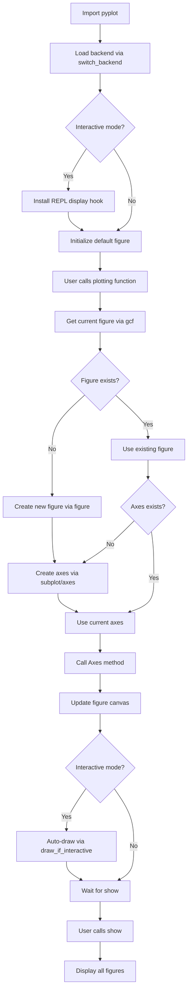

## 类结构

```
pyplot (module)
└─ No explicit class definitions in this file
  └─ Uses global state management
  └─ Delegates to Figure, Axes, and backend classes
```

## 全局变量及字段


### `_ReplDisplayHook`
    
An enumeration to track the REPL display hook state (NONE, PLAIN, or IPYTHON)

类型：`Enum`
    


### `_REPL_DISPLAYHOOK`
    
Global variable tracking the current REPL display hook state

类型：`_ReplDisplayHook`
    


### `_backend_mod`
    
Cached backend module for pyplot

类型：`type[matplotlib.backend_bases._Backend] | None`
    


### `colormaps`
    
Container for registered colormaps

类型：`matplotlib.cm._colormaps`
    


### `color_sequences`
    
Container for registered color sequences

类型：`matplotlib.colors._color_sequences`
    


### `_log`
    
Logger for the pyplot module

类型：`logging.Logger`
    


### `_NO_PYPLOT_NOTE`
    
A list of function qualnames that should not have pyplot wrapper notes added to their docstrings

类型：`list[str]`
    


    

## 全局函数及方法


### `_copy_docstring_and_deprecators`

该函数是一个装饰器工厂，用于为 pyplot 包装函数复制被包装方法（通常是 Figure 或 Axes 类的方法）的文档字符串，并处理相关的弃用装饰器。它确保 pyplot 包装函数能够继承原始方法的文档和参数处理行为。

参数：

- `method`：`Any`，要复制文档字符串的目标方法（通常是 Figure 或 Axes 类的方法）
- `func`：`Callable[_P, _R] | None`，可选的装饰目标函数。如果为 None，则返回一个新的装饰器

返回值：`Callable[[Callable[_P, _R]], Callable[_P, _R]] | Callable[_P, _R]`，装饰后的函数或返回装饰器

#### 流程图

```mermaid
flowchart TD
    A[开始] --> B{func is None?}
    B -->|是| C[使用 functools.partial 返回装饰器]
    B -->|否| D[创建装饰器列表]
    D --> E[添加 _docstring.copy(method)]
    E --> F{method 有 __wrapped__?}
    F -->|是| G[检查 DECORATORS 中的装饰器]
    G --> H[添加找到的装饰器]
    H --> I[method = method.__wrapped__]
    I --> F
    F -->|否| J[反向遍历装饰器列表]
    J --> K[依次应用装饰器到 func]
    K --> L[_add_pyplot_note 添加 pyplot 说明]
    L --> M[返回装饰后的 func]
    C --> M
```

#### 带注释源码

```python
@overload
def _copy_docstring_and_deprecators(
    method: Any,
    func: Literal[None] = None
) -> Callable[[Callable[_P, _R]], Callable[_P, _R]]: ...


@overload
def _copy_docstring_and_deprecators(
    method: Any, func: Callable[_P, _R]) -> Callable[_P, _R]: ...


def _copy_docstring_and_deprecators(
    method: Any,
    func: Callable[_P, _R] | None = None
) -> Callable[[Callable[_P, _R]], Callable[_P, _R]] | Callable[_P, _R]:
    """
    装饰器工厂：为 pyplot 包装函数复制文档字符串和弃用装饰器。
    
    参数:
        method: 要复制文档的目标方法 (如 Figure.savefig)
        func: 可选的被装饰函数，如果为 None 则返回装饰器
    
    返回:
        装饰后的函数
    """
    # 如果 func 为 None，返回部分函数作为装饰器
    if func is None:
        return cast('Callable[[Callable[_P, _R]], Callable[_P, _R]]',
                    functools.partial(_copy_docstring_and_deprecators, method))
    
    # 初始化装饰器列表，首先添加文档字符串复制装饰器
    decorators: list[Callable[[Callable[_P, _R]], Callable[_P, _R]]] = [
        _docstring.copy(method)
    ]
    
    # 检查 method 是否包含 @_api.rename_parameter 或 @_api.make_keyword_only 装饰器
    # 通过遍历 __wrapped__ 链来查找这些装饰器
    while hasattr(method, "__wrapped__"):
        # 从 _api.deprecation.DECORATORS 字典中查找潜在的装饰器
        potential_decorator = _api.deprecation.DECORATORS.get(method)
        if potential_decorator:
            decorators.append(potential_decorator)
        # 继续解包，遍历装饰器链
        method = method.__wrapped__
    
    # 反向遍历装饰器列表，确保装饰器按正确顺序应用
    for decorator in decorators[::-1]:
        func = decorator(func)
    
    # 添加 pyplot 包装说明到文档字符串
    _add_pyplot_note(func, method)
    return func
```


### `_add_pyplot_note`

该函数用于向 pyplot 包装函数的 docstring 添加注释，说明该函数是某个底层函数的包装器。它会将注释添加到 docstring 的 "Notes" 部分。

参数：

- `func`：`Callable`，需要添加注释的目标函数
- `wrapped_func`：`Callable`，被包装的底层函数，用于获取其限定名来构建链接

返回值：`None`，该函数直接修改 `func.__doc__` 属性，不返回任何值

#### 流程图

```mermaid
flowchart TD
    A[开始] --> B{func.__doc__ 是否为空?}
    B -- 是 --> C[直接返回]
    B -- 否 --> D{wrapped_func.__qualname__ 是否在 _NO_PYPLOT_NOTE 中?}
    D -- 是 --> C
    D -- 否 --> E{qualname 是否包含 '.'?}
    E -- 否 --> F[wrapped_func_is_method = False]
    E -- 是 --> G{qualname 前缀是什么?}
    G -->|Axes.| H[link = ".axes." + qualname]
    G -->|_AxesBase.| I[link = ".axes.Axes" + qualname[9:]]
    G -->|Figure.| J[link = "." + qualname]
    G -->|FigureBase.| K[link = ".Figure" + qualname[10:]]
    G -->|FigureCanvasBase.| L[link = "." + qualname]
    G -->|其他| M[抛出 RuntimeError]
    F --> N[link = wrapped_func.__module__ + "." + qualname]
    H --> O
    I --> O
    J --> O
    K --> O
    L --> O
    O{构建 message} --> P{wrapped_func_is_method?}
    P -- 是 --> Q[message = 'This is the pyplot wrapper for `{link}`.']
    P -- 否 --> R[message = 'This is equivalent to `{link}`.']
    Q --> S[查找 Notes/References/Examples 位置]
    R --> S
    S --> T{找到哪个section?}
    T -->|Notes| U[在 Notes 前插入 message]
    T -->|References| V[在 References 前插入 message]
    T -->|Examples| W[在 Examples 前插入 message]
    T -->|都没找到| X[在 docstring 末尾追加 Notes section]
    U --> Y[更新 func.__doc__]
    V --> Y
    W --> Y
    X --> Y
    Y --> Z[结束]
```

#### 带注释源码

```python
def _add_pyplot_note(func, wrapped_func):
    """
    Add a note to the docstring of *func* that it is a pyplot wrapper.

    The note is added to the "Notes" section of the docstring. If that does
    not exist, a "Notes" section is created. In numpydoc, the "Notes"
    section is the third last possible section, only potentially followed by
    "References" and "Examples".
    """
    # 如果函数没有 docstring，直接返回，无需处理
    if not func.__doc__:
        return  # nothing to do

    # 获取被包装函数的限定名
    qualname = wrapped_func.__qualname__
    # 如果在黑名单中，跳过处理
    if qualname in _NO_PYPLOT_NOTE:
        return

    # 假设被包装的是方法（类的方法 qualname 包含 '.'）
    wrapped_func_is_method = True
    if "." not in qualname:
        # method qualnames are prefixed by the class and ".", e.g. "Axes.plot"
        # 没有 '.' 说明是模块级函数，不是类方法
        wrapped_func_is_method = False
        link = f"{wrapped_func.__module__}.{qualname}"
    elif qualname.startswith("Axes."):  # e.g. "Axes.plot"
        link = ".axes." + qualname
    elif qualname.startswith("_AxesBase."):  # e.g. "_AxesBase.set_xlabel"
        # 将私有基类名映射到公共 Axes 类
        link = ".axes.Axes" + qualname[9:]
    elif qualname.startswith("Figure."):  # e.g. "Figure.figimage"
        link = "." + qualname
    elif qualname.startswith("FigureBase."):  # e.g. "FigureBase.gca"
        link = ".Figure" + qualname[10:]
    elif qualname.startswith("FigureCanvasBase."):  # "FigureBaseCanvas.mpl_connect"
        link = "." + qualname
    else:
        # 不支持的类前缀，抛出异常
        raise RuntimeError(f"Wrapped method from unexpected class: {qualname}")

    # 根据是否为方法构建不同的消息
    if wrapped_func_is_method:
        message = f"This is the :ref:`pyplot wrapper <pyplot_interface>` for `{link}`."
    else:
        message = f"This is equivalent to `{link}`."

    # Find the correct insert position:
    # - either we already have a "Notes" section into which we can insert
    # - or we create one before the next present section. Note that in numpydoc, the
    #   "Notes" section is the third last possible section, only potentially followed
    #   by "References" and "Examples".
    # - or we append a new "Notes" section at the end.
    # 清理 docstring（去除多余空白）
    doc = inspect.cleandoc(func.__doc__)
    # 查找合适的插入位置
    if "\nNotes\n-----" in doc:
        # 已有 Notes section，在其中插入
        before, after = doc.split("\nNotes\n-----", 1)
    elif (index := doc.find("\nReferences\n----------")) != -1:
        # 在 References 前插入 Notes
        before, after = doc[:index], doc[index:]
    elif (index := doc.find("\nExamples\n--------")) != -1:
        # 在 Examples 前插入 Notes
        before, after = doc[:index], doc[index:]
    else:
        # No "Notes", "References", or "Examples" --> append to the end.
        # 末尾追加新的 Notes section
        before = doc + "\n"
        after = ""

    # 构造新的 docstring，将消息插入到 Notes section
    func.__doc__ = f"{before}\nNotes\n-----\n\n.. note::\n\n    {message}\n{after}"
```


### `_draw_all_if_interactive`

该函数是 pyplot 模块中的一个内部辅助函数，用于在交互式模式下自动重绘所有打开的图形。它在 REPL（交互式解释器）环境中作为显示钩子被调用，以确保每次执行命令后图形都能自动更新。

参数： 无

返回值： `None`，该函数没有返回值

#### 流程图

```mermaid
flowchart TD
    A[开始 _draw_all_if_interactive] --> B{检查 matplotlib.is_interactive()}
    B -->|是 interactive 模式| C[调用 draw_all 重绘所有图形]
    B -->|否 非 interactive 模式| D[什么都不做]
    C --> E[结束]
    D --> E
```

#### 带注释源码

```python
def _draw_all_if_interactive() -> None:
    """
    如果 matplotlib 处于交互式模式，则重绘所有打开的图形。
    
    该函数通常作为 IPython 的 post_execute 事件回调被注册，
    以便在每次执行命令后自动更新图形。
    """
    # 检查 matplotlib 是否处于交互式模式
    if matplotlib.is_interactive():
        # 调用 draw_all 重绘所有已打开的图形
        draw_all()
```


### `install_repl_displayhook`

该函数用于在当前 REPL（读取-求值-打印循环）环境中注册显示钩子，以便在交互式模式下自动更新 matplotlib 图形。支持 IPython 和标准 Python Shell。

参数：  
无

返回值：`None`，无返回值

#### 流程图

```mermaid
flowchart TD
    A[开始 install_repl_displayhook] --> B{_REPL_DISPLAYHOOK<br/>is IPYTHON?}
    B -->|是| C[直接返回]
    B -->|否| D{检查 IPython 模块<br/>sys.modules.get}
    D -->|IPython 不存在| E[设置状态为 PLAIN<br/>返回]
    D -->|存在| F{get_ipython()<br/>是否存在?}
    F -->|不存在| E
    F -->|存在| G[注册 post_execute 事件<br/>回调函数为<br/>_draw_all_if_interactive]
    G --> H[设置状态为 IPYTHON]
    H --> I{IPython 版本<br/>&lt; 8.24?}
    I -->|是| J[使用 backend2gui.get<br/>获取后端名称]
    I -->|否| K[使用 backend_registry.resolve_backend<br/>获取后端名称]
    J --> L{ipython_gui_name<br/>存在?}
    K --> L
    L -->|是| M[调用 ip.enable_gui<br/>启用 GUI 集成]
    L -->|否| N[结束]
    M --> N
    C --> N
    E --> N
```

#### 带注释源码

```python
def install_repl_displayhook() -> None:
    """
    Connect to the display hook of the current shell.

    The display hook gets called when the read-evaluate-print-loop (REPL) of
    the shell has finished the execution of a command. We use this callback
    to be able to automatically update a figure in interactive mode.

    This works both with IPython and with vanilla python shells.
    """
    global _REPL_DISPLAYHOOK

    # 如果已经安装过 IPython 版本的 hook，则直接返回，避免重复注册
    if _REPL_DISPLAYHOOK is _ReplDisplayHook.IPYTHON:
        return

    # 检查是否存在 IPython 模块（使用 sys.modules.get 而非 in 检查，
    # 因为模块可能被显式设置为 None）
    mod_ipython = sys.modules.get("IPython")
    if not mod_ipython:
        # 没有 IPython，标记为普通模式并返回
        _REPL_DISPLAYHOOK = _ReplDisplayHook.PLAIN
        return
    
    # 尝试获取 IPython 实例
    ip = mod_ipython.get_ipython()
    if not ip:
        # IPython 实例不存在，标记为普通模式
        _REPL_DISPLAYHOOK = _ReplDisplayHook.PLAIN
        return

    # 注册 post_execute 事件回调，每次执行完成后自动重绘图形
    ip.events.register("post_execute", _draw_all_if_interactive)
    _REPL_DISPLAYHOOK = _ReplDisplayHook.IPYTHON

    # 根据 IPython 版本选择获取 GUI 后端名称的方式
    if mod_ipython.version_info[:2] < (8, 24):
        # 对于 IPython < 8.24，需要使用 backend2gui 模块
        # IPython >= 8.24 已将功能移至 Matplotlib，此代码可在 2028 年移除
        from IPython.core.pylabtools import backend2gui
        ipython_gui_name = backend2gui.get(get_backend())
    else:
        # IPython >= 8.24 使用新的后端解析方式
        _, ipython_gui_name = backend_registry.resolve_backend(get_backend())
    
    # 如果存在 GUI 后端名称，启用 IPython 的事件循环集成
    if ipython_gui_name:
        ip.enable_gui(ipython_gui_name)
```


### `uninstall_repl_displayhook`

该函数用于断开与当前 shell（REPL）的显示钩子的连接。它是 `install_repl_displayhook` 的逆操作，主要负责检查当前的 REPL 状态，如果是 IPython，则移除之前注册的 `post_execute` 事件回调，并将全局状态重置为 `NONE`。

参数：  
该函数没有参数。

返回值：  
`None`，无返回值，仅执行副作用操作。

#### 流程图

```mermaid
graph TD
    A[开始: uninstall_repl_displayhook] --> B{检查全局变量 _REPL_DISPLAYHOOK 是否为 IPYTHON}
    B -- 是 --> C[从 IPython 获取当前实例 ip]
    C --> D[执行 ip.events.unregister<br/>"post_execute", _draw_all_if_interactive]
    B -- 否 --> E[跳过注销步骤]
    D --> F[将 _REPL_DISPLAYHOOK 设置为 _ReplDisplayHook.NONE]
    E --> F
    F --> G[结束]
```

#### 带注释源码

```python
def uninstall_repl_displayhook() -> None:
    """Disconnect from the display hook of the current shell."""
    # 声明使用全局状态变量来记录当前的 REPL 类型
    global _REPL_DISPLAYHOOK
    
    # 仅当当前处于 IPython 模式时才需要执行注销逻辑
    if _REPL_DISPLAYHOOK is _ReplDisplayHook.IPYTHON:
        # 动态导入 IPython 核心模块以获取实例
        from IPython import get_ipython
        # 获取当前运行的 IPython 实例
        ip = get_ipython()
        # 注销之前在 install_repl_displayhook 中注册的回调函数
        # 移除 "post_execute" 事件钩子，防止自动重绘
        ip.events.unregister("post_execute", _draw_all_if_interactive)
    
    # 无论之前是 IPython 还是 Plain 模式，最后都将状态重置为初始状态
    _REPL_DISPLAYHOOK = _ReplDisplayHook.NONE
```


```content
### `draw_all`

全局函数 `draw_all` 是从 `_pylab_helpers.Gcf` 模块导入的函数，它用于绘制所有打开的图形。在 matplotlib 的 pyplot 状态式接口中，该函数通常在交互模式下自动调用，以确保所有图形的渲染保持最新状态。

#### 参数

- 无显式参数（参数由 `_pylab_helpers.Gcf.draw_all` 的实际定义决定）

#### 返回值

- 返回值类型由 `_pylab_helpers.Gcf.draw_all` 的实际定义决定

#### 流程图

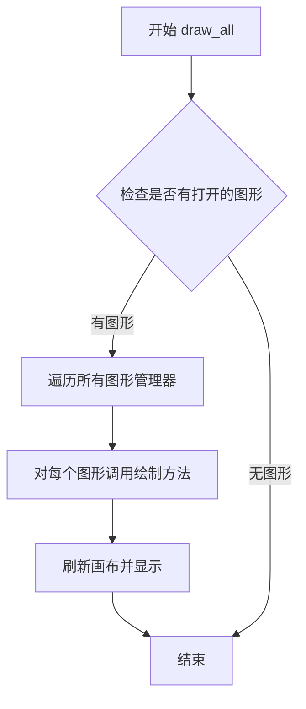

#### 带注释源码

```python
# 从 _pylab_helpers.Gcf 模块导入 draw_all 函数
# Gcf 是 Figure Manager（图形管理器）的管理器类
# draw_all 函数用于绘制/刷新所有当前打开的图形
draw_all = _pylab_helpers.Gcf.draw_all

# 使用示例（在交互模式下会自动调用）:
# 当 matplotlib 处于交互模式时（通过 ion() 开启），
# 每次绘图命令后会自动调用 _draw_all_if_interactive，
# 进而调用 draw_all 来更新所有图形
def _draw_all_if_interactive() -> None:
    if matplotlib.is_interactive():
        draw_all()
```

**注意**：由于 `draw_all` 是从外部模块 `_pylab_helpers` 导入的，其完整的参数签名、返回值类型和实现细节需要查看 `_pylab_helpers.py` 模块文件。在此代码文件中仅能看到其导入赋值语句。
```


### `set_loglevel`

设置 matplotlib 的日志级别，用于控制库内部的日志输出详细程度。

参数：

-  `level`：`LogLevel`，日志级别，指定要设置的日志等级（如 'debug'、'info'、'warning'、'error' 等）

返回值：`None`，该函数无返回值

#### 流程图

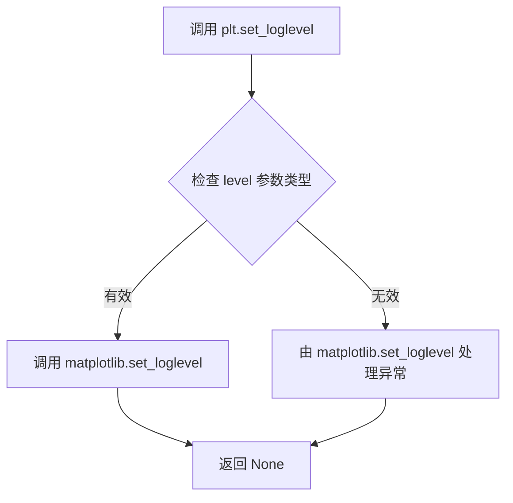

#### 带注释源码

```python
@_copy_docstring_and_deprecators(matplotlib.set_loglevel)
def set_loglevel(level: LogLevel) -> None:
    """
    设置 matplotlib 的日志级别。
    
    该函数是 matplotlib.set_loglevel 的包装器，
    用于在 pyplot 层面设置日志级别。
    """
    return matplotlib.set_loglevel(level)
```


### `pyplot.findobj`

该函数是matplotlib.pyplot模块中对`Artist.findobj`方法的包装器，提供了一种在当前Figure或指定Artist对象层次结构中查找匹配条件的Artist对象的能力。如果未指定对象，则默认使用当前Figure（通过`gcf()`获取）。

参数：

- `o`：`Artist | None`，要查找对象的Artist对象，如果为`None`则使用当前Figure（通过`gcf()`获取）
- `match`：`Callable[[Artist], bool] | type[Artist] | None`，匹配条件，可以是：
  - 一个接受Artist参数并返回bool的函数
  - 一个Artist类类型，只返回该类的实例
  - `None`，返回所有Artist对象
- `include_self`：`bool`，是否在结果中包含调用对象本身，默认为`True`

返回值：`list[Artist]`，返回匹配条件的Artist对象列表

#### 流程图

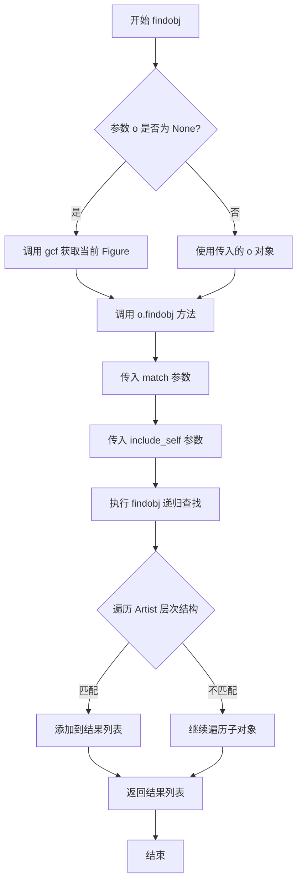

#### 带注释源码

```python
@_copy_docstring_and_deprecators(Artist.findobj)
def findobj(
    o: Artist | None = None,
    match: Callable[[Artist], bool] | type[Artist] | None = None,
    include_self: bool = True
) -> list[Artist]:
    """
    查找Artist对象层次结构中匹配条件的对象。
    
    这是对 Artist.findobj 方法的包装，提供pyplot风格的接口。
    如果未指定对象，则使用当前Figure。
    
    Parameters
    ----------
    o : Artist or None
        要搜索的顶层Artist对象。如果为None，则使用当前Figure。
    match : callable, class, or None
        匹配条件：
        - 如果是 callable，它应该接受一个Artist并返回bool
        - 如果是 class，只返回该类的实例
        - 如果是 None，返回所有Artist对象
    include_self : bool
        是否在结果中包含顶层对象本身
    
    Returns
    -------
    list[Artist]
        匹配条件的Artist对象列表
    """
    # 如果未指定对象，获取当前Figure
    if o is None:
        o = gcf()
    
    # 调用Artist对象的findobj方法进行递归查找
    return o.findobj(match, include_self=include_self)
```

#### 设计说明

该函数是pyplot状态式API的一部分，它简化了Artist层次结构的遍历操作。通过使用`@_copy_docstring_and_deprecators`装饰器，它自动复制了`Artist.findobj`的文档字符串并处理了版本弃用信息。函数的核心逻辑是将查找任务委托给底层Artist对象的`findobj`方法，实现了从pyplot接口到对象方法的透明转发。


### `_get_backend_mod`

该函数确保后端模块已被加载并在需要时自动选择后端，返回当前的后端模块类型。

参数：  
无参数。

返回值：`type[matplotlib.backend_bases._Backend]`，返回当前已加载的 matplotlib 后端模块类。

#### 流程图

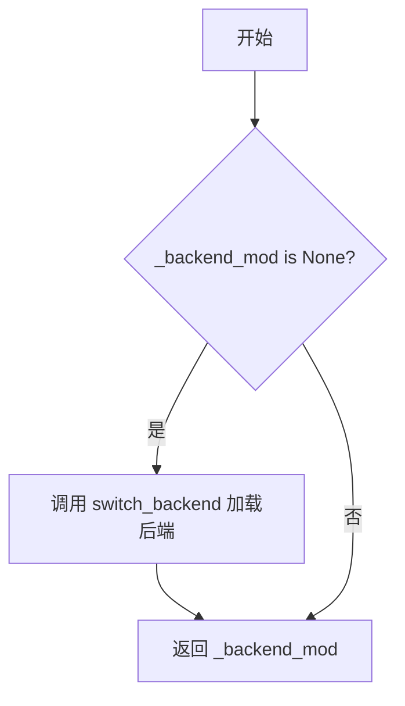

#### 带注释源码

```python
# 模块级私有变量，存储当前后端模块的类
# 初始值为 None，表示后端尚未加载
_backend_mod: type[matplotlib.backend_bases._Backend] | None = None


def _get_backend_mod() -> type[matplotlib.backend_bases._Backend]:
    """
    确保已选择后端并返回它。

    这是当前为私有的，但未来可能会公开。
    """
    # 检查后端模块是否已加载
    if _backend_mod is None:
        # 使用 rcParams._get("backend") 避免触发自动解析逻辑
        # 自动解析会重新导入 pyplot 并在需要时调用 switch_backend
        switch_backend(rcParams._get("backend"))
    # 返回后端模块类，使用 cast 确保类型安全
    return cast(type[matplotlib.backend_bases._Backend], _backend_mod)
```


### `switch_backend`

该函数是 matplotlib pyplot 模块的核心后端切换函数，用于动态加载和切换 matplotlib 的渲染后端。它负责验证后端兼容性、加载后端模块、创建后端类、配置后端函数，并处理交互式后端的 REPL 集成。

参数：

- `newbackend`：`str`，要切换到的后端名称（不区分大小写）。可以是特殊值 `_auto_backend_sentinel` 表示自动选择后端。

返回值：`None`，无返回值（该函数直接修改全局状态）。

#### 流程图

```mermaid
flowchart TD
    A[开始: switch_backend] --> B{newbackend是否为自动后端 sentinel?}
    B -->|Yes| C[获取当前运行的交互框架]
    C --> D{当前框架存在且有匹配后端?}
    D -->|Yes| E[候选列表 = [匹配后端]]
    D -->|No| F[候选列表 = 空]
    E --> G[添加备用后端: macosx, qtagg, gtk4agg, gtk3agg, tkagg, wxagg]
    F --> G
    G --> H{遍历候选后端}
    H -->|成功| I[设置rcParamsOrig['backend']并返回]
    H -->|失败| J{还有更多候选?}
    J -->|Yes| H
    J -->|No| K[切换到Agg后端作为最终回退]
    B -->|No| L[获取当前后端（不触发解析）]
    L --> M[通过backend_registry加载后端模块]
    M --> N[获取FigureCanvas类]
    N --> O{检查required_interactive_framework}
    O -->|需要交互框架| P{框架不匹配?}
    P -->|Yes| Q[抛出ImportError]
    P -->|No| R[继续]
    O -->|不需要| R
    R --> S{模块是否定义了new_figure_manager和show函数?}
    S -->|No| T[创建动态backend_mod类继承自_Backend]
    S -->|Yes| U[使用模块原有函数]
    T --> V[如果没有new_figure_manager, 创建包装函数]
    V --> W[如果没有show, 使用manager_class.pyplot_show]
    U --> X[处理ipympl后兼容性问题]
    X --> Y[更新rcParams和_backend_mod全局变量]
    Y --> Z[更新全局函数签名]
    Z --> AA[保持matplotlib.backends.backend引用]
    AA --> AB[安装REPL显示钩子]
    AB --> AC[结束]
    K --> AC
    Q --> AC
    I --> AC
```

#### 带注释源码

```python
def switch_backend(newbackend: str) -> None:
    """
    Set the pyplot backend.

    Switching to an interactive backend is possible only if no event loop for
    another interactive backend has started.  Switching to and from
    non-interactive backends is always possible.

    Parameters
    ----------
    newbackend : str
        The case-insensitive name of the backend to use.

    """
    global _backend_mod  # 全局变量，存储当前加载的后端模块
    # 确保matplotlib.backends被导入，以便后续可以赋值给它
    import matplotlib.backends

    # 处理自动后端选择逻辑（当newbackend是特殊标记值时）
    if newbackend is rcsetup._auto_backend_sentinel:
        # 获取当前运行的交互框架（如Qt、Tkinter等）
        current_framework = cbook._get_running_interactive_framework()

        # 如果存在交互框架，尝试找到匹配的后端
        if (current_framework and
                (backend := backend_registry.backend_for_gui_framework(
                    current_framework))):
            candidates = [backend]  # 优先使用匹配的后端
        else:
            candidates = []
        # 添加备用交互后端列表（按优先级排序）
        candidates += [
            "macosx", "qtagg", "gtk4agg", "gtk3agg", "tkagg", "wxagg"]

        # 遍历候选后端，尝试加载
        for candidate in candidates:
            try:
                switch_backend(candidate)  # 递归调用尝试加载
            except ImportError:
                continue  # 加载失败则尝试下一个
            else:
                # 成功加载，设置原始rcParams中的backend并返回
                rcParamsOrig['backend'] = candidate
                return
        else:
            # 所有候选都失败，最终回退到Agg后端（应该总是成功）
            switch_backend("agg")
            rcParamsOrig["backend"] = "agg"
            return
    
    # 获取当前后端（不触发后端解析）
    old_backend = rcParams._get('backend')

    # 通过后端注册表加载后端模块
    module = backend_registry.load_backend_module(newbackend)
    # 获取后端的FigureCanvas类
    canvas_class = module.FigureCanvas

    # 检查后端是否需要特定的交互框架
    required_framework = canvas_class.required_interactive_framework
    if required_framework is not None:
        current_framework = cbook._get_running_interactive_framework()
        # 如果框架不匹配，抛出ImportError
        if (current_framework and required_framework
                and current_framework != required_framework):
            raise ImportError(
                "Cannot load backend {!r} which requires the {!r} interactive "
                "framework, as {!r} is currently running".format(
                    newbackend, required_framework, current_framework))

    # 从后端模块加载new_figure_manager和show函数
    # 传统方式：后端模块直接导出这些函数
    new_figure_manager = getattr(module, "new_figure_manager", None)
    show = getattr(module, "show", None)

    # 创建动态后端类，继承自_Backend并包含模块的所有属性
    class backend_mod(matplotlib.backend_bases._Backend):
        locals().update(vars(module))

    # 新方式：通过canvas类的方法定义new_figure_manager和show
    # 如果模块没有定义new_figure_manager，则创建包装函数
    if new_figure_manager is None:

        def new_figure_manager_given_figure(num, figure):
            """为给定figure创建manager"""
            return canvas_class.new_manager(figure, num)

        def new_figure_manager(num, *args, FigureClass=Figure, **kwargs):
            """创建新figure并返回manager"""
            fig = FigureClass(*args, **kwargs)
            return new_figure_manager_given_figure(num, fig)

        def draw_if_interactive() -> None:
            """交互模式下重绘"""
            if matplotlib.is_interactive():
                manager = _pylab_helpers.Gcf.get_active()
                if manager:
                    manager.canvas.draw_idle()

        # 将新创建的函数赋值给backend_mod
        backend_mod.new_figure_manager_given_figure = (
            new_figure_manager_given_figure)
        backend_mod.new_figure_manager = (
            new_figure_manager)
        backend_mod.draw_if_interactive = (
            draw_if_interactive)

    # 处理manager_class的pyplot_show方法（如果存在自定义实现）
    manager_class = getattr(canvas_class, "manager_class", None)
    # 使用getattr_static获取类的属性（避免触发描述符协议）
    manager_pyplot_show = inspect.getattr_static(manager_class, "pyplot_show", None)
    base_pyplot_show = inspect.getattr_static(FigureManagerBase, "pyplot_show", None)
    
    # 如果show为None或manager有自定义pyplot_show，则使用manager的实现
    if (show is None
            or (manager_pyplot_show is not None
                and manager_pyplot_show != base_pyplot_show)):
        if not manager_pyplot_show:
            raise ValueError(
                f"Backend {newbackend} defines neither FigureCanvas.manager_class nor "
                f"a toplevel show function")
        # 使用manager_class的pyplot_show方法
        _pyplot_show = cast('Any', manager_class).pyplot_show
        backend_mod.show = _pyplot_show

    # 记录加载的后端版本
    _log.debug("Loaded backend %s version %s.",
               newbackend, backend_mod.backend_version)

    # 处理ipympl后端的兼容性问题
    if newbackend in ("ipympl", "widget"):
        # ipympl < 0.9.4 需要完整的模块名
        import importlib.metadata as im
        from matplotlib import _parse_to_version_info
        try:
            module_version = im.version("ipympl")
            if _parse_to_version_info(module_version) < (0, 9, 4):
                newbackend = "module://ipympl.backend_nbagg"
        except im.PackageNotFoundError:
            pass

    # 更新全局配置和后端模块引用
    rcParams['backend'] = rcParamsDefault['backend'] = newbackend
    _backend_mod = backend_mod
    
    # 更新全局函数的签名以反映后端函数签名
    for func_name in ["new_figure_manager", "draw_if_interactive", "show"]:
        globals()[func_name].__signature__ = inspect.signature(
            getattr(backend_mod, func_name))

    # 保持对后端的全局引用（兼容性问题）
    matplotlib.backends.backend = newbackend

    # 安装REPL显示钩子（以防进入交互模式）
    try:
        install_repl_displayhook()
    except NotImplementedError as err:
        _log.warning("Fallback to a different backend")
        raise ImportError from err
```


### `_warn_if_gui_out_of_main_thread`

该函数用于检测 Matplotlib GUI 是否在主线程之外启动，并在检测到非主线程时发出警告。这对于防止在后台线程中使用 GUI 框架（如 Tk、Qt 等）导致的问题非常重要。

参数： 无

返回值：`None`，无返回值

#### 流程图

```mermaid
flowchart TD
    A[开始] --> B[warn = False]
    B --> C[获取 canvas_class = _get_backend_mod().FigureCanvas]
    C --> D{candatory_interactive_framework 是否存在?}
    D -->|否| E[直接返回，不警告]
    D -->|是| F{threading.get_native_id 是否可用?}
    F -->|是| G{当前线程 native_id != 主线程 native_id?}
    F -->|否| H{当前线程 != 主线程?}
    G -->|是| I[warn = True]
    G -->|否| J[warn = False]
    H -->|是| I
    H -->|否| J
    I --> K{warn == True?}
    J --> K
    K -->|是| L[_api.warn_external 发出警告]
    K -->|否| E
    L --> M[结束]
    E --> M
```

#### 带注释源码

```python
def _warn_if_gui_out_of_main_thread() -> None:
    """
    检查 GUI 操作是否在主线程中执行，如果不是则发出警告。
    
    许多 GUI 框架（如 Tk、Qt、GTK 等）要求在主线程中运行，
    否则可能导致程序崩溃或行为异常。
    """
    # 初始化警告标志为 False
    warn = False
    
    # 获取当前后端的 FigureCanvas 类
    canvas_class = cast(type[FigureCanvasBase], _get_backend_mod().FigureCanvas)
    
    # 检查当前后端是否需要交互式框架
    if canvas_class.required_interactive_framework:
        # 尝试使用更精确的原生线程 ID 进行比较
        if hasattr(threading, 'get_native_id'):
            # 原生线程 ID 比较：即使 Python 层面的 Thread 对象相同，
            # 底层操作系统线程可能不同（如使用绿色线程的 Python 实现）
            if threading.get_native_id() != threading.main_thread().native_id:
                warn = True
        else:
            # 如果原生 ID 不可用（如 PyPy），回退到 Python 层面的线程比较
            if threading.current_thread() is not threading.main_thread():
                warn = True
    
    # 如果检测到在非主线程中运行，发出外部警告
    if warn:
        _api.warn_external(
            "Starting a Matplotlib GUI outside of the main thread will likely "
            "fail.")
```


### `new_figure_manager`

这是一个公共的 pyplot 全局函数，作为后端模块 `new_figure_manager` 方法的代理，负责创建新的图形管理器实例。

参数：

- `*args`：可变位置参数，传递给后端的 `new_figure_manager` 方法
- `**kwargs`：可变关键字参数，传递给后端的 `new_figure_manager` 方法

返回值：`任意`，返回后端创建的图形管理器实例

#### 流程图

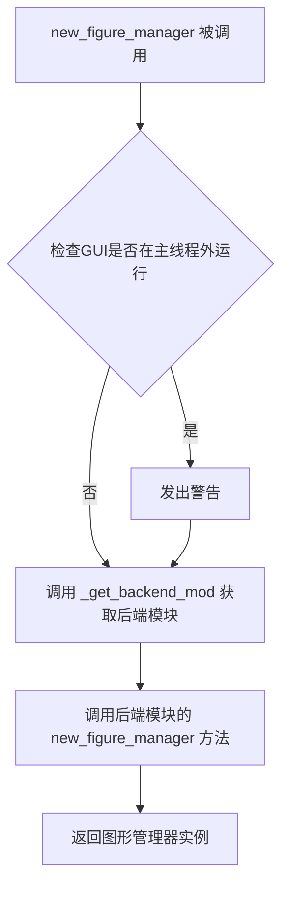

#### 带注释源码

```python
# This function's signature is rewritten upon backend-load by switch_backend.
def new_figure_manager(*args, **kwargs):
    """Create a new figure manager instance."""
    # 检查GUI是否在主线程外运行，如果是则发出警告
    # 这是因为大多数GUI后端只能在主线程中正常工作
    _warn_if_gui_out_of_main_thread()
    # 获取当前后端模块（可能是自动加载的或通过 switch_backend 切换的）
    # 然后委托给后端的具体实现来创建图形管理器
    return _get_backend_mod().new_figure_manager(*args, **kwargs)
```


### `draw_if_interactive`

在交互模式下重绘当前图形。这是一个公共接口，实际实现由后端模块提供。

参数：

- `*args`：任意位置参数，传递给底层后端的 `draw_if_interactive` 函数
- `**kwargs`：任意关键字参数，传递给底层后端的 `draw_if_interactive` 函数

返回值：`None` 或 `Any`，取决于后端实现（通常无返回值）

#### 流程图

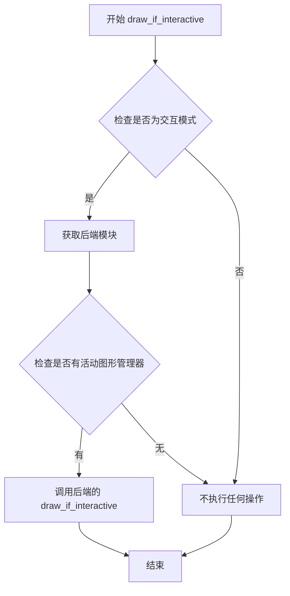

#### 带注释源码

```python
def draw_if_interactive(*args, **kwargs):
    """
    Redraw the current figure if in interactive mode.

    .. warning::

        End users will typically not have to call this function because the
        the interactive mode takes care of this.
    """
    # 获取后端模块（确保后端已加载）
    # 然后调用后端实现的 draw_if_interactive 函数
    return _get_backend_mod().draw_if_interactive(*args, **kwargs)
```

**注意**：在 `switch_backend` 函数内部还有一个后端级别的实现：

```python
def draw_if_interactive() -> None:
    """后端内部实现"""
    # 只有在交互模式下才执行重绘
    if matplotlib.is_interactive():
        # 获取当前活动的图形管理器
        manager = _pylab_helpers.Gcf.get_active()
        # 如果存在活动的管理器，则重绘其画布
        if manager:
            manager.canvas.draw_idle()
```


### `show`

显示所有打开的图形窗口。该函数是 pyplot 的核心函数之一，负责调用后端的显示机制来展示图形。根据 `block` 参数的不同，可以阻塞等待用户关闭图形窗口，也可以立即返回。

参数：

- `block`：`bool`，可选参数。是否阻塞并运行 GUI 主循环直到所有图形窗口关闭。默认在非交互模式下为 `True`，在交互模式下为 `False`。
- `*args`：`Any`，可变位置参数，后端 show 函数可能需要的额外位置参数。
- `**kwargs`：`Any`，可变关键字参数，后端 show 函数可能需要的额外关键字参数。

返回值：`None`，该函数没有返回值。

#### 流程图

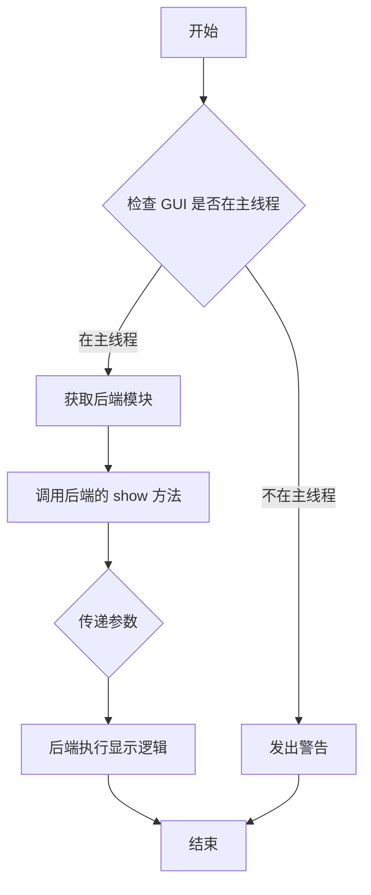

#### 带注释源码

```python
@overload
def show(*, block: bool, **kwargs) -> None: ...


@overload
def show(*args: Any, **kwargs: Any) -> None: ...


# This function's signature is rewritten upon backend-load by switch_backend.
def show(*args, **kwargs) -> None:
    """
    Display all open figures.

    Parameters
    ----------
    block : bool, optional
        Whether to wait for all figures to be closed before returning.

        If `True` block and run the GUI main loop until all figure windows
        are closed.

        If `False` ensure that all figure windows are displayed and return
        immediately.  In this case, you are responsible for ensuring
        that the event loop is running to have responsive figures.

        Defaults to True in non-interactive mode and to False in interactive
        mode (see `.pyplot.isinteractive`).

    See Also
    --------
    ion : Enable interactive mode, which shows / updates the figure after
          every plotting command, so that calling ``show()`` is not necessary.
    ioff : Disable interactive mode.
    savefig : Save the figure to an image file instead of showing it on screen.

    Notes
    -----
    **Saving figures to file and showing a window at the same time**

    If you want an image file as well as a user interface window, use
    `.pyplot.savefig` before `.pyplot.show`. At the end of (a blocking)
    ``show()`` the figure is closed and thus unregistered from pyplot. Calling
    `.pyplot.savefig` afterwards would save a new and thus empty figure. This
    limitation of command order does not apply if the show is non-blocking or
    if you keep a reference to the figure and use `.Figure.savefig`.

    **Auto-show in jupyter notebooks**

    The jupyter backends (activated via ``%matplotlib inline``,
    ``%matplotlib notebook``, or ``%matplotlib widget``), call ``show()`` at
    the end of every cell by default. Thus, you usually don't have to call it
    explicitly there.
    """
    # 检查 GUI 是否在主线程中运行，如果不在则发出警告
    _warn_if_gui_out_of_main_thread()
    # 获取后端模块并调用其后端的 show 方法
    return _get_backend_mod().show(*args, **kwargs)
```


### `isinteractive`

返回 matplotlib 是否处于交互模式（即是否在每个绘图命令后更新图表）。

参数：

- （无参数）

返回值：`bool`，返回当前是否启用交互模式。交互模式启用时，新创建的图形会立即显示，图形更改会自动重绘，`show()` 默认不会阻塞；非交互模式下，图形更改不会反映直到明确请求，`show()` 默认会阻塞。

#### 流程图

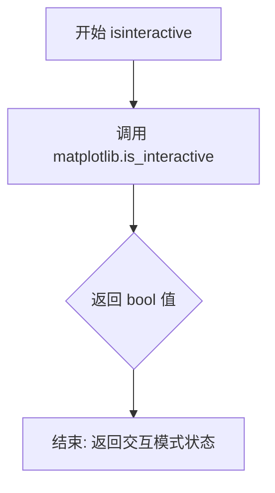

#### 带注释源码

```python
def isinteractive() -> bool:
    """
    Return whether plots are updated after every plotting command.

    The interactive mode is mainly useful if you build plots from the command
    line and want to see the effect of each command while you are building the
    figure.

    In interactive mode:

    - newly created figures will be shown immediately;
    - figures will automatically redraw on change;
    - `.pyplot.show` will not block by default.

    In non-interactive mode:

    - newly created figures and changes to figures will not be reflected until
      explicitly asked to be;
    - `.pyplot.show` will block by default.

    See Also
    --------
    ion : Enable interactive mode.
    ioff : Disable interactive mode.
    show : Show all figures (and maybe block).
    pause : Show all figures, and block for a time.
    """
    # 调用 matplotlib 模块的 is_interactive 函数获取当前交互模式状态
    return matplotlib.is_interactive()
```


### `ioff`

禁用交互模式（interactive mode），返回作为上下文管理器使用的对象，以便临时改变交互模式状态。当作为上下文管理器使用时，在上下文块内将禁用交互模式。

参数：

- 无参数

返回值：`AbstractContextManager`，一个上下文管理器对象，用于临时禁用交互模式。当退出上下文时，会根据之前的交互状态恢复（调用`ion`或`ioff`）。

#### 流程图

```mermaid
flowchart TD
    A[开始 ioff] --> B{检查当前交互模式状态}
    B -->|交互模式开启| C[创建ExitStack]
    B -->|交互模式关闭| C
    C --> D[注册回调函数]
    D --> E{callback = ion?}
    E -->|是| F[回调设为ion]
    E -->|否| G[回调设为ioff]
    F --> H[matplotlib.interactive(False)]
    G --> H
    H --> I[uninstall_repl_displayhook]
    I --> J[返回ExitStack对象]
```

#### 带注释源码

```python
def ioff() -> AbstractContextManager:
    """
    Disable interactive mode.

    See `.pyplot.isinteractive` for more details.

    See Also
    --------
    ion : Enable interactive mode.
    isinteractive : Whether interactive mode is enabled.
    show : Show all figures (and maybe block).
    pause : Show all figures, and block for a time.

    Notes
    -----
    For a temporary change, this can be used as a context manager::

        # if interactive mode is on
        # then figures will be shown on creation
        plt.ion()
        # This figure will be shown immediately
        fig = plt.figure()

        with plt.ioff():
            # interactive mode will be off
            # figures will not automatically be shown
            fig2 = plt.figure()
            # ...

    To enable optional usage as a context manager, this function returns a
    context manager object, which is not intended to be stored or
    accessed by the user.
    """
    # 创建一个ExitStack用于管理上下文
    stack = ExitStack()
    
    # 注册回调函数：当上下文退出时，根据当前交互模式状态决定调用ion还是ioff
    # 如果当前交互模式是开启的，退出时应该调用ion恢复
    # 如果当前交互模式是关闭的，退出时应该调用ioff保持关闭状态
    stack.callback(ion if isinteractive() else ioff)
    
    # 关闭matplotlib的交互模式
    matplotlib.interactive(False)
    
    # 卸载REPL显示钩子（如果已安装）
    uninstall_repl_displayhook()
    
    # 返回上下文管理器对象
    return stack
```


# matplotlib.pyplot 详细设计文档

由于代码中没有明确指定要分析的特定函数，我将选择最核心的函数之一——`figure()` 函数进行详细分析。这个函数是 pyplot 状态接口的入口点，用于创建和管理图形。


### `figure`

创建新图形或激活已有图形。

参数：

- `num`：int | str | Figure | SubFigure | None，图形的唯一标识符，可以是整数、字符串、Figure实例或SubFigure实例。如果图形已存在，则激活该图形并返回。
- `figsize`：ArrayLike | tuple[float, float, Literal["in", "cm", "px"]] | None，图形尺寸，默认为rcParams中的figure.figsize。可以是(width, height)元组或带单位的(width, height, unit)元组。
- `dpi`：float | None，图形分辨率，默认为rcParams中的figure.dpi。
- `facecolor`：ColorType | None，背景颜色，默认为rcParams中的figure.facecolor。
- `edgecolor`：ColorType | None，边框颜色，默认为rcParams中的figure.edgecolor。
- `frameon`：bool，是否绘制图形框架，默认为True。
- `FigureClass`：type[Figure]，要创建的Figure子类，默认是Figure类。
- `clear`：bool，如果图形已存在是否清除，默认为False。
- `**kwargs`：其他关键字参数传递给Figure构造函数。

返回值：`Figure`，返回创建的图形对象。

#### 流程图

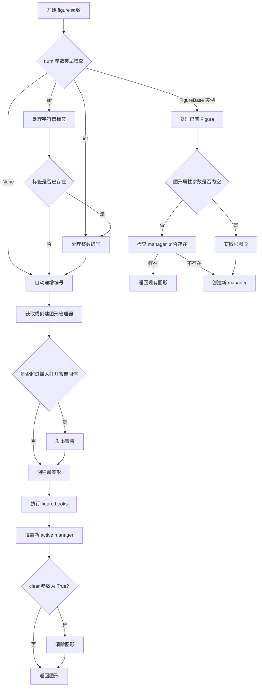

#### 带注释源码

```python
def figure(
    # autoincrement if None, else integer from 1-N
    num: int | str | Figure | SubFigure | None = None,
    # defaults to rc figure.figsize
    figsize: ArrayLike  # a 2-element ndarray is accepted as well
             | tuple[float, float, Literal["in", "cm", "px"]]
             | None = None,
    # defaults to rc figure.dpi
    dpi: float | None = None,
    *,
    # defaults to rc figure.facecolor
    facecolor: ColorType | None = None,
    # defaults to rc figure.edgecolor
    edgecolor: ColorType | None = None,
    frameon: bool = True,
    FigureClass: type[Figure] = Figure,
    clear: bool = False,
    **kwargs
) -> Figure:
    """
    创建新图形，或激活已存在的图形。
    
    参数说明：
    - num: 图形的唯一标识符，可以是整数、字符串、Figure或SubFigure实例
    - figsize: 图形尺寸，可以是(width, height)或(width, height, unit)
    - dpi: 图形分辨率
    - facecolor: 背景色
    - edgecolor: 边框颜色
    - frameon: 是否绘制框架
    - FigureClass: Figure类或子类
    - clear: 是否清除已存在的图形
    
    返回：
    - Figure对象
    """
    # 获取所有现有图形编号
    allnums = get_fignums()
    # 计算下一个图形编号
    next_num = max(allnums) + 1 if allnums else 1

    # 处理 Figure 或 SubFigure 实例
    if isinstance(num, FigureBase):
        # 检查是否传递了图形属性参数
        has_figure_property_parameters = (
            any(param is not None for param in [figsize, dpi, facecolor, edgecolor])
            or not frameon or kwargs
        )

        # 获取根图形
        root_fig = num.get_figure(root=True)
        if root_fig.canvas.manager is None:
            # 如果没有 manager，需要创建一个
            if has_figure_property_parameters:
                raise ValueError(
                    "You cannot pass figure properties when calling figure() with "
                    "an existing Figure instance")
            # 获取后端模块并创建 manager
            backend = _get_backend_mod()
            manager_ = backend.new_figure_manager_given_figure(next_num, root_fig)
            _pylab_helpers.Gcf._set_new_active_manager(manager_)
            return manager_.canvas.figure
        elif has_figure_property_parameters and root_fig.canvas.manager.num in allnums:
            # 忽略指定的参数，因为图形已存在
            _api.warn_external(
                "Ignoring specified arguments in this call because figure "
                f"with num: {root_fig.canvas.manager.num} already exists")
        # 设置活动图形
        _pylab_helpers.Gcf.set_active(root_fig.canvas.manager)
        return root_fig

    # 初始化图形标签
    fig_label = ''
    if num is None:
        # 如果没有指定num，使用下一个编号
        num = next_num
    else:
        # 检查是否传递了图形属性参数且图形已存在
        if (any(param is not None for param in [figsize, dpi, facecolor, edgecolor])
              or not frameon or kwargs) and num in allnums:
            _api.warn_external(
                "Ignoring specified arguments in this call "
                f"because figure with num: {num} already exists")
        if isinstance(num, str):
            # 处理字符串标签
            fig_label = num
            all_labels = get_figlabels()
            if fig_label not in all_labels:
                if fig_label == 'all':
                    _api.warn_external("close('all') closes all existing figures.")
                num = next_num
            else:
                # 找到对应的图形编号
                inum = all_labels.index(fig_label)
                num = allnums[inum]
        else:
            # 将num转换为整数
            num = int(num)  # crude validation of num argument

    # 获取图形管理器
    manager = _pylab_helpers.Gcf.get_fig_manager(num)
    if manager is None:
        # 检查是否超过最大打开图形数量警告阈值
        max_open_warning = rcParams['figure.max_open_warning']
        if len(allnums) == max_open_warning >= 1:
            _api.warn_external(
                f"More than {max_open_warning} figures have been opened. "
                f"Figures created through the pyplot interface "
                f"(`matplotlib.pyplot.figure`) are retained until explicitly "
                f"closed and may consume too much memory. (To control this "
                f"warning, see the rcParam `figure.max_open_warning`). "
                f"Consider using `matplotlib.pyplot.close()`.",
                RuntimeWarning)

        # 创建新的图形管理器
        manager = new_figure_manager(
            num, figsize=figsize, dpi=dpi,
            facecolor=facecolor, edgecolor=edgecolor, frameon=frameon,
            FigureClass=FigureClass, **kwargs)
        fig = manager.canvas.figure
        if fig_label:
            fig.set_label(fig_label)

        # 执行 figure.hooks
        for hookspecs in rcParams["figure.hooks"]:
            module_name, dotted_name = hookspecs.split(":")
            obj: Any = importlib.import_module(module_name)
            for part in dotted_name.split("."):
                obj = getattr(obj, part)
            obj(fig)

        # 设置新的活动管理器
        _pylab_helpers.Gcf._set_new_active_manager(manager)

        # 对于某些后端，调用 draw_if_interactive
        draw_if_interactive()

        # 在纯 Python REPL 中设置自动绘制回调
        if _REPL_DISPLAYHOOK is _ReplDisplayHook.PLAIN:
            fig.stale_callback = _auto_draw_if_interactive

    # 如果 clear 为 True，则清除图形
    if clear:
        manager.canvas.figure.clear()

    return manager.canvas.figure
```


## 补充信息

### 1. 一段话描述

`matplotlib.pyplot.figure()` 是 matplotlib 库中基于状态（state-based）的图形创建函数，它负责创建新图形或激活已存在的图形，管理图形生命周期，并与底层后端系统交互以显示图形。该函数是 pyplot 接口的核心入口点，支持灵活的参数配置如图形尺寸、分辨率、背景色等。

### 2. 文件的整体运行流程

matplotlib.pyplot 模块是 matplotlib 的状态式接口，提供了 MATLAB 风格的绘图方式。其核心运行流程如下：

1. **模块导入**：导入 pyplot 模块，初始化后端
2. **图形创建**：通过 `figure()` 创建新图形
3. **绘图操作**：使用各种绘图函数（plot, scatter, bar 等）在当前 Axes 上绘图
4. **图形显示**：通过 `show()` 或在交互模式下自动显示图形
5. **图形保存**：通过 `savefig()` 保存图形到文件

### 3. 关键组件信息

| 组件名称 | 描述 |
|---------|------|
| FigureCanvasBase | 图形画布基类，处理图形渲染 |
| FigureManagerBase | 图形管理器基类，管理图形窗口 |
| Gcf | 全局图形管理器，跟踪所有打开的图形 |
| rcParams | 运行时配置参数 |
| backend | 当前使用的渲染后端 |

### 4. 潜在的技术债务或优化空间

1. **图形数量警告机制**：当前警告机制可能产生过多警告，可考虑更智能的限制策略
2. **参数验证**：部分参数验证较为简单（如 `int(num)` 转换），可增强健壮性
3. **Hooks 执行**：动态导入和属性获取缺乏缓存，可能影响性能

### 5. 错误处理与异常设计

- `ValueError`：当传递了图形属性参数给已存在的 Figure 实例时
- `RuntimeWarning`：当打开图形数量超过阈值时
- `ImportError`：当后端不支持当前交互框架时

### 6. 外部依赖与接口契约

- 依赖 `matplotlib.backend_bases` 中的后端类
- 依赖 `matplotlib.figure` 中的 Figure 类
- 依赖 `_pylab_helpers.Gcf` 进行全局图形管理
- 依赖 `rcParams` 进行配置管理


### `pause`

暂停一段时间，允许GUI事件循环处理事件，用于简单的动画效果。

参数：

- `interval`：`float`，暂停的时间长度（秒）

返回值：`None`，无返回值

#### 流程图

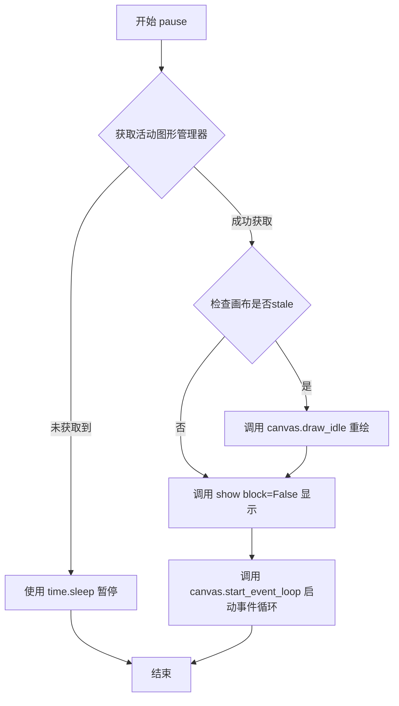

#### 带注释源码

```python
def pause(interval: float) -> None:
    """
    Run the GUI event loop for *interval* seconds.

    If there is an active figure, it will be updated and displayed before the
    pause, and the GUI event loop (if any) will run during the pause.

    This can be used for crude animation.  For more complex animation use
    :mod:`matplotlib.animation`.

    If there is no active figure, sleep for *interval* seconds instead.

    See Also
    --------
    matplotlib.animation : Proper animations
    show : Show all figures and optional block until all figures are closed.
    """
    # 获取当前活动的图形管理器
    manager = _pylab_helpers.Gcf.get_active()
    
    # 如果存在活动的图形
    if manager is not None:
        # 获取图形关联的画布
        canvas = manager.canvas
        
        # 如果画布标记为stale（需要重绘），则触发延迟重绘
        if canvas.figure.stale:
            canvas.draw_idle()
        
        # 显示所有图形，但不阻塞
        show(block=False)
        
        # 启动GUI事件循环指定的时间
        canvas.start_event_loop(interval)
    else:
        # 没有活动图形时，直接使用系统睡眠
        time.sleep(interval)
```


### `rc`

设置 matplotlib 的 rc（运行时配置）参数。该函数是 `matplotlib.rc` 的包装器，用于修改 matplotlib 的全局默认设置，如线条宽度、字体大小、颜色映射等。

参数：

- `group`：`RcGroupKeyType`，要修改的 rc 参数组名称（如 `'lines'`, `'axes'`, `'font'`, `'legend'` 等）
- `**kwargs`：关键字参数，用于设置特定的 rc 参数（例如 `linewidth=2`, `font_size=12` 等）

返回值：`None`，无返回值

#### 流程图

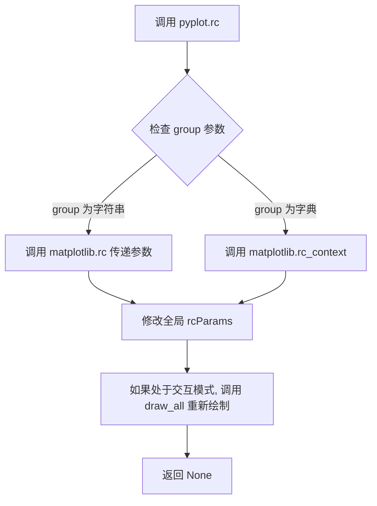

#### 带注释源码

```python
@_copy_docstring_and_deprecators(matplotlib.rc)
def rc(group: RcGroupKeyType, **kwargs) -> None:
    """
    设置 matplotlib 的 rc（运行时配置）参数。

    Parameters
    ----------
    group : str
        rc 参数组名称，如 'lines', 'axes', 'font', 'legend' 等。
    **kwargs : 关键字参数
        要设置的特定 rc 参数，例如 linewidth=2, font_size=12 等。

    Returns
    -------
    None

    See Also
    --------
    matplotlib.rc : 底层的 rc 设置函数。
    pyplot.rc_context : 用于临时修改 rc 参数的上下文管理器。
    pyplot.rcdefaults : 恢复默认 rc 参数。

    Examples
    --------
    >>> import matplotlib.pyplot as plt
    >>> plt.rc('lines', linewidth=2)  # 设置线条宽度为 2
    >>> plt.rc('font', family='serif')  # 设置字体为衬线体
    >>> plt.rc('figure', figsize=(10, 6))  # 设置图形大小
    >>> # 同时设置多个参数
    >>> plt.rc('axes', labelsize=12, titlesize=14)
    """
    # 调用 matplotlib.rc 实际执行参数设置
    # @_copy_docstring_and_deprecators 装饰器会自动复制被包装函数的文档字符串
    # 并处理任何弃用警告
    matplotlib.rc(group, **kwargs)
```

#### 详细说明

`pyplot.rc` 函数是 matplotlib 内部 `matplotlib.rc` 函数的便捷包装器。它允许用户修改 matplotlib 的全局默认参数，这些参数控制着图形的各种外观属性，包括但不限于：

- **lines**：线条属性（宽度、颜色、样式等）
- **axes**：坐标轴属性（字体、刻度、边框等）
- **font**：字体属性（family、size、weight 等）
- **figure**：图形属性（图形大小、DPI、颜色等）
- **legend**：图例属性
- **savefig**：保存图像的属性

该函数修改的是全局 `rcParams` 字典，因此会影响之后创建的所有图形。在交互模式下，调用 `rc` 后会自动重新绘制当前图形。


### `rc_context`

临时修改 matplotlib 的 rc 参数设置，并返回一个上下文管理器，在上下文块结束时自动恢复原来的设置。

参数：

- `rc`：`dict[RcKeyType, Any] | None`，要临时修改的 rc 参数字典，例如 `{'lines.linewidth': 2, 'font.size': 12}`。
- `fname`：`str | pathlib.Path | os.PathLike | None`，可选参数，指向一个 matplotlib 配置文件（rc 文件）的路径，用于从文件加载 rc 参数。

返回值：`AbstractContextManager[None]`，一个上下文管理器对象，用于临时应用 rc 参数设置。

#### 流程图

```mermaid
flowchart TD
    A[开始 rc_context] --> B{检查装饰器}
    B --> C[调用 matplotlib.rc_context]
    C --> D[传入 rc 参数]
    C --> E[传入 fname 参数]
    D --> F[返回上下文管理器]
    E --> F
    F[结束]
    
    style A fill:#f9f,stroke:#333
    style F fill:#9f9,stroke:#333
```

#### 带注释源码

```python
@_copy_docstring_and_deprecators(matplotlib.rc_context)
def rc_context(
    rc: dict[RcKeyType, Any] | None = None,
    fname: str | pathlib.Path | os.PathLike | None = None,
) -> AbstractContextManager[None]:
    """
    Return a context manager for temporarily modifying rc settings.
    
    This is a wrapper around matplotlib.rc_context that provides the same
    functionality through the pyplot interface.
    """
    # 直接调用 matplotlib 模块的 rc_context 函数，传入 rc 和 fname 参数
    # 返回一个上下文管理器，用于临时修改 rc 参数
    # 当上下文块结束时，rc 参数会自动恢复原来的值
    return matplotlib.rc_context(rc, fname)
```


### rcdefaults

将全局配置参数 `rcParams` 重置为 Matplotlib 的默认初始状态，并在当前处于交互模式时重绘所有打开的图形。

参数：
- 无

返回值：
- `None`，无返回值。

#### 流程图

```mermaid
flowchart TD
    A([开始]) --> B[调用 matplotlib.rcdefaults]
    B --> C{检查 matplotlib.is_interactive?}
    C -- True --> D[调用 draw_all]
    C -- False --> E([结束])
    D --> E
```

#### 带注释源码

```python
@_copy_docstring_and_deprecators(matplotlib.rcdefaults)
def rcdefaults() -> None:
    # 调用 matplotlib 模块的 rcdefaults 函数，重置全局 rcParams
    matplotlib.rcdefaults()
    # 检查是否处于交互模式；如果是，则重绘所有图形
    if matplotlib.is_interactive():
        draw_all()
```


### `getp`

获取给定艺术对象的属性值。这是 `matplotlib.artist.getp` 的 pyplot 包装器，用于获取对象的属性。

参数：

- `obj`：`Artist | None`，要获取属性的艺术对象
- `*args`：任意位置参数传递给底层 `matplotlib.artist.getp` 函数
- `**kwargs`：任意关键字参数传递给底层 `matplotlib.artist.getp` 函数

返回值：任意类型，返回所请求的属性值

#### 流程图

```mermaid
flowchart TD
    A[开始: 调用 getp] --> B{obj 是否为 None?}
    B -->|是| C[获取当前 Figure: gcf]
    C --> D[调用 matplotlib.artist.getp]
    B -->|否| D
    D --> E[返回属性值]
```

#### 带注释源码

```python
@_copy_docstring_and_deprecators(matplotlib.artist.getp)
def getp(obj, *args, **kwargs):
    """
    获取艺术对象的属性值。
    
    这是 matplotlib.artist.getp 的 pyplot 包装器，
    用于以 MATLAB 兼容方式获取对象属性。
    """
    # 委托给 matplotlib.artist.getp 函数执行实际属性获取
    return matplotlib.artist.getp(obj, *args, **kwargs)
```


### `get`

获取给定艺术家的属性值。这是 `matplotlib.artist.get` 的 pyplot 包装器。

参数：

-  `obj`：`Artist`，要获取属性的艺术家对象
-  `*args`：可变位置参数，用于指定要获取的属性名
-  `**kwargs`：可变关键字参数，传递给底层函数

返回值：返回艺术家对象的属性值，如果没有指定属性名，则返回包含所有属性值的字典

#### 流程图

```mermaid
flowchart TD
    A[调用 pyplot.get] --> B{是否指定了属性参数?}
    B -->|是| C[将参数传递给 matplotlib.artist.get]
    B -->|否| D[调用 matplotlib.artist.get 获取所有属性]
    C --> E[返回属性值]
    D --> E
    E --> F[返回结果]
```

#### 带注释源码

```python
@_copy_docstring_and_deprecators(matplotlib.artist.get)
def get(obj, *args, **kwargs):
    """
    获取给定艺术家的属性值。
    
    这是 matplotlib.artist.get 的 pyplot 包装器，
    提供与 MATLAB 类似的接口来获取对象属性。
    """
    # 调用 matplotlib.artist.get 函数，传递所有参数
    # obj: 艺术家对象
    # *args: 可选，要获取的特定属性名
    # **kwargs: 附加关键字参数
    return matplotlib.artist.get(obj, *args, **kwargs)
```

#### 使用示例

```python
# 获取线条的所有属性
line, = plt.plot([1, 2, 3], [1, 4, 9])
props = plt.get(line)  # 返回包含所有属性的字典

# 获取特定属性
plt.get(line, 'color')  # 返回线条颜色
plt.get(line, 'linewidth', 'linestyle')  # 返回多个属性值
```


### `setp`

设置一个或多个艺术家的属性。该函数是 `matplotlib.artist.setp` 的 pyplot 包装器，提供 MATLAB 风格的属性设置接口。

参数：

- `obj`：要设置属性的对象（Artist 对象或对象列表）
- `*args`：可变位置参数，用于指定要设置的属性值
- `**kwargs`：关键字参数，用于指定要设置的属性名和值

返回值：返回设置属性后的对象或对象列表

#### 流程图

```mermaid
flowchart TD
    A[开始 setp] --> B{确定当前figure}
    B --> C[调用 matplotlib.artist.setp]
    C --> D[返回结果]
    
    subgraph 委托给 matplotlib.artist.setp
    C1[获取 obj] --> C2[解析 args 和 kwargs]
    C2 --> C3[遍历属性设置]
    C3 --> C4{属性是否存在}
    C4 -->|是| C5[设置属性值]
    C4 -->|否| C6[抛出 AttributeError 或忽略]
    C5 --> C7[返回设置后的对象]
    end
```

#### 带注释源码

```python
@_copy_docstring_and_deprecators(matplotlib.artist.setp)
def setp(obj, *args, **kwargs):
    """
    设置一个或多个艺术家的属性。
    
    该函数是 matplotlib.artist.setp 的 pyplot 包装器，
    提供了类似于 MATLAB 的属性设置接口。
    
    参数:
        obj: Artist 对象或对象列表，要设置属性的对象
        *args: 可变位置参数，用于指定要设置的属性值
        **kwargs: 关键字参数，用于指定属性名和值
        
    返回:
        设置属性后的对象或对象列表
    """
    return matplotlib.artist.setp(obj, *args, **kwargs)
```

#### 详细说明

`setp` 函数是 matplotlib 中用于设置对象属性的通用函数。在 pyplot 模块中，它被重新导出以方便用户使用。该函数的主要特点包括：

1. **单对象或多对象支持**：可以同时设置单个对象或多个对象的属性
2. **MATLAB 风格接口**：支持使用位置参数和关键字参数混合的方式设置属性
3. **属性检查**：可以设置 `strict=False` 来忽略不存在的属性
4. **返回设置结果**：返回设置后的对象，便于链式操作

该函数是 pyplot 重新导出的函数，其实际实现位于 `matplotlib.artist` 模块中。pyplot 版本使用了 `@_copy_docstring_and_deprecators` 装饰器来复制原始函数的文档字符串并处理可能的弃用情况。


### `xkcd`

开启XKCD风格的素描式绘图模式。该函数通过修改matplotlib的rcParams参数来改变后续绘图的外观，返回一个`ExitStack`对象，可作为上下文管理器使用以临时应用XKCD风格。

参数：

- `scale`：`float`，垂直于源线的抖动幅度，默认值为1
- `length`：`float`，沿线的抖动长度，默认值为100
- `randomness`：`float`，长度收缩或扩展的随机性因子，默认值为2

返回值：`ExitStack`，返回一个上下文管理器，用于恢复原始 rcParams 设置

#### 流程图

```mermaid
flowchart TD
    A[开始] --> B{检查 text.usetex 是否为 True?}
    B -->|是| C[抛出 RuntimeError 异常]
    B -->|否| D[创建 ExitStack 对象]
    D --> E[将当前 rcParams 副本添加到回调]
    F[导入 patheffects] --> G[更新 rcParams]
    G --> H[设置字体家族为 xkcd 相关字体]
    G --> I[设置 path.sketch 参数]
    G --> J[添加描边路径效果]
    G --> K[调整坐标轴和刻度线样式]
    H --> L[返回 ExitStack 对象]
```

#### 带注释源码

```python
def xkcd(
    scale: float = 1, length: float = 100, randomness: float = 2
) -> ExitStack:
    """
    Turn on `xkcd <https://xkcd.com/>`_ sketch-style drawing mode.

    This will only have an effect on things drawn after this function is called.

    For best results, install the `xkcd script <https://github.com/ipython/xkcd-font/>`_
    font; xkcd fonts are not packaged with Matplotlib.

    Parameters
    ----------
    scale : float, optional
        The amplitude of the wiggle perpendicular to the source line.
    length : float, optional
        The length of the wiggle along the line.
    randomness : float, optional
        The scale factor by which the length is shrunken or expanded.

    Notes
    -----
    This function works by a number of rcParams, overriding those set before.

    If you want the effects of this function to be temporary, it can
    be used as a context manager, for example::

        with plt.xkcd():
            # This figure will be in XKCD-style
            fig1 = plt.figure()
            # ...

        # This figure will be in regular style
        fig2 = plt.figure()
    """
    # This cannot be implemented in terms of contextmanager() or rc_context()
    # because this needs to work as a non-contextmanager too.

    # 检查是否启用了 text.usetex，如果是则无法使用 xkcd 模式
    if rcParams['text.usetex']:
        raise RuntimeError(
            "xkcd mode is not compatible with text.usetex = True")

    # 创建 ExitStack 用于后续恢复 rcParams
    stack = ExitStack()
    # 注册回调函数：当 ExitStack 关闭时恢复原始 rcParams
    stack.callback(rcParams._update_raw, rcParams.copy())  # type: ignore[arg-type]

    # 导入 patheffects 模块用于路径效果
    from matplotlib import patheffects
    # 更新 rcParams 以应用 XKCD 风格
    rcParams.update({
        # 设置字体家族为 XKCD 风格字体
        'font.family': ['xkcd', 'xkcd Script', 'Comic Neue', 'Comic Sans MS'],
        'font.size': 14.0,
        # 设置路径素描参数
        'path.sketch': (scale, length, randomness),
        # 添加白色描边效果
        'path.effects': [
            patheffects.withStroke(linewidth=4, foreground="w")],
        # 调整坐标轴和线条样式
        'axes.linewidth': 1.5,
        'lines.linewidth': 2.0,
        'figure.facecolor': 'white',
        'grid.linewidth': 0.0,
        'axes.grid': False,
        'axes.unicode_minus': False,
        'axes.edgecolor': 'black',
        # 调整刻度线大小和宽度
        'xtick.major.size': 8,
        'xtick.major.width': 3,
        'ytick.major.size': 8,
        'ytick.major.width': 3,
    })

    # 返回 ExitStack 对象，可以作为上下文管理器使用
    return stack
```


### `figure`

创建新图形或激活现有图形。

参数：

- `num`：`int | str | Figure | SubFigure | None`，图形的唯一标识符，可以是数字、字符串或Figure实例
- `figsize`：`ArrayLike | tuple[float, float, Literal["in", "cm", "px"]] | None`，图形尺寸，默认为rc figure.figsize
- `dpi`：`float | None`，图形的分辨率，默认为rc figure.dpi
- `facecolor`：`ColorType | None`，背景色，默认为rc figure.facecolor
- `edgecolor`：`ColorType | None`，边框颜色，默认为rc figure.edgecolor
- `frameon`：`bool = True`，是否绘制图形边框
- `FigureClass`：`type[Figure] = Figure`，要创建的Figure子类
- `clear`：`bool = False`，如果图形已存在，是否清除
- `**kwargs`：附加关键字参数，传递给Figure构造函数

返回值：`Figure`，返回创建的或激活的Figure实例

#### 流程图

```mermaid
flowchart TD
    A[开始 figure 函数] --> B{num 参数是否为 FigureBase 实例?}
    B -->|是| C{图形属性参数是否全部为None且frameon为True且无kwargs?}
    B -->|否| D{num 参数是否为 None?}
    C -->|是| E{根图形是否有manager?}
    C -->|否| F[抛出 ValueError]
    E -->|否| G[获取后端模块]
    E -->|是| H{图形num是否在已有图形中?}
    H -->|是| I[发出警告忽略参数]
    H -->|否| J[设置激活该manager]
    G --> K[创建新的figure manager]
    K --> L[调用figure.hooks]
    L --> M[设置新激活的manager]
    M --> N[如果是REPL显示hook则设置自动绘制回调]
    N --> O[返回图形]
    J --> O
    I --> O
    D -->|是| P[计算下一个数字]
    P --> Q{num 是否为字符串?}
    Q -->|是| R{标签是否已存在?}
    R -->|否| S[如果是'all'发出警告]
    R -->|是| T[获取对应数字]
    Q -->|否| U[转换为整数]
    T --> V[查找或创建manager]
    U --> V
    S --> P
    O --> Z[结束]
    F --> Z
```

#### 带注释源码

```python
def figure(
    # autoincrement if None, else integer from 1-N
    num: int | str | Figure | SubFigure | None = None,
    # defaults to rc figure.figsize
    figsize: ArrayLike  # a 2-element ndarray is accepted as well
             | tuple[float, float, Literal["in", "cm", "px"]]
             | None = None,
    # defaults to rc figure.dpi
    dpi: float | None = None,
    *,
    # defaults to rc figure.facecolor
    facecolor: ColorType | None = None,
    # defaults to rc figure.edgecolor
    edgecolor: ColorType | None = None,
    frameon: bool = True,
    FigureClass: type[Figure] = Figure,
    clear: bool = False,
    **kwargs
) -> Figure:
    """
    Create a new figure, or activate an existing figure.

    Parameters
    ----------
    num : int or str or `.Figure` or `.SubFigure`, optional
        A unique identifier for the figure.

        If a figure with that identifier already exists, this figure is made
        active and returned. An integer refers to the ``Figure.number``
        attribute, a string refers to the figure label.

        If there is no figure with the identifier or *num* is not given, a new
        figure is created, made active and returned.  If *num* is an int, it
        will be used for the ``Figure.number`` attribute, otherwise, an
        auto-generated integer value is used (starting at 1 and incremented
        for each new figure). If *num* is a string, the figure label and the
        window title is set to this value.  If num is a ``SubFigure``, its
        parent ``Figure`` is activated.

        If *num* is a Figure instance that is already tracked in pyplot, it is
        activated. If *num* is a Figure instance that is not tracked in pyplot,
        it is added to the tracked figures and activated.

    figsize : (float, float) or (float, float, str), default: :rc:`figure.figsize`
        The figure dimensions. This can be

        - a tuple ``(width, height, unit)``, where *unit* is one of "inch", "cm",
          "px".
        - a tuple ``(x, y)``, which is interpreted as ``(x, y, "inch")``.

    dpi : float, default: :rc:`figure.dpi`
        The resolution of the figure in dots-per-inch.

    facecolor : :mpltype:`color`, default: :rc:`figure.facecolor`
        The background color.

    edgecolor : :mpltype:`color`, default: :rc:`figure.edgecolor`
        The border color.

    frameon : bool, default: True
        If False, suppress drawing the figure frame.

    FigureClass : subclass of `~matplotlib.figure.Figure`
        If set, an instance of this subclass will be created, rather than a
        plain `.Figure`.

    clear : bool, default: False
        If True and the figure already exists, then it is cleared.

    layout : {'constrained', 'compressed', 'tight', 'none', `.LayoutEngine`, None}, \
default: None
        The layout mechanism for positioning of plot elements to avoid
        overlapping Axes decorations (labels, ticks, etc). Note that layout
        managers can measurably slow down figure display.

        - 'constrained': The constrained layout solver adjusts Axes sizes
          to avoid overlapping Axes decorations.  Can handle complex plot
          layouts and colorbars, and is thus recommended.

          See :ref:`constrainedlayout_guide`
          for examples.

        - 'compressed': uses the same algorithm as 'constrained', but
          removes extra space between fixed-aspect-ratio Axes.  Best for
          simple grids of Axes.

        - 'tight': Use the tight layout mechanism. This is a relatively
          simple algorithm that adjusts the subplot parameters so that
          decorations do not overlap. See `.Figure.set_tight_layout` for
          further details.

        - 'none': Do not use a layout engine.

        - A `.LayoutEngine` instance. Builtin layout classes are
          `.ConstrainedLayoutEngine` and `.TightLayoutEngine`, more easily
          accessible by 'constrained' and 'tight'.  Passing an instance
          allows third parties to provide their own layout engine.

        If not given, fall back to using the parameters *tight_layout* and
        *constrained_layout*, including their config defaults
        :rc:`figure.autolayout` and :rc:`figure.constrained_layout.use`.

    **kwargs
        Additional keyword arguments are passed to the `.Figure` constructor.

    Returns
    -------
    `~matplotlib.figure.Figure`

    Notes
    -----
    A newly created figure is passed to the `~.FigureCanvasBase.new_manager`
    method or the `new_figure_manager` function provided by the current
    backend, which install a canvas and a manager on the figure.

    Once this is done, :rc:`figure.hooks` are called, one at a time, on the
    figure; these hooks allow arbitrary customization of the figure (e.g.,
    attaching callbacks) or of associated elements (e.g., modifying the
    toolbar).  See :doc:`/gallery/user_interfaces/mplcvd` for an example of
    toolbar customization.

    If you are creating many figures, make sure you explicitly call
    `.pyplot.close` on the figures you are not using, because this will
    enable pyplot to properly clean up the memory.

    `~matplotlib.rcParams` defines the default values, which can be modified
    in the matplotlibrc file.
    """
    allnums = get_fignums()
    next_num = max(allnums) + 1 if allnums else 1

    # 处理传入Figure/SubFigure实例的情况
    if isinstance(num, FigureBase):
        # type narrowed to `Figure | SubFigure` by combination of input and isinstance
        has_figure_property_parameters = (
            any(param is not None for param in [figsize, dpi, facecolor, edgecolor])
            or not frameon or kwargs
        )

        root_fig = num.get_figure(root=True)
        if root_fig.canvas.manager is None:
            if has_figure_property_parameters:
                raise ValueError(
                    "You cannot pass figure properties when calling figure() with "
                    "an existing Figure instance")
            backend = _get_backend_mod()
            manager_ = backend.new_figure_manager_given_figure(next_num, root_fig)
            _pylab_helpers.Gcf._set_new_active_manager(manager_)
            return manager_.canvas.figure
        elif has_figure_property_parameters and root_fig.canvas.manager.num in allnums:
            _api.warn_external(
                "Ignoring specified arguments in this call because figure "
                f"with num: {root_fig.canvas.manager.num} already exists")
        _pylab_helpers.Gcf.set_active(root_fig.canvas.manager)
        return root_fig

    fig_label = ''
    if num is None:
        num = next_num
    else:
        # 处理num参数：验证并转换
        if (any(param is not None for param in [figsize, dpi, facecolor, edgecolor])
              or not frameon or kwargs) and num in allnums:
            _api.warn_external(
                "Ignoring specified arguments in this call "
                f"because figure with num: {num} already exists")
        if isinstance(num, str):
            fig_label = num
            all_labels = get_figlabels()
            if fig_label not in all_labels:
                if fig_label == 'all':
                    _api.warn_external("close('all') closes all existing figures.")
                num = next_num
            else:
                inum = all_labels.index(fig_label)
                num = allnums[inum]
        else:
            num = int(num)  # crude validation of num argument

    # Type of "num" has narrowed to int, but mypy can't quite see it
    manager = _pylab_helpers.Gcf.get_fig_manager(num)  # type: ignore[arg-type]
    if manager is None:
        max_open_warning = rcParams['figure.max_open_warning']
        # 检查打开的图形数量是否超过警告阈值
        if len(allnums) == max_open_warning >= 1:
            _api.warn_external(
                f"More than {max_open_warning} figures have been opened. "
                f"Figures created through the pyplot interface "
                f"(`matplotlib.pyplot.figure`) are retained until explicitly "
                f"closed and may consume too much memory. (To control this "
                f"warning, see the rcParam `figure.max_open_warning`). "
                f"Consider using `matplotlib.pyplot.close()`.",
                RuntimeWarning)

        # 创建新的figure manager
        manager = new_figure_manager(
            num, figsize=figsize, dpi=dpi,
            facecolor=facecolor, edgecolor=edgecolor, frameon=frameon,
            FigureClass=FigureClass, **kwargs)
        fig = manager.canvas.figure
        if fig_label:
            fig.set_label(fig_label)

        # 调用figure hooks
        for hookspecs in rcParams["figure.hooks"]:
            module_name, dotted_name = hookspecs.split(":")
            obj: Any = importlib.import_module(module_name)
            for part in dotted_name.split("."):
                obj = getattr(obj, part)
            obj(fig)

        _pylab_helpers.Gcf._set_new_active_manager(manager)

        # 对于某些后端确保draw_if_interactive被调用
        draw_if_interactive()

        # 如果是普通REPL，设置自动绘制回调
        if _REPL_DISPLAYHOOK is _ReplDisplayHook.PLAIN:
            fig.stale_callback = _auto_draw_if_interactive

    # 如果需要清除已存在的图形
    if clear:
        manager.canvas.figure.clear()

    return manager.canvas.figure
```


### `_auto_draw_if_interactive`

该函数是 matplotlib 的内部辅助函数，用于在纯 Python REPL 环境中实现交互模式下的自动重绘功能。它作为图形 stale 回调被注册，当图形标记为"stale"（需要重绘）时触发，并在满足交互模式、未在保存、非空闲绘制的条件下执行延迟重绘。

参数：

- `fig`：`Figure`，与画布关联的图形对象
- `val`：布尔值，表示图形是否变为 stale（需要重绘）的状态

返回值：`None`，该函数无返回值

#### 流程图

```mermaid
flowchart TD
    A[开始: _auto_draw_if_interactive] --> B{val 为 True?}
    B -->|否| C[直接返回, 不进行重绘]
    B -->|是| D{matplotlib.is_interactive?}
    D -->|否| C
    D -->|是| E{画布正在保存?}
    E -->|是| C
    E -->|否| F{画布是否处于空闲绘制状态?}
    F -->|是| C
    F -->|否| G[进入空闲绘制上下文]
    G --> H[调用 canvas.draw_idle 进行延迟重绘]
    H --> I[结束]
```

#### 带注释源码

```python
def _auto_draw_if_interactive(fig, val):
    """
    An internal helper function for making sure that auto-redrawing
    works as intended in the plain python repl.

    Parameters
    ----------
    fig : Figure
        A figure object which is assumed to be associated with a canvas
    """
    # 检查所有重绘条件是否满足：
    # 1. val 为 True 表示图形标记为 stale 需要重绘
    # 2. matplotlib.is_interactive() 检查是否处于交互模式
    # 3. not fig.canvas.is_saving() 确保当前没有在保存图像
    # 4. not fig.canvas._is_idle_drawing 确保画布当前不处于空闲绘制状态
    if (val and matplotlib.is_interactive()
            and not fig.canvas.is_saving()
            and not fig.canvas._is_idle_drawing):
        # Some artists can mark themselves as stale in the middle of drawing
        # (e.g. axes position & tick labels being computed at draw time), but
        # this shouldn't trigger a redraw because the current redraw will
        # already take them into account.
        # 使用 _idle_draw_cntx 上下文管理器确保重绘在安全的上下文中执行
        with fig.canvas._idle_draw_cntx():
            fig.canvas.draw_idle()
```


### `gcf`

获取当前 Figure，如果当前没有 Figure，则创建一个新的。

参数：  
无

返回值：`Figure`，返回当前活动的 Figure 对象，如果不存在则创建并返回新的 Figure。

#### 流程图

```mermaid
flowchart TD
    A[开始 gcf] --> B{检查是否有活动的 Figure 管理器}
    B -->|是| C[获取活动管理器的 Figure]
    C --> D[返回 Figure]
    B -->|否| E[调用 figure 创建新 Figure]
    E --> D
```

#### 带注释源码

```python
def gcf() -> Figure:
    """
    Get the current figure.

    If there is currently no figure on the pyplot figure stack, a new one is
    created using `~.pyplot.figure()`.  (To test whether there is currently a
    figure on the pyplot figure stack, check whether `~.pyplot.get_fignums()`
    is empty.)
    """
    # 从 pyplot 的 Figure 管理器获取当前活动的管理器
    manager = _pylab_helpers.Gcf.get_active()
    if manager is not None:
        # 如果存在活动的管理器，返回其关联的 Figure 对象
        return manager.canvas.figure
    else:
        # 如果没有活动的 Figure，调用 figure() 创建新的 Figure 并返回
        return figure()
```


### `fignum_exists`

该函数用于检查指定标识符的图形是否存在，支持通过数字（int）或标签（str）来查询图形。

参数：

- `num`：`int | str`，图形的标识符，可以是整数（图形编号）或字符串（图形标签）

返回值：`bool`，返回是否存在指定标识符的图形

#### 流程图

```mermaid
flowchart TD
    A[开始] --> B{num 是 int 类型?}
    B -->|是| C[调用 _pylab_helpers.Gcf.has_fignum]
    B -->|否| D[调用 get_figlabels 获取所有标签]
    C --> E[返回 bool 结果]
    D --> F{num in get_figlabels?}
    F -->|是| E
    F -->|否| E
    E --> G[结束]
```

#### 带注释源码

```python
def fignum_exists(num: int | str) -> bool:
    """
    Return whether the figure with the given id exists.

    Parameters
    ----------
    num : int or str
        A figure identifier.

    Returns
    -------
    bool
        Whether or not a figure with id *num* exists.
    """
    return (
        _pylab_helpers.Gcf.has_fignum(num)  # 如果是整数，调用has_fignum方法检查
        if isinstance(num, int)             # 判断num是否为整数类型
        else num in get_figlabels()          # 否则检查num是否在图形标签列表中
    )
```


### `get_fignums`

获取当前所有已创建图形的编号列表，并返回排序后的结果。

参数：
- （无参数）

返回值：`list[int]`，返回当前存在的所有图形编号的排序列表。

#### 流程图

```mermaid
flowchart TD
    A[开始] --> B[访问 _pylab_helpers.Gcf.figs]
    B --> C[获取figs字典]
    C --> D[对图形编号进行sorted排序]
    D --> E[返回排序后的图形编号列表]
    E --> F[结束]
```

#### 带注释源码

```python
def get_fignums() -> list[int]:
    """Return a list of existing figure numbers."""
    # _pylab_helpers.Gcf.figs 是一个字典，存储了所有当前管理的图形
    # 字典的键是图形编号（整数），值是对应的FigureManager实例
    # sorted()函数对这个字典的键（即图形编号）进行排序并返回列表
    return sorted(_pylab_helpers.Gcf.figs)
```


### `get_figlabels`

获取当前所有已存在的Figure标签（名称）列表。

参数：  
无

返回值：`list[Any]`，返回现有Figure的标签列表

#### 流程图

```mermaid
flowchart TD
    A[开始] --> B[调用 _pylab_helpers.Gcf.get_all_fig_managers 获取所有Figure管理器]
    B --> C[按管理器num属性排序]
    C --> D[对每个管理器调用 m.canvas.figure.get_label 获取标签]
    D --> E[返回标签列表]
```

#### 带注释源码

```python
def get_figlabels() -> list[Any]:
    """Return a list of existing figure labels."""
    # 从pyplot的Figure管理器注册表中获取所有Figure管理器实例
    managers = _pylab_helpers.Gcf.get_all_fig_managers()
    # 按管理器的编号(num)对管理器进行排序，确保返回顺序与Figure编号一致
    managers.sort(key=lambda m: m.num)
    # 提取每个Figure的标签（label），标签可以通过Figure.set_label()设置
    return [m.canvas.figure.get_label() for m in managers]
```


### `get_current_fig_manager`

获取当前图形的图形管理器。如果当前没有图形，则创建一个新图形并返回其图形管理器。

参数： 无

返回值： `FigureManagerBase | None`，返回当前图形的图形管理器（`.FigureManagerBase` 或其后端相关的子类）。如果不存在当前图形，则返回 `None`。

#### 流程图

```mermaid
flowchart TD
    A[开始] --> B[调用 gcf 获取当前 Figure]
    B --> C{当前 Figure 是否存在?}
    C -->|不存在| D[创建新 Figure]
    C -->|存在| E[获取 canvas.manager]
    D --> E
    E --> F[返回 FigureManagerBase 或 None]
    F --> G[结束]
```

#### 带注释源码

```python
def get_current_fig_manager() -> FigureManagerBase | None:
    """
    Return the figure manager of the current figure.

    The figure manager is a container for the actual backend-depended window
    that displays the figure on screen.

    If no current figure exists, a new one is created, and its figure
    manager is returned.

    Returns
    -------
    `.FigureManagerBase` or backend-dependent subclass thereof
    """
    # 调用 gcf() 获取当前 Figure 对象，然后访问其 canvas 的 manager 属性
    # gcf() 会在没有当前图形时自动创建一个新图形
    return gcf().canvas.manager
```


### `connect`

该函数是 `matplotlib.pyplot` 中的事件连接函数，用于将回调函数绑定到指定的图形事件（如鼠标事件、键盘事件等），返回的整数 ID 可用于后续断开连接。

参数：

- `s`：`MouseEventType | KeyEventType | PickEventType | ResizeEventType | CloseEventType | DrawEventType`，事件类型标识符，表示要监听的事件类型
- `func`：`Callable[[MouseEvent | KeyEvent | PickEvent | ResizeEvent | CloseEvent | DrawEvent], Any]`，当事件触发时要调用的回调函数

返回值：`int`，返回的事件连接 ID，用于后续通过 `disconnect` 函数断开该连接

#### 流程图

```mermaid
flowchart TD
    A[开始 connect 函数] --> B{检查事件类型 s}
    B -->|有效事件类型| C[获取当前 Figure]
    C --> D[调用 gcf().canvas.mpl_connect s, func]
    D --> E[返回连接 ID]
    B -->|无效事件类型| F[由 mpl_connect 抛出异常]
    E --> G[结束]
```

#### 带注释源码

```python
# 定义 connect 函数的多重重载签名，用于类型提示
@overload
def connect(s: MouseEventType, func: Callable[[MouseEvent], Any]) -> int: ...


@overload
def connect(s: KeyEventType, func: Callable[[KeyEvent], Any]) -> int: ...


@overload
def connect(s: PickEventType, func: Callable[[PickEvent], Any]) -> int: ...


@overload
def connect(s: ResizeEventType, func: Callable[[ResizeEvent], Any]) -> int: ...


@overload
def connect(s: CloseEventType, func: Callable[[CloseEvent], Any]) -> int: ...


@overload
def connect(s: DrawEventType, func: Callable[[DrawEvent], Any]) -> int: ...


# 实际实现：使用 _copy_docstring_and_deprecators 装饰器复制 FigureCanvasBase.mpl_connect 的文档字符串
# 并添加弃用警告功能
@_copy_docstring_and_deprecators(FigureCanvasBase.mpl_connect)
def connect(s, func) -> int:
    """
    Connect event handler to the current figure.
    
    This is a wrapper around FigureCanvasBase.mpl_connect that operates on the
    current figure obtained via gcf().
    """
    # 获取当前活动 Figure 的 canvas 对象，并调用其 mpl_connect 方法
    # gcf() 返回当前 Figure，若不存在则创建一个新的
    # mpl_connect 方法会注册回调函数并返回连接 ID
    return gcf().canvas.mpl_connect(s, func)
```


### `disconnect`

断开与先前通过 `connect` 注册的事件回调的连接。

参数：

-  `cid`：`int`，连接 ID，由对应的 `connect` 调用返回的整数标识符

返回值：`None`，无返回值

#### 流程图

```mermaid
flowchart TD
    A[开始 disconnect] --> B{获取当前 Figure}
    B --> C[gcf 获取当前 figure 对象]
    C --> D[调用 figure.canvas.mpl_disconnect]
    D --> E[传入参数 cid]
    E --> F[结束]
```

#### 带注释源码

```python
@_copy_docstring_and_deprecators(FigureCanvasBase.mpl_disconnect)
def disconnect(cid: int) -> None:
    """
    断开与先前通过 connect 注册的事件回调的连接。
    
    这是一个 pyplot 包装器，底层调用 FigureCanvasBase.mpl_disconnect。
    它获取当前活动 Figure 的画布，然后调用其 mpl_disconnect 方法来
    移除指定的事件回调。
    
    Parameters
    ----------
    cid : int
        连接 ID，由 connect() 函数返回的标识符
    """
    # 获取当前活动的 Figure 对象
    # gcf() 返回当前 Figure，如果没有则创建一个新的
    figure = gcf()
    
    # 获取 Figure 的画布（Canvas）对象
    # 画布负责处理事件和渲染
    canvas = figure.canvas
    
    # 调用画布的 mpl_disconnect 方法
    # 该方法会根据连接 ID 移除对应的事件回调
    canvas.mpl_disconnect(cid)
```


### `close`

关闭图形窗口，并将其从 pyplot 中注销。

参数：

- `fig`：`None | int | str | Figure | Literal["all"]`，要关闭的图形，支持多种指定方式：
  - `None`：当前图形
  - `Figure`：给定的 Figure 实例
  - `int`：图形编号
  - `str`：图形名称
  - `'all'`：所有图形

返回值：`None`

#### 流程图

```mermaid
flowchart TD
    A[开始 close] --> B{fig is None?}
    B -->|Yes| C[获取活动管理器]
    C --> D{manager is None?}
    D -->|Yes| E[直接返回]
    D -->|No| F[调用 Gcf.destroy]
    B -->|No| G{fig == 'all'?}
    G -->|Yes| H[调用 Gcf.destroy_all]
    G -->|No| I{isinstance fig, int?}
    I -->|Yes| J[调用 Gcf.destroy fig]
    I -->|No| K{hasattr fig, 'int'?}
    K -->|Yes| L[获取 fig.int, 调用 Gcf.destroy]
    K -->|No| M{isinstance fig, str?}
    M -->|Yes| N[获取所有标签]
    N --> O{fig in all_labels?}
    O -->|Yes| P[获取图形编号并调用 destroy]
    O -->|No| Q[直接返回]
    M -->|No| R{isinstance fig, Figure?}
    R -->|Yes| S[调用 Gcf.destroy_fig]
    R -->|No| T[抛出类型错误]
    E --> Z[结束]
    F --> Z
    H --> Z
    J --> Z
    L --> Z
    Q --> Z
    P --> Z
    S --> Z
    T --> Z
```

#### 带注释源码

```python
def close(fig: None | int | str | Figure | Literal["all"] = None) -> None:
    """
    Close a figure window, and unregister it from pyplot.

    Parameters
    ----------
    fig : None or int or str or `.Figure`
        The figure to close. There are a number of ways to specify this:

        - *None*: the current figure
        - `.Figure`: the given `.Figure` instance
        - ``int``: a figure number
        - ``str``: a figure name
        - 'all': all figures

    Notes
    -----
    pyplot maintains a reference to figures created with `figure()`. When
    work on the figure is completed, it should be closed, i.e. deregistered
    from pyplot, to free its memory (see also :rc:`figure.max_open_warning`).
    Closing a figure window created by `show()` automatically deregisters the
    figure. For all other use cases, most prominently `savefig()` without
    `show()`, the figure must be deregistered explicitly using `close()`.
    """
    # 处理默认参数：关闭当前活动图形
    if fig is None:
        # 获取当前活动的图形管理器
        manager = _pylab_helpers.Gcf.get_active()
        if manager is None:
            return  # 没有活动图形，直接返回
        else:
            # 销毁指定的图形管理器
            _pylab_helpers.Gcf.destroy(manager)
    
    # 处理关闭所有图形的情况
    elif fig == 'all':
        _pylab_helpers.Gcf.destroy_all()
    
    # 处理整数类型的图形编号
    elif isinstance(fig, int):
        _pylab_helpers.Gcf.destroy(fig)
    
    # 处理UUID类型（转换为整数处理）
    elif hasattr(fig, 'int'):  # UUIDs get converted to ints by figure().
        _pylab_helpers.Gcf.destroy(fig.int)
    
    # 处理字符串类型的图形名称
    elif isinstance(fig, str):
        # 获取所有图形标签
        all_labels = get_figlabels()
        if fig in all_labels:
            # 通过标签查找图形编号并销毁
            num = get_fignums()[all_labels.index(fig)]
            _pylab_helpers.Gcf.destroy(num)
    
    # 处理 Figure 实例
    elif isinstance(fig, Figure):
        _pylab_helpers.Gcf.destroy_fig(fig)
    
    # 参数类型检查失败，抛出异常
    else:
        _api.check_isinstance(  # type: ignore[unreachable]
            (Figure, int, str, None), fig=fig)
```


### `clf`

清除当前图形（Figure）。

参数：

- 此函数没有参数。

返回值：`None`，无返回值（该函数执行清除操作）。

#### 流程图

```mermaid
graph TD
    A[开始 clf] --> B[获取当前Figure对象: gcf()]
    B --> C[调用Figure的clear方法: .clear]
    C --> D[结束]
```

#### 带注释源码

```python
def clf() -> None:
    """
    Clear the current figure.
    
    该函数用于清除当前图形（Figure）的所有内容。
    它通过获取当前活动的Figure对象并调用其clear方法来实现。
    """
    # 获取当前Figure对象（如果不存在则创建一个新Figure）
    # 然后调用其clear方法清除图形中的所有内容
    gcf().clear()
```


### `pyplot.draw`

重绘当前图形。该函数用于更新已被修改但未自动重新绘制的图形。如果交互模式已开启（通过 `ion()`），通常很少需要手动调用此函数。

参数：无

返回值：`None`，无返回值

#### 流程图

```mermaid
flowchart TD
    A[开始 draw] --> B{获取当前图形}
    B --> C[gcf 返回当前 Figure 对象]
    C --> D[访问 canvas 属性]
    D --> E[调用 draw_idle 方法]
    E --> F[安排延迟绘制任务]
    F --> G[结束]
    
    style A fill:#f9f,stroke:#333
    style G fill:#9f9,stroke:#333
```

#### 带注释源码

```python
def draw() -> None:
    """
    Redraw the current figure.

    This is used to update a figure that has been altered, but not
    automatically re-drawn.  If interactive mode is on (via `.ion()`), this
    should be only rarely needed, but there may be ways to modify the state of
    a figure without marking it as "stale".  Please report these cases as bugs.

    This is equivalent to calling ``fig.canvas.draw_idle()``, where ``fig`` is
    the current figure.

    See Also
    --------
    .FigureCanvasBase.draw_idle
    .FigureCanvasBase.draw
    """
    # gcf() 获取当前 Figure 对象，然后访问其 canvas 属性
    # draw_idle() 安排一个延迟的绘制请求，避免重复绘制
    gcf().canvas.draw_idle()
```


### `pyplot.savefig`

保存当前图形到文件或打开的文件对象中。该函数是 `Figure.savefig` 的包装器，通过获取当前图形并调用其 `savefig` 方法来实现保存功能，同时在保存后重绘画布以确保透明背景等设置正确。

参数：

- `fname`：`str | os.PathLike | IO`，文件名、路径或打开的文件对象，指定保存图形的位置和格式
- `**kwargs`：其他关键字参数，直接传递给 `Figure.savefig` 方法，用于指定保存选项（如格式 DPI、bbox_inches 等）

返回值：`None`，实际上返回 `Figure.savefig` 的结果，但默认实现通常返回 `None`

#### 流程图

```mermaid
flowchart TD
    A[开始 savefig] --> B[调用 gcf 获取当前图形]
    B --> C[调用 fig.savefig 保存图形]
    C --> D[调用 fig.canvas.draw_idle 重绘画布]
    D --> E[返回保存结果]
    E --> F[结束]
```

#### 带注释源码

```python
@_copy_docstring_and_deprecators(Figure.savefig)
def savefig(fname: str | os.PathLike | IO, **kwargs) -> None:
    """
    保存当前图形到文件。
    
    这是 Figure.savefig 的 pyplot 包装器。
    """
    # 获取当前图形
    fig = gcf()
    # savefig default implementation has no return, so mypy is unhappy
    # presumably this is here because subclasses can return?
    # 调用图形的 savefig 方法进行实际保存
    res = fig.savefig(fname, **kwargs)  # type: ignore[func-returns-value]
    # Need this if 'transparent=True', to reset colors.
    # 保存后重绘画布，以重置透明背景等颜色设置
    fig.canvas.draw_idle()
    # 返回保存结果
    return res
```


### `figlegend`

该函数是matplotlib.pyplot模块中的一个便捷函数，用于在当前Figure上创建图例（Legend）。它是对`Figure.legend`方法的包装，通过`gcf()`获取当前活动的Figure对象，然后调用其`legend`方法。

参数：

- `*args`：可变位置参数，传递给`Figure.legend`方法的参数
- `**kwargs`：可变关键字参数，传递给`Figure.legend`方法的参数

返回值：`Legend`，返回创建的图例对象

#### 流程图

```mermaid
flowchart TD
    A[开始] --> B[调用gcf获取当前Figure]
    B --> C[调用Figure.legend方法]
    C --> D[传入*args和**kwargs参数]
    D --> E[返回Legend对象]
    E --> F[结束]
```

#### 带注释源码

```python
def figlegend(*args, **kwargs) -> Legend:
    """
    Create a legend for the current figure.
    
    This is a convenience wrapper around Figure.legend. It retrieves the current
    figure using gcf() and calls its legend method.
    """
    # 获取当前活动的Figure对象
    # gcf() returns the current Figure, either existing or newly created
    return gcf().legend(*args, **kwargs)

# 如果Figure.legend有文档字符串，则复制并替换其中的函数名
if Figure.legend.__doc__:
    figlegend.__doc__ = Figure.legend.__doc__ \
        .replace(" legend(", " figlegend(") \
        .replace("fig.legend(", "plt.figlegend(") \
        .replace("ax.plot(", "plt.plot(")
```

#### 详细说明

| 属性 | 值 |
|------|-----|
| **函数名** | figlegend |
| **所属模块** | matplotlib.pyplot |
| **参数类型** | *args: 任意, **kwargs: 任意 |
| **返回值类型** | Legend |
| **实现方式** | 包装函数，委托给Figure.legend |
| **依赖函数** | gcf() - 获取当前Figure |


### `pyplot.axes`

添加一个 Axes 到当前图形并使其成为当前 Axes。

参数：

- `arg`：`None | tuple[float, float, float, float]`，指定 Axes 的位置和尺寸。None 表示创建全窗口 Axes；4 元组 (left, bottom, width, height) 表示使用 Figure.add_axes 添加 Axes
- `**kwargs`：其他关键字参数，传递给返回的 Axes 类

返回值：`matplotlib.axes.Axes`，返回创建的 Axes 对象

#### 流程图

```mermaid
flowchart TD
    A[开始 axes 函数] --> B{arg 是否为 None?}
    B -->|是| C{position 参数是否存在?}
    C -->|是| D[调用 fig.add_axes(position)]
    C -->|否| E[调用 fig.add_subplot(**kwargs)]
    B -->|否| F[调用 fig.add_axes(arg)]
    D --> G[返回创建的 Axes]
    E --> G
    F --> G
    G --> H[设置该 Axes 为当前 Axes]
    I[结束]
```

#### 带注释源码

```python
@_docstring.interpd
def axes(
    arg: None | tuple[float, float, float, float] = None,
    **kwargs
) -> matplotlib.axes.Axes:
    """
    Add an Axes to the current figure and make it the current Axes.

    Call signatures::

        plt.axes()
        plt.axes(rect, projection=None, polar=False, **kwargs)
        plt.axes(ax)

    Parameters
    ----------
    arg : None or 4-tuple
        The exact behavior of this function depends on the type:

        - *None*: A new full window Axes is added using
          ``subplot(**kwargs)``.
        - 4-tuple of float *rect* = ``(left, bottom, width, height)``.
          A new Axes is added with dimensions *rect* in normalized
          (0, 1) units using `~.Figure.add_axes` on the current figure.

    projection : {None, 'aitoff', 'hammer', 'lambert', 'mollweide', \
'polar', 'rectilinear', str}, optional
        The projection type of the `~.axes.Axes`. *str* is the name of
        a custom projection, see `~matplotlib.projections`. The default
        None results in a 'rectilinear' projection.

    polar : bool, default: False
        If True, equivalent to projection='polar'.

    sharex, sharey : `~matplotlib.axes.Axes`, optional
        Share the x or y `~matplotlib.axis` with sharex and/or sharey.
        The axis will have the same limits, ticks, and scale as the axis
        of the shared Axes.

    label : str
        A label for the returned Axes.

    Returns
    -------
    `~.axes.Axes`, or a subclass of `~.axes.Axes`
        The returned Axes class depends on the projection used. It is
        `~.axes.Axes` if rectilinear projection is used and
        `.projections.polar.PolarAxes` if polar projection is used.

    Other Parameters
    ----------------
    **kwargs
        This method also takes the keyword arguments for
        the returned Axes class. The keyword arguments for the
        rectilinear Axes class `~.axes.Axes` can be found in
        the following table but there might also be other keyword
        arguments if another projection is used, see the actual Axes
        class.

        %(Axes:kwdoc)s

    See Also
    --------
    .Figure.add_axes
    .pyplot.subplot
    .Figure.add_subplot
    .Figure.subplots
    .pyplot.subplots

    Examples
    --------
    ::

        # Creating a new full window Axes
        plt.axes()

        # Creating a new Axes with specified dimensions and a grey background
        plt.axes((left, bottom, width, height), facecolor='grey')
    """
    # 获取当前图形
    fig = gcf()
    # 尝试从 kwargs 中弹出 'position' 参数
    pos = kwargs.pop('position', None)
    if arg is None:
        # 如果 arg 为 None，根据 position 是否存在决定调用 add_subplot 或 add_axes
        if pos is None:
            # 无参数时，创建全窗口 Axes (相当于 subplot(1,1,1))
            return fig.add_subplot(**kwargs)
        else:
            # 使用 position 参数创建 Axes
            return fig.add_axes(pos, **kwargs)
    else:
        # arg 不为 None 时，使用 arg 元组创建 Axes
        return fig.add_axes(arg, **kwargs)
```


### `delaxes`

#### 描述

该函数用于从当前图形（Figure）中删除指定的 Axes 对象。如果未提供 `ax` 参数，则默认删除当前 Axes（通过 `gca()` 获取）。

#### 参数

- `ax`：`matplotlib.axes.Axes | None`，要删除的坐标轴对象。如果为 `None`，则删除当前活动的坐标轴。

#### 返回值

- `None`，该函数无返回值，执行的是副作用（移除图形元素）。

#### 流程图

```mermaid
flowchart TD
    Start([开始]) --> Check_Ax{ax 参数是否为 None?}
    Check_Ax -- 是 --> Call_Gca[调用 gca() 获取当前 Axes]
    Call_Gca --> Assign_Ax[将结果赋值给变量 ax]
    Check_Ax -- 否 --> Assign_Ax
    Assign_Ax --> Call_Remove[调用 ax.remove()]
    Call_Remove --> End([结束])
```

#### 带注释源码

```python
def delaxes(ax: matplotlib.axes.Axes | None = None) -> None:
    """
    Remove an `~.axes.Axes` (defaulting to the current Axes) from its figure.
    """
    # 如果没有传入 ax 参数，则获取当前活动的 Axes
    if ax is None:
        ax = gca()
    # 调用 Axes 对象自身的 remove 方法，将其从 Figure 中移除
    ax.remove()
```


### `sca`

设置当前 Axes 为指定的 Axes 对象，同时将当前 Figure 设置为该 Axes 的父图。

参数：

- `ax`：`Axes`，需要设置为当前 Axes 的 Axes 对象

返回值：`None`，无返回值

#### 流程图

```mermaid
flowchart TD
    A[开始 sca 函数] --> B[调用 ax.get_figure root=False 获取父图]
    B --> C[调用 figure 函数激活该父图]
    C --> D[调用 fig.sca ax 设置当前 Axes]
    D --> E[结束]
```

#### 带注释源码

```python
def sca(ax: Axes) -> None:
    """
    Set the current Axes to *ax* and the current Figure to the parent of *ax*.
    """
    # Mypy sees ax.figure as potentially None,
    # but if you are calling this, it won't be None
    # Additionally the slight difference between `Figure` and `FigureBase` mypy catches
    fig = ax.get_figure(root=False)  # 获取 ax 的父 Figure 对象
    figure(fig)  # type: ignore[arg-type]  # 激活该 Figure 使其成为当前 Figure
    fig.sca(ax)  # type: ignore[union-attr]  # 在 Figure 中设置当前 Axes 为 ax
```


### `cla`

清除当前的 Axes（坐标轴）。该函数是 pyplot 状态机的一部分，通过获取当前活动的 Axes 并调用其 `cla()` 方法来清除坐标轴内容。

参数：此函数无参数。

返回值：`None`，无返回值。

#### 流程图

```mermaid
flowchart TD
    A[开始 cla] --> B{获取当前Axes}
    B --> C[gca 调用]
    C --> D[调用 gca 方法]
    D --> E[返回当前 Axes 对象]
    E --> F[调用 Axes.cla]
    F --> G[清除 Axes 内容]
    G --> H[结束]
```

#### 带注释源码

```python
def cla() -> None:
    """
    Clear the current Axes.
    """
    # Not generated via boilerplate.py to allow a different docstring.
    # 调用 gca() 获取当前的 Axes 对象，然后在 Axes 上调用 cla() 方法清除内容
    return gca().cla()
```


### `subplot`

添加一个子图到当前图形或检索现有子图。这是一个`.Figure.add_subplot`的包装器，在使用隐式API时提供额外的行为。

参数：

- `*args`：`int` 或 `(int, int, int)` 或 `SubplotSpec`，默认 `(1, 1, 1)`，子图的位置参数，可以是三个整数（行数、列数、索引）、三位数整数或`SubplotSpec`
- `projection`：`{None, 'aitoff', 'hammer', 'lambert', 'mollweide', 'polar', 'rectilinear', str}`，可选，子图的投影类型
- `polar`：`bool`，默认 `False`，如果为 `True`，等同于 `projection='polar'`
- `sharex, sharey`：`~matplotlib.axes.Axes`，可选，与共享的轴共享x或y轴
- `label`：`str`，返回的轴的标签
- `**kwargs`：返回的轴类的基础类关键字参数

返回值：`~.axes.Axes`，子图的轴。返回的轴实际上可以是子类的实例，如极坐标投影的`.projections.polar.PolarAxes`

#### 流程图

```mermaid
flowchart TD
    A[开始 subplot] --> B{len(args) == 0?}
    B -->|是| C[设置 args = (1, 1, 1)]
    B -->|否| D{args[2] 是 bool?}
    D -->|是| E[警告用户可能想用 subplots]
    D -->|否| F{'nrows' 或 'ncols' 在 kwargs 中?}
    F -->|是| G[抛出 TypeError]
    F -->|否| H[调用 gcf 获取当前图形]
    C --> H
    E --> H
    H --> I[使用 SubplotSpec._from_subplot_args 创建 key]
    J[遍历 fig.axes] --> K{找到匹配的 Axes?}
    J --> I
    K -->|是| L{kwargs 为空 或匹配?}
    K -->|否| M[创建新 subplot]
    L -->|是| N[返回现有 Axes]
    L -->|否| M
    M --> O[调用 fig.add_subplot]
    N --> P[调用 fig.sca 设置当前 Axes]
    O --> P
    P --> Q[返回 Axes]
```

#### 带注释源码

```python
@overload
def subplot(nrows: int, ncols: int, index: int, /, **kwargs): ...


@overload
def subplot(pos: int | SubplotSpec, /, **kwargs): ...


@overload
def subplot(**kwargs): ...


@_docstring.interpd
def subplot(*args, **kwargs) -> Axes:
    """
    Add an Axes to the current figure or retrieve an existing Axes.

    This is a wrapper of `.Figure.add_subplot` which provides additional
    behavior when working with the implicit API (see the notes section).

    Call signatures::

       subplot(nrows, ncols, index, **kwargs)
       subplot(pos, **kwargs)
       subplot(**kwargs)

    Parameters
    ----------
    *args : int, (int, int, *index*), or `.SubplotSpec`, default: (1, 1, 1)
        The position of the subplot described by one of

        - Three integers (*nrows*, *ncols*, *index*). The subplot will take the
          *index* position on a grid with *nrows* rows and *ncols* columns.
          *index* starts at 1 in the upper left corner and increases to the
          right. *index* can also be a two-tuple specifying the (*first*,
          *last*) indices (1-based, and including *last*) of the subplot, e.g.,
          ``fig.add_subplot(3, 1, (1, 2))`` makes a subplot that spans the
          upper 2/3 of the figure.
        - A 3-digit integer. The digits are interpreted as if given separately
          as three single-digit integers, i.e. ``fig.add_subplot(235)`` is the
          same as ``fig.add_subplot(2, 3, 5)``. Note that this can only be used
          if there are no more than 9 subplots.
        - A `.SubplotSpec`.

    projection : {None, 'aitoff', 'hammer', 'lambert', 'mollweide', \
'polar', 'rectilinear', str}, optional
        The projection type of the subplot (`~.axes.Axes`). *str* is the name
        of a custom projection, see `~matplotlib.projections`. The default
        None results in a 'rectilinear' projection.

    polar : bool, default: False
        If True, equivalent to projection='polar'.

    sharex, sharey : `~matplotlib.axes.Axes`, optional
        Share the x or y `~matplotlib.axis` with sharex and/or sharey. The
        axis will have the same limits, ticks, and scale as the axis of the
        shared Axes.

    label : str
        A label for the returned Axes.

    Returns
    -------
    `~.axes.Axes`

        The Axes of the subplot. The returned Axes can actually be an instance
        of a subclass, such as `.projections.polar.PolarAxes` for polar
        projections.

    Other Parameters
    ----------------
    **kwargs
        This method also takes the keyword arguments for the returned Axes
        base class; except for the *figure* argument. The keyword arguments
        for the rectilinear base class `~.axes.Axes` can be found in
        the following table but there might also be other keyword
        arguments if another projection is used.

        %(Axes:kwdoc)s

    Notes
    -----
    .. versionchanged:: 3.8
        In versions prior to 3.8, any preexisting Axes that overlap with the new Axes
        beyond sharing a boundary was deleted. Deletion does not happen in more
        recent versions anymore. Use `.Axes.remove` explicitly if needed.

    If you do not want this behavior, use the `.Figure.add_subplot` method
    or the `.pyplot.axes` function instead.

    If no *kwargs* are passed and there exists an Axes in the location
    specified by *args* then that Axes will be returned rather than a new
    Axes being created.

    If *kwargs* are passed and there exists an Axes in the location
    specified by *args*, the projection type is the same, and the
    *kwargs* match with the existing Axes, then the existing Axes is
    returned.  Otherwise a new Axes is created with the specified
    parameters.  We save a reference to the *kwargs* which we use
    for this comparison.  If any of the values in *kwargs* are
    mutable we will not detect the case where they are mutated.
    In these cases we suggest using `.Figure.add_subplot` and the
    explicit Axes API rather than the implicit pyplot API.

    See Also
    --------
    .Figure.add_subplot
    .pyplot.subplots
    .pyplot.axes
    .Figure.subplots

    Examples
    --------
    ::

        plt.subplot(221)

        # equivalent but more general
        ax1 = plt.subplot(2, 2, 1)

        # add a subplot with no frame
        ax2 = plt.subplot(222, frameon=False)

        # add a polar subplot
        plt.subplot(223, projection='polar')

        # add a red subplot that shares the x-axis with ax1
        plt.subplot(224, sharex=ax1, facecolor='red')

        # delete ax2 from the figure
        plt.delaxes(ax2)

        # add ax2 to the figure again
        plt.subplot(ax2)

        # make the first Axes "current" again
        plt.subplot(221)

    """
    # 这里我们只规范化 `polar=True` vs `projection='polar'`
    # 下游代码处理其余部分
    unset = object()
    projection = kwargs.get('projection', unset)
    polar = kwargs.pop('polar', unset)
    if polar is not unset and polar:
        # 如果用户给出了混合信息，抛出错误
        if projection is not unset and projection != 'polar':
            raise ValueError(
                f"polar={polar}, yet projection={projection!r}. "
                "Only one of these arguments should be supplied."
            )
        kwargs['projection'] = projection = 'polar'

    # 如果 subplot 没有参数调用，创建 subplot(1, 1, 1)
    if len(args) == 0:
        args = (1, 1, 1)

    # 添加这个检查是因为很容易输入 subplot(1, 2, False)
    # 而实际想输入 subplots(1, 2, False)（即 sharex=False）
    if len(args) >= 3 and isinstance(args[2], bool):
        _api.warn_external("The subplot index argument to subplot() appears "
                           "to be a boolean. Did you intend to use "
                           "subplots()?")
    # 检查 nrows 和 ncols，这些不是有效的 subplot 参数
    if 'nrows' in kwargs or 'ncols' in kwargs:
        raise TypeError("subplot() got an unexpected keyword argument 'ncols' "
                        "and/or 'nrows'.  Did you intend to call subplots()?")

    fig = gcf()

    # 首先，搜索具有匹配规范的现有子图
    key = SubplotSpec._from_subplot_args(fig, args)

    for ax in fig.axes:
        # 如果在该位置找到 Axes，如果用户没有传递 kwargs 或 Axes 类和 kwargs 相同，则可以重用它
        if (ax.get_subplotspec() == key
            and (kwargs == {}
                 or (ax._projection_init
                     == fig._process_projection_requirements(**kwargs)))):
            break
    else:
        # 我们已遍历已知 Axes 但没有匹配的，创建一个新的！
        ax = fig.add_subplot(*args, **kwargs)

    fig.sca(ax)

    return ax
```


### `pyplot.subplots`

创建包含多个子图的图形和图形集。

参数：

- `nrows`：`int`，默认值：1，子图网格的行数。
- `ncols`：`int`，默认值：1，子图网格的列数。
- `sharex`：`bool | Literal["none", "all", "row", "col"]`，默认值：False，控制x轴属性是否在子图间共享。
- `sharey`：`bool | Literal["none", "all", "row", "col"]`，默认值：False，控制y轴属性是否在子图间共享。
- `squeeze`：`bool`，默认值：True，控制是否压缩返回的数组维度。
- `width_ratios`：`Sequence[float] | None`，可选，定义列的相对宽度。
- `height_ratios`：`Sequence[float] | None`，可选，定义行的相对高度。
- `subplot_kw`：`dict[str, Any] | None`，可选，创建子图时传递的关键字参数字典。
- `gridspec_kw`：`dict[str, Any] | None`，可选，传递给GridSpec构造函数的关键字参数字典。
- `**fig_kw`：传递给`pyplot.figure`调用的其他关键字参数。

返回值：`tuple[Figure, Any]`，返回图形对象和Axes对象（或数组）。

#### 流程图

```mermaid
flowchart TD
    A[开始: 调用pyplot.subplots] --> B{检查fig_kw参数}
    B --> C[调用figure创建或获取Figure]
    C --> D[调用fig.subplots创建子图]
    D --> E{sharex参数处理}
    E -->|True/'all'| F[所有子图共享x轴]
    E -->|'row'| G[每行共享x轴]
    E -->|'col'| H[每列共享x轴]
    E -->|False/'none'| I[x轴独立]
    F --> J{sharey参数处理}
    G --> J
    H --> J
    I --> J
    J -->|True/'all'| K[所有子图共享y轴]
    J -->|'row'| L[每行共享y轴]
    J -->|'col'| M[每列共享y轴]
    J -->|False/'none'| N[y轴独立]
    K --> O{squeeze参数处理}
    L --> O
    M --> O
    N --> O
    O -->|True 且 nrows=ncols=1| P[返回单个Axes标量]
    O -->|True 且 Nx1 或 1xM| Q[返回1D数组]
    O -->|True 且 NxM| R[返回2D数组]
    O -->|False| S[始终返回2D数组]
    P --> T[返回 fig, axs]
    Q --> T
    R --> T
    S --> T
    T[结束: 返回 tuple[Figure, Any]]
```

#### 带注释源码

```python
@overload
def subplots(
    nrows: Literal[1] = ...,
    ncols: Literal[1] = ...,
    *,
    sharex: bool | Literal["none", "all", "row", "col"] = ...,
    sharey: bool | Literal["none", "all", "row", "col"] = ...,
    squeeze: Literal[True] = ...,
    width_ratios: Sequence[float] | None = ...,
    height_ratios: Sequence[float] | None = ...,
    subplot_kw: dict[str, Any] | None = ...,
    gridspec_kw: dict[str, Any] | None = ...,
    **fig_kw: Any
) -> tuple[Figure, Axes]:
    ...


@overload
def subplots(
    nrows: int = ...,
    ncols: int = ...,
    *,
    sharex: bool | Literal["none", "all", "row", "col"] = ...,
    sharey: bool | Literal["none", "all", "row", "col"] = ...,
    squeeze: Literal[False],
    width_ratios: Sequence[float] | None = ...,
    height_ratios: Sequence[float] | None = ...,
    subplot_kw: dict[str, Any] | None = ...,
    gridspec_kw: dict[str, Any] | None = ...,
    **fig_kw: Any
) -> tuple[Figure, np.ndarray]:  # TODO numpy/numpy#24738
    ...


@overload
def subplots(
    nrows: int = ...,
    ncols: int = ...,
    *,
    sharex: bool | Literal["none", "all", "row", "col"] = ...,
    sharey: bool | Literal["none", "all", "row", "col"] = ...,
    squeeze: bool = ...,
    width_ratios: Sequence[float] | None = ...,
    height_ratios: Sequence[float] | None = ...,
    subplot_kw: dict[str, Any] | None = ...,
    gridspec_kw: dict[str, Any] | None = ...,
    **fig_kw: Any
) -> tuple[Figure, Any]:
    ...


def subplots(
    nrows: int = 1, ncols: int = 1, *,
    sharex: bool | Literal["none", "all", "row", "col"] = False,
    sharey: bool | Literal["none", "all", "row", "col"] = False,
    squeeze: bool = True,
    width_ratios: Sequence[float] | None = None,
    height_ratios: Sequence[float] | None = None,
    subplot_kw: dict[str, Any] | None = None,
    gridspec_kw: dict[str, Any] | None = None,
    **fig_kw: Any
) -> tuple[Figure, Any]:
    """
    Create a figure and a set of subplots.

    This utility wrapper makes it convenient to create common layouts of
    subplots, including the enclosing figure object, in a single call.

    Parameters
    ----------
    nrows, ncols : int, default: 1
        Number of rows/columns of the subplot grid.

    sharex, sharey : bool or {'none', 'all', 'row', 'col'}, default: False
        Controls sharing of properties among x (*sharex*) or y (*sharey*)
        axes:

        - True or 'all': x- or y-axis will be shared among all subplots.
        - False or 'none': each subplot x- or y-axis will be independent.
        - 'row': each subplot row will share an x- or y-axis.
        - 'col': each subplot column will share an x- or y-axis.

        When subplots have a shared x-axis along a column, only the x tick
        labels of the bottom subplot are created. Similarly, when subplots
        have a shared y-axis along a row, only the y tick labels of the first
        column subplot are created. To later turn other subplots' ticklabels
        on, use `~matplotlib.axes.Axes.tick_params`.

        When subplots have a shared axis that has units, calling
        `.Axis.set_units` will update each axis with the new units.

        Note that it is not possible to unshare axes.

    squeeze : bool, default: True
        - If True, extra dimensions are squeezed out from the returned
          array of `~matplotlib.axes.Axes`:

          - if only one subplot is constructed (nrows=ncols=1), the
            resulting single Axes object is returned as a scalar.
          - for Nx1 or 1xM subplots, the returned object is a 1D numpy
            object array of Axes objects.
          - for NxM, subplots with N>1 and M>1 are returned as a 2D array.

        - If False, no squeezing at all is done: the returned Axes object is
          always a 2D array containing Axes instances, even if it ends up
          being 1x1.

    width_ratios : array-like of length *ncols*, optional
        Defines the relative widths of the columns. Each column gets a
        relative width of ``width_ratios[i] / sum(width_ratios)``.
        If not given, all columns will have the same width.  Equivalent
        to ``gridspec_kw={'width_ratios': [...]}``.

    height_ratios : array-like of length *nrows*, optional
        Defines the relative heights of the rows. Each row gets a
        relative height of ``height_ratios[i] / sum(height_ratios)``.
        If not given, all rows will have the same height. Convenience
        for ``gridspec_kw={'height_ratios': [...]}``.

    subplot_kw : dict, optional
        Dict with keywords passed to the
        `~matplotlib.figure.Figure.add_subplot` call used to create each
        subplot.

    gridspec_kw : dict, optional
        Dict with keywords passed to the `~matplotlib.gridspec.GridSpec`
        constructor used to create the grid the subplots are placed on.

    **fig_kw
        All additional keyword arguments are passed to the
        `.pyplot.figure` call.

    Returns
    -------
    fig : `.Figure`

    ax : `~matplotlib.axes.Axes` or array of Axes
        *ax* can be either a single `~.axes.Axes` object, or an array of Axes
        objects if more than one subplot was created.  The dimensions of the
        resulting array can be controlled with the squeeze keyword, see above.

        Typical idioms for handling the return value are::

            # using the variable ax for a single Axes
            fig, ax = plt.subplots()

            # using the variable axs for multiple Axes
            fig, axs = plt.subplots(2, 2)

            # using tuple unpacking for multiple Axes
            fig, (ax1, ax2) = plt.subplots(1, 2)
            fig, ((ax1, ax2), (ax3, ax4)) = plt.subplots(2, 2)

        The names ``ax`` and pluralized ``axs`` are preferred over ``axes``
        because for the latter it's not clear if it refers to a single
        `~.axes.Axes` instance or a collection of these.

    See Also
    --------
    .pyplot.figure
    .pyplot.subplot
    .pyplot.axes
    .Figure.subplots
    .Figure.add_subplot

    Examples
    --------
    ::

        # First create some toy data:
        x = np.linspace(0, 2*np.pi, 400)
        y = np.sin(x**2)

        # Create just a figure and only one subplot
        fig, ax = plt.subplots()
        ax.plot(x, y)
        ax.set_title('Simple plot')

        # Create two subplots and unpack the output array immediately
        f, (ax1, ax2) = plt.subplots(1, 2, sharey=True)
        ax1.plot(x, y)
        ax1.set_title('Sharing Y axis')
        ax2.scatter(x, y)

        # Create four polar Axes and access them through the returned array
        fig, axs = plt.subplots(2, 2, subplot_kw=dict(projection="polar"))
        axs[0, 0].plot(x, y)
        axs[1, 1].scatter(x, y)

        # Share an X axis with each column of subplots
        plt.subplots(2, 2, sharex='col')

        # Share a Y axis with each row of subplots
        plt.subplots(2, 2, sharey='row')

        # Share both X and Y axes with all subplots
        plt.subplots(2, 2, sharex='all', sharey='all')

        # Note that this is the same as
        plt.subplots(2, 2, sharex=True, sharey=True)

        # Create figure number 10 with a single subplot
        # and clears it if it already exists.
        fig, ax = plt.subplots(num=10, clear=True)

    """
    # 1. 调用figure函数创建或获取Figure对象
    # fig_kw中的参数会传递给pyplot.figure
    fig = figure(**fig_kw)
    
    # 2. 调用Figure.subplots方法创建子图网格
    # 传递所有子图相关的参数
    axs = fig.subplots(nrows=nrows, ncols=ncols, sharex=sharex, sharey=sharey,
                       squeeze=squeeze, subplot_kw=subplot_kw,
                       gridspec_kw=gridspec_kw, height_ratios=height_ratios,
                       width_ratios=width_ratios)
    
    # 3. 返回Figure对象和Axes对象/数组
    return fig, axs
```


### `subplot_mosaic`

基于ASCII艺术或嵌套列表构建Figure中的Axes布局，帮助创建复杂的GridSpec布局。

参数：

-  `mosaic`：`str | list[HashableList[_T]] | list[HashableList[Hashable]]`，布局定义，支持字符串形式（如`'AAE\nC.E'`）或嵌套列表形式
-  `sharex`：`bool`，默认 `False`，是否在所有子图间共享x轴
-  `sharey`：`bool`，默认 `False`，是否在所有子图间共享y轴
-  `width_ratios`：`ArrayLike | None`，列宽度相对比例
-  `height_ratios`：`ArrayLike | None`，行高度相对比例
-  `empty_sentinel`：Any，默认 `'.'`，表示空白单元格的标记
-  `subplot_kw`：`dict[str, Any] | None`，创建子图的通用关键字参数
-  `gridspec_kw`：`dict[str, Any] | None`，GridSpec构造函数的关键字参数
-  `per_subplot_kw`：字典，按子图标识符指定的关键字参数
-  `**fig_kw`：其他关键字参数，传递给 `pyplot.figure`

返回值：`tuple[Figure, dict[str, matplotlib.axes.Axes]] | tuple[Figure, dict[_T, matplotlib.axes.Axes]] | tuple[Figure, dict[Hashable, matplotlib.axes.Axes]]`，返回新创建的Figure和标签到Axes对象的字典

#### 流程图

```mermaid
flowchart TD
    A[开始 subplot_mosaic] --> B[调用 figure 创建新Figure]
    B --> C[调用 fig.subplot_mosaic]
    C --> D[根据mosaic布局解析]
    E{mosaic类型}
    E -->|字符串| F[解析字符网格]
    E -->|列表| G[解析嵌套列表]
    F --> H[创建GridSpec]
    G --> H
    H --> I[遍历布局创建Axes]
    I --> J{处理per_subplot_kw}
    J -->|应用| K[覆盖通用参数]
    J -->|跳过| L[使用subplot_kw]
    L --> M[应用sharex/sharey]
    M --> N[返回Figure和ax_dict]
```

#### 带注释源码

```python
def subplot_mosaic(
    mosaic: str | list[HashableList[_T]] | list[HashableList[Hashable]],
    *,
    sharex: bool = False,
    sharey: bool = False,
    width_ratios: ArrayLike | None = None,
    height_ratios: ArrayLike | None = None,
    empty_sentinel: Any = '.',
    subplot_kw: dict[str, Any] | None = None,
    gridspec_kw: dict[str, Any] | None = None,
    per_subplot_kw: dict[str | tuple[str, ...], dict[str, Any]] |
                    dict[_T | tuple[_T, ...], dict[str, Any]] |
                    dict[Hashable | tuple[Hashable, ...], dict[str, Any]] | None = None,
    **fig_kw: Any
) -> tuple[Figure, dict[str, matplotlib.axes.Axes]] | \
     tuple[Figure, dict[_T, matplotlib.axes.Axes]] | \
     tuple[Figure, dict[Hashable, matplotlib.axes.Axes]]:
    """
    Build a layout of Axes based on ASCII art or nested lists.

    This is a helper function to build complex GridSpec layouts visually.

    See :ref:`mosaic`
    for an example and full API documentation

    Parameters
    ----------
    mosaic : list of list of {hashable or nested} or str

        A visual layout of how you want your Axes to be arranged
        labeled as strings.  For example ::

           x = [['A panel', 'A panel', 'edge'],
                ['C panel', '.',       'edge']]

        produces 4 Axes:

        - 'A panel' which is 1 row high and spans the first two columns
        - 'edge' which is 2 rows high and is on the right edge
        - 'C panel' which in 1 row and 1 column wide in the bottom left
        - a blank space 1 row and 1 column wide in the bottom center

        Any of the entries in the layout can be a list of lists
        of the same form to create nested layouts.

        If input is a str, then it must be of the form ::

          '''
          AAE
          C.E
          '''

        where each character is a column and each line is a row.
        This only allows only single character Axes labels and does
        not allow nesting but is very terse.

    sharex, sharey : bool, default: False
        If True, the x-axis (*sharex*) or y-axis (*sharey*) will be shared
        among all subplots.  In that case, tick label visibility and axis units
        behave as for `subplots`.  If False, each subplot's x- or y-axis will
        be independent.

    width_ratios : array-like of length *ncols*, optional
        Defines the relative widths of the columns. Each column gets a
        relative width of ``width_ratios[i] / sum(width_ratios)``.
        If not given, all columns will have the same width.  Convenience
        for ``gridspec_kw={'width_ratios': [...]}``.

    height_ratios : array-like of length *nrows*, optional
        Defines the relative heights of the rows. Each row gets a
        relative height of ``height_ratios[i] / sum(height_ratios)``.
        If not given, all rows will have the same height. Convenience
        for ``gridspec_kw={'height_ratios': [...]}``.

    empty_sentinel : object, optional
        Entry in the layout to mean "leave this space empty".  Defaults
        to ``'.'``. Note, if *layout* is a string, it is processed via
        `inspect.cleandoc` to remove leading white space, which may
        interfere with using white-space as the empty sentinel.

    subplot_kw : dict, optional
        Dictionary with keywords passed to the `.Figure.add_subplot` call
        used to create each subplot.  These values may be overridden by
        values in *per_subplot_kw*.

    per_subplot_kw : dict, optional
        A dictionary mapping the Axes identifiers or tuples of identifiers
        to a dictionary of keyword arguments to be passed to the
        `.Figure.add_subplot` call used to create each subplot.  The values
        in these dictionaries have precedence over the values in
        *subplot_kw*.

        If *mosaic* is a string, and thus all keys are single characters,
        it is possible to use a single string instead of a tuple as keys;
        i.e. ``"AB"`` is equivalent to ``("A", "B")``.

        .. versionadded:: 3.7

    gridspec_kw : dict, optional
        Dictionary with keywords passed to the `.GridSpec` constructor used
        to create the grid the subplots are placed on.

    **fig_kw
        All additional keyword arguments are passed to the
        `.pyplot.figure` call.

    Returns
    -------
    fig : `.Figure`
       The new figure

    dict[label, Axes]
       A dictionary mapping the labels to the Axes objects.  The order of
       the Axes is left-to-right and top-to-bottom of their position in the
       total layout.

    """
    fig = figure(**fig_kw)
    ax_dict = fig.subplot_mosaic(  # type: ignore[misc]
        mosaic,  # type: ignore[arg-type]
        sharex=sharex, sharey=sharey,
        height_ratios=height_ratios, width_ratios=width_ratios,
        subplot_kw=subplot_kw, gridspec_kw=gridspec_kw,
        empty_sentinel=empty_sentinel,
        per_subplot_kw=per_subplot_kw,  # type: ignore[arg-type]
    )
    return fig, ax_dict
```


### `subplot2grid`

在给定的网格中创建位于特定位置的子图，允许指定子图占用的行数和列数，默认使用当前图形。

参数：

- `shape`：`tuple[int, int]`，网格的行数和列数
- `loc`：`tuple[int, int]`，子图在网格中的行号和列号
- `rowspan`：`int`，默认值为 1，子图向下跨越的行数
- `colspan`：`int`，默认值为 1，子图向右跨越的列数
- `fig`：`Figure | None`，可选参数，要放置子图的图形，默认为当前图形
- `**kwargs`：额外的关键字参数，传递给 `~.Figure.add_subplot`

返回值：`matplotlib.axes.Axes`，子图的 Axes 对象（也可以是子类实例，如极坐标投影的 `PolarAxes`）

#### 流程图

```mermaid
flowchart TD
    A[开始 subplot2grid] --> B{fig 是否为 None?}
    B -->|是| C[调用 gcf 获取当前 Figure]
    B -->|否| D[使用传入的 fig]
    C --> E[从 shape 提取 rows, cols]
    D --> E
    E --> F[调用 GridSpec._check_gridspec_exists 创建或获取 GridSpec]
    F --> G[创建 SubplotSpec: gs.new_subplotspec loc, rowspan, colspan]
    H[调用 fig.add_subplot subplotspec, **kwargs] --> I[返回 Axes 对象]
    G --> H
```

#### 带注释源码

```python
def subplot2grid(
    shape: tuple[int, int], loc: tuple[int, int],
    rowspan: int = 1, colspan: int = 1,
    fig: Figure | None = None,
    **kwargs
) -> matplotlib.axes.Axes:
    """
    Create a subplot at a specific location inside a regular grid.

    Parameters
    ----------
    shape : (int, int)
        Number of rows and of columns of the grid in which to place axis.
    loc : (int, int)
        Row number and column number of the axis location within the grid.
    rowspan : int, default: 1
        Number of rows for the axis to span downwards.
    colspan : int, default: 1
        Number of columns for the axis to span to the right.
    fig : `.Figure`, optional
        Figure to place the subplot in. Defaults to the current figure.
    **kwargs
        Additional keyword arguments are handed to `~.Figure.add_subplot`.

    Returns
    -------
    `~.axes.Axes`

        The Axes of the subplot. The returned Axes can actually be an instance
        of a subclass, such as `.projections.polar.PolarAxes` for polar
        projections.

    Notes
    -----
    The following call ::

        ax = subplot2grid((nrows, ncols), (row, col), rowspan, colspan)

    is identical to ::

        fig = gcf()
        gs = fig.add_gridspec(nrows, ncols)
        ax = fig.add_subplot(gs[row:row+rowspan, col:col+colspan])
    """
    # 如果未指定 fig，则获取当前 Figure
    if fig is None:
        fig = gcf()
    
    # 解构网格形状为行数和列数
    rows, cols = shape
    
    # 检查并创建 GridSpec（如果不存在）
    gs = GridSpec._check_gridspec_exists(fig, rows, cols)
    
    # 在指定位置创建 SubplotSpec，指定 rowspan 和 colspan
    subplotspec = gs.new_subplotspec(loc, rowspan=rowspan, colspan=colspan)
    
    # 将 SubplotSpec 添加到 Figure 并返回 Axes 对象
    return fig.add_subplot(subplotspec, **kwargs)
```


### `twinx`

创建并返回一个共享x轴的第二个Axes对象，新Axes将覆盖在原Axes之上（或在ax为None时覆盖当前Axes），其刻度位于右侧。

参数：

-  `ax`：`matplotlib.axes.Axes | None`，要创建共享x轴Axes的原始Axes，为None时使用当前Axes（通过gca()获取）

返回值：`_AxesBase`，返回一个新的共享x轴的Axes对象

#### 流程图

```mermaid
flowchart TD
    A[开始 twinx] --> B{ax参数是否为None?}
    B -->|是| C[调用gca获取当前Axes]
    B -->|否| D[使用传入的ax参数]
    C --> E[调用ax.twinx创建双y轴]
    D --> E
    E --> F[返回新创建的Axes]
    F --> G[结束]
```

#### 带注释源码

```python
def twinx(ax: matplotlib.axes.Axes | None = None) -> _AxesBase:
    """
    Make and return a second Axes that shares the *x*-axis.  The new Axes will
    overlay *ax* (or the current Axes if *ax* is *None*), and its ticks will be
    on the right.

    Examples
    --------
    :doc:`/gallery/subplots_axes_and_figures/two_scales`
    """
    # 如果未提供ax参数，则获取当前活动的Axes
    if ax is None:
        ax = gca()
    # 调用Axes对象的twinx方法创建共享x轴的新Axes
    ax1 = ax.twinx()
    # 返回新创建的Axes对象
    return ax1
```

#### 关键组件信息

- **gca()**：获取当前活动的Axes对象，用于在ax为None时提供默认的Axes
- **ax.twinx()**：Axes类的方法，实际创建共享x轴的新Axes实例

#### 潜在技术债务或优化空间

1. **缺乏参数验证**：函数未对传入的ax参数进行类型验证，如果传入无效对象可能产生难以追踪的错误
2. **文档示例缺失**：虽然docstring引用了示例文档，但函数本身缺少直接在代码中展示用法的简单示例
3. **无错误处理**：没有对可能出现的异常情况（如ax对象不支持twinx方法）进行处理

#### 其它项目

**设计目标与约束**：
- 目标：提供一个简便的接口来创建双y轴图表，用于在同一图表上展示不同量纲的数据
- 约束：返回的Axes必须共享x轴，以确保两个图表的x坐标同步

**错误处理与异常设计**：
- 当ax为None时，自动调用gca()获取当前Axes，若无活动Axes则会自动创建一个
- 若ax参数类型不正确，可能抛出AttributeError或TypeError

**数据流与状态机**：
- 函数本身不维护状态，仅作为Axes.twinx()的包装器
- 创建的twin Axes与原Axes共享x轴数据，但拥有独立的y轴数据

**外部依赖与接口契约**：
- 依赖matplotlib.axes.Axes类的twinx()方法
- 返回类型为_AxesBase，支持多态（可能是Axes或PolarAxes的子类）


### `twiny`

创建并返回一个共享 y 轴的第二个 Axes。新Axes将覆盖ax（如果ax为None，则为当前Axes），其刻度在顶部。

参数：

- `ax`：`matplotlib.axes.Axes | None`，要创建共享y轴的原始Axes。如果为None，则使用当前Axes（通过gca()获取）。

返回值：`_AxesBase`，返回新创建的Axes对象，它共享原始Axes的y轴。

#### 流程图

```mermaid
flowchart TD
    A[开始 twiny] --> B{ax参数是否为None?}
    B -- 是 --> C[调用gca获取当前Axes]
    B -- 否 --> D[使用传入的ax参数]
    C --> E[调用ax.twiny创建新Axes]
    D --> E
    E --> F[返回新创建的Axes对象]
```

#### 带注释源码

```python
def twiny(ax: matplotlib.axes.Axes | None = None) -> _AxesBase:
    """
    Make and return a second Axes that shares the *y*-axis.  The new Axes will
    overlay *ax* (or the current Axes if *ax* is *None*), and its ticks will be
    on the top.

    Examples
    --------
    :doc:`/gallery/subplots_axes_and_figures/two_scales`
    """
    # 如果没有提供ax参数，则获取当前活动的Axes
    if ax is None:
        ax = gca()
    # 调用Axes实例的twiny方法创建一个共享y轴的新Axes
    ax1 = ax.twiny()
    # 返回新创建的Axes
    return ax1
```


### `subplot_tool`

启动一个子图工具窗口，用于调整图形的子图布局参数。

参数：

- `targetfig`：`Figure | None`，目标图形对象。如果为 `None`，则使用当前图形（通过 `gcf()` 获取）

返回值：`SubplotTool | None`，返回 `matplotlib.widgets.SubplotTool` 工具对象；如果使用 ToolManager 方式启动则返回 `None`；如果图形没有关联的工具栏则抛出 `ValueError` 异常。

#### 流程图

```mermaid
flowchart TD
    A[开始 subplot_tool] --> B{targetfig 是否为 None?}
    B -- 是 --> C[调用 gcf 获取当前图形]
    C --> D[获取图形的工具栏]
    B -- 否 --> D
    D --> E{工具栏是否有 configure_subplots 方法?}
    E -- 是 --> F[使用 NavigationToolbar2 方式]
    F --> G[调用 configure_subplots 并返回结果]
    E -- 否 --> H{工具栏是否有 trigger_tool 方法?}
    H -- 是 --> I[使用 ToolManager 方式]
    I --> J[trigger_tool 触发子图工具]
    J --> K[返回 None]
    H -- 否 --> L[抛出 ValueError]
    L --> M[错误: 图形没有关联的工具栏]
```

#### 带注释源码

```python
def subplot_tool(targetfig: Figure | None = None) -> SubplotTool | None:
    """
    Launch a subplot tool window for a figure.

    Returns
    -------
    `matplotlib.widgets.SubplotTool`
    """
    # 如果未指定目标图形，则获取当前活动图形
    if targetfig is None:
        targetfig = gcf()
    
    # 从图形的画布管理器获取工具栏对象
    tb = targetfig.canvas.manager.toolbar  # type: ignore[union-attr]
    
    # 判断工具栏类型：Toolbar2 具有 configure_subplots 方法
    if hasattr(tb, "configure_subplots"):  # toolbar2
        # 导入 NavigationToolbar2 类型并进行类型转换
        from matplotlib.backend_bases import NavigationToolbar2
        # 调用工具栏的 configure_subplots 方法启动子图工具
        return cast(NavigationToolbar2, tb).configure_subplots()
    
    # 判断工具栏类型：ToolManager 具有 trigger_tool 方法
    elif hasattr(tb, "trigger_tool"):  # toolmanager
        # 导入 ToolContainerBase 类型并进行类型转换
        from matplotlib.backend_bases import ToolContainerBase
        # 触发名为 'subplots' 的工具
        cast(ToolContainerBase, tb).trigger_tool("subplots")
        # ToolManager 方式不返回工具对象
        return None
    
    # 如果工具栏既不是 Toolbar2 也不是 ToolManager，抛出错误
    else:
        raise ValueError("subplot_tool can only be launched for figures with "
                         "an associated toolbar")
```


### `box`

控制当前 Axes 的边框显示状态。

参数：

- `on`：`bool | None`，可选 - 新的 Axes 边框状态。如果为 `None`，则切换当前状态。

返回值：`None`，无返回值。

#### 流程图

```mermaid
graph TD
    A[Start] --> B[获取当前Axes: gca()]
    B --> C{参数on是否为None?}
    C -->|是| D[获取当前边框状态并取反: not ax.get_frame_on]
    C -->|否| E[使用传入的on值]
    D --> F[设置边框状态: ax.set_frame_on]
    E --> F
    F --> G[End]
```

#### 带注释源码

```python
def box(on: bool | None = None) -> None:
    """
    Turn the Axes box on or off on the current Axes.

    Parameters
    ----------
    on : bool or None
        The new `~matplotlib.axes.Axes` box state. If ``None``, toggle
        the state.

    See Also
    --------
    :meth:`matplotlib.axes.Axes.set_frame_on`
    :meth:`matplotlib.axes.Axes.get_frame_on`
    """
    # 获取当前的Axes对象（如果没有则创建一个）
    ax = gca()
    
    # 如果on参数为None，则切换当前边框状态
    if on is None:
        # 获取当前边框状态并取反（开->关，关->开）
        on = not ax.get_frame_on()
    
    # 设置边框的显示状态
    ax.set_frame_on(on)
```


### `xlim`

获取或设置当前坐标轴的 x 轴范围限制。

参数：

- `*args`：位置参数，支持三种调用方式：
  - `xlim()` - 无参数调用，返回当前 x 轴范围
  - `xlim((left, right))` - 使用元组设置 x 轴范围
  - `xlim(left, right)` - 分别设置左、右边界
- `left`：`float | tuple[float, float] | None`，x 轴左边界值，或包含 (left, right) 的元组
- `right`：`float | None`，x 轴右边界值
- `emit`：`bool`，是否触发限制变化的回调事件
- `auto`：`bool | None`，是否启用自动调整
- `xmin`：`float | None`，x 轴最小值（已废弃，使用 left 代替）
- `xmax`：`float | None`，x 轴最大值（已废弃，使用 right 代替）
- `**kwargs`：其他关键字参数，传递给 `Axes.set_xlim`

返回值：`tuple[float, float]`，返回新的 x 轴范围限制 (left, right)

#### 流程图

```mermaid
flowchart TD
    A[开始] --> B{args 和 kwargs 都为空?}
    B -->|是| C[调用 gca 获取当前 Axes]
    C --> D[调用 ax.get_xlim]
    D --> E[返回 (left, right) 元组]
    B -->|否| F[调用 gca 获取当前 Axes]
    F --> G[调用 ax.set_xlim 传入参数]
    G --> H[返回新的限制元组]
```

#### 带注释源码

```python
def xlim(*args, **kwargs) -> tuple[float, float]:
    """
    Get or set the x limits of the current Axes.

    Call signatures::

        left, right = xlim()  # return the current xlim
        xlim((left, right))   # set the xlim to left, right
        xlim(left, right)     # set the xlim to left, right

    If you do not specify args, you can pass *left* or *right* as kwargs,
    i.e.::

        xlim(right=3)  # adjust the right leaving left unchanged
        xlim(left=1)  # adjust the left leaving right unchanged

    Setting limits turns autoscaling off for the x-axis.

    Returns
    -------
    left, right
        A tuple of the new x-axis limits.

    Notes
    -----
    Calling this function with no arguments (e.g. ``xlim()``) is the pyplot
    equivalent of calling `~.Axes.get_xlim` on the current Axes.
    Calling this function with arguments is the pyplot equivalent of calling
    `~.Axes.set_xlim` on the current Axes. All arguments are passed though.
    """
    ax = gca()  # 获取当前坐标轴
    if not args and not kwargs:
        # 无参数调用时，获取当前 x 轴范围
        return ax.get_xlim()
    # 有参数时，设置新的 x 轴范围
    ret = ax.set_xlim(*args, **kwargs)
    return ret
```


### `ylim`

获取或设置当前坐标轴的 y 轴限制。该函数是 pyplot 接口中用于操作 y 轴范围的便捷方法，支持无参数调用获取当前限制，或传入参数设置新的限制。

参数：

- `bottom`：`float | tuple[float, float] | None`，y 轴下限值，或同时指定 (bottom, top) 的元组
- `top`：`float | None`，y 轴上限值
- `emit`：`bool`，是否在limit变化时发出Axes变更事件
- `auto`：`bool | None`，是否启用自动限制
- `ymin`：`float | None`，y轴下限的别名（已废弃参数）
- `ymax`：`float | None`，y轴上限的别名（已废弃参数）

返回值：`tuple[float, float]`，返回新的 y 轴限制 (bottom, top)

#### 流程图

```mermaid
flowchart TD
    A[ylim函数调用] --> B{是否有位置参数或关键字参数?}
    B -->|否| C[调用gca获取当前Axes]
    C --> D[调用ax.get_ylim获取当前y限制]
    D --> E[返回当前的bottom, top元组]
    B -->|是| F[调用gca获取当前Axes]
    F --> G[调用ax.set_ylim设置y限制]
    G --> H[返回新的bottom, top元组]
```

#### 带注释源码

```python
def ylim(*args, **kwargs) -> tuple[float, float]:
    """
    获取或设置当前坐标轴的y轴限制。
    
    调用方式:
        bottom, top = ylim()    # 返回当前ylim
        ylim((bottom, top))     # 设置ylim为bottom, top
        ylim(bottom, top)       # 设置ylim为bottom, top
    
    Returns
    -------
    bottom, top
        新的y轴限制元组。
    """
    # 获取当前坐标轴
    ax = gca()
    
    # 如果没有传入任何参数，则获取当前y限制
    if not args and not kwargs:
        return ax.get_ylim()
    
    # 否则设置新的y限制，并返回设置后的值
    ret = ax.set_ylim(*args, **kwargs)
    return ret
```


# xticks 函数详细设计文档

## 1. 概述

`xticks` 函数是 matplotlib.pyplot 模块中的一个核心函数，用于获取或设置当前 x 轴的刻度位置和标签。它既是 getter 又是 setter，可以无参数调用获取当前刻度，也可以传入参数修改刻度。

---

### `pyplot.xticks`

获取或设置当前坐标轴的 x 轴刻度位置和标签。

**参数：**

- `ticks`：`ArrayLike | None`，可选。刻度位置列表。传入空列表可移除所有刻度。
- `labels`：`Sequence[str] | None`，可选。刻度标签文本。必须与 `ticks` 同时传入。
- `minor`：`bool`，默认 `False`。若为 `False`，操作主刻度；若为 `True`，操作副刻度。
- `**kwargs`：其他关键字参数，用于控制标签外观（颜色、字体大小、旋转角度等），使用 `.Text` 属性的格式。

**返回值：** `tuple[list[Tick] | np.ndarray, list[Text]]`

- 第一个元素：刻度位置的列表
- 第二个元素：刻度标签的 `.Text` 对象列表

---

#### 流程图

```mermaid
flowchart TD
    A[开始 xticks] --> B{是否有参数传入?}
    B -->|无参数| C[获取当前 Axes 对象]
    B -->|有参数| D[获取当前 Axes 对象]
    
    C --> E{ticks is None?}
    E -->|True| F[调用 ax.get_xticks 获取刻度位置]
    F --> G{labels is not None?}
    G -->|True| H[抛出 TypeError]
    G -->|False| I[调用 ax.get_xticklabels 获取标签]
    I --> J[使用 kwargs 更新标签属性]
    J --> K[返回刻度位置和标签]
    
    D --> L[调用 ax.set_xticks 设置刻度位置]
    L --> M{labels is None?}
    M -->|True| N[调用 ax.get_xticklabels 获取标签]
    N --> O[使用 kwargs 更新标签属性]
    O --> K
    M -->|False| P[调用 ax.set_xticklabels 设置标签]
    P --> K
```

---

#### 带注释源码

```python
def xticks(
    ticks: ArrayLike | None = None,      # 刻度位置列表，None表示获取当前值
    labels: Sequence[str] | None = None,  # 刻度标签列表，必须与ticks同时传入
    *,
    minor: bool = False,                   # False为主刻度，True为副刻度
    **kwargs                               # Text属性，用于控制标签外观
) -> tuple[list[Tick] | np.ndarray, list[Text]]:
    """
    获取或设置当前坐标轴的 x 轴刻度位置和标签。
    
    不传参数调用时返回当前值而不修改。
    
    参数:
        ticks: 刻度位置列表。传空列表可移除所有刻度。
        labels: 刻度标签。必须与ticks同时传入。
        minor: False获取/设置主刻度，True获取/设置副刻度。
        **kwargs: .Text属性，控制标签外观（颜色、旋转等）。
    
    返回:
        locs: 刻度位置列表
        labels: x轴刻度标签的Text对象列表
    """
    # 获取当前坐标轴对象
    ax = gca()

    # 初始化位置列表
    locs: list[Tick] | np.ndarray
    
    # 根据是否传入ticks决定是获取还是设置
    if ticks is None:
        # 获取模式：获取当前刻度位置
        locs = ax.get_xticks(minor=minor)
        
        # 检查：如果没有提供ticks但提供了labels，抛出错误
        if labels is not None:
            raise TypeError("xticks(): Parameter 'labels' can't be set "
                            "without setting 'ticks'")
    else:
        # 设置模式：设置刻度位置
        locs = ax.set_xticks(ticks, minor=minor)

    # 初始化标签列表
    labels_out: list[Text] = []
    
    if labels is None:
        # 获取当前刻度标签
        labels_out = ax.get_xticklabels(minor=minor)
        # 使用kwargs更新每个标签的属性
        for l in labels_out:
            l._internal_update(kwargs)
    else:
        # 设置刻度标签
        labels_out = ax.set_xticklabels(labels, minor=minor, **kwargs)

    # 返回刻度位置和标签
    return locs, labels_out
```


### `yticks`

获取或设置当前坐标轴的y轴刻度位置和标签。当不传递参数时，返回当前值而不修改。

参数：

- `ticks`：`ArrayLike | None`，可选，ytick位置的列表。传递空列表将移除所有yticks。
- `labels`：`Sequence[str] | None`，可选，要放置在给定刻度位置的标签。此参数只能在与`ticks`一起传递时使用。
- `minor`：`bool`，默认值为`False`，如果为`False`，获取/设置主刻度/标签；如果为`True`，则获取/设置次刻度/标签。
- `**kwargs`：`.Text`属性可用于控制标签的外观。

返回值：`tuple[list[Tick] | np.ndarray, list[Text]]`，返回刻度位置列表和标签`.Text`对象列表。

#### 流程图

```mermaid
flowchart TD
    A[开始 yticks] --> B{是否传递参数?}
    B -->|无参数| C[调用 gca 获取当前 Axes]
    B -->|有参数| C
    C --> D{参数ticks是否为None?}
    D -->|是| E[调用 ax.get_yticks 获取刻度位置]
    D -->|否| F[调用 ax.set_yticks 设置刻度位置]
    E --> G{参数labels是否为None?}
    F --> G
    G -->|是| H[调用 ax.get_yticklabels 获取标签]
    G -->|否| I[调用 ax.set_yticklabels 设置标签]
    H --> J[遍历标签并用 kwargs 更新属性]
    I --> K[返回刻度位置和标签列表]
    J --> K
```

#### 带注释源码

```python
def yticks(
    ticks: ArrayLike | None = None,
    labels: Sequence[str] | None = None,
    *,
    minor: bool = False,
    **kwargs
) -> tuple[list[Tick] | np.ndarray, list[Text]]:
    """
    获取或设置当前坐标轴的y轴刻度位置和标签。

    不传递参数时返回当前值而不进行修改。

    参数
    ----------
    ticks : array-like, 可选
        ytick位置列表。传递空列表可移除所有yticks。
    labels : array-like, 可选
        放置在给定刻度位置的标签。此参数只能在同时传递ticks时使用。
    minor : bool, 默认值: False
        若为False，获取/设置主刻度/标签；若为True，获取/设置次刻度/标签。
    **kwargs
        可用于控制标签外观的`.Text`属性。

    返回值
    -------
    locs
        ytick位置列表。
    labels
        ylabel `.Text`对象列表。
    """
    # 获取当前活动的Axes对象
    ax = gca()

    # 声明locs变量的类型
    locs: list[Tick] | np.ndarray
    
    # 处理刻度位置
    if ticks is None:
        # 未提供ticks参数时，获取当前刻度位置
        locs = ax.get_yticks(minor=minor)
        # 如果没有提供ticks但提供了labels，抛出TypeError
        if labels is not None:
            raise TypeError("yticks(): Parameter 'labels' can't be set "
                            "without setting 'ticks'")
    else:
        # 提供了ticks参数，设置新的刻度位置
        locs = ax.set_yticks(ticks, minor=minor)

    # 处理标签
    labels_out: list[Text] = []
    if labels is None:
        # 未提供labels时，获取当前标签
        labels_out = ax.get_yticklabels(minor=minor)
        # 使用kwargs更新现有标签的属性
        for l in labels_out:
            l._internal_update(kwargs)
    else:
        # 提供了labels，设置新标签
        labels_out = ax.set_yticklabels(labels, minor=minor, **kwargs)

    # 返回刻度位置和标签列表
    return locs, labels_out
```


### `rgrids`

获取或设置当前极坐标图（polar plot）的径向网格线（radial gridlines）。

参数：

- `radii`：`ArrayLike | None`，径向网格线的半径值
- `labels`：`Sequence[str | Text] | None`，每个径向网格线上显示的标签文本，None 则使用默认的 `ScalarFormatter`
- `angle`：`float | None`，标签的角位置（以度为单位）
- `fmt`：`str | None`，格式字符串，用于 `FormatStrFormatter`（如 `'%f'`）
- `**kwargs`：其他参数，将传递给 `Text` 对象的属性设置

返回值：`tuple[list[Line2D], list[Text]]`，返回径向网格线列表和对应的标签列表

#### 流程图

```mermaid
flowchart TD
    A[开始 rgrids] --> B{是否有参数传入?}
    B -->|无参数| C{是否有kwargs?}
    C -->|是| D[调用 ax.set_rgrids]
    C -->|否| E[获取当前网格线和标签]
    E --> F[返回 lines, labels]
    B -->|有参数| G{radii是否为None?}
    G -->|是| H[抛出 TypeError: 'radii' cannot be None]
    G -->|否| I[调用 ax.set_rgrids 设置网格线]
    I --> F
    
    J[获取当前坐标轴 ax = gca] --> K{是否为PolarAxes?}
    K -->|否| L[抛出 RuntimeError: rgrids only defined for polar Axes]
    K -->|是| B
```

#### 带注释源码

```python
def rgrids(
    radii: ArrayLike | None = None,
    labels: Sequence[str | Text] | None = None,
    angle: float | None = None,
    fmt: str | None = None,
    **kwargs
) -> tuple[list[Line2D], list[Text]]:
    """
    Get or set the radial gridlines on the current polar plot.

    Call signatures::

     lines, labels = rgrids()
     lines, labels = rgrids(radii, labels=None, angle=22.5, fmt=None, **kwargs)

    When called with no arguments, `.rgrids` simply returns the tuple
    (*lines*, *labels*). When called with arguments, the labels will
    appear at the specified radial distances and angle.

    Parameters
    ----------
    radii : tuple with floats
        The radii for the radial gridlines

    labels : tuple with strings or None
        The labels to use at each radial gridline. The
        `matplotlib.ticker.ScalarFormatter` will be used if None.

    angle : float
        The angular position of the radius labels in degrees.

    fmt : str or None
        Format string used in `matplotlib.ticker.FormatStrFormatter`.
        For example '%f'.

    Returns
    -------
    lines : list of `.lines.Line2D`
        The radial gridlines.

    labels : list of `.text.Text`
        The tick labels.

    Other Parameters
    ----------------
    **kwargs
        *kwargs* are optional `.Text` properties for the labels.

    See Also
    --------
    .pyplot.thetagrids
    .projections.polar.PolarAxes.set_rgrids
    .Axis.get_gridlines
    .Axis.get_ticklabels

    Examples
    --------
    ::

      # set the locations of the radial gridlines
      lines, labels = rgrids( (0.25, 0.5, 1.0) )

      # set the locations and labels of the radial gridlines
      lines, labels = rgrids( (0.25, 0.5, 1.0), ('Tom', 'Dick', 'Harry' ))
    """
    # 获取当前坐标轴（Axes）
    ax = gca()
    # 检查是否为极坐标轴类型
    if not isinstance(ax, PolarAxes):
        raise RuntimeError('rgrids only defined for polar Axes')
    
    # 如果没有任何参数且没有kwargs，则获取当前的网格线和标签
    if all(p is None for p in [radii, labels, angle, fmt]) and not kwargs:
        # 获取y轴（即径向）的网格线
        lines_out: list[Line2D] = ax.yaxis.get_gridlines()
        # 获取y轴（即径向）的刻度标签
        labels_out: list[Text] = ax.yaxis.get_ticklabels()
    # 如果传了其他参数但没传radii，则报错
    elif radii is None:
        raise TypeError("'radii' cannot be None when other parameters are passed")
    # 否则设置新的径向网格线
    else:
        # 调用PolarAxes的set_rgrids方法
        lines_out, labels_out = ax.set_rgrids(
            radii, labels=labels, angle=angle, fmt=fmt, **kwargs)
    
    # 返回网格线和标签
    return lines_out, labels_out
```


### `thetagrids`

获取或设置当前极坐标图的 theta 网格线（角度网格线）。

参数：

- `angles`：`ArrayLike | None`，theta 网格线的角度（以度为单位）
- `labels`：`Sequence[str | Text] | None`，每个角度处使用的标签，如果为 None 则使用 `.projections.polar.ThetaFormatter`
- `fmt`：`str | None`，格式字符串，用于 `matplotlib.ticker.FormatStrFormatter`，例如 '%f'（注意使用弧度）
- `**kwargs`：传递给 `.Text` 属性的可选参数

返回值：`tuple[list[Line2D], list[Text]]`，返回元组包含 theta 网格线列表和刻度标签列表

#### 流程图

```mermaid
flowchart TD
    A[开始] --> B[获取当前 Axes: ax = gca()]
    B --> C{ax 是否为 PolarAxes?}
    C -->|否| D[抛出 RuntimeError: 'thetagrids only defined for polar Axes']
    C -->|是| E{angles, labels, fmt 都为 None 且 kwargs 为空?}
    E -->|是| F[调用 ax.xaxis.get_ticklines 获取网格线]
    F --> G[调用 ax.xaxis.get_ticklabels 获取标签]
    G --> H[返回 lines_out, labels_out]
    E -->|否| I{angles 是否为 None?}
    I -->|是| J[抛出 TypeError: \"'angles' cannot be None when other parameters are passed\"]
    I -->|否| K[调用 ax.set_thetagrids 设置网格线]
    K --> L[返回 lines_out, labels_out]
```

#### 带注释源码

```python
def thetagrids(
    angles: ArrayLike | None = None,
    labels: Sequence[str | Text] | None = None,
    fmt: str | None = None,
    **kwargs
) -> tuple[list[Line2D], list[Text]]:
    """
    Get or set the theta gridlines on the current polar plot.

    Call signatures::

     lines, labels = thetagrids()
     lines, labels = thetagrids(angles, labels=None, fmt=None, **kwargs)

    When called with no arguments, `.thetagrids` simply returns the tuple
    (*lines*, *labels*). When called with arguments, the labels will
    appear at the specified angles.

    Parameters
    ----------
    angles : tuple with floats, degrees
        The angles of the theta gridlines.

    labels : tuple with strings or None
        The labels to use at each radial gridline. The
        `.projections.polar.ThetaFormatter` will be used if None.

    fmt : str or None
        Format string used in `matplotlib.ticker.FormatStrFormatter`.
        For example '%f'. Note that the angle in radians will be used.

    Returns
    -------
    lines : list of `.lines.Line2D`
        The theta gridlines.

    labels : list of `.text.Text`
        The tick labels.

    Other Parameters
    ----------------
    **kwargs
        *kwargs* are optional `.Text` properties for the labels.

    See Also
    --------
    .pyplot.rgrids
    .projections.polar.PolarAxes.set_thetagrids
    .Axis.get_gridlines
    .Axis.get_ticklabels

    Examples
    --------
    ::

      # set the locations of the angular gridlines
      lines, labels = thetagrids(range(45, 360, 90))

      # set the locations and labels of the angular gridlines
      lines, labels = thetagrids(range(45, 360, 90), ('NE', 'NW', 'SW', 'SE'))
    """
    # 获取当前活动的 Axes
    ax = gca()
    
    # 验证当前 Axes 是否为极坐标轴
    if not isinstance(ax, PolarAxes):
        raise RuntimeError('thetagrids only defined for polar Axes')
    
    # 如果未提供任何参数，则获取现有的网格线和标签
    if all(param is None for param in [angles, labels, fmt]) and not kwargs:
        lines_out: list[Line2D] = ax.xaxis.get_ticklines()
        labels_out: list[Text] = ax.xaxis.get_ticklabels()
    # 如果提供了除 angles 外的其他参数但 angles 为 None，则报错
    elif angles is None:
        raise TypeError("'angles' cannot be None when other parameters are passed")
    # 否则设置新的网格线和标签
    else:
        lines_out, labels_out = ax.set_thetagrids(
            angles,
            labels=labels, 
            fmt=fmt,
            **kwargs
        )
    
    return lines_out, labels_out
```


### `get_plot_commands`

获取一个排序后的所有绘图命令列表，排除非绘图命令。

参数：

- 无

返回值：`list[str]`，返回一个按字母顺序排序的字符串列表，包含pyplot中所有的绘图命令名称。

#### 流程图

```mermaid
flowchart TD
    A[开始] --> B[定义NON_PLOT_COMMANDS集合]
    B --> C[调用_get_pyplot_commands获取所有函数名]
    C --> D{检查函数名是否在NON_PLOT_COMMANDS中}
    D -->|是| E[排除该函数名]
    D -->|否| F[保留该函数名]
    E --> G[返回过滤后的函数名列表]
    F --> G
```

#### 带注释源码

```python
@_api.deprecated("3.7", pending=True)
def get_plot_commands() -> list[str]:
    """
    Get a sorted list of all of the plotting commands.
    """
    # 定义非绘图命令的集合，这些命令虽然存在于pyplot中，但不属于绘图命令
    NON_PLOT_COMMANDS = {
        'connect', 'disconnect', 'get_current_fig_manager', 'ginput',
        'new_figure_manager', 'waitforbuttonpress'}
    # 调用_get_pyplot_commands获取所有pyplot函数，然后排除非绘图命令
    return [name for name in _get_pyplot_commands()
            if name not in NON_PLOT_COMMANDS]


def _get_pyplot_commands() -> list[str]:
    # 这个函数通过搜索当前模块中的所有函数来工作
    # 移除一些硬编码的排除项，以及所有颜色映射设置函数
    # 和任何以下划线标记为私有的内容
    exclude = {'colormaps', 'colors', 'get_plot_commands', *colormaps}
    this_module = inspect.getmodule(get_plot_commands)
    return sorted(
        name for name, obj in globals().items()
        if not name.startswith('_') and name not in exclude
           and inspect.isfunction(obj)
           and inspect.getmodule(obj) is this_module)
```


### `_get_pyplot_commands`

获取 pyplot 模块中所有可用的绘图命令名称列表，排除私有函数、特定排除项和颜色映射相关函数，返回按字母顺序排序的函数名列表。

参数：此函数无参数。

返回值：`list[str]`，返回排序后的 pyplot 命令名称列表。

#### 流程图

```mermaid
flowchart TD
    A[开始] --> B[定义排除集合 exclude]
    B --> C[获取 get_plot_commands 所在的模块]
    C --> D[遍历 globals 中的所有条目]
    D --> E{名称是否以 '_' 开头?}
    E -->|是| F[跳过]
    E -->|否| G{name 在 exclude 中?}
    G -->|是| F
    G -->|否| H{是函数对象?}
    H -->|否| F
    H -->|是| I{模块匹配当前模块?}
    I -->|否| F
    I -->|是| J[添加到结果列表]
    F --> D
    D --> K[对结果列表排序]
    K --> L[返回排序后的列表]
```

#### 带注释源码

```python
def _get_pyplot_commands() -> list[str]:
    """
    获取 pyplot 模块中所有可用的绘图命令名称列表。
    
    该函数通过搜索当前模块中的所有函数来实现，
    排除一些硬编码的排除项，以及所有颜色映射设置函数
    和任何带有前导下划线标记为私有的内容。
    """
    # 定义需要排除的名称集合
    # 包含: colormaps, colors, get_plot_commands 以及所有颜色映射名称
    exclude = {'colormaps', 'colors', 'get_plot_commands', *colormaps}
    
    # 获取 get_plot_commands 函数所在的模块
    # 用于判断其他函数是否来自同一模块
    this_module = inspect.getmodule(get_plot_commands)
    
    # 使用生成器表达式筛选符合条件的函数名
    # 条件:
    #   1. 名称不以 '_' 开头 (非私有)
    #   2. 名称不在排除集合中
    #   3. 对象是函数
    #   4. 函数定义在当前模块中
    return sorted(
        name for name, obj in globals().items()
        if not name.startswith('_') and name not in exclude
           and inspect.isfunction(obj)
           and inspect.getmodule(obj) is this_module)
```


### `pyplot.colorbar`

该函数是 `matplotlib.pyplot` 模块中的 `colorbar` 函数，用于为图形创建颜色条（colorbar），将颜色映射与可视化数据关联起来。

参数：

- `mappable`：`ScalarMappable | ColorizingArtist | None`，用于颜色映射的可绘制对象（如图像、等高线等）。如果为 `None`，则尝试使用当前图形中的可绘制对象。
- `cax`：`matplotlib.axes.Axes | None`，用于放置 colorbar 的 Axes 对象。如果为 `None`，则自动创建新的 Axes。
- `ax`：`matplotlib.axes.Axes | Iterable[matplotlib.axes.Axes] | None`，要关联的 Axes 对象（colorbar 将相对于这些 Axes 创建）。
- `**kwargs`：其他关键字参数，将传递给底层的 `Figure.colorbar` 方法。

返回值：`Colorbar`，创建的颜色条对象。

#### 流程图

```mermaid
graph TD
    A[开始] --> B{mappable is None?}
    B -->|是| C[调用 gci 获取当前 mappable]
    C --> D{mappable is None?}
    D -->|是| E[抛出 RuntimeError: 找不到可用的 mappable]
    D -->|否| F[调用 gcf 获取当前 Figure]
    B -->|否| F
    F --> G[调用 Figure.colorbar 方法]
    G --> H[创建并返回 Colorbar 对象]
    E --> I[结束]
```

#### 带注释源码

```python
@_copy_docstring_and_deprecators(Figure.colorbar)
def colorbar(
    mappable: ScalarMappable | ColorizingArtist | None = None,
    cax: matplotlib.axes.Axes | None = None,
    ax: matplotlib.axes.Axes | Iterable[matplotlib.axes.Axes] | None = None,
    **kwargs
) -> Colorbar:
    """
    为当前图形创建颜色条。
    
    这是一个 pyplot 级别的包装函数，实际实现位于 Figure.colorbar。
    """
    # 如果未提供 mappable，尝试获取当前图形中的可绘制对象
    if mappable is None:
        mappable = gci()
        # 如果仍然没有可用的 mappable，抛出错误
        if mappable is None:
            raise RuntimeError('No mappable was found to use for colorbar '
                               'creation. First define a mappable such as '
                               'an image (with imshow) or a contour set ('
                               'with contourf).')
    # 获取当前 Figure 并调用其 colorbar 方法
    ret = gcf().colorbar(mappable, cax=cax, ax=ax, **kwargs)
    return ret
```


### `clim`

设置当前图像的颜色限制。如果 `vmin` 或 `vmax` 为 None，则分别使用图像的最小值/最大值进行颜色缩放。

参数：

- `vmin`：`float | None`，颜色限制的最小值。如果为 None，则使用图像的最小值
- `vmax`：`float | None`，颜色限制的最大值。如果为 None，则使用图像的最大值

返回值：`None`，无返回值

#### 流程图

```mermaid
flowchart TD
    A[开始] --> B[获取当前图像: im = gci()]
    B --> C{图像是否存在?}
    C -->|否| D[抛出 RuntimeError: 'You must first define an image, e.g., with imshow']
    C -->|是| E[调用 im.set_clim(vmin, vmax) 设置颜色限制]
    E --> F[结束]
```

#### 带注释源码

```python
def clim(vmin: float | None = None, vmax: float | None = None) -> None:
    """
    Set the color limits of the current image.

    If either *vmin* or *vmax* is None, the image min/max respectively
    will be used for color scaling.

    If you want to set the clim of multiple images, use
    `~.ScalarMappable.set_clim` on every image, for example::

      for im in gca().get_images():
          im.set_clim(0, 0.5)

    """
    # 获取当前图像（通过 gci() 函数获取当前 Axes 上的最新图像）
    im = gci()
    
    # 检查是否存在当前图像，如果不存在则抛出错误
    if im is None:
        raise RuntimeError('You must first define an image, e.g., with imshow')

    # 调用图像的 set_clim 方法设置颜色限制
    # vmin 和 vmax 可以为 None，此时使用图像数据的原始 min/max 值
    im.set_clim(vmin, vmax)
```


### `get_cmap`

获取颜色映射实例，如果 `name` 为 None，则默认为 rc 参数中的值。

参数：

-  `name`：`Colormap | str | None`，要获取的颜色映射。如果为 `Colormap` 实例则直接返回；如果是字符串，则查找注册的颜色映射；如果是 `None`，则使用 `rcParams['image.cmap']`
-  `lut`：`int | None`，如果 `name` 不是 `Colormap` 实例且 `lut` 不为 `None`，则将颜色映射重新采样为具有 `lut` 个条目的查找表

返回值：`Colormap`，返回的颜色映射实例

#### 流程图

```mermaid
flowchart TD
    A[开始 get_cmap] --> B{name is None?}
    B -- 是 --> C[从 rcParams 获取 'image.cmap' 作为 name]
    B -- 否 --> D{name 是 Colormap 实例?}
    C --> D
    D -- 是 --> E[直接返回 name]
    D -- 否 --> F[检查 name 是否在注册的颜色映射中]
    F --> G{lut is None?}
    G -- 是 --> H[从 _colormaps 返回对应颜色映射]
    G -- 否 --> I[返回重新采样后的颜色映射]
    E --> J[结束]
    H --> J
    I --> J
```

#### 带注释源码

```python
def get_cmap(name: Colormap | str | None = None, lut: int | None = None) -> Colormap:
    """
    Get a colormap instance, defaulting to rc values if *name* is None.

    Parameters
    ----------
    name : `~matplotlib.colors.Colormap` or str or None, default: None
        If a `.Colormap` instance, it will be returned. Otherwise, the name of
        a colormap known to Matplotlib, which will be resampled by *lut*. The
        default, None, means :rc:`image.cmap`.
    lut : int or None, default: None
        If *name* is not already a Colormap instance and *lut* is not None, the
        colormap will be resampled to have *lut* entries in the lookup table.

    Returns
    -------
    Colormap
    """
    # 如果 name 为 None，则从 rcParams 获取默认的颜色映射名称
    if name is None:
        name = rcParams['image.cmap']
    # 如果 name 已经是 Colormap 实例，直接返回
    if isinstance(name, Colormap):
        return name
    # 检查名称是否在注册的颜色映射列表中
    _api.check_in_list(sorted(_colormaps), name=name)
    # 如果没有指定 lut，直接返回对应名称的颜色映射
    if lut is None:
        return _colormaps[name]
    # 否则返回重新采样后的颜色映射
    else:
        return _colormaps[name].resampled(lut)
```


### `set_cmap`

设置默认颜色映射，并将其应用到当前图像（如果有的话）。

参数：

- `cmap`：`Colormap | str`，颜色映射实例或已注册颜色映射的名称

返回值：`None`，无返回值

#### 流程图

```mermaid
flowchart TD
    A[开始] --> B[调用get_cmap获取Colormap对象]
    B --> C[调用rc设置默认图像颜色映射]
    C --> D[调用gci获取当前图像]
    D --> E{是否存在当前图像?}
    E -->|是| F[调用im.set_cmap应用颜色映射]
    E -->|否| G[结束]
    F --> G
```

#### 带注释源码

```python
def set_cmap(cmap: Colormap | str) -> None:
    """
    Set the default colormap, and applies it to the current image if any.

    Parameters
    ----------
    cmap : `~matplotlib.colors.Colormap` or str
        A colormap instance or the name of a registered colormap.

    See Also
    --------
    colormaps
    get_cmap
    """
    # 将输入的cmap（可能是字符串或Colormap对象）转换为Colormap对象
    cmap = get_cmap(cmap)

    # 使用rc设置全局默认图像颜色映射
    rc('image', cmap=cmap.name)
    
    # 获取当前图像（如果有的话）
    im = gci()

    # 如果存在当前图像，则应用新的颜色映射
    if im is not None:
        im.set_cmap(cmap)
```


### `imread`

读取图像文件并将其作为数组返回。

参数：

- `fname`：`str | pathlib.Path | BinaryIO`，图像文件名或打开的文件对象
- `format`：`str | None = None`，图像格式标识符。如果为 None，则从文件名中推断

返回值：`np.ndarray`，返回的图像数据作为一个 NumPy 数组

#### 流程图

```mermaid
flowchart TD
    A[开始] --> B{参数 fname 类型}
    B -->|str 或 Path| C[打开文件]
    B -->|BinaryIO| D[直接读取]
    C --> E{format 参数}
    D --> E
    E-->|None| F[推断图像格式]
    E-->|指定格式| G[使用指定格式]
    F --> H[调用 matplotlib.image.imread]
    G --> H
    H --> I[返回 numpy.ndarray]
    I --> J[结束]
```

#### 带注释源码

```python
@_copy_docstring_and_deprecators(matplotlib.image.imread)
def imread(
        fname: str | pathlib.Path | BinaryIO, 
        format: str | None = None
) -> np.ndarray:
    """
    Read an image from a file into an array.
    
    Parameters
    ----------
    fname : str, pathlib.Path, or file-like object
        The image file to read.
    format : str, optional
        The image format. If not specified, the format is inferred
        from the filename.
    
    Returns
    -------
    ndarray
        The image data as a numpy array.
    """
    return matplotlib.image.imread(fname, format)
```

---

**说明**：

- `imread` 是 `matplotlib.pyplot` 模块中的一个图像读取函数，它是对 `matplotlib.image.imread` 的包装
- 该函数接受三种输入形式：字符串路径、pathlib.Path 对象或二进制文件对象
- `format` 参数允许显式指定图像格式，如果为 None 则自动从文件扩展名推断
- 返回值是一个 NumPy 数组，包含了图像的像素数据
- 函数使用了 `@_copy_docstring_and_deprecators` 装饰器来复制底层 `matplotlib.image.imread` 的文档字符串并处理弃用信息


### `imsave`

将数组保存为图像文件。这是一个 pyplot 包装函数，实际工作由 `matplotlib.image.imsave` 完成。

参数：

- `fname`：`str | os.PathLike | BinaryIO`，文件路径或文件对象
- `arr`：`ArrayLike`，要保存为图像的数组数据
- `**kwargs`：其他关键字参数，传递给底层 `matplotlib.image.imsave` 函数

返回值：`None`，无返回值

#### 流程图

```mermaid
flowchart TD
    A[调用 pyplot.imsave] --> B{检查参数}
    B --> C[调用 matplotlib.image.imsave]
    C --> D{图像保存成功?}
    D -->|是| E[返回 None]
    D -->|否| F[抛出异常]
```

#### 带注释源码

```python
@_copy_docstring_and_deprecators(matplotlib.image.imsave)
def imsave(
    fname: str | os.PathLike | BinaryIO, arr: ArrayLike, **kwargs
) -> None:
    """
    将数组保存为图像文件。
    
    这是一个 pyplot 包装函数，使用 @_copy_docstring_and_deprecators 装饰器
    复制被包装函数的文档字符串和弃用警告处理。
    
    Parameters
    ----------
    fname : str or PathLike or BinaryIO
        输出文件名或文件对象
    arr : ArrayLike
        要保存的数组数据
    **kwargs : dict
        传递给 matplotlib.image.imsave 的其他关键字参数，
        如 format、dpi、cmap 等
        
    Returns
    -------
    None
    """
    # 直接调用 matplotlib.image 模块中的 imsave 函数
    # pyplot 作为状态式接口，提供更便捷的调用方式
    matplotlib.image.imsave(fname, arr, **kwargs)
```


### `matshow`

该函数用于在新的图形窗口中将二维数组显示为矩阵视图，支持设置图形编号以管理多个图形窗口，并自动调整图形大小以适应矩阵的纵横比。

参数：

- `A`：`ArrayLike`，要显示的二维矩阵数据
- `fignum`：`None | int`，图形编号；为 `None` 时创建适当大小的新窗口，为 `0` 时使用当前坐标轴，为其他整数时在指定编号的图形上创建坐标轴
- `**kwargs`：其他关键字参数，传递给 `Axes.imshow`

返回值：`AxesImage`，返回创建的 AxesImage 对象

#### 流程图

```mermaid
graph TD
    A[开始 matshow] --> B[A = np.asanyarray A]
    B --> C{fignum == 0?}
    C -->|是| D[ax = gca 获取当前坐标轴]
    C -->|否| E{fignum 存在且图形已存在?}
    E -->|是| F[figsize = None 不调整图形大小]
    E -->|否| G[figsize = figaspect A 计算适当图形尺寸]
    F --> H[fig = figure fignum, figsize]
    G --> H
    H --> I[ax = fig.add_axes 创建坐标轴]
    I --> J[im = ax.matshow A, kwargs 渲染矩阵]
    J --> K[sci im 设置当前图像]
    K --> L[返回 im]
```

#### 带注释源码

```python
def matshow(A: ArrayLike, fignum: None | int = None, **kwargs) -> AxesImage:
    """
    Display a 2D array as a matrix in a new figure window.

    The origin is set at the upper left hand corner.
    The indexing is ``(row, column)`` so that the first index runs vertically
    and the second index runs horizontally in the figure:

    .. code-block:: none

        A[0, 0]   ⋯ A[0, M-1]
           ⋮             ⋮
        A[N-1, 0] ⋯ A[N-1, M-1]

    The aspect ratio of the figure window is that of the array,
    unless this would make an excessively short or narrow figure.

    Tick labels for the xaxis are placed on top.

    Parameters
    ----------
    A : 2D array-like
        The matrix to be displayed.

    fignum : None or int
        If *None*, create a new, appropriately sized figure window.

        If 0, use the current Axes (creating one if there is none, without ever
        adjusting the figure size).

        Otherwise, create a new Axes on the figure with the given number
        (creating it at the appropriate size if it does not exist, but not
        adjusting the figure size otherwise).  Note that this will be drawn on
        top of any preexisting Axes on the figure.

    Returns
    -------
    `~matplotlib.image.AxesImage`

    Other Parameters
    ----------------
    **kwargs : `~matplotlib.axes.Axes.imshow` arguments

    """
    # 将输入转换为 numpy 数组以确保一致性
    A = np.asanyarray(A)
    
    # fignum 为 0 时使用当前坐标轴，不创建新图形
    if fignum == 0:
        ax = gca()
    else:
        # 检查指定编号的图形是否已存在
        if fignum is not None and fignum_exists(fignum):
            # 图形已存在，不调整图形大小
            figsize = None
        else:
            # 计算与数组纵横比匹配的图形尺寸
            figsize = figaspect(A)
        # 创建或激活指定编号的图形
        fig = figure(fignum, figsize=figsize)
        # 添加坐标轴，设置位置和大小
        ax = fig.add_axes((0.15, 0.09, 0.775, 0.775))
    
    # 调用坐标轴的 matshow 方法渲染矩阵
    im = ax.matshow(A, **kwargs)
    # 设置当前图像以便后续操作
    sci(im)
    return im
```


### `polar`

Make a polar plot. 这是一个便捷包装器，确保当前 Axes 是极坐标投影（如果需要则创建），然后将所有参数传递给 `pyplot.plot`。

参数：

- `*args`：可变位置参数，传递给 `pyplot.plot` 的位置参数，通常包括 `theta`, `r`, `[fmt]` 等
- `**kwargs`：可变关键字参数，传递给 `pyplot.plot` 的关键字参数

返回值：`list[Line2D]`，返回 plot 方法产生的 Line2D 对象列表

#### 流程图

```mermaid
flowchart TD
    A[开始] --> B{检查当前figure是否有axes}
    B -->|有axes| C{检查current axes是否是PolarAxes}
    C -->|是 PolarAxes| D[获取当前 axes]
    C -->|不是 PolarAxes| E[发出警告deprecated 3.10]
    E --> D
    B -->|没有axes| F[创建新polar axes: axes(projection='polar')]
    F --> G[调用 ax.plot传递args和kwargs]
    D --> G
    G --> H[返回 plot 结果]
    H --> I[结束]
```

#### 带注释源码

```python
def polar(*args, **kwargs) -> list[Line2D]:
    """
    Make a polar plot.

    call signature::

      polar(theta, r, [fmt], **kwargs)

    This is a convenience wrapper around `.pyplot.plot`. It ensures that the
    current Axes is polar (or creates one if needed) and then passes all parameters
    to ``.pyplot.plot``.

    .. note::
        When making polar plots using the :ref:`pyplot API <pyplot_interface>`,
        ``polar()`` should typically be the first command because that makes sure
        a polar Axes is created. Using other commands such as ``plt.title()``
        before this can lead to the implicit creation of a rectangular Axes, in which
        case a subsequent ``polar()`` call will fail.
    """
    # If an axis already exists, check if it has a polar projection
    # 检查当前figure是否已有axes
    if gcf().get_axes():
        # 获取当前axes
        ax = gca()
        # 如果当前axes不是PolarAxes类型，发出警告
        if not isinstance(ax, PolarAxes):
            _api.warn_deprecated(
                "3.10",
                message="There exists a non-polar current Axes. Therefore, the "
                        "resulting plot from 'polar()' is non-polar. You likely "
                        "should call 'polar()' before any other pyplot plotting "
                        "commands. "
                        "Support for this scenario is deprecated in %(since)s and "
                        "will raise an error in %(removal)s"
            )
    else:
        # 如果没有axes，创建新的polar axes
        ax = axes(projection="polar")
    # 调用axes的plot方法，传递所有参数
    return ax.plot(*args, **kwargs)
```


### `pyplot.figimage`

该函数是matplotlib.pyplot模块中的一个便捷函数，用于在当前Figure对象上添加一个非缩放的图像（即FigureImage），它不会调整坐标轴，而是直接在Figure上绘制图像，常用于在图的角落显示徽标或水印等场景。

参数：

- `X`：`ArrayLike`，要显示的图像数据，可以是2D（灰度）或3D（RGB/RGBA）数组
- `xo`：`int`，默认值为0，图像左上角在x方向的像素偏移量
- `yo`：`int`，默认值为0，图像左上角在y方向的像素偏移量
- `alpha`：`float | None`，图像的透明度值，None表示使用默认值
- `norm`：`str | Normalize | None`，数据归一化方式，None则使用默认的线性归一化
- `cmap`：`str | Colormap | None`，颜色映射表，应用于灰度图像
- `vmin`：`float | None`，颜色映射的最小值，None表示使用数据的最小值
- `vmax`：`float | None`，颜色映射的最大值，None表示使用数据的最大值
- `origin`：`Literal["upper", "lower"] | None`，图像原点位置，'upper'表示左上角，'lower'表示左下角
- `resize`：`bool`，默认值为False，是否调整Figure大小以适应图像
- `colorizer`：`Colorizer | None`，颜色化器对象，用于自定义颜色处理
- `**kwargs`：其他关键字参数传递给底层的`Figure.figimage`方法

返回值：`FigureImage`，返回创建的FigureImage对象

#### 流程图

```mermaid
flowchart TD
    A[调用 pyplot.figimage] --> B[调用 gcf 获取当前Figure]
    B --> C{Figure是否存在?}
    C -->|否| D[自动创建新Figure]
    C -->|是| E[使用现有Figure]
    D --> F[调用 Figure.figimage 方法]
    E --> F
    F --> G[传递所有参数]
    G --> H{参数验证与处理}
    H --> I[创建 FigureImage 对象]
    I --> J[将图像添加到Figure]
    J --> K[返回 FigureImage 对象]
```

#### 带注释源码

```python
# Autogenerated by boilerplate.py.  Do not edit as changes will be lost.
# 使用装饰器复制被包装方法Figure.figimage的文档字符串和弃用警告
@_copy_docstring_and_deprecators(Figure.figimage)
def figimage(
    X: ArrayLike,              # 要显示的图像数据数组
    xo: int = 0,               # 图像在x方向的像素偏移
    yo: int = 0,               # 图像在y方向的像素偏移
    alpha: float | None = None, # 图像透明度
    norm: str | Normalize | None = None, # 归一化对象
    cmap: str | Colormap | None = None,  # 颜色映射
    vmin: float | None = None,  # 颜色映射最小值
    vmax: float | None = None,  # 颜色映射最大值
    origin: Literal["upper", "lower"] | None = None, # 图像原点
    resize: bool = False,       # 是否调整Figure大小
    *,                          # 以下参数必须使用关键字参数
    colorizer: Colorizer | None = None, # 颜色化器
    **kwargs,                   # 其他传递给Figure.figimage的参数
) -> FigureImage:
    """
    在当前Figure上添加非缩放图像。
    
    此函数是Figure.figimage的便捷包装器，
    创建一个FigureImage对象并将其添加到当前Figure中。
    """
    # gcf()获取当前活动的Figure对象，如果不存在则创建一个新Figure
    return gcf().figimage(
        X,
        xo=xo,
        yo=yo,
        alpha=alpha,
        norm=norm,
        cmap=cmap,
        vmin=vmin,
        vmax=vmax,
        origin=origin,
        resize=resize,
        colorizer=colorizer,
        **kwargs,
    )
```


### `pyplot.figtext`

在当前图形的指定位置添加文本标签。

参数：

- `x`：`float`，文本位置的 x 坐标（相对于图形的坐标，范围 0-1）
- `y`：`float`，文本位置的 y 坐标（相对于图形的坐标，范围 0-1）
- `s`：`str`，要添加的文本字符串
- `fontdict`：`dict[str, Any] | None`，可选的字体属性字典，用于统一设置文本样式
- `**kwargs`：其他关键字参数，将传递给 `matplotlib.text.Text` 对象

返回值：`Text`，返回创建的 `matplotlib.text.Text` 对象

#### 流程图

```mermaid
flowchart TD
    A[开始] --> B[获取当前图形 gcf]
    B --> C[调用 gcf.text x, y, s, fontdict, **kwargs]
    C --> D[返回 Text 对象]
```

#### 带注释源码

```python
# Autogenerated by boilerplate.py.  Do not edit as changes will be lost.
@_copy_docstring_and_deprecators(Figure.text)
def figtext(
    x: float, y: float, s: str, fontdict: dict[str, Any] | None = None, **kwargs
) -> Text:
    """
    在当前图形的指定位置添加文本。
    
    这是一个 pyplot 包装器，直接调用 Figure 对象的 text 方法。
    位置坐标使用图形坐标系（0-1），而不是数据坐标系。
    
    Parameters
    ----------
    x : float
        文本位置的 x 坐标 (0-1)
    y : float
        文本位置的 y 坐标 (0-1)
    s : str
        要显示的文本内容
    fontdict : dict, optional
        字体属性字典，可统一设置字体大小、颜色等
    **kwargs
        其他参数传递给 matplotlib.text.Text
        
    Returns
    -------
    Text
        创建的文本对象
    """
    # 调用全局函数 gcf() 获取当前图形，然后调用图形的 text 方法
    return gcf().text(x, y, s, fontdict=fontdict, **kwargs)
```


### `pyplot.gca`

获取当前坐标轴（Axes），如果当前图形不存在则创建一个新图形。这是matplotlib.pyplot的状态式接口中获取当前绘图区域的快捷方式。

参数： 无

返回值：`Axes`，返回当前图形（Figure）的当前坐标轴（Axes）。如果当前图形不存在，会先创建一个新图形，然后再返回其当前坐标轴。

#### 流程图

```mermaid
flowchart TD
    A[开始调用 gca] --> B{当前图形是否存在?}
    B -->|否| C[调用 gcf 创建新图形]
    B -->|是| D[获取当前图形 manager]
    C --> E[获取图形的 Axes]
    D --> E
    E[返回当前 Axes]
    
    subgraph gcf流程
        F[调用 _pylab_helpers.Gcf.get_active]
        F --> G{manager是否存在?}
        G -->|否| H[调用 figure 创建新图形]
        G -->|是| I[返回 manager.canvas.figure]
        H --> I
    end
```

#### 带注释源码

```python
# Autogenerated by boilerplate.py.  Do not edit as changes will be lost.
# 使用 _copy_docstring_and_deprecators 装饰器复制 Figure.gca 的文档字符串和弃用信息
@_copy_docstring_and_deprecators(Figure.gca)
def gca() -> Axes:
    """
    获取当前坐标轴。
    
    这是 pyplot 接口中获取当前活动坐标轴的函数。
    等同于调用 Figure.gca()。
    
    Returns
    -------
    Axes
        当前图形中的当前坐标轴。
    """
    # 调用 gcf() 获取当前图形，然后调用图形的 gca() 方法
    # gcf() 内部逻辑：
    #   1. 尝试通过 _pylab_helpers.Gcf.get_active() 获取活动图形管理器
    #   2. 如果存在，返回 manager.canvas.figure
    #   3. 如果不存在，调用 figure() 创建新图形
    return gcf().gca()
```

#### 相关函数 `gcf()` 源码

```python
def gcf() -> Figure:
    """
    Get the current figure.

    If there is currently no figure on the pyplot figure stack, a new one is
    created using `~.pyplot.figure()`.  (To test whether there is currently a
    figure on the pyplot figure stack, check whether `~.pyplot.get_fignums()`
    is empty.)
    """
    # 从 pyplot 图形管理器获取当前活动的图形管理器
    manager = _pylab_helpers.Gcf.get_active()
    if manager is not None:
        # 如果存在活动管理器，返回其关联的图形
        return manager.canvas.figure
    else:
        # 如果没有活动图形，创建一个新图形
        return figure()
```

#### 设计说明

- **设计目标**：提供状态式（implicit）接口中最常用的获取当前坐标轴的方式
- **与Figure.gca的关系**：pyplot.gca是Figure.gca的包装器，通过当前图形间接调用
- **错误处理**：如果没有任何图形存在，gcf()会自动创建figure，这是预期行为
- **使用场景**：在pyplot模式下绘图时，需要获取当前坐标轴进行操作时使用


### `gci`

获取当前图形中的当前颜色化艺术家（通常为图像）。这是最近在当前坐标轴上创建的图像，用于颜色条（colorbar）等操作。

参数：

- 无参数

返回值：`ColorizingArtist | None`，返回当前的颜色化艺术家（如 `AxesImage`），如果没有当前图像则返回 `None`。

#### 流程图

```mermaid
flowchart TD
    A[开始 gci] --> B[调用 gcf 获取当前图形]
    B --> C{图形是否存在?}
    C -->|否| D[创建新图形]
    C -->|是| E[使用现有图形]
    D --> E
    E --> F[调用 Figure._gci 方法]
    F --> G{是否存在当前图像?}
    G -->|是| H[返回当前图像对象]
    G -->|否| I[返回 None]
    H --> J[结束]
    I --> J
```

#### 带注释源码

```python
@_copy_docstring_and_deprecators(Figure._gci)
def gci() -> ColorizingArtist | None:
    """
    获取当前图像（Current Get Colorable Image）。
    
    这是 pyplot 的一个包装器函数，调用底层 Figure 对象的 _gci 方法。
    返回最近添加的可用颜色化的艺术家对象（通常是 AxesImage），
    用于颜色条创建等操作。
    
    返回值:
        ColorizingArtist | None: 当前图像对象，如果不存在则返回 None
    """
    # 获取当前图形，然后调用其 _gci 方法
    # gcf() 返回当前 Figure 对象（如果不存在则创建新的）
    # _gci() 是 FigureBase 类的方法，返回当前颜色化艺术家
    return gcf()._gci()
```


### `ginput`

获取用户在图表上的点击位置，返回点击坐标列表。

参数：

- `n`：`int`，要获取的点击次数，默认为 1
- `timeout`：`float`，等待点击的超时时间（秒），默认为 30
- `show_clicks`：`bool`，是否在图上显示点击标记，默认为 True
- `mouse_add`：`MouseButton`，用于添加点的鼠标按钮，默认为 MouseButton.LEFT
- `mouse_pop`：`MouseButton`，用于删除最近添加的点的鼠标按钮，默认为 MouseButton.RIGHT
- `mouse_stop`：`MouseButton`，用于停止获取的鼠标按钮，默认为 MouseButton.MIDDLE

返回值：`list[tuple[int, int]]`，点击位置的坐标列表，每个元素为 (x, y) 坐标元组

#### 流程图

```mermaid
flowchart TD
    A[开始 ginput] --> B[调用 gcf 获取当前 Figure]
    B --> C[调用 Figure.ginput 方法]
    C --> D{等待用户点击}
    D -->|用户点击| E[记录点击坐标]
    E --> F{点击次数达到 n?}
    F -->|是| G[返回坐标列表]
    F -->|否| D
    D -->|超时| G
    D -->|点击停止按钮| G
```

#### 带注释源码

```python
@_copy_docstring_and_deprecators(Figure.ginput)
def ginput(
    n: int = 1,                      # 要获取的点击次数
    timeout: float = 30,             # 等待超时时间（秒）
    show_clicks: bool = True,        # 是否显示点击标记
    mouse_add: MouseButton = MouseButton.LEFT,   # 添加点的鼠标按钮
    mouse_pop: MouseButton = MouseButton.RIGHT, # 删除点的鼠标按钮
    mouse_stop: MouseButton = MouseButton.MIDDLE # 停止获取的鼠标按钮
) -> list[tuple[int, int]]:
    """
    获取用户在当前图形上的点击坐标。
    
    这是一个阻塞函数，会等待用户完成指定数量的点击。
    用户可以通过点击鼠标中键（或配置的其他停止按钮）提前结束获取。
    """
    return gcf().ginput(
        n=n,
        timeout=timeout,
        show_clicks=show_clicks,
        mouse_add=mouse_add,
        mouse_pop=mouse_pop,
        mouse_stop=mouse_stop,
    )
```


### `subplots_adjust`

调整当前 Figure 中子图的布局参数。

参数：

- `left`：`float | None`，左侧边距（相对于图形宽度）
- `bottom`：`float | None`，底侧边距（相对于图形高度）
- `right`：`float | None`，右侧边距（相对于图形宽度）
- `top`：`float | None`，顶侧边距（相对于图形高度）
- `wspace`：`float | None`，子图之间的水平间距（相对于子图宽度）
- `hspace`：`float | None`，子图之间的垂直间距（相对于子图高度）

返回值：`None`

#### 流程图

```mermaid
flowchart TD
    A[调用 subplots_adjust] --> B[获取当前 Figure: gcf]
    B --> C[调用 Figure.subplots_adjust 方法]
    C --> D[调整子图布局参数]
    D --> E[返回 None]
```

#### 带注释源码

```python
@_copy_docstring_and_deprecators(Figure.subplots_adjust)
def subplots_adjust(
    left: float | None = None,
    bottom: float | None = None,
    right: float | None = None,
    top: float | None = None,
    wspace: float | None = None,
    hspace: float | None = None,
) -> None:
    """
    调整当前 Figure 中子图的布局参数。
    
    参数说明：
    - left, right: 子图区域左右边界（0-1之间的比例值）
    - bottom, top: 子图区域上下边界（0-1之间的比例值）
    - wspace: 子图之间的水平间距
    - hspace: 子图之间的垂直间距
    """
    # 获取当前活动的 Figure 对象
    # gcf() 返回当前 Figure，如果没有则创建一个新 Figure
    fig = gcf()
    
    # 调用 Figure 对象的 subplots_adjust 方法
    # 该方法会修改 Figure 的 subplot params
    fig.subplots_adjust(
        left=left, 
        bottom=bottom, 
        right=right, 
        top=top, 
        wspace=wspace, 
        hspace=hspace
    )
```


### `pyplot.suptitle`

为当前图形添加一个居中的标题（suptitle），该标题位于图形的顶部中央位置。

参数：

-  `t`：`str`，要显示的标题文本
-  `**kwargs`：可选关键字参数，这些参数将传递给底层的 `Figure.suptitle` 方法，用于控制标题的字体、大小、颜色等属性

返回值：`matplotlib.text.Text`，返回创建的 Text 对象，可以用于进一步自定义标题外观

#### 流程图

```mermaid
flowchart TD
    A[调用 plt.suptitle] --> B{当前是否存在图形?}
    B -->|否| C[自动创建新图形 gcf()]
    B -->|是| D[获取当前图形]
    C --> E[调用 Figure.suptitle]
    D --> E
    E --> F[创建并返回 Text 对象]
    F --> G[显示标题]
```

#### 带注释源码

```python
# 自动生成的包装函数，由 boilerplate.py 生成，请勿手动编辑
@_copy_docstring_and_deprecators(Figure.suptitle)  # 复制 Figure.suptitle 的文档字符串和弃用警告
def suptitle(t: str, **kwargs) -> Text:
    """
    为当前图形添加居中标题的包装函数。
    
    参数:
        t: 标题文本字符串
        **kwargs: 传递给 Figure.suptitle 的额外关键字参数
                 (如 fontsize, fontweight, color, ha, va 等)
    
    返回:
        Text: 创建的标题文本对象
    """
    # gcf() 获取当前图形，如果不存在则创建一个新图形
    # 然后调用图形的 suptitle 方法创建标题
    return gcf().suptitle(t, **kwargs)
```

**调用底层实现说明：**

此函数是 `matplotlib.figure.Figure.suptitle` 的包装器。它通过 `gcf()` 获取当前活动图形，然后委托给 Figure 对象的 `suptitle` 方法。实际的标题创建逻辑（包括文本定位、字体处理、布局调整等）由 `Figure.suptitle` 方法实现。

**使用示例：**

```python
import matplotlib.pyplot as plt

fig, ax = plt.subplots()
ax.plot([1, 2, 3], [1, 4, 9])

# 添加图形级标题
plt.suptitle('My Figure Title', fontsize=16, fontweight='bold')

plt.show()
```


### `tight_layout`

这是 `matplotlib.pyplot` 模块中的 `tight_layout` 函数，它是 `Figure.tight_layout` 的 pyplot 包装器。该函数用于调整子图参数，使装饰器（如坐标轴标签、刻度标签、标题等）不重叠，从而优化图形的布局。

参数：

-  `pad`：`float`，默认值 1.08，轴与图形边缘之间的填充距离（以字体大小为单位）
-  `h_pad`：`float | None`，默认值 None，子图之间的垂直填充距离
-  `w_pad`：`float | None`，默认值 None，子图之间的水平填充距离
-  `rect`：`tuple[float, float, float, float] | None`，默认值 None，格式为 (left, bottom, right, top) 的归一化坐标，指定应用布局的区域

返回值：`None`

#### 流程图

```mermaid
flowchart TD
    A[调用 plt.tight_layout] --> B[调用 gcf 获取当前 Figure]
    B --> C{Figure 存在?}
    C -->|是| D[调用 Figure.tight_layout]
    C -->|否| E[创建新 Figure 并调用 tight_layout]
    D --> F[根据 pad/h_pad/w_pad/rect 参数调整布局]
    E --> F
    F --> G[返回 None]
```

#### 带注释源码

```python
# Autogenerated by boilerplate.py.  Do not edit as changes will be lost.
# 使用装饰器复制 Figure.tight_layout 的文档字符串和弃用警告
@_copy_docstring_and_deprecators(Figure.tight_layout)
def tight_layout(
    *,
    pad: float = 1.08,          # 轴与边缘的填充距离（以字体大小为单位）
    h_pad: float | None = None, # 子图间垂直填充距离
    w_pad: float | None = None, # 子图间水平填充距离
    rect: tuple[float, float, float, float] | None = None,  # 应用布局的区域 (left, bottom, right, top)
) -> None:
    # 获取当前 Figure 对象并调用其 tight_layout 方法
    gcf().tight_layout(pad=pad, h_pad=h_pad, w_pad=w_pad, rect=rect)
```


### `waitforbuttonpress`

该函数是 `matplotlib.pyplot` 模块对 `Figure.waitforbuttonpress` 方法的包装，用于等待用户在图形窗口中按下键盘或鼠标按钮，常用于交互式绘图中实现暂停和等待用户输入的功能。

参数：

- `timeout`：`float`，超时时间（秒），默认值为 `-1`。当设置为负数时，表示无限期等待；当设置为非负数时，如果在指定时间内没有检测到按钮按下，函数将返回 `False`。

返回值：`None | bool`，如果用户在超时时间内按下按钮则返回 `True`，如果超时则返回 `False`，如果发生错误则返回 `None`。

#### 流程图

```mermaid
flowchart TD
    A[开始] --> B[获取当前Figure: gcf]
    B --> C{检查timeout参数}
    C -->|timeout < 0| D[无限期等待按钮按下]
    C -->|timeout >= 0| E[启动定时器]
    D --> F{等待事件}
    E --> F
    F -->|用户按下按钮| G[返回True]
    F -->|超时| H[返回False]
    G --> I[结束]
    H --> I
```

#### 带注释源码

```python
@_copy_docstring_and_deprecators(Figure.waitforbuttonpress)
def waitforbuttonpress(timeout: float = -1) -> None | bool:
    """
    等待用户按下键盘或鼠标按钮。
    
    参数:
        timeout: 等待超时时间（秒）。默认值为-1，表示无限期等待。
                 如果为非负数，则在指定秒数后自动返回。
    
    返回:
        bool: 用户按下按钮返回True，超时返回False，错误返回None。
    """
    # 获取当前活动的Figure对象
    # gcf() 是 pyplot 模块的函数，返回当前图形
    return gcf().waitforbuttonpress(timeout=timeout)
    # 实际调用Figure类实例的waitforbuttonpress方法
    # 由具体的backend实现（如TkAgg、Qt5Agg等）
```


### `pyplot.acorr`

这是 `matplotlib.pyplot` 模块中的 `acorr` 函数，它是对 `Axes.acorr` 方法的包装器（wrapper），用于计算并绘制输入数据的自相关（autocorrelation）。

参数：

- `x`：`ArrayLike`，需要进行自相关计算的输入数据数组
- `data`：`Any`，可选参数，用于数据上下文（data kwarg）
- `**kwargs`：其他关键字参数，将传递给底层的 `Axes.acorr` 方法

返回值：`tuple[np.ndarray, np.ndarray, LineCollection | Line2D, Line2D | None]`，返回一个元组，包含：
- 延迟（lags）：`np.ndarray`，自相关计算的延迟值
- 相关系数（c）：`np.ndarray`，对应的自相关系数值
- 绘制的图形对象：`LineCollection | Line2D`，用于显示相关系数的图形
- 95% 置信区间线：`Line2D | None`，表示 95% 置信水平的参考线（通常在 ±1.96/√N 处）

#### 流程图

```mermaid
flowchart TD
    A[调用 pyplot.acorr] --> B{检查 data 参数}
    B -->|data 不为 None| C[构建包含 data 的字典]
    B -->|data 为 None| D[构建空字典]
    C --> E[调用 gca 获取当前 Axes]
    D --> E
    E --> F[调用 Axes.acorr 方法]
    F --> G[返回延迟、系数、图形对象和置信线]
```

#### 带注释源码

```python
# Autogenerated by boilerplate.py.  Do not edit as changes will be lost.
# 使用 _copy_docstring_and_deprecators 装饰器复制 Axes.acorr 的文档字符串和弃用信息
@_copy_docstring_and_deprecators(Axes.acorr)
def acorr(
    x: ArrayLike, *, data=None, **kwargs
) -> tuple[np.ndarray, np.ndarray, LineCollection | Line2D, Line2D | None]:
    """
    pyplot.acorr 函数是对 matplotlib.axes.Axes.acorr 方法的包装器。
    它计算输入数组 x 的自相关并绘制结果。
    
    参数:
        x: ArrayLike - 输入数据
        data: 可选的数据上下文参数
        **kwargs: 传递给 Axes.acorr 的其他参数
    
    返回:
        包含 (lags, c, line, bline) 的元组
    """
    # 如果提供了 data 参数，则将其包装为字典传递给底层方法
    # 否则传递空字典
    return gca().acorr(x, **({"data": data} if data is not None else {}), **kwargs)
```


### `angle_spectrum`

这是 `matplotlib.pyplot` 模块中的 `angle_spectrum` 函数，它是 `Axes.angle_spectrum` 方法的 pyplot 包装器，用于绘制信号的角度频谱图。

参数：

- `x`：`ArrayLike`，输入的信号数据数组
- `Fs`：`float | None`，采样频率（Hz），默认为 None
- `Fc`：`int | None`，直流分量去除（中心频率），默认为 None
- `window`：`Callable[[ArrayLike], ArrayLike] | ArrayLike | None`，窗函数，默认为 None
- `pad_to`：`int | None`，FFT 填充长度，默认为 None
- `sides`：`Literal["default", "onesided", "twosided"] | None`，频谱显示方式，默认为 None
- `data`：可选的索引字段参数，用于通过字符串访问数据
- `**kwargs`：其他关键字参数，传递给底层的 `Axes.angle_spectrum` 方法

返回值：`tuple[np.ndarray, np.ndarray, Line2D]`，返回一个包含三个元素的元组：频率数组、角度频谱值数组、以及绘制的 Line2D 对象

#### 流程图

```mermaid
graph TD
    A[调用 pyplot.angle_spectrum] --> B[获取当前 Axes: gca]
    B --> C[调用 Axes.angle_spectrum 方法]
    C --> D[计算信号的角度频谱]
    D --> E[绘制频谱图并返回 Line2D 对象]
    E --> F[返回 tuple[频率, 角度谱, Line2D]]
```

#### 带注释源码

```python
# Autogenerated by boilerplate.py.  Do not edit as changes will be lost.
@_copy_docstring_and_deprecators(Axes.angle_spectrum)
def angle_spectrum(
    x: ArrayLike,
    Fs: float | None = None,
    Fc: int | None = None,
    window: Callable[[ArrayLike], ArrayLike] | ArrayLike | None = None,
    pad_to: int | None = None,
    sides: Literal["default", "onesided", "twosided"] | None = None,
    *,
    data=None,
    **kwargs,
) -> tuple[np.ndarray, np.ndarray, Line2D]:
    """
    绘制信号的角度频谱图
    
    该函数是 Axes.angle_spectrum 方法的 pyplot 包装器，
    用于计算并绘制输入信号的角度（相位）频谱。
    """
    return gca().angle_spectrum(
        x,
        Fs=Fs,
        Fc=Fc,
        window=window,
        pad_to=pad_to,
        sides=sides,
        **({"data": data} if data is not None else {}),
        **kwargs,
    )
```


### `pyplot.annotate`

在图形上添加注释.annotate 是一个便捷的包装函数，它获取当前 Axes 并调用其 `annotate` 方法来创建注释。

参数：

- `text`：`str`，注释的文本内容
- `xy`：`tuple[float, float]`，要标注的点的坐标 (x, y)
- `xytext`：`tuple[float, float] | None`，注释文本的位置坐标，默认为 None（自动选择位置）
- `xycoords`：`CoordsType`，坐标系统，默认为 "data"
- `textcoords`：`CoordsType | None`，文本坐标系统，默认为 None（与 xycoords 相同）
- `arrowprops`：`dict[str, Any] | None`，箭头属性字典，用于自定义箭头样式
- `annotation_clip`：`bool | None`，是否在 axes 外部裁剪注释
- `**kwargs`：其他关键字参数传递给 `matplotlib.text.Annotation`

返回值：`Annotation`，返回创建的 Annotation 对象

#### 流程图

```mermaid
flowchart TD
    A[开始 annotate 函数] --> B[调用 gca 获取当前 Axes]
    B --> C[调用 axes.annotate 方法]
    C --> D[传入所有参数: text, xy, xytext, xycoords, textcoords, arrowprops, annotation_clip, kwargs]
    D --> E[返回 Annotation 对象]
```

#### 带注释源码

```python
@_copy_docstring_and_deprecators(Axes.annotate)
def annotate(
    text: str,  # 注释的文本内容
    xy: tuple[float, float],  # 要标注的点的坐标 (x, y)
    xytext: tuple[float, float] | None = None,  # 文本位置坐标，默认自动
    xycoords: CoordsType = "data",  # xy 使用的坐标系统
    textcoords: CoordsType | None = None,  # 文本使用的坐标系统
    arrowprops: dict[str, Any] | None = None,  # 箭头样式属性
    annotation_clip: bool | None = None,  # 是否裁剪注释
    **kwargs,  # 其他传递给 Annotation 的参数
) -> Annotation:
    """
    在图形上添加注释.
    
    这是一个 pyplot 包装器,调用当前 Axes 的 annotate 方法.
    """
    # 获取当前活动的 Axes 对象
    ax = gca()
    # 调用 Axes 的 annotate 方法并返回结果
    return ax.annotate(
        text,
        xy,
        xytext=xytext,
        xycoords=xycoords,
        textcoords=textcoords,
        arrowprops=arrowprops,
        annotation_clip=annotation_clip,
        **kwargs,
    )
```


### `arrow`

在当前坐标轴上绘制一个箭头。

参数：

- `x`：`float`，箭头起点的 x 坐标
- `y`：`float`，箭头起点的 y 坐标
- `dx`：`float`，箭头在 x 方向的位移（箭头终点为 x+dx）
- `dy`：`float`，箭头在 y 方向的位移（箭头终点为 y+dy）
- `**kwargs`：其他关键字参数，用于传递给底层的 `FancyArrow` 对象（如颜色、线宽等）

返回值：`FancyArrow`，返回创建的箭头对象

#### 流程图

```mermaid
flowchart TD
    A[开始 arrow 函数] --> B[获取当前坐标轴 gca]
    B --> C[调用坐标轴的 arrow 方法]
    C --> D[传入参数 x, y, dx, dy 和 **kwargs]
    D --> E[创建并返回 FancyArrow 对象]
    E --> F[结束]
```

#### 带注释源码

```python
# Autogenerated by boilerplate.py.  Do not edit as changes will be lost.
# 使用 @_copy_docstring_and_deprecators 装饰器复制 Axes.arrow 的文档字符串和弃用警告
@_copy_docstring_and_deprecators(Axes.arrow)
def arrow(x: float, y: float, dx: float, dy: float, **kwargs) -> FancyArrow:
    """
    在当前坐标轴上绘制箭头。
    
    参数:
        x: 箭头起点的 x 坐标
        y: 箭头起点的 y 坐标
        dx: 箭头在 x 方向的位移
        dy: 箭头在 y 方向的位移
        **kwargs: 其他关键字参数（如 color, width, head_width, head_length 等）
    
    返回:
        FancyArrow: 创建的箭头对象
    """
    # 获取当前坐标轴（gca = get current axes）
    # 然后调用该坐标轴上的 arrow 方法
    return gca().arrow(x, y, dx, dy, **kwargs)
```


### `autoscale`

该函数是 `Axes.autoscale` 的 pyplot 包装器，用于自动计算坐标轴的数据限制（view limits）。它通过获取当前 Axes 并调用其 `autoscale` 方法来实现。

参数：

- `enable`：`bool = True`，是否启用自动缩放。如果为 `True`，将根据数据自动计算轴限制；如果为 `False`，则保持当前的轴限制不变。
- `axis`：`Literal["both", "x", "y"] = "both`，指定要自动缩放的轴。可选值为 `"both"`（同时缩放 x 和 y 轴）、`"x"`（仅缩放 x 轴）或 `"y"`（仅缩放 y 轴）。
- `tight`：`bool | None = None`，指定是否使用紧密边界。如果为 `True`，轴限制将紧贴数据范围；如果为 `None`，则使用默认行为。

返回值：`None`，该函数无返回值。

#### 流程图

```mermaid
flowchart TD
    A[调用 pyplot.autoscale] --> B[获取当前 Figure: gcf]
    B --> C[获取当前 Axes: gcf.gca]
    C --> D[调用 Axes.autoscale 方法]
    D --> E[根据 enable 参数启用/禁用自动缩放]
    D --> F[根据 axis 参数确定要缩放的轴]
    D --> G[根据 tight 参数设置紧密边界]
    E --> H[返回 None]
    F --> H
    G --> H
```

#### 带注释源码

```python
# Autogenerated by boilerplate.py.  Do not edit as changes will be lost.
@_copy_docstring_and_deprecators(Axes.autoscale)
def autoscale(
    enable: bool = True,
    axis: Literal["both", "x", "y"] = "both",
    tight: bool | None = None,
) -> None:
    """
    自动计算坐标轴的数据限制。
    
    参数说明：
    - enable: 是否启用自动缩放，默认为 True
    - axis: 指定要自动缩放的轴，默认为 "both"
    - tight: 是否使用紧密边界，默认为 None
    """
    # 获取当前 Axes 并调用其 autoscale 方法
    # gca() 返回当前 Figure 的当前 Axes
    gca().autoscale(enable=enable, axis=axis, tight=tight)
```


### `axhline`

在当前 Axes 上绘制一条水平线。

参数：

- `y`：`float`，默认值 `0`，水平线的 y 坐标
- `xmin`：`float`，默认值 `0`，线条起始的相对 x 位置（0 到 1 之间）
- `xmax`：`float`，默认值 `1`，线条结束的相对 x 位置（0 到 1 之间）
- `**kwargs`：其他关键字参数，直接传递给 `Axes.axhline` 方法，用于控制线条样式（如颜色、线宽等）

返回值：`Line2D`，返回绘制的水平线对象

#### 流程图

```mermaid
flowchart TD
    A[调用 pyplot.axhline] --> B[调用 gca 获取当前 Axes]
    B --> C[调用 Axes.axhline 方法]
    C --> D[在 Axes 上创建水平线]
    D --> E[返回 Line2D 对象]
```

#### 带注释源码

```python
# Autogenerated by boilerplate.py.  Do not edit as changes will be lost.
# 使用 @_copy_docstring_and_deprecators 装饰器复制 Axes.axhline 的文档字符串和弃用信息
@_copy_docstring_and_deprecators(Axes.axhline)
def axhline(
    y: float = 0,       # 水平线的 y 坐标，默认为 0
    xmin: float = 0,    # 线条起始的相对位置（相对于 Axes 宽度），范围 0-1
    xmax: float = 1,    # 线条结束的相对位置（相对于 Axes 宽度），范围 0-1
    **kwargs            # 其他传递给 Axes.axhline 的关键字参数
) -> Line2D:
    """
    在当前 Axes 上添加一条水平线。
    
    等同于在当前图形上调用 gca().axhline(y=y, xmin=xmin, xmax=xmax, **kwargs)
    """
    # 获取当前活动的 Axes 对象，并调用其 axhline 方法
    return gca().axhline(y=y, xmin=xmin, xmax=xmax, **kwargs)
```


### `axhspan`

在当前 Axes 上绘制一个水平的跨距区域（span），即在指定的 y 轴范围内从 xmin 到 xmax 绘制一个矩形条带。该函数是 `Axes.axhspan` 的 pyplot 包装器，返回一个 `Rectangle` 补丁对象。

参数：

-  `ymin`：`float`，水平跨距的下方 y 坐标限制
-  `ymax`：`float`，水平跨距的上方 y 坐标限制
-  `xmin`：`float`，默认为 0，水平跨距的左侧 x 坐标限制
-  `xmax`：`float`，默认为 1，水平跨距的右侧 x 坐标限制
-  `**kwargs`：关键字参数，这些参数会被传递给创建的 `Rectangle` 补丁对象，用于自定义外观（如颜色、透明度、边框等）

返回值：`Rectangle`，返回一个 `matplotlib.patches.Rectangle` 对象，表示绘制在 Axes 上的水平跨距区域

#### 流程图

```mermaid
flowchart TD
    A[开始 axhspan] --> B{获取当前 Axes}
    B --> C[调用 gca]
    C --> D[调用 Axes.axhspan 方法]
    D --> E[传入 ymin, ymax, xmin, xmax 和 **kwargs]
    E --> F[返回 Rectangle 对象]
    F --> G[结束]
```

#### 带注释源码

```python
# Autogenerated by boilerplate.py.  Do not edit as changes will be lost.
@_copy_docstring_and_deprecators(Axes.axhspan)
def axhspan(
    ymin: float, ymax: float, xmin: float = 0, xmax: float = 1, **kwargs
) -> Rectangle:
    """
    在当前 Axes 上绘制水平跨距区域。
    
    Parameters
    ----------
    ymin : float
        水平跨距的下方 y 坐标限制
    ymax : float
        水平跨距的上方 y 坐标限制
    xmin : float, default: 0
        水平跨距的左侧 x 坐标限制（相对于 Axes 宽度的比例，0-1 之间）
    xmax : float, default: 1
        水平跨距的右侧 x 坐标限制（相对于 Axes 宽度的比例，0-1 之间）
    **kwargs
        传递给 Rectangle 补丁的关键字参数，如 facecolor, edgecolor, alpha, linewidth 等
        
    Returns
    -------
    matplotlib.patches.Rectangle
        表示水平跨距区域的 Rectangle 对象
    """
    # 获取当前活动的 Axes 对象，然后调用其 axhspan 方法
    # gca() 返回当前 Figure 的当前 Axes
    return gca().axhspan(ymin, ymax, xmin=xmin, xmax=xmax, **kwargs)
```


### `pyplot.axis`

获取或设置当前 Axes 的 x 轴和 y 轴范围。该函数是 `matplotlib.axes.Axes.axis` 方法的 pyplot 包装器，提供了一个类似于 MATLAB 的接口来管理坐标轴边界。

参数：

- `arg`：`tuple[float, float, float, float] | bool | str | None`，位置参数，用于指定坐标轴范围。可以是四个元素的元组 (xmin, xmax, ymin, ymax)、布尔值 (切换坐标轴可见性)、字符串 (如 "off", "on", "equal", "scaled", "tight", "auto") 或 None (获取当前范围)
- `emit`：`bool`，可选，关键字参数，默认值为 `True`。当设置为 `True` 时，对 Limits 的更改会触发 `LimitsChanged` 事件
- `**kwargs`：`Any`，其他关键字参数，将传递给 `Axes.axis` 方法

返回值：`tuple[float, float, float, float]`，返回坐标轴的当前范围，格式为 (xmin, xmax, ymin, ymax)

#### 流程图

```mermaid
flowchart TD
    A[调用 pyplot.axis] --> B{arg 是否为 None?}
    B -->|是| C[调用 gca获取当前Axes]
    C --> D[调用 Axes.get_xlim 和 get_ylim]
    D --> E[返回 xmin, xmax, ymin, ymax 元组]
    
    B -->|否| F{arg 是 bool?}
    F -->|是| G[调用 Axes.axis 切换坐标轴可见性]
    G --> H[返回坐标轴范围]
    
    F -->|否| I{arg 是 str?}
    I -->|是| J[调用 Axes.axis 处理字符串命令]
    J --> H
    
    I -->|否| K[调用 Axes.axis 设置坐标轴范围]
    K --> H
```

#### 带注释源码

```python
@_copy_docstring_and_deprecators(Axes.axis)
def axis(
    arg: tuple[float, float, float, float] | bool | str | None = None,
    /,
    *,
    emit: bool = True,
    **kwargs,
) -> tuple[float, float, float, float]:
    """
    获取或设置当前 Axes 的坐标轴范围。
    
    参数:
        arg: 坐标轴参数，可以是:
            - None: 获取当前范围
            - 4元素元组: 设置 [xmin, xmax, ymin, ymax]
            - bool: 切换坐标轴可见性
            - str: 特殊命令 ("off", "on", "equal", etc.)
        emit: 是否在限制改变时发出事件
        **kwargs: 传递给 Axes.axis 的其他参数
    
    返回:
        (xmin, xmax, ymin, ymax) 元组
    """
    # 获取当前 Axes 对象并调用其 axis 方法
    # gca() 返回当前 Figure 的当前 Axes
    return gca().axis(arg, emit=emit, **kwargs)
```


### `axline`

在当前 Axes 上绘制一条通过指定点的无限直线。该函数是 `matplotlib.axes.Axes.axline` 的 pyplot 包装器，提供了一种简便的方式在图表上添加参考线。

参数：

- `xy1`：`tuple[float, float]`，线条要通过的第一个点的坐标 (x, y)
- `xy2`：`tuple[float, float] | None`，线条要通过的第二个点的坐标（与 `slope` 互斥），默认为 None
- `slope`：`float | None`，线条的斜率（与 `xy2` 互斥），默认为 None
- `**kwargs`：其他关键字参数，将传递给 `matplotlib.lines.AxLine` 构造函数

返回值：`AxLine`，返回创建的 AxLine 对象

#### 流程图

```mermaid
flowchart TD
    A[调用 pyplot.axline] --> B[获取当前 Axes: gca]
    B --> C[调用 Axes.axline 方法]
    C --> D{参数检查}
    D -->|提供 xy2| E[通过两点确定直线]
    D -->|提供 slope| F[通过一点和斜率确定直线]
    E --> G[创建 AxLine 对象]
    F --> G
    G --> H[返回 AxLine 实例]
```

#### 带注释源码

```python
# Autogenerated by boilerplate.py.  Do not edit as changes will be lost.
# 使用装饰器复制被包装方法的文档字符串和废弃警告
@_copy_docstring_and_deprecators(Axes.axline)
def axline(
    xy1: tuple[float, float],           # 直线必须通过的第一个点坐标 (x, y)
    xy2: tuple[float, float] | None = None,  # 可选：直线必须通过的第二个点坐标
    *,                                   # 强制关键字参数分隔符
    slope: float | None = None,          # 可选：直线的斜率
    **kwargs,                           # 其他传递给 AxLine 的关键字参数
) -> AxLine:                            # 返回类型为 AxLine
    # 调用 gca() 获取当前 Axes，然后调用其 axline 方法
    return gca().axline(xy1, xy2=xy2, slope=slope, **kwargs)
```


### `axvline`

在当前 Axes 上绘制一条垂直线。

参数：

- `x`：`float`，默认为 0，x 坐标位置，线条将从该位置垂直绘制
- `ymin`：`float`，默认为 0，相对于 Axes 高度的起始位置（0 到 1 之间的比例）
- `ymax`：`float`，默认为 1，相对于 Axes 高度的结束位置（0 到 1 之间的比例）
- `**kwargs`：其他关键字参数，将传递给 `Line2D` 构造函数，用于控制线条样式（如颜色、线宽等）

返回值：`Line2D`，返回创建的垂直线对象

#### 流程图

```mermaid
flowchart TD
    A[调用 pyplot.axvline] --> B[调用 gca 获取当前 Axes]
    B --> C[调用 Axes.axvline 方法]
    C --> D[在 Axes 上创建垂直线]
    D --> E[返回 Line2D 对象]
```

#### 带注释源码

```python
# Autogenerated by boilerplate.py.  Do not edit as changes will be lost.
@_copy_docstring_and_deprecators(Axes.axvline)
def axvline(x: float = 0, ymin: float = 0, ymax: float = 1, **kwargs) -> Line2D:
    """
    在当前 Axes 上绘制一条垂直线。
    
    参数:
        x: 垂直线的 x 坐标位置，默认为 0
        ymin: 线条起始的相对高度（0-1），默认为 0
        ymax: 线条结束的相对高度（0-1），默认为 1
        **kwargs: 其他 Line2D 参数，如 color, linewidth, linestyle 等
    """
    # 获取当前 Axes 对象并调用其 axvline 方法
    return gca().axvline(x=x, ymin=ymin, ymax=ymax, **kwargs)
```


### `axvspan`（`pyplot.axvspan`）

该函数是 matplotlib .pyplot 模块中对 `Axes.axvspan` 方法的包装器，用于在当前 Axes 上绘制一个垂直的跨距区域（矩形块）。它通过获取当前活动的坐标轴（Axes），然后调用其 `axvspan` 方法来创建一个填充的矩形区域，常用于标注图表中的特定区间。

参数：

- `xmin`：`float`，x 轴上的起始位置，定义垂直跨度的左边界
- `xmax`：`float`，x 轴上的结束位置，定义垂直跨度的右边界
- `ymin`：`float`，相对 y 轴的起始位置（0 到 1 之间的比例），默认值为 0，表示从底部开始
- `ymax`：`float`，相对 y 轴的结束位置（0 到 1 之间的比例），默认值为 1，表示到顶部为止
- `**kwargs`：其他关键字参数，将传递给底层的 `Axes.axvspan` 方法，用于控制矩形的样式（如颜色、透明度、边框等）

返回值：`Rectangle`，返回一个 `matplotlib.patches.Rectangle` 对象，表示绘制的垂直跨度区域，可用于进一步自定义或动画控制

#### 流程图

```mermaid
flowchart TD
    A[调用 pyplot.axvspan] --> B{检查当前Figure是否存在}
    B -->|不存在 C[自动创建新的Figure和Axes]
    B -->|存在 D[获取当前活动的Axes]
    C --> D
    D --> E[调用 gca 获取当前Axes对象]
    E --> F[调用 Axes.axvspan 方法]
    F --> G[创建 Rectangle 补丁对象]
    G --> H[将补丁添加到Axes中]
    H --> I[返回 Rectangle 对象]
```

#### 带注释源码

```python
# Autogenerated by boilerplate.py.  Do not edit as changes will be lost.
@_copy_docstring_and_deprecators(Axes.axvspan)  # 复制 Axes.axvspan 的文档字符串并处理弃用警告
def axvspan(
    xmin: float,        # x 轴起始位置（数据坐标）
    xmax: float,        # x 轴结束位置（数据坐标）
    ymin: float = 0,    # y 轴相对起始位置（0-1 之间的比例）
    ymax: float = 1,    # y 轴相对结束位置（0-1 之间的比例）
    **kwargs            # 其他样式关键字参数
) -> Rectangle:         # 返回 matplotlib.patches.Rectangle 对象
    # gca() 获取当前 Figure 的当前 Axes 对象
    # 然后调用该 Axes 对象的 axvspan 方法完成实际的绘制
    return gca().axvspan(xmin, xmax, ymin=ymin, ymax=ymax, **kwargs)
```


### `bar`

绘制柱状图，是 `Axes.bar` 的 pyplot 包装器，用于在当前Axes上创建柱状图。

参数：

- `x`：`float | ArrayLike`，柱子的x坐标位置
- `height`：`float | ArrayLike`，柱子的高度
- `width`：`float | ArrayLike`，柱子的宽度，默认值为 0.8
- `bottom`：`float | ArrayLike | None`，柱子的底部y坐标，默认值为 None
- `align`：`Literal["center", "edge"]`，柱子与x坐标的对齐方式，默认值为 "center"
- `data`：可选参数，用于数据可视化

返回值：`BarContainer`，包含所有柱子容器的对象

#### 流程图

```mermaid
flowchart TD
    A[开始 bar 函数] --> B{检查是否有当前 Figure/Axes}
    B -->|没有则创建> C[调用 gcf 获取当前 Figure]
    C --> D[调用 gca 获取当前 Axes]
    D --> E[调用 Axes.bar 方法]
    E --> F[传入参数: x, height, width, bottom, align, data, kwargs]
    F --> G[返回 BarContainer 对象]
    G --> H[结束]
```

#### 带注释源码

```python
# Autogenerated by boilerplate.py.  Do not edit as changes will be lost.
@_copy_docstring_and_deprecators(Axes.bar)  # 复制 Axes.bar 的文档字符串和废弃警告
def bar(
    x: float | ArrayLike,           # 柱子x坐标，可以是单个值或数组
    height: float | ArrayLike,      # 柱子高度，可以是单个值或数组
    width: float | ArrayLike = 0.8, # 柱子宽度，默认0.8
    bottom: float | ArrayLike | None = None, # 柱子底部位置，默认None从0开始
    *,                               # 以下参数必须使用关键字参数
    align: Literal["center", "edge"] = "center", # 对齐方式：居中或边缘对齐
    data=None,                       # 数据参数，用于data关键字参数
    **kwargs,                        # 其他传递给Axes.bar的关键字参数
) -> BarContainer:                   # 返回值类型：BarContainer
    # 核心实现：调用当前Axes的bar方法
    return gca().bar(                # gca()获取当前Axes，然后调用其bar方法
        x,                            # x坐标
        height,                       # 高度
        width=width,                  # 宽度参数
        bottom=bottom,                # 底部位置参数
        align=align,                  # 对齐方式参数
        **({"data": data} if data is not None else {}), # 条件传递data参数
        **kwargs,                     # 传递其他关键字参数
    )
```


### `barbs`

`barbs` 是 matplotlib.pyplot 模块中的函数，用于绘制风羽图（barbs），即一种常用的气象矢量图，用于表示风速和风向。该函数是 `Axes.barbs` 方法的 pyplot 包装器，通过获取当前坐标轴（gca）来调用底层方法。

参数：

- `*args`：可变位置参数，通常包括 x, y（位置坐标）, u, v（风速分量）, C（可选的标量数据）等
- `data`：可选的关键字参数，用于传递数据对象进行属性替换
- `**kwargs`：可变关键字参数，包括以下常见参数：
  - `x`：一维数组，X 轴位置
  - `y`：一维数组，Y 轴位置  
  - `u`：一维数组，东向风速分量
  - `v`：一维数组，北向风速分量
  - `C`：一维数组，标量数据（用于着色）
  - `length`：float，倒钩长度，默认为 7
  - `pivot`：str，倒钩支点位置，可为 'tip', 'middle', 'tail'，默认为 'middle'
  - `barbcolor`：颜色或颜色序列，倒钩颜色
  - `flagcolor`：颜色或颜色序列，旗帜颜色
  - `linewidths`：float 或序列，线条宽度
  - `sunits`：str，速度单位，可为 'eastern', 'western', 'north', 'south'
  - `usestart`：bool，是否使用起始点
  - `startpos`：float，起始位置

返回值：`Barbs`，返回创建的 Barbs 容器对象，包含绘制在坐标轴上的所有倒钩图形元素。

#### 流程图

```mermaid
flowchart TD
    A[调用 plt.barbs] --> B{检查data参数}
    B -->|data不为None| C[将data包装成dict]
    B -->|data为None| D[使用空dict]
    C --> E[调用gca获取当前坐标轴]
    D --> E
    E --> F[调用Axes.barbs方法]
    F --> G[返回Barbs对象]
```

#### 带注释源码

```python
# Autogenerated by boilerplate.py.  Do not edit as changes will be lost.
# 使用装饰器复制Axes.barbs的文档字符串和废弃信息
@_copy_docstring_and_deprecators(Axes.barbs)
def barbs(*args, data=None, **kwargs) -> Barbs:
    """
    绘制风羽图（倒钩图）
    
    这是一个pyplot包装函数，实际实现位于Axes.barbs方法中。
    """
    # 如果提供了data参数，将其包装成{'data': data}的字典形式
    # 然后合并到kwargs中传递给底层方法
    # 这样可以支持通过数据对象传递属性（如data.x, data.y等）
    return gca().barbs(*args, **({"data": data} if data is not None else {}), **kwargs)
```


### `barh`

绘制水平条形图。这是一个pyplot模块级函数，实际上是对`Axes.barh`方法的包装，通过`gca()`获取当前轴（Axes），然后调用该轴的`barh`方法来创建水平条形图。

参数：

- `y`：`float | ArrayLike`，条形的y坐标位置
- `width`：`float | ArrayLike`，条形的宽度（水平长度）
- `height`：`float | ArrayLike`，条形的高度，默认为0.8
- `left`：`float | ArrayLike | None`，条形的左边界，默认为None（自动计算）
- `align`：`Literal["center", "edge"]`，条形的对齐方式，默认为"center"
- `data`：可选的数据参数，用于数据驱动绘图
- `**kwargs`：其他关键字参数传递给`Axes.barh`

返回值：`BarContainer`，返回包含所有条形图元素的容器对象

#### 流程图

```mermaid
flowchart TD
    A[开始] --> B[调用gca获取当前Axes]
    B --> C{参数处理}
    C --> D[构建data参数字典]
    D --> E[调用Axes.barh方法]
    E --> F[传入y, width, height, left, align等参数]
    F --> G[传入额外kwargs参数]
    G --> H[返回BarContainer对象]
    H --> I[结束]
```

#### 带注释源码

```python
# Autogenerated by boilerplate.py.  Do not edit as changes will be lost.
# 使用装饰器复制Axes.barh的文档字符串和弃用信息
@_copy_docstring_and_deprecators(Axes.barh)
def barh(
    y: float | ArrayLike,          # 条形的y坐标位置
    width: float | ArrayLike,      # 条形的宽度
    height: float | ArrayLike = 0.8,  # 条形的高度，默认0.8
    left: float | ArrayLike | None = None,  # 条形的左边界，默认None
    *,                              # 强制关键字参数
    align: Literal["center", "edge"] = "center",  # 对齐方式
    data=None,                      # 数据驱动参数
    **kwargs,                       # 其他关键字参数
) -> BarContainer:
    """
    绘制水平条形图。
    
    此函数是Axes.barh方法的pyplot封装，
    文档字符串从Axes.barh复制而来。
    """
    # 调用gca()获取当前Axes对象，然后调用其barh方法
    return gca().barh(
        y,                          # 传递y坐标
        width,                       # 传递宽度
        height=height,               # 传递高度参数
        left=left,                   # 传递左边界参数
        align=align,                 # 传递对齐方式
        # 如果data不为None，则传入data参数
        **({"data": data} if data is not None else {}),
        **kwargs,                    # 传递其他关键字参数
    )
```


### bar_label

这是 `matplotlib.pyplot` 模块中的一个函数，作为 `Axes.bar_label` 方法的 pyplot 包装器，用于为条形图添加数据标签。

参数：

- `container`：`BarContainer`，条形容器对象，包含由 `plt.bar()` 或 `ax.bar()` 返回的条形数据
- `labels`：`ArrayLike | None`，可选的标签数组，用于为每个条形指定自定义标签
- `fmt`：`str | Callable[[float], str] = "%g"`，标签格式，可以是格式字符串（如 `"%.2f"`）或接受浮点数返回字符串的函数
- `label_type`：`Literal["center", "edge"] = "edge"`，标签位置类型，"center" 表示在条形中心，"edge" 表示在条形边缘
- `padding`：`float | ArrayLike = 0`，标签与条形边缘的间距
- `**kwargs`：其他关键字参数传递给 `Annotation` 对象，用于自定义文本样式

返回值：`list[Annotation]`，返回创建的注解对象列表

#### 流程图

```mermaid
flowchart TD
    A[调用 pyplot.bar_label] --> B[获取当前 Axes: gca]
    B --> C[调用 Axes.bar_label 方法]
    C --> D[创建 BarContainer 的数据标签]
    D --> E[根据 label_type 计算标签位置]
    E --> F[应用格式化和样式]
    F --> G[返回 Annotation 列表]
```

#### 带注释源码

```python
# Autogenerated by boilerplate.py.  Do not edit as changes will be lost.
@_copy_docstring_and_deprecators(Axes.bar_label)
def bar_label(
    container: BarContainer,
    labels: ArrayLike | None = None,
    *,
    fmt: str | Callable[[float], str] = "%g",
    label_type: Literal["center", "edge"] = "edge",
    padding: float | ArrayLike = 0,
    **kwargs,
) -> list[Annotation]:
    """
    为条形图添加标签。
    
    参数:
        container: 条形容器，由 bar() 返回的 BarContainer 对象
        labels: 可选的标签数组
        fmt: 格式字符串或格式化函数，默认 "%g"
        label_type: 标签位置，"edge" 或 "center"
        padding: 标签与条形的间距
        **kwargs: 传递给 Annotation 的其他参数
    """
    return gca().bar_label(
        container,
        labels=labels,
        fmt=fmt,
        label_type=label_type,
        padding=padding,
        **kwargs,
    )
```


### `boxplot`

该函数是 `matplotlib.pyplot` 模块中的一个绘图函数，用于在当前 Axes 上绘制箱线图（boxplot）。它是对 `Axes.boxplot` 方法的包装器，通过 pyplot 的隐式 API 提供了一个便捷的绘图接口。

参数：

-  `x`：`ArrayLike | Sequence[ArrayLike]`，要绘制箱线图的数据
-  `notch`：`bool | None`，是否绘制缺口箱线图
-  `sym`：`str | None`，异常值的符号
-  `vert`：`bool | None`，箱线图方向（垂直或水平）
-  `orientation`：`Literal["vertical", "horizontal"]`，箱线图方向，默认为 "vertical"
-  `whis`：`float | tuple[float, float] | None`，须的位置（ whiskers）
-  `positions`：`ArrayLike | None`，箱线图的位置
-  `widths`：`float | ArrayLike | None`，箱线图的宽度
-  `patch_artist`：`bool | None`，是否使用 PatchArtist 绘制箱体
-  `bootstrap`：`int | None`，Bootstrap 置信区间的迭代次数
-  `usermedians`：`ArrayLike | None`，用户指定的中位数
-  `conf_intervals`：`ArrayLike | None`，置信区间
-  `meanline`：`bool | None`，是否用线显示均值
-  `showmeans`：`bool | None`，是否显示均值
-  `showcaps`：`bool | None`，是否显示须的端点
-  `showbox`：`bool | None`，是否显示箱体
-  `showfliers`：`bool | None`，是否显示异常值
-  `boxprops`：`dict[str, Any] | None`，箱体的属性
-  `tick_labels`：`Sequence[str] | None`，刻度标签
-  `flierprops`：`dict[str, Any] | None`，异常值的属性
-  `medianprops`：`dict[str, Any] | None`，中位数的属性
-  `meanprops`：`dict[str, Any] | None`，均值的属性
-  `capprops`：`dict[str, Any] | None`，须端点的属性
-  `whiskerprops`：`dict[str, Any] | None`，须的属性
-  `manage_ticks`：`bool`，是否管理刻度，默认为 True
-  `autorange`：`bool`，是否自动调整须的范围，默认为 False
-  `zorder`：`float | None`，绘图顺序
-  `capwidths`：`float | ArrayLike | None`，须端点的宽度
-  `label`：`Sequence[str] | None`，数据标签
-  `data`：可选的数据参数，用于通过参数名访问数据

返回值：`dict[str, Any]`，返回一个包含箱线图各个组件的字典

#### 流程图

```mermaid
flowchart TD
    A[开始] --> B[获取当前 Axes: gca]
    B --> C[调用 Axes.boxplot 方法]
    C --> D[传入所有参数]
    D --> E[返回包含箱线图组件的字典]
    E --> F[结束]
```

#### 带注释源码

```python
# Autogenerated by boilerplate.py.  Do not edit as changes will be lost.
@_copy_docstring_and_deprecators(Axes.boxplot)
def boxplot(
    x: ArrayLike | Sequence[ArrayLike],
    notch: bool | None = None,
    sym: str | None = None,
    vert: bool | None = None,
    orientation: Literal["vertical", "horizontal"] = "vertical",
    whis: float | tuple[float, float] | None = None,
    positions: ArrayLike | None = None,
    widths: float | ArrayLike | None = None,
    patch_artist: bool | None = None,
    bootstrap: int | None = None,
    usermedians: ArrayLike | None = None,
    conf_intervals: ArrayLike | None = None,
    meanline: bool | None = None,
    showmeans: bool | None = None,
    showcaps: bool | None = None,
    showbox: bool | None = None,
    showfliers: bool | None = None,
    boxprops: dict[str, Any] | None = None,
    tick_labels: Sequence[str] | None = None,
    flierprops: dict[str, Any] | None = None,
    medianprops: dict[str, Any] | None = None,
    meanprops: dict[str, Any] | None = None,
    capprops: dict[str, Any] | None = None,
    whiskerprops: dict[str, Any] | None = None,
    manage_ticks: bool = True,
    autorange: bool = False,
    zorder: float | None = None,
    capwidths: float | ArrayLike | None = None,
    label: Sequence[str] | None = None,
    *,
    data=None,
) -> dict[str, Any]:
    """
    创建箱线图。
    
    参数说明：
    - x: 输入数据，可以是单个数组或多个数组的序列
    - notch: 是否显示置信区间缺口
    - sym: 异常值标记符号
    - vert: 箱线图方向（True为垂直）
    - orientation: 箱线图方向（'vertical'或'horizontal'）
    - whis: 须的范围，可以是浮点数或元组
    - positions: 箱线图的位置
    - widths: 箱线图宽度
    - patch_artist: 是否使用PatchArtist绘制箱体
    - bootstrap: Bootstrap方法迭代次数
    - usermedians: 用户自定义中位数
    - conf_intervals: 置信区间
    - meanline: 是否用线显示均值
    - showmeans: 是否显示均值
    - showcaps: 是否显示须端点
    - showbox: 是否显示箱体
    - showfliers: 是否显示异常值
    - boxprops: 箱体属性字典
    - tick_labels: 刻度标签
    - flierprops: 异常值属性字典
    - medianprops: 中位数属性字典
    - meanprops: 均值属性字典
    - capprops: 须端点属性字典
    - whiskerprops: 须属性字典
    - manage_ticks: 是否管理刻度
    - autorange: 是否自动调整须范围
    - zorder: 绘图顺序
    - capwidths: 须端点宽度
    - label: 数据标签
    - data: 数据字典参数
    
    返回：
    - 包含箱线图各组件的字典
    """
    return gca().boxplot(
        x,
        notch=notch,
        sym=sym,
        vert=vert,
        orientation=orientation,
        whis=whis,
        positions=positions,
        widths=widths,
        patch_artist=patch_artist,
        bootstrap=bootstrap,
        usermedians=usermedians,
        conf_intervals=conf_intervals,
        meanline=meanline,
        showmeans=showmeans,
        showcaps=showcaps,
        showbox=showbox,
        showfliers=showfliers,
        boxprops=boxprops,
        tick_labels=tick_labels,
        flierprops=flierprops,
        medianprops=medianprops,
        meanprops=meanprops,
        capprops=capprops,
        whiskerprops=whiskerprops,
        manage_ticks=manage_ticks,
        autorange=autorange,
        zorder=zorder,
        capwidths=capwidths,
        label=label,
        **({"data": data} if data is not None else {}),
    )
```


### `pyplot.broken_barh`

该函数是 matplotlib pyplot 模块中对 `Axes.broken_barh` 方法的封装调用，用于在当前 Axes 上绘制水平方向的断裂条形图（即在不同区间显示不连续的条形）。

参数：

- `xranges`：`Sequence[tuple[float, float]]`，指定每个条形的水平范围（起始值, 结束值），例如 `[(1, 3), (5, 8)]` 表示两个断裂的区间。
- `yrange`：`tuple[float, float]`，指定所有条形的垂直范围（起始值, 结束值），格式为 `(y_min, y_max)`。
- `align`：`Literal["bottom", "center", "top"]`，指定条形在 `yrange` 范围内的对齐方式，默认为 `"bottom"`。
- `data`：可选参数，用于支持数据关键字参数传递。
- `**kwargs`：其他关键字参数，将传递给底层的 `Axes.broken_barh` 方法。

返回值：`PolyCollection`，返回由所有断裂条形组成的 PolyCollection 对象。

#### 流程图

```mermaid
graph TD
    A[调用 plt.broken_barh] --> B{检查 data 参数是否为空}
    B -- 是 --> C[构建空的关键字参数字典]
    B -- 否 --> D[构建包含 data 的关键字字典]
    C --> E[调用 gca 获取当前 Axes]
    D --> E
    E --> F[调用 gca.broken_barh 方法]
    F --> G[传入 xranges, yrange, align 和解包的关键字参数]
    G --> H[返回 PolyCollection 对象]
```

#### 带注释源码

```python
# Autogenerated by boilerplate.py.  Do not edit as changes will be lost.
@_copy_docstring_and_deprecators(Axes.broken_barh)  # 复制 Axes.broken_barh 的文档字符串并添加弃用警告
def broken_barh(
    xranges: Sequence[tuple[float, float]],  # 断裂条形的水平区间序列
    yrange: tuple[float, float],              # 垂直范围 (ymin, ymax)
    align: Literal["bottom", "center", "top"] = "bottom",  # 条形的对齐方式
    *,                                         # 强制关键字参数
    data=None,                                 # 可选的 data 参数用于数据绑定
    **kwargs,                                  # 其他传递给 Axes.broken_barh 的参数
) -> PolyCollection:
    """
    绘制水平方向的断裂条形图。
    
    此函数是 Axes.broken_barh 的 pyplot 封装，
    文档字符串已被 @_copy_docstring_and_deprecators 装饰器复制。
    """
    # 如果提供了 data，则将其包装为 'data' 关键字；否则使用空字典
    # 这样可以利用 matplotlib 的数据绑定机制
    data_dict = {"data": data} if data is not None else {}
    
    # 获取当前的 Axes 对象（如果不存在则创建一个新图）
    # gca() 是 pyplot 的全局状态管理函数
    return gca().broken_barh(
        xranges,            # 水平区间序列
        yrange,            # 垂直范围
        align=align,        # 对齐方式
        **data_dict,       # 解包数据参数字典
        **kwargs,          # 解包其他关键字参数
    )
```


### `figure`

创建新图形或激活现有图形。

参数：

- `num`：`int | str | Figure | SubFigure | None`，图形的唯一标识符，可以是数字、字符串、图形对象或子图形对象
- `figsize`：`ArrayLike | tuple[float, float, Literal["in", "cm", "px"]] | None`，图形尺寸，默认为rc figure.figsize
- `dpi`：`float | None`，图形的分辨率，默认为rc figure.dpi
- `facecolor`：`ColorType | None`，背景颜色，默认为rc figure.facecolor
- `edgecolor`：`ColorType | None`，边框颜色，默认为rc figure.edgecolor
- `frameon`：`bool`，是否绘制图形框架，默认为True
- `FigureClass`：`type[Figure]`，图形类，默认为Figure
- `clear`：`bool`，如果图形已存在是否清除，默认为False
- `**kwargs`：其他关键字参数传递给Figure构造函数

返回值：`Figure`，返回创建的图形对象

#### 流程图

```mermaid
flowchart TD
    A[开始] --> B{num是否为FigureBase实例?}
    B -->|是| C{图形是否已有manager?}
    B -->|否| D{num是否为None?}
    D -->|是| E[生成下一个数字]
    D -->|否| F{num是否为字符串?}
    F -->|是| G{标签是否已存在?}
    F -->|否| H[将num转换为整数]
    G -->|否| I[使用标签]
    G -->|是| J[使用对应数字]
    H --> K{数字对应图形已存在?}
    K -->|是| L[激活现有图形]
    K -->|否| M[创建新图形]
    C -->|是| N{是否传递图形属性?}
    C -->|否| O[创建manager]
    N -->|是| P[抛出错误或警告]
    N -->|否| O
    M --> O
    O --> Q[调用figure.hooks]
    Q --> R[设置新激活的manager]
    R --> S{是否为交互式REPL?}
    S -->|是| T[设置自动绘制回调]
    S -->|否| U{clear为True?}
    U -->|是| V[清除图形]
    U -->|否| W[返回图形]
    L --> X[返回图形]
    P --> X
    I --> M
    J --> K
    V --> W
```

#### 带注释源码

```python
def figure(
    # autoincrement if None, else integer from 1-N
    num: int | str | Figure | SubFigure | None = None,
    # defaults to rc figure.figsize
    figsize: ArrayLike  # a 2-element ndarray is accepted as well
             | tuple[float, float, Literal["in", "cm", "px"]]
             | None = None,
    # defaults to rc figure.dpi
    dpi: float | None = None,
    *,
    # defaults to rc figure.facecolor
    facecolor: ColorType | None = None,
    # defaults to rc figure.edgecolor
    edgecolor: ColorType | None = None,
    frameon: bool = True,
    FigureClass: type[Figure] = Figure,
    clear: bool = False,
    **kwargs
) -> Figure:
    """
    创建新图形，或激活现有图形。

    参数:
        num: 图形的唯一标识符，可以是整数、字符串、Figure或SubFigure对象
        figsize: 图形尺寸，格式为(宽度, 高度)或(宽度, 高度, 单位)
        dpi: 图形分辨率
        facecolor: 背景颜色
        edgecolor: 边框颜色
        frameon: 是否绘制框架
        FigureClass: 图形类，默认使用Figure
        clear: 如果图形已存在是否清除

    返回:
        Figure对象
    """
    # 获取所有现有图形编号
    allnums = get_fignums()
    # 计算下一个可用编号
    next_num = max(allnums) + 1 if allnums else 1

    # 处理传入的Figure/SubFigure对象
    if isinstance(num, FigureBase):
        # 获取根图形
        root_fig = num.get_figure(root=True)
        # 检查是否传递了图形属性参数
        has_figure_property_parameters = (
            any(param is not None for param in [figsize, dpi, facecolor, edgecolor])
            or not frameon or kwargs
        )

        # 如果图形没有manager，创建新的manager
        if root_fig.canvas.manager is None:
            if has_figure_property_parameters:
                raise ValueError(
                    "You cannot pass figure properties when calling figure() with "
                    "an existing Figure instance")
            # 获取后端模块
            backend = _get_backend_mod()
            # 创建图形管理器
            manager_ = backend.new_figure_manager_given_figure(next_num, root_fig)
            # 设置新的活动管理器
            _pylab_helpers.Gcf._set_new_active_manager(manager_)
            return manager_.canvas.figure
        # 如果已存在manager但传入了新属性，发出警告
        elif has_figure_property_parameters and root_fig.canvas.manager.num in allnums:
            _api.warn_external(
                "Ignoring specified arguments in this call because figure "
                f"with num: {root_fig.canvas.manager.num} already exists")
        # 激活现有图形
        _pylab_helpers.Gcf.set_active(root_fig.canvas.manager)
        return root_fig

    # 处理num参数
    fig_label = ''
    if num is None:
        num = next_num  # 使用自动递增的编号
    else:
        # 检查是否传入了图形属性但图形已存在
        if (any(param is not None for param in [figsize, dpi, facecolor, edgecolor])
              or not frameon or kwargs) and num in allnums:
            _api.warn_external(
                "Ignoring specified arguments in this call "
                f"because figure with num: {num} already exists")
        # 处理字符串标签
        if isinstance(num, str):
            fig_label = num
            all_labels = get_figlabels()
            if fig_label not in all_labels:
                if fig_label == 'all':
                    _api.warn_external("close('all') closes all existing figures.")
                num = next_num
            else:
                # 找到对应编号
                inum = all_labels.index(fig_label)
                num = allnums[inum]
        else:
            num = int(num)  # 简单的验证

    # 获取图形管理器
    manager = _pylab_helpers.Gcf.get_fig_manager(num)
    
    # 如果manager不存在，创建新图形
    if manager is None:
        # 检查是否超过最大打开图形数量限制
        max_open_warning = rcParams['figure.max_open_warning']
        if len(allnums) == max_open_warning >= 1:
            _api.warn_external(
                f"More than {max_open_warning} figures have been opened. "
                f"Figures created through the pyplot interface "
                f"(`matplotlib.pyplot.figure`) are retained until explicitly "
                f"closed and may consume too much memory. (To control this "
                f"warning, see the rcParam `figure.max_open_warning`). "
                f"Consider using `matplotlib.pyplot.close()`.",
                RuntimeWarning)

        # 创建新的图形管理器
        manager = new_figure_manager(
            num, figsize=figsize, dpi=dpi,
            facecolor=facecolor, edgecolor=edgecolor, frameon=frameon,
            FigureClass=FigureClass, **kwargs)
        fig = manager.canvas.figure
        # 设置标签
        if fig_label:
            fig.set_label(fig_label)

        # 调用figure.hooks
        for hookspecs in rcParams["figure.hooks"]:
            module_name, dotted_name = hookspecs.split(":")
            obj: Any = importlib.import_module(module_name)
            for part in dotted_name.split("."):
                obj = getattr(obj, part)
            obj(fig)

        # 设置新的活动管理器
        _pylab_helpers.Gcf._set_new_active_manager(manager)

        # 如果是交互式后端，绘制图形
        draw_if_interactive()

        # 对于纯Python REPL，设置自动绘制回调
        if _REPL_DISPLAYHOOK is _ReplDisplayHook.PLAIN:
            fig.stale_callback = _auto_draw_if_interactive

    # 如果clear为True，清除图形
    if clear:
        manager.canvas.figure.clear()

    return manager.canvas.figure
```


### `cohere`

`cohere` 函数是 matplotlib.pyplot 中的一个绘图封装函数，用于计算并绘制两个时间序列信号之间的相干性（coherence）。它通过调用当前Axes对象的cohere方法来生成相干性谱图，展示两个信号在频域上的相关性。

参数：

-  `x`：`ArrayLike`，第一个输入的时间序列数据（x坐标）
-  `y`：`ArrayLike`，第二个输入的时间序列数据（y坐标）
-  `NFFT`：`int = 256`，FFT点数，决定频谱的频率分辨率
-  `Fs`：`float = 2`，采样频率，默认为2
-  `Fc`：`int = 0`，中心频率，用于调整频谱中心
-  `detrend`：`Literal["none", "mean", "linear"] | Callable[[ArrayLike], ArrayLike]`，去趋势函数，可选"none"、"mean"、"linear"或自定义函数，默认为mlab.detrend_none
-  `window`：`Callable[[ArrayLike], ArrayLike] | ArrayLike`，窗口函数，默认为mlab.window_hanning
-  `noverlap`：`int = 0`，相邻段之间的重叠点数
-  `pad_to`：`int | None = None`，填充到的FFT长度
-  `sides`：`Literal["default", "onesided", "twosided"] = "default"`，返回频谱的哪一侧
-  `scale_by_freq`：`bool | None = None`，是否按频率缩放功率谱
-  `data`：`Any`，可选的数据关键字参数，用于通过数据名访问数据
-  `**kwargs`：其他关键字参数，传递给底层的Axes.cohere方法

返回值：`tuple[np.ndarray, np.ndarray]`，返回两个numpy数组，分别是频率数组和相干性数组

#### 流程图

```mermaid
flowchart TD
    A[调用plt.cohere函数] --> B{检查当前Figure/Axes是否存在}
    B -->|不存在| C[自动创建Figure和Axes]
    B -->|存在| D[使用当前Axes]
    C --> D
    D --> E[调用gca获取当前Axes对象]
    E --> F[调用Axes.cohere方法]
    F --> G[传入参数: x, y, NFFT, Fs, Fc, detrend, window, noverlap, pad_to, sides, scale_by_freq, data, kwargs]
    G --> H[在Axes内部执行相干性计算]
    H --> I[绘制相干性谱图]
    I --> J[返回频率数组和相干性数组的元组]
```

#### 带注释源码

```python
# Autogenerated by boilerplate.py.  Do not edit as changes will be lost.
@_copy_docstring_and_deprecators(Axes.cohere)  # 复制Axes.cohere的文档字符串并添加废弃警告
def cohere(
    x: ArrayLike,                                    # 第一个输入信号（x方向的数据）
    y: ArrayLike,                                    # 第二个输入信号（y方向的数据）
    NFFT: int = 256,                                 # FFT点数，默认为256
    Fs: float = 2,                                   # 采样频率，默认为2
    Fc: int = 0,                                     # 中心频率，默认为0
    detrend: (                                        # 去趋势方法
        Literal["none", "mean", "linear"] | Callable[[ArrayLike], ArrayLike]
    ) = mlab.detrend_none,                          # 默认为不进行去趋势处理
    window: Callable[[ArrayLike], ArrayLike] | ArrayLike = mlab.window_hanning,  # 窗口函数，默认为汉宁窗
    noverlap: int = 0,                              # 重叠点数，默认为0
    pad_to: int | None = None,                      # 填充长度，可选
    sides: Literal["default", "onesided", "twosided"] = "default",  # 频谱侧边选项
    scale_by_freq: bool | None = None,              # 频率缩放选项
    *,                                               # 关键字参数分隔符
    data=None,                                       # 数据参数，用于data关键字访问
    **kwargs,                                        # 其他传递给Axes.cohere的关键字参数
) -> tuple[np.ndarray, np.ndarray]:                # 返回频率和相干性数组
    # 调用当前Axes的cohere方法，传递所有参数
    return gca().cohere(
        x,                                           # 第一个信号
        y,                                           # 第二个信号
        NFFT=NFFT,                                   # FFT点数
        Fs=Fs,                                       # 采样频率
        Fc=Fc,                                       # 中心频率
        detrend=detrend,                             # 去趋势函数
        window=window,                               # 窗口函数
        noverlap=noverlap,                           # 重叠点数
        pad_to=pad_to,                               # 填充长度
        sides=sides,                                 # 频谱侧边
        scale_by_freq=scale_by_freq,                 # 频率缩放
        **({"data": data} if data is not None else {}),  # 条件传递data参数
        **kwargs,                                    # 传递其他关键字参数
    )
```


### `matplotlib.pyplot.contour`

该函数是 `matplotlib.pyplot` 模块中的等高线绘制函数，作为 Axes.contour 的包装器，用于在当前坐标轴上绘制等高线图。它通过获取当前活动坐标轴（gca），调用其 contour 方法来生成 QuadContourSet 对象，并自动将返回结果设置为当前图像（如果存在填充数据）。

参数：

- `*args`：可变位置参数，传递给 Axes.contour 方法的参数，包括 X、Y 数据和 Z 值等
- `data`：dict | None，用于数据关键字参数传递的字典，如果提供则作为数据上下文
- `**kwargs`：关键字参数，传递给 Axes.contour 方法的其他参数（如 levels、colors、cmap 等）

返回值：`QuadContourSet`，返回等高线集合对象，包含等高线段、标签等信息

#### 流程图

```mermaid
flowchart TD
    A[开始 contour 函数] --> B{是否传入 data 参数?}
    B -->|是| C[构建包含 data 的字典]
    B -->|否| D[创建空字典]
    C --> E[调用 gca 获取当前坐标轴]
    D --> E
    E --> F[调用 gca.contour 传递 *args 和 kwargs]
    F --> G{返回值 _A 属性是否不为 None?}
    G -->|是| H[调用 sci 设置当前图像]
    G -->|否| I[跳过 sci 调用]
    H --> J[返回 QuadContourSet 对象]
    I --> J
```

#### 带注释源码

```python
# Autogenerated by boilerplate.py.  Do not edit as changes will be lost.
# 使用 _copy_docstring_and_deprecators 装饰器复制 Axes.contour 的文档字符串和弃用警告
@_copy_docstring_and_deprecators(Axes.contour)
def contour(*args, data=None, **kwargs) -> QuadContourSet:
    """
    绘制等高线图
    
    参数通过 *args 和 **kwargs 传递给 gca().contour()
    """
    # 调用 gca() 获取当前坐标轴，然后调用其 contour 方法
    # 如果提供了 data 参数，将其包装为 {"data": data} 传递给方法
    __ret = gca().contour(
        *args, **({"data": data} if data is not None else {}), **kwargs
    )
    # 如果返回结果包含填充数据（_A 属性不为 None），则调用 sci 设置为当前图像
    if __ret._A is not None:  # type: ignore[attr-defined]
        sci(__ret)
    # 返回等高线集合对象
    return __ret
```


### `contourf`

`contourf` 是 matplotlib.pyplot 模块中的函数，用于在当前 axes 上绘制填充等高线图（contour filled plot）。它是一个包装器函数，通过调用 `Axes.contourf` 方法来实现功能，并自动处理返回值（如果返回值包含图像数据，则自动设置为当前图像）。

参数：

- `*args`：可变位置参数，传递给 `Axes.contourf` 的位置参数，包括 X、Y 数据和 Z 值（高度值）
- `data`：字典类型，可选参数，如果提供，则使用字典中的数据作为参数值
- `**kwargs`：可变关键字参数，传递给 `Axes.contourf` 的关键字参数，如 `levels`、`cmap`、`alpha` 等

返回值：`QuadContourSet`，返回填充等高线集合对象，包含等高线多边形、标签等信息

#### 流程图

```mermaid
flowchart TD
    A[开始调用 contourf] --> B{检查 data 参数}
    B -->|data 不为 None| C[构建包含 data 的字典]
    B -->|data 为 None| D[构建空字典]
    C --> E[调用 gca 获取当前 axes]
    D --> E
    E --> F[调用 axes.contourf 传递参数]
    F --> G{检查返回值._A 是否不为 None}
    G -->|是| H[调用 sci 设置当前图像]
    G -->|否| I[直接返回结果]
    H --> I
    I --> J[结束]
```

#### 带注释源码

```python
# Autogenerated by boilerplate.py.  Do not edit as changes will be lost.
# 使用装饰器复制 Axes.contourf 的文档字符串和弃用警告
@_copy_docstring_and_deprecators(Axes.contourf)
def contourf(*args, data=None, **kwargs) -> QuadContourSet:
    """
    绘制填充等高线图。
    
    此函数是 Axes.contourf 的包装器，通过 pyplot 接口调用。
    详细参数说明请参阅 Axes.contourf。
    """
    # 构建参数字典，如果 data 不为 None，则将其添加到参数字典中
    __ret = gca().contourf(
        *args, **({"data": data} if data is not None else {}), **kwargs
    )
    # 如果返回的 QuadContourSet 包含图像数据 (_A 属性不为 None)
    # 则将其设置为当前图像，以便后续操作（如 colorbar）
    if __ret._A is not None:  # type: ignore[attr-defined]
        sci(__ret)
    # 返回填充等高线集合对象
    return __ret
```


### `csd`

绘制两个信号的交叉谱密度（CSD）。这是 `Axes.csd` 的 pyplot 包装器，用于计算两个信号之间的交叉谱密度，常用于信号处理中分析两个信号的频率域相关性。

参数：

-  `x`：`ArrayLike`，第一个输入信号
-  `y`：`ArrayLike`，第二个输入信号
-  `NFFT`：`int | None`，FFT点数，默认为None
-  `Fs`：`float | None`，采样频率，默认为None
-  `Fc`：`int | None`，中心频率，默认为None
-  `detrend`：`Literal["none", "mean", "linear"] | Callable[[ArrayLike], ArrayLike] | None`，去趋势函数，默认为None
-  `window`：`Callable[[ArrayLike], ArrayLike] | ArrayLike | None`，窗口函数，默认为None
-  `noverlap`：`int | None`，重叠点数，默认为None
-  `pad_to`：`int | None`，填充长度，默认为None
-  `sides`：`Literal["default", "onesided", "twosided"] | None`，频谱单双边标识，默认为None
-  `scale_by_freq`：`bool | None`，是否按频率缩放，默认为None
-  `return_line`：`bool | None`，是否返回Line2D对象，默认为None
-  `data`：`Any`，用于数据绑定的可选参数

返回值：`tuple[np.ndarray, np.ndarray] | tuple[np.ndarray, np.ndarray, Line2D]`，返回 (frequency, CSD) 元组，或可选地包含绘图线对象

#### 流程图

```mermaid
flowchart TD
    A[调用pyplot.csd] --> B{检查当前Axes是否存在}
    B -->|不存在| C[通过figure和gcf创建]
    B -->|存在| D[获取当前Axes]
    C --> D
    D --> E[调用Axes.csd方法]
    E --> F[传入所有参数包括data和kwargs]
    F --> G[返回CSD结果或CSD+Line2D]
```

#### 带注释源码

```python
# Autogenerated by boilerplate.py.  Do not edit as changes will be lost.
@_copy_docstring_and_deprecators(Axes.csd)  # 复制Axes.csd的文档字符串和废弃警告
def csd(
    x: ArrayLike,  # 第一个信号数据
    y: ArrayLike,  # 第二个信号数据
    NFFT: int | None = None,  # FFT点数
    Fs: float | None = None,  # 采样频率
    Fc: int | None = None,  # 中心频率
    detrend: (  # 去趋势方法
        Literal["none", "mean", "linear"] | Callable[[ArrayLike], ArrayLike] | None
    ) = None,
    window: Callable[[ArrayLike], ArrayLike] | ArrayLike | None = None,  # 窗口函数
    noverlap: int | None = None,  # 重叠采样数
    pad_to: int | None = None,  # 填充长度
    sides: Literal["default", "onesided", "twosided"] | None = None,  # 频谱边
    scale_by_freq: bool | None = None,  # 是否按频率缩放功率谱
    return_line: bool | None = None,  # 是否返回线对象
    *,
    data=None,  # 数据参数
    **kwargs,  # 其他参数
) -> tuple[np.ndarray, np.ndarray] | tuple[np.ndarray, np.ndarray, Line2D]:
    # 获取当前Axes并调用其csd方法
    return gca().csd(  # gca()返回当前Axes
        x,
        y,
        NFFT=NFFT,
        Fs=Fs,
        Fc=Fc,
        detrend=detrend,
        window=window,
        noverlap=noverlap,
        pad_to=pad_to,
        sides=sides,
        scale_by_freq=scale_by_freq,
        return_line=return_line,
        **({"data": data} if data is not None else {}),  # 条件传递data参数
        **kwargs,  # 传递其他关键字参数
    )
```


### `pyplot.ecdf`

绘制经验累积分布函数（Empirical Cumulative Distribution Function, ECDF）。

参数：

- `x`：`ArrayLike`，输入数据，用于计算 ECDF
- `weights`：`ArrayLike | None`，可选权重，用于加权 ECDF
- `complementary`：`bool`，是否绘制互补 ECDF（即 1 - ECDF）
- `orientation`：`Literal["vertical", "horizontal"]`，ECDF 的方向，vertical 表示沿 y 轴，horizontal 表示沿 x 轴
- `compress`：`bool`，是否压缩数据点
- `data`：可选的数据参数，用于通过数据名称传递数据
- `**kwargs`：其他关键字参数传递给 `Axes.ecdf`

返回值：`Line2D`，返回绘制的折线对象

#### 流程图

```mermaid
flowchart TD
    A[调用 pyplot.ecdf] --> B{检查当前Figure/Axes是否存在}
    B -->|不存在| C[创建新的Figure和Axes]
    B -->|存在| D[获取当前Axes gca]
    C --> D
    D --> E[调用 Axes.ecdf 方法]
    E --> F[绘制ECDF并返回Line2D对象]
```

#### 带注释源码

```python
@_copy_docstring_and_deprecators(Axes.ecdf)
def ecdf(
    x: ArrayLike,
    weights: ArrayLike | None = None,
    *,
    complementary: bool = False,
    orientation: Literal["vertical", "horizontal"] = "vertical",
    compress: bool = False,
    data=None,
    **kwargs,
) -> Line2D:
    """
    绘制经验累积分布函数（ECDF）。
    
    这是一个 pyplot 包装器函数，实际绘图逻辑在 Axes.ecdf 方法中实现。
    """
    return gca().ecdf(
        x,
        weights=weights,
        complementary=complementary,
        orientation=orientation,
        compress=compress,
        **({"data": data} if data is not None else {}),
        **kwargs,
    )
```

**说明：**

1. `@_copy_docstring_and_deprecators(Axes.ecdf)` - 装饰器，复制 `Axes.ecdf` 的文档字符串和弃用警告
2. `gca()` - 获取当前 Axes 对象
3. `gca().ecdf(...)` - 调用 Axes 对象的 ecdf 方法进行实际绘制
4. 返回值 `Line2D` 表示绘制的折线对象，可用于进一步自定义样式


### `errorbar`

该函数是 `matplotlib.pyplot` 模块中用于绘制误差线的接口函数，它是对 `Axes.errorbar` 方法的包装器。函数接受 x 和 y 数据以及可选的 x 方向和 y 方向误差值，在当前坐标轴上创建一个带有误差线的散点图或折线图，并返回一个包含所有图形元素的 `ErrorbarContainer` 对象。

参数：

- `x`：`float | ArrayLike`，x 轴数据点
- `y`：`float | ArrayLike`，y 轴数据点
- `yerr`：`float | ArrayLike | None`，y 方向的误差值
- `xerr`：`float | ArrayLike | None`，x 方向的误差值
- `fmt`：`str`，数据点和连线的格式字符串，默认为空字符串
- `ecolor`：`ColorType | None`，误差线的颜色
- `elinewidth`：`float | None`，误差线的线宽
- `capsize`：`float | None`，误差线端点caps的长度
- `barsabove`：`bool`，是否将误差线绘制在数据点上方
- `lolims`：`bool | ArrayLike`，是否只显示上限误差线
- `uplims`：`bool | ArrayLike`，是否只显示下限误差线
- `xlolims`：`bool | ArrayLike`，x轴是否只显示上限误差线
- `xuplims`：`bool | ArrayLike`，x轴是否只显示下限误差线
- `errorevery`：`int | tuple[int, int]`，每隔多少个数据点显示一次误差线
- `capthick`：`float | None`，误差线端点caps的线宽
- `elinestyle`：`LineStyleType | None`，误差线的线型
- `data`：`Any`，用于通过数据名称访问数据的参数

返回值：`ErrorbarContainer`，包含误差线图形元素的容器对象

#### 流程图

```mermaid
flowchart TD
    A[开始 errorbar 函数] --> B{获取当前坐标轴}
    B --> C[调用 gca 获取当前 Axes 对象]
    C --> D[传递所有参数给 Axes.errorbar 方法]
    D --> E{执行误差线绘制}
    E --> F[返回 ErrorbarContainer 对象]
    F --> G[结束]
    
    style A fill:#f9f,color:#000
    style F fill:#9f9,color:#000
```

#### 带注释源码

```python
# Autogenerated by boilerplate.py.  Do not edit as changes will be lost.
@_copy_docstring_and_deprecators(Axes.errorbar)  # 复制 Axes.errorbar 的文档字符串和弃用警告
def errorbar(
    x: float | ArrayLike,  # x 坐标数据
    y: float | ArrayLike,  # y 坐标数据
    yerr: float | ArrayLike | None = None,  # y 方向误差，可选
    xerr: float | ArrayLike | None = None,  # x 方向误差，可选
    fmt: str = "",  # 格式字符串，用于设置数据点样式
    ecolor: ColorType | None = None,  # 误差线颜色
    elinewidth: float | None = None,  # 误差线线宽
    capsize: float | None = None,  # 误差线端点caps大小
    barsabove: bool = False,  # 是否将误差线绘制在数据点上方
    lolims: bool | ArrayLike = False,  # 是否只显示下限
    uplims: bool | ArrayLike = False,  # 是否只显示上限
    xlolims: bool | ArrayLike = False,  # x轴是否只显示下限
    xuplims: bool | ArrayLike = False,  # x轴是否只显示上限
    errorevery: int | tuple[int, int] = 1,  # 误差线显示频率
    capthick: float | None = None,  # caps线宽
    elinestyle: LineStyleType | None = None,  # 误差线线型
    *,
    data=None,  # 数据参数，用于索引数据
    **kwargs,  # 其他关键字参数
) -> ErrorbarContainer:
    # 实际调用当前坐标轴的 errorbar 方法
    return gca().errorbar(
        x,
        y,
        yerr=yerr,
        xerr=xerr,
        fmt=fmt,
        ecolor=ecolor,
        elinewidth=elinewidth,
        capsize=capsize,
        barsabove=barsabove,
        lolims=lolims,
        uplims=uplims,
        xlolims=xlolims,
        xuplims=xuplims,
        errorevery=errorevery,
        capthick=capthick,
        elinestyle=elinestyle,
        **({"data": data} if data is not None else {}),  # 条件传递data参数
        **kwargs,
    )
```


### `eventplot`

该函数是`matplotlib.pyplot`模块中对`Axes.eventplot`方法的包装器，用于在当前 Axes 上绘制事件序列（EventCollection）。它提供了灵活的方式来可视化多个事件序列，支持自定义方向、线段偏移、线段长度、线宽、颜色、透明度和线型等属性。

参数：

- `positions`：`ArrayLike | Sequence[ArrayLike]`，事件位置数据，可以是单个数组或多个数组的序列
- `orientation`：`Literal["horizontal", "vertical"]`，事件序列的方向，默认为"horizontal"（水平）
- `lineoffsets`：`float | Sequence[float]`，线段偏移量，默认为1
- `linelengths`：`float | Sequence[float]`，线段长度，默认为1
- `linewidths`：`float | Sequence[float] | None`，线宽，默认使用rcParams中的默认值
- `colors`：`ColorType | Sequence[ColorType] | None`，线段颜色，支持单色或颜色序列
- `alpha`：`float | Sequence[float] | None`，透明度，支持单一值或序列
- `linestyles`：`LineStyleType | Sequence[LineStyleType]`，线型，默认为实线"solid"
- `data`：`Any`，可选的数据参数，用于支持数据索引

返回值：`EventCollection`，返回创建的EventCollection对象，包含所有绘制的事件线段

#### 流程图

```mermaid
flowchart TD
    A[开始 eventplot] --> B[获取当前Axes: gca]
    B --> C[调用 Axes.eventplot 方法]
    C --> D[传递所有参数]
    D --> E[创建 EventCollection]
    E --> F[返回 EventCollection 对象]
```

#### 带注释源码

```python
@_copy_docstring_and_deprecators(Axes.eventplot)
def eventplot(
    positions: ArrayLike | Sequence[ArrayLike],
    orientation: Literal["horizontal", "vertical"] = "horizontal",
    lineoffsets: float | Sequence[float] = 1,
    linelengths: float | Sequence[float] = 1,
    linewidths: float | Sequence[float] | None = None,
    colors: ColorType | Sequence[ColorType] | None = None,
    alpha: float | Sequence[float] | None = None,
    linestyles: LineStyleType | Sequence[LineStyleType] = "solid",
    *,
    data=None,
    **kwargs,
) -> EventCollection:
    """
    绘制事件序列的函数
    
    参数:
        positions: 事件位置数组或数组序列
        orientation: 方向，'horizontal'或'vertical'
        lineoffsets: 线段偏移量
        linelengths: 线段长度
        linewidths: 线宽
        colors: 颜色
        alpha: 透明度
        linestyles: 线型
        data: 数据参数
        **kwargs: 其他关键字参数
    
    返回:
        EventCollection对象
    """
    return gca().eventplot(
        positions,
        orientation=orientation,
        lineoffsets=lineoffsets,
        linelengths=linelengths,
        linewidths=linewidths,
        colors=colors,
        alpha=alpha,
        linestyles=linestyles,
        **({"data": data} if data is not None else {}),
        **kwargs,
    )
```


### `fill`

该函数是 `matplotlib.pyplot` 中的一个包装器函数，用于在当前坐标轴上绘制填充的多边形。它通过获取当前坐标轴 (`gca()`) 并调用其 `fill` 方法来实现绘图功能。

参数：

- `*args`：可变位置参数，传递给 `Axes.fill` 方法。参数的具体含义取决于 `Axes.fill` 的实现，通常包括多边形的顶点坐标。
- `data`：`dict`，可选，用于数据驱动的参数绑定（类似于 pandas 的数据接口）。如果提供，则从 data 中提取参数。
- `**kwargs`：可选关键字参数，传递给 `Axes.fill` 方法，用于控制多边形的填充样式（如颜色、透明度等）。

返回值：`list[Polygon]`，返回当前坐标轴上创建的多边形对象列表。

#### 流程图

```mermaid
flowchart TD
    A[调用 plt.fill] --> B{是否提供 data 参数?}
    B -->|是| C[将 data 包装成字典并合并到 kwargs]
    B -->|否| D[直接使用原始 args 和 kwargs]
    C --> E[调用 gca 获取当前坐标轴]
    D --> E
    E --> F[调用 Axes.fill 方法]
    F --> G[返回 Polygon 对象列表]
```

#### 带注释源码

```python
@_copy_docstring_and_deprecators(Axes.fill)
def fill(*args, data=None, **kwargs) -> list[Polygon]:
    """
    绘制填充的多边形。
    
    这是 Axes.fill 方法的 pyplot 包装器，
    文档字符串会从 Axes.fill 复制并添加 pyplot 相关说明。
    """
    # 如果提供了 data 参数，将其包装成 {'data': data} 形式，
    # 这样可以被 Axes 方法正确处理（类似 pandas 数据接口）
    # 否则传递空字典
    return gca().fill(
        *args, 
        **({"data": data} if data is not None else {}), 
        **kwargs
    )
```


### `pyplot.fill_between`

该函数是 `matplotlib.axes.Axes.fill_between` 的 pyplot 包装器，用于在两条曲线之间填充颜色。它接收 x 轴数据以及两条 y 轴曲线（y1 和 y2），在 x 指定的范围内绘制填充的多边形区域，支持条件筛选、插值和步进模式。

参数：

- `x`：`ArrayLike`，X 轴坐标数据，定义填充区域的水平范围
- `y1`：`ArrayLike | float`，第一条曲线的 Y 值（通常是下限或第一条线）
- `y2`：`ArrayLike | float = 0`，第二条曲线的 Y 值（通常是上限或第二条线），默认为 0
- `where`：`Sequence[bool] | None = None`，布尔序列，用于指定在哪些 X 位置进行填充
- `interpolate`：`bool = False`，是否在交叉点处进行插值计算（对于 y1 和 y2 相交的情况）
- `step`：`Literal["pre", "post", "mid"] | None = None`，如果指定，将创建阶梯填充而非线性填充
- `data`：`Any`，可选，用于通过数据名称绑定参数
- `**kwargs`：其他关键字参数，将传递给底层艺术家对象的属性设置（如 `color`、`alpha` 等）

返回值：`FillBetweenPolyCollection`，返回填充区域的多边形集合对象

#### 流程图

```mermaid
flowchart TD
    A[调用 pyplot.fill_between] --> B[获取当前 Axes: gca]
    B --> C[调用 Axes.fill_between 方法]
    C --> D[验证 x, y1, y2 数组形状]
    D --> E{where 参数存在?}
    E -->|是| F[根据 where 条件筛选有效数据点]
    E -->|否| G[使用所有数据点]
    F --> H{interpolate 为 true?}
    G --> H
    H -->|是| I[计算 y1 和 y2 的交叉点并进行插值]
    H -->|否| J[直接使用给定坐标]
    I --> K[根据 step 参数处理步进逻辑]
    J --> K
    K --> L[创建 FillBetweenPolyCollection]
    L --> M[设置颜色、透明度等属性]
    M --> N[将多边形添加到 Axes]
    N --> O[返回 FillBetweenPolyCollection 对象]
```

#### 带注释源码

```python
# Autogenerated by boilerplate.py.  Do not edit as changes will be lost.
@_copy_docstring_and_deprecators(Axes.fill_between)
def fill_between(
    x: ArrayLike,                     # X 轴坐标数组
    y1: ArrayLike | float,            # 第一条曲线的 Y 值（上限或下限）
    y2: ArrayLike | float = 0,        # 第二条曲线的 Y 值，默认为 0（基线）
    where: Sequence[bool] | None = None,  # 可选的布尔条件数组，用于选择填充区域
    interpolate: bool = False,         # 是否在交叉点进行插值处理
    step: Literal["pre", "post", "mid"] | None = None,  # 步进模式
    *,                                # 以下参数必须使用关键字传递
    data=None,                        # 数据对象，用于通过名称解析参数
    **kwargs,                         # 其他艺术家属性（color, alpha 等）
) -> FillBetweenPolyCollection:
    # 调用 gca() 获取当前 Axes 对象，然后调用其 fill_between 方法
    return gca().fill_between(
        x,
        y1,
        y2=y2,
        where=where,
        interpolate=interpolate,
        step=step,
        **({"data": data} if data is not None else {}),  # 如果提供了 data，则解包
        **kwargs,
    )
```


### `pyplot.fill_betweenx`

在matplotlib的pyplot模块中，`fill_betweenx`是一个便捷函数，用于在当前Axes上填充两条水平曲线（x1和x2）之间的区域。该函数是`Axes.fill_betweenx`方法的包装器，通过隐式API（pyplot）调用显式API（Axes对象）来实现功能。

参数：

- `y`：`ArrayLike`，Y轴坐标数组，定义填充区域的垂直范围
- `x1`：`ArrayLike | float`，第一条曲线的X坐标或常量值
- `x2`：`ArrayLike | float = 0`，第二条曲线的X坐标或常量值，默认为0
- `where`：`Sequence[bool] | None = None`，可选的布尔数组，用于指定在哪些区间进行填充
- `step`：`Literal["pre", "post", "mid"] | None = None`，指定阶梯填充的步骤类型
- `interpolate`：`bool = False`，是否使用插值来精确处理填充边界
- `data`：`Any`，可选的数据参数，用于通过数据名称访问参数
- `**kwargs`：其他关键字参数，将传递给底层的`PolyCollection`对象

返回值：`FillBetweenPolyCollection`，返回填充区域对应的多边形集合对象

#### 流程图

```mermaid
flowchart TD
    A[调用pyplot.fill_betweenx] --> B{当前Figure是否存在}
    B -- 否 --> C[自动创建Figure和Axes]
    B -- 是 --> D[获取当前Axes对象 gca]
    C --> D
    D --> E[调用gca.fill_betweenx方法]
    E --> F[底层Axes方法处理数据]
    F --> G[创建并返回FillBetweenPolyCollection]
    G --> H[填充区域被添加到Axes]
```

#### 带注释源码

```python
# Autogenerated by boilerplate.py.  Do not edit as changes will be lost.
# 使用装饰器复制Axes.fill_betweenx的文档字符串和废弃警告
@_copy_docstring_and_deprecators(Axes.fill_betweenx)
def fill_betweenx(
    y: ArrayLike,                    # Y坐标数组，定义垂直方向的范围
    x1: ArrayLike | float,            # 第一条曲线的X值
    x2: ArrayLike | float = 0,        # 第二条曲线的X值，默认为0
    where: Sequence[bool] | None = None,  # 可选的布尔条件数组
    step: Literal["pre", "post", "mid"] | None = None,  # 阶梯填充模式
    interpolate: bool = False,        # 是否插值处理边界
    *,                                # 以下参数必须以关键字形式传递
    data=None,                        # 数据容器，用于data参数访问
    **kwargs,                         # 其他PolyCollection属性
) -> FillBetweenPolyCollection:
    """
    填充两条水平曲线之间的区域。
    
    这是Axes.fill_betweenx方法的pyplot包装器，
    提供了状态式的隐式接口。
    """
    # 获取当前Axes对象（如果不存在则自动创建）
    # 然后调用其fill_betweenx方法
    return gca().fill_betweenx(
        y,
        x1,
        x2=x2,
        where=where,
        step=step,
        interpolate=interpolate,
        **({"data": data} if data is not None else {}),
        **kwargs,
    )
```


### `pyplot.grid`

该函数是 matplotlib pyplot 模块中的网格线控制函数，作为 `Axes.grid` 方法的便捷包装器，通过获取当前 Axes 对象并调用其 grid 方法来显示或隐藏图表的网格线。

参数：

- `visible`：`bool | None`，控制网格线的可见性，设置为 True 显示网格线，False 隐藏网格线，None 切换当前状态
- `which`：`Literal["major", "minor", "both"] = "major"`，指定网格线显示在主要刻度（major）、次要刻度（minor）还是两者上
- `axis`：`Literal["both", "x", "y"] = "both"`，指定网格线显示在 x 轴、y 轴还是两个轴上
- `**kwargs`：其他关键字参数，直接传递给底层 `Axes.grid` 方法，用于自定义网格线的样式（如颜色、线型、线宽等）

返回值：`None`，该函数不返回任何值

#### 流程图

```mermaid
flowchart TD
    A[调用 pyplot.grid] --> B[获取当前 Axes 对象: gca]
    B --> C[调用 Axes.grid 方法]
    C --> D[传递 visible, which, axis 参数]
    D --> E[传递其他 **kwargs 参数]
    E --> F[在 Axes 上绘制网格线]
    F --> G[返回 None]
```

#### 带注释源码

```python
# Autogenerated by boilerplate.py.  Do not edit as changes will be lost.
@_copy_docstring_and_deprecators(Axes.grid)  # 复制 Axes.grid 的文档字符串并处理废弃警告
def grid(
    visible: bool | None = None,  # 网格线可见性控制
    which: Literal["major", "minor", "both"] = "major",  # 网格线对应的刻度类型
    axis: Literal["both", "x", "y"] = "both",  # 网格线所在的轴
    **kwargs,  # 其他传递给 Axes.grid 的样式参数
) -> None:
    # 调用当前 Axes 的 grid 方法来显示/隐藏网格线
    gca().grid(visible=visible, which=which, axis=axis, **kwargs)
```


### `grouped_bar`

这是 pyplot 模块中对 `Axes.grouped_bar` 方法的包装函数，用于在当前坐标轴上绘制分组柱状图。该函数允许用户通过提供高度数据（支持多种输入格式如序列、字典、numpy 数组或 pandas DataFrame）来创建分组柱状图，并提供丰富的自定义选项如位置、间距、刻度标签、方向和颜色等。

参数：

- `heights`：`Sequence[ArrayLike] | dict[str, ArrayLike] | np.ndarray | pd.DataFrame`，要绘制的数据，可以是序列的序列（每组一个序列）、字典（键为组名，值为数据）、numpy 数组或 pandas DataFrame
- `positions`：`ArrayLike | None`，可选，柱状图的 x 轴位置，默认为 None（自动计算）
- `group_spacing`：`float | None`，可选，组之间的间距，默认为 1.5
- `bar_spacing`：`float | None`，可选，组内柱子之间的间距，默认为 0
- `tick_labels`：`Sequence[str] | None`，可选，x 轴刻度标签，默认为 None
- `labels`：`Sequence[str] | None`，可选，每个组的图例标签，默认为 None
- `orientation`：`Literal["vertical", "horizontal"]`，可选，柱状图方向，默认为 "vertical"（垂直）
- `colors`：`Iterable[ColorType] | None`，可选，柱状图颜色，默认为 None（使用默认颜色）
- `**kwargs`：其他关键字参数，传递给底层的 `Axes.grouped_bar` 方法

返回值：`list[BarContainer]`，返回包含所有柱子容器的列表，每个 BarContainer 对应一个分组

#### 流程图

```mermaid
flowchart TD
    A[调用 pyplot.grouped_bar] --> B{检查 heights 参数类型}
    B -->|字典| C[解析字典数据]
    B -->|DataFrame| D[解析 DataFrame 数据]
    B -->|数组/序列| E[直接使用数据]
    C --> F[获取当前坐标轴 gca]
    D --> F
    E --> F
    F --> G[调用 Axes.grouped_bar 方法]
    G --> H[返回 BarContainer 列表]
```

#### 带注释源码

```python
# Autogenerated by boilerplate.py.  Do not edit as changes will be lost.
# 使用 @_copy_docstring_and_deprecators 装饰器复制被包装方法的文档字符串和弃用信息
@_copy_docstring_and_deprecators(Axes.grouped_bar)
def grouped_bar(
    # heights 参数支持多种数据格式：
    # - Sequence[ArrayLike]: 序列的序列，如 [[1,2,3], [4,5,6]]
    # - dict[str, ArrayLike]: 字典，键为组名，值为数据数组
    # - np.ndarray: numpy 二维数组
    # - pd.DataFrame: pandas DataFrame
    heights: Sequence[ArrayLike] | dict[str, ArrayLike] | np.ndarray | pd.DataFrame,
    # 使用 * 使后续参数只能作为关键字参数传递
    *,
    # positions 定义柱状图在 x 轴上的位置，None 表示自动计算
    positions: ArrayLike | None = None,
    # group_spacing 控制不同组之间的间距，默认为 1.5（相对于柱子宽度）
    group_spacing: float | None = 1.5,
    # bar_spacing 控制同一组内不同柱子之间的间距，默认为 0
    bar_spacing: float | None = 0,
    # tick_labels 用于设置 x 轴的刻度标签
    tick_labels: Sequence[str] | None = None,
    # labels 用于设置图例标签
    labels: Sequence[str] | None = None,
    # orientation 设置柱状图方向，'vertical' 为垂直柱状图，'horizontal' 为水平柱状图
    orientation: Literal["vertical", "horizontal"] = "vertical",
    # colors 设置柱状图的颜色，可以是颜色列表
    colors: Iterable[ColorType] | None = None,
    # **kwargs 传递其他未明确列出的关键字参数到底层方法
    **kwargs,
) -> list[BarContainer]:
    # 调用当前坐标轴的 grouped_bar 方法并返回结果
    # gca() 获取当前的 Axes 对象
    return gca().grouped_bar(
        heights,
        positions=positions,
        group_spacing=group_spacing,
        bar_spacing=bar_spacing,
        tick_labels=tick_labels,
        labels=labels,
        orientation=orientation,
        colors=colors,
        **kwargs,
    )
```


### `plt.hexbin`

hexbin 是 matplotlib.pyplot 中的一个绘图函数，用于创建六边形分箱图（hexagonal binning plot）。它将数据点聚合到六边形网格中，特别适合可视化大量散点数据的密度分布。

参数：

-   `x`：`ArrayLike`，x 坐标数据
-   `y`：`ArrayLike`，y 坐标数据
-   `C`：`ArrayLike | None`，可选的聚合数据值
-   `gridsize`：`int | tuple[int, int] = 100`，网格中六边形的数量或 (nx, ny) 元组
-   `bins`：`Literal["log"] | int | Sequence[float] | None`，分箱方式
-   `xscale`：`Literal["linear", "log"] = "linear"`，x 轴刻度类型
-   `yscale`：`Literal["linear", "log"] = "linear"`，y 轴刻度类型
-   `extent`：`tuple[float, float, float, float] | None`，数据范围 (xmin, xmax, ymin, ymax)
-   `cmap`：`str | Colormap | None`，颜色映射
-   `norm`：`str | Normalize | None`，归一化对象
-   `vmin`：`float | None`，颜色映射最小值
-   `vmax`：`float | None`，颜色映射最大值
-   `alpha`：`float | None`，透明度
-   `linewidths`：`float | None`，边框宽度
-   `edgecolors`：`Literal["face", "none"] | ColorType`，边框颜色
-   `reduce_C_function`：`Callable[[np.ndarray | list[float]], float]`，聚合函数
-   `mincnt`：`int | None`，最小计数阈值
-   `marginals`：`bool = False`，是否绘制边缘直方图
-   `colorizer`：`Colorizer | None`，颜色化器
-   `data`：`dict | None`，用于通过字符串访问数据的字典

返回值：`PolyCollection`，返回六边形分箱的 PolyCollection 对象

#### 流程图

```mermaid
flowchart TD
    A[调用 plt.hexbin] --> B{当前 Axes 存在?}
    B -->|否| C[创建新 Axes]
    B -->|是| D[使用当前 Axes]
    C --> E[调用 gca 获取当前 Axes]
    D --> E
    E --> F[调用 Axes.hexbin 方法]
    F --> G{传入 data 参数?}
    G -->|是| H[将 data 加入 kwargs]
    G -->|否| I[仅传递其他参数]
    H --> J[执行六边形分箱计算]
    I --> J
    J --> K[创建 PolyCollection]
    K --> L[调用 sci 设置当前图像]
    L --> M[返回 PolyCollection]
```

#### 带注释源码

```python
@_copy_docstring_and_deprecators(Axes.hexbin)
def hexbin(
    x: ArrayLike,  # x 坐标数据
    y: ArrayLike,  # y 坐标数据
    C: ArrayLike | None = None,  # 可选的聚合数据
    gridsize: int | tuple[int, int] = 100,  # 六边形网格数量
    bins: Literal["log"] | int | Sequence[float] | None = None,  # 分箱方式
    xscale: Literal["linear", "log"] = "linear",  # x 轴刻度
    yscale: Literal["linear", "log"] = "linear",  # y 轴刻度
    extent: tuple[float, float, float, float] | None = None,  # 数据范围
    cmap: str | Colormap | None = None,  # 颜色映射
    norm: str | Normalize | None = None,  # 归一化
    vmin: float | None = None,  # 最小值
    vmax: float | None = None,  # 最大值
    alpha: float | None = None,  # 透明度
    linewidths: float | None = None,  # 边框宽度
    edgecolors: Literal["face", "none"] | ColorType = "face",  # 边框颜色
    reduce_C_function: Callable[[np.ndarray | list[float]], float] = np.mean,  # 聚合函数
    mincnt: int | None = None,  # 最小计数
    marginals: bool = False,  # 边缘直方图
    colorizer: Colorizer | None = None,  # 颜色化器
    *,
    data=None,  # 数据字典
    **kwargs,  # 其他参数
) -> PolyCollection:
    # 获取当前 Axes 并调用其 hexbin 方法
    __ret = gca().hexbin(
        x,
        y,
        C=C,
        gridsize=gridsize,
        bins=bins,
        xscale=xscale,
        yscale=yscale,
        extent=extent,
        cmap=cmap,
        norm=norm,
        vmin=vmin,
        vmax=vmax,
        alpha=alpha,
        linewidths=linewidths,
        edgecolors=edgecolors,
        reduce_C_function=reduce_C_function,
        mincnt=mincnt,
        marginals=marginals,
        colorizer=colorizer,
        **({"data": data} if data is not None else {}),
        **kwargs,
    )
    # 设置当前图像以便后续颜色栏等操作
    sci(__ret)
    return __ret
```


### `hist`

这是 `matplotlib.pyplot` 模块中的 `hist` 函数，用于在当前 Axes 上绘制直方图。该函数是 `Axes.hist` 方法的 pyplot 包装器，通过获取当前 Axes (`gca()`) 并调用其 `hist` 方法来实现直方图绘制功能。

参数：

- `x`：`ArrayLike | Sequence[ArrayLike]`，要绘制直方图的数据，可以是单个数组或多个数组的序列。
- `bins`：`int | Sequence[float] | str | None`，直方图的箱数，可以是整数、浮点数序列、字符串（如 'auto'）或 None（使用默认规则）。
- `range`：`tuple[float, float] | None`，箱的上下界范围，默认为数据的最小值和最大值。
- `density`：`bool`，是否将频率归一化为密度（面积为 1），默认为 False。
- `weights`：`ArrayLike | None`，每个数据点的权重数组，默认为 None。
- `cumulative`：`bool | float`，是否绘制累积直方图，可以是布尔值或负数表示逆累积，默认为 False。
- `bottom`：`ArrayLike | float | None`，每个箱的底部基线值，默认为 0。
- `histtype`：`Literal["bar", "barstacked", "step", "stepfilled"]`，直方图类型，'bar' 为条形图，'barstacked' 为堆叠条形图，'step' 为阶梯图，'stepfilled' 为填充阶梯图，默认为 'bar'。
- `align`：`Literal["left", "mid", "right"]`，箱与箱边缘的对齐方式，默认为 'mid'。
- `orientation`：`Literal["vertical", "horizontal"]`，直方图方向，垂直或水平，默认为 'vertical'。
- `rwidth`：`float | None`，条形相对宽度，默认为 None（自动计算）。
- `log`：`bool`，是否使用对数刻度，默认为 False。
- `color`：`ColorType | Sequence[ColorType] | None`，直方图颜色，默认为 None。
- `label`：`str | Sequence[str] | None`，图例标签，默认为 None。
- `stacked`：`bool`，是否堆叠多个数据集，默认为 False。
- `data`：用于绑定到关键字参数的数据对象，默认为 None。
- `**kwargs`：传递给底层 `Axes.hist` 方法的其他关键字参数。

返回值：`tuple[np.ndarray | list[np.ndarray], np.ndarray, BarContainer | Polygon | list[BarContainer | Polygon]]`，返回一个元组，包含：
- 第一个元素是每个箱的计数或密度值（如果是多个数据集的列表）
- 第二个元素是箱的边缘数组
- 第三个元素是图形容器（BarContainer、Polygon 或它们的列表）

#### 流程图

```mermaid
flowchart TD
    A[调用 pyplot.hist] --> B[获取当前 Axes: gca]
    B --> C[调用 gca.hist 传递所有参数]
    C --> D[Axes.hist 内部处理数据]
    D --> E[计算直方图频数/密度]
    E --> F[根据 histtype 绘制图形]
    F --> G[返回 n, bins, patches]
```

#### 带注释源码

```python
# Autogenerated by boilerplate.py.  Do not edit as changes will be lost.
# 使用装饰器复制 Axes.hist 的文档字符串和弃用警告
@_copy_docstring_and_deprecators(Axes.hist)
def hist(
    x: ArrayLike | Sequence[ArrayLike],  # 输入数据
    bins: int | Sequence[float] | str | None = None,  # 箱数配置
    range: tuple[float, float] | None = None,  # 数据范围
    density: bool = False,  # 是否归一化为密度
    weights: ArrayLike | None = None,  # 数据权重
    cumulative: bool | float = False,  # 累积直方图
    bottom: ArrayLike | float | None = None,  # 底部基线
    histtype: Literal["bar", "barstacked", "step", "stepfilled"] = "bar",  # 直方图类型
    align: Literal["left", "mid", "right"] = "mid",  # 对齐方式
    orientation: Literal["vertical", "horizontal"] = "vertical",  # 方向
    rwidth: float | None = None,  # 条形相对宽度
    log: bool = False,  # 对数刻度
    color: ColorType | Sequence[ColorType] | None = None,  # 颜色
    label: str | Sequence[str] | None = None,  # 图例标签
    stacked: bool = False,  # 是否堆叠
    *,
    data=None,  # 数据绑定参数
    **kwargs,  # 其他关键字参数
) -> tuple[
    np.ndarray | list[np.ndarray],  # 频数/密度数组
    np.ndarray,  # 箱边缘数组
    BarContainer | Polygon | list[BarContainer | Polygon],  # 图形容器
]:
    # 调用当前 Axes 的 hist 方法执行实际绘制
    return gca().hist(
        x,
        bins=bins,
        range=range,
        density=density,
        weights=weights,
        cumulative=cumulative,
        bottom=bottom,
        histtype=histtype,
        align=align,
        orientation=orientation,
        rwidth=rwidth,
        log=log,
        color=color,
        label=label,
        stacked=stacked,
        **({"data": data} if data is not None else {}),  # 条件传递 data 参数
        **kwargs,  # 传递其他关键字参数
    )
```


### `stairs`

绘制阶梯图（Step Plot），用于可视化阶梯状数据。该函数是 `Axes.stairs` 的 pyplot 包装器，通过获取当前坐标轴（Axes）并调用其 `stairs` 方法来绘制阶梯图。

参数：

- `values`：`ArrayLike`，阶梯图的值数据
- `edges`：`ArrayLike | None`，可选，阶梯图的边界位置，如果为 None 则自动计算
- `orientation`：`Literal["vertical", "horizontal"]`，可选，阶梯方向，默认为 "vertical"（垂直）
- `baseline`：`float | ArrayLike | None`，可选，基线值，默认为 0
- `fill`：`bool`，可选，是否填充阶梯下方区域，默认为 False
- `data`：任意类型，可选，数据参数，用于支持 data 关键字参数的传递
- `**kwargs`：任意关键字参数，其他传递给 `Axes.stairs` 的参数

返回值：`StepPatch`，返回创建的阶梯图补丁对象

#### 流程图

```mermaid
flowchart TD
    A[开始调用 plt.stairs] --> B[获取当前坐标轴: gca]
    B --> C[调用 gca.stairs 方法]
    C --> D[传递 values 参数]
    C --> E{edges 参数是否为 None?}
    E -->|是| F[自动计算边界]
    E -->|否| G[使用提供的边界]
    F --> H[设置 orientation]
    G --> H
    H --> I[设置 baseline]
    I --> J{fill 参数为 True?}
    J -->|是| K[填充阶梯下方区域]
    J -->|否| L[不填充]
    K --> M[返回 StepPatch 对象]
    L --> M
```

#### 带注释源码

```python
@_copy_docstring_and_deprecators(Axes.stairs)
def stairs(
    values: ArrayLike,          # 阶梯图的数值数据
    edges: ArrayLike | None = None,  # 阶梯的边界位置
    *,                          # 强制关键字参数
    orientation: Literal["vertical", "horizontal"] = "vertical",  # 阶梯方向
    baseline: float | ArrayLike | None = 0,  # 基线值
    fill: bool = False,         # 是否填充
    data=None,                  # 数据参数
    **kwargs,                   # 其他关键字参数
) -> StepPatch:
    """
    绘制阶梯图（Step Plot）
    
    这是一个 pyplot 包装器，实际实现位于 Axes.stairs 方法中
    """
    return gca().stairs(
        values,
        edges=edges,
        orientation=orientation,
        baseline=baseline,
        fill=fill,
        **({"data": data} if data is not None else {}),
        **kwargs,
    )
```

#### 设计说明

1. **设计目标**：提供一种简单的方式绘制阶梯图，阶梯图常用于显示离散数据或随时间变化的离散状态

2. **参数约束**：
   - `values` 不能为空数组
   - `edges` 如果提供，长度应该为 `len(values) + 1` 或与 values 长度匹配
   - `baseline` 可以是单个值或与 values 长度匹配的数组

3. **错误处理**：错误处理由底层的 `Axes.stairs` 方法完成，pyplot 层仅做参数传递

4. **外部依赖**：
   - 依赖 `gca()` 获取当前坐标轴
   - 依赖 `Axes.stairs` 的实际实现
   - 使用 `@_copy_docstring_and_deprecators` 装饰器复制原始方法的文档字符串和弃用警告

5. **优化建议**：
   - 当前实现已经较为简洁
   - 可以考虑添加更多默认值验证
   - 可以在调用前验证 values 的维度


### `hist2d`

该函数是 `matplotlib.axes.Axes.hist2d` 的 pyplot 包装器，用于在当前 Axes 上绘制二维直方图（heatmap）。它接受 x 和 y 坐标数据以及可选的 bins、range、density、weights 等参数，计算数据的二维直方图并将结果以伪彩色图像的形式显示，返回直方图计数数组、bin 边缘数组和 QuadMesh 图像对象。

参数：

- `x`：`ArrayLike`，x 坐标数据
- `y`：`ArrayLike`，y 坐标数据
- `bins`：`None | int | tuple[int, int] | ArrayLike | tuple[ArrayLike, ArrayLike]`，默认值为 10，直方图的 bins 数量或边界
- `range`：`ArrayLike | None`，x 和 y 的范围限制，格式为 `[[xmin, xmax], [ymin, ymax]]`
- `density`：`bool`，默认值为 False，如果为 True，则将直方图归一化
- `weights`：`ArrayLike | None`，每个数据点的权重
- `cmin`：`float | None`，颜色映射的最小值限制
- `cmax`：`float | None`，颜色映射的最大值限制
- `data`：可选，用于数据关键字参数传递
- `**kwargs`：其他关键字参数，传递给 `Axes.hist2d`

返回值：`tuple[np.ndarray, np.ndarray, np.ndarray, QuadMesh]`，返回一个包含四个元素的元组：(x 的 bin 边缘数组, y 的 bin 边缘数组, 2D 直方图计数数组, QuadMesh 图像对象)

#### 流程图

```mermaid
flowchart TD
    A[开始 hist2d 函数] --> B[调用 gca 获取当前 Axes]
    B --> C[调用 Axes.hist2d 方法]
    C --> D[计算 2D 直方图数据]
    D --> E[返回包含边缘和计数的元组]
    E --> F[调用 sci 设置颜色映射]
    F --> G[返回结果元组]
```

#### 带注释源码

```python
@_copy_docstring_and_deprecators(Axes.hist2d)
def hist2d(
    x: ArrayLike,                           # x 坐标数据
    y: ArrayLike,                           # y 坐标数据
    bins: None | int | tuple[int, int] | ArrayLike | tuple[ArrayLike, ArrayLike] = 10,  # bins 配置
    range: ArrayLike | None = None,         # 数据范围限制
    density: bool = False,                   # 是否归一化直方图
    weights: ArrayLike | None = None,        # 数据点权重
    cmin: float | None = None,               # 颜色映射最小值
    cmax: float | None = None,               # 颜色映射最大值
    *,
    data=None,                               # 数据参数
    **kwargs,                               # 其他关键字参数
) -> tuple[np.ndarray, np.ndarray, np.ndarray, QuadMesh]:
    # 调用当前 Axes 的 hist2d 方法进行绘图
    __ret = gca().hist2d(
        x,
        y,
        bins=bins,
        range=range,
        density=density,
        weights=weights,
        cmin=cmin,
        cmax=cmax,
        **({"data": data} if data is not None else {}),
        **kwargs,
    )
    # 设置返回的 QuadMesh 对象的颜色映射为当前图像
    sci(__ret[-1])
    # 返回 (xedges, yedges, counts, QuadMesh)
    return __ret
```


### `hlines`

绘制水平线段。该函数是 `Axes.hlines` 方法的 pyplot 包装器，用于在当前坐标轴上绘制从 xmin 到 xmax 的水平线段。

参数：

- `y`：`float | ArrayLike`，y 坐标位置，表示水平线所在的垂直位置
- `xmin`：`float | ArrayLike`，水平线的起始 x 坐标
- `xmax`：`float | ArrayLike`，水平线的结束 x 坐标
- `colors`：`ColorType | Sequence[ColorType] | None`，线条颜色，默认为 None
- `linestyles`：`LineStyleType`，线条样式，默认为 "solid"（实线）
- `label`：`str`，图例标签，默认为空字符串
- `data`：可选的数据字典参数，用于数据驱动绘图
- `**kwargs`：其他关键字参数传递给 `Axes.hlines`

返回值：`LineCollection`，返回创建的线条集合对象

#### 流程图

```mermaid
flowchart TD
    A[开始 hlines] --> B{colors 是否为 None}
    B -->|是| C{linestyles 是否为默认}
    B -->|否| D[使用指定的 colors]
    C --> E{label 是否为空}
    D --> E
    E --> F{提供 data 参数}
    F -->|是| G[构建 data 关键字字典]
    F -->|否| H[不构建 data 字典]
    G --> I[合并所有参数]
    H --> I
    I --> J[调用 gca 获取当前坐标轴]
    J --> K[调用 Axes.hlines 方法]
    K --> L[返回 LineCollection]
```

#### 带注释源码

```python
@_copy_docstring_and_deprecators(Axes.hlines)
def hlines(
    y: float | ArrayLike,           # 水平线的 y 坐标
    xmin: float | ArrayLike,         # 水平线的起始 x 坐标
    xmax: float | ArrayLike,         # 水平线的结束 x 坐标
    colors: ColorType | Sequence[ColorType] | None = None,  # 线条颜色
    linestyles: LineStyleType = "solid",  # 线条样式，默认为实线
    label: str = "",                 # 图例标签
    *,                                # 强制关键字参数
    data=None,                       # 数据字典参数
    **kwargs,                        # 其他关键字参数
) -> LineCollection:
    """
    绘制水平线段。
    
    这是 Axes.hlines 方法的 pyplot 包装器，用于在当前坐标轴上
    绘制从 (xmin, y) 到 (xmax, y) 的水平线段。
    """
    return gca().hlines(
        y,                           # 传递 y 坐标
        xmin,                        # 传递起始 x 坐标
        xmax,                        # 传递结束 x 坐标
        colors=colors,               # 传递颜色参数
        linestyles=linestyles,       # 传递线条样式
        label=label,                 # 传递标签
        **({"data": data} if data is not None else {}),  # 条件传递数据参数
        **kwargs,                    # 传递其他关键字参数
    )
```


### `imshow`

该函数是 matplotlib.pyplot 模块中的图像显示函数，作为 `Axes.imshow` 的包装器，提供隐式 MATLAB 风格接口来在当前坐标轴上显示图像或数组。

参数：

- `X`：`ArrayLike | PIL.Image.Image`，要显示的图像数据，可以是数组或 PIL 图像
- `cmap`：`str | Colormap | None`，颜色映射名称或 Colormap 对象
- `norm`：`str | Normalize | None`，归一化对象或字符串
- `aspect`：`Literal["equal", "auto"] | float | None`，控制轴纵横比
- `interpolation`：`str | None`，插值方法
- `alpha`：`float | ArrayLike | None`，透明度
- `vmin`：`float | None`，颜色映射最小值
- `vmax`：`float | None`，颜色映射最大值
- `colorizer`：`Colorizer | None`，颜色化器对象
- `origin`：`Literal["upper", "lower"] | None`，图像原点位置
- `extent`：`tuple[float, float, float, float] | None`，图像在坐标轴上的范围
- `interpolation_stage`：`Literal["data", "rgba", "auto"] | None`，插值阶段
- `filternorm`：`bool`，是否归一化滤波器
- `filterrad`：`float`，滤波器半径
- `resample`：`bool | None`，是否重采样
- `url`：`str | None`，图像 URL
- `data`：可选数据参数
- `**kwargs`：其他关键字参数

返回值：`AxesImage`，返回创建的 AxesImage 对象

#### 流程图

```mermaid
flowchart TD
    A[开始 imshow] --> B[调用 gca 获取当前 Axes]
    B --> C[调用 Axes.imshow 方法渲染图像]
    C --> D[调用 sci 设置当前图像]
    D --> E[返回 AxesImage 对象]
```

#### 带注释源码

```python
# Autogenerated by boilerplate.py.  Do not edit as changes will be lost.
@_copy_docstring_and_deprecators(Axes.imshow)  # 复制 Axes.imshow 的文档字符串和弃用警告
def imshow(
    X: ArrayLike | PIL.Image.Image,  # 输入图像数据
    cmap: str | Colormap | None = None,  # 颜色映射
    norm: str | Normalize | None = None,  # 归一化方式
    *,  # 以下参数仅限关键字参数
    aspect: Literal["equal", "auto"] | float | None = None,  # 纵横比控制
    interpolation: str | None = None,  # 插值方法
    alpha: float | ArrayLike | None = None,  # 透明度
    vmin: float | None = None,  # 颜色映射下限
    vmax: float | None = None,  # 颜色映射上限
    colorizer: Colorizer | None = None,  # 颜色化器
    origin: Literal["upper", "lower"] | None = None,  # 原点位置
    extent: tuple[float, float, float, float] | None = None,  # 图像范围
    interpolation_stage: Literal["data", "rgba", "auto"] | None = None,  # 插值阶段
    filternorm: bool = True,  # 滤波器归一化
    filterrad: float = 4.0,  # 滤波器半径
    resample: bool | None = None,  # 重采样标志
    url: str | None = None,  # 图像URL
    data=None,  # 数据参数
    **kwargs,  # 其他参数
) -> AxesImage:  # 返回 AxesImage 对象
    # 调用当前 Axes 的 imshow 方法
    __ret = gca().imshow(
        X,
        cmap=cmap,
        norm=norm,
        aspect=aspect,
        interpolation=interpolation,
        alpha=alpha,
        vmin=vmin,
        vmax=vmax,
        colorizer=colorizer,
        origin=origin,
        extent=extent,
        interpolation_stage=interpolation_stage,
        filternorm=filternorm,
        filterrad=filterrad,
        resample=resample,
        url=url,
        **({"data": data} if data is not None else {}),  # 条件传递 data 参数
        **kwargs,
    )
    sci(__ret)  # 设置当前图像为返回的 AxesImage
    return __ret  # 返回结果
```


### `legend`

该函数是 `matplotlib.pyplot` 模块中的 `legend` 函数，作为 Axes 类的 legend 方法的 pyplot 包装器，通过获取当前 Axes 并调用其 legend 方法来创建图例。

参数：

-  `*args`：可变位置参数，传递给 `Axes.legend` 方法的参数
-  `**kwargs`：可变关键字参数，传递给 `Axes.legend` 方法的关键字参数

返回值：`Legend`，返回创建的图例对象

#### 流程图

```mermaid
flowchart TD
    A[调用 plt.legend] --> B[调用 gca 获取当前 Axes]
    B --> C[在 Axes 上调用 legend 方法]
    C --> D[返回 Legend 对象]
```

#### 带注释源码

```python
# Autogenerated by boilerplate.py.  Do not edit as changes will be lost.
@_copy_docstring_and_deprecators(Axes.legend)
def legend(*args, **kwargs) -> Legend:
    """
    该函数的文档字符串从 Axes.legend 复制而来，
    并通过 _copy_docstring_and_deprecators 装饰器添加了 pyplot 包装器说明。
    """
    # gca() 获取当前 figure 的当前 axes
    # 然后调用该 axes 的 legend 方法
    return gca().legend(*args, **kwargs)
```

**补充说明**：该函数是自动生成的（由 boilerplate.py 生成），实际的 legend 功能实现位于 `matplotlib.axes.Axes.legend` 方法中。pyplot.legend 是一个便捷包装器，它自动操作当前活动的 Axes。


### `locator_params`

该函数是 `matplotlib.axes.Axes.locator_params` 的 pyplot 包装器，用于设置坐标轴刻度定位器（locator）的参数。它允许用户控制刻度定位器的行为，例如设置最大刻度数量等。

参数：

- `axis`：`Literal["both", "x", "y"]`，默认值为 `"both"`，指定要设置参数的目标轴（x 轴、y 轴或两者）。
- `tight`：`bool | None`，可选参数，用于控制刻度定位器是否采用"紧凑"模式。
- `**kwargs`：其他关键字参数，直接传递给底层 `Axes.locator_params` 方法，用于设置具体的定位器参数（如 `nbins` 等）。

返回值：`None`，该函数直接修改当前 Axes 的状态，不返回任何值。

#### 流程图

```mermaid
flowchart TD
    A[调用 pyplot.locator_params] --> B{获取当前 Axes}
    B --> C[调用 Axes.locator_params]
    C --> D[根据 axis 参数定位目标轴]
    D --> E[应用 kwargs 中的参数到定位器]
    E --> F[返回 None]
```

#### 带注释源码

```python
@_copy_docstring_and_deprecators(Axes.locator_params)
def locator_params(
    axis: Literal["both", "x", "y"] = "both", 
    tight: bool | None = None, 
    **kwargs
) -> None:
    """
    设置坐标轴刻度定位器的参数。
    
    这是 Axes.locator_params 的 pyplot 包装器。
    """
    # 获取当前 Axes 对象并调用其 locator_params 方法
    gca().locator_params(axis=axis, tight=tight, **kwargs)
```


### `loglog`

`loglog` 是 pyplot 模块中的全局函数，作为 `Axes.loglog` 方法的便捷包装器，允许用户在对数-对数坐标系中绘制数据。

参数：

- `*args`：可变位置参数，传递给底层 `Axes.loglog` 方法，用于指定绘图数据和格式。
- `**kwargs`：可变关键字参数，传递给底层 `Axes.loglog` 方法，用于指定线条样式、颜色等绘图属性。

返回值：`list[Line2D]`，返回由 `Axes.loglog` 方法创建的 Line2D 对象列表。

#### 流程图

```mermaid
flowchart TD
    A[调用 pyplot.loglog] --> B{检查当前Figure和Axes是否存在}
    B -->|不存在| C[自动创建Figure和Axes]
    B -->|存在| D[获取当前Axes对象 gca]
    C --> D
    D --> E[调用 gca.loglog args kwargs]
    E --> F[Axes.loglog 内部处理]
    F --> G[创建Line2D对象]
    G --> H[设置对数刻度]
    H --> I[返回Line2D列表]
```

#### 带注释源码

```python
# Autogenerated by boilerplate.py.  Do not edit as changes will be lost.
@_copy_docstring_and_deprecators(Axes.loglog)
def loglog(*args, **kwargs) -> list[Line2D]:
    """
    这是 pyplot.loglog 函数的实现
    使用 @_copy_docstring_and_deprecators 装饰器复制 Axes.loglog 的文档字符串
    并添加适当的弃用警告信息
    """
    # 获取当前 Axes 对象（如果不存在则自动创建）
    # gca() 是 pyplot 模块中的函数，返回当前 Axes
    return gca().loglog(*args, **kwargs)
    # 底层调用 Axes.loglog 方法，该方法负责：
    # 1. 将 x 轴和 y 轴设置为对数刻度
    # 2. 调用 plot 方法绘制数据
    # 3. 返回 Line2D 对象列表
```

#### 底层 Axes.loglog 方法（参考）

根据 `Axes` 类的设计，`loglog` 方法通常具有以下签名（来源于 `Axes` 类的通用模式）：

```python
def loglog(self, *args, **kwargs) -> list[Line2D]:
    """
    在双对数坐标系中绘图。
    
    等同于调用 set_xscale('log') 和 set_yscale('log')，
    然后使用 plot 方法绘图。
    """
    # 设置 x 轴为对数刻度
    self.set_xscale('log')
    # 设置 y 轴为对数刻度
    self.set_yscale('log')
    # 调用 plot 方法绘制数据
    return self.plot(*args, **kwargs)
```


### `magnitude_spectrum`

该函数是matplotlib pyplot模块中对Axes.magnitude_spectrum方法的包装器（wrapper），用于绘制信号的幅度谱（Magnitude Spectrum）。它通过获取当前活动的Axes对象，并将所有参数传递给该对象的magnitude_spectrum方法来实现频谱分析可视化。

参数：

- `x`：`ArrayLike`，输入的时间域信号数据
- `Fs`：`float | None`，采样频率，默认为None（此时使用1.0）
- `Fc`：`int | None`，中心频率，默认为0
- `window`：`Callable[[ArrayLike], ArrayLike] | ArrayLike | None`，窗函数，默认为None（使用hanning窗）
- `pad_to`：`int | None`，填充长度，默认为None
- `sides`：`Literal["default", "onesided", "twosided"] | None`，频谱边类型，默认为None（"default"）
- `scale`：`Literal["default", "linear", "dB"] | None`，幅度尺度类型，默认为None（"default"对应"linear"）
- `data`：`Any`，可选的数据参数，用于通过数据名称访问参数
- `**kwargs`：其他关键字参数，传递给Axes.magnitude_spectrum方法

返回值：`tuple[np.ndarray, np.ndarray, Line2D]`，返回一个包含三个元素的元组：
- 频率数组（numpy数组）
- 幅度数组（numpy数组）
- 绘制的Line2D对象

#### 流程图

```mermaid
graph TD
    A[调用plt.magnitude_spectrum] --> B[获取当前Axes对象: gca]
    B --> C[调用Axes.magnitude_spectrum方法]
    C --> D[内部执行FFT计算幅度谱]
    D --> E[绘制频谱曲线]
    E --> F[返回频率数组, 幅度数组, Line2D对象]
```

#### 带注释源码

```python
# Autogenerated by boilerplate.py.  Do not edit as changes will be lost.
# 使用装饰器复制被包装方法(Axes.magnitude_spectrum)的文档字符串
# 同时处理可能存在的弃用警告
@_copy_docstring_and_deprecators(Axes.magnitude_spectrum)
def magnitude_spectrum(
    x: ArrayLike,  # 输入信号，时间域数据
    Fs: float | None = None,  # 采样频率
    Fc: int | None = None,  # 中心频率(直流偏移)
    window: Callable[[ArrayLike], ArrayLike] | ArrayLike | None = None,  # 窗函数
    pad_to: int | None = None,  # FFT填充长度
    sides: Literal["default", "onesided", "twosided"] | None = None,  # 频谱显示范围
    scale: Literal["default", "linear", "dB"] | None = None,  # 幅度显示方式
    *,  # 强制关键字参数分隔符
    data=None,  # 数据参数名
    **kwargs,  # 其他Axes.plot参数
) -> tuple[np.ndarray, np.ndarray, Line2D]:
    """
    绘制信号的幅度谱。
    
    该函数是Axes.magnitude_spectrum方法的pyplot包装器，
    实现了信号处理中的傅里叶变换，将时域信号转换为频域表示。
    """
    # 获取当前活动Figure的当前Axes对象
    # gca()返回当前Figure中最近创建的Axes，或创建一个新的
    return gca().magnitude_spectrum(
        x,
        Fs=Fs,
        Fc=Fc,
        window=window,
        pad_to=pad_to,
        sides=sides,
        scale=scale,
        # 如果提供了data参数，将其包装为字典传递
        **({"data": data} if data is not None else {}),
        **kwargs,
    )
```


### `margins`

获取或设置当前坐标轴的边距。

参数：

- `*margins: float`，可变数量的浮点数参数，用于同时设置x和y边距
- `x: float | None = None`，x轴边距值
- `y: float | None = None`，y轴边距值
- `tight: bool | None = True`，是否紧密布局

返回值：`tuple[float, float] | None`，返回(x边距, y边距)的元组，如果没有设置则返回None

#### 流程图

```mermaid
flowchart TD
    A[开始 margins 函数] --> B{检查参数}
    B --> C[获取当前坐标轴 gca]
    C --> D[调用 gca.margins 方法]
    D --> E[返回边距元组]
    
    B -->|无参数| F[返回当前边距]
    B -->|有参数| G[设置新边距]
    G --> D
```

#### 带注释源码

```python
@_copy_docstring_and_deprecators(Axes.margins)
def margins(
    *margins: float,
    x: float | None = None,
    y: float | None = None,
    tight: bool | None = True,
) -> tuple[float, float] | None:
    """
    获取或设置当前坐标轴的边距。
    
    参数:
        *margins: 可变数量的浮点数,用于同时设置x和y边距
        x: x轴边距值
        y: y轴边距值
        tight: 是否使用紧密布局
    """
    # 调用当前坐标轴的margins方法并返回结果
    return gca().margins(*margins, x=x, y=y, tight=tight)
```


### `pyplot.minorticks_off`

关闭当前 axes 的次刻度线。该函数是 `Axes.minorticks_off` 方法的 pyplot 包装器，通过获取当前 axes 并调用其 `minorticks_off` 方法来禁用次刻度线的显示。

参数： 无

返回值：`None`，无返回值

#### 流程图

```mermaid
flowchart TD
    A[开始] --> B[调用 gca 获取当前 Axes]
    B --> C[调用 gca().minorticks_off]
    C --> D[在 Axes 对象上执行 minorticks_off]
    D --> E[返回 None]
    E --> F[结束]
```

#### 带注释源码

```python
# Autogenerated by boilerplate.py.  Do not edit as changes will be lost.
@_copy_docstring_and_deprecators(Axes.minorticks_off)
def minorticks_off() -> None:
    """
    关闭当前坐标轴的次刻度线。
    
    这是一个 pyplot 包装函数，实际功能通过调用当前 Axes 对象的 minorticks_off 方法实现。
    """
    # 获取当前活动的 Axes 对象，然后调用其 minorticks_off 方法
    # gca() 返回当前 Figure 的当前 Axes
    gca().minorticks_off()
```


### `minorticks_on`

启用当前 Axes 的次刻度线（minor ticks）。

参数：

- 无

返回值：`None`，无返回值

#### 流程图

```mermaid
flowchart TD
    A[调用 minorticks_on] --> B{检查当前 Figure}
    B -->|存在| C[获取当前 Axes: gca]
    B -->|不存在| D[创建新 Figure 和 Axes]
    C --> E[调用 Axes.minorticks_on]
    D --> E
    E --> F[启用次刻度线]
    F --> G[返回 None]
```

#### 带注释源码

```python
# Autogenerated by boilerplate.py. Do not edit as changes will be lost.
@_copy_docstring_and_deprecators(Axes.minorticks_on)
def minorticks_on() -> None:
    """
    启用当前坐标轴的次刻度线。
    
    这是 pyplot 模块对 Axes.minorticks_on 方法的封装函数，
    通过 gca() 获取当前 Axes 并调用其 minorticks_on 方法。
    
    参数: 无
    
    返回值: None
    """
    # gca() 获取当前坐标轴 (Get Current Axes)
    # 调用该坐标轴的 minorticks_on() 方法启用次刻度
    gca().minorticks_on()
```

**说明**：
- `minorticks_on` 是 pyplot 模块中的全局函数
- 它是对 `Axes.minorticks_on` 方法的封装（wrapper）
- 使用 `@_copy_docstring_and_deprecators` 装饰器复制原始方法的文档字符串并处理弃用信息
- 内部通过 `gca()` 获取当前的 Axes 对象，然后调用该对象的 `minorticks_on()` 方法
- 此函数无参数，无返回值（返回 `None`）
- 主要功能是在当前图表的 x 轴和 y 轴上启用次刻度线，使绘图更精细


### `pcolor`

此函数是 matplotlib.pyplot 中的伪彩色绘图函数，用于创建一个由矩形或非结构化点组成的矩阵的伪彩色图。它是 Axes.pcolor 的包装器，通过当前活动的 Axes 进行操作，返回一个 Collection 对象。

参数：

- `*args: ArrayLike`，坐标和数据值参数，支持多种调用签名（类似 pcolormesh）
- `shading: Literal["flat", "nearest", "auto"] | None`，着色模式，默认为 None（自动推断）
- `alpha: float | None`，透明度，值在 0（完全透明）到 1（完全不透明）之间
- `norm: str | Normalize | None`，归一化对象，用于将数据值映射到颜色
- `cmap: str | Colormap | None`，colormap 名称或 Colormap 对象
- `vmin: float | None`，颜色映射的最小值
- `vmax: float | None`，颜色映射的最大值
- `colorizer: Colorizer | None`，颜色化器对象
- `data`，可选的数据参数，用于通过数据关键字参数传递数据

返回值：`Collection`，返回创建的 QuadMesh 或其他 Collection 对象

#### 流程图

```mermaid
flowchart TD
    A[开始 pcolor] --> B{检查是否有当前 Axes}
    B -->|否| C[创建新 Figure 和 Axes]
    B -->|是| D[使用当前 Axes]
    C --> E[调用 gca().pcolor]
    D --> E
    E --> F[传递所有参数给 Axes.pcolor]
    F --> G[调用 sci 设置当前图像]
    G --> H[返回 Collection 对象]
```

#### 带注释源码

```python
# Autogenerated by boilerplate.py.  Do not edit as changes will be lost.
@_copy_docstring_and_deprecators(Axes.pcolor)
def pcolor(
    *args: ArrayLike,  # 可变位置参数：坐标和数据
    shading: Literal["flat", "nearest", "auto"] | None = None,  # 着色方式
    alpha: float | None = None,  # 透明度
    norm: str | Normalize | None = None,  # 归一化对象
    cmap: str | Colormap | None = None,  # 颜色映射
    vmin: float | None = None,  # 颜色范围最小值
    vmax: float | None = None,  # 颜色范围最大值
    colorizer: Colorizer | None = None,  # 颜色化器
    data=None,  # 数据参数
    **kwargs,  # 其他关键字参数
) -> Collection:
    # 调用当前 Axes 的 pcolor 方法
    __ret = gca().pcolor(
        *args,
        shading=shading,
        alpha=alpha,
        norm=norm,
        cmap=cmap,
        vmin=vmin,
        vmax=vmax,
        colorizer=colorizer,
        **({"data": data} if data is not None else {}),
        **kwargs,
    )
    # 设置当前图像以便后续操作（如 colorbar）
    sci(__ret)
    # 返回创建的 Collection 对象
    return __ret
```


### `pcolormesh`

这是 `matplotlib.pyplot` 模块中的函数，作为 `Axes.pcolormesh` 方法的 pyplot 包装器，用于在当前 Axes 上绘制伪彩色四边形网格图。

参数：

-  `*args: ArrayLike`，位置参数，用于传递坐标和颜色数据数组
-  `alpha: float | None = None`，透明度，值为 0-1 之间的浮点数或 None
-  `norm: str | Normalize | None = None`，归一化对象，用于将数据值映射到颜色范围
-  `cmap: str | Colormap | None = None`，颜色映射名称或 Colormap 对象
-  `vmin: float | None = None`，颜色映射下限
-  `vmax: float | None = None`，颜色映射上限
-  `colorizer: Colorizer | None = None`，颜色器对象，用于自定义颜色映射逻辑
-  `shading: Literal["flat", "nearest", "gouraud", "auto"] | None = None`，着色方式
-  `antialiased: bool = False`，是否启用抗锯齿
-  `data=None`，用于数据参数化的数据字典
-  `**kwargs`，传递给底层 QuadMesh 的其他关键字参数

返回值：`QuadMesh`，返回创建的四边形网格对象

#### 流程图

```mermaid
flowchart TD
    A[调用 plt.pcolormesh] --> B[获取当前 Axes: gca]
    B --> C[调用 Axes.pcolormesh 方法]
    C --> D[传递所有参数和 kwargs]
    D --> E[创建 QuadMesh 对象]
    E --> F[调用 sci 设置当前图像]
    F --> G[返回 QuadMesh 对象]
```

#### 带注释源码

```python
@_copy_docstring_and_deprecators(Axes.pcolormesh)
def pcolormesh(
    *args: ArrayLike,
    alpha: float | None = None,
    norm: str | Normalize | None = None,
    cmap: str | Colormap | None = None,
    vmin: float | None = None,
    vmax: float | None = None,
    colorizer: Colorizer | None = None,
    shading: Literal["flat", "nearest", "gouraud", "auto"] | None = None,
    antialiased: bool = False,
    data=None,
    **kwargs,
) -> QuadMesh:
    """
    pcolormesh 函数的 pyplot 包装器
    
    参数说明:
    *args: 可变位置参数，传递坐标 (C, x, y) 或 (x, y, C) 等组合
    alpha: 透明度设置
    norm: 数据归一化方式
    cmap: 颜色映射
    vmin/vmax: 颜色映射范围
    colorizer: 自定义颜色器
    shading: 着色方式 ('flat', 'nearest', 'gouraud', 'auto')
    antialiased: 是否抗锯齿
    data: 数据参数字典
    **kwargs: 其他底层参数
    
    返回:
    QuadMesh: 四边形网格对象
    """
    # 获取当前 Axes 并调用其 pcolormesh 方法
    __ret = gca().pcolormesh(
        *args,
        alpha=alpha,
        norm=norm,
        cmap=cmap,
        vmin=vmin,
        vmax=vmax,
        colorizer=colorizer,
        shading=shading,
        antialiased=antialiased,
        **({"data": data} if data is not None else {}),
        **kwargs,
    )
    # 将返回的 QuadMesh 设置为当前图像，以便后续 colorbar 等操作
    sci(__ret)
    return __ret
```


### `pyplot.phase_spectrum`

该函数是 matplotlib.pyplot 模块中用于绘制信号相位谱的便捷函数，通过调用当前 Axes 的 `phase_spectrum` 方法来实现频谱分析并返回结果。

参数：

-  `x`：`ArrayLike`，要分析的输入信号数据
-  `Fs`：`float | None`，采样频率，默认为 None
-  `Fc`：`int | None`，直流分量偏移，默认为 None
-  `window`：`Callable[[ArrayLike], ArrayLike] | ArrayLike | None`，应用于信号的窗口函数，默认为 None
-  `pad_to`：`int | None`，填充后的 FFT 长度，默认为 None
-  `sides`：`Literal["default", "onesided", "twosided"] | None`，频谱显示方式，默认为 None
-  `data`：`Any`，可选的数据参数，用于通过数据名传递参数

返回值：`tuple[np.ndarray, np.ndarray, Line2D]`，返回包含频率数组、相位数组和 Line2D 绘图对象的元组

#### 流程图

```mermaid
graph TD
    A[开始: 调用 pyplot.phase_spectrum] --> B[获取当前Axes: gca]
    B --> C[调用 Axes.phase_spectrum 方法]
    C --> D{参数处理}
    D -->|x| E[输入信号]
    D -->|Fs| F[采样频率]
    D -->|window| G[窗口函数]
    D -->|pad_to| H[填充长度]
    D -->|sides| I[频谱边类型]
    E --> J[计算相位谱]
    F --> J
    G --> J
    H --> J
    I --> J
    J --> K[绘制相位谱图]
    K --> L[返回频率, 相位, Line2D对象]
    L --> M[结束]
```

#### 带注释源码

```python
@_copy_docstring_and_deprecators(Axes.phase_spectrum)
def phase_spectrum(
    x: ArrayLike,
    Fs: float | None = None,
    Fc: int | None = None,
    window: Callable[[ArrayLike], ArrayLike] | ArrayLike | None = None,
    pad_to: int | None = None,
    sides: Literal["default", "onesided", "twosided"] | None = None,
    *,
    data=None,
    **kwargs,
) -> tuple[np.ndarray, np.ndarray, Line2D]:
    """
    绘制信号的相位谱
    
    Parameters
    ----------
    x : ArrayLike
        输入信号数据
    Fs : float, optional
        采样频率，默认为1
    Fc : int, optional
        直流分量偏移
    window : callable or array, optional
        窗口函数
    pad_to : int, optional
        FFT填充长度
    sides : str, optional
        'default', 'onesided' 或 'twosided'
    data : Any, optional
        数据参数
        
    Returns
    -------
    tuple
        (frequency, phase, line)
    """
    return gca().phase_spectrum(
        x,
        Fs=Fs,
        Fc=Fc,
        window=window,
        pad_to=pad_to,
        sides=sides,
        **({"data": data} if data is not None else {}),
        **kwargs,
    )
```


### `pyplot.pie`

这是 `matplotlib.pyplot` 模块中的 `pie` 函数，它是一个便捷包装器，用于在当前 Axes 上创建饼图。该函数通过调用当前活动 Figure 的当前 Axes 的 `pie` 方法来绘制饼图，并返回包含饼图元素的 `PieContainer` 对象。

参数：

- `x`：`ArrayLike`，饼图的数据值数组
- `explode`：`ArrayLike | None`，可选参数，用于指定每个扇区偏离中心的距离
- `labels`：`Sequence[str] | None`，可选参数，为每个扇区指定的标签列表
- `colors`：`ColorType | Sequence[ColorType] | None`，可选参数，扇区的颜色序列
- `autopct`：`str | Callable[[float], str] | None`，可选参数，指定百分比格式字符串或格式化函数
- `pctdistance`：`float`，默认值 0.6，百分比标签距离圆心的比例
- `shadow`：`bool`，默认值 False，是否在饼图下方添加阴影
- `labeldistance`：`float | None`，默认值 1.1，标签距离圆心的比例
- `startangle`：`float`，默认值 0，饼图的起始角度（度）
- `radius`：`float`，默认值 1，饼图的半径
- `counterclock`：`bool`，默认值 True，是否逆时针绘制扇区
- `wedgeprops`：`dict[str, Any] | None`，可选参数，传给 wedge 的关键字参数
- `textprops`：`dict[str, Any] | None`，可选参数，传给文本对象的关键字参数
- `center`：`tuple[float, float]`，默认值 (0, 0)，饼图的中心点坐标
- `frame`：`bool`，默认值 False，是否显示坐标轴框架
- `rotatelabels`：`bool`，默认值 False，是否旋转标签以匹配扇区角度
- `normalize`：`bool`，默认值 True，是否将数据归一化为总和为1
- `hatch`：`str | Sequence[str] | None`，可选参数，扇区的填充图案
- `data`：可选参数，用于数据绑定的参数

返回值：`PieContainer`，包含饼图所有元素的容器对象

#### 流程图

```mermaid
graph TD
    A[开始调用 plt.pie] --> B{是否有活动Figure和Axes}
    B -->|否| C[自动创建Figure和Axes]
    B -->|是| D[使用当前Axes]
    C --> E[获取当前Axes对象]
    D --> E
    E --> F[调用 gca().pie 传递所有参数]
    F --> G[返回 PieContainer 对象]
```

#### 带注释源码

```python
@_copy_docstring_and_deprecators(Axes.pie)
def pie(
    x: ArrayLike,                          # 饼图数据数组
    explode: ArrayLike | None = None,      # 扇区偏离距离
    labels: Sequence[str] | None = None,   # 扇区标签
    colors: ColorType | Sequence[ColorType] | None = None,  # 颜色序列
    autopct: str | Callable[[float], str] | None = None,       # 百分比格式
    pctdistance: float = 0.6,              # 百分比标签距离
    shadow: bool = False,                  # 是否显示阴影
    labeldistance: float | None = 1.1,      # 标签距离
    startangle: float = 0,                 # 起始角度
    radius: float = 1,                    # 饼图半径
    counterclock: bool = True,             # 是否逆时针
    wedgeprops: dict[str, Any] | None = None,   # 扇区属性
    textprops: dict[str, Any] | None = None,   # 文本属性
    center: tuple[float, float] = (0, 0),      # 中心坐标
    frame: bool = False,                   # 是否显示框架
    rotatelabels: bool = False,            # 是否旋转标签
    *,
    normalize: bool = True,                 # 是否归一化
    hatch: str | Sequence[str] | None = None,  # 填充图案
    data=None,                             # 数据参数
) -> PieContainer:
    """
    绘制饼图。
    
    这是一个便捷函数，实际上是调用当前Axes的pie方法。
    """
    return gca().pie(
        x,
        explode=explode,
        labels=labels,
        colors=colors,
        autopct=autopct,
        pctdistance=pctdistance,
        shadow=shadow,
        labeldistance=labeldistance,
        startangle=startangle,
        radius=radius,
        counterclock=counterclock,
        wedgeprops=wedgeprops,
        textprops=textprops,
        center=center,
        frame=frame,
        rotatelabels=rotatelabels,
        normalize=normalize,
        hatch=hatch,
        **({"data": data} if data is not None else {}),
    )
```


### `pyplot.pie_label`

该函数是 `matplotlib.axes.Axes.pie_label` 方法的 pyplot 包装器，用于在饼图（Pie Chart）上添加自定义标签。它允许用户为饼图的各个扇区指定标签，并控制标签的位置、旋转和对齐方式。

参数：

- `container`：`PieContainer`，饼图容器对象，由 `pyplot.pie()` 返回
- `labels`：`str | Sequence[str]`，要添加的标签，可以是单个字符串或字符串序列
- `distance`：`float`，默认值为 0.6，标签距离饼图中心的比例
- `textprops`：`dict | None`，默认值为 None，用于设置标签文本属性的字典
- `rotate`：`bool`，默认值为 False，是否旋转标签以匹配对应的扇区角度
- `alignment`：`str`，默认值为 "auto"，标签的对齐方式

返回值：`list[Text]`，返回创建的文本对象列表

#### 流程图

```mermaid
flowchart TD
    A[开始 pie_label] --> B[获取当前坐标轴 gca]
    B --> C[调用坐标轴的 pie_label 方法]
    C --> D[传入 container 标签参数]
    D --> E[传入 distance textprops rotate alignment 参数]
    E --> F[返回 list[Text] 标签对象列表]
    F --> G[结束]
```

#### 带注释源码

```python
# Autogenerated by boilerplate.py.  Do not edit as changes will be lost.
# 使用装饰器复制被包装方法的文档字符串和弃用信息
@_copy_docstring_and_deprecators(Axes.pie_label)
def pie_label(
    container: PieContainer,  # 饼图容器对象，由 plt.pie() 返回
    /,  # 位置参数分隔符，之后的参数必须使用关键字参数
    labels: str | Sequence[str],  # 要添加的标签，单个字符串或字符串序列
    *,  # 关键字参数分隔符
    distance: float = 0.6,  # 标签距离饼图中心的比例，默认 0.6
    textprops: dict | None = None,  # 文本属性字典，如字体大小、颜色等
    rotate: bool = False,  # 是否旋转标签以匹配扇区角度
    alignment: str = "auto",  # 标签对齐方式
) -> list[Text]:
    """
    Add labels to a pie chart.

    This is a pyplot wrapper for Axes.pie_label method.
    """
    # 获取当前坐标轴 (gca = get current axes)
    # 然后调用坐标轴对象的 pie_label 方法
    return gca().pie_label(
        container,  # 饼图容器
        labels,  # 标签
        distance=distance,  # 距离参数
        textprops=textprops,  # 文本属性
        rotate=rotate,  # 旋转选项
        alignment=alignment,  # 对齐方式
    )
```


### `pyplot.plot`

这是 pyplot 模块中的 `plot` 函数，作为 `Axes.plot` 方法的包装器，用于在当前 Axes 上绘制线条或标记。

参数：

- `*args`：`float | ArrayLike | str`，要绘制的数据，支持多种格式（y 值、x 和 y 值、格式字符串等）
- `scalex`：`bool`，是否自动计算 x 轴的数据范围，默认为 `True`
- `scaley`：`bool`，是否自动计算 y 轴的数据范围，默认为 `True`
- `data`：`dict | None`，可选的字典参数，用于通过名称访问数据
- `**kwargs`：其他关键字参数，传递给 `Axes.plot`

返回值：`list[Line2D]`，返回创建的 `Line2D` 对象列表

#### 流程图

```mermaid
flowchart TD
    A[调用 pyplot.plot] --> B{当前 Figure 存在?}
    B -->|是 C[获取当前 Axes]
    B -->|否 D[创建新 Figure 和 Axes]
    C --> E[调用 gca 获取当前 Axes]
    D --> E
    E --> F[调用 Axes.plot 方法]
    F --> G[返回 Line2D 对象列表]
```

#### 带注释源码

```python
# Autogenerated by boilerplate.py.  Do not edit as changes will be lost.
@_copy_docstring_and_deprecators(Axes.plot)  # 复制 Axes.plot 的文档字符串和弃用信息
def plot(
    *args: float | ArrayLike | str,  # 可变位置参数：接受多种格式的绘图数据
    scalex: bool = True,              # 是否自动缩放 x 轴
    scaley: bool = True,               # 是否自动缩放 y 轴
    data=None,                         # 可选的数据字典，用于命名参数
    **kwargs,                          # 其他关键字参数传递给 Axes.plot
) -> list[Line2D]:                    # 返回 Line2D 对象列表
    # 调用 gca() 获取当前的 Axes 对象，然后调用其 plot 方法
    return gca().plot(
        *args,
        scalex=scalex,
        scaley=scaley,
        **({"data": data} if data is not None else {}),  # 仅在 data 不为 None 时传递
        **kwargs,
    )
```


我将分析代码中的 `psd` 函数（功率谱密度函数），这是 `Axes` 类的一个重要方法，用于计算信号的功率谱密度。

### psd (或 Axes.psd)

计算信号的功率谱密度 (Power Spectral Density)。

参数：

- `x`：`ArrayLike`，输入信号数据
- `NFFT`：`int | None`，FFT点数，默认为None
- `Fs`：`float | None`，采样频率，默认为None
- `Fc`：`int | None`，中心频率，默认为0
- `detrend`：`Literal["none", "mean", "linear"] | Callable[[ArrayLike], ArrayLike] | None`，去趋势方法，默认None
- `window`：`Callable[[ArrayLike], ArrayLike] | ArrayLike | None`，窗口函数，默认None
- `noverlap`：`int | None`，重叠点数，默认为None
- `pad_to`：`int | None`，填充到的长度，默认为None
- `sides`：`Literal["default", "onesided", "twosided"] | None`，频谱边类型，默认为None
- `scale_by_freq`：`bool | None`，是否按频率缩放，默认为None
- `return_line`：`bool | None`，是否返回线条对象，默认为None
- `data`：`Any`，数据参数（通过data关键字传递）

返回值：`tuple[np.ndarray, np.ndarray] | tuple[np.ndarray, np.ndarray, Line2D]`，返回(功率谱, 频率)元组，如果return_line为True则还包括线条对象

#### 流程图

```mermaid
flowchart TD
    A[开始计算功率谱密度] --> B{检查参数完整性}
    B -->|参数完整| C[获取当前Axes]
    B -->|参数不完整| D[使用gca获取当前Axes]
    C --> E[调用Axes.psd方法]
    D --> E
    E --> F[计算FFT]
    F --> G[应用窗口函数]
    G --> H[计算功率谱密度]
    H --> I{return_line是否为True}
    I -->|是| J[返回功率谱、频率和线条对象]
    I -->|否| K[返回功率谱和频率]
    J --> L[结束]
    K --> L
```

#### 带注释源码

```python
@_copy_docstring_and_deprecators(Axes.psd)
def psd(
    x: ArrayLike,
    NFFT: int | None = None,
    Fs: float | None = None,
    Fc: int | None = None,
    detrend: (
        Literal["none", "mean", "linear"] | Callable[[ArrayLike], ArrayLike] | None
    ) = None,
    window: Callable[[ArrayLike], ArrayLike] | ArrayLike | None = None,
    noverlap: int | None = None,
    pad_to: int | None = None,
    sides: Literal["default", "onesided", "twosided"] | None = None,
    scale_by_freq: bool | None = None,
    return_line: bool | None = None,
    *,
    data=None,
    **kwargs,
) -> tuple[np.ndarray, np.ndarray] | tuple[np.ndarray, np.ndarray, Line2D]:
    """
    计算信号的功率谱密度。
    
    该函数是Axes类psd方法的包装器，通过pyplot接口调用当前Axes的psd方法。
    它使用快速傅里叶变换(FFT)计算信号的功率谱密度。
    
    参数:
        x: 输入信号数据
        NFFT: FFT点数，决定频率分辨率
        Fs: 采样频率
        Fc: 中心频率(用于将结果平移到零频率)
        detrend: 去趋势方法，可选'none', 'mean', 'linear'或自定义函数
        window: 窗口函数，用于减少频谱泄漏
        noverlap: 相邻段之间的重叠点数
        pad_to: 输出长度，零填充到该长度
        sides: 返回单边还是双边频谱
        scale_by_freq: 是否按频率缩放功率谱
        return_line: 是否返回Line2D对象用于绘图
        data: 数据字典参数
    
    返回:
        如果return_line为True，返回(功率谱, 频率, Line2D)
        否则返回(功率谱, 频率)
    """
    # 调用当前Axes的psd方法，传递所有参数
    # 如果提供了data参数，将其包装成字典传递
    return gca().psd(
        x,
        NFFT=NFFT,
        Fs=Fs,
        Fc=Fc,
        detrend=detrend,
        window=window,
        noverlap=noverlap,
        pad_to=pad_to,
        sides=sides,
        scale_by_freq=scale_by_freq,
        return_line=return_line,
        **({"data": data} if data is not None else {}),
        **kwargs,
    )
```


### `quiver`

绘制二维矢量场箭头图（quiver plot）。该函数是`matplotlib.axes.Axes.quiver`的pyplot包装器，用于在当前Axes上绘制箭头表示矢量场。

参数：

- `*args`：可变位置参数，传递给`Axes.quiver`的参数，包括X、Y坐标和U、V矢量分量等
- `data`：`dict`类型，可选，用于数据绑定的字典参数
- `**kwargs`：可变关键字参数，传递给`Axes.quiver`的额外参数（如`color`、`units`等）

返回值：`Quiver`，返回的Quiver对象，包含绘制箭头图所需的数据

#### 流程图

```mermaid
flowchart TD
    A[调用pyplot.quiver] --> B[获取当前Axes: gca()]
    B --> C[调用Axes.quiver方法]
    C --> D[传递*args和**kwargs]
    E[检查data参数] -->|非None| F[将data添加到kwargs]
    E -->|None| G[不添加data]
    F --> C
    G --> C
    C --> H[调用sci设置当前图像]
    H --> I[返回Quiver对象]
```

#### 带注释源码

```python
@_copy_docstring_and_deprecators(Axes.quiver)
def quiver(*args, data=None, **kwargs) -> Quiver:
    """
    绘制二维矢量场箭头图。
    
    这是matplotlib.axes.Axes.quiver的pyplot包装器，
    会在当前Axes上创建矢量场箭头图。
    
    参数:
        *args: 位置参数，传递给Axes.quiver
        data: 可选的数据字典参数
        **kwargs: 关键字参数，传递给Axes.quiver
    """
    # 使用字典推导式处理data参数
    # 如果data不为None，则将其包装为{"data": data}传递给底层方法
    __ret = gca().quiver(
        *args, **({"data": data} if data is not None else {}), **kwargs
    )
    # 设置当前图像（用于colorbar等操作）
    sci(__ret)
    # 返回Quiver对象
    return __ret
```


### `pyplot.quiverkey`

这是 matplotlib.pyplot 模块中的 `quiverkey` 函数，它是一个包装器函数，用于在当前 Axes 上添加一个箭头键（QuiverKey），以显示箭头的比例尺。

参数：

- `Q`：`Quiver`，箭头对象，由 `quiver()` 函数返回的 Quiver 对象
- `X`：`float`，箭头键的 X 坐标位置
- `Y`：`float`，箭头键的 Y 坐标位置
- `U`：`float`，箭头代表的数值大小（长度）
- `label`：`str`，显示在箭头键旁边的标签文本
- `**kwargs`：其他关键字参数传递给 `Axes.quiverkey` 方法

返回值：`QuiverKey`，返回创建的箭头键对象

#### 流程图

```mermaid
flowchart TD
    A[调用 pyplot.quiverkey] --> B[获取当前 Axes: gca]
    B --> C[调用 gca.quiverkey Q X Y U label **kwargs]
    C --> D{执行 Axes.quiverkey}
    D --> E[创建 QuiverKey 对象]
    E --> F[渲染箭头键到图表]
    F --> G[返回 QuiverKey 对象]
```

#### 带注释源码

```python
# Autogenerated by boilerplate.py.  Do not edit as changes will be lost.
@_copy_docstring_and_deprecators(Axes.quiverkey)  # 复制 Axes.quiverkey 的文档字符串和弃用信息
def quiverkey(
    Q: Quiver,  # Quiver 对象，由 quiver() 返回
    X: float,   # 箭头键的 X 坐标
    Y: float,   # 箭头键的 Y 坐标
    U: float,   # 箭头代表的数值
    label: str, # 标签文本
    **kwargs    # 其他关键字参数
) -> QuiverKey:
    # 调用当前 Axes 的 quiverkey 方法
    return gca().quiverkey(Q, X, Y, U, label, **kwargs)
```


### `scatter`

`scatter` 是 matplotlib.pyplot 模块中的一个绘图函数，用于在当前 Axes 上创建散点图（scatter plot）。它是对 `Axes.scatter` 方法的包装器，允许用户指定 x 和 y 坐标、点的大小、颜色、标记类型等参数，并将返回的 `PathCollection` 对象设置为当前的图像（通过 `sci` 函数）。

参数：

- `x`：`float | ArrayLike`，x 坐标数据
- `y`：`float | ArrayLike`，y 坐标数据
- `s`：`float | ArrayLike | None`，点的大小
- `c`：`ArrayLike | Sequence[ColorType] | ColorType | None`，点的颜色
- `marker`：`MarkerType | None`，标记样式
- `cmap`：`str | Colormap | None`，颜色映射表
- `norm`：`str | Normalize | None`，归一化对象
- `vmin`：`float | None`，颜色映射最小值
- `vmax`：`float | None`，颜色映射最大值
- `alpha`：`float | None`，透明度
- `linewidths`：`float | Sequence[float] | None`，线宽
- `edgecolors`：`Literal["face", "none"] | ColorType | Sequence[ColorType] | None`，边缘颜色
- `colorizer`：`Colorizer | None`，颜色器对象
- `plotnonfinite`：`bool`，是否绘制非有限值
- `data`：可选的数据参数，用于支持数据关键字参数

返回值：`PathCollection`，返回创建的散点图对象

#### 流程图

```mermaid
flowchart TD
    A[调用 scatter 函数] --> B{检查 data 参数}
    B -->|data 不为 None| C[将 data 包装为字典]
    B -->|data 为 None| D[使用空字典]
    C --> E[调用 gca 获取当前 Axes]
    D --> E
    E --> F[调用 Axes.scatter 方法]
    F --> G[传递所有参数]
    G --> H[调用 sci 设置当前图像]
    H --> I[返回 PathCollection 对象]
```

#### 带注释源码

```python
# Autogenerated by boilerplate.py. Do not edit as changes will be lost.
# 使用 _copy_docstring_and_deprecators 装饰器复制 Axes.scatter 的文档字符串
@_copy_docstring_and_deprecators(Axes.scatter)
def scatter(
    x: float | ArrayLike,  # x 坐标数据
    y: float | ArrayLike,  # y 坐标数据
    s: float | ArrayLike | None = None,  # 点的大小
    c: ArrayLike | Sequence[ColorType] | ColorType | None = None,  # 点的颜色
    marker: MarkerType | None = None,  # 标记样式
    cmap: str | Colormap | None = None,  # 颜色映射表
    norm: str | Normalize | None = None,  # 归一化对象
    vmin: float | None = None,  # 颜色映射最小值
    vmax: float | None = None,  # 颜色映射最大值
    alpha: float | None = None,  # 透明度
    linewidths: float | Sequence[float] | None = None,  # 线宽
    *,  # 以下参数仅限关键字参数
    edgecolors: Literal["face", "none"] | ColorType | Sequence[ColorType] | None = None,  # 边缘颜色
    colorizer: Colorizer | None = None,  # 颜色器对象
    plotnonfinite: bool = False,  # 是否绘制非有限值
    data=None,  # 数据参数
    **kwargs,  # 其他关键字参数
) -> PathCollection:  # 返回 PathCollection 对象
    # 构建关键字参数字典，如果 data 不为 None 则包含 data
    __ret = gca().scatter(
        x,
        y,
        s=s,
        c=c,
        marker=marker,
        cmap=cmap,
        norm=norm,
        vmin=vmin,
        vmax=vmax,
        alpha=alpha,
        linewidths=linewidths,
        edgecolors=edgecolors,
        colorizer=colorizer,
        plotnonfinite=plotnonfinite,
        **({"data": data} if data is not None else {}),
        **kwargs,
    )
    # 调用 sci 函数将返回的对象设置为当前图像
    sci(__ret)
    # 返回散点图对象
    return __ret
```


# 函数文档：semilogx

### pyplot.semilogx

该函数是matplotlib.pyplot模块中对Axes.semilogx方法的包装器，用于在当前坐标轴上绘制x轴为对数刻度、y轴为线性刻度的数据。它通过获取当前活动 Figure 的当前 Axes 对象，并将所有参数转发给该 Axes 的 semilogx 方法来完成绘图操作。

参数：

- `*args`：可变位置参数，传递给 Axes.semilogx 方法的参数，包括x数据、y数据以及格式字符串等
- `**kwargs`：可变关键字参数，传递给 Axes.semilogx 方法的关键字参数，用于控制线条样式、颜色、标签等绘图属性

返回值：`list[Line2D]`：返回由 Axes.semilogx 创建的 Line2D 对象列表

#### 流程图

```mermaid
flowchart TD
    A[调用 pyplot.semilogx] --> B[调用 gca 获取当前 Axes]
    B --> C[调用 Axes.semilogx 方法]
    C --> D[传递 *args 和 **kwargs 参数]
    D --> E[创建并返回 Line2D 对象列表]
```

#### 带注释源码

```python
# Autogenerated by boilerplate.py.  Do not edit as changes will be lost.
# 装饰器：复制 Axes.semilogx 的文档字符串和弃用警告
@_copy_docstring_and_deprecators(Axes.semilogx)
def semilogx(*args, **kwargs) -> list[Line2D]:
    """
    该函数的文档字符串通过 @_copy_docstring_and_deprecators 装饰器
    从 Axes.semilogx 方法复制而来，包含了详细的参数说明和示例
    """
    # gca() 获取当前活动的 Axes 对象
    # 然后调用该 Axes 的 semilogx 方法，传递所有参数
    return gca().semilogx(*args, **kwargs)
```


### `semilogy`

`semilogy` 是 `matplotlib.pyplot` 模块中的一个函数，它是一个包装函数，调用当前 Axes 对象的 `semilogy` 方法，用于绘制使用对数坐标的 y 轴（y 轴采用对数刻度，x 轴为线性刻度）的 plot。

参数：

- `*args`：可变位置参数，传递给 `Axes.semilogy` 的参数，包括 x 和 y 数据、格式字符串等
- `**kwargs`：可变关键字参数，传递给 `Axes.semilogy` 的关键字参数，用于指定线条样式、颜色、标签等属性

返回值：`list[Line2D]`，返回 Line2D 对象列表，表示绘制的线条

#### 流程图

```mermaid
flowchart TD
    A[调用 pyplot.semilogy] --> B[获取当前 Axes: gca]
    B --> C[调用 Axes.semilogy 方法]
    C --> D[返回 Line2D 对象列表]
```

#### 带注释源码

```python
# Autogenerated by boilerplate.py.  Do not edit as changes will be lost.
@_copy_docstring_and_deprecators(Axes.semilogy)
def semilogy(*args, **kwargs) -> list[Line2D]:
    """
    使用对数坐标的 y 轴绘制数据。
    
    此函数是 Axes.semilogy 的包装器，它自动使用当前 Axes 对象。
    """
    return gca().semilogy(*args, **kwargs)
```


### `specgram`

绘制信号的频谱图。该函数是 `Axes.specgram` 方法的 pyplot 包装器，用于计算并绘制信号的短时傅里叶变换（STFT）频谱图。

参数：

- `x`：`ArrayLike`，输入信号数据
- `NFFT`：`int | None`，FFT 窗口大小，默认为 None
- `Fs`：`float | None`，采样频率，默认为 None
- `Fc`：`int | None`，中心频率，默认为 None
- `detrend`：`Literal["none", "mean", "linear"] | Callable[[ArrayLike], ArrayLike] | None`，去趋势函数，默认为 None
- `window`：`Callable[[ArrayLike], ArrayLike] | ArrayLike | None`，窗口函数，默认为 None
- `noverlap`：`int | None`，相邻窗口之间的重叠样本数，默认为 None
- `cmap`：`str | Colormap | None`，颜色映射，默认为 None
- `xextent`：`tuple[float, float] | None`，x 轴范围，默认为 None
- `pad_to`：`int | None`，填充后的 FFT 长度，默认为 None
- `sides`：`Literal["default", "onesided", "twosided"] | None`，频谱边带类型，默认为 None
- `scale_by_freq`：`bool | None`，是否按频率缩放，默认为 None
- `mode`：`Literal["default", "psd", "magnitude", "angle", "phase"] | None`，频谱模式，默认为 None
- `scale`：`Literal["default", "linear", "dB"] | None`，幅度缩放类型，默认为 None
- `vmin`：`float | None`，颜色映射最小值，默认为 None
- `vmax`：`float | None`，颜色映射最大值，默认为 None
- `data`：可选参数，用于传递数据源

返回值：`tuple[np.ndarray, np.ndarray, np.ndarray, AxesImage]`，返回 (频率数组、时间数组、频谱数据、图像对象) 的元组

#### 流程图

```mermaid
flowchart TD
    A[开始 specgram] --> B[获取当前 Axes: gca]
    B --> C[调用 Axes.specgram 方法]
    C --> D[传入所有参数和关键字参数]
    D --> E[计算信号的频谱图]
    E --> F[使用 sci 设置当前图像]
    F --> G[返回频谱结果元组]
    G --> H[结束]
```

#### 带注释源码

```python
@_copy_docstring_and_deprecators(Axes.specgram)
def specgram(
    x: ArrayLike,
    NFFT: int | None = None,
    Fs: float | None = None,
    Fc: int | None = None,
    detrend: (
        Literal["none", "mean", "linear"] | Callable[[ArrayLike], ArrayLike] | None
    ) = None,
    window: Callable[[ArrayLike], ArrayLike] | ArrayLike | None = None,
    noverlap: int | None = None,
    cmap: str | Colormap | None = None,
    xextent: tuple[float, float] | None = None,
    pad_to: int | None = None,
    sides: Literal["default", "onesided", "twosided"] | None = None,
    scale_by_freq: bool | None = None,
    mode: Literal["default", "psd", "magnitude", "angle", "phase"] | None = None,
    scale: Literal["default", "linear", "dB"] | None = None,
    vmin: float | None = None,
    vmax: float | None = None,
    *,
    data=None,
    **kwargs,
) -> tuple[np.ndarray, np.ndarray, np.ndarray, AxesImage]:
    """
    绘制信号的频谱图
    
    参数:
        x: 输入信号数据
        NFFT: FFT窗口大小
        Fs: 采样频率
        Fc: 中心频率
        detrend: 去趋势方法
        window: 窗口函数
        noverlap: 窗口重叠样本数
        cmap: 颜色映射
        xextent: x轴范围
        pad_to: 填充长度
        sides: 频谱边带
        scale_by_freq: 按频率缩放
        mode: 频谱模式
        scale: 幅度缩放
        vmin: 颜色映射最小值
        vmax: 颜色映射最大值
        data: 数据源
        **kwargs: 其他关键字参数
    
    返回:
        (频率数组, 时间数组, 频谱数据, 图像对象)
    """
    # 获取当前 Axes 并调用其 specgram 方法
    __ret = gca().specgram(
        x,
        NFFT=NFFT,
        Fs=Fs,
        Fc=Fc,
        detrend=detrend,
        window=window,
        noverlap=noverlap,
        cmap=cmap,
        xextent=xextent,
        pad_to=pad_to,
        sides=sides,
        scale_by_freq=scale_by_freq,
        mode=mode,
        scale=scale,
        vmin=vmin,
        vmax=vmax,
        **({"data": data} if data is not None else {}),
        **kwargs,
    )
    # 设置当前图像以便后续颜色条等操作
    sci(__ret[-1])
    # 返回频谱图结果元组
    return __ret
```


### `spy`

该函数是 `matplotlib.axes.Axes.spy` 方法的 pyplot 包装器，用于可视化稀疏矩阵中非零元素的位置。它通过在当前坐标轴上绘制标记来显示矩阵的结构，支持自定义标记样式、精度和纵横比等参数。

参数：

- `Z`：`ArrayLike`，要绘制的稀疏矩阵（通常是稀疏矩阵或二维数组）
- `precision`：`float | Literal["present"]`，精度阈值，默认为 0。"present" 表示只显示精确存在的非零值
- `marker`：`str | None`，标记样式，默认为 None（使用默认的 's' 方形标记）
- `markersize`：`float | None`，标记大小，默认为 None
- `aspect`：`Literal["equal", "auto"] | float | None`，坐标轴纵横比，默认为 "equal"
- `origin`：`Literal["upper", "lower"]`，图像原点的位置，默认为 "upper"
- `**kwargs`：其他关键字参数传递给 `Axes.spy`

返回值：`AxesImage`，返回图像对象

#### 流程图

```mermaid
flowchart TD
    A[开始 spy 函数] --> B[调用 gca 获取当前 Axes]
    B --> C[调用 Axes.spy 方法绘制稀疏矩阵]
    C --> D{返回值是否为 ColorizerInterface?}
    D -->|是| E[调用 sci 设置当前图像]
    D -->|否| F[跳过 sci 调用]
    E --> G[返回结果]
    F --> G
```

#### 带注释源码

```python
# Autogenerated by boilerplate.py.  Do not edit as changes will be lost.
@_copy_docstring_and_deprecators(Axes.spy)  # 复制 Axes.spy 的文档字符串并处理弃用警告
def spy(
    Z: ArrayLike,  # 输入的稀疏矩阵
    precision: float | Literal["present"] = 0,  # 精度阈值
    marker: str | None = None,  # 标记样式
    markersize: float | None = None,  # 标记大小
    aspect: Literal["equal", "auto"] | float | None = "equal",  # 纵横比
    origin: Literal["upper", "lower"] = "upper",  # 原点位置
    **kwargs,  # 其他参数
) -> AxesImage:
    # 获取当前坐标轴并调用其 spy 方法
    __ret = gca().spy(
        Z,
        precision=precision,
        marker=marker,
        markersize=markersize,
        aspect=aspect,
        origin=origin,
        **kwargs,
    )
    # 如果返回的是颜色化接口，则设置为当前图像
    if isinstance(__ret, _ColorizerInterface):
        sci(__ret)
    return __ret
```


### `stackplot`

堆叠面积图函数，用于将多个y值数组堆叠在彼此之上创建一个堆叠面积图。

参数：

- `x`：`ArrayLike`，x轴坐标数据
- `*args`：`ArrayLike`，可变数量的y值数组，用于堆叠
- `labels`：`Sequence[str] | None`，图例标签序列，默认为空元组
- `colors`：`ColorType | Sequence[ColorType] | None`，填充颜色，默认为None
- `baseline`：`str`，基线类型，可选"zero", "sym", "wiggle", "weighted_wiggle"，默认为"zero"
- `data`：`dict | None`，数据字典，用于通过数据名传递参数，默认为None
- `**kwargs`：其他关键字参数传递给`Axes.stackplot`

返回值：`PolyCollection`，返回创建的PolyCollection对象

#### 流程图

```mermaid
flowchart TD
    A[开始 stackplot] --> B{检查data参数是否提供}
    B -->|是| C[将data参数包装成dict格式]
    B -->|否| D[使用空dict]
    C --> E[调用gca获取当前Axes]
    D --> E
    E --> F[调用Axes.stackplot方法]
    F --> G[传递x, *args, labels, colors, baseline和其他kwargs]
    G --> H[返回PolyCollection对象]
    H --> I[结束]
```

#### 带注释源码

```python
# Autogenerated by boilerplate.py.  Do not edit as changes will be lost.
# 使用装饰器复制Axes.stackplot的文档字符串和弃用信息
@_copy_docstring_and_deprecators(Axes.stackplot)
def stackplot(x, *args, labels=(), colors=None, baseline="zero", data=None, **kwargs):
    """
    堆叠面积图函数
    
    参数:
        x: x轴坐标数据
        *args: 可变数量的y值数组
        labels: 图例标签
        colors: 填充颜色
        baseline: 基线类型
        data: 数据字典
        **kwargs: 其他参数
    """
    # 如果提供了data参数，将其包装成{'data': data}格式，否则使用空dict
    # 这是matplotlib中处理数据参数的常用模式
    return gca().stackplot(
        x,
        *args,
        labels=labels,
        colors=colors,
        baseline=baseline,
        **({"data": data} if data is not None else {}),
        **kwargs,
    )
```


### `stem`

绘制离散序列数据的茎线图（stem plot）。该函数是 `matplotlib.axes.Axes.stem` 的 pyplot 包装器，用于在当前 Axes 上创建茎线图，茎线图常用于显示离散数据点及其对应的数值。

参数：

- `*args`：`ArrayLike | str`，位置参数，可以是 x 和 y 数据，或仅 y 数据
- `linefmt`：`str | None`，线条格式字符串，默认为 None
- `markerfmt`：`str | None`，标记格式字符串，默认为 None
- `basefmt`：`str | None`，基线格式字符串，默认为 None
- `bottom`：`float`，茎线图的基准线位置，默认为 0
- `label`：`str | None`，图例标签，默认为 None
- `orientation`：`Literal["vertical", "horizontal"]`，茎线图方向，默认为 "vertical"（垂直）
- `data`：`Any`，用于数据绑定的参数，默认为 None

返回值：`StemContainer`，包含茎线图所有元素的容器对象

#### 流程图

```mermaid
flowchart TD
    A[调用 pyplot.stem] --> B{获取当前 Axes}
    B -->|通过 gca()| C[调用 Axes.stem 方法]
    C --> D[返回 StemContainer]
    D --> E[包含 markerline, stemlines, baseline]
    
    style A fill:#f9f,color:#000
    style D fill:#9f9,color:#000
```

#### 带注释源码

```python
@_copy_docstring_and_deprecators(Axes.stem)
def stem(
    *args: ArrayLike | str,
    linefmt: str | None = None,
    markerfmt: str | None = None,
    basefmt: str | None = None,
    bottom: float = 0,
    label: str | None = None,
    orientation: Literal["vertical", "horizontal"] = "vertical",
    data=None,
) -> StemContainer:
    """
    绘制茎线图（stem plot）
    
    参数:
        *args: 位置参数，可以是 y 值数组，或 (x, y) 元组
        linefmt: 线条格式字符串 (如 'b-')
        markerfmt: 标记格式字符串 (如 'ro')
        basefmt: 基线格式字符串 (如 'k-')
        bottom: 基准线的 y 位置
        label: 图例标签
        orientation: 'vertical' 或 'horizontal'
        data: 数据参数
    
    返回:
        StemContainer: 包含三个 Line2D 对象的容器
            - markerline: 数据点标记
            - stemlines: 连接线
            - baseline: 基准线
    """
    # 调用 gca() 获取当前 Axes，然后调用其 stem 方法
    return gca().stem(
        *args,
        linefmt=linefmt,
        markerfmt=markerfmt,
        basefmt=basefmt,
        bottom=bottom,
        label=label,
        orientation=orientation,
        **({"data": data} if data is not None else {}),
    )
```


### `step`

创建阶梯图（step plot），即分段常数图。该函数是 `Axes.step` 的 pyplot 包装器，用于在当前坐标轴上绘制阶梯图。

参数：

- `x`：`ArrayLike`，X 轴数据
- `y`：`ArrayLike`，Y 轴数据
- `*args`：其他位置参数，传递给 `Axes.step`
- `where`：`Literal["pre", "post", "mid"]`，默认为 `"pre"`，指定阶梯的位置：
  - `"pre"`：左侧阶梯（从当前点水平到前一个点）
  - `"post"`：右侧阶梯（从当前点水平到下一个点）
  - `"mid"`：中间阶梯
- `data`：可选参数，用于数据绑定
- `**kwargs`：其他关键字参数，传递给 `Axes.step`

返回值：`list[Line2D]`，返回的 Line2D 对象列表

#### 流程图

```mermaid
flowchart TD
    A[调用 plt.step] --> B[获取当前坐标轴 gca]
    B --> C[调用 Axes.step 方法]
    C --> D[返回 Line2D 对象列表]
    
    style A fill:#f9f,stroke:#333
    style D fill:#9f9,stroke:#333
```

#### 带注释源码

```python
# Autogenerated by boilerplate.py.  Do not edit as changes will be lost.
@_copy_docstring_and_deprecators(Axes.step)
def step(
    x: ArrayLike,
    y: ArrayLike,
    *args,
    where: Literal["pre", "post", "mid"] = "pre",
    data=None,
    **kwargs,
) -> list[Line2D]:
    """
    创建阶梯图（step plot）
    
    参数:
        x: X轴数据
        y: Y轴数据
        where: 阶梯位置，可选 "pre", "post", "mid"
        data: 数据绑定参数
        **kwargs: 其他关键字参数
    """
    return gca().step(
        x,
        y,
        *args,
        where=where,
        **({"data": data} if data is not None else {}),
        **kwargs,
    )
```


### `pyplot.streamplot`

该函数是matplotlib中用于绘制二维向量场流线的便捷函数，作为`Axes.streamplot`方法的包装器，通过隐式的pyplot接口获取当前轴并调用对应的方法，将二维向量场(u, v)在坐标网格(x, y)上可视化为流线图。

参数：

- `x`：`ArrayLike`，一维或二维数组，表示流线图的x坐标网格
- `y`：`ArrayLike`，一维或二维数组，表示流线图的y坐标网格
- `u`：`ArrayLike`，x方向的速度场分量
- `v`：`ArrayLike`，y方向的速度场分量
- `density`：`float`或`tuple`，控制流线的密度，值越大流线越多，默认为1
- `linewidth`：`float`或`ArrayLike`，流线的宽度，默认为None
- `color`：`ColorType`，流线的颜色，默认为None
- `cmap`：`str`或`Colormap`，流线的颜色映射，默认为None
- `norm`：`Normalize`，归一化对象，用于颜色映射，默认为None
- `arrowsize`：`float`，箭头的大小，默认为1
- `arrowstyle`：`str`，箭头的样式，默认为"-|>"
- `minlength`：`float`，流线的最小长度，默认为0.1
- `transform`：`Transform`，坐标变换，默认为None
- `zorder`：`float`，流线的绘制顺序，默认为None
- `start_points`：`ArrayLike`，流线的起始点坐标，默认为None
- `maxlength`：`float`，流线的最大长度，默认为4.0
- `integration_direction`：`str`，积分方向，可选"forward"、"backward"、"both"，默认为"both"
- `broken_streamlines`：`bool`，是否允许流线断开，默认为True
- `integration_max_step_scale`：`float`，积分最大步长缩放因子，默认为1.0
- `integration_max_error_scale`：`float`，积分最大误差缩放因子，默认为1.0
- `num_arrows`：`int`，每个流线上的箭头数量，默认为1
- `data`：`dict`，用于绑定的数据，默认为None

返回值：`StreamplotSet`，包含流线绘制结果的对象，包括lines（流线）和arrows（箭头）

#### 流程图

```mermaid
flowchart TD
    A[开始 streamplot] --> B[获取当前Axes: gca]
    B --> C[调用Axes.streamplot方法]
    C --> D[传入所有参数包括data]
    D --> E[执行流线计算和绘制]
    E --> F[设置当前图像: sci __ret.lines]
    F --> G[返回StreamplotSet对象]
```

#### 带注释源码

```python
# Autogenerated by boilerplate.py.  Do not edit as changes will be lost.
@_copy_docstring_and_deprecators(Axes.streamplot)
def streamplot(
    x,          # x坐标网格，一维或二维数组
    y,          # y坐标网格，一维或二维数组
    u,          # x方向速度场分量
    v,          # y方向速度场分量
    density=1,           # 流线密度控制，默认1
    linewidth=None,      # 流线宽度，默认根据颜色映射
    color=None,          # 流线颜色，默认根据速度大小
    cmap=None,           # 颜色映射表，默认viridis
    norm=None,           # 归一化对象，用于颜色映射
    arrowsize=1,         # 箭头大小，默认1
    arrowstyle="-|>",    # 箭头样式，默认现代箭头
    minlength=0.1,       # 流线最小长度，默认0.1
    transform=None,      # 坐标变换，默认数据坐标
    zorder=None,         # 绘制顺序，默认2
    start_points=None,   # 流线起始点，默认为自动生成
    maxlength=4.0,       # 流线最大长度，默认4.0
    integration_direction="both",  # 积分方向，默认双向
    broken_streamlines=True,       # 是否允许流线断开，默认True
    *,                  # 以下为关键字参数
    integration_max_step_scale=1.0,    # 积分步长缩放
    integration_max_error_scale=1.0,  # 积分误差缩放
    num_arrows=1,        # 每个流线箭头数量
    data=None,           # 数据字典，用于绑定
):
    # 调用当前Axes的streamplot方法进行绘制
    __ret = gca().streamplot(
        x,
        y,
        u,
        v,
        density=density,
        linewidth=linewidth,
        color=color,
        cmap=cmap,
        norm=norm,
        arrowsize=arrowsize,
        arrowstyle=arrowstyle,
        minlength=minlength,
        transform=transform,
        zorder=zorder,
        start_points=start_points,
        maxlength=maxlength,
        integration_direction=integration_direction,
        broken_streamlines=broken_streamlines,
        integration_max_step_scale=integration_max_step_scale,
        integration_max_error_scale=integration_max_error_scale,
        num_arrows=num_arrows,
        # 如果提供了data参数，以字典形式传入
        **({"data": data} if data is not None else {}),
    )
    # 设置当前图像以便颜色条等操作
    sci(__ret.lines)
    # 返回StreamplotSet对象，包含lines和arrows属性
    return __ret
```


### `pyplot.table`

在当前 Axes 上创建一个表格。该函数是 `matplotlib.axes.Axes.table` 的包装器，通过 `gca()` 获取当前 Axes 并调用其 `table` 方法。

参数：

- `cellText`：二维列表或 `None`，表格单元格的文本内容
- `cellColours`：二维列表或 `None`，单元格背景颜色
- `cellLoc`：`str`，默认 `"right"`，单元格文本对齐方式
- `colWidths`：列表或 `None`，列宽列表
- `rowLabels`：列表或 `None`，行标签列表
- `rowColours`：列表或 `None`，行背景颜色
- `rowLoc`：`str`，默认 `"left"`，行标签对齐方式
- `colLabels`：列表或 `None`，列标签列表
- `colColours`：列表或 `None`，列背景颜色
- `colLoc`：`str`，默认 `"center"`，列标签对齐方式
- `loc`：`str`，默认 `"bottom"`，表格位置（如 "top", "bottom", "left", "right"）
- `bbox`：元组或 `None`，表格边界框 [左, 底, 宽, 高]
- `edges`：`str`，默认 `"closed"`，边缘样式
- `**kwargs`：其他关键字参数传递给 `matplotlib.table.Table`

返回值：`matplotlib.table.Table`，创建的表格对象

#### 流程图

```mermaid
flowchart TD
    A[调用 pyplot.table] --> B[调用 gca 获取当前 Axes]
    B --> C[调用 Axes.table 方法]
    C --> D[创建 Table 对象]
    D --> E[返回表格对象]
```

#### 带注释源码

```python
# Autogenerated by boilerplate.py.  Do not edit as changes will be lost.
@_copy_docstring_and_deprecators(Axes.table)
def table(
    cellText=None,          # 单元格文本内容，二维列表
    cellColours=None,       # 单元格背景颜色
    cellLoc="right",        # 单元格文本水平对齐
    colWidths=None,         # 列宽列表
    rowLabels=None,         # 行标签列表
    rowColours=None,        # 行背景颜色
    rowLoc="left",          # 行标签对齐方式
    colLabels=None,         # 列标签列表
    colColours=None,        # 列背景颜色
    colLoc="center",        # 列标签对齐方式
    loc="bottom",           # 表格位置
    bbox=None,              # 表格边界框 [左, 底, 宽, 高]
    edges="closed",         # 边缘样式
    **kwargs,               # 其他参数传递给 Table
):
    # 调用 gca() 获取当前 Axes 对象，然后调用其 table 方法
    return gca().table(
        cellText=cellText,
        cellColours=cellColours,
        cellLoc=cellLoc,
        colWidths=colWidths,
        rowLabels=rowLabels,
        rowColours=rowColours,
        rowLoc=rowLoc,
        colLabels=colLabels,
        colColours=colColours,
        colLoc=colLoc,
        loc=loc,
        bbox=bbox,
        edges=edges,
        **kwargs,
    )
```


### `figure`

创建新图形或激活现有图形。

参数：

- `num`：`int | str | Figure | SubFigure | None`，图形的唯一标识符，可以是数字、字符串、Figure实例或SubFigure实例。如果图形已存在则激活它，否则创建新图形。
- `figsize`：`ArrayLike | tuple[float, float, Literal["in", "cm", "px"]] | None`，图形尺寸，默认为rc参数figure.figsize。可以是(width, height)元组或(width, height, unit)三元组。
- `dpi`：`float | None`，图形分辨率，默认为rc参数figure.dpi。
- `facecolor`：`ColorType | None`，背景颜色，默认为rc参数figure.facecolor。
- `edgecolor`：`ColorType | None`，边框颜色，默认为rc参数figure.edgecolor。
- `frameon`：`bool`，是否绘制图形框架，默认为True。
- `FigureClass`：`type[Figure]`，创建图形时使用的类，默认为Figure。
- `clear`：`bool`，如果图形已存在是否清除，默认为False。
- `**kwargs`：其他关键字参数，传递给Figure构造函数。

返回值：`Figure`，返回创建的Figure实例。

#### 流程图

```mermaid
flowchart TD
    A[开始] --> B{num是否为FigureBase实例}
    B -->|是| C{是否有图形属性参数}
    B -->|否| D{num是否为None}
    C -->|是| E[检查根图形是否已有manager]
    C -->|否| F[获取或生成num]
    D -->|是| G[使用下一个可用数字]
    D -->|否| H{num是否为字符串}
    F --> I[获取图形manager]
    H -->|是| J[查找或创建标签]
    H -->|否| K[尝试转换为int]
    I --> L{manager是否为None}
    L -->|是| M[检查打开图形数量限制]
    L -->|否| N[返回现有图形]
    M --> O[创建新figure manager]
    O --> P[执行figure.hooks]
    P --> Q[设置新激活的manager]
    Q --> R{clear是否为True}
    R -->|是| S[清除图形]
    R -->|否| T[返回图形]
    S --> T
    E -->|没有manager| U[创建manager并返回图形]
    E -->|已有manager| V{是否有属性参数}
    V -->|是| W[发出警告]
    V -->|否| X[激活并返回图形]
```

#### 带注释源码

```python
def figure(
    # autoincrement if None, else integer from 1-N
    num: int | str | Figure | SubFigure | None = None,
    # defaults to rc figure.figsize
    figsize: ArrayLike  # a 2-element ndarray is accepted as well
             | tuple[float, float, Literal["in", "cm", "px"]]
             | None = None,
    # defaults to rc figure.dpi
    dpi: float | None = None,
    *,
    # defaults to rc figure.facecolor
    facecolor: ColorType | None = None,
    # defaults to rc figure.edgecolor
    edgecolor: ColorType | None = None,
    frameon: bool = True,
    FigureClass: type[Figure] = Figure,
    clear: bool = False,
    **kwargs
) -> Figure:
    """
    Create a new figure, or activate an existing figure.

    Parameters
    ----------
    num : int or str or `.Figure` or `.SubFigure`, optional
        A unique identifier for the figure.

        If a figure with that identifier already exists, this figure is made
        active and returned. An integer refers to the ``Figure.number``
        attribute, a string refers to the figure label.

        If there is no figure with the identifier or *num* is not given, a new
        figure is created, made active and returned.  If *num* is an int, it
        will be used for the ``Figure.number`` attribute, otherwise, an
        auto-generated integer value is used (starting at 1 and incremented
        for each new figure). If *num* is a string, the figure label and the
        window title is set to this value.  If num is a ``SubFigure``, its
        parent ``Figure`` is activated.

        If *num* is a Figure instance that is already tracked in pyplot, it is
        activated. If *num* is a Figure instance that is not tracked in pyplot,
        it is added to the tracked figures and activated.

    figsize : (float, float) or (float, float, str), default: :rc:`figure.figsize`
        The figure dimensions. This can be

        - a tuple ``(width, height, unit)``, where *unit* is one of "inch", "cm",
          "px".
        - a tuple ``(x, y)``, which is interpreted as ``(x, y, "inch")``.

    dpi : float, default: :rc:`figure.dpi`
        The resolution of the figure in dots-per-inch.

    facecolor : :mpltype:`color`, default: :rc:`figure.facecolor`
        The background color.

    edgecolor : :mpltype:`color`, default: :rc:`figure.edgecolor`
        The border color.

    frameon : bool, default: True
        If False, suppress drawing the figure frame.

    FigureClass : subclass of `~matplotlib.figure.Figure`
        If set, an instance of this subclass will be created, rather than a
        plain `.Figure`.

    clear : bool, default: False
        If True and the figure already exists, then it is cleared.

    layout : {'constrained', 'compressed', 'tight', 'none', `.LayoutEngine`, None}, \
default: None
        The layout mechanism for positioning of plot elements to avoid
        overlapping Axes decorations (labels, ticks, etc). Note that layout
        managers can measurably slow down figure display.

        - 'constrained': The constrained layout solver adjusts Axes sizes
          to avoid overlapping Axes decorations.  Can handle complex plot
          layouts and colorbars, and is thus recommended.

          See :ref:`constrainedlayout_guide`
          for examples.

        - 'compressed': uses the same algorithm as 'constrained', but
          removes extra space between fixed-aspect-ratio Axes.  Best for
          simple grids of Axes.

        - 'tight': Use the tight layout mechanism. This is a relatively
          simple algorithm that adjusts the subplot parameters so that
          decorations do not overlap. See `.Figure.set_tight_layout` for
          further details.

        - 'none': Do not use a layout engine.

        - A `.LayoutEngine` instance. Builtin layout classes are
          `.ConstrainedLayoutEngine` and `.TightLayoutEngine`, more easily
          accessible by 'constrained' and 'tight'.  Passing an instance
          allows third parties to provide their own layout engine.

        If not given, fall back to using the parameters *tight_layout* and
        *constrained_layout*, including their config defaults
        :rc:`figure.autolayout` and :rc:`figure.constrained_layout.use`.

    **kwargs
        Additional keyword arguments are passed to the `.Figure` constructor.

    Returns
    -------
    `~matplotlib.figure.Figure`

    Notes
    -----
    A newly created figure is passed to the `~.FigureCanvasBase.new_manager`
    method or the `new_figure_manager` function provided by the current
    backend, which install a canvas and a manager on the figure.

    Once this is done, :rc:`figure.hooks` are called, one at a time, on the
    figure; these hooks allow arbitrary customization of the figure (e.g.,
    attaching callbacks) or of associated elements (e.g., modifying the
    toolbar).  See :doc:`/gallery/user_interfaces/mplcvd` for an example of
    toolbar customization.

    If you are creating many figures, make sure you explicitly call
    `.pyplot.close` on the figures you are not using, because this will
    enable pyplot to properly clean up the memory.

    `~matplotlib.rcParams` defines the default values, which can be modified
    in the matplotlibrc file.
    """
    # 获取所有现有图形编号列表
    allnums = get_fignums()
    # 计算下一个可用编号
    next_num = max(allnums) + 1 if allnums else 1

    # 处理传入Figure/SubFigure实例的情况
    if isinstance(num, FigureBase):
        # 检查是否传递了图形属性参数
        has_figure_property_parameters = (
            any(param is not None for param in [figsize, dpi, facecolor, edgecolor])
            or not frameon or kwargs
        )

        # 获取根图形
        root_fig = num.get_figure(root=True)
        # 如果根图形没有manager
        if root_fig.canvas.manager is None:
            if has_figure_property_parameters:
                raise ValueError(
                    "You cannot pass figure properties when calling figure() with "
                    "an existing Figure instance")
            # 获取后端模块，创建manager
            backend = _get_backend_mod()
            manager_ = backend.new_figure_manager_given_figure(next_num, root_fig)
            _pylab_helpers.Gcf._set_new_active_manager(manager_)
            return manager_.canvas.figure
        # 如果已有manager但传入了属性参数，发出警告
        elif has_figure_property_parameters and root_fig.canvas.manager.num in allnums:
            _api.warn_external(
                f"Ignoring specified arguments in this call because figure "
                f"with num: {root_fig.canvas.manager.num} already exists")
        # 激活现有图形
        _pylab_helpers.Gcf.set_active(root_fig.canvas.manager)
        return root_fig

    # 处理num为None或数字/字符串的情况
    fig_label = ''
    if num is None:
        num = next_num
    else:
        # 检查是否传入了图形属性但图形已存在
        if (any(param is not None for param in [figsize, dpi, facecolor, edgecolor])
              or not frameon or kwargs) and num in allnums:
            _api.warn_external(
                f"Ignoring specified arguments in this call "
                f"because figure with num: {num} already exists")
        # 处理字符串标签
        if isinstance(num, str):
            fig_label = num
            all_labels = get_figlabels()
            if fig_label not in all_labels:
                if fig_label == 'all':
                    _api.warn_external("close('all') closes all existing figures.")
                num = next_num
            else:
                # 找到已有标签对应的图形编号
                inum = all_labels.index(fig_label)
                num = allnums[inum]
        else:
            num = int(num)  # crude validation of num argument

    # 尝试获取图形manager
    manager = _pylab_helpers.Gcf.get_fig_manager(num)  # type: ignore[arg-type]
    if manager is None:
        # 检查打开图形数量是否超过警告阈值
        max_open_warning = rcParams['figure.max_open_warning']
        if len(allnums) == max_open_warning >= 1:
            _api.warn_external(
                f"More than {max_open_warning} figures have been opened. "
                f"Figures created through the pyplot interface "
                f"(`matplotlib.pyplot.figure`) are retained until explicitly "
                f"closed and may consume too much memory. (To control this "
                f"warning, see the rcParam `figure.max_open_warning`). "
                f"Consider using `matplotlib.pyplot.close()`.",
                RuntimeWarning)

        # 创建新的figure manager
        manager = new_figure_manager(
            num, figsize=figsize, dpi=dpi,
            facecolor=facecolor, edgecolor=edgecolor, frameon=frameon,
            FigureClass=FigureClass, **kwargs)
        fig = manager.canvas.figure
        if fig_label:
            fig.set_label(fig_label)

        # 执行figure.hooks
        for hookspecs in rcParams["figure.hooks"]:
            module_name, dotted_name = hookspecs.split(":")
            obj: Any = importlib.import_module(module_name)
            for part in dotted_name.split("."):
                obj = getattr(obj, part)
            obj(fig)

        # 设置新的激活manager
        _pylab_helpers.Gcf._set_new_active_manager(manager)

        # 如果是交互式后端，执行draw_if_interactive
        draw_if_interactive()

        # 在纯Python REPL中安装自动重绘回调
        if _REPL_DISPLAYHOOK is _ReplDisplayHook.PLAIN:
            fig.stale_callback = _auto_draw_if_interactive

    # 如果clear为True，清除图形
    if clear:
        manager.canvas.figure.clear()

    return manager.canvas.figure
```


### `pyplot.tick_params` / `Axes.tick_params`

设置坐标轴刻度（tick）的属性，如刻度线、刻度标签、刻度方向、颜色等。该函数是 pyplot 层面的包装器，实际功能由 `Axes.tick_params` 方法实现。

参数：

- `axis`：`Literal["both", "x", "y"]`，指定要设置参数的坐标轴，默认为 `"both"`
- `**kwargs`：其他关键字参数，用于指定具体的刻度属性（如 `labelsize`、`labelcolor`、`length`、`width`、`direction`、`pad`、`colors` 等）

返回值：`None`，无返回值

#### 流程图

```mermaid
flowchart TD
    A[调用 pyplot.tick_params] --> B{获取当前 Axes}
    B --> C[调用 Axes.tick_params]
    C --> D[处理 axis 参数]
    D --> E[应用 kwargs 中的刻度属性]
    E --> F[设置刻度线/刻度标签样式]
    F --> G[返回 None]
```

#### 带注释源码

```python
# pyplot 模块中的 tick_params 函数（包装器）
# Autogenerated by boilerplate.py.  Do not edit as changes will be lost.
@_copy_docstring_and_deprecators(Axes.tick_params)
def tick_params(axis: Literal["both", "x", "y"] = "both", **kwargs) -> None:
    """
    设置坐标轴刻度参数。
    
    Parameters
    ----------
    axis : {'both', 'x', 'y'}, default: 'both'
        指定要设置的坐标轴。
    **kwargs : dict
        关键字参数，用于设置刻度的各种属性：
        - direction : {'in', 'out', 'inout'} 刻度方向
        - length : float 刻度线长度
        - width : float 刻度线宽度
        - color : color 刻度线颜色
        - labelcolor : color 刻度标签颜色
        - labelsize : float 刻度标签大小
        - pad : float 刻度标签与刻度线的距离
        - colors : tuple 刻度线和刻度标签的颜色
        - top, bottom, left, right : bool 是否显示刻度线
        - labeltop, labelbottom, labelleft, labelright : bool 是否显示刻度标签
    """
    # 获取当前 Axes 并调用其 tick_params 方法
    gca().tick_params(axis=axis, **kwargs)
```

#### 备注

- `pyplot.tick_params` 是 pyplot 状态机接口的简化包装器，它会自动操作当前活动的 Axes（通过 `gca()` 获取）
- 实际的参数处理逻辑在 `matplotlib.axes._base._AxesBase.tick_params` 方法中实现
- 该函数支持丰富的刻度自定义选项，包括刻度线的方向、颜色、宽度，以及刻度标签的位置、字体大小、颜色等


### `ticklabel_format`

设置当前Axes的刻度标签格式。

参数：

- `axis`：`Literal["both", "x", "y"]`，指定要设置格式的轴，默认为 "both"
- `style`：`Literal["", "sci", "scientific", "plain"] | None`，设置刻度标签的样式，"" 表示默认样式，"sci" 或 "scientific" 表示科学计数法，"plain" 表示普通数字格式
- `scilimits`：`tuple[int, int] | None`，设置科学计数法的阈值范围，默认为 None
- `useOffset`：`bool | float | None`，控制是否使用偏移量，默认为 None
- `useLocale`：`bool | None`，是否使用区域特定的数字格式，默认为 None
- `useMathText`：`bool | None`，是否使用数学文本格式渲染数字，默认为 None

返回值：`None`，该函数直接操作当前Axes的刻度标签格式，无返回值

#### 流程图

```mermaid
flowchart TD
    A[调用 ticklabel_format] --> B[调用 gca 获取当前 Axes]
    B --> C[调用 Axes.ticklabel_format 方法]
    C --> D[设置对应轴的刻度标签格式]
    D --> E[返回 None]
```

#### 带注释源码

```python
# Autogenerated by boilerplate.py.  Do not edit as changes will be lost.
@_copy_docstring_and_deprecators(Axes.ticklabel_format)
def ticklabel_format(
    *,
    axis: Literal["both", "x", "y"] = "both",
    style: Literal["", "sci", "scientific", "plain"] | None = None,
    scilimits: tuple[int, int] | None = None,
    useOffset: bool | float | None = None,
    useLocale: bool | None = None,
    useMathText: bool | None = None,
) -> None:
    """
    设置刻度标签的格式。
    
    该函数是 pyplot 级别的便捷函数，实际调用当前 Axes 对象的 ticklabel_format 方法。
    """
    # 获取当前活动的 Axes 对象
    ax = gca()
    # 调用 Axes 对象的 ticklabel_format 方法，设置刻度标签格式
    ax.ticklabel_format(
        axis=axis,
        style=style,
        scilimits=scilimits,
        useOffset=useOffset,
        useLocale=useLocale,
        useMathText=useMathText,
    )
```


### `tricontour`

该函数是 `matplotlib.pyplot` 模块中的一个包装器函数，用于在当前坐标轴（Axes）上绘制三角网格等高线（轮廓线或填充轮廓）。它通过隐式获取当前图形和坐标轴，将参数传递给底层 `Axes` 对象的 `tricontour` 方法，并自动处理返回值以支持后续的 colorbar 操作。

#### 参数

- `*args`：可变位置参数，传递给 `matplotlib.axes.Axes.tricontour`。通常包括三角剖分数据（x, y, z）和可选的绘图参数。
- `**kwargs`：可变关键字参数，传递给 `matplotlib.axes.Axes.tricontour`。用于指定等高线级别、颜色、映射等属性。

#### 返回值

- `QuadContourSet`：由 `Axes.tricontour` 返回的等高线集合对象，包含等高线的线条和填充区域数据。

#### 流程图

```mermaid
graph TD
    Start([开始 tricontour]) --> GetAxes[调用 gca 获取当前 Axes 对象]
    GetAxes --> CallAxes[调用 Axes.tricontour 方法]
    CallAxes --> CheckRet{检查返回值 __ret._A 是否存在}
    CheckRet -->|是 (有填充数据)| SetImage[调用 sci 设置当前图像]
    CheckRet -->|否| ReturnRet[返回结果 __ret]
    SetImage --> ReturnRet
```

#### 带注释源码

```python
# 从 matplotlib.axes.Axes 复制文档字符串和弃用警告信息的装饰器
@_copy_docstring_and_deprecators(Axes.tricontour)
def tricontour(*args, **kwargs):
    """
    # 文档字符串由装饰器从 Axes.tricontour 复制而来
    """
    # 1. 获取当前活动的 Axes 对象
    # gca() 内部会调用 gcf() 确保 figure 存在
    __ret = gca().tricontour(*args, **kwargs)
    
    # 2. 如果返回值包含填充等高线的数据 (_A 属性)，则将其设置为当前图像
    # 这是为了方便后续调用 colorbar 等函数能够正确识别当前的可映射对象
    if __ret._A is not None:  # type: ignore[attr-defined]
        sci(__ret)
        
    # 3. 返回 QuadContourSet 对象
    return __ret
```


### `tricontourf`

`tricontourf` 是 matplotlib.pyplot 模块中的函数，作为 `Axes.tricontourf` 方法的包装器，提供隐式 MATLAB 风格的三角形网格等高线填充绘图接口。

参数：

- `*args`：位置参数，传递给底层 `Axes.tricontourf` 方法，用于指定三角形网格数据、值等参数
- `**kwargs`：关键字参数，传递给底层 `Axes.tricontourf` 方法，支持颜色映射、填充样式等绘图属性

返回值：`QuadContourSet`，返回三角形网格的等高线填充对象

#### 流程图

```mermaid
flowchart TD
    A[调用 tricontourf] --> B[获取当前坐标轴 gca]
    B --> C[调用坐标轴的 tricontourf 方法]
    C --> D{返回值包含数据<br/>__ret._A 是否非空}
    D -->|是| E[调用 sci 函数设置当前图像]
    D -->|否| F[跳过 sci 调用]
    E --> G[返回结果对象]
    F --> G
```

#### 带注释源码

```python
# Autogenerated by boilerplate.py.  Do not edit as changes will be lost.
# 使用装饰器复制 Axes.tricontourf 的文档字符串和弃用信息
@_copy_docstring_and_deprecators(Axes.tricontourf)
def tricontourf(*args, **kwargs):
    """
    三角形网格等高线填充函数
    
    这是 Axes.tricontourf 方法的 pyplot 包装器，
    提供状态式的等高线填充绘图接口。
    """
    # 获取当前坐标轴对象 (Get Current Axes)
    # gca() 返回当前 Figure 的当前 Axes 对象
    __ret = gca().tricontourf(*args, **kwargs)
    
    # 如果返回的 QuadContourSet 包含伪彩色数据 (_A 属性非空)
    # 则调用 sci() 将其设置为当前的图像对象
    if __ret._A is not None:  # type: ignore[attr-defined]
        sci(__ret)
    
    # 返回等高线填充结果对象
    return __ret
```


### `tripcolor`

该函数是`matplotlib.pyplot`模块中对`Axes.tripcolor`的包装器，用于在当前Axes上创建一个三角形颜色填充图（triangular color plot），支持通过颜色映射展示数据值。

参数：

- `*args`：`任意类型`，传递给底层`Axes.tripcolor`的位置参数，通常包括x坐标、y坐标和可选的三角形索引或掩码
- `alpha`：`float`，默认1.0，透明度值，范围0-1
- `norm`：`Normalize | str | None`，默认None，用于数据值到颜色映射的归一化
- `cmap`：`Colormap | str | None`，默认None，颜色映射名称或Colormap对象
- `vmin`：`float | None`，默认None，颜色映射的最小值
- `vmax`：`float | None`，默认None，颜色映射的最大值
- `shading`：`str`，默认"flat"，着色方式，可选"flat"或"gouraud"
- `facecolors`：`ArrayLike | None`，默认None，直接指定面颜色，覆盖cmap
- `**kwargs`：传递给底层`Axes.tripcolor`的其他关键字参数

返回值：`Collection`，返回创建的图形对象（通常为`PolyCollection`或`QuadMesh`）

#### 流程图

```mermaid
flowchart TD
    A[开始 tripcolor] --> B{获取当前Axes}
    B --> C[调用 gca 获取当前坐标轴]
    C --> D[传递所有参数给 Axes.tripcolor]
    D --> E[执行底层绘图逻辑]
    E --> F[调用 sci 设置当前图像]
    F --> G[返回绘图结果]
```

#### 带注释源码

```python
# Autogenerated by boilerplate.py.  Do not edit as changes will be lost.
@_copy_docstring_and_deprecators(Axes.tripcolor)
def tripcolor(
    *args,
    alpha=1.0,
    norm=None,
    cmap=None,
    vmin=None,
    vmax=None,
    shading="flat",
    facecolors=None,
    **kwargs,
):
    """
    pyplot tripcolor 包装器函数
    
    参数:
        *args: 位置参数,传递给底层Axes.tripcolor
        alpha: 透明度,默认1.0
        norm: 归一化对象,默认None
        cmap: 颜色映射,默认None
        vmin: 颜色范围最小值,默认None
        vmax: 颜色范围最大值,默认None
        shading: 着色方式,'flat'或'gouraud',默认'flat'
        facecolors: 直接指定面颜色,默认None
        **kwargs: 其他关键字参数
        
    返回:
        Collection: 绘图的图形对象
    """
    # 调用当前坐标轴的tripcolor方法进行实际绘图
    __ret = gca().tripcolor(
        *args,
        alpha=alpha,
        norm=norm,
        cmap=cmap,
        vmin=vmin,
        vmax=vmax,
        shading=shading,
        facecolors=facecolors,
        **kwargs,
    )
    # 设置当前图像以便后续颜色条操作
    sci(__ret)
    # 返回绘图结果
    return __ret
```


### `triplot`

`triplot` 是 `matplotlib.pyplot` 模块中的一个函数，它是 `Axes.triplot` 方法的包装器（wrapper），用于在当前 Axes 上绘制三角网格图（triangular mesh）。该函数接受三角剖分的顶点坐标和可选的三角形索引，绘制出三角网格线。

参数：

- `*args`：可变位置参数，传递给 `Axes.triplot` 方法。通常包括：
  - `x`：一维数组，表示三角剖分顶点的 x 坐标
  - `y`：一维数组，表示三角剖分顶点的 y 坐标
  - `triangles`（可选）：二维数组，表示三角形的顶点索引
- `**kwargs`：关键字参数，传递给 `Axes.triplot` 方法，用于控制线条样式、颜色、标签等绘图属性

返回值：返回值取决于 `Axes.triplot` 的具体实现，通常返回包含线条对象的列表（如 `Line2D` 对象），用于后续的图形修饰。

#### 流程图

```mermaid
flowchart TD
    A[调用 plt.triplot] --> B{检查当前 Figure/Axes 是否存在}
    B -->|不存在| C[创建新的 Figure 和 Axes]
    B -->|存在| D[获取当前 Axes 对象]
    C --> D
    D --> E[调用 gca&#40;&#41;.triplot&#42;args, &#42;&#42;kwargs]
    E --> F[Axes.triplot 执行实际绘图]
    F --> G[返回绘图结果]
```

#### 带注释源码

```python
# Autogenerated by boilerplate.py. Do not edit as changes will be lost.
# 这是一个自动生成的包装器函数，由 boilerplate.py 脚本生成
@_copy_docstring_and_deprecators(Axes.triplot)  # 复制 Axes.triplot 的文档字符串和弃用警告处理器
def triplot(*args, **kwargs):
    """
    绘制三角网格图。
    
    此函数是 Axes.triplot 方法的 pyplot 包装器，
    允许用户以 MATLAB 风格的方式快速绘制三角网格。
    """
    # gca() 获取当前 Axes 对象
    # 然后调用该对象的 triplot 方法，传递所有参数
    return gca().triplot(*args, **kwargs)
```


### `violinplot`

该函数是 matplotlib.pyplot 中的小提琴图绘制函数，它是 Axes.violinplot 的包装器，通过调用当前Axes的violinplot方法来绘制小提琴图。

参数：

- `dataset`：`ArrayLike | Sequence[ArrayLike]`，要绘制的小提琴图数据集合
- `positions`：`ArrayLike | None = None`，小提琴图的位置
- `vert`：`bool | None = None`，是否为垂直方向（True为垂直，False为水平）
- `orientation`：`Literal["vertical", "horizontal"] = "vertical"`，小提琴图的方向
- `widths`：`float | ArrayLike = 0.5`，小提琴图的宽度
- `showmeans`：`bool = False`，是否显示均值
- `showextrema`：`bool = True`，是否显示极值
- `showmedians`：`bool = False`，是否显示中位数
- `quantiles`：`Sequence[float | Sequence[float]] | None = None`，分位数
- `points`：`int = 100`，用于估计KDE的点数
- `bw_method`：`Literal["scott", "silverman"] | float | Callable[[GaussianKDE], float] | None = None`，带宽方法
- `side`：`Literal["both", "low", "high"] = "both"`，显示数据的哪一侧
- `facecolor`：`Sequence[ColorType] | ColorType | None = None`，填充颜色
- `linecolor`：`Sequence[ColorType] | ColorType | None = None`，线条颜色
- `data`：`Any`，用于数据关键字参数

返回值：`dict[str, Collection]`，返回包含小提琴图各组件的字典

#### 流程图

```mermaid
flowchart TD
    A[开始 violinplot] --> B{检查data参数}
    B -->|data不为None| C[构建data字典]
    B -->|data为None| D[空字典]
    C --> E[调用gca获取当前Axes]
    D --> E
    E --> F[调用Axes.violinplot方法]
    F --> G[传入所有参数包括data字典]
    G --> H[返回结果字典]
```

#### 带注释源码

```python
# Autogenerated by boilerplate.py.  Do not edit as changes will be lost.
# 使用装饰器复制Axes.violinplot的文档字符串和弃用警告
@_copy_docstring_and_deprecators(Axes.violinplot)
def violinplot(
    dataset: ArrayLike | Sequence[ArrayLike],
    positions: ArrayLike | None = None,
    vert: bool | None = None,
    orientation: Literal["vertical", "horizontal"] = "vertical",
    widths: float | ArrayLike = 0.5,
    showmeans: bool = False,
    showextrema: bool = True,
    showmedians: bool = False,
    quantiles: Sequence[float | Sequence[float]] | None = None,
    points: int = 100,
    bw_method: (
        Literal["scott", "silverman"] | float | Callable[[GaussianKDE], float] | None
    ) = None,
    side: Literal["both", "low", "high"] = "both",
    facecolor: Sequence[ColorType] | ColorType | None = None,
    linecolor: Sequence[ColorType] | ColorType | None = None,
    *,
    data=None,
) -> dict[str, Collection]:
    """
    绘制小提琴图
    
    该函数是Axes.violinplot的包装器，详细信息请参阅Axes.violinplot文档
    """
    return gca().violinplot(
        dataset,
        positions=positions,
        vert=vert,
        orientation=orientation,
        widths=widths,
        showmeans=showmeans,
        showextrema=showextrema,
        showmedians=showmedians,
        quantiles=quantiles,
        points=points,
        bw_method=bw_method,
        side=side,
        facecolor=facecolor,
        linecolor=linecolor,
        **({"data": data} if data is not None else {}),
    )
```


### `vlines`

绘制垂直线段集合的函数，是`Axes.vlines`方法的pyplot封装，用于在当前坐标轴上绘制垂直线。

参数：

- `x`：`float | ArrayLike`，x坐标位置，可以是单个值或数组
- `ymin`：`float | ArrayLike`，每个x位置的线段最小y值
- `ymax`：`float | ArrayLike`，每个x位置的线段最大y值
- `colors`：`ColorType | Sequence[ColorType] | None`，线条颜色，默认为None
- `linestyles`：`LineStyleType`，线型，默认为"solid"（实线）
- `label`：`str`，图例标签，默认为空字符串
- `data`：可选数据参数，用于数据驱动绘图
- `**kwargs`：其他关键字参数传递给`Axes.vlines`

返回值：`LineCollection`，返回包含所有垂直线段的集合对象

#### 流程图

```mermaid
flowchart TD
    A[调用pyplot.vlines函数] --> B[获取当前Axes: gca]
    B --> C[调用Axes.vlines方法]
    C --> D{传递参数}
    D -->|x, ymin, ymax| E[绘制垂直线段]
    D -->|colors| F[设置线条颜色]
    D -->|linestyles| G[设置线型]
    D -->|label| H[设置标签]
    D -->|data, **kwargs| I[处理额外参数]
    E --> J[返回LineCollection对象]
    F --> J
    G --> J
    H --> J
    I --> J
```

#### 带注释源码

```python
@_copy_docstring_and_deprecators(Axes.vlines)
def vlines(
    x: float | ArrayLike,           # x坐标位置，可以是单个浮点数或数组
    ymin: float | ArrayLike,        # 线段起始y坐标
    ymax: float | ArrayLike,        # 线段结束y坐标
    colors: ColorType | Sequence[ColorType] | None = None,  # 线条颜色
    linestyles: LineStyleType = "solid",  # 线型样式，默认实线
    label: str = "",                 # 图例标签
    *,                               # 关键字参数分隔符
    data=None,                       # 数据参数，用于数据驱动绘图
    **kwargs,                        # 其他关键字参数
) -> LineCollection:                 # 返回线段集合
    """
    绘制垂直线段集合的函数
    
    这是Axes.vlines方法的pyplot封装，用于在当前坐标轴上绘制垂直线。
    """
    return gca().vlines(              # 获取当前Axes并调用其vlines方法
        x,
        ymin,
        ymax,
        colors=colors,                # 传递颜色参数
        linestyles=linestyles,        # 传递线型参数
        label=label,                  # 传递标签参数
        **({"data": data} if data is not None else {}),  # 条件传递data参数
        **kwargs,                     # 传递其他关键字参数
    )
```


### `xcorr`

该函数是 matplotlib 中用于绘制和计算两个时间序列信号互相关函数的 pyplot 包装器。它通过获取当前 Axes 对象并调用其 `xcorr` 方法来执行互相关分析，支持归一化、去趋势处理、可视化选项和滞后范围控制。

参数：

- `x`：`ArrayLike`，第一个输入数组，表示信号序列
- `y`：`ArrayLike`，第二个输入数组，表示信号序列
- `normed`：`bool`，默认为 `True`，是否对互相关结果进行归一化处理
- `detrend`：`Callable[[ArrayLike], ArrayLike]`，默认为 `mlab.detrend_none`，用于去除趋势的函数
- `usevlines`：`bool`，默认为 `True`，是否使用垂直线绘制零滞后线
- `maxlags`：`int`，默认为 `10`，显示的最大滞后数量
- `data`：可选的 data 参数，用于通过数据关键字传递数据
- `**kwargs`：其他关键字参数传递给 Axes 的 xcorr 方法

返回值：`tuple[np.ndarray, np.ndarray, LineCollection | Line2D, Line2D | None]`，返回包含滞后数组、互相关值、绘制的线条对象以及可选的置信区间线条的元组

#### 流程图

```mermaid
flowchart TD
    A[开始 xcorr 函数] --> B[获取当前 Axes: gca]
    B --> C[调用 gca().xcorr 方法]
    C --> D[传入参数: x, y, normed, detrend, usevlines, maxlags, data, kwargs]
    D --> E[在 Axes 内部执行互相关计算]
    E --> F[返回结果: lags, corr, line, line_conf]
    F --> G[结束]
    
    style A fill:#f9f,color:#000
    style G fill:#9f9,color:#000
```

#### 带注释源码

```python
@_copy_docstring_and_deprecators(Axes.xcorr)
def xcorr(
    x: ArrayLike,
    y: ArrayLike,
    normed: bool = True,
    detrend: Callable[[ArrayLike], ArrayLike] = mlab.detrend_none,
    usevlines: bool = True,
    maxlags: int = 10,
    *,
    data=None,
    **kwargs,
) -> tuple[np.ndarray, np.ndarray, LineCollection | Line2D, Line2D | None]:
    """
    Plot the cross correlation of x and y.
    
    This is a pyplot wrapper around Axes.xcorr method.
    """
    # 使用字典推导式条件性地传递 data 参数
    # 如果提供了 data，则将其包装在字典中传递给底层方法
    data_dict = {"data": data} if data is not None else {}
    
    # 调用当前 Axes 的 xcorr 方法并返回结果
    return gca().xcorr(
        x,
        y,
        normed=normed,
        detrend=detrend,
        usevlines=usevlines,
        maxlags=maxlags,
        **data_dict,
        **kwargs,
    )
```


### `sci`

设置当前Axes的当前图像（ColorizingArtist）。这是一个pyplot包装器，底层调用`Axes._sci`方法。

参数：

- `im`：`ColorizingArtist`，要设置为当前图像的artist对象（如AxesImage、ContourSet等）

返回值：`None`，无返回值

#### 流程图

```mermaid
flowchart TD
    A[调用 plt.sci] --> B{获取当前Axes}
    B --> C[调用 Axes._sci 方法]
    C --> D[设置当前图像]
    D --> E[返回 None]
```

#### 带注释源码

```python
# Autogenerated by boilerplate.py.  Do not edit as changes will be lost.
@_copy_docstring_and_deprecators(Axes._sci)
def sci(im: ColorizingArtist) -> None:
    """
    Set the current image (ColorizingArtist) for the current Axes.
    
    This is a pyplot wrapper around Axes._sci method.
    """
    # 获取当前Figure的当前Axes，然后调用其_sci方法
    # gca() 返回当前Axes对象
    # _sci(im) 将传入的ColorizingArtist对象设置为当前图像
    gca()._sci(im)
```

#### 详细说明

`sci` 函数是matplotlib pyplot模块中的一个便捷函数，用于设置当前Axes的"当前图像"（current image）。这个概念在pyplot中非常重要，因为许多图像相关的操作（如colorbar）需要知道当前操作的是哪个图像。

**调用链：**
1. `plt.sci(im)` 被调用
2. 通过 `gca()` 获取当前活跃的Axes对象
3. 调用该Axes对象的 `._sci(im)` 方法（私有方法）
4. 将传入的 `ColorizingArtist` 对象设置为该Axes的当前图像

**常见用途：**
- 在调用 `plt.colorbar()` 之前设置mappable对象
- 配合 `imshow()`, `contour()`, `contourf()`, `pcolor()`, `pcolormesh()` 等函数使用

**示例：**
```python
import matplotlib.pyplot as plt
import numpy as np

# 创建图像
img = plt.imshow(np.random.rand(10, 10))
# 设置当前图像
plt.sci(img)
# 现在可以添加colorbar
plt.colorbar()
```


### `pyplot.figure`

创建新图形或激活现有图形。

参数：

- `num`：`int | str | Figure | SubFigure | None`，图形的唯一标识符，可以是数字、字符串、Figure实例或SubFigure实例
- `figsize`：`ArrayLike | tuple[float, float, Literal["in", "cm", "px"]] | None`，图形尺寸，默认为 rc figure.figsize
- `dpi`：`float | None`，图形分辨率，默认为 rc figure.dpi
- `facecolor`：`ColorType | None`，背景颜色，默认为 rc figure.facecolor
- `edgecolor`：`ColorType | None`，边框颜色，默认为 rc figure.edgecolor
- `frameon`：`bool`，是否绘制图形框架，默认为 True
- `FigureClass`：`type[Figure]`，Figure子类，默认为 Figure
- `clear`：`bool`，如果图形已存在是否清除，默认为 False
- `**kwargs`：其他关键字参数传递给 Figure 构造函数

返回值：`Figure`，创建的图形对象

#### 流程图

```mermaid
flowchart TD
    A[开始] --> B{num是否为FigureBase实例?}
    B -->|是| C{图形属性参数是否非空?}
    B -->|否| D{num是否为None?}
    C -->|是| E[检查root_fig是否有manager]
    D -->|是| F[使用下一个可用数字]
    D -->|否| G{num是否为字符串?}
    E --> H{root_fig.manager是否存在?}
    H -->|是| I{图形属性参数与已有图形参数冲突?}
    H -->|否| J[创建新的figure manager]
    I -->|是| K[警告并激活现有图形]
    I -->|否| L[激活现有图形]
    J --> M[调用figure.hooks]
    M --> N[设置新激活的manager]
    N --> O[如果是REPL环境设置自动重绘回调]
    O --> P{clear参数是否为True?}
    P -->|是| Q[清除图形]
    P -->|否| R[返回Figure对象]
    Q --> R
    G -->|是| S{标签是否已存在?}
    G -->|否| T[将num转为整数]
    S -->|否| U[使用标签查找图形编号]
    S -->|是| V[使用next_num]
    T --> W[获取或创建manager]
    U --> W
    V --> F
    K --> L
```

#### 带注释源码

```python
def figure(
    # autoincrement if None, else integer from 1-N
    num: int | str | Figure | SubFigure | None = None,
    # defaults to rc figure.figsize
    figsize: ArrayLike  # a 2-element ndarray is accepted as well
             | tuple[float, float, Literal["in", "cm", "px"]]
             | None = None,
    # defaults to rc figure.dpi
    dpi: float | None = None,
    *,
    # defaults to rc figure.facecolor
    facecolor: ColorType | None = None,
    # defaults to rc figure.edgecolor
    edgecolor: ColorType | None = None,
    frameon: bool = True,
    FigureClass: type[Figure] = Figure,
    clear: bool = False,
    **kwargs
) -> Figure:
    """
    Create a new figure, or activate an existing figure.

    Parameters
    ----------
    num : int or str or `.Figure` or `.SubFigure`, optional
        A unique identifier for the figure.

        If a figure with that identifier already exists, this figure is made
        active and returned. An integer refers to the ``Figure.number``
        attribute, a string refers to the figure label.

        If there is no figure with the identifier or *num* is not given, a new
        figure is created, made active and returned.  If *num* is an int, it
        will be used for the ``Figure.number`` attribute, otherwise, an
        auto-generated integer value is used (starting at 1 and incremented
        for each new figure). If *num* is a string, the figure label and the
        window title is set to this value.  If num is a ``SubFigure``, its
        parent ``Figure`` is activated.

        If *num* is a Figure instance that is already tracked in pyplot, it is
        activated. If *num* is a Figure instance that is not tracked in pyplot,
        it is added to the tracked figures and activated.

    figsize : (float, float) or (float, float, str), default: :rc:`figure.figsize`
        The figure dimensions. This can be

        - a tuple ``(width, height, unit)``, where *unit* is one of "inch", "cm",
          "px".
        - a tuple ``(x, y)``, which is interpreted as ``(x, y, "inch")``.

    dpi : float, default: :rc:`figure.dpi`
        The resolution of the figure in dots-per-inch.

    facecolor : :mpltype:`color`, default: :rc:`figure.facecolor`
        The background color.

    edgecolor : :mpltype:`color`, default: :rc:`figure.edgecolor`
        The border color.

    frameon : bool, default: True
        If False, suppress drawing the figure frame.

    FigureClass : subclass of `~matplotlib.figure.Figure`
        If set, an instance of this subclass will be created, rather than a
        plain `.Figure`.

    clear : bool, default: False
        If True and the figure already exists, then it is cleared.

    layout : {'constrained', 'compressed', 'tight', 'none', `.LayoutEngine`, None}, \
default: None
        The layout mechanism for positioning of plot elements to avoid
        overlapping Axes decorations (labels, ticks, etc). Note that layout
        managers can measurably slow down figure display.

        - 'constrained': The constrained layout solver adjusts Axes sizes
          to avoid overlapping Axes decorations.  Can handle complex plot
          layouts and colorbars, and is thus recommended.

          See :ref:`constrainedlayout_guide`
          for examples.

        - 'compressed': uses the same algorithm as 'constrained', but
          removes extra space between fixed-aspect-ratio Axes.  Best for
          simple grids of Axes.

        - 'tight': Use the tight layout mechanism. This is a relatively
          simple algorithm that adjusts the subplot parameters so that
          decorations do not overlap. See `.Figure.set_tight_layout` for
          further details.

        - 'none': Do not use a layout engine.

        - A `.LayoutEngine` instance. Builtin layout classes are
          `.ConstrainedLayoutEngine` and `.TightLayoutEngine`, more easily
          accessible by 'constrained' and 'tight'.  Passing an instance
          allows third parties to provide their own layout engine.

        If not given, fall back to using the parameters *tight_layout* and
        *constrained_layout*, including their config defaults
        :rc:`figure.autolayout` and :rc:`figure.constrained_layout.use`.

    **kwargs
        Additional keyword arguments are passed to the `.Figure` constructor.

    Returns
    -------
    `~matplotlib.figure.Figure`

    Notes
    -----
    A newly created figure is passed to the `~.FigureCanvasBase.new_manager`
    method or the `new_figure_manager` function provided by the current
    backend, which install a canvas and a manager on the figure.

    Once this is done, :rc:`figure.hooks` are called, one at a time, on the
    figure; these hooks allow arbitrary customization of the figure (e.g.,
    attaching callbacks) or of associated elements (e.g., modifying the
    toolbar).  See :doc:`/gallery/user_interfaces/mplcvd` for an example of
    toolbar customization.

    If you are creating many figures, make sure you explicitly call
    `.pyplot.close` on the figures you are not using, because this will
    enable pyplot to properly clean up the memory.

    `~matplotlib.rcParams` defines the default values, which can be modified
    in the matplotlibrc file.
    """
    # 获取所有现有图形编号
    allnums = get_fignums()
    # 计算下一个可用的图形编号
    next_num = max(allnums) + 1 if allnums else 1

    # 处理Figure或SubFigure实例
    if isinstance(num, FigureBase):
        # 检查是否有图形属性参数
        has_figure_property_parameters = (
            any(param is not None for param in [figsize, dpi, facecolor, edgecolor])
            or not frameon or kwargs
        )

        # 获取根Figure
        root_fig = num.get_figure(root=True)
        # 如果图形没有manager，需要创建
        if root_fig.canvas.manager is None:
            if has_figure_property_parameters:
                raise ValueError(
                    "You cannot pass figure properties when calling figure() with "
                    "an existing Figure instance")
            # 获取后端并创建manager
            backend = _get_backend_mod()
            manager_ = backend.new_figure_manager_given_figure(next_num, root_fig)
            _pylab_helpers.Gcf._set_new_active_manager(manager_)
            return manager_.canvas.figure
        # 如果有属性参数但图形已存在，发出警告
        elif has_figure_property_parameters and root_fig.canvas.manager.num in allnums:
            _api.warn_external(
                "Ignoring specified arguments in this call because figure "
                f"with num: {root_fig.canvas.manager.num} already exists")
        # 激活现有图形
        _pylab_helpers.Gcf.set_active(root_fig.canvas.manager)
        return root_fig

    # 处理字符串标签或数字
    fig_label = ''
    if num is None:
        num = next_num
    else:
        # 检查是否有冲突的属性参数
        if (any(param is not None for param in [figsize, dpi, facecolor, edgecolor])
              or not frameon or kwargs) and num in allnums:
            _api.warn_external(
                "Ignoring specified arguments in this call "
                f"because figure with num: {num} already exists")
        # 处理字符串标签
        if isinstance(num, str):
            fig_label = num
            all_labels = get_figlabels()
            if fig_label not in all_labels:
                if fig_label == 'all':
                    _api.warn_external("close('all') closes all existing figures.")
                num = next_num
            else:
                # 找到对应标签的图形编号
                inum = all_labels.index(fig_label)
                num = allnums[inum]
        else:
            # 将num转换为整数
            num = int(num)  # crude validation of num argument

    # 获取或创建图形manager
    manager = _pylab_helpers.Gcf.get_fig_manager(num)  # type: ignore[arg-type]
    if manager is None:
        # 检查打开的图形数量是否超过警告阈值
        max_open_warning = rcParams['figure.max_open_warning']
        if len(allnums) == max_open_warning >= 1:
            _api.warn_external(
                f"More than {max_open_warning} figures have been opened. "
                f"Figures created through the pyplot interface "
                f"(`matplotlib.pyplot.figure`) are retained until explicitly "
                f"closed and may consume too much memory. (To control this "
                f"warning, see the rcParam `figure.max_open_warning`). "
                f"Consider using `matplotlib.pyplot.close()`.",
                RuntimeWarning)

        # 创建新的figure manager
        manager = new_figure_manager(
            num, figsize=figsize, dpi=dpi,
            facecolor=facecolor, edgecolor=edgecolor, frameon=frameon,
            FigureClass=FigureClass, **kwargs)
        fig = manager.canvas.figure
        if fig_label:
            fig.set_label(fig_label)

        # 调用figure hooks
        for hookspecs in rcParams["figure.hooks"]:
            module_name, dotted_name = hookspecs.split(":")
            obj: Any = importlib.import_module(module_name)
            for part in dotted_name.split("."):
                obj = getattr(obj, part)
            obj(fig)

        # 设置新的manager为活动状态
        _pylab_helpers.Gcf._set_new_active_manager(manager)

        # 对于某些后端，调用draw_if_interactive
        draw_if_interactive()

        # 如果是plain REPL环境，设置自动重绘回调
        if _REPL_DISPLAYHOOK is _ReplDisplayHook.PLAIN:
            fig.stale_callback = _auto_draw_if_interactive

    # 如果clear为True，清除图形
    if clear:
        manager.canvas.figure.clear()

    return manager.canvas.figure
```


### `xlabel`

设置当前 Axes 的 x 轴标签（xlabel）是 pyplot 库中的一个函数，它是 `Axes.set_xlabel` 方法的包装器（wrapper）。该函数允许用户为当前活动的坐标轴设置 x 轴的标签文字，并可通过字体字典、标签位置等参数自定义标签的外观。

参数：

- `xlabel`：`str`，x 轴标签的文本内容，即要在 x 轴下方显示的标签文字。
- `fontdict`：`dict[str, Any] | None`，可选参数，一个字典，用于控制文本的外观属性（如字体大小、颜色、字体家族等）。如果为 None，则使用默认属性。
- `labelpad`：`float | None`，可选参数，标签与坐标轴之间的距离（以点为单位）。正值会将标签移离坐标轴，负值则靠近坐标轴。默认值为 None。
- `loc`：`Literal["left", "center", "right"] | None`，可选参数，指定标签在坐标轴上的对齐位置。默认值为 None（通常为 "center"）。
- `**kwargs`：其他可选关键字参数，会直接传递给底层的 `Axes.set_xlabel` 方法，用于进一步自定义文本属性。

返回值：`Text`，返回创建的 `Text` 对象，该对象代表设置在 x 轴上的标签。

#### 流程图

```mermaid
flowchart TD
    A[开始调用 xlabel 函数] --> B{检查是否有当前 Figure}
    B -->|无 Figure| C[创建新 Figure]
    B -->|有 Figure| D[获取当前 Figure]
    C --> E[获取当前 Axes]
    D --> E
    E --> F[调用 gca().set_xlabel 方法]
    F --> G[传入参数: xlabel, fontdict, labelpad, loc, **kwargs]
    G --> H[Axes.set_xlabel 执行标签设置逻辑]
    H --> I[返回 Text 对象]
    I --> J[结束]
```

#### 带注释源码

```python
# Autogenerated by boilerplate.py.  Do not edit as changes will be lost.
# 使用装饰器复制被包装方法(Axes.set_xlabel)的文档字符串和处理弃用信息
@_copy_docstring_and_deprecators(Axes.set_xlabel)
def xlabel(
    xlabel: str,  # x轴标签的文本内容
    fontdict: dict[str, Any] | None = None,  # 文本属性字典
    labelpad: float | None = None,  # 标签与坐标轴的间距
    *,  # 强制关键字参数
    loc: Literal["left", "center", "right"] | None = None,  # 标签对齐位置
    **kwargs,  # 其他传递给Axes.set_xlabel的关键字参数
) -> Text:
    """
    设置当前 Axes 的 x 轴标签。
    
    这是一个 pyplot 包装器，底层调用 Axes.set_xlabel 方法。
    """
    # 获取当前活动的 Axes 并调用其 set_xlabel 方法
    # gca() 返回当前 Figure 的当前 Axes
    return gca().set_xlabel(
        xlabel,  # 标签文本
        fontdict=fontdict,  # 字体属性
        labelpad=labelpad,  # 间距
        loc=loc,  # 对齐位置
        **kwargs  # 其他参数
    )
```


### `ylabel`

该函数是 `matplotlib.pyplot` 中的一个便捷函数，用于设置当前 Axes 对象的 y 轴标签。它通过获取当前 Axes (`gca()`) 并调用其 `set_ylabel` 方法来实现标签的设置，支持自定义字体字典、标签间距和位置参数。

参数：

-  `ylabel`：`str`，y 轴标签的文本内容
-  `fontdict`：`dict[str, Any] | None`，可选，用于控制文本属性的字典（如字体大小、颜色等）
-  `labelpad`：`float | None`，可选，标签与坐标轴之间的间距（以点为单位）
-  `loc`：`Literal["bottom", "center", "top"] | None`，可选，标签的位置（底部、居中或顶部）
-  `**kwargs`：其他关键字参数，将传递给 `Axes.set_ylabel` 方法

返回值：`Text`，返回创建的 Text 对象

#### 流程图

```mermaid
flowchart TD
    A[开始 ylabel 函数] --> B[调用 gca 获取当前 Axes]
    B --> C[调用 axes.set_ylabel 方法]
    C --> D[传入 ylabel, fontdict, labelpad, loc 和 kwargs]
    D --> E[返回 Text 对象]
    E --> F[结束]
```

#### 带注释源码

```python
def ylabel(
    ylabel: str,                          # y 轴标签文本
    fontdict: dict[str, Any] | None = None,  # 字体属性字典
    labelpad: float | None = None,       # 标签与轴之间的间距
    *,
    loc: Literal["bottom", "center", "top"] | None = None,  # 标签位置
    **kwargs,                            # 传递给 set_ylabel 的其他参数
) -> Text:
    """
    设置 y 轴标签的便捷函数。
    
    这是 Axes.set_ylabel 的包装器，提供了一种更简洁的调用方式。
    """
    # 获取当前活动的 Axes 对象
    ax = gca()
    
    # 调用 Axes 对象的 set_ylabel 方法，并返回结果
    return ax.set_ylabel(
        ylabel,              # 标签文本
        fontdict=fontdict,  # 字体属性
        labelpad=labelpad,  # 间距
        loc=loc,            # 位置
        **kwargs            # 其他参数
    )
```


### `xscale`

设置当前 Axes 的 x 轴缩放类型（scale），例如线性（linear）或对数（log）缩放。

参数：

- `value`：`str | ScaleBase`，要设置的缩放类型名称（如 'linear', 'log', 'symlog', 'logit' 等），或者直接传递一个 ScaleBase 子类的实例
- `**kwargs`：额外的关键字参数，将传递给 `Axes.set_xscale` 方法

返回值：`None`，该函数无返回值

#### 流程图

```mermaid
flowchart TD
    A[调用 pyplot.xscale] --> B[获取当前 Figure 的当前 Axes: gca]
    B --> C[调用 Axes.set_xscale 方法]
    C --> D[设置 Axes 的 x 轴缩放属性]
    D --> E[返回 None]
```

#### 带注释源码

```python
# Autogenerated by boilerplate.py.  Do not edit as changes will be lost.
@_copy_docstring_and_deprecators(Axes.set_xscale)
def xscale(value: str | ScaleBase, **kwargs) -> None:
    """
    设置当前 Axes 的 x 轴缩放类型。
    
    Parameters
    ----------
    value : str or ScaleBase
        缩放类型。可以是字符串（如 'linear', 'log'）或 ScaleBase 实例。
    **kwargs
        额外的关键字参数，传递给 Axes.set_xscale。
    """
    # gca() 获取当前 Figure 的当前 Axes（如果不存在则创建一个）
    # 然后调用该 Axes 的 set_xscale 方法来设置 x 轴的缩放类型
    gca().set_xscale(value, **kwargs)
```

#### 说明

`xscale` 是 matplotlib pyplot 模块中的一个便捷函数，它是对 `Axes.set_xscale` 方法的包装。该函数：

1. 通过 `gca()` 获取当前活动 Figure 的当前 Axes
2. 调用 Axes 的 `set_xscale(value, **kwargs)` 方法来设置 x 轴的缩放类型
3. 返回 `None`

常用的 `value` 包括：
- `'linear'`：线性缩放（默认）
- `'log'`：对数缩放
- `'symlog'`：对称对数缩放
- `'logit'`：logit 缩放

对应的还有 `yscale` 函数用于设置 y 轴的缩放类型。


### `yscale`

设置当前坐标轴的y轴比例尺（scale）。

参数：

- `value`：`str | ScaleBase`，要设置的比例尺类型，可以是字符串（如'linear'、'log'、'symlog'等）或ScaleBase对象
- `**kwargs`：其他关键字参数，会传递给Axes.set_yscale方法

返回值：`None`，无返回值

#### 流程图

```mermaid
flowchart TD
    A[调用 pyplot.yscale] --> B[获取当前Axes: gca()]
    B --> C[调用 Axes.set_yscale]
    C --> D[设置y轴比例尺]
    D --> E[返回None]
```

#### 带注释源码

```python
# Autogenerated by boilerplate.py.  Do not edit as changes will be lost.
@_copy_docstring_and_deprecators(Axes.set_yscale)
def yscale(value: str | ScaleBase, **kwargs) -> None:
    """
    设置当前坐标轴的y轴比例尺。
    
    参数:
        value: 比例尺类型，可以是字符串或ScaleBase对象
        **kwargs: 传递给Axes.set_yscale的其他关键字参数
    """
    # 获取当前活动的Axes对象
    ax = gca()
    # 调用Axes对象的set_yscale方法设置y轴比例尺
    ax.set_yscale(value, **kwargs)
```


### `autumn`

该函数用于将默认的颜色映射（colormap）设置为 'autumn'。它同时也会更改当前图像的颜色映射（如果存在的话）。

参数：
- 无

返回值：`None`，无返回值

#### 流程图

```mermaid
flowchart TD
    A[开始] --> B[调用 set_cmap 函数]
    B --> C[传入参数 'autumn']
    C --> D[设置全局颜色映射为 'autumn']
    D --> E[结束]
```

#### 带注释源码

```python
def autumn() -> None:
    """
    Set the colormap to 'autumn'.

    This changes the default colormap as well as the colormap of the current
    image if there is one. See ``help(colormaps)`` for more information.
    """
    # 调用 set_cmap 函数，传入字符串 "autumn"
    # 该函数会将全局默认颜色映射设置为 'autumn'
    # 同时如果当前存在图像，也会更新该图像的颜色映射
    set_cmap("autumn")
```


### `bone`

设置当前图像的colormap为'bone'（灰度彩色映射），同时更新默认colormap。

参数：无

返回值：`None`，无返回值

#### 流程图

```mermaid
flowchart TD
    A[开始: 调用bone函数] --> B[调用set_cmap函数]
    B --> C[传递参数: 'bone']
    C --> D[设置默认colormap为'bone']
    D --> E{是否存在当前图像?}
    E -->|是| F[将当前图像的colormap更新为'bone']
    E -->|否| G[跳过图像更新]
    F --> H[结束: 函数返回None]
    G --> H
```

#### 带注释源码

```python
# Autogenerated by boilerplate.py.  Do not edit as changes will be lost.
def bone() -> None:
    """
    Set the colormap to 'bone'.

    This changes the default colormap as well as the colormap of the current
    image if there is one. See ``help(colormaps)`` for more information.
    """
    # 调用set_cmap函数，参数为'bone'字符串
    # set_cmap是matplotlib.pyplot模块中的函数，用于设置当前图像的colormap
    # 它会同时更新默认colormap和当前图像（如果存在）的colormap
    set_cmap("bone")
```


### `cool`

将当前图形的 colormap 设置为 'cool'。这不仅会更改默认的 colormap，还会更改当前图像的 colormap（如果存在的话）。相当于调用 `set_cmap("cool")`。

参数： 无

返回值： `None`，无返回值

#### 流程图

```mermaid
flowchart TD
    A[开始: 调用 cool()] --> B[调用 set_cmap with 'cool']
    B --> C[获取当前 colormap]
    C --> D[设置 rcParams 中的 image.cmap 为 'cool']
    D --> E{当前是否存在图像?}
    E -->|是| F[更新当前图像的 colormap 为 'cool']
    E -->|否| G[结束]
    F --> G
```

#### 带注释源码

```python
def cool() -> None:
    """
    Set the colormap to 'cool'.

    This changes the default colormap as well as the colormap of the current
    image if there is one. See ``help(colormaps)`` for more information.
    """
    set_cmap("cool")
```


### `copper`

设置当前图像的colormap为'copper'。

参数：无需参数。

返回值：`None`，无返回值描述。

#### 流程图

```mermaid
graph TD
    A[开始] --> B[调用set_cmap函数]
    B --> C[传入参数'copper']
    C --> D[设置colormap为copper]
    D --> E[结束]
```

#### 带注释源码

```python
def copper() -> None:
    """
    Set the colormap to 'copper'.

    This changes the default colormap as well as the colormap of the current
    image if there is one. See ``help(colormaps)`` for more information.
    """
    # 调用set_cmap函数, 传入'copper'作为参数
    # 该函数会设置matplotlib的默认colormap为copper
    # 并将当前图像(如果存在)的colormap也设置为copper
    set_cmap("copper")
```


### `flag`

设置当前图像的 colormap 为 'flag'。这是一个便捷函数，用于快速切换到 'flag' 调色板，同时也会更改默认的 colormap。

参数：此函数没有参数。

返回值：`None`，此函数不返回任何值。

#### 流程图

```mermaid
flowchart TD
    A[开始 flag] --> B{调用 set_cmap}
    B --> C[设置全局 colormap 为 'flag']
    C --> D[获取当前图像 gci]
    D --> E{图像是否存在?}
    E -->|是| F[为当前图像设置 colormap]
    E -->|否| G[结束]
    F --> G
```

#### 带注释源码

```python
def flag() -> None:
    """
    Set the colormap to 'flag'.

    This changes the default colormap as well as the colormap of the current
    image if there is one. See ``help(colormaps)`` for more information.
    """
    # 调用 set_cmap 函数，传入 "flag" 字符串
    # set_cmap 会执行以下操作：
    # 1. 获取名为 "flag" 的 Colormap 实例
    # 2. 通过 rc('image', cmap=cmap.name) 设置默认的 image.cmap 为 "flag"
    # 3. 检查当前是否存在图像（通过 gci() 获取）
    # 4. 如果存在图像，为该图像调用 set_cmap 设置新的颜色映射
    set_cmap("flag")
```


### gray

该函数是matplotlib.pyplot模块中的一个简单工具函数，用于将当前图像的colormap设置为"gray"（灰度）颜色映射。它通过调用set_cmap函数并传递"gray"参数来实现，是matplotlib中众多colormap设置函数之一（如autumn、bone、hot等）之一。

参数：
- 该函数没有参数

返回值：`None`，无返回值

#### 流程图

```mermaid
graph TD
    A[调用gray函数] --> B[调用set_cmap函数]
    B --> C[传递参数'gray']
    C --> D[设置当前colormap为gray]
    D --> E[返回None]
```

#### 带注释源码

```python
def gray() -> None:
    """
    Set the colormap to 'gray'.

    This changes the default colormap as well as the colormap of the current
    image if there is one. See ``help(colormaps)`` for more information.
    """
    # 调用set_cmap函数，将colormap设置为"gray"
    set_cmap("gray")
```

#### 关联函数：set_cmap

由于gray函数内部调用了set_cmap，以下是set_cmap的详细信息：

**set_cmap** - 设置默认colormap并将其应用到当前图像（如果有）

参数：
- `cmap`：`Colormap | str`，colormap实例或colormap名称

返回值：`None`，无返回值

```python
def set_cmap(cmap: Colormap | str) -> None:
    """
    Set the default colormap, and applies it to the current image if any.

    Parameters
    ----------
    cmap : `~matplotlib.colors.Colormap` or str
        A colormap instance or the name of a registered colormap.

    See Also
    --------
    colormaps
    get_cmap
    """
    cmap = get_cmap(cmap)

    rc('image', cmap=cmap.name)
    im = gci()

    if im is not None:
        im.set_cmap(cmap)
```


### `hot`

设置默认 colormap 为 'hot'。此函数将当前图像的 colormap（如果存在）设置为 'hot'，同时也会更改默认的 colormap。

参数： 无

返回值： `None`，无返回值

#### 流程图

```mermaid
graph TD
    A[开始] --> B{检查是否有当前图像}
    B -->|是| C[调用 set_cmap 设置当前图像的 colormap 为 'hot']
    B -->|否| D[仅设置默认 colormap 为 'hot']
    C --> E[调用 matplotlib.rc 设置默认 image.cmap 为 'hot']
    D --> E
    E --> F[结束]
```

#### 带注释源码

```python
def hot() -> None:
    """
    Set the colormap to 'hot'.

    This changes the default colormap as well as the colormap of the current
    image if there is one. See ``help(colormaps)`` for more information.
    """
    set_cmap("hot")  # 调用 set_cmap 函数，将 colormap 设置为 'hot'
```


### `hsv`

该函数是matplotlib.pyplot模块中的一个便捷函数，用于将当前图像的colormap设置为'hsv'（色相-饱和度-值）色彩映射。这是pyplot提供的多个色彩映射快捷函数之一。

参数：无需参数

返回值：`None`，无返回值

#### 流程图

```mermaid
graph TD
    A[调用hsv函数] --> B{检查是否有当前图像}
    B -->|是| C[调用set_cmap将colormap设置为'hsv']
    B -->|否| C
    C --> D[修改全局rcParams中的image.cmap]
    D --> E[修改当前图像的colormap属性]
    E --> F[函数返回None]
```

#### 带注释源码

```python
def hsv() -> None:
    """
    Set the colormap to 'hsv'.

    This changes the default colormap as well as the colormap of the current
    image if there is one. See ``help(colormaps)`` for more information.
    """
    # 调用set_cmap函数，参数为'hsv'字符串
    # set_cmap函数会：
    # 1. 获取名为'hsv'的Colormap对象
    # 2. 更新rcParams['image.cmap']为'hsv'
    # 3. 如果存在当前图像(gci()返回非None)，则调用im.set_cmap(cmap)更新图像的colormap
    set_cmap("hsv")
```


### `jet`

设置默认的颜色映射表（colormap）为 'jet'。该函数同时更改默认的颜色映射表以及当前图像的颜色映射表（如果有的话）。

参数： 无

返回值：`None`，无返回值

#### 流程图

```mermaid
flowchart TD
    A[开始 jet] --> B{检查是否有当前图像}
    B -->|有图像| C[调用 set_cmap 设置当前图像的colormap为'jet']
    B -->|无图像| D[仅设置默认colormap为'jet']
    C --> E[返回 None]
    D --> E
```

#### 带注释源码

```python
def jet() -> None:
    """
    Set the colormap to 'jet'.

    This changes the default colormap as well as the colormap of the current
    image if there is there is one. See ``help(colormaps)`` for more information.
    """
    # 调用 set_cmap 函数，将 colormap 设置为 'jet'
    set_cmap("jet")
```


### `pink`

设置默认的颜色映射为 'pink'。此函数将当前图像的颜色映射（如果有）设置为 pink 色图。

参数：  
无

返回值：`None`，无返回值

#### 流程图

```mermaid
graph TD
    A[开始] --> B[调用 set_cmap with 'pink']
    B --> C[结束]
```

#### 带注释源码

```python
def pink() -> None:
    """
    Set the colormap to 'pink'.

    This changes the default colormap as well as the colormap of the current
    image if there is one. See ``help(colormaps)`` for more information.
    """
    # 调用 set_cmap 函数，传入 'pink' 作为参数
    # set_cmap 是 pyplot 模块中用于设置默认颜色映射的函数
    set_cmap("pink")
```


### `prism`

将默认颜色映射设置为 'prism'。如果当前存在图像，也会将其颜色映射设置为 'prism'。

参数：
- 无

返回值：`None`，无返回值

#### 流程图

```mermaid
flowchart TD
    A[开始] --> B{调用 prism 函数}
    B --> C[调用 set_cmap 传入 'prism']
    C --> D[matplotlib 设置当前颜色映射为 prism]
    E[结束]
```

#### 带注释源码

```python
def prism() -> None:
    """
    Set the colormap to 'prism'.

    This changes the default colormap as well as the colormap of the current
    image if there is one. See ``help(colormaps)`` for more information.
    """
    set_cmap("prism")
```


### `spring`

设置颜色映射为 'spring'。此函数将默认颜色映射以及当前图像的颜色映射（如果存在）更改为 'spring'。它是 `set_cmap` 的便捷包装器。

参数：  
无

返回值：  
`None`，无返回值

#### 流程图

```mermaid
flowchart TD
    A[开始] --> B[调用 set_cmap spring]
    B --> C[结束]
```

#### 带注释源码

```python
def spring() -> None:
    """
    Set the colormap to 'spring'.

    This changes the default colormap as well as the colormap of the current
    image if there is one. See ``help(colormaps)`` for more information.
    """
    set_cmap("spring")
```


### `summer`

设置默认 colormap 为 'summer'。该函数更改默认 colormap 以及当前图像的 colormap（如果存在）。

参数：无

返回值：`None`，无返回值

#### 流程图

```mermaid
flowchart TD
    A[开始] --> B[调用 set_cmap 函数]
    B --> C[传入参数 'summer']
    C --> D[设置 colormap 为 summer]
    D --> E[结束]
```

#### 带注释源码

```python
# Autogenerated by boilerplate.py.  Do not edit as changes will be lost.
def summer() -> None:
    """
    Set the colormap to 'summer'.

    This changes the default colormap as well as the colormap of the current
    image if there is one. See ``help(colormaps)`` for more information.
    """
    # 调用 set_cmap 函数，传入 'summer' 字符串参数
    # 该函数会将当前的 colormap 设置为 'summer' 预定义颜色映射
    set_cmap("summer")
```


### `winter`

设置当前图像的colormap为'winter'。这个函数将默认的colormap以及当前图像的colormap（如果有的话）设置为'winter'。

参数：  
无

返回值：`None`，不返回任何内容。

#### 流程图

```mermaid
flowchart TD
    A[调用 winter] --> B{有当前图像?}
    B -->|是| C[调用 set_cmap 将当前图像colormap设为'winter']
    B -->|否| D[调用 set_cmap 将默认colormap设为'winter']
    C --> E[返回 None]
    D --> E
```

#### 带注释源码

```python
def winter() -> None:
    """
    Set the colormap to 'winter'.

    This changes the default colormap as well as the colormap of the current
    image if there is one. See ``help(colormaps)`` for more information.
    """
    # 调用 set_cmap 函数，传入 'winter' 作为参数
    # set_cmap 会：
    # 1. 获取名为 'winter' 的 Colormap 实例
    # 2. 更新 rcParams['image.cmap'] 为 'winter'
    # 3. 如果存在当前图像（通过 gci() 获取），则调用 im.set_cmap(cmap) 更新其colormap
    set_cmap("winter")
```


### `magma`

该函数用于将当前的colormap设置为'magma'，同时也会更改当前图像的colormap（如果存在的话）。它是pyplot中设置colormap的便捷函数之一。

参数：  
无

返回值：`None`，无返回值

#### 流程图

```mermaid
graph TD
    A[开始] --> B[调用 set_cmap 设置 colormap 为 'magma']
    B --> C[结束]
```

#### 带注释源码

```python
def magma() -> None:
    """
    Set the colormap to 'magma'.

    This changes the default colormap as well as the colormap of the current
    image if there is one. See ``help(colormaps)`` for more information.
    """
    # 调用 set_cmap 函数，将默认的 colormap 设置为 'magma'
    # 这会影响当前图像（如果有的话）的颜色映射
    set_cmap("magma")
```


### `inferno`

将默认的颜色映射（colormap）设置为 'inferno'，同时如果当前存在图像，则更改其颜色映射。

参数：
- 无

返回值：`None`，无返回值

#### 流程图

```mermaid
graph TD
    A[开始] --> B[调用 set_cmap 设置颜色映射为 'inferno']
    B --> C[结束]
```

#### 带注释源码

```python
# Autogenerated by boilerplate.py.  Do not edit as changes will be lost.
def inferno() -> None:
    """
    Set the colormap to 'inferno'.

    This changes the default colormap as well as the colormap of the current
    image if there is one. See ``help(colormaps)`` for more information.
    """
    # 调用 set_cmap 函数，将当前的颜色映射设置为 'inferno'
    set_cmap("inferno")
```


### `plasma`

设置默认的 colormap 为 'plasma'，同时如果当前存在图像，则也将其 colormap 设置为 'plasma'。

参数：

- 无

返回值：`None`，无返回值

#### 流程图

```mermaid
flowchart TD
    A[开始] --> B[调用 set_cmap&#40;'plasma'&#41;]
    B --> C[结束]
```

#### 带注释源码

```python
def plasma() -> None:
    """
    Set the colormap to 'plasma'.

    This changes the default colormap as well as the colormap of the current
    image if there is one. See ``help(colormaps)`` for more information.
    """
    # 调用 set_cmap 函数，将当前的 colormap 设置为 'plasma'
    # 该函数会同时设置默认 colormap 和当前图像的 colormap（如果存在的话）
    set_cmap("plasma")
```


### `viridis`

设置默认 colormap 为 'viridis'。该函数将当前图像的 colormap（如果存在）更改为 viridis，并更改默认 colormap。

参数： 无

返回值： `None`，无返回值（该函数仅执行副作用）

#### 流程图

```mermaid
flowchart TD
    A[开始: viridis] --> B[调用 set_cmap with 'viridis']
    B --> C[结束: 返回 None]
    
    style A fill:#f9f,stroke:#333
    style B fill:#bbf,stroke:#333
    style C fill:#bfb,stroke:#333
```

#### 带注释源码

```python
# Autogenerated by boilerplate.py.  Do not edit as changes will be lost.
def viridis() -> None:
    """
    Set the colormap to 'viridis'.

    This changes the default colormap as well as the colormap of the current
    image if there is one. See ``help(colormaps)`` for more information.
    """
    # 调用 set_cmap 函数，将当前的默认 colormap 设置为 'viridis'
    # 这个操作会同时影响:
    # 1. 默认 colormap (rcParams['image.cmap'])
    # 2. 当前图像的 colormap (如果有的话，通过 gci() 获取当前图像)
    set_cmap("viridis")
```

**补充说明：**

- `viridis` 是一个便捷函数（convenience function），通过调用 `set_cmap("viridis")` 实现其功能
- 该函数是自动生成的（boilerplate.py 生成），没有自定义参数
- viridis 是 matplotlib 中常用的 perceptually uniform colormap，特别适合科学可视化
- 相关函数包括：`set_cmap()`, `get_cmap()`，以及其他的 colormap 设置函数如 `plasma()`, `magma()`, `inferno()` 等


### `nipy_spectral`

设置默认色图为 `nipy_spectral`。此函数不仅更改默认色图，如果当前存在图像，也会更改当前图像的色图。

参数：无

返回值：`None`，无返回值

#### 流程图

```mermaid
flowchart TD
    A[开始] --> B[调用 set_cmap 传入 'nipy_spectral']
    B --> C[设置当前或默认图像的色图]
    C --> D[结束]
```

#### 带注释源码

```python
def nipy_spectral() -> None:
    """
    Set the colormap to 'nipy_spectral'.

    This changes the default colormap as well as the colormap of the current
    image if there is one. See ``help(colormaps)`` for more information.
    """
    # 调用 set_cmap 函数，传入色图名称 "nipy_spectral"
    # 该操作会设置默认色图，并在存在当前图像时同时更改其色图
    set_cmap("nipy_spectral")
```

## 关键组件


### Figure管理组件

负责创建、检索、激活和关闭图形对象，包括figure()、gcf()、fignum_exists()、get_fignums()、get_figlabels()、get_current_fig_manager()、close()、clf()等核心函数，支持通过编号、标签或Figure实例来管理图形生命周期。

### 后端管理系统

负责动态加载和管理matplotlib渲染后端，包括switch_backend()、_get_backend_mod()、_warn_if_gui_out_of_main_thread()等函数，支持根据当前运行环境自动选择合适的GUI框架（Qt、GTK、MacOSX等），并处理后端间的兼容性问题。

### 交互模式控制系统

提供交互式绘图的开关和管理功能，包括ion()、ioff()、isinteractive()、pause()等函数，支持在REPL环境中自动刷新图形，以及作为上下文管理器临时切换模式。

### REPL显示钩子系统

实现与IPython和标准Python REPL的集成，包括install_repl_displayhook()、uninstall_repl_displayhook()、_draw_all_if_interactive()等函数，在每次命令执行后自动更新图形，并处理不同版本IPython的事件循环集成。

### 坐标轴管理组件

负责创建、操作和管理绘图坐标轴，包括axes()、subplot()、subplots()、subplot_mosaic()、subplot2grid()、twinx()、twiny()、delaxes()、sca()、gca()等函数，支持多种布局方式和坐标轴共享机制。

### 坐标轴范围与刻度控制系统

管理坐标轴的数值范围和刻度标签，包括xlim()、ylim()、xticks()、yticks()等函数，支持获取和设置上下限，以及自动缩放功能autoscale()。

### 绘图函数库

提供丰富的二维数据可视化函数，包括plot()、scatter()、bar()、hist()、imshow()、contour()、fill_between()、stem()、boxplot()、violinplot()等，涵盖统计图、极坐标图、误差线图等多种图表类型。

### 图形保存与显示系统

负责图形的渲染输出，包括savefig()、show()、draw()、pause()等函数，支持多种图像格式导出，并提供阻塞和非阻塞两种显示模式。

### 事件处理系统

实现图形交互事件的绑定和解绑，包括connect()和disconnect()函数，支持鼠标点击、键盘按键、图形重绘、窗口调整等事件的回调处理。

### 样式与RcParams管理系统

通过matplotlib.rcParams统一管理图形的全局样式配置，包括rc()、rc_context()、rcdefaults()等函数，以及xkcd()函数用于切换手绘风格，支持颜色映射设置get_cmap()、set_cmap()等。

### 文档字符串处理系统

包括_copy_docstring_and_deprecators()和_add_pyplot_note()函数，用于在pyplot包装函数中复用matplotlib后端对象的文档字符串，并自动添加指向原函数的链接说明。

### 颜色映射与序列管理系统

提供颜色映射(colormap)和颜色序列管理功能，包括get_cmap()、set_cmap()、colormaps、color_sequences等，以及autumn()、bone()、cool()等快捷函数用于快速切换预定义颜色方案。

### 极坐标绘图支持

通过polar()、rgrids()、thetagrids()等函数提供极坐标系的绘图能力，支持创建PolarAxes对象并配置径向和角度网格线。

### 子图布局工具

subplot_tool()函数提供交互式子图布局调整工具，允许用户通过GUI界面手动调整子图位置和大小。


## 问题及建议


### 已知问题

1. **全局状态管理复杂性**：代码中存在大量全局变量（`_backend_mod`、`_REPL_DISPLAYHOOK`等），导致线程安全问题和对测试的负面影响，难以追踪状态变化。

2. **函数签名动态重写**：`new_figure_manager`、`draw_if_interactive`、`show`等函数的签名在后端加载时会被`switch_backend`动态重写，这种魔法般的行为使得代码难以理解和调试。

3. **版本兼容性代码**：`install_repl_displayhook`函数中包含针对IPython版本（< 8.24）的特殊处理代码，增加了维护负担。

4. **后端候选列表硬编码**：`switch_backend`函数中硬编码了后端候选列表（"macosx", "qtagg", "gtk4agg"等），缺乏灵活性。

5. **figure()函数职责过重**：`figure()`函数承担了过多职责（创建、激活、清空figure，处理各种输入类型），违反了单一职责原则。

6. **类型安全妥协**：代码中大量使用`cast()`和`# type: ignore`注释，表明类型系统被频繁绕过，可能隐藏潜在的运行时错误。

7. **复杂的条件逻辑**：subplot()函数中处理投影和极坐标参数的逻辑嵌套较深，容易出错且难以维护。

8. **自动绘制回调机制**：`_auto_draw_if_interactive`回调机制与REPL显示钩子的交互增加了额外的复杂度。

9. **魔法数字和字符串**：多处使用魔法数字（如max_open_warning阈值）和字符串（如'edge'、'all'作为特殊参数）。

10. **ipympl版本检测**：针对ipympl包版本的检测逻辑（< 0.9.4）暴露了对第三方包版本的脆弱依赖。

### 优化建议

1. **重构后端加载机制**：考虑使用更清晰的插件系统或配置驱动的后端加载方式，避免动态签名重写。

2. **拆分figure()函数**：将figure()函数的多个职责拆分为更小的、专注于单一功能的函数。

3. **消除版本兼容性代码**：随着支持的Python和IPython版本演进，清理过时的版本检查代码。

4. **改进类型标注**：减少对`cast()`和`# type: ignore`的依赖，使用更精确的类型定义。

5. **简化状态管理**：考虑使用类或上下文管理器来封装全局状态，而不是使用模块级全局变量。

6. **统一错误处理**：为后端加载和figure管理建立一致的错误处理模式。


## 其它


### 设计目标与约束

设计目标是提供一种隐式的、MATLAB风格的绘图接口，作为matplotlib的状态管理接口。该模块需要在保持简单易用的同时，支持交互式和非交互式两种模式，并能够灵活切换后端。约束条件包括：必须支持多种后端（Qt、Tk、macOS等）、需要维护与旧版本的向后兼容性、需要在REPL环境中自动更新图形、以及需要处理全局状态管理问题。

### 错误处理与异常设计

模块采用分层错误处理策略：使用`_api.warn_external()`发出警告而非直接抛出异常的场景包括：忽略重复的figure参数、检测到非极坐标轴时的警告等；使用`ValueError`的场景包括：参数类型不匹配、polar参数冲突等；使用`RuntimeError`的场景包括：xkcd模式与text.usetex冲突、rgrids/thetagrids用于非极坐标轴等；使用`TypeError`的场景包括：参数类型错误、缺少必需参数等。关键异常类包括`ImportError`（后端加载失败）、`RuntimeWarning`（内存警告）等。

### 数据流与状态机

pyplot的核心状态机包含以下状态：Figure栈管理（通过`_pylab_helpers.Gcf`类管理所有figure实例）、当前Figure/ Axes追踪（通过`gcf()`/`gca()`获取）、交互模式状态（通过`ion()`/`ioff()`控制）、后端状态（通过`switch_backend()`切换）。数据流遵循以下路径：用户调用plotting函数 → 获取当前Figure/Axes → 调用底层Axes方法 → 触发canvas重绘 → 后端渲染显示。交互模式下，每次plotting命令后会自动调用`draw_if_interactive()`进行增量更新。

### 外部依赖与接口契约

主要外部依赖包括：matplotlib核心库（matplotlib、matplotlib.image、matplotlib.figure等）、后端模块（matplotlib.backends）、数值计算库（numpy）、类型检查库（typing_extensions、TYPE_CHECKING）。接口契约方面：`figure()`函数接受num/figsize/dpi/facecolor等参数，返回Figure对象；`subplot()`函数接受位置参数或SubplotSpec，返回Axes对象；`show()`函数根据block参数决定是否阻塞；`savefig()`函数接受文件名和多种 kwargs，返回值取决于后端。重要契约还包括：后端必须提供`new_figure_manager`、`show`、`draw_if_interactive`函数，以及FigureCanvas类必须实现`draw_idle()`、`mpl_connect()`等方法。

### 线程安全性

模块的线程安全性设计如下：`switch_backend()`函数在主线程中调用时会检查GUI框架兼容性，通过`_warn_if_gui_out_of_main_thread()`发出警告；FigureCanvas的事件处理和渲染通常需要在主线程中执行；`_pylab_helpers.Gcf`的figure管理不是线程安全的，不支持跨线程共享figure；`install_repl_displayhook()`会注册线程级别的回调，但核心绘图操作应在主线程完成。

### 性能考虑与优化空间

性能关键点包括：交互模式下避免频繁的`draw_idle()`调用，通过Figure的stale机制优化；figure创建时的hook机制可能导致性能开销；大量subplot时的布局计算。优化方向：可以添加延迟渲染选项以减少中间状态的重绘；figure池化机制可减少重复创建开销；后端懒加载可以改善首次导入性能。

### 配置与可扩展性

可扩展性设计包括：后端注册机制（`backend_registry`）支持动态加载新后端；figure.hooks机制允许在figure创建时注入自定义逻辑；rcParams系统支持运行时配置；layout engine机制支持可插拔的布局算法。用户可以通过以下方式扩展：实现自定义后端（继承FigureCanvasBase和FigureManagerBase）、注册figure hooks、创建自定义projection、扩展rcParams配置。

### 版本兼容性

版本兼容性策略：通过`@_copy_docstring_and_deprecators`装饰器处理弃用函数；使用类型注解的TYPE_CHECKING块避免运行时依赖；后端兼容性检查（`switch_backend()`中的框架验证）；对旧版IPython的特殊处理（版本号检查）；rcParams中的backend_fallback机制处理自动后端选择。需要注意的弃用：`get_plot_commands()`在3.7版本标记为弃用；某些API在3.8版本改变了行为（如subplot的重叠处理）。


    