# `matplotlib\lib\matplotlib\quiver.py` 详细设计文档

该模块实现了Matplotlib中的Quiver（箭头）和Barbs（风羽）绘图功能，用于在2D平面上可视化向量场。Quiver通过绘制带方向的箭头表示向量，箭头大小与向量幅度相关；Barbs则通过旗标和羽毛的组合来表示风速和风向，是气象学中常用的风场可视化方式。

## 整体流程

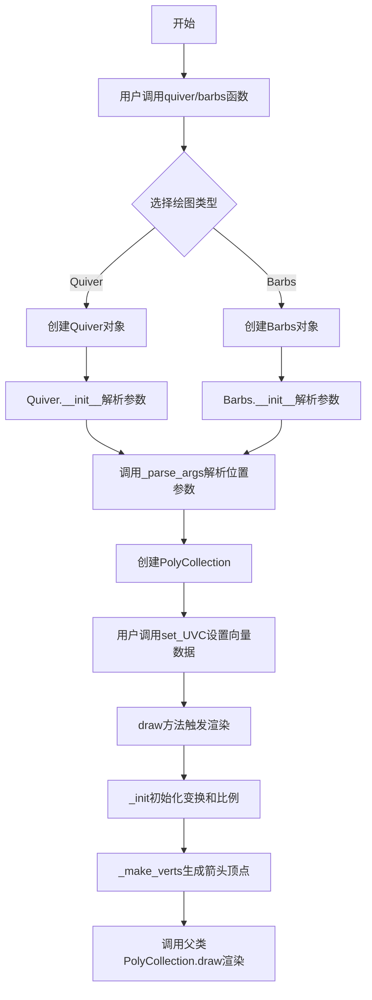

## 类结构

```
martist.Artist (基类)
├── QuiverKey (继承Artist)
└── mcollections.PolyCollection (基类)
    ├── Quiver
    └── Barbs
```

## 全局变量及字段


### `_quiver_doc`
    
quiver函数文档字符串

类型：`str`
    


### `_barbs_doc`
    
barbs函数文档字符串

类型：`str`
    


### `QuiverKey.QuiverKey`
    
用于quiver图的标尺键类

类型：`class`
    


### `QuiverKey.Q`
    
关联的Quiver对象

类型：`Quiver`
    


### `QuiverKey.X`
    
关键点X坐标

类型：`float`
    


### `QuiverKey.Y`
    
关键点Y坐标

类型：`float`
    


### `QuiverKey.U`
    
关键向量长度

类型：`float`
    


### `QuiverKey.angle`
    
关键箭头角度

类型：`float`
    


### `QuiverKey.coord`
    
坐标系类型

类型：`str`
    


### `QuiverKey.color`
    
覆盖颜色

类型：`color`
    


### `QuiverKey.label`
    
标签文本

类型：`str`
    


### `QuiverKey._labelsep_inches`
    
标签间距(英寸)

类型：`float`
    


### `QuiverKey.labelpos`
    
标签位置

类型：`str`
    


### `QuiverKey.labelcolor`
    
标签颜色

类型：`color`
    


### `QuiverKey.fontproperties`
    
字体属性

类型：`dict`
    


### `QuiverKey.kw`
    
其他关键字参数

类型：`dict`
    


### `QuiverKey.text`
    
文本对象

类型：`mtext.Text`
    


### `QuiverKey._dpi_at_last_init`
    
上次DPI值

类型：`float`
    


### `QuiverKey.zorder`
    
渲染顺序

类型：`float`
    


### `Quiver.Quiver`
    
用于绘制2D箭头场的类

类型：`class`
    


### `Quiver._axes`
    
所属坐标轴

类型：`Axes`
    


### `Quiver.X`
    
X坐标数组

类型：`array`
    


### `Quiver.Y`
    
Y坐标数组

类型：`array`
    


### `Quiver.XY`
    
XY坐标对

类型：`array`
    


### `Quiver.N`
    
箭头数量

类型：`int`
    


### `Quiver.scale`
    
缩放比例

类型：`float`
    


### `Quiver.headwidth`
    
箭头头部宽度

类型：`float`
    


### `Quiver.headlength`
    
箭头头部长度

类型：`float`
    


### `Quiver.headaxislength`
    
箭头轴长度

类型：`float`
    


### `Quiver.minshaft`
    
最小轴长

类型：`float`
    


### `Quiver.minlength`
    
最小长度

类型：`float`
    


### `Quiver.units`
    
宽度单位

类型：`str`
    


### `Quiver.scale_units`
    
缩放单位

类型：`str`
    


### `Quiver.angles`
    
角度指定方式

类型：`str/array`
    


### `Quiver.width`
    
箭头宽度

类型：`float`
    


### `Quiver.pivot`
    
旋转支点

类型：`str`
    


### `Quiver.transform`
    
变换对象

类型：`transform`
    


### `Quiver.polykw`
    
多边形关键字参数

类型：`dict`
    


### `Quiver._dpi_at_last_init`
    
上次DPI

类型：`float`
    


### `Quiver.U`
    
X分量

类型：`array`
    


### `Quiver.V`
    
Y分量

类型：`array`
    


### `Quiver.Umask`
    
掩码数组

类型：`array`
    


### `Quiver._trans_scale`
    
像素每单位

类型：`float`
    


### `Barbs.Barbs`
    
用于绘制风羽图的类

类型：`class`
    


### `Barbs.sizes`
    
尺寸系数

类型：`dict`
    


### `Barbs.fill_empty`
    
填充空风羽

类型：`bool`
    


### `Barbs.barb_increments`
    
增量设置

类型：`dict`
    


### `Barbs.rounding`
    
是否取整

类型：`bool`
    


### `Barbs.flip`
    
翻转标志

类型：`array`
    


### `Barbs._pivot`
    
旋转支点

类型：`str/float`
    


### `Barbs._length`
    
长度

类型：`float`
    


### `Barbs.x`
    
X坐标

类型：`array`
    


### `Barbs.y`
    
Y坐标

类型：`array`
    


### `Barbs.u`
    
X分量

类型：`array`
    


### `Barbs.v`
    
Y分量

类型：`array`
    
    

## 全局函数及方法


### `_parse_args`

该函数是一个辅助函数，用于解析彩色矢量图（如Quiver和Barbs）的位置参数。它接受2-5个位置参数，根据参数数量将其解析为X、Y坐标、U、V向量和可选的C颜色数据，并返回这五个值的元组。

参数：

-  `*args`：`list`，位置参数列表，长度为2-5。根据参数数量解析为不同的变量组合：
  - 2个参数：U, V
  - 3个参数：U, V, C
  - 4个参数：X, Y, U, V
  - 5个参数：X, Y, U, V, C
-  `caller_name`：`str`，默认值 `'function'`。调用方法的名称，用于错误消息中。

返回值：`tuple`，返回 (X, Y, U, V, C) 元组，其中：
-  X, Y：箭头位置的坐标数组（如果没有提供则为自动生成的网格索引）
-  U, V：箭头的方向分量
-  C：可选的颜色数据（如果没有提供则为None）

#### 流程图

```mermaid
flowchart TD
    A[开始: _parse_args] --> B[初始化 X=Y=C=None]
    B --> C{nargs = len(args)}
    C -->|nargs=2| D[U, V = np.atleast_1d(*args)]
    C -->|nargs=3| E[U, V, C = np.atleast_1d(*args)]
    C -->|nargs=4| F[X, Y, U, V = np.atleast_1d(*args)]
    C -->|nargs=5| G[X, Y, U, V, C = np.atleast_1d(*args)]
    C -->|其他| H[抛出参数错误]
    D --> I[计算 nr, nc]
    E --> I
    F --> I
    G --> I
    H --> Z[结束]
    I --> J{X is not None?}
    J -->|是| K[展平 X, Y]
    J -->|否| L[生成默认网格索引]
    K --> M{len(X)==nc and len(Y)==nr?}
    M -->|是| N[使用meshgrid展开X, Y]
    M -->|否| O{X.len == Y.len?}
    N --> P[返回 X, Y, U, V, C]
    O -->|否| Q[抛出ValueError: X和Y大小不一致]
    O -->|是| P
    L --> P
    P --> Z
```

#### 带注释源码

```python
def _parse_args(*args, caller_name='function'):
    """
    Helper function to parse positional parameters for colored vector plots.

    This is currently used for Quiver and Barbs.

    Parameters
    ----------
    *args : list
        list of 2-5 arguments. Depending on their number they are parsed to::

            U, V
            U, V, C
            X, Y, U, V
            X, Y, U, V, C

    caller_name : str
        Name of the calling method (used in error messages).
    """
    # 初始化默认值为None
    X = Y = C = None

    # 获取参数个数
    nargs = len(args)
    
    # 根据参数数量进行解析
    if nargs == 2:
        # 2个参数：仅U和V（向量分量）
        # atleast_1d确保处理标量参数的同时保持掩码数组
        U, V = np.atleast_1d(*args)
    elif nargs == 3:
        # 3个参数：U、V和C（颜色数据）
        U, V, C = np.atleast_1d(*args)
    elif nargs == 4:
        # 4个参数：X、Y位置和U、V向量
        X, Y, U, V = np.atleast_1d(*args)
    elif nargs == 5:
        # 5个参数：X、Y位置，U、V向量和C颜色
        X, Y, U, V, C = np.atleast_1d(*args)
    else:
        # 参数数量不在有效范围内，抛出错误
        raise _api.nargs_error(caller_name, takes="from 2 to 5", given=nargs)

    # 根据U的维度确定行数和列数
    # 如果U是一维数组，则nr=1, nc=U.shape[0]
    # 如果U是二维数组，则nr, nc为U的shape
    nr, nc = (1, U.shape[0]) if U.ndim == 1 else U.shape

    # 处理X和Y坐标
    if X is not None:
        # 如果提供了X和Y坐标
        # 将X和Y展平为一维数组
        X = X.ravel()
        Y = Y.ravel()
        
        # 检查X和Y的维度是否与U的维度匹配
        # 如果X是列向量且Y是行向量，且长度匹配U的行列数
        if len(X) == nc and len(Y) == nr:
            # 使用meshgrid将X和Y扩展为与U相同维度的网格
            X, Y = (a.ravel() for a in np.meshgrid(X, Y))
        elif len(X) != len(Y):
            # X和Y大小不一致，抛出错误
            raise ValueError('X and Y must be the same size, but '
                             f'X.size is {X.size} and Y.size is {Y.size}.')
    else:
        # 如果没有提供X和Y，自动生成均匀网格索引
        # 创建基于U的行列数的网格
        indexgrid = np.meshgrid(np.arange(nc), np.arange(nr))
        X, Y = (np.ravel(a) for a in indexgrid)
    
    # 返回解析后的X, Y, U, V, C
    # 注意：这里的C是颜色数据参数，不是坐标
    # Size validation for U, V, C is left to the set_UVC method.
    return X, Y, U, V, C
```


### `_check_consistent_shapes`

#### 描述
该函数是一个全局辅助函数，用于验证传入的所有数组是否具有相同的形状。如果传入的数组形状不一致，该函数会抛出一个 `ValueError` 异常，以确保数据在后续处理（如绘图）前的一致性。

#### 参数

- `*arrays`: `任意具有 shape 属性的对象 (如 numpy.ndarray)`，这是一个可变参数，接受任意数量的数组对象。函数会遍历这些对象获取其形状进行比对。

#### 返回值

- `None`，该函数不返回任何值。如果形状检查通过，程序正常运行结束；如果形状不匹配，则抛出 `ValueError` 异常。

#### 流程图

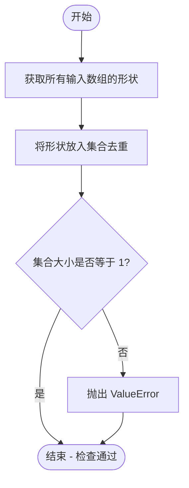

#### 带注释源码

```python
def _check_consistent_shapes(*arrays):
    """
    检查传入的多个数组形状是否一致。

    参数:
        *arrays: 任意数量的数组对象，必须具有 shape 属性。
    """
    # 遍历所有输入数组，提取它们的形状，并利用集合(Set)的特性去除重复的形状。
    # 如果所有数组形状一致，那么集合中应该只有一个元素（一个形状元组）。
    all_shapes = {a.shape for a in arrays}
    
    # 判断集合的大小。如果大小不为 1，说明至少有两个不同的形状，形状不匹配。
    if len(all_shapes) != 1:
        # 抛出 ValueError 异常，通知调用者形状不匹配。
        raise ValueError('The shapes of the passed in arrays do not match')
```

#### 潜在的技术债务或优化空间

1.  **错误信息不够详细**: 目前的错误信息只提示“形状不匹配”，但在调试时，知道*具体是哪些形状不匹配*往往更有帮助。可以考虑修改异常信息，列出 `all_shapes` 中的具体形状元组。
2.  **缺乏上下文**: 错误信息没有指出是哪个函数调用导致的错误（虽然堆栈跟踪会提供，但内置错误信息更佳）。可以在 `ValueError` 消息中加入调用者的名称（如果作为参数传入）。


### `QuiverKey.__init__`

初始化 QuiverKey 对象，用于在 quiver 图上添加带有标签的箭头作为比例尺键。该方法设置键的位置、角度、标签文本样式以及与底层 Quiver 对象的关联。

参数：

-  `Q`：`~matplotlib.quiver.Quiver`，Quiver 对象，由 `~.Axes.quiver()` 返回
-  `X`：`float`，键的 X 坐标位置
-  `Y`：`float`，键的 Y 坐标位置
-  `U`：`float`，键箭头的长度
-  `label`：`str`，键的标签文本（如长度和单位）
-  `angle`：`float`，默认: 0，键箭头的角度，以度为单位，逆时针从水平轴测量
-  `coordinates`：str，默认: 'axes'，坐标系统，可选 'axes'、'figure'、'data'、'inches'
-  `color`：:mpltype:`color`，可选，覆盖 *Q* 的面和边颜色
-  `labelsep`：float，默认: 0.1，箭头与标签之间的距离（英寸）
-  `labelpos`：str，默认: 'N'，标签位置，可选 'N'（上）、'S'（下）、'E'（右）、'W'（左）
-  `labelcolor`：:mpltype:`color`，默认: :rc:`text.color`，标签文本颜色
-  `fontproperties`：dict，可选，字体属性字典
-  `zorder`：float，可选，键的 zorder，默认为 *Q*.zorder + 0.1
-  `**kwargs`：任意关键字参数，用于覆盖从 *Q* 继承的向量属性

返回值：`None`，无返回值（初始化方法）

#### 流程图

```mermaid
flowchart TD
    A[开始 __init__] --> B[调用 super().__init__ 初始化 Artist 基类]
    B --> C[保存 Quiver 对象到 self.Q]
    C --> D[保存位置参数 X, Y 和长度 U]
    D --> E[保存角度 angle 和坐标系 coordinates]
    E --> F[保存颜色 color 和标签 label]
    F --> G[保存标签间距 labelsep]
    G --> H[保存标签位置 labelpos 和标签颜色 labelcolor]
    H --> I[设置字体属性 fontproperties 为空字典或传入的字典]
    I --> J[保存额外关键字参数到 self.kw]
    J --> K[创建 Text 对象设置标签文本和对齐方式]
    K --> L{labelcolor 是否为 None?}
    L -->|否| M[设置文本颜色为 labelcolor]
    L -->|是| N[跳过颜色设置]
    M --> O[初始化 _dpi_at_last_init 为 None]
    N --> O
    O --> P[设置 zorder: 如果传入则使用，否则为 Q.zorder + 0.1]
    P --> Q[结束]
```

#### 带注释源码

```python
def __init__(self, Q, X, Y, U, label,
             *, angle=0, coordinates='axes', color=None, labelsep=0.1,
             labelpos='N', labelcolor=None, fontproperties=None,
             zorder=None, **kwargs):
    """
    Add a key to a quiver plot.

    The positioning of the key depends on *X*, *Y*, *coordinates*, and
    *labelpos*.  If *labelpos* is 'N' or 'S', *X*, *Y* give the position of
    the middle of the key arrow.  If *labelpos* is 'E', *X*, *Y* positions
    the head, and if *labelpos* is 'W', *X*, *Y* positions the tail; in
    either of these two cases, *X*, *Y* is somewhere in the middle of the
    arrow+label key object.

    Parameters
    ----------
    Q : `~matplotlib.quiver.Quiver`
        A `.Quiver` object as returned by a call to `~.Axes.quiver()`.
    X, Y : float
        The location of the key.
    U : float
        The length of the key.
    label : str
        The key label (e.g., length and units of the key).
    angle : float, default: 0
        The angle of the key arrow, in degrees anti-clockwise from the
        horizontal axis.
    coordinates : {'axes', 'figure', 'data', 'inches'}, default: 'axes'
        Coordinate system and units for *X*, *Y*: 'axes' and 'figure' are
        normalized coordinate systems with (0, 0) in the lower left and
        (1, 1) in the upper right; 'data' are the axes data coordinates
        (used for the locations of the vectors in the quiver plot itself);
        'inches' is position in the figure in inches, with (0, 0) at the
        lower left corner.
    color : :mpltype:`color`
        Overrides face and edge colors from *Q*.
    labelpos : {'N', 'S', 'E', 'W'}
        Position the label above, below, to the right, to the left of the
        arrow, respectively.
    labelsep : float, default: 0.1
        Distance in inches between the arrow and the label.
    labelcolor : :mpltype:`color`, default: :rc:`text.color`
        Label color.
    fontproperties : dict, optional
        A dictionary with keyword arguments accepted by the
        `~matplotlib.font_manager.FontProperties` initializer:
        *family*, *style*, *variant*, *size*, *weight*.
    zorder : float
        The zorder of the key. The default is 0.1 above *Q*.
    **kwargs
        Any additional keyword arguments are used to override vector
        properties taken from *Q*.
    """
    # 调用父类 Artist 的初始化方法，设置基本 Artist 属性
    super().__init__()
    
    # 保存传入的 Quiver 对象引用，用于后续绘制和属性获取
    self.Q = Q
    
    # 保存键的位置坐标
    self.X = X
    self.Y = Y
    
    # 保存键箭头的长度
    self.U = U
    
    # 保存箭头角度（以度为单位）
    self.angle = angle
    
    # 保存坐标系统标识
    self.coord = coordinates
    
    # 保存可选的颜色覆盖值
    self.color = color
    
    # 保存标签文本
    self.label = label
    
    # 保存标签与箭头之间的间距（英寸），后续会转换为像素
    self._labelsep_inches = labelsep

    # 保存标签相对于箭头位置的方向
    self.labelpos = labelpos
    
    # 保存标签文本颜色，None 表示使用默认颜色
    self.labelcolor = labelcolor
    
    # 字体属性，如果未提供则使用空字典
    self.fontproperties = fontproperties or dict()
    
    # 保存额外的关键字参数，用于覆盖 Quiver 的向量属性
    self.kw = kwargs
    
    # 创建 Text 对象用于显示标签
    # 使用类属性 halign 和 valign 根据 labelpos 设置对齐方式
    self.text = mtext.Text(
        text=label,
        horizontalalignment=self.halign[self.labelpos],
        verticalalignment=self.valign[self.labelpos],
        fontproperties=self.fontproperties)
    
    # 如果指定了标签颜色，设置文本颜色
    if self.labelcolor is not None:
        self.text.set_color(self.labelcolor)
    
    # 初始化 DPI 记录，用于检测 DPI 变化触发重新初始化
    self._dpi_at_last_init = None
    
    # 设置 zorder：如果传入则使用，否则比 Quiver 的 zorder 高 0.1
    self.zorder = zorder if zorder is not None else Q.zorder + 0.1
```


### `QuiverKey.labelsep`

获取DPI调整后的标签间距（像素单位）。该属性将初始化时设置的英寸间距（`_labelsep_inches`）乘以当前Figure的DPI，转换为像素值，以确保标签与箭头之间的间距在不同设备和分辨率下保持一致。

参数：无（属性访问，仅包含隐式参数`self`）

返回值：`float`，返回DPI调整后的标签间距（单位为像素）

#### 流程图

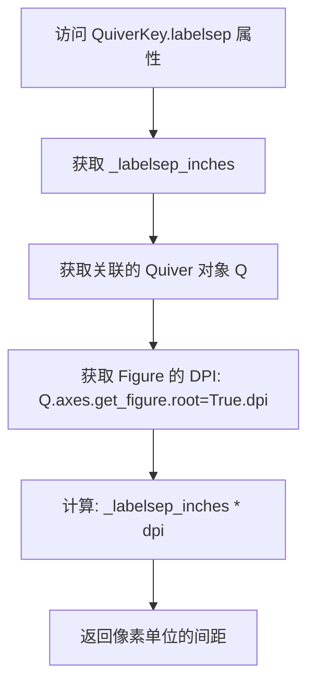

#### 带注释源码

```python
@property
def labelsep(self):
    """
    返回DPI调整后的标签间距（像素单位）。
    
    该属性是一个计算属性，将初始化时设置的英寸间距
    (_labelsep_inches) 乘以当前Figure的DPI，转换为像素值。
    
    Returns
    -------
    float
        DPI调整后的标签间距，单位为像素。
    """
    return self._labelsep_inches * self.Q.axes.get_figure(root=True).dpi
```


### `QuiverKey._init`

该方法负责初始化 QuiverKey 对象的向量（箭头）和坐标变换。它检查 DPI 是否已更改，如果是则重新初始化底层的 Quiver 对象，然后设置坐标变换，计算箭头顶点，并创建 PolyCollection 来表示向量。

参数：

- 该方法无显式参数（隐式接收 `self` 作为实例本身）

返回值：`None`，该方法直接在实例上设置属性而不返回任何值

#### 流程图

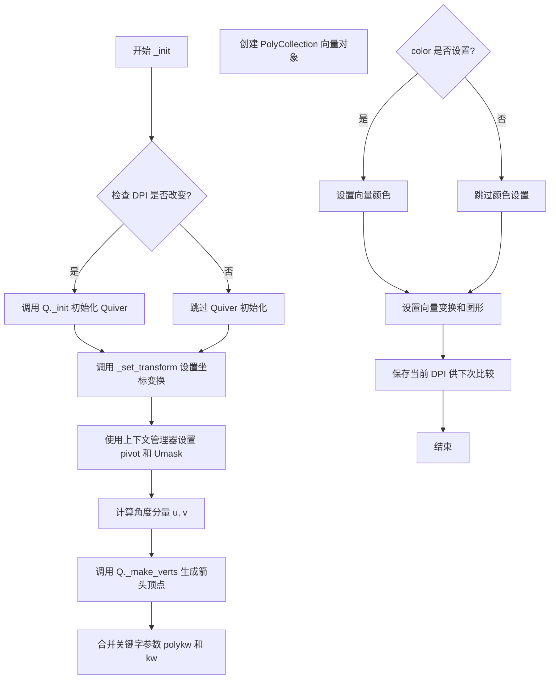

#### 带注释源码

```python
def _init(self):
    """
    初始化 QuiverKey 的向量和坐标变换。
    
    此方法在每次绘制时被调用，用于确保向量能够根据当前
    图形 DPI 和坐标系统正确渲染。
    """
    # 条件判断用于检测 DPI 是否改变（目前始终为 True）
    if True:  # self._dpi_at_last_init != self.axes.get_figure().dpi
        # 检查底层 Quiver 对象的 DPI 是否已改变
        if self.Q._dpi_at_last_init != self.Q.axes.get_figure(root=True).dpi:
            # 如果 DPI 改变，需要重新初始化 Quiver 对象
            self.Q._init()
        
        # 设置当前对象的坐标变换
        self._set_transform()
        
        # 使用上下文管理器临时修改 Quiver 的属性
        # pivot: 根据标签位置设置箭头的支点
        # Umask: 设置掩码以确保所有箭头都被绘制
        with cbook._setattr_cm(self.Q, pivot=self.pivot[self.labelpos],
                               # Hack: save and restore the Umask
                               Umask=ma.nomask):
            # 将角度转换为弧度并计算 u, v 分量
            # u 是水平分量，v 是垂直分量
            u = self.U * np.cos(np.radians(self.angle))
            v = self.U * np.sin(np.radians(self.angle))
            
            # 调用 Quiver 的 _make_verts 方法生成箭头顶点
            # 从原点 (0,0) 开始，根据 u, v 向量生成箭头形状
            self.verts = self.Q._make_verts([[0., 0.]],
                                            np.array([u]), np.array([v]), 'uv')
        
        # 获取 Quiver 的多边形关键字参数
        kwargs = self.Q.polykw
        # 用用户提供的关键字参数覆盖默认值
        kwargs.update(self.kw)
        
        # 创建 PolyCollection 来表示向量箭头
        self.vector = mcollections.PolyCollection(
            self.verts,              # 箭头顶点
            offsets=[(self.X, self.Y)],  # 向量位置
            offset_transform=self.get_transform(),  # 偏移变换
            **kwargs)                # 其他多边形属性
        
        # 如果用户指定了颜色，覆盖默认颜色
        if self.color is not None:
            self.vector.set_color(self.color)
        
        # 设置向量的变换、图形与 Quiver 保持一致
        self.vector.set_transform(self.Q.get_transform())
        self.vector.set_figure(self.get_figure())
        
        # 记录当前的 DPI，以便下次调用时比较
        self._dpi_at_last_init = self.Q.axes.get_figure(root=True).dpi
```


### `QuiverKey._text_shift`

该方法用于计算标签文本相对于箭头中心的偏移量，根据标签位置（北/南/东/西）返回对应的像素偏移量。

参数：无（仅包含 `self`）

返回值：`dict`，返回一个字典，将标签位置（'N'、'S'、'E'、'W'）映射到对应的 (x, y) 像素偏移量元组，用于在绘图时正确放置标签文本。

#### 流程图

```mermaid
flowchart TD
    A[开始 _text_shift] --> B{self.labelpos}
    B -->|N| C[返回 (0, +labelsep)]
    B -->|S| D[返回 (0, -labelsep)]
    B -->|E| E[返回 (+labelsep, 0)]
    B -->|W| F[返回 (-labelsep, 0)]
    C --> G[结束]
    D --> G
    E --> G
    F --> G
```

#### 带注释源码

```python
def _text_shift(self):
    """
    根据标签位置计算文本偏移量。
    
    该方法根据 self.labelpos 指定的标签位置（N/S/E/W），
    返回对应的 (x, y) 像素偏移量，用于在 draw() 方法中
    正确放置标签文本相对于箭头中心的位置。
    
    偏移量基于 self.labelsep 属性，该属性将英寸单位的标签间距
    转换为像素单位（考虑了 figure 的 DPI）。
    
    Returns
    -------
    dict
        键为标签位置字符，值为 (x, y) 偏移量元组：
        - 'N': 向上偏移 (0, +labelsep)
        - 'S': 向下偏移 (0, -labelsep)
        - 'E': 向右偏移 (+labelsep, 0)
        - 'W': 向左偏移 (-labelsep, 0)
    """
    return {
        "N": (0, +self.labelsep),
        "S": (0, -self.labelsep),
        "E": (+self.labelsep, 0),
        "W": (-self.labelsep, 0),
    }[self.labelpos]
```


### QuiverKey.draw

渲染QuiverKey（ quiver 图的关键箭头标识），负责初始化箭头向量、计算文本位置并绘制箭头和标签。

参数：

- `self`：`QuiverKey`，QuiverKey 实例本身
- `renderer`：`object`，matplotlib 渲染器对象，用于执行实际绘制操作

返回值：`None`，无返回值

#### 流程图

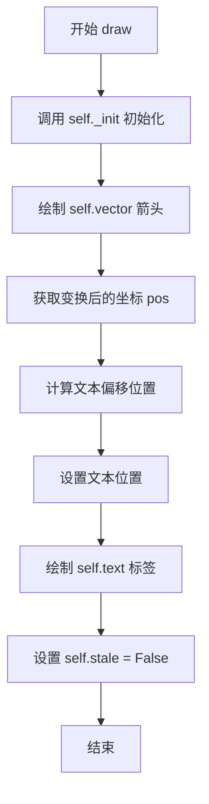

#### 带注释源码

```python
@martist.allow_rasterization
def draw(self, renderer):
    """
    渲染 QuiverKey 到指定的渲染器。
    
    Parameters
    ----------
    renderer : object
        matplotlib 渲染器对象（如 RendererAgg），负责执行实际绘图操作。
    """
    # 调用 _init 方法进行初始化：
    # - 如果 DPI 发生变化，重新初始化 Quiver 对象
    # - 设置坐标变换
    # - 根据角度和长度计算箭头顶点
    # - 创建 PolyCollection 向量对象
    self._init()
    
    # 调用 PolyCollection 的 draw 方法绘制箭头向量
    self.vector.draw(renderer)
    
    # 使用变换将数据坐标转换为显示坐标
    # self.X, self.Y 是关键箭头在数据坐标系中的位置
    pos = self.get_transform().transform((self.X, self.Y))
    
    # 根据标签位置（self.labelpos）计算文本偏移量
    # 返回字典：'N':(0,+s), 'S':(0,-s), 'E':(+s,0), 'W':(-s,0)
    # 其中 s 是 self.labelsep（以像素为单位的标签间距）
    self.text.set_position(pos + self._text_shift())
    
    # 绘制文本标签
    self.text.draw(renderer)
    
    # 标记该艺术家对象不再需要重绘
    # stale 标志用于缓存机制，表示自上次绘制后是否被修改
    self.stale = False
```


### `QuiverKey._set_transform`

**描述**：根据创建时指定的坐标系（`coordinates` 参数），设置 `QuiverKey`（箭头关键尺）的坐标变换矩阵。该方法负责将关键尺的绘制从数据空间或轴空间映射到最终的渲染空间（如像素空间）。

**参数**：

- `self`：`QuiverKey`，调用此方法的类实例本身。

**返回值**：`None`，此方法不返回任何值，它直接修改对象的内部状态（通过调用 `set_transform`）。

#### 流程图

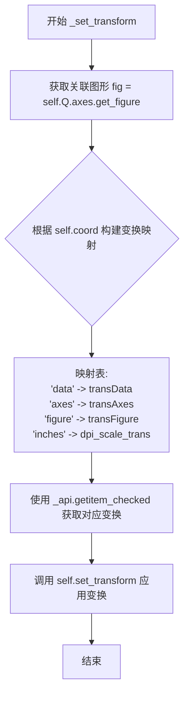

#### 带注释源码

```python
def _set_transform(self):
    # 获取当前 Quiver 对象所在的 Figure 对象
    # root=False 确保获取的是 Axes 所属的 Figure，而非最顶层的根 Figure
    fig = self.Q.axes.get_figure(root=False)
    
    # 定义一个字典，将字符串类型的坐标系映射到具体的变换(Transform)对象
    # - 'data': 数据坐标变换 (transData)
    # - 'axes': 坐标轴坐标变换 (transAxes)
    # - 'figure': 图形坐标变换 (transFigure)
    # - 'inches': 英寸坐标变换，通常用于 DPI 相关的缩放 (dpi_scale_trans)
    transform_map = {
        "data": self.Q.axes.transData,
        "axes": self.Q.axes.transAxes,
        "figure": fig.transFigure,
        "inches": fig.dpi_scale_trans,
    }
    
    # 从映射表中根据 self.coord (如 'axes', 'data') 取出对应的变换对象
    # _api.getitem_checked 会检查 coordinates 是否合法
    selected_transform = _api.getitem_checked(transform_map, coordinates=self.coord)
    
    # 调用父类 Artist 的 set_transform 方法，设置当前 Key 的变换
    self.set_transform(selected_transform)
```


### `QuiverKey.set_figure`

设置 `QuiverKey` 对象所属的图形（Figure），同时确保内部的文本对象也关联到相同的图形。

参数：

- `fig`：`matplotlib.figure.Figure`，要设置的图形对象

返回值：`None`，无返回值描述

#### 流程图

```mermaid
flowchart TD
    A[开始 set_figure] --> B{调用父类方法}
    B --> C[super().set_figure fig]
    C --> D[调用文本对象的 set_figure]
    D --> E[self.text.set_figure fig]
    E --> F[结束]
```

#### 带注释源码

```python
def set_figure(self, fig):
    """
    设置 QuiverKey 所属的图形。

    Parameters
    ----------
    fig : matplotlib.figure.Figure
        要关联的图形对象。
    """
    # 调用父类 Artist.set_figure 方法，将当前艺术对象关联到图形
    super().set_figure(fig)
    # 同时将内部的文本对象也关联到相同的图形，确保渲染一致性
    self.text.set_figure(fig)
```


### QuiverKey.contains

该方法用于检测鼠标事件是否命中了QuiverKey（箭头图的关键点），包括检测鼠标事件是否点击在文本标签或箭头向量上。

参数：

- `mouseevent`：`matplotlib.backend_bases.MouseEvent`，鼠标事件对象，包含鼠标位置和按钮状态等信息

返回值：`tuple[bool, dict]`，返回两个元素的元组：第一个元素为布尔值，表示是否命中（True表示命中，False表示未命中）；第二个元素为空字典（当前版本未使用，保留用于未来区分文本命中和向量命中）

#### 流程图

```mermaid
flowchart TD
    A[开始 contains 方法] --> B{检查是否不同画布<br/>_different_canvas}
    B -->|是| C[返回 False, {}]
    B -->|否| D{检查文本是否包含鼠标事件<br/>text.contains}
    D -->|是| E[返回 True, {}]
    D -->|否| F{检查向量是否包含鼠标事件<br/>vector.contains}
    F -->|是| E
    F -->|否| G[返回 False, {}]
```

#### 带注释源码

```python
def contains(self, mouseevent):
    """
    检测鼠标事件是否命中该QuiverKey对象。

    Parameters
    ----------
    mouseevent : matplotlib.backend_bases.MouseEvent
        鼠标事件对象，包含鼠标位置坐标等信息。

    Returns
    -------
    tuple[bool, dict]
        返回 (bool, dict) 元组：
        - bool: 如果鼠标事件命中了文本标签或箭头向量则返回True，否则返回False
        - dict: 当前为空字典，保留用于未来扩展以区分文本命中和向量命中
    """
    # 首先检查鼠标事件是否来自不同的画布
    # 如果画布不同，直接返回未命中
    if self._different_canvas(mouseevent):
        return False, {}

    # 检查鼠标事件是否命中了文本标签或箭头向量
    # 使用OR逻辑，只要其中任一个命中就返回True
    # 注意：text.contains 和 vector.contains 都返回 (bool, dict) 元组
    # 这里只取第一个元素（布尔值）进行判断
    if (self.text.contains(mouseevent)[0] or
            self.vector.contains(mouseevent)[0]):
        return True, {}

    # 鼠标事件既没有命中文本也没有命中向量
    return False, {}
```


### Quiver.__init__

初始化Quiver对象，用于在2D平面上绘制箭头（向量）场。该方法是Quiver类的构造函数，继承自PolyCollection，负责解析输入参数、设置箭头属性、验证参数并初始化父类。

参数：

- `ax`：`matplotlib.axes.Axes`，Axes实例，必需参数，表示箭头将绘制在哪个坐标系上
- `*args`：可变位置参数，包含X, Y, U, V, C等参数，用于定义箭头位置、方向和颜色
- `scale`：float或None，可选，控制箭头长度的缩放比例，None表示自动缩放
- `headwidth`：float，默认值3，可选，箭头头部宽度相对于箭身宽度的倍数
- `headlength`：float，默认值5，可选，箭头头部长度相对于箭身宽度的倍数
- `headaxislength`：float，默认值4.5，可选，箭头头部与箭身交接处的长度
- `minshaft`：float，默认值1，可选，小于此长度的箭头将按比例缩放
- `minlength`：float，默认值1，可选，箭头最小长度，小于此值将绘制点代替箭头
- `units`：str，默认值'width'，可选，影响箭头大小（除长度外）的单位
- `scale_units`：str或None，可选，箭头长度的物理单位
- `angles`：str或array-like，默认值'uv'，可选，确定箭头角度的方法
- `width`：float或None，可选，箭身宽度
- `color`：color，默认值'k'（黑色），可选，箭头颜色
- `pivot`：str，默认值'tail'，可选，箭头围绕旋转的锚点位置
- `**kwargs`：dict，可选，其他关键字参数传递给PolyCollection

返回值：`None`，该方法为构造函数，不返回任何值

#### 流程图

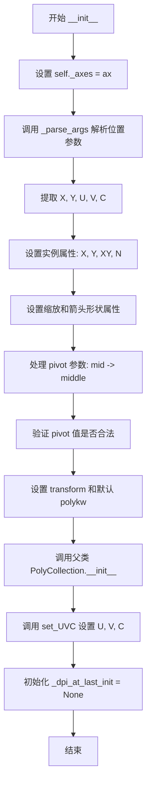

#### 带注释源码

```python
@_docstring.Substitution(_quiver_doc)
def __init__(self, ax, *args,
             scale=None, headwidth=3, headlength=5, headaxislength=4.5,
             minshaft=1, minlength=1, units='width', scale_units=None,
             angles='uv', width=None, color='k', pivot='tail', **kwargs):
    """
    The constructor takes one required argument, an Axes
    instance, followed by the args and kwargs described
    by the following pyplot interface documentation:
    %s
    """
    # 保存Axes引用，后续用于获取图形信息和变换
    self._axes = ax  # The attr actually set by the Artist.axes property.
    
    # 解析位置参数：支持 U,V 或 X,Y,U,V 或带C的变体
    X, Y, U, V, C = _parse_args(*args, caller_name='quiver')
    
    # 存储坐标数据
    self.X = X
    self.Y = Y
    # 将X,Y堆叠成[N,2]的数组用于offsets
    self.XY = np.column_stack((X, Y))
    # 记录箭头数量
    self.N = len(X)
    
    # 存储用户提供的参数，用于后续计算
    self.scale = scale
    self.headwidth = headwidth
    # 转换为float确保计算精度
    self.headlength = float(headlength)
    self.headaxislength = headaxislength
    self.minshaft = minshaft
    self.minlength = minlength
    self.units = units
    self.scale_units = scale_units
    self.angles = angles
    self.width = width

    # 处理pivot参数：'mid'是'middle'的别名
    if pivot.lower() == 'mid':
        pivot = 'middle'
    self.pivot = pivot.lower()
    # 验证pivot值是否在允许的列表中
    _api.check_in_list(self._PIVOT_VALS, pivot=self.pivot)

    # 设置默认变换为axes的data坐标变换
    self.transform = kwargs.pop('transform', ax.transData)
    # 设置默认面颜色为指定颜色
    kwargs.setdefault('facecolors', color)
    # 默认线宽为0，使箭头呈现为填充多边形而非轮廓线
    kwargs.setdefault('linewidths', (0,))
    
    # 调用父类PolyCollection的初始化方法
    super().__init__([], offsets=self.XY, offset_transform=self.transform,
                     closed=False, **kwargs)
    # 保存关键字参数供后续使用（如QuiverKey）
    self.polykw = kwargs
    
    # 设置U,V,C数据，处理无效值和掩码
    self.set_UVC(U, V, C)
    # 初始化DPI跟踪，用于延迟初始化判断
    self._dpi_at_last_init = None
```


### Quiver._init

该方法是 Quiver 类的延迟初始化方法，用于在首次绘制时初始化箭头相关的属性和变换，允许在轴设置完成后再进行初始化操作。

参数：无（该方法不接受任何参数）

返回值：无（`None`），该方法仅执行初始化操作，不返回任何值

#### 流程图

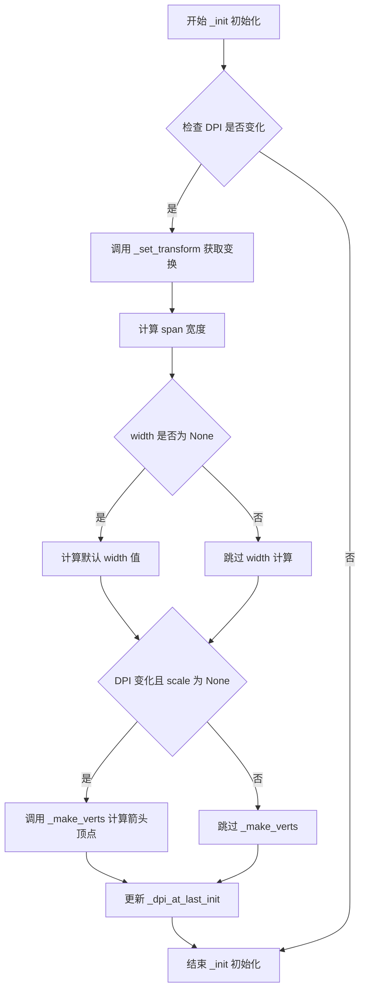

#### 带注释源码

```python
def _init(self):
    """
    Initialization delayed until first draw;
    allow time for axes setup.
    """
    # 目前似乎没有足够的事件通知机制来按需执行此操作，
    # 因此使用 if True: 强制每次 draw 时都执行初始化检查
    if True:  # self._dpi_at_last_init != self.axes.figure.dpi
        # 设置从箭头宽度单位到像素的变换
        trans = self._set_transform()
        
        # 计算轴 bbox 在变换后的宽度，用于自动缩放计算
        self.span = trans.inverted().transform_bbox(self.axes.bbox).width
        
        # 如果未指定箭头宽度，则根据箭头数量自动计算默认宽度
        # 使用 clip 确保 sn 在 8 到 25 之间
        if self.width is None:
            sn = np.clip(math.sqrt(self.N), 8, 25)
            self.width = 0.06 * self.span / sn

        # _make_verts 方法会在 scale 为 None 时自动计算 scale 值
        # 仅当 DPI 发生变化且 scale 未指定时才重新计算顶点
        if (self._dpi_at_last_init != self.axes.get_figure(root=True).dpi
                and self.scale is None):
            self._make_verts(self.XY, self.U, self.V, self.angles)

        # 记录当前的 DPI 值，用于下次比较
        self._dpi_at_last_init = self.axes.get_figure(root=True).dpi
```


### `Quiver.get_datalim`

获取Quiver（箭头）图形的数据边界（Bounding Box），用于确定箭头绘制区域的范围。该方法通过组合坐标变换，将箭头位置从数据坐标转换到显示坐标，并计算覆盖所有箭头位置的边界框。

参数：

-  `transData`：`matplotlib.transforms.Transform`，数据坐标到显示坐标的变换对象（通常是 `axes.transData`）

返回值：`matplotlib.transforms.Bbox`，返回经过变换后的数据边界框，包含所有箭头位置在显示坐标系下的边界

#### 流程图

```mermaid
flowchart TD
    A[开始 get_datalim] --> B[获取Quiver的变换对象 trans]
    B --> C[获取偏移变换对象 offset_trf]
    C --> D[计算组合变换 full_transform = (trans - transData) + (offset_trf - transData)]
    D --> E[使用full_transform变换self.XY得到显示坐标下的箭头位置]
    E --> F[创建空Bbox对象]
    F --> G[从变换后的XY坐标更新边界框数据, ignore=True忽略无效值]
    G --> H[返回计算得到的边界框]
```

#### 带注释源码

```python
def get_datalim(self, transData):
    """
    获取Quiver图形的数据边界框。
    
    Parameters
    ----------
    transData : matplotlib.transforms.Transform
        从数据坐标到显示坐标的坐标变换对象（例如 axes.transData）
    
    Returns
    -------
    matplotlib.transforms.Bbox
        包含所有箭头位置边界的数据边界框
    """
    # 获取Quiver自身的变换（从箭头单位到显示坐标）
    trans = self.get_transform()
    
    # 获取偏移变换（用于定位箭头位置）
    offset_trf = self.get_offset_transform()
    
    # 计算完整的坐标变换：
    # (trans - transData) 将箭头形状从箭头单位转换到数据坐标
    # (offset_trf - transData) 将箭头位置从偏移坐标转换到显示坐标
    full_transform = (trans - transData) + (offset_trf - transData)
    
    # 将所有箭头位置 XY 从原始坐标变换到最终显示坐标
    XY = full_transform.transform(self.XY)
    
    # 创建一个空的边界框（Bbox.null() 返回一个无效/空的边界框）
    bbox = transforms.Bbox.null()
    
    # 从变换后的XY坐标点更新边界框数据
    # ignore=True 表示忽略NaN和无穷值
    bbox.update_from_data_xy(XY, ignore=True)
    
    # 返回计算得到的边界框
    return bbox
```


### Quiver.draw

该方法负责渲染Quiver（箭头）集合。它在每次绘制时重新计算箭头顶点，确保箭头方向、长度和颜色与当前数据及变换保持同步。

参数：

- `self`：Quiver实例，当前对象本身
- `renderer`：`matplotlib.backend_bases.RendererBase`，渲染器对象，负责将图形绘制到设备（如屏幕、文件）

返回值：无返回值（`None`），该方法直接渲染图形到输出设备

#### 流程图

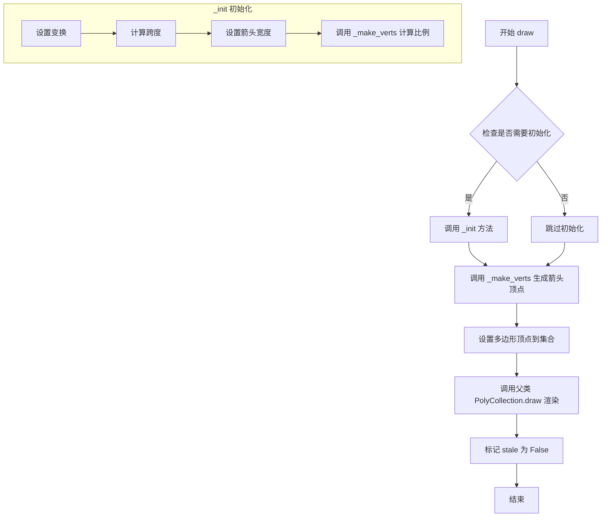

#### 带注释源码

```python
@martist.allow_rasterization
def draw(self, renderer):
    """
    绘制Quiver箭头集合到渲染器。
    
    此方法在每次绘制时被调用，确保箭头能够响应数据变化和视图变换。
    之所以将大部分计算放在draw中，是因为这样可以获取尽可能多的
    有关绘图的信息，同时在后续draw调用中限制重计算以优化性能。
    """
    # 第一次绘制时进行初始化，包括变换设置和比例计算
    # 这是一个延迟初始化机制，避免在构造函数中过早计算
    self._init()
    
    # 根据当前位置(XY)、向量分量(U, V)和角度(angles)
    # 计算每个箭头的多边形顶点
    # 返回的verts是一个三维数组，形状为(N, 8, 2)，N为箭头数量
    verts = self._make_verts(self.XY, self.U, self.V, self.angles)
    
    # 将计算得到的顶点设置为PolyCollection的多边形顶点
    # closed=False表示多边形不自动闭合首尾
    self.set_verts(verts, closed=False)
    
    # 调用父类PolyCollection的draw方法
    # 实际执行将多边形集合渲染到输出设备的工作
    super().draw(renderer)
    
    # 标记当前对象为非stale状态，表示已与渲染器同步
    # stale=True会触发下次重绘，此处重置为False表示本次绘制已完成
    self.stale = False
```


### `Quiver.set_UVC`

设置向量的U、V分量和可选的颜色C，更新箭头的大小、方向和颜色。

参数：

- `U`：`array-like`，向量的x方向分量
- `V`：`array-like`，向量的y方向分量
- `C`：`array-like`，可选，用于映射颜色的数值数据

返回值：`None`，无返回值，仅更新对象内部状态

#### 流程图

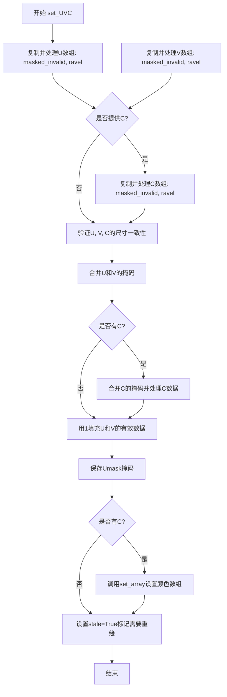

#### 带注释源码

```python
def set_UVC(self, U, V, C=None):
    """
    Set the U, V, and C (color) of the quiver plot.

    Parameters
    ----------
    U : array-like
        The x components of the arrow vectors.
    V : array-like
        The y components of the arrow vectors.
    C : array-like, optional
        Numeric data that defines the arrow colors.
    """
    # We need to ensure we have a copy, not a reference
    # to an array that might change before draw().
    # 使用masked_invalid将无效值转换为掩码，并复制数组避免引用
    U = ma.masked_invalid(U, copy=True).ravel()
    V = ma.masked_invalid(V, copy=True).ravel()
    
    # 如果提供了C参数，同样处理颜色数据
    if C is not None:
        C = ma.masked_invalid(C, copy=True).ravel()
    
    # 验证参数尺寸：U、V、C必须与箭头位置数量N匹配
    # 允许大小为1的数组进行广播
    for name, var in zip(('U', 'V', 'C'), (U, V, C)):
        if not (var is None or var.size == self.N or var.size == 1):
            raise ValueError(f'Argument {name} has a size {var.size}'
                             f' which does not match {self.N},'
                             ' the number of arrow positions')

    # 合并U和V的掩码，确定哪些箭头应被遮挡
    mask = ma.mask_or(U.mask, V.mask, copy=False, shrink=True)
    
    # 如果有C参数，也合并C的掩码
    if C is not None:
        mask = ma.mask_or(mask, C.mask, copy=False, shrink=True)
        # 如果没有掩码，将C转换为填充数组；否则创建带掩码的数组
        if mask is ma.nomask:
            C = C.filled()
        else:
            C = ma.array(C, mask=mask, copy=False)
    
    # 将有效数据填充为1，掩码位置的数据将被遮挡
    self.U = U.filled(1)
    self.V = V.filled(1)
    # 保存合并后的掩码，供后续绘制使用
    self.Umask = mask
    
    # 如果提供了颜色数据，设置颜色数组
    if C is not None:
        self.set_array(C)
    
    # 设置stale标记为True，标记图形需要重绘
    self.stale = True
```


### `Quiver._dots_per_unit`

该方法是 Quiver 类的私有方法，用于根据不同的单位类型计算从数据单位到显示像素的转换比例因子。它通过检查坐标轴的边界框（bbox）和视图限制（viewLim），并根据 `units` 参数返回相应的像素转换系数。

参数：

- `units`：`str`，要转换的单位类型，可选值为 `'x'`、`'y'`、`'xy'`、`'width'`、`'height'`、`'dots'`、`'inches'`。

返回值：`float`，返回从指定单位到像素的转换比例因子。

#### 流程图

```mermaid
flowchart TD
    A[开始 _dots_per_unit] --> B[获取 axes.bbox 和 axes.viewLim]
    B --> C{根据 units 参数选择}
    C -->|'x'| D[返回 bbox.width / viewLim.width]
    C -->|'y'| E[返回 bbox.height / viewLim.height]
    C -->|'xy'| F[返回 sqrt{bbox.width² + bbox.height²} / sqrt{viewLim.width² + viewLim.height²}]
    C -->|'width'| G[返回 bbox.width]
    C -->|'height'| H[返回 bbox.height]
    C -->|'dots'| I[返回 1.0]
    C -->|'inches'| J[返回 figure.dpi]
    D --> K[返回比例因子]
    E --> K
    F --> K
    G --> K
    H --> K
    I --> K
    J --> K
```

#### 带注释源码

```python
def _dots_per_unit(self, units):
    """Return a scale factor for converting from units to pixels."""
    # 获取坐标轴的边界框（Bounding Box），包含宽度和高度信息
    bb = self.axes.bbox
    # 获取坐标轴的视图限制（View Limits），即数据坐标范围
    vl = self.axes.viewLim
    
    # 使用 _api.getitem_checked 从字典中获取对应的转换系数
    # 根据不同的 units 参数返回不同的像素转换比例：
    # - 'x': 基于 x 轴宽度的比例 (像素/数据单位)
    # - 'y': 基于 y 轴高度的比例 (像素/数据单位)
    # - 'xy': 基于对角线长度的比例
    # - 'width': 直接返回边界框宽度（像素）
    # - 'height': 直接返回边界框高度（像素）
    # - 'dots': 返回 1.0（像素到像素的转换）
    # - 'inches': 返回图像的 DPI（每英寸的像素数）
    return _api.getitem_checked({
        'x': bb.width / vl.width,
        'y': bb.height / vl.height,
        'xy': np.hypot(*bb.size) / np.hypot(*vl.size),
        'width': bb.width,
        'height': bb.height,
        'dots': 1.,
        'inches': self.axes.get_figure(root=True).dpi,
    }, units=units)
```


### Quiver._set_transform

该方法用于设置 PolyCollection 的坐标变换，将箭头宽度单位转换为像素单位。这是 Quiver 类渲染箭头的关键步骤，确保箭头尺寸能够正确地在图形坐标系中显示。

参数：

- 该方法无显式参数（隐式参数 `self` 为 Quiver 实例）

返回值：`matplotlib.transforms.Affine2D`，返回设置后的仿射变换对象

#### 流程图

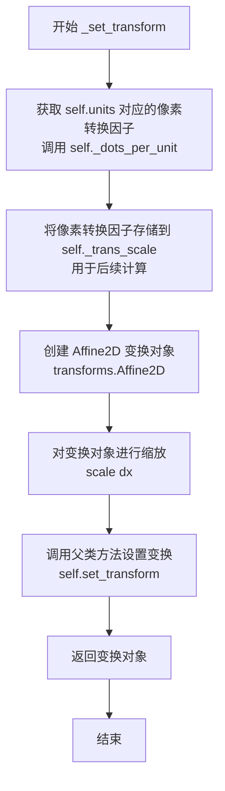

#### 带注释源码

```python
def _set_transform(self):
    """
    Set the PolyCollection transform to go
    from arrow width units to pixels.
    """
    # 获取当前单位到像素的转换因子
    # self.units 可以是 'width', 'height', 'dots', 'inches', 'x', 'y', 'xy' 等
    dx = self._dots_per_unit(self.units)
    
    # 保存转换因子（每个箭头宽度单位对应的像素数）
    # 后续在 _make_verts 中会用到这个值来计算宽度单位与长度单位的比例
    self._trans_scale = dx  # pixels per arrow width unit
    
    # 创建仿射变换对象，用于将箭头宽度单位转换为显示像素
    trans = transforms.Affine2D().scale(dx)
    
    # 调用父类 PolyCollection 的 set_transform 方法
    # 将变换应用到整个矢量集合
    self.set_transform(trans)
    
    # 返回变换对象，供调用者（如 _init 方法）使用
    return trans
```


### `Quiver._angles_lengths`

该方法用于计算箭头线段在数据坐标系下的角度和长度。它通过坐标变换将数据坐标转换为显示坐标，然后基于变换前后的坐标差计算每个箭头的方向角度（以弧度为单位）和归一化长度。

参数：

- `self`：`Quiver`，Quiver 实例本身，包含坐标轴和变换信息
- `XY`：`numpy.ndarray`，形状为 (N, 2) 的数组，表示箭头的起始坐标 (x, y)
- `U`：`numpy.ndarray`，形状为 (N,) 的数组，表示箭头向量在 x 方向的分量
- `V`：`numpy.ndarray`，形状为 (N,) 的数组，表示箭头向量在 y 方向的分量
- `eps`：`float`，默认值为 1，用于计算变换后坐标的小增量，防止坐标变换精度问题

返回值：`tuple`，返回两个 numpy.ndarray：
- `angles`：`numpy.ndarray`，形状为 (N,)，每个箭头的方向角度（弧度），范围为 [-π, π]
- `lengths`：`numpy.ndarray`，形状为 (N,)，每个箭头的归一化长度（像素单位除以 eps）

#### 流程图

```mermaid
flowchart TD
    A[开始 _angles_lengths] --> B[使用 transData 将 XY 变换为屏幕坐标 xy]
    C[将 U, V 合并为 uv] --> D[计算 perturbed 坐标 xyp: XY + eps * uv]
    D --> E[使用 transData 将 xyp 变换为屏幕坐标]
    E --> F[计算屏幕坐标差 dxy = xyp - xy]
    F --> G[计算角度: angles = arctan2 dxy[:, 1], dxy[:, 0]]
    G --> H[计算长度: lengths = hypot(dxy[:, 0], dxy[:, 1]) / eps]
    H --> I[返回 angles, lengths]
```

#### 带注释源码

```python
def _angles_lengths(self, XY, U, V, eps=1):
    """
    Calculate angles and lengths for segment between (x, y), (x+u, y+v).
    
    Parameters
    ----------
    XY : numpy.ndarray
        形状为 (N, 2) 的数组，包含箭头的起始坐标 [x, y]
    U : numpy.ndarray
        箭头向量在 x 方向的分量
    V : numpy.ndarray
        箭头向量在 y 方向的分量
    eps : float, optional
        用于计算变换后坐标的小增量，默认值为 1。
        当 angles='xy' 且 scale_units='xy' 时使用 eps=1；
        其他情况使用基于数据范围的 eps 值以避免数值精度问题。
    
    Returns
    -------
    angles : numpy.ndarray
        箭头方向角度（弧度），范围 [-π, π]
    lengths : numpy.ndarray
        归一化后的箭头长度（像素单位除以 eps）
    """
    # 将数据坐标转换为显示坐标（屏幕像素坐标）
    xy = self.axes.transData.transform(XY)
    
    # 将 U, V 向量分量合并为 (N, 2) 数组
    uv = np.column_stack((U, V))
    
    # 计算扰动后的坐标：在原始坐标基础上加上 eps 倍的向量
    # eps 是一个小量，用于近似计算坐标变换后的位移
    xyp = self.axes.transData.transform(XY + eps * uv)
    
    # 计算扰动前后的显示坐标差（即向量在屏幕空间的表示）
    dxy = xyp - xy
    
    # 计算角度：使用 arctan2 获取每个向量的方向
    # dxy[:, 1] 是 y 方向分量，dxy[:, 0] 是 x 方向分量
    angles = np.arctan2(dxy[:, 1], dxy[:, 0])
    
    # 计算长度：使用 hypot 计算欧几里得范数，然后除以 eps 归一化
    # 这样得到的 lengths 与 eps 无关，表示单位向量对应的屏幕像素长度
    lengths = np.hypot(*dxy.T) / eps
    
    return angles, lengths
```


### Quiver._make_verts

该方法根据给定的位置向量和角度信息，生成表示箭头的多边形顶点。它负责计算箭头的长度、旋转角度，并将水平箭头几何形状转换为最终的多边形顶点坐标，支持自动缩放、不同的角度定义方式（'uv'或'xy'）以及蒙版数据的处理。

参数：

- `XY`：`numpy.ndarray`，包含箭头位置的 X 和 Y 坐标的数组，通常是形状为 (N, 2) 的二维数组
- `U`：`numpy.ndarray`，X 方向的分量，与 V 共同定义箭头向量
- `V`：`numpy.ndarray`，Y 方向的分量，与 U 共同定义箭头向量
- `angles`：`str 或 array-like`，指定箭头方向的定义方式，可以是字符串 'uv'（使用 U、V 的方向）、'xy'（使用数据坐标），或者是具体角度值的数组（以度为单位，逆时针为正）

返回值：`numpy.ndarray` 或 `numpy.ma.MaskedArray`，返回形状为 (N, 8, 2) 的数组，其中 N 是箭头数量，8 是每个箭头多边形的顶点数，每个顶点包含 (x, y) 坐标

#### 流程图

```mermaid
flowchart TD
    A[开始 _make_verts] --> B[将 U, V 组合为复数 uv = U + Vj]
    B --> C{angles 是否为字符串?}
    C -->|是| D[str_angles = angles]
    C -->|否| E[str_angles = '']
    D --> F{str_angles == 'xy' 且 scale_units == 'xy'?}
    E --> G{str_angles == 'xy' 或 scale_units == 'xy'?}
    
    F -->|是| H[调用 _angles_lengths eps=1]
    F -->|否| G
    G -->|是| I[计算 eps 基于 dataLim.extents]
    I --> J[调用 _angles_lengths eps=eps]
    G -->|否| K[a = np.abs(uv)]
    
    H --> K
    J --> K
    K --> L{self.scale 是否为 None?}
    
    L -->|是| M[计算自动缩放因子 scale]
    L -->|否| N[widthu_per_lenu = 计算转换因子]
    
    M --> N
    N --> O[计算 arrow_length = a * widthu_per_lenu / (self.scale * self.width)]
    O --> P[调用 _h_arrows 获取水平箭头顶点 X, Y]
    
    P --> Q{str_angles 的值}
    Q --> R['xy' --> theta = angles]
    Q --> S['uv' --> theta = np.angle(uv)]
    Q --> T[其他 --> theta = np.deg2rad(angles)]
    
    R --> U[旋转并缩放顶点]
    S --> U
    T --> U
    
    U --> V[构建复数坐标 xy = (X + Yj) * exp(1j * theta) * width]
    V --> W[转换为实部虚部 XY = stack((xy.real, xy.imag), axis=2)]
    W --> X{self.Umask 是否为 nomask?}
    
    X -->|否| Y[应用蒙版 XY[Umask] = masked]
    X -->|是| Z[返回 XY]
    Y --> Z
    
    style A fill:#f9f,color:#000
    style Z fill:#9f9,color:#000
```

#### 带注释源码

```python
# XY is stacked [X, Y].
# See quiver() doc for meaning of X, Y, U, V, angles.
def _make_verts(self, XY, U, V, angles):
    """
    生成箭头的多边形顶点。
    
    参数:
        XY: 箭头位置的坐标数组 (N, 2)
        U, V: 箭头向量的 x 和 y 分量
        angles: 角度定义方式 ('uv', 'xy' 或角度数组)
    
    返回:
        形状为 (N, 8, 2) 的顶点数组
    """
    # 将 U, V 组合为复数形式，便于后续计算模和角度
    uv = (U + V * 1j)
    
    # 判断 angles 是否为字符串类型
    str_angles = angles if isinstance(angles, str) else ''
    
    # 处理 'xy' 角度模式和 'xy' 缩放单位的情况
    if str_angles == 'xy' and self.scale_units == 'xy':
        # 当通过差分获取 U, V 时，eps=1 确保向量正确连接点
        # 无论轴缩放如何（包括对数坐标）
        angles, lengths = self._angles_lengths(XY, U, V, eps=1)
    elif str_angles == 'xy' or self.scale_units == 'xy':
        # 计算 eps 基于绘图区域的范围，避免大数加小数带来的舍入误差
        eps = np.abs(self.axes.dataLim.extents).max() * 0.001
        angles, lengths = self._angles_lengths(XY, U, V, eps=eps)

    # 根据角度和缩放单位选择使用 lengths 还是 |uv| 作为长度
    if str_angles and self.scale_units == 'xy':
        a = lengths
    else:
        a = np.abs(uv)

    # 自动缩放：如果未指定 scale，则根据向量平均长度和数量计算
    if self.scale is None:
        sn = max(10, math.sqrt(self.N))
        if self.Umask is not ma.nomask:
            amean = a[~self.Umask].mean()  # 计算非蒙版元素的均值
        else:
            amean = a.mean()
        # 粗略的自动缩放算法
        # scale 表示箭头长度相对于箭头宽度的倍数
        scale = 1.8 * amean * sn / self.span

    # 处理缩放单位
    if self.scale_units is None:
        if self.scale is None:
            self.scale = scale
        widthu_per_lenu = 1.0
    else:
        if self.scale_units == 'xy':
            dx = 1
        else:
            dx = self._dots_per_unit(self.scale_units)
        widthu_per_lenu = dx / self._trans_scale
        if self.scale is None:
            self.scale = scale * widthu_per_lenu
    
    # 计算每个箭头的长度（以箭头宽度为单位）
    length = a * (widthu_per_lenu / (self.scale * self.width))
    
    # 获取水平方向箭头的顶点形状
    X, Y = self._h_arrows(length)
    
    # 根据 angles 参数确定旋转角度 theta
    if str_angles == 'xy':
        theta = angles  # 使用数据坐标角度
    elif str_angles == 'uv':
        theta = np.angle(uv)  # 使用 UV 向量的角度
    else:
        # 将角度数组（度）转换为弧度，无效值填为 0
        theta = ma.masked_invalid(np.deg2rad(angles)).filled(0)
    
    # 为广播操作重塑 theta
    theta = theta.reshape((-1, 1))
    
    # 应用旋转：先将水平箭头转为复数，乘以旋转因子，再乘以宽度
    xy = (X + Y * 1j) * np.exp(1j * theta) * self.width
    
    # 将复数结果转换为 (x, y) 坐标对，堆叠成 (N, 8, 2) 形状
    XY = np.stack((xy.real, xy.imag), axis=2)
    
    # 处理蒙版数据
    if self.Umask is not ma.nomask:
        XY = ma.array(XY)
        XY[self.Umask] = ma.masked  # 将被蒙版的箭头顶点设为无效

    return XY
```


### `Quiver._h_arrows`

生成水平箭头形状，用于表示向量场中的箭头。该方法根据给定的长度数组计算箭头顶点，处理普通箭头、短箭头和极短箭头（用七边形点表示）三种情况，并根据pivot参数调整箭头位置。

参数：

- `length`：`numpy.ndarray`，表示每个箭头的长度（以箭头宽度单位计）

返回值：`tuple`，返回两个numpy数组 `(X, Y)`，分别表示箭头的x和y坐标顶点

#### 流程图

```mermaid
flowchart TD
    A[开始 _h_arrows] --> B[计算最小轴长 minsh = minshaft * headlength]
    B --> C[将length重塑为列向量]
    C --> D[裁剪length到0-2^16范围]
    D --> E[构建普通水平箭头顶点 x, y]
    E --> F[构建无轴短箭头顶点 x0, y0]
    F --> G[构建顶点索引 ii = 0,1,2,3,2,1,0,0]
    G --> H[应用索引生成完整顶点 X, Y]
    H --> I[Y坐标3:-1位置取反实现对称]
    I --> J[计算收缩系数 shrink]
    J --> K{length < minsh?}
    K -->|是| L[使用收缩后的短箭头顶点X0, Y0]
    K -->|否| M[使用普通顶点X, Y]
    L --> N{pivot类型}
    M --> N
    N -->|middle| O[X坐标减去中点偏移]
    N -->|tip| P[X坐标减去尖端偏移]
    N -->|tail| Q[不调整]
    O --> R{length < minlength?}
    P --> R
    Q --> R
    R -->|是| S[生成七边形点替代箭头]
    R -->|否| T[返回顶点X, Y]
    S --> T
```

#### 带注释源码

```python
def _h_arrows(self, length):
    """Length is in arrow width units."""
    # 可以使用复数(x, y)来简化代码并稍微提速，但收益不大
    # 计算最小轴长：minshaft是轴长的最小倍数，headlength是头部长度
    minsh = self.minshaft * self.headlength
    # 获取箭头数量
    N = len(length)
    # 将长度数组重塑为N×1列向量，便于广播运算
    length = length.reshape(N, 1)
    # 裁剪长度值防止Agg渲染时像素值溢出
    # 原始代码：length = np.minimum(length, 2 ** 16)
    np.clip(length, 0, 2 ** 16, out=length)
    
    # x, y: 普通水平箭头的顶点坐标
    # 定义箭头头部轴线附近的控制点
    x = np.array([0, -self.headaxislength,
                  -self.headlength, 0],
                 np.float64)
    # 根据长度调整x坐标，实现箭头长度伸缩
    x = x + np.array([0, 1, 1, 1]) * length
    # y坐标定义箭头头部宽度
    y = 0.5 * np.array([1, 1, self.headwidth, 0], np.float64)
    # 广播y到所有箭头
    y = np.repeat(y[np.newaxis, :], N, axis=0)
    
    # x0, y0: 无轴短箭头的顶点（仅头部，用于长度不足的向量）
    x0 = np.array([0, minsh - self.headaxislength,
                   minsh - self.headlength, minsh], np.float64)
    y0 = 0.5 * np.array([1, 1, self.headwidth, 0], np.float64)
    # 顶点索引用于构建完整箭头多边形（从尾部到头部再返回）
    ii = [0, 1, 2, 3, 2, 1, 0, 0]
    # 应用索引获取8个顶点的坐标
    X = x[:, ii]
    Y = y[:, ii]
    # y坐标在索引3到-1位置取反，实现箭头上下对称
    Y[:, 3:-1] *= -1
    X0 = x0[ii]
    Y0 = y0[ii]
    Y0[3:-1] *= -1
    
    # 计算收缩系数：短箭头按比例缩小
    shrink = length / minsh if minsh != 0. else 0.
    X0 = shrink * X0[np.newaxis, :]
    Y0 = shrink * Y0[np.newaxis, :]
    # 标记哪些箭头需要使用短箭头版本
    short = np.repeat(length < minsh, 8, axis=1)
    # 根据short标记选择使用普通箭头或短箭头顶点
    np.copyto(X, X0, where=short)
    np.copyto(Y, Y0, where=short)
    
    # 根据pivot参数调整箭头位置
    if self.pivot == 'middle':
        # 围绕箭头中部旋转，减去中心点偏移
        X -= 0.5 * X[:, 3, np.newaxis]
    elif self.pivot == 'tip':
        # 围绕箭头尖端旋转，需要先赋值再减（避免numpy bug）
        X = X - X[:, 3, np.newaxis]
    elif self.pivot != 'tail':
        # tail为默认值，不需要调整
        _api.check_in_list(["middle", "tip", "tail"], pivot=self.pivot)

    # 处理极短箭头：长度小于minlength的用七边形点表示
    tooshort = length < self.minlength
    if tooshort.any():
        # 生成七边形顶点（0到300度，每60度一个点）
        th = np.arange(0, 8, 1, np.float64) * (np.pi / 3.0)
        x1 = np.cos(th) * self.minlength * 0.5
        y1 = np.sin(th) * self.minlength * 0.5
        X1 = np.repeat(x1[np.newaxis, :], N, axis=0)
        Y1 = np.repeat(y1[np.newaxis, :], N, axis=0)
        tooshort = np.repeat(tooshort, 8, 1)
        np.copyto(X, X1, where=tooshort)
        np.copyto(Y, Y1, where=tooshort)
    # 掩码处理由调用者_make_verts负责
    return X, Y
```


### `Barbs.__init__`

初始化 Barbs（风羽图）对象，用于绘制二维风场矢量图。该方法接收坐标和矢量数据，设置风羽的样式参数（颜色、长度、翻转等），解析输入数据，并初始化父类 PolyCollection。

参数：

- `self`：`Barbs` 实例，隐式参数，表示当前对象本身
- `ax`：`matplotlib.axes.Axes`，Axes 对象，绘图的目标坐标系
- `*args`：可变位置参数，包含 X、Y、U、V、C 等数据，支持 2-5 个参数的不同组合形式
- `pivot`：`str`，默认值为 `'tip'`，风羽的支点位置，可为 `'tip'`（尖端）或 `'middle'`（中间）
- `length`：`float`，默认值为 `7`，风羽的长度（以点为单位）
- `barbcolor`：`color` 或 `None`，默认值为 `None`，风羽（除标志外）的颜色
- `flagcolor`：`color` 或 `None`，默认值为 `None`，风羽上标志的颜色
- `sizes`：`dict` 或 `None`，默认值为 `None`，风羽各特征元素的尺寸比例字典
- `fill_empty`：`bool`，默认值为 `False`，是否填充空风羽（圆圈）
- `barb_increments`：`dict` 或 `None`，默认值为 `None`，风羽增量设置（半杠、全杠、标志的数值）
- `rounding`：`bool`，默认值为 `True`，是否对矢量大小进行四舍五入
- `flip_barb`：`bool` 或 `array-like`，默认值为 `False`，是否翻转风羽方向
- `**kwargs`：可变关键字参数传递给父类 PolyCollection 的其他参数

返回值：无返回值（`None`），该方法仅初始化对象状态

#### 流程图

```mermaid
flowchart TD
    A[开始 __init__] --> B[设置实例属性: sizes, fill_empty, barb_increments, rounding, flip]
    B --> C[获取 transform: 从 ax.transData]
    C --> D[设置 _pivot 和 _length]
    D --> E{barbcolor 或 flagcolor 为 None?}
    E -->|是| F[设置 edgecolors='face']
    E -->|否| G[设置 edgecolors=barbcolor, facecolors=flagcolor]
    F --> H{flagcolor 存在?}
    H -->|是| I[设置 facecolors=flagcolor]
    H -->|否| J{barbcolor 存在?}
    J -->|是| K[设置 facecolors=barbcolor]
    J -->|否| L[设置 facecolors='k' 默认黑色]
    I --> M[设置线宽为1确保轮廓可见]
    G --> M
    L --> M
    M --> N[调用 _parse_args 解析 *args]
    N --> O[提取 x, y, u, v, c 数据]
    O --> P[计算 barb_size = length²/4]
    P --> Q[调用父类 PolyCollection.__init__]
    Q --> R[设置 IdentityTransform]
    R --> S[调用 set_UVC 设置 U, V, C]
    S --> T[结束 __init__]
```

#### 带注释源码

```python
@_docstring.interpd
def __init__(self, ax, *args,
             pivot='tip', length=7, barbcolor=None, flagcolor=None,
             sizes=None, fill_empty=False, barb_increments=None,
             rounding=True, flip_barb=False, **kwargs):
    """
    The constructor takes one required argument, an Axes
    instance, followed by the args and kwargs described
    by the following pyplot interface documentation:
    %(barbs_doc)s
    """
    # 初始化尺寸字典，使用空字典作为默认值
    self.sizes = sizes or dict()
    # 初始化是否填充空风羽的标志
    self.fill_empty = fill_empty
    # 初始化风羽增量字典，使用空字典作为默认值
    self.barb_increments = barb_increments or dict()
    # 初始化是否对矢量大小四舍五入
    self.rounding = rounding
    # 将 flip_barb 转换为至少一维的 numpy 数组
    self.flip = np.atleast_1d(flip_barb)
    # 从 kwargs 中弹出 transform，若不存在则使用 ax.transData
    transform = kwargs.pop('transform', ax.transData)
    # 存储风羽支点位置
    self._pivot = pivot
    # 存储风羽长度
    self._length = length

    # Flagcolor 和 barbcolor 提供了便捷参数来设置多边形的 facecolor 和 edgecolor
    # 默认情况下，使标志与风羽其他部分颜色一致

    # 检查 barbcolor 或 flagcolor 是否有为 None 的情况
    if None in (barbcolor, flagcolor):
        # 设置 edgecolors 为 'face'，使多边形边缘与面颜色一致
        kwargs['edgecolors'] = 'face'
        if flagcolor:
            # 如果设置了 flagcolor，使用它作为面颜色
            kwargs['facecolors'] = flagcolor
        elif barbcolor:
            # 否则如果设置了 barbcolor，使用它作为面颜色
            kwargs['facecolors'] = barbcolor
        else:
            # 如果都没有设置，使用默认的黑色
            kwargs.setdefault('facecolors', 'k')
    else:
        # 如果两者都设置了，分别设置 edgecolor 和 facecolor
        kwargs['edgecolors'] = barbcolor
        kwargs['facecolors'] = flagcolor

    # 如果没有显式设置线宽，默认设置为 1
    # 否则多边形没有轮廓，就看不到风羽了
    if 'linewidth' not in kwargs and 'lw' not in kwargs:
        kwargs['linewidth'] = 1

    # 从支持的各种配置中解析数据数组
    # 调用 _parse_args 辅助函数解析位置参数
    x, y, u, v, c = _parse_args(*args, caller_name='barbs')
    # 存储坐标数据
    self.x = x
    self.y = y
    # 将 x, y 组合成坐标数组
    xy = np.column_stack((x, y))

    # 根据经验公式计算风羽的大小
    barb_size = self._length ** 2 / 4  # Empirically determined
    # 调用父类 PolyCollection 的初始化方法
    super().__init__(
        [], (barb_size,), offsets=xy, offset_transform=transform, **kwargs)
    # 设置变换为恒等变换
    self.set_transform(transforms.IdentityTransform())

    # 调用 set_UVC 设置 U, V, C 数据
    # 这会触发 _make_barbs 生成风羽多边形顶点
    self.set_UVC(u, v, c)
```


### `Barbs._find_tails`

该方法根据向量幅度计算每个风羽（barb）所需的尾件数量，包括旗帜（flags）、倒钩（barbs）和半倒钩（half-barbs），并返回相应的计数数组和状态标志。

参数：

- `self`：`Barbs`，Barbs 类的实例方法
- `mag`：`numpy.ndarray`，向量幅度数组，必须为非负值
- `rounding`：`bool`，默认为 `True`，是否将幅度四舍五入到最近的半倒钩增量
- `half`：`float`，默认为 `5`，半倒钩的增量值
- `full`：`float`，默认为 `10`，全倒钩的增量值
- `flag`：`float`，默认为 `50`，旗帜的增量值

返回值：

- `n_flags`：`numpy.ndarray` (int)，每个幅度对应的旗帜数量
- `n_barb`：`numpy.ndarray` (int)，每个幅度对应的全倒钩数量
- `half_flag`：`numpy.ndarray` (bool)，每个幅度是否需要半倒钩的标志
- `empty_flag`：`numpy.ndarray` (bool)，每个幅度是否什么都不画的标志（幅度太小时绘制空心圆）

#### 流程图

```mermaid
flowchart TD
    A[开始 _find_tails] --> B{rounding == True?}
    B -- 是 --> C[mag = half * np.around(mag / half)]
    B -- 否 --> D[保持原 mag 值]
    C --> E[n_flags, mag = divmod(mag, flag)]
    D --> E
    E --> F[n_barb, mag = divmod(mag, full)]
    F --> G[half_flag = mag >= half]
    G --> H[empty_flag = ~(half_flag | n_flags > 0 | n_barb > 0)]
    H --> I[转换为整数类型]
    I --> J[返回 n_flags, n_barb, half_flag, empty_flag]
```

#### 带注释源码

```python
def _find_tails(self, mag, rounding=True, half=5, full=10, flag=50):
    """
    Find how many of each of the tail pieces is necessary.

    Parameters
    ----------
    mag : `~numpy.ndarray`
        Vector magnitudes; must be non-negative (and an actual ndarray).
    rounding : bool, default: True
        Whether to round or to truncate to the nearest half-barb.
    half, full, flag : float, defaults: 5, 10, 50
        Increments for a half-barb, a barb, and a flag.

    Returns
    -------
    n_flags, n_barbs : int array
        For each entry in *mag*, the number of flags and barbs.
    half_flag : bool array
        For each entry in *mag*, whether a half-barb is needed.
    empty_flag : bool array
        For each entry in *mag*, whether nothing is drawn.
    """
    # 如果开启四舍五入，将幅度四舍五入到半倒钩增量（最小增量）的最近倍数
    if rounding:
        mag = half * np.around(mag / half)
    
    # 计算旗帜数量：mag 除以 flag 的商为旗帜数，余数继续处理
    n_flags, mag = divmod(mag, flag)
    
    # 计算全倒钩数量：剩余幅度除以 full 的商为倒钩数，余数继续处理
    n_barb, mag = divmod(mag, full)
    
    # 判断是否需要半倒钩：剩余幅度大于等于半增量时需要
    half_flag = mag >= half
    
    # 判断是否为空风羽（什么都不画）：
    # 既没有半倒钩、也没有旗帜、也没有全倒钩时为空
    empty_flag = ~(half_flag | (n_flags > 0) | (n_barb > 0))
    
    # 返回旗帜数、全倒钩数、半倒钩标志、空风羽标志
    return n_flags.astype(int), n_barb.astype(int), half_flag, empty_flag
```


### `Barbs._make_barbs`

根据给定的向量分量和风速等级（旗帜、整杆、半杆），生成风羽的多边形顶点。

参数：

- `self`：`Barbs` 类实例
- `u`：`numpy.ndarray`，向量的 x 分量
- `v`：`numpy.ndarray`，向量的 y 分量
- `nflags`：`numpy.ndarray`，每个位置的旗帜数量
- `nbarbs`：`numpy.ndarray`，每个位置的整杆数量
- `half_barb`：`numpy.ndarray`，每个位置是否需要半杆的布尔标志
- `empty_flag`：`numpy.ndarray`，每个位置是否绘制空圆圈的布尔标志
- `length`：`float`，风羽杆的长度（以点为单位）
- `pivot`：`str` 或 `float`，风羽的旋转点（"tip"、"middle" 或数值偏移）
- `sizes`：`dict`，控制风羽特征的尺寸比例字典，包含 spacing、height、width、emptybarb 等键
- `fill_empty`：`bool`，是否填充表示空风羽的圆圈
- `flip`：`list` 或 `numpy.ndarray`，布尔值列表，指定是否翻转每个风羽的特征

返回值：`list of numpy.ndarray`，多边形顶点列表，每个元素代表一个风羽的多边形顶点数组，已根据向量方向旋转。

#### 流程图

```mermaid
graph TD
    A[开始 _make_barbs] --> B[计算基础参数: spacing, full_height, full_width, empty_rad]
    B --> C[确定 pivot 点坐标 endx, endy]
    C --> D[根据 u, v 计算角度: angles = -(arctan2(v, u) + π/2)]
    D --> E[准备空圆多边形: circ]
    E --> F{遍历每个角度索引}
    F -->|empty_flag[index] 为真| G[添加 empty_barb 到列表, 继续下一轮]
    F -->|empty_flag[index] 为假| H[初始化 poly_verts = [(endx, endy)], offset = length]
    H --> I[确定 barb_height: 根据 flip[index] 决定正负]
    I --> J{遍历 nflags[index] 次}
    J -->|还有旗帜| K[添加旗帜顶点: 三次扩展 poly_verts]
    K --> L[offset -= full_width + spacing]
    L --> J
    J -->|旗帜完成| M{遍历 nbarbs[index] 次}
    M -->|还有整杆| N[添加整杆顶点: 三次扩展 poly_verts]
    N --> O[offset -= spacing]
    O --> M
    M -->|整杆完成| P{检查 half_barb[index]}
    P -->|需要半杆| Q[添加半杆顶点]
    P -->|不需要| R[应用旋转: Affine2D().rotate(-angle).transform]
    Q --> R
    R --> S[barb_list.append(poly_verts)]
    S --> T{是否还有角度未处理}
    T -->|是| F
    T -->|否| U[返回 barb_list]
```

#### 带注释源码

```python
def _make_barbs(self, u, v, nflags, nbarbs, half_barb, empty_flag, length,
                pivot, sizes, fill_empty, flip):
    """
    Create the wind barbs.

    Parameters
    ----------
    u, v
        Components of the vector in the x and y directions, respectively.

    nflags, nbarbs, half_barb, empty_flag
        Respectively, the number of flags, number of barbs, flag for
        half a barb, and flag for empty barb, ostensibly obtained from
        :meth:`_find_tails`.

    length
        The length of the barb staff in points.

    pivot : {"tip", "middle"} or number
        The point on the barb around which the entire barb should be
        rotated.  If a number, the start of the barb is shifted by that
        many points from the origin.

    sizes : dict
        Coefficients specifying the ratio of a given feature to the length
        of the barb. These features include:

        - *spacing*: space between features (flags, full/half barbs).
        - *height*: distance from shaft of top of a flag or full barb.
        - *width*: width of a flag, twice the width of a full barb.
        - *emptybarb*: radius of the circle used for low magnitudes.

    fill_empty : bool
        Whether the circle representing an empty barb should be filled or
        not (this changes the drawing of the polygon).

    flip : list of bool
        Whether the features should be flipped to the other side of the
        barb (useful for winds in the southern hemisphere).

    Returns
    -------
    list of arrays of vertices
        Polygon vertices for each of the wind barbs.  These polygons have
        been rotated to properly align with the vector direction.
    """

    # These control the spacing and size of barb elements relative to the
    # length of the shaft
    # 根据 length 计算各元素间距和尺寸
    spacing = length * sizes.get('spacing', 0.125)
    full_height = length * sizes.get('height', 0.4)
    full_width = length * sizes.get('width', 0.25)
    empty_rad = length * sizes.get('emptybarb', 0.15)

    # Controls y point where to pivot the barb.
    # 预设 pivot 点：tip 在 y=0，middle 在 y=-length/2
    pivot_points = dict(tip=0.0, middle=-length / 2.)

    endx = 0.0
    # 尝试将 pivot 转换为浮点数，如果是预定义值则查字典
    try:
        endy = float(pivot)
    except ValueError:
        endy = pivot_points[pivot.lower()]

    # Get the appropriate angle for the vector components.  The offset is
    # due to the way the barb is initially drawn, going down the y-axis.
    # This makes sense in a meteorological mode of thinking since there 0
    # degrees corresponds to north (the y-axis traditionally)
    # 计算风向角度：负号因为风羽初始向下绘制，加上 π/2 使 0 度对应北向（y轴正向）
    angles = -(ma.arctan2(v, u) + np.pi / 2)

    # Used for low magnitude.  We just get the vertices, so if we make it
    # out here, it can be reused.  The center set here should put the
    # center of the circle at the location(offset), rather than at the
    # same point as the barb pivot; this seems more sensible.
    # 为低风速创建圆形多边形（空风羽）
    circ = CirclePolygon((0, 0), radius=empty_rad).get_verts()
    if fill_empty:
        empty_barb = circ  # 填充圆形
    else:
        # If we don't want the empty one filled, we make a degenerate
        # polygon that wraps back over itself
        # 不填充时，创建自相交的退化多边形（只显示轮廓）
        empty_barb = np.concatenate((circ, circ[::-1]))

    barb_list = []
    # 遍历每个风羽位置的角度
    for index, angle in np.ndenumerate(angles):
        # If the vector magnitude is too weak to draw anything, plot an
        # empty circle instead
        if empty_flag[index]:
            # We can skip the transform since the circle has no preferred
            # orientation
            barb_list.append(empty_barb)
            continue

        poly_verts = [(endx, endy)]  # 起点
        offset = length  # 从杆顶开始

        # Handle if this barb should be flipped
        # 根据 flip 决定特征方向（南半球风向反转）
        barb_height = -full_height if flip[index] else full_height

        # Add vertices for each flag
        # 为每个旗帜添加顶点（三角形）
        for i in range(nflags[index]):
            # The spacing that works for the barbs is a little to much for
            # the flags, but this only occurs when we have more than 1
            # flag.
            if offset != length:
                offset += spacing / 2.
            # 旗帜为三角形：底部点、顶部左/右角、底部点
            poly_verts.extend(
                [[endx, endy + offset],
                 [endx + barb_height, endy - full_width / 2 + offset],
                 [endx, endy - full_width + offset]])

            offset -= full_width + spacing

        # Add vertices for each barb.  These really are lines, but works
        # great adding 3 vertices that basically pull the polygon out and
        # back down the line
        # 为每个整杆添加顶点（折线形状）
        for i in range(nbarbs[index]):
            poly_verts.extend(
                [(endx, endy + offset),
                 (endx + barb_height, endy + offset + full_width / 2),
                 (endx, endy + offset)])

            offset -= spacing

        # Add the vertices for half a barb, if needed
        # 添加半杆顶点（如果需要）
        if half_barb[index]:
            # If the half barb is the first on the staff, traditionally it
            # is offset from the end to make it easy to distinguish from a
            # barb with a full one
            # 半杆是第一个特征时，偏移以区别于整杆
            if offset == length:
                poly_verts.append((endx, endy + offset))
                offset -= 1.5 * spacing
            poly_verts.extend(
                [(endx, endy + offset),
                 (endx + barb_height / 2, endy + offset + full_width / 4),
                 (endx, endy + offset)])

        # Rotate the barb according the angle. Making the barb first and
        # then rotating it made the math for drawing the barb really easy.
        # Also, the transform framework makes doing the rotation simple.
        # 根据风向角度旋转整个风羽多边形
        poly_verts = transforms.Affine2D().rotate(-angle).transform(
            poly_verts)
        barb_list.append(poly_verts)

    return barb_list
```


### `Barbs.set_UVC`

设置风向杆的向量（U, V）和颜色C，用于更新风向杆的绘制。

参数：

- `self`：`Barbs` 实例，方法所属的对象
- `U`：`1D array-like`，x 方向的风速分量
- `V`：`1D array-like`，y 方向的风速分量
- `C`：`1D array-like`，可选，颜色数据，用于通过 colormap 设置风向杆颜色

返回值：`None`，无返回值（方法直接修改对象状态）

#### 流程图

```mermaid
graph TD
    A[开始 set_UVC] --> B[将U和V转换为掩码数组并展平]
    B --> C{判断flip数组长度}
    C -->|长度=1| D[广播flip数组匹配u的形状]
    C -->|长度>1| E[直接使用flip数组]
    D --> F{判断C是否为空}
    F -->|C不为空| G[处理颜色数据并删除掩码点]
    F -->|C为空| H[删除除C外的掩码点]
    G --> I[验证所有数组形状一致性]
    H --> I
    I --> J[计算向量幅度 magnitude = sqrt(u² + v²)]
    J --> K[调用_find_tails获取flag、barb和half数量]
    K --> L[调用_make_barbs生成风向杆顶点]
    L --> M[调用set_verts设置风向杆顶点]
    M --> N{判断C是否存在}
    N -->|C存在| O[调用set_array设置颜色数组]
    N -->|C不存在| P[更新偏移量并标记stale为True]
    O --> P
    P --> Q[结束]
```

#### 带注释源码

```python
def set_UVC(self, U, V, C=None):
    # We need to ensure we have a copy, not a reference to an array that
    # might change before draw().
    # 确保使用副本而不是引用，以免在draw()前数组可能改变
    self.u = ma.masked_invalid(U, copy=True).ravel()
    self.v = ma.masked_invalid(V, copy=True).ravel()

    # Flip needs to have the same number of entries as everything else.
    # Use broadcast_to to avoid a bloated array of identical values.
    # (can't rely on actual broadcasting)
    # flip数组需要与其他数据条目数相同，使用broadcast_to避免创建
    # 大量重复值的数组（不能依赖实际的广播机制）
    if len(self.flip) == 1:
        flip = np.broadcast_to(self.flip, self.u.shape)
    else:
        flip = self.flip

    if C is not None:
        c = ma.masked_invalid(C, copy=True).ravel()
        # 删除所有掩码点并验证形状一致性
        x, y, u, v, c, flip = cbook.delete_masked_points(
            self.x.ravel(), self.y.ravel(), self.u, self.v, c,
            flip.ravel())
        _check_consistent_shapes(x, y, u, v, c, flip)
    else:
        # 删除除C外的掩码点并验证形状一致性
        x, y, u, v, flip = cbook.delete_masked_points(
            self.x.ravel(), self.y.ravel(), self.u, self.v, flip.ravel())
        _check_consistent_shapes(x, y, u, v, flip)

    # 计算向量幅度（勾股定理）
    magnitude = np.hypot(u, v)
    # 查找tail数量（flag数量、barb数量、half标志、empty标志）
    flags, barbs, halves, empty = self._find_tails(
        magnitude, self.rounding, **self.barb_increments)

    # 为每个barb生成顶点
    plot_barbs = self._make_barbs(u, v, flags, barbs, halves, empty,
                                  self._length, self._pivot, self.sizes,
                                  self.fill_empty, flip)
    # 设置风向杆的顶点
    self.set_verts(plot_barbs)

    # 设置颜色数组
    if C is not None:
        self.set_array(c)

    # 更新偏移量以防掩码数据改变
    xy = np.column_stack((x, y))
    self._offsets = xy
    # 标记需要重新绘制
    self.stale = True
```


### `Barbs.set_offsets`

该方法用于设置风羽图（Barbs）的偏移量，保存传入的偏移坐标，并根据现有的U/V数据对其进行适当的掩码处理，同时更新集合的偏移量并将图形标记为需重绘。

参数：

- `xy`：`sequence of pairs of floats`，用于指定风羽图多边形的位置坐标

返回值：`None`，该方法直接修改对象状态，不返回任何值

#### 流程图

```mermaid
graph TD
    A[开始 set_offsets] --> B[从xy提取x坐标: self.x = xy[:, 0]]
    B --> C[从xy提取y坐标: self.y = xy[:, 1]]
    C --> D[调用cbook.delete_masked_points删除掩码点]
    D --> E[检查x, y, u, v形状一致性]
    E --> F[将x, y重新组合为xy坐标数组]
    F --> G[调用父类set_offsets设置偏移]
    G --> H[设置self.stale = True标记需重绘]
    H --> I[结束]
```

#### 带注释源码

```python
def set_offsets(self, xy):
    """
    Set the offsets for the barb polygons.  This saves the offsets passed
    in and masks them as appropriate for the existing U/V data.

    Parameters
    ----------
    xy : sequence of pairs of floats
    """
    # 从输入的xy坐标序列中提取x坐标（第一列）
    self.x = xy[:, 0]
    # 从输入的xy坐标序列中提取y坐标（第二列）
    self.y = xy[:, 1]
    # 使用cbook.delete_masked_points删除与U/V数据中掩码点对应的坐标
    x, y, u, v = cbook.delete_masked_points(
        self.x.ravel(), self.y.ravel(), self.u, self.v)
    # 验证x, y, u, v的形状一致性，确保数据对齐
    _check_consistent_shapes(x, y, u, v)
    # 将处理后的x, y坐标重新组合为列向量
    xy = np.column_stack((x, y))
    # 调用父类PolyCollection的set_offsets方法设置偏移量
    super().set_offsets(xy)
    # 将stale标记设为True，表示图形需要重绘
    self.stale = True
```

## 关键组件


### Quiver

用于绘制2D箭头场的专门PolyCollection类，支持通过set_UVC方法改变箭头的大小、方向和颜色，位置可通过set_offsets()设置。核心功能是可视化向量场，箭头长度与向量幅度相关。

### QuiverKey

带标签的箭头类，作为quiver图的图例使用。包含箭头和文本标签，支持多种位置放置方式（N/S/E/W），用于显示向量场的比例尺和说明。

### Barbs

专门用于绘制风羽（wind barbs）的PolyCollection子类，通过set_UVC方法改变风羽的大小、方向和颜色。与Quiver不同，Barbs通过旗子（flags）、横线（full barbs）和半横线（half barbs）来表示向量幅度。

### _parse_args

解析位置参数的辅助函数，支持2-5个参数（U, V; U, V, C; X, Y, U, V; X, Y, U, V, C），将输入参数规范化为X, Y, U, V, C格式，用于Quiver和Barbs的输入解析。

### _check_consistent_shapes

验证多个数组形状一致性的工具函数，确保传入的数组具有相同的形状，否则抛出ValueError。

### 张量索引与惰性加载

Quiver类的_init()方法实现延迟初始化，将大部分计算工作延迟到draw()方法执行，以便在第一次绘制时获取足够的图形信息，后续绘制仅重新计算可能变化的参数，优化性能。

### 反量化支持

set_UVC方法处理输入的U、V、C数据，通过ma.masked_invalid处理无效值（NaN、Inf），并将数据展平（ravel）处理为一维数组，同时维护掩码信息用于后续绘制。

### 量化策略

_make_verts方法包含自动缩放算法，根据向量幅度均值和数量计算默认scale值，支持多种scale_units（width/height/dots/inches/x/y/xy），实现向量长度的自动适配。

### _angles_lengths

计算箭头角度和长度的内部方法，使用data坐标变换和差分技术确定向量方向，支持对数坐标轴的正确处理。

### _h_arrows

生成水平箭头顶点的内部方法，根据箭头长度、头部参数（headwidth, headlength, headaxislength）计算多边形顶点，处理短箭头和中点/尖端支点的情况。

### _find_tails

Barbs类内部方法，根据向量幅度计算每个风羽需要的旗子、横线和半横线数量，支持四舍五入或截断模式。

### _make_barbs

Barbs类内部方法，根据幅度分解结果生成风羽多边形顶点，处理旗帜、横线、半横线的顶点计算，支持翻转和空心圆表示。


## 问题及建议


### 已知问题

- **过时的numpy类型声明**：代码中使用 `np.float64` 作为类型参数创建数组（如 `_h_arrows` 方法中的 `np.array([...], np.float64)`），这是过时的写法，在新版numpy中应使用 Python 内置 `float` 或 `np.float64()` 构造器
- **死代码和可疑条件判断**：多处出现 `if True:` 注释代码块（如 `QuiverKey._init` 和 `Quiver._init` 方法），这些条件永远为真，使代码逻辑混乱且难以维护
- **被注释掉的代码**：`_h_arrows` 方法中保留了一段被注释掉的代码 `length = np.minimum(length, 2 ** 16)`，增加了代码理解难度
- **重复的DPI检查逻辑**：`_init` 方法中的DPI检查逻辑重复且复杂，容易产生边界条件错误
- **魔术数字**：代码中散布着未解释的魔术数字（如 `0.06`、`1.8`、`8`、`25`、`2**16` 等），缺乏常量定义降低可读性
- **mask处理效率问题**：使用 `ma.mask_or` 配合 `shrink=True` 处理掩码数组，代码注释中提到 "This might be handled more efficiently with nans"
- **复杂的条件分支**：`Quiver._make_verts` 方法包含大量嵌套的条件判断（`str_angles` 和 `scale_units` 的组合），难以理解和扩展
- **属性赋值不一致**：构造函数中先设置 `self._axes = ax` 再调用父类初始化器，而 Artist 的 `axes` 属性实际上是通过 property 设置的，这种写法容易混淆

### 优化建议

- 将所有 `np.float64` 替换为 Python 内置 `float` 或正确的 numpy 类型声明
- 移除 `if True:` 死代码块，或将其替换为有意义的条件判断（如配置选项）
- 删除所有被注释掉的代码，或使用版本控制保留历史
- 将魔术数字提取为类或模块级常量，添加清晰注释说明其含义
- 简化 `_make_verts` 方法的条件逻辑，考虑使用策略模式或字典映射
- 考虑使用 NaN 代替掩码处理，提高效率
- 统一属性赋值方式，使用 Artist 的 `set_xaxis` 等标准方法
- 添加类型提示（type hints）提高代码可维护性
- 将 `_init` 逻辑重构到构造函数或单独的初始化方法中，避免在 `draw` 中进行初始化


## 其它


### 设计目标与约束

本模块的设计目标是提供可视化二维向量场的功能，支持两种主要可视化形式：Quiver（箭头图）和Barbs（风羽图）。主要约束包括：1）依赖matplotlib的PolyCollection基类实现；2）必须支持数据坐标和显示坐标两种角度计算方式；3）需要适配不同的单位系统（width、height、dots、inches、x、y、xy）；4）必须处理掩码数组以支持缺失数据。

### 错误处理与异常设计

代码中的错误处理主要包括：1）_parse_args函数使用_api.nargs_error处理参数数量错误；2）_check_consistent_shapes函数验证数组形状一致性；3）set_UVC方法中对U、V、C数组大小进行验证，抛出ValueError；4）_api.check_in_list用于验证pivot等枚举参数；5）使用numpy的ma（掩码数组）模块处理无效值，masked_invalid自动将NaN和Inf转换为掩码。

### 数据流与状态机

Quiver和Barbs都继承自PolyCollection，采用延迟初始化策略（_init方法）。数据流：输入参数(X,Y,U,V,C) → _parse_args解析 → set_UVC验证和处理 → _make_verts生成多边形顶点 → draw方法渲染。状态转换：初始化状态（无数据）→ 数据设置状态（set_UVC调用）→ 渲染就绪状态（首次draw后）→ 更新状态（数据变化时stale=True）。

### 外部依赖与接口契约

主要依赖：1）numpy和numpy.ma用于数值计算和掩码数组；2）matplotlib.artist.Artist基类；3）matplotlib.collections.PolyCollection集合类；4）matplotlib.patches.CirclePolygon用于风羽图的圆点；5）matplotlib.transforms用于坐标变换；6）matplotlib._api和cbook工具模块。接口契约：Quiver和Barbs都实现set_UVC方法接受(U,V,C)参数，set_offsets方法设置位置，draw方法执行渲染。

### 性能考虑

1）_init方法中的条件判断（if True:注释掉的部分）表明曾考虑DPI变化时的优化；2）draw方法中尽可能缓存计算结果避免重复计算；3）_make_verts使用向量化numpy操作而非循环；4）使用np.atleast_1d处理标量参数保持数组一致性；5）短箭头使用替代多边形表示（_h_arrows中的tooshort处理）。

### 线程安全性

本模块本身不涉及多线程，线程安全性主要取决于matplotlib的Artist基类和渲染器。PolyCollection的set_verts和set_offsets方法在多线程环境下可能存在竞态条件，建议在单一线程中完成数据设置和渲染。

### 配置管理

配置主要通过构造函数参数传入，包括：Quiver的scale、headwidth、headlength、headaxislength、minshaft、minlength、units、scale_units、angles、width、color、pivot参数；Barbs的pivot、length、barbcolor、flagcolor、sizes、barb_increments、rounding、flip_barb参数。这些参数在对象生命周期内可修改，部分参数支持通过set_UVC动态更新。

### 序列化与持久化

作为matplotlib艺术元素，支持通过matplotlib的savefig机制序列化为图像格式（PNG、PDF、SVG等）。pickle序列化可能受限，因为包含函数引用和渲染器相关对象。推荐使用matplotlib的图形文件格式或JSON格式保存配置参数。

### 资源管理

1）内存管理：使用numpy数组视图和掩码数组避免不必要的数据复制；2）渲染资源：延迟初始化直到首次draw调用；3）DPI相关：_dpi_at_last_init记录上次DPI用于变化检测；4）临时对象：大量使用np.meshgrid和np.column_stack创建临时数组。

### 版本兼容性

代码使用了较新的Python和numpy特性（如np.float64替代np.float、f-string格式化）。numpy.ma模块的API保持相对稳定。matplotlib内部API（如_api.getitem_checked、_docstring.Substitution）可能随版本变化。需要维护与numpy 1.x和matplotlib 3.x系列的兼容性。

    