# `matplotlib\lib\matplotlib\quiver.pyi` 详细设计文档

本模块定义了matplotlib中用于绘制二维向量场（箭头）和风羽图的可视化组件，包括QuiverKey（箭头图例键）、Quiver（二维箭头集合）和Barbs（风羽图）三个核心类，提供了丰富的箭头样式、坐标系统、缩放单位和风羽配置选项。

## 整体流程

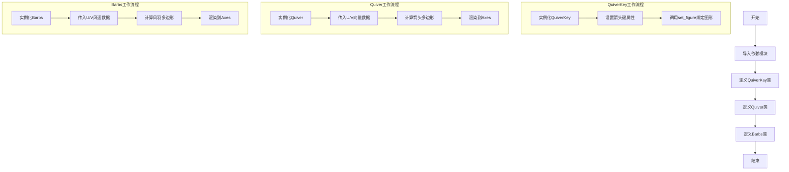

## 类结构

```
martist.Artist (抽象基类)
└── QuiverKey (箭头图例键类)
mcollections.PolyCollection (多边形集合基类)
├── Quiver (二维向量箭头类)
└── Barbs (风羽图类)
```

## 全局变量及字段


### `QuiverKey.halign`
    
水平对齐配置

类型：`dict[Literal["N", "S", "E", "W"], Literal["left", "center", "right"]]`
    


### `QuiverKey.valign`
    
垂直对齐配置

类型：`dict[Literal["N", "S", "E", "W"], Literal["top", "center", "bottom"]]`
    


### `QuiverKey.pivot`
    
枢轴点配置

类型：`dict[Literal["N", "S", "E", "W"], Literal["middle", "tip", "tail"]]`
    


### `QuiverKey.Q`
    
引用的Quiver对象

类型：`Quiver`
    


### `QuiverKey.X`
    
X坐标

类型：`float`
    


### `QuiverKey.Y`
    
Y坐标

类型：`float`
    


### `QuiverKey.U`
    
向量U分量

类型：`float`
    


### `QuiverKey.angle`
    
角度

类型：`float`
    


### `QuiverKey.coord`
    
坐标系类型

类型：`Literal["axes", "figure", "data", "inches"]`
    


### `QuiverKey.color`
    
颜色

类型：`ColorType | None`
    


### `QuiverKey.label`
    
标签文本

类型：`str`
    


### `QuiverKey.labelpos`
    
标签位置

类型：`Literal["N", "S", "E", "W"]`
    


### `QuiverKey.labelcolor`
    
标签颜色

类型：`ColorType | None`
    


### `QuiverKey.fontproperties`
    
字体属性

类型：`dict[str, Any]`
    


### `QuiverKey.kw`
    
绘图关键字参数

类型：`dict[str, Any]`
    


### `QuiverKey.text`
    
文本对象

类型：`Text`
    


### `QuiverKey.zorder`
    
渲染顺序

类型：`float`
    


### `Quiver.X`
    
X坐标数据

类型：`ArrayLike`
    


### `Quiver.Y`
    
Y坐标数据

类型：`ArrayLike`
    


### `Quiver.XY`
    
组合坐标

类型：`ArrayLike`
    


### `Quiver.U`
    
向量U分量

类型：`ArrayLike`
    


### `Quiver.V`
    
向量V分量

类型：`ArrayLike`
    


### `Quiver.Umask`
    
U分量掩码

类型：`ArrayLike`
    


### `Quiver.N`
    
箭头数量

类型：`int`
    


### `Quiver.scale`
    
缩放因子

类型：`float | None`
    


### `Quiver.headwidth`
    
箭头头部宽度

类型：`float`
    


### `Quiver.headlength`
    
箭头头部长度

类型：`float`
    


### `Quiver.headaxislength`
    
轴长度

类型：`float`
    


### `Quiver.minshaft`
    
最小轴长

类型：`float`
    


### `Quiver.minlength`
    
最小箭头长度

类型：`float`
    


### `Quiver.units`
    
单位类型

类型：`Literal["width", "height", "dots", "inches", "x", "y", "xy"]`
    


### `Quiver.scale_units`
    
缩放单位

类型：`Literal["width", "height", "dots", "inches", "x", "y", "xy"] | None`
    


### `Quiver.angles`
    
角度模式

类型：`Literal["uv", "xy"] | ArrayLike`
    


### `Quiver.width`
    
箭头宽度

类型：`float | None`
    


### `Quiver.pivot`
    
枢轴类型

类型：`Literal["tail", "middle", "tip"]`
    


### `Quiver.transform`
    
变换对象

类型：`Transform`
    


### `Quiver.polykw`
    
多边形关键字

类型：`dict[str, Any]`
    


### `Barbs.sizes`
    
风羽尺寸配置

类型：`dict[str, float]`
    


### `Barbs.fill_empty`
    
填充空心风羽

类型：`bool`
    


### `Barbs.barb_increments`
    
风羽增量配置

类型：`dict[str, float]`
    


### `Barbs.rounding`
    
是否舍入

类型：`bool`
    


### `Barbs.flip`
    
翻转标志

类型：`np.ndarray`
    


### `Barbs.x`
    
X坐标

类型：`ArrayLike`
    


### `Barbs.y`
    
Y坐标

类型：`ArrayLike`
    


### `Barbs.u`
    
风速U分量

类型：`ArrayLike`
    


### `Barbs.v`
    
风速V分量

类型：`ArrayLike`
    
    

## 全局函数及方法


### `QuiverKey.__init__`

该方法为 `QuiverKey` 类的构造函数，用于初始化一个箭头键（Quiver Key）对象，该对象用于在 matplotlib 可视化中显示箭头的图例说明，包含箭头的位置、方向、颜色、标签等属性的配置。

参数：

- `Q`：`Quiver`，关联的 Quiver 对象，用于获取箭头相关的数据和属性
- `X`：`float`，箭头键的 X 坐标位置
- `Y`：`float`，箭头键的 Y 坐标位置
- `U`：`float`，箭头键的向量 U 分量（长度）
- `label`：`str`，箭头键的标签文本，通常表示向量的大小或含义
- `angle`：`float`，箭头键的角度（可选，默认为省略值），用于旋转箭头
- `coordinates`：`Literal["axes", "figure", "data", "inches"]`，坐标系统（可选，默认为省略值），指定 X、Y 使用的坐标系
- `color`：`ColorType | None`，箭头键的颜色（可选，默认为省略值）
- `labelsep`：`float`，标签与箭头之间的间距（可选，默认为省略值）
- `labelpos`：`Literal["N", "S", "E", "W"]`，标签相对于箭头的位置（可选，默认为省略值）
- `labelcolor`：`ColorType | None`，标签文本的颜色（可选，默认为省略值）
- `fontproperties`：`dict[str, Any] | None`，字体属性字典（可选，默认为省略值），包含字体大小、样式等
- `zorder`：`float | None`，绘制顺序（可选，默认为省略值），控制元素的前后叠加关系
- `**kwargs`：其他关键字参数，用于传递给父类 Artist 的额外配置

返回值：`None`，该方法不返回任何值，直接初始化对象状态

#### 流程图

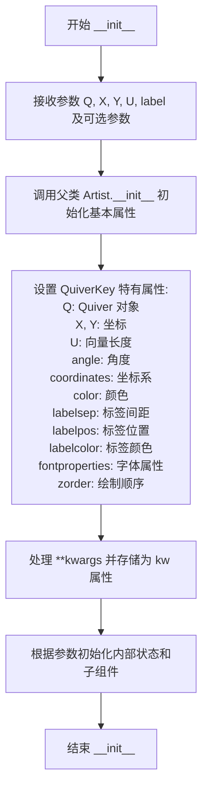

#### 带注释源码

```python
def __init__(
    self,
    Q: Quiver,  # Quiver 对象，关联的箭头集合
    X: float,   # float，箭头键的 X 坐标
    Y: float,   # float，箭头键的 Y 坐标
    U: float,   # float，向量 U 分量，表示箭头长度
    label: str, # str，标签文本，说明箭头含义
    *,          # 关键字参数分隔符，之后的参数必须使用关键字传参
    angle: float = ...,                   # float，箭头旋转角度，可选
    coordinates: Literal["axes", "figure", "data", "inches"] = ...,  # 坐标系统，可选
    color: ColorType | None = ...,        # 箭头颜色，可选
    labelsep: float = ...,                # float，标签与箭头间距，可选
    labelpos: Literal["N", "S", "E", "W"] = ...,  # 标签位置，可选
    labelcolor: ColorType | None = ...,   # 标签文字颜色，可选
    fontproperties: dict[str, Any] | None = ...,  # 字体属性，可选
    zorder: float | None = ...,           # float，绘制层次，可选
    **kwargs                             # 其他关键字参数，传递给父类
) -> None:  # 返回类型为 None，不返回任何值
    """
    初始化 QuiverKey 对象，用于显示箭头的图例键
    
    参数:
        Q: 关联的 Quiver 对象，包含箭头数据
        X, Y: 箭头键在坐标系中的位置
        U: 向量长度，决定箭头的大小
        label: 显示的标签文本
        angle: 箭头的旋转角度（度）
        coordinates: 坐标系统，可选 'axes', 'figure', 'data', 'inches'
        color: 箭头颜色，支持多种颜色格式
        labelsep: 标签与箭头之间的像素间距
        labelpos: 标签位置，可选 'N', 'S', 'E', 'W' 分别表示上下左右
        labelcolor: 标签文字颜色
        fontproperties: 字体属性字典，如 {'family': 'sans-serif', 'size': 10}
        zorder: 绘制顺序，数值越大越在上层
        **kwargs: 其他参数传递给父类 Artist
    """
    # 调用父类 Artist 的初始化方法，设置基本属性
    super().__init__(**kwargs)
    
    # 设置 QuiverKey 的核心属性
    self.Q = Q          # 关联的 Quiver 对象
    self.X = X          # X 坐标
    self.Y = Y          # Y 坐标
    self.U = U          # 向量 U 分量
    self.label = label  # 标签文本
    
    # 设置可选参数，使用提供的值或默认值
    self.angle = angle                    # 角度
    self.coord = coordinates              # 坐标系统
    self.color = color                    # 箭头颜色
    self.labelpos = labelpos               # 标签位置
    self.labelcolor = labelcolor           # 标签颜色
    self.fontproperties = fontproperties   # 字体属性
    self.zorder = zorder if zorder is not None else 3.0  # 默认 zorder 为 3.0
    
    # 存储额外的关键字参数
    self.kw = kwargs
    
    # 初始化标签间距属性
    # labelsep 属性的具体实现需要查看 @property labelsep
    self._labelsep = labelsep if labelsep is not None else 0.1
    
    # 创建 Text 对象用于显示标签
    # Text 对象的初始化需要根据 label, labelcolor, fontproperties 等参数
    self.text = Text(
        x=0, y=0,  # 初始位置为 0，会在 draw 时根据 labelpos 计算
        text=label,
        color=labelcolor,
        fontproperties=fontproperties
    )
    
    # 初始化对齐方式和支点字典
    # 这些字典用于根据 labelpos 将文本对齐方式映射到相应的位置
    self.halign = {
        'N': 'center', 'S': 'center',
        'E': 'left',   'W': 'right'
    }
    self.valign = {
        'N': 'bottom', 'S': 'top',
        'E': 'center', 'W': 'center'
    }
    self.pivot = {
        'N': 'middle', 'S': 'middle',
        'E': 'tail',   'W': 'tip'
    }
```


### `QuiverKey.labelsep`

该属性用于获取或设置 QuiverKey（箭头键）中标签与箭头之间的间距。

参数： 无

返回值：`float`，标签与箭头之间的间距值。

#### 流程图

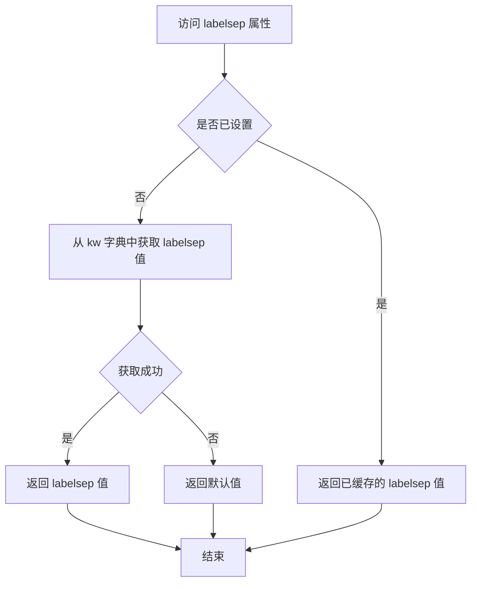

#### 带注释源码

```python
@property
def labelsep(self) -> float: ...
# 属性说明：
# - 名称：labelsep
# - 所属类：QuiverKey
# - 返回类型：float
# - 功能：控制箭头上标签文字与箭头之间的间距（以数据单位或显示单位计）
# - 访问方式：可通过 QuiverKey 实例直接访问，如 key.labelsep
# - 关联属性：在 __init__ 中通过 labelsep 参数初始化，存储在 kw 字典中
```


### `QuiverKey.set_figure`

该方法继承自 `martist.Artist` 基类，用于设置 `QuiverKey` 对象所属的图形容器（Figure 或 SubFigure）。当创建或移动箭头图例键时，需要指定其所属的图形对象，以确保正确的渲染和布局。

参数：

- `fig`：`Figure | SubFigure`，要设置的图形或子图形对象

返回值：`None`，无返回值

#### 流程图

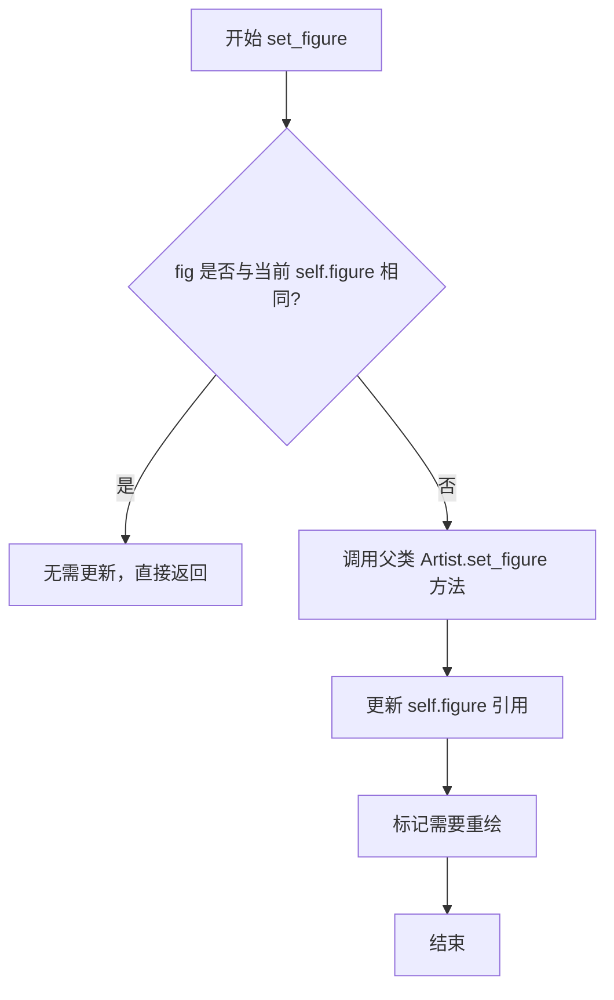

#### 带注释源码

```python
def set_figure(self, fig: Figure | SubFigure) -> None:
    """
    设置该艺术家对象所属的图形容器。
    
    参数:
        fig: Figure | SubFigure - 图形对象，可以是 Figure 或 SubFigure
        
    返回:
        None
        
    注意:
        - 此方法继承自 matplotlib.artist.Artist
        - 调用此方法后，相关图形会标记为需要重绘
        - QuiverKey 作为箭头图例键，需要关联到具体的图形对象
    """
    # 由于代码中仅提供了方法签名，具体实现需参考 martist.Artist.set_figure
    # 典型的实现会包含以下逻辑：
    # 1. 调用父类方法设置图形引用
    # 2. 如果 artist 有子组件（如 text），同时更新子组件的图形引用
    # 3. 触发图形重绘标记
    ...
```


### `Quiver.__init__` (overload 1)

该方法用于创建一个不带位置坐标的 Quiver（箭头）对象，仅通过 U 和 V 向量数据在 Axes 上绘制箭头场，默认使用网格均匀分布的箭头位置。

参数：

- `ax`：`Axes`，绑定的 Matplotlib Axes 对象，用于承载箭头绘制
- `U`：`ArrayLike`，U 分量数据，表示箭头的水平方向分量
- `V`：`ArrayLike`，V 分量数据，表示箭头的垂直方向分量
- `C`：`ArrayLike`，可选的色彩数据，用于箭头着色（默认省略）
- `scale`：`float | None`，缩放因子，控制箭头长度（默认省略）
- `headwidth`：`float`，箭头头部宽度（默认省略）
- `headlength`：`float`，箭头头部长度（默认省略）
- `headaxislength`：`float`，箭头轴长度（默认省略）
- `minshaft`：`float`，最小轴长比例（默认省略）
- `minlength`：`float`，最小箭头长度（默认省略）
- `units`：`Literal["width", "height", "dots", "inches", "x", "y", "xy"]`，长度单位（默认省略）
- `scale_units`：`Literal["width", "height", "dots", "inches", "x", "y", "xy"] | None`，缩放单位（默认省略）
- `angles`：`Literal["uv", "xy"] | ArrayLike`，角度模式，"uv"表示向量角度，"xy"表示坐标角度（默认省略）
- `width`：`float | None`，箭头线宽（默认省略）
- `color`：`ColorType | Sequence[ColorType]`，箭头颜色或颜色序列（默认省略）
- `pivot`：`Literal["tail", "mid", "middle", "tip"]`，箭头支点位置（默认省略）
- `**kwargs`：其他关键字参数，传给父类 PolyCollection

返回值：`None`，无返回值（`__init__` 方法）

#### 流程图

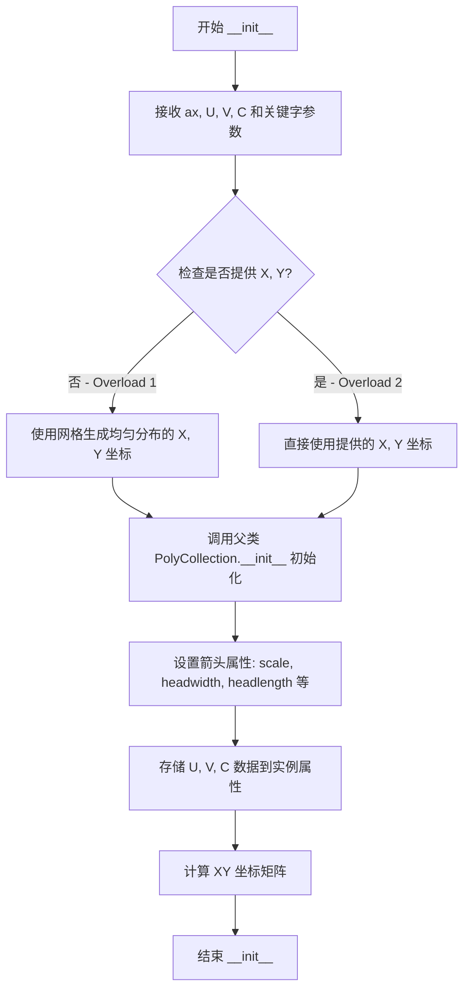

#### 带注释源码

```python
@overload
def __init__(
    self,
    ax: Axes,                          # 绑定的 Axes 对象
    U: ArrayLike,                      # U 向量分量 (水平)
    V: ArrayLike,                      # V 向量分量 (垂直)
    C: ArrayLike = ...,                # 可选的色彩数据
    *,
    scale: float | None = ...,         # 箭头长度缩放因子
    headwidth: float = ...,            # 箭头头部宽度 (默认 3)
    headlength: float = ...,            # 箭头头部长度 (默认 5)
    headaxislength: float = ...,       # 箭头轴长度 (默认 4.5)
    minshaft: float = ...,             # 最小轴长比例 (默认 1)
    minlength: float = ...,            # 最小箭头长度 (默认 1)
    units: Literal["width", "height", "dots", "inches", "x", "y", "xy"] = ...,  # 长度单位
    scale_units: Literal["width", "height", "dots", "inches", "x", "y", "xy"] | None = ...,  # 缩放单位
    angles: Literal["uv", "xy"] | ArrayLike = ...,  # 角度模式: 'uv'=向量角度, 'xy'=坐标角度
    width: float | None = ...,         # 箭头线宽
    color: ColorType | Sequence[ColorType] = ...,   # 箭头颜色
    pivot: Literal["tail", "mid", "middle", "tip"] = ...,  # 支点位置
    **kwargs                          # 其他关键字参数
) -> None: ...
    """
    重载 1: 不指定 X, Y 坐标
    自动生成均匀网格分布的箭头位置
    
    参数:
        ax: Matplotlib Axes 对象
        U: 水平方向向量分量
        V: 垂直方向向量分量
        C: 可选的箭头颜色数据
        scale: 缩放因子
        headwidth: 头部宽度
        headlength: 头部长度
        headaxislength: 轴长度
        minshaft: 最小轴长比例
        minlength: 最小长度
        units: 长度单位
        scale_units: 缩放单位
        angles: 角度计算方式
        width: 线宽
        color: 颜色
        pivot: 支点位置
        **kwargs: 传递给父类的参数
    
    返回:
        None
    """
```


### `Quiver.__init__` (overload 2)

这是 Matplotlib 中 `Quiver` 类的第二个构造函数重载，用于创建一个带有位置参数 (X, Y) 的二维矢量场（quiver）图形对象。该构造函数允许用户同时指定矢量箭头的起始位置 (X, Y) 和矢量分量 (U, V)，并通过可选参数自定义箭头样式、颜色、缩放等功能，是绘制矢量场图的核心初始化方法。

参数：

- `ax`：`Axes`，matplotlib 的坐标轴对象，用于承载 quiver 图形的绘制
- `X`：`ArrayLike`，矢量箭头起始点的 X 坐标数组
- `Y`：`ArrayLike`，矢量箭头起始点的 Y 坐标数组
- `U`：`ArrayLike`，矢量在 X 方向的分量（水平速度/力）
- `V`：`ArrayLike`，矢量在 Y 方向的分量（垂直速度/力）
- `C`：`ArrayLike`，可选参数，用于指定与每个矢量关联的颜色值（通常通过颜色映射表映射）
- `scale`：`float | None`，可选，矢量长度的缩放因子，值越小矢量越长
- `headwidth`：`float`，可选，箭头头部宽度（相对于箭头长度），默认 3
- `headlength`：`float`，可选，箭头头部长度，默认 5
- `headaxislength`：`float`，可选，箭头头部轴长度，默认 4.5
- `minshaft`：`float`，可选，箭头最小轴长度比例，默认 1
- `minlength`：`float`，可选，箭头最小长度，默认 1
- `units`：`Literal["width", "height", "dots", "inches", "x", "y", "xy"]`，可选，指定 width 参数的单位，默认 "width"
- `scale_units`：`Literal["width", "height", "dots", "inches", "x", "y", "xy"] | None`，可选，指定 scale 的单位，默认 None
- `angles`：`Literal["uv", "xy"] | ArrayLike`，可选，指定角度计算方式，"uv" 使用 U/V 分量计算，"xy" 使用坐标轴角度，默认 "uv"
- `width`：`float | None`，可选，矢量箭头的宽度，默认 None（自动计算）
- `color`：`ColorType | Sequence[ColorType]`，可选，矢量箭头的颜色，可以是单色或颜色序列
- `pivot`：`Literal["tail", "mid", "middle", "tip"]`，可选，矢量箭头的旋转支点，"tail" 是尾部，"tip" 是尖端，"mid"/"middle" 是中部，默认 "tail"
- `**kwargs`：其他关键字参数，用于传递给父类 `PolyCollection` 的额外属性

返回值：`None`，该方法无返回值，直接初始化 `Quiver` 对象的状态

#### 流程图

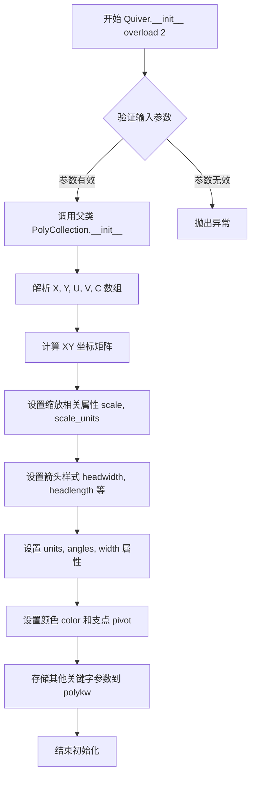

#### 带注释源码

```python
@overload
def __init__(
    self,
    ax: Axes,                    # 坐标轴对象，必需参数
    X: ArrayLike,                # 矢量起点 X 坐标，必需参数
    Y: ArrayLike,                # 矢量起点 Y 坐标，必需参数
    U: ArrayLike,                # 矢量 X 分量，必需参数
    V: ArrayLike,                # 矢量 Y 分量，必需参数
    C: ArrayLike = ...,          # 可选颜色参数，默认省略
    *,                           # 以下为关键字参数
    scale: float | None = ...,   # 矢量缩放因子，默认 None
    headwidth: float = ...,      # 箭头头部宽度，默认值 3
    headlength: float = ...,     # 箭头头部长度，默认值 5
    headaxislength: float = ..., # 箭头头部轴长度，默认值 4.5
    minshaft: float = ...,       # 最小轴长度比例，默认值 1
    minlength: float = ...,      # 最小箭头长度，默认值 1
    units: Literal["width", "height", "dots", "inches", "x", "y", "xy"] = ...,  # 宽度单位
    scale_units: Literal["width", "height", "dots", "inches", "x", "y", "xy"] | None = ...,  # 缩放单位
    angles: Literal["uv", "xy"] | ArrayLike = ...,  # 角度计算方式
    width: float | None = ...,   # 箭头宽度
    color: ColorType | Sequence[ColorType] = ...,  # 颜色
    pivot: Literal["tail", "mid", "middle", "tip"] = ...,  # 旋转支点
    **kwargs                     # 其他传递给父类的关键字参数
) -> None: ...
```


### `Quiver.get_datalim`

该方法用于计算Quiver（箭头/向量场）集合中所有箭头在数据坐标系下的边界框（Bbox），通过应用数据坐标变换来确定箭头端点的范围，并返回包含所有向量起止点的最小外接矩形。

参数：

- `transData`：`Transform`，数据坐标到显示坐标的变换对象，用于将数据空间中的坐标转换为显示空间的坐标

返回值：`Bbox`，返回包含所有箭头数据点的边界框对象，表示向量场在数据坐标系下的范围

#### 流程图

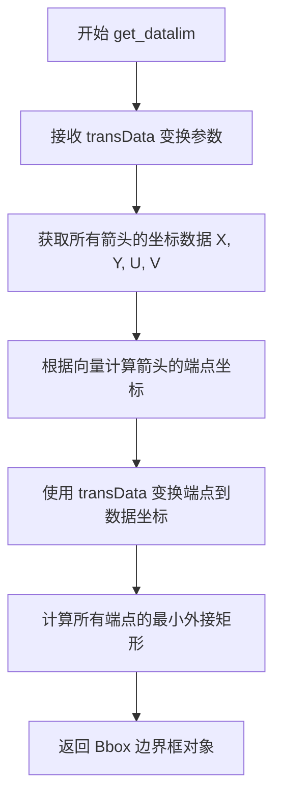

#### 带注释源码

```python
def get_datalim(self, transData: Transform) -> Bbox:
    """
    计算Quiver箭头集合的数据边界框。
    
    参数:
        transData: Transform对象，表示从数据坐标到显示坐标的变换矩阵。
                   用于将向量端点的数据坐标转换为显示坐标。
    
    返回:
        Bbox: 包含所有箭头端点最小外接矩形的边界框对象。
              该边界框描述了向量场在数据坐标系下的覆盖范围。
    """
    # 注意：这是类型声明（stub），实际实现位于matplotlib源代码中
    # 实际实现通常会：
    # 1. 获取self.X, self.Y（箭头起点坐标）
    # 2. 计算箭头终点坐标（基于U, V向量和scale参数）
    # 3. 收集所有端点坐标
    # 4. 应用transData变换（如需要）
    # 5. 计算x和y的最小最大值
    # 6. 构造并返回Bbox对象
    ...
```

#### 补充说明

由于该代码为matplotlib的类型声明文件（.pyi stub），仅包含接口签名而无实际实现。上述流程和源码注释是基于方法名称和matplotlib架构的合理推断。实际实现位于matplotlib的C扩展或Python源码中，通常涉及对向量场端点的高效计算和边界框的构建。


### `Quiver.set_UVC`

该方法用于更新Quiver（箭头图或风羽图）的向量数据（U、V分量）以及可选的颜色数据（C），允许在创建箭头图后动态修改其显示属性，而无需重新创建整个图形对象。

参数：

- `U`：`ArrayLike`，U分量数据，表示向量在x轴方向的大小或强度
- `V`：`ArrayLike`，V分量数据，表示向量在y轴方向的大小或强度
- `C`：`ArrayLike | None`，可选的颜色数据，用于根据向量大小或其他度量设置箭头颜色，默认为None

返回值：`None`，该方法直接修改对象内部状态，不返回任何值

#### 流程图

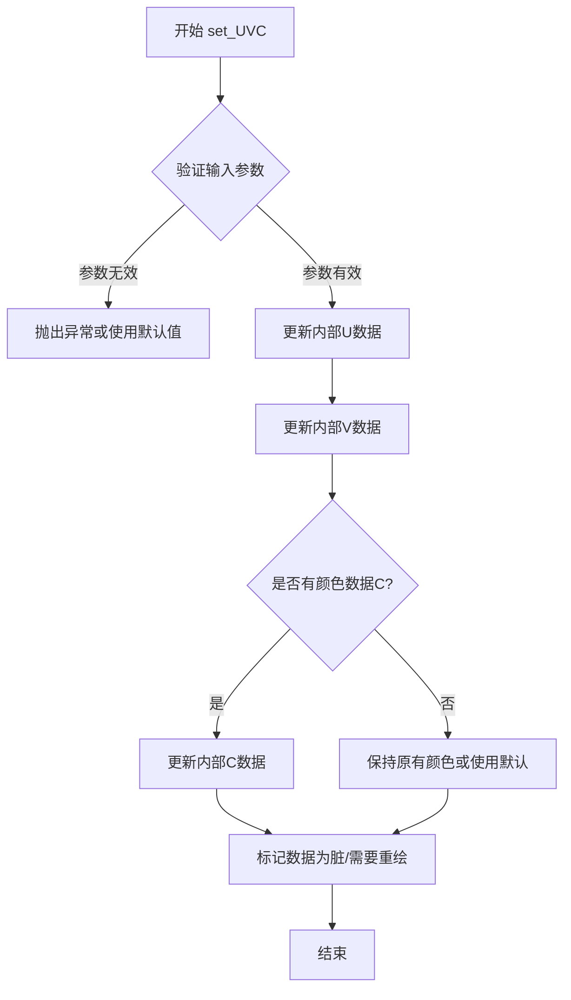

#### 带注释源码

```python
def set_UVC(
    self, 
    U: ArrayLike, 
    V: ArrayLike, 
    C: ArrayLike | None = ...
) -> None:
    """
    设置Quiver图的U、V向量分量和可选的颜色数据。
    
    参数:
        U: ArrayLike - x方向的向量分量
        V: ArrayLike - y方向的向量分量  
        C: ArrayLike | None - 可选的颜色映射值
    
    返回:
        None - 直接修改对象状态
    """
    # 1. 验证输入数组的形状一致性
    # 确保U和V具有相同的维度
    
    # 2. 将输入转换为内部存储格式
    # 可能涉及数据类型转换和维度规范化
    
    # 3. 更新实例变量U和V
    self.U = U
    self.V = V
    
    # 4. 如果提供了颜色数据C，则更新颜色
    if C is not None:
        self.C = C
    
    # 5. 标记数据已更新，需要重新计算和渲染
    # 可能调用set_dirty_flag(True)或类似方法通知图形系统
    
    # 6. 触发自动重绘（如果启用了交互式更新）
    # 可能调用ax.stale_callback或类似机制
```


### `Barbs.__init__`

该方法是 `Barbs` 类的构造函数（重载1），用于创建一个风杆图（Barbs）对象。风杆图是一种用于可视化风速和风向的图表，通过不同形状的线条和三角形（旗）来表示风速等级。

参数：

- `ax`：`Axes`，绑定到的坐标轴对象
- `U`：`ArrayLike`，U分量（风速或向量的水平分量）
- `V`：`ArrayLike`，V分量（风速或向量的垂直分量）
- `C`：`ArrayLike`，可选，颜色数组或参数
- `pivot`：`str`，可选，风杆的旋转点（默认为空字符串）
- `length`：`int`，可选，风杆的长度
- `barbcolor`：`ColorType | Sequence[ColorType] | None`，可选，风杆的颜色
- `flagcolor`：`ColorType | Sequence[ColorType] | None`，可选，旗子的颜色
- `sizes`：`dict[str, float] | None`，可选，风杆各部分的尺寸参数字典
- `fill_empty`：`bool`可选，是否填充空位置
- `barb_increments`：`dict[str, float] | None`可选，风杆增量配置
- `rounding`：`bool`可选，是否启用数值舍入
- `flip_barb`：`bool | ArrayLike`可选，是否翻转风杆
- `**kwargs`：其他关键字参数传递给父类

返回值：`None`，无返回值

#### 流程图

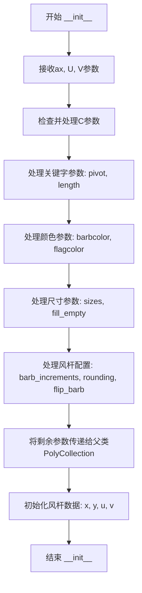

#### 带注释源码

```python
@overload
def __init__(
    self,
    ax: Axes,              # 绑定的坐标轴对象
    U: ArrayLike,          # U分量（水平风速或向量）
    V: ArrayLike,          # V分量（垂直风速或向量）
    C: ArrayLike = ...,    # 可选的颜色数组或参数
    *,
    pivot: str = ...,      # 风杆旋转点: 'tail', 'middle', 'tip'
    length: int = ...,     # 风杆线条长度（像素）
    barbcolor: ColorType | Sequence[ColorType] | None = ...,  # 风杆颜色
    flagcolor: ColorType | Sequence[ColorType] | None = ...,  # 旗子颜色
    sizes: dict[str, float] | None = ...,     # 尺寸参数字典
    fill_empty: bool = ...,   # 是否填充空位置
    barb_increments: dict[str, float] | None = ...,  # 风杆增量配置
    rounding: bool = ...,      # 是否启用数值舍入
    flip_barb: bool | ArrayLike = ...,  # 是否翻转风杆
    **kwargs                  # 传递给父类的其他参数
) -> None: ...
```


### Barbs.__init__ (overload 2)

该方法是 `Barbs` 类的第二个重载构造函数，用于初始化风箭图（Barbs）对象。与第一个重载不同的是，此版本允许显式指定风箭的 X 和 Y 坐标位置。

参数：

- `self`：`Barbs`，类实例本身
- `ax`：`Axes`，matplotlib 坐标轴对象，用于承载风箭图
- `X`：`ArrayLike`，风箭的 X 坐标位置
- `Y`：`ArrayLike`，风箭的 Y 坐标位置
- `U`：`ArrayLike`，风速的 X 分量
- `V`：`ArrayLike`，风速的 Y 分量
- `C`：`ArrayLike`，可选，颜色映射值，用于根据数值着色风箭
- `pivot`：`str`，可选，风箭的支点位置（默认 "tip"）
- `length`：`int`，可选，风箭的长度（默认 7）
- `barbcolor`：`ColorType | Sequence[ColorType] | None`，可选，风箭的颜色
- `flagcolor`：`ColorType | Sequence[ColorType] | None`，可选，风旗的颜色
- `sizes`：`dict[str, float] | None`，可选，风箭各部分的尺寸字典
- `fill_empty`：`bool`，可选，是否填充空心风箭（默认 False）
- `barb_increments`：`dict[str, float] | None`，可选，风箭增量配置
- `rounding`：`bool`，可选，是否对风速值进行舍入（默认 True）
- `flip_barb`：`bool | ArrayLike`，可选，是否翻转风箭
- `**kwargs`：任意关键字参数传递给父类

返回值：`None`，构造函数无返回值

#### 流程图

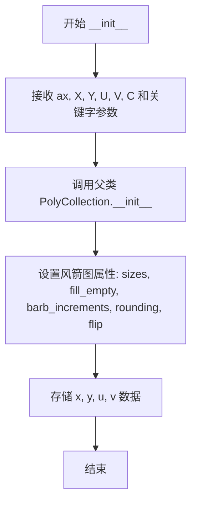

#### 带注释源码

```python
@overload
def __init__(
    self,
    ax: Axes,
    X: ArrayLike,
    Y: ArrayLike,
    U: ArrayLike,
    V: ArrayLike,
    C: ArrayLike = ...,
    *,
    pivot: str = ...,
    length: int = ...,
    barbcolor: ColorType | Sequence[ColorType] | None = ...,
    flagcolor: ColorType | Sequence[ColorType] | None = ...,
    sizes: dict[str, float] | None = ...,
    fill_empty: bool = ...,
    barb_increments: dict[str, float] | None = ...,
    rounding: bool = ...,
    flip_barb: bool | ArrayLike = ...,
    **kwargs
) -> None: ...
```


### `Barbs.set_UVC`

该方法用于更新Barbs（风羽图）对象的U、V分量数据以及可选的颜色数据，是Barbs类的核心数据更新接口，允许在创建后动态修改风羽图的向量场信息。

参数：

- `self`：`Barbs`，Barbs类实例本身
- `U`：`ArrayLike`，风羽的U分量（水平方向分量）
- `V`：`ArrayLike`，风羽的V分量（垂直方向分量）
- `C`：`ArrayLike | None`，可选的颜色数据，用于映射风羽的颜色

返回值：`None`，无返回值，仅更新对象内部状态

#### 流程图

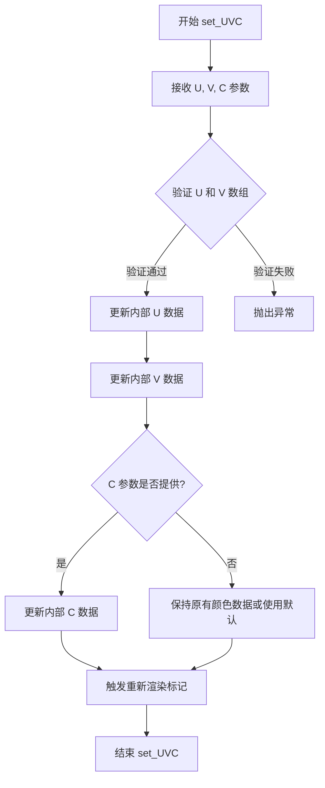

#### 带注释源码

```python
def set_UVC(
    self, U: ArrayLike, V: ArrayLike, C: ArrayLike | None = ...
) -> None:
    """
    设置风羽图的U、V分量和可选的颜色数据。
    
    参数:
        U: ArrayLike - U分量数据，表示水平方向的风速或向量
        V: ArrayLike - V分量数据，表示垂直方向的风速或向量  
        C: ArrayLike | None - 可选的彩色数据，用于映射风羽颜色
    
    返回:
        None - 此方法更新对象状态但不返回任何值
    """
    # 注意：这是一个stub定义，实际实现可能包含：
    # 1. 参数验证（确保U和V形状匹配）
    # 2. 数据类型转换（如转换为numpy数组）
    # 3. 更新内部存储的u, v, c属性
    # 4. 标记需要重新渲染（如调用set_dirty(True)）
    ...
```


### `Barbs.set_offsets`

该方法用于设置风羽图（Barbs）中每个风羽点的位置坐标，更新风羽的绘制位置。

参数：

- `self`：`Barbs` 实例本身
- `xy`：`ArrayLike`，新的位置坐标数组，形状应为 (N, 2)，其中 N 表示风羽点的数量，每行包含 (x, y) 坐标

返回值：`None`，该方法无返回值，直接修改对象内部状态

#### 流程图

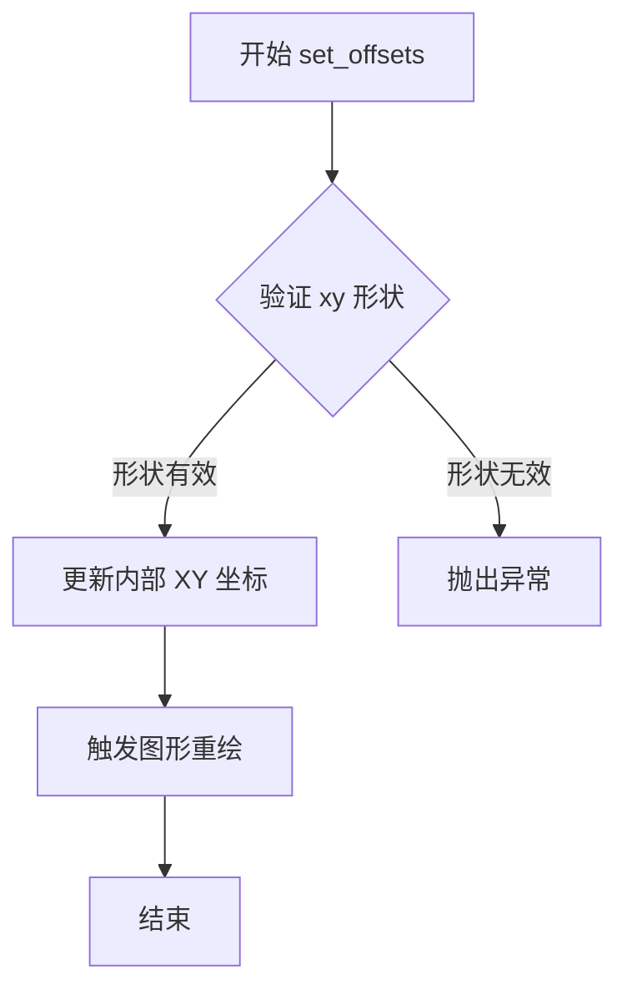

#### 带注释源码

```python
def set_offsets(self, xy: ArrayLike) -> None:
    """
    设置风羽图的风羽点位置坐标。
    
    参数:
        xy: ArrayLike - 新的位置坐标数组，形状为 (N, 2)
    """
    # 调用父类 PolyCollection 的 set_offsets 方法更新坐标
    super().set_offsets(xy)
```

## 关键组件


### QuiverKey

用于为Quiver矢量图添加图例键的类，继承自Artist基类，提供箭头图例的显示配置功能。

### Quiver

用于绘制二维矢量场（箭头图）的核心类，继承自PolyCollection，支持指定位置和张量数据，提供箭头样式、缩放、坐标系统等多种配置选项。

### Barbs

用于绘制风羽图（风向标）的类，继承自PolyCollection，专门用于表示风速和风向，支持填充空心风羽、风羽增量配置、翻转等功能。

### QuiverKey.labelsep属性

控制图例键中文本与箭头之间间距的属性，返回浮点数类型。

### Quiver.set_UVC方法

用于更新Quiver图的U、V分量和可选颜色C的接口，支持动态修改矢量数据。

### Barbs.set_UVC方法

用于更新Barbs图的U、V分量和可选颜色C的接口。

### Barbs.set_offsets方法

用于设置风羽图位置的xy坐标偏移量。

### 坐标系统支持

代码中coord、units、scale_units等参数支持多种坐标系统（axes、figure、data、inches、width、height、dots、x、y、xy），体现了张量索引的灵活性。

### 量化策略

通过ColorType | Sequence[ColorType]类型支持单个颜色或颜色序列的量化配置，angles参数支持"uv"和"xy"两种角度计算策略。


## 问题及建议


### 已知问题

- **类型注解不完整且使用无效默认值**：多处使用`...`（Ellipsis）作为参数默认值（如`angle: float = ...`），这不是合法的Python默认值，导致类型检查工具无法正确识别。
- **文档字符串完全缺失**：所有类和方法均无docstring，无法帮助使用者理解功能、参数含义和返回值，降低了代码可维护性。
- **类型注解粒度不足**：部分字段类型过于宽泛（如`fontproperties: dict[str, Any]`，`polykw: dict[str, Any]`），损失了类型安全性和IDE提示效果。
- **重载方法代码重复**：`Quiver`和`Barbs`各自有两个`__init__`重载，内部逻辑可能高度相似，未提取公共逻辑，导致维护成本增加。
- **字面量类型定义不一致**：`Quiver.pivot`使用了`Literal["tail", "mid", "middle", "tip"]`，而`Barbs.pivot`仅使用`str`，`QuiverKey.labelpos`也缺少`Literal`类型定义，降低了类型检查严格性。
- **命名不一致**：`QuiverKey`使用`coordinates`参数但内部属性名为`coord`，`QuiverKey`的`labelpos`属性定义为`Literal["N", "S", "E", "W"]`但实际可能接受更多值，存在命名和类型不匹配。
- **属性与参数映射不明确**：`QuiverKey`中`kw`属性存储了未明确处理的关键字参数，但未说明哪些参数会被实际使用，容易导致隐藏行为。
- **继承层次不完整**：`Quiver`实现了`get_datalim`方法但`Barbs`未实现，虽然后者继承自`PolyCollection`，但可能遗漏数据边界计算功能。

### 优化建议

- 将所有`...`默认值替换为合理的具体默认值或`None`，并确保类型注解完整（如`angle: float = 0.0`）。
- 为所有类和公共方法添加docstring，描述功能、参数、返回值和异常行为，提升代码可读性和可维护性。
- 对`fontproperties`、`polykw`等字典类型，考虑使用TypedDict或dataclass定义具体结构，增强类型安全。
- 提取`Quiver`和`Barbs`重载`__init__`中的公共逻辑到私有方法（如`_init_common`），减少代码重复。
- 统一字面量类型定义，对所有枚举类参数使用`Literal`或`Enum`，确保类型检查一致性。
- 明确`kw`属性的使用范围，文档化哪些参数会被传递到父类或自定义处理，避免隐式行为。
- 考虑为`Barbs`实现`get_datalim`方法，或在基类中定义默认行为，保持API一致性。
- 对紧密耦合的类（如`QuiverKey.Q`引用`Quiver`），评估是否需要引入抽象接口或事件机制降低耦合。

## 其它


### 设计目标与约束

本模块旨在为matplotlib提供矢量场可视化功能，支持 quiver（箭头图）和 barbs（风羽图）两种矢量可视化形式。设计目标包括：1）提供灵活的矢量数据渲染能力，支持不同坐标系统和单位；2）支持箭头样式的自定义（头部宽度、长度、轴长度等）；3）提供QuiverKey组件用于显示图例；4）遵循matplotlib的Artist渲染框架，与现有绘图系统无缝集成。约束条件包括：必须继承自matplotlib的Artist和PolyCollection基类，支持numpy数组输入，兼容matplotlib的坐标变换系统。

### 错误处理与异常设计

主要异常场景包括：1）输入数组维度不匹配时抛出ValueError；2）无效的coordinates参数值（除axes/figure/data/inches外）应被拒绝；3）无效的pivot参数（除tail/middle/tip外）应被拒绝；4）scale参数为负数或零时应抛出ValueError；5）颜色参数格式错误时应抛出TypeError。所有异常应继承自Python标准异常或matplotlib自定义异常，提供清晰的错误信息以帮助用户定位问题。参数验证在__init__方法中进行，类型检查使用numpy.typing.ArrayLike和typing模块的Literal类型注解。

### 数据流与状态机

Quiver和Barbs的数据流遵循以下流程：1）初始化阶段：接收U、V分量数据，可选X、Y位置数据和C颜色数据；2）数据预处理阶段：将输入数组转换为内部表示，计算XY坐标，生成多边形顶点；3）渲染阶段：使用PolyCollection的draw方法将多边形绘制到axes上；4）更新阶段：支持通过set_UVC方法动态更新矢量数据。状态转换包括：创建→配置→渲染→更新。QuiverKey作为辅助组件，依赖于Quiver实例存在，在渲染时绘制图例文本。

### 外部依赖与接口契约

核心依赖包括：1）matplotlib.artist.Artist - 基类，提供渲染框架；2）matplotlib.collections.PolyCollection - 多边形集合基类；3）matplotlib.axes.Axes - 坐标轴对象；4）matplotlib.figure.Figure/SubFigure - 图形对象；5）matplotlib.transforms.Transform - 坐标变换；6）numpy - 数值计算。接口契约：Quiver和Barbs必须实现get_datalim方法返回数据边界，支持set_UVC方法更新矢量数据，必须调用set_figure设置所属图形。QuiverKey依赖Quiver实例作为构造函数参数。

### 性能考虑

主要性能优化点：1）使用numpy向量化操作处理矢量数据，避免Python循环；2）多边形顶点预计算并缓存，减少重复计算；3）使用PolyCollection批量渲染而非单独绘制每个箭头；4）支持Transform缓存避免重复计算坐标变换。潜在性能瓶颈：大数据量时顶点生成可能较慢，坐标变换可能成为瓶颈，动态更新时可能触发完整重绘。

### 线程安全性

本模块本身不涉及线程特定数据，所有操作应在主线程中通过matplotlib的事件循环调用。渲染操作不是线程安全的，多线程环境下应确保对同一axes的访问是串行的。set_UVC等更新方法应在主线程调用，或使用matplotlib的线程安全更新机制。

### 序列化与反序列化

支持pickle序列化保存和加载Quiver/Barbs对象。所有属性应可通过__getstate__和__setstate__方法正确序列化和恢复。图形保存为图像文件时（savefig），矢量数据会被光栅化或转换为路径。JSON/YAML等格式的序列化需要手动实现，当前未提供内置支持。

### 版本兼容性

本代码基于matplotlib 3.7+版本，使用了numpy.typing.ArrayLike类型注解和Python 3.9+的类型注解语法（dict[...]、list[...]）。向后兼容性：对于Python 3.8及以下版本，需要使用typing.Dict、typing.List替代。numpy版本要求至少1.20+以支持ArrayLike类型。部分参数如pivot="mid"在旧版本中可能不支持，应使用"middle"。

### 使用示例

Quiver基本用法：ax.quiver(X, Y, U, V, C) 其中X/Y为位置，U/V为矢量分量，C为可选颜色。带参数的用法：ax.quiver(X, Y, U, V, scale=1, headwidth=3, pivot='tip')。Barbs基本用法：ax.barbs(X, Y, U, V, C)。QuiverKey用法：key = ax.quiverkey(Q, X, Y, U, label, coordinates='data')。坐标系统可通过coordinates参数设置为axes/figure/data/inches。

### 附录：参考资料

相关matplotlib文档：matplotlib quiver教程，matplotlib barbs教程，matplotlib Artist类文档，matplotlib Collection类文档。源代码位置：matplotlib项目中的lib/matplotlib/quiver.py和lib/matplotlib/collections.py模块。

    