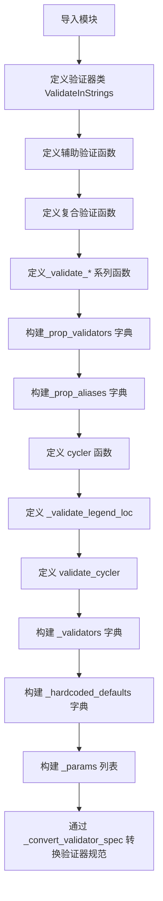
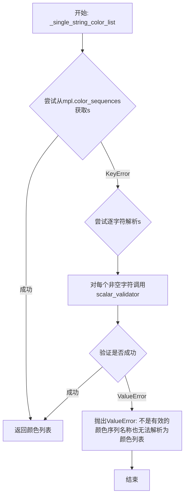
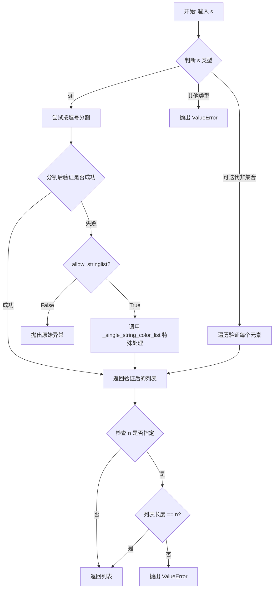
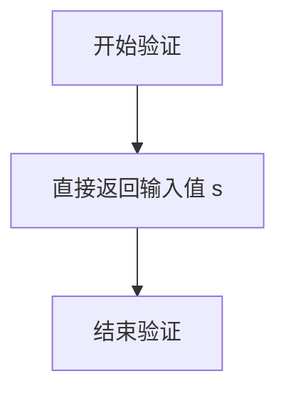
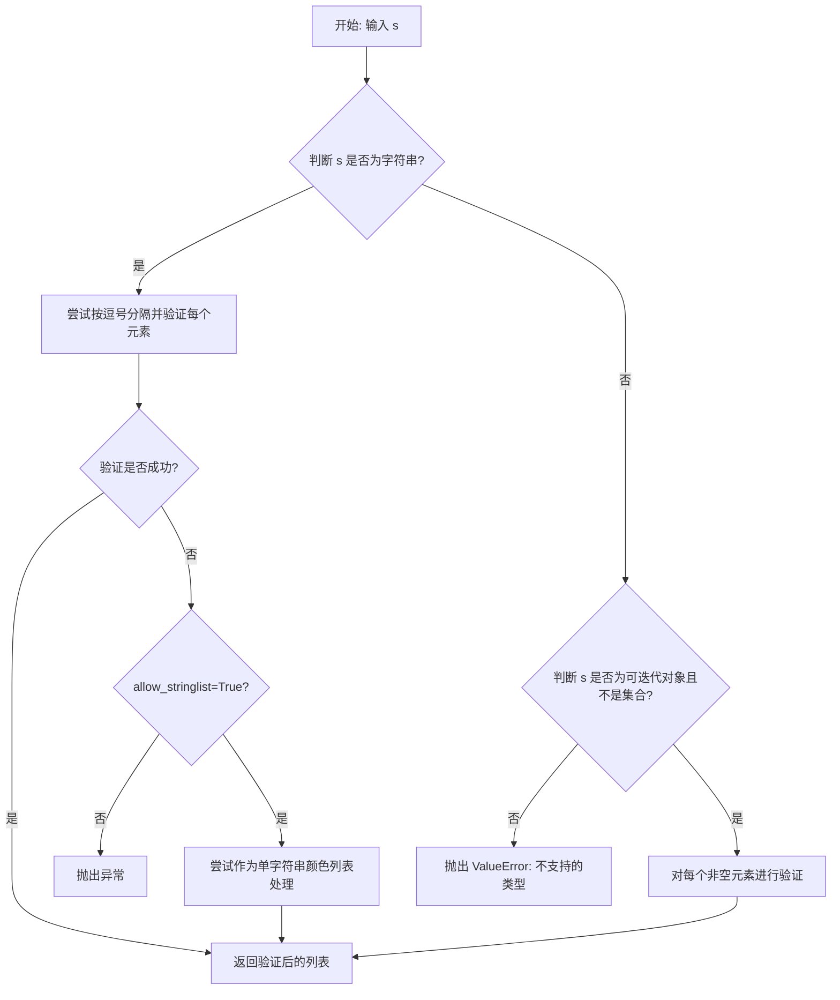
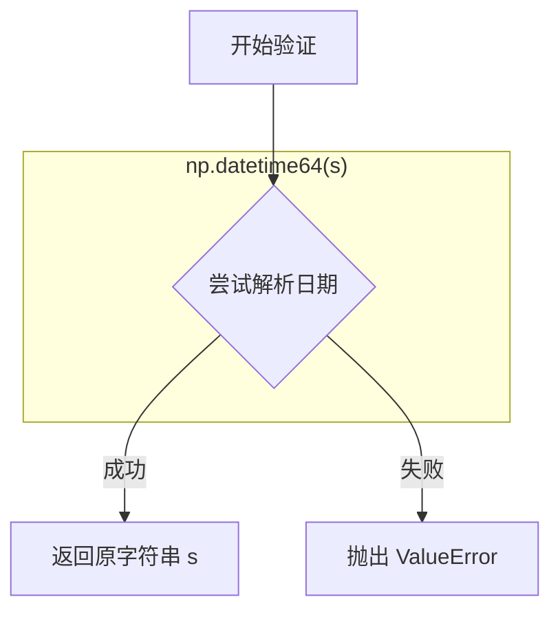
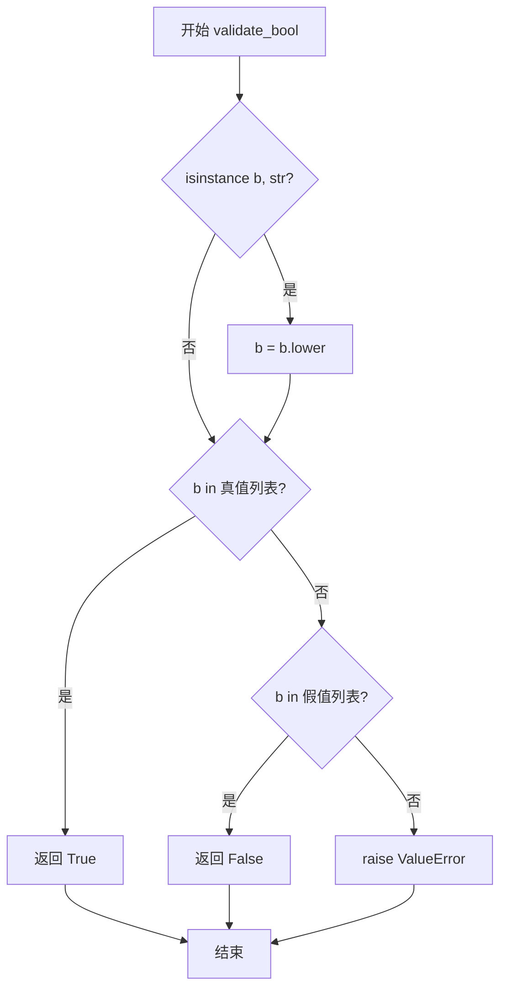
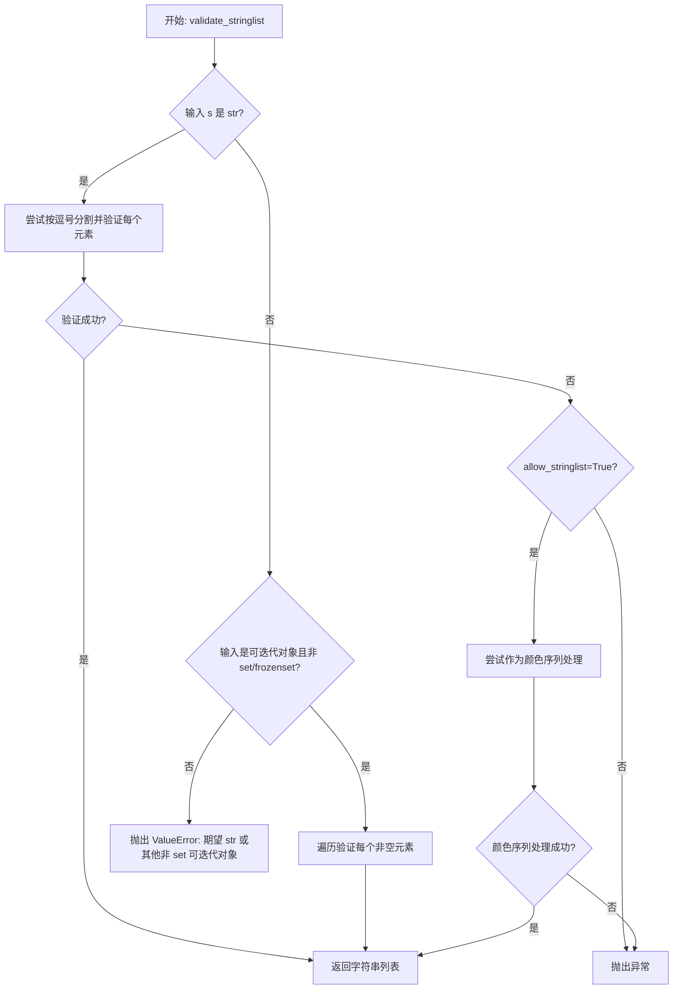
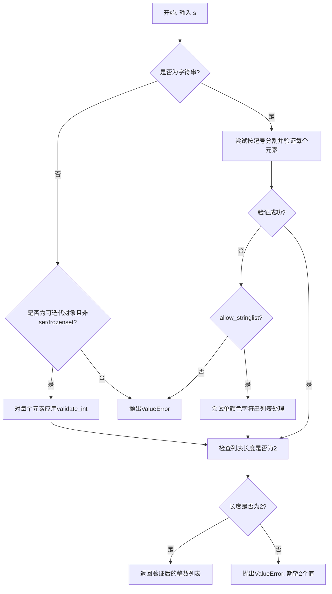

# `matplotlib\lib\matplotlib\rcsetup.py` 详细设计文档

Matplotlib的rcsetup模块，包含用于验证和自定义Matplotlib rc设置的验证代码。每个rc设置都分配有一个函数，用于验证对该设置的任何更改。这些验证函数用于构建rcParams全局对象，该对象存储设置并在整个Matplotlib中引用。

## 整体流程



## 类结构

```
ValidateInStrings (验证字符串是否在允许列表中)
_DunderChecker (AST NodeVisitor，检查dunder)
_ignorecase (列表子类，标记大小写不敏感)
_Param (dataclass，参数元数据)
(全局函数: _single_string_color_list, _listify_validator, validate_*, cycler等)
```

## 全局变量及字段


### `_validators`
    
存储所有rc参数名称到验证函数的映射，用于验证用户提供的参数值是否合法

类型：`dict`
    


### `_params`
    
包含所有_Param对象的列表，存储每个rc参数的元数据包括名称、默认值、验证器和描述

类型：`list[_Param]`
    


### `_prop_validators`
    
用于cycler验证的属性验证器字典，验证属性循环中的各个属性值

类型：`dict`
    


### `_prop_aliases`
    
属性别名映射字典，将短别名映射到完整属性名（如'c'映射到'color'）

类型：`dict`
    


### `_auto_backend_sentinel`
    
用于标记自动后端选择的哨兵对象，表示让系统自动选择合适的后端

类型：`object`
    


### `_hardcoded_defaults`
    
包含不能从matplotlibrc文件读取的硬编码默认值（如内部参数和已弃用的参数）

类型：`dict`
    


### `ValidateInStrings.key`
    
参数名称标识符，用于错误消息中指明是哪个参数

类型：`str`
    


### `ValidateInStrings.ignorecase`
    
是否在验证时忽略大小写的标志

类型：`bool`
    


### `ValidateInStrings._deprecated_since`
    
标记该验证器从哪个版本开始被弃用

类型：`any`
    


### `ValidateInStrings.valid`
    
有效值的映射字典，将标准化后的键映射到原始有效值

类型：`dict`
    


### `_Param.name`
    
rc参数的名称，对应rcParams中的键

类型：`str`
    


### `_Param.default`
    
rc参数的默认值

类型：`Any`
    


### `_Param.validator`
    
用于验证参数值的可调用验证函数

类型：`Callable`
    


### `_Param.description`
    
参数的描述说明文字

类型：`str`
    
    

## 全局函数及方法


### `_single_string_color_list`

该函数用于将字符串参数转换为颜色列表，支持两种解析方式：首先尝试将字符串作为预定义的颜色序列名称进行查找，如果失败则尝试将其解析为包含单个字母颜色名称的字符串。

参数：

- `s`：`str`，需要转换的字符串，可以是颜色序列名称或包含单个字母颜色的字符串
- `scalar_validator`：`Callable[[Any], Any]`，用于验证单个颜色值的回调函数

返回值：`list`，经验证后的颜色值列表

#### 流程图



#### 带注释源码

```python
def _single_string_color_list(s, scalar_validator):
    """
    Convert the string *s* to a list of colors interpreting it either as a
    color sequence name, or a string containing single-letter colors.
    
    参数:
        s: str - 要转换的字符串，可以是颜色序列名称(如'tab10')或
            包含单字母颜色名的字符串(如'rgbcmyk')
        scalar_validator: Callable - 用于验证单个颜色值的函数
    
    返回:
        list - 验证后的颜色值列表
    
    异常:
        ValueError - 当s既不是有效的颜色序列名称也无法解析为颜色列表时抛出
    """
    # 第一步：尝试将字符串作为预定义的颜色序列名称查找
    # mpl.color_sequences 是matplotlib内置的颜色序列字典
    try:
        colors = mpl.color_sequences[s]
    except KeyError:
        # 第二步：如果不是预定义序列，尝试按单个字符解析
        # 这适用于如 'rgb' 这样的单字母颜色缩写字符串
        try:
            # 过滤掉空白字符，对每个非空字符应用验证器
            # strip()移除每个字符两端的空白
            colors = [scalar_validator(v.strip()) for v in s if v.strip()]
        except ValueError:
            # 两种方式都失败，抛出明确的错误信息
            raise ValueError(f'{s!r} is neither a color sequence name nor can '
                             'it be interpreted as a list of colors')

    return colors
```


### `_listify_validator`

`_listify_validator` 是一个高阶函数，用于工厂模式生成列表验证器。它接收一个标量验证器（scalar_validator），返回一个新的验证函数，该函数可以将输入转换为符合规则的列表类型，支持字符串解析、可迭代对象处理、长度校验以及颜色序列的特殊处理。

参数：

- `scalar_validator`：`Callable[[Any], Any]`，用于验证单个元素的验证器函数
- `allow_stringlist`：`bool`，是否允许特殊处理颜色字符串列表，默认为 False
- `n`：`int | None`，如果指定，则验证返回列表的长度必须等于 n
- `doc`：`str | None`，自定义文档字符串，如果为 None 则使用 scalar_validator 的文档

返回值：`Callable[[Any], list]`，返回一个验证函数，该函数接受任意输入并返回验证后的列表

#### 流程图



#### 带注释源码

```python
@lru_cache
def _listify_validator(scalar_validator, allow_stringlist=False, *,
                       n=None, doc=None):
    """
    创建并返回一个验证列表的函数。
    
    参数:
        scalar_validator: 用于验证单个元素的验证器
        allow_stringlist: 是否允许颜色字符串列表的特殊处理
        n: 期望的列表长度（如果为 None 则不检查长度）
        doc: 自定义文档字符串
    """
    # 定义内部验证函数 f
    def f(s):
        # 处理字符串输入：按逗号分割并验证每个元素
        if isinstance(s, str):
            try:
                val = [scalar_validator(v.strip()) for v in s.split(',')
                       if v.strip()]  # 过滤空字符串
            except Exception:
                if allow_stringlist:
                    # Special handling for colors
                    # 特殊处理颜色序列（如颜色名称字符串）
                    val = _single_string_color_list(s, scalar_validator)
                else:
                    raise
        
        # Allow any ordered sequence type -- generators, np.ndarray, pd.Series
        # -- but not sets, whose iteration order is non-deterministic.
        # 处理可迭代对象（排除 set 和 frozenset）
        elif np.iterable(s) and not isinstance(s, (set, frozenset)):
            # The condition on this list comprehension will preserve the
            # behavior of filtering out any empty strings (behavior was
            # from the original validate_stringlist()), while allowing
            # any non-string/text scalar values such as numbers and arrays.
            # 过滤空字符串，但保留非字符串值（如数字、数组）
            val = [scalar_validator(v) for v in s
                   if not isinstance(v, str) or v]
        else:
            raise ValueError(
                f"Expected str or other non-set iterable, but got {s}")
        
        # 验证列表长度（如果指定了 n）
        if n is not None and len(val) != n:
            raise ValueError(
                f"Expected {n} values, but there are {len(val)} values in {s}")
        return val

    # 设置返回函数的名称和文档
    try:
        f.__name__ = f"{scalar_validator.__name__}list"
    except AttributeError:  # class instance.
        # 处理类实例作为验证器的情况
        f.__name__ = f"{type(scalar_validator).__name__}List"
    f.__qualname__ = f.__qualname__.rsplit(".", 1)[0] + "." + f.__name__
    f.__doc__ = doc if doc is not None else scalar_validator.__doc__
    return f
```


### validate_any

该函数是一个最简单的验证器，直接返回输入值，不做任何验证或转换，常用于Matplotlib的rc参数设置中，允许任何类型的值通过。

参数：

- `s`：`Any`，需要验证的任意值

返回值：`Any`，直接返回输入值本身

#### 流程图



#### 带注释源码

```python
def validate_any(s):
    """
    验证任意值，直接返回原值不做任何转换。
    这是一个"透传"验证器，用于那些不需要验证或类型限制的rc参数。
    
    Parameters
    ----------
    s : Any
        任意需要验证的值
    
    Returns
    -------
    Any
        直接返回输入值s本身
    """
    return s


# 使用_listify_validator创建对应的列表验证器
# validate_anylist 用于验证包含任意类型值的列表
validate_anylist = _listify_validator(validate_any)
```


### `validate_anylist`

该函数是一个列表验证器，通过 `_listify_validator` 工厂函数动态创建，用于验证任意类型的列表或可迭代对象。它接受字符串（逗号分隔）或任何可迭代对象（如列表、元组、numpy数组），并返回一个经过验证的列表。

参数：

-  `s`：`Any`，待验证的输入值，可以是字符串（逗号分隔格式）、列表、元组、numpy数组或其他可迭代对象（但不包括集合和冻结集合）

返回值：`list`，返回验证后的列表对象

#### 流程图



#### 带注释源码

```python
# validate_anylist 是通过 _listify_validator 工厂函数创建的
# 传入 validate_any 作为基础验证器（该验证器不做任何验证，直接返回原值）
validate_anylist = _listify_validator(validate_any)

# 下面是 validate_any 的定义，它是一个最简单的验证器，直接返回输入值
def validate_any(s):
    """最简单的验证器，不做任何验证，直接返回输入值。"""
    return s

# _listify_validator 是一个带缓存的工厂函数，用于创建列表验证器
@lru_cache
def _listify_validator(scalar_validator, allow_stringlist=False, *,
                       n=None, doc=None):
    """
    创建列表验证器的工厂函数
    
    参数:
        scalar_validator: 单元素验证器
        allow_stringlist: 是否允许字符串形式的颜色列表
        n: 期望的元素个数（如果为None则不检查个数）
        doc: 自定义文档字符串
    """
    def f(s):
        # 处理字符串输入（逗号分隔格式）
        if isinstance(s, str):
            try:
                # 按逗号分隔，验证每个元素
                val = [scalar_validator(v.strip()) for v in s.split(',')
                       if v.strip()]
            except Exception:
                # 如果验证失败且允许字符串颜色列表
                if allow_stringlist:
                    # 尝试作为单字符串颜色列表处理
                    val = _single_string_color_list(s, scalar_validator)
                else:
                    raise
        # 处理可迭代对象（排除集合和冻结集合）
        elif np.iterable(s) and not isinstance(s, (set, frozenset)):
            # 过滤掉空字符串，保留其他类型的值
            val = [scalar_validator(v) for v in s
                   if not isinstance(v, str) or v]
        else:
            raise ValueError(
                f"Expected str or other non-set iterable, but got {s}")
        
        # 如果指定了元素个数 n，则验证列表长度
        if n is not None and len(val) != n:
            raise ValueError(
                f"Expected {n} values, but there are {len(val)} values in {s}")
        return val

    # 设置函数的名称、限定名和文档
    try:
        f.__name__ = f"{scalar_validator.__name__}list"
    except AttributeError:  # class instance.
        f.__name__ = f"{type(scalar_validator).__name__}List"
    f.__qualname__ = f.__qualname__.rsplit(".", 1)[0] + "." + f.__name__
    f.__doc__ = doc if doc is not None else scalar_validator.__doc__
    return f
```


### `_validate_date`

该函数用于验证日期字符串是否能被 NumPy 的 `datetime64` 解析器接受，常用于 Matplotlib 的 rcParams 配置中验证 "date.epoch" 等日期相关设置。

参数：

- `s`：需要验证的日期字符串

返回值：`str`，如果验证通过则返回原字符串，否则抛出 `ValueError`

#### 流程图



#### 带注释源码

```python
def _validate_date(s):
    """
    验证日期字符串是否能被 NumPy datetime64 解析。
    
    Parameters
    ----------
    s : str
        需要验证的日期字符串
        
    Returns
    -------
    str
        如果验证通过，返回原字符串 s
        
    Raises
    ------
    ValueError
        如果 s 不能被解析为有效的日期格式
    """
    try:
        # 尝试使用 numpy 将输入字符串转换为 datetime64
        # 这是验证输入是否为有效日期字符串的最直接方式
        np.datetime64(s)
        # 如果转换成功，返回原字符串（保持原始输入格式）
        return s
    except ValueError:
        # 如果转换失败，抛出带有详细错误信息的 ValueError
        raise ValueError(
            f'{s!r} should be a string that can be parsed by numpy.datetime64')
```


### `validate_bool`

该函数用于将传入的参数 `b` 转换为 Python 的 `bool` 类型，支持多种字符串、数字和布尔字面量的自动识别与转换，若值无法识别则抛出 `ValueError`。

参数：

- `b`：`Any`，待验证的值，可以是字符串（如 "true"、"yes"、"1"）、整数（0 或 1）或布尔值

返回值：`bool`，转换后的布尔值

#### 流程图



#### 带注释源码

```python
def validate_bool(b):
    """
    Convert b to ``bool`` or raise.

    Parameters
    ----------
    b : Any
        待验证的值，支持字符串形式的布尔值（如 "true"、"yes"、"on"、"1"）、
        整数（0 或 1）或直接的布尔值（True/False）。

    Returns
    -------
    bool
        转换后的布尔值。

    Raises
    ------
    ValueError
        如果 b 无法被识别为布尔值，则抛出此异常。
    """
    # 如果 b 是字符串，转换为小写以便不区分大小写比较
    if isinstance(b, str):
        b = b.lower()

    # 检查 b 是否属于真值（truthy）集合
    if b in ('t', 'y', 'yes', 'on', 'true', '1', 1, True):
        return True
    # 检查 b 是否属于假值（falsy）集合
    elif b in ('f', 'n', 'no', 'off', 'false', '0', 0, False):
        return False
    # 如果不在真值或假值集合中，抛出 ValueError
    else:
        raise ValueError(f'Cannot convert {b!r} to bool')
```


### `validate_axisbelow`

该函数用于验证 Matplotlib 中 `axes.axisbelow` 配置参数的值。它接受布尔值、整数或字符串 `'line'` 作为有效输入，并将其转换为布尔值或返回字符串 `'line'`。

参数：

- `s`：`Any`，需要验证的值，可以是布尔值、整数、浮点数或字符串

返回值：`bool | str`，返回 `True`、`False` 或字符串 `'line'`

#### 流程图

```mermaid
flowchart TD
    A[开始: 输入 s] --> B{尝试 validate_bool(s)}
    B -->|成功| C[返回布尔值]
    B -->|抛出 ValueError| D{isinstance(s, str)?}
    D -->|是| E{s == 'line'?}
    D -->|否| F[抛出 ValueError]
    E -->|是| G[返回 'line']
    E -->|否| F
    C --> H[结束]
    G --> H
    F --> I[错误: '{s!r} cannot be interpreted as True, False, or \"line\"']
```

#### 带注释源码

```python
def validate_axisbelow(s):
    """
    验证 axes.axisbelow 配置参数的值。
    
    该函数尝试将输入转换为布尔值，如果失败且输入是字符串 'line'，
    则返回 'line'。否则抛出 ValueError。
    """
    try:
        # 首先尝试将输入验证为布尔值
        # 支持的值: 't', 'y', 'yes', 'on', 'true', '1', 1, True
        #          'f', 'n', 'no', 'off', 'false', '0', 0, False
        return validate_bool(s)
    except ValueError:
        # 如果布尔验证失败，检查是否是字符串 'line'
        if isinstance(s, str):
            if s == 'line':
                return 'line'
    # 如果既不是有效的布尔值也不是 'line'，则抛出错误
    raise ValueError(f'{s!r} cannot be interpreted as'
                     ' True, False, or "line"')
```


### validate_dpi

该函数用于验证 DPI（每英寸点数）设置值，确认输入是否为字符串 'figure'，或者将其转换为浮点数，如果都不是则抛出异常。

参数：

- `s`：任意类型，待验证的 DPI 值

返回值：str 或 float，如果输入是字符串 'figure' 则返回 'figure'，否则返回转换后的浮点数

#### 流程图

```mermaid
flowchart TD
    A[开始 validate_dpi] --> B{s == 'figure'?}
    B -- 是 --> C[返回 'figure']
    B -- 否 --> D{尝试将 s 转换为 float}
    D -- 成功 --> E[返回 float(s)]
    D -- 失败 --> F[抛出 ValueError 异常]
```

#### 带注释源码

```python
def validate_dpi(s):
    """
    确认 s 是字符串 'figure' 或者将 s 转换为浮点数，否则抛出异常。
    
    此验证器用于 'savefig.dpi' 配置项，允许用户指定 'figure'（表示使用
    图形的 DPI）或具体的数值 DPI。
    
    参数:
        s: 任意类型，要验证的 DPI 值
        
    返回:
        str: 如果 s 等于 'figure'，返回原字符串 'figure'
        float: 如果 s 可以转换为浮点数，返回该浮点数
        
    异常:
        ValueError: 当 s 既不是 'figure' 也不能转换为浮点数时抛出
    """
    # 如果 s 是字符串 'figure'，直接返回
    if s == 'figure':
        return s
    
    # 尝试将 s 转换为浮点数
    try:
        return float(s)
    except ValueError as e:
        # 转换失败，抛出带有详细信息的 ValueError
        raise ValueError(f'{s!r} is not string "figure" and '
                         f'could not convert {s!r} to float') from e
```


### `_make_type_validator`

该函数是一个工厂函数，用于创建类型验证器。它接受一个类型作为参数，并返回一个验证函数，该函数可以将输入转换为指定类型，或者在允许的情况下返回 None。

参数：

- `cls`：`type`，要转换到的目标类型（如 str、int、float 等）
- `allow_none`：`bool`，可选参数，是否允许将 "none" 或 None 转换为 None 值，默认为 False

返回值：`Callable[[Any], Any]`，返回一个验证函数，该函数接受任意值作为输入，返回转换后的类型值或 None，或者在转换失败时抛出 ValueError

#### 流程图

```mermaid
flowchart TD
    A[开始: _make_type_validator] --> B[接收参数 cls 和 allow_none]
    B --> C[定义内部验证函数 validator]
    C --> D{allow_none 为 True?}
    D -->|是| E{s is None 或 s 等于 'none'?}
    D -->|否| G{cls 是 str 且 s 不是 str?}
    E -->|是| F[检查大小写并发出警告]
    E -->|否| G
    F --> I[返回 None]
    G -->|是| J[抛出 ValueError: 无法转换为 str]
    G -->|否| K[尝试 cls(s)]
    K --> L{转换成功?}
    L -->|是| M[返回转换后的值]
    L -->|否| N[捕获 TypeError 或 ValueError]
    N --> O[抛出 ValueError: 无法转换为 cls.__name__]
    M --> P[设置 validator.__name__]
    I --> P
    O --> P
    P --> Q{allow_none 为 True?}
    Q -->|是| R[在 __name__ 后加 '_or_None']
    Q -->|否| S[返回 validator 函数]
    R --> S
```

#### 带注释源码

```python
def _make_type_validator(cls, *, allow_none=False):
    """
    返回一个验证器，该验证器将输入转换为 *cls* 类型，或者在可能的情况下允许 ``None``。
    
    参数:
        cls: 要转换到的目标类型（如 str, int, float 等）
        allow_none: 布尔值，指定是否允许 None 作为有效输入
    
    返回:
        一个验证函数，可以将输入转换为指定类型或返回 None
    """
    
    def validator(s):
        # 如果允许 None 并且输入是 None 或字符串 "none"
        if (allow_none and
                (s is None or cbook._str_lower_equal(s, "none"))):
            # 检查字符串 "none" 的大小写，如果不符合规范则发出警告
            if cbook._str_lower_equal(s, "none") and s != "None":
                _api.warn_deprecated(
                    "3.11",
                    message=f"Using the capitalization {s!r} in matplotlibrc for "
                            "*None* is deprecated in %(removal)s and will lead to an "
                            "error from version 3.13 onward. Please use 'None' "
                            "instead."
                )
            # 如果通过验证，返回 None
            return None
        
        # 如果目标是 str 类型但输入不是字符串，抛出错误
        if cls is str and not isinstance(s, str):
            raise ValueError(f'Could not convert {s!r} to str')
        
        # 尝试将输入转换为目标类型
        try:
            return cls(s)
        # 捕获类型转换错误
        except (TypeError, ValueError) as e:
            # 抛出更友好的错误信息
            raise ValueError(
                f'Could not convert {s!r} to {cls.__name__}') from e

    # 设置验证函数的名称为 validate_{类型名}
    validator.__name__ = f"validate_{cls.__name__}"
    
    # 如果允许 None，则在名称后添加 _or_None
    if allow_none:
        validator.__name__ += "_or_None"
    
    # 设置验证函数的完整限定名称
    validator.__qualname__ = (
        validator.__qualname__.rsplit(".", 1)[0] + "." + validator.__name__)
    
    # 返回创建的验证器函数
    return validator
```


### validate_string

该函数是 Matplotlib rcsetup 模块中的一个类型验证器，用于将输入验证并转换为字符串类型。如果输入无法转换为字符串，则抛出 ValueError 异常。

参数：

-  `s`：任意类型，待验证的值，可以是任何数据类型

返回值：`str`，返回验证后的字符串值

#### 流程图

```mermaid
flowchart TD
    A[开始: validate_string] --> B{allow_none 检查?}
    B -->|False| C{cls is str 且 s 不是字符串?}
    B -->|True 且 s 是 None| D[返回 None]
    B -->|True 且 s 等于 'none'| D
    
    C -->|是| E[抛出 ValueError: Could not convert to str]
    C -->|否| F{尝试 cls(s) 转换}
    
    F -->|转换成功| G[返回转换后的字符串]
    F -->|转换失败| H[抛出 ValueError: Could not convert to str]
    
    D --> I[可选: 发出弃用警告]
    I --> G
```

#### 带注释源码

```python
# validate_string 是通过 _make_type_validator(str) 创建的验证器
# 源代码位于 _make_type_validator 函数中

def _make_type_validator(cls, *, allow_none=False):
    """
    返回一个验证器，将输入转换为 *cls* 类型或在必要时抛出异常
    （如果 allow_none=True，也允许 None）。
    """

    def validator(s):
        # 检查是否允许 None 以及输入是否为 None 或字符串 "none"
        if (allow_none and
                (s is None or cbook._str_lower_equal(s, "none"))):
            # 如果使用了非标准大写的 "none"，发出弃用警告
            if cbook._str_lower_equal(s, "none") and s != "None":
                _api.warn_deprecated(
                    "3.11",
                    message=f"Using the capitalization {s!r} in matplotlibrc for "
                            "*None* is deprecated in %(removal)s and will lead to an "
                            "error from version 3.13 onward. Please use 'None' "
                            "instead."
                )
            return None
        
        # 如果目标类型是 str 但输入不是字符串，抛出错误
        if cls is str and not isinstance(s, str):
            raise ValueError(f'Could not convert {s!r} to str')
        
        # 尝试将输入转换为目标类型
        try:
            return cls(s)
        except (TypeError, ValueError) as e:
            raise ValueError(
                f'Could not convert {s!r} to {cls.__name__}') from e

    # 设置验证器函数的名称
    validator.__name__ = f"validate_{cls.__name__}"
    if allow_none:
        validator.__name__ += "_or_None"
    validator.__qualname__ = (
        validator.__qualname__.rsplit(".", 1)[0] + "." + validator.__name__)
    return validator


# 创建 validate_string 验证器
validate_string = _make_type_validator(str)
# 创建 allow_none 版本的验证器
validate_string_or_None = _make_type_validator(str, allow_none=True)
```


### validate_string_or_None

该函数是一个字符串类型验证器，用于验证输入是否为字符串类型，同时允许 `None` 值作为有效输入。

参数：

-  `s`：`Any`，待验证的输入值，可以是字符串、None 或其他可转换为字符串的值

返回值：`Optional[str]`，如果输入有效则返回字符串（如果输入为 None 则返回 None），否则抛出 ValueError

#### 流程图

```mermaid
flowchart TD
    A[开始验证] --> B{allow_none=True?}
    B -->|是| C{s is None 或 s 是 "none" 字符串?}
    C -->|是| D{大小写为 'none' 但不是 'None'?}
    C -->|否| E{s 是字符串类型?}
    D -->|是| F[发出弃用警告]
    D -->|否| G[返回 None]
    F --> G
    E -->|否| H{cls 是 str 且 s 不是字符串?}
    E -->|是| I[尝试用 cls 转换 s]
    H -->|是| I
    H -->|否| I
    I --> J{转换成功?}
    J -->|是| K[返回转换后的值]
    J -->|否| L[抛出 ValueError]
    G --> M[结束验证]
    K --> M
    L --> M
```

#### 带注释源码

```python
def validate_string_or_None(s):
    """
    验证字符串或 None 值的验证器。
    由 _make_type_validator(str, allow_none=True) 生成。
    
    参数:
        s: 待验证的值，可以是字符串、None 或其他可转换为字符串的值
        
    返回:
        如果输入为 None 或 "none"/"None" 字符串，返回 None；
        如果输入是有效字符串，返回该字符串；
        否则抛出 ValueError
    """
    # 由 _make_type_validator 函数动态生成
    # 内部逻辑如下：
    
    # 1. 检查是否允许 None 且输入为 None 或 "none" 字符串
    # 2. 如果是 "none"（非标准大小写），发出弃用警告
    # 3. 返回 None
    
    # 4. 如果类目标是 str 且输入不是字符串，抛出 ValueError
    
    # 5. 尝试将输入转换为 str 类型
    # 6. 转换成功返回结果，失败则抛出 ValueError
    
# 底层 _make_type_validator 函数源码：
def _make_type_validator(cls, *, allow_none=False):
    """
    Return a validator that converts inputs to *cls* or raises (and possibly
    allows ``None`` as well).
    """
    def validator(s):
        # 检查是否允许 None 且输入为 None 或等效字符串
        if (allow_none and
                (s is None or cbook._str_lower_equal(s, "none"))):
            # 对非标准大小写的 "none" 发出弃用警告
            if cbook._str_lower_equal(s, "none") and s != "None":
                _api.warn_deprecated(
                    "3.11",
                    message=f"Using the capitalization {s!r} in matplotlibrc for "
                            "*None* is deprecated in %(removal)s and will lead to an "
                            "error from version 3.13 onward. Please use 'None' "
                            "instead."
                )
            return None
        
        # 如果目标是 str 类型但输入不是字符串，抛出错误
        if cls is str and not isinstance(s, str):
            raise ValueError(f'Could not convert {s!r} to str')
        
        # 尝试转换为指定类型
        try:
            return cls(s)
        except (TypeError, ValueError) as e:
            raise ValueError(
                f'Could not convert {s!r} to {cls.__name__}') from e

    # 设置函数名称
    validator.__name__ = f"validate_{cls.__name__}"
    if allow_none:
        validator.__name__ += "_or_None"
    validator.__qualname__ = (
        validator.__qualname__.rsplit(".", 1)[0] + "." + validator.__name__)
    return validator
```


### `validate_stringlist`

该函数是Matplotlib rc参数验证系统中的字符串列表验证器，通过 `_listify_validator` 工厂函数动态创建，用于将输入转换为经过验证的字符串列表，支持逗号分隔的字符串、列表、元组、生成器等可迭代对象。

参数：

- `s`：`Any`，待验证的输入值，可以是逗号分隔的字符串、列表、元组、生成器等可迭代对象

返回值：`list[str]`，验证通过后的字符串列表

#### 流程图



#### 带注释源码

```python
# validate_stringlist 是通过 _listify_validator 工厂函数创建的
# 底层实现位于 _listify_validator 函数中
# 以下是其核心验证逻辑的源码：

@lru_cache
def _listify_validator(scalar_validator, allow_stringlist=False, *,
                       n=None, doc=None):
    """
    创建列表验证器的工厂函数
    
    参数:
        scalar_validator: 标量验证函数（如 validate_string）
        allow_stringlist: 是否允许特殊的字符串列表格式（如颜色序列名）
        n: 如果指定，验证列表必须包含 n 个元素
        doc: 验证函数的文档字符串
    """
    def f(s):
        # 情况1: 输入是字符串（通常是逗号分隔的字符串）
        if isinstance(s, str):
            try:
                # 按逗号分割，去除空白，验证每个元素
                val = [scalar_validator(v.strip()) for v in s.split(',')
                       if v.strip()]
            except Exception:
                # 如果验证失败且允许字符串列表处理
                if allow_stringlist:
                    # 特殊处理颜色（如颜色序列名称）
                    val = _single_string_color_list(s, scalar_validator)
                else:
                    raise
        # 情况2: 输入是可迭代对象（但不是 set 或 frozenset）
        # 允许 list, tuple, np.ndarray, pd.Series, generator 等
        elif np.iterable(s) and not isinstance(s, (set, frozenset)):
            # 过滤逻辑：保留非字符串值和 非空字符串
            # 这样既保持原有行为（过滤空字符串），又允许数字和数组
            val = [scalar_validator(v) for v in s
                   if not isinstance(v, str) or v]
        else:
            # 情况3: 其他类型（set, frozenset, 数字等）抛出错误
            raise ValueError(
                f"Expected str or other non-set iterable, but got {s}")
        
        # 如果指定了元素数量 n，验证列表长度
        if n is not None and len(val) != n:
            raise ValueError(
                f"Expected {n} values, but there are {len(val)} values in {s}")
        
        return val

    # 设置验证函数的名称和文档
    try:
        f.__name__ = f"{scalar_validator.__name__}list"
    except AttributeError:  # class instance.
        f.__name__ = f"{type(scalar_validator).__name__}List"
    f.__qualname__ = f.__qualname__.rsplit(".", 1)[0] + "." + f.__name__
    f.__doc__ = doc if doc is not None else scalar_validator.__doc__
    return f


# validate_stringlist 的实际创建
validate_stringlist = _listify_validator(
    validate_string, doc='return a list of strings')
```

#### 关键实现细节

| 特性 | 说明 |
|------|------|
| 输入类型 | 字符串（逗号分隔）、列表、元组、生成器、np.ndarray |
| 输出类型 | Python list |
| 特殊处理 | 空字符串会被过滤掉 |
| 缓存机制 | 使用 `@lru_cache` 缓存相同配置的验证器 |
| 错误处理 | 不支持的类型会抛出 `ValueError` |


### validate_int

该函数是 Matplotlib rc 设置的验证器之一，用于将输入转换为整数类型或抛出 ValueError 异常。它通过 `_make_type_validator(int)` 工厂函数生成，是 Matplotlib 配置参数验证系统的核心组件。

参数：

- `s`：任意类型，待验证的值，可以是字符串形式的数字、整数或其他可转换为整数的类型。

返回值：`int`，返回转换后的整数；如果转换失败则抛出 ValueError。

#### 流程图

```mermaid
flowchart TD
    A[开始: validate_int] --> B{allow_none=False}
    B --> C{输入 s 是 None<br>或 'none'}
    C -->|是| D[抛出 ValueError]
    C -->|否| E{cls 是 str<br>且 s 不是 str}
    E -->|是| F[抛出 ValueError<br>'Could not convert s to str']
    E -->|否| G{尝试 cls(s)<br>即 int(s)}
    G -->|成功| H[返回转换后的整数]
    G -->|失败| I[捕获 TypeError/ValueError]
    I --> J[抛出 ValueError<br>'Could not convert s to int']
```

#### 带注释源码

```python
# validate_int 是通过 _make_type_validator(int) 创建的验证函数
# 对应源码位于 _make_type_validator 函数中
validate_int = _make_type_validator(int)


def _make_type_validator(cls, *, allow_none=False):
    """
    Return a validator that converts inputs to *cls* or raises (and possibly
    allows ``None`` as well).
    """
    # cls 参数为目标类型，allow_none 控制是否允许 None 值

    def validator(s):
        # 内部验证函数
        # 检查是否允许 None 且输入为 None 或 "none" 字符串
        if (allow_none and
                (s is None or cbook._str_lower_equal(s, "none"))):
            # 如果使用了非标准的大小写形式，发出弃用警告
            if cbook._str_lower_equal(s, "none") and s != "None":
                _api.warn_deprecated(
                    "3.11",
                    message=f"Using the capitalization {s!r} in matplotlibrc for "
                            "*None* is deprecated in %(removal)s and will lead to an "
                            "error from version 3.13 onward. Please use 'None' "
                            "instead."
                )
            return None
        
        # 如果目标是 str 类型但输入不是字符串，抛出错误
        if cls is str and not isinstance(s, str):
            raise ValueError(f'Could not convert {s!r} to str')
        
        # 尝试将输入转换为目标类型
        try:
            return cls(s)  # 对于 validate_int，这里是 int(s)
        except (TypeError, ValueError) as e:
            # 转换失败时抛出带详细信息的 ValueError
            raise ValueError(
                f'Could not convert {s!r} to {cls.__name__}') from e

    # 设置验证函数的名称
    validator.__name__ = f"validate_{cls.__name__}"
    if allow_none:
        validator.__name__ += "_or_None"
    
    # 设置验证函数的完全限定名
    validator.__qualname__ = (
        validator.__qualname__.rsplit(".", 1)[0] + "." + validator.__name__)
    return validator
```


### validate_int_or_None

该函数是一个类型验证器，用于验证输入是否为整数或 None，常用于 Matplotlib 的 rc 参数验证。

参数：

-  `s`：任意类型，待验证的值。可以是整数、字符串形式的整数、None 或字符串 "none"。

返回值：`int | None`，如果验证成功且 allow_none 为 True，则返回转换后的整数或 None；否则抛出 ValueError。

#### 流程图

```mermaid
flowchart TD
    A[开始: validate_int_or_None] --> B{allow_none=True?}
    B -->|是| C{s is None 或 s 是字符串 'none'?}
    C -->|是| D{字符串大小写检查}
    D -->|非标准大小写| E[发出弃用警告]
    D -->|标准大小写| F[返回 None]
    C -->|否| G{cls 是 str 且 s 不是 str?}
    B -->|否| G
    G -->|是| H[抛出 ValueError: 无法转换为 str]
    G -->|否| I[尝试 cls(s) 转换]
    I --> J{转换成功?}
    J -->|是| K[返回转换后的值]
    J -->|否| L[抛出 ValueError: 无法转换为 cls.__name__]
```

#### 带注释源码

```python
# 该函数通过 _make_type_validator 工厂函数创建
# 实际代码如下（从 _make_type_validator 展开）:

def validate_int_or_None(s):
    """
    验证输入是否为整数或 None。
    如果 s 为 None 或字符串 'none'（不区分大小写），返回 None。
    否则尝试将 s 转换为整数。
    """
    allow_none = True  # 由 _make_type_validator(int, allow_none=True) 设置
    
    # 检查是否允许 None 以及输入是否为 None 或 "none" 字符串
    if (allow_none and
            (s is None or cbook._str_lower_equal(s, "none"))):
        # 检查是否使用了非标准的大小写形式（如 "None"）
        if cbook._str_lower_equal(s, "none") and s != "None":
            _api.warn_deprecated(
                "3.11",
                message=f"Using the capitalization {s!r} in matplotlibrc for "
                        "*None* is deprecated in %(removal)s and will lead to an "
                        "error from version 3.13 onward. Please use 'None' "
                        "instead."
            )
        return None
    
    # cls 是 int，不需要特殊处理 str 检查
    try:
        return int(s)  # 尝试将 s 转换为整数
    except (TypeError, ValueError) as e:
        raise ValueError(
            f'Could not convert {s!r} to int') from e
```

**实际调用方式**（代码中的定义）：

```python
# 在 rcsetup 模块中
validate_int_or_None = _make_type_validator(int, allow_none=True)
```

这是通过 `_make_type_validator` 工厂函数动态创建的验证器，类似于 `validate_float_or_None`、`validate_string_or_None` 等。


### `validate_intlist`

验证一个值是否为包含两个整数的列表（或可迭代对象），用于 Matplotlib rc 设置中的参数验证。

参数：

- `s`：`Any`，待验证的值，可以是字符串（逗号分隔）、列表、元组或其他可迭代对象

返回值：`list[int]`，验证通过后返回包含两个整数的列表

#### 流程图



#### 带注释源码

```python
# validate_intlist 定义于第 280 行附近
validate_intlist = _listify_validator(validate_int, n=2)
```

```python
# _listify_validator 定义（第 154-190 行）
# 这是一个工厂函数，返回一个验证器函数 f
@lru_cache
def _listify_validator(scalar_validator, allow_stringlist=False, *,
                       n=None, doc=None):
    """
    创建列表验证器：将输入转换为经验证后的标量列表
    
    参数:
        scalar_validator: 用于验证每个元素的标量验证器（如 validate_int）
        allow_stringlist: 是否允许单颜色字符串列表（仅用于颜色验证）
        n: 期望的元素数量，如果为 None 则不限制
        doc: 自定义文档字符串
    """
    def f(s):
        # 处理字符串输入：按逗号分割并验证每个元素
        if isinstance(s, str):
            try:
                val = [scalar_validator(v.strip()) for v in s.split(',')
                       if v.strip()]
            except Exception:
                if allow_stringlist:
                    # Special handling for colors
                    val = _single_string_color_list(s, scalar_validator)
                else:
                    raise
        # 处理可迭代对象（列表、元组、numpy数组等，但不包括set）
        # Allow any ordered sequence type -- generators, np.ndarray, pd.Series
        # -- but not sets, whose iteration order is non-deterministic.
        elif np.iterable(s) and not isinstance(s, (set, frozenset)):
            # The condition on this list comprehension will preserve the
            # behavior of filtering out any empty strings (behavior was
            # from the original validate_stringlist()), while allowing
            # any non-string/text scalar values such as numbers and arrays.
            val = [scalar_validator(v) for v in s
                   if not isinstance(v, str) or v]
        else:
            raise ValueError(
                f"Expected str or other non-set iterable, but got {s}")
        # 如果指定了 n，则验证列表长度
        if n is not None and len(val) != n:
            raise ValueError(
                f"Expected {n} values, but there are {len(val)} values in {s}")
        return val

    try:
        f.__name__ = f"{scalar_validator.__name__}list"
    except AttributeError:  # class instance.
        f.__name__ = f"{type(scalar_validator).__name__}List"
    f.__qualname__ = f.__qualname__.rsplit(".", 1)[0] + "." + f.__name__
    f.__doc__ = doc if doc is not None else scalar_validator.__doc__
    return f
```

```python
# validate_int 定义（第 228-242 行）
def _make_type_validator(cls, *, allow_none=False):
    """
    返回一个验证器，将输入转换为 cls 类型或抛出异常
    （如果 allow_none=True，也允许 None）
    """
    def validator(s):
        if (allow_none and
                (s is None or cbook._str_lower_equal(s, "none"))):
            if cbook._str_lower_equal(s, "none") and s != "None":
                _api.warn_deprecated(
                    "3.11",
                    message=f"Using the capitalization {s!r} in matplotlibrc for "
                            "*None* is deprecated in %(removal)s and will lead to an "
                            "error from version 3.13 onward. Please use 'None' "
                            "instead."
                )
            return None
        if cls is str and not isinstance(s, str):
            raise ValueError(f'Could not convert {s!r} to str')
        try:
            return cls(s)
        except (TypeError, ValueError) as e:
            raise ValueError(
                f'Could not convert {s!r} to {cls.__name__}') from e

    validator.__name__ = f"validate_{cls.__name__}"
    if allow_none:
        validator.__name__ += "_or_None"
    validator.__qualname__ = (
        validator.__qualname__.rsplit(".", 1)[0] + "." + validator.__name__)
    return validator


validate_int = _make_type_validator(int)  # 第 265 行
```

**使用示例：**

```python
# 有效输入
validate_intlist([1, 2])          # 返回 [1, 2]
validate_intlist("1, 2")           # 返回 [1, 2]
validate_intlist((1, 2))           # 返回 [1, 2]

# 无效输入（长度不为2）
validate_intlist([1])               # ValueError: Expected 2 values...
validate_intlist([1, 2, 3])         # ValueError: Expected 2 values...
validate_intlist("1,2,3")          # ValueError: Expected 2 values...

# 无效输入（非整数）
validate_intlist(["a", "b"])       # ValueError: Could not convert 'a' to int
```


### `validate_float`

将输入参数转换为 `float` 类型，如果转换失败则抛出 `ValueError`。该函数由 `_make_type_validator(float)` 生成，用于验证 Matplotlib rc 设置中的浮点数值。

参数：

- `s`：任意类型，待验证的值。可以是字符串形式的数字（如 "1.5"）、整数或其他可转换为浮点数的对象。

返回值：`float`，返回转换后的浮点数。

#### 流程图

```mermaid
flowchart TD
    A[开始: validate_float] --> B{allow_none?}
    B -->|False| C{cls is str 且 s 不是字符串?}
    B -->|True, True| D{s is None 或 'none'?}
    D -->|True| E{不是 'None'?}
    E -->|True| F[发出弃用警告]
    F --> G[返回 None]
    E -->|False| G
    D -->|False| C
    C -->|True| H[抛出 ValueError: 无法转换为 str]
    C -->|False| I{尝试 cls(s) 即 float(s)}
    I -->|成功| J[返回 float(s)]
    I -->|失败| K[抛出 ValueError: 无法转换为 float]
```

#### 带注释源码

```python
def validate_float(s):
    """
    Convert s to float or raise.
    
    This is a wrapper generated by _make_type_validator(float).
    """
    # Internal validator function created by _make_type_validator
    def validator(s):
        # Since allow_none=False (default), this block is skipped
        if (allow_none and
                (s is None or cbook._str_lower_equal(s, "none"))):
            if cbook._str_lower_equal(s, "none") and s != "None":
                _api.warn_deprecated(
                    "3.11",
                    message=f"Using the capitalization {s!r} in matplotlibrc for "
                            "*None* is deprecated in %(removal)s and will lead to an "
                            "error from version 3.13 onward. Please use 'None' "
                            "instead."
                )
            return None
        
        # For str validator, check type; skip for float
        if cls is str and not isinstance(s, str):
            raise ValueError(f'Could not convert {s!r} to str')
        
        # Attempt conversion using cls (float in this case)
        try:
            return cls(s)  # Calls float(s)
        except (TypeError, ValueError) as e:
            raise ValueError(
                f'Could not convert {s!r} to {cls.__name__}') from e

    # Set function name and return
    validator.__name__ = f"validate_{cls.__name__}"  # "validate_float"
    if allow_none:
        validator.__name__ += "_or_None"
    validator.__qualname__ = (
        validator.__qualname__.rsplit(".", 1)[0] + "." + validator.__name__)
    return validator

# Actual usage in module:
validate_float = _make_type_validator(float)
```


### validate_float_or_None

该函数是 Matplotlib rcsetup 模块中的验证器函数，用于验证输入值是否可以转换为浮点数类型，或者是否为 None。它通过 `_make_type_validator` 工厂函数生成，支持将字符串形式的数字、浮点数、整数转换为浮点数，同时允许 None 值或字符串 "none"。

参数：

- `s`：任意类型，要验证的值。可以是 `float`、`int`、`str`、`None` 或任何可转换为浮点数的对象

返回值：`Optional[float]`，如果验证成功返回转换后的 `float` 类型值；如果输入为 `None` 或字符串 "none" 则返回 `None`；如果无法转换则抛出 `ValueError`

#### 流程图

```mermaid
flowchart TD
    A[开始验证 s] --> B{allow_none=True?}
    B -->|是| C{s is None 或 'none'}
    B -->|否| F{尝试转换}
    C -->|是| D[返回 None]
    C -->|否| F
    F --> G{尝试 float(s)}
    G -->|成功| H[返回 float(s)]
    G -->|失败| I[抛出 ValueError]
    D --> J[结束]
    H --> J
    I --> J
```

#### 带注释源码

```python
# validate_float_or_None 是通过 _make_type_validator(float, allow_none=True) 创建的
# 以下是该函数的核心逻辑实现：

def validate_float_or_None(s):
    """
    验证输入值是否可以转换为浮点数，或者是否为 None。
    
    参数:
        s: 可以是 float, int, str, None 或任何可转换为浮点数的对象
        
    返回:
        float: 转换后的浮点数
        None: 如果输入是 None 或字符串 'none'
        
    抛出:
        ValueError: 当无法将输入转换为浮点数时
    """
    # 步骤1: 检查是否允许 None 值
    # 如果输入是 None 或字符串 'none'（不区分大小写），则返回 None
    if s is None or cbook._str_lower_equal(s, "none"):
        # 特殊处理：检查是否使用了非标准的 'none' 大小写形式
        if cbook._str_lower_equal(s, "none") and s != "None":
            # 发出关于大小写使用的弃用警告
            _api.warn_deprecated(
                "3.11",
                message=f"Using the capitalization {s!r} in matplotlibrc for "
                        "*None* is deprecated in %(removal)s and will lead to an "
                        "error from version 3.13 onward. Please use 'None' "
                        "instead."
            )
        return None
    
    # 步骤2: 尝试将输入转换为浮点数
    # 如果输入已经是浮点数类型，直接返回
    # 如果是整数或数字字符串，尝试转换为浮点数
    try:
        return float(s)
    except (TypeError, ValueError) as e:
        # 步骤3: 转换失败，抛出详细的错误信息
        raise ValueError(
            f'Could not convert {s!r} to float') from e
```


### validate_floatlist

该函数是 Matplotlib rc 参数验证系统中的浮点数列表验证器，通过 `_listify_validator` 工厂函数创建，用于将输入转换为浮点数列表。

参数：

- `s`：任意类型，输入值，可以是字符串（逗号分隔）、可迭代对象（如列表、元组、numpy 数组等）或单个数值

返回值：`list[float]`，返回经验证后的浮点数列表

#### 流程图

```mermaid
flowchart TD
    A[输入 s] --> B{isinstance(s, str)?}
    B -- Yes --> C[尝试按逗号分割并验证每个元素]
    C --> D{验证成功?}
    D -- Yes --> E[返回浮点数列表]
    D -- No --> F{allow_stringlist?}
    F -- Yes --> G[_single_string_color_list 处理]
    F -- No --> H[抛出 ValueError]
    B -- No --> I{np.iterable(s) 且非 set/frozenset?}
    I -- Yes --> J[对每个元素调用 scalar_validator]
    J --> K{所有元素验证成功?}
    K -- Yes --> E
    K -- No --> H
    I -- No --> L[抛出 ValueError: Expected str or other non-set iterable]
    E --> M[检查 n 是否限制列表长度]
    M --> N{len(val) == n?}
    N -- Yes --> O[返回最终列表]
    N -- No --> P[抛出 ValueError: Expected {n} values]
```

#### 带注释源码

```python
# validate_floatlist 是通过 _listify_validator 工厂函数创建的
# 源码对应 _listify_validator(validate_float) 的返回值

# 以下是 _listify_validator 的核心逻辑：

def f(s):
    """
    验证并转换输入为浮点数列表
    
    处理逻辑：
    1. 如果输入是字符串，按逗号分割后验证每个元素
    2. 如果输入是可迭代对象（除set/frozenset外），验证每个元素
    3. 可选：如果指定了 n 参数，验证列表长度必须等于 n
    """
    # 处理字符串输入
    if isinstance(s, str):
        try:
            # 按逗号分割，移除空白，对每个元素调用 validate_float
            val = [validate_float(v.strip()) for v in s.split(',')
                   if v.strip()]
        except Exception:
            # 如果 allow_stringlist=True（如颜色列表），尝试特殊处理
            # 对于 validate_floatlist，allow_stringlist 默认为 False
            raise
    
    # 处理可迭代输入（列表、元组、numpy数组等）
    # 排除 set 和 frozenset，因为它们的迭代顺序不确定
    elif np.iterable(s) and not isinstance(s, (set, frozenset)):
        # 保留过滤空字符串的行为，同时允许数字和数组等非字符串标量
        val = [validate_float(v) for v in s
               if not isinstance(v, str) or v]
    else:
        raise ValueError(
            f"Expected str or other non-set iterable, but got {s}")
    
    # 如果指定了 n 参数，检查列表长度
    if n is not None and len(val) != n:
        raise ValueError(
            f"Expected {n} values, but there are {len(val)} values in {s}")
    
    return val


# validate_float 函数的实现（来自 _make_type_validator）
def validate_float(s):
    """Convert input to float or raise ValueError."""
    # 处理 None 的情况（对于 validate_float 不适用）
    # 将输入尝试转换为 float
    try:
        return float(s)
    except (TypeError, ValueError) as e:
        raise ValueError(
            f'Could not convert {s!r} to float') from e


# validate_floatlist 的实际调用示例
validate_floatlist = _listify_validator(validate_float)
```


### `_validate_marker`

该函数用于验证 Matplotlib 中的标记（marker）参数，支持将输入验证为整数或字符串类型。首先尝试将输入验证为整数，如果失败则尝试验证为字符串，如果两者都失败则抛出 ValueError。

参数：

- `s`：`Any`，待验证的标记值，可以是字符串或整数

返回值：`int | str`，验证后的整数或字符串

#### 流程图

```mermaid
flowchart TD
    A[开始验证 marker] --> B{尝试 validate_int(s)}
    B -->|成功| C[返回整数]
    B -->|失败 ValueError| D{尝试 validate_string(s)}
    D -->|成功| E[返回字符串]
    D -->|失败 ValueError| F[抛出 ValueError: Supported markers are [string, int]]
    C --> G[结束]
    E --> G
    F --> G
```

#### 带注释源码

```python
def _validate_marker(s):
    """
    验证 marker 参数是否有效。
    
    Parameters
    ----------
    s : Any
        待验证的标记值，可以是字符串或整数。
    
    Returns
    -------
    int | str
        验证后的整数或字符串。
    
    Raises
    ------
    ValueError
        如果输入既不能转换为整数也不能转换为字符串，则抛出异常。
    """
    try:
        # 首先尝试将输入验证为整数类型
        return validate_int(s)
    except ValueError as e:
        # 如果整数验证失败，尝试验证为字符串
        try:
            return validate_string(s)
        except ValueError as e:
            # 如果两者都失败，抛出明确的错误信息
            raise ValueError('Supported markers are [string, int]') from e
```


### `_validate_markerlist`

该函数是用于验证matplotlib rc设置中markerlist参数的验证器，通过`_listify_validator`工厂函数生成，将单个marker验证器`_validate_marker`扩展为支持列表形式的验证函数。

参数：

-  `s`：`Any`，待验证的marker列表，可以是逗号分隔的字符串、可迭代对象（如列表、元组）或单个marker值

返回值：`list`，验证通过后的marker列表

#### 流程图

```mermaid
flowchart TD
    A[输入 s] --> B{是否是字符串?}
    B -->|是| C[尝试按逗号分割并验证每个元素]
    C --> D{验证成功?}
    D -->|是| J[返回marker列表]
    D -->|否| E{allow_stringlist?}
    E -->|是| F[尝试作为单字符串颜色列表处理]
    E -->|否| K[抛出异常]
    B -->|否| G{是否可迭代且非set/frozenset?}
    G -->|是| H[对每个元素应用scalar_validator]
    G -->|否| K
    H --> J
    F --> J
    J --> L{指定了n且长度不匹配?}
    L -->|是| M[抛出ValueError: 期望n个值]
    L -->|否| N[返回验证后的列表]
```

#### 带注释源码

```
# _validate_markerlist 是通过 _listify_validator 工厂函数创建的
# 底层实现（来自 _listify_validator）:

def _listify_validator(scalar_validator, allow_stringlist=False, *,
                       n=None, doc=None):
    """
    创建列表验证器的工厂函数
    scalar_validator: 用于验证单个元素的验证器
    allow_stringlist: 是否允许字符串形式的颜色列表
    n: 期望的元素数量（如果指定）
    doc: 验证器的文档字符串
    """
    def f(s):
        # 处理字符串输入：尝试按逗号分割
        if isinstance(s, str):
            try:
                val = [scalar_validator(v.strip()) for v in s.split(',')
                       if v.strip()]
            except Exception:
                if allow_stringlist:
                    # Special handling for colors
                    val = _single_string_color_list(s, scalar_validator)
                else:
                    raise
        # 处理可迭代输入（排除set和frozenset）
        elif np.iterable(s) and not isinstance(s, (set, frozenset)):
            val = [scalar_validator(v) for v in s
                   if not isinstance(v, str) or v]
        else:
            raise ValueError(
                f"Expected str or other non-set iterable, but got {s}")
        
        # 验证长度约束
        if n is not None and len(val) != n:
            raise ValueError(
                f"Expected {n} values, but there are {len(val)} values in {s}")
        return val

    # 设置函数名称和文档
    f.__name__ = f"{scalar_validator.__name__}list"
    f.__qualname__ = f.__qualname__.rsplit(".", 1)[0] + "." + f.__name__
    f.__doc__ = doc if doc is not None else scalar_validator.__doc__
    return f

# 具体使用：
_validate_markerlist = _listify_validator(
    _validate_marker, doc='return a list of markers')
```

其中`_validate_marker`的定义：

```
def _validate_marker(s):
    """验证单个marker，支持字符串或整数类型"""
    try:
        return validate_int(s)
    except ValueError as e:
        try:
            return validate_string(s)
        except ValueError as e:
            raise ValueError('Supported markers are [string, int]') from e
```


### `_validate_pathlike`

该函数用于验证路径类型的参数，将字符串或 `os.PathLike` 对象转换为文件系统路径字符串，非路径类型则委托给 `validate_string` 进行字符串验证。

参数：

- `s`：`Any`，待验证的输入值，可以是字符串、路径对象或其他类型

返回值：`str`，验证并转换后的字符串

#### 流程图

```mermaid
flowchart TD
    A[开始 _validate_pathlike] --> B{isinstance(s, (str, os.PathLike))?}
    B -- 是 --> C[调用 os.fsdecode(s)]
    C --> D[返回解码后的字符串]
    B -- 否 --> E[调用 validate_string(s)]
    E --> F[返回验证后的字符串]
    D --> G[结束]
    F --> G
```

#### 带注释源码

```python
def _validate_pathlike(s):
    """
    验证路径类型的参数。
    
    如果输入是字符串或 os.PathLike 对象，则将其解码为文件系统路径字符串；
    否则委托给 validate_string 进行通用字符串验证。
    
    Parameters
    ----------
    s : Any
        待验证的输入值，可以是字符串、路径对象或其他类型
        
    Returns
    -------
    str
        验证并转换后的字符串
    """
    # 检查输入是否为字符串或路径类对象（如 pathlib.Path）
    if isinstance(s, (str, os.PathLike)):
        # 使用 os.fsdecode 将路径对象转换为字符串
        # 注意：保留空字符串 "" 和 "." 的区别，因为 savefig.directory 需要区分
        # "" 表示当前工作目录，"./." 表示当前工作目录但会随用户选择更新
        return os.fsdecode(s)
    else:
        # 对于其他类型，委托给通用的字符串验证器
        return validate_string(s)
```


### `validate_fonttype`

该函数用于验证 Matplotlib 中 PostScript 或 PDF 字体的类型，确认输入是否为支持的字体格式（Type3 或 TrueType），并返回对应的整数类型码。

参数：

-  `s`：`Any`，待验证的字体类型值，可以是字符串（如 "type3"、"truetype"）或整数（如 3、42）

返回值：`int`，经验证后的字体类型整数标识（3 表示 Type3，42 表示 TrueType）

#### 流程图

```mermaid
flowchart TD
    A[开始 validate_fonttype] --> B{尝试将 s 转换为整数}
    B -->|成功| C{整数是否在允许值中}
    B -->|失败| D{将 s 转为小写字符串}
    D --> E{字符串是否在 fonttypes 中}
    E -->|是| F[返回对应的整数]
    E -->|否| G[抛出 ValueError]
    C -->|是| F
    C -->|否| G
    F --> H[结束]
    G --> H
```

#### 带注释源码

```python
def validate_fonttype(s):
    """
    Confirm that this is a Postscript or PDF font type that we know how to
    convert to.
    """
    # 定义支持的字体类型映射：字符串名称 -> 整数代码
    fonttypes = {'type3':    3,
                 'truetype': 42}
    
    # 首先尝试将输入作为整数验证
    try:
        fonttype = validate_int(s)
    except ValueError:
        # 如果整数验证失败，说明输入可能是字符串形式
        try:
            # 尝试将字符串转为小写后查找对应的字体类型代码
            return fonttypes[s.lower()]
        except KeyError as e:
            # 如果既不是有效整数也不是有效字符串，抛出错误
            raise ValueError('Supported Postscript/PDF font types are %s'
                             % list(fonttypes)) from e
    else:
        # 整数验证成功，检查是否在支持的整数值列表中
        if fonttype not in fonttypes.values():
            raise ValueError(
                'Supported Postscript/PDF font types are %s' %
                list(fonttypes.values()))
        return fonttype
```


### `validate_backend`

该函数用于验证 Matplotlib 的后端（backend）配置值。它检查给定的后端名称是否有效，如果有效则返回该值，否则抛出 ValueError 异常。该函数是 Matplotlib rcParams 配置系统中用于验证 "backend" 参数的验证器。

参数：

- `s`：`Any`，待验证的后端名称，可以是字符串类型的后端标识符，也可以是 `_auto_backend_sentinel` 对象（用于自动选择后端的场景）

返回值：`Any`，如果验证通过，则返回原始输入值 `s`（可能是后端字符串或 `_auto_backend_sentinel` 对象）

#### 流程图

```mermaid
flowchart TD
    A[开始 validate_backend] --> B{s is _auto_backend_sentinel?}
    B -->|是| C[返回 s]
    B -->|否| D{backend_registry.is_valid_backend(s)?}
    D -->|是| C
    D -->|否| E[构建错误消息]
    E --> F[抛出 ValueError]
    F --> G[结束]
    
    style C fill:#90EE90
    style F fill:#FFB6C1
```

#### 带注释源码

```python
# 用于表示自动选择后时的特殊标记对象
_auto_backend_sentinel = object()


def validate_backend(s):
    """
    验证 Matplotlib 后端配置值是否有效。
    
    Parameters
    ----------
    s : Any
        待验证的后端名称。通常是字符串类型，如 'Agg'、'TkAgg' 等，
        也可以是 _auto_backend_sentinel 对象表示自动选择后端。
    
    Returns
    -------
    Any
        验证通过时返回原始输入值 s（字符串或 _auto_backend_sentinel 对象）
    
    Raises
    ------
    ValueError
        当 s 不是有效的后端名称时抛出，包含支持的后端列表
    """
    # 检查输入是否为自动后端选择标记，或者是有效的后端名称
    if s is _auto_backend_sentinel or backend_registry.is_valid_backend(s):
        # 验证通过，返回原始输入
        return s
    else:
        # 验证失败，构建详细的错误消息
        # 列出所有支持的后端供用户参考
        msg = (f"'{s}' is not a valid value for backend; supported values are "
               f"{backend_registry.list_all()}")
        # 抛出 ValueError 异常
        raise ValueError(msg)
```


### `_validate_toolbar`

该函数用于验证 Matplotlib 配置中 `toolbar` 参数的有效性，仅接受 'None'、'toolbar2' 或 'toolmanager'（不区分大小写）三个值之一，并对使用 'toolmanager' 的情况发出实验性功能警告。

参数：

- `s`：`str`，需要验证的 toolbar 设置值，可接受 'None'、'toolbar2'、'toolmanager'（忽略大小写）

返回值：`str`，验证通过并标准化后的 toolbar 值

#### 流程图

```mermaid
flowchart TD
    A[开始: 输入 s] --> B{使用 ValidateInStrings 验证}
    B -->|验证通过| C{检查值是否为 'toolmanager'}
    B -->|验证失败| D[抛出 ValueError]
    C -->|是| E[发出实验性功能警告]
    C -->|否| F[返回验证后的值]
    E --> F
```

#### 带注释源码

```python
def _validate_toolbar(s):
    """
    验证 toolbar 配置参数的有效性。

    Parameters
    ----------
    s : str
        需要验证的 toolbar 设置值，支持的值包括：
        - 'None'：不显示工具栏
        - 'toolbar2'：使用传统工具栏
        - 'toolmanager'：使用新的工具管理器（实验性功能）

    Returns
    -------
    str
        验证通过并标准化后的 toolbar 值。
        当输入忽略大小写匹配时，返回标准化后的大写形式。
    """
    # 使用 ValidateInStrings 进行字符串验证，ignorecase=True 表示忽略大小写
    # 有效值为 'None', 'toolbar2', 'toolmanager'
    s = ValidateInStrings(
        'toolbar', ['None', 'toolbar2', 'toolmanager'], ignorecase=True)(s)
    
    # 如果用户选择了 toolmanager，发出实验性功能警告
    if s == 'toolmanager':
        _api.warn_external(
            "Treat the new Tool classes introduced in v1.5 as experimental "
            "for now; the API and rcParam may change in future versions.")
    
    # 返回验证后的值
    return s
```


### `validate_color_or_inherit`

该函数用于验证颜色参数或特殊值 "inherit"。如果输入值为 "inherit"，则直接返回；否则调用 `validate_color` 函数进行标准颜色验证。这是 Matplotlib rc 设置中用于支持颜色继承特性的验证器。

参数：

-  `s`：`Any`，待验证的颜色值或字符串 "inherit"

返回值：`Any`，返回验证后的颜色值或原 "inherit" 字符串

#### 流程图

```mermaid
flowchart TD
    A[开始 validate_color_or_inherit] --> B{检查 s 是否为 'inherit'}
    B -->|是| C[直接返回 s]
    B -->|否| D[调用 validate_color(s)]
    D --> E{验证是否成功}
    E -->|成功| F[返回验证后的颜色]
    E -->|失败| G[抛出 ValueError]
```

#### 带注释源码

```python
def validate_color_or_inherit(s):
    """
    Return a valid color arg.
    
    This validator allows for a special 'inherit' value which is used
    in rc settings to indicate that the color should be inherited from
    the parent element (e.g., from axes settings).
    
    Parameters
    ----------
    s : Any
        The value to validate. Can be any valid color specification
        or the string 'inherit'.
    
    Returns
    -------
    Any
        If s is 'inherit', returns 'inherit' unchanged.
        Otherwise, returns the validated color value from validate_color.
        
    Raises
    ------
    ValueError
        If s is not 'inherit' and fails color validation.
    """
    # Check if the input is the special 'inherit' value
    # Using cbook._str_equal for case-insensitive comparison
    if cbook._str_equal(s, 'inherit'):
        return s
    
    # For all other values, delegate to the standard color validator
    return validate_color(s)
```


### `validate_color_or_auto`

该函数用于验证颜色参数，接受特定的颜色值或关键字 'auto'。如果输入是 'auto'，则直接返回；否则调用 validate_color 进行标准颜色验证。

参数：

- `s`：`Any`，待验证的颜色值或字符串 'auto'

返回值：`Any`，验证通过的颜色值或原样返回 'auto'

#### 流程图

```mermaid
flowchart TD
    A[开始 validate_color_or_auto] --> B{检查 s 是否等于 'auto'}
    B -->|是| C[返回 s]
    B -->|否| D[调用 validate_color(s)]
    D --> E{validate_color 验证结果}
    E -->|成功| F[返回验证后的颜色值]
    E -->|失败| G[抛出 ValueError]
    C --> H[结束]
    F --> H
    G --> H
```

#### 带注释源码

```python
def validate_color_or_auto(s):
    """
    验证颜色参数或 'auto' 关键字。
    
    Parameters
    ----------
    s : Any
        待验证的值。可以是任何有效的颜色表示（如 'red', '#FF0000', (1, 0, 0) 等），
        或者是字符串 'auto'。
    
    Returns
    -------
    Any
        如果输入是 'auto'，返回原始字符串 'auto'。
        否则返回由 validate_color 验证后的颜色值。
    
    Raises
   ------
    ValueError
        如果 s 既不是 'auto' 也不是有效的颜色值。
    """
    # 使用 cbook._str_equal 进行安全的字符串比较
    # 如果 s 等于 'auto'，直接返回，不需要进一步验证
    if cbook._str_equal(s, 'auto'):
        return s
    
    # 如果不是 'auto'，则调用 validate_color 进行标准颜色验证
    # validate_color 会检查各种颜色格式并返回标准化后的颜色值
    return validate_color(s)
```


### `_validate_color_or_edge`

该函数是 Matplotlib rcsetup 模块中的颜色验证辅助函数，用于验证颜色值或特殊的 'edge' 关键字。如果输入值是字符串 'edge'，则直接返回该字符串；否则委托给 `validate_color` 函数进行标准颜色验证。这种设计允许某些图形属性（如 hatch color）在使用颜色或特殊关键字 'edge' 之间灵活选择。

参数：

- `s`：`Any`，待验证的值，可以是颜色值（如十六进制、颜色名称等）或字符串 'edge'

返回值：`Any`，如果输入是 'edge'，则返回字符串 'edge'；否则返回通过 `validate_color` 验证后的颜色值

#### 流程图

```mermaid
flowchart TD
    A[开始 _validate_color_or_edge] --> B{s 是否等于 'edge'?}
    B -->|是| C[返回 'edge']
    B -->|否| D[调用 validate_color 函数]
    D --> E[返回验证后的颜色]
```

#### 带注释源码

```python
def _validate_color_or_edge(s):
    """
    验证颜色值或特殊关键字 'edge'。
    
    该函数用于某些接受颜色或 'edge' 关键字的 rc 参数验证。
    如果输入是 'edge'，直接返回该字符串；
    否则调用 validate_color 进行标准颜色验证。
    
    参数
    ----------
    s : 任意类型
        待验证的值，可以是颜色值或 'edge' 字符串。
    
    返回
    -------
    任意类型
        'edge' 字符串或验证后的颜色值。
    """
    # 检查输入是否为特殊关键字 'edge'
    if cbook._str_equal(s, 'edge'):
        return s
    # 如果不是 'edge'，则作为标准颜色值进行验证
    return validate_color(s)
```


### `validate_color_for_prop_cycle`

该函数用于验证属性循环（prop_cycle）中的颜色值，特别之处在于它禁止使用 N-th 颜色循环语法（如 "C0"、"C1" 等），因为这类循环引用不能嵌套在属性循环中。

参数：

- `s`：`Any`，需要验证的颜色值，可以是字符串、数字或任何可识别的颜色格式

返回值：`str` 或其他颜色格式，由 `validate_color` 函数返回验证后的颜色值；如果输入是禁止的循环引用格式，则抛出 `ValueError`

#### 流程图

```mermaid
flowchart TD
    A[开始 validate_color_for_prop_cycle] --> B{输入 s 是否为字符串}
    B -->|是| C{字符串是否匹配 ^C[0-9]$}
    B -->|否| D[调用 validate_color(s)]
    C -->|匹配| E[抛出 ValueError: Cannot put cycle reference in prop_cycler]
    C -->|不匹配| D
    D --> F[返回验证后的颜色值]
    E --> G[结束]
    F --> G
```

#### 带注释源码

```python
def validate_color_for_prop_cycle(s):
    """
    验证用于属性循环的颜色值。
    
    参数
    ----------
    s : 任意类型
        需要验证的颜色值。
        
    返回值
    -------
    任意
        验证后的颜色值，由 validate_color 函数返回。
        
    异常
    -------
    ValueError
        当输入是 N-th 颜色循环语法（如 "C0", "C1"）时抛出。
    """
    # N-th color cycle syntax can't go into the color cycle.
    # 检查输入是否为字符串，并且是否匹配 N-th 颜色循环引用格式（如 C0, C1, C2...C9）
    if isinstance(s, str) and re.match("^C[0-9]$", s):
        # 如果匹配，抛出 ValueError，因为循环引用不能嵌套在 prop_cycler 中
        raise ValueError(f"Cannot put cycle reference ({s!r}) in prop_cycler")
    
    # 如果不是循环引用格式，则调用通用的颜色验证函数进行验证
    return validate_color(s)
```


### `_validate_color_or_linecolor`

该函数用于验证颜色或线颜色参数，支持多种输入格式，包括特殊关键字（如 `linecolor`、`mfc`、`markerfacecolor` 等）、None、十六进制颜色码以及常规颜色字符串。

参数：

- `s`：`Any`，待验证的颜色参数

返回值：`Any`，返回验证后的颜色值（字符串或 None），如果验证失败则抛出 ValueError

#### 流程图

```mermaid
flowchart TD
    A[开始验证] --> B{s == 'linecolor'?}
    B -->|是| C[返回 s]
    B -->|否| D{s == 'mfc' 或 'markerfacecolor'?}
    D -->|是| E[返回 'markerfacecolor']
    D -->|否| F{s == 'mec' 或 'markeredgecolor'?}
    F -->|是| G[返回 'markeredgecolor']
    F -->|否| H{s is None?}
    H -->|是| I[返回 None]
    H -->|否| J{isinstance(s, str) 且 len(s) == 6 或 8?}
    J -->|是| K{is_color_like('#' + s)?}
    K -->|是| L[返回 '#' + s]
    K -->|否| M{s.lower() == 'none'?}
    M -->|是| N[返回 None]
    M -->|否| O{is_color_like(s)?}
    O -->|是| P[返回 s]
    O -->|否| Q[抛出 ValueError]
    J -->|否| O
    
    style Q fill:#ffcccc
    style C fill:#ccffcc
    style E fill:#ccffcc
    style G fill:#ccffcc
    style I fill:#ccffcc
    style L fill:#ccffcc
    style N fill:#ccffcc
    style P fill:#ccffcc
```

#### 带注释源码

```python
def _validate_color_or_linecolor(s):
    """
    验证颜色或线颜色参数。
    
    该函数接受多种输入格式：
    - 特殊关键字：'linecolor', 'mfc', 'markerfacecolor', 'mec', 'markeredgecolor'
    - None 值
    - 十六进制颜色码（6位或8位，可带或不带 '#' 前缀）
    - 字符串 'none'（不区分大小写）
    - 其他有效的颜色值
    
    参数:
        s: 待验证的颜色参数
        
    返回:
        验证后的颜色值（字符串或 None）
        
    抛出:
        ValueError: 当输入不是有效的颜色参数时
    """
    # 检查是否直接返回 'linecolor' 关键字
    if cbook._str_equal(s, 'linecolor'):
        return s
    # 检查 markerfacecolor 别名 ('mfc' 或 'markerfacecolor')
    elif cbook._str_equal(s, 'mfc') or cbook._str_equal(s, 'markerfacecolor'):
        return 'markerfacecolor'
    # 检查 markeredgecolor 别名 ('mec' 或 'markeredgecolor')
    elif cbook._str_equal(s, 'mec') or cbook._str_equal(s, 'markeredgecolor'):
        return 'markeredgecolor'
    # 处理 None 值
    elif s is None:
        return None
    # 处理十六进制颜色码（6位或8位，不带 '#' 前缀）
    elif isinstance(s, str) and len(s) == 6 or len(s) == 8:
        stmp = '#' + s  # 添加 '#' 前缀
        if is_color_like(stmp):
            return stmp  # 返回带 '#' 的颜色码
        if s.lower() == 'none':
            return None  # 'none' 字符串返回 None
    # 处理其他有效的颜色值
    elif is_color_like(s):
        return s
    
    # 如果都不匹配，抛出 ValueError
    raise ValueError(f'{s!r} does not look like a color arg')
```


### `validate_color`

该函数是 Matplotlib rcsetup 模块中的核心颜色验证函数，用于验证用户输入的颜色参数是否有效，并将其转换为标准的颜色格式返回。

参数：

- `s`：`Any`，需要验证的颜色值，可以是字符串（如颜色名称、十六进制颜色代码）、元组或其他颜色表示形式

返回值：`str`，返回经过验证的有效颜色参数（字符串形式），如果验证失败则抛出 `ValueError`

#### 流程图

```mermaid
flowchart TD
    A[开始: validate_color(s)] --> B{是否为字符串?}
    B -->|是| C{小写是否为'none'?}
    C -->|是| D[返回 'none']
    C -->|否| E{长度是否为6或8?}
    E -->|是| F[添加#前缀]
    F --> G{is_color_like(stmp)?}
    G -->|是| H[返回 stmp]
    G -->|否| I{is_color_like(s)?}
    E -->|否| I
    B -->|否| I
    I -->|是| J[返回 s]
    I -->|否| K[尝试 ast.literal_eval解析]
    K --> L{解析成功?}
    L -->|是| M{is_color_like(color)?}
    M -->|是| N[返回 color]
    M -->|否| O[抛出 ValueError]
    L -->|否| O
    D --> P[结束]
    H --> P
    J --> P
    N --> P
    O --> P
```

#### 带注释源码

```python
def validate_color(s):
    """
    Return a valid color arg.
    
    验证输入是否为有效的颜色参数，并返回标准化的颜色字符串。
    支持的颜色格式包括：
    - 颜色名称（如 'red', 'blue'）
    - 十六进制颜色代码（如 '#FF0000', 'FF0000'）
    - RGB/RGBA元组（如 (1.0, 0.0, 0.0)）
    - 特殊值 'none' 表示无颜色
    """
    # 第一步：处理字符串类型的输入
    if isinstance(s, str):
        # 检查是否为空/无颜色的特殊标记
        if s.lower() == 'none':
            return 'none'
        
        # 处理不带#前缀的十六进制颜色代码（如 'FF0000' 或 'FF000000'）
        if len(s) == 6 or len(s) == 8:
            stmp = '#' + s  # 添加#前缀
            if is_color_like(stmp):
                return stmp  # 返回标准化的十六进制颜色

    # 第二步：检查输入本身是否为有效颜色（处理带#前缀的十六进制或颜色名称）
    if is_color_like(s):
        return s

    # 第三步：尝试将字符串解析为元组（用于matplotlibrc文件中的颜色配置）
    # 如果颜色是以字符串形式表示的元组，如 "(1, 0, 0)"
    try:
        color = ast.literal_eval(s)  # 安全地解析字符串为Python对象
    except (SyntaxError, ValueError):
        pass  # 解析失败，继续下一步
    else:
        # 检查解析后的对象是否为有效颜色
        if is_color_like(color):
            return color

    # 所有验证都失败，抛出错误
    raise ValueError(f'{s!r} does not look like a color arg')
```


### `_validate_color_or_None`

该函数是 Matplotlib rcsetup 模块中的颜色验证器，用于验证颜色值或 None。它接受一个输入参数，如果该参数是 None 或字符串 "None"，则直接返回 None；否则调用 `validate_color` 函数进行颜色验证，确保返回有效的颜色参数。

参数：

- `s`：`Any`，待验证的颜色值，可以是 None、字符串 "None"、颜色名称、十六进制颜色代码等多种格式

返回值：`Optional[str]`，如果输入是 None 或 "None"，返回 None；否则返回验证后的颜色字符串，如果验证失败则抛出 ValueError 异常

#### 流程图

```mermaid
flowchart TD
    A[开始: 输入 s] --> B{判断: s is None or cbook._str_equal(s, 'None')}
    B -->|是| C[返回 None]
    B -->|否| D[调用 validate_color(s)]
    D --> E{验证成功?}
    E -->|是| F[返回验证后的颜色字符串]
    E -->|否| G[抛出 ValueError 异常]
```

#### 带注释源码

```python
def _validate_color_or_None(s):
    """
    验证颜色值或允许 None 的验证器。
    
    Parameters
    ----------
    s : Any
        待验证的值。通常是字符串颜色表示、None 或 "None" 字符串。
    
    Returns
    -------
    None or str
        如果输入是 None 或字符串 "None"，返回 None；
        否则返回验证后的颜色字符串。
    
    Raises
    ------
    ValueError
        如果颜色验证失败，抛出 ValueError 异常。
    """
    # 检查输入是否为 None 或字符串 "None"
    # cbook._str_equal 用于安全地比较字符串（忽略类型问题）
    if s is None or cbook._str_equal(s, "None"):
        return None
    
    # 如果不是 None，则调用 validate_color 进行验证
    # validate_color 是主要的颜色验证函数，支持多种颜色格式
    return validate_color(s)
```


### `validate_colorlist`

该函数是用于验证颜色列表的验证器，通过 `_listify_validator` 工厂函数创建，支持字符串、字符串元组和可迭代对象等多种输入格式，能够将输入转换为经过 `validate_color` 验证的颜色列表。

参数：

- `s`：`Any`，待验证的颜色列表，可以是字符串（如逗号分隔的颜色字符串、颜色序列名称或单字母颜色字符串）、可迭代对象（如列表、元组、numpy数组），或者 `None`

返回值：`list`，返回验证后的颜色列表，每个元素都是通过 `validate_color` 验证的有效颜色值

#### 流程图

```mermaid
flowchart TD
    A[开始: 输入 s] --> B{判断 s 是否为字符串?}
    B -- 是 --> C{尝试用逗号分隔并验证每个颜色}
    C --> D{验证是否成功?}
    D -- 是 --> E[返回颜色列表]
    D -- 否 --> F{allow_stringlist 是否为真?}
    F -- 是 --> G[调用 _single_string_color_list 处理]
    F -- 否 --> H[抛出异常]
    G --> E
    B -- 否 --> I{判断 s 是否为可迭代对象且不是集合?}
    I -- 是 --> J[对每个元素调用 scalar_validator 验证]
    J --> E
    I -- 否 --> H
    E --> K[结束: 返回验证后的颜色列表]
    H --> K
```

#### 带注释源码

```python
# validate_colorlist 是通过 _listify_validator 工厂函数创建的验证器
# 用于验证颜色列表输入
validate_colorlist = _listify_validator(
    validate_color,          # 传入颜色验证器作为基础验证函数
    allow_stringlist=True,   # 允许字符串形式的颜色列表输入
    doc='return a list of colorspecs'  # 文档字符串
)

# _listify_validator 工厂函数实现
@lru_cache
def _listify_validator(scalar_validator, allow_stringlist=False, *,
                       n=None, doc=None):
    """
    创建列表验证器的工厂函数
    
    参数:
        scalar_validator: 用于验证单个元素的验证器函数
        allow_stringlist: 是否允许特殊处理字符串形式的颜色列表
        n: 如果指定，验证列表长度必须等于 n
        doc: 文档字符串
    """
    def f(s):
        # 情况1: 输入是字符串
        if isinstance(s, str):
            try:
                # 尝试用逗号分隔并验证每个颜色
                val = [scalar_validator(v.strip()) for v in s.split(',')
                       if v.strip()]
            except Exception:
                if allow_stringlist:
                    # 特殊处理: 对于颜色，允许颜色序列名称或单字母颜色字符串
                    val = _single_string_color_list(s, scalar_validator)
                else:
                    raise
        # 情况2: 输入是可迭代对象但不是集合
        elif np.iterable(s) and not isinstance(s, (set, frozenset)):
            # 保留过滤空字符串的行为，同时允许非字符串标量值
            val = [scalar_validator(v) for v in s
                   if not isinstance(v, str) or v]
        else:
            raise ValueError(
                f"Expected str or other non-set iterable, but got {s}")
        
        # 验证列表长度（如果指定了 n）
        if n is not None and len(val) != n:
            raise ValueError(
                f"Expected {n} values, but there are {len(val)} values in {s}")
        return val

    # 设置函数名称和文档
    try:
        f.__name__ = f"{scalar_validator.__name__}list"
    except AttributeError:  # class instance.
        f.__name__ = f"{type(scalar_validator).__name__}List"
    f.__qualname__ = f.__qualname__.rsplit(".", 1)[0] + "." + f.__name__
    f.__doc__ = doc if doc is not None else scalar_validator.__doc__
    return f


def _single_string_color_list(s, scalar_validator):
    """
    将字符串 s 转换为颜色列表，将其解释为颜色序列名称或包含单字母颜色的字符串
    """
    try:
        # 尝试作为预定义的颜色序列名称查找
        colors = mpl.color_sequences[s]
    except KeyError:
        try:
            # 有时颜色列表可能是单个字符串的单字母颜色名，尝试处理
            colors = [scalar_validator(v.strip()) for v in s if v.strip()]
        except ValueError:
            raise ValueError(f'{s!r} is neither a color sequence name nor can '
                             'it be interpreted as a list of colors')

    return colors
```


### `_validate_cmap`

验证colormap（cmap）参数是否为有效的字符串或Colormap实例，是Matplotlib rc设置验证器之一，用于确保图像的colormap配置正确。

参数：

- `s`：任意类型，输入的colormap值，可以是字符串（colormap名称）或Colormap实例

返回值：任意类型，返回经验证后的输入值s（如果验证通过）

#### 流程图

```mermaid
flowchart TD
    A[开始验证 cmap] --> B{检查 s 是否为 str 或 Colormap 实例}
    B -->|是| C[返回 s]
    B -->|否| D[抛出 TypeError 异常]
    
    style B fill:#f9f,stroke:#333
    style C fill:#9f9,stroke:#333
    style D fill:#f99,stroke:#333
```

#### 带注释源码

```python
def _validate_cmap(s):
    """
    验证colormap参数是否为有效的字符串或Colormap实例。
    
    Parameters
    ----------
    s : str or Colormap
        要验证的colormap值，可以是colormap名称字符串（如'viridis'）
        或Colormap对象实例。
    
    Returns
    -------
    s : str or Colormap
        验证通过后返回原始输入值。
    
    Raises
    ------
    TypeError
        如果s既不是字符串也不是Colormap实例。
    """
    # 使用_api.check_isinstance检查s是否为str或Colormap类型
    # 如果类型不匹配，check_isinstance会抛出TypeError异常
    _api.check_isinstance((str, Colormap), cmap=s)
    
    # 验证通过后返回原始输入值
    return s
```


### validate_aspect

该函数用于验证 Matplotlib 中图像的 aspect（纵横比）配置参数，接受字符串 'auto'、'equal' 或数字字符串，并返回对应的验证后值。

参数：

- `s`：`Any`，要验证的 aspect 值，可以是字符串 'auto'、'equal' 或数字字符串

返回值：`str | float`，如果输入是 'auto' 或 'equal' 则返回原字符串，否则返回转换后的浮点数

#### 流程图

```mermaid
flowchart TD
    A[开始 validate_aspect] --> B{s in ('auto', 'equal')?}
    B -- 是 --> C[返回 s]
    B -- 否 --> D{尝试转换为浮点数}
    D -- 成功 --> E[返回 float(s)]
    D -- 失败 --> F[抛出 ValueError: not a valid aspect specification]
```

#### 带注释源码

```python
def validate_aspect(s):
    """
    Validate the aspect ratio setting for images.
    
    Parameters
    ----------
    s : Any
        The aspect value to validate. Can be 'auto', 'equal', or a numeric string.
    
    Returns
    -------
    str | float
        Returns 'auto' or 'equal' as-is, or converts numeric strings to float.
    
    Raises
    ------
    ValueError
        If the value cannot be converted to 'auto', 'equal', or a float.
    """
    # 检查是否为特殊字符串 'auto' 或 'equal'
    if s in ('auto', 'equal'):
        return s
    try:
        # 尝试将输入转换为浮点数
        return float(s)
    except ValueError as e:
        # 转换失败，抛出值错误异常
        raise ValueError('not a valid aspect specification') from e
```


### validate_fontsize_None

该函数用于验证字体大小参数是否为 None，如果是则返回 None，否则委托给 validate_fontsize 函数进行进一步验证。

参数：

- `s`：任意类型（Any），需要验证的字体大小值，可以是 None、字符串 'None' 或其他有效的字体大小值

返回值：`Optional[Union[str, float]]`，如果输入为 None 或字符串 'None'，返回 None；否则返回 validate_fontsize 的验证结果（字符串或浮点数）

#### 流程图

```mermaid
flowchart TD
    A[开始 validate_fontsize_None] --> B{判断 s is None or s == 'None'}
    B -->|是| C[返回 None]
    B -->|否| D[调用 validate_fontsize(s)]
    D --> E[返回 validate_fontsize 的结果]
```

#### 带注释源码

```python
def validate_fontsize_None(s):
    """
    验证字体大小参数，允许 None 值。
    
    参数:
        s: 任意类型 - 需要验证的字体大小值
            - None: 返回 None
            - 'None' (字符串): 返回 None
            - 其他值: 传递给 validate_fontsize 验证
    
    返回:
        None 或 validate_fontsize 的返回值 (str 或 float)
    """
    # 检查输入是否为 None 或字符串 'None'
    if s is None or s == 'None':
        # 如果是，则返回 None，表示无字体大小设置
        return None
    else:
        # 否则，委托给 validate_fontsize 进行进一步验证
        # validate_fontsize 会检查是否在预定义的字体大小列表中，
        # 或者尝试转换为浮点数
        return validate_fontsize(s)
```


### validate_fontsize

验证给定的字体大小参数是否有效，支持预定义的字体大小关键字（字符串）或数值（浮点数）。

参数：

- `s`：`Any`，待验证的字体大小，可以是字符串（如 'medium'、'large'）或数值（如 12.0）

返回值：`str | float`，如果验证成功，返回原始字符串（对于预定义关键字）或转换后的浮点数

#### 流程图

```mermaid
flowchart TD
    A[开始 validate_fontsize] --> B{输入 s 是否为字符串}
    B -->|是| C[将 s 转换为小写]
    B -->|否| D{s 是否在 fontsizes 列表中}
    C --> D
    D -->|是| E[返回字符串 s]
    D -->|否| F{尝试将 s 转换为 float}
    F -->|成功| G[返回 float(s)]
    F -->|失败| H[抛出 ValueError 异常]
    H --> I[结束]
    E --> I
    G --> I
```

#### 带注释源码

```python
def validate_fontsize(s):
    """
    验证字体大小参数是否有效。

    支持两种格式：
    1. 预定义的字体大小关键字（字符串）：'xx-small', 'x-small', 'small', 
       'medium', 'large', 'x-large', 'xx-large', 'smaller', 'larger'
    2. 数值（浮点数或可转换为浮点数的字符串）

    Parameters
    ----------
    s : Any
        待验证的字体大小值

    Returns
    -------
    str | float
        如果是预定义关键字返回字符串，否则返回浮点数

    Raises
    ------
    ValueError
        当 s 既不是有效的预定义关键字，也无法转换为浮点数时抛出
    """
    # 预定义的合法字体大小关键字列表
    fontsizes = ['xx-small', 'x-small', 'small', 'medium', 'large',
                 'x-large', 'xx-large', 'smaller', 'larger']
    
    # 如果输入是字符串，转换为小写以支持大小写不敏感的验证
    if isinstance(s, str):
        s = s.lower()
    
    # 首先检查是否匹配预定义的字体大小关键字
    if s in fontsizes:
        return s
    
    # 如果不是预定义关键字，尝试转换为浮点数
    try:
        return float(s)
    except ValueError as e:
        # 转换失败，抛出详细的错误信息
        raise ValueError("%s is not a valid font size. Valid font sizes "
                         "are %s." % (s, ", ".join(fontsizes))) from e
```


### validate_fontsizelist

该函数是 Matplotlib rcsetup 模块中的一个验证器，用于验证字体大小列表（fontsizelist）。它通过 `_listify_validator` 高阶函数构建，将单个字体大小验证器 `validate_fontsize` 转换为可以验证列表形式的验证器，支持字符串（逗号分隔）、可迭代对象（如列表、元组、numpy 数组）等多种输入格式，并返回验证后的列表。

参数：

-  `s`：任意类型，输入的字体大小列表，可以是字符串（逗号分隔）、列表、元组、numpy 数组或其他可迭代对象

返回值：`list`，返回验证后的字体大小列表，每个元素都是有效的字体大小（字符串如 'xx-small'、'x-small'、'small'、'medium'、'large'、'x-large'、'xx-large'、'smaller'、'larger'，或浮点数）

#### 流程图

```mermaid
flowchart TD
    A[开始: validate_fontsizelist] --> B{输入 s 是字符串?}
    B -->|是| C[尝试按逗号分割并验证每个元素]
    C --> D{验证成功?}
    D -->|是| I[返回验证后的列表]
    D -->|否| E[是否允许字符串列表?]
    E -->|是| F[尝试特殊处理颜色列表]
    E -->|否| J[抛出异常]
    B -->|否| G{输入是可迭代对象且非集合?}
    G -->|是| H[遍历验证每个非空元素]
    G -->|否| J
    H --> I
    F --> I
    J --> K[抛出 ValueError: 期望字符串或非集合的可迭代对象]
    
    style I fill:#90EE90
    style J fill:#FFB6C1
```

#### 带注释源码

```python
# validate_fontsizelist 的定义位于 rcsetup 模块中
# 它是通过 _listify_validator 高阶函数创建的列表验证器

# 1. 首先调用 validate_fontsize 验证单个字体大小值
def validate_fontsize(s):
    """
    验证单个字体大小值是否有效
    
    参数:
        s: 字体大小值，可以是字符串或数值
    
    返回:
        有效的字体大小（字符串或浮点数）
    
    异常:
        ValueError: 当值不是有效的字体大小时抛出
    """
    fontsizes = ['xx-small', 'x-small', 'small', 'medium', 'large',
                 'x-large', 'xx-large', 'smaller', 'larger']
    if isinstance(s, str):
        s = s.lower()  # 转换为小写以支持大小写不敏感
    if s in fontsizes:
        return s  # 返回字符串形式的字体大小
    try:
        return float(s)  # 尝试转换为浮点数（如 12, 14.5 等）
    except ValueError as e:
        raise ValueError("%s is not a valid font size. Valid font sizes "
                         "are %s." % (s, ", ".join(fontsizes))) from e


# 2. 使用 _listify_validator 将 validate_fontsize 转换为列表验证器
# _listify_validator 是一个带 LRU 缓存的装饰器工厂函数
@lru_cache
def _listify_validator(scalar_validator, allow_stringlist=False, *,
                       n=None, doc=None):
    """
    将标量验证器转换为列表验证器
    
    参数:
        scalar_validator: 用于验证单个元素的函数
        allow_stringlist: 是否允许特殊处理字符串列表（如颜色）
        n: 如果指定，验证列表必须恰好有 n 个元素
        doc: 自定义文档字符串
    
    返回:
        一个可以验证列表的函数
    """
    def f(s):
        # 处理字符串输入：按逗号分割
        if isinstance(s, str):
            try:
                val = [scalar_validator(v.strip()) for v in s.split(',')
                       if v.strip()]
            except Exception:
                if allow_stringlist:
                    # 特殊处理（如颜色列表）
                    val = _single_string_color_list(s, scalar_validator)
                else:
                    raise
        # 处理可迭代对象（列表、元组、numpy 数组等），排除 set 和 frozenset
        elif np.iterable(s) and not isinstance(s, (set, frozenset)):
            val = [scalar_validator(v) for v in s
                   if not isinstance(v, str) or v]
        else:
            raise ValueError(
                f"Expected str or other non-set iterable, but got {s}")
        
        # 如果指定了 n，检查列表长度
        if n is not None and len(val) != n:
            raise ValueError(
                f"Expected {n} values, but there are {len(val)} values in {s}")
        return val

    # 设置函数名称和文档
    try:
        f.__name__ = f"{scalar_validator.__name__}list"
    except AttributeError:  # 类实例的情况
        f.__name__ = f"{type(scalar_validator).__name__}List"
    f.__qualname__ = f.__qualname__.rsplit(".", 1)[0] + "." + f.__name__
    f.__doc__ = doc if doc is not None else scalar_validator.__doc__
    return f


# 3. 创建 validate_fontsizelist 验证器
# 直接调用 _listify_validator，传入 validate_fontsize 作为标量验证器
validate_fontsizelist = _listify_validator(validate_fontsize)


# 使用示例:
# validate_fontsizelist('12, 14, 16')        # 返回 [12.0, 14.0, 16.0]
# validate_fontsizelist('small, large')     # 返回 ['small', 'large']
# validate_fontsizelist([10, 12, 14])         # 返回 [10.0, 12.0, 14.0]
# validate_fontsizelist('medium')           # 返回 ['medium']
```


### `validate_fontweight`

该函数用于验证字体权重（font weight）参数是否合法，接受字符串形式的权重名称（如 'normal', 'bold'）或数值形式的权重（如 400, 700），并在输入无效时抛出 ValueError 异常。

参数：

- `s`：`Any`，需要验证的字体权重值，可以是字符串（如 'normal', 'bold'）或整数（如 400, 700）

返回值：`str | int`，如果验证成功，返回原始的字符串或转换后的整数；如果验证失败，抛出 `ValueError` 异常

#### 流程图

```mermaid
flowchart TD
    A[开始验证 fontweight] --> B{输入 s 是否在 weights 列表中?}
    B -- 是 --> C[返回字符串 s]
    B -- 否 --> D{尝试将 s 转换为整数}
    D -- 成功 --> E[返回整数 s]
    D -- 失败 --> F[抛出 ValueError: {s} is not a valid font weight.]
```

#### 带注释源码

```python
def validate_fontweight(s):
    """
    验证字体权重值是否合法。
    
    有效的字体权重包括：
    - 字符串形式：'ultralight', 'light', 'normal', 'regular', 'book', 
                  'medium', 'roman', 'semibold', 'demibold', 'demi', 
                  'bold', 'heavy', 'extra bold', 'black'
    - 数值形式：任意可以转换为整数的数值
    """
    # 定义有效的字体权重字符串列表
    weights = [
        'ultralight', 'light', 'normal', 'regular', 'book', 'medium', 'roman',
        'semibold', 'demibold', 'demi', 'bold', 'heavy', 'extra bold', 'black']
    # Note: Historically, weights have been case-sensitive in Matplotlib
    
    # 如果输入已经是有效的权重字符串，直接返回
    if s in weights:
        return s
    
    # 尝试将输入转换为整数（支持数值形式的权重）
    try:
        return int(s)
    except (ValueError, TypeError) as e:
        # 转换失败，抛出明确的错误信息
        raise ValueError(f'{s} is not a valid font weight.') from e
```


### `validate_fontstretch`

该函数用于验证 Matplotlib rc 设置中的字体拉伸（font stretch）参数，支持接受预定义的字符串值（如 'normal', 'condensed' 等）或数值形式的整数。

参数：

- `s`：`Any`，需要验证的字体拉伸值，可以是字符串（如 'normal', 'condensed' 等）或整数

返回值：`Union[str, int]`，返回验证后的字体拉伸值。如果输入是有效的预定义字符串则返回该字符串，否则尝试转换为整数

#### 流程图

```mermaid
flowchart TD
    A[开始 validate_fontstretch] --> B{输入 s 是否在 stretchvalues 列表中?}
    B -->|是| C[返回字符串 s]
    B -->|否| D{尝试将 s 转换为整数}
    D -->|成功| E[返回整数 s]
    D -->|失败| F[抛出 ValueError 异常]
    
    style C fill:#90EE90
    style E fill:#90EE90
    style F fill:#FFB6C1
```

#### 带注释源码

```python
def validate_fontstretch(s):
    """
    验证字体拉伸值是否有效。
    
    参数:
        s: 需要验证的字体拉伸值，可以是字符串或整数
    """
    # 定义有效的字体拉伸字符串值列表
    stretchvalues = [
        'ultra-condensed', 'extra-condensed', 'condensed', 'semi-condensed',
        'normal', 'semi-expanded', 'expanded', 'extra-expanded',
        'ultra-expanded']
    
    # 注意：历史上 stretchvalues 在 Matplotlib 中是大小写敏感的
    # 首先检查输入是否在预定义的字符串列表中
    if s in stretchvalues:
        return s
    
    # 如果不是有效字符串，尝试将其转换为整数
    try:
        return int(s)
    except (ValueError, TypeError) as e:
        # 如果转换失败，抛出详细的错误信息
        raise ValueError(f'{s} is not a valid font stretch.') from e
```


### `validate_font_properties`

该函数用于验证字体属性配置是否合法。它通过调用 `parse_fontconfig_pattern` 函数解析输入的字体配置字符串，如果解析成功则返回原字符串，解析失败则抛出异常。

参数：

-  `s`：`str`，需要验证的字体属性字符串（fontconfig 格式的字符串）

返回值：`str`，经验证通过后返回原始输入字符串 `s`

#### 流程图

```mermaid
flowchart TD
    A[开始验证] --> B{调用 parse_fontconfig_pattern 解析 s}
    B -->|解析成功| C[返回原始字符串 s]
    B -->|解析失败| D[抛出异常]
    
    style A fill:#f9f,color:#000
    style C fill:#9f9,color:#000
    style D fill:#f99,color:#000
```

#### 带注释源码

```python
def validate_font_properties(s):
    """
    Validate font properties by parsing the fontconfig pattern.
    
    Parameters
    ----------
    s : str
        A fontconfig pattern string describing font properties
        (e.g., "serif", "sans:bold", "monospace:italic:bold").
    
    Returns
    -------
    str
        The original input string if validation passes.
    
    Raises
    ------
    ValueError
        If the fontconfig pattern is invalid or cannot be parsed.
    """
    # 调用 matplotlib 内部的字体配置模式解析器验证字符串格式
    # 如果格式不正确，该函数会抛出异常
    parse_fontconfig_pattern(s)
    
    # 验证通过后返回原始字符串
    return s
```


### `_validate_mathtext_fallback`

该函数用于验证 Matplotlib 的 `mathtext.fallback` 配置参数，确保其值为合法的回退字体名称（'cm'、'stix'、'stixsans'）或 None。

参数：

- `s`：`Any`，待验证的 mathtext 回退字体配置值，可以是字符串或 None

返回值：`Optional[str]`，如果验证通过返回字符串（回退字体名）或 None；验证失败则抛出 ValueError

#### 流程图

```mermaid
flowchart TD
    A[开始验证] --> B{输入 s 是否为字符串?}
    B -->|是| C[将 s 转换为小写]
    B -->|否| D{s 是 None 或 'none'?}
    C --> D
    D -->|是| E[返回 None]
    D -->|否| F{s.lower 是否在 _fallback_fonts 中?}
    F -->|是| G[返回原始输入 s]
    F -->|否| H[抛出 ValueError 异常]
    
    style E fill:#90EE90
    style G fill:#90EE90
    style H fill:#FFB6C1
```

#### 带注释源码

```python
def _validate_mathtext_fallback(s):
    """
    Validate the mathtext.fallback rcParam.
    
    Parameters
    ----------
    s : Any
        The fallback font name to validate. Can be a string like 'cm',
        'stix', 'stixsans', or None/'none' to disable fallback.
    
    Returns
    -------
    str or None
        Returns None if fallback is disabled (s is None or 'none'),
        otherwise returns the validated fallback font name.
    
    Raises
    ------
    ValueError
        If s is not a valid fallback font name.
    """
    # 定义合法的回退字体列表
    _fallback_fonts = ['cm', 'stix', 'stixsans']
    
    # 如果输入是字符串，转换为小写以支持大小写不敏感的验证
    if isinstance(s, str):
        s = s.lower()
    
    # 如果输入为 None 或字符串 'none'，返回 None 表示禁用回退字体
    if s is None or s == 'none':
        return None
    # 如果小写后的值在合法的回退字体列表中，返回原始输入值
    elif s.lower() in _fallback_fonts:
        return s
    # 否则抛出详细的错误信息
    else:
        raise ValueError(
            f"{s} is not a valid fallback font name. Valid fallback font "
            f"names are {','.join(_fallback_fonts)}. Passing 'None' will turn "
            "fallback off.")
```


### `validate_whiskers`

验证 whiskers（箱线图的须）参数的值，可以是单个浮点数或包含两个浮点数的序列。

参数：

- `s`：`Any`，要验证的 whisker 值，可以是浮点数（如 `1.5`）或包含两个浮点数的可迭代对象（如 `[1.5, 3.0]` 或 `"1.5,3.0"`）

返回值：`float | list[float, float]`，验证通过后返回：
- 单个浮点数（如果输入是单个浮点数值）
- 包含两个浮点数的列表（如果输入是两个浮点数的序列）

#### 流程图

```mermaid
flowchart TD
    A[开始验证 whiskers] --> B{尝试将s作为两个浮点数列表验证}
    B -->|成功| C[返回列表: [float, float]]
    B -->|失败: TypeError或ValueError| D{尝试将s转换为单个浮点数}
    D -->|成功| E[返回 float]
    D -->|失败: ValueError| F[抛出ValueError: 不是有效的whisker值]
    
    B -.->|调用| G[_listify_validator validate_float n=2]
    D -.->|调用| H[float s]
    
    style C fill:#90EE90
    style E fill:#90EE90
    style F fill:#FFB6C1
```

#### 带注释源码

```python
def validate_whiskers(s):
    """
    验证 whiskers 参数的值。
    
    whiskers 用于箱线图（boxplot），可以表示：
    - 单个浮点数：须的端点相对于 IQR 的倍数（默认 1.5）
    - 两个浮点数：自定义须的端点（低值, 高值）
    
    Parameters
    ----------
    s : Any
        要验证的值，可以是：
        - 浮点数（如 1.5）
        - 包含两个浮点数的列表/元组（如 [1.0, 3.0]）
        - 逗号分隔的字符串（如 "1.0, 3.0"）
    
    Returns
    -------
    float or list[float, float]
        验证通过的值
    
    Raises
    ------
    ValueError
        如果值不是有效的 whisker 格式
    """
    # 首先尝试将输入解析为两个浮点数的列表
    # _listify_validator(validate_float, n=2) 会：
    # - 如果是字符串，按逗号分割并验证每个值
    # - 如果是迭代器，验证每个元素
    # - 确保恰好有2个元素
    try:
        return _listify_validator(validate_float, n=2)(s)
    except (TypeError, ValueError):
        # 如果上面失败，尝试将输入作为单个浮点数处理
        try:
            return float(s)
        except ValueError as e:
            # 两者都失败，抛出明确的错误信息
            raise ValueError("Not a valid whisker value [float, "
                             "(float, float)]") from e
```


### `validate_ps_distiller`

该函数用于验证 Matplotlib 中 PostScript 图形输出时的 distillermi 参数设置，支持 None（无distiller）、ghostscript 和 xpdf 三种配置方式。

参数：

- `s`：`Any`，待验证的 ps.usedistiller 参数值，可以是字符串、None 或布尔值

返回值：`Optional[str]`，如果输入为 'none'、None、'false' 或 False，则返回 None；否则返回验证后的字符串 'ghostscript' 或 'xpdf'

#### 流程图

```mermaid
flowchart TD
    A[开始: validate_ps_distiller] --> B{参数 s 是否为字符串?}
    B -- 是 --> C[将 s 转换为小写]
    B -- 否 --> D{s in ('none', None, 'false', False)?}
    C --> D
    D -- 是 --> E[返回 None]
    D -- 否 --> F[调用 ValidateInStrings 验证]
    F --> G{验证是否通过?}
    G -- 是 --> H[返回验证后的字符串]
    G -- 否 --> I[抛出 ValueError 异常]
```

#### 带注释源码

```python
def validate_ps_distiller(s):
    """
    验证 ps.usedistiller 配置参数。
    
    Parameters
    ----------
    s : Any
        待验证的参数值，可以是字符串、None 或布尔值。
        有效值包括: 'ghostscript', 'xpdf', 'none', 'false', None, False
    
    Returns
    -------
    Optional[str]
        返回 None 表示不使用 distiller，
        返回 'ghostscript' 或 'xpdf' 表示使用的 distiller 类型
    """
    # 如果是字符串，转换为小写以支持大小写不敏感的输入
    if isinstance(s, str):
        s = s.lower()
    
    # 检查是否明确表示不使用 distiller
    # 包括字符串 'none', 'false'，Python 的 None 和 False
    if s in ('none', None, 'false', False):
        return None
    else:
        # 使用 ValidateInStrings 进行进一步验证
        # 仅接受 'ghostscript' 和 'xpdf' 两个有效值
        return ValidateInStrings('ps.usedistiller', ['ghostscript', 'xpdf'])(s)
```


### `_validate_named_linestyle`

这是一个全局验证器实例，用于验证 Matplotlib 中的线条样式（linestyle）参数。它基于 `ls_mapper` 中的所有键值对以及 'None'、'none'、' '、'' 等字符串构建了一个不区分大小写的字符串验证器。

参数：

- 此项为可调用对象（ValidateInStrings 实例），无需直接传参，通过 `__call__(s)` 方法验证输入

返回值：`str`，返回规范化后的线条样式名称（如将 'DASHED' 转换为 'dashed'），若输入无效则抛出 ValueError

#### 流程图

```mermaid
flowchart TD
    A[输入字符串 s] --> B{是否设置 _deprecated_since?}
    B -->|是| C[发出弃用警告]
    B -->|否| D{ignorecase=True?}
    C --> D
    D -->|是| E[将 s 转为小写]
    D -->|否| F[s 是否在 self.valid 中]
    E --> F
    F -->|是| G[返回 self.valid[s]]
    F -->|否| H{输入是带引号的字符串且引号内部分在 valid 中?}
    H -->|是| I[返回带警告的建议: 移除引号]
    H -->|否| J[抛出 ValueError: 不支持的线条样式]
```

#### 带注释源码

```python
# 基于 ls_mapper 的键值对和额外的字符串创建验证器
# ls_mapper 包含如 {'solid': '-', 'dashed': '--', 'dashdot': '-.', 'dotted': ':'} 等映射
_validate_named_linestyle = ValidateInStrings(
    'linestyle',                              # key: 参数名称
    [*ls_mapper.keys(),                       # 扩展 ls_mapper 的所有键 (如 'solid')
     *ls_mapper.values(),                      # 扩展 ls_mapper 的所有值 (如 '-')
     'None', 'none',                          # 允许的 None 表示形式
     ' ', ''],                                # 允许的空格和空字符串
    ignorecase=True)                          # 忽略大小写验证
```

#### 相关类信息

**ValidateInStrings 类**（创建该实例的类）：

- `__init__(self, key, valid, ignorecase=False, _deprecated_since=None)`：初始化验证器
  - `key`：要验证的参数名称（如 'linestyle'）
  - `valid`：有效字符串列表
  - `ignorecase`：是否忽略大小写
  - `_deprecated_since`：弃用版本号

- `__call__(self, s)`：执行验证
  - 参数 `s`：待验证的字符串
  - 返回：规范化后的有效字符串
  - 抛出 `ValueError`：当输入不在有效列表中时


### `_validate_linestyle`

验证线型参数，支持命名线型（如 `--`、`solid`）和 on-off 墨水序列（如 `(0, (5, 2))`）两种形式。

参数：

- `ls`：`Any`，待验证的线型参数，可以是字符串形式的命名线型、on-off 序列的字符串表示、或元组形式的数值序列

返回值：`str | tuple[int, tuple[float, ...]]`，返回验证后的线型值。命名线型返回标准化后的字符串，on-off 序列返回 `(offset, (on, off, on, off, ...))` 形式的元组

#### 流程图

```mermaid
flowchart TD
    A[开始: 输入 ls] --> B{ls 是字符串?}
    B -->|是| C[尝试匹配命名线型]
    B -->|否| G[检查是否为非字符串的可迭代对象]
    
    C --> D{匹配成功?}
    D -->|是| E[返回标准化命名线型]
    D -->|否| F[尝试 ast.literal_eval 解析]
    
    F --> G
    
    G --> H{ls 是非字符串可迭代?}
    H -->|否| K[抛出 ValueError]
    H -->|是| I{ls 长度为2且<br>ls[1] 是可迭代?}
    
    I -->|是| J[提取 offset 和 onoff]
    I -->|否| L[设置 offset=0, onoff=ls]
    
    J --> M{offset 是 Real 且<br>onoff 长度偶数且<br>所有元素是 Real?}
    L --> M
    
    M -->|是| N[返回 (offset, onoff)]
    M -->|否| K
    
    E --> O[结束]
    N --> O
    K --> O
```

#### 带注释源码

```python
def _validate_linestyle(ls):
    """
    A validator for all possible line styles, the named ones *and*
    the on-off ink sequences.
    """
    # 第一步：如果输入是字符串，优先尝试匹配命名线型（如 '--'、'solid'）
    if isinstance(ls, str):
        try:
            # 尝试使用命名线型验证器进行匹配
            # _validate_named_linestyle 包含 ls_mapper 中的所有键值对以及 'None', 'none', ' ', ''
            return _validate_named_linestyle(ls)
        except ValueError:
            pass  # 匹配失败，继续后续处理
        
        try:
            # 尝试将字符串解析为 Python 对象（如 '(0, (5, 2))'）
            ls = ast.literal_eval(ls)  # Parsing matplotlibrc.
        except (SyntaxError, ValueError):
            pass  # 解析失败，继续后续处理（最终会抛出 ValueError）

    # 内部函数：检查对象是否为可迭代但非字符串类型
    # 显式排除 bytes/bytearray，避免被误解释为数字序列（码点）
    def _is_iterable_not_string_like(x):
        # Explicitly exclude bytes/bytearrays so that they are not
        # nonsensically interpreted as sequences of numbers (codepoints).
        return np.iterable(x) and not isinstance(x, (str, bytes, bytearray))

    # 第二步：处理 on-off ink 序列（数值元组形式）
    if _is_iterable_not_string_like(ls):
        if len(ls) == 2 and _is_iterable_not_string_like(ls[1]):
            # 情况1：(offset, (on, off, on, off, ...))
            offset, onoff = ls
        else:
            # 情况2：(on, off, on, off, ...)；offset 默认为 0（向后兼容）
            # For backcompat: (on, off, on, off, ...); the offset is implicit.
            offset = 0
            onoff = ls

        # 验证 on-off 序列的格式有效性
        if (isinstance(offset, Real)
                and len(onoff) % 2 == 0
                and all(isinstance(elem, Real) for elem in onoff)):
            # 返回标准化的 (offset, onoff) 元组
            return (offset, onoff)

    # 第三步：所有验证失败，抛出错误
    raise ValueError(f"linestyle {ls!r} is not a valid on-off ink sequence.")
```


### `_validate_linestyle_or_None`

该函数是 Matplotlib rc 参数的验证器，用于验证线型样式（linestyle）参数，允许为 None 或有效的线型样式值。

参数：

-  `s`：`Any`，待验证的线型样式值，可以是 `None`、字符串 `"None"` 或其他有效的线型样式表示

返回值：`Any`，如果输入为 `None` 或字符串 `"None"`，返回 `None`；否则返回经 `_validate_linestyle` 验证后的线型样式值

#### 流程图

```mermaid
flowchart TD
    A[开始] --> B{检查 s 是否为 None 或字符串 'None'}
    B -->|是| C[返回 None]
    B -->|否| D[调用 _validate_linestyle 验证]
    D --> E{验证是否成功}
    E -->|成功| F[返回验证后的线型样式]
    E -->|失败| G[抛出 ValueError]
```

#### 带注释源码

```python
def _validate_linestyle_or_None(s):
    """
    验证线型样式参数，允许为 None 或有效的线型样式。
    
    Parameters
    ----------
    s : Any
        待验证的值，可以是 None、字符串 "None"、命名线型（如 '--', 'solid'）、
        或 on-off 墨水序列（如 (0, (5, 2)））
    
    Returns
    -------
    Any
        如果输入为 None 或 "None"，返回 None；
        否则返回验证后的线型样式值
    """
    # 检查输入是否为 None 或字符串 "None"
    if s is None or cbook._str_equal(s, "None"):
        return None
    
    # 对非 None 值，调用 _validate_linestyle 进行验证
    return _validate_linestyle(s)
```


### validate_fillstyle

该函数是 Matplotlib rc 设置的验证器之一，用于验证 marker 的填充样式（fillstyle）是否为有效值。它是 `ValidateInStrings` 类的实例，可作为可调用对象使用，接受任意输入并返回验证后的字符串或抛出 `ValueError`。

参数：

-  `s`：`Any`，待验证的填充样式值，可以是字符串或其他类型

返回值：`str`，如果验证成功，返回规范化的有效填充样式字符串（'full'、'left'、'right'、'bottom'、'top' 或 'none'）；如果验证失败，抛出 `ValueError`

#### 流程图

```mermaid
flowchart TD
    A[调用 validate_fillstyle(s)] --> B{是否有弃用警告?}
    B -->|是| C[发出弃用警告]
    B -->|否| D{ignorecase 为 True 且 s 是字符串?}
    D -->|是| E[将 s 转换为小写]
    D -->|否| F{s 是否在有效值列表中?}
    E --> F
    F -->|是| G[返回规范化的值]
    F -->|否| H{字符串 s 周围是否有引号?}
    H -->|是且引号内是有效值| I[添加提示信息: 移除引号]
    H -->|否| J[抛出 ValueError]
    G --> K[结束]
    I --> J
    J --> K
```

#### 带注释源码

```python
# validate_fillstyle 是 ValidateInStrings 类的实例
# 用于验证 Matplotlib 中 markers.fillstyle 的取值
# 有效值为: 'full', 'left', 'right', 'bottom', 'top', 'none'
validate_fillstyle = ValidateInStrings(
    'markers.fillstyle',  # key: rc 参数名称
    ['full', 'left', 'right', 'bottom', 'top', 'none'],  # valid: 有效值列表
    # ignorecase 默认为 False，大小写敏感
)

# 内部调用逻辑（来自 ValidateInStrings.__call__）:
# def __call__(self, s):
#     # 如果设置了弃用版本，发出警告
#     if self._deprecated_since:
#         name, = (k for k, v in globals().items() if v is self)
#         _api.warn_deprecated(self._deprecated_since, name=name, 
#                             obj_type="function")
#     
#     # 如果忽略大小写且输入是字符串，转换为小写
#     if self.ignorecase and isinstance(s, str):
#         s = s.lower()
#     
#     # 检查是否为有效值
#     if s in self.valid:
#         return self.valid[s]  # 返回规范化后的值
#     
#     # 构建错误消息
#     msg = (f"{s!r} is not a valid value for {self.key}; "
#            f"supported values are {[*self.valid.values()]}")
#     
#     # 特殊处理：字符串周围有引号的情况
#     if (isinstance(s, str)
#             and (s.startswith('"') and s.endswith('"')
#                  or s.startswith("'") and s.endswith("'"))
#             and s[1:-1] in self.valid):
#         msg += "; remove quotes surrounding your string"
#     
#     raise ValueError(msg)
```


### validate_fillstylelist

该函数是 Matplotlib rcsetup 模块中的一个验证器，用于验证 markers.fillstyle 参数的列表形式。它接受字符串、列表或生成器等可迭代对象，并返回一个经过验证的 fillstyle 字符串列表。

参数：

-  `s`：任意类型，输入值，可以是逗号分隔的字符串、列表、元组、生成器等可迭代对象（但不包括集合）

返回值：`list`，返回验证后的 fillstyle 字符串列表，列表中的每个元素必须是 'full'、'left'、'right'、'bottom'、'top' 或 'none' 之一

#### 流程图

```mermaid
flowchart TD
    A[开始验证 fillstylelist] --> B{输入类型判断}
    B -->|字符串| C[尝试按逗号分割并验证每个元素]
    C --> D{验证是否成功}
    D -->|成功| E[返回验证后的列表]
    D -->|失败| F{allow_stringlist?}
    F -->|是| G[尝试作为单字符串颜色列表处理]
    F -->|否| H[抛出原始异常]
    G --> H
    B -->|可迭代非集合| I[遍历验证每个非空元素]
    I --> E
    B -->|其他类型| J[抛出 ValueError]
    J --> K[结束]
    E --> K
    H --> K
```

#### 带注释源码

```python
# validate_fillstylelist 的定义（在 rcsetup 模块中）
validate_fillstyle = ValidateInStrings(
    'markers.fillstyle', ['full', 'left', 'right', 'bottom', 'top', 'none'])

# 使用 _listify_validator 工厂函数创建列表验证器
validate_fillstylelist = _listify_validator(validate_fillstyle)

# _listify_validator 函数的核心逻辑（用于理解 validate_fillstylelist 的行为）
"""
@lru_cache
def _listify_validator(scalar_validator, allow_stringlist=False, *, n=None, doc=None):
    def f(s):
        # 处理字符串输入：按逗号分割并验证每个元素
        if isinstance(s, str):
            try:
                val = [scalar_validator(v.strip()) for v in s.split(',') if v.strip()]
            except Exception:
                if allow_stringlist:
                    # 特殊处理：颜色列表
                    val = _single_string_color_list(s, scalar_validator)
                else:
                    raise
        
        # 处理可迭代输入（排除 set 和 frozenset）
        elif np.iterable(s) and not isinstance(s, (set, frozenset)):
            val = [scalar_validator(v) for v in s if not isinstance(v, str) or v]
        
        # 不支持的类型
        else:
            raise ValueError(f"Expected str or other non-set iterable, but got {s}")
        
        # 验证元素数量（如果指定了 n）
        if n is not None and len(val) != n:
            raise ValueError(f"Expected {n} values, but there are {len(val)} values in {s}")
        
        return val
    
    # 设置函数名称和文档字符串
    f.__name__ = f"{scalar_validator.__name__}list"
    f.__doc__ = doc if doc is not None else scalar_validator.__doc__
    return f
"""
```


### validate_markevery

该函数用于验证matplotlib中Line2D对象的`markevery`属性，确保其值是有效的类型（None、int、float、slice、tuple或list）。

参数：
- `s`：`Any`，需要验证的markevery值，可以是None、int、(int, int)元组、slice对象、float、(float, float)元组或list[int]

返回值：`Any`，验证通过后的markevery值，类型与输入相同

#### 流程图

```mermaid
flowchart TD
    A[开始验证 s] --> B{检查类型是否为 slice, float, int, None}
    B -->|是| C[直接返回 s]
    B -->|否| D{检查是否为 tuple}
    D -->|是| E{tuple长度为2 且<br/>元素全为int或全为float}
    E -->|是| F[返回 tuple s]
    E -->|否| G[抛出TypeError:<br/>'markevery' tuple must be pair of ints or of floats]
    D -->|否| H{检查是否为 list}
    H -->|是| I{所有元素都是int}
    I -->|是| J[返回 list s]
    I -->|否| K[抛出TypeError:<br/>'markevery' list must have all elements of type int]
    H -->|否| L[抛出TypeError:<br/>'markevery' is of an invalid type]
```

#### 带注释源码

```python
def validate_markevery(s):
    """
    Validate the markevery property of a Line2D object.

    Parameters
    ----------
    s : None, int, (int, int), slice, float, (float, float), or list[int]

    Returns
    -------
    None, int, (int, int), slice, float, (float, float), or list[int]
    """
    # 验证s是否为基本类型：slice、float、int或None
    # 这些类型直接通过验证
    if isinstance(s, (slice, float, int, type(None))):
        return s
    
    # 验证s是否为tuple类型
    # tuple必须恰好包含2个元素，且元素类型全部为int或全部为float
    if isinstance(s, tuple):
        if (len(s) == 2
                and (all(isinstance(e, int) for e in s)
                     or all(isinstance(e, float) for e in s))):
            return s
        else:
            raise TypeError(
                "'markevery' tuple must be pair of ints or of floats")
    
    # 验证s是否为list类型
    # list的所有元素必须都是int类型
    if isinstance(s, list):
        if all(isinstance(e, int) for e in s):
            return s
        else:
            raise TypeError(
                "'markevery' list must have all elements of type int")
    
    # 如果s不是上述任何一种类型，抛出TypeError
    raise TypeError("'markevery' is of an invalid type")
```


### `validate_markeverylist`

该函数是一个全局验证器，用于验证 `markevery` 属性的列表值。它通过 `_listify_validator` 装饰器将 `validate_markevery` 函数转换为可以处理列表输入的验证器。

参数：

-  `s`：需要验证的输入值，可以是字符串、可迭代对象（但不包括集合）或单个值

返回值：`list`，返回验证后的列表值

#### 流程图

```mermaid
flowchart TD
    A[开始验证 validate_markeverylist] --> B{输入 s 是字符串?}
    B -->|是| C[尝试按逗号分割并验证每个元素]
    B -->|否| D{输入 s 是可迭代对象且不是集合?}
    C --> E{分割验证成功?}
    E -->|是| F[返回验证后的列表]
    E -->|否| G{允许字符串列表颜色?}
    D -->|是| H[对每个元素调用 validate_markevery]
    D -->|否| I[抛出 ValueError]
    G -->|是| J[尝试作为单字符串颜色列表处理]
    G -->|否| K[重新抛出异常]
    H --> F
    I --> L[抛出 ValueError: Expected str or other non-set iterable]
    J --> F
    K --> F
```

#### 带注释源码

```
def validate_markeverylist(s):
    """
    使用 _listify_validator 创建的列表验证器。
    该函数本身是由 _listify_validator(validate_markevery) 生成的闭包函数。
    
    验证逻辑：
    1. 如果输入是字符串，按逗号分割后对每个元素调用 validate_markevery
    2. 如果输入是可迭代对象（但不是集合），对每个元素调用 validate_markevery
    3. 如果指定了 n 参数，验证列表长度必须等于 n
    4. 否则抛出 ValueError
    """
    # 这是一个由 _listify_validator(validate_markevery) 返回的函数
    # 其内部实现大致如下：
    """
    def f(s):
        if isinstance(s, str):
            try:
                # 尝试按逗号分割字符串
                val = [validate_markevery(v.strip()) for v in s.split(',')
                       if v.strip()]
            except Exception:
                # 如果失败，可能允许字符串颜色列表
                if allow_stringlist:
                    val = _single_string_color_list(s, validate_markevery)
                else:
                    raise
        # 允许任何有序序列类型
        elif np.iterable(s) and not isinstance(s, (set, frozenset)):
            # 保留过滤空字符串的行为
            val = [validate_markevery(v) for v in s
                   if not isinstance(v, str) or v]
        else:
            raise ValueError(
                f"Expected str or other non-set iterable, but got {s}")
        
        # 如果指定了 n，验证长度
        if n is not None and len(val) != n:
            raise ValueError(
                f"Expected {n} values, but there are {len(val)} values in {s}")
        return val
    """
    pass  # 实际实现为 _listify_validator 返回的闭包
```


### `validate_bbox`

该函数用于验证 Matplotlib 中 `savefig.bbox` 配置项的值，确保其为 `'tight'`、`'standard'` 或 `None`。

参数：

- `s`：任意类型，待验证的 bbox 值

返回值：`str | None`，返回 `'tight'` 字符串、`None`（表示 `'standard'`），或在输入无效时抛出 `ValueError`。

#### 流程图

```mermaid
flowchart TD
    A[开始 validate_bbox] --> B{isinstance(s, str)?}
    B -- 是 --> C[s = s.lower()]
    C --> D{s == 'tight'?}
    D -- 是 --> E[返回 'tight']
    D -- 否 --> F{s == 'standard'?}
    F -- 是 --> G[返回 None]
    F -- 否 --> H[抛出 ValueError]
    B -- 否 --> I{s is not None?}
    I -- 是 --> H
    I -- 否 --> J[返回 s]
    E --> K[结束]
    G --> K
    H --> K
    J --> K
```

#### 带注释源码

```python
def validate_bbox(s):
    """
    Validate bbox parameter for savefig.
    
    Parameters
    ----------
    s : str or None
        The bbox value to validate. Valid values are 'tight', 'standard', or None.
    
    Returns
    -------
    str or None
        Returns 'tight' if s == 'tight'.
        Returns None if s == 'standard' (normalized).
        Returns s if s is None.
    
    Raises
    ------
    ValueError
        If s is not a valid bbox value.
    """
    # 检查输入是否为字符串
    if isinstance(s, str):
        # 转换为小写以支持大小写不敏感的输入
        s = s.lower()
        # 'tight' 是有效值，直接返回
        if s == 'tight':
            return s
        # 'standard' 等同于 None，返回 None
        if s == 'standard':
            return None
        # 字符串但不是有效值，抛出错误
        raise ValueError("bbox should be 'tight' or 'standard'")
    # 如果不是字符串，检查是否为 None
    # 非 None 的其他类型无效（向后兼容）
    elif s is not None:
        # Backwards compatibility. None is equivalent to 'standard'.
        raise ValueError("bbox should be 'tight' or 'standard'")
    # s 为 None 时直接返回
    return s
```


### `validate_sketch`

该函数用于验证 Matplotlib 中路径草图效果（sketch）的参数配置，将输入转换为包含三个浮点数的元组 (scale, length, randomness) 或 None。

参数：

- `s`：`Any`，待验证的 sketch 参数，可以是字符串形式的 "(scale, length, randomness)"、元组、列表或 None

返回值：`tuple` 或 `None`，当输入有效时返回包含三个浮点数的元组，否则返回 None

#### 流程图

```mermaid
flowchart TD
    A[开始 validate_sketch] --> B{输入 s 是否为字符串?}
    B -->|是| C[转换为小写并去除空格]
    B -->|否| D{s 是否为 'none' 或 None?}
    C --> E{字符串是否以 '(' 开头且 ')' 结尾?}
    D -->|是| F[返回 None]
    D -->|否| G[尝试解析为三个浮点数]
    E -->|是| H[去除字符串首尾的括号]
    E -->|否| G
    H --> G
    G --> I{解析成功?}
    I -->|是| J[返回包含三个浮点数的元组]
    I -->|否| K[抛出 ValueError]
```

#### 带注释源码

```python
def validate_sketch(s):
    """
    验证并转换 sketch 参数。
    
    Parameters
    ----------
    s : str, tuple, list, or None
        路径草图效果参数，格式为 (scale, length, randomness)
        - scale: 垂直于线条的抖动幅度（像素）
        - length: 沿线条的抖动长度（像素）
        - randomness: 长度随机缩放因子
        也可以是字符串形式，如 "1, 100, 50" 或 "(1, 100, 50)"
    
    Returns
    -------
    tuple of float or None
        验证成功时返回三个浮点数的元组，失败时返回 None
    
    Raises
    ------
    ValueError
        当输入格式不正确时抛出
    """
    # 如果输入是字符串，进行预处理
    if isinstance(s, str):
        s = s.lower().strip()
        # 去除可能存在的外部括号
        if s.startswith("(") and s.endswith(")"):
            s = s[1:-1]
    
    # 'none' 或 None 表示禁用草图效果
    if s == 'none' or s is None:
        return None
    
    # 尝试将输入解析为三个浮点数
    try:
        return tuple(_listify_validator(validate_float, n=3)(s))
    except ValueError as exc:
        raise ValueError("Expected a (scale, length, randomness) tuple") from exc
```


### `_validate_greaterthan_minushalf`

该函数是 Matplotlib rcsetup 模块中的一个验证器，用于确保输入值是一个大于 -0.5 的浮点数。它首先调用 `validate_float` 将输入转换为浮点数，然后检查该值是否大于 -0.5，如果满足条件则返回该浮点数，否则抛出 `RuntimeError` 异常。此函数主要用于验证 `axes.xmargin`、`axes.ymargin` 和 `axes.zmargin` 等轴边距配置参数。

参数：

- `s`：任意类型，要验证的值，通常为字符串或数字

返回值：`float`，返回验证通过后的浮点数（大于 -0.5）

#### 流程图

```mermaid
flowchart TD
    A[开始验证] --> B[调用 validate_float 转换 s 为浮点数]
    B --> C{检查 s > -0.5?}
    C -->|是| D[返回浮点数 s]
    C -->|否| E[抛出 RuntimeError: 'Value must be >-0.5; got {s}']
    D --> F[结束]
    E --> F
```

#### 带注释源码

```python
def _validate_greaterthan_minushalf(s):
    """
    验证输入值是否大于 -0.5。
    
    Parameters
    ----------
    s : 任意类型
        要验证的值，通常是字符串或数字。
        
    Returns
    -------
    float
        验证通过后返回大于 -0.5 的浮点数。
        
    Raises
    ------
    RuntimeError
        当值不大于 -0.5 时抛出。
    """
    # 首先使用 validate_float 将输入转换为浮点数类型
    s = validate_float(s)
    
    # 检查转换后的浮点数值是否大于 -0.5
    if s > -0.5:
        # 满足条件，返回验证后的浮点数值
        return s
    else:
        # 不满足条件，抛出 RuntimeError 异常
        raise RuntimeError(f'Value must be >-0.5; got {s}')
```


### `_validate_greaterequal0_lessequal1`

该函数用于验证输入值是否为介于 0 和 1（包含边界）之间的浮点数，常用于校验 Matplotlib 中的路径简化阈值等需要限定在 [0,1] 范围内的配置参数。

**参数：**

- `s`：`Any`，需要验证的值，可以是字符串、数字或其他可被 `validate_float` 接受的类型

**返回值：**

- `float`，经验证通过的在 [0, 1] 范围内的浮点数

**异常：**

- `RuntimeError`：当值不在 [0, 1] 范围内时抛出

#### 流程图

```mermaid
flowchart TD
    A[开始] --> B[调用 validate_float(s)]
    B --> C{验证成功?}
    C -->|是| D{0 <= s <= 1?}
    C -->|否| E[抛出 ValueError]
    D -->|是| F[返回 s]
    D -->|否| G[抛出 RuntimeError]
    E --> H[结束]
    F --> H
    G --> H
```

#### 带注释源码

```python
def _validate_greaterequal0_lessequal1(s):
    """
    验证输入值是否为 >=0 且 <=1 的浮点数。
    
    Parameters
    ----------
    s : Any
        待验证的值，会先经过 validate_float 转换为浮点数，
        然后检查是否在 [0, 1] 范围内。
    
    Returns
    -------
    float
        验证通过返回原值（已转换为 float）
    
    Raises
    ------
    RuntimeError
        当值不在 [0, 1] 范围内时抛出
    """
    # 第一步：使用 validate_float 将输入转换为浮点数
    # validate_float 是基于 _make_type_validator(float) 创建的验证器
    s = validate_float(s)
    
    # 第二步：检查值是否在 [0, 1] 范围内（包含边界）
    if 0 <= s <= 1:
        return s
    else:
        # 值超出范围，抛出运行时错误
        raise RuntimeError(f'Value must be >=0 and <=1; got {s}')
```


### `_validate_int_greaterequal0`

该函数用于验证输入值是否为非负整数（大于等于0）。首先将输入转换为整数类型，然后检查其是否满足非负条件，如果不满足则抛出 RuntimeError。

参数：

- `s`：任意类型，需要验证的输入值

返回值：`int`，返回验证通过的非负整数

#### 流程图

```mermaid
flowchart TD
    A[开始: 传入参数 s] --> B{调用 validate_int(s)}
    B -->|成功转换| C{检查 s >= 0}
    B -->|转换失败| D[抛出 ValueError]
    C -->|是| E[返回 s]
    C -->|否| F[抛出 RuntimeError: Value must be >=0]
    D --> G[结束]
    E --> G
    F --> G
```

#### 带注释源码

```python
def _validate_int_greaterequal0(s):
    """
    验证输入是否为大于等于0的整数。
    
    Parameters
    ----------
    s : 任意类型
        需要验证的值，会先尝试转换为整数
    
    Returns
    -------
    int
        验证通过的非负整数
    
    Raises
    ------
    ValueError
        如果无法转换为整数
    RuntimeError
        如果整数小于0
    """
    # 第一步：调用 validate_int 将输入转换为整数
    # validate_int 是通过 _make_type_validator(int) 创建的验证器
    s = validate_int(s)
    
    # 第二步：检查转换后的整数是否 >= 0
    if s >= 0:
        return s  # 返回验证通过的值
    else:
        # 如果小于0，抛出 RuntimeError 并附带错误信息
        raise RuntimeError(f'Value must be >=0; got {s}')
```


### `validate_hatch`

验证传入的填充图案（hatch pattern）字符串是否合法。hatch pattern 可以包含以下字符的任意组合：`\ / | - + * . x o O`。如果验证通过，返回原始字符串；如果不合法，抛出 `ValueError`。

参数：

- `s`：`Any`，需要验证的 hatch pattern 字符串

返回值：`str`，验证通过后返回原始字符串

#### 流程图

```mermaid
flowchart TD
    A[开始 validate_hatch] --> B{输入 s 是否为字符串?}
    B -- 否 --> C[抛出 ValueError: Hatch pattern must be a string]
    B -- 是 --> D[调用 _api.check_isinstance 再次确认类型]
    D --> E[提取字符串中的字符集合]
    E --> F{未知字符集合是否为空?}
    F -- 否 --> G[抛出 ValueError: Unknown hatch symbol(s)]
    F -- 是 --> H[返回原始字符串 s]
```

#### 带注释源码

```python
def validate_hatch(s):
    r"""
    Validate a hatch pattern.
    A hatch pattern string can have any sequence of the following
    characters: ``\ / | - + * . x o O``.
    """
    # 首先检查输入是否为字符串类型
    if not isinstance(s, str):
        raise ValueError("Hatch pattern must be a string")
    
    # 使用 _api.check_isinstance 再次验证类型（提供更详细的错误信息）
    _api.check_isinstance(str, hatch_pattern=s)
    
    # 计算输入字符串中的字符与合法字符集的差集
    # 合法字符集：\ / | - + * . x o O
    unknown = set(s) - {'\\', '/', '|', '-', '+', '*', '.', 'x', 'o', 'O'}
    
    # 如果存在未知字符，抛出 ValueError
    if unknown:
        raise ValueError("Unknown hatch symbol(s): %s" % list(unknown))
    
    # 验证通过，返回原始字符串
    return s
```


### validate_hatchlist

该函数是一个用于验证 Matplotlib rc 设置中 `hatch`（填充图案）参数的列表验证器，它接受字符串、列表或其他可迭代对象作为输入，将每个元素作为独立的 hatch pattern 进行验证，最终返回验证后的字符串列表。如果输入不符合预期格式（如集合类型），将抛出 ValueError 异常。

参数：

- `s`：`Any`，待验证的 hatch 图案列表，可以是逗号分隔的字符串、列表、元组或其他可迭代对象（但不能是集合）

返回值：`List[str]`，验证通过后的字符串列表，每个元素都是合法的 hatch pattern 字符序列

#### 流程图

```mermaid
flowchart TD
    A[开始: validate_hatchlist] --> B{输入 s 是字符串?}
    B -->|是| C[尝试按逗号分割并验证每个元素]
    B -->|否| D{s 是可迭代对象且不是集合?}
    C --> E{验证过程中是否抛出异常?}
    D -->|是| F[遍历可迭代对象，验证每个元素]
    D -->|否| G[抛出 ValueError: 期望 str 或非集合的可迭代对象]
    E -->|是| H{allow_stringlist 为真?}
    E -->|否| I[返回验证后的列表]
    H -->|是| J[尝试作为单一颜色序列字符串处理]
    H -->|否| K[重新抛出异常]
    F --> I
    J --> I
    I --> L{如果指定了 n, 检查列表长度是否匹配?}
    L -->|是| M[抛出 ValueError: 期望 n 个值]
    L -->|否| N[返回验证后的列表]
```

#### 带注释源码

```
def validate_hatchlist(s):
    """
    验证 hatch pattern 列表的函数。
    该函数由 _listify_validator(validate_hatch) 生成，
    用于验证 Matplotlib rcParams 中的 hatch.hatchlist 参数。
    
    允许的输入格式：
    1. 逗号分隔的字符串: "///,xxx,ooo"
    2. 字符串列表: ["///", "xxx", "ooo"]
    3. 其他可迭代对象（除集合外）
    
    每个元素都会通过 validate_hatch 验证，
    确保只包含合法的 hatch 字符: \ / | - + * . x o O
    """
    return _listify_validator(validate_hatch)(s)
    # _listify_validator 是一个高阶函数，它接受一个标量验证器
    # 并返回一个可以验证该类型列表的验证器
    # 
    # 内部逻辑：
    # 1. 如果输入是字符串，按逗号分割并验证每个元素
    # 2. 如果输入是可迭代对象（排除集合），遍历验证每个元素
    # 3. 如果验证过程中出现异常且 allow_stringlist=True，尝试特殊处理
    # 4. 如果指定了 n 参数，验证列表长度必须等于 n
    # 5. 返回验证后的列表
```


### validate_dashlist

该函数是一个用于验证破折号列表（Dashes List）的验证器，通过 `_listify_validator` 工厂函数创建，将输入转换为浮点数列表并验证每个元素是否符合浮点数格式。

参数：

-  `s`：任意类型，待验证的破折号模式值，可以是字符串（逗号分隔的浮点数）、浮点数列表、元组或其他可迭代对象

返回值：`list[float]`，返回验证后的浮点数列表

#### 流程图

```mermaid
flowchart TD
    A[开始验证 s] --> B{Is s a string?}
    B -->|Yes| C[Try split by comma]
    B -->|No| D{Is s iterable but not set/frozenset?}
    C --> E{Split successful?}
    E -->|Yes| F[Validate each element as float]
    E -->|No| G[Raise ValueError: Expected str or other non-set iterable]
    D -->|Yes| H[Filter empty strings, validate each element as float]
    D -->|No| I[Raise ValueError: Expected str or other non-set iterable]
    F --> J{All elements valid?}
    H --> K{All elements valid?}
    J -->|Yes| L[Return list of floats]
    J -->|No| M[Raise ValueError]
    K -->|Yes| L
    K -->|No| M
```

#### 带注释源码

```
def validate_dashlist(s):
    """
    Validate a dash list (list of floats for line dash pattern).
    
    Parameters
    ----------
    s : str, list, tuple, or any iterable
        The dash pattern to validate. Can be:
        - A string of comma-separated floats (e.g., "1.0, 2.0, 3.0, 4.0")
        - A list/tuple of floats (e.g., [1.0, 2.0, 3.0, 4.0])
        - Other iterables of floats
    
    Returns
    -------
    list of float
        A list of validated float values.
    
    Raises
    ------
    ValueError
        If the input cannot be converted to a list of floats.
    """
    # This function is created by _listify_validator(validate_floatlist)
    # See _listify_validator for the full implementation
    
    # For string input: split by comma and validate each element
    if isinstance(s, str):
        try:
            # Split by comma, strip whitespace, filter empty strings
            val = [validate_float(v.strip()) for v in s.split(',') if v.strip()]
        except Exception:
            # If comma-separated validation fails, raise error
            raise ValueError(f"Expected str or other non-set iterable, but got {s}")
    
    # For iterable input (list, tuple, numpy array, etc.)
    # Exclude sets and frozensets due to non-deterministic iteration order
    elif np.iterable(s) and not isinstance(s, (set, frozenset)):
        # Filter out empty strings while preserving non-string scalars
        val = [validate_float(v) for v in s if not isinstance(v, str) or v]
    
    # Invalid input type
    else:
        raise ValueError(f"Expected str or other non-set iterable, but got {s}")
    
    # Return validated list of floats
    return val
```


### `_validate_minor_tick_ndivs`

验证 minor ticks 的 ndiv 参数，控制两个 major ticks 之间放置的 minor ticks 数量。

参数：

- `n`：`Any`，待验证的 minor tick ndivs 值，可以是字符串 'auto' 或非负整数

返回值：`str | int`，如果 n 为 'auto'（不区分大小写）则返回 'auto'，否则返回验证后的非负整数

#### 流程图

```mermaid
flowchart TD
    A[开始验证 n] --> B{检查 n 是否为 'auto'}

    B -- 是 --> C[返回 'auto']
    B -- 否 --> D{尝试验证为非负整数}

    D -- 成功 --> E[返回验证后的整数]
    D -- 失败 --> F[抛出 ValueError]

    F --> G[结束]
    C --> G
    E --> G
```

#### 带注释源码

```python
def _validate_minor_tick_ndivs(n):
    """
    Validate ndiv parameter related to the minor ticks.
    It controls the number of minor ticks to be placed between
    two major ticks.
    """

    # 首先检查 n 是否为字符串 'auto'（不区分大小写）
    if cbook._str_lower_equal(n, 'auto'):
        return n  # 直接返回 'auto'

    # 尝试将 n 验证为非负整数
    try:
        n = _validate_int_greaterequal0(n)
        return n  # 返回验证后的非负整数
    except (RuntimeError, ValueError):
        pass  # 验证失败，忽略异常

    # 如果既不是 'auto' 也不是有效的非负整数，抛出 ValueError
    raise ValueError("'tick.minor.ndivs' must be 'auto' or non-negative int")
```


### `cycler`

创建并返回一个经过验证的 `Cycler` 对象，用于在 Matplotlib 中循环遍历艺术家的属性（如颜色、线型等）。该函数支持多种调用方式，包括复制现有的 Cycler 对象、通过关键字参数指定属性值对，或通过位置参数指定单个属性。

参数：

- `*args`：`可变位置参数`，支持三种调用形式：(1) 单个 Cycler 对象用于复制；(2) 两个参数 (label, values) 用于单属性；(3) 不超过2个位置参数
- `**kwargs`：`关键字参数`，接受多个键值对如 label=values，用于同时循环多个属性
- `cycler`（第一个位置参数）：`Cycler`，当只有一个位置参数时，该参数必须是 Cycler 实例
- `label`：`str`，属性键（如 'color'、'linestyle'），支持别名如 'c' 代表 'color'
- `values`：`iterable`，属性值的有限长度迭代器，这些值会被验证

返回值：`Cycler`，返回一个新的经过验证和规范化的 Cycler 对象，用于属性循环

#### 流程图

```mermaid
flowchart TD
    A[开始] --> B{args 和 kwargs 是否同时存在?}
    B -->|是| C[抛出 TypeError: 只能接受位置参数或关键字参数之一]
    B -->|否| D{args 和 kwargs 是否都为空?}
    D -->|是| E[抛出 TypeError: 必须提供位置参数或关键字参数]
    D -->|否| F{args 数量 == 1?}
    F -->|是| G{args[0] 是否为 Cycler 实例?}
    G -->|否| H[抛出 TypeError: 单个位置参数必须是 Cycler 实例]
    G -->|是| I[调用 validate_cycler 验证并返回]
    F -->|否| J{args 数量 == 2?}
    J -->|是| K[创建 pairs = [(args[0], args[1])]]
    J -->|否| L{args 数量 > 2?}
    L -->|是| M[抛出参数数量错误]
    L -->|否| N[pairs = kwargs.items()]
    
    K --> O[遍历 pairs 中的每个 prop, vals]
    N --> O
    
    O --> P[从 _prop_aliases 获取规范化属性名]
    P --> Q[从 _prop_validators 获取对应的验证器]
    Q --> R{验证器是否存在?}
    R -->|否| S[抛出 TypeError: 未知艺术家属性]
    R -->|是| T[使用验证器验证 vals]
    T --> U[将规范化属性名和验证后的值添加到 validated 列表]
    U --> V{还有更多属性需要验证?}
    V -->|是| O
    V -->|否| W[使用 reduce 和 operator.add 合并所有 Cycler]
    W --> X[返回最终的 Cycler 对象]
    
    I --> X
    M --> X
    C --> Y[结束]
    E --> Y
    H --> Y
    S --> Y
```

#### 带注释源码

```python
def cycler(*args, **kwargs):
    """
    Create a `~cycler.Cycler` object much like :func:`cycler.cycler`,
    but includes input validation.

    Call signatures::

      cycler(cycler)
      cycler(label=values, label2=values2, ...)
      cycler(label, values)

    Form 1 copies a given `~cycler.Cycler` object.

    Form 2 creates a `~cycler.Cycler` which cycles over one or more
    properties simultaneously. If multiple properties are given, their
    value lists must have the same length.

    Form 3 creates a `~cycler.Cycler` for a single property. This form
    exists for compatibility with the original cycler. Its use is
    discouraged in favor of the kwarg form, i.e. ``cycler(label=values)``.

    Parameters
    ----------
    cycler : Cycler
        Copy constructor for Cycler.

    label : str
        The property key. Must be a valid `.Artist` property.
        For example, 'color' or 'linestyle'. Aliases are allowed,
        such as 'c' for 'color' and 'lw' for 'linewidth'.

    values : iterable
        Finite-length iterable of the property values. These values
        are validated and will raise a ValueError if invalid.

    Returns
    -------
    Cycler
        A new :class:`~cycler.Cycler` for the given properties.

    Examples
    --------
    Creating a cycler for a single property:

    >>> c = cycler(color=['red', 'green', 'blue'])

    Creating a cycler for simultaneously cycling over multiple properties
    (e.g. red circle, green plus, blue cross):

    >>> c = cycler(color=['red', 'green', 'blue'],
    ...            marker=['o', '+', 'x'])

    """
    # 检查参数组合是否合法：不能同时提供位置参数和关键字参数
    if args and kwargs:
        raise TypeError("cycler() can only accept positional OR keyword "
                        "arguments -- not both.")
    # 至少需要提供一种参数形式
    elif not args and not kwargs:
        raise TypeError("cycler() must have positional OR keyword arguments")

    # 处理单个位置参数的情况（Form 1：复制现有的 Cycler 对象）
    if len(args) == 1:
        # 验证参数是否为 Cycler 实例
        if not isinstance(args[0], Cycler):
            raise TypeError("If only one positional argument given, it must "
                            "be a Cycler instance.")
        # 调用 validate_cycler 进行验证并返回
        return validate_cycler(args[0])
    # 处理两个位置参数的情况（Form 3：单属性快捷方式）
    elif len(args) == 2:
        pairs = [(args[0], args[1])]
    # 参数数量超过2时抛出错误
    elif len(args) > 2:
        raise _api.nargs_error('cycler', '0-2', len(args))
    # 没有位置参数时，从关键字参数获取属性对（Form 2）
    else:
        pairs = kwargs.items()

    # 用于存储验证后的属性名和值
    validated = []
    # 遍历每个属性-值对
    for prop, vals in pairs:
        # 将属性名转换为规范化形式（处理别名，如 'c' -> 'color'）
        norm_prop = _prop_aliases.get(prop, prop)
        # 获取该属性的验证器
        validator = _prop_validators.get(norm_prop, None)
        # 如果没有找到对应的验证器，抛出错误
        if validator is None:
            raise TypeError("Unknown artist property: %s" % prop)
        # 使用验证器验证值
        vals = validator(vals)
        # 规范化属性名以减少后续别名处理代码
        validated.append((norm_prop, vals))

    # 使用 reduce 和 operator.add 将多个 Cycler 对象合并为一个
    return reduce(operator.add, (ccycler(k, v) for k, v in validated))
```


# `_validate_named_legend_loc`

该函数是用于验证 Matplotlib 图例位置（legend.loc）参数的有效性的验证器，通过 `ValidateInStrings` 类实例化实现，支持大小写不敏感的比对。

参数：

-  `s`：任意类型，输入的要验证的值（通常为字符串）

返回值：字符串，如果验证通过则返回规范化的有效值；否则抛出 `ValueError` 异常

#### 流程图

```mermaid
flowchart TD
    A[开始验证 legend.loc] --> B{输入是否为字符串?}
    B -->|是| C{ignorecase=True?}
    B -->|否| D[抛出 ValueError]
    C -->|是| E[转换为小写]
    C -->|否| F[保持原样]
    E --> G{输入在有效列表中?}
    F --> G
    G -->|是| H[返回规范化的有效值]
    G -->|否| I[构建错误消息]
    I --> J[抛出 ValueError]
```

#### 带注释源码

```python
# A validator dedicated to the named legend loc
# 这是一个 ValidateInStrings 类的实例，用于验证 legend.loc 参数
_validate_named_legend_loc = ValidateInStrings(
    'legend.loc',  # key: 参数名称
    [               # valid: 有效的位置值列表
        "best",
        "upper right", "upper left", "lower left", "lower right", "right",
        "center left", "center right", "lower center", "upper center",
        "center"],
    ignorecase=True)  # 启用大小写不敏感匹配
```

#### 详细说明

**类属主**：该对象是 `ValidateInStrings` 类的实例，具有 `__call__` 方法，因此可以直接作为函数调用。

**功能说明**：
- 用于验证 Matplotlib 的 `legend.loc` rc 参数
- 支持的大小写不敏感的匹配（`ignorecase=True`）
- 有效值包括：`best`, `upper right`, `upper left`, `lower left`, `lower right`, `right`, `center left`, `center right`, `lower center`, `upper center`, `center`
- 该验证器被 `_validate_legend_loc` 函数进一步封装使用，以支持更多位置格式（如整数和元组）


### `_validate_legend_loc`

该函数用于验证 Matplotlib 中图例位置（legend location）参数的有效性，支持字符串形式的命名位置、整数代码以及浮点元组形式的自定义位置。

参数：

- `loc`：`str | int | (float, float) | str((float, float))`，图例的位置参数，可以是命名位置字符串（如 "best"、"upper right"）、整数代码（0-10）、浮点元组或字符串形式的浮点元组

返回值：`str | int | (float, float)`，经验证有效的图例位置，如果无效则抛出 ValueError 异常

#### 流程图

```mermaid
flowchart TD
    A[开始验证 loc] --> B{loc 是字符串?}
    B -->|是| C[尝试用 _validate_named_legend_loc 验证]
    C --> D{验证成功?}
    D -->|是| E[返回验证后的字符串]
    D -->|否| F[尝试用 ast.literal_eval 解析]
    B -->|否| G{loc 是整数?}
    F --> G
    G -->|是| H{0 <= loc <= 10?}
    H -->|是| I[返回 loc]
    H -->|否| J[进入下一步检查]
    G -->|否| K{loc 是元组?}
    K -->|是| L{len(loc) == 2 且元素为实数?}
    L -->|是| M[返回 loc 元组]
    L -->|否| N[抛出 ValueError]
    I --> N
    M --> O[结束]
    E --> O
    N --> P[raise ValueError: 不是有效的图例位置]
```

#### 带注释源码

```python
def _validate_legend_loc(loc):
    """
    Confirm that loc is a type which rc.Params["legend.loc"] supports.

    .. versionadded:: 3.8

    Parameters
    ----------
    loc : str | int | (float, float) | str((float, float))
        The location of the legend.

    Returns
    -------
    loc : str | int | (float, float) or raise ValueError exception
        The location of the legend.
    """
    # 检查 loc 是否为字符串类型
    if isinstance(loc, str):
        try:
            # 尝试使用命名验证器验证字符串（如 "best", "upper right"）
            return _validate_named_legend_loc(loc)
        except ValueError:
            # 如果命名验证失败，忽略异常继续处理
            pass
        try:
            # 尝试将字符串解析为 Python 对象（如 "(0.5, 0.5)"）
            loc = ast.literal_eval(loc)
        except (SyntaxError, ValueError):
            # 解析失败，忽略异常继续检查
            pass
    
    # 检查 loc 是否为整数（0-10 表示预定义的图例位置代码）
    if isinstance(loc, int):
        if 0 <= loc <= 10:
            return loc
    
    # 检查 loc 是否为元组（用于自定义位置）
    if isinstance(loc, tuple):
        # 验证元组长度为 2 且所有元素都是实数
        if len(loc) == 2 and all(isinstance(e, Real) for e in loc):
            return loc
    
    # 所有验证都失败，抛出异常
    raise ValueError(f"{loc} is not a valid legend location.")
```


### validate_cycler

该函数是Matplotlib中用于验证cycler对象的验证器，负责将字符串形式的cycler构造代码转换为Cycler对象，或直接验证Cycler对象的有效性。它执行安全检查、属性验证、别名规范化以及值验证，确保axes.prop_cycle配置参数的正确性。

参数：

- `s`：`str | Cycler`，待验证的字符串形式的cycler构造代码（如"cycler(color=['red', 'green'])"）或Cycler对象实例

返回值：`Cycler`，返回经过全面验证并规范化属性名称后的Cycler对象实例

#### 流程图

```mermaid
flowchart TD
    A[开始 validate_cycler] --> B{输入 s 是字符串?}
    B -->|是| C[解析AST检查dunder方法]
    B -->|否| D{s 是 Cycler 实例?}
    C --> E[使用 eval 执行字符串]
    E --> F[捕获异常并抛出 ValueError]
    D -->|否| G[抛出 ValueError: 非字符串或Cycler实例]
    D -->|是| H[获取 cycler_inst]
    E --> I[检查结果是否为 Cycler]
    I --> J[获取 cycler_inst]
    H --> K[检查未知属性]
    J --> K
    K --> L{存在未知属性?}
    L -->|是| M[抛出 ValueError: 未知属性]
    L -->|否| N[遍历属性检查别名冲突]
    N --> O{存在别名冲突?}
    O -->|是| P[抛出 ValueError: 别名冲突]
    O -->|否| Q[规范化所有属性键]
    Q --> R[逐个验证属性值]
    R --> S[返回验证后的 cycler_inst]
```

#### 带注释源码

```python
def validate_cycler(s):
    """Return a Cycler object from a string repr or the object itself."""
    # 判断输入是否为字符串形式
    if isinstance(s, str):
        # TODO: We might want to rethink this...
        # While I think I have it quite locked down, it is execution of
        # arbitrary code without sanitation.
        # Combine this with the possibility that rcparams might come from the
        # internet (future plans), this could be downright dangerous.
        # I locked it down by only having the 'cycler()' function available.
        # UPDATE: Partly plugging a security hole.
        # I really should have read this:
        # https://nedbatchelder.com/blog/201206/eval_really_is_dangerous.html
        # We should replace this eval with a combo of PyParsing and
        # ast.literal_eval()
        
        # 使用AST访问者检查是否包含dunder方法（双下划线开头和结尾的方法）
        # 这是一个安全检查，防止通过cycler字符串执行任意代码
        try:
            _DunderChecker().visit(ast.parse(s))
            # 使用受限的eval环境执行字符串，仅暴露cycler函数
            # 注意：这里仍然存在一定的安全风险，理想情况下应使用更安全的解析方式
            s = eval(s, {'cycler': cycler, '__builtins__': {}})
        except BaseException as e:
            raise ValueError(f"{s!r} is not a valid cycler construction: {e}"
                             ) from e
    
    # Should make sure what comes from the above eval()
    # is a Cycler object.
    # 确保eval后的结果是Cycler对象
    if isinstance(s, Cycler):
        cycler_inst = s
    else:
        raise ValueError(f"Object is not a string or Cycler instance: {s!r}")

    # 检查是否存在未知的artist属性
    # _prop_validators 包含所有有效的属性验证器
    # _prop_aliases 包含属性别名映射
    unknowns = cycler_inst.keys - (set(_prop_validators) | set(_prop_aliases))
    if unknowns:
        raise ValueError("Unknown artist properties: %s" % unknowns)

    # Not a full validation, but it'll at least normalize property names
    # A fuller validation would require v0.10 of cycler.
    # 检查属性别名冲突，确保不会同时使用属性及其别名
    checker = set()
    for prop in cycler_inst.keys:
        norm_prop = _prop_aliases.get(prop, prop)
        if norm_prop != prop and norm_prop in cycler_inst.keys:
            raise ValueError(f"Cannot specify both {norm_prop!r} and alias "
                             f"{prop!r} in the same prop_cycle")
        if norm_prop in checker:
            raise ValueError(f"Another property was already aliased to "
                             f"{norm_prop!r}. Collision normalizing {prop!r}.")
        checker.update([norm_prop])

    # This is just an extra-careful check, just in case there is some
    # edge-case I haven't thought of.
    # 额外的安全检查，确保规范化后的属性数量与原始数量一致
    assert len(checker) == len(cycler_inst.keys)

    # Now, it should be safe to mutate this cycler
    # 规范化所有属性键为标准名称
    for prop in cycler_inst.keys:
        norm_prop = _prop_aliases.get(prop, prop)
        cycler_inst.change_key(prop, norm_prop)

    # 对每个属性的值进行验证
    for key, vals in cycler_inst.by_key().items():
        _prop_validators[key](vals)

    return cycler_inst
```


### `validate_hist_bins`

验证给定的 `hist.bins` 参数是否为有效的直方图 bins 设置，支持字符串方法名（如 "auto"、"sturges"）、整数或浮点数序列。

参数：

- `s`：`Any`，待验证的直方图 bins 参数，可以是字符串（如 "auto"）、整数、或浮点数序列

返回值：`str | int | list[float]`，返回验证后的值：
- 如果是有效的字符串方法名，则返回该字符串
- 如果是整数，则返回整数
- 如果是浮点数序列，则返回验证后的浮点数列表

#### 流程图

```mermaid
flowchart TD
    A[开始 validate_hist_bins] --> B{是否是字符串且在 valid_strs 中?}
    B -->|是| C[返回字符串 s]
    B -->|否| D{能否转换为 int?}
    D -->|是| E[返回整数]
    D -->|否| F{能否通过 validate_floatlist 验证?}
    F -->|是| G[返回浮点数列表]
    F -->|否| H[抛出 ValueError]
```

#### 带注释源码

```python
def validate_hist_bins(s):
    """
    验证 hist.bins 参数的有效性。
    
    Parameters
    ----------
    s : Any
        待验证的值，可以是以下类型之一：
        - 字符串：来自 valid_strs 列表的方法名，或可转换为整数/浮点数的字符串
        - 整数：直接的 bin 数量
        - 序列：浮点数序列（bin 的边界）
    
    Returns
    -------
    str | int | list[float]
        验证后的值，保持原始类型
    
    Raises
    ------
    ValueError
        当 s 不符合任何有效格式时抛出
    """
    # 定义有效的字符串方法名列表
    valid_strs = ["auto", "sturges", "fd", "doane", "scott", "rice", "sqrt"]
    
    # 首先检查是否是有效的字符串方法名
    if isinstance(s, str) and s in valid_strs:
        return s
    
    # 尝试将输入转换为整数
    try:
        return int(s)
    except (TypeError, ValueError):
        pass
    
    # 尝试作为浮点数序列验证
    try:
        return validate_floatlist(s)
    except ValueError:
        pass
    
    # 所有验证都失败，抛出详细的错误信息
    raise ValueError(f"'hist.bins' must be one of {valid_strs}, an int or"
                     " a sequence of floats")
```

#### 关键组件信息

| 组件名称 | 描述 |
|---------|------|
| `valid_strs` | 有效的直方图 bin 计算方法名列表 |
| `validate_floatlist` | 用于验证浮点数序列的验证器（来自 `_listify_validator`） |

#### 技术债务与优化空间

1. **错误信息不够详细**：当前错误信息没有说明具体是哪种情况失败，可以提供更具体的错误提示。
2. **重复验证逻辑**：函数使用了多层 try-except 来尝试不同类型的验证，可以考虑使用更清晰的验证策略模式。
3. **未处理负数情况**：整数类型的 bin 数量应该是正数，当前未对负数进行验证。

#### 其它说明

- **设计目标**：该函数作为 `rcsetup` 模块的一部分，用于验证 `hist.bins` rc 参数，确保用户配置的值符合 Matplotlib 直方图的要求。
- **错误处理**：采用渐进式验证策略，依次尝试字符串方法名、整数、浮点数序列，任何一种成功则返回，否则抛出 `ValueError`。
- **外部依赖**：依赖 `validate_floatlist` 函数进行浮点数序列的验证。
- **使用场景**：该函数在 Matplotlib 初始化 rcParams 时被调用，用于验证用户对 `hist.bins` 配置的合法性。


### `_convert_validator_spec`

将rcParams的验证器规范（字符串列表或可调用对象）转换为实际的验证器函数。

参数：

- `key`：`str`，rc参数的键名
- `conv`：`list | Callable[[Any], Any]`，验证器规范，可以是字符串列表（将转换为`ValidateInStrings`实例）或其他可调用对象（如现有的验证函数）

返回值：`Callable[[Any], Any]`，返回可用于验证rc参数值的验证器函数

#### 流程图

```mermaid
flowchart TD
    A[开始 _convert_validator_spec] --> B{conv 是 list 类型?}
    B -->|是| C[检查 conv 是否为 _ignorecase 实例]
    B -->|否| D[直接返回 conv]
    C -->|ignorecase = True/False| E[创建 ValidateInStrings 对象]
    E --> F[返回 ValidateInStrings 实例]
    D --> F
    F --> G[结束]
    
    style A fill:#f9f,color:#000
    style F fill:#9f9,color:#000
    style G fill:#9f9,color:#000
```

#### 带注释源码

```python
def _convert_validator_spec(key, conv):
    """
    将验证器规范转换为实际的验证器函数。
    
    此函数在 _validators 字典初始化时被调用，用于将rcParams的配置规范
    （如字符串列表）转换为可执行的验证器对象。
    
    Parameters
    ----------
    key : str
        rc参数的键名（如 "backend", "lines.color" 等）
    conv : list or Callable
        验证器规范：
        - 如果是 list：会被转换为 ValidateInStrings 实例
        - 如果是其他可调用对象：直接返回该对象
    
    Returns
    -------
    Callable
        可用于验证 rc 参数值的验证器函数
    """
    # 判断conv是否为列表类型
    if isinstance(conv, list):
        # 检查是否为忽略大小写的列表（_ignorecase 是标记类）
        # _ignorecase 用于标记该字符串列表在验证时应该忽略大小写
        ignorecase = isinstance(conv, _ignorecase)
        
        # 创建 ValidateInStrings 验证器实例
        # 该验证器会检查值是否在给定的字符串列表中
        return ValidateInStrings(key, conv, ignorecase=ignorecase)
    else:
        # 如果不是列表，直接返回传入的可调用对象
        # 这些通常是预先定义好的验证函数，如 validate_bool, validate_float 等
        return conv
```


### ValidateInStrings.__init__

初始化 `ValidateInStrings` 验证器类，用于验证字符串值是否属于预定义的合法字符串集合。

参数：

- `key`：`str`，配置参数的键名，用于错误信息中标识参数
- `valid`：`List[str]` 或可迭代对象，合法的字符串值列表
- `ignorecase`：`bool`，默认为 False，验证时是否忽略大小写
- `_deprecated_since`：`Optional[str]`，可选参数，指定该验证器从哪个 Matplotlib 版本开始被弃用

返回值：`None`，`__init__` 方法不返回任何值

#### 流程图

```mermaid
flowchart TD
    A[开始 __init__] --> B[保存 key 到 self.key]
    B --> C[保存 ignorecase 到 self.ignorecase]
    C --> D[保存 _deprecated_since 到 self._deprecated_since]
    D --> E{ignorecase == True?}
    E -->|是| F[定义 func 返回 s.lower()]
    E -->|否| G[定义 func 返回原字符串 s]
    F --> H[构建 self.valid 字典]
    G --> H
    H --> I[结束]
    
    style H fill:#f9f,stroke:#333
```

#### 带注释源码

```python
def __init__(self, key, valid, ignorecase=False, *,
             _deprecated_since=None):
    """
    *valid* is a list of legal strings.
    
    Parameters
    ----------
    key : str
        配置参数的键名，用于错误信息中标识参数
    valid : list of str
        合法的字符串值列表
    ignorecase : bool, optional
        验证时是否忽略大小写，默认为 False
    _deprecated_since : str, optional
        指定该验证器从哪个版本开始被弃用
    """
    # 保存配置参数的键名
    self.key = key
    # 保存是否忽略大小写的标志
    self.ignorecase = ignorecase
    # 保存弃用版本信息
    self._deprecated_since = _deprecated_since

    # 定义内部转换函数：根据 ignorecase 决定是否转换为小写
    def func(s):
        if ignorecase:
            return s.lower()
        else:
            return s
    
    # 构建有效值的字典映射：
    # 键是经过 func 转换后的值（可能小写）
    # 值是原始的字符串（保持原始大小写）
    # 这样可以支持大小写不敏感的查找，同时返回正确的大小写
    self.valid = {func(k): k for k in valid}
```


### ValidateInStrings.__call__

该方法是 `ValidateInStrings` 类的核心实例方法，用于验证输入的字符串是否属于预定义的合法字符串集合。支持大小写不敏感的验证，并在验证失败时提供友好的错误提示。

**参数：**

- `s`：任意类型，需要验证的值。通常应为字符串类型，但也可以是其他类型用于验证。

**返回值：** 任意类型，返回验证通过后的合法值。如果 `ignorecase=True`，返回的是原始的有效字符串（即 `valid` 字典的值），而非用户输入的字符串。

#### 流程图

```mermaid
flowchart TD
    A[开始 __call__ 方法] --> B{self._deprecated_since 是否设置?}
    B -->|是| C[获取当前 validator 在全局的变量名]
    C --> D[发出弃用警告]
    B -->|否| E{ignorecase=True 且 s 是字符串?}
    D --> E
    E -->|是| F[s = s.lower()]
    E -->|否| G{s in self.valid?}
    F --> G
    G -->|是| H[返回 self.valid[s]]
    G -->|否| I{构建错误消息]
    I --> J{s 是字符串且被引号包裹?}
    J -->|是| K{引号内的内容在 valid 中?}
    J -->|否| L[抛出 ValueError]
    K -->|是| M[在错误消息中添加提示: remove quotes]
    K -->|否| L
    M --> L
```

#### 带注释源码

```python
def __call__(self, s):
    """
    验证字符串 s 是否为合法的预定义值。

    Parameters
    ----------
    s : Any
        需要验证的值。通常为字符串类型，但也可以是其他类型。
        例如：'TkAgg', 'Qt5Agg', 'module://my_backend' 等。

    Returns
    -------
    Any
        验证通过后返回预定义的合法值。如果 ignorecase=True，
        返回的是 original case 的字符串（即 self.valid 字典的值），
        而非用户输入的字符串（已被转换为小写）。
    """
    # 检查该 validator 是否已被弃用
    if self._deprecated_since:
        # 从全局命名空间获取当前 validator 的变量名，用于警告信息
        name, = (k for k, v in globals().items() if v is self)
        # 发出弃用警告
        _api.warn_deprecated(
            self._deprecated_since, name=name, obj_type="function")

    # 如果忽略大小写且输入是字符串，则转换为小写
    # 注意：这里只对字符串进行 lower() 转换，其他类型保持原样
    if self.ignorecase and isinstance(s, str):
        s = s.lower()

    # 检查转换后的值是否在有效值字典中
    # self.valid 是一个字典，key 是规范化后的字符串（lower 或原样）
    # value 是原始的有效字符串
    if s in self.valid:
        # 返回原始 case 的有效字符串，而非用户输入的（可能已被 lower 的）字符串
        return self.valid[s]

    # 构建基础错误消息
    msg = (f"{s!r} is not a valid value for {self.key}; supported values "
           f"are {[*self.valid.values()]}")

    # 检查用户是否错误地用引号包裹了有效的字符串
    # 例如：用户输入 '"TkAgg"' 而非 'TkAgg'
    if (isinstance(s, str)
            and (s.startswith('"') and s.endswith('"')
                 or s.startswith("'") and s.endswith("'"))
            and s[1:-1] in self.valid):
        # 追加提示信息，建议用户移除引号
        msg += "; remove quotes surrounding your string"

    # 抛出验证失败的异常
    raise ValueError(msg)
```


### `ValidateInStrings.__repr__`

该方法为 `ValidateInStrings` 类提供自定义的字符串表示形式，用于调试和日志输出。它返回包含验证器关键配置信息（键名、有效值列表和大小写敏感设置）的字符串。

参数：

- （无参数，仅包含 `self` 隐式参数）

返回值：`str`，返回对象的可读字符串表示，包含类名、key 属性、有效值列表和 ignorecase 设置。

#### 流程图

```mermaid
flowchart TD
    A[开始 __repr__] --> B[获取类名: self.__class__.__name__]
    B --> C[获取 key 属性: self.key]
    C --> D[获取有效值列表: self.valid.values]
    D --> E[获取 ignorecase 设置: self.ignorecase]
    E --> F[格式化字符串]
    F --> G[返回格式化后的字符串]
```

#### 带注释源码

```python
def __repr__(self):
    """
    返回 ValidateInStrings 对象的字符串表示。
    
    该方法用于提供对象的可读描述，便于调试和日志输出。
    返回的字符串包含类名、配置的 key、有效值列表以及大小写敏感设置。
    """
    # 使用 f-string 格式化字符串，包含类名、键名、有效值列表和 ignorecase 设置
    return (f"{self.__class__.__name__}("
            f"key={self.key!r}, valid={[*self.valid.values()]}, "
            f"ignorecase={self.ignorecase})")
    # 说明：
    # - self.__class__.__name__ 获取类名 'ValidateInStrings'
    # - self.key 是配置项的名称（如 'toolbar'）
    # - self.valid.values() 是有效值的列表（去重后的原始值）
    # - self.ignorecase 指示是否忽略大小写
    # - !r 表示使用 repr() 格式化，添加引号
```


### ValidateInStrings.__eq__

该方法实现了 `ValidateInStrings` 类的等于运算符 (`==`) 比较逻辑。它用于判断两个 `ValidateInStrings` 验证器实例是否在功能上完全相同，包括验证的 key、大小写忽略设置、弃用状态以及合法的字符串列表（字典形式）。

#### 参数

- `other`：`object`，需要与当前实例比较的对象。

#### 返回值

- `bool | NotImplemented`，如果两者功能相同则返回 `True`，否则返回 `False`；如果比较的对象类型不兼容，则返回 `NotImplemented` 以允许 Python 尝试反向比较。

#### 流程图

```mermaid
flowchart TD
    A([Start __eq__]) --> B{self is other?}
    B -- Yes --> C[Return True]
    B -- No --> D{isinstance(other, ValidateInStrings)?}
    D -- No --> E[Return NotImplemented]
    D -- Yes --> F[Compare Attributes]
    F --> G{Compare Tuples<br>(key, ignorecase,<br>_deprecated_since,<br>sorted(valid.items()))}
    G -- Equal --> H[Return True]
    G -- Not Equal --> I[Return False]
```

#### 带注释源码

```python
def __eq__(self, other):
    # 1. 身份检查：如果比较的是同一个对象（内存地址相同），直接返回 True
    if self is other:
        return True
    
    # 2. 类型检查：如果比较的对象不是 ValidateInStrings 实例，
    # 返回 NotImplemented，让 Python 尝试调用对方的 __eq__ 方法
    if not isinstance(other, ValidateInStrings):
        return NotImplemented
    
    # 3. 功能等价性检查：比较两个实例的核心属性组成的元组。
    # 将 valid 字典的 items 排序后转为元组，以确保比较不受字典顺序影响。
    return (
        self.key,                  # 配置项的 key
        self.ignorecase,           # 是否忽略大小写
        self._deprecated_since,    # 弃用版本
        tuple(sorted(self.valid.items())) # 有效的字符串映射（排序后）
    ) == (
        other.key,
        other.ignorecase,
        other._deprecated_since,
        tuple(sorted(other.valid.items()))
    )
```


### ValidateInStrings.__hash__

该方法实现 Python 哈希协议，使 ValidateInStrings 实例可被用于集合（如 set、frozenset）和字典键，基于实例的 key、ignorecase、_deprecated_since 和 valid 字典的排序元组计算哈希值。

参数：无（仅使用实例属性 self）

返回值：`int`，返回基于 ValidateInStrings 对象属性的哈希值

#### 流程图

```mermaid
flowchart TD
    A[开始 __hash__] --> B[构建元组: self.key]
    B --> C[添加 self.ignorecase 到元组]
    C --> D[添加 self._deprecated_since 到元组]
    D --> E[对 self.valid.items 进行排序]
    E --> F[将排序后的键值对转换为元组并添加到主元组]
    F --> G[调用内置 hash 函数计算元组哈希值]
    G --> H[返回哈希整数]
```

#### 带注释源码

```python
def __hash__(self):
    """
    计算 ValidateInStrings 实例的哈希值，使其可用于集合和字典键。
    
    哈希基于以下属性的元组:
    - key: 配置项名称
    - ignorecase: 是否忽略大小写
    - _deprecated_since: 废弃版本信息
    - valid: 有效值字典的排序键值对元组
    """
    # 使用 sorted 确保 valid 字典的哈希在不同 Python 会话中保持一致
    # 因为字典本身在 Python 3.7+ 虽然保持插入顺序，但排序可保证语义等价性
    return hash((
        self.key,                      # 配置项键名
        self.ignorecase,               # 大小写忽略标志
        self._deprecated_since,         # 废弃版本（可能为 None）
        tuple(sorted(self.valid.items()))  # 有效值字典的排序键值对
    ))
```


### `_DunderChecker.visit_Attribute`

该方法是 `_DunderChecker` 类的一个 AST 节点访问方法，用于在解析 cycler 字符串时检查是否存在不合法的 dunder（双下划线）属性（如 `__add__`、`__iter__` 等）。如果检测到 dunder 属性，则抛出 `ValueError` 异常，以防止潜在的安全问题或意外行为。

参数：

- `node`：`ast.Attribute`，表示当前访问的 AST 属性节点，包含节点的位置信息和属性名称

返回值：`None`，该方法通过 `self.generic_visit(node)` 继续遍历子节点，不直接返回任何值

#### 流程图

```mermaid
flowchart TD
    A[访问 Attribute 节点] --> B{检查属性名是否<br/>以 __ 开头且以 __ 结尾}
    B -->|是| C[抛出 ValueError:<br/>cycler strings with<br/>dunders are forbidden]
    B -->|否| D[调用 self.generic_visit<br/>继续遍历子节点]
    C --> E[结束]
    D --> E
```

#### 带注释源码

```python
class _DunderChecker(ast.NodeVisitor):
    """
    AST 访问器类，用于检查 cycler 字符串中是否包含不合法的 dunder（双下划线）属性。
    
    该类继承自 ast.NodeVisitor，用于在 validate_cycler 函数中
    对用户提供的 cycler 字符串进行 AST 解析和安全检查。
    """
    
    def visit_Attribute(self, node):
        """
        访问 AST 属性节点并检查是否为 dunder（双下划线）属性。
        
        参数:
            node: ast.Attribute - 当前访问的 AST 属性节点，
                  包含 attr 属性表示属性名称（如 'foo', '__add__' 等）
        
        返回:
            None - 该方法不返回值，通过 generic_visit 继续遍历
        
        抛出:
            ValueError - 如果属性名以双下划线开头和结尾（dunder 方法）
        """
        # 检查属性名是否同时以 __ 开头和结尾（即 dunder 方法）
        if node.attr.startswith("__") and node.attr.endswith("__"):
            # 抛出异常，禁止在 cycler 字符串中使用 dunder 方法
            raise ValueError("cycler strings with dunders are forbidden")
        
        # 如果不是 dunder 属性，继续遍历子节点
        self.generic_visit(node)
```

## 关键组件


### ValidateInStrings

用于验证字符串参数是否在允许的列表中，支持大小写忽略选项，并可标记弃用。

### _listify_validator

工厂函数，返回一个验证器用于验证列表类型参数，支持标量验证器、可选字符串列表、长度限制和文档字符串。

### validate_bool

将输入转换为布尔值或抛出异常，支持多种字符串表示形式（如't', 'y', 'yes', 'on', 'true', '1'等）。

### _make_type_validator

工厂函数，返回将输入转换为指定类型或抛出的验证器，支持可选的None值处理。

### validate_color

验证颜色参数，支持颜色名称、十六进制颜色、RGB元组等多种格式。

### _validate_linestyle

验证线型参数，支持命名线型（如'solid'、'dashed'）以及开闭墨水序列（on-off ink sequences）。

### validate_cycler

验证cycler对象或字符串表示，支持属性别名的规范化处理和属性值的验证。

### _prop_validators

字典，映射艺术家属性名到对应的验证器，用于验证线条、标记、填充等属性。

### _prop_aliases

字典，映射属性别名到标准属性名（如'c'映射到'color'，'lw'映射到'linewidth'）。

### _validators

字典，映射rc参数名到对应的验证器，覆盖所有Matplotlib配置参数。

### _params

列表，包含所有rc参数的元数据定义，每个参数有名称、默认值、验证器和描述。

### _Param

数据类，用于存储单个rc参数的配置信息，包括名称、默认值、验证器和描述。

### cycler

函数，创建带有输入验证的Cycler对象，支持多种调用形式和属性别名处理。

### validate_bbox

验证边界框参数，支持'tight'和'standard'两个字符串值。

### validate_hist_bins

验证直方图bin参数，支持字符串方法名（如'auto'、'sturges'）、整数或浮点数序列。

### _validate_minor_tick_ndivs

验证次要刻度分隔数参数，支持'auto'或非负整数。

## 问题及建议


### 已知问题

1. **严重安全风险**：`validate_cycler` 函数使用 `eval()` 解析用户输入的字符串来构造 Cycler 对象，这存在代码执行的安全风险。代码注释中也承认了这一点："execution of arbitrary code without sanitation"。虽然有 `_DunderChecker` 进行部分检查，但仍然不够安全。

2. **不一致的错误类型**：部分验证器在值不符合条件时抛出 `RuntimeError` 而非 `ValueError`，违反了最佳实践。例如 `_validate_greaterthan_minushalf`、`_validate_greaterequal0_lessequal1`、`_validate_int_greaterequal0` 等函数在值验证失败时抛出 `RuntimeError`。

3. **不可靠的弃用检测**：`ValidateInStrings.__call__` 方法中使用 `globals().items()` 查找实例名称来发出弃用警告，这种方法依赖于全局命名空间，可能导致不准确的结果甚至误判。

4. **缓存效率低下**：`_listify_validator` 使用 `@lru_cache` 装饰器，但传入的参数包含函数对象（`scalar_validator`），由于函数对象默认不可哈希且每次可能是新实例，缓存可能无法有效工作。

5. **硬编码默认值分离**：`rcParams` 的默认值定义在 `_params` 列表中，而实际的默认值还存在于 `matplotlibrc` 文件中。这种分散的定义方式增加了维护成本和不同步的风险。

6. **大规模难以维护的字典**：`_validators` 字典包含超过 400 个条目，`_params` 列表同样庞大，使得代码难以阅读和维护。

7. **不完整的类型注解**：许多验证函数缺少参数类型注解和返回类型注解，降低了代码的可读性和 IDE 支持。

8. **命名不一致**：部分验证器使用私有命名约定（如下划线前缀 `_validate_*`），但实际上被公开使用（如在 `_validators` 字典中）。

### 优化建议

1. **消除安全风险**：使用 `ast.literal_eval` 或专门的解析库替代 `eval()` 来解析 cycler 字符串，或实现更严格的沙箱机制。

2. **统一错误类型**：将所有验证失败的情况统一使用 `ValueError`，避免使用 `RuntimeError` 来表示验证错误。

3. **改进弃用机制**：为 `ValidateInStrings` 提供显式的名称参数，而不是依赖 `globals()` 查找。

4. **优化缓存策略**：考虑使用基于函数名称的缓存或其他方式来提高 `_listify_validator` 的缓存命中率。

5. **代码结构重组**：将 `_validators` 和 `_params` 拆分为多个模块或使用配置驱动的方式定义，减少单个文件的复杂度。

6. **增强类型注解**：为所有公开的验证函数添加完整的类型注解，提高代码可维护性。

7. **文档完善**：为缺失文档字符串的验证器添加清晰的文档说明。


## 其它


### 设计目标与约束

**设计目标**：提供一套统一、可扩展的运行时配置参数验证框架，支持 Matplotlib 各类配置参数的类型校验、取值范围校验、字符串枚举校验以及自定义验证逻辑，确保用户通过 rcParams 修改的配置值符合预期规范，同时支持配置参数的历史演进和向后兼容。

**核心约束**：
- 所有验证函数必须是纯函数，不产生副作用，以确保可测试性和线程安全性
- 验证器必须能够处理字符串、数值、列表、元组、颜色对象、Colormap 等多种输入类型
- 默认值定义必须与 `matplotlibrc` 文件保持同步，任何新增或删除参数都需要双向同步
- 参数命名采用点分隔的层级结构（如 `axes.grid`、`lines.linewidth`），以支持配置分组管理

### 错误处理与异常设计

**异常类型层次**：
- `ValueError`：主要使用的异常类型，用于标识验证失败的配置值，例如 "supported values are [...]" 格式的错误信息
- `TypeError`：当参数类型不匹配时抛出，例如 `cycler()` 同时接受位置参数和关键字参数时
- `RuntimeError`：仅在内部数值范围校验时使用（如 `_validate_greaterthan_minushalf`），用于标识逻辑上不应该发生的边界错误

**错误信息规范**：
- 所有错误信息必须包含问题值的 repr 形式（使用 `{s!r}`）
- 对于枚举类验证，错误信息必须列出所有合法值（使用 `{[*self.valid.values()]}` 或类似结构）
- 提供修复建议，例如移除字符串周围的引号、正确的取值范围等

**弃用警告机制**：
- 使用 `_api.warn_deprecated` 发出弃用警告，警告信息包含弃用版本号、参数名称和对象类型
- `ValidateInStrings` 类支持 `_deprecated_since` 参数，用于标记被弃用的验证器

### 数据流与状态机

**参数初始化流程**：
1. 模块加载时，首先导入所有验证函数和 `ValidateInStrings` 类
2. 构建 `_validators` 字典，将参数名称映射到对应的验证函数
3. 构建 `_params` 列表，包含所有参数的元数据（名称、默认值、验证器、描述）
4. 在 Matplotlib 主模块中，`rcParams` 对象通过读取 `_params` 和 `_validators` 完成初始化
5. 用户修改 `rcParams[key] = value` 时，自动调用对应的验证函数进行校验

**验证器状态转换**：
- `_listify_validator` 内部维护缓存（`@lru_cache`），相同输入返回缓存结果
- `cycler()` 函数支持三种调用形式：复制构造、批量属性构造、单属性构造，通过参数数量判断状态
- `_validate_linestyle` 支持命名线型和 on-off 墨水序列两种状态的自动识别

### 外部依赖与接口契约

**核心依赖**：
- `numpy`：用于数值类型检查（`np.iterable`、`np.datetime64`）和数组操作
- `ast`：用于解析 matplotlibrc 文件中的字符串表达式（如颜色元组、线型序列）
- `re`：用于正则表达式匹配（如 N 颜色循环语法 `^C[0-9]$`）
- `cycler`：用于属性循环（property cycle）管理
- `matplotlib._api`：提供弃用警告和类型检查辅助函数
- `matplotlib.cbook`：提供字符串比较、迭代器检查等工具函数
- `matplotlib.colors`：颜色验证（`is_color_like`）
- `matplotlib._fontconfig_pattern`：字体配置解析
- `matplotlib._enums`：JoinStyle、CapStyle 枚举类型

**导出接口**：
- `_validators` 字典：外部模块可通过 `from matplotlib import rcsetup` 导入验证器
- `_params` 列表：用于自动生成文档和参数表格
- `ValidateInStrings` 类：可直接实例化用于自定义字符串枚举验证

### 性能考虑

**缓存策略**：
- `_listify_validator` 使用 `@lru_cache` 缓存验证函数，避免重复创建列表验证器
- `_single_string_color_list` 使用相同缓存策略，加速颜色序列名称解析

**优化点**：
- 数值验证使用 `isinstance` 而非正则表达式，确保 O(1) 时间复杂度
- 验证函数尽量使用早返回（early return）模式，减少不必要的计算
- `cycler()` 函数使用 `reduce(operator.add, ...)` 而非循环累加，利用向量化操作潜在优化

**潜在性能问题**：
- `validate_cycler` 中使用 `eval(s, {'cycler': cycler, '__builtins__': {}})` 存在安全风险且性能较低，应考虑替换为 ast 解析
- `_prop_validators` 字典在每次 `cycler()` 调用时都被查询，可考虑预计算属性验证器映射

### 安全性考虑

**输入验证**：
- `validate_cycler` 使用 `_DunderChecker` 防止 `__` 开头和结尾的魔法方法调用
- `eval` 调用限制 `__builtins__` 为空字典，防止任意代码执行
- 但仍保留 `eval` 调用（带有安全注释），未来应替换为 ast.literal_eval 或 PyParsing

**颜色输入处理**：
- 避免直接执行未验证的颜色字符串，使用 `ast.literal_eval` 安全解析
- 限制 hatch 模式字符集为预定义集合 `{'\\', '/', '|', '-', '+', '*', '.', 'x', 'o', 'O'}`

### 兼容性考虑

**版本兼容性**：
- `_deprecated_since` 参数用于标记废弃的验证规则，支持平滑迁移
- 保留历史兼容的数值表示（如 `'1'`、`1`、`True` 均可作为有效布尔值）
- 颜色支持多种格式：十六进制（`'#RRGGBB'`）、名称（`'red'`）、元组 `((r, g, b))`

**向后兼容**：
- `bbox` 参数兼容 `'standard'` 和 `None` 两种表示
- `validate_sketch` 接受多种输入格式（字符串、元组、列表）
- `validate_hist_bins` 兼容旧版字符串枚举和新型数值/列表输入

### 测试策略

**验证器单元测试**：
- 每个验证函数应包含边界值测试（如 validate_float 需测试 NaN、Inf 情况）
- `ValidateInStrings` 需测试大小写敏感性、字符串引号移除逻辑、哈希和相等性
- 颜色验证需测试各种合法/非法格式，包括空字符串、None、列表等边界情况

**集成测试**：
- 与 `rcParams` 的交互测试，确保验证失败时正确抛出异常
- `cycler()` 函数的多种调用形式测试
- 与 matplotlibrc 文件的同步测试

### 配置管理

**默认值来源**：
- 大部分默认值硬编码在 `_params` 列表中（如 `"figure.figsize": [6.4, 4.8]`）
- 少部分默认值来自 `_hardcoded_defaults` 字典（处理私有参数和弃用参数）
- 颜色循环默认值使用 `cycler()` 函数动态生成

**参数分类**：
- 按功能域分组：backend、figure、axes、lines、markers、text、legend、grid、savefig 等
- 按数据类型分组：布尔型、浮点型、整型、字符串、颜色、列表、枚举、对象

### 版本演化与弃用策略

**弃用机制**：
- 使用 `_api.warn_deprecated` 发出警告，包含弃用版本号和预期移除版本
- `ValidateInStrings` 的 `_deprecated_since` 参数用于标记整个验证器被弃用
- 字符串 `"None"` 与 `None` 的兼容处理预计在 3.13 版本后移除

**未来演进方向**：
- `validate_cycler` 的 eval 机制应被安全的 ast 解析替代
- 考虑使用数据类（dataclass）替代 `_Param` 类的当前实现
- 更多参数应支持类型注解和运行时类型检查

### 线程安全性

**线程安全特性**：
- 所有验证函数均为纯函数，无全局状态修改
- `@lru_cache` 装饰的函数内部维护线程安全的缓存（Python 3.2+）
- `ValidateInStrings` 实例可安全共享（`__hash__` 和 `__eq__` 支持）

**注意事项**：
- `_params` 和 `_validators` 字典在模块加载后应为只读
- 多线程环境下同时修改 `rcParams` 需外部加锁（Matplotlib 自身不提供内置锁）

### 模块化与扩展性

**扩展验证器**：
- 新增验证器只需遵循 `Callable[[Any], Any]` 接口（输入任意类型，返回验证后的值或抛异常）
- `ValidateInStrings` 可通过继承或组合模式扩展自定义验证逻辑
- `_listify_validator` 支持将任意标量验证器转换为列表验证器

**参数注册**：
- 新增参数只需在 `_validators` 字典和 `_params` 列表中添加对应项
- 参数组通过命名约定（点分隔）自动形成层级结构

### 文档与注释

**代码文档**：
- 模块顶部的 docstring 说明了职责和默认值来源
- 每个验证函数包含完整的 docstring，说明参数类型、返回值和异常情况
- `_Param` 数据类包含 `description` 字段，用于自动生成用户文档

**内部注释**：
- 重要安全决策带有注释说明（如 "I really should have read this..."）
- 兼容性处理带有版本号注释（如 "Since 3.8"）
- 实验性功能带有警告注释


    