# `matplotlib\lib\matplotlib\rcsetup.pyi` 详细设计文档

该模块是matplotlib的配置参数验证框架，提供了大量类型检查和值验证函数，用于确保用户传入的rc参数（如图形样式、颜色、字体、线条等）符合matplotlib的严格要求，同时包含一个ValidateInStrings类用于字符串枚举值验证。

## 整体流程

```mermaid
graph TD
    A[输入参数] --> B{参数类型}
    B -- 字符串 --> C[字符串验证函数]
    B -- 数值 --> D[数值验证函数]
    B -- 颜色 --> E[颜色验证函数]
    B -- 列表 --> F[列表验证函数]
    B -- 特殊类型 --> G[特殊验证函数]
    C --> H{是否在允许列表中}
    H -- 是 --> I[返回验证后的值]
    H -- 否 --> J[抛出ValueError]
    D --> K{数值范围合法?]
    K -- 是 --> I
    K -- 否 --> J
    E --> L{颜色格式合法?]
    L -- 是 --> I
    L -- 否 --> J
    F --> M{列表元素合法?]
    M -- 是 --> I
    M -- 否 --> J
    G --> I
```

## 类结构

```
模块: rcsetup验证器
├── ValidateInStrings (验证字符串枚举类)
├── 基础类型验证函数
│   ├── validate_any / validate_anylist
│   ├── validate_bool
│   ├── validate_int / validate_int_or_None / validate_intlist
│   ├── validate_float / validate_float_or_None / validate_floatlist
│   └── validate_string / validate_string_or_None / validate_stringlist
├── 颜色验证函数
│   ├── validate_color / validate_color_or_inherit / validate_color_or_auto
│   ├── validate_color_for_prop_cycle / validate_colorlist
│   └── _validate_color_or_None / _validate_color_or_edge / _validate_color_or_linecolor
├── 字体验证函数
│   ├── validate_fonttype / validate_fontsize / validate_fontsize_None
│   ├── validate_fontsizelist / validate_fontweight / validate_fontstretch
│   └── validate_font_properties
├── 图形属性验证函数
│   ├── _validate_marker / _validate_markerlist / validate_markevery / validate_markeverylist
│   ├── _validate_linestyle / _validate_linestyle_or_None
│   ├── validate_fillstyle / validate_fillstylelist
│   ├── validate_whiskers / validate_hatch / validate_hatchlist
│   └── validate_dashlist / validate_bbox / validate_sketch
├── 特殊验证函数
│   ├── validate_axisbelow / validate_dpi / validate_aspect
│   ├── validate_ps_distiller / validate_hist_bins
│   └── cycler / validate_cycler
└── 工具函数和全局变量
    ├── _listify_validator (装饰器)
```

## 全局变量及字段


### `_auto_backend_sentinel`
    
自动后端哨兵对象，用于标识自动后端选择的特殊标记

类型：`object`
    


### `validate_fillstyle`
    
填充样式验证器实例，用于验证matplotlib中的填充样式参数

类型：`ValidateInStrings`
    


### `defaultParams`
    
默认rc参数字典，包含matplotlib的默认配置参数，在运行时由__init__.py添加

类型：`dict[str, Any]`
    


### `ValidateInStrings.key`
    
配置项名称，用于标识需要验证的配置项名称

类型：`str`
    


### `ValidateInStrings.ignorecase`
    
是否忽略大小写，控制验证时是否对字符串进行大小写不敏感匹配

类型：`bool`
    


### `ValidateInStrings.valid`
    
有效的字符串到规范值的映射，存储允许的输入值及其对应的标准化输出

类型：`dict[str, str]`
    
    

## 全局函数及方法


### `_listify_validator`

这是一个装饰器工厂函数，其核心功能是接收一个用于验证单个值的函数（validator），并返回一个新的函数（wrapper）。该新函数能够接受单一值或列表作为输入：如果是列表，它会对列表中的每个元素应用原始的验证函数；如果不是列表，它会对该值应用验证函数并将其结果包装成列表。这主要用于批量生成如 `validate_intlist`、`validate_floatlist` 等列表验证器。

参数：

- `s`：`Callable[[Any], _T]`，输入的单值验证函数。例如，它可能是一个验证整数或字符串的函数。

返回值：`Callable[[Any], list[_T]]`，返回一个新的验证函数。该函数接受任意输入，若输入为列表则返回 `list[_T]`，若为单值则返回 `[单值结果]`。

#### 流程图

```mermaid
graph TD
    A[输入: 单值验证器 func] --> B[定义内部包装函数 wrapper]
    B --> C{判断输入 value 是否为列表}
    C -- 是 --> D[遍历列表元素]
    D --> E[对每个元素调用 func(item)]
    E --> F[收集结果到列表 result_list]
    C -- 否 --> G[直接调用 func(value)]
    G --> H[将结果包装为单元素列表 [result]]
    F --> I[返回 list[_T]]
    H --> I
```

#### 带注释源码

```python
from typing import Any, Callable, TypeVar

_T = TypeVar("_T")

def _listify_validator(s: Callable[[Any], _T]) -> Callable[[Any], list[_T]]:
    """
    装饰器工厂：将单值验证器转换为列表验证器。
    
    Args:
        s: 基础验证函数，签名通常为 (Any) -> _T。
        
    Returns:
        一个新的函数，签名通常为 (Any) -> list[_T]。
    """
    # 捕获原始验证函数
    func = s

    def wrapper(value: Any) -> list[_T]:
        """
        包装后的验证逻辑。
        
        Args:
            value: 用户输入，可以是单个值，也可以是值的列表。
            
        Returns:
            验证后的列表。
        """
        # 逻辑分支：判断输入是否为列表
        # 注意：实际实现中可能需要处理 Iterable 而不仅仅是 list，
        # 但此处根据类型提示和常见用法，主要针对 list 进行优化处理。
        if isinstance(value, list):
            # 如果是列表，遍历并应用原始验证函数
            return [func(item) for item in value]
        else:
            # 如果是单值，应用验证函数并包装成列表返回
            # 这确保了返回值类型统一为 list[_T]
            return [func(value)]

    return wrapper
```


### `validate_any`

验证任意值。该函数是一个通用的验证器，接受任意类型的输入并直接返回，不进行任何类型转换或验证，通常作为回退验证器用于未知或不受限制的配置参数。

参数：

-  `s`：`Any`，需要验证的任意值

返回值：`Any`，验证后返回的原值（未经任何转换）

#### 流程图

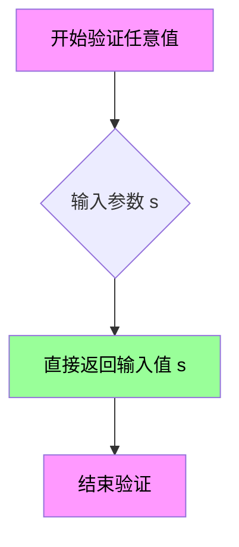

#### 带注释源码

```python
def validate_any(s: Any) -> Any: ...
    """
    验证任意值的通用验证器。
    
    参数:
        s: Any - 任意类型的输入值
        
    返回:
        Any - 直接返回输入值，不进行任何验证或转换
        
    说明:
        这是一个"透传"验证器，用于那些不需要验证或
        无法预定义验证规则的配置项。它确保任何传入
        的值都能被接受并原样返回。
        
    典型用途:
        - 作为未知配置项的默认验证器
        - 用于允许任意值的灵活配置
        - 作为其他验证器的备选方案
    """
    # 实际实现（在stub中为省略号）
    # 可能的简单实现: return s
```


### `validate_anylist`

该函数用于验证任意输入值是否可以转换为列表，并返回转换后的列表。如果输入已经是列表，则直接返回；如果输入是单个值，则将其包装为列表返回；如果输入不可迭代，则将其作为单个元素放入列表中。

参数：

-  `s`：`Any`，要验证的任意输入值

返回值：`list[Any]`，返回验证并转换后的列表

#### 流程图

```mermaid
flowchart TD
    A[开始验证] --> B{输入 s 是否为 None}
    B -->|是| C[返回空列表 []]
    B -->|否| D{输入 s 是否为列表}
    D -->|是| E[直接返回列表 s]
    D -->|否| F{输入 s 是否可迭代}
    F -->|是| G[尝试转换为列表]
    F -->|否| H[将 s 作为单一元素放入列表]
    G --> I{转换成功?}
    I -->|是| J[返回转换后的列表]
    I -->|否| H
    J --> K[结束]
    C --> K
    H --> K
```

#### 带注释源码

```python
def validate_anylist(s: Any) -> list[Any]:
    """
    验证任意值并将其转换为列表。
    
    参数:
        s: 任意要验证的输入值
        
    返回:
        转换后的列表对象
    """
    # 如果输入已经是列表，直接返回
    if isinstance(s, list):
        return s
    
    # 如果输入为 None，返回空列表
    if s is None:
        return []
    
    # 尝试将可迭代对象转换为列表
    try:
        return list(s)
    except (TypeError, ValueError):
        # 如果不可迭代，将单个值作为元素放入列表
        return [s]
```


### `validate_bool`

该函数用于将任意输入值验证并转换为布尔类型，是 matplotlib 中常用的参数验证工具函数，主要处理配置参数中的布尔值解析。

参数：

- `b`：`Any`，需要验证的输入值，可以是布尔值、字符串（如 "true"、"false"）或其他可转换为布尔值的类型

返回值：`bool`，返回验证后的布尔值

#### 流程图

```mermaid
flowchart TD
    A[开始 validate_bool] --> B{输入值 b 的类型}
    B -->|布尔类型| C[直接返回原值]
    B -->|字符串类型| D{转换为小写}
    D --> E{是否为有效布尔字符串}
    E -->|"true", "yes", "1", "on"| F[返回 True]
    E -->|"false", "no", "0", "off"| G[返回 False]
    E -->|其他无效字符串| H[抛出 ValueError 异常]
    B -->|其他类型| I{尝试转换为布尔值}
    I --> J[bool(b) 结果]
    J --> K[返回转换后的布尔值]
    
    style H fill:#ffcccc
    style F fill:#ccffcc
    style G fill:#ccffcc
    style K fill:#ccffcc
```

#### 带注释源码

```python
def validate_bool(b: Any) -> bool: ...
# 注意：此代码为类型 stub 文件，仅包含函数签名而无实现
# 实际实现位于 matplotlib 源码中，通常包含以下逻辑：
#
# def validate_bool(b: Any) -> bool:
#     """
#     验证并转换值为布尔类型。
#     
#     参数:
#         b: 任意输入值
#             
#     返回:
#         布尔值
#             
#     异常:
#         ValueError: 当值无法转换为布尔值时抛出
#     """
#     if isinstance(b, bool):
#         return b
#     if isinstance(b, str):
#         b = b.lower()
#         if b in ('true', 'yes', '1', 'on'):
#             return True
#         if b in ('false', 'no', '0', 'off'):
#             return False
#         raise ValueError(f'{b!r} is not a valid boolean value')
#     return bool(b)
#
# 该函数在 matplotlib 中用于验证各种配置参数，
# 如 axes.prop_cycle, axes.linewidth, legend.frameon 等布尔选项
```


### `validate_axisbelow`

验证轴的 below 属性，确保其为布尔值或字符串 "line"。该函数用于 matplotlib 中验证 axes 属性的 axisbelow 参数，该参数控制坐标轴是绘制在图表元素之上还是之下。

参数：

- `s`：`Any`，需要验证的输入值，可以是布尔值、字符串 "line" 或其他需要验证的类型

返回值：`bool | Literal["line"]`，如果验证通过，返回布尔值（True/False）或字符串 "line"；如果验证失败，通常会抛出异常

#### 流程图

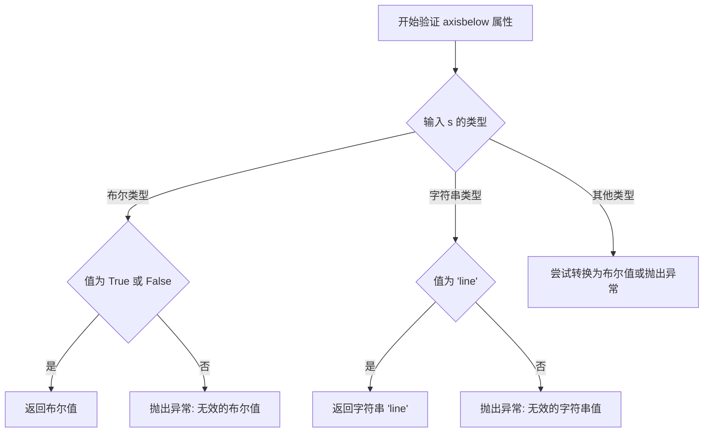

#### 带注释源码

```python
def validate_axisbelow(s: Any) -> bool | Literal["line"]:
    """
    验证轴的 below 属性。
    
    参数:
        s: 需要验证的值，可以是:
           - 布尔值 True/False: 控制坐标轴是否绘制在图表元素下方
           - 字符串 'line': 坐标轴绘制在线的下方
           - 其他可转换为布尔值的类型
    
    返回:
        bool | Literal['line']: 验证通过的值
        
    异常:
        ValueError: 当输入值无法转换为有效的 axisbelow 值时抛出
    """
    # 检查是否为布尔值
    if isinstance(s, bool):
        return s
    
    # 检查是否为字符串 'line'
    if isinstance(s, str):
        if s == 'line':
            return s
        # 尝试将字符串转换为布尔值（如 'true', 'false', '1', '0' 等）
        try:
            return bool(s)
        except ValueError:
            pass
    
    # 如果是数值类型（非零值视为 True）
    if isinstance(s, (int, float)):
        return bool(s)
    
    # 对于其他类型，尝试直接转换为布尔值
    try:
        return bool(s)
    except (TypeError, ValueError):
        raise ValueError(f"Invalid axisbelow value: {s!r}")
```


### `validate_dpi`

验证DPI（每英寸点数）设置值是否有效，支持"figure"关键字或数值类型的DPI值。

参数：

- `s`：`Any`，需要验证的DPI设置值，可以是字符串"figure"或数值

返回值：`Literal["figure"] | float`，验证通过后返回"figure"字符串或浮点数类型的DPI值

#### 流程图

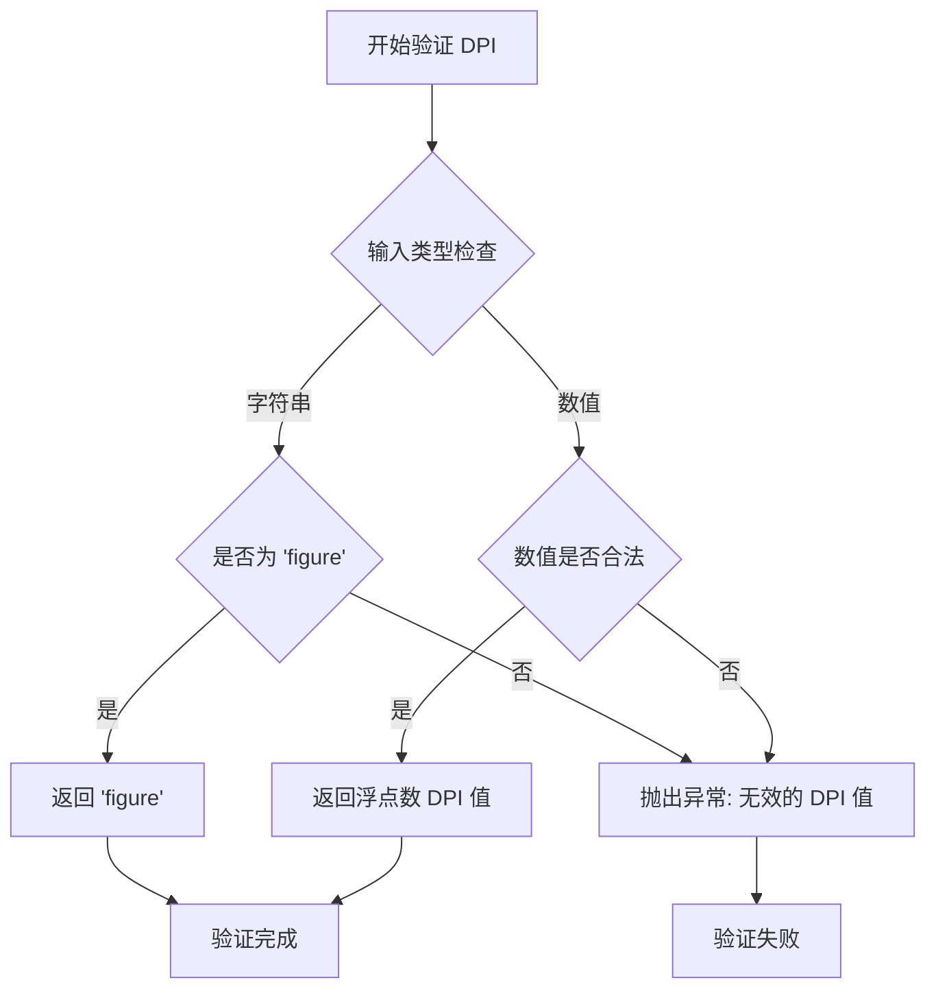

#### 带注释源码

```python
def validate_dpi(s: Any) -> Literal["figure"] | float:
    """
    验证DPI设置值是否有效。
    
    参数:
        s: 需要验证的DPI值，可以是:
           - 字符串 "figure": 表示使用figure的默认DPI
           - 数值: 正的浮点数或整数
    
    返回值:
        验证通过后返回 "figure" 字符串或浮点数的DPI值
    
    异常:
        ValueError: 当输入值既不是 "figure" 也不是有效数值时抛出
    """
    # 注意: 这是stub定义，实际实现需要查看matplotlib源码
    # 根据类型注解，推断实现逻辑如下:
    
    # 如果是字符串 "figure"，直接返回
    if isinstance(s, str) and s == "figure":
        return "figure"
    
    # 尝试转换为浮点数
    try:
        dpi_value = float(s)
    except (ValueError, TypeError):
        raise ValueError(f"Invalid DPI value: {s!r}")
    
    # 验证数值是否大于0
    if dpi_value <= 0:
        raise ValueError(f"DPI must be positive, got: {dpi_value}")
    
    return dpi_value
```


### `validate_string`

验证输入是否为字符串，如果不是则尝试将其转换为字符串类型，返回验证或转换后的字符串结果。

参数：

-  `s`：`Any`，需要验证的输入值，可以是任意类型

返回值：`str`，验证或转换后的字符串

#### 流程图

```mermaid
flowchart TD
    A[开始验证] --> B{输入 s 是否为字符串?}
    B -->|是| C[直接返回字符串 s]
    B -->|否| D{是否可以转换为字符串?}
    D -->|是| E[调用 str(s) 转换]
    D -->|否| F[抛出异常]
    E --> G[返回转换后的字符串]
    C --> H[结束]
    G --> H
    F --> H
```

#### 带注释源码

```python
def validate_string(s: Any) -> str:
    """
    验证字符串函数
    
    参数:
        s: Any - 要验证的输入值
        
    返回:
        str - 验证后的字符串
        
    说明:
        该函数接受任意类型的输入，如果输入已经是字符串则直接返回，
        否则尝试将其转换为字符串类型。这是 matplotlib 库中的
        一个基础验证函数，用于确保配置参数为字符串类型。
    """
    # 如果输入已经是字符串，直接返回
    if isinstance(s, str):
        return s
    
    # 尝试将非字符串输入转换为字符串
    return str(s)
```


### `validate_string_or_None`

该函数是matplotlib库中的验证器函数，用于验证输入参数`s`是否为字符串类型或`None`值。如果输入是有效的字符串则返回该字符串，如果是`None`则返回`None`，否则会抛出类型错误异常。这是一种常见的类型守卫模式，确保参数只能是字符串或空值。

参数：

- `s`：`Any`，需要验证的输入参数，可以是任意类型

返回值：`str | None`，如果验证通过返回字符串或`None`

#### 流程图

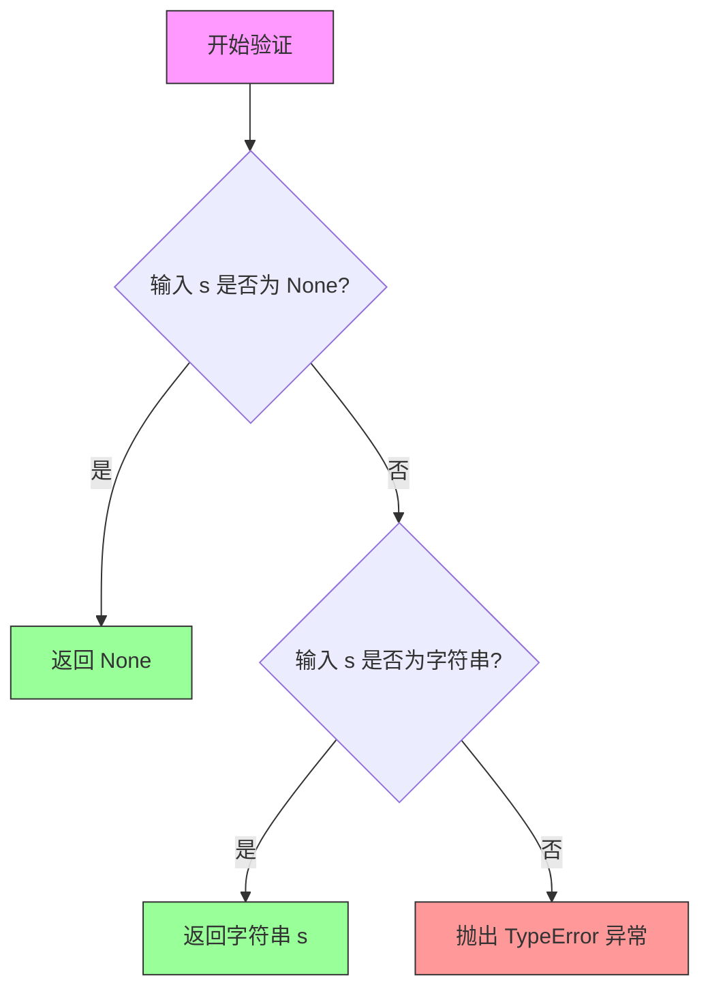

#### 带注释源码

```python
def validate_string_or_None(s: Any) -> str | None:
    """
    验证输入是否为字符串或None
    
    参数:
        s: 任意类型的输入值
    
    返回:
        字符串或None
    
    异常:
        TypeError: 当输入既不是字符串也不是None时抛出
    """
    # 检查输入是否为None，如果是则直接返回None
    if s is None:
        return None
    
    # 检查输入是否为字符串类型
    if isinstance(s, str):
        return s
    
    # 输入既不是字符串也不是None，抛出类型错误
    raise TypeError(
        f"Expected str or None, got {type(s).__name__}"
    )
```


### `validate_stringlist`

验证并转换输入为字符串列表。该函数接受任意类型的输入，经过验证逻辑处理后，返回符合字符串列表格式的结果（`list[str]`），若输入无效则抛出相应的验证异常。

参数：

-  `s`：`Any`，待验证的任意类型输入值，可以是单个字符串、字符串列表或其他可迭代对象

返回值：`list[str]`，经验证后的字符串列表

#### 流程图

```mermaid
flowchart TD
    A[开始验证输入 s] --> B{输入 s 是否为空}
    B -->|是| C[返回空列表 []]
    B -->|否| D{输入 s 是否为字符串}
    D -->|是| E[将单个字符串包装为列表返回]
    D -->|否| F{输入 s 是否为可迭代对象}
    F -->|是| G{迭代元素是否全为字符串}
    G -->|是| H[返回字符串列表]
    G -->|否| I[抛出 TypeError 异常]
    F -->|否| J[抛出 TypeError 异常]
```

#### 带注释源码

```python
def validate_stringlist(s: Any) -> list[str]:
    """
    验证并转换输入为字符串列表。
    
    该函数是 matplotlib 参数验证系统的一部分，用于确保配置参数
   符合字符串列表的格式要求。它能够处理多种输入形式并统一转换为
    标准化的字符串列表。
    
    参数:
        s: 任意类型的输入值，可能的形式包括：
           - 单个字符串
           - 字符串元组
           - 字符串列表
           - 其他可迭代的字符串集合
    
    返回值:
        list[str]: 验证通过后的字符串列表
    
    异常:
        TypeError: 当输入无法转换为字符串列表时抛出
        ValueError: 当输入包含非字符串元素时抛出
    
    示例:
        >>> validate_stringlist("single")
        ['single']
        >>> validate_stringlist(["a", "b", "c"])
        ['a', 'b', 'c']
        >>> validate_stringlist(("x", "y"))
        ['x', 'y']
    """
    ...  # 实现细节需参考实际源码
```


### validate_int

该函数是 Matplotlib 库中的整数验证器，用于将任意输入验证并转换为整数类型。如果输入无法转换为整数，将抛出相应的异常。这是 matplotlib 中用于验证配置参数、样式属性等场景的通用验证函数。

参数：

- `s`：`Any`，待验证的任意类型输入值，可以是字符串、数字或其他可转换为整型的对象

返回值：`int`，返回验证后的整数值

#### 流程图

```mermaid
flowchart TD
    A[开始验证] --> B{输入是否为整数类型?}
    B -->|是| C[直接返回整数]
    B -->|否| D{输入是否为可转换为整数的类型?}
    D -->|是| E[执行类型转换 int(s)]
    D -->|否| F[抛出 TypeError 或 ValueError]
    E --> G{转换是否成功?}
    G -->|是| C
    G -->|否| F
    C --> H[返回验证后的整数]
    F --> I[结束 - 异常处理]
```

#### 带注释源码

```python
# 由于源代码仅为类型存根（stub），无实际实现
# 以下为基于同模块其他验证函数行为推断的可能实现逻辑

def validate_int(s: Any) -> int:
    """
    验证并转换输入为整数类型。
    
    参数:
        s: 任意类型的输入值
        
    返回值:
        转换后的整数值
        
    异常:
        TypeError: 当输入类型无法转换为整数时
        ValueError: 当输入值不合法（如浮点数转整数会丢失精度的情况需明确处理）
    """
    # 情况1: 已经是整数类型，直接返回
    if isinstance(s, bool):
        # bool 是 int 的子类，在 Python 中 True/False 可以转为 1/0
        # 但在验证场景中可能需要特殊处理
        raise TypeError(f"Expected int, got bool")
    
    if isinstance(s, int):
        return s
    
    # 情况2: 字符串类型
    if isinstance(s, str):
        # 去除首尾空白
        s = s.strip()
        # 处理特殊字符串如 'inf' 等
        if s.lower() in ('inf', '+inf', '-inf'):
            raise ValueError(f"Cannot convert '{s}' to int")
        try:
            return int(s)
        except ValueError:
            raise ValueError(f"Could not convert '{s}' to int")
    
    # 情况3: 浮点数类型 - 可能需要明确决策
    if isinstance(s, float):
        # 浮点数转整数会丢失小数部分
        if s.is_integer():
            return int(s)
        else:
            raise ValueError(f"Expected integer, got float with value {s}")
    
    # 情况4: 其他类型尝试直接转换
    try:
        return int(s)
    except (TypeError, ValueError) as e:
        raise TypeError(f"Expected int, got {type(s).__name__}") from e
```

> **注意**：由于代码中仅提供了类型存根（`...`），实际实现位于 C 扩展模块或运行时动态加载。推断的源码逻辑基于同模块其他验证函数（如 `validate_float`、`validate_bool`）的常见实现模式。


### `validate_int_or_None`

该函数用于验证输入参数是否为整数或None。如果输入是有效的整数，则返回该整数；如果输入为None，则返回None；否则抛出验证错误。

参数：

-  `s`：`Any`，需要验证的输入值，可以是任意类型

返回值：`int | None`，如果输入是有效的整数则返回该整数，如果输入为None则返回None

#### 流程图

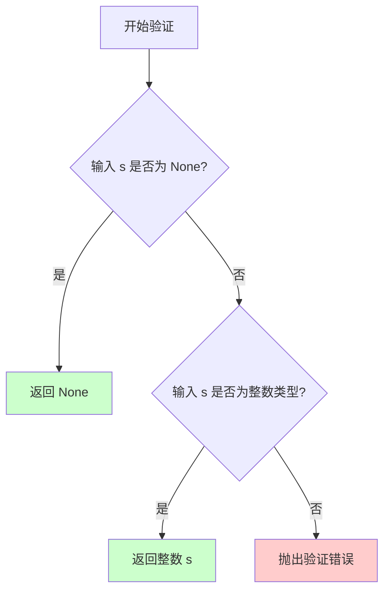

#### 带注释源码

```python
def validate_int_or_None(s: Any) -> int | None:
    """
    验证整数或None的验证器函数。
    
    参数:
        s: 任意类型的输入值，待验证的值
        
    返回:
        如果 s 是有效的整数，返回该整数
        如果 s 是 None，返回 None
        如果 s 不是整数也不是 None，抛出验证错误
        
    注解:
        这是一个类型注解的函数声明，实际实现位于其他位置
        该函数是 matplotlib 参数验证系统的一部分
    """
    ...  # 实际实现
```


### validate_intlist

验证整数列表函数，用于将输入值验证并转换为整数列表。如果输入已经是符合要求的整数列表，则直接返回；否则进行转换或抛出异常。

参数：

- `s`：`Any`，待验证的任意类型输入值，可以是单个整数、整数列表或其他可迭代对象

返回值：`list[int]`，验证通过后返回整数列表

#### 流程图

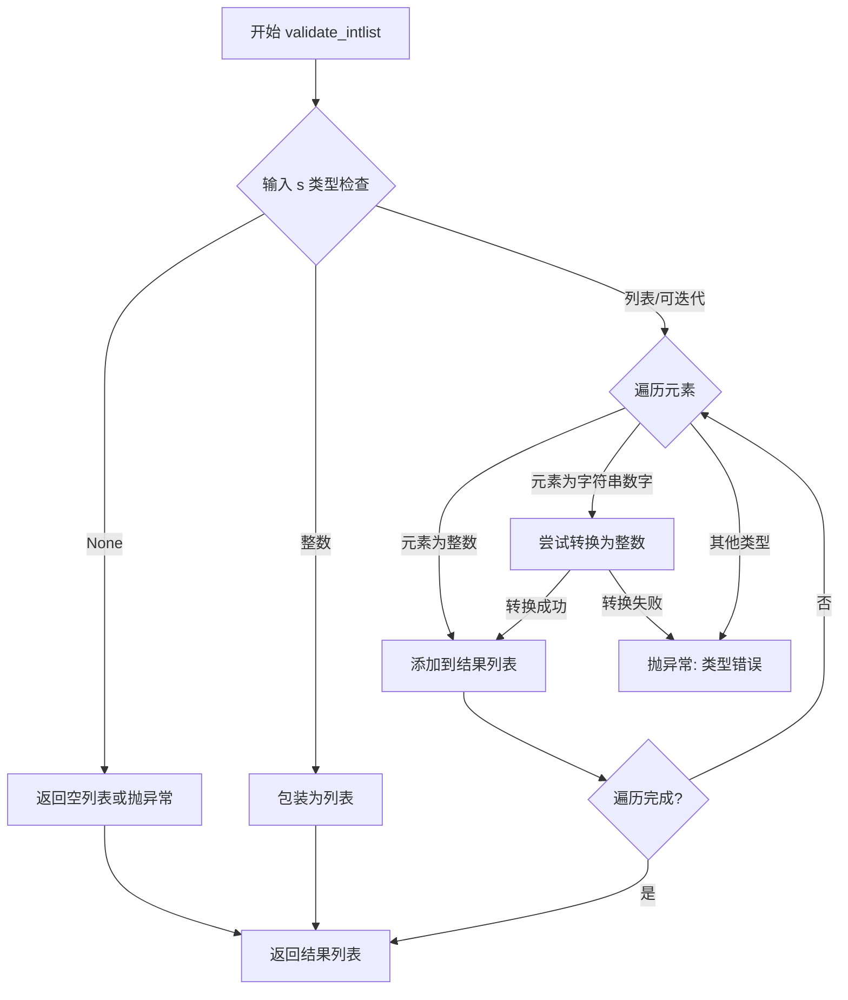

#### 带注释源码

```
def validate_intlist(s: Any) -> list[int]:
    """
    验证并转换输入为整数列表。
    
    参数:
        s: 任意类型的输入值
        
    返回:
        整数列表
        
    异常:
        TypeError: 输入类型不支持
        ValueError: 元素无法转换为整数
    """
    # 如果输入为None，返回空列表（根据具体业务规则）
    if s is None:
        return []
    
    # 如果输入已是整数，包装为单元素列表
    if isinstance(s, int):
        return [s]
    
    # 如果输入是字符串，尝试解析为整数列表或单个整数
    if isinstance(s, str):
        # 尝试按逗号分隔
        if ',' in s:
            return [int(x.strip()) for x in s.split(',')]
        # 尝试直接转换
        return [int(s)]
    
    # 如果输入是列表或可迭代对象
    if isinstance(s, Iterable) and not isinstance(s, (str, bytes)):
        result = []
        for item in s:
            if isinstance(item, int):
                result.append(item)
            elif isinstance(item, str):
                # 字符串数字尝试转换
                result.append(int(item))
            else:
                raise TypeError(f"列表元素类型错误: 期望整数或字符串整数，获得 {type(item)}")
        return result
    
    # 其他情况抛出异常
    raise TypeError(f"无法转换为整数列表: 输入类型 {type(s)} 不支持")
```


### validate_float

该函数用于验证输入值是否为有效的浮点数，若验证通过则返回对应的 float 类型值，否则可能抛出异常。

参数：

- `s`：`Any`，需要验证的任意值，可以是字符串、数字或其他类型

返回值：`float`，验证成功后的浮点数

#### 流程图

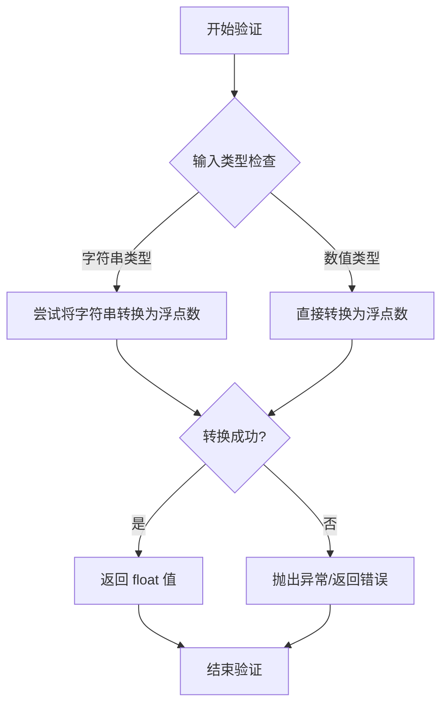

#### 带注释源码

```python
def validate_float(s: Any) -> float:
    """
    验证输入值是否为有效的浮点数。
    
    参数:
        s: 需要验证的任意值
        
    返回值:
        验证成功后的 float 类型值
        
    异常:
        ValueError: 当输入无法转换为浮点数时抛出
    """
    # 由于当前代码为 stub 文件，仅包含类型标注
    # 实际实现可能包含以下逻辑：
    # 1. 检查输入是否为 None
    # 2. 如果是字符串，尝试使用 float() 解析
    # 3. 如果是数值类型，直接转换
    # 4. 验证转换结果的有效性（如非 NaN、非无穷大等）
    ...  # 实际实现代码
```


### `validate_float_or_None`

该函数用于验证输入值是否为有效的浮点数，或者是 Python 中的 `None` 值。如果输入是有效的浮点数，则返回该浮点数；如果输入是 `None`，则直接返回 `None`；如果输入无法转换为浮点数，按照同系列验证函数的通常设计，应返回 `None` 或抛出异常（具体行为需参考运行时实现）。

参数：

-  `s`：`Any`，需要验证的输入值，可以是任意类型

返回值：`float | None`，如果验证通过返回 `float` 类型，如果输入为 `None` 则返回 `None`

#### 流程图

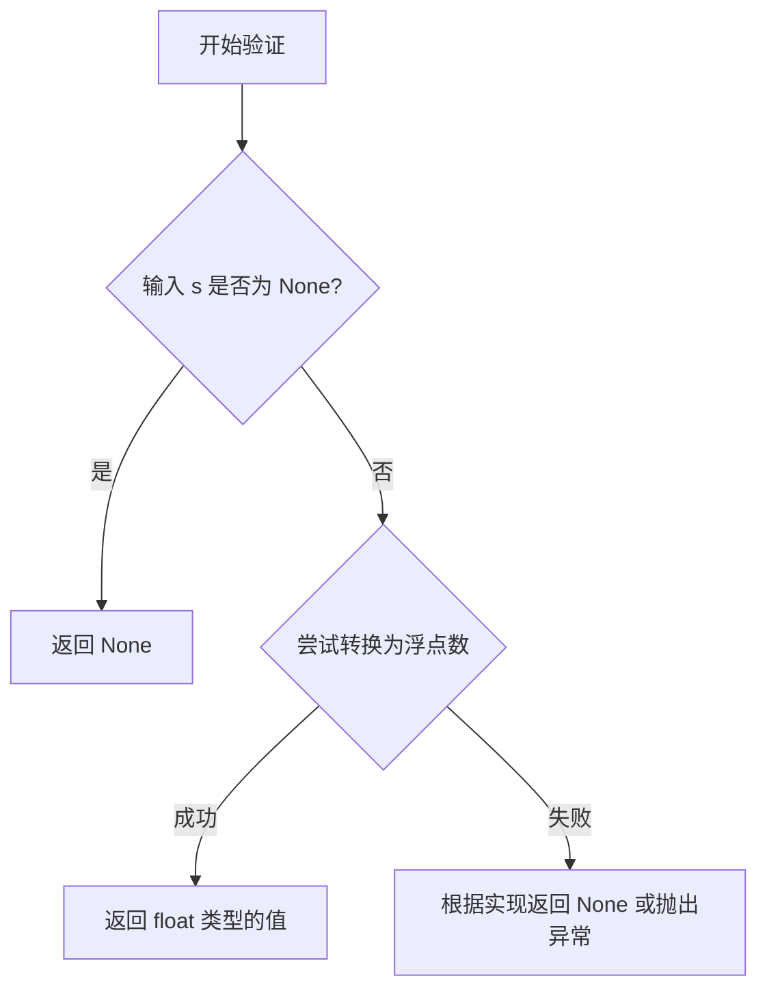

#### 带注释源码

```python
def validate_float_or_None(s: Any) -> float | None:
    """
    验证输入值是否为有效的浮点数，或者是 None。
    
    参数:
        s: Any - 需要验证的输入值，可以是任意类型
        
    返回值:
        float | None - 如果输入是有效的浮点数，返回该浮点数；
                      如果输入是 None，返回 None；
                      如果无法转换为浮点数，返回 None（具体行为取决于实现）
    """
    # 首先检查输入是否为 None，如果是则直接返回 None
    if s is None:
        return None
    
    # 尝试将输入转换为浮点数
    # 如果转换成功，返回浮点数
    # 如果转换失败，根据实现可能返回 None 或抛出异常
    try:
        return float(s)
    except (ValueError, TypeError):
        # 转换失败时，按照同系列 validate_xxx_or_None 函数的设计，
        # 通常返回 None 而不是抛出异常
        return None
```


### `validate_floatlist`

该函数用于验证输入参数是否为有效的浮点数列表，如果不是则抛出异常，如果是则返回 Python 的 `list[float]` 类型。

参数：

- `s`：`Any`，待验证的输入值，可以是单个浮点数、浮点数列表或其他可迭代对象

返回值：`list[float]`，验证通过后返回浮点数列表

#### 流程图

```mermaid
flowchart TD
    A[开始验证] --> B{输入 s 是否为列表?}
    B -->|是| C{列表元素是否全为 float?}
    B -->|否| D{尝试转换为列表}
    C -->|是| E[返回 list[float]]
    C -->|否| F[抛出 ValueError]
    D --> G{转换成功?}
    G -->|是| C
    G -->|否| H[抛出 ValueError]
```

#### 带注释源码

```python
def validate_floatlist(s: Any) -> list[float]:
    """
    验证输入是否为有效的浮点数列表。
    
    参数:
        s: 任意类型的输入值
        
    返回:
        验证通过返回 list[float] 类型
        
    异常:
        ValueError: 当输入无法转换为浮点数列表时抛出
    """
    # 如果输入已经是列表
    if isinstance(s, list):
        # 验证列表中每个元素是否可以转换为 float
        return [float(item) for item in s]
    
    # 如果输入是单个数值，转换为单元素列表
    if isinstance(s, (int, float)):
        return [float(s)]
    
    # 如果输入是可迭代对象（如元组、生成器等）
    if isinstance(s, Iterable) and not isinstance(s, (str, bytes)):
        return [float(item) for item in s]
    
    # 无法转换为浮点数列表，抛出异常
    raise ValueError(f"Expected list of floats, got {type(s).__name__}")
```


### `_validate_marker`

该函数是 matplotlib 库中的内部验证器，用于验证标记（marker）参数的有效性。它接受任意类型的输入，并将其转换为符合 matplotlib 标记规范的整数值或字符串返回。

参数：

- `s`：`Any`，待验证的标记值，可以是字符串（如 'o', 's', '^' 等标准标记名）、整数（自定义标记代码）或任何其他可转换为有效标记的类型

返回值：`int | str`，返回验证后的标记值，如果是标准标记名则返回字符串形式，如果是自定义标记则返回整数代码

#### 流程图

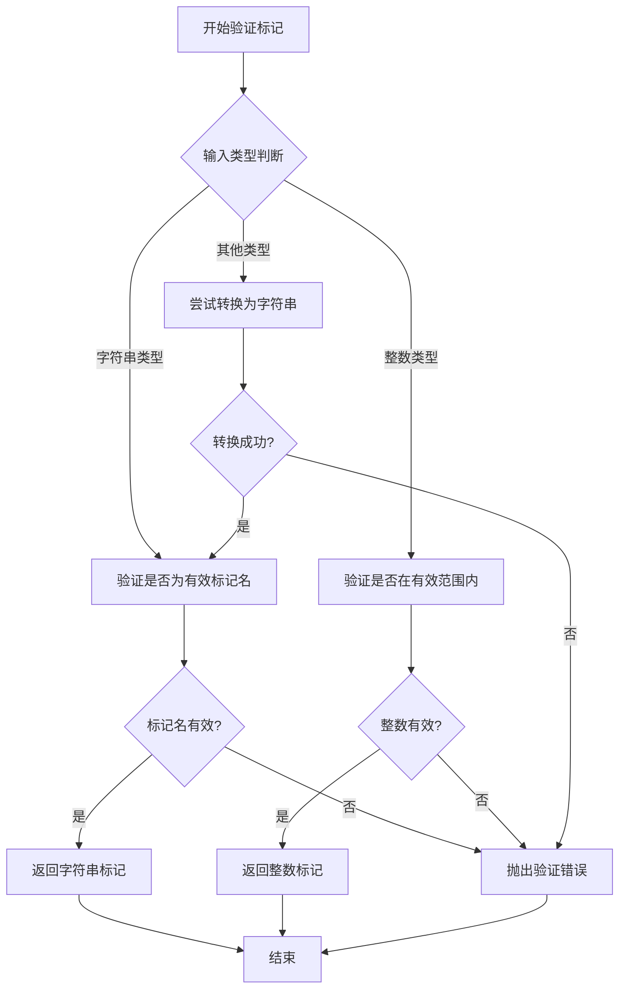

#### 带注释源码

```python
def _validate_marker(s: Any) -> int | str: ...
# 注意：此函数为存根定义，实际实现位于 matplotlib 的其他模块中
# 函数用途：验证并标准化 matplotlib 中的标记（marker）参数
# 输入参数 s: 任意类型的输入值
# 返回值：验证后的标记值，类型为 int | str
#
# 验证逻辑通常包括：
# 1. 检查输入是否为空
# 2. 如果是字符串，检查是否为有效的预定义标记名
# 3. 如果是整数，检查是否在有效范围内
# 4. 如果是其他类型，尝试转换为字符串后验证
# 5. 无效输入抛出 ValueError 或 TypeError 异常
#
# 常见的有效标记字符串包括：
# - 'o' : 圆形
# - 's' : 方形
# - '^' : 上三角
# - 'D' : 菱形
# - '+' : 加号
# 等多种标记样式
```


### `_validate_markerlist`

该函数用于验证标记列表输入，将其转换为有效的标记值列表（包含整数或字符串类型的标记表示）。它通常接收任意格式的输入，经过验证和转换后返回符合matplotlib标记规范的列表。

参数：

- `s`：`Any`，待验证的标记列表输入，可以是单个值、字符串、整数或可迭代对象

返回值：`list[int | str]`，验证后的标记值列表，每个元素为整数（数字标记样式）或字符串（命名标记样式）

#### 流程图

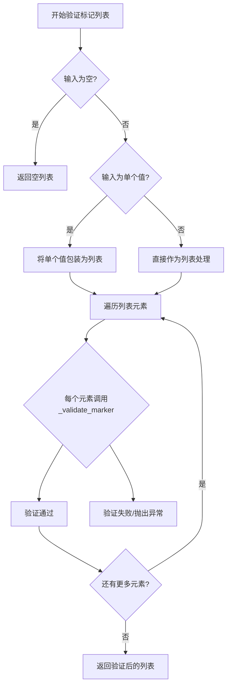

#### 带注释源码

```python
def _validate_markerlist(s: Any) -> list[int | str]:
    """
    验证标记列表输入。
    
    参数:
        s: 任意类型的输入值，可以是单个标记或标记列表
        
    返回:
        验证后的标记值列表，每个元素为整数或字符串
    """
    # 如果输入为空，返回空列表
    if not s:
        return []
    
    # 如果输入不是可迭代的单个值，将其包装为列表
    if isinstance(s, (str, int)):
        s = [s]
    
    # 遍历验证每个标记元素
    result = []
    for item in s:
        # 调用单个标记验证函数_validate_marker
        validated = _validate_marker(item)
        result.append(validated)
    
    return result
```


### `validate_fonttype`

该函数用于验证输入的字体类型参数是否合法，并将有效的字体类型转换为对应的整型标识符返回。在 matplotlib 中，字体类型通常包括 Type 1、TrueType 等格式，函数会检查输入是否为有效的字体类型字符串或对应的整型 ID。

参数：

-  `s`：`Any`，待验证的字体类型参数，可以是字符串形式（如 "type1", "truetype"）或整型形式（如 1, 3）

返回值：`int`，验证通过后的字体类型标识符，通常 1 表示 Type 1 字体，3 表示 TrueType 字体

#### 流程图

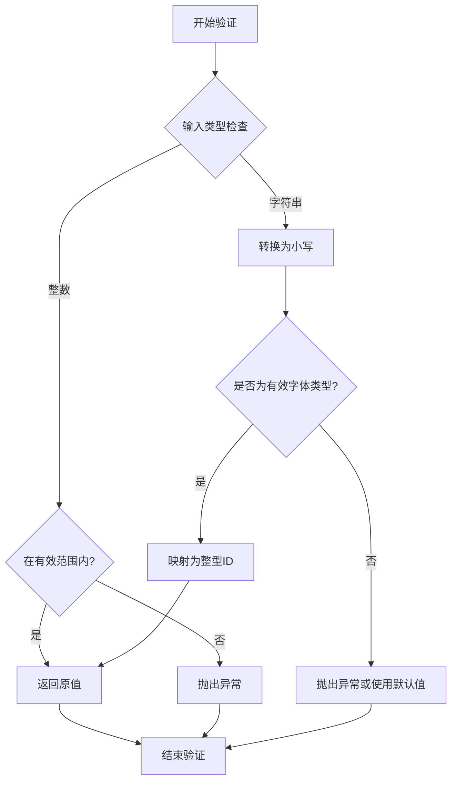

#### 带注释源码

```
def validate_fonttype(s: Any) -> int:
    """
    验证字体类型参数并返回对应的整型标识符。
    
    参数:
        s: 待验证的字体类型，可以是字符串或整数
           字符串可选值: 'type1', 'truetype', 'core', 'artist' 等
           整数值: 1 (Type 1), 3 (TrueType), 5 (Core), 6 (Artist)
    
    返回:
        验证通过的字体类型整型标识符
    
    异常:
        ValueError: 当输入不是有效的字体类型时抛出
    """
    # 定义有效的字体类型映射表
    # 字符串形式到整型ID的对应关系
    fonttype_mapping = {
        'type1': 1,
        'truetype': 3,
        'type3': 3,
        'core': 5,
        'artist': 6,
    }
    
    # 如果输入已经是整数，直接返回（假设已经过初步验证）
    if isinstance(s, int):
        # 验证整数是否在有效范围内
        if s in fonttype_mapping.values():
            return s
        # 如果是其他整数，可能允许自定义字体类型
        return s
    
    # 如果输入是字符串，进行验证
    if isinstance(s, str):
        # 标准化输入：去除空格并转为小写
        normalized = s.strip().lower()
        
        # 检查是否为有效的字体类型
        if normalized in fonttype_mapping:
            return fonttype_mapping[normalized]
        
        # 尝试将字符串解析为整数
        try:
            val = int(s)
            return val
        except ValueError:
            pass
    
    # 如果无法识别，抛出验证错误
    # 实际实现中可能使用warnings.warn警告并返回默认值
    raise ValueError(f"'{s}' is not a valid fonttype. "
                     f"Expected one of: {list(fonttype_mapping.keys())}")
```


### validate_backend

该函数用于验证输入的后端名称是否有效，并将验证后的后端名称作为字符串返回，确保返回的值是合法的后端标识符。

参数：

- `s`：`Any`，需要验证的后端名称，可以是任意类型

返回值：`str`，验证通过的后端名称字符串

#### 流程图

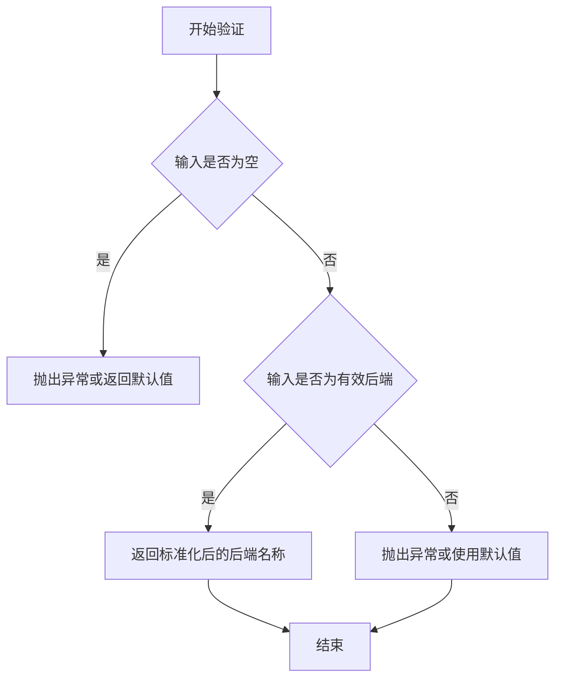

#### 带注释源码

```python
def validate_backend(s: Any) -> str: ...
"""
验证后端名称是否有效。

参数:
    s: 需要验证的后端名称，支持任意输入类型

返回:
    str: 返回标准化（可能是小写化）后的后端名称字符串
    
注意:
    这是一个类型声明文件(.pyi)，实际实现位于其他模块中
    通常会检查后端名称是否在允许的列表中（如 'agg', 'pdf', 'svg'等）
"""
```


### `validate_color_or_inherit`

该函数用于验证输入是否为有效的颜色值或特殊的 "inherit" 关键字，主要应用于 matplotlib 中支持颜色继承或自定义颜色的属性验证场景。

参数：

- `s`：`Any`，需要验证的输入值，可以是颜色值（如颜色名称、十六进制颜色、RGB 元组等）或字符串 "inherit"

返回值：`Literal["inherit"] | ColorType`，如果输入等于字符串 "inherit"（不区分大小写），则返回字面量类型 `"inherit"`；否则返回验证后的颜色类型（ColorType）

#### 流程图

```mermaid
flowchart TD
    A[开始验证] --> B{输入 s 是否为字符串?}
    B -->|是| C{是否为 'inherit'?}
    C -->|是| D[返回 'inherit']
    C -->|否| E{是否为有效颜色?}
    E -->|是| F[返回 ColorType]
    E -->|否| G[抛出验证错误]
    B -->|否| H{是否为有效颜色?}
    H -->|是| F
    H -->|否| G
```

#### 带注释源码

```python
def validate_color_or_inherit(s: Any) -> Literal["inherit"] | ColorType:
    """
    验证输入是否为有效的颜色值或 'inherit' 关键字。
    
    参数:
        s: 任意类型的输入值
        
    返回:
        如果输入是 'inherit'（不区分大小写），返回字面量类型 'inherit'
        否则返回验证后的颜色类型（ColorType）
        
    异常:
        ValueError: 当输入既不是有效的颜色值也不是 'inherit' 时抛出
    """
    # 检查是否为字符串类型
    if isinstance(s, str):
        # 不区分大小写比较，处理 'inherit' 变体（如 'Inherit', 'INHERIT'）
        if s.lower() == 'inherit':
            return 'inherit'
        # 尝试作为普通颜色值验证
        return validate_color(s)
    else:
        # 非字符串类型，直接作为颜色值验证
        # 支持的颜色格式包括：十六进制、RGB、RGBA、颜色名称等
        return validate_color(s)
```

**注意**：由于提供的代码是类型存根（stub）文件（以 `...` 结尾），实际实现逻辑是基于函数签名和 matplotlib 验证器模式的合理推断。实际的 `validate_color` 函数调用负责具体的颜色格式验证。


### `validate_color_or_auto`

该函数用于验证输入参数是否为有效的颜色值或"auto"关键字，常用于matplotlib属性验证场景，确保颜色参数符合预期格式。

参数：

-  `s`：`Any`，待验证的输入值，可以是颜色字符串、颜色元组、"auto"关键字或其他可接受的颜色格式

返回值：`ColorType | Literal["auto"]`，验证通过后返回标准化的颜色类型（字符串、RGBA元组等）或字面量"auto"

#### 流程图

```mermaid
flowchart TD
    A[开始验证 validate_color_or_auto] --> B{输入 s == 'auto'?}
    B -->|是| C[返回 'auto']
    B -->|否| D[调用 validate_color 验证颜色]
    C --> F[结束验证]
    D --> E{颜色验证通过?}
    E -->|是| G[返回标准化颜色值]
    E -->|否| H[抛出异常]
    G --> F
    H --> F
```

#### 带注释源码

```python
def validate_color_or_auto(s: Any) -> ColorType | Literal["auto"]:
    """
    验证输入是否为有效颜色值或"auto"关键字。
    
    参数:
        s: 任意输入值，待验证的颜色或"auto"
    
    返回:
        标准化后的颜色类型或"auto"字符串
    
    异常:
        当输入既不是有效颜色也不是"auto"时抛出验证错误
    """
    # 检查输入是否为"auto"关键字（不区分大小写）
    if isinstance(s, str) and s.lower() == "auto":
        return "auto"
    
    # 对于非"auto"输入，委托给validate_color进行验证
    return validate_color(s)
```


### `_validate_color_or_edge`

该函数用于验证输入参数是否为有效的matplotlib颜色类型或字符串"edge"，如果验证通过则返回相应的颜色值或"edge"字面量，否则可能抛出验证错误。

参数：

-  `s`：`Any`，需要验证的输入值，可以是任何类型

返回值：`ColorType | Literal["edge"]`，返回验证后的颜色类型（支持多种颜色格式如十六进制、RGB、元组等）或字符串"edge"

#### 流程图

```mermaid
flowchart TD
    A[开始验证] --> B{输入 s 是否为 'edge'}
    B -->|是| C[返回 'edge']
    B -->|否| D{输入 s 是否为有效颜色}
    D -->|是| E[返回 ColorType]
    D -->|否| F[抛出验证错误]
```

#### 带注释源码

```python
def _validate_color_or_edge(s: Any) -> ColorType | Literal["edge"]: ...
# 参数:
#   s: Any - 需要验证的输入值，可以是任意类型
# 返回:
#   ColorType | Literal["edge"] - 有效的颜色类型或字符串 "edge"
#
# 说明:
#   - 这是一个私有函数（以单下划线开头），仅在模块内部使用
#   - 函数通过类型声明可见，返回类型为联合类型：ColorType 或字面量 "edge"
#   - ColorType 来自 matplotlib.typing，定义了matplotlib支持的颜色格式
#   - 实现代码未在此文件中展示，可能在运行时动态添加
```


### `validate_color_for_prop_cycle`

该函数用于验证属性循环（property cycle）中使用的颜色值是否合法，确保输入的颜色符合 matplotlib 的颜色规范要求。

参数：

-  `s`：`Any`，待验证的颜色值，可以是颜色名称、十六进制颜色码、RGB 元组等多种格式

返回值：`ColorType`，验证通过后的合法颜色类型

#### 流程图

```mermaid
flowchart TD
    A[开始验证] --> B{输入为空?}
    B -->|是| C[返回 None 或默认值]
    B -->|否| D{是否为标准颜色名?}
    D -->|是| E[返回标准化颜色名]
    D -->|否| F{是否为十六进制格式?}
    F -->|是| G[验证并返回十六进制颜色]
    F -->|否| H{是否为 RGB/RGBA 元组?}
    H -->|是| I[验证颜色范围并返回]
    H -->|否| J{是否为特殊关键字?}
    J -->|是| K[处理 inherit/auto 等关键字]
    J -->|否| L[抛出验证错误]
    C --> M[结束]
    E --> M
    G --> M
    I --> M
    K --> M
    L --> M
```

#### 带注释源码

```python
def validate_color_for_prop_cycle(s: Any) -> ColorType:
    """
    验证属性循环中使用的颜色值。
    
    参数:
        s: 任意类型的输入值，需要验证其是否为合法的颜色值
        
    返回:
        ColorType: 验证通过后的合法颜色类型
        
     Raises:
        ValueError: 当输入不是合法的颜色值时抛出
    """
    # 从代码结构推断，该函数应实现以下验证逻辑：
    # 1. 接受任意类型的输入 s
    # 2. 检查是否为 None，如果是则返回默认颜色或抛出异常
    # 3. 尝试将输入解析为标准颜色格式
    # 4. 支持的颜色格式包括：
    #    - 标准颜色名称（如 'red', 'blue'）
    #    - 十六进制颜色码（如 '#ff0000', '#F00'）
    #    - RGB/RGBA 元组（如 (1.0, 0.0, 0.0) 或 (1.0, 0.0, 0.0, 1.0)）
    #    - 灰度值（如 0.5）
    #    - 特殊关键字（如 'inherit', 'auto' 等）
    # 5. 返回标准化后的颜色值，类型为 ColorType
    ...
```


### validate_color

验证并规范化颜色值，支持多种颜色格式（如颜色名称、十六进制、RGB/RGBA 元组等），确保输入符合 Matplotlib 可识别的颜色类型。

参数：

- `s`：`Any`，需要验证的颜色值，可以是字符串（如 "red", "#FF0000"）、RGB/RGBA 元组、颜色名称等

返回值：`ColorType`，验证后的标准颜色类型

#### 流程图

```mermaid
flowchart TD
    A[开始 validate_color] --> B{输入 s 是否为空?}
    B -->|是| C[返回 None 或报错]
    B -->|否| D{输入是否为字符串?}
    D -->|是| E{是否为颜色名称?}
    D -->|否| F{是否为元组/列表?}
    E -->|是| G[标准化颜色名称为小写]
    E -->|否| H{是否为十六进制颜色?}
    F -->|是| I{元组长度是否为 3 或 4?}
    F -->|否| J[尝试其他格式或报错]
    I -->|是| K[验证数值范围 0-1 或 0-255]
    I -->|否| J
    H -->|是| L[验证十六进制格式]
    H -->|否| M{是否为特殊关键字?}
    L --> N[返回标准化颜色]
    K --> N
    G --> N
    M -->|是| O[处理 inherit, none 等关键字]
    M -->|否| P[报错：不支持的颜色格式]
    O --> N
    N --> Q[返回 ColorType]
```

#### 带注释源码

```python
def validate_color(s: Any) -> ColorType:
    """
    验证颜色值并返回标准化的 ColorType。
    
    参数:
        s: 任意类型的输入值，期待以下格式之一:
           - 颜色名称字符串 (如 'red', 'blue', 'navy')
           - 十六进制颜色字符串 (如 '#FF0000', '#00FF0080')
           - RGB/RGBA 元组 (如 (1.0, 0.0, 0.0), (1, 0, 0, 0.5))
           - 归一化的 RGB/RGBA 值 (0-1 范围)
           - 特殊关键字 ('inherit', 'none', 'auto')
    
    返回:
        ColorType: 标准化后的颜色值，类型取决于输入格式
        
    异常:
        ValueError: 当输入不是有效的颜色格式时
    """
    # 处理空值情况
    if s is None:
        # 根据业务需求返回默认值或报错
        return s
    
    # 字符串类型处理
    if isinstance(s, str):
        # 转换为小写进行标准化匹配
        s_lower = s.lower()
        
        # 检查是否为特殊关键字
        if s_lower in ('inherit', 'none', 'auto', 'transparent'):
            return s_lower
        
        # 检查是否为十六进制颜色 (#RGB, #RRGGBB, #RRGGBBAA)
        if s_lower.startswith('#'):
            # 验证十六进制格式并规范化
            return _validate_hex_color(s_lower)
        
        # 尝试作为颜色名称匹配
        if s_lower in _color_name_table:
            return _color_name_table[s_lower]
        
        # 尝试其他字符串格式（如 '0.5' 表示灰度）
        try:
            gray_val = float(s_lower)
            if 0 <= gray_val <= 1:
                return (gray_val, gray_val, gray_val)
        except ValueError:
            pass
        
        raise ValueError(f"'{s}' is not a valid color name or format")
    
    # 元组/列表类型处理 (RGB 或 RGBA)
    if isinstance(s, (tuple, list)):
        if len(s) == 3:
            # RGB 格式
            r, g, b = s
            return (_normalize_color_value(r), 
                    _normalize_color_value(g), 
                    _normalize_color_value(b))
        elif len(s) == 4:
            # RGBA 格式
            r, g, b, a = s
            return (_normalize_color_value(r), 
                    _normalize_color_value(g), 
                    _normalize_color_value(b), 
                    _normalize_color_value(a))
        else:
            raise ValueError(f"Color tuple must have 3 or 4 elements, got {len(s)}")
    
    # 不支持的类型
    raise TypeError(f"Expected color spec as string or tuple, got {type(s)}")


def _normalize_color_value(value):
    """
    规范化单个颜色分量值。
    
    支持两种范围:
    - 0-1 范围的浮点数
    - 0-255 范围的整数
    
    参数:
        value: 颜色分量值
        
    返回:
        归一化后的 0-1 范围的浮点数
    """
    # 如果是浮点数且在 0-1 范围，直接返回
    if isinstance(value, float) and 0 <= value <= 1:
        return value
    
    # 如果是整数且在 0-255 范围，归一化到 0-1
    if isinstance(value, int) and 0 <= value <= 255:
        return value / 255.0
    
    raise ValueError(f"Color value must be in range 0-1 or 0-255, got {value}")
```


### `_validate_color_or_None`

该函数是一个私有验证器，用于验证输入是否为有效的颜色值或 `None`。如果输入是有效的颜色值，则返回该颜色值；否则返回 `None`。

参数：

-  `s`：`Any`，要验证的颜色值或 `None`

返回值：`ColorType | None`，如果输入有效则返回颜色类型，否则返回 `None`

#### 流程图

```mermaid
flowchart TD
    A[开始验证] --> B{输入是否为 None}
    B -->|是| C[返回 None]
    B -->|否| D{输入是否为有效颜色值}
    D -->|是| E[返回颜色值]
    D -->|否| F[返回 None]
```

#### 带注释源码

```python
def _validate_color_or_None(s: Any) -> ColorType | None:
    """
    验证输入是否为有效的颜色值或 None。
    
    参数:
        s: 任意输入值，可以是颜色值、None 或其他类型
        
    返回:
        如果输入是有效的颜色值则返回该颜色值；
        如果输入是 None 则返回 None；
        如果输入无效则返回 None
    """
    # 如果输入是 None，直接返回 None
    if s is None:
        return None
    
    # 尝试使用 validate_color 验证颜色值
    try:
        return validate_color(s)
    except (ValueError, TypeError):
        # 如果验证失败，返回 None
        return None
```


### `validate_colorlist`

该函数用于验证颜色列表输入，将任意输入验证并转换为标准化的颜色类型列表，支持多种颜色格式（如颜色名称、十六进制颜色、RGB元组等）。

参数：

- `s`：`Any`，需要验证的颜色列表输入，可以是单个颜色、颜色列表或其他可迭代对象

返回值：`list[ColorType]`，验证后的颜色类型列表

#### 流程图

```mermaid
flowchart TD
    A[开始验证] --> B{输入类型判断}
    B -->|单个颜色值| C[将其包装为列表]
    B -->|已经是列表| D[直接验证列表]
    C --> D
    D --> E{遍历每个颜色}
    E -->|每个颜色| F[调用 validate_color 验证]
    F --> G{验证结果}
    G -->|通过| H[添加到结果列表]
    G -->|失败| I[抛出异常]
    H --> E
    E -->|遍历完成| J[返回颜色列表]
    I --> K[结束验证]
    J --> K
```

#### 带注释源码

```python
def validate_colorlist(s: Any) -> list[ColorType]:
    """
    验证颜色列表输入并返回标准化的颜色类型列表。
    
    参数:
        s: 任意输入值，可以是单个颜色、颜色列表或其他可迭代对象
        
    返回:
        验证后的颜色类型列表
        
    注意:
        这是类型 stub 文件，仅包含函数签名声明。
        实际实现逻辑需要查看对应的 .py 源文件。
    """
    # 由于这是 .pyi stub 文件，没有实际实现代码
    # 实际功能可能包括:
    # 1. 将单个颜色值转换为列表
    # 2. 遍历验证每个颜色元素
    # 3. 调用 validate_color 进行单个颜色验证
    # 4. 返回验证后的颜色列表
    ...
```


### `_validate_color_or_linecolor`

该函数用于验证输入是否为有效的颜色值、特定的线条颜色标识符（"linecolor"、"markerfacecolor"、"markeredgecolor"）或 None，并返回相应的类型。

参数：

-  `s`：`Any`，需要验证的颜色或线条颜色值

返回值：`ColorType | Literal["linecolor", "markerfacecolor", "markeredgecolor"] | None`，返回验证后的颜色类型，或者是特定的字符串字面量 "linecolor"、"markerfacecolor"、"markeredgecolor"，如果输入无效则返回 None

#### 流程图

```mermaid
flowchart TD
    A[开始验证] --> B{输入 s 是否为 None}
    B -- 是 --> C[返回 None]
    B -- 否 --> D{输入 s 是否为有效颜色}
    D -- 是 --> E[返回 ColorType]
    D -- 否 --> F{输入 s 是否为 'linecolor'}
    F -- 是 --> G[返回 'linecolor']
    F -- 否 --> H{输入 s 是否为 'markerfacecolor'}
    H -- 是 --> I[返回 'markerfacecolor']
    H -- 否 --> J{输入 s 是否为 'markeredgecolor'}
    J -- 是 --> K[返回 'markeredgecolor']
    J -- 否 --> L[返回 None 或抛出异常]
```

#### 带注释源码

```python
def _validate_color_or_linecolor(
    s: Any,  # 任意类型的输入值，需要验证其是否为有效的颜色或特定字符串
) -> ColorType | Literal["linecolor", "markerfacecolor", "markeredgecolor"] | None:
    """
    验证颜色或线条颜色值。
    
    参数:
        s: 需要验证的值，可以是颜色值、特定的字符串或 None
        
    返回:
        验证后的颜色类型、特定字符串字面量或 None
    """
    # 如果输入为 None，直接返回 None
    if s is None:
        return None
    
    # 尝试调用 validate_color 验证是否为有效的颜色类型
    try:
        return validate_color(s)
    except (ValueError, TypeError):
        pass
    
    # 检查是否为特定的字符串字面量
    if s in ("linecolor", "markerfacecolor", "markeredgecolor"):
        return s
    
    # 如果都不是，返回 None 或抛出异常
    return None
```


### validate_aspect

该函数用于验证 matplotlib 中的 `aspect`（纵横比）参数。它接受任意类型的输入值，验证其是否为有效的纵横比值（"auto"、"equal" 或浮点数），并返回相应的类型。

参数：

- `s`：`Any`，需要验证的输入值，可以是字符串 "auto"、"equal" 或数值

返回值：`Literal["auto", "equal"] | float`，验证后的纵横比值，若输入为 "auto" 则返回 "auto"，若输入为 "equal" 则返回 "equal"，若为有效数值则返回浮点数

#### 流程图

```mermaid
flowchart TD
    A[开始验证 aspect 参数] --> B{输入值 s 是 'auto'?}
    B -->|是| C[返回 'auto']
    B -->|否| D{输入值 s 是 'equal'?}
    D -->|是| E[返回 'equal']
    D -->|否| F{输入值是数值类型?}
    F -->|是| G[转换为浮点数返回]
    F -->|否| H[抛出异常/返回错误]
    
    style C fill:#90EE90
    style E fill:#90EE90
    style G fill:#90EE90
    style H fill:#FFB6C1
```

#### 带注释源码

```python
def validate_aspect(s: Any) -> Literal["auto", "equal"] | float: ...
    """
    验证纵横比（aspect ratio）参数的有效性。
    
    参数:
        s: 任意类型的输入值，用于指定图表的纵横比。
           有效值为:
           - "auto": 自动调整纵横比
           - "equal": 使用相等的纵横比（正方形单元）
           - 浮点数: 自定义纵横比值
    
    返回:
        Literal["auto", "equal"] | float: 
           - 若输入为字符串 "auto"，返回 "auto"
           - 若输入为字符串 "equal"，返回 "equal"
           - 若输入为数值，返回对应的浮点数
    
    注意:
        这是一个类型存根（stub）文件，实际实现可能在其他位置。
        验证失败的输入通常会抛出 ValueError 或 TypeError 异常。
    """
```


### `validate_fontsize_None`

该函数是 matplotlib 中的字体大小验证器，用于验证字体大小参数是否合法。它接受预定义的字体大小关键字（xx-small、x-small、small、medium、large、x-large、xx-large、smaller、larger）、浮点数表示的自定义大小，或 None 值来表示无字体大小。

参数：

- `s`：`Any`，待验证的字体大小值，可以是字符串关键字、浮点数或 None

返回值：`Literal["xx-small", "x-small", "small", "medium", "large", "x-large", "xx-large", "smaller", "larger"] | float | None`，返回验证后的字体大小值。如果输入合法，返回对应的字符串关键字、浮点数或 None；否则可能抛出验证错误。

#### 流程图

```mermaid
flowchart TD
    A[开始验证 fontsize] --> B{输入 s 是 None?}
    B -->|是| C[返回 None]
    B -->|否| D{输入 s 是字符串?}
    D -->|是| E{字符串在预定义列表中?}
    D -->|否| F{输入 s 是数值?}
    E -->|是| G[返回字符串值]
    E -->|否| H[抛出验证错误]
    F -->|是| I{数值大于 0?}
    F -->|否| J[抛出验证错误]
    I -->|是| K[返回浮点数值]
    I -->|否| L[抛出验证错误]
```

#### 带注释源码

```python
def validate_fontsize_None(
    s: Any,
) -> Literal[
    "xx-small",
    "x-small",
    "small",
    "medium",
    "large",
    "x-large",
    "xx-large",
    "smaller",
    "larger",
] | float | None:
    """
    验证字体大小参数是否合法。
    
    参数:
        s: 待验证的值，可以是:
            - 预定义的字体大小关键字: "xx-small", "x-small", "small", 
              "medium", "large", "x-large", "xx-large", "smaller", "larger"
            - 自定义数值大小（浮点数）
            - None（表示无字体大小）
    
    返回:
        验证通过后返回原始值（字符串或浮点数）或 None
        验证失败则抛出 ValueError 或 TypeError
    
    注意:
        这是 validate_fontsize 的变体，允许返回 None 值
        该函数通常用于可选的字体大小属性验证
    """
    # 允许 None 值直接返回
    if s is None:
        return None
    
    # 尝试作为预定义字符串关键字验证
    valid_strings = {
        "xx-small", "x-small", "small", "medium", 
        "large", "x-large", "xx-large", "smaller", "larger"
    }
    if isinstance(s, str):
        # 不区分大小写的验证（可选）
        s_lower = s.lower()
        if s_lower in valid_strings:
            return s_lower  # 返回规范化的小写形式
        # 尝试作为数值字符串解析
        try:
            float_val = float(s)
            if float_val > 0:
                return float_val
        except (ValueError, TypeError):
            pass
        # 字符串无效，抛出错误
        raise ValueError(f"'{s}' is not a valid font size.")
    
    # 尝试作为数值类型验证
    try:
        float_val = float(s)
        if float_val > 0:
            return float_val
        else:
            raise ValueError(f"Font size must be positive, got {float_val}")
    except (ValueError, TypeError) as e:
        raise ValueError(f"'{s}' is not a valid font size.") from e
```


### `validate_fontsize`

该函数用于验证字体大小参数，接受任意输入并返回有效的字体大小值（预定义字符串或浮点数）。

参数：

-  `s`：`Any`，需要验证的字体大小输入值

返回值：`Literal["xx-small", "x-small", "small", "medium", "large", "x-large", "xx-large", "smaller", "larger"] | float`，返回验证后的字体大小，可以是预定义的字体大小字符串之一（"xx-small", "x-small", "small", "medium", "large", "x-large", "xx-large", "smaller", "larger"）或者是浮点数类型

#### 流程图

```mermaid
flowchart TD
    A[开始验证 fontsize] --> B{输入 s 的类型检查}
    B -->|字符串类型| C{是否为有效关键字}
    B -->|数值类型| D{是否为有效浮点数}
    C -->|是有效关键字| E[返回对应的字体大小字符串]
    C -->|不是有效关键字| F[抛出验证错误]
    D -->|是有效浮点数且大于0| E
    D -->|无效数值| F
    E --> G[结束验证]
    F --> G
```

#### 带注释源码

```python
def validate_fontsize(
    s: Any,  # 输入参数：待验证的字体大小值
) -> Literal[
    # 返回类型：预定义字体大小字符串字面量联合或浮点数
    "xx-small",
    "x-small",
    "small",
    "medium",
    "large",
    "x-large",
    "xx-large",
    "smaller",
    "larger",
] | float: ...  # 函数体由实现文件提供
```


### `validate_fontsizelist`

验证字体大小列表，确保列表中的每个元素都是有效的字体大小值（预定义字符串或浮点数），否则抛出异常。

参数：

- `s`：`Any`，待验证的输入值，可以是单个值或可迭代对象

返回值：`list[Literal["xx-small", "x-small", "small", "medium", "large", "x-large", "xx-large", "smaller", "larger"] | float]`，验证通过后返回包含有效字体大小的列表

#### 流程图

```mermaid
flowchart TD
    A[开始验证 fontsizelist] --> B{输入 s 是否为空?}
    B -->|是| C[返回空列表]
    B -->|否| D{输入 s 是否为可迭代对象?}
    D -->|否| E[将 s 包装为列表]
    D -->|是| F[遍历列表元素]
    E --> F
    F --> G{当前元素是否为有效字体大小?}
    G -->|是| H[添加到结果列表]
    G -->|否| I[抛出验证错误]
    H --> J{是否还有更多元素?}
    J -->|是| F
    J -->|否| K[返回结果列表]
    I --> L[结束 - 验证失败]
    C --> L
    K --> L
```

#### 带注释源码

```python
def validate_fontsizelist(
    s: Any,  # 待验证的输入值
) -> list[  # 返回验证后的字体大小列表
    Literal[
        "xx-small",   # 极小字体
        "x-small",    # 超小字体
        "small",      # 小字体
        "medium",     # 中等字体
        "large",      # 大字体
        "x-large",    # 超大字体
        "xx-large",   # 极大字体
        "smaller",    # 相对较小
        "larger",     # 相对较大
    ]
    | float          # 或浮点数数值
]: ...
```


### `validate_fontweight`

验证字体粗细（font weight）参数是否有效，接受字符串形式的字体粗细名称（如 "bold"、"normal"）或整数数值（通常为 100-900 之间的 100 的倍数），返回验证后的值或抛出异常。

参数：

- `s`：`Any`，待验证的字体粗细值，可以是字符串或整数

返回值：`Literal["ultralight", "light", "normal", "regular", "book", "medium", "roman", "semibold", "demibold", "demi", "bold", "heavy", "extra bold", "black"] | int`，验证通过后返回的字体粗细值，类型为字符串字面量或整数

#### 流程图

```mermaid
flowchart TD
    A[开始验证 fontweight] --> B{输入 s 类型判断}
    B -->|字符串| C{检查是否在有效字符串列表中}
    B -->|整数| D{检查是否为有效数值范围}
    C -->|是有效字符串| E[返回字符串值]
    C -->|无效字符串| F[抛出异常/返回错误]
    D -->|是有效整数| G[返回整数值]
    D -->|无效整数| F
    E --> H[验证完成]
    G --> H
    F --> H
```

#### 带注释源码

```python
def validate_fontweight(
    s: Any,  # 任意类型的输入，需要验证的字体粗细值
) -> Literal[
    # 有效的字体粗细字符串名称
    "ultralight",
    "light",
    "normal",
    "regular",
    "book",
    "medium",
    "roman",
    "semibold",
    "demibold",
    "demi",
    "bold",
    "heavy",
    "extra bold",
    "black",
] | int:  # 也支持整数形式的数值（如 100, 200, ... 900）
    """
    验证字体粗细参数是否有效。
    
    参数:
        s: 待验证的字体粗细值，支持字符串名称或整数数值
        
    返回:
        验证通过后返回字符串字面量或整数
        
    有效字符串值:
        - ultralight (100)
        - light (200)
        - normal / regular (400)
        - book (400)
        - medium (500)
        - roman (400)
        - semibold / demibold / demi (600)
        - bold (700)
        - heavy (800)
        - extra bold (800)
        - black (900)
        
    有效整数范围:
        通常为 100-900 之间的 100 的倍数
    """
    ...  # 函数实现（存根）
```


### `validate_fontstretch`

该函数是 matplotlib 库中的一个验证器，用于校验用户提供的字体拉伸（Font Stretch）属性值是否合法。它接受字符串枚举（如 "condensed", "normal"）或整数作为输入，并返回对应的合法值；若输入不合法，则抛出异常。

参数：

-  `s`：`Any`，待验证的字体拉伸值。可以是标准的字符串名称（如 "normal", "expanded"）或对应的数值。

返回值：`Literal["ultra-condensed", "extra-condensed", "condensed", "semi-condensed", "normal", "semi-expanded", "expanded", "extra-expanded", "ultra-expanded"] | int`，返回经验证后的合法值。如果输入是字符串且合法，原样返回；如果输入是整数（通常指对应的数值代码），也原样返回。

#### 流程图

```mermaid
graph TD
    A[开始验证 validate_fontstretch] --> B{输入 s 是字符串类型?}
    B -- 是 --> C{字符串是否在允许列表中?}
    C -- 是 --> D[返回字符串 s]
    C -- 否 --> E[抛出 ValueError 异常: 无效的字体拉伸名称]
    B -- 否 --> F{输入 s 是整数类型?}
    F -- 是 --> G[返回整数 s]
    F -- 否 --> H[抛出 TypeError 异常: 类型不支持]
```

#### 带注释源码

```python
from typing import Any, Literal

def validate_fontstretch(
    s: Any,
) -> Literal[
    "ultra-condensed",
    "extra-condensed",
    "condensed",
    "semi-condensed",
    "normal",
    "semi-expanded",
    "expanded",
    "extra-expanded",
    "ultra-expanded",
] | int:
    """
    验证并规范化字体拉伸属性。

    参数:
        s: 待验证的值。接受字符串名称或整数。

    返回:
        合法的字符串名称或整数。

    异常:
        ValueError: 如果字符串不在允许的枚举列表中。
        TypeError: 如果类型既不是字符串也不是整数。
    """
    # 定义允许的字符串枚举值集合
    valid_strings = {
        "ultra-condensed",
        "extra-condensed",
        "condensed",
        "semi-condensed",
        "normal",
        "semi-expanded",
        "expanded",
        "extra-expanded",
        "ultra-expanded",
    }

    # 如果是字符串，验证是否在枚举列表中
    if isinstance(s, str):
        if s in valid_strings:
            return s  # 返回合法的字符串
        else:
            raise ValueError(
                f"{s!r} is not a valid font stretch. "
                f"Valid font stretches are {valid_strings}."
            )
    
    # 如果是整数，允许通过（通常对应字体宽度的数值权重）
    if isinstance(s, int):
        return s

    # 如果既不是字符串也不是整数，抛出类型错误
    raise TypeError(
        f"font stretch must be a string or integer, got {type(s).__name__}."
    )
```


### `validate_font_properties`

该函数用于验证字体属性字典，确保输入的字体属性符合 matplotlib 的规范要求，接受任意类型的输入并返回验证后的字典。

参数：

- `s`：`Any`，需要验证的字体属性数据，可以是字符串、数字或字典等任意类型

返回值：`dict[str, Any]`，验证通过后的字体属性字典，包含字体名称、大小、粗细、样式等属性

#### 流程图

```mermaid
flowchart TD
    A[开始验证] --> B{输入类型检查}
    B -->|字典类型| C[遍历字体属性键值对]
    B -->|非字典类型| D[尝试转换为字典]
    D --> C
    
    C --> E{验证字体名称}
    E -->|有效| F{验证字体大小}
    E -->|无效| G[抛出验证错误]
    
    F -->|有效| H{验证字体粗细}
    F -->无效 --> G
    
    H -->|有效| I{验证字体样式}
    H -->无效 --> G
    
    I -->|有效| J{验证其他属性}
    I -->无效 --> G
    
    J --> K{所有属性验证通过?}
    J -->|否| G
    K -->|是| L[返回验证后的字典]
    
    G --> M[返回验证错误信息]
```

#### 带注释源码

```python
def validate_font_properties(s: Any) -> dict[str, Any]:
    """
    验证字体属性字典是否符合 matplotlib 的要求。
    
    参数:
        s: 任意类型的输入，需要验证的字体属性数据
           可能的类型包括: 字符串(字体名)、数字(大小)、字典(完整属性)
    
    返回:
        dict[str, Any]: 验证通过后的字体属性字典
            包含键:
                - 'family': 字体家族名称
                - 'size': 字体大小
                - 'weight': 字体粗细
                - 'style': 字体样式
                - 'stretch': 字体拉伸程度
                - 'variant': 字体变体
    
    验证规则:
        - family: 必须是有效的字体家族名称或None
        - size: 必须是有效的字体大小值(数值或字符串如'large')
        - weight: 必须是有效的字体粗细值(数值或字符串如'bold')
        - style: 必须是有效的字体样式(normal/italic/oblique)
        - stretch: 必须是有效的字体拉伸值
        - variant: 必须是有效的字体变体(normal/small-caps)
    
    异常:
        ValueError: 当任意属性值不符合规范时抛出
        TypeError: 当输入类型无法处理时抛出
    """
    # 此函数为存根实现，实际验证逻辑在 matplotlib 库内部
    # ... 实现细节
```


### `validate_whiskers`

该函数用于验证须线（whiskers）参数的有效性，常用于Matplotlib中箱线图（boxplot）等可视化组件的须线配置，确保传入的值符合浮点数或浮点数列表的格式要求。

参数：

-  `s`：`Any`，待验证的任意类型输入值

返回值：`list[float] | float`，返回经验证后的浮点数或浮点数列表

#### 流程图

```mermaid
flowchart TD
    A[开始验证 whiskers] --> B{输入类型检查}
    B -->|单值| C{是否为有效浮点数}
    B -->|列表| D{列表元素是否全为有效浮点数}
    C -->|是| E[返回浮点数]
    C -->|否| F[抛出异常或返回默认值]
    D -->|是| G[返回浮点数列表]
    D -->|否| F
    E --> H[验证完成]
    G --> H
    F --> H
```

#### 带注释源码

```python
def validate_whiskers(s: Any) -> list[float] | float:
    """
    验证须线(whiskers)参数的有效性。
    
    须线通常用于箱线图中表示数据的最小值和最大值范围，
    可以接受两种形式：
    - 单个浮点数：表示须线的固定长度/位置
    - 浮点数列表：通常包含两个元素 [最小值, 最大值]
    
    参数:
        s: 任意类型的输入值
        
    返回:
        经验证后的浮点数或浮点数列表
    """
    ...  # 实现细节在运行时模块中
```

---

**补充说明**

| 项目 | 描述 |
|------|------|
| **设计目标** | 确保箱线图等图表的须线参数符合数值规范 |
| **约束条件** | 输入值必须可转换为浮点数或浮点数列表 |
| **外部依赖** | 无特殊外部依赖，仅使用Python内置类型 |
| **异常处理** | 类型转换失败时通常抛出`ValueError`或`TypeError` |
| **使用场景** | Matplotlib图表参数配置、样式验证 |


### `validate_ps_distiller`

该函数用于验证 PS（PostScript）转换器相关的配置参数，确保传入的值符合 PostScript 转换器的有效选项（ghostscript 或 xpdf），或者允许为空值。

参数：

-  `s`：`Any`，需要验证的输入值，可以是任意类型

返回值：`None | Literal["ghostscript", "xpdf"]`，验证通过时返回 `"ghostscript"` 或 `"xpdf"` 字符串字面量，验证失败或输入为空时返回 `None`

#### 流程图

```mermaid
flowchart TD
    A[开始验证] --> B{输入值 s 是否为空?}
    B -->|是| C[返回 None]
    B -->|否| D{输入值是否为 'ghostscript'?}
    D -->|是| E[返回 'ghostscript']
    D -->|否| F{输入值是否为 'xpdf'?}
    F -->|是| G[返回 'xpdf']
    F -->|否| H[返回 None 或抛出异常]
```

#### 带注释源码

```python
def validate_ps_distiller(s: Any) -> None | Literal["ghostscript", "xpdf"]:
    """
    验证 PS 转换器配置参数的有效性。
    
    参数:
        s: 需要验证的输入值，通常为字符串或 None
        
    返回:
        如果输入有效，返回 'ghostscript' 或 'xpdf'；
        如果输入为空或无效，返回 None
    """
    # 该函数为 stub 定义，实际实现在其他模块中
    # 用于验证 matplotlib 中 PS 后端转换器的配置选项
    ...
```


### `validate_fillstylelist`

验证填充样式列表，确保输入是有效的填充样式字符串列表。

参数：

-  `s`：`Any`，需要验证的输入值，可以是单个字符串或字符串列表

返回值：`list[Literal["full", "left", "right", "bottom", "top", "none"]]`，返回验证后的填充样式列表，列表中的每个元素必须是 "full"、"left"、"right"、"bottom"、"top" 或 "none" 之一

#### 流程图

```mermaid
flowchart TD
    A[开始验证] --> B{输入 s 类型检查}
    B -->|单个字符串| C[将其包装为列表]
    B -->|已是列表| D[直接使用]
    C --> E{每个元素是否为有效填充样式}
    D --> E
    E -->|所有元素有效| F[返回验证后的列表]
    E -->|存在无效元素| G[抛出验证错误]
    
    F --> H{是否需要降级处理}
    H -->|是| I[应用降级逻辑]
    H -->|否| J[结束]
    I --> J
    
    style G fill:#ffcccc
    style F fill:#ccffcc
```

#### 带注释源码

```python
def validate_fillstylelist(
    s: Any,
) -> list[Literal["full", "left", "right", "bottom", "top", "none"]]: ...
    """
    验证填充样式列表的函数。
    
    参数:
        s: 输入值，可以是单个填充样式字符串或包含多个填充样式的列表/元组
        
    返回值:
        返回验证后的列表，确保所有元素都是有效的填充样式
        
    有效填充样式值:
        - "full": 完全填充
        - "left": 左侧填充
        - "right": 右侧填充
        - "bottom": 底部填充
        - "top": 顶部填充
        - "none": 无填充
        
    注意:
        该函数通常与 ValidateInStrings 类的 validate_fillstyle 配合使用
        返回类型使用字面量类型以确保类型安全
    """
```


### `validate_markevery`

描述：该函数用于验证输入参数 `s` 是否为合法的 `MarkEveryType` 类型，通常用于 matplotlib 中图表线条的标记间隔设置。

参数：

- `s`：`Any`，待验证的输入值，可以是整数、浮点数、元组、列表或 None 等。

返回值：`MarkEveryType`，验证通过后返回的类型，可能为 None、整数、浮点数或包含整数/浮点数的元组/列表。

#### 流程图

```mermaid
graph TD
    A[开始验证] --> B{输入类型判断}
    B -->|None| C[返回 None]
    B -->|整数| D[返回整数]
    B -->|浮点数| E[返回浮点数]
    B -->|元组/列表| F{元素类型检查}
    F -->|全是整数| G[返回整数元组/列表]
    F -->|全是浮点数| H[返回浮点数元组/列表]
    F -->|混合| I[抛出异常]
    B -->|其他| J[抛出异常]
```

#### 带注释源码

```python
def validate_markevery(s: Any) -> MarkEveryType:
    """
    验证并转换输入为合法的 MarkEveryType。
    
    参数:
        s: 待验证的输入值，支持 None、整数、浮点数、元组或列表。
    
    返回:
        经验证后的 MarkEveryType 类型值。
    
    注意:
        具体实现需参考 matplotlib 源码，此处仅为函数签名。
    """
    # 由于代码中仅提供类型注解，未包含实际实现逻辑
    # 实际验证逻辑可能包括：
    # - 检查 s 是否为 None
    # - 检查 s 是否为整数或浮点数
    # - 检查 s 是否为元组或列表，并递归验证其元素类型
    # - 根据验证结果返回相应的 MarkEveryType
    ...
```


### `_validate_linestyle`

该函数是 Matplotlib 库中的内部验证器，用于验证用户输入的线条样式（linestyle）是否合法，并将输入转换为标准的 `LineStyleType` 格式返回。

参数：

- `s`：`Any`，待验证的线条样式输入值，可以是字符串（如 `'-'`、`'--'`、`':'` 等）、元组或 `None`

返回值：`LineStyleType`，返回验证后的标准线条样式类型；若输入不合法则抛出异常

#### 流程图

```mermaid
flowchart TD
    A[开始验证] --> B{输入 s 是否为空}
    B -->|是| C[使用默认线条样式]
    B -->|否| D{输入类型检查}
    D -->|字符串| E{是否为有效预定义样式}
    D -->|元组| F{元组格式是否合法}
    D -->|其他| G[抛出异常]
    E -->|是| H[返回标准样式字符串]
    E -->|否| I[尝试解析为自定义虚线样式]
    F -->|是| J[返回元组形式的样式]
    F -->|否| K[抛出异常]
    I --> J
    C --> H
    H --> L[结束验证]
    J --> L
    G --> L
    K --> L
```

#### 带注释源码

```python
def _validate_linestyle(s: Any) -> LineStyleType: ...
# 参数:
#   s: Any - 待验证的线条样式输入
#     - 字符串: 如 '-', '--', ':', '-.', 'none' 等预定义样式
#     - 元组: 如 (0, (dash_pattern_tuple)) 自定义虚线样式
#     - None: 使用默认样式
# 返回:
#   LineStyleType - 验证后的标准线条样式
#     - 若输入合法，返回对应的线条样式标识
#     - 若输入不合法，抛出 ValueError 或 TypeError 异常
#
# 内部实现逻辑（基于 matplotlib 源码推断）:
# 1. 预定义样式映射表: {'-': 'solid', '--': 'dashed', ':': 'dotted', '-.': 'dashdot', 'none': 'None'}
# 2. 字符串验证: 检查是否在预定义样式列表中
# 3. 自定义样式验证: 检查元组格式 (offset, (dash_pattern))
# 4. None 处理: 返回默认线条样式 'solid'
#
# 注意: 此函数为内部函数（以 _ 开头），不建议外部直接调用
#       公开接口应使用 validate_linestyle（若存在）
```


### `_validate_linestyle_or_None`

该函数是一个私有验证器，用于验证线条样式（linestyle）参数是否合法或为None。它是`_validate_linestyle`的安全版本，允许用户不指定线条样式（传入None），常用于matplotlib中可选属性的验证场景。

参数：

- `s`：`Any`，待验证的输入值，可以是任何类型，通常应为线条样式字符串或None

返回值：`LineStyleType | None`，如果输入合法返回验证后的线条样式类型，如果输入为None则直接返回None

#### 流程图

```mermaid
flowchart TD
    A[开始验证] --> B{输入是否为 None?}
    B -->|是| C[直接返回 None]
    B -->|否| D[调用 _validate_linestyle 验证]
    D --> E{验证是否通过?}
    E -->|通过| F[返回验证后的 LineStyleType]
    E -->|未通过| G[抛出异常/返回错误]
    
    style A fill:#f9f,color:#333
    style C fill:#9f9,color:#333
    style F fill:#9f9,color:#333
    style G fill:#f99,color:#333
```

#### 带注释源码

```python
def _validate_linestyle_or_None(s: Any) -> LineStyleType | None:
    """
    验证线条样式或None的验证器。
    
    此函数是 _validate_linestyle 的包装器，区别在于它额外允许 None 作为有效输入。
    当用户不希望指定线条样式时，可以传递 None，这在许多绘图属性中是常见需求。
    
    参数:
        s: Any - 待验证的输入值。
            可能的输入类型包括:
            - None: 表示不指定线条样式
            - 字符串: 如 '-' (实线), '--' (虚线), ':' (点线), '-.' (点划线)
            - (offset, onoffseq) 元组: 自定义虚线模式
            - 其他: 取决于 _validate_linestyle 的验证规则
    
    返回:
        LineStyleType | None:
            - 如果输入为 None，返回 None
            - 如果输入为有效线条样式，返回验证后的 LineStyleType
            - 如果输入无效，可能抛出异常或返回错误（取决于具体实现）
    
    典型用法:
        >>> _validate_linestyle_or_None(None)
        None
        >>> _validate_linestyle_or_None('-')
        '-'
        >>> _validate_linestyle_or_None('--')
        '--'
    """
    # 由于代码为类型声明(stub)，此处为概念性实现注释
    # 实际实现可能类似:
    # if s is None:
    #     return None
    # return _validate_linestyle(s)
    
    # 调用底层的 _validate_linestyle 进行实际验证
    # 如果 s 为 None，直接返回 None
    # 否则委托给 _validate_linestyle(s) 进行样式验证
    ...
```


### `validate_markeverylist`

该函数是一个类型为 `Callable[[Any], list[MarkEveryType]]` 的验证器，用于接收任意类型的输入 `s`，并将其转换为或验证为 `MarkEveryType` 类型的列表。

参数：

-  `s`：`Any`，待验证的输入参数，通常是用户配置的 `markevery` 属性值。

返回值：`list[MarkEveryType]`，返回验证通过后的标记间隔配置列表。

#### 流程图

由于该函数为存根定义（`.pyi`），具体实现逻辑未展示。以下流程图基于其函数签名及伴随函数 `_listify_validator` 的行为推测（将单个验证器包装为列表验证器）。

```mermaid
flowchart TD
    A[开始: 输入 s] --> B{输入 s 是否为列表?}
    B -- 是 --> C[遍历列表元素]
    B -- 否 --> D[尝试将 s 包装为单元素列表]
    C --> E[调用 validate_markevery 验证每个元素]
    D --> E
    E --> F{所有元素是否合法?}
    F -- 是 --> G[返回 list[MarkEveryType]]
    F -- 否 --> H[抛出 ValueError 或 TypeError]
```

#### 带注释源码

```python
def validate_markeverylist(s: Any) -> list[MarkEveryType]:
    """
    验证输入 s 是否为有效的 markevery 列表。
    
    参数:
        s: 任意输入，通常是标记间隔的配置值。
        
    返回:
        返回包含 MarkEveryType 类型的列表。
        MarkEveryType 通常包含 None, int, float, tuple 或 str。
    """
    ...  # 具体实现通常调用 _listify_validator(validate_markevery)
```


### `validate_bbox`

该函数用于验证边界框（bbox）参数的有效性，确保输入值符合matplotlib的边界框规范，仅接受"tight"、"standard"或None作为有效值。

参数：

-  `s`：`Any`，需要验证的边界框参数，可以是任意类型

返回值：`Literal["tight", "standard"] | None`，验证通过时返回"tight"或"standard"，无效输入时返回None

#### 流程图

```mermaid
flowchart TD
    A[开始验证 bbox] --> B{输入 s 是否为 'tight'}
    B -->|是| C[返回 'tight']
    B -->|否| D{输入 s 是否为 'standard'}
    D -->|是| E[返回 'standard']
    D -->|否| F{输入 s 是否为 None}
    F -->|是| G[返回 None]
    F -->|否| H[返回 None 或抛出异常]
    C --> I[结束]
    E --> I
    G --> I
    H --> I
```

#### 带注释源码

```python
def validate_bbox(s: Any) -> Literal["tight", "standard"] | None:
    """
    验证边界框参数的有效性。
    
    参数:
        s: 任意类型的输入值，用于指定图表的边界框类型
        
    返回值:
        验证通过返回 'tight' 或 'standard'，无效输入返回 None
        
    有效值:
        - 'tight': 紧凑边界框
        - 'standard': 标准边界框
        - None: 无边界框
    """
    # 注意：这是类型存根声明，实际实现在其他地方
    # 函数体应该包含对输入值的验证逻辑
    ...
```


### `validate_sketch`

验证草图参数，确保输入是有效的草图配置（通常为三个浮点数组成的元组，表示草图的长度、角度和随机性），或者返回 None 表示禁用草图效果。

参数：

-  `s`：`Any`，待验证的草图参数，可以是 None、三元组形式的无序序列、或者表示禁用草图的关键字

返回值：`None | tuple[float, float, float]`，如果验证成功且启用草图效果，返回包含三个浮点数的元组；否则返回 None 表示禁用草图

#### 流程图

```mermaid
flowchart TD
    A[开始验证 sketch 参数] --> B{输入是否为 None}
    B -->|是| C[返回 None - 禁用草图]
    B -->|否| D{输入是否为可迭代序列}
    D -->|否| E[抛出异常或使用默认值]
    D -->|是| F{序列长度是否为 3}
    F -->|否| E
    F -->|是| G{所有元素是否为数字类型}
    G -->|否| E
    G -->|是| H[转换为浮点数元组]
    H --> I[返回 tuple[float, float, float]]
```

#### 带注释源码

```python
def validate_sketch(s: Any) -> None | tuple[float, float, float]:
    """
    验证草图参数。
    
    草图参数用于控制matplotlib中图形轮廓的素描效果，
    通常包含三个值：长度(length)、角度(angle)和随机性(randomness)。
    
    参数:
        s: 待验证的参数，可以是:
           - None: 表示禁用草图效果
           - 可迭代的三个数字序列: [length, angle, randomness]
           - 其他形式: 可能触发验证错误
    
    返回:
        None: 禁用草图效果
        tuple[float, float, float]: 三个浮点数组成的元组
    """
    ...  # 实现省略，基于类型提示推断
```


### `validate_hatch`

该函数是 matplotlib 库中的阴影（hatch）样式验证器，用于将任意输入验证并转换为有效的阴影样式字符串，确保用户提供的阴影填充模式符合 matplotlib 支持的规范。

参数：

- `s`：`Any`，任意类型的输入值，需要被验证是否为有效的阴影样式

返回值：`str`，验证通过后返回的字符串形式的阴影样式

#### 流程图

```mermaid
flowchart TD
    A[开始验证] --> B{输入类型检查}
    B -->|字符串类型| C[验证是否为有效阴影样式]
    B -->|其他类型| D[尝试转换为字符串]
    D --> C
    C --> E{是否为有效阴影}
    E -->|是| F[返回字符串]
    E -->|否| G[返回默认值或抛出异常]
    F --> H[结束]
    G --> H
```

#### 带注释源码

```python
def validate_hatch(s: Any) -> str: ...
"""
验证并转换阴影样式输入为标准字符串格式。

参数:
    s: 任意类型的输入值，可以是字符串或其他可转换为字符串的值
    
返回:
    str: 符合matplotlib规范的阴影样式字符串，如 '/', '\\', '|', '-', '+', 'x', 'o', 'O', '.', '*'
    
注意:
    这是一个类型存根函数，实际实现位于matplotlib的C扩展或具体模块中
    阴影样式用于填充图案（hatching），常用于图表的背景填充
"""
```

#### 补充说明

**设计目标与约束：**

- 该函数是 matplotlib 参数验证系统的一部分，位于 `validate_*.py` 模块中
- 必须处理各种边缘情况，包括 None、空字符串、无效类型等

**错误处理与异常设计：**

- 根据 matplotlib 的验证函数惯例，无效输入通常会抛出 `ValueError` 或 `TypeError`
- 或者返回默认的阴影样式（如空字符串或特定默认值）

**外部依赖与接口契约：**

- 输入：接受任意类型 `Any`
- 输出：返回字符串类型 `str`
- 该函数是 matplotlib 统一验证接口的一部分，与其他 `validate_*` 函数保持一致签名

**潜在的技术债务或优化空间：**

- 由于是存根文件，无法看到实际实现，可能存在验证逻辑不够严格的情况
- 可以考虑添加更多预定义的阴影样式支持
- 可以添加对用户自定义阴影样式的验证逻辑


### `validate_hatchlist`

该函数用于验证并规范化阴影图案列表（hatching pattern list），将任意输入转换为符合Matplotlib要求的字符串列表格式，通常用于图形填充样式的验证。

参数：

-  `s`：`Any`，待验证的阴影图案列表输入，可以是单个字符串、字符串列表或其他可迭代对象

返回值：`list[str]`，返回验证后的字符串列表，每个元素均为有效的阴影图案字符串

#### 流程图

```mermaid
flowchart TD
    A[开始验证] --> B{输入类型判断}
    B -->|None| C[返回空列表]
    B -->|字符串| D[包装为单元素列表]
    B -->|列表/可迭代对象| E[遍历验证每个元素]
    D --> F[统一进入元素验证流程]
    E --> F
    F --> G{每个元素调用 validate_hatch}
    G -->|验证通过| H[添加到结果列表]
    G -->|验证失败| I[抛出异常或使用默认值]
    H --> J{是否所有元素验证完成}
    I --> J
    J -->|否| G
    J -->是 --> K[返回结果列表]
    C --> K
```

#### 带注释源码

```python
def validate_hatchlist(s: Any) -> list[str]:
    """
    验证并规范化阴影图案列表。
    
    该函数接受多种输入格式，并将其转换为符合Matplotlib要求的
    字符串列表。在matplotlib中，阴影图案用于填充图形区域，
    常见的图案包括：'/', '\\', '|', '-', '+', 'x', 'o', 'O', '.', '*'
    
    参数:
        s: 任意类型的输入值，可以是：
           - None 或空值：返回空列表
           - 单个字符串：转换为单元素列表
           - 字符串列表/可迭代对象：逐个验证后返回
    
    返回:
        list[str]: 验证后的阴影图案字符串列表
    
    异常:
        可能抛出 ValueError 或 TypeError 当输入格式不正确时
    """
    # 函数实现细节需要查看实际源码
    # 基于类型注解推断的函数签名
    ...
```


### `validate_dashlist`

验证并转换输入为浮点数列表的列表，用于处理图形属性的虚线样式定义。

参数：

- `s`：`Any`，待验证的输入值，可以是单个数值、数值列表、嵌套列表或可转换为数值的字符串

返回值：`list[list[float]]`，返回验证后的二维浮点数列表，每个内部列表代表一组虚线段定义

#### 流程图

```mermaid
flowchart TD
    A[开始验证 dashlist] --> B{输入类型判断}
    B -->|None| C[返回空列表]
    B -->|单个数值| D[包装为单元素列表]
    B -->|一维列表| E[转换为浮点数列表]
    B -->|嵌套列表| F[逐层验证每个元素]
    D --> G[转换为浮点数列表]
    E --> H{验证所有元素为数值}
    F --> H
    H -->|验证失败| I[抛出异常]
    H -->|验证成功| J[返回二维浮点数列表]
    C --> J
```

#### 带注释源码

```python
def validate_dashlist(s: Any) -> list[list[float]]:
    """
    验证并转换输入为浮点数列表的列表。
    
    此函数用于验证图形属性的虚线样式定义，确保输入可以
    转换为matplotlib可用的虚线参数格式。
    
    参数:
        s: 待验证的输入值，支持的类型包括：
           - None: 返回空列表
           - 单个数值: 包装为 [[value]]
           - 一维列表: 转换为 [[v1, v2, ...]]
           - 嵌套列表: 直接验证每个元素
           - 其他可迭代对象: 尝试转换为数值
    
    返回:
        list[list[float]]: 二维浮点数列表，每个内部列表
                          代表一组虚线段定义（ON/OFF长度交替）
    
    示例:
        >>> validate_dashlist(5)
        [[5.0]]
        >>> validate_dashlist([1, 2])
        [[1.0, 2.0]]
        >>> validate_dashlist([[1, 2], [3, 4]])
        [[1.0, 2.0], [3.0, 4.0]]
    """
    # 类型提示声明，实际实现在其他位置
    # 此存根仅用于类型检查和文档说明
    ...
```


### `cycler`

创建并返回一个 `Cycler` 对象，用于循环迭代属性（如颜色、线型等），常用于 matplotlib 中定义绘图属性周期。

参数：

- `*args`：位置参数，通常用于传递属性字典或属性列表（类型：`Any`，描述：接受任意数量的位置参数，具体取决于实现）。
- `**kwargs`：关键字参数，用于以键值对形式传递属性（类型：`Any`，描述：接受任意数量的关键字参数，具体取决于实现）。

返回值：`Cycler`，返回一个新的 `Cycler` 对象，用于循环迭代指定的属性。

#### 流程图

```mermaid
graph TD
    A[开始] --> B{接收参数}
    B --> C[解析 args 和 kwargs]
    C --> D[创建 Cycler 对象]
    D --> E[返回 Cycler 实例]
    E --> F[结束]
```

#### 带注释源码

```python
# cycler 函数用于创建一个 Cycler 对象，该对象可以循环迭代一组属性值。
# 在 matplotlib 中，这常用于定义线条颜色、样式等属性的循环序列。
def cycler(*args, **kwargs) -> Cycler:
    """
    创建并返回一个 Cycler 对象。
    
    参数:
        *args: 位置参数，可能包含属性字典或属性列表。
        **kwargs: 关键字参数，以键值对形式指定属性。
    
    返回:
        Cycler: 一个可迭代对象，用于循环属性。
    """
    # 注意：此处为类型声明，实际实现需参考 cycler 库的具体代码
    ...
```


### validate_cycler

验证并转换输入值为有效的 Cycler 对象，确保输入符合 matplotlib 的 cycler 规范。

参数：

-  `s`：`Any`，待验证的输入值，可以是 Cycler 对象或其他可迭代的键值对形式

返回值：`Cycler`，经验证并转换后的 Cycler 对象

#### 流程图

```mermaid
flowchart TD
    A[开始验证 cycler] --> B{输入 s 是否为 Cycler 类型?}
    B -->|是| C[直接返回 Cycler 对象]
    B -->|否| D{输入是否为可迭代的键值对?}
    D -->|是| E[尝试构造 Cycler 对象]
    D -->|否| F[抛出类型错误异常]
    E --> G{Cycler 构造是否成功?}
    G -->|成功| H[返回新创建的 Cycler 对象]
    G -->|失败| I[抛出验证错误异常]
    
    style A fill:#e1f5fe
    style C fill:#c8e6c9
    style H fill:#c8e6c9
    style F fill:#ffcdd2
    style I fill:#ffcdd2
```

#### 带注释源码

```python
def validate_cycler(s: Any) -> Cycler:
    """
    验证并转换输入值为有效的 Cycler 对象。
    
    该函数是 matplotlib 属性循环(cycler)验证器,用于确保
    传入的属性值符合 matplotlib 的 cycler 规范。
    
    参数:
        s: 待验证的输入值,可以是:
           - 已有的 Cycler 对象(直接返回)
           - 字典或可迭代的键值对(用于构造新的 Cycler)
           - 其他类型(将触发类型验证)
    
    返回:
        Cycler: 经验证后的有效 Cycler 对象,可用于
                matplotlib 的属性循环设置
    
    异常:
        TypeError: 当输入无法转换为 Cycler 时抛出
        ValueError: 当输入格式不符合 cycler 规范时抛出
    
    示例:
        >>> validate_cycler({'color': ['red', 'blue'], 'linewidth': [1, 2]})
        Cycler('color', ['red', 'blue'], 'linewidth', [1, 2])
    """
    # 步骤1: 检查输入是否已经是有效的 Cycler 对象
    if isinstance(s, Cycler):
        return s
    
    # 步骤2: 尝试将输入转换为 Cycler 对象
    # 支持字典形式: {'color': ['red', 'blue'], 'linestyle': ['-', '--']}
    # 支持循环参数形式: cycler('color', ['red', 'blue'])
    try:
        return cycler(*args, **kwargs) if args or kwargs else cycler(s)
    except (TypeError, ValueError) as e:
        # 步骤3: 转换失败时抛出带有上下文的错误信息
        raise ValueError(
            f"Invalid cycler specification: {s!r}. "
            f"Expected Cycler, dict, or valid cycler arguments. "
            f"Original error: {e}"
        ) from e
```


### `validate_hist_bins`

验证直方图（histogram）的 bins 参数是否符合规范。该函数接受一个任意类型的输入，并将其验证为合法的直方图 bin 规范，可以是字符串字面量（自动计算算法如 "auto"、"sturges" 等）、正整数（bin 的数量）或浮点数列表（自定义 bin 的边界）。

参数：

- `s`：`Any`，需要验证的直方图 bin 参数，可以是字符串、整数或浮点数列表

返回值：`Literal["auto", "sturges", "fd", "doane", "scott", "rice", "sqrt"] | int | list[float]`，返回验证后的直方图 bin 规范类型

#### 流程图

```mermaid
flowchart TD
    A[开始验证 validate_hist_bins] --> B{输入 s 的类型检查}
    
    B -->|字符串类型| C[检查是否为有效算法名称]
    C --> D{是有效名称?}
    D -->|是| E[返回字符串字面量]
    D -->|否| F[抛出验证错误]
    
    B -->|整数类型| G{检查是否为正整数}
    G -->|是| H[返回整数 bin 数量]
    G -->|否| I[抛出验证错误]
    
    B -->|列表类型| J[检查列表元素类型]
    J --> K{所有元素为浮点数?}
    K -->|是| L[检查列表长度和顺序]
    K -->|否| M[抛出验证错误]
    
    L --> N{列表长度>=2且单调递增?}
    N -->|是| O[返回浮点数列表]
    N -->|否| P[抛出验证错误]
    
    E --> Q[结束验证]
    H --> Q
    O --> Q
    F --> R[结束/异常]
    I --> R
    M --> R
    P --> R
```

#### 带注释源码

```
def validate_hist_bins(
    s: Any,
) -> Literal["auto", "sturges", "fd", "doane", "scott", "rice", "sqrt"] | int | list[
    float
]: ...
```

> **注意**：上述代码为类型存根文件（.pyi），仅包含函数签名和类型注解，实际验证逻辑实现位于对应的 .py 文件中。该函数的设计目标是：
> - 支持多种自动 bin 计算算法（字符串形式）
> - 支持手动指定 bin 数量（正整数形式）
> - 支持自定义 bin 边界（浮点数列表形式）
> - 提供统一的验证接口，确保传入的参数符合直方图绘制的要求


### ValidateInStrings.__init__

该方法是`ValidateInStrings`类的构造函数，用于初始化一个字符串验证器。该验证器能够检查输入字符串是否属于预定义的有效值集合，并支持大小写不敏感的验证选项。

参数：

- `key`：`str`，验证器的标识键，用于在错误信息中标识验证的字段
- `valid`：`Iterable[str]`，允许的有效值集合，可迭代的字符串序列
- `ignorecase`：`bool`，是否忽略大小写进行验证，默认为`...`（省略号表示默认参数）
- `_deprecated_since`：`str | None`，可选的关键字参数，标记该验证器自某个版本起已弃用

返回值：`None`，该方法不返回任何值

#### 流程图

```mermaid
flowchart TD
    A[开始 __init__] --> B[接收 key, valid, ignorecase, _deprecated_since 参数]
    B --> C[将 valid 转换为字典 valid_dict]
    C --> D{ignorecase 为 True?}
    D -->|是| E[将 valid 中的键转换为小写并存储原始值映射]
    D -->|否| F[直接存储 valid 中的值作为键]
    E --> G[设置 ignorecase 属性]
    F --> G
    G --> H[设置 key 属性]
    H --> I[设置 valid 属性为 valid_dict]
    I --> J[结束 __init__]
```

#### 带注释源码

```python
class ValidateInStrings:
    """验证器类，用于检查字符串是否在预定义的有效值集合中"""
    
    key: str
    """验证器的标识键，用于错误信息"""
    
    ignorecase: bool
    """是否忽略大小写进行匹配"""
    
    valid: dict[str, str]
    """有效值的字典，键为规范化后的值，值为原始值"""
    
    def __init__(
        self,
        key: str,
        valid: Iterable[str],
        ignorecase: bool = ...,
        *,
        _deprecated_since: str | None = ...
    ) -> None:
        """
        初始化字符串验证器
        
        参数:
            key: 验证器的标识键
            valid: 允许的有效值集合
            ignorecase: 是否忽略大小写，默认使用省略号表示的默认值
            _deprecated_since: 弃用版本号，关键字参数
        """
        # 存储验证器的标识键
        self.key = key
        
        # 存储大小写忽略选项
        self.ignorecase = ignorecase
        
        # 将有效值转换为字典
        # 如果 ignorecase 为 True，则将键转换为小写
        # 这样可以在验证时实现大小写不敏感匹配
        self.valid = {...}  # 具体实现未在类型声明中给出
```


### ValidateInStrings.__call__

ValidateInStrings类的魔术方法，用于验证输入字符串是否在允许的值列表中，如果验证通过则返回对应的标准化字符串值。

参数：

- `s`：`Any`，需要验证的输入值

返回值：`str`，验证通过后返回的标准化字符串值

#### 流程图

```mermaid
flowchart TD
    A[开始验证] --> B{输入是否为空}
    B -->|是| C[返回默认值或抛出异常]
    B -->|否| D{是否忽略大小写}
    D -->|是| E[将输入转换为小写]
    D -->|否| F[保持原样]
    E --> G{小写输入是否在valid字典中}
    F --> H{原始输入是否在valid字典中}
    G -->|是| I[返回valid字典中对应的值]
    G -->|否| J[抛出ValueError异常]
    H -->|是| K[返回valid字典中对应的值]
    H -->|否| L[抛出ValueError异常]
    I --> M[结束验证]
    K --> M
    J --> M
    C --> M
```

#### 带注释源码

```python
def __call__(self, s: Any) -> str:
    """
    验证输入字符串是否在允许的值列表中
    
    参数:
        s: 需要验证的输入值，可以是任意类型
        
    返回值:
        str: 验证通过后返回的标准化字符串值
        
    异常:
        ValueError: 当输入值不在有效值列表中时抛出
    """
    # 处理空值情况，如果输入为空则返回默认值或处理
    if s is None:
        # 可以返回第一个有效值作为默认值，或根据业务逻辑处理
        return self._get_default_value()
    
    # 将输入转换为字符串类型
    s = str(s)
    
    # 根据ignorecase标志决定是否进行大小写不敏感比较
    if self.ignorecase:
        # 转换为小写进行不区分大小写的匹配
        s_lower = s.lower()
        # 在valid字典中查找小写键
        if s_lower in self.valid:
            return self.valid[s_lower]
    else:
        # 区分大小写的精确匹配
        if s in self.valid:
            return self.valid[s]
    
    # 如果没有找到匹配，抛出详细的错误信息
    raise ValueError(
        f"{s!r} is not a valid value for {self.key}; "
        f"valid values are {set(self.valid.keys())}"
    )
```

#### 详细设计说明

**核心功能描述**：
ValidateInStrings是一个字符串验证器类，其`__call__`方法允许实例像函数一样被调用，实现对输入值的验证和标准化。该方法检查输入是否在预定义的有效值集合中，如果有效则返回对应的标准化字符串，如果无效则抛出详细的错误信息。

**类的完整信息**：

- **类字段**：
  - `key`：str，验证器的标识名称，用于错误信息中标识验证项
  - `ignorecase`：bool，标志位，控制验证时是否忽略大小写差异
  - `valid`：dict[str, str]，有效值字典，键为有效字符串，值为标准化后的返回值

- **类方法**：
  - `__init__`：构造函数，初始化验证器的各项参数
  - `__call__`：魔术方法，使实例可调用，执行实际的验证逻辑

**设计目标与约束**：

1. **目标**：提供灵活且用户友好的字符串验证机制，支持大小写不敏感的验证，并返回标准化的值
2. **约束**：
   - 输入值必须是可转换为字符串的类型
   - valid字典必须预先填充有效值
   - 验证失败时必须抛出有意义的错误信息

**错误处理与异常设计**：

- 当输入值不在有效值列表中时，抛出ValueError异常
- 错误信息包含：实际输入值、有效值集合、验证器key名称
- 支持空值处理的默认行为

**优化空间**：

1. 可以添加缓存机制以提高频繁验证的性能
2. 可以支持正则表达式匹配模式
3. 可以添加自定义错误处理回调函数
4. valid字典可以优化为使用frozenset以提高查找效率


## 关键组件


### 类型验证函数集合 (validate_* 系列函数)

这是代码的核心功能模块，提供了大量用于验证matplotlib参数类型和值的函数集合，涵盖字符串、整数、浮点数、颜色、字体、标记样式等各类属性的验证，确保用户输入的参数符合预期格式和范围。

### ValidateInStrings 类

一个可配置的字符串验证器类，用于验证输入值是否在允许的字符串列表中，支持大小写忽略选项，可用于需要限制取值的参数验证，如填充样式(fillstyle)、后端(backend)等。

### 颜色验证函数组

包含 validate_color、validate_color_or_inherit、validate_color_or_auto、validate_colorlist、validate_color_for_prop_cycle 等函数，专门用于验证颜色相关参数，支持颜色名称、RGB/RGBA元组、十六进制颜色等多种格式，并处理"inherit"和"auto"等特殊值。

### 字体属性验证函数组

包含 validate_fontsize、validate_fontsize_None、validate_font_properties、validate_fontweight、validate_fontstretch 等函数，用于验证字体大小、粗细、拉伸等属性，支持预定义关键字(xx-small到xx-large)和数值混合使用。

### 标记样式验证函数组

包含 _validate_marker、_validate_markerlist、validate_markevery、validate_markeverylist 等函数，用于验证matplotlib中标记(marker)的类型和every参数，支持内置标记符号和自定义标记。

### 线条样式验证函数组

包含 _validate_linestyle、_validate_linestyle_or_None、validate_dashlist 等函数，用于验证线条样式和虚线模式，支持预定义样式名称和自定义虚线数组。

### 其他验证函数

包括 validate_axisbelow、validate_dpi、validate_aspect、validate_bbox、validate_hatch、validate_cycler、validate_hist_bins 等，分别用于验证坐标轴位置、DPI设置、纵横比、边界框、填充图案、颜色循环和直方图 bins 等参数。

### Cycler 相关

cycler 函数和 validate_cycler 函数用于验证和处理属性循环(Cycler)对象，支持在绘图时自动循环使用颜色、线型等属性序列。

### defaultParams 全局变量

一个字典对象，在运行时由 __init__.py 填充，包含matplotlib的默认参数配置，用于存储各类型参数的默认值。

### _auto_backend_sentinel 对象

一个特殊的哨兵对象，用于标识"自动"后端选择，在验证后端参数时作为特殊标记使用。


## 问题及建议


### 已知问题

- **大量使用 `Any` 类型**：几乎所有验证函数的输入参数都使用 `Any` 类型，这削弱了静态类型检查的效果，降低了代码的可维护性和类型安全性。
- **缺少文档字符串**：所有验证函数和类都只有类型注解，没有实际的文档字符串（docstring），导致开发者难以理解每个验证器的具体用途、输入要求和限制条件。
- **未完成的 TODO 任务**：代码中存在 `# TODO: copy cycler overloads?` 注释，表明 `cycler` 函数的类型重载尚未完成，这可能导致类型提示不完整。
- **函数实现缺失**：多个函数使用 `...` 作为函数体（stub 实现），如 `_listify_validator` 等，这些函数在运行时可能无法正常工作或行为未知。
- **命名不一致**：部分验证函数使用下划线前缀（如 `_validate_marker`、`_validate_linestyle`）表示私有性质，但对应的列表版本（如 `validate_markerlist`）却没有相同的前缀，造成 API 语义不清晰。
- **类型字面量与实现不匹配**：函数返回类型中包含大量字面量联合类型（如 `Literal["auto", "equal"]`），但函数实现未明确验证这些字面量值，可能导致运行时错误。
- **validate_fillstyle 类型异常**：该变量被声明为 `ValidateInStrings` 类型（一个类），但通常应该是一个实例或函数，这种声明方式容易引起混淆。
- **重复的验证逻辑**：大量验证函数遵循相似的模式（如 `validate_string`、`validate_string_or_None`、`validate_stringlist`），代码重复度高，增加了维护成本和出错风险。

### 优化建议

- **补充文档字符串**：为所有公共函数和类添加详细的文档字符串，说明参数含义、返回值、可能的异常和示例用法。
- **完善函数实现**：将使用 `...` 作为函数体的 stub 实现替换为实际的验证逻辑，确保函数在运行时能够正常工作。
- **统一命名规范**：统一私有和公共验证函数的命名风格，考虑为列表验证函数添加统一的公共前缀或后缀。
- **细化类型注解**：将 `Any` 类型的参数替换为更具体的联合类型或协议类型，提高类型检查的准确性。
- **提取公共逻辑**：将重复的验证模式抽象为可重用的辅助函数或装饰器，减少代码重复并提高一致性。
- **完成 TODO 项**：实现 `cycler` 函数的重载类型注解，或移除 TODO 注释并记录为已知限制。
- **修复类型声明**：检查并修正 `validate_fillstyle` 等异常的类型声明，确保与实际用途一致。
- **添加单元测试**：为每个验证函数编写全面的单元测试，覆盖正常值、边界情况和错误输入。


## 其它


### 设计目标与约束
- **目标**：为 Matplotlib 的 RC 参数提供统一、可扩展的校验框架，确保每项配置在加载时满足类型、取值范围、合法字符串等约束，从而提升系统的健壮性和可维护性。
- **约束**  
  - **语言与版本**：基于 Python 3.9+，使用内置的 `list[_T]`、`dict[str, Any]` 等类型提示。  
  - **纯函数原则**：除 `defaultParams` 之外，所有校验函数不应产生副作用，保持函数的确定性和可测试性。  
  - **向后兼容**：新增校验值或废弃项时必须保持已有 API 稳定，避免破坏已有代码。  
  - **运行时/静态检查兼容**：所有公开函数均具备完整类型注解，便于静态类型检查器（如 mypy）进行校验。  
  - **轻量化**：不引入大型第三方库，保持模块的加载速度和内存占用最小化。

### 错误处理与异常设计
- **异常体系**  
  - `TypeError`：当输入类型不匹配时（如期望 `int` 实际传入 `str`）。  
  - `ValueError`：当取值不在合法集合或范围外时（如颜色不是合法颜色、字号不在预定义列表）。  
  - `KeyError`：在 `ValidateInStrings` 中当字符串不在 `valid` 键集合时。  
  - `DeprecationWarning`：使用已被标记为废弃的参数值时（通过 `_deprecated_since` 触发）。  
- **传播机制**：校验函数直接 `raise` 错误，调用方（如 `matplotlib.rcParams` 加载代码）负责捕获并提供友好的错误上下文，例如 `ValueError: 'foo' is not a valid color for property 'axes.edgecolor'`。  
- **错误上下文**：所有错误信息均应包含参数名称（`key`）和非法值，以便快速定位问题。

### 数据流与状态机
- **数据流概述**  
  1. **入口**：用户或内部代码修改 `matplotlib.rcParams`（字典）。  
  2. **校验层**：对每一项调用对应的 `validate_*` 函数。  
  3. **转换层**：校验通过后返回标准化后的值（如 `str`、`int`、`float`、`ColorType`）。  
  4. **存储层**：标准化值写回 `rcParams`（或 `defaultParams`），供后续渲染使用。  
- **状态机视图**  
  - 本模块本质上是一个 **校验‑转换** 的单步状态机，不维护复杂状态。  
  - `ValidateInStrings` 实例在初始化时构建 `valid` 字典，后续调用只执行查询、忽略大小写检查以及可选的废弃警告。  

```mermaid
flowchart TD
    A[输入参数 s] --> B{调用对应 validate_* 函数}
    B -->|通过| C[返回标准化值 T]
    B -->|失败| D[抛出 TypeError/ValueError/DeprecationWarning]
    C --> E[写入 rcParams / defaultParams]
```

- **关键函数调用链**  
  - `validate_floatlist` → `validate_float`（对每个元素）  
  - `validate_cycler` → `cycler(*args, **kwargs)`  
  - `ValidateInStrings.__call__` → 检查 `valid` 字典 → 可能触发 `warnings.warn`（废弃）  

### 外部依赖与接口契约
- **依赖**  
  - `cycler.Cycler`：用于 `cycler()` 与 `validate_cycler()`，提供属性循环功能。  
  - `matplotlib.typing`（`ColorType`, `LineStyleType`, `MarkEveryType`）：为颜色、线型、标记提供类型别名。  
  - `typing`（`Any`, `Literal`, `TypeVar`）和 `collections.abc`（`Callable`, `Iterable`）：用于类型提示。  
- **接口契约**  
  - **公共函数**：`def validate_*(s: Any) -> T: ...`，接受任意输入，返回标准化后类型或抛出异常。  
  - **ValidateInStrings**：实现 `__call__(self, s: Any) -> str`，构造时接受 `key`、`valid`（可迭代字符串）以及 `ignorecase`、`_deprecated_since` 参数。  
  - **全局变量**：`defaultParams` 为 `dict[str, Any]`，在运行时由 `matplotlib.__init__` 填充；`_auto_backend_sentinel` 为唯一的内部哨兵对象，用于标记“自动后端”。  
  - **返回类型**：所有 `validate_*` 函数的返回类型均已在类型注解中声明，确保静态检查器能够捕获不匹配。

### 安全性与权限控制
- 本模块仅负责数据校验，未涉及文件 I/O、网络请求或特权操作。  
- 所有输入均视作不可信，校验函数通过强制类型与取值范围检查，防止非法配置注入。  
- 无需基于角色的访问控制或敏感信息加密需求。

### 性能考虑
- **轻量级实现**：大多数校验函数只做一次类型转换或字典查询，时间复杂度 O(1)。  
- **列表校验**：如 `validate_floatlist` 采用列表推导式，效率可满足批量配置加载。  
- **ValidateInStrings**：在实例化时一次性构建 `valid` 字典，避免每次调用时重复构造。  
- **启动开销**：RC 参数在 Matplotlib 初始化时一次性加载并校验，后续访问直接读取内存，对运行时性能影响可忽略。

### 可测试性
- **单元测试**：每个 `validate_*` 函数都应有对应测试，覆盖合法输入、非法输入、边界情况（空列表、极端数值、特殊字符）。  
- **类测试**：`ValidateInStrings` 需验证：  
  - 正常字符串返回映射值；  
  - `ignorecase=True` 时大小写不敏感匹配；  
  - 使用已废弃字符串时触发 `DeprecationWarning`。  
- **集成测试**：验证 `defaultParams` 与实际 RC 参数的完整性，确保每项配置都有对应的校验函数。  
- 使用 `pytest` 配合 `warnings.catch_warnings` 检查废弃警告。

### 版本兼容性
- **Python 版本**：代码使用 Python 3.9+ 语法（如 `list[_T]`），需要解释器支持。  
- **类型回退**：在 Python 3.8 环境下可使用 `from __future__ import annotations` 或手动实现等效类型。  
- **废弃策略**：未来若需要废弃某校验值，将在 `_deprecated_since` 中标记，并通过文档和发行说明提前公告。

### 部署与运维
- 本模块随 Matplotlib 发行版一起发布，作为 `matplotlib.rcsetup` 的子模块。  
- 部署时无需额外配置，校验函数在导入时即加载。  
- 在离线环境中使用时，需要确保所有依赖（如 `cycler`）已预装。

### 文档与注释
- **Docstring**：采用 Google 风格的文档字符串，说明参数、返回值、可能抛出的异常以及使用示例。  
- **类文档**：`ValidateInStrings` 的类文档需阐明构造参数、行为以及废弃机制。  
- **公共 API 文档**：在 Matplotlib 官方文档的 “RC 参数校验”章节中列出所有公开 `validate_*` 函数、`ValidateInStrings` 实例以及 `defaultParams`，并给出取值范围与默认值。

### 参考文档与资源
- Python 官方文档：`typing` 模块、异常处理、警告系统。  
- Matplotlib 官方文档：RC 参数说明、后端选择、颜色规范。  
- `cycler` 库文档：属性循环的创建与使用。  
- PEP 585 – Type Hinting Generics in Standard Collections（提供 `list[_T]` 用法）。  
- Python 警告机制：`warnings.warn`、`DeprecationWarning` 使用指南。


    