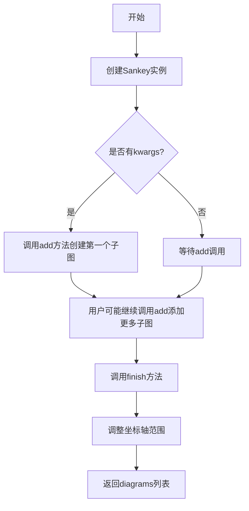
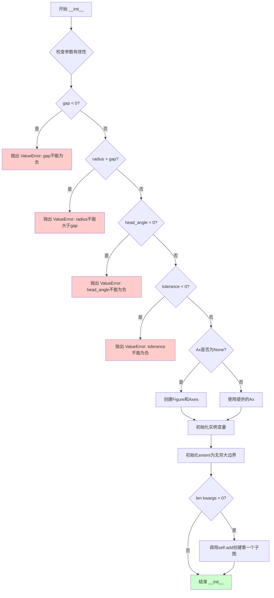

# `matplotlib\lib\matplotlib\sankey.py` 详细设计文档

Matplotlib模块，用于创建Sankey流程图（一种展示流量关系的图表，箭头宽度与流量成正比）

## 整体流程



## 类结构

```
Sankey (主类)
```

## 全局变量及字段


### `RIGHT`
    
角度常量0，表示向右的方向

类型：`int`
    


### `UP`
    
角度常量1，表示向上的方向

类型：`int`
    


### `DOWN`
    
角度常量3，表示向下的方向

类型：`int`
    


### `_log`
    
模块级日志记录器，用于记录运行时信息

类型：`logging.Logger`
    


### `__author__`
    
模块作者姓名

类型：`str`
    


### `__credits__`
    
代码贡献者列表

类型：`list`
    


### `__license__`
    
软件许可证类型

类型：`str`
    


### `__version__`
    
模块版本号

类型：`str`
    


### `Sankey.ax`
    
matplotlib坐标轴对象，用于绑制Sankey图

类型：`matplotlib.axes.Axes`
    


### `Sankey.unit`
    
物理单位字符串，用于标注流量数值

类型：`str`
    


### `Sankey.format`
    
数字格式化字符串或函数，用于格式化流量标签

类型：`str | callable`
    


### `Sankey.scale`
    
流量缩放因子，用于调整路径宽度

类型：`float`
    


### `Sankey.gap`
    
路径间隙，控制路径断开处的间距

类型：`float`
    


### `Sankey.radius`
    
垂直路径内径，控制弧形路径的弯曲程度

类型：`float`
    


### `Sankey.shoulder`
    
输出箭头肩部大小，控制箭头转折处的宽度

类型：`float`
    


### `Sankey.offset`
    
文本偏移量，控制标签与箭头端的距离

类型：`float`
    


### `Sankey.margin`
    
图表边距，控制Sankey图与坐标轴边缘的间距

类型：`float`
    


### `Sankey.pitch`
    
箭头头部角度相关计算值，用于计算箭头尖端高度

类型：`float`
    


### `Sankey.tolerance`
    
流量和容差阈值，用于判断流量的有效性

类型：`float`
    


### `Sankey.extent`
    
图表边界框坐标数组[xmin, xmax, ymin, ymax]

类型：`numpy.ndarray`
    


### `Sankey.diagrams`
    
子图列表，存储所有添加的Sankey子图信息

类型：`list`
    
    

## 全局函数及方法


### Sankey.__init__

该方法是Sankey类的构造函数，用于初始化Sankey图实例。方法接收多个可选参数用于配置 Sankey 图的布局和格式，包括坐标轴、缩放因子、单位、格式化字符串、间隙、半径、肩部、偏移量、箭头角度、边距和容差等。方法会验证参数的有效性，创建坐标轴（如果未提供），初始化实例变量，并在存在额外关键字参数时调用add方法创建第一个子图。

参数：

- `ax`：`~matplotlib.axes.Axes`，绘制数据的坐标轴。如果未提供，将创建新坐标轴。
- `scale`：`float`，流的缩放因子，用于调整路径宽度以保持正确布局，默认为1.0。
- `unit`：`str`，与流量相关的物理单位。如果为None，则不标记任何量。
- `format`：`str`或`callable`，用于标记流量数量的Python数字格式字符串或可调用对象。
- `gap`：`float`，中断进/出顶部或底部的路径之间的空间，默认为0.25。
- `radius`：`float`，垂直路径的内半径，默认为0.1。
- `shoulder`：`float`，输出箭头肩部的大小，默认为0.03。
- `offset`：`float`，文本偏移量（从箭头的尖端或凹陷处），默认为0.15。
- `head_angle`：`float`，箭头头部（和尾部角度的负数）的角度（度），默认为100。
- `margin`：`float`，Sankey轮廓和绘图区域边缘之间的最小空间，默认为0.4。
- `tolerance`：`float`，流之和可接受的最大幅度，默认为1e-6。
- `**kwargs`：任何额外的关键字参数，将传递给`add`方法以创建第一个子图。

返回值：`None`，该方法是构造函数，不返回任何值。

#### 流程图



#### 带注释源码

```python
def __init__(self, ax=None, scale=1.0, unit='', format='%G', gap=0.25,
             radius=0.1, shoulder=0.03, offset=0.15, head_angle=100,
             margin=0.4, tolerance=1e-6, **kwargs):
        """
        Create a new Sankey instance.

        The optional arguments listed below are applied to all subdiagrams so
        that there is consistent alignment and formatting.

        In order to draw a complex Sankey diagram, create an instance of
        `Sankey` by calling it without any kwargs::

            sankey = Sankey()

        Then add simple Sankey sub-diagrams::

            sankey.add() # 1
            sankey.add() # 2
            #...
            sankey.add() # n

        Finally, create the full diagram::

            sankey.finish()

        Or, instead, simply daisy-chain those calls::

            Sankey().add().add...  .add().finish()

        Other Parameters
        ----------------
        ax : `~matplotlib.axes.Axes`
            Axes onto which the data should be plotted.  If *ax* isn't
            provided, new Axes will be created.
        scale : float
            Scaling factor for the flows.  *scale* sizes the width of the paths
            in order to maintain proper layout.  The same scale is applied to
            all subdiagrams.  The value should be chosen such that the product
            of the scale and the sum of the inputs is approximately 1.0 (and
            the product of the scale and the sum of the outputs is
            approximately -1.0).
        unit : str
            The physical unit associated with the flow quantities.  If *unit*
            is None, then none of the quantities are labeled.
        format : str or callable
            A Python number formatting string or callable used to label the
            flows with their quantities (i.e., a number times a unit, where the
            unit is given). If a format string is given, the label will be
            ``format % quantity``. If a callable is given, it will be called
            with ``quantity`` as an argument.
        gap : float
            Space between paths that break in/break away to/from the top or
            bottom.
        radius : float
            Inner radius of the vertical paths.
        shoulder : float
            Size of the shoulders of output arrows.
        offset : float
            Text offset (from the dip or tip of the arrow).
        head_angle : float
            Angle, in degrees, of the arrow heads (and negative of the angle of
            the tails).
        margin : float
            Minimum space between Sankey outlines and the edge of the plot
            area.
        tolerance : float
            Acceptable maximum of the magnitude of the sum of flows.  The
            magnitude of the sum of connected flows cannot be greater than
            *tolerance*.
        **kwargs
            Any additional keyword arguments will be passed to `add`, which
            will create the first subdiagram.

        See Also
        --------
        Sankey.add
        Sankey.finish

        Examples
        --------
        .. plot:: gallery/specialty_plots/sankey_basics.py
        """
        # 检查参数有效性
        if gap < 0:
            raise ValueError(
                "'gap' is negative, which is not allowed because it would "
                "cause the paths to overlap")
        if radius > gap:
            raise ValueError(
                "'radius' is greater than 'gap', which is not allowed because "
                "it would cause the paths to overlap")
        if head_angle < 0:
            raise ValueError(
                "'head_angle' is negative, which is not allowed because it "
                "would cause inputs to look like outputs and vice versa")
        if tolerance < 0:
            raise ValueError(
                "'tolerance' is negative, but it must be a magnitude")

        # 如果需要则创建坐标轴
        if ax is None:
            import matplotlib.pyplot as plt
            fig = plt.figure()
            ax = fig.add_subplot(1, 1, 1, xticks=[], yticks=[])

        self.diagrams = []  # 存储子图列表

        # 存储输入参数
        self.ax = ax  # 坐标轴对象
        self.unit = unit  # 物理单位
        self.format = format  # 数字格式化
        self.scale = scale  # 缩放因子
        self.gap = gap  # 间隙大小
        self.radius = radius  # 内半径
        self.shoulder = shoulder  # 肩部大小
        self.offset = offset  # 文本偏移量
        self.margin = margin  # 边距
        # 计算pitch角度：基于头部角度计算tan值
        self.pitch = np.tan(np.pi * (1 - head_angle / 180.0) / 2.0)
        self.tolerance = tolerance  # 容差

        # 初始化围绕图表的紧密边界框的顶点
        self.extent = np.array((np.inf, -np.inf, np.inf, -np.inf))

        # 如果有任何kwargs，创建第一个子图
        if len(kwargs):
            self.add(**kwargs)
```


### `Sankey._arc`

该方法用于生成并返回一个旋转、缩放和平移后的90度圆弧的路径码（codes）和顶点（vertices），是绘制Sankey图中垂直流动的箭头时所依赖的核心几何计算函数。

参数：

- `self`：Sankey类的实例本身
- `quadrant`：`int`，表示象限编号（0、1、2、3），决定圆弧的朝向，0表示第一象限（0-90度），1表示第二象限（90-180度），2表示第三象限（180-270度），3表示第四象限（270-360度）
- `cw`：`bool`，表示圆弧的生成方向，True为顺时针，False为逆时针
- `radius`：`float`，表示圆弧的半径，默认为1
- `center`：`tuple`，表示圆弧的中心坐标，格式为`(x, y)`

返回值：`list`，返回由`(code, vertex)`元组组成的列表，其中code是matplotlib Path的操作码（如LINETO、CURVE4等），vertex是对应的二维坐标点

#### 流程图

```mermaid
flowchart TD
    A[开始 _arc] --> B[定义 ARC_CODES 列表]
    B --> C[定义 ARC_VERTICES 原始顶点数组]
    C --> D{quadrant in (0, 2)?}
    D -->|Yes| E{cw == True?}
    D -->|No| F{cw == True?}
    E -->|Yes| G[vertices = ARC_VERTICES]
    E -->|No| H[vertices = ARC_VERTICES[:, ::-1] 交换x和y]
    F -->|Yes| I[vertices = column_stack反向并取反x]
    F -->|No| J[vertices = column_stack取反x]
    G --> K{quadrant > 1?}
    H --> K
    I --> K
    J --> K
    K -->|Yes| L[radius = -radius 旋转180度]
    K -->|No| M[radius 保持不变]
    L --> N[计算最终顶点: radius * vertices + center]
    M --> N
    N --> O[返回 zip(ARC_CODES, 最终顶点) 列表]
```

#### 带注释源码

```python
def _arc(self, quadrant=0, cw=True, radius=1, center=(0, 0)):
    """
    Return the codes and vertices for a rotated, scaled, and translated
    90 degree arc.

    Other Parameters
    ----------------
    quadrant : {0, 1, 2, 3}, default: 0
        Uses 0-based indexing (0, 1, 2, or 3).
    cw : bool, default: True
        If True, the arc vertices are produced clockwise; counter-clockwise
        otherwise.
    radius : float, default: 1
        The radius of the arc.
    center : (float, float), default: (0, 0)
        (x, y) tuple of the arc's center.
    """
    # 注意：虽然可以使用matplotlib的transforms来旋转、缩放和平移圆弧，
    # 但由于角度是离散的，在这里直接处理可能更简单且更高效。
    
    # 定义路径操作码列表，用于描述路径中每个点的连接方式
    # Path.LINETO表示直线连接，Path.CURVE4表示三次贝塞尔曲线
    ARC_CODES = [Path.LINETO,
                 Path.CURVE4,
                 Path.CURVE4,
                 Path.CURVE4,
                 Path.CURVE4,
                 Path.CURVE4,
                 Path.CURVE4]
    
    # 90度圆弧的三次贝塞尔曲线逼近顶点
    # 这些顶点可以通过 Path.arc(0, 90) 计算得到
    # 顶点从(1,0)到(0,1)，即第一象限的四分之一圆弧
    ARC_VERTICES = np.array([[1.00000000e+00, 0.00000000e+00],
                             [1.00000000e+00, 2.65114773e-01],
                             [8.94571235e-01, 5.19642327e-01],
                             [7.07106781e-01, 7.07106781e-01],
                             [5.19642327e-01, 8.94571235e-01],
                             [2.65114773e-01, 1.00000000e+00],
                             # 最后一个顶点(0,1)在数值上接近1e+00，
                             # 但对曲线形状影响微乎其微，故注释掉
                             # [6.12303177e-17, 1.00000000e+00]])
                             [0.00000000e+00, 1.00000000e+00]])
    
    # 根据象限和旋转方向处理顶点
    if quadrant in (0, 2):
        # 对于第一和第三象限
        if cw:
            vertices = ARC_VERTICES  # 顺时针保持原样
        else:
            vertices = ARC_VERTICES[:, ::-1]  # 逆时针交换x和y坐标
    else:  # quadrant in (1, 3)，即第二和第四象限
        # 需要对x坐标取反，以实现90度旋转
        if cw:
            # 顺时针：先交换x和y，再对x取反
            vertices = np.column_stack((-ARC_VERTICES[:, 1],
                                         ARC_VERTICES[:, 0]))
        else:
            # 逆时针：直接对x取反
            vertices = np.column_stack((-ARC_VERTICES[:, 0],
                                         ARC_VERTICES[:, 1]))
    
    # 如果象限大于1（第三或第四象限），需要再旋转180度
    # 通过将半径取负来实现
    if quadrant > 1:
        radius = -radius  # Rotate 180 deg.
    
    # 返回变换后的路径码和顶点列表
    # 对顶点进行缩放（乘以radius）并平移（加上center）
    # 使用np.tile将center复制到与顶点数相同的行数
    return list(zip(ARC_CODES, radius * vertices +
                    np.tile(center, (ARC_VERTICES.shape[0], 1))))
```


### `Sankey._add_input`

该方法用于向 Sankey 图的路径添加输入流，并根据角度（水平/垂直）和流向（上/下）计算输入流的尖端位置（dip）和标签位置。

参数：

- `path`：list，传入的路径列表，用于存储 Path 命令和顶点坐标
- `angle`：int，流向角度（RIGHT=0 表示向右，UP=1 表示向上，DOWN=3 表示向下），决定输入流的方向
- `flow`：float，输入流的流量值（正值）
- `length`：float，输入流路径的长度

返回值：`tuple`，返回包含两个列表的元组：
- 第一个元素：dip 位置坐标列表 `[x, y]`，表示输入流弯折处的位置
- 第二个元素：label_location 标签位置坐标列表 `[x, y]`，用于放置流量标签

#### 流程图

```mermaid
flowchart TD
    A[开始 _add_input] --> B{angle is None?}
    B -->|是| C[返回 [0,0], [0,0]]
    B -->|否| D[获取 path 最后一个点的坐标 x, y]
    D --> E[计算 dipdepth = flow/2 * pitch]
    E --> F{angle == RIGHT?}
    F -->|是| G[处理水平输入]
    F -->|否| H[处理垂直输入]
    G --> I[更新 x, 计算 dip 坐标]
    G --> J[向 path 添加 LINETO 命令序列]
    G --> K[计算 label_location]
    K --> L[返回 dip 和 label_location]
    H --> M[确定 sign 和 quadrant]
    M --> N[计算 dip 坐标]
    N --> O{self.radius != 0?}
    O -->|是| P[添加内弧到 path]
    O -->|否| Q[添加 LINETO 到 path]
    P --> R[添加路径段和外弧]
    Q --> R
    R --> S[计算 label_location]
    S --> L
```

#### 带注释源码

```python
def _add_input(self, path, angle, flow, length):
    """
    Add an input to a path and return its tip and label locations.
    
    参数:
        path: 路径列表，包含 (Path code, [x, y]) 元组
        angle: 流向角度，RIGHT(0)表示向右，UP(1)表示向上，DOWN(3)表示向下
        flow: 输入流的流量值（正值）
        length: 输入流路径的长度
    
    返回:
        tuple: (dip位置, label位置) 均为 [x, y] 坐标列表
    """
    # 如果角度为None，返回零位置（流量小于容差时）
    if angle is None:
        return [0, 0], [0, 0]
    else:
        # 使用路径的最后一个点作为参考起点
        x, y = path[-1][1]
        
        # 计算弯折深度，基于流量和pitch（与箭头角度相关）
        dipdepth = (flow / 2) * self.pitch
        
        # 处理水平输入（从左侧进入）
        if angle == RIGHT:
            # 向左移动指定长度
            x -= length
            # 计算弯折点位置（dip），考虑深度偏移
            dip = [x + dipdepth, y + flow / 2.0]
            
            # 向路径添加一系列线段：直线->弯折->直线->间隙
            path.extend([(Path.LINETO, [x, y]),
                         (Path.LINETO, dip),
                         (Path.LINETO, [x, y + flow]),
                         (Path.LINETO, [x + self.gap, y + flow])])
            
            # 标签位置在弯折点左侧偏移offset距离
            label_location = [dip[0] - self.offset, dip[1]]
            
        else:  # 垂直输入（从上方或下方进入）
            # 向左移动间隙距离
            x -= self.gap
            
            # 根据角度确定方向：UP为正，DOWN为负
            if angle == UP:
                sign = 1
            else:
                sign = -1

            # 计算弯折点位置
            # x: 起点向左偏移流量的一半
            # y: 根据长度和弯折深度计算
            dip = [x - flow / 2, y - sign * (length - dipdepth)]
            
            # 确定使用的象限：DOWN用2，UP用1
            if angle == DOWN:
                quadrant = 2
            else:
                quadrant = 1

            # 如果内部半径不为零，添加内弧线（转弯处）
            if self.radius:
                path.extend(self._arc(quadrant=quadrant,
                                      cw=angle == UP,  # 顺时针取决于角度
                                      radius=self.radius,
                                      center=(x + self.radius,
                                              y - sign * self.radius)))
            else:
                path.append((Path.LINETO, [x, y]))
            
            # 添加路径段：直线->弯折点->直线
            path.extend([(Path.LINETO, [x, y - sign * length]),
                         (Path.LINETO, dip),
                         (Path.LINETO, [x - flow, y - sign * length])])
            
            # 添加外弧线（弯折处的外侧圆弧）
            path.extend(self._arc(quadrant=quadrant,
                                  cw=angle == DOWN,
                                  radius=flow + self.radius,
                                  center=(x + self.radius,
                                          y - sign * self.radius)))
            
            # 添加最后一段线段
            path.append((Path.LINETO, [x - flow, y + sign * flow]))
            
            # 标签位置在弯折点下方偏移offset距离
            label_location = [dip[0], dip[1] - sign * self.offset]

        return dip, label_location
```


### `Sankey._add_output`

该方法用于在 Sankey 流程图中添加输出流路径，根据给定的角度、流量和长度参数构建输出箭头的几何路径，并返回箭头尖端和标签的位置信息。

参数：

- `self`：`Sankey`，Sankey 类的实例，包含图形的所有配置参数（如 gap、radius、shoulder、offset、pitch 等）
- `path`：`list`，路径列表，每个元素为 `(Path code, [x, y]坐标)` 元组，表示当前构建中的 Sankey 子图路径
- `angle`：`int`，角度标识（RIGHT/UP/DOWN），表示输出流的方向，若为 None 则返回零位置
- `flow`：`float`，流量值，**输出流为负值**，用于计算箭头宽度和尖端位置
- `length`：`float`，输出流路径的长度，决定箭头延伸的距离

返回值：`(list, list)`，元组包含两个坐标点
- 第一个元素：`[float, float]`，输出箭头的尖端（tip）坐标
- 第二个元素：`[float, float]`，输出流标签的推荐放置位置坐标

#### 流程图

```mermaid
flowchart TD
    A[开始 _add_output] --> B{angle is None?}
    B -->|是| C[返回 [0,0], [0,0]]
    B -->|否| D[获取路径最后一个点的坐标 x, y]
    D --> E[计算 tipheight = (shoulder - flow/2) * pitch]
    E --> F{angle == RIGHT?}
    F -->|是| G[水平向右输出]
    F -->|否| H[垂直输出 UP or DOWN]
    G --> I[更新 x += length<br/>计算 tip 坐标<br/>扩展 path 添加箭头各段<br/>计算 label_location]
    H --> J[确定 sign 和 quadrant<br/>计算 tip 坐标<br/>根据 radius 添加内弧或直线<br/>扩展 path 添加箭头各段<br/>计算 label_location]
    I --> K[返回 tip, label_location]
    J --> K
```

#### 带注释源码

```python
def _add_output(self, path, angle, flow, length):
    """
    Append an output to a path and return its tip and label locations.

    .. note:: *flow* is negative for an output.
    """
    # 如果角度为 None，表示该流被跳过（流量小于 tolerance）
    # 返回零坐标位置
    if angle is None:
        return [0, 0], [0, 0]
    else:
        # 获取路径的最后一个点作为参考起点
        x, y = path[-1][1]
        
        # 计算箭头尖端高度：基于肩部宽度和流量的一半之差 * pitch 系数
        # flow 为负值，所以这里实际是加法运算
        tipheight = (self.shoulder - flow / 2) * self.pitch
        
        # 处理水平向右的输出
        if angle == RIGHT:
            # 沿 x 轴延伸指定长度
            x += length
            # 计算箭头尖端坐标（考虑 tipheight 偏移）
            tip = [x + tipheight, y + flow / 2.0]
            # 沿路径添加箭头各段的顶点：直线→肩部→尖端→另一侧肩部→流结束点→gap
            path.extend([(Path.LINETO, [x, y]),
                         (Path.LINETO, [x, y + self.shoulder]),
                         (Path.LINETO, tip),
                         (Path.LINETO, [x, y - self.shoulder + flow]),
                         (Path.LINETO, [x, y + flow]),
                         (Path.LINETO, [x - self.gap, y + flow])])
            # 标签位置：尖端右侧偏移 offset 距离
            label_location = [tip[0] + self.offset, tip[1]]
        else:
            # 垂直输出（UP 或 DOWN）
            # 向右移动一个 gap 距离
            x += self.gap
            # 根据角度确定方向符号和弧形象限
            if angle == UP:
                sign, quadrant = 1, 3    # 向上：sign=1，quadrant=3
            else:
                sign, quadrant = -1, 0   # 向下：sign=-1，quadrant=0
            
            # 计算垂直箭头的尖端位置
            tip = [x - flow / 2.0, y + sign * (length + tipheight)]
            
            # 如果存在内半径，添加内侧弧形路径
            if self.radius:
                path.extend(self._arc(quadrant=quadrant,
                                      cw=angle == UP,
                                      radius=self.radius,
                                      center=(x - self.radius,
                                              y + sign * self.radius)))
            else:
                # 半径为 0 时只需添加直线段
                path.append((Path.LINETO, [x, y]))
            
            # 添加箭头主体各段：垂直段→肩部→尖端→另一侧肩部→返回点
            path.extend([(Path.LINETO, [x, y + sign * length]),
                         (Path.LINETO, [x - self.shoulder,
                                        y + sign * length]),
                         (Path.LINETO, tip),
                         (Path.LINETO, [x + self.shoulder - flow,
                                        y + sign * length]),
                         (Path.LINETO, [x - flow, y + sign * length])])
            
            # 添加外侧弧形路径（半径包含 flow 偏移）
            path.extend(self._arc(quadrant=quadrant,
                                  cw=angle == DOWN,
                                  radius=self.radius - flow,
                                  center=(x - self.radius,
                                          y + sign * self.radius)))
            
            # 添加最后的流结束点
            path.append((Path.LINETO, [x - flow, y + sign * flow]))
            
            # 标签位置：尖端在垂直方向的偏移
            label_location = [tip[0], tip[1] + sign * self.offset]
        
        # 返回箭头尖端坐标和标签位置
        return tip, label_location
```


### `Sankey._revert`

反转路径（处理路径方向）。该方法用于反转给定的路径，因为路径不能简单地通过 `path[::-1]` 来反转——代码中的每个元素都指定了从**前一个点**执行的动作。因此， reversal 时需要调整动作代码，使其仍然表示从前一个点出发的正确动作。

参数：

- `path`：`list of tuple`，路径列表，每个元素为 (code, position) 元组。code 指定绘图动作（如 MOVETO, LINETO, CURVE4），position 为坐标点。
- `first_action`：`int`（默认 `Path.LINETO`），反转路径后第一个点使用的动作代码。

返回值：`list of tuple`，返回新的反转路径，点的顺序已反转，动作代码已相应调整。

#### 流程图

```mermaid
flowchart TD
    A[开始 _revert] --> B[初始化 reverse_path 为空列表]
    B --> C[设置 next_code = first_action]
    C --> D{遍历 path[::-1] 是否还有元素}
    D -->|是| E[取出当前元素: code, position]
    E --> F[向 reverse_path 添加 (next_code, position)]
    F --> G[更新 next_code = code]
    G --> D
    D -->|否| H[返回 reverse_path]
    H --> I[结束]
```

#### 带注释源码

```python
def _revert(self, path, first_action=Path.LINETO):
    """
    A path is not simply reversible by path[::-1] since the code
    specifies an action to take from the **previous** point.
    """
    # 初始化反转路径列表
    reverse_path = []
    # 第一个点使用传入的 first_action 作为其动作代码
    # 因为反转后的第一个点在原路径中没有前驱点
    next_code = first_action
    # 倒序遍历原路径
    for code, position in path[::-1]:
        # 将当前点的位置与前一个动作代码配对
        # 这样可以保证: 动作代码表示"从上一个点到达当前点"应执行的动作
        reverse_path.append((next_code, position))
        # 更新 next_code 为当前点的 code，作为下一个点的"前一个动作"
        next_code = code
    # 返回反转后的路径
    return reverse_path

    # 注释: 以下是一种更高效但不可行的实现方式
    # 因为 tuple 对象不支持项赋值，会导致失败
    # path[1] = path[1][-1:0:-1]
    # path[1][0] = first_action
    # path[2] = path[2][::-1]
    # return path
```


### Sankey.add

该方法用于向 Sankey 图添加一个简单的子图，支持配置流的方向、标签、长度等属性，并返回 Sankey 实例以支持链式调用。

参数：

- `patchlabel`：`str`，标签文本，放置在子图的中心位置
- `flows`：`list of float`，流值数组，输入为正数，输出为负数
- `orientations`：`list of {-1, 0, 1}`，流的方向列表，0 表示从左到右，1 表示从上到下，-1 表示从下到上
- `labels`：`list of (str or None)`，流的标签列表，每个标签可以是 None（无标签）或字符串
- `trunklength`：`float`，输入组和输出组基座之间的长度，默认为 1.0
- `pathlengths`：`list of float`，垂直箭头在断开前后的长度列表，默认为 0.25
- `prior`：`int`，要连接的先前子图的索引
- `connect`：`(int, int)`，连接元组，表示先前子图和当前子图中要连接的流索引
- `rotation`：`float`，子图的旋转角度（度）
- `**kwargs`：额外的关键字参数，用于设置 PathPatch 属性

返回值：`Sankey`，返回当前 Sankey 实例，以支持链式调用。

#### 流程图

```mermaid
flowchart TD
    A[开始 add 方法] --> B[检查并预处理参数]
    B --> C{flows 是否为 None}
    C -->|是| D[设置默认 flows = [1.0, -1.0]]
    C -->|否| E[转换为 numpy 数组]
    D --> F[获取流的数量 n]
    E --> F
    F --> G[处理 rotation 参数]
    G --> H{orientations 是否为 None}
    H -->|是| I[设置默认 orientation = 0]
    H -->|否| J[广播 orientations 到长度 n]
    J --> K{广播是否成功}
    K -->|否| L[抛出 ValueError]
    K -->|是| M[广播 labels]
    M --> N{labels 广播是否成功}
    N -->|否| O[抛出 ValueError]
    N -->|是| P{trunklength 是否为负}
    P -->|是| Q[抛出 ValueError]
    P -->|否| R{flows 总和是否超过 tolerance}
    R -->|是| S[记录日志警告]
    R -->|否| T[计算 scaled_flows]
    T --> U[计算 gain 和 loss]
    U --> V{prior 是否为 None}
    V -->|否| W[验证 prior 和 connect 参数]
    V -->|是| X[确定输入流 are_inputs]
    W --> X
    X --> Y[确定箭头角度 angles]
    Y --> Z[调整路径长度 pathlengths]
    Z --> AA[构建子路径 urpath, llpath, lrpath, ulpath]
    AA --> AB[添加子路径并定位 tips 和 label_locations]
    AB --> AC[连接子路径创建完整路径]
    AC --> AD{rotation 是否为 0}
    AD -->|否| AE[应用旋转和位移变换]
    AD -->|是| AF[创建 PathPatch 和文本标签]
    AE --> AF
    AF --> AG[扩展图形边界 extent]
    AG --> AH[添加子图到 diagrams 列表]
    AH --> AI[返回 self 实现链式调用]
```

#### 带注释源码

```python
@_docstring.interpd
def add(self, patchlabel='', flows=None, orientations=None, labels='',
        trunklength=1.0, pathlengths=0.25, prior=None, connect=(0, 0),
        rotation=0, **kwargs):
    """
    Add a simple Sankey diagram with flows at the same hierarchical level.

    Parameters
    ----------
    patchlabel : str
        Label to be placed at the center of the diagram.
        Note that *label* (not *patchlabel*) can be passed as keyword
        argument to create an entry in the legend.

    flows : list of float
        Array of flow values.  By convention, inputs are positive and
        outputs are negative.

        Flows are placed along the top of the diagram from the inside out
        in order of their index within *flows*.  They are placed along the
        sides of the diagram from the top down and along the bottom from
        the outside in.

        If the sum of the inputs and outputs is
        nonzero, the discrepancy will appear as a cubic Bézier curve along
        the top and bottom edges of the trunk.

    orientations : list of {-1, 0, 1}
        List of orientations of the flows (or a single orientation to be
        used for all flows).  Valid values are 0 (inputs from
        the left, outputs to the right), 1 (from and to the top) or -1
        (from and to the bottom).

    labels : list of (str or None)
        List of labels for the flows (or a single label to be used for all
        flows).  Each label may be *None* (no label), or a labeling string.
        If an entry is a (possibly empty) string, then the quantity for the
        corresponding flow will be shown below the string.  However, if
        the *unit* of the main diagram is None, then quantities are never
        shown, regardless of the value of this argument.

    trunklength : float
        Length between the bases of the input and output groups (in
        data-space units).

    pathlengths : list of float
        List of lengths of the vertical arrows before break-in or after
        break-away.  If a single value is given, then it will be applied to
        the first (inside) paths on the top and bottom, and the length of
        all other arrows will be justified accordingly.  The *pathlengths*
        are not applied to the horizontal inputs and outputs.

    prior : int
        Index of the prior diagram to which this diagram should be
        connected.

    connect : (int, int)
        A (prior, this) tuple indexing the flow of the prior diagram and
        the flow of this diagram which should be connected.  If this is the
        first diagram or *prior* is *None*, *connect* will be ignored.

    rotation : float
        Angle of rotation of the diagram in degrees.  The interpretation of
        the *orientations* argument will be rotated accordingly (e.g., if
        *rotation* == 90, an *orientations* entry of 1 means to/from the
        left).  *rotation* is ignored if this diagram is connected to an
        existing one (using *prior* and *connect*).

    Returns
    -------
    Sankey
        The current `.Sankey` instance.

    Other Parameters
    ----------------
    **kwargs
       Additional keyword arguments set `matplotlib.patches.PathPatch`
       properties, listed below.  For example, one may want to use
       ``fill=False`` or ``label="A legend entry"``.

    %(Patch:kwdoc)s

    See Also
    --------
    Sankey.finish
    """
    # 检查并预处理参数
    # 如果 flows 为 None，设置默认 flows 为 [1.0, -1.0]
    flows = np.array([1.0, -1.0]) if flows is None else np.array(flows)
    n = flows.shape[0]  # 流的数量
    
    # 处理 rotation 参数
    if rotation is None:
        rotation = 0
    else:
        # 在下面的代码中，角度以 deg/90 为单位
        rotation /= 90.0
    
    # 处理 orientations 参数
    if orientations is None:
        orientations = 0
    try:
        orientations = np.broadcast_to(orientations, n)
    except ValueError:
        raise ValueError(
            f"The shapes of 'flows' {np.shape(flows)} and 'orientations' "
            f"{np.shape(orientations)} are incompatible"
        ) from None
    
    # 处理 labels 参数
    try:
        labels = np.broadcast_to(labels, n)
    except ValueError:
        raise ValueError(
            f"The shapes of 'flows' {np.shape(flows)} and 'labels' "
            f"{np.shape(labels)} are incompatible"
        ) from None
    
    # 检查 trunklength
    if trunklength < 0:
        raise ValueError(
            "'trunklength' is negative, which is not allowed because it "
            "would cause poor layout")
    
    # 检查 flows 总和是否接近零（系统是否处于稳态）
    if abs(np.sum(flows)) > self.tolerance:
        _log.info("The sum of the flows is nonzero (%f; patchlabel=%r); "
                  "is the system not at steady state?",
                  np.sum(flows), patchlabel)
    
    # 缩放 flows
    scaled_flows = self.scale * flows
    # 计算总输入（gain）和总输出（loss）
    gain = sum(max(flow, 0) for flow in scaled_flows)
    loss = sum(min(flow, 0) for flow in scaled_flows)
    
    # 如果指定了 prior，验证连接参数
    if prior is not None:
        if prior < 0:
            raise ValueError("The index of the prior diagram is negative")
        if min(connect) < 0:
            raise ValueError(
                "At least one of the connection indices is negative")
        if prior >= len(self.diagrams):
            raise ValueError(
                f"The index of the prior diagram is {prior}, but there "
                f"are only {len(self.diagrams)} other diagrams")
        if connect[0] >= len(self.diagrams[prior].flows):
            raise ValueError(
                "The connection index to the source diagram is {}, but "
                "that diagram has only {} flows".format(
                    connect[0], len(self.diagrams[prior].flows)))
        if connect[1] >= n:
            raise ValueError(
                f"The connection index to this diagram is {connect[1]}, "
                f"but this diagram has only {n} flows")
        if self.diagrams[prior].angles[connect[0]] is None:
            raise ValueError(
                f"The connection cannot be made, which may occur if the "
                f"magnitude of flow {connect[0]} of diagram {prior} is "
                f"less than the specified tolerance")
        flow_error = (self.diagrams[prior].flows[connect[0]] +
                      flows[connect[1]])
        if abs(flow_error) >= self.tolerance:
            raise ValueError(
                f"The scaled sum of the connected flows is {flow_error}, "
                f"which is not within the tolerance ({self.tolerance})")

    # 确定 flows 是输入还是输出
    are_inputs = [None] * n
    for i, flow in enumerate(flows):
        if flow >= self.tolerance:
            are_inputs[i] = True
        elif flow <= -self.tolerance:
            are_inputs[i] = False
        else:
            _log.info(
                "The magnitude of flow %d (%f) is below the tolerance "
                "(%f).\nIt will not be shown, and it cannot be used in a "
                "connection.", i, flow, self.tolerance)

    # 确定箭头的角度（旋转前）
    angles = [None] * n
    for i, (orient, is_input) in enumerate(zip(orientations, are_inputs)):
        if orient == 1:
            if is_input:
                angles[i] = DOWN
            elif is_input is False:
                # Be specific since is_input can be None.
                angles[i] = UP
        elif orient == 0:
            if is_input is not None:
                angles[i] = RIGHT
        else:
            if orient != -1:
                raise ValueError(
                    f"The value of orientations[{i}] is {orient}, "
                    f"but it must be -1, 0, or 1")
            if is_input:
                angles[i] = UP
            elif is_input is False:
                angles[i] = DOWN

    # 调整路径长度
    if np.iterable(pathlengths):
        if len(pathlengths) != n:
            raise ValueError(
                f"The lengths of 'flows' ({n}) and 'pathlengths' "
                f"({len(pathlengths)}) are incompatible")
    else:  # 将 pathlengths 转换为列表
        urlength = pathlengths
        ullength = pathlengths
        lrlength = pathlengths
        lllength = pathlengths
        d = dict(RIGHT=pathlengths)
        pathlengths = [d.get(angle, 0) for angle in angles]
        # 从中间向外确定顶部箭头的长度
        for i, (angle, is_input, flow) in enumerate(zip(angles, are_inputs,
                                                        scaled_flows)):
            if angle == DOWN and is_input:
                pathlengths[i] = ullength
                ullength += flow
            elif angle == UP and is_input is False:
                pathlengths[i] = urlength
                urlength -= flow  # 输出时 flow 为负
        # 从中间向外确定底部箭头的长度
        for i, (angle, is_input, flow) in enumerate(reversed(list(zip(
              angles, are_inputs, scaled_flows)))):
            if angle == UP and is_input:
                pathlengths[n - i - 1] = lllength
                lllength += flow
            elif angle == DOWN and is_input is False:
                pathlengths[n - i - 1] = lrlength
                lrlength -= flow
        # 从下向上确定左侧箭头的长度
        has_left_input = False
        for i, (angle, is_input, spec) in enumerate(reversed(list(zip(
              angles, are_inputs, zip(scaled_flows, pathlengths))))):
            if angle == RIGHT:
                if is_input:
                    if has_left_input:
                        pathlengths[n - i - 1] = 0
                    else:
                        has_left_input = True
        # 从上向下确定右侧箭头的长度
        has_right_output = False
        for i, (angle, is_input, spec) in enumerate(zip(
              angles, are_inputs, list(zip(scaled_flows, pathlengths)))):
            if angle == RIGHT:
                if is_input is False:
                    if has_right_output:
                        pathlengths[i] = 0
                    else:
                        has_right_output = True

    # 开始构建子路径，如果 flows 总和不为零，则平滑过渡
    urpath = [(Path.MOVETO, [(self.gap - trunklength / 2.0),  # Upper right
                             gain / 2.0]),
              (Path.LINETO, [(self.gap - trunklength / 2.0) / 2.0,
                             gain / 2.0]),
              (Path.CURVE4, [(self.gap - trunklength / 2.0) / 8.0,
                             gain / 2.0]),
              (Path.CURVE4, [(trunklength / 2.0 - self.gap) / 8.0,
                             -loss / 2.0]),
              (Path.LINETO, [(trunklength / 2.0 - self.gap) / 2.0,
                             -loss / 2.0]),
              (Path.LINETO, [(trunklength / 2.0 - self.gap),
                             -loss / 2.0])]
    llpath = [(Path.LINETO, [(trunklength / 2.0 - self.gap),  # Lower left
                             loss / 2.0]),
              (Path.LINETO, [(trunklength / 2.0 - self.gap) / 2.0,
                             loss / 2.0]),
              (Path.CURVE4, [(trunklength / 2.0 - self.gap) / 8.0,
                             loss / 2.0]),
              (Path.CURVE4, [(self.gap - trunklength / 2.0) / 8.0,
                             -gain / 2.0]),
              (Path.LINETO, [(self.gap - trunklength / 2.0) / 2.0,
                             -gain / 2.0]),
              (Path.LINETO, [(self.gap - trunklength / 2.0),
                             -gain / 2.0])]
    lrpath = [(Path.LINETO, [(trunklength / 2.0 - self.gap),  # Lower right
                             loss / 2.0])]
    ulpath = [(Path.LINETO, [self.gap - trunklength / 2.0,  # Upper left
                             gain / 2.0])]

    # 添加子路径并分配 tips 和 labels 的位置
    tips = np.zeros((n, 2))
    label_locations = np.zeros((n, 2))
    # 从中间向外添加顶部输入和输出
    for i, (angle, is_input, spec) in enumerate(zip(
          angles, are_inputs, list(zip(scaled_flows, pathlengths)))):
        if angle == DOWN and is_input:
            tips[i, :], label_locations[i, :] = self._add_input(
                ulpath, angle, *spec)
        elif angle == UP and is_input is False:
            tips[i, :], label_locations[i, :] = self._add_output(
                urpath, angle, *spec)
    # 从中间向外添加底部输入和输出
    for i, (angle, is_input, spec) in enumerate(reversed(list(zip(
          angles, are_inputs, list(zip(scaled_flows, pathlengths)))))):
        if angle == UP and is_input:
            tip, label_location = self._add_input(llpath, angle, *spec)
            tips[n - i - 1, :] = tip
            label_locations[n - i - 1, :] = label_location
        elif angle == DOWN and is_input is False:
            tip, label_location = self._add_output(lrpath, angle, *spec)
            tips[n - i - 1, :] = tip
            label_locations[n - i - 1, :] = label_location
    # 从下向上添加左侧输入
    has_left_input = False
    for i, (angle, is_input, spec) in enumerate(reversed(list(zip(
          angles, are_inputs, list(zip(scaled_flows, pathlengths)))))):
        if angle == RIGHT and is_input:
            if not has_left_input:
                # 确保下路径至少延伸至上路径的距离
                if llpath[-1][1][0] > ulpath[-1][1][0]:
                    llpath.append((Path.LINETO, [ulpath[-1][1][0],
                                                 llpath[-1][1][1]]))
                has_left_input = True
            tip, label_location = self._add_input(llpath, angle, *spec)
            tips[n - i - 1, :] = tip
            label_locations[n - i - 1, :] = label_location
    # 从上向下添加右侧输出
    has_right_output = False
    for i, (angle, is_input, spec) in enumerate(zip(
          angles, are_inputs, list(zip(scaled_flows, pathlengths)))):
        if angle == RIGHT and is_input is False:
            if not has_right_output:
                # 确保上路径至少延伸至下路径的距离
                if urpath[-1][1][0] < lrpath[-1][1][0]:
                    urpath.append((Path.LINETO, [lrpath[-1][1][0],
                                                 urpath[-1][1][1]]))
                has_right_output = True
            tips[i, :], label_locations[i, :] = self._add_output(
                urpath, angle, *spec)
    # 修剪任何悬挂的顶点
    if not has_left_input:
        ulpath.pop()
        llpath.pop()
    if not has_right_output:
        lrpath.pop()
        urpath.pop()

    # 按正确顺序连接子路径（从顶部顺时针）
    path = (urpath + self._revert(lrpath) + llpath + self._revert(ulpath) +
            [(Path.CLOSEPOLY, urpath[0][1])])

    # 创建带有 Sankey 轮廓的补丁
    codes, vertices = zip(*path)
    vertices = np.array(vertices)

    def _get_angle(a, r):
        if a is None:
            return None
        else:
            return a + r

    # 如果未连接，处理旋转
    if prior is None:
        if rotation != 0:  # 默认情况下不需要这些
            angles = [_get_angle(angle, rotation) for angle in angles]
            rotate = Affine2D().rotate_deg(rotation * 90).transform_affine
            tips = rotate(tips)
            label_locations = rotate(label_locations)
            vertices = rotate(vertices)
        text = self.ax.text(0, 0, s=patchlabel, ha='center', va='center')
    else:
        # 如果连接到先前子图，计算旋转角度
        rotation = (self.diagrams[prior].angles[connect[0]] -
                    angles[connect[1]])
        angles = [_get_angle(angle, rotation) for angle in angles]
        rotate = Affine2D().rotate_deg(rotation * 90).transform_affine
        tips = rotate(tips)
        offset = self.diagrams[prior].tips[connect[0]] - tips[connect[1]]
        translate = Affine2D().translate(*offset).transform_affine
        tips = translate(tips)
        label_locations = translate(rotate(label_locations))
        vertices = translate(rotate(vertices))
        kwds = dict(s=patchlabel, ha='center', va='center')
        text = self.ax.text(*offset, **kwds)
    
    # 处理填充颜色和线宽
    if mpl.rcParams['_internal.classic_mode']:
        fc = kwargs.pop('fc', kwargs.pop('facecolor', '#bfd1d4'))
        lw = kwargs.pop('lw', kwargs.pop('linewidth', 0.5))
    else:
        fc = kwargs.pop('fc', kwargs.pop('facecolor', None))
        lw = kwargs.pop('lw', kwargs.pop('linewidth', None))
    if fc is None:
        fc = self.ax._get_patches_for_fill.get_next_color()
    patch = PathPatch(Path(vertices, codes), fc=fc, lw=lw, **kwargs)
    self.ax.add_patch(patch)

    # 添加路径标签
    texts = []
    for number, angle, label, location in zip(flows, angles, labels,
                                              label_locations):
        if label is None or angle is None:
            label = ''
        elif self.unit is not None:
            if isinstance(self.format, str):
                quantity = self.format % abs(number) + self.unit
            elif callable(self.format):
                quantity = self.format(number)
            else:
                raise TypeError(
                    'format must be callable or a format string')
            if label != '':
                label += "\n"
            label += quantity
        texts.append(self.ax.text(x=location[0], y=location[1],
                                  s=label,
                                  ha='center', va='center'))
    # 即使文本为空也会放置文本对象（只要对应的流大于 tolerance）

    # 必要时扩展图形大小
    self.extent = (min(np.min(vertices[:, 0]),
                       np.min(label_locations[:, 0]),
                       self.extent[0]),
                   max(np.max(vertices[:, 0]),
                       np.max(label_locations[:, 0]),
                       self.extent[1]),
                   min(np.min(vertices[:, 1]),
                       np.min(label_locations[:, 1]),
                       self.extent[2]),
                   max(np.max(vertices[:, 1]),
                       np.max(label_locations[:, 1]),
                       self.extent[3]))
    # 同时包含顶点和标签位置

    # 将此图添加为子图
    self.diagrams.append(
        SimpleNamespace(patch=patch, flows=flows, angles=angles, tips=tips,
                        text=text, texts=texts))

    # 允许链式调用结构
    return self
```


### Sankey.finish

该方法用于完成Sankey图表的绘制，通过调整坐标轴范围和纵横比来适应所有子图，并返回包含所有子图信息（patch、flows、angles、tips、text、texts）的列表。

参数：
- 该方法无显式参数（仅包含self）

返回值：`list`，返回Sankey子图信息列表，每个元素是一个包含以下字段的SimpleNamespace对象：
- `patch`：Sankey轮廓（PathPatch对象）
- `flows`：流量值（正数表示输入，负数表示输出）
- `angles`：箭头角度列表[deg/90]
- `tips`：流路径末端或弯头的(N,2)位置数组
- `text`：图表标签的Text实例
- `texts`：流标签的Text实例列表

#### 流程图

```mermaid
flowchart TD
    A[开始 finish 方法] --> B{检查是否有子图}
    B -->|有子图| C[设置坐标轴范围]
    C --> D[获取左边界 extent[0] - margin]
    C --> E[获取右边界 extent[1] + margin]
    C --> F[获取下边界 extent[2] - margin]
    C --> G[获取上边界 extent[3] + margin]
    D --> H[调用 ax.axis 设置坐标轴]
    E --> H
    F --> H
    G --> H
    H --> I[设置坐标轴纵横比为 equal]
    I --> J[返回 self.diagrams 列表]
    B -->|无子图| J
    J --> K[结束]
    
    style A fill:#e1f5fe
    style H fill:#fff3e0
    style J fill:#e8f5e9
    style K fill:#fce4ec
```

#### 带注释源码

```python
def finish(self):
    """
    Adjust the Axes and return a list of information about the Sankey
    subdiagram(s).

    Returns a list of subdiagrams with the following fields:

    ========  =============================================================
    Field     Description
    ========  =============================================================
    *patch*   Sankey outline (a `~matplotlib.patches.PathPatch`).
    *flows*   Flow values (positive for input, negative for output).
    *angles*  List of angles of the arrows [deg/90].
              For example, if the diagram has not been rotated,
              an input to the top side has an angle of 3 (DOWN),
              and an output from the top side has an angle of 1 (UP).
              If a flow has been skipped (because its magnitude is less
              than *tolerance*), then its angle will be *None*.
    *tips*    (N, 2)-array of the (x, y) positions of the tips (or "dips")
              of the flow paths.
              If the magnitude of a flow is less the *tolerance* of this
              `Sankey` instance, the flow is skipped and its tip will be at
              the center of the diagram.
    *text*    `.Text` instance for the diagram label.
    *texts*   List of `.Text` instances for the flow labels.
    ========  =============================================================

    See Also
    --------
    Sankey.add
    """
    # 使用extent和margin计算坐标轴边界
    # extent存储了所有子图的边界范围[xmin, xmax, ymin, ymax]
    # margin用于在图表周围添加边距空白
    self.ax.axis([self.extent[0] - self.margin,  # 左边界向左扩展margin
                  self.extent[1] + self.margin,  # 右边界向右扩展margin
                  self.extent[2] - self.margin,  # 下边界向下扩展margin
                  self.extent[3] + self.margin]) # 上边界向上扩展margin
    
    # 设置坐标轴纵横比为equal，确保桑基图不会出现变形
    # adjustable='datalim'允许根据数据限制调整
    self.ax.set_aspect('equal', adjustable='datalim')
    
    # 返回包含所有子图信息的列表
    # 每个子图是一个SimpleNamespace对象，包含patch、flows、angles、tips、text、texts
    return self.diagrams
```

## 关键组件


### Sankey 类

Sankey图生成器的主类，用于创建流量图，其中箭头宽度与流量成比例，用于可视化能量、材料或成本转移。

### _arc 方法

生成旋转、缩放和翻译的90度弧形路径的顶点和代码，用于绘制流量的弯曲部分。

### _add_input 方法

将输入流添加到路径中并返回其尖端和标签位置，处理水平和垂直方向的输入流。

### _add_output 方法

将输出流追加到路径中并返回其尖端和标签位置，处理箭头头部和肩部的绘制。

### _revert 方法

反转路径顺序的方法，因为路径代码指定了从上一个点执行的操作，不能简单反转。

### add 方法

添加简单的Sankey子图，包含flows数组、orientations、labels等参数，负责构建路径几何和连接关系。

### finish 方法

调整坐标轴并返回包含所有子图信息的列表，包括patch、flows、angles、tips、text和texts字段。

### 关键常量

RIGHT、UP、DOWN定义角度常量（度/90），用于指定流向。

### 路径构建组件

使用Path和PathPatch创建Sankey图的轮廓，支持水平和垂直流动的贝塞尔曲线连接。

### 流处理逻辑

通过tolerance处理微小流量，根据flow正负判断输入/输出，计算gain和loss。

### 连接机制

支持通过prior和connect参数连接多个子图，验证连接索引和流量容差。

### 渲染相关

使用Affine2D处理旋转和平移变换，通过text添加标签，支持经典模式和专业模式的颜色处理。


## 问题及建议


### 已知问题

-   **版本信息过时**：`__version__ = "2011/09/16"` 是一个非常老的版本日期，表明该代码可能长期未更新，可能存在与新版 Matplotlib 不兼容的问题。
-   **硬编码的贝塞尔曲线顶点**：`ARC_VERTICES` 是硬编码的数值，缺乏注释说明其来源或计算逻辑，降低了代码可维护性。
-   **使用内部 API**：`self.ax._get_patches_for_fill.get_next_color()` 访问了 Matplotlib 的私有内部接口，可能导致未来版本兼容性问题。
-   **魔法数字和缺乏解释的常量**：代码中存在大量硬编码数值（如 `100`, `0.25`, `1.0`, `-1.0` 等），缺乏常量定义或解释，影响可读性。
-   **缺少类型注解**：作为现代 Python 代码，缺乏函数参数和返回值的类型注解，不利于静态分析和 IDE 支持。
-   **方法过长且复杂**：`_add_input`、`_add_output` 和 `add` 方法包含大量逻辑，违反了单一职责原则，难以测试和维护。
-   **错误消息不够详细**：部分错误检查（如 `ValueError`）的消息可以更详细，例如包含更多上下文信息。
-   **重复代码模式**：路径构建逻辑在多个循环中重复出现，可以通过提取辅助方法减少冗余。
-   **deprecated 参数处理**：使用了 `mpl.rcParams['_internal.classic_mode']` 这种可能已废弃或内部使用的配置。

### 优化建议

-   **更新版本信息并添加维护记录**：为模块添加最新的版本控制和变更日志。
-   **提取几何计算逻辑**：将 `_arc` 方法中的几何计算和 `ARC_VERTICES` 封装到独立的数学辅助模块或类中，并添加类型注解。
-   **替换内部 API 调用**：使用公开的 API 或实现独立的颜色管理逻辑，避免依赖 Matplotlib 内部实现。
-   **定义常量类**：将所有魔法数字提取为有意义的常量（如 `DEFAULT_FLOWS`, `DEFAULT_HEAD_ANGLE` 等），放在类或模块顶部。
-   **添加类型注解**：为所有方法添加完整的类型注解，提升代码可读性和工具支持。
-   **重构大型方法**：将 `add` 方法分解为更小的、专注于特定任务的辅助方法（如 `_validate_flows`, `_calculate_pathlengths`, `_build_path` 等）。
-   **增强错误处理**：提供更详细的错误消息，包含具体的数值和上下文信息。
-   **考虑使用 dataclass**：对于 `SimpleNamespace` 存储的子图信息，可以考虑使用 dataclass 或 namedtuple 提供更好的结构。
-   **添加单元测试**：为核心逻辑（如流量计算、角度转换、路径生成）添加测试用例。
-   **文档增强**：为复杂算法（如路径 justification 逻辑）添加技术性注释，解释几何计算原理。

## 其它


### 设计目标与约束

该模块的设计目标是创建桑基图（Sankey diagrams），一种特定类型的流程图，其中箭头的宽度与流量成比例显示。主要设计约束包括：1) 流量值必须通过scale参数进行缩放以保持正确的布局；2) 输入流量为正，输出流量为负；3) 支持多个子图连接；4) 必须保持流量守恒（输入输出之和在容差范围内）；5) 支持四种流向：右、上、下以及它们的组合。

### 错误处理与异常设计

模块采用明确的参数验证和异常抛出机制。在`__init__`方法中检查：gap不能为负值、radius不能大于gap、head_angle不能为负、tolerance不能为负。在`add`方法中检查：trunklength不能为负、flows和orientations/labels形状必须兼容、prior索引必须有效、连接索引必须在有效范围内、连接的流量值必须在容差范围内。对于非致命问题（如流量和不平衡），使用`_log.info`记录日志而非抛出异常，允许用户决定是否继续。

### 数据流与状态机

数据流主要经历以下阶段：1) 初始化阶段创建Sankey实例和Axes；2) 添加子图阶段通过add()方法构建各个子图的路径，计算tips和label_locations；3) 完成阶段通过finish()方法调整坐标轴范围并返回所有子图信息。状态管理主要通过self.diagrams列表存储已添加的子图，每个子图包含patch、flows、angles、tips、text、texts等属性。类字段如extent维护所有子图的边界框。

### 外部依赖与接口契约

核心依赖包括：matplotlib（用于绘图）、numpy（用于数值计算）、matplotlib.path.Path（用于构建路径）、matplotlib.patches.PathPatch（用于创建填充区域）、matplotlib.transforms.Affine2D（用于旋转变换）。公开接口包括：Sankey类构造函数（接受ax、scale、unit、format、gap、radius等参数）、add()方法（添加子图，返回self支持链式调用）、finish()方法（完成绘图并返回子图信息列表）。内部辅助方法包括_arc()生成90度圆弧、_add_input()和_addoutput()添加输入输出路径、_revert()反转路径。

### 配置与常量定义

模块定义了全局常量RIGHT=0、UP=1、DOWN=3用于表示流向角度。ARC_CODES和ARC_VERTICES定义了绘制90度圆弧的贝塞尔曲线顶点数据。类属性pitch根据head_angle计算，用于确定箭头斜率。模块版本信息存储在__version__、__author__、__credits__、__license__变量中。

### 兼容性与边界情况处理

代码处理多种边界情况：当radius为0时不绘制内圆弧；当流量小于tolerance时跳过该流且不能用于连接；当flow sum不为零时通过贝塞尔曲线平滑过渡。兼容classic_mode和非classic_mode两种绘图风格。orientation参数支持-1、0、1三个值，分别表示从/到底部、从/到左侧、从/到顶部。支持通过prior和connect参数连接多个子图。

### 性能考量与优化建议

由于代码主要涉及几何计算而非大规模数据处理，性能瓶颈不明显。潜在优化方向包括：1) 将ARC_VERTICES和ARC_CODES定义为类级常量而非方法内变量；2) 考虑使用matplotlib的transforms模块而非手动计算顶点；3) 批量处理多个流而非逐个处理；4) 缓存计算结果以支持增量更新。


    