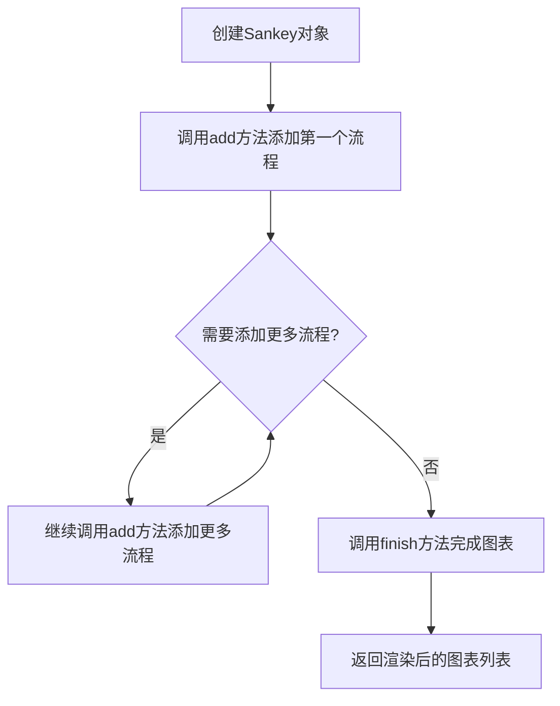
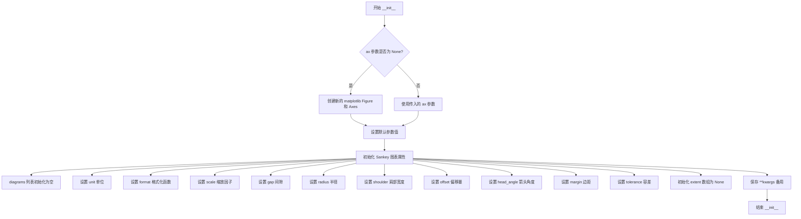
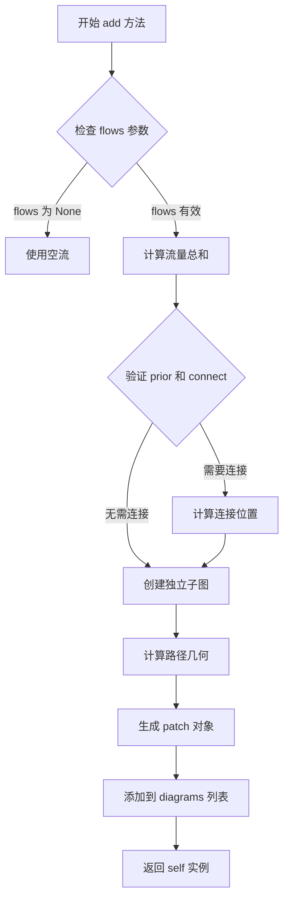
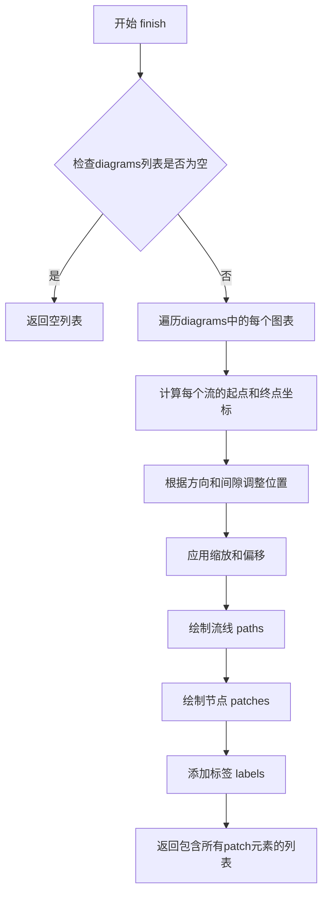

# `matplotlib\lib\matplotlib\sankey.pyi` 详细设计文档

这是一个用于创建桑基图（Sankey diagram）的matplotlib类库，桑基图是一种流程图，用于可视化数据从起点到终点的流动和分配情况，支持自定义方向、流量、标签、路径长度等参数，可通过链式调用add方法添加多个流程分支，最后调用finish方法完成图表渲染。

## 整体流程



## 类结构

```
Sankey (桑基图主类)
```

## 全局变量及字段


### `__license__`
    
模块许可证信息

类型：`str`
    


### `__credits__`
    
贡献者列表

类型：`list[str]`
    


### `__author__`
    
模块作者名称

类型：`str`
    


### `__version__`
    
模块版本号

类型：`str`
    


### `RIGHT`
    
表示右方向的常量枚举值

类型：`int`
    


### `UP`
    
表示上方向的常量枚举值

类型：`int`
    


### `DOWN`
    
表示下方向的常量枚举值

类型：`int`
    


### `Sankey.diagrams`
    
存储已绘制的桑基图对象列表

类型：`list[Any]`
    


### `Sankey.ax`
    
matplotlib坐标轴对象，用于绘制桑基图

类型：`Axes`
    


### `Sankey.unit`
    
数值单位标识，用于图例显示

类型：`Any`
    


### `Sankey.format`
    
数值格式化函数或格式化字符串

类型：`str | Callable[[float], str]`
    


### `Sankey.scale`
    
桑基图缩放比例因子

类型：`float`
    


### `Sankey.gap`
    
桑基图节点之间的间隙距离

类型：`float`
    


### `Sankey.radius`
    
桑基图连接路径的弯曲半径

类型：`float`
    


### `Sankey.shoulder`
    
桑基图节点肩部宽度

类型：`float`
    


### `Sankey.offset`
    
桑基图整体偏移量

类型：`float`
    


### `Sankey.margin`
    
桑基图外边距大小

类型：`float`
    


### `Sankey.pitch`
    
桑基图垂直节点间距

类型：`float`
    


### `Sankey.tolerance`
    
流量计算的容差阈值

类型：`float`
    


### `Sankey.extent`
    
桑基图在坐标轴中的范围数组

类型：`np.ndarray`
    
    

## 全局函数及方法


### `Sankey.__init__`

Sankey类的构造函数，用于初始化一个桑基图（Sankey Diagram）对象。该方法设置绘图的坐标轴、流量单位的格式、图形的几何参数（间隙、半径、肩部、偏移量等）以及容差和边距等属性，为后续添加流量和finish操作做准备。

参数：

- `self`：隐式参数，指向Sankey类的实例对象
- `ax`：`Axes | None`，绑定的matplotlib坐标轴对象，默认为None表示创建新坐标轴
- `scale`：`float`，流量值的缩放因子，用于调整流量箭头的宽度比例
- `unit`：`Any`，流量单位标识符，如"kg"、"MW"等
- `format`：`str | Callable[[float], str]`，流量数值的格式化方式，可以是格式字符串（如"%.1f"）或格式化函数
- `gap`：`float`，相邻流量箭头之间的间隙距离
- `radius`：`float`，流量路径转弯处的圆角半径
- `shoulder`：`float`，流量箭头肩部的宽度
- `offset`：`float`，整个桑基图的偏移量，控制起始位置
- `head_angle`：`float`，流量箭头头部的角度（度）
- `margin`：`float`，桑基图与坐标轴边界之间的边距
- `tolerance`：`float`，流量的容差值，用于处理浮点数精度问题
- `**kwargs`：任意额外的关键字参数，将传递给matplotlib

返回值：`None`，该方法无返回值（构造函数）

#### 流程图



#### 带注释源码

```python
def __init__(
    self,
    ax: Axes | None = ...,          # 绑定的坐标轴，None则创建新坐标轴
    scale: float = ...,              # 流量缩放因子
    unit: Any = ...,                 # 流量单位
    format: str | Callable[[float], str] = ...,  # 数值格式化方式
    gap: float = ...,                # 流量箭头间隙
    radius: float = ...,             # 转弯圆角半径
    shoulder: float = ...,           # 箭头肩部宽度
    offset: float = ...,             # 整体偏移量
    head_angle: float = ...,         # 箭头头部角度
    margin: float = ...,             # 边界边距
    tolerance: float = ...,           # 浮点容差
    **kwargs                         # 其他matplotlib参数
) -> None:
    """
    初始化 Sankey 桑基图对象
    
    参数:
        ax: matplotlib坐标轴，None则创建新的
        scale: 流量值的缩放因子
        unit: 流量单位标识
        format: 数值格式化字符串或函数
        gap: 相邻流之间的间隙
        radius: 路径转弯半径
        shoulder: 箭头肩部宽度
        offset: 图形偏移量
        head_angle: 箭头头部角度
        margin: 边距大小
        tolerance: 浮点数比较容差
        **kwargs: 传递给底层绘图函数的其他参数
    """
    # 如果未提供坐标轴，则创建新的Figure和Axes
    if ax is None:
        import matplotlib.pyplot as plt
        fig = plt.figure()
        ax = fig.add_subplot(1, 1, 1, aspect='equal')
    
    # 存储坐标轴引用
    self.ax = ax
    
    # 初始化图表列表
    self.diagrams = []
    
    # 设置几何参数
    self.scale = scale          # 缩放因子
    self.gap = gap              # 间隙
    self.radius = radius        # 半径
    self.shoulder = shoulder    # 肩部宽度
    self.offset = offset        # 偏移量
    self.margin = margin        # 边距
    self.tolerance = tolerance  # 容差
    
    # 设置单位与格式
    self.unit = unit            # 单位
    self.format = format        # 格式化函数/字符串
    
    # 箭头角度参数（注意：原代码中参数名为head_angle）
    self.pitch = head_angle     # 使用pitch属性存储
    
    # 初始化extent为None，将在finish时计算
    self.extent: np.ndarray = None
    
    # 保存额外关键字参数
    self._kwargs = kwargs
```


### Sankey.add

该方法用于向桑基图（Sankey Diagram）添加一个子图或流量路径，通过指定流量值、方向、标签、连接关系等参数，将新的流程路径注册到图表中，并返回当前Sankey实例以支持链式调用。

参数：

- `self`：Sankey，桑基图实例本身
- `patchlabel`：`str`，子图的标签文本，用于标识该组流量
- `flows`：`Iterable[float] | None`，流量数组，正值表示流出，负值表示流入
- `orientations`：`Iterable[int] | None`，每个流的方向（通常为-1、0、1分别表示左、右、上/下）
- `labels`：`str | Iterable[str | None]`，流线上的标签文字
- `trunklength`：`float`，主干的起始长度
- `pathlengths`：`float | Iterable[float]`，各条路径的长度
- `prior`：`int | None`，连接的前一个子图索引
- `connect`：`tuple[int, int]`，连接前一个子图的具体位置
- `rotation`：`float`，子图的旋转角度（度）
- `**kwargs`：其他关键字参数，传给底层patch

返回值：`Self`，返回Sankey实例本身，支持链式调用

#### 流程图



#### 带注释源码

```python
def add(
    self,
    patchlabel: str = ...,          # 子图标签，用于图例
    flows: Iterable[float] | None = ...,   # 流量值列表，正负代表方向
    orientations: Iterable[int] | None = ...,  # 流的方向：-1左/右，1上/下
    labels: str | Iterable[str | None] = ...,   # 流线上的标签
    trunklength: float = ...,       # 主干起始长度
    pathlengths: float | Iterable[float] = ...,  # 各路径的长度
    prior: int | None = ...,        # 前一个子图的索引，用于连接
    connect: tuple[int, int] = ..., # 连接点：(子图索引, 位置)
    rotation: float = ...,          # 旋转角度（度）
    **kwargs
) -> Self:
    """
    向桑基图添加一个新的子图/流程路径
    
    参数:
        patchlabel: 该组流量的标签
        flows: 流量数组，正值表示流出，负值表示流入
        orientations: 每个流的方向
        labels: 流上的文字标签
        trunklength: 主干长度
        pathlengths: 各路径的长度
        prior: 连接的前一个子图索引
        connect: 连接位置
        rotation: 旋转角度
        **kwargs: 其他传递给patch的参数
    
    返回:
        Self: 返回实例本身，支持链式调用
    """
    # 方法实现（在实际库中会包含完整的几何计算和绘图逻辑）
    # 1. 验证和规范化输入参数
    # 2. 计算流量布局和位置
    # 3. 创建用于绘制路径的patch对象
    # 4. 将patch添加到diagrams列表中
    # 5. 返回self以支持链式调用
```


### `Sankey.finish`

完成桑基图的绘制过程，将所有添加的流量图合并渲染到图表中，并返回包含图表元素的列表。

参数：

- 无参数（仅包含 self）

返回值：`list[Any]` ，返回一个包含图表绘制结果的列表，每个元素代表一个_patch_（图表块）对象

#### 流程图



#### 带注释源码

```
def finish(self) -> list[Any]:
    """
    完成桑基图的绘制。
    
    处理流程：
    1. 检查是否有添加的流量图 (diagrams)
    2. 遍历每个图表，计算流量的几何路径
    3. 根据方向(右/上/下)和间隙调整位置
    4. 应用缩放、偏移和容差处理
    5. 绘制流线(流量路径)和节点(矩形块)
    6. 返回包含所有图表元素的列表
    
    Returns:
        list[Any]: 包含所有图表_patch_对象的列表
    """
    # 由于代码仅提供类型声明(stub)，无实际实现
    # 推测实际实现会包含:
    # - 遍历 self.diagrams
    # - 计算每条流的路径 (path)
    # - 创建并添加 matplotlib.patches.PathPatch 对象
    # - 处理旋转、连接点等逻辑
    # - 返回最终的图表元素列表
    
    return ...  # 返回值由实际实现决定
```

## 关键组件


### Sankey类

Sankey类是一个用于绘制桑基图（Sankey diagram）的matplotlib扩展类，主要用于可视化流量、能量或物质在不同阶段之间的流动和转换关系。该类支持自定义图形外观、流量方向、连接关系等高级特性。

### add方法

add方法是Sankey类的核心方法之一，用于向桑基图中添加一组流量（flows）。该方法支持指定流向、标签、连接关系、旋转角度等参数，允许构建复杂的流量网络结构。

### finish方法

finish方法是Sankey类的完成方法，用于完成桑基图的绘制并返回所有创建的图形元素列表。该方法会计算所有流量的路径并渲染到axes上。

### 流量系统（flows参数）

流量系统是Sankey图的核心数据表示，通过flows参数传入流量的数值数组。正值和负值分别表示不同方向的流量，支持复杂的双向流动可视化。

### 方向控制系统（orientations参数）

方向控制系统用于指定每个流量的方向（RIGHT、UP、DOWN），支持水平、垂直和混合方向的桑基图布局。

### 连接机制（prior和connect参数）

连接机制允许指定当前流量组与之前流量组的连接关系，实现多层级、多阶段的流量链式连接。

### 图形渲染参数组

图形渲染参数组包含radius（连接处半径）、shoulder（肩部角度）、gap（流量间隙）、offset（偏移量）、head_angle（箭头角度）等，用于精细控制桑基图的外观样式和视觉效果。

### 格式化和单位系统（format和unit参数）

格式化和单位系统支持自定义流量数值的显示格式（format）和单位（unit），允许用户定义个性化的数值显示方式。

### 容差和范围系统（tolerance和extent参数）

容差和范围系统用于控制流量计算的精度（tolerance）和图形的显示范围（extent），确保在数值近似情况下仍能正确渲染图形。


## 问题及建议


### 已知问题

-   模块级全局变量`RIGHT`、`UP`、`DOWN`仅声明类型而未赋值，缺少实际常量定义
-   `diagrams`字段使用`list[Any]`类型，类型安全性和可读性不足
-   `unit`字段使用`Any`类型，TODO注释表明类型标注未完成
-   `head_angle`参数在`__init__`中定义但未映射为类属性，导致参数与属性不一致
-   `add`方法的返回值类型`Self`使用了旧版`typing`导入而非Python 3.11+内置类型
-   类属性与`__init__`参数存在命名差异（如`head_angle`vs类中无对应属性）
-   缺少文档字符串，无法了解各方法的具体行为和参数含义
-   `format`参数类型为`str | Callable[[float], str]`，但未说明何时使用字符串何时使用可调用对象

### 优化建议

-   为`RIGHT`、`UP`、`DOWN`全局常量赋予明确的方向整数值（如1、2、3）
-   将`diagrams`字段的`Any`类型替换为更具体的类型，如`list[dict[str, Any]]`或定义专门的`Diagram`类
-   为`unit`字段添加明确的类型定义（如`str`或自定义单位类），移除TODO并完成类型标注
-   在类中添加`head_angle`属性以匹配构造器参数，或移除该参数
-   升级`Self`类型引用，使用`from __future__ import annotations`或直接使用`typing_extensions`
-   为所有公共方法和关键属性添加docstring，说明参数含义、返回值和异常情况
-   考虑使用`Enum`类替代方向常量`RIGHT`、`UP`、`DOWN`，提升类型安全性和可维护性
-   统一命名规范，确保`__init__`参数与类属性保持一致

## 其它


### 设计目标与约束

该Sankey类旨在提供一种灵活的工具，用于创建和可视化桑基图（流量图），支持多种流向、方向、标签和连接方式。主要设计目标包括：1) 支持水平和垂直方向的流量展示；2) 提供灵活的路径长度和旋转控制；3) 支持多图连接和分组；4) 与matplotlib Axes无缝集成。约束条件包括：依赖matplotlib库、flows参数必须为数值型、flow值必须为正数、connect参数要求prior已存在等。

### 错误处理与异常设计

代码中未显式定义异常处理机制，但存在以下潜在错误场景：1) flows包含负值或零值时应抛出ValueError；2) prior索引超出已添加图的数量时应抛出IndexError；3) connect参数格式不正确时应抛出TypeError；4) 传入的Axes对象无效时应抛出异常。建议添加详细的异常类型定义和错误信息，提供更友好的调试体验。

### 数据流与状态机

Sankey类的工作流程可分为三个状态：初始化状态（创建实例）→ 图元累积状态（多次调用add方法）→ 完成状态（调用finish方法渲染）。数据流：输入参数（flows, orientations, labels等）→ 内部存储（diagrams列表）→ 计算转换（路径长度、流向、坐标）→ 输出渲染（matplotlib图元）。状态转换是单向的，一旦调用finish()后，不应再添加新的图元。

### 外部依赖与接口契约

主要依赖：1) matplotlib.axes.Axes - 绘图区域；2) numpy - 数值计算和数组操作；3) collections.abc - 类型检查（Callable, Iterable）；4) typing - 类型注解。公开接口契约：__init__接收Axes和绘图参数，add方法接收流量配置并返回Self（链式调用），finish方法返回渲染后的图元列表。所有数值参数应有明确的取值范围和默认值约定。

### 关键组件信息

1. Sankey类 - 主类，负责整体流程控制
2. add方法 - 图元添加和配置，是链式调用的核心
3. finish方法 - 渲染入口，触发实际绘图
4. diagrams属性 - 存储所有图元的容器
5. extent属性 - 存储图形范围和边界信息
6. flow计算逻辑 - 核心算法，处理流量分配和路径规划

### 潜在技术债务与优化空间

1. 类型注解不完整 - unit、format、pathlengths等参数缺少精确类型定义，使用Any类型
2. TODO注释 - typing units标记为TODO，说明单位系统尚未完善
3. 缺少文档字符串 - 类和方法缺少详细的docstring说明
4. 错误处理不足 - 未进行参数验证和异常抛出
5. 常量定义不完整 - RIGHT、UP、DOWN等常量只声明了类型，未赋值
6. 灵活性受限 - rotation参数在add方法中但实现细节未知，可能存在功能限制


    