# `matplotlib\lib\matplotlib\scale.py` 详细设计文档

该模块定义了Matplotlib中坐标轴的缩放（Scales）功能，通过各种数学变换（如线性、对数、symlog、asinh、logit等）将数据值映射到轴上的视觉位置，并负责管理轴的刻度定位器（Locators）和格式化器（Formatters）。

## 整体流程

```mermaid
graph TD
    User[用户调用 ax.set_xscale('log')] --> Factory[scale_factory]
    Factory --> Lookup{在 _scale_mapping 中查找}
    Lookup -- 找到 --> ScaleClass[对应的 Scale 类 (如 LogScale)]
    Lookup -- 未找到 --> RegisterCheck[检查是否通过 register_scale 注册]
    ScaleClass --> Init[__init__: 初始化 Transform]
    Init --> SetTicks[set_default_locators_and_formatters: 设置刻度]
    SetTicks --> Plotting[绘图时]
    Plotting --> GetTrans[get_transform 获取 Transform 实例]
    GetTrans --> Transform[Transform.transform_non_affine 执行数据变换]
```

## 类结构

```
ScaleBase (抽象基类)
├── LinearScale (线性缩放)
├── FuncScale (函数缩放)
├── LogScale (对数缩放)
│   └── FuncScaleLog (函数+对数缩放)
├── SymmetricalLogScale (对称对数缩放)
├── AsinhScale (反双曲正弦缩放)
└── LogitScale (Logit缩放)

Transform (来自 matplotlib.transforms)
├── FuncTransform
├── LogTransform
│   └── InvertedLogTransform
├── SymmetricalLogTransform
│   └── InvertedSymmetricalLogTransform
├── AsinhTransform
│   └── InvertedAsinhTransform
└── LogitTransform
    └── LogisticTransform
```

## 全局变量及字段


### `_scale_mapping`
    
A dictionary mapping scale names to their corresponding scale classes.

类型：`dict`
    


### `_scale_has_axis_parameter`
    
A dictionary indicating which scale classes accept an axis parameter in their constructor.

类型：`dict`
    


### `LinearScale.name`
    
The scale name identifier, set to 'linear'.

类型：`str`
    


### `FuncScale.name`
    
The scale name identifier, set to 'function'.

类型：`str`
    


### `FuncScale._transform`
    
The transform object that performs the scaling operation.

类型：`FuncTransform`
    


### `LogScale.name`
    
The scale name identifier, set to 'log'.

类型：`str`
    


### `LogScale._transform`
    
The logarithmic transform object for the scale.

类型：`LogTransform`
    


### `LogScale.subs`
    
Sequence of integers indicating sub-tick positions between major ticks.

类型：`list or None`
    


### `FuncScaleLog.name`
    
The scale name identifier, set to 'functionlog'.

类型：`str`
    


### `FuncScaleLog._transform`
    
The combined function and logarithmic transform.

类型：`CompositeTransform`
    


### `FuncScaleLog.subs`
    
Sequence of integers indicating sub-tick positions between major ticks.

类型：`list or None`
    


### `SymmetricalLogScale.name`
    
The scale name identifier, set to 'symlog'.

类型：`str`
    


### `SymmetricalLogScale._transform`
    
The symmetrical logarithmic transform object.

类型：`SymmetricalLogTransform`
    


### `SymmetricalLogScale.subs`
    
Sequence of integers indicating sub-tick positions between major ticks.

类型：`list or None`
    


### `SymmetricalLogScale.base`
    
The base of the logarithm (property delegating to transform).

类型：`float`
    


### `SymmetricalLogScale.linthresh`
    
The threshold for linear region around zero (property delegating to transform).

类型：`float`
    


### `SymmetricalLogScale.linscale`
    
The scaling factor for the linear region (property delegating to transform).

类型：`float`
    


### `AsinhScale.name`
    
The scale name identifier, set to 'asinh'.

类型：`str`
    


### `AsinhScale._transform`
    
The inverse hyperbolic sine transform object.

类型：`AsinhTransform`
    


### `AsinhScale._base`
    
The number base used for rounding tick locations.

类型：`int`
    


### `AsinhScale._subs`
    
Multiples of the number base used for minor ticks.

类型：`list or None`
    


### `AsinhScale.linear_width`
    
The extent of the quasi-linear region (property delegating to transform).

类型：`float`
    


### `LogitScale.name`
    
The scale name identifier, set to 'logit'.

类型：`str`
    


### `LogitScale._transform`
    
The logit transform object for the scale.

类型：`LogitTransform`
    


### `LogitScale._use_overline`
    
Flag indicating whether to use survival notation for probabilities close to one.

类型：`bool`
    


### `LogitScale._one_half`
    
The string representation used for the 1/2 tick label.

类型：`str`
    


### `FuncTransform._forward`
    
The forward transformation function.

类型：`callable`
    


### `FuncTransform._inverse`
    
The inverse transformation function.

类型：`callable`
    


### `FuncTransform.input_dims`
    
Number of input dimensions for the transform.

类型：`int`
    


### `FuncTransform.output_dims`
    
Number of output dimensions for the transform.

类型：`int`
    


### `LogTransform.base`
    
The base of the logarithm.

类型：`float`
    


### `LogTransform._clip`
    
Flag indicating whether to clip non-positive values.

类型：`bool`
    


### `LogTransform._log_funcs`
    
Dictionary caching log functions for common bases.

类型：`dict`
    


### `LogTransform.input_dims`
    
Number of input dimensions for the transform.

类型：`int`
    


### `LogTransform.output_dims`
    
Number of output dimensions for the transform.

类型：`int`
    


### `InvertedLogTransform.base`
    
The base of the logarithm.

类型：`float`
    


### `InvertedLogTransform._exp_funcs`
    
Dictionary caching exponential functions for common bases.

类型：`dict`
    


### `InvertedLogTransform.input_dims`
    
Number of input dimensions for the transform.

类型：`int`
    


### `InvertedLogTransform.output_dims`
    
Number of output dimensions for the transform.

类型：`int`
    


### `SymmetricalLogTransform.base`
    
The base of the logarithm.

类型：`float`
    


### `SymmetricalLogTransform.linthresh`
    
The threshold value defining the linear region.

类型：`float`
    


### `SymmetricalLogTransform.linscale`
    
The scaling factor for the linear region.

类型：`float`
    


### `SymmetricalLogTransform.input_dims`
    
Number of input dimensions for the transform.

类型：`int`
    


### `SymmetricalLogTransform.output_dims`
    
Number of output dimensions for the transform.

类型：`int`
    


### `InvertedSymmetricalLogTransform.base`
    
The base of the logarithm.

类型：`float`
    


### `InvertedSymmetricalLogTransform.linthresh`
    
The threshold value defining the linear region.

类型：`float`
    


### `InvertedSymmetricalLogTransform.linscale`
    
The scaling factor for the linear region.

类型：`float`
    


### `InvertedSymmetricalLogTransform.input_dims`
    
Number of input dimensions for the transform.

类型：`int`
    


### `InvertedSymmetricalLogTransform.output_dims`
    
Number of output dimensions for the transform.

类型：`int`
    


### `AsinhTransform.linear_width`
    
The scale parameter defining the linear region width.

类型：`float`
    


### `AsinhTransform.input_dims`
    
Number of input dimensions for the transform.

类型：`int`
    


### `AsinhTransform.output_dims`
    
Number of output dimensions for the transform.

类型：`int`
    


### `InvertedAsinhTransform.linear_width`
    
The scale parameter defining the linear region width.

类型：`float`
    


### `InvertedAsinhTransform.input_dims`
    
Number of input dimensions for the transform.

类型：`int`
    


### `InvertedAsinhTransform.output_dims`
    
Number of output dimensions for the transform.

类型：`int`
    


### `LogitTransform._nonpositive`
    
Strategy for handling non-positive values ('mask' or 'clip').

类型：`str`
    


### `LogitTransform._clip`
    
Flag indicating whether to clip non-positive values.

类型：`bool`
    


### `LogitTransform.input_dims`
    
Number of input dimensions for the transform.

类型：`int`
    


### `LogitTransform.output_dims`
    
Number of output dimensions for the transform.

类型：`int`
    


### `LogisticTransform._nonpositive`
    
Strategy for handling non-positive values ('mask' or 'clip').

类型：`str`
    


### `LogisticTransform.input_dims`
    
Number of input dimensions for the transform.

类型：`int`
    


### `LogisticTransform.output_dims`
    
Number of output dimensions for the transform.

类型：`int`
    
    

## 全局函数及方法


### `_make_axis_parameter_optional`

该函数是一个装饰器工厂，用于使scale类的构造函数中的`axis`参数变为可选参数。它通过检查传入的第一个参数是否为`Axis`对象来决定是否将`axis`作为参数传递，从而实现向后兼容性，允许scale构造函数以`Scale(axis)`或`Scale()`两种方式调用。

参数：

- `init_func`：`callable`，原始的`__init__`方法，即需要被装饰的scale类的构造函数。

返回值：`callable`，包装后的函数，能够处理`axis`参数可选的情况。

#### 流程图

```mermaid
flowchart TD
    A[开始: 调用装饰后的__init__方法] --> B{args[0]是否是Axis实例?}
    B -->|是| C[正常调用init_func(self, *args, **kwargs)]
    B -->|否| D[从kwargs中弹出'axis', 默认为None]
    D --> E[调用init_func(self, axis, *args, **kwargs)]
    C --> F[返回结果]
    E --> F
```

#### 带注释源码

```python
def _make_axis_parameter_optional(init_func):
    """
    Decorator to allow leaving out the *axis* parameter in scale constructors.

    This decorator ensures backward compatibility for scale classes that
    previously required an *axis* parameter. It allows constructors to be
    callerd with or without the *axis* parameter.

    For simplicity, this does not handle the case when *axis*
    is passed as a keyword. However,
    scanning GitHub, there's no evidence that that is used anywhere.

    Parameters
    ----------
    init_func : callable
        The original __init__ method of a scale class.

    Returns
    -------
    callable
        A wrapped version of *init_func* that handles the optional *axis*.

    Notes
    -----
    If the wrapped constructor defines *axis* as its first argument, the
    parameter is preserved when present. Otherwise, the value `None` is injected
    as the first argument.

    Examples
    --------
    >>> from matplotlib.scale import ScaleBase
    >>> class CustomScale(ScaleBase):
    ...     @_make_axis_parameter_optional
    ...     def __init__(self, axis, custom_param=1):
    ...         self.custom_param = custom_param
    """
    @wraps(init_func)  # 复制原函数的元信息(名称、文档等)
    def wrapper(self, *args, **kwargs):
        # 检查第一个位置参数是否是Axis实例
        if args and isinstance(args[0], mpl.axis.Axis):
            # 如果第一个参数是Axis，直接传递所有参数
            return init_func(self, *args, **kwargs)
        else:
            # 如果第一个参数不是Axis，则从kwargs中弹出axis参数(默认为None)
            # 避免重复赋值
            axis = kwargs.pop('axis', None)
            # 将axis作为第一个参数传递给原始__init__
            return init_func(self, axis, *args, **kwargs)
    return wrapper
```


### `get_scale_names`

该函数是一个全局工具函数，用于获取当前 Matplotlib 环境中所有已注册的图形刻度（Scale）名称。它通过访问内部的注册表字典，提取键值并排序后返回，使得用户或系统能够动态查询可用的刻度类型。

参数：
- （无）

返回值：`list[str]`，返回一个包含所有已注册刻度名称的排序列表（例如 "asinh", "function", "functionlog", "linear", "log", "logit", "symlog"）。

#### 流程图

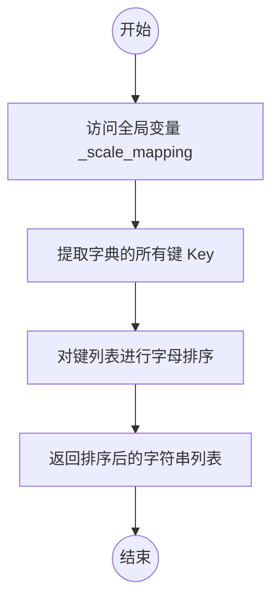

#### 带注释源码

```python
# 全局刻度注册表，存储了刻度名称到具体刻度类的映射
_scale_mapping = {
    'linear': LinearScale,
    'log':    LogScale,
    'symlog': SymmetricalLogScale,
    'asinh':  AsinhScale,
    'logit':  LogitScale,
    'function': FuncScale,
    'functionlog': FuncScaleLog,
}

def get_scale_names():
    """Return the names of the available scales."""
    # _scale_mapping 是一个字典，sorted() 函数提取其所有的键（即刻度名称），
    # 并返回一个排序后的列表供外部调用。
    return sorted(_scale_mapping)
```


### `scale_factory`

#### 描述
`scale_factory` 是一个工厂函数，用于根据给定的缩放名称（如 "linear"、"log" 等）返回对应的 `ScaleBase` 子类实例。它内部维护了一个映射表（`_scale_mapping`），并处理了缩放类构造函数中关于 `axis` 参数的后向兼容性逻辑。

#### 参数
- `scale`：`str`，缩放器的名称（例如 "linear"、"log"、"symlog" 等）。
- `axis`：`matplotlib.axis.Axis`，应用此缩放器的轴对象。
- `**kwargs`：`Any`，传递给具体缩放器类的关键字参数（例如对数缩放的 `base`，线性缩放无需额外参数）。

#### 返回值
- `ScaleBase`：返回对应缩放器类的一个实例。

#### 流程图

```mermaid
graph TD
    A([Start scale_factory]) --> B[根据 scale 名称在 _scale_mapping 中查找类]
    B --> C{检查 _scale_has_axis_parameter[scale]}
    C -- True (旧版缩放类) --> D[调用 scale_cls(axis, **kwargs)]
    C -- False (新版缩放类) --> E[调用 scale_cls(**kwargs)]
    D --> F([返回缩放器实例])
    E --> F
```

#### 带注释源码

```python
def scale_factory(scale, axis, **kwargs):
    """
    Return a scale class by name.

    Parameters
    ----------
    scale : {%(names)s}
    axis : `~matplotlib.axis.Axis`
    """
    # 1. 根据 scale 名称从映射字典中获取对应的缩放类
    #    _api.getitem_checked 会在找不到 key 时抛出异常
    scale_cls = _api.getitem_checked(_scale_mapping, scale=scale)

    # 2. 检查该缩放类的构造函数是否声明了 'axis' 参数
    #    这是为了向后兼容 matplotlib 3.11 之前的版本，
    #    当时所有缩放类都必须接收 axis 参数。
    if _scale_has_axis_parameter[scale]:
        # 如果需要 axis 参数，则将 axis 传递给构造函数
        return scale_cls(axis, **kwargs)
    else:
        # 如果不需要 axis 参数（新版缩放类），
        # 则忽略传入的 axis，只传递 **kwargs
        return scale_cls(**kwargs)
```


### `register_scale`

注册一个新的比例尺类型到matplotlib的比例尺系统中。

参数：

- `scale_class`：`subclass of ScaleBase`，要注册的比例尺类

返回值：`None`，无返回值（该函数直接修改全局注册表）

#### 流程图

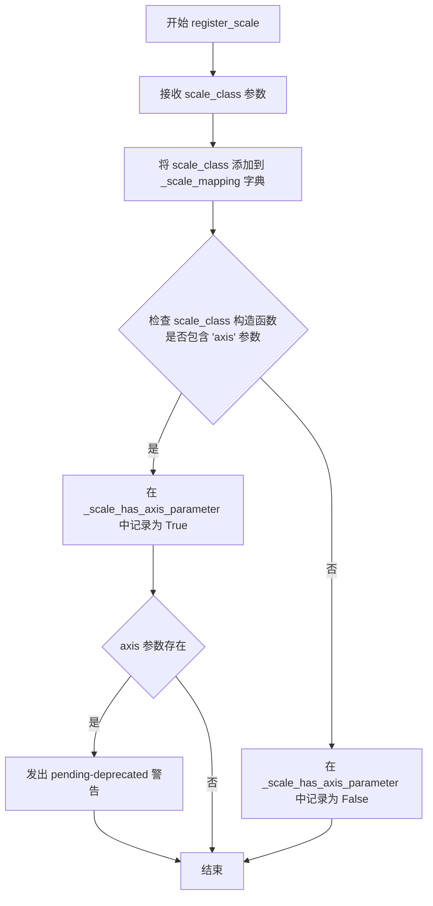

#### 带注释源码

```python
def register_scale(scale_class):
    """
    Register a new kind of scale.

    Parameters
    ----------
    scale_class : subclass of `ScaleBase`
        The scale to register.
    """
    # 将新的比例尺类添加到全局 _scale_mapping 字典中
    # 键为比例尺的名称 (scale_class.name)，值为类本身
    _scale_mapping[scale_class.name] = scale_class

    # 迁移代码：检查该比例尺类的构造函数是否包含 'axis' 参数
    # 这是为了向后兼容，在未来的版本中将移除 axis 参数
    has_axis_parameter = "axis" in inspect.signature(scale_class).parameters
    
    # 记录该比例尺是否具有 axis 参数
    _scale_has_axis_parameter[scale_class.name] = has_axis_parameter
    
    # 如果该比例尺仍然使用 axis 参数，发出待弃用警告
    if has_axis_parameter:
        _api.warn_deprecated(
            "3.11",
            message=f"The scale {scale_class.__qualname__!r} uses an 'axis' parameter "
                    "in the constructors. This parameter is pending-deprecated since "
                    "matplotlib 3.11. It will be fully deprecated in 3.13 and removed "
                    "in 3.15. Starting with 3.11, 'register_scale()' accepts scales "
                    "without the *axis* parameter.",
            pending=True,
        )
```


### `_get_scale_docs`

该函数是一个辅助函数，用于生成与比例尺（scales）相关的文档字符串。它遍历所有已注册的比例尺类，获取每个类的 `__init__` 方法的文档字符串，并将其格式化为可供 `_docstring.interpd.register` 使用的字符串。

参数：

- 该函数无参数

返回值：`str`，返回包含所有已注册比例尺类文档字符串的连接字符串，用于注册到 matplotlib 的文档系统中。

#### 流程图

```mermaid
flowchart TD
    A[开始] --> B[初始化空列表 docs]
    B --> C{遍历 _scale_mapping.items 中的每一项}
    C -->|对于每个 name, scale_class| D[调用 inspect.getdoc 获取 scale_class.__init__ 的文档字符串]
    D --> E[使用 textwrap.indent 格式化文档字符串]
    E --> F[将格式化后的字符串添加到 docs 列表]
    F --> C
    C -->|遍历完成| G[使用 "\n".join 连接 docs 列表中的所有元素]
    G --> H[返回结果字符串]
```

#### 带注释源码

```python
def _get_scale_docs():
    """
    Helper function for generating docstrings related to scales.
    """
    docs = []  # 用于存储各比例尺类文档字符串的列表
    for name, scale_class in _scale_mapping.items():  # 遍历所有已注册的比例尺类
        docstring = inspect.getdoc(scale_class.__init__) or ""  # 获取 __init__ 方法的文档字符串，若无则为空
        docs.extend([  # 将格式化后的文档字符串添加到列表
            f"    {name!r}",  # 比例尺名称（带引号）
            "",  # 空行
            textwrap.indent(docstring, " " * 8),  # 缩进文档字符串（8个空格）
            ""  # 空行
        ])
    return "\n".join(docs)  # 将所有文档字符串用换行符连接后返回
```


### ScaleBase.__init__

**描述**  
ScaleBase 的构造函数，用于创建尺度（Scale）对象。当前实现为空操作，仅接受一个可选的 `axis` 参数以保持向后兼容，且该参数已被标记为即将废弃。

**参数**  
- `axis`：`matplotlib.axis.Axis | None`，可选的坐标轴对象，用于关联尺度；该参数现已弃用，未来将被移除。

**返回值**  
- `None`，构造函数不返回任何值。

#### 流程图

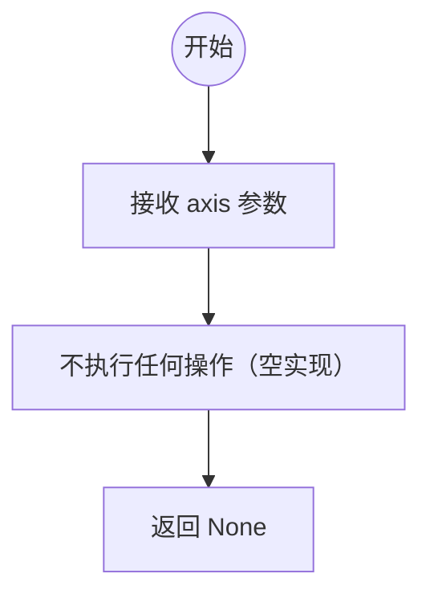

#### 带注释源码

```python
def __init__(self, axis):
    r"""
    构造一个新的尺度（Scale）实例。

    Notes
    -----
    以下说明仅面向实现尺度的开发者。

    为了向后兼容，尺度构造函数接受一个 `~matplotlib.axis.Axis`
    对象作为第一个参数。

    .. deprecated:: 3.11

       *axis* 参数现在是可选的，即 matplotlib 与不接受 *axis* 参数的
       `.ScaleBase` 子类兼容。

       *axis* 参数将在 matplotlib 3.13 中 pending‑deprecated，
       并在 matplotlib 3.15 中移除。

       第三方尺度库如果已经可以兼容 matplotlib >= 3.11，
       建议立即去除 *axis* 参数；否则可以保留该参数，
       并在 3.13 之前移除。
    """
    # 构造函数体为空，不执行业务逻辑，仅保留参数以兼容旧的子类实现
    # （此处可视为 `pass`）
```


### `ScaleBase.get_transform`

该方法是 `ScaleBase` 类的抽象方法，用于返回与该缩放比例关联的 `Transform` 对象。该 Transform 负责将数据坐标转换为缩放后的坐标，且应该是可逆的，以便能够将鼠标位置等转换回数据坐标。

参数：

-  `self`：`ScaleBase`，调用该方法的 ScaleBase 实例本身

返回值：`Transform`，返回与该缩放比例关联的 `.Transform` 对象，用于将数据坐标转换为缩放坐标

#### 流程图

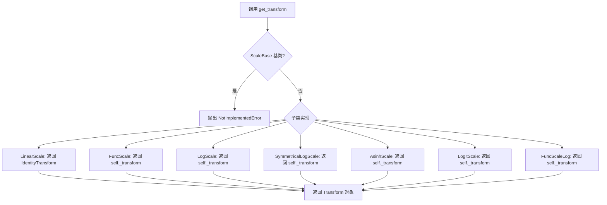

#### 带注释源码

```python
def get_transform(self):
    """
    Return the `.Transform` object associated with this scale.
    """
    # 基类实现：抛出 NotImplementedError，表示该方法需要由子类重写
    # 子类实现示例：
    # - LinearScale: 返回 IdentityTransform()，恒等变换
    # - LogScale: 返回 LogTransform(base, nonpositive)
    # - FuncScale: 返回 FuncTransform(forward, inverse)
    # - SymmetricalLogScale: 返回 SymmetricalLogTransform
    # - AsinhScale: 返回 AsinhTransform
    # - LogitScale: 返回 LogitTransform
    # - FuncScaleLog: 返回 FuncTransform + LogTransform 组合
    raise NotImplementedError()
```


### ScaleBase.set_default_locators_and_formatters

为使用该刻度尺的轴设置默认的定位器和格式化器。

参数：

- `axis`：`matplotlib.axis.Axis`，要设置定位器和格式化器的轴对象

返回值：`None`，无返回值（该方法直接修改 axis 对象的状态）

#### 流程图

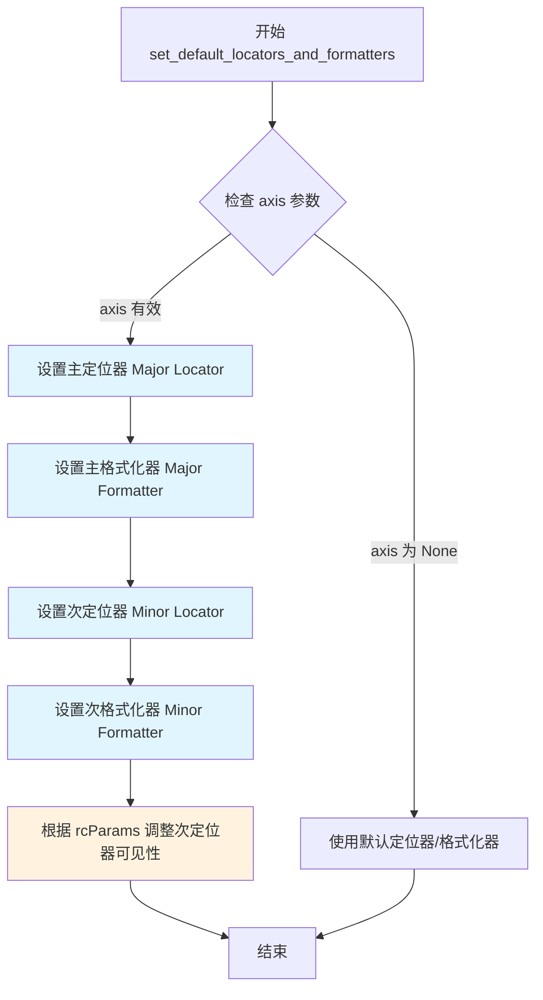

#### 带注释源码

```python
def set_default_locators_and_formatters(self, axis):
    """
    Set the locators and formatters of *axis* to instances suitable for
    this scale.
    """
    raise NotImplementedError()
```


### ScaleBase.limit_range_for_scale

该方法是 `ScaleBase` 类的成员方法，用于限制轴范围使其符合当前缩放类型的定义域。例如，对数刻度需要将负值限制为正数区间。

参数：

- `self`：`ScaleBase` 实例，隐含的 self 参数
- `vmin`：任意类型，轴范围的最小值
- `vmax`：任意类型，轴范围的最大值
- `minpos`：浮点数，数据中的最小正值，用于对数刻度等需要正值的缩放类型

返回值：`(任意类型, 任意类型)`，返回限制后的 vmin 和 vmax 元组

#### 流程图

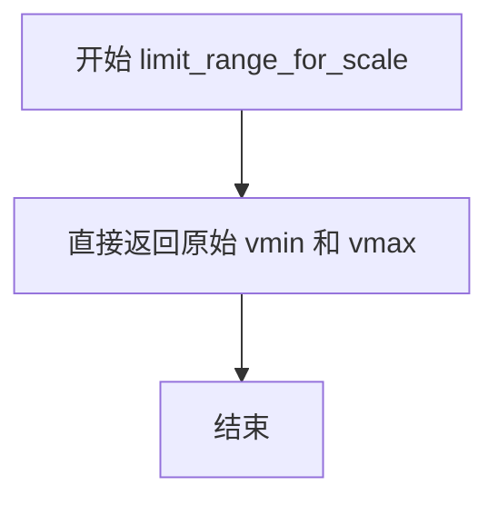

#### 带注释源码

```python
def limit_range_for_scale(self, vmin, vmax, minpos):
    """
    Return the range *vmin*, *vmax*, restricted to the
    domain supported by this scale (if any).

    *minpos* should be the minimum positive value in the data.
    This is used by log scales to determine a minimum value.
    """
    # 基类的默认实现：直接返回原始的 vmin 和 vmax，不做任何限制
    # 子类（如 LogScale、LogitScale）会覆盖此方法以实现特定的域限制
    return vmin, vmax
```


### LinearScale.__init__

构造一个线性比例尺实例。该方法使用 `@_make_axis_parameter_optional` 装饰器来支持可选的 `axis` 参数，以保持向后兼容性。

参数：

- `axis`：`mpl.axis.Axis` 或 `None`，与比例尺关联的轴对象（可选，为保持向后兼容而保留）

返回值：无（`None`），构造函数不返回任何值，仅初始化对象状态

#### 流程图

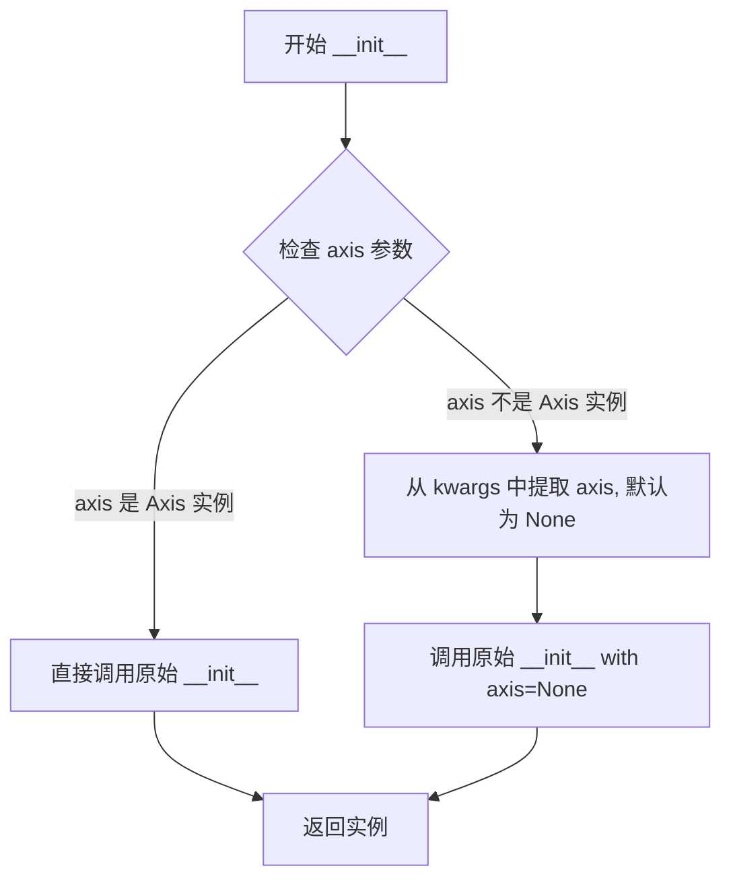

#### 带注释源码

```python
@_make_axis_parameter_optional
def __init__(self, axis):
    # This method is present only to prevent inheritance of the base class'
    # constructor docstring, which would otherwise end up interpolated into
    # the docstring of Axis.set_scale.
    """
    """  # noqa: D419
```

**说明**：

- 该方法的主要目的是阻止基类 `ScaleBase` 的构造函数文档字符串被继承，否则该文档字符串会被插入到 `Axis.set_scale` 的文档字符串中
- 实际功能由装饰器 `@_make_axis_parameter_optional` 处理，该装饰器允许 `axis` 参数可选
- `LinearScale` 是默认的线性比例尺，其核心功能通过继承自 `ScaleBase` 的 `get_transform()` 方法返回 `IdentityTransform()` 来实现
- 该类不存储任何实例属性，所有配置（如 name='linear'）均为类属性


### `LinearScale.get_transform`

该方法用于返回线性比例尺的坐标变换对象。由于线性比例尺不进行任何变换，它直接返回 matplotlib 内置的 `IdentityTransform`（恒等变换），该变换将输入值原样返回。

参数：

- 该方法无显式参数（仅包含隐式参数 `self`）

返回值：`IdentityTransform`，返回与线性缩放对应的变换对象，即 `IdentityTransform`（输入值保持不变）

#### 流程图

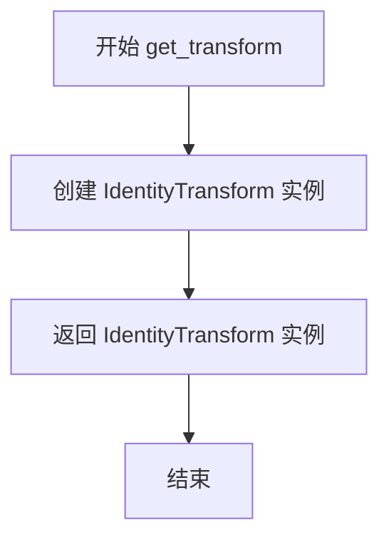

#### 带注释源码

```python
def get_transform(self):
    """
    Return the transform for linear scaling, which is just the
    `~matplotlib.transforms.IdentityTransform`.
    """
    # 线性比例尺的核心特性是不对数据进行任何缩放变换
    # IdentityTransform 是 matplotlib.transforms 模块中的恒等变换类
    # 它继承自 Transform 基类，transform_non_affine 方法直接返回输入值
    # 这样可以保证数据坐标与显示坐标的一致性，实现最简单的线性映射
    return IdentityTransform()
```


### `LinearScale.set_default_locators_and_formatters`

该方法用于为使用线性刻度的坐标轴设置默认的定位器（locator）和格式化器（formatter），包括主刻度和次刻度的配置，并根据 rcParams 决定是否启用次刻度。

参数：

-  `axis`：`matplotlib.axis.Axis`，需要设置刻度定位器和格式化器的坐标轴对象

返回值：`None`，该方法直接修改传入的 axis 对象，不返回任何值

#### 流程图

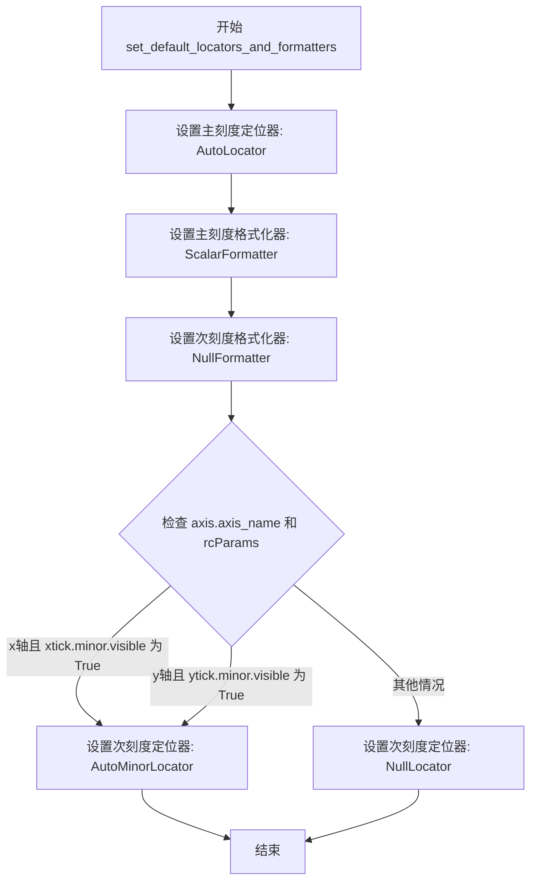

#### 带注释源码

```python
def set_default_locators_and_formatters(self, axis):
    # docstring inherited
    # 设置主刻度定位器为自动定位器，用于自动确定主刻度的位置
    axis.set_major_locator(AutoLocator())
    # 设置主刻度格式化器为标量格式化器，用于格式化主刻度的标签
    axis.set_major_formatter(ScalarFormatter())
    # 设置次刻度格式化器为空格式化器，默认不显示次刻度标签
    axis.set_minor_formatter(NullFormatter())
    # update the minor locator for x and y axis based on rcParams
    # 根据 rcParams 中的设置决定是否为 x 轴或 y 轴启用次刻度定位器
    if (axis.axis_name == 'x' and mpl.rcParams['xtick.minor.visible'] or
            axis.axis_name == 'y' and mpl.rcParams['ytick.minor.visible']):
        # 如果对应的 minor tick 可见，则使用 AutoMinorLocator 自动确定次刻度位置
        axis.set_minor_locator(AutoMinorLocator())
    else:
        # 否则使用 NullLocator，不显示次刻度
        axis.set_minor_locator(NullLocator())
```


### FuncScale.__init__

这是 FuncScale 类的构造函数，用于初始化一个提供任意缩放比例的缩放器，该缩放器使用用户提供的函数进行坐标转换。

参数：

- `axis`：`~matplotlib.axis.Axis`，可选参数，缩放器所绑定的坐标轴对象。该参数已废弃，将在后续版本中移除，目前可通过特殊预处理省略。
- `functions`：`tuple[callable, callable]`，由两个可调用对象组成的元组，分别表示前向变换函数和逆变换函数。前向函数必须单调递增。两个函数都必须具有如下签名：`def forward(values: array-like) -> array-like`。

返回值：`None`，无返回值（构造函数）。

#### 流程图

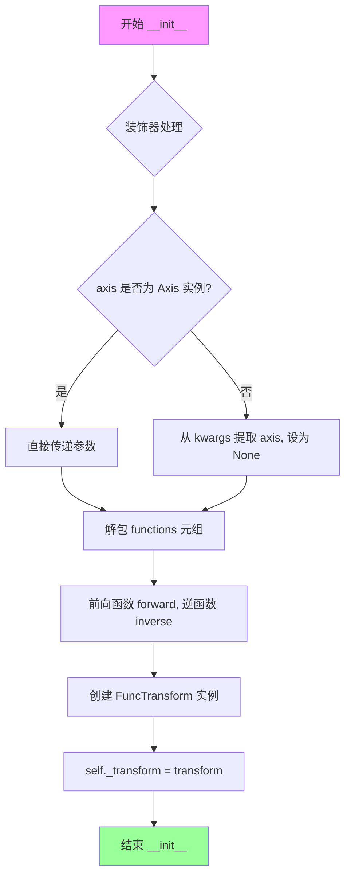

#### 带注释源码

```python
@_make_axis_parameter_optional
def __init__(self, axis, functions):
    """
    Parameters
    ----------
    axis : `~matplotlib.axis.Axis`
        The axis for the scale.

        .. note::
            This parameter is unused and will be removed in an imminent release.
            It can already be left out because of special preprocessing,
            so that ``FuncScale(functions)`` is valid.

    functions : (callable, callable)
        two-tuple of the forward and inverse functions for the scale.
        The forward function must be monotonic.

        Both functions must have the signature::

           def forward(values: array-like) -> array-like
    """
    # 从 functions 元组中解包出前向变换函数和逆变换函数
    forward, inverse = functions
    
    # 创建 FuncTransform 实例，将用户提供的函数封装为变换对象
    transform = FuncTransform(forward, inverse)
    
    # 将变换对象存储为实例属性，供 get_transform 方法返回
    self._transform = transform
```


### FuncScale.get_transform

返回与该缩放关联的 `.FuncTransform` 对象，用于将数据坐标转换为缩放坐标。

参数： 无

返回值：`FuncTransform`，返回该缩放比例对应的变换对象。

#### 流程图

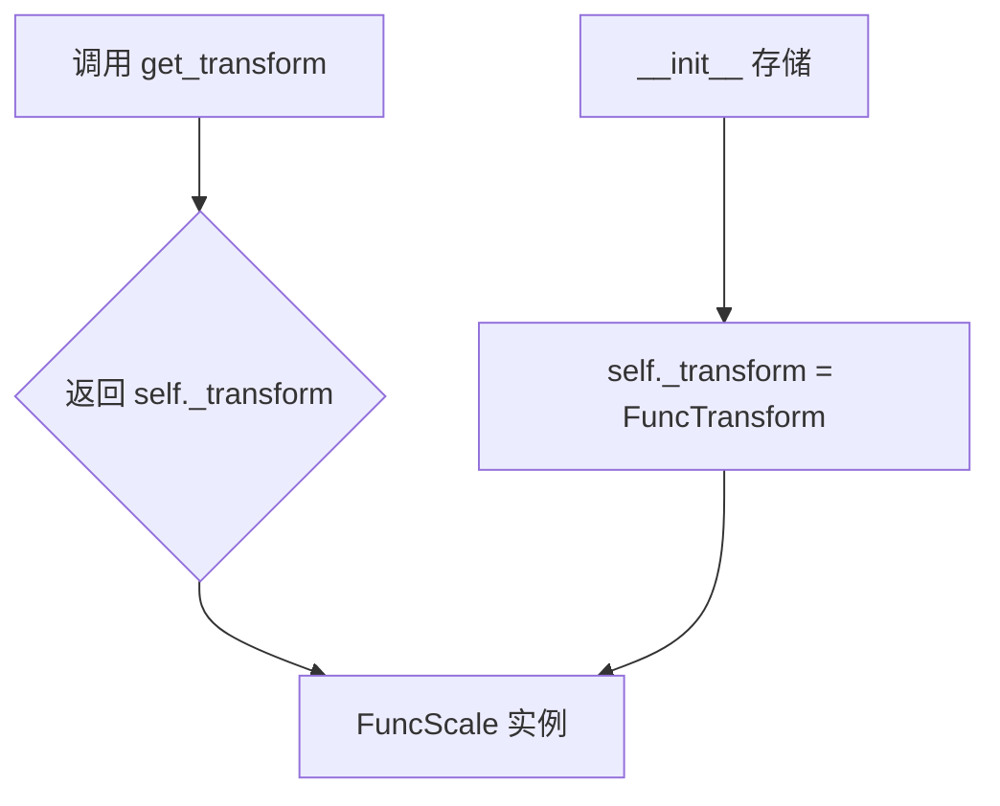

#### 带注释源码

```python
def get_transform(self):
    """Return the `.FuncTransform` associated with this scale."""
    return self._transform
```

该方法是 `FuncScale` 类的核心方法之一，负责返回在构造函数中创建的 `FuncTransform` 实例。`FuncScale` 类允许用户通过提供自定义的前向和逆变换函数来创建任意缩放比例。在 `__init__` 方法中，根据用户提供的函数对创建了 `FuncTransform` 对象并存储在 `self._transform` 属性中，`get_transform` 方法简单地返回该变换对象，使得轴能够使用该变换进行数据坐标到缩放坐标的转换。


### `FuncScale.set_default_locators_and_formatters`

该方法为使用 `FuncScale` 的坐标轴设置默认的定位器（locators）和格式化器（formatters），使其能够适应基于自定义函数的缩放类型。它使用自动定位器来自动确定主要刻度位置，并使用标量格式化器来格式化主要刻度标签，次要刻度则根据 matplotlib 的 rcParams 配置决定是否显示。

参数：

- `axis`：`matplotlib.axis.Axis`，需要设置定位器和格式化器的坐标轴对象

返回值：`None`，该方法直接修改传入的 axis 对象，不返回任何值

#### 流程图

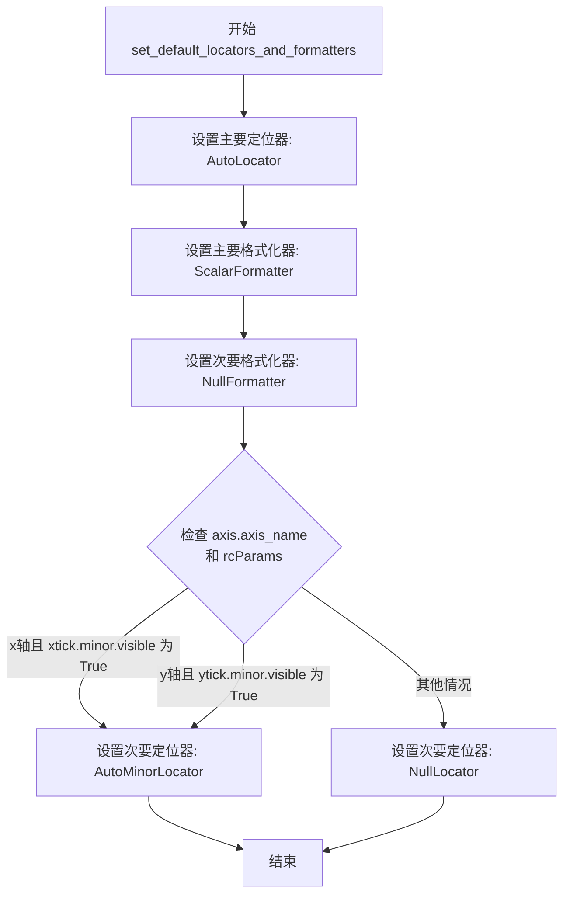

#### 带注释源码

```python
def set_default_locators_and_formatters(self, axis):
    # docstring inherited
    # 设置主要定位器为自动定位器，根据数据范围自动确定主要刻度位置
    axis.set_major_locator(AutoLocator())
    # 设置主要格式化器为标量格式化器，以人类可读的方式显示数值刻度标签
    axis.set_major_formatter(ScalarFormatter())
    # 默认情况下，次要刻度不显示任何标签
    axis.set_minor_formatter(NullFormatter())
    
    # update the minor locator for x and y axis based on rcParams
    # 根据 matplotlib 的 rcParams 配置决定是否启用次要刻度定位器
    if (axis.axis_name == 'x' and mpl.rcParams['xtick.minor.visible'] or
            axis.axis_name == 'y' and mpl.rcParams['ytick.minor.visible']):
        # 如果用户配置了显示次要刻度，则使用自动次要定位器
        axis.set_minor_locator(AutoMinorLocator())
    else:
        # 否则不显示次要刻度
        axis.set_minor_locator(NullLocator())
```


### `LogScale.__init__`

该方法是`LogScale`类的构造函数，用于初始化一个标准对数刻度（Logarithmic Scale）。它接受对数底数（base）、次要刻度位置（subs）以及非正值处理方式（nonpositive）等参数，并创建相应的`LogTransform`变换对象来支持在对数轴上绘制正值数据。

参数：

- `axis`：`matplotlib.axis.Axis` 或 `None`，轴对象（可选参数，即将被弃用）
- `base`：`float`，默认为 10，对数的底数
- `subs`：`sequence of int` 或 `None`，默认为 None，主要刻度之间次要刻度的位置，例如在 log10 刻度下，`[2, 3, 4, 5, 6, 7, 8, 9]` 将在每个主要刻度之间放置 8 个对数间隔的次要刻度
- `nonpositive`：`str`，默认为 `'clip'`，确定非正值的行为，可以是被屏蔽为无效值（`'mask'`），或被裁剪为非常小的正数（`'clip'`）

返回值：`None`，该方法没有返回值，主要用于初始化对象状态

#### 流程图

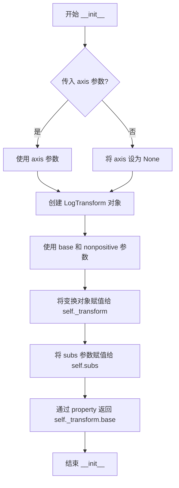

#### 带注释源码

```python
@_make_axis_parameter_optional
def __init__(self, axis=None, *, base=10, subs=None, nonpositive="clip"):
    """
    Parameters
    ----------
    axis : `~matplotlib.axis.Axis`
        The axis for the scale.

        .. note::
            This parameter is unused and about to be removed in the future.
            It can already now be left out because of special preprocessing,
            so that ``LogScale(base=2)`` is valid.

    base : float, default: 10
        The base of the logarithm.
    nonpositive : {'clip', 'mask'}, default: 'clip'
        Determines the behavior for non-positive values. They can either
        be masked as invalid, or clipped to a very small positive number.
    subs : sequence of int, default: None
        Where to place the subticks between each major tick.  For example,
        in a log10 scale, ``[2, 3, 4, 5, 6, 7, 8, 9]`` will place 8
        logarithmically spaced minor ticks between each major tick.
    """
    # 创建 LogTransform 对象，使用给定的底数和非正值处理方式
    # LogTransform 负责执行实际的对数变换
    self._transform = LogTransform(base, nonpositive)
    
    # 存储次要刻度位置，用于后续设置次要刻度定位器
    self.subs = subs
```


### LogScale.base

这是一个属性（property），用于获取 LogScale 所使用的对数底数（base）。

参数： 无

返回值：`float`，LogScale 所使用的对数底数（例如 10 表示以 10 为底的对数）。

#### 流程图

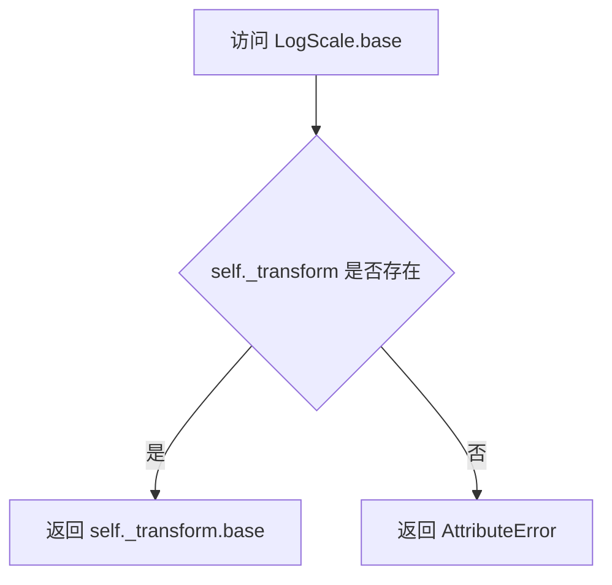

#### 带注释源码

```python
class LogScale(ScaleBase):
    """
    A standard logarithmic scale.  Care is taken to only plot positive values.
    """
    name = 'log'

    @_make_axis_parameter_optional
    def __init__(self, axis=None, *, base=10, subs=None, nonpositive="clip"):
        """
        Parameters
        ----------
        axis : `~matplotlib.axis.Axis`
            The axis for the scale.

            .. note::
                This parameter is unused and about to be removed in the future.
                It can already now be left out because of special preprocessing,
                so that ``LogScale(base=2)`` is valid.

        base : float, default: 10
            The base of the logarithm.
        nonpositive : {'clip', 'mask'}, default: 'clip'
            Determines the behavior for non-positive values. They can either
            be masked as invalid, or clipped to a very small positive number.
        subs : sequence of int, default: None
            Where to place the subticks between each major tick.  For example,
            in a log10 scale, ``[2, 3, 4, 5, 6, 7, 8, 9]`` will place 8
            logarithmically spaced minor ticks between each major tick.
        """
        # 创建一个 LogTransform 实例，传入 base 和 nonpositive 参数
        self._transform = LogTransform(base, nonpositive)
        # 保存 subs 参数，用于设置次要刻度的位置
        self.subs = subs

    # 属性：获取底数
    # 这是一个只读属性，返回关联的 LogTransform 的底数
    base = property(lambda self: self._transform.base)
```


### LogScale.get_transform

获取与当前 `LogScale` 实例关联的坐标变换对象（`LogTransform`），该对象用于实现数据的对数缩放转换。

参数：
- `self`：`LogScale`，隐式参数，指向调用该方法的 `LogScale` 类实例本身。

返回值：
- `LogTransform`，返回对数变换对象，用于将原始数据坐标转换为对数刻度下的坐标。

#### 流程图

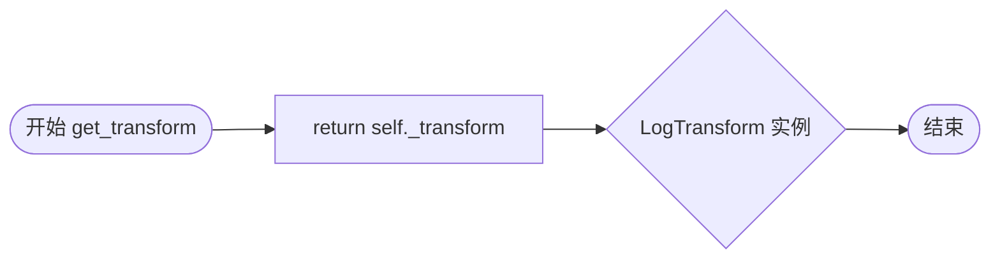

#### 带注释源码

```python
def get_transform(self):
    """
    Return the `.LogTransform` associated with this scale.
    """
    return self._transform
```


### `LogScale.set_default_locators_and_formatters`

该方法用于为对数刻度（LogScale）的坐标轴设置默认的定位器（locator）和格式化器（formatter），使其适合显示对数轴上的数据。

参数：

-  `axis`：`matplotlib.axis.Axis`，需要设置定位器和格式化器的坐标轴对象

返回值：`None`，该方法直接修改传入的 axis 对象的属性，不返回任何值

#### 流程图

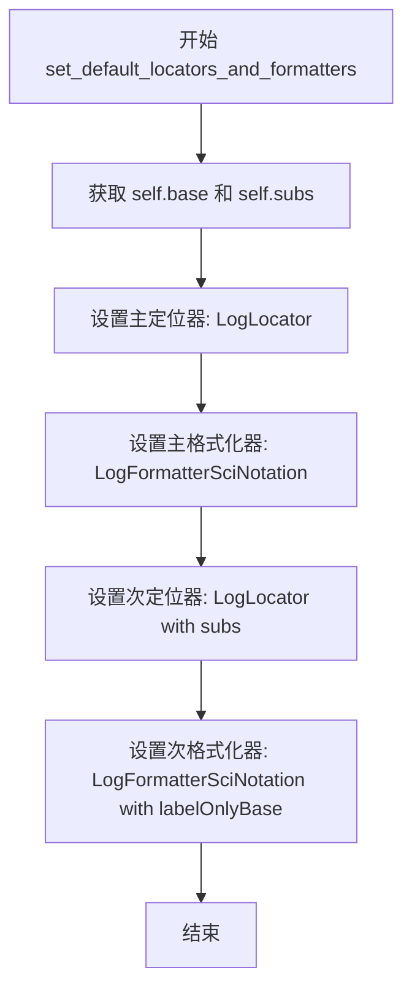

#### 带注释源码

```python
def set_default_locators_and_formatters(self, axis):
    # docstring inherited
    # 设置主定位器（major locator）用于主刻度位置
    axis.set_major_locator(LogLocator(self.base))
    # 设置主格式化器（major formatter）用于主刻度标签显示
    axis.set_major_formatter(LogFormatterSciNotation(self.base))
    # 设置次定位器（minor locator）用于次刻度位置，支持subs参数
    axis.set_minor_locator(LogLocator(self.base, self.subs))
    # 设置次格式化器（minor formatter）用于次刻度标签显示
    # labelOnlyBase参数决定是否只显示主基数的标签
    axis.set_minor_formatter(
        LogFormatterSciNotation(self.base,
                                labelOnlyBase=(self.subs is not None)))
```


### `LogScale.limit_range_for_scale`

该方法用于限制对数刻度的数值范围，确保轴的最小值和最大值都为正数，以符合对数函数的定义域要求。

参数：

- `vmin`：`float`，当前轴范围的最小值
- `vmax`：`float`，当前轴范围的最大值  
- `minpos`：`float`，数据中的最小正数值，用于确定对数刻度的有效下界

返回值：`tuple[float, float]`，返回调整后的 (vmin, vmax) 元组，确保两者都为正数

#### 流程图

```mermaid
flowchart TD
    A[开始 limit_range_for_scale] --> B{minpos 是否为有限值?}
    B -->|否| C[设置 minpos = 1e-300]
    B -->|是| D[保持 minpos 不变]
    C --> E{vmin <= 0?}
    D --> E
    E -->|是| F[返回 minpos 作为 vmin]
    E -->|否| G[保持 vmin 不变]
    F --> H{vmax <= 0?}
    G --> H
    H -->|是| I[返回 minpos 作为 vmax]
    H -->|否| J[保持 vmax 不变]
    I --> K[返回调整后的范围]
    J --> K
```

#### 带注释源码

```python
def limit_range_for_scale(self, vmin, vmax, minpos):
    """Limit the domain to positive values."""
    # 检查 minpos 是否为有限数值（不是 inf、nan 等）
    # 如果不是有限值，使用一个极小的正数 1e-300 作为默认值
    # 这确保了对数运算在极端情况下也能执行（虽然视觉效果可能不明显）
    if not np.isfinite(minpos):
        minpos = 1e-300  # Should rarely (if ever) have a visible effect.

    # 返回调整后的范围：
    # - 如果 vmin <= 0，用 minpos 替换，确保最小值为正
    # - 如果 vmax <= 0，用 minpos 替换，确保最大值为正
    # - 否则保持原值不变
    return (minpos if vmin <= 0 else vmin,
            minpos if vmax <= 0 else vmax)
```


### FuncScaleLog.__init__

该方法是`FuncScaleLog`类的构造函数，用于初始化一个结合了用户自定义函数和对数变换的缩放对象。它接收一个坐标轴、两个函数（前向和逆变换）以及可选的对数底数，然后创建一个组合变换（先应用用户函数，再应用对数变换）。

参数：

- `self`：类的实例对象。
- `axis`：`~matplotlib.axis.Axis`，缩放所应用的坐标轴对象。
- `functions`：`Tuple[callable, callable]`，包含前向函数和逆函数的二元组。前向函数必须是单调的，两个函数都必须接受array-like类型并返回array-like类型。
- `base`：`float`，默认为10，对数变换的底数。

返回值：`None`，该方法没有返回值，仅初始化对象状态。

#### 流程图

```mermaid
graph TD
    A[开始 __init__] --> B[接收参数: axis, functions, base=10]
    B --> C[从functions解包出forward和inverse]
    C --> D[设置self.subs = None]
    D --> E[创建FuncTransform: FuncTransform(forward, inverse)]
    E --> F[创建LogTransform: LogTransform(base)]
    F --> G[组合变换: self._transform = FuncTransform + LogTransform]
    G --> H[结束 __init__]
```

#### 带注释源码

```python
@_make_axis_parameter_optional
def __init__(self, axis, functions, base=10):
    """
    Parameters
    ----------
    axis : `~matplotlib.axis.Axis`
        The axis for the scale.
    functions : (callable, callable)
        two-tuple of the forward and inverse functions for the scale.
        The forward function must be monotonic.

        Both functions must have the signature::

            def forward(values: array-like) -> array-like

    base : float, default: 10
        Logarithmic base of the scale.
    """
    # 从functions元组中解包出前向函数和逆函数
    forward, inverse = functions
    
    # 初始化subs属性为None，用于后续设置次刻度位置
    self.subs = None
    
    # 创建组合变换：先应用用户自定义的FuncTransform，然后应用LogTransform
    # FuncTransform + LogTransform 表示先执行FuncTransform，再执行LogTransform
    self._transform = FuncTransform(forward, inverse) + LogTransform(base)
```


### FuncScaleLog.base

该属性是 `FuncScaleLog` 类的一个只读属性，用于获取对数变换的底数（base）。它通过访问组合变换对象中的 `LogTransform` 组件来获取底数值。

参数： 无

返回值：`float`，返回对数刻度的底数（默认为10）。

#### 流程图

```mermaid
flowchart TD
    A[访问 FuncScaleLog.base 属性] --> B[获取 self._transform 对象]
    B --> C[访问 self._transform._b 获取第二个变换组件]
    C --> D[获取 LogTransform 的 base 属性]
    D --> E[返回底数值]
```

#### 带注释源码

```python
@property
def base(self):
    """
    返回对数变换的底数。

    该属性通过访问组合变换对象中的 LogTransform 组件来获取底数。
    组合变换的创建过程为: FuncTransform(forward, inverse) + LogTransform(base)
    其中 _b 表示组合变换中的第二个变换（即 LogTransform）。

    Returns
    -------
    float
        对数刻度的底数，默认为 10。
    """
    return self._transform._b.base  # Base of the LogTransform.
```


### `FuncScaleLog.get_transform`

获取与 `FuncScaleLog` 缩放类关联的变换对象，该对象用于将数据坐标转换为缩放坐标，支持用户自定义函数与对数变换的组合。

参数：
- 无（仅包含 `self` 参数）

返回值：`Transform`，返回组合后的变换对象，即 `FuncTransform` 与 `LogTransform` 的合成变换，用于实现"函数-对数"缩放。

#### 流程图

```mermaid
flowchart TD
    A[开始 get_transform] --> B{检查变换是否已创建}
    B -->|是| C[返回 self._transform]
    B -->|否| D[创建 FuncTransform + LogTransform]
    D --> C
    C --> E[结束]
```

#### 带注释源码

```python
def get_transform(self):
    """Return the `.Transform` associated with this scale."""
    return self._transform
```

**说明：**
- `self._transform` 在类的 `__init__` 方法中被初始化为 `FuncTransform(forward, inverse) + LogTransform(base)`
- 这里使用了 `Transform` 对象的加法运算符 `+` 来组合两个变换，形成一个复合变换链
- 变换顺序为：先应用用户提供的函数变换 `FuncTransform`，再应用对数变换 `LogTransform`
- 该变换实现了"先函数变换，后对数缩放"的双重映射功能


### `SymmetricalLogScale.__init__`

该方法用于初始化一个对称数学生缩放（Symmetrical Logarithmic Scale）的实例。它接收用于配置对数基数、线性阈值（零点附近的线性范围）以及线性缩放因子的参数，并创建相应的变换对象来管理数据的映射。

参数：

- `axis`：`~matplotlib.axis.Axis | None`，可选。缩放所依附的坐标轴对象（该参数目前可选，将在未来版本中移除）。
- `base`：`float`，默认值 10。对数缩放的底数。
- `linthresh`：`float`，默认值 2。指定在零值附近的线性区间大小，即 `(-linthresh, linthresh)` 范围内使用线性变换。
- `subs`：`Sequence[int] | None`，可选。子刻度的倍数序列，用于在主刻度之间放置次要刻度（例如在 base=10 的对数轴上，`[2, 3, 4, 5, 6, 7, 8, 9]` 表示在每个主刻度间放置 8 个对数间距的次刻度）。
- `linscale`：`float`，默认值 1。用于拉伸线性区间的缩放因子。

返回值：`None`，该方法仅修改对象内部状态，不返回值。

#### 流程图

```mermaid
graph TD
    A[Start __init__] --> B[接收参数: axis, base, linthresh, subs, linscale]
    B --> C{检查参数有效性<br>（通过装饰器或内部逻辑）}
    C --> D[实例化 SymmetricalLogTransform<br>传入 base, linthresh, linscale]
    D --> E[将变换对象赋值给 self._transform]
    E --> F[将 subs 参数赋值给 self.subs]
    F --> G[End]
```

#### 带注释源码

```python
@_make_axis_parameter_optional
def __init__(self, axis=None, *, base=10, linthresh=2, subs=None, linscale=1):
    """
    初始化 SymmetricalLogScale。

    Parameters
    ----------
    axis : `~matplotlib.axis.Axis`
        The axis for the scale.

        .. note::
            This parameter is unused and about to be removed in the future.
            It can already now be left out because of special preprocessing,
            so that ``SymmetricalLocSacle(base=2)`` is valid.

    base : float, default: 10
        The base of the logarithm.

    linthresh : float, default: 2
        Defines the range ``(-x, x)``, within which the plot is linear.
        This avoids having the plot go to infinity around zero.

    subs : sequence of int
        Where to place the subticks between each major tick.
        For example, in a log10 scale: ``[2, 3, 4, 5, 6, 7, 8, 9]`` will place
        8 logarithmically spaced minor ticks between each major tick.

    linscale : float, optional
        This allows the linear range ``(-linthresh, linthresh)`` to be
        stretched relative to the logarithmic range. Its value is the number of
        decades to use for each half of the linear range. For example, when
        *linscale* == 1.0 (the default), the space used for the positive and
        negative halves of the linear range will be equal to one decade in
        the logarithmic range.
    """
    # 创建对称数学生变换对象，包含底数、线性阈值和线性缩放因子
    self._transform = SymmetricalLogTransform(base, linthresh, linscale)
    # 保存子刻度配置，供 set_default_locators_and_formatters 使用
    self.subs = subs
```


### `SymmetricalLogScale.get_transform`

返回与对称数轴（symlog）比例尺关联的坐标变换对象，用于将数据坐标转换为缩放后的坐标。

参数：

- （无参数）

返回值：`matplotlib.transforms.Transform`，返回与该比例尺关联的 `SymmetricalLogTransform` 变换对象

#### 流程图

```mermaid
flowchart TD
    A[开始 get_transform] --> B{返回 self._transform}
    B --> C[返回 SymmetricalLogTransform 实例]
    C --> D[结束]
```

#### 带注释源码

```python
def get_transform(self):
    """
    Return the `.SymmetricalLogTransform` associated with this scale.
    
    Returns
    -------
    matplotlib.transforms.Transform
        The transform object (SymmetricalLogTransform) that converts data
        coordinates to scaled coordinates for the symmetrical logarithmic scale.
        
    Notes
    -----
    This transform implements a symmetric logarithmic scaling, which is
    logarithmic in both positive and negative directions from the origin,
    with a linear region near zero defined by the linthresh parameter.
    """
    return self._transform
```


### SymmetricalLogScale.set_default_locators_and_formatters

该方法为使用对称数轴缩放（SymmetricalLogScale）的坐标轴设置默认的定位器和格式化器。主定位器使用 SymmetricalLogLocator，次定位器根据用户提供的 subs 参数配置，主格式化器采用科学计数法格式，次格式化器为空。

参数：

- `axis`：`matplotlib.axis.Axis`，需要设置定位器和格式化器的坐标轴对象

返回值：`None`，无返回值（隐式返回 None）

#### 流程图

```mermaid
flowchart TD
    A[开始 set_default_locators_and_formatters] --> B[获取变换对象]
    B --> C[设置主定位器: SymmetricalLogLocator]
    C --> D[设置主格式化器: LogFormatterSciNotation]
    D --> E[设置次定位器: SymmetricalLogLocator with subs]
    E --> F[设置次格式化器: NullFormatter]
    F --> G[结束]
```

#### 带注释源码

```python
def set_default_locators_and_formatters(self, axis):
    # docstring inherited
    # 获取当前的变换对象，用于创建合适的定位器
    axis.set_major_locator(SymmetricalLogLocator(self.get_transform()))
    # 设置主刻度格式化器为科学计数法格式，使用对数基数
    axis.set_major_formatter(LogFormatterSciNotation(self.base))
    # 设置次定位器，支持用户自定义的 subs 参数来控制子刻度位置
    axis.set_minor_locator(SymmetricalLogLocator(self.get_transform(),
                                                 self.subs))
    # 次格式化器设为空，不显示次刻度的数值标签
    axis.set_minor_formatter(NullFormatter())
```


### AsinhScale.__init__

**描述**：  
`AsinhScale` 的构造函数，负责初始化一个基于逆双曲正弦（asinh）的准对数比例尺。它接受 `axis`、`linear_width`、`base`、`subs` 等参数，创建对应的 `AsinhTransform` 实例并设置数基和次要刻度乘数。

#### 参数

- `axis`：`matplotlib.axis.Axis | None`，可选，表示轴对象。该参数即将在未来版本中移除，调用时若不传或传 `None` 均可（由装饰器 `@_make_axis_parameter_optional` 处理）。
- `linear_width`：`float`，默认 `1.0`，定义准线性区域的宽度（即公式中的 \(a_0\)），超过此范围的坐标会呈现对数行为。
- `base`：`int`，默认 `10`，用于取整主刻度位置的数基；若小于 1 则取最近的整数倍十的幂。
- `subs`：`int 序列 | str`，默认 `'auto'`，指定次要刻度的倍频；`'auto'` 时使用类内部的默认映射（`auto_tick_multipliers`）。
- `**kwargs`：`dict`，为兼容子类扩展而保留下来的额外关键字参数，当前未使用。

#### 返回值

- **`None`**：`__init__` 方法不返回值（构造函数默认返回 `None`）。

#### 流程图

```mermaid
flowchart TD
    A([开始 __init__]) --> B{axis 参数是否为 Axis?}
    B -- 是 --> C[调用父类 ScaleBase.__init__(axis)]
    B -- 否 --> D[调用父类 ScaleBase.__init__(None)]
    C --> E[创建 AsinhTransform(linear_width) 实例]
    D --> E
    E --> F[将 base 转为 int 并保存至 self._base]
    F --> G{subs == 'auto'?}
    G -- 是 --> H[从 auto_tick_multipliers 取 self._base 对应的乘数]
    H --> I[保存为 self._subs]
    G -- 否 --> J[直接使用传入的 subs]
    J --> I
    I --> K([结束 __init__])
```

#### 带注释源码

```python
@_make_axis_parameter_optional   # 装饰器：允许 axis 参数可选，兼容旧代码
def __init__(self, axis=None, *, linear_width=1.0,
             base=10, subs='auto', **kwargs):
    """
    AsinhScale 构造器。

    Parameters
    ----------
    axis : matplotlib.axis.Axis, optional
        轴对象，用于关联比例尺。该参数将在未来版本中被移除。
    linear_width : float, default 1.0
        准线性区域的宽度，对应公式中的 a0。
    base : int, default 10
        对数刻度的数基，用于取整主刻度位置。
    subs : sequence of int or 'auto', default 'auto'
        次要刻度的倍频；'auto' 时使用类内部的默认值。
    **kwargs : dict
        为兼容子类扩展而保留的额外关键字参数。
    """
    # 调用基类 ScaleBase 的构造器，完成基类初始化
    super().__init__(axis)

    # 创建 AsinhTransform 实例，负责实际的 asinh 变换
    self._transform = AsinhTransform(linear_width)

    # 将 base 转换为整数并保存，以供后续定位器使用
    self._base = int(base)

    # 根据 subs 参数决定次要刻度的倍频
    if subs == 'auto':
        # 从类属性 auto_tick_multipliers 中查找与当前 base 对应的默认乘数
        self._subs = self.auto_tick_multipliers.get(self._base)
    else:
        # 直接使用用户提供的 subs 序列
        self._subs = subs
```


### AsinhScale.get_transform

返回与 AsinhScale 关联的 AsinhTransform 转换对象，用于将数据坐标转换为缩放坐标。

参数：

- 此方法没有参数

返回值：`AsinhTransform`，返回该 scale 关联的变换对象，负责执行逆双曲正弦变换

#### 流程图

```mermaid
flowchart TD
    A[调用 get_transform] --> B{检查]
    B -->|方法被调用| C[返回 self._transform]
    C --> D[AsinhTransform 实例]
    D --> E[用于数据坐标到缩放坐标的转换]
```

#### 带注释源码

```python
def get_transform(self):
    """
    Return the `.AsinhTransform` associated with this scale.
    """
    return self._transform
```

该方法是 AsinhScale 类的实例方法，位于类的核心接口中。在 AsinhScale 的构造函数 `__init__` 中，`self._transform` 被初始化为 `AsinhTransform(linear_width)` 实例。`get_transform` 方法简单地返回这个预先创建的变换对象，允许 matplotlib 的其他组件（如 Axis）获取用于坐标变换的 Transform 实例。此方法是 ScaleBase 基类定义的接口实现之一，所有 scale 子类都需要提供此方法以支持坐标转换功能。


### AsinhScale.set_default_locators_and_formatters

该方法用于为使用 AsinhScale 的坐标轴设置默认的定位器（locators）和格式化器（formatters），根据线性宽度参数配置 AsinhLocator，并根据底数选择合适的Formatter。

参数：

- `axis`：`matplotlib.axis.Axis`，需要设置定位器和格式化器的坐标轴对象

返回值：`None`，无返回值，该方法直接修改 axis 对象的属性

#### 流程图

```mermaid
flowchart TD
    A[开始 set_default_locators_and_formatters] --> B[创建 AsinhLocator: major_locator]
    B --> C[创建 AsinhLocator: minor_locator with subs]
    C --> D[设置 minor_formatter = NullFormatter]
    D --> E{self._base > 1?}
    E -->|是| F[设置 major_formatter = LogFormatterSciNotation]
    E -->|否| G[设置 major_formatter = '{x:.3g}']
    F --> H[通过 axis.set 应用所有设置]
    G --> H
    H --> I[结束]
```

#### 带注释源码

```python
def set_default_locators_and_formatters(self, axis):
    """
    Set the locators and formatters of *axis* to instances suitable for
    this scale.
    """
    # 为坐标轴设置主定位器（major locator）
    # 使用 AsinhLocator，基于 linear_width 和底数 base
    axis.set(major_locator=AsinhLocator(self.linear_width,
                                        base=self._base),
             # 为坐标轴设置次定位器（minor locator）
             # 包含 subs 参数，用于控制次刻度的分布
             minor_locator=AsinhLocator(self.linear_width,
                                        base=self._base,
                                        subs=self._subs),
             # 设置次格式化器为 NullFormatter（不显示次刻度标签）
             minor_formatter=NullFormatter())
    
    # 根据底数选择合适的主格式化器
    if self._base > 1:
        # 当底数大于1时，使用科学计数法格式化器
        axis.set_major_formatter(LogFormatterSciNotation(self._base))
    else:
        # 当底数<=1时，使用自定义格式字符串
        axis.set_major_formatter('{x:.3g}')
```


### `LogitScale.__init__`

初始化LogitScale实例，用于处理(0,1)区间内的数据，执行logit变换。

参数：

- `axis`：`matplotlib.axis.Axis`，可选参数，轴对象。该参数目前未使用，将在未来的版本中移除。
- `nonpositive`：str，默认值'mask'，确定超出开区间(0,1)的值的行为。可以是'mask'（屏蔽为无效值）或'clip'（裁剪为接近0或1的非常小的数）。
- `use_overline`：bool，默认值False，指示使用生存符号(\overline{x})来表示接近1的概率，以替代标准符号(1-x)。
- `one_half`：str，默认值r"\frac{1}{2}"，用于刻度格式化器表示1/2的字符串。

返回值：无（`__init__`方法返回`None`）

#### 流程图

```mermaid
flowchart TD
    A[开始 __init__] --> B[接收参数: axis, nonpositive, one_half, use_overline]
    B --> C[创建LogitTransform实例: self._transform = LogitTransform(nonpositive)]
    C --> D[设置实例变量: self._use_overline = use_overline]
    D --> E[设置实例变量: self._one_half = one_half]
    E --> F[结束 __init__]
```

#### 带注释源码

```python
@_make_axis_parameter_optional
def __init__(self, axis=None, nonpositive='mask', *,
             one_half=r"\frac{1}{2}", use_overline=False):
    r"""
    Parameters
    ----------
    axis : `~matplotlib.axis.Axis`
        The axis for the scale.

        .. note::
            This parameter is unused and about to be removed in the future.
            It can already now be left out because of special preprocessing,
            so that ``LogitScale()`` is valid.

    nonpositive : {'mask', 'clip'}
        Determines the behavior for values beyond the open interval ]0, 1[.
        They can either be masked as invalid, or clipped to a number very
        close to 0 or 1.
    use_overline : bool, default: False
        Indicate the usage of survival notation (\overline{x}) in place of
        standard notation (1-x) for probability close to one.
    one_half : str, default: r"\frac{1}{2}"
        The string used for ticks formatter to represent 1/2.
    """
    # 创建LogitTransform变换对象，用于执行logit变换
    self._transform = LogitTransform(nonpositive)
    # 保存是否使用上划线表示法的设置
    self._use_overline = use_overline
    # 保存用于表示1/2的字符串
    self._one_half = one_half
```


### LogitScale.get_transform

返回与LogitScale比例相关联的LogitTransform对象，用于将数据坐标转换为logit缩放坐标。

参数： 无

返回值：`Transform`，返回与该比例关联的LogitTransform实例，用于数据坐标到logit缩放坐标的转换。

#### 流程图

```mermaid
flowchart TD
    A[调用 get_transform 方法] --> B[返回 self._transform]
    B --> C[LogitTransform 实例]
```

#### 带注释源码

```python
def get_transform(self):
    """
    Return the `.LogitTransform` associated with this scale.
    """
    return self._transform
```


### `LogitScale.set_default_locators_and_formatters`

该方法负责为使用 Logit 比例尺的坐标轴设置默认的定位器（Locators）和格式化器（Formatters）。它会根据实例的配置（如下划线表示法、数字 1/2 的表示形式）分别配置主刻度线和次刻度线的显示逻辑。

参数：

-  `axis`：`matplotlib.axis.Axis`，需要配置刻度的主轴对象。

返回值：`None`，该方法直接修改 `axis` 对象的属性，不返回任何值。

#### 流程图

```mermaid
flowchart TD
    A([开始设置]) --> B[设置主刻度定位器: LogitLocator]
    B --> C{检查实例配置}
    C -->|使用实例属性 _one_half, _use_overline| D[设置主刻度格式化器: LogitFormatter]
    D --> E[设置次刻度定位器: LogitLocator minor=True]
    E --> F{检查实例配置}
    F -->|使用实例属性 _one_half, _use_overline| G[设置次刻度格式化器: LogitFormatter minor=True]
    G --> H([结束])
```

#### 带注释源码

```python
def set_default_locators_and_formatters(self, axis):
    # docstring inherited
    # 设置主刻度定位器，使用 LogitLocator 自动计算在 (0,1) 区间内的对数间隔位置
    # 例如：0.01, 0.1, 0.5, 0.9, 0.99 等
    axis.set_major_locator(LogitLocator())
    
    # 设置主刻度格式化器，使用 LogitFormatter 来处理概率值的显示
    # 传入实例初始化时保存的配置：_one_half (1/2的表示形式) 和 _use_overline (是否使用上划线表示)
    axis.set_major_formatter(
        LogitFormatter(
            one_half=self._one_half,
            use_overline=self._use_overline
        )
    )
    
    # 设置次刻度定位器，开启 minor=True 以在主刻度之间生成更细密的刻度
    axis.set_minor_locator(LogitLocator(minor=True))
    
    # 设置次刻度格式化器，同样应用实例的配置
    axis.set_minor_formatter(
        LogitFormatter(
            minor=True,
            one_half=self._one_half,
            use_overline=self._use_overline
        )
    )
```


### `LogitScale.limit_range_for_scale`

限制数据范围在 (0, 1) 区间内，确保对数变换的输入有效。

参数：

- `vmin`：`float`，视图范围的最小值
- `vmax`：`float`，视图范围的最大值
- `minpos`：`float`，数据中的最小正值，用于确定有效的最小边界

返回值：`tuple[float, float]`，返回调整后的 (vmin, vmax) 元组，确保范围在 (0, 1) 区间内

#### 流程图

```mermaid
flowchart TD
    A[开始 limit_range_for_scale] --> B{检查 minpos 是否为有限值}
    B -->|否| C[设置 minpos = 1e-7]
    B -->|是| D[保持 minpos 不变]
    C --> E{检查 vmin <= 0}
    D --> E
    E -->|是| F[返回 minpos 作为新 vmin]
    E -->|否| G[保持原始 vmin]
    F --> H{检查 vmax >= 1}
    G --> H
    H -->|是| I[返回 1 - minpos 作为新 vmax]
    H -->|否| J[保持原始 vmax]
    I --> K[返回 (新vmin, 新vmax)]
    J --> K
```

#### 带注释源码

```python
def limit_range_for_scale(self, vmin, vmax, minpos):
    """
    Limit the domain to values between 0 and 1 (excluded).
    """
    # 如果 minpos 不是有限值（即为 NaN 或无穷大），
    # 则设置一个很小的默认值 1e-7 作为最小正数
    # 这确保了对数变换有有效的输入值
    if not np.isfinite(minpos):
        minpos = 1e-7  # Should rarely (if ever) have a visible effect.
    
    # 如果 vmin <= 0，对数变换无效（log(0) 为 -∞），
    # 因此将其限制为 minpos
    # 否则保持原始 vmin 值
    # 如果 vmax >= 1，对数变换无效（log(1/(1-1)) = log(∞) = ∞），
    # 因此将其限制为 1 - minpos
    # 否则保持原始 vmax 值
    return (minpos if vmin <= 0 else vmin,
            1 - minpos if vmax >= 1 else vmax)
```


### FuncTransform.__init__

该方法是 `FuncTransform` 类的构造函数，用于初始化一个自定义函数变换对象。它接收两个可调用对象作为参数（前向变换和逆变换），并验证它们是否为有效的函数，然后将其存储为实例属性。

参数：

- `forward`：`callable`，前向变换函数，接收 array-like 类型参数并返回 array-like 类型结果。该函数必须具有逆函数，且最好是单调的。
- `inverse`：`callable`，前向变换函数的逆函数，签名与 `forward` 相同。

返回值：`None`，构造函数不返回值，仅初始化对象状态。

#### 流程图

```mermaid
flowchart TD
    A[Start: __init__] --> B[调用 super().__init__ 初始化基类]
    B --> C{检查 forward 和 inverse 是否都可调用?}
    C -->|是| D[将 forward 赋值给 self._forward]
    D --> E[将 inverse 赋值给 self._inverse]
    E --> F[End: 初始化完成]
    C -->|否| G[抛出 ValueError: arguments to FuncTransform must be functions]
    G --> F
```

#### 带注释源码

```python
def __init__(self, forward, inverse):
    """
    Parameters
    ----------
    forward : callable
        The forward function for the transform.  This function must have
        an inverse and, for best behavior, be monotonic.
        It must have the signature::

           def forward(values: array-like) -> array-like

    inverse : callable
        The inverse of the forward function.  Signature as ``forward``.
    """
    # 调用基类 Transform 的初始化方法
    super().__init__()
    # 验证传入的参数都是可调用的函数
    if callable(forward) and callable(inverse):
        # 将前向变换函数存储为实例属性
        self._forward = forward
        # 将逆变换函数存储为实例属性
        self._inverse = inverse
    else:
        # 如果参数不是函数，抛出 ValueError 异常
        raise ValueError('arguments to FuncTransform must be functions')
```


### `FuncTransform.transform_non_affine`

该方法实现了`FuncTransform`类的非仿射变换功能，通过调用用户提供的正向函数对输入值进行转换，是`Transform`抽象类的具体实现，用于支持任意自定义函数的坐标变换。

参数：

- `values`：`array-like`，要进行变换的数值，可以是单个数值或数组

返回值：`array-like`，返回经正向函数变换后的数值，类型与输入相同

#### 流程图

```mermaid
graph TD
    A[开始 transform_non_affine] --> B[接收 values 输入]
    B --> C[调用 self._forward 函数]
    C --> D[返回变换结果]
    D --> E[结束]
```

#### 带注释源码

```python
def transform_non_affine(self, values):
    """
    Apply the forward transform to the input values.
    
    This method is part of the Transform interface and provides
    the non-affine transformation logic for FuncTransform.
    The transformation is applied directly without any additional
    processing, delegating to the user-provided forward function.
    
    Parameters
    ----------
    values : array-like
        The input values to be transformed. This can be a single
        value or an array of values.
    
    Returns
    -------
    array-like
        The transformed values, returned directly from the
        user-provided forward function.
    """
    # 直接调用初始化时保存的前向函数
    # The transformation logic is delegated to the user-provided
    # forward function, which was passed during FuncTransform construction
    return self._forward(values)
```


### FuncTransform.inverted

返回一个新的 `FuncTransform` 实例，其前向和反向函数与原变换互换，用于实现坐标的双向变换。

参数：
- 无（仅包含隐式 `self` 参数）

返回值：`FuncTransform`，返回一个新的 `FuncTransform` 实例，其前向函数为原变换的逆函数，逆函数为原变换的前向函数。

#### 流程图

```mermaid
flowchart TD
    A[开始] --> B[获取当前实例的 self._inverse]
    B --> C[获取当前实例的 self._forward]
    C --> D[创建新 FuncTransform 实例<br>参数: forward=self._inverse, inverse=self._forward]
    E[返回新实例] --> D
```

#### 带注释源码

```python
def inverted(self):
    """
    返回该变换的逆变换。

    通过交换当前变换的前向函数和逆函数，创建并返回一个新的
    FuncTransform 实例。新的前向函数使用原变换的逆函数，
    新的逆函数使用原变换的前向函数。

    Returns
    -------
    FuncTransform
        一个新的变换对象，其前向和逆变换功能已互换。
    """
    return FuncTransform(self._inverse, self._forward)
```


### `LogTransform.__init__`

该方法是`LogTransform`类的构造函数，用于初始化对数变换对象。它接收对数底数和处理非正值的策略作为参数，验证底数的有效性，并设置内部属性以支持后续的变换操作。

参数：

- `base`：`float`，对数的底数，必须大于0且不等于1
- `nonpositive`：`str`，默认值`'clip'`，指定如何处理非正值（`'clip'`表示裁剪为很小的正数，`'mask'`表示掩码为无效值）

返回值：`None`，构造函数没有返回值

#### 流程图

```mermaid
flowchart TD
    A[开始 __init__] --> B[调用父类Transform的__init__]
    B --> C{base <= 0 or base == 1?}
    C -->|是| D[抛出 ValueError: 对数底数不能 <= 0 或 == 1]
    C -->|否| E[设置 self.base = base]
    E --> F[调用 _api.getitem_checked 设置 self._clip]
    F --> G[初始化 self._log_funcs 字典 {np.e: np.log, 2: np.log2, 10: np.log10}]
    G --> H[结束 __init__]
    
    D --> H
```

#### 带注释源码

```python
def __init__(self, base, nonpositive='clip'):
    """
    初始化 LogTransform 实例。
    
    Parameters
    ----------
    base : float
        对数的底数，必须大于0且不等于1。
    nonpositive : {'clip', 'mask'}, default: 'clip'
        确定非正值的行为。可以是 'clip'（裁剪为很小的正数）
        或 'mask'（掩码为无效值）。
    """
    # 调用父类 Transform 的初始化方法
    super().__init__()
    
    # 验证底数的有效性：对数底必须大于0且不能等于1
    if base <= 0 or base == 1:
        raise ValueError('The log base cannot be <= 0 or == 1')
    
    # 存储底数
    self.base = base
    
    # 根据 nonpositive 参数设置内部 _clip 标志
    # 'clip' -> True 表示裁剪非正值
    # 'mask' -> False 表示掩码非正值
    self._clip = _api.getitem_checked(
        {"clip": True, "mask": False}, nonpositive=nonpositive)
    
    # 预先定义常用底数的对数函数以提高性能
    # 包含自然底数 e、2 和 10 的对数实现
    self._log_funcs = {np.e: np.log, 2: np.log2, 10: np.log10}
```


### `LogTransform.__str__`

该方法用于返回 `LogTransform` 对象的字符串表示形式，包含对数底数和处理非正值的方式（clip 或 mask）。

参数：

- 无显式参数（继承自 Python 内置的 `__str__` 方法，`self` 为隐式参数）

返回值：`str`，返回对象的可读字符串描述，包含类名、底数 base 和非正值处理模式

#### 流程图

```mermaid
flowchart TD
    A[开始 __str__] --> B{self._clip 是否为 True?}
    B -->|True| C[返回 "LogTransform(base={base}, nonpositive='clip')"]
    B -->|False| D[返回 "LogTransform(base={base}, nonpositive='mask')"]
    C --> E[结束]
    D --> E
```

#### 带注释源码

```python
def __str__(self):
    """
    返回 LogTransform 对象的字符串表示形式。

    该方法将 LogTransform 对象转换为人类可读的字符串，
    格式为：LogTransform(base=<底数>, nonpositive='<处理方式>')
    
    其中处理方式取决于 _clip 属性：
    - _clip=True 时为 'clip'，表示将非正值裁剪为极小值
    - _clip=False 时为 'mask'，表示将非正值掩码为无效值

    Returns
    -------
    str
        描述 LogTransform 对象的字符串，包含底数和 nonpositive 参数
    """
    return "{}(base={}, nonpositive={!r})".format(
        type(self).__name__, self.base, "clip" if self._clip else "mask")
```


### `LogTransform.transform_non_affine`

对数值进行指定底数的对数变换，处理非正值（裁剪为-1000），返回变换后的数组。

参数：

- `values`：`array-like`，需要变换的数值数组

返回值：`ndarray`，对数变换后的数值数组

#### 流程图

```mermaid
flowchart TD
    A[开始 transform_non_affine] --> B[设置错误状态: divide=ignore, invalid=ignore]
    B --> C{检查 base 是否在预定义的 log_funcs 中}
    C -->|是| D[使用对应的 numpy log 函数]
    C -->|否| E[使用 np.log values / np.log base]
    D --> F{检查 self._clip 是否为 True}
    E --> F
    F -->|是| G[将 values <= 0 的位置设为 -1000]
    F -->|否| H[跳过裁剪]
    G --> I[返回变换后的数组 out]
    H --> I
```

#### 带注释源码

```python
def transform_non_affine(self, values):
    # 忽略由于向变换传递 NaN 而导致的无效值错误
    # 使用 np.errstate 上下文管理器来抑制除零和无效值的警告
    with np.errstate(divide="ignore", invalid="ignore"):
        # 获取与底数对应的预定义对数函数
        # 预定义映射: {np.e: np.log, 2: np.log2, 10: np.log10}
        log_func = self._log_funcs.get(self.base)
        if log_func:
            # 如果底数是常用值 (e, 2, 10)，直接使用对应的优化函数
            out = log_func(values)
        else:
            # 对于其他底数，使用换底公式: log_base(x) = ln(x) / ln(base)
            out = np.log(values) / np.log(self.base)
        
        if self._clip:
            # SVG 规范要求兼容查看器支持高达 3.4e38 的值（C float）
            # 但实验表明 Inkscape（使用 cairo 渲染）会遇到 cairo 的 24 位限制
            # Ghostscript（用于 pdf 渲染）更早溢出，测试中最大值约为 2**15
            # 实际上，我们希望裁剪超过 np.log10(np.nextafter(0, 1)) ~ -323 的值
            # 所以 1000 看起来是安全的
            out[values <= 0] = -1000
    
    # 返回变换后的数组，包含对数变换结果和裁剪后的非正值
    return out
```


### `LogTransform.inverted`

该方法返回当前对数变换的逆变换（InvertedLogTransform），用于将对数尺度的坐标转换回线性尺度。

参数：此方法无参数（除了隐式的 `self`）

返回值：`InvertedLogTransform`，返回与当前 LogTransform 基数相同的逆变换对象，用于执行相反的数学操作。

#### 流程图

```mermaid
flowchart TD
    A[调用 LogTransform.inverted] --> B{获取当前实例的 base 属性}
    B --> C[创建新 InvertedLogTransform 实例<br/>使用相同的 base 值]
    C --> D[返回 InvertedLogTransform 对象]
    
    subgraph "LogTransform 实例"
        A1[self.base]
    end
    
    subgraph "InvertedLogTransform 实例"
        C1[self.base = 传入的 base 值]
    end
```

#### 带注释源码

```python
def inverted(self):
    """
    Return the inverse of the transform.

    Returns
    -------
    Transform
        The inverse of the transform, which in this case is an
        `InvertedLogTransform` with the same base.
    """
    return InvertedLogTransform(self.base)
```

**说明：**
- `inverted()` 是 `Transform` 基类的一个方法，所有变换类都需要实现它
- 该方法返回一个新的变换对象，该对象执行与原始变换相反的数学运算
- 对于 `LogTransform`，其逆变换是 `InvertedLogTransform`，它执行指数运算（base^x）而不是对数运算（log_base(x)）
- 这使得坐标轴可以在数据坐标和显示坐标之间进行双向转换


### `InvertedLogTransform.__init__`

这是 `InvertedLogTransform` 类的构造函数，用于初始化对数逆变换对象。

参数：

- `base`：`float`，对数的底数（如 10、2 或 np.e）

返回值：`None`，无返回值（构造函数）

#### 流程图

```mermaid
flowchart TD
    A[开始 __init__] --> B[调用 super().__init__ 初始化基类 Transform]
    --> C[将 base 参数存储到 self.base]
    --> D[创建 _exp_funcs 字典<br/>{np.e: np.exp, 2: np.exp2}]
    --> E[结束 __init__]
```

#### 带注释源码

```python
def __init__(self, base):
    """
    Parameters
    ----------
    base : float
        The base of the logarithm.
    """
    super().__init__()  # 调用基类 Transform 的 __init__ 方法
    self.base = base  # 存储对数底数
    # 创建指数函数字典，用于快速查找常用底数的指数函数
    # np.exp: 自然指数函数 (base=np.e)
    # np.exp2: 2的幂函数 (base=2)
    self._exp_funcs = {np.e: np.exp, 2: np.exp2}
```


### InvertedLogTransform.__str__

该方法是一个Python特殊方法（dunder method），用于返回InvertedLogTransform对象的字符串表示形式，以便于人类可读地描述该变换对象的基本信息（类名和底数参数）。

参数：

- `self`：`InvertedLogTransform`，隐式参数，表示调用该方法的实例对象本身

返回值：`str`，返回该变换对象的字符串表示形式，格式为`InvertedLogTransform(base={base})`，其中{base}是创建该变换时指定的对数底数

#### 流程图

```mermaid
flowchart TD
    A[开始 __str__ 方法] --> B[获取类型名称: type(self).__name__]
    B --> C[获取底数: self.base]
    C --> D[格式化字符串: InvertedLogTransform(base={base})]
    D --> E[返回字符串]
```

#### 带注释源码

```python
def __str__(self):
    """
    返回该变换对象的字符串表示形式。

    Returns
    -------
    str
        格式为 'InvertedLogTransform(base={底数})' 的字符串，
        用于直观展示该对数逆变换对象的核心参数。
    """
    # 使用f-string格式化字符串
    # type(self).__name__ 获取类的名称，即 'InvertedLogTransform'
    # self.base 获取创建时指定的对数底数（如10、2或e）
    return f"{type(self).__name__}(base={self.base})"
```


### `InvertedLogTransform.transform_non_affine`

该方法执行对数变换的逆操作，即指数变换。它接收数据值并返回基于指定底数的幂次方结果，实现从对数坐标到线性坐标的反向转换。

参数：

- `values`：`array-like`，要进行指数变换的输入值数组

返回值：`array-like`，变换后的指数值数组（base^values）

#### 流程图

```mermaid
flowchart TD
    A[开始 transform_non_affine] --> B[获取实例的 base 属性]
    B --> C{从 _exp_funcs 字典查找指数函数}
    C -->|找到| D[使用预定义的指数函数]
    C -->|未找到| E[使用通用公式: np.exp(values * np.log(base))]
    D --> F[返回变换结果]
    E --> F
    F --> G[结束]
```

#### 带注释源码

```python
def transform_non_affine(self, values):
    """
    对输入值进行指数变换（对数变换的逆变换）。

    Parameters
    ----------
    values : array-like
        要进行变换的输入值。

    Returns
    -------
    array-like
        指数变换后的结果，即 base^values。
    """
    # 从预定义的指数函数字典中获取对应底数的函数
    # 预定义字典: {np.e: np.exp, 2: np.exp2}
    exp_func = self._exp_funcs.get(self.base)
    
    # 如果找到预定义的指数函数（如底数为e或2），直接使用
    if exp_func:
        return exp_func(values)
    # 否则使用通用公式计算: base^values = exp(values * ln(base))
    # 其中 np.log(self.base) 是底数的自然对数
    else:
        return np.exp(values * np.log(self.base))
```


### InvertedLogTransform.inverted

该方法实现了“逆变换的逆操作”。由于当前的 `InvertedLogTransform` 负责执行指数运算（$y = base^x$），其逆变换即是对数运算（$x = log_{base}(y)$）。因此，该方法返回一个新的 `LogTransform` 实例。

参数：

- `self`：隐式参数，类型为 `InvertedLogTransform`，表示当前的逆对数变换实例。

返回值：`LogTransform`，返回与当前实例具有相同底数（`base`）的对数变换实例，用于将数据从指数域映射回对数域。

#### 流程图

```mermaid
graph TD
    A([Start]) --> B[获取 self.base]
    B --> C[实例化 LogTransform(self.base)]
    C --> D([Return LogTransform])
```

#### 带注释源码

```python
def inverted(self):
    """
    返回此变换的逆变换。

    InvertedLogTransform 实现了指数映射 (base**x)，
    其逆操作是对数映射 (log_base(x))，对应 LogTransform。
    """
    # 使用当前的 base 属性创建一个新的 LogTransform 对象并返回
    return LogTransform(self.base)
```


### `SymmetricalLogTransform.__init__`

用于初始化对称数变换（SymmetricalLogTransform）的构造函数。该方法接受底数（base）、线性阈值（linthresh）和线性缩放比例（linscale）作为参数，并在将它们存储为实例属性之前进行严格的数值验证，以确保变换的数学有效性（例如底数必须大于1）。

参数：
- `base`：`float`，对数底数，必须大于 1。
- `linthresh`：`float`，线性阈值，定义了在正负该值范围内的坐标使用线性缩放。
- `linscale`：`float`，线性缩放系数，用于调整线性区域的宽度。

返回值：`None`，`__init__` 方法不返回任何值。

#### 流程图

```mermaid
graph TD
    Start([开始]) --> CallSuper[调用父类 Transform.__init__]
    CallSuper --> CheckBase{base <= 1.0?}
    CheckBase -- True --> ErrorBase[抛出 ValueError: 'base' must be larger than 1]
    CheckBase -- False --> CheckLinThresh{linthresh <= 0.0?}
    CheckLinThresh -- True --> ErrorLinThresh[抛出 ValueError: 'linthresh' must be positive]
    CheckLinThresh -- False --> CheckLinScale{linscale <= 0.0?}
    CheckLinScale -- True --> ErrorLinScale[抛出 ValueError: 'linscale' must be positive]
    CheckLinScale -- False --> SetBase[设置 self.base = base]
    SetBase --> SetLinThresh[设置 self.linthresh = linthresh]
    SetLinThresh --> SetLinScale[设置 self.linscale = linscale]
    SetLinScale --> End([结束])
    ErrorBase --> End
    ErrorLinThresh --> End
    ErrorLinScale --> End
```

#### 带注释源码

```python
def __init__(self, base, linthresh, linscale):
    """
    初始化 SymmetricalLogTransform。

    Parameters
    ----------
    base : float
        对数底数。
    linthresh : float
        线性阈值。
    linscale : float
        线性缩放系数。
    """
    # 调用基类 Transform 的初始化方法
    super().__init__()

    # 验证底数必须大于 1，否则无法进行对数计算
    if base <= 1.0:
        raise ValueError("'base' must be larger than 1")
    
    # 验证线性阈值必须为正数，确保对称轴附近有线性区域
    if linthresh <= 0.0:
        raise ValueError("'linthresh' must be positive")
    
    # 验证线性缩放系数必须为正数，用于调整线性区域的视觉宽度
    if linscale <= 0.0:
        raise ValueError("'linscale' must be positive")

    # 将参数存储为实例属性，供 transform_non_affine 方法使用
    self.base = base
    self.linthresh = linthresh
    self.linscale = linscale
```


### `SymmetricalLogTransform.transform_non_affine`

该方法实现了对称数学生标变换（Symmetrical Log Transform）的非线性转换部分，根据输入值的大小分别在线性区域和对数区域进行转换，对于接近零的值使用线性变换，对于较大的值使用对数变换，以实现平滑的跨越零点的对数缩放。

参数：

- `values`：`numpy.ndarray` 或 `array-like`，需要转换的数值数组

返回值：`numpy.ndarray`，转换后的数值数组

#### 流程图

```mermaid
flowchart TD
    A[开始 transform_non_affine] --> B[计算 linscale_adj = self.linscale / (1.0 - 1.0 / self.base)]
    B --> C[计算 log_base = np.log(self.base)]
    C --> D[计算 abs_a = np.abs(values)]
    D --> E[判断 inside = abs_a <= self.linthresh]
    E --> F{np.all(inside)?}
    F -->|是| G[快速路径: 返回 values * linscale_adj]
    F -->|否| H[启用错误状态处理 divide=ignore, invalid=ignore]
    H --> I[计算 out = np.sign(values) * self.linthresh * (linscale_adj - np.log(self.linthresh) / log_base + np.log(abs_a) / log_base)]
    I --> J[out[inside] = values[inside] * linscale_adj]
    J --> K[返回 out]
    G --> K
    K --> L[结束]
```

#### 带注释源码

```python
def transform_non_affine(self, values):
    """
    对称数学生标变换的非线性转换部分。
    
    该方法将输入值转换为对称数学生标（symlog）格式，
    在接近零的区域使用线性变换，在远离零的区域使用对数变换。
    """
    # 计算线性缩放调整因子：linscale / (1 - 1/base)
    # 这个调整确保在线性区域和对数区域的边界处连续
    linscale_adj = self.linscale / (1.0 - 1.0 / self.base)
    
    # 计算对数基数（自然对数）
    log_base = np.log(self.base)
    
    # 取输入值的绝对值
    abs_a = np.abs(values)
    
    # 确定哪些值位于线性区域内（绝对值小于等于linthresh）
    inside = abs_a <= self.linthresh
    
    # 快速路径：所有值都在线性区域内
    if np.all(inside):
        # 直接应用线性缩放并返回
        return values * linscale_adj
    
    # 慢速路径：包含对数区域的混合转换
    # 忽略除零和无效值的警告（这些会在结果中被处理）
    with np.errstate(divide="ignore", invalid="ignore"):
        # 计算对称对数变换：
        # sign(values) * linthresh * (linscale_adj - log(linthresh)/log(base) + log(|values|)/log(base))
        # 这确保了在linthresh处函数连续且可导
        out = np.sign(values) * self.linthresh * (
            linscale_adj - np.log(self.linthresh) / log_base +
            np.log(abs_a) / log_base)
    
    # 对于线性区域内的值，覆盖为纯线性变换结果
    # 确保精确的线性行为
    out[inside] = values[inside] * linscale_adj
    
    return out
```


### `SymmetricalLogTransform.inverted`

该方法返回对称数学生成变换的逆变换（InvertedSymmetricalLogTransform），使得数据可以在原始空间和对数空间之间双向转换。

参数：无需显式参数（使用实例属性 `base`、`linthresh`、`linscale`）

返回值：`InvertedSymmetricalLogTransform`，返回一个新的逆变换对象，用于将缩放坐标转换回原始数据坐标

#### 流程图

```mermaid
flowchart TD
    A[开始 inverted] --> B{获取实例属性}
    B --> C[base = self.base]
    D --> D[linthresh = self.linthresh]
    C --> D[linscale = self.linscale]
    D --> E[创建 InvertedSymmetricalLogTransform 实例]
    E --> F[返回逆变换对象]
```

#### 带注释源码

```python
def inverted(self):
    """
    Return the inverse of this transform.

    Returns
    -------
    Transform
        The inverse of this transform, which converts scaled coordinates
        back to data coordinates.
    """
    # 使用当前对称数学生成变换的 base、linthresh 和 linscale 参数
    # 构造并返回对应的逆变换对象
    return InvertedSymmetricalLogTransform(self.base, self.linthresh,
                                           self.linscale)
```


### `InvertedSymmetricalLogTransform.__init__`

该方法是 `InvertedSymmetricalLogTransform` 类的构造函数，用于初始化对称数变换的可逆变换对象。它接收对数底数、线性阈值和线性缩放参数，进行参数验证，并将这些参数存储为实例属性。

参数：

- `base`：`float`，对数底数，必须大于 1
- `linthresh`：`float`，线性阈值，定义在原点附近的线性区域范围，必须为正数
- `linscale`：`float`，线性缩放参数，用于调整线性区域的宽度，必须为正数

返回值：`None`，无返回值（构造函数）

#### 流程图

```mermaid
flowchart TD
    A[开始 __init__] --> B[调用 super().__init__]
    B --> C{base <= 1.0?}
    C -->|是| D[抛出 ValueError]
    C -->|否| E{linthresh <= 0.0?}
    E -->|是| F[抛出 ValueError]
    E -->|否| G{linscale <= 0.0?}
    G -->|是| H[抛出 ValueError]
    G -->|否| I[设置 self.base = base]
    I --> J[设置 self.linthresh = linthresh]
    J --> K[设置 self.linscale = linscale]
    K --> L[结束 __init__]
    
    D --> M[错误: 'base' must be larger than 1]
    F --> N[错误: 'linthresh' must be positive]
    H --> O[错误: 'linscale' must be positive]
```

#### 带注释源码

```python
def __init__(self, base, linthresh, linscale):
    """
    初始化 InvertedSymmetricalLogTransform 对象。

    Parameters
    ----------
    base : float
        对数底数，必须大于 1。
    linthresh : float
        线性阈值，定义在原点附近 (-linthresh, linthresh) 的线性区域。
    linscale : float
        线性缩放参数，用于控制线性区域与对数区域的相对宽度。

    Raises
    ------
    ValueError
        当 base <= 1.0、linthresh <= 0.0 或 linscale <= 0.0 时抛出。
    """
    # 调用父类 Transform 的初始化方法
    super().__init__()
    
    # 验证 base 参数：必须大于 1
    if base <= 1.0:
        raise ValueError("'base' must be larger than 1")
    
    # 验证 linthresh 参数：必须为正数
    if linthresh <= 0.0:
        raise ValueError("'linthresh' must be positive")
    
    # 验证 linscale 参数：必须为正数
    if linscale <= 0.0:
        raise ValueError("'linscale' must be positive")
    
    # 存储对数底数
    self.base = base
    # 存储线性阈值
    self.linthresh = linthresh
    # 存储线性缩放参数
    self.linscale = linscale
```


### `InvertedSymmetricalLogTransform.invlinthresh`

这是一个已弃用的属性，用于获取对称数学生成变换的逆线性阈值。该属性通过调用逆变换的 `transform` 方法计算并返回对应的逆线性阈值值。

参数：

- 该属性无显式参数（隐式参数 `self` 为 `InvertedSymmetricalLogTransform` 实例）

返回值：`float`，返回逆线性阈值（inverted linear threshold）的值

#### 流程图

```mermaid
flowchart TD
    A[访问 invlinthresh 属性] --> B{检查 self 是否已初始化}
    B -->|是| C[调用 self.inverted 获取 SymmetricalLogTransform]
    C --> D[调用 transform 方法<br/>transform: linthresh -> value]
    D --> E[返回计算得到的逆线性阈值]
    B -->|否| F[可能抛出 AttributeError]
```

#### 带注释源码

```python
@_api.deprecated("3.11", name="invlinthresh", obj_type="attribute",
                 alternative=".inverted().transform(linthresh)")
@property
def invlinthresh(self):
    """
    已弃用属性：获取逆线性阈值。

    该属性用于获取对称数学生成变换（SymmetricalLogTransform）的逆线性阈值。
    逆线性阈值是指在原始（正向）变换中线性区域与对数区域的分界点，
    经过逆变换后对应的值。

    返回值计算方式：调用 self.inverted() 获取 SymmetricalLogTransform 实例，
    然后对其调用 transform(self.linthresh)，即将线性阈值 linthresh
    经过逆变换转换回数据空间的值。

    Deprecated since 3.11, will be removed in 3.13.
    Use '.inverted().transform(linthresh)' instead.

    Returns
    -------
    float
        逆线性阈值的数值
    """
    # 调用 inverted() 方法获取对应的 SymmetricalLogTransform（正向变换）
    inverted_transform = self.inverted()
    # 调用 transform_non_affine 方法，将 linthresh 从缩放空间转换回数据空间
    invlinthresh = inverted_transform.transform_non_affine(self.linthresh)
    return invlinthresh
```


### `InvertedSymmetricalLogTransform.transform_non_affine`

该方法是 `InvertedSymmetricalLogTransform` 类的核心成员，实现了"对称对数刻度"（SymLog）的逆变换功能。它将经过对称对数变换后的坐标值转换回原始数据坐标值，在线性区域和对数区域之间采用不同的计算策略，以支持跨越零点的数据映射。

参数：

- `values`：`numpy.ndarray` 或 array-like，需要进行逆变换的输入值数组

返回值：`numpy.ndarray`，逆变换后的结果数组，类型为浮点数

#### 流程图

```mermaid
flowchart TD
    A[输入 values] --> B[计算 linscale_adj<br/>linscale / (1 - 1/base)]
    B --> C[计算 invlinthresh<br/>调用 inverted().transform(linthresh)]
    C --> D[计算绝对值 abs_a = np.abs(values)]
    D --> E[判断 inside = abs_a <= invlinthresh]
    E --> F{所有值都在<br/>线性区域?}
    F -->|是| G[快速路径: values / linscale_adj]
    F -->|否| H[计算对数区域输出]
    H --> I[out = sign(values) × linthresh × exp<br/>((abs_a/linthresh - linscale_adj) × log(base))]
    I --> J[线性区域赋值: out[inside] = values[inside] / linscale_adj]
    J --> K[返回 out]
    G --> K
```

#### 带注释源码

```python
def transform_non_affine(self, values):
    """
    对称对数逆变换的核心实现。
    
    该方法将对称对数变换后的坐标转换回原始数据坐标。
    变换逻辑：
    - 线性区域 (|x| <= invlinthresh): y = x / linscale_adj
    - 对数区域 (|x| > invlinthresh): y = sign(x) * linthresh * exp((|x|/linthresh - linscale_adj) * log(base))
    
    Parameters
    ----------
    values : array-like
        需要逆变换的输入值数组
        
    Returns
    -------
    array-like
        逆变换后的值数组
    """
    # 计算调整后的线性缩放因子
    # 这个因子用于线性区域与对数区域之间的平滑过渡
    linscale_adj = self.linscale / (1.0 - 1.0 / self.base)
    
    # 计算线性阈值对应的逆变换值
    # 这通过调用inverted()获取正向变换，然后变换linthresh得到
    invlinthresh = self.inverted().transform(self.linthresh)

    # 获取输入值的绝对值，用于区域判断
    abs_a = np.abs(values)
    
    # 判断每个值是否位于线性区域内
    inside = abs_a <= invlinthresh
    
    # 快速路径：如果所有值都在线性区域，直接进行线性缩放返回
    # 这避免了不必要的对数计算，提升性能
    if np.all(inside):  # Fast path: all values in linear region
        return values / linscale_adj
    
    # 通用路径：处理混合区域（既有线性区域也有对数区域的值）
    # 使用errstate忽略除零和无效值警告，因为对数区域外的值会产生预期结果
    with np.errstate(divide="ignore", invalid="ignore"):
        # 对数区域变换公式的逆推：
        # 正向: y = sign(x) * linthresh * exp((|x|/linthresh - linscale_adj) * log(base))
        # 逆向: x = sign(y) * linthresh * exp((|y|/linthresh - linscale_adj) * log(base))
        out = np.sign(values) * self.linthresh * np.exp(
            (abs_a / self.linthresh - linscale_adj) * np.log(self.base))
    
    # 对于线性区域内的值，使用线性变换公式覆盖之前计算的结果
    out[inside] = values[inside] / linscale_adj
    
    return out
```


### `InvertedSymmetricalLogTransform.inverted`

该方法返回与当前逆对称对数变换相反的原始对称对数变换（`SymmetricalLogTransform`），实现变换的可逆性。

参数：

- 该方法无参数

返回值：`SymmetricalLogTransform`，返回与当前逆变换相反的对称对数变换对象

#### 流程图

```mermaid
flowchart TD
    A[调用 inverted 方法] --> B[创建 SymmetricalLogTransform]
    B --> C[使用当前对象的 base 参数]
    C --> D[使用当前对象的 linthresh 参数]
    D --> E[使用当前对象的 linscale 参数]
    E --> F[返回 SymmetricalLogTransform 实例]
```

#### 带注释源码

```python
def inverted(self):
    """
    Return the inverse of the transform.

    The inverse of :class:`InvertedSymmetricalLogTransform`
    is :class:`SymmetricalLogTransform`.

    Returns
    -------
    SymmetricalLogTransform
        The forward transform that is the inverse of this transform.
    """
    return SymmetricalLogTransform(self.base,
                                   self.linthresh, self.linscale)
```


### AsinhTransform.__init__

这是AsinhTransform类的构造函数，用于初始化逆双曲正弦变换对象。

参数：

- `linear_width`：`float`，线性区域的宽度参数，用于定义准线性变换的范围，该值必须为正数

返回值：`None`，构造函数不返回值，用于初始化对象状态

#### 流程图

```mermaid
flowchart TD
    A[开始 __init__] --> B{调用父类构造函数}
    B --> C{检查 linear_width <= 0}
    C -->|是| D[抛出 ValueError 异常]
    C -->|否| E[设置 self.linear_width 属性]
    E --> F[结束 __init__]
```

#### 带注释源码

```python
def __init__(self, linear_width):
    """
    初始化 AsinhTransform 对象。

    Parameters
    ----------
    linear_width : float
        线性区域的宽度参数，用于定义准线性变换的范围。
        该值必须为正数，当值越大时，线性区域越宽。
    """
    # 调用父类 Transform 的初始化方法
    super().__init__()
    
    # 验证 linear_width 参数的有效性
    # 必须为正数，否则抛出 ValueError 异常
    if linear_width <= 0.0:
        raise ValueError("Scale parameter 'linear_width' " +
                         "must be strictly positive")
    
    # 将有效值保存为实例属性，供 transform_non_affine 和 inverted 方法使用
    self.linear_width = linear_width
```


### `AsinhTransform.transform_non_affine`

对数据值执行逆双曲正弦变换，将输入值按线性宽度参数进行缩放后计算其反双曲正弦值。

参数：

- `values`：`numpy.ndarray` 或类数组对象，需要进行变换的数值

返回值：`numpy.ndarray`，变换后的数值，形状与输入相同

#### 流程图

```mermaid
flowchart TD
    A[开始 transform_non_affine] --> B[获取 self.linear_width]
    B --> C[计算 values / self.linear_width]
    C --> D[计算 np.arcsinh]
    D --> E[乘以 self.linear_width]
    E --> F[返回变换结果]
```

#### 带注释源码

```python
def transform_non_affine(self, values):
    """
    Apply the inverse hyperbolic sine transformation to values.

    This transform implements the formula:
    result = linear_width * arcsinh(values / linear_width)

    Parameters
    ----------
    values : array-like
        The input values to transform.

    Returns
    -------
    array-like
        The transformed values.
    """
    # 计算 values / linear_width，然后计算反双曲正弦，最后乘以 linear_width
    # 这实现了 asinh(x) = ln(x + sqrt(x^2 + 1)) 的缩放版本
    return self.linear_width * np.arcsinh(values / self.linear_width)
```


### `AsinhTransform.inverted`

该方法返回当前变换的逆变换，创建一个 `InvertedAsinhTransform` 对象，用于将缩放后的坐标反向转换回原始数据坐标。

参数：

- 该方法无显式参数（仅包含隐式 `self` 参数）

返回值：`InvertedAsinhTransform`，返回对应的逆变换对象，用于执行反向的坐标转换

#### 流程图

```mermaid
flowchart TD
    A[开始 inverted 方法] --> B{创建 InvertedAsinhTransform}
    B --> C[传入 self.linear_width 参数]
    C --> D[返回 InvertedAsinhTransform 实例]
    D --> E[结束]
```

#### 带注释源码

```python
def inverted(self):
    """
    返回当前变换的逆变换。
    
    AsinhTransform 是反双曲正弦变换，其逆变换是双曲正弦变换。
    此方法创建一个 InvertedAsinhTransform 对象，参数为当前的 linear_width，
    以便在需要将缩放坐标转换回数据坐标时使用。
    
    Returns
    -------
    InvertedAsinhTransform
        对应的逆变换对象，用于执行反向的坐标转换
    """
    return InvertedAsinhTransform(self.linear_width)
```


### `InvertedAsinhTransform.__init__`

初始化 InvertedAsinhTransform 类，该类是用于 AsinhScale 的双曲正弦变换（逆变换），负责将数据坐标转换为双曲正弦变换后的坐标。

参数：

- `linear_width`：`float`，定义准线性区域范围的缩放参数（也称为 a₀），决定了变换中线性区域的宽度，值必须为正数。

返回值：`None`，构造函数无返回值。

#### 流程图

```mermaid
flowchart TD
    A[开始 __init__] --> B{验证 linear_width > 0}
    B -->|是| C[调用父类 Transform.__init__]
    B -->|否| D[抛出 ValueError]
    C --> E[设置 self.linear_width 属性]
    E --> F[结束 __init__]
```

#### 带注释源码

```python
def __init__(self, linear_width):
    """
    Initialize the InvertedAsinhTransform.

    Parameters
    ----------
    linear_width : float
        The scale parameter defining the extent of the quasi-linear region.
        This parameter controls the width of the linear region around zero
        where the transformation behaves almost linearly before transitioning
        to logarithmic behavior for large magnitude values.
    """
    super().__init__()  # 调用父类 Transform 的初始化方法
    self.linear_width = linear_width  # 存储线性宽度参数
```


### `InvertedAsinhTransform.transform_non_affine`

该函数实现反双曲正弦变换的逆变换（双曲正弦变换），将缩放后的坐标值转换回原始数据空间。它是 `AsinhScale` 比例尺的逆变换核心，通过 `linear_width` 参数控制线性区域与对数区域的过渡。

参数：

- `values`：`array-like`，输入的缩放后的坐标值数组

返回值：`ndarray`，变换后的原始数据坐标值数组

#### 流程图

```mermaid
flowchart TD
    A[输入 values 数组] --> B[计算 values / linear_width]
    B --> C[应用 np.sinh 函数]
    C --> D[计算 linear_width * sinh结果]
    D --> E[返回变换后的数组]
```

#### 带注释源码

```python
def transform_non_affine(self, values):
    """
    反双曲正弦变换的逆变换（双曲正弦变换）。
    
    该方法是 AsinhScale 比例尺的逆变换，将经过 asinh 变换的
    坐标值转换回原始数据空间。
    
    Parameters
    ----------
    values : array-like
        输入的坐标值，通常是经过 asinh 变换后的值
    
    Returns
    -------
    ndarray
        变换后的原始坐标值
    """
    # 核心变换公式: result = linear_width * sinh(values / linear_width)
    # 这实现了反双曲正弦函数的逆操作:
    # - AsinhTransform: y = linear_width * asinh(x / linear_width)
    # - InvertedAsinhTransform: x = linear_width * sinh(y / linear_width)
    #
    # 物理意义:
    # - 当 values 接近 0 时，sinh(x) ≈ x，结果近似线性变换
    # - 当 |values| 很大时，sinh(x) ≈ 0.5 * exp(|x|)，结果近似指数增长
    return self.linear_width * np.sinh(values / self.linear_width)
```


### `InvertedAsinhTransform.inverted`

该方法返回与当前变换相反的双曲正弦变换（AsinhTransform），用于将缩放后的坐标值转换回原始数据坐标。

参数：无需参数（仅包含 `self`）

返回值：`AsinhTransform`，返回一个反向的双曲正弦变换对象，用于逆向转换坐标。

#### 流程图

```mermaid
flowchart TD
    A[开始 inverted 方法] --> B{创建 AsinhTransform 实例}
    B --> C[传入当前 linear_width 参数]
    C --> D[返回 AsinhTransform 对象]
    D --> E[结束]
```

#### 带注释源码

```python
def inverted(self):
    """
    返回该变换的逆变换。
    
    InvertedAsinhTransform 是 AsinhTransform 的逆变换，
    因此该方法的逆变换就是 AsinhTransform 本身。
    
    Returns
    -------
    AsinhTransform
        返回 AsinhTransform 实例，用于执行相反的变换操作。
        使用相同的 linear_width 参数确保变换的可逆性。
    """
    return AsinhTransform(self.linear_width)
```


### LogitTransform.__init__

初始化 LogitTransform 对象，用于处理 logit 变换中的非正数值（支持掩码或裁剪模式）。

参数：

- `nonpositive`：`str`，默认值 `'mask'`，指定如何处理超出 (0, 1) 范围的值。可选值为 `'mask'`（掩码无效值）或 `'clip'`（裁剪为接近 0 或 1 的值）。

返回值：`None`，该方法为构造函数，不返回任何值。

#### 流程图

```mermaid
flowchart TD
    A[开始 __init__] --> B[调用父类 Transform.__init__]
    B --> C[验证 nonpositive 参数]
    C --> D{参数有效?}
    D -->|是| E[保存 _nonpositive 属性]
    D -->|否| F[抛出异常]
    E --> G[根据 nonpositive 设置 _clip 标志]
    G --> H[结束]
```

#### 带注释源码

```python
def __init__(self, nonpositive='mask'):
    """
    初始化 LogitTransform。

    Parameters
    ----------
    nonpositive : {'mask', 'clip'}, default: 'mask'
        指定如何处理超出 logit 定义域 ]0, 1[ 的值。
        - 'mask': 将无效值掩码处理
        - 'clip': 将负值裁剪为极小正值，将大于等于1的值裁剪为极大值
    """
    # 调用父类 Transform 的初始化方法
    super().__init__()
    
    # 验证 nonpositive 参数必须在允许的列表中
    _api.check_in_list(['mask', 'clip'], nonpositive=nonpositive)
    
    # 保存非正值处理模式
    self._nonpositive = nonpositive
    
    # 根据模式设置内部裁剪标志
    # 'clip' 模式对应 True, 'mask' 模式对应 False
    self._clip = {"clip": True, "mask": False}[nonpositive]
```


### `LogitTransform.transform_non_affine`

对数几率变换（以10为底），将(0,1)区间的值映射到实数域，支持掩码或裁剪处理边界外值。

参数：

- `values`：数组类型，输入的需要进行logit变换的值，应位于开区间(0,1)内

返回值：`numpy.ndarray`，返回变换后的实数域数值。对于在(0,1)区间内的值，返回`log10(value / (1 - value))`的结果；对于边界外值，根据`_clip`设置返回-1000（value ≤ 0）或1000（value ≥ 1）。

#### 流程图

```mermaid
flowchart TD
    A[开始 transform_non_affine] --> B[接收输入 values]
    B --> C[使用 np.errstate 忽略除零和无效值警告]
    C --> D[计算 out = np.log10<br/>values / 1 - values]
    D --> E{self._clip == True?}
    E -->|是| F[将 values <= 0 的位置设为 -1000]
    F --> G[将 values >= 1 的位置设为 1000]
    E -->|否| H[直接返回 out]
    G --> I[返回 out]
    H --> I
```

#### 带注释源码

```python
def transform_non_affine(self, values):
    """logit transform (base 10), masked or clipped"""
    # 使用 errstate 上下文管理器临时忽略除零和无效值警告
    # 因为输入中可能包含 0, 1 或其他无效值
    with np.errstate(divide="ignore", invalid="ignore"):
        # 计算 logit 变换: log10(value / (1 - value))
        # 这将 (0, 1) 区间映射到 (-∞, +∞)
        out = np.log10(values / (1 - values))
    
    # 如果设置为裁剪模式(而非掩码模式)
    if self._clip:  # See LogTransform for choice of clip value.
        # 将小于等于 0 的值映射到 -1000 (接近负无穷)
        out[values <= 0] = -1000
        # 将大于等于 1 的值映射到 1000 (接近正无穷)
        out[1 <= values] = 1000
    
    # 返回变换后的结果
    return out
```


### `LogitTransform.inverted`

该方法返回 LogitTransform 的逆变换，即 LogisticTransform，用于将数据从 logit 空间转换回原始的 (0,1) 区间。

参数：

- 无额外参数（仅 `self`）

返回值：`LogisticTransform`，返回 logit 变换的逆变换（logistic 变换），使用与原变换相同的 `nonpositive` 参数。

#### 流程图

```mermaid
flowchart TD
    A[调用 LogitTransform.inverted] --> B[获取 self._nonpositive]
    B --> C[创建新 LogisticTransform 实例]
    C --> D[使用相同的 nonpositive 参数]
    D --> E[返回 LogisticTransform 对象]
```

#### 带注释源码

```python
def inverted(self):
    """
    返回该变换的逆变换。

    Logit 变换的逆变换是 Logistic 变换，它将 logit 空间的值
    映射回原始的 (0, 1) 区间。

    Returns
    -------
    LogisticTransform
        逆变换对象，用于将 logit 值转换回原始概率值。
    """
    return LogisticTransform(self._nonpositive)
```


### `LogitTransform.__str__`

返回 LogitTransform 对象的字符串表示，包含类名和非正值处理方式。

参数：此方法为实例方法，无需额外参数。

返回值：`str`，对象的字符串表示形式。

#### 流程图

```mermaid
flowchart TD
    A[__str__ 方法被调用] --> B[获取类名: type(self).__name__]
    B --> C[获取 _nonpositive 属性值]
    C --> D[格式化字符串: 类名(非正值处理方式)]
    D --> E[返回格式化后的字符串]
```

#### 带注释源码

```python
def __str__(self):
    """
    返回 LogitTransform 对象的字符串表示。
    
    该方法继承自 Transform 基类，用于提供对象的可读描述。
    在调试和日志输出时特别有用。
    """
    # type(self).__name__ 获取当前类的名称，即 'LogitTransform'
    # self._nonpositive 获取初始化时传入的非正值处理方式 ('mask' 或 'clip')
    # !r 表示使用 repr() 格式化，保留引号
    return f"{type(self).__name__}({self._nonpositive!r})"
```

#### 完整上下文源码

```python
class LogitTransform(Transform):
    """Logit 变换，用于处理 (0, 1) 区间内的数据"""
    input_dims = output_dims = 1

    def __init__(self, nonpositive='mask'):
        """
        初始化 LogitTransform。
        
        Parameters
        ----------
        nonpositive : {'mask', 'clip'}, default: 'mask'
            确定如何处理超出 (0, 1) 范围的值。
            'mask'：将无效值掩码为无效；
            'clip'：将无效值裁剪到接近 0 或 1 的极小值。
        """
        super().__init__()
        _api.check_in_list(['mask', 'clip'], nonpositive=nonpositive)
        self._nonpositive = nonpositive
        self._clip = {"clip": True, "mask": False}[nonpositive]

    def transform_non_affine(self, values):
        """logit 变换（以 10 为底），掩码或裁剪"""
        with np.errstate(divide="ignore", invalid="ignore"):
            out = np.log10(values / (1 - values))
        if self._clip:  # 参见 LogTransform 中裁剪值的选择。
            out[values <= 0] = -1000
            out[1 <= values] = 1000
        return out

    def inverted(self):
        """返回逆变换（LogisticTransform）"""
        return LogisticTransform(self._nonpositive)

    def __str__(self):
        """返回对象的字符串表示"""
        return f"{type(self).__name__}({self._nonpositive!r})"
```


### `LogisticTransform.__init__`

这是 `LogisticTransform` 类的构造函数，用于初始化 logit 变换的反向变换（即 logistic 变换）。该类继承自 `Transform` 类，实现了将实数值转换为 (0, 1) 区间内值的 logistic 变换。

参数：

- `nonpositive`：`str`，默认值 `'mask'`，确定非正值的行为。可以是 `'mask'`（掩码为无效值）或 `'clip'`（裁剪为非常小的正数）。

返回值：`None`，构造函数不返回任何值。

#### 流程图

```mermaid
flowchart TD
    A[开始 __init__] --> B[调用父类 Transform.__init__]
    B --> C[设置 self._nonpositive = nonpositive]
    C --> D[结束]
```

#### 带注释源码

```python
def __init__(self, nonpositive='mask'):
    """
    初始化 LogisticTransform 实例。

    Parameters
    ----------
    nonpositive : str, default: 'mask'
        确定非正值的行为。'mask' 将非正值掩码为无效，
        'clip' 将非正值裁剪为非常接近0的正数。
    """
    super().__init__()  # 调用父类 Transform 的初始化方法
    self._nonpositive = nonpositive  # 存储非正值处理方式
```


### `LogisticTransform.transform_non_affine`

对数几率变换（logistic transform），将输入值通过 Sigmoid 函数映射到 (0, 1) 区间。

参数：

- `values`：array-like，要进行 logit 变换的输入值

返回值：`array-like`，变换后的值，范围在 (0, 1) 内

#### 流程图

```mermaid
flowchart TD
    A[输入 values] --> B{计算 10 的负多少次方}
    B --> C[计算 1 + 10^(-values)]
    C --> D[计算 1 / (1 + 10^(-values))]
    D --> E[返回结果]
```

#### 带注释源码

```python
class LogisticTransform(Transform):
    """
    Logistic 变换类，用于将实数域的值映射到 (0, 1) 区间。
    这是 LogitTransform 的逆变换。
    """
    input_dims = output_dims = 1  # 变换处理一维数据

    def __init__(self, nonpositive='mask'):
        """
        初始化 LogisticTransform。

        Parameters
        ----------
        nonpositive : {'mask'}, default: 'mask'
            处理非正值的方式（保留用于与 LogitTransform 一致）。
        """
        super().__init__()
        self._nonpositive = nonpositive

    def transform_non_affine(self, values):
        """
        执行 logistic 变换（以 10 为底）。

        这是 LogitTransform 的逆操作，将实数值映射到 (0, 1) 区间。

        Parameters
        ----------
        values : array-like
            输入的要变换的数值。

        Returns
        -------
        array-like
            变换后的值，范围在 (0, 1) 之间。
        """
        """logistic transform (base 10)"""
        return 1.0 / (1 + 10**(-values))

    def inverted(self):
        """
        返回逆变换（LogitTransform）。

        Returns
        -------
        LogitTransform
            对应的逆变换对象。
        """
        return LogitTransform(self._nonpositive)

    def __str__(self):
        """
        返回对象的字符串表示。

        Returns
        -------
        str
            对象的字符串表示。
        """
        return f"{type(self).__name__}({self._nonpositive!r})"
```


### `LogisticTransform.inverted`

该方法实现 **LogisticTransform** 的逆变换，返回一个 `LogitTransform` 对象，用于把在 logistic（logit）尺度上的坐标映射回原始数据区间。它保持了构造时传入的 `nonpositive` 参数（“mask”或“clip”）以确保对非正值的处理方式一致。

参数：

- （无，除了隐式的 `self`）

返回值：

- `LogitTransform`：返回与当前 `LogisticTransform` 对应的逆变换对象（即 `LogitTransform` 实例），该对象能够在后续的坐标变换中执行相反的映射。

#### 流程图

```mermaid
flowchart TD
    A[Start] --> B{调用 LogisticTransform.inverted}
    B --> C[返回 LogitTransform(self._nonpositive)]
    C --> D[End]
```

#### 带注释源码

```python
class LogisticTransform(Transform):
    """
    Logistic transform (base 10) used by the 'logit' scale.
    """
    input_dims = output_dims = 1

    def __init__(self, nonpositive='mask'):
        """
        初始化 LogisticTransform。

        Parameters
        ----------
        nonpositive : {'mask', 'clip'}, default: 'mask'
            确定如何处理小于等于 0 的输入值：
            - 'mask'：将它们视为无效并被遮蔽；
            - 'clip'：将它们裁剪到接近 0 的极小正数。
        """
        super().__init__()
        self._nonpositive = nonpositive

    def transform_non_affine(self, values):
        """logistic transform (base 10)"""
        # 使用公式: 1 / (1 + 10**(-values))
        return 1.0 / (1 + 10**(-values))

    def inverted(self):
        """
        返回当前变换的逆变换。

        Returns
        -------
        LogitTransform
            对应的 LogitTransform 实例，能够将线性空间的坐标
            重新映射回 (0, 1) 区间的原始值。
        """
        # 逆变换使用相同的 nonpositive 参数，以保持一致性
        return LogitTransform(self._nonpositive)

    def __str__(self):
        return f"{type(self).__name__}({self._nonpositive!r})"
```


### LogisticTransform.__str__

该方法返回 `LogisticTransform` 对象的字符串表示形式，包含类名和 `nonpositive` 参数值。

参数：

- `self`：`LogisticTransform`，调用该方法的对象实例本身

返回值：`str`，对象的字符串表示形式，格式为 `LogisticTransform('mask')` 或 `LogisticTransform('clip')`

#### 流程图

```mermaid
flowchart TD
    A[开始 __str__] --> B[获取类名: type(self).__name__]
    B --> C[获取 _nonpositive 属性值<br/>例: 'mask' 或 'clip']
    C --> D[格式化字符串<br/>LogisticTransform('mask')]
    D --> E[返回字符串]
```

#### 带注释源码

```python
def __str__(self):
    """
    返回对象的字符串表示形式。

    该方法重写了基类的 __str__ 方法，提供一个友好的字符串描述，
    包含类名和 nonpositive 参数的设置，便于调试和日志输出。
    """
    # type(self).__name__ 获取当前实例的类名，即 'LogisticTransform'
    # self._nonpositive 获取构造时传入的 nonpositive 参数值
    # !r 表示使用 repr() 格式，会添加引号，如 'mask' 而非 mask
    # 最终格式: LogisticTransform('mask') 或 LogisticTransform('clip')
    return f"{type(self).__name__}({self._nonpositive!r})"
```

## 关键组件


### ScaleBase

所有scale的基类，定义了scale的接口规范，包括获取变换对象、设置默认定位器和格式化器、以及限制scale范围的方法。

### LinearScale

默认的线性刻度实现，使用IdentityTransform进行线性映射。

### LogScale

标准对数刻度实现，仅绘制正值，支持自定义底数和子刻度位置，处理非正值的方式可配置为clip或mask。

### SymmetricalLogScale

对称对数刻度，在原点的正负方向均使用对数缩放，通过linthresh参数控制线性区域的范围，避免零附近取值趋向无穷大的问题。

### AsinhScale

基于反双曲正弦的准对数刻度，接近零时为线性，大幅值时渐进对数，转换过程平滑无梯度间断。

### LogitScale

适用于(0,1)区间的logit刻度，接近0和1时类似对数刻度，0.5附近近似线性，将(0,1)映射到(-∞,+∞)。

### FuncScale

用户自定义函数的任意刻度，通过提供前向和逆变换函数实现灵活的数据转换。

### FuncScaleLog

结合FuncTransform和LogTransform的复合刻度，先应用自定义函数再进行对数变换。

### LogTransform

实现对数变换的核心类，支持不同底数，对非正值进行clip或mask处理。

### SymmetricalLogTransform

实现对称对数变换，处理正负值的对数缩放，包含线性区域和对数区域的平滑过渡。

### AsinhTransform / InvertedAsinhTransform

实现反双曲正弦变换及其逆变换，用于AsinhScale。

### LogitTransform / LogisticTransform

实现logit变换及其逆变换，用于LogitScale。

### _scale_mapping

全局字典，映射scale名称到对应的scale类，用于scale的注册和查找。

### register_scale

允许第三方注册自定义scale的函数，扩展内置scale系统。

### scale_factory

根据scale名称创建对应scale实例的工厂函数。

### _make_axis_parameter_optional

装饰器，使scale构造函数中的axis参数变为可选，用于向后兼容。

## 问题及建议


### 已知问题

-   **过时的axis参数兼容逻辑复杂**: 代码中存在大量针对`axis`参数的向后兼容逻辑（`_make_axis_parameter_optional`装饰器、`_scale_has_axis_parameter`字典），这些逻辑增加了代码复杂度，在matplotlib 3.15移除该参数后需要大量清理工作。
-   **内部属性直接访问**: `FuncScaleLog.base`属性通过`self._transform._b.base`访问内部属性，这种链式访问脆弱且易碎，依赖于Transform组合的内部实现细节。
-   **硬编码的魔法数字**: 多处使用硬编码值如`-1000`、`1000`（用于裁剪）、`1e-300`和`1e-7`（最小正值），缺乏常量定义降低了可维护性。
-   **重复的代码模式**: `set_default_locators_and_formatters`方法在`LinearScale`、`FuncScale`等类中几乎完全重复，造成代码冗余。
-   **脆弱的类型检查**: `_make_axis_parameter_optional`装饰器使用`isinstance(args[0], mpl.axis.Axis)`检查参数，无法正确处理Axis子类的情况。
-   **不一致的__str__实现**: `LogTransform`、`InvertedLogTransform`、`LogitTransform`等类实现了`__str__`，但`SymmetricalLogTransform`、`AsinhTransform`等类未实现，造成API不一致。
-   **过时的deprecated属性**: `InvertedSymmetricalLogTransform.invlinthresh`属性使用deprecated装饰器，但该属性访问方式本身已被标记为废弃。

### 优化建议

-   **提取公共基类行为**: 将`set_default_locators_and_formatters`的公共逻辑提取到`ScaleBase`基类中，减少重复代码。
-   **定义常量替代魔法数字**: 创建专门的常量类或模块级常量来管理裁剪阈值、最小正值等数值，提高可维护性。
-   **重构Transform属性访问**: 为组合Transform提供稳定的公共接口，避免直接访问`_b`等内部属性。
-   **简化axis参数处理**: 考虑使用`inspect.signature`动态判断参数，而非维护独立的`_scale_has_axis_parameter`字典。
-   **统一字符串表示**: 为所有Transform类实现`__str__`方法，或使用统一的`__repr__`策略。
-   **添加类型注解**: 为关键方法和函数添加完整的类型注解，提高代码可读性和IDE支持。
-   **改进错误提示**: `ScaleBase`中的`NotImplementedError`应提供更详细的实现指南。


## 其它


### 设计目标与约束

本模块的设计目标是提供一套可扩展的坐标轴缩放框架，支持线性、对数、对称对数、asinh、logit以及用户自定义函数等多种缩放方式。核心约束包括：1) 所有Transform必须可逆，以便实现鼠标位置与数据坐标的相互转换；2) 缩放实现需与matplotlib的Axis系统解耦；3) 第三方可通过register_scale注册自定义缩放；4) 保持与matplotlib旧版本的兼容性，特别是在axis参数的处理上。

### 错误处理与异常设计

代码中的错误处理主要包括：1) ValueError - 当传入无效参数时抛出，如LogTransform中base<=0或base==1、SymmetricalLogTransform中base<=1.0、linthresh<=0.0、linscale<=0.0、FuncTransform中参数不可调用等；2) NotImplementedError - ScaleBase的get_transform和set_default_locators_and_formatters方法要求子类实现；3) TypeError相关 - _make_axis_parameter_optional装饰器处理axis参数类型检查；4) _api.getitem_checked和_api.check_in_list用于配置验证；5) numpy的errstate上下文管理器处理数值计算中的除零和无效值。

### 数据流与状态机

缩放模块的数据流如下：用户通过ax.set_xscale("log")设置缩放类型 → scale_factory根据名称创建对应Scale实例 → Axis调用get_transform获取Transform对象 → 绘图时，数据坐标通过Transform.transform_non_affine转换为显示坐标 → 交互时通过Transform.inverted().transform_non_affine将屏幕坐标转回数据坐标。状态机方面：Scale对象在初始化时确定缩放类型和参数，Transform对象维护转换状态，Locator和Formatter对象管理刻度位置和格式。

### 外部依赖与接口契约

主要外部依赖包括：1) matplotlib.transforms.Transform - 所有缩放转换的基类；2) matplotlib.ticker - 提供各种刻度定位器(AutoLocator, LogLocator, LogitLocator等)和格式化器；3) matplotlib._api - 提供装饰器和检查函数；4) numpy - 数值计算和数组操作。接口契约：ScaleBase子类必须提供name属性、get_transform()返回Transform、set_default_locators_and_formatters(axis)设置刻度；Transform子类必须实现transform_non_affine和inverted方法。

### 性能考虑

代码中包含多处性能优化：1) SymmetricalLogTransform和InvertedSymmetricalLogTransform使用np.all(inside)快速路径处理线性区域的所有值；2) LogTransform使用预计算的log函数缓存(_log_funcs字典)；3) 使用np.errstate上下文管理器避免每次计算的错误状态检查开销；4) AsinhScale的auto_tick_multipliers字典缓存常用基数的刻度乘数。

### 线程安全性

本模块本身是线程安全的，因为：1) Scale和Transform对象通常由Axis对象拥有，不跨线程共享；2) 全局变量_scale_mapping和_scale_has_axis_parameter是只读字典，无竞态条件；3) 各方法不包含线程不安全的全局状态修改。

### 版本兼容性

代码处理版本兼容性的方式：1) _make_axis_parameter_optional装饰器支持axis参数可选，兼容新旧API；2) _scale_has_axis_parameter字典记录各缩放类是否支持axis参数；3) register_scale函数检测第三方缩放类的签名，对使用axis参数的类发出pending-deprecated警告；4) 文档明确说明axis参数将在3.13废弃、3.15移除。

### 扩展点

本模块的扩展点包括：1) ScaleBase子类 - 可继承创建自定义缩放类；2) Transform子类 - 可实现自定义转换逻辑；3) register_scale函数 - 注册第三方缩放；4) _scale_mapping字典 - 动态添加新缩放类型；5) auto_tick_multipliers属性 - AsinhScale允许覆盖自动刻度乘数逻辑。

### 使用示例

```python
import matplotlib.pyplot as plt
import numpy as np

# 使用内置对数缩放
fig, ax = plt.subplots()
ax.set_xscale('log')
ax.plot([1, 10, 100], [1, 2, 3])

# 使用自定义函数缩放
def my_forward(x):
    return np.sqrt(x)
def my_inverse(x):
    return x ** 2
ax.set_yscale('function', functions=(my_forward, my_inverse))

# 注册自定义缩放
from matplotlib.scale import ScaleBase, register_scale
class MyScale(ScaleBase):
    name = 'my_scale'
    # 实现必要方法...
register_scale(MyScale)
ax.set_xscale('my_scale')
```

### 配置与参数

可通过matplotlibrcParams配置的参数包括：1) xtick.minor.visible - 控制x轴次刻度线可见性；2) ytick.minor.visible - 控制y轴次刻度线可见性。这些参数影响set_default_locators_and_formatters方法中次刻度定位器的设置。

    