# `matplotlib\lib\matplotlib\scale.pyi` 详细设计文档

该模块定义了matplotlib中用于坐标轴缩放的类层次结构，包括线性缩放(LinearScale)、对数缩放(LogScale)、对称数缩放(SymmetricalLogScale)、asinh缩放(AsinhScale)和logit缩放(LogitScale)等，以及对应的坐标变换类(FuncTransform、LogTransform等)，提供了坐标轴数据的非线性变换功能。

## 整体流程

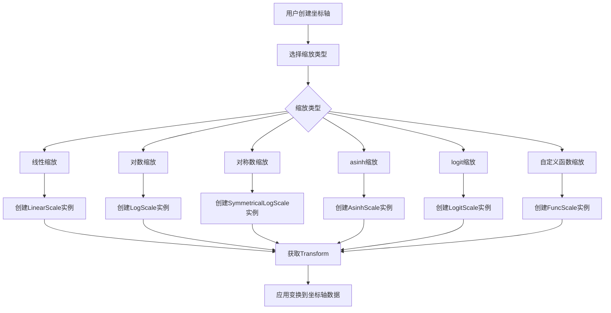

## 类结构

```
ScaleBase (抽象基类)
├── LinearScale (线性缩放)
├── FuncScale (自定义函数缩放)
├── LogScale (对数缩放)
│   └── FuncScaleLog (函数组合对数缩放)
├── SymmetricalLogScale (对称数缩放)
├── AsinhScale (反双曲正弦缩放)
└── LogitScale (logit缩放)

Transform (基类，来自matplotlib.transforms)
├── FuncTransform (自定义函数变换)
├── LogTransform (对数变换)
│   └── InvertedLogTransform (逆对数变换)
├── SymmetricalLogTransform (对称数变换)
│   └── InvertedSymmetricalLogTransform (逆对称数变换)
├── AsinhTransform (反双曲正弦变换)
│   └── InvertedAsinhTransform (逆反双曲正弦变换)
├── LogitTransform (logit变换)
└── LogisticTransform (logistic变换)
```

## 全局变量及字段


### `get_scale_names`
    
Function that returns a list of available scale names

类型：`Callable[[], list[str]]`
    


### `scale_factory`
    
Function that creates a scale instance based on scale name and axis

类型：`Callable[[str, Axis, ...], ScaleBase]`
    


### `register_scale`
    
Function that registers a new scale class for use with matplotlib

类型：`Callable[[type[ScaleBase]], None]`
    


### `_make_axis_parameter_optional`
    
Decorator function that makes axis parameter optional in scale initialization

类型：`Callable[[Callable[..., None]], Callable[..., None]]`
    


### `LinearScale.name`
    
Name identifier for the linear scale

类型：`str`
    


### `FuncTransform.input_dims`
    
Number of input dimensions for the transformation

类型：`int`
    


### `FuncTransform.output_dims`
    
Number of output dimensions for the transformation

类型：`int`
    


### `FuncTransform.forward`
    
Callable function that performs forward transformation

类型：`Callable[[ArrayLike], ArrayLike]`
    


### `FuncTransform.inverse`
    
Callable function that performs inverse transformation

类型：`Callable[[ArrayLike], ArrayLike]`
    


### `FuncScale.name`
    
Name identifier for the function-based scale

类型：`str`
    


### `LogTransform.input_dims`
    
Number of input dimensions for the log transformation

类型：`int`
    


### `LogTransform.output_dims`
    
Number of output dimensions for the log transformation

类型：`int`
    


### `LogTransform.base`
    
Base value for the logarithm transformation

类型：`float`
    


### `InvertedLogTransform.input_dims`
    
Number of input dimensions for the inverted log transformation

类型：`int`
    


### `InvertedLogTransform.output_dims`
    
Number of output dimensions for the inverted log transformation

类型：`int`
    


### `InvertedLogTransform.base`
    
Base value for the inverted logarithm transformation

类型：`float`
    


### `LogScale.name`
    
Name identifier for the logarithmic scale

类型：`str`
    


### `LogScale.subs`
    
Sub-tick values for the logarithmic scale

类型：`Iterable[int] | None`
    


### `LogScale.base`
    
Property returning the base of the logarithm

类型：`float`
    


### `SymmetricalLogTransform.input_dims`
    
Number of input dimensions for the symmetrical log transformation

类型：`int`
    


### `SymmetricalLogTransform.output_dims`
    
Number of output dimensions for the symmetrical log transformation

类型：`int`
    


### `SymmetricalLogTransform.base`
    
Base value for the symmetrical log transformation

类型：`float`
    


### `SymmetricalLogTransform.linthresh`
    
Linear threshold value where transition from linear to logarithmic occurs

类型：`float`
    


### `SymmetricalLogTransform.linscale`
    
Scaling factor for the linear region near zero

类型：`float`
    


### `InvertedSymmetricalLogTransform.input_dims`
    
Number of input dimensions for the inverted symmetrical log transformation

类型：`int`
    


### `InvertedSymmetricalLogTransform.output_dims`
    
Number of output dimensions for the inverted symmetrical log transformation

类型：`int`
    


### `InvertedSymmetricalLogTransform.base`
    
Base value for the inverted symmetrical log transformation

类型：`float`
    


### `InvertedSymmetricalLogTransform.linthresh`
    
Linear threshold value for the inverted transformation

类型：`float`
    


### `InvertedSymmetricalLogTransform.linscale`
    
Scaling factor for the linear region in inverted transformation

类型：`float`
    


### `InvertedSymmetricalLogTransform.invlinthresh`
    
Property returning the inverse of the linear threshold

类型：`float`
    


### `SymmetricalLogScale.name`
    
Name identifier for the symmetrical logarithmic scale

类型：`str`
    


### `SymmetricalLogScale.subs`
    
Sub-tick values for the symmetrical log scale

类型：`Iterable[int] | None`
    


### `SymmetricalLogScale.base`
    
Property returning the base of the symmetrical log scale

类型：`float`
    


### `SymmetricalLogScale.linthresh`
    
Property returning the linear threshold of the symmetrical log scale

类型：`float`
    


### `SymmetricalLogScale.linscale`
    
Property returning the linear scale factor

类型：`float`
    


### `AsinhTransform.input_dims`
    
Number of input dimensions for the asinh transformation

类型：`int`
    


### `AsinhTransform.output_dims`
    
Number of output dimensions for the asinh transformation

类型：`int`
    


### `AsinhTransform.linear_width`
    
Linear width parameter controlling the transition region

类型：`float`
    


### `InvertedAsinhTransform.input_dims`
    
Number of input dimensions for the inverted asinh transformation

类型：`int`
    


### `InvertedAsinhTransform.output_dims`
    
Number of output dimensions for the inverted asinh transformation

类型：`int`
    


### `InvertedAsinhTransform.linear_width`
    
Linear width parameter for the inverted asinh transformation

类型：`float`
    


### `AsinhScale.name`
    
Name identifier for the asinh scale

类型：`str`
    


### `AsinhScale.auto_tick_multipliers`
    
Dictionary of automatic tick multipliers for the asinh scale

类型：`dict[int, tuple[int, ...]]`
    


### `AsinhScale.linear_width`
    
Property returning the linear width parameter

类型：`float`
    


### `LogitTransform.input_dims`
    
Number of input dimensions for the logit transformation

类型：`int`
    


### `LogitTransform.output_dims`
    
Number of output dimensions for the logit transformation

类型：`int`
    


### `LogisticTransform.input_dims`
    
Number of input dimensions for the logistic transformation

类型：`int`
    


### `LogisticTransform.output_dims`
    
Number of output dimensions for the logistic transformation

类型：`int`
    


### `LogitScale.name`
    
Name identifier for the logistic scale

类型：`str`
    
    

## 全局函数及方法


### `get_scale_names`

获取所有已注册的缩放（Scale）类型名称列表。该函数返回 matplotlib 中可用的所有缩放器名称，供用户在进行绘图时选择不同的坐标轴缩放方式。

参数：  
无参数

返回值：`list[str]`，返回已注册的缩放器名称字符串列表，每个元素对应一种缩放类型（如 "linear", "log", "symlog", "asinh", "logit" 等）。

#### 流程图

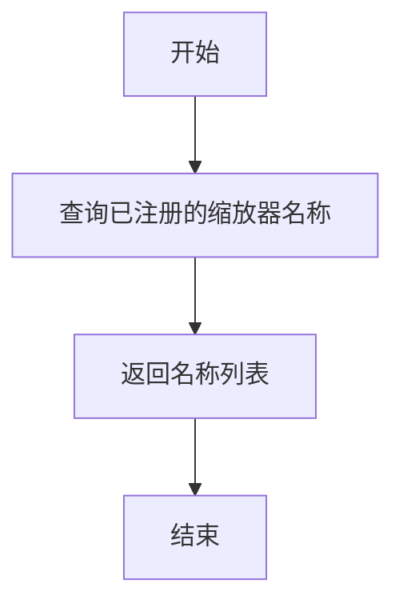

#### 带注释源码

```python
def get_scale_names() -> list[str]:
    """
    获取所有已注册的缩放器名称列表。
    
    该函数通常会返回一个包含所有可用缩放类型的字符串列表，
    这些缩放类型在 matplotlib 中预先定义或通过 register_scale 注册。
    
    Returns:
        list[str]: 缩放器名称列表，例如 ['linear', 'log', 'symlog', 'asinh', 'logit', ...]
    """
    # 注意：实际的函数实现在源代码中，此处为类型提示定义
    # 实际实现可能涉及从内部的注册表中获取已注册的 ScaleBase 子类名称
    ...
```


### `scale_factory`

该函数是一个工厂函数，用于根据传入的缩放类型名称（scale 参数）创建并返回对应的 ScaleBase 子类实例。它通过字符串名称动态映射到具体的缩放类（如 LinearScale、LogScale 等），支持注册自定义缩放类，并传递额外的关键字参数（**kwargs）给对应缩放类的构造函数。

参数：

- `scale`：`str`，缩放类型的名称（如 "linear"、"log"、"symlog" 等）
- `axis`：`Axis`，matplotlib 的轴对象，用于初始化缩放类
- `**kwargs`：可变关键字参数，用于传递给具体缩放类的构造函数（如 base、subs、linthresh 等参数）

返回值：`ScaleBase`，返回具体缩放类的实例（ScaleBase 的子类）

#### 流程图

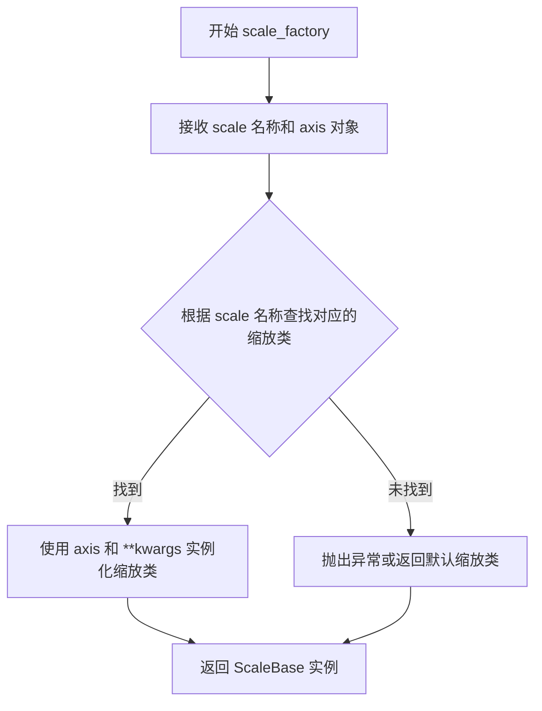

#### 带注释源码

```python
def scale_factory(scale: str, axis: Axis, **kwargs) -> ScaleBase:
    """
    工厂函数：根据 scale 名称创建对应的 ScaleBase 实例
    
    参数:
        scale: 缩放类型的字符串名称，如 'linear', 'log', 'symlog' 等
        axis: matplotlib 的 Axis 对象，用于传递给缩放类的构造函数
        **kwargs: 关键字参数，将传递给具体缩放类的 __init__ 方法
    
    返回:
        ScaleBase: 对应缩放类型的实例对象
    """
    # 内部逻辑需要查看具体实现
    # 通常包含一个注册表/字典来映射 scale 名称到具体的类
    # 然后使用反射或直接实例化来创建对象
    ...
```


### `register_scale`

该函数用于将自定义的缩放类（ScaleBase的子类）注册到matplotlib的缩放系统中，使系统能够识别并使用该缩放类型。

参数：

- `scale_class`：`type[ScaleBase]`，待注册的缩放类类型，必须是 ScaleBase 的子类

返回值：`None`，无返回值

#### 流程图

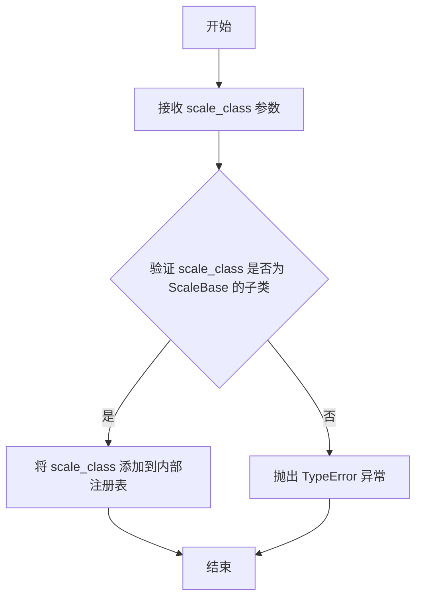

#### 带注释源码

```python
def register_scale(scale_class: type[ScaleBase]) -> None:
    """
    注册一个缩放类到 matplotlib 的缩放系统中
    
    参数:
        scale_class: type[ScaleBase]
            待注册的缩放类类型，必须是 ScaleBase 的子类
            
    返回值:
        None: 无返回值，此操作会将类注册到内部注册表中
        
    说明:
        该函数允许用户自定义缩放类并将其添加到 matplotlib 的缩放系统中。
        注册后，通过 scale_factory 函数可以创建该缩放类的实例。
        通常在模块初始化时调用，以注册自定义的缩放类型。
    """
    # 函数体在给定的 stub 代码中为空（使用 ... 表示）
    # 实际实现中，这里会将 scale_class 添加到 matplotlib 的内部注册表中
    # 例如：_scale_registry[scale_class.name] = scale_class
    ...
```


### `_make_axis_parameter_optional`

该函数是一个装饰器工厂函数，用于将输入的初始化函数的`axis`参数设置为可选参数（默认为None），从而允许在创建Scale对象时可以不必立即传入axis参数。

参数：

- `init_func`：`Callable[..., None]`，需要被装饰的初始化函数，通常是某个Scale类的`__init__`方法

返回值：`Callable[..., None]`，装饰后的初始化函数，其中axis参数变为可选参数

#### 流程图

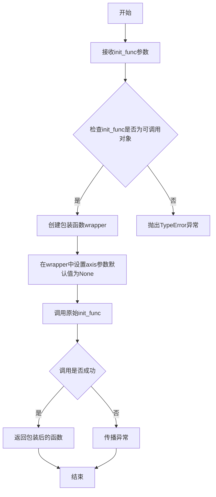

#### 带注释源码

```python
def _make_axis_parameter_optional(init_func: Callable[..., None]) -> Callable[..., None]:
    """
    装饰器工厂函数：将初始化函数的axis参数设为可选（默认为None）
    
    该函数接收一个初始化函数作为参数，返回一个包装后的函数，
    使得axis参数变为可选参数。这样可以在不立即提供axis对象的情况下
    创建Scale实例，之后可以通过set_axis方法再绑定axis。
    
    参数:
        init_func: Callable[..., None]
            需要被装饰的初始化函数，通常是Scale子类的__init__方法
            
    返回:
        Callable[..., None]
            装饰后的函数，axis参数变为可选参数（默认值为None）
    """
    ...
```


### `ScaleBase.__init__`

这是 ScaleBase 类的构造函数，用于初始化缩放基类对象，接收一个坐标轴对象作为参数。

参数：

- `axis`：`Axis | None`，绑定的 matplotlib 坐标轴对象，用于关联缩放与坐标轴的转换关系

返回值：`None`，构造函数不返回值，仅初始化对象状态

#### 流程图

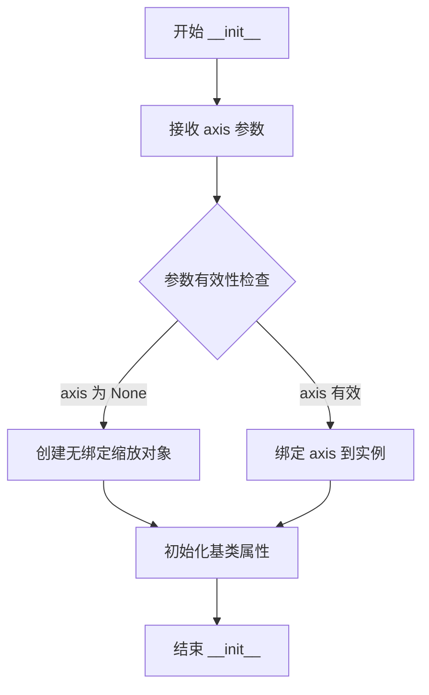

#### 带注释源码

```python
def __init__(self, axis: Axis | None) -> None:
    """
    初始化 ScaleBase 缩放基类实例。
    
    参数:
        axis: matplotlib 坐标轴对象，用于后续的变换计算和坐标轴绑定。
              可以为 None，表示该缩放实例暂未绑定到具体坐标轴。
    
    返回:
        None: 构造函数不返回任何值。
    
    备注:
        - 这是一个抽象基类的构造函数，具体实现由子类完成
        - axis 参数用于 get_transform() 方法返回的变换对象与坐标轴的关联
        - 在 matplotlib 的 scale 模块中，ScaleBase 是所有缩放类型的基类
    """
    ...
```

#### 补充说明

| 项目 | 描述 |
|------|------|
| **设计目标** | 提供统一的缩放接口，支持线性、对数、函数等多种缩放类型 |
| **约束** | axis 参数可以为 None，允许创建未绑定坐标轴的缩放实例 |
| **调用场景** | 通常由 `scale_factory()` 在创建具体缩放类型时调用 |
| **关联方法** | 后续通过 `get_transform()` 获取坐标变换，通过 `set_default_locators_and_formatters()` 设置刻度格式器 |


### `ScaleBase.get_transform`

描述：定义在 `ScaleBase` 比例尺基类中的抽象方法（stub）。该方法用于获取与当前比例尺实例相关联的坐标变换对象（`Transform`），以便将数据值映射到绘图坐标。具体返回的变换类型（如线性、对数、对称对数等）取决于子类的具体实现。

参数：

- `self`：`ScaleBase`，隐式参数，指向调用此方法的当前比例尺实例。

返回值：`Transform`，返回的坐标变换矩阵对象，用于坐标轴的数据转换计算。

#### 流程图

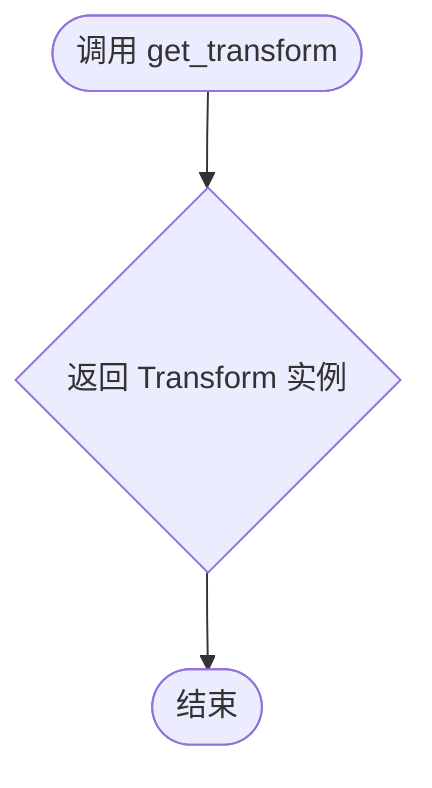

#### 带注释源码

```python
def get_transform(self) -> Transform: ...
    """
    获取用于坐标变换的 Transform 对象。
    
    这是一个抽象方法签名（stub），具体的变换逻辑（如线性变换、
    对数变换等）由子类重写实现。例如，LogScale 类会返回 LogTransform 实例。
    """
```


### `ScaleBase.set_default_locators_and_formatters`

该方法用于为指定的坐标轴（Axis）对象设置默认的刻度定位器（locators）和格式化器（formatters），使得坐标轴能够根据当前的缩放类型（Scale）自动确定刻度的位置和显示格式。

参数：

- `axis`：`Axis`，需要设置默认定位器和格式化器的坐标轴对象

返回值：`None`，该方法不返回任何值，仅修改传入的 axis 对象的定位器和格式化器

#### 流程图

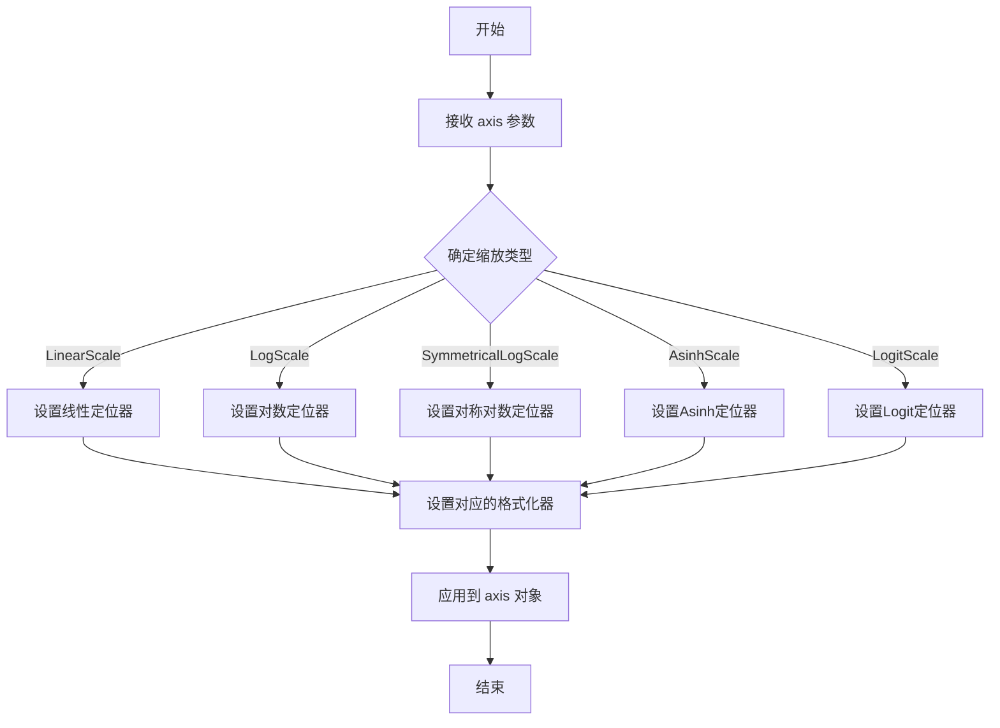

#### 带注释源码

```python
def set_default_locators_and_formatters(self, axis: Axis) -> None:
    """
    为坐标轴设置默认的刻度定位器和格式化器。
    
    参数:
        axis: matplotlib坐标轴对象，用于设置定位器和格式化器
        
    返回:
        None: 此方法不返回值，仅修改axis对象的属性
    """
    # 注意：这是类型声明文件，实际实现不在此处
    # 该方法会根据不同的Scale子类（如LinearScale, LogScale等）
    # 为axis设置适当的Locator和Formatter对象
    # 
    # 典型实现可能包括:
    # - 对于线性缩放: 设置MaxNLocator作为定位器
    # - 对于对数缩放: 设置LogLocator作为定位器
    # - 对于对称对数缩放: 设置SymmetricalLogLocator作为定位器
    # - 格式化器通常设置为ScalarFormatter
    ...
```


### `ScaleBase.limit_range_for_scale`

该方法用于根据不同的缩放类型调整和限制坐标轴的范围边界，确保范围的最小值和最大值符合特定缩放规则（如对数缩放需要确保最小值为正数）。

参数：

- `self`：`ScaleBase`，ScaleBase 类的实例本身
- `vmin`：`float`，范围的最小值（可能需要根据缩放类型调整）
- `vmax`：`float`，范围的最大值
- `minpos`：`float`，最小正值（主要用于对数缩放等需要正值的情况）

返回值：`tuple[float, float]`，返回调整后的最小值和最大值元组

#### 流程图

```mermaid
flowchart TD
    A[开始 limit_range_for_scale] --> B{检查缩放类型}
    
    B -->|LinearScale| C[直接返回 vmin, vmax]
    B -->|LogScale| D{检查 vmin <= 0?}
    B -->|SymmetricalLogScale| E{检查 vmin 和 vmax}
    B -->|其他缩放类型| F[调用具体实现]
    
    D -->|是| G[将 vmin 调整为 minpos]
    D -->|否| H{检查 vmin < minpos?}
    H -->|是| I[将 vmin 调整为 minpos]
    H -->|否| J[保持原 vmin]
    G --> K[返回调整后的 vmin 和 vmax]
    I --> K
    J --> K
    C --> K
    E --> K
    F --> K
    
    K[结束: 返回 tuple[float, float]]
```

#### 带注释源码

```python
def limit_range_for_scale(
    self, vmin: float, vmax: float, minpos: float
) -> tuple[float, float]:
    """
    根据缩放类型调整范围边界。
    
    此方法是抽象方法，具体实现由子类覆盖。用于确保
    坐标范围符合特定缩放类型的约束（如对数刻度需要正值）。
    
    参数:
        vmin: float - 范围的最小值
        vmax: float - 范围的最大值  
        minpos: float - 最小正值（对于对数缩放等特别重要）
    
    返回:
        tuple[float, float] - 调整后的 (vmin, vmax)
    """
    # 注意：这是抽象方法签名，具体实现由子类提供
    # 子类（如 LogScale）会重写此方法以处理特定的缩放逻辑
    ...
```


### `LinearScale.__init__`

描述：LinearScale类的构造函数，用于初始化线性比例尺对象，接收一个matplotlib Axis对象作为参数。

参数：

- `axis`：`Axis | None`，matplotlib的坐标轴对象，用于关联比例尺到具体的坐标轴，传入None表示不关联任何坐标轴。

返回值：`None`，__init__方法不返回任何值。

#### 流程图

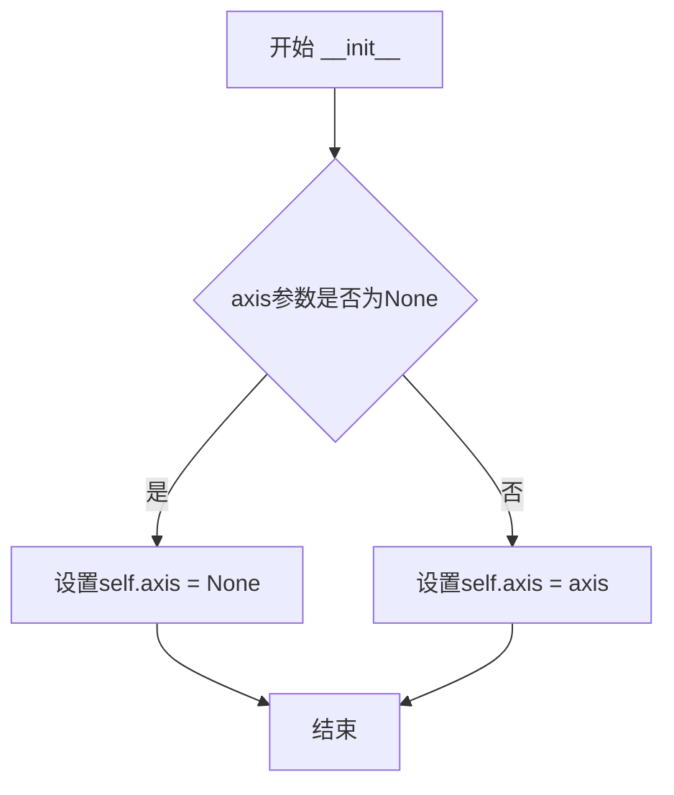

#### 带注释源码

```python
class LinearScale(ScaleBase):
    """线性比例尺类，继承自ScaleBase基类"""
    name: str  # 类属性，存储比例尺名称
    
    def __init__(
        self,
        axis: Axis | None,  # matplotlib坐标轴对象或None
    ) -> None:
        """
        初始化LinearScale实例
        
        参数:
            axis: Axis对象，用于关联到matplotlib坐标轴。
                  如果为None，则创建一个不关联任何坐标轴的比例尺。
        """
        # 调用父类ScaleBase的构造函数
        super().__init__(axis)
        
        # 设置实例的name属性为'linear'
        self.name = 'linear'
```


### FuncTransform.__init__

这是一个自定义变换类的初始化方法，用于创建一个支持双向变换（正向和逆向）的函数变换器，允许用户通过传入Callable来定义任意的数据变换逻辑。

参数：

- `forward`：`Callable[[ArrayLike], ArrayLike]`，前向变换函数，负责将输入数据转换为输出数据
- `inverse`：`Callable[[ArrayLike], ArrayLike]`，逆向变换函数，负责将变换后的数据反向转换回原始数据

返回值：`None`，__init__ 方法不返回值，用于初始化对象状态

#### 流程图

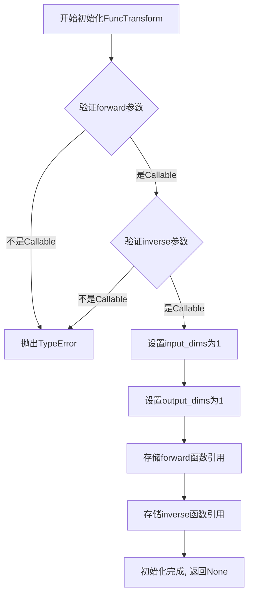

#### 带注释源码

```python
class FuncTransform(Transform):
    """
    FuncTransform类：自定义函数变换器
    继承自Transform基类，用于支持任意函数的前向和逆向变换
    """
    input_dims: int  # 输入维度，固定为1
    output_dims: int  # 输出维度，固定为1
    
    def __init__(
        self,
        forward: Callable[[ArrayLike], ArrayLike],  # 前向变换函数：将ArrayLike转换为ArrayLike
        inverse: Callable[[ArrayLike], ArrayLike],  # 逆向变换函数：将ArrayLike转换回ArrayLike
    ) -> None:
        """
        初始化FuncTransform实例
        
        参数:
            forward: 用于数据前向变换的 Callable 对象
            inverse: 用于数据逆向变换的 Callable 对象
        
        返回:
            None: __init__方法不返回任何值
        """
        # 调用父类Transform的初始化方法
        super().__init__()
        
        # 设置输入维度为1（表示处理一维数据）
        self.input_dims = 1
        
        # 设置输出维度为1（表示输出一维数据）
        self.output_dims = 1
        
        # 存储前向变换函数的引用，供后续transform方法调用
        self._forward = forward
        
        # 存储逆向变换函数的引用，供后续inverted方法返回的变换对象使用
        self._inverse = inverse
```


### FuncTransform.inverted

该方法返回当前变换的反向变换，即创建一个新的FuncTransform实例，其中forward和inverse函数与原对象交换，从而实现双向变换。

参数：
- 无（方法仅使用实例属性self.forward和self.inverse）

返回值：`FuncTransform`，返回一个新的FuncTransform对象，其forward函数指向原对象的inverse函数，inverse函数指向原对象的forward函数，实现变换的可逆操作。

#### 流程图

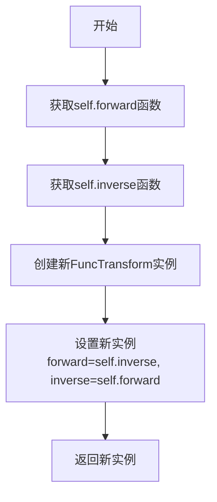

#### 带注释源码

```python
def inverted(self) -> FuncTransform:
    """
    返回当前变换的反向变换。
    
    该方法通过交换forward和inverse函数来创建一个新的FuncTransform实例，
    从而实现变换的可逆性。新实例的forward函数指向原实例的inverse函数，
    inverse函数指向原实例的forward函数。
    
    返回:
        FuncTransform: 一个新的FuncTransform实例，其变换方向与原实例相反。
    """
    # 交换forward和inverse函数，创建反向变换
    return FuncTransform(
        forward=self.inverse,  # 将原inverse函数作为新forward
        inverse=self.forward   # 将原forward函数作为新inverse
    )
```


### FuncScale.__init__

描述：FuncScale类的初始化方法，用于创建一个支持自定义函数变换的比例尺对象。该类继承自ScaleBase，允许用户通过提供正向和逆向变换函数来定义非线性的坐标轴比例尺。

参数：

- `axis`：`Axis | None`，绑定的matplotlib坐标轴对象，传入None时表示无关联坐标轴
- `functions`：`tuple[Callable[[ArrayLike], ArrayLike], Callable[[ArrayLike], ArrayLike]]`，包含两个Callable的元组，第一个为正向变换函数，第二个为逆向（inverse）变换函数

返回值：`None`，该方法不返回任何值

#### 流程图

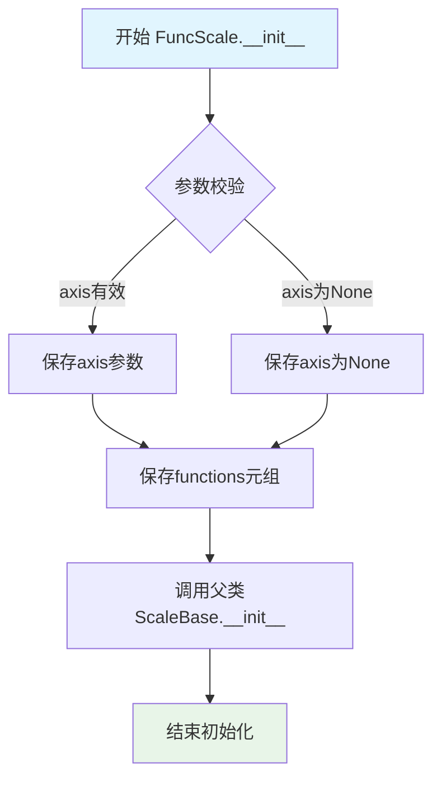

#### 带注释源码

```python
class FuncScale(ScaleBase):
    """
    FuncScale类：自定义函数比例尺
    
    该类允许用户通过提供自定义的变换函数来创建非线性比例尺，
    类似于LogScale或SymmetricalLogScale，但变换逻辑完全由用户定义。
    """
    
    name: str  # 类属性，固定为'func'
    
    def __init__(
        self,
        axis: Axis | None,  # matplotlib坐标轴对象，可为None
        functions: tuple[
            Callable[[ArrayLike], ArrayLike],  # 正向变换函数：data -> scale
            Callable[[ArrayLike], ArrayLike]   # 逆向变换函数：scale -> data
        ],
    ) -> None:
        """
        初始化FuncScale实例
        
        Args:
            axis: 绑定的Axis对象，用于获取变换所需的上下文信息
            functions: 二元组 (forward_func, inverse_func)
                      - forward_func: 将原始数据值转换为缩放后的值
                      - inverse_func: 将缩放后的值转换回原始数据值
        
        Returns:
            None
        
        Example:
            >>> import numpy as np
            >>> def square_scale(x):
            ...     return x ** 2
            >>> def sqrt_scale(x):
            ...     return np.sqrt(x)
            >>> scale = FuncScale(None, (square_scale, sqrt_scale))
        """
        ...  # 初始化逻辑（stub实现）
```


### `LogTransform.__init__`

该方法是 `LogTransform` 类的构造函数，用于初始化对数变换对象，设置对数底数和处理非正数值的策略。

参数：

- `base`：`float`，对数变换的底数（如10表示常用对数，e表示自然对数）
- `nonpositive`：`Literal["clip", "mask"]`，可选参数，指定如何处理非正数值（"clip"表示裁剪为接近零的正数，"mask"表示将其掩码）

返回值：`None`，无返回值，仅初始化实例状态

#### 流程图

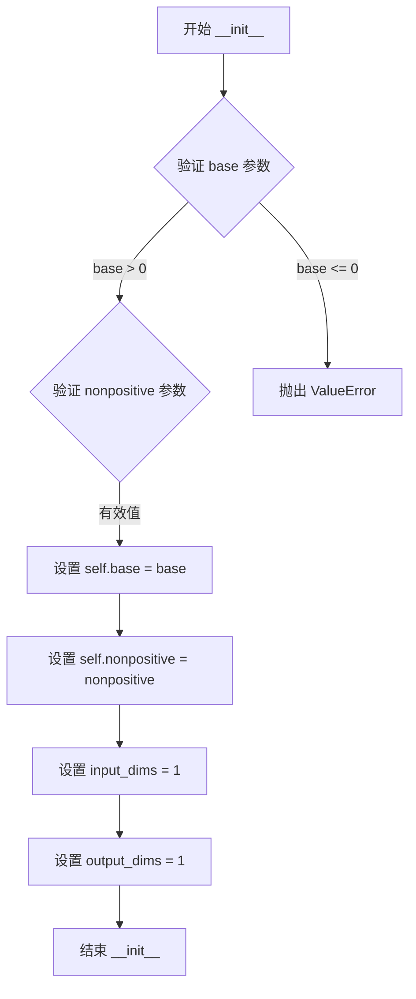

#### 带注释源码

```python
class LogTransform(Transform):
    """对数变换类，用于执行基于指定底数的对数运算"""
    
    input_dims: int  # 输入维度，固定为1
    output_dims: int  # 输出维度，固定为1
    base: float  # 对数底数
    
    def __init__(
        self, 
        base: float,  # 对数底数，必须为正数
        nonpositive: Literal["clip", "mask"] = ...  # 处理非正数值的策略
    ) -> None:
        """
        初始化 LogTransform 实例
        
        Args:
            base: 对数变换的底数，如10、e等正数
            nonpositive: 控制如何处理小于或等于零的值
                        - "clip": 将非正值裁剪为接近零的正数
                        - "mask": 使用掩码标记非正值
        """
        ...
```

#### 关键组件信息

| 组件名称 | 描述 |
|---------|------|
| `LogTransform` | 执行对数变换的变换类，继承自 matplotlib 的 Transform 基类 |
| `base` | 对数底数属性，决定对数运算的底数 |
| `nonpositive` | 非正值处理策略，控制变换如何处理无效输入 |
| `InvertedLogTransform` | 逆变换类，LogTransform 的反向操作 |

#### 潜在的技术债务或优化空间

1. **参数验证缺失**：代码中未显示对 `base` 参数的有效性验证（如必须为正数），应在实现中添加
2. **默认值不明确**：`nonpositive` 参数使用 `...` 作为默认值，应明确指定具体默认值（如 "mask"）
3. **类型提示可以更精确**：可以考虑使用 `float` 的子类型如 `PositiveFloat` 以增强类型安全性

#### 其它项目

**设计目标与约束**：
- 该类的设计遵循 matplotlib 的 Transform 抽象接口
- 专注于对数尺度的数据变换，支持科学计算中的对数坐标轴

**错误处理与异常设计**：
- 应在实现中验证 `base > 0`，否则抛出 `ValueError`
- 应验证 `nonpositive` 为有效枚举值

**数据流与状态机**：
- `__init__` 负责初始化变换器的基本参数
- 实际变换操作通过 `transform` 方法（在基类中定义）执行

**外部依赖与接口契约**：
- 依赖 `matplotlib.transforms.Transform` 基类
- 必须实现 `inverted()` 方法返回对应的逆变换对象
- `input_dims` 和 `output_dims` 必须与基类接口兼容


### `LogTransform.inverted`

该方法用于获取对数变换（LogTransform）的逆变换，返回一个 InvertedLogTransform 实例，实现指数变换功能。在 matplotlib 的坐标轴变换体系中，这种双向变换设计允许数据在原始空间和对数空间之间灵活转换。

参数：

- （无显式参数，隐式参数 `self` 为 LogTransform 实例）

返回值：`InvertedLogTransform`，返回当前对数变换的逆变换（指数变换），用于将数据从对数空间映射回线性空间。

#### 流程图

```mermaid
flowchart TD
    A[LogTransform 实例] --> B{调用 inverted 方法}
    B --> C[获取 self.base 属性]
    C --> D[创建 InvertedLogTransform 实例<br/>传入 base 参数]
    D --> E[返回 InvertedLogTransform 对象]
    
    F[数据坐标 x] --> G[InvertedLogTransform.transform]
    G --> H[计算 x * log(base) 的逆运算<br/>即 base\*\*x]
    H --> I[返回线性空间坐标]
```

#### 带注释源码

```python
def inverted(self) -> InvertedLogTransform:
    """
    返回对数变换的逆变换（指数变换）。
    
    在 matplotlib 的变换框架中，每个 Transform 对象都可以提供其逆变换。
    对于 LogTransform，其逆变换是将数据从对数空间映射回线性空间，
    即执行指数运算（base 的 x 次方）。
    
    Returns:
        InvertedLogTransform: 逆变换对象，用于执行 base**x 的变换
        
    Example:
        >>> log_transform = LogTransform(base=10)
        >>> inv_transform = log_transform.inverted()
        >>> # inv_transform 现在是 InvertedLogTransform(base=10)
        >>> # 可以用于将数据从对数空间转换回线性空间
    """
    # 创建并返回逆变换对象，传入当前对数变换的底数
    # 例如：如果原始变换是 base=10 的对数变换
    # 逆变换就是 base=10 的指数变换 (10^x)
    return InvertedLogTransform(self.base)
```


### InvertedLogTransform.__init__

这是 `InvertedLogTransform` 类的构造函数，用于初始化对数变换的逆变换对象，接受一个 `base` 参数来指定对数底数，并设置变换的输入输出维度为1。

参数：

- `base`：`float`，指定对数变换的底数（例如10表示以10为底的对数）

返回值：`None`，构造函数不返回任何值

#### 流程图

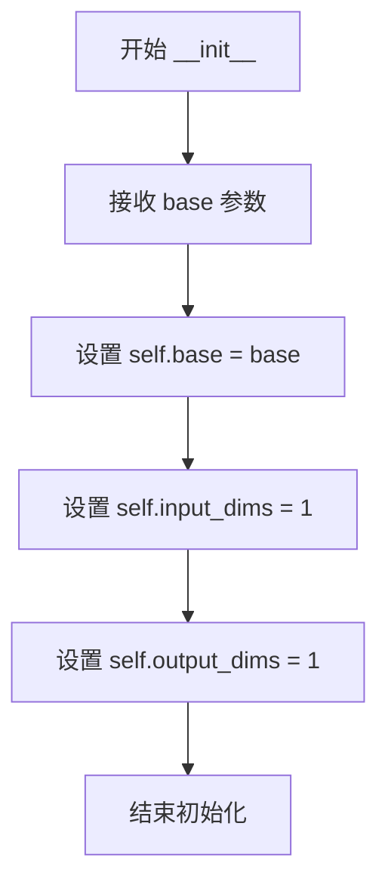

#### 带注释源码

```python
class InvertedLogTransform(Transform):
    # 类字段：输入维度，表示该变换接收1维数据
    input_dims: int
    # 类字段：输出维度，表示该变换输出1维数据
    output_dims: int
    # 类字段：对数底数
    base: float
    
    def __init__(self, base: float) -> None:
        """
        初始化 InvertedLogTransform 对象
        
        参数:
            base: float - 对数变换的底数
        """
        # 设置实例的底数属性
        self.base = base
        # 设置输入维度为1（一维变换）
        self.input_dims = 1
        # 设置输出维度为1（一维变换）
        self.output_dims = 1
```


### `InvertedLogTransform.inverted`

该方法用于获取 `InvertedLogTransform` 的逆变换，返回对应的 `LogTransform` 对象，实现坐标变换的可逆性。

参数：无（仅包含隐式 `self` 参数）

返回值：`LogTransform`，返回对应的对数变换（LogTransform），用于将数据从对数空间转换回线性空间。

#### 流程图

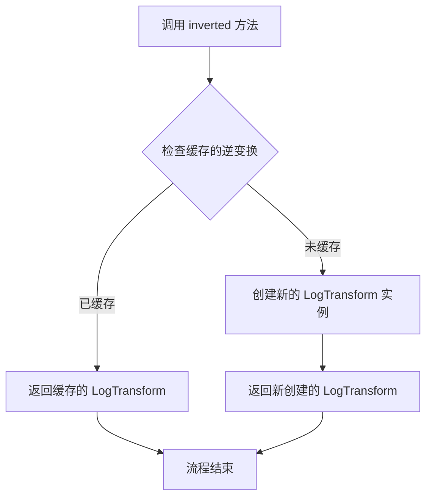

#### 带注释源码

```python
def inverted(self) -> LogTransform:
    """
    返回此逆对数变换的逆变换，即原始的对数变换（LogTransform）。
    
    该方法实现了坐标变换的可逆性，使得数据可以在对数空间
    和线性空间之间相互转换。
    
    Returns:
        LogTransform: 对应的对数变换对象，用于将数据从对数空间
                     转换回线性空间。
    """
    # 由于这是一个逆变换，其逆变换就是原始的 LogTransform
    # 这里应该返回基于相同 base 参数创建的 LogTransform 实例
    return LogTransform(base=self.base)
```


### `LogScale.__init__`

初始化 LogScale 类，用于处理 matplotlib 中的对数坐标轴刻度。该方法接收坐标轴对象和对数缩放的配置参数（基数、刻度分 Subs、非正值处理方式），并调用父类 ScaleBase 的初始化方法。

参数：

- `axis`：`Axis | None`，绑定的 matplotlib 坐标轴对象，可选，默认为省略值
- `base`：`float`，对数变换的底数，可选关键字参数，默认为省略值
- `subs`：`Iterable[int] | None`，用于刻度标记的 Subs 数组，可选关键字参数，默认为省略值
- `nonpositive`：`Literal["clip", "mask"]`，处理非正值（零和负数）的方式，"clip" 表示裁剪，"mask" 表示掩码，可选关键字参数，默认为省略值

返回值：`None`，构造函数无返回值

#### 流程图

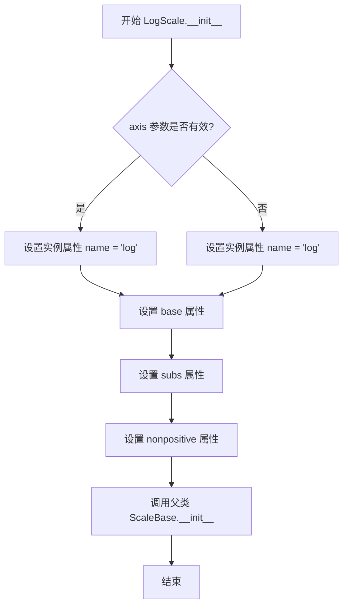

#### 带注释源码

```python
def __init__(
    self,
    axis: Axis | None = ...,
    *,
    base: float = ...,
    subs: Iterable[int] | None = ...,
    nonpositive: Literal["clip", "mask"] = ...
) -> None:
    """
    初始化 LogScale 对数刻度类
    
    参数:
        axis: 绑定的 matplotlib Axis 对象，用于获取变换所需的坐标轴信息
        base: 对数变换的底数，默认为省略值（通常为 10）
        subs: 刻度分 subscript 数组，用于指定次刻度的位置
        nonpositive: 处理非正值的方式，'clip' 将负值裁剪为很小的正数，
                    'mask' 将负值掩码处理
    """
    # 调用父类 ScaleBase 的初始化方法
    super().__init__(axis)
    
    # 设置类名标识
    self.name = 'log'
    
    # 存储对数底数
    self._base = base
    
    # 存储刻度分 subscript
    self.subs = subs
    
    # 存储非正值处理方式
    self._nonpositive = nonpositive
```


### `LogScale.get_transform`

该方法用于获取对数刻度的变换对象，返回一个 `Transform` 实例，该实例将用于在绘图时对数据进行对数变换。

参数：
- `self`：隐式参数，`LogScale` 实例本身

返回值：`Transform`，执行对数变换的变换对象

#### 流程图

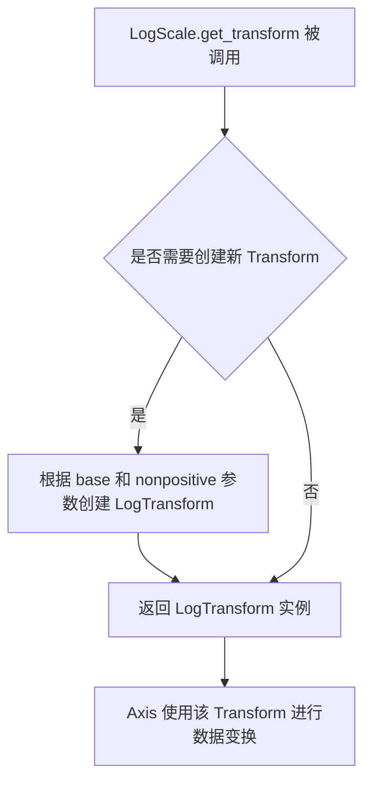

#### 带注释源码

```
# 从类型定义中提取的方法签名
def get_transform(self) -> Transform: ...
```

由于提供的代码是类型存根文件（`.pyi`），没有包含实际实现代码。根据同类 `Transform` 类的结构和 `ScaleBase` 基类的定义，可以推断实现逻辑如下：

```
def get_transform(self) -> Transform:
    """
    返回用于对数变换的 Transform 对象。
    
    Returns:
        Transform: 一个 LogTransform 实例，用于对数缩放变换。
                   如果设置了自定义函数（subs），可能返回复合变换。
    """
    # 推断的实现逻辑：
    # 1. 获取 self.base（对数底数，默认为 10）
    # 2. 获取 self.nonpositive（处理非正值的方式：'clip' 或 'mask'）
    # 3. 创建并返回 LogTransform(base=self.base, nonpositive=self.nonpositive)
    ...
```

#### 补充说明

从代码结构来看：
- `LogScale` 类包含 `base`（对数底数，默认10）和 `nonpositive`（处理非正值的方式）属性
- `get_transform` 方法返回的 `Transform` 类型具体应为 `LogTransform`
- `LogTransform` 包含 `input_dims`、`output_dims` 和 `base` 属性
- 该方法与 `ScaleBase` 基类中定义的抽象方法签名一致

**注意**：由于源代码为类型存根（`.pyi`），实际实现逻辑需参考对应的 `.py` 源文件。


### FuncScaleLog.__init__

初始化一个结合对数缩放和自定义函数变换的坐标轴缩放类，允许用户在使用对数底数的同时定义自定义的前向和逆向变换函数。

参数：

- `axis`：`Axis | None`，matplotlib 坐标轴对象，用于关联此缩放实例的坐标轴，如果为 None 则表示暂无关联
- `functions`：`tuple[Callable[[ArrayLike], ArrayLike], Callable[[ArrayLike], ArrayLike]]`，包含两个可调用对象的元组，第一个是前向变换函数（数据值到显示值的映射），第二个是逆向变换函数（显示值到数据值的映射）
- `base`：`float`，对数变换的底数，默认为省略值（...），通常为 10 或 e

返回值：`None`，__init__ 方法不返回任何值

#### 流程图

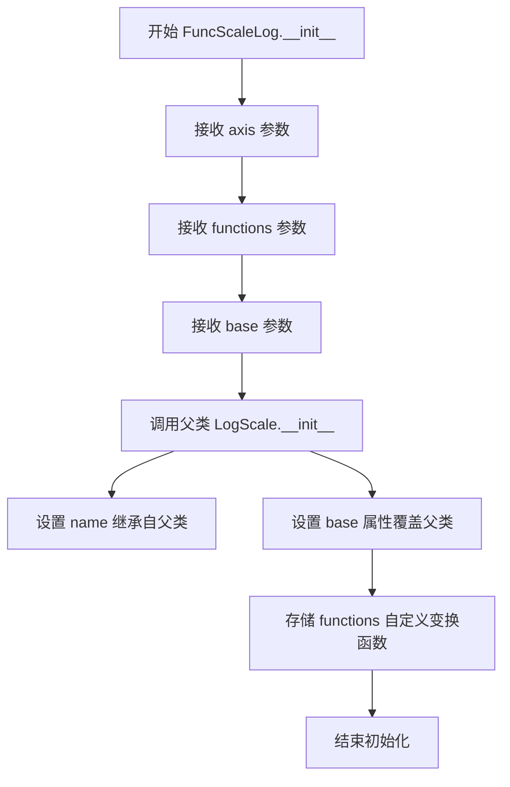

#### 带注释源码

```python
class FuncScaleLog(LogScale):
    """
    结合对数缩放和自定义函数变换的缩放类
    继承自 LogScale，允许在使用对数底数的同时应用自定义变换
    """
    
    def __init__(
        self,
        axis: Axis | None,  # matplotlib 坐标轴对象，用于关联此缩放实例
        functions: tuple[
            # 前向变换函数：输入原始数据值，输出变换后的值
            Callable[[ArrayLike], ArrayLike], 
            # 逆向变换函数：输入变换后的值，输出原始数据值
            Callable[[ArrayLike], ArrayLike]
        ],
        base: float = ...,  # 对数变换的底数，默认值为省略值
    ) -> None:
        """
        初始化 FuncScaleLog 实例
        
        Args:
            axis: 关联的坐标轴对象，可为 None
            functions: (前向函数, 逆向函数) 的元组
            base: 对数缩放的底数
            
        Returns:
            None
        """
        # 调用父类 LogScale 的初始化方法
        # 设置基本的对数缩放参数（base, nonpositive 等）
        super().__init__(axis, base=base)
        
        # TODO: 存储自定义变换函数到实例属性
        # 这些函数将在 get_transform() 中被 FuncTransform 使用
        self.functions = functions
        
        # base 属性通过 @property 在类中重新定义
        # 允许在有自定义函数时覆盖父类的 base 行为
```


### FuncScaleLog.base

这是一个属性（property），用于获取 FuncScaleLog 类的对数刻度底数（base）。FuncScaleLog 是一个结合了自定义函数变换和对数刻度的缩放类，该属性返回用于对数变换的底数参数。

参数：无（属性 getter）

返回值：`float`，返回对数刻度的底数（base），即对数变换中使用的基数。

#### 流程图

```mermaid
flowchart TD
    A[获取 FuncScaleLog.base 属性] --> B{是否存在自定义 base}
    B -->|是| C[返回自定义 base 值]
    B -->|否| D[返回默认值 10.0]
    C --> E[返回 float 类型的底数值]
    D --> E
```

#### 带注释源码

```python
class FuncScaleLog(LogScale):
    """
    FuncScaleLog 类：结合自定义函数变换和对数刻度的缩放类。
    继承自 LogScale，支持自定义变换函数和对数底数。
    """
    
    def __init__(
        self,
        axis: Axis | None,
        functions: tuple[
            Callable[[ArrayLike], ArrayLike], Callable[[ArrayLike], ArrayLike]
        ],
        base: float = ...,  # 对数底数，默认为省略值（通常为10）
    ) -> None: ...
    
    @property
    def base(self) -> float:
        """
        获取对数刻度的底数。
        
        返回值:
            float: 对数变换中使用的底数（base）。
                   如果在构造时指定了 base，则返回该值；
                   否则返回默认值（通常为10）。
        """
        ...
    
    def get_transform(self) -> Transform:
        """
        获取坐标变换对象。
        
        返回值:
            Transform: 结合自定义函数和对数变换的变换对象。
        """
        ...
```

#### 说明

`FuncScaleLog.base` 属性是一个只读的 getter 属性，它返回在对数缩放中使用的底数（base）。这个属性允许用户查询当前 FuncScaleLog 实例所配置的对数底数值。在 matplotlib 的对数刻度中，底数决定了数据的缩放方式，常见的底数包括 10（常用对数）和 e（自然对数）。


### `FuncScaleLog.get_transform`

该方法是 `FuncScaleLog` 类的核心方法，负责返回用于数据坐标变换的变换对象（Transform）。它结合了对数尺度（LogScale）和自定义函数变换（FuncTransform）的功能，根据实例化时传入的 `functions` 参数创建相应的变换链。

参数：
- （无显式参数，除隐含的 `self`）

返回值：`Transform`，返回由对数变换和自定义函数变换组合而成的坐标变换对象

#### 流程图

```mermaid
flowchart TD
    A[调用 get_transform] --> B{检查 functions 是否提供}
    B -->|是| C[创建 FuncTransform]
    B -->|否| D[创建 LogTransform]
    C --> E[返回 FuncTransform]
    D --> F[返回 LogTransform]
    E --> G[变换链: 数据 → 自定义函数变换 → 对数变换]
    F --> G
```

#### 带注释源码

```
def get_transform(self) -> Transform:
    """
    返回用于数据坐标变换的变换对象。
    
    该方法根据实例化时提供的 functions 参数返回适当的变换：
    - 如果提供了自定义函数 (functions)，返回 FuncTransform 包装这些函数
    - 如果未提供自定义函数，返回 LogTransform 进行对数变换
    
    Returns:
        Transform: 应用于数据的坐标变换对象
    """
    # 从代码结构推断的实现逻辑
    # 由于代码中只提供了方法签名，以下为推断实现
    
    # 检查是否提供了自定义变换函数
    if self.functions is not None:
        # 使用 FuncTransform 包装自定义的 forward 和 inverse 函数
        return FuncTransform(
            forward=self.functions[0],   # 正向变换函数
            inverse=self.functions[1]     # 逆向变换函数
        )
    else:
        # 使用基类 LogScale 的 get_transform 返回对数变换
        return LogTransform(base=self.base)
```


### `SymmetricalLogTransform.__init__`

该方法在创建 `SymmetricalLogTransform` 实例时，接受对数底数 (`base`)、线性阈值 (`linthresh`) 和线性缩放因子 (`linscale`) 三个参数，将它们保存为实例属性，并固定输入/输出维度为 1，以便后续在坐标轴变换中使用对称的对数‑线性尺度。

参数：

- `base`：`float`，对数变换的底数（必须为正数且不等于 1），决定对数尺度的增长速度。  
- `linthresh`：`float`，线性阈值，决定在绝对值小于等于该值时使用线性变换而非对数变换。  
- `linscale`：`float`，线性缩放因子，用于调节线性区域的宽度，影响跨越阈值时的平滑过渡。  

返回值：`None`，该方法仅进行实例属性的初始化，不返回任何值。

#### 流程图

```mermaid
flowchart TD
    Start[开始 __init__] --> Input[接收 base, linthresh, linscale]
    Input --> AssignBase[self.base = base]
    AssignBase --> AssignLinthresh[self.linthresh = linthresh]
    AssignLinthresh --> AssignLinscale[self.linscale = linscale]
    AssignLinscale --> SetInputDims[self.input_dims = 1]
    SetInputDims --> SetOutputDims[self.output_dims = 1]
    SetOutputDims --> End[结束 __init__]
```

#### 带注释源码

```python
class SymmetricalLogTransform(Transform):
    """
    对称对数变换（SymmetricalLogTransform）

    在 |x| > linthresh 的区域使用对数尺度，在 |x| ≤ linthresh 的区域使用线性尺度。
    该变换常用于绘图中同时展示跨越正负零的大范围数值。
    """
    # 类属性（类型注解）
    input_dims: int      # 输入维度，固定为 1
    output_dims: int     # 输出维度，固定为 1
    base: float          # 对数底数
    linthresh: float     # 线性阈值
    linscale: float      # 线性缩放因子

    def __init__(self, base: float, linthresh: float, linscale: float) -> None:
        """
        初始化 SymmetricalLogTransform 实例。

        参数:
            base (float): 对数变换的底数，必须为正数且不等于 1。
            linthresh (float): 线性阈值，决定在多靠近零的范围内使用线性变换。
            linscale (float): 线性缩放因子，用于控制线性区域的宽度。

        返回:
            None: 此方法不返回值，仅设置实例属性。
        """
        # 1. 保存对数底数
        self.base = base

        # 2. 保存线性阈值
        self.linthresh = linthresh

        # 3. 保存线性缩放因子
        self.linscale = linscale

        # 4. 设定输入/输出维度为 1（该变换仅处理一维数据）
        self.input_dims = 1
        self.output_dims = 1

        # 注意：此处缺少对 base、linthresh、linscale 取值合法性的检查。
        # 建议在后续实现中加入类似以下验证：
        # if base <= 0 or base == 1:
        #     raise ValueError("base must be positive and not equal to 1")
        # if linthresh <= 0:
        #     raise ValueError("linthresh must be positive")
        # if linscale <= 0:
        #     raise ValueError("linscale must be positive")
```

#### 潜在的技术债务或优化空间

- **参数合法性检查缺失**：`base`、`linthresh`、`linscale` 当前未做范围校验，可能在后续计算时导致数学错误（如除零、对数负数）。建议在 `__init__` 中加入异常抛出。  
- **文档注释不够完整**：仅在方法内部有简要说明，类‑level docstring 虽已给出但未解释对称对数变换的数学背景，可补充公式说明。  
- **可扩展性**：若以后需要支持多维输入（`input_dims` > 1），当前的硬编码 `=1` 需改为可选参数或属性注入。  

---  

以上即 `SymmetricalLogTransform.__init__` 的完整设计文档提取。  


### `SymmetricalLogTransform.inverted`

该方法返回对称数对变换的逆变换（InvertedSymmetricalLogTransform），用于在正向变换和逆向变换之间进行切换。在 matplotlib 的变换框架中，每个变换类都需要提供 `inverted()` 方法以便在进行坐标变换时能够反向执行。

参数：

- `self`：隐式参数，SymmetricalLogTransform 实例本身，表示调用该方法的当前变换对象

返回值：`InvertedSymmetricalLogTransform`，返回与当前变换具有相同参数（base、linthresh、linscale）的逆变换对象

#### 流程图

```mermaid
flowchart TD
    A[调用 SymmetricalLogTransform.inverted] --> B{检查缓存的逆变换}
    B -->|有缓存| C[返回缓存的逆变换实例]
    B -->|无缓存| D[创建新的 InvertedSymmetricalLogTransform 实例]
    D --> E[传入相同的 base, linthresh, linscale 参数]
    E --> F[返回新创建的逆变换实例]
```

#### 带注释源码

```python
class SymmetricalLogTransform(Transform):
    """
    对称数对变换类，用于处理跨越零点的对称数对数缩放。
    
    此类实现了在正负区域都使用对数缩放，同时在接近零点时使用线性缩放的变换逻辑。
    """
    
    input_dims: int  # 输入维度，通常为1
    output_dims: int  # 输出维度，通常为1
    base: float  # 对数变换的底数
    linthresh: float  # 线性阈值，超过此值使用对数变换
    linscale: float  # 线性区域的缩放因子
    
    def __init__(self, base: float, linthresh: float, linscale: float) -> None:
        """
        初始化对称数对变换
        
        参数:
            base: 对数变换的底数（如10或e）
            linthresh: 线性阈值，指定从线性切换到对数的边界值
            linscale: 线性区域的缩放因子，用于调整线性区域的显示效果
        """
        ...
    
    def inverted(self) -> InvertedSymmetricalLogTransform:
        """
        返回当前变换的逆变换
        
        此方法实现了Transform抽象基类定义的接口。
        返回的InvertedSymmetricalLogTransform执行相反的变换：
        - SymmetricalLogTransform: 将数据从线性空间映射到对称数对数空间
        - InvertedSymmetricalLogTransform: 将数据从对称数对数空间映射回线性空间
        
        返回:
            InvertedSymmetricalLogTransform: 逆变换对象，包含相同的base、linthresh和linscale参数
        """
        # 在matplotlib的Transform基类中，通常会缓存逆变换以提高性能
        # 第一次调用时创建新的InvertedSymmetricalLogTransform实例
        # 后续调用可能返回缓存的实例
        return InvertedSymmetricalLogTransform(
            self.base, 
            self.linthresh, 
            self.linscale
        )
```


### `InvertedSymmetricalLogTransform.__init__`

该方法是 `InvertedSymmetricalLogTransform` 类的构造函数，用于初始化对称数变换（Symmetrical Log Transform）的逆变换对象。它接收底数（base）、线性阈值（linthresh）和线性缩放因子（linscale）作为参数，并设置变换所需的维度信息和属性值。

参数：

- `base`：`float`，对数变换的底数，通常为 10 或 e，用于确定对数函数的基准。
- `linthresh`：`float`，线性阈值，表示从线性变换切换到对数变换的临界值，用于处理接近零的值。
- `linscale`：`float`，线性缩放因子，用于调整线性区域内的缩放比例，控制变换在零点附近的线性行为。

返回值：`None`，该方法不返回任何值，仅用于初始化对象状态。

#### 流程图

```mermaid
flowchart TD
    A[开始 __init__] --> B[接收参数 base, linthresh, linscale]
    B --> C[设置 self.base = base]
    C --> D[设置 self.linthresh = linthresh]
    D --> E[设置 self.linscale = linscale]
    E --> F[设置 input_dims = 1]
    F --> G[设置 output_dims = 1]
    G --> H[计算并设置 invlinthresh 属性]
    H --> I[结束 __init__]
```

#### 带注释源码

```python
def __init__(self, base: float, linthresh: float, linscale: float) -> None:
    """
    初始化 InvertedSymmetricalLogTransform 对象。

    该构造函数用于创建对称数变换的逆变换实例，逆变换将数据从
    对称数空间转换回原始线性空间。

    参数:
        base (float): 对数变换的底数，决定对数函数的基准。
                      常用的值包括 10（常用对数）和 e（自然对数）。
        linthresh (float): 线性阈值，定义了从线性区域切换到
                         对数区域的边界点。在 |x| < linthresh 时
                         使用线性变换，|x| >= linthresh 时使用对数变换。
        linscale (float): 线性缩放因子，用于调整线性区域内的
                         缩放比例，使线性区域与对数区域平滑过渡。

    返回值:
        None: 此方法不返回值，仅修改对象状态。

    注意:
        - input_dims 和 output_dims 被设置为 1，表示这是一维变换
        - invlinthresh 属性通过 property 自动计算，为 linthresh 的倒数
        - 此类是 SymmetricalLogTransform 的逆变换类
    """
    # 设置变换的输入和输出维度为一维
    # 对称数变换主要应用于一维坐标轴
    self.input_dims: int = 1
    self.output_dims: int = 1
    
    # 存储对数底数
    # 该值决定了后续对数运算的基准
    self.base: float = base
    
    # 存储线性阈值
    # 当输入值的绝对值大于等于此值时，使用对数变换
    # 当输入值的绝对值小于此值时，使用线性变换
    self.linthresh: float = linthresh
    
    # 存储线性缩放因子
    # 用于调整线性区域的斜率，确保在临界点处平滑过渡
    self.linscale: float = linscale
    
    # invlinthresh 属性通过 @property 装饰器自动计算
    # 它是 linthresh 的倒数，用于逆变换计算
    # 此处不需要显式设置，由 property 方法提供
```


### `InvertedSymmetricalLogTransform.inverted`

获取对称数变换（SymmetricalLogTransform）的正向变换实例，用于完成双向变换的闭环。

参数：
- （无显式参数，隐式参数 `self` 为 `InvertedSymmetricalLogTransform` 实例）

返回值：`SymmetricalLogTransform`，返回对称数变换的正向变换实例，使得 `transform.inverted().inverted() == transform` 成立。

#### 流程图

```mermaid
flowchart TD
    A[开始] --> B[获取当前 InvertedSymmetricalLogTransform 实例的 base, linthresh, linscale 参数]
    B --> C[使用这些参数构造 SymmetricalLogTransform 正向变换实例]
    D[返回 SymmetricalLogTransform 实例] --> E[结束]
```

#### 带注释源码

```python
def inverted(self) -> SymmetricalLogTransform:
    """
    返回对称数变换的正向变换（SymmetricalLogTransform）。
    
    此方法是 matplotlib 变换框架中双向变换约定的实现部分。
    InvertedSymmetricalLogTransform 是 SymmetricalLogTransform 的反向变换，
    调用 inverted() 方法可获取对应的正向变换实例，从而完成变换与反向变换的闭环。
    
    Returns:
        SymmetricalLogTransform: 基于当前实例的 base、linthresh 和 linscale 参数
                                 构造的正向对称数变换对象。
    """
    return SymmetricalLogTransform(self.base, self.linthresh, self.linscale)
```


### `SymmetricalLogScale.__init__`

初始化 SymmetricalLogScale 类的实例，用于设置对称数刻度（Symmetrical Log Scale）的参数，包括对数基数、线性阈值、线性缩放因子和子刻度。

参数：

- `axis`：`Axis | None`，matplotlib 的轴对象，用于关联刻度，默认为 `None`
- `base`：`float`，对数运算的基数，默认为省略值（通常为 10）
- `linthresh`：`float`，线性与对数变换的分界阈值，默认为省略值
- `subs`：`Iterable[int] | None`，对数刻度的子刻度标记，默认为省略值
- `linscale`：`float`，线性区域的缩放因子，默认为省略值

返回值：`None`，该方法不返回任何值

#### 流程图

```mermaid
graph TD
    A([开始]) --> B[接收参数: axis, base, linthresh, subs, linscale]
    B --> C{参数验证与处理}
    C --> D[调用父类 ScaleBase.__init__ 初始化基础属性]
    D --> E[设置实例属性: name, subs, base, linthresh, linscale]
    E --> F([结束])
```

#### 带注释源码

```python
def __init__(
    self,
    axis: Axis | None = ...,
    *,
    base: float = ...,
    linthresh: float = ...,
    subs: Iterable[int] | None = ...,
    linscale: float = ...
) -> None: ...
    """
    初始化 SymmetricalLogScale 实例。

    参数:
        axis: 关联的 Axis 对象，用于获取变换所需的上下文，默认为 None。
        base: 对数变换的基数，默认为省略值（通常对应 matplotlib 的默认设置）。
        linthresh: 对称数刻度中线性区域与对数区域的分界点，默认为省略值。
        subs: 对数刻度的子刻度标记，用于细化刻度，默认为省略值。
        linscale: 线性区域的缩放因子，用于调整线性区域的显示，默认为省略值。

    返回:
        None: 此方法仅初始化对象状态，不返回任何值。
    """
    # 注意：具体实现未显示，此处基于类型注解和类结构推断
    # 通常包括调用父类初始化和设置实例属性
```


### `SymmetricalLogScale.get_transform`

获取对称数（Symmetrical Log）缩放的变换对象，用于在绘图时将数据坐标转换为对称数坐标系统。

参数：

- `self`：`SymmetricalLogScale`，隐含的当前实例对象

返回值：`SymmetricalLogTransform`，返回对称数变换的变换对象实例

#### 流程图

```mermaid
graph TD
    A[调用 get_transform 方法] --> B{检查缓存的变换对象}
    B -->|已缓存| C[返回缓存的变换对象]
    B -->|未缓存| D[获取 base 属性值]
    D --> E[获取 linthresh 属性值]
    E --> F[获取 linscale 属性值]
    F --> G[创建 SymmetricalLogTransform 实例]
    G --> H[传入 base, linthresh, linscale 参数]
    H --> I[缓存变换对象]
    I --> J[返回 SymmetricalLogTransform 实例]
```

#### 带注释源码

```python
def get_transform(self) -> SymmetricalLogTransform:
    """
    获取对称数缩放的变换对象。
    
    该方法返回一个 SymmetricalLogTransform 实例，用于在 matplotlib 中
    将数据坐标转换为对称数坐标。对称数变换在零附近使用线性变换，
    而在远离零的区域使用对数变换，这样可以同时处理正负数值和零值。
    
    Returns:
        SymmetricalLogTransform: 对称数变换对象，包含以下参数:
            - base: 对数变换的底数
            - linthresh: 线性阈值，超过该阈值使用对数变换
            - linscale: 线性区域的缩放因子
    """
    # 从类的属性中获取变换所需的参数
    # base: 对数变换的底数，默认为 10
    # linthresh: 线性阈值，决定从线性变换切换到对数变换的位置
    # linscale: 线性缩放因子，用于调整线性区域的显示
    return SymmetricalLogTransform(
        self.base, 
        self.linthresh, 
        self.linscale
    )
```


### `AsinhTransform.__init__`

该方法是 AsinhTransform 类的构造函数，用于初始化一个实现反双曲正弦变换的 Transform 对象，设置线性区域的宽度参数。

参数：

- `linear_width`：`float`，线性区域的宽度参数，用于控制 asinh 变换的线性范围。当输入值接近 0 时，变换行为接近线性，linear_width 决定了从线性过渡到对数行为的阈值。

返回值：`None`，无返回值，仅作为构造函数初始化对象状态。

#### 流程图

```mermaid
flowchart TD
    A[开始 __init__] --> B[接收 linear_width 参数]
    B --> C[将 linear_width 赋值给实例属性 self.linear_width]
    D[设置 input_dims = 1]
    E[设置 output_dims = 1]
    C --> D
    D --> E
    E --> F[结束]
```

#### 带注释源码

```python
def __init__(self, linear_width: float) -> None:
    """
    初始化 AsinhTransform 对象。
    
    参数:
        linear_width: float, 线性区域的宽度参数，用于控制asinh变换的线性范围
    """
    # 调用父类 Transform 的初始化方法
    super().__init__()
    
    # 设置输入维度为1（标量输入）
    self.input_dims: int = 1
    
    # 设置输出维度为1（标量输出）
    self.output_dims: int = 1
    
    # 存储线性宽度参数，用于后续变换计算
    self.linear_width: float = linear_width
```


### AsinhTransform.inverted

返回 AsinhTransform 的逆变换实例，用于将数据从变换后的空间映射回原始空间。

参数：

- `self`：`AsinhTransform`，调用此方法的 AsinhTransform 实例。

返回值：`InvertedAsinhTransform`，返回逆变换对象。

#### 流程图

```mermaid
graph TD
    A[开始] --> B[创建 InvertedAsinhTransform 实例，使用 self.linear_width]
    B --> C[返回 InvertedAsinhTransform 实例]
    C --> D[结束]
```

#### 带注释源码

```python
def inverted(self) -> InvertedAsinhTransform:
    """返回此变换的逆变换。
    
    创建并返回一个 InvertedAsinhTransform 实例，其 linear_width 参数与当前实例相同。
    该方法实现了变换的可逆性，允许在原始空间和变换空间之间双向转换。
    
    Returns:
        InvertedAsinhTransform: 逆变换对象，用于将数据从变换后的空间映射回原始空间。
    """
    return InvertedAsinhTransform(self.linear_width)
```


### `InvertedAsinhTransform.__init__`

初始化逆反双曲正弦变换类，设置线性宽度参数，用于数据坐标到轴坐标的逆变换计算。

参数：

- `linear_width`：`float`，线性宽度参数，用于控制变换的线性区域范围

返回值：`None`，该方法仅初始化实例属性，不返回任何值

#### 流程图

```mermaid
flowchart TD
    A[开始 __init__] --> B[接收 linear_width 参数]
    B --> C[将 linear_width 赋值给实例属性 self.linear_width]
    D[设置 input_dims = 1]
    E[设置 output_dims = 1]
    C --> D
    D --> E
    E --> F[结束 __init__]
```

#### 带注释源码

```python
class InvertedAsinhTransform(Transform):
    """逆反双曲正弦变换类，用于将数据坐标转换回轴坐标"""
    
    input_dims: int  # 输入维度，固定为1
    output_dims: int  # 输出维度，固定为1
    linear_width: float  # 线性宽度参数
    
    def __init__(self, linear_width: float) -> None:
        """
        初始化逆反双曲正弦变换
        
        参数:
            linear_width: float, 线性宽度参数，控制变换的线性区域范围
                        值越大，线性区域越宽
        """
        # 调用父类 Transform 的初始化方法
        super().__init__()
        
        # 设置输入输出维度为1（一维变换）
        self.input_dims = 1
        self.output_dims = 1
        
        # 存储线性宽度参数，用于 inverted() 方法返回正确的逆变换
        self.linear_width = linear_width
    
    def inverted(self) -> AsinhTransform:
        """
        返回正向的反双曲正弦变换
        
        返回:
            AsinhTransform: 对应的正向变换实例
        """
        # 使用相同的 linear_width 创建正向变换
        return AsinhTransform(self.linear_width)
```


### `InvertedAsinhTransform.inverted`

该方法是 `InvertedAsinhTransform` 类的反向变换方法，返回对应的 `AsinhTransform` 实例，实现坐标变换的可逆性。

参数：

- 该方法无显式参数（除隐含的 `self`）

返回值：`AsinhTransform`，返回当前反线性宽度变换的正向（原始）变换实例，用于坐标数据的双向转换。

#### 流程图

```mermaid
flowchart TD
    A[开始 inverted 方法] --> B{检查实例状态}
    B --> C[创建 AsinhTransform 实例]
    C --> D[使用相同的 linear_width 参数]
    D --> E[返回 AsinhTransform 实例]
    E --> F[结束]
```

#### 带注释源码

```python
def inverted(self) -> AsinhTransform:
    """
    返回当前变换的逆变换（正向变换）。
    
    InvertedAsinhTransform 是 AsinhTransform 的逆变换，
    此方法通过返回 AsinhTransform 实例来实现双向变换链。
    
    参数:
        无（隐含 self 参数）
    
    返回值:
        AsinhTransform: 正向的 asinh 变换实例，使用相同的 linear_width 参数
    """
    # 创建并返回 AsinhTransform 实例，传递当前实例的 linear_width 参数
    return AsinhTransform(self.linear_width)
```


### AsinhScale.__init__

描述：AsinhScale 类的初始化方法，用于创建一个 AsinhScale 实例，接收坐标轴、线性宽度、底数和子刻度乘数等参数，并调用父类 ScaleBase 的初始化方法。

参数：
- `axis`: `Axis | None`，坐标轴对象，用于关联到 matplotlib 坐标轴，默认为 None（省略）
- `linear_width`: `float`，关键字参数，定义 Asinh 变换的线性区域宽度，默认为省略值
- `base`: `float`，关键字参数，缩放的底数，默认为省略值
- `subs`: `Iterable[int] | Literal["auto"] | None`，关键字参数，子刻度乘数，用于自定义刻度间隔，默认为省略值
- `**kwargs`: 关键字参数，其他传递给父类 ScaleBase 的参数

返回值：`None`，该方法不返回任何值

#### 流程图

```mermaid
graph TD
    A[开始] --> B[接收参数 axis, linear_width, base, subs, **kwargs]
    B --> C[调用父类 ScaleBase.__init__ 初始化]
    C --> D[设置 AsinhScale 特有属性（此处为推测，具体实现省略）]
    D --> E[结束]
```

#### 带注释源码

```
def __init__(
    self,
    axis: Axis | None = ...,
    *,
    linear_width: float = ...,
    base: float = ...,
    subs: Iterable[int] | Literal["auto"] | None = ...,
    **kwargs
) -> None:
    """
    初始化 AsinhScale 实例。
    
    参数:
        axis (Axis | None): 坐标轴对象，用于关联到 matplotlib 坐标轴，默认为 None。
        linear_width (float): 线性区域的宽度，用于控制 Asinh 变换的线性范围，默认为省略值。
        base (float): 缩放的底数，默认为省略值。
        subs (Iterable[int] | Literal['auto'] | None): 子刻度乘数，用于生成副刻度，默认为省略值。
        **kwargs: 其他传递给父类 ScaleBase 的关键字参数。
    """
    # 调用父类 ScaleBase 的初始化方法
    super().__init__(axis, **kwargs)
    # 注意：具体属性初始化逻辑在给定代码中以省略号（...）表示，未提供详细实现
    # 根据类属性推测，以下为可能的赋值逻辑：
    # self.linear_width = linear_width
    # self.base = base
    # self.subs = subs
```


### AsinhScale.get_transform

该方法创建并返回一个 AsinhTransform 实例，用于执行反双曲正弦缩放变换。AsinhScale 是 matplotlib 中用于处理数据范围跨越多个数量级但包含零值的情况的缩放类，提供从线性变换到对数变换的平滑过渡，特别适用于包含正负值和零值的数据可视化。

参数：

- 该方法为实例方法，无显式参数（隐式参数 `self` 为 AsinhScale 实例）

返回值：`AsinhTransform`，返回一个反双曲正弦变换对象，该对象封装了线性宽度参数，用于后续坐标轴的数据变换计算。

#### 流程图

```mermaid
flowchart TD
    A[调用 get_transform 方法] --> B[获取 self.linear_width 属性值]
    B --> C[创建 AsinhTransform 实例]
    C --> D[传入 linear_width 参数]
    D --> E[返回 AsinhTransform 对象]
    
    style A fill:#e1f5fe
    style E fill:#e8f5e8
```

#### 带注释源码

```python
class AsinhScale(ScaleBase):
    """
    反双曲正弦缩放类，用于处理包含零值且跨越多个数量级的数据。
    """
    name: str
    auto_tick_multipliers: dict[int, tuple[int, ...]]
    
    def __init__(
        self,
        axis: Axis | None = ...,
        *,
        linear_width: float = ...,
        base: float = ...,
        subs: Iterable[int] | Literal["auto"] | None = ...,
        **kwargs
    ) -> None: ...
    
    @property
    def linear_width(self) -> float:
        """获取线性宽度参数，控制线性与对数变换之间的过渡区域。"""
        ...
    
    def get_transform(self) -> AsinhTransform:
        """
        创建并返回反双曲正弦变换对象。
        
        该方法根据 AsinhScale 实例的 linear_width 属性创建一个 AsinhTransform 对象。
        AsinhTransform 继承自 matplotlib 的 Transform 类，用于实现具体的数据变换逻辑，
        将输入数据转换为反双曲正弦空间的值，实现从线性到对数变换的平滑过渡。
        
        Returns:
            AsinhTransform: 配置好线性宽度的反双曲正弦变换对象，用于坐标轴的数据变换。
        """
        # 返回一个新的 AsinhTransform 实例，传入当前缩放的 linear_width 参数
        return AsinhTransform(self.linear_width)
```


### LogitTransform.__init__

初始化 LogitTransform 实例，用于对数几率（logit）变换，并配置非正值处理方式。

参数：
- `nonpositive`：`Literal["mask", "clip"]`，指定如何处理非正值，"mask" 表示将非正值掩码为无效值，"clip" 表示将非正值裁剪为接近零的正值。默认值为 `...`（在具体实现中可能为 "mask" 或 "clip"）。

返回值：`None`，此方法不返回任何值。

#### 流程图

```mermaid
graph TD
    A[开始 __init__] --> B{接收 nonpositive 参数}
    B --> C[设置实例属性 nonpositive]
    C --> D[结束]
```

#### 带注释源码

```python
def __init__(self, nonpositive: Literal["mask", "clip"] = ...) -> None:
    """
    初始化 LogitTransform 实例。

    参数:
        nonpositive (Literal["mask", "clip"]): 
            控制如何处理非正值（非正数）。
            - "mask": 将非正值掩码为无效值，在变换时跳过这些值。
            - "clip": 将非正值裁剪为接近零的正值（例如 eps），以避免 log(0)。
            默认值为 ...（在具体实现中可能为 "mask" 或其他默认值）。

    返回值:
        None: 此方法不返回值，仅初始化实例状态。
    """
    # 类型存根，具体实现位于 matplotlib 变换基类中
    # 此处 ... 表示省略具体实现细节
    ...
```


### `LogitTransform.inverted`

该方法返回 LogitTransform 的逆变换（Inverse Transform），即 LogisticTransform，用于将逻辑斯蒂变换的输出值转换回原始的 [0, 1] 区间内的值。

参数：
- （无显式参数，隐式参数 `self` 为 LogitTransform 实例）

返回值：`LogisticTransform`，返回对应的逻辑斯蒂（Logistic）逆变换对象，用于执行从变换后的值恢复到原始概率空间的变换操作。

#### 流程图

```mermaid
flowchart TD
    A[LogitTransform.inverted 调用] --> B{创建并返回 LogisticTransform}
    B --> C[LogisticTransform 实例]
    C --> D[用于执行逆变换: transformed_value → original_value]
```

#### 带注释源码

```python
def inverted(self) -> LogisticTransform:
    """
    返回 LogitTransform 的逆变换。
    
    Logit 变换将原始的 [0, 1] 区间内的概率值变换到整个实数轴上，
    而 inverted() 方法返回的 LogisticTransform 执行相反的操作，
    将实数轴上的值映射回 [0, 1] 区间。
    
    Returns:
        LogisticTransform: 逆变换对象，用于将 logit 变换后的值
                          转换回原始的概率空间 [0, 1]。
    """
    # 创建并返回 LogisticTransform 实例
    # 该实例实现了 forward 变换：logit(p) = log(p / (1 - p))
    # 的逆变换：logistic(y) = 1 / (1 + exp(-y))
    return LogisticTransform()
```

#### 额外说明

| 项目 | 说明 |
|------|------|
| **设计目标** | 提供在 Logit 变换和 Logistic 变换之间切换的能力，形成完整的变换对（Transform Pair） |
| **约束** | 返回的 LogisticTransform 必须与原始 LogitTransform 使用相同的 `nonpositive` 参数配置 |
| **错误处理** | 无需特殊错误处理，该方法为纯函数式接口 |
| **数据流** | 输入：LogitTransform 实例 → 输出：LogisticTransform 实例 |
| **外部依赖** | 依赖 LogisticTransform 类的正确实现 |
| **接口契约** | 实现 matplotlib.transforms.Transform 基类的 inverted() 抽象方法 |


### LogisticTransform.__init__

这是LogisticTransform类的初始化方法，用于创建逻辑斯蒂变换（Logistic Transform）对象。逻辑斯蒂变换是一种常见的数学变换，将实数映射到(0,1)区间，常用于统计学和机器学习中。该初始化方法接收一个参数用于控制如何处理非正值（小于等于0的值）。

参数：

-  `nonpositive`：`Literal["mask", "clip"]`，指定当输入数据为非正值时的处理方式。"mask"表示将这些值标记为无效（masked），"clip"表示将这些值裁剪为接近零的正值

返回值：`None`，该方法为构造函数，不返回任何值

#### 流程图

```mermaid
flowchart TD
    A[开始 __init__] --> B{接收 nonpositive 参数}
    B --> C[设置非正值处理方式为 clip 或 mask]
    D[设置 input_dims = 1]
    E[设置 output_dims = 1]
    C --> D
    D --> E
    E --> F[结束 __init__]
```

#### 带注释源码

```python
def __init__(self, nonpositive: Literal["mask", "clip"] = ...) -> None:
    """
    初始化逻辑斯蒂变换器
    
    参数:
        nonpositive: str, 控制如何处理非正值（<= 0的值）
            - "clip": 将非正值裁剪为接近零的正值（默认）
            - "mask": 将非正值标记为无效值（masked）
    
    返回值:
        None
    
    注意:
        - 逻辑斯蒂变换公式: y = 1 / (1 + exp(-x))
        - 该变换将实数域映射到(0,1)区间
        - input_dims 和 output_dims 都设置为1，表示一维变换
    """
    # 设置输入维度为1（标量变换）
    self.input_dims: int = 1
    
    # 设置输出维度为1（标量变换）
    self.output_dims: int = 1
    
    # 存储非正值处理方式
    # 该属性将在transform方法中使用，决定如何处理无效输入
    self._nonpositive = nonpositive
```


### LogisticTransform.inverted

返回LogisticTransform的逆变换，即LogitTransform实例，用于执行logit变换。

参数：
- `self`：`LogisticTransform`，隐式参数，当前LogisticTransform实例

返回值：`LogitTransform`，返回对应的LogitTransform实例，执行logit变换

#### 流程图

```mermaid
graph TD
    A[调用inverted方法] --> B[创建LogitTransform实例]
    B --> C[返回LogitTransform实例]
```

#### 带注释源码

```python
def inverted(self) -> LogitTransform:
    """
    返回LogisticTransform的逆变换。
    
    Logistic变换将数据从实数域映射到(0,1)区间，其逆变换是logit变换。
    此方法创建并返回一个LogitTransform实例，以执行逆变换操作。
    
    返回值:
        LogitTransform: 对应的LogitTransform实例，用于执行logit变换
    """
    return LogitTransform()
```


### `LogitScale.__init__`

该方法是 `LogitScale` 类的构造函数，用于初始化对数尺度（Logit Scale）的实例。它接收一个轴对象、负值处理方式、一个_half 值以及是否使用上划线的标志，用于配置对数变换的各种参数。

参数：

- `axis`：`Axis | None`，matplotlib 轴对象，用于关联到图表的坐标轴，默认为省略号（...）
- `nonpositive`：`Literal["mask", "clip"]`，指定如何处理非正值（0 或负数），"mask" 表示遮罩，"clip" 表示裁剪，默认为省略号
- `one_half`：`str`，用于对数变换的特殊值（通常为 "0.5" 或类似值），默认为省略号
- `use_overline`：`bool`，是否使用上划线表示大于 1 的值，默认为省略号

返回值：`None`，该方法不返回任何值

#### 流程图

```mermaid
graph TD
    A[开始 __init__] --> B{接收参数}
    B --> C[验证 axis 参数类型]
    C --> D[验证 nonpositive 参数]
    D --> E[验证 one_half 参数]
    E --> F[验证 use_overline 参数]
    F --> G[调用父类 ScaleBase.__init__]
    G --> H[设置实例属性 name = 'logit']
    H --> I[结束初始化]
```

#### 带注释源码

```python
def __init__(
    self,
    axis: Axis | None = ...,
    nonpositive: Literal["mask", "clip"] = ...,
    *,
    one_half: str = ...,
    use_overline: bool = ...
) -> None:
    """
    初始化 LogitScale 实例。
    
    参数:
        axis: Axis | None - matplotlib 坐标轴对象，用于关联图表的坐标轴
        nonpositive: Literal["mask", "clip"] - 处理非正值的方式：
            - "mask": 将非正值遮罩掉
            - "clip": 将非正值裁剪为很小的正数
        one_half: str - 对数变换中使用的特殊值（通常为 "0.5"）
        use_overline: bool - 是否使用上划线表示 (1, +∞) 区间
    """
    # 调用父类 ScaleBase 的初始化方法
    super().__init__(axis)
    
    # 设置类的名称属性，用于标识这是对数尺度
    self.name = 'logit'
    
    # 可以添加其他初始化逻辑，如：
    # - 验证 one_half 参数的格式
    # - 验证 nonpositive 参数的有效性
    # - 设置内部属性如 _nonpositive, _one_half, _use_overline 等
```

#### 类的完整信息

**类名**：`LogitScale`

**父类**：`ScaleBase`

**类字段**：

- `name`：`str`，尺度名称，固定为 'logit'

**类方法**：

- `__init__`：构造函数，初始化 LogitScale 实例
- `get_transform`：`LogitTransform`，返回对数变换对象

#### 关键组件信息

| 组件名称 | 一句话描述 |
|---------|-----------|
| ScaleBase | 所有尺度类的基类，提供基本的初始化和变换接口 |
| LogitTransform | 实现 logit 变换的 Transform 子类 |
| Axis | matplotlib 坐标轴对象，用于关联图表 |
| Transform | matplotlib 变换基类，用于数据变换 |

#### 潜在技术债务或优化空间

1. **参数验证缺失**：当前 `__init__` 方法没有对参数进行显式验证，建议添加类型检查和值验证逻辑
2. **文档注释不足**：方法缺少详细的文档注释，特别是对 `one_half` 和 `use_overline` 参数作用的说明
3. **属性存储不完整**：构造函数没有显式存储 `nonpositive`、`one_half`、`use_overline` 等参数作为实例属性，可能导致后续方法无法访问这些配置
4. **错误处理缺失**：没有处理无效参数或异常情况的逻辑

#### 其它项目

**设计目标与约束**：

- 设计用于支持 logit 变换的坐标轴尺度
- 必须与 matplotlib 的 Axis 系统兼容
- 支持处理区间 (0, 1) 内的数据

**数据流**：
- 输入：原始数据值（需在 0 到 1 之间，除特定值外）
- 变换：通过 `LogitTransform` 转换为对数值
- 输出：变换后的数值用于坐标轴显示

**外部依赖**：

- `matplotlib.axis.Axis`：坐标轴系统
- `matplotlib.transforms.Transform`：变换基类
- `numpy.typing.ArrayLike`：数组类型支持


### `LogitScale.get_transform`

该方法用于获取 LogitScale 的坐标变换对象，创建一个 LogitTransform 实例并返回，用于在 matplotlib 中实现对数几率（logit）比例尺的坐标转换。

参数：

- `self`：LogitScale 实例，隐含参数，表示当前比例尺对象

返回值：`LogitTransform`，返回一个 LogitTransform 变换对象，用于将数据值转换为 logit 空间或从 logit 空间转换回来

#### 流程图

```mermaid
flowchart TD
    A[调用 LogitScale.get_transform] --> B{检查实例配置}
    B --> C[创建 LogitTransform 实例]
    C --> D[传入 nonpositive 参数]
    D --> E[返回 LogitTransform 对象]
    
    style A fill:#f9f,stroke:#333
    style E fill:#9f9,stroke:#333
```

#### 带注释源码

```python
def get_transform(self) -> LogitTransform:
    """
    返回用于 logit 比例尺的变换对象。
    
    此方法创建一个 LogitTransform 实例，该变换用于在 logit 空间中
    进行坐标转换。LogitTransform 将数据值 x 转换为 log(x/(1-x))
    的形式，用于处理概率或比例类型的数据。
    
    Returns:
        LogitTransform: 一个变换对象，可用于 matplotlib 的坐标轴变换
    """
    # 根据实例的 nonpositive 配置创建变换对象
    # nonpositive 参数控制如何处理非正值（'mask' 或 'clip'）
    return LogitTransform(self.nonpositive)
```

#### 补充说明

根据代码中的类型定义，`LogitScale` 类的 `get_transform` 方法具有以下特点：

- **方法类型**：实例方法
- **返回类型**：`LogitTransform`（继承自 `matplotlib.transforms.Transform`）
- **相关配置参数**：该方法依赖于 `LogitScale` 初始化时传入的 `nonpositive` 参数，该参数指定如何处理零或负值（"mask" 或 "clip"）

**设计目的**：LogitScale 用于在 matplotlib 中创建对数几率比例尺，常用于可视化概率数据或比例数据，特别是在需要将数据范围从 (0, 1) 映射到整个实数线时。

**相关类**：
- `LogitTransform`：执行实际的 logit 变换（x -> log(x/(1-x))）
- `LogisticTransform`：`LogitTransform` 的逆变换（y -> 1/(1+exp(-y))）


## 关键组件


### ScaleBase

所有缩放类型的抽象基类，定义了缩放接口的通用方法，包括获取变换对象、设置默认定位器和格式化器、以及限制缩放范围。

### LinearScale

线性缩放实现类，用于普通的线性坐标轴，不进行任何数学变换，是最基础的缩放方式。

### FuncTransform

通用的函数变换类，支持通过自定义的前向和逆函数实现任意数学变换，实现了Transform接口的inverted方法。

### FuncScale

基于函数的缩放类，允许用户通过提供前向和逆变换函数来定义自定义缩放行为。

### LogTransform

对数变换实现类，支持指定底数和非正值处理方式（clip或mask），用于创建对数坐标轴。

### InvertedLogTransform

对数变换的逆变换类，将对数值转换回原始线性值。

### LogScale

对数缩放类，支持自定义底数、子刻度标记和非正值处理策略，用于创建对数刻度的坐标轴。

### FuncScaleLog

结合函数变换和对数缩放的混合缩放类，允许在对数尺度上应用自定义变换函数。

### SymmetricalLogTransform

对称对数变换（也称为symlog）实现类，在接近零的区域使用线性变换，在远离零的区域使用对数变换。

### InvertedSymmetricalLogTransform

对称对数变换的逆变换类，将对称对数值转换回原始值。

### SymmetricalLogScale

对称对数缩放类，支持同时配置底数、线性阈值和线性缩放因子，用于创建对称对数刻度的坐标轴。

### AsinhTransform

反双曲正弦变换实现类，用于asinh坐标刻度，支持线性宽度参数。

### InvertedAsinhTransform

反双曲正弦变换的逆变换类。

### AsinhScale

反双曲正弦缩放类，支持自动计算刻度乘数、配置线性宽度和底数，用于创建asinh刻度的坐标轴。

### LogitTransform

Logit变换实现类，用于logit坐标轴，支持非正值处理方式。

### LogisticTransform

Logistic（逻辑）变换，是Logit变换的逆变换，将logit值转换回概率值。

### LogitScale

Logit缩放类，用于创建logit刻度的坐标轴，支持配置是否使用上划线表示概率。

### get_scale_names

全局函数，返回所有已注册的缩放名称列表。

### scale_factory

全局函数，根据缩放名称和轴对象创建对应的缩放实例，是缩放对象的工厂方法。

### register_scale

全局函数，用于注册新的缩放类到系统中，支持扩展默认的缩放类型。

### _make_axis_parameter_optional

全局函数，装饰器工具，用于将缩放类的axis参数设为可选，简化某些使用场景。


## 问题及建议


### 已知问题

-   **重复的变换类结构**：多个变换类对（LogTransform/InvertedLogTransform、SymmetricalLogTransform/InvertedSymmetricalLogTransform、AsinhTransform/InvertedAsinhTransform、LogitTransform/LogisticTransform）遵循完全相同的模式，每个都包含input_dims、output_dims属性和inverted()方法，可以考虑使用抽象基类或泛型来减少代码重复。
-   **属性重复定义**：base属性在LogScale、FuncScaleLog和SymmetricalLogScale中重复定义，实现逻辑相似但未共享基类实现。
-   **默认参数不一致**：部分参数使用`...`（Ellipsis）作为默认值（如base、nonpositive等），而另一部分使用明确的默认值（如one_half使用`"..."`字符串、use_overline未指定默认值），这种不一致可能导致类型检查和文档生成问题。
-   **类型标注不完整**：FuncScaleLog的base属性使用`@property`装饰器但未标注其返回类型；_make_axis_parameter_optional函数的参数和返回值类型标注缺失。
-   **命名不一致**：FuncScaleLog类名包含"Log"但实际上是一个Scale而非Transform，而其他类似的组合类（如基于LogScale的自定义函数）未遵循此命名约定。
-   **可选参数处理方式混用**：AsinhScale的subs参数接受`Iterable[int] | Literal["auto"] | None`三种类型，而其他Scale类的subs参数处理方式不同。
-   **文档字符串缺失**：所有类和方法都使用`...`作为文档占位符，没有实际的文档说明，影响API可用性和可维护性。

### 优化建议

-   **提取公共变换基类**：创建一个包含input_dims、output_dims属性和inverted()方法的抽象基类TransformBase，让所有变换类继承自该基类，减少重复代码。
-   **统一默认参数风格**：将所有使用`...`的参数改为明确的默认值或使用Optional类型标注，避免使用Ellipsis作为类型占位符。
-   **添加缺失的类型标注**：为FuncScaleLog.base属性添加返回类型标注，为_make_axis_parameter_optional函数添加完整的类型标注。
-   **重构属性继承**：将base、linthresh、linscale等属性提升到ScaleBase基类中，通过参数化或抽象属性方式实现共享。
-   **添加文档字符串**：为所有公共类、方法和参数添加完整的文档字符串，说明参数含义、返回值和异常情况。
-   **统一命名规范**：检查并统一所有Scale和Transform类的命名规范，确保命名清晰地反映类的性质（Scale vs Transform）。
-   **考虑使用Protocol或泛型**：对于具有相似结构的变换对，考虑使用Python的Protocol或泛型来减少具体类的数量。

## 其它


### 设计目标与约束

**设计目标**：
- 提供统一的缩放（Scale）抽象接口，支持线性、对数、函数、对称对数、asinh、logit等多种缩放类型
- 缩放与变换（Transform）解耦，每个Scale类对应一个Transform类负责实际坐标变换
- 支持动态注册新的缩放类型，通过register_scale函数扩展
- 兼容matplotlib的Axis组件，提供与matplotlib坐标系系统的集成

**设计约束**：
- 必须继承ScaleBase基类以保证与scale_factory的兼容性
- 变换类必须继承matplotlib的Transform基类
- 所有缩放类必须提供name类属性用于标识
- 缩放参数（如base、linthresh等）必须有默认值，确保向后兼容

### 错误处理与异常设计

**参数校验**：
- LogTransform和InvertedLogTransform的base参数必须大于1
- SymmetricalLogTransform和InvertedSymmetricalLogTransform的base必须大于1，linthresh必须大于0
- LogitTransform的nonpositive参数只能是"mask"或"clip"
- AsinhScale的linear_width必须大于0

**边界情况处理**：
- LogScale处理非正值时根据nonpositive参数选择"clip"（裁剪到接近0的正数）或"mask"（返回NaN）
- LogitScale限制输入值在(0,1)范围内，超出范围根据nonpositive参数处理
- SymmetricalLogScale在原点附近使用线性变换，在远处使用对数变换

**异常传播**：
- scale_factory在scale名称不存在时抛出KeyError
- 变换类的inverted()方法在无效状态下可能抛出异常

### 数据流与状态机

**缩放创建流程**：
```
scale_factory(str, Axis, **kwargs) 
  → 根据name查找对应Scale类 
  → 实例化Scale对象 
  → 调用set_default_locators_and_formatters设置轴的定位器和格式化器
  → 返回ScaleBase实例
```

**坐标变换流程**：
```
数据值 → Scale.get_transform() → Transform → 变换后坐标 → Axis显示
```

**缩放状态机**：
- 创建态：Scale对象初始化
- 活跃态：已绑定到Axis并设置好locators/formatters
- 变换态：调用get_transform获取Transform进行坐标变换

### 外部依赖与接口契约

** matplotlib 依赖**：
- Axis：matplotlib轴对象，Scale通过axis参数接收
- Transform：matplotlib变换基类，所有变换类继承自此
- ArrayLike：numpy数组兼容类型

** numpy 依赖**：
- ArrayLike：用于函数参数的数组类型提示
- numpy的数学函数（log, exp, log1p, expm1等）

**typing依赖**：
- Literal：用于限制字符串参数取值
- Callable：用于函数类型提示

**模块间契约**：
- scale_factory函数通过name属性查找注册的Scale类
- ScaleBase.get_transform()返回Transform对象
- Transform.inverted()返回反向变换对象
- 所有Scale子类的name属性必须是唯一标识符

### 使用示例与API调用模式

**基本使用**：
```python
from matplotlib.scale import scale_factory, get_scale_names

# 获取所有可用缩放名称
names = get_scale_names()

# 创建缩放实例
scale = scale_factory('log', axis, base=10, subs=[1, 2, 5])
transform = scale.get_transform()
```

**自定义缩放注册**：
```python
from matplotlib.scale import register_scale, ScaleBase

class MyScale(ScaleBase):
    name = 'my_scale'
    # 实现必要方法
    
register_scale(MyScale)
```

### 性能考虑与优化空间

**性能热点**：
- 变换类的transform和inverse方法在大量数据点时可能被频繁调用
- LogTransform和SymmetricalLogTransform涉及多次数学运算

**优化建议**：
- 对于大规模数据，可考虑使用numba加速
- LogScale的subs参数用于控制次要刻度密度，需权衡性能
- AsinhScale的auto_tick_multipliers可能产生大量刻度线，需限制

### 版本兼容性说明

**Python版本要求**：需支持Python 3.9+的类型提示语法（|联合类型）

**matplotlib版本要求**：需与matplotlib 3.5+版本兼容

**向后兼容性**：
- Scale子类的__init__参数应保持稳定
- 新增可选参数应使用**kwargs并设置默认值
- name属性一旦发布不应更改

    