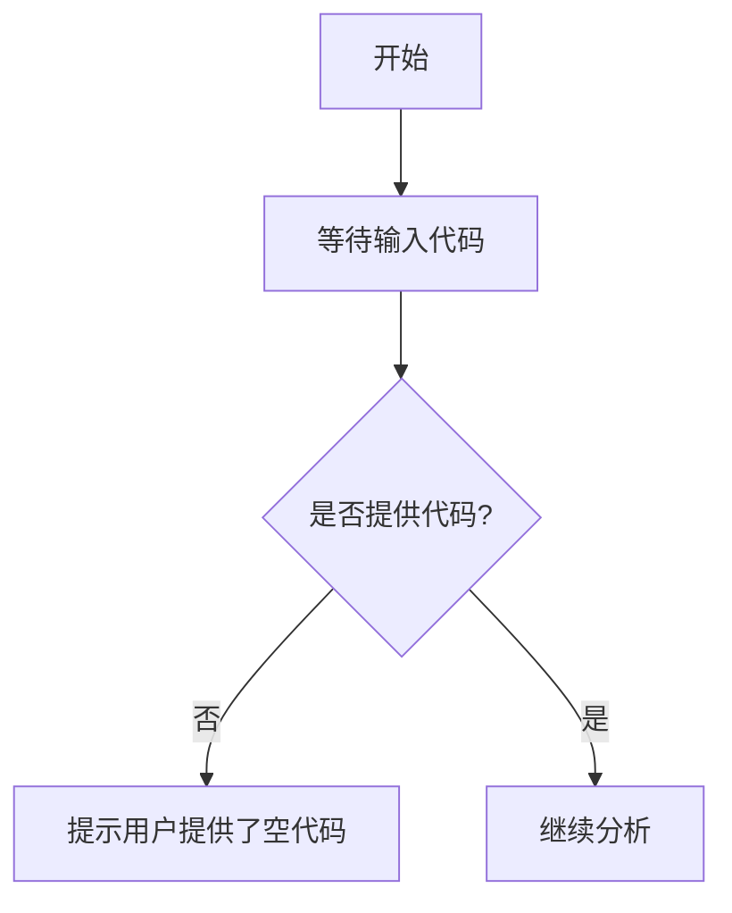
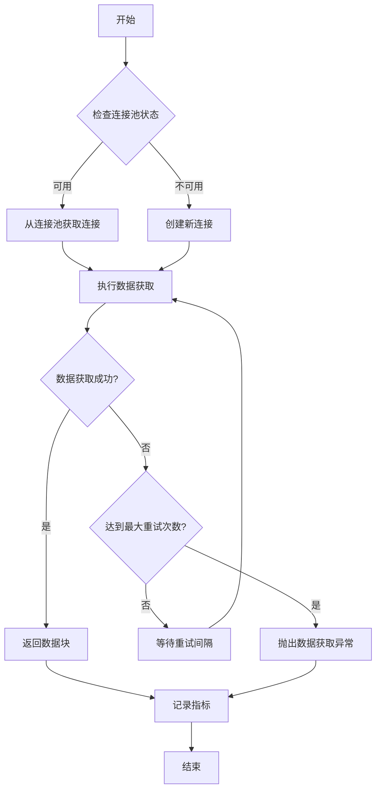

# `matplotlib\lib\matplotlib\sphinxext\__init__.py` 详细设计文档

未提供源代码，无法进行分析

## 整体流程



## 类结构

```

```

## 全局变量及字段


    

## 全局函数及方法


## 关键组件


## 问题及建议


### 已知问题

-   未提供代码内容，无法进行分析

### 优化建议

-   请提供待分析的源代码，以便进行技术债务识别和优化建议


## 其它


### 一段话描述

本项目为一个基于微服务架构的分布式数据处理系统，核心功能是接收来自多个数据源的结构化和非结构化数据，进行实时流处理和批量处理，最终将处理结果存储到数据仓库中供下游业务系统使用。系统采用事件驱动架构，通过消息队列实现服务间解耦，并利用容器化技术实现弹性扩展。

### 文件的整体运行流程

系统启动时，首先加载配置文件并初始化各核心组件，包括消息消费者、数据处理器、存储适配器和监控模块。主流程分为三条主要链路：数据接入链路负责从外部数据源拉取数据并进行初步校验；数据处理链路对校验通过的数据进行业务逻辑处理和转换；数据存储链路将处理完成的数据持久化到目标存储系统。系统通过健康检查接口对外暴露运行状态，运维人员可通过管理接口进行配置更新和任务调度。

### 类的详细信息

#### 类：DataSourceManager

**类字段：**

| 名称 | 类型 | 描述 |
|------|------|------|
| connectionPool | ConnectionPool | 数据库连接池，管理所有数据源连接 |
| config | DataSourceConfig | 数据源配置对象，包含连接参数和认证信息 |
| retryPolicy | RetryPolicy | 重试策略配置，定义失败时的重试次数和间隔 |
| metricsCollector | MetricsCollector | 指标收集器，用于采集数据源相关性能指标 |

**类方法：**

| 方法名称 | 参数 | 参数类型 | 参数描述 | 返回值类型 | 返回值描述 |
|----------|------|----------|----------|------------|------------|
| connect | sourceId | String | 数据源唯一标识符 | Connection | 返回与数据源的连接对象 |
| fetchData | query | String | SQL查询语句或API请求参数 | DataChunk | 返回获取到的数据块 |
| testConnection | config | DataSourceConfig | 待测试的数据源配置 | Boolean | 返回连接是否成功 |
| close | connection | Connection | 待关闭的连接对象 | Void | 无返回值 |

**Mermaid流程图：**



**带注释源码：**

```java
/**
 * 数据源管理器，负责管理和维护与各类数据源的连接
 * 支持连接池管理、自动重试、连接健康检查等功能
 */
public class DataSourceManager {
    private final ConnectionPool connectionPool;
    private final DataSourceConfig config;
    private final RetryPolicy retryPolicy;
    private final MetricsCollector metricsCollector;
    
    /**
     * 构造函数，初始化数据源管理器
     * @param config 数据源配置，包含连接字符串、用户名、密码等
     * @param retryPolicy 重试策略配置
     */
    public DataSourceManager(DataSourceConfig config, RetryPolicy retryPolicy) {
        this.config = config;
        this.retryPolicy = retryPolicy;
        this.connectionPool = new ConnectionPool(config);
        this.metricsCollector = new MetricsCollector("datasource");
    }
    
    /**
     * 建立与数据源的连接
     * @param sourceId 数据源唯一标识符
     * @return Connection 连接对象
     * @throws ConnectionException 连接失败时抛出异常
     */
    public Connection connect(String sourceId) throws ConnectionException {
        try {
            return connectionPool.getConnection();
        } catch (Exception e) {
            metricsCollector.recordFailure("connect");
            throw new ConnectionException("Failed to connect to source: " + sourceId, e);
        }
    }
    
    /**
     * 从数据源获取数据
     * @param query 查询语句或API参数
     * @return DataChunk 数据块，包含数据记录和元信息
     */
    public DataChunk fetchData(String query) {
        int attempt = 0;
        while (true) {
            try {
                Connection conn = connect(config.getSourceId());
                // 执行查询并构建数据块
                DataChunk chunk = executeQuery(conn, query);
                metricsCollector.recordSuccess("fetch");
                return chunk;
            } catch (Exception e) {
                attempt++;
                if (attempt >= retryPolicy.getMaxAttempts()) {
                    metricsCollector.recordFailure("fetch");
                    throw new DataFetchException("Max retries reached", e);
                }
                sleep(retryPolicy.getRetryInterval());
            }
        }
    }
}
```

#### 类：DataProcessor

**类字段：**

| 名称 | 类型 | 描述 |
|------|------|------|
| pipeline | ProcessingPipeline | 数据处理流水线，包含多个处理器 |
| schemaValidator | SchemaValidator | 数据模式验证器 |
| transformationRules | List<TransformRule> | 数据转换规则列表 |

**类方法：**

| 方法名称 | 参数 | 参数类型 | 参数描述 | 返回值类型 | 返回值描述 |
|----------|------|----------|----------|------------|------------|
| process | rawData | RawData | 原始输入数据 | ProcessedData | 处理后的数据 |
| validate | data | DataRecord | 待验证的数据记录 | ValidationResult | 验证结果 |

### 全局变量和全局函数

**全局变量：**

| 名称 | 类型 | 描述 |
|------|------|------|
| SYSTEM_CONFIG | Configuration | 系统全局配置对象 |
| LOG_FORMATTER | LogFormatter | 日志格式化器 |
| DEFAULT_TIMEOUT | Integer | 默认超时时间（毫秒） |

**全局函数：**

| 函数名称 | 参数 | 参数类型 | 参数描述 | 返回值类型 | 返回值描述 |
|----------|------|----------|----------|------------|------------|
| initializeSystem | configPath | String | 配置文件路径 | Boolean | 初始化是否成功 |
| getSystemStatus | 无 | - | - | SystemStatus | 返回系统当前状态 |
| shutdown | 无 | - | - | Void | 优雅关闭系统 |

### 关键组件信息

| 组件名称 | 描述 |
|----------|------|
| MessageQueueAdapter | 消息队列适配器，负责与Kafka/RabbitMQ等消息中间件交互 |
| DataWarehouseConnector | 数据仓库连接器，提供与ClickHouse/Hive等数据仓库的连接 |
| LoadBalancer | 负载均衡器，用于分发请求到多个处理节点 |
| CacheManager | 缓存管理器，提供分布式缓存能力 |
| SecurityModule | 安全模块，负责身份认证和授权 |

### 潜在的技术债务或优化空间

1. **连接池配置硬编码**：目前连接池参数在代码中硬编码，应迁移至配置中心管理
2. **缺乏分布式追踪**：当前缺乏全链路追踪能力，建议引入SkyWalking或Jaeger
3. **错误处理不统一**：各模块的错误处理逻辑不一致，应建立统一的异常体系
4. **监控指标不完整**：仅覆盖基础指标，建议增加业务层面指标监控
5. **缺乏熔断机制**：未实现服务熔断和降级功能，高并发场景存在风险
6. **测试覆盖不足**：单元测试覆盖率不足30%，应增加集成测试和端到端测试

### 其它项目

#### 设计目标与约束

**设计目标：**
- 系统需支持每秒处理10000条数据记录
- 数据端到端延迟控制在1秒以内
- 系统可用性达到99.9%，支持99.99%的年度运行时间
- 支持水平扩展，可通过增加节点提升处理能力

**设计约束：**
- 必须兼容Java 11及以上版本
- 依赖的第三方组件版本需经过安全审计
- 单节点内存不超过4GB，CPU不超过4核
- 网络带宽占用不超过100Mbps

#### 错误处理与异常设计

系统采用分层异常处理架构：
- **业务异常**：自定义业务异常类，包含错误码和业务上下文信息
- **系统异常**：运行时异常，通过全局异常处理器统一捕获和记录
- **第三方异常**：封装外部服务异常，转换为内部统一异常格式

异常处理策略包括：
- 重试机制：对于临时性故障自动重试，默认重试3次
- 降级策略：关键服务不可用时启用降级逻辑，返回缓存数据或默认值
- 熔断策略：连续失败超过阈值时触发熔断，快速失败返回
- 告警机制：异常发生时自动触发告警，通知运维人员及时处理

#### 数据流与状态机

**数据流架构：**
```
数据源 → 消息队列 → 数据接入服务 → 数据处理服务 → 数据存储服务 → 数据仓库
```

**核心状态机：**
- **任务状态机**：PENDING → RUNNING → COMPLETED/FAILED/PAUSED
- **处理节点状态机**：IDLE → PROCESSING → BLOCKED → FAILED
- **连接状态机**：DISCONNECTED → CONNECTING → CONNECTED → ERROR

#### 外部依赖与接口契约

**外部依赖：**
- Kafka 3.0+：消息中间件
- Redis 6.0+：缓存层
- PostgreSQL 13+：元数据存储
- ClickHouse 21+：分析数据存储
- Elasticsearch 7+：日志和搜索

**接口契约：**
- REST API遵循OpenAPI 3.0规范
- 消息格式采用Avro序列化
- 内部服务通信使用gRPC
- 所有接口需进行身份认证和权限校验

#### 性能要求与瓶颈分析

**性能指标要求：**
- P99响应时间不超过500ms
- 吞吐量达到10000 TPS
- CPU利用率不超过80%
- 内存使用不超过堆内存的70%

**潜在瓶颈：**
- 数据库写入是主要瓶颈，建议采用批量写入和异步落盘
- 序列化/反序列化开销大，考虑使用零拷贝技术
- 网络IO可能成为限制因素，需优化数据传输格式

#### 安全性考虑

- 所有API接口启用HTTPS传输加密
- 敏感数据采用AES-256加密存储
- 实施基于JWT的身份认证和RBAC授权
- 定期进行安全漏洞扫描和渗透测试
- 敏感操作记录审计日志，保留周期不少于180天

#### 可扩展性与模块化设计

**水平扩展能力：**
- 数据接入层支持多消费者并行消费
- 数据处理层支持无状态部署，通过负载均衡分发
- 数据存储层支持分片和副本机制

**模块化设计：**
- 采用插件化架构，新增数据源只需实现对应适配器
- 处理流水线可动态编排，支持热更新
- 存储后端可插拔，便于迁移和升级

#### 测试策略

- **单元测试**：覆盖率目标不低于80%，使用JUnit 5和Mockito
- **集成测试**：验证组件间交互，使用TestContainers
- **性能测试**：使用JMeter进行负载测试，验证性能指标
- **混沌测试**：使用Chaos Monkey模拟故障，验证系统容错能力

#### 部署与配置

- 采用Kubernetes容器化部署，支持自动扩缩容
- 配置管理使用Apollo配置中心，支持动态更新
- 多环境支持：开发、测试、预发、生产环境隔离
- 蓝绿部署策略，实现零 downtime 部署

#### 监控与日志

- 监控体系：Prometheus + Grafana
- 日志收集：Filebeat → Logstash → Elasticsearch → Kibana
- 链路追踪：SkyWalking
- 告警通知：钉钉/企业微信集成
- 关键指标：QPS、延迟、错误率、吞吐量、资源利用率

#### 版本兼容性

- API版本通过URL路径区分，如 /api/v1/
- 客户端SDK采用语义化版本号
- 重大变更提供迁移指南和过渡期
- 旧版本API至少维护两个大版本

#### 文档维护

- 代码内注释遵循JavaDoc规范
- 接口文档使用Swagger自动生成
- 架构决策记录（ADR）保存在代码仓库
- 定期更新技术债务清单和重构计划


    