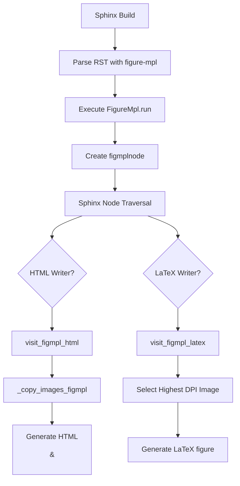
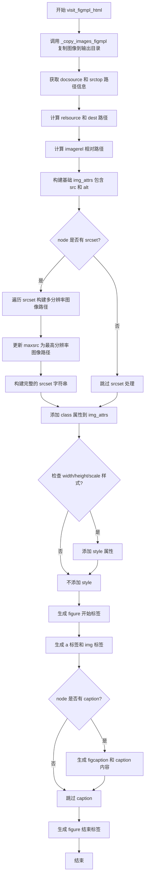
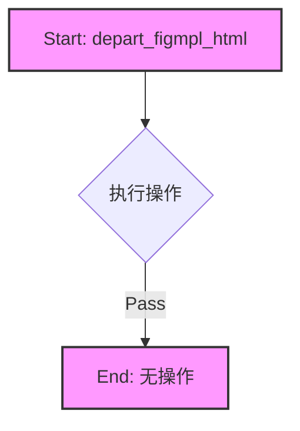
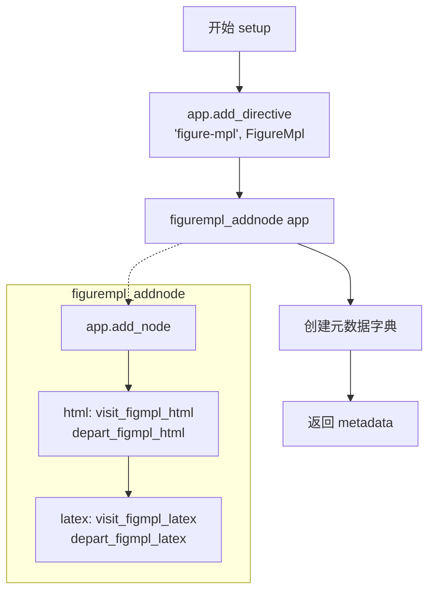

# `matplotlib\lib\matplotlib\sphinxext\figmpl_directive.py` 详细设计文档

A Sphinx extension that implements the `figure-mpl` directive to support responsive images (srcset) for HTML output and automatic high-resolution image selection for LaTeX output, handling file I/O during the documentation build process.

## 整体流程



## 类结构

```
Global Scope
├── figmplnode (Docutils Node Class)
├── FigureMpl (Sphinx Directive Class)
├── _parse_srcsetNodes (Helper Function)
├── _copy_images_figmpl (Helper Function)
├── visit_figmpl_html (HTML Visitor)
├── depart_figmpl_html (HTML Departure)
├── visit_figmpl_latex (LaTeX Visitor)
├── depart_figmpl_latex (LaTeX Departure)
├── figurempl_addnode (Registration Function)
└── setup (Extension Entry Point)
```

## 全局变量及字段


### `figmplnode.alt`
    
Alternate text for the image.

类型：`str`
    


### `figmplnode.align`
    
Image alignment.

类型：`str`
    


### `figmplnode.class`
    
CSS classes.

类型：`list`
    


### `figmplnode.width`
    
Image width.

类型：`str`
    


### `figmplnode.height`
    
Image height.

类型：`str`
    


### `figmplnode.scale`
    
Scaling percentage.

类型：`int`
    


### `figmplnode.caption`
    
Figure caption.

类型：`str`
    


### `figmplnode.uri`
    
Path to the primary image.

类型：`str`
    


### `figmplnode.srcset`
    
Source set string for responsive images.

类型：`str`
    


### `FigureMpl.has_content`
    
No content allowed.

类型：`bool`
    


### `FigureMpl.required_arguments`
    
1 (file path).

类型：`int`
    


### `FigureMpl.optional_arguments`
    
2.

类型：`int`
    


### `FigureMpl.option_spec`
    
Directive options (alt, srcset, class, etc.).

类型：`dict`
    


### `FigureMpl.run`
    
Parses arguments and creates the figmplnode.

类型：`method`
    
    

## 全局函数及方法


### `_parse_srcsetNodes(st)`

该函数用于解析Sphinx图像指令中的`srcset`属性字符串，将包含多个图像源和分辨率倍数的字符串转换为字典格式，其中键为分辨率倍数，值为对应的图像路径。

参数：
- `st`：`str`，要解析的srcset字符串，格式如`"image1.png, image2.png 2.00x"`

返回值：`dict`，返回解析后的字典，键为分辨率倍数（float类型，1x、2x等，默认为0表示无倍数），值为图像路径（str类型）

#### 流程图

```mermaid
flowchart TD
    A[开始解析srcset字符串] --> B[按逗号分割字符串]
    B --> C[遍历每个条目]
    C --> D{条目数量}
    D -->|1个元素| E[设置 srcset[0] = 元素]
    D -->|2个元素| F[提取倍数并去除'x'后缀]
    F --> G[srcset[float(倍数)] = 路径]
    D -->|其他数量| H[抛出ExtensionError异常]
    E --> I{还有更多条目?}
    G --> I
    I -->|是| C
    I -->|否| J[返回srcset字典]
    H --> J
```

#### 带注释源码

```python
def _parse_srcsetNodes(st):
    """
    parse srcset...
    """
    # 将输入的srcset字符串按逗号分隔成多个条目
    # 例如: "plot.png, plot-1.2x.png 2.00x" -> ["plot.png", "plot-1.2x.png 2.00x"]
    entries = st.split(',')
    
    # 初始化结果字典，键为分辨率倍数，值为图像路径
    srcset = {}
    
    # 遍历每个条目进行处理
    for entry in entries:
        # 去除首尾空白后按空格分割
        # "plot-1.2x.png 2.00x" -> ["plot-1.2x.png", "2.00x"]
        spl = entry.strip().split(' ')
        
        # 情况1：只有一个元素（无分辨率倍数声明）
        # 例如: "plot.png" -> {0: "plot.png"}
        if len(spl) == 1:
            srcset[0] = spl[0]
        
        # 情况2：有两个元素（路径 + 倍数）
        # 例如: "plot-1.2x.png 2.00x" -> {2.0: "plot-1.2x.png"}
        # 注意：倍数字符串末尾的'x'需要去除并转换为float
        elif len(spl) == 2:
            # spl[1] 是 "2.00x"，去掉最后一个字符'x'得到 "2.00"
            mult = spl[1][:-1]
            # 转换为浮点数作为字典的键
            srcset[float(mult)] = spl[0]
        
        # 情况3：元素数量不符合预期，抛出异常
        else:
            raise ExtensionError(f'srcset argument "{entry}" is invalid.')
    
    # 返回解析后的字典
    # 格式示例: {0: "plot.png", 2.0: "plot-1.2x.png"}
    return srcset
```


### `_copy_images_figmpl`

该函数是 Sphinx 扩展 `figmpl` 的核心图像处理逻辑。它负责解析 RST 文档中 `figure-mpl` 指令传入的图像路径和 `srcset` 属性，计算相对路径以确保图像文件名在构建目录中的唯一性，并在 Sphinx 构建期间将图像文件从源码目录复制到输出的 `_images` 目录。

#### 参数

- `self`：`Any` (Sphinx 访问器/转换器对象，通常为 `visit_figmpl_html` 所在类的实例)，提供对 `document` (包含源码路径) 和 `builder` (包含输出路径配置) 的访问。
- `node`：`figmplnode` (Docutils 节点对象)，包含图像的 URI、`srcset`、标题、对齐方式等元数据。

#### 返回值

- `imagedir`：`PurePath`，图像文件最终被复制到的目标目录路径。
- `srcset`：`dict` 或 `None`，解析后的 `srcset` 字典（键为倍率浮点数，值为文件名），用于后续生成 HTML `srcset` 属性。如果不存在 `srcset`，则返回 `None`。
- `rel`：`str`，相对于文档根目录的路径前缀（通常是将路径中的分隔符替换为 `-`），用于构建唯一的图像文件名。

#### 流程图

```mermaid
flowchart TD
    A([开始: _copy_images_figmpl]) --> B{node 中是否存在 srcset?}
    B -- 是 --> C[调用 _parse_srcsetNodes 解析 srcset]
    B -- 否 --> D[设置 srcset = None]
    C --> E[获取文档源码目录: docsource]
    D --> E
    E --> F[计算相对路径前缀: rel]
    F --> G[定义输出图像目录: imagedir]
    G --> H[创建目录: Path.mkdir]
    H --> I{srcset 是否存在?}
    I -- 是 --> J[遍历 srcset.values()]
    J --> K[拼接源路径: abspath]
    K --> L[构造目标文件名: name = rel + abspath.name]
    L --> M[复制文件: shutil.copyfile]
    M --> N[继续遍历或结束]
    I -- 否 --> O[使用 node['uri'] 作为单文件源]
    O --> P[构造目标文件名]
    P --> M
    N --> Q([返回 imagedir, srcset, rel])
```

#### 带注释源码

```python
def _copy_images_figmpl(self, node):
    """
    复制图像文件到构建目录，并处理 srcset 和路径重命名。

    参数:
        self: Sphinx 访问器对象，包含 document 和 builder 信息。
        node: figmplnode 节点，包含图像配置。

    返回:
        包含 (imagedir, srcset, rel) 的元组。
    """

    # 1. 解析 srcset
    # 如果节点有 srcset 属性，则解析它；否则设为 None
    if node['srcset']:
        srcset = _parse_srcsetNodes(node['srcset'])
    else:
        srcset = None

    # 2. 确定源码位置
    # 获取 RST 文件所在的目录，例如 /Users/username/matplotlib/doc/users/explain/artists
    docsource = PurePath(self.document['source']).parent

    # 3. 计算相对路径前缀
    # 获取构建源码根目录
    srctop = self.builder.srctotop
    # 计算 docsource 相对于源码根的路径，并处理路径分隔符
    # 例如 'users/explain/artists' -> 'users-explain-artists-'
    rel = relpath(docsource, srctop).replace('.', '').replace(os.sep, '-')
    if len(rel):
        rel += '-'

    # 4. 确定输出目录
    # 构建最终的图像输出路径，例如 /Users/username/matplotlib/doc/build/html/_images/users/explain/artists
    imagedir = PurePath(self.builder.outdir, self.builder.imagedir)

    # 5. 创建输出目录
    # 如果目录不存在，则创建（parents=True 确保父目录也存在）
    Path(imagedir).mkdir(parents=True, exist_ok=True)

    # 6. 复制文件
    if srcset:
        # 如果有 srcset（多分辨率图像），遍历所有源文件
        for src in srcset.values():
            # srcset 中的路径是相对于 docsource 目录的
            abspath = PurePath(docsource, src)
            # 构造新文件名：相对路径前缀 + 原文件名，确保不同目录下的图片不冲突
            name = rel + abspath.name
            # 复制文件到构建目录
            shutil.copyfile(abspath, imagedir / name)
    else:
        # 如果没有 srcset，处理单张图片
        abspath = PurePath(docsource, node['uri'])
        name = rel + abspath.name
        shutil.copyfile(abspath, imagedir / name)

    # 7. 返回结果供 HTML/Latex 编写器使用
    return imagedir, srcset, rel
```


### `visit_figmpl_html`

该函数是 Sphinx HTML 渲染器的访问方法，用于将 `figmplnode` 节点转换为响应式 HTML `<figure>` 和 `` 标签，支持 `srcset` 多分辨率图像和 caption 功能。

参数：

- `self`：`HTMLWriter`，Sphinx HTML 文档编写器实例，用于追加 HTML 内容到文档
- `node`：`figmplnode`，继承自 `nodes.General` 和 `nodes.Element` 的文档树节点，包含图像的 uri、srcset、alt、class、width、height、scale、caption 等属性

返回值：`None`，该方法通过 `self.body` 直接追加 HTML 字符串到输出文档

#### 流程图



#### 带注释源码

```python
def visit_figmpl_html(self, node):
    """
    HTML 渲染器访问方法，将 figmplnode 节点转换为 HTML figure/img 标签
    
    参数:
        self: HTMLWriter 实例，负责生成 HTML 输出
        node: figmplnode 节点，包含图像的所有配置信息
    返回:
        None，通过 self.body 追加 HTML 内容
    """
    
    # 第一步：复制图像文件到构建输出目录
    # 返回 (imagedir: 图像目录路径, srcset: 解析后的 srcset 字典, rel: 相对路径前缀)
    imagedir, srcset, rel = _copy_images_figmpl(self, node)

    # 第二步：获取源文档路径信息
    # docsource: 完整路径如 /doc/examples/subd/plot_1.rst
    docsource = PurePath(self.document['source'])
    # srcdir: 源目录根路径，添加 trailing slash 确保路径一致性
    srctop = PurePath(self.builder.srcdir, '')
    # relsource: 文档相对于源根目录的路径，如 examples/subd/plot_1.rst
    relsource = relpath(docsource, srctop)
    # desttop: 构建输出根目录，如 /doc/build/html
    desttop = PurePath(self.builder.outdir, '')
    # dest: 文档输出目录，如 /doc/build/html/examples/subd
    dest = desttop / relsource

    # 第三步：计算图像相对于目标文档的相对路径
    # imagerel: _images 目录相对于目标文档父目录的路径
    # 对于普通 html 是 ../../_images/，对于 dirhtml 是 ../_images/
    imagerel = PurePath(relpath(imagedir, dest.parent)).as_posix()
    # dirhtml 模式需要特殊处理路径前缀
    if self.builder.name == "dirhtml":
        imagerel = f'..{imagerel}'

    # 第四步：构建基础 URI 和 img 属性
    # nm: 从 uri 中提取文件名（去掉前导 /）
    # uri: 完整的相对图像路径，如 ../../_images/users-explain-artists-plot_1.png
    nm = PurePath(node['uri'][1:]).name
    uri = f'{imagerel}/{rel}{nm}'
    img_attrs = {'src': uri, 'alt': node['alt']}

    # 第五步：处理 srcset 多分辨率图像
    maxsrc = uri  # 最高分辨率图像的路径，用于 href 链接
    if srcset:
        maxmult = -1
        srcsetst = ''  # srcset 属性字符串
        
        # 遍历所有分辨率版本
        for mult, src in srcset.items():
            # 提取源文件名并构建相对路径
            nm = PurePath(src[1:]).name
            path = f'{imagerel}/{rel}{nm}'
            srcsetst += path
            
            # mult==0 表示 1x 分辨率，后面加逗号分隔
            if mult == 0:
                srcsetst += ', '
            else:
                # 其他分辨率如 2.00x
                srcsetst += f' {mult:1.2f}x, '

            # 跟踪最高分辨率版本
            if mult > maxmult:
                maxmult = mult
                maxsrc = path

        # 去掉末尾的逗号和空格，构建完整的 srcset 属性
        img_attrs['srcset'] = srcsetst[:-2]

    # 第六步：添加 class 属性
    if node['class'] is not None:
        img_attrs['class'] = ' '.join(node['class'])

    # 第七步：添加样式属性（width, height, scale）
    for style in ['width', 'height', 'scale']:
        if node[style]:
            if 'style' not in img_attrs:
                img_attrs['style'] = f'{style}: {node[style]};'
            else:
                img_attrs['style'] += f'{style}: {node[style]};'

    # 第八步：生成 HTML figure 标签结构
    # <figure class="align-default" id="id1"> 或 <figure class="align-center">
    self.body.append(
        self.starttag(
            node, 'figure',
            CLASS=f'align-{node["align"]}' if node['align'] else 'align-center'))
    
    # 生成超链接和图像标签
    # <a class="reference internal image-reference" href="最高分辨率图像">
    # 
    # </a>
    self.body.append(
        self.starttag(node, 'a', CLASS='reference internal image-reference',
                      href=maxsrc) +
        self.emptytag(node, 'img', **img_attrs) +
        '</a>\n')
    
    # 第九步：可选的 caption
    if node['caption']:
        self.body.append(self.starttag(node, 'figcaption'))
        self.body.append(self.starttag(node, 'p'))
        self.body.append(self.starttag(node, 'span', CLASS='caption-text'))
        self.body.append(node['caption'])
        self.body.append('</span></p></figcaption>\n')
    
    # 结束 figure 标签
    self.body.append('</figure>\n')
```


### `depart_figmpl_html`

该函数是 Sphinx 扩展中用于处理 HTML 输出的“离开”（Depart）阶段的方法。当 Sphinx 完成对 `figure-mpl` 节点的 HTML 渲染并准备离开该节点时调用。由于 `visit_figmpl_html` 方法在访问节点时已经一次性生成了完整的 HTML 结构（包括 `<figure>` 标签及其内部内容和闭合标签 `</figure>`），因此该方法在当前实现中为空，不执行任何清理或额外的标签闭合操作。

参数：

- `self`：`Sphinx HTML Translator (e.g. HTML5Translator)`，Sphinx 文档写入器的实例，负责管理 HTML 输出的 `body` 列表。
- `node`：`figmplnode`，代表 `figure-mpl` 指令的文档树节点，包含了图像的源地址、srcset、样式类、标题等属性。

返回值：`None`，无返回值。

#### 流程图



#### 带注释源码

```python
def depart_figmpl_html(self, node):
    """
    Departure function for the figure-mpl node in HTML output.

    This method is called after the children of the node have been processed.
    In this specific implementation, the HTML generation (including opening 
    and closing tags) is entirely handled within the 'visit_figmpl_html' method.
    Therefore, this method acts as a placeholder and performs no actions (pass).
    
    Args:
        self: The Sphinx HTML translator instance.
        node: The figure-mpl node being departed.
    """
    pass
```


### `visit_figmpl_latex`

该函数是Sphinx LaTeX编写器的访问者方法，用于处理`figure-mpl` directive生成的节点。当输出格式为LaTeX时，此函数负责选择最高分辨率的图像版本（如果有srcset），并将其设置为节点URI，最后委托给标准的figure处理逻辑。

参数：

- `self`：调用此方法的对象（Sphinx LaTeX 编写器实例），负责处理LaTeX输出的编写器对象
- `node`：`figmplnode`，表示figure-mpl directive创建的文档树节点，包含图像的srcset、uri等属性

返回值：无返回值（`None`），通过副作用修改node的uri属性并调用编写器的visit_figure方法

#### 流程图

```mermaid
flowchart TD
    A[开始 visit_figmpl_latex] --> B{node['srcset'] 是否存在?}
    B -->|是| C[调用 _copy_images_figmpl 复制图像]
    C --> D[获取 srcset 字典]
    D --> E[使用 max 函数找出最高分辨率倍数]
    E --> F[将最高分辨率图像名称设置为 node['uri']]
    F --> G[调用 self.visit_figure 处理标准figure]
    B -->|否| G
    G --> H[结束]
```

#### 带注释源码

```python
def visit_figmpl_latex(self, node):
    """
    处理 figure-mpl 节点以输出 LaTeX 格式。
    
    此方法是 Sphinx LaTeX 编写器的访问者函数，在遍历文档树时调用。
    如果节点包含 srcset 属性，选择最高分辨率的图像版本供 LaTeX 使用。
    
    参数:
        self: Sphinx LaTeX 编写器实例
        node: figmplnode 实例，包含图像属性如 srcset、uri 等
    """
    
    # 检查节点是否定义了 srcset（用于响应式图像）
    if node['srcset'] is not None:
        # 调用辅助函数复制图像文件到构建目录
        # 返回值: imagedir, srcset, rel
        imagedir, srcset = _copy_images_figmpl(self, node)
        
        # 初始化最高分辨率倍数
        maxmult = -1
        
        # 选择最高分辨率版本供 LaTeX 使用
        # maxmult 会变成 srcset 字典中的最大键（即最高分辨率倍数）
        maxmult = max(srcset, default=-1)
        
        # 将节点 URI 修改为最高分辨率图像的文件名
        # 这样 LaTeX 渲染时会使用最高质量的图像
        node['uri'] = PurePath(srcset[maxmult]).name

    # 委托给父类的 figure 处理方法
    # 这是 Sphinx 编写器模式的标准做法：将自定义节点转换为标准节点处理
    self.visit_figure(node)
```


### `depart_figmpl_latex`

该函数是 Sphinx LaTeX writer 的 `depart` 函数，用于在处理完 `figmplnode` 节点后执行清理工作，具体是调用 `depart_figure` 方法来结束 figure 元素的输出。

参数：

-  `self`：对象，LaTeX writer 对象（通常是 `LaTeXTranslator`），用于访问 `depart_figure` 方法
-  `node`：`figmplnode`，需要处理的图形节点对象

返回值：`None`，无返回值

#### 流程图

```mermaid
flowchart TD
    A[开始 depart_figmpl_latex] --> B{检查 node 是否需要清理}
    B -->|是| C[调用 self.depart_figure(node)]
    B -->|否| C
    C --> D[结束函数]
```

#### 带注释源码

```python
def depart_figmpl_latex(self, node):
    """
    Depart function for figmplnode in LaTeX output.
    
    This function is called after the visitor has processed the figmplnode.
    It performs cleanup by delegating to the standard figure depart method.
    
    Parameters:
        self: The LaTeX writer/transformer object
        node: The figmplnode being processed
    
    Returns:
        None
    """
    # 调用父类的 depart_figure 方法来结束 figure 元素
    # 这会输出必要的 LaTeX 闭合标签
    self.depart_figure(node)
```


### `figurempl_addnode`

该函数是 Sphinx 扩展的初始化辅助函数，用于将自定义的 `figmplnode` 节点类型注册到 Sphinx 系统中，并绑定对应的 HTML 和 LaTeX 渲染访问器（Visitor），以便在构建文档时正确处理 `figure-mpl` 指令生成的节点。

参数：

-  `app`：`Sphinx Application`，Sphinx 的核心应用实例，用于调用 `add_node` 方法注册节点和渲染逻辑。

返回值：`None`，该函数仅执行注册逻辑，不返回任何数据。

#### 流程图

```mermaid
graph TD
    A((开始: figurempl_addnode)) --> B{app.add_node}
    B --> C[注册节点类型: figmplnode]
    C --> D[绑定 HTML 渲染器]
    C --> E[绑定 LaTeX 渲染器]
    D --> F[html=(visit_figmpl_html, depart_figmpl_html)]
    E --> G[latex=(visit_figmpl_latex, depart_figmpl_latex)]
    F --> H((结束))
    G --> H
```

#### 带注释源码

```python
def figurempl_addnode(app):
    """
    向 Sphinx 应用注册 figmplnode 节点及其对应的渲染函数。

    该函数确保自定义的 figure-mpl 指令生成的节点能够被
    HTML 和 LaTeX 构建器正确识别并渲染。
    """
    # 使用 app.add_node 注册新的节点类型
    # 第一个参数是节点类
    # html 参数是一个元组，指定进入节点和离开节点时调用的 HTML 访问器
    # latex 参数是一个元组，指定进入节点和离开节点时调用的 LaTeX 访问器
    app.add_node(figmplnode,
                 html=(visit_figmpl_html, depart_figmpl_html),
                 latex=(visit_figmpl_latex, depart_figmpl_latex))
```


### `setup`

该函数是 Sphinx 扩展的入口点，负责注册 `figure-mpl` 指令和对应的文档树节点，使 Sphinx 能够处理带有响应式图片集（srcset）支持的图像指令。

参数：

-  `app`：`sphinx.application.Sphinx`，Sphinx 应用实例，用于注册指令、节点和获取配置信息

返回值：`dict`，包含扩展的并行读写安全状态和版本号的元数据字典

#### 流程图



#### 带注释源码

```python
def setup(app):
    """
    Sphinx 扩展的入口函数，用于注册指令和节点。
    
    参数:
        app: Sphinx 应用对象，用于注册指令、节点和获取构建信息
    """
    # 注册 'figure-mpl' 指令，使用 FigureMpl 类处理
    # 该指令继承自 Figure，支持 srcset 参数实现响应式图片
    app.add_directive("figure-mpl", FigureMpl)
    
    # 添加 figmplnode 节点处理器，定义 HTML 和 LaTeX 的访问行为
    figurempl_addnode(app)
    
    # 返回扩展的元数据
    # parallel_read_safe: True 表示支持并行读取
    # parallel_write_safe: True 表示支持并行写入
    # version: matplotlib 的版本号
    metadata = {'parallel_read_safe': True, 'parallel_write_safe': True,
                'version': matplotlib.__version__}
    return metadata
```


### `FigureMpl.run(self)`

该方法实现了 `figure-mpl` 指令的核心逻辑，解析 RST 文档中的参数，提取图像的 URI、srcset、样式选项（宽度、高度、缩放）、对齐方式、类名和标题等信息，并将这些信息封装到一个自定义的 `figmplnode` 节点对象中，最终返回该节点列表供 Sphinx 处理和转换。

参数：

- `self`：`FigureMpl`，FigureMpl 类的实例，隐式参数，表示当前指令对象

返回值：`list[figmplnode]`，返回包含创建好的 figmplnode 的列表，供后续 Sphinx 的文档转换器使用

#### 流程图

```mermaid
flowchart TD
    A[开始 run] --> B[创建 figmplnode]
    B --> C[从 arguments[0] 获取 imagenm]
    C --> D[提取选项: alt]
    D --> E[提取选项: align]
    E --> F[提取选项: class]
    F --> G[提取选项: width]
    G --> H[提取选项: height]
    H --> I[提取选项: scale]
    I --> J[提取选项: caption]
    J --> K[设置 image_node['uri'] = imagenm]
    K --> L[提取选项: srcset]
    L --> M[返回 [image_node]]
    M --> N[结束]
```

#### 带注释源码

```python
def run(self):
    """
    运行 figure-mpl 指令，解析参数并创建 figmplnode 节点。
    
    该方法是 FigureMpl 指令的核心入口点，由 Sphinx 在解析 RST 文档时调用。
    它从指令参数和选项中提取图像信息，并创建一个可被后续转换器处理的节点对象。
    """
    
    # 创建一个 figmplnode 节点对象，用于表示图像
    # figmplnode 是继承自 nodes.General 和 nodes.Element 的自定义节点类型
    image_node = figmplnode()

    # 从指令的第一个参数获取图像文件路径/URI
    # 例如: .. figure-mpl:: plot_directive/some_plots-1.png
    imagenm = self.arguments[0]
    
    # 从指令选项中提取 alt 文本，默认空字符串
    # 对应 RST 中的 :alt: bar
    image_node['alt'] = self.options.get('alt', '')
    
    # 提取对齐方式选项，默认 None
    # 对应 RST 中的 :align: left/center/right
    image_node['align'] = self.options.get('align', None)
    
    # 提取 CSS 类名选项，默认 None
    # 对应 RST 中的 :class: plot-directive
    image_node['class'] = self.options.get('class', None)
    
    # 提取图像宽度选项，支持像素或百分比
    # 对应 RST 中的 :width: 100px 或 :width: 50%
    image_node['width'] = self.options.get('width', None)
    
    # 提取图像高度选项，支持像素或单位less
    # 对应 RST 中的 :height: 200px
    image_node['height'] = self.options.get('height', None)
    
    # 提取缩放比例选项，整数值
    # 对应 RST 中的 :scale: 50
    image_node['scale'] = self.options.get('scale', None)
    
    # 提取图像标题/图注选项
    # 对应 RST 中的 :caption: This is a figure caption
    image_node['caption'] = self.options.get('caption', None)

    # 设置图像的 URI 为主图像路径（通常是最高分辨率版本）
    # 注释说明：原本希望使用最高 dpi 版本供 latex 使用，但目前仅使用 imagenm
    image_node['uri'] = imagenm
    
    # 提取 srcset 属性，用于响应式图像
    # 格式例如: plot.png, plot-1.2x.png 2.00x
    # 对应 RST 中的 :srcset: ...
    image_node['srcset'] = self.options.get('srcset', None)

    # 返回包含图像节点的列表，供 Sphinx 的节点遍历器处理
    return [image_node]
```

## 关键组件


### figmplnode

继承自 `nodes.General` 和 `nodes.Element` 的 docutils 节点类，用于表示 figure-mpl 指令创建的图像节点，存储图像的各种属性如 alt、align、class、width、height、scale、caption、uri 和 srcset。

### FigureMpl

继承自 `Figure` 的 RST 指令类，实现 `figure-mpl` 指令，支持可选的 hidpi 图像和 srcset 属性，用于创建响应式图像，功能类似 Sphinx 内置的 figure 指令但增加了 srcset 支持。

### _parse_srcsetNodes

解析 srcset 属性的辅助函数，将逗号分隔的 srcset 字符串转换为字典，键为分辨率倍数（如 2.00），值为图像路径，用于支持响应式图像。

### _copy_images_figmpl

负责将图像文件从源码目录复制到构建输出目录的 `_images` 文件夹，处理子目录路径以确保图像名称唯一，返回图像目录、srcset 解析结果和相对路径前缀。

### visit_figmpl_html

HTML writer 的节点访问方法，生成响应式 img 标签的 HTML 代码，包括 srcset 属性处理、相对路径转换、样式属性设置，以及完整的 figure/figcaption HTML 结构。

### visit_figmpl_latex

LaTeX writer 的节点访问方法，对于有 srcset 的图像选择最高分辨率版本用于 LaTeX 输出，然后调用标准的 figure 访问方法。

### figurempl_addnode

注册 figmplnode 节点到 Sphinx 转换器的函数，为 HTML 和 LaTeX 后端分别设置访问和离开方法的回调。

### setup

Sphinx 扩展的入口函数，注册 figure-mpl 指令和节点，配置并行读写安全标志并返回扩展元数据。

## 问题及建议


### 已知问题

- **返回值不一致**：`visit_figmpl_latex`中调用`_copy_images_figmpl`时解包了2个值（`imagedir, srcset`），但函数实际返回3个值（`imagedir, srcset, rel`），导致`rel`变量未使用但仍被计算，造成资源浪费和逻辑混乱。
- **缺少文件操作错误处理**：`shutil.copyfile`调用没有异常捕获，若源文件不存在或目标目录无写权限时会直接崩溃。
- **路径遍历风险**：代码直接使用用户提供的`srcset`路径拼接文件路径，未进行安全校验，可能存在路径遍历漏洞。
- **重复计算**：`visit_figmpl_html`和`visit_figmpl_latex`都会调用`_copy_images_figmpl`复制相同的图像文件，没有缓存机制，文档规模大时性能低下。
- **srcset解析不够健壮**：`_parse_srcsetNodes`仅检查长度是否为1或2，未验证文件扩展名是否有效，也未检查路径是否存在。
- **字符串拼接低效**：使用`+=`循环拼接`srcsetst`，在条目较多时性能较差，应使用`join`方法。
- **未使用父类功能**：`FigureMpl`继承自`Figure`但未调用父类的`run`方法，导致父类的验证逻辑和功能被忽略。

### 优化建议

- 修复`_copy_images_figmpl`的返回值使用，或移除未使用的`rel`返回值以简化接口。
- 为文件复制操作添加`try-except`捕获`IOError`/`OSError`，并提供有意义的错误信息。
- 对`srcset`和`uri`路径进行规范化处理，使用`Path.resolve()`或验证路径前缀防止路径遍历攻击。
- 引入缓存机制（如基于节点哈希的缓存），避免重复复制相同图像。
- 增强`_parse_srcsetNodes`的验证逻辑，检查文件扩展名和路径有效性。
- 使用`list comprehension`和`join`重构字符串拼接逻辑。
- 考虑重构路径处理逻辑，提取公共函数减少重复代码。
- 添加类型注解和完整的文档字符串以提升代码可维护性。

## 其它


### 设计目标与约束

本扩展旨在为Sphinx文档系统提供一个支持响应式图片的`figure-mpl`指令，核心目标是允许使用`:srcset:`参数来为图片提供多分辨率版本，从而在支持高DPI显示的浏览器中自动选择合适分辨率的图片。主要约束包括：必须与Sphinx的plot_directive配合使用；处理子目录时图片名称需要包含路径信息以保证唯一性；LaTeX输出时自动选择最高分辨率版本。

### 错误处理与异常设计

代码中的错误处理主要体现在`_parse_srcsetNodes`函数中，当srcset参数格式不正确时抛出`ExtensionError`。其他操作（如文件复制、目录创建）可能抛出`OSError`异常，但这些异常会向上传播给Sphinx处理。在`visit_figmpl_html`和`visit_figmpl_latex`中，假设node的必需字段都已正确设置，未进行额外的空值检查。

### 数据流与状态机

数据流从RST文件中的`figure-mpl`指令开始，首先经过`FigureMpl.run()`方法解析指令参数并创建`figmplnode`节点；然后通过`figurempl_addnode`函数将节点添加到Sphinx的节点处理队列；在文档构建阶段，根据输出格式（HTML或LaTeX）分别调用对应的visit和depart方法；最后在`_copy_images_figmpl`中将图片文件复制到输出目录。整个过程中节点状态保持不变，只是进行转换和渲染。

### 外部依赖与接口契约

主要依赖包括：docutils（用于RST指令和节点处理）、Sphinx框架（用于扩展开发和构建）、matplotlib（用于版本信息）。接口契约方面，本扩展提供一个Sphinx指令`figure-mpl`，接受标准figure选项加上`:srcset:`选项；在Sphinx配置中需要设置`plot_srcset`选项以配合使用。

### 配置选项说明

代码中`FigureMpl`类支持的选项包括：`:alt:`图片替代文本、`:height:`图片高度、`:width:`图片宽度、`:scale:`缩放比例、`:align:`对齐方式、`:class:` CSS类名、`:caption:`图片标题、`:srcset:`响应式图片源集合。`srcset`格式为"图片路径1, 图片路径2 2.00x"，其中不带倍数的是基准分辨率，带倍数的是高分辨率版本。

### 使用示例

基础用法：
```rst
.. figure-mpl:: plot_directive/some_plots-1.png
    :alt: bar
    :srcset: plot_directive/some_plots-1.png,
             plot_directive/some_plots-1.2x.png 2.00x
    :class: plot-directive
```

带子目录的用法：
```rst
.. figure-mpl:: plot_directive/nestedpage/index-1.png
    :alt: bar
    :srcset: plot_directive/nestedpage/index-1.png
             plot_directive/nestedpage/index-1.2x.png 2.00x
    :class: plot-directive
```

### 性能考虑

在每次访问节点时都会执行`_copy_images_figmpl`函数，这意味着同一张图片可能在文档转换过程中被多次复制。代码中缺少缓存机制来避免重复复制操作。对于大型文档项目，这可能导致不必要的I/O开销。目录创建使用了`mkdir(parents=True, exist_ok=True)`，每次都会尝试创建目录，但这是必要的因为无法预知目录是否存在。

### 兼容性信息

该扩展声明`parallel_read_safe: True`和`parallel_write_safe: True`，支持并行构建。支持的输出格式包括HTML和LaTeX。代码中通过`self.builder.name`判断输出类型来分别处理HTML和dirhtml两种模式。需要Sphinx 1.0及以上版本以及matplotlib 1.0及以上版本。

    