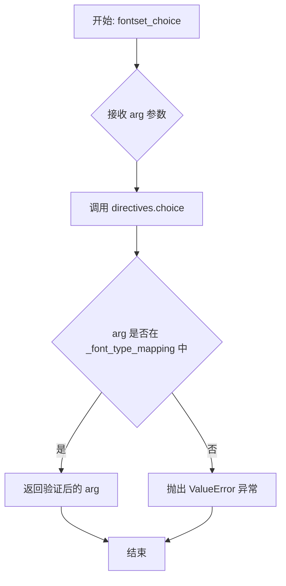
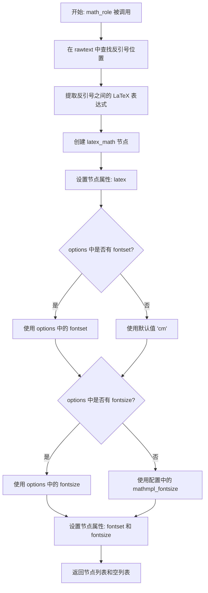
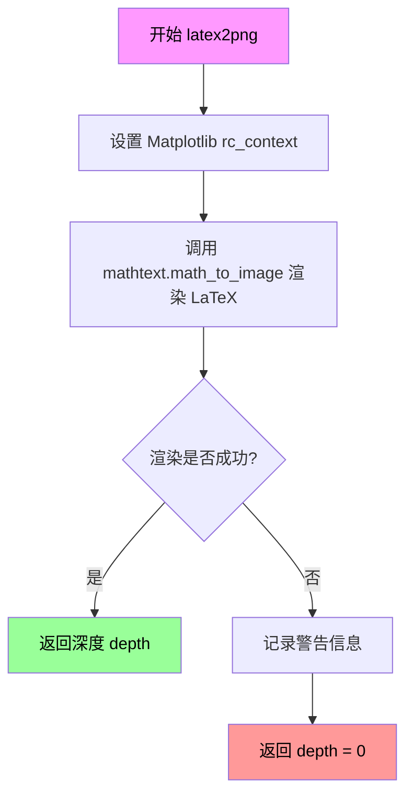
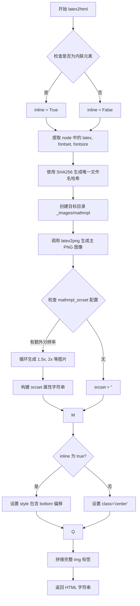
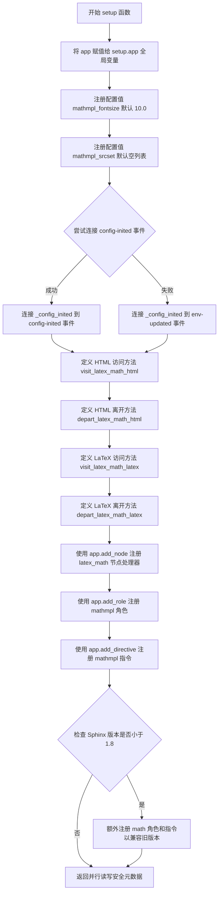

# `matplotlib\lib\matplotlib\sphinxext\mathmpl.py` 详细设计文档

A Sphinx extension that renders LaTeX mathematical expressions into PNG images using Matplotlib and displays them within Sphinx HTML documentation, while preserving LaTeX output for LaTeX/PDF builds.

## 整体流程

```mermaid
graph TD
    A[Sphinx Application Startup] --> B[Load mathmpl Extension]
    B --> C[Execute setup(app)]
    C --> D[Register Roles, Directives, Nodes and Visitors]
    D --> E{Document Processing}
    E --> F[Parse RST with :mathmpl: or .. mathmpl::]
    F --> G[Create latex_math Node]
    G --> H{Target Builder}
    H -- HTML --> I[latex2html Function]
    I --> J[latex2png (Render to PNG)]
    J --> K[Save Image to _images/mathmpl]
    K --> L[Generate  HTML Tag]
    H -- LaTeX/PDF --> M[latex2latex Visitor]
    M --> N[Wrap in $...$ or equation environment]
```

## 类结构

```
mathmpl (Module)
├── latex_math (Docutils Node Class)
│   └── Inherits: nodes.General, nodes.Element
├── MathDirective (Sphinx Directive Class)
│   └── Inherits: Directive
└── setup (Module Function - Entry Point)
```

## 全局变量及字段


### `setup.app`
    
Module-level global variable storing the Sphinx application instance

类型：`Sphinx application object`
    


### `latex_math.latex`
    
The LaTeX math string

类型：`str`
    


### `latex_math.fontset`
    
Font set configuration

类型：`str`
    


### `latex_math.fontsize`
    
Font size in points

类型：`float`
    


### `MathDirective.has_content`
    
Indicates if directive has content

类型：`bool`
    


### `MathDirective.option_spec`
    
Supported options (fontset, fontsize)

类型：`dict`
    


### `MathDirective.required_arguments`
    
Number of required arguments

类型：`int`
    


### `MathDirective.optional_arguments`
    
Number of optional arguments

类型：`int`
    
    

## 全局函数及方法


### `fontset_choice`

该函数是 Sphinx 文档扩展 `mathmpl` 中用于验证 `fontset` 配置选项的验证器函数。它通过调用 docutils 的 `directives.choice` 方法，将传入的参数与 Matplotlib 的 `MathTextParser._font_type_mapping` 中定义的合法字体集进行匹配，确保用户提供的字体集选项有效且被 Matplotlib 支持。

参数：

- `arg`：`str`，从 Sphinx 指令选项中传入的字体集名称字符串（如 'cm'、'tex'、'stix' 等）

返回值：`str` 或 抛出 `ValueError`，返回验证通过后的字体集名称字符串；若值不在允许的列表中则抛出异常。

#### 流程图



#### 带注释源码

```python
def fontset_choice(arg):
    """
    Validation function for fontset option.
    
    该函数作为 Sphinx RST 指令的选项验证器，确保用户指定的
    fontset 参数是 Matplotlib 支持的合法字体集。
    
    Parameters
    ----------
    arg : str
        从指令选项传入的字体集名称字符串。
    
    Returns
    -------
    str
        验证通过后返回原始字符串。
    
    Raises
    ------
    ValueError
        如果 arg 不在允许的字体集列表中。
    """
    # directives.choice 是 docutils 提供的验证工具函数
    # 它会检查 arg 是否在第二个参数（允许值的列表或映射） 中
    # mathtext.MathTextParser._font_type_mapping 是一个字典，
    # 键为字体集名称（如 'cm', 'stix', 'tex' 等）
    return directives.choice(arg, mathtext.MathTextParser._font_type_mapping)
```


### `math_role`

这是一个Sphinx扩展中的role函数，用于解析内联数学语法（`:mathmpl:`...`` 或 `:math:`...``），从原始文本中提取LaTeX数学表达式，并创建一个包含表达式、字体集和字体大小信息的`latex_math`节点返回给Sphinx文档系统进行后续渲染。

参数：

- `role`：`str`，角色名称（例如 'mathmpl' 或 'math'）
- `rawtext`：`str`，包含角色和数学表达式的原始文本，例如 `:mathmpl:\`\\alpha > \beta\``
- `text`：`str`，反引号内的数学表达式文本，例如 `\\alpha > \beta`
- `lineno`：`int`，角色在文档中出现的行号
- `inliner`：`Sphinx` 内联对象，用于报告错误和警告
- `options`：`dict`，可选参数字典，包含 'fontset' 和 'fontsize' 等配置
- `content`：`list`，角色指令的内容列表

返回值：`tuple` (list, list)，第一个列表包含创建的 `latex_math` 节点，第二个列表为空（用于提示信息）

#### 流程图



#### 带注释源码

```python
def math_role(role, rawtext, text, lineno, inliner,
              options={}, content=[]):
    """
    处理内联数学角色语法，将 LaTeX 表达式转换为 latex_math 节点。
    
    参数:
        role: 角色名称 (如 'mathmpl')
        rawtext: 原始文本，包含角色标记和反引号包裹的数学表达式
        text: 反引号内的数学表达式内容
        lineno: 文档中的行号
        inliner: Sphinx 内联对象，用于错误报告
        options: 可选参数字典，包含 fontset 和 fontsize
        content: 内容列表（对于 role 通常为空）
    
    返回:
        包含 latex_math 节点的列表，以及空列表（提示信息）
    """
    # 在原始文本中查找第一个反引号的位置
    # rawtext 格式例如: ':mathmpl:`\alpha > \beta`'
    i = rawtext.find('`')
    
    # 提取反引号之间的 LaTeX 表达式
    # 从反引号后一位开始，到字符串末尾（去掉结尾的反引号）
    latex = rawtext[i+1:-1]
    
    # 创建 latex_math 节点，传入原始文本作为参数
    node = latex_math(rawtext)
    
    # 设置节点的 latex 属性为提取出的数学表达式
    node['latex'] = latex
    
    # 从 options 字典获取 fontset，若无则使用默认值 'cm'
    # 'cm' 是 Computer Modern 字体集，是 LaTeX 的默认字体
    node['fontset'] = options.get('fontset', 'cm')
    
    # 从 options 字典获取 fontsize，若无则使用 Sphinx 配置中的 mathmpl_fontsize
    # setup.app.config.mathmpl_fontsize 默认值为 10.0
    node['fontsize'] = options.get('fontsize',
                                   setup.app.config.mathmpl_fontsize)
    
    # 返回节点列表和空列表（后者用于返回提示/警告信息）
    return [node], []


# 为 math_role 函数附加 options 属性，定义角色支持的可选参数
# fontset: 字体集选择，使用 fontset_choice 验证器
# fontsize: 字体大小，使用 validate_float_or_None 验证器
math_role.options = {'fontset': fontset_choice,
                     'fontsize': validate_float_or_None}
```


### `latex2png`

该函数使用 Matplotlib 的 mathtext 引擎将 LaTeX 数学公式字符串渲染为 PNG 图像文件，并返回渲染表达式的深度信息（用于调整行距）。

参数：

- `latex`：`str`，LaTeX 数学公式字符串
- `filename`：`str` 或 `Path`，输出 PNG 文件的路径
- `fontset`：`str`，字体集，默认为 `'cm'`（computer modern）
- `fontsize`：`float`，字体大小，默认为 10
- `dpi`：`int`，图像分辨率，默认为 100

返回值：`int`，渲染的数学表达式的深度（像素），用于在 HTML 中调整行距；如果渲染失败返回 0

#### 流程图



#### 带注释源码

```python
# This uses mathtext to render the expression
def latex2png(latex, filename, fontset='cm', fontsize=10, dpi=100):
    """
    将 LaTeX 字符串转换为 PNG 图像
    
    参数:
        latex: LaTeX 数学公式字符串
        filename: 输出 PNG 文件路径
        fontset: 字体集 (默认 'cm')
        fontsize: 字体大小 (默认 10)
        dpi: 图像 DPI (默认 100)
    
    返回:
        int: 渲染深度，用于调整 HTML 中的垂直位置
    """
    # 使用 rc_context 临时设置 Matplotlib 的 mathtext 字体和大小
    with mpl.rc_context({'mathtext.fontset': fontset, 'font.size': fontsize}):
        try:
            # 调用 mathtext 模块将 LaTeX 公式渲染为图像
            # LaTeX 公式前后添加 $ 符号表示数学模式
            depth = mathtext.math_to_image(
                f"${latex}$", filename, dpi=dpi, format="png")
        except Exception:
            # 渲染失败时记录警告，但不中断程序
            _api.warn_external(f"Could not render math expression {latex}")
            depth = 0
    return depth
```


### `latex2html`

该函数是 `mathmpl` 扩展的核心转换函数，负责将 LaTeX 数学表达式渲染为 HTML `` 标签。它首先根据 LaTeX 内容、字体集和字体大小生成唯一哈希值作为文件名，然后调用 `latex2png` 生成 PNG 图像，最后构建包含 srcset 和样式属性的完整 HTML img 标签返回给 Sphinx HTML 翻译器。

参数：

- `node`：`latex_math`，Sphinx 文档树中的数学节点，包含 latex、fontset、fontsize 等属性
- `source`：`str`，文档源文件路径（当前未被使用，保留用于兼容性）

返回值：`str`，生成的 HTML `` 标签字符串，包含 src、srcset、class、style 等属性

#### 流程图



#### 带注释源码

```python
def latex2html(node, source):
    """
    将 LaTeX 数学表达式转换为 HTML img 标签
    
    参数:
        node: latex_math 节点对象，包含 'latex', 'fontset', 'fontsize' 属性
        source: 文档源路径（当前未使用）
    
    返回:
        HTML img 标签字符串
    """
    # 判断是否为内联元素（位于文本内部）
    inline = isinstance(node.parent, nodes.TextElement)
    
    # 从节点提取 LaTeX 内容和渲染参数
    latex = node['latex']          # LaTeX 公式字符串
    fontset = node['fontset']      # 字体集 ('cm', 'stix', etc.)
    fontsize = node['fontsize']    # 字体大小（点数）
    
    # 生成唯一文件名：使用 latex + fontset + fontsize 的 SHA256 哈希
    # 取最后10位十六进制字符作为文件名后缀
    name = 'math-{}'.format(
        hashlib.sha256(
            f'{latex}{fontset}{fontsize}'.encode(),
            usedforsecurity=False,
        ).hexdigest()[-10:])

    # 构建目标目录路径: {输出目录}/_images/mathmpl
    destdir = Path(setup.app.builder.outdir, '_images', 'mathmpl')
    destdir.mkdir(parents=True, exist_ok=True)

    # 生成主图像文件 (1x 分辨率)
    dest = destdir / f'{name}.png'
    depth = latex2png(latex, dest, fontset, fontsize=fontsize)

    # 处理响应式图像 srcset（支持 HiDPI）
    srcset = []
    for size in setup.app.config.mathmpl_srcset:
        # 生成额外分辨率的图片文件名 (如: math-xxx-2_0.png)
        filename = f'{name}-{size.replace(".", "_")}.png'
        # 根据倍率计算 DPI: 2x -> 200 DPI, 1.5x -> 150 DPI
        latex2png(latex, destdir / filename, fontset, fontsize=fontsize,
                  dpi=100 * float(size[:-1]))
        # 添加到 srcset 列表
        srcset.append(
            f'{setup.app.builder.imgpath}/mathmpl/{filename} {size}')
    
    # 组装 srcset 属性字符串
    if srcset:
        srcset = (f'srcset="{setup.app.builder.imgpath}/mathmpl/{name}.png, ' +
                  ', '.join(srcset) + '" ')
    else:
        srcset = ''

    # 设置 class 属性：独立公式使用 center 类
    if inline:
        cls = ''
    else:
        cls = 'class="center" '
    
    # 设置样式：内联元素需要调整垂直位置以对齐文本基线
    # depth 是 LaTeX 渲染的深度（baseline 以下的像素数）
    if inline and depth != 0:
        style = 'style="position: relative; bottom: -%dpx"' % (depth + 1)
    else:
        style = ''

    # 返回完整的 HTML img 标签
    return (f'')
```


### `_config_inited`

该函数是 Sphinx 扩展的回调函数，用于在配置初始化完成后验证 `mathmpl_srcset` 配置选项的有效性，确保每个尺寸描述符都符合 `"Nx"` 格式（如 `"2x"`, `"1.5x"`）。

参数：

- `app`：`sphinx.application.Sphinx`，Sphinx 应用程序实例，用于访问配置信息
- `config`：Sphinx 配置对象（在本函数中未直接使用，保留以兼容旧版本 Sphinx）

返回值：`None`，该函数通过抛出 `ConfigError` 来表示验证失败，无成功返回值

#### 流程图

```mermaid
flowchart TD
    A[开始 _config_inited] --> B[获取 app.config.mathmpl_srcset 列表]
    B --> C{遍历列表中的每个 size}
    C -->|遍历项| D{size 最后字符是否为 'x'}
    D -->|是| E[尝试将 size[:-1] 转为 float]
    E --> F{转换是否成功}
    F -->|成功| C
    F -->|失败| G[抛出 ConfigError: 无效的乘法因子]
    D -->|否| H[抛出 ConfigError: 缺少 'x' 后缀]
    G --> I[结束]
    H --> I
    C -->|遍历完成| J[验证通过，函数结束]
```

#### 带注释源码

```python
def _config_inited(app, config):
    """
    回调函数：在 Sphinx 配置初始化完成后验证 mathmpl_srcset 配置选项。
    
    该函数检查 mathmpl_srcset 列表中的每个元素是否符合 "Nx" 格式，
    其中 N 是一个数字（如 "2x", "1.5x"）。不符合格式的配置将抛出 ConfigError。
    
    参数:
        app: Sphinx 应用程序实例，包含配置信息
        config: Sphinx 配置对象（当前版本中未使用，保留以兼容旧版本）
    
    返回:
        None: 验证通过时无返回值
    
    异常:
        ConfigError: 当 mathmpl_srcset 中的任何元素不符合 "Nx" 格式时抛出
    """
    # 遍历配置中的 srcset 尺寸列表
    for i, size in enumerate(app.config.mathmpl_srcset):
        # 检查尺寸字符串是否以 'x' 结尾（例如 "2x" = "2.0"）
        if size[-1] == 'x':
            try:
                # 尝试提取数字部分并转换为浮点数
                float(size[:-1])
            except ValueError:
                # 如果转换失败，说明格式无效
                raise ConfigError(
                    f'Invalid value for mathmpl_srcset parameter: {size!r}. '
                    'Must be a list of strings with the multiplicative '
                    'factor followed by an "x".  e.g. ["2.0x", "1.5x"]')
        else:
            # 如果不以 'x' 结尾，格式必然无效
            raise ConfigError(
                f'Invalid value for mathmpl_srcset parameter: {size!r}. '
                'Must be a list of strings with the multiplicative '
                'factor followed by an "x".  e.g. ["2.0x", "1.5x"]')
```


### `setup`

Sphinx扩展的入口函数，用于注册mathmpl扩展的各项配置、角色、指令和翻译器访问方法，使Sphinx能够处理LaTeX数学表达式并渲染为图像。

参数：

- `app`：`Sphinx.application.Sphinx` Sphinx应用程序实例，用于注册扩展的各个组件

返回值：`dict`，包含扩展的并行读写安全信息

#### 流程图



#### 带注释源码

```python
def setup(app):
    """
    Main function to register the extension with Sphinx.
    
    This function is the entry point for Sphinx extensions. It registers
    all necessary components: configuration values, roles, directives,
    and node visitors for both HTML and LaTeX builders.
    """
    # Store the app reference globally for use in other functions
    setup.app = app
    
    # Register configuration values that users can set in conf.py
    # mathmpl_fontsize: default font size for rendered math (in points)
    app.add_config_value('mathmpl_fontsize', 10.0, True)
    # mathmpl_srcset: list of additional image sizes for responsive images
    app.add_config_value('mathmpl_srcset', [], True)
    
    # Connect to config-inited event to validate srcset configuration
    # Sphinx 1.8+ uses 'config-inited', older versions use 'env-updated'
    try:
        app.connect('config-inited', _config_inited)  # Sphinx 1.8+
    except ExtensionError:
        # Fallback for older Sphinx versions
        app.connect('env-updated', lambda app, env: _config_inited(app, None))

    # ============================================================
    # Define visitor methods for HTML translator
    # These methods handle how latex_math nodes are rendered in HTML
    # ============================================================
    
    def visit_latex_math_html(self, node):
        """Visit latex_math node for HTML output."""
        # Get the source file path from document attributes
        source = self.document.attributes['source']
        # Convert LaTeX to HTML img tag and append to output body
        self.body.append(latex2html(node, source))

    def depart_latex_math_html(self, node):
        """Depart latex_math node for HTML output - no action needed."""
        pass

    # ============================================================
    # Define visitor methods for LaTeX translator
    # These methods handle how latex_math nodes are rendered in LaTeX
    # ============================================================
    
    def visit_latex_math_latex(self, node):
        """Visit latex_math node for LaTeX output."""
        # Check if the math expression is inline or standalone
        inline = isinstance(node.parent, nodes.TextElement)
        if inline:
            # Wrap with $...$ for inline math
            self.body.append('$%s$' % node['latex'])
        else:
            # Use equation environment for standalone math
            self.body.extend(['\\begin{equation}',
                              node['latex'],
                              '\\end{equation}'])

    def depart_latex_math_latex(self, node):
        """Depart latex_math node for LaTeX output - no action needed."""
        pass

    # Register the latex_math node with both HTML and LaTeX translators
    app.add_node(latex_math,
                 html=(visit_latex_math_html, depart_latex_math_html),
                 latex=(visit_latex_math_latex, depart_latex_math_latex))
    
    # Register the custom role and directive
    # :mathmpl:`latex` for inline math
    app.add_role('mathmpl', math_role)
    # .. mathmpl:: for standalone math blocks
    app.add_directive('mathmpl', MathDirective)
    
    # For compatibility with Sphinx versions before 1.8,
    # also register without the 'mpl' suffix
    if sphinx.version_info < (1, 8):
        app.add_role('math', math_role)
        app.add_directive('math', MathDirective)

    # Return metadata about the extension
    # Indicates the extension is safe for parallel reading and writing
    metadata = {'parallel_read_safe': True, 'parallel_write_safe': True}
    return metadata
```


### `MathDirective.run`

该方法解析 `.. mathmpl::` 指令的内容，提取 LaTeX 数学表达式，并创建一个 `latex_math` 节点用于后续的图像渲染。

参数：

- `self`：`MathDirective` 实例，隐式参数，代表当前指令对象本身

返回值：`List[latex_math]`，返回一个包含单个 `latex_math` 节点的列表，供 Sphinx 处理和转换

#### 流程图

```mermaid
flowchart TD
    A[开始 run 方法] --> B[获取指令内容<br/>self.content]
    B --> C[将内容合并为字符串<br/>''.join(self.content)]
    C --> D[创建 latex_math 节点<br/>latex_math(self.block_text)]
    D --> E[设置节点 latex 属性<br/>node['latex'] = latex]
    E --> F[设置节点 fontset 属性<br/>node['fontset'] = self.options.get<br/>('fontset', 'cm')]
    F --> G[设置节点 fontsize 属性<br/>node['fontsize'] = self.options.get<br/>('fontsize', setup.app.config.mathmpl_fontsize)]
    G --> H[返回节点列表<br/>return [node]]
    H --> I[结束 run 方法]
```

#### 带注释源码

```python
def run(self):
    """
    执行 mathmpl 指令，生成 latex_math 节点
    
    该方法继承自 docutils.parsers.rst.Directive，是 Sphinx 指令的入口点。
    当 Sphinx 解析文档时，遇到 .. mathmpl:: 指令会调用此方法。
    
    Returns:
        list: 包含 latex_math 节点的列表，用于后续的文档转换
        
    处理流程：
    1. 提取指令的文本内容并合并为 LaTeX 字符串
    2. 创建 latex_math 节点对象
    3. 设置节点的属性（latex表达式、字体集、字体大小）
    4. 返回节点列表供转换器处理
    """
    # 步骤1: 获取指令内容（self.content 是指令后的所有行）
    # self.content 是一个列表，每行是一个字符串
    # 使用空字符串连接所有行，形成完整的 LaTeX 表达式
    latex = ''.join(self.content)
    
    # 步骤2: 创建 latex_math 节点
    # latex_math 是自定义的 docutils 节点类，继承自 nodes.General 和 nodes.Element
    # self.block_text 获取整个指令块的原始文本（包含指令名和选项）
    node = latex_math(self.block_text)
    
    # 步骤3: 设置节点的 latex 属性
    # 将解析出的 LaTeX 表达式存储在节点中，供后续转换器使用
    node['latex'] = latex
    
    # 步骤4: 设置节点的 fontset 属性
    # 从指令选项中获取 fontset，如果未指定则使用默认值 'cm'
    # fontset_choice 是一个验证函数，确保值是有效的字体集选项
    node['fontset'] = self.options.get('fontset', 'cm')
    
    # 步骤5: 设置节点的 fontsize 属性
    # 从指令选项中获取 fontsize，如果未指定则使用配置中的默认值
    # setup.app.config.mathmpl_fontsize 是 Sphinx 配置中的默认值（默认为 10.0）
    node['fontsize'] = self.options.get('fontsize',
                                        setup.app.config.mathmpl_fontsize)
    
    # 步骤6: 返回节点列表
    # docutils 指令必须返回一个节点列表
    # 这些节点将被传递给后续的转换器（如 HTML 或 LaTeX 转换器）
    return [node]
```

## 关键组件


### latex_math 节点类

继承自docutils的nodes.General和nodes.Element，用于在文档树中表示LaTeX数学表达式。它是一个标记节点，包含latex源代码、字体集和字体大小等属性。

### math_role 函数

处理内联数学角色`:mathmpl:`的函数。它解析原始文本，提取LaTeX代码，创建latex_math节点，并从选项中获取字体集和字体大小。参数包括role、rawtext、text、lineno、inliner、options和content，返回包含node的列表和空列表。

### MathDirective 类

继承自Directive类，处理块级数学指令`.. mathmpl::`。它解析指令内容，提取LaTeX代码，创建latex_math节点。包含option_spec类属性定义可选项（fontset和fontsize）。

### latex2png 函数

核心渲染函数，使用Matplotlib的mathtext将LaTeX表达式渲染为PNG图像。参数包括latex（LaTeX字符串）、filename（输出文件路径）、fontset（字体集，默认'cm'）、fontsize（字体大小，默认10）和dpi（分辨率，默认100）。返回渲染深度（depth），失败时返回0并发出警告。

### latex2html 函数

将latex_math节点转换为HTML img标签的函数。它计算图像的哈希值作为文件名，处理srcset以支持响应式图像，根据深度设置内联样式。参数为node和source，返回HTML img标签字符串。

### fontset_choice 函数

验证字体集选项的函数，用于Sphinx指令选项验证。返回验证后的值。

### _config_inited 函数

在配置初始化后验证mathmpl_srcset参数的函数。检查每个尺寸字符串是否符合"数字x"格式，如"2x"或"1.5x"。

### setup 函数

扩展的入口点，注册所有Sphinx组件。它设置配置值、连接事件、添加节点访问方法、角色和指令。返回包含并行读写安全性的元数据。

### HTML访问方法

visit_latex_math_html和depart_latex_math_html函数用于HTML翻译器访问latex_math节点。visit方法调用latex2html生成img标签并添加到body，depart方法为空实现。

### LaTeX访问方法

visit_latex_math_latex和depart_latex_math_latex函数用于LaTeX翻译器访问latex_math节点。根据是否为内联表达式，分别生成$...$或equation环境的LaTeX代码。


## 问题及建议


### 已知问题

-   **全局状态管理不当**：`setup.app = app` 使用全局变量存储 app 实例，这种做法不符合良好的软件设计原则，可能导致状态管理混乱和测试困难。
-   **异常处理过于宽泛**：`latex2png` 函数中使用 `except Exception` 捕获所有异常，这会隐藏潜在的错误类型，难以进行针对性的错误处理和调试。
-   **配置验证逻辑缺陷**：`_config_inited` 函数中的验证逻辑存在问题，对于有效的 `mathmpl_srcset` 值（如 `"2x"`）也会抛出错误，因为它在循环的每次迭代中都进行检查，无论是否为 `"x"` 结尾都会抛出异常。
-   **代码重复**：`math_role` 函数和 `MathDirective` 类中存在大量重复的代码逻辑，包括 latex 字符串提取、fontset 和 fontsize 参数处理。
-   **路径硬编码**：`'_images/mathmpl'` 路径在代码中硬编码，缺乏灵活性和可配置性。
-   **Hash 碰撞风险**：使用 SHA256 哈希的后 10 位字符作为文件名，存在潜在的哈希碰撞风险，可能导致不同数学表达式使用相同文件名。
-   **字符串格式化不一致**：代码中混合使用 `%` 格式化（`%s`、`%d`）和 f-string，降低了代码的可读性和一致性。
-   **缺少类型注解**：整个代码中缺少函数参数和返回值的类型注解，不利于代码的理解和维护。
-   **Sphinx 版本兼容性代码遗留**：存在针对 Sphinx 1.8 以下版本的兼容性检查代码（`sphinx.version_info < (1, 8)`），这些代码可能已不再需要，增加了代码复杂性。

### 优化建议

-   **重构全局状态**：将 `setup.app` 存储在合适的上下文中，或通过依赖注入的方式传递 app 实例，避免使用全局变量。
-   **精细化异常处理**：根据具体的异常类型进行捕获和处理，例如捕获 `mathtext.ParseException` 等特定异常，同时记录详细的错误信息。
-   **修复配置验证逻辑**：修正 `_config_inited` 函数的验证逻辑，正确区分 `"x"` 结尾的合法值和其他无效值。
-   **提取公共逻辑**：将 `math_role` 和 `MathDirective` 中的共同逻辑提取为独立的辅助函数或基类，减少代码重复。
-   **配置化路径**：将输出路径提取为配置项，通过 `app.config` 进行管理，提高灵活性。
-   **增强 Hash 安全性**：使用更长的哈希值（如完整哈希或至少 16-20 位）以降低碰撞风险，或使用 UUID 结合哈希的方式。
-   **统一字符串格式化**：统一使用 f-string 或 `.format()` 方法，移除 `%` 格式化。
-   **添加类型注解**：为所有函数和方法添加类型注解，提高代码的可读性和可维护性。
-   **清理遗留兼容性代码**：移除针对旧版本 Sphinx 的兼容性检查代码，简化代码库。

## 其它


### 设计目标与约束

该扩展的主要设计目标是在Sphinx文档系统中实现LaTeX数学表达式的图像化渲染，使数学公式能够在HTML输出中以PNG图像形式展示，同时保持与LaTeX后端的兼容性。设计约束包括：必须依赖Matplotlib的mathtext模块进行渲染；需要兼容Sphinx 1.8+版本；图像文件必须输出到_build/output/_images/mathmpl目录；默认字体大小为10.0磅；支持的字体集必须来自mathtext.MathTextParser._font_type_mapping。

### 错误处理与异常设计

代码采用分层错误处理策略。在latex2png函数中，使用try-except捕获所有Exception，记录警告并返回depth=0；在_config_inited函数中，对mathmpl_srcset配置进行严格验证，检测非x结尾的参数并抛出ConfigError；math_role函数通过options.get方法提供配置默认值，避免配置缺失导致的错误。警告使用_api.warn_external发出，异常使用Sphinx的ConfigError和ExtensionError抛出，确保错误信息能够被Sphinx的错误处理机制正确捕获和显示。

### 数据流与状态机

数据流分为三个主要阶段：第一阶段为解析阶段，math_role和MathDirective接收RST文本，提取LaTeX字符串和选项参数，创建latex_math节点；第二阶段为转换阶段，latex2html函数执行核心转换，计算哈希值作为文件名，调用latex2png生成PNG图像，处理srcset生成多尺寸图像；第三阶段为输出阶段，visit_latex_math_html将生成的img标签追加到HTML body，visit_latex_math_latex生成对应的LaTeX数学环境代码。状态机包括：节点创建、图像生成、HTML/LaTeX输出三个状态。

### 外部依赖与接口契约

核心依赖包括：sphinx（提供扩展框架）、docutils（提供RST解析节点）、matplotlib（提供mathtext渲染）、matplotlib._api（提供警告API）、matplotlib.mathtext（提供math_to_image函数）、matplotlib.rcsetup（提供配置验证）。接口契约方面：setup函数必须返回包含parallel_read_safe和parallel_write_safe的metadata字典；math_role必须返回(node, [])元组；Directive.run必须返回[node]列表；latex2png必须返回depth数值用于垂直位置调整。

### 性能考虑与优化空间

当前实现存在以下性能特征和优化空间：每次构建都会重新生成图像文件，缺乏缓存机制导致重复构建时性能开销；图像命名使用SHA256哈希后10位，冲突概率较低但仍可能存在；srcset图像逐个生成，缺少并行处理；配置验证在config-inited事件中进行，但实际的图像生成发生在文档写入阶段。优化方向包括：添加图像缓存机制检查文件是否存在；使用进程池并行生成srcset图像；考虑使用Sphinx的 dependent_files 机制处理缓存失效。

### 安全性考虑

代码处理用户输入的LaTeX字符串并传递给Matplotlib的math_to_image函数，潜在风险包括：LaTeX注入攻击（通过特殊命令）、路径遍历攻击（虽然使用hashlib生成文件名相对安全）。当前安全措施包括：文件路径由哈希值生成，不使用用户输入的原始字符串；输出目录限制在_build/output/_images/mathmpl下；使用Path.mkdir的parents=True, exist_ok=True参数。安全建议：添加LaTeX命令白名单过滤；验证fontsize和fontset参数范围。

### 可测试性分析

代码具备一定的可测试性：latex2png函数接受明确参数，可独立单元测试；latex2html函数纯度较高，易于mock setup.app；_config_inited可测试配置验证逻辑。测试缺口包括：visit/depart方法依赖Sphinx的node结构，集成测试需要完整Sphinx环境；setup函数副作用明显（设置setup.app全局变量），难以隔离测试；缺少针对hash冲突、图像生成失败等边界条件的测试用例。

### 并发安全性

代码中存在全局状态依赖：setup.app全局变量在setup函数中设置，被所有后续函数访问；这在Sphinx的并行构建中可能引发问题。metadata中声明parallel_read_safe和parallel_write_safe为True，表明设计者认为代码是并行安全的，但实际存在隐式依赖：latex2png写入文件系统可能产生竞争条件；图像目录创建在并发场景下可能冲突。建议使用线程锁或确保图像目录在构建前预先创建。

### 版本兼容性与迁移

代码显式处理Sphinx版本兼容性：针对Sphinx < 1.8版本，通过try-except捕获ExtensionError并降级使用env-updated事件；对于老版本，通过app.add_role和app.add_directive额外注册math角色和指令。Matplotlib版本兼容性未做显式检查，可能存在mathtext API变更导致的兼容性问题。建议添加Matplotlib版本检查，定义最小支持版本。

### 配置管理

配置项通过app.add_config_value注册：mathmpl_fontsize（float，默认10.0）控制默认字体大小；mathmpl_srcset（list，默认[]）控制HiDPI图像生成。配置验证时机：数值类型通过validate_float_or_None在解析阶段验证；srcset在_config_inited事件中进行字符串格式验证。配置访问模式：使用setup.app.config.attribute方式读取，依赖setup.app在运行时可用。

### 日志与监控

当前代码仅使用_api.warn_external发出警告，未实现结构化日志记录。建议改进：使用Python logging模块替代警告；记录图像生成成功/失败统计；记录构建时间和性能指标；在Sphinx的warn-missing-references机制中集成，报告无法渲染的数学表达式。

    