# `matplotlib\lib\matplotlib\sphinxext\plot_directive.py` 详细设计文档

这是一个Sphinx扩展，提供.. plot::指令，用于在Sphinx文档中嵌入Matplotlib图表。它可以执行Python代码或加载脚本文件，生成PNG/PDF等格式的图像，并在HTML/LaTeX输出中正确引用。

## 整体流程

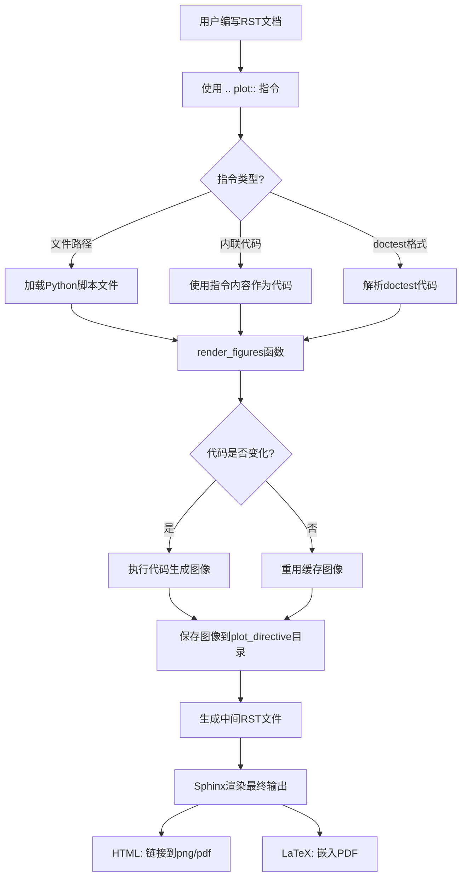

## 类结构

```
PlotDirective (docutils.parsers.rst.Directive)
├── ImageFile (图像文件封装)
├── PlotError (RuntimeError异常)
└── _FilenameCollector (EnvironmentCollector)
```

## 全局变量及字段


### `__version__`
    
模块版本号

类型：`int`
    


### `plot_context`
    
用于存储所有使用:context:选项的plot指令的上下文

类型：`dict`
    


### `_SOURCECODE`
    
Jinja2模板字符串，用于生成源代码下载链接和显示

类型：`str`
    


### `TEMPLATE`
    
用于生成figure指令的Jinja2模板

类型：`str`
    


### `TEMPLATE_SRCSET`
    
用于支持srcset的figure指令的Jinja2模板

类型：`str`
    


### `exception_template`
    
异常发生时的渲染模板

类型：`str`
    


### `setup`
    
Sphinx扩展的setup函数，用于注册指令和配置选项

类型：`function`
    


### `PlotDirective.has_content`
    
指示指令是否有内容块

类型：`bool`
    


### `PlotDirective.required_arguments`
    
指令必需的位置参数数量

类型：`int`
    


### `PlotDirective.optional_arguments`
    
指令可选的位置参数数量

类型：`int`
    


### `PlotDirective.final_argument_whitespace`
    
指示最终参数是否有空白

类型：`bool`
    


### `PlotDirective.option_spec`
    
指令支持的选项及其验证函数的字典

类型：`dict`
    


### `ImageFile.basename`
    
图像文件的基础名称（不含扩展名）

类型：`str`
    


### `ImageFile.dirname`
    
图像文件所在的目录路径

类型：`str`
    


### `ImageFile.formats`
    
图像文件支持的格式列表

类型：`list`
    
    

## 全局函数及方法


### `_option_boolean`

用于解析 Sphinx 指令中的布尔类型选项参数，将字符串形式的参数转换为 Python 布尔值，支持多种常见格式（如 yes/no, true/false, 1/0），如果没有提供参数则默认为 True（作为标志位使用）。

参数：

-  `arg`：`Any`，传入的选项参数，可以是字符串或空值，用于指定布尔选项的值

返回值：`bool`，返回解析后的布尔值

#### 流程图

```mermaid
flowchart TD
    A[开始] --> B{arg 是否为空或仅空格}
    B -->|是| C[返回 True]
    B -->|否| D{arg.strip().lower() in ['no', '0', 'false']}
    D -->|是| E[返回 False]
    D -->|否| F{arg.strip().lower() in ['yes', '1', 'true']}
    F -->|是| G[返回 True]
    F -->|否| H[抛出 ValueError 异常]
    C --> I[结束]
    E --> I
    G --> I
    H --> I
```

#### 带注释源码

```python
def _option_boolean(arg):
    """
    将指令选项参数解析为布尔值。
    
    用于处理 Sphinx 指令中的布尔类型选项，支持多种格式：
    - 无参数（作为标志位）：返回 True
    - 'yes', '1', 'true'：返回 True
    - 'no', '0', 'false'：返回 False
    - 其他情况：抛出 ValueError
    """
    # 检查参数是否为空或仅包含空白字符
    # 如果是，则假定该选项作为标志位使用，返回 True
    if not arg or not arg.strip():
        # no argument given, assume used as a flag
        return True
    # 检查参数是否为表示"否"的字符串
    elif arg.strip().lower() in ('no', '0', 'false'):
        return False
    # 检查参数是否为表示"是"的字符串
    elif arg.strip().lower() in ('yes', '1', 'true'):
        return True
    # 如果参数不是有效的布尔表示，则抛出异常
    else:
        raise ValueError(f'{arg!r} unknown boolean')
```


### `_option_context`

该函数是 Sphinx 扩展中用于验证 plot directive 的 `:context:` 选项值的回调函数，确保选项值只能是 `None`、`'reset'` 或 `'close-figs'` 三个合法值之一，否则抛出 `ValueError` 异常。

参数：

- `arg`：任意类型（通常为 `str` 或 `None`），需要验证的上下文选项参数

返回值：`任意类型`，如果参数合法则返回原始值（`None`、`'reset'` 或 `'close-figs'`），否则抛出 `ValueError`

#### 流程图

```mermaid
flowchart TD
    A[开始: _option_context] --> B{arg in [None, 'reset', 'close-figs']?}
    B -->|是| C[返回 arg]
    B -->|否| D[抛出 ValueError]
    C --> E[结束]
    D --> E
```

#### 带注释源码

```python
def _option_context(arg):
    """
    验证并返回 plot directive 的 :context: 选项值。
    
    该函数作为 option_spec 字典中的验证器使用，确保 context 选项
    只能是 None、'reset' 或 'close-figs' 三个合法值之一。
    
    参数:
        arg: 任意类型 - 用户在 directive 中传入的 :context: 选项值
        
    返回:
        任意类型 - 如果 arg 是 None、'reset' 或 'close-figs'，
                  则返回原值；否则抛出 ValueError
        
    异常:
        ValueError: 当 arg 不是合法值时抛出
    """
    # 检查参数是否在允许的值列表中
    if arg in [None, 'reset', 'close-figs']:
        return arg
    # 参数不合法，抛出详细错误信息
    raise ValueError("Argument should be None or 'reset' or 'close-figs'")
```


### `_option_format`

这是一个用于验证 Sphinx plot directive 中 `:format:` 选项的函数，确保传入的参数只能是 `'python'` 或 `'doctest'` 两者之一。

参数：

-  `arg`：`str`，用户传入的 format 选项值

返回值：`str`，返回经验证合法的选项值（`'python'` 或 `'doctest'`）；如果值不合法则抛出 `ValueError` 异常

#### 流程图

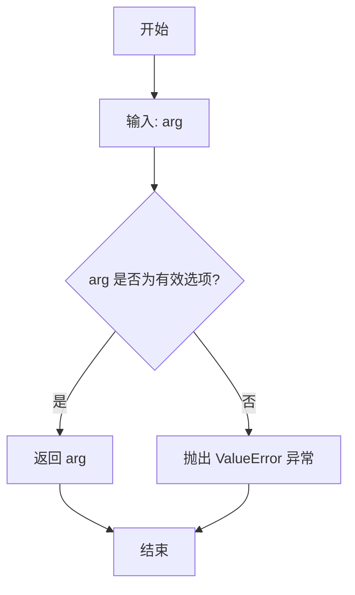

#### 带注释源码

```python
def _option_format(arg):
    """
    验证 plot directive 的 format 选项值。
    
    该函数被用作 directive 的 option_spec 中 'format' 选项的验证器。
    它确保用户只能指定 'python' 或 'doctest' 两种格式之一。
    
    参数:
        arg: str, 用户通过 :format: 选项传入的值
        
    返回:
        str, 合法的选项值 ('python' 或 'doctest')
        
    异常:
        ValueError: 当 arg 不在允许的选项列表中时抛出
    """
    # 使用 docutils 的 directives.choice 进行验证
    # 该函数会比较 arg 与允许的选项元组 ('python', 'doctest')
    # 如果匹配则返回原值，不匹配则抛出 ValueError
    return directives.choice(arg, ('python', 'doctest'))
```


### `mark_plot_labels`

该函数用于将图表的引用标签从 `html_only` 或 `latex_only` 节点移动到实际的 `figure` 节点，使 Sphinx 文档中的图表可以通过交叉引用进行引用。

参数：

- `app`：`sphinx.application.Sphinx`，Sphinx 应用程序实例，用于访问配置和环境
- `document`：`docutils.nodes.document`，docutils 文档对象，包含文档的完整结构和节点信息

返回值：`None`，该函数直接修改 `document` 对象的状态，不返回任何值

#### 流程图

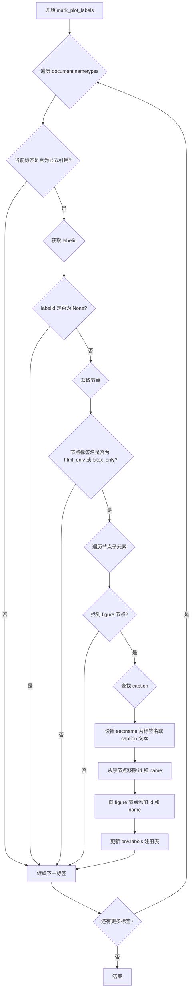

#### 带注释源码

```python
def mark_plot_labels(app, document):
    """
    To make plots referenceable, we need to move the reference from the
    "htmlonly" (or "latexonly") node to the actual figure node itself.
    
    这个函数的目的是为了让 plot 指令生成的图表可以被文档中定义的
    标签所引用。在 Sphinx 中，plot 指令生成的 HTML 输出会被包装在
    html_only 或 latex_only 节点中，但引用标签需要指向实际的 figure 节点。
    """
    # 遍历文档中所有的命名类型（nametypes 存储了标签名和是否显式声明的映射）
    for name, explicit in document.nametypes.items():
        # 只处理显式声明的标签（如 .. label:: 语法）
        if not explicit:
            continue
        
        # 通过标签名获取对应的节点 ID
        labelid = document.nameids[name]
        if labelid is None:
            continue
        
        # 获取对应的节点对象
        node = document.ids[labelid]
        
        # 检查节点是否为 html_only 或 latex_only 类型
        # 这些节点是 plot 指令在 HTML/LaTeX 输出中使用的包装器
        if node.tagname in ('html_only', 'latex_only'):
            # 在这些节点中查找 figure 节点
            for n in node:
                if n.tagname == 'figure':
                    # 默认使用标签名作为章节名称
                    sectname = name
                    # 尝试从 caption 获取更友好的名称
                    for c in n:
                        if c.tagname == 'caption':
                            sectname = c.astext()
                            break

                    # 从 html_only/latex_only 节点中移除标签引用
                    node['ids'].remove(labelid)
                    node['names'].remove(name)
                    
                    # 将标签引用添加到实际的 figure 节点
                    n['ids'].append(labelid)
                    n['names'].append(name)
                    
                    # 更新 Sphinx 环境的标签注册表，使引用可以正确解析
                    # 格式: {标签名: (文档名, 节点ID, 章节名)}
                    document.settings.env.labels[name] = \
                        document.settings.env.docname, labelid, sectname
                    break
```


### `_copy_css_file`

该函数是 Sphinx 扩展的构建完成回调函数，用于在 HTML 构建成功后，将 CSS 文件复制到输出目录的静态资源文件夹中。

参数：

- `app`：`Sphinx.application`, Sphinx 应用程序实例，包含配置和构建信息
- `exc`：`Exception | None`，构建过程中发生的异常，如果为 `None` 表示构建成功

返回值：`None`，无返回值

#### 流程图

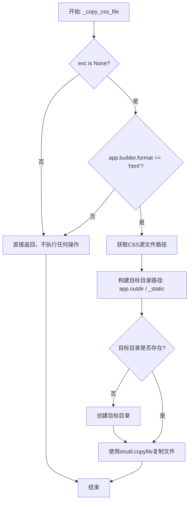

#### 带注释源码

```python
def _copy_css_file(app, exc):
    """
    在构建完成后将 CSS 文件复制到输出目录的静态资源文件夹。
    
    此函数作为 'build-finished' 事件的回调函数，仅在 HTML 构建成功时执行。
    它确保 plot_directive.css 文件被复制到输出目录的 _static 文件夹中，
    以便在生成的 HTML 页面中正确加载样式。
    """
    # 仅当没有异常且构建目标是 HTML 格式时才执行复制操作
    if exc is None and app.builder.format == 'html':
        # 获取 matplotlib 数据目录中的 CSS 源文件路径
        src = cbook._get_data_path('plot_directive/plot_directive.css')
        # 构建目标目录路径：输出目录下的 _static 文件夹
        dst = app.outdir / Path('_static')
        # 确保目标目录存在，如果已存在则不报错
        dst.mkdir(exist_ok=True)
        # 使用 copyfile 复制文件（不复制源文件的权限信息）
        shutil.copyfile(src, dst / Path('plot_directive.css'))
```


### `setup`

该函数是 Sphinx 扩展的入口点，负责初始化 Matplotlib 绘图指令的扩展，注册指令、配置选项、事件处理器，并返回扩展的元数据。

参数：

-  `app`：`sphinx.application.Sphinx`，Sphinx 应用程序实例，用于注册指令、配置值和事件处理器

返回值：`dict`，包含扩展的并行读写安全标志和版本信息的字典

#### 流程图

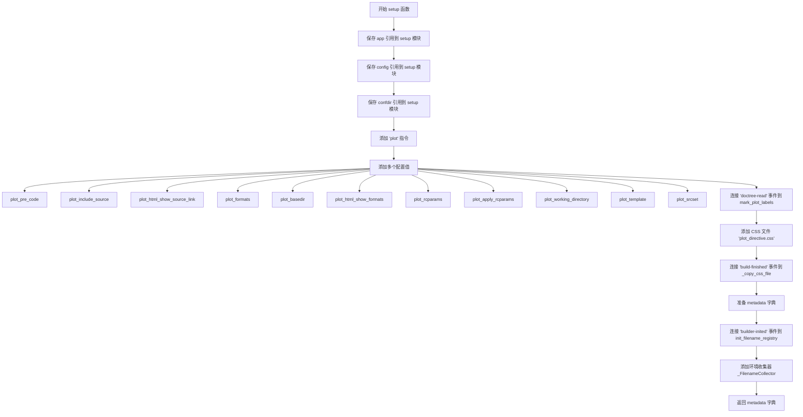

#### 带注释源码

```python
def setup(app):
    """
    Sphinx 扩展的入口点函数，用于初始化 matplotlib 绘图指令扩展。
    
    该函数执行以下初始化任务：
    1. 保存 app、config、confdir 的引用以便在其他模块中使用
    2. 注册 .. plot:: 指令
    3. 添加各种配置选项
    4. 连接事件处理器
    5. 返回扩展元数据
    """
    # 保存应用程序实例引用，供其他模块（如 _run_code）访问配置
    setup.app = app
    setup.config = app.config
    setup.confdir = app.confdir
    
    # 注册 .. plot:: 指令，这是用户在 RST 文档中使用的指令
    app.add_directive('plot', PlotDirective)
    
    # 添加各种配置值，允许用户在 conf.py 中自定义扩展行为
    # 参数说明：(名称, 默认值, rebuild 标志)
    # rebuild 标志 True 表示更改配置需要重新构建文档
    app.add_config_value('plot_pre_code', None, True)          # 绘图前执行的代码
    app.add_config_value('plot_include_source', False, True)  # 是否包含源码
    app.add_config_value('plot_html_show_source_link', True, True)  # HTML 中显示源码链接
    app.add_config_value('plot_formats', ['png', 'hires.png', 'pdf'], True)  # 输出格式
    app.add_config_value('plot_basedir', None, True)           # 基础目录
    app.add_config_value('plot_html_show_formats', True, True)  # HTML 中显示格式链接
    app.add_config_value('plot_rcparams', {}, True)            # matplotlib rcParams
    app.add_config_value('plot_apply_rcparams', False, True)   # 是否应用 rcParams
    app.add_config_value('plot_working_directory', None, True)  # 工作目录
    app.add_config_value('plot_template', None, True)         # 自定义模板
    app.add_config_value('plot_srcset', [], True)              # 响应式图片 srcset
    
    # 连接 'doctree-read' 事件，在文档树读取完成后处理图标号
    app.connect('doctree-read', mark_plot_labels)
    
    # 添加 CSS 文件，用于 HTML 输出样式
    app.add_css_file('plot_directive.css')
    
    # 连接 'build-finished' 事件，在构建完成后复制 CSS 文件
    app.connect('build-finished', _copy_css_file)
    
    # 准备扩展元数据，包含并行读写安全性和版本信息
    metadata = {
        'parallel_read_safe': True, 
        'parallel_write_safe': True,
        'version': matplotlib.__version__
    }
    
    # 连接 'builder-inited' 事件，在 builder 初始化时初始化文件名注册表
    app.connect('builder-inited', init_filename_registry)
    
    # 添加环境收集器，用于收集和清理文件名信息
    app.add_env_collector(_FilenameCollector)
    
    # 返回元数据，使 Sphinx 能够识别扩展信息
    return metadata
```


### `init_filename_registry`

该函数用于在 Sphinx 构建过程中初始化图像文件名注册表，确保每个文档的图像基名集合被正确存储在环境对象中，以避免重复的文件名冲突。

参数：

-  `app`：`Sphinx.application.Sphinx`，Sphinx 应用实例，通过 'builder-inited' 事件触发时传入

返回值：`None`，无返回值（隐式返回 None）

#### 流程图

```mermaid
flowchart TD
    A[开始: init_filename_registry] --> B{获取 app.builder.env}
    B --> C{检查 env 是否有 mpl_plot_image_basenames 属性?}
    C -->|是| D[什么都不做]
    C -->|否| E[创建 defaultdict(set) 并赋值给 env.mpl_plot_image_basenames]
    E --> F[结束]
    D --> F
```

#### 带注释源码

```python
def init_filename_registry(app):
    """
    初始化文件名注册表。
    
    该函数作为 Sphinx 扩展的 'builder-inited' 事件处理器，
    在构建器初始化时调用，确保环境对象中存在用于存储
    图像文件基名的数据结构。
    """
    # 获取 Sphinx 构建环境对象
    env = app.builder.env
    
    # 检查环境是否已有 mpl_plot_image_basenames 属性
    if not hasattr(env, 'mpl_plot_image_basenames'):
        # 如果没有，则初始化为一个 defaultdict(set)
        # defaultdict 的 set 用于存储每个文档的文件名集合
        env.mpl_plot_image_basenames = defaultdict(set)
```

---

### 补充说明

| 项目 | 说明 |
|------|------|
| **函数位置** | 模块级函数（非类方法） |
| **触发时机** | 通过 `app.connect('builder-inited', init_filename_registry)` 在 `setup()` 函数中注册 |
| **全局变量依赖** | `defaultdict`（从 collections 导入） |
| **关联类** | `_FilenameCollector`（环境收集器）使用 `env.mpl_plot_image_basenames` 来跟踪文件名 |
| **设计目的** | 避免同一个文档或不同文档中使用相同的 filename-prefix，导致输出文件冲突 |
| **潜在优化** | 可考虑添加清理机制或在并行构建时确保线程安全（当前 `defaultdict(set)` 在多进程下可能需要额外同步） |


### `contains_doctest`

该函数用于检查给定文本是否包含doctest格式（以 `>>>` 开头的代码行），用于区分普通Python代码和文档测试代码。

参数：

-  `text`：`str`，需要检查的文本内容，可能是包含Python代码或doctest格式的字符串

返回值：`bool`，如果文本包含doctest格式返回 `True`，否则返回 `False`

#### 流程图

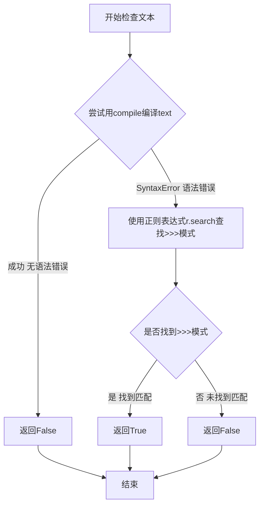

#### 带注释源码

```python
def contains_doctest(text):
    """
    检查给定文本是否包含doctest格式。
    
    Doctest格式使用>>>作为提示符，类似交互式Python会话。
    """
    try:
        # 尝试将文本作为有效Python代码编译
        # 如果成功，说明是普通Python代码，不包含doctest
        compile(text, '<string>', 'exec')
        return False
    except SyntaxError:
        # 如果编译失败，可能是doctest格式或其他语法
        # 继续检查是否存在>>>提示符
        pass
    
    # 使用正则表达式搜索doctest提示符
    # r'^\s*>>>' 匹配行首（可能有空白）的>>>
    # re.M 多行模式，使^匹配每行开头
    r = re.compile(r'^\s*>>>', re.M)
    m = r.search(text)
    
    # 返回布尔值：找到>>>返回True，否则返回False
    return bool(m)
```


### `_split_code_at_show`

该函数用于将代码文本在 `plt.show()` 调用处分割成多个代码片段，以便支持多图输出。它首先检测代码是否为 doctest 格式，然后根据是否指定了 function_name 来决定是分割代码还是保持原样返回。

参数：

- `text`：`str`，需要分割的代码文本
- `function_name`：`str | None`，可选的函数名称。如果为 `None`，则在 `plt.show()` 处分割代码；如果指定了 function_name，则不分割，整个文本作为一部分返回

返回值：`(bool, list[str])`，返回一个元组，包含：
- `is_doctest`：`bool`，指示代码是否为 doctest 格式
- `parts`：`list[str]`，分割后的代码片段列表

#### 流程图

```mermaid
flowchart TD
    A[开始] --> B[调用 contains_doctest 检测文本格式]
    B --> C{function_name is None?}
    C -->|是| D[初始化 parts 和 part 列表]
    C -->|否| E[parts = [text]]
    E --> K[返回 is_doctest, parts]
    D --> F[遍历文本的每一行]
    F --> G{检测到 plt.show 调用?}
    G -->|非 doctest 且 line.startswith'plt.show('| H1[添加当前行到 part]
    G -->|doctest 且 line.strip == '>>> plt.show()'| H2[添加当前行到 part]
    G -->|其他情况| I[添加当前行到 part]
    H1 --> J[将 part 合并并添加到 parts, 重置 part]
    H2 --> J
    I --> L{还有更多行?}
    L -->|是| F
    L -->|否| M{part 非空?}
    M -->|是| N[将剩余 part 添加到 parts]
    M -->|否| K
    J --> L
    N --> K
```

#### 带注释源码

```python
def _split_code_at_show(text, function_name):
    """
    Split code at plt.show().
    
    该函数将输入的代码文本在 plt.show() 调用处分割成多个片段，
    以支持一个代码块生成多个图像的场景。
    
    Parameters
    ----------
    text : str
        需要处理的代码文本
    function_name : str or None
        可选的函数名称。如果为 None，则在 plt.show() 处分割代码；
        如果指定了 function_name，则不进行分割，整个文本作为一部分返回
    
    Returns
    -------
    is_doctest : bool
        指示代码是否为 doctest 格式
    parts : list of str
        分割后的代码片段列表
    """
    
    # 首先检测代码是否为 doctest 格式
    is_doctest = contains_doctest(text)
    
    if function_name is None:
        # 没有指定函数名，需要在 plt.show() 处分割代码
        parts = []
        part = []
        
        # 逐行处理文本
        for line in text.split("\n"):
            # 根据是否为 doctest 格式检测 plt.show() 调用
            if ((not is_doctest and line.startswith('plt.show(')) or
                   (is_doctest and line.strip() == '>>> plt.show()')):
                # 找到 plt.show() 行，将其加入当前片段
                part.append(line)
                # 将当前片段加入结果列表
                parts.append("\n".join(part))
                # 重置当前片段，准备处理下一个代码块
                part = []
            else:
                # 普通代码行，加入当前片段
                part.append(line)
        
        # 处理最后一部分代码（如果最后没有 plt.show()）
        if "\n".join(part).strip():
            parts.append("\n".join(part))
    else:
        # 指定了 function_name，不进行分割，整个文本作为一部分
        parts = [text]
    
    # 返回是否为 doctest 格式以及分割后的代码片段
    return is_doctest, parts
```


### `out_of_date`

判断派生文件（derived）相对于原始文件（original）或任何通过 RST include 指令包含的文件是否过期。

参数：

- `original`：`str`，原始文件的完整路径
- `derived`：`str`，派生文件的完整路径
- `includes`：`Optional[List[str]]`，可选参数，包含在原始文件中的 RST 文件的完整路径列表

返回值：`bool`，如果派生文件相对于原始文件或任何包含的文件过期则返回 `True`，否则返回 `False`

#### 流程图

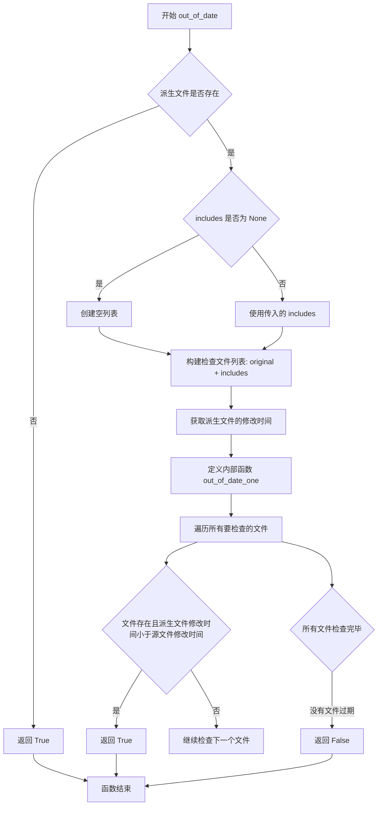

#### 带注释源码

```python
def out_of_date(original, derived, includes=None):
    """
    Return whether *derived* is out-of-date relative to *original* or any of
    the RST files included in it using the RST include directive (*includes*).
    *derived* and *original* are full paths, and *includes* is optionally a
    list of full paths which may have been included in the *original*.
    """
    # 如果派生文件不存在，则认为它过期了（需要重新生成）
    if not os.path.exists(derived):
        return True

    # 如果没有提供 includes 参数，初始化为空列表
    if includes is None:
        includes = []
    # 构建需要检查的文件列表：原始文件 + 所有包含的文件
    files_to_check = [original, *includes]

    def out_of_date_one(original, derived_mtime):
        """
        内部函数：检查单个原始文件是否比派生文件新
        """
        return (os.path.exists(original) and
                derived_mtime < os.stat(original).st_mtime)

    # 获取派生文件的修改时间
    derived_mtime = os.stat(derived).st_mtime
    # 如果任何一个源文件比派生文件新，则返回 True（表示过期）
    return any(out_of_date_one(f, derived_mtime) for f in files_to_check)
```


### `_run_code`

该函数负责执行Python代码块，切换工作目录，设置执行环境（包括导入必要的库如numpy和matplotlib.pyplot），并在执行完成后恢复原始工作目录。它支持运行指定函数，并处理可能出现的异常。

参数：

-  `code`：`str`，要执行的Python代码字符串
-  `code_path`：`str` 或 `None`，代码文件的路径，用于确定工作目录和sys.path
-  `ns`：`dict` 或 `None`，执行代码时使用的命名空间字典，如果为None则创建新字典
-  `function_name`：`str` 或 `None`，执行代码后要调用的函数名（无参数）

返回值：`dict`，执行后的命名空间字典

#### 流程图

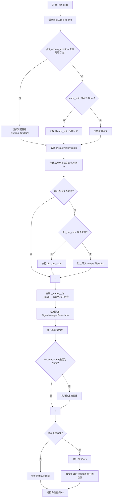

#### 带注释源码

```python
def _run_code(code, code_path, ns=None, function_name=None):
    """
    Import a Python module from a path, and run the function given by
    name, if function_name is not None.
    """

    # 保存当前工作目录，以便执行完成后恢复
    pwd = os.getcwd()
    
    # 如果配置了 plot_working_directory，则切换到该目录
    if setup.config.plot_working_directory is not None:
        try:
            os.chdir(setup.config.plot_working_directory)
        except OSError as err:
            raise OSError(f'{err}\n`plot_working_directory` option in '
                          f'Sphinx configuration file must be a valid '
                          f'directory path') from err
        except TypeError as err:
            raise TypeError(f'{err}\n`plot_working_directory` option in '
                            f'Sphinx configuration file must be a string or '
                            f'None') from err
    # 否则如果提供了 code_path，切换到代码文件所在目录
    elif code_path is not None:
        dirname = os.path.abspath(os.path.dirname(code_path))
        os.chdir(dirname)

    # 使用上下文管理器临时修改 sys.argv 和 sys.path，并重定向 stdout
    with cbook._setattr_cm(
            sys, argv=[code_path], path=[os.getcwd(), *sys.path]), \
            contextlib.redirect_stdout(StringIO()):
        try:
            # 如果未提供命名空间，则创建新的
            if ns is None:
                ns = {}
            
            # 如果命名空间为空，导入默认的库
            if not ns:
                if setup.config.plot_pre_code is None:
                    # 默认导入 numpy 和 matplotlib.pyplot
                    exec('import numpy as np\n'
                         'from matplotlib import pyplot as plt\n', ns)
                else:
                    # 执行配置的自定义预代码
                    exec(str(setup.config.plot_pre_code), ns)
            
            # 如果代码中包含 __main__，设置 __name__ 为 __main__
            if "__main__" in code:
                ns['__name__'] = '__main__'

            # 临时修补 FigureManagerBase.show 为空操作，避免触发警告
            with cbook._setattr_cm(FigureManagerBase, show=lambda self: None):
                # 执行代码
                exec(code, ns)
                # 如果指定了函数名，执行该函数
                if function_name is not None:
                    exec(function_name + "()", ns)

        except (Exception, SystemExit) as err:
            # 捕获异常并抛出 PlotError，保留完整的堆栈信息
            raise PlotError(traceback.format_exc()) from err
        finally:
            # 无论如何都恢复原始工作目录
            os.chdir(pwd)
    
    # 返回执行后的命名空间
    return ns
```


### `clear_state`

该函数用于重置matplotlib的图形状态和配置参数。它关闭所有当前的图形窗口，将matplotlib的rcParams重置为文件默认值，然后应用自定义的rcParams参数。

参数：

- `plot_rcparams`：`dict`，一个字典，包含需要应用到matplotlib的rcParams参数，用于在重置后恢复自定义配置
- `close`：`bool`，布尔值，指示是否在重置状态前关闭所有已打开的图形窗口，默认为True

返回值：`None`，该函数不返回任何值，仅执行状态重置操作

#### 流程图

```mermaid
flowchart TD
    A[开始 clear_state] --> B{close 参数是否为 True?}
    B -->|是| C[调用 plt.close('all') 关闭所有图形]
    B -->|否| D[跳过关闭图形步骤]
    C --> E[调用 matplotlib.rc_file_defaults() 重置 rcParams]
    D --> E
    E --> F[调用 matplotlib.rcParams.update 更新参数]
    F --> G[结束 clear_state]
```

#### 带注释源码

```python
def clear_state(plot_rcparams, close=True):
    """
    清理matplotlib的绘图状态。
    
    Parameters
    ----------
    plot_rcparams : dict
        一个字典，包含需要应用的matplotlib rcParams参数。
        这些参数会在重置默认配置后被应用到全局rcParams中。
    close : bool, optional
        布尔值，指示是否在重置状态前关闭所有已打开的图形窗口。
        默认为 True，即关闭所有图形。
    
    Returns
    -------
    None
        该函数不返回任何值。
    
    Notes
    -----
    此函数主要用于Sphinx plot指令中，在执行完绘图代码后清理状态，
    以确保后续的绘图不会受到之前代码的影响。它执行以下操作：
    
    1. 如果 close 为 True，关闭所有已打开的 matplotlib 图形
    2. 将 matplotlib 的 rcParams 重置为从文件加载的默认值
    3. 使用传入的 plot_rcparams 更新全局 rcParams 配置
    """
    # 如果 close 参数为 True，则关闭所有已打开的图形窗口
    # 这确保了在同一个上下文中执行的多个 plot 指令不会互相干扰
    if close:
        plt.close('all')
    
    # 将 matplotlib 的 rcParams 重置为从 matplotlibrc 文件加载的默认值
    # 这会清除之前可能存在的任何自定义配置
    matplotlib.rc_file_defaults()
    
    # 使用传入的 plot_rcparams 字典更新全局 rcParams
    # 这允许用户通过配置指定特定的绘图参数（如字体大小、DPI等）
    matplotlib.rcParams.update(plot_rcparams)
```


### `get_plot_formats`

该函数用于将 Sphinx 配置中的 `plot_formats` 选项转换为标准的格式列表，每个元素为 `(文件扩展名, DPI)` 元组。它支持多种输入格式（字符串、带 DPI 的字符串、列表/元组），并为缺失 DPI 的格式提供默认值。

参数：

-  `config`：`Any`，Sphinx 配置对象，包含 `plot_formats` 配置项

返回值：`list[tuple[str, int]]`，返回格式列表，每个元素为 `(扩展名, DPI)` 的元组

#### 流程图

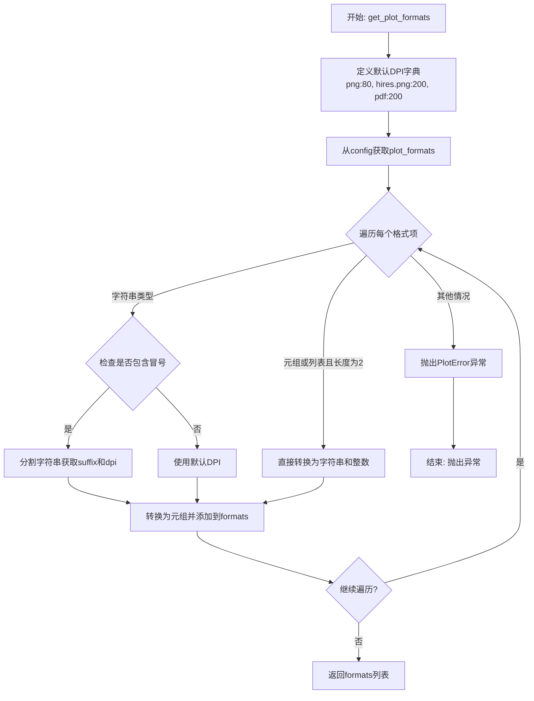

#### 带注释源码

```python
def get_plot_formats(config):
    """
    将配置中的 plot_formats 转换为标准格式列表。
    
    参数:
        config: 包含 plot_formats 配置的 Sphinx 配置对象
    返回:
        格式列表，每个元素为 (扩展名, DPI) 元组
    """
    # 定义默认 DPI 值：png 为 80，高分辨率 png 为 200，pdf 为 200
    default_dpi = {'png': 80, 'hires.png': 200, 'pdf': 200}
    # 初始化结果列表
    formats = []
    # 从配置中获取 plot_formats
    plot_formats = config.plot_formats
    # 遍历每个格式配置项
    for fmt in plot_formats:
        # 如果是字符串格式
        if isinstance(fmt, str):
            # 检查是否指定了 DPI（通过冒号分隔）
            if ':' in fmt:
                # 分割字符串获取后缀和 DPI
                suffix, dpi = fmt.split(':')
                # 转换为 (字符串后缀, 整数DPI) 元组并添加
                formats.append((str(suffix), int(dpi)))
            else:
                # 未指定 DPI，使用默认 DPI（若不存在则默认 80）
                formats.append((fmt, default_dpi.get(fmt, 80)))
        # 如果是元组或列表且长度为 2
        elif isinstance(fmt, (tuple, list)) and len(fmt) == 2:
            # 直接转换为 (字符串后缀, 整数DPI) 元组
            formats.append((str(fmt[0]), int(fmt[1])))
        else:
            # 无效格式，抛出错误
            raise PlotError('invalid image format "%r" in plot_formats' % fmt)
    # 返回格式列表
    return formats
```


### `_parse_srcset`

该函数用于解析 Sphinx 绘图指令的 srcset 配置，将形如 `"2.0x"` 的乘数条目转换为以浮点数倍率为键、原始字符串为值的字典，用于生成多分辨率图像。

参数：

- `entries`：`List[str]`，待解析的 srcset 乘数列表，每个元素应为形如 `"2.0x"` 或 `"1.5x"` 的字符串

返回值：`Dict[float, str]`，返回以浮点数倍率为键（如 `2.0`）、原始字符串为值（如 `"2.0x"`）的字典

#### 流程图

```mermaid
flowchart TD
    A[开始 _parse_srcset] --> B{检查 entries 是否为空}
    B -->|是| C[返回空字典]
    B -->|否| D[遍历每个 entry]
    D --> E[strip 去除首尾空格]
    E --> F{entry 长度 >= 2?}
    F -->|否| G[抛出 ExtensionError: srcset argument 无效]
    F -->|是| H[提取除最后一个字符外的部分<br/>mult = entry[:-1]]
    I[将 mult 转换为 float] --> J[将 float(mult) 作为键<br/>entry 作为值存入 srcset]
    J --> K{还有更多 entry?}
    K -->|是| D
    K -->|否| L[返回 srcset 字典]
```

#### 带注释源码

```python
def _parse_srcset(entries):
    """
    Parse srcset for multiples...

    将形如 ["2.0x", "1.5x"] 的列表转换为 {2.0: "2.0x", 1.5: "1.5x"} 的字典
    """
    srcset = {}  # 初始化结果字典，键为 float 倍率，值为原始字符串
    for entry in entries:  # 遍历输入的每个 srcset 条目
        entry = entry.strip()  # 去除首尾空白字符
        if len(entry) >= 2:  # 有效条目至少需要 2 个字符（如 "1x"）
            mult = entry[:-1]  # 去掉最后一个字符 "x"，得到倍数字符串
            srcset[float(mult)] = entry  # 存入字典，键为浮点数倍率
        else:
            # 无效条目抛出异常
            raise ExtensionError(f'srcset argument {entry!r} is invalid.')
    return srcset  # 返回解析后的 srcset 字典
```


### `check_output_base_name`

该函数用于验证绘图指令的输出文件名前缀是否符合规范，并检查其在当前文档中是否已被使用，以防止文件名冲突。

参数：

- `env`：`sphinx.environment.BuildEnvironment`，Sphinx 构建环境对象，包含文档元数据和文件名注册表
- `output_base`：`str`，输出文件的基本名称（不含扩展名）

返回值：`None`，无返回值。该函数通过抛出 `PlotError` 异常来处理验证失败的情况，验证成功后会将 `output_base` 添加到环境的名注册表中

#### 流程图

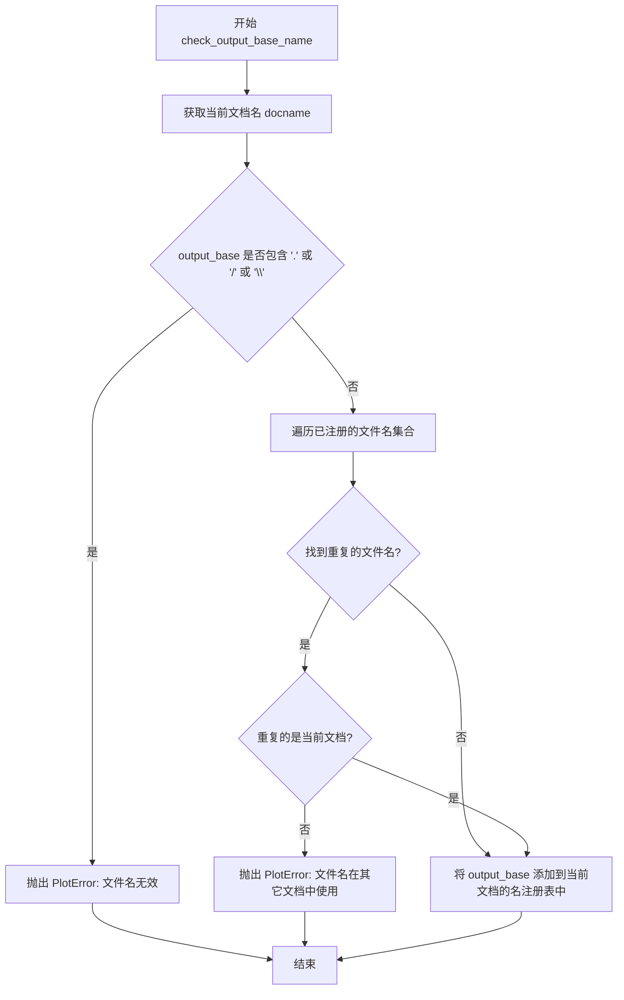

#### 带注释源码

```python
def check_output_base_name(env, output_base):
    """
    验证输出文件名前缀的有效性并检查重复。
    
    Parameters
    ----------
    env : sphinx.environment.BuildEnvironment
        Sphinx 构建环境对象，包含文档名和文件名注册表。
    output_base : str
        期望的输出文件名前缀（不含扩展名）。
    
    Raises
    ------
    PlotError
        如果 output_base 包含非法字符或与已存在的文件名冲突。
    """
    # 获取当前处理的文档名称
    docname = env.docname

    # 检查文件名是否包含非法字符（点号或斜杠）
    # 这些字符会与文件扩展名或路径分隔符混淆
    if '.' in output_base or '/' in output_base or '\\' in output_base:
        raise PlotError(
            f"The filename-prefix '{output_base}' is invalid. "
            f"It must not contain dots or slashes.")

    # 遍历所有文档中已注册的文件名前缀
    for d in env.mpl_plot_image_basenames:
        # 检查当前要使用的文件名是否已被注册
        if output_base in env.mpl_plot_image_basenames[d]:
            # 判断冲突的文档是否是当前文档
            if d == docname:
                # 当前文档内重复使用同一文件名
                raise PlotError(
                    f"The filename-prefix {output_base!r} is used multiple times.")
            # 文件名在其他文档中已被使用
            raise PlotError(f"The filename-prefix {output_base!r} is used multiple"
                            f"times (it is also used in {env.doc2path(d)}).")

    # 验证通过，将文件名注册到当前文档的名注册表中
    env.mpl_plot_image_basenames[docname].add(output_base)
```


### `render_figures`

该函数是 Sphinx 绘图指令的核心引擎，负责执行 Python/Matplotlib 代码并生成图像文件。它接收代码内容、输出配置和上下文选项，依次完成代码执行、图像渲染、文件保存等操作，最终返回代码片段与生成的图像文件列表。

参数：

-  `code`：`str`，要执行的 Python 代码字符串，包含 Matplotlib 绘图指令
-  `code_path`：`str`，代码文件的完整路径，用于确定工作目录和检查文件时效性
-  `output_dir`：`str`，输出目录路径，生成的图像文件将保存在此目录下
-  `output_base`：`str`，输出文件的基本名称，图像文件将以此为基础命名
-  `context`：`bool`，是否在全局上下文中执行代码以共享图形状态
-  `function_name`：`str | None`，可选的函数名，代码执行后调用该函数生成图形
-  `config`：Sphinx 配置对象，提供绘图格式、DPI、rcParams 等配置信息
-  `context_reset`：`bool` (默认 `False`)，是否在执行前重置 matplotlib 状态
-  `close_figs`：`bool` (默认 `False`)，是否在执行前关闭所有现有图形
-  `code_includes`：`list | None` (默认 `None`)，代码中包含的其他文件路径列表，用于检查依赖文件的时效性

返回值：`list[tuple[str, list[ImageFile]]]`，返回一个列表，其中每个元素是一个元组 `(code_piece, images)`：`code_piece` 是代码片段字符串，`images` 是生成的 `ImageFile` 对象列表

#### 流程图

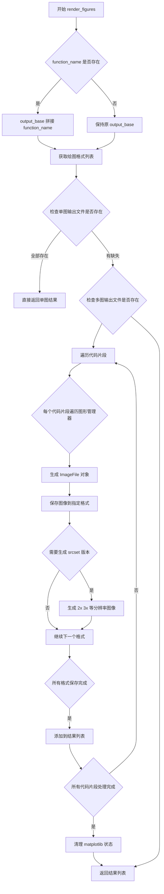

#### 带注释源码

```python
def render_figures(code, code_path, output_dir, output_base, context,
                   function_name, config, context_reset=False,
                   close_figs=False,
                   code_includes=None):
    """
    Run a pyplot script and save the images in *output_dir*.

    Save the images under *output_dir* with file names derived from
    *output_base*
    """

    # 如果提供了函数名，将其附加到 output_base 以区分不同函数的输出
    if function_name is not None:
        output_base = f'{output_base}_{function_name}'
    
    # 从配置中获取要生成的图像格式列表（如 png, hires.png, pdf）
    formats = get_plot_formats(config)

    # 尝试确定是否所有图像已经存在且是最新的
    # 将代码按 plt.show() 分割成多个代码段，支持多图形输出
    is_doctest, code_pieces = _split_code_at_show(code, function_name)
    
    # 首先检查单图形输出文件
    img = ImageFile(output_base, output_dir)
    for format, dpi in formats:
        # 如果启用上下文或文件已过时，则需要重新生成
        if context or out_of_date(code_path, img.filename(format),
                                  includes=code_includes):
            all_exists = False
            break
        img.formats.append(format)
    else:
        # for 循环正常完成（未 break），说明所有文件都存在
        all_exists = True

    # 如果单图全部存在，直接返回结果
    if all_exists:
        return [(code, [img])]

    # 否则检查多图形输出文件
    results = []
    for i, code_piece in enumerate(code_pieces):
        images = []
        for j in itertools.count():
            # 根据代码段数量和图形索引构建不同的文件名
            if len(code_pieces) > 1:
                img = ImageFile('%s_%02d_%02d' % (output_base, i, j),
                                output_dir)
            else:
                img = ImageFile('%s_%02d' % (output_base, j), output_dir)
            for fmt, dpi in formats:
                if context or out_of_date(code_path, img.filename(fmt),
                                          includes=code_includes):
                    all_exists = False
                    break
                img.formats.append(fmt)

            # 假设有一个格式就有所有格式
            if not all_exists:
                all_exists = (j > 0)  # 至少生成过一个图形才认为成功
                break
            images.append(img)
        if not all_exists:
            break
        results.append((code_piece, images))
    else:
        all_exists = True

    # 如果多图也全部存在，直接返回
    if all_exists:
        return results

    # 文件不存在，需要构建图像
    results = []
    # 使用全局 plot_context 或新建空字典
    ns = plot_context if context else {}

    # 如果要求重置上下文，先清理状态
    if context_reset:
        clear_state(config.plot_rcparams)
        plot_context.clear()

    # 根据上下文决定是否关闭图形
    close_figs = not context or close_figs

    # 遍历每个代码片段执行
    for i, code_piece in enumerate(code_pieces):

        # 根据配置决定是否应用 rcParams 和关闭图形
        if not context or config.plot_apply_rcparams:
            clear_state(config.plot_rcparams, close_figs)
        elif close_figs:
            plt.close('all')

        # 执行代码：如果是 doctest 格式则先转换
        _run_code(doctest.script_from_examples(code_piece) if is_doctest
                  else code_piece,
                  code_path, ns, function_name)

        # 获取所有图形管理器并保存图像
        images = []
        fig_managers = _pylab_helpers.Gcf.get_all_fig_managers()
        for j, figman in enumerate(fig_managers):
            # 根据图形数量和代码段数量决定输出文件名
            if len(fig_managers) == 1 and len(code_pieces) == 1:
                img = ImageFile(output_base, output_dir)
            elif len(code_pieces) == 1:
                img = ImageFile("%s_%02d" % (output_base, j), output_dir)
            else:
                img = ImageFile("%s_%02d_%02d" % (output_base, i, j),
                                output_dir)
            images.append(img)

            # 尝试保存每个格式的图像
            for fmt, dpi in formats:
                try:
                    # 保存默认格式
                    figman.canvas.figure.savefig(img.filename(fmt), dpi=dpi)
                    
                    # 如果配置了 srcset，生成多分辨率版本
                    if fmt == formats[0][0] and config.plot_srcset:
                        srcset = _parse_srcset(config.plot_srcset)
                        for mult, suffix in srcset.items():
                            fm = f'{suffix}.{fmt}'
                            img.formats.append(fm)
                            figman.canvas.figure.savefig(img.filename(fm),
                                                         dpi=int(dpi * mult))
                except Exception as err:
                    raise PlotError(traceback.format_exc()) from err
                img.formats.append(fmt)

        results.append((code_piece, images))

    # 完成后清理状态
    if not context or config.plot_apply_rcparams:
        clear_state(config.plot_rcparams, close=not context)

    return results
```


### `run`

该函数是 Sphinx 绘图表令的核心处理函数，负责解析指令参数、运行绘图代码、生成图像文件，并输出相应的 reStructuredText 内容到文档中。

参数：

- `arguments`：`list`，指令的可选参数列表（通常包含源文件路径和函数名）
- `content`：指令的内联内容（代码块）
- `options`：指令的选项字典（如 `format`、`include-source`、`context` 等）
- `state_machine`：`docutils.parsers.rst.states.RSTStateMachine`，文档状态机
- `state`：`docutils.parsers.rst.states.RSTState`，当前状态对象
- `lineno`：`int`，指令在源文件中的行号

返回值：`list`，包含错误信息的列表（如有异常则返回系统消息对象列表，否则返回空列表）

#### 流程图

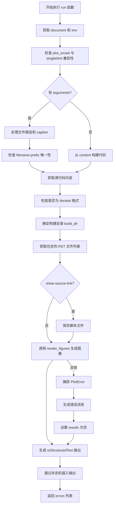

#### 带注释源码

```python
def run(arguments, content, options, state_machine, state, lineno):
    """
    执行 plot 指令的主函数。
    
    参数:
        arguments: 指令的可选参数列表（如文件路径、函数名）
        content: 指令的内联内容（代码块）
        options: 指令选项字典
        state_machine: RST 状态机
        state: 当前状态
        lineno: 行号
    返回:
        错误消息列表（无错误时为空列表）
    """
    # 从状态机获取文档对象
    document = state_machine.document
    # 从文档设置中获取环境配置
    env = document.settings.env
    config = env.config
    
    # 检查是否指定了 nofigs 选项
    nofigs = 'nofigs' in options

    # 验证 plot_srcset 与 singlehtml 构建不兼容
    if config.plot_srcset and setup.app.builder.name == 'singlehtml':
        raise ExtensionError(
            'plot_srcset option not compatible with single HTML writer')

    # 获取支持的图像格式
    formats = get_plot_formats(config)
    # 默认格式为第一种格式
    default_fmt = formats[0][0]

    # 设置选项默认值
    options.setdefault('include-source', config.plot_include_source)
    options.setdefault('show-source-link', config.plot_html_show_source_link)
    options.setdefault('filename-prefix', None)

    # 处理 CSS 类选项
    if 'class' in options:
        options['class'] = ['plot-directive'] + options['class']
    else:
        options.setdefault('class', ['plot-directive'])
    
    # 确定是否保持上下文
    keep_context = 'context' in options
    context_opt = None if not keep_context else options['context']

    # 获取 RST 文件路径和目录
    rst_file = document.attributes['source']
    rst_dir = os.path.dirname(rst_file)

    # 处理有参数的情况（从文件加载代码）
    if len(arguments):
        # 确定源文件路径
        if not config.plot_basedir:
            source_file_name = os.path.join(setup.app.builder.srcdir,
                                            directives.uri(arguments[0]))
        else:
            source_file_name = os.path.join(setup.confdir, config.plot_basedir,
                                            directives.uri(arguments[0]))
        
        # 从内容构建 caption
        caption = '\n'.join(content)

        # 检查 caption 是否在选项和内容中同时指定
        if "caption" in options:
            if caption:
                raise ValueError(
                    'Caption specified in both content and options.'
                    ' Please remove ambiguity.')
            caption = options["caption"]

        # 处理可选的函数名参数
        if len(arguments) == 2:
            function_name = arguments[1]
        else:
            function_name = None

        # 读取源代码文件内容
        code = Path(source_file_name).read_text(encoding='utf-8')
        
        # 处理文件名前缀
        if options['filename-prefix']:
            output_base = options['filename-prefix']
            check_output_base_name(env, output_base)
        else:
            output_base = os.path.basename(source_file_name)
    else:
        # 处理内联代码情况
        source_file_name = rst_file
        # 对内容进行去缩进处理
        code = textwrap.dedent("\n".join(map(str, content)))
        
        # 处理文件名前缀
        if options['filename-prefix']:
            output_base = options['filename-prefix']
            check_output_base_name(env, output_base)
        else:
            base, ext = os.path.splitext(os.path.basename(source_file_name))
            # 使用计数器生成唯一文件名
            counter = document.attributes.get('_plot_counter', 0) + 1
            document.attributes['_plot_counter'] = counter
            output_base = '%s-%d.py' % (base, counter)
        function_name = None
        caption = options.get('caption', '')

    # 处理输出文件名
    base, source_ext = os.path.splitext(output_base)
    if source_ext in ('.py', '.rst', '.txt'):
        output_base = base
    else:
        source_ext = ''

    # 确保 LaTeX includegraphics 不会因文件名中的点而失败
    output_base = output_base.replace('.', '-')

    # 检查是否为 doctest 格式
    is_doctest = contains_doctest(code)
    if 'format' in options:
        if options['format'] == 'python':
            is_doctest = False
        else:
            is_doctest = True

    # 确定输出目录名
    source_rel_name = relpath(source_file_name, setup.confdir)
    source_rel_dir = os.path.dirname(source_rel_name).lstrip(os.path.sep)

    # 构建输出目录路径
    build_dir = os.path.join(os.path.dirname(setup.app.doctreedir),
                             'plot_directive',
                             source_rel_dir)
    # 规范化路径，去除 ..
    build_dir = os.path.normpath(build_dir)
    os.makedirs(build_dir, exist_ok=True)

    # 计算从 RST 文件到构建目录的相对链接
    try:
        build_dir_link = relpath(build_dir, rst_dir).replace(os.path.sep, '/')
    except ValueError:
        # Windows 上不同驱动器/挂载点的情况
        build_dir_link = build_dir

    # 获取包含的 RST 文件列表
    try:
        source_file_includes = [os.path.join(os.getcwd(), t[0])
                                for t in state.document.include_log]
    except AttributeError:
        # docutils <0.17 的兼容处理
        possible_sources = {os.path.join(setup.confdir, t[0])
                            for t in state_machine.input_lines.items}
        source_file_includes = [f for f in possible_sources
                                if os.path.isfile(f)]
    
    # 从包含列表中移除源文件自身
    try:
        source_file_includes.remove(source_file_name)
    except ValueError:
        pass

    # 保存脚本文件（如果需要显示源代码链接）
    if options['show-source-link']:
        Path(build_dir, output_base + (source_ext or '.py')).write_text(
            doctest.script_from_examples(code)
            if source_file_name == rst_file and is_doctest
            else code,
            encoding='utf-8')

    # 生成图像
    try:
        results = render_figures(code=code,
                                 code_path=source_file_name,
                                 output_dir=build_dir,
                                 output_base=output_base,
                                 context=keep_context,
                                 function_name=function_name,
                                 config=config,
                                 context_reset=context_opt == 'reset',
                                 close_figs=context_opt == 'close-figs',
                                 code_includes=source_file_includes)
        errors = []
    except PlotError as err:
        # 捕获绘图错误并生成系统消息
        reporter = state.memo.reporter
        sm = reporter.system_message(
            2, "Exception occurred in plotting {}\n from {}:\n{}".format(
                output_base, source_file_name, err),
            line=lineno)
        results = [(code, [])]
        errors = [sm]

    # 正确处理 caption 缩进
    if caption and config.plot_srcset:
        caption = ':caption: ' + caption.replace('\n', ' ')
    elif caption:
        caption = '\n' + '\n'.join('      ' + line.strip()
                                   for line in caption.split('\n'))
    
    # 生成输出 reStructuredText
    total_lines = []
    for j, (code_piece, images) in enumerate(results):
        # 处理源代码显示
        if options['include-source']:
            if is_doctest:
                lines = ['', *code_piece.splitlines()]
            else:
                lines = ['.. code-block:: python']
                if 'code-caption' in options:
                    code_caption = options['code-caption'].replace('\n', ' ')
                    lines.append(f'   :caption: {code_caption}')
                lines.extend(['', *textwrap.indent(code_piece, '    ').splitlines()])
            source_code = "\n".join(lines)
        else:
            source_code = ""

        # 处理 nofigs 选项
        if nofigs:
            images = []

        # 处理 alt 文本
        if 'alt' in options:
            options['alt'] = options['alt'].replace('\n', ' ')

        # 构建选项列表
        opts = [
            f':{key}: {val}' for key, val in options.items()
            if key in ('alt', 'height', 'width', 'scale', 'align', 'class')]

        # 确定源代码下载链接
        if j == 0 and options['show-source-link']:
            src_name = output_base + (source_ext or '.py')
        else:
            src_name = None
            
        # 选择模板
        if config.plot_srcset:
            srcset = [*_parse_srcset(config.plot_srcset).values()]
            template = TEMPLATE_SRCSET
        else:
            srcset = None
            template = TEMPLATE

        # 渲染模板
        result = jinja2.Template(config.plot_template or template).render(
            default_fmt=default_fmt,
            build_dir=build_dir_link,
            src_name=src_name,
            multi_image=len(images) > 1,
            options=opts,
            srcset=srcset,
            images=images,
            source_code=source_code,
            html_show_formats=config.plot_html_show_formats and len(images),
            caption=caption)
        total_lines.extend(result.split("\n"))
        total_lines.extend("\n")

    # 插入生成的 RST 内容
    if total_lines:
        state_machine.insert_input(total_lines, source=source_file_name)

    return errors
```


### `PlotDirective.run`

该方法是 `PlotDirective` 类的核心方法，负责执行 Sphinx 的 `.. plot::` 指令。它解析指令参数和选项，调用底层的 `run` 函数生成绘图，并将结果插入到文档中。

参数：

- `self`：`PlotDirective` 实例，隐式参数，包含指令的所有状态信息

返回值：`list`，返回错误消息列表（如果有错误），否则为空列表

#### 流程图

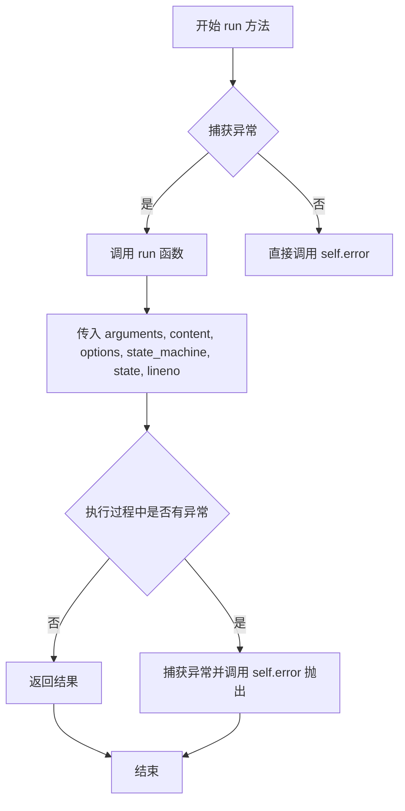

#### 带注释源码

```python
def run(self):
    """Run the plot directive."""
    try:
        # 调用模块级 run 函数，传入指令的所有必要参数
        # self.arguments: 指令的可选参数（如文件路径、函数名）
        # self.content: 指令的内联内容
        # self.options: 指令的选项字典
        # self.state_machine: reStructuredText 状态机
        # self.state: 当前状态
        # self.lineno: 指令所在行号
        return run(self.arguments, self.content, self.options,
                   self.state_machine, self.state, self.lineno)
    except Exception as e:
        # 捕获执行过程中的任何异常
        # 使用 self.error 方法将其转换为指令错误
        # 这会阻止文档构建并显示友好的错误消息
        raise self.error(str(e))
```


### `ImageFile.filename`

该方法根据指定的格式返回完整的图像文件路径。

参数：

- `format`：`str`，图像文件的格式（如 "png", "pdf" 等）

返回值：`str`，返回拼接后的完整文件路径

#### 流程图

```mermaid
flowchart TD
    A[开始 filename 方法] --> B[输入: format 参数]
    B --> C{检查 format 是否有效}
    C -->|是| D[使用 f-string 格式化字符串: {self.basename}.{format}]
    D --> E[使用 os.path.join 拼接 dirname 和格式化后的文件名]
    E --> F[返回完整文件路径]
    C -->|否| G[可能抛出异常或返回错误路径]
    F --> H[结束]
```

#### 带注释源码

```python
def filename(self, format):
    """
    返回指定格式的图像文件完整路径。

    参数:
        format (str): 文件格式，如 'png', 'pdf', 'hires.png' 等

    返回:
        str: 完整的文件路径，格式为 dirname/basename.format
    """
    # 使用 os.path.join 拼接目录名和文件名，确保跨平台兼容性
    # self.dirname: 图像文件保存的目录
    # self.basename: 图像文件的基础名称（不含扩展名）
    # format: 传入的格式参数（如 'png', 'pdf'）
    # f-string 格式化: 将 basename 和 format 拼接成 "basename.format" 形式
    return os.path.join(self.dirname, f"{self.basename}.{format}")
```


### `ImageFile.filenames`

该方法用于获取当前 `ImageFile` 实例所有已注册图像格式对应的完整文件路径列表。它遍历实例的 `self.formats` 列表，调用内部方法 `self.filename(fmt)` 构造每个格式的文件名，并返回一个由这些完整路径组成的列表。

**参数：**

- `self`：`ImageFile`，调用该方法的实例对象本身。

**返回值：** `list[str]`，返回包含所有格式对应完整文件路径的列表（例如 `['/build/plot_directive/img001.png', '/build/plot_directive/img001.pdf']`）。

#### 流程图

```mermaid
flowchart TD
    A[Start] --> B[遍历 self.formats]
    B --> C{还有未处理的 format?}
    C -->|是| D[调用 self.filename(fmt) 获取完整路径]
    D --> E[将路径添加到结果列表]
    E --> C
    C -->|否| F[返回结果列表]
    F --> G[End]
```

#### 带注释源码

```python
def filenames(self):
    """
    返回该 ImageFile 对象所有已注册格式的完整文件路径列表。

    Returns:
        list[str]: 包含每个格式对应完整路径的列表。
    """
    # 使用列表推导式遍历所有格式，调用内部方法 filename(fmt) 构造路径
    return [self.filename(fmt) for fmt in self.formats]
```

- `self.formats`：在 `ImageFile.__init__` 中被初始化为空的列表，随后在 `render_figures` 中被逐步填充（如 `'png'`、`'pdf'` 等）。
- `self.filename(format)`：已在类中定义，返回 `os.path.join(self.dirname, f"{self.basename}.{format}")`。
- 该方法不接收除 `self` 外的显式参数，返回的列表顺序与 `self.formats` 保持一致。


### `_FilenameCollector.process_doc`

处理文档以收集文件名信息的方法（当前为空实现，仅作为占位符存在）。

参数：

- `self`：`_FilenameCollector`，类的实例本身
- `app`：`Sphinx.application`，Sphinx 应用实例，提供对 Sphinx 环境和配置的访问
- `doctree`：`docutils.nodes.document`，文档树对象，包含要处理的文档内容

返回值：`None`，该方法不返回任何值

#### 流程图

```mermaid
flowchart TD
    A[开始 process_doc] --> B{检查 app 和 doctree}
    B -->|参数有效| C[当前为空实现 - pass]
    B -->|参数无效| D[可能抛出异常]
    C --> E[结束方法]
    D --> E
    
    style C fill:#f9f,stroke:#333,stroke-width:2px
    style E fill:#9f9,stroke:#333,stroke-width:2px
```

#### 带注释源码

```python
def process_doc(self, app, doctree):
    """
    处理文档以收集文件名信息。
    
    该方法是 EnvironmentCollector 接口的实现，
    用于在 Sphinx 构建过程中收集每个文档的相关信息。
    
    当前实现为空（pass），意味着该收集器尚未完成其功能实现，
    可能是为了保留接口一致性或待后续开发。
    
    参数:
        app: Sphinx 应用对象，包含配置和环境信息
        doctree: 文档的 doctree，表示文档的文档树结构
    
    返回:
        None
    """
    pass
```

### 补充信息

#### 类信息

`_FilenameCollector` 是继承自 `EnvironmentCollector` 的类，负责在 Sphinx 环境中收集文件名相关的元数据。该类包含三个方法：

| 方法 | 功能 |
|------|------|
| `process_doc` | 处理文档（当前为空实现） |
| `clear_doc` | 清理指定文档的名信息 |
| `merge_other` | 合并其他环境的文件名集合 |

#### 全局变量

| 变量名 | 类型 | 描述 |
|--------|------|------|
| `env.mpl_plot_image_basenames` | `defaultdict(set)` | 存储每个文档名对应的图像文件基础名集合，用于避免重复的文件名冲突 |

#### 技术债务

1. **未完成的功能实现**：`process_doc` 方法目前为空实现（只有 `pass`），这意味着文件名的收集逻辑尚未完成
2. **接口一致性**：虽然该类实现了 `EnvironmentCollector` 接口，但核心的 `process_doc` 方法没有实际功能，可能导致某些文件名追踪功能缺失

#### 优化建议

1. 完成 `process_doc` 方法的实现，使其能够从 `doctree` 中提取并记录 plot 指令使用的文件名
2. 考虑在 `process_doc` 中调用 `check_output_base_name` 来验证和记录所有输出文件名
3. 添加必要的错误处理机制，确保在文档处理失败时能够正确清理资源


### `_FilenameCollector.clear_doc`

该方法用于在文档被移除或重建时，清除存储在环境中的该文档对应的绘图文件名注册信息。

参数：

- `self`：隐式参数，类实例自身
- `app`：`sphinx.application`，Sphinx 应用实例，用于访问构建上下文
- `env`：`sphinx.environment.BuildEnvironment`，Sphinx 环境对象，包含 `mpl_plot_image_basenames` 字典用于跟踪所有文档的绘图文件名
- `docname`：`str`，要清除其绘图文件名注册的文档名称

返回值：`None`，该方法直接修改 `env.mpl_plot_image_basenames` 字典，无返回值

#### 流程图

```mermaid
flowchart TD
    A[开始 clear_doc] --> B{检查 docname 是否在 env.mpl_plot_image_basenames 中}
    B -->|是| C[删除 env.mpl_plot_image_basenames[docname]]
    B -->|否| D[不做任何操作]
    C --> E[结束]
    D --> E
```

#### 带注释源码

```python
def clear_doc(self, app, env, docname):
    """
    清除指定文档的绘图文件名注册信息。
    
    当 Sphinx 重新构建文档或文档被删除时调用此方法，
    以清理环境中存储的该文档关联的绘图文件名集合。
    
    参数:
        app: Sphinx 应用实例
        env: Sphinx 环境实例，包含 mpl_plot_image_basenames 属性
        docname: 要清除注册的文档名称
    """
    # 检查该文档是否有注册的绘图文件名
    if docname in env.mpl_plot_image_basenames:
        # 从字典中删除该文档的文件名集合，释放内存
        del env.mpl_plot_image_basenames[docname]
```


### `_FilenameCollector.merge_other`

该方法用于在 Sphinx 并行构建过程中，将子进程收集的文件名注册信息合并到主环境的 `mpl_plot_image_basenames` 字典中，确保所有进程处理的图像文件名_basename_都能正确汇总，避免文件名冲突检测遗漏。

参数：

-  `self`：`_FilenameCollector`，类实例自身
-  `app`：`Sphinx 应用对象`，Sphinx 应用程序实例，提供对构建配置的访问
-  `env`：`Sphinx 环境对象`，当前构建的环境，包含 `mpl_plot_image_basenames` 属性用于存储文档与图像_basename_的映射关系
-  `docnames`：`set`，被合并的文档名称集合（此参数在实现中未直接使用）
-  `other`：`EnvironmentCollector`，另一个并行进程的环境收集器，包含待合并的 `mpl_plot_image_basenames` 数据

返回值：`None`，无返回值（方法直接修改 `env` 对象的状态）

#### 流程图

```mermaid
flowchart TD
    A[开始 merge_other] --> B{遍历 other.mpl_plot_image_basenames}
    B -->|docname in other| C[获取 other.mpl_plot_image_basenames[docname] 集合]
    C --> D[调用 env.mpl_plot_image_basenames[docname].update 合并集合]
    D --> B
    B -->|遍历完成| E[结束]
    
    F[并行构建场景] --> G[子进程1 处理文档A]
    F --> H[子进程2 处理文档B]
    G --> I[各自维护 mpl_plot_image_basenames]
    H --> I
    I --> J[merge_other 合并到主环境]
    J --> K[最终 env.mpl_plot_image_basenames 包含所有文档的数据]
```

#### 带注释源码

```python
def merge_other(self, app, env, docnames, other):
    """
    在并行构建时合并其他进程的图像文件名注册信息。
    
    Sphinx 在并行读取（parallel read）阶段会启动多个子进程，
    每个子进程处理不同的文档。每个子进程都会调用 _FilenameCollector
    来记录它所处理的文档使用的图像_basename_。当子进程完成后，
    需要将它们收集的数据合并到主环境中，以便后续阶段（如写入）
    能够获取完整的文件名冲突信息。
    
    参数:
        app: Sphinx 应用实例，未在此方法中使用，但接口定义需要
        env: 当前 Sphinx 环境对象，保存合并后的 mpl_plot_image_basenames
        docnames: 被合并的文档名称集合，此参数在实现中未直接使用
        other: 包含另一个进程收集的 mpl_plot_image_basenames 数据的对象
    """
    # 遍历另一个环境收集器中记录的所有文档名称
    for docname in other.mpl_plot_image_basenames:
        # 将 other 中该文档对应的图像_basename_集合更新（合并）到
        # 当前环境的对应集合中。使用 set.update() 可以自动去重
        env.mpl_plot_image_basenames[docname].update(
            other.mpl_plot_image_basenames[docname])
```

## 关键组件


一段话描述：该代码是一个Sphinx扩展模块，实现了`.. plot::`指令，允许在Sphinx文档（reStructuredText）中嵌入Matplotlib图表。它通过执行Python代码或导入脚本文件来生成图表，并将结果保存为PNG、PDF等格式，最后生成相应的RST标记来在文档中显示图表。

### 核心功能

该Sphinx扩展提供了在文档中嵌入Matplotlib图表的能力，支持三种输入方式：外部Python脚本文件、内联代码块和doctest格式。它处理从代码执行、图像生成到最终RST输出的完整流程。

### 关键组件

#### 1. PlotDirective 类
RST指令实现类，负责解析和执行`.. plot::`指令。

#### 2. _FilenameCollector 类
Sphinx环境收集器，用于跟踪和管理生成的图像文件名，避免命名冲突。

#### 3. ImageFile 类
图像文件封装类，管理图像文件的基本名、目录和格式。

#### 4. render_figures 函数
核心函数，负责运行代码、生成图表并保存为文件。

#### 5. _run_code 函数
在隔离环境中执行Python代码的函数。

### 潜在技术债务与优化空间

1. **错误处理不够细化**：目前使用通用的PlotError异常，可以细分不同类型的错误。
2. **代码耦合度较高**：render_figures函数承担了过多职责，可以拆分为更小的函数。
3. **缺少单元测试**：代码中未见测试文件。
4. **过时文件检测逻辑**：out_of_date函数对include指令的处理依赖于特定版本的docutils。

## 问题及建议


### 已知问题

-   **全局状态管理问题**: 使用全局变量 `plot_context = dict()` 存储上下文状态，在并行构建时可能导致数据竞争和状态污染，缺乏线程安全保护
-   **过度使用 exec**: 代码中大量使用 `exec()` 执行动态代码，存在安全风险且难以调试和维护
-   **模块级全局变量**: `setup.app`、`setup.config`、`setup.confdir` 作为模块级全局变量，违反了依赖注入原则，降低了代码的可测试性
- **异常处理过于宽泛**: `_run_code` 函数中使用 `except (Exception, SystemExit)` 捕获所有异常，可能掩盖潜在的编程错误
- **函数过长**: `run` 函数职责过多（约300行），包含参数解析、文件处理、模板渲染等，违反单一职责原则
- **缺少类型注解**: 整个代码库没有任何类型提示，降低了代码的可读性和 IDE 支持
- **硬编码值**: 默认 DPI 值（如 `default_dpi = {'png': 80, 'hires.png': 200, 'pdf': 200}`）硬编码在函数内部，配置灵活性不足
- **模板管理混乱**: 大量 Jinja2 模板字符串定义在模块级别，难以维护和扩展
- **版本号不规范**: `__version__ = 2` 使用简单整数而非语义化版本号
- **文件操作缺乏原子性**: `render_figures` 中文件创建和写入操作可能在并发场景下失败
- **日志缺失**: 没有使用 Python logging 模块，仅通过异常和 reporter 输出信息

### 优化建议

-   **重构全局状态**: 将 `plot_context` 封装为类或使用上下文管理器，消除全局可变状态；或使用线程本地存储（threading.local）
-   **减少 exec 使用**: 考虑使用 `exec` 的替代方案，如 `exec` 与命名空间隔离，或重构为可导入的模块调用
-   **依赖注入**: 将 `setup.app` 等全局变量通过函数参数传递，提高可测试性
-   **拆分大型函数**: 将 `run` 函数拆分为更小的子函数，如 `_parse_arguments`、`_prepare_output_dir`、`_render_template` 等
-   **添加类型注解**: 使用 Python 类型提示注解所有函数参数和返回值，提升代码可读性
-   **配置外部化**: 将硬编码的 DPI 值等配置提取到配置系统中
-   **改进异常处理**: 使用具体异常类型替代宽泛的 `Exception` 捕获，提供更有意义的错误信息
-   **引入日志系统**: 使用 `logging` 模块替换当前的打印式调试，支持多级别日志
-   **模板文件外置**: 将 Jinja2 模板移至独立模板文件，便于维护和主题定制
-   **添加单元测试**: 针对关键函数（如 `_split_code_at_show`、`contains_doctest`）添加测试用例

## 其它


### 设计目标与约束

本Sphinx扩展的设计目标是为Sphinx文档系统提供一种便捷的方式来嵌入Matplotlib图表，支持三种内容定义方式（文件路径、内联代码、doctest格式），并能根据输出格式（HTML/LaTeX）生成相应的图像文件。核心约束包括：必须在Sphinx构建过程中执行Python代码生成图表，需要处理文件命名冲突以支持多个plot指令，需要维护上下文环境以支持`:context:`选项，以及必须在单HTML构建时禁用srcset功能。

### 错误处理与异常设计

代码采用多层次的异常处理机制。`PlotError`类继承自`RuntimeError`，用于封装图表生成过程中的所有错误。在`_run_code`函数中，使用try-except捕获`Exception`和`SystemExit`异常，并将其转换为`PlotError`同时保留原始堆栈信息。在`render_figures`函数中，图像保存操作被包裹在try-except中，任何matplotlib保存失败都会触发`PlotError`。`run`函数顶层捕获所有异常并通过Sphinx的错误报告机制呈现，同时生成空的图像列表作为降级方案。配置验证包括检查`plot_srcset`与单HTML构建的不兼容性，以及`plot_working_directory`的有效性验证。

### 数据流与状态机

数据流遵循以下路径：首先用户在RST文件中编写`.. plot::`指令，Sphinx解析时调用`PlotDirective.run`方法，该方法调用`run`函数处理指令参数和内容。`run`函数解析代码来源（文件或内联），确定输出基础名称，检查文件命名冲突，然后调用`render_figures`执行代码并生成图像。`render_figures`内部调用`_run_code`执行用户代码，通过matplotlib后端保存图像到构建目录，最后返回代码片段与对应图像文件的映射关系。生成的RST片段通过`state_machine.insert_input`重新插入到文档流中进行后续处理。上下文状态通过全局字典`plot_context`维护，用于在多个plot指令间共享命名空间。

### 外部依赖与接口契约

本扩展直接依赖以下外部包：`docutils`提供RST指令解析基础，`jinja2`用于模板渲染生成RST输出，`matplotlib`及其后端`matplotlib.backend_bases`和`matplotlib._pylab_helpers`用于图表生成，`numpy`作为预导入依赖。Sphinx相关依赖包括`sphinx.environment.collectors`的`EnvironmentCollector`接口用于文件收集，`sphinx.errors`的`ExtensionError`用于扩展级错误。配置接口通过`app.add_config_value`定义了11个配置选项，包括`plot_formats`（图像格式列表）、`plot_pre_code`（预执行代码）、`plot_rcparams`（matplotlib参数）等。插件接口通过`setup`函数返回包含版本和并行读写安全性的元数据。

### 安全考虑

代码在执行用户提供的代码时存在潜在的安全风险。通过`exec`函数在受限的命名空间中执行代码，虽然通过`cbook._setattr_cm`临时修改了`sys.argv`和`sys.path`，但代码仍然可以访问Python解释器的全部功能。工作目录切换到示例文件所在目录或配置的`plot_working_directory`，这可能允许代码访问文件系统。设计上通过在构建目录而非源代码目录执行来限制风险，但无法完全防止恶意代码的执行。建议在不受信任的环境中使用时添加沙箱机制。

### 性能考虑与优化空间

性能优化方面已实现多处策略：使用`out_of_date`函数检查文件时间戳避免不必要的重新生成；通过`ImageFile`类缓存文件名避免重复路径拼接；多格式图像生成时共享格式解析结果。但仍有优化空间：`contains_doctest`函数在每次调用时都尝试编译代码，可以添加缓存；`_split_code_at_show`函数对每一行进行字符串匹配，当代码量较大时效率较低；文件命名冲突检查使用线性遍历，当文档数量增多时复杂度会上升，可以考虑使用哈希表优化。

### 并行处理支持

扩展在元数据中声明了`'parallel_read_safe': True`和`'parallel_write_safe': True`，表明支持Sphinx的并行构建。`_FilenameCollector`类继承自`EnvironmentCollector`，实现了`process_doc`、`clear_doc`和`merge_other`方法，用于在并行构建时收集和合并文件名信息。`env.mpl_plot_image_basenames`使用`defaultdict(set)`存储文件名集合，便于高效的合并操作。然而，在`run`函数中访问`document.attributes['_plot_counter']`时可能存在并发问题，该计数器没有使用锁保护，在并行构建时可能导致重复的文件名。

### 模板系统

代码使用Jinja2模板系统生成最终的RST输出。提供了三个模板：`_SOURCECODE`定义源代码显示部分，`TEMPLATE`用于标准HTML/LaTeX输出，`TEMPLATE_SRCSET`用于支持srcset响应式图像。模板通过`config.plot_template`允许用户自定义覆盖。模板变量包括`default_fmt`（默认图像格式）、`build_dir`（构建目录路径）、`src_name`（源代码文件名）、`images`（图像文件列表）、`options`（图像选项）、`caption`（图表标题）等。模板设计支持多图像场景和条件性地显示格式下载链接。

### 上下文管理机制

`:context:`选项实现了跨多个plot指令的状态共享。当启用上下文时，`_run_code`函数使用全局字典`plot_context`作为命名空间，使得后续plot指令可以访问前面指令定义的变量。`clear_state`函数在上下文重置或关闭时清理matplotlib状态，防止状态污染。`context_reset`选项（`:context: reset`）会清空`plot_context`并重新应用rcParams，`close_figs`选项（`:context: close-figs`）在保持上下文的同时关闭之前的图表。这种设计允许用户编写相互依赖的多个代码片段，例如先定义数据再绑制图表。

### 文件命名与路径管理

文件命名策略考虑了多种场景：来自文件路径的plot使用文件名作为基础名称，内联代码使用文档名加计数器生成唯一名称，用户可通过`filename-prefix`选项自定义。`check_output_base_name`函数验证基础名称的合法性（不含点或斜杠）并检测跨文档的重名冲突。路径处理包括将相对路径转换为绝对路径、处理Windows路径分隔符差异、使用`os.path.normpath`规范化路径消除`..`组件。构建目录位于`doctreedir`下的`plot_directive`子目录，保持与源文档结构的对齐以便于调试和文件管理。

    