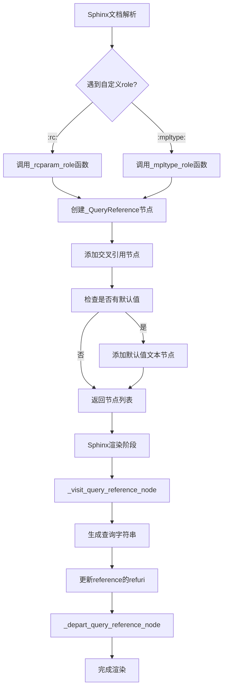
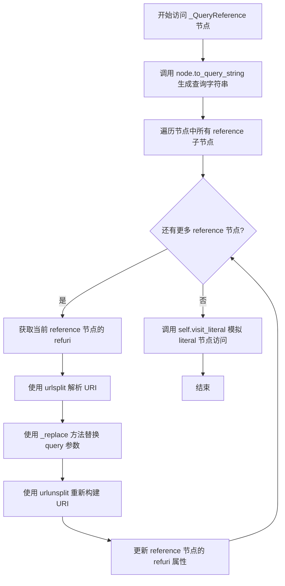
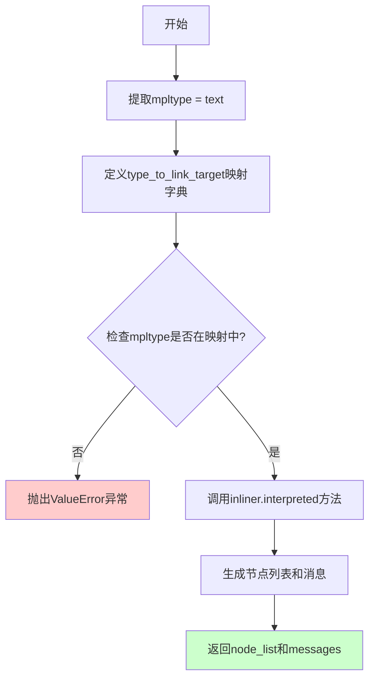
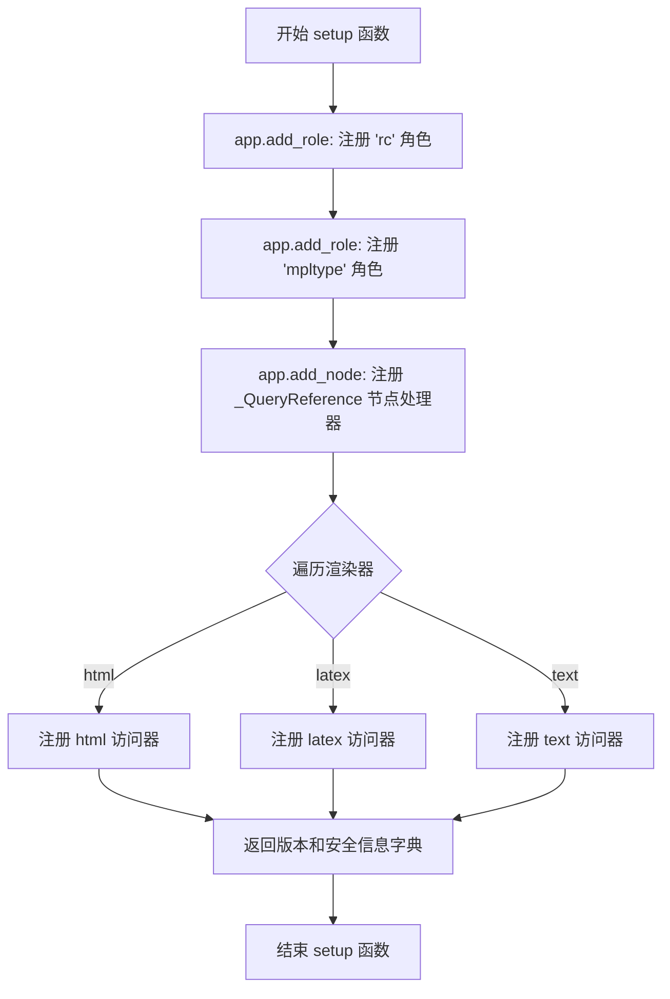
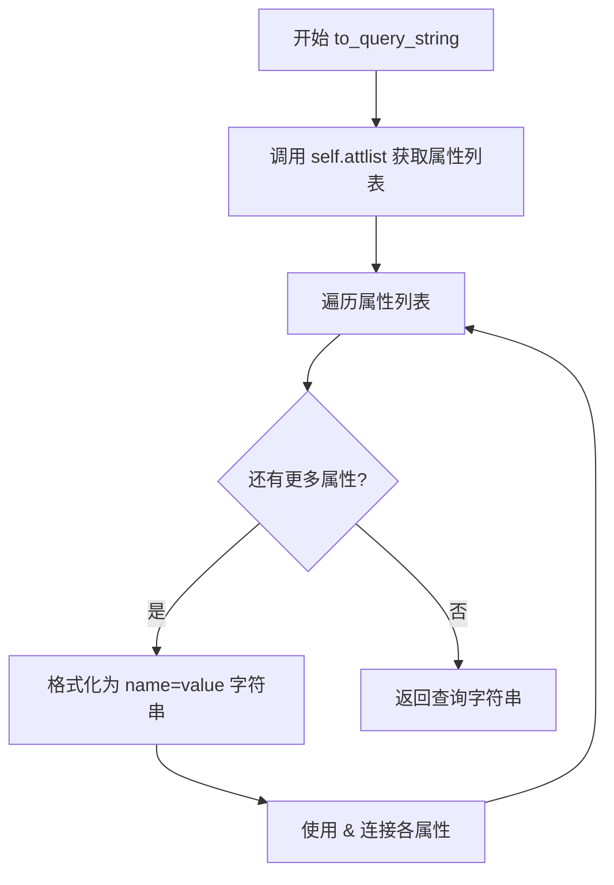

# `matplotlib\lib\matplotlib\sphinxext\roles.py` 详细设计文档

这是Matplotlib的Sphinx文档扩展模块，定义了自定义的Sphinx roles（:rc: 和 :mpltype:）用于在文档中高亮和链接rcParams配置项以及自定义matplotlib类型，同时提供了_QueryReference节点类来处理带查询字符串的引用功能。

## 整体流程



## 类结构

```
_QueryReference (nodes.Inline + nodes.TextElement)
    └── to_query_string() 方法
```

## 全局变量及字段


### `_RC_WILDCARD_LINK_MAPPING`
    
映射特殊rcParams表示法到实际参数的字典，用于解析通配符风格的参数引用

类型：`dict`
    


### `urlsplit`
    
urllib.parse模块的URL拆分函数，用于解析URL的各个组成部分

类型：`function`
    


### `urlunsplit`
    
urllib.parse模块的URL合并函数，用于将URL各部分组合成完整URL

类型：`function`
    


### `nodes`
    
docutils库中的nodes模块，提供了文档树节点的定义和操作

类型：`module`
    


### `matplotlib`
    
Matplotlib绘图库的主模块，包含版本信息和核心功能

类型：`module`
    


### `rcParamsDefault`
    
包含Matplotlib所有默认rcParams配置值的字典

类型：`dict`
    


### `_QueryReference.nodes.Inline`
    
继承自docutils.nodes.Inline，用于表示行内元素的基类

类型：`class`
    


### `_QueryReference.nodes.TextElement`
    
继承自docutils.nodes.TextElement，用于表示包含文本内容的元素节点

类型：`class`
    


### `_QueryReference.attlist()`
    
继承方法，返回节点所有属性的列表，用于生成查询字符串

类型：`method`
    
    

## 全局函数及方法


### `_visit_query_reference_node`

该函数是 Docutils 访问者模式中的 `visit` 方法，用于处理 `_QueryReference` 节点。它将节点属性转换为查询字符串，并将其附加到所有子引用节点的 URI 上，最后模拟对 `literal` 节点的处理。

参数：

-  `self`：访问者对象（隐式参数），用于调用其他访问方法
-  `node`：`nodes.TextElement`（具体为 `_QueryReference`），需要处理的查询引用节点

返回值：`None`，该方法直接修改节点状态，无返回值

#### 流程图



#### 带注释源码

```python
def _visit_query_reference_node(self, node):
    """
    Resolve *node* into query strings on its ``reference`` children.

    Then act as if this is a `~docutils.nodes.literal`.
    """
    # 步骤1: 从节点属性生成查询字符串
    # 调用 _QueryReference.to_query_string() 方法，将节点的所有属性
    # 格式化为查询字符串参数，例如 "key1=value1&key2=value2"
    query = node.to_query_string()
    
    # 步骤2: 遍历节点中的所有 reference 子节点
    # 使用 docutils 的 findall 方法查找所有类型为 nodes.reference 的子节点
    for refnode in node.findall(nodes.reference):
        # 步骤3: 解析现有 URI
        # 使用 urllib.parse.urlsplit 分解 reference 节点的 refuri 属性
        uri = urlsplit(refnode['refuri'])._replace(query=query)
        
        # 步骤4: 更新 URI
        # 使用 _replace 方法创建新的 URI 对象，替换 query 部分
        # 然后使用 urlunsplit 重新组装为字符串
        refnode['refuri'] = urlunsplit(uri)

    # 步骤5: 模拟 literal 节点访问
    # 由于 _QueryReference 等价于 literal 节点，需要调用对应的 visit 方法
    # 以保持文档渲染的一致性
    self.visit_literal(node)
```


### `_depart_query_reference_node`

该函数是 Sphinx/Docutils 访问者模式中的"离开"回调函数，负责在遍历离开 `_QueryReference` 节点时执行相应的清理操作，其核心逻辑是将节点的处理委托给 `depart_literal` 方法，使该节点在文档渲染时表现得像一个普通的文字节点（literal node）。

参数：

- `self`：访问者对象（Visitor Object），Docutils/Sphinx 在遍历节点时传入的访问器实例，用于处理不同类型的节点
- `node`：`_QueryReference` 类型，继承自 `nodes.Inline` 和 `nodes.TextElement` 的自定义文档树节点，包含查询字符串信息的引用节点

返回值：`None`，该函数不返回任何值，仅执行副作用操作

#### 流程图

```mermaid
flowchart TD
    A[开始离开 _QueryReference 节点] --> B{检查节点类型}
    B -->|是| C[调用 self.depart_literal(node)]
    C --> D[将 _QueryReference 节点作为 literal 节点处理]
    D --> E[结束]
    
    style A fill:#e1f5fe
    style C fill:#fff3e0
    style E fill:#e8f5e9
```

#### 带注释源码

```python
def _depart_query_reference_node(self, node):
    """
    Act as if this is a `~docutils.nodes.literal`.
    """
    self.depart_literal(node)
```

**源码解析：**

- **函数签名**：`_depart_query_reference_node(self, node)`
  - `self`：访问者对象，提供了 `depart_literal` 等节点处理方法
  - `node`：要离开的 `_QueryReference` 节点对象

- **函数体**：仅包含一行代码 `self.depart_literal(node)`
  - 这是一个委托调用，将当前节点的处理权交给 `depart_literal` 方法
  - 使得 `_QueryReference` 节点在文档渲染时表现得与普通文字节点一致
  - 确保节点在离开时被正确清理和渲染

- **设计意图**：
  - 在 `setup` 函数中，该函数与 `_visit_query_reference_node` 配对使用
  - `visit` 方法在进入节点时调用，添加查询字符串到引用
  - `depart` 方法在离开节点时调用，执行必要的清理工作
  - 这种模式遵循了 Docutils/Sphinx 的访问者模式（Visitor Pattern）规范


### `_rcparam_role`

这是一个 Sphinx 角色（role）函数，用于在文档中高亮显示和链接到 matplotlib 的 `rcParams` 配置项。用户可以在文档中使用 `:rc:`figure.dpi`` 的语法来引用 rcParams 配置，该函数会生成带有默认值信息的交叉引用链接。

参数：

- `name`：`str`，角色名称（这里是 "rc"）
- `rawtext`：`str`，原始文本，包含角色标记的完整文本
- `text`：`str`，解析后的文本，即 rcParams 的键名（如 "figure.dpi"）
- `lineno`：`int`，在文档中出现的行号
- `inliner`：`docutils.parsers.rst.states.Inliner`，Sphinx 的内联解释器对象，用于创建引用节点
- `options`：`dict`，可选，角色的配置选项
- `content`：`list`，可选，角色的内容列表

返回值：`(list, list)`，返回由 docutils 节点组成的列表和消息列表的元组。节点列表包含 `_QueryReference` 节点和可选的默认值文本节点。

#### 流程图

```mermaid
flowchart TD
    A[开始: _rcparam_role] --> B[生成标题: rcParams["{text}"]"]
    B --> C{检查通配符映射}
    C -->|在_RC_WILDCARD_LINK_MAPPING中| D[使用映射后的名称]
    C -->|不在映射中| E[使用原始text]
    D --> F[构造target: rcparam_{name_replace_dot_underscore}]
    E --> F
    F --> G[调用inliner.interpreted创建ref_nodes]
    G --> H[创建_QueryReference节点qr]
    H --> I{qr内容: rawtext + highlight=text]
    I --> J{检查text是否在rcParamsDefault中且不是backend}
    J -->|是| K[添加默认值的文本节点]
    J -->|否| L[跳过默认值]
    K --> M[返回node_list和messages]
    L --> M
```

#### 带注释源码

```python
def _rcparam_role(name, rawtext, text, lineno, inliner, options=None, content=None):
    """
    Sphinx role ``:rc:`` to highlight and link ``rcParams`` entries.

    Usage: Give the desired ``rcParams`` key as parameter.

    :code:`:rc:`figure.dpi`` will render as: :rc:`figure.dpi`
    """
    # Generate a pending cross-reference so that Sphinx will ensure this link
    # isn't broken at some point in the future.
    # 生成标题，格式为 rcParams["figure.dpi"]
    title = f'rcParams["{text}"]'
    
    # 检查是否有通配符映射（如 "font.*" -> "font.family"）
    # 如果有则使用映射后的名称，否则使用原始text
    rc_param_name = _RC_WILDCARD_LINK_MAPPING.get(text, text)
    
    # 构造目标链接ID，将点号替换为下划线
    # 例如: "figure.dpi" -> "rcparam_figure_dpi"
    target = f'rcparam_{rc_param_name.replace(".", "_")}'
    
    # 使用inliner创建引用节点，生成交叉引用
    # 返回 (ref_nodes, messages) 元组
    ref_nodes, messages = inliner.interpreted(title, f'{title} <{target}>',
                                              'ref', lineno)

    # 创建QueryReference节点，用于包装引用并添加查询字符串
    # rawtext是原始文本，highlight参数用于高亮显示
    qr = _QueryReference(rawtext, highlight=text)
    
    # 将引用节点添加到QueryReference中
    qr += ref_nodes
    
    # 初始化节点列表，包含QueryReference
    node_list = [qr]

    # The default backend would be printed as "agg", but that's not correct (as
    # the default is actually determined by fallback).
    # 检查rcParam是否存在，且不是backend（backend有特殊处理）
    if text in rcParamsDefault and text != "backend":
        # 添加默认值显示文本： " (default: 'value')"
        node_list.extend([
            nodes.Text(' (default: '),  # 默认值前缀文本
            nodes.literal('', repr(rcParamsDefault[text])),  # 默认值字面量
            nodes.Text(')'),  # 默认值后缀文本
        ])

    # 返回节点列表和消息
    return node_list, messages
```


### `_mpltype_role`

Sphinx role函数，用于在Matplotlib文档中高亮和链接自定义的类型概念（如color、hatch等），通过将类型名称转换为对应的链接目标来生成交叉引用节点。

参数：

- `name`：`str`，Sphinx角色的名称（传入时为"mpltype"）
- `rawtext`：`str`，文档中的原始文本，包含角色标记的完整文本
- `text`：`str`，角色参数文本，即类型名称（如"color"、"hatch"）
- `lineno`：`int`，角色在文档中出现的行号
- `inliner`：`docutils.parsers.rst.states.Inliner`，docutils内联解析器对象，用于解释文本和生成节点
- `options`：`dict`，可选参数字典，默认为None
- `content`：`list`，可选内容列表，默认为None

返回值：`tuple[list, list]`，返回包含节点列表和消息列表的元组。node_list是生成的docutils节点列表（包含交叉引用节点），messages是任何警告或错误消息列表

#### 流程图



#### 带注释源码

```python
def _mpltype_role(name, rawtext, text, lineno, inliner, options=None, content=None):
    """
    Sphinx role ``:mpltype:`` for custom matplotlib types.

    In Matplotlib, there are a number of type-like concepts that do not have a
    direct type representation; example: color. This role allows to properly
    highlight them in the docs and link to their definition.

    Currently supported values:

    - :code:`:mpltype:`color`` will render as: :mpltype:`color`

    """
    # 从text参数提取mpltype类型名称
    mpltype = text
    # 建立matplotlib类型到链接目标的映射字典
    # 用于将类型名称转换为Sphinx引用的目标ID
    type_to_link_target = {
        'color': 'colors_def',  # color类型链接到colors_def锚点
        'hatch': 'hatch_def',   # hatch类型链接到hatch_def锚点
    }
    # 如果mpltype不在支持的类型映射中，抛出ValueError异常
    if mpltype not in type_to_link_target:
        raise ValueError(f"Unknown mpltype: {mpltype!r}")

    # 使用inliner.interpreted方法生成交叉引用节点
    # 参数依次为：显示文本、引用目标（格式：'显示文本 <目标ID>'）、角色类型、行号
    node_list, messages = inliner.interpreted(
        mpltype, f'{mpltype} <{type_to_link_target[mpltype]}>', 'ref', lineno)
    # 返回生成的节点列表和任何消息（通常为空列表）
    return node_list, messages
```


### `setup`

这是 Sphinx 扩展的入口函数，负责注册自定义的文档角色（roles）和节点访问器，使 Matplotlib 文档中的 `:rc:` 和 `:mpltype:` 角色能够在 Sphinx 文档中正确渲染和链接。

参数：

-  `app`：`sphinx.application.Sphinx`，Sphinx 应用程序实例，用于注册角色和节点

返回值：`dict`，返回包含扩展版本和并行读写安全性的字典

#### 流程图



#### 带注释源码

```python
def setup(app):
    """
    Sphinx 扩展入口函数。
    
    注册自定义 docutils 角色和节点处理器，使 Matplotlib 文档中的
    :rc: 和 :mpltype: 角色能够正确渲染。
    
    参数:
        app: Sphinx 应用程序实例
        
    返回:
        包含扩展元数据的字典
    """
    # 注册 :rc: 角色，用于高亮和链接 rcParams 条目
    # 例如 :rc:`figure.dpi` 会渲染为 figure.dpi 并链接到对应文档
    app.add_role("rc", _rcparam_role)
    
    # 注册 :mpltype: 角色，用于自定义 matplotlib 类型如 color、hatch
    # 例如 :mpltype:`color` 会渲染为 color 并链接到颜色定义
    app.add_role("mpltype", _mpltype_role)
    
    # 注册 _QueryReference 节点的访问器和离开器
    # 该节点用于包装带有查询字符串的引用，支持 html/latex/text 渲染器
    app.add_node(
        _QueryReference,
        html=(_visit_query_reference_node, _depart_query_reference_node),
        latex=(_visit_query_reference_node, _depart_query_reference_node),
        text=(_visit_query_reference_node, _depart_query_reference_node),
    )
    
    # 返回扩展元数据
    # version: 扩展版本，与 matplotlib.__version__ 保持一致
    # parallel_read_safe: 并行读取安全标志
    # parallel_write_safe: 并行写入安全标志
    return {
        "version": matplotlib.__version__,
        "parallel_read_safe": True, 
        "parallel_write_safe": True
    }
```


### `_QueryReference.to_query_string`

该方法用于将 `_QueryReference` 节点的所有属性转换为查询字符串格式，形式为 `key1=value1&key2=value2`，以便在文档链接中附加查询参数。

参数：无（仅包含隐式参数 `self`）

返回值：`str`，由节点属性组成的查询字符串，格式为 `name=value&name=value`。

#### 流程图



#### 带注释源码

```python
def to_query_string(self):
    """Generate query string from node attributes."""
    # 使用列表推导式遍历节点的所有属性 (attlist 返回属性名值对)
    # 每个属性格式化为 'name=value' 形式
    # 最后使用 '&' 连接所有属性形成查询字符串
    return '&'.join(f'{name}={value}' for name, value in self.attlist())
```

## 关键组件


### _QueryReference 类

用于包装引用或待定引用并添加查询字符串的节点类，继承自 `nodes.Inline` 和 `nodes.TextElement`，等同于 `docutils.nodes.literal` 节点，主要用于在文档中创建可自定义查询参数的引用链接。

### _visit_query_reference_node 函数

解析节点上的查询字符串并应用到其所有 `reference` 子节点上，然后模拟访问 `literal` 节点的行为，用于在 HTML/LaTeX/文本渲染器中正确处理查询引用的访问阶段。

### _depart_query_reference_node 函数

模拟离开 `literal` 节点的处理行为，用于在文档渲染器中正确处理查询引用的离开阶段。

### _RC_WILDCARD_LINK_MAPPING 字典

将 rcParams 的通配符表示映射到实际的 rcParams 键，用于支持如 `figure.subplot.*` 到 `figure.subplot.left` 的简化引用，提升文档可读性。

### _rcparam_role 函数

实现 Sphinx 的 `:rc:` 角色功能，用于在文档中高亮显示和链接 Matplotlib 的 `rcParams` 配置项，支持通配符映射，并在文档中显示参数的默认值。

### _mpltype_role 函数

实现 Sphinx 的 `:mpltype:` 角色功能，用于高亮和链接 Matplotlib 中的类型概念（如 color、hatch），这些概念没有直接的类型表示，但需要在文档中统一展示和交叉引用。

### setup 函数

Sphinx 扩展的入口点函数，注册自定义角色（rc 和 mpltype）以及自定义节点类型（_QueryReference），并返回扩展版本信息和并行读写安全性状态。


## 问题及建议


### 已知问题

- **错误处理不够友好**：在`_mpltype_role`中，当传入不支持的mpltype时直接抛出`ValueError`，缺乏更详细的错误提示和可用的type列表。
- **硬编码配置缺乏扩展性**：`_RC_WILDCARD_LINK_MAPPING`和`type_to_link_target`字典硬编码在模块中，无法通过配置动态扩展，添加新的rcparam或mpltype需要修改源码。
- **rcParams默认值获取存在边界情况**：代码通过`text != "backend"`特殊处理后端默认值，但这种硬编码判断容易遗漏其他可能通过fallback机制确定的默认值。
- **缺少参数验证**：`_rcparam_role`函数未验证`text`参数是否为空或包含非法字符，可能导致生成无效的链接目标。
- **潜在的null引用风险**：在`_visit_query_reference_node`中，如果node不存在`refuri`属性的reference子节点，可能导致KeyError。
- **文档与实现不一致**：模块docstring警告这些角色是"半公共"的，但实现中缺乏版本管理或弃用机制来支持这一声明。

### 优化建议

- **提取配置到独立数据结构**：将`_RC_WILDCARD_LINK_MAPPING`和`type_to_link_target`定义为模块级常量或通过加载机制获取，便于维护和扩展。
- **增强错误处理**：为`_mpltype_role`添加候选类型列表提示；为`_rcparam_role`添加参数验证和更详细的错误信息。
- **使用配置对象替代硬编码判断**：将"backend"的特殊处理逻辑纳入配置数据中，避免使用`if text != "backend"`这种魔法字符串比较。
- **添加输入验证和默认值保护**：在使用`rcParamsDefault[text]`前检查key是否存在，使用`dict.get()`方法提供默认值或更清晰的错误信息。
- **考虑使用dataclass或namedtuple**：将`_QueryReference`相关的配置和查询构建逻辑封装为更结构化的形式。
- **增加日志记录**：在关键决策点（如使用wildcard映射、默认值覆盖等）添加logging，便于调试和维护。
- **补充单元测试**：确保各种边界情况（如空输入、特殊字符、无效映射等）都有对应的测试覆盖。


## 其它


### 设计目标与约束

本模块作为Matplotlib文档的Sphinx扩展，旨在提供自定义的文档角色（roles）以增强文档的可读性和交互性。约束条件包括：仅支持Sphinx文档系统，仅用于Matplotlib文档体系，下游包使用可能导致文档构建错误，且这些角色不被官方支持，后续可能无通知修改或移除。

### 错误处理与异常设计

代码中包含两处异常处理设计：1）`_mpltype_role`函数中对不支持的mpltype类型抛出`ValueError`异常，提示"Unknown mpltype: {mpltype!r}"；2）`_rcparam_role`函数中对"backend"特殊处理，避免打印错误的默认值。异常设计遵循快速失败原则，在解析阶段即抛出错误，避免错误传播到渲染阶段。

### 数据流与状态机

数据流主要分为两路：1）`:rc:`role流程：接收rcParams键名 -> 查表获取实际键名 -> 创建pending cross-reference -> 创建_QueryReference节点 -> 添加默认值的文本节点；2）`:mpltype:`role流程：接收类型名称 -> 查表获取链接目标 -> 创建cross-reference节点。_QueryReference节点在Sphinx的visit/depart阶段被处理，将查询字符串添加到子节点的引用URI中。

### 外部依赖与接口契约

本模块依赖以下外部包：1）`docutils.nodes`模块提供节点基类；2）`matplotlib`包提供版本信息和rcParamsDefault；3）`urllib.parse`模块处理URL。接口契约方面：`setup(app)`函数接受Sphinx应用对象，注册后返回包含version、parallel_read_safe、parallel_write_safe的字典。

### 核心数据结构

`_RC_WILDCARD_LINK_MAPPING`字典将通配符形式的rcParams键映射到实际键，用于文档链接；`type_to_link_target`字典将mpltype名称映射到Sphinx目标ID。两个映射表均可扩展，新增类型时需同时更新映射表和角色处理逻辑。

### 并发与线程安全性

setup函数返回的字典中`parallel_read_safe: True`和`parallel_write_safe: True`表明该扩展支持并行读写。角色函数和节点处理函数均为无状态函数，不修改共享状态，天然线程安全。

### 配置与扩展点

扩展通过`setup(app)`函数与Sphinx集成，提供三个扩展点：1）添加自定义roles（"rc"和"mpltype"）；2）添加自定义节点类型（_QueryReference）；3）为不同writer（html/latex/text）注册节点访问函数。配置通过Sphinx的conf.py文件进行，使用时需在extensions列表中添加'matplotlib.sphinxext.roles'。

### 安全性考虑

代码处理用户输入（role参数text）并用于构建URL查询字符串和节点属性，使用`urllib.parse`进行安全的URL构造，避免注入攻击。_QueryReference节点的to_query_string方法使用f-string和join进行属性拼接，设计上仅处理节点属性列表，不直接接受外部输入。

### 测试与验证建议

建议添加以下测试用例：1）测试所有支持的rcParams通配符映射；2）测试mpltype支持的颜色和hatch类型；3）测试不支持的mpltype抛出ValueError；4）测试backend参数不显示默认值；5）测试_QueryReference节点的查询字符串生成；6）测试多writer（html/latex/text）的节点处理。

### 版本兼容性

代码使用Python 3的f-string语法（要求Python 3.6+），依赖docutils和matplotlib，版本兼容性主要取决于这两个包的版本。setup函数返回的version来自`matplotlib.__version__`，需与Matplotlib版本保持同步。

### 使用示例与文档

代码头部包含详细的docstring说明，解释了两个导致下游包文档构建错误的场景及解决方案。建议在实际文档中使用`:rc:`figure.dpi``和`:mpltype:`color``等形式调用这些角色。


    