# `matplotlib\lib\matplotlib\spines.py` 详细设计文档

这是matplotlib库中处理坐标轴脊（Spine）的模块。Spine是连接轴刻度并标记数据区域边界的线条，可以呈现线性、圆形或弧形三种形态。该模块包含Spine类（用于绘制和管理脊线）、SpinesProxy类（用于批量操作多个脊线）和Spines类（作为脊线的字典式容器管理器），共同构成了matplotlib坐标轴框架的边界绘制系统。

## 整体流程

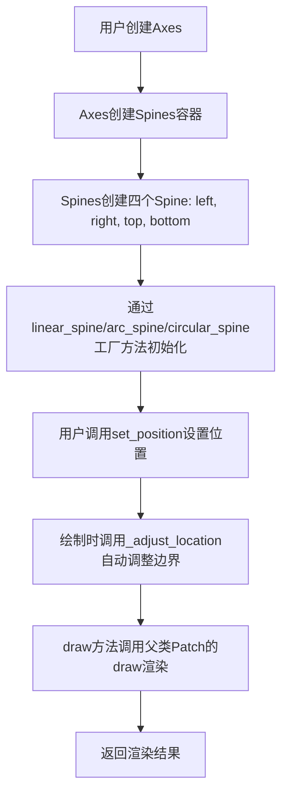

## 类结构

```
Spine (继承自mpatches.Patch)
├── 线性脊线 (spine_type: left/right/top/bottom)
├── 圆形脊线 (spine_type: circle)
└── 弧形脊线 (spine_type: arc)
SpinesProxy (代理类 - 广播set方法)
Spines (MutableMapping - 容器类)
```

## 全局变量及字段


### `Spine.Spine`
    
An axis spine -- the line noting the data area boundaries. Spines are the lines connecting the axis tick marks and noting the boundaries of the data area.

类型：`class`
    


### `Spine.axes`
    
所属的Axes实例

类型：`Axes`
    


### `Spine.spine_type`
    
脊线类型(left/right/top/bottom/circle)

类型：`str`
    


### `Spine._path`
    
绘制用的Path对象

类型：`Path`
    


### `Spine._position`
    
位置设置(类型,数值)

类型：`tuple`
    


### `Spine._bounds`
    
边界范围(低位,高位)

类型：`tuple`
    


### `Spine._patch_type`
    
补丁类型(line/circle/arc)

类型：`str`
    


### `Spine._center`
    
圆形/弧形脊线的中心

类型：`tuple`
    


### `Spine._width`
    
宽度

类型：`float`
    


### `Spine._height`
    
高度

类型：`float`
    


### `Spine._theta1`
    
弧形的起始角度

类型：`float`
    


### `Spine._theta2`
    
弧形的结束角度

类型：`float`
    


### `Spine._patch_transform`
    
补丁变换

类型：`Transform`
    


### `Spine.axis`
    
关联的坐标轴

类型：`Axis`
    


### `Spine.__init__`
    
Initialize the spine with axes, spine_type, and path

类型：`method`
    


### `Spine.set_patch_arc`
    
Set the spine to be arc-like

类型：`method`
    


### `Spine.set_patch_circle`
    
Set the spine to be circular

类型：`method`
    


### `Spine.set_patch_line`
    
Set the spine to be linear

类型：`method`
    


### `Spine._recompute_transform`
    
Recompute the patch transform for arc/circle spines

类型：`method`
    


### `Spine.get_patch_transform`
    
Get the patch transform

类型：`method`
    


### `Spine.get_window_extent`
    
Return the window extent of the spines in display space

类型：`method`
    


### `Spine.get_path`
    
Get the path of the spine

类型：`method`
    


### `Spine.register_axis`
    
Register an axis with the spine

类型：`method`
    


### `Spine.clear`
    
Clear the current spine

类型：`method`
    


### `Spine._clear`
    
Clear things directly related to the spine

类型：`method`
    


### `Spine._adjust_location`
    
Automatically set spine bounds to the view interval

类型：`method`
    


### `Spine.draw`
    
Draw the spine

类型：`method`
    


### `Spine.set_position`
    
Set the position of the spine

类型：`method`
    


### `Spine.get_position`
    
Return the spine position

类型：`method`
    


### `Spine.get_spine_transform`
    
Return the spine transform

类型：`method`
    


### `Spine.set_bounds`
    
Set the spine bounds

类型：`method`
    


### `Spine.get_bounds`
    
Get the bounds of the spine

类型：`method`
    


### `Spine.linear_spine`
    
Create and return a linear Spine (class method)

类型：`method`
    


### `Spine.arc_spine`
    
Create and return an arc Spine (class method)

类型：`method`
    


### `Spine.circular_spine`
    
Create and return a circular Spine (class method)

类型：`method`
    


### `Spine.set_color`
    
Set the edge color

类型：`method`
    


### `SpinesProxy.SpinesProxy`
    
A proxy to broadcast set_*() and set() method calls to contained Spines

类型：`class`
    


### `SpinesProxy._spine_dict`
    
脊线字典引用

类型：`dict`
    


### `SpinesProxy.__init__`
    
Initialize the proxy with spine dictionary

类型：`method`
    


### `SpinesProxy.__getattr__`
    
Get attribute and broadcast to all spines

类型：`method`
    


### `SpinesProxy.__dir__`
    
Return list of available set_* methods

类型：`method`
    


### `Spines.Spines`
    
The container of all Spines in an Axes. Dict-like mapping interface.

类型：`class`
    


### `Spines._dict`
    
内部存储字典

类型：`dict`
    


### `Spines.__init__`
    
Initialize Spines with keyword arguments

类型：`method`
    


### `Spines.from_dict`
    
Create Spines from a dictionary (class method)

类型：`method`
    


### `Spines.__getstate__`
    
Get state for pickling

类型：`method`
    


### `Spines.__setstate__`
    
Set state for unpickling

类型：`method`
    


### `Spines.__getattr__`
    
Get spine by attribute name

类型：`method`
    


### `Spines.__getitem__`
    
Get spine(s) by key, list, or slice

类型：`method`
    


### `Spines.__setitem__`
    
Set spine by key

类型：`method`
    


### `Spines.__delitem__`
    
Delete spine by key

类型：`method`
    


### `Spines.__iter__`
    
Iterate over spine names

类型：`method`
    


### `Spines.__len__`
    
Return number of spines

类型：`method`
    
    

## 全局函数及方法


### `Spine.__init__`

初始化轴脊柱（Spine）对象，设置其基本属性和绘制参数。

参数：

- `axes`：`~matplotlib.axes.Axes`，包含该脊柱的 `Axes` 实例
- `spine_type`：`str`，脊柱类型（如 'left', 'right', 'top', 'bottom', 'circle'）
- `path`：`~matplotlib.path.Path`，用于绘制脊柱的 `.Path` 实例
- `**kwargs`：其他参数，传递给父类 `Patch` 的关键字参数

返回值：`None`，该方法为构造函数，不返回值

#### 流程图

```mermaid
flowchart TD
    A[开始 __init__] --> B[调用 super().__init__**kwargs]
    B --> C[设置 self.axes]
    C --> D[设置 figure: self.set_figure]
    D --> E[设置 self.spine_type]
    E --> F[设置 facecolor 为 'none']
    F --> G[设置 edgecolor: mpl.rcParams['axes.edgecolor']]
    G --> H[设置 linewidth: mpl.rcParams['axes.linewidth']]
    H --> I[设置 capstyle 为 'projecting']
    I --> J[设置 self.axis = None]
    J --> K[设置 zorder = 2.5]
    K --> L[设置 transform: self.axes.transData]
    L --> M[设置 self._bounds = None]
    M --> N[设置 self._position = None]
    N --> O{验证 path 是 mpath.Path}
    O -->|是| P[设置 self._path = path]
    O -->|否| Q[抛出 TypeError]
    P --> R[设置 self._patch_type = 'line']
    R --> S[设置 self._patch_transform = IdentityTransform]
    S --> T[结束 __init__]
    
    style Q fill:#ffcccc
    style T fill:#ccffcc
```

#### 带注释源码

```python
@_docstring.interpd
def __init__(self, axes, spine_type, path, **kwargs):
    """
    Parameters
    ----------
    axes : `~matplotlib.axes.Axes`
        The `~.axes.Axes` instance containing the spine.
    spine_type : str
        The spine type.
    path : `~matplotlib.path.Path`
        The `.Path` instance used to draw the spine.

    Other Parameters
    ----------------
    **kwargs
        Valid keyword arguments are:

        %(Patch:kwdoc)s
    """
    # 调用父类 Patch 的初始化方法
    super().__init__(**kwargs)
    
    # 保存 Axes 引用
    self.axes = axes
    
    # 设置 figure 对象（根 figure 为 False）
    self.set_figure(self.axes.get_figure(root=False))
    
    # 保存脊柱类型
    self.spine_type = spine_type
    
    # 设置面颜色为无色（透明）
    self.set_facecolor('none')
    
    # 从全局配置中获取边框颜色
    self.set_edgecolor(mpl.rcParams['axes.edgecolor'])
    
    # 从全局配置中获取边框线宽
    self.set_linewidth(mpl.rcParams['axes.linewidth'])
    
    # 设置线帽样式为 projecting
    self.set_capstyle('projecting')
    
    # 初始化 axis 为 None，后续通过 register_axis 注册
    self.axis = None

    # 设置绘制优先级
    self.set_zorder(2.5)
    
    # 默认使用数据坐标变换
    self.set_transform(self.axes.transData)

    # 初始化边界为 None，后续可通过 set_bounds 设置
    self._bounds = None

    # 延迟确定位置（非矩形 axes 目前支持有限，
    # 这样可以让它们通过脊柱机制而不报错）
    self._position = None
    
    # 类型检查：确保 path 是 Path 实例
    _api.check_isinstance(mpath.Path, path=path)
    self._path = path

    # 支持绘制线形、圆形和弧形三种脊柱类型：
    # - 'line': 类似 mpatches.PathPatch
    # - 'circle': 类似 mpatches.Ellipse
    # - 'arc': 类似 mpatches.Arc
    # 默认使用线形
    self._patch_type = 'line'

    # 从 mpatches.Ellipse 复制的逻辑：
    # 注意：在添加到 Axes 之前无法计算此值
    # 这使得调用访问方法非常重要，而不是直接访问成员变量
    self._patch_transform = mtransforms.IdentityTransform()
```


### `Spine.set_patch_arc`

设置脊柱（Spine）为弧形样式，配置弧的圆心、半径和起止角度，使其绘制为圆弧形状。

参数：

- `center`：圆心坐标（tuple 或 list），弧所在的圆心位置
- `radius`：浮点数，弧的半径大小
- `theta1`：浮点数，弧的起始角度（弧度制）
- `theta2`：浮点数，弧的终止角度（弧度制）

返回值：无（`None`），该方法为修改器方法，直接修改对象内部状态

#### 流程图

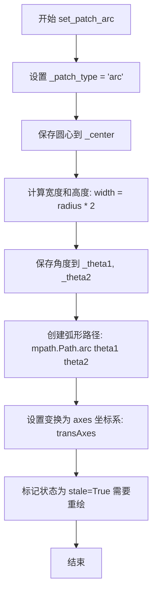

#### 带注释源码

```python
def set_patch_arc(self, center, radius, theta1, theta2):
    """
    Set the spine to be arc-like.
    
    Parameters
    ----------
    center : tuple
        The center of the arc (x, y) in data coordinates.
    radius : float
        The radius of the arc.
    theta1 : float
        The start angle of the arc in radians.
    theta2 : float
        The end angle of the arc in radians.
    """
    # 1. 设置补丁类型为弧形，后续绘制将使用 Arc 渲染逻辑
    self._patch_type = 'arc'
    
    # 2. 保存圆心坐标，供后续变换计算使用
    self._center = center
    
    # 3. 设置宽度和高度为半径的两倍（用于椭圆/圆形变换矩阵）
    self._width = radius * 2
    self._height = radius * 2
    
    # 4. 保存起始和终止角度，供_bounds计算和路径生成使用
    self._theta1 = theta1
    self._theta2 = theta2
    
    # 5. 创建新的弧形路径对象，使用 matplotlib.path.Path.arc 方法
    #    该方法接收角度（度）作为参数，因此后续在 _adjust_location 
    #    中会通过 np.rad2deg 转换
    self._path = mpath.Path.arc(theta1, theta2)
    
    # 6. 设置变换为 axes 坐标系（0-1 范围），而非默认的 data 坐标
    #    这意味着弧的位置由 axes 坐标系决定
    self.set_transform(self.axes.transAxes)
    
    # 7. 标记对象为"过时"状态，触发后续重绘
    self.stale = True
```


### Spine.set_patch_circle

该方法用于将轴脊（Spine）的绘制类型设置为圆形。调用此方法后，轴脊将不再显示为线段，而是以圆形的形式呈现，常用于极坐标图（Polar Plot）中的圆形边界。方法内部会更新轴脊的中心点、半径（转换为宽高）以及变换矩阵，并标记该对象需要重绘。

参数：
- `center`：坐标点，通常为 `(float, float)` 类型的元组或列表，表示圆心在 Axes 坐标系中的位置。
- `radius`：浮点数，表示圆的半径。

返回值：`None`，无返回值。该方法通过修改对象内部属性来改变状态。

#### 流程图

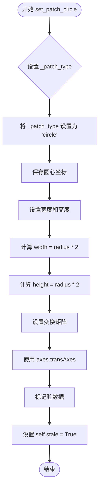

#### 带注释源码

```python
def set_patch_circle(self, center, radius):
    """Set the spine to be circular."""
    # 1. 设置补丁类型为圆形，区别于 'line' (线段) 和 'arc' (圆弧)
    self._patch_type = 'circle'
    
    # 2. 存储圆心坐标，供后续变换计算使用
    self._center = center
    
    # 3. 根据半径计算圆形的宽和高（直径）
    self._width = radius * 2
    self._height = radius * 2
    
    # 4. 设置绘制变换为轴坐标系变换 (transAxes)
    #    这意味着圆的位置和大小是相对于 Axes 的 (0-1) 区域，而非数据坐标
    self.set_transform(self.axes.transAxes)
    
    # 5. 标记对象状态为 'stale'，通知 matplotlib 该区域需要重绘
    self.stale = True
```


### `Spine.set_patch_line`

将脊柱（Spine）的绘制类型设置为线性（line）模式，使其表现为普通的线条形状。

参数：该方法无参数。

返回值：`None`，无返回值，仅修改对象内部状态。

#### 流程图

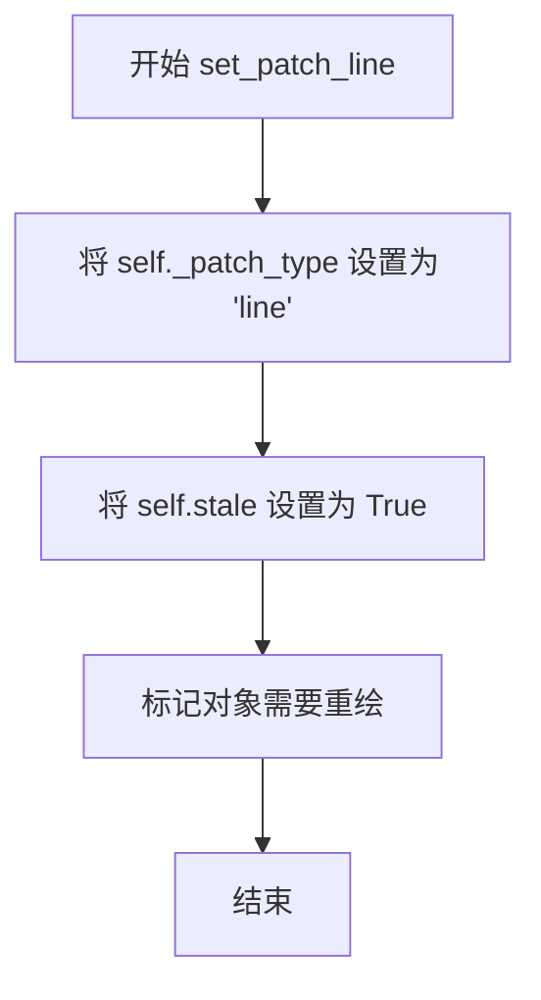

#### 带注释源码

```python
def set_patch_line(self):
    """
    Set the spine to be linear.
    
    此方法将脊柱的绘制模式切换为线性（line）类型。
    线性类型的脊柱会作为普通的路径补丁（PathPatch）进行渲染，
    这是脊柱的默认绘制模式。
    """
    # 将内部属性 _patch_type 设置为 'line'，标识当前脊柱为线性类型
    self._patch_type = 'line'
    
    # 将 stale 属性设置为 True，标记该对象已过时需要重绘
    # 这是 Matplotlib 中常用的缓存失效机制，确保下次绘制时重新渲染
    self.stale = True
```


### `Spine._recompute_transform`

该方法用于重新计算弧形或圆形Spine的变换矩阵。它仅在`_patch_type`为'arc'或'circle'时调用，将中心坐标、宽度和高度从数据单位转换为显示坐标，并构建一个仿射变换矩阵（先缩放后平移），赋值给`_patch_transform`属性。

参数：无（仅包含self参数）

返回值：`None`，无返回值

#### 流程图

```mermaid
flowchart TD
    A[开始 _recompute_transform] --> B{检查 _patch_type}
    B -->|不是 arc 或 circle| C[断言失败]
    B -->|是 arc 或 circle| D[获取中心坐标]
    D --> E[convert_xunits转换_center[0]]
    F[convert_yunits转换_center[1]]
    E --> G[组合中心坐标]
    F --> G
    G --> H[convert_xunits转换_width]
    I[convert_yunits转换_height]
    H --> J[组合宽高]
    I --> J
    J --> K[创建Affine2D变换]
    K --> L[.scale宽高减半]
    L --> M[.translate平移到中心]
    M --> N[赋值给_patch_transform]
    N --> O[结束]
```

#### 带注释源码

```python
def _recompute_transform(self):
    """
    Notes
    -----
    This cannot be called until after this has been added to an Axes,
    otherwise unit conversion will fail. This makes it very important to
    call the accessor method and not directly access the transformation
    member variable.
    """
    # 断言检查：仅当_patch_type为'arc'或'circle'时才能调用此方法
    # 如果是'line'类型，应该使用父类的get_patch_transform方法
    assert self._patch_type in ('arc', 'circle')
    
    # 将中心坐标从数据单位转换为显示坐标
    # convert_xunits和convert_yunits是Patch类继承自Artist的方法
    # 用于处理不同单位系统（如角度 vs 弧度）的转换
    center = (self.convert_xunits(self._center[0]),
              self.convert_yunits(self._center[1]))
    
    # 将宽度和高度从数据单位转换为显示坐标
    width = self.convert_xunits(self._width)
    height = self.convert_yunits(self._height)
    
    # 构建仿射变换矩阵：
    # 1. 先scale：将宽度和高度缩放一半（因为变换是基于半径而非直径）
    # 2. 再translate：将原点平移到center位置
    # 注意：变换顺序很重要，先scale再translate等于先缩放后平移
    self._patch_transform = mtransforms.Affine2D() \
        .scale(width * 0.5, height * 0.5) \
        .translate(*center)
```


### `Spine.get_patch_transform`

获取 Spine（坐标轴脊线）的补丁变换对象。该方法根据 Spine 的类型（弧形、圆形或线性）返回相应的变换矩阵，用于正确绘制不同形状的 Spine。

参数：

- （无显式参数，隐式参数 `self` 为 `Spine` 实例）

返回值：`matplotlib.transforms.Affine2D` 或 `Transform`，返回 Spine 的补丁变换对象。当 `_patch_type` 为 'arc' 或 'circle' 时返回重新计算的 `_patch_transform`；否则返回父类 `Patch` 的变换结果。

#### 流程图

```mermaid
flowchart TD
    A[开始: get_patch_transform] --> B{_patch_type in<br/>('arc', 'circle')}
    B -->|是| C[调用 _recompute_transform<br/>重新计算变换]
    C --> D[返回 self._patch_transform]
    B -->|否| E[调用 super<br/>.get_patch_transform]
    E --> F[返回父类变换结果]
```

#### 带注释源码

```python
def get_patch_transform(self):
    """
    获取 Spine 的补丁变换。

    Returns
    -------
    transform : matplotlib.transforms.Transform
        适用于当前 spine 类型的变换对象。
    """
    # 检查 spine 类型是否为弧形或圆形
    if self._patch_type in ('arc', 'circle'):
        # 对于弧形/圆形 spine，需要重新计算变换以确保
        # 变换参数（如中心点、半径）与当前设置一致
        self._recompute_transform()
        # 返回计算后的仿射变换矩阵
        return self._patch_transform
    else:
        # 对于线性 spine，使用父类 Patch 的默认变换实现
        return super().get_patch_transform()
```


### `Spine.get_window_extent`

该方法用于计算并返回Spine（坐标轴脊线）在显示空间中的窗口范围（Bounding Box）。它不仅计算脊线本身的边界，还会额外考虑轴刻度线（Ticks）的可见性和位置，为刻度留出必要的内边距，确保在布局计算时脊线与刻度不会重叠。

参数：

- `renderer`：`matplotlib.backend_bases.RendererBase` 或 `None`，渲染器对象，用于将坐标转换为显示坐标。如果为 `None`，通常会触发某种默认行为或延迟计算。

返回值：`matplotlib.transforms.Bbox`，返回一个包含x0, y0, x1, y1的边界框对象，代表了考虑刻度Padding后的脊柱完整显示区域。

#### 流程图

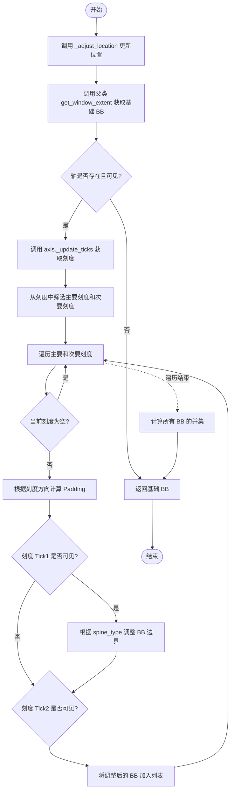

#### 带注释源码

```python
def get_window_extent(self, renderer=None):
    """
    Return the window extent of the spines in display space, including
    padding for ticks (but not their labels)

    See Also
    --------
    matplotlib.axes.Axes.get_tightbbox
    matplotlib.axes.Axes.get_window_extent
    """
    # 1. 确保位置已更新，以便变换等操作正确
    self._adjust_location()
    
    # 2. 获取Spine本身（Patch）的窗口范围
    bb = super().get_window_extent(renderer=renderer)
    
    # 3. 如果没有轴或轴不可见，直接返回基础的BB，不处理刻度
    if self.axis is None or not self.axis.get_visible():
        return bb
    
    # 4. 准备收集所有相关的边界框（Spine + Ticks）
    bboxes = [bb]
    
    # 5. 更新轴上的刻度，并获取当前需要绘制的刻度集合
    drawn_ticks = self.axis._update_ticks()

    # 6. 找出当前绘制的主要刻度和次要刻度
    major_tick = next(iter({*drawn_ticks} & {*self.axis.majorTicks}), None)
    minor_tick = next(iter({*drawn_ticks} & {*self.axis.minorTicks}), None)
    
    # 7. 遍历每个可见的刻度对象
    for tick in [major_tick, minor_tick]:
        if tick is None:
            continue
        
        # 复制当前的边界框用于调整，避免修改原始bb
        bb0 = bb.frozen()
        tickl = tick._size         # 刻度长度
        tickdir = tick._tickdir    # 刻度方向 ('out', 'in', 'inout')
        
        # 根据刻度方向设置内外边距系数
        if tickdir == 'out':
            padout = 1
            padin = 0
        elif tickdir == 'in':
            padout = 0
            padin = 1
        else: # 'inout' (default)
            padout = 0.5
            padin = 0.5
            
        # 获取图形DPI，计算实际的像素 padding
        dpi = self.get_figure(root=True).dpi
        padout = padout * tickl / 72 * dpi
        padin = padin * tickl / 72 * dpi

        # 8. 处理第一个刻度线 (tick1line) 的可见性和位置调整
        if tick.tick1line.get_visible():
            if self.spine_type == 'left':
                bb0.x0 = bb0.x0 - padout
                bb0.x1 = bb0.x1 + padin
            elif self.spine_type == 'bottom':
                bb0.y0 = bb0.y0 - padout
                bb0.y1 = bb0.y1 + padin

        # 9. 处理第二个刻度线 (tick2line) 的可见性和位置调整
        if tick.tick2line.get_visible():
            if self.spine_type == 'right':
                bb1 = bb0.x1 + padout # Logic seems slightly off in source vs comment flow, keeping source logic
                # Source: bb0.x1 = bb0.x1 + padout
                # Let's trace exactly:
                # Right spine: tick2 is usually the one pointing out/in?
                # Actually, the source code modifies bb0 in place.
                bb0.x1 = bb0.x1 + padout
                bb0.x0 = bb0.x0 - padin
            elif self.spine_type == 'top':
                bb0.y1 = bb0.y1 + padout
                bb0.y0 = bb0.y0 - padout # Note: source uses padout for both y0/y1 for top? 
                # Source: bb0.y1 = bb0.y1 + padout; bb0.y0 = bb0.y0 - padout
                # This matches 'padout' for both sides usually for 'top' being the outer boundary
        
        # 将计算好的带刻度边距的BB加入列表
        bboxes.append(bb0)

    # 10. 返回所有BB的并集
    return mtransforms.Bbox.union(bboxes)
```


### Spine.get_path

获取Spine对象用于绘制脊柱的路径对象。

参数：

- （无参数，仅有隐式参数`self`）

返回值：`matplotlib.path.Path`，返回用于绘制脊柱的`Path`实例。

#### 流程图

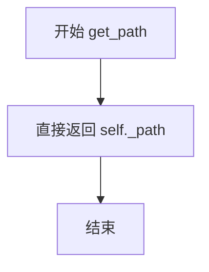

#### 带注释源码

```python
def get_path(self):
    """
    返回用于绘制脊柱的路径。

    该方法是一个简单的访问器方法,返回在初始化时设置的内部路径对象。
    _path 属性存储了一个 matplotlib.path.Path 实例,用于定义脊柱的几何形状。

    Parameters
    ----------
    无 (仅包含 self 参数)

    Returns
    -------
    matplotlib.path.Path
        用于绘制脊柱的 Path 实例。
    """
    return self._path
```


### Spine.register_axis

该方法用于将轴（Axis）对象注册到脊柱（Spine）实例中，建立轴与脊柱的关联关系，以便后续脊柱能够操作或清除轴的属性。

参数：

- `axis`：`object`，要注册的轴对象，通常为 matplotlib 的 `XAxis` 或 `YAxis` 实例，来自 `Axes` 实例。

返回值：`None`，该方法不返回任何值，仅修改实例状态。

#### 流程图

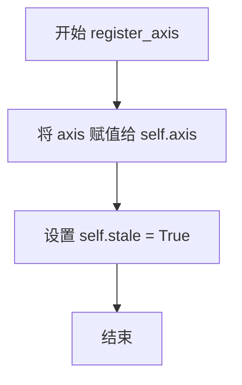

#### 带注释源码

```python
def register_axis(self, axis):
    """
    Register an axis.

    An axis should be registered with its corresponding spine from
    the Axes instance. This allows the spine to clear any axis
    properties when needed.
    """
    # 将传入的 axis 对象赋值给实例属性 axis，建立关联关系
    self.axis = axis
    # 将 stale 标记设为 True，指示该组件需要重新渲染
    # stale 标记会被父类 Patch 的 draw 方法使用
    self.stale = True
```


### Spine.clear

清除当前的脊柱（Spine）及其关联的轴（Axis），重置脊柱的位置状态并递归调用轴的清除方法。

参数：

- （无参数，self 为实例引用）

返回值：`None`，无返回值，仅执行清除操作

#### 流程图

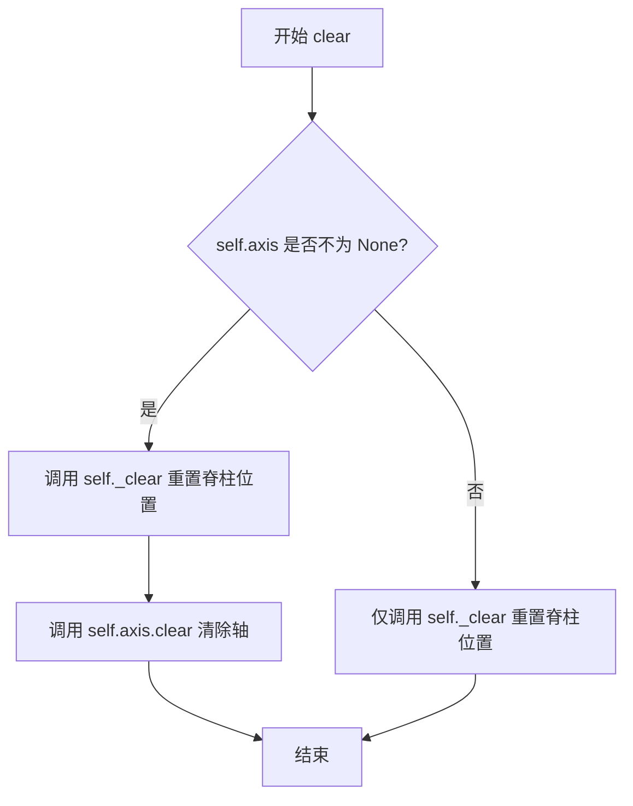

#### 带注释源码

```python
def clear(self):
    """Clear the current spine."""
    # 步骤1: 调用内部方法 _clear 清除直接隶属于 Spine 的属性
    # 主要清除 self._position，将其重置为 None
    self._clear()
    
    # 步骤2: 判断是否存在关联的 Axis 对象
    # 如果存在，则递归调用 Axis 的 clear 方法进行完整清除
    # 这确保了当 Spine 被清除时，关联的刻度、标签等也被一并清除
    if self.axis is not None:
        self.axis.clear()
```


### `Spine._clear`

清除与 Spine 直接相关的信息，以便在仅需要重置 Spine 而不重置 Axis 时使用。

参数：

- `self`：`Spine` 实例，隐式参数，表示当前 Spine 对象

返回值：`None`，无返回值（Python 中未显式返回时默认返回 None）

#### 流程图

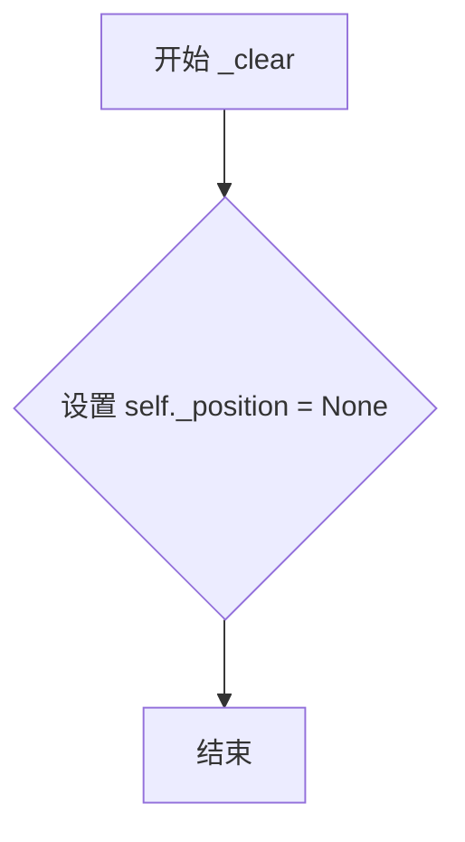

#### 带注释源码

```python
def _clear(self):
    """
    Clear things directly related to the spine.

    In this way it is possible to avoid clearing the Axis as well when calling
    from library code where it is known that the Axis is cleared separately.
    """
    self._position = None  # clear position
```

#### 说明

此方法是 `Spine` 类的私有方法，主要功能是清除 Spine 的位置信息（`self._position`）。该方法被 `Spine.clear()` 方法调用，而 `clear()` 方法还会额外清除关联的 Axis。

**设计意图**：提供一个轻量级的清除操作，使得调用者可以在已知 Axis 会被单独清除的情况下，避免重复清除 Axis，从而提高性能或避免不必要的副作用。

**调用关系**：
- `Spine.clear()` → 调用 `self._clear()`
- `Spine.clear()` → 还可能调用 `self.axis.clear()`（如果 axis 不为 None）


### `Spine._adjust_location`

该方法用于根据当前轴的视图区间自动设置脊柱（Spine）的边界位置。它会根据脊柱类型（left、right、top、bottom 或 circle）和补丁类型（line、arc）来调整脊柱的路径顶点或弧线范围，确保脊柱与数据区域的视图边界保持同步。

参数： 无显式参数（仅使用 `self`）

返回值：`None`，该方法直接修改实例状态，不返回任何值

#### 流程图

```mermaid
flowchart TD
    A[开始 _adjust_location] --> B{spine_type == 'circle'?}
    B -->|是| C[直接返回]
    B -->|否| D[获取视图边界 low, high]
    D --> E{_patch_type == 'arc'?}
    E -->|是| F{spine_type in ('bottom', 'top')?}
    E -->|否| G[处理线性和圆形脊柱]
    
    F -->|否| H[抛出 ValueError]
    F -->|是| I[获取极坐标方向和偏移]
    I --> J[转换 low/high 为角度]
    J --> K[创建新的弧线路径]
    K --> L{spine_type == 'bottom'?}
    L -->|是| M[计算并设置极坐标半径比例]
    L -->|否| N[结束]
    M --> N
    
    G --> O{spine_type in ['left', 'right']?}
    O -->|是| P[设置顶点Y坐标]
    O -->|否| Q{spine_type in ['bottom', 'top']?}
    Q -->|是| R[设置顶点X坐标]
    Q -->|否| S[抛出 ValueError]
    P --> T[结束]
    R --> T
```

#### 带注释源码

```python
def _adjust_location(self):
    """Automatically set spine bounds to the view interval."""
    
    # 如果是圆形脊柱，不需要调整位置（圆形脊柱的位置由 set_patch_circle 固定）
    if self.spine_type == 'circle':
        return

    # 获取视图边界（通过 _bounds 或 viewLim 获取 low 和 high）
    low, high = self._get_bounds_or_viewLim()

    # 处理弧形脊柱（Arc Spine）
    if self._patch_type == 'arc':
        # 仅支持 bottom 和 top 类型的弧形脊柱
        if self.spine_type in ('bottom', 'top'):
            # 获取极坐标的方向（1 或 -1）
            try:
                direction = self.axes.get_theta_direction()
            except AttributeError:
                direction = 1
            # 获取极坐标的偏移量
            try:
                offset = self.axes.get_theta_offset()
            except AttributeError:
                offset = 0
            
            # 应用方向和偏移到角度范围
            low = low * direction + offset
            high = high * direction + offset
            # 确保低角度小于高角度
            if low > high:
                low, high = high, low

            # 用新的角度范围创建弧线路径
            self._path = mpath.Path.arc(np.rad2deg(low), np.rad2deg(high))

            # 对于 bottom 类型的脊柱，处理极坐标的半径变换
            if self.spine_type == 'bottom':
                # 获取坐标变换（如果是极坐标轴则包含极坐标变换）
                if self.axis is None:
                    tr = mtransforms.IdentityTransform()
                else:
                    tr = self.axis.get_transform()
                
                # 转换视图边界的Y坐标到显示坐标
                rmin, rmax = tr.transform(self.axes.viewLim.intervaly)
                
                # 获取极坐标原点半径
                try:
                    rorigin = self.axes.get_rorigin()
                except AttributeError:
                    rorigin = rmin
                else:
                    rorigin = tr.transform(rorigin)
                
                # 计算缩放直径（用于极坐标系的半径映射）
                scaled_diameter = (rmin - rorigin) / (rmax - rorigin)
                self._height = scaled_diameter
                self._width = scaled_diameter

        else:
            raise ValueError('unable to set bounds for spine "%s"' %
                             self.spine_type)
    
    # 处理线性和圆形（非 arc 类型）脊柱
    else:
        # 获取路径顶点（应为 2x2 的数组）
        v1 = self._path.vertices
        assert v1.shape == (2, 2), 'unexpected vertices shape'
        
        # 根据脊柱类型设置对应的顶点坐标
        if self.spine_type in ['left', 'right']:
            # 设置左右脊柱的 Y 坐标范围
            v1[0, 1] = low
            v1[1, 1] = high
        elif self.spine_type in ['bottom', 'top']:
            # 设置上下脊柱的 X 坐标范围
            v1[0, 0] = low
            v1[1, 0] = high
        else:
            raise ValueError('unable to set bounds for spine "%s"' %
                             self.spine_type)
```


### `Spine.draw`

该方法负责绘制脊柱（Spine）对象。首先调用 `_adjust_location()` 自动根据视图区间调整脊柱位置，然后调用父类 `Patch` 的 `draw` 方法执行实际绘制，最后将 `stale` 标志设置为 `False` 表示绘制完成不再需要重绘。

参数：

- `renderer`：`matplotlib.backends.backend_*.*RendererBase`，用于执行实际绘图操作的渲染器对象

返回值：`任意`，返回父类 `Patch.draw(renderer)` 的返回值，通常为 `None` 或包含艺术家绘制结果的列表

#### 流程图

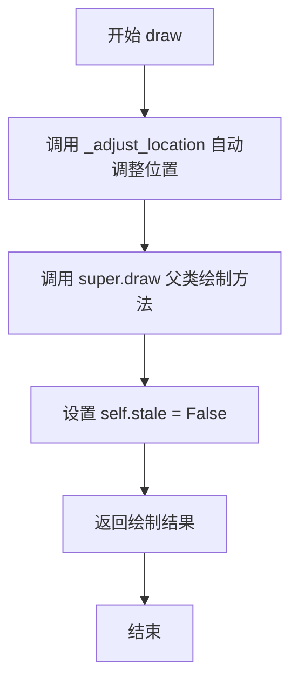

#### 带注释源码

```python
@allow_rasterization
def draw(self, renderer):
    """
    绘制脊柱对象。

    此方法首先调用 _adjust_location() 自动根据视图区间调整脊柱的边界位置，
    然后调用父类 Patch 的 draw 方法执行实际绘制，并将 stale 标志设置为 False
    以表示该艺术家对象已最新，无需重绘。

    Parameters
    ----------
    renderer : RendererBase
        渲染器对象，负责将艺术家对象绘制到输出设备

    Returns
    -------
    Any
        父类 Patch.draw() 的返回值，通常为 None
    """
    # 自动设置脊柱边界到视图区间
    self._adjust_location()
    
    # 调用父类 Patch 的 draw 方法执行实际绘制
    ret = super().draw(renderer)
    
    # 标记该艺术家对象已最新，不需要重绘
    self.stale = False
    
    # 返回父类绘制结果
    return ret
```


### Spine.set_position

该方法用于设置脊柱（Spine）在图表中的位置，支持三种定位方式：基于数据坐标的'data'模式、基于轴坐标的'axes'模式，以及基于点偏移的'outward'模式，同时提供了'center'和'zero'两个快捷写法。

参数：

- `position`：`str | tuple[str, float]`，位置规范。可以是字符串'center'（映射到('axes', 0.5)）或'zero'（映射到('data', 0.0)），也可以是2元组，格式为(位置类型, 数值)，位置类型可选'outward'（从数据区域向外偏移指定点数，负值向内）、'axes'（在轴坐标系中0-1之间定位）或'data'（在数据坐标系中定位）

返回值：`None`，该方法无返回值，仅修改对象内部状态

#### 流程图

```mermaid
flowchart TD
    A[开始 set_position] --> B{position in ('center', 'zero')?}
    B -->|Yes| C[不做验证,直接通过]
    B -->|No| D{len(position) == 2?}
    D -->|No| E[抛出 ValueError: position should be 'center' or 2-tuple]
    D -->|Yes| F{position[0] in ['outward', 'axes', 'data']?}
    F -->|No| G[抛出 ValueError: position[0] should be one of 'outward', 'axes', or 'data']
    F -->|Yes| H[设置 self._position = position]
    H --> I[调用 self.set_transform self.get_spine_transform]
    I --> J{self.axis is not None?}
    J -->|Yes| K[调用 self.axis.reset_ticks]
    J -->|No| L[跳过重置刻度]
    K --> M[设置 self.stale = True]
    L --> M
    C --> H
    E --> N[结束]
    G --> N
    M --> N
```

#### 带注释源码

```python
def set_position(self, position):
    """
    Set the position of the spine.

    Spine position is specified by a 2 tuple of (position type,
    amount). The position types are:

    * 'outward': place the spine out from the data area by the specified
      number of points. (Negative values place the spine inwards.)
    * 'axes': place the spine at the specified Axes coordinate (0 to 1).
    * 'data': place the spine at the specified data coordinate.

    Additionally, shorthand notations define a special positions:

    * 'center' -> ``('axes', 0.5)``
    * 'zero' -> ``('data', 0.0)``

    Examples
    --------
    :doc:`/gallery/spines/spine_placement_demo`
    """
    # 处理特殊位置简写：'center' 和 'zero'
    if position in ('center', 'zero'):  # special positions
        pass  # 保持原样，后续在get_spine_transform中转换
    else:
        # 验证position是否为有效的2元组
        if len(position) != 2:
            raise ValueError("position should be 'center' or 2-tuple")
        # 验证position类型是否合法
        if position[0] not in ['outward', 'axes', 'data']:
            raise ValueError("position[0] should be one of 'outward', "
                             "'axes', or 'data' ")
    
    # 存储位置信息到实例变量
    self._position = position
    
    # 根据新位置更新脊柱的变换矩阵
    self.set_transform(self.get_spine_transform())
    
    # 如果已关联坐标轴，重置刻度线以反映位置变化
    if self.axis is not None:
        self.axis.reset_ticks()
    
    # 标记需要重绘（stale状态为True）
    self.stale = True
```


### Spine.get_position

获取Spine对象的当前位置配置。该方法确保位置已被设置，然后返回当前的位置信息。

参数： 无

返回值：`tuple[str, float] | str`，返回Spine的位置，格式为(position_type, amount)元组或特殊字符串('center'/'zero')。其中position_type为'outward'、'axes'或'data'之一，amount为数值。

#### 流程图

```mermaid
flowchart TD
    A[开始 get_position] --> B{self._position is None?}
    B -->|是| C[调用 _ensure_position_is_set]
    B -->|否| D[直接返回 self._position]
    C --> E[设置默认位置 ('outward', 0.0)]
    E --> D
    D --> F[结束，返回位置信息]
```

#### 带注释源码

```python
def get_position(self):
    """Return the spine position."""
    # 确保位置已被设置，若未设置则使用默认值('outward', 0.0)
    self._ensure_position_is_set()
    # 返回当前的位置配置
    return self._position
```


### Spine.get_spine_transform

该方法用于获取脊柱（Spine）的坐标变换对象，根据脊柱的位置类型（'outward'、'axes'或'data'）和位置参数计算并返回相应的仿射变换，用于将脊柱放置在图表的正确位置。

参数： 无

返回值：`matplotlib.transforms.Transform`，返回的变换对象，可能是 `Affine2D`、`ScaledTranslation` 或混合变换（blended transform），用于将脊柱的坐标从数据空间转换到显示空间。

#### 流程图

```mermaid
flowchart TD
    A[开始 get_spine_transform] --> B[调用 _ensure_position_is_set]
    B --> C{position 是否为字符串}
    C -->|是| D{position == 'center'}
    C -->|否| F
    D -->|是| E[position = ('axes', 0.5)]
    D -->|否| G{position == 'zero'}
    G -->|是| H[position = ('data', 0)]
    G -->|否| I[保留原 position]
    E --> F
    H --> F
    I --> F
    F[获取 position_type 和 amount] --> J{position_type 合法性检查}
    J --> K{spine_type 是 'left' 或 'right'}
    K -->|是| L[base_transform = get_yaxis_transform]
    K -->|否| M{spine_type 是 'top' 或 'bottom'}
    M -->|是| N[base_transform = get_xaxis_transform]
    M -->|否| O[抛出 ValueError]
    L --> P{position_type == 'outward'}
    N --> P
    P -->|amount == 0| Q[返回 base_transform]
    P -->|amount != 0| R[计算偏移向量]
    R --> S[计算偏移像素 offset_dots]
    S --> T[返回 base_transform + ScaledTranslation]
    P --> U{position_type == 'axes'}
    U -->|left/right| V[返回 Affine2D.from_values + base_transform]
    U -->|top/bottom| W[返回 Affine2D.from_values + base_transform]
    U --> X{position_type == 'data'}
    X -->|right/top| Y[amount -= 1]
    Y --> Z{left/right}
    Z -->|是| AA[返回 blended_transform]
    Z -->|否| AB[返回 blended_transform]
    X -->|left/bottom| Z
```

#### 带注释源码

```python
def get_spine_transform(self):
    """Return the spine transform."""
    # 确保位置已被设置，若未设置则使用默认值（'outward', 0.0）
    self._ensure_position_is_set()

    # 获取当前位置设置
    position = self._position
    
    # 处理特殊位置名称：'center' 和 'zero'
    if isinstance(position, str):
        if position == 'center':
            # 'center' 表示axes坐标系的中间位置 (0.5)
            position = ('axes', 0.5)
        elif position == 'zero':
            # 'zero' 表示数据坐标系的原点 (0)
            position = ('data', 0)
    
    # 断言position是2元组
    assert len(position) == 2, 'position should be 2-tuple'
    
    # 解构位置类型和数值
    position_type, amount = position
    
    # 验证位置类型必须是 'axes', 'outward', 或 'data' 之一
    _api.check_in_list(['axes', 'outward', 'data'],
                       position_type=position_type)
    
    # 根据脊柱类型获取基础变换
    # 'left' 和 'right' 脊柱使用Y轴变换
    if self.spine_type in ['left', 'right']:
        base_transform = self.axes.get_yaxis_transform(which='grid')
    # 'top' 和 'bottom' 脊柱使用X轴变换
    elif self.spine_type in ['top', 'bottom']:
        base_transform = self.axes.get_xaxis_transform(which='grid')
    else:
        raise ValueError(f'unknown spine spine_type: {self.spine_type!r}')

    # 处理 'outward' 位置类型：从数据区域向外偏移指定点数
    if position_type == 'outward':
        if amount == 0:  # short circuit commonest case
            # 偏移为0时直接返回基础变换
            return base_transform
        else:
            # 根据脊柱类型确定偏移方向向量
            offset_vec = {'left': (-1, 0), 'right': (1, 0),
                          'bottom': (0, -1), 'top': (0, 1),
                          }[self.spine_type]
            # calculate x and y offset in dots
            # 将偏移量从点数转换为像素（1点 = 1/72英寸）
            offset_dots = amount * np.array(offset_vec) / 72
            # 返回带有缩放平移的组合变换
            return (base_transform
                    + mtransforms.ScaledTranslation(
                        *offset_dots, self.get_figure(root=False).dpi_scale_trans))
    
    # 处理 'axes' 位置类型：位置相对于坐标轴（0到1）
    elif position_type == 'axes':
        if self.spine_type in ['left', 'right']:
            # keep y unchanged, fix x at amount
            # 左侧/右侧：固定X坐标为amount，Y坐标保持不变
            # from_values(0, 0, 0, 1, amount, 0) 表示 x = amount, y 保持不变
            return (mtransforms.Affine2D.from_values(0, 0, 0, 1, amount, 0)
                    + base_transform)
        elif self.spine_type in ['bottom', 'top']:
            # keep x unchanged, fix y at amount
            # 顶部/底部：固定Y坐标为amount，X坐标保持不变
            # from_values(1, 0, 0, 0, 0, amount) 表示 y = amount, x 保持不变
            return (mtransforms.Affine2D.from_values(1, 0, 0, 0, 0, amount)
                    + base_transform)
    
    # 处理 'data' 位置类型：位置相对于数据坐标
    elif position_type == 'data':
        if self.spine_type in ('right', 'top'):
            # The right and top spines have a default position of 1 in
            # axes coordinates.  When specifying the position in data
            # coordinates, we need to calculate the position relative to 0.
            # 右侧和顶部脊柱的默认位置是1，需要将amount调整为相对于0的位置
            amount -= 1
        if self.spine_type in ('left', 'right'):
            # 左侧/右侧：X方向使用数据变换，Y方向使用数据变换
            # 使用混合变换，X方向平移amount，Y方向保持数据坐标
            return mtransforms.blended_transform_factory(
                mtransforms.Affine2D().translate(amount, 0)
                + self.axes.transData,
                self.axes.transData)
        elif self.spine_type in ('bottom', 'top'):
            # 顶部/底部：X方向使用数据变换，Y方向平移amount
            return mtransforms.blended_transform_factory(
                self.axes.transData,
                mtransforms.Affine2D().translate(0, amount)
                + self.axes.transData)
```


### `Spine.set_bounds`

设置脊柱（Spine）的显示范围边界，用于控制轴脊柱的绘制范围。

参数：

- `low`：`float | tuple | None`，下边界值。传递 `None` 保持下限不变；也可作为元组 `(low, high)` 传递第一个位置参数
- `high`：`float | None`，上边界值。传递 `None` 保持上限不变

返回值：`None`，无返回值（直接修改对象状态）

#### 流程图

```mermaid
flowchart TD
    A[开始 set_bounds] --> B{spine_type == 'circle'?}
    B -->|是| C[抛出 ValueError]
    B -->|否| D{high is None and<br/>np.iterable(low)?}
    D -->|是| E[解包元组: low, high = low]
    D -->|否| F[调用 _get_bounds_or_viewLim<br/>获取旧边界]
    E --> F
    F --> G{low is None?}
    G -->|是| H[low = old_low]
    G -->|否| I[保留传入的 low]
    H --> J{high is None?}
    I --> J
    J -->|是| K[high = old_high]
    J -->|否| L[保留传入的 high]
    K --> M[_bounds = (low, high)]
    L --> M
    M --> N[stale = True]
    N --> O[结束]
    C --> O
```

#### 带注释源码

```python
def set_bounds(self, low=None, high=None):
    """
    Set the spine bounds.

    Parameters
    ----------
    low : float or None, optional
        The lower spine bound. Passing *None* leaves the limit unchanged.

        The bounds may also be passed as the tuple (*low*, *high*) as the
        first positional argument.

        .. ACCEPTS: (low: float, high: float)

    high : float or None, optional
        The higher spine bound. Passing *None* leaves the limit unchanged.
    """
    # 圆形脊柱不支持 set_bounds 方法
    if self.spine_type == 'circle':
        raise ValueError(
            'set_bounds() method incompatible with circular spines')
    
    # 支持以元组形式传递边界值: set_bounds((low, high))
    if high is None and np.iterable(low):
        low, high = low
    
    # 获取当前边界（如果未设置过，则从 axes 的 viewLim 获取）
    old_low, old_high = self._get_bounds_or_viewLim()
    
    # 如果未传入 low/high，则保持原有的边界值
    if low is None:
        low = old_low
    if high is None:
        high = old_high
    
    # 更新内部边界存储，并标记需要重绘
    self._bounds = (low, high)
    self.stale = True
```


### `Spine.get_bounds`

获取脊线（Spine）的边界值。

参数：

- `self`：`Spine` 实例本身，无需显式传递

返回值：`tuple[float, float] | None`，返回脊线的边界值。如果未通过 `set_bounds()` 设置过边界，则返回 `None`；否则返回 `(low, high)` 元组。

#### 流程图

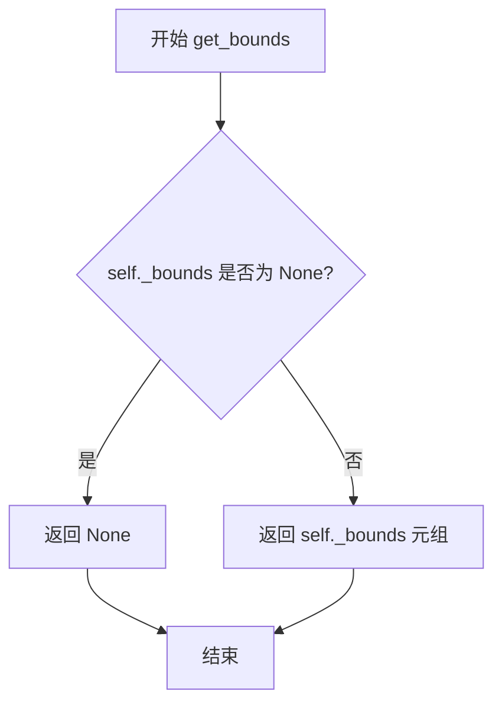

#### 带注释源码

```python
def get_bounds(self):
    """Get the bounds of the spine."""
    # 直接返回内部存储的 _bounds 属性
    # _bounds 默认为 None，在调用 set_bounds() 后会被设置为 (low, high) 元组
    return self._bounds
```


### `Spine.linear_spine`

**描述**  
创建一个指定类型的线性 `Spine`（轴脊）对象并返回。方法根据 `spine_type`（`left`、`right`、`bottom`、`top`）构造对应的路径，随后实例化 `Spine`，并依据全局配置 `axes.spines.{spine_type}` 设置其可见性。

---

#### 参数

- `cls`：`type`（`Spine` 类本身），类方法隐式接收的类引用。  
- `axes`：`~matplotlib.axes.Axes`，包含该轴脊的 `Axes` 实例。  
- `spine_type`：`str`，轴脊类型，可选值为 `'left'`、`'right'`、`'bottom'`、`'top'`。  
- `**kwargs`：`dict`，传递给 `Spine` 构造函数的额外关键字参数（如 `set_facecolor`、`set_edgecolor` 等）。

---

#### 返回值

- **类型**：`Spine`（`Spine` 实例）  
- **描述**：返回一个可视属性已根据 `rcParams['axes.spines.{spine_type}']` 设置的线性轴脊对象。

---

#### 流程图

```mermaid
flowchart TD
    A[开始 linear_spine] --> B{spine_type == 'left'?}
    B -- 是 --> C[path = Path([(0.0,0.999), (0.0,0.999)])]
    B -- 否 --> D{spine_type == 'right'?}
    D -- 是 --> E[path = Path([(1.0,0.999), (1.0,0.999)])]
    D -- 否 --> F{spine_type == 'bottom'?}
    F -- 是 --> G[path = Path([(0.999,0.0), (0.999,0.0)])]
    F -- 否 --> H{spine_type == 'top'?}
    H -- 是 --> I[path = Path([(0.999,1.0), (0.999,1.0)])]
    H -- 否 --> J[raise ValueError]
    C --> K[result = cls(axes, spine_type, path, **kwargs)]
    E --> K
    G --> K
    I --> K
    K --> L[result.set_visible( mpl.rcParams[f'axes.spines.{spine_type}'] ) ]
    L --> M[返回 result]
```

---

#### 带注释源码

```python
@classmethod
def linear_spine(cls, axes, spine_type, **kwargs):
    """
    Create and return a linear `Spine`.

    Parameters
    ----------
    axes : `~matplotlib.axes.Axes`
        The `~.axes.Axes` instance containing the spine.
    spine_type : str
        The spine type, one of {'left', 'right', 'bottom', 'top'}.
    **kwargs
        Additional keyword arguments passed to the `Spine` constructor.

    Returns
    -------
    Spine
        A linear spine configured according to *spine_type*.
    """
    # 根据 spine_type 生成对应的路径对象（线段），
    # 初始顶点使用 0.999 占位，随后在 set_bounds() 中会被真实边界替换。
    if spine_type == 'left':
        path = mpath.Path([(0.0, 0.999), (0.0, 0.999)])
    elif spine_type == 'right':
        path = mpath.Path([(1.0, 0.999), (1.0, 0.999)])
    elif spine_type == 'bottom':
        path = mpath.Path([(0.999, 0.0), (0.999, 0.0)])
    elif spine_type == 'top':
        path = mpath.Path([(0.999, 1.0), (0.999, 1.0)])
    else:
        raise ValueError('unable to make path for spine "%s"' % spine_type)

    # 使用传入的 axes、spine_type、路径以及额外关键字参数实例化 Spine。
    result = cls(axes, spine_type, path, **kwargs)

    # 根据全局配置决定该轴脊的默认可见性（可在 rcParams 中关闭），
    # 例如 axes.spines.left、axes.spines.right 等。
    result.set_visible(mpl.rcParams[f'axes.spines.{spine_type}'])

    # 返回已配置好的线性轴脊对象。
    return result
```

--- 

以上即 `Spine.linear_spine` 方法的完整提取与说明。


### `Spine.arc_spine`

创建一个弧形脊柱（Spine）并返回。

参数：

- `cls`：类型，隐式参数，表示类本身
- `axes`：`~matplotlib.axes.Axes`，包含该脊柱的 `~.axes.Axes` 实例
- `spine_type`：`str`，脊柱类型
- `center`：中心点坐标，用于设置弧线的中心
- `radius`：`float`，弧线的半径
- `theta1`：`float`，弧线的起始角度（弧度制）
- `theta2`：`float`，弧线的结束角度（弧度制）
- `**kwargs`：其他关键字参数，传递给父类 `Patch` 的有效参数

返回值：创建的弧形 `Spine` 实例

#### 流程图

```mermaid
flowchart TD
    A[开始 arc_spine] --> B[使用 mpath.Path.arc 创建弧线路径]
    B --> C[调用 cls 构造函数创建 Spine 实例]
    C --> D[调用 set_patch_arc 设置弧形属性]
    D --> E[返回 Spine 实例]
```

#### 带注释源码

```python
@classmethod
def arc_spine(cls, axes, spine_type, center, radius, theta1, theta2,
              **kwargs):
    """Create and return an arc `Spine`."""
    # 使用 matplotlib.path.Path.arc 创建弧线路径
    # theta1 和 theta2 是弧线的起始和结束角度（弧度）
    path = mpath.Path.arc(theta1, theta2)
    
    # 使用传入的参数构造 Spine 实例
    # axes: 所属的 Axes 对象
    # spine_type: 脊柱类型（如 'left', 'right', 'top', 'bottom'）
    # path: 预先创建的弧线路径
    # **kwargs: 其他传递给父类 Patch 的参数
    result = cls(axes, spine_type, path, **kwargs)
    
    # 调用 set_patch_arc 方法配置脊柱为弧形
    # center: 弧线的中心点坐标
    # radius: 弧线的半径
    # theta1, theta2: 起始和结束角度
    result.set_patch_arc(center, radius, theta1, theta2)
    
    # 返回创建的弧形 Spine 实例
    return result
```


### `Spine.circular_spine`

该方法是一个类方法，用于创建并返回一个圆形的 `Spine`（脊柱）对象，常用于在图表中创建圆形边界或标记。

参数：

- `cls`：类型，当前类 `Spine` 的引用（隐式参数）
- `axes`：`~matplotlib.axes.Axes`，包含该脊柱的 `Axes` 实例
- `center`：tuple(float, float)，圆心坐标，格式为 `(x, y)`
- `radius`：float，圆的半径
- `**kwargs`：dict，可选的额外关键字参数，将传递给 `Spine` 构造函数

返回值：`Spine`，返回创建的圆形脊柱对象

#### 流程图

```mermaid
flowchart TD
    A[开始: circular_spine] --> B[创建单位圆路径: mpath.Path.unit_circle]
    B --> C[设置 spine_type 为 'circle']
    C --> D[创建 Spine 实例: cls&#40;axes, spine_type, path, kwargs&#41;]
    D --> E[调用 set_patch_circle&#40;center, radius&#41;]
    E --> F[返回 result]
    F --> G[结束]
```

#### 带注释源码

```python
@classmethod
def circular_spine(cls, axes, center, radius, **kwargs):
    """Create and return a circular `Spine`."""
    # 使用单位圆路径创建圆形路径对象
    path = mpath.Path.unit_circle()
    # 将 spine 类型设置为 'circle'，标识这是一个圆形脊柱
    spine_type = 'circle'
    # 调用父类构造函数创建 Spine 实例，传入 axes、spine_type、path 和额外参数
    result = cls(axes, spine_type, path, **kwargs)
    # 设置圆形脊柱的圆心和半径属性
    result.set_patch_circle(center, radius)
    # 返回创建的圆形脊柱对象
    return result
```


### Spine.set_color

该方法用于设置脊柱（Spine）的边框颜色（edgecolor），通过调用父类的set_edgecolor方法实现颜色设置，并将对象标记为需要重绘状态。

参数：

- `c`：`:mpltype:`color``，颜色值，可以是matplotlib支持的任何颜色格式（如颜色名称、十六进制颜色码、RGB元组等）

返回值：`None`，无返回值，该方法通过修改对象内部状态来完成功能

#### 流程图

```mermaid
flowchart TD
    A[开始 set_color] --> B[接收颜色参数 c]
    B --> C[调用 self.set_edgecolor c]
    C --> D[设置 self.stale = True]
    D --> E[标记对象需要重绘]
    E --> F[结束]
```

#### 带注释源码

```python
def set_color(self, c):
    """
    Set the edgecolor.

    Parameters
    ----------
    c : :mpltype:`color`

    Notes
    -----
    This method does not modify the facecolor (which defaults to "none"),
    unlike the `.Patch.set_color` method defined in the parent class.  Use
    `.Patch.set_facecolor` to set the facecolor.
    """
    # 调用父类Patch的set_edgecolor方法设置边框颜色
    self.set_edgecolor(c)
    # 将stale标记设为True，通知matplotlib该对象需要重绘
    self.stale = True
```


### `SpinesProxy.__init__`

该方法是 `SpinesProxy` 类的构造函数，用于初始化一个代理对象，该对象用于将 `set_*()` 和 `set()` 方法调用广播到多个 `Spine` 对象。

参数：

- `spine_dict`：`dict`，包含 Spine 对象的字典，键为脊柱名称（如 'left'、'right'、'top'、'bottom'），值为对应的 Spine 实例。

返回值：`None`，该方法为构造函数，不返回值。

#### 流程图

```mermaid
flowchart TD
    A[开始 __init__] --> B[接收 spine_dict 参数]
    B --> C[将 spine_dict 赋值给实例属性 self._spine_dict]
    C --> D[结束]
```

#### 带注释源码

```python
def __init__(self, spine_dict):
    """
    初始化 SpinesProxy 实例。

    Parameters
    ----------
    spine_dict : dict
        包含 Spine 对象的字典，键为脊柱名称（如 'left', 'right', 'top', 'bottom'），
        值为对应的 Spine 实例。该字典用于后续的方法广播操作。
    """
    # 将传入的 spine_dict 存储为实例属性，供后续 __getattr__ 方法使用
    # 以便将 set 方法调用广播到字典中的所有 Spine 对象
    self._spine_dict = spine_dict
```


### `SpinesProxy.__getattr__`

该方法是 `SpinesProxy` 类的属性访问拦截器，用于动态代理对多个脊柱（Spine）对象的 `set_*()` 方法调用。当访问不以 `set_` 开头的属性或不存在的方法时，会抛出 `AttributeError`；否则返回一个可调用对象，该对象会将调用广播到所有支持该方法的脊柱对象上。

参数：

- `name`：`str`，要访问的属性或方法名称

返回值：`Callable`，一个 `functools.partial` 对象，用于将调用广播到所有目标脊柱对象

#### 流程图

```mermaid
flowchart TD
    A[__getattr__ 被调用] --> B{检查 name 是否为 'set' 或以 'set_' 开头?}
    B -->|否| C[收集支持该属性的所有脊柱]
    C --> D{存在支持 name 的脊柱?}
    D -->|否| E[抛出 AttributeError]
    D -->|是| F[创建广播函数 x]
    F --> G[使用 functools.partial 绑定 targets 和 name]
    G --> H[设置返回函数的 __doc__ 为第一个脊柱对应方法的文档]
    H --> I[返回可调用对象]
    
    B -->|是| C
```

#### 带注释源码

```python
def __getattr__(self, name):
    """
    动态代理属性访问，将 set_*() 方法调用广播到所有包含的脊柱对象。
    
    Parameters
    ----------
    name : str
        要访问的属性或方法名称。
    
    Returns
    -------
    Callable
        一个 functools.partial 对象，调用时会将参数广播到所有支持该方法的脊柱。
    
    Raises
    ------
    AttributeError
        如果 name 不是 'set' 也不以 'set_' 开头，或者没有脊柱支持该属性。
    """
    # 收集所有支持该属性/方法的脊柱对象
    broadcast_targets = [spine for spine in self._spine_dict.values()
                         if hasattr(spine, name)]
    
    # 检查属性名称是否合法（必须是 setter 方法）以及是否有可广播目标
    if (name != 'set' and not name.startswith('set_')) or not broadcast_targets:
        raise AttributeError(
            f"'SpinesProxy' object has no attribute '{name}'")

    # 定义内部广播函数，将调用分发给每个目标脊柱
    def x(_targets, _funcname, *args, **kwargs):
        for spine in _targets:
            getattr(spine, _funcname)(*args, **kwargs)
    
    # 使用 functools.partial 预绑定广播目标和函数名
    x = functools.partial(x, broadcast_targets, name)
    
    # 继承第一个支持该方法的脊柱的文档字符串
    x.__doc__ = broadcast_targets[0].__doc__
    
    return x
```


### SpinesProxy.__dir__

该方法重写了 Python 的默认 `__dir__` 行为，用于返回包含在 SpinesProxy 中的所有 Spine 对象的 setter 方法名称（即以 'set_' 开头的属性）。它会遍历所有脊椎，收集它们的 set_ 开头的属性名，去重后排序返回。

参数：

- `self`：`SpinesProxy` 实例，SpinesProxy 对象本身

返回值：`list[str]`，返回排序后的去重属性名列表，这些属性名均以 'set_' 开头，来自所有包含的 Spine 对象。

#### 流程图

```mermaid
flowchart TD
    A[开始 __dir__] --> B[初始化空列表 names]
    B --> C{遍历 spine_dict 中的每个 spine}
    C -->|对每个 spine| D[获取 spine 的 dir]
    D --> E[筛选以 'set_' 开头的名称]
    E --> F[将这些名称加入 names 列表]
    F --> C
    C -->|遍历完成| G[将 names 转换为集合去重]
    G --> H[对去重后的集合排序]
    H --> I[返回排序后的列表]
    I --> J[结束]
```

#### 带注释源码

```
def __dir__(self):
    """
    返回包含所有 setter 方法名称的列表。
    
    该方法重写了 Python 的默认 __dir__ 行为，
    用于返回包含在 SpinesProxy 中的所有 Spine 对象的 setter 方法名称。
    """
    names = []  # 用于存储所有 set_ 开头的属性名
    # 遍历 self._spine_dict 中的每个脊柱（spine）对象
    for spine in self._spine_dict.values():
        # 从每个 spine 的 dir() 结果中筛选出以 'set_' 开头的名称
        names.extend(name
                     for name in dir(spine) if name.startswith('set_'))
    # 将列表转换为集合去重，再转换回列表并排序后返回
    return list(sorted(set(names)))
```


### `Spines.__init__`

该方法是 `Spines` 类的构造函数，用于初始化一个脊柱容器对象，将传入的可变关键字参数存储为内部字典，支持通过字典方式访问脊柱（Spine）对象。

参数：

- `**kwargs`：可变关键字参数，类型为任意关键字参数，存放脊柱名称到 `Spine` 对象的映射关系

返回值：无返回值（`None`），构造函数不返回任何值

#### 流程图

```mermaid
flowchart TD
    A[开始 __init__] --> B{接收 **kwargs}
    B --> C[将 kwargs 存储到 self._dict]
    D[结束 __init__]
    C --> D
```

#### 带注释源码

```python
def __init__(self, **kwargs):
    """
    初始化 Spines 容器。
    
    Parameters
    ----------
    **kwargs : dict
        关键字参数，键为脊柱名称（如 'left', 'right', 'top', 'bottom'），
        值为对应的 Spine 对象。
    """
    # 将所有传入的关键字参数存储到内部字典 _dict 中
    # 这样可以支持字典式的访问方式（如 spines['left']）
    self._dict = kwargs
```


### `Spines.from_dict`

这是一个类方法，用于从字典创建 `Spines` 对象实例。它接受一个字典参数，将其解包后传递给类的构造函数来实例化 `Spines` 对象。

参数：

- `d`：`dict`，字典对象，其键值对将作为关键字参数传递给 `Spines` 构造函数

返回值：`Spines`，返回一个新建的 `Spines` 对象实例

#### 流程图

```mermaid
flowchart TD
    A[开始] --> B{检查输入参数}
    B -->|参数有效| C[将字典 d 解包为关键字参数]
    C --> D[调用 cls 构造函数 __init__(**d)]
    D --> E[返回新建的 Spines 实例]
    B -->|参数无效| F[抛出异常]
```

#### 带注释源码

```python
@classmethod
def from_dict(cls, d):
    """
    从字典创建 Spines 对象。

    Parameters
    ----------
    d : dict
        包含脊柱信息的字典，键为脊柱名称（如 'left', 'right' 等），
        值为对应的 Spine 对象。

    Returns
    -------
    Spines
        新创建的 Spines 对象实例。
    """
    # cls 表示 Spines 类本身
    # **d 将字典解包为关键字参数传递给 __init__
    # 例如：d = {'left': spine1, 'right': spine2}
    # 相当于调用 Spines(left=spine1, right=spine2)
    return cls(**d)
```


### `Spines.__getstate__`

该方法是 Python 的特殊方法（魔术方法），用于自定义对象的序列化行为。在对象被 pickle（序列化）时调用，返回一个字典，包含对象需要保存的状态信息。

参数：

- `self`：`Spines`，当前实例对象，不需要显式传递

返回值：`dict`，返回 `self._dict` 字典，包含所有脊柱（Spine）对象的字典映射

#### 流程图

```mermaid
flowchart TD
    A[__getstate__ 被调用] --> B[返回 self._dict]
    B --> C[pickle 使用返回的字典保存对象状态]
```

#### 带注释源码

```python
def __getstate__(self):
    """
    获取对象状态用于序列化（pickle）。

    当 Python 对象需要被序列化时（如保存到文件或通过网络传输），
    pickle 模块会调用此方法。该方法返回对象的状态字典。

    Returns
    -------
    dict
        包含所有脊柱的字典，即 self._dict。
        这个字典的键是脊柱名称（如 'left', 'right', 'top', 'bottom'），
        值是对应的 Spine 对象实例。
    """
    return self._dict
```

---

**设计说明：**

- **序列化契约**：该方法只保存内部的 `_dict` 字典，不保存其他可能无法序列化的属性
- **反序列化对应**：`__setstate__` 方法使用返回的字典通过 `__init__(**state)` 重新初始化对象
- **潜在问题**：如果 `Spine` 对象本身或其引用的其他对象（如 `axes`）包含不可序列化的内容，可能导致 pickle 失败


### `Spines.__setstate__`

该方法是Python pickle序列化协议的一部分，用于反序列化时恢复`Spines`对象的状态。它接收一个状态字典并通过调用`__init__`方法重新初始化对象。

参数：

- `state`：`dict`，pickle序列化后保存的状态字典，包含需要恢复的脊椎（spine）对象字典

返回值：`None`，无返回值（方法修改对象状态）

#### 流程图

```mermaid
flowchart TD
    A[开始 __setstate__] --> B[接收 state 参数]
    B --> C[调用 self.__init__**state]
    C --> D[结束]
```

#### 带注释源码

```python
def __setstate__(self, state):
    """
    Restore the object from a pickled state.

    This method is part of Python's pickle protocol. It is called during
    unpickling to restore the object's state.

    Parameters
    ----------
    state : dict
        A dictionary containing the pickled state of the Spines object,
        typically the internal _dict attribute holding spine name-Spine
        object mappings.
    """
    # Re-initialize the Spines object using the state dictionary as keyword
    # arguments. This effectively recreates the _dict attribute with the
    # pickled spine objects.
    self.__init__(**state)
```


### `Spines.__getattr__`

该方法实现类似 pandas.Series 的属性访问方式，当通过点号语法（如 `spines.top`）访问 spines 对象时自动调用，尝试从内部字典中获取指定名称的 Spine 对象，若不存在则抛出 AttributeError。

参数：

- `name`：`str`，要访问的 spine 名称（如 'top', 'left', 'bottom', 'right'）

返回值：返回对应名称的 `Spine` 对象；若找不到则抛出 `AttributeError`。

#### 流程图

```mermaid
flowchart TD
    A[开始 __getattr__] --> B{尝试从 self._dict 获取 name}
    B -->|成功| C[返回 Spine 对象]
    B -->|KeyError 异常| D[构造 AttributeError 消息]
    D --> E[抛出 AttributeError]
    C --> F[结束]
    E --> F
```

#### 带注释源码

```python
def __getattr__(self, name):
    """
    通过属性访问方式获取 Spine 对象。
    
    当使用 spines.top 而非 spines['top'] 访问时调用此方法。
    实现了类似 pandas.Series 的属性访问接口。
    """
    try:
        # 尝试从内部字典中获取指定名称的 spine
        return self._dict[name]
    except KeyError:
        # 字典中不存在该键时，转换为更友好的 AttributeError
        raise AttributeError(
            f"'Spines' object does not contain a '{name}' spine")
```


### `Spines.__getitem__`

该方法实现了字典风格的访问接口，支持通过键（字符串）、列表（多个键）、或完整切片来获取脊骨（Spine）对象或代理对象。

参数：

- `key`：任意类型，访问键，可以是字符串（单个脊骨名称）、列表（多个脊骨名称）、元组（将引发错误）、或切片（仅支持全开切片`[:]`）

返回值：`Spine` 或 `SpinesProxy`，当key为字符串时返回对应的Spine对象；key为列表时返回包含指定脊骨的SpinesProxy代理对象；key为全开切片`[:]`时返回包含所有脊骨的SpinesProxy代理对象

#### 流程图

```mermaid
flowchart TD
    A[开始 __getitem__] --> B{key 是列表?}
    B -->|Yes| C{列表中的键都有效?}
    C -->|Yes| D[返回 SpinesProxy]
    C -->|No| E[抛出 KeyError]
    B -->|No| F{key 是元组?}
    F -->|Yes| G[抛出 ValueError]
    F -->|No| H{key 是切片?}
    H -->|Yes| I{是全开切片 [:]?}
    I -->|Yes| J[返回 SpinesProxy]
    I -->|No| K[抛出 ValueError]
    H -->|No| L[返回 self._dict[key]]
```

#### 带注释源码

```python
def __getitem__(self, key):
    """
    获取脊骨或脊骨代理对象。

    Parameters
    ----------
    key : str, list, slice
        访问键：
        - str: 单个脊骨名称（如 'left', 'right', 'top', 'bottom'）
        - list: 多个脊骨名称列表
        - slice: 仅支持全开切片 [:] 以获取所有脊骨的代理

    Returns
    -------
    Spine or SpinesProxy
        - str: 返回对应的 Spine 对象
        - list: 返回包含指定脊骨的 SpinesProxy 对象
        - slice [:]: 返回包含所有脊骨的 SpinesProxy 对象

    Raises
    ------
    KeyError
        当列表中包含未知的脊骨名称时
    ValueError
        - 当 key 是元组时（应使用列表）
        - 当 key 是非全开切片时
    """
    # 处理列表类型的key，支持同时访问多个脊骨
    if isinstance(key, list):
        # 检查列表中是否有未知的键
        unknown_keys = [k for k in key if k not in self._dict]
        if unknown_keys:
            # 抛出包含所有未知键的KeyError
            raise KeyError(', '.join(unknown_keys))
        # 返回包含指定脊骨的代理对象
        return SpinesProxy({k: v for k, v in self._dict.items()
                            if k in key})
    
    # 元组不支持，提示用户使用列表
    if isinstance(key, tuple):
        raise ValueError('Multiple spines must be passed as a single list')
    
    # 处理切片操作
    if isinstance(key, slice):
        # 全开切片 [:] 返回所有脊骨的代理
        if key.start is None and key.stop is None and key.step is None:
            return SpinesProxy(self._dict)
        else:
            # 其他切片方式不支持
            raise ValueError(
                'Spines does not support slicing except for the fully '
                'open slice [:] to access all spines.')
    
    # 字符串类型，直接从字典返回对应的Spine对象
    return self._dict[key]
```


### `Spines.__setitem__`

该方法用于将 Spine 对象添加到 Spines 容器中，通过键值对的形式存储到内部字典 `_dict`。

参数：

- `key`：`str`，spine 的名称（如 'left'、'right'、'top'、'bottom'）
- `value`：`Spine`，要存储的 Spine 对象

返回值：`None`，该方法不返回任何值，直接修改内部字典状态

#### 流程图

```mermaid
flowchart TD
    A[开始 __setitem__] --> B{检查 key 和 value}
    B --> C[将键值对添加到 self._dict]
    C --> D[结束]
    
    style A fill:#f9f,color:#333
    style D fill:#9f9,color:#333
```

#### 带注释源码

```python
def __setitem__(self, key, value):
    """
    设置 Spines 容器中的 spine 对象。

    Parameters
    ----------
    key : str
        spine 的名称，通常为 'left'、'right'、'top'、'bottom' 等
    value : Spine
        要存储的 Spine 对象实例
    """
    # TODO: Do we want to deprecate adding spines?
    # 将传入的键值对直接添加到内部字典 _dict 中
    # 这是一个简单的字典赋值操作
    self._dict[key] = value
```


### `Spines.__delitem__`

从 Spines 容器中删除指定的 spine 对象。

参数：

- `key`：`str`，要删除的 spine 的键（如 'left', 'right', 'top', 'bottom'）

返回值：`None`，该方法不返回任何值

#### 流程图

```mermaid
flowchart TD
    A[开始 __delitem__] --> B{检查 key 是否有效}
    B -->|key 有效| C[从 self._dict 中删除 key]
    C --> D[结束]
    B -->|key 无效| E[抛出 KeyError 异常]
    E --> D
```

#### 带注释源码

```python
def __delitem__(self, key):
    """
    删除指定的 spine。

    Parameters
    ----------
    key : str
        要删除的 spine 的名称（如 'left', 'right', 'top', 'bottom'）

    Raises
    ------
    KeyError
        如果指定的 key 不存在于 Spines 容器中

    Notes
    -----
    这是一个委托方法，实际删除操作由内部字典 self._dict 处理。
    根据代码中的 TODO 注释，未来可能会考虑废弃此功能。
    """
    # TODO: Do we want to deprecate deleting spines?
    # 从内部字典中删除指定的键值对
    del self._dict[key]
```


### `Spines.__iter__`

该方法实现 Python 迭代器协议，返回一个用于遍历 Spines 容器中所有键（spine 名称）的迭代器。

参数：此方法无显式参数（隐式参数 `self` 为 Spines 实例）

返回值：`iterator`，返回字典键的迭代器，实现对容器中所有 spine 名称（如 'left'、'right'、'top'、'bottom'）的遍历支持。

#### 流程图

```mermaid
flowchart TD
    A[开始 __iter__] --> B{检查 self._dict 存在}
    B -->|是| C[返回 iter&#40;self._dict&#41;]
    B -->|否| D[抛出 AttributeError]
    C --> E[迭代器可用于 for 循环]
    E --> F[遍历 spine 名称]
    F --> G[结束]
    
    style C fill:#90EE90
    style E fill:#87CEEB
```

#### 带注释源码

```python
def __iter__(self):
    """
    实现迭代器协议，返回遍历容器中所有键的迭代器。
    
    该方法使 Spines 实例可以直接在 for 循环中使用，
    例如: for spine_name in spines:
    
    Returns
    -------
    iterator
        字典键的迭代器对象，遍历 spine 的名称字符串
        ('left', 'right', 'top', 'bottom' 等)
    """
    return iter(self._dict)  # 返回内部字典的键迭代器
```

#### 说明

`__iter__` 方法是 Python 迭代器协议的核心方法之一，使 `Spines` 容器支持直接迭代。当执行 `for name in spines:` 时，Python 会自动调用此方法。该方法返回 `self._dict`（一个 Python 字典）的迭代器，从而实现对所有 spine 名称的遍历。这种设计符合 `MutableMapping` 抽象基类的要求，使得 `Spines` 类能够以字典的方式使用，同时保持与 pandas Series 相似的属性访问特性。


### `Spines.__len__`

返回 Spines 容器中包含的 Spine 对象（即字典中的条目）的数量。该方法实现了 Python 的 `MutableMapping` 接口，使得 Spines 对象可以使用内置的 `len()` 函数获取其包含的 Spine 数量。

参数：

- `self`：`Spines`，Spines 类的实例本身，用于访问实例的内部字典 `_dict`

返回值：`int`，返回当前 Spines 容器中 Spine 对象（条目）的数量

#### 流程图

```mermaid
flowchart TD
    A[开始 __len__] --> B[返回 self._dict 的长度]
    B --> C[结束]
```

#### 带注释源码

```python
def __len__(self):
    """
    返回 Spines 容器中 Spine 对象（条目）的数量。

    该方法实现了 MutableMapping 接口的 __len__ 抽象方法，
    通过返回内部字典 _dict 的长度来实现。_dict 存储了
    名称到 Spine 实例的映射。

    Returns
    -------
    int
        Spines 容器中包含的 Spine 对象数量。
    """
    return len(self._dict)
```


## 关键组件


### Spine 类

坐标轴脊线的主类，继承自 mpatches.Patch，用于绘制坐标轴的边界线（left, right, top, bottom）。支持三种绘制模式：线性（line）、圆形（circle）和弧形（arc），并提供灵活的位置设置机制（outward/axes/data）。

### SpinesProxy 类

代理类，实现对多个 Spine 对象的批量操作。通过动态发现支持的 set_* 方法，将调用广播到所有包含的脊线对象，支持如 `spines[['top', 'right']].set_visible(False)` 的链式调用。

### Spines 类

脊线容器类，继承自 MutableMapping，以字典方式管理多个 Spine 对象。支持属性访问（如 spines.top）、列表索引（如 spines[['top', 'right']]）和切片访问（spines[:]），返回 SpinesProxy 进行批量操作。

### 位置设置机制

set_position() 方法支持三种位置类型：'outward'（向外偏移指定点数）、'axes'（在轴坐标 0-1 范围内）、'data'（在数据坐标中）。特殊位置 'center' 和 'zero' 作为简写形式。

### 边界调整机制

_adjust_location() 方法根据脊线类型自动将边界设置为视图区间。对于 arc 类型脊线，还处理极坐标转换（theta_direction 和 theta_offset）和半径缩放。

### 绘制变换系统

get_spine_transform() 方法构建混合变换，结合 base_transform（轴变换）和位置变换。对于 'data' 位置类型，使用 blended_transform_factory 分别处理 x 和 y 方向的不同变换。

### 弧形/圆形脊线支持

set_patch_arc() 和 set_patch_circle() 方法将脊线切换到相应的绘制模式，通过 _recompute_transform() 计算变换矩阵，使用 axes 坐标系统而非 data 坐标系统。


## 问题及建议


### 已知问题

-   **不一致的类型检查方式**：代码中混用了`_api.check_isinstance`、`assert`和`isinstance`进行类型验证，缺乏统一的类型检查模式。
-   **硬编码的魔法数字**：多处使用硬编码值如`0.999`（`linear_spine`）、`2.5`（zorder）、`72`（DPI转换），缺乏常量定义。
-   **重复的变换逻辑**：`get_spine_transform`方法中存在重复的坐标变换计算逻辑，可提取为独立方法。
-   **API设计不一致**：`Spines.__getitem__`对列表返回`SpinesProxy`，但对元组抛出`ValueError`，对切片仅支持全开放切片`[:]`，缺乏统一性。
-   **错误信息不够详细**：多处`ValueError`异常信息较为简略，如`'unable to set bounds for spine "%s"'`，未提供更多调试上下文。
-   **状态修改副作用**：`set_patch_arc`、`set_patch_circle`、`set_patch_line`等多个设置方法直接修改`self.stale = True`，调用者难以控制重绘时机。
-   **边界情况处理不完善**：在`get_window_extent`中获取tick信息时使用`next(iter(...))`可能返回`None`但未做充分说明。
-   **文档字符串缺失**：部分方法（如`_clear`、`_recompute_transform`）缺少完整的文档说明。

### 优化建议

-   **提取常量**：将魔法数字提取为类级或模块级常量，如`DEFAULT_ZORDER = 2.5`、`DPI_CONVERSION = 72`等。
-   **统一错误处理**：使用`_api.warn_external`或统一的异常类进行错误报告，提供更多上下文信息。
-   **重构变换逻辑**：将`get_spine_transform`中的重复逻辑提取为独立的辅助方法，如`_get_base_transform`、`_apply_position_transform`等。
-   **增强API一致性**：统一`Spines`类的索引行为，考虑支持更多切片操作或提供明确的错误提示。
-   **添加类型注解**：为关键方法添加类型提示（PEP 484），提高代码可维护性和IDE支持。
-   **优化状态管理**：考虑引入更细粒度的状态更新机制，避免频繁的全局重绘。
-   **完善文档**：为所有公共和内部方法补充完整的文档字符串，特别是参数和返回值说明。

## 其它


### 设计目标与约束

本模块的设计目标是提供一种灵活、可配置的轴脊（Spine）机制，用于可视化图表中标记数据区域边界的线条。主要约束包括：1）Spine必须支持多种位置类型（outward、axes、data）；2）支持三种渲染模式（线形、圆形、弧形）；3）必须与matplotlib的transform系统无缝集成；4）需要支持边界自动调整以适应视图变化。

### 错误处理与异常设计

主要异常场景包括：1）无效的spine_type（非left/right/top/bottom/circle）时抛出ValueError；2）无效的位置类型时抛出ValueError；3）位置元组长度不为2时抛出ValueError；4）对circle类型spine调用set_bounds时抛出ValueError；5）path参数类型不正确时通过_api.check_isinstance检查；6）不支持的spine_type在_get_bounds_or_viewLim中抛出ValueError。所有异常都包含明确的错误信息，便于开发者定位问题。

### 数据流与状态机

Spine的状态转换如下：初始化（_position=None）→ 设置位置（set_position）→ 激活_transform → 绘制时调用_adjust_location更新路径顶点。Spine的绘制流程：draw() → _adjust_location() → super().draw() → 返回渲染结果。当位置、边界、变换或可见性改变时，stale标志被设置为True，触发重新渲染。SpinesProxy和Spines构成了观察者模式，SpinesProxy作为代理广播操作到多个Spine实例。

### 外部依赖与接口契约

主要依赖包括：1）matplotlib.patches.Patch - 基类；2）matplotlib.transforms - 变换系统；3）matplotlib.path.Path - 路径定义；4）matplotlib.mpl - rcParams配置；5）numpy - 数值计算。接口契约：Spine必须实现get_patch_transform()、get_window_extent()、get_path()等方法；Spines必须实现MutableMapping接口的所有方法（__getitem__、__setitem__、__delitem__、__iter__、__len__）；axis注册通过register_axis()方法完成。

### 性能考虑与优化空间

性能关键点：1）_adjust_location在每次draw时调用，对于大量Spine可能成为瓶颈；2）get_window_extent中遍历所有ticks计算边界，复杂度较高。优化建议：1）缓存计算结果，仅在stale=True时重新计算；2）使用__slots__减少Spine实例内存占用；3）对于静态图表可禁用自动位置调整；4）考虑使用轻量级transform组合替代复杂计算。

### 线程安全性

当前实现非线程安全。多个线程同时修改Spine属性（如position、bounds）或调用draw()可能导致状态不一致。风险点：1）_position的读写；2）stale标志的检查与设置；3）transform的重新计算。使用建议：在多线程环境下应加锁保护，或在UI线程中完成所有Spine操作。

### 序列化与持久化

Spine类通过__getstate__和__setstate__支持pickle序列化。序列化时保存_dict属性，包含了所有spine名称到Spine实例的映射。SpinesProxy不支持序列化（返回broadcast_targets的partial对象）。注意事项：序列化时会保留对axes的引用，反序列化后需要确保axes对象有效；circular spine的变换状态可能因依赖运行时计算而不完全可序列化。

### 配置与可扩展性

可配置项：1）通过mpl.rcParams配置默认颜色、线宽、可见性；2）spine位置支持三种类型灵活设置；3）支持自定义path实现特殊形状。扩展方式：1）可通过继承Spine实现自定义spine类型；2）通过set_patch_arc/set_patch_circle/set_patch_line切换渲染模式；3）SpinesProxy支持动态方法广播便于批量操作。类方法linear_spine、arc_spine、circular_spine提供了创建常见spine类型的便捷工厂方法。

### 使用示例与API参考

```python
# 创建线性spine
spine = Spine.linear_spine(axes, 'left')

# 设置位置
spine.set_position(('outward', 10))  # 向外偏移10磅
spine.set_position(('axes', 0.5))    # 居中
spine.set_position(('data', 0))      # 数据坐标

# 批量操作
spines = Spines(left=spine_left, right=spine_right, top=spine_top, bottom=spine_bottom)
spines[['top', 'right']].set_visible(False)  # 通过代理批量隐藏

# 获取边界
spine.set_bounds(0, 100)  # 设置数据边界
bounds = spine.get_bounds()  # 获取边界
```

### 版本兼容性说明

代码使用了_api.check_isinstance、_api.check_in_list等内部API，以及convert_xunits/convert_yunits等单位转换方法。这些API在不同matplotlib版本间可能存在细微差异，特别是对于极坐标Axes的theta方向和偏移处理（代码中有try/except处理AttributeError）。建议在生产环境中指定明确的matplotlib版本依赖。


    