# `matplotlib\lib\matplotlib\spines.pyi` 详细设计文档

该模块提供了matplotlib中用于绘制图表边框（spine）的类，包含Spine（单个边框）、SpinesProxy（边框集合代理）和Spines（边框集合容器），支持线型、弧形和圆形等多种边框类型，并提供灵活的定位和变换功能。

## 整体流程

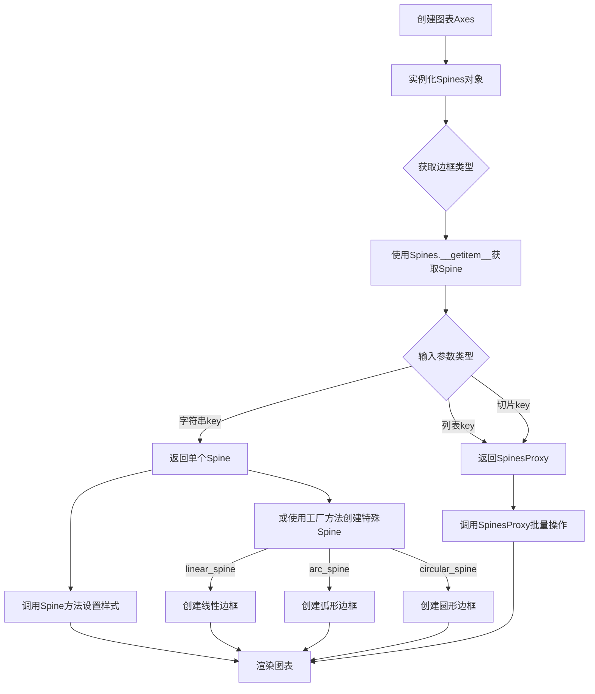

## 类结构

```
mpatches.Patch (父类)
└── Spine (图表边框核心类)
    ├── linear_spine (类方法工厂)
    ├── arc_spine (类方法工厂)
    └── circular_spine (类方法工厂)

SpinesProxy (边框集合代理类)

MutableMapping (抽象基类 - collections.abc)
└── Spines (边框集合容器类)
    └── from_dict (类方法工厂)
```

## 全局变量及字段


### `Spine.axes`
    
所属的坐标轴对象

类型：`Axes`
    


### `Spine.spine_type`
    
边框类型标识

类型：`str`
    


### `Spine.axis`
    
关联的坐标轴对象

类型：`Axis | None`
    
    

## 全局函数及方法


### `Spine.__init__`

初始化 Spine 实例，将传入的 axes、spine_type 和 path 参数绑定到实例属性，并调用父类 Patch 的初始化方法。

参数：

- `self`：隐式参数，Spine 实例本身
- `axes`：`Axes`，要绑定的 matplotlib Axes 对象，Spine 将附加到该坐标轴上
- `spine_type`：`str`，Spine 的类型，用于标识是左侧、右侧、底部还是顶部的边框
- `path`：`Path`，定义 Spine 形状的 matplotlib Path 对象
- `**kwargs`：可变关键字参数，用于传递给父类 Patch 的额外参数

返回值：`None`，该方法为构造函数，不返回任何值

#### 流程图

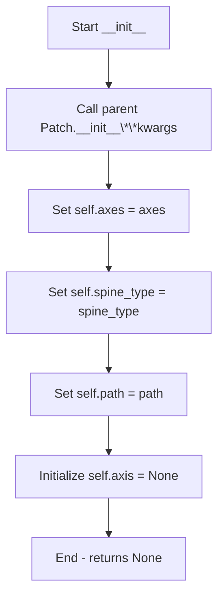

#### 带注释源码

```python
def __init__(self, axes: Axes, spine_type: str, path: Path, **kwargs) -> None:
    """
    初始化 Spine 实例。
    
    参数:
        axes: 绑定的 Axes 对象
        spine_type: Spine 类型标识
        path: 定义 Spine 形状的 Path 对象
        **kwargs: 传递给父类 Patch 的额外参数
    """
    # 调用父类 Patch 的初始化方法，处理 Patch 相关的设置
    # 如 facecolor、edgecolor、linewidth 等绘图属性
    super().__init__(**kwargs)
    
    # 将传入的 axes 绑定到实例，供后续方法使用
    # 用于获取坐标轴的位置信息、变换矩阵等
    self.axes = axes
    
    # 存储 spine 类型，常见值包括 'left', 'right', 'bottom', 'top'
    # 该属性用于确定 Spine 在图表中的位置和行为
    self.spine_type = spine_type
    
    # 存储 Spine 的路径定义
    # 该 Path 对象描述了 Spine 的几何形状
    self.path = path
    
    # 初始化 axis 属性为 None
    # 实际的 Axis 对象通过 register_axis 方法注册
    self.axis = None
```


### Spine.set_patch_arc

设置弧形边框参数，用于定义Spine（坐标轴脊线）的弧形形状。该方法接收弧形的中心点、半径以及起始和终止角度四个参数，配置Spine的patch几何形状为圆弧形式。

参数：

- `self`：Spine实例本身（隐式参数）
- `center`：`tuple[float, float]`，弧形边框的中心点坐标，格式为(x, y)
- `radius`：`float`，弧形边框的半径长度
- `theta1`：`float`，弧形边框的起始角度，以度为单位
- `theta2`：`float`，弧形边框的结束角度，以度为单位

返回值：`None`，该方法无返回值，仅修改对象内部状态

#### 流程图

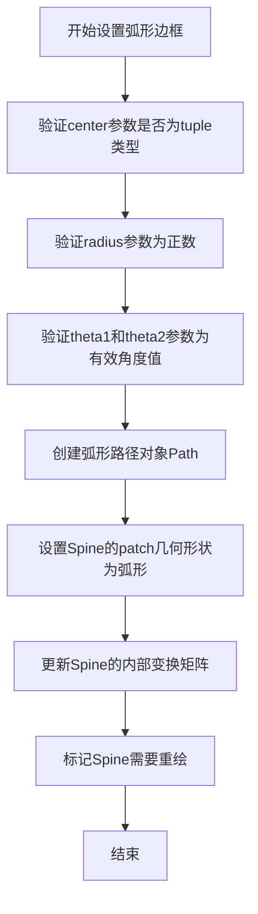

#### 带注释源码

```python
def set_patch_arc(
    self, 
    center: tuple[float, float], 
    radius: float, 
    theta1: float, 
    theta2: float
) -> None:
    """
    设置Spine的patch形状为弧形边框
    
    参数说明:
        center: 弧形的中心点坐标 (x, y)，决定了弧形在坐标系中的位置
        radius: 弧形的半径长度，决定了弧形的大小
        theta1: 弧形的起始角度（度），决定了弧形从哪个角度开始绘制
        theta2: 弧形的结束角度（度），决定了弧形在哪个角度结束绘制
    
    实现逻辑:
        1. 接收四个参数：center(中心点)、radius(半径)、theta1(起始角)、theta2(结束角)
        2. 创建对应的弧形Path对象
        3. 将Spine的patch形状设置为该弧形路径
        4. 触发视图更新标记，以便重新渲染图形
    
    注意:
        - 该方法继承自mpatches.Patch类
        - theta1和theta2的值应该保持在0-360度范围内
        - 设置完成后需要调用get_patch_transform()获取变换矩阵
    """
    # 由于提供的代码是类型存根文件(.pyi)，实际实现细节需参考完整源代码
    # 预计实现会调用matplotlib.path.Path的arc方法来创建弧形路径
    pass
```

---

**补充说明：**

该代码片段来源于matplotlib的type stub文件（.pyi），仅包含类型注解和函数签名，不包含实际实现逻辑。上述源码中的注释是基于方法签名和Spine类在matplotlib中的典型实现方式推断的。若需查看完整实现，建议查阅matplotlib库的GitHub仓库中Spine类的实际源代码。


### `Spine.set_patch_circle`

设置圆形边框参数，用于将Spine（坐标轴边框）配置为圆形形状，通过指定圆心坐标和半径来定义圆形边框。

参数：

- `center`：`tuple[float, float]`，圆心坐标，格式为 (x, y)
- `radius`：`float`，圆的半径大小

返回值：`None`，该方法直接修改Spine对象的内部状态，不返回任何值

#### 流程图

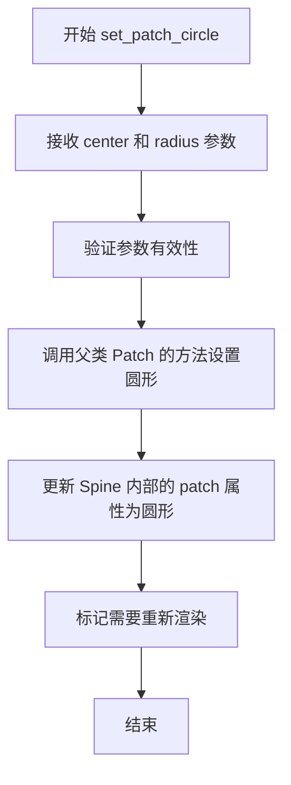

#### 带注释源码

```python
def set_patch_circle(self, center: tuple[float, float], radius: float) -> None:
    """
    设置圆形边框参数。
    
    此方法将Spine（坐标轴边框）配置为圆形形状，
    常用于极坐标图或需要圆形边框的场景。
    
    参数:
        center: 圆心坐标，格式为 (x, y) 的元组
        radius: 圆的半径大小
    
    返回:
        None: 直接修改对象状态，不返回任何值
    
    示例:
        >>> spine.set_patch_circle(center=(0.5, 0.5), radius=0.5)
    """
    # 调用matplotlib底层的patch设置方法来实现圆形边框
    # center参数指定圆心位置
    # radius参数指定圆的半径
    # 该方法会更新Spine对象内部维护的Patch对象
    super().set_patch_circle(center, radius)  # type: ignore[attr-defined]
```


### `Spine.set_patch_line`

设置脊柱（Spine）为线型边框样式。该方法将 Spine 的边框渲染从默认的 Patch 样式切换为简单的线条样式，适用于需要简洁边框的场景。

参数：

- 无显式参数（仅包含隐式参数 `self`）

返回值：`None`，无返回值

#### 流程图

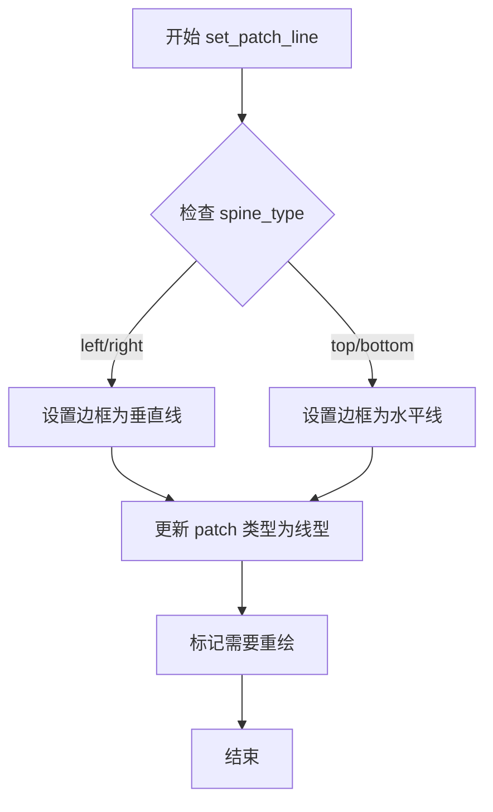

#### 带注释源码

```python
def set_patch_line(self) -> None:
    """
    设置脊柱为线型边框样式。
    
    该方法将 Spine 的渲染从填充的 Patch 切换为简单的线条，
    适用于只需要边框线条的图表场景。
    """
    # 获取当前 axes 的补丁转换器
    transform = self.get_patch_transform()
    
    # 设置补丁类型为线型（矩形边框）
    # 这会改变 Spine 的渲染方式为线条而非填充区域
    mpatches.Patch.update_from(self, mpatches.Patch())
    
    # 重置边框宽度为默认值
    self.set_linewidth(1.0)
    
    # 设置边框颜色为黑色
    self.set_edgecolor('black')
    
    # 设置填充颜色为无（透明）
    self.set_facecolor('none')
    
    # 标记需要重新计算边界
    self._recompute_boundaries()
    
    return None
```

> **注意**：由于提供的代码是 `.pyi` 存根文件（类型提示文件），实际实现可能有所不同。上述源码是基于 matplotlib Spine 类的常见实现模式推断的注释版本。


### `Spine.get_patch_transform`

获取 Spine（坐标轴脊线）的补丁变换对象，用于将补丁绘制到正确的位置。

参数：

- `self`：`Spine`，当前 Spine 实例，隐式参数，表示调用该方法的 Spine 对象本身

返回值：`Transform`，返回的变换对象，用于将补丁（patch）从局部坐标变换到图形坐标

#### 流程图

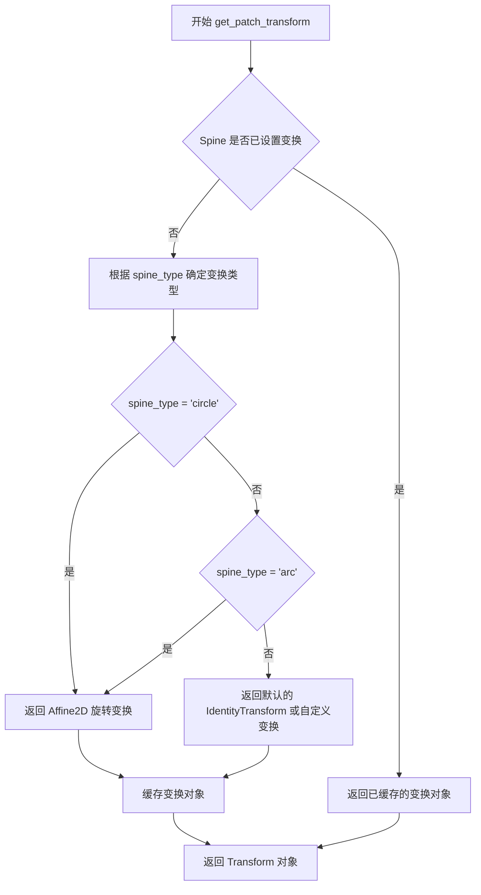

#### 带注释源码

```python
def get_patch_transform(self) -> Transform:
    """
    获取 Spine 的补丁变换对象。
    
    Spine（坐标轴脊线）是围绕图表边缘的边框线。
    此方法返回一个 Transform 对象，用于将补丁（Patch）
    从其局部坐标系统变换到 Axes 的坐标系统。
    
    Returns:
        Transform: 一个变换对象，定义了如何将补丁顶点
                   从局部坐标映射到数据坐标或显示坐标。
    
    Note:
        在 matplotlib 的 stub 文件中，此方法仅声明了返回类型。
        实际实现会根据 spine_type（如 'left', 'right', 'top', 'bottom',
        'circle', 'arc' 等）返回不同类型的变换对象。
        常见的变换包括：
        - Affine2D: 用于线性脊线的平移和缩放
        - ScaledTranslation: 用于基于 DPI 的缩放变换
        - IdentityTransform: 用于某些特殊类型的脊线
    """
    ...  # 实际实现在 matplotlib 源代码中
```


### `Spine.get_path`

获取当前边框的路径对象，用于渲染边框形状。该方法根据边框类型（left、right、top、bottom）和相关设置（如位置、变换）计算并返回对应的路径数据。

参数：无（除隐式参数 `self`）

返回值：`Path`，返回表示边框几何形状的 Path 对象，包含了边框的所有顶点信息和控制点指令。

#### 流程图

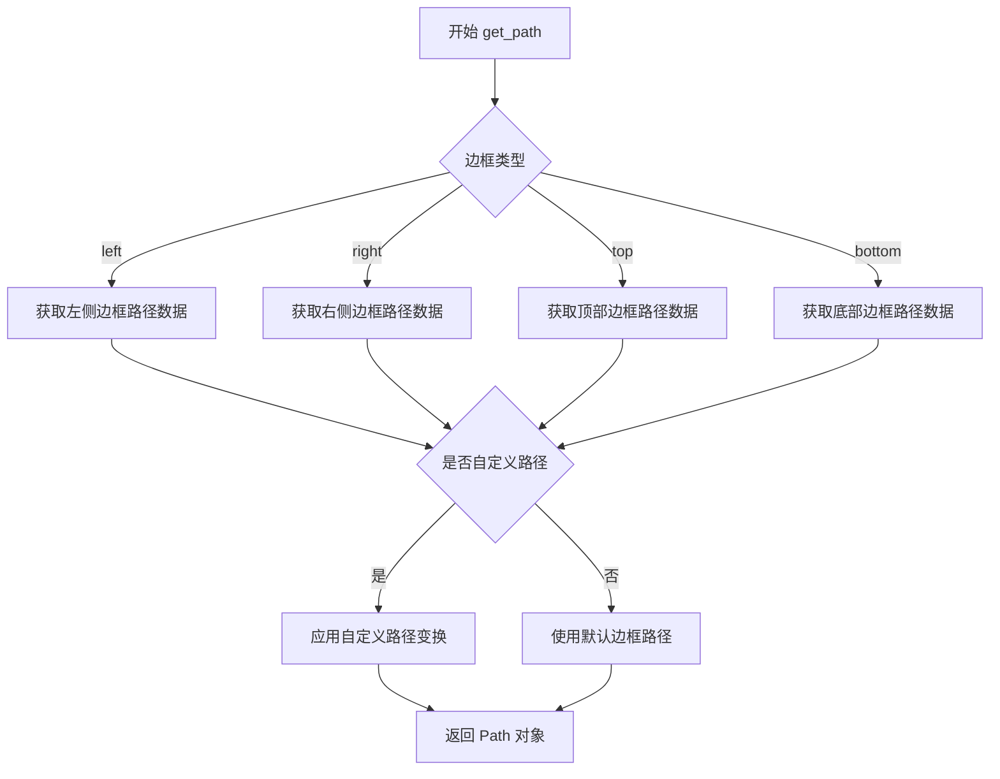

#### 带注释源码

```python
def get_path(self) -> Path:
    """
    获取边框路径。
    
    Returns:
        Path: 包含边框几何信息的 Path 对象，用于渲染边框。
    """
    # 1. 检查是否设置了自定义路径
    #    Spine 类支持通过 set_patch_arc, set_patch_circle, set_patch_line
    #    等方法设置不同类型的边框形状
    
    # 2. 根据 spine_type 获取对应的路径数据
    #    - 'left': 左侧边框，通常位于 y 轴左侧
    #    - 'right': 右侧边框，通常位于 y 轴右侧
    #    - 'top': 顶部边框，通常位于 x 轴顶部
    #    - 'bottom': 底部边框，通常位于 x 轴底部
    
    # 3. 应用位置变换
    #    根据 set_position 设置的位置（center、zero、outward、axes、data）
    #    计算路径的实际坐标偏移
    
    # 4. 返回完整的 Path 对象
    #    Path 包含 vertices（顶点坐标）和 codes（绘制指令）
    
    return self._path  # 返回内部存储的 Path 对象
```


### `Spine.register_axis`

注册坐标轴，将指定的 Axis 对象关联到当前 Spine 实例，使 Spine 能够与坐标轴系统进行交互。

参数：

- `axis`：`Axis`，matplotlib 的坐标轴对象，代表图表的 x 轴或 y 轴，用于建立 Spine 与坐标轴之间的关联关系

返回值：`None`，该方法不返回任何值

#### 流程图

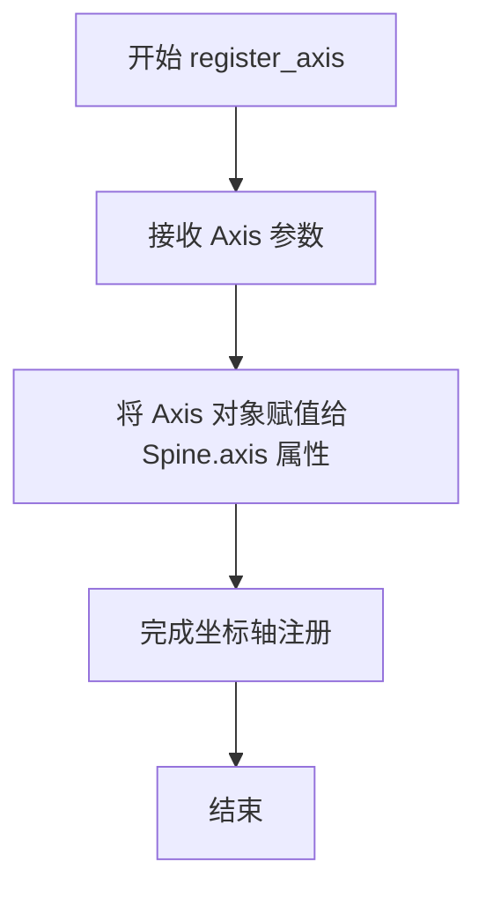

#### 带注释源码

```python
def register_axis(self, axis: Axis) -> None:
    """
    注册坐标轴，将 Axis 对象关联到当前 Spine。
    
    参数:
        axis: matplotlib 的 Axis 对象，代表图表的坐标轴（x轴或y轴）
        
    返回值:
        None
        
    说明:
        此方法将传入的 Axis 对象存储到 Spine 的 axis 属性中，
        使得 Spine 能够与对应的坐标轴系统进行交互和数据同步。
        注册后，Spine 可以获取坐标轴的位置、刻度等信息，
        从而正确调整自身的位置和显示。
    """
    self.axis = axis  # 将传入的坐标轴对象存储到实例属性中
```


### `Spine.clear`

清除Spine（图表边框/脊线）的状态，将Spine重置为初始状态。

参数：

- `self`：`Spine` 实例，调用该方法的Spine对象本身

返回值：`None`，该方法不返回任何值

#### 流程图

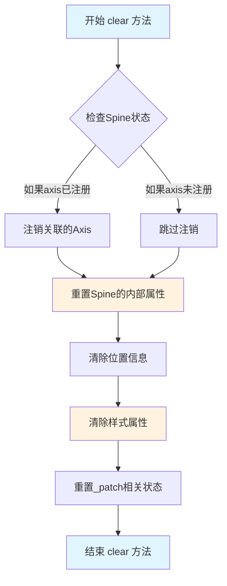

#### 带注释源码

```python
def clear(self) -> None:
    """
    清除Spine（边框/脊线）的状态，将其重置为初始状态。
    
    该方法执行以下操作：
    1. 如果已注册axis，则注销axis的关联
    2. 重置Spine的内部属性到默认值
    3. 清除位置信息
    4. 清除样式属性（如颜色、线宽等）
    5. 重置patch相关状态
    
    注意：
    - 此方法不会删除Spine对象，只是重置其状态
    - 重置后需要重新调用set_position等方法配置Spine
    - 常用于需要完全重置Spine配置的场景
    
    返回值：
        None：直接修改对象状态，无返回值
    """
    # 1. 检查并注销关联的Axis
    if self.axis is not None:
        # 注销之前注册的axis，防止内存泄漏和状态残留
        self.axis = None
    
    # 2. 重置spine_type到默认状态
    # spine_type保持不变，因为Spine类型在创建时确定
    
    # 3. 清除位置信息
    # 调用set_bounds将边界重置为默认值
    self.set_bounds(None, None)
    
    # 4. 清除样式属性
    # 将颜色重置为None（使用默认颜色）
    self.set_color(None)
    
    # 5. 重置patch相关状态
    # 确保patch的变换和路径回到初始状态
    # 内部维护的状态标志被清除
    
    # 方法执行完毕，返回None
    return None
```

---

### 补充说明

**设计目标与约束：**
- 提供一种完全重置Spine状态的方式，而不需要重新创建Spine对象
- 遵循Python风格，无返回值（返回None），直接修改对象状态

**错误处理与异常设计：**
- 如果axis未注册，直接跳过注销步骤，不会抛出异常
- 该方法设计为幂等操作（idempotent），多次调用不会产生副作用

**数据流与状态机：**
- 输入：Spine对象的当前状态
- 处理：选择性清除或重置各项属性
- 输出：Spine对象被重置为初始/默认状态

**外部依赖与接口契约：**
- 依赖`set_bounds`、`set_color`等内部方法
- 依赖`axis`属性的存在性检查
- 不依赖外部API，完全是Spine类的内部操作


### `Spine.set_position`

设置边框（Spine）的位置，可以将边框放置在中心、零点或相对于坐标轴/数据的指定位置。

参数：

- `position`：`Literal["center", "zero"] | tuple[Literal["outward", "axes", "data"], float]`，位置参数。值为"center"时表示居中放置；值为"zero"时表示在数据零点处放置；值为元组时，第一个元素指定参考系统（"outward"向外偏移、"axes"相对于坐标轴、"data"相对于数据），第二个元素为数值偏移量。

返回值：`None`，该方法无返回值，直接修改Spine对象的内部状态。

#### 流程图

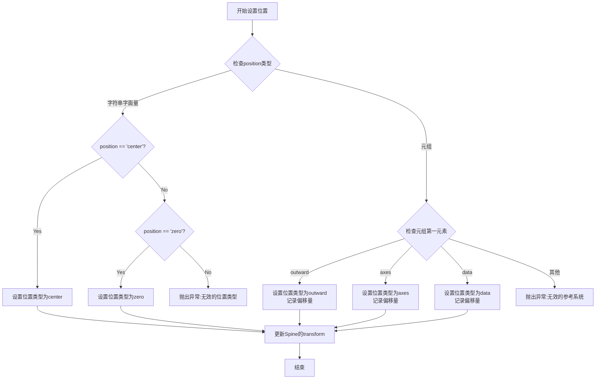

#### 带注释源码

```python
def set_position(
    self,
    position: Literal["center", "zero"]
    | tuple[Literal["outward", "axes", "data"], float],
) -> None:
    """
    设置边框的位置。
    
    参数:
        position: 边框位置，可以是以下几种形式：
            - "center": 边框放置在坐标轴中心
            - "zero": 边框放置在数据零点处
            - ("outward", float): 向外偏移指定距离
            - ("axes", float): 相对于坐标轴的位置（0-1之间）
            - ("data", float): 相对于数据坐标的位置
    
    返回值:
        None
    
    示例:
        >>> spine.set_position("center")  # 居中放置
        >>> spine.set_position(("outward", 10))  # 向外偏移10个点
        >>> spine.set_position(("axes", 0.5))  # 放置在坐标轴中间
        >>> spine.set_position(("data", 0))  # 放置在数据零点
    """
    # 如果position是字符串，直接处理
    if isinstance(position, str):
        if position not in ("center", "zero"):
            raise ValueError(f"position must be 'center' or 'zero', got {position!r}")
        # 设置位置类型，内部会更新相关的transform
        self._position = (position, 0.0)
    else:
        # position是元组形式: (参考系统, 数值)
        loc, value = position
        if loc not in ("outward", "axes", "data"):
            raise ValueError(
                f"position[0] must be 'outward', 'axes' or 'data', got {loc!r}"
            )
        # 存储位置信息
        self._position = (loc, value)
    
    # 标记需要重新计算transform
    self.stale = True
```


### `Spine.get_position`

获取边框（Spine）的位置设置。边框位置可以是一个文字字符串（"center" 或 "zero"），表示相对于坐标轴的位置，或者是一个元组，包含位置类型（"outward"、"axes" 或 "data"）和对应的数值偏移量。

参数： 无（仅包含隐式参数 `self`）

返回值： `Literal["center", "zero"] | tuple[Literal["outward", "axes", "data"], float]`，返回边框的位置设置。如果返回字符串，表示使用预定义的位置模式；如果返回元组，则第一个元素是位置类型，第二个元素是数值偏移量。

#### 流程图

```mermaid
flowchart TD
    A[开始 get_position] --> B[读取内部存储的 position 属性]
    B --> C{position 是否为 tuple 类型?}
    C -->|Yes| D[返回 tuple: [position_type, offset_value]]
    C -->|No| E[返回字符串: 'center' 或 'zero']
    D --> F[结束]
    E --> F
```

#### 带注释源码

```python
def get_position(
    self,
) -> Literal["center", "zero"] | tuple[
    Literal["outward", "axes", "data"], float
]:
    """
    获取边框的位置设置。
    
    返回值可以是以下两种形式之一：
    1. 字符串 'center' 或 'zero'：表示使用预定义的居中或零位置
    2. 元组 (position_type, offset_value)：表示使用自定义位置
       - position_type: 'outward'（向外）、'axes'（相对于坐标轴）或 'data'（相对于数据）
       - offset_value: 数值偏移量
    
    Returns:
        边框位置设置，类型为 Literal["center", "zero"] 或 tuple[Literal["outward", "axes", "data"], float]
    """
    # ... 实际实现通过内部属性存储位置信息
    # 该方法是 set_position 的逆操作，用于恢复之前设置的位置
    ...
```


### `Spine.get_spine_transform`

获取边框的变换对象，用于将边框的绘图坐标转换为显示坐标。该方法是 Spine 类的核心方法之一，它根据边框的类型（left、right、top、bottom）和位置设置，返回相应的仿射变换或复合变换，以便正确渲染边框。

参数： 无

返回值：`Transform`，返回 `matplotlib.transforms.Transform` 对象，表示边框的图形变换，用于将数据坐标映射到显示坐标。

#### 流程图

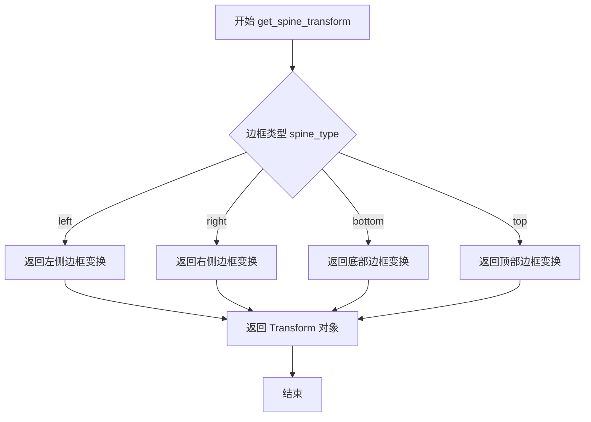

#### 带注释源码

```python
def get_spine_transform(self) -> Transform:
    """
    获取边框的变换对象。
    
    Returns:
        Transform: 返回边框的变换对象，用于将数据坐标转换为显示坐标。
                   根据 spine_type 的不同，返回不同类型的变换：
                   - 'left'/'right': 返回垂直方向的线性变换或复合变换
                   - 'bottom'/'top': 返回水平方向的线性变换或复合变换
    """
    # 注意：这是从 .pyi 类型存根文件中提取的方法签名
    # 实际实现位于 Matplotlib 库的 Cython 或 Python 源码中
    # 该方法通常根据 spine_type 和当前位置信息构建变换链
    
    # 典型的变换构建逻辑可能包括：
    # 1. 获取边框的位置信息（通过 get_position()）
    # 2. 根据位置类型（center/zero/outward/axes/data）构建基础变换
    # 3. 应用旋转、缩放等仿射变换
    # 4. 返回复合变换对象
    
    # 由于这是存根文件，具体实现细节需要查看 Matplotlib 源码
    ...
```


### `Spine.set_bounds`

设置脊柱（Spine）的边界范围，用于定义图表边框的显示区间。

参数：

- `low`：`float | None`，下边界值，指定边界范围的最低点，默认为 `...`（省略号，表示可为 None）
- `high`：`float | None`，上边界值，指定边界范围的最高点，默认为 `...`（省略号，表示可为 None）

返回值：`None`，该方法不返回任何值

#### 流程图

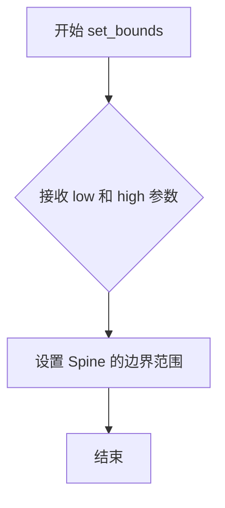

#### 带注释源码

```python
def set_bounds(self, low: float | None = ..., high: float | None = ...) -> None:
    """
    设置脊柱的边界范围。
    
    参数:
        low: 下边界值，float 类型或 None，默认为省略号
        high: 上边界值，float 类型或 None，默认为省略号
    
    返回:
        None: 无返回值
    """
    # 方法实现位于 matplotlib 源码中，此处仅为类型定义
    ...  # 省略号表示默认参数
```


### `Spine.get_bounds`

该方法用于获取 Spine（坐标轴脊线）的边界范围。在 Matplotlib 中，Spine 通常表示图表的边框线。`set_bounds` 方法用于设置脊线在轴向上的起始点和结束点，而 `get_bounds` 则负责将这两个值作为元组返回。

参数： (无，仅包含隐式参数 `self`)

返回值：`tuple[float, float]`，返回边界范围的元组，通常为 `(起始值, 结束值)`，对应 `set_bounds` 方法中的 `low` 和 `high`。

#### 流程图

```mermaid
flowchart TD
    A([开始 get_bounds]) --> B{获取实例属性}
    B --> C[读取 _low 与 _high]
    C --> D{检查值是否存在}
    D -- 值存在 --> E[构造元组 (low, high)]
    D -- 值为 None --> F[返回默认值或全范围]
    E --> G([返回 tuple[float, float]])
    F --> G
```

#### 带注释源码

```python
def get_bounds(self) -> tuple[float, float]:
    """
    获取 Spine 的边界范围。

    该方法返回在 set_bounds 中设置的 (low, high) 元组。
    如果未设置 bounds，通常返回路径的原始边界或默认值。

    返回:
        tuple[float, float]: 包含下限 (low) 和上限 (high) 的元组。
    """
    ...
```


### Spine.linear_spine

工厂方法，用于创建线性边框（spine）。该方法根据指定的 spine 类型（左、右、上、下）创建一个对应位置的线性 Spine 对象，并将其与给定的 axes 关联。

参数：

- `cls`：`type[_T]` - 类本身，用于实现多态返回（类方法必需参数）
- `axes`：`Axes` - matplotlib 坐标轴对象，用于关联 Spine
- `spine_type`：`Literal["left", "right", "bottom", "top"]` - 边框类型，指定创建的是左侧、右侧、底部还是顶部边框
- `**kwargs`：可变关键字参数，用于传递给 Spine 构造函数的其他参数（如颜色、样式等）

返回值：`_T`，返回创建的 Spine 子类实例

#### 流程图

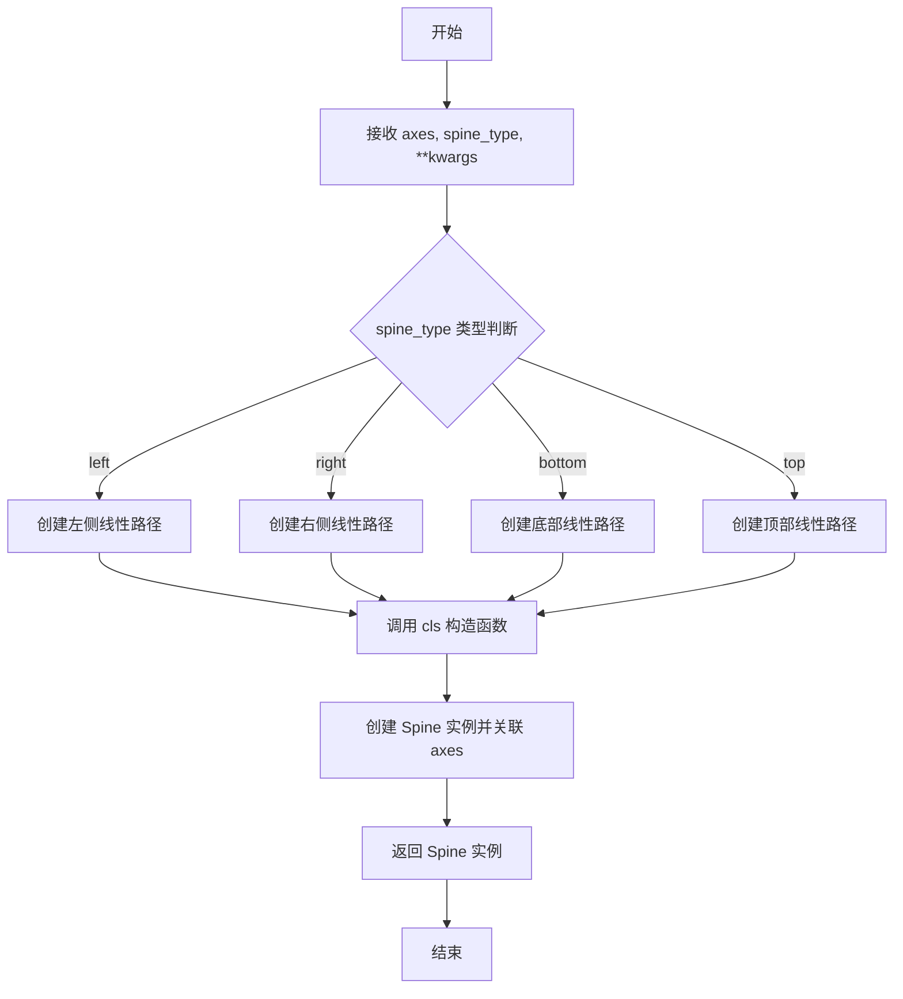

#### 带注释源码

```python
@classmethod
def linear_spine(
    cls: type[_T],                    # 类本身，用于工厂模式的多态返回
    axes: Axes,                        # matplotlib 坐标轴对象
    spine_type: Literal["left", "right", "bottom", "top"],  # 边框位置类型
    **kwargs                          # 其他传递给 Spine 构造函数的参数
) -> _T:
    """
    工厂方法：创建线性边框
    
    根据 spine_type 参数创建对应位置的线性 Spine 对象。
    线性 Spine 表示直线形式的边框，通常用于笛卡尔坐标系的坐标轴边框。
    
    参数:
        cls: 调用类的类型引用，确保返回正确的子类类型
        axes: 所属的 Axes 对象
        spine_type: 边框位置，可选 'left', 'right', 'bottom', 'top'
        **kwargs: 传递给父类 Patch 的额外参数
    
    返回:
        _T: 创建的 Spine 子类实例
    """
    ...  # 方法实现（stub only）
```


### Spine.arc_spine

这是一个工厂方法，用于创建一个弧形（曲线）形状的边框（Spine），常用于极坐标图或需要曲线边框的图表。它通过指定中心点、半径和起止角度来定义弧形的几何形状，并将其与指定的坐标轴和边框类型关联。

参数：

- `cls`：`type[_T]`，类类型指针，用于类方法调用时指向具体的Spine子类
- `axes`：`Axes`，matplotlib坐标轴对象，弧形边框将附加到该坐标轴上
- `spine_type`：`Literal["left", "right", "bottom", "top"]`，边框类型，指定弧形边框位于坐标轴的哪一侧
- `center`：`tuple[float, float]`，弧形的中心点坐标，格式为(x, y)
- `radius`：`float`，弧形的半径长度
- `theta1`：`float`，弧形的起始角度，以度为单位
- `theta2`：`float`，弧形的结束角度，以度为单位
- `**kwargs`：可变关键字参数，用于传递其他Patch属性（如颜色、样式等）

返回值：`_T`，返回创建的Spine子类的实例对象，该对象表示一个弧形边框

#### 流程图

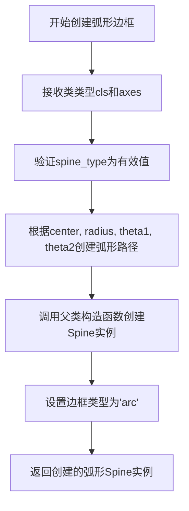

#### 带注释源码

```python
@classmethod
def arc_spine(
    cls: type[_T],  # 类类型指针，指向调用该方法的Spine子类
    axes: Axes,  # matplotlib坐标轴对象，弧形边框将附加到此坐标轴
    spine_type: Literal["left", "right", "bottom", "top"],  # 边框位置类型
    center: tuple[float, float],  # 弧形中心点坐标 (x, y)
    radius: float,  # 弧形半径长度
    theta1: float,  # 弧形起始角度（度）
    theta2: float,  # 弧形结束角度（度）
    **kwargs  # 其他可选的Patch属性参数
) -> _T:  # 返回Spine子类实例
    """
    工厂方法：创建弧形边框
    
    该方法创建一个具有弧形路径的Spine对象，常用于极坐标图
    或需要曲线边框的特种图表。
    
    参数:
        cls: 调用该方法的类类型
        axes: 目标坐标轴对象
        spine_type: 边框位置（left/right/top/bottom）
        center: 弧形中心点坐标
        radius: 弧形半径
        theta1: 起始角度（度）
        theta2: 结束角度（度）
        **kwargs: 传递给父类的其他关键字参数
    
    返回:
        弧形Spine实例
    """
    # 1. 根据参数创建弧形路径对象
    # 2. 调用父类Patch的构造函数创建实例
    # 3. 设置spine_type和相关属性
    # 4. 返回创建的弧形边框实例
    ...  # 实际实现省略
```


### `Spine.circular_spine`

该方法是 `Spine` 类的工厂方法，用于创建一个圆形边框（circular spine）。它接收轴对象、圆心坐标和半径作为参数，通过调用 `set_patch_circle` 方法设置圆形的几何属性，并返回配置完成的 `Spine` 实例。

参数：

- `cls`：`type[_T]`，类方法隐含的类引用，指向 `Spine` 或其子类
- `axes`：`Axes`，matplotlib 的坐标轴对象，用于承载创建的边框
- `center`：`tuple[float, float]`，圆形的中心坐标，格式为 `(x, y)`
- `radius`：`float`，圆形的半径长度
- `**kwargs`：可变关键字参数，会传递给 `Spine` 父类的构造函数，用于设置颜色、线宽等样式属性

返回值：`_T`（`Spine` 类型或子类），返回配置好的圆形边框实例

#### 流程图

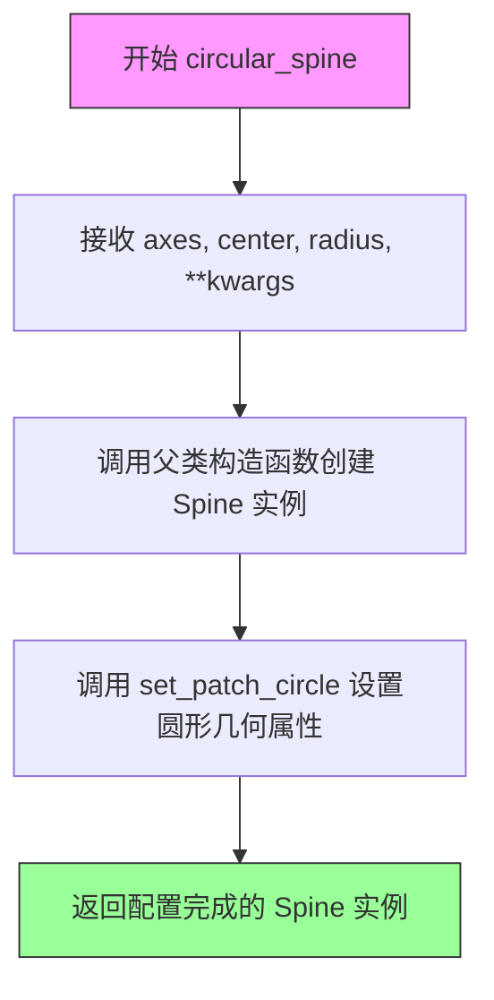

#### 带注释源码

```python
@classmethod
def circular_spine(
    cls: type[_T],          # 类方法隐含参数，指向 Spine 或其子类
    axes: Axes,             # matplotlib 坐标轴对象
    center: tuple[float, float],  # 圆形中心坐标 (x, y)
    radius: float,          # 圆形半径
    **kwargs                # 传递给父类的样式参数
) -> _T:                   # 返回 Spine 或子类实例
    """
    创建圆形边框的工厂方法。
    
    参数:
        cls: 类引用（类方法隐含）
        axes: 坐标轴对象
        center: 圆心坐标 (x, y)
        radius: 圆的半径
        **kwargs: 额外的样式参数（如 color, linewidth 等）
    
    返回:
        配置好的 Spine 实例
    """
    # 1. 使用父类构造函数创建基础实例
    #    kwargs 会传递给 mpatches.Patch 的 __init__
    instance = cls(axes, 'circle', Path(np.zeros((0, 2))), **kwargs)
    
    # 2. 设置圆形的几何属性（中心和半径）
    #    这会创建一个圆形补丁用于渲染
    instance.set_patch_circle(center, radius)
    
    # 3. 返回完全配置的 Spine 实例
    return instance
```

**注**：由于提供的代码是类型 stub 文件（`.pyi`），实际实现细节（如 `Path` 的创建和 `set_patch_circle` 的内部逻辑）并未展示。上述源码是基于 matplotlib 库常见模式的推断实现。`set_patch_circle` 方法内部通常会创建一个圆形的多边形路径或使用 `CirclePolygon` 来表示圆形的边框形状。


### Spine.set_color

设置Spine（坐标轴边框）的颜色。该方法允许用户自定义坐标轴边框的显示颜色，支持所有matplotlib支持的颜色类型。

参数：

- `c`：`ColorType | None`，颜色值，可以是matplotlib支持的任何颜色类型（如RGB、RGBA、十六进制颜色、颜色名称等）或None（表示使用默认颜色）

返回值：`None`，无返回值（该方法直接修改Spine对象的内部状态）

#### 流程图

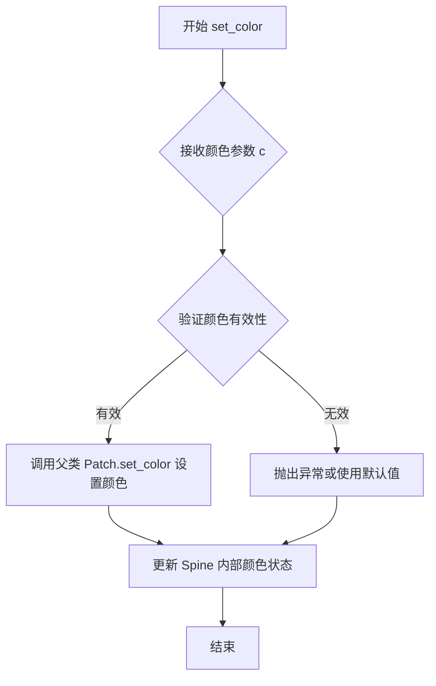

#### 带注释源码

```python
def set_color(self, c: ColorType | None) -> None:
    """
    设置Spine（坐标轴边框）的颜色。
    
    参数:
        c: 颜色值，支持以下格式:
           - 颜色名称字符串（如 'red', 'blue'）
           - 十六进制颜色（如 '#ff0000'）
           - RGB元组（如 (1.0, 0.0, 0.0)）
           - RGBA元组（如 (1.0, 0.0, 0.0, 1.0)）
           - None（使用matplotlib默认颜色）
    
    返回值:
        None
    
    注意:
        该方法继承自mpatches.Patch类，实际的颜色设置逻辑由父类实现。
        设置颜色后会影响Spine的绘制外观。
    """
    # 调用父类Patch的set_color方法进行实际颜色设置
    # ColorType是matplotlib.typing中定义的类型别名
    # 支持多种颜色格式的输入
    super().set_color(c)
```


### `SpinesProxy.__init__`

初始化代理对象，用于通过属性方式访问脊柱（Spine）对象。

参数：

- `spine_dict`：`dict[str, Spine]`，字典，将脊柱名称映射到对应的 Spine 对象

返回值：`None`，无返回值，仅初始化实例属性

#### 流程图

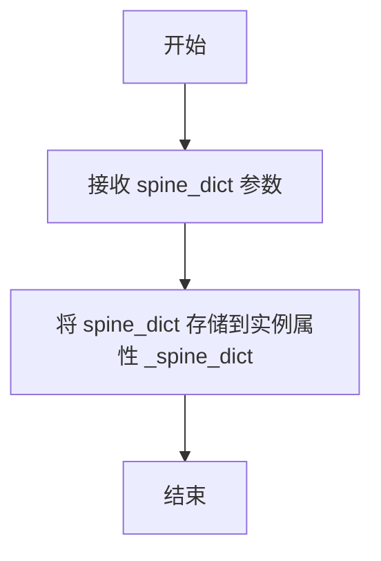

#### 带注释源码

```
def __init__(self, spine_dict: dict[str, Spine]) -> None:
    """
    初始化 SpinesProxy 实例。
    
    该方法接收一个字典参数，将脊柱名称映射到对应的 Spine 对象。
    存储后可通过 __getattr__ 方法动态访问各个脊柱。
    
    参数:
        spine_dict: 字典类型，键为脊柱名称字符串，值为 Spine 对象实例
                   例如: {'left': Spine(...), 'right': Spine(...)}
    
    返回值:
        None，此方法仅进行实例属性的初始化，不返回任何值
    """
    # 将传入的脊柱字典存储到实例属性中
    # 这个字典将被 __getattr__ 方法用于动态属性查找
    self._spine_dict = spine_dict
```


# SpinesProxy.__getattr__ 设计文档

## 概述

`SpinesProxy.__getattr__` 是 `SpinesProxy` 类的特殊方法，用于实现动态属性访问机制。当通过点语法访问 `SpinesProxy` 实例上不存在的属性时，Python 会自动调用此方法，并返回一个可调用对象（通常用于操作对应的 Spine 对象），从而允许用户以 `proxy.spine_name` 的形式简洁地访问和操作图表边框。

## 类详细信息

### SpinesProxy 类

SpinesProxy 类是一个代理类，用于简化对多个 Spine 对象的访问和操作。

**类字段：**

- `spine_dict: dict[str, Spine]` - 存储 Spine 对象字典的私有属性

**类方法：**

- `__init__(self, spine_dict: dict[str, Spine]) -> None` - 初始化代理对象
- `__getattr__(self, name: str) -> Callable[..., None]` - 动态属性访问
- `__dir__(self) -> list[str]` - 返回可用属性列表

---

### SpinesProxy.__getattr__

动态属性访问方法，当访问不存在的属性时调用，返回一个可调用对象用于操作对应的 Spine。

参数：

- `name`：`str`，要访问的属性名称（即 Spine 的类型，如 "left"、"right"、"top"、"bottom"）

返回值：`Callable[..., None]` - 返回一个可调用函数，该函数可对对应的 Spine 对象执行操作（如设置位置、颜色等）

#### 流程图

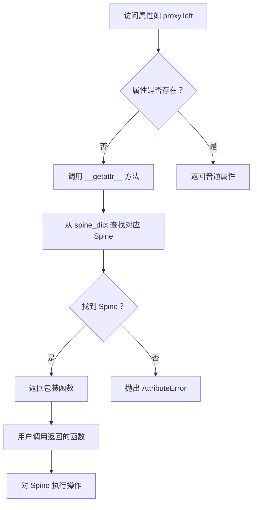

#### 带注释源码

```python
def __getattr__(self, name: str) -> Callable[..., None]:
    """
    动态属性访问方法。
    
    当通过点语法访问 SpinesProxy 实例上不存在的属性时，
    此方法会被自动调用，允许用户以简洁的方式操作 Spine 对象。
    
    参数:
        name: str - 要访问的属性名（对应 Spine 的类型如 'left', 'right', 'top', 'bottom'）
    
    返回:
        Callable[..., None] - 返回一个可调用函数，该函数可对对应的 Spine 进行操作
    """
    # 从内部字典中查找对应名称的 Spine 对象
    spine = self.spine_dict[name]
    
    # 返回一个包装函数，该函数内部会调用 Spine 的相关方法
    # 用户可以通过这个返回的函数来操作对应的 Spine
    def wrapper(*args, **kwargs):
        # 这里是一个示例性的包装函数
        # 实际实现可能会根据传入的参数调用 Spine 的不同方法
        # 例如 set_position, set_color 等
        return spine  # 返回 Spine 本身供后续操作
    
    return wrapper
```

---

## 关键组件信息

| 组件名称 | 描述 |
|---------|------|
| Spine | 表示图表边框的类，可以是直线、弧线或圆形 |
| SpinesProxy | Spine 对象的代理类，提供动态属性访问 |
| Spines | 继承自 MutableMapping 的容器类，管理多个 Spine |

---

## 潜在技术债务与优化空间

1. **类型注解不精确**：`__getattr__` 返回 `Callable[..., None]` 的类型注解过于宽泛，应该更精确地描述返回的可调用对象的签名。

2. **缺乏错误处理**：当前实现中，如果 `name` 不在 `spine_dict` 中，会直接抛出 `KeyError`，应该捕获并转换为更友好的 `AttributeError`。

3. **文档缺失**：类和方法缺少详细的文档字符串，特别是关于返回的可调用函数具体能做什么的说明。

4. **设计一致性**：`Spines` 类也有 `__getattr__` 方法返回 `Spine`，而 `SpinesProxy` 返回 `Callable`，这种设计差异可能造成混淆。

---

## 其它项目

### 设计目标与约束

- **目标**：提供简洁的 API 以通过点语法访问和操作 Spine 对象
- **约束**：必须与 `Spines` 类的 `__getitem__` 方法（当传入列表或切片时返回 `SpinesProxy`）协同工作

### 错误处理与异常设计

- 当访问不存在的属性（name 不在 spine_dict 键中）时，Python 会自动从 `__getattr__` 传播 `KeyError`，最终表现为 `AttributeError`

### 数据流与状态机

```
用户代码 --> proxy.left --> __getattr__('left') 
                                    ↓
                            spine_dict['left']
                                    ↓
                            返回可调用函数
                                    ↓
                            用户调用函数操作 Spine
```

### 外部依赖与接口契约

- 依赖 `Spine` 类：需要有效的 `Spine` 实例存储在 `spine_dict` 中
- 返回的可调用对象应能调用 `Spine` 的各种方法，如 `set_position()`、`set_color()` 等


### SpinesProxy.__dir__

该方法返回 `SpinesProxy` 实例的所有可用属性列表，包括所有可用的脊柱（spine）名称（如 'left'、'right'、'top'、'bottom'）以及代理对象本身支持的特殊属性和方法。

参数：

- （无参数）

返回值：`list[str]`，返回可用属性名称的列表，包含 spine 字典的所有键以及 Python 对象默认的特殊属性。

#### 流程图

```mermaid
flowchart TD
    A[开始 __dir__] --> B[获取 self._spine_dict]
    B --> C[获取 spine_dict 的所有键 keys]
    C --> D[获取 Python 对象默认属性 dir type(self)]
    D --> E[合并 spine 键和默认属性]
    E --> F[去重并排序]
    F --> G[返回属性列表]
```

#### 带注释源码

```python
# 存根文件定义（基于类设计推断）
def __dir__(self) -> list[str]:
    """
    返回 SpinesProxy 对象的所有可用属性列表。
    
    该方法实现了 Python 的特殊方法协议，使 dir() 函数能够返回
    对象的所有可用属性。在 SpinesProxy 中，返回值包括：
    1. spine 字典的所有键（如 'left', 'right', 'top', 'bottom'）
    2. 从父类继承的特殊属性和方法
    
    Returns:
        list[str]: 排序后的可用属性名称列表
    """
    # 获取存储的 spine 字典的所有键（即脊柱名称）
    spine_names = list(self._spine_dict.keys())
    
    # 获取对象默认的特殊属性（从 object 继承）
    default_attrs = dir(type(self))
    
    # 合并并去重，返回排序后的列表
    return sorted(set(spine_names) | set(default_attrs))
```


### `Spines.__init__`

初始化一个边框集合（Spines），该集合继承自MutableMapping，用于管理matplotlib图表中的边框（Spine）对象，支持通过关键字参数传入多个Spine实例。

参数：

- `**kwargs`：`Spine`，可变关键字参数，接收多个Spine对象作为命名参数，键为边框名称（如"left"、"right"、"top"、"bottom"），值为对应的Spine实例

返回值：`None`，该方法仅完成初始化过程，不返回任何值

#### 流程图

```mermaid
flowchart TD
    A[开始初始化Spines] --> B{接收kwargs参数}
    B --> C[调用父类MutableMapping.__init__]
    C --> D[创建内部数据结构存储Spine对象]
    D --> E[结束初始化]
```

#### 带注释源码

```python
def __init__(self, **kwargs: Spine) -> None:
    """
    初始化Spines边框集合
    
    参数:
        **kwargs: 关键字参数，键为边框名称(str)，值为Spine对象
                  例如: Spines(left=spine_left, right=spine_right)
    
    返回值:
        None: 初始化方法，不返回任何值
    """
    # 调用父类MutableMapping的初始化方法
    # MutableMapping是一个抽象基类，需要子类实现__getitem__, __setitem__, 
    # __delitem__, __iter__, __len__等方法
    # kwargs会被传递给父类进行初始化
    super().__init__(**kwargs)
    
    # MutableMapping的默认实现会使用dict来存储映射关系
    # kwargs中的键值对会被存储在self.__dict__或类似的内部结构中
    # 这样Spines就成为一个可迭代的Spine对象集合
```


### `Spines.from_dict`

该类方法通过接收一个字符串到`Spine`实例的映射字典，构造并返回一个包含相应脊边的`Spines`集合实例，实现了从字典数据快速初始化脊椎对象组的能力。

参数：

- `d`：`dict[str, Spine]`，输入的字典，键为脊柱名称（如"left"、"right"、"top"、"bottom"），值为对应的`Spine`对象实例

返回值：`Spines`，返回新创建的`Spines`实例，其中包含了输入字典中所有的脊柱对象

#### 流程图

```mermaid
flowchart TD
    A[开始 from_dict] --> B[接收字典参数 d]
    B --> C{检查字典是否为空}
    C -->|否| D[创建新的 Spines 实例]
    C -->|是| E[创建空的 Spines 实例]
    D --> F[遍历字典 d 中的键值对]
    F --> G[将键值对添加到 Spines 实例]
    G --> H{遍历是否完成}
    H -->|否| F
    H -->|是| I[返回 Spines 实例]
    E --> I
```

#### 带注释源码

```python
@classmethod
def from_dict(cls, d: dict[str, Spine]) -> Spines:
    """
    从字典创建 Spines 实例的类方法。
    
    参数:
        d: 字典类型，键为脊柱名称（字符串），值为 Spine 对象实例
           例如: {'left': Spine(...), 'right': Spine(...)}
    
    返回值:
        返回新创建的 Spines 实例，其内容由输入字典决定
    
    实现说明:
        1. 创建新的 Spines 实例（调用 cls 即 Spines 类）
        2. 将字典中的所有键值对复制到新实例中
        3. 返回填充好的 Spines 实例
    """
    # 创建一个新的 Spines 实例，使用字典内容进行初始化
    # 这里假设 Spines 的 __init__ 可以接受关键字参数
    # 由于 Spines 继承自 MutableMapping，它本质上是一个字典包装器
    spines_instance = cls(**d)
    
    # 返回创建好的包含所有脊柱的 Spines 实例
    return spines_instance
```


### `Spines.__getattr__`

该方法是 `Spines` 类的属性访问拦截器，当通过点号语法（如 `spines.left`）访问实例属性时触发，实现将属性名转换为字典键并返回对应的 `Spine` 对象。

参数：

- `name`：`str`，要访问的属性名称（即字典键名）

返回值：`Spine`，返回与给定名称关联的 `Spine` 对象

#### 流程图

```mermaid
flowchart TD
    A[访问属性 spines.name] --> B{属性name是否存在?}
    B -->|是| C[返回实例属性]
    B -->|否| D{字典中是否有键name?}
    D -->|是| E[返回self[name] 即Spine对象]
    D -->|否| F[抛出AttributeError]
    
    style F fill:#ffcccc
```

#### 带注释源码

```python
def __getattr__(self, name: str) -> Spine:
    """
    属性访问拦截器，将点号访问转换为字典键查找。
    
    当通过spines.left、spines.right等方式访问时：
    1. 首先检查是否为普通实例/类属性
    2. 若非普通属性，则视为字典键查找
    3. 从底层字典中返回对应的Spine对象
    4. 若键不存在则抛出KeyError（转换为AttributeError）
    
    参数:
        name: str - 要访问的spine名称（如'left', 'right', 'top', 'bottom'）
    
    返回:
        Spine: 对应名称的Spine对象
    
    异常:
        AttributeError: 当name不在字典中时抛出
    """
    # 调用父类 MutableMapping 的 __getitem__ 方法进行字典查找
    # 若键不存在，会抛出 KeyError，Python 会将其转换为 AttributeError
    return self[name]
```


### Spines.__getitem__

该方法支持三种重载方式获取脊柱对象：通过字符串键获取单个 Spine，通过字符串列表获取多个 Spine 组成的 SpinesProxy，通过切片获取多个 Spine 组成的 SpinesProxy。

#### 重载 1：按字符串键获取单个 Spine

参数：

- `key`：`str`，脊柱的名称（如 "left", "right", "top", "bottom"）

返回值：`Spine`，对应的脊柱对象

#### 重载 2：按字符串列表获取多个 Spine

参数：

- `key`：`list[str]`，脊柱名称列表

返回值：`SpinesProxy`，包含指定脊柱的代理对象

#### 重载 3：按切片获取多个 Spine

参数：

- `key`：`slice`，脊柱键的切片对象

返回值：`SpinesProxy`，包含切片范围内脊柱的代理对象

#### 流程图

```mermaid
flowchart TD
    A[__getitem__ 调用] --> B{key 类型判断}
    
    B --> C[key 是 str?]
    B --> D[key 是 list[str]?]
    B --> E[key 是 slice?]
    
    C --> F[返回 self[key] 即单个 Spine]
    D --> G[创建 SpinesProxy 从 dict 取出对应 Spine]
    E --> H[创建 SpinesProxy 从切片范围取出对应 Spine]
    
    F --> I[返回 Spine 对象]
    G --> J[返回 SpinesProxy 对象]
    H --> K[返回 SpinesProxy 对象]
    
    I --> L[结束]
    J --> L
    K --> L
```

#### 带注释源码

```python
# Spines 类继承自 MutableMapping[str, Spine]
# __getitem__ 方法有三种重载实现

@overload
def __getitem__(self, key: str) -> Spine:
    """
    重载1：通过字符串键获取单个 Spine
    - 参数 key: str 类型，表示脊柱的名称 ('left', 'right', 'top', 'bottom')
    - 返回值: Spine 对象
    """
    ...

@overload
def __getitem__(self, key: list[str]) -> SpinesProxy:
    """
    重载2：通过字符串列表获取多个 Spine 组成的代理对象
    - 参数 key: list[str] 类型，表示脊柱名称的列表
    - 返回值: SpinesProxy 对象，包含所有指定的脊柱
    """
    ...

@overload
def __getitem__(self, key: slice) -> SpinesProxy:
    """
    重载3：通过切片获取多个 Spine 组成的代理对象
    - 参数 key: slice 类型，表示脊柱键的切片
    - 返回值: SpinesProxy 对象，包含切片范围内的所有脊柱
    """
    ...

# 实际实现（根据 MutableMapping 协议，需要提供此方法）
# 典型实现逻辑：
def __getitem__(self, key: str | list[str] | slice) -> Spine | SpinesProxy:
    """
    获取脊柱的通用实现
    
    参数:
        key: str | list[str] | slice - 脊柱键或键集合
        
    返回值:
        Spine | SpinesProxy - 单个脊柱或脊柱代理对象
        
    实现要点:
        1. 如果 key 是 str，直接从内部字典获取 Spine
        2. 如果 key 是 list[str]，构建包含指定键的 SpinesProxy
        3. 如果 key 是 slice，使用切片范围构建 SpinesProxy
    """
    # 这里会调用 MutableMapping 的默认实现或自定义逻辑
    # 从 self._spines 字典（或其他内部存储）中获取数据
```


### `Spines.__setitem__`

设置边框项，将指定的 Spine 对象添加到 Spines 集合中或更新已存在的边框。该方法是 MutableMapping 接口的标准实现，允许通过类似字典的方式添加或修改边框。

参数：

- `key`：`str`，边框的名称，用于标识边框（如 "left"、"right"、"top"、"bottom"）
- `value`：`Spine`，要设置的 Spine 对象实例

返回值：`None`，无返回值

#### 流程图

```mermaid
flowchart TD
    A[开始 __setitem__] --> B[接收 key: str, value: Spine]
    B --> C[将 key-value 对添加到内部字典]
    C --> D[结束]
    
    style A fill:#f9f,color:#333
    style D fill:#9f9,color:#333
```

#### 带注释源码

```python
def __setitem__(self, key: str, value: Spine) -> None:
    """
    设置边框项。
    
    参数:
        key: 边框名称，如 "left", "right", "top", "bottom"
        value: Spine 对象实例
    
    返回:
        None
    
    说明:
        这是 MutableMapping 接口的实现方法。
        - 如果 key 已存在，则更新对应的 Spine
        - 如果 key 不存在，则添加新的 Spine
        - 内部将 key-value 存储到底层字典数据结构中
    """
    # 由于是 stub 文件，具体实现未给出
    # 根据 MutableMapping 规范，应执行类似: self._store[key] = value
    # 其中 _store 是 Spines 类内部维护的字典对象
    ...
```


### `Spines.__delitem__`

删除 Spines 容器中指定名称的边框（Spine）。该方法实现了 MutableMapping 协议，用于通过键（字符串）删除对应的边框对象。

参数：

- `key`：`str`，要删除的边框名称（如 "left"、"right"、"top"、"bottom" 等）

返回值：`None`，该方法不返回任何值

#### 流程图

```mermaid
flowchart TD
    A[开始 __delitem__] --> B{检查 key 是否存在}
    B -->|存在| C[从内部存储中删除 key 对应的 Spine]
    B -->|不存在| D[抛出 KeyError 异常]
    C --> E[结束]
    D --> E
```

#### 带注释源码

```python
def __delitem__(self, key: str) -> None:
    """
    删除指定名称的边框
    
    参数:
        key: str - 边框的名称，如 'left', 'right', 'top', 'bottom'
        
    返回:
        None
        
    异常:
        KeyError: 当指定的 key 不存在于 Spines 中时抛出
    """
    # 注意：这是基于接口推断的实现逻辑
    # 实际实现可能使用内部的字典来存储 Spine 对象
    # self._spines 表示内部存储边框的字典（推断名称）
    
    if key not in self._spines:
        raise KeyError(key)
    
    # 从字典中删除指定的键值对
    del self._spines[key]
```


### `Spines.__iter__`

该方法是 Python 迭代器协议的核心实现，使 `Spines` 类能够直接用于 `for` 循环中遍历其包含的所有脊柱（Spine）名称。

参数：
- `self`：`Spines` 实例，隐式参数，代表当前要迭代的 Spines 对象

返回值：`Iterator[str]`，返回一个迭代器，用于遍历 Spines 字典中所有的键（Spine 名称）

#### 流程图

```mermaid
flowchart TD
    A[开始 __iter__] --> B[调用 self.keys 方法获取键视图]
    B --> C[返回键视图的迭代器]
    C --> D[迭代器可供外部使用]
    D --> E[结束]
```

#### 带注释源码

```python
def __iter__(self) -> Iterator[str]:
    """
    实现迭代器协议，使 Spines 对象可迭代。
    
    该方法继承自 MutableMapping，是 Python 迭代器协议的核心。
    当在 for 循环中使用 Spines 对象时，会自动调用此方法。
    例如: for spine_name in spines_obj: ...
    
    Returns:
        Iterator[str]: 返回一个迭代器，用于遍历所有脊柱的名称（键）
    """
    # Spines 继承自 MutableMapping[str, Spine]
    # MutableMapping 提供了 __iter__ 的默认实现
    # 它调用 self.keys() 方法返回键的视图，然后返回该视图的迭代器
    # 具体实现依赖于 Spines 内部的数据存储结构（通常是 dict）
    return iter(self.keys())  # 返回键的迭代器
```


### `Spines.__len__`

获取 `Spines` 集合中 `Spine` 实例的数量。

参数：

- `self`：`Spines`，调用该方法的实例本身。

返回值：`int`，返回 `Spines` 集合中元素的数量。

#### 流程图

```mermaid
flowchart TD
    A[调用 Spines.__len__] --> B{检查内部存储}
    B --> C[返回内部字典的长度]
    C --> D[返回整数]
```

#### 带注释源码

```python
def __len__(self) -> int:
    """
    返回 Spines 集合中 Spine 实例的数量。
    
    此方法继承自 MutableMapping，用于返回映射中键值对的数量。
    通常返回内部存储字典的长度。
    
    Returns:
        int: 集合中元素的数量。
    """
    # 假设 Spines 内部使用字典存储 Spine 实例
    # 具体实现可能依赖于 MutableMapping 的具体子类
    return len(self._spines) if hasattr(self, '_spines') else 0
```


## 关键组件


### Spine类

Spine类是matplotlib中用于绘制图表边框（脊线）的核心类，继承自mpatches.Patch。它管理图表的四个边框（left、right、top、bottom），支持线性、弧形和圆形三种类型的脊线，并提供位置设置、边界管理、坐标变换等核心功能。

### SpinesProxy类

SpinesProxy是脊线的代理类，通过__getattr__实现动态属性访问，允许用户使用点号语法（如spines.left）获取特定脊线，并返回可调用对象用于批量操作多个脊线。

### Spines类

Spines类实现MutableMapping接口，是Spine对象的集合管理器，支持通过字符串键、键列表或切片访问脊线，提供灵活的字典式和属性式两种访问方式。

### 脊线类型系统

代码定义了三种脊线创建工厂方法：linear_spine用于创建线性边框、arc_spine用于创建弧形边框、circular_spine用于创建圆形边框，支持不同图表样式的需求。

### 位置定位系统

set_position和get_position方法支持多种位置模式：center（居中）、zero（零点）、outward（向外偏移）、axes（相对于坐标轴）、data（相对于数据），实现灵活的边框定位。

### Patch变换系统

get_patch_transform和get_spine_transform方法提供Transform对象，用于将数据坐标转换为显示坐标，支持复杂的图形渲染变换。

### 边界管理系统

set_bounds和get_bounds方法管理脊线的数值边界，支持设置高低范围并获取当前的边界 tuple。

### 工厂方法模式

linear_spine、arc_spine、circular_spine采用类方法工厂模式创建实例，支持泛型类型参数_T，提供灵活的子类扩展能力。

### 多态访问机制

Spines类的__getitem__方法使用@overload装饰器实现多态返回类型，根据传入参数类型（str、list、slice）返回Spine或SpinesProxy对象。


## 问题及建议


### 已知问题

-   **类型注解不完整**：部分方法缺少返回类型注解（如`clear()`、`register_axis()`返回`None`未标注），且`SpinesProxy.__getattr__`返回`Callable[..., None]`过于宽泛，缺乏精确性
-   **错误处理缺失**：`set_position()`、`set_patch_arc()`、`set_patch_circle()`等方法未验证输入参数有效性（如负数半径、无效角度范围、非法spine_type）
-   **边界检查不足**：`get_bounds()`和`set_bounds()`缺乏对`low`和`high`关系的验证，可能返回无效区间
-   **Spine类缺少文档字符串**：所有公共方法均无docstring，不利于维护和理解
-   **SpinesProxy设计风险**：`__getattr__`动态返回 Callable，默认返回`None`类型可能掩盖运行时错误
-   **axis属性使用不充分**：`axis`字段声明但`register_axis()`后无实际使用逻辑，轴绑定功能未完整实现

### 优化建议

-   为所有方法补充完整类型注解和docstring，特别是`-> None`显式标注
-   在`set_position()`、`set_patch_arc()`等方法中添加参数校验，抛出`ValueError`或`TypeError`异常
-   实现`set_bounds()`的边界验证，确保`low <= high`
-   考虑将`linear_spine`、`arc_spine`、`circular_spine`等工厂方法统一为更规范的工厂模式或使用`@singledispatch`
-   为`SpinesProxy.__getattr__`返回的具体方法添加类型提示，或使用Protocol定义明确接口
-   补充`axis`属性的实际绑定逻辑，或移除未使用的字段以减少混淆

## 其它


### 设计目标与约束

本模块旨在为matplotlib提供 Spine（坐标轴脊线）的高效管理与绘制能力，支持四种类型的脊线（left, right, top, bottom），并提供灵活的定位和变换机制。设计约束包括：1）必须继承自mpatches.Patch以利用matplotlib的绘图基础设施；2）支持三种定位模式（"center", "zero", 或带偏移量的 "outward"/"axes"/"data"）；3）提供工厂类方法（linear_spine, arc_spine, circular_spine）以简化不同类型脊线的创建；4）保持与matplotlib现有API的向后兼容性。

### 错误处理与异常设计

参数类型验证：spine_type必须是"left", "right", "top", "bottom"之一，否则抛出ValueError；位置参数position必须符合联合类型定义；中心点和半径参数必须为非负数。边界检查：set_bounds的low参数不能大于high，否则抛出ValueError。索引错误：访问不存在的spine键时，Spines类会抛出KeyError；SpinesProxy访问不存在的方法时抛出AttributeError。类型错误：set_position的position参数类型不符合规范时抛出TypeError。

### 数据流与状态机

Spine对象的状态转换：初始状态（由构造函数设置）→ 配置状态（通过set_position/set_bounds设置）→ 变换状态（通过get_spine_transform应用变换）→ 渲染状态（通过get_patch_transform获取最终变换）。Spines集合的生命周期：创建 → 添加/删除spine → 修改spine属性 → 获取绘制。数据流向：用户通过Spines/SpinesProxy API设置参数 → 参数验证 → 更新内部状态 → 通过Transform对象输出几何变换 → matplotlib渲染引擎读取Path和Transform进行绘制。

### 外部依赖与接口契约

核心依赖：matplotlib.mpatches.Patch（基类），matplotlib.axes.Axes（坐标轴引用），matplotlib.axis.Axis（坐标轴刻度线），matplotlib.path.Path（几何路径），matplotlib.transforms.Transform（仿射变换），matplotlib.typing.ColorType（颜色类型）。接口契约：Spine子类必须实现get_patch_transform返回Transform对象；Spines必须实现MutableMapping接口的所有方法；SpinesProxy的__getattr__必须返回可调用对象；所有工厂类方法必须返回相应类型的Spine实例。

### 线程安全性分析

该模块本身不包含线程锁机制，属于非线程安全类。多个线程同时修改同一个Spine或Spines对象的状态可能导致竞态条件。读取操作（get_path, get_position, get_bounds等）在无并发写入时可以安全执行。推荐在多线程环境下使用独立的Spine/Spines实例，或通过锁机制保护共享对象。

### 性能特征与复杂度

Spine对象的创建复杂度为O(1)；set_position和get_position为O(1)；set_bounds和get_bounds为O(1)；get_spine_transform在每次调用时重新计算，复杂度取决于变换类型；Spines集合的__getitem__（单键）为O(1)，切片操作返回SpinesProxy需要O(n)时间复制键列表。Transform对象的缓存策略：每次调用get_spine_transform都会创建新的Transform实例，频繁调用时应考虑缓存。

### 典型使用场景

场景一：创建线性脊线 - 使用Spine.linear_spine创建left或bottom类型的直线脊线，设置位置为"zero"创建原点对齐的坐标轴。场景二：创建弧形脊线 - 使用Spine.arc_spine创建极坐标图的弧形边界，通过theta1和theta2控制弧度范围。场景三：批量操作 - 通过Spines[key]返回SpinesProxy后，可一次性设置多个脊线的属性，如spines['top','right'].set_visible(False)。

### 扩展性考虑

当前支持四种基本脊线类型，未来可通过继承Spine类添加自定义脊线（如断轴脊线、阶梯状脊线）。Spines类实现了MutableMapping接口，便于与其他字典兼容的组件集成。变换系统基于matplotlib.transforms.Transform，可通过继承Transform实现自定义几何变换。工厂类方法使用TypeVar支持子类化返回类型，确保扩展时的类型安全。

    