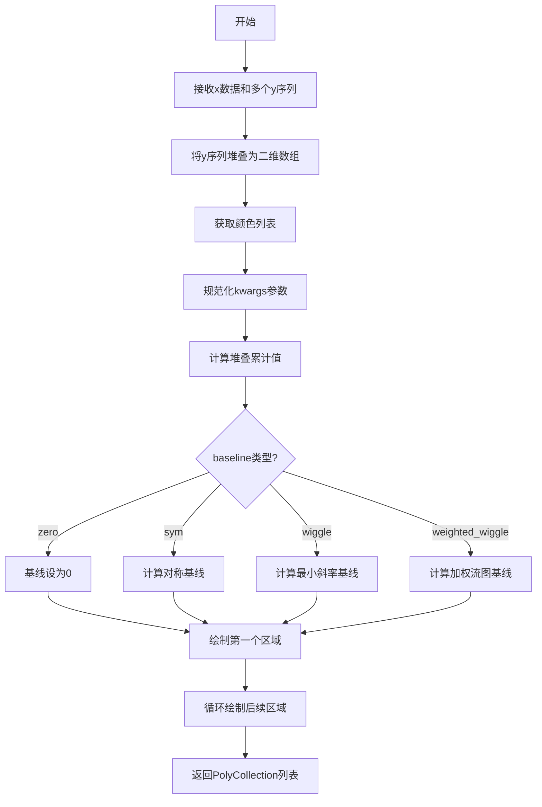

# `matplotlib\lib\matplotlib\stackplot.py` 详细设计文档

这是一个matplotlib库中的堆叠面积图绘制函数，支持多种基线计算方法（zero、sym、wiggle、weighted_wiggle），可以将多个一维数据序列堆叠绘制为面积图，也可实现流图（streamgraph）效果。

## 整体流程



## 类结构

```
模块: stackplot (无类定义)
└── 全局函数: stackplot
```

## 全局变量及字段


### `__all__`
    
Module exports list defining public API, contains only 'stackplot'

类型：`list[str]`
    


### `y`
    
Stacked data arrays with shape (M, N), created by vertically stacking input args

类型：`np.ndarray`
    


### `labels`
    
Iterator over labels for each data series, created from input labels parameter

类型：`Iterator[str]`
    


### `colors`
    
List of colors for cycling through stacked areas, either user-provided or from axes color cycle

类型：`list`
    


### `kwargs`
    
Normalized keyword arguments passed to fill_between, including style and plotting parameters

类型：`dict`
    


### `style_gen`
    
Generator yielding style parameter dictionaries for each stacked area

类型：`generator`
    


### `stack`
    
Cumulative sum of y along axis 0, representing the stacked area boundaries

类型：`np.ndarray`
    


### `first_line`
    
Baseline value for the bottom of the stacked plot, varies by baseline method

类型：`float | np.ndarray`
    


### `coll`
    
Single PolyCollection returned from fill_between for one area layer

类型：`PolyCollection`
    


### `r`
    
List of all PolyCollection objects representing the complete stacked area plot

类型：`list[PolyCollection]`
    


### `i`
    
Loop iteration variable indexing through stacked data arrays

类型：`int`
    


    

## 全局函数及方法


### `stackplot`

堆叠面积图绘制函数，用于在Axes对象上绘制堆叠面积图或流图（Streamgraph），支持多种基线计算方法（zero、sym、wiggle、weighted_wiggle），并将数据垂直堆叠以展示各层级的累积变化。

参数：

- `axes`：`matplotlib.axes.Axes`，绑定图形的Axes对象，用于调用fill_between方法绑制多边形
- `x`：`array-like`，形状为(N,)的一维数组，表示x轴数据点
- `*args`：`array-like`，可变数量的y轴数据序列，每个参数应为(N,)数组，可堆叠或非堆叠形式传入
- `labels`：`list of str`，可选参数，用于为每个数据系列指定标签，默认空元组不应用标签
- `colors`：`list of color`，可选参数，循环使用的颜色序列，默认None时从Axes属性循环获取
- `baseline`：`str`，可选参数，基线计算方法，支持'zero'、'sym'、'wiggle'、'weighted_wiggle'，默认为'zero'
- `**kwargs`：`dict`，其他关键字参数，传递给Axes.fillBetween方法，支持hatch、edgecolor、facecolor、linewidth、linestyle等参数

返回值：`list of PolyCollection`，返回`.PolyCollection`实例列表，每个实例对应堆叠图中的一个区域

#### 流程图

```mermaid
flowchart TD
    A[开始 stackplot] --> B[将可变参数args垂直堆叠为y矩阵]
    B --> C{colors是否为None}
    C -->|是| D[从axes获取颜色循环生成colors列表]
    C -->|否| E[使用传入的colors]
    D --> F[标准化kwargs并设置facecolor]
    F --> G[生成样式生成器style_gen]
    G --> H[计算堆叠累积数据stack]
    H --> I{检查baseline参数有效性}
    I --> J{baseline类型}
    J -->|zero| K[设置first_line为0]
    J -->|sym| L[计算对称基线 first_line = -sum(y) * 0.5]
    J -->|wiggle| M[计算最小斜率平方和的基线]
    J -->|weighted_wiggle| N[计算加权wiggle基线即Streamgraph布局]
    K --> O[调用fill_between绘制第一个区域]
    L --> O
    M --> O
    N --> O
    O --> P[设置sticky_edges.y为0]
    P --> Q[初始化结果列表r包含第一个coll]
    Q --> R{for i in range len-1循环}
    R -->|遍历| S[依次绘制相邻堆叠层之间的区域]
    S --> T[调用fill_between并添加到r]
    T --> R
    R -->|结束| U[返回结果列表r]
```

#### 带注释源码

```python
def stackplot(axes, x, *args,
              labels=(), colors=None, baseline='zero',
              **kwargs):
    """
    Draw a stacked area plot or a streamgraph.

    Parameters
    ----------
    x : (N,) array-like
        X-axis data points.

    y : (M, N) array-like
        The data can be either stacked or unstacked. Each of the following
        calls is legal::

            stackplot(x, y)  # where y has shape (M, N) e.g. y = [y1, y2, y3, y4]
            stackplot(x, y1, y2, y3, y4)  # where y1, y2, y3, y4 have length N

    baseline : {'zero', 'sym', 'wiggle', 'weighted_wiggle'}
        Method used to calculate the baseline:

        - ``'zero'``: Constant zero baseline, i.e. a simple stacked plot.
        - ``'sym'``:  Symmetric around zero and is sometimes called
          'ThemeRiver'.
        - ``'wiggle'``: Minimizes the sum of the squared slopes.
        - ``'weighted_wiggle'``: Does the same but weights to account for
          size of each layer. It is also called 'Streamgraph'-layout. More
          details can be found at http://leebyron.com/streamgraph/.

    labels : list of str, optional
        A sequence of labels to assign to each data series. If unspecified,
        then no labels will be applied to artists.

    colors : list of :mpltype:`color`, optional
        A sequence of colors to be cycled through and used to color the stacked
        areas. The sequence need not be exactly the same length as the number
        of provided *y*, in which case the colors will repeat from the
        beginning.

        If not specified, the colors from the Axes property cycle will be used.

    data : indexable object, optional
        DATA_PARAMETER_PLACEHOLDER

    **kwargs
        All other keyword arguments are passed to `.Axes.fillBetween`.  The
            following parameters additionally accept a sequence of values
            corresponding to the *y* datasets:

            - *hatch*
            - *edgecolor*
            - *facecolor*
            - *linewidth*
            - *linestyle*

            .. versionadded:: 3.9
               Allowing a sequence of strings for *hatch*.

            .. versionadded:: 3.11
               Allowing sequences of values in above listed `.Axes.fillBetween`
               parameters.

    Returns
    -------
    list of `.PolyCollection`
        A list of `.PolyCollection` instances, one for each element in the
        stacked area plot.
    """
    # 将所有y参数垂直堆叠成(M, N)矩阵，简化后续处理
    y = np.vstack(args)

    # 创建标签迭代器，支持逐个消费标签
    labels = iter(labels)
    # 如果未指定颜色，从axes的颜色循环中获取
    if colors is None:
        colors = [axes._get_lines.get_next_color() for _ in y]

    # 使用cbook标准化kwargs，处理PolyCollection的别名映射
    kwargs = cbook.normalize_kwargs(kwargs, collections.PolyCollection)
    # 设置默认facecolor为颜色列表
    kwargs.setdefault('facecolor', colors)

    # 从样式帮助器生成样式迭代器，用于处理序列值的参数
    kwargs, style_gen = _style_helpers.style_generator(kwargs)

    # 计算堆叠累积数据，使用float32精度避免精度问题
    # axis=0沿第一个维度累加，promote_types确保转换为浮点数
    stack = np.cumsum(y, axis=0, dtype=np.promote_types(y.dtype, np.float32))

    # 验证baseline参数是否合法
    _api.check_in_list(['zero', 'sym', 'wiggle', 'weighted_wiggle'],
                       baseline=baseline)
    
    # 根据baseline类型计算第一行的基线位置
    if baseline == 'zero':
        # 简单堆叠，基线为0
        first_line = 0.

    elif baseline == 'sym':
        # 对称基线（ThemeRiver），堆叠区域关于零对称
        first_line = -np.sum(y, 0) * 0.5
        stack += first_line[None, :]  # 广播应用偏移

    elif baseline == 'wiggle':
        # wiggle基线：最小化相邻层斜率平方和
        m = y.shape[0]
        # 计算加权系数：(m-0.5-i)的形式，从大到小
        first_line = (y * (m - 0.5 - np.arange(m)[:, None])).sum(0)
        first_line /= -m  # 归一化
        stack += first_line

    elif baseline == 'weighted_wiggle':
        # 加权wiggle（Streamgraph布局）：考虑每层大小的加权
        total = np.sum(y, 0)
        # 计算1/total，避免除零生成无穷大
        inv_total = np.zeros_like(total)
        mask = total > 0
        inv_total[mask] = 1.0 / total[mask]
        # 每层增量（与下一层的差值）
        increase = np.hstack((y[:, 0:1], np.diff(y)))
        # 计算每层下方区域大小
        below_size = total - stack
        below_size += 0.5 * y
        # 向上移动量
        move_up = below_size * inv_total
        move_up[:, 0] = 0.5  # 边界处理
        # 计算中心偏移
        center = (move_up - 0.5) * increase
        center = np.cumsum(center.sum(0))
        first_line = center - 0.5 * total
        stack += first_line

    # 绘制第一个区域：从基线到第一层堆叠
    coll = axes.fill_between(x, first_line, stack[0, :],
                             label=next(labels, None),
                             **next(style_gen), **kwargs)
    # 设置 sticky_edges 防止y=0处的边缘被裁剪
    coll.sticky_edges.y[:] = [0]
    r = [coll]  # 初始化结果列表

    # 循环绘制剩余区域：每两个相邻堆叠层之间的区域
    for i in range(len(y) - 1):
        r.append(axes.fill_between(x, stack[i, :], stack[i + 1, :],
                                   label=next(labels, None),
                                   **next(style_gen), **kwargs))
    return r
```

#### 文件整体运行流程

```
1. 入口：stackplot函数接收axes、x数据、可变数量的y数据及配置参数
2. 数据预处理：将args中的y数据垂直堆叠为二维数组y
3. 颜色初始化：若未提供colors，则从axes颜色循环获取
4. 参数标准化：规范化kwargs，生成样式迭代器
5. 堆叠计算：计算累积堆叠数组stack
6. 基线计算：根据baseline类型计算第一行基线first_line
7. 图形绑制：
   a. 绘制第一个区域（基线到第一层）
   b. 循环绘制后续区域（相邻层之间）
8. 返回：PolyCollection列表
```

#### 关键组件信息

- **numpy.vstack**: 用于将多个一维y数组堆叠成二维矩阵
- **numpy.cumsum**: 计算累积堆叠值
- **axes.fillBetween**: matplotlib核心绑图方法，创建填充多边形
- **_style_helpers.style_generator**: 样式生成器，处理序列值参数
- **cbook.normalize_kwargs**: kwargs标准化工具
- **baseline算法**: 四种基线计算策略实现流图布局

#### 潜在技术债务与优化空间

1. **基线计算复杂度过高**：weighted_wiggle算法包含多次数组操作，可考虑向量化优化或使用numba加速
2. **重复计算**：np.sum(y, 0)在sym模式下与前面的stack计算重复
3. **类型转换开销**：promote_types和float32转换可前置到数据验证阶段
4. **边界处理**：weighted_wiggle中move_up[:, 0] = 0.5为硬编码，缺少文档说明
5. **错误信息不够具体**：_api.check_in_list的报错信息对调试不够友好

#### 其它项目

**设计目标与约束**：
- 兼容两种输入形式：堆叠矩阵y或分散的y1,y2,y3参数
- 支持四种基线算法，覆盖从简单堆叠到流图布局的需求
- 必须保持与fillBetween API的兼容性

**错误处理与异常设计**：
- 基线类型验证通过_api.check_in_list检查
- 依赖numpy的广播机制处理不同形状输入
- 无数据验证（未检查x与y长度匹配）

**数据流与状态机**：
```
输入数据 → 堆叠处理 → 基线计算 → 累积计算 → 区域绑制 → PolyCollection列表
```

**外部依赖与接口契约**：
- 依赖matplotlib.axes.Axes对象的fillBetween方法
- 依赖numpy进行数值计算
- 返回PolyCollection列表，可直接用于图例处理和后续样式修改


## 关键组件


### 张量索引与惰性加载

代码使用 NumPy 的向量化操作进行张量索引，包括 `np.cumsum(y, axis=0, dtype=np.promote_types(y.dtype, np.float32))` 进行累积求和，以及 `stack[i, :]` 和 `stack[i + 1, :]` 进行数组切片索引，实现惰性计算避免显式循环。

### 反量化支持

通过 `np.promote_types(y.dtype, np.float32)` 确保计算使用足够精度的浮点类型，并使用 `np.zeros_like(total)` 和掩码操作处理除零情况，避免无穷大值。

### 量化策略

代码实现四种 baseline 计算策略：'zero'（零基线）、'sym'（对称 ThemeRiver）、'wiggle'（最小化斜率平方和）、'weighted_wiggle'（加权流图布局），通过数学公式将数据转换为堆叠面积图的基准线。

### 数据堆叠与累积

使用 `np.vstack(args)` 将输入的多个一维数组垂直堆叠为二维数组，然后通过 `np.cumsum` 计算累积和，得到各层的边界坐标。

### 样式生成器

通过 `_style_helpers.style_generator(kwargs)` 生成样式迭代器，使用 `next(style_gen)` 为每个填充区域应用不同的样式参数（如 hatch、edgecolor、facecolor、linewidth、linestyle）。

### 颜色循环管理

使用 `axes._get_lines.get_next_color()` 从 Axes 的颜色循环中获取颜色，当未指定 colors 时为每个数据系列分配颜色。

### 填充区域绘制

通过 `axes.fill_between()` 方法绘制相邻累积和之间的填充区域，创建 PolyCollection 对象列表返回。

### 参数归一化

使用 `cbook.normalize_kwargs(kwargs, collections.PolyCollection)` 归一化关键字参数，支持字符串或列表形式的填充样式参数。


## 问题及建议


### 已知问题

- **变量命名与内置函数冲突**：变量 `stack` 使用了 Python 内置函数 `stack` 的名称，可能导致意外的命名空间问题。
- **类型不一致**：`first_line` 变量在不同 baseline 模式下类型不同，有时是标量（`float`），有时是数组（`ndarray`），增加了代码理解的复杂性。
- **输入验证缺失**：函数未验证输入数据的基本有效性，如 `x` 和 `y` 的长度不匹配、包含负值（堆叠面积图通常要求非负数据）等边界情况。
- **类型注解缺失**：整个函数没有任何类型提示（type hints），降低了代码的可维护性和 IDE 支持。
- **魔法数字**：代码中多处出现硬编码的数值如 `0.5`、`m - 0.5`，缺乏有意义的常量命名。
- **代码重复**：循环中重复调用 `fill_between` 的模式可以进一步封装为内部函数以减少重复。
- **文档不完整**：docstring 中对 `x` 参数的描述仅为 `(N,) array-like`，未说明其具体用途和数据要求。

### 优化建议

- **添加输入验证**：在函数开头添加对 `x`、`y` 长度匹配和非负值的验证，提供明确的错误信息。
- **统一变量类型**：考虑将 `first_line` 始终保持为数组形式，或在文档中明确说明不同 baseline 模式下的类型差异。
- **添加类型注解**：使用 Python 类型提示明确参数和返回值的类型，提升代码可读性和工具支持。
- **提取常量**：将 `0.5`、`m - 0.5` 等魔法数字定义为具名常量，提高代码可读性。
- **重构 baseline 计算逻辑**：将不同 baseline 模式的计算逻辑提取为独立的内部函数或方法，降低主函数的复杂度。
- **优化迭代器使用**：在文档中明确说明 `labels` 和 `style_gen` 迭代器的消耗行为，或在必要时提前转换为列表。

## 其它


### 设计目标与约束

1. **主要设计目标**：提供灵活、可扩展的堆叠面积图和流图绘制功能，支持多种基线计算方法，满足数据可视化需求。
2. **性能约束**：处理大数据集时需保持响应速度，内存使用需优化，避免不必要的数组复制。
3. **兼容性约束**：需与matplotlib 3.x版本兼容，保持API稳定性。

### 错误处理与异常设计

1. **参数验证**：使用`_api.check_in_list`验证baseline参数合法性，不合法时抛出`ValueError`。
2. **形状检查**：假设输入数据未堆叠，通过`np.vstack`自动堆叠，若形状不匹配会抛出异常。
3. **数值稳定性**：处理除零操作时使用`mask`避免无穷大值，如`weighted_wiggle`基线计算中的`inv_total`处理。
4. **异常传播**：底层numpy操作异常会向上传播，调用方需捕获处理。

### 数据流与状态机

1. **输入阶段**：接收x轴数据（1D数组）和可变数量的y数据系列（可为堆叠或非堆叠形式）。
2. **数据预处理阶段**：使用`np.vstack`将y数据堆叠成2D数组，计算颜色列表和标签迭代器。
3. **基线计算阶段**：根据baseline参数计算基线（first_line），同时更新累积堆叠值（stack）。
4. **图形渲染阶段**：循环调用`axes.fill_between`绘制相邻堆叠层之间的填充区域，返回`PolyCollection`列表。
5. **状态转换**：从zero到sym/wiggle/weighted_wiggle的基线选择会影响后续计算逻辑，但不改变渲染流程。

### 外部依赖与接口契约

1. **numpy**：依赖numpy进行数组操作、累积和计算。
2. **matplotlib.collections**：使用`PolyCollection`进行多边形集合处理。
3. **matplotlib.cbook**：使用`normalize_kwargs`规范化关键字参数。
4. **matplotlib._api**：使用`check_in_list`进行参数验证。
5. **matplotlib._style_helpers**：使用`style_generator`生成样式。
6. **公开API**：函数`stackplot`为公开接口，返回`list[PolyCollection]`。

### 性能考虑

1. **向量化操作**：使用numpy向量化操作避免显式循环（除渲染阶段必要循环）。
2. **内存优化**：使用`np.promote_types`确定数据类型，减少内存占用。
3. **缓存机制**：颜色和标签使用迭代器惰性获取，避免预计算。

### 安全性考虑

1. **输入验证**：需对x和y数组长度进行验证，确保一致。
2. **除零保护**：weighted_wiggle计算中已处理除零情况，使用mask避免无穷值。

### 兼容性考虑

1. **版本兼容性**：支持matplotlib 3.9+的hatch序列参数和3.11+的fill_between参数序列。
2. **numpy版本**：使用通用numpy API，兼容主流版本。

### 测试策略

1. **单元测试**：验证不同baseline模式输出正确性，验证参数边界情况。
2. **集成测试**：与Axes对象集成测试，验证图形渲染正确性。

### 使用示例

```python
import matplotlib.pyplot as plt
import numpy as np

x = np.linspace(0, 10, 10)
y1 = np.random.rand(10)
y2 = np.random.rand(10)
y3 = np.random.rand(10)

fig, ax = plt.subplots()
ax.stackplot(x, y1, y2, y3, labels=['A', 'B', 'C'], baseline='zero')
ax.legend()
plt.show()
```

### 参考资料

1. [Stack Overflow讨论](https://stackoverflow.com/q/2225995/)
2. [Streamgraph布局算法](http://leebyron.com/streamgraph/)


    