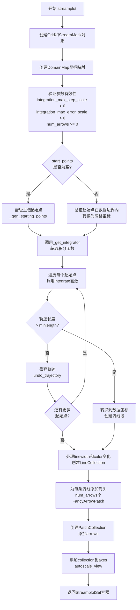
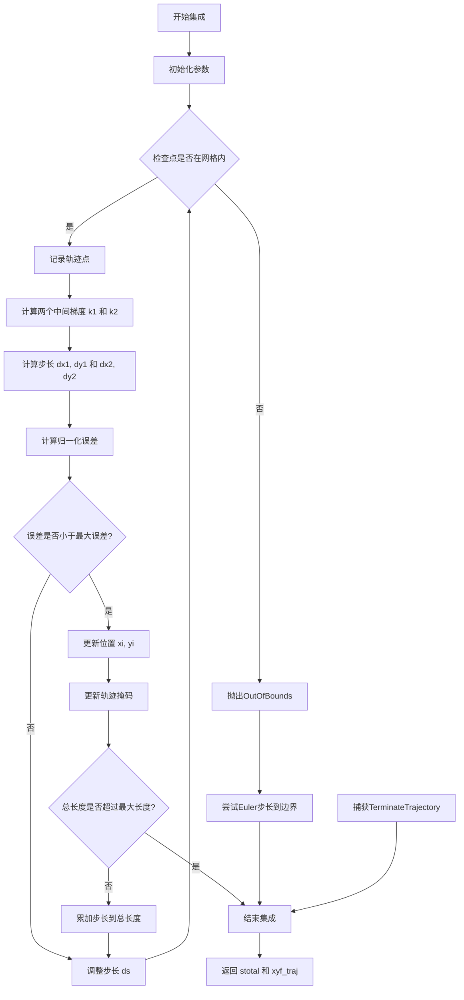
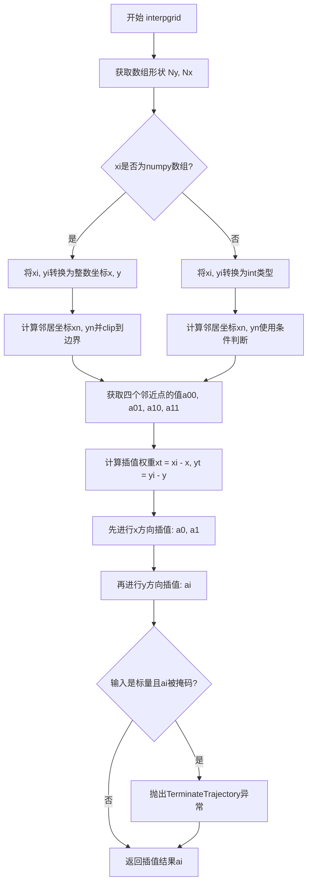
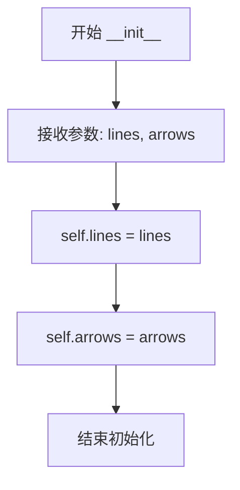
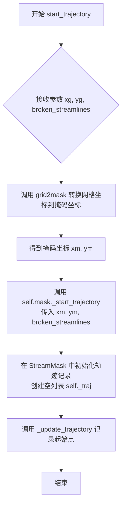
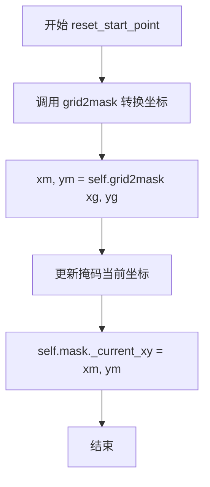
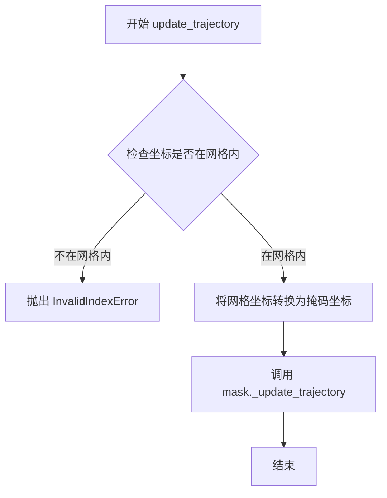
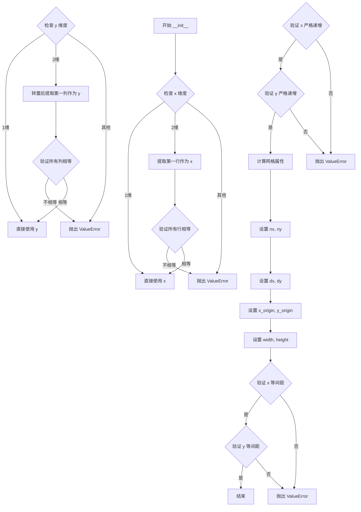
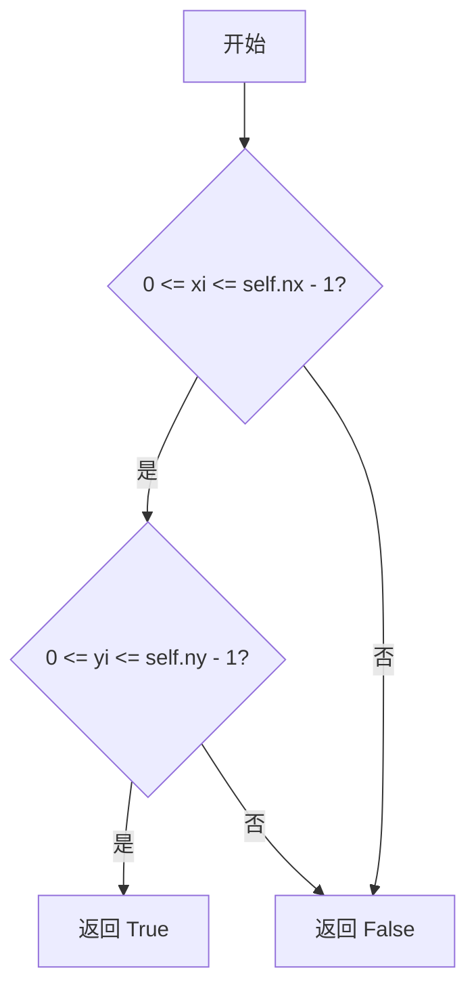
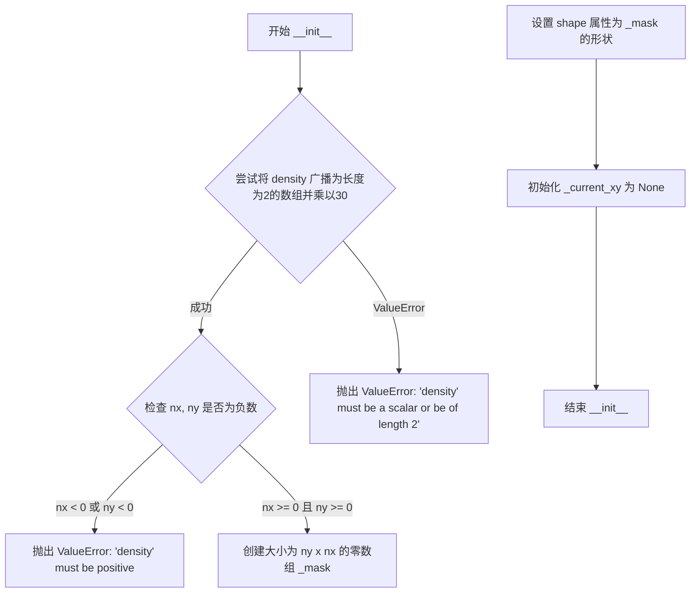

# `matplotlib\lib\matplotlib\streamplot.py` 详细设计文档

该代码模块用于在二维网格上绘制向量场(u, v)的流线(Streamlines)，通过网格化、轨迹积分、坐标映射和流线密度管理来可视化流体运动，并返回包含流线集和箭头的容器对象。

## 整体流程

```mermaid
graph TD
A[开始: streamplot] --> B[初始化: 创建 Grid, StreamMask, DomainMap]
B --> C[参数校验: density, integration_max_step_scale, num_arrows, zorder]
C --> D{transform 是否为空?]
D -- 是 --> E[设置为 axes.transData]
D -- 否 --> F{color 是否为数组?]
E --> F
F -- 是 --> G[校验 color 形状并处理多色线]
F -- 否 --> H[设置单色线属性]
G --> I{处理起始点 start_points]
H --> I
I -- None --> J[调用 _gen_starting_points 生成种子点]
I -- Provided --> K[校验边界并转换为网格坐标]
J --> L[遍历种子点]
K --> L
L --> M[调用 integrate 函数进行轨迹积分]
M --> N{轨迹是否存在且足够长?]
N -- 否 --> L
N -- 是 --> O[坐标转换: Grid -> Data]
O --> P[处理流线线段: 根据线宽/颜色分割]
P --> Q[计算箭头位置并创建 FancyArrowPatch]
Q --> R[创建 LineCollection 和 PatchCollection]
R --> S[添加到 Axes 并返回 StreamplotSet]
```

## 类结构

```
Module: streamplot
├── Main Function: streamplot
├── Core Classes
│   ├── StreamplotSet
│   ├── Grid
│   ├── StreamMask
│   └── DomainMap
└── Exceptions
    ├── InvalidIndexError
    ├── TerminateTrajectory
    └── OutOfBounds
```

## 全局变量及字段


### `__all__`
    
模块公开API列表，包含streamplot函数

类型：`list`
    


### `StreamplotSet.lines`
    
包含所有流线的线条集合对象

类型：`mcollections.LineCollection`
    


### `StreamplotSet.arrows`
    
包含流线箭头的补丁集合对象

类型：`mcollections.PatchCollection`
    


### `DomainMap.grid`
    
数据点的网格对象

类型：`Grid`
    


### `DomainMap.mask`
    
流线遮罩对象，用于跟踪已访问的单元格

类型：`StreamMask`
    


### `DomainMap.x_grid2mask`
    
从网格坐标到遮罩坐标的X转换因子

类型：`float`
    


### `DomainMap.y_grid2mask`
    
从网格坐标到遮罩坐标的Y转换因子

类型：`float`
    


### `DomainMap.x_mask2grid`
    
从遮罩坐标到网格坐标的X转换因子

类型：`float`
    


### `DomainMap.y_mask2grid`
    
从遮罩坐标到网格坐标的Y转换因子

类型：`float`
    


### `DomainMap.x_data2grid`
    
从数据坐标到网格坐标的X转换因子

类型：`float`
    


### `DomainMap.y_data2grid`
    
从数据坐标到网格坐标的Y转换因子

类型：`float`
    


### `Grid.nx`
    
网格在X方向的点数

类型：`int`
    


### `Grid.ny`
    
网格在Y方向的点数

类型：`int`
    


### `Grid.dx`
    
网格点之间X方向的间距

类型：`float`
    


### `Grid.dy`
    
网格点之间Y方向的间距

类型：`float`
    


### `Grid.x_origin`
    
网格X方向的起始坐标

类型：`float`
    


### `Grid.y_origin`
    
网格Y方向的起始坐标

类型：`float`
    


### `Grid.width`
    
网格X方向的总宽度

类型：`float`
    


### `Grid.height`
    
网格Y方向的总高度

类型：`float`
    


### `StreamMask.nx`
    
遮罩在X方向的单元格数量

类型：`int`
    


### `StreamMask.ny`
    
遮罩在Y方向的单元格数量

类型：`int`
    


### `StreamMask._mask`
    
二维数组，记录流线已访问的单元格状态

类型：`np.ndarray`
    


### `StreamMask.shape`
    
遮罩数组的形状属性

类型：`tuple`
    


### `StreamMask._current_xy`
    
流线当前跟踪位置的坐标

类型：`tuple`
    


### `StreamMask._traj`
    
当前流线轨迹经过的单元格坐标列表

类型：`list`
    
    

## 全局函数及方法


### `streamplot`

绘制2D向量场的流线。

参数：

- `axes`：`matplotlib.axes.Axes`，绘制流线的Axes对象
- `x`：`numpy.ndarray`，用于创建网格的一维或二维严格递增数组
- `y`：`numpy.ndarray`，用于创建网格的一维或二维严格递增数组
- `u`：`numpy.ndarray`，x方向速度场，与x和y的网格形状匹配
- `v`：`numpy.ndarray`，y方向速度场，与x和y的网格形状匹配
- `density`：`float`或`tuple`，控制流线的密度，默认为1（30x30网格）
- `linewidth`：`float`或`numpy.ndarray`，流线宽度，可选
- `color`：`颜色`或`numpy.ndarray`，流线颜色，可选
- `cmap`：`Colormap`，颜色映射，用于color数组
- `norm`：`Normalize`，数据归一化，用于color数组
- `arrowsize`：`float`，箭头大小缩放因子，默认为1
- `arrowstyle`：`str`，箭头样式规格，默认为'-|>'
- `minlength`：`float`，流线最小长度（轴坐标），默认为0.1
- `transform`：`Transform`，坐标变换，默认为axes.transData
- `zorder`：`float`，流线和箭头的zorder
- `start_points`：`numpy.ndarray`，流线起始点坐标(N,2数组)
- `maxlength`：`float`，流线最大长度（轴坐标），默认为4.0
- `integration_direction`：`str`，积分方向，'forward'/'backward'/'both'，默认为'both'
- `broken_streamlines`：`bool`，是否允许流线在接近其他流线时终止，默认为True
- `integration_max_step_scale`：`float`，积分最大步长缩放因子，默认为1.0
- `integration_max_error_scale`：`float`，积分最大误差缩放因子，默认为1.0
- `num_arrows`：`int`，每条流线的箭头数量，默认为1

返回值：`StreamplotSet`，包含lines（LineCollection流线）和arrows（PatchCollection箭头）的容器对象

#### 流程图



#### 带注释源码

```python
def streamplot(axes, x, y, u, v, density=1, linewidth=None, color=None,
               cmap=None, norm=None, arrowsize=1, arrowstyle='-|>',
               minlength=0.1, transform=None, zorder=None, start_points=None,
               maxlength=4.0, integration_direction='both',
               broken_streamlines=True, *, integration_max_step_scale=1.0,
               integration_max_error_scale=1.0, num_arrows=1):
    """
    Draw streamlines of a vector flow.

    Parameters
    ----------
    x, y : 1D/2D arrays
        Evenly spaced strictly increasing arrays to make a grid.  If 2D, all
        rows of *x* must be equal and all columns of *y* must be equal; i.e.,
        they must be as if generated by ``np.meshgrid(x_1d, y_1d)``.
    u, v : 2D arrays
        *x* and *y*-velocities. The number of rows and columns must match
        the length of *y* and *x*, respectively.
    density : float or (float, float)
        Controls the closeness of streamlines. When ``density = 1``, the domain
        is divided into a 30x30 grid. *density* linearly scales this grid.
        Each cell in the grid can have, at most, one traversing streamline.
        For different densities in each direction, use a tuple
        (density_x, density_y).
    linewidth : float or 2D array
        The width of the streamlines. With a 2D array the line width can be
        varied across the grid. The array must have the same shape as *u*
        and *v*.
    color : :mpltype:`color` or 2D array
        The streamline color. If given an array, its values are converted to
        colors using *cmap* and *norm*.  The array must have the same shape
        as *u* and *v*.
    cmap, norm
        Data normalization and colormapping parameters for *color*; only used
        if *color* is an array of floats. See `~.Axes.imshow` for a detailed
        description.
    arrowsize : float
        Scaling factor for the arrow size.
    arrowstyle : str
        Arrow style specification.
        See `~matplotlib.patches.FancyArrowPatch`.
    minlength : float
        Minimum length of streamline in axes coordinates.
    start_points : (N, 2) array
        Coordinates of starting points for the streamlines in data coordinates
        (the same coordinates as the *x* and *y* arrays).
    zorder : float
        The zorder of the streamlines and arrows.
        Artists with lower zorder values are drawn first.
    maxlength : float
        Maximum length of streamline in axes coordinates.
    integration_direction : {'forward', 'backward', 'both'}, default: 'both'
        Integrate the streamline in forward, backward or both directions.
    data : indexable object, optional
        DATA_PARAMETER_PLACEHOLDER
    broken_streamlines : boolean, default: True
        If False, forces streamlines to continue until they
        leave the plot domain.  If True, they may be terminated if they
        come too close to another streamline.
    integration_max_step_scale : float, default: 1.0
        Multiplier on the maximum allowable step in the streamline integration routine.
        A value between zero and one results in a max integration step smaller than
        the default max step, resulting in more accurate streamlines at the cost
        of greater computation time; a value greater than one does the converse. Must be
        greater than zero.

        .. versionadded:: 3.11

    integration_max_error_scale : float, default: 1.0
        Multiplier on the maximum allowable error in the streamline integration routine.
        A value between zero and one results in a tighter max integration error than
        the default max error, resulting in more accurate streamlines at the cost
        of greater computation time; a value greater than one does the converse. Must be
        greater than zero.

        .. versionadded:: 3.11

    num_arrows : int
        Number of arrows per streamline. The arrows are spaced equally along the steps
        each streamline takes. Note that this can be different to being spaced equally
        along the distance of the streamline.


    Returns
    -------
    StreamplotSet
        Container object with attributes

        - ``lines``: `.LineCollection` of streamlines

        - ``arrows``: `.PatchCollection` containing `.FancyArrowPatch`
          objects representing the arrows half-way along streamlines.

        This container will probably change in the future to allow changes
        to the colormap, alpha, etc. for both lines and arrows, but these
        changes should be backward compatible.
    """
    # 步骤1: 创建Grid和StreamMask对象，用于管理网格和流线遮罩
    grid = Grid(x, y)
    mask = StreamMask(density)
    dmap = DomainMap(grid, mask)

    # 步骤2: 参数验证
    if integration_max_step_scale <= 0.0:
        raise ValueError(
            "The value of integration_max_step_scale must be > 0, " +
            f"got {integration_max_step_scale}"
        )

    if integration_max_error_scale <= 0.0:
        raise ValueError(
            "The value of integration_max_error_scale must be > 0, " +
            f"got {integration_max_error_scale}"
        )

    if num_arrows < 0:
        raise ValueError(f"The value of num_arrows must be >= 0, got {num_arrows=}")

    # 步骤3: 设置默认值
    if zorder is None:
        zorder = mlines.Line2D.zorder

    # default to data coordinates
    if transform is None:
        transform = axes.transData

    if color is None:
        color = axes._get_lines.get_next_color()

    linewidth = mpl._val_or_rc(linewidth, 'lines.linewidth')

    # 步骤4: 准备线条和箭头的关键字参数
    line_kw = {}
    arrow_kw = dict(arrowstyle=arrowstyle, mutation_scale=10 * arrowsize)

    _api.check_in_list(['both', 'forward', 'backward'],
                       integration_direction=integration_direction)

    if integration_direction == 'both':
        maxlength /= 2.

    # 步骤5: 处理多颜色线条（颜色为数组时）
    use_multicolor_lines = isinstance(color, np.ndarray)
    if use_multicolor_lines:
        if color.shape != grid.shape:
            raise ValueError("If 'color' is given, it must match the shape of "
                             "the (x, y) grid")
        line_colors = [[]]  # Empty entry allows concatenation of zero arrays.
        color = np.ma.masked_invalid(color)
    else:
        line_kw['color'] = color
        arrow_kw['color'] = color

    # 步骤6: 处理线宽（线宽为数组时）
    if isinstance(linewidth, np.ndarray):
        if linewidth.shape != grid.shape:
            raise ValueError("If 'linewidth' is given, it must match the "
                             "shape of the (x, y) grid")
        line_kw['linewidth'] = []
    else:
        line_kw['linewidth'] = linewidth
        arrow_kw['linewidth'] = linewidth

    line_kw['zorder'] = zorder
    arrow_kw['zorder'] = zorder

    # Sanity checks: 验证速度场形状
    if u.shape != grid.shape or v.shape != grid.shape:
        raise ValueError("'u' and 'v' must match the shape of the (x, y) grid")

    u = np.ma.masked_invalid(u)
    v = np.ma.masked_invalid(v)

    # 步骤7: 获取积分器函数
    integrate = _get_integrator(u, v, dmap, minlength, maxlength,
                                integration_direction)

    # 步骤8: 生成流线轨迹
    trajectories = []
    if start_points is None:
        # 自动生成起始点
        for xm, ym in _gen_starting_points(mask.shape):
            if mask[ym, xm] == 0:
                xg, yg = dmap.mask2grid(xm, ym)
                t = integrate(xg, yg, broken_streamlines,
                              integration_max_step_scale,
                              integration_max_error_scale)
                if t is not None:
                    trajectories.append(t)
    else:
        # 使用指定的起始点
        sp2 = np.asanyarray(start_points, dtype=float).copy()

        # Check if start_points are outside the data boundaries
        for xs, ys in sp2:
            if not (grid.x_origin <= xs <= grid.x_origin + grid.width and
                    grid.y_origin <= ys <= grid.y_origin + grid.height):
                raise ValueError(f"Starting point ({xs}, {ys}) outside of "
                                 "data boundaries")

        # Convert start_points from data to array coords
        # Shift the seed points from the bottom left of the data so that
        # data2grid works properly.
        sp2[:, 0] -= grid.x_origin
        sp2[:, 1] -= grid.y_origin

        for xs, ys in sp2:
            xg, yg = dmap.data2grid(xs, ys)
            # Floating point issues can cause xg, yg to be slightly out of
            # bounds for xs, ys on the upper boundaries. Because we have
            # already checked that the starting points are within the original
            # grid, clip the xg, yg to the grid to work around this issue
            xg = np.clip(xg, 0, grid.nx - 1)
            yg = np.clip(yg, 0, grid.ny - 1)

            t = integrate(xg, yg, broken_streamlines, integration_max_step_scale,
                          integration_max_error_scale)
            if t is not None:
                trajectories.append(t)

    # 步骤9: 处理多颜色映射
    if use_multicolor_lines:
        if norm is None:
            norm = mcolors.Normalize(color.min(), color.max())
        cmap = colorizer._ensure_cmap(cmap)

    # 步骤10: 构建流线和箭头集合
    streamlines = []
    arrows = []
    for t in trajectories:
        tgx, tgy = t.T
        # Rescale from grid-coordinates to data-coordinates.
        tx, ty = dmap.grid2data(tgx, tgy)
        tx += grid.x_origin
        ty += grid.y_origin

        # Create multiple tiny segments if varying width or color is given
        if isinstance(linewidth, np.ndarray) or use_multicolor_lines:
            points = np.transpose([tx, ty]).reshape(-1, 1, 2)
            streamlines.extend(np.hstack([points[:-1], points[1:]]))
        else:
            points = np.transpose([tx, ty])
            streamlines.append(points)

        # Distance along streamline
        s = np.cumsum(np.hypot(np.diff(tx), np.diff(ty)))
        if isinstance(linewidth, np.ndarray):
            line_widths = interpgrid(linewidth, tgx, tgy)[:-1]
            line_kw['linewidth'].extend(line_widths)
        if use_multicolor_lines:
            color_values = interpgrid(color, tgx, tgy)[:-1]
            line_colors.append(color_values)

        # Add arrows along each trajectory.
        for x in range(1, num_arrows+1):
            # Get index of distance along streamline to place arrow
            idx = np.searchsorted(s, s[-1] * (x/(num_arrows+1)))
            arrow_tail = (tx[idx], ty[idx])
            arrow_head = (np.mean(tx[idx:idx + 2]), np.mean(ty[idx:idx + 2]))

            if isinstance(linewidth, np.ndarray):
                arrow_kw['linewidth'] = line_widths[idx]

            if use_multicolor_lines:
                arrow_kw['color'] = cmap(norm(color_values[idx]))

            p = patches.FancyArrowPatch(
                arrow_tail, arrow_head, transform=transform, **arrow_kw)
            arrows.append(p)

    # 步骤11: 创建LineCollection并添加到axes
    lc = mcollections.LineCollection(
        streamlines, transform=transform, **line_kw)
    lc.sticky_edges.x[:] = [grid.x_origin, grid.x_origin + grid.width]
    lc.sticky_edges.y[:] = [grid.y_origin, grid.y_origin + grid.height]
    if use_multicolor_lines:
        lc.set_array(np.ma.hstack(line_colors))
        lc.set_cmap(cmap)
        lc.set_norm(norm)
    axes.add_collection(lc)

    # 步骤12: 创建PatchCollection并添加到axes
    ac = mcollections.PatchCollection(arrows)
    # Adding the collection itself is broken; see #2341.
    for p in arrows:
        axes.add_patch(p)

    axes.autoscale_view()
    stream_container = StreamplotSet(lc, ac)
    return stream_container
```


### `_get_integrator`

该函数是一个积分器工厂函数，用于创建流线积分的核心功能。它接收速度场数据和域映射对象，预处理速度场以适应网格坐标，并返回一个 `integrate` 函数，该函数可以计算从给定起点开始的流线轨迹。

参数：

- `u`：`numpy.ndarray`，x方向速度场数组
- `v`：`numpy.ndarray`，y方向速度场数组
- `dmap`：`DomainMap`，域映射对象，用于不同坐标系之间的转换
- `minlength`：`float`，流线的最小长度，低于此长度的轨迹将被丢弃
- `maxlength`：`float`，流线的最大长度
- `integration_direction`：`str`，积分方向，可选值为 `'forward'`、`'backward'` 或 `'both'`

返回值：`function`，返回一个嵌套的 `integrate` 函数，用于计算具体的轨迹

#### 流程图

```mermaid
flowchart TD
    A[_get_integrator 被调用] --> B[将速度场 u, v 转换到网格坐标]
    B --> C[计算轴坐标系下的速度 u_ax, v_ax]
    C --> D[计算速度大小 speed = sqrt(u_ax² + v_ax²)]
    D --> E[定义 forward_time 函数<br/>计算前向时间步进的速度分量]
    E --> F[定义 backward_time 函数<br/>调用 forward_time 并取反]
    F --> G[定义 integrate 函数]
    G --> H[初始化总长度 stotal=0 和轨迹列表 xy_traj=[]]
    H --> I[启动轨迹记录]
    I --> J{integration_direction<br/>包含 'backward'?}
    J -->|Yes| K[调用 _integrate_rk12<br/>后向积分]
    J -->|No| L{integration_direction<br/>包含 'forward'?}
    K --> M[累加后向轨迹到 xy_traj]
    L -->|Yes| N[重置起始点并调用 _integrate_rk12<br/>前向积分]
    L -->|No| O{轨迹总长度 > minlength?}
    M --> O
    N --> P[累加前向轨迹到 xy_traj]
    P --> O
    O -->|Yes| Q[返回轨迹数组]
    O -->|No| R[撤销轨迹记录并返回 None]
    Q --> S[返回 integrate 函数]
    R --> S
```

#### 带注释源码

```python
def _get_integrator(u, v, dmap, minlength, maxlength, integration_direction):
    """
    创建流线积分器函数。
    
    参数:
        u: x方向速度场 (2D数组)
        v: y方向速度场 (2D数组)
        dmap: DomainMap 对象,用于坐标系转换
        minlength: 流线最小长度
        maxlength: 流线最大长度
        integration_direction: 积分方向 ('forward', 'backward', 'both')
    
    返回:
        integrate: 用于计算具体轨迹的函数
    """

    # 将速度场从数据坐标转换到网格坐标
    u, v = dmap.data2grid(u, v)

    # 计算轴坐标系下的速度分量(用于计算步长)
    # 网格坐标到轴坐标的转换需要除以网格维度
    u_ax = u / (dmap.grid.nx - 1)
    v_ax = v / (dmap.grid.ny - 1)
    
    # 计算速度大小(路径长度),使用掩码数组支持
    speed = np.ma.sqrt(u_ax ** 2 + v_ax ** 2)

    def forward_time(xi, yi):
        """
        前向时间步进函数: 计算在给定位置沿时间正方向的速度分量。
        
        参数:
            xi, yi: 网格坐标位置
        
        返回:
            (dx/dt, dy/dt): 时间导数
        """
        # 检查位置是否在网格范围内
        if not dmap.grid.within_grid(xi, yi):
            raise OutOfBounds
        
        # 在该位置插值计算速度大小
        ds_dt = interpgrid(speed, xi, yi)
        
        # 速度为零时终止轨迹
        if ds_dt == 0:
            raise TerminateTrajectory()
        
        # 转换为 dt/ds (时间步长除以路径长度)
        dt_ds = 1. / ds_dt
        
        # 插值计算速度分量
        ui = interpgrid(u, xi, yi)
        vi = interpgrid(v, xi, yi)
        
        # 返回位置对时间的导数
        return ui * dt_ds, vi * dt_ds

    def backward_time(xi, yi):
        """
        后向时间步进函数: 计算沿时间负方向的速度分量。
        
        参数:
            xi, yi: 网格坐标位置
        
        返回:
            (-dx/dt, -dy/dt): 负的时间导数
        """
        # 直接取前向时间的负值
        dxi, dyi = forward_time(xi, yi)
        return -dxi, -dyi

    def integrate(x0, y0, broken_streamlines=True, integration_max_step_scale=1.0,
                  integration_max_error_scale=1.0):
        """
        从给定起点计算完整的流线轨迹。
        
        参数:
            x0, y0: 起始点的网格坐标
            broken_streamlines: 是否允许流线在接近其他流线时终止
            integration_max_step_scale: 最大步长的缩放因子
            integration_max_error_scale: 最大误差的缩放因子
        
        返回:
            轨迹的numpy数组,如果轨迹太短则返回None
        """

        # 初始化累计路径长度和轨迹点列表
        stotal, xy_traj = 0., []

        # 尝试启动轨迹记录
        try:
            dmap.start_trajectory(x0, y0, broken_streamlines)
        except InvalidIndexError:
            # 起点已被占用,返回None
            return None
        
        # 如果需要向后积分
        if integration_direction in ['both', 'backward']:
            # 使用二阶Runge-Kutta方法进行后向积分
            s, xyt = _integrate_rk12(x0, y0, dmap, backward_time, maxlength,
                                     broken_streamlines,
                                     integration_max_step_scale,
                                     integration_max_error_scale)
            stotal += s
            # 反转后向轨迹,因为积分是从终点向起点进行的
            xy_traj += xyt[::-1]

        # 如果需要向前积分
        if integration_direction in ['both', 'forward']:
            # 重置起始点以重新开始记录
            dmap.reset_start_point(x0, y0)
            # 使用二阶Runge-Kutta方法进行前向积分
            s, xyt = _integrate_rk12(x0, y0, dmap, forward_time, maxlength,
                                     broken_streamlines,
                                     integration_max_step_scale,
                                     integration_max_error_scale)
            stotal += s
            # 跳过第一个点(起点),避免重复
            xy_traj += xyt[1:]

        # 检查轨迹总长度是否满足最小长度要求
        if stotal > minlength:
            # 将轨迹列表广播为统一形状的数组并返回
            return np.broadcast_arrays(xy_traj, np.empty((1, 2)))[0]
        else:  
            # 轨迹太短,撤销轨迹记录(释放占用的掩码单元格)
            dmap.undo_trajectory()
            return None

    # 返回积分器函数
    return integrate
```


### `_integrate_rk12`

2阶Runge-Kutta算法（自适应步长），用于积分流线轨迹。该方法结合了Euler方法和改进的Euler方法（Heun's method），通过误差控制自适应调整步长，在保证流线质量的同时提高计算效率。

参数：

- `x0`：`float`，起始点的x坐标（网格坐标）
- `y0`：`float`，起始点的y坐标（网格坐标）
- `dmap`：`DomainMap`，域映射对象，包含网格和掩码信息以及坐标转换方法
- `f`：`callable`，时间步进函数（`forward_time` 或 `backward_time`），接受(xi, yi)返回(dx/dt, dy/dt)
- `maxlength`：`float`，流线的最大长度（轴坐标）
- `broken_streamlines`：`bool`，是否允许流线在接近其他流线时断开，默认为True
- `integration_max_step_scale`：`float`，最大步长缩放因子，用于调整积分步长，默认为1.0
- `integration_max_error_scale`：`float`，最大误差缩放因子，用于调整误差容限，默认为1.0

返回值：`(float, list)`，返回一个元组，包含`stotal`（流线总长度）和`xyf_traj`（轨迹点列表）

#### 流程图



#### 带注释源码

```python
def _integrate_rk12(x0, y0, dmap, f, maxlength, broken_streamlines=True,
                    integration_max_step_scale=1.0,
                    integration_max_error_scale=1.0):
    """
    2nd-order Runge-Kutta algorithm with adaptive step size.

    This method is also referred to as the improved Euler's method, or Heun's
    method. This method is favored over higher-order methods because:

    1. To get decent looking trajectories and to sample every mask cell
       on the trajectory we need a small timestep, so a lower order
       solver doesn't hurt us unless the data is *very* high resolution.
       In fact, for cases where the user inputs
       data smaller or of similar grid size to the mask grid, the higher
       order corrections are negligible because of the very fast linear
       interpolation used in `interpgrid`.

    2. For high resolution input data (i.e. beyond the mask
       resolution), we must reduce the timestep. Therefore, an adaptive
       timestep is more suited to the problem as this would be very hard
       to judge automatically otherwise.

    This integrator is about 1.5 - 2x as fast as RK4 and RK45 solvers (using
    similar Python implementations) in most setups.
    """
    # 设置默认最大误差值，该值略低于匹配RK4所需的误差值。
    # 这是出于视觉原因——如果太低，边角会出现难看的锯齿。可以调整。
    maxerror = 0.003 * integration_max_error_scale

    # 这个限制对于所有积分器都很重要，以避免轨迹跳过某些掩码单元格。
    # 如果使用下面注释掉的代码逐渐增加位置，我们可以放松这个条件。
    # 然而，由于插值的高效性，这不会提高太多速度，但会增加复杂性。
    maxds = min(1. / dmap.mask.nx, 1. / dmap.mask.ny, 0.1)
    maxds *= integration_max_step_scale

    ds = maxds  # 当前步长
    stotal = 0  # 轨迹总长度
    xi = x0     # 当前位置 x
    yi = y0     # 当前位置 y
    xyf_traj = []  # 轨迹点列表

    while True:
        try:
            # 检查当前位置是否在网格内
            if dmap.grid.within_grid(xi, yi):
                xyf_traj.append((xi, yi))  # 记录轨迹点
            else:
                raise OutOfBounds  # 超出边界

            # 计算两个中间梯度（Runge-Kutta 2阶方法）
            # f 应该在给定位置超出网格时抛出 OutOfBounds
            k1x, k1y = f(xi, yi)  # 第一个梯度（在起始点）
            k2x, k2y = f(xi + ds * k1x, yi + ds * k1y)  # 第二个梯度（使用预估位置）

        except OutOfBounds:
            # 在此步骤中超出域。
            # 除非轨迹当前为空，否则执行Euler步骤到边界以改善整齐性
            if xyf_traj:
                ds, xyf_traj = _euler_step(xyf_traj, dmap, f)
                stotal += ds
            break
        except TerminateTrajectory:
            # 速度为零，终止轨迹
            break

        # 计算两个预估位移
        dx1 = ds * k1x
        dy1 = ds * k1y
        dx2 = ds * 0.5 * (k1x + k2x)  # Heun方法：使用平均梯度
        dy2 = ds * 0.5 * (k1y + k2y)

        ny, nx = dmap.grid.shape
        # 误差归一化到轴坐标
        error = np.hypot((dx2 - dx1) / (nx - 1), (dy2 - dy1) / (ny - 1))

        # 仅在误差在容差范围内时保存步长
        if error < maxerror:
            xi += dx2  # 更新位置
            yi += dy2
            try:
                dmap.update_trajectory(xi, yi, broken_streamlines)  # 更新掩码
            except InvalidIndexError:
                # 遇到已占用的掩码单元，断开流线
                break
            if stotal + ds > maxlength:  # 检查是否超过最大长度
                break
            stotal += ds  # 累加总长度

        # 根据步长误差重新计算步长
        if error == 0:
            ds = maxds  # 无误差，使用最大步长
        else:
            # 使用误差控制公式调整步长
            ds = min(maxds, 0.85 * ds * (maxerror / error) ** 0.5)

    return stotal, xyf_traj
```


### `_euler_step`

执行简单的欧拉积分步长，将流线延伸到域边界。当流线接近边界时，使用欧拉方法将其平滑地延伸到边界，而不是突然截断。

参数：

- `xyf_traj`：`list`，流线轨迹的坐标列表，包含一系列 (x, y) 网格坐标
- `dmap`：`DomainMap`，域映射对象，提供网格形状和坐标转换功能
- `f`：`function`，方向函数，接受位置 (xi, yi) 并返回该点处的速度分量 (cx, cy)

返回值：`tuple`，返回包含两个元素的元组：
- `ds`：`float`，实际步长大小（到边界的距离）
- `xyf_traj`：`list`，更新后的轨迹列表，新添加了边界点

#### 流程图

```mermaid
flowchart TD
    A[开始: _euler_step] --> B[获取网格尺寸: ny, nx = dmap.grid.shape]
    B --> C[获取当前轨迹点: xi, yi = xyf_traj[-1]]
    C --> D[计算方向: cx, cy = f(xi, yi)]
    D --> E{判断 cx == 0?}
    E -->|是| F[dsx = ∞]
    E -->|否| G{cx < 0?}
    G -->|是| H[dsx = xi / -cx]
    G -->|否| I[dsx = (nx - 1 - xi) / cx]
    F --> J{判断 cy == 0?}
    H --> J
    I --> J
    J -->|是| K[dsy = ∞]
    J -->|否| L{cy < 0?}
    L -->|是| M[dsy = yi / -cy]
    L -->|否| N[dsy = (ny - 1 - yi) / cy]
    K --> O[计算步长: ds = min(dsx, dsy)]
    M --> O
    N --> O
    O --> P[添加新点: xyf_traj.append((xi + cx * ds, yi + cy * ds))]
    P --> Q[返回: ds, xyf_traj]
```

#### 带注释源码

```python
def _euler_step(xyf_traj, dmap, f):
    """
    Simple Euler integration step that extends streamline to boundary.
    
    当流线接近网格边界时，使用欧拉方法将流线延伸到边界。
    计算从当前位置到各边界（上下左右）的距离，选择最短路径作为步长。
    
    Parameters
    ----------
    xyf_traj : list
        流线轨迹的坐标列表，包含 (x, y) 网格坐标元组
    dmap : DomainMap
        域映射对象，提供网格信息和坐标转换方法
    f : callable
        方向函数，签名 f(xi, yi) -> (cx, cy)，返回速度分量
        
    Returns
    -------
    ds : float
        实际步长（从当前位置到边界的最短距离）
    xyf_traj : list
        更新后的轨迹列表，新添加了边界点坐标
    """
    # 获取网格的维度信息（高度和宽度）
    ny, nx = dmap.grid.shape
    
    # 获取当前轨迹的最后一个点作为起点
    xi, yi = xyf_traj[-1]
    
    # 调用方向函数获取当前位置的速度向量
    cx, cy = f(xi, yi)
    
    # 计算在 x 方向上能移动的最大距离
    # 根据速度分量的正负决定是向左还是向右移动到边界
    if cx == 0:
        dsx = np.inf  # 速度为0时，无法在x方向移动
    elif cx < 0:
        dsx = xi / -cx  # 向左移动的距离 = 当前位置 / 速度大小
    else:
        dsx = (nx - 1 - xi) / cx  # 向右移动的距离 = (边界 - 当前位置) / 速度大小
    
    # 计算在 y 方向上能移动的最大距离
    # 逻辑与 x 方向相同
    if cy == 0:
        dsy = np.inf  # 速度为0时，无法在y方向移动
    elif cy < 0:
        dsy = yi / -cy  # 向下移动的距离
    else:
        dsy = (ny - 1 - yi) / cy  # 向上移动的距离
    
    # 取两个方向中较小的步长，确保不会超出任何一个边界
    ds = min(dsx, dsy)
    
    # 使用欧拉方法计算新位置：当前位置 + 速度向量 * 步长
    xyf_traj.append((xi + cx * ds, yi + cy * ds))
    
    # 返回实际步长和更新后的轨迹
    return ds, xyf_traj
```


### `interpgrid`

执行二维线性插值，用于在整数网格上进行快速双线性插值计算。该函数是streamplot的核心工具函数，用于在网格点上插值速度、颜色和线宽等数据。

参数：

- `a`：`numpy.ndarray`，要进行插值的二维数据数组（如速度场、颜色值、线宽等）
- `xi`：`float` 或 `numpy.ndarray`，插值点的x坐标（网格坐标）
- `yi`：`float` 或 `numpy.ndarray`，插值点的y坐标（网格坐标）

返回值：`float` 或 `numpy.ndarray`，插值结果。如果输入是标量且插值结果被掩码，则抛出 `TerminateTrajectory` 异常

#### 流程图



#### 带注释源码

```python
def interpgrid(a, xi, yi):
    """Fast 2D, linear interpolation on an integer grid"""
    
    # 获取输入数组的形状（行数Ny，列数Nx）
    Ny, Nx = np.shape(a)
    
    # 根据输入类型选择不同的处理方式（数组或标量）
    if isinstance(xi, np.ndarray):
        # 处理数组输入：将浮点坐标转换为整数索引
        x = xi.astype(int)
        y = yi.astype(int)
        
        # 计算相邻索引并限制在数组边界内，防止越界
        # xn, yn 代表右侧和下侧的相邻单元格索引
        xn = np.clip(x + 1, 0, Nx - 1)
        yn = np.clip(y + 1, 0, Ny - 1)
    else:
        # 处理标量输入：直接转换为整数
        x = int(xi)
        y = int(yi)
        
        # 对于整数坐标，使用条件判断比clip更快
        # 如果已经在边界上，则邻居坐标等于自身坐标
        if x == (Nx - 1):
            xn = x
        else:
            xn = x + 1
        if y == (Ny - 1):
            yn = y
        else:
            yn = y + 1

    # 获取四个邻近网格点的值：
    # a00: 左上角, a01: 右上角, a10: 左下角, a11: 右下角
    a00 = a[y, x]
    a01 = a[y, xn]
    a10 = a[yn, x]
    a11 = a[yn, xn]
    
    # 计算插值权重（相对于整数坐标的偏移量）
    xt = xi - x
    yt = yi - y
    
    # 第一步：x方向的线性插值
    # 在上下两行分别进行x方向插值
    a0 = a00 * (1 - xt) + a01 * xt
    a1 = a10 * (1 - xt) + a11 * xt
    
    # 第二步：y方向的线性插值
    # 将x方向的两点结果在y方向上插值得到最终值
    ai = a0 * (1 - yt) + a1 * yt

    # 对于标量输入，检查插值结果是否为掩码值
    # 如果是掩码值，说明该位置无有效数据，需要终止流线
    if not isinstance(xi, np.ndarray):
        if np.ma.is_masked(ai):
            raise TerminateTrajectory

    return ai
```


### `_gen_starting_points`

该函数是一个生成器函数，用于生成流线的起始点。它采用螺旋从外向内的模式遍历二维网格，优先尝试边界点以获得更高质量的流线。

参数：

- `shape`：`tuple[int, int]`，表示 StreamMask 的形状 (ny, nx)，即掩码网格的行数和列数

返回值：`Generator[tuple[int, int], None, None]`，生成器，逐个产生 (x, y) 形式的起始点坐标元组

#### 流程图

```mermaid
flowchart TD
    A[开始] --> B[初始化: ny, nx = shape<br/>xfirst=0, yfirst=1<br/>xlast=nx-1, ylast=ny-1<br/>x=0, y=0<br/>direction='right'] --> C{i < nx*ny}
    C -->|True| D[yield (x, y)]
    D --> E{当前方向}
    E -->|right| F[x += 1<br/>如果 x >= xlast:<br/>xlast -= 1<br/>direction = 'up']
    E -->|up| G[y += 1<br/>如果 y >= ylast:<br/>ylast -= 1<br/>direction = 'left']
    E -->|left| H[x -= 1<br/>如果 x <= xfirst:<br/>xfirst += 1<br/>direction = 'down']
    E -->|down| I[y -= 1<br/>如果 y <= yfirst:<br/>yfirst += 1<br/>direction = 'right']
    F --> C
    G --> C
    H --> C
    I --> C
    C -->|False| J[结束]
    
    style A fill:#f9f,stroke:#333
    style J fill:#9f9,stroke:#333
    style D fill:#ff9,stroke:#333
```

#### 带注释源码

```
def _gen_starting_points(shape):
    """
    Yield starting points for streamlines.

    Trying points on the boundary first gives higher quality streamlines.
    This algorithm starts with a point on the mask corner and spirals inward.
    This algorithm is inefficient, but fast compared to rest of streamplot.
    """
    # 从 shape 中提取掩码网格的维度
    ny, nx = shape
    
    # 初始化螺旋边界
    # xfirst/xlast: x 方向的当前最左/最右边界
    # yfirst/ylast: y 方向的当前最上/最下边界
    # 从 (0,0) 开始，yfirst 设为 1 是因为从第二行开始（跳过起始点）
    xfirst = 0
    yfirst = 1
    xlast = nx - 1
    ylast = ny - 1
    
    # 初始位置为左上角 (0, 0)
    x, y = 0, 0
    
    # 初始移动方向：向右
    direction = 'right'
    
    # 遍历网格中的所有位置
    for i in range(nx * ny):
        # 产生当前坐标作为流线起始点
        yield x, y

        # 根据当前方向更新坐标和边界
        if direction == 'right':
            x += 1  # 向右移动
            if x >= xlast:  # 到达右边界
                xlast -= 1  # 收缩右边界
                direction = 'up'  # 改变方向向上
        elif direction == 'up':
            y += 1  # 向上移动
            if y >= ylast:  # 到达上边界
                ylast -= 1  # 收缩上边界
                direction = 'left'  # 改变方向向左
        elif direction == 'left':
            x -= 1  # 向左移动
            if x <= xfirst:  # 到达左边界
                xfirst += 1  # 收缩左边界
                direction = 'down'  # 改变方向向下
        elif direction == 'down':
            y -= 1  # 向下移动
            if y <= yfirst:  # 到达下边界
                yfirst += 1  # 收缩下边界
                direction = 'right'  # 改变方向向右
```


### `StreamplotSet.__init__`

该方法是 `StreamplotSet` 类的构造函数，用于初始化流线图容器对象，接收流线集合（lines）和箭头集合（arrows）两个必要参数，将它们存储为实例属性以供后续访问。

参数：

- `lines`：`LineCollection`，流线集合对象，包含所有绘制的流线段
- `arrows`：`PatchCollection`，箭头集合对象，包含流线上表示方向的箭头

返回值：`None`，构造函数无返回值

#### 流程图



#### 带注释源码

```python
class StreamplotSet:
    """
    StreamplotSet 类用于封装流线图的流线和箭头集合。
    该类作为 streamplot 函数的返回值容器，提供对流线和箭头集合的统一访问。
    """

    def __init__(self, lines, arrows):
        """
        初始化 StreamplotSet 对象。

        Parameters
        ----------
        lines : LineCollection
            流线集合对象，包含所有流线段的几何信息和样式属性。
            由 matplotlib.collections.LineCollection 创建。
        arrows : PatchCollection
            箭头集合对象，包含表示流线方向的箭头。
            由 matplotlib.collections.PatchCollection 创建，内部包含
            多个 FancyArrowPatch 对象。

        Returns
        -------
        None
            构造函数不返回任何值，实例化对象本身。
        """
        # 将传入的流线集合赋值给实例属性 lines
        # 供调用者通过 stream_container.lines 访问流线
        self.lines = lines
        
        # 将传入的箭头集合赋值给实例属性 arrows
        # 供调用者通过 stream_container.arrows 访问箭头
        self.arrows = arrows
```


### `DomainMap.__init__`

该方法是 `DomainMap` 类的构造函数，负责初始化域映射对象，存储网格和掩码对象，并计算不同坐标系（网格坐标、掩码坐标、数据坐标）之间的转换常数。

参数：

- `grid`：`Grid`，网格对象，包含 x、y 坐标数据及网格维度信息
- `mask`：`StreamMask`，流线掩码对象，用于控制流线密度和轨迹跟踪

返回值：`None`，构造函数不返回值，仅初始化实例属性

#### 流程图

```mermaid
flowchart TD
    A[开始 __init__] --> B[接收 grid 和 mask 参数]
    B --> C[保存 self.grid = grid]
    C --> D[保存 self.mask = mask]
    D --> E[计算 x 方向网格到掩码的转换系数<br/>x_grid2mask = (mask.nx - 1) / (grid.nx - 1)]
    E --> F[计算 y 方向网格到掩码的转换系数<br/>y_grid2mask = (mask.ny - 1) / (grid.ny - 1)]
    F --> G[计算掩码到网格的转换系数<br/>x_mask2grid = 1 / x_grid2mask<br/>y_mask2grid = 1 / y_grid2mask]
    G --> H[计算数据到网格的转换系数<br/>x_data2grid = 1 / grid.dx<br/>y_data2grid = 1 / grid.dy]
    H --> I[结束 __init__]
```

#### 带注释源码

```python
def __init__(self, grid, mask):
    """
    初始化 DomainMap 对象，建立不同坐标系之间的转换关系。
    
    Parameters
    ----------
    grid : Grid
        网格对象，包含数据坐标信息、网格维度等。
    mask : StreamMask
        流线掩码对象，用于控制流线密度和轨迹跟踪。
    """
    # 保存网格对象引用
    self.grid = grid
    # 保存流线掩码对象引用
    self.mask = mask
    
    # 计算网格坐标到掩码坐标的转换常数
    # 用于将积分过程中的网格坐标映射到掩码数组索引
    self.x_grid2mask = (mask.nx - 1) / (grid.nx - 1)
    self.y_grid2mask = (mask.ny - 1) / (grid.ny - 1)

    # 计算掩码坐标到网格坐标的转换常数（为上述转换的倒数）
    self.x_mask2grid = 1. / self.x_grid2mask
    self.y_mask2grid = 1. / self.y_grid2mask

    # 计算数据坐标到网格坐标的转换常数
    # 用于将原始数据坐标转换为网格索引
    self.x_data2grid = 1. / grid.dx
    self.y_data2grid = 1. / grid.dy
```


### `DomainMap.grid2mask`

将给定的网格坐标（grid-coordinates）转换为最接近的掩码坐标（mask-coordinates），用于在流线追踪过程中将网格点映射到流线遮罩网格。

参数：

- `xi`：`float`，网格坐标系的 x 坐标
- `yi`：`float`，网格坐标系的 y 坐标

返回值：`tuple[int, int]`，最接近的掩码坐标 (xm, ym)

#### 流程图

```mermaid
flowchart TD
    A[开始 grid2mask] --> B[计算 xm = round(xi * self.x_grid2mask)]
    B --> C[计算 ym = round(yi * self.y_grid2mask)]
    C --> D[返回元组 (xm, ym)]
```

#### 带注释源码

```python
def grid2mask(self, xi, yi):
    """Return nearest space in mask-coords from given grid-coords."""
    # xi: 网格坐标 x 值
    # yi: 网格坐标 y 值
    # self.x_grid2mask: 网格 x 坐标到掩码 x 坐标的转换比例 (mask.nx - 1) / (grid.nx - 1)
    # self.y_grid2mask: 网格 y 坐标到掩码 y 坐标的转换比例 (mask.ny - 1) / (grid.ny - 1)
    # round(): 四舍五入到最接近的整数，实现网格坐标到掩码数组索引的映射
    return round(xi * self.x_grid2mask), round(yi * self.y_grid2mask)
```


### `DomainMap.mask2grid`

将流线掩码（Mask）坐标系中的坐标转换为数据网格（Grid）坐标系中的坐标，实现流线绘制过程中不同坐标系的映射。

参数：

- `self`：DomainMap 实例，包含了网格和掩码的信息以及坐标转换的缩放因子
- `xm`：`float` 或 `int`，掩码坐标系下的 x 坐标
- `ym`：`float` 或 `int`，掩码坐标系下的 y 坐标

返回值：`tuple`，包含两个浮点数 (xg, yg)，分别表示网格坐标系下的 x 和 y 坐标

#### 流程图

```mermaid
flowchart TD
    A[开始 mask2grid] --> B[输入: xm, ym 掩码坐标]
    B --> C[计算 xg = xm * x_mask2grid]
    C --> D[计算 yg = ym * y_mask2grid]
    D --> E[返回: xg, yg 网格坐标]
    E --> F[结束]
    
    G[DomainMap.__init__] --> H[计算 x_grid2mask = (mask.nx - 1) / (grid.nx - 1)]
    H --> I[计算 y_grid2mask = (mask.ny - 1) / (grid.ny - 1)]
    I --> J[计算 x_mask2grid = 1 / x_grid2mask]
    J --> K[计算 y_mask2grid = 1 / y_grid2mask]
    
    style G fill:#f9f,stroke:#333
    style A fill:#ff9,stroke:#333
```

#### 带注释源码

```python
def mask2grid(self, xm, ym):
    """
    将掩码坐标系坐标转换为网格坐标系坐标。
    
    掩码坐标系（mask-coordinates）用于控制流线的密度，
    网格坐标系（grid-coordinates）与输入数据网格对应。
    该方法是 grid2mask 的逆操作。
    
    Parameters
    ----------
    xm : float or int
        掩码坐标系下的 x 坐标
    ym : float or int
        掩码坐标系下的 y 坐标
    
    Returns
    -------
    tuple
        (xg, yg) 网格坐标系下的坐标
    """
    # 通过乘以预计算的缩放因子实现坐标转换
    # x_mask2grid 和 y_mask2grid 在 __init__ 中计算：
    # x_mask2grid = 1 / ((mask.nx - 1) / (grid.nx - 1)) = (grid.nx - 1) / (mask.nx - 1)
    # 这表示网格维度与掩码维度的比例
    return xm * self.x_mask2grid, ym * self.y_mask2grid
```


### `DomainMap.data2grid`

将数据坐标（Data Coordinates）转换为网格坐标（Grid Coordinates）。

参数：

-  `xd`：`float`，数据空间的 x 坐标
-  `yd`：`float`，数据空间的 y 坐标

返回值：`tuple`，返回转换后的网格坐标 (xg, yg)

#### 流程图

```mermaid
flowchart TD
    A[开始 data2grid] --> B[输入: xd, yd 数据坐标]
    B --> C[计算: xg = xd * x_data2grid]
    C --> D[计算: yg = yd * y_data2grid]
    D --> E[返回: (xg, yg) 网格坐标]
    E --> F[结束]
```

#### 带注释源码

```python
def data2grid(self, xd, yd):
    """
    将数据坐标转换为网格坐标。
    
    参数:
        xd: 数据空间的 x 坐标
        yd: 数据空间的 y 坐标
    
    返回:
        (xg, yg): 转换后的网格坐标
    """
    return xd * self.x_data2grid, yd * self.y_data2grid
```

#### 说明

`data2grid` 方法是 `DomainMap` 类中用于坐标系统转换的核心方法之一。它将用户输入的物理数据坐标（例如实际的 x, y 位置）转换为网格索引坐标。

- `x_data2grid` 和 `y_data2grid` 在 `__init__` 中被计算为 `1. / grid.dx` 和 `1. / grid.dy`，其中 `dx` 和 `dy` 是网格的间距
- 该方法是线性变换，将数据空间映射到网格空间
- 在 `streamplot` 函数中，此方法被用于将速度场 `u, v` 转换到网格坐标系进行积分计算，同时也用于将起始点从数据坐标转换到网格坐标


### DomainMap.grid2data

该方法用于将网格坐标（grid-coordinates）转换为数据坐标（data-coordinates）。这是流线图绘制中的坐标转换过程的一部分，用于在计算完成后将流线从网格坐标系映射回原始的数据坐标系。

参数：

- `xg`：`float` 或 `np.ndarray`，网格坐标系的 x 坐标
- `yg`：`float` 或 `np.ndarray`，网格坐标系的 y 坐标

返回值：`tuple` 或 `(xg / self.x_data2grid, yg / self.y_data2grid)`，返回转换后的数据坐标系坐标

#### 流程图

```mermaid
flowchart TD
    A[开始 grid2data] --> B[输入: xg, yg 网格坐标]
    B --> C[获取转换因子: x_data2grid, y_data2grid]
    C --> D[计算: xg / x_data2grid]
    C --> E[计算: yg / y_data2grid]
    D --> F[返回数据坐标: (xg / x_data2grid, yg / y_data2grid)]
    E --> F
```

#### 带注释源码

```python
def grid2data(self, xg, yg):
    """
    将网格坐标转换为数据坐标。
    
    参数:
        xg: 网格坐标系的 x 坐标
        yg: 网格坐标系的 y 坐标
    
    返回:
        (xg / self.x_data2grid, yg / self.y_data2grid): 数据坐标系中的坐标
    """
    # x_data2grid 和 y_data2grid 是在 __init__ 中计算的常数
    # x_data2grid = 1. / grid.dx
    # y_data2grid = 1. / grid.dy
    # 其中 dx 和 dy 是网格点之间的间距
    # 因此，除以这些值可以将网格坐标转换回数据坐标
    return xg / self.x_data2grid, yg / self.y_data2grid
```


### `DomainMap.start_trajectory`

在流线绘图模块中，`DomainMap.start_trajectory` 方法用于在给定网格坐标处启动流线轨迹的记录。它首先将网格坐标转换为掩码坐标，然后通知 `StreamMask` 对象开始记录新的轨迹路径。

参数：

- `xg`：`float` 或 `int`，流线起始点的网格 x 坐标
- `yg`：`float` 或 `int`，流线起始点的网格 y 坐标
- `broken_streamlines`：`bool`，默认为 `True`，控制当流线过于接近另一条流线时是否允许断开

返回值：`None`，无返回值（该方法直接修改 `StreamMask` 的内部状态）

#### 流程图



#### 带注释源码

```python
def start_trajectory(self, xg, yg, broken_streamlines=True):
    """
    启动流线轨迹的记录。

    Parameters
    ----------
    xg : float or int
        网格坐标系的 x 坐标。
    yg : float or int
        网格坐标系的 y 坐标。
    broken_streamlines : bool, optional
        如果为 True，当流线进入已被占用的掩码单元格时将引发 InvalidIndexError，
        从而导致流线断开。默认为 True。

    Returns
    -------
    None
        此方法不返回值，直接修改 StreamMask 的内部状态。
    """
    # 将网格坐标转换为掩码坐标
    # 网格坐标范围是 [0, N] 和 [0, M]，其中 N 和 M 匹配输入数据的形状
    # 掩码坐标范围是 [0, nx] 和 [0, ny]，其中 nx 和 ny 由密度参数控制
    xm, ym = self.grid2mask(xg, yg)
    
    # 调用 StreamMask 的内部方法开始轨迹记录
    # 这会初始化 StreamMask 内部的轨迹列表 (_traj) 并记录起始点
    self.mask._start_trajectory(xm, ym, broken_streamlines)
```


### `DomainMap.reset_start_point`

该方法用于重置流线掩码中的当前起点位置，允许流线积分从特定点继续，而无需创建新的轨迹记录。在双向积分模式下，当完成向后积分后，使用此方法将当前位置重置为起始点，以便进行向前积分。

参数：

- `xg`：`float`，网格x坐标，表示流线在网格坐标系中的横坐标位置
- `yg`：`float`，网格y坐标，表示流线在网格坐标系中的纵坐标位置

返回值：`None`，无返回值，该方法直接修改对象内部状态

#### 流程图



#### 带注释源码

```python
def reset_start_point(self, xg, yg):
    """
    重置流线掩码中的当前起点位置。
    
    在双向积分模式中，向后积分完成后调用此方法，
    将当前位置重置为起始点，以便继续向前积分。
    这样可以避免重新记录轨迹，同时确保积分从正确的位置开始。
    
    Parameters
    ----------
    xg : float
        网格x坐标
    yg : float
        网格y坐标
    """
    # 将网格坐标转换为掩码坐标
    xm, ym = self.grid2mask(xg, yg)
    # 更新StreamMask对象中的当前坐标位置
    self.mask._current_xy = (xm, ym)
```


### `DomainMap.update_trajectory`

更新流线在网格中的轨迹位置，将网格坐标转换为掩码坐标并更新 StreamMask。

参数：

- `xg`：`float`，网格坐标系的 x 坐标
- `yg`：`float`，网格坐标系的 y 坐标
- `broken_streamlines`：`bool`，是否允许流线在遇到已访问单元时断开（默认为 True）

返回值：`None`，该方法无返回值，用于更新流线轨迹状态

#### 流程图



#### 带注释源码

```python
def update_trajectory(self, xg, yg, broken_streamlines=True):
    """
    更新流线在网格中的轨迹位置。
    
    Parameters
    ----------
    xg : float
        网格坐标系的 x 坐标
    yg : float
        网格坐标系的 y 坐标
    broken_streamlines : bool, optional
        是否允许流线在遇到已访问单元时断开，默认为 True
    
    Returns
    -------
    None
    
    Raises
    ------
    InvalidIndexError
        如果坐标超出网格范围或流线进入已访问的单元（当 broken_streamlines=True 时）
    """
    # 检查给定的网格坐标是否在有效网格范围内
    if not self.grid.within_grid(xg, yg):
        # 如果超出范围，抛出无效索引错误
        raise InvalidIndexError
    
    # 将网格坐标转换为掩码坐标
    # 掩码坐标系用于跟踪流线已访问的区域
    xm, ym = self.grid2mask(xg, yg)
    
    # 调用 StreamMask 的内部方法更新轨迹
    # 这会标记当前单元为已访问，并检查是否与现有轨迹冲突
    self.mask._update_trajectory(xm, ym, broken_streamlines)
```


### `DomainMap.undo_trajectory`

该方法用于撤销当前轨迹，清除轨迹在流掩膜（StreamMask）中占用的所有格子。当轨迹太短被拒绝时，会调用此方法将其从掩膜中移除，以便其他轨迹可以使用这些格子。

参数：

- 该方法无显式参数（隐式参数 `self` 为 DomainMap 实例）

返回值：`None`，无返回值

#### 流程图

```mermaid
flowchart TD
    A[开始 undo_trajectory] --> B[调用 self.mask._undo_trajectory]
    B --> C{遍历 self._traj 列表}
    C -->|对于每个轨迹点 t| D[将 self._mask[t] 置为 0]
    D --> C
    C -->|遍历完成| E[结束]
```

#### 带注释源码

```python
def undo_trajectory(self):
    """
    撤销当前轨迹，清除其在掩膜中占用的所有单元格。
    
    此方法在轨迹被判定为过短而拒绝时调用，用于释放该轨迹
    所占用的掩膜单元格，使得后续轨迹可以经过这些区域。
    """
    # 调用关联的 StreamMask 对象的 _undo_trajectory 方法
    # StreamMask._undo_trajectory 会遍历当前轨迹记录的所有坐标点，
    # 将这些坐标在 _mask 数组中对应的值重新设置为 0
    self.mask._undo_trajectory()
```


### Grid.__init__

该方法用于初始化二维数据网格对象，负责验证输入坐标的有效性（维度、单调性、均匀间距），并计算网格的基本属性（网格点数、步长、起点、宽度和高度）。

参数：

- `x`：1D 或 2D array，要创建网格的 x 坐标。如果是 2D 数组，所有行必须相同（相当于由一维数组生成的网格）。
- `y`：1D 或 2D array，要创建网格的 y 坐标。如果是 2D 数组，所有列必须相同。

返回值：无（构造函数）

#### 流程图



#### 带注释源码

```
class Grid:
    """Grid of data."""
    def __init__(self, x, y):
        # 处理 x 坐标：支持 1D 或 2D 数组
        if np.ndim(x) == 1:
            pass  # 1D 数组直接使用
        elif np.ndim(x) == 2:
            # 2D 数组：提取第一行作为 x 坐标
            x_row = x[0]
            # 验证所有行是否相等
            if not np.allclose(x_row, x):
                raise ValueError("The rows of 'x' must be equal")
            x = x_row  # 使用展平后的 1D 数组
        else:
            raise ValueError("'x' can have at maximum 2 dimensions")

        # 处理 y 坐标：支持 1D 或 2D 数组
        if np.ndim(y) == 1:
            pass  # 1D 数组直接使用
        elif np.ndim(y) == 2:
            # 2D 数组：转置后提取第一列作为 y 坐标
            yt = np.transpose(y)  # Also works for nested lists.
            y_col = yt[0]
            # 验证所有列是否相等
            if not np.allclose(y_col, yt):
                raise ValueError("The columns of 'y' must be equal")
            y = y_col  # 使用展平后的 1D 数组
        else:
            raise ValueError("'y' can have at maximum 2 dimensions")

        # 验证坐标严格递增
        if not (np.diff(x) > 0).all():
            raise ValueError("'x' must be strictly increasing")
        if not (np.diff(y) > 0).all():
            raise ValueError("'y' must be strictly increasing")

        # 设置网格点数量
        self.nx = len(x)
        self.ny = len(y)

        # 计算网格步长（假设均匀间距）
        self.dx = x[1] - x[0]
        self.dy = y[1] - y[0]

        # 设置网格原点坐标
        self.x_origin = x[0]
        self.y_origin = y[0]

        # 计算网格宽度和高度
        self.width = x[-1] - x[0]
        self.height = y[-1] - y[0]

        # 验证坐标是否等间距分布
        if not np.allclose(np.diff(x), self.width / (self.nx - 1)):
            raise ValueError("'x' values must be equally spaced")
        if not np.allclose(np.diff(y), self.height / (self.ny - 1)):
            raise ValueError("'y' values must be equally spaced")
```


### `Grid.within_grid`

该方法用于判断给定的网格坐标是否在网格的有效范围内。由于网格坐标可以是浮点数（用于插值），因此使用范围比较而非简单的索引边界检查。

参数：

- `xi`：`float`，网格的 x 坐标，可以是浮点数以支持插值
- `yi`：`float`，网格的 y 坐标，可以是浮点数以支持插值

返回值：`bool`，如果坐标在有效范围内返回 `True`，否则返回 `False`

#### 流程图



#### 带注释源码

```python
def within_grid(self, xi, yi):
    """Return whether (*xi*, *yi*) is a valid index of the grid."""
    # 注意：xi/yi 可以是浮点数；例如，我们不能简单地检查
    # `xi < self.nx`，因为 *xi* 可能是 `self.nx - 1 < xi < self.nx`
    return 0 <= xi <= self.nx - 1 and 0 <= yi <= self.ny - 1
```


### `StreamMask.__init__`

StreamMask 类的构造函数，根据给定的 density 参数初始化一个二维掩码数组，用于跟踪流线穿过的离散区域。掩码的分辨率决定了流线之间的近似间距。

参数：

- `density`：`float` 或 `tuple`，控制流线的密度。当 `density=1` 时，域被划分为 30x30 的网格。`density` 线性缩放此网格。每个网格单元最多可以有一条穿越的流线。不同方向可以使用不同密度，例如 `(density_x, density_y)`。

返回值：无（`__init__` 方法不返回值）

#### 流程图



#### 带注释源码

```python
def __init__(self, density):
    """
    初始化 StreamMask 对象。

    Parameters
    ----------
    density : float or (float, float)
        控制流线密度的参数。当 density=1 时，域被划分为 30x30 的网格。
        density 线性缩放此网格。每个网格单元最多可以有一条穿越的流线。
        可以使用元组指定两个方向的密度 (density_x, density_y)。
    """
    # 尝试将 density 广播为长度为2的数组，乘以30得到网格尺寸
    # 例如：density=1 -> (30, 30); density=(1, 2) -> (30, 60)
    try:
        self.nx, self.ny = (30 * np.broadcast_to(density, 2)).astype(int)
    except ValueError as err:
        # 如果 density 不是标量或长度为2的序列，抛出错误
        raise ValueError("'density' must be a scalar or be of length "
                         "2") from err
    
    # 验证密度值为正数
    if self.nx < 0 or self.ny < 0:
        raise ValueError("'density' must be positive")
    
    # 创建二维零数组作为掩码，记录流线经过的单元格
    # 值为0表示未被占用，值为1表示已被流线占用
    self._mask = np.zeros((self.ny, self.nx))
    
    # 保存掩码的形状供外部访问
    self.shape = self._mask.shape

    # 初始化当前流线位置为 None
    # 在流线追踪开始时会被设置为具体坐标
    self._current_xy = None
```


### `StreamMask.__getitem__`

该方法是 `StreamMask` 类的魔术方法，用于通过索引访问内部掩码数组 `_mask` 的数据。它允许像访问普通数组一样访问 `StreamMask` 对象。

参数：

- `args`：任意可接受的索引（tuple、slice 或其他 numpy 数组索引形式），用于索引内部的 `_mask` 数组

返回值：`任意`，返回 `_mask[args]` 的结果，即通过指定索引从掩码数组中获取的值

#### 流程图

```mermaid
flowchart TD
    A[__getitem__ 方法被调用] --> B[接收 args 参数]
    B --> C[访问 self._mask 内部掩码数组]
    C --> D[执行 self._mask[args] 索引操作]
    D --> E[返回索引结果]
```

#### 带注释源码

```python
def __getitem__(self, args):
    """
    获取掩码数组中指定索引位置的值。
    
    参数:
        args: 索引参数，可以是整数、切片、元组或其他 numpy 数组索引形式
        
    返回:
        掩码数组中对应索引位置的元素
    """
    return self._mask[args]  # 将索引操作委托给内部的 numpy 数组
```


### `StreamMask._start_trajectory`

开始记录流线轨迹的函数，用于在流线掩码中初始化一条新的轨迹路径。

参数：

- `xm`：`int`，掩码坐标 x，轨迹起点的 x 坐标（掩码坐标系）
- `ym`：`int`，掩码坐标 y，轨迹起点的 y 坐标（掩码坐标系）
- `broken_streamlines`：`bool`，默认为 True，是否在流线相交处断开

返回值：`None`，无返回值

#### 流程图

```mermaid
graph TD
    A[开始 _start_trajectory] --> B[初始化 self._traj = []]
    B --> C[调用 _update_trajectory 更新轨迹]
    C --> D[结束]
```

#### 带注释源码

```python
def _start_trajectory(self, xm, ym, broken_streamlines=True):
    """Start recording streamline trajectory"""
    # 初始化一个空列表用于存储当前轨迹经过的掩码单元格坐标
    self._traj = []
    # 调用 _update_trajectory 方法将起始点添加到轨迹中
    # 这会设置起始单元格为已占用状态
    self._update_trajectory(xm, ym, broken_streamlines)
```


### `StreamMask._update_trajectory`

该方法负责在流线掩码中更新当前轨迹位置。它检查给定的掩码坐标是否已被其他流线占用：如果未被占用，则将该位置标记为已访问并记录到当前轨迹中；如果已被占用且允许断裂流线，则抛出 `InvalidIndexError` 异常终止该轨迹。

**参数：**

- `xm`：`int`，掩码网格的 x 坐标
- `ym`：`int`，掩码网格的 y 坐标
- `broken_streamlines`：`bool`，如果为 `True` 且当前位置已被占用，则抛出 `InvalidIndexError` 异常终止轨迹；如果是 `False`，则允许流线穿过已占用区域继续计算

**返回值：** `None`，该方法不返回任何值，通过修改对象内部状态来记录轨迹信息

#### 流程图

```mermaid
flowchart TD
    A[开始更新轨迹] --> B{当前位置是否变化}
    B -->|否| Z[结束]
    B -->|是| C{该位置是否已被占用}
    C -->|未占用| D[将坐标添加到轨迹列表]
    C -->|已占用| E{broken_streamlines}
    D --> F[标记该位置为已占用]
    F --> G[更新当前坐标为新位置]
    G --> Z
    E -->|True| H[抛出 InvalidIndexError]
    E -->|False| I[继续执行]
    H --> Z
    I --> Z
```

#### 带注释源码

```python
def _update_trajectory(self, xm, ym, broken_streamlines=True):
    """
    Update current trajectory position in mask.

    If the new position has already been filled, raise `InvalidIndexError`.
    """
    # 检查新位置是否与当前位置不同，避免重复处理同一位置
    if self._current_xy != (xm, ym):
        # 检查掩码中该位置是否已被其他流线占用（值为0表示未被占用）
        if self[ym, xm] == 0:
            # 将当前坐标添加到轨迹列表中，用于后续可能的回退操作
            self._traj.append((ym, xm))
            # 在掩码中标记该位置为已占用（值为1）
            self._mask[ym, xm] = 1
            # 更新当前坐标为新的位置
            self._current_xy = (xm, ym)
        else:
            # 如果该位置已被占用，根据 broken_streamlines 参数决定行为
            if broken_streamlines:
                # 抛出异常表示流线进入已占用区域，触发轨迹终止
                raise InvalidIndexError
            else:
                # 允许流线穿过已占用区域，不做任何处理
                pass
```


### `StreamMask._undo_trajectory`

移除当前轨迹在掩码中的标记，允许其他流线重新使用该路径。

参数：

- `self`：`StreamMask`，类的实例本身

返回值：`None`，无返回值

#### 流程图

```mermaid
flowchart TD
    A[开始] --> B[获取当前轨迹列表 self._traj]
    B --> C{遍历是否结束}
    C -->|否| D[获取轨迹点 t]
    D --> E[将 self._mask[t] 设为 0]
    E --> C
    C -->|是| F[结束]
    
    style A fill:#f9f,color:#333
    style F fill:#9f9,color:#333
```

#### 带注释源码

```python
def _undo_trajectory(self):
    """Remove current trajectory from mask"""
    # 遍历当前记录的轨迹点列表 self._traj
    # self._traj 在 _start_trajectory 中初始化为空列表 []
    # 在 _update_trajectory 中通过 append((ym, xm)) 添加轨迹点
    for t in self._traj:
        # 将轨迹点在掩码中的标记清除（设为0）
        # 这样该位置可以被其他流线使用
        self._mask[t] = 0
```

#### 补充说明

| 项目 | 描述 |
|------|------|
| **调用场景** | 当流线轨迹长度小于 `minlength` 时，`DomainMap.undo_trajectory()` 会调用此方法清除已标记的轨迹点 |
| **关联数据** | `self._mask`：二维numpy数组，记录已占用的流线路径；`self._traj`：列表，存储当前轨迹经过的坐标点 `(ym, xm)` |
| **设计目的** | 实现"短轨迹拒绝"机制，拒绝后将掩码恢复为未占用状态供其他流线使用 |

## 关键组件


### 核心功能概述

该代码实现了一个用于绘制二维向量场流线图（Streamline Plotting）的完整系统，通过网格化输入数据、坐标系统转换、自适应步长的Runge-Kutta积分算法生成流线轨迹，并支持自定义线宽、颜色映射、箭头密度等可视化选项。

### 文件运行流程

代码执行流程为：`streamplot` 入口函数接收向量场数据 → 创建 `Grid` 对象进行网格验证 → 创建 `StreamMask` 对象控制流线密度 → 创建 `DomainMap` 对象管理坐标转换 → 调用 `_get_integrator` 生成积分器 → 生成或使用指定的起始点 → 对每个起始点调用积分器生成轨迹 → 将轨迹从网格坐标转换回数据坐标 → 根据线宽/颜色数组创建分段或连续流线 → 计算箭头位置并创建 `FancyArrowPatch` → 最后将 `LineCollection` 和箭头添加到坐标系。

### 类详细信息

#### 类：StreamplotSet

- **字段**：
  - `lines` (LineCollection): 流线集合
  - `arrows` (PatchCollection): 箭头集合

- **方法**：
  - `__init__(self, lines, arrows)`: 初始化流线集容器

#### 类：DomainMap

- **字段**：
  - `grid` (Grid): 网格对象
  - `mask` (StreamMask): 流线掩码对象
  - `x_grid2mask`, `y_grid2mask` (float): 网格到掩码的转换系数
  - `x_mask2grid`, `y_mask2grid` (float): 掩码到网格的转换系数
  - `x_data2grid`, `y_data2grid` (float): 数据到网格的转换系数

- **方法**：
  - `__init__(self, grid, mask)`: 初始化坐标映射系统
  - `grid2mask(self, xi, yi)`: 网格坐标转掩码坐标
  - `mask2grid(self, xm, ym)`: 掩码坐标转网格坐标
  - `data2grid(self, xd, yd)`: 数据坐标转网格坐标
  - `grid2data(self, xg, yg)`: 网格坐标转数据坐标
  - `start_trajectory(self, xg, yg, broken_streamlines=True)`: 启动轨迹记录
  - `reset_start_point(self, xg, yg)`: 重置起始点
  - `update_trajectory(self, xg, yg, broken_streamlines=True)`: 更新轨迹位置
  - `undo_trajectory(self)`: 撤销当前轨迹

#### 类：Grid

- **字段**：
  - `nx`, `ny` (int): 网格尺寸
  - `dx`, `dy` (float): 网格间距
  - `x_origin`, `y_origin` (float): 起始坐标
  - `width`, `height` (float): 网格宽度和高度
  - `shape` (tuple): 网格形状属性

- **方法**：
  - `__init__(self, x, y)`: 验证并初始化网格数据
  - `within_grid(self, xi, yi)`: 检查坐标是否在网格内

#### 类：StreamMask

- **字段**：
  - `nx`, `ny` (int): 掩码尺寸
  - `_mask` (ndarray): 二值掩码数组
  - `shape` (tuple): 掩码形状
  - `_current_xy` (tuple): 当前轨迹位置
  - `_traj` (list): 轨迹记录列表

- **方法**：
  - `__init__(self, density)`: 根据密度初始化掩码
  - `__getitem__(self, args)`: 获取掩码值
  - `_start_trajectory(self, xm, ym, broken_streamlines=True)`: 开始轨迹记录
  - `_undo_trajectory(self)`: 撤销轨迹
  - `_update_trajectory(self, xm, ym, broken_streamlines=True)`: 更新轨迹位置

### 关键组件信息

#### Grid类

网格数据结构，负责验证输入的x、y坐标数组是否严格递增且等间距，并提供网格形状和边界检查功能。

#### StreamMask类

流线密度控制掩码，通过二值数组记录已访问的网格单元，防止流线交叉或过密，支持轨迹的回溯和撤销操作。

#### DomainMap类

坐标系统转换器，管理数据坐标、网格坐标、掩码坐标和轴坐标之间的相互转换，是整个系统的坐标枢纽。

#### _get_integrator函数

积分器工厂函数，返回基于Runge-Kutta 2阶算法的积分闭包，负责流线轨迹的数值积分计算，支持自适应步长调整。

#### _integrate_rk12函数

2阶Runge-Kutta积分实现（又称Heun方法），通过误差估计进行自适应步长控制，平衡计算精度和效率。

#### interpgrid函数

快速二维线性插值函数，在整数网格上进行线性插值，用于在任意浮点坐标位置获取场值。

#### _gen_starting_points函数

起始点生成器，采用螺旋遍历策略从边界向中心生成流线起始点，确保流线覆盖均匀性。

#### InvalidIndexError类

自定义异常类，用于表示流线索引无效（已访问或越界）的错误状态。

#### TerminateTrajectory类

自定义异常类，用于在速度为零或插值结果无效时立即终止当前轨迹计算。

#### OutOfBounds类

自定义异常类，继承自IndexError，用于标识积分过程中超出网格边界的错误。

### 潜在技术债务与优化空间

1. **起始点生成算法效率低下**：`_gen_starting_points` 采用简单的螺旋遍历，在大规模网格上可能效率不高，可考虑使用更高效的覆盖算法或并行生成策略。

2. **缺乏真正的惰性加载**：虽然 `StreamMask` 实现了部分惰性机制，但在生成所有轨迹前仍需预分配完整掩码数组，可考虑使用稀疏矩阵或按需分配策略。

3. **插值函数可进一步优化**：`interpgrid` 函数对数组和标量采用不同分支处理，可通过向量化或Numba加速进一步提升性能。

4. **集成方向处理逻辑重复**：当 `integration_direction='both'` 时，代码对前后向积分有重复的起始点处理逻辑，可提取公共逻辑减少冗余。

5. **缺乏单元测试覆盖**：代码中未看到显式的单元测试，边界条件和异常处理路径需要补充测试用例。

### 其它项目

#### 设计目标与约束

- 支持均匀分布的网格输入（1D或2D数组）
- 流线密度通过 `density` 参数线性控制网格划分
- 流线穿越单元数受限于掩码分辨率，确保每单元最多一条流线
- 积分步长受 `integration_max_step_scale` 和 `integration_max_error_scale` 控制

#### 错误处理与异常设计

- 使用自定义异常类（`InvalidIndexError`、`TerminateTrajectory`、`OutOfBounds`）区分不同错误场景
- 对输入参数进行全面验证（网格形状匹配、密度正值、积分方向合法等）
- 对无效数据（NaN、Inf）使用 `np.ma.masked_invalid` 进行掩码处理
- 起始点必须位于数据边界内，否则抛出 `ValueError`

#### 数据流与状态机

- 主状态流：网格验证 → 坐标映射初始化 → 积分器创建 → 轨迹生成 → 坐标转换 → 可视化渲染
- 轨迹状态机：空闲 → 轨迹开始 → 轨迹更新 → 轨迹结束（正常/异常）
- 掩码状态：每个单元从0（未访问）变为1（已访问），支持撤销操作恢复为0

#### 外部依赖与接口契约

- 依赖 `numpy` 进行数值计算和数组操作
- 依赖 `matplotlib.colors` 进行颜色映射和归一化
- 依赖 `matplotlib.collections` 的 `LineCollection` 和 `PatchCollection` 进行图形集合渲染
- 依赖 `matplotlib.patches` 的 `FancyArrowPatch` 绘制箭头
- 公开接口 `streamplot` 函数返回 `StreamplotSet` 容器对象

## 问题及建议


### 已知问题

-   **函数参数过多**：`streamplot` 函数拥有超过20个参数，API 过于复杂，增加了学习成本和出错概率。
-   **魔法数字硬编码**：代码中存在多个硬编码的数值（如密度默认30、最大误差0.003、步长缩放0.85等），缺乏可配置性，降低了代码的可维护性。
-   **缺少输入参数校验**：对于 `u` 和 `v` 的 NaN 值处理使用 `np.ma.masked_invalid`，但对于无穷值和极端值缺乏明确处理，可能导致数值不稳定。
-   **坐标系转换逻辑重复**：在 `streamplot` 函数中多次手动添加 `grid.x_origin` 和 `grid.y_origin`，而 `DomainMap` 类已提供坐标转换方法，利用不充分。
-   **内存分配效率低**：大量使用列表 `append`/`extend` 操作（如 `trajectories.append(t)`、`streamlines.extend(...)`），可能导致频繁的内存重新分配。
-   **内部函数定义位置不当**：`_get_integrator` 函数内部定义了 `integrate` 函数，这种嵌套函数定义影响代码可读性和测试性。
-   **异常处理粒度粗**：`except OutOfBounds` 中使用 `break` 退出循环，异常信息丢失，不利于调试和问题定位。
-   **数值计算精度问题**：在边界处理时使用 `np.clip` 绕过浮点精度问题，而非从根本上解决，可能导致边界情况下的行为不一致。
-   **类型检查不完善**：某些 `isinstance` 检查未充分考虑 numpy 数组的特殊情况，可能导致类型判断不准确。
-   **并行计算未利用**：当存在多个起始点时，轨迹计算是串行执行的，未利用多核处理器并行加速。

### 优化建议

-   **重构 API 设计**：考虑使用 Builder 模式或配置对象（dataclass）将相关参数分组，降低函数签名复杂度。
-   **提取配置常量**：将魔法数字定义为模块级常量或类属性，提供默认值和解释，提高可维护性。
-   **增强输入验证**：在函数入口集中进行参数校验，增加对特殊值（NaN、Inf）的明确处理逻辑。
-   **优化内存管理**：预分配数组或使用 numpy 数组操作替代列表动态增长，减少内存碎片。
-   **重构内部函数**：将 `integrate` 函数提取为模块级函数或独立类，改善代码结构和可测试性。
-   **完善异常处理**：为不同异常提供更详细的错误信息，考虑自定义异常类区分不同错误场景。
-   **充分利用 DomainMap**：将 x_origin/y_origin 的偏移逻辑封装到 DomainMap 方法中，避免在主函数中重复处理。
-   **考虑并行化**：使用 `concurrent.futures` 或 multiprocessing 对独立轨迹计算进行并行化，提高大规模数据处理性能。
-   **添加类型提示**：为函数参数和返回值添加完整的类型注解，提升代码可读性和 IDE 支持。


## 其它


### 设计目标与约束

本模块的设计目标是为matplotlib提供一个高效、灵活的二维向量场流线绘制功能，能够在给定的网格上生成美观的流线可视化，并支持自定义密度、线宽、颜色、箭头样式等属性。核心约束包括：输入的x和y坐标数组必须严格递增且均匀分布，u和v的形状必须与网格形状匹配，流线生成必须在合理的计算时间内完成，且生成的流线必须完整覆盖整个绘图区域而不出现明显缺失或不连续的情况。

### 错误处理与异常设计

本模块定义了三个专用异常类：`InvalidIndexError`用于表示流线进入了已被占用的网格单元，`TerminateTrajectory`用于表示流线遇到了零速度区域需要终止，`OutOfBounds`用于表示流线超出了网格边界。参数验证方面的错误处理包括：检查integration_max_step_scale和integration_max_error_scale必须大于零，num_arrows必须大于等于零，color和linewidth数组形状必须与网格匹配，start_points必须在数据边界内。此外还通过numpy的masked_invalid函数处理无效值（NaN和Inf），将其从计算中排除。

### 数据流与状态机

本模块的数据流主要包括以下几个阶段：首先对输入参数进行验证和预处理，将数据坐标转换为网格坐标；然后根据density参数创建StreamMask网格来确定流线的生成密度；接着通过_get_integrator函数创建积分器，使用二阶Runge-Kutta方法（RK12）沿流线方向进行积分，在每一步更新StreamMask的状态以避免流线交叉；最后将积分得到的轨迹点转换为数据坐标，并根据linewidth和color参数生成分段的线段集合，同时根据num_arrows参数在流线上指定位置添加箭头。整个过程通过DomainMap类在不同的坐标系统（数据坐标、网格坐标、掩码坐标、轴坐标）之间进行转换。

### 外部依赖与接口契约

本模块主要依赖numpy库进行数值计算和数组操作，依赖matplotlib模块进行图形绘制，具体包括：matplotlib._api用于API检查和兼容性处理，matplotlib.colorizer用于颜色映射处理，matplotlib.patches中的FancyArrowPatch用于绘制箭头，matplotlib.collections中的LineCollection和PatchCollection用于批量管理流线线段和箭头对象，matplotlib.colors用于颜色规范化，matplotlib.lines用于获取默认的zorder值。接口契约方面：streamplot函数接受x、y（一维或二维数组）、u、v（二维数组）作为必选参数，density、linewidth、color、cmap、norm、arrowsize、arrowstyle、minlength、transform、zorder、start_points、maxlength、integration_direction、broken_streamlines、integration_max_step_scale、integration_max_error_scale、num_arrows作为可选参数，返回StreamplotSet对象包含lines（LineCollection）和arrows（PatchCollection）两个属性。

### 性能考量与优化空间

本模块在性能方面已经实现了多项优化：使用二阶Runge-Kutta积分器而非更高阶的方法，在保证精度的同时提高计算速度；使用线性插值进行网格数据采样，避免了复杂的插值计算；通过StreamMask机制避免重复计算已有流线经过的区域；通过_euler_step方法快速将流线延伸到边界。然而仍存在优化空间：_gen_starting_points函数采用简单的螺旋算法生成起始点，效率不高，可以考虑使用更智能的种子点选择策略；流线的分段处理（当使用可变线宽或颜色时）会产生大量的小线段对象，可能影响渲染性能，可以考虑使用更高效的渲染方式；当前的积分步长自适应策略相对简单，可以引入更先进的自适应步长控制算法以在保持精度的同时减少计算量。


    