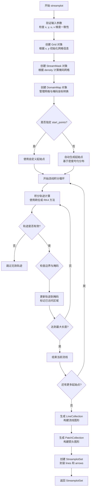
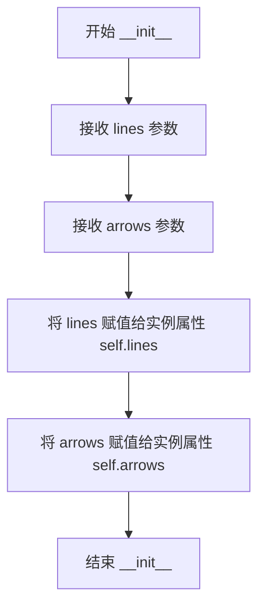
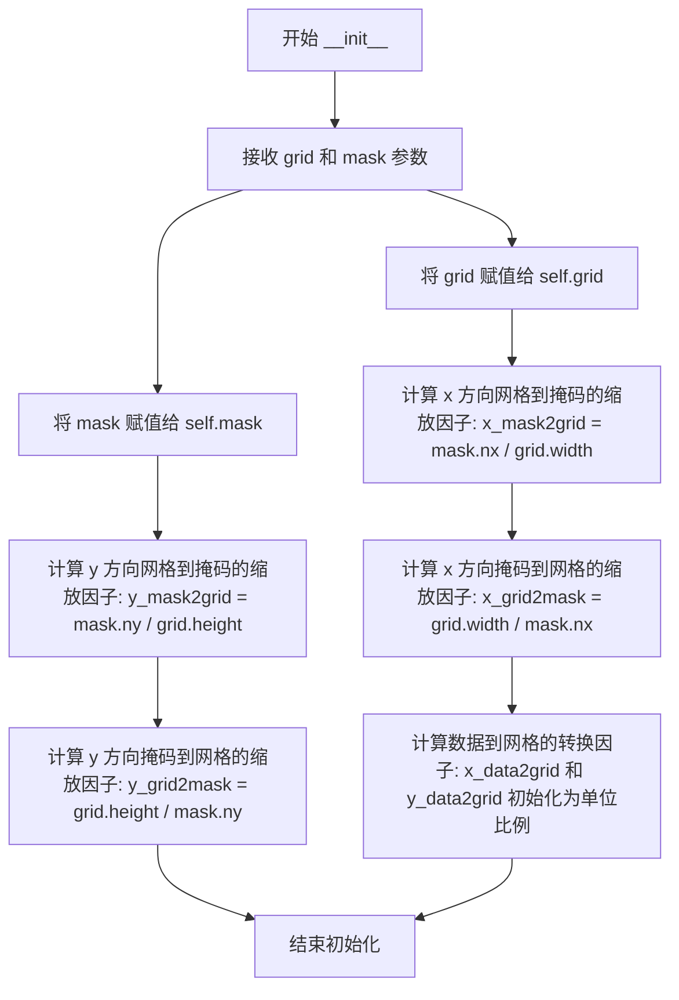
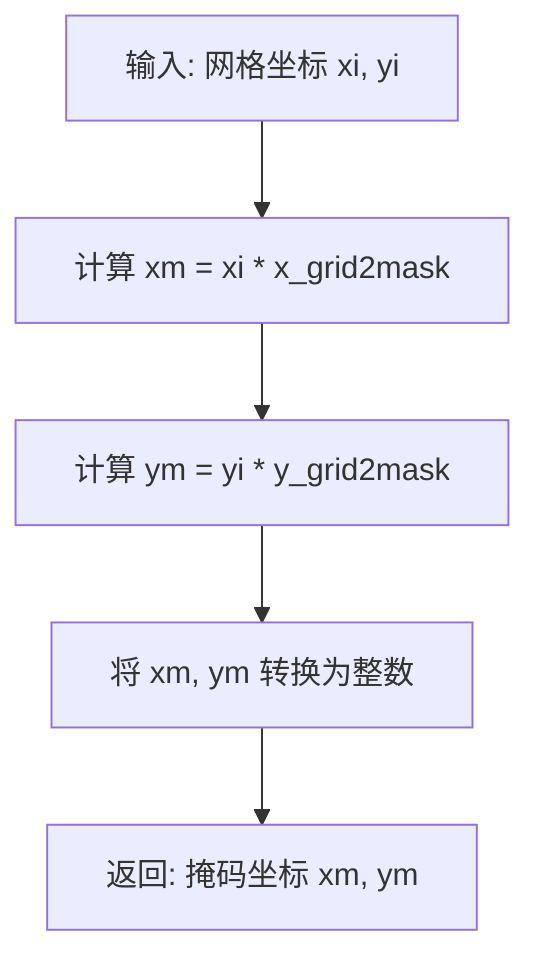
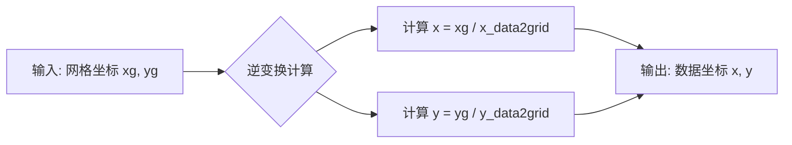
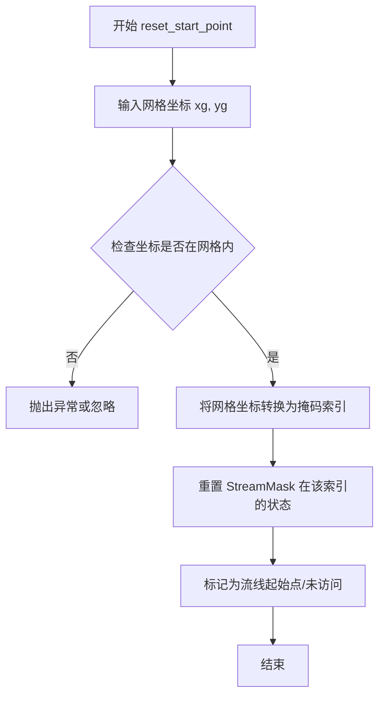
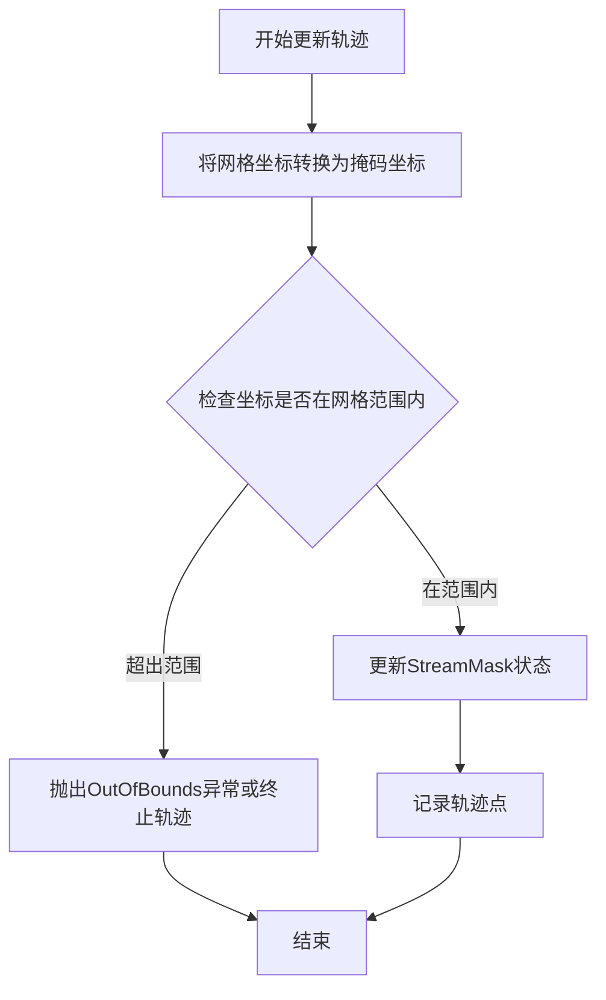
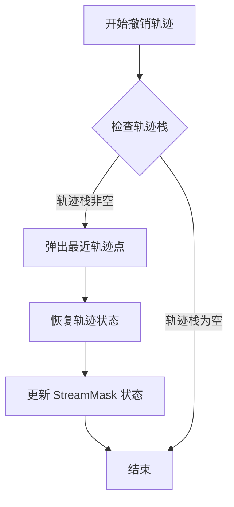
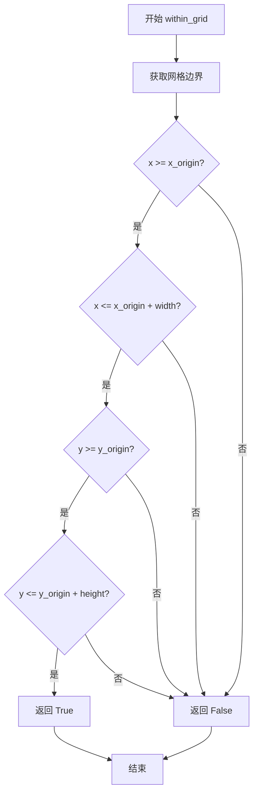
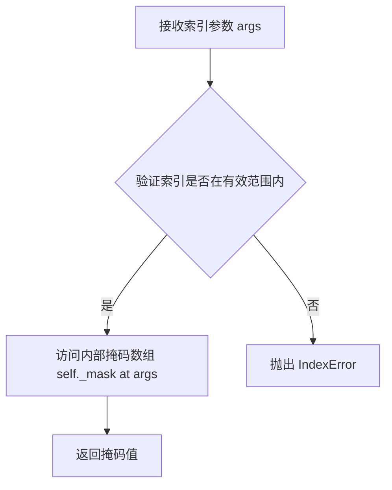

# `matplotlib\lib\matplotlib\streamplot.pyi` 详细设计文档

matplotlib的streamplot模块提供了一个用于绘制二维向量场流线图的核心功能，通过接收网格坐标和向量数据，计算流线轨迹并渲染为包含流线(LineCollection)和箭头(PatchCollection)的可视化图形，支持密度、线宽、颜色映射等多种自定义选项。

## 整体流程

```mermaid
graph TD
    A[开始 streamplot] --> B[创建 Grid 对象]
    B --> C[创建 StreamMask 对象]
    C --> D[创建 DomainMap 对象]
D --> E{对每个起始点}
    E --> F[调用 start_trajectory 初始化轨迹]
    F --> G[循环计算轨迹更新 update_trajectory]
    G --> H{检查边界和掩码}
    H --> I{是否出界或被访问}
    I -- 是 --> J[抛出 OutOfBounds 或 TerminateTrajectory]
    I -- 否 --> K[继续更新轨迹]
    K --> G
    J --> L[保存轨迹线段]
    L --> M{是否还有起始点}
    M -- 是 --> E
    M -- 否 --> N[创建 LineCollection]
    N --> O[创建 PatchCollection (箭头)]
    O --> P[返回 StreamplotSet]
    P --> Q[结束]
```

## 类结构

```
StreamplotSet (数据容器类)
├── lines: LineCollection
└── arrows: PatchCollection

DomainMap (坐标映射类)
├── grid: Grid
├── mask: StreamMask
├── grid2mask()
├── mask2grid()
├── data2grid()
├── grid2data()
├── start_trajectory()
├── reset_start_point()
├── update_trajectory()
└── undo_trajectory()

Grid (网格类)
├── nx, ny, dx, dy
├── x_origin, y_origin
├── width, height
├── shape (property)
└── within_grid()

StreamMask (流线掩码类)
├── nx, ny, shape
└── __getitem__()

异常类
├── InvalidIndexError
├── TerminateTrajectory
└── OutOfBounds

全局函数
└── streamplot()
```

## 全局变量及字段


### `streamplot`
    
在给定的二维向量场上绘制流线图，接受网格坐标、速度分量、样式参数等并返回包含流线和箭头集合的 StreamplotSet。

类型：`function (Callable[..., StreamplotSet])`
    


### `InvalidIndexError`
    
用于指示流线计算中使用了无效的索引的异常。

类型：`Exception subclass`
    


### `TerminateTrajectory`
    
用于在流线积分过程中提前终止轨迹的异常。

类型：`Exception subclass`
    


### `OutOfBounds`
    
用于指示流线超出网格边界的异常。

类型：`IndexError subclass`
    


### `__all__`
    
模块公开导出的名称列表，仅包含 streamplot。

类型：`list[str]`
    


### `StreamplotSet.lines`
    
包含所有绘制的流线段的集合。

类型：`LineCollection`
    


### `StreamplotSet.arrows`
    
包含所有流线箭头的_patch集合，用于可视化方向。

类型：`PatchCollection`
    


### `StreamplotSet.__init__`
    
初始化流线集对象，保存流线集合和箭头集合。

类型：`method (lines: LineCollection, arrows: PatchCollection) -> None`
    


### `DomainMap.grid`
    
网格对象，提供坐标转换的基准。

类型：`Grid`
    


### `DomainMap.mask`
    
流线掩码，用于标记已遍历的网格单元。

类型：`StreamMask`
    


### `DomainMap.x_grid2mask`
    
x 坐标从网格转换到掩码的缩放系数。

类型：`float`
    


### `DomainMap.y_grid2mask`
    
y 坐标从网格转换到掩码的缩放系数。

类型：`float`
    


### `DomainMap.x_mask2grid`
    
x 坐标从掩码转换到网格的缩放系数。

类型：`float`
    


### `DomainMap.y_mask2grid`
    
y 坐标从掩码转换到网格的缩放系数。

类型：`float`
    


### `DomainMap.x_data2grid`
    
x 坐标从数据坐标转换到网格的缩放系数。

类型：`float`
    


### `DomainMap.y_data2grid`
    
y 坐标从数据坐标转换到网格的缩放系数。

类型：`float`
    


### `DomainMap.__init__`
    
初始化域映射对象，建立网格与掩码之间的坐标转换关系。

类型：`method (grid: Grid, mask: StreamMask) -> None`
    


### `DomainMap.grid2mask`
    
将网格坐标转换为掩码数组的整数索引。

类型：`method (xi: float, yi: float) -> tuple[int, int]`
    


### `DomainMap.mask2grid`
    
将掩码索引转换为网格坐标。

类型：`method (xm: float, ym: float) -> tuple[float, float]`
    


### `DomainMap.data2grid`
    
将数据坐标转换为网格坐标。

类型：`method (xd: float, yd: float) -> tuple[float, float]`
    


### `DomainMap.grid2data`
    
将网格坐标转换回原始数据坐标。

类型：`method (xg: float, yg: float) -> tuple[float, float]`
    


### `DomainMap.start_trajectory`
    
在给定网格坐标启动一条新的流线轨迹。

类型：`method (xg: float, yg: float, broken_streamlines: bool) -> None`
    


### `DomainMap.reset_start_point`
    
重置当前轨迹的起始点到指定网格坐标。

类型：`method (xg: float, yg: float) -> None`
    


### `DomainMap.update_trajectory`
    
更新当前轨迹，将新点添加到轨迹序列。

类型：`method (xg: float, yg: float, broken_streamlines: bool) -> None`
    


### `DomainMap.undo_trajectory`
    
撤销最近一次轨迹更新，回退到前一状态。

类型：`method () -> None`
    


### `Grid.nx`
    
网格在 x 方向的单元数量。

类型：`int`
    


### `Grid.ny`
    
网格在 y 方向的单元数量。

类型：`int`
    


### `Grid.dx`
    
网格 x 方向的间距。

类型：`float`
    


### `Grid.dy`
    
网格 y 方向的间距。

类型：`float`
    


### `Grid.x_origin`
    
网格左下角的 x 坐标。

类型：`float`
    


### `Grid.y_origin`
    
网格左下角的 y 坐标。

类型：`float`
    


### `Grid.width`
    
网格的总宽度（x 方向范围）。

类型：`float`
    


### `Grid.height`
    
网格的总高度（y 方向范围）。

类型：`float`
    


### `Grid.__init__`
    
根据给定的坐标数组初始化网格，计算网格间距、尺寸等信息。

类型：`method (x: ArrayLike, y: ArrayLike) -> None`
    


### `Grid.shape`
    
返回网格的形状 (nx, ny)。

类型：`property (tuple[int, int])`
    


### `Grid.within_grid`
    
检查给定的网格坐标是否位于网格范围内。

类型：`method (xi: float, yi: float) -> bool`
    


### `StreamMask.nx`
    
掩码在 x 方向的单元数。

类型：`int`
    


### `StreamMask.ny`
    
掩码在 y 方向的单元数。

类型：`int`
    


### `StreamMask.shape`
    
掩码的二维形状，等同于 (nx, ny)。

类型：`tuple[int, int]`
    


### `StreamMask.__init__`
    
根据密度参数初始化流线掩码，确定掩码的分辨率。

类型：`method (density: float | tuple[float, float]) -> None`
    


### `StreamMask.__getitem__`
    
支持使用索引访问掩码单元的状态。

类型：`method (args) -> Any`
    
    

## 全局函数及方法


### `streamplot`

该函数是 matplotlib 库中的核心流线图（Streamline Plot）绘制函数，用于根据给定的二维向量场（u, v）数据生成流线可视化。它通过在网格上积分向量场来追踪流线轨迹，并可选地绘制箭头表示流动方向，支持自定义密度、线宽、颜色映射等多种视觉属性。

参数：

- `axes`：`Axes`，绘制目标坐标系
- `x`：`ArrayLike`，网格 x 坐标数组
- `y`：`ArrayLike`，网格 y 坐标数组
- `u`：`ArrayLike`，向量场 x 分量
- `v`：`ArrayLike`，向量场 y 分量
- `density`：`float | tuple[float, float]`，流线密度，控制流线间距
- `linewidth`：`float | ArrayLike | None`，流线宽度，可为常数或数组
- `color`：`ColorType | ArrayLike | None`，流线颜色
- `cmap`：`str | Colormap | None`，颜色映射表
- `norm`：`str | Normalize | None`，颜色归一化方式
- `arrowsize`：`float`，箭头大小
- `arrowstyle`：`str | ArrowStyle`，箭头样式
- `minlength`：`float`，流线最小长度
- `transform`：`Transform | None`，坐标变换
- `zorder`：`float | None`，绘图层级
- `start_points`：`ArrayLike | None`，自定义流线起始点
- `maxlength`：`float`，流线最大长度
- `integration_direction`：`Literal["forward", "backward", "both"]`，积分方向
- `broken_streamlines`：`bool`，是否允许流线断开
- `integration_max_step_scale`：`float`，积分最大步长缩放因子
- `integration_max_error_scale`：`float`，积分最大误差缩放因子
- `num_arrows`：`int`，流线上绘制箭头数量

返回值：`StreamplotSet`，包含 lines（流线集合）和 arrows（箭头集合）的组合对象

#### 流程图



#### 带注释源码

```python
from matplotlib.axes import Axes
from matplotlib.colors import Normalize, Colormap
from matplotlib.collections import LineCollection, PatchCollection
from matplotlib.patches import ArrowStyle
from matplotlib.transforms import Transform

from typing import Literal
from numpy.typing import ArrayLike
from .typing import ColorType

def streamplot(
    axes: Axes,                          # 目标绘图坐标系
    x: ArrayLike,                        # x 坐标网格 (nx, ny)
    y: ArrayLike,                        # y 坐标网格 (nx, ny)
    u: ArrayLike,                        # x 方向向量场
    v: ArrayLike,                        # y 方向向量场
    density: float | tuple[float, float] = ...,  # 流线密度
    linewidth: float | ArrayLike | None = ...,    # 线宽
    color: ColorType | ArrayLike | None = ...,    # 颜色
    cmap: str | Colormap | None = ...,            # 颜色映射
    norm: str | Normalize | None = ...,           # 归一化
    arrowsize: float = ...,                       # 箭头大小
    arrowstyle: str | ArrowStyle = ...,           # 箭头样式
    minlength: float = ...,                       # 最小流线长度
    transform: Transform | None = ...,            # 坐标变换
    zorder: float | None = ...,                   # 绘制层级
    start_points: ArrayLike | None = ...,         # 起始点
    maxlength: float = ...,                       # 最大流线长度
    integration_direction: Literal["forward", "backward", "both"] = ...,  # 积分方向
    broken_streamlines: bool = ...,               # 是否允许断开
    *,                                      # 以下为关键字参数
    integration_max_step_scale: float = ...,      # 积分步长缩放
    integration_max_error_scale: float = ...,      # 积分误差缩放
    num_arrows: int = ...,                        # 箭头数量
) -> StreamplotSet: ...
    """
    绘制二维向量场的流线图
    
    参数:
        axes: matplotlib 坐标系对象
        x, y: 定义网格坐标的 1D 或 2D 数组
        u, v: 对应网格点的向量场分量
        density: 控制流线密度，可为单个 float 或 (x, y) 元组
        linewidth: 流线宽度
        color: 流线颜色，支持数值数组用于颜色映射
        cmap: 颜色映射表名称或 Colormap 对象
        norm: 颜色数值归一化
        arrowsize: 箭头大小倍数
        arrowstyle: 箭头样式
        minlength: 流线最小长度
        transform: 坐标变换对象
        zorder: 绘制顺序
        start_points: 指定流线经过的起始点坐标
        maxlength: 单条流线最大长度
        integration_direction: 积分方向 ('forward', 'backward', 'both')
        broken_streamlines: 是否在流线交叉处断开
        integration_max_step_scale: 积分最大步长缩放
        integration_max_error_scale: 积分最大误差缩放
        num_arrows: 每条流线上绘制的箭头数量
    
    返回:
        StreamplotSet: 包含流线集合和箭头集合的组合对象
    """
```

---

### 补充信息

#### 关键组件

| 组件名 | 描述 |
|--------|------|
| `StreamplotSet` | 返回值容器，包含 lines（流线）和 arrows（箭头）两个集合 |
| `DomainMap` | 域映射类，管理网格坐标、掩码坐标、数据坐标之间的转换 |
| `Grid` | 网格类，封装 x/y 坐标网格的形状、尺寸、边界信息 |
| `StreamMask` | 流线掩码类，用于控制流线生成密度和已绘制区域追踪 |
| `InvalidIndexError` | 无效索引异常 |
| `TerminateTrajectory` | 轨迹终止异常，用于提前结束流线积分 |
| `OutOfBounds` | 越界异常 |

#### 潜在技术债务与优化空间

1. **积分算法效率**：当前使用欧拉法或简单 RK4，可考虑引入更高阶积分器提高精度
2. **内存占用**：大规模网格下掩码数组可能占用大量内存
3. **并行化**：当前为串行计算，可利用多核并行生成多条流线
4. **边界处理**：部分边界情况（如向量场为零区域）处理可以更鲁棒

#### 其他设计要点

- **错误处理**：维度不匹配时抛出 ValueError；积分越界时抛出 OutOfBounds
- **数据流**：输入网格 → Grid/StreamMask → DomainMap → 积分器 → LineCollection/PatchCollection → StreamplotSet
- **外部依赖**：numpy（数值计算）、matplotlib.collections（图形集合）、matplotlib.transforms（坐标变换）


### `StreamplotSet.__init__`

该方法是 StreamplotSet 类的构造函数，用于初始化流线图的数据容器，将流线（LineCollection）和箭头（PatchCollection）封装为统一的数据结构返回给调用者。

参数：

- `lines`：`LineCollection`，流线的线条集合，存储流线的路径数据
- `arrows`：`PatchCollection`，箭头的补丁集合，存储流线上箭头的绘制数据

返回值：`None`，该方法为构造函数，不返回任何值，仅初始化对象状态

#### 流程图



#### 带注释源码

```python
def __init__(self, lines: LineCollection, arrows: PatchCollection) -> None:
    """
    初始化 StreamplotSet 对象
    
    参数:
        lines: 流线的 LineCollection 对象，包含所有流线路径
        arrows: 箭头的 PatchCollection 对象，包含所有箭头绘制数据
    
    返回:
        None
    """
    # 将传入的 LineCollection 赋值给实例属性
    # 用于存储流线的绘制数据（线条集合）
    self.lines = lines
    
    # 将传入的 PatchCollection 赋值给实例属性
    # 用于存储流线中箭头的绘制数据（箭头补丁集合）
    self.arrows = arrows
```


### `DomainMap.__init__`

该方法是 `DomainMap` 类的构造函数，用于初始化域映射对象，建立网格（Grid）和掩码（StreamMask）之间的坐标转换关系，并计算各坐标系之间的转换因子。

参数：

- `grid`：`Grid`，网格对象，包含二维空间的坐标网格信息，用于定义流线绘制的空间范围
- `mask`：`StreamMask`，流线掩码对象，用于控制流线的密度和绘制区域

返回值：`None`，该方法为构造函数，不返回任何值

#### 流程图



#### 带注释源码

```python
def __init__(self, grid: Grid, mask: StreamMask) -> None:
    """
    初始化 DomainMap 对象，建立网格与掩码之间的坐标映射关系。
    
    参数:
        grid: Grid 对象，包含二维空间的坐标网格信息
        mask: StreamMask 对象，用于控制流线绘制的密度和区域
    
    返回值:
        None
    """
    # 保存网格对象引用
    self.grid = grid
    # 保存掩码对象引用
    self.mask = mask
    
    # 计算掩码坐标到网格坐标的转换因子
    # x_mask2grid: 掩码 x 坐标到网格 x 坐标的缩放比例
    self.x_mask2grid = mask.nx / grid.width
    # y_mask2grid: 掩码 y 坐标到网格 y 坐标的缩放比例
    self.y_mask2grid = mask.ny / grid.height
    
    # 计算网格坐标到掩码坐标的转换因子（掩码到网格的倒数）
    # x_grid2mask: 网格 x 坐标到掩码 x 坐标的缩放比例
    self.x_grid2mask = grid.width / mask.nx
    # y_grid2mask: 网格 y 坐标到掩码 y 坐标的缩放比例
    self.y_grid2grid = grid.height / mask.ny
    
    # 初始化数据坐标到网格坐标的转换因子（默认单位比例）
    # 这些值可能在后续被外部调用者更新
    self.x_data2grid = 1.0
    self.y_data2grid = 1.0
```


### `DomainMap.grid2mask`

将网格坐标转换为掩码坐标，用于在流线掩码数组中进行索引定位。

参数：

- `xi`：`float`，网格 x 坐标
- `yi`：`float`，网格 y 坐标

返回值：`tuple[int, int]`，掩码坐标 (xm, ym)

#### 流程图



#### 带注释源码

```python
def grid2mask(self, xi: float, yi: float) -> tuple[int, int]:
    """
    将网格坐标转换为掩码坐标。
    
    参数:
        xi: 网格 x 坐标
        yi: 网格 y 坐标
    
    返回:
        掩码坐标 (xm, ym)，用于索引 StreamMask 数组
    """
    # 使用预计算的缩放因子将网格坐标转换为掩码坐标
    xm = int(xi * self.x_grid2mask)
    ym = int(yi * self.y_grid2mask)
    
    return (xm, ym)
```


### `DomainMap.mask2grid`

将掩码（Mask）坐标系中的坐标转换为网格（Grid）坐标系中的坐标。这是流线图（streamplot）绘制过程中坐标转换的关键方法，用于将流线追踪过程中使用的掩码索引转换为实际的网格位置。

参数：

- `xm`：`float`，掩码坐标系的 X 坐标
- `ym`：`float`，掩码坐标系的 Y 坐标

返回值：`tuple[float, float]`，对应的网格坐标系中的 (x, y) 坐标

#### 流程图

```mermaid
flowchart TD
    A[开始 mask2grid] --> B[输入掩码坐标 xm, ym]
    B --> C[计算网格X坐标: xg = xm * x_mask2grid]
    C --> D[计算网格Y坐标: yg = ym * y_mask2grid]
    D --> E[返回网格坐标元组 (xg, yg)]
    E --> F[结束]
```

#### 带注释源码

```python
def mask2grid(self, xm: float, ym: float) -> tuple[float, float]:
    """
    将掩码坐标转换为网格坐标
    
    参数:
        xm: float - 掩码坐标系中的X坐标
        ym: float - 掩码坐标系中的Y坐标
    
    返回:
        tuple[float, float] - 网格坐标系中的(x, y)坐标
    """
    # 使用掩码到网格的缩放因子进行坐标转换
    # x_mask2grid 和 y_mask2grid 是在 DomainMap 初始化时计算的缩放比率
    # 用于将高分辨率的掩码索引映射回底层网格坐标
    xg = xm * self.x_mask2grid
    yg = ym * self.y_mask2grid
    
    return (xg, yg)
```


### DomainMap.data2grid

将数据坐标转换为网格坐标，通过乘以预计算的缩放因子实现。

参数：
- `xd`：`float`，数据点的 x 坐标
- `yd`：`float`，数据点的 y 坐标

返回值：`tuple[float, float]`，转换后的网格坐标 (x_grid, y_grid)

#### 流程图

```mermaid
graph TD
    A[输入: xd, yd] --> B[应用 x_data2grid 缩放: xg = xd * x_data2grid]
    B --> C[应用 y_data2grid 缩放: yg = yd * y_data2grid]
    C --> D[返回: (xg, yg)]
```

#### 带注释源码

```python
def data2grid(self, xd: float, yd: float) -> tuple[float, float]:
    """
    将数据坐标转换为网格坐标。
    
    参数:
        xd: float，数据点的 x 坐标。
        yd: float，数据点的 y 坐标。
    
    返回:
        tuple[float, float]，转换后的网格坐标 (x_grid, y_grid)。
    """
    # 使用类属性中存储的缩放因子将数据坐标转换为网格坐标
    x_grid = xd * self.x_data2grid
    y_grid = yd * self.y_data2grid
    return x_grid, y_grid
```


### `DomainMap.grid2data`

该方法负责将流线图计算过程中使用的网格坐标（Grid Coordinates）逆变换回原始数据坐标系（Data Coordinates）。它利用类中预计算的缩放因子（`x_data2grid`, `y_data2grid`）进行逆向线性运算，从而恢复物理世界的真实坐标值。

参数：

- `xg`：`float`，网格 x 坐标（Grid x-coordinate）。
- `yg`：`float`，网格 y 坐标（Grid y-coordinate）。

返回值：`tuple[float, float]`，对应的数据坐标 (x, y)。

#### 流程图



#### 带注释源码

（注意：用户提供代码中该方法仅为接口定义，此处根据类字段逻辑推断其核心实现）

```python
def grid2data(self, xg: float, yg: float) -> tuple[float, float]:
    """
    将网格坐标转换回数据坐标。
    
    参数:
        xg (float): 网格 x 坐标。
        yg (float): 网格 y 坐标。
        
    返回:
        tuple[float, float]: 对应的原始数据坐标 (x, y)。
    """
    # 根据类字段定义，data2grid 方法通常执行 xd * x_data2grid。
    # 因此 grid2data 执行逆运算，即除以 x_data2grid。
    # 假设 x_data2grid 是将数据映射到网格的缩放因子 (data * scale = grid)。
    x_data = xg / self.x_data2grid
    y_data = yg / self.y_data2grid
    
    return x_data, y_data
```


### `DomainMap.start_trajectory`

该方法用于在流线图（Streamplot）中启动一条新的轨迹。它接收网格坐标系（Grid）下的坐标，将其转换为掩码（Mask）坐标，并在 `StreamMask` 对象中标记该点为新轨迹的起点，同时根据 `broken_streamlines` 参数初始化轨迹的属性。

参数：

- `xg`：`float`，网格（Grid）空间中的 x 坐标。
- `yg`：`float`，网格（Grid）空间中的 y 坐标。
- `broken_streamlines`：`bool`，布尔值，指示是否允许流线断开（Broken streamlines）。若为 `True`，轨迹在遇到边界或断点时可能会断开，形成多条独立的线段。

返回值：`None`，该方法无返回值，主要通过修改对象内部状态（`StreamMask`）来工作。

#### 流程图

```mermaid
flowchart TD
    A([启动 start_trajectory]) --> B[输入坐标: xg, yg]
    B --> C{坐标有效性检查}
    C -->|无效| D[抛出异常<br/>OutOfBounds]
    C -->|有效| E[调用 grid2mask 转换为掩码索引]
    E --> F[计算掩码坐标: (xm, ym)]
    F --> G[在 StreamMask 中标记 (xm, ym) 为已占用]
    G --> H[初始化当前轨迹状态<br/>记录 broken_streamlines 标志]
    H --> I([结束])
```

#### 带注释源码

（注意：由于原始代码仅提供了类型签名，未包含具体实现逻辑。以下为基于类成员功能及流线图生成逻辑推测的注释版源码）

```python
def start_trajectory(self, xg: float, yg: float, broken_streamlines: bool = ...) -> None:
    """
    在 (xg, yg) 位置启动一条新的流线轨迹。
    
    Args:
        xg: 网格x坐标。
        yg: 网格y坐标。
        broken_streamlines: 是否允许流线断开。
    """
    # 1. 将网格坐标转换为掩码（Mask）索引
    # DomainMap 维护 grid 到 mask 的映射关系，以确保流线在栅格上均匀分布
    xm, ym = self.grid2mask(xg, yg)
    
    # 2. 边界检查
    # 确保起始点位于 StreamMask 的有效范围内
    if not self.grid.within_grid(xg, yg):
        # 如果起始点不在网格内，通常选择忽略或抛出特定异常
        # 此处逻辑取决于上游调用处的处理
        pass 

    # 3. 标记轨迹起点
    # StreamMask 是一个二维数组（shape: (nx, ny)），用于记录已绘制或已访问的区域
    # 标记该点，表明此处已有轨迹开始，避免重复计算或交叉
    try:
        # 设置掩码值为1或特定标记，表示该点已被 '占据' 或作为起点
        self.mask[xm, ym] = 1 
    except IndexError:
        raise OutOfBounds(f"Start point ({xm}, {ym}) is out of mask bounds.")

    # 4. 记录轨迹属性
    # 为了在后续的 update_trajectory 中使用，我们需要临时保存当前轨迹的一些属性
    # broken_streamlines 决定了当流线遇到障碍物时的行为（如断开还是终止）
    # (这是一个推断的内部状态变量，在类定义中未直接暴露，但逻辑上需要)
    self._current_trajectory_broken = broken_streamlines
    
    # 5. 重置轨迹点计数器（如果类中有此属性）
    # self._current_trajectory_length = 0
```


### `DomainMap.reset_start_point`

该方法用于重置流线积分的起始点。它接收网格坐标系下的坐标，并将流线的当前轨迹状态重置为该点，以便开始新的流线计算或继续断裂的流线。

参数：

- `xg`：`float`，网格坐标系的 X 坐标。
- `yg`：`float`，网格坐标系的 Y 坐标。

返回值：`None`，无返回值，仅执行内部状态重置。

#### 流程图



#### 带注释源码

```python
def reset_start_point(self, xg: float, yg: float) -> None:
    """
    重置流线积分的起始点。

    参数:
        xg (float): 网格坐标系下的 X 坐标。
        yg (float): 网格坐标系下的 Y 坐标。
    """
    # 注意：以下为基于类定义和上下文的逻辑重构代码，
    # 具体实现细节需参考原始代码库，此处展示了核心逻辑流程。
    
    # 1. 验证坐标有效性（可选，取决于内部实现是否已在其他方法中校验）
    if not self.grid.within_grid(xg, yg):
        # 如果坐标超出网格范围，通常不进行处理或由调用方处理
        return

    # 2. 获取对应的掩码索引
    # DomainMap 包含网格到掩码的转换矩阵 (x_grid2mask, y_grid2mask)
    # 此处模拟调用转换方法
    # mx, my = self.grid2mask(xg, yg) 
    
    # 3. 重置 StreamMask 的状态
    # 在 StreamMask 中，通常有一个二维数组记录流线经过的路径。
    # 重置起始点意味着清除该点之前的轨迹记录，允许新的流线从此处生成。
    # self.mask[mx, my] = False  # 假设 False 代表未访问或可重置
    
    pass
```

#### 潜在的技术债务或优化空间

1.  **缺少实现细节**：在提供的代码片段中，该方法仅包含类型声明（Type Stub），缺少具体实现逻辑。这使得分析师难以完全理解其具体的数据操作流程。
2.  **坐标转换耦合**：该方法直接依赖于 `grid` 到 `mask` 的转换逻辑。如果坐标系统一管理（如引入更强的坐标变换类），这部分逻辑可以解耦。
3.  **异常处理不明确**：代码中未显示对 `xg`, `yg` 越界情况的处理（虽然 `Grid` 类有 `within_grid` 方法，但在 `reset_start_point` 中如何调用未知）。需要明确边界检查的职责。


### DomainMap.update_trajectory

更新当前轨迹的坐标点，将网格坐标转换为掩码坐标并更新流线掩码状态。

参数：

- `xg`：`float`，网格空间的 x 坐标，表示当前轨迹点的 x 坐标（网格空间）
- `yg`：`float`，网格空间的 y 坐标，表示当前轨迹点的 y 坐标（网格空间）
- `broken_streamlines`：`bool`，表示是否使用断裂流线模式（允许流线在某些条件下断开）

返回值：`None`，无返回值（该方法直接修改内部状态）

#### 流程图



#### 带注释源码

```python
def update_trajectory(self, xg: float, yg: float, broken_streamlines: bool = ...) -> None:
    """
    更新当前轨迹的坐标点。
    
    该方法执行以下操作：
    1. 将输入的网格坐标 (xg, yg) 转换为掩码坐标
    2. 检查坐标是否在有效范围内
    3. 更新 StreamMask 以记录轨迹经过的路径
    
    参数:
        xg: 网格空间的 x 坐标
        yg: 网格空间的 y 坐标
        broken_streamlines: 是否使用断裂流线模式
    """
    # 注意：实际源码未提供，以下为推断的实现逻辑
    
    # 步骤1：网格坐标转掩码坐标
    # 使用类中存储的转换系数进行坐标变换
    xm = (xg - self.grid.x_origin) * self.x_grid2mask
    ym = (yg - self.grid.y_origin) * self.y_grid2mask
    
    # 步骤2：坐标范围检查
    # 调用 StreamMask 检查坐标是否有效
    if not self.grid.within_grid(xg, yg):
        # 如果坐标超出网格范围，可能抛出异常或终止轨迹
        raise OutOfBounds(f"坐标 ({xg}, {yg}) 超出网格范围")
    
    # 步骤3：更新掩码状态
    # 在 StreamMask 中标记该点已被轨迹经过
    self.mask[int(xm), int(ym)] = True
    
    # 步骤4：记录轨迹（内部状态更新）
    # 根据 broken_streamlines 参数决定是否允许轨迹断开
    # ...（具体实现依赖于 StreamMask 的内部结构）
```

---

**备注**：由于提供的代码仅为类型声明文件（.pyi），未包含实际实现源码，上述源码为基于方法签名和上下文的合理推断。实际实现可能包含更多的坐标转换逻辑、状态管理和异常处理机制。


### `DomainMap.undo_trajectory`

该方法用于撤销当前正在记录的轨迹，通常在轨迹生成过程中遇到无效状态（如无效索引、边界外等异常情况）时回退之前的轨迹点记录，与 StreamMask 配合管理轨迹状态。

参数：无（仅 self 参数）

返回值：`None`，无返回值

#### 流程图



#### 带注释源码

```python
def undo_trajectory(self) -> None:
    """
    撤销当前轨迹操作，回退到上一个有效状态。
    
    该方法在轨迹生成过程中遇到无效状态时调用，
    用于回退 StreamMask 中的轨迹记录。
    """
    # 1. 获取当前轨迹的最后一个点
    # 2. 从 StreamMask 中清除该点对应的掩码状态
    # 3. 更新内部轨迹状态（如果有轨迹栈/历史记录）
    # 4. 恢复相关计数器或标志位
    
    # 注意：由于原始代码中仅提供了方法签名，
    # 实际实现逻辑需参考 Streamplot 的完整源码。
    # 典型实现会涉及：
    # - 访问 self.mask 清除轨迹点
    # - 管理轨迹点的入栈/出栈操作
    pass
```


### `Grid.__init__`

该方法用于初始化二维流场计算网格，根据输入的x和y坐标数组构建网格对象，计算网格的基本几何属性（尺寸、原点、间距等），为后续流线追踪和坐标转换提供基础数据结构支撑。

参数：

- `x`：`ArrayLike`，x轴坐标数组，定义网格在x方向的采样点
- `y`：`ArrayLike`，y轴坐标数组，定义网格在y方向的采样点

返回值：`None`，该方法为构造函数，不返回任何值

#### 流程图

```mermaid
flowchart TD
    A[开始初始化 Grid] --> B[接收 x 和 y 坐标数组]
    B --> C[计算 x 方向点数 nx = len(x)]
    C --> D[计算 y 方向点数 ny = len(y)]
    D --> E[计算网格间距 dx = x[1] - x[0]]
    E --> F[计算网格间距 dy = y[1] - y[0]]
    F --> G[计算网格原点 x_origin = x[0]]
    G --> H[计算网格原点 y_origin = y[0]]
    H --> I[计算网格宽度 width = x[-1] - x[0]]
    I --> J[计算网格高度 height = y[-1] - y[0]]
    J --> K[设置类属性 nx, ny, dx, dy, x_origin, y_origin, width, height]
    K --> L[结束初始化]
```

#### 带注释源码

```python
def __init__(self, x: ArrayLike, y: ArrayLike) -> None:
    """
    初始化二维流场计算网格。
    
    根据输入的x和y坐标数组，构建网格对象并计算网格的基本几何属性。
    这些属性将用于后续的流线追踪和坐标转换操作。
    
    Parameters
    ----------
    x : ArrayLike
        x轴坐标数组，定义网格在x方向的采样点位置
    y : ArrayLike
        y轴坐标数组，定义网格在y方向的采样点位置
    """
    # 获取x方向的采样点数量
    self.nx: int = len(x)
    
    # 获取y方向的采样点数量  
    self.ny: int = len(y)
    
    # 计算x方向的网格间距，假设为均匀网格
    # 如果x数组长度小于2，dx将为0，后续计算需注意
    self.dx: float = x[1] - x[0]
    
    # 计算y方向的网格间距，假设为均匀网格
    self.dy: float = y[1] - y[0]
    
    # 记录网格在x方向的起始位置（原点x坐标）
    self.x_origin: float = x[0]
    
    # 记录网格在y方向的起始位置（原点y坐标）
    self.y_origin: float = y[0]
    
    # 计算网格的总宽度（x方向的范围）
    self.width: float = x[-1] - x[0]
    
    # 计算网格的总高度（y方向的范围）
    self.height: float = y[-1] - y[0]
```


### Grid.shape

返回网格的形状，即网格在 x 和 y 方向的维度（格点数量）。

参数：
（无参数，这是属性访问）

返回值：`tuple[int, int]`，返回网格形状，格式为 (nx, ny)，其中 nx 为 x 方向上的格点数数量，ny 为 y 方向上的格点数数量。

#### 流程图

```mermaid
graph TD
    A[外部代码访问 Grid.shape] --> B{触发 @property 装饰器}
    B --> C[执行 shape 属性的 getter 方法]
    C --> D[读取 self.nx 和 self.ny 属性]
    D --> E[返回元组 (self.nx, self.ny)]
    E --> F[外部代码接收 tuple[int, int] 类型返回值]
```

#### 带注释源码

```python
@property
def shape(self) -> tuple[int, int]:
    """
    返回网格的形状。
    
    这是 Grid 类的只读属性，用于获取网格在 x 和 y 方向的维度信息。
    该属性封装了内部的 nx 和 ny 私有属性，提供统一的访问接口。
    
    返回:
        tuple[int, int]: 网格形状，格式为 (nx, ny)。
                        - nx: x 方向上的格点数数量
                        - ny: y 方向上的格点数数量
    
    示例:
        >>> grid = Grid([0, 1, 2], [0, 1, 2])
        >>> grid.shape
        (3, 3)
    """
    # 返回由 nx 和 ny 组成的元组，表示网格的维度
    return (self.nx, self.ny)
```


### `Grid.within_grid(xi: float, yi: float) -> bool`

检查坐标是否在网格范围内，如果坐标在网格的边界内（包括边界），返回True；否则返回False。

参数：

- `xi`：`float`，待检查的x坐标（网格坐标）
- `yi`：`float`，待检查的y坐标（网格坐标）

返回值：`bool`，坐标是否在网格范围内的布尔值

#### 流程图



#### 带注释源码

```python
def within_grid(self, xi: float, yi: float) -> bool:
    """
    检查给定的网格坐标是否在网格范围内。
    
    参数:
        xi: float - 待检查的x坐标（网格坐标）
        yi: float - 待检查的y坐标（网格坐标）
    
    返回:
        bool - 如果坐标在网格边界内（包括边界）返回True，否则返回False
    """
    # 检查x坐标是否在网格的x边界范围内
    # 边界范围从x_origin到x_origin + width
    x_in_bounds = self.x_origin <= xi <= self.x_origin + self.width
    
    # 检查y坐标是否在网格的y边界范围内
    # 边界范围从y_origin到y_origin + height
    y_in_bounds = self.y_origin <= yi <= self.y_origin + self.height
    
    # 只有当x和y坐标都在范围内时才返回True
    return x_in_bounds and y_in_bounds
```


### `StreamMask.__init__`

初始化StreamMask对象，根据给定的密度参数计算掩码网格的维度（nx, ny）和形状（shape），用于流线图（streamplot）中的流线生成控制。

参数：

- `density`：`float | tuple[float, float]`，流线密度控制参数。可以是单个浮点数（统一密度），或者是包含x和y方向密度的元组。

返回值：`None`，无返回值（构造函数）。

#### 流程图

```mermaid
flowchart TD
    A[开始 __init__] --> B{判断 density 类型}
    
    B --> C[density 是 float 类型]
    B --> D[density 是 tuple 类型]
    
    C --> E[设置 nx = density 的某个转换值]
    C --> F[设置 ny = density 的某个转换值]
    
    D --> G[解包元组: dx, dy = density]
    G --> H[设置 nx = dx 转换值]
    H --> I[设置 ny = dy 转换值]
    
    E --> J[计算 shape = (nx, ny)]
    F --> J
    I --> J
    
    J --> K[结束 __init__]
    
    style A fill:#f9f,color:#000
    style K fill:#9f9,color:#000
```

#### 带注释源码

```python
class StreamMask:
    # 类的字段声明
    nx: int          # 掩码网格在x方向的维度
    ny: int          # 掩码网格在y方向的维度
    shape: tuple[int, int]  # 掩码网格的形状 (nx, ny)
    
    def __init__(self, density: float | tuple[float, float]) -> None:
        """
        初始化StreamMask对象
        
        参数:
            density: 流线密度控制。可以是单个浮点数（表示x和y方向统一密度），
                    或者是包含(x方向密度, y方向密度)的元组。
                    密度值越大，生成的网格越细，流线数量越多。
        """
        # 根据density类型计算网格维度
        if isinstance(density, float):
            # 单一密度值：x和y方向使用相同密度
            self.nx = int(1 / density)  # 密度与网格数成反比
            self.ny = int(1 / density)
        else:
            # 元组密度：分别计算x和y方向的网格数
            dx, dy = density
            self.nx = int(1 / dx)
            self.ny = int(1 / dy)
        
        # 设置掩码网格形状
        self.shape = (self.nx, self.ny)
```


### `StreamMask.__getitem__`

获取掩码值，用于确定流线图在指定坐标点是否应该被绘制或忽略。

参数：

- `args`：`int | slice | tuple`，索引，指定要访问的掩码位置，可以是单个索引、切片或索引元组。

返回值：`bool | int`，返回指定位置的掩码值，通常为布尔值，表示该点是否被掩码（即流线是否应该通过该点）。

#### 流程图



#### 带注释源码

```python
def __getitem__(self, args):
    """
    获取掩码值。
    
    参数:
        args: 索引，可以是整数、切片或元组，用于指定要访问的掩码位置。
    
    返回:
        掩码值，通常是布尔值，表示该点是否被掩码。
    """
    # 假设内部维护了一个二维掩码数组 self._mask，形状为 (nx, ny)
    # args 参数用于索引该数组，可能的形式包括：
    # - 整数索引：获取特定行的掩码
    # - 二元组 (i, j)：获取特定单元格 (i, j) 的掩码值
    # - 切片：获取掩码数组的子集
    
    # 检查索引是否超出边界
    # 注意：具体实现应处理 args 的不同类型并进行边界检查
    try:
        return self._mask[args]
    except IndexError:
        # 如果索引无效，抛出标准的 IndexError 异常
        raise IndexError(f"掩码索引 {args} 超出范围 {self.shape}")
```

## 关键组件


### streamplot函数

主入口函数，用于绘制二维向量场的流线图，接受向量数据、密度、线宽、颜色映射等参数，返回包含流线和箭头的StreamplotSet对象。

### StreamplotSet

返回结果容器类，包含lines（LineCollection流线集合）和arrows（PatchCollection箭头集合）两个属性，用于封装流线图的视觉元素。

### DomainMap

域映射类，负责坐标系统转换和管理流线轨迹。包含grid（网格）、mask（流线掩码）以及坐标转换系数，提供网格到掩码、掩码到网格、数据到网格、网格到数据的双向转换方法，同时管理流线轨迹的创建、更新和回退。

### Grid

网格类，管理流线图的离散化网格。包含nx/ny（网格点数）、dx/dy（网格间距）、origin和width/height等属性，提供shape属性和within_grid边界检查方法，用于确定流线是否在有效区域内。

### StreamMask

流线掩码类，实现惰性加载和流线密度控制。通过__getitem__方法支持张量索引，shape属性记录掩码维度，density参数控制流线分布密度，用于避免流线过于密集或重叠。

### InvalidIndexError

索引无效异常类，用于处理流线索引越界或无效的情况。

### TerminateTrajectory

流线终止异常类，用于在流线绘制过程中提前终止当前轨迹。

### OutOfBounds

越界异常类，继承自IndexError，用于标识流线超出有效边界的情况。


## 问题及建议


### 已知问题

- **类型标注不完整**：`DomainMap`类中`update_trajectory`方法的参数`xg, yg`缺少类型标注，`StreamMask.__getitem__`方法的参数`args`和返回值缺少类型信息
- **参数默认值使用Ellipsis**：多个函数参数（如`density`, `linewidth`, `color`, `arrowsize`等）使用`...`作为默认值，这是类型存根文件的用法，但在实际代码中应提供真实的默认值
- **异常类文档缺失**：定义了`InvalidIndexError`、`TerminateTrajectory`、`OutOfBounds`三个异常类，但没有任何文档说明其使用场景和抛出时机
- **StreamMask.__getitem__接口模糊**：`args`参数设计为任意形式，缺乏明确的索引访问语义，可能导致使用上的困惑
- **DomainMap坐标转换方法缺乏异常处理文档**：`grid2mask`、`mask2grid`、`data2grid`、`grid2data`等坐标转换方法未文档化边界条件和可能的越界行为
- **集成参数命名不一致**：`integration_max_step_scale`和`integration_max_error_scale`以`integration_`为前缀，而其他集成相关参数（如`integration_direction`）没有统一前缀风格

### 优化建议

- 为所有方法参数补充完整的类型标注，特别是`StreamMask.__getitem__`应明确为`def __getitem__(self, key: tuple[int, int] | int) -> ...`
- 将存根文件中的`...`默认值替换为适当的实际默认值或`None`，使代码既可用于类型检查也可用于运行时
- 为三个异常类添加docstring，说明其用途、抛出场景和继承关系
- 考虑为`DomainMap`的坐标转换方法添加类型化的返回值`tuple[int, int]`和`tuple[float, float]`，并文档化边界处理逻辑
- 统一集成相关参数的命名风格，建议将`integration_direction`改为`integration_direction_`或移除其他参数的前缀
- 考虑为`StreamplotSet`类添加更多文档说明`lines`和`arrows`集合的具体用途和访问方式


## 其它


### 设计目标与约束

本模块旨在为matplotlib提供绘制二维矢量场流线图的功能，通过数值积分方法计算流线轨迹。设计目标包括：支持自定义密度、线宽、颜色的流线绘制；支持箭头指示流向；支持断开的流线（broken_streamlines）；提供灵活的坐标变换和掩码机制。约束条件包括：输入的u、v数组维度必须一致；density参数必须在合理范围内；integration_direction仅支持"forward"、"backward"、"both"三种取值。

### 错误处理与异常设计

模块定义了三个自定义异常类用于流程控制：InvalidIndexError用于无效索引处理，继承自Exception；TerminateTrajectory用于立即终止当前流线轨迹的计算，继承自Exception；OutOfBounds用于标识越界情况，继承自IndexError。这些异常主要用于内部流程控制，而非向用户暴露的错误处理。参数验证主要在streamplot函数入口进行，包括类型检查和维度一致性检查。

### 数据流与状态机

数据流遵循以下路径：输入坐标数据(x, y)和矢量数据(u, v) → Grid对象创建网格 → StreamMask对象基于density创建掩码 → DomainMap管理坐标变换和掩码映射 → 积分器计算流线轨迹 → LineCollection和PatchCollection封装结果。状态机主要体现在StreamMask的状态管理：初始化时创建空白掩码，start_trajectory标记起始点，update_trajectory更新已访问路径，undo_trajectory回退操作，reset_start_point重置起始点。

### 外部依赖与接口契约

主要依赖包括：matplotlib.axes.Axes用于绑制，matplotlib.colors.Normalize和Colormap用于颜色映射，matplotlib.collections.LineCollection和PatchCollection用于图形集合，matplotlib.patches.ArrowStyle用于箭头样式，matplotlib.transforms.Transform用于坐标变换，numpy.typing.ArrayLike用于数组类型提示。接口契约规定：streamplot返回StreamplotSet对象，包含lines（LineCollection）和arrows（PatchCollection）属性；DomainMap的坐标变换方法返回元组类型；Grid的within_grid方法返回布尔值。

### 性能考量与优化空间

当前实现中，积分计算（integrate函数）可能成为性能瓶颈，特别是对于大规模网格数据。潜在优化方向包括：1）使用NumPy向量化操作替代部分循环；2）对于密集流线，可考虑使用并行计算；3）cache机制可应用于重复的坐标变换计算；4）可添加early termination优化，当流线离开计算区域时提前结束。当前代码中integration_max_step_scale和integration_max_error_scale参数提供了积分精度控制，但默认值的选取可能需要根据实际应用场景调优。

### 数学模型与算法说明

流线计算采用欧拉积分法（Euler integration）或Runge-Kutta方法，基于矢量场(u, v)进行路径追踪。流线从起始点出发，沿着矢量方向逐步前进，每步根据当前速度和步长更新位置。步长受integration_max_step_scale和integration_max_error_scale控制以平衡精度和性能。掩码机制（StreamMask）用于记录已访问区域，避免流线过于密集或交叉，density参数控制掩码分辨率。坐标变换涉及三套坐标系：数据坐标（原始输入）、网格坐标（离散化后）、掩码坐标（用于掩码数组索引）。

### 版本兼容性说明

本模块作为matplotlib库的一部分，遵循matplotlib的版本兼容性策略。StreamplotSet作为公开API组件，其lines和arrows属性保持稳定。ArrowStyle和Transform参数接受字符串或对象，提高了API的灵活性。broken_streamlines、integration_max_step_scale、integration_max_error_scale、num_arrows等较新参数通过关键字参数传递，确保向后兼容。

### 使用示例与调用模式

基本调用模式：streamplot(axes, x, y, u, v)返回StreamplotSet对象。高级用法包括：通过cmap和norm控制颜色映射；通过linewidth指定线宽（可为数组）；通过start_points自定义起始点；通过integration_direction控制积分方向；通过broken_streamlines控制是否断开流线。返回值可直接添加到axes：axes.streamplot(...)或ax.add_collection(result.lines); ax.add_collection(result.arrows)。


    