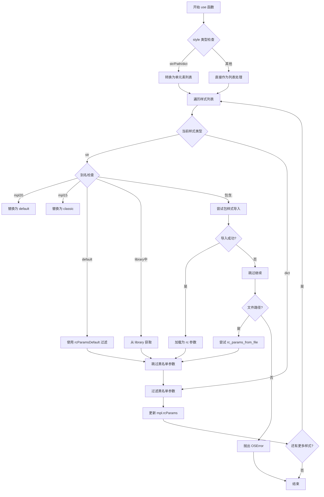
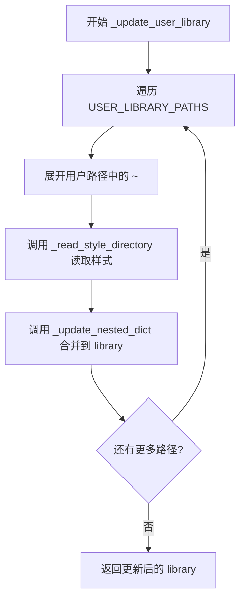
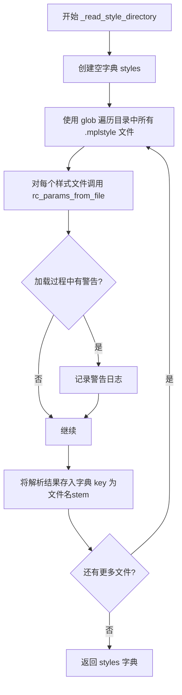
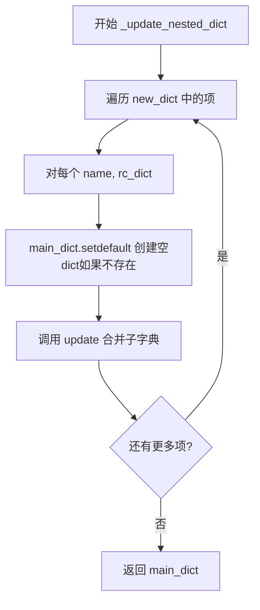
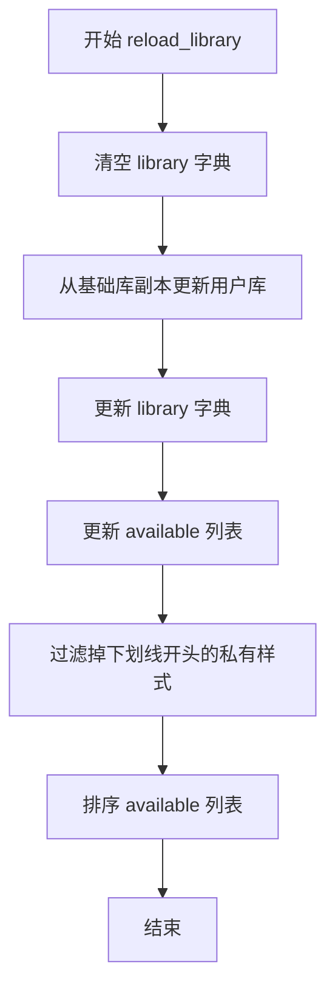
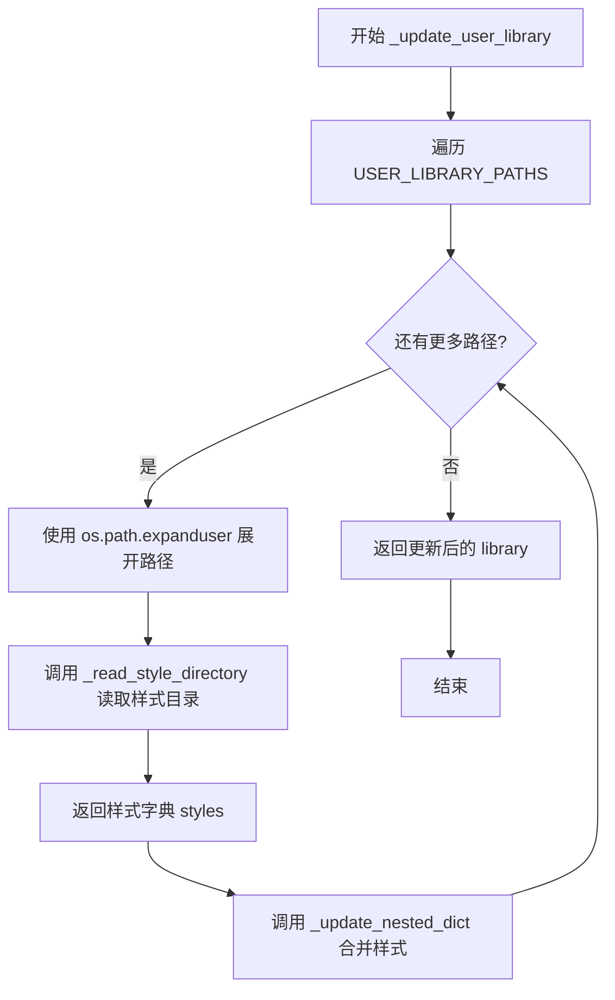
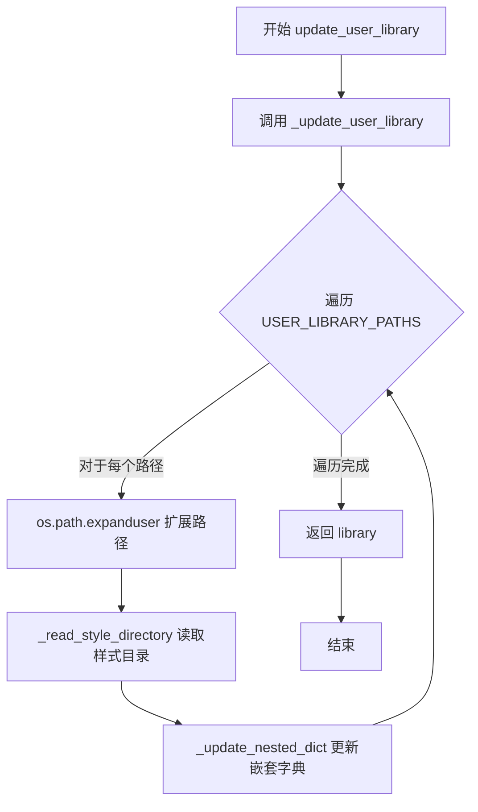
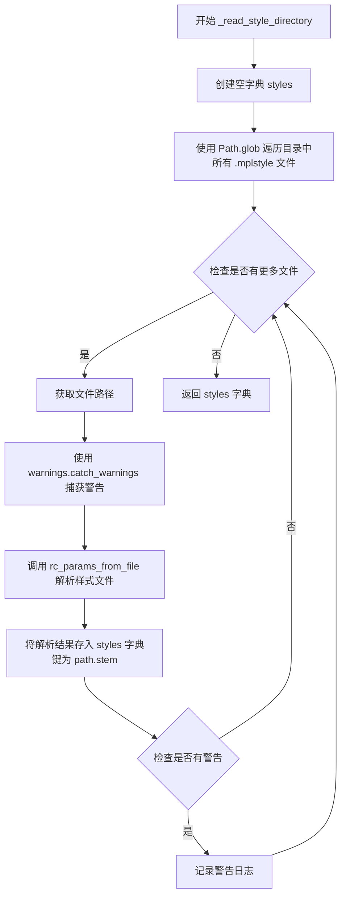
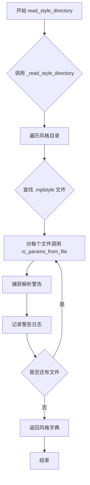
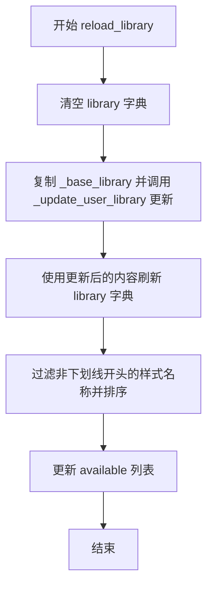

# `matplotlib\lib\matplotlib\style\__init__.py` 详细设计文档

这是matplotlib样式库的核心模块，提供样式表的管理和应用功能。它允许用户通过名称、文件路径或字典加载和应用matplotlib样式设置，支持上下文管理器临时应用样式，并维护一个包含内置和用户定义样式的库。

## 整体流程

```mermaid
graph TD
    A[开始] --> B{输入style类型}
    B -- str/Path/dict --> C[转换为列表]
    B -- list --> D[直接作为styles]
    C --> D
    D --> E{遍历styles}
    E --> F{style是字符串?}
    F -- 是 --> G{是别名?}
    G -- 是 --> H[替换为别名]
    G -- 否 --> I{在library中?}
    I -- 是 --> J[获取library[style]]
    I -- 否 --> K{包含点号?}
    K -- 是 --> L[尝试包样式加载]
    K -- 否 --> M[尝试文件路径加载]
    F -- 否 --> N{是字典?}
    N -- 是 --> O[直接使用]
    J --> P
    L --> Q{加载成功?}
    Q -- 是 --> P
    Q -- 否 --> M
    M --> R{文件存在?}
    R -- 是 --> P
    R -- 否 --> S[抛出OSError]
    O --> P
    P --> T{参数在黑名单?}
    T -- 是 --> U[警告并忽略]
    T -- 否 --> V[加入filtered字典]
    E --> W[更新mpl.rcParams]
    W --> X[结束]
```

## 类结构

```
该文件为模块文件，不包含类定义，全部为函数和全局变量
```

## 全局变量及字段


### `_BASE_LIBRARY_PATH`
    
matplotlib内置样式文件的目录路径

类型：`str`
    


### `USER_LIBRARY_PATHS`
    
用户自定义样式文件的搜索路径列表

类型：`list`
    


### `_STYLE_EXTENSION`
    
样式文件的扩展名，固定为'mplstyle'

类型：`str`
    


### `_STYLE_BLACKLIST`
    
样式中应忽略的rcParams参数黑名单

类型：`set`
    


### `_log`
    
用于记录样式库操作日志的日志记录器

类型：`logging.Logger`
    


### `library`
    
存储所有可用样式名称及其对应配置的字典

类型：`dict`
    


### `available`
    
当前可用的样式名称列表（不包含下划线开头的私有样式）

类型：`list`
    


### `_base_library`
    
matplotlib内置的基础样式库配置字典

类型：`dict`
    


    

## 全局函数及方法


### `use`

使用 Matplotlib 样式规范来覆盖当前的 matplotlib 设置。支持多种样式规范形式（字符串样式名、包样式名、文件路径、字典或列表），并将样式参数应用到 `rcParams` 中。

参数：

- `style`：`str | dict | Path | list`，样式规范，可以是样式名称、包样式的点号表示法、文件路径、rcParams 字典或样式规范列表

返回值：`None`，无返回值，直接修改全局 `mpl.rcParams`

#### 流程图

```mermaid
flowchart TD
    A[开始 use 函数] --> B{style 类型判断}
    B -->|str/Path/dict| C[转换为单元素列表]
    B -->|list| D[直接使用列表]
    C --> D
    D --> E[遍历每个 style]
    E --> F{style 是字符串?}
    F -->|是| G[处理样式别名 mpl20/mpl15]
    F -->|否| H
    G --> I{别名解析后为 'default'?}
    I -->|是| J[使用 rcParamsDefault 过滤黑名单]
    I -->|否| K{在 library 中?}
    J --> L
    K -->|是| L[使用 library[style]]
    K -->|否| M{包含 '.'?}
    M -->|是| N[尝试包样式导入]
    M -->|否| O[尝试文件路径加载]
    N --> P{导入成功?}
    P -->|是| L
    P -->|否| O
    O --> Q[rc_params_from_file 加载]
    Q --> R{加载成功?}
    R -->|是| L
    R -->|否| S[抛出 OSError]
    H -->|dict/Path| Q
    L --> T[过滤黑名单 rcParams]
    T --> U[更新 mpl.rcParams]
    U --> E
    E --> V[结束]
    
    style S fill:#ffcccc
    style U fill:#ccffcc
```

#### 带注释源码

```python
@_docstring.Substitution(
    "\n".join(map("- {}".format, sorted(_STYLE_BLACKLIST, key=str.lower)))
)
def use(style):
    """
    Use Matplotlib style settings from a style specification.

    The style name of 'default' is reserved for reverting back to
    the default style settings.

    .. note::

       This updates the `.rcParams` with the settings from the style.
       `.rcParams` not defined in the style are kept.

    Parameters
    ----------
    style : str, dict, Path or list

        A style specification. Valid options are:

        str
            - One of the style names in `.style.available` (a builtin style or
              a style installed in the user library path).

            - A dotted name of the form "package.style_name"; in that case,
              "package" should be an importable Python package name, e.g. at
              ``/path/to/package/__init__.py``; the loaded style file is
              ``/path/to/package/style_name.mplstyle``.  (Style files in
              subpackages are likewise supported.)

            - The path or URL to a style file, which gets loaded by
              `.rc_params_from_file`.

        dict
            A mapping of key/value pairs for `matplotlib.rcParams`.

        Path
            The path to a style file, which gets loaded by
            `.rc_params_from_file`.

        list
            A list of style specifiers (str, Path or dict), which are applied
            from first to last in the list.

    Notes
    -----
    The following `.rcParams` are not related to style and will be ignored if
    found in a style specification:

    %s
    """
    # 步骤1: 标准化输入 - 将单个样式规范转换为列表，统一处理流程
    if isinstance(style, (str, Path)) or hasattr(style, 'keys'):
        # 如果是字符串、Path 或字典，转为单元素列表
        styles = [style]
    else:
        # 否则假定是列表，直接使用
        styles = style

    # 步骤2: 定义样式别名映射
    style_alias = {'mpl20': 'default', 'mpl15': 'classic'}

    # 步骤3: 遍历处理每个样式规范
    for style in styles:
        # 如果是字符串类型，处理别名和解析
        if isinstance(style, str):
            # 应用样式别名转换
            style = style_alias.get(style, style)
            
            # 处理 'default' 特殊样式名
            if style == "default":
                # 从默认 rcParams 中过滤掉黑名单参数
                # 抑制弃用警告，因为 rcParamsDefault 创建时已处理
                with _api.suppress_matplotlib_deprecation_warning():
                    # 使用字典推导式，避免触发 RcParams 的 __getitem__('backend')
                    style = {k: rcParamsDefault[k] for k in rcParamsDefault
                             if k not in _STYLE_BLACKLIST}
            
            # 检查是否是库中已存在的样式
            elif style in library:
                style = library[style]
            
            # 检查是否是包样式的点号表示法 (package.style_name)
            elif "." in style:
                pkg, _, name = style.rpartition(".")
                try:
                    # 尝试从包中加载样式文件
                    path = importlib.resources.files(pkg) / f"{name}.{_STYLE_EXTENSION}"
                    style = rc_params_from_file(path, use_default_template=False)
                except (ModuleNotFoundError, OSError, TypeError) as exc:
                    # 静默失败，后续会尝试作为文件路径处理
                    # 这样区分 "package.style" 和 "./some/path.style"
                    pass
        
        # 步骤4: 如果仍是字符串或 Path，尝试作为文件路径加载
        if isinstance(style, (str, Path)):
            try:
                style = rc_params_from_file(style, use_default_template=False)
            except OSError as err:
                raise OSError(
                    f"{style!r} is not a valid package style, path of style "
                    f"file, URL of style file, or library style name (library "
                    f"styles are listed in `style.available`)") from err
        
        # 步骤5: 过滤掉黑名单中的 rcParams 参数
        filtered = {}
        for k in style:  # 避免触发 RcParams.__getitem__('backend')
            if k in _STYLE_BLACKLIST:
                # 发出警告，提示该参数被忽略
                _api.warn_external(
                    f"Style includes a parameter, {k!r}, that is not "
                    f"related to style.  Ignoring this parameter.")
            else:
                filtered[k] = style[k]
        
        # 步骤6: 将过滤后的参数应用到全局 rcParams
        mpl.rcParams.update(filtered)
```


### `use`

描述：`use` 函数是 matplotlib 样式库的核心函数，用于从样式规范应用 Matplotlib 样式设置。它支持多种样式规范形式（字符串、字典、Path 对象或列表），并更新全局 `rcParams` 配置。

参数：

- `style`：`str | dict | Path | list`，样式规范，可以是样式名称、包样式（package.style_name 形式）、文件路径/URL、rcParams 字典，或上述类型的列表

返回值：`None`，无返回值，直接修改全局 `rcParams`

#### 流程图



#### 带注释源码

```python
def use(style):
    """
    Use Matplotlib style settings from a style specification.

    The style name of 'default' is reserved for reverting back to
    the default style settings.

    .. note::

       This updates the `.rcParams` with the settings from the style.
       `.rcParams` not defined in the style are kept.

    Parameters
    ----------
    style : str, dict, Path or list

        A style specification. Valid options are:

        str
            - One of the style names in `.style.available` (a builtin style or
              a style installed in the user library path).

            - A dotted name of the form "package.style_name"; in that case,
              "package" should be an importable Python package name, e.g. at
              ``/path/to/package/__init__.py``; the loaded style file is
              ``/path/to/package/style_name.mplstyle``.  (Style files in
              subpackages are likewise supported.)

            - The path or URL to a style file, which gets loaded by
              `.rc_params_from_file`.

        dict
            A mapping of key/value pairs for `matplotlib.rcParams`.

        Path
            The path to a style file, which gets loaded by
            `.rc_params_from_file`.

        list
            A list of style specifiers (str, Path or dict), which are applied
            from first to last in the list.

    Notes
    -----
    The following `.rcParams` are not related to style and will be ignored if
    found in a style specification:

    %s
    """
    # 将输入统一转换为列表形式处理，便于统一遍历逻辑
    if isinstance(style, (str, Path)) or hasattr(style, 'keys'):
        # 如果是单个 str、Path 或 dict，转为单元素列表
        styles = [style]
    else:
        # 其他可迭代对象（如列表）直接使用
        styles = style

    # 定义样式别名映射：mpl20->default, mpl15->classic
    style_alias = {'mpl20': 'default', 'mpl15': 'classic'}

    # 遍历每个样式规范，依次应用
    for style in styles:
        # 处理字符串类型的样式规范
        if isinstance(style, str):
            # 应用别名转换
            style = style_alias.get(style, style)
            if style == "default":
                # default 样式使用默认 rcParams，但过滤掉黑名单中的参数
                # 避免触发 RcParams.__getitem__('backend') 等警告
                with _api.suppress_matplotlib_deprecation_warning():
                    style = {k: rcParamsDefault[k] for k in rcParamsDefault
                             if k not in _STYLE_BLACKLIST}
            elif style in library:
                # 库中已定义的样式，直接获取
                style = library[style]
            elif "." in style:
                # 包样式格式：package.style_name
                pkg, _, name = style.rpartition(".")
                try:
                    # 尝试从包中加载样式文件
                    path = importlib.resources.files(pkg) / f"{name}.{_STYLE_EXTENSION}"
                    style = rc_params_from_file(path, use_default_template=False)
                except (ModuleNotFoundError, OSError, TypeError) as exc:
                    # 静默失败，后续会尝试作为文件路径处理
                    pass
        # 处理字符串或 Path 类型的文件路径
        if isinstance(style, (str, Path)):
            try:
                # 尝试作为文件路径/URL 加载
                style = rc_params_from_file(style, use_default_template=False)
            except OSError as err:
                # 样式无效，抛出明确错误
                raise OSError(
                    f"{style!r} is not a valid package style, path of style "
                    f"file, URL of style file, or library style name (library "
                    f"styles are listed in `style.available`)") from err
        
        # 过滤掉黑名单中的 rcParams，这些参数与样式无关
        filtered = {}
        for k in style:  # 避免触发 RcParams.__getitem__('backend')
            if k in _STYLE_BLACKLIST:
                _api.warn_external(
                    f"Style includes a parameter, {k!r}, that is not "
                    f"related to style.  Ignoring this parameter.")
            else:
                filtered[k] = style[k]
        
        # 将过滤后的参数应用到全局 rcParams
        mpl.rcParams.update(filtered)
```

---

### `context`

描述：`context` 是一个上下文管理器，用于临时使用样式设置。它在上下文块执行期间应用指定的样式，并在块结束时恢复原始设置。支持在应用样式前重置为默认值。

参数：

- `style`：`str | dict | Path | list`，样式规范，与 `use` 函数相同
- `after_reset`：`bool`，可选参数，默认为 False。如果为 True，则在应用样式前先调用 `mpl.rcdefaults()` 重置为默认值

返回值：`contextmanager`，返回一个上下文管理器对象，配合 `with` 语句使用

#### 流程图

```mermaid
flowchart TD
    A[开始 context 函数] --> B[进入 mpl.rc_context 上下文]
    B --> C{after_reset?}
    C -->|True| D[调用 mpl.rcdefaults 重置设置]
    C -->|False| E[不重置]
    D --> F[调用 use(style) 应用样式]
    E --> F
    F --> G[yield 控制权到 with 块]
    G --> H[with 块执行完毕]
    H --> I[rc_context 自动恢复原始设置]
    I --> J[结束]
```

#### 带注释源码

```python
@contextlib.contextmanager
def context(style, after_reset=False):
    """
    Context manager for using style settings temporarily.

    Parameters
    ----------
    style : str, dict, Path or list
        A style specification. Valid options are:

        str
            - One of the style names in `.style.available` (a builtin style or
              a style installed in the user library path).

            - A dotted name of the form "package.style_name"; in that case,
              "package" should be an importable Python package name, e.g. at
              ``/path/to/package/__init__.py``; the loaded style file is
              ``/path/to/package/style_name.mplstyle``.  (Style files in
              subpackages are likewise supported.)

            - The path or URL to a style file, which gets loaded by
              `.rc_params_from_file`.
        dict
            A mapping of key/value pairs for `matplotlib.rcParams`.

        Path
            The path to a style file, which gets loaded by
            `.rc_params_from_file`.

        list
            A list of style specifiers (str, Path or dict), which are applied
            from first to last in the list.

    after_reset : bool
        If True, apply style after resetting settings to their defaults;
        otherwise, apply style on top of the current settings.
    """
    # 使用 mpl.rc_context() 创建上下文，自动保存和恢复 rcParams
    with mpl.rc_context():
        if after_reset:
            # 如果设置 after_reset=True，先重置所有 rcParams 到默认值
            mpl.rcdefaults()
        
        # 应用样式设置
        use(style)
        
        # yield 将控制权交给 with 语句的代码块
        # 代码块执行完毕后，rc_context 会自动恢复原始设置
        yield
```

---

### `_update_user_library`

描述：`_update_user_library` 是一个内部函数，用于将用户定义的样式文件合并到样式库中。它扫描用户库路径目录，读取其中的样式文件，并使用嵌套字典更新方式合并到主库中。

参数：

- `library`：`dict`，主样式库字典，将被用户样式更新

返回值：`dict`，返回更新后的样式库

#### 流程图



#### 带注释源码

```python
def _update_user_library(library):
    """Update style library with user-defined rc files."""
    # 遍历所有用户库路径
    for stylelib_path in map(os.path.expanduser, USER_LIBRARY_PATHS):
        # 读取用户目录中的所有样式文件
        styles = _read_style_directory(stylelib_path)
        # 将用户样式嵌套更新到主库中
        _update_nested_dict(library, styles)
    return library
```

---

### `_read_style_directory`

描述：`_read_style_directory` 是一个内部函数，用于读取指定目录中的所有样式文件（.mplstyle 格式），并将它们解析为 rcParams 字典返回。

参数：

- `style_dir`：`str`，样式目录的路径

返回值：`dict`，返回包含样式名称到 rcParams 映射的字典

#### 流程图



#### 带注释源码

```python
def _read_style_directory(style_dir):
    """Return dictionary of styles defined in *style_dir*."""
    styles = dict()
    # 使用 pathlib.Path.glob 查找目录下所有 .mplstyle 文件
    for path in Path(style_dir).glob(f"*.{_STYLE_EXTENSION}"):
        # 捕获加载过程中的警告
        with warnings.catch_warnings(record=True) as warns:
            # 解析样式文件为 rcParams 字典
            styles[path.stem] = rc_params_from_file(path, use_default_template=False)
        # 记录所有警告
        for w in warns:
            _log.warning('In %s: %s', path, w.message)
    return styles
```

---

### `_update_nested_dict`

描述：`_update_nested_dict` 是一个内部函数，用于更新嵌套字典（仅一层嵌套）。与标准 `dict.update` 不同，它假设父字典的值也是字典，因此不会替换已存在的嵌套字典，而是更新其内容。

参数：

- `main_dict`：`dict`，主字典，将被更新
- `new_dict`：`dict`，新字典，包含要合并的值

返回值：`dict`，返回更新后的主字典

#### 流程图



#### 带注释源码

```python
def _update_nested_dict(main_dict, new_dict):
    """
    Update nested dict (only level of nesting) with new values.

    Unlike `dict.update`, this assumes that the values of the parent dict are
    dicts (or dict-like), so you shouldn't replace the nested dict if it
    already exists. Instead you should update the sub-dict.
    """
    # 遍历新字典中的每个样式名称和 rc 参数
    for name, rc_dict in new_dict.items():
        # 如果 main_dict 中已存在该名称，使用现有字典；否则创建新的
        # 然后用 new_dict 中的值更新它（而不是完全替换）
        main_dict.setdefault(name, {}).update(rc_dict)
    return main_dict
```

---

### `reload_library`

描述：`reload_library` 函数用于重新加载样式库。它清空当前库内容，重新从基础库和用户库构建库内容，并更新可用样式列表（排除私有样式，以 `_` 开头的样式名）。

参数：无

返回值：`None`，无返回值

#### 流程图



#### 带注释源码

```python
def reload_library():
    """Reload the style library."""
    # 清空现有库内容
    library.clear()
    # 从基础库的副本开始，合并用户自定义样式
    library.update(_update_user_library(_base_library.copy()))
    # 更新可用样式列表：排除私有样式（下划线开头）并排序
    available[:] = sorted(name for name in library if not name.startswith('_'))
```

---

### 全局变量和常量

#### `_BASE_LIBRARY_PATH`

- 类型：`str`
- 描述：基础样式库的路径，指向 matplotlib 安装数据目录下的 stylelib 文件夹

#### `USER_LIBRARY_PATHS`

- 类型：`list`
- 描述：用户样式库路径列表，默认包含用户配置目录下的 stylelib 文件夹，用户可以在此添加自定义样式

#### `_STYLE_EXTENSION`

- 类型：`str`
- 描述：样式文件的扩展名，固定为 'mplstyle'

#### `_STYLE_BLACKLIST`

- 类型：`set`
- 描述：样式黑名单集合，包含不应从样式文件应用的 rcParams 参数名，如 'backend'、'interactive' 等与样式无关的参数

#### `library`

- 类型：`dict`
- 描述：样式库字典，键为样式名称，值为对应的 rcParams 字典，包含所有可用样式

#### `available`

- 类型：`list`
- 描述：可用样式名称列表（排除私有样式），按字母顺序排序，供用户选择

---

### 关键组件信息

| 组件名称 | 描述 |
|---------|------|
| `use` | 核心函数，应用样式设置到全局 rcParams |
| `context` | 上下文管理器，临时应用样式 |
| `library` | 存储所有可用样式的字典 |
| `available` | 公开的可用样式列表（排除私有） |
| `reload_library` | 重新加载样式库 |
| `_read_style_directory | 从目录读取样式文件 |
| `_update_nested_dict` | 合并嵌套字典的工具函数 |

---

### 潜在的技术债务或优化空间

1. **已弃用函数的处理**：`update_user_library`、`read_style_directory`、`update_nested_dict` 已被标记为弃用（3.11版本），但仍在模块级别导出，可能在未来的版本中移除，应考虑完全移除。

2. **样式解析重复代码**：`use` 函数中处理包样式和文件路径的逻辑有重复（两次调用 `rc_params_from_file`），可以考虑重构提取公共逻辑。

3. **错误处理改进**：包样式导入失败时静默跳过（`pass`），然后继续尝试文件路径，这种隐式行为可能导致难以调试的问题。

4. **性能考虑**：`reload_library` 每次都重新读取所有样式文件，在样式文件较多时可能较慢，可以考虑添加缓存机制。

5. **类型提示缺失**：整个模块没有使用类型注解（type hints），增加了静态分析和IDE支持的难度。

---

### 设计目标与约束

- **设计目标**：提供灵活的样式管理机制，支持内置样式、用户自定义样式、包样式和文件路径样式等多种形式。
- **约束**：样式黑名单中的 rcParams 不会被应用，以防止样式文件修改与样式无关的核心配置。

---

### 错误处理与异常设计

- **OSError**：当样式文件路径无效或无法加载时抛出，明确说明可能的样式规范形式。
- **ModuleNotFoundError/OSError/TypeError**：包样式导入时静默捕获，允许多次尝试。
- **警告**：黑名单参数被忽略时发出外部警告，提示用户该参数无效。

---

### 数据流与状态机

样式应用的数据流：
1. 解析输入样式规范（字符串/字典/Path/列表）
2. 转换为统一格式（rcParams 字典列表）
3. 过滤黑名单参数
4. 应用到全局 rcParams

`context` 管理器使用 `rc_context` 维护状态，自动保存/恢复 rcParams。

---

### 外部依赖与接口契约

- **`matplotlib.rcParams`**：全局配置字典，被样式直接修改
- **`matplotlib.rcdefaults()`**：重置 rcParams 到默认值
- **`matplotlib.rc_context()`**：上下文管理器，用于保存和恢复 rcParams
- **`matplotlib.rc_params_from_file`**：解析样式文件为 rcParams 字典
- **`importlib.resources`**：用于加载包内样式文件
- **`pathlib.Path`**：用于目录遍历和路径处理


### `_update_user_library`

该函数用于使用用户定义的rc文件更新matplotlib样式库，遍历用户样式目录并合并到主样式库中。

参数：

- `library`：`dict`，样式库字典，用于存储样式名称和对应的matplotlib设置（key为样式名，value为rcParams字典）

返回值：`dict`，更新后的样式库字典

#### 流程图



#### 带注释源码

```python
def _update_user_library(library):
    """Update style library with user-defined rc files."""
    # 遍历用户定义的样式库路径列表
    # 使用 os.path.expanduser 将路径中的 ~ 展开为用户主目录
    for stylelib_path in map(os.path.expanduser, USER_LIBRARY_PATHS):
        # 从指定目录读取所有 .mplstyle 文件
        # 返回样式名到 rcParams 字典的映射
        styles = _read_style_directory(stylelib_path)
        
        # 将读取到的用户样式合并到主样式库中
        # 使用嵌套字典更新方式，保留已存在的样式设置
        _update_nested_dict(library, styles)
    
    # 返回更新后的样式库
    return library
```


### `update_user_library`

该函数用于更新用户定义的样式库，它是一个已弃用的公共API，实际功能由 `_update_user_library` 函数实现。该函数接受一个样式库字典作为参数，遍历用户库路径，读取所有用户定义的样式文件，并将它们合并到传入的样式库中，最后返回更新后的样式库。

参数：

- `library`：`dict`，需要更新的样式库字典

返回值：`dict`，更新后的样式库字典

#### 流程图



#### 带注释源码

```python
@_api.deprecated("3.11")
def update_user_library(library):
    """
    Update user library.
    
    .. deprecated:: 3.11
        Use the internal _update_user_library instead.
    
    Parameters
    ----------
    library : dict
        The style library to update.
    
    Returns
    -------
    dict
        The updated style library.
    """
    return _update_user_library(library)
```


### `_read_style_directory`

该函数用于读取指定目录下的所有 `.mplstyle` 样式文件，将每个文件的名称（不含扩展名）作为键，文件解析后的 rc 参数作为值，返回一个包含所有样式配置的字典。同时，该函数会捕获并记录加载样式文件时产生的警告信息。

参数：

- `style_dir`：`str`，样式目录的路径，用于指定要读取的样式文件所在目录

返回值：`dict`，键为样式文件名（不含扩展名），值为通过 `rc_params_from_file` 解析后的 rc 参数字典

#### 流程图



#### 带注释源码

```python
def _read_style_directory(style_dir):
    """
    Return dictionary of styles defined in *style_dir*.
    
    Parameters
    ----------
    style_dir : str
        The path to the directory containing style files.
    
    Returns
    -------
    dict
        A dictionary mapping style names (file stems) to their
        rc parameters as loaded from the style files.
    """
    # 初始化一个空字典用于存储解析后的样式配置
    # 键为样式文件名（不含扩展名），值为 rc 参数字典
    styles = dict()
    
    # 使用 Path.glob 遍历指定目录下所有扩展名为 .mplstyle 的文件
    # _STYLE_EXTENSION 在模块级别定义为 'mplstyle'
    for path in Path(style_dir).glob(f"*.{_STYLE_EXTENSION}"):
        # 使用 warnings.catch_warnings 上下文管理器捕获加载文件时产生的警告
        # record=True 表示将警告保存到 warns 列表中而不是直接输出
        with warnings.catch_warnings(record=True) as warns:
            # 调用 rc_params_from_file 函数解析样式文件
            # use_default_template=False 表示不使用默认模板
            # 解析结果是一个包含 rc 参数的字典
            styles[path.stem] = rc_params_from_file(path, use_default_template=False)
        
        # 遍历捕获到的所有警告信息
        for w in warns:
            # 使用日志记录器输出警告信息
            # 包含文件路径和警告消息内容
            _log.warning('In %s: %s', path, w.message)
    
    # 返回包含所有样式配置的字典
    return styles
```


### `read_style_directory`

该函数是 `_read_style_directory` 的公开包装接口，已被标记为弃用（自3.11版本）。它接收一个风格目录路径，扫描目录中所有 `.mplstyle` 风格文件，调用 `rc_params_from_file` 解析每个文件的 rc 参数，并以字典形式返回风格名称到配置参数的映射，同时记录解析过程中的警告信息。

参数：

- `style_dir`：`str`，风格文件所在目录的路径

返回值：`dict`，键为风格文件名（不含扩展名），值为解析后的 rc 参数字典

#### 流程图



#### 带注释源码

```python
@_api.deprecated("3.11")
def read_style_directory(style_dir):
    """
    Read style directory.

    .. deprecated:: 3.11
        This function is deprecated since version 3.11.
        Use ``_read_style_directory`` instead.

    Parameters
    ----------
    style_dir : str
        Path to the style directory.

    Returns
    -------
    dict
        A dictionary mapping style names to rc parameters.
    """
    # 委托给内部函数 _read_style_directory 处理实际逻辑
    return _read_style_directory(style_dir)
```


### `_update_nested_dict`

更新嵌套字典（仅一层嵌套）的新值。与 `dict.update` 不同，此函数假设父字典的值是字典（或类似字典），因此如果嵌套字典已存在，不应直接替换它，而应深度合并更新子字典。

参数：

-  `main_dict`：`dict`，主字典，用于存储更新后的样式数据。
-  `new_dict`：`dict`，新字典，包含要合并到主字典中的样式数据。

返回值：`dict`，返回更新后的主字典（`main_dict`）。

#### 流程图

```mermaid
flowchart TD
    A[Start _update_nested_dict] --> B[Iterate over key-value pairs in new_dict]
    B --> C{Is there a next pair?}
    C -->|Yes| D[Extract 'name' and 'rc_dict']
    D --> E{Does 'name' exist in main_dict?}
    E -->|No| F[Set main_dict[name] to empty dict using setdefault]
    E -->|Yes| G[Get existing main_dict[name]]
    F --> H[Update main_dict[name] with rc_dict]
    G --> H
    H --> C
    C -->|No| I[Return main_dict]
```

#### 带注释源码

```python
def _update_nested_dict(main_dict, new_dict):
    """
    Update nested dict (only level of nesting) with new values.

    Unlike `dict.update`, this assumes that the values of the parent dict are
    dicts (or dict-like), so you shouldn't replace the nested dict if it
    already exists. Instead you should update the sub-dict.
    """
    # update named styles specified by user
    # 遍历新字典中的所有样式名称和对应的rc参数字典
    for name, rc_dict in new_dict.items():
        # 如果main_dict中不存在该名称，则初始化为空字典
        # 然后使用update方法将新的rc参数合并到现有字典中
        # 这样既保证了键的存在，又实现了深度更新（保留旧值，更新新值）
        main_dict.setdefault(name, {}).update(rc_dict)
    return main_dict
```


### `update_nested_dict`

该函数用于更新嵌套字典（仅一层嵌套），将新字典的值合并到主字典中。与 `dict.update` 不同，它假设父字典的值本身是字典，因此不会替换已存在的嵌套字典，而是更新其中的内容。此函数已被弃用，内部调用 `_update_nested_dict` 实现实际逻辑。

**注意**：代码中实际存在两个相关函数：
- `_update_nested_dict`：私有函数，实际实现
- `update_nested_dict`：公开函数，已标记为 `@_api.deprecated("3.11")`，是对 `_update_nested_dict` 的包装

以下文档基于实际实现函数 `_update_nested_dict` 给出：

参数：

- `main_dict`：`dict`，主字典，其值为嵌套字典（dict或dict-like对象）
- `new_dict`：`dict`，新字典，包含要合并的键值对

返回值：`dict`，更新后的 main_dict 对象

#### 流程图

```mermaid
graph TD
    A[开始 update_nested_dict] --> B[遍历 new_dict.items]
    B --> C{遍历每个 name, rc_dict}
    C --> D[调用 main_dict.setdefault name, {}]
    D --> E[使用 rc_dict 更新默认值]
    E --> F{继续遍历?}
    F -->|是| B
    F -->|否| G[返回 main_dict]
    G --> H[结束]
```

#### 带注释源码

```python
def _update_nested_dict(main_dict, new_dict):
    """
    Update nested dict (only level of nesting) with new values.

    Unlike `dict.update`, this assumes that the values of the parent dict are
    dicts (or dict-like), so you shouldn't replace the nested dict if it
    already exists. Instead you should update the sub-dict.
    """
    # update named styles specified by user
    # 遍历新字典中的所有样式名称和对应的rc参数字典
    for name, rc_dict in new_dict.items():
        # 如果main_dict中不存在该name，则创建空字典作为默认值
        # setdefault返回该name对应的字典（已存在或新创建的）
        main_dict.setdefault(name, {}).update(rc_dict)
    # 返回更新后的主字典
    return main_dict
```

#### 废弃的公开接口

```python
@_api.deprecated("3.11")
def update_nested_dict(main_dict, new_dict):
    """已废弃，请使用 _update_nested_dict"""
    return _update_nested_dict(main_dict, new_dict)
```


### `reload_library`

该函数用于重新加载matplotlib样式库，清空当前库内容并从基础库和用户自定义库中重新构建可用的样式列表。

参数：無

返回值：無（`None`）

#### 流程图



#### 带注释源码

```python
def reload_library():
    """Reload the style library."""
    # 步骤1: 清空全局library字典中的所有现有样式
    library.clear()
    
    # 步骤2: 复制基础样式库_base_library，然后使用用户自定义样式进行更新
    # _update_user_library函数会扫描用户样式目录并合并到库中
    library.update(_update_user_library(_base_library.copy()))
    
    # 步骤3: 过滤并排序可用样式名称
    # 排除以下划线'_'开头的私有样式名称，只保留公开的样式
    # 然后更新全局available列表为排序后的样式名称集合
    available[:] = sorted(name for name in library if not name.startswith('_'))
```

## 关键组件


### 样式加载与解析

负责从文件系统加载.mplstyle样式文件，并将其解析为matplotlib的rcParams配置参数。

### 样式上下文管理

提供临时应用样式的上下文管理器，支持在特定代码块内临时改变matplotlib的绘图样式。

### 样式库管理

管理内置样式和用户自定义样式的注册表，提供样式的存储、检索和动态重载功能。

### 用户样式路径

支持用户通过自定义目录扩展样式库，实现样式文件的用户级定制。

### 样式黑名单机制

防止某些关键rcParams（如backend、interactive等）被样式文件覆盖，确保系统关键配置的安全性。

### 别名映射

提供样式别名（如mpl20->default）以保持向后兼容性和简化用户访问。


## 问题及建议


### 已知问题

-   **不一致的路径处理方式**：`_BASE_LIBRARY_PATH` 使用 `os.path.join`，而 `_update_user_library` 中处理用户路径时使用 `map(os.path.expanduser, ...)`，两处路径展开逻辑不统一
-   **静默失败的风险**：在 `use` 函数中处理 dotted name 时，捕获 `ModuleNotFoundError、OSError、TypeError` 后直接 `pass`，可能导致样式加载失败时难以调试
-   **废弃 API 仍存在**：虽然标记为 deprecated，但 `update_user_library`、`read_style_directory`、`update_nested_dict` 仍在代码中，且这些函数名与内部函数名不一致
-   **缺乏类型提示**：整个模块没有使用类型注解，降低了代码的可读性和 IDE 支持
-   **硬编码的样式别名**：`style_alias = {'mpl20': 'default', 'mpl15': 'classic'}` 写死在函数内部，扩展性差
-   **样式目录读取无缓存**：`_read_style_directory` 每次调用都重新读取文件，没有缓存机制，在 `reload_library` 中会导致重复 IO 操作
-   **日志使用不一致**：部分地方使用 `_log.warning`，另一部分使用 `_api.warn_external`，标准不统一
-   **全局可变状态**：`USER_LIBRARY_PATHS` 是可变列表，外部代码可以直接修改，可能导致意外行为
-   **异常处理过于宽泛**：在 dotted name 处理中捕获了过于宽泛的异常类型，可能掩盖真正的问题

### 优化建议

-   **统一路径处理**：使用 `Path` 对象统一处理路径，或在读取时统一展开用户路径
-   **改进错误处理**：在静默 pass 前记录日志或提供更明确的错误信息，便于调试
-   **移除废弃 API**：在版本发布时完全移除 deprecated 函数，保持代码整洁
-   **添加类型提示**：为函数参数和返回值添加类型注解，提升代码可维护性
-   **外部化配置**：将 `style_alias` 移至配置或提供注册机制，便于扩展
-   **实现缓存机制**：对样式文件内容进行缓存，避免重复读取
-   **统一日志方式**：统一使用标准 logging 模块或统一的警告机制
-   **冻结配置**：使用 tuple 而非 list 存储 `USER_LIBRARY_PATHS`，或提供 getter 方法
-   **细化异常处理**：针对不同异常类型进行更精细的处理，提供更有意义的错误信息
-   **文档完善**：为黑名单参数、返回值等补充更详细的说明和示例


## 其它


### 设计目标与约束

该模块的设计目标是为matplotlib提供集中化的样式管理功能，允许用户通过样式表自定义matplotlib的rcParams配置。核心约束包括：1）黑名单机制，样式不能覆盖交互式后端相关参数；2）样式优先级支持列表形式从低到高应用；3）支持多种样式规格（字符串、字典、路径、包引用）；4）用户样式优先级高于内置样式。

### 错误处理与异常设计

代码采用分级异常处理策略：对于包样式解析的歧义性问题（ModuleNotFoundError、OSError、TypeError），采用静默失败后尝试文件路径的策略；对于明确的文件路径错误，直接抛出OSError并提供详细错误信息；对于黑名单参数，使用_api.warn_external发出外部警告而非异常；对于样式目录读取警告，捕获后统一记录日志。异常传播链使用from err保持原始异常上下文。

### 数据流与状态机

样式应用的数据流为：输入样式规格 -> 标准化为列表 -> 遍历解析（str查找库/包/文件、dict直接使用、Path转文件） -> rc_params_from_file解析 -> 黑名单过滤 -> mpl.rcParams.update更新。全局状态通过mpl.rcParams体现，reload_library会清空并重新构建library字典和available列表。context管理器通过rc_context实现状态的临时保存与恢复。

### 外部依赖与接口契约

核心依赖包括：matplotlib主库(mpl)、配置管理(rc_params_from_file、rcParamsDefault)、资源访问(importlib.resources)、路径处理(Path)、日志(_log)和API工具(_api)。公开接口契约：use()和context()接受str/dict/Path/list四种样式规格；library是dict类型键值对；available是list类型仅含非下划线开头样式名；reload_library()无参数无返回值。

### 性能考虑

样式库在模块导入时执行一次性加载：_read_style_directory扫描_BASE_LIBRARY_PATH目录，_update_user_library合并用户路径。reload_library()采用清空-更新策略避免直接修改_base_library。glob操作和文件解析存在I/O开销，但仅在首次加载或显式重载时触发。样式应用使用rcParams.update进行增量更新，黑名单检查采用集合成员测试O(1)复杂度。

### 安全性考虑

代码未对样式文件内容进行显式校验，信任rc_params_from_file的解析结果。包样式导入使用importlib.resources.files()执行标准Python导入机制，存在通过恶意样式文件注入的风险。文件路径处理使用Path.glob()和os.path.expanduser()，需确保用户样式目录不被未授权写入。

### 版本迁移与弃用策略

代码使用@_api.deprecated装饰器标记3.11版本弃用的函数：update_user_library、read_style_directory、update_nested_dict。这些函数保留向后的别名调用，内部委托给私有函数实现。版本迁移建议用户使用_update_user_library等私有函数或直接操作library字典。

    