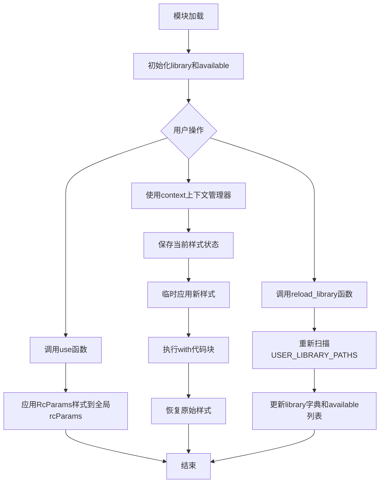
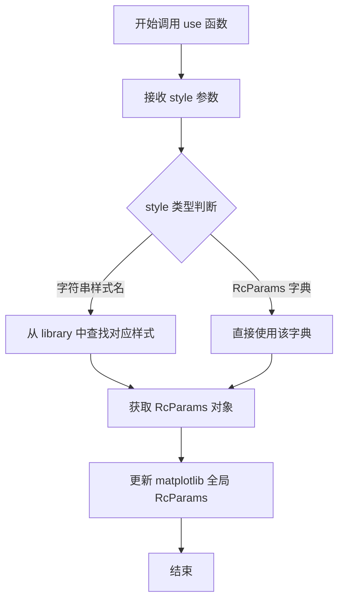
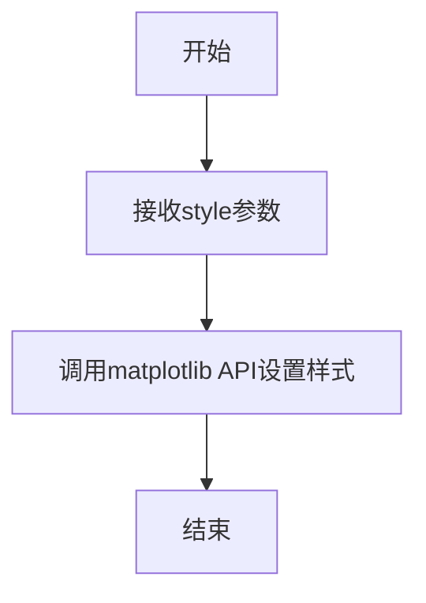
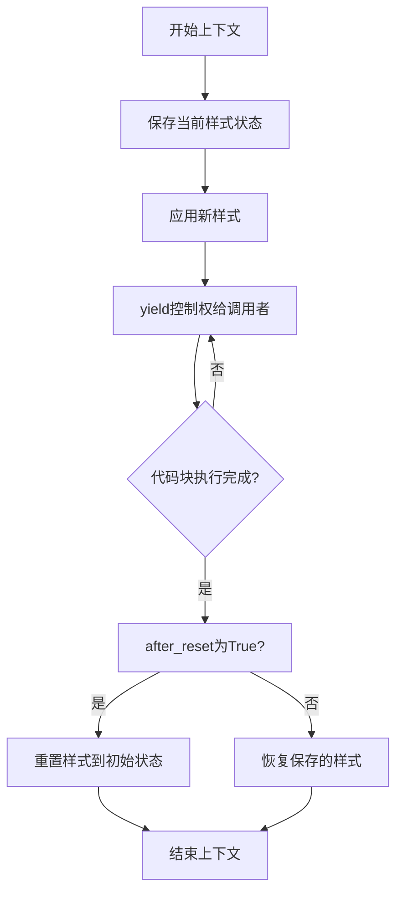
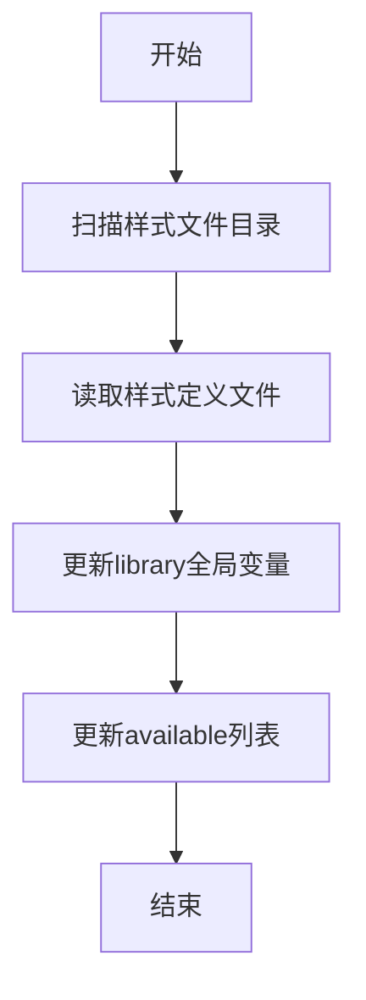
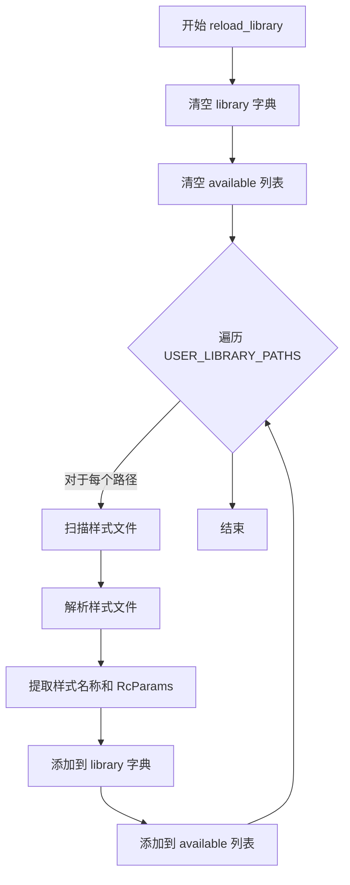

# `matplotlib\lib\matplotlib\style\__init__.pyi` 详细设计文档

这是一个matplotlib样式管理系统模块，提供样式应用（use）、样式上下文管理器（context）和样式库重载（reload_library）功能，允许用户动态切换matplotlib的RcParams视觉配置，支持用户自定义样式路径和预定义样式库的动态更新。

## 整体流程



## 类结构

```
matplotlib.style（模块文件）
├── 全局变量
│   ├── USER_LIBRARY_PATHS: list[str]
│   ├── library: dict[str, RcParams]
│   └── available: list[str]
└── 全局函数
    ├── use(style: RcStyleType)
    ├── context(style: RcStyleType, after_reset: bool)
    └── reload_library()
```

## 全局变量及字段


### `USER_LIBRARY_PATHS`
    
A list of strings representing user-defined library paths for loading matplotlib styles

类型：`list[str]`
    


### `library`
    
A dictionary mapping style names to their corresponding RcParams configuration objects

类型：`dict[str, RcParams]`
    


### `available`
    
A list of available style names that can be used with the style module

类型：`list[str]`
    


    

## 全局函数及方法


### `use`

设置matplotlib的全局样式（RcParams），将给定的样式配置应用到当前的matplotlib配置中。

参数：

-  `style`：`RcStyleType`，要应用的样式配置，可以是字符串（样式名称）或 RcParams 字典

返回值：`None`，无返回值，此函数直接修改matplotlib的全局配置状态

#### 流程图



#### 带注释源码

```python
def use(style: RcStyleType) -> None: ...
"""
设置matplotlib的全局样式。

参数:
    style: RcStyleType 类型，可以是:
        - str: 样式名称 (如 'seaborn-darkgrid')
        - RcParams: 样式参数字典
        - dict: 符合 RcParams 格式的字典

返回值:
    None: 直接修改 matplotlib 的全局配置，不返回任何值

示例:
    >>> use('default')  # 使用预定义样式
    >>> use({'lines.linewidth': 2})  # 自定义样式
"""
```


### `use`

设置matplotlib的RcParams样式参数。

参数：

- `style`：`RcStyleType`，要应用的样式配置

返回值：`None`，无返回值

#### 流程图



#### 带注释源码

```python
def use(style: RcStyleType) -> None: ...
    """
    使用指定的样式配置来设置matplotlib的RC参数。
    
    参数:
        style: RcStyleType, 样式配置类型，可以是字典或其他支持的样式格式
    返回值:
        None
    """
```

---

### `context`

作为上下文管理器，在代码块执行期间临时应用样式，并在块结束时可选地重置样式。

参数：

- `style`：`RcStyleType`，要应用的样式配置
- `after_reset`：`bool`，可选参数，默认为`...`，表示在上下文结束后是否重置样式

返回值：`Generator[None, None, None]`，生成器对象，用于上下文管理

#### 流程图



#### 带注释源码

```python
@contextlib.contextmanager
def context(
    style: RcStyleType, after_reset: bool = ...
) -> Generator[None, None, None]:
    """
    创建一个上下文管理器，用于临时应用matplotlib样式。
    
    参数:
        style: RcStyleType, 要应用的样式配置
        after_reset: bool, 可选参数，控制在上下文结束后是否重置样式
                    默认为省略值(...)，表示使用默认行为
    
    返回值:
        Generator[None, None, None], 生成器对象，用于上下文管理协议
    """
    # 1. 保存当前matplotlib的RC参数状态
    # 2. 应用传入的style配置
    # 3. yield控制权给with语句块
    # 4. 块执行完成后，根据after_reset决定是否重置样式
    # 5. 恢复之前保存的样式状态
```

---

### `reload_library`

重新加载样式库，使样式文件系统中最近的更改生效。

参数：

无

返回值：`None`，无返回值

#### 流程图



#### 带注释源码

```python
def reload_library() -> None:
    """
    重新扫描并加载matplotlib样式库。
    
    该函数会重新读取USER_LIBRARY_PATHS中的样式文件，
    更新library字典和available列表，使样式系统反映最新的文件系统状态。
    
    参数:
        无
    返回值:
        None
    """
```

---

### `library`

存储所有可用的matplotlib样式配置的字典。

变量信息：

- `library`：`dict[str, RcParams]`，键为样式名称字符串，值为对应的RC参数配置对象

#### 带注释源码

```python
library: dict[str, RcParams]
    """
    全局样式库字典。
    
    键: str, 样式名称
    值: RcParams, 包含该样式的所有matplotlib RC参数配置
    """
```

---

### `available`

列出所有可用的样式名称列表。

变量信息：

- `available`：`list[str]`，包含所有已加载样式名称的字符串列表

#### 带注释源码

```python
available: list[str]
    """
    可用样式名称列表。
    
    该列表包含所有当前已加载并可用的样式名称，
    用户可以通过use()或context()函数来应用这些样式。
    """
```

---

### `USER_LIBRARY_PATHS`

用户自定义样式库的搜索路径列表。

变量信息：

- `USER_LIBRARY_PATHS`：`list[str]`，用户样式库文件路径列表

#### 带注释源码

```python
USER_LIBRARY_PATHS: list[str] = ...
    """
    用户定义的样式库搜索路径。
    
    当调用reload_library()时，系统会扫描这些路径来查找
    用户自定义的matplotlib样式配置文件(.mplstyle文件)。
    """
```

---

## 关键组件信息

| 组件名称 | 一句话描述 |
|---------|-----------|
| `use` | 直接应用matplotlib样式配置的函数 |
| `context` | 临时应用样式的上下文管理器 |
| `reload_library` | 重新加载样式库的函数 |
| `library` | 存储所有样式配置的字典 |
| `available` | 可用样式名称列表 |
| `USER_LIBRARY_PATHS` | 用户自定义样式搜索路径 |

## 潜在技术债务与优化空间

1. **类型注解不完整**：`after_reset`参数默认值`...`（省略号）不够明确，应使用`Optional[bool]`或明确的默认值
2. **文档字符串缺失**：主要函数缺少详细的文档说明
3. **错误处理缺失**：未定义样式文件不存在或解析失败时的异常处理
4. **线程安全**：未说明该模块的线程安全特性
5. **样式缓存机制**：未提供样式缓存策略，可能导致频繁IO操作

## 其他项目

### 设计目标

- 提供灵活的方式来管理和应用matplotlib的样式配置
- 支持用户自定义样式库路径
- 通过上下文管理器实现样式的作用域控制

### 约束

- 依赖`matplotlib`库的核心功能
- 样式配置必须符合`RcStyleType`类型定义
- 需要文件系统访问权限来读取样式文件

### 错误处理

当前代码中未显式定义错误处理机制，但应考虑：
- 样式文件不存在时的`FileNotFoundError`
- 样式配置格式错误时的`ValueError`
- 样式名称重复时的覆盖策略


### `reload_library`

该函数用于重新加载matplotlib的样式库，扫描用户定义的样式路径，更新全局可用的样式列表和对应的样式参数字典，使新的样式配置生效。

参数：
- 无参数

返回值：`None`，无返回值，执行副作用操作（重新加载样式库数据）

#### 流程图



#### 带注释源码

```python
def reload_library() -> None:
    """
    重新加载matplotlib样式库。
    
    该函数执行以下操作：
    1. 清空现有的 library 字典和 available 列表
    2. 扫描 USER_LIBRARY_PATHS 中定义的所有路径
    3. 解析每个路径下的样式文件
    4. 将解析后的样式名称和 RcParams 更新到全局状态
    
    注意：这是一个空实现（存根），实际功能需要根据具体需求完成。
    """
    # 全局变量声明
    global library, available
    
    # 步骤1：清空现有的样式库数据
    library.clear()  # 清空样式参数字典
    available.clear()  # 清空可用样式名称列表
    
    # 步骤2-4：遍历用户库路径并加载样式
    # 注意：此处为逻辑框架，实际实现需要：
    # for path in USER_LIBRARY_PATHS:
    #     for style_file in os.listdir(path):
    #         if is_style_file(style_file):
    #             style_name = extract_style_name(style_file)
    #             style_params = load_style_file(style_file)
    #             library[style_name] = style_params
    #             available.append(style_name)
    
    return None  # 无返回值，执行副作用操作
```

## 关键组件


### USER_LIBRARY_PATHS

用户定义的matplotlib样式库搜索路径列表，用于定位样式配置文件。

### use 函数

接受一个RcStyleType类型的样式参数，将指定的样式应用到matplotlib的全局rcParams中，无返回值。

### context 上下文管理器

提供一个临时的样式上下文，允许在with块内临时应用样式，块执行完毕后自动恢复原始设置。支持after_reset参数控制是否在重置后应用样式。

### library 字典

存储所有已加载的matplotlib样式配置，以样式名称为键，RcParams对象为值的字典结构。

### available 列表

列出所有可用的样式名称，供用户选择和切换。

### reload_library 函数

重新扫描样式库路径，刷新library字典和available列表，以加载新增或修改的样式文件。

### RcParams 类型

matplotlib的配置参数对象，包含所有可配置的绘图样式选项，如线条宽度、颜色、字体等。

### RcStyleType 类型

样式参数的类型定义，可以是样式名称字符串、文件路径或RcParams对象。


## 问题及建议


### 已知问题

- **代码未实现**：所有函数和变量使用 `...` 作为占位符，无实际实现逻辑，无法正常运行
- **类型注解不完整**：`USER_LIBRARY_PATHS` 和 `after_reset` 参数使用 `...` 作为默认值，语义不明确
- **全局可变状态**：`library` 和 `available` 作为全局变量存在，缺乏线程安全性，多线程并发访问可能导致竞态条件
- **缺少错误处理**：函数定义中未体现任何异常处理逻辑（如样式文件不存在、解析失败等场景）
- **功能不明确**：`reload_library()` 无参数设计，当库路径动态变化时无法指定刷新特定路径
- **缺少文档字符串**：所有函数和模块缺少 docstring，无法了解具体用法和约束条件

### 优化建议

- **补充完整实现**：将 `...` 替换为实际的函数实现逻辑
- **添加类型默认值**：为 `after_reset` 参数提供明确的默认布尔值（如 `False`）
- **引入线程安全机制**：使用线程锁（如 `threading.Lock`）保护全局状态 `library` 和 `available` 的读写操作
- **增强函数设计**：`reload_library()` 考虑增加可选的路径参数，支持部分刷新
- **添加异常处理**：为文件读取、解析失败等场景添加 try-except 捕获和自定义异常
- **补充文档**：为模块和所有公共函数添加 docstring，说明参数含义、返回值和使用示例
- **考虑状态封装**：将 `library` 和 `available` 封装为类的私有属性，提供 getter 方法，提高可维护性

## 其它


### 设计目标与约束

本模块旨在提供matplotlib样式（theme）管理的统一接口，允许用户动态切换和应用不同的视觉配置。约束包括：必须与matplotlib的RcParams系统兼容，样式定义必须遵循matplotlib的配置规范，仅支持字典形式的样式传递，不支持动态样式创建。

### 错误处理与异常设计

模块不显式定义异常类，错误处理依赖matplotlib底层的参数验证。当样式名称不存在时，available列表中不包含该名称，访问library中不存在的键会抛出KeyError。use函数在应用无效样式时，matplotlib内部会抛出异常。context上下文管理器在异常发生时保证样式恢复。

### 数据流与状态机

数据流：用户调用use(style) → 验证样式有效性 → 通过matplotlib.pyplot.rcParams.update()应用样式 → 全局样式状态变更。用户调用context(style) → 进入上下文 → 保存当前样式 → 应用新样式 → 执行用户代码 → 退出上下文 → 恢复原样式。

### 外部依赖与接口契约

外部依赖：matplotlib库（matplotlib.typing.RcStyleType, matplotlib.RcParams），collections.abc模块，contextlib模块。接口契约：use函数接受RcStyleType类型参数，无返回值；context函数返回Generator[None, None, None]类型；library为dict[str, RcParams]类型；available为list[str]类型。

### 性能考虑

样式切换操作涉及字典复制和RcParams更新，性能开销主要取决于matplotlib内部实现。context上下文管理器在样式未变化时可优化跳过恢复操作。reload_library函数涉及文件系统扫描，可能有IO性能开销。

### 安全性考虑

USER_LIBRARY_PATHS为模块级变量，需确保路径来源可信，防止路径遍历攻击。样式加载不执行用户提供的代码，仅解析配置文件。library字典中的RcParams对象不应被直接修改。

### 版本兼容性

代码使用Python 3.9+的类型注解（list[str]语法），需要Python 3.9及以上版本。与matplotlib版本的兼容性取决于RcParams和RcStyleType的类型定义是否稳定。

### 测试策略

测试应覆盖：use函数正确应用样式，context管理器正确保存和恢复样式，library字典包含预期的样式，available列表反映可用的样式名称，reload_library函数正确重新加载样式。

### 配置管理

样式配置存储在USER_LIBRARY_PATHS指定的目录中，配置格式为matplotlib标准的rcparams文件格式。reload_library函数用于动态刷新配置，无需重启应用程序。


    