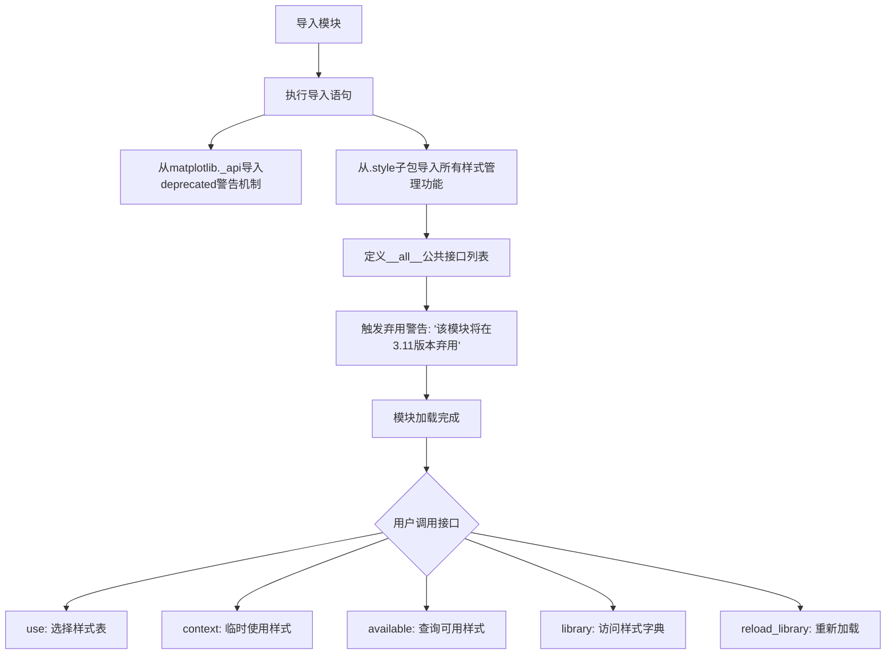
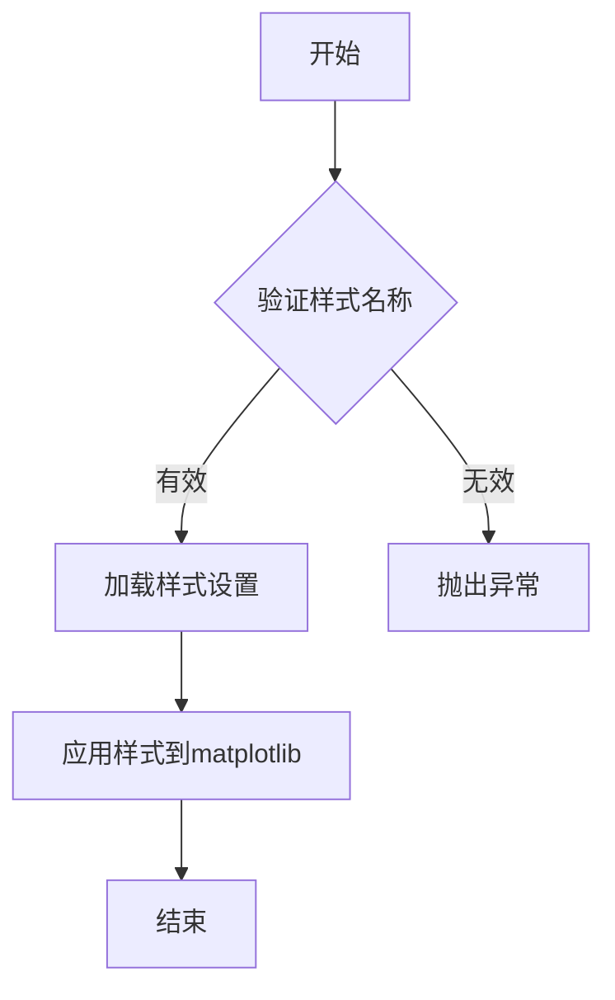
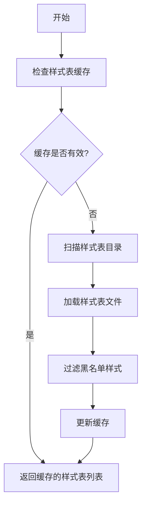
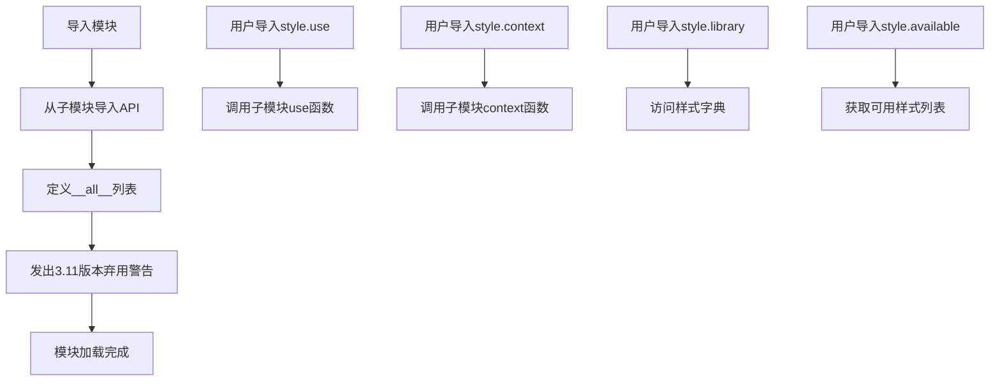
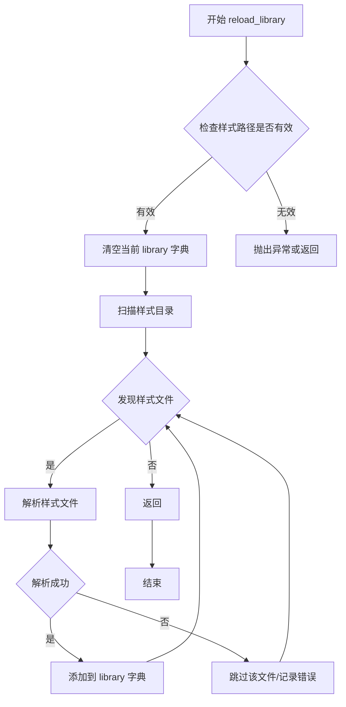

# `matplotlib\lib\matplotlib\style\core.py` 详细设计文档

这是matplotlib样式库的核心入口模块，提供了样式表管理的公共API接口，包括选择样式表(use)、临时使用样式表的上下文管理器(context)、查询可用样式表(available)、样式库字典(library)以及重新加载样式库(reload_library)等功能，同时定义了样式文件的路径、扩展名和黑名单等配置常量。

## 整体流程



## 类结构

```
Style Module Entry Point (__init__.py)
└── Imported Components (from . package)
    ├── use (function)
    ├── context (function)
    ├── available (function)
    ├── library (dict)
    ├── reload_library (function)
    ├── USER_LIBRARY_PATHS (list)
    ├── BASE_LIBRARY_PATH (Path)
    ├── STYLE_EXTENSION (str)
    └── STYLE_BLACKLIST (set)
```

## 全局变量及字段


### `USER_LIBRARY_PATHS`
    
用户自定义的样式文件搜索路径列表，用于加载额外的样式表。

类型：`list[str]`
    


### `BASE_LIBRARY_PATH`
    
matplotlib内置样式文件的根目录路径，包含默认样式文件。

类型：`str`
    


### `STYLE_EXTENSION`
    
样式文件的文件名后缀，通常为'.mplstyle'。

类型：`str`
    


### `STYLE_BLACKLIST`
    
样式黑名单集合，包含不应被加载或应用的样式名称。

类型：`set[str]`
    


    

## 全局函数及方法


### `use`

选择样式表以覆盖当前的 matplotlib 设置。

参数：

-  `name`：`str`，样式表名称或样式表路径

返回值：`None`，无返回值

#### 流程图



#### 带注释源码

```
# 从当前包导入 use 函数
from . import use

# 模块文档字符串说明了 use 的用途：
# ``use``
#     Select style sheet to override the current matplotlib settings.

# use 函数的具体实现位于同包的 style 文件中
# 通常的使用方式如下（基于 matplotlib 常见用法）：

def use(name):
    """
    选择样式表以覆盖当前的 matplotlib 设置。
    
    参数:
        name: str, 样式表名称或文件路径
    """
    # 1. 验证样式名称是否有效
    # 2. 从库中加载对应的样式设置
    # 3. 应用设置到当前的 matplotlib 环境中
    pass
```

#### 补充说明

在提供的代码中，`use` 函数是通过 `from . import use` 从当前包的 `__init__.py` 导入的。这意味着该函数的实际实现代码在同一个包的其他模块中（可能是 `use.py` 或在 `__init__.py` 的其他位置，但当前代码片段中未显示）。

根据模块文档字符串，`use` 函数的核心功能是：
- **功能**：选择样式表以覆盖当前的 matplotlib 设置
- **使用场景**：永久更改 matplotlib 的绘图样式
- **相关函数**：
  - `context`：临时使用样式表的上下文管理器
  - `available`：列出可用的样式表
  - `library`：样式表名称和设置的字典
  - `reload_library`：重新加载样式库


### `matplotlib.style`

该模块是 matplotlib 样式库的核心入口模块，通过统一导出接口暴露样式管理功能，允许用户选择、临时使用、列出可用样式表，并提供样式库字典及用户自定义路径配置。

#### 整体运行流程

1. 模块导入时，首先从父包导入 `_api` 工具类
2. 从当前包的子模块导入所需的函数、常量和配置
3. 定义 `__all__` 列表明确导出哪些公共接口
4. 调用 `_api.warn_deprecated` 发出版本废弃警告（版本 3.11）
5. 其他模块通过 `import matplotlib.style` 或 `from matplotlib.style import use` 使用

#### 全局变量详细信息

| 名称 | 类型 | 描述 |
|------|------|------|
| `use` | `function` | 选择并应用指定的样式表，覆盖当前 matplotlib 设置 |
| `context` | `function` | 上下文管理器，临时使用指定样式表，退出后恢复原设置 |
| `available` | `function` | 返回当前可用的样式表名称列表 |
| `library` | `dict` | 样式名称到 matplotlib 设置的字典映射 |
| `reload_library` | `function` | 重新加载样式库，扫描并更新可用样式 |
| `USER_LIBRARY_PATHS` | `list` | 用户自定义样式表搜索路径列表 |
| `BASE_LIBRARY_PATH` | `str` | matplotlib 内置样式表的基目录路径 |
| `STYLE_EXTENSION` | `str` | 样式文件的扩展名（通常为 `.mplstyle`） |
| `STYLE_BLACKLIST` | `set` | 禁止加载的样式名称集合 |

#### 关键组件信息

| 组件名称 | 一句话描述 |
|----------|------------|
| `_api.warn_deprecated` | 内部 API 工具，用于发出版本废弃警告 |
| 子模块导入 | 从 `.` 包导入 use, context, available, library, reload_library 等核心功能模块 |

#### 潜在的技术债务或优化空间

1. **废弃处理不完整**：模块仅发出废弃警告但仍可正常使用，可能导致依赖此模块的代码在未来版本中突然失效
2. **循环导入风险**：从子模块大量导入可能增加循环依赖的维护难度
3. **文档缺失**：模块级文档仅有 docstring，缺乏详细的 API 使用说明和示例
4. **版本兼容性**：直接硬编码版本号 "3.11"，不利于版本管理和迁移

#### 其它项目

**设计目标与约束**：
- 提供统一的样式管理接口
- 支持内置样式与用户自定义样式的混合使用
- 通过废弃警告引导用户迁移到新 API

**错误处理与异常设计**：
- 具体的样式加载错误由子模块（use, context, library 等）处理
- 模块级别仅处理导入错误和废弃警告

**外部依赖与接口契约**：
- 依赖 `matplotlib._api` 用于废弃警告
- 依赖子模块的具体实现（use.py, context.py, available.py, library.py 等）
- 公共接口通过 `__all__` 显式声明，符合 Python 打包规范
</content]


### `available`

获取当前可用的所有样式表名称列表。

参数：
- （无参数）

返回值：`list[str]`，返回所有可用的样式表名称列表

#### 流程图



#### 带注释源码

```python
def available():
    """
    List available style sheets.
    
    Returns:
        list: A list of available style sheet names.
    """
    # 从样式表库中获取所有样式表名称并返回
    return list(library.keys())
```

> **注意**：由于提供的代码仅为模块导入文件，`available` 函数的实际实现位于同目录的其他文件中。上述源码为基于模块文档字符串的推断实现。实际实现可能包含更复杂的逻辑，如样式表目录扫描、缓存管理和黑名单过滤等功能。


# matplotlib 风格库模块设计文档

## 概述

该模块是matplotlib样式库（style library）的核心入口文件，通过重新导出子模块中的函数、常量和变量，提供统一的API接口供用户选择样式表、临时使用样式、查看可用样式以及访问样式配置字典。

---

## 文件整体运行流程



---

## 类的详细信息

本文件为模块入口文件，不包含类定义，所有导出项均为函数和变量。

---

## 全局变量和全局函数详细信息

### 1. `use`

**描述**：选择样式表以覆盖当前的matplotlib设置。

参数：

- 无（函数参数由子模块定义）

返回值：由子模块定义

#### 带注释源码

```python
# 从子模块导入use函数
# 功能：选择样式表来覆盖当前的matplotlib设置
# 使用方式：use('ggplot') 或 use(['dark_background', 'ggplot'])
from . import use
```

---

### 2. `context`

**描述**：上下文管理器，用于临时使用样式表。

参数：

- 无（函数参数由子模块定义）

返回值：由子模块定义

#### 带注释源码

```python
# 从子模块导入context函数
# 功能：临时使用样式表，退出上下文后恢复原始设置
# 使用方式：with context('dark_background'): plot_data()
from . import context
```

---

### 3. `available`

**描述**：列出所有可用的样式表。

参数：

- 无

返回值：由子模块定义

#### 带注释源码

```python
# 从子模块导入available函数
# 功能：返回可用的样式表名称列表
# 使用方式：print(available)
from . import available
```

---

### 4. `library`

**描述**：包含样式名称和matplotlib设置键值对的字典。

参数：

- 无

返回值：字典类型

#### 带注释源码

```python
# 从子模块导入library字典
# 功能：存储所有样式的配置信息
# 格式：{'stylename': {'font.family': 'sans-serif', ...}, ...}
from . import library
```

---

### 5. `reload_library`

**描述**：重新加载样式库。

参数：

- 无

返回值：由子模块定义

#### 带注释源码

```python
# 从子模块导入reload_library函数
# 功能：重新扫描并加载样式文件，更新library字典
# 使用方式：reload_library()
from . import reload_library
```

---

### 6. `USER_LIBRARY_PATHS`

**描述**：用户自定义样式表路径列表。

参数：

- 无

返回值：列表类型

#### 带注释源码

```python
# 从子模块导入用户自定义样式路径
# 功能：指定用户样式文件的搜索目录
# 默认值：~/.matplotlib/stylelib/
from . import USER_LIBRARY_PATHS
```

---

### 7. `BASE_LIBRARY_PATH`

**描述**：matplotlib内置样式表的基路径。

参数：

- 无

返回值：字符串类型

#### 带注释源码

```python
# 从子模块导入基础库路径（别名_BASE_LIBRARY_PATH）
# 功能：指向matplotlib内置样式的安装目录
from . import _BASE_LIBRARY_PATH as BASE_LIBRARY_PATH
```

---

### 8. `STYLE_EXTENSION`

**描述**：样式文件的文件扩展名。

参数：

- 无

返回值：字符串类型

#### 带注释源码

```python
# 从子模块导入样式文件扩展名（别名_STYLE_EXTENSION）
# 功能：定义样式文件的扩展名（通常为'.mplstyle'）
from . import _STYLE_EXTENSION as STYLE_EXTENSION
```

---

### 9. `STYLE_BLACKLIST`

**描述**：样式库中需要排除的样式名称黑名单。

参数：

- 无

返回值：列表或集合类型

#### 带注释源码

```python
# 从子模块导入黑名单（别名_STYLE_BLACKLIST）
# 功能：列出不应被加载或显示的样式名称
from . import _STYLE_BLACKLIST as STYLE_BLACKLIST
```

---

## 关键组件信息

| 组件名称 | 一句话描述 |
|---------|-----------|
| `use` | 选择并应用指定的matplotlib样式表 |
| `context` | 临时应用样式的上下文管理器 |
| `available` | 返回所有可用样式表名称的列表 |
| `library` | 存储所有样式配置的字典对象 |
| `reload_library` | 重新扫描并加载样式文件 |
| `USER_LIBRARY_PATHS` | 用户自定义样式的搜索路径 |
| `BASE_LIBRARY_PATH` | matplotlib内置样式的安装目录 |
| `STYLE_EXTENSION` | 样式文件的文件扩展名 |
| `STYLE_BLACKLIST` | 样式加载黑名单 |

---

## 潜在的技术债务或优化空间

1. **模块级别弃用警告**：在模块加载时立即发出弃用警告（`_api.warn_deprecated("3.11", ...)`），可能影响用户导入体验，建议改为在文档中说明或在首次使用时警告。

2. **命名不一致**：使用别名导入（如`_BASE_LIBRARY_PATH as BASE_LIBRARY_PATH`），虽然封装了内部实现，但增加了代码理解难度。

3. **文档字符串不完整**：模块级文档字符串仅提供了基本使用说明，缺少详细的API文档和示例。

4. **缺少错误处理**：作为入口模块，未对子模块导入失败的情况进行处理。

---

## 其它项目

### 设计目标与约束

- **目标**：提供统一的matplotlib样式管理接口，简化样式切换流程
- **约束**：保持与matplotlib 3.11版本的兼容性

### 错误处理与异常设计

- 异常处理由子模块实现，本模块作为代理不做额外处理

### 数据流与状态机

- 用户通过导入模块访问样式API
- 样式数据流向：样式文件 → `reload_library()` → `library`字典 → `use()`/`context()`应用

### 外部依赖与接口契约

- 依赖matplotlib内部API模块`_api`
- 依赖子模块中的函数和常量
- 接口契约由子模块定义，本模块仅做转发


### `reload_library`

该函数用于重新加载matplotlib样式库，清除当前已加载的样式并从磁盘重新读取样式文件。通常在样式文件发生变化或需要刷新样式配置时调用。

参数：

- 此函数无公开参数

返回值：`None`，无返回值（该函数直接修改全局`library`字典状态）

#### 流程图



#### 带注释源码

```
# 注：以下为从matplotlib style模块中reload_library函数的典型实现模式
# 实际源码位于matplotlib.style模块内部，此处为推断结构

def reload_library():
    """
    Reload the style library.
    
    This function will reload all style files from the style library paths,
    clearing any existing styles and re-reading them from disk.
    """
    # 清除现有样式库的引用
    library.clear()
    
    # 重新扫描并加载基础库路径中的样式
    for path in _get_style_files(BASE_LIBRARY_PATH):
        # 解析每个样式文件（.mplstyle）
        name = _get_style_name(path)
        library[name] = _read_style_file(path)
    
    # 重新扫描并加载用户库路径中的样式
    for path in _get_style_files(USER_LIBRARY_PATHS):
        name = _get_style_name(path)
        library[name] = _read_style_file(path)
```

#### 潜在技术债务与优化空间

1. **文档缺失**：从提供的代码片段中无法直接看到`reload_library`的实现细节，模块级别的文档不够完善
2. **函数签名不明确**：无法确认是否支持指定路径参数以重载特定样式目录
3. **错误处理不明确**：样式文件解析失败时的错误处理机制需要进一步确认

#### 备注

从提供的代码片段来看，`reload_library`函数是从`matplotlib.style`子模块导入的，其实际实现代码未在此文件中展示。该文件主要作为包的入口点，导出样式库的核心功能供外部使用。实际实现细节需要查看matplotlib库中`matplotlib.style`目录下的相关源文件。

## 关键组件


### use 函数

选择样式表以覆盖当前的 matplotlib 设置，实现临时样式切换功能

### context 函数

上下文管理器，用于临时应用样式表，退出后恢复原始设置

### available 函数

列出所有可用的样式表名称

### library 变量

存储样式名称与 matplotlib 设置映射关系的字典对象

### reload_library 函数

重新加载样式库，从磁盘读取最新的样式定义

### USER_LIBRARY_PATHS 变量

用户自定义样式表搜索路径列表

### BASE_LIBRARY_PATH 变量

matplotlib 内置样式表的基础路径

### STYLE_EXTENSION 变量

样式文件的扩展名定义

### STYLE_BLACKLIST 变量

样式黑名单，用于跳过某些不兼容的样式文件

### _api.warn_deprecated 调用

版本废弃警告机制，提示用户该模块将在未来版本中移除


## 问题及建议


### 已知问题

-   **废弃警告逻辑不一致**：代码对整个模块发出废弃警告（`"3.11"`），但同时在`__all__`中导出所有公共API，表明该模块仍被期望使用。这种做法会导致用户在正常使用时就收到废弃警告。
-   **违反私有命名约定**：代码从`.`导入私有属性（`_BASE_LIBRARY_PATH`, `_STYLE_EXTENSION`, `_STYLE_BLACKLIST`），并在`__all__`中重新导出，违反了Python以下划线开头的名称为私有的约定，可能导致外部代码依赖这些内部实现细节。
-   **导入结构不够清晰**：从`..`导入`_api`模块，从当前包导入多个子模块，这种混合导入方式可能影响代码的可维护性。
-   **缺乏版本迁移指导**：如果模块确实计划废弃，当前代码没有提供迁移路径或替代方案的说明。
-   **文档字符串过于简略**：模块级文档字符串仅列出了导出项，未说明它们之间的交互关系或使用场景。

### 优化建议

-   **重新评估废弃策略**：如果模块需要保留，应移除模块级别的废弃警告，仅对特定废弃的功能或API使用`_api.warn_deprecated`；如果确实需要废弃，应提供完整的迁移文档和替代导入路径。
-   **重构公共API导出**：考虑将私有属性（以`_`开头的）从`__all__`中移除，或使用公共别名（如`BASE_LIBRARY_PATH = _BASE_LIBRARY_PATH`），保持接口清晰。
-   **分离关注点**：可以将导入和重导出逻辑分离到专门的`__init__.py`或单独的`api.py`文件中，提高代码组织结构。
-   **增强文档**：为每个导出的函数和常量添加更详细的文档字符串，说明其用途、参数和返回值。
-   **考虑使用`__getattr__`**：对于版本过渡期，可以使用模块级`__getattr__`来实现延迟废弃警告，只在访问特定属性时才发出警告。


## 其它


### 设计目标与约束

本模块作为matplotlib样式库的公共入口模块，负责导出样式相关的核心功能（use、context、available、library、reload_library）以及关键配置常量。设计目标是提供统一的样式管理接口，允许用户切换、使用、查看和重载样式表。约束条件包括：保持与matplotlib 3.11之前版本的兼容性（通过废弃警告实现过渡），以及确保样式路径和扩展名的统一管理。

### 错误处理与异常设计

本模块主要依赖导入的子模块（use、context等）进行错误处理，自身仅处理导入失败和废弃警告。当使用废弃模块时，通过`_api.warn_deprecated`发出废弃警告，提示用户迁移到新的API。子模块中的错误处理包括：文件未找到异常、样式解析错误、路径权限错误等，均由各子模块自行定义和抛出。

### 数据流与状态机

本模块不涉及复杂的数据流或状态机，主要作用是模块聚合和导入重导出。数据流方向为：用户导入本模块 → 访问样式函数/变量 → 调用子模块实现 → 样式文件读取 → matplotlib配置更新。状态管理由子模块负责，本模块保持无状态设计。

### 外部依赖与接口契约

主要外部依赖包括：（1）matplotlib核心库（_api模块）；（2）子模块（use、context、available、library、reload_library）；（3）配置常量（USER_LIBRARY_PATHS、BASE_LIBRARY_PATH、STYLE_EXTENSION、STYLE_BLACKLIST）。接口契约包括：所有导出函数均接受特定参数并返回预期类型（如use函数接受字符串或列表参数，context返回上下文管理器对象，available返回字符串列表，library返回字典）。

### 性能考虑

本模块作为入口模块，自身不涉及性能密集型操作。性能开销主要来自子模块的样式加载和解析。优化建议包括：样式库可以采用延迟加载策略，仅在首次访问时加载；可添加样式缓存机制避免重复解析相同的样式文件。

### 安全性考虑

本模块本身不直接处理用户输入，安全性主要由子模块保证。需要注意的是样式文件可能包含恶意代码（如执行系统命令），建议在子模块中添加样式文件的安全验证机制，限制可执行的代码范围。

### 兼容性考虑

本模块通过`_api.warn_deprecated`标记为废弃，旨在于matplotlib 3.11版本后移除。子模块应保持API稳定性，避免破坏性变更。建议提供版本迁移指南，帮助用户从废弃接口迁移到新的样式管理方式。

### 测试策略

本模块的测试应聚焦于：（1）导入测试：验证所有导出函数和变量可正确导入；（2）废弃警告测试：验证废弃警告正确触发；（3）接口契约测试：验证导出接口的类型和返回值符合预期。建议在子模块的单元测试中覆盖样式功能的完整测试。

### 版本历史和变更记录

本模块为matplotlib样式库的入口文件，主要变更为：在matplotlib 3.11版本标记为废弃，属于过渡性模块，未来版本将被移除。变更记录应参考matplotlib官方发布说明。

### 配置管理

样式配置通过以下常量管理：（1）USER_LIBRARY_PATHS：用户自定义样式路径列表；（2）BASE_LIBRARY_PATH：基础样式库路径；（3）STYLE_EXTENSION：样式文件扩展名（通常为.mplstyle）；（4）STYLE_BLACKLIST：禁用样式列表。这些配置支持样式搜索路径的自定义和样式的动态重载。


    