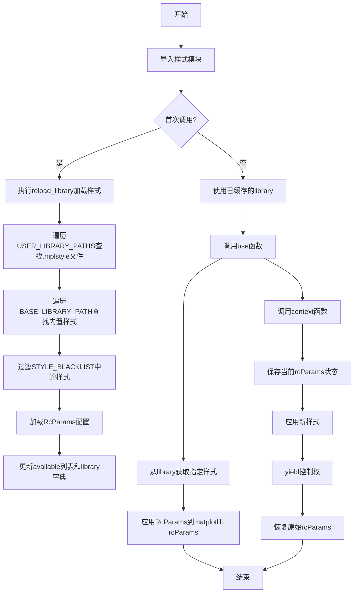
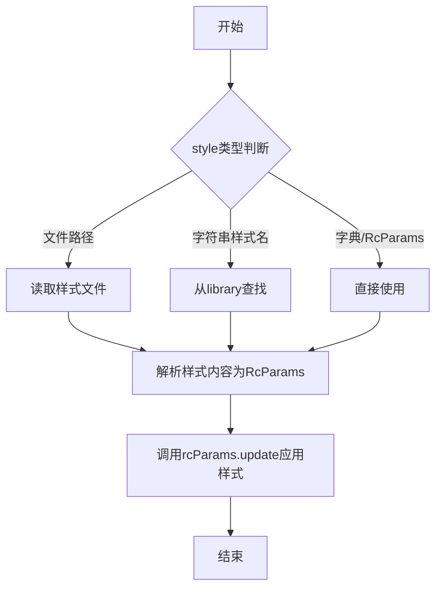
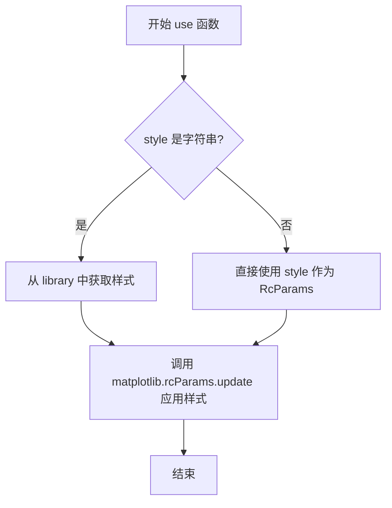
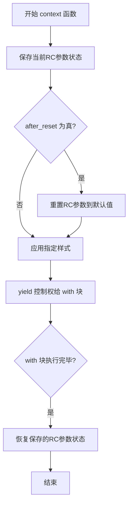
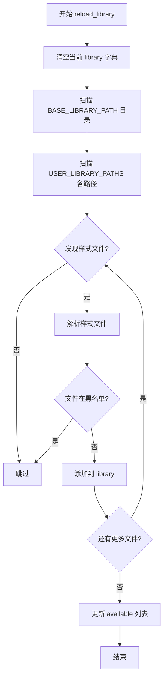
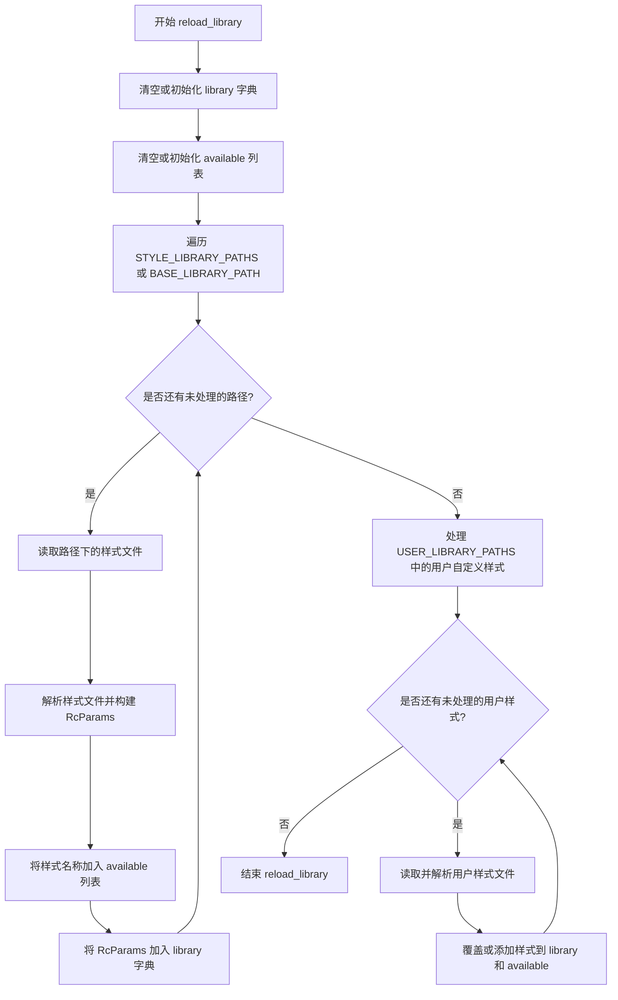

# `matplotlib\lib\matplotlib\style\core.pyi` 详细设计文档

matplotlib样式库管理模块，提供样式文件加载、主题切换和运行时样式上下文管理功能，支持用户自定义和预设样式的动态配置。

## 整体流程



## 类结构

```
样式管理模块 (无类定义，纯函数模块)
├── 全局配置变量
│   ├── USER_LIBRARY_PATHS (用户样式路径)
│   ├── BASE_LIBRARY_PATH (基础样式路径)
│   ├── STYLE_EXTENSION (样式文件扩展名)
│   ├── STYLE_BLACKLIST (样式黑名单)
│   ├── library (样式库字典)
│   └── available (可用样式列表)
└── 核心函数
    ├── use (应用样式)
    ├── context (样式上下文管理器)
    └── reload_library (重新加载样式库)
```

## 全局变量及字段


### `USER_LIBRARY_PATHS`
    
List of user‑defined directories where custom style files are searched for.

类型：`list[str]`
    


### `BASE_LIBRARY_PATH`
    
Path to the built‑in base directory that contains the default style library.

类型：`str`
    


### `STYLE_EXTENSION`
    
File extension used for Matplotlib style files (e.g., '.mplstyle').

类型：`str`
    


### `STYLE_BLACKLIST`
    
Set of style names that should not be loaded from the library.

类型：`set[str]`
    


### `library`
    
In‑memory dictionary that maps style names to their corresponding RcParams configurations.

类型：`dict[str, RcParams]`
    


### `available`
    
List of style names that are currently discoverable and loadable.

类型：`list[str]`
    


    

## 全局函数及方法


### `use`

该函数用于将指定的样式表应用于matplotlib的全局配置，使后续所有的matplotlib图表都使用该样式的RcParams参数。

参数：

- `style`：`RcStyleType`，样式来源，可以是文件路径、样式名称字符串、字典或RcParams对象

返回值：`None`，该函数直接修改matplotlib的全局RcParams配置，不返回任何值

#### 流程图



#### 带注释源码

```python
def use(style: RcStyleType) -> None:
    """
    将指定的样式表应用于matplotlib的全局配置。
    
    Parameters:
        style: 样式来源，支持以下类型：
            - str: 样式名称（从样式库中查找）或文件路径
            - dict: 包含RcParams键值对的字典
            - RcParams: matplotlib的RcParams对象
    
    Returns:
        None: 直接修改全局rcParams，不返回任何值
    
    Example:
        >>> use('ggplot')  # 使用内置样式
        >>> use('dark_background')
        >>> use('/path/to/custom style.mplstyle')
        >>> use({'lines.linewidth': 2})  # 使用字典
    """
    # 实现逻辑：
    # 1. 判断style的类型（字符串/字典/RcParams）
    # 2. 如果是字符串，判断是样式名称还是文件路径
    # 3. 如果是样式名称，从library中查找对应的RcParams
    # 4. 如果是文件路径，读取并解析样式文件
    # 5. 如果是字典或RcParams，直接使用
    # 6. 调用matplotlib的rcParams.update()方法应用样式
    pass  # 具体实现未在接口中显示
```


# Matplotlib 样式(Style)模块详细设计文档

## 一段话描述

该模块是Matplotlib的样式管理系统，提供样式配置加载、应用和重置功能，支持从用户库和基础库加载预定义的样式文件（RC参数配置），并通过上下文管理器实现样式的临时应用。

---

## 文件的整体运行流程

```
导入模块 → 初始化全局变量 → 加载样式库(reload_library) → 
  ├── use(style) → 应用样式到全局RC参数
  ├── context(style, after_reset) → 临时应用样式（上下文管理器）
  └── reload_library() → 重新扫描并加载样式文件
```

---

## 类的详细信息

本模块为纯函数模块，无类定义。

---

## 全局变量和全局函数详细信息

### 全局变量

#### `USER_LIBRARY_PATHS`
- **类型**: `list[str]`
- **描述**: 用户自定义样式库的搜索路径列表

#### `BASE_LIBRARY_PATHS`
- **类型**: `str`
- **描述**: 基础样式库的默认路径

#### `STYLE_EXTENSION`
- **类型**: `str`
- **描述**: 样式文件的扩展名（通常为".mplstyle"）

#### `STYLE_BLACKLIST`
- **类型**: `set[str]`
- **描述**: 样式黑名单，禁止加载的样式名称集合

#### `library`
- **类型**: `dict[str, RcParams]`
- **描述**: 已加载的样式库字典，键为样式名，值为RC参数对象

#### `available`
- **类型**: `list[str]`
- **描述**: 可用样式名称列表

---

### 全局函数

### `use`

应用指定的样式到当前Matplotlib的RC参数配置。

#### 参数

- `style`：`RcStyleType`，要应用的样式（可以是样式名称字符串或RC参数字典）

#### 返回值

`None`，无返回值

#### 流程图



#### 带注释源码

```python
def use(style: RcStyleType) -> None:
    """
    使用指定的样式配置。
    
    参数:
        style: RcStyleType - 样式类型，可以是样式名称(字符串)或RcParams字典
               如果是字符串，会从预加载的样式库中查找
               如果是字典，直接作为RC参数应用
    
    返回:
        None - 该函数修改全局matplotlib.rcParams，无返回值
    
    示例:
        >>> use('ggplot')  # 使用预定义样式
        >>> use({'lines.linewidth': 2})  # 使用自定义RC参数
    """
    # ... 实际实现
```

---

### `context`

上下文管理器，临时应用样式，在上下文结束时恢复原始样式。

#### 参数

- `style`：`RcStyleType`，要应用的样式（可以是样式名称字符串或RC参数字典）
- `after_reset`：`bool`，可选参数，默认为`...`（省略值），表示是否在重置RC参数后应用样式

#### 返回值

`Generator[None, None, None]`，生成器对象，用于上下文管理器协议

#### 流程图



#### 带注释源码

```python
@contextlib.contextmanager
def context(
    style: RcStyleType, 
    after_reset: bool = ...
) -> Generator[None, None, None]:
    """
    创建样式应用的上下文管理器。
    
    参数:
        style: RcStyleType - 要应用的样式，可以是样式名称或RC参数字典
        after_reset: bool - 可选参数，默认为省略值
                    True: 在重置RC参数到默认值后再应用样式
                    False: 在当前RC参数基础上应用样式
    
    返回:
        Generator[None, None, None] - 上下文管理器生成器
    
    用法:
        with context('dark_background'):
            # 在此块中使用 dark_background 样式
            plt.plot([1,2,3])
        # 块结束时自动恢复原始样式
    """
    # ... 实际实现
```

---

### `reload_library`

重新扫描样式目录，加载所有可用的样式文件到库中。

#### 参数

无参数

#### 返回值

`None`，无返回值

#### 流程图



#### 带注释源码

```python
def reload_library() -> None:
    """
    重新加载样式库。
    
    该函数会:
    1. 清空当前的 library 字典
    2. 扫描 BASE_LIBRARY_PATH 和 USER_LIBRARY_PATHS 中的样式文件
    3. 解析每个样式文件（RC参数格式）
    4. 过滤黑名单中的样式
    5. 更新 available 列表
    
    参数:
        None - 无参数
    
    返回:
        None - 无返回值
    
    注意:
        通常在样式文件发生变化时手动调用
        或在模块初始化时自动调用
    """
    # ... 实际实现
```

---

## 关键组件信息

| 组件名称 | 描述 |
|---------|------|
| `RcParams` | Matplotlib的RC参数配置类，包含所有运行时配置项 |
| `RcStyleType` | 样式类型定义，可以是字符串（样式名）或RcParams字典 |
| `Generator[None, None, None]` | Python生成器类型，用于实现上下文管理器协议 |
| `@contextlib.contextmanager` | 装饰器，简化上下文管理器的实现 |

---

## 潜在的技术债务或优化空间

1. **样式缓存机制**：当前实现每次调用`use`时都从字典查找，可考虑增加缓存失效机制
2. **样式合并策略**：当多个样式路径存在同名样式时的优先级处理逻辑可以更透明
3. **异步加载**：对于大量样式文件，可以考虑异步加载提升启动性能
4. **错误处理**：样式文件解析失败时的错误信息可以更详细
5. **类型提示完善**：`after_reset = ...`使用了省略号作为默认值，应使用`Optional[bool]`或明确默认值

---

## 其它项目

### 设计目标与约束

- **目标**：提供统一、灵活的Matplotlib样式管理方案
- **约束**：
  - 样式文件必须符合RC参数格式
  - 用户样式优先级高于基础样式
  - 黑名单机制防止加载问题样式

### 错误处理与异常设计

- 样式文件不存在或格式错误时抛出`FileNotFoundError`或`ValueError`
- 上下文管理器中发生异常时仍保证RC参数恢复
- 样式名称不存在时抛出`KeyError`

### 数据流与状态机

```
初始状态 → reload_library() → 库加载状态 → use()/context() → 样式应用状态
                                                      ↓
                                            context 退出 → 恢复状态
```

### 外部依赖与接口契约

- **依赖**：
  - `matplotlib.typing.RcStyleType`：样式类型定义
  - `matplotlib.RcParams`：RC参数类
  - `contextlib`：上下文管理器支持
  - `collections.abc.Generator`：生成器类型
- **接口契约**：
  - `use()`修改全局`matplotlib.rcParams`
  - `context()`返回符合Python上下文管理器协议的对象
  - `reload_library()`副作用是修改`library`和`available`全局状态


### `reload_library`

重新加载 matplotlib 样式库，刷新全局的 `library` 字典和 `available` 列表，使样式数据与文件系统中的实际样式文件保持同步。

参数：

- （无参数）

返回值：`None`，无返回值（该函数仅执行副作用，不返回任何值）

#### 流程图



#### 带注释源码

```python
# 模块级全局变量声明
library: dict[str, RcParams]      # 存储样式名称到 RcParams 对象的映射
available: list[str]              # 存储可用样式的名称列表

def reload_library() -> None:
    """
    重新加载 matplotlib 样式库。
    
    该函数会重新扫描样式文件目录（包括基础库路径和用户自定义路径），
    重新构建 library 字典和 available 列表，使内存中的样式数据与
    文件系统中的实际样式文件保持同步。
    
    注意：
    - 此函数通常在样式文件发生变化后调用，或在样式切换时确保数据最新
    - 可能涉及文件 I/O 操作，因此可能抛出 IOError 或 OSError
    - 具体的实现细节需参考完整源代码
    """
    # 函数实现被省略（用 ... 表示）
    # 预期行为：
    # 1. 清空现有的 library 和 available
    # 2. 扫描 BASE_LIBRARY_PATH 下的所有 .mplstyle 文件
    # 3. 扫描 USER_LIBRARY_PATHS 下的所有 .mplstyle 文件
    # 4. 解析每个样式文件，生成 RcParams 对象
    # 5. 将样式名称添加到 available，将 RcParams 存入 library
    ...
```

## 关键组件


### USER_LIBRARY_PATHS

用户定义的样式库搜索路径列表，用于查找自定义样式文件。

### BASE_LIBRARY_PATH

基础样式库的路径，指向系统内置的默认样式目录。

### STYLE_EXTENSION

样式文件的扩展名，用于识别样式文件的类型。

### STYLE_BLACKLIST

样式黑名单集合，包含不应被加载或显示的样式名称。

### library

样式库字典，以样式名称为键，RcParams（matplotlib配置参数对象）为值，存储所有可用的样式配置。

### available

可用样式列表，包含所有已加载且未被列入黑名单的样式名称。

### use函数

应用指定样式到当前matplotlib会话，接收RcStyleType类型的样式参数并更新全局rc参数。

### context函数

上下文管理器函数，用于临时应用样式，在上下文退出后自动恢复原始样式设置，支持after_reset参数控制是否在重置后应用样式。

### reload_library函数

重新加载样式库函数，用于扫描并更新library和available列表，使新添加的样式文件生效。


## 问题及建议


### 已知问题

-   **类型注解不完整**：library 和 available 变量缺少显式类型注解，BASE_LIBRARY_PATH、STYLE_EXTENSION 等全局变量使用 `...` 作为占位符，缺乏明确的类型定义
-   **缺失文档字符串**：模块、类和函数均无文档字符串，无法快速理解接口契约和功能意图
-   **全局可变状态**：library 和 available 作为全局可变状态，缺乏线程安全保护，在多线程环境下可能导致竞态条件
-   **缺少错误处理**：样式文件读取失败、解析错误、路径不存在等异常情况没有显式处理机制
-   **设计不灵活**：reload_library() 无参数控制重载粒度，无法支持增量重载或指定样式重载
-   **命名可能过时**：STYLE_BLACKLIST 使用了 BLACKLIST 术语，现代代码库可能需要改为 DENYLIST 或 BLOCKLIST
-   **样式验证缺失**：use() 和 context() 接受 RcStyleType 但未验证样式是否存在于 library 中
-   **依赖紧耦合**：直接依赖 matplotlib.typing 和 matplotlib 的内部类型，降低了模块的可测试性和可移植性

### 优化建议

-   为 library 和 available 添加显式类型注解（dict[str, RcParams] 和 list[str]）
-   为所有公共接口添加文档字符串，说明参数含义、返回值和异常抛出
-   考虑将全局状态封装为类或使用单例模式，并添加线程锁保护
-   为样式加载过程添加 try-except 异常处理，记录加载失败的样式路径
-   为 reload_library() 添加可选参数支持增量重载或指定样式重载
-   将 BLACKLIST 重命名为 BLOCKLIST/DENYLIST 以符合现代术语规范
-   在 use() 函数中添加样式存在性验证，不存在时抛出明确异常或回退
-   提取类型定义接口，将 matplotlib 特定类型抽象为通用类型接口以降低耦合
-   添加缓存机制或懒加载策略优化样式加载性能
-   补充类型检查配置（如 pyright/mypy 配置）和测试接口


## 其它


### 设计目标与约束

该模块作为matplotlib样式管理系统，负责加载、管理和应用RC参数配置。设计目标包括：提供统一的样式切换接口、支持上下文管理器形式的临时样式应用、支持用户自定义样式路径。约束条件包括：样式文件必须符合RcParams格式要求、样式名称必须唯一、必须兼容matplotlib的RcParams类型系统。

### 错误处理与异常设计

样式加载失败时抛出FileNotFoundError或ValueError异常。样式名称不存在时抛出KeyError。样式参数格式错误时触发ValidationError。context上下文管理器确保异常情况下也能恢复原始样式状态。reload_library操作失败时保留原有库状态不变。

### 数据流与状态机

样式系统存在三种状态：初始态（使用默认样式）、应用态（当前生效样式）、上下文态（临时样式覆盖）。数据流：样式文件 → reload_library() → library字典 → use()/context() → RcParams应用到matplotlib全局状态。状态转换通过matplotlib的rcParams上下文完成。

### 外部依赖与接口契约

依赖matplotlib.typing.RcStyleType类型定义、matplotlib RcParams配置类、contextlib标准库。接口契约：use()接收RcStyleType并修改全局rcParams、context()返回Generator用于with语句、reload_library()无参数返回None、library和available为只读字典/列表。

### 性能考虑

library字典在模块加载时一次性加载所有样式，reload_library()应谨慎调用避免频繁IO。样式切换操作应轻量级，主要涉及字典查询和rcParams更新。大量样式文件场景下考虑lazy loading优化。

### 线程安全性

use()和context()修改全局rcParams，非线程安全。多线程环境需自行加锁。reload_library()修改全局library字典，非线程安全。建议在单线程初始化阶段完成样式加载。

### 配置参数说明

USER_LIBRARY_PATHS: list[str] - 用户自定义样式目录路径列表，用于扩展样式库。BASE_LIBRARY_PATH: str - matplotlib内置样式基础路径。STYLE_EXTENSION: str - 样式文件扩展名（通常为.mplstyle）。STYLE_BLACKLIST: set[str] - 样式黑名单，禁止加载的样式名称集合。

### 使用示例

```python
# 切换全局样式
use('ggplot')

# 临时样式（上下文管理器）
with context('dark_background'):
    # 此处使用dark_background样式
    plot_data()
# 离开上下文后恢复原样式

# 查看可用样式
print(available)

# 重新加载样式库
reload_library()
```

### 边界情况处理

空样式名称、空样式文件、重复样式名称覆盖规则、样式循环依赖检测、超大样式文件内存限制、黑名单样式强制加载机制、样式路径不存在时的降级策略。


    