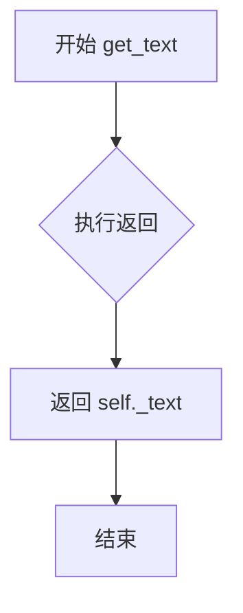
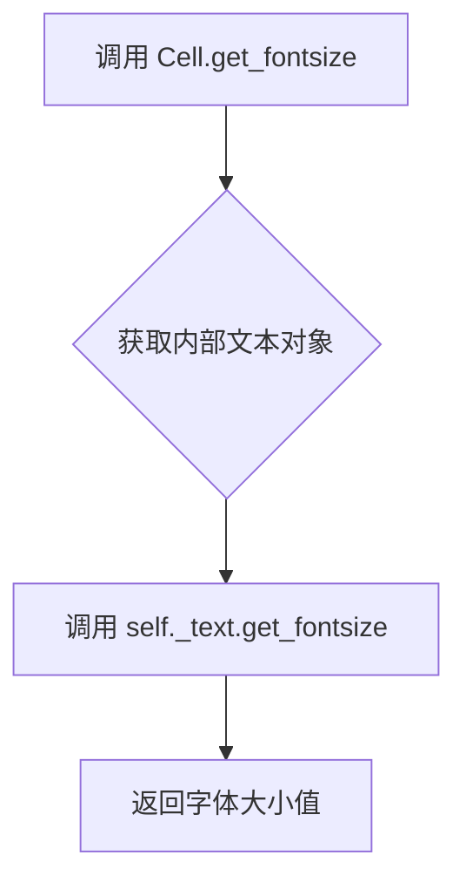
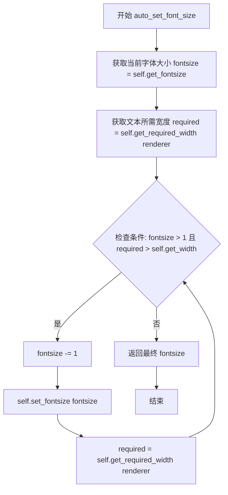
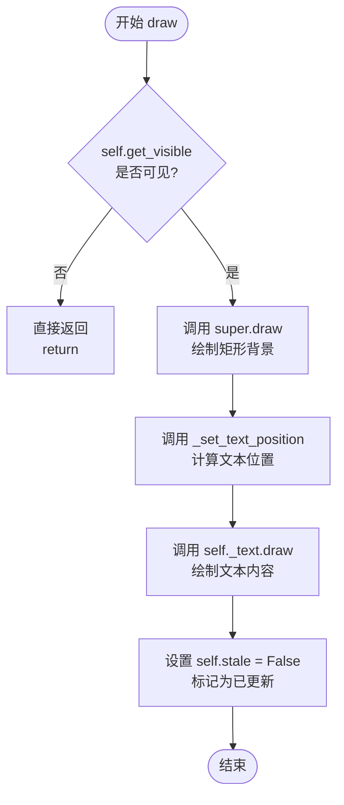
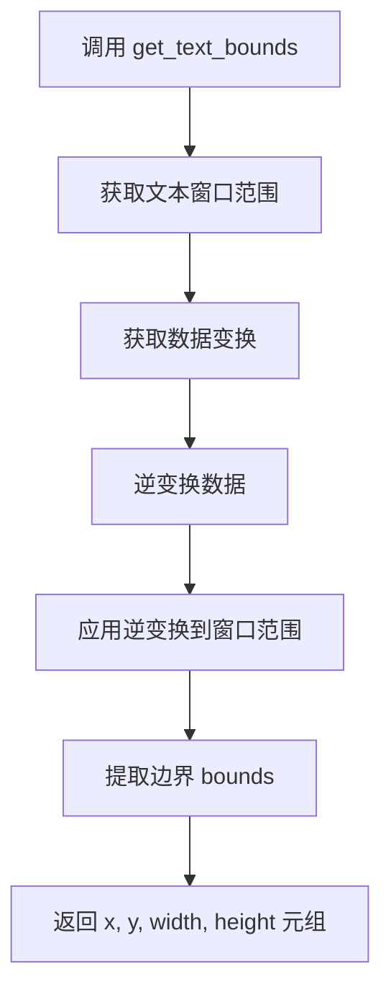
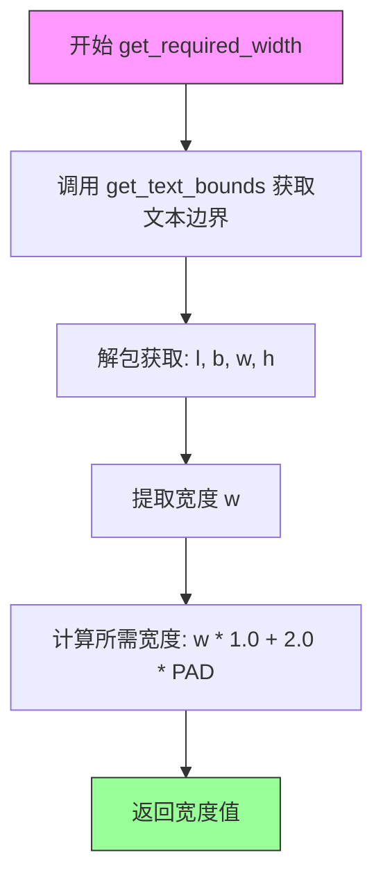
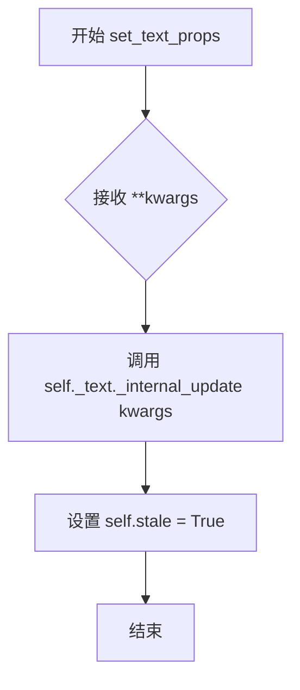
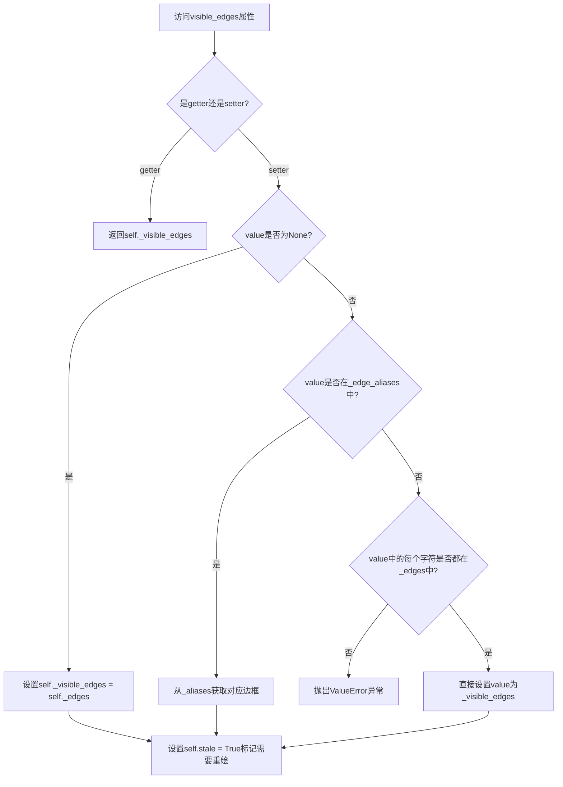
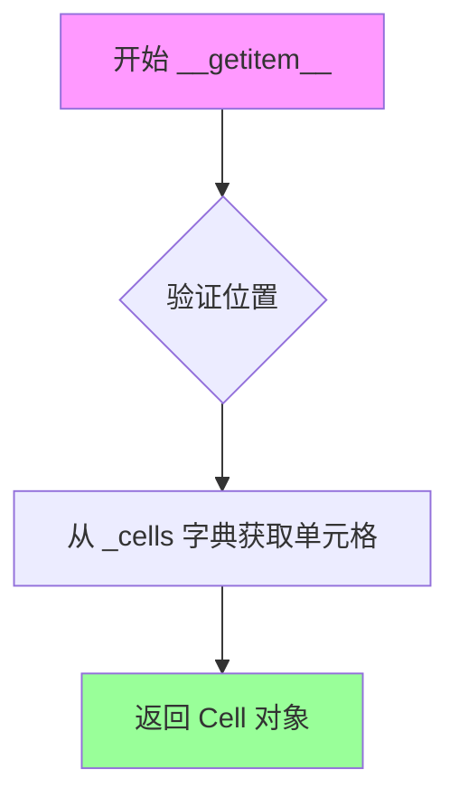

# `matplotlib\lib\matplotlib\table.py` 详细设计文档

Matplotlib表格绘制模块，实现了Cell单元格类和Table表格类，支持在Axes中创建和渲染包含文本的网格化表格，提供工厂函数table()快速创建表格，支持自定义字体、颜色、对齐方式和单元格可见边等特性。

## 整体流程

```mermaid
graph TD
    A[开始] --> B[调用table()工厂函数]
B --> C{验证输入参数}
C -- 失败 --> D[抛出ValueError]
C -- 成功 --> E[创建Table实例]
E --> F[添加列标签行]
F --> G[添加数据行]
G --> H[添加行标签列]
H --> I[调用ax.add_table()将表格添加到Axes]
I --> J[返回Table对象]
J --> K[渲染阶段：Table.draw()]
K --> L[_update_positions计算单元格位置]
L --> M[遍历所有单元格]
M --> N[调用Cell.draw()绘制每个单元格]
N --> O[Cell.draw绘制矩形背景]
O --> P[Cell.draw计算文本位置并绘制文本]
P --> Q[结束]
```

## 类结构

```
Artist (基类)
├── Rectangle (基类)
│   └── Cell (单元格类)
└── Table (表格类)
    └── 使用Cell组件

全局函数: table()
```

## 全局变量及字段


### `CustomCell`
    
Cell类的别名，用于向后兼容

类型：`type`
    


### `Cell.PAD`
    
文本与矩形之间的padding常数，值为0.1

类型：`float`
    


### `Cell._edges`
    
边标识字符串，'BRTL'代表bottom, right, top, left

类型：`str`
    


### `Cell._edge_aliases`
    
边别名映射，将'open', 'closed', 'horizontal', 'vertical'映射到具体边

类型：`dict`
    


### `Cell._visible_edges`
    
当前可见的边

类型：`str`
    


### `Cell._loc`
    
文本对齐位置

类型：`str`
    


### `Cell._text`
    
单元格内的文本对象

类型：`Text`
    


### `Table.codes`
    
位置代码映射，如'upper right'->1等

类型：`dict`
    


### `Table.FONTSIZE`
    
默认字体大小10

类型：`float`
    


### `Table.AXESPAD`
    
Axes与表格边框间距0.02

类型：`float`
    


### `Table._axes`
    
所属的Axes对象

类型：`Axes`
    


### `Table._loc`
    
位置代码

类型：`int`
    


### `Table._bbox`
    
边界框

类型：`Bbox`
    


### `Table._cells`
    
存储单元格{(row, col): Cell}

类型：`dict`
    


### `Table._edges`
    
默认单元格可见边

类型：`str`
    


### `Table._autoColumns`
    
自动调整宽度的列

类型：`list`
    


### `Table._autoFontsize`
    
是否自动设置字体大小

类型：`bool`
    
    

## 全局函数及方法


### `table`

工厂函数，用于创建并返回包含指定文本、颜色和布局信息的 `Table` 实例。

参数：

- `ax`：`~matplotlib.axes.Axes`，要在其中绘制表格的 Axes 对象。
- `cellText`：`2D list of str or pandas.DataFrame, optional`，要放置在表格单元格中的文本。
- `cellColours`：`2D list of :mpltype:\`color\`, optional`，单元格的背景颜色。
- `cellLoc`：`{'right', 'center', 'left'}`，单元格内文本的对齐方式，默认为 'right'。
- `colWidths`：`list of float, optional`，列宽，以 axes 为单位。
- `rowLabels`：`list of str, optional`，行标题文本。
- `rowColours`：`list of :mpltype:\`color\`, optional`，行标题颜色。
- `rowLoc`：`{'left', 'center', 'right'}`，行标题文本对齐方式，默认为 'left'。
- `colLabels`：`list of str, optional`，列标题文本。
- `colColours`：`list of :mpltype:\`color\`, optional`，列标题颜色。
- `colLoc`：`{'center', 'left', 'right'}`，列标题文本对齐方式，默认为 'center'。
- `loc`：`str, default: 'bottom'`，表格相对于 ax 的位置。
- `bbox`：`Bbox or [xmin, ymin, width, height], optional`，绘制表格的边界框。
- `edges`：`{'closed', 'open', 'horizontal', 'vertical'} or substring of 'BRTL'`，要绘制的单元格边框。
- `**kwargs`：`.Table` 属性，其他传递给 Table 的关键字参数。

返回值：`~matplotlib.table.Table`，创建的表格实例。

#### 流程图

```mermaid
flowchart TD
    A[开始] --> B{cellText 和 cellColours 均为 None?}
    B -- 是 --> C[抛出 ValueError]
    B -- 否 --> D{cellText is None?}
    D -- 是 --> E[根据 cellColours 创建空 cellText]
    D -- 否 --> F{cellText 是 pandas DataFrame?}
    F -- 是 --> G[提取 DataFrame 的 index 和 columns 作为标签]
    F -- 否 --> H[获取 cellText 的行数和列数]
    H --> I{验证每行列数一致}
    I -- 否 --> J[抛出 ValueError]
    I -- 是 --> K{cellColours 存在?}
    K -- 是 --> L[验证 cellColours 维度]
    K -- 否 --> M[创建默认白色 cellColours]
    L --> N[设置默认列宽]
    M --> N
    N --> O{处理行标签}
    O --> P{处理列标签}
    P --> Q[创建 Table 实例]
    Q --> R[设置表格边]
    R --> S[遍历添加单元格]
    S --> T{有列标签?}
    T -- 是 --> U[添加列标签单元格]
    T -- 否 --> V{有行标签?}
    V -- 是 --> W[添加行标签单元格]
    V -- 否 --> X{kwargs 中有 fontsize?]
    X -- 是 --> Y[设置字体大小]
    X -- 否 --> Z[添加表格到 Axes]
    Y --> Z
    U --> Z
    W --> Z
    Z --> AA[返回 Table 实例]
```

#### 带注释源码

```python
@_docstring.interpd
def table(ax,
          cellText=None, cellColours=None,
          cellLoc='right', colWidths=None,
          rowLabels=None, rowColours=None, rowLoc='left',
          colLabels=None, colColours=None, colLoc='center',
          loc='bottom', bbox=None, edges='closed',
          **kwargs):
    """
    Add a table to an `~.axes.Axes`.

    .. note::

        ``table()`` has some fundamental design limitations and will not be
        developed further. If you need more functionality, consider
        `blume <https://github.com/swfiua/blume>`__.

    At least one of *cellText* or *cellColours* must be specified. These
    parameters must be 2D lists, in which the outer lists define the rows and
    the inner list define the column values per row. Each row must have the
    same number of elements.

    The table can optionally have row and column headers, which are configured
    using *rowLabels*, *rowColours*, *rowLoc* and *colLabels*, *colColours*,
    *colLoc* respectively.

    For finer grained control over tables, use the `.Table` class and add it to
    the Axes with `.Axes.add_table`.

    Parameters
    ----------
    cellText : 2D list of str or pandas.DataFrame, optional
        The texts to place into the table cells.

        *Note*: Line breaks in the strings are currently not accounted for and
        will result in the text exceeding the cell boundaries.

    cellColours : 2D list of :mpltype:`color`, optional
        The background colors of the cells.

    cellLoc : {'right', 'center', 'left'}
        The alignment of the text within the cells.

    colWidths : list of float, optional
        The column widths in units of the axes. If not given, all columns will
        have a width of *1 / ncols*.

    rowLabels : list of str, optional
        The text of the row header cells.

    rowColours : list of :mpltype:`color`, optional
        The colors of the row header cells.

    rowLoc : {'left', 'center', 'right'}
        The text alignment of the row header cells.

    colLabels : list of str, optional
        The text of the column header cells.

    colColours : list of :mpltype:`color`, optional
        The colors of the column header cells.

    colLoc : {'center', 'left', 'right'}
        The text alignment of the column header cells.

    loc : str, default: 'bottom'
        The position of the cell with respect to *ax*. This must be one of
        the `~.Table.codes`.

    bbox : `.Bbox` or [xmin, ymin, width, height], optional
        A bounding box to draw the table into. If this is not *None*, this
        overrides *loc*.

    edges : {'closed', 'open', 'horizontal', 'vertical'} or substring of 'BRTL'
        The cell edges to be drawn with a line. See also
        `~.Cell.visible_edges`.

    Returns
    -------
    `~matplotlib.table.Table`
        The created table.

    Other Parameters
    ----------------
    **kwargs
        `.Table` properties.

    %(Table:kwdoc)s
    """

    # 验证：至少需要提供 cellText 或 cellColours 之一
    if cellColours is None and cellText is None:
        raise ValueError('At least one argument from "cellColours" or '
                         '"cellText" must be provided to create a table.')

    # 如果没有 cellText，根据 cellColours 推断维度并创建空文本
    if cellText is None:
        # assume just colours are needed
        rows = len(cellColours)
        cols = len(cellColours[0])
        cellText = [[''] * cols] * rows

    # 检查是否是 pandas DataFrame，如果是则提取索引和列名作为标签
    if _is_pandas_dataframe(cellText):
        # if rowLabels/colLabels are empty, use DataFrame entries.
        # Otherwise, throw an error.
        if rowLabels is None:
            rowLabels = cellText.index
        else:
            raise ValueError("rowLabels cannot be used alongside Pandas DataFrame")
        if colLabels is None:
            colLabels = cellText.columns
        else:
            raise ValueError("colLabels cannot be used alongside Pandas DataFrame")
        # Update cellText with only values
        cellText = cellText.values

    # 获取文本矩阵的维度
    rows = len(cellText)
    cols = len(cellText[0])
    # 验证每行的列数是否一致
    for row in cellText:
        if len(row) != cols:
            raise ValueError(f"Each row in 'cellText' must have {cols} "
                             "columns")

    # 验证 cellColours 的维度（如果提供）
    if cellColours is not None:
        if len(cellColours) != rows:
            raise ValueError(f"'cellColours' must have {rows} rows")
        for row in cellColours:
            if len(row) != cols:
                raise ValueError("Each row in 'cellColours' must have "
                                 f"{cols} columns")
    else:
        # 默认使用白色填充
        cellColours = ['w' * cols] * rows

    # 设置列宽：如果未提供，则均分
    if colWidths is None:
        colWidths = [1.0 / cols] * cols

    # 填充行标签和行颜色的缺失信息
    rowLabelWidth = 0
    if rowLabels is None:
        if rowColours is not None:
            rowLabels = [''] * rows
            rowLabelWidth = colWidths[0]
    elif rowColours is None:
        rowColours = 'w' * rows

    # 验证行标签长度
    if rowLabels is not None:
        if len(rowLabels) != rows:
            raise ValueError(f"'rowLabels' must be of length {rows}")

    # 如果有列标签，需要将文本和颜色数组向下偏移一行
    offset = 1
    if colLabels is None:
        if colColours is not None:
            colLabels = [''] * cols
        else:
            offset = 0
    elif colColours is None:
        colColours = 'w' * cols

    # 如果没有提供单元格颜色，设置默认白色
    if cellColours is None:
        cellColours = ['w' * cols] * rows

    # 创建 Table 实例
    table = Table(ax, loc, bbox, **kwargs)
    table.edges = edges
    height = table._approx_text_height()

    # 添加单元格
    for row in range(rows):
        for col in range(cols):
            table.add_cell(row + offset, col,
                           width=colWidths[col], height=height,
                           text=cellText[row][col],
                           facecolor=cellColours[row][col],
                           loc=cellLoc)
    
    # 添加列标签
    if colLabels is not None:
        for col in range(cols):
            table.add_cell(0, col,
                           width=colWidths[col], height=height,
                           text=colLabels[col], facecolor=colColours[col],
                           loc=colLoc)

    # 添加行标签
    if rowLabels is not None:
        for row in range(rows):
            table.add_cell(row + offset, -1,
                           width=rowLabelWidth or 1e-15, height=height,
                           text=rowLabels[row], facecolor=rowColours[row],
                           loc=rowLoc)
        if rowLabelWidth == 0:
            table.auto_set_column_width(-1)

    # 设置字体大小（仅在单元格添加后有效）
    if "fontsize" in kwargs:
        table.set_fontsize(kwargs["fontsize"])

    # 将表格添加到 Axes 并返回
    ax.add_table(table)
    return table
```


### `Cell.__init__`

该方法是 `Cell` 类的构造函数，用于初始化一个表格单元格。单元格在 Matplotlib 中表现为一个带有关联文本的矩形（继承自 `Rectangle`）。该方法主要负责设置单元格的几何属性（位置、宽高）、外观属性（颜色、边框）以及内部文本对象的内容和对齐方式。

参数：

-  `xy`：`tuple` (2-tuple of float)，单元格左下角的坐标位置。
-  `width`：`float`，单元格的宽度。
-  `height`：`float`，单元格的高度。
-  `edgecolor`：`str` 或 color，默认 `'k'` (黑色)，单元格边框的颜色。
-  `facecolor`：`str` 或 color，默认 `'w'` (白色)，单元格背景填充颜色。
-  `fill`：`bool`，默认 `True`，是否填充单元格背景。
-  `text`：`str`，默认 `''`，单元格内显示的文本内容。
-  `loc`：`str`，默认 `'right'`，文本在单元格内的水平对齐方式 (`'left'`, `'center'`, `'right'`).
-  `fontproperties`：`dict` 或 `None`，可选，定义文本字体属性的字典，支持的参数与 `FontProperties` 相同。
-  `visible_edges`：`str`，默认 `'closed'`，指定哪些边框可见。可以是 `'BRTL'` 的子串，或 `'open'`, `'closed'`, `'horizontal'`, `'vertical'` 之一。

返回值：`None`，该方法为构造函数，不返回任何值。

#### 流程图

```mermaid
graph TD
    A([Start __init__]) --> B[调用父类 Rectangle.__init__<br/>设置几何尺寸、填充、边框颜色]
    B --> C[设置剪裁: set_clip_on(False)]
    C --> D[设置 visible_edges<br/>触发 setter 逻辑更新可见边框]
    D --> E[保存文本对齐方式 _loc]
    F[创建 Text 对象<br/>设置位置、文本内容、字体属性<br/>水平对齐='loc', 垂直对齐='center']
    E --> F
    F --> G([End __init__])
```

#### 带注释源码

```python
def __init__(self, xy, width, height, *,
             edgecolor='k', facecolor='w',
             fill=True,
             text='',
             loc='right',
             fontproperties=None,
             visible_edges='closed',
             ):
    """
    Parameters
    ----------
    xy : 2-tuple
        The position of the bottom left corner of the cell.
    width : float
        The cell width.
    height : float
        The cell height.
    edgecolor : :mpltype:`color`, default: 'k'
        The color of the cell border.
    facecolor : :mpltype:`color`, default: 'w'
        The cell facecolor.
    fill : bool, default: True
        Whether the cell background is filled.
    text : str, optional
        The cell text.
    loc : {'right', 'center', 'left'}
        The alignment of the text within the cell.
    fontproperties : dict, optional
        A dict defining the font properties of the text. Supported keys and
        values are the keyword arguments accepted by `.FontProperties`.
    visible_edges : {'closed', 'open', 'horizontal', 'vertical'} or \
substring of 'BRTL'
        The cell edges to be drawn with a line: a substring of 'BRTL'
        (bottom, right, top, left), or one of 'open' (no edges drawn),
        'closed' (all edges drawn), 'horizontal' (bottom and top),
        'vertical' (right and left).
    """

    # 1. 调用基类 (Rectangle) 的初始化方法
    #    设置矩形的几何形状 (xy, width, height) 和颜色属性 (fill, edgecolor, facecolor)
    super().__init__(xy, width=width, height=height, fill=fill,
                     edgecolor=edgecolor, facecolor=facecolor)
    
    # 2. 禁用单元格自身的剪裁功能，确保内容（如文本）不会被边框裁剪
    self.set_clip_on(False)
    
    # 3. 设置可见边框属性。这会调用 visible_edges 的 setter 方法，
    #    解析 'open', 'closed' 等别名，并标记对象为 'stale' (需重绘)
    self.visible_edges = visible_edges

    # 4. 存储文本的对齐方式，供后续定位文本时使用
    self._loc = loc
    
    # 5. 创建内部的 Text 对象
    #    - 位置: 初始位置与单元格对齐 (xy)
    #    - clip_on: 文本同样不禁用剪裁 (或者根据需求，通常设为False)
    #    - horizontalalignment: 根据传入的 loc 参数设置 (left, center, right)
    #    - verticalalignment: 硬编码为 'center'，保证文本垂直居中
    self._text = Text(x=xy[0], y=xy[1], clip_on=False,
                      text=text, fontproperties=fontproperties,
                      horizontalalignment=loc, verticalalignment='center')
```


### `Cell.set_transform`

该方法用于设置单元格的变换矩阵，同时将单元格标记为"过时"（stale），以便在下次绘制时重新渲染。

参数：

- `t`：变换对象，要设置的变换矩阵（通常是 `matplotlib.transforms.Affine2D` 或类似的变换对象）

返回值：`None`，无返回值（该方法直接修改对象状态）

#### 流程图

```mermaid
flowchart TD
    A[开始 set_transform] --> B[调用父类方法 super().set_transform]
    B --> C[将单元格标记为 stale=True]
    C --> D[结束]
```

#### 带注释源码

```python
def set_transform(self, t):
    """
    设置单元格的变换矩阵。

    Parameters
    ----------
    t : matplotlib.transforms.Transform
        要应用的变换对象。
    """
    # 调用父类（Rectangle）的 set_transform 方法来设置变换
    super().set_transform(t)
    
    # 注意：文本对象不会继承该变换！
    # 这是一个设计决策，文本位置需要单独通过 _set_text_position 来管理
    # 将单元格标记为过时状态，提示渲染器需要重新绘制
    self.stale = True
```


### `Cell.set_figure`

此方法用于将单元格及其内部文本对象关联到指定的图形（Figure），确保单元格和其中的文本能够正确地在图形中渲染。

参数：

- `fig`：`Figure`，matplotlib 图形对象，用于指定单元格所属的图形

返回值：`None`，无返回值

#### 流程图

```mermaid
flowchart TD
    A[开始 set_figure] --> B[调用父类 set_figure: super().set_figure(fig)]
    B --> C[设置文本对象关联图形: self._text.set_figure(fig)]
    C --> D[结束]
```

#### 带注释源码

```python
def set_figure(self, fig):
    """
    设置单元格所属的 Figure 对象。

    Parameters
    ----------
    fig : matplotlib.figure.Figure
        图形对象，单元格将关联到此图形。
    """
    # 调用父类 (Rectangle) 的 set_figure 方法，设置矩形背景的图形
    super().set_figure(fig)
    # 同时将图形关联到单元格内部的 Text 对象，确保文本也能正确渲染
    self._text.set_figure(fig)
```


### `Cell.get_text`

该方法是一个简单的getter方法，用于返回单元格内部关联的`Text`实例，使用户能够直接访问和操作单元格中的文本对象。

参数： 无

返回值：`Text`，返回单元格关联的`.Text`实例

#### 流程图



#### 带注释源码

```python
def get_text(self):
    """Return the cell `.Text` instance."""
    # 直接返回内部保存的Text对象实例
    # 该对象在Cell.__init__时创建并初始化
    # 返回类型为matplotlib.text.Text
    return self._text
```


### `Cell.set_fontsize`

设置单元格内文本的字体大小，同时标记该单元格为"过时"（stale）状态，以便在下次渲染时重新绘制。

参数：

- `size`：`float` 或 `int`，要设置的字体大小值（以磅为单位）

返回值：`None`，无返回值（该方法直接修改对象内部状态）

#### 流程图

```mermaid
flowchart TD
    A[开始 set_fontsize] --> B[接收 size 参数]
    B --> C[调用 self._text.set_fontsize(size)]
    C --> D[设置 self.stale = True]
    D --> E[标记单元格需要重新渲染]
    E --> F[结束]
    
    style A fill:#f9f,stroke:#333
    style F fill:#9f9,stroke:#333
```

#### 带注释源码

```python
def set_fontsize(self, size):
    """
    Set the text fontsize.
    
    Parameters
    ----------
    size : float or int
        The font size in points to set for the cell's text.
    """
    # 调用内部 Text 对象的 set_fontsize 方法来设置实际字体大小
    # Text 对象负责具体的字体大小属性设置
    self._text.set_fontsize(size)
    
    # 将当前单元格标记为 'stale'（过时）状态
    # 这是一个重要的机制：它告诉 matplotlib 的渲染系统该对象的内容已发生变化，
    # 需要在下次绘图时重新渲染此单元格
    self.stale = True
```


### `Cell.get_fontsize`

该方法是一个简单的 getter 方法，用于获取单元格内文本的字体大小，通过委托给内部 `Text` 对象的 `get_fontsize()` 方法实现。

参数：
- （无显式参数，仅包含隐式 `self`）

返回值：`float`，返回单元格当前使用的字体大小（以磅为单位）。

#### 流程图



#### 带注释源码

```python
def get_fontsize(self):
    """
    Return the cell fontsize.
    
    此方法是一个简单的访问器（getter），用于获取单元格中文本的当前字体大小。
    它通过委托机制调用内部 Text 对象 (_text) 的 get_fontsize 方法来获取值。
    该方法不修改对象状态，只是单纯返回值。
    
    Returns
    -------
    float
        当前设置的字体大小值（单位：磅）。
    """
    return self._text.get_fontsize()
```


### `Cell.auto_set_font_size`

该方法通过迭代减小字体大小，使文本宽度适应单元格的宽度。当文本宽度超过单元格宽度时，自动缩小字体直到文本完全fit单元格或达到最小字体大小1。

参数：

- `renderer`：`renderer`，Matplotlib渲染器对象，用于计算文本的窗口范围和所需宽度

返回值：`int`，返回调整后的最终字体大小

#### 流程图



#### 带注释源码

```python
def auto_set_font_size(self, renderer):
    """
    收缩字体大小直到文本适应单元格宽度。
    
    该方法通过迭代方式减小字体大小,直到文本宽度小于等于单元格宽度,
    或者字体大小已达到最小值1为止。
    
    Parameters
    ----------
    renderer : RendererBase
        渲染器对象,用于计算文本的窗口范围。
    
    Returns
    -------
    int
        调整后的最终字体大小。
    """
    # 获取单元格当前设置的字体大小
    fontsize = self.get_fontsize()
    
    # 使用渲染器计算文本所需的宽度(包含padding)
    required = self.get_required_width(renderer)
    
    # 迭代减小字体大小,直到满足以下任一条件:
    # 1. 字体大小已降至1(最小值)
    # 2. 文本所需宽度小于等于单元格宽度
    while fontsize > 1 and required > self.get_width():
        fontsize -= 1  # 每次迭代减小1个单位
        self.set_fontsize(fontsize)  # 应用新字体大小到文本对象
        required = self.get_required_width(renderer)  # 重新计算所需宽度
    
    # 返回最终调整后的字体大小
    return fontsize
```


### `Cell.draw`

该方法是 `Cell` 类的核心绘制方法，负责将单元格的内容（背景矩形和文本）渲染到画布上。方法首先检查单元格是否可见，如果不可见则直接返回；否则依次调用父类的 `draw` 方法绘制矩形背景、通过 `_set_text_position` 方法计算文本的最终位置、绘制文本内容，最后将 `stale` 标记设为 `False` 表示该单元格已处于最新状态。

参数：

- `self`：`Cell`，单元格实例（隐式参数）
- `renderer`：`RendererBase` 或类似渲染器对象，负责将图形内容绘制到目标设备（如屏幕、文件等）

返回值：`None`，该方法没有返回值，直接在渲染器上进行绘制操作

#### 流程图



#### 带注释源码

```python
@allow_rasterization
def draw(self, renderer):
    """
    Draw the cell (rectangle + text) to the renderer.

    This method is decorated with @allow_rasterization to support
    rasterization of the cell when saving to raster formats.

    Parameters
    ----------
    renderer : RendererBase
        The renderer to use for drawing.
    """
    # Step 1: Check if the cell is visible
    # If not visible, skip drawing and return early
    if not self.get_visible():
        return

    # Step 2: Draw the rectangle (background)
    # Call the parent class (Rectangle) draw method to render
    # the cell background with edge and face colors
    super().draw(renderer)

    # Step 3: Position the text
    # Calculate the appropriate (x, y) position for the text
    # based on the cell's bounding box and text alignment
    self._set_text_position(renderer)

    # Step 4: Draw the text
    # Render the text object at the calculated position
    self._text.draw(renderer)

    # Step 5: Mark the cell as not stale
    # Set stale to False to indicate the cell has been
    # drawn and is up-to-date (avoids unnecessary redraws)
    self.stale = False
```


### `Cell._set_text_position`

设置文本在单元格中的绘制位置，根据文本的水平对齐方式计算文本的x坐标，并将y坐标垂直居中。

参数：

- `renderer`：`RendererBase` 或类似渲染器对象，用于获取单元格的窗口范围

返回值：`None`，无返回值，仅更新文本对象的内部位置状态

#### 流程图

```mermaid
flowchart TD
    A[开始 _set_text_position] --> B[获取单元格窗口范围 bbox]
    B --> C[计算y坐标: y = bbox.y0 + bbox.height / 2]
    C --> D{获取文本水平对齐方式 loc}
    D -->|center| E[计算x坐标: x = bbox.x0 + bbox.width / 2]
    D -->|left| F[计算x坐标: x = bbox.x0 + bbox.width * PAD]
    D -->|right| G[计算x坐标: x = bbox.x0 + bbox.width * (1 - PAD)]
    E --> H[设置文本位置 set_position(x, y)]
    F --> H
    G --> H
    H --> I[结束]
```

#### 带注释源码

```python
def _set_text_position(self, renderer):
    """
    设置文本在单元格中的绘制位置。
    
    该方法根据文本的水平对齐方式（left、center、right）计算文本的x坐标，
    并将y坐标设置为单元格垂直居中的位置。
    
    Parameters
    ----------
    renderer : RendererBase
        渲染器对象，用于获取单元格的窗口范围。
    """
    # 获取单元格在窗口坐标中的边界框
    bbox = self.get_window_extent(renderer)
    
    # 垂直居中：计算单元格中心的y坐标
    # y = 底部y坐标 + 高度的一半
    y = bbox.y0 + bbox.height / 2
    
    # 获取文本的水平对齐方式
    loc = self._text.get_horizontalalignment()
    
    # 根据对齐方式计算x坐标
    if loc == 'center':
        # 居中对齐：x = 左侧x坐标 + 宽度的一半
        x = bbox.x0 + bbox.width / 2
    elif loc == 'left':
        # 左对齐：x = 左侧x坐标 + 左边距（使用PAD比例）
        x = bbox.x0 + bbox.width * self.PAD
    else:  # right
        # 右对齐：x = 左侧x坐标 + 宽度 - 右边距（使用PAD比例）
        x = bbox.x0 + bbox.width * (1 - self.PAD)
    
    # 更新文本对象的位置
    self._text.set_position((x, y))
```


### `Cell.get_text_bounds`

该方法用于获取单元格文本在表格坐标系下的边界框位置和尺寸，通过获取文本的窗口范围并将其从显示坐标转换回数据坐标来实现。

参数：

- `renderer`：`RendererBase`，用于计算文本窗口范围的渲染器对象

返回值：`tuple[float, float, float, float]`，返回文本边界框的 (x, y, width, height)，单位为表格（数据）坐标

#### 流程图



#### 带注释源码

```python
def get_text_bounds(self, renderer):
    """
    Return the text bounds as *(x, y, width, height)* in table coordinates.
    """
    # 第一步：获取文本在显示（窗口）坐标系下的边界框
    # Text.get_window_extent() 返回一个 Bbox 对象，表示文本在渲染器
    # 窗口坐标系中的位置和尺寸（单位为像素/点）
    text_window_extent = self._text.get_window_extent(renderer)
    
    # 第二步：获取数据变换的逆变换
    # get_data_transform() 返回从数据坐标到显示坐标的变换
    # .inverted() 返回其逆变换，即从显示坐标回到数据坐标的变换
    # 这样可以将文本边界从显示坐标转换回表格/数据坐标
    data_to_display = self.get_data_transform()
    display_to_data = data_to_display.inverted()
    
    # 第三步：将窗口范围变换到数据坐标系
    # .transformed() 方法接受一个变换对象，返回变换后的新 Bbox
    # 这个新 Bbox 的坐标现在是相对于表格/数据坐标系的
    transformed_bounds = text_window_extent.transformed(display_to_data)
    
    # 第四步：提取边界框的 bounds 属性
    # .bounds 返回一个元组 (x0, y0, width, height)
    # x0, y0 是边界框左下角的坐标
    # width, height 是边界框的宽度和高度
    return transformed_bounds.bounds
```


### `Cell.get_required_width`

该方法用于计算单元格文本所需的最小宽度，考虑了文本与单元格边界之间的填充间距。

参数：

- `renderer`：RendererBase 或类似渲染器对象，用于获取文本的窗口范围以计算边界

返回值：`float`，返回单元格文本所需的最小宽度，考虑了 PAD 填充

#### 流程图



#### 带注释源码

```python
def get_required_width(self, renderer):
    """
    Return the minimal required width for the cell.
    
    该方法计算单元格文本所需的最小宽度。通过获取文本的窗口范围，
    提取文本宽度，然后乘以一个系数(1.0 + 2.0 * PAD)来考虑单元格
    内部左右两侧的填充空间。
    
    Parameters
    ----------
    renderer : RendererBase
        渲染器对象，用于获取文本的窗口范围
        
    Returns
    -------
    float
        单元格所需的最小宽度，考虑了文本与单元格边界之间的填充
    """
    # 调用 get_text_bounds 获取文本在渲染器坐标下的边界
    # 返回 (left, bottom, width, height) 元组
    l, b, w, h = self.get_text_bounds(renderer)
    
    # 计算所需宽度：文本宽度 * (1.0 + 2*PAD)
    # PAD = 0.1，所以系数为 1.2
    # 这样左右两侧各留出 PAD * width 的填充空间
    return w * (1.0 + (2.0 * self.PAD))
```


### `Cell.set_text_props`

该方法用于更新单元格内文本的属性，通过将关键字参数传递给内部文本对象的 `_internal_update` 方法来更新文本样式，并将单元格标记为需要重绘（stale=True）。

参数：

- `**kwargs`：关键字参数，用于设置文本属性。有效的关键字参数由 `Text` 类的属性决定（如 fontsize、color、fontweight 等）

返回值：`None`，无返回值，仅更新对象状态

#### 流程图



#### 带注释源码

```python
@_docstring.interpd
def set_text_props(self, **kwargs):
    """
    Update the text properties.

    Valid keyword arguments are:

    %(Text:kwdoc)s
    """
    # 使用内部更新方法将关键字参数应用到文本对象
    # _internal_update 是 Artist 类的内部方法，用于批量更新属性
    self._text._internal_update(kwargs)
    
    # 将单元格标记为 stale（需要重绘）
    # 这会通知 matplotlib 该对象需要重新绘制
    self.stale = True
```


### `Cell.visible_edges`

该属性用于获取或设置单元格可见的边框。它返回一个字符串，表示要绘制的单元格边框（'BRTL'的子串，分别代表bottom、right、top、left）。设置时可以接受'BRTL'的任意子串，或者使用预定义的别名如'open'、'closed'、'horizontal'、'vertical'。

参数：

- `self`：无，需要通过实例访问
- `value`（setter时）：`str`或`None`，要设置的可见边框值

返回值：`str`，当前可见的边框，'BRTL'的子串

#### 流程图



#### 带注释源码

```python
@property
def visible_edges(self):
    """
    The cell edges to be drawn with a line.

    Reading this property returns a substring of 'BRTL' (bottom, right,
    top, left').

    When setting this property, you can use a substring of 'BRTL' or one
    of {'open', 'closed', 'horizontal', 'vertical'}.
    """
    # 返回当前可见的边框字符串
    return self._visible_edges

@visible_edges.setter
def visible_edges(self, value):
    """
    设置单元格的可见边框。
    
    Parameters
    ----------
    value : str or None
        要设置的可见边框值。可以是：
        - None: 使用默认的完整边框
        - 'open': 不绘制任何边框
        - 'closed': 绘制所有边框（默认）
        - 'horizontal': 只绘制上下边框
        - 'vertical': 只绘制左右边框
        - 'BRTL'任意子串: 如'B'只显示底边，'RT'显示右边和顶边
    """
    # 如果设置为None，使用默认的完整边框 'BRTL'
    if value is None:
        self._visible_edges = self._edges
    # 如果值是预定义的别名之一，从别名映射中获取对应的边框
    elif value in self._edge_aliases:
        self._visible_edges = self._edge_aliases[value]
    else:
        # 自定义边框字符串，验证每个字符是否有效
        if any(edge not in self._edges for edge in value):
            raise ValueError('Invalid edge param {}, must only be one of '
                             '{} or string of {}'.format(
                                 value,
                                 ", ".join(self._edge_aliases),
                                 ", ".join(self._edges)))
        # 直接使用用户提供的自定义边框字符串
        self._visible_edges = value
    # 标记该对象需要重绘
    self.stale = True
```


### `Cell.get_path`

该方法是 `Cell` 类的核心绘图辅助方法，负责根据当前单元格的可见边设置（`visible_edges`）生成对应的几何路径（`Path`）。它通过遍历单元格的四条边（Bottom, Right, Top, Left），判断每条边是否需要绘制，从而生成带有特定绘制指令（MOVETO, LINETO, CLOSEPOLY）的路径对象。

参数：

- `self`：`Cell`，调用此方法的单元格实例本身。

返回值：`Path`，返回的 `matplotlib.path.Path` 对象，包含了定义单元格边框形状的顶点坐标和绘制指令。

#### 流程图

```mermaid
graph TD
    A([开始 get_path]) --> B[初始化 codes 列表为 [Path.MOVETO]]
    B --> C{遍历边列表 _edges = ['B', 'R', 'T', 'L']}
    C --> D{当前边是否在 _visible_edges 中?}
    D -->|是 (绘制该边)| E[添加 Path.LINETO 到 codes]
    D -->|否 (跳过该边)| F[添加 Path.MOVETO 到 codes]
    E --> C
    F --> C
    C --> G{检查 codes[1:] 中是否包含 MOVETO}
    G -->|所有边都可见 (无 MOVETO)| H[将 codes 最后一个元素替换为 Path.CLOSEPOLY]
    G -->|有边不可见| I[保持 codes 不变]
    H --> J[构造 Path 实例: 顶点集与 codes]
    I --> J
    J --> K([返回 Path 对象])
```

#### 带注释源码

```python
def get_path(self):
    """Return a `.Path` for the `.visible_edges`."""
    # 初始化路径指令列表，以 MoveTo 开始（将笔移动到起始点）
    codes = [Path.MOVETO]
    
    # 遍历单元格的四条边：'B'(Bottom), 'R'(Right), 'T'(Top), 'L'(Left)
    # 根据每条边是否在可见边集合中，决定绘制直线(LINETO)还是移动画笔(MOVETO)
    codes.extend(
        Path.LINETO if edge in self._visible_edges else Path.MOVETO
        for edge in self._edges)
        
    # 如果所有边都可见（即除了初始 MOVETO 外，其余都是 LINETO），
    # 则将最后一条指令改为 CLOSEPOLY，以闭合整个多边形
    if Path.MOVETO not in codes[1:]:  # All sides are visible
        codes[-1] = Path.CLOSEPOLY
        
    # 定义单元格的四个角坐标（单位矩形 0,0 到 1,1）
    # 顺序对应：B(0,0) -> R(1,0) -> T(1,1) -> L(0,1) -> B(0,0)
    return Path(
        [[0.0, 0.0], [1.0, 0.0], [1.0, 1.0], [0.0, 1.0], [0.0, 0.0]],
        codes,
        readonly=True
        )
```


### `Table.__init__`

初始化一个 Table 实例，用于在 matplotlib 中绘制表格。该方法设置表格的基本属性，包括所属的 Axes、位置、边界框等，并初始化单元格存储和相关配置。

参数：

- `ax`：`~matplotlib.axes.Axes`，要绘制表格的目标 Axes 对象
- `loc`：`str, optional`，表格相对于 ax 的位置，必须是 `~.Table.codes` 中的有效值之一
- `bbox`：`.Bbox` 或 `[xmin, ymin, width, height], optional`，表格的边界框。如果不为 None，则覆盖 loc 参数
- `**kwargs`：`.Artist` 属性，用于配置表格的其他外观属性

返回值：`None`，构造函数无返回值

#### 流程图

```mermaid
flowchart TD
    A[开始 __init__] --> B[调用父类 Artist.__init__]
    B --> C{loc 是字符串?}
    C -->|是| D{loc 在 codes 中?}
    C -->|否| E[loc 保持原值]
    D -->|是| F[将 loc 转换为 codes 中的整数值]
    D -->|否| G[抛出 ValueError 异常]
    E --> H[设置 figure 为 ax.get_figure]
    F --> H
    G --> Z[结束]
    H --> I[保存 _axes, _loc, _bbox]
    I --> J[使用 axes 坐标 - 调用 ax._unstale_viewLim]
    J --> K[设置变换为 ax.transAxes]
    K --> L[初始化内部数据结构]
    L --> M[_cells = {}, _edges = None]
    M --> N[_autoColumns = [], _autoFontsize = True]
    N --> O[调用 _internal_update 处理 kwargs]
    O --> P[设置 clip_on = False]
    P --> Q[结束 __init__]
```

#### 带注释源码

```python
def __init__(self, ax, loc=None, bbox=None, **kwargs):
    """
    Parameters
    ----------
    ax : `~matplotlib.axes.Axes`
        The `~.axes.Axes` to plot the table into.
    loc : str, optional
        The position of the cell with respect to *ax*. This must be one of
        the `~.Table.codes`.
    bbox : `.Bbox` or [xmin, ymin, width, height], optional
        A bounding box to draw the table into. If this is not *None*, this
        overrides *loc*.

    Other Parameters
    ----------------
    **kwargs
        `.Artist` properties.
    """

    # 调用父类 Artist 的初始化方法
    super().__init__()

    # 如果 loc 是字符串，验证并转换为对应的整数码
    if isinstance(loc, str):
        if loc not in self.codes:
            raise ValueError(
                "Unrecognized location {!r}. Valid locations are\n\t{}"
                .format(loc, '\n\t'.join(self.codes)))
        loc = self.codes[loc]
    
    # 设置表格所属的 Figure 对象
    self.set_figure(ax.get_figure(root=False))
    # 保存 Axes 引用和位置信息
    self._axes = ax
    self._loc = loc
    self._bbox = bbox

    # 使用 Axes 坐标 - 先 unstale viewLim 确保坐标最新
    ax._unstale_viewLim()
    # 设置变换为 Axes 坐标变换，使表格位置相对于 Axes
    self.set_transform(ax.transAxes)

    # 初始化单元格存储字典 - 键为 (row, col) 元组
    self._cells = {}
    # 初始化边线样式为 None（稍后通过 add_cell 或 edges 属性设置）
    self._edges = None
    # 初始化自动列宽列表
    self._autoColumns = []
    # 启用自动字体大小调整
    self._autoFontsize = True
    
    # 使用内部更新方法处理额外的 Artist 属性
    self._internal_update(kwargs)

    # 关闭裁剪功能
    self.set_clip_on(False)
```


### `Table.add_cell`

该方法用于在表格的指定位置（行、列）创建一个新的单元格（Cell），并将其添加到表格的单元格集合中。它接收行索引、列索引以及传递给 Cell 构造函数的其他参数，最终返回创建好的 Cell 对象。

参数：

- `row`：`int`，行索引，指定单元格所在的行位置
- `col`：`int`，列索引，指定单元格所在的列位置
- `*args`：可变位置参数，将传递给 `Cell` 类的构造函数，用于配置单元格的宽度、高度、文本等属性
- `**kwargs`：可变关键字参数，将传递给 `Cell` 类的构造函数，用于配置单元格的外观和行为（如 `edgecolor`、`facecolor`、`text`、`loc` 等）

返回值：`Cell`，返回创建并添加到表格中的单元格对象

#### 流程图

```mermaid
flowchart TD
    A[开始 add_cell] --> B[创建初始坐标 xy = (0, 0)]
    B --> C[使用 visible_edges=self.edges 创建 Cell 实例]
    C --> D[调用 __setitem__ 方法将 cell 存入表格的 _cells 字典]
    D --> E[设置单元格 figure 和 transform]
    E --> F[标记表格为 stale 状态]
    F --> G[返回创建的 Cell 对象]
```

#### 带注释源码

```python
def add_cell(self, row, col, *args, **kwargs):
    """
    Create a cell and add it to the table.

    Parameters
    ----------
    row : int
        Row index.
    col : int
        Column index.
    *args, **kwargs
        All other parameters are passed on to `Cell`.

    Returns
    -------
    `.Cell`
        The created cell.

    """
    # 初始化单元格的位置为 (0, 0)，实际位置会在后续布局计算中调整
    xy = (0, 0)
    # 创建 Cell 实例，visible_edges 从表格的 edges 属性继承
    # *args 和 **kwargs 传递给 Cell 构造函数
    cell = Cell(xy, visible_edges=self.edges, *args, **kwargs)
    # 使用 __setitem__ 方法将单元格存入表格的 _cells 字典
    # 键为 (row, col) 元组
    self[row, col] = cell
    # 返回创建好的单元格对象
    return cell
```


### `Table.__setitem__`

该方法用于在表格的指定位置设置一个自定义的单元格对象。它接收一个位置元组和一个 Cell 对象，将该单元格与表格的图形和变换关联，并将其存储到内部单元格字典中，同时标记表格需要重新绘制。

参数：

- `position`：元组 (row, col)，表示单元格的行和列索引
- `cell`：`Cell`，要设置的单元格对象

返回值：`None`，无返回值

#### 流程图

```mermaid
flowchart TD
    A[开始 __setitem__] --> B{检查 cell 是否为 Cell 实例}
    B -->|否| C[抛出 TypeError 异常]
    B -->|是| D{尝试解包 position 元组}
    D --> E{解包成功?}
    E -->|否| F[抛出 KeyError 异常<br/>'Only tuples length 2 are accepted as coordinates']
    E -->|是| G[获取 row 和 col]
    G --> H[调用 cell.set_figure 设置图形]
    H --> I[调用 cell.set_transform 设置变换]
    I --> J[调用 cell.set_clip_on 设置裁剪]
    J --> K[将 cell 存储到 self._cells[row, col]]
    K --> L[设置 self.stale = True 标记需要重绘]
    L --> M[结束]
```

#### 带注释源码

```python
def __setitem__(self, position, cell):
    """
    Set a custom cell in a given position.
    
    Parameters
    ----------
    position : tuple of (int, int)
        A tuple of (row, col) representing the cell position.
    cell : Cell
        The Cell object to place at the specified position.
    """
    # 使用 _api.check_isinstance 验证 cell 参数是否为 Cell 类实例
    # 如果不是会抛出 TypeError 异常
    _api.check_isinstance(Cell, cell=cell)
    
    try:
        # 尝试从 position 元组中解包出行和列索引
        # position[0] 为 row，position[1] 为 col
        row, col = position[0], position[1]
    except Exception as err:
        # 如果解包失败（例如 position 不是长度为 2 的可迭代对象）
        # 抛出 KeyError 并提供友好的错误信息
        raise KeyError('Only tuples length 2 are accepted as '
                       'coordinates') from err
    
    # 将单元格的图形设置为当前表格的图形
    # root=False 表示获取的是子图形（非根图形）
    cell.set_figure(self.get_figure(root=False))
    
    # 设置单元格的变换为表格的变换
    # 使得单元格使用表格的坐标系
    cell.set_transform(self.get_transform())
    
    # 关闭单元格的裁剪功能
    # 确保单元格内容不会被裁剪
    cell.set_clip_on(False)
    
    # 将单元格存储到内部字典 _cells 中
    # 字典的键为 (row, col) 元组，值为 Cell 对象
    self._cells[row, col] = cell
    
    # 设置 stale 属性为 True
    # 标记表格状态已改变，需要重新绘制
    self.stale = True
```


### `Table.__getitem__`

该方法用于根据行和列索引检索表格中特定位置的单元格对象，允许用户通过类似数组索引的方式访问表格中的单元格。

参数：

- `position`：`tuple`，一个包含两个整数的元组 `(row, col)`，表示单元格的行索引和列索引

返回值：`Cell`，返回指定位置对应的单元格对象

#### 流程图



#### 带注释源码

```python
def __getitem__(self, position):
    """
    Retrieve a custom cell from a given position.
    
    Parameters
    ----------
    position : tuple
        A 2-tuple of (row, col) representing the cell's position in the table.
        The cell (0, 0) is positioned at the top left of the table.
    
    Returns
    -------
    Cell
        The Cell object located at the specified position.
    
    Raises
    ------
    KeyError
        If no cell exists at the specified position.
    
    Examples
    --------
    >>> cell = table[0, 0]  # Get cell at first row, first column
    >>> cell = table[2, 3]  # Get cell at third row, fourth column
    """
    # 直接从内部单元格字典中获取并返回对应位置的单元格
    # _cells 是一个以 (row, col) 为键、Cell 对象为值的字典
    return self._cells[position]
```


### Table.edges

获取或设置新添加单元格（通过 `.add_cell`）的默认可见边框。  
该属性决定新建单元格时 `Cell.visible_edges` 的初始值；已存在的单元格需单独设置。

#### 参数

- **getter**（读取属性）  
  - 无显式参数（`self` 为隐式参数）。

- **setter**（写入属性）  
  - `value`：`str`，可见边框配置。可为 `'closed'`、`'open'`、`'horizontal'`、`'vertical'` 或 `'BRTL'` 的任意子串（例如 `'BT'`），表示要绘制的边框（底部、右边、顶部、左边）。

#### 返回值

- `str | None`：返回当前默认的可见边框配置。读取属性时返回 `self._edges`（在 `__init__` 中初始化为 `None`）；如果尚未设置，则为 `None`。

#### 流程图

```mermaid
flowchart TD
    start((访问 Table.edges)) --> is_get{是读取还是写入?}
    is_get -- 读取 (getter) --> return_edges[返回 self._edges]
    is_get -- 写入 (setter) --> set_value[self._edges = value]
    set_value --> mark_stale[self.stale = True]
    mark_stale --> finish((完成))
    return_edges --> finish
```

#### 带注释源码

```python
@property
def edges(self):
    """
    The default value of `~.Cell.visible_edges` for newly added
    cells using `.add_cell`.

    Notes
    -----
    This setting does currently only affect newly created cells using
    `.add_cell`.

    To change existing cells, you have to set their edges explicitly::

        for c in tab.get_celld().values():
            c.visible_edges = 'horizontal'

    """
    # Getter：返回当前默认的可见边框配置（可能为 None）
    return self._edges

@edges.setter
def edges(self, value):
    """
    Set the default visible edges for newly added cells.

    Parameters
    ----------
    value : str
        可见边框配置，可为 'closed'、'open'、'horizontal'、'vertical'
        或是 'BRTL'（Bottom, Right, Top, Left）的任意子串。
    """
    # Setter：将新值存入内部属性
    self._edges = value
    # 标记表格状态为“过时”，以便在下次绘制时重新布局
    self.stale = True
```


### `Table._approx_text_height`

该方法用于计算表格单元格的近似高度（以 Axes 坐标表示）。它根据字体大小、图形 DPI 和 Axes 高度来估算单元格应有的高度，以便在添加单元格时设置合适的默认高度。

参数：该方法无参数（仅包含隐式参数 `self`）

返回值：`float`，返回单元格的近似高度（单位为 Axes 坐标）

#### 流程图

```mermaid
flowchart TD
    A[开始 _approx_text_height] --> B[获取字体大小 FONTSIZE]
    B --> C[获取图形 DPI]
    C --> D[获取 Axes 高度]
    D --> E[计算公式: FONTSIZE / 72.0 * dpi / axes_height * 1.2]
    E --> F[返回计算结果]
```

#### 带注释源码

```python
def _approx_text_height(self):
    """
    计算表格单元格的近似高度（以 Axes 坐标表示）。
    
    该方法用于在添加单元格时获取合适的默认高度。
    计算逻辑：
    - FONTSIZE / 72.0: 将字体大小从点转换为英寸（72点 = 1英寸）
    - * dpi: 转换为像素单位
    - / self._axes.bbox.height: 转换为 Axes 坐标系
    - * 1.2: 额外的缩放因子，为文本留出一定余量
    
    Returns
    -------
    float
        单元格近似高度（Axes 坐标单位）
    """
    return (self.FONTSIZE / 72.0 * self.get_figure(root=True).dpi /
            self._axes.bbox.height * 1.2)
```


### `Table.draw`

该方法负责将表格的所有单元格渲染到指定的渲染器中，并在渲染前更新单元格位置和自动调整列宽或字体大小。

参数：

- `renderer`：`RendererBase | None`，matplotlib 渲染器对象，用于执行实际的绘制操作。如果为 `None`，则自动从图形对象获取渲染器。

返回值：`None`，无返回值。

#### 流程图

```mermaid
flowchart TD
    A[开始 draw] --> B{renderer 是否为 None?}
    B -->|是| C[从图形获取渲染器]
    B -->|否| D{渲染器是否存在?}
    C --> D
    D -->|否| E[抛出 RuntimeError]
    D -->|是| F{表格是否可见?}
    F -->|否| G[直接返回]
    F -->|是| H[打开渲染组 'table']
    H --> I[调用 _update_positions 更新单元格位置]
    I --> J[遍历所有单元格并调用 draw 渲染]
    J --> K[关闭渲染组 'table']
    K --> L[设置 stale 为 False]
    L --> M[结束]
    E --> M
    G --> M
```

#### 带注释源码

```python
@allow_rasterization
def draw(self, renderer):
    """
    绘制表格到渲染器。

    Parameters
    ----------
    renderer : RendererBase or None
        渲染器对象。如果为 None，则自动从图形获取。
    """
    # 继承自 Artist 的 docstring
    # docstring inherited

    # 需要一个渲染器来进行鼠标事件的命中测试，假设最后一个渲染器可用
    # Need a renderer to do hit tests on mouseevent; assume the last one
    # will do
    if renderer is None:
        # 从图形对象获取渲染器
        renderer = self.get_figure(root=True)._get_renderer()
    # 如果仍然没有渲染器，抛出运行时错误
    if renderer is None:
        raise RuntimeError('No renderer defined')

    # 如果表格不可见，直接返回，不进行绘制
    if not self.get_visible():
        return
    
    # 打开渲染器组，用于分组管理表格相关的绘制操作
    # 这有助于实现选择和高亮等功能
    renderer.open_group('table', gid=self.get_gid())
    
    # 更新所有单元格的位置（包括自动列宽和字体大小调整）
    self._update_positions(renderer)

    # 遍历所有单元格，按键排序以保证一致的绘制顺序
    # 对每个单元格调用其 draw 方法进行绘制
    for key in sorted(self._cells):
        self._cells[key].draw(renderer)

    # 关闭渲染器组
    renderer.close_group('table')
    
    # 标记表格不再需要重新绘制
    self.stale = False
```


### `Table._get_grid_bbox`

获取表格中所有有效单元格（行索引和列索引均大于等于0）在轴坐标系下的边界框。

参数：

- `renderer`：`RendererBase`，渲染器对象，用于获取单元格的窗口范围

返回值：`Bbox`，返回变换到轴坐标系的边界框

#### 流程图

```mermaid
flowchart TD
    A[开始] --> B[遍历所有单元格]
    B --> C{行 >= 0 且 列 >= 0?}
    C -->|是| D[获取该单元格的窗口范围]
    C -->|否| E[跳过该单元格]
    D --> F[将窗口范围添加到boxes列表]
    E --> B
    B --> G{还有更多单元格?}
    G -->|是| B
    G -->|否| H[使用Bbox.union合并所有boxes]
    I[获取表格的变换矩阵] --> J[对变换矩阵求逆]
    H --> J
    J --> K[将合并后的边界框变换到轴坐标系]
    K --> L[返回变换后的边界框]
    L --> M[结束]
```

#### 带注释源码

```
def _get_grid_bbox(self, renderer):
    """
    获取一个边界框（Bbox），使用轴坐标系表示单元格范围。

    只包括行索引和列索引在 (0, 0) 到 (maxRow, maxCol) 范围内的单元格。
    """
    # 遍历表格中的所有单元格，过滤出行号和列号都 >= 0 的单元格
    # 并获取这些单元格在窗口（显示）坐标系下的边界框
    boxes = [cell.get_window_extent(renderer)
             for (row, col), cell in self._cells.items()
             if row >= 0 and col >= 0]
    
    # 使用 Bbox.union 计算所有单元格边界框的并集
    bbox = Bbox.union(boxes)
    
    # 将边界框从显示坐标变换到轴坐标系
    # get_transform() 获取从轴坐标到显示坐标的变换
    # inverted() 获取其逆变换（从显示坐标到轴坐标）
    return bbox.transformed(self.get_transform().inverted())
```


### Table.contains

该方法用于检测鼠标事件是否发生在表格的可见单元格区域内，是Artist类contains方法的具体实现，用于处理表格与鼠标交互事件。

参数：

- `mouseevent`：`matplotlib.backend_bases.MouseEvent`，鼠标事件对象，包含鼠标的x、y坐标信息

返回值：`tuple[bool, dict]`，返回一个元组，第一个元素为布尔值表示鼠标位置是否在表格边界内，第二个元素为字典（当前为空字典，计划未来返回包含单元格的索引信息）

#### 流程图

```mermaid
flowchart TD
    A[开始 contains 方法] --> B{检查 canvas 是否相同<br/>_different_canvas}
    B -->|不同| C[返回 False, {}]
    B -->|相同| D[获取渲染器 renderer]
    D --> E{renderer 是否存在}
    E -->|不存在| F[返回 False, {}]
    E -->|存在| G[获取所有可见单元格的窗口边界]
    G --> H[合并所有单元格边界为 bbox]
    H --> I[检查鼠标坐标是否在 bbox 内]
    I --> J[返回 result, {}]
```

#### 带注释源码

```python
def contains(self, mouseevent):
    """
    Check if the table contains the mouse event.
    
    This method overrides the Artist.contains method to provide
    table-specific hit testing functionality.
    
    Parameters
    ----------
    mouseevent : matplotlib.backend_bases.MouseEvent
        The mouse event to check.
        
    Returns
    -------
    tuple[bool, dict]
        A tuple of (contains, extra_info). The first element is a boolean
        indicating whether the mouse event is within the table bounds.
        The second element is a dictionary (currently empty, but intended
        to be used for returning cell index information in the future).
    """
    # docstring inherited
    # 首先检查鼠标事件是否来自不同的 canvas
    if self._different_canvas(mouseevent):
        return False, {}
    
    # TODO: Return index of the cell containing the cursor so that the user
    # doesn't have to bind to each one individually.
    # 获取当前 figure 的渲染器
    renderer = self.get_figure(root=True)._get_renderer()
    
    # 如果渲染器存在，执行实际的命中测试
    if renderer is not None:
        # 获取所有可见单元格（row >= 0 and col >= 0）的窗口边界
        boxes = [cell.get_window_extent(renderer)
                 for (row, col), cell in self._cells.items()
                 if row >= 0 and col >= 0]
        
        # 合并所有单元格边界为一个大 bbox
        bbox = Bbox.union(boxes)
        
        # 检查鼠标坐标是否在合并后的 bbox 内
        return bbox.contains(mouseevent.x, mouseevent.y), {}
    else:
        # 没有渲染器时返回 False
        return False, {}
```


### `Table.get_children`

返回表格中包含的所有艺术家对象（单元格）。

参数：  
无额外参数（`self` 为隐含参数）

返回值：`list[Cell]`，返回表格中所有的 `Cell` 对象列表。

#### 流程图

```mermaid
flowchart TD
    A[开始] --> B[获取 self._cells 字典的值]
    B --> C[将 dict_values 转换为 list]
    C --> D[返回 Cell 对象列表]
    D --> E[结束]
```

#### 带注释源码

```python
def get_children(self):
    """Return the Artists contained by the table."""
    # 获取内部存储的单元格字典，并将其值（Cell对象）转换为列表返回
    # self._cells 是一个字典，键为 (row, col) 元组，值为 Cell 对象
    return list(self._cells.values())
```


### `Table.get_window_extent`

该方法用于获取表格在渲染器中的窗口边界范围，通过更新单元格位置后，收集所有单元格的窗口范围并返回它们的并集（Bbox）。

参数：

- `renderer`：`RendererBase` 或 `None`，渲染器对象。如果为 `None`，则自动从图形对象获取渲染器。

返回值：`~matplotlib.transforms.Bbox`，表格的窗口边界框，包含所有单元格边界框的并集。

#### 流程图

```mermaid
flowchart TD
    A[开始 get_window_extent] --> B{renderer是否为None?}
    B -->|是| C[通过figure获取渲染器]
    B -->|否| D[直接使用传入的renderer]
    C --> E[_update_positions 更新单元格位置]
    D --> E
    E --> F[遍历所有单元格]
    F --> G[调用cell.get_window_extent获取单个单元格范围]
    G --> H[将所有单元格范围存入boxes列表]
    H --> I[Bbox.union 合并所有边界框]
    I --> J[返回合并后的Bbox]
```

#### 带注释源码

```python
def get_window_extent(self, renderer=None):
    """
    Return the bounding box of the table in display space.

    This method is typically called by backends to obtain the bounding
    box of the table for layout purposes.

    Parameters
    ----------
    renderer : RendererBase, optional
        The renderer object used to compute the window extent.
        If None, the renderer will be obtained from the figure.

    Returns
    -------
    Bbox
        The bounding box of the table in display coordinates.
    """
    # docstring inherited
    # 如果未提供渲染器，则从图形对象获取
    if renderer is None:
        renderer = self.get_figure(root=True)._get_renderer()
    # 更新表格中所有单元格的位置信息
    self._update_positions(renderer)
    # 收集所有单元格的窗口范围
    boxes = [cell.get_window_extent(renderer)
             for cell in self._cells.values()]
    # 返回所有单元格边界框的并集
    return Bbox.union(boxes)
```


### `Table._do_cell_alignment`

该方法负责计算表格中每行的高度和每列的宽度，并根据计算结果将所有单元格定位到正确的位置。它遍历表格中的所有单元格，计算出行和列的尺寸，然后从左到右计算每列的左边界，从下到上计算每行的下边界，最后将每个单元格移动到其计算出的坐标位置。

参数： 无（仅包含 self 参数）

返回值： `None`，无返回值（该方法直接修改单元格的位置属性）

#### 流程图

```mermaid
flowchart TD
    A[开始 _do_cell_alignment] --> B[初始化 widths 和 heights 字典]
    B --> C[遍历所有单元格 self._cells]
    C --> D{遍历过程中}
    D --> E[获取当前单元格行高和列宽]
    E --> F[更新 heights[row] 为当前行最大高度]
    F --> G[更新 widths[col] 为当前列最大宽度]
    G --> C
    C --> H{所有单元格遍历完成}
    H --> I[初始化 xpos = 0, lefts 字典]
    I --> J[按列索引排序]
    J --> K[计算每列左边界 lefts[col]]
    K --> L[xpos 累加列宽]
    L --> J
    J --> M[初始化 ypos = 0, bottoms 字典]
    M --> N[按行索引倒序排序]
    N --> O[计算每行下边界 bottoms[row]]
    O --> P[ypos 累加行高]
    P --> N
    N --> Q[再次遍历所有单元格]
    Q --> R[根据 lefts[col] 设置单元格 x 坐标]
    R --> S[根据 bottoms[row] 设置单元格 y 坐标]
    S --> Q
    Q --> T[结束]
```

#### 带注释源码

```python
def _do_cell_alignment(self):
    """
    Calculate row heights and column widths; position cells accordingly.
    """
    # 第一步：计算每行的高度和每列的宽度
    # 初始化空字典用于存储每列的宽度和每行的高度
    widths = {}
    heights = {}
    # 遍历表格中所有的单元格，统计每行每列的最大尺寸
    for (row, col), cell in self._cells.items():
        # 获取当前行的当前最大高度，如果不存在则默认为0.0
        height = heights.setdefault(row, 0.0)
        # 更新该行的最大高度（取当前最大高度与单元格高度的最大值）
        heights[row] = max(height, cell.get_height())
        # 获取当前列的当前最大宽度，如果不存在则默认为0.0
        width = widths.setdefault(col, 0.0)
        # 更新该列的最大宽度（取当前最大宽度与单元格宽度的最大值）
        widths[col] = max(width, cell.get_width())

    # 第二步：计算每列的左边界位置（从左到右累加）
    # 初始化x轴起始位置为0
    xpos = 0
    # 初始化字典用于存储每列的左边界
    lefts = {}
    # 按列索引排序，确保从左到右计算
    for col in sorted(widths):
        # 记录当前列的左边界
        lefts[col] = xpos
        # xpos 向前移动，累加当前列的宽度
        xpos += widths[col]

    # 第三步：计算每行的下边界位置（从下到上累加）
    # 初始化y轴起始位置为0
    ypos = 0
    # 初始化字典用于存储每行的下边界
    bottoms = {}
    # 按行索引倒序排序（从底部到顶部）
    for row in sorted(heights, reverse=True):
        # 记录当前行的下边界
        bottoms[row] = ypos
        # ypos 向上移动，累加当前行的高度
        ypos += heights[row]

    # 第四步：根据计算出的位置设置每个单元格的坐标
    # 再次遍历所有单元格，将它们移动到正确的位置
    for (row, col), cell in self._cells.items():
        # 设置单元格的x坐标为对应列的左边界
        cell.set_x(lefts[col])
        # 设置单元格的y坐标为对应行的下边界
        cell.set_y(bottoms[row])
```


### `Table.auto_set_column_width`

该方法用于自动设置表格中指定列的宽度为最优尺寸。它接受一个列索引或列索引序列，将这些列标记为自动宽度调整列，并在后续渲染时由 `_auto_set_column_width` 方法计算并应用最优宽度。

参数：

- `col`：`int` 或 `int` 的序列，要自动调整宽度的列索引

返回值：`None`，无返回值

#### 流程图

```mermaid
flowchart TD
    A[Start auto_set_column_width] --> B[使用 np.atleast_1d 将 col 转换为 1D 数组]
    B --> C{检查 col1d.dtype 是否为整数类型}
    C -->|是| D[遍历 col1d 中的每个列索引]
    D --> E[将列索引添加到 _autoColumns 列表]
    E --> F[设置 self.stale = True 标记需要重绘]
    F --> G[End 方法结束]
    C -->|否| H[抛出 TypeError 异常: col must be an int or sequence of ints]
    H --> G
```

#### 带注释源码

```python
def auto_set_column_width(self, col):
    """
    Automatically set the widths of given columns to optimal sizes.

    Parameters
    ----------
    col : int or sequence of ints
        The indices of the columns to auto-scale.
    """
    # 将输入的列索引转换为1D numpy数组，支持单个整数或整数序列
    col1d = np.atleast_1d(col)
    
    # 类型检查：确保输入是整数类型，否则抛出TypeError
    if not np.issubdtype(col1d.dtype, np.integer):
        raise TypeError("col must be an int or sequence of ints.")
    
    # 遍历所有列索引，将其添加到自动列列表中
    for cell in col1d:
        self._autoColumns.append(cell)

    # 标记表格为过时状态，触发后续重绘时的自动宽度调整
    self.stale = True
```


### `Table._auto_set_column_width`

该方法用于在渲染时自动将指定列的宽度设置为该列所有单元格所需的最大宽度，确保列宽能够容纳所有单元格中的文本内容。

参数：

- `col`：`int`，要自动设置宽度的列索引
- `renderer`：`object`，渲染器对象，用于计算文本的窗口范围和所需宽度

返回值：`None`，该方法直接修改单元格宽度，不返回任何值

#### 流程图

```mermaid
flowchart TD
    A[开始 _auto_set_column_width] --> B[获取列索引 col 和 renderer]
    B --> C[从 self._cells 中筛选出列索引为 col 的所有单元格]
    C --> D{是否有单元格?}
    D -->|是| E[遍历每个单元格调用 get_required_width 获取所需宽度]
    E --> F[计算所有所需宽度的最大值 max_width]
    F --> G[遍历该列所有单元格]
    G --> H[调用 cell.set_width 设置单元格宽度为 max_width]
    H --> I[结束]
    D -->|否| I
```

#### 带注释源码

```python
def _auto_set_column_width(self, col, renderer):
    """
    Automatically set width for column.
    
    Parameters
    ----------
    col : int
        The column index to auto-set width.
    renderer : object
        The renderer object used to calculate text dimensions.
    """
    # 从单元格字典中筛选出指定列的所有单元格
    # self._cells 是一个字典，键为 (row, col) 元组，值为 Cell 对象
    cells = [cell for key, cell in self._cells.items() if key[1] == col]
    
    # 计算该列所有单元格中所需的最大宽度
    # get_required_width() 返回单元格文本所需的空间（包括内边距）
    # 使用 default=0 处理空列的情况
    max_width = max((cell.get_required_width(renderer) for cell in cells),
                    default=0)
    
    # 将该列所有单元格的宽度设置为计算出的最大宽度
    # 这样可以确保该列中最宽的文本能够完整显示
    for cell in cells:
        cell.set_width(max_width)
```


### `Table.auto_set_font_size`

该方法用于启用或禁用表格单元格的字体大小自动调整功能。当启用时，表格会在绘制时自动调整字体大小以适应单元格宽度。

参数：

- `value`：`bool`，默认值为 `True`，表示是否启用字体大小自动调整。设置为 `True` 启用自动调整，设置为 `False` 禁用。

返回值：`None`，无返回值（该方法为 setter 方法，仅修改内部状态）。

#### 流程图

```mermaid
flowchart TD
    A[开始] --> B{检查 value 参数}
    B -->|value = True| C[启用自动字体调整]
    B -->|value = False| D[禁用自动字体调整]
    C --> E[设置 _autoFontsize = True]
    D --> F[设置 _autoFontsize = False]
    E --> G[设置 stale = True 标记需要重绘]
    F --> G
    G --> H[结束]
```

#### 带注释源码

```python
def auto_set_font_size(self, value=True):
    """
    Automatically set font size.

    Parameters
    ----------
    value : bool, default: True
        Whether to automatically set the font size.
        If True, the font size will be automatically adjusted
        to fit the cell width during rendering.
    """
    # 将传入的 value 参数存储到内部变量 _autoFontsize
    # 该变量控制是否在绘制时执行自动字体调整
    self._autoFontsize = value

    # 设置 stale 标记为 True，通知 matplotlib 该 Artist 需要重绘
    # 这确保了下一次绘图时 会调用 _auto_set_font_size 方法
    # 来实际执行字体大小的自动调整
    self.stale = True
```


### `Table._auto_set_font_size`

该方法用于自动设置表格中所有单元格的字体大小，通过遍历所有单元格并调用每个单元格的 `auto_set_font_size` 方法，找到一个能够适配所有单元格的最小字体大小，然后将所有单元格设置为统一的字体大小。

参数：

- `renderer`：`RendererBase`，用于计算文本渲染宽度的渲染器对象

返回值：`None`，该方法直接修改单元格字体大小，不返回任何值

#### 流程图

```mermaid
flowchart TD
    A[开始 _auto_set_font_size] --> B{表格是否有单元格?}
    B -->|否| C[直接返回]
    B -->|是| D[获取第一个单元格的字体大小作为初始fontsize]
    E[遍历所有单元格] --> F{当前单元格列索引是否在_autoColumns中?}
    F -->|是| H[跳过该单元格, 继续下一个]
    F -->|否| I[调用cell.auto_set_font_size获取该单元格合适字体大小]
    I --> J[更新fontsize为当前值与单元格大小的最小值]
    J --> K{是否还有未遍历的单元格?}
    K -->|是| E
    K -->|否| L[遍历所有单元格并设置统一fontsize]
    L --> M[结束]
```

#### 带注释源码

```python
def _auto_set_font_size(self, renderer):
    """
    自动设置表格中所有单元格的字体大小。
    
    该方法遍历表格中的所有单元格，对每个单元格调用其 auto_set_font_size 
    方法获取合适的字体大小，然后取所有单元格中的最小字体大小作为统一值，
    以确保所有文本都能在单元格中正确显示。
    
    Parameters
    ----------
    renderer : RendererBase
        渲染器对象，用于计算文本的渲染宽度。
    """
    
    # 如果表格中没有单元格，直接返回，不做任何处理
    if len(self._cells) == 0:
        return
    
    # 获取第一个单元格的字体大小作为初始参考值
    fontsize = next(iter(self._cells.values())).get_fontsize()
    
    # 用于存储需要调整字体的单元格
    cells = []
    
    # 遍历表格中的所有单元格
    for key, cell in self._cells.items():
        # 忽略已经设置为自动调整宽度的列，这些列的字体大小由列宽决定
        if key[1] in self._autoColumns:
            continue
        
        # 调用单元格自身的自动字体大小调整方法
        # 该方法会不断减小字体直到文本能够容纳在单元格宽度内
        size = cell.auto_set_font_size(renderer)
        
        # 更新全局最小字体大小
        fontsize = min(fontsize, size)
        
        # 将单元格添加到待处理列表
        cells.append(cell)
    
    # 现在将所有单元格的字体大小设置为统一的最小值
    # 这样可以确保整个表格的字体大小一致，同时又能容纳所有文本
    for cell in self._cells.values():
        cell.set_fontsize(fontsize)
```


### `Table.scale`

此方法用于按指定比例缩放表格的列宽和行高，通过遍历表格中所有单元格并分别调整其宽度和高度来实现整体的缩放效果。

参数：

- `self`：`Table`，表格实例本身（隐式参数）
- `xscale`：`float`，列宽的缩放比例因子，大于1表示放大，小于1表示缩小
- `yscale`：`float`，行高的缩放比例因子，大于1表示放大，小于1表示缩小

返回值：`None`，该方法直接修改表格内部状态，不返回任何值

#### 流程图

```mermaid
flowchart TD
    A[开始 scale 方法] --> B{遍历 self._cells 的所有单元格}
    B --> C[获取当前单元格的宽度]
    C --> D[设置单元格宽度为: 原宽度 × xscale]
    D --> E[获取当前单元格的高度]
    E --> F[设置单元格高度为: 原高度 × yscale]
    F --> G{是否还有更多单元格?}
    G -->|是| C
    G -->|否| H[结束 scale 方法]
```

#### 带注释源码

```python
def scale(self, xscale, yscale):
    """
    Scale column widths by *xscale* and row heights by *yscale*.
    
    Parameters
    ----------
    xscale : float
        横向缩放因子，用于调整所有列的宽度
    yscale : float
        纵向缩放因子，用于调整所有行的高度
    """
    # 遍历表格中所有的单元格对象
    for c in self._cells.values():
        # 获取当前单元格的宽度，并乘以横向缩放比例
        c.set_width(c.get_width() * xscale)
        # 获取当前单元格的高度，并乘以纵向缩放比例
        c.set_height(c.get_height() * yscale)
```


### `Table.set_fontsize`

该方法用于设置表格中所有单元格文本的字体大小（以磅为单位）。它通过遍历表格内部存储的所有单元格对象 (`_cells`)，逐一调用单元格自身的 `set_fontsize` 方法来实现字体更新，并将表格对象标记为 `stale`（脏数据），以确保在下次渲染时能够正确重绘。

参数：

-  `size`：`float`，字体大小（单位：磅）。

返回值：`None`，该方法不返回值，仅修改对象内部状态。

#### 流程图

```mermaid
flowchart TD
    A([开始 set_fontsize]) --> B{遍历 self._cells}
    B -->|每个 cell| C[调用 cell.set_fontsize]
    C --> B
    B -->|遍历结束| D[设置 self.stale = True]
    D --> E([结束])
```

#### 带注释源码

```python
def set_fontsize(self, size):
    """
    Set the font size, in points, of the cell text.

    Parameters
    ----------
    size : float

    Notes
    -----
    As long as auto font size has not been disabled, the value will be
    clipped such that the text fits horizontally into the cell.

    You can disable this behavior using `.auto_set_font_size`.

    >>> the_table.auto_set_font_size(False)
    >>> the_table.set_fontsize(20)

    However, there is no automatic scaling of the row height so that the
    text may exceed the cell boundary.
    """
    # 遍历表格中所有的单元格
    for cell in self._cells.values():
        # 调用单元格自身的字体大小设置方法
        cell.set_fontsize(size)
    # 标记表格状态为 stale，触发重绘
    self.stale = True
```


### Table._offset

该方法用于根据传入的坐标偏移量（ox, oy）移动表格中所有的单元格艺术家。

参数：

- `ox`：`float`，X轴方向的偏移量（以axes坐标为单位）
- `oy`：`float`，Y轴方向的偏移量（以axes坐标为单位）

返回值：`None`，该方法直接修改单元格位置，不返回任何值

#### 流程图

```mermaid
flowchart TD
    A[开始 _offset] --> B[遍历所有单元格]
    B --> C{是否还有单元格未处理}
    C -->|是| D[获取当前单元格的x, y坐标]
    D --> E[设置新位置: x + ox, y + oy]
    E --> C
    C -->|否| F[结束]
```

#### 带注释源码

```python
def _offset(self, ox, oy):
    """Move all the artists by ox, oy (axes coords)."""
    # 遍历表格中所有的单元格对象
    for c in self._cells.values():
        # 获取当前单元格的x和y坐标
        x, y = c.get_x(), c.get_y()
        # 根据偏移量更新单元格位置
        c.set_x(x + ox)
        c.set_y(y + oy)
```


### `Table._update_positions`

该方法负责根据渲染器计算表格中所有单元格的位置，包括自动列宽调整、自动字体大小设置、单元格对齐以及基于bbox或loc参数定位表格在Axes中的位置。

参数：

- `self`：`Table`（隐式），表格实例本身
- `renderer`：`~matplotlib.backend_bases.RendererBase`，用于获取单元格窗口范围的渲染器对象

返回值：无（`None`），该方法直接修改表格内部状态（单元格位置），不返回任何值

#### 流程图

```mermaid
flowchart TD
    A[开始 _update_positions] --> B[遍历自动列宽列集<br/>调用 _auto_set_column_width]
    B --> C{自动字体大小启用?}
    C -->|是| D[调用 _auto_set_font_size]
    C -->|否| E[跳过自动字体设置]
    D --> E
    E --> F[调用 _do_cell_alignment<br/>计算行高列宽并设置单元格坐标]
    F --> G[调用 _get_grid_bbox<br/>获取当前网格包围盒]
    G --> H{bbox属性是否设置?}
    H -->|是| I[根据bbox定位<br/>计算缩放比例和偏移量]
    H -->|否| J[根据loc定位<br/>根据18种定位常量计算偏移量]
    I --> K[执行第二次单元格对齐]
    J --> K
    K --> L[调用 _offset 应用偏移量]
    L --> M[结束]
```

#### 带注释源码

```python
def _update_positions(self, renderer):
    # called from renderer to allow more precise estimates of
    # widths and heights with get_window_extent
    
    # ---------------------------
    # 第一步：自动列宽设置
    # ---------------------------
    # 遍历所有标记为自动列宽的列，根据渲染器计算最优宽度
    for col in self._autoColumns:
        self._auto_set_column_width(col, renderer)

    # ---------------------------
    # 第二步：自动字体大小
    # ---------------------------
    # 如果启用自动字体大小，则调整所有单元格的字体大小
    # 使其能够适应单元格宽度
    if self._autoFontsize:
        self._auto_set_font_size(renderer)

    # ---------------------------
    # 第三步：单元格对齐计算
    # ---------------------------
    # 计算每行最大高度和每列最大宽度，
    # 并根据这些尺寸设置每个单元格的位置
    self._do_cell_alignment()

    # ---------------------------
    # 第四步：获取网格包围盒
    # ---------------------------
    # 获取所有单元格在窗口坐标中的包围盒，
    # 并转换为axes坐标
    bbox = self._get_grid_bbox(renderer)
    l, b, w, h = bbox.bounds  # left, bottom, width, height

    # ---------------------------
    # 第五步：定位计算
    # ---------------------------
    if self._bbox is not None:
        # ---- 方式A: 使用bbox定位 ----
        # 如果提供了明确的bbox，则根据bbox进行定位和缩放
        if isinstance(self._bbox, Bbox):
            rl, rb, rw, rh = self._bbox.bounds
        else:
            # bbox可以是 [xmin, ymin, width, height] 列表
            rl, rb, rw, rh = self._bbox
        
        # 计算缩放比例，使表格适应指定bbox大小
        self.scale(rw / w, rh / h)
        
        # 计算偏移量，使表格左上角对齐到bbox指定位置
        ox = rl - l
        oy = rb - b
        
        # 缩放后需要重新对齐单元格
        self._do_cell_alignment()
    else:
        # ---- 方式B: 使用loc定位 ----
        # 解码位置代码常量
        (BEST, UR, UL, LL, LR, CL, CR, LC, UC, C,
         TR, TL, BL, BR, R, L, T, B) = range(len(self.codes))
        
        # 默认居中定位
        ox = (0.5 - w / 2) - l
        oy = (0.5 - h / 2) - b
        
        # 根据loc参数调整水平偏移量(ox)
        if self._loc in (UL, LL, CL):   # 左侧定位
            ox = self.AXESPAD - l
        if self._loc in (BEST, UR, LR, R, CR):  # 右侧定位
            ox = 1 - (l + w + self.AXESPAD)
        if self._loc in (LC, UC, C):    # 水平居中
            ox = (0.5 - w / 2) - l
        if self._loc in (TL, BL, L):    # 超出左侧
            ox = - (l + w)
        if self._loc in (TR, BR, R):    # 超出右侧
            ox = 1.0 - l
        
        # 根据loc参数调整垂直偏移量(oy)
        if self._loc in (BEST, UR, UL, UC):     # 顶部定位
            oy = 1 - (b + h + self.AXESPAD)
        if self._loc in (LL, LR, LC):           # 底部定位
            oy = self.AXESPAD - b
        if self._loc in (CL, CR, C):            # 垂直居中
            oy = (0.5 - h / 2) - b
        if self._loc in (TR, TL, T):            # 超出顶部
            oy = 1.0 - b
        if self._loc in (BL, BR, B):           # 超出底部
            oy = - (b + h)

    # ---------------------------
    # 第六步：应用偏移量
    # ---------------------------
    # 将计算得到的偏移量应用到所有单元格
    self._offset(ox, oy)
```


### `Table.get_celld`

获取表格中所有单元格的字典映射，返回从(row, column)坐标到Cell对象的字典。

参数：
- 无（仅包含隐式参数`self`）

返回值：`dict`，返回表格中单元格到`.Cell`对象的映射字典，键为(row, column)元组，值为对应的`Cell`实例。

#### 流程图

```mermaid
flowchart TD
    A[开始 get_celld] --> B[返回 self._cells]
    B --> C[结束]
```

#### 带注释源码

```python
def get_celld(self):
    r"""
    Return a dict of cells in the table mapping *(row, column)* to
    `.Cell`\s.

    Notes
    -----
    You can also directly index into the Table object to access individual
    cells::

        cell = table[row, col]

    """
    # 返回内部存储的_cells字典，该字典以(row, col)元组为键，
    # Cell对象为值，映射表格中所有的单元格
    return self._cells
```

## 关键组件


### Cell 类

表格单元格组件，继承自 Rectangle，负责绘制单个单元格及其文本内容。支持可见边设置、字体自动调整、文本定位等核心功能。

### Table 类

表格主容器组件，继承自 Artist，管理整个表格的单元格集合。提供单元格添加、对齐计算、自动列宽、字体大小调整、位置偏移等核心逻辑。

### table 工厂函数

便捷创建表格的入口函数，支持通过 cellText、cellColours、rowLabels、colLabels 等参数快速构建包含行标题、列标题的完整表格。

### 可见边管理机制

通过 Cell.visible_edges 属性和 Table.edges 属性控制单元格边框的绘制，支持 'closed'、'open'、'horizontal'、'vertical' 及 'BRTL' 字符组合等多种模式。

### 自动字体大小调整

Cell.auto_set_font_size 方法和 Table._auto_set_font_size 方法实现字体大小自适应，使文本能够收缩至单元格宽度范围内。

### 自动列宽计算

Table._auto_set_column_width 方法根据单元格内容计算最优列宽，支持通过 auto_set_column_width 方法手动指定自动调整的列。

### 单元格定位与对齐

Table._do_cell_alignment 方法计算行高和列宽，Table._update_positions 方法根据 bbox 或 loc 参数计算表格在 Axes 中的精确位置。

### 鼠标事件处理

Table.contains 方法实现表格级别的鼠标点击检测，返回包含鼠标位置的单元格区域判断。

### 边框绘制路径生成

Cell.get_path 方法根据 visible_edges 生成单元格边框的 Path 对象，用于渲染可见边。


## 问题及建议


### 已知问题

-   **字典遍历效率低下**: 使用 `self._cells` 字典存储单元格，遍历时多次调用 `sorted(self._cells)`，对于大型表格性能不佳
-   **`_autoColumns` 使用列表而非集合**: `_autoColumns` 使用列表存储自动列索引，查找效率为 O(n)，应改用集合以提高 O(1) 查找性能
-   **单元格对齐重复计算**: `_do_cell_alignment` 方法在 `_update_positions` 中被调用多次，且每次都重新计算所有行高和列宽
-   **字体大小自动调整效率低**: `_auto_set_font_size` 方法对每个单元格调用 `auto_set_font_size`，内部又有 `get_required_width` 调用，造成重复计算
-   **魔数使用**: 代码中存在硬编码的魔数，如 `1e-15`（行标签宽度）、`0.1`（单元格内边距 PAD）、`1.2`（文本高度系数）等，缺乏常量定义
-   **`_update_positions` 方法过于复杂**: 该方法包含大量嵌套的条件分支和魔数，难以维护和扩展
-   **不支持单元格合并**: 代码明确说明不会开发更多功能，且存在 fundamental design limitations
-   **文本换行不支持**: 文档中注明文本中的换行符目前不会被正确处理
-   **行高自动调整缺失**: 虽然有自动列宽功能，但文档指出没有自动行高调整
-   **`edges` 属性只影响新单元格**: 设置 `table.edges` 只对新添加的单元格生效，现有单元格需要手动遍历修改
-   **负索引支持增加复杂度**: 支持负索引用于行标签，但这增加了坐标处理的复杂性

### 优化建议

-   将 `_autoColumns` 从列表改为集合：`self._autoColumns = set()`，并在添加列时使用 `self._autoColumns.add(cell)`
-   缓存 `_do_cell_alignment` 的计算结果，避免在同一次渲染中重复计算
-   提取魔数为类常量或配置参数，提高可读性和可维护性
-   考虑使用 `functools.lru_cache` 缓存 `get_required_width` 等计算密集型方法的结果
-   将 `_update_positions` 中的复杂条件逻辑重构为独立的定位策略类
-   添加单元格合并支持和文本换行处理作为扩展功能的基础架构
-   实现自动行高调整功能，与现有的自动列宽功能对应
-   优化 `edges` 属性的 setter，使其可以批量更新现有单元格的可见边框


## 其它


### 设计目标与约束

设计目标：提供在matplotlib图表中绘制表格的功能，支持单元格文本、颜色、对齐方式、边框样式等自定义配置。核心约束包括：表格通过(row, column)索引定位单元格，(0,0)位于左上角；支持相对Axes的定位(如'upper right', 'bottom'等)和自定义bbox；单元格文本支持水平对齐(左/中/右)；边框可见性可通过'BRTL'(下右上左)字符串或预设别名('open', 'closed', 'horizontal', 'vertical')配置。

### 错误处理与异常设计

代码采用显式异常抛出和类型检查相结合的错误处理策略：
- **ValueError**：当location参数无效(不在Table.codes中)、edge参数包含非法字符、cellText/cellColours行列数不匹配、或rowLabels/colLabels与DataFrame同时使用时抛出
- **TypeError**：当col参数不是整数或整数序列时抛出
- **KeyError**：当__setitem__接收非2元组坐标时抛出
- **RuntimeError**：当没有可用的renderer进行绘制时抛出
- **_api.check_isinstance**：在__setitem__中验证cell必须是Cell类型实例

### 数据流与状态机

表格数据流分为三个主要阶段：
1. **初始化阶段**：通过table()工厂函数或Table类构造函数创建实例，定义行列结构
2. **布局计算阶段**：_update_positions()被调用时，计算单元格宽高(_do_cell_alignment)、自动列宽(_auto_set_column_width)、自动字号(_auto_set_font_size)，并根据loc或bbox确定偏移量
3. **渲染阶段**：draw()方法调用_update_positions后遍历所有单元格调用其draw方法

状态管理使用Artist基类的stale标志：当单元格或表格属性变更时设置stale=True，渲染后重置为False，触发后续重绘。

### 外部依赖与接口契约

外部依赖模块：
- **matplotlib.artist.Artist**：Table的基类，提供图形对象的公共接口
- **matplotlib.patches.Rectangle**：Cell的基类，提供矩形绘制能力
- **matplotlib.text.Text**：单元格文本渲染
- **matplotlib.transforms.Bbox**：边界框计算与变换
- **matplotlib.path.Path**：单元格可见边框路径生成
- **matplotlib.cbook._is_pandas_dataframe**：检测pandas DataFrame输入

公共接口契约：
- **table()函数**：主要工厂函数，返回Table实例，参数包括cellText/cellColours(至少提供一项)、cellLoc、colWidths、rowLabels/colLabels、loc、bbox、edges等
- **Table类**：可实例化后通过add_cell()添加单元格，或直接索引访问(table[row, col])
- **Cell类**：矩形+文本的组合对象，通过get_text()、set_fontsize()等方法操作

### 配置与常量

核心配置常量：
- **Cell.PAD = 0.1**：文本与单元格边框的padding系数(10%)
- **Cell._edges = 'BRTL'**：边框方向常量(Bottom, Right, Top, Left)
- **Cell._edge_aliases**：边框预设别名映射(closed→'BRTL', open→'', horizontal→'BT', vertical→'RL')
- **Table.FONTSIZE = 10**：默认字体大小(磅)
- **Table.AXESPAD = 0.02**：表格与Axes边框的间距(轴坐标比例)
- **Table.codes**：18种定位代码，从'best'到'bottom'，对应axes的不同位置

### 扩展性考虑

代码提供以下扩展点：
- **Cell继承**：Cell继承自Rectangle，可通过继承重写draw()等方法实现自定义单元格
- **Table继承**：Table继承自Artist，可扩展表格布局算法
- **字体属性**：通过fontproperties参数支持自定义字体
- **可见边框**：通过visible_edges属性灵活控制边框绘制
- **CustomCell别名**：保留向后兼容性的别名

### 兼容性考虑

- **CustomCell = Cell**：保留旧版API兼容性别名
- **pandas DataFrame支持**：自动识别DataFrame并提取index作为rowLabels、columns作为colLabels
- **loc参数兼容**：接受字符串(如'upper right')或对应整数码
- **bbox参数兼容**：接受Bbox对象或4元素列表[xmin, ymin, width, height]


    