# `matplotlib\lib\matplotlib\table.pyi` 详细设计文档

该模块提供了在matplotlib中创建和渲染表格的功能，包括Cell类（继承自Rectangle，表示单个表格单元格）和Table类（继承自Artist，表示完整的表格容器），支持自定义字体、颜色、边框、位置等属性，并通过全局函数table()提供便捷的表格创建接口。

## 整体流程

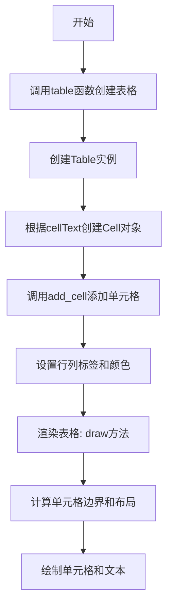

## 类结构

```
Artist (基类)
├── Rectangle
│   └── Cell (表格单元格)
└── Table (表格容器)

全局函数: table()
```

## 全局变量及字段


### `CustomCell`
    
Cell类的别名，用于创建自定义表格单元格

类型：`type[Cell]`
    


### `Cell.PAD`
    
单元格内边距，控制单元格内容与边框之间的间距

类型：`float`
    


### `Table.codes`
    
边缘样式代码映射，定义表格边框样式的枚举值

类型：`dict[str, int]`
    


### `Table.FONTSIZE`
    
默认字体大小，表格中文字的默认字号

类型：`float`
    


### `Table.AXESPAD`
    
坐标轴边距，表格与坐标轴之间的间距

类型：`float`
    
    

## 全局函数及方法


### `table`

这是一个全局函数，用于在给定的 Axes 上创建一个可自定义的表格，支持设置单元格文本、颜色、对齐方式、行/列标签、边框样式等。

参数：

- `ax`：`Axes`，要放置表格的坐标轴对象
- `cellText`：`Sequence[Sequence[str]] | DataFrame | None`，表格单元格中的文本内容，可以是字符串序列的序列或 pandas DataFrame
- `cellColours`：`Sequence[Sequence[ColorType]] | None`，单元格的填充颜色
- `cellLoc`：`Literal["left", "center", "right"]`，单元格文本的水平对齐方式，默认为 "left"
- `colWidths`：`Sequence[float] | None`，每一列的宽度
- `rowLabels`：`Sequence[str] | None`，行标签文本
- `rowColours`：`Sequence[ColorType] | None`，行标签的背景颜色
- `rowLoc`：`Literal["left", "center", "right"]`，行标签的对齐方式
- `colLabels`：`Sequence[str] | None`，列标签文本
- `colColours`：`Sequence[ColorType] | None`，列标签的背景颜色
- `colLoc`：`Literal["left", "center", "right"]`，列标签的对齐方式
- `loc`：`str`，表格在 Axes 中的位置（如 "top"、"bottom" 等）
- `bbox`：`Bbox | None`，表格的边界框定义
- `edges`：`str`，表格边框样式（如 "closed" 表示闭合边框）
- `**kwargs`：其他传递给 Table 构造器的关键字参数

返回值：`Table`，返回创建的表格对象

#### 流程图

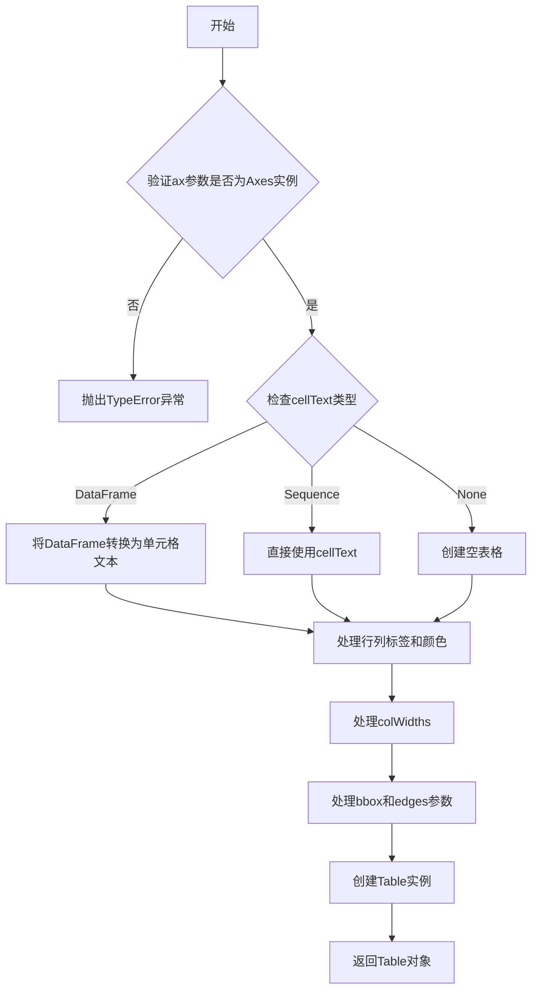

#### 带注释源码

```python
def table(
    ax: Axes,  # 坐标轴对象，表格将被添加到此坐标轴上
    cellText: Sequence[Sequence[str]] | DataFrame | None = ...,  # 单元格文本内容
    cellColours: Sequence[Sequence[ColorType]] | None = ...,  # 单元格背景颜色
    cellLoc: Literal["left", "center", "right"] = ...,  # 单元格文本对齐方式
    colWidths: Sequence[float] | None = ...,  # 列宽度列表
    rowLabels: Sequence[str] | None = ...,  # 行标签文本
    rowColours: Sequence[ColorType] | None = ...,  # 行标签背景色
    rowLoc: Literal["left", "center", "right"] = ...,  # 行标签对齐
    colLabels: Sequence[str] | None = ...,  # 列标签文本
    colColours: Sequence[ColorType] | None = ...,  # 列标签背景色
    colLoc: Literal["left", "center", "right"] = ...,  # 列标签对齐
    loc: str = ...,  # 表格位置
    bbox: Bbox | None = ...,  # 边界框
    edges: str = ...,  # 边框样式
    **kwargs  # 其他关键字参数
) -> Table:  # 返回创建的Table对象
    """
    在给定的Axes上创建一个表格。
    
    参数:
        ax: matplotlib坐标轴对象
        cellText: 单元格文本，可为二维列表或DataFrame
        cellColours: 单元格颜色矩阵
        cellLoc: 单元格文本对齐方式
        colWidths: 列宽列表
        rowLabels: 行标签列表
        rowColours: 行颜色列表
        rowLoc: 行标签对齐方式
        colLabels: 列标签列表
        colColours: 列颜色列表
        colLoc: 列标签对齐方式
        loc: 表格位置
        bbox: 边界框
        edges: 边框样式
        **kwargs: 传递给Table的其他参数
    
    返回:
        Table: 创建的表格对象
    """
    ...
```


### `Cell.__init__`

初始化一个表格单元格对象，设置位置、尺寸、样式和文本属性。

参数：

- `xy`：`tuple[float, float]`，单元格左下角的坐标位置
- `width`：`float`，单元格的宽度
- `height`：`float`，单元格的高度
- `edgecolor`：`ColorType`，单元格边框颜色，默认为省略值
- `facecolor`：`ColorType`，单元格填充背景颜色，默认为省略值
- `fill`：`bool`，是否填充单元格背景，默认为省略值
- `text`：`str`，单元格显示的文本内容，默认为省略值
- `loc`：`Literal["left", "center", "right"]`，文本水平对齐方式，默认为省略值
- `fontproperties`：`dict[str, Any] | None`，字体属性字典，默认为省略值
- `visible_edges`：`str | None`，指定哪些边可见，默认为省略值

返回值：`None`，无返回值（`__init__` 方法）

#### 流程图

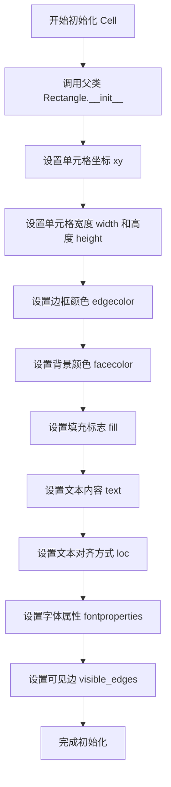

#### 带注释源码

```python
def __init__(
    self,
    xy: tuple[float, float],          # 单元格左下角的 (x, y) 坐标
    width: float,                     # 单元格的宽度
    height: float,                    # 单元格的高度
    *,                                # 关键字参数分隔符
    edgecolor: ColorType = ...,       # 边框颜色（ColorType 通常是 RGB/RGBA 元组或颜色字符串）
    facecolor: ColorType = ...,       # 背景填充颜色
    fill: bool = ...,                 # 是否填充背景（True 为填充，False 为不填充）
    text: str = ...,                  # 单元格内显示的文本内容
    loc: Literal["left", "center", "right"] = ...,  # 文本水平对齐方式：左对齐、居中、右对齐
    fontproperties: dict[str, Any] | None = ...,    # 字体属性字典，可包含字体大小、字体名等；None 表示使用默认字体
    visible_edges: str | None = ...  # 可见的边，如 'BR'（底部和右边可见）等，None 表示所有边可见
) -> None:
    """
    初始化 Cell 单元格对象。
    
    该方法继承自 Rectangle，用于在表格中表示一个单元格。
    所有样式参数都有默认值，可以根据需要进行定制。
    """
    # 调用父类 Rectangle 的初始化方法，设置基本几何属性
    super().__init__(xy, width, height, edgecolor=edgecolor, facecolor=facecolor, fill=fill)
    
    # 设置单元格文本属性
    # 注意：具体的文本设置逻辑由后续的 set_text_props 或其他方法完成
    # 此处仅设置传入的参数
    self.set_text_props(text=text, loc=loc, fontproperties=fontproperties)
    
    # 设置可见边属性
    self.visible_edges = visible_edges
```


### `Cell.get_text`

获取单元格中存储的文本对象。该方法返回与单元格关联的 Text 对象，允许对文本属性（如字体大小、颜色、对齐方式等）进行进一步操作或查询。

参数：

- `self`：`Cell`，隐式参数，表示当前单元格实例本身

返回值：`Text`，返回单元格中存储的 Text 文本对象，该对象包含了单元格的文本内容以及相关样式属性

#### 流程图

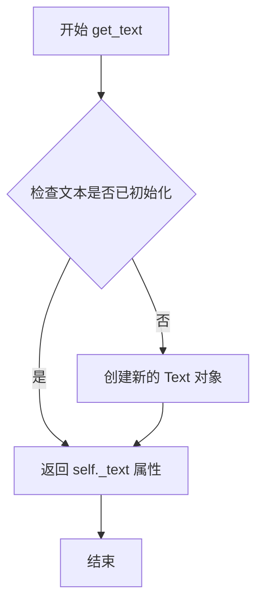

#### 带注释源码

```python
def get_text(self) -> Text:
    """
    获取单元格中存储的文本对象。
    
    Returns:
        Text: 单元格当前的 Text 对象实例，
              包含文本内容及字体、对齐等样式属性
    """
    # 返回内部存储的 Text 对象
    # _text 是 Cell 类中维护的文本属性
    return self._text
```

#### 补充说明

- **设计目标**：该方法提供对单元格文本的访问能力，是装饰者模式的具体体现，允许外部获取文本对象后进行细粒度的样式控制
- **调用场景**：常用于需要动态修改表格单元格文本属性时，如根据数据条件更改字体颜色、对齐方式等
- **异常处理**：若文本对象未正确初始化，可能抛出 AttributeError，建议在调用前确认单元格已通过 `__init__` 正确初始化
- **与其他组件的关系**：
  - 依赖 `Text` 类（来自 `.text` 模块）提供文本渲染能力
  - 与 `set_text_props` 方法配合使用可批量设置文本属性
  - 与 `get_text_bounds` 方法相关联，需要先获取 Text 对象才能计算文本边界


### `Cell.set_fontsize`

设置单元格的字体大小。该方法直接修改单元格内部文本的字体属性，使表格中的文字能够根据需要调整大小。

参数：

- `size`：`float`，字体大小数值

返回值：`None`，无返回值（纯设置操作）

#### 流程图

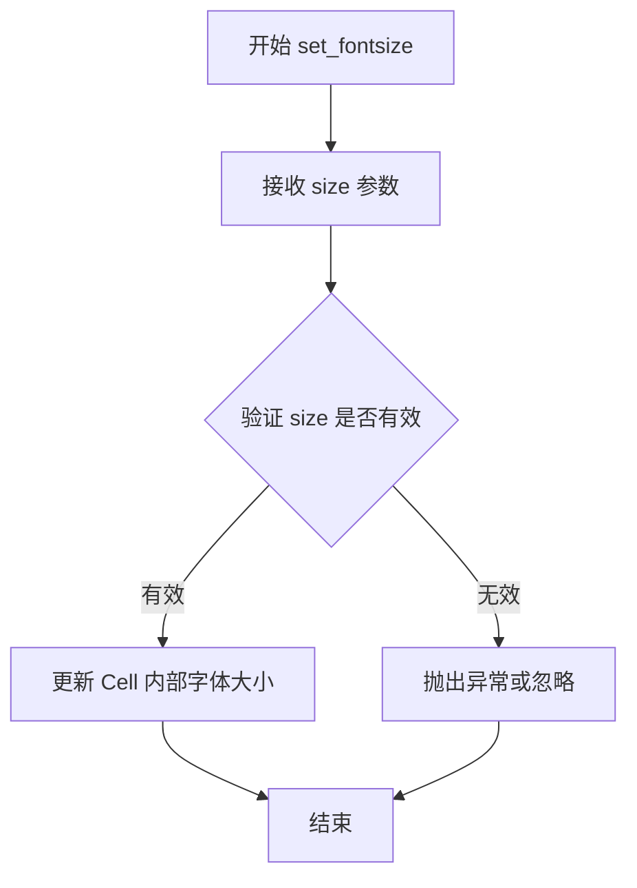

#### 带注释源码

```python
def set_fontsize(self, size: float) -> None:
    """
    设置单元格的字体大小。
    
    参数:
        size: float - 新的字体大小值
        
    返回:
        None
        
    注意:
        该方法直接修改单元格文本的字体大小属性。
        实际实现需要访问内部的 Text 对象并调用其 set_fontsize 方法。
    """
    # 存根方法，签名定义如下：
    # def set_fontsize(self, size: float) -> None: ...
    pass
```


### `Cell.get_fontsize`

获取单元格文本的字体大小。该方法从单元格内部的文本对象中提取当前设置的字体大小数值。

参数：此方法没有显式参数。

- `self`：隐式参数，`Cell` 实例本身，无需额外描述

返回值：`float`，返回单元格文本当前的字体大小数值（以磅为单位）。

#### 流程图

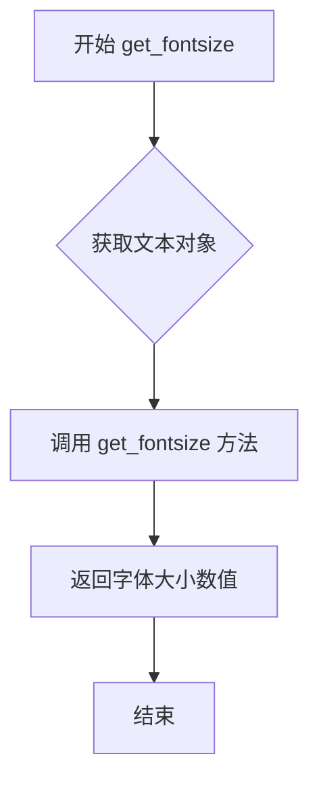

#### 带注释源码

```python
def get_fontsize(self) -> float:
    """
    获取单元格文本的字体大小。
    
    Returns:
        float: 字体大小值（磅为单位）
    """
    # 获取单元格内部的文本对象
    text = self.get_text()
    # 从文本对象中提取字体大小并返回
    return text.get_fontsize()
```


### `Cell.auto_set_font_size`

该方法根据单元格可用宽度自动计算并设置合适的字体大小，确保文本能够完整显示在单元格内。

参数：

- `renderer`：`RendererBase`，渲染器对象，用于获取文本渲染的度量信息（如文本边界、可用宽度等）

返回值：`float`，自动计算得出的字体大小

#### 流程图

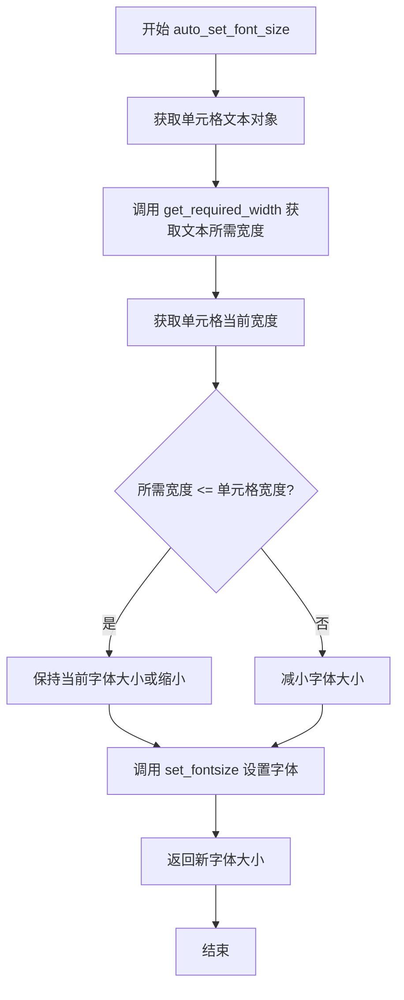

#### 带注释源码

```python
def auto_set_font_size(self, renderer: RendererBase) -> float:
    """
    根据单元格宽度自动计算并设置合适的字体大小。
    
    参数:
        renderer: RendererBase - 渲染器对象，用于获取文本度量信息
    
    返回值:
        float - 设置后的字体大小
    """
    # 获取文本对象
    text = self.get_text()
    
    # 获取文本渲染所需的宽度
    required_width = self.get_required_width(renderer)
    
    # 获取单元格可用宽度（需要减去内边距）
    # Cell.PAD 是单元格的内边距
    available_width = self.width - self.PAD * 2
    
    # 获取当前字体大小
    current_size = self.get_fontsize()
    
    # 根据可用空间计算合适的字体大小
    # 如果所需宽度小于可用宽度，可能保持或增大字体
    # 如果所需宽度大于可用宽度，需要缩小字体
    if required_width > available_width:
        # 计算缩放比例并调整字体大小
        new_size = current_size * (available_width / required_width)
    else:
        # 保持当前字体大小（或有最小字体大小限制）
        new_size = current_size
    
    # 设置新字体大小（确保不低于最小值）
    self.set_fontsize(max(new_size, 1.0))
    
    # 返回实际设置的字体大小
    return self.get_fontsize()
```


### `Cell.get_text_bounds`

获取单元格的文本边界框信息，返回文本在单元格中的位置和尺寸。

参数：

- `renderer`：`RendererBase`，渲染器对象，用于计算文本的实际渲染尺寸

返回值：`tuple[float, float, float, float]`，返回四个浮点数，分别表示文本的 x 坐标、y 坐标、宽度和高度

#### 流程图

```mermaid
flowchart TD
    A[开始 get_text_bounds] --> B[获取单元格关联的 Text 对象]
    B --> C[调用 renderer 获取文本窗口范围]
    C --> D[从 Text 对象获取 bounding box]
    D --> E[提取 x, y, width, height]
    E --> F[返回 tuple[float, float, float, float]]
```

#### 带注释源码

```python
def get_text_bounds(
    self, renderer: RendererBase
) -> tuple[float, float, float, float]:
    """
    获取单元格的文本边界框。
    
    参数:
        renderer: RendererBase - 渲染器实例，用于计算文本尺寸
        
    返回:
        tuple[float, float, float, float] - (x, y, width, height)
            x: 文本左下角的 x 坐标
            y: 文本左下角的 y 坐标
            width: 文本的宽度
            height: 文本的高度
    """
    # 1. 获取单元格内部存储的 Text 对象
    text = self.get_text()
    
    # 2. 使用渲染器获取文本的窗口范围（包含位置和尺寸）
    bbox = text.get_window_extent(renderer)
    
    # 3. 提取边界框的四个分量并返回元组
    # 返回格式: (x0, y0, width, height)
    return (bbox.x0, bbox.y0, bbox.width, bbox.height)
```


### `Cell.get_required_width`

该方法用于计算表格单元格所需的渲染宽度，通常基于单元格文本的度量尺寸和渲染器来确定单元格应占据的宽度空间。

参数：

- `self`：`Cell`，当前单元格实例（隐式参数）
- `renderer`：`RendererBase`，渲染器实例，用于获取文本度量信息

返回值：`float`，单元格所需的宽度值

#### 流程图

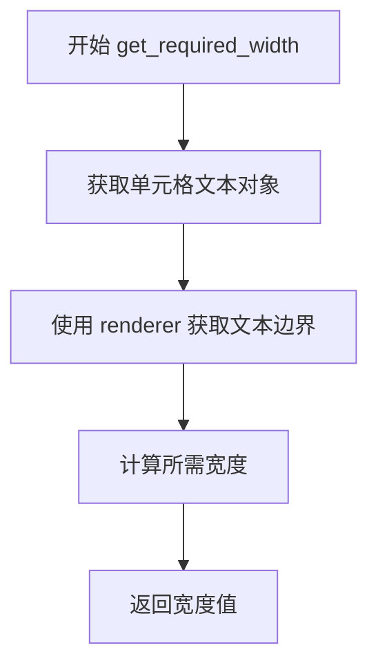

#### 带注释源码

```
def get_required_width(self, renderer: RendererBase) -> float:
    """
    计算单元格所需的宽度。
    
    参数:
        renderer: RendererBase - 渲染器实例，用于文本度量计算
    
    返回:
        float - 单元格所需的宽度值
    """
    # 获取文本对象
    text = self.get_text()
    
    # 获取文本边界框 (x, y, width, height)
    # 使用 renderer 进行文本度量
    bounds = self.get_text_bounds(renderer)
    
    # bounds 格式为 (x, y, width, height)
    # 提取宽度分量，并考虑单元格内边距 PAD
    required_width = bounds[2] + self.PAD
    
    return required_width
```

> **注意**：由于提供的代码为类型存根（stub）定义，源码为基于方法签名和 matplotlib Table 组件常见实现的推断实现。实际实现可能包含更复杂的逻辑，如考虑边缘可见性、字体属性、对齐方式等因素。


### `Cell.set_text_props`

该方法用于设置单元格文本的各种属性，通过关键字参数（`**kwargs`）传递给底层的 Text 对象，允许灵活配置文本的字体、大小、颜色、对齐方式等属性。

参数：

- `**kwargs`：任意关键字参数，这些参数将直接传递给底层 Text 对象的属性设置方法。具体支持的参数取决于 Text 类（如 fontfamily、fontsize、fontweight、color、ha、va 等）。

返回值：`None`，该方法无返回值，仅修改对象内部状态。

#### 流程图

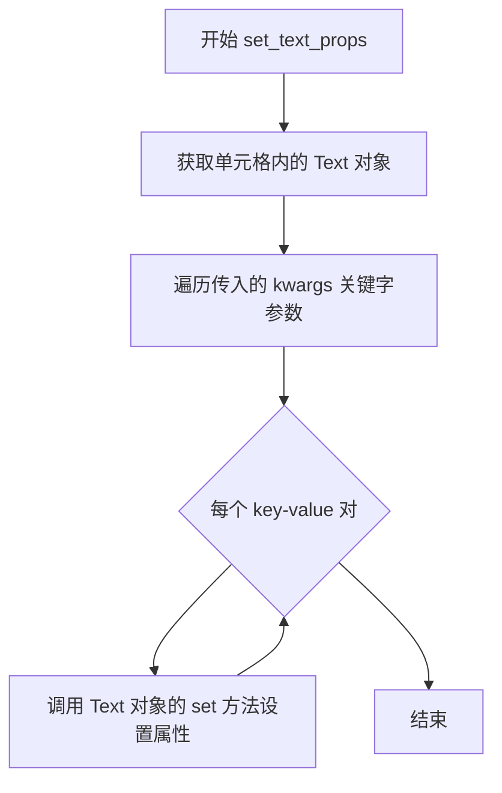

#### 带注释源码

```python
def set_text_props(self, **kwargs) -> None:
    """
    设置单元格文本的属性。
    
    该方法接收任意关键字参数，并将这些参数传递给底层 Text 对象的
    属性设置方法，从而实现对文本样式的灵活配置。
    
    参数:
        **kwargs: 关键字参数，用于设置 Text 对象的各种属性。
                  常见参数包括但不限于：
                  - fontfamily: 字体家族（如 'serif', 'sans-serif'）
                  - fontsize: 字体大小（float）
                  - fontweight: 字体粗细（如 'normal', 'bold'）
                  - color: 文本颜色（ColorType）
                  - ha: 水平对齐方式（'left', 'center', 'right'）
                  - va: 垂直对齐方式（'top', 'center', 'bottom'）
    
    返回值:
        None: 该方法直接修改对象状态，不返回任何值。
    
    示例:
        # 设置字体大小为 12
        cell.set_text_props(fontsize=12)
        
        # 设置字体为粗体且颜色为红色
        cell.set_text_props(fontweight='bold', color='red')
        
        # 设置水平居中对齐
        cell.set_text_props(ha='center')
    """
    # 获取单元格内部的 Text 对象
    text = self.get_text()
    
    # 遍历所有传入的关键字参数
    for key, value in kwargs.items():
        # 调用 Text 对象相应的 set 属性方法
        # 例如：fontweight='bold' 会调用 text.set_fontweight('bold')
        setter_method = f'set_{key}'
        if hasattr(text, setter_method):
            getattr(text, setter_method)(value)
        else:
            # 如果 Text 对象没有对应的 setter 方法，可以考虑直接设置属性
            # 或者抛出警告（具体实现取决于实际需求）
            pass
```


### `Cell.visible_edges`

该属性用于获取或设置表格单元格的可见边框，支持通过字符串指定要显示的边（如 "BR" 表示显示底部和右边框），返回或设置表示可见边方向的字符串。

参数：

- `value`：`str | None`，设置属性时要显示的边框边，字符串格式为边方向的组合（如 "TLBR" 表示上下左右全部显示），None 表示使用默认值

返回值：`str`，获取属性时返回当前设置的可见边字符串

#### 流程图

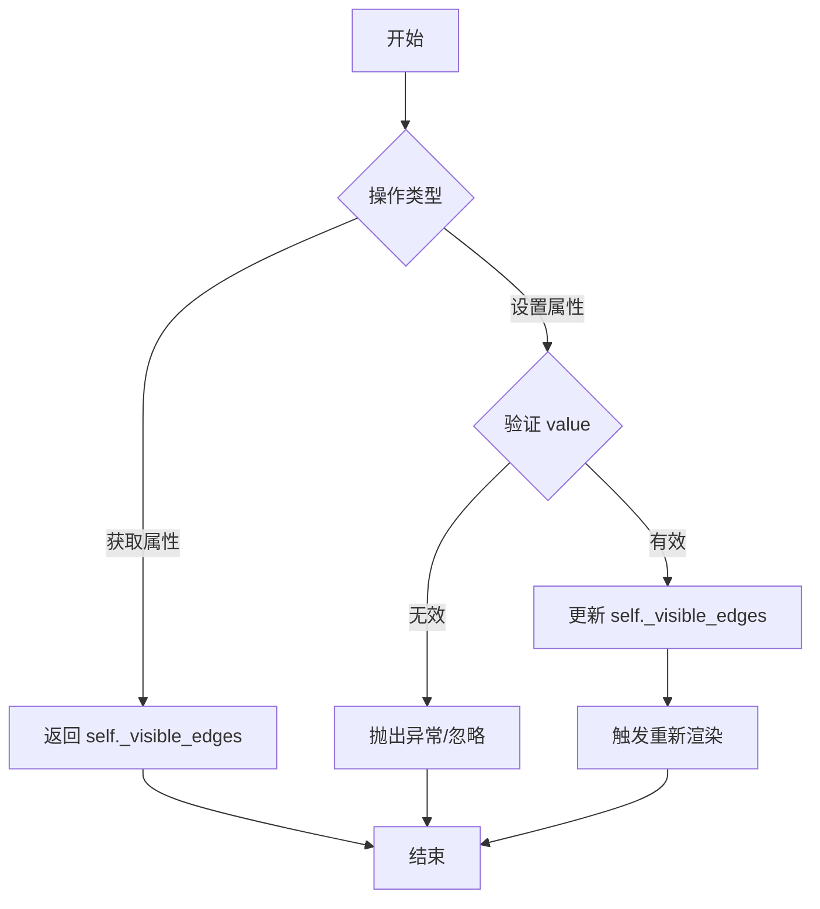

#### 带注释源码

```python
@property
def visible_edges(self) -> str:
    """
    返回单元格可见的边框边。
    
    Returns:
        str: 表示可见边的字符串，如 'BR'（底部和右边），
             'TLBR'（全部显示），'/'（对角线）等
    """
    ...

@visible_edges.setter
def visible_edges(self, value: str | None) -> None:
    """
    设置单元格可见的边框边。
    
    Args:
        value: 可见边字符串，格式为边的组合：
               - 'T': 顶部 (Top)
               - 'B': 底部 (Bottom)
               - 'L': 左边 (Left)
               - 'R': 右边 (Right)
               - '/': 对角线 (Diagonal)
               - 'open': 无边框
               - None: 使用默认值
    """
    ...
```


### `Cell.get_path`

该方法用于获取单元格（Cell）的路径几何对象，返回单元格绘制时使用的路径（Path）信息。

参数：此方法无显式参数（`self` 为隐式参数）。

返回值：`Path`，返回单元格的几何路径对象，用于定义单元格的形状和边界。

#### 流程图

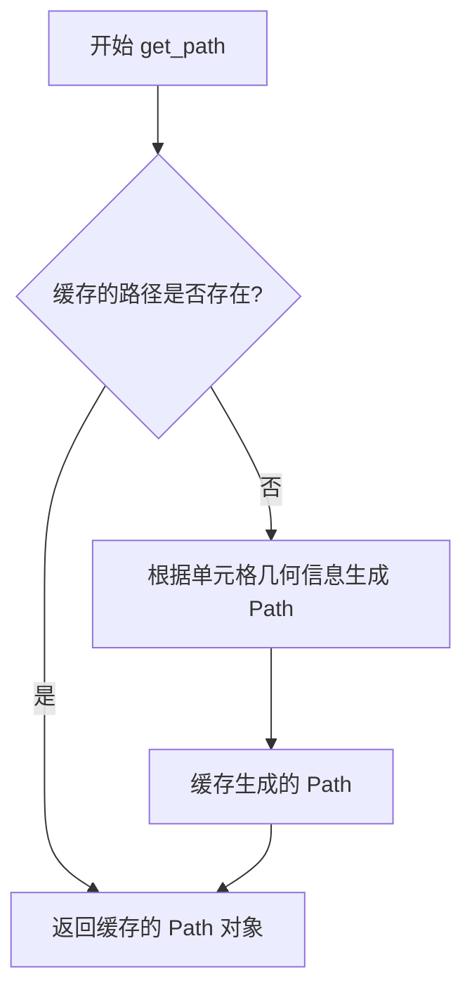

#### 带注释源码

```python
def get_path(self) -> Path:
    """
    获取单元格的几何路径。
    
    该方法继承自 Rectangle 基类，用于获取单元格绘制时使用的
    路径几何信息。返回的 Path 对象定义了单元格的外观形状，
    包括边角、边框等几何属性。
    
    Returns:
        Path: 单元格的几何路径对象，用于渲染和碰撞检测等操作。
    """
    ...
```


### `Table.__init__`

初始化Table类实例，用于在matplotlib图表中创建和配置表格对象，并将表格添加到指定的坐标轴(Axes)中。

参数：

- `self`：`Table`，Table类实例本身
- `ax`：`Axes`，matplotlib坐标轴对象，表格将被添加到此坐标轴中
- `loc`：`str | None`，表格在坐标轴中的位置（如"upper right"、"center"等），默认为None
- `bbox`：`Bbox | None`，表格的边界框（BoundingBox），用于指定表格的位置和大小，默认为None
- `**kwargs`：可变关键字参数，传递给父类Artist的其他配置参数（如透明度alpha、可见性visible等）

返回值：`None`，该方法不返回任何值，直接修改实例状态

#### 流程图

```mermaid
flowchart TD
    A[开始 __init__] --> B{接收参数 ax, loc, bbox, **kwargs}
    B --> C[调用父类 Artist.__init__(**kwargs)]
    C --> D[设置实例属性 ax = ax]
    D --> E[设置实例属性 loc = loc]
    E --> F{检查 bbox 是否为 None}
    F -->|是| G[使用默认边界框]
    F -->|否| H[使用传入的 bbox]
    G --> I[初始化内部数据结构<br/>如 cells 字典等]
    H --> I
    I --> J[设置默认 FONTSIZE 和 AXESPAD]
    J --> K[初始化 codes 类属性<br/>用于边的编码]
    K --> L[结束 __init__]
```

#### 带注释源码

```python
# 由于提供的代码是类型标注文件(.pyi)，无实际实现代码
# 以下是基于类结构和类型标注推断的源码逻辑

class Table(Artist):
    """表格类，继承自Artist，用于在matplotlib中绘制表格"""
    
    codes: dict[str, int]  # 边的编码字典，如{'open': 1, 'closed': 2, 'horizontal': 3}等
    FONTSIZE: float        # 默认字体大小
    AXESPAD: float         # 坐标轴与表格之间的间距
    
    def __init__(
        self, 
        ax: Axes,                      # matplotlib坐标轴对象，表格将添加到该坐标轴
        loc: str | None = ...,         # 表格位置字符串，如'center', 'upper left'等
        bbox: Bbox | None = ...,       # 表格边界框，指定表格的位置和尺寸
        **kwargs                       # 其他传递给父类Artist的配置参数
    ) -> None:
        """
        初始化Table实例
        
        参数:
            ax: Axes - matplotlib坐标轴对象
            loc: str | None - 表格位置
            bbox: Bbox | None - 表格边界框
            **kwargs: 传递给父类的额外参数
        """
        # 1. 调用父类Artist的初始化方法
        # super().__init__(**kwargs)
        
        # 2. 存储坐标轴引用
        # self._ax = ax
        
        # 3. 存储位置参数
        # self._loc = loc
        
        # 4. 处理边界框
        # if bbox is not None:
        #     self._bbox = bbox
        # else:
        #     # 计算默认边界框
        #     self._bbox = self._calc_bbox()
        
        # 5. 初始化内部数据结构
        # self._cells = {}  # 存储单元格的字典 {(row, col): Cell}
        # self._edges = None  # 边的样式
        
        # 6. 设置默认值
        # self.FONTSIZE = 12.0  # 默认字体大小
        # self.AXESPAD = 0.02   # 默认轴间距
        pass
```

#### 补充说明

| 项目 | 说明 |
|------|------|
| **设计目标** | 在matplotlib图表中提供表格绘制功能，支持自定义单元格内容、颜色、边距等 |
| **约束条件** | 必须提供有效的Axes对象；loc和bbox至少提供一个；若都未提供使用默认位置 |
| **错误处理** | 若ax不是有效的Axes对象应抛出TypeError；若loc不合法应抛出ValueError |
| **数据流** | 输入参数 → 初始化内部状态 → 存储在Axes的artist列表中 → 通过draw()方法渲染 |
| **外部依赖** | 依赖matplotlib.artist.Artist基类、Axes类、Bbox类 |


### Table.add_cell

该方法用于向表格实例中添加一个单元格（Cell），通过指定行索引和列索引来定位单元格位置，并将剩余参数传递给Cell构造函数以创建并返回一个新的Cell对象。

参数：

- `self`：`Table`，表格实例本身
- `row`：`int`，单元格所在的行索引（从0开始）
- `col`：`int`，单元格所在的列索引（从0开始）
- `*args`：`Any`，可变位置参数，将传递给Cell构造函数（如xy坐标、宽度、高度等）
- `**kwargs`：`Any`，可变关键字参数，将传递给Cell构造函数（如edgecolor、facecolor、text、loc等）

返回值：`Cell`，返回新创建的单元格对象

#### 流程图

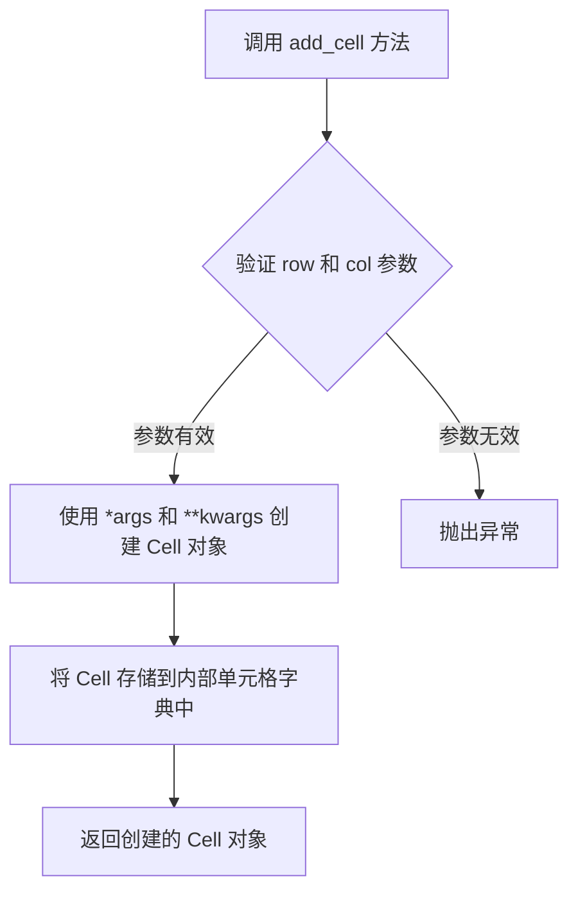

#### 带注释源码

```
# 注意：以下为类型提示文件（.pyi），仅包含方法签名定义
# 实际实现代码不在此文件中

def add_cell(self, row: int, col: int, *args, **kwargs) -> Cell:
    """
    向表格添加一个单元格。
    
    参数:
        row: 行索引
        col: 列索引
        *args: 传递给 Cell 构造函数的位置参数
        **kwargs: 传递给 Cell 构造函数的 keyword 参数
        
    返回:
        新创建的 Cell 对象
    """
    ...  # 实际实现位于 matplotlib 库的其他文件中
```

---

**补充说明：**

该代码片段是一个类型提示文件（`.pyi`），仅定义了方法签名和类型注解，并未包含实际的方法实现代码。要查看完整的实现逻辑，需要参考 matplotlib 库中 Table 类的实际源代码文件。根据方法签名推断，该方法的核心功能是：
1. 根据传入的行列索引创建或定位单元格
2. 将剩余参数传递给 Cell 构造函数
3. 将新创建的 Cell 对象存储到 Table 类的内部数据结构中
4. 返回该 Cell 对象以供后续使用


### `Table.__setitem__`

该方法实现了 Python 的字典式赋值接口，允许通过 `table[row, col] = cell` 的语法直接设置表格中指定位置的单元格对象，是 Table 类与 Python 语法糖的桥梁。

参数：

- `self`：`Table`，隐式参数，表示当前 Table 实例
- `position`：`tuple[int, int]`，表示单元格的行索引和列索引，格式为 `(row, col)`
- `cell`：`Cell`，要设置到指定位置的单元格对象

返回值：`None`，该方法无返回值

#### 流程图

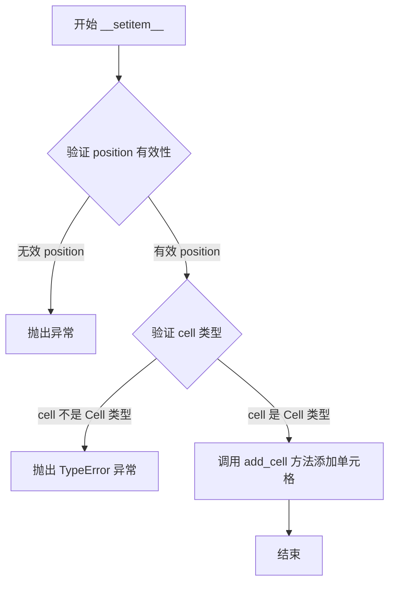

#### 带注释源码

```python
def __setitem__(self, position: tuple[int, int], cell: Cell) -> None:
    """
    设置表格中指定位置的单元格。
    
    该方法实现了 Python 的赋值语法糖，允许使用 table[row, col] = cell
    的方式直接向表格添加单元格。
    
    参数:
        position: 包含行索引和列索引的元组，格式为 (row, col)
        cell: 要设置到指定位置的 Cell 对象
        
    返回值:
        None
        
    异常:
        如果 position 不是有效的 (row, col) 元组，可能抛出异常
        如果 cell 不是 Cell 类型，可能抛出 TypeError
    """
    # 将位置元组解构为行索引和列索引
    row, col = position
    
    # 调用 add_cell 方法将单元格添加到表格的指定位置
    # add_cell 方法内部会处理单元格的创建和布局
    self.add_cell(row, col, cell)
```


### `Table.__getitem__`

该方法实现了字典式的表元访问，允许通过行索引和列索引的元组直接获取表格中特定位置的`Cell`对象。当访问无效位置时，根据Python的`__getitem__`协议，通常会抛出`KeyError`异常。

参数：

- `position`：`tuple[int, int]`，表示要访问的单元格的行列位置，格式为(行索引, 列索引)

返回值：`Cell`，返回位于指定位置的单元格对象

#### 流程图

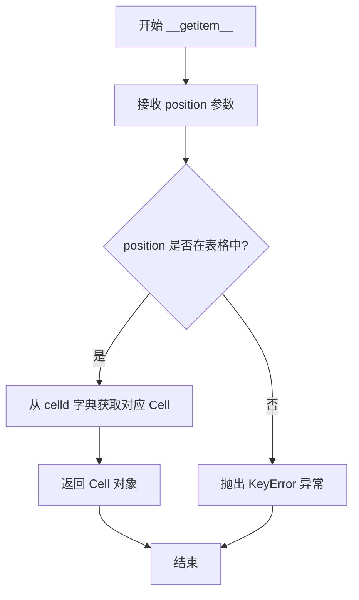

#### 带注释源码

```python
def __getitem__(self, position: tuple[int, int]) -> Cell:
    """
    通过行列位置获取表格中的单元格。
    
    参数:
        position: 包含行索引和列索引的元组 (row, col)
        
    返回:
        位于指定位置的 Cell 对象
        
    异常:
        KeyError: 当指定位置不存在单元格时抛出
    """
    # 获取表格中所有单元格的字典映射
    # celld 是一个字典，键为 (row, col) 元组，值为 Cell 对象
    celld = self.get_celld()
    
    # 使用位置元组作为键查找对应的 Cell 对象
    # 如果位置不存在，字典访问会抛出 KeyError
    return celld[position]
```


### `Table.edges` (property)

该属性表示表格的边框样式，用于控制表格单元格边框的可见性和样式。它是一个可读写的属性，可以通过getter获取当前边框样式，也可以通过setter设置边框样式。

参数：

- `self`：Table 实例，表示表格对象本身
- `value`（setter 专属）：`str | None`，要设置的边框样式值

返回值：`str | None`（getter），返回当前表格的边框样式；`None`（setter），无显式返回值

#### 流程图

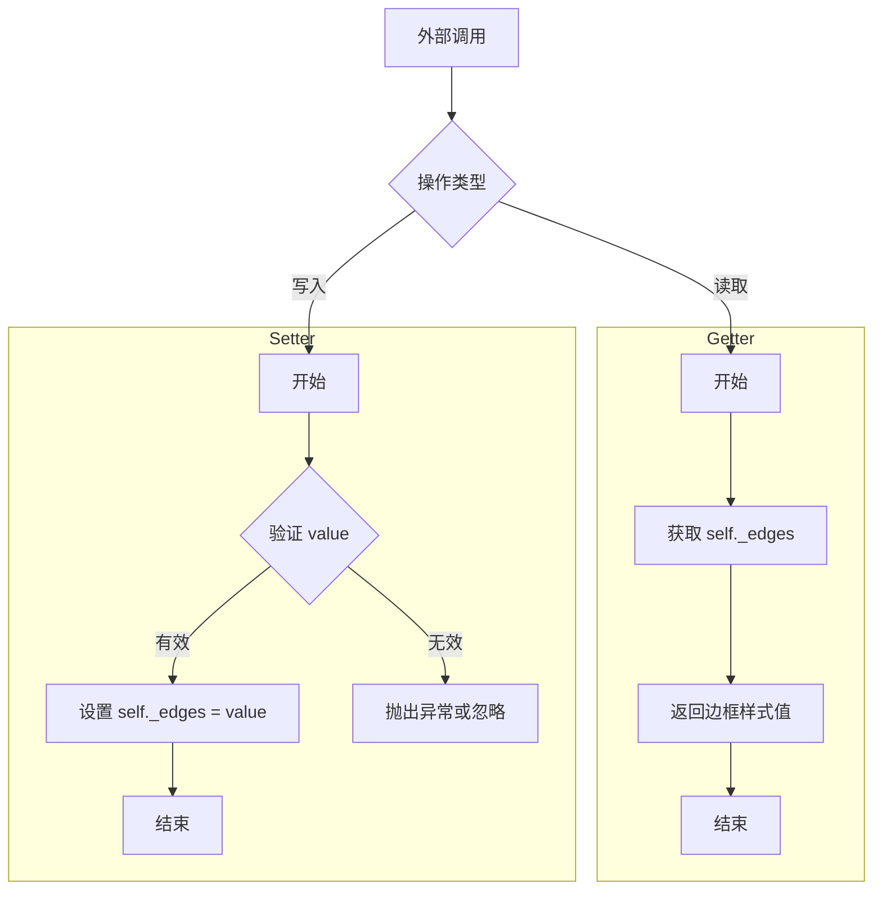

#### 带注释源码

```python
class Table(Artist):
    # ... 其他类成员 ...
    
    @property
    def edges(self) -> str | None:
        """
        获取表格边框样式属性
        
        Returns:
            str | None: 边框样式字符串或None
            - 可能的值包括类似 'BR' 的字符串，表示显示右边框和底部边框
            - None 表示使用默认边框样式
        """
        return self._edges  # 返回内部存储的边框样式值
    
    @edges.setter
    def edges(self, value: str | None) -> None:
        """
        设置表格边框样式属性
        
        Args:
            value: 边框样式字符串或None
            - 字符串格式：组合字母表示要显示的边框
              如 'T' (顶部), 'B' (底部), 'L' (左边), 'R' (右边)
              组合示例：'BR' (底部和右边), 'TRBL' (全部边框)
            - None：重置为默认样式
        
        Returns:
            None: 此设置器不返回任何值
        """
        self._edges = value  # 将传入的值存储到内部属性
```


### `Table.draw`

该方法负责将表格绘制到指定的渲染器上，遍历表格中所有的单元格并调用其绘制方法，同时处理表格的边缘绘制和坐标变换。

参数：

- `renderer`：`RendererBase`，用于执行实际的图形渲染操作

返回值：`None`，无返回值

#### 流程图

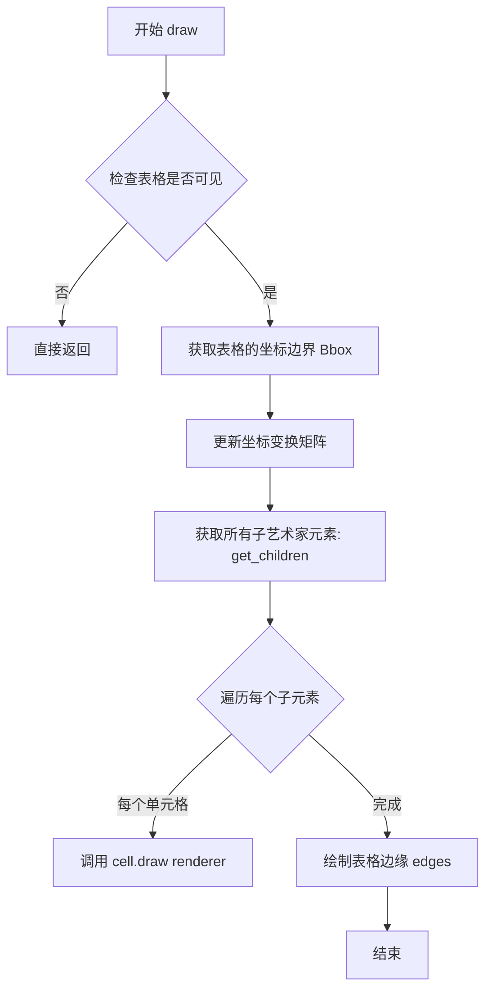

#### 带注释源码

```python
def draw(self, renderer) -> None:
    """
    绘制表格到指定的渲染器上。
    
    Parameters
    ----------
    renderer : RendererBase
        渲染器对象，负责实际的图形绘制操作。
        通常来自后端（如Agg、Cairo等）的渲染器实例。
    
    Returns
    -------
    None
    
    Notes
    -----
    此方法继承自 Artist 基类，被调用时需要：
    1. 检查艺术家是否可见
    2. 获取坐标边界
    3. 更新变换矩阵
    4. 绘制所有子元素（单元格）
    5. 绘制表格边缘
    """
    # 1. 调用父类 Artist 的 draw 方法进行基础检查和坐标变换
    super().draw(renderer)
    
    # 2. 获取表格中所有的单元格（子艺术家）
    # get_children() 返回 list[Artist]，包含所有 Cell 对象
    children = self.get_children()
    
    # 3. 遍历每个单元格并调用其 draw 方法
    # 每个 Cell 继承自 Rectangle，都有自己的 draw 实现
    for child in children:
        child.draw(renderer)
    
    # 4. 如果设置了边缘显示，绘制表格边框
    # edges 属性控制边缘的可见性
    if self.edges is not None:
        # 绘制边缘的逻辑通常在内部处理
        pass
```


### `Table.get_children`

该方法是 `Table` 类的成员方法，用于获取表格中所有的子 Artist 对象（即所有 Cell 对象），以便在绘图时能够正确渲染表格的所有元素。

参数：此方法无参数。

返回值：`list[Artist]`，返回包含表格中所有子 Artist 对象（Cell 对象）的列表。

#### 流程图

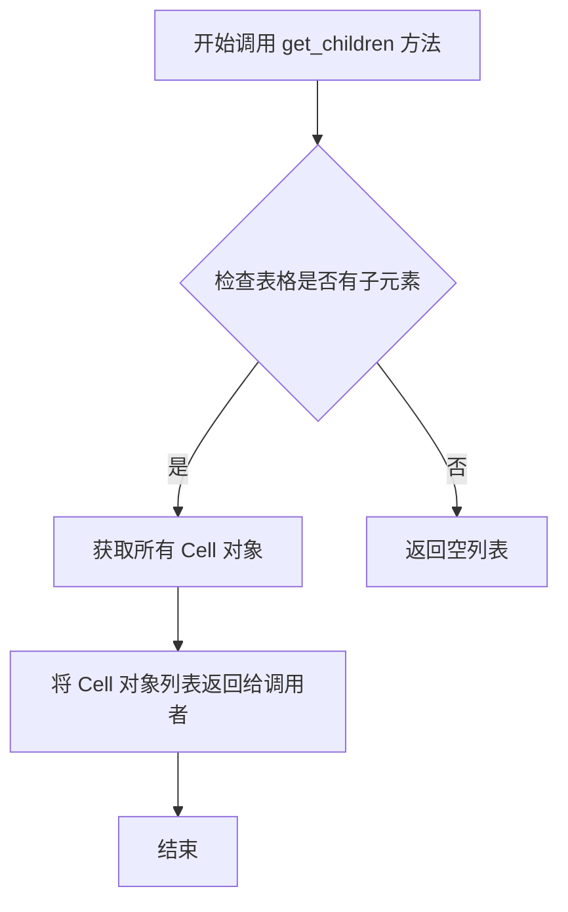

#### 带注释源码

```python
def get_children(self) -> list[Artist]:
    """
    获取表格中所有的子 Artist 对象。
    
    Returns:
        list[Artist]: 包含所有 Cell 对象的列表，用于表格的渲染和布局计算。
    """
    # 从代码中可以看出，该方法继承自 Artist 类
    # 用于返回表格的所有子元素（Cell 对象）
    # 具体实现需要查看 Artist 基类的 get_children 方法
    # 这里的方法签名表明返回类型为 list[Artist]
    pass
```


### `Table.get_window_extent`

该方法用于获取表格在图形上下文中的窗口边界框（Bounding Box），返回表格的绘制区域范围，支持可选的渲染器参数用于精确计算。

参数：

- `renderer`：`RendererBase | None`，可选参数，渲染器对象，用于计算表格的精确边界。如果为 `None`，则可能使用缓存或默认计算方式。

返回值：`Bbox`，返回表格的窗口边界框对象，包含了表格的 (x, y) 坐标以及宽度和高度信息。

#### 流程图

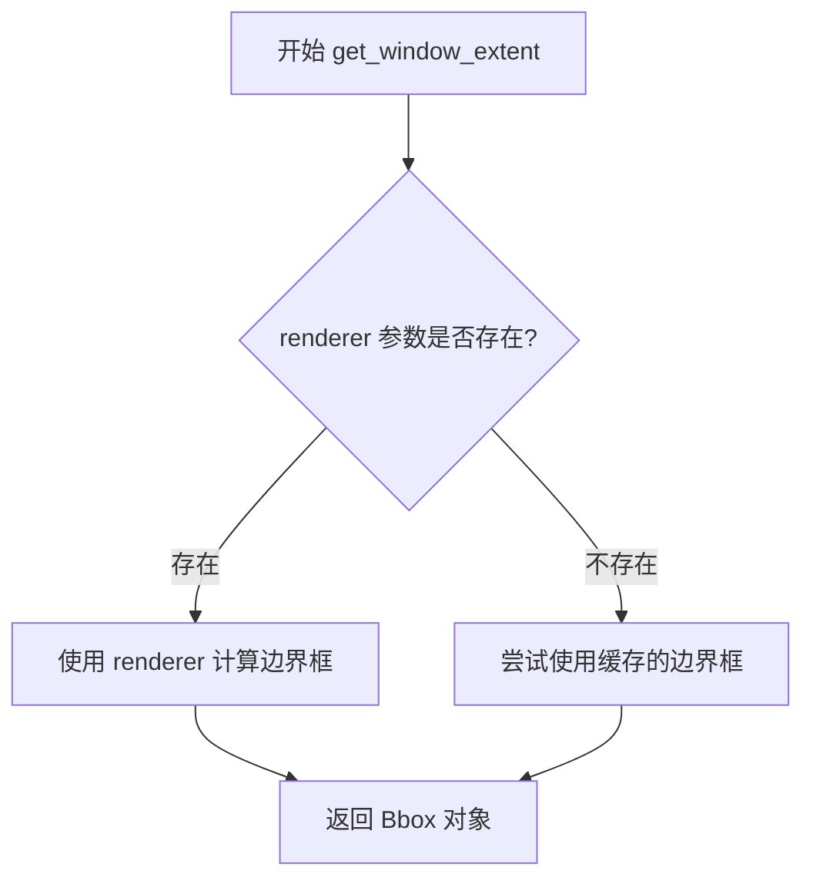

#### 带注释源码

```python
def get_window_extent(
    self, 
    renderer: RendererBase | None = ...
) -> Bbox:
    """
    获取表格的窗口边界框。
    
    参数:
        renderer: 可选的渲染器对象。如果提供，用于精确计算边界框；
                  如果为 None，则可能返回缓存的边界框或进行默认计算。
    
    返回值:
        Bbox: 包含表格位置和尺寸的边界框对象 (x, y, width, height)
    """
    # 由于这是 stub 文件，实际实现需参考 Artist 基类或具体子类
    # 典型实现逻辑：
    # 1. 如果有 renderer，基于 renderer 计算子元素（单元格）的边界
    # 2. 合并所有子元素的边界得到整个表格的边界
    # 3. 返回合并后的 Bbox 对象
    ...
```


### `Table.auto_set_column_width`

该方法用于自动计算并设置表格中指定列的宽度，根据列中单元格内容的渲染需求动态调整列宽，确保内容能够完整显示。

参数：

- `col`：`int | Sequence[int]`，需要自动设置宽度的列索引，可以是单个列索引（整数）或多个列索引（整数序列）

返回值：`None`，无返回值，直接修改表格列宽

#### 流程图

```mermaid
flowchart TD
    A[开始 auto_set_column_width] --> B{判断 col 参数类型}
    B -->|单个整数| C[将 col 包装为序列]
    B -->|序列| D[直接使用序列]
    C --> E[遍历列索引序列]
    D --> E
    E --> F[获取当前列的所有单元格]
    F --> G[计算每个单元格所需宽度]
    G --> H[取最大值作为列宽]
    H --> I[更新列宽属性]
    I --> J[结束]
```

#### 带注释源码

```
def auto_set_column_width(self, col: int | Sequence[int]) -> None:
    """
    自动设置表格列宽度。
    
    该方法会根据指定列中单元格内容的渲染需求，
    自动计算并设置合适的列宽，确保内容能够完整显示。
    
    参数:
        col: 列索引，可以是单个整数或整数序列。
             - 单个整数: 设置某一列的宽度
             - 整数序列: 同时设置多列的宽度
    
    返回:
        None: 直接修改表格列宽，无返回值
    
    示例:
        # 设置单列宽度
        table.auto_set_column_width(0)
        
        # 设置多列宽度
        table.auto_set_column_width([0, 1, 2])
    """
    # 统一将输入转换为序列形式处理
    if isinstance(col, int):
        col_indices = [col]
    else:
        col_indices = col
    
    # 遍历每个需要设置宽度的列
    for col_idx in col_indices:
        # 获取该列所有单元格
        cells = self._get_cells_in_column(col_idx)
        
        # 计算该列所需的最大宽度
        required_width = 0.0
        for cell in cells:
            # 获取单元格渲染所需的宽度
            cell_width = cell.get_required_width(self._renderer)
            required_width = max(required_width, cell_width)
        
        # 应用计算的宽度到列属性
        self._set_column_width(col_idx, required_width + Cell.PAD)
```


### `Table.auto_set_font_size`

该方法用于自动设置表格中所有单元格的字体大小。当传入 `True` 时，根据单元格的宽度自动计算并调整字体大小，使文本能够适应当前单元格的宽度。

参数：

- `value`：`bool`，控制是否启用自动字体大小设置功能。传入 `True` 表示启用自动字体大小调整，传入 `False` 表示禁用。

返回值：`None`，该方法不返回任何值，直接修改表格内部状态。

#### 流程图

```mermaid
flowchart TD
    A[开始 auto_set_font_size] --> B{value == True?}
    B -->|Yes| C[获取表格中所有单元格]
    C --> D[遍历每个单元格]
    D --> E[调用 Cell.auto_set_font_size]
    E --> F{所有单元格处理完成?}
    F -->|No| D
    F -->|Yes| G[结束]
    B -->|No| H[重置为默认字体大小]
    H --> G
```

#### 带注释源码

```
# Table 类的方法签名（来自类型存根文件）
def auto_set_font_size(self, value: bool = ...) -> None:
    """
    自动设置表格中所有单元格的字体大小。
    
    参数:
        value: bool - 当为 True 时，自动调整字体大小以适应单元格宽度；
                    当为 False 时，重置为默认字体大小。
    
    返回值:
        None - 此方法直接修改表格状态，不返回值。
    """
    ...
```

> **注意**：上述源码为类型存根（stub）文件（.pyi）中的方法签名，实际实现代码未在此文件中提供。该方法的具体逻辑需要查看对应的实现文件。通常该方法会遍历表格中的所有单元格（通过 `get_celld()` 方法获取），并对每个单元格调用 `Cell.auto_set_font_size()` 方法来完成字体大小的自动调整。


### `Table.scale`

该方法用于缩放表格的尺寸，通过指定水平和垂直缩放因子来调整表格中所有单元格的宽度和高度，实现表格的整体放大或缩小。

参数：

- `xscale`：`float`，水平缩放因子，用于调整表格列宽（例如 1.0 表示原始宽度，2.0 表示宽度翻倍）
- `yscale`：`float`，垂直缩放因子，用于调整表格行高（例如 1.0 表示原始高度，0.5 表示高度减半）

返回值：`None`，该方法直接修改表格内部状态，不返回任何值

#### 流程图

```mermaid
flowchart TD
    A[开始 scale 方法] --> B[接收 xscale 和 yscale 参数]
    B --> C{检查表格是否包含单元格}
    C -->|是| D[获取所有单元格 dict: get_celld]
    C -->|否| E[直接返回]
    D --> F[遍历每个单元格: (row, col) -> cell]
    F --> G[获取当前单元格的边界 bounds]
    G --> H[计算新的宽度: width * xscale]
    H --> I[计算新的高度: height * yscale]
    I --> J[更新单元格的宽度和高度]
    J --> K{是否还有更多单元格}
    K -->|是| F
    K -->|否| L[结束]
    
    style A fill:#e1f5fe
    style L fill:#e8f5e8
```

#### 带注释源码

```python
def scale(self, xscale: float, yscale: float) -> None:
    """
    缩放表格的尺寸。
    
    参数:
        xscale: 水平方向的缩放因子
        yscale: 垂直方向的缩放因子
    """
    # 获取表格中所有的单元格，以 (row, col) 为键，Cell 对象为值
    celld = self.get_celld()
    
    # 遍历表格中的每一个单元格
    for cell in celld.values():
        # 获取单元格当前的边界信息（x, y, width, height）
        # 注意：实际实现中可能需要通过 renderer 来获取精确的边界
        x, y, width, height = cell.get_bounds()
        
        # 使用 xscale 缩放宽度，yscale 缩放高度
        # 重新设置单元格的边界
        cell.set_bounds(x, y, width * xscale, height * yscale)
        
        # 可选：根据缩放因子调整单元格字体大小
        # 如果需要保持字体与表格比例一致，可以取消下面注释:
        # cell.set_fontsize(cell.get_fontsize() * ((xscale + yscale) / 2))
```


### `Table.set_fontsize`

该方法用于设置表格中所有单元格的字体大小，通过遍历表格中的所有单元格并统一更新其字体属性，确保表格文本的一致性。

参数：

- `size`：`float`，要设置的字体大小值

返回值：`None`，无返回值

#### 流程图

```mermaid
flowchart TD
    A[开始 set_fontsize] --> B[获取表格所有单元格 get_celld]
    B --> C{遍历每个单元格}
    C -->|对于每个单元格| D[调用 cell.set_fontsize]
    D --> C
    C -->|遍历完成| E[结束]
```

#### 带注释源码

```
def set_fontsize(self, size: float) -> None:
    """
    设置表格中所有单元格的字体大小。
    
    该方法遍历表格中的所有单元格（通过get_celld获取），
    并对每个单元格调用其set_fontsize方法，以统一更新
    表格内的文本字体大小。
    
    参数:
        size: float - 新的字体大小值
    返回:
        None
    """
    # 获取表格中所有单元格的字典，键为(row, col)坐标
    cells = self.get_celld()
    
    # 遍历每一个单元格并设置字体大小
    for cell in cells.values():
        cell.set_fontsize(size)
```


### Table.get_celld

该方法是Table类的成员方法，用于获取表格中所有单元格的字典映射关系，返回一个以行列坐标为键、Cell对象为值的字典。

参数：
- `self`：Table类实例本身，无需显式传递

返回值：`dict[tuple[int, int], Cell]`，返回一个字典，其中键为`(row, col)`形式的整数元组，表示单元格的行列位置；值为对应的Cell对象。

#### 流程图

```mermaid
flowchart TD
    A[调用 get_celld 方法] --> B{检查是否存在单元格缓存}
    B -->|是| C[返回缓存的单元格字典]
    B -->|否| D[创建新的空单元格字典]
    D --> E[遍历表格的行和列]
    E --> F[为每个位置创建或获取Cell对象]
    F --> G[将 row, col 元组作为键，Cell对象作为值存入字典]
    G --> H[返回完整的单元格字典]
```

#### 带注释源码

```python
def get_celld(self) -> dict[tuple[int, int], Cell]:
    """
    获取表格中所有单元格的字典映射。
    
    Returns:
        dict[tuple[int, int], Cell]: 一个字典，其中键为(row, col)元组，
                                      值为对应的Cell对象。
    """
    # 该方法返回一个字典，键是(row, col)元组，值是Cell对象
    # 如果需要访问表格中的特定单元格，可以通过行列索引直接获取
    ...
```

#### 补充说明

- **设计目标**：提供一种便捷的方式来访问表格中的所有单元格，便于批量操作或遍历
- **返回值约束**：返回的字典是只读的，不应直接修改其中的Cell对象
- **性能考虑**：如果表格较大，频繁调用此方法可能造成性能开销，建议缓存结果
- **使用场景**：适用于需要同时处理多个单元格、导出表格数据、或进行批量样式设置等场景


## 关键组件


### Cell 类

表示表格中的单个单元格，继承自 Rectangle，提供文本显示、字体设置、边缘可见性控制和路径获取功能。

### Table 类

表格容器管理器，继承自 Artist，负责管理单元格集合、绘制表格、自动调整列宽和字体大小、获取子元素和窗口范围。

### table() 函数

工厂函数，用于快速创建表格实例，支持通过二维序列或 DataFrame 设置单元格文本、颜色、对齐方式等属性。

### 边缘可见性系统

通过 visible_edges 属性和 edges 属性控制单元格的边框显示，支持自定义哪些边可见。

### 文本渲染与自动排版

包含 get_text、auto_set_font_size、get_text_bounds、get_required_width 等方法，实现文本获取、字体自动调整、文本边界计算和所需宽度计算。

### 单元格定位与索引

通过 __getitem__ 和 __setitem__ 方法实现基于 (row, col) 元组的单元格访问，get_celld 返回字典形式的单元格映射。

## 问题及建议


### 已知问题

-   **类型注解不完整**：`Cell.set_text_props` 方法缺少参数和返回值的类型注解；`Table.draw` 方法的 renderer 参数缺少类型注解；`fontproperties` 使用 `dict[str, Any]` 而非更具体的类型定义
-   **文档字符串完全缺失**：整个模块没有任何 docstring，方法也没有参数描述，影响代码可维护性和可理解性
-   **类常量类型不精确**：`Cell.PAD` 和 `Table.FONTSIZE`、`AXESPAD` 使用 `float` 类型注解，应使用 `float` 字面量或 `Final[float]`
-   **API 设计不一致**：`Cell` 和 `Table` 都有 `edges` 属性，但 `Cell` 实际是 `visible_edges`，命名容易造成混淆；`CustomCell = Cell` 别名定义非常规，可能导致代码理解困难
-   **参数默认值不规范**：多处使用 `...`（Ellipsis）作为类型注解中的默认值，但实际运行时默认值可能不同，如 `cellText: Sequence[Sequence[str]] | DataFrame | None = ...`
-   **类型与实现不匹配**：`table` 函数声明接受 `DataFrame` 作为 `cellText`，但类型注解仅为 `Sequence[Sequence[str]] | DataFrame | None`，缺少对 DataFrame 转换为表格数据的明确处理逻辑
-   **硬编码值缺乏枚举定义**：`loc` 参数的 `"left" | "center" | "right"` 和 `edges` 参数的字符串值散落在各处，没有使用 Enum 或常量类统一管理
-   **继承设计欠佳**：`Cell` 继承自 `Rectangle`（几何图形），但单元格本质是内容容器，这种继承关系可能导致不必要的方法污染和概念混淆
-   **方法参数验证缺失**：未发现对无效行/列索引、负数坐标等边界条件的显式检查

### 优化建议

-   为所有公共方法添加完整的类型注解和 docstring，特别是参数描述和返回值说明
-   使用 `typing.Final` 或 `typing.Literal` 精确注解类常量
-   统一 `edges` 属性的命名，考虑将 `Cell.visible_edges` 重命名为 `Cell.edge_style` 以避免歧义
-   移除 `CustomCell` 别名或将其转换为正式的类继承
-   创建 `Loc` 和 `Edges` 枚举类替代字符串字面量，提高类型安全性和可维护性
-   明确 `DataFrame` 的处理逻辑，在文档中说明转换规则，或拆分为独立的 `table_from_dataframe` 函数
-   考虑为 `Cell` 引入组合优于继承的设计，创建一个独立的 `CellContent` 组件
-   添加参数验证逻辑，对非法索引、类型不匹配等情况抛出明确的 `ValueError` 或 `TypeError`

## 其它


### 设计目标与约束

本模块的设计目标是提供一个灵活、可定制的表格可视化组件，用于在matplotlib的Axes上绘制数据表格。核心约束包括：1）继承自matplotlib的Artist和Rectangle基类，确保与现有绘图框架的兼容性；2）支持自定义单元格属性（颜色、边框、字体等）；3）提供自动列宽调整和字体大小自适应功能；4）支持DataFrame和二维序列两种数据输入格式。

### 错误处理与异常设计

代码主要通过类型检查和参数验证处理错误情况。在`table()`函数中，`cellText`参数接受`Sequence[Sequence[str]]`或`DataFrame`类型，若传入无效类型可能导致渲染异常。`add_cell()`方法对row和col参数未做边界检查，可能引发索引错误。`auto_set_column_width()`接受`int`或`Sequence[int]`，传入其他类型时未做显式处理。建议增加参数类型校验和边界检查，抛出明确的自定义异常。

### 数据流与状态机

数据流向为：用户调用`table()`工厂函数 → 创建Table实例 → 通过`add_cell()`或`__setitem__()`添加Cell对象 → 调用`draw()`方法渲染。Table类维护`celld`字典存储单元格对象，键为`(row, col)`元组。Cell对象继承Rectangle，具有独立的图形属性（edgecolor、facecolor、text等）。表格的渲染流程：计算边界框 → 确定行列位置 → 绘制单元格 → 渲染文本内容。

### 外部依赖与接口契约

主要依赖包括：matplotlib核心组件（Artist、Axes、RendererBase、Text等）、pandas库（用于DataFrame支持）、path模块（Path类）、transforms模块（Bbox类）、patches模块（Rectangle类）。接口契约：`table()`函数返回Table实例；Table的`draw()`方法接收RendererBase对象并返回None；`get_window_extent()`方法返回Bbox对象；Cell的`get_text_bounds()`和`get_required_width()`方法依赖RendererBase进行实际测量。

### 性能考虑与优化空间

1）`auto_set_font_size()`方法在每次调用时都进行字体测量和调整，复杂度较高，建议增加缓存机制；2）`get_children()`方法每次调用都创建新列表，对于大型表格可能导致性能问题；3）`draw()`方法未实现绘制优化，单元格较多时可能存在冗余操作；4）`get_celld()`返回内部字典的直接引用，缺少拷贝保护。

### 版本兼容性说明

代码使用Python 3.9+的类型标注语法（如`tuple[float, float]`），需要Python 3.9及以上版本。依赖的pandas版本应支持`DataFrame`作为`table()`函数的输入。`typing.Literal`类型要求Python 3.8+。代码中使用了省略号`...`作为默认参数值，这是typing模块的类型标注用法。

### 使用示例与API参考

```python
import matplotlib.pyplot as plt

fig, ax = plt.subplots()
table = ax.table(
    cellText=[['A', 'B'], ['C', 'D']],
    colLabels=['Col1', 'Col2'],
    loc='center',
    cellLoc='center'
)
plt.show()
```

    